# `diffusers\src\diffusers\models\transformers\transformer_hunyuan_video15.py` 详细设计文档

这是一个基于PyTorch的HunyuanVideo 1.5视频生成模型的Transformer实现，核心功能是处理潜空间(Latent)数据流与多模态条件（文本、图像）数据流，通过3D旋转位置编码(RoPE)、双流注意力机制和Token Refiner模块实现高质量的视频合成。

## 整体流程

```mermaid
graph TD
    Input[输入: hidden_states, timestep, encoder_hidden_states, image_embeds]
    TimeEmb[时间嵌入: HunyuanVideo15TimeEmbedding]
    PatchEmb[潜空间分块: HunyuanVideo15PatchEmbed]
    RoPE[计算旋转位置编码: HunyuanVideo15RotaryPosEmbed]
    TextEmb1[文本条件1 (Qwen/MLLM): HunyuanVideo15TokenRefiner]
    TextEmb2[文本条件2 (ByT5): HunyuanVideo15ByT5TextProjection]
    ImageEmb[图像条件: HunyuanVideo15ImageProjection]
    MaskReorder[掩码重排序与拼接]
    TransformerBlocks[双流Transformer块堆叠]
        SubQ[Query/Key/Value投影]
        SubNorm[AdaLayerNorm Zero]
        SubAttn[联合注意力 (Latent + Context)]
        SubFFN[前馈网络 (FFN)]
    OutputProj[输出投影与形状重塑: proj_out]
    Output[返回: Transformer2DModelOutput]
Input --> TimeEmb
Input --> PatchEmb
Input --> RoPE
Input --> TextEmb1
Input --> TextEmb2
Input --> ImageEmb
TextEmb1 --> MaskReorder
TextEmb2 --> MaskReorder
ImageEmb --> MaskReorder
MaskReorder --> TransformerBlocks
TimeEmb --> TransformerBlocks
PatchEmb --> TransformerBlocks
RoPE --> TransformerBlocks
TransformerBlocks --> OutputProj
OutputProj --> Output
```

## 类结构

```
nn.Module (基类)
├── HunyuanVideo15AttnProcessor2_0 (注意力处理器)
├── HunyuanVideo15PatchEmbed (3D卷积分块)
├── HunyuanVideo15AdaNorm (自适应归一化)
├── HunyuanVideo15TimeEmbedding (时间步嵌入)
├── HunyuanVideo15RotaryPosEmbed (3D旋转位置编码)
├── HunyuanVideo15ByT5TextProjection (文本投影)
├── HunyuanVideo15ImageProjection (图像投影)
├── HunyuanVideo15TokenRefiner (Token优化器)
│   ├── HunyuanVideo15IndividualTokenRefiner (单一路由器)
│   │   └── HunyuanVideo15IndividualTokenRefinerBlock (块单元)
└── HunyuanVideo15TransformerBlock (核心双流Transformer块)
    └── HunyuanVideo15Transformer3DModel (主模型)
        └── 继承自 ModelMixin, ConfigMixin, PeftAdapterMixin...
```

## 全局变量及字段


### `logger`
    
模块级日志记录器，用于输出调试和运行信息

类型：`logging.Logger`
    


### `HunyuanVideo15AttnProcessor2_0._attention_backend`
    
注意力计算的后端实现，可用于指定不同的注意力计算方式

类型：`Any | None`
    


### `HunyuanVideo15AttnProcessor2_0._parallel_config`
    
并行计算配置，控制分布式训练时的并行策略

类型：`Any | None`
    


### `HunyuanVideo15PatchEmbed.proj`
    
3D卷积层，用于将输入视频张量转换为patch序列

类型：`nn.Conv3d`
    


### `HunyuanVideo15AdaNorm.linear`
    
线性变换层，用于将时间嵌入投影到门控参数空间

类型：`nn.Linear`
    


### `HunyuanVideo15AdaNorm.nonlinearity`
    
SiLU激活函数，为AdaNorm引入非线性变换

类型：`nn.SiLU`
    


### `HunyuanVideo15TimeEmbedding.time_proj`
    
时间步投影层，将离散时间步转换为连续嵌入向量

类型：`Timesteps`
    


### `HunyuanVideo15TimeEmbedding.timestep_embedder`
    
时间步嵌入层，将投影后的时间特征映射到隐藏空间

类型：`TimestepEmbedding`
    


### `HunyuanVideo15TimeEmbedding.use_meanflow`
    
标志位，指示是否启用MeanFlow超分辨率模式

类型：`bool`
    


### `HunyuanVideo15TimeEmbedding.time_proj_r`
    
参考时间步投影层，用于MeanFlow模式下的时间嵌入

类型：`Timesteps | None`
    


### `HunyuanVideo15TimeEmbedding.timestep_embedder_r`
    
参考时间步嵌入层，用于MeanFlow模式

类型：`TimestepEmbedding | None`
    


### `HunyuanVideo15IndividualTokenRefinerBlock.norm1`
    
第一个LayerNorm层，用于注意力机制前的特征归一化

类型：`nn.LayerNorm`
    


### `HunyuanVideo15IndividualTokenRefinerBlock.attn`
    
自注意力层，用于细化token表示

类型：`Attention`
    


### `HunyuanVideo15IndividualTokenRefinerBlock.norm2`
    
第二个LayerNorm层，用于前馈网络前的特征归一化

类型：`nn.LayerNorm`
    


### `HunyuanVideo15IndividualTokenRefinerBlock.ff`
    
前馈网络层，用于进一步变换特征

类型：`FeedForward`
    


### `HunyuanVideo15IndividualTokenRefinerBlock.norm_out`
    
输出AdaNorm层，用于生成门控参数控制信息流动

类型：`HunyuanVideo15AdaNorm`
    


### `HunyuanVideo15IndividualTokenRefiner.refiner_blocks`
    
多个Token细化块的列表，用于迭代细化token表示

类型：`nn.ModuleList[HunyuanVideo15IndividualTokenRefinerBlock]`
    


### `HunyuanVideo15TokenRefiner.time_text_embed`
    
时间和文本联合嵌入层，用于生成条件嵌入

类型：`CombinedTimestepTextProjEmbeddings`
    


### `HunyuanVideo15TokenRefiner.proj_in`
    
输入投影层，将条件嵌入映射到隐藏空间

类型：`nn.Linear`
    


### `HunyuanVideo15TokenRefiner.token_refiner`
    
Token细化器，包含多个细化块用于迭代优化

类型：`HunyuanVideo15IndividualTokenRefiner`
    


### `HunyuanVideo15RotaryPosEmbed.patch_size`
    
空间patch大小，用于计算RoPE网格

类型：`int`
    


### `HunyuanVideo15RotaryPosEmbed.patch_size_t`
    
时间patch大小，用于计算RoPE网格

类型：`int`
    


### `HunyuanVideo15RotaryPosEmbed.rope_dim`
    
RoPE各维度的旋转角度维度配置

类型：`list[int]`
    


### `HunyuanVideo15RotaryPosEmbed.theta`
    
RoPE基础频率参数，控制旋转角度的缩放

类型：`float`
    


### `HunyuanVideo15ByT5TextProjection.norm`
    
LayerNorm层，用于规范化输入文本特征

类型：`nn.LayerNorm`
    


### `HunyuanVideo15ByT5TextProjection.linear_1`
    
第一个线性层，用于升维变换

类型：`nn.Linear`
    


### `HunyuanVideo15ByT5TextProjection.linear_2`
    
第二个线性层，用于中间层变换

类型：`nn.Linear`
    


### `HunyuanVideo15ByT5TextProjection.linear_3`
    
输出线性层，用于投影到目标维度

类型：`nn.Linear`
    


### `HunyuanVideo15ByT5TextProjection.act_fn`
    
GELU激活函数，引入非线性变换

类型：`nn.GELU`
    


### `HunyuanVideo15ImageProjection.norm_in`
    
输入归一化层，用于规范化图像嵌入

类型：`nn.LayerNorm`
    


### `HunyuanVideo15ImageProjection.linear_1`
    
第一个线性层，用于中间特征变换

类型：`nn.Linear`
    


### `HunyuanVideo15ImageProjection.act_fn`
    
GELU激活函数，引入非线性

类型：`nn.GELU`
    


### `HunyuanVideo15ImageProjection.linear_2`
    
输出线性层，投影到隐藏空间维度

类型：`nn.Linear`
    


### `HunyuanVideo15ImageProjection.norm_out`
    
输出归一化层，用于规范化最终特征

类型：`nn.LayerNorm`
    


### `HunyuanVideo15TransformerBlock.norm1`
    
主通道自适应层归一化Zero，生成门控和仿射参数

类型：`AdaLayerNormZero`
    


### `HunyuanVideo15TransformerBlock.norm1_context`
    
上下文通道自适应层归一化Zero

类型：`AdaLayerNormZero`
    


### `HunyuanVideo15TransformerBlock.attn`
    
联合注意力层，同时处理主通道和上下文通道

类型：`Attention`
    


### `HunyuanVideo15TransformerBlock.norm2`
    
主通道前馈前的LayerNorm

类型：`nn.LayerNorm`
    


### `HunyuanVideo15TransformerBlock.ff`
    
主通道前馈网络

类型：`FeedForward`
    


### `HunyuanVideo15TransformerBlock.norm2_context`
    
上下文通道前馈前的LayerNorm

类型：`nn.LayerNorm`
    


### `HunyuanVideo15TransformerBlock.ff_context`
    
上下文通道前馈网络

类型：`FeedForward`
    


### `HunyuanVideo15Transformer3DModel.x_embedder`
    
输入嵌入层，将latent视频patch化

类型：`HunyuanVideo15PatchEmbed`
    


### `HunyuanVideo15Transformer3DModel.image_embedder`
    
图像嵌入投影层，将图像特征映射到隐藏空间

类型：`HunyuanVideo15ImageProjection`
    


### `HunyuanVideo15Transformer3DModel.context_embedder`
    
上下文token细化器，用于处理文本嵌入

类型：`HunyuanVideo15TokenRefiner`
    


### `HunyuanVideo15Transformer3DModel.context_embedder_2`
    
辅助文本投影层，用于ByT5文本编码

类型：`HunyuanVideo15ByT5TextProjection`
    


### `HunyuanVideo15Transformer3DModel.time_embed`
    
时间步嵌入层，处理扩散时间步

类型：`HunyuanVideo15TimeEmbedding`
    


### `HunyuanVideo15Transformer3DModel.cond_type_embed`
    
条件类型嵌入，区分不同模态的条件输入

类型：`nn.Embedding`
    


### `HunyuanVideo15Transformer3DModel.rope`
    
3D旋转位置编码层

类型：`HunyuanVideo15RotaryPosEmbed`
    


### `HunyuanVideo15Transformer3DModel.transformer_blocks`
    
双流Transformer块列表

类型：`nn.ModuleList[HunyuanVideo15TransformerBlock]`
    


### `HunyuanVideo15Transformer3DModel.norm_out`
    
输出连续自适应归一化层

类型：`AdaLayerNormContinuous`
    


### `HunyuanVideo15Transformer3DModel.proj_out`
    
输出投影层，将隐藏状态映射回像素空间

类型：`nn.Linear`
    


### `HunyuanVideo15Transformer3DModel.gradient_checkpointing`
    
梯度检查点标志，控制是否使用梯度 checkpointing 节省显存

类型：`bool`
    
    

## 全局函数及方法


### `HunyuanVideo15AttnProcessor2_0.__init__`

这是 HunyuanVideo15 注意力处理器的初始化方法，用于检查 PyTorch 版本是否满足要求（需要支持 `scaled_dot_product_attention` 函数）。

参数：

- （无显式参数，仅有隐式 `self`）

返回值：`None`，无返回值，仅执行初始化检查逻辑。

#### 流程图

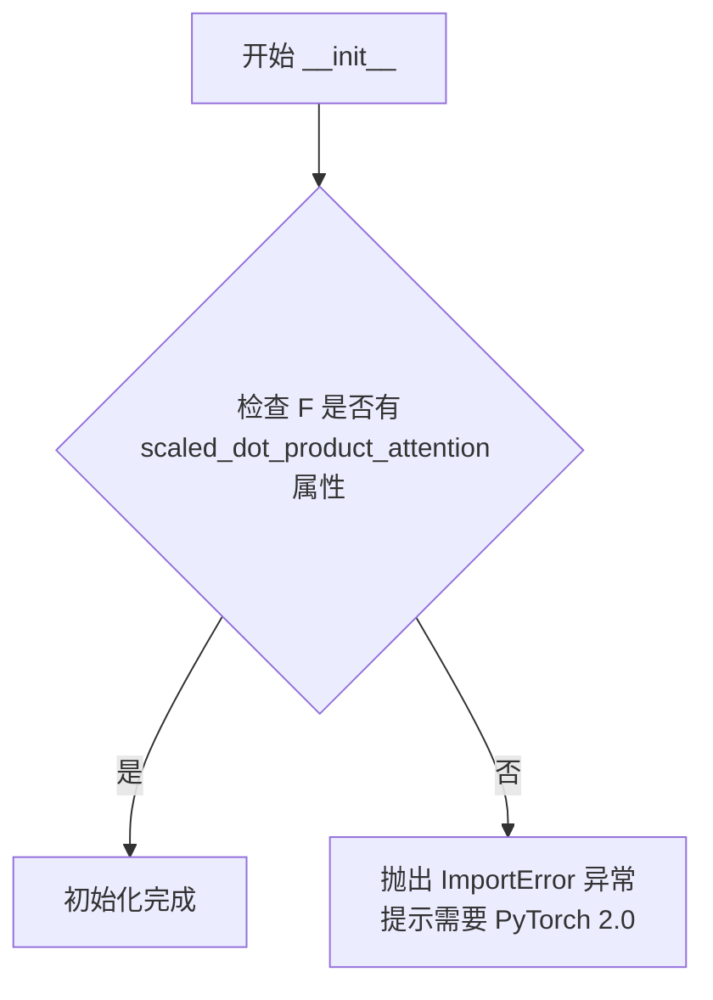

#### 带注释源码

```python
def __init__(self):
    # 检查 PyTorch 是否支持 scaled_dot_product_attention 函数
    # 该函数是 PyTorch 2.0 引入的，用于高效计算注意力机制
    if not hasattr(F, "scaled_dot_product_attention"):
        # 如果不支持，抛出 ImportError 提示用户升级 PyTorch
        raise ImportError(
            "HunyuanVideo15AttnProcessor2_0 requires PyTorch 2.0. To use it, please upgrade PyTorch to 2.0."
        )
```


### `HunyuanVideo15AttnProcessor2_0.__call__`

该方法是 HunyuanVideo 1.5 模型的注意力处理器实现，完成了从输入隐藏状态到注意力输出再到最终投影的完整处理流程，包括 QKV 投影、QK 归一化、旋转位置嵌入应用、条件编码、注意力掩码构建、注意力计算和输出投影等步骤。

参数：

-  `attn`：`Attention`，注意力机制实例，提供投影矩阵（to_q、to_k、to_v 等）和归一化层（norm_q、norm_k 等）
-  `hidden_states`：`torch.Tensor`，输入的隐藏状态张量，形状为 (batch, seq_len, dim)
-  `encoder_hidden_states`：`torch.Tensor | None`，编码器的隐藏状态，用于跨注意力机制，默认为 None
-  `attention_mask`：`torch.Tensor | None`，注意力掩码，用于控制注意力计算中的有效位置，默认为 None
-  `image_rotary_emb`：`torch.Tensor | None`，图像的旋转位置嵌入，用于添加旋转位置信息，默认为 None

返回值：`tuple[torch.Tensor, torch.Tensor | None]`，返回处理后的隐藏状态元组，包含主隐藏状态和编码器隐藏状态（如果有）

#### 流程图

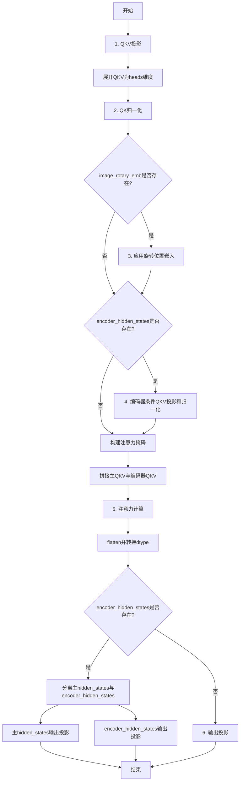

#### 带注释源码

```python
def __call__(
    self,
    attn: Attention,
    hidden_states: torch.Tensor,
    encoder_hidden_states: torch.Tensor | None = None,
    attention_mask: torch.Tensor | None = None,
    image_rotary_emb: torch.Tensor | None = None,
) -> torch.Tensor:
    # 1. QKV projections
    # 使用注意力模块的投影层将隐藏状态投影为Query、Key、Value
    query = attn.to_q(hidden_states)
    key = attn.to_k(hidden_states)
    value = attn.to_v(hidden_states)

    # 将QKV张量从 (batch, seq_len, dim) 展开为 (batch, seq_len, heads, head_dim)
    query = query.unflatten(2, (attn.heads, -1))
    key = key.unflatten(2, (attn.heads, -1))
    value = value.unflatten(2, (attn.heads, -1))

    # 2. QK normalization
    # 对Query和Key进行归一化处理，提高训练稳定性
    query = attn.norm_q(query)
    key = attn.norm_k(key)

    # 3. Rotational positional embeddings applied to latent stream
    # 如果提供了旋转位置嵌入，则应用到Query和Key上
    if image_rotary_emb is not None:
        from ..embeddings import apply_rotary_emb

        # sequence_dim=1 表示在序列维度上应用旋转嵌入
        query = apply_rotary_emb(query, image_rotary_emb, sequence_dim=1)
        key = apply_rotary_emb(key, image_rotary_emb, sequence_dim=1)

    # 4. Encoder condition QKV projection and normalization
    # 如果存在编码器隐藏状态，则进行跨注意力处理
    if encoder_hidden_states is not None:
        # 使用额外的投影层处理编码器隐藏状态
        encoder_query = attn.add_q_proj(encoder_hidden_states)
        encoder_key = attn.add_k_proj(encoder_hidden_states)
        encoder_value = attn.add_v_proj(encoder_hidden_states)

        # 同样展开为多头形式
        encoder_query = encoder_query.unflatten(2, (attn.heads, -1))
        encoder_key = encoder_key.unflatten(2, (attn.heads, -1))
        encoder_value = encoder_value.unflatten(2, (attn.heads, -1))

        # 对编码器的Query和Key进行归一化（如果存在对应层）
        if attn.norm_added_q is not None:
            encoder_query = attn.norm_added_q(encoder_query)
        if attn.norm_added_k is not None:
            encoder_key = attn.norm_added_k(encoder_key)

        # 将主QKV与编码器QKV在序列维度上拼接
        query = torch.cat([query, encoder_query], dim=1)
        key = torch.cat([key, encoder_key], dim=1)
        value = torch.cat([value, encoder_value], dim=1)

    batch_size, seq_len, heads, dim = query.shape
    # 构建注意力掩码：将原始掩码扩展为支持双向注意力的形式
    # 使用F.pad在左侧填充，使掩码长度与序列长度对齐
    attention_mask = F.pad(attention_mask, (seq_len - attention_mask.shape[1], 0), value=True)
    attention_mask = attention_mask.bool()
    # 创建双向注意力掩码：每个位置可以关注所有其他位置
    self_attn_mask_1 = attention_mask.view(batch_size, 1, 1, seq_len).repeat(1, 1, seq_len, 1)
    self_attn_mask_2 = self_attn_mask_1.transpose(2, 3)
    attention_mask = (self_attn_mask_1 & self_attn_mask_2).bool()

    # 5. Attention
    # 调用分发的注意力函数进行注意力计算
    hidden_states = dispatch_attention_fn(
        query,
        key,
        value,
        attn_mask=attention_mask,
        dropout_p=0.0,
        is_causal=False,
        backend=self._attention_backend,
        parallel_config=self._parallel_config,
    )

    # 将输出从 (batch, seq_len, heads, head_dim) 还原为 (batch, seq_len, dim)
    hidden_states = hidden_states.flatten(2, 3)
    hidden_states = hidden_states.to(query.dtype)

    # 6. Output projection
    # 如果存在编码器隐藏状态，需要分离主输出和编码器输出
    if encoder_hidden_states is not None:
        # 分割出主hidden_states和encoder_hidden_states
        hidden_states, encoder_hidden_states = (
            hidden_states[:, : -encoder_hidden_states.shape[1]],
            hidden_states[:, -encoder_hidden_states.shape[1] :],
        )

        # 对主hidden_states进行输出投影（如果存在对应层）
        if getattr(attn, "to_out", None) is not None:
            hidden_states = attn.to_out[0](hidden_states)
            hidden_states = attn.to_out[1](hidden_states)

        # 对encoder_hidden_states进行输出投影（如果存在对应层）
        if getattr(attn, "to_add_out", None) is not None:
            encoder_hidden_states = attn.to_add_out(encoder_hidden_states)

    return hidden_states, encoder_hidden_states
```


### HunyuanVideo15PatchEmbed.__init__

该方法是 HunyuanVideo15PatchEmbed 类的构造函数，用于初始化视频/图像的 3D Patch Embedding 层。它接受 patch 尺寸、输入通道数和嵌入维度作为参数，并创建一个 3D 卷积层来将输入数据转换为 patch 级别的特征表示。

参数：

- `self`：隐式参数，表示类的实例本身
- `patch_size: int | tuple[int, int, int]`，默认值为 16，指定 3D patch 的尺寸。如果为整数，则在时间、高度和宽度维度上使用相同的尺寸；如果是元组，则分别指定 (时间, 高度, 宽度) 三个维度的 patch 大小
- `in_chans: int`，默认值为 3，输入通道数，对于 RGB 图像为 3，对于视频或其他多通道数据可能不同
- `embed_dim: int`，默认值为 768，输出嵌入维度，决定了每个 patch 经过卷积后的特征通道数

返回值：`None`，该方法不返回任何值，仅完成对象的初始化

#### 流程图

```mermaid
flowchart TD
    A[开始 __init__] --> B{传入参数}
    B --> C[调用父类 nn.Module 的 __init__]
    C --> D{patch_size 是整数?}
    D -->|是| E[将 patch_size 转换为元组 (patch_size, patch_size, patch_size)]
    D -->|否| F[保持 patch_size 为元组形式]
    E --> G[创建 nn.Conv3d 卷积层]
    F --> G
    G --> H[将卷积层赋值给 self.proj]
    H --> I[结束 __init__]
```

#### 带注释源码

```python
class HunyuanVideo15PatchEmbed(nn.Module):
    def __init__(
        self,
        patch_size: int | tuple[int, int, int] = 16,
        in_chans: int = 3,
        embed_dim: int = 768,
    ) -> None:
        """
        初始化 HunyuanVideo15PatchEmbed 模块。

        Args:
            patch_size: 3D patch 的尺寸，可以是整数或元组。
                        整数时会在时间、高度、宽度维度使用相同尺寸。
                        元组格式为 (时间, 高度, 宽度)。
            in_chans: 输入数据的通道数，默认为 3（RGB图像）。
            embed_dim: 输出嵌入的维度，默认为 768。
        """
        # 调用父类 nn.Module 的初始化方法
        super().__init__()

        # 如果 patch_size 是整数，则转换为元组 (t, h, w)
        # 否则保持元组形式不变
        patch_size = (patch_size, patch_size, patch_size) if isinstance(patch_size, int) else patch_size

        # 创建 3D 卷积层用于 patch embedding
        # - in_chans: 输入通道数
        # - embed_dim: 输出通道数（即嵌入维度）
        # - kernel_size: 卷积核大小，等于 patch_size，实现非重叠的 patch 划分
        # - stride: 步长，等于 patch_size，确保 patch 之间不重叠
        self.proj = nn.Conv3d(in_chans, embed_dim, kernel_size=patch_size, stride=patch_size)
```


### `HunyuanVideo15PatchEmbed.forward`

该方法实现了视频数据的3D Patch嵌入，将输入的5D张量（批次、通道、时间帧、高度、宽度）通过3D卷积转换为序列嵌入格式，是HunyuanVideo1.5视频Transformer模型的输入预处理核心模块。

参数：

- `hidden_states`：`torch.Tensor`，输入的隐藏状态，形状为 (batch_size, channels, num_frames, height, width)，代表原始视频数据

返回值：`torch.Tensor`，输出形状为 (batch_size, seq_len, embed_dim)，其中 seq_len = (num_frames/patch_size_t) × (height/patch_size) × (width/patch_size)，代表展平后的patch序列

#### 流程图

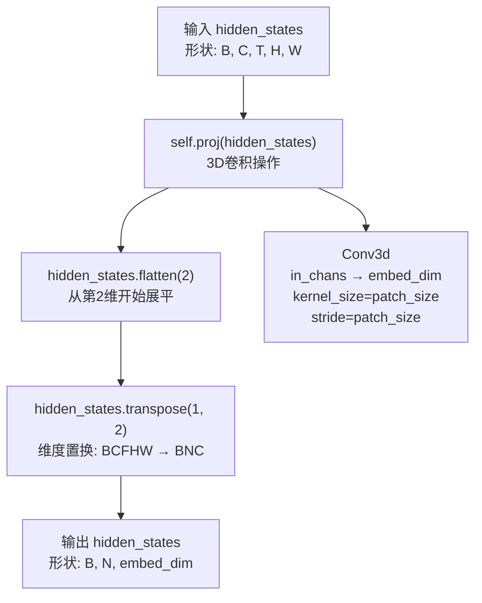

#### 带注释源码

```python
def forward(self, hidden_states: torch.Tensor) -> torch.Tensor:
    """
    前向传播：执行3D Patch嵌入操作
    
    Args:
        hidden_states: 输入张量，形状为 (batch_size, channels, num_frames, height, width)
                     例如：原始视频数据的5D表示
    
    Returns:
        torch.Tensor: 输出张量，形状为 (batch_size, num_patches, embed_dim)
                    其中 num_patches = (num_frames * height * width) / (patch_size_t * patch_size * patch_size)
    """
    # Step 1: 通过3D卷积进行patch嵌入
    # 使用Conv3d将(B, C, T, H, W) -> (B, embed_dim, T/patch_size_t, H/patch_size, W/patch_size)
    # kernel_size和stride都设置为patch_size，实现非重叠的patch提取
    hidden_states = self.proj(hidden_states)
    
    # Step 2: 形状变换 - 从 (B, embed_dim, T, H, W) 转换为 (B, N, embed_dim)
    # flatten(2): 从第2维开始展平，将 (T, H, W) 展平为 (T*H*W,)
    #           结果形状: (B, embed_dim, T*H*W)
    # transpose(1, 2): 交换第1维和第2维
    #           结果形状: (B, T*H*W, embed_dim) = (B, N, embed_dim)
    # 注释: BCFHW -> BNC (Batch, Num_patches, Channels/Embed_dim)
    hidden_states = hidden_states.flatten(2).transpose(1, 2)  # BCFHW -> BNC
    
    return hidden_states
```


### `HunyuanVideo15AdaNorm.__init__`

该方法是 `HunyuanVideo15AdaNorm` 类的构造函数，用于初始化一个自适应归一化（AdaNorm）模块，包含一个线性层和一个 SiLU 非线性激活函数，用于根据时间嵌入（timestep embedding）生成门控参数。

参数：

- `in_features`：`int`，输入特征的维度
- `out_features`：`int | None`，输出特征的维度，默认为 `None`，当为 `None` 时会自动设置为 `2 * in_features`

返回值：`None`，构造函数无返回值

#### 流程图

```mermaid
flowchart TD
    A[开始 __init__] --> B[调用 super().__init__]
    B --> C{out_features is None?}
    C -->|是| D[out_features = 2 * in_features]
    C -->|否| E[使用传入的 out_features]
    D --> F[创建 nn.Linear 层: in_features -> out_features]
    E --> F
    F --> G[创建 nn.SiLU 激活层]
    G --> H[结束 __init__]
```

#### 带注释源码

```python
def __init__(self, in_features: int, out_features: int | None = None) -> None:
    """
    初始化 HunyuanVideo15AdaNorm 模块。
    
    Args:
        in_features (int): 输入特征的维度。
        out_features (int | None): 输出特征的维度。如果为 None，则默认为输入维度的两倍。
    """
    # 调用父类 nn.Module 的初始化方法
    super().__init__()

    # 如果未指定输出维度，则默认设置为输入维度的两倍
    # 这对应于 AdaNorm 机制中需要生成两组门控参数（gate_msa 和 gate_mlp）
    out_features = out_features or 2 * in_features
    
    # 线性层：将时间嵌入从 in_features 维度映射到 out_features 维度
    # 该线性层用于学习门控参数
    self.linear = nn.Linear(in_features, out_features)
    
    # SiLU (Sigmoid Linear Unit) 非线性激活函数
    # SiLU(x) = x * sigmoid(x)，在 AdaNorm 中用于增加非线性变换
    self.nonlinearity = nn.SiLU()
```


### `HunyuanVideo15AdaNorm.forward`

该方法实现了自适应归一化层的正向传播，通过线性变换和SiLU激活函数将时间嵌入向量转换为用于调制注意力（MSA）和前馈网络（MLP）输出的门控系数。

参数：

- `temb`：`torch.Tensor`，时间嵌入向量（time embedding），来自时间步嵌入模块的输出

返回值：`tuple[torch.Tensor, torch.Tensor]`，返回两个门控系数 — `gate_msa`用于调制多头自注意力模块的输出，`gate_mlp`用于调制前馈网络模块的输出

#### 流程图

```mermaid
flowchart TD
    A[输入: temb] --> B[linear层]
    B --> C[SiLU非线性激活]
    C --> D[chunk操作: 按维度1分成2份]
    D --> E[unsqueeze: 扩展维度]
    E --> F[gate_msa: MSA门控系数]
    E --> G[gate_mlp: MLP门控系数]
    F --> H[返回: (gate_msa, gate_mlp)]
    G --> H
```

#### 带注释源码

```
def forward(
    self, temb: torch.Tensor
) -> tuple[torch.Tensor, torch.Tensor, torch.Tensor, torch.Tensor, torch.Tensor]:
    # 步骤1: 线性变换 + SiLU激活
    # 将输入的时间嵌入从 in_features 维度映射到 out_features（默认是2*in_features）
    # 这是AdaNorm的核心：让归一化层能够根据时间步动态调整
    temb = self.linear(self.nonlinearity(temb))
    
    # 步骤2: 门控系数切分
    # 将变换后的 temb 按通道维度（dim=1）均分成两部分
    # 前半部分用于控制注意力模块，后半部分用于控制前馈网络
    gate_msa, gate_mlp = temb.chunk(2, dim=1)
    
    # 步骤3: 维度扩展
    # 将门控系数从 [batch, channels] 扩展为 [batch, 1, channels]
    # 便于后续与注意力/FFN的输出进行逐元素乘法（broadcasting）
    gate_msa, gate_mlp = gate_msa.unsqueeze(1), gate_mlp.unsqueeze(1)
    
    # 返回两个门控系数，分别用于:
    # - gate_msa: 乘以多头自注意力(Multi-Head Self-Attention)输出
    # - gate_mlp: 乘以前馈网络(Feed-Forward Network)输出
    return gate_msa, gate_mlp
```


### `HunyuanVideo15TimeEmbedding.__init__`

这是 HunyuanVideo 1.5 模型的时间嵌入层初始化方法，用于创建时间步嵌入模块，支持标准时间嵌入和可选的 MeanFlow 参考时间嵌入（用于超分辨率模型）。

参数：

- `embedding_dim`：`int`，输出嵌入的维度
- `use_meanflow`：`bool`，是否启用 MeanFlow 模式，默认为 False

返回值：`None`（`__init__` 方法无返回值）

#### 流程图

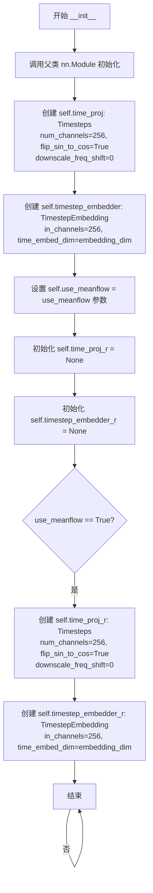

#### 带注释源码

```python
class HunyuanVideo15TimeEmbedding(nn.Module):
    r"""
    Time embedding for HunyuanVideo 1.5.

    Supports standard timestep embedding and optional reference timestep embedding for MeanFlow-based super-resolution
    models.

    Args:
        embedding_dim (`int`):
            The dimension of the output embedding.
    """

    def __init__(self, embedding_dim: int, use_meanflow: bool = False):
        """
        初始化时间嵌入模块。

        Args:
            embedding_dim: 输出嵌入的维度
            use_meanflow: 是否启用 MeanFlow 模式（用于超分辨率模型）
        """
        # 调用父类 nn.Module 的初始化方法
        super().__init__()

        # 创建标准时间投影器：将时间步转换为256维表示
        # flip_sin_to_cos=True 表示使用 cos-sin 交替的旋转位置编码
        # downscale_freq_shift=0 表示不进行频率偏移
        self.time_proj = Timesteps(num_channels=256, flip_sin_to_cos=True, downscale_freq_shift=0)
        
        # 创建标准时间嵌入器：将256维投影转换为 embedding_dim 维
        self.timestep_embedder = TimestepEmbedding(in_channels=256, time_embed_dim=embedding_dim)

        # 保存是否使用 MeanFlow 的标志
        self.use_meanflow = use_meanflow
        
        # 初始化参考时间投影器和嵌入器为 None
        self.time_proj_r = None
        self.timestep_embedder_r = None
        
        # 如果启用 MeanFlow 模式，创建额外的参考时间嵌入组件
        # 这用于基于 MeanFlow 的超分辨率模型
        if use_meanflow:
            self.time_proj_r = Timesteps(num_channels=256, flip_sin_to_cos=True, downscale_freq_shift=0)
            self.timestep_embedder_r = TimestepEmbedding(in_channels=256, time_embed_dim=embedding_dim)
```


### `HunyuanVideo15TimeEmbedding.forward`

该方法实现了 HunyuanVideo 1.5 模型的时间嵌入层，支持标准时间步嵌入和基于 MeanFlow 的超分辨率模型的参考时间步嵌入。它将输入的时间步转换为高维嵌入向量，支持可选的参考时间步嵌入进行累加。

参数：

- `self`：隐式参数，指向类实例本身
- `timestep`：`torch.Tensor`，主时间步张量，通常为模型的当前推理时间步
- `timestep_r`：`torch.Tensor | None`，可选的参考时间步张量，用于 MeanFlow-based 超分辨率模型，当 `use_meanflow=True` 时使用

返回值：`torch.Tensor`，经过投影和嵌入后的时间嵌入向量，维度为 `(batch_size, embedding_dim)`

#### 流程图

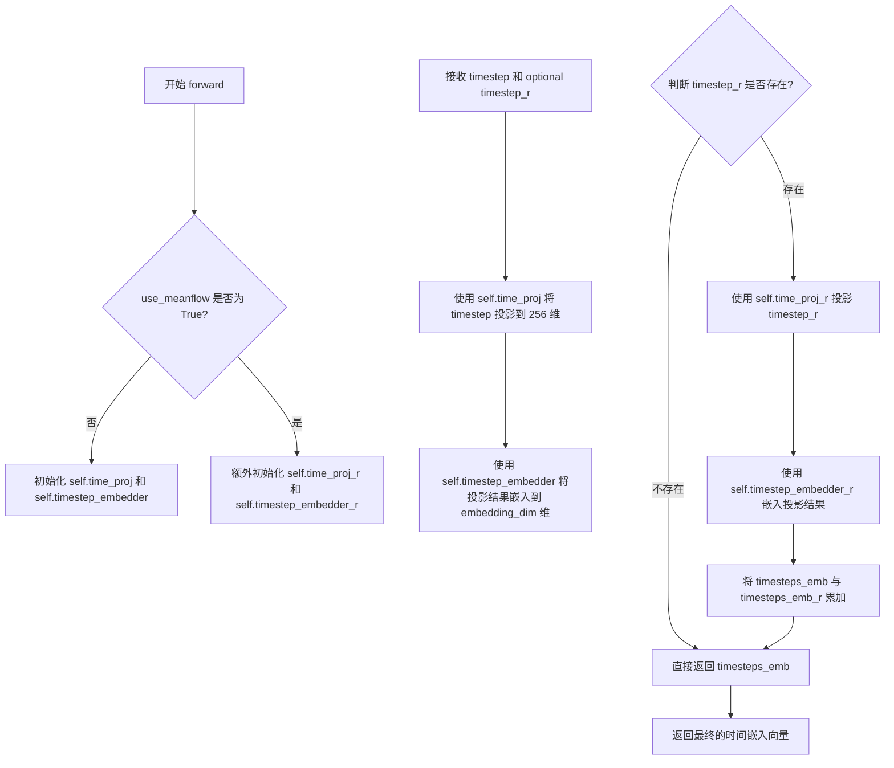

#### 带注释源码

```python
def forward(
    self,
    timestep: torch.Tensor,
    timestep_r: torch.Tensor | None = None,
) -> torch.Tensor:
    # 1. 主时间步投影：使用 self.time_proj 将原始时间步张量投影到 256 维的中间表示
    #    Timesteps 类内部通常使用正弦/余弦位置编码将标量时间步转换为周期性的 256 维向量
    timesteps_proj = self.time_proj(timestep)
    
    # 2. 主时间步嵌入：使用 TimestepEmbedding 将 256 维投影结果进一步映射到目标嵌入维度 embedding_dim
    #    这是一个线性层后接激活函数的全连接层，负责学习更抽象的时间特征表示
    timesteps_emb = self.timestep_embedder(timesteps_proj.to(dtype=timestep.dtype))
    
    # 3. 可选的参考时间步处理：如果提供了 timestep_r（用于 MeanFlow 超分辨率模型）
    #    则同样对其进行投影和嵌入，然后与主时间步嵌入相加
    if timestep_r is not None:
        # 使用独立的参考时间步投影器处理参考时间步
        timesteps_proj_r = self.time_proj_r(timestep_r)
        # 使用独立的参考时间步嵌入器进行嵌入
        timesteps_emb_r = self.timestep_embedder_r(timesteps_proj_r.to(dtype=timestep.dtype))
        # 将主时间步嵌入与参考时间步嵌入相加，实现条件融合
        timesteps_emb = timesteps_emb + timesteps_emb_r
    
    # 4. 返回最终的时间嵌入向量，该向量将作为后续 Transformer 块的调制信号（temb）
    return timesteps_emb
```


### `HunyuanVideo15IndividualTokenRefinerBlock.__init__`

该方法是 `HunyuanVideo15IndividualTokenRefinerBlock` 类的构造函数，用于初始化一个包含自注意力机制和前馈网络的Token精炼块。该块采用预归一化架构（Pre-norm），通过AdaLayerNormContinuous进行时间步长条件调制，是HunyuanVideo1.5模型中Token Refiner的核心组成单元。

参数：

- `num_attention_heads`：`int`，注意力头的数量，决定多头注意力机制的并行分支数
- `attention_head_dim`：`int`，每个注意力头的维度，决定每个头的特征表示宽度
- `mlp_width_ratio`：`str = 4.0`，MLP宽度比率，控制前馈网络隐藏层维度相对于输入维度的扩展倍数（注意类型标注为str但实际使用为float）
- `mlp_drop_rate`：`float = 0.0`，前馈网络的Dropout概率，用于正则化
- `attention_bias`：`bool = True`，是否在注意力投影中引入偏置项

返回值：`None`，该方法为构造函数，不返回任何值

#### 流程图

```mermaid
flowchart TD
    A[开始 __init__] --> B[调用 super().__init__]
    B --> C[计算 hidden_size = num_attention_heads * attention_head_dim]
    C --> D[创建 norm1: LayerNorm]
    D --> E[创建 attn: Attention]
    E --> F[创建 norm2: LayerNorm]
    F --> G[创建 ff: FeedForward]
    G --> H[创建 norm_out: HunyuanVideo15AdaNorm]
    H --> I[结束 __init__]
```

#### 带注释源码

```python
def __init__(
    self,
    num_attention_heads: int,
    attention_head_dim: int,
    mlp_width_ratio: str = 4.0,
    mlp_drop_rate: float = 0.0,
    attention_bias: bool = True,
) -> None:
    """初始化 HunyuanVideo15IndividualTokenRefinerBlock 模块
    
    参数:
        num_attention_heads: 注意力头的数量
        attention_head_dim: 每个注意力头的维度
        mlp_width_ratio: MLP隐藏层宽度相对于输入的比率
        mlp_drop_rate: MLP的dropout比率
        attention_bias: 是否在注意力投影中使用偏置
    """
    # 调用父类 nn.Module 的初始化方法
    super().__init__()

    # 计算隐藏层维度：头的数量 × 头的维度 = 总隐藏维度
    hidden_size = num_attention_heads * attention_head_dim

    # 第一个预归一化层（Pre-norm），用于自注意力之前
    self.norm1 = nn.LayerNorm(hidden_size, elementwise_affine=True, eps=1e-6)
    
    # 自注意力层
    # - query_dim: 查询维度，等于隐藏层大小
    # - cross_attention_dim: 交叉注意力维度，None表示纯自注意力
    # - heads: 注意力头数量
    # - dim_head: 每个头的维度
    # - bias: 是否使用偏置
    self.attn = Attention(
        query_dim=hidden_size,
        cross_attention_dim=None,
        heads=num_attention_heads,
        dim_head=attention_head_dim,
        bias=attention_bias,
    )

    # 第二个预归一化层，用于前馈网络之前
    self.norm2 = nn.LayerNorm(hidden_size, elementwise_affine=True, eps=1e-6)
    
    # 前馈网络层
    # - 使用 linear-silu 激活函数（等效于 Swish/GELU近似）
    # - mult 参数控制隐藏层宽度扩展
    # - dropout 用于正则化
    self.ff = FeedForward(hidden_size, mult=mlp_width_ratio, activation_fn="linear-silu", dropout=mlp_drop_rate)

    # 输出层的Ada归一化，用于时间步长条件调制
    # 输出维度为 2 * hidden_size，用于分别生成 MSA gate 和 MLP gate
    self.norm_out = HunyuanVideo15AdaNorm(hidden_size, 2 * hidden_size)
```


### `HunyuanVideo15IndividualTokenRefinerBlock.forward`

该方法是 HunyuanVideo 1.5 模型中单个 Token Refiner 块的前向传播函数，负责对输入的隐藏状态进行自注意力处理和前馈网络变换，并通过 AdaNorm 机制根据时间嵌入调制信息流。

参数：

- `hidden_states`：`torch.Tensor`，输入的隐藏状态张量，形状为 (batch_size, seq_len, hidden_size)
- `temb`：`torch.Tensor`，时间嵌入向量，用于 AdaNorm 调制
- `attention_mask`：`torch.Tensor | None`，可选的注意力掩码，用于屏蔽特定位置的注意力计算

返回值：`torch.Tensor`，经过去归一化、自注意力、前馈网络和 AdaNorm 调制处理后的隐藏状态张量

#### 流程图

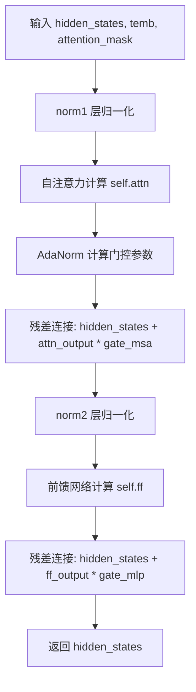

#### 带注释源码

```python
def forward(
    self,
    hidden_states: torch.Tensor,
    temb: torch.Tensor,
    attention_mask: torch.Tensor | None = None,
) -> torch.Tensor:
    # 第一步：对输入隐藏状态进行 LayerNorm 归一化
    norm_hidden_states = self.norm1(hidden_states)

    # 第二步：自注意力计算
    # 调用 Attention 模块，encoder_hidden_states 为 None（纯自注意力）
    # attention_mask 用于屏蔽不需要计算注意力的位置
    attn_output = self.attn(
        hidden_states=norm_hidden_states,
        encoder_hidden_states=None,
        attention_mask=attention_mask,
    )

    # 第三步：AdaNorm 计算门控参数
    # HunyuanVideo15AdaNorm 将时间嵌入转换为两个门控向量：gate_msa 和 gate_mlp
    # gate_msa 用于调制自注意力输出，gate_mlp 用于调制前馈网络输出
    gate_msa, gate_mlp = self.norm_out(temb)
    
    # 第四步：残差连接 + 门控调制
    # 将自注意力输出乘以门控向量 gate_msa，然后加到原始隐藏状态
    hidden_states = hidden_states + attn_output * gate_msa

    # 第五步：对残差结果进行第二次 LayerNorm 归一化
    ff_output = self.ff(self.norm2(hidden_states))

    # 第六步：残差连接 + 门控调制
    # 将前馈网络输出乘以门控向量 gate_mlp，然后加到隐藏状态
    hidden_states = hidden_states + ff_output * gate_mlp

    # 返回最终处理后的隐藏状态
    return hidden_states
```


### HunyuanVideo15IndividualTokenRefiner.__init__

该方法是 `HunyuanVideo15IndividualTokenRefiner` 类的构造函数，用于初始化一个由多个 Token 细化块（Refiner Blocks）组成的神经网络模块。该模块主要用于腾讯 HunyuanVideo 1.5 视频生成模型中的 Token 优化处理，通过堆叠多个注意力块来逐步精炼特征表示。

参数：

- `num_attention_heads`：`int`，多头注意力机制中的注意力头数量，决定了模型并行处理信息的能力
- `attention_head_dim`：`int`，每个注意力头的维度，影响每个头的表示能力
- `num_layers`：`int`，要堆叠的细化块数量，决定了网络的深度
- `mlp_width_ratio`：`float`，MLP 前馈网络宽度的扩展比例，默认为 4.0，用于控制隐藏层维度
- `mlp_drop_rate`：`float`，MLP 层的 Dropout 概率，用于正则化防止过拟合，默认为 0.0
- `attention_bias`：`bool`，是否在注意力机制中使用偏置项，默认为 True

返回值：`None`，构造函数不返回值，仅初始化对象状态

#### 流程图

```mermaid
flowchart TD
    A[开始 __init__] --> B[调用 super().__init__ 初始化基类]
    B --> C[计算隐藏层大小<br/>hidden_size = num_attention_heads × attention_head_dim]
    C --> D[循环创建 num_layers 个 HunyuanVideo15IndividualTokenRefinerBlock]
    D --> E[每个 Block 使用相同参数:<br/>- num_attention_heads<br/>- attention_head_dim<br/>- mlp_width_ratio<br/>- mlp_drop_rate<br/>- attention_bias]
    E --> F[将所有 Block 封装为 nn.ModuleList]
    F --> G[赋值给 self.refiner_blocks]
    G --> H[结束 __init__]
```

#### 带注释源码

```python
class HunyuanVideo15IndividualTokenRefiner(nn.Module):
    """
    Token 细化器模块，由多个细化块组成，用于逐步精炼特征表示。
    主要应用于 HunyuanVideo 1.5 视频生成模型的 token 处理流程中。
    """
    
    def __init__(
        self,
        num_attention_heads: int,          # 多头注意力中的头数量
        attention_head_dim: int,            # 每个注意力头的维度
        num_layers: int,                    # 细化块堆叠的层数
        mlp_width_ratio: float = 4.0,       # MLP 宽度扩展比例，控制前馈网络隐藏层大小
        mlp_drop_rate: float = 0.0,         # MLP 层的 Dropout 概率
        attention_bias: bool = True,        # 是否在注意力投影中使用偏置
    ) -> None:
        # 调用 nn.Module 基类的初始化方法，注册所有子模块
        super().__init__()
        
        # 计算隐藏层维度：注意力头数 × 每头维度 = 总隐藏大小
        # 这是 Transformer 架构中的标准做法
        hidden_size = num_attention_heads * attention_head_dim
        
        # 创建多个细化块（Refiner Blocks）的模块列表
        # 每个块包含：自注意力层 + 前馈网络 + AdaNorm 调制
        self.refiner_blocks = nn.ModuleList(
            [
                # 为每一层创建独立的 Refiner Block 实例
                HunyuanVideo15IndividualTokenRefinerBlock(
                    num_attention_heads=num_attention_heads,    # 传递注意力头数量
                    attention_head_dim=attention_head_dim,     # 传递每头维度
                    mlp_width_ratio=mlp_width_ratio,            # 传递 MLP 宽度比例
                    mlp_drop_rate=mlp_drop_rate,                # 传递 Dropout 率
                    attention_bias=attention_bias,              # 传递偏置开关
                )
                # 循环创建 num_layers 个相同的块结构
                for _ in range(num_layers)
            ]
        )
        # 注意：self.refiner_blocks 会自动被 nn.Module 注册为子模块
        # 这样模型的参数会被正确追踪和保存
```


### HunyuanVideo15IndividualTokenRefiner.forward

该方法是 HunyuanVideo15IndividualTokenRefiner 类的前向传播函数，负责对输入的 token embeddings 进行细化处理。它通过一系列堆叠的 Refiner Blocks 对 hidden_states 进行逐层处理，每一层都包含自注意力机制和前馈网络，同时结合时间嵌入（temb）进行调制，最终输出细化后的隐藏状态。

参数：

- `hidden_states`：`torch.Tensor`，输入的隐藏状态张量，通常是经过投影的 token embeddings，形状为 (batch_size, seq_len, hidden_dim)
- `temb`：`torch.Tensor`，时间嵌入向量，用于调节自注意力和前馈网络的门控机制，形状为 (batch_size, hidden_dim)
- `attention_mask`：`torch.Tensor | None`，可选的注意力掩码，用于控制 token 之间的注意力连接，形状为 (batch_size, seq_len)

返回值：`torch.Tensor`，细化处理后的隐藏状态张量，形状与输入 hidden_states 相同 (batch_size, seq_len, hidden_dim)

#### 流程图

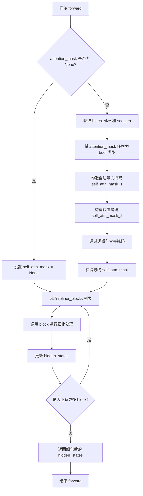

#### 带注释源码

```python
def forward(
    self,
    hidden_states: torch.Tensor,
    temb: torch.Tensor,
    attention_mask: torch.Tensor | None = None,
) -> None:
    """
    HunyuanVideo15IndividualTokenRefiner 的前向传播方法
    
    参数:
        hidden_states: 输入的隐藏状态张量，形状为 (batch_size, seq_len, hidden_dim)
        temb: 时间嵌入向量，用于门控调制
        attention_mask: 可选的注意力掩码
    
    返回:
        hidden_states: 细化后的隐藏状态
    """
    # 初始化自注意力掩码为 None
    self_attn_mask = None
    
    # 如果提供了注意力掩码，则进行掩码处理
    if attention_mask is not None:
        # 获取批次大小和序列长度
        batch_size = attention_mask.shape[0]
        seq_len = attention_mask.shape[1]
        
        # 将掩码移动到 hidden_states 所在设备，并转换为布尔类型
        attention_mask = attention_mask.to(hidden_states.device).bool()
        
        # 调整掩码维度以适应自注意力计算
        # 从 (batch_size, seq_len) 扩展为 (batch_size, 1, 1, seq_len) 然后重复
        self_attn_mask_1 = attention_mask.view(batch_size, 1, 1, seq_len).repeat(1, 1, seq_len, 1)
        
        # 转置以创建对称掩码
        self_attn_mask_2 = self_attn_mask_1.transpose(2, 3)
        
        # 通过逻辑与运算合并掩码，确保双向注意力
        self_attn_mask = (self_attn_mask_1 & self_attn_mask_2).bool()

    # 遍历所有 Refiner Blocks 进行逐层细化
    for block in self.refiner_blocks:
        hidden_states = block(hidden_states, temb, self_attn_mask)

    # 返回细化后的隐藏状态
    return hidden_states
```


### HunyuanVideo15TokenRefiner.__init__

该方法是 HunyuanVideo15TokenRefiner 类的构造函数，负责初始化视频Transformer模型中的Token Refiner（令牌精炼器）组件。它创建时间-文本嵌入层、输入投影层以及多个IndividualTokenRefiner块，用于对输入的token进行细粒度的特征提取和增强。

参数：

- `self`：隐式参数，类实例本身
- `in_channels`：`int`，输入通道数，指定输入特征的维度
- `num_attention_heads`：`int`，注意力头的数量，用于多头注意力机制
- `attention_head_dim`：`int`，每个注意力头的维度
- `num_layers`：`int`，Token Refiner的层数
- `mlp_ratio`：`float = 4.0`，MLP宽度比率，隐藏层维度与输入维度的比值
- `mlp_drop_rate`：`float = 0.0`，MLP层的Dropout概率
- `attention_bias`：`bool = True`，是否在注意力层使用偏置项

返回值：`None`，构造函数不返回任何值

#### 流程图

```mermaid
flowchart TD
    A[开始 __init__] --> B[调用 super().__init__]
    B --> C[计算 hidden_size = num_attention_heads * attention_head_dim]
    C --> D[创建 CombinedTimestepTextProjEmbeddings]
    D --> E[创建 nn.Linear 投影层 proj_in]
    E --> F[创建 HunyuanVideo15IndividualTokenRefiner]
    F --> G[结束 __init__]
```

#### 带注释源码

```python
def __init__(
    self,
    in_channels: int,
    num_attention_heads: int,
    attention_head_dim: int,
    num_layers: int,
    mlp_ratio: float = 4.0,
    mlp_drop_rate: float = 0.0,
    attention_bias: bool = True,
) -> None:
    """
    初始化 HunyuanVideo15TokenRefiner 类。
    
    Args:
        in_channels: 输入通道数
        num_attention_heads: 注意力头数量
        attention_head_dim: 注意力头维度
        num_layers: Refiner块的数量
        mlp_ratio: MLP宽度比率
        mlp_drop_rate: MLP Dropout率
        attention_bias: 是否使用注意力偏置
    """
    super().__init__()  # 调用父类 nn.Module 的初始化方法

    # 计算隐藏层大小 = 注意力头数 * 每头维度
    hidden_size = num_attention_heads * attention_head_dim

    # 创建时间-文本联合嵌入层，用于编码时间步和文本池化投影
    self.time_text_embed = CombinedTimestepTextProjEmbeddings(
        embedding_dim=hidden_size, pooled_projection_dim=in_channels
    )
    
    # 创建输入投影层，将输入特征映射到隐藏空间
    self.proj_in = nn.Linear(in_channels, hidden_size, bias=True)
    
    # 创建Individual Token Refiner，包含多个Refiner块
    self.token_refiner = HunyuanVideo15IndividualTokenRefiner(
        num_attention_heads=num_attention_heads,
        attention_head_dim=attention_head_dim,
        num_layers=num_layers,
        mlp_width_ratio=mlp_ratio,
        mlp_drop_rate=mlp_drop_rate,
        attention_bias=attention_bias,
    )
```


### `HunyuanVideo15TokenRefiner.forward`

该方法是 HunyuanVideo15 的 Token Refiner 前向传播函数，负责对文本/条件嵌入进行时间步条件化的细化和增强。它通过 CombinedTimestepTextProjEmbeddings 将时间步和池化的隐藏状态结合，然后通过多个 IndividualTokenRefiner 块进行特征细化，最后返回细化后的隐藏状态。

参数：

- `hidden_states`：`torch.Tensor`，输入的隐藏状态（文本嵌入或条件嵌入）
- `timestep`：`torch.LongTensor`，时间步张量，用于条件化生成过程
- `attention_mask`：`torch.LongTensor | None`，注意力掩码，用于指定哪些 token 是有效的（可选）

返回值：`torch.Tensor`，细化后的隐藏状态

#### 流程图

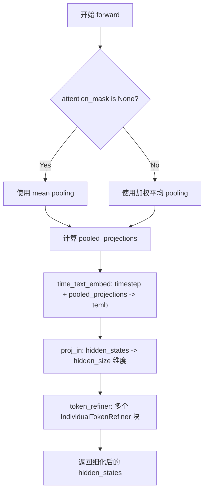

#### 带注释源码

```python
def forward(
    self,
    hidden_states: torch.Tensor,
    timestep: torch.LongTensor,
    attention_mask: torch.LongTensor | None = None,
) -> torch.Tensor:
    # 1. 根据是否有 attention_mask 计算池化投影
    # 如果没有掩码，使用简单的平均池化
    if attention_mask is None:
        pooled_projections = hidden_states.mean(dim=1)
    else:
        # 如果有掩码，使用加权平均池化，只考虑有效 token
        original_dtype = hidden_states.dtype
        mask_float = attention_mask.float().unsqueeze(-1)
        pooled_projections = (hidden_states * mask_float).sum(dim=1) / mask_float.sum(dim=1)
        pooled_projections = pooled_projections.to(original_dtype)

    # 2. 时间步和文本嵌入的联合嵌入
    # 将时间步信息和池化的投影信息结合，生成条件嵌入 temb
    temb = self.time_text_embed(timestep, pooled_projections)

    # 3. 输入投影
    # 将输入从 in_channels 维度投影到 hidden_size 维度
    hidden_states = self.proj_in(hidden_states)

    # 4. Token Refiner 处理
    # 通过多个 IndividualTokenRefiner 块进行特征细化
    # 这些块会结合 temb 条件进行注意力计算和前馈网络处理
    hidden_states = self.token_refiner(hidden_states, temb, attention_mask)

    # 5. 返回细化后的隐藏状态
    return hidden_states
```


### `HunyuanVideo15RotaryPosEmbed.__init__`

该方法是 `HunyuanVideo15RotaryPosEmbed` 类的初始化函数，用于配置旋转位置嵌入（Rotary Position Embedding）的核心参数，包括空间和时间 patch 大小、RoPE 维度以及旋转角度基础值，为后续前向传播中生成 3D 旋转位置编码做好准备。

参数：

- `self`：隐含参数，继承自 `nn.Module`，表示当前类的实例对象
- `patch_size`：`int`，空间方向的 patch 尺寸，用于将图像划分为网格
- `patch_size_t`：`int`，时间方向的 patch 尺寸，用于将视频帧序列划分为网格
- `rope_dim`：`list[int]`，各轴向（时间、高度、宽度）的旋转位置嵌入维度列表
- `theta`：`float`，旋转位置嵌入的频率基础参数，默认值为 256.0

返回值：`None`，无返回值（`__init__` 方法）

#### 流程图

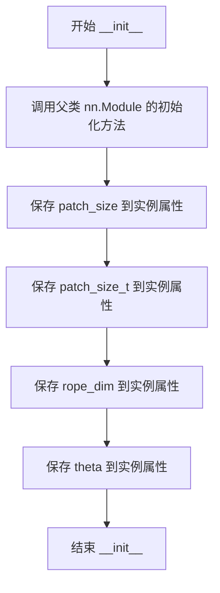

#### 带注释源码

```python
class HunyuanVideo15RotaryPosEmbed(nn.Module):
    def __init__(
        self, 
        patch_size: int,               # 空间方向 patch 大小（如 2x2）
        patch_size_t: int,             # 时间方向 patch 大小（如 1）
        rope_dim: list[int],           # 各轴向 RoPE 维度 [T_dim, H_dim, W_dim]
        theta: float = 256.0           # 旋转角度基础值，控制频率
    ) -> None:
        """
        初始化旋转位置嵌入模块的配置参数。
        
        参数:
            patch_size: 空间 patch 尺寸，用于计算网格分辨率
            patch_size_t: 时间 patch 尺寸，用于计算时间维度分辨率
            rope_dim: 三轴向的 RoPE 维度列表
            theta: 旋转位置嵌入的基础频率参数
        """
        # 调用父类 nn.Module 的初始化方法，注册所有子模块和参数
        super().__init__()

        # 存储空间 patch 大小，用于前向传播时计算分辨率
        self.patch_size = patch_size
        
        # 存储时间 patch 大小，用于前向传播时计算时间维度分辨率
        self.patch_size_t = patch_size_t
        
        # 存储各轴向 RoPE 维度，用于生成不同频率的旋转编码
        self.rope_dim = rope_dim
        
        # 存储旋转角度参数，控制正弦余弦函数的频率衰减
        self.theta = theta
```


### `HunyuanVideo15RotaryPosEmbed.forward`

该方法用于生成三维视频数据的旋转位置嵌入（Rotary Position Embedding），通过计算时间、空间维度的频率网格，并结合 `get_1d_rotary_pos_embed` 函数生成用于注意力机制的位置编码信息。

参数：

-  `hidden_states`：`torch.Tensor`，输入的张量，形状为 (batch_size, num_channels, num_frames, height, width)，包含视频潜在表示

返回值：`tuple[torch.Tensor, torch.Tensor]`，返回两个张量元组：(freqs_cos, freqs_sin)，分别为旋转位置嵌入的余弦和正弦部分，形状均为 (W * H * T, D / 2)

#### 流程图

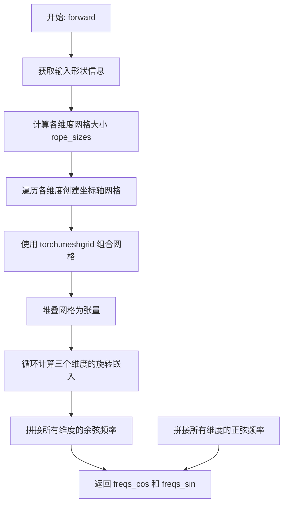

#### 带注释源码

```python
def forward(self, hidden_states: torch.Tensor) -> torch.Tensor:
    # 1. 从输入张量中提取批量大小、通道数、帧数、高度和宽度
    batch_size, num_channels, num_frames, height, width = hidden_states.shape
    
    # 2. 计算每个维度的网格大小（视频帧数/时间patch大小，高度/空间patch大小，宽度/空间patch大小）
    rope_sizes = [num_frames // self.patch_size_t, height // self.patch_size, width // self.patch_size]

    # 3. 为每个维度创建坐标轴网格
    axes_grids = []
    for i in range(len(rope_sizes)):
        # 注意：此处与原始实现略有不同，直接在设备上创建网格
        # 原始实现在CPU上创建后再移动到设备，会产生数值差异
        grid = torch.arange(0, rope_sizes[i], device=hidden_states.device, dtype=torch.float32)
        axes_grids.append(grid)
    
    # 4. 使用 meshgrid 组合所有维度的网格，产生三维网格坐标 [W, H, T]
    grid = torch.meshgrid(*axes_grids, indexing="ij")
    # 5. 将网格堆叠为形状 [3, W, H, T] 的张量
    grid = torch.stack(grid, dim=0)

    # 6. 对三个维度分别计算旋转位置嵌入
    freqs = []
    for i in range(3):
        # 调用辅助函数获取一维旋转位置嵌入
        freq = get_1d_rotary_pos_embed(self.rope_dim[i], grid[i].reshape(-1), self.theta, use_real=True)
        freqs.append(freq)

    # 7. 拼接所有维度的余弦和正弦频率
    freqs_cos = torch.cat([f[0] for f in freqs], dim=1)  # 形状: (W * H * T, D / 2)
    freqs_sin = torch.cat([f[1] for f in freqs], dim=1)  # 形状: (W * H * T, D / 2)
    
    # 8. 返回余弦和正弦频率元组
    return freqs_cos, freqs_sin
```


### HunyuanVideo15ByT5TextProjection.__init__

该方法是 HunyuanVideo 1.5 模型中用于 T5 文本投影的初始化方法，通过多层感知器（MLP）结构将 T5 文本编码器的隐藏状态投影到目标维度，包含层归一化和 GELU 激活函数。

参数：

- `self`：隐式参数，类实例本身
- `in_features`：`int`，输入特征的维度，即 T5 文本编码器输出隐藏状态的维度
- `hidden_size`：`int`，隐藏层的维度，用于第一层和第二层线性变换
- `out_features`：`int`，输出特征的维度，即投影后文本嵌入的目标维度

返回值：无（`None`），该方法为构造函数，仅初始化模块结构

#### 流程图

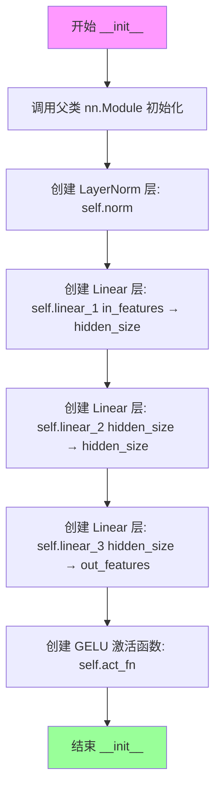

#### 带注释源码

```python
def __init__(self, in_features: int, hidden_size: int, out_features: int):
    """
    初始化 T5 文本投影模块
    
    Args:
        in_features: 输入特征维度 (T5 文本编码器输出维度)
        hidden_size: 隐藏层维度
        out_features: 输出特征维度 (目标投影维度)
    """
    # 调用父类 nn.Module 的初始化方法
    super().__init__()
    
    # 层归一化，用于稳定训练
    self.norm = nn.LayerNorm(in_features)
    
    # 第一个线性变换: in_features -> hidden_size
    self.linear_1 = nn.Linear(in_features, hidden_size)
    
    # 第二个线性变换: hidden_size -> hidden_size (保持维度)
    self.linear_2 = nn.Linear(hidden_size, hidden_size)
    
    # 第三个线性变换: hidden_size -> out_features
    self.linear_3 = nn.Linear(hidden_size, out_features)
    
    # GELU 激活函数，提供非线性变换
    self.act_fn = nn.GELU()
```


### `HunyuanVideo15ByT5TextProjection.forward`

该方法是 HunyuanVideo15ByT5TextProjection 类的forward方法，用于将T5文本编码器的输出投影到Transformer的隐藏空间。它通过三层线性变换（带LayerNorm和GELU激活函数）对文本嵌入进行非线性变换和维度映射，以适配后续双流Transformer模块的输入维度需求。

参数：

- `encoder_hidden_states`：`torch.Tensor`，来自T5文本编码器的隐藏状态，通常维度为 `(batch_size, seq_len, text_embed_2_dim)`

返回值：`torch.Tensor`，投影后的文本隐藏状态，维度为 `(batch_size, seq_len, hidden_size)`

#### 流程图

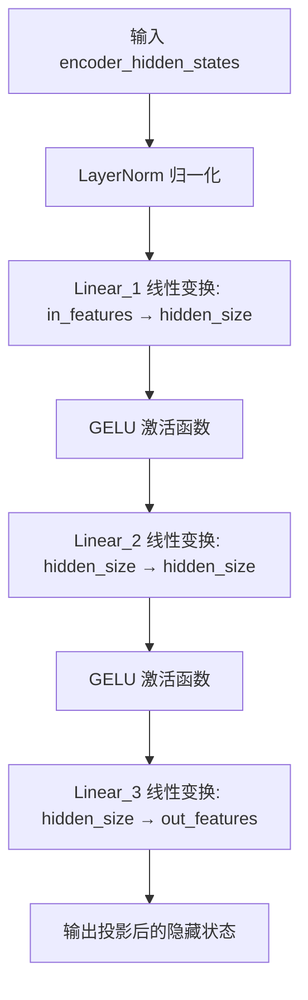

#### 带注释源码

```python
def forward(self, encoder_hidden_states: torch.Tensor) -> torch.Tensor:
    """
    前向传播：将T5文本编码器的输出投影到Transformer的隐藏空间
    
    参数:
        encoder_hidden_states: 来自T5文本编码器的隐藏状态张量
        
    返回:
        投影后的隐藏状态张量
    """
    # 1. LayerNorm 归一化输入
    hidden_states = self.norm(encoder_hidden_states)
    
    # 2. 第一层线性变换：扩展到隐藏维度
    hidden_states = self.linear_1(hidden_states)
    
    # 3. GELU 激活函数
    hidden_states = self.act_fn(hidden_states)
    
    # 4. 第二层线性变换：保持隐藏维度
    hidden_states = self.linear_2(hidden_states)
    
    # 5. GELU 激活函数
    hidden_states = self.act_fn(hidden_states)
    
    # 6. 第三层线性变换：投影到目标输出维度
    hidden_states = self.linear_3(hidden_states)
    
    # 7. 返回最终投影结果
    return hidden_states
```


### `HunyuanVideo15ImageProjection.__init__`

该方法是 HunyuanVideo15ImageProjection 类的初始化构造函数，用于构建图像嵌入投影模块。该模块接收图像嵌入向量，通过两层线性变换和非线性激活以及层归一化处理，将输入的图像嵌入投影到隐藏空间。

参数：

- `self`：`HunyuanVideoImageProjection`，HunyuanVideo15ImageProjection 类实例（隐式参数）
- `in_channels`：`int`，输入图像嵌入的通道维度
- `hidden_size`：`int`，输出隐藏层的维度大小

返回值：`None`，该方法为构造函数，不返回任何值

#### 流程图

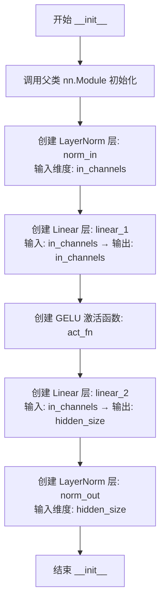

#### 带注释源码

```python
def __init__(self, in_channels: int, hidden_size: int):
    """
    初始化图像投影模块
    
    参数:
        in_channels: 输入图像嵌入的通道维度
        hidden_size: 输出的隐藏层维度
    """
    # 调用父类 nn.Module 的初始化方法
    super().__init__()
    
    # 输入层归一化: 对输入的图像嵌入进行 LayerNorm
    self.norm_in = nn.LayerNorm(in_channels)
    
    # 第一层线性变换: 保持维度不变的双层感知机中间层
    self.linear_1 = nn.Linear(in_channels, in_channels)
    
    # GELU 激活函数: 高斯误差线性单元激活
    self.act_fn = nn.GELU()
    
    # 第二层线性变换: 将特征维度投影到目标隐藏空间维度
    self.linear_2 = nn.Linear(in_channels, hidden_size)
    
    # 输出层归一化: 对投影后的隐藏状态进行 LayerNorm
    self.norm_out = nn.LayerNorm(hidden_size)
```


### `HunyuanVideo15ImageProjection.forward`

该方法实现了一个图像嵌入的投影模块，通过层归一化、线性变换和激活函数将输入的图像嵌入向量投影到Transformer模型所需的隐藏空间维度。

参数：

- `image_embeds`：`torch.Tensor`，输入的图像嵌入张量，形状为 `(batch_size, seq_len, in_channels)`

返回值：`torch.Tensor`，投影后的图像嵌入张量，形状为 `(batch_size, seq_len, hidden_size)`

#### 流程图

```mermaid
graph TD
    A[输入 image_embeds] --> B[norm_in: 层归一化]
    B --> C[linear_1: 线性变换 in_channels → in_channels]
    C --> D[act_fn: GELU 激活函数]
    D --> E[linear_2: 线性变换 in_channels → hidden_size]
    E --> F[norm_out: 层归一化]
    F --> G[输出投影后的隐藏状态]
```

#### 带注释源码

```python
def forward(self, image_embeds: torch.Tensor) -> torch.Tensor:
    """
    HunyuanVideo15ImageProjection 的前向传播方法。
    将图像嵌入投影到隐藏空间。
    
    参数:
        image_embeds: 输入的图像嵌入张量
        
    返回:
        投影后的图像嵌入张量
    """
    # 1. 对输入图像嵌入进行层归一化
    # 输入形状: (batch_size, seq_len, in_channels)
    hidden_states = self.norm_in(image_embeds)
    
    # 2. 第一个线性变换，保持维度不变
    # 形状不变: (batch_size, seq_len, in_channels)
    hidden_states = self.linear_1(hidden_states)
    
    # 3. 应用 GELU 激活函数
    # 形状不变: (batch_size, seq_len, in_channels)
    hidden_states = self.act_fn(hidden_states)
    
    # 4. 第二个线性变换，将维度从 in_channels 投影到 hidden_size
    # 输出形状: (batch_size, seq_len, hidden_size)
    hidden_states = self.linear_2(hidden_states)
    
    # 5. 输出层归一化
    # 输出形状: (batch_size, seq_len, hidden_size)
    hidden_states = self.norm_out(hidden_states)
    
    return hidden_states
```


### `HunyuanVideo15TransformerBlock.__init__`

该方法是 HunyuanVideo15TransformerBlock 类的初始化方法，负责构建一个双流Transformer块，包含用于处理主隐状态和上下文隐状态的独立归一化层、注意力模块和前馈网络。

参数：

- `num_attention_heads`：`int`，多头注意力机制中的注意力头数量
- `attention_head_dim`：`int`，每个注意力头的维度
- `mlp_ratio`：`float`，前馈网络隐藏层维度与输入维度的比值
- `qk_norm`：`str`，查询和键归一化类型，默认为 "rms_norm"

返回值：`None`，该方法仅初始化对象属性，不返回任何值

#### 流程图

```mermaid
flowchart TD
    A[开始 __init__] --> B[调用 super().__init__]
    B --> C[计算 hidden_size = num_attention_heads * attention_head_dim]
    C --> D[创建 AdaLayerNormZero norm1 用于主隐状态]
    D --> E[创建 AdaLayerNormZero norm1_context 用于上下文隐状态]
    E --> F[创建 Attention 模块 self.attn]
    F --> G[创建 LayerNorm self.norm2]
    G --> H[创建 FeedForward self.ff]
    H --> I[创建 LayerNorm self.norm2_context]
    I --> J[创建 FeedForward self.ff_context]
    J --> K[结束 __init__]
```

#### 带注释源码

```python
def __init__(
    self,
    num_attention_heads: int,      # 多头注意力中的头数量
    attention_head_dim: int,      # 每个注意力头的维度
    mlp_ratio: float,             # 前馈网络宽度扩展比例
    qk_norm: str = "rms_norm",   # 查询/键归一化方式
) -> None:
    super().__init__()  # 调用父类 nn.Module 的初始化方法
    
    # 计算隐藏层维度：头数 × 每头维度
    hidden_size = num_attention_heads * attention_head_dim
    
    # 创建主隐状态的 AdaLayerNormZero 归一化层
    # AdaLayerNormZero 是一种自适应层归一化，可学习调制参数
    self.norm1 = AdaLayerNormZero(hidden_size, norm_type="layer_norm")
    
    # 创建上下文隐状态的 AdaLayerNormZero 归一化层
    # 用于处理来自文本/图像编码器的条件信息
    self.norm1_context = AdaLayerNormZero(hidden_size, norm_type="layer_norm")
    
    # 创建注意力模块，支持双流联合注意力
    # added_kv_proj_dim=hidden_size 表示添加了额外的KV投影用于交叉注意力
    self.attn = Attention(
        query_dim=hidden_size,
        cross_attention_dim=None,        # 设为None表示自注意力模式
        added_kv_proj_dim=hidden_size,   # 添加的KV投影维度
        dim_head=attention_head_dim,
        heads=num_attention_heads,
        out_dim=hidden_size,
        context_pre_only=False,          # 上下文不是预-only模式
        bias=True,                       # 使用偏置
        processor=HunyuanVideo15AttnProcessor2_0(),  # 自定义注意力处理器
        qk_norm=qk_norm,                 # 查询/键归一化方式
        eps=1e-6,                        # 数值稳定性epsilon
    )
    
    # 主隐状态的前馈网络前的LayerNorm（无elementwise仿射）
    self.norm2 = nn.LayerNorm(hidden_size, elementwise_affine=False, eps=1e-6)
    
    # 主隐状态的前馈网络，使用GELU近似激活函数
    self.ff = FeedForward(hidden_size, mult=mlp_ratio, activation_fn="gelu-approximate")
    
    # 上下文隐状态的前馈网络前的LayerNorm
    self.norm2_context = nn.LayerNorm(hidden_size, elementwise_affine=False, eps=1e-6)
    
    # 上下文隐状态的前馈网络
    self.ff_context = FeedForward(hidden_size, mult=mlp_ratio, activation_fn="gelu-approximate")
```


### `HunyuanVideo15TransformerBlock.forward`

该方法实现了 HunyuanVideo1.5 双流 Transformer 块的前向传播，包含输入归一化、联合注意力、残差连接与调制、LayerNorm 以及前馈网络处理，最终返回处理后的隐藏状态和编码器隐藏状态。

参数：

- `hidden_states`：`torch.Tensor`，输入的主隐藏状态张量
- `encoder_hidden_states`：`torch.Tensor`，编码器的隐藏状态张量（条件输入）
- `temb`：`torch.Tensor`，时间嵌入张量，用于调制和移位
- `attention_mask`：`torch.Tensor | None`，注意力掩码，用于控制注意力计算
- `freqs_cis`：`tuple[torch.Tensor, torch.Tensor] | None`，旋转位置嵌入的余弦和正弦部分
- `*args`：可变位置参数
- `**kwargs`：可变关键字参数

返回值：`tuple[torch.Tensor, torch.Tensor]`，处理后的主隐藏状态和编码器隐藏状态

#### 流程图

```mermaid
flowchart TD
    A[输入 hidden_states<br/>encoder_hidden_states<br/>temb] --> B[norm1 归一化]
    A --> C[norm1_context 归一化]
    B --> D[AdaLayerNormZero 输出<br/>gate_msa, shift_mlp<br/>scale_mlp, gate_mlp]
    C --> E[AdaLayerNormZero 输出<br/>c_gate_msa, c_shift_mlp<br/>c_scale_mlp, c_gate_mlp]
    D --> F[Joint Attention]
    E --> F
    F --> G[残差连接与调制<br/>hidden_states += attn_output * gate_msa<br/>encoder_hidden_states += context_attn_output * c_gate_msa]
    G --> H[norm2 归一化<br/>+ 调制: (1 + scale) + shift]
    H --> I[FeedForward 前馈网络]
    I --> J[残差连接<br/>hidden_states += gate_mlp * ff_output<br/>encoder_hidden_states += c_gate_mlp * context_ff_output]
    J --> K[返回 tuple[hidden_states<br/>encoder_hidden_states]]
```

#### 带注释源码

```python
def forward(
    self,
    hidden_states: torch.Tensor,
    encoder_hidden_states: torch.Tensor,
    temb: torch.Tensor,
    attention_mask: torch.Tensor | None = None,
    freqs_cis: tuple[torch.Tensor, torch.Tensor] | None = None,
    *args,
    **kwargs,
) -> tuple[torch.Tensor, torch.Tensor]:
    # 1. Input normalization
    # 使用 AdaLayerNormZero 对主 hidden_states 进行归一化，同时生成门控参数和 MLP 调制参数
    # 返回: 归一化后的隐藏状态、门控 MSA、MLP 的 shift/scale/gate 参数
    norm_hidden_states, gate_msa, shift_mlp, scale_mlp, gate_mlp = self.norm1(hidden_states, emb=temb)
    
    # 对编码器隐藏状态进行同样的 AdaLayerNormZero 处理
    # 生成上下文分支的门控和调制参数
    norm_encoder_hidden_states, c_gate_msa, c_shift_mlp, c_scale_mlp, c_gate_mlp = self.norm1_context(
        encoder_hidden_states, emb=temb
    )

    # 2. Joint attention
    # 执行联合注意力计算，同时处理主hidden_states和编码器hidden_states之间的注意力
    # 支持旋转位置嵌入 (freqs_cos, freqs_sin)
    attn_output, context_attn_output = self.attn(
        hidden_states=norm_hidden_states,
        encoder_hidden_states=norm_encoder_hidden_states,
        attention_mask=attention_mask,
        image_rotary_emb=freqs_cis,
    )

    # 3. Modulation and residual connection
    # 将注意力输出通过门控参数进行缩放并加到残差连接上
    hidden_states = hidden_states + attn_output * gate_msa.unsqueeze(1)
    encoder_hidden_states = encoder_hidden_states + context_attn_output * c_gate_msa.unsqueeze(1)

    # 对 hidden_states 进行 LayerNorm 归一化，然后应用 learnable shift 和 scale
    norm_hidden_states = self.norm2(hidden_states)
    norm_encoder_hidden_states = self.norm2_context(encoder_hidden_states)

    # AdaLayerNormContinuous 风格的调制: (1 + scale) * norm + shift
    norm_hidden_states = norm_hidden_states * (1 + scale_mlp[:, None]) + shift_mlp[:, None]
    norm_encoder_hidden_states = norm_encoder_hidden_states * (1 + c_scale_mlp[:, None]) + c_shift_mlp[:, None]

    # 4. Feed-forward
    # 执行前馈网络处理，使用 GELU 激活函数
    ff_output = self.ff(norm_hidden_states)
    context_ff_output = self.ff_context(norm_encoder_hidden_states)

    # 残差连接：将前馈输出通过门控参数缩放后加到输入上
    hidden_states = hidden_states + gate_mlp.unsqueeze(1) * ff_output
    encoder_hidden_states = encoder_hidden_states + c_gate_mlp.unsqueeze(1) * context_ff_output

    return hidden_states, encoder_hidden_states
```


### `HunyuanVideo15Transformer3DModel.__init__`

这是 HunyuanVideo 1.5 Transformer 3D 模型的构造函数，负责初始化模型的所有组件，包括输入/条件嵌入器、RoPE 位置编码、Transformer 块堆栈和输出投影层。

参数：

- `in_channels`：`int`，输入通道数，默认值为 65
- `out_channels`：`int`，输出通道数，默认值为 32
- `num_attention_heads`：`int`，多头注意力机制中的注意力头数量，默认值为 16
- `attention_head_dim`：`int`，每个注意力头的维度，默认值为 128
- `num_layers`：`int`，主 Transformer 块的数量，默认值为 54
- `num_refiner_layers`：`int`，Refiner 块的数量，默认值为 2
- `mlp_ratio`：`float`，前馈网络中隐藏层维度与输入维度的比率，默认值为 4.0
- `patch_size`：`int`，空间补丁的大小，默认值为 1
- `patch_size_t`：`int`，时间维度补丁的大小，默认值为 1
- `qk_norm`：`str`，Query 和 Key 投影的归一化方式，默认值为 "rms_norm"
- `text_embed_dim`：`int`，来自文本编码器的文本嵌入输入维度，默认值为 3584
- `text_embed_2_dim`：`int`，第二组文本嵌入的输入维度，默认值为 1472
- `image_embed_dim`：`int`，图像嵌入的输入维度，默认值为 1152
- `rope_theta`：`float`，RoPE 层中使用的 theta 值，默认值为 256.0
- `rope_axes_dim`：`tuple[int, ...]`，RoPE 层中各轴的维度，默认值为 (16, 56, 56)
- `target_size`：`int`，目标尺寸（像素空间），默认值为 640
- `task_type`：`str`，任务类型，默认值为 "i2v"（Image to Video）
- `use_meanflow`：`bool`，是否使用 MeanFlow，默认值为 False

返回值：`None`，构造函数不返回值

#### 流程图

```mermaid
flowchart TD
    A[开始 __init__] --> B[调用 super().__init__]
    B --> C[计算 inner_dim = num_attention_heads * attention_head_dim]
    C --> D[设置 out_channels = out_channels or in_channels]
    D --> E[创建 x_embedder: HunyuanVideo15PatchEmbed]
    E --> F[创建 image_embedder: HunyuanVideo15ImageProjection]
    F --> G[创建 context_embedder: HunyuanVideo15TokenRefiner]
    G --> H[创建 context_embedder_2: HunyuanVideo15ByT5TextProjection]
    H --> I[创建 time_embed: HunyuanVideo15TimeEmbedding]
    I --> J[创建 cond_type_embed: nn.Embedding]
    J --> K[创建 rope: HunyuanVideo15RotaryPosEmbed]
    K --> L[创建 transformer_blocks: nn.ModuleList]
    L --> M[创建 norm_out: AdaLayerNormContinuous]
    M --> N[创建 proj_out: nn.Linear]
    N --> O[设置 gradient_checkpointing = False]
    O --> P[结束 __init__]
```

#### 带注释源码

```
@register_to_config
def __init__(
    self,
    in_channels: int = 65,          # 输入 latent 的通道数
    out_channels: int = 32,         # 输出 latent 的通道数
    num_attention_heads: int = 16,  # 注意力头数
    attention_head_dim: int = 128,  # 每个头的维度
    num_layers: int = 54,            # 主Transformer块的数量
    num_refiner_layers: int = 2,    # Refiner块的数量
    mlp_ratio: float = 4.0,         # MLP扩展比率
    patch_size: int = 1,            # 空间补丁大小
    patch_size_t: int = 1,           # 时间补丁大小
    qk_norm: str = "rms_norm",      # QK归一化类型
    text_embed_dim: int = 3584,     # Qwen文本嵌入维度
    text_embed_2_dim: int = 1472,   # ByT5文本嵌入维度
    image_embed_dim: int = 1152,    # 图像嵌入维度
    rope_theta: float = 256.0,      # RoPE theta参数
    rope_axes_dim: tuple[int, ...] = (16, 56, 56),  # RoPE轴维度
    target_size: int = 640,         # 目标尺寸（像素空间）
    task_type: str = "i2v",         # 任务类型：i2v或t2v
    use_meanflow: bool = False,      # 是否使用MeanFlow
) -> None:
    super().__init__()  # 调用父类初始化

    # 计算内部维度：注意力头数 × 每头维度
    inner_dim = num_attention_heads * attention_head_dim
    # 如果未指定输出通道数，则使用输入通道数
    out_channels = out_channels or in_channels

    # ==================== 1. Latent和Condition嵌入器 ====================
    
    # 视频/图像补丁嵌入层：将输入转换为补丁序列
    self.x_embedder = HunyuanVideo15PatchEmbed(
        (patch_size_t, patch_size, patch_size), in_channels, inner_dim
    )
    
    # 图像投影层：将图像embedding投影到transformer空间
    self.image_embedder = HunyuanVideo15ImageProjection(image_embed_dim, inner_dim)

    # 文本嵌入处理器（Qwen）：使用Token Refiner处理主要文本条件
    self.context_embedder = HunyuanVideo15TokenRefiner(
        text_embed_dim, num_attention_heads, attention_head_dim, 
        num_layers=num_refiner_layers
    )
    
    # 文本嵌入处理器（ByT5）：使用MLP处理辅助文本条件
    self.context_embedder_2 = HunyuanVideo15ByT5TextProjection(
        text_embed_2_dim, 2048, inner_dim
    )

    # 时间步嵌入层：编码扩散时间步
    self.time_embed = HunyuanVideo15TimeEmbedding(inner_dim, use_meanflow=use_meanflow)

    # 条件类型嵌入：区分不同类型的条件（文本、图像等）
    self.cond_type_embed = nn.Embedding(3, inner_dim)

    # ==================== 2. RoPE 位置编码 ====================
    # 旋转位置嵌入，用于捕获序列中的位置信息
    self.rope = HunyuanVideo15RotaryPosEmbed(
        patch_size, patch_size_t, rope_axes_dim, rope_theta
    )

    # ==================== 3. 双流Transformer块 ====================
    # 创建主Transformer块堆栈，处理latent和条件特征的联合注意力
    self.transformer_blocks = nn.ModuleList(
        [
            HunyuanVideo15TransformerBlock(
                num_attention_heads, attention_head_dim, 
                mlp_ratio=mlp_ratio, qk_norm=qk_norm
            )
            for _ in range(num_layers)
        ]
    )

    # ==================== 5. 输出投影 ====================
    # 最终归一化层
    self.norm_out = AdaLayerNormContinuous(
        inner_dim, inner_dim, elementwise_affine=False, eps=1e-6
    )
    
    # 输出投影：将特征映射回像素空间
    self.proj_out = nn.Linear(
        inner_dim, patch_size_t * patch_size * patch_size * out_channels
    )

    # 梯度检查点标志，默认为False
    self.gradient_checkpointing = False
```


### HunyuanVideo15Transformer3DModel.forward

该方法是 HunyuanVideo 1.5 视频生成模型的核心前向传播函数，负责将输入的潜在帧、时间步长和文本/图像条件信息通过双流 Transformer 块进行处理，最终输出经过投影和形状重塑的生成结果。

参数：

- `hidden_states`：`torch.Tensor`，输入的潜在状态，形状为 (batch_size, num_channels, num_frames, height, width)
- `timestep`：`torch.LongTensor`，扩散过程的时间步长
- `encoder_hidden_states`：`torch.Tensor`，来自 Qwen 的文本嵌入作为编码器隐藏状态
- `encoder_attention_mask`：`torch.Tensor`，文本嵌入的注意力掩码
- `timestep_r`：`torch.LongTensor | None`，可选的参考时间步（用于 MeanFlow 超分辨率）
- `encoder_hidden_states_2`：`torch.Tensor | None`，来自 ByT5 的文本嵌入
- `encoder_attention_mask_2`：`torch.Tensor | None`，ByT5 文本嵌入的注意力掩码
- `image_embeds`：`torch.Tensor | None`，图像嵌入（用于 I2V 任务）
- `attention_kwargs`：`dict[str, Any] | None`，注意力相关参数（如 LoRA 权重）
- `return_dict`：`bool = True`，是否返回字典格式的输出

返回值：`tuple[torch.Tensor] | Transformer2DModelOutput`，当 return_dict=True 时返回 Transformer2DModelOutput 对象，否则返回元组

#### 流程图

```mermaid
flowchart TD
    A[输入 hidden_states] --> B[计算 RoPE 旋转位置嵌入 image_rotary_emb]
    B --> C[计算时间嵌入 temb]
    C --> D[ latent patch 嵌入: x_embedder]
    D --> E[Qwen 文本嵌入: context_embedder]
    E --> F[添加条件类型嵌入]
    F --> G[ByT5 文本嵌入: context_embedder_2]
    G --> H[添加条件类型嵌入]
    H --> I[图像嵌入: image_embedder]
    I --> J{是否为 T2V 任务?}
    J -->|是| K[图像嵌入置零]
    J -->|否| L[保持原样]
    K --> M[添加条件类型嵌入]
    L --> M
    M --> N[重新排序合并条件嵌入]
    N --> O{启用梯度 checkpoint?}
    O -->|是| P[逐个执行 transformer 块 with checkpointing]
    O -->|否| Q[逐个执行 transformer 块]
    P --> R[输出归一化: norm_out]
    Q --> R
    R --> S[输出投影: proj_out]
    S --> T[重塑输出形状]
    T --> U[返回结果]
```

#### 带注释源码

```python
@apply_lora_scale("attention_kwargs")
def forward(
    self,
    hidden_states: torch.Tensor,
    timestep: torch.LongTensor,
    encoder_hidden_states: torch.Tensor,
    encoder_attention_mask: torch.Tensor,
    timestep_r: torch.LongTensor | None = None,
    encoder_hidden_states_2: torch.Tensor | None = None,
    encoder_attention_mask_2: torch.Tensor | None = None,
    image_embeds: torch.Tensor | None = None,
    attention_kwargs: dict[str, Any] | None = None,
    return_dict: bool = True,
) -> tuple[torch.Tensor] | Transformer2DModelOutput:
    # 获取输入维度信息
    batch_size, num_channels, num_frames, height, width = hidden_states.shape
    # 获取 patch 尺寸配置
    p_t, p_h, p_w = self.config.patch_size_t, self.config.patch_size, self.config.patch_size
    # 计算 patch 化后的空间维度
    post_patch_num_frames = num_frames // p_t
    post_patch_height = height // p_h
    post_patch_width = width // p_w

    # 1. RoPE: 计算旋转位置嵌入，用于捕捉空间和时间位置信息
    image_rotary_emb = self.rope(hidden_states)

    # 2. 条件嵌入处理
    # 计算时间步嵌入，支持可选的参考时间步（用于 MeanFlow）
    temb = self.time_embed(timestep, timestep_r=timestep_r)

    # 将输入 latent 转换为 patch 并嵌入到高维空间
    hidden_states = self.x_embedder(hidden_states)

    # 处理 Qwen 文本嵌入（主文本条件）
    encoder_hidden_states = self.context_embedder(encoder_hidden_states, timestep, encoder_attention_mask)
    # 添加条件类型嵌入（类型 0）
    encoder_hidden_states_cond_emb = self.cond_type_embed(
        torch.zeros_like(encoder_hidden_states[:, :, 0], dtype=torch.long)
    )
    encoder_hidden_states = encoder_hidden_states + encoder_hidden_states_cond_emb

    # 处理 ByT5 文本嵌入（辅助文本条件，类型 1）
    encoder_hidden_states_2 = self.context_embedder_2(encoder_hidden_states_2)
    encoder_hidden_states_2_cond_emb = self.cond_type_embed(
        torch.ones_like(encoder_hidden_states_2[:, :, 0], dtype=torch.long)
    )
    encoder_hidden_states_2 = encoder_hidden_states_2 + encoder_hidden_states_2_cond_emb

    # 处理图像嵌入（用于 I2V 任务，类型 2）
    encoder_hidden_states_3 = self.image_embedder(image_embeds)
    # 判断是否为 T2V（文本到视频）任务
    is_t2v = torch.all(image_embeds == 0)
    if is_t2v:
        # T2V 任务：图像嵌入置零，掩码设为全零
        encoder_hidden_states_3 = encoder_hidden_states_3 * 0.0
        encoder_attention_mask_3 = torch.zeros(
            (batch_size, encoder_hidden_states_3.shape[1]),
            dtype=encoder_attention_mask.dtype,
            device=encoder_attention_mask.device,
        )
    else:
        # I2V 任务：保留图像嵌入，掩码设为全一
        encoder_attention_mask_3 = torch.ones(
            (batch_size, encoder_hidden_states_3.shape[1]),
            dtype=encoder_attention_mask.dtype,
            device=encoder_attention_mask.device,
        )
    # 添加条件类型嵌入（类型 2）
    encoder_hidden_states_3_cond_emb = self.cond_type_embed(
        2
        * torch.ones_like(
            encoder_hidden_states_3[:, :, 0],
            dtype=torch.long,
        )
    )
    encoder_hidden_states_3 = encoder_hidden_states_3 + encoder_hidden_states_3_cond_emb

    # 3. 重新排序并合并文本 tokens：将有效 token 排在前面，padding 排在后面
    encoder_attention_mask = encoder_attention_mask.bool()
    encoder_attention_mask_2 = encoder_attention_mask_2.bool()
    encoder_attention_mask_3 = encoder_attention_mask_3.bool()
    new_encoder_hidden_states = []
    new_encoder_attention_mask = []

    for text, text_mask, text_2, text_mask_2, image, image_mask in zip(
        encoder_hidden_states,
        encoder_attention_mask,
        encoder_hidden_states_2,
        encoder_attention_mask_2,
        encoder_hidden_states_3,
        encoder_attention_mask_3,
    ):
        # 合并顺序：[valid_image, valid_byt5, valid_mllm, invalid_image, invalid_byt5, invalid_mllm]
        new_encoder_hidden_states.append(
            torch.cat(
                [
                    image[image_mask],  # 有效图像
                    text_2[text_mask_2],  # 有效 byt5
                    text[text_mask],  # 有效 mllm
                    image[~image_mask],  # 无效图像（置零）
                    torch.zeros_like(text_2[~text_mask_2]),  # 无效 byt5（置零）
                    torch.zeros_like(text[~text_mask]),  # 无效 mllm（置零）
                ],
                dim=0,
            )
        )
        # 对注意力掩码应用相同的重排序
        new_encoder_attention_mask.append(
            torch.cat(
                [
                    image_mask[image_mask],
                    text_mask_2[text_mask_2],
                    text_mask[text_mask],
                    image_mask[~image_mask],
                    text_mask_2[~text_mask_2],
                    text_mask[~text_mask],
                ],
                dim=0,
            )
        )

    encoder_hidden_states = torch.stack(new_encoder_hidden_states)
    encoder_attention_mask = torch.stack(new_encoder_attention_mask)

    # 4. Transformer 块处理
    if torch.is_grad_enabled() and self.gradient_checkpointing:
        # 使用梯度 checkpointing 节省显存
        for block in self.transformer_blocks:
            hidden_states, encoder_hidden_states = self._gradient_checkpointing_func(
                block,
                hidden_states,
                encoder_hidden_states,
                temb,
                encoder_attention_mask,
                image_rotary_emb,
            )
    else:
        # 正常前向传播
        for block in self.transformer_blocks:
            hidden_states, encoder_hidden_states = block(
                hidden_states,
                encoder_hidden_states,
                temb,
                encoder_attention_mask,
                image_rotary_emb,
            )

    # 5. 输出投影
    hidden_states = self.norm_out(hidden_states, temb)
    hidden_states = self.proj_out(hidden_states)

    # 重塑输出：从 patch 形式恢复到原始视频形状
    hidden_states = hidden_states.reshape(
        batch_size, post_patch_num_frames, post_patch_height, post_patch_width, -1, p_t, p_h, p_w
    )
    hidden_states = hidden_states.permute(0, 4, 1, 5, 2, 6, 3, 7)
    hidden_states = hidden_states.flatten(6, 7).flatten(4, 5).flatten(2, 3)

    if not return_dict:
        return (hidden_states,)

    return Transformer2DModelOutput(sample=hidden_states)
```

## 关键组件


### HunyuanVideo15AttnProcessor2_0

自定义注意力处理器，实现了基于 PyTorch 2.0 的 SDPA 注意力机制，支持 QKV 投影、QK 归一化、旋转位置编码应用、以及编码器条件的联合注意力。

### HunyuanVideo15PatchEmbed

3D 视频_patch 嵌入层，将输入的 5D 张量 (B, C, T, H, W) 通过 3D 卷积转换为 patch 序列，支持空间和时间维度的 patch 化。

### HunyuanVideo15AdaNorm

自适应归一化层，包含线性变换和 SiLU 激活函数，用于生成门控参数 gate_msa 和 gate_mlp，实现对注意力输出和前馈网络输出的动态调制。

### HunyuanVideo15TimeEmbedding

时间步嵌入模块，支持标准时间步嵌入和可选的参考时间步嵌入（用于 MeanFlow 超分辨率模型），可处理双流时间条件输入。

### HunyuanVideo15IndividualTokenRefinerBlock

单个 Token 精炼块，包含自注意力层、前馈网络和 AdaNorm 输出层，实现对 latent token 的精细化处理和条件调制。

### HunyuanVideo15IndividualTokenRefiner

由多个 Token 精炼块组成的模块化列表，对输入的 hidden states 进行逐层精炼处理，支持自定义层数和注意力头配置。

### HunyuanVideo15TokenRefiner

完整的 Token 精炼网络，包含时间-文本联合嵌入层、输入投影层和 Token 精炼器，用于将文本条件编码并精炼 latent token 表示。

### HunyuanVideo15RotaryPosEmbed

3D 旋转位置编码（RoPE）生成器，基于 patch 尺寸和rope维度生成空间-时间频率编码，支持多轴向的旋转位置嵌入。

### HunyuanVideo15ByT5TextProjection

基于 T5 架构的文本投影模块，包含三层全连接网络和 GELU 激活，用于将 T5 文本编码器输出投影到模型隐藏空间。

### HunyuanVideo15ImageProjection

图像嵌入投影模块，将图像特征通过归一化、线性变换和 GELU 激活映射到隐藏空间，支持图像条件的注入。

### HunyuanVideo15TransformerBlock

双流 Transformer 块，包含对 latent 流和条件流的独立归一化、联合注意力机制和前馈网络，实现双向条件交互和自适应门控调制。

### HunyuanVideo15Transformer3DModel

 HunyuanVideo 1.5 的主 Transformer 模型，支持视频生成和图像到视频任务，集成了 patch 嵌入、多条件编码器（Qwen、BYT5、图像）、RoPE 位置编码、双流 Transformer 块堆栈和输出投影层。

## 问题及建议


### 已知问题

- **HunyuanVideo15AttnProcessor2_0**: 类变量`_attention_backend`和`_parallel_config`为None，但使用前未检查或初始化，可能导致运行时错误；attention_mask处理创建了O(seq_len²)大小的张量，严重浪费内存
- **HunyuanVideo15IndividualTokenRefiner.forward**: 返回类型注解为`None`但实际返回`hidden_states`，类型标注错误
- **HunyuanVideo15RotaryPosEmbed**: 代码注释明确指出与原始实现存在数值差异（CPU vs GPU网格创建），可能导致细微的数值误差
- **HunyuanVideo15Transformer3DModel.forward**: 使用循环和torch.stack拼接encoder_hidden_states和attention_mask，在batch_size较大时效率低下，应使用向量化操作或torch.where
- **HunyuanVideo15Transformer3DModel**: `num_attention_heads`和`attention_head_dim`在多处使用但未统一验证其乘积是否合理；`target_size`和`task_type`参数未被实际使用
- **编码器状态处理**: `encoder_hidden_states_2`和`encoder_hidden_states_3`的条件创建（ByT5和图像嵌入）缺少null检查，存在潜在空tensor问题
- **重复代码**: attention_mask的bool转换和reshape逻辑在多个类中重复实现（AttnProcessor、TokenRefiner、TransformerBlock）

### 优化建议

- 将`_attention_backend`和`_parallel_config`改为实例变量或添加初始化验证逻辑；使用更高效的稀疏attention mask表示替代dense张量
- 修正`HunyuanVideo15IndividualTokenRefiner.forward`的返回类型注解为`torch.Tensor`
- 考虑在RoPE实现中提供CPU/GPU选项以匹配原始行为，或明确文档化数值差异
- 重构encoder_hidden_states的拼接逻辑，使用torch.cat配合布尔索引的向量化操作替代显式循环
- 统一验证模型维度参数，清理未使用的配置参数（target_size、task_type）
- 提取attention_mask预处理逻辑为独立工具函数或基类方法，减少代码重复
- 为所有可选参数（encoder_hidden_states_2、encoder_attention_mask_2、image_embeds等）添加明确的null检查和类型验证

## 其它


### 设计目标与约束

本模块实现HunyuanVideo1.5视频生成Transformer模型，核心目标是处理视频数据的时空建模，支持图像到视频(I2V)和文本到视频(T2V)生成任务。设计约束包括：(1) 输入通道数65（latent通道16+时间步48+条件通道1），输出通道数32；(2) 支持双流transformer架构，同时处理latent序列和条件序列；(3) 需兼容PyTorch 2.0+的scaled_dot_product_attention；(4) 支持梯度检查点(gradient checkpointing)以节省显存；(5) 支持LoRA微调机制；(6) 支持PEFT适配器模式；(7) 支持MeanFlow超分辨率的参考时间步嵌入。

### 错误处理与异常设计

关键错误处理场景包括：(1) ImportError - HunyuanVideo15AttnProcessor2_0在PyTorch<2.0时抛出"requires PyTorch 2.0"异常；(2) 维度不匹配 - x_embedder要求输入shape为(B,C,T,H,W)，其中T/H/W必须能被patch_size整除；(3) 空注意力掩码 - 当encoder_attention_mask为None时使用mean pooling作为pooled_projections；(4) 设备一致性 - rope grid在hidden_states的device上创建确保设备匹配；(5) dtype转换 - attention计算后转换为query.dtype以保证精度一致。

### 数据流与状态机

主数据流路径：hidden_states(5D tensor) → x_embedder → TransformerBlocks(与encoder_hidden_states联合处理) → norm_out → proj_out → reshape输出。条件嵌入路径：encoder_hidden_states(qwen) → context_embedder → 与cond_type_embed求和；encoder_hidden_states_2(byt5) → context_embedder_2 → 与cond_type_embed求和；image_embeds → image_embedder → 与cond_type_embed求和 → 三者按valid token顺序拼接重组。状态转换包括：patchify(T×H×W → N)、position embedding应用、attention计算、residual connection、gate modulation。

### 外部依赖与接口契约

核心依赖包括：(1) torch>=2.0 - 必需scaled_dot_product_attention；(2) diffusers.loaders.FromOriginalModelMixin - 权重加载；(3) diffusers.configuration_utils.ConfigMixin,register_to_config - 配置管理；(4) diffusers.loaders.PeftAdapterMixin - PEFT适配；(5) diffusers.utils.apply_lora_scale,logging - LoRA和日志；(6) diffusers.XX模块：AttentionMixin,FeedForward,dispatch_attention_fn,Attention,CacheMixin,AdaLayerNormContinuous,AdaLayerNormZero等。输入契约：hidden_states需为(B,C,T,H,W)五维张量，timestep为LongTensor，encoder_hidden_states为(B,seq_len,dim)，image_embeds为(B,image_seq,image_dim)或全零。输出契约：返回Transformer2DModelOutput(sample)或元组。

### 配置与参数设计

HunyuanVideo15Transformer3DModel关键配置参数：in_channels=65（latent+time+cond），out_channels=32，num_attention_heads=16，attention_head_dim=128，num_layers=54，num_refiner_layers=2，mlp_ratio=4.0，patch_size=1，patch_size_t=1，qk_norm="rms_norm"，text_embed_dim=3584(qwen)，text_embed_2_dim=1472(byt5)，image_embed_dim=1152，rope_theta=256.0，rope_axes_dim=(16,56,56)，target_size=640，task_type="i2v"，use_meanflow=False。参数默认值与HuggingFace Hub上HunyuanVideo1.5模型配置一致。

### 性能考虑与优化空间

性能关键点：(1) 梯度检查点 - _supports_gradient_checkpointing=True支持层间检查点节省显存；(2) _skip_layerwise_casting_patterns跳过x_embedder/context_embedder/norm的layerwise casting；(3) attention mask处理优化 - 使用F.pad和view操作构建因果mask；(4) RoPE预计算 - 一次性计算所有位置的旋转嵌入；(5) 混合精度潜力 - 可启用fp16/fp8推理但需注意数值稳定性。优化空间：(1) 可缓存rope输出避免重复计算；(2) 可对num_layers循环启用torch.jit.script；(3) 可分离valid/invalid token处理减少padding计算。

### 安全性考虑

代码本身为纯前向推理模块，无用户输入直接处理。安全考量：(1) 权重加载验证 - FromOriginalModelMixin确保与原始模型格式兼容；(2) 数值安全 - attention计算后进行dtype转换防止精度溢出；(3) 设备安全 - 所有tensor操作显式指定device避免隐式拷贝；(4) 内存安全 - attention_mask的bool转换确保mask有效性；(5) 配置安全 - register_to_config装饰器保证配置序列化/反序列化一致性。

### 版本兼容性

PyTorch版本要求：>=2.0（scaled_dot_product_attention API）。Diffusers框架版本：需支持ConfigMixin,PeftAdapterMixin,CacheMixin,AttentionMixin等mixin类。模型格式兼容性：通过FromOriginalModelMixin支持加载原始HunyuanVideo1.5 checkpoints。CUDA/cpu设备兼容性：代码使用device-agnostic设计，隐式使用hidden_states.device。dtype兼容性：支持fp16/fp32/fp64，通过dtype=timestep.dtype和.to(query.dtype)确保数值一致性。

    