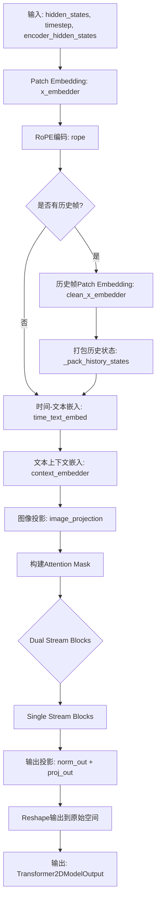
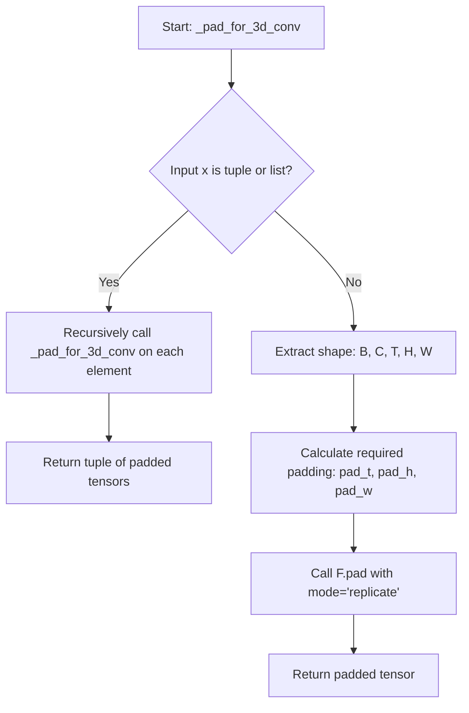
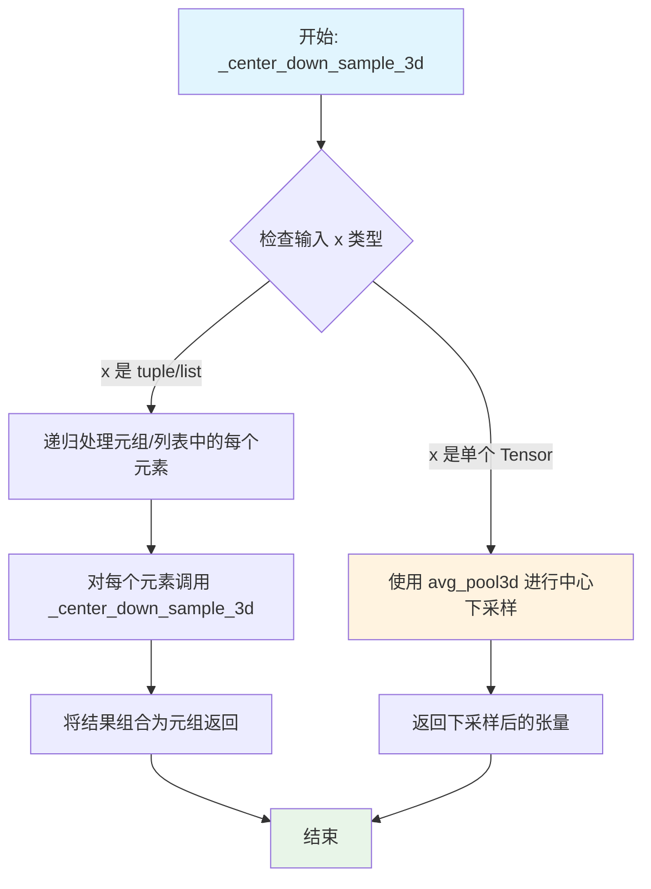
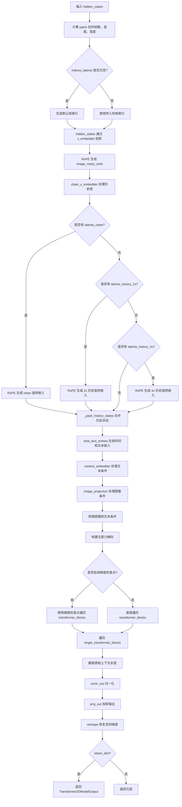
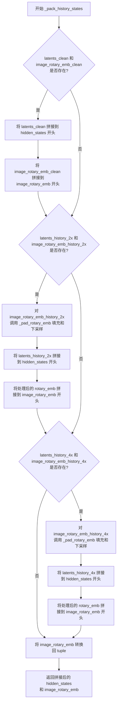
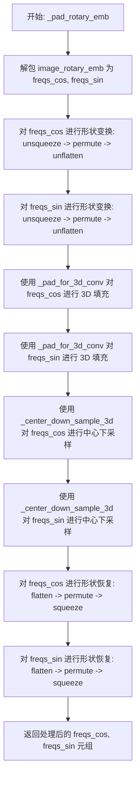

# `diffusers\src\diffusers\models\transformers\transformer_hunyuan_video_framepack.py` 详细设计文档

这是一个基于Transformer架构的3D视频生成模型，属于Framepack/Hunyuan Video项目的核心组件。该模型通过双流（Dual Stream）和单流（Single Stream）Transformer块处理视频潜变量，结合旋转位置编码（RoPE）、图像条件嵌入和历史帧信息，实现高质量的视频生成。

## 整体流程



## 类结构

```
HunyuanVideoFramepackRotaryPosEmbed (旋转位置编码类)
FramepackClipVisionProjection (CLIP视觉投影类)
HunyuanVideoHistoryPatchEmbed (历史帧嵌入类)
HunyuanVideoFramepackTransformer3DModel (主模型类)
    ├── 继承自: ModelMixin, ConfigMixin, PeftAdapterMixin, FromOriginalModelMixin, CacheMixin
    └── 包含: transformer_blocks, single_transformer_blocks等组件
```

## 全局变量及字段


### `logger`
    
模块级日志记录器，用于记录运行时的日志信息

类型：`logging.Logger`
    


### `inner_dim`
    
内部维度，等于num_attention_heads * attention_head_dim，用于确定Transformer的隐藏层维度

类型：`int`
    


### `original_context_length`
    
原始上下文长度，表示补丁化前视频帧总数

类型：`int`
    


### `post_patch_num_frames`
    
补丁化后的帧数，即原始帧数除以时间补丁大小

类型：`int`
    


### `post_patch_height`
    
补丁化后的高度，即原始高度除以空间补丁大小

类型：`int`
    


### `post_patch_width`
    
补丁化后的宽度，即原始宽度除以空间补丁大小

类型：`int`
    


### `latent_sequence_length`
    
潜变量序列长度，表示输入潜变量的token数量

类型：`int`
    


### `condition_sequence_length`
    
条件序列长度，表示条件编码的token数量

类型：`int`
    


### `sequence_length`
    
总序列长度，等于潜变量序列长度加条件序列长度

类型：`int`
    


### `effective_condition_sequence_length`
    
有效条件序列长度，通过attention_mask求和得到

类型：`int`
    


### `effective_sequence_length`
    
有效总序列长度，用于构建attention mask

类型：`int`
    


### `HunyuanVideoFramepackRotaryPosEmbed.patch_size`
    
空间补丁大小，用于将图像空间分割成小块

类型：`int`
    


### `HunyuanVideoFramepackRotaryPosEmbed.patch_size_t`
    
时间补丁大小，用于将视频帧序列分割成时间块

类型：`int`
    


### `HunyuanVideoFramepackRotaryPosEmbed.rope_dim`
    
RoPE维度列表，包含三个维度的旋转位置编码长度

类型：`list[int]`
    


### `HunyuanVideoFramepackRotaryPosEmbed.theta`
    
RoPE基础频率，控制旋转角度的缩放因子

类型：`float`
    


### `FramepackClipVisionProjection.up`
    
上投影线性层，将输入维度扩展到输出维度的三倍

类型：`nn.Linear`
    


### `FramepackClipVisionProjection.down`
    
下投影线性层，将扩展维度压缩回目标输出维度

类型：`nn.Linear`
    


### `HunyuanVideoHistoryPatchEmbed.proj`
    
1x下采样卷积，保持时间维度不变，空间维度2x2下采样

类型：`nn.Conv3d`
    


### `HunyuanVideoHistoryPatchEmbed.proj_2x`
    
2x下采样卷积，时间维度2x，空间维度4x4下采样

类型：`nn.Conv3d`
    


### `HunyuanVideoHistoryPatchEmbed.proj_4x`
    
4x下采样卷积，时间维度4x，空间维度8x8下采样

类型：`nn.Conv3d`
    


### `HunyuanVideoFramepackTransformer3DModel.x_embedder`
    
输入潜变量嵌入器，将原始视频潜变量patchify并投影到inner_dim

类型：`HunyuanVideoPatchEmbed`
    


### `HunyuanVideoFramepackTransformer3DModel.clean_x_embedder`
    
历史帧嵌入器，处理clean latent的历史帧进行时间维度的融合

类型：`HunyuanVideoHistoryPatchEmbed`
    


### `HunyuanVideoFramepackTransformer3DModel.context_embedder`
    
文本上下文嵌入器，使用refiner层处理文本编码

类型：`HunyuanVideoTokenRefiner`
    


### `HunyuanVideoFramepackTransformer3DModel.image_projection`
    
图像投影，将CLIP图像编码投影到与潜变量相同的维度空间

类型：`FramepackClipVisionProjection`
    


### `HunyuanVideoFramepackTransformer3DModel.time_text_embed`
    
时间和文本条件嵌入，将time step和pooled text projection进行编码

类型：`HunyuanVideoConditionEmbedding`
    


### `HunyuanVideoFramepackTransformer3DModel.rope`
    
旋转位置编码，为视频帧生成3D旋转位置嵌入

类型：`HunyuanVideoFramepackRotaryPosEmbed`
    


### `HunyuanVideoFramepackTransformer3DModel.transformer_blocks`
    
双流Transformer块列表，包含num_layers个双流Transformer块处理交叉注意力

类型：`nn.ModuleList`
    


### `HunyuanVideoFramepackTransformer3DModel.single_transformer_blocks`
    
单流Transformer块列表，包含num_single_layers个单流Transformer块处理自注意力

类型：`nn.ModuleList`
    


### `HunyuanVideoFramepackTransformer3DModel.norm_out`
    
输出归一化层，使用AdaLN Continuous进行层级归一化

类型：`AdaLayerNormContinuous`
    


### `HunyuanVideoFramepackTransformer3DModel.proj_out`
    
输出投影层，将inner_dim投影回patch_size*t*p*p*out_channels空间

类型：`nn.Linear`
    


### `HunyuanVideoFramepackTransformer3DModel.gradient_checkpointing`
    
梯度检查点标志，控制是否使用gradient checkpointing节省显存

类型：`bool`
    
    

## 全局函数及方法


### `_pad_for_3d_conv`

此函数是3D卷积的填充辅助函数，主要用于在时间维（T）、高度维（H）和宽度维（W）对输入张量进行边缘复制填充（Replicate Padding），使得填充后的尺寸能够被卷积核大小（kernel_size）整除，从而确保后续的3D卷积或池化操作能够顺利进行且不出现尺寸不匹配的错误。

参数：

-  `x`：`torch.Tensor | tuple | list`，输入的3D特征张量。如果输入是元组或列表（例如频率的cos和sin分量），函数会递归处理其中的每个张量。
-  `kernel_size`：`tuple[int, int, int]`，卷积核大小，格式为 `(kernel_t, kernel_h, kernel_w)`，分别对应时间、高度和宽度维度。

返回值：`torch.Tensor | tuple`，返回填充后的张量或包含填充后张量的元组。填充采用 `replicate` 模式，在边缘进行复制填充。

#### 流程图



#### 带注释源码

```python
def _pad_for_3d_conv(x, kernel_size):
    # 如果输入是元组或列表（例如同时处理 cos 和 sin 频率），则递归处理每个元素
    if isinstance(x, (tuple, list)):
        return tuple(_pad_for_3d_conv(i, kernel_size) for i in x)
    
    # 获取输入张量的维度：批大小(B)、通道数(C)、时间(T)、高度(H)、宽度(W)
    b, c, t, h, w = x.shape
    
    # 解卷积核大小：时间核、空间高核、空间宽核
    pt, ph, pw = kernel_size
    
    # 计算各维度需要填充的大小
    # 公式逻辑：如果维度刚好能被核大小整除，则不填充(0)；否则填充到能够整除为止
    pad_t = (pt - (t % pt)) % pt
    pad_h = (ph - (h % ph)) % ph
    pad_w = (pw - (w % pw)) % pw
    
    # 使用 PyTorch 的 functional.pad 进行填充
    # 参数顺序对应 (left, right, top, bottom, front, back) 即 (w, h, t)
    # mode="replicate" 表示边缘复制填充
    return torch.nn.functional.pad(x, (0, pad_w, 0, pad_h, 0, pad_t), mode="replicate")
```


### `_center_down_sample_3d`

该函数是一个3D中心下采样辅助函数，通过对输入的3D张量（或张量元组/列表）应用平均池化操作实现空间维度的降低，常用于对旋转位置编码（RoPE）进行下采样处理以匹配不同的历史帧分辨率。

参数：

-  `x`：`torch.Tensor | tuple | list`，输入的3D张量或包含3D张量的元组/列表，用于执行下采样操作
-  `kernel_size`：`tuple[int, int, int]`，下采样的核大小，格式为 (时间维, 高度维, 宽度维)，同时作为池化窗口大小和步长

返回值：`torch.Tensor | tuple`，下采样后的3D张量或张量元组/列表，返回类型与输入类型保持一致

#### 流程图



#### 带注释源码

```python
def _center_down_sample_3d(x, kernel_size):
    """
    3D 中心下采样函数
    
    通过对输入的3D张量应用平均池化（Average Pooling）来实现空间维度的降低。
    该函数是Transformer模型中处理历史帧旋转位置编码（RoPE）的关键组件，
    负责将高分辨率的RoPE编码下采样到与历史 latent 相同的分辨率。
    
    Args:
        x: 输入的3D张量 (B, C, T, H, W) 或包含多个3D张量的元组/列表
        kernel_size: 下采样核大小，格式为 (时间步, 高度, 宽度)，同时作为池化步长
    
    Returns:
        下采样后的3D张量或张量元组，形状为 (B, C, T//kt, H//kh, W//kw)
    """
    # 处理元组或列表输入：递归地对每个元素调用自身
    # 这允许函数同时处理 freqs_cos 和 freqs_sin 两个编码分量
    if isinstance(x, (tuple, list)):
        return tuple(_center_down_sample_3d(i, kernel_size) for i in x)
    
    # 使用 PyTorch 的 3D 平均池化进行中心下采样
    # kernel_size 与 stride 相等，确保每个核正好覆盖不重叠的区域，实现均匀下采样
    # 这是"中心"下采样的关键：取每个核区域的平均值作为输出
    return torch.nn.functional.avg_pool3d(x, kernel_size, stride=kernel_size)
```


### `HunyuanVideoFramepackRotaryPosEmbed.forward`

该方法用于生成视频帧的旋转位置嵌入（Rotary Position Embedding），通过将帧索引、高度和宽度映射到多维网格，并利用正弦和余弦函数计算旋转位置编码，以增强模型对时空位置的理解。

参数：

- `self`：类实例自身，包含patch_size、patch_size_t、rope_dim和theta等配置参数
- `frame_indices`：`torch.Tensor`，表示视频帧的索引，用于标识不同帧的位置
- `height`：`int`，输入视频的高度（像素单位），需要被patch_size整除
- `width`：`int`，输入视频的宽度（像素单位），需要被patch_size整除
- `device`：`torch.device`，计算设备（CPU或CUDA），用于指定张量存放位置

返回值：`tuple[torch.Tensor, torch.Tensor]`，返回两个张量组成的元组：
- `freqs_cos`：余弦旋转位置嵌入，形状为 (W * H * T, D / 2)
- `freqs_sin`：正弦旋转位置嵌入，形状为 (W * H * T, D / 2)
其中W、H、T分别表示宽度、高度、帧数的patch数量，D为注意力头维度

#### 流程图

```mermaid
flowchart TD
    A[开始 forward] --> B[计算网格尺寸<br/>height = height // patch_size<br/>width = width // patch_size]
    B --> C[使用meshgrid创建3D网格<br/>生成frame, height, width三个维度的坐标]
    C --> D[将网格堆叠成[3, W, H, T]张量]
    D --> E{遍历维度 i = 0,1,2}
    E -->|i=0| F1[调用get_1d_rotary_pos_embed<br/>计算帧维度的RoPE]
    E -->|i=1| F2[调用get_1d_rotary_pos_embed<br/>计算高度维度的RoPE]
    E -->|i=2| F3[调用get_1d_rotary_pos_embed<br/>计算宽度维度的RoPE]
    F1 --> G[收集freqs列表]
    F2 --> G
    F3 --> G
    G --> H[拼接所有维度的cos: torch.cat<br/>freqs_cos shape: (W*H*T, D/2)]
    H --> I[拼接所有维度的sin: torch.cat<br/>freqs_sin shape: (W*H*T, D/2)]
    I --> J[返回 (freqs_cos, freqs_sin)]
    J --> K[结束]
```

#### 带注释源码

```python
def forward(self, frame_indices: torch.Tensor, height: int, width: int, device: torch.device):
    """
    生成视频帧的旋转位置嵌入（Rotary Position Embedding）
    
    参数:
        frame_indices: 视频帧的索引张量，形状为 [batch_size, num_frames]
        height: 输入视频的高度（像素）
        width: 输入视频的宽度（像素）
        device: 计算设备
    
    返回:
        (freqs_cos, freqs_sin): 余弦和正弦旋转位置嵌入的元组
    """
    # 将像素坐标转换为patch坐标（除以patch_size）
    height = height // self.patch_size
    width = width // self.patch_size
    
    # 使用meshgrid创建三维网格
    # frame_indices: [batch_size, num_frames] -> 用于时间维度
    # torch.arange(0, height): 用于高度维度
    # torch.arange(0, width): 用于宽度维度
    # indexing="ij" 使用行列索引格式（而非xy）
    grid = torch.meshgrid(
        frame_indices.to(device=device, dtype=torch.float32),  # 时间/帧维度坐标
        torch.arange(0, height, device=device, dtype=torch.float32),  # 高度维度坐标
        torch.arange(0, width, device=device, dtype=torch.float32),  # 宽度维度坐标
        indexing="ij",
    )  # 返回 3 个 [batch_size, height, width] 的张量列表
    
    # 将网格堆叠为 [3, batch_size, height, width] 形状
    grid = torch.stack(grid, dim=0)  # [3, B, H, W]
    
    # 为三个维度分别计算旋转位置嵌入
    freqs = []
    for i in range(3):
        # get_1d_rotary_pos_embed 函数生成一维旋转位置嵌入
        # 参数: rope_dim[i] (该维度的嵌入维度), grid[i].reshape(-1) (展平后的坐标), theta (基础频率)
        # use_real=True 返回复数形式的实部和虚部（即cos和sin）
        freq = get_1d_rotary_pos_embed(
            self.rope_dim[i],      # 第i个维度的RoPE维度
            grid[i].reshape(-1),   # 展平为 (B*H*W,) 
            self.theta,            # 旋转基础频率
            use_real=True          # 返回实数形式（cos, sin）而非复数形式
        )
        freqs.append(freq)
    
    # 沿嵌入维度拼接所有维度的cos结果
    # 每个freq[i][0]形状为 (B*H*W, D_i/2)，拼接后为 (B*H*W, sum(D_i)/2)
    freqs_cos = torch.cat([f[0] for f in freqs], dim=1)  # (B*H*W, D/2)
    
    # 沿嵌入维度拼接所有维度的sin结果
    freqs_sin = torch.cat([f[1] for f in freqs], dim=1)  # (B*H*W, D/2)
    
    return freqs_cos, freqs_sin
```


### `FramepackClipVisionProjection.forward`

该方法实现了一个两阶段的线性变换网络，用于将CLIP视觉投影到内部维度。它首先将输入通道扩展到输出通道的3倍，应用SiLU激活函数，然后投影回目标维度，起到类似"瓶颈"的作用。

参数：

- `hidden_states`：`torch.Tensor`，输入的隐藏状态，通常是来自CLIP视觉编码器的特征向量

返回值：`torch.Tensor`，经过投影变换后的隐藏状态

#### 流程图

```mermaid
flowchart TD
    A[输入 hidden_states] --> B[self.up 线性变换<br/>nn.Linear(in_channels, out_channels * 3)]
    B --> C[F.silu 激活函数<br/>Swish/SiLU非线性变换]
    C --> D[self.down 线性变换<br/>nn.Linear(out_channels * 3, out_channels)]
    D --> E[输出 hidden_states]
```

#### 带注释源码

```python
def forward(self, hidden_states: torch.Tensor) -> torch.Tensor:
    """
    前向传播方法，执行CLIP视觉投影的维度变换
    
    参数:
        hidden_states: 来自CLIP视觉编码器的特征张量
        
    返回值:
        投影并激活后的特征张量
    """
    # 第一阶段：将输入维度扩展到 out_channels * 3
    # 这是一个"上投影"操作，增加特征维度
    hidden_states = self.up(hidden_states)
    
    # 应用 SiLU (Swish) 激活函数：x * sigmoid(x)
    # 该激活函数在 Transformer 架构中表现良好
    hidden_states = F.silu(hidden_states)
    
    # 第二阶段：将扩展维度压缩回 out_channels
    # 这是一个"下投影"操作，起到瓶颈作用
    hidden_states = self.down(hidden_states)
    
    return hidden_states
```


### `HunyuanVideoHistoryPatchEmbed.forward`

该方法实现视频历史帧的Patch嵌入投影功能，通过三个不同尺度的3D卷积核（1x、2x、4x）对输入的清洁潜在向量进行空间下采样和通道映射，将其转换为Transformer可处理的序列嵌入格式。

参数：

- `latents_clean`：`torch.Tensor | None`，1x尺度的清洁潜在向量，输入形状为 [B, C, T, H, W]，若不为空则经过 proj 卷积并转换为序列格式
- `latents_clean_2x`：`torch.Tensor | None`，2x尺度的清洁潜在向量，输入形状为 [B, C, T, H, W]，若不为空则先进行3D卷积填充再经过 proj_2x 卷积
- `latents_clean_4x`：`torch.Tensor | None`，4x尺度的清洁潜在向量，输入形状为 [B, C, T, H, W]，若不为空则先进行3D卷积填充再经过 proj_4x 卷积

返回值：`tuple[torch.Tensor | None, torch.Tensor | None, torch.Tensor | None]`，分别返回三个尺度处理后的潜在向量序列，形状均为 [B, S, inner_dim]，其中 S 为序列长度

#### 流程图

```mermaid
flowchart TD
    A[开始 forward] --> B{latents_clean is not None?}
    B -->|Yes| C[执行 self.proj 卷积]
    C --> D[flatten(2).transpose(1,2)]
    B -->|No| E[latents_clean 保持 None]
    D --> F{latents_clean_2x is not None?}
    E --> F
    F -->|Yes| G[_pad_for_3d_conv 填充]
    G --> H[执行 self.proj_2x 卷积]
    H --> I[flatten(2).transpose(1,2)]
    F -->|No| J[latents_clean_2x 保持 None]
    I --> K{latents_clean_4x is not None?}
    J --> K
    K -->|Yes| L[_pad_for_3d_conv 填充]
    L --> M[执行 self.proj_4x 卷积]
    M --> N[flatten(2).transpose(1,2)]
    K -->|No| O[latents_clean_4x 保持 None]
    N --> P[返回 tuple]
    E --> P
    J --> P
    O --> P
```

#### 带注释源码

```python
def forward(
    self,
    latents_clean: torch.Tensor | None = None,
    latents_clean_2x: torch.Tensor | None = None,
    latents_clean_4x: torch.Tensor | None = None,
):
    """
    对输入的历史帧潜在向量进行Patch嵌入投影
    
    该方法使用三个不同尺度的3D卷积核对输入进行空间下采样：
    - 1x尺度: kernel_size=(1,2,2), stride=(1,2,2) - 不进行时间维下采样
    - 2x尺度: kernel_size=(2,4,4), stride=(2,4,4) - 2倍时间下采样 + 4倍空间下采样
    - 4x尺度: kernel_size=(4,8,8), stride=(4,8,8) - 4倍时间下采样 + 8倍空间下采样
    
    输出统一转换为 [batch, sequence_length, hidden_dim] 的序列格式
    """
    # 处理1x尺度输入：标准Patch嵌入
    if latents_clean is not None:
        # 使用 1x2x2 卷积核进行空间下采样，时间维度保持不变
        latents_clean = self.proj(latents_clean)
        # 将 [B, C, T, H, W] 转换为 [B, T*H*W, C]
        latents_clean = latents_clean.flatten(2).transpose(1, 2)
    
    # 处理2x尺度输入：需要先填充以适配卷积核
    if latents_clean_2x is not None:
        # 对时间维和空间维进行填充，使输入维度能够被卷积核整除
        latents_clean_2x = _pad_for_3d_conv(latents_clean_2x, (2, 4, 4))
        # 使用 2x4x4 卷积核进行下采样
        latents_clean_2x = self.proj_2x(latents_clean_2x)
        # 转换为序列格式
        latents_clean_2x = latents_clean_2x.flatten(2).transpose(1, 2)
    
    # 处理4x尺度输入：需要先填充以适配卷积核
    if latents_clean_4x is not None:
        # 对时间维和空间维进行填充
        latents_clean_4x = _pad_for_3d_conv(latents_clean_4x, (4, 8, 8))
        # 使用 4x8x8 卷积核进行下采样
        latents_clean_4x = self.proj_4x(latents_clean_4x)
        # 转换为序列格式
        latents_clean_4x = latents_clean_4x.flatten(2).transpose(1, 2)
    
    # 返回三个尺度的嵌入向量元组
    return latents_clean, latents_clean_2x, latents_clean_4x
```


### HunyuanVideoFramepackTransformer3DModel.__init__

该方法是 HunyuanVideoFramepackTransformer3DModel 类的初始化构造函数，负责构建一个用于视频生成的 Framepack Transformer 3D 模型。该方法初始化了模型的各个核心组件，包括输入嵌入层、上下文嵌入器、RoPE 位置编码、双流和单流Transformer块、图像投影层以及输出投影层，并配置了相关的模型参数。

参数：

- `self`：类的实例本身
- `in_channels`：`int`，输入潜在变量的通道数，默认为 16
- `out_channels`：`int`，输出潜在变量的通道数，默认为 16（若为 None 则等于 in_channels）
- `num_attention_heads`：`int`，注意力机制的头数，默认为 24
- `attention_head_dim`：`int`，每个注意力头的维度，默认为 128
- `num_layers`：`int`，双流 Transformer 块的数量，默认为 20
- `num_single_layers`：`int`，单流 Transformer 块的数量，默认为 40
- `num_refiner_layers`：`int`，Token Refiner 层的数量，默认为 2
- `mlp_ratio`：`float`，MLP 扩展比例，默认为 4.0
- `patch_size`：`int`，空间方向上的 patch 大小，默认为 2
- `patch_size_t`：`int`，时间方向上的 patch 大小，默认为 1
- `qk_norm`：`str`，Query/Key 归一化类型，默认为 "rms_norm"
- `guidance_embeds`：`bool`，是否包含引导嵌入，默认为 True
- `text_embed_dim`：`int`，文本嵌入的维度，默认为 4096
- `pooled_projection_dim`：`int`，池化投影的维度，默认为 768
- `rope_theta`：`float`，RoPE 旋转位置编码的 theta 参数，默认为 256.0
- `rope_axes_dim`：`tuple[int, ...]`，RoPE 轴的维度配置，默认为 (16, 56, 56)
- `image_condition_type`：`str | None`，图像条件类型，默认为 None
- `has_image_proj`：`int`，是否包含图像投影层，默认为 False
- `image_proj_dim`：`int`，图像投影的维度，默认为 1152
- `has_clean_x_embedder`：`int`，是否包含 clean latent 嵌入器，默认为 False

返回值：`None`，该方法不返回任何值，仅初始化模型对象

#### 流程图

```mermaid
flowchart TD
    A[开始 __init__] --> B[调用 super().__init__]
    B --> C[计算 inner_dim = num_attention_heads * attention_head_dim]
    C --> D[处理 out_channels 默认值]
    D --> E[创建 x_embedder: HunyuanVideoPatchEmbed]
    E --> F{has_clean_x_embedder?}
    F -->|Yes| G[创建 clean_x_embedder: HunyuanVideoHistoryPatchEmbed]
    F -->|No| H[clean_x_embedder = None]
    G --> I
    H --> I[创建 context_embedder: HunyuanVideoTokenRefiner]
    I --> J{has_image_proj?}
    J -->|Yes| K[创建 image_projection: FramepackClipVisionProjection]
    J -->|No| L[image_projection = None]
    K --> M
    L --> M[创建 time_text_embed: HunyuanVideoConditionEmbedding]
    M --> N[创建 rope: HunyuanVideoFramepackRotaryPosEmbed]
    N --> O[创建 transformer_blocks: ModuleList of HunyuanVideoTransformerBlock]
    O --> P[创建 single_transformer_blocks: ModuleList of HunyuanVideoSingleTransformerBlock]
    P --> Q[创建 norm_out: AdaLayerNormContinuous]
    Q --> R[创建 proj_out: nn.Linear]
    R --> S[设置 gradient_checkpointing = False]
    S --> T[结束 __init__]
```

#### 带注释源码

```python
@register_to_config
def __init__(
    self,
    in_channels: int = 16,
    out_channels: int = 16,
    num_attention_heads: int = 24,
    attention_head_dim: int = 128,
    num_layers: int = 20,
    num_single_layers: int = 40,
    num_refiner_layers: int = 2,
    mlp_ratio: float = 4.0,
    patch_size: int = 2,
    patch_size_t: int = 1,
    qk_norm: str = "rms_norm",
    guidance_embeds: bool = True,
    text_embed_dim: int = 4096,
    pooled_projection_dim: int = 768,
    rope_theta: float = 256.0,
    rope_axes_dim: tuple[int, ...] = (16, 56, 56),
    image_condition_type: str | None = None,
    has_image_proj: int = False,
    image_proj_dim: int = 1152,
    has_clean_x_embedder: int = False,
) -> None:
    """初始化 HunyuanVideoFramepackTransformer3DModel 模型
    
    参数:
        in_channels: 输入 latent 的通道数
        out_channels: 输出 latent 的通道数
        num_attention_heads: 注意力头数
        attention_head_dim: 注意力头维度
        num_layers: 双流 Transformer 层数
        num_single_layers: 单流 Transformer 层数
        num_refiner_layers: Refiner 层数
        mlp_ratio: MLP 扩展比例
        patch_size: 空间 patch 大小
        patch_size_t: 时间 patch 大小
        qk_norm: QK 归一化方式
        guidance_embeds: 是否使用引导嵌入
        text_embed_dim: 文本嵌入维度
        pooled_projection_dim: 池化投影维度
        rope_theta: RoPE theta 参数
        rope_axes_dim: RoPE 轴维度
        image_condition_type: 图像条件类型
        has_image_proj: 是否使用图像投影
        image_proj_dim: 图像投影维度
        has_clean_x_embedder: 是否使用 clean latent 嵌入器
    """
    # 调用父类初始化方法
    super().__init__()

    # 计算内部维度 = 注意力头数 × 注意力头维度
    inner_dim = num_attention_heads * attention_head_dim
    # 如果 out_channels 为 None，则使用 in_channels
    out_channels = out_channels or in_channels

    # ========== 1. Latent 和 Condition 嵌入器 ==========
    # 创建主要的 latent 嵌入器，将输入 patch 转换为隐藏状态
    self.x_embedder = HunyuanVideoPatchEmbed(
        (patch_size_t, patch_size, patch_size), 
        in_channels, 
        inner_dim
    )

    # Framepack 历史帧投影嵌入器（可选）
    self.clean_x_embedder = None
    if has_clean_x_embedder:
        # 创建用于处理 clean latent 的嵌入器
        self.clean_x_embedder = HunyuanVideoHistoryPatchEmbed(in_channels, inner_dim)

    # 创建上下文嵌入器，用于处理文本条件
    self.context_embedder = HunyuanVideoTokenRefiner(
        text_embed_dim, 
        num_attention_heads, 
        attention_head_dim, 
        num_layers=num_refiner_layers
    )

    # Framepack 图像条件嵌入器（可选）
    self.image_projection = FramepackClipVisionProjection(
        image_proj_dim, 
        inner_dim
    ) if has_image_proj else None

    # 创建时间和文本嵌入结合层
    self.time_text_embed = HunyuanVideoConditionEmbedding(
        inner_dim, 
        pooled_projection_dim, 
        guidance_embeds, 
        image_condition_type
    )

    # ========== 2. RoPE 旋转位置编码 ==========
    # 创建旋转位置嵌入器，用于捕捉序列中的位置信息
    self.rope = HunyuanVideoFramepackRotaryPosEmbed(
        patch_size, 
        patch_size_t, 
        rope_axes_dim, 
        rope_theta
    )

    # ========== 3. 双流 Transformer 块 ==========
    # 创建双流 Transformer 模块列表，用于处理图像和文本的交互
    self.transformer_blocks = nn.ModuleList(
        [
            HunyuanVideoTransformerBlock(
                num_attention_heads, 
                attention_head_dim, 
                mlp_ratio=mlp_ratio, 
                qk_norm=qk_norm
            )
            for _ in range(num_layers)
        ]
    )

    # ========== 4. 单流 Transformer 块 ==========
    # 创建单流 Transformer 模块列表，用于处理图像特征
    self.single_transformer_blocks = nn.ModuleList(
        [
            HunyuanVideoSingleTransformerBlock(
                num_attention_heads, 
                attention_head_dim, 
                mlp_ratio=mlp_ratio, 
                qk_norm=qk_norm
            )
            for _ in range(num_single_layers)
        ]
    )

    # ========== 5. 输出投影 ==========
    # 创建输出归一化层（AdaLayerNormContinuous）
    self.norm_out = AdaLayerNormContinuous(
        inner_dim, 
        inner_dim, 
        elementwise_affine=False, 
        eps=1e-6
    )
    
    # 创建输出投影层，将隐藏状态投影回像素空间
    self.proj_out = nn.Linear(
        inner_dim, 
        patch_size_t * patch_size * patch_size * out_channels
    )

    # 初始化梯度检查点标志为 False
    self.gradient_checkpointing = False
```


### `HunyuanVideoFramepackTransformer3DModel.forward`

该方法是 HunyuanVideoFramepackTransformer3DModel 类的核心前向传播方法，负责处理视频生成任务。它接收带有时间步、文本编码、历史帧信息的潜在状态，通过双流和单流 Transformer 块进行自回归处理，最后将处理后的潜在状态解码为视频帧输出。

参数：

- `hidden_states`：`torch.Tensor`，输入的潜在状态，形状为 [B, C, T, H, W]
- `timestep`：`torch.LongTensor`，扩散模型的时间步
- `encoder_hidden_states`：`torch.Tensor`，文本编码器的隐藏状态
- `encoder_attention_mask`：`torch.Tensor`，文本编码器的注意力掩码
- `pooled_projections`：`torch.Tensor`，文本特征的池化投影
- `image_embeds`：`torch.Tensor`，图像条件嵌入
- `indices_latents`：`torch.Tensor`，用于 RoPE 的帧索引
- `guidance`：`torch.Tensor | None`，可选的 Classifier-Free Guidance 参数
- `latents_clean`：`torch.Tensor | None`，可选的清洁（高分辨率）历史潜在状态
- `indices_latents_clean`：`torch.Tensor | None`，清洁潜在状态的帧索引
- `latents_history_2x`：`torch.Tensor | None`，可选的 2x 分辨率历史潜在状态
- `indices_latents_history_2x`：`torch.Tensor | None`，2x 历史潜在状态的帧索引
- `latents_history_4x`：`torch.Tensor | None`，可选的 4x 分辨率历史潜在状态
- `indices_latents_history_4x`：`torch.Tensor | None`，4x 历史潜在状态的帧索引
- `attention_kwargs`：`dict[str, Any] | None`，可选的注意力参数（如 LoRA 权重）
- `return_dict`：`bool`，是否返回字典格式的输出，默认 True

返回值：`tuple[torch.Tensor] | Transformer2DModelOutput`，当 return_dict=False 时返回元组，否则返回 Transformer2DModelOutput 对象

#### 流程图



#### 带注释源码

```python
@apply_lora_scale("attention_kwargs")
def forward(
    self,
    hidden_states: torch.Tensor,              # 输入潜在状态 [B, C, T, H, W]
    timestep: torch.LongTensor,                # 时间步
    encoder_hidden_states: torch.Tensor,      # 文本编码 [B, Seq, TextDim]
    encoder_attention_mask: torch.Tensor,     # 文本注意力掩码
    pooled_projections: torch.Tensor,         # 池化投影 [B, PoolDim]
    image_embeds: torch.Tensor,               # 图像嵌入 [B, ImageSeq, ImageDim]
    indices_latents: torch.Tensor,            # 帧索引用于 RoPE
    guidance: torch.Tensor | None = None,     # CFG 引导
    latents_clean: torch.Tensor | None = None,    # 清洁潜在
    indices_latents_clean: torch.Tensor | None = None,
    latents_history_2x: torch.Tensor | None = None,  # 2x 历史潜在
    indices_latents_history_2x: torch.Tensor | None = None,
    latents_history_4x: torch.Tensor | None = None,  # 4x 历史潜在
    indices_latents_history_4x: torch.Tensor | None = None,
    attention_kwargs: dict[str, Any] | None = None,  # LoRA 等参数
    return_dict: bool = True,
) -> tuple[torch.Tensor] | Transformer2DModelOutput:
    # ============ 1. 解析输入维度 ============
    batch_size, num_channels, num_frames, height, width = hidden_states.shape
    p, p_t = self.config.patch_size, self.config.patch_size_t
    # 计算 patch 后的空间维度
    post_patch_num_frames = num_frames // p_t
    post_patch_height = height // p
    post_patch_width = width // p
    # 记录原始上下文长度用于后续截取
    original_context_length = post_patch_num_frames * post_patch_height * post_patch_width

    # ============ 2. 处理帧索引 ============
    if indices_latents is None:
        # 如果未提供帧索引，生成默认的顺序索引
        indices_latents = torch.arange(0, num_frames).unsqueeze(0).expand(batch_size, -1)

    # ============ 3. 潜在状态投影 ============
    # 将输入潜在状态通过 patch embedding 转换为序列
    hidden_states = self.x_embedder(hidden_states)
    
    # ============ 4. RoPE 位置编码 ============
    # 为当前帧生成旋转位置编码
    image_rotary_emb = self.rope(
        frame_indices=latents_latents, height=height, width=width, device=hidden_states.device
    )

    # ============ 5. 历史帧嵌入 ============
    # 处理不同分辨率的历史潜在状态
    latents_clean, latents_history_2x, latents_history_4x = self.clean_x_embedder(
        latents_clean, latents_history_2x, latents_history_4x
    )

    # ============ 6. 历史帧 RoPE ============
    # 为历史帧生成对应的旋转位置编码
    if latents_clean is not None and indices_latents_clean is not None:
        image_rotary_emb_clean = self.rope(
            frame_indices=indices_latents_clean, height=height, width=width, device=hidden_states.device
        )
    if latents_history_2x is not None and indices_latents_history_2x is not None:
        image_rotary_emb_history_2x = self.rope(
            frame_indices=indices_latents_history_2x, height=height, width=width, device=hidden_states.device
        )
    if latents_history_4x is not None and indices_latents_history_4x is not None:
        image_rotary_emb_history_4x = self.rope(
            frame_indices=indices_latents_history_4x, height=height, width=width, device=hidden_states.device
        )

    # ============ 7. 合并历史状态 ============
    # 将历史帧信息与当前帧在序列维度上拼接
    hidden_states, image_rotary_emb = self._pack_history_states(
        hidden_states,
        latents_clean,
        latents_history_2x,
        latents_history_4x,
        image_rotary_emb,
        image_rotary_emb_clean,
        image_rotary_emb_history_2x,
        image_rotary_emb_history_4x,
        post_patch_height,
        post_patch_width,
    )

    # ============ 8. 时间和文本条件 ============
    # 生成时间嵌入和文本嵌入
    temb, _ = self.time_text_embed(timestep, pooled_projections, guidance)
    # 处理文本条件
    encoder_hidden_states = self.context_embedder(encoder_hidden_states, timestep, encoder_attention_mask)

    # ============ 9. 图像条件 ============
    # 投影图像嵌入并创建对应的注意力掩码
    encoder_hidden_states_image = self.image_projection(image_embeds)
    attention_mask_image = encoder_attention_mask.new_ones((batch_size, encoder_hidden_states_image.shape[1]))

    # 必须先拼接图像条件，再拼接文本条件（因为注意力掩码设计）
    encoder_hidden_states = torch.cat([encoder_hidden_states_image, encoder_hidden_states], dim=1)
    encoder_attention_mask = torch.cat([attention_mask_image, encoder_attention_mask], dim=1)

    # ============ 10. 构建注意力掩码 ============
    latent_sequence_length = hidden_states.shape[1]
    condition_sequence_length = encoder_hidden_states.shape[1]
    sequence_length = latent_sequence_length + condition_sequence_length
    
    # 创建基础注意力掩码（全零表示全遮蔽）
    attention_mask = torch.zeros(
        batch_size, sequence_length, device=hidden_states.device, dtype=torch.bool
    )
    
    # 计算有效的条件序列长度
    effective_condition_sequence_length = encoder_attention_mask.sum(dim=1, dtype=torch.int)
    effective_sequence_length = latent_sequence_length + effective_condition_sequence_length

    # 处理批量大小：单样本时特殊处理
    if batch_size == 1:
        encoder_hidden_states = encoder_hidden_states[:, : effective_condition_sequence_length[0]]
        attention_mask = None
    else:
        # 为每个样本设置有效的注意力范围
        for i in range(batch_size):
            attention_mask[i, : effective_sequence_length[i]] = True
        # 扩展维度以便广播到注意力头
        attention_mask = attention_mask.unsqueeze(1).unsqueeze(1)

    # ============ 11. Transformer 块处理 ============
    # 根据是否启用梯度检查点选择不同路径
    if torch.is_grad_enabled() and self.gradient_checkpointing:
        # 梯度检查点：节省显存但增加计算时间
        for block in self.transformer_blocks:
            hidden_states, encoder_hidden_states = self._gradient_checkpointing_func(
                block, hidden_states, encoder_hidden_states, temb, attention_mask, image_rotary_emb
            )

        for block in self.single_transformer_blocks:
            hidden_states, encoder_hidden_states = self._gradient_checkpointing_func(
                block, hidden_states, encoder_hidden_states, temb, attention_mask, image_rotary_emb
            )

    else:
        # 直接前向传播
        for block in self.transformer_blocks:
            hidden_states, encoder_hidden_states = block(
                hidden_states, encoder_hidden_states, temb, attention_mask, image_rotary_emb
            )

        for block in self.single_transformer_blocks:
            hidden_states, encoder_hidden_states = block(
                hidden_states, encoder_hidden_states, temb, attention_mask, image_rotary_emb
            )

    # ============ 12. 输出投影 ============
    # 截取原始上下文部分（去除历史帧部分）
    hidden_states = hidden_states[:, -original_context_length:]
    # 归一化并投影到输出空间
    hidden_states = self.norm_out(hidden_states, temb)
    hidden_states = self.proj_out(hidden_states)

    # ============ 13. 恢复空间维度 ============
    # 从 patch 序列恢复为 5D 张量 [B, C, T, H, W]
    hidden_states = hidden_states.reshape(
        batch_size, post_patch_num_frames, post_patch_height, post_patch_width, 
        -1, p_t, p, p
    )
    # 调整维度顺序
    hidden_states = hidden_states.permute(0, 4, 1, 5, 2, 6, 3, 7)
    # 展平 patch 维度
    hidden_states = hidden_states.flatten(6, 7).flatten(4, 5).flatten(2, 3)

    # ============ 14. 返回结果 ============
    if not return_dict:
        return (hidden_states,)
    return Transformer2DModelOutput(sample=hidden_states)
```


### `HunyuanVideoFramepackTransformer3DModel._pack_history_states`

该方法用于将历史帧的潜在表示（latents）与当前帧的潜在表示进行拼接融合，同时处理对应的旋转位置嵌入（RoPE），支持多分辨率（1x、2x、4x）的历史状态整合。

参数：

- `self`：类实例自身，无需显式传递
- `hidden_states`：`torch.Tensor`，当前帧的潜在表示，形状为 [B, N, D]，其中 N 为序列长度，D 为隐藏维度
- `latents_clean`：`torch.Tensor | None`，clean 状态的潜在表示（1x 分辨率），形状与 hidden_states 类似
- `latents_history_2x`：`torch.Tensor | None`，历史帧的 2x 分辨率潜在表示
- `latents_history_4x`：`torch.Tensor | None`，历史帧的 4x 分辨率潜在表示
- `image_rotary_emb`：`tuple[torch.Tensor, torch.Tensor]`，当前帧的旋转位置嵌入，包含 cos 和 sin 两个张量
- `image_rotary_emb_clean`：`tuple[torch.Tensor, torch.Tensor] | None`，clean 状态的旋转位置嵌入
- `image_rotary_emb_history_2x`：`tuple[torch.Tensor, torch.Tensor] | None`，历史帧 2x 的旋转位置嵌入
- `image_rotary_emb_history_4x`：`tuple[torch.Tensor, torch.Tensor] | None`，历史帧 4x 的旋转位置嵌入
- `height`：`int`，特征图的高度（patch 化之后）
- `width`：`int`，特征图的宽度（patch 化之后）

返回值：`tuple[torch.Tensor, tuple[torch.Tensor, torch.Tensor]]`，第一个元素为拼接后的潜在表示，第二个元素为拼接后的旋转位置嵌入（cos 和 sin 元组）

#### 流程图



#### 带注释源码

```python
def _pack_history_states(
    self,
    hidden_states: torch.Tensor,
    latents_clean: torch.Tensor | None = None,
    latents_history_2x: torch.Tensor | None = None,
    latents_history_4x: torch.Tensor | None = None,
    image_rotary_emb: tuple[torch.Tensor, torch.Tensor] = None,
    image_rotary_emb_clean: tuple[torch.Tensor, torch.Tensor] | None = None,
    image_rotary_emb_history_2x: tuple[torch.Tensor, torch.Tensor] | None = None,
    image_rotary_emb_history_4x: tuple[torch.Tensor, torch.Tensor] | None = None,
    height: int = None,
    width: int = None,
):
    """
    将历史帧的潜在表示与当前帧的潜在表示进行拼接融合，
    同时处理对应的旋转位置嵌入。
    
    拼接顺序：历史状态在前，当前状态在后（按 4x -> 2x -> clean -> 当前 的逆序拼接，
    最终在序列维度上形成从旧到新的顺序）
    """
    # 将 tuple 转换为 list 以便进行原地修改
    image_rotary_emb = list(image_rotary_emb)

    # 处理 1x 分辨率的 clean 状态
    if latents_clean is not None and image_rotary_emb_clean is not None:
        # 在序列维度上拼接：clean 历史在前，当前 hidden_states 在后
        hidden_states = torch.cat([latents_clean, hidden_states], dim=1)
        # 拼接旋转嵌入的 cos 分量
        image_rotary_emb[0] = torch.cat([image_rotary_emb_clean[0], image_rotary_emb[0]], dim=0)
        # 拼接旋转嵌入的 sin 分量
        image_rotary_emb[1] = torch.cat([image_rotary_emb_clean[1], image_rotary_emb[1]], dim=0)

    # 处理 2x 分辨率的历史状态
    if latents_history_2x is not None and image_rotary_emb_history_2x is not None:
        # 拼接潜在表示
        hidden_states = torch.cat([latents_history_2x, hidden_states], dim=1)
        # 对 2x 分辨率的旋转嵌入进行填充和中心下采样（kernel_size=(2,2,2)）
        image_rotary_emb_history_2x = self._pad_rotary_emb(
            image_rotary_emb_history_2x, height, width, (2, 2, 2)
        )
        # 拼接处理后的旋转嵌入
        image_rotary_emb[0] = torch.cat([image_rotary_emb_history_2x[0], image_rotary_emb[0]], dim=0)
        image_rotary_emb[1] = torch.cat([image_rotary_emb_history_2x[1], image_rotary_emb[1]], dim=0)

    # 处理 4x 分辨率的历史状态
    if latents_history_4x is not None and image_rotary_emb_history_4x is not None:
        # 拼接潜在表示
        hidden_states = torch.cat([latents_history_4x, hidden_states], dim=1)
        # 对 4x 分辨率的旋转嵌入进行填充和中心下采样（kernel_size=(4,4,4)）
        image_rotary_emb_history_4x = self._pad_rotary_emb(
            image_rotary_emb_history_4x, height, width, (4, 4, 4)
        )
        # 拼接处理后的旋转嵌入
        image_rotary_emb[0] = torch.cat([image_rotary_emb_history_4x[0], image_rotary_emb[0]], dim=0)
        image_rotary_emb[1] = torch.cat([image_rotary_emb_history_4x[1], image_rotary_emb[1]], dim=0)

    # 将 list 转换回 tuple 并返回
    return hidden_states, tuple(image_rotary_emb)
```


### `HunyuanVideoFramepackTransformer3DModel._pad_rotary_emb`

该方法用于对旋转位置嵌入（RoPE）进行填充和中心下采样处理，以便将不同分辨率的历史帧的旋转嵌入适配到当前帧的网格尺寸，实现多尺度时间信息的对齐与融合。

参数：

- `self`：`HunyuanVideoFramepackTransformer3DModel` 实例本身
- `image_rotary_emb`：`tuple[torch.Tensor]`，包含两个张量的元组，分别是旋转嵌入的余弦（freqs_cos）和正弦（freqs_sin）部分，形状为 `[W * H * T, D / 2]`
- `height`：`int`，输入张量的高度维度
- `width`：`int`，输入张量的宽度维度
- `kernel_size`：`tuple[int, int, int]`，用于 3D 卷积填充和中心下采样的核大小，格式为 `(kernel_t, kernel_h, kernel_w)`

返回值：`tuple[torch.Tensor]`，处理后的旋转嵌入， 返回调整大小后的 freqs_cos 和 freqs_sin 张量对

#### 流程图



#### 带注释源码

```python
def _pad_rotary_emb(
    self,
    image_rotary_emb: tuple[torch.Tensor],
    height: int,
    width: int,
    kernel_size: tuple[int, int, int],
):
    """
    对旋转位置嵌入进行填充和中心下采样处理
    
    参数:
        image_rotary_emb: 旋转嵌入的元组 (freqs_cos, freqs_sin)
        height: 输入高度
        width: 输入宽度
        kernel_size: 3D 卷积核大小 (t, h, w)
    
    返回:
        处理后的 (freqs_cos, freqs_sin) 元组
    """
    # freqs_cos, freqs_sin have shape [W * H * T, D / 2], where D is attention head dim
    # 解包旋转嵌入为余弦和正弦部分
    freqs_cos, freqs_sin = image_rotary_emb
    
    # 对 freqs_cos 进行形状变换:
    # 1. unsqueeze(0): 添加batch维度 [W*H*T, D/2] -> [1, W*H*T, D/2]
    # 2. permute(0, 2, 1): 调整维度 [1, D/2, W*H*T]
    # 3. unflatten(2, (-1, height, width)): 展开为3D张量 [1, D/2, T, H, W]
    freqs_cos = freqs_cos.unsqueeze(0).permute(0, 2, 1).unflatten(2, (-1, height, width))
    
    # 对 freqs_sin 进行相同的形状变换
    freqs_sin = freqs_sin.unsqueeze(0).permute(0, 2, 1).unflatten(2, (-1, height, width))
    
    # 使用3D填充对 freqs_cos 进行边界扩展，以适配卷积核大小
    freqs_cos = _pad_for_3d_conv(freqs_cos, kernel_size)
    
    # 使用3D填充对 freqs_sin 进行边界扩展
    freqs_sin = _pad_for_3d_conv(freqs_sin, kernel_size)
    
    # 使用中心下采样对 freqs_cos 进行降采样
    freqs_cos = _center_down_sample_3d(freqs_cos, kernel_size)
    
    # 使用中心下采样对 freqs_sin 进行降采样
    freqs_sin = _center_down_sample_3d(freqs_sin, kernel_size)
    
    # 恢复 freqs_cos 的形状:
    # flatten(2): 展平空间维度 [1, D/2, T', H', W'] -> [1, D/2, T'*H'*W']
    # permute(0, 2, 1): 调整维度 [T'*H'*W', D/2]
    # squeeze(0): 移除batch维度
    freqs_cos = freqs_cos.flatten(2).permute(0, 2, 1).squeeze(0)
    
    # 恢复 freqs_sin 的形状
    freqs_sin = freqs_sin.flatten(2).permute(0, 2, 1).squeeze(0)
    
    # 返回处理后的旋转嵌入对
    return freqs_cos, freqs_sin
```

## 关键组件


### HunyuanVideoFramepackRotaryPosEmbed

3D旋转位置编码组件，用于生成视频帧的空间-时间位置嵌入，支持不同分辨率历史帧的RoPE对齐

### FramepackClipVisionProjection

CLIP视觉投影模块，将图像嵌入映射到模型内部维度，采用先升维再降维的Swish激活非线性变换

### HunyuanVideoHistoryPatchEmbed

历史帧补丁嵌入层，支持1x/2x/4x三种分辨率的latent编码，通过3D卷积进行空间-时间下采样

### HunyuanVideoFramepackTransformer3DModel

主Transformer模型类，集成双流和单流Transformer块，支持Framepack策略的帧打包与历史状态融合

### _pack_history_states

历史状态打包方法，将clean/2x/4x分辨率的历史latent与当前latent在序列维度拼接，实现跨分辨率的时序信息融合

### _pad_rotary_emb

RoPE填充与中心下采样方法，对历史帧的旋转嵌入进行空间对齐，确保不同分辨率下的位置编码一致性


## 问题及建议


### 已知问题

-   **类型注解不一致**：`HunyuanVideoFramepackTransformer3DModel._pack_history_states`方法中`height: int = None`和`width: int = None`使用了`int`作为类型注解但默认值为`None`，应该是`int | None`。
-   **潜在空值调用风险**：在`forward`方法中，直接使用`self.image_projection(image_embeds)`而没有检查`self.image_projection`是否为`None`，尽管有`if has_image_proj`的条件判断，但如果配置不一致可能导致运行时错误。
-   **重复代码模式**：`forward`方法中多次调用`self.rope()`计算rotary embedding，即使对应的latents为None也会进行计算，造成不必要的计算开销。
-   **重复逻辑**：`_pack_history_states`方法中对于`latents_clean`、`latents_history_2x`、`latents_history_4x`的处理逻辑高度相似，存在代码重复，可以通过重构为循环结构来简化。
-   **张量拼接效率问题**：在`forward`方法中的循环体内进行`attention_mask[i, : effective_sequence_length[i]] = True`操作，以及多次使用`torch.cat`进行张量拼接，可能导致内存碎片和性能问题。
-   **硬编码索引**：`hidden_states = hidden_states[:, -original_context_length:]`使用硬编码索引获取最后一段序列，假设了latent_states的排列顺序，缺乏显式说明。
-   **数据类型兼容**：`encoder_attention_mask.sum(dim=1, dtype=torch.int)`使用了已弃用的`torch.int`，应改为`torch.int32`或`torch.long`。
-   **padding模式选择**：`_pad_for_3d_conv`使用`mode="replicate"`进行padding，可能并不适合所有场景，缺乏配置灵活性。

### 优化建议

-   **统一类型注解**：修正`_pack_history_states`方法的类型注解为`height: int | None = None, width: int | None = None`。
-   **添加空值检查**：在使用`self.image_projection`之前添加显式的空值检查，提高代码健壮性。
-   **条件计算RoPE**：在调用`self.rope()`之前先检查对应的latent是否为None，避免不必要的计算。
-   **重构重复逻辑**：将`_pack_history_states`中的重复逻辑抽取为循环结构或辅助方法，减少代码冗余。
-   **优化张量操作**：考虑预先分配`attention_mask`张量并使用更高效的方式设置值，避免在循环内直接索引赋值。
-   **添加注释说明**：为`hidden_states = hidden_states[:, -original_context_length:]`这种关键操作添加详细注释，说明为何取最后一段序列。
-   **更新数据类型**：将`torch.int`替换为`torch.int64`或`torch.long`，确保兼容性。
-   **提取padding配置**：将padding模式作为可选参数暴露给调用者，增加API的灵活性。

## 其它


### 设计目标与约束

本代码实现HunyuanVideoFramepackTransformer3DModel，这是一个用于视频生成的Transformer模型，核心目标是支持Framepack架构的视频扩散模型。设计约束包括：1) 支持历史帧（clean、2x、4x分辨率）的注入与处理；2) 采用双流（dual-stream）和单流（single-stream）Transformer块架构；3) 集成旋转位置编码（RoPE）处理时空维度；4) 支持图像条件嵌入和文本条件嵌入的融合；5) 兼容LoRA微调和PEFT适配器；6) 支持梯度检查点以节省显存。

### 错误处理与异常设计

代码中的错误处理主要体现在：1) 输入张量形状检查在forward方法中通过除法运算隐式验证（height // p、width // p）；2) 空值处理：latents_clean、latents_history_2x、latents_history_4x等可选参数均进行None检查；3) batch_size为1时单独处理attention_mask为None的情况；4) 使用torch.is_grad_enabled()检查梯度状态以决定是否启用梯度检查点；5) _pad_for_3d_conv和_center_down_sample_3d函数递归处理tuple/list类型输入。当前代码缺少显式的参数验证和详细的错误信息抛出，建议在生产环境中增加参数合法性检查。

### 数据流与状态机

数据流主要分为以下几个阶段：1) 输入预处理阶段：将输入hidden_states通过x_embedder进行patch嵌入，生成latent序列；2) 历史状态注入阶段：通过clean_x_embedder处理历史帧，并与当前帧hidden_states在_pack_history_states中拼接；3) 条件嵌入阶段：text_embedder处理时间步和池化投影，context_embedder处理文本编码器输出，image_projection处理图像嵌入；4) 注意力掩码构建阶段：构建因果掩码以区分latent序列和condition序列；5) Transformer处理阶段：数据依次经过transformer_blocks和single_transformer_blocks；6) 输出阶段：通过norm_out和proj_out进行归一化和投影，最终reshape为输出张量。状态机主要体现在：gradient_checkpointing标志控制是否使用梯度检查点，以及不同分辨率历史帧的处理状态。

### 外部依赖与接口契约

主要外部依赖包括：1) torch和torch.nn：PyTorch核心库；2) configuration_utils.ConfigMixin和register_to_config：配置混入和注册装饰器；3) loaders.FromOriginalModelMixin和PeftAdapterMixin：模型加载和PEFT支持；4) utils.apply_lora_scale和get_logger：LoRA缩放和日志；5) cache_utils.CacheMixin：缓存支持；6) embeddings.get_1d_rotary_pos_embed：1D旋转位置嵌入；7) modeling_outputs.Transformer2DModelOutput：模型输出；8) modeling_utils.ModelMixin：模型混入；9) normalization.AdaLayerNormContinuous：自适应层归一化；10) transformer_hunyuan_video中的多个组件。接口契约要求：hidden_states为[B,C,T,H,W]形状的张量，timestep为LongTensor，encoder_hidden_states为编码器输出，pooled_projections为池化投影，image_embeds为图像嵌入，所有索引参数为整数张量。

### 配置参数说明

核心配置参数包括：in_channels/out_channels控制输入输出通道数；num_attention_heads和attention_head_dim决定注意力头数和头维度；num_layers（20）和num_single_layers（40）分别控制双流和单流Transformer块数量；num_refiner_layers（2）控制token精炼器层数；mlp_ratio（4.0）控制MLP扩展比例；patch_size（2）和patch_size_t（1）控制空间和时间patch大小；qk_norm（"rms_norm"）指定QK归一化方式；guidance_embeds控制是否使用引导嵌入；text_embed_dim（4096）和pooled_projection_dim（768）控制文本嵌入维度；rope_theta（256.0）和rope_axes_dim控制旋转位置编码参数；image_condition_type和has_image_proj控制图像条件类型和投影；has_clean_x_embedder控制是否启用历史帧嵌入。

### 性能考虑与优化空间

性能优化策略包括：1) 梯度检查点（gradient_checkpointing）通过减少中间激活值显存占用来支持更长序列；2) _skip_layerwise_casting_patterns指定了跳过头部嵌入器、上下文嵌入器和归一化层的类型转换；3) _no_split_modules指定了模型并行时不可分割的模块；4) attention_mask使用bool类型而非浮点数以减少内存占用；5) 批量大小为1时跳过attention_mask构建以提升推理速度。优化空间：1) 可加入Flash Attention支持以加速注意力计算；2) 可加入torch.compile加速；3) 可将Pad操作移至GPUkernel内部以减少CPU-GPU数据传输；4) 可实现动态分辨率支持以适应不同输入尺寸。

### 安全性与权限

代码遵循Apache License 2.0开源协议。安全性考虑：1) 所有外部输入均通过PyTorch张量传递，无直接文件系统访问；2) 模型权重加载通过HuggingFace SafeTensors机制保障安全性；3) 日志记录使用get_logger获取模块专属logger；4) 无敏感信息处理或网络通信。权限说明：代码版权声明包含The Framepack Team、The Hunyuan Team和The HuggingFace Team，使用前需阅读License条款。

### 测试策略建议

建议的测试策略包括：1) 单元测试：针对每个模块（HunyuanVideoFramepackRotaryPosEmbed、FramepackClipVisionProjection、HunyuanVideoHistoryPatchEmbed等）进行独立测试；2) 集成测试：测试完整forward流程的输入输出形状正确性；3) 梯度测试：验证梯度检查点功能正确性；4) 数值测试：对比有无梯度检查点的输出数值一致性；5) 性能测试：测量不同批量大小和序列长度的推理速度和显存占用；6) 边界测试：测试各种可选参数为None时的行为；7) 兼容性测试：测试不同PyTorch版本和CUDA版本的兼容性。

### 版本兼容性

代码依赖的版本要求：1) PyTorch：建议2.0+以支持最新特性；2) Transformers库：需要与HuggingFace Diffusers框架版本匹配；3) Python：建议3.8+。兼容性考虑：1) 使用torch.is_grad_enabled()而非特定版本才有的API；2) 使用类型注解（typing.Any等）提高代码可读性；3) 使用nn.Module标准接口确保兼容性；4) tensor.float32和dtype参数在不同PyTorch版本中保持一致。需要注意Diffusers库的版本更新可能带来API变化。

    