# `diffusers\src\diffusers\models\transformers\transformer_hunyuanimage.py` 详细设计文档

HunyuanImage-2.1 是一个基于 Transformer 的图像生成扩散模型，采用了双流（Dual-stream）和单流（Single-stream）Transformer 架构，结合 RoPE 位置编码、AdaLayerNorm 归一化和 Token Refiner 技术，实现高质量的文本到图像生成。

## 整体流程

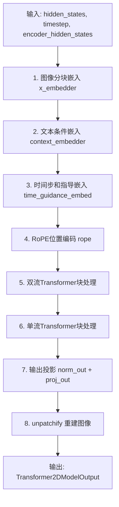

## 类结构

```
HunyuanImageAttnProcessor (注意力处理器)
HunyuanImagePatchEmbed (图像分块嵌入)
HunyuanImageByT5TextProjection (T5文本投影)
HunyuanImageAdaNorm (自适应归一化)
HunyuanImageCombinedTimeGuidanceEmbedding (时间指导嵌入)
HunyuanImageIndividualTokenRefinerBlock (Token精炼块)
HunyuanImageIndividualTokenRefiner (Token精炼器)
HunyuanImageTokenRefiner (文本Token精炼器)
HunyuanImageRotaryPosEmbed (旋转位置编码)
HunyuanImageSingleTransformerBlock (单流Transformer块)
HunyuanImageTransformerBlock (双流Transformer块)
HunyuanImageTransformer2DModel (主模型)
```

## 全局变量及字段


### `logger`
    
模块级别的日志记录器，用于输出调试和运行信息

类型：`logging.Logger`
    


### `HunyuanImageAttnProcessor._attention_backend`
    
注意力机制的后端实现，用于指定使用哪种注意力计算方式

类型：`Any`
    


### `HunyuanImageAttnProcessor._parallel_config`
    
并行配置参数，用于控制并行计算的相关设置

类型：`Any`
    


### `HunyuanImagePatchEmbed.patch_size`
    
图像块的尺寸，用于定义卷积核和步长的大小

类型：`tuple[int, int, tuple[int, int, int]]`
    


### `HunyuanImagePatchEmbed.proj`
    
卷积层，用于将输入图像转换为patch嵌入表示

类型：`nn.Conv2d | nn.Conv3d`
    


### `HunyuanImageByT5TextProjection.norm`
    
层归一化，用于稳定训练过程

类型：`nn.LayerNorm`
    


### `HunyuanImageByT5TextProjection.linear_1`
    
第一层线性变换，用于特征投影

类型：`nn.Linear`
    


### `HunyuanImageByT5TextProjection.linear_2`
    
第二层线性变换，用于特征映射

类型：`nn.Linear`
    


### `HunyuanImageByT5TextProjection.linear_3`
    
输出层线性变换，用于生成最终投影

类型：`nn.Linear`
    


### `HunyuanImageByT5TextProjection.act_fn`
    
高斯误差线性单元激活函数，用于引入非线性

类型：`nn.GELU`
    


### `HunyuanImageAdaNorm.linear`
    
线性变换层，用于处理时间步嵌入

类型：`nn.Linear`
    


### `HunyuanImageAdaNorm.nonlinearity`
    
Sigmoid线性单元激活函数，用于引入非线性

类型：`nn.SiLU`
    


### `HunyuanImageCombinedTimeGuidanceEmbedding.time_proj`
    
时间步投影器，用于将时间步转换为嵌入向量

类型：`Timesteps`
    


### `HunyuanImageCombinedTimeGuidanceEmbedding.timestep_embedder`
    
时间步嵌入器，用于生成时间步的嵌入表示

类型：`TimestepEmbedding`
    


### `HunyuanImageCombinedTimeGuidanceEmbedding.use_meanflow`
    
标志位，表示是否使用均值流（meanflow）机制

类型：`bool`
    


### `HunyuanImageCombinedTimeGuidanceEmbedding.time_proj_r`
    
可选的第二个时间步投影器，用于支持均值流

类型：`Timesteps | None`
    


### `HunyuanImageCombinedTimeGuidanceEmbedding.timestep_embedder_r`
    
可选的第二个时间步嵌入器，用于支持均值流

类型：`TimestepEmbedding | None`
    


### `HunyuanImageCombinedTimeGuidanceEmbedding.guidance_embedder`
    
指导嵌入器，用于处理条件引导信息

类型：`TimestepEmbedding | None`
    


### `HunyuanImageIndividualTokenRefinerBlock.norm1`
    
第一个归一化层，用于注意力机制前处理

类型：`nn.LayerNorm`
    


### `HunyuanImageIndividualTokenRefinerBlock.attn`
    
自注意力模块，用于细粒度特征提取

类型：`Attention`
    


### `HunyuanImageIndividualTokenRefinerBlock.norm2`
    
第二个归一化层，用于前馈网络前处理

类型：`nn.LayerNorm`
    


### `HunyuanImageIndividualTokenRefinerBlock.ff`
    
前馈网络模块，用于特征非线性变换

类型：`FeedForward`
    


### `HunyuanImageIndividualTokenRefinerBlock.norm_out`
    
输出归一化层，用于门控机制和特征调整

类型：`HunyuanImageAdaNorm`
    


### `HunyuanImageIndividualTokenRefiner.refiner_blocks`
    
多个细Token细化块的列表，用于堆叠多层细化器

类型：`nn.ModuleList[HunyuanImageIndividualTokenRefinerBlock]`
    


### `HunyuanImageTokenRefiner.time_text_embed`
    
时间和文本联合嵌入层，用于条件信息编码

类型：`CombinedTimestepTextProjEmbeddings`
    


### `HunyuanImageTokenRefiner.proj_in`
    
输入投影层，用于将文本嵌入映射到隐藏空间

类型：`nn.Linear`
    


### `HunyuanImageTokenRefiner.token_refiner`
    
Token细化器，用于细化和优化文本表示

类型：`HunyuanImageIndividualTokenRefiner`
    


### `HunyuanImageRotaryPosEmbed.patch_size`
    
图像块的尺寸，用于计算旋转位置嵌入的网格

类型：`tuple | list[int]`
    


### `HunyuanImageRotaryPosEmbed.rope_dim`
    
旋转位置嵌入的维度配置

类型：`tuple | list[int]`
    


### `HunyuanImageRotaryPosEmbed.theta`
    
旋转位置嵌入的基础频率参数

类型：`float`
    


### `HunyuanImageSingleTransformerBlock.attn`
    
注意力模块，用于处理单流特征

类型：`Attention`
    


### `HunyuanImageSingleTransformerBlock.norm`
    
自适应层归一化，用于条件特征调制

类型：`AdaLayerNormZeroSingle`
    


### `HunyuanImageSingleTransformerBlock.proj_mlp`
    
MLP投影层，用于扩展特征维度

类型：`nn.Linear`
    


### `HunyuanImageSingleTransformerBlock.act_mlp`
    
MLP激活函数，用于引入非线性

类型：`nn.GELU`
    


### `HunyuanImageSingleTransformerBlock.proj_out`
    
输出投影层，用于恢复原始特征维度

类型：`nn.Linear`
    


### `HunyuanImageTransformerBlock.norm1`
    
第一归一化层，用于latent流的调制

类型：`AdaLayerNormZero`
    


### `HunyuanImageTransformerBlock.norm1_context`
    
第一上下文归一化层，用于文本流的调制

类型：`AdaLayerNormZero`
    


### `HunyuanImageTransformerBlock.attn`
    
联合注意力模块，用于处理latent和文本流的交互

类型：`Attention`
    


### `HunyuanImageTransformerBlock.norm2`
    
第二归一化层，用于latent流前馈网络

类型：`nn.LayerNorm`
    


### `HunyuanImageTransformerBlock.ff`
    
前馈网络，用于latent流的特征变换

类型：`FeedForward`
    


### `HunyuanImageTransformerBlock.norm2_context`
    
第二上下文归一化层，用于文本流前馈网络

类型：`nn.LayerNorm`
    


### `HunyuanImageTransformerBlock.ff_context`
    
前馈网络，用于文本流的特征变换

类型：`FeedForward`
    


### `HunyuanImageTransformer2DModel.x_embedder`
    
图像patch嵌入器，用于将输入图像转换为token序列

类型：`HunyuanImagePatchEmbed`
    


### `HunyuanImageTransformer2DModel.context_embedder`
    
文本上下文嵌入器，用于处理文本条件信息

类型：`HunyuanImageTokenRefiner`
    


### `HunyuanImageTransformer2DModel.context_embedder_2`
    
第二个文本嵌入器，用于支持额外的文本投影（T5）

类型：`HunyuanImageByT5TextProjection | None`
    


### `HunyuanImageTransformer2DModel.time_guidance_embed`
    
时间和指导嵌入层，用于编码时间步和条件信息

类型：`HunyuanImageCombinedTimeGuidanceEmbedding`
    


### `HunyuanImageTransformer2DModel.rope`
    
旋转位置嵌入模块，用于引入位置信息

类型：`HunyuanImageRotaryPosEmbed`
    


### `HunyuanImageTransformer2DModel.transformer_blocks`
    
双流Transformer块列表，用于处理latent和文本的联合建模

类型：`nn.ModuleList[HunyuanImageTransformerBlock]`
    


### `HunyuanImageTransformer2DModel.single_transformer_blocks`
    
单流Transformer块列表，用于细粒度特征处理

类型：`nn.ModuleList[HunyuanImageSingleTransformerBlock]`
    


### `HunyuanImageTransformer2DModel.norm_out`
    
输出归一化层，用于最终特征调整

类型：`AdaLayerNormContinuous`
    


### `HunyuanImageTransformer2DModel.proj_out`
    
输出投影层，用于生成最终图像表示

类型：`nn.Linear`
    


### `HunyuanImageTransformer2DModel.gradient_checkpointing`
    
梯度检查点标志，用于节省显存开销

类型：`bool`
    
    

## 全局函数及方法


### HunyuanImageAttnProcessor.__init__

这是 HunyuanImageAttnProcessor 类的初始化方法，用于检查当前 PyTorch 环境是否满足要求（需要 PyTorch 2.0+ 以支持 scaled_dot_product_attention 函数）。

参数：

- 无（除隐式 self 参数外）

返回值：`None`，无返回值（构造函数）

#### 流程图

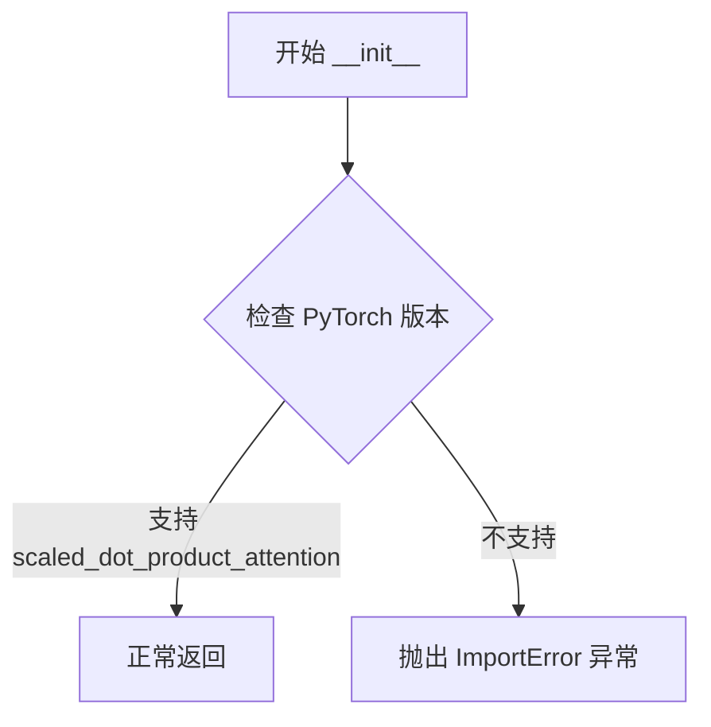

#### 带注释源码

```
def __init__(self):
    # 检查 PyTorch 是否支持 scaled_dot_product_attention 函数
    # 该函数是 PyTorch 2.0 引入的优化注意力计算函数
    if not hasattr(F, "scaled_dot_product_attention"):
        # 如果不支持，抛出 ImportError 提示用户升级 PyTorch
        raise ImportError(
            "HunyuanImageAttnProcessor requires PyTorch 2.0. To use it, please upgrade PyTorch to 2.0."
        )
```


### `HunyuanImageAttnProcessor.__call__`

这是HunyuanImage模型的注意力处理器核心方法，负责执行完整的注意力计算流程，包括QKV投影、QK归一化、旋转位置嵌入应用、编码器条件处理和最终的注意力输出投影。

参数：

- `attn`：`Attention`，注意力模块实例，包含QKV投影层、归一化层和输出投影层
- `hidden_states`：`torch.Tensor`，输入的隐藏状态张量，形状为(batch_size, seq_len, hidden_dim)
- `encoder_hidden_states`：`torch.Tensor | None`，编码器输出的隐藏状态，用于cross-attention，可为None
- `attention_mask`：`torch.Tensor | None`，注意力掩码，用于遮盖特定位置，可为None
- `image_rotary_emb`：`torch.Tensor | None`，图像旋转位置嵌入，用于位置编码，可为None

返回值：`tuple[torch.Tensor, torch.Tensor]`，返回处理后的隐藏状态和编码器隐藏状态元组

#### 流程图

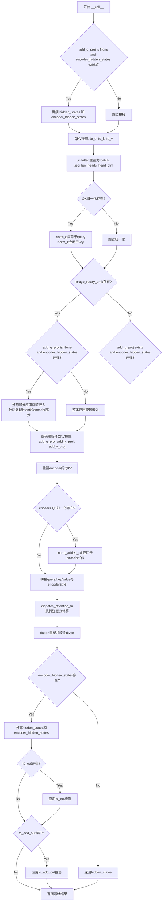

#### 带注释源码

```python
def __call__(
    self,
    attn: Attention,
    hidden_states: torch.Tensor,
    encoder_hidden_states: torch.Tensor | None = None,
    attention_mask: torch.Tensor | None = None,
    image_rotary_emb: torch.Tensor | None = None,
) -> torch.Tensor:
    """
    执行完整的注意力处理流程
    
    参数:
        attn: Attention模块，包含各种投影层和归一化层
        hidden_states: 输入的隐藏状态
        encoder_hidden_states: 编码器输出，用于cross-attention
        attention_mask: 注意力掩码
        image_rotary_emb: 旋转位置嵌入
    
    返回:
        处理后的hidden_states和encoder_hidden_states
    """
    
    # 步骤1: 如果没有单独的add_q_proj且存在encoder_hidden_states，则在序列维度上拼接
    # 这是为了在单一注意力层中同时处理latent和encoder信息
    if attn.add_q_proj is None and encoder_hidden_states is not None:
        hidden_states = torch.cat([hidden_states, encoder_hidden_states], dim=1)

    # 步骤2: QKV投影 - 将隐藏状态投影为Query、Key、Value三个矩阵
    # 使用Attention模块中定义的线性层进行投影
    query = attn.to_q(hidden_states)
    key = attn.to_k(hidden_states)
    value = attn.to_v(hidden_states)

    # 步骤3: unflatten - 将投影后的向量重塑为多头注意力格式
    # 从 (batch, seq_len, hidden_dim) 变为 (batch, seq_len, heads, head_dim)
    query = query.unflatten(2, (attn.heads, -1))
    key = key.unflatten(2, (attn.heads, -1))
    value = value.unflatten(2, (attn.heads, -1))

    # 步骤4: QK归一化 - 对query和key应用可学习的归一化层
    # 这有助于稳定训练和提升注意力机制的表现
    if attn.norm_q is not None:
        query = attn.norm_q(query)
    if attn.norm_k is not None:
        key = attn.norm_k(key)

    # 步骤5: 旋转位置嵌入 (RoPE) - 为latent流添加旋转位置信息
    # RoPE是一种无需显式位置编码的方式来引入位置信息
    if image_rotary_emb is not None:
        from ..embeddings import apply_rotary_emb

        # 分情况处理：是否需要分别处理latent和encoder部分
        if attn.add_q_proj is None and encoder_hidden_states is not None:
            # 分离处理：对latent部分应用RoPE，encoder部分保持不变
            query = torch.cat(
                [
                    apply_rotary_emb(
                        query[:, : -encoder_hidden_states.shape[1]], image_rotary_emb, sequence_dim=1
                    ),
                    query[:, -encoder_hidden_states.shape[1] :],
                ],
                dim=1,
            )
            key = torch.cat(
                [
                    apply_rotary_emb(key[:, : -encoder_hidden_states.shape[1]], image_rotary_emb, sequence_dim=1),
                    key[:, -encoder_hidden_states.shape[1] :],
                ],
                dim=1,
            )
        else:
            # 整体应用RoPE
            query = apply_rotary_emb(query, image_rotary_emb, sequence_dim=1)
            key = apply_rotary_emb(key, image_rotary_emb, sequence_dim=1)

    # 步骤6: 编码器条件QKV投影 - 处理encoder_hidden_states的额外投影
    # 这允许模型在cross-attention中引入额外的条件信息
    if attn.add_q_proj is not None and encoder_hidden_states is not None:
        encoder_query = attn.add_q_proj(encoder_hidden_states)
        encoder_key = attn.add_k_proj(encoder_hidden_states)
        encoder_value = attn.add_v_proj(encoder_hidden_states)

        # 同样重塑为多头格式
        encoder_query = encoder_query.unflatten(2, (attn.heads, -1))
        encoder_key = encoder_key.unflatten(2, (attn.heads, -1))
        encoder_value = encoder_value.unflatten(2, (attn.heads, -1))

        # 对encoder的QK应用归一化
        if attn.norm_added_q is not None:
            encoder_query = attn.norm_added_q(encoder_query)
        if attn.norm_added_k is not None:
            encoder_key = attn.norm_added_k(encoder_key)

        # 将encoder的QKV拼接到主QKV后面
        query = torch.cat([query, encoder_query], dim=1)
        key = torch.cat([key, encoder_key], dim=1)
        value = torch.cat([value, encoder_value], dim=1)

    # 步骤7: 注意力计算 - 使用dispatch_attention_fn分发到具体的注意力实现
    # 支持多种注意力后端（flash attention, xformers等）
    hidden_states = dispatch_attention_fn(
        query,
        key,
        value,
        attn_mask=attention_mask,
        dropout_p=0.0,
        is_causal=False,
        backend=self._attention_backend,
        parallel_config=self._parallel_config,
    )
    
    # 重新塑形并转换数据类型以匹配query的dtype
    hidden_states = hidden_states.flatten(2, 3)
    hidden_states = hidden_states.to(query.dtype)

    # 步骤8: 输出投影 - 将注意力输出投影回原始维度
    if encoder_hidden_states is not None:
        # 分离回hidden_states和encoder_hidden_states
        hidden_states, encoder_hidden_states = (
            hidden_states[:, : -encoder_hidden_states.shape[1]],
            hidden_states[:, -encoder_hidden_states.shape[1] :],
        )

        # 对hidden_states应用输出投影层（通常是线性+dropout）
        if getattr(attn, "to_out", None) is not None:
            hidden_states = attn.to_out[0](hidden_states)
            hidden_states = attn.to_out[1](hidden_states)

        # 对encoder_hidden_states应用额外的输出投影
        if getattr(attn, "to_add_out", None) is not None:
            encoder_hidden_states = attn.to_add_out(encoder_hidden_states)

    return hidden_states, encoder_hidden_states
```


### `HunyuanImagePatchEmbed.__init__`

HunyuanImagePatchEmbed类的初始化方法，负责构建图像patch嵌入层。该方法根据patch_size的维度（2D或3D）选择合适的卷积层（Conv2d或Conv3d）将输入图像转换为patch序列。

参数：

- `self`：隐式参数，HunyuanImagePatchEmbed实例本身
- `patch_size`：参数类型为 `tuple[int, int] | tuple[int, int, int]`，默认值`(16, 16)`，表示patch的尺寸，可以是2D (height, width) 或3D (frames, height, width)
- `in_chans`：参数类型为 `int`，默认值`3`，输入图像的通道数
- `embed_dim`：参数类型为 `int`，默认值`768`，输出嵌入向量的维度

返回值：`None`，无返回值，仅完成对象初始化

#### 流程图

```mermaid
flowchart TD
    A[开始 __init__] --> B[调用 super().__init__]
    B --> C[保存 self.patch_size = patch_size]
    C --> D{len(patch_size) == 2?}
    D -->|是| E[创建 nn.Conv2d<br/>kernel_size=patch_size<br/>stride=patch_size]
    D -->|否| F{len(patch_size) == 3?}
    F -->|是| G[创建 nn.Conv3d<br/>kernel_size=patch_size<br/>stride=patch_size]
    F -->|否| H[抛出 ValueError<br/>patch_size长度必须是2或3]
    E --> I[结束 __init__]
    G --> I
    H --> I
```

#### 带注释源码

```python
def __init__(
    self,
    patch_size: tuple[int, int, tuple[int, int, int]] = (16, 16),
    in_chans: int = 3,
    embed_dim: int = 768,
) -> None:
    """初始化 HunyuanImagePatchEmbed 模块
    
    参数:
        patch_size: patch的尺寸，支持2D (height, width) 或3D (frames, height, width)
        in_chans: 输入图像通道数，默认3（RGB图像）
        embed_dim: 输出嵌入维度，默认768
    """
    # 调用父类 nn.Module 的初始化方法
    super().__init__()

    # 保存 patch_size 到实例属性，供后续 forward 方法使用
    self.patch_size = patch_size

    # 根据 patch_size 的维度选择对应的卷积投影层
    if len(patch_size) == 2:
        # 2D图像情况：使用 Conv2d 进行空间patch嵌入
        # 例如 patch_size=(16,16) 将图像划分为16x16的patch
        self.proj = nn.Conv2d(in_chans, embed_dim, kernel_size=patch_size, stride=patch_size)
    elif len(patch_size) == 3:
        # 3D视频/体积数据情况：使用 Conv3d 进行时空patch嵌入
        # 例如 patch_size=(1,16,16) 对视频帧进行1x16x16的patch划分
        self.proj = nn.Conv3d(in_chans, embed_dim, kernel_size=patch_size, stride=patch_size)
    else:
        # 参数校验：patch_size 必须是2维或3维元组
        raise ValueError(f"patch_size must be a tuple of length 2 or 3, got {len(patch_size)}")
```


### `HunyuanImagePatchEmbed.forward`

该方法实现图像到patch嵌入的转换，将输入的图像或视频张量通过卷积操作转换为patch序列表示，支持2D图像（4D张量）和3D视频（5D张量）的patch嵌入。

参数：

- `hidden_states`：`torch.Tensor`，输入的隐藏状态张量，形状为 (batch_size, in_chans, height, width) 或 (batch_size, in_chans, frames, height, width)

返回值：`torch.Tensor`，经过patch嵌入后的隐藏状态张量，形状为 (batch_size, num_patches, embed_dim)，其中 num_patches 为空间和时间维度的patch总数

#### 流程图

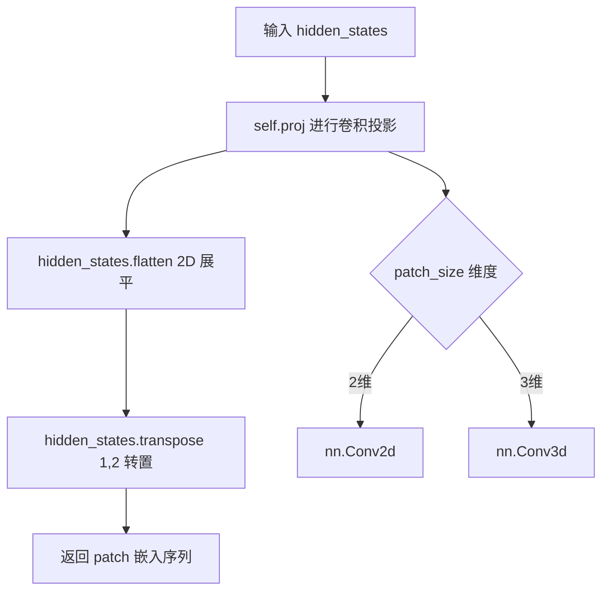

#### 带注释源码

```python
def forward(self, hidden_states: torch.Tensor) -> torch.Tensor:
    # 使用卷积层将输入图像/视频投影到嵌入空间
    # 输入形状: (batch_size, in_chans, height, width) 或 (batch_size, in_chans, frames, height, width)
    # 输出形状: (batch_size, embed_dim, *spatial_dims) 其中 spatial_dims 取决于 patch_size
    hidden_states = self.proj(hidden_states)
    
    # 展平并转置，将空间维度展平到序列维度
    # flatten(2): 将空间维度展平，从 (batch, embed_dim, H, W) -> (batch, embed_dim, H*W)
    # transpose(1,2): 转置维度，从 (batch, embed_dim, H*W) -> (batch, H*W, embed_dim)
    # 最终输出形状: (batch_size, num_patches, embed_dim)
    hidden_states = hidden_states.flatten(2).transpose(1, 2)
    
    return hidden_states
```


### `HunyuanImageByT5TextProjection.__init__`

该方法是 `HunyuanImageByT5TextProjection` 类的构造函数，用于初始化一个三层全连接神经网络模块，包含层归一化和 GELU 激活函数，用于对 T5 文本投影进行特征变换。

参数：

- `self`：`HunyuanImageByT5TextProjection`，类的实例自身
- `in_features`：`int`，输入特征的维度
- `hidden_size`：`int`，隐藏层的维度
- `out_features`：`int`，输出特征的维度

返回值：`None`，构造函数不返回任何值

#### 流程图

```mermaid
flowchart TD
    A[开始 __init__] --> B[调用 super().__init__ 初始化nn.Module]
    B --> C[创建 LayerNorm: self.norm]
    C --> D[创建 Linear: self.linear_1 in_features → hidden_size]
    D --> E[创建 Linear: self.linear_2 hidden_size → hidden_size]
    E --> F[创建 Linear: self.linear_3 hidden_size → out_features]
    F --> G[创建 GELU 激活函数: self.act_fn]
    G --> H[结束 __init__]
```

#### 带注释源码

```python
def __init__(self, in_features: int, hidden_size: int, out_features: int):
    # 调用父类 nn.Module 的初始化方法
    super().__init__()
    
    # 层归一化，用于稳定训练过程
    self.norm = nn.LayerNorm(in_features)
    
    # 第一个线性变换层：输入特征 -> 隐藏层维度
    self.linear_1 = nn.Linear(in_features, hidden_size)
    
    # 第二个线性变换层：隐藏层维度 -> 隐藏层维度（保持维度不变）
    self.linear_2 = nn.Linear(hidden_size, hidden_size)
    
    # 第三个线性变换层：隐藏层维度 -> 输出特征维度
    self.linear_3 = nn.Linear(hidden_size, out_features)
    
    # GELU 激活函数，提供非线性变换
    self.act_fn = nn.GELU()
```


### HunyuanImageByT5TextProjection.forward

该函数实现了一个双层MLP（多层感知机），用于将T5文本编码器的隐藏状态投影到Transformer内部维度，包含层归一化和GELU激活函数。

参数：

- `self`：HunyuanImageByT5TextProjection实例本身
- `encoder_hidden_states`：`torch.Tensor`，T5文本编码器输出的隐藏状态张量

返回值：`torch.Tensor`，经过两层MLP投影和激活后的隐藏状态张量

#### 流程图

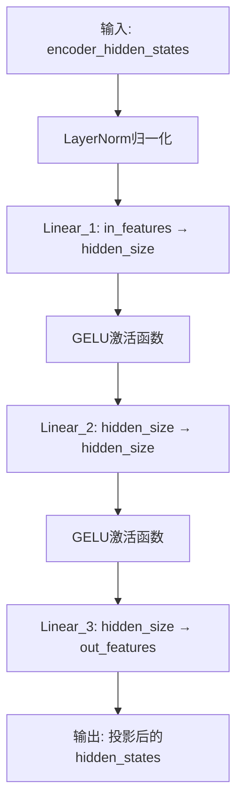

#### 带注释源码

```python
def forward(self, encoder_hidden_states: torch.Tensor) -> torch.Tensor:
    """
    HunyuanImageByT5TextProjection的前向传播方法
    
    该方法实现了一个双层MLP网络，用于将T5文本编码器的输出投影到
    Transformer模型内部的隐藏维度。
    
    参数:
        encoder_hidden_states: T5文本编码器的输出隐藏状态
        
    返回值:
        投影后的隐藏状态张量
    """
    # 第一步：对输入进行LayerNorm归一化
    # 使用LayerNorm可以稳定训练过程，提高模型收敛速度
    hidden_states = self.norm(encoder_hidden_states)
    
    # 第二步：第一次线性变换 + 激活
    # 将特征维度从 in_features 投影到 hidden_size
    hidden_states = self.linear_1(hidden_states)
    
    # GELU激活函数，提供非线性变换
    # GELU相比ReLU具有更平滑的梯度，通常能带来更好的性能
    hidden_states = self.act_fn(hidden_states)
    
    # 第三步：第二次线性变换（hidden_size → hidden_size）
    # 这是一个中间层，保持维度不变
    hidden_states = self.linear_2(hidden_states)
    
    # 再次应用GELU激活函数
    hidden_states = self.act_fn(hidden_states)
    
    # 第四步：最后一次线性变换
    # 将特征维度从 hidden_size 投影到 out_features
    hidden_states = self.linear_3(hidden_states)
    
    return hidden_states
```


### `HunyuanImageAdaNorm.__init__`

这是 HunyuanImageAdaNorm 类的构造函数，用于初始化一个自适应归一化层，该层包含一个线性层和一个非线性激活函数（SiLU），用于根据时间步长嵌入生成门控参数。

参数：

- `self`：隐式参数，表示类的实例本身
- `in_features`：`int`，输入特征的维度
- `out_features`：`int | None`，输出特征的维度，默认为 None。当为 None 时，会自动设置为 `2 * in_features`

返回值：`None`，构造函数不返回任何值

#### 流程图

```mermaid
flowchart TD
    A[开始 __init__] --> B[调用父类初始化 super().__init__]
    B --> C{out_features 是否为 None}
    C -->|是| D[设置 out_features = 2 * in_features]
    C -->|否| E[保持 out_features 不变]
    D --> F[创建线性层 self.linear]
    E --> F
    F --> G[创建 SiLU 激活层 self.nonlinearity]
    G --> H[结束 __init__]
```

#### 带注释源码

```python
def __init__(self, in_features: int, out_features: int | None = None) -> None:
    """
    初始化 HunyuanImageAdaNorm 层
    
    参数:
        in_features: 输入特征的维度
        out_features: 输出特征的维度，默认为 None
    """
    # 调用父类 nn.Module 的初始化方法
    super().__init__()

    # 如果 out_features 未指定，则默认为输入维度的两倍
    # 这是为了生成两组门控参数（gate_msa 和 gate_mlp）
    out_features = out_features or 2 * in_features
    
    # 创建一个线性层，将输入特征映射到输出特征空间
    # 输入: [batch, in_features]
    # 输出: [batch, out_features]
    self.linear = nn.Linear(in_features, out_features)
    
    # 创建 SiLU (Sigmoid Linear Unit) 激活函数
    # SiLU(x) = x * sigmoid(x)，也称为 Swish
    self.nonlinearity = nn.SiLU()
```


### `HunyuanImageAdaNorm.forward`

该方法接收时间嵌入张量，经过线性变换和SiLU激活后，将其分割为两个门控参数（gate_msa和gate_mlp），用于后续Transformer模块中对多头自注意力（MSA）和多层感知器（MLP）进行自适应调制。

参数：

- `self`：HunyuanImageAdaNorm实例本身
- `temb`：`torch.Tensor`，时间嵌入张量，通常来源于时间步的嵌入表示

返回值：`tuple[torch.Tensor, torch.Tensor]`，返回两个门控张量——gate_msa（多头自注意力门控）和gate_mlp（多层感知器门控），分别用于对注意力模块和前馈网络进行自适应缩放

#### 流程图

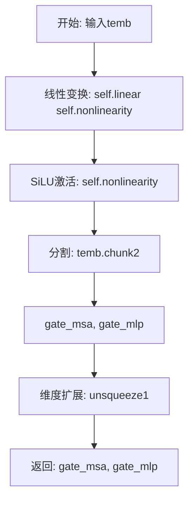

#### 带注释源码

```python
def forward(
    self, temb: torch.Tensor
) -> tuple[torch.Tensor, torch.Tensor, torch.Tensor, torch.Tensor, torch.Tensor]:
    """
    前向传播方法，用于生成AdaNorm自适应门控参数
    
    参数:
        temb: 时间嵌入张量，形状为 [batch_size, hidden_dim]
    
    返回:
        gate_msa: 多头自注意力门控参数，形状为 [batch_size, 1, hidden_dim]
        gate_mlp: 多层感知器门控参数，形状为 [batch_size, 1, hidden_dim]
    """
    # 步骤1: 线性变换 + SiLU非线性激活
    # 将输入的时间嵌入投影到2倍的隐藏维度空间
    temb = self.linear(self.nonlinearity(temb))
    # temb 形状: [batch_size, 2 * hidden_dim]
    
    # 步骤2: 沿通道维度将张量分割成两部分
    # chunk(2, dim=1) 表示在维度1（通道维）分割成2块
    gate_msa, gate_mlp = temb.chunk(2, dim=1)
    # gate_msa 形状: [batch_size, hidden_dim]
    # gate_mlp 形状: [batch_size, hidden_dim]
    
    # 步骤3: 扩展维度以便后续广播乘法
    # unsqueeze(1) 在位置1插入维度，用于与注意力输出进行逐元素乘法
    gate_msa, gate_mlp = gate_msa.unsqueeze(1), gate_mlp.unsqueeze(1)
    # gate_msa 形状: [batch_size, 1, hidden_dim]
    # gate_mlp 形状: [batch_size, 1, hidden_dim]
    
    # 返回两个门控参数，用于后续模块的Adaptive Norm调制
    return gate_msa, gate_mlp
```


### `HunyuanImageCombinedTimeGuidanceEmbedding.__init__`

这是 HunyuanImageCombinedTimeGuidanceEmbedding 类的初始化方法，用于初始化时间步（timestep）和条件引导（guidance）的嵌入层，支持可选的 meanflow 机制和多模态条件嵌入。

参数：

- `self`：类实例本身
- `embedding_dim`：`int`，嵌入向量的维度，用于时间步嵌入层
- `guidance_embeds`：`bool`，默认为 `False`，是否启用条件引导嵌入
- `use_meanflow`：`bool`，默认为 `False`，是否使用 meanflow 机制（双时间步处理）

返回值：`None`（`__init__` 方法不返回任何值）

#### 流程图

```mermaid
flowchart TD
    A[开始 __init__] --> B[调用 super().__init__]
    B --> C[创建 Timesteps 投影器: self.time_proj]
    C --> D[创建 TimestepEmbedding 嵌入器: self.timestep_embedder]
    D --> E{use_meanflow == True?}
    E -->|Yes| F[创建第二个 Timesteps: self.time_proj_r]
    F --> G[创建第二个 TimestepEmbedding: self.timestep_embedder_r]
    E -->|No| H{guidance_embeds == True?}
    G --> H
    H -->|Yes| I[创建 guidance 嵌入器: self.guidance_embedder]
    H -->|No| J[设置 self.guidance_embedder = None]
    I --> K[结束 __init__]
    J --> K
```

#### 带注释源码

```python
class HunyuanImageCombinedTimeGuidanceEmbedding(nn.Module):
    def __init__(
        self,
        embedding_dim: int,
        guidance_embeds: bool = False,
        use_meanflow: bool = False,
    ):
        """
        初始化时间步和条件引导嵌入层。
        
        Args:
            embedding_dim: 嵌入向量的维度，用于创建 TimestepEmbedding
            guidance_embeds: 是否启用条件引导嵌入，如果为 True 则创建 guidance_embedder
            use_meanflow: 是否使用 meanflow 机制，如果为 True 则创建额外的时间投影和嵌入器
        """
        # 调用父类 nn.Module 的初始化方法
        super().__init__()

        # 创建主时间步投影器：将时间步索引映射到 256 维向量
        # flip_sin_to_cos=True 表示使用 sin-cos 位置编码
        # downscale_freq_shift=0 表示频率偏移量为 0
        self.time_proj = Timesteps(num_channels=256, flip_sin_to_cos=True, downscale_freq_shift=0)
        
        # 创建主时间步嵌入器：将 256 维投影向量映射到指定的 embedding_dim
        self.timestep_embedder = TimestepEmbedding(in_channels=256, time_embed_dim=embedding_dim)

        # 保存 use_meanflow 配置，供 forward 方法使用
        self.use_meanflow = use_meanflow

        # 初始化为 None，后续根据条件可能创建
        self.time_proj_r = None
        self.timestep_embedder_r = None
        
        # 如果启用 meanflow，创建第二个时间步投影和嵌入器（用于双时间步处理）
        if use_meanflow:
            self.time_proj_r = Timesteps(num_channels=256, flip_sin_to_cos=True, downscale_freq_shift=0)
            self.timestep_embedder_r = TimestepEmbedding(in_channels=256, time_embed_dim=embedding_dim)

        # 初始化 guidance 嵌入器为 None
        self.guidance_embedder = None
        
        # 如果启用 guidance 嵌入，创建对应的嵌入器
        if guidance_embeds:
            self.guidance_embedder = TimestepEmbedding(in_channels=256, time_embed_dim=embedding_dim)
```


### `HunyuanImageCombinedTimeGuidanceEmbedding.forward`

该方法将时间步（timestep）和可选的引导向量（guidance）转换为条件嵌入向量，用于后续Transformer模块的调制。它支持均值流（meanflow）模式下的双时间步处理，并通过Guidance Embedder实现对分类器free guidance的支持。

参数：

- `self`：`HunyuanImageCombinedTimeGuidanceEmbedding` 类实例本身
- `timestep`：`torch.Tensor`，主要的时间步输入，通常为扩散过程中的时间步t
- `timestep_r`：`torch.Tensor | None`，可选的第二个时间步输入，用于均值流模式下的时间步平均，默认值为 `None`
- `guidance`：`torch.Tensor | None`，可选的引导向量输入，用于实现 classifier-free guidance，默认值为 `None`

返回值：`tuple[torch.Tensor, torch.Tensor]`，返回条件嵌入向量（注：当前实现实际只返回一个张量，与类型注解存在不一致）

#### 流程图

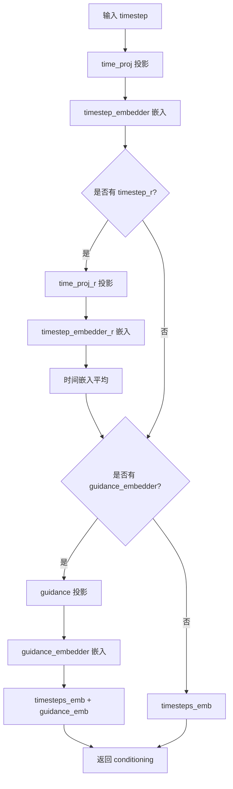

#### 带注释源码

```python
def forward(
    self,
    timestep: torch.Tensor,
    timestep_r: torch.Tensor | None = None,
    guidance: torch.Tensor | None = None,
) -> tuple[torch.Tensor, torch.Tensor]:
    # Step 1: 将输入的时间步 timestep 通过时间投影层转换为中间表示
    timesteps_proj = self.time_proj(timestep)
    # Step 2: 将投影后的时间步嵌入到指定维度的向量空间
    timesteps_emb = self.timestep_embedder(timesteps_proj.to(dtype=timestep.dtype))

    # Step 3: 如果提供了第二个时间步 timestep_r（用于均值流模式），则对其同样进行投影和嵌入
    if timestep_r is not None:
        timesteps_proj_r = self.time_proj_r(timestep_r)
        timesteps_emb_r = self.timestep_embedder_r(timesteps_proj_r.to(dtype=timestep.dtype))
        # Step 4: 对两个时间步的嵌入取平均，实现均值流的时间步融合
        timesteps_emb = (timesteps_emb + timesteps_emb_r) / 2

    # Step 5: 如果配置了 guidance_embedder，则处理引导向量
    if self.guidance_embedder is not None:
        # 将引导向量投影到与时间步相同的空间
        guidance_proj = self.time_proj(guidance)
        # 嵌入引导向量
        guidance_emb = self.guidance_embedder(guidance_proj.to(dtype=timestep.dtype))
        # Step 6: 将时间步嵌入与引导嵌入相加，得到最终的条件嵌入
        conditioning = timesteps_emb + guidance_emb
    else:
        # 如果没有引导向量，直接使用时间步嵌入作为条件嵌入
        conditioning = timesteps_emb

    # 返回条件嵌入向量（注意：当前实现只返回一个张量，但类型注解声明返回tuple）
    return conditioning
```


### HunyuanImageIndividualTokenRefinerBlock.__init__

该方法是 HunyuanImageIndividualTokenRefinerBlock 类的初始化方法，用于构建单个 Token Refiner 块的神经网络结构。该块包含一个自注意力层（Self-Attention）、一个前馈神经网络（FeedForward）以及三个 LayerNorm 层，其中还包括一个自定义的 AdaNorm 输出归一化层，用于实现自适应调制（Adaptive Normalization）。

参数：

- `num_attention_heads`：`int`，注意力头的数量，默认为 28
- `attention_head_dim`：`int`，每个注意力头的维度，默认为 128
- `mlp_width_ratio`：`str` 或 `float`，前馈网络宽度的倍数，默认为 4.0
- `mlp_drop_rate`：`float`，前馈网络的 Dropout 概率，默认为 0.0
- `attention_bias`：`bool`，注意力层中是否使用偏置，默认为 True

返回值：`None`，该方法没有返回值，仅用于初始化对象属性

#### 流程图

```mermaid
flowchart TD
    A[开始 __init__] --> B[调用 super().__init__]
    B --> C[计算 hidden_size = num_attention_heads * attention_head_dim]
    C --> D[创建 self.norm1: LayerNorm]
    D --> E[创建 self.attn: Attention 自注意力层]
    E --> F[创建 self.norm2: LayerNorm]
    F --> G[创建 self.ff: FeedForward 前馈网络]
    G --> H[创建 self.norm_out: HunyuanImageAdaNorm]
    H --> I[结束 __init__]
```

#### 带注释源码

```python
def __init__(
    self,
    num_attention_heads: int,  # 28
    attention_head_dim: int,  # 128
    mlp_width_ratio: str = 4.0,
    mlp_drop_rate: float = 0.0,
    attention_bias: bool = True,
) -> None:
    """
    初始化 HunyuanImageIndividualTokenRefinerBlock
    
    参数:
        num_attention_heads: 注意力头的数量
        attention_head_dim: 每个注意力头的维度
        mlp_width_ratio: 前馈网络宽度倍数
        mlp_drop_rate: 前馈网络Dropout概率
        attention_bias: 是否在注意力层使用偏置
    """
    # 调用父类 nn.Module 的初始化方法
    super().__init__()

    # 计算隐藏层大小: hidden_size = num_attention_heads * attention_head_dim
    # 例如: 28 * 128 = 3584
    hidden_size = num_attention_heads * attention_head_dim

    # 第一个归一化层，用于注意力机制之前的输入归一化
    # 使用 LayerNorm，elementwise_affine=True 表示使用可学习的缩放和偏移参数
    # eps=1e-6 用于数值稳定性
    self.norm1 = nn.LayerNorm(hidden_size, elementwise_affine=True, eps=1e-6)
    
    # 自注意力层 (Self-Attention)
    # query_dim: Q 投影的输入维度
    # cross_attention_dim: 跨注意力维度，None 表示纯自注意力
    # heads: 注意力头数量
    # dim_head: 每个头的维度
    # bias: 是否使用偏置
    self.attn = Attention(
        query_dim=hidden_size,
        cross_attention_dim=None,
        heads=num_attention_heads,
        dim_head=attention_head_dim,
        bias=attention_bias,
    )

    # 第二个归一化层，用于前馈网络之前的隐藏状态归一化
    self.norm2 = nn.LayerNorm(hidden_size, elementwise_affine=True, eps=1e-6)
    
    # 前馈神经网络 (FeedForward Network)
    # 使用 linear-silu 激活函数
    # mult=mlp_width_ratio 控制隐藏层维度倍数
    # dropout=mlp_drop_rate 控制 Dropout 概率
    self.ff = FeedForward(hidden_size, mult=mlp_width_ratio, activation_fn="linear-silu", dropout=mlp_drop_rate)

    # 输出归一化层，使用自定义的 AdaLayerNorm
    # 输出维度为 2 * hidden_size，用于生成门控参数 gate_msa 和 gate_mlp
    self.norm_out = HunyuanImageAdaNorm(hidden_size, 2 * hidden_size)
```


### `HunyuanImageIndividualTokenRefinerBlock.forward`

该方法是 HunyuanImageIndividualTokenRefinerBlock 的前向传播函数，实现了一个包含自注意力（Self-Attention）和前馈网络（Feed-Forward）的 Transformer 块，并通过 AdaNorm 进行时间步（timestep）条件下的门控调制。

参数：

- `hidden_states`：`torch.Tensor`，输入的隐藏状态张量，形状为 [batch_size, seq_len, hidden_size]
- `temb`：`torch.Tensor`，时间步嵌入向量，用于 AdaNorm 门控调制
- `attention_mask`：`torch.Tensor | None`，可选的注意力掩码，用于控制注意力计算

返回值：`torch.Tensor`，经过自注意力、前馈网络和门控调制后的输出隐藏状态

#### 流程图

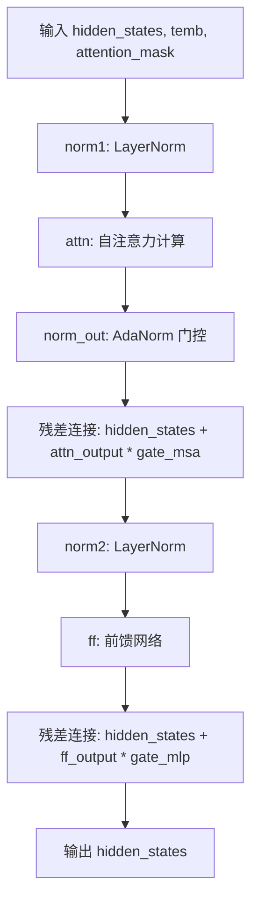

#### 带注释源码

```python
def forward(
    self,
    hidden_states: torch.Tensor,
    temb: torch.Tensor,
    attention_mask: torch.Tensor | None = None,
) -> torch.Tensor:
    # 步骤1: 对输入hidden_states进行LayerNorm归一化
    norm_hidden_states = self.norm1(hidden_states)

    # 步骤2: 执行自注意力计算
    # encoder_hidden_states为None，表示这是纯自注意力机制
    attn_output = self.attn(
        hidden_states=norm_hidden_states,
        encoder_hidden_states=None,
        attention_mask=attention_mask,
    )

    # 步骤3: 使用AdaNorm根据时间步嵌入temb计算门控信号
    # 返回两个门控系数：gate_msa用于注意力输出，gate_mlp用于前馈输出
    gate_msa, gate_mlp = self.norm_out(temb)

    # 步骤4: 残差连接并应用门控调制
    # hidden_states = hidden_states + attn_output * gate_msa
    hidden_states = hidden_states + attn_output * gate_msa

    # 步骤5: 对残差结果再次进行LayerNorm
    norm_hidden_states = self.norm2(hidden_states)

    # 步骤6: 前馈网络计算
    ff_output = self.ff(norm_hidden_states)

    # 步骤7: 残差连接并应用门控调制
    # hidden_states = hidden_states + ff_output * gate_mlp
    hidden_states = hidden_states + ff_output * gate_mlp

    # 返回最终调制后的隐藏状态
    return hidden_states
```


### `HunyuanImageIndividualTokenRefiner.__init__`

该方法是 `HunyuanImageIndividualTokenRefiner` 类的构造函数，用于初始化 Individual Token Refiner 模块。该模块由多个 `HunyuanImageIndividualTokenRefinerBlock` 组成，用于对图像 token 进行细化和增强处理。

参数：

- `num_attention_heads`：`int`，注意力头数量，决定多头注意力机制的并行头数
- `attention_head_dim`：`int`，每个注意力头的维度，决定每个头的特征维度大小
- `num_layers`：`int`，refiner block 的层数，决定网络深度
- `mlp_width_ratio`：`float`，MLP 宽度比例，默认为 4.0，用于计算 FFN 中间层维度
- `mlp_drop_rate`：`float`，MLP 层的 dropout 率，默认为 0.0，用于防止过拟合
- `attention_bias`：`bool`，是否在注意力层使用偏置，默认为 True

返回值：`None`，构造函数不返回任何值，仅初始化对象属性

#### 流程图

```mermaid
graph TD
    A[开始 __init__] --> B[调用 super().__init__ 初始化 nn.Module]
    B --> C[计算 hidden_size = num_attention_heads × attention_head_dim]
    C --> D[创建 refiner_blocks: nn.ModuleList]
    D --> E[循环 num_layers 次]
    E --> F[每次循环创建 HunyuanImageIndividualTokenRefinerBlock]
    F --> G[将每个 block 添加到 ModuleList]
    G --> H[结束]
```

#### 带注释源码

```python
def __init__(
    self,
    num_attention_heads: int,      # 注意力头数量，如 28
    attention_head_dim: int,       # 每个头的维度，如 128
    num_layers: int,               # refiner block 堆叠层数，如 2
    mlp_width_ratio: float = 4.0,  # MLP 中间层宽度比例
    mlp_drop_rate: float = 0.0,   # MLP dropout 概率
    attention_bias: bool = True,   # 是否使用注意力偏置
) -> None:
    """初始化 Individual Token Refiner 模块
    
    该模块由多个 Transformer Block 组成，用于对图像 token 进行细化和增强。
    每个 block 包含自注意力机制和前馈网络，配合 AdaNorm 进行条件信息注入。
    
    Args:
        num_attention_heads: 注意力头数量
        attention_head_dim: 每个注意力头的维度
        num_layers: refiner block 的层数
        mlp_width_ratio: MLP 宽度比例，用于计算中间层维度
        mlp_drop_rate: MLP 层的 dropout 率
        attention_bias: 是否在注意力层使用偏置
    """
    super().__init__()  # 调用 nn.Module 的初始化方法

    # 计算隐藏层维度：注意力头数 × 每头维度
    hidden_size = num_attention_heads * attention_head_dim

    # 创建多个 RefinerBlock 组成的 ModuleList
    # 每个 block 包含独立的注意力层、前馈网络和 AdaNorm 调制
    self.refiner_blocks = nn.ModuleList(
        [
            HunyuanImageIndividualTokenRefinerBlock(
                num_attention_heads=num_attention_heads,  # 传递注意力头数
                attention_head_dim=attention_head_dim,   # 传递每头维度
                mlp_width_ratio=mlp_width_ratio,          # 传递 MLP 宽度比
                mlp_drop_rate=mlp_drop_rate,              # 传递 dropout 率
                attention_bias=attention_bias,            # 传递偏置设置
            )
            for _ in range(num_layers)  # 循环创建 num_layers 个 block
        ]
    )
```


### `HunyuanImageIndividualTokenRefiner.forward`

该函数是 HunyuanImageIndividualTokenRefiner 类的前向传播方法，负责对输入的隐藏状态进行 token 精炼处理。它首先根据注意力掩码构建自注意力掩码，然后依次通过多个 refiner 块进行特征精炼，最后返回精炼后的隐藏状态。

参数：

- `hidden_states`：`torch.Tensor`，输入的隐藏状态张量，形状为 [batch_size, seq_len, hidden_size]
- `temb`：`torch.Tensor`，时间步嵌入或条件嵌入，用于调制注意力门的非线性权重
- `attention_mask`：`torch.Tensor | None`，可选的注意力掩码，用于指示哪些位置是有效的，如果为 None 则不应用掩码

返回值：`torch.Tensor`，经过多层 refiner 块精炼后的隐藏状态张量

#### 流程图

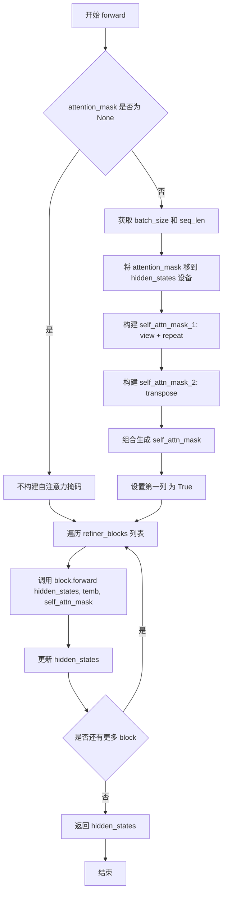

#### 带注释源码

```python
def forward(
    self,
    hidden_states: torch.Tensor,
    temb: torch.Tensor,
    attention_mask: torch.Tensor | None = None,
) -> None:
    # 初始化自注意力掩码为 None
    self_attn_mask = None
    
    # 如果提供了注意力掩码，则构建自注意力掩码
    if attention_mask is not None:
        # 获取批次大小和序列长度
        batch_size = attention_mask.shape[0]
        seq_len = attention_mask.shape[1]
        
        # 将 attention_mask 移到 hidden_states 所在的设备上
        attention_mask = attention_mask.to(hidden_states.device)
        
        # 将 attention_mask 从 [batch_size, seq_len] 变形为 [batch_size, 1, 1, seq_len]
        # 然后在第2和第3维度重复 seq_len 次，得到 [batch_size, 1, seq_len, seq_len]
        self_attn_mask_1 = attention_mask.view(batch_size, 1, 1, seq_len).repeat(1, 1, seq_len, 1)
        
        # 对 self_attn_mask_1 进行转置，得到 [batch_size, seq_len, 1, seq_len]
        self_attn_mask_2 = self_attn_mask_1.transpose(2, 3)
        
        # 对两个掩码进行逻辑与操作，得到对称的注意力掩码 [batch_size, seq_len, seq_len, seq_len]
        self_attn_mask = (self_attn_mask_1 & self_attn_mask_2).bool()
        
        # 将第一列设置为 True，确保第一个 token 可以关注所有其他 token
        self_attn_mask[:, :, :, 0] = True

    # 遍历所有 refiner 块，依次对 hidden_states 进行精炼
    for block in self.refiner_blocks:
        hidden_states = block(hidden_states, temb, self_attn_mask)

    # 返回精炼后的隐藏状态
    return hidden_states
```


### HunyuanImageTokenRefiner.__init__

这是 HunyuanImageTokenRefiner 类的构造函数，用于初始化图像 Token 优化器模块，包含时间文本嵌入层、输入投影层和多个 Token 优化器块。

参数：

- `in_channels`：`int`，输入通道数，来源于文本编码器的嵌入维度
- `num_attention_heads`：`int`，多头注意力机制中的注意力头数量
- `attention_head_dim`：`int`，每个注意力头的维度
- `num_layers`：`int`，Token 优化器块的层数
- `mlp_ratio`：`float`，前馈网络隐藏层与输入维度的比率，默认为 4.0
- `mlp_drop_rate`：`float`，前馈网络的 Dropout 概率，默认为 0.0
- `attention_bias`：`bool`，注意力层是否使用偏置，默认为 True

返回值：`None`，构造函数无返回值

#### 流程图

```mermaid
flowchart TD
    A[开始 __init__] --> B[调用 super().__init__]
    B --> C[计算 hidden_size = num_attention_heads * attention_head_dim]
    C --> D[初始化 CombinedTimestepTextProjEmbeddings]
    D --> E[初始化 nn.Linear 投影层 proj_in]
    E --> F[初始化 HunyuanImageIndividualTokenRefiner]
    F --> G[结束]
```

#### 带注释源码

```python
def __init__(
    self,
    in_channels: int,                    # 输入通道数，来自文本编码器
    num_attention_heads: int,            # 注意力头数量
    attention_head_dim: int,             # 每个注意力头的维度
    num_layers: int,                     # Token优化器的层数
    mlp_ratio: float = 4.0,              # MLP隐藏层扩展比率
    mlp_drop_rate: float = 0.0,          # MLP的Dropout概率
    attention_bias: bool = True,         # 注意力层是否使用偏置
) -> None:
    # 调用父类 nn.Module 的初始化方法
    super().__init__()

    # 计算隐藏层大小：头数 × 头维度
    hidden_size = num_attention_heads * attention_head_dim

    # 1. 初始化时间-文本联合嵌入层
    # 用于编码时间步和池化后的文本嵌入
    self.time_text_embed = CombinedTimestepTextProjEmbeddings(
        embedding_dim=hidden_size,       # 嵌入维度等于隐藏层大小
        pooled_projection_dim=in_channels # 池化投影维度等于输入通道数
    )

    # 2. 初始化输入投影层
    # 将输入通道投影到隐藏层维度
    self.proj_in = nn.Linear(in_channels, hidden_size, bias=True)

    # 3. 初始化单个 Token 优化器
    # 包含多个 Transformer 块，用于精炼图像 token
    self.token_refiner = HunyuanImageIndividualTokenRefiner(
        num_attention_heads=num_attention_heads,
        attention_head_dim=attention_head_dim,
        num_layers=num_layers,
        mlp_width_ratio=mlp_ratio,
        mlp_drop_rate=mlp_drop_rate,
        attention_bias=attention_bias,
    )
```


### `HunyuanImageTokenRefiner.forward`

该方法是 HunyuanImageTokenRefiner 类的前向传播函数，负责对文本编码器的隐藏状态进行时间步引导的细粒度refine处理，通过时间-文本联合嵌入和IndividualTokenRefiner模块提升文本特征的表达能力。

参数：

- `hidden_states`：`torch.Tensor`，输入的文本隐藏状态，形状为 [batch_size, seq_len, hidden_dim]
- `timestep`：`torch.LongTensor`，扩散模型的时间步，用于时间嵌入
- `attention_mask`：`torch.LongTensor | None`，可选的注意力掩码，用于加权平均池化

返回值：`torch.Tensor`，经过refiner处理后的文本隐藏状态，形状为 [batch_size, seq_len, hidden_size]

#### 流程图

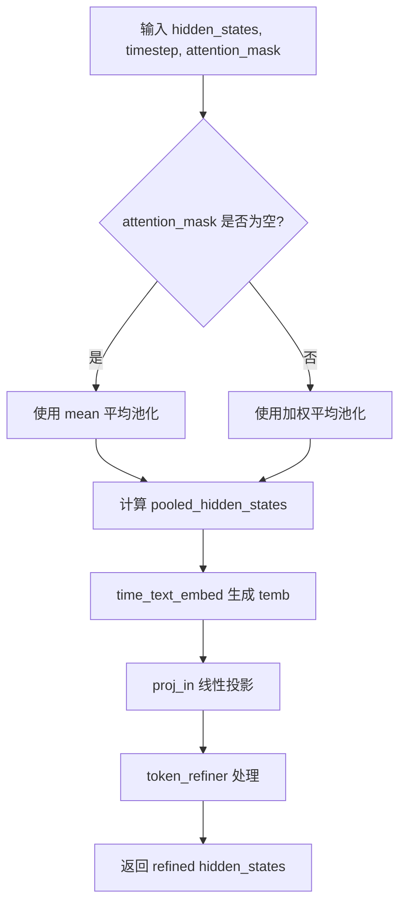

#### 带注释源码

```python
def forward(
    self,
    hidden_states: torch.Tensor,
    timestep: torch.LongTensor,
    attention_mask: torch.LongTensor | None = None,
) -> torch.Tensor:
    # 如果没有提供注意力掩码，则对序列维度进行简单平均池化
    if attention_mask is None:
        pooled_hidden_states = hidden_states.mean(dim=1)
    else:
        # 保存原始数据类型以确保输出类型一致
        original_dtype = hidden_states.dtype
        # 将掩码转换为浮点数并扩展维度以支持广播
        mask_float = attention_mask.float().unsqueeze(-1)
        # 计算加权平均：根据注意力掩码计算每个位置的权重
        pooled_hidden_states = (hidden_states * mask_float).sum(dim=1) / mask_float.sum(dim=1)
        # 恢复原始数据类型
        pooled_hidden_states = pooled_hidden_states.to(original_dtype)

    # 生成时间步嵌入和文本嵌入的组合向量
    temb = self.time_text_embed(timestep, pooled_hidden_states)
    # 将输入投影到隐藏空间维度
    hidden_states = self.proj_in(hidden_states)
    # 通过 IndividualTokenRefiner 模块处理隐藏状态
    hidden_states = self.token_refiner(hidden_states, temb, attention_mask)

    return hidden_states
```


### `HunyuanImageRotaryPosEmbed.__init__`

该方法是 `HunyuanImageRotaryPosEmbed` 类的初始化函数，负责验证并存储旋转位置嵌入（Rotary Position Embedding）所需的参数，包括分块大小、RoPE维度和theta值。

参数：

- `patch_size`：`tuple | list[int]`，表示图像或视频的分块大小，用于将输入张量划分为空间/时空块（如 `(height, width)` 或 `(frame, height, width)`），长度必须为2或3
- `rope_dim`：`tuple | list[int]`，表示每个轴的旋转位置嵌入维度，与 `patch_size` 长度必须一致
- `theta`：`float`，旋转位置嵌入的基础频率参数，默认为 256.0

返回值：`None`，无返回值，仅进行属性初始化和验证

#### 流程图

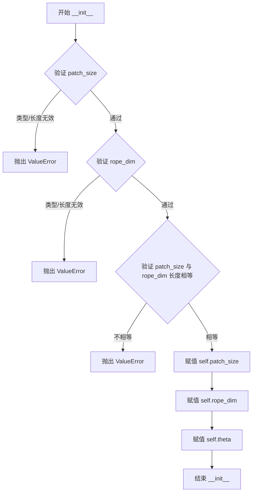

#### 带注释源码

```python
def __init__(self, patch_size: tuple | list[int], rope_dim: tuple | list[int], theta: float = 256.0) -> None:
    """
    初始化旋转位置嵌入模块
    
    Args:
        patch_size: 图像/视频的分块大小，支持2D(height, width)或3D(frame, height, width)
        rope_dim: 每个轴的RoPE维度，与patch_size长度一致
        theta: 旋转位置嵌入的频率缩放因子
    """
    super().__init__()  # 调用nn.Module的初始化方法

    # 验证patch_size必须是2或3个元素的tuple或list
    if not isinstance(patch_size, (tuple, list)) or len(patch_size) not in [2, 3]:
        raise ValueError(f"patch_size must be a tuple or list of length 2 or 3, got {patch_size}")

    # 验证rope_dim必须是2或3个元素的tuple或list
    if not isinstance(rope_dim, (tuple, list)) or len(rope_dim) not in [2, 3]:
        raise ValueError(f"rope_dim must be a tuple or list of length 2 or 3, got {rope_dim}")

    # 验证patch_size和rope_dim的长度必须一致
    if not len(patch_size) == len(rope_dim):
        raise ValueError(f"patch_size and rope_dim must have the same length, got {patch_size} and {rope_dim}")

    # 存储实例属性，供forward方法使用
    self.patch_size = patch_size   # 分块大小
    self.rope_dim = rope_dim       # RoPE维度
    self.theta = theta             # 旋转频率因子
```


### `HunyuanImageRotaryPosEmbed.forward`

该方法实现了图像的旋转位置嵌入（Rotary Position Embedding, RoPE），通过计算多维网格的频率向量，生成用于 Transformer 注意力机制的旋转位置编码，支持 2D（图像）和 3D（视频）输入。

参数：

- `self`：类实例本身
- `hidden_states`：`torch.Tensor`，输入的隐藏状态张量，必须是 4D（批量大小、通道、高度、宽度）或 5D（批量大小、通道、时间帧、高度、宽度）张量

返回值：`tuple[torch.Tensor, torch.Tensor]`，返回两个张量元组，分别是余弦频率 `freqs_cos` 和正弦频率 `freqs_sin`，形状均为 `(W * H * T, D / 2)`

#### 流程图

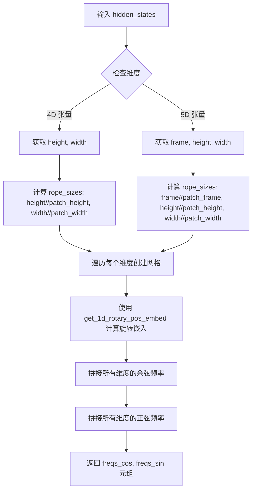

#### 带注释源码

```python
def forward(self, hidden_states: torch.Tensor) -> torch.Tensor:
    """
    计算图像的旋转位置嵌入
    
    参数:
        hidden_states: 输入的隐藏状态张量，4D 或 5D
        
    返回:
        包含余弦和正弦频率的元组
    """
    # 判断输入是 5D (视频) 还是 4D (图像) 张量
    if hidden_states.ndim == 5:
        # 5D: [batch, channel, frame, height, width]
        _, _, frame, height, width = hidden_states.shape
        patch_size_frame, patch_size_height, patch_size_width = self.patch_size
        # 计算每个维度分割后的网格数量
        rope_sizes = [frame // patch_size_frame, height // patch_size_height, width // patch_size_width]
    elif hidden_states.ndim == 4:
        # 4D: [batch, channel, height, width]
        _, _, height, width = hidden_states.shape
        patch_size_height, patch_size_width = self.patch_size
        rope_sizes = [height // patch_size_height, width // patch_size_width]
    else:
        raise ValueError(f"hidden_states must be a 4D or 5D tensor, got {hidden_states.shape}")

    # 为每个维度创建坐标网格
    axes_grids = []
    for i in range(len(rope_sizes)):
        # 创建从 0 到 rope_sizes[i] 的浮点数坐标
        grid = torch.arange(0, rope_sizes[i], device=hidden_states.device, dtype=torch.float32)
        axes_grids.append(grid)
    # 生成多维网格索引 (例如 2D 时生成 [H, W] 网格)
    grid = torch.meshgrid(*axes_grids, indexing="ij")
    # 堆叠为 [dim, H, W] 形状
    grid = torch.stack(grid, dim=0)

    # 为每个维度计算旋转位置嵌入
    freqs = []
    for i in range(len(rope_sizes)):
        # 调用 get_1d_rotary_pos_embed 计算一维旋转嵌入
        # 返回 (cos_freq, sin_freq) 元组
        freq = get_1d_rotary_pos_embed(self.rope_dim[i], grid[i].reshape(-1), self.theta, use_real=True)
        freqs.append(freq)

    # 沿特征维度拼接所有维度的余弦频率
    freqs_cos = torch.cat([f[0] for f in freqs], dim=1)  # (W * H * T, D / 2)
    # 沿特征维度拼接所有维度的正弦频率
    freqs_sin = torch.cat([f[1] for f in freqs], dim=1)  # (W * H * T, D / 2)
    
    return freqs_cos, freqs_sin
```


### HunyuanImageSingleTransformerBlock.__init__

该方法是 `HunyuanImageSingleTransformerBlock` 类的初始化方法，用于构建一个单流Transformer块，包含自注意力层、AdaLayerNormZeroSingle归一化层以及一个两层的MLP（包含GELU激活函数），用于图像生成模型中的单流处理。

参数：

- `num_attention_heads`：`int`，注意力头数量
- `attention_head_dim`：`int`，每个注意力头的维度
- `mlp_ratio`：`float`，MLP隐藏层维度相对于输入维度的扩展倍数，默认为4.0
- `qk_norm`：`str`，Query和Key的归一化方式，默认为"rms_norm"

返回值：`None`，该方法为构造函数，不返回任何值

#### 流程图

```mermaid
flowchart TD
    A[开始 __init__] --> B[调用 super().__init__]
    B --> C[计算 hidden_size = num_attention_heads * attention_head_dim]
    C --> D[计算 mlp_dim = int(hidden_size * mlp_ratio)]
    D --> E[创建 self.attn: Attention 注意力层]
    E --> F[创建 self.norm: AdaLayerNormZeroSingle 归一化层]
    F --> G[创建 self.proj_mlp: nn.Linear 隐藏层投影]
    G --> H[创建 self.act_mlp: nn.GELU 激活函数]
    H --> I[创建 self.proj_out: nn.Linear 输出投影]
    I --> J[结束 __init__]
```

#### 带注释源码

```python
@maybe_allow_in_graph
class HunyuanImageSingleTransformerBlock(nn.Module):
    def __init__(
        self,
        num_attention_heads: int,      # 注意力头数量
        attention_head_dim: int,       # 每个注意力头的维度
        mlp_ratio: float = 4.0,        # MLP扩展比例
        qk_norm: str = "rms_norm",     # QK归一化类型
    ) -> None:
        """
        初始化单流Transformer块
        
        Args:
            num_attention_heads: 注意力头数量
            attention_head_dim: 每个注意力头的维度
            mlp_ratio: MLP隐藏层维度与输入维度的比例
            qk_norm: Query和Key的归一化方式
        """
        super().__init__()  # 调用父类 nn.Module 的初始化

        # 计算隐藏层维度：注意力头数 × 每头维度
        hidden_size = num_attention_heads * attention_head_dim
        # 计算MLP中间层维度
        mlp_dim = int(hidden_size * mlp_ratio)

        # 1. 注意力层：使用自定义的 HunyuanImageAttnProcessor
        # pre_only=True 表示只进行预注意力计算（单流模式）
        self.attn = Attention(
            query_dim=hidden_size,
            cross_attention_dim=None,      # 无交叉注意力（单流）
            dim_head=attention_head_dim,
            heads=num_attention_heads,
            out_dim=hidden_size,
            bias=True,
            processor=HunyuanImageAttnProcessor(),
            qk_norm=qk_norm,
            eps=1e-6,
            pre_only=True,
        )

        # 2. AdaLayerNormZeroSingle 归一化层（带门控）
        # 结合了自适应层归一化和门控机制
        self.norm = AdaLayerNormZeroSingle(hidden_size, norm_type="layer_norm")

        # 3. MLP 投影层（隐藏层）
        self.proj_mlp = nn.Linear(hidden_size, mlp_dim)

        # 4. GELU 激活函数（带tanh近似）
        self.act_mlp = nn.GELU(approximate="tanh")

        # 5. 输出投影层：MLP输出与注意力输出拼接后投影
        # 维度: [hidden_size + mlp_dim] -> [hidden_size]
        self.proj_out = nn.Linear(hidden_size + mlp_dim, hidden_size)
```


### HunyuanImageSingleTransformerBlock.forward

该方法实现 HunyuanImage 单流 Transformer 块的前向传播，接收图像 latent 和文本编码器 hidden states，通过 AdaLayerNormZeroSingle 进行归一化并计算门控信号，经由 Attention 模块执行自注意力与交叉注意力，最后通过 MLP 进行调制并通过残差连接输出处理后的图像和文本 hidden states。

参数：

- `self`：`HunyuanImageSingleTransformerBlock` 实例，隐式参数
- `hidden_states`：`torch.Tensor`，图像 latent 的隐藏状态，维度为 [batch_size, seq_len, hidden_size]
- `encoder_hidden_states`：`torch.Tensor`，文本编码器的隐藏状态，维度为 [batch_size, text_seq_len, hidden_size]
- `temb`：`torch.Tensor`，时间步嵌入或调制嵌入，用于 AdaNorm 归一化和门控
- `attention_mask`：`torch.Tensor | None`，可选的注意力掩码，用于注意力计算
- `image_rotary_emb`：`tuple[torch.Tensor, torch.Tensor] | None`，可选的图像旋转位置嵌入 (cos, sin)
- `*args`：可变位置参数，用于兼容性
- `**kwargs`：可变关键字参数，用于兼容性

返回值：`tuple[torch.Tensor, torch.Tensor]`，返回两个张量——处理后的图像 hidden_states 和处理后的文本 encoder_hidden_states，均为 [batch_size, seq_len, hidden_size] 维度

#### 流程图

```mermaid
flowchart TD
    A[开始 forward] --> B[获取 text_seq_length]
    B --> C[hidden_states 与 encoder_hidden_states 拼接]
    C --> D[保存残差 residual]
    D --> E[AdaLayerNormZeroSingle 归一化<br/>norm_hidden_states, gate = self.norm]
    E --> F[MLP 处理<br/>mlp_hidden_states = act_mlp<br/>proj_mlp]
    E --> G[分离 norm_hidden_states 和 norm_encoder_hidden_states]
    G --> H[执行 Attention<br/>attn_output, context_attn_output]
    H --> I[拼接 attn_output 和 context_attn_output]
    I --> J[门控调制<br/>gate * proj_out]
    J --> K[残差连接<br/>hidden_states + residual]
    K --> L[分离输出 hidden_states 和 encoder_hidden_states]
    L --> M[返回 tuple]
```

#### 带注释源码

```python
def forward(
    self,
    hidden_states: torch.Tensor,
    encoder_hidden_states: torch.Tensor,
    temb: torch.Tensor,
    attention_mask: torch.Tensor | None = None,
    image_rotary_emb: tuple[torch.Tensor, torch.Tensor] | None = None,
    *args,
    **kwargs,
) -> torch.Tensor:
    # 1. 获取文本序列长度，用于后续分割张量
    text_seq_length = encoder_hidden_states.shape[1]
    
    # 2. 将图像 latent 与文本 encoder hidden states 在序列维度拼接
    # 拼接后维度: [batch_size, image_seq_len + text_seq_len, hidden_size]
    hidden_states = torch.cat([hidden_states, encoder_hidden_states], dim=1)

    # 3. 保存残差连接，用于后续的残差计算
    residual = hidden_states

    # 4. 输入归一化：使用 AdaLayerNormZeroSingle 进行自适应层归一化
    # norm_hidden_states: 归一化后的隐藏状态
    # gate: 门控信号，用于后续的调制 (包含 gate_msa 和 gate_mlp 的组合)
    norm_hidden_states, gate = self.norm(hidden_states, emb=temb)
    
    # 5. MLP 处理：将归一化后的 hidden states 通过线性层和激活函数
    # mlp_hidden_states: MLP 的输出，用于后续与 attention 输出拼接
    mlp_hidden_states = self.act_mlp(self.proj_mlp(norm_hidden_states))

    # 6. 分离图像部分和文本部分的归一化 hidden states
    # norm_hidden_states: 图像部分 [batch_size, image_seq_len, hidden_size]
    # norm_encoder_hidden_states: 文本部分 [batch_size, text_seq_len, hidden_size]
    norm_hidden_states, norm_encoder_hidden_states = (
        norm_hidden_states[:, :-text_seq_length, :],
        norm_hidden_states[:, -text_seq_length:, :],
    )

    # 7. 执行注意力计算
    # attn_output: 图像自注意力输出
    # context_attn_output: 图像与文本的交叉注意力输出
    attn_output, context_attn_output = self.attn(
        hidden_states=norm_hidden_states,
        encoder_hidden_states=norm_encoder_hidden_states,
        attention_mask=attention_mask,
        image_rotary_emb=image_rotary_emb,
    )
    
    # 8. 拼接注意力输出：图像注意力输出 + 文本注意力输出
    attn_output = torch.cat([attn_output, context_attn_output], dim=1)

    # 9. 调制和残差连接
    # 拼接注意力输出和 MLP 输出
    hidden_states = torch.cat([attn_output, mlp_hidden_states], dim=2)
    # 使用门控信号进行调制
    hidden_states = gate.unsqueeze(1) * self.proj_out(hidden_states)
    # 残差连接
    hidden_states = hidden_states + residual

    # 10. 分离输出：分割回图像和文本部分
    hidden_states, encoder_hidden_states = (
        hidden_states[:, :-text_seq_length, :],
        hidden_states[:, -text_seq_length:, :],
    )
    
    # 11. 返回处理后的图像和文本 hidden states
    return hidden_states, encoder_hidden_states
```


### HunyuanImageTransformerBlock.__init__

该方法是 HunyuanImageTransformerBlock 类的构造函数，负责初始化双流Transformer块的核心组件，包括注意力机制、前馈网络和层归一化模块。

参数：

- `num_attention_heads`：`int`，注意力头的数量
- `attention_head_dim`：`int`，每个注意力头的维度
- `mlp_ratio`：`float`，前馈网络隐藏层与输入的比率
- `qk_norm`：`str`，查询和键投影的归一化类型，默认为 "rms_norm"

返回值：`None`，该方法为构造函数，不返回任何值

#### 流程图

```mermaid
flowchart TD
    A[开始 __init__] --> B[调用 super().__init__]
    B --> C[计算 hidden_size = num_attention_heads * attention_head_dim]
    C --> D[创建 norm1: AdaLayerNormZero]
    D --> E[创建 norm1_context: AdaLayerNormZero]
    E --> F[创建 attn: Attention 模块]
    F --> G[创建 norm2: nn.LayerNorm]
    G --> H[创建 ff: FeedForward 模块]
    H --> I[创建 norm2_context: nn.LayerNorm]
    I --> J[创建 ff_context: FeedForward 模块]
    J --> K[结束 __init__]
```

#### 带注释源码

```python
@maybe_allow_in_graph
class HunyuanImageTransformerBlock(nn.Module):
    def __init__(
        self,
        num_attention_heads: int,      # 注意力头数量
        attention_head_dim: int,       # 每个注意力头的维度
        mlp_ratio: float,               # 前馈网络隐藏层大小与输入大小的比率
        qk_norm: str = "rms_norm",      # 查询和键的归一化方式
    ) -> None:
        # 调用父类 nn.Module 的初始化方法
        super().__init__()

        # 计算隐藏层大小：注意力头数 × 每个头的维度
        hidden_size = num_attention_heads * attention_head_dim

        # 1. 初始化图像流的第一个 AdaLayerNormZero 归一化层
        # 用于对输入 hidden_states 进行自适应层归一化
        self.norm1 = AdaLayerNormZero(hidden_size, norm_type="layer_norm")
        
        # 2. 初始化文本/上下文流的第一个 AdaLayerNormZero 归一化层
        # 用于对 encoder_hidden_states 进行自适应层归一化
        self.norm1_context = AdaLayerNormZero(hidden_size, norm_type="layer_norm")

        # 3. 初始化联合注意力模块
        # 支持双流注意力机制，同时处理图像和文本信息
        self.attn = Attention(
            query_dim=hidden_size,           # 查询维度
            cross_attention_dim=None,         # 跨注意力维度（无，为联合注意力）
            added_kv_proj_dim=hidden_size,    # 额外的键值投影维度
            dim_head=attention_head_dim,     # 每个头的维度
            heads=num_attention_heads,        # 注意力头数
            out_dim=hidden_size,              # 输出维度
            context_pre_only=False,          # 上下文不单独处理
            bias=True,                        # 使用偏置
            processor=HunyuanImageAttnProcessor(),  # 自定义注意力处理器
            qk_norm=qk_norm,                  # QK归一化类型
            eps=1e-6,                         # 归一化 epsilon
        )

        # 4. 初始化图像流的 LayerNorm 归一化层
        # 用于注意力之后的前馈网络输入
        self.norm2 = nn.LayerNorm(hidden_size, elementwise_affine=False, eps=1e-6)
        
        # 5. 初始化图像流的前馈网络
        # 使用 gelu-approximate 激活函数
        self.ff = FeedForward(hidden_size, mult=mlp_ratio, activation_fn="gelu-approximate")

        # 6. 初始化文本/上下文流的 LayerNorm 归一化层
        self.norm2_context = nn.LayerNorm(hidden_size, elementwise_affine=False, eps=1e-6)
        
        # 7. 初始化文本/上下文流的前馈网络
        # 同样使用 gelu-approximate 激活函数
        self.ff_context = FeedForward(hidden_size, mult=mlp_ratio, activation_fn="gelu-approximate")
```


### `HunyuanImageTransformerBlock.forward`

该方法实现双流 Transformer 块的前向传播，同时处理图像 latent 序列和文本 encoder 序列。通过 AdaLayerNormZero 对输入进行归一化并生成门控参数，执行联合自注意力计算（含图像旋转位置编码），然后通过前馈网络（FFN）进行特征变换，最后通过残差连接和门控机制将结果混合返回。

#### 参数

- `hidden_states`：`torch.Tensor`，图像 latent 状态的输入张量
- `encoder_hidden_states`：`torch.Tensor`，文本 encoder 状态的输入张量
- `temb`：`torch.Tensor`，时间步和条件的嵌入向量，用于 AdaNorm 调制
- `attention_mask`：`torch.Tensor | None`，注意力掩码，用于控制注意力计算
- `image_rotary_emb`：`tuple[torch.Tensor, torch.Tensor] | None`，图像旋转位置编码（cos, sin）
- `*args, **kwargs`：可变位置参数和关键字参数，保留用于接口兼容性

#### 返回值

`tuple[torch.Tensor, torch.Tensor]`，返回处理后的图像 latent 状态和文本 encoder 状态

#### 流程图

```mermaid
flowchart TD
    A[输入 hidden_states<br/>encoder_hidden_states<br/>temb] --> B[Norm1: AdaLayerNormZero<br/>归一化 + 提取门控参数]
    B --> C[提取 gate_msa<br/>shift_mlp, scale_mlp<br/>gate_mlp]
    B --> D[Norm1_context: AdaLayerNormZero<br/>归一化 encoder_hidden_states]
    D --> E[提取 c_gate_msa<br/>c_shift_mlp, c_scale_mlp<br/>c_gate_mlp]
    
    F[Joint Attention<br/>self.attn] --> G[attn_output<br/>context_attn_output]
    B --> F
    D --> F
    
    F --> H[残差连接: hidden_states += attn_output * gate_msa]
    F --> I[残差连接: encoder_hidden_states += context_attn_output * c_gate_msa]
    
    J[Norm2: nn.LayerNorm] --> K[hidden_states 归一化]
    J --> L[encoder_hidden_states 归一化]
    H --> J
    I --> J
    
    K --> M[Shift & Scale 调制<br/>norm_hidden_states = norm_hidden_states * (1 + scale_mlp) + shift_mlp]
    L --> N[Shift & Scale 调制<br/>norm_encoder_hidden_states = norm_encoder_hidden_states * (1 + c_scale_mlp) + c_shift_mlp]
    
    O[FFN: FeedForward] --> P[ff_output]
    M --> O
    N --> O
    
    P --> Q[残差连接: hidden_states += gate_mlp * ff_output]
    P --> R[残差连接: encoder_hidden_states += c_gate_mlp * context_ff_output]
    
    Q --> S[返回 tuple<br/>hidden_states<br/>encoder_hidden_states]
```

#### 带注释源码

```python
def forward(
    self,
    hidden_states: torch.Tensor,           # 图像 latent 状态 [batch, seq_len, hidden_dim]
    encoder_hidden_states: torch.Tensor,   # 文本 encoder 状态 [batch, encoder_seq_len, hidden_dim]
    temb: torch.Tensor,                     # 时间步嵌入，用于 AdaNorm 门控 [batch, hidden_dim]
    attention_mask: torch.Tensor | None = None,  # 注意力掩码
    image_rotary_emb: tuple[torch.Tensor, torch.Tensor] | None = None,  # RoPE 编码 (cos, sin)
    *args,
    **kwargs,
) -> tuple[torch.Tensor, torch.Tensor]:
    # 1. 输入归一化：使用 AdaLayerNormZero 对图像 latent 和文本 encoder 状态进行归一化
    # 同时生成门控参数：gate_msa（注意力门控）、shift_mlp/scale_mlp/gate_mlp（FFN 调制参数）
    norm_hidden_states, gate_msa, shift_mlp, scale_mlp, gate_mlp = self.norm1(hidden_states, emb=temb)
    norm_encoder_hidden_states, c_gate_msa, c_shift_mlp, c_scale_mlp, c_gate_mlp = self.norm1_context(
        encoder_hidden_states, emb=temb
    )

    # 2. 联合注意力：同时对图像 latent 和文本 encoder 状态进行注意力计算
    # 支持图像旋转位置编码 (image_rotary_emb)，实现图像和文本 token 的交互
    attn_output, context_attn_output = self.attn(
        hidden_states=norm_hidden_states,
        encoder_hidden_states=norm_encoder_hidden_states,
        attention_mask=attention_mask,
        image_rotary_emb=image_rotary_emb,
    )

    # 3. 调制和残差连接：将注意力输出通过门控加权后加到输入上
    hidden_states = hidden_states + attn_output * gate_msa.unsqueeze(1)
    encoder_hidden_states = encoder_hidden_states + context_attn_output * c_gate_msa.unsqueeze(1)

    # 对残差后的状态进行 LayerNorm
    norm_hidden_states = self.norm2(hidden_states)
    norm_encoder_hidden_states = self.norm2_context(encoder_hidden_states)

    # 应用 Shift 和 Scale 调制（AdaLN 机制）
    norm_hidden_states = norm_hidden_states * (1 + scale_mlp[:, None]) + shift_mlp[:, None]
    norm_encoder_hidden_states = norm_encoder_hidden_states * (1 + c_scale_mlp[:, None]) + c_shift_mlp[:, None]

    # 4. 前馈网络 (FFN)：使用 GELU 激活函数的两层 MLP
    ff_output = self.ff(norm_hidden_states)
    context_ff_output = self.ff_context(norm_encoder_hidden_states)

    # 残差连接：通过 gate_mlp 门控 FFN 输出
    hidden_states = hidden_states + gate_mlp.unsqueeze(1) * ff_output
    encoder_hidden_states = encoder_hidden_states + c_gate_mlp.unsqueeze(1) * context_ff_output

    # 返回处理后的图像 latent 状态和文本 encoder 状态
    return hidden_states, encoder_hidden_states
```


### HunyuanImageTransformer2DModel.__init__

这是 HunyuanImageTransformer2DModel 类的构造函数，负责初始化腾讯混元图像2.1版 Transformer 模型的所有组件，包括输入嵌入层、上下文嵌入器、时间/指导嵌入、旋转位置编码(RoPE)、双流和单流 Transformer 块堆栈以及输出投影层。

参数：

- `in_channels`：`int`，输入 latent 的通道数，默认 64
- `out_channels`：`int`，输出通道数，默认 64（可设为 None 会等于 in_channels）
- `num_attention_heads`：`int`，多头注意力机制的头数，默认 28
- `attention_head_dim`：`int`，每个注意力头的维度，默认 128
- `num_layers`：`int`，双流 Transformer 块的层数，默认 20
- `num_single_layers`：`int`，单流 Transformer 块的层数，默认 40
- `num_refiner_layers`：`int`，Refiner 块的层数，默认 2
- `mlp_ratio`：`float`，前馈网络隐藏层相对于输入维度的扩展比例，默认 4.0
- `patch_size`：`tuple[int, int]`，空间 patches 的尺寸，默认 (1, 1)
- `qk_norm`：`str`，注意力层中 Query 和 Key 投影使用的归一化方式，默认 "rms_norm"
- `guidance_embeds`：`bool`，是否在模型中使用 guidance embeddings，默认 False
- `text_embed_dim`：`int`，来自文本编码器的文本嵌入输入维度，默认 3584
- `text_embed_2_dim`：`int | None`，第二个文本嵌入的输入维度（可选），用于 T5 文本投影，默认 None
- `rope_theta`：`float`，RoPE 层中使用的 theta 值，默认 256.0
- `rope_axes_dim`：`tuple[int, ...]`，RoPE 层中各轴的维度，默认 (64, 64)
- `use_meanflow`：`bool`，是否使用 meanflow 进行时间步处理，默认 False

返回值：`None`，构造函数无返回值，仅初始化对象状态

#### 流程图

```mermaid
flowchart TD
    A[开始 __init__] --> B{patch_size 是否为长度为2或3的tuple/list?}
    B -->|否| C[抛出 ValueError]
    B -->|是| D[计算 inner_dim = num_attention_heads * attention_head_dim]
    D --> E[设置 out_channels = out_channels 或 in_channels]
    E --> F[创建 HunyuanImagePatchEmbed: self.x_embedder]
    F --> G[创建 HunyuanImageTokenRefiner: self.context_embedder]
    G --> H{text_embed_2_dim 不为 None?}
    H -->|是| I[创建 HunyuanImageByT5TextProjection: self.context_embedder_2]
    H -->|否| J[设置 self.context_embedder_2 = None]
    I --> K
    J --> K[创建 HunyuanImageCombinedTimeGuidanceEmbedding: self.time_guidance_embed]
    K --> L[创建 HunyuanImageRotaryPosEmbed: self.rope]
    L --> M[循环创建 num_layers 个 HunyuanImageTransformerBlock]
    M --> N[循环创建 num_single_layers 个 HunyuanImageSingleTransformerBlock]
    N --> O[创建 AdaLayerNormContinuous: self.norm_out]
    O --> P[创建 nn.Linear: self.proj_out]
    P --> Q[设置 self.gradient_checkpointing = False]
    Q --> R[结束 __init__]
```

#### 带注释源码

```python
@register_to_config
def __init__(
    self,
    in_channels: int = 64,               # 输入 latent 的通道数
    out_channels: int = 64,              # 输出通道数
    num_attention_heads: int = 28,       # 多头注意力的头数
    attention_head_dim: int = 128,       # 每个注意力头的维度
    num_layers: int = 20,                 # 双流 Transformer 块数量
    num_single_layers: int = 40,         # 单流 Transformer 块数量
    num_refiner_layers: int = 2,          # Refiner 块数量
    mlp_ratio: float = 4.0,              # MLP 隐藏层扩展比例
    patch_size: tuple[int, int] = (1, 1), # 空间补丁尺寸
    qk_norm: str = "rms_norm",            # QK 归一化方式
    guidance_embeds: bool = False,        # 是否使用 guidance 嵌入
    text_embed_dim: int = 3584,           # 文本嵌入维度 (MLLM)
    text_embed_2_dim: int | None = None,  # 文本嵌入维度 (T5，可选)
    rope_theta: float = 256.0,            # RoPE theta 参数
    rope_axes_dim: tuple[int, ...] = (64, 64), # RoPE 轴维度
    use_meanflow: bool = False,           # 是否使用 meanflow
) -> None:
    super().__init__()  # 调用父类初始化

    # 验证 patch_size 必须是长度为 2 或 3 的 tuple/list
    if not (isinstance(patch_size, (tuple, list)) and len(patch_size) in [2, 3]):
        raise ValueError(f"patch_size must be a tuple of length 2 or 3, got {patch_size}")

    # 计算内部维度：注意力头数 × 每头维度
    inner_dim = num_attention_heads * attention_head_dim
    # 如果未指定输出通道，则使用输入通道
    out_channels = out_channels or in_channels

    # ==================== 1. Latent 和 Condition 嵌入器 ====================
    
    # 图像 latent 的补丁嵌入层：将图像转换为 patches 并投影到 inner_dim
    self.x_embedder = HunyuanImagePatchEmbed(patch_size, in_channels, inner_dim)
    
    # 文本上下文的嵌入器：使用 TokenRefiner 处理文本嵌入
    self.context_embedder = HunyuanImageTokenRefiner(
        text_embed_dim, num_attention_heads, attention_head_dim, num_layers=num_refiner_layers
    )

    # 可选的第二个文本嵌入投影器 (用于 T5 文本编码器)
    if text_embed_2_dim is not None:
        self.context_embedder_2 = HunyuanImageByT5TextProjection(text_embed_2_dim, 2048, inner_dim)
    else:
        self.context_embedder_2 = None

    # 时间步和指导嵌入的组合嵌入器
    self.time_guidance_embed = HunyuanImageCombinedTimeGuidanceEmbedding(inner_dim, guidance_embeds, use_meanflow)

    # ==================== 2. RoPE (旋转位置编码) ====================
    self.rope = HunyuanImageRotaryPosEmbed(patch_size, rope_axes_dim, rope_theta)

    # ==================== 3. 双流 Transformer 块 ====================
    # 双流块同时处理图像 latent 和文本上下文，执行联合注意力
    self.transformer_blocks = nn.ModuleList(
        [
            HunyuanImageTransformerBlock(
                num_attention_heads, attention_head_dim, mlp_ratio=mlp_ratio, qk_norm=qk_norm
            )
            for _ in range(num_layers)
        ]
    )

    # ==================== 4. 单流 Transformer 块 ====================
    # 单流块仅处理图像 latent（不含文本上下文）
    self.single_transformer_blocks = nn.ModuleList(
        [
            HunyuanImageSingleTransformerBlock(
                num_attention_heads, attention_head_dim, mlp_ratio=mlp_ratio, qk_norm=qk_norm
            )
            for _ in range(num_single_layers)
        ]
    )

    # ==================== 5. 输出投影 ====================
    # 最终输出归一化和投影层，将特征映射回像素空间
    self.norm_out = AdaLayerNormContinuous(inner_dim, inner_dim, elementwise_affine=False, eps=1e-6)
    self.proj_out = nn.Linear(inner_dim, math.prod(patch_size) * out_channels)

    # 梯度检查点标志，默认关闭
    self.gradient_checkpointing = False
```


### `HunyuanImageTransformer2DModel.forward`

这是HunyuanImage-2.1 Transformer模型的核心前向传播方法，负责将输入的潜在表示（latent）经过RoPE编码、条件嵌入、多层Transformer块处理后，通过输出投影和unpatchify操作重建为输出图像或视频。

参数：

- `hidden_states`：`torch.Tensor`，输入的潜在表示张量，形状为(batch_size, channels, height, width)或(batch_size, channels, frame, height, width)
- `timestep`：`torch.LongTensor`，扩散过程的时间步，用于时间嵌入
- `encoder_hidden_states`：`torch.Tensor`，来自文本编码器的隐藏状态（文本嵌入）
- `encoder_attention_mask`：`torch.Tensor`，文本编码器的注意力掩码，用于指示有效token和padding
- `timestep_r`：`torch.LongTensor | None`，可选的第二个时间步，用于meanflow模式
- `encoder_hidden_states_2`：`torch.Tensor | None`，可选的第二个文本编码器隐藏状态（来自T5模型）
- `encoder_attention_mask_2`：`torch.Tensor | None`，可选的第二个文本编码器注意力掩码
- `guidance`：`torch.Tensor | None`，可选的引导向量，用于分类器-free引导
- `attention_kwargs`：`dict[str, Any] | None`，可选的注意力参数，如LoRA权重
- `return_dict`：`bool`，默认为True，是否返回字典格式的输出

返回值：`torch.Tensor | dict[str, torch.Tensor]`，当return_dict为True时返回Transformer2DModelOutput（包含sample字段），否则返回元组

#### 流程图

```mermaid
flowchart TD
    A[输入 hidden_states] --> B{检查维度}
    B -->|4D| C[获取 batch_size, channels, height, width]
    B -->|5D| D[获取 batch_size, channels, frame, height, width]
    C --> E[计算 post_patch_sizes]
    D --> E
    
    E --> F[1. 计算 RoPE 旋转位置嵌入]
    F --> G[2. 条件嵌入处理]
    G --> G1[将 encoder_attention_mask 转为 bool]
    G1 --> G2[计算时间-引导嵌入 temb]
    G2 --> G3[通过 x_embedder 处理 hidden_states]
    G3 --> G4[通过 context_embedder 处理 encoder_hidden_states]
    
    G4 --> H{是否存在 encoder_hidden_states_2?}
    H -->|Yes| I[通过 context_embedder_2 处理 encoder_hidden_states_2]
    I --> J[重新排序和组合文本token]
    H -->|No| K[直接使用 encoder_hidden_states]
    
    J --> L[构建完整 attention_mask]
    K --> L
    
    L --> M{是否启用梯度检查点?}
    M -->|Yes| N[3a. 使用梯度检查点遍历 transformer_blocks]
    N --> O[3b. 使用梯度检查点遍历 single_transformer_blocks]
    M -->|No| P[3c. 常规遍历 transformer_blocks]
    P --> Q[3d. 常规遍历 single_transformer_blocks]
    
    O --> R[4. 输出投影]
    Q --> R
    R --> S[norm_out + proj_out]
    
    S --> T[5. Unpatchify 重建]
    T --> U{return_dict?}
    U -->|True| V[返回 Transformer2DModelOutput]
    U -->|False| W[返回元组]
```

#### 带注释源码

```python
@apply_lora_scale("attention_kwargs")
def forward(
    self,
    hidden_states: torch.Tensor,
    timestep: torch.LongTensor,
    encoder_hidden_states: torch.Tensor,
    encoder_attention_mask: torch.Tensor,
    timestep_r: torch.LongTensor | None = None,
    encoder_hidden_states_2: torch.Tensor | None = None,
    encoder_attention_mask_2: torch.Tensor | None = None,
    guidance: torch.Tensor | None = None,
    attention_kwargs: dict[str, Any] | None = None,
    return_dict: bool = True,
) -> torch.Tensor | dict[str, torch.Tensor]:
    # 步骤1: 处理输入hidden_states，获取批次和空间维度信息
    # 支持4D (图像) 和 5D (视频) 两种输入格式
    if hidden_states.ndim == 4:
        batch_size, channels, height, width = hidden_states.shape
        sizes = (height, width)
    elif hidden_states.ndim == 5:
        batch_size, channels, frame, height, width = hidden_states.shape
        sizes = (frame, height, width)
    else:
        raise ValueError(f"hidden_states must be a 4D or 5D tensor, got {hidden_states.shape}")

    # 计算patch之后的尺寸，用于后续reshape
    post_patch_sizes = tuple(d // p for d, p in zip(sizes, self.config.patch_size))

    # 步骤2: 计算旋转位置嵌入 (RoPE)
    image_rotary_emb = self.rope(hidden_states)

    # 步骤3: 条件嵌入处理
    # 将注意力掩码转换为布尔类型
    encoder_attention_mask = encoder_attention_mask.bool()
    
    # 生成时间步和引导的嵌入向量
    temb = self.time_guidance_embed(timestep, guidance=guidance, timestep_r=timestep_r)
    
    # 将输入潜在表示通过patch embedding转换为序列形式
    hidden_states = self.x_embedder(hidden_states)
    
    # 将文本嵌入通过token refiner处理
    encoder_hidden_states = self.context_embedder(encoder_hidden_states, timestep, encoder_attention_mask)

    # 步骤4: 处理双文本编码器情况 (MLLM + T5)
    if self.context_embedder_2 is not None and encoder_hidden_states_2 is not None:
        # 通过T5投影层处理第二组文本嵌入
        encoder_hidden_states_2 = self.context_embedder_2(encoder_hidden_states_2)
        encoder_attention_mask_2 = encoder_attention_mask_2.bool()

        # 重新排序和组合文本token：有效token在前，padding在后
        # 顺序: [valid_byt5, valid_mllm, invalid_byt5, invalid_mllm]
        new_encoder_hidden_states = []
        new_encoder_attention_mask = []

        for text, text_mask, text_2, text_mask_2 in zip(
            encoder_hidden_states, encoder_attention_mask, encoder_hidden_states_2, encoder_attention_mask_2
        ):
            # 合并有效和无效的token
            new_encoder_hidden_states.append(
                torch.cat(
                    [
                        text_2[text_mask_2],  # 有效的T5 token
                        text[text_mask],      # 有效的MLLM token
                        text_2[~text_mask_2], # 无效的T5 token
                        text[~text_mask],     # 无效的MLLM token
                    ],
                    dim=0,
                )
            )

            # 对注意力掩码应用相同的重排序
            new_encoder_attention_mask.append(
                torch.cat(
                    [
                        text_mask_2[text_mask_2],
                        text_mask[text_mask],
                        text_mask_2[~text_mask_2],
                        text_mask[~text_mask],
                    ],
                    dim=0,
                )
            )

        encoder_hidden_states = torch.stack(new_encoder_hidden_states)
        encoder_attention_mask = torch.stack(new_encoder_attention_mask)

    # 构建完整的注意力掩码，包含图像token和文本token
    # 图像token部分设为True（可attend），文本token部分使用encoder_attention_mask
    attention_mask = torch.nn.functional.pad(encoder_attention_mask, (hidden_states.shape[1], 0), value=True)
    attention_mask = attention_mask.unsqueeze(1).unsqueeze(2)
    
    # 步骤5: 通过Transformer块进行处理
    # 梯度检查点模式：节省显存但增加计算时间
    if torch.is_grad_enabled() and self.gradient_checkpointing:
        # 双流Transformer块：同时处理图像和文本的联合注意力
        for block in self.transformer_blocks:
            hidden_states, encoder_hidden_states = self._gradient_checkpointing_func(
                block,
                hidden_states,
                encoder_hidden_states,
                temb,
                attention_mask=attention_mask,
                image_rotary_emb=image_rotary_emb,
            )

        # 单流Transformer块：仅处理图像token
        for block in self.single_transformer_blocks:
            hidden_states, encoder_hidden_states = self._gradient_checkpointing_func(
                block,
                hidden_states,
                encoder_hidden_states,
                temb,
                attention_mask=attention_mask,
                image_rotary_emb=image_rotary_emb,
            )

    else:
        # 常规模式：直接前向传播
        for block in self.transformer_blocks:
            hidden_states, encoder_hidden_states = block(
                hidden_states,
                encoder_hidden_states,
                temb,
                attention_mask=attention_mask,
                image_rotary_emb=image_rotary_emb,
            )

        for block in self.single_transformer_blocks:
            hidden_states, encoder_hidden_states = block(
                hidden_states,
                encoder_hidden_states,
                temb,
                attention_mask=attention_mask,
                image_rotary_emb=image_rotary_emb,
            )

    # 步骤6: 输出投影
    hidden_states = self.norm_out(hidden_states, temb)
    hidden_states = self.proj_out(hidden_states)

    # 步骤7: Unpatchify - 将序列形式的表示重建为空间/时空形式
    # 形状: [batch_size, *post_patch_dims, channels, *patch_size]
    out_channels = self.config.out_channels
    reshape_dims = [batch_size] + list(post_patch_sizes) + [out_channels] + list(self.config.patch_size)
    hidden_states = hidden_states.reshape(*reshape_dims)

    # 创建置换模式以交错post_patch和patch维度
    # 4D: [0, 3, 1, 4, 2, 5] -> batch, channels, post_h, patch_h, post_w, patch_w
    # 5D: [0, 4, 1, 5, 2, 6, 3, 7] -> batch, channels, post_f, patch_f, post_h, patch_h, post_w, patch_w
    ndim = len(post_patch_sizes)
    permute_pattern = [0, ndim + 1]  # batch, channels
    for i in range(ndim):
        permute_pattern.extend([i + 1, ndim + 2 + i])  # post_patch_sizes[i], patch_sizes[i]
    hidden_states = hidden_states.permute(*permute_pattern)

    # 展平patch维度，合并对应的post_patch和patch大小
    # 结果: batch_size, channels, height*patch_h, width*patch_w (或视频的frame*patch_f)
    final_dims = [batch_size, out_channels] + [
        post_patch * patch for post_patch, patch in zip(post_patch_sizes, self.config.patch_size)
    ]
    hidden_states = hidden_states.reshape(*final_dims)

    # 返回结果
    if not return_dict:
        return (hidden_states,)

    return Transformer2DModelOutput(sample=hidden_states)
```

## 关键组件


### HunyuanImageAttnProcessor
自定义注意力处理器，实现图像注意力计算逻辑，包含QKV投影、QK归一化、旋转位置编码应用、编码器条件处理和注意力分发。

### HunyuanImagePatchEmbed
图像补丁嵌入层，支持2D和3D图像的补丁化处理，将输入图像转换为补丁序列。

### HunyuanImageByT5TextProjection
T5文本投影模块，包含三层线性变换和GELU激活函数，用于文本特征的维度转换。

### HunyuanImageAdaNorm
自适应归一化层，将时间嵌入转换为门控参数，用于 modulate MSA和MLP的输出。

### HunyuanImageCombinedTimeGuidanceEmbedding
时间引导嵌入模块，支持时间步、guidance嵌入和meanflow处理，生成条件嵌入。

### HunyuanImageIndividualTokenRefinerBlock
单个Token精炼块，包含自注意力、AdaNorm和前馈网络，用于细粒度的Token特征提取。

### HunyuanImageIndividualTokenRefiner
Token精炼器容器，由多个精炼块组成，处理隐藏状态、时间嵌入和注意力掩码。

### HunyuanImageTokenRefiner
文本Token精炼器，整合时间文本嵌入和Token精炼层，用于文本条件的处理。

### HunyuanImageRotaryPosEmbed
旋转位置编码模块，支持2D和3D张量的RoPE生成，处理图像/视频的空间和时间维度。

### HunyuanImageSingleTransformerBlock
单流Transformer块，处理图像潜变量，集成注意力、归一化和MLP，使用门控机制。

### HunyuanImageTransformerBlock
双流Transformer块，同时处理图像流和文本流，包含独立的归一化、注意力、MLP路径和交叉调制。

### HunyuanImageTransformer2DModel
主模型类，整合补丁嵌入、Token精炼、RoPE、双流和单流Transformer块、输出投影，实现2D/3D图像变换。

## 问题及建议


### 已知问题

- **类型注解错误**：`HunyuanImageIndividualTokenRefiner.forward()` 方法声明返回类型为 `None`，但实际返回 `hidden_states` 张量
- **API不一致**：`HunyuanImageCombinedTimeGuidanceEmbedding.forward()` 声明返回 `tuple[torch.Tensor, torch.Tensor]`，但当 `guidance_embedder` 为 None 时只返回一个张量
- **类变量使用不当**：`HunyuanImageAttnProcessor` 的 `_attention_backend` 和 `_parallel_config` 是类变量，但没有提供公共接口或工厂方法来设置这些后端配置
- **参数命名不一致**：`HunyuanImageTransformer2DModel.__init__` 中 `rope_axes_dim` 参数，但在 `HunyuanImageRotaryPosEmbed` 中使用 `rope_dim`，且未在模型配置中暴露
- **硬编码魔法数字**：多处使用硬编码值如 `num_channels=256`、`eps=1e-6`、`hidden_size` 的默认值，缺乏可配置性
- **错误信息不完整**：`forward` 方法中对于输入维度检查只说 "must be a 4D or 5D tensor"，没有说明实际接收到的维度

### 优化建议

- **修复类型注解**：修正 `HunyuanImageIndividualTokenRefiner.forward()` 的返回类型为 `torch.Tensor`，并统一 `HunyuanImageCombinedTimeGuidanceEmbedding.forward()` 的返回类型处理
- **提供配置接口**：为 `HunyuanImageAttnProcessor` 添加工厂方法或配置类来设置 `_attention_backend` 和 `_parallel_config`，避免直接操作类变量
- **提取常量**：将 `num_channels=256`、`eps=1e-6` 等值提取为模块级常量或配置参数
- **优化循环逻辑**：`HunyuanImageTransformer2DModel.forward()` 中对 `encoder_hidden_states` 的重组操作可以使用向量化操作替代显式循环，提高性能
- **增强输入验证**：在 `HunyuanImageRotaryPosEmbed.forward()` 中添加对输入尺寸与 patch_size 兼容性的检查，提供更详细的错误信息
- **代码抽象**：将 `HunyuanImageTransformerBlock` 和 `HunyuanImageSingleTransformerBlock` 中共用的归一化、注意力逻辑提取为基类，减少代码重复

## 其它


### 设计目标与约束

本模块实现HunyuanImage-2.1的Transformer架构，核心目标是高效处理图像生成任务中的时空建模。设计约束包括：(1) 支持4D（图像）和5D（视频）输入；(2) 兼容PyTorch 2.0及以上版本；(3) 支持双流（joint attention）和单流（self-attention）Transformer块混合架构；(4) 集成RoPE旋转位置编码增强长序列建模能力；(5) 支持文本条件注入和多模态融合（MLLM和T5双文本编码器）。

### 错误处理与异常设计

主要异常场景包括：(1) `ImportError`：当PyTorch版本低于2.0时抛出，要求用户升级；(2) `ValueError`：patch_size维度不符合要求（需为2或3维）、hidden_states维度不支持（需为4D或5D）、rope_dim与patch_size长度不匹配时抛出；(3) 输入验证：encoder_attention_mask自动转换为bool类型处理，确保注意力掩码有效性；(4) 梯度检查点支持：在训练时通过`gradient_checkpointing`标志动态启用以节省显存。

### 数据流与状态机

整体数据流如下：输入hidden_states（图像latent）经x_embedder转换为patch序列 → 文本编码器输出经context_embedder处理并与时间步融合 → RoPE生成旋转位置编码 → 双流Transformer块（num_layers层）处理图像与文本的joint attention → 单流Transformer块（num_single_layers层）处理图像自注意力 → AdaLayerNormContinuous输出归一化 → unpatchify还原为空间/时空结构。每个Transformer块内部遵循：输入归一化 → 注意力计算 → 残差连接 → FFN → 残差连接的標準流程。

### 外部依赖与接口契约

核心依赖包括：(1) `torch`/`torch.nn`：基础张量运算和神经网络模块；(2) `diffusers.loaders.FromOriginalModelMixin`：从原始模型加载的Mixin；(3) `configuration_utils.ConfigMixin`/`register_to_config`：配置注册机制；(4) `loaders.PeftAdapterMixin`：PEFT适配器支持；(5) `attention.AttentionMixin`/`FeedForward`：注意力机制实现；(6) `attention_processor.Attention`：标准注意力模块；(7) `embeddings`：TimestepEmbedding、Timesteps、CombinedTimestepTextProjEmbeddings等时间文本嵌入组件；(8) `normalization`：AdaLayerNormZero、AdaLayerNormContinuous等自适应归一化层。

### 性能考量与优化空间

性能优化点包括：(1) 梯度检查点（gradient checkpointing）可在训练时减少显存占用；(2) `dispatch_attention_fn`支持后端选择，可根据硬件启用高效注意力实现；(3) 支持`maybe_allow_in_graph`装饰器允许子模块参与图编译；(4) 潜在优化：当前实现中attention_mask处理存在冗余（pad操作每次前向都执行），可缓存；文本token重排序逻辑可向量化优化；可考虑集成Flash Attention等高效注意力机制替代默认实现。

### 安全性考虑

代码无直接用户输入处理，安全性风险较低。主要关注点：(1) 模型加载时的权重验证（由ModelMixin基类处理）；(2) 梯度检查点启用时需确保自定义前向函数支持checkpointing；(3) 使用`torch.no_grad()`或`torch.is_grad_enabled()`控制推理/训练模式。

### 版本兼容性

明确要求PyTorch ≥ 2.0（因使用`F.scaled_dot_product_attention`）。与diffusers库版本强耦合，需使用与代码配套的diffusers版本以确保ConfigMixin、PeftAdapterMixin等基类接口兼容。Python版本支持需参考diffusers项目的Python版本要求。

### 配置参数详细说明

关键配置参数包括：`in_channels`/`out_channels`（输入输出通道数，默认64）、`num_attention_heads`（注意力头数，默认28）、`attention_head_dim`（每头维度，默认128）、`num_layers`（双流块数量，默认20）、`num_single_layers`（单流块数量，默认40）、`num_refiner_layers`（refiner块数，默认2）、`mlp_ratio`（FFN扩展比例，默认4.0）、`patch_size`（空间patch大小）、`qk_norm`（QK归一化类型，默认rms_norm）、`guidance_embeds`（是否启用guidance嵌入）、`text_embed_dim`（文本嵌入维度）、`rope_theta`/`rope_axes_dim`（RoPE参数）、`use_meanflow`（是否使用meanflow时间嵌入）。

### 模块间协作关系

HunyuanImageTransformer2DModel作为主模型类，协调各子模块：(1) HunyuanImagePatchEmbed处理图像patch嵌入；(2) HunyuanImageTokenRefiner处理文本条件；(3) HunyuanImageCombinedTimeGuidanceEmbedding生成时间- Guidance联合嵌入；(4) HunyuanImageRotaryPosEmbed计算旋转位置编码；(5) HunyuanImageTransformerBlock执行双流joint attention；(6) HunyuanImageSingleTransformerBlock执行单流self-attention；(7) AdaLayerNormContinuous进行输出前归一化。各模块通过temb（时间嵌入）进行调制信号的传递，实现自适应计算。

### 关键算法说明

核心算法包括：(1) AdaLayerNormZero/AdaLayerNormZeroSingle：自适应层归一化，将时间嵌入作为条件生成归一化参数（shift、scale、gate）；(2) RoPE旋转位置编码：通过复数旋转矩阵编码位置信息，支持2D/3D空间维度；(3) 文本token重排序：有效token（非padding）排列在前面以优化注意力计算效率；(4) 双流/单流混合架构：双流块处理图像-文本交互，单流块专注于图像内部建模。

    