# `diffusers\src\diffusers\models\transformers\transformer_kandinsky.py` 详细设计文档

Kandinsky5Transformer3DModel 是一个用于视频数据处理的 3D Diffusion Transformer 模型，支持文本和视觉嵌入、旋转位置编码（RoPE）、稀疏注意力机制和调制功能，能够将输入的视觉状态和文本嵌入转换为目标视觉输出。

## 整体流程

```mermaid
graph TD
    A[开始] --> B[输入: hidden_states, encoder_hidden_states, timestep, pooled_projections]
B --> C[文本嵌入: text_embeddings(text_embed)]
C --> D[时间嵌入: time_embeddings(time)]
D --> E[池化文本嵌入: pooled_text_embeddings(pooled_text_embed)]
E --> F[视觉嵌入: visual_embeddings(x)]
F --> G[文本RoPE: text_rope_embeddings(text_rope_pos)]
G --> H{遍历 text_transformer_blocks}
H -->|是| I[文本Transformer块处理]
H -->|否| J[视觉RoPE: visual_rope_embeddings(visual_shape, visual_rope_pos, scale_factor)]
J --> K[分形展平: fractal_flatten(visual_embed, visual_rope, visual_shape, block_mask)]
K --> L{遍历 visual_transformer_blocks}
L -->|是| M[视觉Transformer块处理 (含交叉注意力和稀疏注意力)]
L -->|否| N[分形反展平: fractal_unflatten(visual_embed, visual_shape, block_mask)]
N --> O[输出层: out_layer(visual_embed, text_embed, time_embed)]
O --> P[返回 Transformer2DModelOutput 或 FloatTensor]
```

## 类结构

```
Kandinsky5Transformer3DModel (主模型类)
├── Kandinsky5TimeEmbeddings (时间嵌入)
├── Kandinsky5TextEmbeddings (文本嵌入)
├── Kandinsky5VisualEmbeddings (视觉嵌入)
├── Kandinsky5RoPE1D (1D旋转位置编码)
├── Kandinsky5RoPE3D (3D旋转位置编码)
├── Kandinsky5Modulation (调制模块)
├── Kandinsky5AttnProcessor (注意力处理器)
├── Kandinsky5Attention (注意力模块)
├── Kandinsky5FeedForward (前馈网络)
├── Kandinsky5OutLayer (输出层)
├── Kandinsky5TransformerEncoderBlock (编码器块)
└── Kandinsky5TransformerDecoderBlock (解码器块)
```

## 全局变量及字段


### `logger`
    
模块级日志记录器，用于输出调试和运行信息

类型：`logging.Logger`
    


### `_CAN_USE_FLEX_ATTN`
    
标志位，指示当前PyTorch版本是否支持Flex Attention

类型：`bool`
    


### `Kandinsky5TimeEmbeddings.model_dim`
    
时间嵌入的模型维度，必须为偶数

类型：`int`
    


### `Kandinsky5TimeEmbeddings.max_period`
    
正弦余弦位置编码的最大周期，控制频率衰减速度

类型：`float`
    


### `Kandinsky5TimeEmbeddings.freqs`
    
预计算的正弦余弦频率值，用于时间位置编码

类型：`torch.Tensor`
    


### `Kandinsky5TimeEmbeddings.in_layer`
    
输入线性层，将模型维度映射到时间维度

类型：`nn.Linear`
    


### `Kandinsky5TimeEmbeddings.activation`
    
SiLU激活函数，用于时间嵌入的非线性变换

类型：`nn.SiLU`
    


### `Kandinsky5TimeEmbeddings.out_layer`
    
输出线性层，将时间维度映射回时间维度

类型：`nn.Linear`
    


### `Kandinsky5TextEmbeddings.in_layer`
    
输入线性层，将文本维度映射到模型维度

类型：`nn.Linear`
    


### `Kandinsky5TextEmbeddings.norm`
    
层归一化，对文本嵌入进行标准化处理

类型：`nn.LayerNorm`
    


### `Kandinsky5VisualEmbeddings.patch_size`
    
3D视频的空间和时间patch大小

类型：`tuple[int, int, int]`
    


### `Kandinsky5VisualEmbeddings.in_layer`
    
输入线性层，将patched视觉特征映射到模型维度

类型：`nn.Linear`
    


### `Kandinsky5RoPE1D.max_period`
    
1D旋转位置编码的最大周期

类型：`float`
    


### `Kandinsky5RoPE1D.dim`
    
1D RoPE的维度

类型：`int`
    


### `Kandinsky5RoPE1D.max_pos`
    
1D RoPE支持的最大位置数

类型：`int`
    


### `Kandinsky5RoPE1D.args`
    
预计算的1D位置编码外积结果

类型：`torch.Tensor`
    


### `Kandinsky5RoPE3D.axes_dims`
    
3D RoPE各轴的维度配置

类型：`tuple[int, int, int]`
    


### `Kandinsky5RoPE3D.max_pos`
    
3D RoPE各轴支持的最大位置数

类型：`tuple[int, int, int]`
    


### `Kandinsky5RoPE3D.max_period`
    
3D旋转位置编码的最大周期

类型：`float`
    


### `Kandinsky5RoPE3D.args_0`
    
时间轴的预计算位置编码

类型：`torch.Tensor`
    


### `Kandinsky5RoPE3D.args_1`
    
高度轴的预计算位置编码

类型：`torch.Tensor`
    


### `Kandinsky5RoPE3D.args_2`
    
宽度轴的预计算位置编码

类型：`torch.Tensor`
    


### `Kandinsky5Modulation.activation`
    
SiLU激活函数，用于调制参数的非线性变换

类型：`nn.SiLU`
    


### `Kandinsky5Modulation.out_layer`
    
输出线性层，生成shift和scale调制参数

类型：`nn.Linear`
    


### `Kandinsky5AttnProcessor._attention_backend`
    
注意力计算的后端实现

类型：`Optional[Any]`
    


### `Kandinsky5AttnProcessor._parallel_config`
    
并行计算配置参数

类型：`Optional[Any]`
    


### `Kandinsky5Attention.num_heads`
    
多头注意力机制的头数

类型：`int`
    


### `Kandinsky5Attention.to_query`
    
将输入映射为查询向量的线性层

类型：`nn.Linear`
    


### `Kandinsky5Attention.to_key`
    
将输入映射为键向量的线性层

类型：`nn.Linear`
    


### `Kandinsky5Attention.to_value`
    
将输入映射为值向量的线性层

类型：`nn.Linear`
    


### `Kandinsky5Attention.query_norm`
    
查询向量的RMS归一化

类型：`nn.RMSNorm`
    


### `Kandinsky5Attention.key_norm`
    
键向量的RMS归一化

类型：`nn.RMSNorm`
    


### `Kandinsky5Attention.out_layer`
    
注意力输出的投影线性层

类型：`nn.Linear`
    


### `Kandinsky5Attention.processor`
    
注意力处理器实例

类型：`Kandinsky5AttnProcessor`
    


### `Kandinsky5FeedForward.in_layer`
    
前馈网络的第一层线性变换

类型：`nn.Linear`
    


### `Kandinsky5FeedForward.activation`
    
GELU激活函数

类型：`nn.GELU`
    


### `Kandinsky5FeedForward.out_layer`
    
前馈网络的第二层线性变换

类型：`nn.Linear`
    


### `Kandinsky5OutLayer.patch_size`
    
输出层的patch大小配置

类型：`tuple[int, int, int]`
    


### `Kandinsky5OutLayer.modulation`
    
调制模块，用于生成shift和scale参数

类型：`Kandinsky5Modulation`
    


### `Kandinsky5OutLayer.norm`
    
层归一化，对视觉嵌入进行标准化

类型：`nn.LayerNorm`
    


### `Kandinsky5OutLayer.out_layer`
    
输出线性层，将模型维度映射回视觉维度

类型：`nn.Linear`
    


### `Kandinsky5TransformerEncoderBlock.text_modulation`
    
文本调制模块，生成自注意力和前馈的调制参数

类型：`Kandinsky5Modulation`
    


### `Kandinsky5TransformerEncoderBlock.self_attention_norm`
    
自注意力前的层归一化

类型：`nn.LayerNorm`
    


### `Kandinsky5TransformerEncoderBlock.self_attention`
    
自注意力模块

类型：`Kandinsky5Attention`
    


### `Kandinsky5TransformerEncoderBlock.feed_forward_norm`
    
前馈网络前的层归一化

类型：`nn.LayerNorm`
    


### `Kandinsky5TransformerEncoderBlock.feed_forward`
    
前馈网络模块

类型：`Kandinsky5FeedForward`
    


### `Kandinsky5TransformerDecoderBlock.visual_modulation`
    
视觉调制模块，生成三种注意力和前馈的调制参数

类型：`Kandinsky5Modulation`
    


### `Kandinsky5TransformerDecoderBlock.self_attention_norm`
    
自注意力前的层归一化

类型：`nn.LayerNorm`
    


### `Kandinsky5TransformerDecoderBlock.self_attention`
    
自注意力模块

类型：`Kandinsky5Attention`
    


### `Kandinsky5TransformerDecoderBlock.cross_attention_norm`
    
交叉注意力前的层归一化

类型：`nn.LayerNorm`
    


### `Kandinsky5TransformerDecoderBlock.cross_attention`
    
交叉注意力模块，用于融合文本信息

类型：`Kandinsky5Attention`
    


### `Kandinsky5TransformerDecoderBlock.feed_forward_norm`
    
前馈网络前的层归一化

类型：`nn.LayerNorm`
    


### `Kandinsky5TransformerDecoderBlock.feed_forward`
    
前馈网络模块

类型：`Kandinsky5FeedForward`
    


### `Kandinsky5Transformer3DModel.in_visual_dim`
    
输入视觉特征的通道维度

类型：`int`
    


### `Kandinsky5Transformer3DModel.model_dim`
    
Transformer模型内部使用的维度

类型：`int`
    


### `Kandinsky5Transformer3DModel.patch_size`
    
视觉patch的时空分割大小

类型：`tuple[int, int, int]`
    


### `Kandinsky5Transformer3DModel.visual_cond`
    
是否启用视觉条件输入

类型：`bool`
    


### `Kandinsky5Transformer3DModel.attention_type`
    
注意力机制类型配置

类型：`str`
    


### `Kandinsky5Transformer3DModel.time_embeddings`
    
时间步嵌入模块

类型：`Kandinsky5TimeEmbeddings`
    


### `Kandinsky5Transformer3DModel.text_embeddings`
    
文本嵌入模块

类型：`Kandinsky5TextEmbeddings`
    


### `Kandinsky5Transformer3DModel.pooled_text_embeddings`
    
池化文本嵌入模块，用于时间步条件

类型：`Kandinsky5TextEmbeddings`
    


### `Kandinsky5Transformer3DModel.visual_embeddings`
    
视觉嵌入模块，将输入视频转换为patch序列

类型：`Kandinsky5VisualEmbeddings`
    


### `Kandinsky5Transformer3DModel.text_rope_embeddings`
    
文本1D旋转位置编码

类型：`Kandinsky5RoPE1D`
    


### `Kandinsky5Transformer3DModel.visual_rope_embeddings`
    
视觉3D旋转位置编码

类型：`Kandinsky5RoPE3D`
    


### `Kandinsky5Transformer3DModel.text_transformer_blocks`
    
文本Transformer编码器块列表

类型：`nn.ModuleList`
    


### `Kandinsky5Transformer3DModel.visual_transformer_blocks`
    
视觉Transformer解码器块列表

类型：`nn.ModuleList`
    


### `Kandinsky5Transformer3DModel.out_layer`
    
输出层，将视觉嵌入解码回像素空间

类型：`Kandinsky5OutLayer`
    


### `Kandinsky5Transformer3DModel.gradient_checkpointing`
    
梯度检查点标志，用于节省显存

类型：`bool`
    
    

## 全局函数及方法


### `get_freqs`

生成用于旋转位置编码（RoPE）的频率向量，基于指数衰减公式计算不同维度的频率值。

参数：

- `dim`：`int`，输出频率向量的维度（即频率值的数量）
- `max_period`：`float`，最大周期值，用于控制频率衰减的起始点，默认为 `10000.0`

返回值：`torch.Tensor`，一维张量，包含从 0 到 (dim-1) 的频率值，形状为 `(dim,)`

#### 流程图

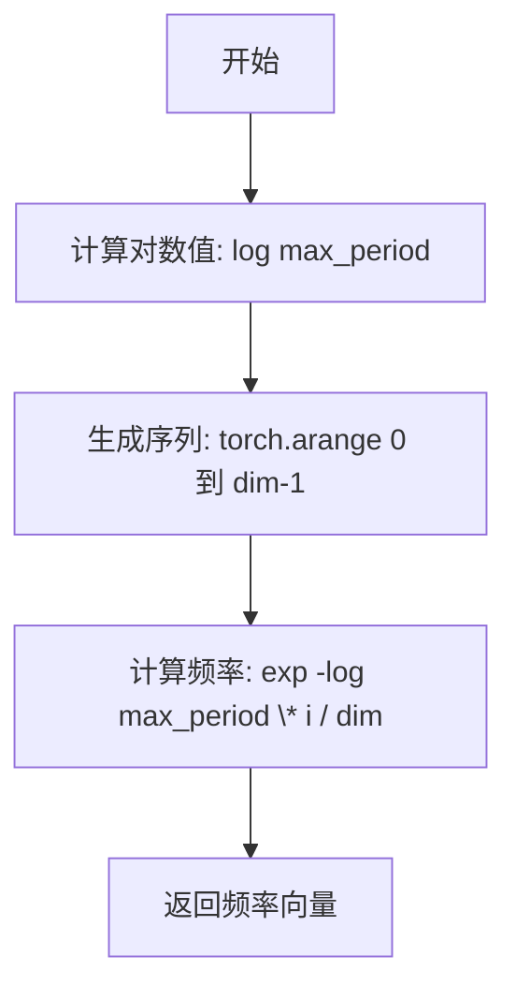

#### 带注释源码

```
def get_freqs(dim, max_period=10000.0):
    """
    生成旋转位置编码（RoPE）使用的频率向量。
    
    使用指数衰减公式: freqs[i] = exp(-log(max_period) * i / dim)
    这创建了一个从 max_period 开始指数衰减到 1 的频率序列。
    
    参数:
        dim: int, 输出频率向量的维度
        max_period: float, 最大周期值，控制频率衰减的起始点
    
    返回:
        torch.Tensor: 频率向量，形状为 (dim,)
    """
    # 计算频率向量
    # 公式: freqs = exp(-log(max_period) * arange(0, dim) / dim)
    # 等价于: freqs = max_period ^ (-i/dim) 对于 i in [0, dim)
    # 这创建了一个从 1.0 开始（当 i=0 时）指数衰减到 max_period^(-1) 的序列
    freqs = torch.exp(
        -math.log(max_period) *          # 负的对数最大周期
        torch.arange(start=0, end=dim,   # 从 0 到 dim-1 的序列
                     dtype=torch.float32) / dim  # 除以 dim 归一化
    )
    return freqs
```

#### 设计说明

该函数是旋转位置编码（Rotary Position Embedding，RoPE）的核心组成部分。通过指数衰减的频率向量，模型可以学习不同位置之间的相对位置关系。频率向量用于计算正弦和余弦位置编码，使模型能够捕获不同频率的位置信息，低频对应长距离依赖，高频对应短距离模式。


### `fractal_flatten`

该函数用于将视觉嵌入（Visual Embeddings）及其对应的旋转位置编码（RoPE）从高维张量（通常是 4D 或 5D）展平为适合 Transformer 块处理的 2D/3D 张量。它根据 `block_mask` 参数决定展平策略：如果启用块掩码，则使用局部修补（local_patching）来保持空间局部性；否则执行标准的空间维度展平。

参数：

-  `x`：`torch.Tensor`，输入的视觉嵌入张量，通常形状为 `[Batch, Duration, Height, Width, Channel]`。
-  `rope`：`torch.Tensor`，对应的旋转位置编码（RoPE）张量，形状与 `x` 的空间维度一致。
-  `shape`：`torch.Size` 或 `tuple`，原始输入张量的空间形状（不包含特征维度），用于 `local_patching` 计算。
-  `block_mask`：`bool`，布尔标志。设为 `True` 时启用分块掩码处理（通常用于特定的稀疏注意力机制），`False` 时执行标准展平。

返回值：`tuple[torch.Tensor, torch.Tensor]`，返回一个元组，包含展平后的视觉嵌入 `x` 和展平后的 RoPE `rope`。

#### 流程图

```mermaid
flowchart TD
    A([Start fractal_flatten]) --> B{Is block_mask == True?}
    
    B -- Yes --> C[Set pixel_size = 8]
    C --> D[Call local_patching<br>on x with shape and pixel_size]
    D --> E[Call local_patching<br>on rope with shape and pixel_size]
    E --> F[x = x.flatten(1, 2)<br>rope = rope.flatten(1, 2)]
    
    B -- No --> G[x = x.flatten(1, 3)<br>rope = rope.flatten(1, 3)]
    
    F --> H[Return x, rope]
    G --> H
```

#### 带注释源码

```python
def fractal_flatten(x, rope, shape, block_mask=False):
    # 判断是否需要启用块掩码模式（Block Mask Mode）
    if block_mask:
        # 在块掩码模式下，设定局部块的大小
        pixel_size = 8
        
        # 对输入张量 x 和位置编码 rope 执行局部修补（Local Patching）
        # 这是一种空间重排操作，将数据整理成 (Batch, Duration/Patch, Height/Patch, Width/Patch, Patch^2, Channel) 的形式
        x = local_patching(x, shape, (1, pixel_size, pixel_size), dim=1)
        rope = local_patching(rope, shape, (1, pixel_size, pixel_size), dim=1)
        
        # 修补后，仅展平前两个空间维度（时间和空间块合并，保留通道维度的相对独立性以便后续注意力计算）
        # 结果形状变为 (Batch, Duration * Height * Width / pixel^2, pixel^2, Channel)
        x = x.flatten(1, 2)
        rope = rope.flatten(1, 2)
    else:
        # 标准展平模式：将空间维度（Duration, Height, Width）全部合并到批次维度
        # 结果形状变为 (Batch, Duration * Height * Width, Channel)
        x = x.flatten(1, 3)
        rope = rope.flatten(1, 3)
        
    return x, rope
```


### `fractal_unflatten`

该函数用于将经过 `fractal_flatten` 处理后的张量重新展开（unflatten）回原始的 4D 时空形状，支持普通模式和分块掩码模式两种处理方式。

参数：

- `x`：`torch.Tensor`，输入的需要展开的张量，通常是经过 fractal_flatten 处理后的隐藏状态
- `shape`：`tuple[int, int, int, int]`，原始张量的形状，格式为 (batch_size, duration, height, width)
- `block_mask`：`bool`，是否使用分块掩码模式，默认为 False。为 True 时会调用 local_merge 进行局部合并

返回值：`torch.Tensor`，展开后的张量，形状为 (batch_size, duration, height, width, ...) 或根据 block_mask 恢复为相应的多维形状

#### 流程图

```mermaid
flowchart TD
    A[开始 fractal_unflatten] --> B{block_mask?}
    B -->|True| C[设置 pixel_size = 8]
    B -->|False| D[直接 reshape 到原始 shape]
    C --> E[x.reshape(x.shape[0], -1, pixel_size², *x.shape[2:])]
    E --> F[调用 local_merge 合并]
    F --> G[返回展开后的张量]
    D --> G
```

#### 带注释源码

```python
def fractal_unflatten(x, shape, block_mask=False):
    """
    将经过 fractal_flatten 处理后的张量重新展开回原始形状
    
    参数:
        x: 输入张量，通常来自 transformer 处理后的视觉嵌入
        shape: 原始形状元组 (batch_size, duration, height, width)
        block_mask: 是否使用分块掩码模式
    
    返回:
        恢复形状后的张量
    """
    if block_mask:
        # 分块掩码模式：用于局部注意力机制
        pixel_size = 8  # 定义像素块大小
        
        # 第一步 reshape：将张量重塑为 (batch, seq_len, pixel_size², hidden_dim)
        # 其中 seq_len = duration * height * width / pixel_size²
        x = x.reshape(x.shape[0], -1, pixel_size**2, *x.shape[2:])
        
        # 第二步：调用 local_merge 进行局部合并，恢复原始的空间结构
        # local_merge 会根据 shape 和 group_size 恢复 (duration, height, width) 的维度
        x = local_merge(x, shape, (1, pixel_size, pixel_size), dim=1)
    else:
        # 普通模式：直接将展平的张量恢复为原始 4D 形状
        # shape 参数提供原始的 (batch, duration, height, width) 维度信息
        x = x.reshape(*shape, *x.shape[2:])
    
    return x
```


### `local_patching`

该函数实现局部补丁（Local Patching）操作，通过reshape、permute和flatten操作将输入张量重新组织为空间块结构，以便于后续的局部注意力机制处理。

参数：

- `x`：`torch.Tensor`，输入的需要进行局部补丁处理的张量
- `shape`：`tuple[int, int, int, int]`，形状元组，包含 (batch_size, duration, height, width)
- `group_size`：`tuple[int, int, int]`，分组大小元组，包含 (g1, g2, g3)，分别对应 duration、height、width 的分组数
- `dim`：`int`，维度参数，指定在哪个维度进行分组操作，默认为 0

返回值：`torch.Tensor`，经过局部补丁处理后重新组织的张量

#### 流程图

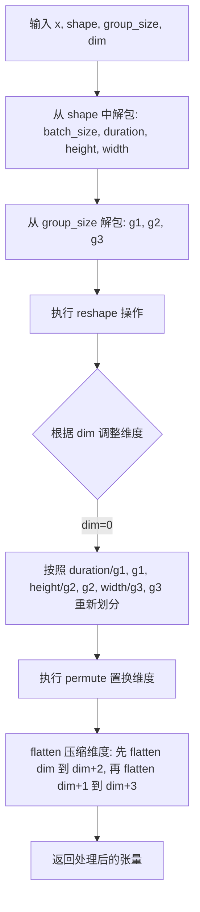

#### 带注释源码

```python
def local_patching(x, shape, group_size, dim=0):
    """
    执行局部补丁（Local Patching）操作，将输入张量重新组织为空间块结构。
    
    参数:
        x: 输入张量
        shape: (batch_size, duration, height, width) 形状元组
        group_size: (g1, g2, g3) 分组大小，分别对应 duration, height, width
        dim: 维度参数，指定在哪个维度进行分组
    
    返回:
        经过局部补丁处理后的张量
    """
    # 从 shape 元组中解包出各个维度的尺寸
    batch_size, duration, height, width = shape
    # 从 group_size 元组中解包出分组大小
    g1, g2, g3 = group_size
    
    # 第一步：reshape - 将张量重新整形为分块形式
    # 按照 (batch_size, duration//g1, g1, height//g2, g2, width//g3, g3, ...) 的顺序重新排列
    x = x.reshape(
        *x.shape[:dim],           # 保留 dim 之前的维度不变
        duration // g1,           # 将 duration 维度分割为 duration//g1 个块，每块大小为 g1
        g1,                       # duration 方向的分组大小
        height // g2,             # 将 height 维度分割为 height//g2 个块
        g2,                       # height 方向的分组大小
        width // g3,              # 将 width 维度分割为 width//g3 个块
        g3,                       # width 方向的分组大小
        *x.shape[dim + 3 :],      # 保留 dim 之后的剩余维度
    )
    
    # 第二步：permute - 置换维度顺序，将分组维度重新排列
    # 目标：将分组维度 (g1, g2, g3) 连续排列到前面
    x = x.permute(
        *range(len(x.shape[:dim])),  # 保留原始的前 dim 个维度
        dim,                          # 原始 dim 维度 → 位置 dim
        dim + 2,                      # g1 维度 → 位置 dim+2
        dim + 4,                      # g2 维度 → 位置 dim+4
        dim + 1,                      # duration//g1 → 位置 dim+1
        dim + 3,                      # height//g2 → 位置 dim+3
        dim + 5,                      # width//g3 → 位置 dim+5
        *range(dim + 6, len(x.shape)),  # 保留剩余维度
    )
    
    # 第三步：flatten - 压缩维度，将分组维度与对应的块维度合并
    # 先将 dim 到 dim+2 的维度合并（即合并 g1 和对应的块维度）
    x = x.flatten(dim, dim + 2).flatten(dim + 1, dim + 3)
    # 再将 dim+1 到 dim+3 的维度合并（即合并 g2 和对应的块维度）
    
    return x
```


### `local_merge`

该函数是 Kandinsky5 模型中用于分形变换（Fractal Transformation）的核心辅助函数，负责将经过分形展平处理的 patch 数据重新合并回原始的空间维度结构，与 `local_patching` 互为逆操作，主要用于视觉嵌入的维度重组。

参数：

- `x`：`torch.Tensor`，经过分形展平处理后的输入张量，通常是已经过 `fractal_flatten` 变换的数据
- `shape`：`tuple[int, int, int, int]`，原始形状信息，包含 (batch_size, duration, height, width)
- `group_size`：`tuple[int, int, int]`，分组大小，包含 (g1, g2, g3)，分别对应时间、高度、宽度的分组因子
- `dim`：`int`，操作的起始维度，默认为 0

返回值：`torch.Tensor`，重塑并置换后的输出张量，维度顺序被重新组织为 (batch, duration//g1, height//g2, width//g3, g1, g2, g3, ...)

#### 流程图

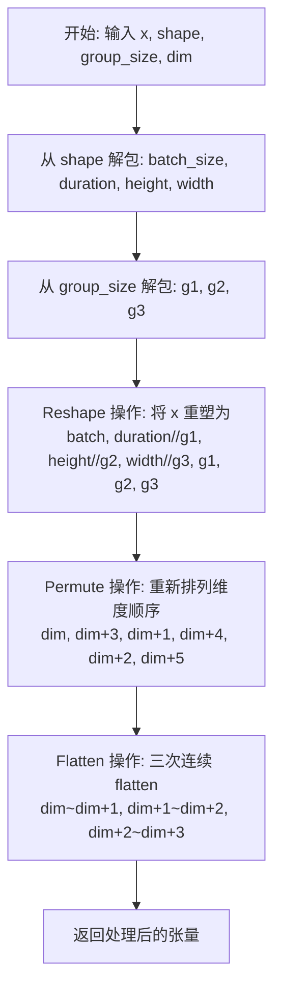

#### 带注释源码

```python
def local_merge(x, shape, group_size, dim=0):
    """
    将分形展平后的 patch 数据重新合并回原始空间结构
    
    参数:
        x: 经过 fractal_flatten 处理的张量
        shape: 原始 4D 形状 (batch, duration, height, width)
        group_size: 分组大小 (g1, g2, g3)
        dim: 操作起始维度
    """
    # 解包原始形状信息
    batch_size, duration, height, width = shape
    
    # 解包分组大小 (时间组、高度组、宽度组)
    g1, g2, g3 = group_size
    
    # 第一次 Reshape: 将展平的 patch 恢复为分组形式
    # 输入形状: (batch, ..., duration*height*width, ...)
    # 输出形状: (batch, ..., duration//g1, g1, height//g2, g2, width//g3, g3, ...)
    x = x.reshape(
        *x.shape[:dim],                    # 保留 dim 之前的维度
        duration // g1,                    # 时间维度分割
        height // g2,                      # 高度维度分割
        width // g3,                       # 宽度维度分割
        g1,                                # 时间分组维度
        g2,                                # 高度分组维度
        g3,                                # 宽度分组维度
        *x.shape[dim + 2 :],               # 保留剩余维度 (如特征维度)
    )
    
    # Permute 置换: 重新排列维度顺序以便后续 flatten
    # 将 (dim, dim+1, dim+2, dim+3, dim+4, dim+5) 转换为
    # (dim, dim+3, dim+1, dim+4, dim+2, dim+5)
    # 即: (原始位置, 时间分组, 高度分组, 宽度分组) -> (时间分组, 原始位置, 高度分组, 宽度分组)
    x = x.permute(
        *range(len(x.shape[:dim])),        # 保留 dim 之前的维度顺序
        dim,                               # 原始 duration//g1
        dim + 3,                           # g1 (时间分组)
        dim + 1,                           # height//g2
        dim + 4,                           # g2 (高度分组)
        dim + 2,                           # width//g3
        dim + 5,                           # g3 (宽度分组)
        *range(dim + 6, len(x.shape)),    # 保留后续维度
    )
    
    # 三次连续的 flatten 操作，将分组维度合并到空间维度
    # flatten(dim, dim+1): 合并 dim 和 dim+1 -> duration//g1 * g1 = duration
    # flatten(dim+1, dim+2): 合并 height//g2 和 g2 -> height
    # flatten(dim+2, dim+3): 合并 width//g3 和 g3 -> width
    x = x.flatten(dim, dim + 1).flatten(dim + 1, dim + 2).flatten(dim + 2, dim + 3)
    
    return x
```


### `nablaT_v2`

该函数实现了Nabla稀疏注意力机制的块掩码生成算法，通过对查询和键进行分组池化、softmax概率排序与阈值二值化，结合静态注意力掩码生成用于Flex Attention的稀疏块掩码，以实现高效的稀疏注意力计算。

参数：

- `q`：`Tensor`，查询张量，形状为 `[B, h, S, D]`，其中B为批次大小，h为头数，S为序列长度，D为头维度
- `k`：`Tensor`，键张量，形状为 `[B, h, S, D]`，与查询形状相同
- `sta`：`Tensor`，静态注意力掩码张量，形状为 `[B, h, S, S]`，用于指定必须保留的位置
- `thr`：`float`，阈值参数，默认为0.9，用于控制稀疏度，即保留概率累积和达到1-thr的位置

返回值：`BlockMask`，PyTorch Flex Attention的块掩码对象，用于稀疏注意力计算

#### 流程图

```mermaid
flowchart TD
    A[开始: nablaT_v2] --> B{检查 _CAN_USE_FLEX_ATTN}
    B -->|是| C[导入 BlockMask]
    B -->|否| D[抛出 ValueError]
    C --> E[转置 q 和 k<br/>q, k: [B,h,S,D] → [B,S,h,D]]
    E --> F[Map 估算<br/>将序列分块为64<br/>qa = q.reshape(B,h,s1,64,D).mean(-2)<br/>ka = k.reshape(B,h,s1,64,D).mean(-2).T<br/>map = qa @ ka]
    F --> G[Softmax 归一化<br/>map = softmax(map / √D, dim=-1)]
    G --> H[Map 二值化<br/>vals, inds = sort(map)<br/>cvals = cumsum(vals)<br/>mask = cvals >= 1-thr]
    H --> I[整理掩码索引<br/>mask = mask.gather 并 argsort 恢复顺序]
    I --> J[合并静态掩码<br/>mask = mask OR sta]
    J --> K[创建 BlockMask<br/>kv_nb = mask.sum(-1)<br/>kv_inds = argsort(mask, descending=True)<br/>return BlockMask.from_kv_blocks...]
    K --> L[返回 BlockMask]
    
    D --> E1[结束]
    L --> E2[结束]
```

#### 带注释源码

```python
def nablaT_v2(
    q: Tensor,      # 查询张量 [B, h, S, D]
    k: Tensor,      # 键张量 [B, h, S, D]
    sta: Tensor,    # 静态注意力掩码 [B, h, S, S]
    thr: float = 0.9,  # 阈值参数，控制稀疏度
):
    """
    Nabla稀疏注意力机制的块掩码生成函数。
    
    该函数通过以下步骤生成稀疏注意力掩码：
    1. 检查PyTorch版本是否支持Flex Attention
    2. 对Q、K进行分组池化以估算注意力分布
    3. 根据阈值进行二值化处理
    4. 结合静态掩码创建BlockMask对象
    """
    # 检查是否可以使用Flex Attention后端
    if _CAN_USE_FLEX_ATTN:
        # 导入PyTorch Flex Attention的BlockMask类
        from torch.nn.attention.flex_attention import BlockMask
    else:
        # 不支持时抛出错误
        raise ValueError("Nabla attention is not supported with this version of PyTorch")

    # 转置张量维度：从 [B, h, S, D] 转换为 [B, S, h, D]
    # contiguous() 确保张量在内存中是连续的，便于后续操作
    q = q.transpose(1, 2).contiguous()
    k = k.transpose(1, 2).contiguous()

    # ============ Map 估算阶段 ============
    # 获取查询张量的形状
    B, h, S, D = q.shape  # B:批次, h:头数, S:序列长度, D:头维度
    
    # 计算分块数量：将序列长度S分成每块64个token
    s1 = S // 64
    
    # 对查询进行分块池化：将 [B,h,S,D] 重塑为 [B,h,s1,64,D] 然后在第4维求平均
    # 这相当于对每64个token进行聚合，得到粗粒度的查询表示
    qa = q.reshape(B, h, s1, 64, D).mean(-2)
    
    # 对键进行同样的分块池化，并转置最后两维以便进行矩阵乘法
    ka = k.reshape(B, h, s1, 64, D).mean(-2).transpose(-2, -1)
    
    # 计算注意力map：qa @ ka -> [B, h, s1, s1]
    # 这是查询和键的相似度矩阵
    map = qa @ ka

    # ============ Softmax 归一化 ============
    # 使用softmax对map进行归一化，除以√D进行缩放（缩放点积注意力）
    map = torch.softmax(map / math.sqrt(D), dim=-1)
    
    # ============ Map 二值化阶段 ============
    # 对map在最后一维进行排序，获取值和索引
    vals, inds = map.sort(-1)
    
    # 计算累积和，用于确定哪些位置需要保留
    cvals = vals.cumsum_(-1)
    
    # 创建二值掩码：保留累积和 >= 1-thr 的位置
    # 这确保了保留最高概率的位置，直到累积概率达到阈值
    mask = (cvals >= 1 - thr).int()
    
    # 恢复原始顺序：gather操作后需要通过argsort恢复索引顺序
    mask = mask.gather(-1, inds.argsort(-1))

    # ============ 合并静态掩码 ============
    # 使用逻辑或操作合并计算出的掩码和静态掩码
    # sta_mask 指定了必须保留的注意力位置
    mask = torch.logical_or(mask, sta)

    # ============ BlockMask 创建阶段 ============
    # 计算每个头每个块的有效key-value数量
    kv_nb = mask.sum(-1).to(torch.int32)
    
    # 获取排序后的索引，用于构建BlockMask
    # descending=True 确保最重要的位置排在前面
    kv_inds = mask.argsort(dim=-1, descending=True).to(torch.int32)
    
    # 使用Flex Attention的from_kv_blocks方法创建BlockMask
    # BLOCK_SIZE=64 对应之前分块的大小
    # kv_inds指定要保留的KV块索引，kv_nb指定每个块保留多少个KV
    return BlockMask.from_kv_blocks(
        torch.zeros_like(kv_nb),  # 分数张量（这里为空）
        kv_inds,                   # KV块索引 [B, h, s1]
        kv_nb,                     # 每个块的KV数量 [B, h]
        kv_inds,                   # 块内索引（与kv_inds相同）
        BLOCK_SIZE=64,            # 块大小
        mask_mod=None             # 额外的mask修饰器（无）
    )
```


### `Kandinsky5TimeEmbeddings.forward`

该方法实现了时间步嵌入的前向传播，将输入的时间步转换为高维特征表示。首先使用旋转位置编码（RoPE）风格的正弦余弦函数对时间进行编码，然后通过两层全连接网络进行非线性变换，生成用于扩散模型的时间条件嵌入。

参数：

- `time`：`torch.Tensor`，输入的时间步张量，形状为 (batch_size,)

返回值：`torch.Tensor`，经过编码和变换后的时间嵌入，形状为 (batch_size, time_dim)

#### 流程图

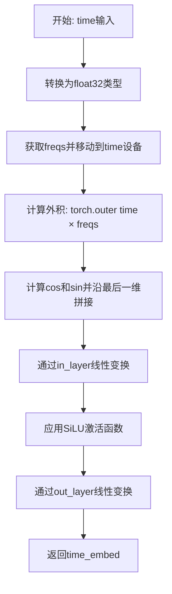

#### 带注释源码

```
def forward(self, time):
    # 参数 time: torch.Tensor，形状为 (batch_size,)，代表批次中每个样本的时间步
    
    # 步骤1: 将time转换为float32类型以确保计算精度
    # self.freqs 预先计算的正弦频率，形状为 (model_dim // 2,)
    args = torch.outer(time.to(torch.float32), self.freqs.to(device=time.device))
    # 结果 args 形状: (batch_size, model_dim // 2)
    
    # 步骤2: 使用旋转位置编码风格的正弦余弦函数
    # torch.cos(args) 和 torch.sin(args) 分别计算余弦和正弦值
    # torch.cat 在最后一维拼接，生成形状 (batch_size, model_dim) 的嵌入
    time_embed = torch.cat([torch.cos(args), torch.sin(args)], dim=-1)
    
    # 步骤3: 通过两层神经网络进行非线性变换
    # in_layer: Linear(model_dim, time_dim)，将维度从 model_dim 映射到 time_dim
    # activation: SiLU (Swish) 激活函数，提供非线性变换
    # out_layer: Linear(time_dim, time_dim)，进一步处理特征
    time_embed = self.out_layer(self.activation(self.in_layer(time_embed)))
    # 最终输出形状: (batch_size, time_dim)
    
    return time_embed
```


### `Kandinsky5TextEmbeddings.forward`

该方法实现了文本嵌入的投影与归一化处理，将输入的文本嵌入向量通过线性变换映射到模型维度空间，并应用 LayerNorm 进行归一化，同时保持与输入张量相同的数据类型。

参数：

- `text_embed`：`torch.Tensor`，输入的文本嵌入向量，形状为 `(batch_size, text_dim)` 或 `(batch_size, seq_len, text_dim)`

返回值：`torch.Tensor`，经过线性变换和 LayerNorm 归一化后的文本嵌入向量，形状为 `(batch_size, model_dim)` 或 `(batch_size, seq_len, model_dim)`

#### 流程图

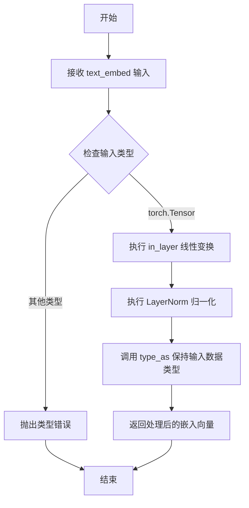

#### 带注释源码

```
class Kandinsky5TextEmbeddings(nn.Module):
    """
    Kandinsky5 文本嵌入模块，负责将文本嵌入向量投影到模型维度并进行归一化处理
    """
    
    def __init__(self, text_dim, model_dim):
        """
        初始化文本嵌入模块
        
        参数:
            text_dim: int，输入文本嵌入的维度
            model_dim: int，输出模型维度
        """
        super().__init__()
        # 线性投影层：将 text_dim 维度映射到 model_dim 维度
        self.in_layer = nn.Linear(text_dim, model_dim, bias=True)
        # LayerNorm 归一化层，对模型维度进行归一化
        self.norm = nn.LayerNorm(model_dim, elementwise_affine=True)

    def forward(self, text_embed):
        """
        前向传播：执行文本嵌入的投影和归一化
        
        参数:
            text_embed: torch.Tensor，输入的文本嵌入向量
            
        返回:
            torch.Tensor，经过处理后的文本嵌入向量
        """
        # 第一步：通过线性层将文本嵌入投影到模型维度空间
        text_embed = self.in_layer(text_embed)
        
        # 第二步：应用 LayerNorm 归一化，保持与输入张量相同的数据类型后返回
        return self.norm(text_embed).type_as(text_embed)
```


### `Kandinsky5VisualEmbeddings.forward`

该方法实现了视觉数据的patch嵌入处理，通过将输入的5D张量（batch_size, duration, height, width, dim）按照指定的patch_size进行分割、重排和展平，然后通过线性层将分割后的patch映射到模型维度空间，生成视觉嵌入向量供Transformer模型使用。

参数：

- `x`：`torch.Tensor`，输入的5D视觉张量，形状为 (batch_size, duration, height, width, dim)，表示批处理大小、时间步数、高度、宽度和通道维度

返回值：`torch.Tensor`，经过patch处理和线性变换后的视觉嵌入，形状为 (batch_size, duration//patch_size[0], height//patch_size[1], width//patch_size[2], model_dim)

#### 流程图

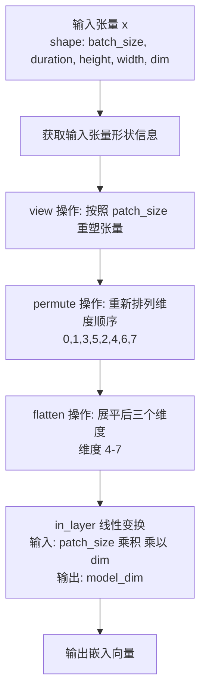

#### 带注释源码

```python
def forward(self, x):
    # 获取输入张量的形状信息
    # x shape: (batch_size, duration, height, width, dim)
    batch_size, duration, height, width, dim = x.shape
    
    # 步骤1: view 操作 - 将张量按照 patch_size 进行分割
    # 将 (batch_size, duration, height, width, dim) 转换为
    # (batch_size, duration//p0, p0, height//p1, p1, width//p2, p2, dim)
    # 其中 p0, p1, p2 是 patch_size 的三个维度
    x = (
        x.view(
            batch_size,
            duration // self.patch_size[0],   # 时间维度分割
            self.patch_size[0],               # patch 时间大小
            height // self.patch_size[1],     # 高度维度分割
            self.patch_size[1],               # patch 高度大小
            width // self.patch_size[2],      # 宽度维度分割
            self.patch_size[2],               # patch 宽度大小
            dim,                              # 通道维度
        )
        # 步骤2: permute 操作 - 重新排列维度顺序
        # 从 (0,1,2,3,4,5,6,7) 转换为 (0,1,3,5,2,4,6,7)
        # 这样可以将三个 patch 维度 (p0,p1,p2) 连续排列在最后
        .permute(0, 1, 3, 5, 2, 4, 6, 7)
        # 步骤3: flatten 操作 - 展平 patch 维度
        # 将最后的三个 patch 维度展平为一个维度
        # 结果形状: (batch_size, duration//p0, height//p1, width//p2, p0*p1*p2*dim)
        .flatten(4, 7)
    )
    
    # 步骤4: 线性变换 - 将展平后的 patch 向量映射到模型维度
    # in_layer: Linear(p0*p1*p2*dim, model_dim)
    return self.in_layer(x)
```


### `Kandinsky5RoPE1D.forward`

该方法实现了1D旋转位置编码（Rotary Position Embedding, RoPE），通过预计算的位置-频率外积生成旋转矩阵，用于在注意力机制中编码序列位置信息。

参数：

- `pos`：`torch.Tensor`（LongTensor类型），位置索引，可以是单个整数或一维张量，表示需要获取旋转编码的位置

返回值：`torch.Tensor`，形状为 `[batch_size, seq_len, 1, 1, 2, 2]` 的旋转矩阵，可与查询/键张量相乘以应用旋转位置编码

#### 流程图

```mermaid
flowchart TD
    A[输入位置索引 pos] --> B{判断pos类型}
    B -->|单个位置| C[args[pos] 单个位置]
    B -->|位置序列| D[args[pos] 多个位置]
    C --> E[计算 cosine = torch.cos args]
    D --> E
    E --> F[计算 sine = torch.sin args]
    F --> G[stack创建: cosine, -sine, sine, cosine]
    G --> H[view重塑为2x2矩阵]
    H --> I[unsqueeze添加batch和head维度]
    J[返回旋转矩阵 rope]
    I --> J
```

#### 带注释源码

```python
def forward(self, pos):
    """
    前向传播：生成1D旋转位置编码
    
    参数:
        pos: 位置索引，可以是以下形式:
            - 单个整数: 如 5
            - 1D张量: 如 tensor([0, 1, 2, 3, 4])
            
    返回:
        rope: 旋转矩阵，形状:
            - 单个位置: [1, 1, 1, 1, 2, 2]
            - 多个位置: [batch_size, seq_len, 1, 1, 2, 2]
    """
    # 从预注册的buffer中提取对应位置的频率参数
    # args 形状: [max_pos, dim//2]
    # pos 可以是 int 或 1D Tensor
    args = self.args[pos]
    
    # 计算余弦和正弦分量
    # args 形状: [*, dim//2]
    cosine = torch.cos(args)  # 余弦部分
    sine = torch.sin(args)    # 正弦部分
    
    # 堆叠成旋转矩阵的四个元素
    # 旋转矩阵形式: [[cos, -sin], [sin, cos]]
    # 最终形状: [*, 2, 2]
    rope = torch.stack([cosine, -sine, sine, cosine], dim=-1)
    
    # 重塑为2x2旋转矩阵形式
    # 从 [*, 4] -> [*, 2, 2]
    rope = rope.view(*rope.shape[:-1], 2, 2)
    
    # 插入额外的维度以适配注意力计算
    # 最终形状: [*, 1, 1, 2, 2]
    # 这里的两个1维度分别对应:
    #   - 第一个: 用于与query/key的head维度对齐
    #   - 第二个: 用于广播
    return rope.unsqueeze(-4)
```


### `Kandinsky5RoPE3D.forward`

这是一个用于生成3D旋转位置编码（RoPE）的模块，主要为视频数据提供空间位置感知能力。该方法接收视频的形状、位置索引和缩放因子，计算并返回三维旋转位置编码张量。

参数：

- `shape`：`tuple[int, int, int]`，输入视频的形状 (duration, height, width)
- `pos`：`tuple[int, int, int]`，RoPE在时间、高度、宽度三个轴上的位置索引
- `scale_factor`：`tuple[float, float, float]`，可选，默认为 (1.0, 1.0, 1.0)，用于缩放各轴频率的因子

返回值：`torch.Tensor`，3D旋转位置编码张量，形状为 (batch_size, duration, height, width, dim, 2, 2)

#### 流程图

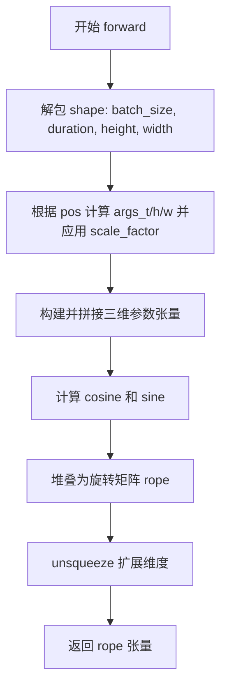

#### 带注释源码

```python
def forward(self, shape, pos, scale_factor=(1.0, 1.0, 1.0)):
    """
    生成3D旋转位置编码（RoPE）
    
    参数:
        shape: 输入张量形状 (batch_size, duration, height, width)
        pos: 三轴位置索引 (pos_t, pos_h, pos_w)
        scale_factor: 频率缩放因子，用于调整不同轴的周期
    
    返回:
        3D旋转位置编码张量
    """
    # 1. 解包形状信息
    batch_size, duration, height, width = shape
    
    # 2. 根据位置索引从预计算的频率表中取值，并应用缩放因子
    args_t = self.args_0[pos[0]] / scale_factor[0]  # 时间轴
    args_h = self.args_1[pos[1]] / scale_factor[1]  # 高度轴
    args_w = self.args_2[pos[2]] / scale_factor[2]  # 宽度轴
    
    # 3. 构建三维位置编码张量并拼接
    # 时间维度: (1, duration, 1, 1, dim) -> 扩展到 batch_size
    # 高度维度: (1, 1, height, 1, dim) -> 扩展到 batch_size
    # 宽度维度: (1, 1, 1, width, dim) -> 扩展到 batch_size
    args = torch.cat(
        [
            args_t.view(1, duration, 1, 1, -1).repeat(batch_size, 1, height, width, 1),
            args_h.view(1, 1, height, 1, -1).repeat(batch_size, duration, 1, width, 1),
            args_w.view(1, 1, 1, width, -1).repeat(batch_size, duration, height, 1, 1),
        ],
        dim=-1,
    )
    
    # 4. 计算余弦和正弦
    cosine = torch.cos(args)
    sine = torch.sin(args)
    
    # 5. 堆叠为旋转矩阵形式 [cos, -sin, sin, cos]
    rope = torch.stack([cosine, -sine, sine, cosine], dim=-1)
    rope = rope.view(*rope.shape[:-1], 2, 2)
    
    # 6. 扩展维度以适配后续注意力机制
    return rope.unsqueeze(-4)
```


### `Kandinsky5Modulation.forward`

该方法实现了Kandinsky5模型的调制模块，通过对输入的时间嵌入进行激活和线性变换，生成用于后续特征调制的参数（如shift、scale、gate等），广泛应用于Transformer块的归一化和前馈网络中实现自适应特征调整。

参数：

- `self`：隐式参数，表示模块自身
- `x`：`torch.Tensor`，输入的时间嵌入张量，通常来自时间 embeddings 模块的输出

返回值：`torch.Tensor`，经过线性层变换后的调制参数张量，形状为 `(batch_size, num_params * model_dim)`，其中包含用于调制视觉或文本特征的 shift、scale、gate 等参数

#### 流程图

```mermaid
flowchart TD
    A[输入: x (时间嵌入)] --> B[激活函数: nn.SiLU]
    B --> C[线性层: nn.Linear]
    C --> D[输出: 调制参数张量]
    
    subgraph "Kandinsky5Modulation.forward"
        A -.->|x| B
        B -.->|activation(x)| C
    end
```

#### 带注释源码

```python
def forward(self, x):
    """
    前向传播：生成调制参数
    
    参数:
        x: 输入的时间嵌入张量，形状为 (batch_size, time_dim)
        
    返回:
        调制参数张量，形状为 (batch_size, num_params * model_dim)
    """
    # 步骤1: 对输入时间嵌入应用SiLU激活函数
    # SiLU (Sigmoid Linear Unit) 也称为 Swish: x * sigmoid(x)
    activated = self.activation(x)
    
    # 步骤2: 通过线性层将激活后的向量映射到 num_params * model_dim 维空间
    # 这个输出包含了多个调制参数（shift, scale, gate等）
    output = self.out_layer(activated)
    
    # 返回调制参数，供后续的归一化和前馈网络使用
    return output
```


### `Kandinsky5AttnProcessor.__init__`

初始化 Kandinsky5 注意力处理器，检查 PyTorch 版本是否支持 Scaled Dot Product Attention (SDPA)，确保在不支持的情况下抛出 ImportError。

参数：

- `self`：隐式参数，当前实例对象

返回值：`None`，无返回值（Python `__init__` 方法的隐式行为）

#### 流程图

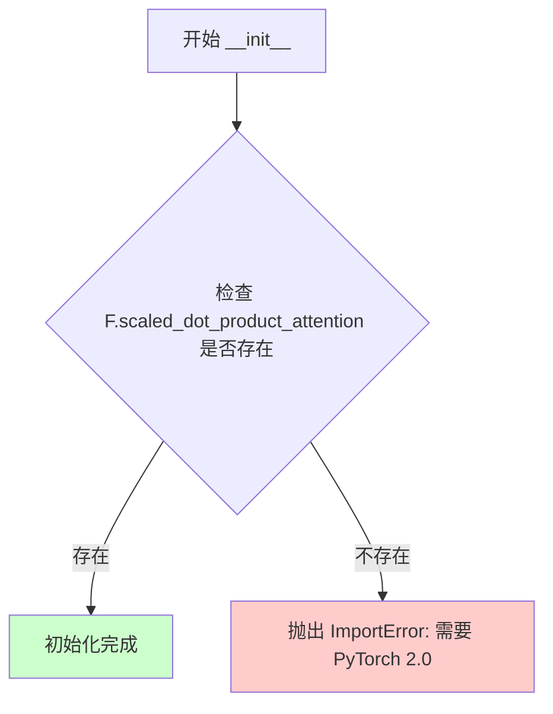

#### 带注释源码

```python
class Kandinsky5AttnProcessor:
    """
    Kandinsky5 注意力处理器类
    用于处理 Transformer 中的注意力计算
    """
    _attention_backend = None  # 类变量：注意力后端配置
    _parallel_config = None     # 类变量：并行配置

    def __init__(self):
        """
        初始化 Kandinsky5AttnProcessor
        
        检查当前 PyTorch 版本是否支持 Scaled Dot Product Attention (SDPA)。
        SDPA 是 PyTorch 2.0 引入的高效注意力实现。
        """
        # 检查 PyTorch 的 nn.functional 模块是否包含 scaled_dot_product_attention 函数
        if not hasattr(F, "scaled_dot_product_attention"):
            # 如果不支持，抛出 ImportError 提示用户升级 PyTorch
            raise ImportError(
                f"{self.__class__.__name__} requires PyTorch 2.0. Please upgrade your pytorch version."
            )
```


### `Kandinsky5AttnProcessor.__call__`

这是 Kandinsky5 注意力处理器的核心调用方法，负责执行注意力计算，包括查询/键/值的生成、归一化、旋转位置编码（RoPE）的应用、稀疏注意力掩码的创建（可选），以及最终的注意力输出。

参数：

- `attn`：`Kandinsky5Attention`，注意力模块实例，提供 to_query、to_key、to_value、query_norm、key_norm、out_layer 等方法以及 num_heads 属性
- `hidden_states`：`torch.Tensor`，输入的隐藏状态张量，形状为 (batch, seq_len, channels)
- `encoder_hidden_states`：`torch.Tensor | None`，编码器隐藏状态，用于跨注意力机制。如果为 None，则执行自注意力
- `rotary_emb`：`tuple[torch.Tensor, torch.Tensor] | None`，旋转位置嵌入（RoPE），用于为查询和键添加位置信息
- `sparse_params`：`dict[str, Any] | None`，稀疏注意力参数，包含 "sta_mask"（稀疏注意力掩码）和 "P"（阈值）等

返回值：`torch.FloatTensor`，经过注意力计算和输出层处理后的隐藏状态

#### 流程图

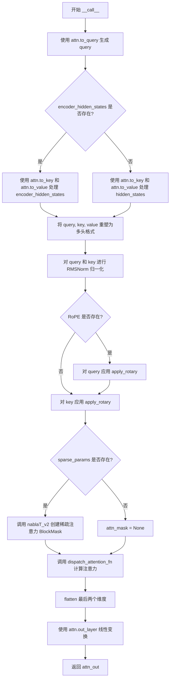

#### 带注释源码

```python
def __call__(self, attn, hidden_states, encoder_hidden_states=None, rotary_emb=None, sparse_params=None):
    """
    执行注意力计算的核心方法。
    
    参数:
        attn: Kandinsky5Attention 实例
        hidden_states: 输入隐藏状态
        encoder_hidden_states: 可选的编码器隐藏状态（用于跨注意力）
        rotary_emb: 可选的旋转位置编码
        sparse_params: 可选的稀疏注意力参数
    
    返回:
        经过注意力处理后的输出张量
    """
    
    # 步骤1: 使用注意力模块的 to_query 方法将 hidden_states 投影为查询向量
    query = attn.to_query(hidden_states)

    # 步骤2: 根据是否存在 encoder_hidden_states 决定是跨注意力还是自注意力
    if encoder_hidden_states is not None:
        # 跨注意力模式：使用编码器隐藏状态生成 key 和 value
        key = attn.to_key(encoder_hidden_states)
        value = attn.to_value(encoder_hidden_states)

        # 获取查询和键的形状，并重塑为多头格式 (batch, seq_len, num_heads, head_dim)
        shape, cond_shape = query.shape[:-1], key.shape[:-1]
        query = query.reshape(*shape, attn.num_heads, -1)
        key = key.reshape(*cond_shape, attn.num_heads, -1)
        value = value.reshape(*cond_shape, attn.num_heads, -1)

    else:
        # 自注意力模式：使用同一 hidden_states 生成 key 和 value
        key = attn.to_key(hidden_states)
        value = attn.to_value(hidden_states)

        shape = query.shape[:-1]
        query = query.reshape(*shape, attn.num_heads, -1)
        key = key.reshape(*shape, attn.num_heads, -1)
        value = value.reshape(*shape, attn.num_heads, -1)

    # 步骤3: 对查询和键进行 RMSNorm 归一化（先转为 float 以提高精度，再转回原类型）
    query = attn.query_norm(query.float()).type_as(query)
    key = attn.key_norm(key.float()).type_as(key)

    # 定义内部函数：应用旋转位置编码 (RoPE)
    def apply_rotary(x, rope):
        """
        应用旋转位置编码。
        
        将输入 x 重塑为 (..., -1, 1, 2) 形状，与 rope 张量相乘后求和，
        最后再重塑回原始形状并转换为 bfloat16。
        """
        x_ = x.reshape(*x.shape[:-1], -1, 1, 2).to(torch.float32)
        x_out = (rope * x_).sum(dim=-1)
        return x_out.reshape(*x.shape).to(torch.bfloat16)

    # 步骤4: 如果提供了旋转位置编码，则应用到 query 和 key 上
    if rotary_emb is not None:
        query = apply_rotary(query, rotary_emb).type_as(query)
        key = apply_rotary(key, rotary_emb).type_as(key)

    # 步骤5: 根据是否有稀疏参数创建注意力掩码
    if sparse_params is not None:
        # 使用 Nabla 稀疏注意力创建 BlockMask
        attn_mask = nablaT_v2(
            query,
            key,
            sparse_params["sta_mask"],
            thr=sparse_params["P"],
        )
    else:
        attn_mask = None

    # 步骤6: 调用分派函数执行实际的注意力计算
    # 该函数会根据 backend 和 parallel_config 选择合适的注意力实现
    hidden_states = dispatch_attention_fn(
        query,
        key,
        value,
        attn_mask=attn_mask,
        backend=self._attention_backend,
        parallel_config=self._parallel_config,
    )

    # 步骤7: 将输出张量展平（从 (batch, seq_len, num_heads, head_dim) 变为 (batch, seq_len, num_heads*head_dim)）
    hidden_states = hidden_states.flatten(-2, -1)

    # 步骤8: 通过输出线性层生成最终注意力输出
    attn_out = attn.out_layer(hidden_states)
    return attn_out
```


### `Kandinsky5Attention.__init__`

该方法是Kandinsky5Attention类的构造函数，负责初始化注意力机制的核心组件，包括Query、Key、Value的线性变换层、RMSNorm归一化层以及注意力处理器。

参数：

- `self`：隐含参数，nn.Module的实例本身
- `num_channels`：`int`，输入通道数，决定模型的维度
- `head_dim`：`int`，每个注意力头的维度，必须能整除num_channels
- `processor`：`可选的Kandinsky5AttnProcessor实例`，注意力处理器，默认为None则使用默认处理器

返回值：无（`None`），构造函数不返回值

#### 流程图

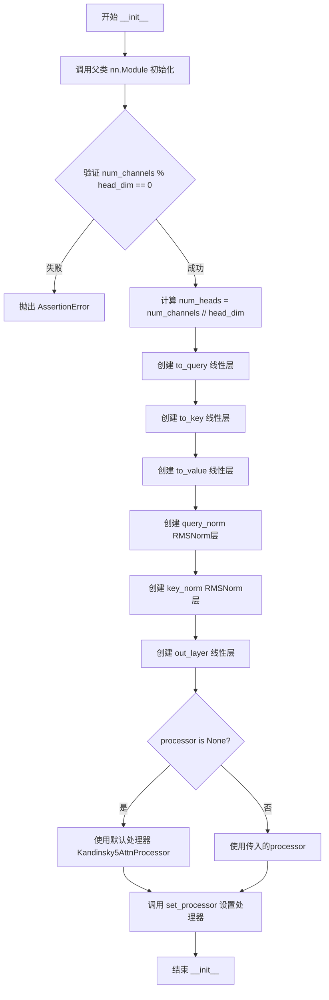

#### 带注释源码

```python
def __init__(self, num_channels, head_dim, processor=None):
    """
    初始化 Kandinsky5 注意力模块
    
    参数:
        num_channels: 输入通道数，决定模型维度
        head_dim: 每个注意力头的维度
        processor: 可选的注意力处理器，默认为None则使用默认处理器
    """
    # 调用父类 nn.Module 的初始化方法
    super().__init__()
    
    # 断言验证：num_channels 必须能被 head_dim 整除
    # 这是为了确保可以均匀分割为多个注意力头
    assert num_channels % head_dim == 0
    
    # 计算注意力头的数量
    self.num_heads = num_channels // head_dim

    # 创建 Query 投影层：将 num_channels 维映射到 num_channels 维
    self.to_query = nn.Linear(num_channels, num_channels, bias=True)
    
    # 创建 Key 投影层：将 num_channels 维映射到 num_channels 维
    self.to_key = nn.Linear(num_channels, num_channels, bias=True)
    
    # 创建 Value 投影层：将 num_channels 维映射到 num_channels 维
    self.to_value = nn.Linear(num_channels, num_channels, bias=True)
    
    # 创建 Query 归一化层：使用 RMSNorm 对每个头的维度进行归一化
    self.query_norm = nn.RMSNorm(head_dim)
    
    # 创建 Key 归一化层：使用 RMSNorm 对每个头的维度进行归一化
    self.key_norm = nn.RMSNorm(head_dim)

    # 创建输出投影层：将注意力输出映射回原始维度
    self.out_layer = nn.Linear(num_channels, num_channels, bias=True)
    
    # 如果未提供处理器，则使用默认的 Kandinsky5AttnProcessor
    if processor is None:
        processor = self._default_processor_cls()
    
    # 设置注意力处理器
    self.set_processor(processor)
```


### `Kandinsky5Attention.forward`

该方法是Kandinsky5模型中注意力模块的前向传播实现，负责计算自注意力或交叉注意力，并通过处理器调度不同的注意力计算后端（包括稀疏注意力），同时支持旋转位置嵌入（RoPE）。

参数：

- `hidden_states`：`torch.Tensor`，输入的隐藏状态，用于计算query、key、value
- `encoder_hidden_states`：`torch.Tensor | None`，编码器的隐藏状态，用于交叉注意力计算，若为None则执行自注意力
- `sparse_params`：`torch.Tensor | None`，稀疏注意力参数，包含sta_mask和P等配置，用于Nabla稀疏注意力
- `rotary_emb`：`tuple[torch.Tensor, torch.Tensor] | None`，旋转位置嵌入（RoPE），用于添加位置信息
- `**kwargs`：可变关键字参数，用于传递额外的注意力处理器参数

返回值：`torch.Tensor`，经过注意力计算后的输出张量

#### 流程图

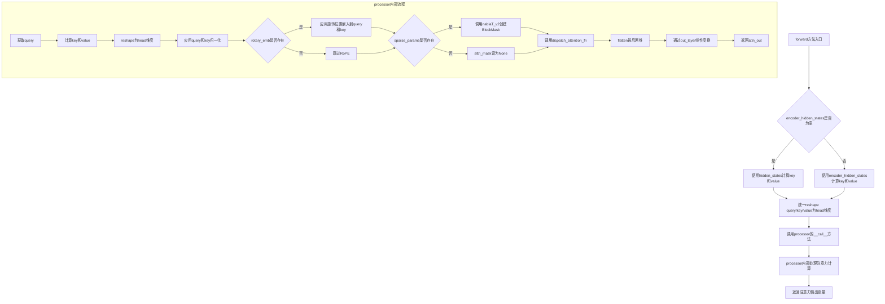

#### 带注释源码

```python
def forward(
    self,
    hidden_states: torch.Tensor,
    encoder_hidden_states: torch.Tensor | None = None,
    sparse_params: torch.Tensor | None = None,
    rotary_emb: tuple[torch.Tensor, torch.Tensor] | None = None,
    **kwargs,
) -> torch.Tensor:
    # 获取注意力处理器调用方法的参数签名
    attn_parameters = set(inspect.signature(self.processor.__call__).parameters.keys())
    # 定义静默忽略的参数集合（不会产生警告）
    quiet_attn_parameters = {}
    # 找出未使用的kwargs（既不在处理器参数中，也不在静默参数中）
    unused_kwargs = [k for k, _ in kwargs.items() if k not in attn_parameters and k not in quiet_attn_parameters]
    # 如果存在未使用的kwargs，发出警告并忽略
    if len(unused_kwargs) > 0:
        logger.warning(
            f"attention_processor_kwargs {unused_kwargs} are not expected by {self.processor.__class__.__name__} and will be ignored."
        )
    # 过滤kwargs，只保留处理器期望的参数
    kwargs = {k: w for k, w in kwargs.items() if k in attn_parameters}

    # 调用处理器执行实际的注意力计算
    # 传递self（attention模块本身）、hidden_states、encoder_hidden_states、sparse_params、rotary_emb以及过滤后的kwargs
    return self.processor(
        self,
        hidden_states,
        encoder_hidden_states=encoder_hidden_states,
        sparse_params=sparse_params,
        rotary_emb=rotary_emb,
        **kwargs,
    )
```


### `Kandinsky5FeedForward.forward`

该方法是 Kandinsky5 模型中的前馈神经网络（Feed Forward Network）实现，负责对输入特征进行非线性变换和维度映射，通过 GELU 激活函数实现特征提取和表达能力提升。

参数：

- `x`：`torch.Tensor`，输入的特征张量，形状为 `(batch_size, ..., dim)`

返回值：`torch.Tensor`，经过前馈网络处理后的特征张量，形状与输入相同 `(batch_size, ..., dim)`

#### 流程图

```mermaid
flowchart TD
    A[输入 x] --> B[self.in_layer: Linear(dim, ff_dim)]
    B --> C[activation: GELU]
    C --> D[self.out_layer: Linear(ff_dim, dim)]
    D --> E[输出 tensor]
    
    B -.->|bias=False| F[无偏置]
    D -.->|bias=False| G[无偏置]
```

#### 带注释源码

```
class Kandinsky5FeedForward(nn.Module):
    """Kandinsky5 模型的前馈神经网络模块
    
    该模块包含两层线性变换，中间通过 GELU 激活函数连接，
    用于在 Transformer 的注意力机制之后对特征进行非线性变换。
    """
    
    def __init__(self, dim, ff_dim):
        """初始化前馈网络
        
        Args:
            dim: 输入和输出的特征维度
            ff_dim: 前馈网络中间层的特征维度（通常大于 dim）
        """
        super().__init__()
        # 输入投影层：将特征从 dim 维度映射到 ff_dim 维度
        self.in_layer = nn.Linear(dim, ff_dim, bias=False)
        
        # GELU 激活函数：Gaussian Error Linear Unit
        # 比 ReLU 更平滑，梯度更平滑，有助于训练深度网络
        self.activation = nn.GELU()
        
        # 输出投影层：将特征从 ff_dim 维度映射回 dim 维度
        self.out_layer = nn.Linear(ff_dim, dim, bias=False)

    def forward(self, x):
        """前向传播
        
        Args:
            x: 输入张量，形状为 (batch_size, ..., dim)
            
        Returns:
            输出张量，形状与输入相同 (batch_size, ..., dim)
        """
        # 步骤1：输入线性变换 + GELU 激活
        # 先将输入投影到更高维的空间，然后应用非线性激活
        hidden = self.activation(self.in_layer(x))
        
        # 步骤2：输出线性变换
        # 将高维特征映射回原始维度
        return self.out_layer(hidden)
```


### `Kandinsky5OutLayer.forward`

该方法是 Kandinsky5 输出层的正向传播函数，负责将视觉嵌入经过调制、归一化和线性变换后，重构为完整的视频输出张量（包含时间、空间和通道维度）。

参数：

- `visual_embed`：`torch.Tensor`，输入的视觉嵌入张量，形状为 `(batch_size, duration, height, width, model_dim)`
- `text_embed`：`torch.Tensor`，文本嵌入张量，在该方法中未被直接使用，但作为接口签名的一部分传递给上层调用
- `time_embed`：`torch.Tensor`，时间嵌入向量，用于生成调制参数（shift 和 scale）

返回值：`torch.Tensor`，重构后的输出张量，形状为 `(batch_size, duration * patch_size[0], height * patch_size[1], width * patch_size[2], visual_dim)`

#### 流程图

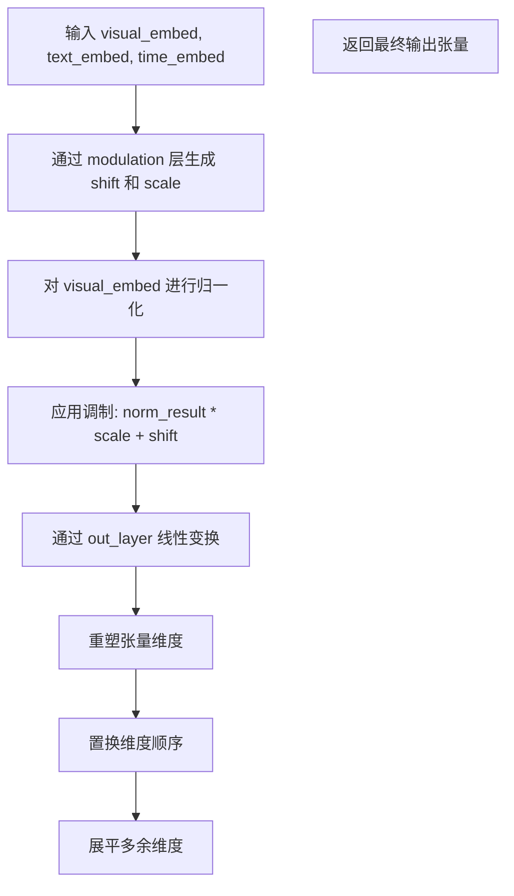

#### 带注释源码

```
def forward(self, visual_embed, text_embed, time_embed):
    # 步骤1: 通过调制层生成shift和scale参数
    # modulation层输出形状: (batch_size, 1, 2 * model_dim)
    # torch.chunk将结果分成两部分，每部分对应shift和scale
    shift, scale = torch.chunk(self.modulation(time_embed).unsqueeze(dim=1), 2, dim=-1)

    # 步骤2: 归一化视觉嵌入并应用仿射变换
    # norm层对model_dim维度进行归一化，不使用可学习参数
    # 调制公式: normalized * (scale + 1.0) + shift，实现自适应通道缩放和偏移
    # [:, None, None] 用于将scale和shift从(1, 1, model_dim)广播到(1, duration, height, width, model_dim)
    visual_embed = (
        self.norm(visual_embed.float()) * (scale.float()[:, None, None] + 1.0) + shift.float()[:, None, None]
    ).type_as(visual_embed)

    # 步骤3: 线性投影到目标视觉维度
    # 输出形状: (batch_size, duration, height, width, prod(patch_size) * visual_dim)
    x = self.out_layer(visual_embed)

    # 步骤4: 解析原始空间维度信息
    batch_size, duration, height, width, _ = x.shape

    # 步骤5: 重建视频张量结构
    # 原始视觉嵌入形状: (batch_size, duration/patch_size[0], height/patch_size[1], width/patch_size[2], model_dim)
    # 经过out_layer后: (batch_size, duration/patch_size[0], height/patch_size[1], width/patch_size[2], patch_size[0]*patch_size[1]*patch_size[2]*visual_dim)
    # 需要重建为: (batch_size, duration, height, width, patch_size[0], patch_size[1], patch_size[2], visual_dim)
    x = (
        x.view(
            batch_size,
            duration,
            height,
            width,
            -1,  # 自动推断最后一个维度: patch_size[0]*patch_size[1]*patch_size[2]*visual_dim
            self.patch_size[0],
            self.patch_size[1],
            self.patch_size[2],
        )
        # 步骤6: 调整维度顺序，将patch维度移到空间维度旁边
        # 从 (batch, dur, h, w, combined, p0, p1, p2) 
        # 转换为 (batch, dur, p0, h, p1, w, p2, visual_dim)
        .permute(0, 1, 5, 2, 6, 3, 7, 4)
        # 步骤7: 依次展平维度，将空间维度与patch维度融合
        # 最终形状: (batch_size, duration * patch_size[0], height * patch_size[1], width * patch_size[2], visual_dim)
        .flatten(1, 2)
        .flatten(2, 3)
        .flatten(3, 4)
    )
    return x
```


### `Kandinsky5TransformerEncoderBlock.forward`

该方法是 Kandinsky5 Transformer 编码器块的前向传播函数，负责对输入特征进行自注意力处理和前馈神经网络处理，并通过调制机制（Modulation）实现时间条件（time_embed）的注入，采用残差连接和门控机制增强模型的表达能力。

参数：

- `x`：`torch.Tensor`，输入的隐藏状态（hidden states），即需要经过编码器块处理的特征数据
- `time_embed`：`torch.Tensor`，时间嵌入向量（time embeddings），用于提供时间条件信息以实现条件生成
- `rope`：`tuple[torch.Tensor, torch.Tensor] | None`，旋转位置编码（Rotary Position Embedding），用于为自注意力机制提供位置信息

返回值：`torch.Tensor`，经过编码器块处理后的隐藏状态，类型为 `torch.Tensor`

#### 流程图

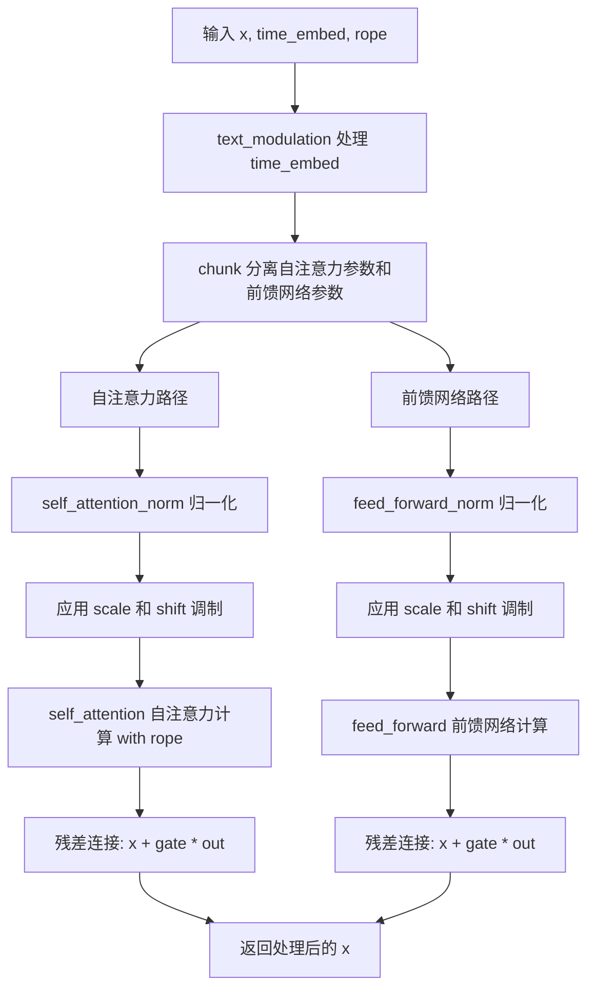

#### 带注释源码

```python
def forward(self, x, time_embed, rope):
    """
    Transformer 编码器块的前向传播
    
    参数:
        x: 输入的隐藏状态张量，形状为 (batch_size, seq_len, model_dim)
        time_embed: 时间嵌入向量，形状为 (batch_size, time_dim)
        rope: 旋转位置编码，用于提供位置信息
    
    返回:
        处理后的隐藏状态张量，形状与输入 x 相同
    """
    # Step 1: 通过 text_modulation 对 time_embed 进行调制
    # 将 time_embed 扩展一维后分割为两部分：自注意力参数和前馈网络参数
    # 输出形状: (batch_size, 1, 6 * model_dim) -> 自注意力参数(3*model_dim) + 前馈网络参数(3*model_dim)
    self_attn_params, ff_params = torch.chunk(self.text_modulation(time_embed).unsqueeze(dim=1), 2, dim=-1)
    
    # ===== 自注意力路径 (Self-Attention Path) =====
    # Step 2: 从自注意力参数中解压缩 shift, scale, gate
    # 形状: (batch_size, 1, 3 * model_dim) -> 各为 (batch_size, 1, model_dim)
    shift, scale, gate = torch.chunk(self_attn_params, 3, dim=-1)
    
    # Step 3: 归一化并应用调制 (shift 和 scale)
    # self_attention_norm: LayerNorm 归一化
    # 乘以 (scale + 1.0) 实现缩放，+ shift 实现平移
    out = (self.self_attention_norm(x.float()) * (scale.float() + 1.0) + shift.float()).type_as(x)
    
    # Step 4: 自注意力计算，传入旋转位置编码 rope
    out = self.self_attention(out, rotary_emb=rope)
    
    # Step 5: 残差连接和门控
    # gate 控制自注意力输出的贡献程度
    x = (x.float() + gate.float() * out.float()).type_as(x)
    
    # ===== 前馈网络路径 (Feed-Forward Path) =====
    # Step 6: 从前馈网络参数中解压缩 shift, scale, gate
    shift, scale, gate = torch.chunk(ff_params, 3, dim=-1)
    
    # Step 7: 归一化并应用调制
    out = (self.feed_forward_norm(x.float()) * (scale.float() + 1.0) + shift.float()).type_as(x)
    
    # Step 8: 前馈网络计算
    out = self.feed_forward(out)
    
    # Step 9: 残差连接和门控
    x = (x.float() + gate.float() * out.float()).type_as(x)
    
    # Step 10: 返回处理后的隐藏状态
    return x
```


### `Kandinsky5TransformerDecoderBlock.forward`

这是 Kandinsky5TransformerDecoderBlock 类的前向传播方法，实现了 3D 视觉 Transformer 的解码器块，包含自注意力、交叉注意力和前馈网络三个主要阶段，并通过视觉调制（modulation）机制进行条件信息注入。

参数：

- `visual_embed`：`torch.Tensor`，输入的视觉嵌入向量，形状为 (batch, duration, height, width, model_dim)
- `text_embed`：`torch.Tensor`，文本嵌入向量，来自编码器的输出，用于交叉注意力
- `time_embed`：`torch.Tensor`，时间嵌入向量，由时间步生成的条件嵌入
- `rope`：`tuple[torch.Tensor, torch.Tensor]` 或 `torch.Tensor`，旋转位置编码（RoPE），用于提供位置信息
- `sparse_params`：`dict[str, Any] | None`，稀疏注意力参数，包含如 block_mask、sta_mask 等配置

返回值：`torch.Tensor`，经过解码器块处理后的视觉嵌入向量，形状与输入 visual_embed 相同

#### 流程图

```mermaid
flowchart TD
    A[输入 visual_embed, text_embed, time_embed, rope, sparse_params] --> B[视觉调制层处理 time_embed]
    B --> C[分割调制参数: self_attn_params, cross_attn_params, ff_params]
    C --> D1[自注意力阶段]
    D1 --> D1a[归一化 visual_embed]
    D1a --> D1b[应用 shift 和 scale 调制]
    D1b --> D1c[自注意力计算 with rope and sparse_params]
    D1c --> D1d[残差连接]
    D1 --> E[交叉注意力阶段]
    E --> E1[归一化 visual_embed]
    E1 --> E2[应用 shift 和 scale 调制]
    E2 --> E3[交叉注意力计算 with text_embed]
    E3 --> E4[残差连接]
    E --> F[前馈网络阶段]
    F --> F1[归一化 visual_embed]
    F1 --> F2[应用 shift 和 scale 调制]
    F2 --> F3[前馈网络计算]
    F3 --> F4[残差连接]
    F --> G[返回处理后的 visual_embed]
```

#### 带注释源码

```python
def forward(self, visual_embed, text_embed, time_embed, rope, sparse_params):
    """
    Kandinsky5TransformerDecoderBlock 的前向传播方法
    
    处理流程:
    1. 通过 visual_modulation 将 time_embed 转换为三组调制参数
    2. 自注意力阶段: 使用视觉自身信息进行注意力计算
    3. 交叉注意力阶段: 引入文本信息
    4. 前馈网络阶段: 特征非线性变换
    """
    
    # 步骤1: 通过视觉调制层处理时间嵌入,生成9个参数(3组:自注意力、交叉注意力、前馈)
    # 每组包含 shift, scale, gate 三个调制参数
    self_attn_params, cross_attn_params, ff_params = torch.chunk(
        self.visual_modulation(time_embed).unsqueeze(dim=1), 3, dim=-1
    )

    # ====== 自注意力阶段 ======
    # 将调制参数分割为 shift, scale, gate
    shift, scale, gate = torch.chunk(self_attn_params, 3, dim=-1)
    
    # 归一化并应用仿射变换: output = normalized(x) * (scale + 1) + shift
    visual_out = (self.self_attention_norm(visual_embed.float()) * (scale.float() + 1.0) + shift.float()).type_as(
        visual_embed
    )
    
    # 执行自注意力计算,传入旋转位置编码和稀疏注意力参数
    visual_out = self.self_attention(visual_out, rotary_emb=rope, sparse_params=sparse_params)
    
    # 残差连接: x = x + gate * output (门控机制)
    visual_embed = (visual_embed.float() + gate.float() * visual_out.float()).type_as(visual_embed)

    # ====== 交叉注意力阶段 ======
    # 使用文本嵌入作为上下文信息
    shift, scale, gate = torch.chunk(cross_attn_params, 3, dim=-1)
    
    # 归一化并应用交叉注意力调制
    visual_out = (self.cross_attention_norm(visual_embed.float()) * (scale.float() + 1.0) + shift.float()).type_as(
        visual_embed
    )
    
    # 执行交叉注意力,将文本信息融入视觉特征
    visual_out = self.cross_attention(visual_out, encoder_hidden_states=text_embed)
    
    # 残差连接
    visual_embed = (visual_embed.float() + gate.float() * visual_out.float()).type_as(visual_embed)

    # ====== 前馈网络阶段 ======
    # 最后的特征变换阶段
    shift, scale, gate = torch.chunk(ff_params, 3, dim=-1)
    
    # 归一化并应用前馈调制
    visual_out = (self.feed_forward_norm(visual_embed.float()) * (scale.float() + 1.0) + shift.float()).type_as(
        visual_embed
    )
    
    # 执行前馈网络变换
    visual_out = self.feed_forward(visual_out)
    
    # 残差连接
    visual_embed = (visual_embed.float() + gate.float() * visual_out.float()).type_as(visual_embed)

    # 返回处理后的视觉嵌入
    return visual_embed
```


### `Kandinsky5Transformer3DModel.__init__`

该方法是 Kandinsky5 3D 变换器模型的初始化构造函数，用于初始化模型的所有层、嵌入、变换器块和配置参数，包括时间嵌入、文本嵌入、视觉嵌入、位置编码以及编码器/解码器块。

参数：

- `self`：实例本身
- `in_visual_dim`：`int`，输入视觉维度，默认为 4
- `in_text_dim`：`int`，文本输入维度，默认为 3584
- `in_text_dim2`：`int`，第二个文本输入维度（用于池化文本嵌入），默认为 768
- `time_dim`：`int`，时间嵌入维度，默认为 512
- `out_visual_dim`：`int`，输出视觉维度，默认为 4
- `patch_size`：`tuple[int, int, int]`，视觉数据的补丁大小，默认为 (1, 2, 2)
- `model_dim`：`int`，模型内部维度，默认为 2048
- `ff_dim`：`int`，前馈网络中间层维度，默认为 5120
- `num_text_blocks`：`int`，文本变换器编码器块的数量，默认为 2
- `num_visual_blocks`：`int`，视觉变换器解码器块的数量，默认为 32
- `axes_dims`：`tuple[int, int, int]`，3D 旋转位置编码的轴维度，默认为 (16, 24, 24)
- `visual_cond`：`bool`，是否使用视觉条件，默认为 False
- `attention_type`：`str`，注意力机制类型，默认为 "regular"
- `attention_causal`：`bool | None`，是否使用因果注意力，可选
- `attention_local`：`bool | None`，是否使用局部注意力，可选
- `attention_glob`：`bool | None`，是否使用全局注意力，可选
- `attention_window`：`int | None`，注意力窗口大小，可选
- `attention_P`：`float | None`，稀疏注意力阈值 P，可选
- `attention_wT`：`int | None`，时间维度的窗口大小，可选
- `attention_wW`：`int | None`，宽度维度的窗口大小，可选
- `attention_wH`：`int | None`，高度维度的窗口大小，可选
- `attention_add_sta`：`bool | None`，是否添加稀疏 Transformer 注意力，可选
- `attention_method`：`str | None`，注意力方法，可选

返回值：`None`，该方法为构造函数，不返回任何值

#### 流程图

```mermaid
flowchart TD
    A[开始 __init__] --> B[调用父类 ModelMixin.__init__]
    B --> C[计算 head_dim = sum(axes_dims)]
    C --> D[设置实例属性: in_visual_dim, model_dim, patch_size, visual_cond, attention_type]
    D --> E{visual_cond 是否为 True?}
    E -->|是| F[visual_embed_dim = 2 * in_visual_dim + 1]
    E -->|否| G[visual_embed_dim = in_visual_dim]
    F --> H[初始化各嵌入层]
    G --> H
    H --> I[初始化 time_embeddings: Kandinsky5TimeEmbeddings]
    I --> J[初始化 text_embeddings: Kandinsky5TextEmbeddings]
    J --> K[初始化 pooled_text_embeddings: Kandinsky5TextEmbeddings]
    K --> L[初始化 visual_embeddings: Kandinsky5VisualEmbeddings]
    L --> M[初始化 text_rope_embeddings: Kandinsky5RoPE1D]
    M --> N[初始化 visual_rope_embeddings: Kandinsky5RoPE3D]
    N --> O[初始化 text_transformer_blocks: nn.ModuleList]
    O --> P[初始化 visual_transformer_blocks: nn.ModuleList]
    P --> Q[初始化 out_layer: Kandinsky5OutLayer]
    Q --> R[设置 gradient_checkpointing = False]
    R --> S[结束 __init__]
```

#### 带注释源码

```python
@register_to_config
def __init__(
    self,
    in_visual_dim=4,           # 输入视觉维度
    in_text_dim=3584,          # 文本输入维度
    in_text_dim2=768,          # 第二个文本输入维度（用于池化）
    time_dim=512,              # 时间嵌入维度
    out_visual_dim=4,          # 输出视觉维度
    patch_size=(1, 2, 2),      # 补丁大小 (时间, 高度, 宽度)
    model_dim=2048,            # 模型内部表示维度
    ff_dim=5120,               # 前馈网络中间层维度
    num_text_blocks=2,        # 文本变换器编码器块数量
    num_visual_blocks=32,      # 视觉变换器解码器块数量
    axes_dims=(16, 24, 24),   # 3D RoPE 各轴维度
    visual_cond=False,         # 是否使用视觉条件
    attention_type: str = "regular",      # 注意力类型
    attention_causal: bool = None,        # 因果注意力标志
    attention_local: bool = None,         # 局部注意力标志
    attention_glob: bool = None,          # 全局注意力标志
    attention_window: int = None,         # 注意力窗口大小
    attention_P: float = None,            # 稀疏注意力阈值
    attention_wT: int = None,             # 时间窗口大小
    attention_wW: int = None,             # 宽度窗口大小
    attention_wH: int = None,             # 高度窗口大小
    attention_add_sta: bool = None,       # 添加稀疏Transformer注意力
    attention_method: str = None,         # 注意力方法
):
    # 调用父类 ModelMixin 的初始化方法
    # 这会初始化基础模型结构并注册配置
    super().__init__()

    # 计算注意力头维度，作为所有轴维度之和
    # 例如：axes_dims=(16, 24, 24) -> head_dim = 64
    head_dim = sum(axes_dims)
    
    # 存储模型基本配置属性
    self.in_visual_dim = in_visual_dim
    self.model_dim = model_dim
    self.patch_size = patch_size
    self.visual_cond = visual_cond
    self.attention_type = attention_type

    # 根据是否启用视觉条件计算视觉嵌入维度
    # 如果启用视觉条件，维度翻倍并加1（用于条件信息）
    visual_embed_dim = 2 * in_visual_dim + 1 if visual_cond else in_visual_dim

    # ==================== 初始化嵌入层 ====================
    
    # 时间嵌入层：将时间步映射到高维表示
    # 使用正弦/余弦位置编码
    self.time_embeddings = Kandinsky5TimeEmbeddings(model_dim, time_dim)
    
    # 文本嵌入层：将文本特征映射到模型维度
    self.text_embeddings = Kandinsky5TextEmbeddings(in_text_dim, model_dim)
    
    # 池化文本嵌入层：处理池化后的文本表示
    self.pooled_text_embeddings = Kandinsky5TextEmbeddings(in_text_dim2, time_dim)
    
    # 视觉嵌入层：将视觉数据转换为补丁嵌入
    # 应用补丁化操作并映射到模型维度
    self.visual_embeddings = Kandinsky5VisualEmbeddings(visual_embed_dim, model_dim, patch_size)

    # ==================== 初始化位置编码 ====================
    
    # 1D 旋转位置编码用于文本序列
    self.text_rope_embeddings = Kandinsky5RoPE1D(head_dim)
    
    # 3D 旋转位置编码用于视觉数据（时间、高度、宽度）
    self.visual_rope_embeddings = Kandinsky5RoPE3D(axes_dims)

    # ==================== 初始化变换器块 ====================
    
    # 文本变换器编码器块：处理文本特征的自注意力
    # 每个块包含自注意力、前馈网络和调制层
    self.text_transformer_blocks = nn.ModuleList(
        [Kandinsky5TransformerEncoderBlock(model_dim, time_dim, ff_dim, head_dim) 
         for _ in range(num_text_blocks)]
    )

    # 视觉变换器解码器块：处理视觉特征
    # 包含自注意力、交叉注意力（文本到视觉）和前馈网络
    self.visual_transformer_blocks = nn.ModuleList(
        [Kandinsky5TransformerDecoderBlock(model_dim, time_dim, ff_dim, head_dim) 
         for _ in range(num_visual_blocks)]
    )

    # ==================== 初始化输出层 ====================
    
    # 输出层：将视觉嵌入转换回原始视觉空间
    # 包含调制、归一化和线性投影
    self.out_layer = Kandinsky5OutLayer(model_dim, time_dim, out_visual_dim, patch_size)
    
    # 梯度检查点标志：用于节省显存
    # 启用后在前向传播时不保存中间激活，节省约一半显存
    self.gradient_checkpointing = False
```


### Kandinsky5Transformer3DModel.forward

该方法是 Kandinsky5 3D Transformer 模型的前向传播核心方法，负责将输入的视觉状态和文本状态通过 Transformer 编码器-解码器结构进行处理，生成最终的视觉输出。在前向传播过程中，模型首先对文本和视觉输入进行嵌入和位置编码，然后依次通过文本编码器块和视觉解码器块，最后通过输出层生成预测结果。

参数：

- `hidden_states`：`torch.Tensor`，输入的视觉状态（latent representations）
- `encoder_hidden_states`：`torch.Tensor`，文本嵌入向量（text embeddings）
- `timestep`：`torch.Tensor`，当前扩散过程的时间步（timestep）
- `pooled_projections`：`torch.Tensor`，池化后的文本嵌入（pooled text embeddings）
- `visual_rope_pos`：`tuple[int, int, int]`，视觉 RoPE 的位置索引 (duration, height, width)
- `text_rope_pos`：`torch.LongTensor`，文本 RoPE 的位置索引
- `scale_factor`：`tuple[float, float, float]`，可选，RoPE 的缩放因子，默认为 (1.0, 1.0, 1.0)
- `sparse_params`：`dict[str, Any] | None`，可选，稀疏注意力参数，包含 to_fractal 和 sta_mask 等
- `return_dict`：`bool`，可选，是否返回字典格式，默认为 True

返回值：`Transformer2DModelOutput | torch.FloatTensor`，模型的输出，若 return_dict 为 True 返回 Transformer2DModelOutput，否则返回原始张量

#### 流程图

```mermaid
flowchart TD
    A[开始 forward] --> B[输入预处理: hidden_states, encoder_hidden_states, timestep, pooled_projections]
    B --> C[文本嵌入: text_embed = text_embeddings encoder_hidden_states]
    B --> D[时间嵌入: time_embed = time_embeddings timestep + pooled_text_embeddings pooled_projections]
    B --> E[视觉嵌入: visual_embed = visual_embeddings hidden_states]
    B --> F[文本RoPE: text_rope = text_rope_embeddings text_rope_pos]
    
    F --> G[文本Transformer块循环]
    G --> H{是否启用梯度检查点?}
    H -->|是| I[使用 gradient_checkpointing_func 执行文本块]
    H -->|否| J[直接执行文本块]
    I --> K[更新 text_embed]
    J --> K
    
    K --> L[生成视觉RoPE: visual_rope = visual_rope_embeddings visual_shape, visual_rope_pos, scale_factor]
    L --> M[分形展平: fractal_flatten visual_embed 和 visual_rope]
    
    M --> N[视觉Transformer块循环]
    N --> O{是否启用梯度检查点?}
    O -->|是| P[使用 gradient_checkpointing_func 执行视觉块]
    O -->|否| Q[直接执行视觉块]
    P --> R[更新 visual_embed]
    Q --> R
    
    R --> S[分形展开: fractal_unflatten visual_embed]
    S --> T[输出层: x = out_layer visual_embed, text_embed, time_embed]
    
    T --> U{return_dict?}
    U -->|是| V[返回 Transformer2DModelOutput sample=x]
    U -->|否| W[返回 torch.FloatTensor x]
    V --> X[结束]
    W --> X
```

#### 带注释源码

```python
def forward(
    self,
    hidden_states: torch.Tensor,  # x - 输入视觉状态
    encoder_hidden_states: torch.Tensor,  # text_embed - 文本嵌入
    timestep: torch.Tensor,  # time - 时间步
    pooled_projections: torch.Tensor,  # pooled_text_embed - 池化文本嵌入
    visual_rope_pos: tuple[int, int, int],  # 视觉RoPE位置 (duration, height, width)
    text_rope_pos: torch.LongTensor,  # 文本RoPE位置
    scale_factor: tuple[float, float, float] = (1.0, 1.0, 1.0),  # RoPE缩放因子
    sparse_params: dict[str, Any] | None = None,  # 稀疏注意力参数
    return_dict: bool = True,  # 是否返回字典格式
) -> Transformer2DModelOutput | torch.FloatTensor:
    """
    Forward pass of the Kandinsky5 3D Transformer.

    Args:
        hidden_states (`torch.FloatTensor`): 输入视觉状态
        encoder_hidden_states (`torch.FloatTensor`): 文本嵌入
        timestep (`torch.Tensor` or `float` or `int`): 当前时间步
        pooled_projections (`torch.FloatTensor`): 池化文本嵌入
        visual_rope_pos (`tuple[int, int, int]`): 视觉RoPE位置
        text_rope_pos (`torch.LongTensor`): 文本RoPE位置
        scale_factor (`tuple[float, float, float]`, optional): RoPE缩放因子
        sparse_params (`dict[str, Any]`, optional): 稀疏注意力参数
        return_dict (`bool`, optional): 是否返回字典格式

    Returns:
        [`~models.transformer_2d.Transformer2DModelOutput`] or `torch.FloatTensor`: 模型输出
    """
    # ========== 步骤1: 输入参数解包 ==========
    x = hidden_states  # 输入视觉latent
    text_embed = encoder_hidden_states  # 文本embedding
    time = timestep  # 扩散时间步
    pooled_text_embed = pooled_projections  # 池化后的文本embedding

    # ========== 步骤2: 嵌入层处理 ==========
    # 2.1 文本嵌入: 将文本latent投影到model_dim维度
    text_embed = self.text_embeddings(text_embed)
    
    # 2.2 时间嵌入: 将时间步转换为embedding，并与池化文本结合
    time_embed = self.time_embeddings(time)
    time_embed = time_embed + self.pooled_text_embeddings(pooled_text_embed)
    
    # 2.3 视觉嵌入: 将视觉latent转换为patch嵌入
    visual_embed = self.visual_embeddings(x)
    
    # 2.4 文本位置编码: 1D RoPE应用于文本
    text_rope = self.text_rope_embeddings(text_rope_pos)
    text_rope = text_rope.unsqueeze(dim=0)  # 添加batch维度

    # ========== 步骤3: 文本Transformer编码器块处理 ==========
    # 遍历文本Transformer块进行自注意力处理
    for text_transformer_block in self.text_transformer_blocks:
        # 检查是否启用梯度检查点以节省显存
        if torch.is_grad_enabled() and self.gradient_checkpointing:
            # 使用梯度检查点: 牺牲计算时间换取显存
            text_embed = self._gradient_checkpointing_func(
                text_transformer_block, text_embed, time_embed, text_rope
            )
        else:
            # 正常前向传播
            text_embed = text_transformer_block(text_embed, time_embed, text_rope)

    # ========== 步骤4: 视觉数据预处理 ==========
    # 4.1 获取视觉嵌入的shape用于RoPE
    visual_shape = visual_embed.shape[:-1]
    
    # 4.2 生成3D RoPE位置编码
    visual_rope = self.visual_rope_embeddings(visual_shape, visual_rope_pos, scale_factor)
    
    # 4.3 检查是否使用分形(稀疏)注意力
    to_fractal = sparse_params["to_fractal"] if sparse_params is not None else False
    
    # 4.4 分形展平: 将视觉embed和rope展平以适配后续处理
    visual_embed, visual_rope = fractal_flatten(visual_embed, visual_rope, visual_shape, block_mask=to_fractal)

    # ========== 步骤5: 视觉Transformer解码器块处理 ==========
    # 遍历视觉Transformer块进行自注意力和交叉注意力处理
    for visual_transformer_block in self.visual_transformer_blocks:
        if torch.is_grad_enabled() and self.gradient_checkpointing:
            visual_embed = self._gradient_checkpointing_func(
                visual_transformer_block,
                visual_embed,
                text_embed,
                time_embed,
                visual_rope,
                sparse_params,
            )
        else:
            visual_embed = visual_transformer_block(
                visual_embed, text_embed, time_embed, visual_rope, sparse_params
            )

    # ========== 步骤6: 输出后处理 ==========
    # 6.1 分形展开: 恢复原始视觉shape
    visual_embed = fractal_unflatten(visual_embed, visual_shape, block_mask=to_fractal)
    
    # 6.2 输出层: 应用调制和逆patchify生成最终预测
    x = self.out_layer(visual_embed, text_embed, time_embed)

    # ========== 步骤7: 返回结果 ==========
    if not return_dict:
        return x  # 直接返回原始tensor

    return Transformer2DModelOutput(sample=x)  # 返回结构化输出
```

## 关键组件


### 张量索引与形状变换

用于在标准3D张量布局和分形（fractal）布局之间进行切换，支持稀疏注意力机制。包含`fractal_flatten`、`fractal_unflatten`、`local_patching`和`local_merge`四个核心函数，通过reshape和permute操作实现维度重排。

### 旋转位置编码（RoPE）

包含`Kandinsky5RoPE1D`（1D文本位置编码）和`Kandinsky5RoPE3D`（3D视频/视觉位置编码）两个模块，基于正弦余弦函数生成旋转矩阵，支持多轴位置信息和缩放因子。

### 稀疏注意力机制

`nablaT_v2`函数实现基于Map估计的块稀疏注意力，通过计算query和key的相似度图、排序和累积和进行二值化，生成BlockMask用于高效推理。支持可选的静态注意力（STA）掩码。

### 注意力处理器

`Kandinsky5AttnProcessor`负责将查询、键、值投影应用到输入，集成RoPE旋转、稀疏注意力掩码生成，并调用后端注意力函数。`Kandinsky5Attention`模块封装完整的注意力计算流程，支持RMSNorm归一化和多种注意力模式。

### 时间与文本嵌入

`Kandinsky5TimeEmbeddings`生成时间步的时间嵌入，使用cosine-sine编码。`Kandinsky5TextEmbeddings`处理文本嵌入并应用LayerNorm。`Kandinsky5VisualEmbeddings`将3D视觉数据转换为patch嵌入序列。

### 调制与输出层

`Kandinsky5Modulation`实现AdaLN调制，生成shift、scale和gate参数。`Kandinsky5OutLayer`结合视觉嵌入、文本嵌入和时间嵌入，通过调制和线性层输出重构的视觉数据。

### Transformer编码器与解码器块

`Kandinsky5TransformerEncoderBlock`实现文本Transformer块，包含自注意力和前馈网络。`Kandinsky5TransformerDecoderBlock`实现视觉解码块，包含自注意力、交叉注意力和前馈网络，支持稀疏参数和视觉-文本交叉注意力。

### 主模型架构

`Kandinsky5Transformer3DModel`是核心3D扩散Transformer，集成时间/文本/视觉嵌入、多层Transformer块和输出层，支持梯度检查点、PEFT适配器、缓存机制和多注意力配置。


## 问题及建议


### 已知问题

-   `Kandinsky5AttnProcessor`类中的`_attention_backend`和`_parallel_config`是类变量而非实例变量，在多处理器或多模型并行场景下会导致状态共享和冲突问题
-   `apply_rotary`函数在`__call__`方法内部定义，每次调用处理器都会重新创建该函数对象，造成不必要的内存分配和性能开销
-   `nablaT_v2`函数中传入`torch.zeros_like(kv_nb)`作为第一个参数给`BlockMask.from_kv_blocks`，但该参数实际上应该表示kv数组的数量，当前实现可能为潜在bug
-   `pixel_size = 8`和`BLOCK_SIZE=64`等关键参数在代码中硬编码，缺乏配置灵活性，难以适应不同场景需求
-   `Kandinsky5Modulation`中`out_layer`的权重和偏置初始化为零，可能导致训练初期梯度流受阻，建议使用更合适的初始化策略
-   缺少对输入tensor shape的显式验证，在`forward`方法中未检查`hidden_states`、`encoder_hidden_states`等关键输入的维度兼容性，可能导致运行时错误难以追踪
-   `_CAN_USE_FLEX_ATTN`检查失败时直接抛出`ValueError`，缺少版本检查和升级建议，用户难以快速定位问题根因

### 优化建议

-   将`_attention_backend`和`_parallel_config`改为实例变量，通过`__init__`或setter方法初始化，避免类变量共享带来的状态污染问题
-   将`apply_rotary`函数提取为模块级函数或类方法，避免在`__call__`内部重复定义
-   将`pixel_size`、`BLOCK_SIZE`等硬编码值提取为类属性或配置参数，支持运行时配置
-   在`Kandinsky5Modulation`中改用`nn.init.xavier_uniform_`或`nn.init.normal_`等标准初始化方法，避免零初始化带来的训练问题
-   在`forward`方法入口处添加输入shape验证逻辑，使用`torch.debug_assert`或自定义验证函数检查维度兼容性
-   改进Flex Attention的版本检查逻辑，提供更友好的错误信息和升级指导
-   考虑将`nablaT_v2`中的Map estimation和BlockMask创建逻辑封装为独立函数，提高代码可读性和可测试性

## 其它


### 设计目标与约束

该代码实现了一个基于3D Diffusion Transformer的Kandinsky5视频生成模型，核心目标是处理时空数据（视频/图像）并通过文本嵌入进行条件生成。设计约束包括：1）模型维度与注意力头维度必须对齐；2）支持稀疏注意力机制以优化长序列处理；3）需要PyTorch 2.0+支持SDPA功能；4）RoPE位置编码维度必须为偶数。

### 错误处理与异常设计

代码中的错误处理主要包括：1）`Kandinsky5AttnProcessor.__init__`中检查PyTorch版本，若无SDPA支持则抛出ImportError；2）`nablaT_v2`函数中检查`_CAN_USE_FLEX_ATTN`，若不支持则抛出ValueError；3）`Kandinsky5Attention.forward`中处理未预期的kwargs参数，通过logger.warning警告并忽略；4）`get_freqs`函数要求dim必须为偶数（通过外部调用时的assert保证）。异常设计采用分层策略，版本兼容性错误为ImportError，逻辑错误为ValueError，未知参数为Warning。

### 数据流与状态机

数据流分为两条主要路径：文本分支和视觉分支。文本分支：encoder_hidden_states → text_embeddings → text_transformer_blocks（自注意力）→ text_embed。视觉分支：hidden_states → visual_embeddings → fractal_flatten（可选）→ visual_transformer_blocks（自注意力+交叉注意力+FFN）→ fractal_unflatten → out_layer。两条分支通过time_embed进行交互，时间嵌入由time_embeddings和pooled_text_embeddings相加得到。状态机体现在gradient_checkpointing的启用/禁用状态切换，以及sparse_params参数控制的注意力模式切换。

### 外部依赖与接口契约

主要外部依赖包括：1）torch和torch.nn用于基础张量操作和神经网络模块；2）torch.nn.functional用于激活函数；3）torch.nn.attention.flex_attention用于BlockMask（条件导入）；4）diffusers库的ConfigMixin、register_to_config、ModelMixin等基类；5）内部模块：AttentionMixin、AttentionModuleMixin、CacheMixin、FromOriginalModelMixin、PeftAdapterMixin。接口契约方面：forward方法接受hidden_states、encoder_hidden_states、timestep、pooled_projections、visual_rope_pos、text_rope_pos等参数，返回Transformer2DModelOutput或torch.FloatTensor；注意力处理器需实现__call__方法并接受attn、hidden_states、encoder_hidden_states、rotary_emb、sparse_params参数。

### 性能考虑与优化空间

性能优化策略包括：1）使用gradient_checkpointing减少显存占用；2）通过sparse_params启用稀疏注意力（nablaT_v2）降低计算复杂度；3）fractal_flatten/unflatten支持分块处理以适应不同分辨率；4）使用torch.float32进行norm计算以保证精度，然后转回原始类型以节省显存。潜在优化方向：1）RoPE预计算可进一步优化（当前在每次forward时重新计算）；2）可引入量化技术进一步减少显存；3）fractal_unflatten中的reshape操作可优化；4）可添加持续的profiling支持以监控性能瓶颈。

### 安全性与输入验证

输入验证方面：1）模型维度model_dim必须为偶数（TimeEmbeddings初始化时assert）；2）num_channels必须能被head_dim整除（Attention初始化时assert）；3）sparse_params为字典类型时需包含sta_mask和P键；4）RoPE位置索引需在预注册缓冲区范围内。安全考虑：1）避免在模型权重中硬编码敏感信息；2）外部输入（encoder_hidden_states、hidden_states）通过LayerNorm和RMSNorm进行归一化处理；3）使用torch.no_grad或grad_enabled检查控制梯度计算。

### 版本兼容性与平台支持

版本兼容性要求：1）PyTorch 2.0+（用于SDPA和flex_attention）；2）Python 3.8+（类型提示语法）；3）需要支持CUDA的GPU以运行大规模推理。平台支持：1）主要支持Linux/macOS/Windows；2）支持CUDA和CPU设备；3）支持分布式训练框架集成（通过ModelMixin基类）。版本特性依赖：1）torch.float32/float16/bfloat16类型转换；2）torch.sort支持dim参数；3）BlockMask.from_kv_blocks API存在性检查。

    