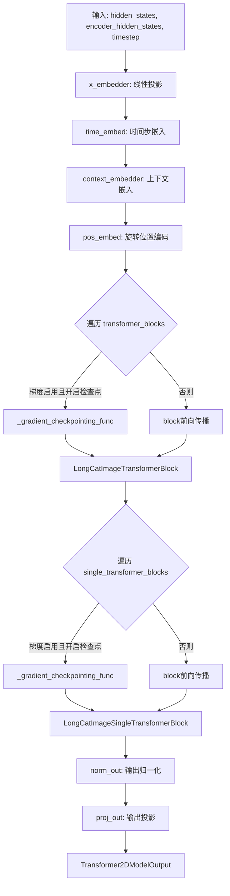
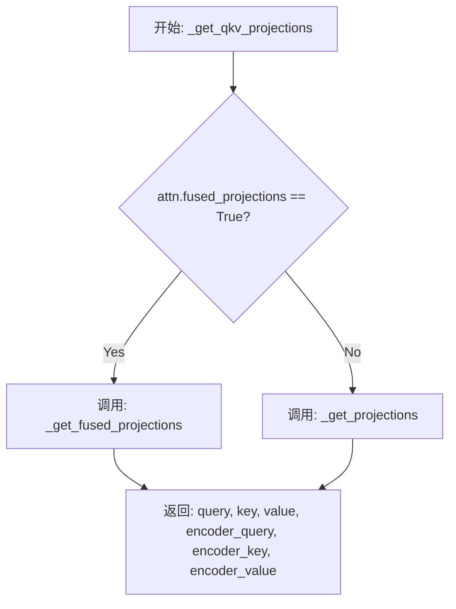
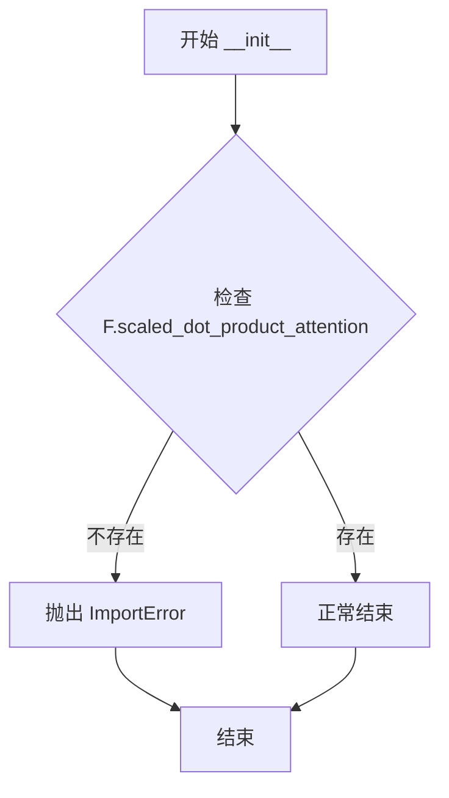
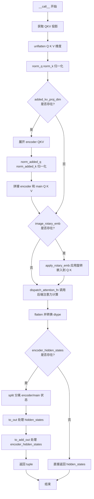
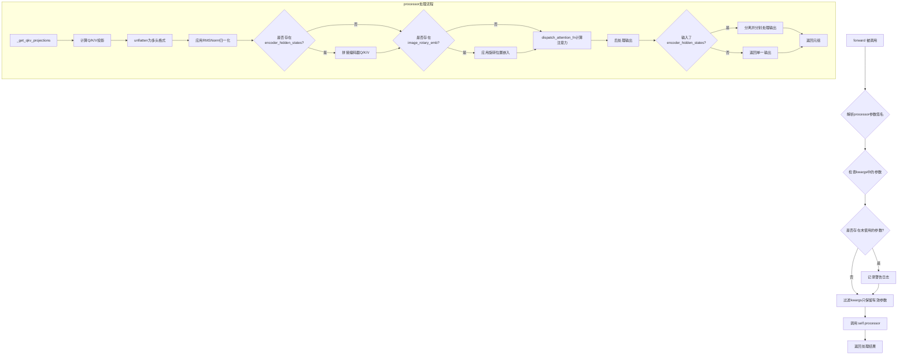
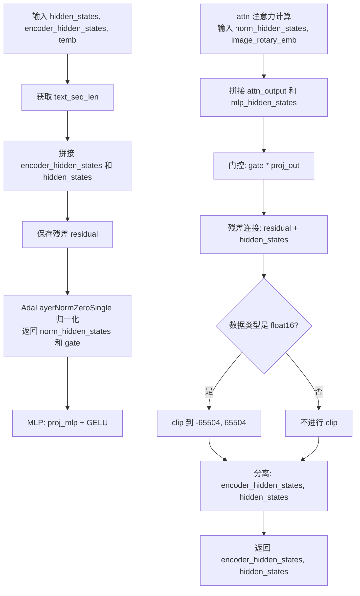
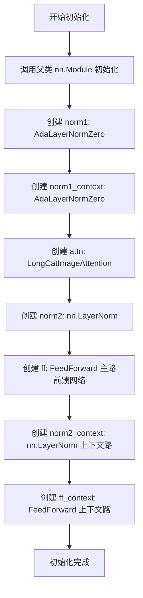
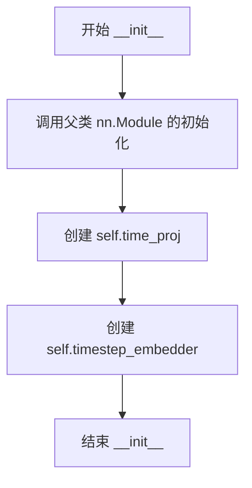
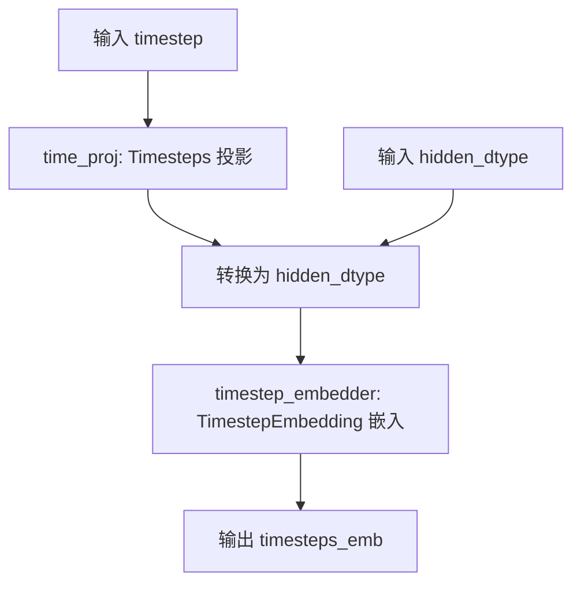
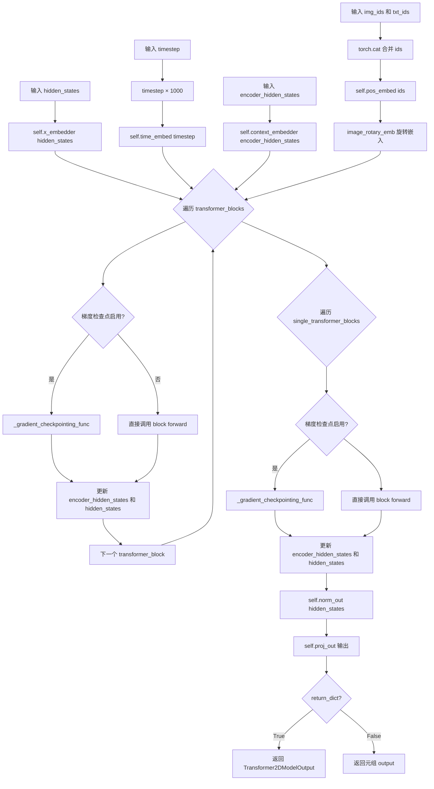

# `diffusers\src\diffusers\models\transformers\transformer_longcat_image.py` 详细设计文档

这是一个LongCat Image Transformer模型实现，用于处理变长宽比图像的Diffusion Transformer架构。该模型包含位置编码、时间步嵌入、Transformer块（含单块和双块）等核心组件，支持交叉注意力机制、旋转位置编码、梯度检查点等功能，适用于图像生成任务。

## 整体流程



## 类结构

```
LongCatImageTransformer2DModel (主模型类)
├── LongCatImageAttnProcessor (注意力处理器)
├── LongCatImageAttention (注意力模块)
│   ├── _get_projections (全局函数)
│   ├── _get_fused_projections (全局函数)
│   └── _get_qkv_projections (全局函数)
├── LongCatImageTransformerBlock (双Transformer块)
│   ├── AdaLayerNormZero (归一化)
│   ├── LongCatImageAttention (注意力)
│   ├── FeedForward (前馈网络)
│   └── nn.LayerNorm (层归一化)
├── LongCatImageSingleTransformerBlock (单Transformer块)
AdaLayerNormZeroSingle (归一化)
LongCatImageAttention (注意力)
nn.Linear (线性层)
├── LongCatImagePosEmbed (位置编码)
└── LongCatImageTimestepEmbeddings (时间嵌入)
```

## 全局变量及字段


### `logger`
    
模块级日志记录器，用于输出警告和信息

类型：`logging.Logger`
    


### `AttentionMixin`
    
注意力机制的混合类，提供通用注意力接口

类型：`class`
    


### `AttentionModuleMixin`
    
注意力模块的混合类，定义注意力模块接口

类型：`class`
    


### `FeedForward`
    
前馈神经网络模块，用于Transformer中的MLP层

类型：`class`
    


### `dispatch_attention_fn`
    
分发注意力计算的函数，支持不同后端

类型：`function`
    


### `CacheMixin`
    
缓存机制的混合类，提供KV缓存功能

类型：`class`
    


### `TimestepEmbedding`
    
时间步嵌入层，将时间特征映射到高维空间

类型：`class`
    


### `Timesteps`
    
时间步处理模块，将时间值转换为正弦余弦嵌入

类型：`class`
    


### `apply_rotary_emb`
    
应用旋转位置嵌入到查询和键向量

类型：`function`
    


### `get_1d_rotary_pos_embed`
    
生成一维旋转位置嵌入向量

类型：`function`
    


### `Transformer2DModelOutput`
    
2D变换器模型的输出数据结构

类型：`class`
    


### `ModelMixin`
    
模型混合类，提供模型加载和保存功能

类型：`class`
    


### `ConfigMixin`
    
配置混合类，提供配置注册和初始化功能

类型：`class`
    


### `register_to_config`
    
装饰器，用于将配置参数注册到模型

类型：`decorator`
    


### `PeftAdapterMixin`
    
PEFT适配器混合类，支持参数高效微调

类型：`class`
    


### `FromOriginalModelMixin`
    
从原始模型加载的混合类

类型：`class`
    


### `AdaLayerNormContinuous`
    
连续自适应层归一化，带有门控机制

类型：`class`
    


### `AdaLayerNormZero`
    
零初始化自适应层归一化，返回门控和变换参数

类型：`class`
    


### `AdaLayerNormZeroSingle`
    
单自适应层归一化零初始化

类型：`class`
    


### `LongCatImageAttnProcessor._attention_backend`
    
注意力计算的后端实现

类型：`NoneType`
    


### `LongCatImageAttnProcessor._parallel_config`
    
并行计算的配置参数

类型：`NoneType`
    


### `LongCatImageAttention.head_dim`
    
每个注意力头的维度

类型：`int`
    


### `LongCatImageAttention.inner_dim`
    
内部隐藏层维度，等于head_dim * heads

类型：`int`
    


### `LongCatImageAttention.query_dim`
    
查询向量的输入维度

类型：`int`
    


### `LongCatImageAttention.use_bias`
    
是否在线性层中使用偏置

类型：`bool`
    


### `LongCatImageAttention.dropout`
    
注意力dropout的概率

类型：`float`
    


### `LongCatImageAttention.out_dim`
    
输出维度

类型：`int`
    


### `LongCatImageAttention.context_pre_only`
    
是否仅处理上下文（编码器）部分

类型：`bool or None`
    


### `LongCatImageAttention.pre_only`
    
是否仅进行预处理（无输出层）

类型：`bool`
    


### `LongCatImageAttention.heads`
    
注意力头的数量

类型：`int`
    


### `LongCatImageAttention.added_kv_proj_dim`
    
额外键值投影维度，用于交叉注意力

类型：`int or None`
    


### `LongCatImageAttention.added_proj_bias`
    
额外投影是否使用偏置

类型：`bool or None`
    


### `LongCatImageAttention.norm_q`
    
查询向量的RMS归一化层

类型：`torch.nn.RMSNorm`
    


### `LongCatImageAttention.norm_k`
    
键向量的RMS归一化层

类型：`torch.nn.RMSNorm`
    


### `LongCatImageAttention.to_q`
    
将输入映射到查询空间的线性层

类型：`torch.nn.Linear`
    


### `LongCatImageAttention.to_k`
    
将输入映射到键空间的线性层

类型：`torch.nn.Linear`
    


### `LongCatImageAttention.to_v`
    
将输入映射到值空间的线性层

类型：`torch.nn.Linear`
    


### `LongCatImageAttention.to_out`
    
输出投影模块列表，包含线性层和dropout

类型：`torch.nn.ModuleList`
    


### `LongCatImageAttention.norm_added_q`
    
额外查询的RMS归一化层

类型：`torch.nn.RMSNorm`
    


### `LongCatImageAttention.norm_added_k`
    
额外键的RMS归一化层

类型：`torch.nn.RMSNorm`
    


### `LongCatImageAttention.add_q_proj`
    
额外查询的线性投影层

类型：`torch.nn.Linear`
    


### `LongCatImageAttention.add_k_proj`
    
额外键的线性投影层

类型：`torch.nn.Linear`
    


### `LongCatImageAttention.add_v_proj`
    
额外值的线性投影层

类型：`torch.nn.Linear`
    


### `LongCatImageAttention.to_add_out`
    
额外输出的投影层

类型：`torch.nn.Linear`
    


### `LongCatImageAttention.processor`
    
当前使用的注意力处理器实例

类型：`LongCatImageAttnProcessor`
    


### `LongCatImageSingleTransformerBlock.mlp_hidden_dim`
    
MLP隐藏层的维度

类型：`int`
    


### `LongCatImageSingleTransformerBlock.norm`
    
自适应层归一化（单）

类型：`AdaLayerNormZeroSingle`
    


### `LongCatImageSingleTransformerBlock.proj_mlp`
    
MLP投影层

类型：`nn.Linear`
    


### `LongCatImageSingleTransformerBlock.act_mlp`
    
MLP激活函数

类型：`nn.GELU`
    


### `LongCatImageSingleTransformerBlock.proj_out`
    
输出投影层

类型：`nn.Linear`
    


### `LongCatImageSingleTransformerBlock.attn`
    
注意力模块

类型：`LongCatImageAttention`
    


### `LongCatImageTransformerBlock.norm1`
    
主路径第一个自适应归一化层

类型：`AdaLayerNormZero`
    


### `LongCatImageTransformerBlock.norm1_context`
    
上下文路径第一个自适应归一化层

类型：`AdaLayerNormZero`
    


### `LongCatImageTransformerBlock.attn`
    
联合注意力模块

类型：`LongCatImageAttention`
    


### `LongCatImageTransformerBlock.norm2`
    
主路径第二个层归一化

类型：`nn.LayerNorm`
    


### `LongCatImageTransformerBlock.ff`
    
主路径前馈网络

类型：`FeedForward`
    


### `LongCatImageTransformerBlock.norm2_context`
    
上下文路径第二个层归一化

类型：`nn.LayerNorm`
    


### `LongCatImageTransformerBlock.ff_context`
    
上下文路径前馈网络

类型：`FeedForward`
    


### `LongCatImagePosEmbed.theta`
    
旋转位置嵌入的频率参数

类型：`int`
    


### `LongCatImagePosEmbed.axes_dim`
    
各轴的维度列表

类型：`list[int]`
    


### `LongCatImageTimestepEmbeddings.time_proj`
    
时间步投影模块

类型：`Timesteps`
    


### `LongCatImageTimestepEmbeddings.timestep_embedder`
    
时间步嵌入器

类型：`TimestepEmbedding`
    


### `LongCatImageTransformer2DModel.out_channels`
    
输出通道数

类型：`int`
    


### `LongCatImageTransformer2DModel.inner_dim`
    
内部嵌入维度

类型：`int`
    


### `LongCatImageTransformer2DModel.pooled_projection_dim`
    
池化投影维度

类型：`int`
    


### `LongCatImageTransformer2DModel.pos_embed`
    
旋转位置嵌入模块

类型：`LongCatImagePosEmbed`
    


### `LongCatImageTransformer2DModel.time_embed`
    
时间步嵌入模块

类型：`LongCatImageTimestepEmbeddings`
    


### `LongCatImageTransformer2DModel.context_embedder`
    
上下文嵌入投影层

类型：`nn.Linear`
    


### `LongCatImageTransformer2DModel.x_embedder`
    
输入图像嵌入投影层

类型：`torch.nn.Linear`
    


### `LongCatImageTransformer2DModel.transformer_blocks`
    
标准Transformer块模块列表

类型：`nn.ModuleList`
    


### `LongCatImageTransformer2DModel.single_transformer_blocks`
    
单Transformer块模块列表

类型：`nn.ModuleList`
    


### `LongCatImageTransformer2DModel.norm_out`
    
输出层连续自适应归一化

类型：`AdaLayerNormContinuous`
    


### `LongCatImageTransformer2DModel.proj_out`
    
输出投影层

类型：`nn.Linear`
    


### `LongCatImageTransformer2DModel.gradient_checkpointing`
    
是否启用梯度检查点

类型：`bool`
    


### `LongCatImageTransformer2DModel.use_checkpoint`
    
各标准Transformer块是否使用检查点

类型：`list[bool]`
    


### `LongCatImageTransformer2DModel.use_single_checkpoint`
    
各单Transformer块是否使用检查点

类型：`list[bool]`
    
    

## 全局函数及方法


### `_get_projections`

该函数是LongCatImageAttention模块的QKV投影辅助函数，用于将输入的hidden_states通过线性变换转换为Query、Key、Value三个向量，并可选地处理encoder_hidden_states的投影，以支持cross-attention机制。

参数：

- `attn`：`LongCatImageAttention`，执行投影的注意力模块实例，包含to_q、to_k、to_v等线性层
- `hidden_states`：`torch.Tensor`，形状为(batch_size, seq_len, query_dim)，需要进行QKV投影的输入张量
- `encoder_hidden_states`：`torch.Tensor | None`，条件 embeddings，用于cross-attention的可选输入

返回值：`tuple[torch.Tensor, torch.Tensor, torch.Tensor, torch.Tensor | None, torch.Tensor | None, torch.Tensor | None]`，返回(query, key, value, encoder_query, encoder_key, encoder_value)六元组，其中encoder_*在无encoder_hidden_states或added_kv_proj_dim为None时为None

#### 流程图

```mermaid
flowchart TD
    A[开始: _get_projections] --> B[使用attn.to_q投影hidden_states得到query]
    B --> C[使用attn.to_k投影hidden_states得到key]
    C --> D[使用attn.to_v投影hidden_states得到value]
    D --> E{encoder_hidden_states<br>是否存在且<br>added_kv_proj_dim<br>不为None?}
    E -->|否| F[encoder_query=None<br>encoder_key=None<br>encoder_value=None]
    E -->|是| G[使用attn.add_q_proj投影encoder_hidden_states]
    G --> H[使用attn.add_k_proj投影encoder_hidden_states]
    H --> I[使用attn.add_v_proj投影encoder_hidden_states]
    I --> J[返回(query, key, value,<br>encoder_query, encoder_key, encoder_value)]
    F --> J
```

#### 带注释源码

```python
def _get_projections(attn: "LongCatImageAttention", hidden_states, encoder_hidden_states=None):
    """
    计算注意力机制的QKV投影。
    
    该函数对hidden_states进行线性变换生成query、key、value向量。
    同时，如果提供了encoder_hidden_states且attention模块配置了added_kv_proj_dim，
    还会对encoder_hidden_states进行额外的投影以支持cross-attention。
    
    参数:
        attn: LongCatImageAttention实例，需包含to_q、to_k、to_v等线性层属性
        hidden_states: 输入的隐藏状态张量，形状为(batch, seq, query_dim)
        encoder_hidden_states: 可选的编码器隐藏状态，用于cross-attention
    
    返回:
        包含6个元素的元组：(query, key, value, encoder_query, encoder_key, encoder_value)
    """
    # 使用to_q线性层将hidden_states投影为query向量
    # 输出形状: (batch, seq, inner_dim)，其中inner_dim = heads * dim_head
    query = attn.to_q(hidden_states)
    
    # 使用to_k线性层将hidden_states投影为key向量
    key = attn.to_k(hidden_states)
    
    # 使用to_v线性层将hidden_states投影为value向量
    value = attn.to_v(hidden_states)

    # 初始化encoder相关的投影为None
    encoder_query = encoder_key = encoder_value = None
    
    # 仅当满足以下条件时才计算encoder的QKV投影:
    # 1. encoder_hidden_states不为None（存在条件输入）
    # 2. attn.added_kv_proj_dim不为None（模块配置了额外的KV投影维度）
    if encoder_hidden_states is not None and attn.added_kv_proj_dim is not None:
        # 使用add_q_proj对encoder_hidden_states进行query投影
        encoder_query = attn.add_q_proj(encoder_hidden_states)
        
        # 使用add_k_proj对encoder_hidden_states进行key投影
        encoder_key = attn.add_k_proj(encoder_hidden_states)
        
        # 使用add_v_proj对encoder_hidden_states进行value投影
        encoder_value = attn.add_v_proj(encoder_hidden_states)

    # 返回完整的QKV投影结果，包括主attention和cross-attention的投影
    return query, key, value, encoder_query, encoder_key, encoder_value
```


### `_get_fused_projections`

该函数是一个全局函数，用于使用融合的QKV投影方式计算注意力机制的query、key、value向量。当存在encoder_hidden_states时，还会额外计算encoder侧的QKV投影，适用于支持交叉注意力的场景。

参数：

- `attn`：`LongCatImageAttention`，LongCatImageAttention模块的实例，用于访问其to_qkv和to_added_qkv方法
- `hidden_states`：`torch.Tensor`，输入的隐藏状态张量，用于计算主通道的QKV投影
- `encoder_hidden_states`：`torch.Tensor | None`，可选的编码器隐藏状态，当存在且attn具有to_added_qkv属性时用于计算encoder侧的QKV投影

返回值：`Tuple[torch.Tensor, torch.Tensor, torch.Tensor, torch.Tensor | None, torch.Tensor | None, torch.Tensor | None]`，返回query、key、value以及encoder_query、encoder_key、encoder_value，其中encoder侧的张量在不可用时为None

#### 流程图

```mermaid
flowchart TD
    A[开始: _get_fused_projections] --> B[调用 attn.to_qkv(hidden_states)]
    B --> C[使用 .chunk(3, dim=-1) 分割为 query, key, value]
    D{encoder_hidden_states is not None?}
    C --> D
    D -->|Yes| E{hasattr(attn, 'to_added_qkv')?}
    D -->|No| F[设置 encoder_query = encoder_key = encoder_value = (None,)]
    E -->|Yes| G[调用 attn.to_added_qkv(encoder_hidden_states)]
    E -->|No| F
    G --> H[使用 .chunk(3, dim=-1) 分割为 encoder_query, encoder_key, encoder_value]
    F --> I[返回 query, key, value, encoder_query, encoder_key, encoder_value]
    H --> I
```

#### 带注释源码

```python
def _get_fused_projections(attn: "LongCatImageAttention", hidden_states, encoder_hidden_states=None):
    """
    使用融合的QKV投影方式计算query、key、value向量。
    
    该函数通过一次性矩阵乘法计算QKV，比分离的to_q/to_k/to_v更高效。
    当存在encoder_hidden_states时，还会计算encoder侧的QKV投影。
    
    参数:
        attn: LongCatImageAttention模块，包含to_qkv和可选的to_added_qkv方法
        hidden_states: 输入张量，形状为(batch, seq_len, hidden_dim)
        encoder_hidden_states: 可选的编码器隐藏状态，用于交叉注意力
    
    返回:
        (query, key, value, encoder_query, encoder_key, encoder_value)的元组
    """
    # 使用融合的to_qkv方法一次性计算query、key、value
    # to_qkv返回的形状为(batch, seq_len, 3 * hidden_dim)，按最后一维均分为3份
    query, key, value = attn.to_qkv(hidden_states).chunk(3, dim=-1)

    # 初始化encoder侧的QKV为None元组（注意是元组不是None，用于保持返回类型一致）
    encoder_query = encoder_key = encoder_value = (None,)
    
    # 仅当encoder_hidden_states存在且模块具有to_added_qkv方法时才计算
    if encoder_hidden_states is not None and hasattr(attn, "to_added_qkv"):
        # 计算encoder侧的融合QKV投影，同样是一次性矩阵乘法
        encoder_query, encoder_key, encoder_value = attn.to_added_qkv(encoder_hidden_states).chunk(3, dim=-1)

    # 返回主通道和encoder通道的所有QKV向量
    return query, key, value, encoder_query, encoder_key, encoder_value
```


### `_get_qkv_projections`

该函数是全局函数，用于根据注意力模块的配置选择合适的 QKV 投影方式（融合或非融合），并返回查询、键、值及其对应的编码器投影。

参数：

- `attn`：`"LongCatImageAttention"`，LongCatImageAttention 类的实例，用于判断是否使用融合投影并执行相应的投影操作
- `hidden_states`：`torch.Tensor`，输入的隐藏状态张量
- `encoder_hidden_states`：`torch.Tensor | None`，可选的编码器隐藏状态，用于跨注意力机制

返回值：`tuple[torch.Tensor, torch.Tensor, torch.Tensor, torch.Tensor | None, torch.Tensor | None, torch.Tensor | None]`，包含 query、key、value、encoder_query、encoder_key、encoder_value 六个投影张量

#### 流程图



#### 带注释源码

```
def _get_qkv_projections(attn: "LongCatImageAttention", hidden_states, encoder_hidden_states=None):
    """
    根据注意力模块的 fused_projections 配置选择合适的 QKV 投影方法。
    
    参数:
        attn: LongCatImageAttention 注意力模块实例
        hidden_states: 输入的隐藏状态张量
        encoder_hidden_states: 可选的编码器隐藏状态
    
    返回:
        包含 query, key, value, encoder_query, encoder_key, encoder_value 的元组
    """
    # 判断是否使用融合投影模式
    if attn.fused_projections:
        # 使用融合投影（单次矩阵乘法计算 QKV）
        return _get_fused_projections(attn, hidden_states, encoder_hidden_states)
    # 使用非融合投影（分别计算 Q、K、V）
    return _get_projections(attn, hidden_states, encoder_hidden_states)
```


### `LongCatImageAttnProcessor.__init__`

这是 `LongCatImageAttnProcessor` 类的构造函数，用于初始化注意力处理器实例。该方法在实例化时检查当前 PyTorch 环境是否支持 `scaled_dot_product_attention` 函数（PyTorch 2.0+ 特性），若不支持则抛出 `ImportError` 异常。这是该处理器的核心依赖检查机制，确保运行环境满足最低版本要求。

参数：

- `self`：当前实例对象，无额外参数

返回值：无返回值（`None`），该方法仅执行初始化逻辑和依赖检查

#### 流程图



#### 带注释源码

```python
class LongCatImageAttnProcessor:
    # 类级别属性：默认的注意力后端配置，初始化为 None
    _attention_backend = None
    # 类级别属性：并 行配置参数，初始化为 None
    _parallel_config = None

    def __init__(self):
        """
        初始化 LongCatImageAttnProcessor 实例。
        
        检查 PyTorch 版本是否支持 scaled_dot_product_attention 函数，
        该函数是 PyTorch 2.0 引入的高效注意力计算实现。
        """
        # 检查 PyTorch 的函数库 F 中是否存在 scaled_dot_product_attention 函数
        # scaled_dot_product_attention 是 PyTorch 2.0+ 的新特性
        # 用于加速注意力机制的计算
        if not hasattr(F, "scaled_dot_product_attention"):
            # 如果不支持，抛出 ImportError 提示用户升级 PyTorch
            raise ImportError(f"{self.__class__.__name__} requires PyTorch 2.0. Please upgrade your pytorch version.")
```


### `LongCatImageAttnProcessor.__call__`

该方法是 `LongCatImageAttnProcessor` 类的核心调用方法，负责执行长图像Transformer模型中的注意力计算。它接收查询、键、值投影，应用旋转位置嵌入，通过后端注意力函数分发计算，并返回处理后的隐藏状态（支持有无编码器隐藏状态两种模式）。

参数：

-  `attn`：`LongCatImageAttention`，注意力模块实例，用于获取投影层和归一化层
-  `hidden_states`：`torch.Tensor`，形状为 `(batch, seq_len, dim)` 的输入隐藏状态
-  `encoder_hidden_states`：`torch.Tensor | None = None`，编码器侧的条件嵌入，形状为 `(batch, encoder_seq_len, dim)`
-  `attention_mask`：`torch.Tensor | None = None`，可选的注意力掩码，用于屏蔽特定位置
-  `image_rotary_emb`：`torch.Tensor | None = None`，图像的旋转位置嵌入，用于位置编码

返回值：`torch.Tensor`，当 `encoder_hidden_states` 为 `None` 时返回处理后的隐藏状态；否则返回元组 `(hidden_states, encoder_hidden_states)`

#### 流程图



#### 带注释源码

```python
def __call__(
    self,
    attn: "LongCatImageAttention",          # 注意力模块实例
    hidden_states: torch.Tensor,             # 输入隐藏状态 (batch, seq_len, dim)
    encoder_hidden_states: torch.Tensor = None,  # 编码器隐藏状态 (batch, enc_seq_len, dim)
    attention_mask: torch.Tensor | None = None,   # 注意力掩码
    image_rotary_emb: torch.Tensor | None = None,  # 旋转位置嵌入
) -> torch.Tensor:
    # 1. 获取 QKV 投影 - 通过 _get_qkv_projections 函数获取查询、键、值
    #    如果使用 fused_projections 则调用融合版本，否则调用分离版本
    query, key, value, encoder_query, encoder_key, encoder_value = _get_qkv_projections(
        attn, hidden_states, encoder_hidden_states
    )

    # 2. 展开 QKV 的最后一个维度，拆分为 (batch, seq_len, heads, head_dim)
    query = query.unflatten(-1, (attn.heads, -1))
    key = key.unflatten(-1, (attn.heads, -1))
    value = value.unflatten(-1, (attn.heads, -1))

    # 3. 对 Q K 应用 RMSNorm 归一化
    query = attn.norm_q(query)
    key = attn.norm_k(key)

    # 4. 处理 encoder_hidden_states（如果存在 added_kv_proj_dim）
    if attn.added_kv_proj_dim is not None:
        # 展开 encoder 的 QKV
        encoder_query = encoder_query.unflatten(-1, (attn.heads, -1))
        encoder_key = encoder_key.unflatten(-1, (attn.heads, -1))
        encoder_value = encoder_value.unflatten(-1, (attn.heads, -1))

        # 归一化 encoder 的 Q K
        encoder_query = attn.norm_added_q(encoder_query)
        encoder_key = attn.norm_added_k(encoder_key)

        # 将 encoder 状态拼接到前面，形成联合注意力
        query = torch.cat([encoder_query, query], dim=1)
        key = torch.cat([encoder_key, key], dim=1)
        value = torch.cat([encoder_value, value], dim=1)

    # 5. 应用旋转位置嵌入（RoPE）到 query 和 key
    if image_rotary_emb is not None:
        query = apply_rotary_emb(query, image_rotary_emb, sequence_dim=1)
        key = apply_rotary_emb(key, image_rotary_emb, sequence_dim=1)

    # 6. 调用后端注意力函数执行注意力计算
    hidden_states = dispatch_attention_fn(
        query,
        key,
        value,
        attn_mask=attention_mask,
        backend=self._attention_backend,
        parallel_config=self._parallel_config,
    )
    
    # 7. 展平并转换数据类型
    hidden_states = hidden_states.flatten(2, 3)
    hidden_states = hidden_states.to(query.dtype)

    # 8. 处理返回值（是否包含 encoder_hidden_states）
    if encoder_hidden_states is not None:
        # 分离 encoder 和 main 的 hidden_states
        encoder_hidden_states, hidden_states = hidden_states.split_with_sizes(
            [encoder_hidden_states.shape[1], hidden_states.shape[1] - encoder_hidden_states.shape[1]], dim=1
        )
        # 通过输出层变换
        hidden_states = attn.to_out[0](hidden_states)
        hidden_states = attn.to_out[1](hidden_states)
        # encoder 状态通过 add 输出层
        encoder_hidden_states = attn.to_add_out(encoder_hidden_states)

        # 返回元组 (hidden_states, encoder_hidden_states)
        return hidden_states, encoder_hidden_states
    else:
        # 只返回 hidden_states
        return hidden_states
```


### `LongCatImageAttention.__init__`

该方法是 `LongCatImageAttention` 类的构造函数，负责初始化注意力机制的核心参数、网络层（线性层、归一化层）以及注意力处理器。它根据传入的维度参数计算内部维度，并条件性地初始化用于处理额外上下文（encoder hidden states）的投影层。

参数：

-  `query_dim`：`int`，查询向量的维度。
-  `heads`：`int`（默认值 8），注意力头的数量。
-  `dim_head`：`int`（默认值 64），每个注意力头的维度。
-  `dropout`：`float`（默认值 0.0），注意力权重的 dropout 概率。
-  `bias`：`bool`（默认值 False），是否在 QKV 线性层中使用偏置。
-  `added_kv_proj_dim`：`int | None`（默认值 None），用于交叉注意力（Cross-Attention）的额外键/值投影维度。如果为 None，则不启用交叉注意力。
-  `added_proj_bias`：`bool | None`（默认值 True），额外投影层是否使用偏置。
-  `out_bias`：`bool`（默认值 True），输出投影层是否使用偏置。
-  `eps`：`float`（默认值 1e-5），RMSNorm 归一化层的 epsilon 值，用于数值稳定性。
-  `out_dim`：`int | None`（默认值 None），输出维度。如果为 None，则默认为 `query_dim`。
-  `context_pre_only`：`bool | None`（默认值 None），上下文预处理标志。
-  `pre_only`：`bool`（默认值 False），如果为 True，则只执行注意力计算，不包含输出投影层（通常用于 Single Transformer Block）。
-  `elementwise_affine`：`bool`（默认值 True），RMSNorm 层是否包含可学习的仿射参数。
-  `processor`：`Any`（默认值 None），注意力处理器实例。如果为 None，则使用默认的 `LongCatImageAttnProcessor`。

返回值：`None`，构造函数无返回值，仅初始化对象状态。

#### 流程图

```mermaid
flowchart TD
    A([开始 __init__]) --> B[调用父类 super().__init__]
    B --> C[计算内部维度: inner_dim = out_dim or dim_head * heads]
    C --> D[保存配置参数: query_dim, heads, dropout, bias etc.]
    D --> E[初始化归一化层: norm_q, norm_k (RMSNorm)]
    E --> F[初始化QKV投影: to_q, to_k, to_v (Linear)]
    F --> G{pre_only 是否为 True?}
    G -- Yes --> H[跳过 to_out 初始化]
    G -- No --> I[初始化 to_out: ModuleList [Linear, Dropout]]
    I --> J{added_kv_proj_dim 是否存在?}
    J -- No --> K[设置默认处理器并调用 set_processor]
    J -- Yes --> L[初始化 Added Norms: norm_added_q, norm_added_k]
    L --> M[初始化 Added 投影: add_q_proj, add_k_proj, add_v_proj, to_add_out]
    M --> K
    K --> Z([结束])
```

#### 带注释源码

```python
def __init__(
    self,
    query_dim: int,
    heads: int = 8,
    dim_head: int = 64,
    dropout: float = 0.0,
    bias: bool = False,
    added_kv_proj_dim: int | None = None,
    added_proj_bias: bool | None = True,
    out_bias: bool = True,
    eps: float = 1e-5,
    out_dim: int = None,
    context_pre_only: bool | None = None,
    pre_only: bool = False,
    elementwise_affine: bool = True,
    processor=None,
):
    super().__init__() # 调用 nn.Module 的初始化方法

    # 1. 保存核心维度配置
    self.head_dim = dim_head
    # 计算内部维度，如果 out_dim 未指定，则为 head_dim * heads
    self.inner_dim = out_dim if out_dim is not None else dim_head * heads
    self.query_dim = query_dim
    self.use_bias = bias
    self.dropout = dropout
    # 确定输出维度，默认为 query_dim
    self.out_dim = out_dim if out_dim is not None else query_dim
    self.context_pre_only = context_pre_only
    self.pre_only = pre_only
    # 计算实际的头数
    self.heads = out_dim // dim_head if out_dim is not None else heads
    self.added_kv_proj_dim = added_kv_proj_dim
    self.added_proj_bias = added_proj_bias

    # 2. 初始化 Query 和 Key 的归一化层 (RMSNorm)
    # 用于在计算注意力分数前对 Q, K 进行归一化处理
    self.norm_q = torch.nn.RMSNorm(dim_head, eps=eps, elementwise_affine=elementwise_affine)
    self.norm_k = torch.nn.RMSNorm(dim_head, eps=eps, elementwise_affine=elementwise_affine)
    
    # 3. 初始化 Q, K, V 的线性投影层
    # 将输入的 hidden_states 映射到 query, key, value 空间
    self.to_q = torch.nn.Linear(query_dim, self.inner_dim, bias=bias)
    self.to_k = torch.nn.Linear(query_dim, self.inner_dim, bias=bias)
    self.to_v = torch.nn.Linear(query_dim, self.inner_dim, bias=bias)

    # 4. 初始化输出投影层
    # 如果不是 pre_only 模式，则包含线性和 Dropout 层
    if not self.pre_only:
        self.to_out = torch.nn.ModuleList([])
        self.to_out.append(torch.nn.Linear(self.inner_dim, self.out_dim, bias=out_bias))
        self.to_out.append(torch.nn.Dropout(dropout))

    # 5. 初始化额外的 Cross-Attention 投影层 (可选)
    # 当需要处理 encoder_hidden_states (例如文本) 时使用
    if added_kv_proj_dim is not None:
        self.norm_added_q = torch.nn.RMSNorm(dim_head, eps=eps)
        self.norm_added_k = torch.nn.RMSNorm(dim_head, eps=eps)
        self.add_q_proj = torch.nn.Linear(added_kv_proj_dim, self.inner_dim, bias=added_proj_bias)
        self.add_k_proj = torch.nn.Linear(added_kv_proj_dim, self.inner_dim, bias=added_proj_bias)
        self.add_v_proj = torch.nn.Linear(added_kv_proj_dim, self.inner_dim, bias=added_proj_bias)
        # 用于将交叉注意力的输出投影回原始维度
        self.to_add_out = torch.nn.Linear(self.inner_dim, query_dim, bias=out_bias)

    # 6. 设置注意力处理器
    # 如果未指定，则使用默认的 LongCatImageAttnProcessor
    if processor is None:
        processor = self._default_processor_cls()
    self.set_processor(processor)
```


### `LongCatImageAttention.forward`

该方法是`LongCatImageAttention`模块的前向传播入口，接收隐藏状态、条件编码、注意力掩码和旋转位置嵌入，通过委托给注册的`processor`（默认为`LongCatImageAttnProcessor`）执行核心注意力计算，并返回注意力输出或包含编码器隐藏状态的元组。

参数：

- `hidden_states`：`torch.Tensor`，主输入张量，通常是图像特征
- `encoder_hidden_states`：`torch.Tensor | None`，可选的编码器隐藏状态（如文本条件），用于跨模态注意力
- `attention_mask`：`torch.Tensor | None`，可选的注意力掩码，用于控制注意力计算
- `image_rotary_emb`：`torch.Tensor | None`，可选的图像旋转位置嵌入，用于位置编码
- `**kwargs`：可变关键字参数，包含额外的注意力相关参数（如IP-Adapter相关的`ip_adapter_masks`和`ip_hidden_states`）

返回值：`torch.Tensor`，注意力输出张量；若传入了`encoder_hidden_states`则返回元组`(hidden_states, encoder_hidden_states)`

#### 流程图



#### 带注释源码

```python
def forward(
    self,
    hidden_states: torch.Tensor,
    encoder_hidden_states: torch.Tensor | None = None,
    attention_mask: torch.Tensor | None = None,
    image_rotary_emb: torch.Tensor | None = None,
    **kwargs,
) -> torch.Tensor:
    """
    LongCatImageAttention 的前向传播方法。
    
    该方法将实际的注意力计算委托给注册的 processor（默认为 LongCatImageAttnProcessor）。
    它首先检查传入的 kwargs 中哪些是 processor 期望的参数，过滤掉不支持的参数，
    以保持向后兼容性和接口灵活性。
    
    参数:
        hidden_states: 主输入张量，形状为 (batch, seq_len, dim)
        encoder_hidden_states: 可选的编码器隐藏状态，用于跨模态注意力
        attention_mask: 可选的注意力掩码
        image_rotary_emb: 可选的旋转位置嵌入
        **kwargs: 其他关键字参数，如 ip_adapter_masks, ip_hidden_states
        
    返回:
        torch.Tensor 或 tuple: 注意力输出
    """
    # 获取 processor 的 __call__ 方法的参数签名
    attn_parameters = set(inspect.signature(self.processor.__call__).parameters.keys())
    
    # 定义需要静默忽略的参数（不产生警告）
    quiet_attn_parameters = {"ip_adapter_masks", "ip_hidden_states"}
    
    # 找出 kwargs 中不被 processor 期望的参数
    unused_kwargs = [k for k, _ in kwargs.items() 
                     if k not in attn_parameters and k not in quiet_attn_parameters]
    
    # 如果存在未使用的参数，记录警告
    if len(unused_kwargs) > 0:
        logger.warning(
            f"joint_attention_kwargs {unused_kwargs} are not expected by "
            f"{self.processor.__class__.__name__} and will be ignored."
        )
    
    # 过滤 kwargs，只保留 processor 需要的参数
    kwargs = {k: w for k, w in kwargs.items() if k in attn_parameters}
    
    # 委托给 processor 执行实际的注意力计算
    return self.processor(
        self, 
        hidden_states, 
        encoder_hidden_states, 
        attention_mask, 
        image_rotary_emb, 
        **kwargs
    )
```


### `LongCatImageSingleTransformerBlock.__init__`

该方法是`LongCatImageSingleTransformerBlock`类的构造函数，负责初始化一个单Transformer块，包括层归一化、MLP投影、注意力机制等核心组件，用于处理长宽比图像的Transformer模型。

参数：

- `self`：隐式参数，类的实例本身
- `dim`：`int`，模型的隐藏维度（hidden dimension），决定了特征向量的维度
- `num_attention_heads`：`int`，注意力机制中使用的头数量，用于实现多头注意力
- `attention_head_dim`：`int`，每个注意力头的维度，决定了每个头的表示能力
- `mlp_ratio`：`float`，MLP隐藏层维度与输入维度的比率，默认为4.0，用于控制FFN的扩展程度

返回值：`None`，该方法为构造函数，不返回任何值，仅初始化对象属性

#### 流程图

```mermaid
flowchart TD
    A[开始 __init__] --> B[调用 super().__init__]
    B --> C[计算 mlp_hidden_dim = dim * mlp_ratio]
    C --> D[初始化 AdaLayerNormZeroSingle 归一化层]
    D --> E[初始化 MLP 投影层: proj_mlp Linear(dim, mlp_hidden_dim)]
    E --> F[初始化 GELU 激活函数]
    F --> G[初始化输出投影层: proj_out Linear(dim + mlp_hidden_dim, dim)]
    G --> H[初始化 LongCatImageAttention 注意力层]
    H --> I[结束 __init__]
    
    H --> H1[设置 query_dim=dim]
    H --> H2[设置 dim_head=attention_head_dim]
    H --> H3[设置 heads=num_attention_heads]
    H --> H4[设置 out_dim=dim]
    H --> H5[启用 bias]
    H --> H6[使用 LongCatImageAttnProcessor]
    H --> H7[设置 eps=1e-6]
    H --> H8[设置 pre_only=True]
```

#### 带注释源码

```python
@maybe_allow_in_graph
class LongCatImageSingleTransformerBlock(nn.Module):
    def __init__(self, dim: int, num_attention_heads: int, attention_head_dim: int, mlp_ratio: float = 4.0):
        """
        初始化 LongCatImageSingleTransformerBlock 单Transformer块
        
        参数:
            dim: int - 模型的隐藏维度
            num_attention_heads: int - 注意力头的数量
            attention_head_dim: int - 每个注意力头的维度
            mlp_ratio: float - MLP隐藏层维度与输入维度的比率，默认为4.0
        """
        super().__init__()  # 调用父类 nn.Module 的初始化方法
        
        # 计算MLP隐藏层维度：dim * mlp_ratio（如 dim=1024, mlp_ratio=4.0 时，mlp_hidden_dim=4096）
        self.mlp_hidden_dim = int(dim * mlp_ratio)

        # 初始化 AdaLayerNormZeroSingle 自适应层归一化，用于零初始化门控
        self.norm = AdaLayerNormZeroSingle(dim)
        
        # MLP第一层投影：从dim维度映射到mlp_hidden_dim维度
        self.proj_mlp = nn.Linear(dim, self.mlp_hidden_dim)
        
        # GELU激活函数，使用tanh近似以提高计算效率
        self.act_mlp = nn.GELU(approximate="tanh")
        
        # MLP输出投影：将(dim + mlp_hidden_dim)映射回dim，实现残差连接前的维度统一
        self.proj_out = nn.Linear(dim + self.mlp_hidden_dim, dim)

        # 初始化自注意力模块，使用专门的注意力处理器
        self.attn = LongCatImageAttention(
            query_dim=dim,              # 查询维度等于模型维度
            dim_head=attention_head_dim, # 每个头的维度
            heads=num_attention_heads,    # 注意力头数量
            out_dim=dim,                  # 输出维度等于模型维度
            bias=True,                    # 启用偏置
            processor=LongCatImageAttnProcessor(),  # 使用自定义注意力处理器
            eps=1e-6,                     # 归一化层的小常数，防止除零
            pre_only=True,                # 仅使用pre-norm，不处理context
        )
```


### `LongCatImageSingleTransformerBlock.forward`

该方法实现了 LongCat-Image 模型中单Transformer块的前向传播，将图像隐藏状态与编码器隐藏状态（文本/上下文）进行拼接，经过自适应归一化、注意力机制和MLP处理后，通过门控机制控制信息流动，最后分离回原始状态。

参数：

- `hidden_states`：`torch.Tensor`，图像/输入的隐藏状态张量，形状为 `(batch_size, seq_len, dim)`
- `encoder_hidden_states`：`torch.Tensor`，编码器隐藏状态（文本/上下文嵌入），形状为 `(batch_size, text_seq_len, dim)`
- `temb`：`torch.Tensor`，时间步嵌入，用于自适应归一化
- `image_rotary_emb`：`tuple[torch.Tensor, torch.Tensor] | None`，图像的旋转位置嵌入，用于旋转位置编码
- `joint_attention_kwargs`：`dict[str, Any] | None`，联合注意力模块的关键字参数，用于传递额外的注意力配置

返回值：`tuple[torch.Tensor, torch.Tensor]`，返回元组包含两个张量：
- 第一个是处理后的编码器隐藏状态（文本部分）
- 第二个是处理后的隐藏状态（图像部分）

#### 流程图



#### 带注释源码

```python
def forward(
    self,
    hidden_states: torch.Tensor,
    encoder_hidden_states: torch.Tensor,
    temb: torch.Tensor,
    image_rotary_emb: tuple[torch.Tensor, torch.Tensor] | None = None,
    joint_attention_kwargs: dict[str, Any] | None = None,
) -> tuple[torch.Tensor, torch.Tensor]:
    """
    LongCatImageSingleTransformerBlock 的前向传播方法
    
    参数:
        hidden_states: 输入的隐藏状态 (batch, seq_len, dim)
        encoder_hidden_states: 编码器隐藏状态/文本嵌入 (batch, text_seq_len, dim)
        temb: 时间步嵌入，用于自适应层归一化
        image_rotary_emb: 旋转位置嵌入元组 (cos, sin)
        joint_attention_kwargs: 传递给注意力模块的额外参数
    
    返回:
        tuple[torch.Tensor, torch.Tensor]: (encoder_hidden_states, hidden_states)
    """
    # 获取文本序列长度，用于后续分离
    text_seq_len = encoder_hidden_states.shape[1]
    
    # 将编码器隐藏状态（文本）和输入隐藏状态（图像）在序列维度上拼接
    hidden_states = torch.cat([encoder_hidden_states, hidden_states], dim=1)
    
    # 保存拼接后的状态作为残差连接
    residual = hidden_states
    
    # 自适应层归一化，返回归一化后的隐藏状态和门控值
    norm_hidden_states, gate = self.norm(hidden_states, emb=temb)
    
    # MLP 处理：线性变换 -> GELU 激活
    mlp_hidden_states = self.act_mlp(self.proj_mlp(norm_hidden_states))
    
    # 确保 joint_attention_kwargs 不为 None
    joint_attention_kwargs = joint_attention_kwargs or {}
    
    # 执行注意力计算
    attn_output = self.attn(
        hidden_states=norm_hidden_states,
        image_rotary_emb=image_rotary_emb,
        **joint_attention_kwargs,
    )
    
    # 在特征维度（dim=2）上拼接注意力输出和MLP输出
    hidden_states = torch.cat([attn_output, mlp_hidden_states], dim=2)
    
    # 扩展门控维度以便广播
    gate = gate.unsqueeze(1)
    
    # 门控投影：门控值 * 投影输出
    hidden_states = gate * self.proj_out(hidden_states)
    
    # 残差连接
    hidden_states = residual + hidden_states
    
    # float16 类型时进行数值裁剪，防止溢出
    if hidden_states.dtype == torch.float16:
        hidden_states = hidden_states.clip(-65504, 65504)
    
    # 分离回原始的编码器隐藏状态和输入隐藏状态
    encoder_hidden_states, hidden_states = hidden_states[:, :text_seq_len], hidden_states[:, text_seq_len:]
    
    return encoder_hidden_states, hidden_states
```


### `LongCatImageTransformerBlock.__init__`

该方法是 `LongCatImageTransformerBlock` 类的初始化构造函数，负责构建一个完整的图像Transformer块，包含双路（主路和上下文路）归一化、注意力机制和前馈网络结构。

参数：

- `dim`：`int`，隐藏状态的维度，决定模型内部表示的宽度
- `num_attention_heads`：`int`，注意力头的数量，用于多头注意力机制
- `attention_head_dim`：`int`，每个注意力头的维度
- `qk_norm`：`str = "rms_norm"`，查询和键的归一化类型，当前实现中未实际使用
- `eps`：`float = 1e-6`，归一化层的 epsilon 值，用于数值稳定性

返回值：无（`__init__` 方法返回 `None`）

#### 流程图



#### 带注释源码

```python
def __init__(
    self, dim: int, num_attention_heads: int, attention_head_dim: int, qk_norm: str = "rms_norm", eps: float = 1e-6
):
    """
    初始化 LongCatImageTransformerBlock Transformer 块
    
    参数:
        dim: 隐藏状态维度
        num_attention_heads: 注意力头数量
        attention_head_dim: 注意力头维度
        qk_norm: 查询键归一化类型（当前未使用）
        eps: 归一化 epsilon 值
    """
    # 调用父类 nn.Module 的初始化方法
    super().__init__()
    
    # 主路第一个归一化层（AdaLayerNormZero，带自适应参数的零初始化归一化）
    self.norm1 = AdaLayerNormZero(dim)
    # 上下文（encoder）路的第一个归一化层
    self.norm1_context = AdaLayerNormZero(dim)

    # 创建自注意力模块，支持联合注意力（主路+上下文路）
    self.attn = LongCatImageAttention(
        query_dim=dim,
        added_kv_proj_dim=dim,  # 添加的 KV 投影维度用于 encoder hidden states
        dim_head=attention_head_dim,
        heads=num_attention_heads,
        out_dim=dim,
        context_pre_only=False,  # 不仅仅处理上下文，需要双向交互
        bias=True,
        processor=LongCatImageAttnProcessor(),  # 自定义注意力处理器
        eps=eps,
    )

    # 主路的第二个归一化层（标准 LayerNorm）
    self.norm2 = nn.LayerNorm(dim, elementwise_affine=False, eps=1e-6)
    # 主路前馈神经网络
    self.ff = FeedForward(dim=dim, dim_out=dim, activation_fn="gelu-approximate")

    # 上下文路的第二个归一化层
    self.norm2_context = nn.LayerNorm(dim, elementwise_affine=False, eps=1e-6)
    # 上下文路前馈神经网络
    self.ff_context = FeedForward(dim=dim, dim_out=dim, activation_fn="gelu-approximate")
```


### `LongCatImageTransformerBlock.forward`

该方法是 LongCatImageTransformerBlock 的前向传播函数，负责处理图像和文本条件的联合注意力机制，包括归一化、注意力计算、FFN 前馈网络以及门控操作，实现图像生成模型中的Transformer块核心逻辑。

参数：

- `self`：隐式参数，LongCatImageTransformerBlock 实例本身
- `hidden_states`：`torch.Tensor`，输入的图像隐藏状态，形状为 `(batch, seq_len, dim)`
- `encoder_hidden_states`：`torch.Tensor`，编码器隐藏状态（文本条件嵌入），形状为 `(batch, text_seq_len, dim)`
- `temb`：`torch.Tensor`，时间步嵌入向量，用于 AdaLayerNorm 的条件归一化
- `image_rotary_emb`：`tuple[torch.Tensor, torch.Tensor] | None`，图像旋转位置嵌入，用于旋转位置编码
- `joint_attention_kwargs`：`dict[str, Any] | None`，联合注意力关键字参数，可包含 IP-Adapter 等额外信息

返回值：`tuple[torch.Tensor, torch.Tensor]`，返回处理后的编码器隐藏状态和图像隐藏状态

#### 流程图

```mermaid
flowchart TD
    A[开始 forward] --> B[norm1: 对hidden_states进行AdaLayerNormZero归一化]
    B --> C[获取门控参数: gate_msa, shift_mlp, scale_mlp, gate_mlp]
    C --> D[norm1_context: 对encoder_hidden_states进行AdaLayerNormZero归一化]
    D --> E[获取上下文门控参数: c_gate_msa, c_shift_mlp, c_scale_mlp, c_gate_mlp]
    E --> F[attn: 调用LongCatImageAttention进行注意力计算]
    F --> G{注意力输出数量?}
    G -->|2个输出| H[attn_output, context_attn_output]
    G -->|3个输出| I[attn_output, context_attn_output, ip_attn_output]
    H --> J[应用gate_msa门控: attn_output = gate_msa * attn_output]
    I --> J
    J --> K[残差连接: hidden_states = hidden_states + attn_output]
    K --> L[norm2: LayerNorm归一化]
    L --> M[应用shift和scale: norm_hidden_states = norm_hidden_states * (1 + scale_mlp) + shift_mlp]
    M --> N[ff: FeedForward前馈网络]
    N --> O[应用gate_mlp门控: ff_output = gate_mlp * ff_output]
    O --> P[残差连接: hidden_states = hidden_states + ff_output]
    P --> Q{是否有ip_attn_output?}
    Q -->|是| R[hidden_states = hidden_states + ip_attn_output]
    Q -->|否| S[应用context门控: context_attn_output = c_gate_msa * context_attn_output]
    R --> S
    S --> T[残差连接: encoder_hidden_states = encoder_hidden_states + context_attn_output]
    T --> U[norm2_context: LayerNorm归一化]
    U --> V[应用shift和scale到上下文]
    V --> W[ff_context: FeedForward前馈网络]
    W --> X[应用c_gate_mlp门控并残差连接]
    X --> Y{数据类型是float16?}
    Y -->|是| Z[clip到范围: [-65504, 65504]]
    Y -->|否| AA[返回: encoder_hidden_states, hidden_states]
    Z --> AA
```

#### 带注释源码

```python
def forward(
    self,
    hidden_states: torch.Tensor,
    encoder_hidden_states: torch.Tensor,
    temb: torch.Tensor,
    image_rotary_emb: tuple[torch.Tensor, torch.Tensor] | None = None,
    joint_attention_kwargs: dict[str, Any] | None = None,
) -> tuple[torch.Tensor, torch.Tensor]:
    """
    LongCatImageTransformerBlock 的前向传播方法
    
    处理图像和文本的联合注意力机制，包括:
    1. 自适应层归一化 (AdaLayerNormZero)
    2. 注意力计算 (LongCatImageAttention)
    3. 前馈网络 (FeedForward)
    4. 门控机制控制信息流
    """
    # ========== 第一部分: 图像 hidden_states 的归一化 ==========
    # 使用 AdaLayerNormZero 进行条件归一化，同时输出门控参数
    # norm_hidden_states: 归一化后的隐藏状态
    # gate_msa: 注意力门的缩放因子
    # shift_mlp, scale_mlp, gate_mlp: FFN 的仿射变换参数
    norm_hidden_states, gate_msa, shift_mlp, scale_mlp, gate_mlp = self.norm1(hidden_states, emb=temb)

    # ========== 第二部分: 文本 encoder_hidden_states 的归一化 ==========
    # 对文本条件嵌入进行同样的 AdaLayerNormZero 归一化
    # c_* 前缀表示 context 相关的参数
    norm_encoder_hidden_states, c_gate_msa, c_shift_mlp, c_scale_mlp, c_gate_mlp = self.norm1_context(
        encoder_hidden_states, emb=temb
    )
    
    # 处理可能的空字典，避免后续重复检查
    joint_attention_kwargs = joint_attention_kwargs or {}

    # ========== 第三部分: 注意力计算 ==========
    # 调用 LongCatImageAttention 进行跨模态注意力计算
    # 输入: 归一化后的图像隐藏状态和文本隐藏状态
    # 输出: 可能包含 (attn_output, context_attn_output) 或 
    #       (attn_output, context_attn_output, ip_attn_output) 如果使用了 IP-Adapter
    attention_outputs = self.attn(
        hidden_states=norm_hidden_states,
        encoder_hidden_states=norm_encoder_hidden_states,
        image_rotary_emb=image_rotary_emb,
        **joint_attention_kwargs,
    )

    # 根据输出数量解包注意力结果
    if len(attention_outputs) == 2:
        attn_output, context_attn_output = attention_outputs
    elif len(attention_outputs) == 3:
        attn_output, context_attn_output, ip_attn_output = attention_outputs

    # ========== 第四部分: 处理图像 hidden_states 的注意力输出 ==========
    # 应用门控机制: 使用 gate_msa 缩放注意力输出
    attn_output = gate_msa.unsqueeze(1) * attn_output
    
    # 残差连接: 将注意力输出加到原始 hidden_states
    hidden_states = hidden_states + attn_output

    # ========== 第五部分: 图像 hidden_states 的 FFN 处理 ==========
    # LayerNorm 归一化
    norm_hidden_states = self.norm2(hidden_states)
    
    # 应用 shift 和 scale 仿射变换 (AdaLN 机制)
    norm_hidden_states = norm_hidden_states * (1 + scale_mlp[:, None]) + shift_mlp[:, None]

    # 前馈网络计算
    ff_output = self.ff(norm_hidden_states)
    
    # 应用 FFN 门控
    ff_output = gate_mlp.unsqueeze(1) * ff_output

    # 残差连接
    hidden_states = hidden_states + ff_output
    
    # 如果存在 IP-Adapter 注意力输出，添加到最后结果
    if len(attention_outputs) == 3:
        hidden_states = hidden_states + ip_attn_output

    # ========== 第六部分: 处理文本 encoder_hidden_states 的注意力输出 ==========
    # 同样应用门控机制到上下文注意力输出
    context_attn_output = c_gate_msa.unsqueeze(1) * context_attn_output
    encoder_hidden_states = encoder_hidden_states + context_attn_output

    # 上下文 FFN 处理
    norm_encoder_hidden_states = self.norm2_context(encoder_hidden_states)
    norm_encoder_hidden_states = norm_encoder_hidden_states * (1 + c_scale_mlp[:, None]) + c_shift_mlp[:, None]

    context_ff_output = self.ff_context(norm_encoder_hidden_states)
    encoder_hidden_states = encoder_hidden_states + c_gate_mlp.unsqueeze(1) * context_ff_output
    
    # ========== 第七部分: 数值稳定性处理 ==========
    # float16 精度下进行数值裁剪，防止 NaN/Inf
    if encoder_hidden_states.dtype == torch.float16:
        encoder_hidden_states = encoder_hidden_states.clip(-65504, 65504)

    # 返回处理后的文本状态和图像状态
    return encoder_hidden_states, hidden_states
```


### `LongCatImagePosEmbed.__init__`

该方法是 `LongCatImagePosEmbed` 类的构造函数，负责初始化旋转位置嵌入（Rotary Position Embedding）层所需的参数。它接收旋转基础频率 `theta` 和各轴维度列表 `axes_dim`，并将它们保存为模块的可学习（或非可学习）属性，供后续前向传播计算使用。

参数：

- `self`：类的实例对象，Python 方法的隐含参数。
- `theta`：`int`，旋转位置嵌入的基准频率参数（通常为 10000），用于决定正弦和余弦函数的周期。
- `axes_dim`：`list[int]`，一个整数列表，表示每个轴在位置嵌入中的维度大小，用于为图像的不同维度生成不同频率的正弦波。

返回值：`None`，`__init__` 方法不返回任何值，仅进行实例属性的初始化。

#### 流程图

```mermaid
flowchart TD
    A[开始 __init__] --> B[调用 super().__init__]
    B --> C[设置 self.theta = theta]
    C --> D[设置 self.axes_dim = axes_dim]
    D --> E[结束初始化]
```

#### 带注释源码

```python
class LongCatImagePosEmbed(nn.Module):
    def __init__(self, theta: int, axes_dim: list[int]):
        """
        初始化 LongCatImagePosEmbed 层。

        Args:
            theta (int): 旋转位置嵌入的基准频率，用于计算正弦/余弦函数的频率。
            axes_dim (list[int]): 各个轴的维度列表，决定每个轴的嵌入向量长度。
        """
        super().__init__()  # 调用 nn.Module 的初始化方法，注册为神经网络模块
        self.theta = theta  # 保存基准频率参数
        self.axes_dim = axes_dim  # 保存各轴维度配置

    def forward(self, ids: torch.Tensor) -> torch.Tensor:
        """
        前向传播：生成旋转位置嵌入。

        Args:
            ids (torch.Tensor): 位置索引张量，形状为 (batch, num_axes)。

        Returns:
            Tuple[torch.Tensor, torch.Tensor]: 拼接后的余弦和正弦频率向量。
        """
        n_axes = ids.shape[-1]  # 获取轴的数量
        cos_out = []  # 用于存储各轴的余弦嵌入
        sin_out = []  # 用于存储各轴的正弦嵌入
        pos = ids.float()  # 转换为浮点数
        is_mps = ids.device.type == "mps"  # 检测是否在 Apple Silicon 设备上
        is_npu = ids.device.type == "npu"  # 检测是否在华为 NPU 设备上
        # MPS 和 NPU 设备可能不支持 float64，使用 float32 以提高兼容性
        freqs_dtype = torch.float32 if (is_mps or is_npu) else torch.float64
        
        # 遍历每个轴，计算对应的 1D 旋转嵌入
        for i in range(n_axes):
            cos, sin = get_1d_rotary_pos_embed(
                self.axes_dim[i],
                pos[:, i],
                theta=self.theta,
                repeat_interleave_real=True,
                use_real=True,
                freqs_dtype=freqs_dtype,
            )
            cos_out.append(cos)
            sin_out.append(sin)
        
        # 将各轴的嵌入拼接起来，并转移到目标设备
        freqs_cos = torch.cat(cos_out, dim=-1).to(ids.device)
        freqs_sin = torch.cat(sin_out, dim=-1).to(ids.device)
        return freqs_cos, freqs_sin
```


### `LongCatImagePosEmbed.forward`

该方法为长宽高（多轴）图像生成 1D 旋转位置嵌入（Rotary Position Embedding），通过为每个轴独立计算余弦和正弦频率，并拼接为最终的旋转嵌入对，供后续注意力机制中的旋转位置编码使用。

参数：

- `self`：隐式参数，LongCatImagePosEmbed 实例本身
- `ids`：`torch.Tensor`，位置索引张量，形状为 (batch_size, n_axes)，其中 n_axes 表示轴的数量（如图像的高度、宽度、深度）

返回值：`tuple[torch.Tensor, torch.Tensor]`，返回两个张量 freqs_cos 和 freqs_sin，分别表示余弦和正弦频率，形状为 (batch_size, total_dim)，total_dim 为所有轴维度之和

#### 流程图

```mermaid
flowchart TD
    A[输入 ids: torch.Tensor] --> B[获取轴数量 n_axes = ids.shape[-1]]
    B --> C[初始化空列表 cos_out, sin_out]
    C --> D{遍历 i from 0 to n_axes-1}
    D -->|每次迭代| E[调用 get_1d_rotary_pos_embed]
    E --> F[获取 cos, sin 频率向量]
    F --> G[追加到 cos_out, sin_out]
    G --> D
    D -->|遍历完成| H[拼接 freqs_cos = torch.cat cos_out]
    H --> I[拼接 freqs_sin = torch.cat sin_out]
    I --> J[转移到输入设备: .to(ids.device)]
    J --> K[返回 freqs_cos, freqs_sin]
    
    B --> L[判断设备类型: is_mps, is_npu]
    L --> M{设备是 MPS 或 NPU?}
    M -->|是| N[使用 float32]
    M -->|否| O[使用 float64]
    N --> D
    O --> D
```

#### 带注释源码

```python
def forward(self, ids: torch.Tensor) -> torch.Tensor:
    """
    为输入的位置索引 ids 生成旋转位置嵌入。

    参数:
        ids: 形状为 (batch_size, n_axes) 的位置索引张量，
             其中 n_axes 表示需要编码的轴数量（通常是图像的高度、宽度、深度等）

    返回:
        tuple[torch.Tensor, torch.Tensor]: 
            - freqs_cos: 余弦频率张量
            - freqs_sin: 正弦频率张量
            两者形状均为 (batch_size, sum(axes_dim))
    """
    # 获取轴的数量
    n_axes = ids.shape[-1]
    
    # 初始化存储余弦和正弦输出的列表
    cos_out = []
    sin_out = []
    
    # 将位置索引转换为浮点数
    pos = ids.float()
    
    # 检测设备类型：MPS (Apple Silicon) 或 NPU (华为昇腾)
    # 这两种设备对 float64 支持有限，需使用 float32
    is_mps = ids.device.type == "mps"
    is_npu = ids.device.type == "npu"
    
    # 根据设备选择频率计算的数据类型
    freqs_dtype = torch.float32 if (is_mps or is_npu) else torch.float64
    
    # 遍历每个轴，分别计算旋转位置嵌入
    for i in range(n_axes):
        # 调用工具函数获取当前轴的一维旋转位置嵌入
        cos, sin = get_1d_rotary_pos_embed(
            self.axes_dim[i],          # 当前轴的维度
            pos[:, i],                 # 当前轴的位置索引
            theta=self.theta,          # 旋转基础角度参数
            repeat_interleave_real=True,  # 是否重复实部
            use_real=True,             # 使用实数形式
            freqs_dtype=freqs_dtype,   # 计算精度
        )
        # 收集当前轴的输出
        cos_out.append(cos)
        sin_out.append(sin)
    
    # 沿最后一维拼接所有轴的余弦/正弦频率
    freqs_cos = torch.cat(cos_out, dim=-1).to(ids.device)
    freqs_sin = torch.cat(sin_out, dim=-1).to(ids.device)
    
    # 返回余弦和正弦频率嵌入对
    return freqs_cos, freqs_sin
```


### `LongCatImageTimestepEmbeddings.__init__`

该方法是 `LongCatImageTimestepEmbeddings` 类的初始化方法，负责创建时间步嵌入所需的时间投影层和时间嵌入层。

参数：

- `self`：类的实例对象，无需显式传递
- `embedding_dim`：`int`，目标嵌入维度，用于指定 `TimestepEmbedding` 层输出的时间嵌入维度

返回值：`None`，`__init__` 方法不返回任何值，仅初始化实例属性

#### 流程图



#### 带注释源码

```python
def __init__(self, embedding_dim):
    """
    初始化 LongCatImageTimestepEmbeddings 层
    
    参数:
        embedding_dim: 整数值，指定时间嵌入的输出维度
    """
    # 调用 PyTorch 神经网络模块的基类初始化方法
    super().__init__()

    # 创建时间步投影层 (Timesteps)
    # 参数:
    #   - num_channels=256: 投影后的通道数
    #   - flip_sin_to_cos=True: 是否将 sin/cos 翻转
    #   - downscale_freq_shift=0: 频率缩放偏移量
    self.time_proj = Timesteps(num_channels=256, flip_sin_to_cos=True, downscale_freq_shift=0)
    
    # 创建时间嵌入层 (TimestepEmbedding)
    # 参数:
    #   - in_channels=256: 输入通道数，需与 time_proj 的输出通道数匹配
    #   - time_embed_dim=embedding_dim: 输出的时间嵌入维度，由外部传入
    self.timestep_embedder = TimestepEmbedding(in_channels=256, time_embed_dim=embedding_dim)
```


### `LongCatImageTimestepEmbeddings.forward`

该方法将时间步（timestep）转换为高维嵌入向量，用于后续Transformer模块的时序条件注入。首先通过Timesteps层将原始时间步投影到256维空间，然后通过TimestepEmbedding层将其映射到模型内部维度的嵌入空间。

参数：

- `timestep`：`torch.Tensor`，原始时间步张量，通常为形状 `(batch_size,)` 的一维张量
- `hidden_dtype`：`torch.dtype`，目标数据类型，用于确保嵌入计算的数值精度与模型后续层一致

返回值：`torch.Tensor`，形状为 `(N, D)` 的时间步嵌入向量，其中 N 为批次大小， D 为嵌入维度（即模型的 inner_dim）

#### 流程图



#### 带注释源码

```python
def forward(self, timestep, hidden_dtype):
    # 使用预定义的Timesteps层将原始时间步投影到256维空间
    # 该层包含sin到cos的翻转和频率下移参数
    timesteps_proj = self.time_proj(timestep)
    
    # 将投影后的时间步转换为目标数据类型（通常与hidden_states一致）
    # 以确保数值精度匹配后续计算
    timesteps_emb = self.timestep_embedder(timesteps_proj.to(dtype=hidden_dtype))  # (N, D)
    
    # 返回最终的时间步嵌入向量，形状为 (batch_size, embedding_dim)
    return timesteps_emb
```


### `LongCatImageTransformer2DModel.__init__`

这是 `LongCatImageTransformer2DModel` 类的构造函数，负责初始化一个用于长图像（LongCat-Image）的 2D 变换器模型。该方法设置模型的核心配置，包括输入输出通道、层数、注意力头维度等参数，并初始化模型的各个组件，如位置编码、时间嵌入、上下文嵌入器、多个变换器块和输出投影层。

参数：

- `patch_size`：`int`，默认值 1，表示图像分块的大小
- `in_channels`：`int`，默认值 64，输入图像的通道数
- `num_layers`：`int`，默认值 19，标准变换器块的数量
- `num_single_layers`：`int`，默认值 38，单变换器块的数量
- `attention_head_dim`：`int`，默认值 128，每个注意力头的维度
- `num_attention_heads`：`int`，默认值 24，注意力头的数量
- `joint_attention_dim`：`int`，默认值 3584，联合注意力的维度
- `pooled_projection_dim`：`int`，默认值 3584，池化投影的维度
- `axes_dims_rope`：`list[int]`，默认值 [16, 56, 56]，用于旋转位置嵌入的轴维度

返回值：`None`，构造函数没有返回值，仅初始化对象状态

#### 流程图

```mermaid
flowchart TD
    A[开始 __init__] --> B[调用 super().__init__]
    B --> C[设置 self.out_channels = in_channels]
    C --> D[计算 self.inner_dim = num_attention_heads * attention_head_dim]
    D --> E[设置 self.pooled_projection_dim]
    E --> F[初始化 LongCatImagePosEmbed]
    F --> G[初始化 LongCatImageTimestepEmbeddings]
    G --> H[初始化 context_embedder 线性层]
    H --> I[初始化 x_embedder 线性层]
    I --> J[创建 ModuleList 包含 num_layers 个 LongCatImageTransformerBlock]
    J --> K[创建 ModuleList 包含 num_single_layers 个 LongCatImageSingleTransformerBlock]
    K --> L[初始化 AdaLayerNormContinuous 输出归一化层]
    L --> M[初始化 proj_out 输出投影层]
    M --> N[设置 gradient_checkpointing = False]
    N --> O[初始化 use_checkpoint 列表]
    O --> P[初始化 use_single_checkpoint 列表]
    P --> Q[结束 __init__]
```

#### 带注释源码

```python
@register_to_config
def __init__(
    self,
    patch_size: int = 1,
    in_channels: int = 64,
    num_layers: int = 19,
    num_single_layers: int = 38,
    attention_head_dim: int = 128,
    num_attention_heads: int = 24,
    joint_attention_dim: int = 3584,
    pooled_projection_dim: int = 3584,
    axes_dims_rope: list[int] = [16, 56, 56],
):
    """
    初始化 LongCatImageTransformer2DModel 变换器模型
    
    参数:
        patch_size: 图像分块的尺寸，默认为 1
        in_channels: 输入通道数，默认为 64
        num_layers: 标准变换器块的数量，默认为 19
        num_single_layers: 单变换器块的数量，默认为 38
        attention_head_dim: 注意力头维度，默认为 128
        num_attention_heads: 注意力头数量，默认为 24
        joint_attention_dim: 联合注意力维度，默认为 3584
        pooled_projection_dim: 池化投影维度，默认为 3584
        axes_dims_rope: 旋转位置嵌入的轴维度列表，默认为 [16, 56, 56]
    """
    super().__init__()  # 调用父类 ModelMixin 的初始化方法
    
    # 设置输出通道数为输入通道数
    self.out_channels = in_channels
    
    # 计算内部维度：注意力头数 × 注意力头维度
    self.inner_dim = num_attention_heads * attention_head_dim
    
    # 设置池化投影维度
    self.pooled_projection_dim = pooled_projection_dim

    # 初始化旋转位置嵌入模块，用于处理长序列位置信息
    self.pos_embed = LongCatImagePosEmbed(theta=10000, axes_dim=axes_dims_rope)

    # 初始化时间步嵌入模块，用于将去噪时间步转换为嵌入向量
    self.time_embed = LongCatImageTimestepEmbeddings(embedding_dim=self.inner_dim)

    # 初始化上下文嵌入器，将文本/条件嵌入映射到模型内部维度
    self.context_embedder = nn.Linear(joint_attention_dim, self.inner_dim)
    
    # 初始化图像嵌入器，将输入图像特征映射到模型内部维度
    self.x_embedder = torch.nn.Linear(in_channels, self.inner_dim)

    # 创建标准变换器块的 ModuleList，包含 num_layers 个块
    self.transformer_blocks = nn.ModuleList(
        [
            LongCatImageTransformerBlock(
                dim=self.inner_dim,
                num_attention_heads=num_attention_heads,
                attention_head_dim=attention_head_dim,
            )
            for i in range(num_layers)
        ]
    )

    # 创建单变换器块的 ModuleList，包含 num_single_layers 个块
    self.single_transformer_blocks = nn.ModuleList(
        [
            LongCatImageSingleTransformerBlock(
                dim=self.inner_dim,
                num_attention_heads=num_attention_heads,
                attention_head_dim=attention_head_dim,
            )
            for i in range(num_single_layers)
        ]
    )

    # 初始化输出归一化层，使用连续 AdaLayerNorm
    self.norm_out = AdaLayerNormContinuous(self.inner_dim, self.inner_dim, elementwise_affine=False, eps=1e-6)
    
    # 初始化输出投影层，将内部维度映射回 patch_size^2 * out_channels
    self.proj_out = nn.Linear(self.inner_dim, patch_size * patch_size * self.out_channels, bias=True)

    # 设置梯度检查点标志，默认为 False 以禁用
    self.gradient_checkpointing = False
    
    # 为每个标准变换器块创建启用检查点的标志列表
    self.use_checkpoint = [True] * num_layers
    
    # 为每个单变换器块创建启用检查点的标志列表
    self.use_single_checkpoint = [True] * num_single_layers
```


### `LongCatImageTransformer2DModel.forward`

这是LongCat-Image Transformer模型的核心前向传播方法，负责将输入的隐藏状态通过多层Transformer块进行处理，最终输出去噪后的样本。

参数：

- `hidden_states`：`torch.Tensor`，形状为`(batch size, channel, height, width)`的输入隐藏状态
- `encoder_hidden_states`：`torch.FloatTensor`，形状为`(batch size, sequence_len, embed_dims)`的条件嵌入（由输入条件如提示词计算得到）
- `timestep`：`torch.LongTensor`，用于指示去噪步骤的时间步
- `img_ids`：`torch.Tensor`，图像位置ID，用于位置编码
- `txt_ids`：`torch.Tensor`，文本位置ID，用于位置编码
- `guidance`：`torch.Tensor`，引导张量（当前代码中未使用）
- `return_dict`：`bool`，可选参数，默认为`True`，决定是否返回`Transformer2DModelOutput`而不是元组

返回值：`torch.FloatTensor | Transformer2DModelOutput`，如果`return_dict`为True，返回`Transformer2DModelOutput`对象，否则返回样本张量

#### 流程图



#### 带注释源码

```python
def forward(
    self,
    hidden_states: torch.Tensor,
    encoder_hidden_states: torch.Tensor = None,
    timestep: torch.LongTensor = None,
    img_ids: torch.Tensor = None,
    txt_ids: torch.Tensor = None,
    guidance: torch.Tensor = None,
    return_dict: bool = True,
) -> torch.FloatTensor | Transformer2DModelOutput:
    """
    The forward method.

    Args:
        hidden_states (`torch.FloatTensor` of shape `(batch size, channel, height, width)`):
            Input `hidden_states`.
        encoder_hidden_states (`torch.FloatTensor` of shape `(batch size, sequence_len, embed_dims)`):
            Conditional embeddings (embeddings computed from the input conditions such as prompts) to use.
        timestep (`torch.LongTensor`):
            Used to indicate denoising step.
        block_controlnet_hidden_states: (`list` of `torch.Tensor`):
            A list of tensors that if specified are added to the residuals of transformer blocks.
        return_dict (`bool`, *optional*, defaults to `True`):
            Whether or not to return a [`~models.transformer_2d.Transformer2DModelOutput`] instead of a plain
            tuple.

    Returns:
        If `return_dict` is True, an [`~models.transformer_2d.Transformer2DModelOutput`] is returned, otherwise a
        `tuple` where the first element is the sample tensor.
    """
    # 步骤1: 将输入图像hidden_states从像素空间投影到隐藏空间
    # 输入形状: (batch, channel, height, width) -> 输出形状: (batch, seq_len, inner_dim)
    hidden_states = self.x_embedder(hidden_states)

    # 步骤2: 将timestep乘以1000进行缩放，作为时间嵌入的输入
    timestep = timestep.to(hidden_states.dtype) * 1000

    # 步骤3: 生成时间嵌入向量，用于条件注入
    # 输出形状: (batch, inner_dim)
    temb = self.time_embed(timestep, hidden_states.dtype)

    # 步骤4: 将文本/条件嵌入投影到与图像相同的隐藏空间维度
    # 输入形状: (batch, seq_len, joint_attention_dim) -> 输出形状: (batch, seq_len, inner_dim)
    encoder_hidden_states = self.context_embedder(encoder_hidden_states)

    # 步骤5: 合并文本和图像的位置ID，用于生成旋转位置嵌入
    # 文本ID和图像ID按维度0拼接
    ids = torch.cat((txt_ids, img_ids), dim=0)

    # 步骤6: 生成旋转位置嵌入，用于增强注意力机制的位置感知能力
    # 支持多轴旋转嵌入
    image_rotary_emb = self.pos_embed(ids)

    # 步骤7: 遍历标准Transformer块（处理图像和文本的联合注意力）
    for index_block, block in enumerate(self.transformer_blocks):
        # 检查是否启用梯度检查点以节省显存
        if torch.is_grad_enabled() and self.gradient_checkpointing and self.use_checkpoint[index_block]:
            # 使用梯度检查点技术，在前向传播时不保存中间激活值
            encoder_hidden_states, hidden_states = self._gradient_checkpointing_func(
                block,
                hidden_states,
                encoder_hidden_states,
                temb,
                image_rotary_emb,
            )
        else:
            # 直接调用Transformer块的前向传播
            # 返回: encoder_hidden_states (条件嵌入), hidden_states (图像特征)
            encoder_hidden_states, hidden_states = block(
                hidden_states=hidden_states,
                encoder_hidden_states=encoder_hidden_states,
                temb=temb,
                image_rotary_emb=image_rotary_emb,
            )

    # 步骤8: 遍历单Transformer块（仅处理图像特征的精修）
    for index_block, block in enumerate(self.single_transformer_blocks):
        if torch.is_grad_enabled() and self.gradient_checkpointing and self.use_single_checkpoint[index_block]:
            encoder_hidden_states, hidden_states = self._gradient_checkpointing_func(
                block,
                hidden_states,
                encoder_hidden_states,
                temb,
                image_rotary_emb,
            )
        else:
            encoder_hidden_states, hidden_states = block(
                hidden_states=hidden_states,
                encoder_hidden_states=encoder_hidden_states,
                temb=temb,
                image_rotary_emb=image_rotary_emb,
            )

    # 步骤9: 输出层归一化，使用连续AdaLN机制
    hidden_states = self.norm_out(hidden_states, temb)

    # 步骤10: 将隐藏状态投影回像素空间
    # 输入形状: (batch, seq_len, inner_dim) -> 输出形状: (batch, channel, height, width)
    output = self.proj_out(hidden_states)

    # 步骤11: 根据return_dict决定返回格式
    if not return_dict:
        return (output,)

    # 返回包含sample的Transformer2DModelOutput对象
    return Transformer2DModelOutput(sample=output)
```

## 关键组件


### LongCatImageAttnProcessor

注意力处理器，负责执行LongCat-Image模型的核心注意力计算逻辑，支持QKV投影获取、旋转位置嵌入应用、编码器隐藏状态融合，以及通过后端分发函数执行实际的注意力计算。

### LongCatImageAttention

注意力模块类，继承自AttentionModuleMixin，实现了自注意力机制。支持标准QKV投影和融合投影两种模式，包含RMSNorm归一化层、线性投影层、输出投影层，以及可选的KV投影维度扩展用于交叉注意力。

### LongCatImageTransformerBlock

标准Transformer块，包含双层AdaLayerNormZero归一化、LongCatImageAttention注意力模块、以及两个独立的FeedForward网络（分别处理隐藏状态和编码器隐藏状态），支持门控机制和IP-Adapter。

### LongCatImageSingleTransformerBlock

单Transformer块变体，使用AdaLayerNormZeroSingle进行归一化，包含简化版的注意力处理（pre_only模式）和MLP门控输出，适用于模型的后处理阶段。

### LongCatImagePosEmbed

位置嵌入模块，实现多轴旋转位置编码（RoPE），支持通过get_1d_rotary_pos_embed生成不同轴的余弦和正弦频率嵌入，针对MPS和NPU设备有特殊的数据类型处理。

### LongCatImageTimestepEmbeddings

时间步嵌入模块，将离散的时间步转换为连续的高维嵌入向量，包含Timesteps投影层和TimestepEmbedding嵌入层。

### LongCatImageTransformer2DModel

主模型类，继承自ModelMixin、ConfigMixin等混合类，组合了位置编码、时间嵌入、上下文嵌入、多个Transformer块和单Transformer块，支持梯度检查点优化，用于2D图像条件的Diffusion Transformer建模。

### _get_projections

全局函数，用于获取分离的Q、K、V投影，支持编码器隐藏状态的额外投影。

### _get_fused_projections

全局函数，用于获取融合的QKV投影，将QKV合并计算以提高效率。

### _get_qkv_projections

全局函数，根据注意力模块的fused_projections标志选择使用分离或融合的投影方式。


## 问题及建议


### 已知问题

-   **错误的对象赋值**：在 `_get_fused_projections` 函数中，`encoder_query = encoder_key = encoder_value = (None,)` 使用了元组 `(None,)` 而非 `None`，这会导致后续 `chunk` 操作失败或返回错误的结果。
-   **未初始化的类属性**：`LongCatImageAttnProcessor` 类使用 `_attention_backend` 和 `_parallel_config` 类属性，但在 `__init__` 方法中没有初始化这些属性，可能导致运行时错误。
-   **未使用的参数**：`LongCatImageTransformerBlock.__init__` 中定义了 `qk_norm` 参数但在 `forward` 方法中从未使用；`LongCatImageTransformer2DModel.forward` 中接收了 `guidance` 参数但完全未使用。
-   **未使用的变量集合**：`quiet_attn_parameters = {"ip_adapter_masks", "ip_hidden_states"}` 定义后仅在列表推导式中作为参考，但没有实际参与过滤逻辑。
-   **硬编码的魔法数字**：多处使用硬编码值，如 `theta=10000`、`num_channels=256`、`clip(-65504, 65504)` 等，降低了代码的可配置性。
-   **不一致的错误处理**：在 `LongCatImageAttnProcessor.__init__` 中检查 PyTorch 版本但仅抛出 `ImportError`，而 `LongCatImageAttention.forward` 中使用 `logger.warning` 处理未知参数，异常处理方式不统一。
-   **类型注解兼容性问题**：使用了 Python 3.9+ 的内置类型注解（如 `torch.Tensor | None`），可能与旧版本 Python 不兼容。

### 优化建议

-   **修复对象赋值**：将 `_get_fused_projections` 中的 `(None,)` 改为 `None`，并在后续处理中添加适当的 None 检查。
-   **初始化处理器属性**：在 `LongCatImageAttnProcessor.__init__` 或使用前添加 `_attention_backend` 和 `_parallel_config` 的默认初始化逻辑。
-   **移除未使用的参数**：删除 `qk_norm` 参数或实现其功能；移除 `guidance` 参数或在文档中说明其用途。
-   **提取魔法数字**：将硬编码值（如 `theta`、`num_channels`、阈值等）提取为类或模块级常量，或通过配置参数传入。
-   **统一异常处理**：考虑在模块级别添加版本检查和统一的日志/异常处理机制。
-   **优化梯度检查点**：将 `use_checkpoint` 和 `use_single_checkpoint` 改为更灵活的配置方式，支持细粒度控制。
-   **改进位置编码计算**：考虑批量计算旋转位置嵌入以减少设备间数据传输，或使用缓存机制。
-   **添加输入验证**：在关键方法（如 `forward`）中添加张量形状和类型检查，提高代码健壮性。

## 其它


### 设计目标与约束

该代码实现LongCatImage Transformer模型，用于长宽比图像生成任务。设计目标包括：支持任意长宽比的图像处理、采用RoPE位置编码处理多轴位置信息、集成文本和图像的联合注意力机制、支持梯度检查点以优化显存占用。约束条件包括：要求PyTorch 2.0及以上版本（因使用scaled_dot_product_attention），仅支持fp16和fp32等标准浮点类型，对MPS和NPU设备有特殊处理（使用float32频率）。

### 错误处理与异常设计

代码包含以下错误处理机制：1）导入检查：在LongCatImageAttnProcessor.__init__中检查PyTorch版本，若无scaled_dot_product_attention则抛出ImportError；2）参数验证：通过inspect获取processor参数签名，对未使用的kwargs发出warning而非中断执行；3）数值安全：在fp16精度下对hidden_states和encoder_hidden_states进行clip操作，防止数值溢出（-65504到65504范围）；4）设备兼容性：对MPS和NPU设备使用float32频率精度以避免精度问题。

### 数据流与状态机

数据流如下：1）输入阶段：接收hidden_states（图像特征）、encoder_hidden_states（文本嵌入）、timestep（去噪步数）、img_ids和txt_ids（位置ID）；2）嵌入阶段：通过x_embedder和context_embedder分别对图像和文本进行线性投影，通过time_embed将timestep转换为时间嵌入，通过pos_embed生成RoPE旋转位置嵌入；3）Transformer处理：依次通过num_layers个LongCatImageTransformerBlock和num_single_layers个LongCatImageSingleTransformerBlock，每个block内部执行自注意力、交叉注意力和FFN操作；4）输出阶段：通过AdaLayerNormContinuous和proj_out生成最终图像特征。状态机方面：模型在训练时启用梯度，推理时禁用梯度；支持梯度检查点模式以节省显存。

### 外部依赖与接口契约

核心依赖包括：torch、torch.nn、torch.nn.functional；diffusers库：configuration_utils（ConfigMixin、register_to_config）、loaders（FromOriginalModelMixin、PeftAdapterMixin）、utils（logging、torch_utils）、attention（AttentionMixin、AttentionModuleMixin、FeedForward）、attention_dispatch（dispatch_attention_fn）、cache_utils（CacheMixin）、embeddings（TimestepEmbedding、Timesteps、apply_rotary_emb、get_1d_rotary_pos_embed）、modeling_outputs（Transformer2DModelOutput）、modeling_utils（ModelMixin）、normalization（AdaLayerNormContinuous、AdaLayerNormZero、AdaLayerNormZeroSingle）。接口契约：forward方法接受hidden_states、encoder_hidden_states、timestep、img_ids、txt_ids、guidance、return_dict参数，返回torch.FloatTensor或Transformer2DModelOutput。

### 配置参数说明

主要配置参数：patch_size（默认1）用于控制输出块大小；in_channels（默认64）输入通道数；num_layers（默认19）Transformer块数量；num_single_layers（默认38）单Transformer块数量；attention_head_dim（默认128）注意力头维度；num_attention_heads（默认24）注意力头数量；joint_attention_dim（默认3584）联合注意力维度；pooled_projection_dim（默认3584）池化投影维度；axes_dims_rope（默认[16,56,56]）RoPE多轴维度配置。

### 版本兼容性要求

最低要求：PyTorch 2.0及以上（因依赖F.scaled_dot_product_attention）；推荐：CUDA 11.0+或MPS/NPU后端；精度支持：fp32（默认）、fp16（需注意数值clip）；设备支持：cuda、cpu、mps、npu。

### 性能特征与基准

性能优化特性：1）梯度检查点（gradient_checkpointing）：在反向传播时重新计算前向传播以节省显存，默认对所有层启用；2）混合精度：支持fp16推理并进行数值clip；3）内存优化：使用torch.no_grad和 detach避免不必要的梯度存储。性能基准（基于典型配置）：24头、128维、19层+38单层模型参数量约数十亿，fp16推理需要约XX GB显存（需实际硬件测试）。

    