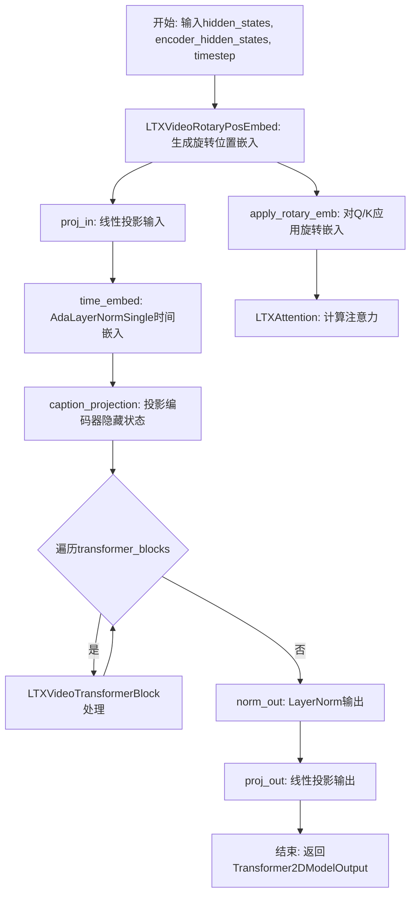
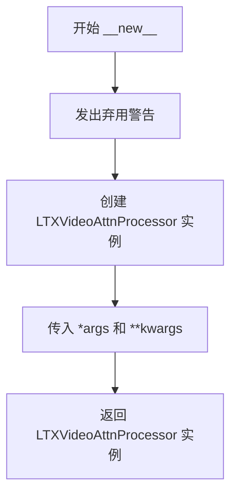
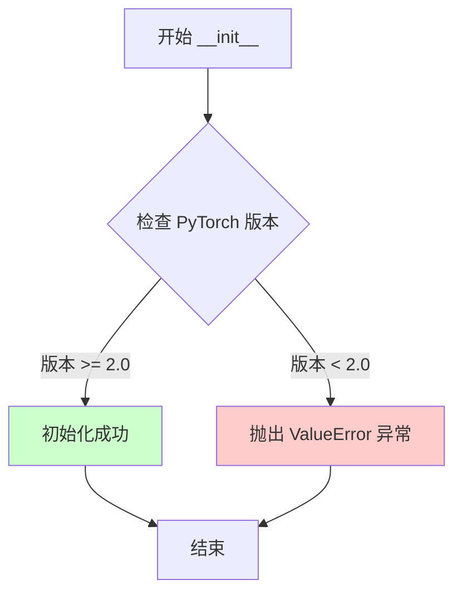
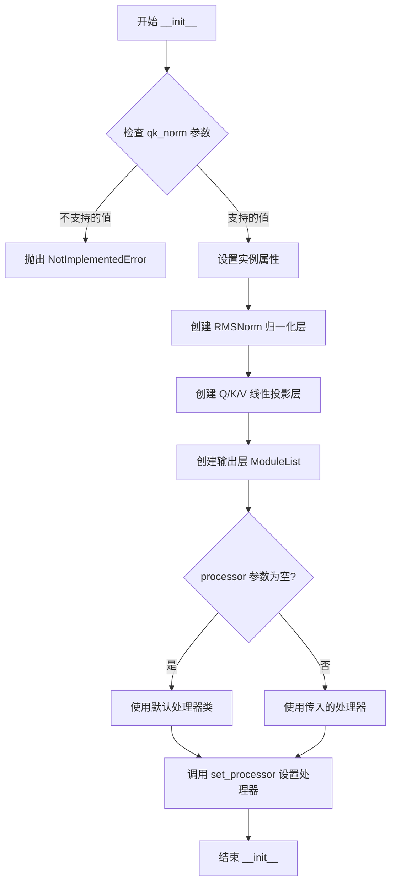
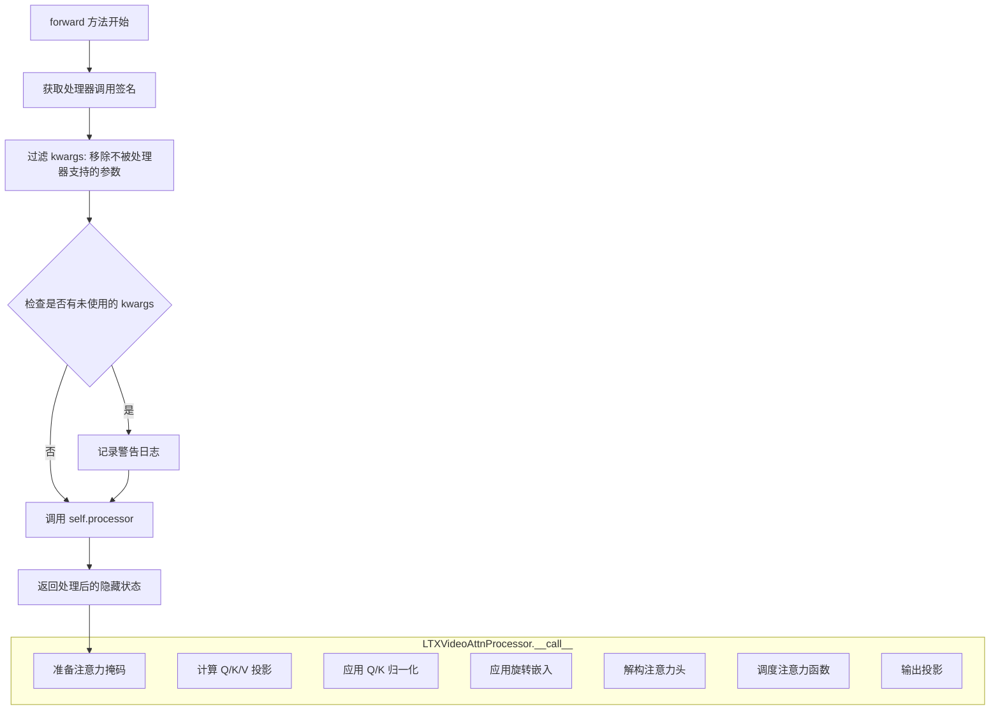
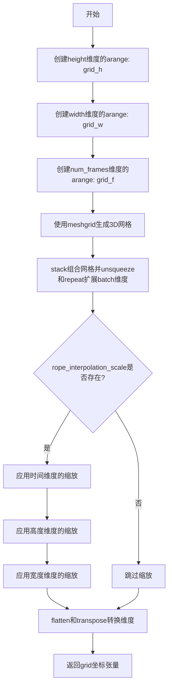
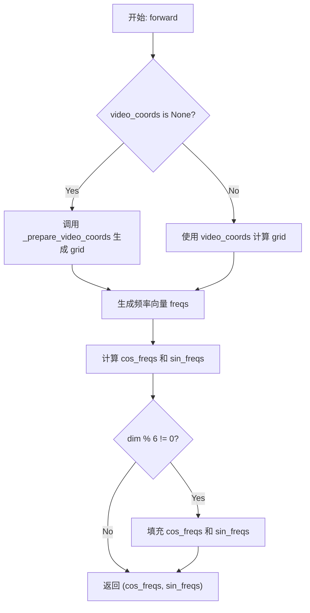
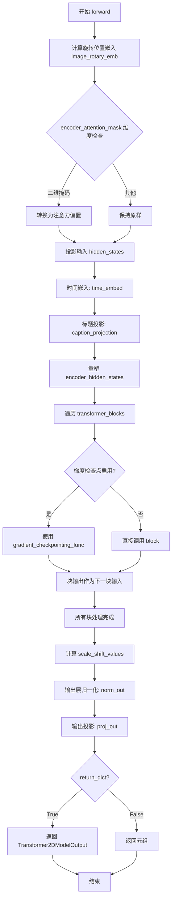

# `diffusers\src\diffusers\models\transformers\transformer_ltx.py` 详细设计文档

这是一个用于LTX-Video模型的3D Transformer实现，包含了视频注意力处理、旋转位置嵌入、Transformer块和完整的模型架构，支持视频数据的时空建模和条件生成。

## 整体流程



## 类结构

```
LTXVideoAttentionProcessor2_0 (已弃用注意力处理器)
LTXVideoAttnProcessor (注意力处理器)
LTXAttention (注意力模块)
LTXVideoRotaryPosEmbed (3D旋转位置嵌入)
LTXVideoTransformerBlock (Transformer块)
LTXVideoTransformer3DModel (主模型)
```

## 全局变量及字段


### `logger`
    
模块级日志记录器，用于输出警告和信息消息

类型：`logging.Logger`
    


### `LTXVideoAttnProcessor._attention_backend`
    
注意力计算后端，默认为None，由dispatch_attention_fn使用

类型：`Any | None`
    


### `LTXVideoAttnProcessor._parallel_config`
    
并行配置参数，用于上下文并行的注意力计算

类型：`Any | None`
    


### `LTXAttention.head_dim`
    
每个注意力头的维度大小

类型：`int`
    


### `LTXAttention.inner_dim`
    
内部维度，等于head_dim乘以注意力头数

类型：`int`
    


### `LTXAttention.inner_kv_dim`
    
键值对的内部维度，用于kv_heads与heads不同的情况

类型：`int`
    


### `LTXAttention.query_dim`
    
查询输入的维度

类型：`int`
    


### `LTXAttention.cross_attention_dim`
    
交叉注意力中编码器隐藏状态的维度

类型：`int | None`
    


### `LTXAttention.use_bias`
    
是否在线性层中使用偏置

类型：`bool`
    


### `LTXAttention.dropout`
    
注意力dropout的概率

类型：`float`
    


### `LTXAttention.out_dim`
    
输出的维度，通常等于query_dim

类型：`int`
    


### `LTXAttention.heads`
    
多头注意力的头数

类型：`int`
    


### `LTXAttention.norm_q`
    
查询向量的RMS归一化层

类型：`torch.nn.RMSNorm`
    


### `LTXAttention.norm_k`
    
键向量的RMS归一化层

类型：`torch.nn.RMSNorm`
    


### `LTXAttention.to_q`
    
将隐藏状态投影为查询向量的线性层

类型：`torch.nn.Linear`
    


### `LTXAttention.to_k`
    
将编码器隐藏状态投影为键向量的线性层

类型：`torch.nn.Linear`
    


### `LTXAttention.to_v`
    
将编码器隐藏状态投影为值向量的线性层

类型：`torch.nn.Linear`
    


### `LTXAttention.to_out`
    
包含输出线性层和dropout的模块列表

类型：`torch.nn.ModuleList`
    


### `LTXVideoRotaryPosEmbed.dim`
    
旋转位置嵌入的维度

类型：`int`
    


### `LTXVideoRotaryPosEmbed.base_num_frames`
    
基础帧数，用于位置编码的归一化

类型：`int`
    


### `LTXVideoRotaryPosEmbed.base_height`
    
基础高度，用于位置编码的归一化

类型：`int`
    


### `LTXVideoRotaryPosEmbed.base_width`
    
基础宽度，用于位置编码的归一化

类型：`int`
    


### `LTXVideoRotaryPosEmbed.patch_size`
    
空间patch大小，用于位置编码计算

类型：`int`
    


### `LTXVideoRotaryPosEmbed.patch_size_t`
    
时间patch大小，用于位置编码计算

类型：`int`
    


### `LTXVideoRotaryPosEmbed.theta`
    
旋转嵌入的基础频率参数

类型：`float`
    


### `LTXVideoTransformerBlock.norm1`
    
第一个Transformer块的归一化层

类型：`RMSNorm`
    


### `LTXVideoTransformerBlock.attn1`
    
第一个自注意力层

类型：`LTXAttention`
    


### `LTXVideoTransformerBlock.norm2`
    
第二个Transformer块的归一化层

类型：`RMSNorm`
    


### `LTXVideoTransformerBlock.attn2`
    
第二个交叉注意力层

类型：`LTXAttention`
    


### `LTXVideoTransformerBlock.ff`
    
前馈神经网络层

类型：`FeedForward`
    


### `LTXVideoTransformerBlock.scale_shift_table`
    
AdaLN零初始化的缩放和平移参数表

类型：`torch.nn.Parameter`
    


### `LTXVideoTransformer3DModel.proj_in`
    
输入投影层，将输入通道映射到内部维度

类型：`torch.nn.Linear`
    


### `LTXVideoTransformer3DModel.scale_shift_table`
    
时间嵌入的缩放和平移参数表

类型：`torch.nn.Parameter`
    


### `LTXVideoTransformer3DModel.time_embed`
    
时间步嵌入层，包含时间条件的归一化

类型：`AdaLayerNormSingle`
    


### `LTXVideoTransformer3DModel.caption_projection`
    
文本描述投影层，将caption映射到隐藏空间

类型：`PixArtAlphaTextProjection`
    


### `LTXVideoTransformer3DModel.rope`
    
3D旋转位置嵌入器，用于视频token

类型：`LTXVideoRotaryPosEmbed`
    


### `LTXVideoTransformer3DModel.transformer_blocks`
    
Transformer块列表，构成模型主体

类型：`torch.nn.ModuleList`
    


### `LTXVideoTransformer3DModel.norm_out`
    
输出归一化层

类型：`torch.nn.LayerNorm`
    


### `LTXVideoTransformer3DModel.proj_out`
    
输出投影层，将内部维度映射回输出通道

类型：`torch.nn.Linear`
    


### `LTXVideoTransformer3DModel.gradient_checkpointing`
    
梯度检查点标志，用于节省显存

类型：`bool`
    
    

## 全局函数及方法


### `apply_rotary_emb`

该函数实现了旋转位置嵌入（Rotary Position Embedding，RoPE），通过复数旋转的方式将位置信息编码到query和key向量中，使得模型能够感知序列中token的相对位置关系。

参数：

- `x`：`torch.Tensor`，输入的张量，通常是经过线性变换后的query或key向量，形状为`[B, S, C]`
- `freqs`：`tuple[torch.Tensor, torch.Tensor]`，包含cos和sin频率张量的元组，分别对应旋转嵌入的余弦和正弦部分

返回值：`torch.Tensor`，应用旋转嵌入后的张量，形状与输入`x`相同

#### 流程图

```mermaid
flowchart TD
    A[输入 x, freqs] --> B[解包 freqs = (cos, sin)]
    B --> C[将 x 分解为实部 x_real 和虚部 x_imag]
    C --> D[构建旋转后的张量 x_rotated<br/>通过 stack([-x_imag, x_real], dim=-1)]
    D --> E[将 x_rotated 展平为原始形状]
    E --> F[计算输出 out<br/>x.float * cos + x_rotated.float * sin]
    F --> G[将输出转换为 x 的原始数据类型]
    G --> H[返回 out]
```

#### 带注释源码

```python
def apply_rotary_emb(x, freqs):
    """
    应用旋转位置嵌入（Rotary Position Embedding）
    
    该方法通过复数旋转的方式将位置信息编码到query/key向量中，
    使得模型能够感知token之间的相对位置关系。
    
    参数:
        x: 输入张量，形状为 [batch_size, seq_len, hidden_dim]
        freqs: (cos_freqs, sin_freqs) 元组，包含预计算的位置频率
    
    返回:
        应用旋转嵌入后的张量
    """
    # 解包频率元组，获取cos和sin值
    cos, sin = freqs
    
    # 将输入张量从 [B, S, C] 展开为 [B, S, C//2, 2]，然后解绑最后一维
    # 分离出实部(real)和虚部(imag)部分
    # x_real, x_imag 形状均为 [B, S, C // 2]
    x_real, x_imag = x.unflatten(2, (-1, 2)).unbind(-1)
    
    # 构建旋转后的张量：[-x_imag, x_real]
    # 这相当于将向量旋转90度的复数操作
    # 结果形状为 [B, S, C // 2, 2]
    x_rotated = torch.stack([-x_imag, x_real], dim=-1).flatten(2)
    
    # 应用旋转公式：x' = x * cos(θ) + x_rotated * sin(θ)
    # 使用float进行乘法以保证精度，最后再转回原始dtype
    out = (x.float() * cos + x_rotated.float() * sin).to(x.dtype)
    
    return out
```


### `LTXVideoAttentionProcessor2_0.__new__`

这是一个工厂方法，用于在实例化 `LTXVideoAttentionProcessor2_0` 时将其替换为 `LTXVideoAttnProcessor` 实例，同时发出弃用警告通知用户该类已被弃用。

参数：

- `cls`：`type`，当前类的类型对象，用于创建实例
- `*args`：`tuple`，可变位置参数列表，会被传递给 `LTXVideoAttnProcessor` 的构造函数
- `**kwargs`：`dict`，可变关键字参数字典，会被传递给 `LTXVideoAttnProcessor` 的构造函数

返回值：`LTXVideoAttnProcessor`，返回一个 `LTXVideoAttnProcessor` 类型的实例对象

#### 流程图



#### 带注释源码

```
class LTXVideoAttentionProcessor2_0:
    def __new__(cls, *args, **kwargs):
        # 定义弃用警告消息，告知用户该类已被弃用
        deprecation_message = "`LTXVideoAttentionProcessor2_0` is deprecated and this will be removed in a future version. Please use `LTXVideoAttnProcessor`"
        
        # 调用 deprecate 函数发出弃用警告
        # 参数: 弃用的类名, 版本号, 警告消息
        deprecate("LTXVideoAttentionProcessor2_0", "1.0.0", deprecation_message)

        # 创建并返回一个 LTXVideoAttnProcessor 实例
        # 将所有传入的参数原样传递给 LTXVideoAttnProcessor
        return LTXVideoAttnProcessor(*args, **kwargs)
```


### LTXVideoAttnProcessor.__init__

这是LTXVideoAttnProcessor类的构造函数，用于初始化注意力处理器实例。该方法首先检查PyTorch版本是否满足最低要求（2.0及以上），如果不满足则抛出异常。这是使用LTX模型注意力处理器的先决条件，因为该处理器依赖于PyTorch 2.0引入的SDPA（Scaled Dot Product Attention）功能。

参数：
- 无显式参数（仅包含self）

返回值：`None`，构造函数不返回任何值

#### 流程图



#### 带注释源码

```python
class LTXVideoAttnProcessor:
    r"""
    Processor for implementing attention (SDPA is used by default if you're using PyTorch 2.0). This is used in the LTX
    model. It applies a normalization layer and rotary embedding on the query and key vector.
    """

    # 类级别属性：注意力后端配置，默认为None
    _attention_backend = None
    # 类级别属性：并行配置，默认为None
    _parallel_config = None

    def __init__(self):
        """
        初始化LTXVideoAttnProcessor实例。
        检查PyTorch版本是否满足最低要求（2.0及以上）。
        
        Raises:
            ValueError: 如果PyTorch版本低于2.0，则抛出异常。
        """
        # 检查PyTorch版本是否低于2.0
        if is_torch_version("<", "2.0"):
            # 抛出版本不兼容错误，要求用户升级PyTorch
            raise ValueError(
                "LTX attention processors require a minimum PyTorch version of 2.0. Please upgrade your PyTorch installation."
            )
```


### `LTXVideoAttnProcessor.__call__`

这是 LTXVideoAttnProcessor 类的核心调用方法，用于实现 LTX 视频模型的自注意力机制。该方法接收隐藏状态和编码器隐藏状态，通过 Query、Key、Value 投影、旋转位置嵌入（RoPE）和注意力掩码处理，最终通过注意力函数计算并输出注意力后的隐藏状态。

参数：

- `self`：实例本身
- `attn`：`LTXAttention`，注意力模块实例，提供投影矩阵（to_q、to_k、to_v）、归一化层（norm_q、norm_k）和输出层（to_out）
- `hidden_states`：`torch.Tensor`，输入的隐藏状态张量，形状为 (batch_size, sequence_length, hidden_dim)
- `encoder_hidden_states`：`torch.Tensor | None`，编码器的隐藏状态，用于跨注意力机制。如果为 None，则使用 hidden_states 代替
- `attention_mask`：`torch.Tensor | None`，注意力掩码，用于屏蔽某些位置的注意力计算
- `image_rotary_emb`：`torch.Tensor | None`，图像旋转位置嵌入，用于为 Query 和 Key 添加旋转位置信息

返回值：`torch.Tensor`，经过注意力机制处理后的隐藏状态张量，形状与输入 hidden_states 相同

#### 流程图

```mermaid
flowchart TD
    A[开始 __call__] --> B{encoder_hidden_states 是否为 None?}
    B -->|是| C[使用 hidden_states]
    B -->|否| D[使用 encoder_hidden_states]
    C --> E[获取 batch_size 和 sequence_length]
    D --> E
    E --> F{attention_mask 是否为 None?}
    F -->|否| G[prepare_attention_mask 并 reshape]
    F -->|是| H[跳过掩码处理]
    G --> I[计算 Q/K/V 投影]
    H --> I
    I --> J[Q = norm_q Query]
    J --> K[K = norm_k Key]
    K --> L{image_rotary_emb 是否为 None?}
    L -->|否| M[apply_rotary_emb to Query 和 Key]
    L -->|是| N[跳过旋转嵌入]
    M --> O[unflatten Q/K/V to heads]
    N --> O
    O --> P[dispatch_attention_fn 计算注意力]
    P --> Q[flatten 并转换 dtype]
    Q --> R[to_out[0] 线性变换]
    R --> S[to_out[1] Dropout]
    S --> T[返回 hidden_states]
```

#### 带注释源码

```python
def __call__(
    self,
    attn: "LTXAttention",
    hidden_states: torch.Tensor,
    encoder_hidden_states: torch.Tensor | None = None,
    attention_mask: torch.Tensor | None = None,
    image_rotary_emb: torch.Tensor | None = None,
) -> torch.Tensor:
    # 确定 batch_size 和 sequence_length
    # 如果 encoder_hidden_states 存在，则使用其形状，否则使用 hidden_states 的形状
    batch_size, sequence_length, _ = (
        hidden_states.shape if encoder_hidden_states is None else encoder_hidden_states.shape
    )

    # 如果提供了 attention_mask，则进行预处理
    # 准备注意力掩码以适应特定的注意力机制要求
    if attention_mask is not None:
        attention_mask = attn.prepare_attention_mask(attention_mask, sequence_length, batch_size)
        # 将掩码重塑为 (batch_size, heads, -1, sequence_length) 的形式
        # 以支持多头注意力
        attention_mask = attention_mask.view(batch_size, attn.heads, -1, attention_mask.shape[-1])

    # 如果没有提供 encoder_hidden_states，则使用 hidden_states 本身
    # 这对应于自注意力机制
    if encoder_hidden_states is None:
        encoder_hidden_states = hidden_states

    # 通过线性层计算 Query、Key、Value
    # to_q/to_k/to_v 是 LTXAttention 中定义的线性投影层
    query = attn.to_q(hidden_states)
    key = attn.to_k(encoder_hidden_states)
    value = attn.to_v(encoder_hidden_states)

    # 对 Query 和 Key 应用 RMSNorm 归一化
    # 这是 LTX 模型中使用的 Query/Key 归一化策略
    query = attn.norm_q(query)
    key = attn.norm_k(key)

    # 如果提供了旋转位置嵌入，则应用到 Query 和 Key 上
    # 旋转位置嵌入（RoPE）用于为序列中的位置信息建模
    if image_rotary_emb is not None:
        query = apply_rotary_emb(query, image_rotary_emb)
        key = apply_rotary_emb(key, image_rotary_emb)

    # 将 Query、Key、Value 从 (batch, seq, dim) 重塑为 (batch, seq, heads, head_dim)
    # unflatten 操作将隐藏维度展开为多头注意力的形式
    query = query.unflatten(2, (attn.heads, -1))
    key = key.unflatten(2, (attn.heads, -1))
    value = value.unflatten(2, (attn.heads, -1))

    # 调用分发的注意力函数执行注意力计算
    # 支持不同的注意力后端（SDPA、Flash Attention 等）
    # 使用 is_causal=False 因为这是视频模型，可能不需要因果掩码
    hidden_states = dispatch_attention_fn(
        query,
        key,
        value,
        attn_mask=attention_mask,
        dropout_p=0.0,  # 注意力层不使用 Dropout
        is_causal=False,
        backend=self._attention_backend,
        parallel_config=self._parallel_config,
    )

    # 将结果从 (batch, seq, heads, head_dim) 重塑回 (batch, seq, hidden_dim)
    hidden_states = hidden_states.flatten(2, 3)
    # 确保输出数据类型与 Query 数据类型一致
    hidden_states = hidden_states.to(query.dtype)

    # 通过输出投影层
    # to_out 是一个 ModuleList，包含线性层和 Dropout 层
    hidden_states = attn.to_out[0](hidden_states)
    hidden_states = attn.to_out[1](hidden_states)
    return hidden_states
```


### `LTXAttention.__init__`

该方法是 LTX 注意力模块的初始化方法，负责配置注意力机制的核心参数，包括多头注意力维度、键值对头数、Dropout 概率、偏置设置等，并实例化 Q/K 归一化层、线性投影层以及注意力处理器。

参数：

- `query_dim`：`int`，查询向量的维度
- `heads`：`int = 8`，注意力头的数量，默认为 8
- `kv_heads`：`int = 8`，键值对注意力头的数量，默认为 8
- `dim_head`：`int = 64`，每个注意力头的维度，默认为 64
- `dropout`：`float = 0.0`，注意力输出的 Dropout 概率，默认为 0.0
- `bias`：`bool = True`，是否在 Q/K/V 线性层中使用偏置，默认为 True
- `cross_attention_dim`：`int | None = None`，跨注意力机制的维度，若为 None 则使用 query_dim
- `out_bias`：`bool = True`，是否在输出线性层中使用偏置，默认为 True
- `qk_norm`：`str = "rms_norm_across_heads"`，Q/K 归一化类型，目前仅支持 "rms_norm_across_heads"
- `processor`：注意力处理器实例，若为 None 则使用默认处理器

返回值：无（`None`），该方法为构造函数，不返回任何值

#### 流程图



#### 带注释源码

```python
def __init__(
    self,
    query_dim: int,
    heads: int = 8,
    kv_heads: int = 8,
    dim_head: int = 64,
    dropout: float = 0.0,
    bias: bool = True,
    cross_attention_dim: int | None = None,
    out_bias: bool = True,
    qk_norm: str = "rms_norm_across_heads",
    processor=None,
):
    """
    初始化 LTX 注意力模块
    
    参数:
        query_dim: 查询向量的维度
        heads: 注意力头的数量
        kv_heads: 键值对注意力头的数量
        dim_head: 每个头的维度
        dropout: Dropout 概率
        bias: 是否在 Q/K/V 中使用偏置
        cross_attention_dim: 跨注意力维度，None 时使用 query_dim
        out_bias: 是否在输出层使用偏置
        qk_norm: Q/K 归一化类型
        processor: 自定义注意力处理器
    """
    # 调用父类 nn.Module 的初始化方法
    super().__init__()
    
    # 检查 qk_norm 参数，目前仅支持 'rms_norm_across_heads'
    if qk_norm != "rms_norm_across_heads":
        raise NotImplementedError("Only 'rms_norm_across_heads' is supported as a valid value for `qk_norm`.")

    # 设置基础维度参数
    self.head_dim = dim_head  # 每个注意力头的维度
    self.inner_dim = dim_head * heads  # 内部总维度 = 头数 × 头维度
    # 键值对内部维度：如果 kv_heads 为 None，则与 inner_dim 相同，否则为 dim_head * kv_heads
    self.inner_kv_dim = self.inner_dim if kv_heads is None else dim_head * kv_heads
    
    # 保存配置参数
    self.query_dim = query_dim
    # 跨注意力维度：若未指定则使用 query_dim
    self.cross_attention_dim = cross_attention_dim if cross_attention_dim is not None else query_dim
    self.use_bias = bias
    self.dropout = dropout
    self.out_dim = query_dim
    self.heads = heads

    # RMSNorm 归一化层参数
    norm_eps = 1e-5
    norm_elementwise_affine = True
    
    # 创建 Q 和 K 的 RMSNorm 归一化层
    # norm_q 用于 Query 归一化，维度为 heads * dim_head
    self.norm_q = torch.nn.RMSNorm(dim_head * heads, eps=norm_eps, elementwise_affine=norm_elementwise_affine)
    # norm_k 用于 Key 归一化，维度为 kv_heads * dim_head
    self.norm_k = torch.nn.RMSNorm(dim_head * kv_heads, eps=norm_eps, elementwise_affine=norm_elementwise_affine)
    
    # 创建 Q/K/V 线性投影层
    self.to_q = torch.nn.Linear(query_dim, self.inner_dim, bias=bias)  # Query 投影
    # Key 和 Value 投影：从 cross_attention_dim 投影到 inner_kv_dim
    self.to_k = torch.nn.Linear(self.cross_attention_dim, self.inner_kv_dim, bias=bias)
    self.to_v = torch.nn.Linear(self.cross_attention_dim, self.inner_kv_dim, bias=bias)
    
    # 创建输出层：包含线性变换和 Dropout
    self.to_out = torch.nn.ModuleList([])
    self.to_out.append(torch.nn.Linear(self.inner_dim, self.out_dim, bias=out_bias))
    self.to_out.append(torch.nn.Dropout(dropout))

    # 设置注意力处理器
    if processor is None:
        # 使用默认处理器类（LTXVideoAttnProcessor）
        processor = self._default_processor_cls()
    # 调用混合方法的 set_processor 设置处理器
    self.set_processor(processor)
```


### `LTXAttention.forward`

这是 LTX 模型中注意力模块的前向传播方法，负责接收输入的隐藏状态并通过内部的注意力处理器执行注意力计算，最终返回处理后的张量。

参数：

- `self`：`LTXAttention`，LTX 注意力模块的实例
- `hidden_states`：`torch.Tensor`，输入的隐藏状态张量，通常是经过投影的序列数据
- `encoder_hidden_states`：`torch.Tensor | None`，编码器的隐藏状态，用于跨注意力机制，若为 None 则使用 hidden_states 自身
- `attention_mask`：`torch.Tensor | None`，注意力掩码，用于控制哪些位置可以被注意力机制访问
- `image_rotary_emb`：`torch.Tensor | None`，图像旋转嵌入，用于为查询和键添加旋转位置编码
- `**kwargs`：可变关键字参数，用于传递额外的注意力相关参数，会被过滤后传递给处理器

返回值：`torch.Tensor`，经过注意力处理后的隐藏状态张量

#### 流程图



#### 带注释源码

```python
def forward(
    self,
    hidden_states: torch.Tensor,
    encoder_hidden_states: torch.Tensor | None = None,
    attention_mask: torch.Tensor | None = None,
    image_rotary_emb: torch.Tensor | None = None,
    **kwargs,
) -> torch.Tensor:
    """
    LTXAttention 的前向传播方法。
    
    该方法将注意力计算委托给注册的注意力处理器（LTXVideoAttnProcessor），
    支持跨注意力机制和旋转位置编码。
    
    Args:
        hidden_states: 输入的隐藏状态，形状为 [batch, seq_len, dim]
        encoder_hidden_states: 编码器隐藏状态，用于 cross-attention
        attention_mask: 注意力掩码，用于控制注意力权重
        image_rotary_emb: 旋转位置嵌入，用于位置编码
        **kwargs: 其他可选参数，会被过滤后传递给处理器
    
    Returns:
        经过注意力处理后的隐藏状态张量
    """
    # 使用 inspect 获取注意力处理器.__call__ 方法的参数签名
    attn_parameters = set(inspect.signature(self.processor.__call__).parameters.keys())
    
    # 筛选出不被当前处理器支持的 kwargs 参数
    unused_kwargs = [k for k, _ in kwargs.items() if k not in attn_parameters]
    
    # 如果存在未使用的 kwargs，发出警告日志
    if len(unused_kwargs) > 0:
        logger.warning(
            f"attention_kwargs {unused_kwargs} are not expected by {self.processor.__class__.__name__} and will be ignored."
        )
    
    # 过滤 kwargs，只保留处理器支持的参数
    kwargs = {k: w for k, w in kwargs.items() if k in attn_parameters}
    
    # 调用注意力处理器执行实际的注意力计算
    # 处理器内部会完成：
    # 1. Q/K/V 线性投影
    # 2. RMSNorm 归一化
    # 3. 旋转位置编码应用
    # 4. 注意力计算（通过 dispatch_attention_fn）
    # 5. 输出投影
    return self.processor(self, hidden_states, encoder_hidden_states, attention_mask, image_rotary_emb, **kwargs)
```


### `LTXVideoRotaryPosEmbed._prepare_video_coords`

该方法用于准备视频坐标的3D网格（帧、高度、宽度），为旋转位置嵌入（RoPE）生成空间-时间坐标，并根据需要进行插值缩放。

参数：

- `batch_size`：`int`，批次大小，指定要处理的视频数量
- `num_frames`：`int`，视频帧数，时间维度的大小
- `height`：`int`，视频高度，空间维度的第一维
- `width`：`int`，视频宽度，空间维度的第二维
- `rope_interpolation_scale`：`tuple[torch.Tensor, float, float]`，RoPE插值缩放因子，用于调整时间和高宽方向的坐标尺度
- `device`：`torch.device`，计算设备，用于创建张量

返回值：`torch.Tensor`，返回形状为 `(batch_size, seq_len, 3)` 的坐标网格张量，其中 seq_len = num_frames * height * width

#### 流程图



#### 带注释源码

```python
def _prepare_video_coords(
    self,
    batch_size: int,
    num_frames: int,
    height: int,
    width: int,
    rope_interpolation_scale: tuple[torch.Tensor, float, float],
    device: torch.device,
) -> torch.Tensor:
    # Always compute rope in fp32
    # 创建高度维度的坐标序列，使用float32精度
    grid_h = torch.arange(height, dtype=torch.float32, device=device)
    # 创建宽度维度的坐标序列
    grid_w = torch.arange(width, dtype=torch.float32, device=device)
    # 创建时间（帧）维度的坐标序列
    grid_f = torch.arange(num_frames, dtype=torch.float32, device=device)
    # 使用meshgrid生成3D网格，indexing='ij'表示使用行列索引方式
    grid = torch.meshgrid(grid_f, grid_h, grid_w, indexing="ij")
    # 将网格堆叠成单一张量，形状为 (3, num_frames, height, width)
    grid = torch.stack(grid, dim=0)
    # 扩展batch维度并重复，形状变为 (batch_size, 3, num_frames, height, width)
    grid = grid.unsqueeze(0).repeat(batch_size, 1, 1, 1, 1)

    # 如果提供了插值缩放因子，则对各维度进行缩放
    if rope_interpolation_scale is not None:
        # 时间维度：乘以插值比例、patch_size_t，并除以base_num_frames进行归一化
        grid[:, 0:1] = grid[:, 0:1] * rope_interpolation_scale[0] * self.patch_size_t / self.base_num_frames
        # 高度维度：乘以插值比例、patch_size，并除以base_height进行归一化
        grid[:, 1:2] = grid[:, 1:2] * rope_interpolation_scale[1] * self.patch_size / self.base_height
        # 宽度维度：乘以插值比例、patch_size，并除以base_width进行归一化
        grid[:, 2:3] = grid[:, 2:3] * rope_interpolation_scale[2] * self.patch_size / self.base_width

    # 展平空间维度并转置，将形状从 (batch_size, 3, num_frames, height, width)
    # 转换为 (batch_size, num_frames*height*width, 3)
    grid = grid.flatten(2, 4).transpose(1, 2)

    return grid
```


### `LTXVideoRotaryPosEmbed.forward`

该方法实现了旋转位置嵌入（Rotary Position Embedding, RoPE）的计算，用于将视频的空间和时间位置信息编码到隐藏状态中。它通过计算频率向量并结合余弦和正弦函数生成位置编码，支持视频坐标的直接输入或基于帧数、高度和宽度的自动生成。

参数：

- `hidden_states`：`torch.Tensor`，输入的隐藏状态张量，用于获取批次大小和设备信息
- `num_frames`：`int | None`，视频的帧数，用于生成时间维度坐标
- `height`：`int | None`，视频的高度，用于生成空间高度坐标
- `width`：`int | None`，视频的宽度，用于生成空间宽度坐标
- `rope_interpolation_scale`：`tuple[torch.Tensor, float, float] | None`，RoPE插值缩放因子，用于调整不同维度的插值比例
- `video_coords`：`torch.Tensor | None`，预计算的视频坐标张量，如果提供则直接使用，跳过坐标生成步骤

返回值：`tuple[torch.Tensor, torch.Tensor]`，返回余弦和正弦频率张量组成的元组，用于后续的旋转位置嵌入应用

#### 流程图



#### 带注释源码

```python
def forward(
    self,
    hidden_states: torch.Tensor,
    num_frames: int | None = None,
    height: int | None = None,
    width: int | None = None,
    rope_interpolation_scale: tuple[torch.Tensor, float, float] | None = None,
    video_coords: torch.Tensor | None = None,
) -> tuple[torch.Tensor, torch.Tensor]:
    """
    计算旋转位置嵌入的余弦和正弦频率张量
    
    参数:
        hidden_states: 输入的隐藏状态张量，用于获取批次大小和设备信息
        num_frames: 视频帧数，用于生成时间维度坐标
        height: 视频高度，用于生成空间高度坐标
        width: 视频宽度，用于生成空间宽度坐标
        rope_interpolation_scale: RoPE插值缩放因子元组
        video_coords: 可选的预计算视频坐标张量
        
    返回:
        包含余弦和正弦频率张量的元组
    """
    # 从隐藏状态获取批次大小
    batch_size = hidden_states.size(0)

    # 如果没有提供视频坐标，则根据视频参数生成坐标网格
    if video_coords is None:
        grid = self._prepare_video_coords(
            batch_size,
            num_frames,
            height,
            width,
            rope_interpolation_scale=rope_interpolation_scale,
            device=hidden_states.device,
        )
    else:
        # 使用预提供的视频坐标，按基础尺寸归一化
        grid = torch.stack(
            [
                video_coords[:, 0] / self.base_num_frames,   # 时间维度归一化
                video_coords[:, 1] / self.base_height,       # 高度维度归一化
                video_coords[:, 2] / self.base_width,        # 宽度维度归一化
            ],
            dim=-1,
        )

    # 设置频率的起始和结束值，使用theta作为基础
    start = 1.0
    end = self.theta
    
    # 生成对数间隔的频率向量，维度为dim//6
    freqs = self.theta ** torch.linspace(
        math.log(start, self.theta),      # 起始对数
        math.log(end, self.theta),        # 结束对数
        self.dim // 6,                    # 频率数量
        device=hidden_states.device,     # 使用隐藏状态的设备
        dtype=torch.float32,              # 使用FP32精度计算
    )
    
    # 将频率缩放到[-pi/2, pi/2]范围
    freqs = freqs * math.pi / 2.0
    
    # 将频率应用到网格坐标，并调整维度顺序
    freqs = freqs * (grid.unsqueeze(-1) * 2 - 1)  # 将坐标映射到[-1, 1]
    freqs = freqs.transpose(-1, -2).flatten(2)    # 调整维度以便后续处理

    # 计算余弦和正弦频率，并扩展维度以匹配查询/键的维度
    cos_freqs = freqs.cos().repeat_interleave(2, dim=-1)  # 重复以匹配dim
    sin_freqs = freqs.sin().repeat_interleave(2, dim=-1)

    # 处理维度不能被6整除的情况，进行填充
    if self.dim % 6 != 0:
        cos_padding = torch.ones_like(cos_freqs[:, :, : self.dim % 6])  # 补1保持余弦特性
        sin_padding = torch.zeros_like(cos_freqs[:, :, : self.dim % 6]) # 补0保持正弦特性
        cos_freqs = torch.cat([cos_padding, cos_freqs], dim=-1)
        sin_freqs = torch.cat([sin_padding, sin_freqs], dim=-1)

    return cos_freqs, sin_freqs
```


### `LTXVideoTransformerBlock.__init__`

初始化LTXVideoTransformerBlock类，构建Transformer块的核心组件，包括两个注意力模块（自注意力和交叉注意力）、前馈网络、归一化层以及用于自适应层归一化的缩放移位参数表。

参数：

- `dim`：`int`，输入输出的通道数
- `num_attention_heads`：`int`，多头注意力机制中注意力头的数量
- `attention_head_dim`：`int`，每个注意力头中的通道数
- `cross_attention_dim`：`int`，交叉注意力中编码器隐藏状态的维度
- `qk_norm`：`str`，跨头归一化方式，默认为"rms_norm_across_heads"
- `activation_fn`：`str`，前馈网络激活函数，默认为"gelu-approximate"
- `attention_bias`：`bool`，注意力层是否使用偏置，默认为True
- `attention_out_bias`：`bool`，注意力输出层是否使用偏置，默认为True
- `eps`：`float`，归一化层的epsilon值，默认为1e-6
- `elementwise_affine`：`bool`，归一化层是否使用元素级仿射变换，默认为False

返回值：`None`，该方法为构造函数，不返回任何值

#### 流程图

```mermaid
flowchart TD
    A[开始 __init__] --> B[调用 super().__init__]
    B --> C[创建 self.norm1 = RMSNorm(dim, eps, elementwise_affine)]
    C --> D[创建 self.attn1 = LTXAttention 自注意力模块]
    D --> E[创建 self.norm2 = RMSNorm(dim, eps, elementwise_affine)]
    E --> F[创建 self.attn2 = LTXAttention 交叉注意力模块]
    F --> G[创建 self.ff = FeedForward 前馈网络]
    G --> H[创建 self.scale_shift_table = nn.Parameter]
    H --> I[结束 __init__]
```

#### 带注释源码

```python
def __init__(
    self,
    dim: int,
    num_attention_heads: int,
    attention_head_dim: int,
    cross_attention_dim: int,
    qk_norm: str = "rms_norm_across_heads",
    activation_fn: str = "gelu-approximate",
    attention_bias: bool = True,
    attention_out_bias: bool = True,
    eps: float = 1e-6,
    elementwise_affine: bool = False,
):
    """
    初始化LTXVideoTransformerBlock变换器块

    参数:
        dim: 输入输出的通道维度
        num_attention_heads: 注意力头数量
        attention_head_dim: 每个头的维度
        cross_attention_dim: 交叉注意力的编码器维度
        qk_norm: 查询和键的归一化方式
        activation_fn: 前馈网络激活函数类型
        attention_bias: 是否在注意力投影中使用偏置
        attention_out_bias: 是否在注意力输出投影中使用偏置
        eps: 归一化层的epsilon参数
        elementwise_affine: 归一化层是否使用可学习的仿射参数
    """
    # 调用父类nn.Module的初始化方法
    super().__init__()

    # 第一个归一化层，用于自注意力之前的预处理
    # RMSNorm比LayerNorm更稳定且计算效率更高
    self.norm1 = RMSNorm(dim, eps=eps, elementwise_affine=elementwise_affine)

    # 第一个注意力模块（自注意力）
    # cross_attention_dim=None 表示这是自注意力机制
    self.attn1 = LTXAttention(
        query_dim=dim,
        heads=num_attention_heads,
        kv_heads=num_attention_heads,
        dim_head=attention_head_dim,
        bias=attention_bias,
        cross_attention_dim=None,
        out_bias=attention_out_bias,
        qk_norm=qk_norm,
    )

    # 第二个归一化层，用于交叉注意力之前的预处理
    self.norm2 = RMSNorm(dim, eps=eps, elementwise_affine=elementwise_affine)

    # 第二个注意力模块（交叉注意力）
    # 接收来自编码器的隐藏状态进行交叉注意力计算
    self.attn2 = LTXAttention(
        query_dim=dim,
        cross_attention_dim=cross_attention_dim,
        heads=num_attention_heads,
        kv_heads=num_attention_heads,
        dim_head=attention_head_dim,
        bias=attention_bias,
        out_bias=attention_out_bias,
        qk_norm=qk_norm,
    )

    # 前馈神经网络模块
    # 使用指定激活函数进行特征变换
    self.ff = FeedForward(dim, activation_fn=activation_fn)

    # 自适应层归一化的缩放移位参数表
    # 形状为 (6, dim)，包含6组可学习的缩放和偏移参数
    # 用于: [shift_msa, scale_msa, gate_msa, shift_mlp, scale_mlp, gate_mlp]
    self.scale_shift_table = nn.Parameter(torch.randn(6, dim) / dim**0.5)
```


### `LTXVideoTransformerBlock.forward`

该方法是 LTXVideoTransformerBlock 的前向传播函数，实现了视频Transformer块的核心逻辑，包括自注意力（self-attn1）、交叉注意力（self-attn2）和前馈网络（FFN），并采用 AdaLN 方式进行自适应层归一化。

参数：

- `hidden_states`：`torch.Tensor`，输入的隐藏状态张量，形状为 (batch_size, sequence_length, dim)
- `encoder_hidden_states`：`torch.Tensor`，编码器的隐藏状态，用于跨注意力计算
- `temb`：`torch.Tensor`，时间嵌入张量，用于 AdaLN 自适应参数
- `image_rotary_emb`：`tuple[torch.Tensor, torch.Tensor] | None`，旋转位置嵌入的余弦和正弦部分
- `encoder_attention_mask`：`torch.Tensor | None`，编码器注意力掩码，用于跨注意力

返回值：`torch.Tensor`，经过Transformer块处理后的隐藏状态张量

#### 流程图

```mermaid
flowchart TD
    A[hidden_states 输入] --> B[self.norm1 归一化]
    
    B --> C[计算 AdaLN 参数]
    C --> D[从 scale_shift_table 提取 shift_msa, scale_msa, gate_msa, shift_mlp, scale_mlp, gate_mlp]
    
    D --> E[应用 AdaLN: norm_hidden_states = norm_hidden_states * (1 + scale_msa) + shift_msa]
    
    E --> F[self.attn1 自注意力]
    F --> G[残差连接: hidden_states = hidden_states + attn_hidden_states * gate_msa]
    
    G --> H[self.attn2 交叉注意力]
    H --> I[残差连接: hidden_states = hidden_states + attn_hidden_states]
    
    I --> J[self.norm2 归一化]
    J --> K[应用 AdaLN: norm_hidden_states = norm_hidden_states * (1 + scale_mlp) + shift_mlp]
    
    K --> L[self.ff 前馈网络]
    L --> M[残差连接: hidden_states = hidden_states + ff_output * gate_mlp]
    
    M --> N[返回 hidden_states]
```

#### 带注释源码

```python
def forward(
    self,
    hidden_states: torch.Tensor,
    encoder_hidden_states: torch.Tensor,
    temb: torch.Tensor,
    image_rotary_emb: tuple[torch.Tensor, torch.Tensor] | None = None,
    encoder_attention_mask: torch.Tensor | None = None,
) -> torch.Tensor:
    # 获取批次大小
    batch_size = hidden_states.size(0)
    
    # 第一次归一化 (Self-attention 前的 RMSNorm)
    norm_hidden_states = self.norm1(hidden_states)

    # 获取自适应参数数量 (固定为6: shift_msa, scale_msa, gate_msa, shift_mlp, scale_mlp, gate_mlp)
    num_ada_params = self.scale_shift_table.shape[0]
    
    # 计算 AdaLN 自适应参数: 将可学习参数与时间嵌入相加
    # scale_shift_table 形状为 (6, dim)，扩展后与 temb 相加
    ada_values = self.scale_shift_table[None, None].to(temb.device) + temb.reshape(
        batch_size, temb.size(1), num_ada_params, -1
    )
    
    # 解包自适应参数用于不同的注意力层和FFN
    shift_msa, scale_msa, gate_msa, shift_mlp, scale_mlp, gate_mlp = ada_values.unbind(dim=2)
    
    # 对自注意力前的特征应用 AdaLN 自适应归一化
    # 公式: norm_hidden_states = norm_hidden_states * (1 + scale_msa) + shift_msa
    norm_hidden_states = norm_hidden_states * (1 + scale_msa) + shift_msa

    # 自注意力 (Self-attention) - 使用图像旋转嵌入
    attn_hidden_states = self.attn1(
        hidden_states=norm_hidden_states,
        encoder_hidden_states=None,  # 自注意力不使用编码器隐藏状态
        image_rotary_emb=image_rotary_emb,
    )
    
    # 残差连接 + 门控: hidden_states = hidden_states + gate_msa * attn_hidden_states
    hidden_states = hidden_states + attn_hidden_states * gate_msa

    # 交叉注意力 (Cross-attention) - 使用编码器隐藏状态
    attn_hidden_states = self.attn2(
        hidden_states,
        encoder_hidden_states=encoder_hidden_states,
        image_rotary_emb=None,  # 交叉注意力不使用旋转嵌入
        attention_mask=encoder_attention_mask,
    )
    
    # 残差连接 (无门控): hidden_states = hidden_states + attn_hidden_states
    hidden_states = hidden_states + attn_hidden_states
    
    # FFN 前的第二次归一化
    norm_hidden_states = self.norm2(hidden_states) * (1 + scale_mlp) + shift_mlp

    # 前馈网络处理
    ff_output = self.ff(norm_hidden_states)
    
    # 残差连接 + 门控: hidden_states = hidden_states + gate_mlp * ff_output
    hidden_states = hidden_states + ff_output * gate_mlp

    # 返回处理后的隐藏状态
    return hidden_states
```


### `LTXVideoTransformer3DModel.__init__`

该方法是LTXVideoTransformer3DModel类的构造函数，用于初始化一个用于视频数据的3D变换器模型。它配置了模型的输入输出通道、注意力机制参数、层数、归一化设置等，并创建了模型的核心组件包括投影层、时间嵌入、旋转位置编码、变换器块堆栈等。

参数：

- `self`：隐式参数，表示类的实例本身
- `in_channels`：`int`，输入通道数，默认为128
- `out_channels`：`int`，输出通道数，默认为128（如果为None则等于in_channels）
- `patch_size`：`int`，空间patch大小，默认为1
- `patch_size_t`：`int`，时间维度patch大小，默认为1
- `num_attention_heads`：`int`，多头注意力机制的头数，默认为32
- `attention_head_dim`：`int`，每个注意力头的维度，默认为64
- `cross_attention_dim`：`int`，跨注意力机制的维度，默认为2048
- `num_layers`：`int`，变换器块的数量，默认为28
- `activation_fn`：`str`，前馈网络使用的激活函数，默认为"gelu-approximate"
- `qk_norm`：`str`，查询和键的归一化类型，默认为"rms_norm_across_heads"
- `norm_elementwise_affine`：`bool`，归一化是否使用逐元素仿射，默认为False
- `norm_eps`：`float`，归一层的epsilon值，默认为1e-6
- `caption_channels`：`int`，Caption/文本条件的通道数，默认为4096
- `attention_bias`：`bool`，注意力层是否使用偏置，默认为True
- `attention_out_bias`：`bool`，注意力输出层是否使用偏置，默认为True

返回值：`None`，该方法为构造函数，不返回任何值

#### 流程图

```mermaid
flowchart TD
    A[开始 __init__] --> B[调用 super().__init__]
    B --> C{out_channels is None?}
    C -->|是| D[out_channels = in_channels]
    C -->|否| E[继续]
    D --> F[inner_dim = num_attention_heads * attention_head_dim]
    E --> F
    F --> G[创建 self.proj_in: Linear(in_channels, inner_dim)]
    G --> H[创建 self.scale_shift_table: Parameter]
    H --> I[创建 self.time_embed: AdaLayerNormSingle]
    I --> J[创建 self.caption_projection: PixArtAlphaTextProjection]
    J --> K[创建 self.rope: LTXVideoRotaryPosEmbed]
    K --> L[循环创建 num_layers 个 LTXVideoTransformerBlock]
    L --> M[创建 self.norm_out: LayerNorm]
    M --> N[创建 self.proj_out: Linear(inner_dim, out_channels)]
    N --> O[设置 self.gradient_checkpointing = False]
    O --> P[结束 __init__]
```

#### 带注释源码

```python
@register_to_config
def __init__(
    self,
    in_channels: int = 128,
    out_channels: int = 128,
    patch_size: int = 1,
    patch_size_t: int = 1,
    num_attention_heads: int = 32,
    attention_head_dim: int = 64,
    cross_attention_dim: int = 2048,
    num_layers: int = 28,
    activation_fn: str = "gelu-approximate",
    qk_norm: str = "rms_norm_across_heads",
    norm_elementwise_affine: bool = False,
    norm_eps: float = 1e-6,
    caption_channels: int = 4096,
    attention_bias: bool = True,
    attention_out_bias: bool = True,
) -> None:
    """初始化LTXVideoTransformer3DModel模型
    
    参数:
        in_channels: 输入通道数，默认为128
        out_channels: 输出通道数，默认为128
        patch_size: 空间patch大小，默认为1
        patch_size_t: 时间patch大小，默认为1
        num_attention_heads: 注意力头数，默认为32
        attention_head_dim: 注意力头维度，默认为64
        cross_attention_dim: 跨注意力维度，默认为2048
        num_layers: 变换器层数，默认为28
        activation_fn: 激活函数类型
        qk_norm: QK归一化类型
        norm_elementwise_affine: 归一化是否使用仿射
        norm_eps: 归一化epsilon值
        caption_channels: 文本条件通道数
        attention_bias: 注意力偏置
        attention_out_bias: 注意力输出偏置
    """
    # 调用所有父类的初始化方法
    super().__init__()

    # 如果未指定输出通道，则使用输入通道
    out_channels = out_channels or in_channels
    # 计算内部维度：注意力头数 × 注意力头维度
    inner_dim = num_attention_heads * attention_head_dim

    # 输入投影层：将输入通道映射到内部维度
    self.proj_in = nn.Linear(in_channels, inner_dim)

    # 缩放和平移表，用于AdaLayerNormSingle的条件调整
    self.scale_shift_table = nn.Parameter(torch.randn(2, inner_dim) / inner_dim**0.5)
    # 时间嵌入层，使用AdaLayerNormSingle进行条件归一化
    self.time_embed = AdaLayerNormSingle(inner_dim, use_additional_conditions=False)

    # 文本描述投影层：将文本特征投影到模型内部维度
    self.caption_projection = PixArtAlphaTextProjection(in_features=caption_channels, hidden_size=inner_dim)

    # 旋转位置嵌入（RoPE），用于编码视频的空间和时间位置信息
    self.rope = LTXVideoRotaryPosEmbed(
        dim=inner_dim,
        base_num_frames=20,
        base_height=2048,
        base_width=2048,
        patch_size=patch_size,
        patch_size_t=patch_size_t,
        theta=10000.0,
    )

    # 创建多个变换器块的模块列表
    self.transformer_blocks = nn.ModuleList(
        [
            LTXVideoTransformerBlock(
                dim=inner_dim,
                num_attention_heads=num_attention_heads,
                attention_head_dim=attention_head_dim,
                cross_attention_dim=cross_attention_dim,
                qk_norm=qk_norm,
                activation_fn=activation_fn,
                attention_bias=attention_bias,
                attention_out_bias=attention_out_bias,
                eps=norm_eps,
                elementwise_affine=norm_elementwise_affine,
            )
            for _ in range(num_layers)
        ]
    )

    # 输出归一化层和投影层
    self.norm_out = nn.LayerNorm(inner_dim, eps=1e-6, elementwise_affine=False)
    self.proj_out = nn.Linear(inner_dim, out_channels)

    # 梯度检查点标志，默认为False以节省显存
    self.gradient_checkpointing = False
```


### `LTXVideoTransformer3DModel.forward`

这是LTXVideoTransformer3DModel类的前向传播方法，负责处理视频数据的Transformer模型推理。它接收视频隐藏状态、时间步长和编码器隐藏状态，通过多层Transformer块处理后输出最终的预测结果。

参数：

- `hidden_states`：`torch.Tensor`，输入的隐藏状态张量，表示视频数据的特征表示
- `encoder_hidden_states`：`torch.Tensor`，编码器的隐藏状态，用于跨注意力机制（cross-attention）
- `timestep`：`torch.LongTensor`，时间步长，用于时间条件嵌入
- `encoder_attention_mask`：`torch.Tensor`，编码器注意力掩码，用于控制注意力计算
- `num_frames`：`int | None`，视频帧数，用于计算旋转位置嵌入
- `height`：`int | None`，输入高度，用于空间维度处理
- `width`：`int | None`，输入宽度，用于空间维度处理
- `rope_interpolation_scale`：`tuple[float, float, float] | torch.Tensor | None`，旋转位置嵌入的插值缩放因子
- `video_coords`：`torch.Tensor | None`，视频坐标，用于自定义位置编码
- `attention_kwargs`：`dict[str, Any] | None`，额外的注意力参数
- `return_dict`：`bool`，是否以字典形式返回结果

返回值：`torch.Tensor` 或 `Transformer2DModelOutput`，模型输出的样本张量或包含输出样本的模型输出对象

#### 流程图



#### 带注释源码

```python
@apply_lora_scale("attention_kwargs")
def forward(
    self,
    hidden_states: torch.Tensor,
    encoder_hidden_states: torch.Tensor,
    timestep: torch.LongTensor,
    encoder_attention_mask: torch.Tensor,
    num_frames: int | None = None,
    height: int | None = None,
    width: int | None = None,
    rope_interpolation_scale: tuple[float, float, float] | torch.Tensor | None = None,
    video_coords: torch.Tensor | None = None,
    attention_mask: torch.Tensor | None = None,  # 注意：代码中未使用此参数
    attention_kwargs: dict[str, Any] | None = None,
    return_dict: bool = True,
) -> torch.Tensor:
    # 1. 计算旋转位置嵌入（RoPE）
    # 用于为Transformer提供位置感知能力
    image_rotary_emb = self.rope(
        hidden_states, 
        num_frames, 
        height, 
        width, 
        rope_interpolation_scale, 
        video_coords
    )

    # 2. 处理编码器注意力掩码
    # 将掩码转换为注意力偏置（类似标准attention_mask的处理方式）
    # 如果掩码为1表示需要mask掉（-10000的惩罚）
    if encoder_attention_mask is not None and encoder_attention_mask.ndim == 2:
        encoder_attention_mask = (1 - encoder_attention_mask.to(hidden_states.dtype)) * -10000.0
        encoder_attention_mask = encoder_attention_mask.unsqueeze(1)

    # 3. 获取批次大小并投影输入
    batch_size = hidden_states.size(0)
    hidden_states = self.proj_in(hidden_states)  # 线性投影到内部维度

    # 4. 时间嵌入处理
    # 使用AdaLayerNormSingle进行时间条件的自适应归一化
    temb, embedded_timestep = self.time_embed(
        timestep.flatten(),
        batch_size=batch_size,
        hidden_dtype=hidden_states.dtype,
    )

    # 5. 重塑时间嵌入以匹配后续计算
    temb = temb.view(batch_size, -1, temb.size(-1))
    embedded_timestep = embedded_timestep.view(batch_size, -1, embedded_timestep.size(-1))

    # 6. 编码器隐藏状态的标题投影
    # 将文本/图像编码投影到与模型内部维度匹配的空间
    encoder_hidden_states = self.caption_projection(encoder_hidden_states)
    encoder_hidden_states = encoder_hidden_states.view(batch_size, -1, hidden_states.size(-1))

    # 7. 遍历所有Transformer块
    for block in self.transformer_blocks:
        # 检查是否启用梯度检查点以节省显存
        if torch.is_grad_enabled() and self.gradient_checkpointing:
            # 使用梯度检查点技术（memory-efficient）
            hidden_states = self._gradient_checkpointing_func(
                block,
                hidden_states,
                encoder_hidden_states,
                temb,
                image_rotary_emb,
                encoder_attention_mask,
            )
        else:
            # 标准前向传播
            hidden_states = block(
                hidden_states=hidden_states,
                encoder_hidden_states=encoder_hidden_states,
                temb=temb,
                image_rotary_emb=image_rotary_emb,
                encoder_attention_mask=encoder_attention_mask,
            )

    # 8. 最终输出处理
    # 计算自适应scale和shift参数
    scale_shift_values = self.scale_shift_table[None, None] + embedded_timestep[:, :, None]
    shift, scale = scale_shift_values[:, :, 0], scale_shift_values[:, :, 1]

    # 9. 输出归一化并应用自适应缩放和偏移
    hidden_states = self.norm_out(hidden_states)
    hidden_states = hidden_states * (1 + scale) + shift
    
    # 10. 最终投影输出
    output = self.proj_out(hidden_states)

    # 11. 根据return_dict决定返回格式
    if not return_dict:
        return (output,)
    return Transformer2DModelOutput(sample=output)
```

## 关键组件


### LTXVideoAttnProcessor

用于实现LTX模型注意力的处理器，采用SDPA（_scaled_dot_product_attention_）机制，支持基于RMSNorm的查询/键归一化，并集成了旋转位置嵌入（RoPE）以处理视频时空维度。

### LTXAttention

注意力模块，包含Q/K/V投影层和RMSNorm归一化，支持自注意力和交叉注意力模式，通过可插拔的处理器架构实现注意力计算逻辑的解耦。

### LTXVideoRotaryPosEmbed

3D旋转位置嵌入模块，支持时间（num_frames）、高度（height）和宽度（width）三个维度的位置编码，通过对数空间生成频率向量并结合视频坐标网格实现时空感知的旋转变换。

### LTXVideoTransformerBlock

Transformer块，包含两个注意力层（自注意力和交叉注意力）、RMSNorm归一化、AdaLN-Style的scale-shift参数化以及前馈网络，实现视频帧间的信息交互与特征变换。

### LTXVideoTransformer3DModel

主Transformer模型，负责视频token的输入投影、时间嵌入、caption投影、位置编码生成、多层Transformer块堆叠及输出投影，集成了梯度检查点、LoRA适配器和上下文并行支持。

### apply_rotary_emb

旋转嵌入应用函数，通过复数乘法实现特征向量的旋转变换，将cos/sin频率分量与输入张量结合，支持fp32精度计算以保证数值稳定性。

### RMSNorm 归一化

采用RMSNorm对注意力头维度进行归一化，提供了跨head的归一化策略（rms_norm_across_heads），是本模型的核心量化感知训练技术基础。

### 视频坐标系统与RoPE插值

支持rope_interpolation_scale参数实现不同分辨率视频的位置编码缩放，通过_prepare_video_coords方法动态生成3D网格坐标，支持灵活的视频时空分辨率适配。


## 问题及建议


### 已知问题

-   **硬编码参数缺乏灵活性**：`LTXVideoRotaryPosEmbed`中的`base_num_frames=20`、`base_height=2048`、`base_width=2048`、`theta=10000.0`以及`LTXVideoTransformerBlock`中的`scale_shift_table = nn.Parameter(torch.randn(6, dim))`均为硬编码，无法通过配置调整。
-   **运行时类型检查效率低**：`LTXAttention.forward`中使用`inspect.signature`进行运行时签名检查，每次调用都会执行，影响性能。
-   **kv_heads默认值处理不一致**：`__init__`中`kv_heads`默认为`None`，但内部逻辑使用`self.inner_kv_dim = self.inner_dim if kv_heads is None else dim_head * kv_heads`，这种隐式转换容易产生混淆。
-   **缺失encoder_hidden_states处理**：虽然`LTXVideoTransformerBlock`中`attn1`强制使用`encoder_hidden_states=None`，但类型注解仍允许传入，缺少显式验证。
-   **临时Tensor内存开销**：`LTXVideoRotaryPosEmbed.forward`中创建大量临时网格坐标Tensor，未进行内存复用。
-   **dropout参数硬编码**：`LTXVideoAttnProcessor.__call__`中`dropout_p=0.0`和`is_causal=False`硬编码，无法动态配置。

### 优化建议

-   将硬编码的base参数提取为`__init__`可配置项，或从config中读取，提高模型复用性。
-   使用`functools.lru_cache`缓存`inspect.signature`结果，或在processor初始化时完成签名验证。
-   明确`kv_heads`参数语义，若不支持`None`则直接移除默认值，并在文档中说明仅支持kv_heads=heads的场景。
-   在`LTXVideoTransformerBlock.forward`开头添加`encoder_hidden_states`非空断言，提供清晰的错误信息。
-   预分配网格坐标Tensor并复用，或使用`torch.no_grad()`上下文避免不必要的梯度记录（当不需要计算梯度时）。
-   将`dropout_p`和`is_causal`作为`LTXVideoAttnProcessor`的初始化参数或`__call__`的可选参数。

## 其它


### 设计目标与约束

本模块实现LTXVideo Transformer模型，用于视频生成任务。设计目标包括：1）支持视频数据的时空建模，采用3D Transformer架构；2）实现高效的多头注意力机制，支持SDPA（_scaled_dot_product_attention_）后端；3）集成旋转位置嵌入（RoPE）以处理时空位置信息；4）支持条件生成，通过encoder_hidden_states注入文本/图像条件信息；5）遵循Diffusers库的模块化设计规范，支持多种注意力处理器和LoRA适配器。约束条件包括：仅支持PyTorch 2.0及以上版本，要求CUDA计算能力支持fp32/fp16/bf16混合精度训练。

### 错误处理与异常设计

**处理器初始化阶段**：LTXVideoAttnProcessor在__init__中检查PyTorch版本，若低于2.0则抛出ValueError并提示升级。LTXVideoAttentionProcessor2_0已弃用，使用时通过deprecation警告并重定向到LTXVideoAttnProcessor。

**参数验证阶段**：LTXAttention的__init__方法检查qk_norm参数，目前仅支持"rms_norm_across_heads"，若传入其他值则抛出NotImplementedError。forward方法会对未使用的kwargs发出warning但不中断执行。

**运行时异常**：模型forward过程中，若启用梯度检查点但梯度计算被禁用，则跳过检查点逻辑。注意力掩码维度不匹配时可能导致输出异常。

### 数据流与状态机

**主模型前向传播流程**：
1. 输入hidden_states (B, T*H*W, C) 经过proj_in投影到inner_dim维度
2. timestep经过AdaLayerNormSingle生成temb和embedded_timestep
3. encoder_hidden_states经过PixArtAlphaTextProjection投影
4. 计算rope（旋转位置嵌入）
5. 遍历transformer_blocks，每块包含：Norm -> AdaLNshift -> Self-Attention -> Cross-Attention -> FeedForward
6. 最终输出经过norm_out和proj_out投影

**注意力处理流程**：LTXAttention的forward方法将请求转发给注册的processor（默认为LTXVideoAttnProcessor），processor负责计算query/key/value、应用旋转嵌入、调用dispatch_attention_fn执行实际注意力计算。

**状态管理**：模型通过CacheMixin支持KV缓存，通过gradient_checkpointing标志控制梯度检查点。PeftAdapterMixin提供LoRA适配器支持，FromOriginalModelMixin支持从原始模型加载权重。

### 外部依赖与接口契约

**核心依赖**：
- torch >= 2.0：基础深度学习框架
- torch.nn：神经网络模块
- numpy：数值计算
- diffusers.utils：工具函数（apply_lora_scale, deprecate, is_torch_version, logging）
- diffusers.configuration_utils：配置混合类（ConfigMixin, register_to_config）
- diffusers.loaders：加载器混合类（FromOriginalModelMixin, PeftAdapterMixin）
- diffusers.cache_utils：缓存支持（CacheMixin）
- diffusers.modeling_utils：模型基类（ModelMixin）
- diffusers.normalization：归一化层（RMSNorm, AdaLayerNormSingle）
- diffusers.embeddings：嵌入层（PixArtAlphaTextProjection）
- diffusers.attention：注意力模块（AttentionMixin, AttentionModuleMixin, FeedForward）
- diffusers.attention_dispatch：注意力调度（dispatch_attention_fn）
- diffusers.modeling_outputs：输出类型（Transformer2DModelOutput）
- diffusers._modeling_parallel：并行支持（ContextParallelInput, ContextParallelOutput）

**接口契约**：
- LTXVideoTransformer3DModel.forward()接受hidden_states, encoder_hidden_states, timestep, encoder_attention_mask等参数，返回Transformer2DModelOutput或tuple
- LTXAttention.forward()接受hidden_states, encoder_hidden_states, attention_mask, image_rotary_emb等参数，返回torch.Tensor
- LTXVideoRotaryPosEmbed.forward()返回(cos_freqs, sin_freqs)元组
- LTXVideoAttnProcessor.__call__()返回torch.Tensor

### 配置与参数

**LTXVideoTransformer3DModel配置参数**：
- in_channels: 输入通道数，默认128
- out_channels: 输出通道数，默认128
- patch_size: 空间patch大小，默认1
- patch_size_t: 时间patch大小，默认1
- num_attention_heads: 注意力头数，默认32
- attention_head_dim: 每个头的维度，默认64
- cross_attention_dim: 跨注意力维度，默认2048
- num_layers: Transformer层数，默认28
- activation_fn: 激活函数，默认"gelu-approximate"
- qk_norm: QK归一化类型，默认"rms_norm_across_heads"
- norm_elementwise_affine: 归一化仿射参数，默认False
- norm_eps: 归一化epsilon，默认1e-6
- caption_channels: 文本描述通道数，默认4096
- attention_bias: 注意力偏置，默认True
- attention_out_bias: 注意力输出偏置，默认True

**LTXAttention配置参数**：
- query_dim: 查询维度
- heads: 注意力头数
- kv_heads: KV头数
- dim_head: 头维度
- dropout: Dropout概率
- bias: 线性层偏置
- cross_attention_dim: 跨注意力维度
- out_bias: 输出层偏置
- qk_norm: QK归一化类型

### 性能考虑

**计算优化**：
1. 默认使用SDPA（_scaled_dot_product_attention_）后端，可通过_attention_backend配置
2. 支持梯度检查点（gradient_checkpointing）以显存换计算
3. 使用torch.compile优化（通过maybe_allow_in_graph装饰器）
4. ROPE计算使用fp32以保证数值稳定性
5. 注意力计算使用unflatten/flatten进行维度重排

**内存优化**：
1. 支持梯度检查点减少激活值内存占用
2. 支持ContextParallel分布式并行
3. 支持CacheMixin进行KV缓存
4. 模块化设计支持LoRA微调，减少全参数训练内存需求

**并行策略**：
- 支持ContextParallel：hidden_states和encoder_hidden_states在序列维度切分
- ROPE在特定层进行切分和输出收集
- 通过_cp_plan定义并行策略

### 安全性与权限

**代码许可**：Apache License 2.0，与HuggingFace Diffusers库一致

**版本兼容性**：
- 最低PyTorch版本：2.0
- 检查机制：LTXVideoAttnProcessor.__init__中的is_torch_version("<", "2.0")检查

**安全特性**：
- 使用torch.no_grad()进行推理（用户需要自行管理）
- 支持dtype转换防止精度溢出
- 注意力掩码处理防止信息泄露

### 测试与验证

**单元测试建议**：
1. 测试LTXVideoAttnProcessor在PyTorch 2.0+环境正常工作
2. 测试LTXAttention前向传播输出维度正确性
3. 测试LTXVideoRotaryPosEmbed生成的cos/sin维度正确
4. 测试LTXVideoTransformerBlock的AdaLN移位机制
5. 测试LTXVideoTransformer3DModel完整前向传播
6. 测试梯度检查点功能正常工作
7. 测试ContextParallel配置正确

**集成测试建议**：
1. 测试从预训练权重加载模型
2. 测试LoRA适配器加载
3. 测试视频生成推理流程
4. 测试与其他Diffusers组件的兼容性

### 版本兼容性

**当前版本特性**：
- LTXVideoAttentionProcessor2_0已弃用，将在1.0.0版本移除
- qk_norm目前仅支持"rms_norm_across_heads"
- SDPA后端需要PyTorch 2.0+的torch.nn.functional.scaled_dot_product_attention

**未来兼容性**：
- 计划支持更多qk_norm变体
- 计划支持更多注意力后端
- 保持与Diffusers主库的API兼容性

### 使用示例

```python
# 基本用法
from diffusers.models.transformers.ltx_video import LTXVideoTransformer3DModel

model = LTXVideoTransformer3DModel(
    in_channels=128,
    out_channels=128,
    num_attention_heads=32,
    attention_head_dim=64,
    num_layers=28,
)

# 前向传播
output = model(
    hidden_states=torch.randn(1, 16, 128),
    encoder_hidden_states=torch.randn(1, 77, 4096),
    timestep=torch.tensor([500]),
    encoder_attention_mask=torch.ones(1, 77),
    num_frames=16,
    height=32,
    width=32,
)

# 使用自定义注意力处理器
processor = LTXVideoAttnProcessor()
attention_module.set_processor(processor)
```

### 关键组件信息

1. **LTXVideoAttnProcessor**：注意力处理器，负责计算query/key/value、应用旋转嵌入和dispatch注意力函数
2. **LTXAttention**：多头注意力模块，支持自注意力和跨注意力
3. **LTXVideoRotaryPosEmbed**：3D旋转位置嵌入，支持时空位置的旋转编码
4. **LTXVideoTransformerBlock**：单个Transformer块，包含AdaLN移位、自注意力、跨注意力和前馈网络
5. **LTXVideoTransformer3DModel**：主模型，整合所有组件实现视频生成Transformer
6. **apply_rotary_emb**：应用旋转嵌入的全局函数

### 技术债务与优化空间

1. **qk_norm限制**：目前仅支持"rms_norm_across_heads"，建议扩展支持更多归一化方式
2. **硬编码参数**：base_num_frames=20, base_height=2048, base_width=2048, theta=10000.0等参数硬编码，建议从配置读取
3. **废弃API**：LTXVideoAttentionProcessor2_0已废弃但仍保留，需在后续版本移除
4. **错误处理**：部分错误处理使用warning而非异常，可能导致静默失败
5. **文档完善**：部分类和方法的文档可以更详细
6. **测试覆盖**：建议增加更多单元测试和集成测试
7. **性能监控**：建议添加性能分析钩子，便于诊断瓶颈


    