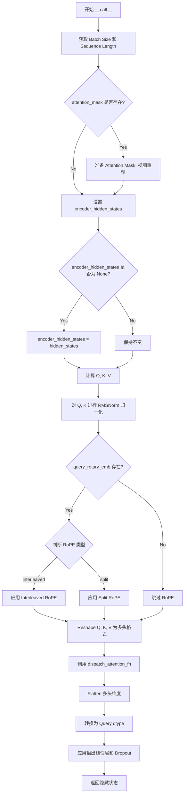
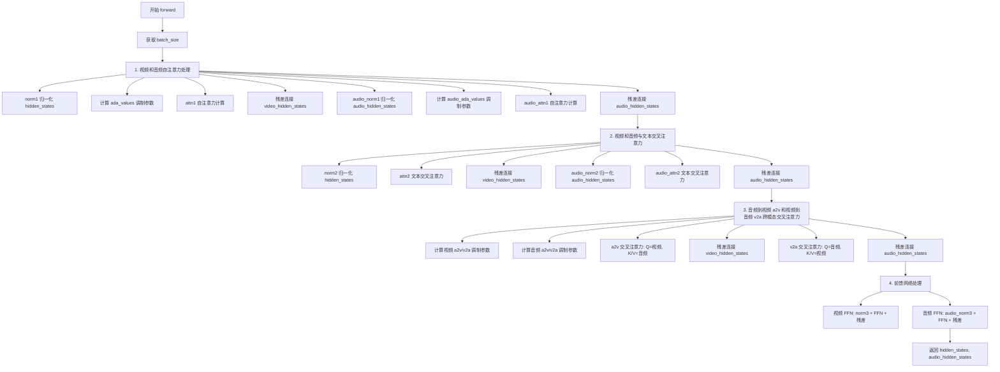
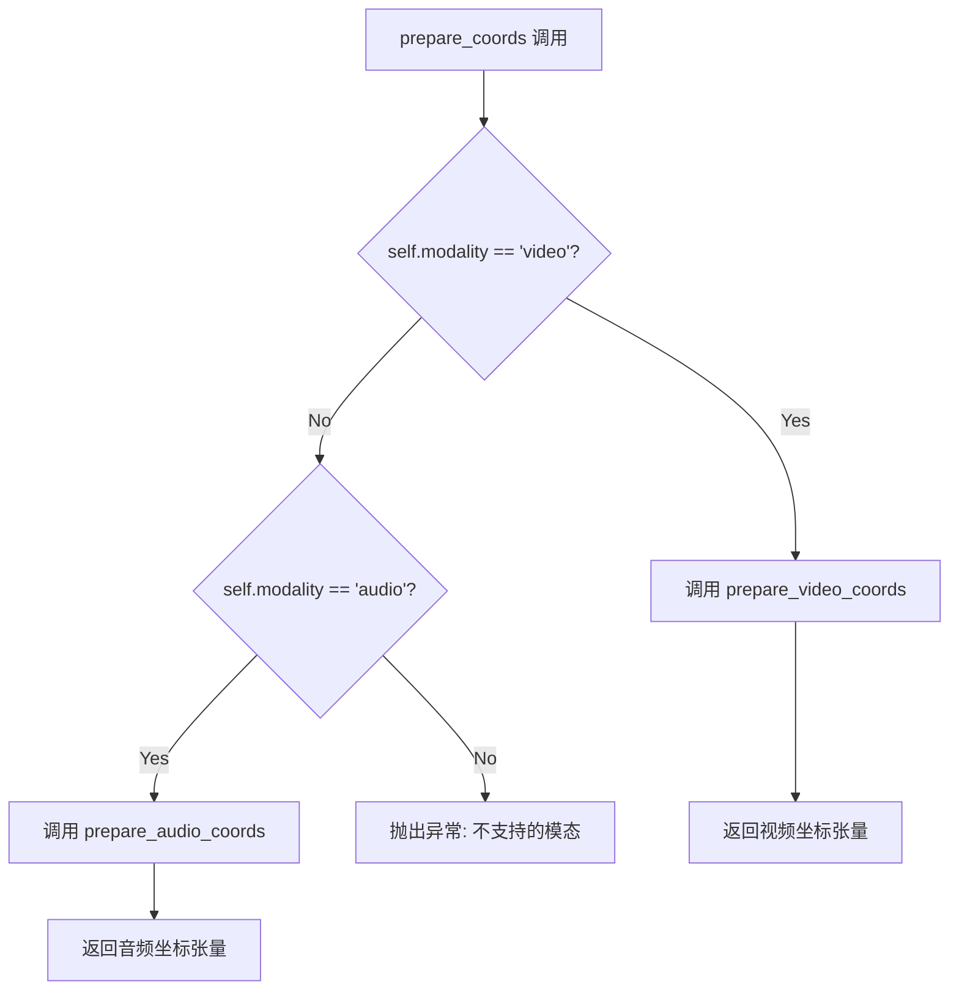

```mermaid
flowchart TD
    A[开始 forward] --> B{audio_timestep是否为None}
    B -->|是| C[audio_timestep = timestep]
    B -->|否| D[使用提供的audio_timestep]
    
    C --> E[转换encoder_attention_mask为偏置]
    D --> E
    
    E --> F[准备RoPE位置编码]
    F --> G{video_coords是否为None}
    G -->|是| H[self.rope.prepare_video_coords计算视频坐标]
    G -->|否| I[使用提供的video_coords]
    H --> J
    
    I --> J{audio_coords是否为None}
    J -->|是| K[self.audio_rope.prepare_audio_coords计算音频坐标]
    J -->|否| L[使用提供的audio_coords]
    
    K --> M[计算video_rotary_emb和audio_rotary_emb]
    L --> M
    
    M --> N[Patchify输入投影]
    N --> O[hidden_states = self.proj_in]
    O --> P[audio_hidden_states = self.audio_proj_in]
    
    P --> Q[准备时间步嵌入和调制参数]
    Q --> R[计算temb和embedded_timestep]
    R --> S[计算交叉注意力门控因子]
    
    S --> T[准备提示嵌入]
    T --> U[self.caption_projection投影文本]
    U --> V[self.audio_caption_projection投影音频文本]
    
    V --> W[遍历Transformer块]
    W --> X{是否启用梯度检查点}
    X -->|是| Y[使用_gradient_checkpointing_func执行块]
    X -->|否| Z[直接调用block执行]
    
    Y --> AA[hidden_states, audio_hidden_states = block...]
    Z --> AA
    
    AA --> AB{是否还有更多块}
    AB -->|是| W
    AB -->|否| AC[输出层处理]
    
    AC --> AD[计算scale_shift_values]
    AD --> AE[hidden_states归一化并应用scale/shift]
    AE --> AF[output = self.proj_out]
    
    AF --> AG[audio_hidden_states归一化并应用scale/shift]
    AG --> AH[audio_output = self.audio_proj_out]
    
    AH --> AI{return_dict是否为True}
    AI -->|是| AJ[返回AudioVisualModelOutput]
    AI -->|否| AK[返回tuple output audio_output]
    
    AJ --> AL[结束]
    AK --> AL
```

# `diffusers\src\diffusers\models\transformers\transformer_ltx2.py` 详细设计文档

这是LTX-2.0视频Transformer模型的实现，支持视频和音频的联合处理。该模型通过自注意力、交叉注意力以及音频到视频(a2v)和视频到音频(v2a)的跨模态注意力机制，实现高质量的视频和音频生成。模型采用旋转位置编码(RoPE)处理时空位置信息，并通过自适应层归一化(AdaLN)进行调制。

## 整体流程

```mermaid
graph TD
A[开始: 输入hidden_states和audio_hidden_states] --> B[准备RoPE位置编码]
B --> B1[video_coords计算]
B --> B2[audio_coords计算]
B1 --> C[Patchify输入投影]
B2 --> C
C --> D[准备timestep嵌入和调制参数]
D --> E[准备prompt embeddings]
E --> F{遍历transformer_blocks}
F --> G[自注意力处理(视频+音频)]
G --> H[交叉注意力处理(文本)]
H --> I[a2v和v2a跨模态注意力]
I --> J[FeedForward处理]
J --> K{是否还有block?}
K -- 是 --> F
K -- 否 --> L[输出层处理]
L --> M[返回AudioVisualModelOutput]
```

## 类结构

```
AudioVisualModelOutput (数据类)
LTX2AdaLayerNormSingle (自适应归一化层)
LTX2AudioVideoAttnProcessor (注意力处理器)
LTX2Attention (注意力模块)
LTX2VideoTransformerBlock (Transformer块)
LTX2AudioVideoRotaryPosEmbed (旋转位置编码)
LTX2VideoTransformer3DModel (主模型)
    ├── 包含多个LTX2VideoTransformerBlock
    └── 包含RoPE、AdaLN等组件
```

## 全局变量及字段


### `logger`
    
模块日志记录器

类型：`logging.Logger`
    


### `apply_interleaved_rotary_emb`
    
应用交织旋转位置嵌入函数

类型：`function`
    


### `apply_split_rotary_emb`
    
应用分割旋转位置嵌入函数

类型：`function`
    


### `AudioVisualModelOutput.AudioVisualModelOutput.sample`
    
视频输出

类型：`torch.Tensor`
    


### `AudioVisualModelOutput.AudioVisualModelOutput.audio_sample`
    
音频输出

类型：`torch.Tensor`
    


### `LTX2AdaLayerNormSingle.LTX2AdaLayerNormSingle.num_mod_params`
    
调制参数数量

类型：`int`
    


### `LTX2AdaLayerNormSingle.LTX2AdaLayerNormSingle.emb`
    
时间步嵌入

类型：`PixArtAlphaCombinedTimestepSizeEmbeddings`
    


### `LTX2AdaLayerNormSingle.LTX2AdaLayerNormSingle.silu`
    
激活函数

类型：`nn.SiLU`
    


### `LTX2AdaLayerNormSingle.LTX2AdaLayerNormSingle.linear`
    
线性层

类型：`nn.Linear`
    


### `LTX2AudioVideoAttnProcessor.LTX2AudioVideoAttnProcessor._attention_backend`
    
注意力后端

类型：`Any`
    


### `LTX2AudioVideoAttnProcessor.LTX2AudioVideoAttnProcessor._parallel_config`
    
并行配置

类型：`Any`
    


### `LTX2Attention.LTX2Attention.head_dim`
    
头维度

类型：`int`
    


### `LTX2Attention.LTX2Attention.inner_dim`
    
内部维度

类型：`int`
    


### `LTX2Attention.LTX2Attention.inner_kv_dim`
    
KV内部维度

类型：`int`
    


### `LTX2Attention.LTX2Attention.query_dim`
    
查询维度

类型：`int`
    


### `LTX2Attention.LTX2Attention.cross_attention_dim`
    
交叉注意力维度

类型：`int`
    


### `LTX2Attention.LTX2Attention.use_bias`
    
是否使用偏置

类型：`bool`
    


### `LTX2Attention.LTX2Attention.dropout`
    
Dropout率

类型：`float`
    


### `LTX2Attention.LTX2Attention.out_dim`
    
输出维度

类型：`int`
    


### `LTX2Attention.LTX2Attention.heads`
    
头数

类型：`int`
    


### `LTX2Attention.LTX2Attention.rope_type`
    
RoPE类型

类型：`str`
    


### `LTX2Attention.LTX2Attention.norm_q`
    
Q归一化

类型：`RMSNorm`
    


### `LTX2Attention.LTX2Attention.norm_k`
    
K归一化

类型：`RMSNorm`
    


### `LTX2Attention.LTX2Attention.to_q`
    
Q投影

类型：`nn.Linear`
    


### `LTX2Attention.LTX2Attention.to_k`
    
K投影

类型：`nn.Linear`
    


### `LTX2Attention.LTX2Attention.to_v`
    
V投影

类型：`nn.Linear`
    


### `LTX2Attention.LTX2Attention.to_out`
    
输出投影

类型：`nn.ModuleList`
    


### `LTX2VideoTransformerBlock.LTX2VideoTransformerBlock.norm1`
    
视频自归一化

类型：`RMSNorm`
    


### `LTX2VideoTransformerBlock.LTX2VideoTransformerBlock.attn1`
    
视频自注意力

类型：`LTX2Attention`
    


### `LTX2VideoTransformerBlock.LTX2VideoTransformerBlock.audio_norm1`
    
音频自归一化

类型：`RMSNorm`
    


### `LTX2VideoTransformerBlock.LTX2VideoTransformerBlock.audio_attn1`
    
音频自注意力

类型：`LTX2Attention`
    


### `LTX2VideoTransformerBlock.LTX2VideoTransformerBlock.norm2`
    
视频交叉归一化

类型：`RMSNorm`
    


### `LTX2VideoTransformerBlock.LTX2VideoTransformerBlock.attn2`
    
视频交叉注意力

类型：`LTX2Attention`
    


### `LTX2VideoTransformerBlock.LTX2VideoTransformerBlock.audio_norm2`
    
音频交叉归一化

类型：`RMSNorm`
    


### `LTX2VideoTransformerBlock.LTX2VideoTransformerBlock.audio_attn2`
    
音频交叉注意力

类型：`LTX2Attention`
    


### `LTX2VideoTransformerBlock.LTX2VideoTransformerBlock.audio_to_video_norm`
    
a2v归一化

类型：`RMSNorm`
    


### `LTX2VideoTransformerBlock.LTX2VideoTransformerBlock.audio_to_video_attn`
    
a2v注意力

类型：`LTX2Attention`
    


### `LTX2VideoTransformerBlock.LTX2VideoTransformerBlock.video_to_audio_norm`
    
v2a归一化

类型：`RMSNorm`
    


### `LTX2VideoTransformerBlock.LTX2VideoTransformerBlock.video_to_audio_attn`
    
v2a注意力

类型：`LTX2Attention`
    


### `LTX2VideoTransformerBlock.LTX2VideoTransformerBlock.norm3`
    
FFN前归一化

类型：`RMSNorm`
    


### `LTX2VideoTransformerBlock.LTX2VideoTransformerBlock.ff`
    
前馈网络

类型：`FeedForward`
    


### `LTX2VideoTransformerBlock.LTX2VideoTransformerBlock.audio_norm3`
    
音频FFN前归一化

类型：`RMSNorm`
    


### `LTX2VideoTransformerBlock.LTX2VideoTransformerBlock.audio_ff`
    
音频前馈网络

类型：`FeedForward`
    


### `LTX2VideoTransformerBlock.LTX2VideoTransformerBlock.scale_shift_table`
    
视频调制参数

类型：`nn.Parameter`
    


### `LTX2VideoTransformerBlock.LTX2VideoTransformerBlock.audio_scale_shift_table`
    
音频调制参数

类型：`nn.Parameter`
    


### `LTX2VideoTransformerBlock.LTX2VideoTransformerBlock.video_a2v_cross_attn_scale_shift_table`
    
视频a2v交叉注意力参数

类型：`nn.Parameter`
    


### `LTX2VideoTransformerBlock.LTX2VideoTransformerBlock.audio_a2v_cross_attn_scale_shift_table`
    
音频a2v交叉注意力参数

类型：`nn.Parameter`
    


### `LTX2AudioVideoRotaryPosEmbed.LTX2AudioVideoRotaryPosEmbed.dim`
    
维度

类型：`int`
    


### `LTX2AudioVideoRotaryPosEmbed.LTX2AudioVideoRotaryPosEmbed.patch_size`
    
空间patch大小

类型：`int`
    


### `LTX2AudioVideoRotaryPosEmbed.LTX2AudioVideoRotaryPosEmbed.patch_size_t`
    
时间patch大小

类型：`int`
    


### `LTX2AudioVideoRotaryPosEmbed.LTX2AudioVideoRotaryPosEmbed.base_num_frames`
    
基础帧数

类型：`int`
    


### `LTX2AudioVideoRotaryPosEmbed.LTX2AudioVideoRotaryPosEmbed.base_height`
    
基础高度

类型：`int`
    


### `LTX2AudioVideoRotaryPosEmbed.LTX2AudioVideoRotaryPosEmbed.base_width`
    
基础宽度

类型：`int`
    


### `LTX2AudioVideoRotaryPosEmbed.LTX2AudioVideoRotaryPosEmbed.sampling_rate`
    
采样率

类型：`int`
    


### `LTX2AudioVideoRotaryPosEmbed.LTX2AudioVideoRotaryPosEmbed.hop_length`
    
跳跃长度

类型：`int`
    


### `LTX2AudioVideoRotaryPosEmbed.LTX2AudioVideoRotaryPosEmbed.audio_latents_per_second`
    
每秒音频latents

类型：`float`
    


### `LTX2AudioVideoRotaryPosEmbed.LTX2AudioVideoRotaryPosEmbed.scale_factors`
    
缩放因子

类型：`tuple`
    


### `LTX2AudioVideoRotaryPosEmbed.LTX2AudioVideoRotaryPosEmbed.theta`
    
RoPE基础频率

类型：`float`
    


### `LTX2AudioVideoRotaryPosEmbed.LTX2AudioVideoRotaryPosEmbed.causal_offset`
    
因果偏移

类型：`int`
    


### `LTX2AudioVideoRotaryPosEmbed.LTX2AudioVideoRotaryPosEmbed.modality`
    
模态(video/audio)

类型：`str`
    


### `LTX2AudioVideoRotaryPosEmbed.LTX2AudioVideoRotaryPosEmbed.double_precision`
    
双精度

类型：`bool`
    


### `LTX2AudioVideoRotaryPosEmbed.LTX2AudioVideoRotaryPosEmbed.rope_type`
    
RoPE类型

类型：`str`
    


### `LTX2AudioVideoRotaryPosEmbed.LTX2AudioVideoRotaryPosEmbed.num_attention_heads`
    
注意力头数

类型：`int`
    


### `LTX2VideoTransformer3DModel.LTX2VideoTransformer3DModel.proj_in`
    
视频输入投影

类型：`nn.Linear`
    


### `LTX2VideoTransformer3DModel.LTX2VideoTransformer3DModel.audio_proj_in`
    
音频输入投影

类型：`nn.Linear`
    


### `LTX2VideoTransformer3DModel.LTX2VideoTransformer3DModel.caption_projection`
    
视频文本投影

类型：`PixArtAlphaTextProjection`
    


### `LTX2VideoTransformer3DModel.LTX2VideoTransformer3DModel.audio_caption_projection`
    
音频文本投影

类型：`PixArtAlphaTextProjection`
    


### `LTX2VideoTransformer3DModel.LTX2VideoTransformer3DModel.time_embed`
    
视频时间嵌入

类型：`LTX2AdaLayerNormSingle`
    


### `LTX2VideoTransformer3DModel.LTX2VideoTransformer3DModel.audio_time_embed`
    
音频时间嵌入

类型：`LTX2AdaLayerNormSingle`
    


### `LTX2VideoTransformer3DModel.LTX2VideoTransformer3DModel.av_cross_attn_video_scale_shift`
    
视频交叉注意力缩放偏移

类型：`LTX2AdaLayerNormSingle`
    


### `LTX2VideoTransformer3DModel.LTX2VideoTransformer3DModel.av_cross_attn_audio_scale_shift`
    
音频交叉注意力缩放偏移

类型：`LTX2AdaLayerNormSingle`
    


### `LTX2VideoTransformer3DModel.LTX2VideoTransformer3DModel.av_cross_attn_video_a2v_gate`
    
视频a2v门控

类型：`LTX2AdaLayerNormSingle`
    


### `LTX2VideoTransformer3DModel.LTX2VideoTransformer3DModel.av_cross_attn_audio_v2a_gate`
    
音频v2a门控

类型：`LTX2AdaLayerNormSingle`
    


### `LTX2VideoTransformer3DModel.LTX2VideoTransformer3DModel.scale_shift_table`
    
视频输出缩放偏移表

类型：`nn.Parameter`
    


### `LTX2VideoTransformer3DModel.LTX2VideoTransformer3DModel.audio_scale_shift_table`
    
音频输出缩放偏移表

类型：`nn.Parameter`
    


### `LTX2VideoTransformer3DModel.LTX2VideoTransformer3DModel.rope`
    
视频RoPE

类型：`LTX2AudioVideoRotaryPosEmbed`
    


### `LTX2VideoTransformer3DModel.LTX2VideoTransformer3DModel.audio_rope`
    
音频RoPE

类型：`LTX2AudioVideoRotaryPosEmbed`
    


### `LTX2VideoTransformer3DModel.LTX2VideoTransformer3DModel.cross_attn_rope`
    
视频交叉注意力RoPE

类型：`LTX2AudioVideoRotaryPosEmbed`
    


### `LTX2VideoTransformer3DModel.LTX2VideoTransformer3DModel.cross_attn_audio_rope`
    
音频交叉注意力RoPE

类型：`LTX2AudioVideoRotaryPosEmbed`
    


### `LTX2VideoTransformer3DModel.LTX2VideoTransformer3DModel.transformer_blocks`
    
Transformer块列表

类型：`nn.ModuleList`
    


### `LTX2VideoTransformer3DModel.LTX2VideoTransformer3DModel.norm_out`
    
视频输出归一化

类型：`nn.LayerNorm`
    


### `LTX2VideoTransformer3DModel.LTX2VideoTransformer3DModel.proj_out`
    
视频输出投影

类型：`nn.Linear`
    


### `LTX2VideoTransformer3DModel.LTX2VideoTransformer3DModel.audio_norm_out`
    
音频输出归一化

类型：`nn.LayerNorm`
    


### `LTX2VideoTransformer3DModel.LTX2VideoTransformer3DModel.audio_proj_out`
    
音频输出投影

类型：`nn.Linear`
    


### `LTX2VideoTransformer3DModel.LTX2VideoTransformer3DModel.gradient_checkpointing`
    
梯度检查点

类型：`bool`
    
    

## 全局函数及方法


### `apply_interleaved_rotary_emb`

该函数实现了交错旋转位置编码（Interleaved Rotary Position Embedding），通过将输入张量视为复数形式，利用旋转矩阵对位置信息进行编码。它将输入张量分解为实部和虚部，应用旋转角度（由cos和sin给定），然后重新组合为输出张量，这是Transformer模型中增强位置感知的关键技术。

参数：

- `x`：`torch.Tensor`，输入的张量，通常是查询或键张量，形状为 `[B, S, C]`，其中 B 是批次大小，S 是序列长度，C 是隐藏维度
- `freqs`：`tuple[torch.Tensor, torch.Tensor]`，包含余弦和正弦频率值的元组 `（cos, sin）`，用于计算旋转角度

返回值：`torch.Tensor`，应用旋转位置编码后的张量，形状与输入 `x` 相同

#### 流程图

```mermaid
flowchart TD
    A[输入: x, freqs] --> B[解包 freqs 为 cos, sin]
    A --> C[将 x 重塑为复数形式: unflatten 最后一维]
    C --> D[分离实部和虚部: x_real, x_imag]
    D --> E[计算旋转后的张量: stack [-x_imag, x_real]]
    E --> F[执行旋转操作: x * cos + x_rotated * sin]
    F --> G[转换回原始数据类型]
    G --> H[返回输出张量]
```

#### 带注释源码

```python
def apply_interleaved_rotary_emb(x: torch.Tensor, freqs: tuple[torch.Tensor, torch.Tensor]) -> torch.Tensor:
    """
    应用交错旋转位置编码 (Interleaved RoPE)
    
    该函数将输入张量视为复数，通过旋转矩阵对位置信息进行编码。
    交错方式指的是将特征维度交错排列为 [real0, imag0, real1, imag1, ...]
    
    Args:
        x: 输入张量，形状为 [batch, seq_len, hidden_dim]
        freqs: (cos, sin) 频率元组，用于计算旋转角度
    
    Returns:
        应用旋转编码后的张量
    """
    # 从频率元组中解包出余弦和正弦值
    cos, sin = freqs
    
    # 将输入张量从 [B, S, C] 重塑为 [B, S, C//2, 2]
    # 然后在最后一维解绑，分离出实部和虚部
    # 结果形状: x_real [B, S, C//2], x_imag [B, S, C//2]
    x_real, x_imag = x.unflatten(2, (-1, 2)).unbind(-1)  # [B, S, C // 2]
    
    # 构建旋转后的张量
    # 通过堆叠 [-x_imag, x_real] 实现 90 度旋转
    # 结果形状: [B, S, C//2, 2]
    x_rotated = torch.stack([-x_imag, x_real], dim=-1).flatten(2)
    
    # 应用旋转公式: out = x * cos + x_rotated * sin
    # 先转换为 float 以确保计算精度，然后转回原始数据类型
    out = (x.float() * cos + x_rotated.float() * sin).to(x.dtype)
    
    return out
```


### `apply_split_rotary_emb`

应用分割旋转位置编码（Split Rotary Position Embedding），将旋转矩阵应用到输入张量的最后维度，实现位置信息的编码。

参数：

- `x`：`torch.Tensor`，输入张量，通常是查询或键的张量，形状为 `(batch, seq_len, dim)` 或 `(batch, heads, seq_len, dim_per_head)`
- `freqs`：`tuple[torch.Tensor, torch.Tensor]`，旋转位置编码的频率元组，包含 `(cos, sin)`，形状为 `(batch, heads, seq_len, dim_per_head // 2)` 或 `(batch, seq_len, dim_per_head // 2)`

返回值：`torch.Tensor`，应用旋转位置编码后的输出张量，形状与输入 `x` 相同

#### 流程图

```mermaid
flowchart TD
    A[开始: apply_split_rotary_emb] --> B[解包 freqs 为 cos, sin]
    B --> C{输入 x 维度 ≠ 4 且 cos 维度 == 4?}
    C -->|是| D[重塑 x: (b,t,h,-1) -> (b,h,t,-1) 并设置 needs_reshape=True]
    C -->|否| E[不重塑, needs_reshape=False]
    D --> F[检查最后维度是否为偶数]
    E --> F
    F --> G{last % 2 == 0?}
    G -->|否| H[抛出 ValueError: 最后维度必须为偶数]
    G -->|是| I[计算 r = last // 2]
    I --> J[重塑 x 为 (..., 2, r) 并转为 float]
    J --> K[提取 first_x 和 second_x]
    K --> L[对 cos, sin 扩展维度用于广播]
    L --> M[计算 out = split_x * cos_u]
    M --> N[提取 first_out 和 second_out]
    N --> O[first_out.addcmul_(-sin_u, second_x)]
    O --> P[second_out.addcmul_(sin_u, first_x)]
    P --> Q[重塑 out 回 (..., last)]
    Q --> R{needs_reshape == True?}
    R -->|是| S[交换维度并重塑回原始形状]
    R -->|否| T[不重塑]
    S --> U[转换回原始 dtype]
    T --> U
    U --> V[返回输出]
```

#### 带注释源码

```python
def apply_split_rotary_emb(x: torch.Tensor, freqs: tuple[torch.Tensor, torch.Tensor]) -> torch.Tensor:
    """
    应用分割旋转位置编码（Split Rotary Position Embedding）
    
    该函数实现了一种高效的旋转位置编码方法，将输入张量的最后维度分割为两部分，
    并分别应用旋转矩阵。这种方法允许模型学习位置依赖的关系。
    """
    # 1. 解包频率元组，获取 cos 和 sin
    cos, sin = freqs

    # 2. 保存原始数据类型，并处理输入维度不匹配的情况
    x_dtype = x.dtype
    needs_reshape = False
    # 当 x 是 3D (b, t, dim) 但 cos 是 4D (b, h, t, r) 时，需要重塑 x
    if x.ndim != 4 and cos.ndim == 4:
        # cos 形状为 (b, h, t, r) -> 将 x 重塑为 (b, h, t, dim_per_head)
        b, h, t, _ = cos.shape
        x = x.reshape(b, t, h, -1).swapaxes(1, 2)  # (b, t, h, dim) -> (b, h, t, dim)
        needs_reshape = True

    # 3. 检查最后维度是否为偶数（分割需要偶数维度）
    last = x.shape[-1]
    if last % 2 != 0:
        raise ValueError(f"Expected x.shape[-1] to be even for split rotary, got {last}.")
    r = last // 2  # 每部分的维度

    # 4. 将最后维度分割为 (2, r) 并显式转换为 float 以提高精度
    # 形状: (..., 2, r)
    split_x = x.reshape(*x.shape[:-1], 2, r).float()
    first_x = split_x[..., :1, :]   # (..., 1, r) - 前半部分
    second_x = split_x[..., 1:, :]  # (..., 1, r) - 后半部分

    # 5. 对 cos 和 sin 扩展维度以支持广播
    # 从 (..., r) 扩展到 (..., 1, r) 以匹配 split_x 的 (..., 2, r)
    cos_u = cos.unsqueeze(-2)
    sin_u = sin.unsqueeze(-2)

    # 6. 应用旋转矩阵: out = x * cos + rotated_x * sin
    out = split_x * cos_u  # (..., 2, r) * (..., 1, r) -> (..., 2, r)
    first_out = out[..., :1, :]   # (..., 1, r)
    second_out = out[..., 1:, :]  # (..., 1, r)

    # 7. 使用 addcmul_ 进行原地运算，应用旋转部分
    # first_out = first_out + (-sin_u * second_x)
    first_out.addcmul_(-sin_u, second_x)
    # second_out = second_out + (sin_u * first_x)
    second_out.addcmul_(sin_u, first_x)

    # 8. 重塑回原始维度 (移除分割的维度)
    out = out.reshape(*out.shape[:-2], last)

    # 9. 如果之前进行了维度重塑，需要还原回原始形状
    if needs_reshape:
        # 从 (b, h, t, dim) -> (b, t, h, dim) -> (b, t, h*dim)
        out = out.swapaxes(1, 2).reshape(b, t, -1)

    # 10. 转换回原始数据类型并返回
    out = out.to(dtype=x_dtype)
    return out
```


### `LTX2AdaLayerNormSingle.forward`

该方法是 LTX-2.0 模型中的自适应层归一化单例（adaLN-single）的核心前向传播方法。它接收时间步长和条件参数，通过嵌入层生成时间步嵌入，然后通过线性层生成调制参数，用于后续的变换器块中的自适应调制。

参数：

- `self`：`LTX2AdaLayerNormSingle` 类实例，隐式参数
- `timestep`：`torch.Tensor`，时间步张量，表示扩散过程中的时间步
- `added_cond_kwargs`：`dict[str, torch.Tensor] | None`，额外的条件参数字典，包含分辨率和宽高比等信息，默认为 `{"resolution": None, "aspect_ratio": None}`
- `batch_size`：`int | None`，批次大小，用于控制嵌入的批次维度
- `hidden_dtype`：`torch.dtype | None`，隐藏状态的数据类型，用于确保嵌入计算使用正确的精度

返回值：`tuple[torch.Tensor, torch.Tensor]`，返回一个元组，包含：
1. 调制参数张量（`torch.Tensor`）：经过 SiLU 激活和线性变换后的调制参数，形状为 `(batch_size, num_mod_params * embedding_dim)`
2. 嵌入的时间步张量（`torch.Tensor`）：原始的时间步嵌入，形状为 `(batch_size, embedding_dim)`

#### 流程图

```mermaid
flowchart TD
    A[开始 forward] --> B{added_cond_kwargs 是否为 None?}
    B -->|是| C[设置默认值为 resolution: None, aspect_ratio: None]
    B -->|否| D[使用传入的 added_cond_kwargs]
    C --> E[调用 self.emb 嵌入时间步]
    D --> E
    E --> F[self.emb 返回 embedded_timestep]
    G[对 embedded_timestep 应用 SiLU 激活: self.silu]
    F --> G
    H[应用线性变换: self.linear]
    G --> H
    I[返回 tuple[linear_output, embedded_timestep]]
    H --> I
```

#### 带注释源码

```python
def forward(
    self,
    timestep: torch.Tensor,
    added_cond_kwargs: dict[str, torch.Tensor] | None = None,
    batch_size: int | None = None,
    hidden_dtype: torch.dtype | None = None,
) -> tuple[torch.Tensor, torch.Tensor, torch.Tensor, torch.Tensor, torch.Tensor]:
    # 初始化额外条件参数，如果为 None 则使用默认值
    # 注意：此处没有进行实际的调制操作，仅计算调制参数
    added_cond_kwargs = added_cond_kwargs or {"resolution": None, "aspect_ratio": None}
    
    # 使用 PixArtAlphaCombinedTimestepSizeEmbeddings 层嵌入时间步
    # 该嵌入层会根据 added_cond_kwargs 中的分辨率和宽高比信息生成条件嵌入
    embedded_timestep = self.emb(timestep, **added_cond_kwargs, batch_size=batch_size, hidden_dtype=hidden_dtype)
    
    # 返回两个张量：
    # 1. 经过 SiLU 激活和线性变换后的调制参数 (形状: batch_size, num_mod_params * embedding_dim)
    # 2. 原始的时间步嵌入 (形状: batch_size, embedding_dim)
    return self.linear(self.silu(embedded_timestep)), embedded_timestep
```


### `LTX2AudioVideoAttnProcessor.__call__`

该方法实现了 LTX-2.0 模型的注意力处理核心逻辑。它负责将输入的隐藏状态转换为查询（Q）、键（K）、值（V），应用可选的旋转位置嵌入（RoPE），并通过后端分发函数（如 SDPA）执行注意力计算，最后将结果投影回输出空间。此处理器特别支持视频与音频模态间的交叉注意力（通过分离的 query_rotary_emb 和 key_rotary_emb）。

#### 参数

- `self`：`LTX2AudioVideoAttnProcessor` 实例本身。
- `attn`：`LTX2Attention`，注意力模块实例，包含 `to_q`, `to_k`, `to_v` (线性层) 和 `to_out` (输出线性层+Dropout)，以及 `norm_q`, `norm_k` (RMSNorm 层) 和头数 `heads`。
- `hidden_states`：`torch.Tensor`，形状为 `(batch_size, sequence_length, embedding_dim)` 的输入隐藏状态。
- `encoder_hidden_states`：`torch.Tensor | None`，用于交叉注意力的编码器隐藏状态。如果为 `None`，则执行自注意力。
- `attention_mask`：`torch.Tensor | None`，用于屏蔽特定位置的注意力权重。
- `query_rotary_emb`：`tuple[torch.Tensor, torch.Tensor] | None`，查询的旋转位置嵌入 (RoPE)，包含 (cos, sin)。
- `key_rotary_emb`：`tuple[torch.Tensor, torch.Tensor] | None`，键的旋转位置嵌入 (RoPE)，包含 (cos, sin)。如果为 `None` 且不是自注意力，则默认使用 `query_rotary_emb`。

#### 返回值

`torch.Tensor`，经过注意力处理并投影后的隐藏状态，形状通常为 `(batch_size, sequence_length, embedding_dim)`。

#### 流程图



#### 带注释源码

```python
def __call__(
    self,
    attn: "LTX2Attention",  # 传入的注意力模块，包含了权重
    hidden_states: torch.Tensor,  # 输入的隐藏状态
    encoder_hidden_states: torch.Tensor | None = None,  # 交叉注意力的上下文
    attention_mask: torch.Tensor | None = None,  # 注意力掩码
    query_rotary_emb: tuple[torch.Tensor, torch.Tensor] | None = None,  # 查询的旋转嵌入
    key_rotary_emb: tuple[torch.Tensor, torch.Tensor] | None = None,  # 键的旋转嵌入
) -> torch.Tensor:
    # 1. 获取批量大小和序列长度
    # 如果存在 encoder_hidden_states，则使用其形状；否则使用 hidden_states 的形状
    batch_size, sequence_length, _ = (
        hidden_states.shape if encoder_hidden_states is None else encoder_hidden_states.shape
    )

    # 2. 处理注意力掩码
    if attention_mask is not None:
        # 预处理掩码以适应特定的注意力实现
        attention_mask = attn.prepare_attention_mask(attention_mask, sequence_length, batch_size)
        # 调整掩码形状以匹配多头注意力的维度 (batch, heads, seq_len, seq_len)
        attention_mask = attention_mask.view(batch_size, attn.heads, -1, attention_mask.shape[-1])

    # 3. 如果没有交叉注意力输入，则默认为自注意力
    if encoder_hidden_states is None:
        encoder_hidden_states = hidden_states

    # 4. 计算 Query, Key, Value
    # 使用注意力模块的线性层将输入投影到查询、键、值空间
    query = attn.to_q(hidden_states)
    key = attn.to_k(encoder_hidden_states)
    value = attn.to_v(encoder_hidden_states)

    # 5. 归一化 Query 和 Key
    # 应用 RMSNorm 进行查询和键的归一化，这是 LTX-2.0 模型的一部分
    query = attn.norm_q(query)
    key = attn.norm_k(key)

    # 6. 应用旋转位置嵌入 (RoPE)
    if query_rotary_emb is not None:
        if attn.rope_type == "interleaved":
            # 应用交叉旋转嵌入到查询
            query = apply_interleaved_rotary_emb(query, query_rotary_emb)
            # 键的 RoPE：如果未提供 key_rotary_emb，则复用 query_rotary_emb
            key = apply_interleaved_rotary_emb(
                key, key_rotary_emb if key_rotary_emb is not None else query_rotary_emb
            )
        elif attn.rope_type == "split":
            # 应用分离式旋转嵌入
            query = apply_split_rotary_emb(query, query_rotary_emb)
            key = apply_split_rotary_emb(key, key_rotary_emb if key_rotary_emb is not None else query_rotary_emb)

    # 7. 调整形状以适应多头注意力
    # 将 (batch, seq, dim) 转换为 (batch, heads, seq, head_dim)
    query = query.unflatten(2, (attn.heads, -1))
    key = key.unflatten(2, (attn.heads, -1))
    value = value.unflatten(2, (attn.heads, -1))

    # 8. 分发注意力计算
    # 调用后端函数（通常是 PyTorch SDPA）执行实际的注意力计算
    hidden_states = dispatch_attention_fn(
        query,
        key,
        value,
        attn_mask=attention_mask,
        dropout_p=0.0,  # 推理时 Dropout 为 0
        is_causal=False,  # LTX-2.0 默认不使用因果掩码
        backend=self._attention_backend,  # 指定后端 (如 FlashAttention)
        parallel_config=self._parallel_config,  # 并行配置
    )
    
    # 9. 恢复形状并转换数据类型
    # 将 (batch, heads, seq, head_dim) 展平为 (batch, seq, dim)
    hidden_states = hidden_states.flatten(2, 3)
    hidden_states = hidden_states.to(query.dtype)

    # 10. 输出投影
    # 通过线性层和 Dropout 层生成最终输出
    hidden_states = attn.to_out[0](hidden_states)
    hidden_states = attn.to_out[1](hidden_states)
    return hidden_states
```

### 关键组件信息

1.  **LTX2Attention**: 核心注意力模块类，调用此处理器来执行前向传播。它定义了 `to_q`, `to_k`, `to_v` 等线性变换。
2.  **dispatch_attention_fn**: 负责调度底层注意力实现的函数（支持 PyTorch SDPA、Flash Attention 等），实现了算子级别的抽象。
3.  **apply_interleaved_rotary_emb / apply_split_rotary_emb**: 辅助函数，用于将旋转位置编码应用到张量上，支持两种不同的 RoPE 模式。

### 潜在技术债务与优化空间

1.  **硬编码参数**: `dropout_p=0.0` 和 `is_causal=False` 在方法内部被硬编码。虽然这符合 LTX-2.0 的设计，但如果需要扩展支持更通用的场景（如音频流推理），可能需要将其提升为可配置参数。
2.  **RoPE 类型检查**: 目前仅支持 "interleaved" 和 "split" 两种 RoPE 模式，若传入其他类型可能会导致意外行为或静默错误（如果 `rope_type` 属性未在 `attn` 中正确设置）。
3.  **数据类型转换**: 在应用 RoPE 时显式进行了 `float()` 转换 (`apply_split_rotary_emb` 中)，这引入了额外的内存开销和计算成本，虽然可能是为了数值稳定性，但可以在未来通过更优化的 CUDA 核或更高精度的模拟来消除。

### 其它项目

**设计目标与约束**:
- **多模态支持**: 该处理器设计用于处理视频（Visual）和音频（Audio）两种模态的数据，通过分离的 RoPE 参数实现跨模态对齐。
- **高性能**: 使用 `dispatch_attention_fn` 动态选择最优注意力后端（SDPA/FlashAttention），以利用 GPU 加速。

**错误处理与异常设计**:
- **PyTorch 版本检查**: 在类初始化 (`__init__`) 时检查 PyTorch 版本是否小于 2.0，若不满足则抛出 `ValueError`。
- **维度检查**: `apply_split_rotary_emb` 中包含了对输入维度是否为偶数的检查，以防止错误的张量 reshape。

**外部依赖与接口契约**:
- **输入**: 依赖传入的 `attn` 模块具备特定的属性（如 `heads`, `to_q`, `rope_type`）和方法（如 `prepare_attention_mask`）。
- **输出**: 输出的形状应与 `hidden_states` 一致，保证在 Transformer 块中的无缝衔接。


### `LTX2Attention.forward`

该方法是 LTX-2.0 模型中注意力机制的核心前向传播函数，负责计算自注意力或交叉注意力，支持分离的查询和键旋转位置编码（RoPE），以实现音频到视频（a2v）和视频到音频（v2a）的跨模态注意力计算。

参数：

- `self`：`LTX2Attention`，注意力模块的实例本身
- `hidden_states`：`torch.Tensor`，输入的隐藏状态张量，形状为 `(batch_size, sequence_length, query_dim)`，用于自注意力计算或作为交叉注意力中的查询来源
- `encoder_hidden_states`：`torch.Tensor | None`，编码器的隐藏状态，形状为 `(batch_size, encoder_sequence_length, cross_attention_dim)`，若为 `None` 则使用 `hidden_states` 进行自注意力计算
- `attention_mask`：`torch.Tensor | None`，注意力掩码张量，用于控制哪些位置可以相互注意，形状应与注意力分数矩阵兼容
- `query_rotary_emb`：`tuple[torch.Tensor, torch.Tensor] | None`，查询的旋转位置编码元组，包含 `(cos, sin)` 格式的预计算频率
- `key_rotary_emb`：`tuple[torch.Tensor, torch.Tensor] | None`，键的旋转位置编码元组，若为 `None` 则使用 `query_rotary_emb`
- `**kwargs`：可选的关键字参数，会传递给处理器，用于扩展和兼容性

返回值：`torch.Tensor`，经过注意力计算和输出投影后的隐藏状态张量，形状为 `(batch_size, sequence_length, query_dim)`

#### 流程图

```mermaid
flowchart TD
    A[开始 forward] --> B{encoder_hidden_states 是否为 None?}
    B -->|是| C[使用 hidden_states 作为 encoder_hidden_states]
    B -->|否| D[保持 encoder_hidden_states 不变]
    C --> E[计算 query: to_q(hidden_states)]
    D --> E
    E --> F[计算 key: to_k(encoder_hidden_states)]
    E --> G[计算 value: to_v(encoder_hidden_states)]
    F --> H[对 query 进行归一化: norm_q]
    G --> I[对 key 进行归一化: norm_k]
    H --> J{query_rotary_emb 是否存在?}
    I --> J
    J -->|是且 rope_type=interleaved| K[应用交错式 RoPE 到 query 和 key]
    J -->|是且 rope_type=split| L[应用分离式 RoPE 到 query 和 key]
    J -->|否| M[跳过 RoPE 应用]
    K --> N[unflatten: (B, S, H, D)]
    L --> N
    M --> N
    N --> O[调用 dispatch_attention_fn 执行注意力计算]
    O --> P[flatten 并转换 dtype]
    P --> Q[应用输出投影: to_out[0] 线性层]
    Q --> R[应用 Dropout: to_out[1]]
    R --> S[返回 hidden_states]
```

#### 带注释源码

```python
def forward(
    self,
    hidden_states: torch.Tensor,
    encoder_hidden_states: torch.Tensor | None = None,
    attention_mask: torch.Tensor | None = None,
    query_rotary_emb: tuple[torch.Tensor, torch.Tensor] | None = None,
    key_rotary_emb: tuple[torch.Tensor, torch.Tensor] | None = None,
    **kwargs,
) -> torch.Tensor:
    """
    LTX-2.0 注意力模块的前向传播方法。
    
    该方法处理自注意力和交叉注意力计算，支持音频到视频和视频到音频的跨模态注意力。
    实际注意力计算被委托给处理器类 (LTX2AudioVideoAttnProcessor)。
    
    参数:
        hidden_states: 输入的隐藏状态张量
        encoder_hidden_states: 可选的编码器隐藏状态用于交叉注意力
        attention_mask: 可选的注意力掩码
        query_rotary_emb: 查询的旋转位置编码
        key_rotary_emb: 键的旋转位置编码
        **kwargs: 传递给处理器的额外参数
    
    返回:
        经过注意力计算后的隐藏状态张量
    """
    # 检查处理器签名，筛选出处理器需要的 kwargs 参数
    attn_parameters = set(inspect.signature(self.processor.__call__).parameters.keys())
    unused_kwargs = [k for k, _ in kwargs.items() if k not in attn_parameters]
    
    # 记录未被处理器使用的 kwargs 警告
    if len(unused_kwargs) > 0:
        logger.warning(
            f"attention_kwargs {unused_kwargs} are not expected by {self.processor.__class__.__name__} and will be ignored."
        )
    
    # 过滤保留处理器需要的参数
    kwargs = {k: w for k, w in kwargs.items() if k in attn_parameters}
    
    # 调用处理器执行实际的注意力计算
    # 处理器 (LTX2AudioVideoAttnProcessor) 会完成:
    # 1. 将 hidden_states 投影为 query, key, value
    # 2. 应用旋转位置编码 (RoPE)
    # 3. 执行注意力计算 (使用 SDPA)
    # 4. 应用输出投影和 Dropout
    hidden_states = self.processor(
        self, hidden_states, encoder_hidden_states, attention_mask, query_rotary_emb, key_rotary_emb, **kwargs
    )
    return hidden_states
```


### `LTX2VideoTransformerBlock.forward`

该方法是LTX2VideoTransformerBlock类的核心前向传播方法，负责处理视频和音频的双向交叉注意力机制。方法首先对视频和音频隐状态分别进行自注意力处理，然后通过文本编码器状态进行交叉注意力，接着执行音频到视频（a2v）和视频到音频（v2a）的跨模态交叉注意力，最后通过前馈网络进行最终处理，返回处理后的视频和音频隐状态。

参数：

- `hidden_states`：`torch.Tensor`，输入的视频隐状态张量
- `audio_hidden_states`：`torch.Tensor`，输入的音频隐状态张量
- `encoder_hidden_states`：`torch.Tensor`，视频的文本编码器隐状态
- `audio_encoder_hidden_states`：`torch.Tensor`，音频的文本编码器隐状态
- `temb`：`torch.Tensor`，视频的时间步嵌入和调制参数
- `temb_audio`：`torch.Tensor`，音频的时间步嵌入和调制参数
- `temb_ca_scale_shift`：`torch.Tensor`，视频跨注意力力的缩放和位移参数
- `temb_ca_audio_scale_shift`：`torch.Tensor`，音频跨注意力的缩放和位移参数
- `temb_ca_gate`：`torch.Tensor`，视频跨注意力的门控参数
- `temb_ca_audio_gate`：`torch.Tensor`，音频跨注意力的门控参数
- `video_rotary_emb`：`tuple[torch.Tensor, torch.Tensor] | None`，视频的旋转位置编码
- `audio_rotary_emb`：`tuple[torch.Tensor, torch.Tensor] | None`，音频的旋转位置编码
- `ca_video_rotary_emb`：`tuple[torch.Tensor, torch.Tensor] | None`，跨注意力视频旋转编码
- `ca_audio_rotary_emb`：`tuple[torch.Tensor, torch.Tensor] | None`，跨注意力音频旋转编码
- `encoder_attention_mask`：`torch.Tensor | None`，视频文本编码器注意力掩码
- `audio_encoder_attention_mask`：`torch.Tensor | None`，音频文本编码器注意力掩码
- `a2v_cross_attention_mask`：`torch.Tensor | None`，音频到视频跨注意力掩码
- `v2a_cross_attention_mask`：`torch.Tensor | None`，视频到音频跨注意力掩码

返回值：`tuple[torch.Tensor, torch.Tensor]`，返回处理后的视频隐状态和音频隐状态

#### 流程图



#### 带注释源码

```python
def forward(
    self,
    hidden_states: torch.Tensor,              # 输入视频隐状态 [B, N, dim]
    audio_hidden_states: torch.Tensor,        # 输入音频隐状态 [B, M, audio_dim]
    encoder_hidden_states: torch.Tensor,      # 视频文本编码器隐状态
    audio_encoder_hidden_states: torch.Tensor, # 音频文本编码器隐状态
    temb: torch.Tensor,                        # 视频时间步嵌入和调制参数
    temb_audio: torch.Tensor,                  # 音频时间步嵌入和调制参数
    temb_ca_scale_shift: torch.Tensor,         # 视频跨注意力缩放/位移参数
    temb_ca_audio_scale_shift: torch.Tensor,   # 音频跨注意力缩放/位移参数
    temb_ca_gate: torch.Tensor,                # 视频跨注意力门控参数
    temb_ca_audio_gate: torch.Tensor,          # 音频跨注意力门控参数
    video_rotary_emb: tuple[torch.Tensor, torch.Tensor] | None = None,   # 视频旋转编码
    audio_rotary_emb: tuple[torch.Tensor, torch.Tensor] | None = None,   # 音频旋转编码
    ca_video_rotary_emb: tuple[torch.Tensor, torch.Tensor] | None = None,# 跨注意力视频旋转编码
    ca_audio_rotary_emb: tuple[torch.Tensor, torch.Tensor] | None = None,# 跨注意力音频旋转编码
    encoder_attention_mask: torch.Tensor | None = None,  # 视频文本注意力掩码
    audio_encoder_attention_mask: torch.Tensor | None = None, # 音频文本注意力掩码
    a2v_cross_attention_mask: torch.Tensor | None = None, # 音频到视频跨注意力掩码
    v2a_cross_attention_mask: torch.Tensor | None = None, # 视频到音频跨注意力掩码
) -> torch.Tensor:
    batch_size = hidden_states.size(0)  # 获取批次大小

    # ==================== 1. 视频和音频自注意力处理 ====================
    # 视频自注意力分支
    norm_hidden_states = self.norm1(hidden_states)  # RMSNorm 归一化
    
    # 从时间步嵌入计算自适应调制参数 (adaLN-zero)
    # scale_shift_table shape: [6, dim], ada_values: [B, N, 6, dim]
    num_ada_params = self.scale_shift_table.shape[0]
    ada_values = self.scale_shift_table[None, None].to(temb.device) + temb.reshape(
        batch_size, temb.size(1), num_ada_params, -1
    )
    # 解包6个调制参数: [shift_msa, scale_msa, gate_msa, shift_mlp, scale_mlp, gate_mlp]
    shift_msa, scale_msa, gate_msa, shift_mlp, scale_mlp, gate_mlp = ada_values.unbind(dim=2)
    # 应用调制: output = (1 + scale) * input + shift
    norm_hidden_states = norm_hidden_states * (1 + scale_msa) + shift_msa
    
    # 执行自注意力，query_rotary_emb 提供旋转位置编码
    attn_hidden_states = self.attn1(
        hidden_states=norm_hidden_states,
        encoder_hidden_states=None,  # 自注意力不需要 encoder_hidden_states
        query_rotary_emb=video_rotary_emb,
    )
    # 残差连接，使用 gate_msa 门控输出
    hidden_states = hidden_states + attn_hidden_states * gate_msa

    # 音频自注意力分支 (与视频类似)
    norm_audio_hidden_states = self.audio_norm1(audio_hidden_states)
    
    num_audio_ada_params = self.audio_scale_shift_table.shape[0]
    audio_ada_values = self.audio_scale_shift_table[None, None].to(temb_audio.device) + temb_audio.reshape(
        batch_size, temb_audio.size(1), num_audio_ada_params, -1
    )
    audio_shift_msa, audio_scale_msa, audio_gate_msa, audio_shift_mlp, audio_scale_mlp, audio_gate_mlp = (
        audio_ada_values.unbind(dim=2)
    )
    norm_audio_hidden_states = norm_audio_hidden_states * (1 + audio_scale_msa) + audio_shift_msa
    
    attn_audio_hidden_states = self.audio_attn1(
        hidden_states=norm_audio_hidden_states,
        encoder_hidden_states=None,
        query_rotary_emb=audio_rotary_emb,
    )
    audio_hidden_states = audio_hidden_states + attn_audio_hidden_states * audio_gate_msa

    # ==================== 2. 视频和音频与文本编码器交叉注意力 ====================
    # 视频-文本交叉注意力
    norm_hidden_states = self.norm2(hidden_states)
    attn_hidden_states = self.attn2(
        norm_hidden_states,
        encoder_hidden_states=encoder_hidden_states,
        query_rotary_emb=None,  # 交叉注意力不使用旋转编码
        attention_mask=encoder_attention_mask,
    )
    hidden_states = hidden_states + attn_hidden_states
    
    # 音频-文本交叉注意力
    norm_audio_hidden_states = self.audio_norm2(audio_hidden_states)
    attn_audio_hidden_states = self.audio_attn2(
        norm_audio_hidden_states,
        encoder_hidden_states=audio_encoder_hidden_states,
        query_rotary_emb=None,
        attention_mask=audio_encoder_attention_mask,
    )
    audio_hidden_states = audio_hidden_states + attn_audio_hidden_states

    # ==================== 3. 音频到视频和视频到音频跨模态交叉注意力 ====================
    # 准备归一化状态
    norm_hidden_states = self.audio_to_video_norm(hidden_states)
    norm_audio_hidden_states = self.video_to_audio_norm(audio_hidden_states)

    # 计算视频模态的跨注意力调制参数 (a2v 和 v2a)
    video_per_layer_ca_scale_shift = self.video_a2v_cross_attn_scale_shift_table[:4, :]  # 前4个是 scale/shift
    video_per_layer_ca_gate = self.video_a2v_cross_attn_scale_shift_table[4:, :]        # 后1个是 gate
    
    # 合并全局和层级调制参数
    video_ca_scale_shift_table = (
        video_per_layer_ca_scale_shift[:, :, ...].to(temb_ca_scale_shift.dtype)
        + temb_ca_scale_shift.reshape(batch_size, temb_ca_scale_shift.shape[1], 4, -1)
    ).unbind(dim=2)
    video_ca_gate = (
        video_per_layer_ca_gate[:, :, ...].to(temb_ca_gate.dtype)
        + temb_ca_gate.reshape(batch_size, temb_ca_gate.shape[1], 1, -1)
    ).unbind(dim=2)
    
    # 解包: [a2v_scale, a2v_shift, v2a_scale, v2a_shift]
    video_a2v_ca_scale, video_a2v_ca_shift, video_v2a_ca_scale, video_v2a_ca_shift = video_ca_scale_shift_table
    a2v_gate = video_ca_gate[0].squeeze(2)  # 提取 a2v 门控

    # 计算音频模态的跨注意力调制参数
    audio_per_layer_ca_scale_shift = self.audio_a2v_cross_attn_scale_shift_table[:4, :]
    audio_per_layer_ca_gate = self.audio_a2v_cross_attn_scale_shift_table[4:, :]
    
    audio_ca_scale_shift_table = (
        audio_per_layer_ca_scale_shift[:, :, ...].to(temb_ca_audio_scale_shift.dtype)
        + temb_ca_audio_scale_shift.reshape(batch_size, temb_ca_audio_scale_shift.shape[1], 4, -1)
    ).unbind(dim=2)
    audio_ca_gate = (
        audio_per_layer_ca_gate[:, :, ...].to(temb_ca_audio_gate.dtype)
        + temb_ca_audio_gate.reshape(batch_size, temb_ca_audio_gate.shape[1], 1, -1)
    ).unbind(dim=2)
    
    audio_a2v_ca_scale, audio_a2v_ca_shift, audio_v2a_ca_scale, audio_v2a_ca_shift = audio_ca_scale_shift_table
    v2a_gate = audio_ca_gate[0].squeeze(2)

    # --- 音频到视频 (A2V) 交叉注意力: Q=视频隐状态, K/V=音频隐状态 ---
    mod_norm_hidden_states = norm_hidden_states * (1 + video_a2v_ca_scale.squeeze(2)) + video_a2v_ca_shift.squeeze(2)
    mod_norm_audio_hidden_states = norm_audio_hidden_states * (1 + audio_a2v_ca_scale.squeeze(2)) + audio_a2v_ca_shift.squeeze(2)
    
    a2v_attn_hidden_states = self.audio_to_video_attn(
        mod_norm_hidden_states,                          # Query: 视频
        encoder_hidden_states=mod_norm_audio_hidden_states, # Key/Value: 音频
        query_rotary_emb=ca_video_rotary_emb,
        key_rotary_emb=ca_audio_rotary_emb,
        attention_mask=a2v_cross_attention_mask,
    )
    hidden_states = hidden_states + a2v_gate * a2v_attn_hidden_states

    # --- 视频到音频 (V2A) 交叉注意力: Q=音频隐状态, K/V=视频隐状态 ---
    mod_norm_hidden_states = norm_hidden_states * (1 + video_v2a_ca_scale.squeeze(2)) + video_v2a_ca_shift.squeeze(2)
    mod_norm_audio_hidden_states = norm_audio_hidden_states * (1 + audio_v2a_ca_scale.squeeze(2)) + audio_v2a_ca_shift.squeeze(2)
    
    v2a_attn_hidden_states = self.video_to_audio_attn(
        mod_norm_audio_hidden_states,                   # Query: 音频
        encoder_hidden_states=mod_norm_hidden_states,  # Key/Value: 视频
        query_rotary_emb=ca_audio_rotary_emb,
        key_rotary_emb=ca_video_rotary_emb,
        attention_mask=v2a_cross_attention_mask,
    )
    audio_hidden_states = audio_hidden_states + v2a_gate * v2a_attn_hidden_states

    # ==================== 4. 前馈网络处理 ====================
    # 视频前馈网络
    norm_hidden_states = self.norm3(hidden_states) * (1 + scale_mlp) + shift_mlp
    ff_output = self.ff(norm_hidden_states)
    hidden_states = hidden_states + ff_output * gate_mlp

    # 音频前馈网络
    norm_audio_hidden_states = self.audio_norm3(audio_hidden_states) * (1 + audio_scale_mlp) + audio_shift_mlp
    audio_ff_output = self.audio_ff(norm_audio_hidden_states)
    audio_hidden_states = audio_hidden_states + audio_ff_output * audio_gate_mlp

    # 返回处理后的视频和音频隐状态
    return hidden_states, audio_hidden_states
```


### `LTX2AudioVideoRotaryPosEmbed.prepare_video_coords`

该方法用于为视频数据生成时空坐标网格，创建每个补丁在原始像素空间视频网格中的边界范围，支持从潜在空间坐标到像素空间坐标的转换，最终返回用于旋转位置嵌入（RoPE）的坐标张量。

参数：

- `batch_size`：`int`，视频潜在变量的批量大小
- `num_frames`：`int`，视频潜在变量中的帧数
- `height`：`int`，视频潜在变量的高度
- `width`：`int`，视频潜在变量的宽度
- `device`：`torch.device`，创建视频网格的设备
- `fps`：`float`，视频的每秒帧数（默认值为 24.0）

返回值：`torch.Tensor`，形状为 [batch_size, 3, num_patches, 2] 的每维补丁边界张量

#### 流程图

```mermaid
flowchart TD
    A[开始] --> B[生成时空维度网格坐标]
    B --> C[使用 torch.arange 创建帧/高/宽的坐标范围]
    C --> D[使用 torch.meshgrid 生成 3D 网格]
    D --> E[计算补丁边界]
    E --> F[计算补丁结束位置: grid + patch_size_delta]
    F --> G[堆叠起点和终点形成 [start, end] 坐标]
    G --> H[reshape 为 (batch_size, 3, num_patches, 2)]
    H --> I[转换为像素空间坐标]
    I --> J[应用 VAE 缩放因子]
    J --> K[因果偏移处理]
    K --> L[第一帧添加因果偏移并 clamp 为非负]
    L --> M[按 FPS 缩放时间坐标]
    M --> N[返回最终坐标张量]
```

#### 带注释源码

```python
def prepare_video_coords(
    self,
    batch_size: int,
    num_frames: int,
    height: int,
    width: int,
    device: torch.device,
    fps: float = 24.0,
) -> torch.Tensor:
    """
    Create per-dimension bounds [inclusive start, exclusive end) for each patch with respect to the original pixel
    space video grid (num_frames, height, width). This will ultimately have shape (batch_size, 3, num_patches, 2)
    where
        - axis 1 (size 3) enumerates (frame, height, width) dimensions (e.g. idx 0 corresponds to frames)
        - axis 3 (size 2) stores `[start, end)` indices within each dimension

    Args:
        batch_size (`int`):
            Batch size of the video latents.
        num_frames (`int`):
            Number of latent frames in the video latents.
        height (`int`):
            Latent height of the video latents.
        width (`int`):
            Latent width of the video latents.
        device (`torch.device`):
            Device on which to create the video grid.

    Returns:
        `torch.Tensor`:
            Per-dimension patch boundaries tensor of shape [batch_size, 3, num_patches, 2].
    """

    # 1. Generate grid coordinates for each spatiotemporal dimension (frames, height, width)
    # Always compute rope in fp32
    grid_f = torch.arange(start=0, end=num_frames, step=self.patch_size_t, dtype=torch.float32, device=device)
    grid_h = torch.arange(start=0, end=height, step=self.patch_size, dtype=torch.float32, device=device)
    grid_w = torch.arange(start=0, end=width, step=self.patch_size, dtype=torch.float32, device=device)
    # indexing='ij' ensures that the dimensions are kept in order as (frames, height, width)
    grid = torch.meshgrid(grid_f, grid_h, grid_w, indexing="ij")
    grid = torch.stack(grid, dim=0)  # [3, N_F, N_H, N_W], where e.g. N_F is the number of temporal patches

    # 2. Get the patch boundaries with respect to the latent video grid
    patch_size = (self.patch_size_t, self.patch_size, self.patch_size)
    patch_size_delta = torch.tensor(patch_size, dtype=grid.dtype, device=grid.device)
    patch_ends = grid + patch_size_delta.view(3, 1, 1, 1)

    # Combine the start (grid) and end (patch_ends) coordinates along new trailing dimension
    latent_coords = torch.stack([grid, patch_ends], dim=-1)  # [3, N_F, N_H, N_W, 2]
    # Reshape to (batch_size, 3, num_patches, 2)
    latent_coords = latent_coords.flatten(1, 3)
    latent_coords = latent_coords.unsqueeze(0).repeat(batch_size, 1, 1, 1)

    # 3. Calculate the pixel space patch boundaries from the latent boundaries.
    scale_tensor = torch.tensor(self.scale_factors, device=latent_coords.device)
    # Broadcast the VAE scale factors such that they are compatible with latent_coords's shape
    broadcast_shape = [1] * latent_coords.ndim
    broadcast_shape[1] = -1  # This is the (frame, height, width) dim
    # Apply per-axis scaling to convert latent coordinates to pixel space coordinates
    pixel_coords = latent_coords * scale_tensor.view(*broadcast_shape)

    # As the VAE temporal stride for the first frame is 1 instead of self.vae_scale_factors[0], we need to shift
    # and clamp to keep the first-frame timestamps causal and non-negative.
    pixel_coords[:, 0, ...] = (pixel_coords[:, 0, ...] + self.causal_offset - self.scale_factors[0]).clamp(min=0)

    # Scale the temporal coordinates by the video FPS
    pixel_coords[:, 0, ...] = pixel_coords[:, 0, ...] / fps

    return pixel_coords
```


### `LTX2AudioVideoRotaryPosEmbed.prepare_audio_coords`

该方法为 LTX-2.0 模型的音频 rotary positional embedding (RoPE) 生成坐标网格。它根据给定的批次大小、帧数和设备信息，计算每个音频潜在帧在原始频谱图空间中的时间戳边界（起始和结束时间），支持可选的偏移参数以处理重叠窗口场景。

参数：

- `self`：`LTX2AudioVideoRotaryPosEmbed` 类实例，包含音频 RoPE 的配置参数（如 `patch_size_t`、`scale_factors`、`causal_offset`、`sampling_rate`、`hop_length` 等）
- `batch_size`：`int`，音频潜在变量的批次大小，用于确定输出张量的批量维度
- `num_frames`：`int`，音频潜在变量中的潜在帧数量，决定生成的时间戳点数量
- `device`：`torch.device`，创建音频网格和进行计算的目标设备（如 CUDA 或 CPU）
- `shift`：`int`，可选参数，默认为 `0`，潜在索引的偏移量，不同的偏移值对应于同一潜在网格的不同重叠窗口

返回值：`torch.Tensor`，形状为 `[batch_size, 1, num_patches, 2]` 的每维度补丁边界张量，其中 axis 1（大小为 1）表示时间维度，axis 3（大小为 2）存储 `[start, end)` 索引

#### 流程图

```mermaid
flowchart TD
    A[开始: prepare_audio_coords] --> B[1. 生成帧维度坐标网格]
    B --> C[使用 torch.arange 生成从 shift 开始的帧索引序列<br/>dtype=torch.float32, device=device]
    
    C --> D[2. 计算起始时间戳]
    D --> D1[grid_start_mel = grid_f × audio_scale_factor]
    D1 --> D2[应用 causal_offset 偏移并确保非负: clip(min=0)]
    D2 --> D3[转换为秒: grid_start_s = grid_start_mel × hop_length / sampling_rate]
    
    D3 --> E[3. 计算结束时间戳]
    E --> E1[grid_end_mel = (grid_f + patch_size_t) × audio_scale_factor]
    E1 --> E2[应用 causal_offset 偏移并确保非负: clip(min=0)]
    E2 --> E3[转换为秒: grid_end_s = grid_end_mel × hop_length / sampling_rate]
    
    E3 --> F[4. 组装坐标张量]
    F --> F1[torch.stack: [grid_start_s, grid_end_s] → [num_patches, 2]]
    F1 --> F2[unsqueeze + expand: [batch_size, num_patches, 2]]
    F2 --> F3[unsqueeze: [batch_size, 1, num_patches, 2]]
    
    F3 --> G[返回 audio_coords 张量]
```

#### 带注释源码

```python
def prepare_audio_coords(
    self,
    batch_size: int,
    num_frames: int,
    device: torch.device,
    shift: int = 0,
) -> torch.Tensor:
    """
    Create per-dimension bounds [inclusive start, exclusive end) of start and end timestamps for each latent frame.
    This will ultimately have shape (batch_size, 3, num_patches, 2) where
        - axis 1 (size 1) represents the temporal dimension
        - axis 3 (size 2) stores `[start, end)` indices within each dimension

    Args:
        batch_size (`int`):
            Batch size of the audio latents.
        num_frames (`int`):
            Number of latent frames in the audio latents.
        device (`torch.device`):
            Device on which to create the audio grid.
        shift (`int`, *optional*, defaults to `0`):
            Offset on the latent indices. Different shift values correspond to different overlapping windows with
            respect to the same underlying latent grid.

    Returns:
        `torch.Tensor`:
            Per-dimension patch boundaries tensor of shape [batch_size, 1, num_patches, 2].
    """

    # 1. Generate coordinates in the frame (time) dimension.
    # Always compute rope in fp32
    # 生成帧（时间）维度的坐标。使用 torch.arange 创建从 shift 开始的等差数列，
    # 步长为 patch_size_t（时间 patch 大小），数据类型为 float32 以保证 RoPE 计算精度
    grid_f = torch.arange(
        start=shift, end=num_frames + shift, step=self.patch_size_t, dtype=torch.float32, device=device
    )

    # 2. Calculate start timstamps in seconds with respect to the original spectrogram grid
    # 获取音频尺度因子（来自 scale_factors 列表的第一个元素），用于从潜在空间映射到频谱图空间
    audio_scale_factor = self.scale_factors[0]
    
    # Scale back to mel spectrogram space
    # 将潜在帧索引乘以尺度因子，转换回梅尔频谱图空间
    grid_start_mel = grid_f * audio_scale_factor
    
    # Handle first frame causal offset, ensuring non-negative timestamps
    # 处理因果偏移：对于首帧，VAE 的时间步长为 1 而非 scale_factors[0]，
    # 需要偏移以确保时间戳为非负值且符合因果建模
    grid_start_mel = (grid_start_mel + self.causal_offset - audio_scale_factor).clip(min=0)
    
    # Convert mel bins back into seconds
    # 将梅尔频谱图 bins 转换回秒单位：乘以 hop_length 再除以采样率
    grid_start_s = grid_start_mel * self.hop_length / self.sampling_rate

    # 3. Calculate start timstamps in seconds with respect to the original spectrogram grid
    # 计算结束时间戳：起始帧索引加上一个 patch 的时间跨度
    grid_end_mel = (grid_f + self.patch_size_t) * audio_scale_factor
    grid_end_mel = (grid_end_mel + self.causal_offset - audio_scale_factor).clip(min=0)
    grid_end_s = grid_end_mel * self.hop_length / self.sampling_rate

    # 4. Stack start and end timestamps and expand to batch dimension
    # 将起始和结束时间戳堆叠在一起，形成 [num_patches, 2] 的张量
    audio_coords = torch.stack([grid_start_s, grid_end_s], dim=-1)  # [num_patches, 2]
    
    # 扩展到批次维度：[num_patches, 2] → [batch_size, num_patches, 2]
    audio_coords = audio_coords.unsqueeze(0).expand(batch_size, -1, -1)  # [batch_size, num_patches, 2]
    
    # 在维度 1 前插入一个维度，用于后续与视频坐标对齐（视频是 3 维：帧、高、宽）
    audio_coords = audio_coords.unsqueeze(1)  # [batch_size, 1, num_patches, 2]
    return audio_coords
```


### `LTX2AudioVideoRotaryPosEmbed.prepare_coords`

该方法是一个路由方法，根据 `self.modality` 的值动态选择调用 `prepare_video_coords` 或 `prepare_audio_coords` 方法，用于生成视频或音频的 patch 边界坐标，以便后续计算旋转位置嵌入（RoPE）。

参数：

- `*args`：可变位置参数，传递给底层的 `prepare_video_coords` 或 `prepare_audio_coords` 方法
- `**kwargs`：可变关键字参数，传递给底层的 `prepare_video_coords` 或 `prepare_audio_coords` 方法

返回值：`torch.Tensor`，返回包含 patch 边界坐标的张量，形状为 `(batch_size, num_dims, num_patches, 2)`，其中 `num_dims` 对于视频是 3（时间、高度、宽度），对于音频是 1（时间）。

#### 流程图



#### 带注释源码

```python
def prepare_coords(self, *args, **kwargs):
    """
    路由方法，根据 modality 属性选择调用视频或音频坐标准备方法。
    
    Args:
        *args: 可变位置参数，传递给底层坐标准备方法
        **kwargs: 可变关键字参数，传递给底层坐标准备方法
    
    Returns:
        torch.Tensor: 包含 patch 边界坐标的张量
    """
    # 检查当前实例的模态类型，如果是视频则调用视频坐标准备方法
    if self.modality == "video":
        return self.prepare_video_coords(*args, **kwargs)
    # 如果是音频则调用音频坐标准备方法
    elif self.modality == "audio":
        return self.prepare_audio_coords(*args, **kwargs)
```


### `LTX2AudioVideoRotaryPosEmbed.forward`

该方法实现了 Rotary Positional Embedding（旋转位置嵌入）的计算，负责将输入的坐标张量转换为可用于注意力机制的位置编码信息，支持视频和音频两种模态。

参数：

- `coords`：`torch.Tensor`，输入的坐标张量，形状为 `[batch_size, num_pos_dims, num_patches, 2]`（如果是边界坐标）或 `[batch_size, num_pos_dims, num_patches]`（如果是中点坐标）
- `device`：`str | torch.device | None`，指定计算设备，默认为 `coords.device`

返回值：`tuple[torch.Tensor, torch.Tensor]`，返回两个张量，分别是余弦频率 `cos_freqs` 和正弦频率 `sin_freqs`，形状取决于 RoPE 类型（interleaved 或 split）

#### 流程图

```mermaid
flowchart TD
    A[开始 forward] --> B{device 是否为 None}
    B -- 是 --> C[device = coords.device]
    B -- 否 --> D[使用传入的 device]
    C --> E[获取位置维度数量 num_pos_dims]
    D --> E
    E --> F{coords.ndim == 4?}
    F -- 是 --> G[计算中点坐标: coords = (start + end) / 2.0]
    F -- 否 --> H[跳过中点计算]
    G --> I[获取最大位置值 max_positions]
    H --> I
    I --> J[归一化坐标: grid = coords / max_positions]
    J --> K[计算频率基数 pow_indices]
    K --> L[计算基础频率 freqs]
    L --> M{rope_type == 'interleaved'?}
    M -- 是 --> N[计算 cos 和 sin 频率并交织]
    M -- 否 --> O{rope_type == 'split'?}
    O -- 是 --> P[计算 cos 和 sin 频率并重塑为多头格式]
    O -- 否 --> Q[抛出异常]
    N --> R[返回 (cos_freqs, sin_freqs)]
    P --> R
```

#### 带注释源码

```python
def forward(
    self, coords: torch.Tensor, device: str | torch.device | None = None
) -> tuple[torch.Tensor, torch.Tensor]:
    """
    前向传播：计算旋转位置嵌入（RoPE）

    Args:
        coords: 坐标张量，形状为 [B, num_pos_dims, num_patches, 2] 表示边界
                或 [B, num_pos_dims, num_patches] 表示中点坐标
        device: 计算设备

    Returns:
        tuple[torch.Tensor, torch.Tensor]: (cos_freqs, sin_freqs)
    """
    # 1. 确定计算设备，优先使用传入的 device，否则使用 coords 的设备
    device = device or coords.device

    # Number of spatiotemporal dimensions (3 for video, 1 (temporal) for audio and cross attn)
    num_pos_dims = coords.shape[1]

    # 2. 如果坐标是补丁边界 [start, end)，使用中点作为补丁位置索引
    if coords.ndim == 4:
        # 将坐标分割为起始和结束点
        coords_start, coords_end = coords.chunk(2, dim=-1)
        # 计算中点坐标
        coords = (coords_start + coords_end) / 2.0
        coords = coords.squeeze(-1)  # [B, num_pos_dims, num_patches]

    # 3. 获取坐标相对于基础数据形状的比例
    if self.modality == "video":
        # 视频模态：基础帧数、高度、宽度
        max_positions = (self.base_num_frames, self.base_height, self.base_width)
    elif self.modality == "audio":
        # 音频模态：仅需基础帧数
        max_positions = (self.base_num_frames,)
    
    # 归一化坐标：将实际坐标转换为 0-1 之间的比例值
    # [B, num_pos_dims, num_patches] --> [B, num_patches, num_pos_dims]
    grid = torch.stack([coords[:, i] / max_positions[i] for i in range(num_pos_dims)], dim=-1).to(device)
    
    # 计算 RoPE 元素数量：位置维度数量 * 2（cos 和 sin）
    num_rope_elems = num_pos_dims * 2

    # 4. 创建 1D 频率网格用于 RoPE
    freqs_dtype = torch.float64 if self.double_precision else torch.float32
    
    # 生成指数衰减的频率索引：theta^(0, 2/(dim-2), ..., 1)
    pow_indices = torch.pow(
        self.theta,
        torch.linspace(start=0.0, end=1.0, steps=self.dim // num_rope_elems, dtype=freqs_dtype, device=device),
    )
    # 转换为弧度并缩放：freqs = pow_indices * pi / 2
    freqs = (pow_indices * torch.pi / 2.0).to(dtype=torch.float32)

    # 5. 张量-向量外积：位置 ID 张量 [B, num_patches, num_pos_dims] 与频率向量相乘
    # 结果形状：[B, num_patches, num_pos_dims, self.dim // num_rope_elems]
    freqs = (grid.unsqueeze(-1) * 2 - 1) * freqs
    # 调整维度顺序并展平：[B, num_patches, self.dim // 2]
    freqs = freqs.transpose(-1, -2).flatten(2)

    # 6. 根据 rope_type 计算最终的 cos 和 sin 频率
    if self.rope_type == "interleaved":
        # 交织模式：将频率重复 2 次交错排列
        # 先计算 cos 和 sin，然后 repeat_interleave(2, dim=-1) 实现交织
        cos_freqs = freqs.cos().repeat_interleave(2, dim=-1)
        sin_freqs = freqs.sin().repeat_interleave(2, dim=-1)

        # 处理维度不整除的情况：填充 padding
        if self.dim % num_rope_elems != 0:
            cos_padding = torch.ones_like(cos_freqs[:, :, : self.dim % num_rope_elems])
            sin_padding = torch.zeros_like(cos_freqs[:, :, : self.dim % num_rope_elems])
            cos_freqs = torch.cat([cos_padding, cos_freqs], dim=-1)
            sin_freqs = torch.cat([sin_padding, sin_freqs], dim=-1)

    elif self.rope_type == "split":
        # Split 模式：将频率按头分离，适合多头注意力
        expected_freqs = self.dim // 2
        current_freqs = freqs.shape[-1]
        pad_size = expected_freqs - current_freqs
        
        cos_freq = freqs.cos()
        sin_freq = freqs.sin()

        # 填充padding
        if pad_size != 0:
            cos_padding = torch.ones_like(cos_freq[:, :, :pad_size])
            sin_padding = torch.zeros_like(sin_freq[:, :, :pad_size])

            cos_freq = torch.concatenate([cos_padding, cos_freq], axis=-1)
            sin_freq = torch.concatenate([sin_padding, sin_freq], axis=-1)

        # 重塑为多头格式：[B, num_patches, num_heads, head_dim]
        b = cos_freq.shape[0]
        t = cos_freq.shape[1]

        cos_freq = cos_freq.reshape(b, t, self.num_attention_heads, -1)
        sin_freq = sin_freq.reshape(b, t, self.num_attention_heads, -1)

        # 交换维度：(B, H, T, D//2) 格式
        cos_freqs = torch.swapaxes(cos_freq, 1, 2)
        sin_freqs = torch.swapaxes(sin_freq, 1, 2)

    return cos_freqs, sin_freqs
```


### `LTX2VideoTransformer3DModel.__init__`

该方法是LTX-2.0音视频Transformer模型的初始化方法，负责构建一个支持视频和音频联合处理的3D变换器模型。它配置了输入投影、注意力机制、位置编码、Transformer块和输出层等核心组件。

参数：

- `in_channels`：`int`，视频输入通道数，默认为128
- `out_channels`：`int | None`，视频输出通道数，默认为128
- `patch_size`：`int`，空间 patch 大小，默认为1
- `patch_size_t`：`int`，时间 patch 大小，默认为1
- `num_attention_heads`：`int`，视频注意力头数，默认为32
- `attention_head_dim`：`int`，视频注意力头维度，默认为128
- `cross_attention_dim`：`int`，跨注意力维度，默认为4096
- `vae_scale_factors`：`tuple[int, int, int]`，VAE 缩放因子，默认为(8, 32, 32)
- `pos_embed_max_pos`：`int`，位置嵌入最大位置数，默认为20
- `base_height`：`int`，基础高度，默认为2048
- `base_width`：`int`，基础宽度，默认为2048
- `audio_in_channels`：`int`，音频输入通道数，默认为128
- `audio_out_channels`：`int | None`，音频输出通道数，默认为128
- `audio_patch_size`：`int`，音频空间 patch 大小，默认为1
- `audio_patch_size_t`：`int`，音频时间 patch 大小，默认为1
- `audio_num_attention_heads`：`int`，音频注意力头数，默认为32
- `audio_attention_head_dim`：`int`，音频注意力头维度，默认为64
- `audio_cross_attention_dim`：`int`，音频跨注意力维度，默认为2048
- `audio_scale_factor`：`int`，音频缩放因子，默认为4
- `audio_pos_embed_max_pos`：`int`，音频位置嵌入最大位置数，默认为20
- `audio_sampling_rate`：`int`，音频采样率，默认为16000
- `audio_hop_length`：`int`，音频跳跃长度，默认为160
- `num_layers`：`int`，Transformer 层数，默认为48
- `activation_fn`：`str`，激活函数，默认为"gelu-approximate"
- `qk_norm`：`str`，Query/Key 归一化类型，默认为"rms_norm_across_heads"
- `norm_elementwise_affine`：`bool`，归一化是否使用仿射，默认为False
- `norm_eps`：`float`，归一化 epsilon，默认为1e-6
- `caption_channels`：`int`，Caption 嵌入通道数，默认为3840
- `attention_bias`：`bool`，注意力是否使用偏置，默认为True
- `attention_out_bias`：`bool`，注意力输出是否使用偏置，默认为True
- `rope_theta`：`float`，RoPE 基础频率，默认为10000.0
- `rope_double_precision`：`bool`，RoPE 是否使用双精度，默认为True
- `causal_offset`：`int`，因果偏移量，默认为1
- `timestep_scale_multiplier`：`int`，时间步缩放乘数，默认为1000
- `cross_attn_timestep_scale_multiplier`：`int`，跨注意力时间步缩放乘数，默认为1000
- `rope_type`：`str`，RoPE 类型，默认为"interleaved"

返回值：`None`，该方法直接初始化模型实例，不返回任何值

#### 流程图

```mermaid
flowchart TD
    A[开始 __init__] --> B[调用父类初始化 super().__init__]
    B --> C[计算内部维度 inner_dim 和 audio_inner_dim]
    C --> D[1. 创建视频和音频的 Patch 嵌入投影 proj_in / audio_proj_in]
    D --> E[2. 创建 Caption 嵌入投影 caption_projection / audio_caption_projection]
    E --> F[3. 创建时间步调制参数和嵌入]
    F --> G[3.1 创建 time_embed 和 audio_time_embed]
    G --> H[3.2 创建跨注意力调制参数 av_cross_attn_*]
    H --> I[3.3 创建输出层缩放/偏移参数 scale_shift_table]
    I --> J[4. 创建 Rotary Positional Embeddings]
    J --> K[创建 rope / audio_rope / cross_attn_rope / cross_attn_audio_rope]
    K --> L[5. 创建 Transformer 块列表 transformer_blocks]
    L --> M[6. 创建输出层 norm_out / proj_out / audio_norm_out / audio_proj_out]
    M --> N[设置 gradient_checkpointing = False]
    N --> O[结束 __init__]
```

#### 带注释源码

```python
@register_to_config
def __init__(
    self,
    in_channels: int = 128,  # Video Arguments
    out_channels: int | None = 128,
    patch_size: int = 1,
    patch_size_t: int = 1,
    num_attention_heads: int = 32,
    attention_head_dim: int = 128,
    cross_attention_dim: int = 4096,
    vae_scale_factors: tuple[int, int, int] = (8, 32, 32),
    pos_embed_max_pos: int = 20,
    base_height: int = 2048,
    base_width: int = 2048,
    audio_in_channels: int = 128,  # Audio Arguments
    audio_out_channels: int | None = 128,
    audio_patch_size: int = 1,
    audio_patch_size_t: int = 1,
    audio_num_attention_heads: int = 32,
    audio_attention_head_dim: int = 64,
    audio_cross_attention_dim: int = 2048,
    audio_scale_factor: int = 4,
    audio_pos_embed_max_pos: int = 20,
    audio_sampling_rate: int = 16000,
    audio_hop_length: int = 160,
    num_layers: int = 48,  # Shared arguments
    activation_fn: str = "gelu-approximate",
    qk_norm: str = "rms_norm_across_heads",
    norm_elementwise_affine: bool = False,
    norm_eps: float = 1e-6,
    caption_channels: int = 3840,
    attention_bias: bool = True,
    attention_out_bias: bool = True,
    rope_theta: float = 10000.0,
    rope_double_precision: bool = True,
    causal_offset: int = 1,
    timestep_scale_multiplier: int = 1000,
    cross_attn_timestep_scale_multiplier: int = 1000,
    rope_type: str = "interleaved",
) -> None:
    super().__init__()  # 调用父类 ModelMixin, ConfigMixin, AttentionMixin 等的初始化

    # 处理输出通道的默认值
    out_channels = out_channels or in_channels
    audio_out_channels = audio_out_channels or audio_in_channels
    
    # 计算内部维度：注意力头数 × 每个头的维度
    inner_dim = num_attention_heads * attention_head_dim
    audio_inner_dim = audio_num_attention_heads * audio_attention_head_dim

    # 1. Patchification input projections
    # 将输入的 patchified 视频/音频 latent 投影到内部维度空间
    self.proj_in = nn.Linear(in_channels, inner_dim)
    self.audio_proj_in = nn.Linear(audio_in_channels, audio_inner_dim)

    # 2. Prompt embeddings
    # Caption 文本嵌入投影，将文本特征投影到模型内部维度
    self.caption_projection = PixArtAlphaTextProjection(in_features=caption_channels, hidden_size=inner_dim)
    self.audio_caption_projection = PixArtAlphaTextProjection(
        in_features=caption_channels, hidden_size=audio_inner_dim
    )

    # 3. Timestep Modulation Params and Embedding
    # 3.1. Global Timestep Modulation Parameters
    # time_embed 和 audio_time_embed 计算时间步嵌入和全局调制参数
    self.time_embed = LTX2AdaLayerNormSingle(inner_dim, num_mod_params=6, use_additional_conditions=False)
    self.audio_time_embed = LTX2AdaLayerNormSingle(
        audio_inner_dim, num_mod_params=6, use_additional_conditions=False
    )

    # 3.2. Global Cross Attention Modulation Parameters
    # 用于音视频跨注意力层的全局调制参数
    # 音视频跨注意力（a2v 和 v2a）的缩放/偏移参数
    self.av_cross_attn_video_scale_shift = LTX2AdaLayerNormSingle(
        inner_dim, num_mod_params=4, use_additional_conditions=False
    )
    self.av_cross_attn_audio_scale_shift = LTX2AdaLayerNormSingle(
        audio_inner_dim, num_mod_params=4, use_additional_conditions=False
    )
    # 音视频跨注意力的门控参数
    self.av_cross_attn_video_a2v_gate = LTX2AdaLayerNormSingle(
        inner_dim, num_mod_params=1, use_additional_conditions=False
    )
    self.av_cross_attn_audio_v2a_gate = LTX2AdaLayerNormSingle(
        audio_inner_dim, num_mod_params=1, use_additional_conditions=False
    )

    # 3.3. Output Layer Scale/Shift Modulation parameters
    # 输出层的缩放和偏移参数
    self.scale_shift_table = nn.Parameter(torch.randn(2, inner_dim) / inner_dim**0.5)
    self.audio_scale_shift_table = nn.Parameter(torch.randn(2, audio_inner_dim) / audio_inner_dim**0.5)

    # 4. Rotary Positional Embeddings (RoPE)
    # 自注意力用的 RoPE
    self.rope = LTX2AudioVideoRotaryPosEmbed(
        dim=inner_dim,
        patch_size=patch_size,
        patch_size_t=patch_size_t,
        base_num_frames=pos_embed_max_pos,
        base_height=base_height,
        base_width=base_width,
        scale_factors=vae_scale_factors,
        theta=rope_theta,
        causal_offset=causal_offset,
        modality="video",
        double_precision=rope_double_precision,
        rope_type=rope_type,
        num_attention_heads=num_attention_heads,
    )
    self.audio_rope = LTX2AudioVideoRotaryPosEmbed(
        dim=audio_inner_dim,
        patch_size=audio_patch_size,
        patch_size_t=audio_patch_size_t,
        base_num_frames=audio_pos_embed_max_pos,
        sampling_rate=audio_sampling_rate,
        hop_length=audio_hop_length,
        scale_factors=[audio_scale_factor],
        theta=rope_theta,
        causal_offset=causal_offset,
        modality="audio",
        double_precision=rope_double_precision,
        rope_type=rope_type,
        num_attention_heads=audio_num_attention_heads,
    )

    # 音视频跨注意力用的 RoPE
    cross_attn_pos_embed_max_pos = max(pos_embed_max_pos, audio_pos_embed_max_pos)
    self.cross_attn_rope = LTX2AudioVideoRotaryPosEmbed(
        dim=audio_cross_attention_dim,
        patch_size=patch_size,
        patch_size_t=patch_size_t,
        base_num_frames=cross_attn_pos_embed_max_pos,
        base_height=base_height,
        base_width=base_width,
        theta=rope_theta,
        causal_offset=causal_offset,
        modality="video",
        double_precision=rope_double_precision,
        rope_type=rope_type,
        num_attention_heads=num_attention_heads,
    )
    self.cross_attn_audio_rope = LTX2AudioVideoRotaryPosEmbed(
        dim=audio_cross_attention_dim,
        patch_size=audio_patch_size,
        patch_size_t=audio_patch_size_t,
        base_num_frames=cross_attn_pos_embed_max_pos,
        sampling_rate=audio_sampling_rate,
        hop_length=audio_hop_length,
        theta=rope_theta,
        causal_offset=causal_offset,
        modality="audio",
        double_precision=rope_double_precision,
        rope_type=rope_type,
        num_attention_heads=audio_num_attention_heads,
    )

    # 5. Transformer Blocks
    # 创建多个 Transformer 块组成的模块列表
    self.transformer_blocks = nn.ModuleList(
        [
            LTX2VideoTransformerBlock(
                dim=inner_dim,
                num_attention_heads=num_attention_heads,
                attention_head_dim=attention_head_dim,
                cross_attention_dim=cross_attention_dim,
                audio_dim=audio_inner_dim,
                audio_num_attention_heads=audio_num_attention_heads,
                audio_attention_head_dim=audio_attention_head_dim,
                audio_cross_attention_dim=audio_cross_attention_dim,
                qk_norm=qk_norm,
                activation_fn=activation_fn,
                attention_bias=attention_bias,
                attention_out_bias=attention_out_bias,
                eps=norm_eps,
                elementwise_affine=norm_elementwise_affine,
                rope_type=rope_type,
            )
            for _ in range(num_layers)
        ]
    )

    # 6. Output layers
    # 输出归一化和投影层
    self.norm_out = nn.LayerNorm(inner_dim, eps=1e-6, elementwise_affine=False)
    self.proj_out = nn.Linear(inner_dim, out_channels)

    self.audio_norm_out = nn.LayerNorm(audio_inner_dim, eps=1e-6, elementwise_affine=False)
    self.audio_proj_out = nn.Linear(audio_inner_dim, audio_out_channels)

    self.gradient_checkpointing = False  # 初始化梯度检查点为关闭状态
```


### `LTX2VideoTransformer3DModel.forward`

该方法是LTX2VideoTransformer3DModel类的核心前向传播方法，负责处理音视频联合建模的Transformer推理过程。它接收视频和音频的latent状态、文本编码、时间步等输入，经过RoPE位置编码、投影、时序嵌入、Transformer块堆叠和输出解码，生成去噪后的视频和音频latent样本。

参数：

- `hidden_states`：`torch.Tensor`，输入的视频latent补丁序列，形状为`(batch_size, num_video_tokens, in_channels)`
- `audio_hidden_states`：`torch.Tensor`，输入的音频latent补丁序列，形状为`(batch_size, num_audio_tokens, audio_in_channels)`
- `encoder_hidden_states`：`torch.Tensor`，视频文本嵌入，形状为`(batch_size, text_seq_len, self.config.caption_channels)`
- `audio_encoder_hidden_states`：`torch.Tensor`，音频文本嵌入，形状为`(batch_size, text_seq_len, self.config.caption_channels)`
- `timestep`：`torch.LongTensor`，视频时间步，形状为`(batch_size, num_video_tokens)`，已按`timestep_scale_multiplier`缩放
- `audio_timestep`：`torch.LongTensor | None`，音频时间步，形状为`(batch_size,)`或`(batch_size, num_audio_tokens)`，用于音频调制参数，默认值为None（等同于timestep）
- `encoder_attention_mask`：`torch.Tensor | None`，视频文本注意力掩码，形状为`(batch_size, text_seq_len)`
- `audio_encoder_attention_mask`：`torch.Tensor | None`，音频文本注意力掩码，形状为`(batch_size, text_seq_len)`
- `num_frames`：`int | None`，潜在视频帧数，用于计算RoPE的视频坐标
- `height`：`int | None`，潜在视频高度，用于计算RoPE的视频坐标
- `width`：`int | None`，潜在视频宽度，用于计算RoPE的视频坐标
- `fps`：`float`，目标生成视频的帧率，默认值为24.0，用于计算RoPE的视频坐标
- `audio_num_frames`：`int | None`，潜在音频帧数，用于计算RoPE的音频坐标
- `video_coords`：`torch.Tensor | None`，视频坐标，用于计算旋转位置嵌入，形状为`(batch_size, 3, num_video_tokens, 2)`，若未提供则内部计算
- `audio_coords`：`torch.Tensor | None`，音频坐标，用于计算旋转位置嵌入，形状为`(batch_size, 1, num_audio_tokens, 2)`，若未提供则内部计算
- `attention_kwargs`：`dict[str, Any] | None`，传递给注意力处理器的可选关键字参数字典
- `return_dict`：`bool`，是否返回类似字典的结构化输出，默认值为True

返回值：`AudioVisualModelOutput`或`tuple`，当`return_dict`为True时返回包含`sample`（去噪视频latent）和`audio_sample`（去噪音频latent）的`AudioVisualModelOutput`对象，否则返回`(output, audio_output)`元组

#### 流程图



#### 带注释源码

```python
@apply_lora_scale("attention_kwargs")
def forward(
    self,
    hidden_states: torch.Tensor,
    audio_hidden_states: torch.Tensor,
    encoder_hidden_states: torch.Tensor,
    audio_encoder_hidden_states: torch.Tensor,
    timestep: torch.LongTensor,
    audio_timestep: torch.LongTensor | None = None,
    encoder_attention_mask: torch.Tensor | None = None,
    audio_encoder_attention_mask: torch.Tensor | None = None,
    num_frames: int | None = None,
    height: int | None = None,
    width: int | None = None,
    fps: float = 24.0,
    audio_num_frames: int | None = None,
    video_coords: torch.Tensor | None = None,
    audio_coords: torch.Tensor | None = None,
    attention_kwargs: dict[str, Any] | None = None,
    return_dict: bool = True,
) -> torch.Tensor:
    """
    Forward pass for LTX-2.0 audiovisual video transformer.

    Args:
        hidden_states: Input patchified video latents of shape (batch_size, num_video_tokens, in_channels).
        audio_hidden_states: Input patchified audio latents of shape (batch_size, num_audio_tokens, audio_in_channels).
        encoder_hidden_states: Input video text embeddings of shape (batch_size, text_seq_len, self.config.caption_channels).
        audio_encoder_hidden_states: Input audio text embeddings of shape (batch_size, text_seq_len, self.config.caption_channels).
        timestep: Input timestep of shape (batch_size, num_video_tokens). These should already be scaled by self.config.timestep_scale_multiplier.
        audio_timestep: Optional input timestep of shape (batch_size,) or (batch_size, num_audio_tokens) for audio modulation params.
        encoder_attention_mask: Optional multiplicative text attention mask of shape (batch_size, text_seq_len).
        audio_encoder_attention_mask: Optional multiplicative text attention mask of shape (batch_size, text_seq_len) for audio modeling.
        num_frames: The number of latent video frames. Used if calculating the video coordinates for RoPE.
        height: The latent video height. Used if calculating the video coordinates for RoPE.
        width: The latent video width. Used if calculating the video coordinates for RoPE.
        fps: The desired frames per second of the generated video. Used if calculating the video coordinates for RoPE.
        audio_num_frames: The number of latent audio frames. Used if calculating the audio coordinates for RoPE.
        video_coords: Optional video coordinates of shape (batch_size, 3, num_video_tokens, 2) for RoPE calculation.
        audio_coords: Optional audio coordinates of shape (batch_size, 1, num_audio_tokens, 2) for RoPE calculation.
        attention_kwargs: Optional dict of keyword args to be passed to the attention processor.
        return_dict: Whether to return a dict-like structured output of type AudioVisualModelOutput or a tuple.

    Returns:
        AudioVisualModelOutput or tuple: If return_dict is True, returns AudioVisualModelOutput with sample and audio_sample, otherwise returns (output, audio_output) tuple.
    """
    # 1. 确定音频时间步：如果未提供音频时间步，则使用视频时间步
    audio_timestep = audio_timestep if audio_timestep is not None else timestep

    # 2. 将encoder_attention_mask转换为与attention_mask相同的偏置格式
    # 转换逻辑：(1 - mask) * -10000.0，使得mask为1的位置注意力被抑制
    if encoder_attention_mask is not None and encoder_attention_mask.ndim == 2:
        encoder_attention_mask = (1 - encoder_attention_mask.to(hidden_states.dtype)) * -10000.0
        encoder_attention_mask = encoder_attention_mask.unsqueeze(1)  # 扩展维度以适配注意力计算

    if audio_encoder_attention_mask is not None and audio_encoder_attention_mask.ndim == 2:
        audio_encoder_attention_mask = (1 - audio_encoder_attention_mask.to(audio_hidden_states.dtype)) * -10000.0
        audio_encoder_attention_mask = audio_encoder_attention_mask.unsqueeze(1)

    # 获取批次大小
    batch_size = hidden_states.size(0)

    # 3. 准备RoPE旋转位置嵌入
    # 视频坐标：若未提供则根据num_frames/height/width/fps计算
    if video_coords is None:
        video_coords = self.rope.prepare_video_coords(
            batch_size, num_frames, height, width, hidden_states.device, fps=fps
        )
    # 音频坐标：若未提供则根据audio_num_frames计算
    if audio_coords is None:
        audio_coords = self.audio_rope.prepare_audio_coords(
            batch_size, audio_num_frames, audio_hidden_states.device
        )

    # 计算自注意力RoPE嵌入
    video_rotary_emb = self.rope(video_coords, device=hidden_states.device)
    audio_rotary_emb = self.audio_rope(audio_coords, device=audio_hidden_states.device)

    # 计算交叉注意力RoPE嵌入（用于音视频跨模态注意力）
    video_cross_attn_rotary_emb = self.cross_attn_rope(video_coords[:, 0:1, :], device=hidden_states.device)
    audio_cross_attn_rotary_emb = self.cross_attn_audio_rope(
        audio_coords[:, 0:1, :], device=audio_hidden_states.device
    )

    # 4. Patchify输入投影：将输入latent投影到内部维度
    hidden_states = self.proj_in(hidden_states)
    audio_hidden_states = self.audio_proj_in(audio_hidden_states)

    # 5. 准备时间步嵌入和调制参数
    # 计算交叉注意力门控因子与主时间步缩放因子的比率
    timestep_cross_attn_gate_scale_factor = (
        self.config.cross_attn_timestep_scale_multiplier / self.config.timestep_scale_multiplier
    )

    # 5.1 准备全局模态（视频和音频）时间步嵌入和调制参数
    # temb用于Transformer块，embedded_timestep用于输出层调制
    temb, embedded_timestep = self.time_embed(
        timestep.flatten(),
        batch_size=batch_size,
        hidden_dtype=hidden_states.dtype,
    )
    temb = temb.view(batch_size, -1, temb.size(-1))
    embedded_timestep = embedded_timestep.view(batch_size, -1, embedded_timestep.size(-1))

    temb_audio, audio_embedded_timestep = self.audio_time_embed(
        audio_timestep.flatten(),
        batch_size=batch_size,
        hidden_dtype=audio_hidden_states.dtype,
    )
    temb_audio = temb_audio.view(batch_size, -1, temb_audio.size(-1))
    audio_embedded_timestep = audio_embedded_timestep.view(batch_size, -1, audio_embedded_timestep.size(-1))

    # 5.2 准备全局模态交叉注意力调制参数（用于音视频跨模态注意力）
    video_cross_attn_scale_shift, _ = self.av_cross_attn_video_scale_shift(
        timestep.flatten(),
        batch_size=batch_size,
        hidden_dtype=hidden_states.dtype,
    )
    video_cross_attn_a2v_gate, _ = self.av_cross_attn_video_a2v_gate(
        timestep.flatten() * timestep_cross_attn_gate_scale_factor,
        batch_size=batch_size,
        hidden_dtype=hidden_states.dtype,
    )
    video_cross_attn_scale_shift = video_cross_attn_scale_shift.view(
        batch_size, -1, video_cross_attn_scale_shift.shape[-1]
    )
    video_cross_attn_a2v_gate = video_cross_attn_a2v_gate.view(batch_size, -1, video_cross_attn_a2v_gate.shape[-1])

    audio_cross_attn_scale_shift, _ = self.av_cross_attn_audio_scale_shift(
        audio_timestep.flatten(),
        batch_size=batch_size,
        hidden_dtype=audio_hidden_states.dtype,
    )
    audio_cross_attn_v2a_gate, _ = self.av_cross_attn_audio_v2a_gate(
        audio_timestep.flatten() * timestep_cross_attn_gate_scale_factor,
        batch_size=batch_size,
        hidden_dtype=audio_hidden_states.dtype,
    )
    audio_cross_attn_scale_shift = audio_cross_attn_scale_shift.view(
        batch_size, -1, audio_cross_attn_scale_shift.shape[-1]
    )
    audio_cross_attn_v2a_gate = audio_cross_attn_v2a_gate.view(batch_size, -1, audio_cross_attn_v2a_gate.shape[-1])

    # 6. 准备提示嵌入：将文本编码投影到与latent相同的维度空间
    encoder_hidden_states = self.caption_projection(encoder_hidden_states)
    encoder_hidden_states = encoder_hidden_states.view(batch_size, -1, hidden_states.size(-1))

    audio_encoder_hidden_states = self.audio_caption_projection(audio_encoder_hidden_states)
    audio_encoder_hidden_states = audio_encoder_hidden_states.view(batch_size, -1, audio_hidden_states.size(-1))

    # 7. 运行Transformer块堆叠
    for block in self.transformer_blocks:
        # 检查是否启用梯度检查点以节省显存
        if torch.is_grad_enabled() and self.gradient_checkpointing:
            hidden_states, audio_hidden_states = self._gradient_checkpointing_func(
                block,
                hidden_states,
                audio_hidden_states,
                encoder_hidden_states,
                audio_encoder_hidden_states,
                temb,
                temb_audio,
                video_cross_attn_scale_shift,
                audio_cross_attn_scale_shift,
                video_cross_attn_a2v_gate,
                audio_cross_attn_v2a_gate,
                video_rotary_emb,
                audio_rotary_emb,
                video_cross_attn_rotary_emb,
                audio_cross_attn_rotary_emb,
                encoder_attention_mask,
                audio_encoder_attention_mask,
            )
        else:
            hidden_states, audio_hidden_states = block(
                hidden_states=hidden_states,
                audio_hidden_states=audio_hidden_states,
                encoder_hidden_states=encoder_hidden_states,
                audio_encoder_hidden_states=audio_encoder_hidden_states,
                temb=temb,
                temb_audio=temb_audio,
                temb_ca_scale_shift=video_cross_attn_scale_shift,
                temb_ca_audio_scale_shift=audio_cross_attn_scale_shift,
                temb_ca_gate=video_cross_attn_a2v_gate,
                temb_ca_audio_gate=audio_cross_attn_v2a_gate,
                video_rotary_emb=video_rotary_emb,
                audio_rotary_emb=audio_rotary_emb,
                ca_video_rotary_emb=video_cross_attn_rotary_emb,
                ca_audio_rotary_emb=audio_cross_attn_rotary_emb,
                encoder_attention_mask=encoder_attention_mask,
                audio_encoder_attention_mask=audio_encoder_attention_mask,
            )

    # 8. 输出层处理（包括unpatchification）
    # 计算视频输出层的scale和shift调制参数
    scale_shift_values = self.scale_shift_table[None, None] + embedded_timestep[:, :, None]
    shift, scale = scale_shift_values[:, :, 0], scale_shift_values[:, :, 1]

    # 应用归一化和仿射变换
    hidden_states = self.norm_out(hidden_states)
    hidden_states = hidden_states * (1 + scale) + shift
    output = self.proj_out(hidden_states)

    # 计算音频输出层的scale和shift调制参数
    audio_scale_shift_values = self.audio_scale_shift_table[None, None] + audio_embedded_timestep[:, :, None]
    audio_shift, audio_scale = audio_scale_shift_values[:, :, 0], audio_scale_shift_values[:, :, 1]

    audio_hidden_states = self.audio_norm_out(audio_hidden_states)
    audio_hidden_states = audio_hidden_states * (1 + audio_scale) + audio_shift
    audio_output = self.audio_proj_out(audio_hidden_states)

    # 根据return_dict决定返回格式
    if not return_dict:
        return (output, audio_output)
    return AudioVisualModelOutput(sample=output, audio_sample=audio_output)
```

## 关键组件


### 张量索引与惰性加载 (Tensor Indexing and Lazy Loading)

该模块负责准备视频和音频的坐标张量，用于后续的旋转位置嵌入（RoPE）计算。通过`prepare_video_coords`和`prepare_audio_coords`方法实现按需生成坐标，避免一次性加载全部坐标到内存。

### LTX2AudioVideoRotaryPosEmbed

旋转位置嵌入模块，支持视频和音频两种模态的RoPE计算。该模块通过`prepare_coords`方法分发到对应的坐标准备函数，支持interleaved和split两种RoPE类型，并处理因果偏移（causal_offset）以支持时序建模。

### LTX2AdaLayerNormSingle

自适应层归一化单例（AdaLN-single），用于计算时间步调制参数。继承自PixArt-Alpha的设计，支持可配置的调制参数数量（num_mod_params），用于控制视频和音频分支的调制维度。

### LTX2AudioVideoAttnProcessor

音频-视频注意力处理器，实现了LTX-2.0模型的注意力机制。支持为查询（Query）和键（Key）分别指定不同的RoPE嵌入，以支持音频到视频（a2v）和视频到音频（v2a）的跨模态注意力。

### LTX2Attention

LTX-2.0注意力模块，支持查询和键的RoPE嵌入分离，支持跨模态注意力。内部集成了RMSNorm进行QK归一化，支持kv_heads配置以实现多查询/多键值注意力优化。

### LTX2VideoTransformerBlock

视频Transformer块，包含自注意力、跨模态注意力和前馈网络。支持视频和音频双分支处理，包含a2v和v2a跨注意力机制，并使用AdaLN-Zero进行层级别的调制参数学习。

### LTX2VideoTransformer3DModel

主变换器模型类，继承自ModelMixin、ConfigMixin等基类。负责整体的数据流编排，包括patch嵌入、时间步嵌入、RoPE位置编码、多层Transformer块堆叠以及输出层处理，同时支持梯度检查点优化。

### apply_interleaved_rotary_emb & apply_split_rotary_emb

旋转位置嵌入的应用函数，分别处理interleaved和split两种RoPE计算方式。interleaved方式通过堆栈操作实现旋转，split方式则对hidden dimension进行分割后分别应用旋转公式。


## 问题及建议


### 已知问题

-   **类型注解不完整**：`LTX2VideoTransformerBlock.__init__` 中 `audio_attention_head_dim` 参数缺少类型注解，导致代码可读性和类型检查效率降低
-   **硬编码魔法数字**：代码中存在多个未解释的硬编码数值（如 `6`, `4`, `5` 等），缺乏注释说明这些数字的含义和来源，降低了代码可维护性
-   **重复代码模式**：`LTX2VideoTransformerBlock.forward()` 中视频和音频处理逻辑高度重复（self-attention、cross-attention、feedforward），未提取为通用方法，导致代码冗长且难以维护
-   **API 参数过多**：`LTX2VideoTransformerBlock.forward()` 方法接收超过20个参数，调用复杂度高，容易导致使用错误
-   **RoPE 实现分支过多**：`LTX2AudioVideoRotaryPosEmbed` 类通过 `if-else` 分支同时处理 video 和 audio 两种模式，导致单个类职责不单一，违反了单一职责原则
-   **缺乏输入验证**：关键方法如 `apply_split_rotary_emb` 未对输入张量维度进行充分验证，仅在代码中有一处 `ValueError` 检查
-   **梯度检查点实现冗余**：在 `LTX2VideoTransformer3DModel.forward()` 中梯度检查点的手动实现与 PyTorch 原生支持可能存在重复，且当前实现需要传递大量参数
-   **TODO 注释未完成**：代码中存在 `# TODO: consider implementing this as a utility and reuse in \`connectors.py\`.` 标记，表明存在待重构但未完成的工作
-   **文档字符串不完整**：`AudioVisualModelOutput` 中 `audio_sample` 的 shape 标注为 `TODO`，表明接口设计尚未完全确定
-   **异常处理不完善**：大量使用 `logger.warning` 而非抛出异常，可能导致运行时问题被忽略

### 优化建议

-   **提取公共方法**：将 `LTX2VideoTransformerBlock.forward()` 中的视频和音频处理逻辑提取为私有方法（如 `_compute_self_attention`, `_compute_cross_attention` 等），减少代码重复
-   **引入配置类**：使用配置类或数据类封装相关参数（如 `AudioVideoConfig`），减少 `forward()` 方法的参数数量
-   **拆分 RoPE 类**：将 `LTX2AudioVideoRotaryPosEmbed` 拆分为 `VideoRotaryPosEmbed` 和 `AudioRotaryPosEmbed` 两个独立类，通过工厂模式或策略模式选择
-   **添加参数校验**：在关键方法入口添加输入验证逻辑，确保张量维度、类型等符合预期
-   **完善类型注解**：为所有公共方法参数添加完整的类型注解，使用 Python 3.12+ 的类型标注语法
-   **完成 TODO 事项**：将 TODO 注释转化为实际的代码实现或创建 issue 跟踪
-   **统一错误处理策略**：根据错误严重性选择合适的处理方式（抛出异常 vs 记录警告）
-   **添加数据类封装**：为视频/音频坐标准备等复杂逻辑创建专门的参数类，提高代码组织性
-   **优化内存使用**：减少不必要的 tensor 复制操作，复用中间计算结果
-   **添加单元测试覆盖**：虽然原始代码未包含测试，但作为优化建议应添加针对关键方法（如 RoPE 应用函数）的单元测试


## 其它


### 设计目标与约束

本模块旨在实现LTX-2.0音视频Transformer模型，能够同时处理视频和音频的生成任务。设计目标包括：支持视频到音频（V2A）和音频到视频（A2V）的交叉注意力机制；实现可配置的RoPE位置编码，支持interleaved和split两种模式；通过AdaLN机制实现自适应层归一化；支持梯度检查点以节省显存。约束条件包括：最低PyTorch 2.0版本要求；qk_norm仅支持"rms_norm_across_heads"；RoPE类型仅支持"interleaved"和"split"两种模式。

### 错误处理与异常设计

在`apply_split_rotary_emb`函数中，当输入张量的最后一维不是偶数时会抛出`ValueError`异常，提示"Expected x.shape[-1] to be even for split rotary"。在`LTX2AudioVideoAttnProcessor`初始化时，如果PyTorch版本低于2.0会抛出`ValueError`异常。在`LTX2AudioVideoRotaryPosEmbed`中，当rope_type不在支持列表中时会抛出`ValueError`，当modality不是"video"或"audio"时也会抛出相应异常。在`LTX2Attention`中，如果传入了不支持的qk_norm参数会抛出`NotImplementedError`。对于未使用的kwargs参数，系统会记录警告日志而不是抛出异常。

### 数据流与状态机

数据流主要分为以下几个阶段：首先，输入的video latent和audio latent通过线性投影层（proj_in和audio_proj_in）进行patchify处理；然后，计算RoPE位置编码，包括video_rope、audio_rope以及交叉注意力的rope；接着，通过AdaLayerNorm计算timestep嵌入和调制参数；之后，encoder_hidden_states通过caption_projection处理；最后，数据通过多个Transformer块（transformer_blocks），每个块内部执行自注意力、交叉注意力、音频到视频注意力、视频到音频注意力以及前馈网络操作，最终通过输出层进行unpatchify并返回结果。

### 外部依赖与接口契约

主要依赖包括：torch和torch.nn用于张量操作和神经网络构建；dataclasses用于数据类定义；typing用于类型注解；configuration_utils中的ConfigMixin、register_to_config用于配置管理；loaders中的FromOriginalModelMixin、PeftAdapterMixin用于模型加载；utils中的BaseOutput、apply_lora_scale、is_torch_version、logging工具；_modeling_parallel中的ContextParallelInput和ContextParallelOutput用于并行处理；attention模块中的AttentionMixin、AttentionModuleMixin、FeedForward；attention_dispatch中的dispatch_attention_fn；cache_utils中的CacheMixin；embeddings中的PixArtAlphaCombinedTimestepSizeEmbeddings和PixArtAlphaTextProjection；modeling_utils中的ModelMixin；normalization中的RMSNorm。

### 性能考虑与优化策略

性能优化方面主要体现在：支持梯度检查点（gradient_checkpointing）以减少显存占用；使用torch.compile进行图编译优化；RMSNorm比LayerNorm具有更低的计算复杂度；支持FP16/BF16混合精度训练；通过attention_mask的预处理减少不必要的计算；使用unflatten和flatten操作优化注意力计算的数据布局；支持ContextParallel进行模型并行。

### 配置参数详细说明

核心配置参数包括：in_channels/out_channels控制输入输出通道数；patch_size和patch_size_t定义空间和时间patch大小；num_attention_heads和attention_head_dim决定注意力头数和每头维度；cross_attention_dim控制交叉注意力维度；num_layers指定Transformer块数量；qk_norm指定归一化类型；rope_type选择RoPE实现方式；vae_scale_factors定义VAE的尺度因子；timestep_scale_multiplier和cross_attn_timestep_scale_multiplier控制时间步缩放；causal_offset用于因果建模的偏移量。

### 使用示例与调用模式

基本调用流程：首先创建LTX2VideoTransformer3DModel实例，传入相应配置；然后准备hidden_states、audio_hidden_states、encoder_hidden_states、audio_encoder_hidden_states、timestep等输入；可选地提供encoder_attention_mask、video_coords、audio_coords等额外参数；调用forward方法获取输出，可选择return_dict=True获取AudioVisualModelOutput结构化输出，或return_dict=False获取元组形式的(video_output, audio_output)。

### 版本兼容性与平台要求

最低要求PyTorch 2.0及以上版本；支持CPU、CUDA和MPS设备；Python版本建议3.8以上；依赖的diffusers库版本需兼容；支持FP16、BF16、FP32等多种精度；与HuggingFace Transformers库的设计模式保持一致。

### 安全考虑与局限性

当前实现仅支持特定的qk_norm类型，不支持其他归一化方式；RoPE实现受限两种模式；音频和视频的维度必须匹配；模型并行（CP）支持有限且有特定的plan约束；音频坐标计算假设固定的hop_length和sampling_rate；不支持动态调整patch_size。

    