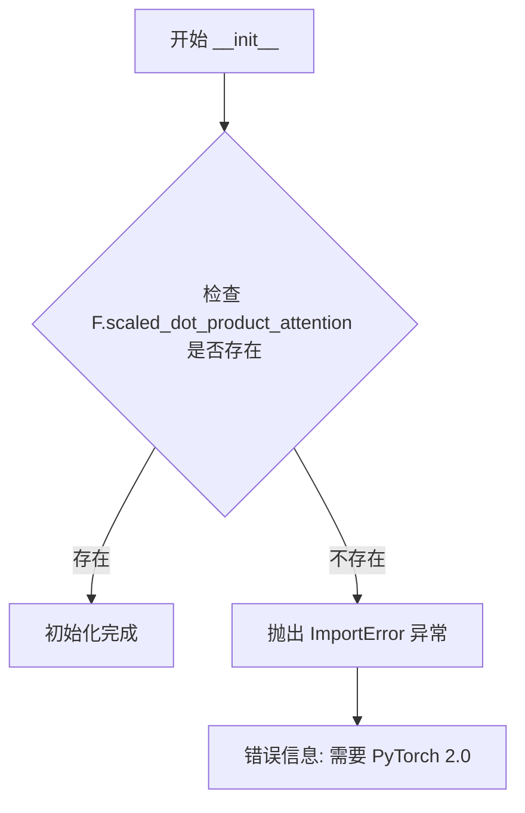
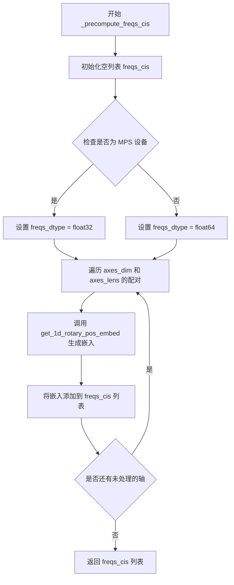
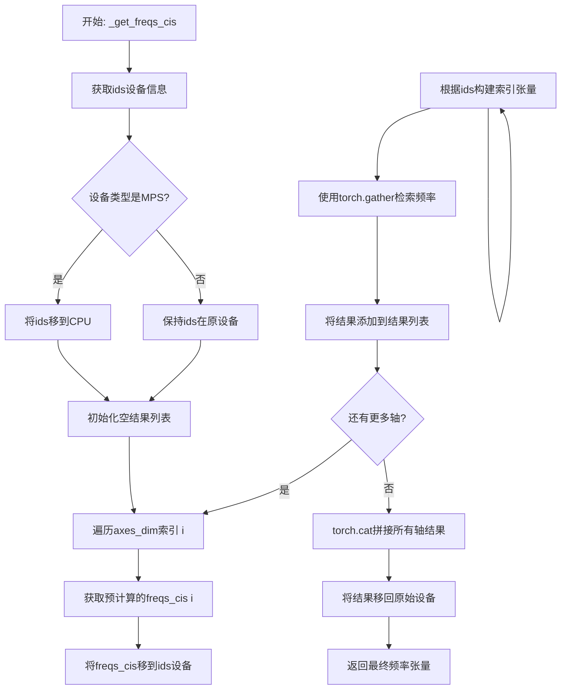
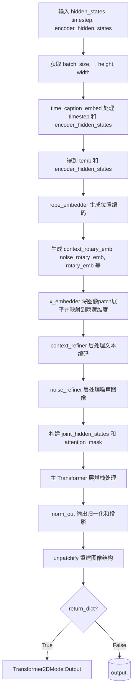

# `diffusers\src\diffusers\models\transformers\transformer_lumina2.py` 详细设计文档

这是Lumina2Transformer2DModel的核心实现代码，定义了一个基于Transformer架构的扩散模型，用于根据时间步长和文本描述生成图像。该代码包含了完整的前向传播流程、多模态嵌入处理、上下文与噪声精炼模块以及旋转位置编码（RoPE）的应用。

## 整体流程

```mermaid
graph TD
    A[输入: hidden_states, timestep, encoder_hidden_states] --> B[time_caption_embed]
    B --> C[rope_embedder & x_embedder]
    C --> D{Context Refiner Layers}
    D --> E[context_refiner loop]
    E --> F{Noise Refiner Layers}
    F --> G[noise_refiner loop]
    G --> H[Joint Hidden States Merge]
    H --> I{Transformer Layers}
    I --> J[layers loop (with gradient checkpointing)]
    J --> K[norm_out]
    K --> L[Unpatchify & Reshape]
    L --> M[输出: Transformer2DModelOutput]
```

## 类结构

```
Lumina2Transformer2DModel (主模型)
├── Lumina2CombinedTimestepCaptionEmbedding (时间与Caption嵌入)
├── Lumina2RotaryPosEmbed (旋转位置编码)
├── Lumina2TransformerBlock (Transformer块)
│   └── Lumina2AttnProcessor2_0 (注意力处理器)
```

## 全局变量及字段


### `logger`
    
用于记录日志的模块级日志对象

类型：`logging.Logger`
    


### `Lumina2CombinedTimestepCaptionEmbedding.time_proj`
    
时间步投影，将时间步长映射到频率域特征

类型：`Timesteps`
    


### `Lumina2CombinedTimestepCaptionEmbedding.timestep_embedder`
    
时间步嵌入层，将投影后的时间步特征映射到隐藏空间

类型：`TimestepEmbedding`
    


### `Lumina2CombinedTimestepCaptionEmbedding.caption_embedder`
    
Caption嵌入层，包含RMSNorm和线性层用于编码条件信息

类型：`nn.Sequential`
    


### `Lumina2TransformerBlock.attn`
    
注意力层，实现自注意力机制支持GQA和QK归一化

类型：`Attention`
    


### `Lumina2TransformerBlock.feed_forward`
    
前馈网络层，实现SwiGLU激活的MLP

类型：`LuminaFeedForward`
    


### `Lumina2TransformerBlock.norm1`
    
主归一化层1，支持可选的调制机制

类型：`LuminaRMSNormZero | RMSNorm`
    


### `Lumina2TransformerBlock.norm2`
    
注意力输出归一化层

类型：`RMSNorm`
    


### `Lumina2TransformerBlock.ffn_norm1`
    
前馈网络输入归一化层1

类型：`RMSNorm`
    


### `Lumina2TransformerBlock.ffn_norm2`
    
前馈网络输出归一化层2

类型：`RMSNorm`
    


### `Lumina2TransformerBlock.modulation`
    
调制开关，控制是否启用条件调制机制

类型：`bool`
    


### `Lumina2RotaryPosEmbed.theta`
    
旋转位置编码的基础频率参数

类型：`int`
    


### `Lumina2RotaryPosEmbed.axes_dim`
    
各轴的旋转嵌入维度配置

类型：`list[int]`
    


### `Lumina2RotaryPosEmbed.axes_lens`
    
各轴的位置编码长度配置

类型：`list[int]`
    


### `Lumina2RotaryPosEmbed.patch_size`
    
图像分块大小，用于空间位置编码

类型：`int`
    


### `Lumina2RotaryPosEmbed.freqs_cis`
    
预计算的旋转位置编码复数频率向量

类型：`list[torch.Tensor]`
    


### `Lumina2Transformer2DModel.rope_embedder`
    
旋转位置编码嵌入器，处理图像和文本的位置信息

类型：`Lumina2RotaryPosEmbed`
    


### `Lumina2Transformer2DModel.x_embedder`
    
图像补丁嵌入层，将分块后的图像特征映射到隐藏空间

类型：`nn.Linear`
    


### `Lumina2Transformer2DModel.time_caption_embed`
    
时间和Caption条件嵌入模块

类型：`Lumina2CombinedTimestepCaptionEmbedding`
    


### `Lumina2Transformer2DModel.noise_refiner`
    
噪声精炼块列表，用于逐步精炼噪声表示

类型：`nn.ModuleList`
    


### `Lumina2Transformer2DModel.context_refiner`
    
上下文精炼块列表，用于精炼文本条件表示

类型：`nn.ModuleList`
    


### `Lumina2Transformer2DModel.layers`
    
主干Transformer块列表，构成模型的核心推理路径

类型：`nn.ModuleList`
    


### `Lumina2Transformer2DModel.norm_out`
    
输出归一化层，将隐藏状态映射到像素空间

类型：`LuminaLayerNormContinuous`
    


### `Lumina2Transformer2DModel.gradient_checkpointing`
    
梯度检查点标志，控制是否启用梯度检查点以节省显存

类型：`bool`
    
    

## 全局函数及方法


### `Lumina2CombinedTimestepCaptionEmbedding.forward`

该方法是 Lumina2 模型中条件嵌入层的核心实现，负责将时间步长（timestep）和文本 caption 特征（encoder_hidden_states）分别投影并嵌入到与模型隐藏空间兼容的表示空间中，生成用于驱动扩散过程的时间条件嵌入和文本条件嵌入。

参数：

- `hidden_states`：`torch.Tensor`，用于确定输出张量目标设备和数据类型的输入隐藏状态（通常为图像潜在表示）
- `timestep`：`torch.Tensor`，扩散过程的时间步长张量，形状为 (batch_size,)
- `encoder_hidden_states`：`torch.Tensor`，编码器输出的文本 caption 特征，形状为 (batch_size, caption_seq_len, cap_feat_dim)

返回值：`tuple[torch.Tensor, torch.Tensor]`，返回包含两个张量的元组——`time_embed`（时间嵌入，形状为 (batch_size, time_embed_dim)）和 `caption_embed`（文本嵌入，形状为 (batch_size, caption_seq_len, hidden_size)）

#### 流程图

```mermaid
flowchart TD
    A[开始 forward] --> B[输入: hidden_states, timestep, encoder_hidden_states]
    B --> C["timestep_proj = self.time_proj(timestep)"]
    C --> D["将 timestep_proj 转换为 hidden_states 的设备类型: .type_as(hidden_states)"]
    D --> E["time_embed = self.timestep_embedder(timestep_proj)"]
    E --> F["caption_embed = self.caption_embedder(encoder_hidden_states)"]
    F --> G[返回 tuple[time_embed, caption_embed]]
    G --> H[结束 forward]
```

#### 带注释源码

```python
def forward(
    self, hidden_states: torch.Tensor, timestep: torch.Tensor, encoder_hidden_states: torch.Tensor
) -> tuple[torch.Tensor, torch.Tensor]:
    # Step 1: 将离散的时间步长投影到连续的特征空间
    # 使用正弦/余弦位置编码风格的投影，将时间步长映射到 frequency_embedding_size 维空间
    timestep_proj = self.time_proj(timestep).type_as(hidden_states)
    
    # Step 2: 通过时间嵌入层将投影后的时间特征映射到最终的隐藏空间维度
    # 输出形状: (batch_size, min(hidden_size, 1024))
    time_embed = self.timestep_embedder(timestep_proj)
    
    # Step 3: 对文本 caption 特征进行归一化和线性投影
    # - RMSNorm: 对 caption 特征进行层归一化
    # - Linear: 将 cap_feat_dim 维度映射到 hidden_size 维度
    # 输出形状: (batch_size, caption_seq_len, hidden_size)
    caption_embed = self.caption_embedder(encoder_hidden_states)
    
    # Step 4: 返回时间嵌入和 caption 嵌入，供后续的 Transformer 模块使用
    return time_embed, caption_embed
```


### `Lumina2AttnProcessor2_0.__init__`

初始化注意力处理器，检查 PyTorch 版本是否支持 scaled_dot_product_attention 功能。该处理器用于在 Lumina2Transformer2DModel 中实现缩放点积注意力机制，并支持 Query/Key 向量的归一化和旋转位置编码（RoPE）应用。

参数：

- （无显式参数，仅包含隐式 `self`）

返回值：`None`，无返回值（构造函数）

#### 流程图



#### 带注释源码

```
def __init__(self):
    # 检查 PyTorch 的 functional 模块是否包含 scaled_dot_product_attention 函数
    # 该函数从 PyTorch 2.0 开始引入，用于高效实现注意力机制
    if not hasattr(F, "scaled_dot_product_attention"):
        # 如果不支持，抛出导入错误，提示用户升级 PyTorch 版本
        raise ImportError("AttnProcessor2_0 requires PyTorch 2.0, to use it, please upgrade PyTorch to 2.0.")
```


### `Lumina2AttnProcessor2_0.__call__`

实现缩放点积注意力机制（SDPA），支持Q/K归一化、旋转位置编码（RoPE）和分组查询注意力（GQA），用于Lumina2Transformer2DModel模型。

参数：

- `attn`：`Attention`，注意力模块，用于计算Q、K、V投影
- `hidden_states`：`torch.Tensor`，输入的隐藏状态张量，形状为`(batch_size, sequence_length, hidden_dim)`
- `encoder_hidden_states`：`torch.Tensor`，编码器隐藏状态，用于cross-attention计算
- `attention_mask`：`torch.Tensor | None`，注意力掩码，用于屏蔽特定位置的注意力
- `image_rotary_emb`：`torch.Tensor | None`，图像旋转位置嵌入，用于位置编码
- `base_sequence_length`：`int | None`，基础序列长度，用于计算softmax缩放因子

返回值：`torch.Tensor`，经过注意力处理后的隐藏状态

#### 流程图

```mermaid
flowchart TD
    A[开始: hidden_states输入] --> B[获取batch_size, sequence_length, _]
    B --> C[计算Q/K/V: query=to_q, key=to_k, value=to_v]
    C --> D[获取维度信息: query_dim, inner_dim, head_dim]
    D --> E[调整形状: view为batch, seq, heads, head_dim]
    E --> F{attn.norm_q存在?}
    F -->|是| G[应用Query归一化: norm_q]
    F -->|否| H{attn.norm_k存在?}
    G --> H
    H -->|是| I[应用Key归一化: norm_k]
    H -->|否| J{image_rotary_emb存在?}
    I --> J
    J -->|是| K[应用RoPE到query和key]
    J -->|否| L[转换为dtype]
    K --> L
    L --> M{base_sequence_length非空?}
    M -->|是| N[计算softmax_scale: sqrt(log(seq/base_seq)) * attn.scale]
    M -->|否| O[softmax_scale = attn.scale]
    N --> P
    O --> P
    P --> Q[执行GQA: 重复key/value头]
    Q --> R{attention_mask非空?}
    R -->|是| S[将mask转换为bool并reshape]
    R -->|否| T[转置Q/K/V]
    S --> T
    T --> U[执行F.scaled_dot_product_attention]
    U --> V[reshape并转换类型]
    V --> W[应用输出投影: to_out[0]和to_out[1]]
    W --> X[返回hidden_states]
```

#### 带注释源码

```python
def __call__(
    self,
    attn: Attention,
    hidden_states: torch.Tensor,
    encoder_hidden_states: torch.Tensor,
    attention_mask: torch.Tensor | None = None,
    image_rotary_emb: torch.Tensor | None = None,
    base_sequence_length: int | None = None,
) -> torch.Tensor:
    # 1. 获取输入张量的批次大小、序列长度和隐藏维度
    batch_size, sequence_length, _ = hidden_states.shape

    # 2. 使用注意力模块的投影层计算Query、Key、Value
    # query: 使用输入hidden_states计算自注意力query
    # key/value: 使用encoder_hidden_states计算cross-attention的key和value
    query = attn.to_q(hidden_states)
    key = attn.to_k(encoder_hidden_states)
    value = attn.to_v(encoder_hidden_states)

    # 3. 获取维度信息用于多头注意力计算
    query_dim = query.shape[-1]          # Query的隐藏维度
    inner_dim = key.shape[-1]             # Key/Value的隐藏维度
    head_dim = query_dim // attn.heads    # 每个注意力头的维度
    dtype = query.dtype                   # 保存原始数据类型

    # 4. 计算key-value的头数（支持GQA）
    kv_heads = inner_dim // head_dim

    # 5. 调整张量形状以适配多头注意力格式 (batch, seq, heads, head_dim)
    query = query.view(batch_size, -1, attn.heads, head_dim)
    key = key.view(batch_size, -1, kv_heads, head_dim)
    value = value.view(batch_size, -1, kv_heads, head_dim)

    # 6. 应用Query和Key的归一化（可选，用于QK-Norm）
    if attn.norm_q is not None:
        query = attn.norm_q(query)  # 对query进行RMS归一化
    if attn.norm_k is not None:
        key = attn.norm_k(key)      # 对key进行RMS归一化

    # 7. 应用旋转位置编码RoPE（可选）
    if image_rotary_emb is not None:
        query = apply_rotary_emb(query, image_rotary_emb, use_real=False)
        key = apply_rotary_emb(key, image_rotary_emb, use_real=False)

    # 8. 转换为统一的数据类型
    query, key = query.to(dtype), key.to(dtype)

    # 9. 计算softmax缩放因子
    # 如果提供了base_sequence_length，使用对数缩放；否则使用默认的scale
    if base_sequence_length is not None:
        # 缩放因子 = sqrt(log(sequence_length / base_sequence_length)) * attn.scale
        softmax_scale = math.sqrt(math.log(sequence_length, base_sequence_length)) * attn.scale
    else:
        softmax_scale = attn.scale

    # 10. 执行分组查询注意力（GQA）
    # 当query头数大于kv头数时，重复key和value以匹配query头数
    n_rep = attn.heads // kv_heads
    if n_rep >= 1:
        # 使用unsqueeze+repeat+flatten实现key/value的广播
        key = key.unsqueeze(3).repeat(1, 1, 1, n_rep, 1).flatten(2, 3)
        value = value.unsqueeze(3).repeat(1, 1, 1, n_rep, 1).flatten(2, 3)

    # 11. 处理注意力掩码
    # scaled_dot_product_attention期望的mask形状为 (batch, heads, source_len, target_len)
    if attention_mask is not None:
        attention_mask = attention_mask.bool().view(batch_size, 1, 1, -1)

    # 12. 转置张量以适配PyTorch SDPA的输入格式 (batch, heads, seq, head_dim)
    query = query.transpose(1, 2)
    key = key.transpose(1, 2)
    value = value.transpose(1, 2)

    # 13. 执行缩放点积注意力计算
    hidden_states = F.scaled_dot_product_attention(
        query, key, value, 
        attn_mask=attention_mask, 
        scale=softmax_scale
    )

    # 14. 恢复形状并转换数据类型
    hidden_states = hidden_states.transpose(1, 2).reshape(batch_size, -1, attn.heads * head_dim)
    hidden_states = hidden_states.type_as(query)

    # 15. 应用输出投影层（包括线性变换和可选的Dropout）
    hidden_states = attn.to_out[0](hidden_states)  # 线性投影
    hidden_states = attn.to_out[1](hidden_states)  # Dropout等

    return hidden_states
```


### `Lumina2TransformerBlock.forward`

该方法是 Lumina2TransformerBlock 的前向传播函数，实现了带调制机制的 Transformer 块，包括注意力计算和前馈网络处理，支持条件调制（modulation）模式以适应扩散模型的时序调制需求。

参数：

- `hidden_states`：`torch.Tensor`，输入的隐藏状态张量，形状为 (batch, seq_len, dim)
- `attention_mask`：`torch.Tensor`，注意力掩码，用于控制注意力计算过程中的可见性
- `image_rotary_emb`：`torch.Tensor`，图像旋转位置编码（RoPE），用于为注意力提供位置信息
- `temb`：`torch.Tensor | None`，时间嵌入或调制向量，在 modulation 模式下用于生成门控和缩放参数

返回值：`torch.Tensor`，经过 Transformer 块处理后的隐藏状态张量

#### 流程图

```mermaid
flowchart TD
    A[输入 hidden_states, attention_mask, image_rotary_emb, temb] --> B{modulation 是否为 True?}
    
    B -->|Yes| C[norm1 调制计算: norm_hidden_states, gate_msa, scale_mlp, gate_mlp]
    B -->|No| D[norm1 普通归一化: norm_hidden_states]
    
    C --> E[attn 注意力计算]
    D --> E
    
    E --> F[hidden_states = hidden_states + gate_msa.tanh \* norm2(attn_output)]
    
    F --> G{modulation 是否为 True?}
    
    G -->|Yes| H[ffn_norm1 调制: ffn_norm1(hidden_states) \* (1 + scale_mlp)]
    G -->|No| I[ffn_norm1 归一化: ffn_norm1(hidden_states)]
    
    H --> J[feed_forward 前馈计算]
    I --> J
    
    J --> K[hidden_states = hidden_states + gate_mlp.tanh \* ffn_norm2(mlp_output)]
    K --> L[返回 hidden_states]
    
    D --> M[hidden_states = hidden_states + norm2(attn_output)]
    M --> N[mlp_output = feed_forward(ffn_norm1(hidden_states))]
    N --> O[hidden_states = hidden_states + ffn_norm2(mlp_output)]
    O --> L
```

#### 带注释源码

```python
def forward(
    self,
    hidden_states: torch.Tensor,
    attention_mask: torch.Tensor,
    image_rotary_emb: torch.Tensor,
    temb: torch.Tensor | None = None,
) -> torch.Tensor:
    """
    Transformer 块的前向传播
    
    Args:
        hidden_states: 输入隐藏状态 (batch, seq_len, dim)
        attention_mask: 注意力掩码
        image_rotary_emb: 图像旋转位置编码
        temb: 时间嵌入/调制向量，仅在 modulation=True 时使用
    
    Returns:
        处理后的隐藏状态
    """
    # 判断是否启用调制模式（用于扩散模型的条件生成）
    if self.modulation:
        # 使用 LuminaRMSNormZero 进行归一化，同时生成门控和缩放参数
        # norm_hidden_states: 归一化后的隐藏状态
        # gate_msa: 注意力门的缩放因子
        # scale_mlp: 前馈网络的缩放因子
        # gate_mlp: 前馈网络的门控因子
        norm_hidden_states, gate_msa, scale_mlp, gate_mlp = self.norm1(hidden_states, temb)
        
        # 执行自注意力计算，使用归一化后的状态
        attn_output = self.attn(
            hidden_states=norm_hidden_states,
            encoder_hidden_states=norm_hidden_states,  # 自注意力
            attention_mask=attention_mask,
            image_rotary_emb=image_rotary_emb,
        )
        
        # 残差连接：hidden_states + gate_msa.tanh() * norm2(attn_output)
        # 使用 tanh 门控机制控制注意力输出的影响
        hidden_states = hidden_states + gate_msa.unsqueeze(1).tanh() * self.norm2(attn_output)
        
        # 前馈网络：先通过 ffn_norm1 归一化，并乘以 (1 + scale_mlp) 进行缩放
        mlp_output = self.feed_forward(self.ffn_norm1(hidden_states) * (1 + scale_mlp.unsqueeze(1)))
        
        # 残差连接：hidden_states + gate_mlp.tanh() * ffn_norm2(mlp_output)
        hidden_states = hidden_states + gate_mlp.unsqueeze(1).tanh() * self.ffn_norm2(mlp_output)
    else:
        # 非调制模式：使用标准 RMSNorm 归一化
        norm_hidden_states = self.norm1(hidden_states)
        
        # 自注意力计算
        attn_output = self.attn(
            hidden_states=norm_hidden_states,
            encoder_hidden_states=norm_hidden_states,
            attention_mask=attention_mask,
            image_rotary_emb=image_rotary_emb,
        )
        
        # 标准残差连接
        hidden_states = hidden_states + self.norm2(attn_output)
        
        # 前馈网络计算
        mlp_output = self.feed_forward(self.ffn_norm1(hidden_states))
        
        # 标准残差连接
        hidden_states = hidden_states + self.ffn_norm2(mlp_output)

    return hidden_states
```


### `Lumina2RotaryPosEmbed._precompute_freqs_cis`

该函数用于预计算旋转位置嵌入（RoPE）的频率复数形式，根据给定的轴维度和轴长度，为每个轴生成对应的旋转频率嵌入。

参数：

- `axes_dim`：`list[int]`，表示各轴的维度列表，用于确定每个轴的旋转嵌入维度
- `axes_lens`：`list[int]`，表示各轴的长度列表，用于确定每个轴的序列长度
- `theta`：`int`，旋转位置嵌入的基础频率参数，通常为 10000

返回值：`list[torch.Tensor]`，返回每个轴对应的频率复数张量列表

#### 流程图



#### 带注释源码

```python
def _precompute_freqs_cis(self, axes_dim: list[int], axes_lens: list[int], theta: int) -> list[torch.Tensor]:
    """
    预计算旋转位置嵌入的频率复数形式
    
    参数:
        axes_dim: 各轴的维度列表
        axes_lens: 各轴的长度列表
        theta: 旋转基础频率参数
    
    返回:
        各轴对应的频率复数张量列表
    """
    freqs_cis = []  # 用于存储各轴的频率复数嵌入
    # 根据设备类型选择合适的数据类型以保证数值精度
    freqs_dtype = torch.float32 if torch.backends.mps.is_available() else torch.float64
    # 遍历每个轴的维度和长度，生成对应的旋转位置嵌入
    for i, (d, e) in enumerate(zip(axes_dim, axes_lens)):
        # 调用工具函数生成一维旋转位置嵌入
        # d: 当前轴的维度, e: 当前轴的长度
        emb = get_1d_rotary_pos_embed(d, e, theta=self.theta, freqs_dtype=freqs_dtype)
        freqs_cis.append(emb)  # 将生成的嵌入添加到列表中
    return freqs_cis  # 返回所有轴的频率复数嵌入列表
```


### `Lumina2RotaryPosEmbed._get_freqs_cis`

该方法根据输入的位置ID张量从预计算的旋转位置嵌入频率表中检索对应的频率复数向量，支持多轴维度（时间/行/列）的位置编码，并处理MPS设备的特殊兼容性需求。

参数：

- `ids`：`torch.Tensor`，形状为 `(batch_size, seq_len, 3)` 的位置ID张量，包含每个位置的三个轴向索引（caption位置、行索引、列索引）

返回值：`torch.Tensor`，形状为 `(batch_size, seq_len, freq_dim)` 的频率复数张量，用于旋转位置嵌入

#### 流程图



#### 带注释源码

```python
def _get_freqs_cis(self, ids: torch.Tensor) -> torch.Tensor:
    """
    根据位置IDs从预计算的频率表中检索旋转位置嵌入的频率复数向量
    
    参数:
        ids: 位置ID张量，形状为 (batch_size, seq_len, 3)，分别对应
             (caption位置/图像序列位置, 行索引, 列索引)
    
    返回:
        检索到的频率复数张量，形状为 (batch_size, seq_len, total_freq_dim)
    """
    # 获取输入张量所在的设备
    device = ids.device
    
    # MPS (Apple Silicon) 设备有特殊的内存处理要求
    # 需要先将数据移到CPU进行处理以避免潜在问题
    if ids.device.type == "mps":
        ids = ids.to("cpu")
    
    # 存储每个轴向的检索结果
    result = []
    
    # 遍历所有轴向维度（通常为3个：时间/caption、行、列）
    for i in range(len(self.axes_dim)):
        # 获取第i个轴向的预计算频率复数向量
        freqs = self.freqs_cis[i].to(ids.device)
        
        # 构建索引张量:
        # - ids[:, :, i:i+1] 提取当前轴向的位置ID
        # .repeat(1, 1, freqs.shape[-1]) 广播以匹配频率维度
        # .to(torch.int64) 转换为64位整数用于索引
        index = ids[:, :, i : i + 1].repeat(1, 1, freqs.shape[-1]).to(torch.int64)
        
        # 使用gather操作根据索引检索频率:
        # - freqs.unsqueeze(0).repeat(index.shape[0], 1, 1) 扩展频率以匹配batch维度
        # - torch.gather 在维度1上根据index检索对应位置的频率
        gathered = torch.gather(
            freqs.unsqueeze(0).repeat(index.shape[0], 1, 1),  # (1, axis_len, freq_dim) -> (batch, axis_len, freq_dim)
            dim=1,  # 在轴长维度上索引
            index=index  # (batch, seq_len, freq_dim)
        )
        
        result.append(gathered)
    
    # 沿最后一维拼接所有轴向的频率结果
    # 结果形状: (batch_size, seq_len, sum(axes_dim))
    final_result = torch.cat(result, dim=-1).to(device)
    
    return final_result
```


### `Lumina2RotaryPosEmbed.forward`

该方法为 Lumina2Transformer2DModel 生成旋转位置编码（RoPE），支持图像 Patch 和文本 Caption 的联合位置建模，根据注意力掩码动态计算序列长度，并为图像生成二维行列位置索引。

参数：

- `hidden_states`：`torch.Tensor`，输入的图像隐状态，形状为 (batch_size, channels, height, width)
- `attention_mask`：`torch.Tensor`，注意力掩码，用于指示 Caption 序列的有效长度

返回值：`tuple[torch.Tensor, torch.Tensor, torch.Tensor, torch.Tensor, list[int], list[int]]`，返回处理后的隐状态、Caption 旋转嵌入、图像旋转嵌入、组合旋转嵌入、Caption 有效长度列表和完整序列长度列表

#### 流程图

```mermaid
flowchart TD
    A[输入 hidden_states, attention_mask] --> B[提取 batch_size, channels, height, width]
    B --> C[计算 post_patch_height, post_patch_width, image_seq_len]
    C --> D[从 attention_mask 计算 l_effective_cap_len 和 seq_lengths]
    D --> E[获取 max_seq_len]
    E --> F[创建 position_ids 张量 batch_size x max_seq_len x 3]
    F --> G[遍历每个样本]
    G --> H[为 Caption 部分设置位置ID: position_ids[i, :cap_seq_len, 0]]
    H --> I[为图像部分设置位置ID: position_ids[i, cap_seq_len:seq_len, 0] = cap_seq_len]
    I --> J[计算图像二维坐标: row_ids, col_ids]
    J --> K[设置图像行位置: position_ids[i, cap_seq_len:seq_len, 1] = row_ids]
    K --> L[设置图像列位置: position_ids[i, cap_seq_len:seq_len, 2] = col_ids]
    L --> M{遍历完成?}
    M -->|是| N[调用 _get_freqs_cis 获取组合旋转嵌入 freqs_cis]
    M -->|否| G
    N --> O[创建 cap_freqs_cis 和 img_freqs_cis 张量]
    O --> P[分离 Caption 和图像的旋转嵌入]
    P --> Q[对 hidden_states 进行 Patch 展平处理]
    Q --> R[返回 hidden_states, cap_freqs_cis, img_freqs_cis, freqs_cis, l_effective_cap_len, seq_lengths]
```

#### 带注释源码

```python
def forward(self, hidden_states: torch.Tensor, attention_mask: torch.Tensor):
    """
    为图像和文本 Caption 生成旋转位置编码（RoPE）。
    
    参数:
        hidden_states: 输入图像张量，形状为 (batch_size, channels, height, width)
        attention_mask: 注意力掩码，用于确定每个样本的 Caption 长度
    
    返回:
        处理后的隐状态、Caption旋转嵌入、图像旋转嵌入、组合旋转嵌入、长度信息
    """
    # 获取输入维度信息
    batch_size, channels, height, width = hidden_states.shape
    p = self.patch_size  # patch大小，默认为2
    
    # 计算 patch 化后的图像尺寸和序列长度
    post_patch_height, post_patch_width = height // p, width // p
    image_seq_len = post_patch_height * post_patch_width  # 图像 Patch 总数
    device = hidden_states.device  # 获取设备信息

    # 从 attention_mask 提取 Caption 有效长度
    encoder_seq_len = attention_mask.shape[1]  # 编码器序列长度
    l_effective_cap_len = attention_mask.sum(dim=1).tolist()  # 每个样本的有效 Caption 长度
    # 计算完整序列长度 = Caption长度 + 图像长度
    seq_lengths = [cap_seq_len + image_seq_len for cap_seq_len in l_effective_cap_len]
    max_seq_len = max(seq_lengths)  # 最大序列长度

    # 创建位置ID张量: (batch_size, max_seq_len, 3) - 3维分别表示时间/Caption位置、行、列
    position_ids = torch.zeros(batch_size, max_seq_len, 3, dtype=torch.int32, device=device)

    # 遍历每个样本，为 Caption 和图像分配位置ID
    for i, (cap_seq_len, seq_len) in enumerate(zip(l_effective_cap_len, seq_lengths)):
        # === Caption 位置编码 ===
        # 时间位置: 0, 1, 2, ..., cap_seq_len-1
        position_ids[i, :cap_seq_len, 0] = torch.arange(cap_seq_len, dtype=torch.int32, device=device)
        # 图像时间位置从 Caption 长度开始
        position_ids[i, cap_seq_len:seq_len, 0] = cap_seq_len

        # === 图像二维位置编码 ===
        # 计算行索引: [0, 0, 0, ..., 1, 1, 1, ..., ...]
        row_ids = (
            torch.arange(post_patch_height, dtype=torch.int32, device=device)
            .view(-1, 1)
            .repeat(1, post_patch_width)
            .flatten()
        )
        # 计算列索引: [0, 1, 2, ..., 0, 1, 2, ...]
        col_ids = (
            torch.arange(post_patch_width, dtype=torch.int32, device=device)
            .view(1, -1)
            .repeat(post_patch_height, 1)
            .flatten()
        )
        # 设置图像位置的行和列坐标
        position_ids[i, cap_seq_len:seq_len, 1] = row_ids
        position_ids[i, cap_seq_len:seq_len, 2] = col_ids

    # 获取组合旋转嵌入
    freqs_cis = self._get_freqs_cis(position_ids)

    # === 分离 Caption 和图像的旋转嵌入 ===
    # 创建 Caption 旋转嵌入张量
    cap_freqs_cis = torch.zeros(
        batch_size, encoder_seq_len, freqs_cis.shape[-1], device=device, dtype=freqs_cis.dtype
    )
    # 创建图像旋转嵌入张量
    img_freqs_cis = torch.zeros(
        batch_size, image_seq_len, freqs_cis.shape[-1], device=device, dtype=freqs_cis.dtype
    )

    # 分别填充 Caption 和图像的旋转嵌入
    for i, (cap_seq_len, seq_len) in enumerate(zip(l_effective_cap_len, seq_lengths)):
        cap_freqs_cis[i, :cap_seq_len] = freqs_cis[i, :cap_seq_len]  # 提取 Caption 部分
        img_freqs_cis[i, :image_seq_len] = freqs_cis[i, cap_seq_len:seq_len]  # 提取图像部分

    # === 对输入 hidden_states 进行 Patch 展平 ===
    # 变换: (B, C, H, W) -> (B, H//p, W//p, p, p, C) -> (B, H//p, W//p, p*p*C) -> (B, p*p, H//p*W//p, C) -> ...
    # 最终形状: (batch_size, image_seq_len, channels * p * p)
    hidden_states = (
        hidden_states.view(batch_size, channels, post_patch_height, p, post_patch_width, p)
        .permute(0, 2, 4, 3, 5, 1)  # 调整维度顺序
        .flatten(3)  # 展平 p*p 和 channels
        .flatten(1, 2)  # 合并 patch 维度
    )

    # 返回: 处理后的隐状态、Caption嵌入、图像嵌入、完整嵌入、Caption长度列表、序列长度列表
    return hidden_states, cap_freqs_cis, img_freqs_cis, freqs_cis, l_effective_cap_len, seq_lengths
```


### `Lumina2Transformer2DModel.__init__`

该方法是 `Lumina2Transformer2DModel` 类的构造函数，负责初始化基于Transformer的扩散模型的核心组件，包括位置编码嵌入器、补丁嵌入层、时间与Caption联合嵌入模块、噪声和上下文精炼块、主干Transformer层以及输出归一化和投影层。

参数：

- `sample_size`：`int`，默认值 `128`，潜在图像的宽度，用于学习位置嵌入
- `patch_size`：`int`，默认值 `2`，图像中每个补丁的尺寸
- `in_channels`：`int`，默认值 `16`，模型的输入通道数
- `out_channels`：`int | None`，默认值 `None`，输出通道数，默认为输入通道数
- `hidden_size`：`int`，默认值 `2304`，模型隐藏层的维度
- `num_layers`：`int`，默认值 `26`，模型中Transformer层的数量
- `num_refiner_layers`：`int`，默认值 `2`，噪声和上下文精炼层的数量
- `num_attention_heads`：`int`，默认值 `24`，每个注意力层中注意力头的数量
- `num_kv_heads`：`int`，默认值 `8`，键值头的数量
- `multiple_of`：`int`，默认值 `256`，隐藏层维度应该是该值的倍数
- `ffn_dim_multiplier`：`float | None`，默认值 `None`，前馈网络维度的乘数
- `norm_eps`：`float`，默认值 `1e-5`，归一化层的 epsilon 值
- `scaling_factor`：`float`，默认值 `1.0`，应用于某些参数或层的缩放因子
- `axes_dim_rope`：`tuple[int, int, int]`，默认值 `(32, 32, 32)`，旋转位置编码的轴维度
- `axes_lens`：`tuple[int, int, int]`，默认值 `(300, 512, 512)`，轴的长度
- `cap_feat_dim`：`int`，默认值 `1024`，Caption特征的维度

返回值：`None`，该方法为构造函数，不返回任何值

#### 流程图

```mermaid
flowchart TD
    A[开始 __init__] --> B[调用 super().__init__]
    B --> C[设置 self.out_channels]
    C --> D[创建 rope_embedder: Lumina2RotaryPosEmbed]
    D --> E[创建 x_embedder: nn.Linear]
    E --> F[创建 time_caption_embed: Lumina2CombinedTimestepCaptionEmbedding]
    F --> G[创建 noise_refiner: nn.ModuleList]
    G --> H[创建 context_refiner: nn.ModuleList]
    H --> I[创建 layers: nn.ModuleList]
    I --> J[创建 norm_out: LuminaLayerNormContinuous]
    J --> K[设置 self.gradient_checkpointing = False]
    K --> L[结束 __init__]
```

#### 带注释源码

```python
@register_to_config
def __init__(
    self,
    sample_size: int = 128,              # 潜在图像宽度
    patch_size: int = 2,                  # 补丁尺寸
    in_channels: int = 16,                # 输入通道数
    out_channels: int | None = None,      # 输出通道数，默认为 in_channels
    hidden_size: int = 2304,              # 隐藏层维度
    num_layers: int = 26,                 # Transformer 层数量
    num_refiner_layers: int = 2,          # 精炼层数量
    num_attention_heads: int = 24,        # 注意力头数
    num_kv_heads: int = 8,                # 键值头数
    multiple_of: int = 256,               # 维度倍数
    ffn_dim_multiplier: float | None = None,  # FFN 维度乘数
    norm_eps: float = 1e-5,               # 归一化 epsilon
    scaling_factor: float = 1.0,          # 缩放因子
    axes_dim_rope: tuple[int, int, int] = (32, 32, 32),  # RoPE 轴维度
    axes_lens: tuple[int, int, int] = (300, 512, 512),   # 轴长度
    cap_feat_dim: int = 1024,             # Caption 特征维度
) -> None:
    # 调用父类构造函数
    super().__init__()
    
    # 设置输出通道数，默认为输入通道数
    self.out_channels = out_channels or in_channels

    # 1. 位置、补丁和条件嵌入
    # 创建旋转位置编码嵌入器
    self.rope_embedder = Lumina2RotaryPosEmbed(
        theta=10000, 
        axes_dim=axes_dim_rope, 
        axes_lens=axes_lens, 
        patch_size=patch_size
    )

    # 创建补丁嵌入层：将图像补丁展平并映射到隐藏空间
    self.x_embedder = nn.Linear(
        in_features=patch_size * patch_size * in_channels, 
        out_features=hidden_size
    )

    # 创建时间步和 Caption 联合嵌入器
    self.time_caption_embed = Lumina2CombinedTimestepCaptionEmbedding(
        hidden_size=hidden_size, 
        cap_feat_dim=cap_feat_dim, 
        norm_eps=norm_eps
    )

    # 2. 噪声和上下文精炼块
    # 创建噪声精炼模块列表（带调制的 Transformer 块）
    self.noise_refiner = nn.ModuleList(
        [
            Lumina2TransformerBlock(
                hidden_size,
                num_attention_heads,
                num_kv_heads,
                multiple_of,
                ffn_dim_multiplier,
                norm_eps,
                modulation=True,  # 启用调制
            )
            for _ in range(num_refiner_layers)
        ]
    )

    # 创建上下文精炼模块列表（不带调制的 Transformer 块）
    self.context_refiner = nn.ModuleList(
        [
            Lumina2TransformerBlock(
                hidden_size,
                num_attention_heads,
                num_kv_heads,
                multiple_of,
                ffn_dim_multiplier,
                norm_eps,
                modulation=False,  # 禁用调制
            )
            for _ in range(num_refiner_layers)
        ]
    )

    # 3. 主干 Transformer 块
    self.layers = nn.ModuleList(
        [
            Lumina2TransformerBlock(
                hidden_size,
                num_attention_heads,
                num_kv_heads,
                multiple_of,
                ffn_dim_multiplier,
                norm_eps,
                modulation=True,  # 启用调制
            )
            for _ in range(num_layers)
        ]
    )

    # 4. 输出归一化和投影
    self.norm_out = LuminaLayerNormContinuous(
        embedding_dim=hidden_size,
        conditioning_embedding_dim=min(hidden_size, 1024),
        elementwise_affine=False,
        eps=1e-6,
        bias=True,
        out_dim=patch_size * patch_size * self.out_channels,
    )

    # 初始化梯度 checkpointing 为 False
    self.gradient_checkpointing = False
```


### `Lumina2Transformer2DModel.forward`

这是 Lumina2Transformer2DModel 模型的核心前向传播方法，负责将噪声潜在表示、时间步和文本条件嵌入经过位置编码、Transformer 块处理，最终解码为去噪后的图像潜在表示。

参数：

- `hidden_states`：`torch.Tensor`，输入的图像潜在表示，形状为 (batch_size, channels, height, width)
- `timestep`：`torch.Tensor`，扩散过程的时间步张量，用于条件生成
- `encoder_hidden_states`：`torch.Tensor`，编码后的文本嵌入向量，用于文本条件引导
- `encoder_attention_mask`：`torch.Tensor`，编码器注意力掩码，标识有效文本token位置
- `attention_kwargs`：`dict[str, Any] | None`，可选的注意力参数字典，用于LoRA等注意力机制定制
- `return_dict`：`bool`，默认为 True，决定返回 Transformer2DModelOutput 对象还是原始张量元组

返回值：`torch.Tensor | Transformer2DModelOutput`，去噪后的图像潜在表示，形状为 (batch_size, out_channels, height, width)

#### 流程图



#### 带注释源码

```python
@apply_lora_scale("attention_kwargs")
def forward(
    self,
    hidden_states: torch.Tensor,
    timestep: torch.Tensor,
    encoder_hidden_states: torch.Tensor,
    encoder_attention_mask: torch.Tensor,
    attention_kwargs: dict[str, Any] | None = None,
    return_dict: bool = True,
) -> torch.Tensor | Transformer2DModelOutput:
    # 1. 条件处理、位置编码与patch嵌入
    # 从输入hidden_states中提取批量大小、通道数、高度和宽度
    batch_size, _, height, width = hidden_states.shape

    # 通过时间步和文本嵌入的组合嵌入器处理条件信息
    # 生成时间嵌入temb用于后续调制，encoder_hidden_states可能被refiner更新
    temb, encoder_hidden_states = self.time_caption_embed(hidden_states, timestep, encoder_hidden_states)

    # 2. 生成旋转位置编码（RoPE）
    # 返回：patch化后的hidden_states、文本旋转嵌入、噪声旋转嵌入、组合旋转嵌入、编码器序列长度、完整序列长度
    (
        hidden_states,
        context_rotary_emb,
        noise_rotary_emb,
        rotary_emb,
        encoder_seq_lengths,
        seq_lengths,
    ) = self.rope_embedder(hidden_states, encoder_attention_mask)

    # 将patch化的hidden_states线性映射到隐藏维度
    hidden_states = self.x_embedder(hidden_states)

    # 3. 上下文与噪声精修
    # 遍历context_refiner层，对文本编码进行精修和增强
    for layer in self.context_refiner:
        encoder_hidden_states = layer(encoder_hidden_states, encoder_attention_mask, context_rotary_emb)

    # 遍历noise_refiner层，对噪声图像表示进行精修
    for layer in self.noise_refiner:
        hidden_states = layer(hidden_states, None, noise_rotary_emb, temb)

    # 4. 联合Transformer块处理
    # 计算最大序列长度，用于构建注意力掩码
    max_seq_len = max(seq_lengths)
    # 检查是否需要使用掩码（当序列长度不一致时）
    use_mask = len(set(seq_lengths)) > 1

    # 初始化注意力掩码和联合隐藏状态张量
    attention_mask = hidden_states.new_zeros(batch_size, max_seq_len, dtype=torch.bool)
    joint_hidden_states = hidden_states.new_zeros(batch_size, max_seq_len, self.config.hidden_size)
    
    # 将文本编码和图像编码按序列长度交织合并
    for i, (encoder_seq_len, seq_len) in enumerate(zip(encoder_seq_lengths, seq_lengths)):
        attention_mask[i, :seq_len] = True
        joint_hidden_states[i, :encoder_seq_len] = encoder_hidden_states[i, :encoder_seq_len]
        joint_hidden_states[i, encoder_seq_len:seq_len] = hidden_states[i]

    hidden_states = joint_hidden_states

    # 遍历主Transformer层堆栈进行联合处理
    for layer in self.layers:
        # 如果启用了梯度检查点，则使用检查点优化显存
        if torch.is_grad_enabled() and self.gradient_checkpointing:
            hidden_states = self._gradient_checkpointing_func(
                layer, hidden_states, attention_mask if use_mask else None, rotary_emb, temb
            )
        else:
            hidden_states = layer(hidden_states, attention_mask if use_mask else None, rotary_emb, temb)

    # 5. 输出归一化与投影
    # 应用连续层归一化并将高维表示投影回patch空间
    hidden_states = self.norm_out(hidden_states, temb)

    # 6. Unpatchify 重建图像结构
    # 从patch序列重建2D图像潜在表示
    p = self.config.patch_size
    output = []
    for i, (encoder_seq_len, seq_len) in enumerate(zip(encoder_seq_lengths, seq_lengths)):
        # 提取对应样本的输出部分，重排列为图像格式
        output.append(
            hidden_states[i][encoder_seq_len:seq_len]
            .view(height // p, width // p, p, p, self.out_channels)
            .permute(4, 0, 2, 1, 3)
            .flatten(3, 4)
            .flatten(1, 2)
        )
    output = torch.stack(output, dim=0)

    # 根据return_dict决定返回格式
    if not return_dict:
        return (output,)
    return Transformer2DModelOutput(sample=output)
```

## 关键组件


### Lumina2CombinedTimestepCaptionEmbedding

组合时间步与Caption嵌入的模块，将扩散模型的时间步信息和文本条件信息分别投影到隐藏空间，为后续处理提供条件嵌入。

### Lumina2AttnProcessor2_0

实现缩放点积注意力(SDPA)的处理器，支持PyTorch 2.0+，内置GQA(分组查询注意力)、Query-Key归一化、RoPE旋转位置嵌入及比例注意力机制。

### Lumina2TransformerBlock

Lumina2的Transformer块，包含注意力层、前馈网络、LuminaRMSNormZero调制层，支持启用/禁用调制两种模式，实现自适应门控的注意力与MLP输出。

### Lumina2RotaryPosEmbed

2D旋转位置嵌入器，预先计算多轴频率张量，支持图像patch和caption的混合序列位置编码，通过索引获取动态频率以适配变长序列。

### Lumina2Transformer2DModel

Lumina2Diffusion Transformer主模型，继承ModelMixin、ConfigMixin、PeftAdapterMixin和FromOriginalModelMixin，集成了时间/Caption嵌入、噪声精炼块、上下文精炼块、主干Transformer层及输出投影，支持梯度检查点和LoRA适配。


## 问题及建议


### 已知问题

-   **硬编码值缺乏灵活性**：`Lumina2RotaryPosEmbed` 中 `theta=10000` 硬编码，`Lumina2TransformerBlock` 中 `inner_dim=4 * dim` 固定倍数，以及 `time_embed_dim=min(hidden_size, 1024)` 中的 1024 阈值都缺乏配置化。
-   **循环中的重复计算**：在 `Lumina2RotaryPosEmbed._get_freqs_cis` 和 `forward` 方法中使用 Python 循环处理序列长度，在批量较大时效率低下；主模型的 forward 方法中也有类似的序列循环。
-   **梯度检查点使用不完整**：gradient_checkpointing 仅在 `use_mask` 为 True 时传递 attention_mask，而在 mask 不变时未启用，可能导致不必要的显存占用。
-   **临时张量内存开销**：`Lumina2RotaryPosEmbed.forward` 中创建大量临时张量如 `cap_freqs_cis`、`img_freqs_cis` 和 `position_ids`，且存在重复的数据复制。
-   **设备类型特殊处理**：`Lumina2RotaryPosEmbed._get_freqs_cis` 中对 MPS 设备的特殊处理（`if ids.device.type == "mps"`）导致代码分支增加，可考虑统一处理逻辑。
-   **GQA 实现冗余**：在 `Lumina2AttnProcessor2_0` 中手动实现 GQA 的 key/value 重复，而非使用 PyTorch 原生支持。

### 优化建议

-   将硬编码的超参数（如 `theta`、`ffn_dim_ratio`）提取为模型配置参数，提高模型可配置性。
-   使用向量化操作替代 Python 循环，特别是 `Lumina2RotaryPosEmbed` 中的位置 ID 生成和频率获取部分。
-   完善梯度检查点逻辑，确保在所有情况下都能根据 `self.gradient_checkpointing` 标志正确应用。
-   考虑使用 `torch.empty` 代替 `torch.zeros` 初始化不需要显式初始化的张量，减少不必要的内存分配。
-   重构 MPS 设备处理逻辑，抽象出设备适配层或使用统一的类型转换接口。
-   评估使用 PyTorch 2.0+ 的原生 GQA 特性替代手动实现的可行性，或使用 `torch.nn.functional.scaled_dot_product_attention` 的 `is_causal` 参数简化逻辑。
-   增加输入验证（如检查 hidden_states 和 encoder_hidden_states 的维度兼容性），防止运行时错误。
-   考虑使用 `torch.compile` 或其他 JIT 编译优化对性能关键路径进行加速。

## 其它


### 设计目标与约束

本模型（Lumina2Transformer2DModel）是一个基于Transformer架构的 diffusion 模型，用于图像生成任务。设计目标包括：支持高分辨率图像生成（通过patchify机制），实现高效的上下文理解和噪声 refinement，采用grouped-query attention（GQA）优化推理效率，支持Lora微调能力，兼容PEFT框架。约束条件包括：PyTorch 2.0+依赖、CUDA或MPS加速支持、固定的patch_size和sample_size在训练时确定。

### 错误处理与异常设计

1. **PyTorch版本检查**：在`Lumina2AttnProcessor2_0.__init__`中检查`F.scaled_dot_product_attention`是否可用，若不可用则抛出`ImportError`。2. **设备兼容性处理**：在`Lumina2RotaryPosEmbed._get_freqs_cis`中，针对MPS设备特殊处理，将ids先转换到CPU再进行后续操作。3. **动态shape处理**：在`forward`方法中，通过`attention_mask`动态计算有效序列长度，处理变长caption输入的情况。4. **空值保护**：`temb`参数在`Lumina2TransformerBlock.forward`中根据`modulation`标志决定是否使用。

### 数据流与状态机

数据流主要分为以下几个阶段： 1. **输入阶段**：接收hidden_states（图像latent）、timestep（时间步）、encoder_hidden_states（caption嵌入）和encoder_attention_mask。 2. **Embedding阶段**：通过time_caption_embed生成条件嵌入，通过rope_embedder生成位置编码，通过x_embedder将patchified图像转换为hidden states。 3. **Refinement阶段**：context_refiner处理encoder_hidden_states，noise_refiner处理hidden_states。 4. **Joint Attention阶段**：将图像和文本hidden states拼接，通过多层TransformerBlock进行联合处理。 5. **输出阶段**：通过norm_out投影，再通过unpatchify还原为图像格式。 状态转移主要由timestep控制，从纯噪声状态逐步去噪到目标图像。

### 外部依赖与接口契约

主要外部依赖包括： - `torch` 和 `torch.nn`：基础深度学习框架 - `torch.nn.functional.F`：使用scaled_dot_product_attention - `diffusers`库：`ConfigMixin`, `register_to_config`, `PeftAdapterMixin`, `FromOriginalModelMixin`, `ModelMixin` - `diffusers.utils`：apply_lora_scale, logging - `diffusers.models`：LuminaFeedForward, Attention, TimestepEmbedding, Timesteps等 - `diffusers.modeling_outputs`：Transformer2DModelOutput 接口契约：forward方法接受hidden_states (B,C,H,W), timestep (B,), encoder_hidden_states (B, L, D), encoder_attention_mask (B, L)，返回Transformer2DModelOutput或tuple。

### 性能考虑

1. **GQA优化**：使用grouped-query attention减少KV头数量，降低内存和计算开销。2. **梯度检查点**：支持gradient_checkpointing以显存换计算。3. **动态Mask**：仅在序列长度不同时使用attention_mask，减少不必要的计算。4. **Rotary Embedding预计算**：在初始化时预计算freqs_cis，避免重复计算。5. **MPS特殊处理**：针对Apple Silicon设备使用float32以提高稳定性。

### 安全性考虑

1. **输入验证**：模型未显式验证输入tensor的shape和dtype，可能导致运行时错误。2. **有害内容**：该模型为图像生成模型，需注意生成内容的合规性。3. **权限控制**：继承自PeftAdapterMixin，需注意adapter加载时的安全风险。

### 配置管理

模型通过`@register_to_config`装饰器实现配置管理，主要配置参数包括：sample_size, patch_size, in_channels, out_channels, hidden_size, num_layers, num_attention_heads, num_kv_heads, multiple_of, ffn_dim_multiplier, norm_eps, scaling_factor, axes_dim_rope, axes_lens, cap_feat_dim等。所有配置项均可在初始化时传入或从预训练配置文件中加载。

### 版本兼容性

- PyTorch 2.0+：必需，用于scaled_dot_product_attention - diffusers库：需与当前代码版本兼容 - 设备支持：CUDA和MPS（Apple Silicon）- 训练/推理一致性：sample_size和patch_size在训练时固定，推理时需保持一致


    