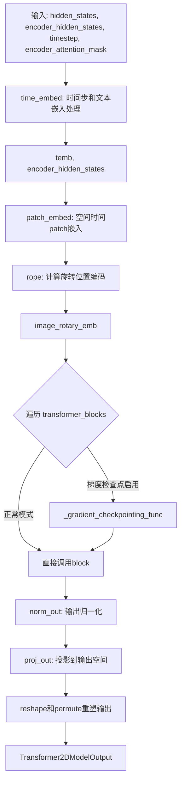
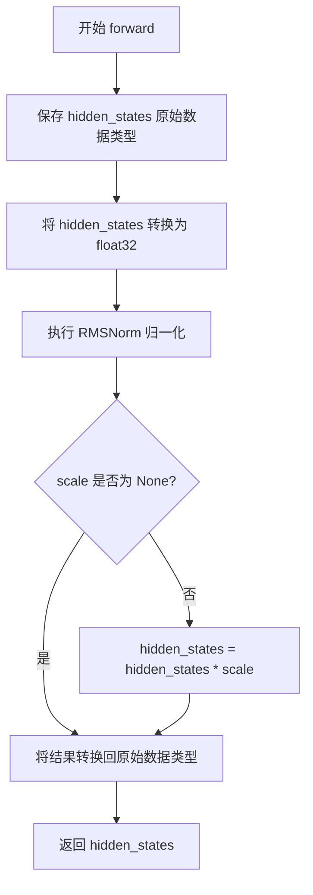
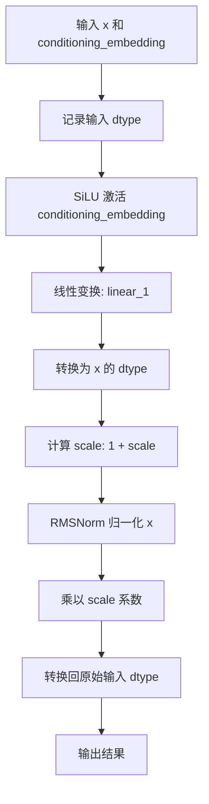
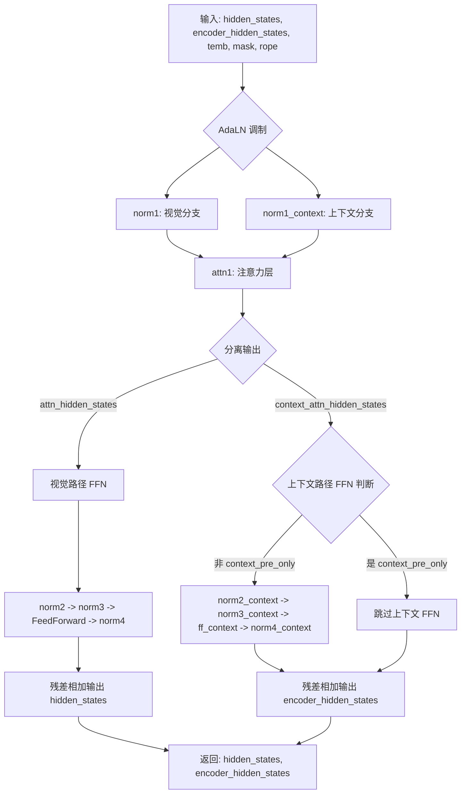

# `diffusers\src\diffusers\models\transformers\transformer_mochi.py` 详细设计文档

Mochi是一个用于视频生成的高性能3D Transformer模型，通过结合自适应归一化、旋转位置编码(RoPE)和调制前馈网络，实现从噪声和文本条件生成高质量视频内容。该模型支持梯度检查点优化和LoRA适配器扩展。

## 整体流程



## 类结构

```
nn.Module (PyTorch基类)
├── MochiModulatedRMSNorm (归一化层)
├── MochiLayerNormContinuous (AdaLN连续归一化)
├── MochiRMSNormZero (自适应RMS Norm)
├── MochiTransformerBlock (Transformer块)
│   ├── MochiRMSNormZero × 2 (norm1, norm1_context)
│   ├── MochiModulatedRMSNorm × 6 (norm2-4, norm2-4_context)
│   ├── MochiAttention
│   ├── FeedForward × 2 (ff, ff_context)
│   └── MochiLayerNormContinuous (可选)
├── MochiRoPE (旋转位置编码)
└── MochiTransformer3DModel (主模型)
    ├── ModelMixin
    ├── ConfigMixin
    ├── PeftAdapterMixin
    ├── FromOriginalModelMixin
    └── CacheMixin
    ├── PatchEmbed
    ├── MochiCombinedTimestepCaptionEmbedding
    ├── MochiRoPE
    ├── nn.ModuleList[MochiTransformerBlock]
    ├── AdaLayerNormContinuous
    └── nn.Linear
```

## 全局变量及字段


### `logger`
    
模块级日志记录器，用于记录模型运行时的信息

类型：`logging.Logger`
    


### `MochiModulatedRMSNorm.eps`
    
归一化的 epsilon 值，防止除零错误

类型：`float`
    


### `MochiModulatedRMSNorm.norm`
    
基础 RMS 归一化层

类型：`RMSNorm`
    


### `MochiLayerNormContinuous.silu`
    
SiLU 激活函数，用于自适应归一化的非线性变换

类型：`nn.SiLU`
    


### `MochiLayerNormContinuous.linear_1`
    
条件嵌入投影层，将条件嵌入投影到目标维度

类型：`nn.Linear`
    


### `MochiLayerNormContinuous.norm`
    
自适应 RMS 归一化层

类型：`MochiModulatedRMSNorm`
    


### `MochiRMSNormZero.silu`
    
SiLU 激活函数，用于门控参数的非线性变换

类型：`nn.SiLU`
    


### `MochiRMSNormZero.linear`
    
嵌入投影层，将嵌入向量投影到门控和缩放空间

类型：`nn.Linear`
    


### `MochiRMSNormZero.norm`
    
基础 RMS 归一化层

类型：`RMSNorm`
    


### `MochiTransformerBlock.context_pre_only`
    
标志位，指示是否仅处理上下文预计算

类型：`bool`
    


### `MochiTransformerBlock.ff_inner_dim`
    
主路径前馈网络的内部维度

类型：`int`
    


### `MochiTransformerBlock.ff_context_inner_dim`
    
上下文路径前馈网络的内部维度

类型：`int`
    


### `MochiTransformerBlock.norm1`
    
主路径第一个自适应归一化层

类型：`MochiRMSNormZero`
    


### `MochiTransformerBlock.norm1_context`
    
上下文路径的归一化层

类型：`MochiRMSNormZero | MochiLayerNormContinuous`
    


### `MochiTransformerBlock.attn1`
    
多头自注意力机制

类型：`MochiAttention`
    


### `MochiTransformerBlock.norm2`
    
注意力输出后的调制归一化层

类型：`MochiModulatedRMSNorm`
    


### `MochiTransformerBlock.norm2_context`
    
上下文注意力输出后的调制归一化层

类型：`MochiModulatedRMSNorm | None`
    


### `MochiTransformerBlock.norm3`
    
MLP 前的调制归一化层

类型：`MochiModulatedRMSNorm`
    


### `MochiTransformerBlock.norm3_context`
    
上下文 MLP 前的调制归一化层

类型：`MochiModulatedRMSNorm | None`
    


### `MochiTransformerBlock.ff`
    
主路径前馈神经网络

类型：`FeedForward`
    


### `MochiTransformerBlock.ff_context`
    
上下文路径前馈神经网络

类型：`FeedForward | None`
    


### `MochiTransformerBlock.norm4`
    
MLP 输出后的调制归一化层

类型：`MochiModulatedRMSNorm`
    


### `MochiTransformerBlock.norm4_context`
    
上下文 MLP 输出后的调制归一化层

类型：`MochiModulatedRMSNorm`
    


### `MochiRoPE.target_area`
    
目标区域面积，用于计算位置嵌入的缩放因子

类型：`int`
    


### `MochiTransformer3DModel.patch_embed`
    
将输入图像转换为补丁嵌入的层

类型：`PatchEmbed`
    


### `MochiTransformer3DModel.time_embed`
    
时间步和文本描述的联合嵌入层

类型：`MochiCombinedTimestepCaptionEmbedding`
    


### `MochiTransformer3DModel.pos_frequencies`
    
旋转位置编码的频率参数

类型：`nn.Parameter`
    


### `MochiTransformer3DModel.rope`
    
旋转位置嵌入生成器

类型：`MochiRoPE`
    


### `MochiTransformer3DModel.transformer_blocks`
    
堆叠的 Transformer 块列表

类型：`nn.ModuleList`
    


### `MochiTransformer3DModel.norm_out`
    
输出前的自适应层归一化

类型：`AdaLayerNormContinuous`
    


### `MochiTransformer3DModel.proj_out`
    
将隐藏状态投影回像素空间的输出层

类型：`nn.Linear`
    


### `MochiTransformer3DModel.gradient_checkpointing`
    
梯度检查点标志，用于节省显存

类型：`bool`
    
    

## 全局函数及方法


### `MochiModulatedRMSNorm.forward`

该方法实现了一种带可选缩放的调制RMS归一化前向传播，通过将输入hidden_states转换为float32进行精确的RMSNorm计算，支持可选的scale参数进行动态调制，最后将结果转换回原始数据类型输出。

参数：

- `hidden_states`：`torch.Tensor`，输入的隐藏状态张量，通常为经过Transformer处理的特征表示
- `scale`：`torch.Tensor | None`，可选的缩放因子，用于对归一化后的结果进行调制，若为None则跳过缩放操作

返回值：`torch.Tensor`，返回经过归一化（及可选缩放）处理后的隐藏状态张量，数据类型与输入张量的原始数据类型一致

#### 流程图



#### 带注释源码

```python
def forward(self, hidden_states, scale=None):
    # 步骤1：保存输入hidden_states的原始数据类型，用于后续恢复
    hidden_states_dtype = hidden_states.dtype
    
    # 步骤2：将hidden_states转换为float32，以提高归一化计算的数值精度
    # 避免在fp16/bf16等低精度下的溢出问题
    hidden_states = hidden_states.to(torch.float32)
    
    # 步骤3：执行RMSNorm归一化操作
    # RMSNorm是一种仅基于激活值RMS（均方根）的归一化方法
    hidden_states = self.norm(hidden_states)
    
    # 步骤4：如果提供了scale参数，则对归一化结果进行缩放调制
    # 这允许动态调整归一化后的特征尺度，实现特征调制
    if scale is not None:
        hidden_states = hidden_states * scale
    
    # 步骤5：将结果转换回原始输入数据类型
    # 保持与输入张量相同的dtype，以兼容后续计算图
    hidden_states = hidden_states.to(hidden_states_dtype)
    
    # 步骤6：返回处理后的hidden_states
    return hidden_states
```


### `MochiLayerNormContinuous.forward`

该方法实现了 AdaLN（自适应层归一化连续）机制，通过将条件嵌入（conditioning_embedding）经过 SiLU 激活和线性变换生成缩放系数（scale），并将其应用于 RMSNorm 归一化操作，实现对输入张量的自适应调制，是 MochiTransformerBlock 中用于条件感知特征处理的核心组件。

参数：

- `x`：`torch.Tensor`，输入的隐藏状态张量，通常为经过 patch 嵌入后的特征，形状为 (batch, seq_len, embedding_dim)
- `conditioning_embedding`：`torch.Tensor`，条件嵌入向量，通常来自时间步嵌入或文本嵌入，形状为 (batch, conditioning_embedding_dim)

返回值：`torch.Tensor`，返回经过 AdaLN 调制后的归一化隐藏状态，形状与输入 x 相同，dtype 与输入 x 的原始 dtype 一致

#### 流程图



#### 带注释源码

```python
def forward(
    self,
    x: torch.Tensor,
    conditioning_embedding: torch.Tensor,
) -> torch.Tensor:
    # 记录输入 x 的原始数据类型，用于最后转换回原始 dtype
    input_dtype = x.dtype

    # 将条件嵌入转换为 x 的数据类型，确保 dtype 一致性
    # 这是为了处理 conditioning_embedding 被上转换为 float32 的情况（用于 hunyuanDiT）
    scale = self.linear_1(self.silu(conditioning_embedding).to(x.dtype))
    
    # 执行自适应 RMSNorm 归一化：
    # 1. unsqueeze(1) 将 scale 从 (batch, dim) 扩展为 (batch, 1, dim) 以匹配 x 的维度
    # 2. 转换为 float32 以确保数值稳定性
    # 3. (1 + scale) 实现 AdaLN 的缩放偏移
    x = self.norm(x, (1 + scale.unsqueeze(1).to(torch.float32)))

    # 将输出转换回输入的原始数据类型，确保与后续层的数据类型兼容
    return x.to(input_dtype)
```


### `MochiRMSNormZero.forward`

该函数是 Mochi 模型中的自适应 RMS 归一化层实现，通过接收隐藏状态和条件嵌入（emb），先对嵌入进行线性变换并分块得到四个参数（MSA 门控、MSA 缩放、MLP 门控、MLP 缩放），然后对隐藏状态进行 RMS 归一化并应用 MSA 缩放参数，最终返回归一化后的隐藏状态及四个门控/缩放参数供后续注意力机制和 MLP 层使用。

参数：

- `hidden_states`：`torch.Tensor`，输入的隐藏状态张量，通常形状为 (batch_size, seq_len, embedding_dim)
- `emb`：`torch.Tensor`，条件嵌入向量，通常来自时间步嵌入或上下文嵌入，形状为 (batch_size, embedding_dim)

返回值：`tuple[torch.Tensor, torch.Tensor, torch.Tensor, torch.Tensor]`，返回一个包含四个元素的元组，分别是归一化后的隐藏状态、MSA 门控参数、MLP 缩放参数、MLP 门控参数

#### 流程图

```mermaid
flowchart TD
    A[输入 hidden_states, emb] --> B[保存原始数据类型]
    B --> C[emb 经过 SiLU 激活函数]
    C --> D[Linear 层变换 emb]
    D --> E[按 dim=1 分块为 4 个向量]
    E --> F[scale_msa: MSA 缩放]
    E --> G[gate_msa: MSA 门控]
    E --> H[scale_mlp: MLP 缩放]
    E --> I[gate_mlp: MLP 门控]
    F --> J[hidden_states 转换为 float32]
    J --> K[RMSNorm 归一化]
    K --> L[乘以 (1 + scale_msa)]
    L --> M[转换回原始数据类型]
    M --> N[输出 hidden_states, gate_msa, scale_mlp, gate_mlp]
```

#### 带注释源码

```python
def forward(
    self, hidden_states: torch.Tensor, emb: torch.Tensor
) -> tuple[torch.Tensor, torch.Tensor, torch.Tensor, torch.Tensor]:
    # 保存输入 hidden_states 的原始数据类型，用于后续恢复
    hidden_states_dtype = hidden_states.dtype

    # 对条件嵌入 emb 进行线性变换：首先通过 SiLU 激活函数
    # self.linear 将 embedding_dim 维度映射到 hidden_dim (= 4 * embedding_dim) 维度
    emb = self.linear(self.silu(emb))
    
    # 将变换后的 emb 按通道维度分割成 4 个等大小的向量
    # 每个向量将用于不同的门控或缩放操作
    scale_msa, gate_msa, scale_mlp, gate_mlp = emb.chunk(4, dim=1)
    
    # 对 hidden_states 进行 RMS 归一化：
    # 1. 转换为 float32 以提高数值稳定性
    # 2. 应用 RMSNorm 归一化
    # 3. 乘以 (1 + scale_msa) 实现自适应缩放，scale_msa 扩展维度以匹配 hidden_states
    hidden_states = self.norm(hidden_states.to(torch.float32)) * (1 + scale_msa[:, None].to(torch.float32))
    
    # 将结果转换回原始数据类型
    hidden_states = hidden_states.to(hidden_states_dtype)

    # 返回归一化后的隐藏状态以及四个自适应参数
    # gate_msa 和 gate_mlp 将用于注意力机制和 MLP 的门控（通过 tanh 激活）
    # scale_mlp 将用于 MLP 层的自适应缩放
    return hidden_states, gate_msa, scale_mlp, gate_mlp
```


### `MochiTransformerBlock.forward`

这是 MochiTransformerBlock 的核心前向传播方法，负责处理视频扩散变换器中单个块的数据流。它接收视觉 latent特征、文本/上下文 encoder_hidden_states、时间步嵌入以及旋转位置编码，通过自适应归一化（AdaLN）进行调制，并行执行自注意力和交叉注意力（融合视觉与上下文），最后分别通过前馈网络（FFN）更新视觉和上下文状态。

参数：

- `hidden_states`：`torch.Tensor`，输入的视觉特征张量（Latent states）。
- `encoder_hidden_states`：`torch.Tensor`，来自编码器（如文本编码器）的上下文隐藏状态。
- `temb`：`torch.Tensor`，时间步嵌入（Timestep embedding），用于 AdaLN 调制。
- `encoder_attention_mask`：`torch.Tensor`，用于掩码 encoder_hidden_states 的注意力机制，防止泄露padding信息。
- `image_rotary_emb`：`torch.Tensor | None`，可选的图像旋转位置嵌入（RoPE），用于增强注意力的位置感知能力。

返回值：`tuple[torch.Tensor, torch.Tensor]`，返回更新后的视觉隐藏状态和上下文隐藏状态元组。

#### 流程图



#### 带注释源码

```python
def forward(
    self,
    hidden_states: torch.Tensor,
    encoder_hidden_states: torch.Tensor,
    temb: torch.Tensor,
    encoder_attention_mask: torch.Tensor,
    image_rotary_emb: torch.Tensor | None = None,
) -> tuple[torch.Tensor, torch.Tensor]:
    # 1. 第一个归一化层 (AdaLN-Zero 变体)
    # 对视觉输入 hidden_states 进行归一化，并从 time embedding (temb) 中解耦出用于 MSA 和 MLP 的门控与缩放因子
    norm_hidden_states, gate_msa, scale_mlp, gate_mlp = self.norm1(hidden_states, temb)

    # 对上下文输入 encoder_hidden_states 进行处理
    if not self.context_pre_only:
        # 如果不是仅处理上下文前的阶段，则使用 AdaLN 类似的归一化
        norm_encoder_hidden_states, enc_gate_msa, enc_scale_mlp, enc_gate_mlp = self.norm1_context(
            encoder_hidden_states, temb
        )
    else:
        # 否则使用连续的 LayerNorm (MochiLayerNormContinuous)
        norm_encoder_hidden_states = self.norm1_context(encoder_hidden_states, temb)

    # 2. 注意力层 (MochiAttention)
    # 执行视觉与上下文之间的交叉注意力，并行返回两个分支的注意力输出
    # 注意：这里融合了自注意力和交叉注意力的逻辑，或者并行处理双流
    attn_hidden_states, context_attn_hidden_states = self.attn1(
        hidden_states=norm_hidden_states,
        encoder_hidden_states=norm_encoder_hidden_states,
        image_rotary_emb=image_rotary_emb,
        attention_mask=encoder_attention_mask,
    )

    # 3. 视觉路径 (Visual Path) 的残差与 FFN
    # 应用 norm2 进行第一次残差连接，使用 gate_msa 作为缩放因子
    hidden_states = hidden_states + self.norm2(attn_hidden_states, torch.tanh(gate_msa).unsqueeze(1))
    
    # 应用 norm3 和 FFN
    norm_hidden_states = self.norm3(hidden_states, (1 + scale_mlp.unsqueeze(1).to(torch.float32)))
    ff_output = self.ff(norm_hidden_states)
    
    # 应用 norm4 进行第二次残差连接，使用 gate_mlp
    hidden_states = hidden_states + self.norm4(ff_output, torch.tanh(gate_mlp).unsqueeze(1))

    # 4. 上下文路径 (Context Path) 的残差与 FFN (如果启用)
    if not self.context_pre_only:
        # 上下文注意力后的残差
        encoder_hidden_states = encoder_hidden_states + self.norm2_context(
            context_attn_hidden_states, torch.tanh(enc_gate_msa).unsqueeze(1)
        )
        
        # 上下文 FFN 前的归一化
        norm_encoder_hidden_states = self.norm3_context(
            encoder_hidden_states, (1 + enc_scale_mlp.unsqueeze(1).to(torch.float32))
        )
        
        # 上下文 FFN
        context_ff_output = self.ff_context(norm_encoder_hidden_states)
        
        # 上下文 FFN 后的残差
        encoder_hidden_states = encoder_hidden_states + self.norm4_context(
            context_ff_output, torch.tanh(enc_gate_mlp).unsqueeze(1)
        )

    # 返回更新后的视觉状态和上下文状态
    return hidden_states, encoder_hidden_states
```


### `MochiRoPE._centers`

该方法是非公开方法（命名以 `_` 开头），主要用于计算在一个连续区间内均匀分布的中心点。它通过先生成区间边缘（Edges），然后计算相邻边缘的中点来实现。这通常用于生成位置编码中的坐标网格。

参数：

- `start`：`float`，区间的起始值（例如负的高度或宽度缩放后的一半）。
- `stop`：`float`，区间的结束值（例如正的高度或宽度缩放后的一半）。
- `num`：`int`，需要生成的中心点数量（通常对应空间维度的高或宽）。
- `device`：`torch.device`，用于创建张量的设备（如 CPU 或 CUDA）。
- `dtype`：`torch.dtype`，张量的数据类型（如 `torch.float32`）。

返回值：`torch.Tensor`，返回一个一维张量，包含 `num` 个均匀分布的中心点坐标。

#### 流程图

```mermaid
graph LR
    A[输入: start, stop, num, device, dtype] --> B{调用 torch.linspace}
    B --> C[生成 num+1 个边缘点 edges]
    C --> D[切片: left = edges[:-1], right = edges[1:]]
    D --> E[计算中点: centers = (left + right) / 2]
    E --> F[输出: centers 张量]
```

#### 带注释源码

```python
def _centers(self, start, stop, num, device, dtype) -> torch.Tensor:
    # 使用 torch.linspace 在 [start, stop] 区间内生成 num+1 个等间距的点，作为区间的边缘
    edges = torch.linspace(start, stop, num + 1, device=device, dtype=dtype)
    
    # 计算相邻边缘的中点：
    # edges[:-1] 包含所有左边边缘 (不包括最后一个边缘)
    # edges[1:] 包含所有右边边缘 (不包括第一个边缘)
    # 将它们相加并除以 2 得到中心点
    return (edges[:-1] + edges[1:]) / 2
```


### `MochiRoPE._get_positions`

该方法根据给定的帧数、高度和宽度生成3D时空位置网格，用于RoPE（旋转位置编码）的位置嵌入计算。它通过计算缩放因子并生成时间、空间坐标的网格，最后将坐标堆叠成形状为(num_frames * height * width, 3)的位置张量。

参数：

- `self`：隐式参数，MochiRoPE类的实例，包含target_area属性用于计算缩放因子
- `num_frames`：`int`，视频帧数，指定要生成位置的时间维度大小
- `height`：`int`，空间高度维度，指定垂直方向的位置数量
- `width`：`int`，空间宽度维度，指定水平方向的位置数量
- `device`：`torch.device | None`，计算设备，指定张量创建的设备位置，默认为None
- `dtype`：`torch.dtype | None`，数据类型，指定张量的数据类型，默认为None

返回值：`torch.Tensor`，形状为(num_frames * height * width, 3)的三维位置张量，每行包含(t, h, w)坐标

#### 流程图

```mermaid
flowchart TD
    A[开始] --> B[计算缩放因子 scale = target_area / height * width 的平方根]
    B --> C[生成时间坐标 t = arange num_frames]
    C --> D[生成高度坐标 h = _centers -height*scale/2 到 height*scale/2]
    D --> E[生成宽度坐标 w = _centers -width*scale/2 到 width*scale/2]
    E --> F[使用 meshgrid 生成三维网格]
    F --> G[堆叠坐标为 [grid_t, grid_h, grid_w]]
    G --> H[view 展平为 [num_frames*height*width, 3] 形状]
    H --> I[返回 positions 张量]
```

#### 带注释源码

```python
def _get_positions(
    self,
    num_frames: int,
    height: int,
    width: int,
    device: torch.device | None = None,
    dtype: torch.dtype | None = None,
) -> torch.Tensor:
    """
    生成3D时空位置网格用于RoPE位置编码
    
    参数:
        num_frames: 视频帧数
        height: 空间高度维度
        width: 空间宽度维度
        device: 计算设备
        dtype: 数据类型
    
    返回:
        形状为 (num_frames * height * width, 3) 的位置张量
    """
    # 计算缩放因子，基于目标面积与当前尺寸的比例
    # 用于保持不同分辨率下的位置编码一致性
    scale = (self.target_area / (height * width)) ** 0.5

    # 生成时间维度坐标：0, 1, 2, ..., num_frames-1
    t = torch.arange(num_frames, device=device, dtype=dtype)
    
    # 生成高度维度坐标：从 -height*scale/2 到 height*scale/2 的中心点
    h = self._centers(-height * scale / 2, height * scale / 2, height, device, dtype)
    
    # 生成宽度维度坐标：从 -width*scale/2 到 width*scale/2 的中心点
    w = self._centers(-width * scale / 2, width * scale / 2, width, device, dtype)

    # 使用 meshgrid 生成三维网格，indexing="ij" 使用行列索引
    grid_t, grid_h, grid_w = torch.meshgrid(t, h, w, indexing="ij")

    # 沿最后一维堆叠坐标，然后展平为 (N, 3) 形状
    # N = num_frames * height * width
    positions = torch.stack([grid_t, grid_h, grid_w], dim=-1).view(-1, 3)
    return positions
```


### `MochiRoPE._create_rope`

创建旋转位置编码（RoPE），通过爱因斯坦求和计算频率，然后分别计算余弦和正弦编码。

参数：

- `freqs`：`torch.Tensor`，位置频率张量，形状为 (d, h, f)，其中 d 是维度，h 是头数，f 是频率维度的一半
- `pos`：`torch.Tensor`，位置张量，形状为 (n, 3)，包含 n 个位置的 3D 坐标（时间、高度、宽度）

返回值：`tuple[torch.Tensor, torch.Tensor]`，返回两个张量，分别是余弦编码（freqs_cos）和正弦编码（freqs_sin），形状均为 (n, h, f)

#### 流程图

```mermaid
flowchart TD
    A[开始 _create_rope] --> B[使用 autocast 将计算强制到 FP32]
    B --> C[将 pos 转为 FP32]
    C --> D[将 freqs 转为 FP32]
    D --> E[执行 einsum: nd,dhf -> nhf]
    E --> F[计算余弦: torch.cos]
    F --> G[计算正弦: torch.sin]
    G --> H[返回 (freqs_cos, freqs_sin)]
```

#### 带注释源码

```python
def _create_rope(self, freqs: torch.Tensor, pos: torch.Tensor) -> torch.Tensor:
    # 使用 autocast 上下文管理器强制在 FP32 精度下进行计算
    # 这是为了保证 RoPE 频率计算的数值稳定性
    with torch.autocast(freqs.device.type, torch.float32):
        # Always run ROPE freqs computation in FP32
        # 使用爱因斯坦求和计算位置编码
        # pos: (n, 3) - n 个位置，每个位置 3 维（时间、高度、宽度）
        # freqs: (d, h, f) - d=3 维度，h 头数，f 频率维度（attention_head_dim // 2）
        # 输出: (n, h, f) - 每个位置每个头的频率
        freqs = torch.einsum("nd,dhf->nhf", pos.to(torch.float32), freqs.to(torch.float32))

    # 分别计算余弦和正弦编码，用于后续的旋转位置嵌入
    freqs_cos = torch.cos(freqs)
    freqs_sin = torch.sin(freqs)
    # 返回编码对，供注意力机制使用
    return freqs_cos, freqs_sin
```


### `MochiRoPE.forward`

该方法是MochiRoPE类的核心前向传播函数，用于计算旋转位置嵌入（RoPE）。它首先根据帧数、高度和宽度生成3D位置网格，然后结合位置频率通过三角函数计算余弦和正弦旋转矩阵，用于后续Transformer块中的注意力机制。

参数：

- `pos_frequencies`：`torch.Tensor`，预计算的位置频率张量，形状为(3, num_attention_heads, attention_head_dim // 2)
- `num_frames`：`int`，输入视频的帧数，用于生成时间维度位置
- `height`：`int`，输入视频的高度（patch化后），用于生成高度维度位置
- `width`：`int`，输入视频的宽度（patch化后），用于生成宽度维度位置
- `device`：`torch.device | None`，计算设备，默认为None
- `dtype`：`torch.dtype | None`，数据类型，默认为None

返回值：`tuple[torch.Tensor, torch.Tensor]`，返回两个张量——rope_cos和rope_sin，分别表示旋转位置嵌入的余弦和正弦部分，形状为(num_positions, num_attention_heads, attention_head_dim // 2)

#### 流程图

```mermaid
flowchart TD
    A[开始 forward] --> B[调用 _get_positions]
    B --> C[计算 scale = (target_area / (height * width))^0.5]
    C --> D[生成时间维度位置 t]
    D --> E[调用 _centers 生成高度维度位置 h]
    E --> F[调用 _centers 生成宽度维度位置 w]
    F --> G[使用 meshgrid 生成 3D 网格]
    G --> H[堆叠并展平为位置张量 pos]
    H --> I[调用 _create_rope]
    I --> J[将 pos 和 freqs 转为 FP32]
    J --> K[使用 einsum 计算频率: nd,dhf->nhf]
    K --> L[计算 cos 和 sin]
    L --> M[返回 rope_cos, rope_sin]
```

#### 带注释源码

```
def forward(
    self,
    pos_frequencies: torch.Tensor,  # 预计算的位置频率，形状为(3, num_heads, head_dim//2)
    num_frames: int,                 # 输入视频的帧数
    height: int,                     # patch化后的高度
    width: int,                      # patch化后的宽度
    device: torch.device | None = None,  # 计算设备
    dtype: torch.dtype | None = None,    # 数据类型
) -> tuple[torch.Tensor, torch.Tensor]:
    # 步骤1: 获取3D位置坐标
    # 根据目标区域和当前尺寸计算缩放因子，保持长宽比
    pos = self._get_positions(num_frames, height, width, device, dtype)
    
    # 步骤2: 创建RoPE嵌入
    # 使用位置和频率计算旋转角度，然后分别计算余弦和正弦值
    rope_cos, rope_sin = self._create_rope(pos_frequencies, pos)
    
    # 返回旋转位置嵌入的余弦和正弦分量
    # 用于在注意力机制中应用旋转位置编码
    return rope_cos, rope_sin
```


### `MochiTransformer3DModel.forward`

该方法是 MochiTransformer3DModel 模型的主前向传播方法，负责将输入的潜在视频帧（hidden_states）、文本编码（encoder_hidden_states）和时间步（timestep）通过一系列变换器块处理，最终输出生成视频的潜表示。

参数：

- `hidden_states`：`torch.Tensor`，输入的潜在视频帧，形状为 (batch_size, num_channels, num_frames, height, width)
- `encoder_hidden_states`：`torch.Tensor`，文本编码器的输出隐藏状态，用于条件生成
- `timestep`：`torch.LongTensor`，扩散过程中的时间步，用于条件化生成
- `encoder_attention_mask`：`torch.Tensor`，用于掩码 encoder_hidden_states 的注意力掩码
- `attention_kwargs`：`dict[str, Any] | None`，可选的注意力相关参数，用于 LoRA 等机制
- `return_dict`：`bool`，是否返回字典格式的输出，默认为 True

返回值：`torch.Tensor` 或 `Transformer2DModelOutput`，当 return_dict 为 True 时返回 Transformer2DModelOutput 对象，否则返回元组

#### 流程图

```mermaid
flowchart TD
    A[开始 forward] --> B[解析 hidden_states 形状<br/>batch_size, num_channels, num_frames, height, width]
    B --> C[计算 patch 后尺寸<br/>post_patch_height = height // p<br/>post_patch_width = width // p]
    C --> D[time_embed 处理<br/>timestep + encoder_hidden_states → temb + encoder_hidden_states]
    D --> E[hidden_states 预处理<br/>permute → flatten → patch_embed → unflatten]
    E --> F[创建 RoPE 旋转位置嵌入<br/>image_rotary_emb]
    F --> G{是否启用梯度检查点?}
    G -->|是| H[使用 _gradient_checkpointing_func<br/>遍历所有 transformer_blocks]
    G -->|否| I[直接调用 block<br/>遍历所有 transformer_blocks]
    H --> J
    I --> J
    J --> K[norm_out + proj_out 输出投影]
    K --> L[reshape 输出<br/>还原为原始空间尺寸]
    L --> M{return_dict?}
    M -->|True| N[返回 Transformer2DModelOutput]
    M -->|False| O[返回元组 (output,)]
    N --> P[结束]
    O --> P
```

#### 带注释源码

```python
@apply_lora_scale("attention_kwargs")
def forward(
    self,
    hidden_states: torch.Tensor,
    encoder_hidden_states: torch.Tensor,
    timestep: torch.LongTensor,
    encoder_attention_mask: torch.Tensor,
    attention_kwargs: dict[str, Any] | None = None,
    return_dict: bool = True,
) -> torch.Tensor:
    # 1. 从 hidden_states 提取批次大小、通道数、帧数、高度和宽度
    batch_size, num_channels, num_frames, height, width = hidden_states.shape
    p = self.config.patch_size  # 获取 patch 大小

    # 2. 计算 patch 后的空间尺寸
    post_patch_height = height // p
    post_patch_width = width // p

    # 3. 时间嵌入处理：将 timestep 和文本编码器输出进行条件化
    temb, encoder_hidden_states = self.time_embed(
        timestep,
        encoder_hidden_states,
        encoder_attention_mask,
        hidden_dtype=hidden_states.dtype,
    )

    # 4. 对输入 hidden_states 进行预处理：
    #    - permute: 将通道维移到最后 (batch, frames, channels, h, w) → (batch, frames, h, w, channels)
    #    - flatten(0,1): 合并 batch 和 frames 维度
    #    - patch_embed: 转换为 patch 序列
    #    - unflatten/flatten: 重新组织为 (batch, num_patches_h * num_patches_w, num_patches_t, dim)
    hidden_states = hidden_states.permute(0, 2, 1, 3, 4).flatten(0, 1)
    hidden_states = self.patch_embed(hidden_states)
    hidden_states = hidden_states.unflatten(0, (batch_size, -1)).flatten(1, 2)

    # 5. 创建旋转位置嵌入 (RoPE)，用于捕捉空间-时间位置信息
    image_rotary_emb = self.rope(
        self.pos_frequencies,
        num_frames,
        post_patch_height,
        post_patch_width,
        device=hidden_states.device,
        dtype=torch.float32,
    )

    # 6. 遍历所有 Transformer 块进行编码
    for i, block in enumerate(self.transformer_blocks):
        if torch.is_grad_enabled() and self.gradient_checkpointing:
            # 使用梯度检查点节省显存
            hidden_states, encoder_hidden_states = self._gradient_checkpointing_func(
                block,
                hidden_states,
                encoder_hidden_states,
                temb,
                encoder_attention_mask,
                image_rotary_emb,
            )
        else:
            # 直接调用 transformer 块
            hidden_states, encoder_hidden_states = block(
                hidden_states=hidden_states,
                encoder_hidden_states=encoder_hidden_states,
                temb=temb,
                encoder_attention_mask=encoder_attention_mask,
                image_rotary_emb=image_rotary_emb,
            )

    # 7. 输出层：归一化 + 线性投影
    hidden_states = self.norm_out(hidden_states, temb)
    hidden_states = self.proj_out(hidden_states)

    # 8. 重新 reshape 到原始空间维度
    #    从 patch 形式还原为 (batch, channels, frames, height, width)
    hidden_states = hidden_states.reshape(
        batch_size, num_frames, post_patch_height, post_patch_width, p, p, -1
    )
    hidden_states = hidden_states.permute(0, 6, 1, 2, 4, 3, 5)
    output = hidden_states.reshape(batch_size, -1, num_frames, height, width)

    # 9. 根据 return_dict 返回结果
    if not return_dict:
        return (output,)
    return Transformer2DModelOutput(sample=output)
```

## 关键组件


### MochiTransformer3DModel

主模型类，继承自ModelMixin、ConfigMixin、PeftAdapterMixin、FromOriginalModelMixin和CacheMixin，用于视频生成的3D Transformer模型，支持LoRA适配器加载、单文件模型加载和KV缓存。

### MochiTransformerBlock

Transformer块实现，包含自注意力、交叉注意力和前馈网络，支持上下文预处理和调制归一化，使用MochiRMSNormZero和MochiModulatedRMSNorm进行自适应归一化。

### MochiModulatedRMSNorm

带缩放因子的RMS归一化层，支持可选的scale参数进行调制，将输入转换为float32进行计算后再转回原始数据类型。

### MochiLayerNormContinuous

连续层归一化（AdaLN），使用SiLU激活的线性层生成缩放因子，结合conditioning_embedding对输入进行调制。

### MochiRMSNormZero

自适应RMS零初始化归一化，用于Mochi模型，从embedding生成四个调制参数（scale_msa、gate_msa、scale_mlp、gate_mlp）分别用于注意力和前馈网络。

### MochiRoPE

旋转位置编码（RoPE）实现，用于3D视频数据的时空位置编码，支持基于目标区域和帧数的高度/宽度缩放插值。

### PatchEmbed

图像/视频块嵌入层，将输入转换为patch序列，配置在MochiTransformer3DModel中用于将原始像素转换为Transformer输入。

### MochiCombinedTimestepCaptionEmbedding

时间和文本Caption的联合嵌入层，生成时间嵌入和池化后的文本嵌入，配置在主模型中用于条件注入。

### FeedForward

前馈神经网络层，支持SwiGLU激活函数，用于Transformer块中的MLP部分。

### AdaLayerNormContinuous

连续自适应层归一化，用于输出层的归一化，支持layer_norm类型。

### gradient_checkpointing

梯度检查点机制，通过self.gradient_checkpointing控制在前向传播中是否使用梯度检查点以节省显存，支持在训练时在block级别进行梯度 checkpointing。

### image_rotary_emb

旋转位置嵌入生成，通过MochiRoPE根据帧数、高度和宽度生成cos和sin频率，用于注意力机制中的位置编码。

### transformer_blocks

Transformer块列表，包含num_layers个MochiTransformerBlock实例，按顺序处理隐藏状态。

### pos_frequencies

可学习的旋转位置嵌入参数，形状为(3, num_attention_heads, attention_head_dim // 2)，用于生成RoPE编码。

### 张量形状变换流程

代码中包含多处张量索引和形状变换：hidden_states.permute(0, 2, 1, 3, 4).flatten(0, 1)进行维度重排和展平，patch_embed后使用unflatten和flatten调整形状，最终输出通过reshape和permute恢复为(batch_size, -1, num_frames, height, width)格式。

### 类型转换与反量化

多处使用to(torch.float32)进行精度提升计算（如归一化、RoPE计算），使用to(input_dtype)或to(hidden_states_dtype)转回原始类型，防止精度损失。

### _gradient_checkpointing_func

梯度检查点封装函数，用于在torch.is_grad_enabled()和gradient_checkpointing都为True时对block进行梯度 checkpointing，减少显存占用。


## 问题及建议


### 已知问题

-   **类型注解不一致**：`MochiTransformerBlock.__init__` 中 `eps: float = 1e-6` 缺少尾部逗号；`MochiTransformerBlock.norm3` 初始化使用 `MochiModulatedRMSNorm(eps)` 而非 `MochiModulatedRMSNorm(eps=eps)`，风格不一致
-   **未使用的参数**：`MochiRMSNormZero.__init__` 接收 `elementwise_affine: bool = False` 参数但从未使用；`MochiTransformerBlock` 初始化了 `self.norm4_context` 但在 `forward` 方法中当 `context_pre_only=True` 时完全未使用，造成不必要的内存开销
-   **TODO 未处理**：存在 TODO 注释 `TODO(aryan): norm_context layers are not needed when context_pre_only is True` 表明有明确的优化空间但尚未实现
-   **冗余计算**：当 `context_pre_only=True` 时，`MochiTransformerBlock` 仍然会执行 `encoder_hidden_states` 的残差连接和归一化逻辑，但实际上这些计算可能被跳过
-   **类型转换开销**：多处代码频繁使用 `.to(torch.float32)` 和 `.to(hidden_states_dtype)` 进行往返类型转换，可能影响性能
-   **硬编码值**：`MochiTransformerBlock` 中 attention 层的 `eps=1e-5` 是硬编码的，未使用类初始化时传入的 `eps` 参数
-   **RoPE 性能**：`MochiRoPE._create_rope` 方法中使用 `torch.autocast` 上下文管理器每次调用都会引入额外开销，且注释表明"Always run ROPE freqs computation in FP32"，可以在更高层级统一处理
-   **文档缺失**：`forward` 方法的 `attention_kwargs` 参数缺少文档说明其用途和结构

### 优化建议

-   移除 `MochiRMSNormZero` 中未使用的 `elementwise_affine` 参数，或实现其功能
-   在 `MochiTransformerBlock.__init__` 中根据 `context_pre_only` 条件性地跳过 `norm2_context`、`norm3_context`、`norm4_context` 和 `ff_context` 的初始化，避免内存浪费
-   将 `MochiTransformerBlock` 中 attention 层的 `eps=1e-5` 替换为使用传入的 `eps` 参数，保持参数一致性
-   考虑在 `MochiTransformerBlock.forward` 中当 `context_pre_only=True` 时提前返回，跳过不必要的 encoder_hidden_states 处理逻辑
-   将类型转换操作合并，减少中间转换步骤，例如在 `MochiModulatedRMSNorm.forward` 中避免多次 dtype 切换
-   将 RoPE 的 FP32 计算提升到调用层级，避免在每次 forward 时重复创建 autocast 上下文
-   统一 `MochiTransformerBlock` 中 norm 层的初始化风格，使用命名参数传递 eps 值

## 其它


### 设计目标与约束

本代码实现了一个用于视频生成的3D Transformer模型（Mochi），核心目标是支持高质量视频合成任务。设计约束包括：1）模型必须支持扩散模型架构；2）需兼容PEFT（Parameter-Efficient Fine-Tuning）适配器；3）支持梯度检查点以节省显存；4）遵循HuggingFace Diffusers库的模块化设计规范；5）需要支持长序列（max_sequence_length=256）处理能力。

### 错误处理与异常设计

代码中的错误处理主要通过以下机制实现：1）类型检查使用Python类型提示（torch.Tensor | None）；2）dtype转换使用to()方法避免精度损失；3）注意力掩码参数encoder_attention_mask需外部传入，模型内部不进行合法性校验；4）MochiRMSNormZero的chunk操作假设emb维度可被4整除，若维度不匹配会抛出RuntimeError；5）patch_size必须能整除height和width，否则会导致形状不匹配错误。建议在调用forward前对输入进行形状验证。

### 数据流与状态机

数据流主要分为以下几个阶段：1）输入阶段：接收hidden_states（视频张量）、encoder_hidden_states（文本embedding）、timestep（扩散时间步）和encoder_attention_mask；2）Embedding阶段：通过time_embed生成temb和编码后的encoder_hidden_states，patch_embed将视频张量转换为patch序列；3）位置编码：通过MochiRoPE生成旋转位置嵌入；4）Transformer块处理：遍历num_layers个MochiTransformerBlock，每个块内部包含自注意力、跨注意力和FFN的级联运算；5）输出投影：通过norm_out和proj_out将隐藏状态映射回像素空间；6）最终reshape为(batch_size, channels, num_frames, height, width)格式输出。状态机主要体现在hidden_states和encoder_hidden_states在每个block中的迭代更新。

### 外部依赖与接口契约

主要依赖包括：1）torch和torch.nn提供基础张量运算；2）configuration_utils.ConfigMixin和register_to_config装饰器用于配置管理；3）loaders中的PeftAdapterMixin和FromOriginalModelMixin支持PEFT和单文件模型加载；4）cache_utils.CacheMixin支持KV缓存；5）attention_processor中的MochiAttention和MochiAttnProcessor2_0实现注意力机制；6）embeddings中的MochiCombinedTimestepCaptionEmbedding和PatchEmbed实现embedding层；7）normalization中的AdaLayerNormContinuous和RMSNorm实现归一化；8）FeedForward实现前馈网络。接口契约要求：hidden_states形状为(batch, channels, frames, height, width)；encoder_hidden_states形状为(batch, seq_len, text_embed_dim)；timestep为LongTensor；encoder_attention_mask为Attention Mask。

### 配置参数说明

主要配置参数包括：1）patch_size（默认2）：Patch嵌入的窗口大小；2）num_attention_heads（默认24）：注意力头数；3）attention_head_dim（默认128）：每个头的维度；4）num_layers（默认48）：Transformer块数量；5）pooled_projection_dim（默认1536）：池化投影维度；6）in_channels（默认12）：输入通道数；7）out_channels（默认None）：输出通道数，默认为in_channels；8）qk_norm（默认"rms_norm"）：QK归一化类型；9）text_embed_dim（默认4096）：文本embedding维度；10）time_embed_dim（默认256）：时间embedding维度；11）activation_fn（默认"swiglu"）：激活函数类型；12）max_sequence_length（默认256）：最大序列长度。

### 性能考虑与优化空间

性能优化方面：1）支持梯度检查点（gradient_checkpointing）以减少显存占用；2）使用maybe_allow_in_graph装饰器允许某些操作在计算图中保留；3）RMSNorm使用float32计算以提高精度；4）RoPE频率计算强制使用FP32。优化空间：1）当前实现未使用CUDA图优化；2）attention mask为必填参数，可考虑支持None默认；3）Transformer块中多次调用.to(torch.float32)和.to(device)可能导致不必要的拷贝；4）可添加torch.compile支持以加速推理；5）可实现paged attention以支持更长序列。

### 安全性考虑

代码安全性主要涉及：1）模型权重加载时的来源验证（FromOriginalModelMixin）；2）PEFT适配器的安全加载；3）输入张量形状校验需在调用层处理；4）不存在直接的用户输入执行风险；5）遵循Apache 2.0许可证的开源使用规范。建议在生产环境中对输入进行尺寸限制以防止OOM攻击。

### 测试考虑

建议添加以下测试用例：1）单元测试验证每个类的输出形状正确性；2）梯度检查点功能测试；3）不同batch_size下的前向传播测试；4）dtype转换精度测试；5）PEFT适配器加载和推理测试；6）与原始模型权重加载的兼容性测试；7）长序列输入的内存占用测试；8）RoPE位置编码的正确性验证。

### 版本兼容性

代码依赖以下版本要求：1）Python 3.8+；2）PyTorch 2.0+（用于torch.autocast和tensor.dtype | None语法）；3）Diffusers库需实现ConfigMixin、ModelMixin、PeftAdapterMixin等Mixin类；4）transformers库版本需支持RoPE相关实现。建议记录测试通过的最小依赖版本。

### 潜在技术债务

1）TODO注释提到context_pre_only=True时norm_context层不需要但仍被创建；2）代码中有多处硬编码数值如eps=1e-5、eps=1e-6等，可提取为统一配置；3）MochiTransformerBlock的forward方法较长，可拆分为更小的私有方法；4）类型注解中使用|语法需要Python 3.10+，需确认最低版本要求；5）缺少详细的文档字符串说明各配置参数的具体作用和可选值。

    