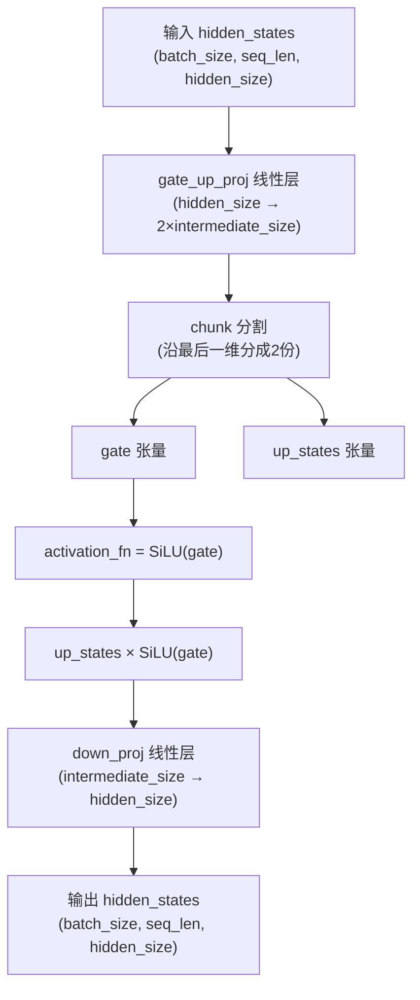
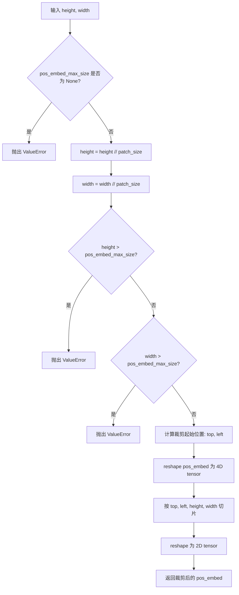
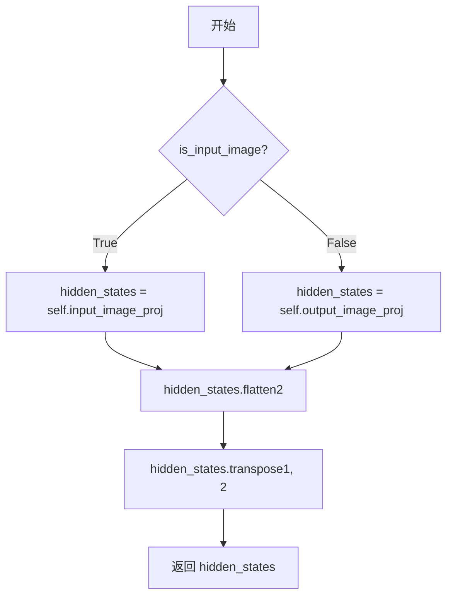
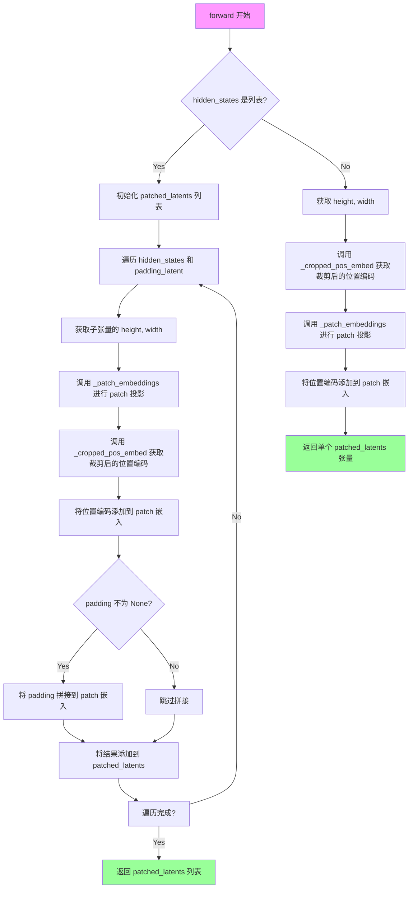
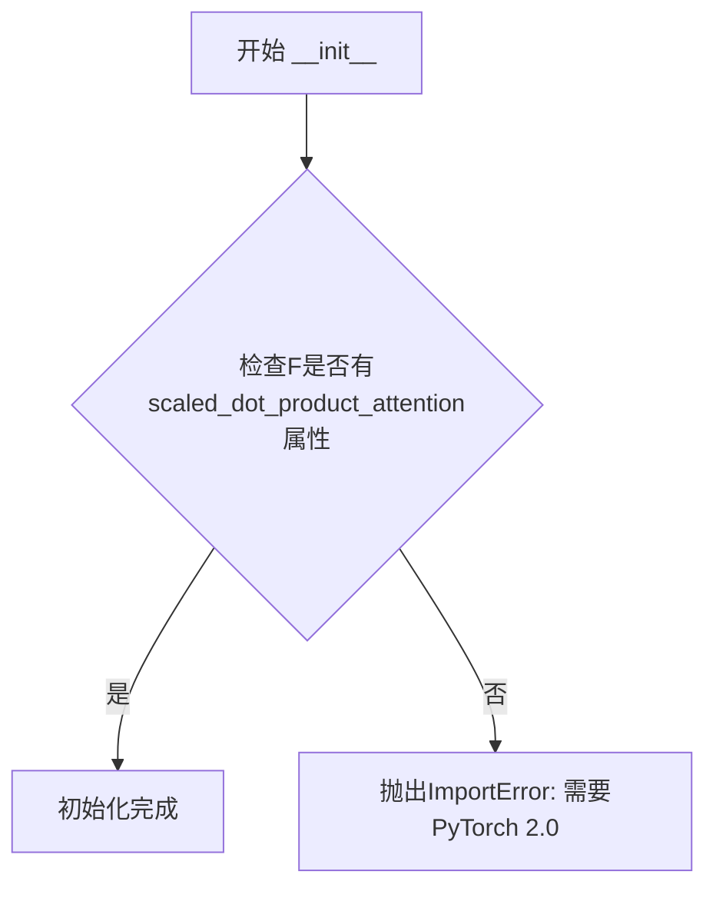
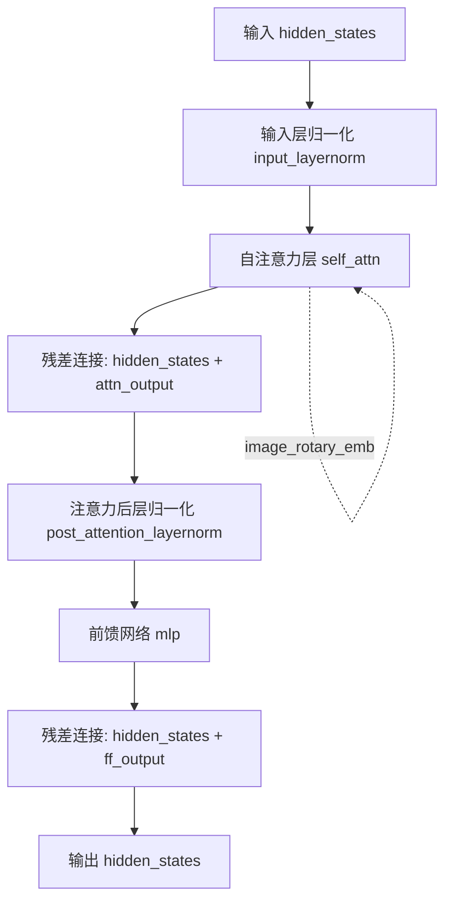
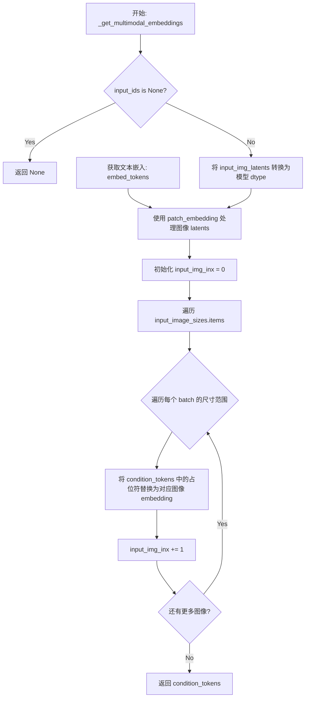

# `diffusers\src\diffusers\models\transformers\transformer_omnigen.py` 详细设计文档

OmniGenTransformer2DModel 是一个基于 Transformer 架构的多模态图像生成模型（属于扩散模型架构），它接收文本 token、输入图像 latent 和扩散时间步 (timestep)，通过位置编码、自注意力机制和前馈网络处理后，预测去噪后的图像块。

## 整体流程

```mermaid
graph TD
    Input[Input: hidden_states, timestep, input_ids, input_img_latents] --> Embed[Embedding: Patch + Time + Multimodal]
    Embed --> Concat[Concat: condition_tokens + time_token + hidden_states]
    Concat --> Mask[Attention Mask Preprocessing]
    Mask --> RoPE[Rotary Position Embedding (RoPE)]
    RoPE --> Blocks[Loop: OmniGenBlock Layers]
    Blocks --> Norm[Norm: RMSNorm + Slice Tokens]
    Norm --> Proj[Output: AdaLayerNorm + Linear Projection]
    Proj --> Reshape[Reshape to (B, C, H, W)]
    Reshape --> Out[Output: Transformer2DModelOutput]
```

## 类结构

```
nn.Module (基类)
├── ModelMixin & ConfigMixin (OmniGenTransformer2DModel 的基类)
├── OmniGenFeedForward (门控前馈网络)
├── OmniGenPatchEmbed (图像分块与位置编码)
├── OmniGenSuScaledRotaryEmbedding (旋转位置编码)
├── OmniGenAttnProcessor2_0 (注意力处理器)
└── OmniGenBlock (Transformer 编码器块)
    ├── RMSNorm
    ├── Attention
    └── OmniGenFeedForward
```

## 全局变量及字段


### `logger`
    
模块级日志记录器，用于记录运行时的信息、警告和错误

类型：`logging.Logger`
    


### `OmniGenFeedForward.gate_up_proj`
    
门控与上投影层，用于将隐藏状态映射到2倍的中间层维度

类型：`nn.Linear`
    


### `OmniGenFeedForward.down_proj`
    
下投影层，将中间层维度映射回原始隐藏状态维度

类型：`nn.Linear`
    


### `OmniGenFeedForward.activation_fn`
    
SiLU激活函数，用于提供非线性变换

类型：`nn.SiLU`
    


### `OmniGenPatchEmbed.output_image_proj`
    
输出图像投影卷积层，将图像latent转换为补丁嵌入

类型：`nn.Conv2d`
    


### `OmniGenPatchEmbed.input_image_proj`
    
输入图像投影卷积层，将输入图像转换为补丁嵌入

类型：`nn.Conv2d`
    


### `OmniGenPatchEmbed.patch_size`
    
补丁大小，指定空间补丁的边长

类型：`int`
    


### `OmniGenPatchEmbed.interpolation_scale`
    
插值缩放因子，用于调整位置编码的尺度

类型：`float`
    


### `OmniGenPatchEmbed.pos_embed_max_size`
    
位置编码的最大尺寸，限制位置嵌入的裁剪范围

类型：`int`
    


### `OmniGenPatchEmbed.pos_embed`
    
位置编码缓冲区，存储预计算的正弦余弦位置嵌入

类型：`torch.Tensor`
    


### `OmniGenSuScaledRotaryEmbedding.dim`
    
隐藏维度，表示旋转嵌入的维度大小

类型：`int`
    


### `OmniGenSuScaledRotaryEmbedding.max_position_embeddings`
    
最大位置嵌入数，支持的最大序列长度

类型：`int`
    


### `OmniGenSuScaledRotaryEmbedding.base`
    
基础频率，用于计算旋转矩阵的基本频率

类型：`int`
    


### `OmniGenSuScaledRotaryEmbedding.inv_freq`
    
逆频率张量，用于生成旋转位置编码

类型：`torch.Tensor`
    


### `OmniGenSuScaledRotaryEmbedding.short_factor`
    
短距离缩放因子，用于短序列的位置编码缩放

类型：`list`
    


### `OmniGenSuScaledRotaryEmbedding.long_factor`
    
长距离缩放因子，用于长序列的位置编码缩放

类型：`list`
    


### `OmniGenBlock.input_layernorm`
    
输入层归一化，对自注意力前的隐藏状态进行归一化

类型：`RMSNorm`
    


### `OmniGenBlock.self_attn`
    
自注意力机制模块，处理序列内部的注意力计算

类型：`Attention`
    


### `OmniGenBlock.post_attention_layernorm`
    
注意力后层归一化，对注意力输出进行归一化

类型：`RMSNorm`
    


### `OmniGenBlock.mlp`
    
前馈网络模块，提供非线性变换和维度映射

类型：`OmniGenFeedForward`
    


### `OmniGenTransformer2DModel.in_channels`
    
输入通道数，指定输入图像的通道数

类型：`int`
    


### `OmniGenTransformer2DModel.out_channels`
    
输出通道数，指定输出图像的通道数

类型：`int`
    


### `OmniGenTransformer2DModel.patch_embedding`
    
补丁嵌入层，将图像转换为补丁序列

类型：`OmniGenPatchEmbed`
    


### `OmniGenTransformer2DModel.time_proj`
    
时间步投影，将时间步映射到嵌入空间

类型：`Timesteps`
    


### `OmniGenTransformer2DModel.time_token`
    
时间步Token嵌入，将时间步投影转换为可学习的Token

类型：`TimestepEmbedding`
    


### `OmniGenTransformer2DModel.t_embedder`
    
时间步嵌入器，用于生成条件嵌入

类型：`TimestepEmbedding`
    


### `OmniGenTransformer2DModel.embed_tokens`
    
文本Token嵌入层，将输入文本ID映射为向量

类型：`nn.Embedding`
    


### `OmniGenTransformer2DModel.rope`
    
旋转位置编码模块，提供位置感知能力

类型：`OmniGenSuScaledRotaryEmbedding`
    


### `OmniGenTransformer2DModel.layers`
    
Transformer层列表，包含多个OmniGenBlock组成的堆叠

类型：`nn.ModuleList[OmniGenBlock]`
    


### `OmniGenTransformer2DModel.norm`
    
层归一化，对最终隐藏状态进行归一化

类型：`RMSNorm`
    


### `OmniGenTransformer2DModel.norm_out`
    
自适应层归一化，根据时间步信息调整归一化参数

类型：`AdaLayerNorm`
    


### `OmniGenTransformer2DModel.proj_out`
    
输出投影层，将隐藏状态映射回图像空间

类型：`nn.Linear`
    


### `OmniGenTransformer2DModel.gradient_checkpointing`
    
梯度检查点标志，控制是否使用梯度检查点技术

类型：`bool`
    
    

## 全局函数及方法


### `OmniGenFeedForward.forward`

该函数实现了 OmniGen 模型中的前馈网络（Feed-Forward Network, FFN），采用 Gated Linear Unit（门控线性单元）架构，通过门控机制动态控制信息流动，提升模型的表达能力。

参数：

- `hidden_states`：`torch.Tensor`，输入的隐藏状态张量，形状为 `(batch_size, seq_len, hidden_size)`

返回值：`torch.Tensor`，经过前馈网络处理后的输出张量，形状与输入相同 `(batch_size, seq_len, hidden_size)`

#### 流程图



#### 带注释源码

```python
def forward(self, hidden_states: torch.Tensor) -> torch.Tensor:
    """
    前馈网络的前向传播
    
    采用 Gated Linear Unit (GLU) 架构:
    - gate_up_proj: 将输入投影到 2*intermediate_size 维度
    - chunk: 沿最后一维分割为 gate 和 up_states 两部分
    - up_states = up_states * SiLU(gate) 实现门控机制
    - down_proj: 将中间维度投影回原始 hidden_size
    
    Args:
        hidden_states: 输入张量，形状为 (batch_size, seq_len, hidden_size)
        
    Returns:
        输出张量，形状为 (batch_size, seq_len, hidden_size)
    """
    # 第一步：门控+上投影
    # 将 hidden_size 维度映射到 2*intermediate_size 维度
    # 输出形状: (batch_size, seq_len, 2*intermediate_size)
    up_states = self.gate_up_proj(hidden_states)
    
    # 第二步：分割门控信号和上状态
    # 沿最后一维（-1）分割为两部分：
    # - gate: 门控信号，用于控制信息流动
    # - up_states: 待激活的上状态
    gate, up_states = up_states.chunk(2, dim=-1)
    
    # 第三步：门控激活
    # 使用 SiLU (Swish) 激活函数对门控信号进行非线性变换
    # 然后与上状态逐元素相乘，实现门控机制
    up_states = up_states * self.activation_fn(gate)
    
    # 第四步：下投影
    # 将中间维度映射回原始 hidden_size 维度
    return self.down_proj(up_states)
```


### `OmniGenPatchEmbed._cropped_pos_embed`

该方法负责裁剪预定义的二维正弦余弦位置嵌入（positional embedding），以适配不同分辨率的图像输入。它通过计算裁剪偏移量，从完整的-position嵌入中提取与目标图像尺寸对应的区域，并将其展平为一维序列返回，确保模型能够处理任意尺寸的输入图像。

参数：

- `height`：`int`，输入图像的高度（像素单位）
- `width`：`int`，输入图像的宽度（像素单位）

返回值：`torch.Tensor`，裁剪并展平后的位置嵌入，形状为 `(1, height_patches * width_patches, embed_dim)`

#### 流程图



#### 带注释源码

```python
def _cropped_pos_embed(self, height, width):
    """Crops positional embeddings for SD3 compatibility."""
    # 检查 pos_embed_max_size 是否已设置，若未设置则抛出异常
    if self.pos_embed_max_size is None:
        raise ValueError("`pos_embed_max_size` must be set for cropping.")

    # 将像素坐标转换为 patch 坐标
    height = height // self.patch_size
    width = width // self.patch_size

    # 验证裁剪后的高度不超过最大允许值
    if height > self.pos_embed_max_size:
        raise ValueError(
            f"Height ({height}) cannot be greater than `pos_embed_max_size`: {self.pos_embed_max_size}."
        )
    
    # 验证裁剪后的宽度不超过最大允许值
    if width > self.pos_embed_max_size:
        raise ValueError(
            f"Width ({width}) cannot be greater than `pos_embed_max_size`: {self.pos_embed_max_size}."
        )

    # 计算从中心裁剪的起始位置（居中裁剪）
    top = (self.pos_embed_max_size - height) // 2
    left = (self.pos_embed_max_size - width) // 2

    # 将 2D 位置嵌入 reshape 为 4D: (1, max_size, max_size, embed_dim)
    spatial_pos_embed = self.pos_embed.reshape(
        1, self.pos_embed_max_size, self.pos_embed_max_size, -1
    )
    
    # 执行空间裁剪，提取目标区域
    spatial_pos_embed = spatial_pos_embed[
        :, 
        top : top + height,      # 高度范围
        left : left + width,     # 宽度范围
        :
    ]
    
    # 重新 reshape 为 2D: (1, height*width, embed_dim)
    spatial_pos_embed = spatial_pos_embed.reshape(1, -1, spatial_pos_embed.shape[-1])
    
    return spatial_pos_embed
```


### `OmniGenPatchEmbed._patch_embeddings`

该方法负责将输入的隐藏状态通过卷积投影层转换为patch嵌入表示。它根据 `is_input_image` 标志选择使用输入图像投影层或输出图像投影层，然后对卷积结果进行维度变换以得到序列格式的张量。

参数：

- `hidden_states`：`torch.Tensor`，输入的隐藏状态张量，形状为 (batch_size, channels, height, width)
- `is_input_image`：`bool`，布尔标志，True 表示对输入图像进行投影，False 表示对输出图像进行投影

返回值：`torch.Tensor`，经过patch嵌入处理后的张量，形状为 (batch_size, num_patches, embed_dim)

#### 流程图



#### 带注释源码

```python
def _patch_embeddings(self, hidden_states: torch.Tensor, is_input_image: bool) -> torch.Tensor:
    """
    将隐藏状态转换为patch嵌入
    
    参数:
        hidden_states: 输入张量，形状为 (B, C, H, W)
        is_input_image: 是否为输入图像的标志
    
    返回:
        形状为 (B, N, D) 的patch嵌入张量，其中 N 是patch数量，D 是嵌入维度
    """
    # 根据标志选择合适的卷积投影层
    if is_input_image:
        # 使用输入图像投影层
        hidden_states = self.input_image_proj(hidden_states)
    else:
        # 使用输出图像投影层
        hidden_states = self.output_image_proj(hidden_states)
    
    # 展平空间维度: (B, C, H, W) -> (B, C, H*W)
    hidden_states = hidden_states.flatten(2)
    
    # 转置维度: (B, C, H*W) -> (B, H*W, C)，将空间维度移到序列维度
    hidden_states = hidden_states.transpose(1, 2)
    
    return hidden_states
```


### `OmniGenPatchEmbed.forward`

该函数是 OmniGen 模型的 Patch 嵌入层前向传播方法，负责将输入的图像或潜在变量转换为 patch 级别的嵌入表示，并添加裁剪后的 2D 位置编码。支持批量处理多个不同尺寸的输入，并可选择性地拼接填充潜在变量。

参数：

- `self`：类的实例本身
- `hidden_states`：`torch.Tensor | list[torch.Tensor]`，输入的张量，可以是单个张量（适用于单个样本）或张量列表（适用于多个不同尺寸的样本）
- `is_input_image`：`bool`，布尔标志，指示输入是原始图像（True）还是潜在变量（False），用于选择对应的投影层
- `padding_latent`：`torch.Tensor | list[torch.Tensor] | None`，可选的填充潜在变量，用于在 patch 嵌入后进行拼接以保持序列长度

返回值：`torch.Tensor | list[torch.Tensor]`，返回处理后的 patch 嵌入张量或张量列表，每个张量的形状为 `(batch_size, num_patches, embed_dim)`

#### 流程图



#### 带注释源码

```python
def forward(
    self, hidden_states: torch.Tensor, is_input_image: bool, padding_latent: torch.Tensor = None
) -> torch.Tensor:
    # 判断输入是列表还是单个张量，用于处理批量不同尺寸的输入
    if isinstance(hidden_states, list):
        # 如果没有提供 padding_latent，创建一个与 hidden_states 长度相同的 None 列表
        if padding_latent is None:
            padding_latent = [None] * len(hidden_states)
        
        patched_latents = []  # 存储处理后的 patch 嵌入
        # 遍历每个子张量及其对应的 padding
        for sub_latent, padding in zip(hidden_states, padding_latent):
            # 获取输入的空间维度 (height, width)
            height, width = sub_latent.shape[-2:]
            # 调用内部方法进行 patch 嵌入投影
            sub_latent = self._patch_embeddings(sub_latent, is_input_image)
            # 获取裁剪至与输入尺寸匹配的 2D 位置编码
            pos_embed = self._cropped_pos_embed(height, width)
            # 将位置编码添加到 patch 嵌入中 (广播机制自动对齐维度)
            sub_latent = sub_latent + pos_embed
            # 如果存在 padding，将其拼接到 patch 序列的序列维度上
            if padding is not None:
                sub_latent = torch.cat([sub_latent, padding.to(sub_latent.device)], dim=-2)
            # 将处理后的结果添加到列表中
            patched_latents.append(sub_latent)
        # 返回处理后的 patch 嵌入列表
        return patched_latents
    else:
        # 处理单个张量的情况
        # 获取输入的空间维度
        height, width = hidden_states.shape[-2:]
        # 获取裁剪至与输入尺寸匹配的 2D 位置编码
        pos_embed = self._cropped_pos_embed(height, width)
        # 调用内部方法进行 patch 嵌入投影
        hidden_states = self._patch_embeddings(hidden_states, is_input_image)
        # 将位置编码添加到 patch 嵌入中
        patched_latents = hidden_states + pos_embed
        # 返回处理后的 patch 嵌入张量
        return patched_latents
```


### `OmniGenSuScaledRotaryEmbedding.forward`

该方法是 OmniGen 模型中旋转位置编码（RoPE）的核心实现，支持根据序列长度动态选择长短因子进行频率缩放，能够处理超长上下文（最高 131072）并通过 float32 精度保证数值稳定性。

参数：

- `hidden_states`：`torch.Tensor`，输入的隐藏状态张量，用于获取设备信息和计算设备
- `position_ids`：`torch.Tensor`，位置索引张量，形状为 (batch_size, seq_len)，用于生成对应的旋转位置嵌入

返回值：`tuple[torch.Tensor, torch.Tensor]`，返回余弦和正弦形式的旋转位置嵌入，形状均为 (seq_len, dim)

#### 流程图

```mermaid
flowchart TD
    A[开始 forward] --> B[计算序列长度 seq_len = max(position_ids) + 1]
    B --> C{seq_len > original_max_position_embeddings?}
    C -->|是| D[选择 long_factor]
    C -->|否| E[选择 short_factor]
    D --> F[创建 ext_factors 张量]
    E --> F
    F --> G[重新计算 inv_freq = 1.0 / (ext_factors * base^{inv_freq_shape})]
    G --> H[扩展 inv_freq: [None, :, None].expand]
    H --> I[扩展 position_ids: [:, None, :]]
    I --> J[使用 autocast 强制 float32]
    J --> K[计算 freqs = inv_freq_expanded @ position_ids_expanded]
    K --> L[转置 freqs 并与自身拼接]
    L --> M[计算缩放因子 scaling_factor]
    M --> N[计算 cos = emb.cos * scaling_factor]
    N --> O[计算 sin = emb.sin * scaling_factor]
    O --> P[返回 cos, sin 元组]
```

#### 带注释源码

```python
def forward(self, hidden_states, position_ids):
    # 1. 计算序列长度：根据 position_ids 中的最大值确定当前序列长度
    seq_len = torch.max(position_ids) + 1
    
    # 2. 动态选择缩放因子：根据序列长度选择使用短因子还是长因子
    #    长上下文使用 long_factor，短上下文使用 short_factor
    if seq_len > self.original_max_position_embeddings:
        ext_factors = torch.tensor(self.long_factor, dtype=torch.float32, device=hidden_states.device)
    else:
        ext_factors = torch.tensor(self.short_factor, dtype=torch.float32, device=hidden_states.device)

    # 3. 构建频率计算形状向量：用于生成逆频率的基础形状
    inv_freq_shape = (
        torch.arange(0, self.dim, 2, dtype=torch.int64, device=hidden_states.device).float() / self.dim
    )
    
    # 4. 重新计算逆频率：结合缩放因子和基础频率
    #    这是 RoPE 的核心：inv_freq = 1 / (factor * base^(2i/dim))
    self.inv_freq = 1.0 / (ext_factors * self.base**inv_freq_shape)

    # 5. 扩展维度以便批量矩阵运算
    #    inv_freq: (dim/2,) -> (batch_size, dim/2, 1)
    inv_freq_expanded = self.inv_freq[None, :, None].float().expand(position_ids.shape[0], -1, 1)
    #    position_ids: (batch_size, seq_len) -> (batch_size, 1, seq_len)
    position_ids_expanded = position_ids[:, None, :].float()

    # 6. 强制使用 float32 精度：避免 bfloat16 在长上下文场景下的精度损失
    #    参考: https://github.com/huggingface/transformers/pull/29285
    device_type = hidden_states.device.type
    device_type = device_type if isinstance(device_type, str) and device_type != "mps" else "cpu"
    with torch.autocast(device_type=device_type, enabled=False):
        # 7. 矩阵乘法计算频率：freqs = inv_freq_expanded @ position_ids_expanded
        #    结果形状: (batch_size, dim/2, seq_len)
        freqs = (inv_freq_expanded.float() @ position_ids_expanded.float()).transpose(1, 2)
        
        # 8. 拼接正弦和余弦部分：形成完整的旋转嵌入
        #    使用 [0] 取第一个批次（因为所有批次的嵌入相同）
        emb = torch.cat((freqs, freqs), dim=-1)[0]

        # 9. 计算缩放因子：用于超长序列的动态缩放
        scale = self.max_position_embeddings / self.original_max_position_embeddings
        if scale <= 1.0:
            scaling_factor = 1.0
        else:
            # 使用对数缩放公式：sqrt(1 + log(scale) / log(original_max))
            scaling_factor = math.sqrt(1 + math.log(scale) / math.log(self.original_max_position_embeddings))

        # 10. 应用缩放并计算最终的 cos 和 sin
        cos = emb.cos() * scaling_factor
        sin = emb.sin() * scaling_factor
    
    # 11. 返回旋转位置嵌入的余弦和正弦分量
    return cos, sin
```


### `OmniGenAttnProcessor2_0.__init__`

初始化OmniGenAttnProcessor2_0注意力处理器，检查PyTorch版本是否支持scaled_dot_product_attention功能，如果不支持则抛出ImportError异常。

参数：

- `self`：无显式参数，隐式参数，表示类的实例本身

返回值：`None`，无返回值，用于对象初始化

#### 流程图



#### 带注释源码

```python
def __init__(self):
    # 检查PyTorch的functional模块是否支持scaled_dot_product_attention函数
    # 该函数从PyTorch 2.0开始引入，用于实现优化的注意力机制
    if not hasattr(F, "scaled_dot_product_attention"):
        # 如果不支持，抛出导入错误，提示用户升级PyTorch版本
        raise ImportError("AttnProcessor2_0 requires PyTorch 2.0, to use it, please upgrade PyTorch to 2.0.")
```


### `OmniGenAttnProcessor2_0.__call__`

实现基于 PyTorch 2.0 的缩放点积注意力机制（SDPA），支持多头注意力与旋转位置编码（RoPE），处理图像与文本的跨模态注意力计算。

参数：

- `self`：隐式参数，当前处理器实例
- `attn`：`Attention`，注意力模块，包含 q/k/v 投影层（to_q, to_k, to_v）和输出投影层（to_out）
- `hidden_states`：`torch.Tensor`，形状为 (batch_size, sequence_length, hidden_dim)，查询方的隐藏状态
- `encoder_hidden_states`：`torch.Tensor`，键值对的隐藏状态，用于跨注意力计算
- `attention_mask`：`torch.Tensor | None`，可选，形状为 (batch_size, seq_len) 或 (batch_size, 1, 1, seq_len)，用于屏蔽无效位置的注意力权重
- `image_rotary_emb`：`torch.Tensor | None`，可选，旋转位置编码，用于为 query 和 key 添加位置信息

返回值：`torch.Tensor`，经过注意力计算和输出投影后的隐藏状态，形状为 (batch_size, sequence_length, hidden_dim)

#### 流程图

```mermaid
flowchart TD
    A[__call__ 入口] --> B[解包 hidden_states 形状: batch_size, sequence_length, _]
    B --> C[计算 Q/K/V: attn.to_q, attn.to_k, attn.to_v]
    C --> D[重塑 Q/K/V 为多头格式]
    D --> E{image_rotary_emb 是否存在?}
    E -->|是| F[应用 RoPE 到 query 和 key]
    E -->|否| G[跳过 RoPE 应用]
    F --> H[执行 scaled_dot_product_attention]
    G --> H
    H --> I[转置、类型转换、重塑输出]
    I --> J[应用输出投影层 attn.to_out[0]]
    J --> K[返回隐藏状态]
```

#### 带注释源码

```python
def __call__(
    self,
    attn: Attention,
    hidden_states: torch.Tensor,
    encoder_hidden_states: torch.Tensor,
    attention_mask: torch.Tensor | None = None,
    image_rotary_emb: torch.Tensor | None = None,
) -> torch.Tensor:
    # 从输入隐藏状态中提取批次大小和序列长度
    batch_size, sequence_length, _ = hidden_states.shape

    # ========== 步骤 1: 计算 Query-Key-Value 投影 ==========
    # 使用注意力模块的投影层将隐藏状态映射到 Q、K、V 空间
    # query 来自 hidden_states（自注意力查询源）
    # key 和 value 来自 encoder_hidden_states（跨注意力键值源）
    query = attn.to_q(hidden_states)
    key = attn.to_k(encoder_hidden_states)
    value = attn.to_v(encoder_hidden_states)

    # ========== 步骤 2: 获取维度信息 ==========
    bsz, q_len, query_dim = query.size()  # bsz: 批次大小, q_len: 查询序列长度
    inner_dim = key.shape[-1]             # key 的最后一维（键的维度）
    head_dim = query_dim // attn.heads   # 每个注意力头的维度

    # ========== 步骤 3: 计算 Key-Value 头数 ==========
    # 支持 kv_heads != heads 的 MQA/GQA 变体
    kv_heads = inner_dim // head_dim

    # ========== 步骤 4: 重塑为多头注意力格式 ==========
    # 将 Q/K/V 从 (batch, seq, dim) 变换为 (batch, num_heads, seq, head_dim)
    # query 使用 attn.heads（注意力头数）
    # key/value 使用 kv_heads（键值头数，支持分组注意力）
    query = query.view(batch_size, -1, attn.heads, head_dim).transpose(1, 2)
    key = key.view(batch_size, -1, kv_heads, head_dim).transpose(1, 2)
    value = value.view(batch_size, -1, kv_heads, head_dim).transpose(1, 2)

    # ========== 步骤 5: 应用旋转位置编码（RoPE）==========
    # 如果提供了图像旋转嵌入，则应用到 query 和 key
    # RoPE 通过旋转矩阵增强模型的位置感知能力
    if image_rotary_emb is not None:
        from ..embeddings import apply_rotary_emb

        # use_real_unbind_dim=-2 确保正确处理维度
        query = apply_rotary_emb(query, image_rotary_emb, use_real_unbind_dim=-2)
        key = apply_rotary_emb(key, image_rotary_emb, use_real_unbind_dim=-2)

    # ========== 步骤 6: 执行缩放点积注意力 ==========
    # 使用 PyTorch 2.0 的 F.scaled_dot_product_attention
    # 自动选择最优后端（Flash Attention / Math / Memory Efficient）
    # attn_mask 用于屏蔽无效位置
    hidden_states = F.scaled_dot_product_attention(query, key, value, attn_mask=attention_mask)

    # ========== 步骤 7: 后处理输出 ==========
    # 转置回 (batch, seq, num_heads, head_dim)
    # 转换为与 query 相同的类型（支持混合精度）
    # 重塑为原始隐藏状态维度
    hidden_states = hidden_states.transpose(1, 2).type_as(query)
    hidden_states = hidden_states.reshape(bsz, q_len, attn.out_dim)

    # ========== 步骤 8: 输出投影 ==========
    # 应用最终的线性投影层和可选的 Dropout
    hidden_states = attn.to_out[0](hidden_states)
    # 注：to_out 通常包含 [Linear, Dropout]，此处只调用了第一个（Linear）
    return hidden_states
```


### `OmniGenBlock.forward`

OmniGenBlock 是 OmniGen 变换器模型的核心构建块，包含自注意力机制和前馈网络。该 forward 方法执行标准的变换器块前向传播：先通过输入层归一化处理隐藏状态，然后进行自注意力计算并通过残差连接更新状态，接着进行注意力后层归一化，通过前馈网络处理，最后再次通过残差连接输出结果。

参数：

- `hidden_states`：`torch.Tensor`，输入的隐藏状态张量，形状为 `[batch_size, sequence_length, hidden_size]`
- `attention_mask`：`torch.Tensor`，注意力掩码张量，用于控制注意力计算时哪些位置需要被忽略
- `image_rotary_emb`：`torch.Tensor`，图像旋转位置嵌入，用于为自注意力提供位置信息

返回值：`torch.Tensor`，经过变换器块处理后的隐藏状态张量，形状与输入 `hidden_states` 相同

#### 流程图



#### 带注释源码

```python
def forward(
    self, hidden_states: torch.Tensor, attention_mask: torch.Tensor, image_rotary_emb: torch.Tensor
) -> torch.Tensor:
    # ============================================================
    # 步骤 1: 自注意力机制 (Self-Attention)
    # ============================================================
    # 对输入 hidden_states 进行层归一化，准备进行注意力计算
    norm_hidden_states = self.input_layernorm(hidden_states)
    
    # 调用自注意力层，传入归一化后的隐藏状态
    # 注意：encoder_hidden_states 使用相同的 norm_hidden_states（这是标准自回归/自注意力模式）
    # attention_mask 用于屏蔽不需要关注的 token
    # image_rotary_emb 提供旋转位置编码
    attn_output = self.self_attn(
        hidden_states=norm_hidden_states,
        encoder_hidden_states=norm_hidden_states,
        attention_mask=attention_mask,
        image_rotary_emb=image_rotary_emb,
    )
    
    # 残差连接：将注意力输出加到原始 hidden_states 上
    # 这是 Transformer 的标准设计，有助于梯度流动和训练稳定性
    hidden_states = hidden_states + attn_output

    # ============================================================
    # 步骤 2: 前馈网络 (Feed-Forward Network)
    # ============================================================
    # 对自注意力输出进行第二次层归一化
    norm_hidden_states = self.post_attention_layernorm(hidden_states)
    
    # 通过前馈网络进行处理
    # 前馈网络通常包含两个线性变换和一个非线性激活函数
    ff_output = self.mlp(norm_hidden_states)
    
    # 残差连接：将前馈网络输出加到 hidden_states 上
    hidden_states = hidden_states + ff_output
    
    # 返回经过完整变换器块处理后的隐藏状态
    return hidden_states
```


### `OmniGenTransformer2DModel._get_multimodal_embeddings`

该方法用于将文本嵌入和图像嵌入进行融合，通过查找图像尺寸映射表将文本token中的占位符替换为对应的图像embedding，从而生成多模态条件嵌入。

参数：

- `self`：`OmniGenTransformer2DModel` 实例本身
- `input_ids`：`torch.Tensor`，文本输入的token ID序列，用于从词汇表中查找文本嵌入
- `input_img_latents`：`list[torch.Tensor]`，图像的latent表示列表，每个元素对应一张图像的latent tensor
- `input_image_sizes`：`dict`，图像尺寸字典，键为batch索引，值为包含多个(start_index, end_index)元组的列表，用于指定文本序列中哪些位置应该被替换为图像嵌入

返回值：`torch.Tensor | None`，返回融合了图像信息的多模态嵌入tensor；如果 `input_ids` 为 None，则返回 None

#### 流程图



#### 带注释源码

```python
def _get_multimodal_embeddings(
    self, input_ids: torch.Tensor, input_img_latents: list[torch.Tensor], input_image_sizes: dict
) -> torch.Tensor | None:
    """
    融合文本和图像嵌入，生成多模态条件嵌入
    
    参数:
        input_ids: 文本token IDs
        input_img_latents: 图像latent列表
        input_image_sizes: 图像尺寸映射 {batch_idx: [(start, end), ...]}
    
    返回:
        融合后的多模态embeddings，或None（当input_ids为None时）
    """
    # 1. 如果没有文本输入，直接返回None
    if input_ids is None:
        return None

    # 2. 将图像latents转换为模型的数据类型（dtype）
    #    确保与模型权重类型一致（如float32或bfloat16）
    input_img_latents = [x.to(self.dtype) for x in input_img_latents]
    
    # 3. 从词汇表获取文本嵌入（条件嵌入）
    #    shape: (batch_size, seq_len, hidden_size)
    condition_tokens = self.embed_tokens(input_ids)
    
    # 4. 初始化图像token索引，用于遍历图像列表
    input_img_inx = 0
    
    # 5. 对图像latents进行patch嵌入处理
    #    将2D图像latent转换为patch序列，并加上位置编码
    #    is_input_image=True表示处理输入图像而非输出图像
    input_image_tokens = self.patch_embedding(input_img_latents, is_input_image=True)
    
    # 6. 遍历每个batch和图像尺寸，将文本中的占位符替换为图像embedding
    for b_inx in input_image_sizes.keys():
        for start_inx, end_inx in input_image_sizes[b_inx]:
            # 将condition_tokens中指定位置的文本token替换为对应的图像嵌入
            # 这样模型可以在文本上下文中看到图像信息
            condition_tokens[b_inx, start_inx:end_inx] = input_image_tokens[input_img_inx].to(
                condition_tokens.dtype
            )
            # 移动到下一个图像token
            input_img_inx += 1
    
    # 7. 返回融合了图像信息的多模态条件嵌入
    return condition_tokens
```


### `OmniGenTransformer2DModel.forward`

该方法是 OmniGen Transformer 2D 模型的核心前向传播方法，负责将输入的图像 latent、时间步、文本 token 和图像 latent 进行混合处理，通过多头注意力机制和前馈网络进行特征提取与转换，最终输出生成图像的 latent 表示。

参数：

-  `self`：隐含参数，OmniGenTransformer2DModel 类的实例
-  `hidden_states`：`torch.Tensor`，输入的图像 latent，形状为 (batch_size, num_channels, height, width)
-  `timestep`：`int | float | torch.FloatTensor`，扩散过程的时间步，用于条件生成
-  `input_ids`：`torch.Tensor`，文本输入的 token IDs，用于文本条件嵌入
-  `input_img_latents`：`list[torch.Tensor]`，输入图像的 latent 表示列表，每个元素对应一张图像的 latent
-  `input_image_sizes`：`dict[int, list[int]]`，输入图像尺寸字典，键为批次索引，值为图像的起始和结束位置列表
-  `attention_mask`：`torch.Tensor`，注意力掩码，用于控制注意力机制的关注范围
-  `position_ids`：`torch.Tensor`，位置 IDs，用于旋转位置嵌入
-  `return_dict`：`bool`，是否返回字典格式的输出，默认为 True

返回值：`Transformer2DModelOutput | tuple[torch.Tensor]`，返回模型输出对象或元组，包含生成的图像 latent/sample

#### 流程图

```mermaid
flowchart TD
    A[开始 forward] --> B[获取输入维度信息]
    B --> C[1. Patch Embedding & 时间步 & 条件嵌入]
    C --> C1[执行 patch_embedding]
    C1 --> C2[计算 timestep_proj 和 time_token]
    C2 --> C3[调用 _get_multimodal_embeddings 获取条件 token]
    C3 --> C4[拼接条件 token、时间 token 和输出图像 token]
    C --> D[2. 注意力掩码预处理]
    D --> E[3. 计算旋转位置嵌入 RoPE]
    E --> F[4. 遍历 Transformer 块]
    F --> F1{是否启用梯度 checkpoint}
    F1 -->|是| F2[_gradient_checkpointing_func 执行块]
    F1 -->|否| F3[直接执行 OmniGenBlock]
    F2 --> F4[块输出]
    F3 --> F4
    F4 --> G[5. 输出归一化与投影]
    G --> G1[执行 norm 归一化]
    G1 --> G2[提取输出图像 token]
    G2 --> G3[执行 AdaLayerNorm 和线性投影]
    G3 --> G4[reshape 输出维度]
    G4 --> H{return_dict?}
    H -->|True| I[返回 Transformer2DModelOutput]
    H -->|False| J[返回 tuple[output]]
    I --> K[结束]
    J --> K
```

#### 带注释源码

```python
def forward(
    self,
    hidden_states: torch.Tensor,
    timestep: int | float | torch.FloatTensor,
    input_ids: torch.Tensor,
    input_img_latents: list[torch.Tensor],
    input_image_sizes: dict[int, list[int]],
    attention_mask: torch.Tensor,
    position_ids: torch.Tensor,
    return_dict: bool = True,
) -> Transformer2DModelOutput | tuple[torch.Tensor]:
    # 获取输入维度信息：批次大小、通道数、高度、宽度
    batch_size, num_channels, height, width = hidden_states.shape
    # 获取 patch size 配置
    p = self.config.patch_size
    # 计算 patch 化后的图像高度和宽度
    post_patch_height, post_patch_width = height // p, width // p

    # ==================== 步骤 1: Patch 嵌入、时间步和条件嵌入 ====================
    # 对输出图像 latent 进行 patch 嵌入
    hidden_states = self.patch_embedding(hidden_states, is_input_image=False)
    # 记录输出图像的 token 数量
    num_tokens_for_output_image = hidden_states.size(1)

    # 计算时间步嵌入并转换为与 hidden_states 相同的 dtype
    timestep_proj = self.time_proj(timestep).type_as(hidden_states)
    # 生成时间 token 并在前面添加序列维度
    time_token = self.time_token(timestep_proj).unsqueeze(1)
    # 生成时间嵌入用于条件注入
    temb = self.t_embedder(timestep_proj)

    # 获取多模态条件嵌入（文本 token + 图像 latent）
    condition_tokens = self._get_multimodal_embeddings(input_ids, input_img_latents, input_image_sizes)
    # 拼接条件 token、时间 token 和输出图像 token
    if condition_tokens is not None:
        hidden_states = torch.cat([condition_tokens, time_token, hidden_states], dim=1)
    else:
        hidden_states = torch.cat([time_token, hidden_states], dim=1)

    # 调整 position_ids 形状以匹配序列长度
    seq_length = hidden_states.size(1)
    position_ids = position_ids.view(-1, seq_length).long()

    # ==================== 步骤 2: 注意力掩码预处理 ====================
    # 将 3D 注意力掩码（batch, seq, seq）转换为 4D 格式用于注意力计算
    if attention_mask is not None and attention_mask.dim() == 3:
        dtype = hidden_states.dtype
        min_dtype = torch.finfo(dtype).min
        # 转换掩码：1 表示需要屏蔽的位置
        attention_mask = (1 - attention_mask) * min_dtype
        # 扩展维度以匹配注意力分数形状 (batch, 1, seq, seq)
        attention_mask = attention_mask.unsqueeze(1).type_as(hidden_states)

    # ==================== 步骤 3: 旋转位置嵌入 ====================
    # 计算图像的旋转位置嵌入（RoPE）
    image_rotary_emb = self.rope(hidden_states, position_ids)

    # ==================== 步骤 4: Transformer 块处理 ====================
    # 遍历每个 OmniGenBlock 进行特征提取
    for block in self.layers:
        # 如果启用梯度 checkpointing 且当前处于训练模式
        if torch.is_grad_enabled() and self.gradient_checkpointing:
            # 使用梯度 checkpointing 减少显存占用
            hidden_states = self._gradient_checkpointing_func(
                block, hidden_states, attention_mask, image_rotary_emb
            )
        else:
            # 直接执行块前向传播
            hidden_states = block(hidden_states, attention_mask=attention_mask, image_rotary_emb=image_rotary_emb)

    # ==================== 步骤 5: 输出归一化与投影 ====================
    # 最终归一化
    hidden_states = self.norm(hidden_states)
    # 提取输出图像对应的 token（去掉条件 token 和时间 token）
    hidden_states = hidden_states[:, -num_tokens_for_output_image:]
    # 使用 AdaLayerNorm 进行条件归一化（注入时间嵌入）
    hidden_states = self.norm_out(hidden_states, temb=temb)
    # 线性投影回像素空间（patch_size * patch_size * out_channels）
    hidden_states = self.proj_out(hidden_states)
    # 重塑输出：从 (batch, h, w, p, p, c) 转换为 (batch, c, h*p, w*p)
    hidden_states = hidden_states.reshape(batch_size, post_patch_height, post_patch_width, p, p, -1)
    output = hidden_states.permute(0, 5, 1, 3, 2, 4).flatten(4, 5).flatten(2, 3)

    # 根据 return_dict 返回结果
    if not return_dict:
        return (output,)
    return Transformer2DModelOutput(sample=output)
```

## 关键组件


### 张量索引与惰性加载

该模块通过列表形式的 `input_img_latents` 实现图像潜在表示的惰性加载，采用 `_get_multimodal_embeddings` 方法按需将图像token嵌入到文本条件token的指定位置，支持动态批处理和变长图像输入。

### 反量化支持

代码中通过 `.type_as()` 和 `.to()` 方法在不同dtype之间进行转换，支持隐藏状态从低精度（如bfloat16）到float32的显式提升，以确保长上下文场景下的数值精度。

### 量化策略

该模块采用RMSNorm替代LayerNorm以减少计算开销，同时使用 `gradient_checkpointing` 机制在训练时以计算换显存，支持rope_scaling的长上下文扩展策略。

### OmniGenTransformer2DModel

OmniGen的2D变换器主模型，负责整体的前向传播、patch嵌入、时间步嵌入、多模态条件嵌入和输出投影。

### OmniGenBlock

变换器的基本单元，包含自注意力层、RMSNorm和前馈网络，遵循Pre-LN结构设计。

### OmniGenPatchEmbed

图像分块嵌入层，支持输入/输出图像的卷积投影和可裁剪的2D正弦余弦位置编码。

### OmniGenFeedForward

门控激活的前馈网络，采用SwiGLU变体结构，通过门控向量动态控制激活路径。

### OmniGenAttnProcessor2_0

实现缩放点积注意力机制，支持KV头的非对称分布（kv_heads与query_heads可以不同），并可选应用图像旋转位置嵌入。

### OmniGenSuScaledRotaryEmbedding

支持动态缩放的旋转位置编码，根据序列长度自动选择short_factor或long_factor进行频率调整。


## 问题及建议


### 已知问题

-   **RoPE动态重新计算问题**：在`OmniGenSuScaledRotaryEmbedding.forward()`中，每次调用都会根据序列长度动态修改`self.inv_freq`缓冲区，这破坏了模型的可重复性和状态一致性，且每次forward都重新计算导致效率低下
-   **位置编码裁剪边界条件**：`OmniGenPatchEmbed._cropped_pos_embed()`在计算裁剪位置时使用整数除法，可能导致边界情况下的位置编码不精确
-   **Attention Mask类型处理不完整**：`OmniGenTransformer2DModel.forward()`中仅处理了3D的attention_mask，缺少对2D和4D情况的处理
-   **多模态嵌入的设备转换开销**：`_get_multimodal_embeddings()`中对每个输入图像latent都调用`.to(self.dtype)`，在多模态场景下可能导致不必要的设备间数据传输
-   **冗余的时间嵌入层**：代码中同时定义了`time_token`和`t_embedder`两个时间嵌入模块，功能可能重复，增加了模型参数量
- **梯度检查点实现可疑**：使用`self._gradient_checkpointing_func`但未在类中明确定义此方法，可能继承自父类或存在调用错误

### 优化建议

-   **重构RoPE实现**：将`inv_freq`的计算移到`__init__`或使用额外的缓冲区存储预计算的scaled inv_freq，避免在forward中动态修改buffer
-   **统一位置编码接口**：将位置编码裁剪逻辑与patch embedding解耦，提供更灵活的接口处理不同尺寸的输入
-   **完善Attention Mask处理**：添加对不同维度attention_mask的完整支持，或在文档中明确限制支持的输入格式
-   **优化设备转换**：在模型初始化时统一dtype处理，减少forward中的动态类型转换
-   **合并时间嵌入模块**：评估`time_token`和`t_embedder`的功能是否可以合并，简化模型结构
-   **添加类型检查和文档**：为复杂方法（如位置编码裁剪、多模态嵌入处理）添加详细的类型注解和文档字符串

## 其它


### 设计目标与约束

**设计目标**：实现OmniGenTransformer2DModel，一个基于Transformer的图像生成模型，支持多模态条件输入（文本和图像），采用旋转位置编码（RoPE）和自适应层归一化（AdaLayerNorm）。

**约束条件**：
- PyTorch 2.0+（使用F.scaled_dot_product_attention）
- 需配合diffusers库使用（继承ModelMixin, ConfigMixin）
- 支持梯度检查点（gradient_checkpointing）以节省显存

### 错误处理与异常设计

**主要异常场景**：
1. **OmniGenPatchEmbed._cropped_pos_embed**: 当height/width超过pos_embed_max_size时抛出ValueError
2. **OmniGenAttnProcessor2_0.__init__**: 检测PyTorch版本，若无scaled_dot_product_attention则抛出ImportError
3. **OmniGenTransformer2DModel.forward**: input_ids为None时返回None（条件token）

**异常处理策略**：
- 使用try-except捕获设备类型转换异常
- 位置编码裁剪时严格校验尺寸边界

### 数据流与状态机

**数据流**：
1. 输入hidden_states → patch_embedding（图像分块）→ 加上位置编码
2. timestep → time_proj + time_token + t_embedder（时间步嵌入）
3. input_ids + input_img_latents → _get_multimodal_embeddings（多模态条件）
4. 拼接条件token、时间token、图像token
5. 多次通过OmniGenBlock（num_layers层）
6. norm → norm_out（AdaLayerNorm）→ proj_out（投影回像素空间）

**状态机**：
- 初始态：hidden_states为(B,C,H,W)格式
- 中间态：hidden_states为(B,N,D)格式（N为token数）
- 最终态：hidden_states重塑为(B,C,H,W)格式输出

### 外部依赖与接口契约

**依赖库**：
- torch, torch.nn, torch.nn.functional
- math（数学函数）
- diffusers: configuration_utils.ConfigMixin, register_to_config, logging, attention_processor.Attention, embeddings, modeling_outputs, modeling_utils.ModelMixin, normalization

**接口契约**：
- forward()方法接受hidden_states, timestep, input_ids, input_img_latents, input_image_sizes, attention_mask, position_ids
- 返回Transformer2DModelOutput或tuple[torch.Tensor]
- 支持return_dict参数控制输出格式

### 性能考虑

- 使用gradient_checkpointing减少显存占用
- RoPE计算使用autocast避免bfloat16精度损失
- 支持混合kv_heads（key/value头数可以与query头数不同）
- 位置编码预先注册为buffer避免重复计算

### 安全性考虑

- 无用户输入直接执行代码的风险
- 模型权重加载需信任来源
- 内存使用受hidden_size和num_layers影响，需控制最大尺寸

### 可扩展性设计

- 支持rope_scaling配置扩展位置编码范围
- patch_size, hidden_size, num_layers等参数均可配置
- 可通过替换OmniGenAttnProcessor2_0实现自定义注意力机制

### 测试策略

- 单元测试：各模块独立测试（OmniGenFeedForward, OmniGenBlock等）
- 集成测试：完整forward流程测试
- 梯度检查点测试：验证梯度计算正确性
- 多模态输入测试：text+image条件输入

### 配置管理

- 使用@register_to_config装饰器实现配置注册
- 所有超参数通过__init__参数传入并保存至config对象
- 支持from_pretrained和save_pretrained

### 版本兼容性

- PyTorch 2.0+（强制要求）
- diffusers库版本兼容（使用ConfigMixin等基础设施）
- 模型版本通过config中的版本号管理

### 资源管理

- 显存估算：O(batch_size * num_layers * hidden_size^2)
- 使用register_buffer管理非训练参数（如位置编码）
- 梯度检查点可显著降低显存需求

### 监控与日志

- 使用logging.get_logger(__name__)记录关键信息
- 无运行时监控指标输出
- 模型加载时可输出配置信息

    