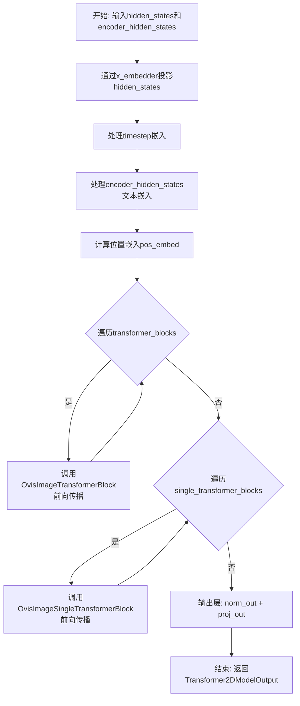
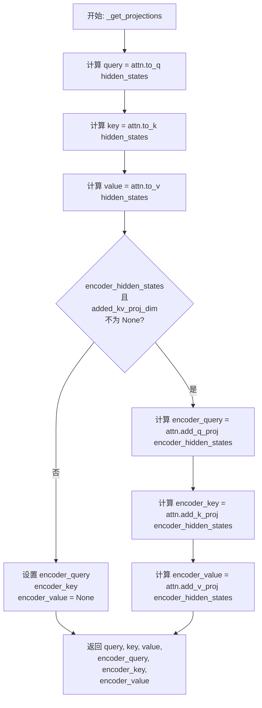
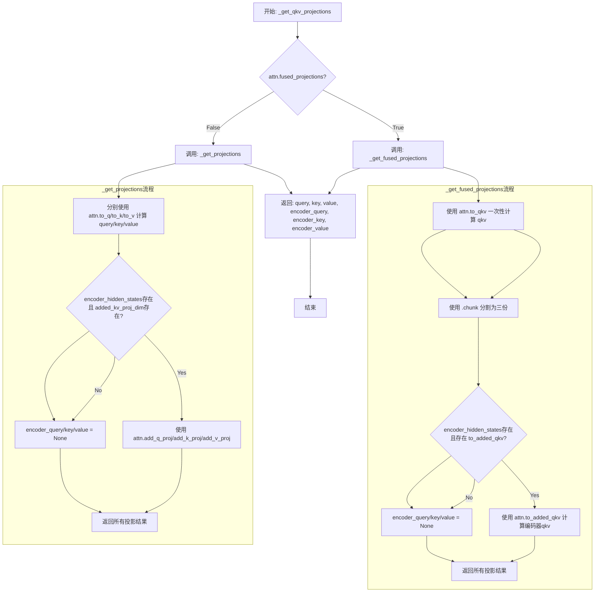
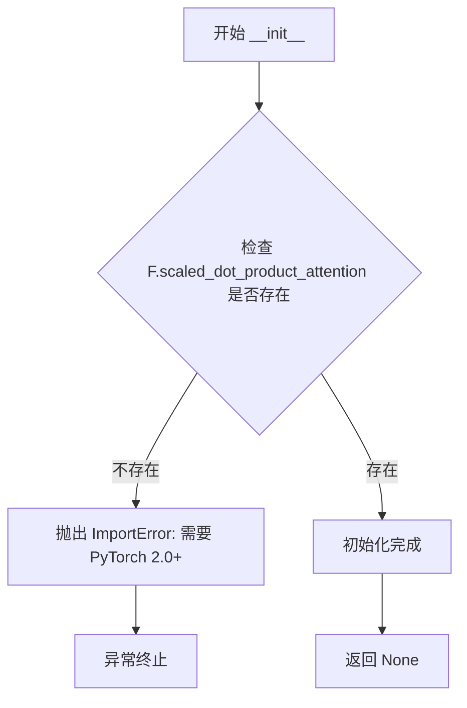
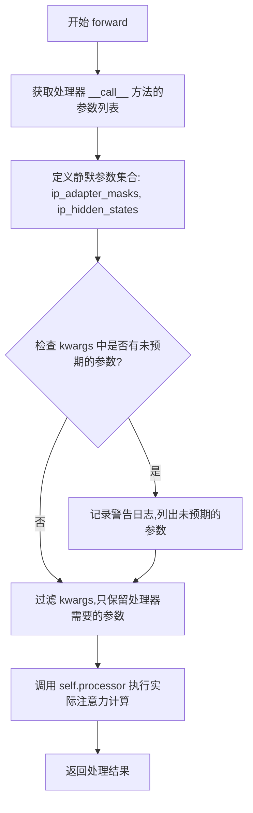
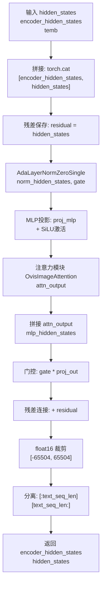
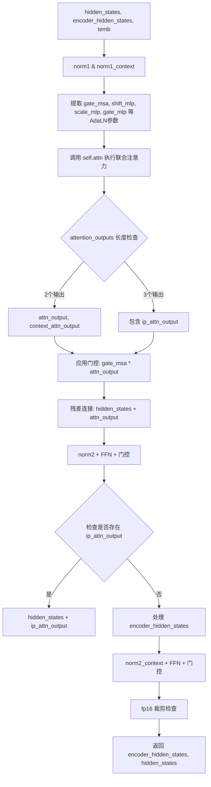
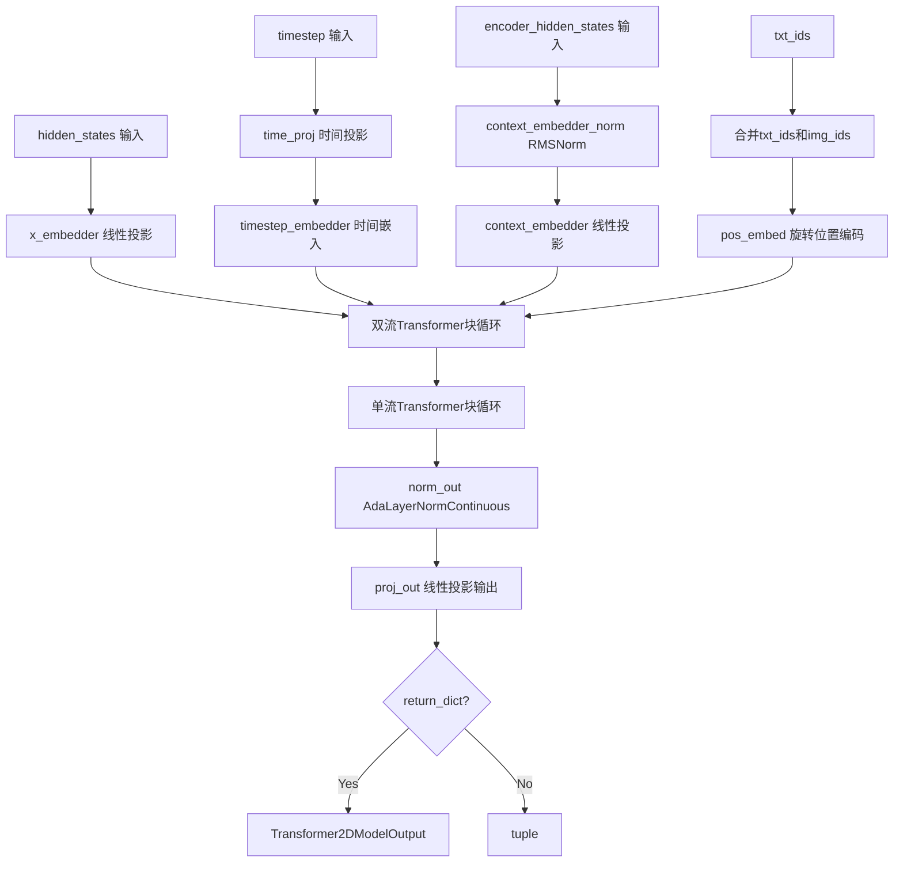

# `diffusers\src\diffusers\models\transformers\transformer_ovis_image.py` 详细设计文档

Ovis-Image Transformer模型实现，阿里巴巴推出的用于图像生成的双流Transformer架构。该模型采用创新的单流和双流Transformer块设计，支持文本-图像联合注意力机制，通过位置嵌入和AdaLayerNorm实现高效的图像生成任务。

## 整体流程



## 类结构

```
OvisImageTransformer2DModel (主模型类)
├── OvisImagePosEmbed (位置嵌入)
├── TimestepEmbedding (时间步嵌入)
├── nn.ModuleList[OvisImageTransformerBlock] (双流Transformer块列表)
├── nn.ModuleList[OvisImageSingleTransformerBlock] (单流Transformer块列表)
├── AdaLayerNormContinuous (输出归一化)
└── OvisImageTransformerBlock (双流块)
    ├── AdaLayerNormZero (主分支归一化)
    ├── AdaLayerNormZero (上下文归一化)
    ├── OvisImageAttention (注意力模块)
    ├── FeedForward (前馈网络)
    └── FeedForward (上下文前馈网络)
└── OvisImageSingleTransformerBlock (单流块)
    ├── AdaLayerNormZeroSingle (归一化)
    ├── OvisImageAttention (注意力模块)
    └── MLP (多层感知机)
└── OvisImageAttention (注意力模块)
    ├── OvisImageAttnProcessor (注意力处理器)
    ├── RMSNorm (查询归一化)
    ├── RMSNorm (键归一化)
    ├── Linear (Q/K/V投影)
    └── Linear (输出投影)
```

## 全局变量及字段


### `logger`
    
日志记录器，用于输出调试和信息日志

类型：`logging.Logger`
    


### `F`
    
PyTorch函数式API模块，提供各种神经网络操作函数

类型：`torch.nn.functional`
    


### `OvisImageAttnProcessor._attention_backend`
    
注意力后端配置，用于指定注意力计算的具体实现

类型：`Any`
    


### `OvisImageAttnProcessor._parallel_config`
    
并行配置参数，用于控制分布式训练中的并行策略

类型：`Any`
    


### `OvisImageAttention.head_dim`
    
每个注意力头的维度大小

类型：`int`
    


### `OvisImageAttention.inner_dim`
    
内部维度，等于头数乘以头维度

类型：`int`
    


### `OvisImageAttention.query_dim`
    
查询向量的输入维度

类型：`int`
    


### `OvisImageAttention.use_bias`
    
是否在投影层中使用偏置

类型：`bool`
    


### `OvisImageAttention.dropout`
    
注意力 dropout 概率

类型：`float`
    


### `OvisImageAttention.out_dim`
    
输出维度大小

类型：`int`
    


### `OvisImageAttention.context_pre_only`
    
是否仅预处理上下文嵌入

类型：`bool | None`
    


### `OvisImageAttention.pre_only`
    
是否仅进行预处理（无输出投影）

类型：`bool`
    


### `OvisImageAttention.heads`
    
注意力头的数量

类型：`int`
    


### `OvisImageAttention.added_kv_proj_dim`
    
额外KV投影维度，用于交叉注意力

类型：`int | None`
    


### `OvisImageAttention.added_proj_bias`
    
额外投影层是否使用偏置

类型：`bool | None`
    


### `OvisImageAttention.norm_q`
    
查询向量的RMS归一化层

类型：`torch.nn.RMSNorm`
    


### `OvisImageAttention.norm_k`
    
键向量的RMS归一化层

类型：`torch.nn.RMSNorm`
    


### `OvisImageAttention.to_q`
    
查询投影线性层

类型：`torch.nn.Linear`
    


### `OvisImageAttention.to_k`
    
键投影线性层

类型：`torch.nn.Linear`
    


### `OvisImageAttention.to_v`
    
值投影线性层

类型：`torch.nn.Linear`
    


### `OvisImageAttention.to_out`
    
输出投影层列表，包含线性变换和dropout

类型：`torch.nn.ModuleList`
    


### `OvisImageAttention.norm_added_q`
    
额外查询的RMS归一化层

类型：`torch.nn.RMSNorm`
    


### `OvisImageAttention.norm_added_k`
    
额外键的RMS归一化层

类型：`torch.nn.RMSNorm`
    


### `OvisImageAttention.add_q_proj`
    
额外查询投影线性层

类型：`torch.nn.Linear`
    


### `OvisImageAttention.add_k_proj`
    
额外键投影线性层

类型：`torch.nn.Linear`
    


### `OvisImageAttention.add_v_proj`
    
额外值投影线性层

类型：`torch.nn.Linear`
    


### `OvisImageAttention.to_add_out`
    
额外输出的投影线性层

类型：`torch.nn.Linear`
    


### `OvisImageAttention.processor`
    
注意力处理器实例

类型：`OvisImageAttnProcessor`
    


### `OvisImageSingleTransformerBlock.mlp_hidden_dim`
    
MLP隐藏层维度

类型：`int`
    


### `OvisImageSingleTransformerBlock.norm`
    
自适应层归一化（零初始化）

类型：`AdaLayerNormZeroSingle`
    


### `OvisImageSingleTransformerBlock.proj_mlp`
    
MLP投影线性层

类型：`nn.Linear`
    


### `OvisImageSingleTransformerBlock.act_mlp`
    
SiLU激活函数

类型：`nn.SiLU`
    


### `OvisImageSingleTransformerBlock.proj_out`
    
输出投影线性层

类型：`nn.Linear`
    


### `OvisImageSingleTransformerBlock.attn`
    
单流注意力模块

类型：`OvisImageAttention`
    


### `OvisImageTransformerBlock.norm1`
    
第一层自适应归一化（图像）

类型：`AdaLayerNormZero`
    


### `OvisImageTransformerBlock.norm1_context`
    
第一层自适应归一化（文本上下文）

类型：`AdaLayerNormZero`
    


### `OvisImageTransformerBlock.attn`
    
双流注意力模块

类型：`OvisImageAttention`
    


### `OvisImageTransformerBlock.norm2`
    
第二层LayerNorm（图像）

类型：`nn.LayerNorm`
    


### `OvisImageTransformerBlock.ff`
    
前馈网络（图像）

类型：`FeedForward`
    


### `OvisImageTransformerBlock.norm2_context`
    
第二层LayerNorm（文本上下文）

类型：`nn.LayerNorm`
    


### `OvisImageTransformerBlock.ff_context`
    
前馈网络（文本上下文）

类型：`FeedForward`
    


### `OvisImagePosEmbed.theta`
    
旋转位置嵌入的基础角度参数

类型：`int`
    


### `OvisImagePosEmbed.axes_dim`
    
各轴的维度列表，用于多轴旋转位置编码

类型：`list[int]`
    


### `OvisImageTransformer2DModel.out_channels`
    
输出通道数

类型：`int`
    


### `OvisImageTransformer2DModel.inner_dim`
    
内部隐藏维度

类型：`int`
    


### `OvisImageTransformer2DModel.pos_embed`
    
旋转位置嵌入模块

类型：`OvisImagePosEmbed`
    


### `OvisImageTransformer2DModel.time_proj`
    
时间步投影层

类型：`Timesteps`
    


### `OvisImageTransformer2DModel.timestep_embedder`
    
时间步嵌入层

类型：`TimestepEmbedding`
    


### `OvisImageTransformer2DModel.context_embedder_norm`
    
文本上下文嵌入的RMS归一化

类型：`nn.RMSNorm`
    


### `OvisImageTransformer2DModel.context_embedder`
    
文本上下文嵌入投影层

类型：`nn.Linear`
    


### `OvisImageTransformer2DModel.x_embedder`
    
输入图像token投影层

类型：`nn.Linear`
    


### `OvisImageTransformer2DModel.transformer_blocks`
    
双流Transformer块模块列表

类型：`nn.ModuleList`
    


### `OvisImageTransformer2DModel.single_transformer_blocks`
    
单流Transformer块模块列表

类型：`nn.ModuleList`
    


### `OvisImageTransformer2DModel.norm_out`
    
输出前的自适应连续层归一化

类型：`AdaLayerNormContinuous`
    


### `OvisImageTransformer2DModel.proj_out`
    
最终输出投影层

类型：`nn.Linear`
    


### `OvisImageTransformer2DModel.gradient_checkpointing`
    
梯度检查点标志，用于节省显存

类型：`bool`
    
    

## 全局函数及方法


### `_get_projections`

该函数负责从隐藏状态中提取Query、Key和Value投影，并可选地处理编码器隐藏状态的额外投影。它是OvisImageAttention注意力机制的核心投影计算函数，支持分离式投影（分别计算Q、K、V）而非融合式投影（一次性计算QKV）。

参数：

- `attn`：`OvisImageAttention`，注意力模块实例，用于调用其投影方法（to_q, to_k, to_v等）
- `hidden_states`：`torch.Tensor`，输入的隐藏状态张量，通常是图像特征
- `encoder_hidden_states`：`torch.Tensor | None`，可选的编码器隐藏状态张量，通常是文本特征，用于跨模态注意力

返回值：`tuple[torch.Tensor, torch.Tensor, torch.Tensor, torch.Tensor | None, torch.Tensor | None, torch.Tensor | None]`，返回(query, key, value, encoder_query, encoder_key, encoder_value)六元组，其中encoder相关投影在条件不满足时为None

#### 流程图



#### 带注释源码

```python
def _get_projections(attn: "OvisImageAttention", hidden_states, encoder_hidden_states=None):
    """
    从隐藏状态计算QKV投影（分离式投影，非融合式）
    
    参数:
        attn: OvisImageAttention实例，包含投影权重
        hidden_states: 输入的隐藏状态张量 [batch, seq_len, hidden_dim]
        encoder_hidden_states: 可选的编码器隐藏状态，用于跨模态注意力
    
    返回:
        (query, key, value, encoder_query, encoder_key, encoder_value)元组
    """
    # 使用注意力模块的to_q方法将hidden_states投影为query
    # to_q是一个线性层: Linear(query_dim, inner_dim)
    query = attn.to_q(hidden_states)
    
    # 使用to_k方法投影得到key
    key = attn.to_k(hidden_states)
    
    # 使用to_v方法投影得到value
    value = attn.to_v(hidden_states)

    # 初始化encoder侧的投影为None
    encoder_query = encoder_key = encoder_value = None
    
    # 仅当满足以下条件时才计算encoder侧的投影:
    # 1. encoder_hidden_states不为None（存在文本/条件输入）
    # 2. attn.added_kv_proj_dim不为None（注意力模块配置了额外的KV投影维度）
    if encoder_hidden_states is not None and attn.added_kv_proj_dim is not None:
        # 使用add_q_proj将encoder_hidden_states投影到query空间
        encoder_query = attn.add_q_proj(encoder_hidden_states)
        
        # 使用add_k_proj将encoder_hidden_states投影到key空间
        encoder_key = attn.add_k_proj(encoder_hidden_states)
        
        # 使用add_v_proj将encoder_hidden_states投影到value空间
        encoder_value = attn.add_v_proj(encoder_hidden_states)

    # 返回6元组: (query, key, value, encoder_query, encoder_key, encoder_value)
    # 这些将用于后续的注意力计算
    return query, key, value, encoder_query, encoder_key, encoder_value
```


### `_get_fused_projections`

该函数用于获取融合的QKV投影，通过单次矩阵乘法同时计算query、key、value，以提高注意力机制的计算效率。当存在encoder_hidden_states时，还会额外计算编码器部分的融合投影。

参数：

- `attn`：`"OvisImageAttention"` 类型，注意力模块实例，用于访问QKV投影层
- `hidden_states`：`torch.Tensor` 类型，输入的隐藏状态张量，用于计算主序列的QKV投影
- `encoder_hidden_states`：`torch.Tensor | None` 类型，编码器的隐藏状态，用于计算条件序列的QKV投影

返回值：`tuple[torch.Tensor, torch.Tensor, torch.Tensor, torch.Tensor | None, torch.Tensor | None, torch.Tensor | None]`，返回query、key、value以及可选的encoder_query、encoder_key、encoder_value

#### 流程图

```mermaid
flowchart TD
    A[开始: _get_fused_projections] --> B[调用 attn.to_qkv<br/>获取融合QKV]
    B --> C[使用 chunk(3, dim=-1)<br/>分割为 query, key, value]
    C --> D{encoder_hidden_states<br/>不为 None 且<br/>attn.to_added_qkv 存在?}
    D -->|是| E[调用 attn.to_added_qkv<br/>获取编码器融合QKV]
    D -->|否| F[设置 encoder_query<br/>encoder_key<br/>encoder_value 为 None]
    E --> G[使用 chunk(3, dim=-1)<br/>分割为 encoder_query<br/>encoder_key<br/>encoder_value]
    F --> H[返回 query, key, value<br/>encoder_query, encoder_key<br/>encoder_value]
    G --> H
```

#### 带注释源码

```python
def _get_fused_projections(attn: "OvisImageAttention", hidden_states, encoder_hidden_states=None):
    """
    获取融合的QKV投影。
    
    通过单次线性变换同时计算query、key、value，与分开调用to_q/to_k/to_v相比，
    这种融合方式可以减少内存访问开销并提高计算效率。
    
    参数:
        attn: OvisImageAttention实例，需要包含to_qkv方法
        hidden_states: 输入隐藏状态，用于计算主序列的QKV
        encoder_hidden_states: 可选的编码器隐藏状态，用于计算条件序列的QKV
    
    返回:
        query, key, value, encoder_query, encoder_key, encoder_value的元组
    """
    # 使用融合的to_qkv方法一次性获取QKV，通过chunk(-1, 3)在最后一个维度分割
    # 这比分别调用to_q, to_k, to_v更高效
    query, key, value = attn.to_qkv(hidden_states).chunk(3, dim=-1)

    # 初始化编码器部分的QKV为None（单元素元组是个小bug，但功能上兼容）
    encoder_query = encoder_key = encoder_value = (None,)
    
    # 如果存在编码器隐藏状态，且注意力模块支持融合的added_qkv投影
    if encoder_hidden_states is not None and hasattr(attn, "to_added_qkv"):
        # 使用融合方法获取编码器的QKV
        encoder_query, encoder_key, encoder_value = attn.to_added_qkv(encoder_hidden_states).chunk(3, dim=-1)

    return query, key, value, encoder_query, encoder_key, encoder_value
```


### `_get_qkv_projections`

该函数是 Ovis-Image 注意力机制中的 QKV（Query、Key、Value）投影路由器，根据注意力模块的 `fused_projections` 配置选择调用融合投影函数或分离投影函数，以生成查询、键、值向量及其对应的编码器向量。

参数：

- `attn`：`OvisImageAttention`，注意力模块实例，用于访问投影层和配置参数
- `hidden_states`：`torch.Tensor`，输入的隐藏状态张量，用于生成主通道的 Q、K、V
- `encoder_hidden_states`：`torch.Tensor | None`，可选的编码器隐藏状态，用于生成交叉注意力通道的 Q、K、V

返回值：`tuple[torch.Tensor, torch.Tensor, torch.Tensor, torch.Tensor | None, torch.Tensor | None, torch.Tensor | None]`，返回主通道的 query、key、value 以及编码器通道的 encoder_query、encoder_key、encoder_value

#### 流程图



#### 带注释源码

```python
def _get_qkv_projections(attn: "OvisImageAttention", hidden_states, encoder_hidden_states=None):
    """
    根据注意力模块的配置选择合适的 QKV 投影方式。
    
    该函数作为路由器，根据 attn.fused_projections 属性决定是使用
    融合投影（一次性计算 QKV）还是分离投影（分别计算 Q、K、V）。
    
    Args:
        attn: OvisImageAttention 注意力模块实例，包含投影层和配置
        hidden_states: 输入的隐藏状态张量 [batch, seq_len, hidden_dim]
        encoder_hidden_states: 可选的编码器隐藏状态，用于跨注意力
    
    Returns:
        tuple: (query, key, value, encoder_query, encoder_key, encoder_value)
               其中 encoder_* 可能为 None（当没有编码器输入时）
    """
    # 检查是否启用融合投影模式
    if attn.fused_projections:
        # 融合模式：使用融合投影层一次性计算 QKV
        # 优点：减少内存访问次数，可能提升计算效率
        return _get_fused_projections(attn, hidden_states, encoder_hidden_states)
    
    # 分离模式：分别计算 Q、K、V
    # 优点：更灵活，支持不同的投影配置
    return _get_projections(attn, hidden_states, encoder_hidden_states)


def _get_projections(attn: "OvisImageAttention", hidden_states, encoder_hidden_states=None):
    """
    分离式 QKV 投影：分别计算 Query、Key、Value。
    
    主通道投影：
    - to_q: hidden_states -> query
    - to_k: hidden_states -> key  
    - to_v: hidden_states -> value
    
    编码器通道投影（如果存在 encoder_hidden_states）：
    - add_q_proj: encoder_hidden_states -> encoder_query
    - add_k_proj: encoder_hidden_states -> encoder_key
    - add_v_proj: encoder_hidden_states -> encoder_value
    """
    # 主通道 QKV 投影：使用独立的线性层
    query = attn.to_q(hidden_states)  # [batch, seq_len, inner_dim]
    key = attn.to_k(hidden_states)    # [batch, seq_len, inner_dim]
    value = attn.to_v(hidden_states)  # [batch, seq_len, inner_dim]

    # 初始化编码器投影为 None
    encoder_query = encoder_key = encoder_value = None
    
    # 仅当存在编码器隐藏状态且配置了 added_kv_proj_dim 时才计算
    if encoder_hidden_states is not None and attn.added_kv_proj_dim is not None:
        # 编码器通道的 QKV 投影（用于跨注意力机制）
        encoder_query = attn.add_q_proj(encoder_hidden_states)
        encoder_key = attn.add_k_proj(encoder_hidden_states)
        encoder_value = attn.add_v_proj(encoder_hidden_states)

    return query, key, value, encoder_query, encoder_key, encoder_value


def _get_fused_projections(attn: "OvisImageAttention", hidden_states, encoder_hidden_states=None):
    """
    融合式 QKV 投影：使用单一投影层一次性计算 QKV。
    
    通过将 to_qkv 的输出在最后一个维度上分割为三等份来获取 Q、K、V。
    这种方式可以减少投影层的数量，可能提高计算效率。
    """
    # 使用融合投影层 to_qkv，输出维度为 inner_dim * 3
    # .chunk(3, dim=-1) 将输出沿最后一个维度分割为三份
    query, key, value = attn.to_qkv(hidden_states).chunk(3, dim=-1)

    # 编码器投影处理
    encoder_query = encoder_key = encoder_value = (None,)  # 注意：这里初始为元组 (None,)
    
    if encoder_hidden_states is not None and hasattr(attn, "to_added_qkv"):
        # 使用融合的编码器投影层
        encoder_query, encoder_key, encoder_value = attn.to_added_qkv(encoder_hidden_states).chunk(3, dim=-1)

    return query, key, value, encoder_query, encoder_key, encoder_value
```


### `OvisImageAttnProcessor.__init__`

初始化 OvisImageAttnProcessor 实例，在构造时检查 PyTorch 版本是否满足要求（需支持 scaled_dot_product_attention，即 PyTorch 2.0+）。

参数：

- `self`：隐式参数，表示当前实例本身，无显式类型标注

返回值：`None`，无返回值，仅在版本不满足要求时抛出 ImportError 异常

#### 流程图



#### 带注释源码

```python
class OvisImageAttnProcessor:
    # 类级别属性：指定注意力机制的后端实现，默认为 None
    _attention_backend = None
    # 类级别属性：并行配置，默认为 None
    _parallel_config = None

    def __init__(self):
        """
        初始化 OvisImageAttnProcessor 实例。
        
        检查当前 PyTorch 版本是否支持 scaled_dot_product_attention 函数，
        该函数是 PyTorch 2.0 引入的高效注意力计算实现。
        如果不支持，将抛出 ImportError 异常阻止实例化。
        """
        # 检查 PyTorch 是否具有 scaled_dot_product_attention 函数
        if not hasattr(F, "scaled_dot_product_attention"):
            # 版本不满足要求时抛出导入错误
            raise ImportError(f"{self.__class__.__name__} requires PyTorch 2.0. Please upgrade your pytorch version.")
```


### `OvisImageAttnProcessor.__call__`

这是 OvisImage 模型的注意力处理器核心方法，负责执行注意力计算的全流程。它首先获取查询、键、值的投影，然后对 QK 进行归一化处理，接着应用旋转位置嵌入（RoPE），通过注意力后端函数计算注意力输出，最后对输出进行后处理（包括分割、投影和返回）。

参数：

- `self`：隐式参数，OvisImageAttnProcessor 实例本身
- `attn`：`"OvisImageAttention"`，注意力机制对象，提供 QKV 投影层和归一化层
- `hidden_states`：`torch.Tensor`，输入的隐藏状态张量，形状为 `(batch, seq_len, dim)`
- `encoder_hidden_states`：`torch.Tensor | None = None`，编码器（文本）的隐藏状态，用于跨模态注意力
- `attention_mask`：`torch.Tensor | None = None`，注意力掩码，用于控制注意力计算
- `image_rotary_emb`：`torch.Tensor | None = None`，图像的旋转位置嵌入（RoPE），用于位置编码

返回值：`torch.Tensor` 或 `tuple[torch.Tensor, torch.Tensor]`，当存在 encoder_hidden_states 时返回元组（处理后的隐藏状态，编码器隐藏状态），否则返回单一的隐藏状态张量

#### 流程图

```mermaid
flowchart TD
    A[开始 __call__] --> B[调用 _get_qkv_projections 获取 QKV 投影]
    B --> C[对 query, key, value 进行 unflatten reshape]
    C --> D[对 query 和 key 应用 norm_q, norm_k 归一化]
    D --> E{encoder_hidden_states<br>且 added_kv_proj_dim<br>是否不为 None?}
    E -->|是| F[对 encoder QKV 进行 unflatten 和归一化]
    E -->|否| G{image_rotary_emb<br>是否不为 None?}
    F --> H[将 encoder QKV 与原始 QKV 在序列维度上拼接]
    G --> |是| I[对 query 和 key 应用 apply_rotary_emb 旋转位置嵌入]
    G --> |否| J[调用 dispatch_attention_fn 计算注意力]
    H --> J
    I --> J
    J --> K[对输出 flatten 和类型转换]
    K --> L{encoder_hidden_states<br>是否不为 None?}
    L --> |是| M[使用 split_with_sizes 分割输出]
    L --> |否| N[返回 hidden_states]
    M --> O[分别对 hidden_states 和 encoder_hidden_states 应用输出投影]
    O --> P[返回元组 (hidden_states, encoder_hidden_states)]
```

#### 带注释源码

```python
def __call__(
    self,
    attn: "OvisImageAttention",
    hidden_states: torch.Tensor,
    encoder_hidden_states: torch.Tensor = None,
    attention_mask: torch.Tensor | None = None,
    image_rotary_emb: torch.Tensor | None = None,
) -> torch.Tensor:
    # 步骤1: 获取 QKV 投影
    # 调用 _get_qkv_projections 函数，根据是否使用 fused_projections，
    # 选择 _get_fused_projections 或 _get_projections 来计算 query, key, value
    # 如果存在 encoder_hidden_states，同时计算 encoder_query, encoder_key, encoder_value
    query, key, value, encoder_query, encoder_key, encoder_value = _get_qkv_projections(
        attn, hidden_states, encoder_hidden_states
    )

    # 步骤2: 维度重塑
    # 将 query, key, value 从 (batch, seq, dim) 重塑为 (batch, heads, seq, head_dim)
    # attn.heads 表示注意力头的数量
    query = query.unflatten(-1, (attn.heads, -1))
    key = key.unflatten(-1, (attn.heads, -1))
    value = value.unflatten(-1, (attn.heads, -1))

    # 步骤3: QK 归一化
    # 使用 RMSNorm 对 query 和 key 进行归一化，这是 OvisImage 架构的特色
    query = attn.norm_q(query)
    key = attn.norm_k(key)

    # 步骤4: 处理编码器隐藏状态（如果存在）
    # 当需要处理跨模态注意力时，将编码器的 QKV 与图像的 QKV 进行拼接
    if attn.added_kv_proj_dim is not None:
        # 对编码器的 QKV 进行维度重塑
        encoder_query = encoder_query.unflatten(-1, (attn.heads, -1))
        encoder_key = encoder_key.unflatten(-1, (attn.heads, -1))
        encoder_value = encoder_value.unflatten(-1, (attn.heads, -1))

        # 对编码器的 QK 进行归一化
        encoder_query = attn.norm_added_q(encoder_query)
        encoder_key = attn.norm_added_k(encoder_key)

        # 在序列维度（dim=1）上拼接：先拼接编码器部分，再拼接图像部分
        # 这样注意力计算时，图像 token 可以注意到所有文本 token
        query = torch.cat([encoder_query, query], dim=1)
        key = torch.cat([encoder_key, key], dim=1)
        value = torch.cat([encoder_value, value], dim=1)

    # 步骤5: 应用旋转位置嵌入（RoPE）
    # 这是 OvisImage 架构中用于编码位置信息的关键技术
    if image_rotary_emb is not None:
        query = apply_rotary_emb(query, image_rotary_emb, sequence_dim=1)
        key = apply_rotary_emb(key, image_rotary_emb, sequence_dim=1)

    # 步骤6: 调用注意力后端函数进行注意力计算
    # dispatch_attention_fn 是一个调度函数，根据 _attention_backend 选择具体的注意力实现
    # 支持多种注意力后端（如 FlashAttention、xFormers 等）
    hidden_states = dispatch_attention_fn(
        query,
        key,
        value,
        attn_mask=attention_mask,
        backend=self._attention_backend,
        parallel_config=self._parallel_config,
    )

    # 步骤7: 后处理
    # 将形状从 (batch, heads, seq, head_dim) 变回 (batch, seq, heads*head_dim)
    hidden_states = hidden_states.flatten(2, 3)
    # 转换数据类型以匹配 query 的数据类型
    hidden_states = hidden_states.to(query.dtype)

    # 步骤8: 处理输出
    if encoder_hidden_states is not None:
        # 如果存在编码器隐藏状态，需要分割输出
        # 分离出 encoder_hidden_states 对应的部分和原始 hidden_states 对应的部分
        encoder_hidden_states, hidden_states = hidden_states.split_with_sizes(
            [encoder_hidden_states.shape[1], hidden_states.shape[1] - encoder_hidden_states.shape[1]], dim=1
        )
        # 对图像部分应用输出投影层（Linear + Dropout）
        hidden_states = attn.to_out[0](hidden_states)
        hidden_states = attn.to_out[1](hidden_states)
        # 对编码器部分应用添加到输出的投影层
        encoder_hidden_states = attn.to_add_out(encoder_hidden_states)

        # 返回元组：处理后的图像隐藏状态 + 处理后的文本隐藏状态
        return hidden_states, encoder_hidden_states
    else:
        # 没有编码器隐藏状态，直接返回处理后的隐藏状态
        return hidden_states
```


### `OvisImageAttention.__init__`

这是 `OvisImageAttention` 类的构造函数，初始化注意力机制的核心参数和网络层，包括 Query/Key/Value 投影层、归一化层、以及可选的输出层和额外的KV投影层，并设置默认的注意力处理器。

参数：

- `query_dim`：`int`，输入 Query 的特征维度
- `heads`：`int = 8`，注意力头的数量，默认为 8
- `dim_head`：`int = 64`，每个注意力头的维度，默认为 64
- `dropout`：`float = 0.0`，Dropout 概率，默认为 0.0
- `bias`：`bool = False`，是否在 QKV 投影层中使用偏置，默认为 False
- `added_kv_proj_dim`：`int | None = None`，额外的 KV 投影维度，用于跨模态注意力
- `added_proj_bias`：`bool | None = True`，额外的投影层是否使用偏置，默认为 True
- `out_bias`：`bool = True`，输出层是否使用偏置，默认为 True
- `eps`：`float = 1e-5`，RMSNorm 的 epsilon 值，默认为 1e-5
- `out_dim`：`int = None`，输出的维度，默认为 None（等于 query_dim）
- `context_pre_only`：`bool | None = None`，是否仅预处理上下文
- `pre_only`：`bool = False`，是否仅预处理（不包含输出层）
- `elementwise_affine`：`bool = True`，归一化层是否使用可学习的仿射参数
- `processor`：注意力处理器实例，默认为 None

返回值：无（`None`），构造函数不返回值，仅初始化对象状态

#### 流程图

```mermaid
flowchart TD
    A[开始 __init__] --> B[调用父类构造函数 super().__init__]
    B --> C[设置基础属性: head_dim, inner_dim, query_dim, use_bias, dropout, out_dim]
    C --> D[设置额外属性: context_pre_only, pre_only, heads, added_kv_proj_dim, added_proj_bias]
    D --> E[创建 QKV 归一化层: norm_q, norm_k 使用 RMSNorm]
    E --> F[创建 QKV 投影层: to_q, to_k, to_v 使用 Linear]
    F --> G{pre_only 为 True?}
    G -->|是| H[跳过输出层创建]
    G -->|否| I[创建输出层 ModuleList: Linear + Dropout]
    I --> J{added_kv_proj_dim 不为 None?}
    J -->|是| K[创建额外 KV 投影相关层]
    J -->|否| L[跳过额外层创建]
    K --> L
    L --> M{processor 为 None?}
    M -->|是| N[使用默认处理器 _default_processor_cls]
    M -->|否| O[使用传入的 processor]
    N --> P[调用 set_processor 设置处理器]
    O --> P
    P --> Q[结束 __init__]
```

#### 带注释源码

```python
def __init__(
    self,
    query_dim: int,                          # 输入 Query 的特征维度
    heads: int = 8,                          # 注意力头的数量
    dim_head: int = 64,                      # 每个注意力头的维度
    dropout: float = 0.0,                    # Dropout 概率
    bias: bool = False,                      # QKV 投影是否使用偏置
    added_kv_proj_dim: int | None = None,    # 额外 KV 投影维度
    added_proj_bias: bool | None = True,     # 额外投影是否使用偏置
    out_bias: bool = True,                   # 输出层是否使用偏置
    eps: float = 1e-5,                       # RMSNorm epsilon
    out_dim: int = None,                     # 输出维度，None 时等于 query_dim
    context_pre_only: bool | None = None,    # 是否仅预处理上下文
    pre_only: bool = False,                  # 是否仅预处理（无输出层）
    elementwise_affine: bool = True,         # 归一化是否使用仿射变换
    processor=None,                          # 注意力处理器实例
):
    super().__init__()  # 调用 nn.Module 父类构造函数

    # ==================== 基础属性初始化 ====================
    self.head_dim = dim_head  # 设置每个头的维度
    # 计算内部维度：如果指定了 out_dim 则使用，否则为 dim_head * heads
    self.inner_dim = out_dim if out_dim is not None else dim_head * heads
    self.query_dim = query_dim  # 保存 Query 维度
    self.use_bias = bias  # 是否使用偏置
    self.dropout = dropout  # Dropout 概率
    # 输出维度：如果指定了 out_dim 则使用，否则等于 query_dim
    self.out_dim = out_dim if out_dim is not None else query_dim
    self.context_pre_only = context_pre_only  # 上下文预处理标志
    self.pre_only = pre_only  # 预处理标志
    # 计算头数：如果指定了 out_dim 则基于 out_dim 计算，否则使用 heads 参数
    self.heads = out_dim // dim_head if out_dim is not None else heads
    self.added_kv_proj_dim = added_kv_proj_dim  # 额外 KV 投影维度
    self.added_proj_bias = added_proj_bias  # 额外投影偏置标志

    # ==================== 归一化层初始化 ====================
    # 创建 Query 和 Key 的 RMSNorm 归一化层
    self.norm_q = torch.nn.RMSNorm(dim_head, eps=eps, elementwise_affine=elementwise_affine)
    self.norm_k = torch.nn.RMSNorm(dim_head, eps=eps, elementwise_affine=elementwise_affine)

    # ==================== QKV 投影层初始化 ====================
    # 创建 Query、Key、Value 的线性投影层
    self.to_q = torch.nn.Linear(query_dim, self.inner_dim, bias=bias)
    self.to_k = torch.nn.Linear(query_dim, self.inner_dim, bias=bias)
    self.to_v = torch.nn.Linear(query_dim, self.inner_dim, bias=bias)

    # ==================== 输出层初始化 ====================
    # 如果不是仅预处理模式，创建输出层（包含线性变换和 Dropout）
    if not self.pre_only:
        self.to_out = torch.nn.ModuleList([])
        self.to_out.append(torch.nn.Linear(self.inner_dim, self.out_dim, bias=out_bias))
        self.to_out.append(torch.nn.Dropout(dropout))

    # ==================== 额外 KV 投影层初始化 ====================
    # 如果指定了 added_kv_proj_dim，创建额外的投影和归一化层
    if added_kv_proj_dim is not None:
        # 额外的 QKV 归一化层
        self.norm_added_q = torch.nn.RMSNorm(dim_head, eps=eps)
        self.norm_added_k = torch.nn.RMSNorm(dim_head, eps=eps)
        # 额外的 QKV 投影层（用于 encoder_hidden_states）
        self.add_q_proj = torch.nn.Linear(added_kv_proj_dim, self.inner_dim, bias=added_proj_bias)
        self.add_k_proj = torch.nn.Linear(added_kv_proj_dim, self.inner_dim, bias=added_proj_bias)
        self.add_v_proj = torch.nn.Linear(added_kv_proj_dim, self.inner_dim, bias=added_proj_bias)
        # 额外的输出投影层
        self.to_add_out = torch.nn.Linear(self.inner_dim, query_dim, bias=out_bias)

    # ==================== 处理器初始化 ====================
    # 如果未指定处理器，使用默认处理器类
    if processor is None:
        processor = self._default_processor_cls()
    # 设置注意力处理器
    self.set_processor(processor)
```


### `OvisImageAttention.forward`

该方法是 OvisImageAttention 模块的前向传播入口，负责接收隐藏状态、编码器隐藏状态等输入，过滤并验证传入的关键字参数，然后将计算任务委托给处理器（processor）执行实际的注意力计算逻辑。

参数：

- `self`：类的实例对象，包含注意力机制的模型参数和配置。
- `hidden_states`：`torch.Tensor`，输入的隐藏状态张量，通常是经过_patchify_后的图像特征序列。
- `encoder_hidden_states`：`torch.Tensor | None`，可选的编码器隐藏状态，用于交叉注意力机制，通常为文本条件的嵌入表示。
- `attention_mask`：`torch.Tensor | None`，可选的注意力掩码，用于控制哪些位置可以参与注意力计算。
- `image_rotary_emb`：`torch.Tensor | None`，可选的图像旋转位置嵌入，用于实现旋转位置编码（RoPE）。
- `**kwargs`：可变关键字参数，用于传递额外的注意力相关参数，如 IP Adapter 相关的掩码和隐藏状态。

返回值：`torch.Tensor`，经过注意力机制处理后的输出隐藏状态。如果传入了 `encoder_hidden_states`，则返回值可能为元组 `(hidden_states, encoder_hidden_states)`，具体取决于处理器的实现。

#### 流程图



#### 带注释源码

```python
def forward(
    self,
    hidden_states: torch.Tensor,
    encoder_hidden_states: torch.Tensor | None = None,
    attention_mask: torch.Tensor | None = None,
    image_rotary_emb: torch.Tensor | None = None,
    **kwargs,
) -> torch.Tensor:
    # 获取当前处理器(AttnProcessor)的__call__方法的所有参数名称集合
    # 这些参数定义了处理器能够接受的合法关键字参数
    attn_parameters = set(inspect.signature(self.processor.__call__).parameters.keys())
    
    # 定义静默忽略的参数集合,这些参数虽然可能传入但不会产生警告
    # IP-Adapter相关参数通常不会在所有处理器中使用
    quiet_attn_parameters = {"ip_adapter_masks", "ip_hidden_states"}
    
    # 筛选出既不在处理器参数列表中、也不在静默参数集合中的kwargs
    # 这些是真正未被使用的参数,可能是调用方的错误或版本不兼容
    unused_kwargs = [k for k, _ in kwargs.items() if k not in attn_parameters and k not in quiet_attn_parameters]
    
    # 如果存在未预期的参数,输出警告日志提醒开发者
    # 有助于发现参数命名错误或版本升级后的API变化
    if len(unused_kwargs) > 0:
        logger.warning(
            f"joint_attention_kwargs {unused_kwargs} are not expected by {self.processor.__class__.__name__} and will be ignored."
        )
    
    # 过滤kwargs字典,只保留处理器真正需要和能够处理的参数
    # 确保传入的参数都是有效的,避免运行时错误
    kwargs = {k: w for k, w in kwargs.items() if k in attn_parameters}
    
    # 委托给处理器执行核心的注意力计算逻辑
    # 处理器封装了具体的注意力实现(如标准注意力、FLASH注意力等)
    return self.processor(self, hidden_states, encoder_hidden_states, attention_mask, image_rotary_emb, **kwargs)
```


### `OvisImageSingleTransformerBlock.__init__`

该方法是 Ovis-Image 模型中单流 Transformer 块的初始化函数，负责构建一个包含自适应层归一化、MLP 投影和自注意力模块的完整单流块结构，用于处理图像和文本的联合表示。

参数：

- `dim`：`int`，输入特征的维度，也是输出维度
- `num_attention_heads`：`int`，注意力头的数量
- `attention_head_dim`：`int`，每个注意力头的维度
- `mlp_ratio`：`float`，MLP 隐藏层维度相对于输入维度的扩展比例，默认为 4.0

返回值：无（`__init__` 方法返回 `None`）

#### 流程图

```mermaid
flowchart TD
    A[开始 __init__] --> B[调用 super().__init__]
    B --> C[计算 mlp_hidden_dim = dim * mlp_ratio]
    C --> D[创建 AdaLayerNormZeroSingle 归一化层 self.norm]
    D --> E[创建 MLP 投影层 self.proj_mlp: Linear(dim, mlp_hidden_dim*2)]
    E --> F[创建激活函数 self.act_mlp = SiLU]
    F --> G[创建输出投影层 self.proj_out: Linear(dim+mlp_hidden_dim, dim)]
    G --> H[创建 OvisImageAttention 注意力模块 self.attn]
    H --> I[结束 __init__]
    
    style A fill:#f9f,color:#000
    style I fill:#9f9,color:#000
```

#### 带注释源码

```python
def __init__(self, dim: int, num_attention_heads: int, attention_head_dim: int, mlp_ratio: float = 4.0):
    """
    初始化 OvisImageSingleTransformerBlock 单流 Transformer 块
    
    参数:
        dim: 输入/输出的特征维度
        num_attention_heads: 注意力头的数量
        attention_head_dim: 每个注意力头的维度
        mlp_ratio: MLP 隐藏层扩展比例，默认 4.0
    """
    # 调用父类 nn.Module 的初始化方法
    super().__init__()
    
    # 计算 MLP 隐藏层维度 = 输入维度 * 扩展比例
    # 例如: dim=1024, mlp_ratio=4.0 => mlp_hidden_dim=4096
    self.mlp_hidden_dim = int(dim * mlp_ratio)

    # 创建自适应层归一化零初始化器
    # AdaLayerNormZeroSingle 结合了自适应缩放和移位功能
    self.norm = AdaLayerNormZeroSingle(dim)
    
    # 创建 MLP 投影层: dim -> mlp_hidden_dim * 2
    # 输出维度乘以2是为了实现 SwiGLU 风格的门控机制
    # 会将输出 split 成两部分: 门控值和实际值
    self.proj_mlp = nn.Linear(dim, self.mlp_hidden_dim * 2)
    
    # 创建 SiLU (Sigmoid Linear Unit) 激活函数
    # 也称为 Swish，用于门控机制
    self.act_mlp = nn.SiLU()
    
    # 创建输出投影层: (dim + mlp_hidden_dim) -> dim
    # 接收注意力输出和 MLP 输出的拼接
    self.proj_out = nn.Linear(dim + self.mlp_hidden_dim, dim)

    # 创建自注意力模块
    # 使用 OvisImageAttention 实现高效的多头注意力
    # pre_only=True 表示只处理输入序列，不处理编码器隐藏状态
    self.attn = OvisImageAttention(
        query_dim=dim,                 # 查询维度
        dim_head=attention_head_dim,   # 每个头的维度
        heads=num_attention_heads,     # 头的数量
        out_dim=dim,                   # 输出维度
        bias=True,                     # 启用偏置
        processor=OvisImageAttnProcessor(),  # 使用默认注意力处理器
        eps=1e-6,                      # 归一化 epsilon
        pre_only=True,                 # 仅处理输入，不处理条件输入
    )
```


### `OvisImageSingleTransformerBlock.forward`

该方法实现了 Ovis-Image 单流 Transformer 块的前向传播，将图像 hidden_states 与文本 encoder_hidden_states 沿序列维度拼接后依次通过自适应归一化、注意力机制和 MLP 模块，最后分离并返回处理后的文本和图像表示。

参数：

- `hidden_states`：`torch.Tensor`，图像的隐藏状态，形状为 (batch, image_seq_len, dim)
- `encoder_hidden_states`：`torch.Tensor`，文本的隐藏状态，形状为 (batch, text_seq_len, dim)
- `temb`：`torch.Tensor`，时间步嵌入，用于自适应归一化
- `image_rotary_emb`：`tuple[torch.Tensor, torch.Tensor] | None`，图像的旋转位置嵌入
- `joint_attention_kwargs`：`dict[str, Any] | None`，传递给注意力模块的额外关键字参数

返回值：`tuple[torch.Tensor, torch.Tensor]`，处理后的文本隐藏状态和图像隐藏状态

#### 流程图



#### 带注释源码

```python
def forward(
    self,
    hidden_states: torch.Tensor,
    encoder_hidden_states: torch.Tensor,
    temb: torch.Tensor,
    image_rotary_emb: tuple[torch.Tensor, torch.Tensor] | None = None,
    joint_attention_kwargs: dict[str, Any] | None = None,
) -> tuple[torch.Tensor, torch.Tensor]:
    # 获取文本序列长度，用于后续分离文本和图像状态
    text_seq_len = encoder_hidden_states.shape[1]
    
    # 沿序列维度（dim=1）拼接文本和图像隐藏状态
    # 形状: (batch, text_seq_len + image_seq_len, dim)
    hidden_states = torch.cat([encoder_hidden_states, hidden_states], dim=1)

    # 保存残差连接的原值
    residual = hidden_states
    
    # 自适应层归一化，返回归一化后的隐藏状态和门控值
    norm_hidden_states, gate = self.norm(hidden_states, emb=temb)
    
    # MLP 投影：先投影到 2*mlp_hidden_dim 维度，再沿最后一维均分
    mlp_hidden_states, mlp_hidden_gate = torch.split(
        self.proj_mlp(norm_hidden_states), [self.mlp_hidden_dim, self.mlp_hidden_dim], dim=-1
    )
    # SiLU 激活函数与门控相乘
    mlp_hidden_states = self.act_mlp(mlp_hidden_gate) * mlp_hidden_states
    
    # 确保 joint_attention_kwargs 不为 None
    joint_attention_kwargs = joint_attention_kwargs or {}
    
    # 调用注意力模块处理
    attn_output = self.attn(
        hidden_states=norm_hidden_states,
        image_rotary_emb=image_rotary_emb,
        **joint_attention_kwargs,
    )

    # 沿特征维度拼接注意力输出和 MLP 输出
    hidden_states = torch.cat([attn_output, mlp_hidden_states], dim=2)
    
    # 扩展门控维度并与投影输出相乘
    gate = gate.unsqueeze(1)
    hidden_states = gate * self.proj_out(hidden_states)
    
    # 残差连接
    hidden_states = residual + hidden_states
    
    # float16 数据类型时进行数值裁剪，防止溢出
    if hidden_states.dtype == torch.float16:
        hidden_states = hidden_states.clip(-65504, 65504)

    # 分离回文本和图像隐藏状态
    encoder_hidden_states, hidden_states = hidden_states[:, :text_seq_len], hidden_states[:, text_seq_len:]
    return encoder_hidden_states, hidden_states
```


### `OvisImageTransformerBlock.__init__`

该方法是 `OvisImageTransformerBlock` 类的构造函数，用于初始化一个双向流（dual-stream）DiT变换器块，包含两个独立的归一化分支（主分支和上下文分支），分别处理图像hidden states和文本encoder hidden states，每个分支都包含自注意力机制和前馈网络。

参数：

- `dim`：`int`，输入特征的维度（hidden dimension）
- `num_attention_heads`：`int`，注意力头的数量
- `attention_head_dim`：`int`，每个注意力头的维度
- `qk_norm`：`str`，QK归一化类型，默认为 "rms_norm"（当前代码中未使用）
- `eps`：`float`，归一化层的epsilon参数，默认为 1e-6

返回值：`None`，构造函数无返回值，仅初始化对象属性

#### 流程图

```mermaid
flowchart TD
    A[__init__ 开始] --> B[调用 super().__init__]
    B --> C[创建 self.norm1: AdaLayerNormZero]
    C --> D[创建 self.norm1_context: AdaLayerNormZero]
    D --> E[创建 self.attn: OvisImageAttention]
    E --> F[创建 self.norm2: nn.LayerNorm]
    F --> G[创建 self.ff: FeedForward]
    G --> H[创建 self.norm2_context: nn.LayerNorm]
    H --> I[创建 self.ff_context: FeedForward]
    I --> J[__init__ 结束]
```

#### 带注释源码

```python
@maybe_allow_in_graph
class OvisImageTransformerBlock(nn.Module):
    def __init__(
        self, dim: int, num_attention_heads: int, attention_head_dim: int, qk_norm: str = "rms_norm", eps: float = 1e-6
    ):
        """
        初始化双向流Transformer块
        
        参数:
            dim: 输入特征的维度
            num_attention_heads: 注意力头的数量
            attention_head_dim: 每个注意力头的维度
            qk_norm: QK归一化类型（当前未使用）
            eps: 归一化的epsilon值
        """
        super().__init__()

        # 主分支的第一次归一化（AdaLayerNormZero，支持零初始化门控）
        self.norm1 = AdaLayerNormZero(dim)
        
        # 上下文分支的第一次归一化（用于处理encoder_hidden_states）
        self.norm1_context = AdaLayerNormZero(dim)

        # 创建注意力模块，支持双向（双向）注意力
        self.attn = OvisImageAttention(
            query_dim=dim,
            added_kv_proj_dim=dim,          # 添加的KV投影维度，用于跨注意力
            dim_head=attention_head_dim,
            heads=num_attention_heads,
            out_dim=dim,
            context_pre_only=False,         # 非仅上下文模式，支持双向
            bias=True,
            processor=OvisImageAttnProcessor(),
            eps=eps,
        )

        # 主分支的第二次归一化（标准LayerNorm）
        self.norm2 = nn.LayerNorm(dim, elementwise_affine=False, eps=1e-6)
        
        # 主分支的前馈网络（SwiGLU激活）
        self.ff = FeedForward(dim=dim, dim_out=dim, activation_fn="swiglu")

        # 上下文分支的第二次归一化
        self.norm2_context = nn.LayerNorm(dim, elementwise_affine=False, eps=1e-6)
        
        # 上下文分支的前馈网络
        self.ff_context = FeedForward(dim=dim, dim_out=dim, activation_fn="swiglu")
```


### `OvisImageTransformerBlock.forward`

该方法是 OvisImageTransformerBlock 的前向传播函数，负责处理图像和文本的联合注意力机制，通过双流（dual-stream）结构分别处理隐藏状态和编码器隐藏状态，并应用 AdaLayerNormZero 进行归一化控制和门控，以及前馈网络（FFN）进行特征变换。

参数：

- `hidden_states`：`torch.Tensor`，输入的图像 hidden states，形状为 `(batch_size, image_seq_len, dim)`
- `encoder_hidden_states`：`torch.Tensor`，编码器输出的文本 hidden states，形状为 `(batch_size, text_seq_len, dim)`
- `temb`：`torch.Tensor`，时间步嵌入（timestep embedding），用于 AdaLayerNormZero 的条件归一化
- `image_rotary_emb`：`tuple[torch.Tensor, torch.Tensor] | None`，可选的旋转位置编码（RoPE），用于图像 token 的位置信息增强
- `joint_attention_kwargs`：`dict[str, Any] | None`，可选的联合注意力参数，用于传递额外的注意力配置（如 IP-Adapter）

返回值：`tuple[torch.Tensor, torch.Tensor]`，返回一个元组，包含处理后的 `encoder_hidden_states` 和 `hidden_states`

#### 流程图



#### 带注释源码

```python
def forward(
    self,
    hidden_states: torch.Tensor,
    encoder_hidden_states: torch.Tensor,
    temb: torch.Tensor,
    image_rotary_emb: tuple[torch.Tensor, torch.Tensor] | None = None,
    joint_attention_kwargs: dict[str, Any] | None = None,
) -> tuple[torch.Tensor, torch.Tensor]:
    # 第一步：对 hidden_states 和 encoder_hidden_states 进行 AdaLayerNormZero 归一化
    # AdaLayerNormZero 会返回归一化后的值以及用于门控（gate）和 MLP 变换的标量参数
    norm_hidden_states, gate_msa, shift_mlp, scale_mlp, gate_mlp = self.norm1(hidden_states, emb=temb)

    # 对 encoder_hidden_states 进行同样的 AdaLayerNormZero 归一化
    # 提取文本分支的门控和 MLP 参数：c_gate_msa, c_shift_mlp, c_scale_mlp, c_gate_mlp
    norm_encoder_hidden_states, c_gate_msa, c_shift_mlp, c_scale_mlp, c_gate_mlp = self.norm1_context(
        encoder_hidden_states, emb=temb
    )
    # 确保 joint_attention_kwargs 存在，避免后续解包错误
    joint_attention_kwargs = joint_attention_kwargs or {}

    # 执行联合注意力机制（Joint Attention）
    # 这个注意力模块同时处理图像 hidden_states 和文本 encoder_hidden_states
    # 文本信息作为额外的键值对（added_kv_proj_dim）注入到注意力计算中
    attention_outputs = self.attn(
        hidden_states=norm_hidden_states,
        encoder_hidden_states=norm_encoder_hidden_states,
        image_rotary_emb=image_rotary_emb,
        **joint_attention_kwargs,
    )

    # 解析注意力输出
    # 如果返回 2 个输出：标准图像 attention 输出 + 文本 context attention 输出
    # 如果返回 3 个输出：额外包含 IP-Adapter 的注意力输出
    if len(attention_outputs) == 2:
        attn_output, context_attn_output = attention_outputs
    elif len(attention_outputs) == 3:
        attn_output, context_attn_output, ip_attn_output = attention_outputs

    # === 处理图像 hidden_states 的分支 ===
    # 应用门控机制：gate_msa.unsqueeze(1) * attn_output
    attn_output = gate_msa.unsqueeze(1) * attn_output
    # 残差连接
    hidden_states = hidden_states + attn_output

    # 第二层归一化 + 前馈网络
    norm_hidden_states = self.norm2(hidden_states)
    # 应用 shift 和 scale（AdaLN 的偏置和缩放项）
    norm_hidden_states = norm_hidden_states * (1 + scale_mlp[:, None]) + shift_mlp[:, None]

    # 执行 SwiGLU 前馈网络
    ff_output = self.ff(norm_hidden_states)
    # 应用 MLP 门控
    ff_output = gate_mlp.unsqueeze(1) * ff_output

    # 残差连接
    hidden_states = hidden_states + ff_output
    
    # 如果存在 IP-Adapter 的注意力输出，添加到 hidden_states
    if len(attention_outputs) == 3:
        hidden_states = hidden_states + ip_attn_output

    # === 处理文本 encoder_hidden_states 的分支 ===
    # 应用文本分支的门控
    context_attn_output = c_gate_msa.unsqueeze(1) * context_attn_output
    # 残差连接
    encoder_hidden_states = encoder_hidden_states + context_attn_output

    # 第二层归一化 + 前馈网络（文本专用）
    norm_encoder_hidden_states = self.norm2_context(encoder_hidden_states)
    norm_encoder_hidden_states = norm_encoder_hidden_states * (1 + c_scale_mlp[:, None]) + c_shift_mlp[:, None]

    # 执行 SwiGLU 前馈网络
    context_ff_output = self.ff_context(norm_encoder_hidden_states)
    # 应用 MLP 门控并残差连接
    encoder_hidden_states = encoder_hidden_states + c_gate_mlp.unsqueeze(1) * context_ff_output
    
    # FP16 数值稳定性保护：clip 到安全范围 [-65504, 65504]
    if encoder_hidden_states.dtype == torch.float16:
        encoder_hidden_states = encoder_hidden_states.clip(-65504, 65504)

    return encoder_hidden_states, hidden_states
```


### `OvisImagePosEmbed.__init__`

该方法是 `OvisImagePosEmbed` 类的初始化方法，用于初始化旋转位置嵌入（Rotary Position Embedding）的配置参数。

参数：

- `self`：隐式参数，表示类的实例本身。
- `theta`：`int`，旋转位置嵌入的基础频率参数（theta 值），用于控制旋转角度的计算。
- `axes_dim`：`list[int]`，各轴的维度列表，用于指定不同轴的嵌入维度。

返回值：无（`None`），该方法为构造函数，不返回值。

#### 流程图

```mermaid
flowchart TD
    A[开始 __init__] --> B[调用 super().__init__ 初始化 nn.Module]
    C[设置 self.theta = theta] --> D[设置 self.axes_dim = axes_dim]
    B --> C
    D --> E[结束 __init__]
```

#### 带注释源码

```python
class OvisImagePosEmbed(nn.Module):
    def __init__(self, theta: int, axes_dim: list[int]):
        """
        初始化 OvisImagePosEmbed 旋转位置嵌入模块。

        Args:
            theta: int, 旋转位置嵌入的基础频率参数（theta 值），用于控制旋转角度的计算
            axes_dim: list[int], 各轴的维度列表，用于指定不同轴的嵌入维度
        """
        super().__init__()  # 调用 nn.Module 的初始化方法，初始化 PyTorch 模块基础结构
        self.theta = theta  # 存储旋转位置嵌入的基础频率参数
        self.axes_dim = axes_dim  # 存储各轴的维度配置
```


### `OvisImagePosEmbed.forward`

该方法实现了旋转位置嵌入（Rotary Position Embedding）的计算，根据输入的位置ID张量为图像生成多轴旋转位置编码，支持MPS和NPU设备的特殊处理。

参数：

-  `self`：隐式参数，类实例本身，包含 `theta`（旋转角度基数）和 `axes_dim`（各轴维度）属性
-  `ids`：`torch.Tensor`，位置ID张量，形状为 `(batch, n_axes)`，用于生成旋转位置嵌入

返回值：`tuple[torch.Tensor, torch.Tensor]`，返回两个张量组成的元组 - `freqs_cos`（余弦频率）和 `freqs_sin`（正弦频率），用于后续的旋转位置编码应用

#### 流程图

```mermaid
flowchart TD
    A[输入: ids] --> B[获取轴数量: n_axes = ids.shape[-1]]
    B --> C[初始化空列表: cos_out, sin_out]
    C --> D[获取设备类型判断标志: is_mps, is_npu]
    D --> E{is_mps or is_npu?}
    E -->|Yes| F[设置 freqs_dtype = float32]
    E -->|No| G[设置 freqs_dtype = float64]
    F --> H[循环 i in range(n_axes)]
    G --> H
    H --> I[调用 get_1d_rotary_pos_embed 生成 cos, sin]
    I --> J[添加 cos 到 cos_out, sin 到 sin_out]
    J --> K{还有更多轴?}
    K -->|Yes| H
    K -->|No| L[拼接: freqs_cos = torch.cat(cos_out, dim=-1)]
    L --> M[拼接: freqs_sin = torch.cat(sin_out, dim=-1)]
    M --> N[转移至原始设备: .to(ids.device)]
    N --> O[返回: (freqs_cos, freqs_sin)]
```

#### 带注释源码

```python
def forward(self, ids: torch.Tensor) -> torch.Tensor:
    # 获取轴的数量（即位置ID的最后一维维度）
    n_axes = ids.shape[-1]
    
    # 初始化用于存储各轴余弦和正弦输出的列表
    cos_out = []
    sin_out = []
    
    # 将位置ID转换为浮点数类型
    pos = ids.float()
    
    # 检测设备类型，用于处理不同设备的数值精度要求
    is_mps = ids.device.type == "mps"      # Apple Metal Performance Shaders
    is_npu = ids.device.type == "npu"      # Huawei NPU
    
    # 根据设备类型选择频率数据类型：
    # MPS和NPU设备使用float32以避免精度问题，其他设备使用float64以获得更高精度
    freqs_dtype = torch.float32 if (is_mps or is.npu) else torch.float64
    
    # 遍历每个轴，为每个轴生成独立的旋转位置嵌入
    for i in range(n_axes):
        # 调用辅助函数生成一维旋转位置嵌入
        cos, sin = get_1d_rotary_pos_embed(
            self.axes_dim[i],          # 当前轴的维度
            pos[:, i],                 # 当前轴的位置ID
            theta=self.theta,          # 旋转角度基数（默认10000）
            repeat_interleave_real=True,  # 是否重复交错实部
            use_real=True,             # 使用实数形式的旋转嵌入
            freqs_dtype=freqs_dtype,   # 频率数据类型
        )
        # 将当前轴的余弦和正弦结果添加到列表中
        cos_out.append(cos)
        sin_out.append(sin)
    
    # 沿着最后一维拼接所有轴的余弦频率
    freqs_cos = torch.cat(cos_out, dim=-1).to(ids.device)
    # 沿着最后一维拼接所有轴的正弦频率
    freqs_sin = torch.cat(sin_out, dim=-1).to(ids.device)
    
    # 返回余弦和正弦频率元组，用于后续旋转位置编码应用
    return freqs_cos, freqs_sin
```


### `OvisImageTransformer2DModel.__init__`

OvisImageTransformer2DModel 类的初始化方法，负责构建一个双流 DiT (Diffusion Transformer) 模型，包含时间步嵌入器、上下文嵌入器、位置编码、多个双流和单流 Transformer 块以及输出投影层。

参数：

- `patch_size`：`int`，默认值 `1`，将输入数据转换为小 patches 的 patch 大小
- `in_channels`：`int`，默认值 `64`，输入通道数
- `out_channels`：`int | None`，默认值 `64`，输出通道数，如果为 None 则默认为 in_channels
- `num_layers`：`int`，默认值 `6`，双流 DiT block 的层数
- `num_single_layers`：`int`，默认值 `27`，单流 DiT block 的层数
- `attention_head_dim`：`int`，默认值 `128`，每个注意力头的维度
- `num_attention_heads`：`int`，默认值 `24`，注意力头的数量
- `joint_attention_dim`：`int`，默认值 `2048`，联合注意力的维度（encoder_hidden_states 的嵌入/通道维度）
- `axes_dims_rope`：`tuple[int, int, int]`，默认值 `(16, 56, 56)`，旋转位置嵌入的维度

返回值：`None`，该方法为构造函数，不返回任何值

#### 流程图

```mermaid
flowchart TD
    A[开始 __init__] --> B[调用 super().__init__]
    B --> C[计算输出通道: out_channels or in_channels]
    C --> D[计算内部维度: inner_dim = num_attention_heads * attention_head_dim]
    D --> E[创建 OvisImagePosEmbed 位置编码器]
    E --> F[创建时间投影器 Timesteps]
    F --> G[创建时间嵌入器 TimestepEmbedding]
    G --> H[创建上下文嵌入层: RMSNorm + Linear]
    H --> I[创建输入嵌入器 x_embedder]
    I --> J[创建 num_layers 个 OvisImageTransformerBlock]
    J --> K[创建 num_single_layers 个 OvisImageSingleTransformerBlock]
    K --> L[创建输出归一化 AdaLayerNormContinuous]
    L --> M[创建输出投影层 proj_out]
    M --> N[初始化 gradient_checkpointing = False]
    N --> O[结束 __init__]
```

#### 带注释源码

```python
@register_to_config
def __init__(
    self,
    patch_size: int = 1,
    in_channels: int = 64,
    out_channels: int | None = 64,
    num_layers: int = 6,
    num_single_layers: int = 27,
    attention_head_dim: int = 128,
    num_attention_heads: int = 24,
    joint_attention_dim: int = 2048,
    axes_dims_rope: tuple[int, int, int] = (16, 56, 56),
):
    """
    初始化 OvisImageTransformer2DModel 模型
    
    参数:
        patch_size: patch大小，默认为1
        in_channels: 输入通道数，默认为64
        out_channels: 输出通道数，默认为64（如果为None则使用in_channels）
        num_layers: 双流transformer块的数量，默认为6
        num_single_layers: 单流transformer块的数量，默认为27
        attention_head_dim: 注意力头维度，默认为128
        num_attention_heads: 注意力头数量，默认为24
        joint_attention_dim: 联合注意力维度，默认为2048
        axes_dims_rope: 旋转位置嵌入的轴维度，默认为(16, 56, 56)
    """
    # 调用父类初始化方法
    super().__init__()
    
    # 确定输出通道数：如果未指定则使用输入通道数
    self.out_channels = out_channels or in_channels
    
    # 计算内部维度 = 注意力头数 × 注意力头维度
    self.inner_dim = num_attention_heads * attention_head_dim

    # 创建旋转位置嵌入模块
    # 用于对图像和文本token进行位置编码
    self.pos_embed = OvisImagePosEmbed(theta=10000, axes_dim=axes_dims_rope)

    # 创建时间步投影器：将时间步映射到256维空间
    self.time_proj = Timesteps(num_channels=256, flip_sin_to_cos=True, downscale_freq_shift=0)
    
    # 创建时间步嵌入器：将投影后的时间步嵌入到inner_dim维空间
    self.timestep_embedder = TimestepEmbedding(in_channels=256, time_embed_dim=self.inner_dim)

    # 创建上下文（文本）嵌入器
    # RMSNorm层用于归一化
    self.context_embedder_norm = nn.RMSNorm(joint_attention_dim, eps=1e-6)
    # 线性层将joint_attention_dim映射到inner_dim
    self.context_embedder = nn.Linear(joint_attention_dim, self.inner_dim)
    
    # 创建输入（图像）嵌入器：将输入通道映射到inner_dim
    self.x_embedder = nn.Linear(in_channels, self.inner_dim)

    # 创建双流Transformer块列表
    # 这些块同时处理图像和文本的注意力
    self.transformer_blocks = nn.ModuleList(
        [
            OvisImageTransformerBlock(
                dim=self.inner_dim,
                num_attention_heads=num_attention_heads,
                attention_head_dim=attention_head_dim,
            )
            for _ in range(num_layers)
        ]
    )

    # 创建单流Transformer块列表
    # 这些块只处理图像的注意力
    self.single_transformer_blocks = nn.ModuleList(
        [
            OvisImageSingleTransformerBlock(
                dim=self.inner_dim,
                num_attention_heads=num_attention_heads,
                attention_head_dim=attention_head_dim,
            )
            for _ in range(num_single_layers)
        ]
    )

    # 创建输出层：AdaLayerNormContinuous + 线性投影
    self.norm_out = AdaLayerNormContinuous(self.inner_dim, self.inner_dim, elementwise_affine=False, eps=1e-6)
    self.proj_out = nn.Linear(self.inner_dim, patch_size * patch_size * self.out_channels, bias=True)

    # 初始化梯度检查点标志为False
    self.gradient_checkpointing = False
```


### `OvisImageTransformer2DModel.forward`

该方法是Ovis-Image Transformer模型的核心前向传播函数，负责将输入的图像latent tokens和文本embedding经过双流和单流DiT块的处理，生成去噪后的图像输出。

参数：

- `hidden_states`：`torch.Tensor`，形状为`(batch_size, image_sequence_length, in_channels)`，输入的图像latent tokens
- `encoder_hidden_states`：`torch.Tensor`，形状为`(batch_size, text_sequence_length, joint_attention_dim)`，条件嵌入（文本embedding）
- `timestep`：`torch.LongTensor`，用于指示去噪步骤
- `img_ids`：`torch.Tensor`，图像token的位置ids
- `txt_ids`：`torch.Tensor`，文本token的位置ids
- `return_dict`：`bool`，是否返回`Transformer2DModelOutput`字典格式

返回值：`torch.Tensor | Transformer2DModelOutput`，当`return_dict=True`时返回`Transformer2DModelOutput`对象，否则返回形状为`(batch_size, image_sequence_length, out_channels)`的样本tensor

#### 流程图



#### 带注释源码

```python
def forward(
    self,
    hidden_states: torch.Tensor,
    encoder_hidden_states: torch.Tensor = None,
    timestep: torch.LongTensor = None,
    img_ids: torch.Tensor = None,
    txt_ids: torch.Tensor = None,
    return_dict: bool = True,
) -> torch.Tensor | Transformer2DModelOutput:
    """
    The [`OvisImageTransformer2DModel`] forward method.

    Args:
        hidden_states (`torch.Tensor` of shape `(batch_size, image_sequence_length, in_channels)`):
            Input `hidden_states`.
        encoder_hidden_states (`torch.Tensor` of shape `(batch_size, text_sequence_length, joint_attention_dim)`):
            Conditional embeddings (embeddings computed from the input conditions such as prompts) to use.
        timestep (`torch.LongTensor`):
            Used to indicate denoising step.
        img_ids: (`torch.Tensor`):
            The position ids for image tokens.
        txt_ids (`torch.Tensor`):
            The position ids for text tokens.
        return_dict (`bool`, *optional*, defaults to `True`):
            Whether or not to return a [`~models.transformer_2d.Transformer2DModelOutput`] instead of a plain
            tuple.

    Returns:
        If `return_dict` is True, an [`~models.transformer_2d.Transformer2DModelOutput`] is returned, otherwise a
        `tuple` where the first element is the sample tensor.
    """
    # 1. 将图像latent tokens投影到inner_dim维度
    hidden_states = self.x_embedder(hidden_states)

    # 2. 将timestep缩放1000倍以适配数值范围
    timestep = timestep.to(hidden_states.dtype) * 1000

    # 3. 对timestep进行投影并生成时间嵌入
    timesteps_proj = self.time_proj(timestep)
    temb = self.timestep_embedder(timesteps_proj.to(dtype=hidden_states.dtype))

    # 4. 对文本embedding进行归一化和投影
    encoder_hidden_states = self.context_embedder_norm(encoder_hidden_states)
    encoder_hidden_states = self.context_embedder(encoder_hidden_states)

    # 5. 处理3D位置ids的兼容性（移除batch维度警告）
    if txt_ids.ndim == 3:
        logger.warning(
            "Passing `txt_ids` 3d torch.Tensor is deprecated."
            "Please remove the batch dimension and pass it as a 2d torch.Tensor"
        )
        txt_ids = txt_ids[0]
    if img_ids.ndim == 3:
        logger.warning(
            "Passing `img_ids` 3d torch.Tensor is deprecated."
            "Please remove the batch dimension and pass it as a 2d torch.Tensor"
        )
        img_ids = img_ids[0]

    # 6. 合并文本和图像位置ids，计算旋转位置编码
    ids = torch.cat((txt_ids, img_ids), dim=0)
    image_rotary_emb = self.pos_embed(ids)

    # 7. 依次通过双流Transformer块（包含文本-图像交叉注意力）
    for index_block, block in enumerate(self.transformer_blocks):
        if torch.is_grad_enabled() and self.gradient_checkpointing:
            # 使用梯度检查点节省显存
            encoder_hidden_states, hidden_states = self._gradient_checkpointing_func(
                block,
                hidden_states,
                encoder_hidden_states,
                temb,
                image_rotary_emb,
            )
        else:
            encoder_hidden_states, hidden_states = block(
                hidden_states=hidden_states,
                encoder_hidden_states=encoder_hidden_states,
                temb=temb,
                image_rotary_emb=image_rotary_emb,
            )

    # 8. 依次通过单流Transformer块（仅图像自注意力）
    for index_block, block in enumerate(self.single_transformer_blocks):
        if torch.is_grad_enabled() and self.gradient_checkpointing:
            encoder_hidden_states, hidden_states = self._gradient_checkpointing_func(
                block,
                hidden_states,
                encoder_hidden_states,
                temb,
                image_rotary_emb,
            )
        else:
            encoder_hidden_states, hidden_states = block(
                hidden_states=hidden_states,
                encoder_hidden_states=encoder_hidden_states,
                temb=temb,
                image_rotary_emb=image_rotary_emb,
            )

    # 9. 最终输出归一化和投影
    hidden_states = self.norm_out(hidden_states, temb)
    output = self.proj_out(hidden_states)

    # 10. 根据return_dict决定返回格式
    if not return_dict:
        return (output,)

    return Transformer2DModelOutput(sample=output)
```

## 关键组件


### OvisImageAttention

多头注意力机制核心类，支持融合/非融合投影模式，使用RMSNorm进行QK归一化，支持encoder_hidden_states的added_kv_proj_dim扩展，实现Ovis-Image双流注意力计算。

### OvisImageAttnProcessor

注意力处理执行器，负责QKV投影计算、旋转位置嵌入应用、attention dispatch调度，支持encoder/decoder状态分离输出，处理图像与文本的联合注意力计算流程。

### OvisImageTransformerBlock

双流Transformer块，同时处理图像hidden_states和encoder_hidden_states（文本），包含AdaLayerNormZero条件归一化、双路FFN（swiglu激活）、IP-Adapter支持，实现跨模态联合注意力。

### OvisImageSingleTransformerBlock

单流Transformer块，仅处理图像特征，pre_only模式无残差连接，使用AdaLayerNormZeroSingle条件归一化，配合MLP门控机制进行特征融合。

### OvisImagePosEmbed

旋转位置嵌入模块，支持多轴（axes_dim）维度配置，针对MPS/NPU设备使用float32频率dtype，通过get_1d_rotary_pos_embed生成多维RoPE。

### OvisImageTransformer2DModel

主Transformer模型类，继承ModelMixin/CacheMixin/PeftAdapterMixin，实现DiT双流架构（6层双流块+27层单流块），支持梯度检查点、条件嵌入（time/context）、位置编码生成。

### _get_projections / _get_fused_projections / _get_qkv_projections

QKV投影辅助函数组，_get_projections处理非融合模式独立线性投影，_get_fused_projections处理融合模式（to_qkv单次矩阵乘法），_get_qkv_projections根据fused_projections标志自动选择投影策略。

### OvisImageAttnProcessor._attention_backend / _parallel_config

注意力后端配置类变量，支持可插拔的attention backend（SDPA等）和并行计算配置，实现注意力计算策略的运行时切换。

### joint_attention_kwargs

联合注意力关键字参数字典，在OvisImageTransformerBlock中传递IP-Adapter masks和hidden_states等跨注意力控制参数，支持多模态条件注入。

### gradient_checkpointing

梯度检查点标志位，OvisImageTransformer2DModel中的布尔标志，控制是否启用梯度checkpointing以显存换计算，适用于长序列大模型训练场景。


## 问题及建议


### 已知问题

- **未使用的变量**：在 `OvisImageTransformerBlock` 的 `forward` 方法中，计算了 `c_shift_mlp`、`c_scale_mlp`、`c_gate_mlp` 等变量但在后续逻辑中未被使用（仅使用了 `c_gate_msa`），这可能导致不必要的计算开销和代码冗余。
- **类型注解兼容性**：代码使用了 Python 3.10+ 的类型注解语法（如 `torch.Tensor | None`），这限制了代码对 Python 3.9 及更早版本的兼容性。
- **硬编码配置值**：在 `OvisImageTransformer2DModel` 和 `OvisImagePosEmbed` 中，某些参数如 `theta=10000`、`patch_size=1`、`eps=1e-6` 被硬编码，无法通过配置文件灵活调整，降低了模块的可复用性。
- **设备转换开销**：在 `OvisImagePosEmbed.forward` 方法中，`freqs_cos` 和 `freqs_sin` 被显式转移到 `ids.device`（调用 `.to(ids.device)`），而这些张量本身可能已在正确设备上，此操作可能导致不必要的设备同步开销。
- **混合归一化方法**：代码同时使用了 `RMSNorm`、`AdaLayerNormZero`、`AdaLayerNormZeroSingle` 和 `AdaLayerNormContinuous` 等多种归一化方式，增加了理解和维护的复杂性。
- **警告信息不精确**：在 `OvisImageTransformer2DModel.forward` 中，对于 `txt_ids` 和 `img_ids` 的维度检查，仅打印警告但未采取纠正措施，可能导致后续处理失败。
- **注意力后端配置风险**：`OvisImageAttnProcessor` 中的 `_attention_backend` 和 `_parallel_config` 是类变量而非实例变量，在多模型场景下可能导致状态共享和意外的副作用。

### 优化建议

- **移除未使用变量**：清理 `OvisImageTransformerBlock.forward` 中未使用的 `c_shift_mlp`、`c_scale_mlp`、`c_gate_mlp` 变量，或在需要时添加相应使用逻辑以避免不必要的计算。
- **统一类型注解**：考虑使用 `typing.Union` 替代 `|` 运算符以提高 Python 版本兼容性，或明确声明支持的 Python 版本要求。
- **配置参数化**：将硬编码的 `theta`、`patch_size`、`eps` 等值提取为 `__init__` 方法的默认参数或配置文件选项，提升模块的可配置性。
- **优化设备转换**：检查张量设备后再决定是否执行 `.to()` 操作，例如使用 `if freqs_cos.device != ids.device: freqs_cos = freqs_cos.to(ids.device)` 避免冗余操作。
- **统一归一化方式**：评估是否可以使用统一的归一化层（如全部使用 `AdaLayerNormZero` 变体），以简化代码结构和降低维护成本。
- **增强错误处理**：对 `txt_ids` 和 `img_ids` 的维度问题，不仅打印警告，还应自动执行维度压缩或抛出明确异常，避免隐藏的错误。
- **实例变量管理**：将 `_attention_backend` 和 `_parallel_config` 改为实例变量，通过 `__init__` 方法初始化，防止多实例间的状态污染。

## 其它


### 设计目标与约束

该代码实现了Ovis-Image Transformer模型，用于图像生成任务。设计目标包括：支持双流和单流Transformer块结构、实现文本-图像联合注意力机制、支持多种设备（CUDA/MPS/NPU）、提供梯度检查点以节省显存。约束条件包括：需要PyTorch 2.0+、依赖HuggingFace Diffusers框架、默认使用RMSNorm归一化、仅支持fp16/fp32精度。

### 错误处理与异常设计

代码中的错误处理主要包括：1) ImportError：当PyTorch版本低于2.0时抛出；2) Warning：当传入的joint_attention_kwargs参数不被处理器接受时记录警告；3) Device类型检查：在位置嵌入计算中对MPS和NPU设备使用float32精度以避免兼容性问题；4) dtype检查：对float16数据进行clip操作防止数值溢出。

### 数据流与状态机

数据流经过以下流程：输入hidden_states和encoder_hidden_states → x_embedder和context_embedder线性投影 → 位置编码(pos_embed) → 多次OvisImageTransformerBlock处理(双流块) → 多次OvisImageSingleTransformerBlock处理(单流块) → AdaLayerNormContinuous归一化 → proj_out输出。状态机主要体现在：1) 梯度检查点开关(gradient_checkpointing)；2) joint_attention_kwargs的IP-Adapter支持(通过len(attention_outputs)==3判断)。

### 外部依赖与接口契约

主要外部依赖包括：torch、torch.nn、torch.nn.functional、inspect、来自...utils的ConfigMixin/register_to_config/FromOriginalModelMixin/PeftAdapterMixin/CacheMixin/Att entionModuleMixin/FeedForward/dispatch_attention_fn、来自...embeddings的TimestepEmbedding/Timesteps/apply_rotary_emb/get_1d_rotary_pos_embed、来自...modeling_outputs的Transformer2DModelOutput、来自...modeling_utils的ModelMixin、来自...normalization的AdaLayerNormContinuous/AdaLayerNormZero/AdaLayerNormZeroSingle。接口契约：forward方法接受hidden_states/timestep/encoder_hidden_states/img_ids/txt_ids/return_dict参数，返回Transformer2DModelOutput或tuple。

### 配置参数说明

OvisImageTransformer2DModel的主要配置参数：patch_size(默认1)、in_channels(默认64)、out_channels(默认64)、num_layers(默认6双流块)、num_single_layers(默认27单流块)、attention_head_dim(默认128)、num_attention_heads(默认24)、joint_attention_dim(默认2048)、axes_dims_rope(默认(16,56,56))。OvisImageAttention的参数：query_dim、heads、dim_head、dropout、bias、added_kv_proj_dim、out_dim、pre_only等。

### 模块间交互关系

OvisImageTransformer2DModel是核心入口，调用transformer_blocks(多个OvisImageTransformerBlock)和single_transformer_blocks(多个OvisImageSingleTransformerBlock)。每个Block内部包含OvisImageAttention实例，Attention通过OvisImageAttnProcessor执行具体计算。OvisImageAttention依赖_get_qkv_projections/_get_projections/_get_fused_projections函数获取QKV投影。位置编码由OvisImagePosEmbed计算，时间嵌入由Timesteps和TimestepEmbedding处理。AdaLayerNormZero/AdaLayerNormZeroSingle/AdaLayerNormContinuous用于输入归一化。

### 性能特征与优化

性能优化策略包括：1) 梯度检查点(gradient_checkpointing)：在训练时通过_GradientCheckpointingFunc减少显存占用；2) fused_projections：支持合并的QKV投影减少计算；3) 设备特定优化：对MPS/NPU设备使用float32精度计算频率；4) 动态dtype转换：hidden_states在各阶段保持正确dtype；5) 内存高效注意力：dispatch_attention_fn支持不同后端的注意力实现。

### 缓存机制设计

代码继承CacheMixin支持KV-Cache。OvisImageTransformerBlock支持added_kv_proj_dim用于缓存encoder_hidden_states的KV。在forward中通过inspect检查processor参数，过滤不使用的kwargs参数。CacheMixin可能提供set_cache/use_cache接口用于推理加速。

### 多设备支持与兼容性

代码显式处理多种设备：1) CUDA：标准fp16/fp32支持；2) MPS：使用float32频率避免精度问题；3) NPU：同样使用float32频率。数值clip范围针对fp16设置(-65504, 65504)。支持IP-Adapter通过len(attention_outputs)==3判断多模态注意力输出。

### 序列化与权重管理

通过ConfigMixin和register_to_config装饰器实现配置序列化。ModelMixin提供save_pretrained/from_pretrained方法。FromOriginalModelMixin支持从原始模型加载权重。PeftAdapterMixin支持LoRA等Adapter微调。_no_split_modules和_skip_layerwise_casting_patterns定义模块分割和类型转换规则。

### 版本兼容性

最小依赖：PyTorch 2.0(因使用F.scaled_dot_product_attention)。通过torch.jit._maybe_allow_in_graph装饰器支持JIT编译。AttentionModuleMixin提供模块化注意力后端支持。dispatch_attention_fn支持可插拔的注意力后端。

    