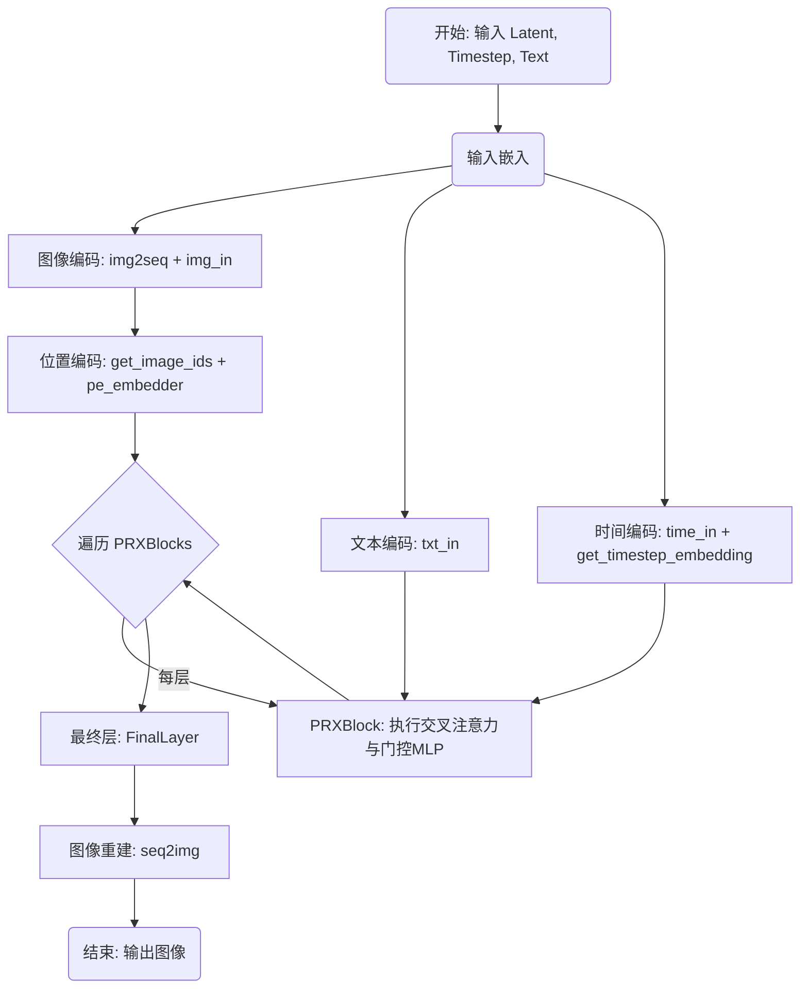
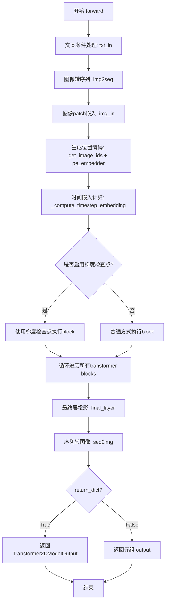
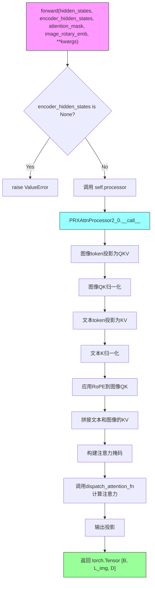
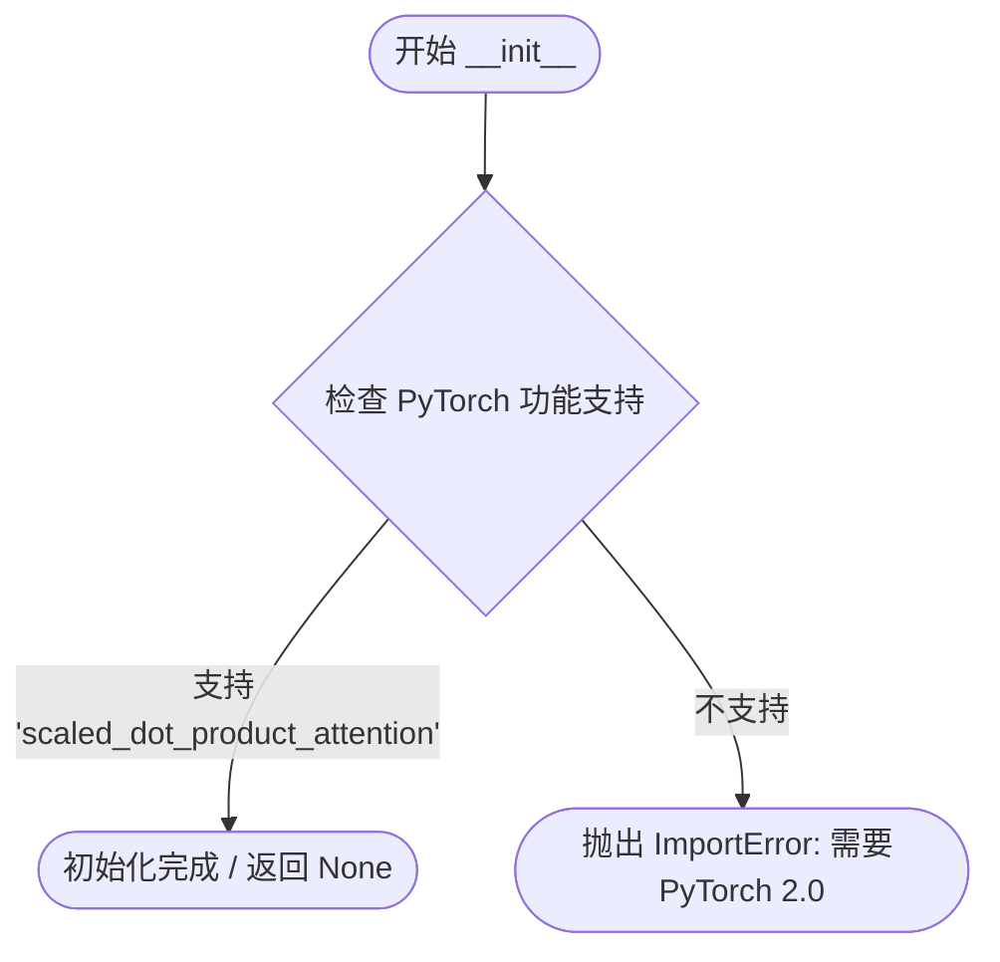
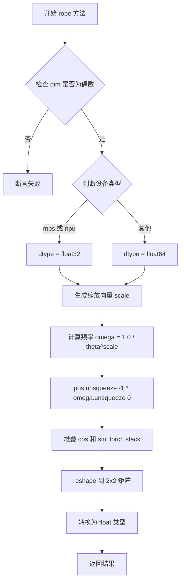
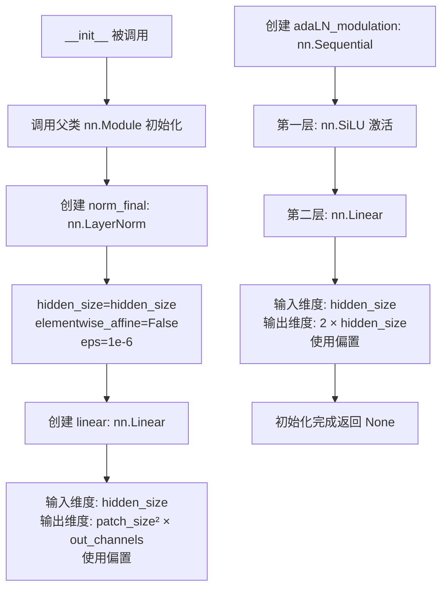

# `diffusers\src\diffusers\models\transformers\transformer_prx.py` 详细设计文档

该代码实现了一个名为 PRXTransformer2DModel 的 Transformer 模型，用于基于潜在扩散的文本到图像生成任务。它通过多模态 Transformer 块（PRXBlock）处理图像潜码和文本条件，集成旋转位置编码（RoPE）和门控 MLP，通过迭代去噪将噪声潜在表示转换为最终图像。

## 整体流程



## 类结构

```
PRXTransformer2DModel (主模型基类)
├── PRXEmbedND (N维旋转位置编码)
├── MLPEmbedder (时间步嵌入MLP)
├── PRXBlock (Transformer 模块 x depth)
│   ├── Modulation (调制网络: 产生 shift/scale/gate)
│   ├── PRXAttention (多头交叉注意力)
│   │   └── PRXAttnProcessor2_0 (具体注意力计算逻辑)
│   └── MLP (前馈网络: gate_proj, up_proj, down_proj)
└── FinalLayer (最终输出投影层)
```

## 全局变量及字段


### `PRXTransformer2DModel.in_channels`
    
Number of input channels in the latent image

类型：`int`
    


### `PRXTransformer2DModel.patch_size`
    
Size of the square patches used to flatten the input image

类型：`int`
    


### `PRXTransformer2DModel.out_channels`
    
Number of output channels per patch (in_channels * patch_size^2)

类型：`int`
    


### `PRXTransformer2DModel.hidden_size`
    
Dimension of the hidden representation

类型：`int`
    


### `PRXTransformer2DModel.num_heads`
    
Number of attention heads

类型：`int`
    


### `PRXTransformer2DModel.time_factor`
    
Scaling factor applied in timestep embeddings

类型：`float`
    


### `PRXTransformer2DModel.time_max_period`
    
Maximum frequency period for timestep embeddings

类型：`int`
    


### `PRXTransformer2DModel.pe_embedder`
    
Multi-axis rotary embedding generator for positional encodings

类型：`PRXEmbedND`
    


### `PRXTransformer2DModel.img_in`
    
Projection layer for image patch tokens

类型：`nn.Linear`
    


### `PRXTransformer2DModel.time_in`
    
Embedding layer for timestep embeddings

类型：`MLPEmbedder`
    


### `PRXTransformer2DModel.txt_in`
    
Projection layer for text conditioning

类型：`nn.Linear`
    


### `PRXTransformer2DModel.blocks`
    
Stack of transformer blocks (PRXBlock)

类型：`nn.ModuleList`
    


### `PRXTransformer2DModel.final_layer`
    
Projection layer mapping hidden tokens back to patch outputs

类型：`FinalLayer`
    


### `PRXTransformer2DModel.gradient_checkpointing`
    
Flag for gradient checkpointing to save memory

类型：`bool`
    


### `PRXBlock.hidden_dim`
    
Dimension of the hidden representations

类型：`int`
    


### `PRXBlock.num_heads`
    
Number of attention heads

类型：`int`
    


### `PRXBlock.head_dim`
    
Dimension of each attention head (hidden_size // num_heads)

类型：`int`
    


### `PRXBlock.mlp_hidden_dim`
    
Hidden dimension for MLP (hidden_size * mlp_ratio)

类型：`int`
    


### `PRXBlock.img_pre_norm`
    
Pre-normalization applied to image tokens before attention

类型：`nn.LayerNorm`
    


### `PRXBlock.attention`
    
Multi-head attention module for cross-attention between image and text tokens

类型：`PRXAttention`
    


### `PRXBlock.post_attention_layernorm`
    
Normalization applied after attention

类型：`nn.LayerNorm`
    


### `PRXBlock.gate_proj`
    
Feedforward gate projection for gated MLP

类型：`nn.Linear`
    


### `PRXBlock.up_proj`
    
Feedforward up projection for gated MLP

类型：`nn.Linear`
    


### `PRXBlock.down_proj`
    
Feedforward down projection for gated MLP

类型：`nn.Linear`
    


### `PRXBlock.mlp_act`
    
Nonlinear activation used in the MLP

类型：`nn.GELU`
    


### `PRXBlock.modulation`
    
Produces scale/shift/gating parameters for modulated layers

类型：`Modulation`
    


### `PRXAttention.heads`
    
Number of attention heads

类型：`int`
    


### `PRXAttention.head_dim`
    
Dimension of each attention head

类型：`int`
    


### `PRXAttention.inner_dim`
    
Total inner dimension (head_dim * heads)

类型：`int`
    


### `PRXAttention.query_dim`
    
Dimensionality of the query projections

类型：`int`
    


### `PRXAttention.img_qkv_proj`
    
Projection layer for image Q, K, V

类型：`nn.Linear`
    


### `PRXAttention.norm_q`
    
Q normalization for image tokens

类型：`RMSNorm`
    


### `PRXAttention.norm_k`
    
K normalization for image tokens

类型：`RMSNorm`
    


### `PRXAttention.txt_kv_proj`
    
Projection layer for text K, V

类型：`nn.Linear`
    


### `PRXAttention.norm_added_k`
    
K normalization for text tokens

类型：`RMSNorm`
    


### `PRXAttention.to_out`
    
Output projection layers (linear + dropout)

类型：`nn.ModuleList`
    


### `PRXAttention.processor`
    
Attention processor instance

类型：`PRXAttnProcessor2_0`
    


### `PRXAttnProcessor2_0._attention_backend`
    
Class variable for attention backend (Flash Attention, Sage Attention, etc.)

类型：`None`
    


### `PRXAttnProcessor2_0._parallel_config`
    
Class variable for parallel configuration

类型：`None`
    


### `Modulation.lin`
    
Linear layer for modulation network

类型：`nn.Linear`
    


### `PRXEmbedND.dim`
    
Base embedding dimension (must be even)

类型：`int`
    


### `PRXEmbedND.theta`
    
Scaling factor for rotary embeddings frequency spectrum

类型：`int`
    


### `PRXEmbedND.axes_dim`
    
List of embedding dimensions for each axis

类型：`list[int]`
    


### `FinalLayer.norm_final`
    
Final normalization applied to tokens

类型：`nn.LayerNorm`
    


### `FinalLayer.linear`
    
Linear projection to patch outputs

类型：`nn.Linear`
    


### `FinalLayer.adaLN_modulation`
    
Adaptive LayerNorm modulation for shift and scale

类型：`nn.Sequential`
    


### `MLPEmbedder.in_layer`
    
Input projection layer

类型：`nn.Linear`
    


### `MLPEmbedder.silu`
    
SiLU activation function

类型：`nn.SiLU`
    


### `MLPEmbedder.out_layer`
    
Output projection layer

类型：`nn.Linear`
    
    

## 全局函数及方法


### `get_image_ids`

生成2D patch坐标索引，用于为一批图像中的每个patch生成(row, col)位置编码。

参数：

- `batch_size`：`int`，批处理中的图像数量
- `height`：`int`，输入图像的高度（像素）
- `width`：`int`，输入图像的宽度（像素）
- `patch_size`：`int`，图像分割的方形patch大小
- `device`：`torch.device`，创建张量的设备

返回值：`torch.Tensor`，形状为`(batch_size, num_patches, 2)`的张量，包含图像网格中每个patch的(row, col)坐标。

#### 流程图

```mermaid
flowchart TD
    A[开始] --> B[计算grid高度和宽度<br>grid_h = height // patch_size<br>grid_w = width // patch_size]
    B --> C[创建零张量<br>shape: grid_h × grid_w × 2]
    C --> D[填充行坐标<br>img_ids[..., 0] = arange(grid_h)]
    D --> E[填充列坐标<br>img_ids[..., 1] = arange(grid_w)]
    E --> F[reshape为2D坐标<br>num_patches × 2]
    F --> G[扩展batch维度<br>unsqueeze + repeat batch_size次]
    H[返回最终tensor<br>shape: batch_size × num_patches × 2]
    G --> H
```

#### 带注释源码

```
def get_image_ids(batch_size: int, height: int, width: int, patch_size: int, device: torch.device) -> torch.Tensor:
    r"""
    Generates 2D patch coordinate indices for a batch of images.

    Args:
        batch_size (`int`):
            Number of images in the batch.
        height (`int`):
            Height of the input images (in pixels).
        width (`int`):
            Width of the input images (in pixels).
        patch_size (`int`):
            Size of the square patches that the image is divided into.
        device (`torch.device`):
            The device on which to create the tensor.

    Returns:
        `torch.Tensor`:
            Tensor of shape `(batch_size, num_patches, 2)` containing the (row, col) coordinates of each patch in the
            image grid.
    """

    # 计算图像在patch维度上的grid大小
    # 例如: height=32, patch_size=2 => grid_h=16
    grid_h = height // patch_size
    grid_w = width // patch_size
    
    # 创建形状为 (grid_h, grid_w, 2) 的零张量
    # 最后一维存储 [row_coord, col_coord]
    img_ids = torch.zeros(grid_h, grid_w, 2, device=device)
    
    # 填充行坐标 (row indices)
    # 使用 [:, None] 将 1D tensor 转换为列向量 (grid_h, 1)
    # 广播机制将同一行索引复制到该行的所有列
    img_ids[..., 0] = torch.arange(grid_h, device=device)[:, None]
    
    # 填充列坐标 (col indices)
    # 使用 [None, :] 将 1D tensor 转换为行向量 (1, grid_w)
    # 广播机制将同一列索引复制到该列的所有行
    img_ids[..., 1] = torch.arange(grid_w, device=device)[None, :]
    
    # 重塑为 (num_patches, 2) 的2D坐标
    # num_patches = grid_h * grid_w = (height // patch_size) * (width // patch_size)
    # 例如: (16, 16, 2) -> (256, 2)
    img_ids = img_ids.reshape(grid_h * grid_w, 2)
    
    # 在第0维添加batch维度，然后重复batch_size次
    # (num_patches, 2) -> (1, num_patches, 2) -> (batch_size, num_patches, 2)
    return img_ids.unsqueeze(0).repeat(batch_size, 1, 1)
```


### `apply_rope`

对输入查询张量应用旋转位置嵌入（RoPE），通过复数形式的旋转矩阵对查询向量进行变换，以引入序列位置信息。

参数：

- `xq`：`torch.Tensor`，输入查询张量，形状为 `(..., dim)`，代表查询向量。
- `freqs_cis`：`torch.Tensor`，预计算的旋转频率分量，形状为 `(..., dim/2, 2)`，包含余弦和正弦对。

返回值：`torch.Tensor`，应用旋转嵌入后的张量，形状与 `xq` 相同。

#### 流程图

```mermaid
flowchart TD
    A[开始 apply_rope] --> B[将 xq 转换为 float 类型并重塑为 \n xq_: [..., dim/2, 1, 2] 的形状]
    B --> C[确保 freqs_cis 与 xq 在同一设备上\n且数据类型一致]
    C --> D[使用旋转矩阵计算输出: \n xq_out = freqs_cis[..., 0] * xq_[..., 0] \n + freqs_cis[..., 1] * xq_[..., 1]]
    D --> E[将输出重塑为原始 xq 形状并转换回原始类型]
    E --> F[返回结果张量]
```

#### 带注释源码

```python
def apply_rope(xq: torch.Tensor, freqs_cis: torch.Tensor) -> torch.Tensor:
    r"""
    Applies rotary positional embeddings (RoPE) to a query tensor.

    Args:
        xq (`torch.Tensor`):
            Input tensor of shape `(..., dim)` representing the queries.
        freqs_cis (`torch.Tensor`):
            Precomputed rotary frequency components of shape `(..., dim/2, 2)` containing cosine and sine pairs.

    Returns:
        `torch.Tensor`:
            Tensor of the same shape as `xq` with rotary embeddings applied.
    """
    # 将输入查询张量转换为 float 类型并重塑为复数形式
    # 原始形状: (..., dim) -> 目标形状: (..., dim/2, 1, 2)
    # 最后的维度 2 代表复数的实部(余弦)和虚部(正弦)
    xq_ = xq.float().reshape(*xq.shape[:-1], -1, 1, 2)
    
    # 确保频率张量与查询张量在同一设备上，以避免设备不匹配问题
    # 特别是在使用模型 offloading 时这点尤为重要
    freqs_cis = freqs_cis.to(device=xq.device, dtype=xq_.dtype)
    
    # 应用旋转位置嵌入：使用复数乘法公式
    # freqs_cis[..., 0] 是余弦部分（实部），freqs_cis[..., 1] 是正弦部分（虚部）
    # 这相当于将查询向量旋转一个角度，该角度由位置索引决定
    xq_out = freqs_cis[..., 0] * xq_[..., 0] + freqs_cis[..., 1] * xq_[..., 1]
    
    # 将输出重塑为原始输入形状，并转换回原始数据类型
    return xq_out.reshape(*xq.shape).type_as(xq)
```


### `img2seq`

将输入图像张量转换为补丁序列。通过将图像重塑为非重叠的方形补丁块，然后重新排列维度以生成补丁序列，实现从2D图像空间到1D序列空间的映射。

参数：

- `img`：`torch.Tensor`，输入图像张量，形状为 `(B, C, H, W)`，其中 B 是批量大小，C 是通道数，H 和 W 分别是图像高度和宽度
- `patch_size`：`int`，每个方形补丁的尺寸，必须能整除 H 和 W

返回值：`torch.Tensor`，展平的补丁序列，形状为 `(B, L, C * patch_size * patch_size)`，其中 L = (H // patch_size) * (W // patch_size) 是补丁数量

#### 流程图

```mermaid
flowchart TD
    A[输入图像 tensor<br/>shape: (B, C, H, W)] --> B[获取批量大小、通道数、高度、宽度]
    B --> C[使用 reshape 将图像重塑<br/>shape: (B, C, H//p, p, W//p, p)]
    C --> D[使用 einsum 进行维度置换<br/>shape: (B, H//p, W//p, C, p, p)]
    D --> E[再次 reshape 展平为序列<br/>shape: (B, L, C * p * p)]
    E --> F[返回补丁序列 tensor]
    
    style A fill:#e1f5fe
    style F fill:#e8f5e8
```

#### 带注释源码

```python
def img2seq(img: torch.Tensor, patch_size: int) -> torch.Tensor:
    r"""
    Flattens an image tensor into a sequence of non-overlapping patches.

    Args:
        img (`torch.Tensor`):
            Input image tensor of shape `(B, C, H, W)`.
        patch_size (`int`):
            Size of each square patch. Must evenly divide both `H` and `W`.

    Returns:
        `torch.Tensor`:
            Flattened patch sequence of shape `(B, L, C * patch_size * patch_size)`, where `L = (H // patch_size) * (W
            // patch_size)` is the number of patches.
    """
    # 解包图像张量的维度: B=批量大小, C=通道数, H=高度, W=宽度
    b, c, h, w = img.shape
    p = patch_size  # 简写便于后续使用

    # 第一步重塑：将图像按补丁网格和补丁内容分离
    # 从 (B, C, H, W) -> (B, C, H//p, p, W//p, p)
    # 维度含义: [批量, 通道, 网格高度, 补丁高度, 网格宽度, 补丁宽度]
    img = img.reshape(b, c, h // p, p, w // p, p)

    # 第二步置换：使用爱因斯坦求和约定重新排列维度顺序
    # 从 (B, C, H//p, p, W//p, p) -> (B, H//p, W//p, C, p, p)
    # n=batch, c=channels, h=grid_height, p=patch_height, w=grid_width, q=patch_width
    # 这一步将"通道"维度移到最后，为后续展平做准备
    img = torch.einsum("nchpwq->nhwcpq", img)

    # 第三步展平：将所有补丁内容维度合并为一个特征维度
    # 从 (B, H//p, W//p, C, p, p) -> (B, L, C * p * p)
    # 其中 L = (H//p) * (W//p) 是补丁的总数（即序列长度）
    # 最后一个维度 C * p * p 是每个补丁的特征向量长度
    img = img.reshape(b, -1, c * p * p)
    return img  # 返回形状为 (B, L, C*p*p) 的序列张量
```


### `seq2img`

将补丁序列重建为图像张量，是 `img2seq` 的逆操作，用于将 Transformer 处理后的序列令牌转换回空间图像表示。

参数：

- `seq`：`torch.Tensor`，补丁序列，形状为 `(B, L, C * patch_size * patch_size)`，其中 L = (H // patch_size) * (W // patch_size)
- `patch_size`：`int`，每个正方形补丁的尺寸
- `shape`：`tuple` 或 `torch.Tensor`，原始图像的空间形状 `(H, W)`

返回值：`torch.Tensor`，重建的图像张量，形状为 `(B, C, H, W)`

#### 流程图

```mermaid
flowchart TD
    A[开始: seq2img] --> B{检查shape类型}
    B -->|tuple| C[提取h, w = shape[-2:]]
    B -->|torch.Tensor| D[提取h, w = int(shape[0]), int(shape[1])]
    B -->|其他| E[抛出NotImplementedError]
    C --> F[解包序列维度: b, l, d = seq.shape]
    D --> F
    F --> G[计算通道数: c = d // (p * p)]
    G --> H[重塑为网格结构: (B, H//p, W//p, C, p, p)]
    H --> I[使用einsum置换维度: (B, C, H//p, p, W//p, p)]
    I --> J[最终重塑为图像: (B, C, H, W)]
    J --> K[返回重建的图像张量]
```

#### 带注释源码

```python
def seq2img(seq: torch.Tensor, patch_size: int, shape: torch.Tensor) -> torch.Tensor:
    r"""
    Reconstructs an image tensor from a sequence of patches (inverse of `img2seq`).
    
    此函数是 img2seq 的逆操作，将经过 Transformer 处理的序列令牌重新构建为原始的空间图像表示。
    它首先解析输入的形状参数，然后通过一系列重塑（reshape）和爱因斯坦求和（einsum）操作
    将扁平的补丁序列转换回 4D 图像张量。

    Args:
        seq (`torch.Tensor`):
            Patch sequence of shape `(B, L, C * patch_size * patch_size)`, where `L = (H // patch_size) * (W //
            patch_size)`. 输入的序列张量，包含批次大小 B、补丁数量 L 和每个补丁的维度
        patch_size (`int`):
            Size of each square patch. 正方形补丁的边长，用于计算网格维度
        shape (`tuple` or `torch.Tensor`):
            The original image spatial shape `(H, W)`. If a tensor is provided, the first two values are interpreted as
            height and width. 原始图像的高度和宽度，用于重建图像的spatial维度

    Returns:
        `torch.Tensor`:
            Reconstructed image tensor of shape `(B, C, H, W)`. 重建后的4D图像张量
    """
    # 解析输入的shape参数，提取高度和宽度
    if isinstance(shape, tuple):
        h, w = shape[-2:]  # 从tuple末尾取H, W
    elif isinstance(shape, torch.Tensor):
        h, w = (int(shape[0]), int(shape[1]))  # 从tensor中提取H, W
    else:
        raise NotImplementedError(f"shape type {type(shape)} not supported")  # 不支持的shape类型

    # 解包序列张量的维度信息
    b, l, d = seq.shape  # b=batch, l=sequence_length, d=patch_dim
    p = patch_size  # 补丁尺寸
    c = d // (p * p)  # 计算通道数: patch_dim = C * patch_size^2 => C = dim / (p*p)

    # Step 1: 将序列重塑回网格结构 (B, H//p, W//p, C, p, p)
    # 这将扁平的序列重新排列为2D网格形式，每个网格位置包含完整的补丁
    seq = seq.reshape(b, h // p, w // p, c, p, p)

    # Step 2: 使用 einsum 置换维度从 (B, H//p, W//p, C, p, p) 到 (B, C, H//p, p, W//p, p)
    # 这恢复了图像的空间排列，将通道维度移到前面
    # n=batch, h=grid_height, w=grid_width, c=channels, p=patch_height, q=patch_width
    seq = torch.einsum("nhwcpq->nchpwq", seq)

    # Step 3: 最终重塑为 (B, C, H, W) 的图像格式
    # 将所有补丁维度合并为完整的空间维度
    seq = seq.reshape(b, c, h, w)
    return seq
```


### `PRXTransformer2DModel.__init__`

该方法是 `PRXTransformer2DModel` 类的初始化构造函数，负责配置和构建一个用于文本到图像生成的 Transformer 2D 模型。它初始化了模型的各项参数（输入通道、patch大小、隐藏维度等），并实例化了模型的核心组件，包括位置编码嵌入器、图像/时间/文本输入投影层、Transformer 块堆栈以及最终输出层。

参数：

- `in_channels`：`int`，输入潜在图像的通道数，默认为 16
- `patch_size`：`int`，用于展平输入图像的方形 patches 大小，默认为 2
- `context_in_dim`：`int`，文本条件输入的维度，默认为 2304
- `hidden_size`：`int`，隐藏表示的维度，默认为 1792
- `mlp_ratio`：`float`，MLP 块内部隐藏维度的扩展比率，默认为 3.5
- `num_heads`：`int`，注意力头的数量，默认为 28
- `depth`：`int`，Transformer 块的数量，默认为 16
- `axes_dim`：`list`，每个位置嵌入轴的维度列表，默认为 [32, 32]
- `theta`：`int`，旋转嵌入的频率缩放因子，默认为 10000
- `time_factor`：`float`，时间步嵌入中应用的缩放因子，默认为 1000.0
- `time_max_period`：`int`，时间步嵌入的最大频率周期，默认为 10000

返回值：无（`None`），该方法为构造函数，仅初始化对象状态

#### 流程图

```mermaid
flowchart TD
    A[开始 __init__] --> B{axes_dim is None?}
    B -->|是| C[设置 axes_dim = [32, 32]]
    B -->|否| D[使用传入的 axes_dim]
    C --> E[存储基础参数: in_channels, patch_size, out_channels, time_factor, time_max_period]
    E --> F{hidden_size % num_heads == 0?}
    F -->|否| G[抛出 ValueError]
    F -->|是| H[计算 pe_dim = hidden_size // num_heads]
    H --> I{sum(axes_dim) == pe_dim?}
    I -->|否| J[抛出 ValueError]
    I -->|是| K[实例化组件: pe_embedder, img_in, time_in, txt_in, blocks, final_layer]
    K --> L[设置 gradient_checkpointing = False]
    L --> M[结束 __init__]
```

#### 带注释源码

```python
@register_to_config
def __init__(
    self,
    in_channels: int = 16,
    patch_size: int = 2,
    context_in_dim: int = 2304,
    hidden_size: int = 1792,
    mlp_ratio: float = 3.5,
    num_heads: int = 28,
    depth: int = 16,
    axes_dim: list = None,
    theta: int = 10000,
    time_factor: float = 1000.0,
    time_max_period: int = 10000,
):
    """
    初始化 PRXTransformer2DModel 模型。

    参数:
        in_channels: 输入潜在图像的通道数
        patch_size: 图像分块大小
        context_in_dim: 文本条件输入维度
        hidden_size: 隐藏层维度
        mlp_ratio: MLP 扩展比率
        num_heads: 注意力头数
        depth: Transformer 块数量
        axes_dim: 位置编码轴维度列表
        theta: 旋转编码频率因子
        time_factor: 时间嵌入缩放因子
        time_max_period: 时间嵌入最大周期
    """
    super().__init__()  # 调用父类初始化

    # 默认 axes_dim 值
    if axes_dim is None:
        axes_dim = [32, 32]

    # 存储基础参数
    self.in_channels = in_channels
    self.patch_size = patch_size
    self.out_channels = self.in_channels * self.patch_size**2  # 输出通道数

    self.time_factor = time_factor
    self.time_max_period = time_max_period

    # 验证 hidden_size 能被 num_heads 整除
    if hidden_size % num_heads != 0:
        raise ValueError(f"Hidden size {hidden_size} must be divisible by num_heads {num_heads}")

    # 计算位置编码维度
    pe_dim = hidden_size // num_heads

    # 验证 axes_dim 总和等于位置编码维度
    if sum(axes_dim) != pe_dim:
        raise ValueError(f"Got {axes_dim} but expected positional dim {pe_dim}")

    # 存储模型维度参数
    self.hidden_size = hidden_size
    self.num_heads = num_heads
    
    # 实例化位置编码嵌入器
    self.pe_embedder = PRXEmbedND(dim=pe_dim, theta=theta, axes_dim=axes_dim)
    
    # 实例化图像输入投影层 (patch token 投影)
    self.img_in = nn.Linear(self.in_channels * self.patch_size**2, self.hidden_size, bias=True)
    
    # 实例化时间步嵌入层
    self.time_in = MLPEmbedder(in_dim=256, hidden_dim=self.hidden_size)
    
    # 实例化文本输入投影层
    self.txt_in = nn.Linear(context_in_dim, self.hidden_size)

    # 实例化 Transformer 块堆栈
    self.blocks = nn.ModuleList(
        [
            PRXBlock(
                self.hidden_size,
                self.num_heads,
                mlp_ratio=mlp_ratio,
            )
            for i in range(depth)
        ]
    )

    # 实例化最终输出层
    self.final_layer = FinalLayer(self.hidden_size, 1, self.out_channels)

    # 初始化梯度检查点标志
    self.gradient_checkpointing = False
```


### `PRXTransformer2DModel._compute_timestep_embedding`

该方法是一个私有成员方法，用于计算时间步（timestep）的嵌入向量。它首先调用 `get_timestep_embedding` 函数生成基础的高频正弦/余弦时间步嵌入，然后通过 `self.time_in`（一个 MLPEmbedder）将该嵌入投影到隐藏维度空间，生成最终用于模型条件的时间步嵌入向量。

参数：

- `timestep`：`torch.Tensor`，时间步张量，通常为形状 `(B,)` 或 `(1,)` 的整数张量，表示扩散过程的当前时间步。
- `dtype`：`torch.dtype`，目标数据类型，用于指定输出嵌入的精度（如 `torch.float32` 或 `torch.float16`）。

返回值：`torch.Tensor`，形状为 `(B, hidden_size)` 的时间步嵌入向量，其中 `hidden_size` 是模型的隐藏维度大小。

#### 流程图

```mermaid
flowchart TD
    A[输入: timestep, dtype] --> B[调用 get_timestep_embedding]
    B --> C[生成基础嵌入: 形状 (B, 256)]
    C --> D[将嵌入转换为目标 dtype]
    D --> E[调用 self.time_in MLPEmbedder]
    E --> F[投影到隐藏维度: 形状 (B, hidden_size)]
    F --> G[输出: 时间步嵌入]
```

#### 带注释源码

```python
def _compute_timestep_embedding(self, timestep: torch.Tensor, dtype: torch.dtype) -> torch.Tensor:
    """
    计算时间步嵌入向量。

    该方法首先使用正弦/余弦位置编码方式生成基础的时间步嵌入，
    然后通过一个 MLP 网络将嵌入投影到与模型隐藏维度相同的空间。

    Args:
        timestep: 时间步张量，形状为 (B,) 或 (1,)
        dtype: 目标数据类型，用于控制输出精度

    Returns:
        投影后的时间步嵌入，形状为 (B, hidden_size)
    """
    # 调用 get_timestep_embedding 生成基础的正弦/余弦时间步嵌入
    # embedding_dim=256: 基础嵌入的维度
    # max_period=self.time_max_period: 最大频率周期，控制高频成分的衰减速度
    # scale=self.time_factor: 缩放因子，用于调整嵌入的数值范围
    # flip_sin_to_cos=True: 保持与原始实现一致的 sin/cos 顺序
    # downscale_freq_shift=0.0: 频率偏移量
    # .to(dtype): 将生成的嵌入转换为目标数据类型（float32/float16 等）
    return self.time_in(
        get_timestep_embedding(
            timesteps=timestep,
            embedding_dim=256,
            max_period=self.time_max_period,
            scale=self.time_factor,
            flip_sin_to_cos=True,  # Match original cos, sin order
            downscale_freq_shift=0.0,
        ).to(dtype)
    )
```


### `PRXTransformer2DModel.forward`

这是PRXTransformer2DModel类的前向传播方法，负责将输入的潜在图像张量经过变换器块处理后输出重建的潜在图像。

参数：

- `self`：`PRXTransformer2DModel`类实例，当前模型对象
- `hidden_states`：`torch.Tensor`，输入潜在图像张量，形状为`(B, C, H, W)`，其中B为批量大小，C为通道数，H和W为图像高宽
- `timestep`：`torch.Tensor`，时间步张量，形状为`(B,)`或`(1,)`，用于时间条件调节
- `encoder_hidden_states`：`torch.Tensor`，文本条件张量，形状为`(B, L_txt, context_in_dim)`，L_txt为文本序列长度
- `attention_mask`：`torch.Tensor | None`，可选的布尔掩码，形状为`(B, L_txt)`，其中0表示文本序列中的填充位置
- `attention_kwargs`：`dict[str, Any] | None`，可选的注意力层额外参数字典
- `return_dict`：`bool`，可选，默认为True，决定是否返回Transformer2DModelOutput对象

返回值：`tuple[torch.Tensor, ...] | Transformer2DModelOutput`，当return_dict为True时返回Transformer2DModelOutput，否则返回元组

#### 流程图



#### 带注释源码

```python
def forward(
    self,
    hidden_states: torch.Tensor,
    timestep: torch.Tensor,
    encoder_hidden_states: torch.Tensor,
    attention_mask: torch.Tensor | None = None,
    attention_kwargs: dict[str, Any] | None = None,
    return_dict: bool = True,
) -> tuple[torch.Tensor, ...] | Transformer2DModelOutput:
    r"""
    Forward pass of the PRXTransformer2DModel.

    The latent image is split into patch tokens, combined with text conditioning, and processed through a stack of
    transformer blocks modulated by the timestep. The output is reconstructed into the latent image space.

    Args:
        hidden_states (`torch.Tensor`):
            Input latent image tensor of shape `(B, C, H, W)`.
        timestep (`torch.Tensor`):
            Timestep tensor of shape `(B,)` or `(1,)`, used for temporal conditioning.
        encoder_hidden_states (`torch.Tensor`):
            Text conditioning tensor of shape `(B, L_txt, context_in_dim)`.
        attention_mask (`torch.Tensor`, *optional*):
            Boolean mask of shape `(B, L_txt)`, where `0` marks padding in the text sequence.
        attention_kwargs (`dict`, *optional*):
            Additional arguments passed to attention layers.
        return_dict (`bool`, *optional*, defaults to `True`):
            Whether to return a `Transformer2DModelOutput` or a tuple.

    Returns:
        `Transformer2DModelOutput` if `return_dict=True`, otherwise a tuple:

            - `sample` (`torch.Tensor`): Output latent image of shape `(B, C, H, W)`.
    """
    # Step 1: 处理文本条件输入，通过线性层将文本嵌入投影到隐藏空间维度
    txt = self.txt_in(encoder_hidden_states)

    # Step 2: 将图像latent转换为patch序列，然后通过线性层嵌入到隐藏空间
    img = img2seq(hidden_states, self.patch_size)  # (B, C, H, W) -> (B, L, C*p*p)
    img = self.img_in(img)  # (B, L, C*p*p) -> (B, L, hidden_size)

    # Step 3: 生成2D patch坐标索引，用于旋转位置编码
    bs, _, h, w = hidden_states.shape
    img_ids = get_image_ids(bs, h, w, patch_size=self.patch_size, device=hidden_states.device)
    pe = self.pe_embedder(img_ids)  # 生成旋转位置编码

    # Step 4: 计算时间步嵌入，用于调节transformer块
    vec = self._compute_timestep_embedding(timestep, dtype=img.dtype)

    # Step 5: 遍历所有transformer块进行处理
    for block in self.blocks:
        # 如果启用了梯度检查点，则使用它来节省显存
        if torch.is_grad_enabled() and self.gradient_checkpointing:
            img = self._gradient_checkpointing_func(
                block.__call__,
                img,
                txt,
                vec,
                pe,
                attention_mask,
            )
        else:
            # 标准前向传播：每个block接收图像tokens、文本tokens、时间嵌入、位置编码和mask
            img = block(
                hidden_states=img,
                encoder_hidden_states=txt,
                temb=vec,
                image_rotary_emb=pe,
                attention_mask=attention_mask,
            )

    # Step 6: 最终层将hidden tokens投影回patch输出空间
    img = self.final_layer(img, vec)

    # Step 7: 将patch序列重建为图像latent格式
    output = seq2img(img, self.patch_size, hidden_states.shape)

    # Step 8: 根据return_dict决定返回格式
    if not return_dict:
        return (output,)
    return Transformer2DModelOutput(sample=output)
```


### `PRXBlock.__init__`

初始化PRXBlock类，这是一个多模态Transformer模块，包含图像预处理层、PRXAttention交叉注意力模块、带有门控机制的MLP以及用于生成缩放/偏移/门控参数的Modulation层。

参数：

- `hidden_size`：`int`，隐藏层的维度大小
- `num_heads`：`int`，注意力头的数量
- `mlp_ratio`：`float`，可选，MLP隐藏层维度的扩展比率，默认为4.0
- `qk_scale`：`float | None`，可选，QK缩放因子，如果未提供则默认为`head_dim**-0.5`

返回值：无

#### 流程图

```mermaid
flowchart TD
    A[开始 __init__] --> B[调用 super().__init__]
    B --> C[设置实例属性: hidden_dim, num_heads, head_dim, scale]
    C --> D[计算 mlp_hidden_dim = hidden_size * mlp_ratio]
    D --> E[创建 img_pre_norm: nn.LayerNorm]
    E --> F[创建 attention: PRXAttention 模块]
    F --> G[创建 post_attention_layernorm: nn.LayerNorm]
    G --> H[创建 gate_proj, up_proj, down_proj 线性层]
    H --> I[创建 ml_act: nn.GELU 激活层]
    I --> J[创建 modulation: Modulation 模块]
    J --> K[结束 __init__]
```

#### 带注释源码

```python
def __init__(
    self,
    hidden_size: int,
    num_heads: int,
    mlp_ratio: float = 4.0,
    qk_scale: float | None = None,
):
    """
    初始化PRXBlock多模态Transformer块
    
    参数:
        hidden_size: 隐藏层维度
        num_heads: 注意力头数量
        mlp_ratio: MLP扩展比率，默认4.0
        qk_scale: QK缩放因子，默认head_dim**-0.5
    """
    super().__init__()  # 调用nn.Module初始化

    # 存储基本维度参数
    self.hidden_dim = hidden_size
    self.num_heads = num_heads
    self.head_dim = hidden_size // num_heads  # 每个头的维度
    # 如果未提供qk_scale，则使用head_dim的-0.5次方作为缩放因子
    self.scale = qk_scale or self.head_dim**-0.5

    # 计算MLP隐藏层维度：hidden_size * mlp_ratio
    self.mlp_hidden_dim = int(hidden_size * mlp_ratio)
    self.hidden_size = hidden_size

    # ========== 注意力相关组件 ==========
    # 图像token的预归一化层
    self.img_pre_norm = nn.LayerNorm(hidden_size, elementwise_affine=False, eps=1e-6)

    # PRXAttention模块：处理图像-文本交叉注意力
    # 包含内置的QKV投影和RMSNorm归一化
    self.attention = PRXAttention(
        query_dim=hidden_size,
        heads=num_heads,
        dim_head=self.head_dim,
        bias=False,
        out_bias=False,
        eps=1e-6,
        processor=PRXAttnProcessor2_0(),  # 默认使用PRXAttnProcessor2_0
    )

    # ========== MLP相关组件 ==========
    # 注意力后的归一化层
    self.post_attention_layernorm = nn.LayerNorm(hidden_size, elementwise_affine=False, eps=1e-6)
    
    # 门控MLP的三个线性投影层
    self.gate_proj = nn.Linear(hidden_size, self.mlp_hidden_dim, bias=False)  # 门控投影
    self.up_proj = nn.Linear(hidden_size, self.mlp_hidden_dim, bias=False)     # 上投影
    self.down_proj = nn.Linear(self.mlp_hidden_dim, hidden_size, bias=False)   # 下投影
    
    # GELU激活函数，使用tanh近似
    self.mlp_act = nn.GELU(approximate="tanh")

    # ========== 调制模块 ==========
    # 用于生成scale/shift/gate参数的调制网络
    self.modulation = Modulation(hidden_size)
```


### `PRXBlock.forward`

执行调制门控的交叉注意力（cross-attention）和 MLP（多层感知机），并通过残差连接（residual connection）将处理后的图像token与原始token相加，实现文本条件下的图像特征变换。

参数：

- `hidden_states`：`torch.Tensor`，图像token，形状为 `(B, L_img, hidden_size)`
- `encoder_hidden_states`：`torch.Tensor`，文本token，形状为 `(B, L_txt, hidden_size)`
- `temb`：`torch.Tensor`，用于 `Modulation` 生成 scale/shift/gate 参数的条件向量，形状为 `(B, hidden_size)` 或可广播
- `image_rotary_emb`：`torch.Tensor`，在注意力内部应用的旋转位置嵌入（RoPE）
- `attention_mask`：`torch.Tensor | None`，文本token的布尔掩码，形状为 `(B, L_txt)`，其中 `0` 标记填充位置
- `**kwargs`：`dict[str, Any]`（即 `dict[str, Any]`），用于 API 兼容性的额外关键字参数

返回值：`torch.Tensor`，更新后的图像token，形状为 `(B, L_img, hidden_size)`

#### 流程图

```mermaid
flowchart TD
    A[开始: forward] --> B[调用 modulation 生成两组调制参数]
    B --> C[解包: attn_shift, attn_scale, attn_gate 和 mlp_shift, mlp_scale, mlp_gate]
    C --> D[图像token归一化与调制: hidden_states_mod = (1 + attn_scale) * img_pre_norm(hidden_states) + attn_shift]
    D --> E[调用 self.attention 执行交叉注意力]
    E --> F[残差连接: hidden_states = hidden_states + attn_gate * attn_out]
    F --> G[MLP输入归一化: x = (1 + mlp_scale) * post_attention_layernorm(hidden_states) + mlp_shift]
    G --> H[计算MLP: mlp_gate * down_proj(act(gate_proj(x)) * up_proj(x))]
    H --> I[残差连接: hidden_states = hidden_states + mlp_result]
    I --> J[返回: 更新后的 hidden_states]
```

#### 带注释源码

```python
def forward(
    self,
    hidden_states: torch.Tensor,
    encoder_hidden_states: torch.Tensor,
    temb: torch.Tensor,
    image_rotary_emb: torch.Tensor,
    attention_mask: torch.Tensor | None = None,
    **kwargs: dict[str, Any],
) -> torch.Tensor:
    r"""
    Runs modulation-gated cross-attention and MLP, with residual connections.

    Args:
        hidden_states (`torch.Tensor`):
            Image tokens of shape `(B, L_img, hidden_size)`.
        encoder_hidden_states (`torch.Tensor`):
            Text tokens of shape `(B, L_txt, hidden_size)`.
        temb (`torch.Tensor`):
            Conditioning vector used by `Modulation` to produce scale/shift/gates, shape `(B, hidden_size)` (or
            broadcastable).
        image_rotary_emb (`torch.Tensor`):
            Rotary positional embeddings applied inside attention.
        attention_mask (`torch.Tensor`, *optional*):
            Boolean mask for text tokens of shape `(B, L_txt)`, where `0` marks padding.
        **kwargs:
            Additional keyword arguments for API compatibility.

    Returns:
        `torch.Tensor`:
            Updated image tokens of shape `(B, L_img, hidden_size)`.
    """

    # Step 1: 调用 Modulation 模块，根据时间步嵌入 (temb) 生成两组调制参数
    # 每一组包含 (shift, scale, gate)，分别用于注意力和 MLP
    mod_attn, mod_mlp = self.modulation(temb)
    attn_shift, attn_scale, attn_gate = mod_attn
    mlp_shift, mlp_scale, mlp_gate = mod_mlp

    # Step 2: 对图像 token 进行预处理归一化，并应用注意力调制
    # 公式: (1 + attn_scale) * norm(x) + attn_shift
    # attn_scale 和 attn_shift 用于对特征进行仿射变换
    hidden_states_mod = (1 + attn_scale) * self.img_pre_norm(hidden_states) + attn_shift

    # Step 3: 执行交叉注意力机制
    # 交叉注意力在图像 token (hidden_states_mod) 和文本 token (encoder_hidden_states) 之间进行
    # 图像 token 作为 query，文本 token 作为 key 和 value
    attn_out = self.attention(
        hidden_states=hidden_states_mod,
        encoder_hidden_states=encoder_hidden_states,
        attention_mask=attention_mask,
        image_rotary_emb=image_rotary_emb,
    )

    # Step 4: 应用注意力门控并进行残差连接
    # attn_gate 控制注意力输出的贡献程度
    hidden_states = hidden_states + attn_gate * attn_out

    # Step 5: 对注意力输出进行归一化，并应用 MLP 调制
    x = (1 + mlp_scale) * self.post_attention_layernorm(hidden_states) + mlp_shift

    # Step 6: 计算门控 MLP (Gated MLP)
    # 采用 Gated MLP 架构: output = gate * down_proj(act(gate_proj(x)) * up_proj(x))
    # 其中 gate_proj 和 up_proj 用于计算门控信号，down_proj 用于投影回原始维度
    hidden_states = hidden_states + mlp_gate * (self.down_proj(self.mlp_act(self.gate_proj(x)) * self.up_proj(x)))

    # Step 7: 返回更新后的图像 token
    return hidden_states
```


### `PRXAttention.__init__`

PRXAttention 类的初始化方法，负责配置多头注意力机制的核心参数，包括图像和文本 token 的 QKV 投影层、QK 归一化层以及输出投影层，并设置默认的注意力处理器。

参数：

- `query_dim`：`int`，输入查询向量的维度，也是输出维度
- `heads`：`int = 8`，注意力头的数量，默认为 8
- `dim_head`：`int = 64`，每个注意力头的维度，默认为 64
- `bias`：`bool = False`，QKV 投影层是否使用偏置，默认为 False
- `out_bias`：`bool = False`，输出投影层是否使用偏置，默认为 False
- `eps`：`float = 1e-6`，RMSNorm 归一化的 epsilon 值，默认为 1e-6
- `processor`：可选的注意力处理器实例，默认为 None

返回值：`None`，该方法无返回值，直接在对象内部初始化各层

#### 流程图

```mermaid
flowchart TD
    A[开始 __init__] --> B[调用 super().__init__]
    B --> C[设置注意力头数量 heads]
    C --> D[设置头维度 head_dim]
    D --> E[计算内部维度 inner_dim = dim_head * heads]
    E --> F[保存 query_dim]
    F --> G[创建 img_qkv_proj 线性层: query_dim → query_dim * 3]
    G --> H[创建 norm_q RMSNorm 层]
    H --> I[创建 norm_k RMSNorm 层]
    I --> J[创建 txt_kv_proj 线性层: query_dim → query_dim * 2]
    J --> K[创建 norm_added_k RMSNorm 层]
    K --> L[创建输出模块列表 to_out]
    L --> M[添加输出线性层: inner_dim → query_dim]
    M --> N[添加 Dropout 层]
    N --> O{processor is None?}
    O -->|是| P[创建默认处理器 PRXAttnProcessor2_0]
    O -->|否| Q[使用传入的 processor]
    P --> R[调用 set_processor 设置处理器]
    Q --> R
    R --> S[结束 __init__]
```

#### 带注释源码

```python
def __init__(
    self,
    query_dim: int,           # 输入查询向量的维度，也是输出的维度
    heads: int = 8,           # 注意力头的数量
    dim_head: int = 64,       # 每个注意力头的维度
    bias: bool = False,       # QKV 投影是否使用偏置
    out_bias: bool = False,   # 输出投影是否使用偏置
    eps: float = 1e-6,         # RMSNorm 的 epsilon 值
    processor=None,           # 可选的注意力处理器
):
    super().__init__()  # 调用 nn.Module 的初始化

    # ===== 基本配置参数 =====
    self.heads = heads                      # 保存注意力头数量
    self.head_dim = dim_head                # 保存每个头的维度
    self.inner_dim = dim_head * heads       # 计算内部总维度 (所有头的维度总和)
    self.query_dim = query_dim              # 保存查询维度

    # ===== 图像 token 的 QKV 投影 =====
    # 将 query_dim 投影到 query_dim * 3，用于生成 Q, K, V 三个向量
    self.img_qkv_proj = nn.Linear(query_dim, query_dim * 3, bias=bias)

    # ===== 图像 Query 和 Key 的归一化层 (RMSNorm) =====
    # 对图像 token 的 Q 和 K 分别进行归一化，有助于训练稳定性
    self.norm_q = RMSNorm(self.head_dim, eps=eps, elementwise_affine=True)
    self.norm_k = RMSNorm(self.head_dim, eps=eps, elementwise_affine=True)

    # ===== 文本 token 的 KV 投影 =====
    # 文本 token 只生成 K 和 V，不需要 Q (图像 token 提供 Q)
    # 将 query_dim 投影到 query_dim * 2，用于生成 K, V
    self.txt_kv_proj = nn.Linear(query_dim, query_dim * 2, bias=bias)

    # ===== 文本 Key 的归一化层 (RMSNorm) =====
    # 对文本 token 的 K 进行归一化
    self.norm_added_k = RMSNorm(self.head_dim, eps=eps, elementwise_affine=True)

    # ===== 输出投影层 =====
    # 使用 ModuleList 以支持可能的多个输出层 (如 Dropout)
    self.to_out = nn.ModuleList([])
    # 第一个层: 线性投影，将多头注意力的输出映射回 query_dim 维度
    self.to_out.append(nn.Linear(self.inner_dim, query_dim, bias=out_bias))
    # 第二个层: Dropout 层，概率为 0.0 (当前未启用)
    self.to_out.append(nn.Dropout(0.0))

    # ===== 设置注意力处理器 =====
    # 如果未提供处理器，使用默认的 PRXAttnProcessor2_0
    if processor is None:
        processor = self._default_processor_cls()  # 创建默认处理器实例
    self.set_processor(processor)  # 调用混合类的 set_processor 方法
```


### `PRXAttention.forward`

该方法是 `PRXAttention` 类的forward方法，是一个委托方法，实际的注意力计算逻辑由 `PRXAttnProcessor2_0` 处理器执行。该方法接收图像tokens、文本tokens、注意力掩码和旋转位置嵌入，将它们传递给处理器进行交叉注意力计算。

参数：

-  `self`：`PRXAttention` 实例，注意力模块本身，包含QKV投影层和归一化层
-  `hidden_states`：`torch.Tensor`，输入的图像tokens，形状为 `[B, L_img, D]`，其中B是批量大小，L_img是图像序列长度，D是隐藏维度
-  `encoder_hidden_states`：`torch.Tensor | None`，编码的文本tokens，来自文本编码器的输出，形状为 `[B, L_txt, D]`
-  `attention_mask`：`torch.Tensor | None`，用于文本tokens的布尔掩码，形状为 `[B, L_txt]`，其中True表示有效位置，False表示需要忽略的padding位置
-  `image_rotary_emb`：`torch.Tensor | None`，图像的旋转位置嵌入（RoPE），形状为 `[B, 1, L_img, head_dim//2, 2, 2]`
-  `**kwargs`：其他关键字参数，用于API兼容性

返回值：`torch.Tensor`，经过注意力处理后的输出，形状为 `[B, L_img, D]`

#### 流程图



#### 带注释源码

```python
def forward(
    self,
    hidden_states: torch.Tensor,
    encoder_hidden_states: torch.Tensor | None = None,
    attention_mask: torch.Tensor | None = None,
    image_rotary_emb: torch.Tensor | None = None,
    **kwargs,
) -> torch.Tensor:
    """
    PRXAttention模块的前向传播方法。
    
    这是一个委托方法，将实际的注意力计算委托给self.processor（即PRXAttnProcessor2_0实例）。
    实际的计算包括：
    1. 对图像tokens进行QKV投影和归一化
    2. 对文本tokens进行KV投影和K归一化
    3. 应用旋转位置嵌入（RoPE）
    4. 拼接文本和图像的keys/values
    5. 使用dispatch_attention_fn进行注意力计算（支持多种后端如Flash Attention、Sage Attention等）
    6. 输出投影
    
    Args:
        hidden_states: 图像tokens [B, L_img, D]
        encoder_hidden_states: 文本tokens [B, L_txt, D]
        attention_mask: 文本tokens的注意力掩码 [B, L_txt]
        image_rotary_emb: 旋转位置嵌入 [B, 1, L_img, head_dim//2, 2, 2]
        **kwargs: 其他关键字参数
    
    Returns:
        处理后的图像tokens [B, L_img, D]
    """
    return self.processor(
        self,
        hidden_states,
        encoder_hidden_states=encoder_hidden_states,
        attention_mask=attention_mask,
        image_rotary_emb=image_rotary_emb,
        **kwargs,
    )
```


### `PRXAttnProcessor2_0.__init__`

初始化 PRXAttnProcessor2_0 实例。该构造函数是实例创建的入口点，主要用于执行环境检查，确保运行环境中安装了支持 `scaled_dot_product_attention` 的 PyTorch 2.0 及以上版本，以满足现代注意力机制的执行条件。

参数：

-  `self`：`PRXAttnProcessor2_0`，调用此方法的实例本身。

返回值：`None`，Python 构造函数不返回值。

#### 流程图



#### 带注释源码

```python
def __init__(self):
    # 检查 PyTorch 是否具备 scaled_dot_product_attention 功能 (PyTorch 2.0+)
    # 这是使用该注意力处理器的硬性依赖
    if not hasattr(torch.nn.functional, "scaled_dot_product_attention"):
        raise ImportError("PRXAttnProcessor2_0 requires PyTorch 2.0, please upgrade PyTorch to 2.0.")
```


### `PRXAttnProcessor2_0.__call__`

该方法是PRX注意力处理器的核心实现，负责执行PRX风格的多源 token 注意力计算，支持图像 token 与文本 token 的交叉注意力、QK 归一化、旋转位置嵌入（RoPE）以及通过 dispatch_attention_fn 实现的多后端（Flash Attention、Sage Attention 等）注意力计算。

参数：

- `self`：`PRXAttnProcessor2_0`，PRX 注意力处理器实例，包含注意力后端配置和并行配置
- `attn`：`PRXAttention`，PRX 注意力模块，包含图像和文本的 QKV 投影层以及归一化层
- `hidden_states`：`torch.Tensor`，输入图像 token，形状为 `[B, L_img, D]`，其中 B 是批次大小，L_img 是图像序列长度，D 是隐藏维度
- `encoder_hidden_states`：`torch.Tensor | None`，文本 token，形状为 `[B, L_txt, D]`，必须提供否则抛出错误
- `attention_mask`：`torch.Tensor | None`，文本 token 的布尔掩码，形状为 `[B, L_txt]`，用于标记 padding 位置
- `image_rotary_emb`：`torch.Tensor | None`，旋转位置嵌入，形状为 `[B, 1, L_img, head_dim//2, 2, 2]`，用于编码图像位置信息
- `**kwargs`：字典，其他关键字参数，用于 API 兼容性

返回值：`torch.Tensor`，经过注意力计算和输出投影后的图像 token，形状为 `[B, L_img, D]`

#### 流程图

```mermaid
flowchart TD
    A[开始 __call__] --> B{encoder_hidden_states<br>是否存在?}
    B -->|否| C[抛出 ValueError]
    B -->|是| D[图像 token QKV 投影]
    D --> E[ reshape 和 permute 为 [3, B, H, L_img, D]]
    F[提取 img_q, img_k, img_v] --> G[图像 Q 归一化]
    G --> H[图像 K 归一化]
    I[文本 token KV 投影] --> J[ reshape 和 permute 为 [2, B, H, L_txt, D]]
    K[提取 txt_k, txt_v] --> L[文本 K 归一化]
    H --> M{image_rotary_emb<br>是否存在?}
    M -->|是| N[对 img_q 应用 RoPE]
    N --> O[对 img_k 应用 RoPE]
    M -->|否| O
    O --> P[拼接文本和图像的 K: torch.cat([txt_k, img_k])]
    Q[拼接文本和图像的 V: torch.cat([txt_v, img_v])] --> R{attention_mask<br>是否存在?}
    P --> R
    R -->|是| S[构建联合注意力掩码]
    R -->|否| T[attn_mask_tensor = None]
    S --> U[重排 query/key/value 形状]
    T --> U
    U --> V[调用 dispatch_attention_fn]
    V --> W[重排输出形状为 [B, L_img, H*D]]
    X[应用输出投影层 to_out[0]] --> Y{to_out 长度<br>> 1?}
    W --> X
    Y -->|是| Z[应用 dropout to_out[1]]
    Y -->|否| AA[返回 attn_output]
    Z --> AA
    
    style C fill:#ff6b6b
    style V fill:#4ecdc4
```

#### 带注释源码

```
def __call__(
    self,
    attn: "PRXAttention",
    hidden_states: torch.Tensor,
    encoder_hidden_states: torch.Tensor | None = None,
    attention_mask: torch.Tensor | None = None,
    image_rotary_emb: torch.Tensor | None = None,
    **kwargs,
) -> torch.Tensor:
    """
    Apply PRX attention using PRXAttention module.

    Args:
        attn: PRXAttention module containing projection layers
        hidden_states: Image tokens [B, L_img, D]
        encoder_hidden_states: Text tokens [B, L_txt, D]
        attention_mask: Boolean mask for text tokens [B, L_txt]
        image_rotary_emb: Rotary positional embeddings [B, 1, L_img, head_dim//2, 2, 2]
    """

    # 1. 检查 encoder_hidden_states 是否存在，PRX 架构必须需要文本 token 作为条件输入
    if encoder_hidden_states is None:
        raise ValueError("PRXAttnProcessor2_0 requires 'encoder_hidden_states' containing text tokens.")

    # 2. 对图像 token 进行 QKV 投影：从 hidden_states 投影到 3 倍维度 (Q, K, V)
    img_qkv = attn.img_qkv_proj(hidden_states)
    # 获取批次大小 B 和图像序列长度 L_img
    B, L_img, _ = img_qkv.shape
    # reshape 为 [B, L_img, 3, heads, head_dim]，然后 permute 为 [3, B, heads, L_img, head_dim]
    img_qkv = img_qkv.reshape(B, L_img, 3, attn.heads, attn.head_dim)
    img_qkv = img_qkv.permute(2, 0, 3, 1, 4)  # [3, B, H, L_img, D]
    # 分离出图像的 Q, K, V
    img_q, img_k, img_v = img_qkv[0], img_qkv[1], img_qkv[2]

    # 3. 对图像 Q 和 K 应用 QK 归一化（使用 RMSNorm），这是 PRX 架构的关键特性
    img_q = attn.norm_q(img_q)
    img_k = attn.norm_k(img_k)

    # 4. 对文本 token 进行 KV 投影：只投影到 2 倍维度 (K, V)，文本不需要 Q（使用图像的 Q）
    txt_kv = attn.txt_kv_proj(encoder_hidden_states)
    B, L_txt, _ = txt_kv.shape
    # reshape 和 permute 为 [2, B, heads, L_txt, head_dim]
    txt_kv = txt_kv.reshape(B, L_txt, 2, attn.heads, attn.head_dim)
    txt_kv = txt_kv.permute(2, 0, 3, 1, 4)  # [2, B, H, L_txt, D]
    # 分离出文本的 K 和 V
    txt_k, txt_v = txt_kv[0], txt_kv[1]

    # 5. 对文本 K 应用额外的归一化（归一化添加到注意力中的 key）
    txt_k = attn.norm_added_k(txt_k)

    # 6. 如果提供了旋转位置嵌入，则应用到图像的 Q 和 K 上
    if image_rotary_emb is not None:
        img_q = apply_rope(img_q, image_rotary_emb)
        img_k = apply_rope(img_k, image_rotary_emb)

    # 7. 拼接文本和图像的 keys/values：文本在前，图像在后，形成联合上下文
    k = torch.cat((txt_k, img_k), dim=2)  # [B, H, L_txt + L_img, D]
    v = torch.cat((txt_v, img_v), dim=2)  # [B, H, L_txt + L_img, D]

    # 8. 构建注意力掩码（如果提供了 attention_mask）
    attn_mask_tensor = None
    if attention_mask is not None:
        # 获取维度信息
        bs, _, l_img, _ = img_q.shape
        l_txt = txt_k.shape[2]

        # 验证掩码维度
        if attention_mask.dim() != 2:
            raise ValueError(f"Unsupported attention_mask shape: {attention_mask.shape}")
        if attention_mask.shape[-1] != l_txt:
            raise ValueError(f"attention_mask last dim {attention_mask.shape[-1]} must equal text length {l_txt}")

        # 设备转换和掩码构建：文本部分使用传入的掩码，图像部分全部为 True（不掩码）
        device = img_q.device
        ones_img = torch.ones((bs, l_img), dtype=torch.bool, device=device)
        attention_mask = attention_mask.to(device=device, dtype=torch.bool)
        # 拼接为联合掩码：[B, L_txt + L_img]
        joint_mask = torch.cat([attention_mask, ones_img], dim=-1)
        # 扩展维度以匹配注意力计算：[B, 1, 1, L_txt + L_img] -> [B, H, L_img, L_txt + L_img]
        attn_mask_tensor = joint_mask[:, None, None, :].expand(-1, attn.heads, l_img, -1)

    # 9. 准备 Dispatch 格式：将形状从 [B, H, L, D] 转置为 [B, L, H, D]
    query = img_q.transpose(1, 2)  # [B, L_img, H, D]
    key = k.transpose(1, 2)  # [B, L_txt + L_img, H, D]
    value = v.transpose(1, 2)  # [B, L_txt + L_img, H, D]

    # 10. 调用 dispatch_attention_fn：根据配置的 backend（Flash Attention、Sage Attention 等）执行注意力计算
    attn_output = dispatch_attention_fn(
        query,
        key,
        value,
        attn_mask=attn_mask_tensor,
        backend=self._attention_backend,
        parallel_config=self._parallel_config,
    )

    # 11. 重塑输出：从 [B, L_img, H, D] 恢复到 [B, L_img, H*D]
    batch_size, seq_len, num_heads, head_dim = attn_output.shape
    attn_output = attn_output.reshape(batch_size, seq_len, num_heads * head_dim)

    # 12. 应用输出投影层：通常是线性层 + 可选的 dropout
    attn_output = attn.to_out[0](attn_output)
    if len(attn.to_out) > 1:
        attn_output = attn.to_out[1](attn_output)  # dropout if present

    return attn_output
```


### Modulation.__init__

初始化Modulation模块，用于生成缩放、偏移和门控参数。该模块接收一个输入向量，通过线性层投影产生六个分块，分组成两个元组(shift, scale, gate)。

参数：

- `dim`：`int`，输入向量的维度。输出内部将具有 `6 * dim` 个特征。

返回值：`None`，构造函数无返回值，仅初始化模块属性。

#### 流程图

```mermaid
flowchart TD
    A[开始 __init__] --> B[调用 super().__init__]
    B --> C[创建线性层 self.lin]
    C --> D[输入维度: dim, 输出维度: 6*dim, bias=True]
    D --> E[初始化权重为0: nn.init.constant_]
    F[初始化偏置为0: nn.init.constant_]
    E --> F
    F --> G[结束]
```

#### 带注释源码

```python
def __init__(self, dim: int):
    """
    初始化Modulation模块。

    Args:
        dim (int): 输入向量的维度。线性层将输出 6*dim 维的向量。
    """
    # 调用父类nn.Module的初始化方法
    super().__init__()
    
    # 创建一个线性层: 输入维度为dim，输出维度为6*dim（产生6个分块）
    # 6个分块将分成两组，每组3个，分别对应 (shift, scale, gate)
    self.lin = nn.Linear(dim, 6 * dim, bias=True)
    
    # 将线性层的权重初始化为0（常数值初始化）
    nn.init.constant_(self.lin.weight, 0)
    
    # 将线性层的偏置初始化为0
    nn.init.constant_(self.lin.bias, 0)
```


### `Modulation.forward`

该方法实现了一个调制网络的核心前向传播，将输入向量通过SiLU激活和线性投影，生成两组（每组三个）用于对特征进行缩放、偏移和门控的参数。

参数：

-  `vec`：`torch.Tensor`，形状为 `(..., dim)` 的输入向量，通常是时间步嵌入或条件向量。

返回值：`tuple[tuple[torch.Tensor, torch.Tensor, torch.Tensor], tuple[torch.Tensor, torch.Tensor, torch.Tensor]]`，包含两个元组，每个元组有三个张量，分别代表 (shift, scale, gate)。第一个元组用于注意力机制调制，第二个用于MLP调制。

#### 流程图

```mermaid
flowchart TD
    A[输入 vec] --> B[nn.functional.silu 激活]
    B --> C[线性层 self.lin 投影]
    C --> D[维度扩展: [:, None, :]]
    D --> E[chunk 分割为6个张量]
    E --> F[前3个张量组成 attn元组]
    E --> G[后3个张量组成 mlp元组]
    F --> H[返回 tuple of tuples]
    G --> H
```

#### 带注释源码

```python
def forward(
    self, vec: torch.Tensor
) -> tuple[tuple[torch.Tensor, torch.Tensor, torch.Tensor], tuple[torch.Tensor, torch.Tensor, torch.Tensor]]:
    """
    Modulation network that generates scale, shift, and gating parameters.

    Given an input vector, the module projects it through a linear layer to produce six chunks, which are grouped into
    two tuples `(shift, scale, gate)`.

    Args:
        vec: Input vector of shape `(..., dim)`.

    Returns:
        Two tuples `(shift, scale, gate)`.
    """
    # 1. 对输入向量应用SiLU激活函数
    #    SiLU (Sigmoid Linear Unit) = x * sigmoid(x)
    out = self.lin(nn.functional.silu(vec))[:, None, :].chunk(6, dim=-1)
    
    # 2. 将输出张量在最后一维分割成6个相等的块
    #    每个块的维度为 dim，6个块总共是 6*dim
    #    [:, None, :] 将输出从 (..., 6*dim) 扩展为 (..., 1, 6*dim)
    #    chunk(6, dim=-1) 在最后一维将张量分成6个部分
    
    # 3. 将前3个块组成第一个元组 (shift, scale, gate) 用于注意力调制
    #    将后3个块组成第二个元组 (shift, scale, gate) 用于MLP调制
    #    使用 tuple() 转换为不可变元组，确保返回类型安全
    return tuple(out[:3]), tuple(out[3:])
```


### `PRXEmbedND.__init__`

这是 N 维旋转位置嵌入（RoPE）的初始化方法，用于创建多轴旋转位置嵌入。每个轴可以有自己的嵌入维度，嵌入维度会被组合成一个单一的 tensor 返回。

参数：

- `dim`：`int`，基础嵌入维度（必须为偶数）
- `theta`：`int`，控制旋转嵌入频率谱的缩放因子
- `axes_dim`：`list[int]`，每个轴的嵌入维度列表（每个必须为偶数）

返回值：`None`，`__init__` 方法不返回值

#### 流程图

```mermaid
flowchart TD
    A[开始 __init__] --> B[调用 super().__init__ 初始化nn.Module]
    B --> C[设置 self.dim = dim<br>保存基础嵌入维度]
    C --> D[设置 self.theta = theta<br>保存频率缩放因子]
    D --> E[设置 self.axes_dim = axes_dim<br>保存各轴嵌入维度列表]
    E --> F[结束初始化]
```

#### 带注释源码

```python
def __init__(self, dim: int, theta: int, axes_dim: list[int]):
    """
    初始化 PRXEmbedND 模块

    Args:
        dim (int): 基础嵌入维度，必须为偶数
        theta (int): 旋转嵌入的频率缩放因子
        axes_dim (list[int]): 每个轴的嵌入维度列表，每个维度必须为偶数
    """
    # 调用父类 nn.Module 的初始化方法
    super().__init__()
    
    # 保存基础嵌入维度，用于后续计算
    self.dim = dim
    
    # 保存频率缩放因子，控制旋转嵌入的频率谱
    self.theta = theta
    
    # 保存各轴的嵌入维度列表，支持多维位置编码
    self.axes_dim = axes_dim
```


### `PRXEmbedND.rope`

该方法实现 Rotary Positional Embedding (RoPE) 的核心计算逻辑，通过频率计算、角度编码和三角函数变换，为输入位置张量生成多维旋转位置嵌入。

参数：

- `self`：类实例本身
- `pos`：`torch.Tensor`，位置张量，形状为 `(batch, seq_len, ...)`，表示输入的位置坐标
- `dim`：`int`，嵌入维度（必须为偶数），指定每个位置编码的维度
- `theta`：`int`，频率缩放因子，控制旋转嵌入的频率谱

返回值：`torch.Tensor`，旋转位置嵌入张量，形状为 `(batch, seq_len, dim, 2, 2)`，包含余弦和正弦值组成的 2x2 旋转矩阵

#### 流程图



#### 带注释源码

```python
def rope(self, pos: torch.Tensor, dim: int, theta: int) -> torch.Tensor:
    """
    计算 Rotary Positional Embedding (RoPE) 的核心方法
    
    Args:
        pos: 位置张量，形状为 (batch, seq_len, ...) 的多维张量
        dim: 嵌入维度，必须为偶数
        theta: 频率缩放因子
    
    Returns:
        旋转嵌入张量，形状为 (batch, seq_len, dim, 2, 2)
    """
    # 验证维度为偶数，确保可以分成 2 个一组
    assert dim % 2 == 0

    # 检测设备类型，某些设备（mps/npu）不支持 float64，使用 float32
    is_mps = pos.device.type == "mps"
    is_npu = pos.device.type == "npu"
    dtype = torch.float32 if (is_mps or is_npu) else torch.float64

    # 生成缩放向量：scale = [0, 2, 4, ..., dim-2] / dim
    # 形状为 (dim/2,)，用于控制不同频率成分
    scale = torch.arange(0, dim, 2, dtype=dtype, device=pos.device) / dim

    # 计算角频率 omega：1.0 / (theta ^ scale)
    # theta 的 scale 次方作为分母，实现频率衰减
    omega = 1.0 / (theta**scale)

    # 计算位置与频率的外积
    # pos: (batch, seq_len, ...)
    # omega: (dim/2,)
    # 结果形状: (batch, seq_len, ..., dim/2)
    out = pos.unsqueeze(-1) * omega.unsqueeze(0)

    # 使用三角函数生成旋转矩阵的四个分量
    # 堆叠顺序: [cos, -sin, sin, cos]
    # 结果形状: (batch, seq_len, ..., dim/2, 4)
    out = torch.stack([torch.cos(out), -torch.sin(out), torch.sin(out), torch.cos(out)], dim=-1)

    # 将最后4个元素reshape为2x2矩阵
    # 原始形状: (batch, seq_len, ..., dim/2, 4)
    # 最终形状: (batch, seq_len, ..., dim/2, 2, 2)
    # Native PyTorch equivalent of: Rearrange("b n d (i j) -> b n d i j", i=2, j=2)
    out = out.reshape(*out.shape[:-1], 2, 2)

    # 转换为 float 类型返回，与后续计算的输入类型保持一致
    return out.float()
```


### `PRXEmbedND.forward`

该方法是 N 维旋转位置嵌入（RoPE）的前向传播函数。它接收包含多个轴位置信息的张量，对每个轴分别应用旋转位置嵌入计算，然后将所有轴的嵌入结果沿特定维度拼接，最后通过unsqueeze操作增加批次维度以匹配后续Attention机制的输入格式要求。

参数：

- `ids`：`torch.Tensor`，形状为 `(batch_size, num_patches, n_axes)`，包含图像patch的坐标索引，用于生成多轴位置嵌入。其中 `n_axes` 表示轴的数量（通常为2，对应高度和宽度两个维度）

返回值：`torch.Tensor`，形状为 `(batch_size, 1, num_patches, total_axes_dim, 2, 2)`，返回拼接后的旋转位置嵌入，其中 `total_axes_dim` 是所有轴维度之和。该张量可直接用作 `PRXAttention` 中的 `image_rotary_emb` 参数

#### 流程图

```mermaid
flowchart TD
    A[开始 forward] --> B[获取轴数量<br/>n_axes = ids.shape[-1]]
    C[遍历轴 i 从 0 到 n_axes-1] --> D[调用 rope 方法<br/>self.rope ids[:,:,i], self.axes_dim[i], self.theta]
    D --> E{i < n_axes - 1?}
    E -->|是| C
    E -->|否| F[沿 dim=-3 拼接所有轴的嵌入<br/>torch.cat [..., dim=-3]]
    F --> G[增加批次维度<br/>emb.unsqueeze(1)]
    G --> H[返回最终嵌入]

    subgraph rope方法内部
        R1[输入 pos, dim, theta] --> R2[检查 dim 为偶数]
        R2 --> R3[确定 dtype<br/>MPS/NPU 用 float32<br/>否则用 float64]
        R3 --> R4[计算频率 scale<br/>torch.arange / dim]
        R4 --> R5[计算 omega<br/>1.0 / theta\*\*scale]
        R5 --> R6[计算位置与频率的外积<br/>pos.unsqueeze -1 \* omega.unsqueeze 0]
        R6 --> R7[堆叠 cos 和 sin<br/>torch.stack cos, -sin, sin, cos]
        R7 --> R8[reshape 到 2x2 结构<br/>out.reshape ..., 2, 2]
        R8 --> R9[转换为 float 类型返回]
    end

    D -.-> R1
```

#### 带注释源码

```python
def forward(self, ids: torch.Tensor) -> torch.Tensor:
    """
    生成 N 维旋转位置嵌入
    
    Args:
        ids: 位置索引张量，形状为 (batch_size, num_patches, n_axes)
            例如对于 2D 图像，形状为 (B, H*W, 2)，包含每个patch的 (row, col) 坐标
    
    Returns:
        旋转位置嵌入，形状为 (batch_size, 1, num_patches, sum(axes_dim), 2, 2)
    """
    # 获取张量的最后一个维度的大小，即轴的数量（通常是2，对应高度和宽度）
    n_axes = ids.shape[-1]
    
    # 使用列表推导为每个轴生成旋转嵌入
    # 对每个轴 i：
    #   - ids[:, :, i] 提取第 i 轴的坐标（例如所有行的索引或所有列的索引）
    #   - self.axes_dim[i] 获取该轴的嵌入维度
    #   - self.theta 是旋转嵌入的频率缩放因子
    emb = torch.cat(
        [self.rope(ids[:, :, i], self.axes_dim[i], self.theta) for i in range(n_axes)],
        dim=-3,  # 沿通道维度拼接，合并所有轴的嵌入结果
    )
    
    # 在维度1处添加单例维度，扩展为 (batch_size, 1, num_patches, total_axes_dim, 2, 2)
    # 这样设计是为了匹配 Attention 机制中 image_rotary_emb 的预期形状
    return emb.unsqueeze(1)
```


### `FinalLayer.__init__`

该方法是 `FinalLayer` 类的初始化方法，用于构建最终的投影层，包含自适应 LayerNorm 调制和输出投影层。该层将隐藏状态的 token 映射回图像补丁级别的输出。

参数：

- `hidden_size`：`int`，输入 token 的隐藏维度大小
- `patch_size`：`int`，图像补丁的平方大小
- `out_channels`：`int`，每个像素的输出通道数（例如 RGB = 3）

返回值：`None`，该方法仅初始化对象状态，无返回值

#### 流程图



#### 带注释源码

```python
def __init__(self, hidden_size: int, patch_size: int, out_channels: int):
    """
    初始化 FinalLayer 类。

    Args:
        hidden_size (int): 输入 token 的隐藏维度大小。
        patch_size (int): 图像补丁的平方大小。
        out_channels (int): 每个像素的输出通道数（例如 RGB = 3）。
    """
    # 调用父类 nn.Module 的初始化方法，注册所有子模块
    super().__init__()
    
    # 创建最终输出的 LayerNorm 层
    # - hidden_size: 归一化的特征维度
    # - elementwise_affine=False: 不学习仿射参数（仅归一化）
    # - eps=1e-6: 防止除零的小常数
    self.norm_final = nn.LayerNorm(hidden_size, elementwise_affine=False, eps=1e-6)
    
    # 创建线性投影层，将 hidden_size 映射到补丁级别的输出空间
    # 输出维度 = patch_size * patch_size * out_channels
    # 例如：patch_size=2, out_channels=3 → 输出维度 = 12 (2×2×3)
    self.linear = nn.Linear(hidden_size, patch_size * patch_size * out_channels, bias=True)
    
    # 创建自适应 LayerNorm (AdaLN) 调制模块
    # 用于从 conditioning vector 生成 shift 和 scale 参数
    # 结构: SiLU → Linear(hidden_size, 2*hidden_size)
    # 输出 2*hidden_size 会在 forward 中被 chunk 成 shift 和 scale
    self.adaLN_modulation = nn.Sequential(
        nn.SiLU(),  # SiLU 激活函数，也称为 Swish
        nn.Linear(hidden_size, 2 * hidden_size, bias=True)  # 生成 2 倍维度用于 shift 和 scale
    )
```


### `FinalLayer.forward`

该方法实现了最终投影层的前向传播，通过自适应 LayerNorm（AdaLN）调制机制对输入 token 进行归一化和线性投影，生成最终的 patch 级输出。

参数：

-  `x`：`torch.Tensor`，输入 token，形状为 `(B, L, hidden_size)`，其中 `B` 是批次大小，`L` 是 patch 数量，`hidden_size` 是隐藏维度。
-  `vec`：`torch.Tensor`，条件向量，形状为 `(B, hidden_size)`，用于生成 AdaLN 的 shift 和 scale 参数。

返回值：`torch.Tensor`，投影后的 patch 输出，形状为 `(B, L, patch_size * patch_size * out_channels)`。

#### 流程图

```mermaid
flowchart TD
    A[输入: x, vec] --> B[AdaLN 调制: adaLN_modulation]
    B --> C[分割: shift, scale]
    C --> D[归一化与调制: norm_final + scale + shift]
    D --> E[线性投影: linear]
    E --> F[输出: x']
```

#### 带注释源码

```python
def forward(self, x: torch.Tensor, vec: torch.Tensor) -> torch.Tensor:
    # 使用自适应 LayerNorm 调制模块处理条件向量 vec
    # adaLN_modulation 包含一个 SiLU 激活函数和一个线性层
    # 输出形状: (B, 2 * hidden_size)
    # chunk(2, dim=1) 将输出分割为两部分
    shift, scale = self.adaLN_modulation(vec).chunk(2, dim=1)
    
    # 应用自适应归一化和调制
    # scale[:, None, :] 将 scale 从 (B, hidden_size) 扩展为 (B, 1, hidden_size)
    # shift[:, None, :] 将 shift 从 (B, hidden_size) 扩展为 (B, 1, hidden_size)
    # norm_final 对 x 进行 LayerNorm，然后乘以 (1 + scale) 并加上 shift
    # 这里的 1 + scale 允许模型学习到恒等映射（当 scale 为 0 时）
    x = (1 + scale[:, None, :]) * self.norm_final(x) + shift[:, None, :]
    
    # 线性投影到输出空间
    # 将 hidden_size 维度映射到 patch_size * patch_size * out_channels
    # 输出形状: (B, L, patch_size * patch_size * out_channels)
    x = self.linear(x)
    
    return x
```


### `MLPEmbedder.__init__`

这是 `MLPEmbedder` 类的构造函数，用于初始化一个简单的2层MLP（多层感知机）嵌入器。该类继承自 `nn.Module`，包含输入层、SiLU激活函数和输出层，用于将输入特征映射到隐藏维度的嵌入空间。

参数：

- `in_dim`：`int`，输入特征的维度（dimensionality of the input features）。
- `hidden_dim`：`int`，隐藏层和输出嵌入空间的维度（dimensionality of the hidden and output embedding space）。

返回值：`None`，构造函数无返回值，仅初始化模块结构。

#### 流程图

```mermaid
flowchart TD
    A[开始 __init__] --> B[调用父类 nn.Module 的初始化 super().__init__()]
    B --> C[创建输入层 self.in_layer]
    C --> D[创建 SiLU 激活函数 self.silu]
    D --> E[创建输出层 self.out_layer]
    E --> F[结束 __init__]
    
    C -->|nn.Linear| C1[nn.Linear(in_dim, hidden_dim, bias=True)]
    E -->|nn.Linear| E1[nn.Linear(hidden_dim, hidden_dim, bias=True)]
```

#### 带注释源码

```python
def __init__(self, in_dim: int, hidden_dim: int):
    """
    初始化 MLPEmbedder 模块。

    Args:
        in_dim (int): 输入特征的维度。
        hidden_dim (int): 隐藏层和输出嵌入空间的维度。
    """
    # 调用父类 nn.Module 的初始化方法，注册所有子模块
    super().__init__()
    
    # 输入层：将输入特征从 in_dim 维度映射到 hidden_dim 维度
    # 使用 bias=True 以便学习偏置项
    self.in_layer = nn.Linear(in_dim, hidden_dim, bias=True)
    
    # SiLU (Sigmoid Linear Unit) 激活函数：即 Swish 激活函数
    # 公式: x * sigmoid(x)，具有良好的非线性和平滑性
    self.silu = nn.SiLU()
    
    # 输出层：将隐藏维度映射回 hidden_dim 维度
    # 保持输出维度与隐藏维度相同，形成对称的2层MLP结构
    self.out_layer = nn.Linear(hidden_dim, hidden_dim, bias=True)
```


### `MLPEmbedder.forward`

该方法是 MLPEmbedder 类的前向传播方法，实现了一个两层的多层感知机（MLP），用于将输入特征嵌入到隐藏空间。输入首先通过输入层线性变换，然后经过 SiLU 激活函数，最后通过输出层线性变换得到嵌入表示。

参数：

- `x`：`torch.Tensor`，输入张量，形状为 `(..., in_dim)`，包含任意形状的前缀维度，最后一维为输入特征维度。

返回值：`torch.Tensor`，输出张量，形状为 `(..., hidden_dim)`，包含嵌入后的表示。

#### 流程图

```mermaid
graph TD
    A[输入 x] --> B[in_layer: nn.Linear]
    B --> C[SiLU 激活函数]
    C --> D[out_layer: nn.Linear]
    D --> E[输出 embedding]
    
    subgraph MLPEmbedder
    B
    C
    D
    end
```

#### 带注释源码

```python
def forward(self, x: torch.Tensor) -> torch.Tensor:
    r"""
    前向传播方法，执行两层层感知机变换。
    
    该方法将输入 x 通过一个两层 MLP：
    1. 输入层 (in_layer): 将输入从 in_dim 投影到 hidden_dim
    2. SiLU 激活函数: 应用非线性变换
    3. 输出层 (out_layer): 将 hidden_dim 映射到 hidden_dim（保持维度）
    
    Args:
        x (torch.Tensor): 
            输入张量，形状为 (..., in_dim)，其中 ... 表示任意数量的前缀维度，
            最后一维为输入特征维度。例如可以是 (batch_size, in_dim) 或 (batch_size, seq_len, in_dim)。
    
    Returns:
        torch.Tensor: 
            输出张量，形状为 (..., hidden_dim)，包含嵌入后的表示。
            与输入 x 具有相同的非特征维度前缀。
    """
    # 第一层：线性变换 + SiLU 激活
    # self.in_layer 将输入从 in_dim 投影到 hidden_dim
    # self.silu 是 SiLU 激活函数 (Swish: x * sigmoid(x))
    hidden = self.silu(self.in_layer(x))
    
    # 第二层：线性变换（保持 hidden_dim 维度）
    # self.out_layer 将 hidden_dim 映射到 hidden_dim
    output = self.out_layer(hidden)
    
    return output
```

## 关键组件


### 张量索引与图像序列转换

负责将4D图像张量(B,C,H,W)转换为2D序列张量(B,L,C*p*p)，以及逆向转换。包含img2seq和seq2img两个核心函数，支持非重叠patch的展开与重构。

### 反量化支持

代码处理的是latent图像而非原始像素，通过patch_size=2将latent空间分割为序列进行transformer处理，最终输出仍是latent表示供解码器使用。

### 量化策略

该模块未实现量化相关逻辑，依赖PyTorch标准浮点运算，注意力计算使用BF16/FP16等标准精度。

### 旋转位置编码 (RoPE)

PRXEmbedND类实现N维旋转位置编码，支持多轴独立编码维度(axes_dim)，通过apply_rope函数应用于Query和Key张量，增强模型对空间位置的感知能力。

### 多源Token融合注意力

PRXAttnProcessor2_0实现了图像Token与文本Token的交叉注意力机制，分别使用img_qkv_proj和txt_kv_proj生成Query和Key/Value，通过torch.cat融合后送入注意力计算。

### QK归一化

在PRXAttention中使用RMSNorm对Query和Key进行归一化(norm_q, norm_k, norm_added_k)，提升训练稳定性和长序列建模能力。

### 注意力后端分发

通过dispatch_attention_fn动态选择注意力计算后端(Flash Attention、Sage Attention等)，支持可配置的并行策略(parallel_config)。

### 调制机制

Modulation类生成三组scale/shift/gate参数，用于QK归一化后的特征变换(attn_scale/attn_shift/attn_gate)和MLP路径的门控(mlp_scale/mlp_shift/mlp_gate)。

### 梯度检查点

PRXTransformer2DModel支持gradient_checkpointing，通过_gradient_checkpointing_func在forward过程中选择性地对Transformer块启用，以显存换计算。

### 条件注入

时间步embedding通过MLPEmbedder编码，文本条件通过txt_in线性层投影，二者分别在PRXBlock中通过Modulation和交叉注意力注入到图像特征中。


## 问题及建议


### 已知问题

- **硬编码的Dropout**: `PRXAttention`类中`nn.Dropout(0.0)`被显式设置为0，这是一个无效操作，既浪费计算资源又增加代码复杂度，应该移除。
- **类变量共享状态风险**: `PRXAttnProcessor2_0`使用类变量`_attention_backend`和`_parallel_config`存储配置，这种方式在多模型实例或并行推理时会造成状态竞争和不可预测的行为。
- **设备兼容性判断冗余**: `PRXEmbedND.rope`方法中对`mps`和`npu`设备进行硬编码判断并将`dtype`强制转换为`float32`/`float64`，这种实现缺乏可扩展性且与PyTorch最新版本可能不兼容。
- **参数初始化问题**: `Modulation`类中将权重和偏置初始化为零，这可能导致训练初期梯度流不稳定，应该使用更合适的初始化策略。
- **维度验证不完整**: `PRXTransformer2DModel.__init__`中对`axes_dim`进行了验证，但缺少对`hidden_size`能被`num_heads`整除之外的其他边界条件检查（如`patch_size`是否能整除输入尺寸）。
- **Mask广播低效**: 在`PRXAttnProcessor2_0`中使用`expand`创建注意力mask，这会在每次前向传播时分配新的tensor，应该预先计算并缓存。

### 优化建议

- **移除无效操作**: 删除`nn.Dropout(0.0)`或将其作为可选参数，在不需要dropout时直接跳过。
- **改用实例属性**: 将`_attention_backend`和`_parallel_config`改为实例属性，通过构造函数或setter方法注入，避免类变量共享带来的并发问题。
- **统一设备处理**: 移除设备特定的dtype强制转换逻辑，依赖PyTorch自动处理或提供更通用的配置接口。
- **改进初始化策略**: 使用`nn.init.xavier_uniform_`或`nn.init.normal_`等标准初始化方法替代零初始化，配合`nn.functional.silu`的负值响应特性。
- **增强输入验证**: 在`forward`方法开始时添加完整的输入形状验证和类型检查，提供明确的错误信息。
- **优化Mask处理**: 对于静态mask模式，考虑使用`torch.compile`或预先创建持久化的tensor引用，避免重复分配。
- **类型注解完善**: 为部分函数（如`seq2img`的`shape`参数）添加更精确的Union类型注解，提升代码可读性和IDE支持。

## 其它


### 设计目标与约束

本模型（PRXTransformer2DModel）是一个基于Transformer的2D图像生成模型，旨在实现文本到图像的生成任务。核心设计目标包括：1）支持多模态（文本和图像）交叉注意力机制；2）使用旋转位置嵌入（RoPE）实现N维位置编码；3）通过调制机制（Modulation）实现时间步的条件注入；4）支持梯度检查点（gradient checkpointing）以节省显存。设计约束包括：输入通道数固定为16，patch_size固定为2，hidden_size必须能被num_heads整除，axes_dim之和必须等于hidden_size//num_heads。

### 错误处理与异常设计

代码中的错误处理主要体现在以下几个方面：1）PRXAttnProcessor2_0的__init__方法检查PyTorch版本是否支持scaled_dot_product_attention；2）PRXTransformer2DModel的__init__方法验证hidden_size能被num_heads整除，以及axes_dim之和等于pe_dim；3）PRXAttnProcessor2_0的__call__方法验证encoder_hidden_states不为空，attention_mask的维度以及长度是否与文本长度匹配；4）seq2img函数支持tuple和Tensor两种shape输入格式，不支持时抛出NotImplementedError。异常类型主要包括ImportError（PyTorch版本不兼容）、ValueError（参数验证失败）和NotImplementedError（不支持的功能）。

### 数据流与状态机

数据流主要分为以下几个阶段：1）输入阶段：接收图像latent (B, C, H, W)和文本编码encoder_hidden_states (B, L_txt, context_in_dim)；2）编码阶段：通过img2seq将图像转换为补丁序列，通过img_in投影到hidden_size维度，通过txt_in投影文本特征；3）位置编码阶段：通过get_image_ids生成补丁坐标，通过PRXEmbedND生成旋转位置嵌入；4）时间嵌入阶段：通过_compute_timestep_embedding将时间步转换为向量；5）Transformer处理阶段：数据通过PRXBlock堆栈，每一层都执行调制、交叉注意力和MLP操作；6）输出阶段：通过FinalLayer和seq2img将序列转换回图像latent。状态机主要体现在PRXBlock中的残差连接和调制机制，attention和mlp都使用了门控机制（gate）来控制信息流动。

### 外部依赖与接口契约

主要外部依赖包括：1）PyTorch (torch)：核心张量操作和神经网络模块；2）torch.nn：神经网络层；3）typing：类型注解；4）配置工具（configuration_utils）：ConfigMixin和register_to_config用于配置管理；5）工具模块（utils）：logging用于日志记录；6）注意力模块（attention）：AttentionMixin和AttentionModuleMixin提供注意力接口；7）注意力分发模块（attention_dispatch）：dispatch_attention_fn用于支持多种注意力后端；8）嵌入模块（embeddings）：get_timestep_embedding用于时间步嵌入；9）模型输出模块（modeling_outputs）：Transformer2DModelOutput定义输出格式；10）模型工具（modeling_utils）：ModelMixin提供基础模型功能；11）归一化模块（normalization）：RMSNorm用于QK归一化。接口契约方面，PRXTransformer2DModel接收hidden_states (B, C, H, W)、timestep (B,)或(1,)、encoder_hidden_states (B, L_txt, context_in_dim)和可选的attention_mask (B, L_txt)，返回Transformer2DModelOutput或(sample (B, C, H, W))。

### 性能考虑与基准

性能优化方面包括：1）梯度检查点（gradient_checkpointing）：通过设置self.gradient_checkpointing = True可以在训练时节省显存，通过_gradient_checkpointing_func实现；2）多种注意力后端支持：通过dispatch_attention_fn支持Flash Attention、Sage Attention等高效注意力实现；3）设备兼容性：apply_rope函数中显式处理了freqs_cis的设备迁移，避免offloading场景下的设备不匹配；4）MPS和NPU特殊处理：在PRXEmbedND.rope中针对mps和npu设备使用float32以避免精度问题。性能基准方面，建议在A100-40GB上测试不同batch size和分辨率的推理速度，以及在不同GPU上测试训练时的显存占用和吞吐量。

### 安全性与隐私

本代码为模型推理/训练代码，不涉及用户数据处理，安全性方面主要考虑：1）模型文件安全：config.json和权重文件应妥善保管，防止未授权访问；2）依赖安全：确保使用的PyTorch和transformers库版本安全无漏洞；3）输入验证：attention_mask和encoder_hidden_states应进行合理验证，防止恶意输入导致内存溢出或计算错误。隐私方面，由于模型用于图像生成，需注意生成内容不侵犯版权或隐私权。

### 测试策略

建议的测试策略包括：1）单元测试：测试各个类和函数的基本功能，如img2seq和seq2img的互逆性、PRXEmbedND生成嵌入的维度正确性、Modulation输出形状等；2）集成测试：测试完整的前向传播，验证输入输出的形状和数值范围；3）性能测试：在不同硬件配置下测试推理速度和显存占用；4）回归测试：确保修改代码后模型输出与之前一致；5）边界测试：测试极端batch size、分辨率和文本长度的情况。

### 版本兼容性

版本兼容性考虑包括：1）PyTorch版本：PRXAttnProcessor2_0要求PyTorch 2.0及以上版本；2）Python版本：建议使用Python 3.8及以上版本；3）CUDA版本：建议使用CUDA 11.0及以上以支持完整的深度学习功能；4）设备兼容性：代码显式支持cuda、cpu、mps和npu设备。向后兼容性方面，ConfigMixin和register_to_config机制确保配置可以序列化和反序列化。

### 配置管理

配置通过@register_to_config装饰器管理，主要配置参数包括：in_channels (默认16)、patch_size (默认2)、context_in_dim (默认2304)、hidden_size (默认1792)、mlp_ratio (默认3.5)、num_heads (默认28)、depth (默认16)、axes_dim (默认[32, 32])、theta (默认10000)、time_factor (默认1000.0)、time_max_period (默认10000)。配置存储在config.json文件中，支持save_pretrained和from_pretrained方法进行保存和加载。

### 部署考虑

部署时需考虑：1）模型导出：可使用torch.jit.trace进行推理优化；2）动态批处理：需根据实际部署环境调整batch size以平衡吞吐量和延迟；3）混合精度：可使用torch.float16或torch.bfloat16加速推理（需注意mps设备的float32要求）；4）内存优化：可启用gradient_checkpointing或使用注意力后端（如Flash Attention）减少显存占用；5）服务化：可结合ONNX或TensorRT进一步优化推理性能；6）监控：建议添加推理时间和显存占用的监控日志。

    