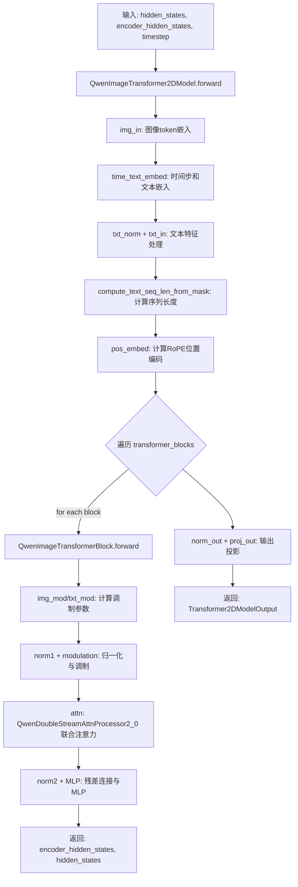
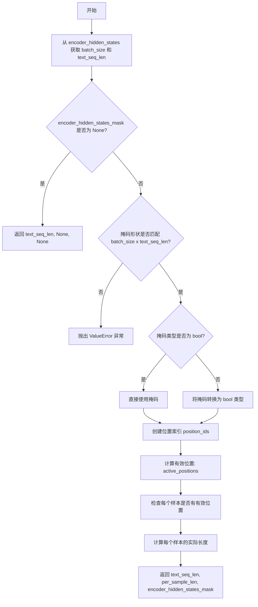
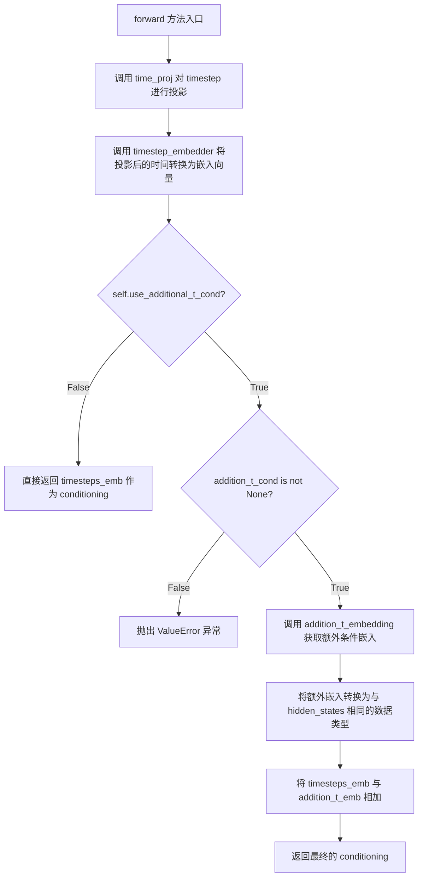
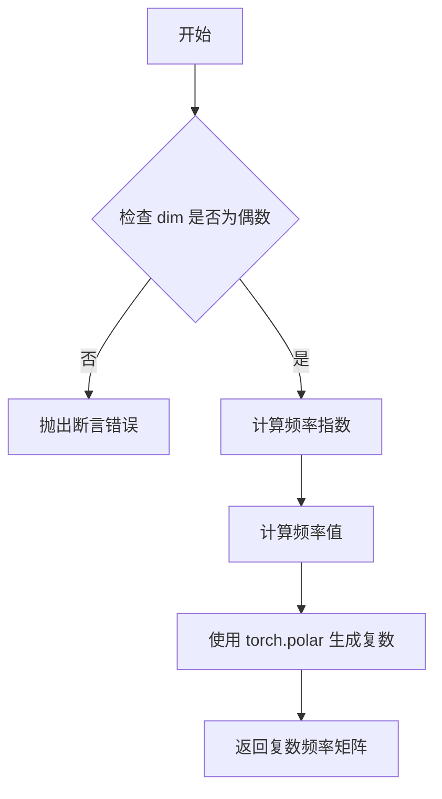
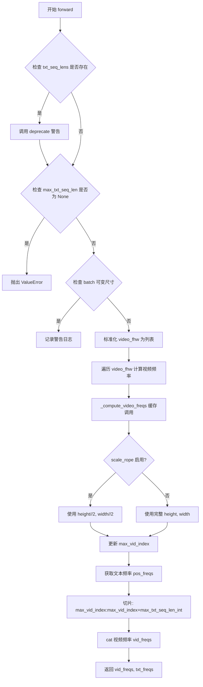
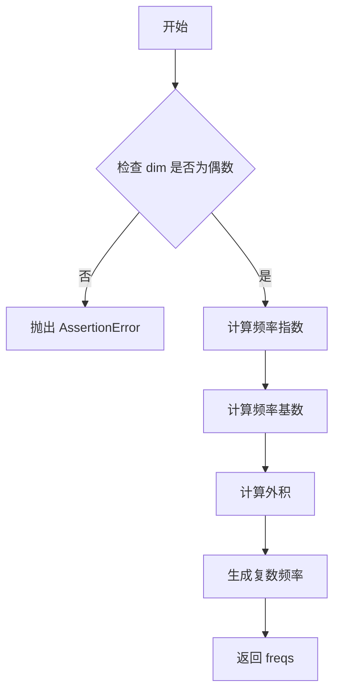
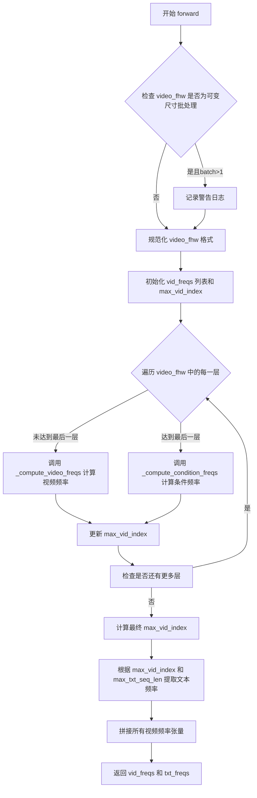
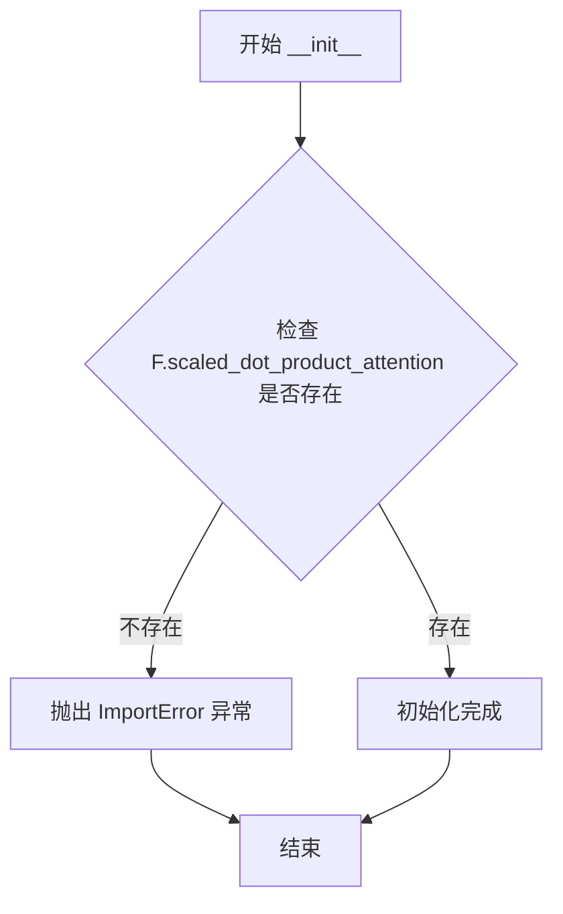

# `diffusers\src\diffusers\models\transformers\transformer_qwenimage.py` 详细设计文档

这是一个Qwen视觉Transformer模型实现，专注于图像/视频生成任务。该模型采用双流架构（图像流+文本流），通过联合注意力机制处理文本和图像特征的交互，并使用旋转位置编码（RoPE）来捕捉空间位置信息。核心组件包括QwenImageTransformer2DModel主模型、QwenImageTransformerBlock变换器块、QwenDoubleStreamAttnProcessor2_0双流注意力处理器以及专门的QwenEmbedRope/QwenEmbedLayer3DRope位置编码模块。

## 整体流程



## 类结构

```
nn.Module (基类)
├── QwenTimestepProjEmbeddings (时间步嵌入)
├── QwenEmbedRope (2D RoPE位置编码)
├── QwenEmbedLayer3DRope (3D RoPE位置编码)
├── QwenDoubleStreamAttnProcessor2_0 (注意力处理器)
├── QwenImageTransformerBlock (Transformer块)
└── QwenImageTransformer2DModel (主模型)
    ├── ModelMixin
    ├── ConfigMixin
    ├── PeftAdapterMixin
    ├── FromOriginalModelMixin
    ├── CacheMixin
    └── AttentionMixin
```

## 全局变量及字段


### `logger`
    
模块日志记录器

类型：`Logger`
    


### `QwenTimestepProjEmbeddings.QwenTimestepProjEmbeddings.time_proj`
    
时间投影层

类型：`Timesteps`
    


### `QwenTimestepProjEmbeddings.QwenTimestepProjEmbeddings.timestep_embedder`
    
时间嵌入层

类型：`TimestepEmbedding`
    


### `QwenTimestepProjEmbeddings.QwenTimestepProjEmbeddings.use_additional_t_cond`
    
是否使用额外时间条件

类型：`bool`
    


### `QwenTimestepProjEmbeddings.QwenTimestepProjEmbeddings.addition_t_embedding`
    
额外时间条件嵌入层

类型：`nn.Embedding`
    


### `QwenEmbedRope.QwenEmbedRope.theta`
    
RoPE基础频率参数

类型：`int`
    


### `QwenEmbedRope.QwenEmbedRope.axes_dim`
    
轴维度列表

类型：`list[int]`
    


### `QwenEmbedRope.QwenEmbedRope.pos_freqs`
    
正位置频率编码

类型：`Tensor`
    


### `QwenEmbedRope.QwenEmbedRope.neg_freqs`
    
负位置频率编码

类型：`Tensor`
    


### `QwenEmbedRope.QwenEmbedRope.scale_rope`
    
是否启用RoPE缩放

类型：`bool`
    


### `QwenEmbedLayer3DRope.QwenEmbedLayer3DRope.theta`
    
RoPE基础频率参数

类型：`int`
    


### `QwenEmbedLayer3DRope.QwenEmbedLayer3DRope.axes_dim`
    
轴维度列表

类型：`list[int]`
    


### `QwenEmbedLayer3DRope.QwenEmbedLayer3DRope.pos_freqs`
    
正位置频率编码

类型：`Tensor`
    


### `QwenEmbedLayer3DRope.QwenEmbedLayer3DRope.neg_freqs`
    
负位置频率编码

类型：`Tensor`
    


### `QwenEmbedLayer3DRope.QwenEmbedLayer3DRope.scale_rope`
    
是否启用RoPE缩放

类型：`bool`
    


### `QwenDoubleStreamAttnProcessor2_0.QwenDoubleStreamAttnProcessor2_0._attention_backend`
    
注意力计算后端

类型：`Optional[Any]`
    


### `QwenDoubleStreamAttnProcessor2_0.QwenDoubleStreamAttnProcessor2_0._parallel_config`
    
并行计算配置

类型：`Optional[Any]`
    


### `QwenImageTransformerBlock.QwenImageTransformerBlock.dim`
    
隐藏层维度

类型：`int`
    


### `QwenImageTransformerBlock.QwenImageTransformerBlock.num_attention_heads`
    
注意力头数量

类型：`int`
    


### `QwenImageTransformerBlock.QwenImageTransformerBlock.attention_head_dim`
    
每个注意力头的维度

类型：`int`
    


### `QwenImageTransformerBlock.QwenImageTransformerBlock.img_mod`
    
图像流调制MLP

类型：`nn.Sequential`
    


### `QwenImageTransformerBlock.QwenImageTransformerBlock.img_norm1`
    
图像流第一层归一化

类型：`nn.LayerNorm`
    


### `QwenImageTransformerBlock.QwenImageTransformerBlock.img_norm2`
    
图像流第二层归一化

类型：`nn.LayerNorm`
    


### `QwenImageTransformerBlock.QwenImageTransformerBlock.attn`
    
联合注意力模块

类型：`Attention`
    


### `QwenImageTransformerBlock.QwenImageTransformerBlock.img_mlp`
    
图像流前馈网络

类型：`FeedForward`
    


### `QwenImageTransformerBlock.QwenImageTransformerBlock.txt_mod`
    
文本流调制MLP

类型：`nn.Sequential`
    


### `QwenImageTransformerBlock.QwenImageTransformerBlock.txt_norm1`
    
文本流第一层归一化

类型：`nn.LayerNorm`
    


### `QwenImageTransformerBlock.QwenImageTransformerBlock.txt_norm2`
    
文本流第二层归一化

类型：`nn.LayerNorm`
    


### `QwenImageTransformerBlock.QwenImageTransformerBlock.txt_mlp`
    
文本流前馈网络

类型：`FeedForward`
    


### `QwenImageTransformerBlock.QwenImageTransformerBlock.zero_cond_t`
    
是否启用零条件时间嵌入

类型：`bool`
    


### `QwenImageTransformer2DModel.QwenImageTransformer2DModel.out_channels`
    
输出通道数

类型：`int`
    


### `QwenImageTransformer2DModel.QwenImageTransformer2DModel.inner_dim`
    
内部隐藏维度

类型：`int`
    


### `QwenImageTransformer2DModel.QwenImageTransformer2DModel.pos_embed`
    
位置编码模块

类型：`QwenEmbedRope | QwenEmbedLayer3DRope`
    


### `QwenImageTransformer2DModel.QwenImageTransformer2DModel.time_text_embed`
    
时间文本嵌入模块

类型：`QwenTimestepProjEmbeddings`
    


### `QwenImageTransformer2DModel.QwenImageTransformer2DModel.txt_norm`
    
文本流归一化层

类型：`RMSNorm`
    


### `QwenImageTransformer2DModel.QwenImageTransformer2DModel.img_in`
    
图像输入投影层

类型：`nn.Linear`
    


### `QwenImageTransformer2DModel.QwenImageTransformer2DModel.txt_in`
    
文本输入投影层

类型：`nn.Linear`
    


### `QwenImageTransformer2DModel.QwenImageTransformer2DModel.transformer_blocks`
    
Transformer块模块列表

类型：`nn.ModuleList`
    


### `QwenImageTransformer2DModel.QwenImageTransformer2DModel.norm_out`
    
输出层连续归一化

类型：`AdaLayerNormContinuous`
    


### `QwenImageTransformer2DModel.QwenImageTransformer2DModel.proj_out`
    
输出投影层

类型：`nn.Linear`
    


### `QwenImageTransformer2DModel.QwenImageTransformer2DModel.gradient_checkpointing`
    
梯度检查点标志

类型：`bool`
    


### `QwenImageTransformer2DModel.QwenImageTransformer2DModel.zero_cond_t`
    
零条件时间嵌入标志

类型：`bool`
    
    

## 全局函数及方法


### `get_timestep_embedding`

该函数根据 DDPM（Denoising Diffusion Probabilistic Models）论文中的方法，将时间步（timesteps）转换为正弦/余弦位置嵌入。这种嵌入方式广泛应用于扩散模型中，用于为模型提供时间条件信息。

参数：

- `timesteps`：`torch.Tensor`，1-D Tensor of N indices, one per batch element. These may be fractional.（批量元素的 1-D 张量索引，可以是分数形式）
- `embedding_dim`：`int`，the dimension of the output.（输出的维度）
- `flip_sin_to_cos`：`bool`，Whether the embedding order should be `cos, sin` (if True) or `sin, cos` (if False)（嵌入顺序：`True` 为 `cos, sin`，`False` 为 `sin, cos`）
- `downscale_freq_shift`：`float`，Controls the delta between frequencies between dimensions（控制维度间频率增量）
- `scale`：`float`，Scaling factor applied to the embeddings.（应用于嵌入的缩放因子）
- `max_period`：`int`，Controls the maximum frequency of the embeddings（控制嵌入的最大频率）

返回值：`torch.Tensor`，an [N x dim] Tensor of positional embeddings.（[N x dim] 维度的位置嵌入张量）

#### 流程图

```mermaid
flowchart TD
    A[开始] --> B{检查 timesteps 是否为 1 维}
    B -->|是| C[计算 half_dim = embedding_dim // 2]
    B -->|否| Z[抛出断言错误]
    
    C --> D[计算频率指数 exponent]
    D --> E[根据 downscale_freq_shift 调整频率]
    E --> F[计算 emb = exp(exponent)]
    F --> G[将 timesteps 扩展并与 emb 相乘]
    G --> H[应用 scale 缩放]
    H --> I[拼接 sin 和 cos 嵌入]
    I --> J{flip_sin_to_cos 为真?}
    J -->|是| K[交换 sin 和 cos 顺序]
    J -->|否| L{embedding_dim 为奇数?}
    K --> L
    L -->|是| M[填充零以对齐维度]
    L -->|否| N[返回最终嵌入]
    M --> N
```

#### 带注释源码

```python
def get_timestep_embedding(
    timesteps: torch.Tensor,
    embedding_dim: int,
    flip_sin_to_cos: bool = False,
    downscale_freq_shift: float = 1,
    scale: float = 1,
    max_period: int = 10000,
) -> torch.Tensor:
    """
    This matches the implementation in Denoising Diffusion Probabilistic Models: Create sinusoidal timestep embeddings.

    Args
        timesteps (torch.Tensor):
            a 1-D Tensor of N indices, one per batch element. These may be fractional.
        embedding_dim (int):
            the dimension of the output.
        flip_sin_to_cos (bool):
            Whether the embedding order should be `cos, sin` (if True) or `sin, cos` (if False)
        downscale_freq_shift (float):
            Controls the delta between frequencies between dimensions
        scale (float):
            Scaling factor applied to the embeddings.
        max_period (int):
            Controls the maximum frequency of the embeddings
    Returns
        torch.Tensor: an [N x dim] Tensor of positional embeddings.
    """
    # 断言检查：确保 timesteps 是 1 维张量
    assert len(timesteps.shape) == 1, "Timesteps should be a 1d-array"

    # 计算嵌入维度的一半（sin 和 cos 各占一半）
    half_dim = embedding_dim // 2
    
    # 创建频率指数：-log(max_period) * [0, 1, 2, ..., half_dim-1]
    # 使用 log 空间确保频率呈指数级下降
    exponent = -math.log(max_period) * torch.arange(
        start=0, end=half_dim, dtype=torch.float32, device=timesteps.device
    )
    
    # 应用 downscale_freq_shift 来调整不同维度间的频率间隔
    # 使得高频维度有更大的间隔
    exponent = exponent / (half_dim - downscale_freq_shift)

    # 计算每个维度的频率：exp(exponent)
    emb = torch.exp(exponent).to(timesteps.dtype)
    
    # 将 timesteps 扩展并与频率相乘
    # timesteps[:, None] 变为 [N, 1]，emb[None, :] 变为 [1, half_dim]
    # 结果 emb 变为 [N, half_dim]
    emb = timesteps[:, None].float() * emb[None, :]

    # 对嵌入进行缩放
    emb = scale * emb

    # 拼接 sin 和 cos 嵌入
    # 最终形状为 [N, embedding_dim]
    emb = torch.cat([torch.sin(emb), torch.cos(emb)], dim=-1)

    # 如果需要翻转 sin 和 cos 的顺序
    if flip_sin_to_cos:
        emb = torch.cat([emb[:, half_dim:], emb[:, :half_dim]], dim=-1)

    # 如果 embedding_dim 是奇数，需要在最后填充一个零
    if embedding_dim % 2 == 1:
        emb = torch.nn.functional.pad(emb, (0, 1, 0, 0))
    
    return emb
```


### `apply_rotary_emb_qwen`

该函数用于将旋转位置嵌入（Rotary Position Embedding，RoPE）应用到查询或键张量上，支持两种实现方式：实数方式（将张量视为实数对处理）和复数方式（直接使用复数运算）。它通过复数乘法实现旋转变换，广泛应用于Qwen系列视觉模型的注意力机制中。

参数：

-  `x`：`torch.Tensor`，输入的查询或键张量，形状为 `[B, S, H, D]`（批大小、序列长度、头数、头维度）
-  `freqs_cis`：`torch.Tensor | tuple[torch.Tensor]`，预计算的频率张量，用于生成旋转矩阵，可以是单一张量或包含 (cos, sin) 的元组
-  `use_real`：`bool = True`，是否使用实数方式处理，若为 `True` 则将输入视为实数对进行运算，若为 `False` 则使用复数视图
-  `use_real_unbind_dim`：`int = -1`，指定实数方式下对输入张量 unbinding 的维度，`-1` 用于 Flux/CogVideoX/HunyuanDiT，`-2` 用于 Stable Audio/OmniGen/CogView4/Cosmos

返回值：`tuple[torch.Tensor, torch.Tensor]`，应用旋转嵌入后的张量（当前实现实际只返回一个张量，但签名声明返回二元组以保持接口一致性）

#### 流程图

```mermaid
flowchart TD
    A[开始: apply_rotary_emb_qwen] --> B{use_real == True?}
    B -->|Yes| C[解包 freqs_cis 为 cos, sin]
    C --> D[扩展 cos, sin 维度为 [1, 1, S, D]]
    D --> E{use_real_unbind_dim == -1?}
    E -->|Yes| F[重塑 x: ...,-1,2 并 unbinding 维度 -1]
    F --> G[堆叠: [-x_imag, x_real] 并 flatten 维度 3]
    E -->|No| H{use_real_unbind_dim == -2?}
    H -->|Yes| I[重塑 x: ...,2,-1 并 unbinding 维度 -2]
    I --> J[拼接: [-x_imag, x_real] 维度 -1]
    H -->|No| K[抛出 ValueError]
    J --> L[计算: x * cos + x_rotated * sin]
    L --> M[转换为输入 dtype 并返回]
    B -->|No| N[将 x 视为复数并重塑]
    N --> O[扩展 freqs_cis 维度为 [S, 1, D]]
    O --> P[复数乘法: x_rotated * freqs_cis]
    P --> Q[转回实数视图并 flatten]
    Q --> R[返回与输入同 dtype 的结果]
    M --> S[结束]
    R --> S
```

#### 带注释源码

```python
def apply_rotary_emb_qwen(
    x: torch.Tensor,
    freqs_cis: torch.Tensor | tuple[torch.Tensor],
    use_real: bool = True,
    use_real_unbind_dim: int = -1,
) -> tuple[torch.Tensor, torch.Tensor]:
    """
    Apply rotary embeddings to input tensors using the given frequency tensor. This function applies rotary embeddings
    to the given query or key 'x' tensors using the provided frequency tensor 'freqs_cis'. The input tensors are
    reshaped as complex numbers, and the frequency tensor is reshaped for broadcasting compatibility. The resulting
    tensors contain rotary embeddings and are returned as real tensors.

    Args:
        x (`torch.Tensor`):
            Query or key tensor to apply rotary embeddings. [B, S, H, D] xk (torch.Tensor): Key tensor to apply
        freqs_cis (`tuple[torch.Tensor]`): Precomputed frequency tensor for complex exponentials. ([S, D], [S, D],)

    Returns:
        tuple[torch.Tensor, torch.Tensor]: tuple of modified query tensor and key tensor with rotary embeddings.
    """
    if use_real:
        # 解包频率张量，获取 cos 和 sin 分量，形状为 [S, D]
        cos, sin = freqs_cis  # [S, D]
        # 扩展维度以支持广播，变为 [1, 1, S, D]
        cos = cos[None, None]
        sin = sin[None, None]
        # 确保频率张量与输入 x 在同一设备上
        cos, sin = cos.to(x.device), sin.to(x.device)

        if use_real_unbind_dim == -1:
            # 用于 flux, cogvideox, hunyuan-dit 模型
            # 将最后维度成对展开并分离实部和虚部
            x_real, x_imag = x.reshape(*x.shape[:-1], -1, 2).unbind(-1)  # [B, S, H, D//2]
            # 构建旋转后的张量: [-imag, real]，然后展平
            x_rotated = torch.stack([-x_imag, x_real], dim=-1).flatten(3)
        elif use_real_unbind_dim == -2:
            # 用于 Stable Audio, OmniGen, CogView4 和 Cosmos 模型
            # 在倒数第二个维度展开并分离
            x_real, x_imag = x.reshape(*x.shape[:-1], 2, -1).unbind(-2)  # [B, S, H, D//2]
            # 拼接构建旋转后的张量
            x_rotated = torch.cat([-x_imag, x_real], dim=-1)
        else:
            raise ValueError(f"`use_real_unbind_dim={use_real_unbind_dim}` but should be -1 or -2.")

        # 应用旋转公式: x' = x * cos + x_rotated * sin
        out = (x.float() * cos + x_rotated.float() * sin).to(x.dtype)

        return out
    else:
        # 复数方式：将输入视为复数张量进行运算
        # 将 x 重塑为复数视图，形状变为 [B, S, H, D//2]
        x_rotated = torch.view_as_complex(x.float().reshape(*x.shape[:-1], -1, 2))
        # 扩展频率张量维度以支持广播
        freqs_cis = freqs_cis.unsqueeze(1)
        # 执行复数乘法并转回实数表示
        x_out = torch.view_as_real(x_rotated * freqs_cis).flatten(3)

        return x_out.type_as(x)
```


### `compute_text_seq_len_from_mask`

计算文本序列长度，不假设掩码是连续的。返回用于RoPE的文本序列长度、每个样本的有效序列长度（用于位置编码），以及规范化后的布尔掩码。

参数：

- `encoder_hidden_states`：`torch.Tensor`，编码器的隐藏状态张量，形状为 `(batch_size, text_seq_len, ...)`
- `encoder_hidden_states_mask`：`torch.Tensor | None`，可选的文本掩码，形状为 `(batch_size, text_seq_len)`，1.0 表示有效 token，0.0 表示 padding

返回值：`tuple[int, torch.Tensor | None, torch.Tensor | None]`

- `int`：文本序列长度（text_seq_len）
- `torch.Tensor | None`：每个样本的有效序列长度，形状为 `(batch_size,)`，用于位置编码
- `torch.Tensor | None`：规范化后的布尔掩码，形状为 `(batch_size, text_seq_len)`

#### 流程图



#### 带注释源码

```python
def compute_text_seq_len_from_mask(
    encoder_hidden_states: torch.Tensor, encoder_hidden_states_mask: torch.Tensor | None
) -> tuple[int, torch.Tensor | None, torch.Tensor | None]:
    """
    Compute text sequence length without assuming contiguous masks. Returns length for RoPE and a normalized bool mask.
    """
    # 从 encoder_hidden_states 的前两维获取 batch_size 和 text_seq_len
    # encoder_hidden_states 形状: (batch_size, text_seq_len, hidden_dim)
    batch_size, text_seq_len = encoder_hidden_states.shape[:2]
    
    # 如果没有提供掩码，直接返回序列长度和两个 None
    if encoder_hidden_states_mask is None:
        return text_seq_len, None, None

    # 验证掩码形状是否与 (batch_size, text_seq_len) 匹配
    if encoder_hidden_states_mask.shape[:2] != (batch_size, text_seq_len):
        raise ValueError(
            f"`encoder_hidden_states_mask` shape {encoder_hidden_states_mask.shape} must match "
            f"(batch_size, text_seq_len)=({batch_size}, {text_seq_len})."
        )

    # 确保掩码为布尔类型，以便后续条件计算
    # 允许非布尔类型的掩码输入（如浮点型 0.0/1.0）
    if encoder_hidden_states_mask.dtype != torch.bool:
        encoder_hidden_states_mask = encoder_hidden_states_mask.to(torch.bool)

    # 创建位置索引 [0, 1, 2, ..., text_seq_len-1]
    # 设备与 encoder_hidden_states 相同
    position_ids = torch.arange(text_seq_len, device=encoder_hidden_states.device, dtype=torch.long)
    
    # 计算有效位置：掩码为 True 时保留原位置索引，否则设为 0
    # active_positions 形状: (batch_size, text_seq_len)
    active_positions = torch.where(encoder_hidden_states_mask, position_ids, position_ids.new_zeros(()))
    
    # 检查每个样本是否有任何有效位置（至少一个 True）
    # has_active 形状: (batch_size,)
    has_active = encoder_hidden_states_mask.any(dim=1)
    
    # 计算每个样本的实际有效序列长度
    # 如果有有效位置，长度 = 最大位置索引 + 1
    # 如果没有有效位置，使用完整的 text_seq_len
    per_sample_len = torch.where(
        has_active,
        active_positions.max(dim=1).values + 1,
        torch.as_tensor(text_seq_len, device=encoder_hidden_states.device),
    )
    
    # 返回：文本序列长度、每个样本的有效长度、规范化的布尔掩码
    return text_seq_len, per_sample_len, encoder_hidden_states_mask
```


### `QwenTimestepProjEmbeddings.forward`

该方法接收时间步长（timestep）和隐藏状态（hidden_states），通过时间投影层（time_proj）和时间嵌入层（timestep_embedder）将时间步长转换为时间嵌入向量，并根据需要将额外的条件嵌入（addition_t_cond）添加到时间嵌入中，最终返回用于调节模型的条件向量（conditioning）。

参数：

- `timestep`：`torch.Tensor`，时间步长张量，通常为 1-D Tensor，包含去噪过程中的时间步信息
- `hidden_states`：`torch.Tensor`，隐藏状态张量，用于确定输出嵌入的数据类型（dtype）
- `addition_t_cond`：`torch.Tensor | None`，额外的条件嵌入向量，当 `use_additional_t_cond` 为 True 时必须提供

返回值：`torch.Tensor`，返回经过处理的条件向量（conditioning），形状为 (N, D)，其中 N 是批次大小，D 是嵌入维度

#### 流程图



#### 带注释源码

```python
def forward(self, timestep, hidden_states, addition_t_cond=None):
    """
    前向传播方法，将时间步长转换为条件嵌入向量
    
    参数:
        timestep: 时间步长张量
        hidden_states: 隐藏状态张量，用于确定输出数据类型
        addition_t_cond: 可选的额外条件嵌入
    
    返回:
        conditioning: 条件嵌入向量
    """
    # 1. 使用时间投影层将原始时间步长转换为中间表示
    # Timesteps 层将连续的时间值转换为正弦余弦编码
    timesteps_proj = self.time_proj(timestep)
    
    # 2. 使用时间嵌入层将投影后的时间转换为高维嵌入向量
    # 将嵌入转换为与 hidden_states 相同的数据类型以确保数值兼容性
    timesteps_emb = self.timestep_embedder(timesteps_proj.to(dtype=hidden_states.dtype))  # (N, D)
    
    # 3. 初始化条件向量为基础时间嵌入
    conditioning = timesteps_emb
    
    # 4. 如果启用了额外的条件嵌入功能
    if self.use_additional_t_cond:
        # 检查额外条件是否提供
        if addition_t_cond is None:
            raise ValueError("When additional_t_cond is True, addition_t_cond must be provided.")
        
        # 通过嵌入层获取额外条件的时间嵌入
        addition_t_emb = self.addition_t_embedding(addition_t_cond)
        
        # 转换为与 hidden_states 相同的数据类型
        addition_t_emb = addition_t_emb.to(dtype=hidden_states.dtype)
        
        # 将额外条件嵌入添加到基础时间嵌入中
        conditioning = conditioning + addition_t_emb

    # 5. 返回最终的条件向量
    return conditioning
```


### `QwenEmbedRope.rope_params`

该方法用于计算旋转位置编码（RoPE）的频率参数。它接受位置索引、维度dim和基础频率theta，通过指数衰减公式生成复数形式的频率矩阵，用于后续的旋转位置嵌入计算。

参数：

- `index`：`torch.Tensor`，1维张量，表示 token 的位置索引（如 [0, 1, 2, 3]）
- `dim`：`int`，表示频率向量的维度（必须是偶数）
- `theta`：`int` 或 `float`，基础频率参数，默认为 10000

返回值：`torch.Tensor`，返回复数形式的频率矩阵，形状为 `[index_len, dim // 2]`

#### 流程图



#### 带注释源码

```python
def rope_params(self, index, dim, theta=10000):
    """
    Args:
        index: [0, 1, 2, 3] 1D Tensor representing the position index of the token
    """
    # 确保维度是偶数，因为复数表示需要成对的维度
    assert dim % 2 == 0
    
    # 计算频率指数：torch.arange(0, dim, 2) 生成 [0, 2, 4, ..., dim-2]
    # 除以 dim 进行归一化
    # 然后取负指数：-log(theta) * (arange(0, dim, 2) / dim)
    exponent = -math.log(theta) * torch.arange(0, dim, 2).to(torch.float32).div(dim)
    
    # 计算频率基础值：exp(exponent)
    freqs = torch.exp(exponent)
    
    # 计算外积：index * freqs，得到每个位置的频率
    # 形状：[len(index), dim//2]
    freqs = torch.outer(index, freqs)
    
    # 使用极坐标形式创建复数：
    # 幅值全为1，角度为 freqs
    # 结果是 cos(freqs) + i * sin(freqs)
    freqs = torch.polar(torch.ones_like(freqs), freqs)
    
    return freqs
```


### `QwenEmbedRope.forward`

该方法是 Qwen 模型中用于计算旋转位置嵌入（RoPE）的核心模块，接收视频帧/高/宽形状和文本序列长度，生成用于视觉和文本模态的旋转位置编码频率。

参数：

- `video_fhw`：`tuple[int, int, int, list[tuple[int, int, int]]]`，视频的形状元组（帧数、高度、宽度）或多个视频形状的列表，用于计算视频token的空间位置编码
- `txt_seq_lens`：`list[int] | None`，**已弃用参数**，将在0.39.0版本移除，用于指定文本序列长度（建议使用 `max_txt_seq_len` 替代）
- `device`：`torch.device`，执行RoPE计算的目标设备（如cuda:0、cpu等）
- `max_txt_seq_len`：`int | torch.Tensor | None`，最大文本序列长度，应与编码器隐藏状态序列长度匹配，支持int或标量tensor（兼容torch.compile）

返回值：`tuple[torch.Tensor, torch.Tensor]`，返回两个张量——`vid_freqs` 为视频token的旋转位置编码频率，`txt_freqs` 为文本token的旋转位置编码频率

#### 流程图



#### 带注释源码

```python
def forward(
    self,
    video_fhw: tuple[int, int, int, list[tuple[int, int, int]]],
    txt_seq_lens: list[int] | None = None,
    device: torch.device = None,
    max_txt_seq_len: int | torch.Tensor | None = None,
) -> tuple[torch.Tensor, torch.Tensor]:
    """
    Args:
        video_fhw (`tuple[int, int, int]` or `list[tuple[int, int, int]]`):
            A list of 3 integers [frame, height, width] representing the shape of the video.
        txt_seq_lens (`list[int]`, *optional*, **Deprecated**):
            Deprecated parameter. Use `max_txt_seq_len` instead. If provided, the maximum value will be used.
        device: (`torch.device`, *optional*):
            The device on which to perform the RoPE computation.
        max_txt_seq_len (`int` or `torch.Tensor`, *optional*):
            The maximum text sequence length for RoPE computation. This should match the encoder hidden states
            sequence length. Can be either an int or a scalar tensor (for torch.compile compatibility).
    """
    # 处理已弃用的 txt_seq_lens 参数，保持向后兼容
    if txt_seq_lens is not None:
        deprecate(
            "txt_seq_lens",
            "0.39.0",
            "Passing `txt_seq_lens` is deprecated and will be removed in version 0.39.0. "
            "Please use `max_txt_seq_len` instead. "
            "The new parameter accepts a single int or tensor value representing the maximum text sequence length.",
            standard_warn=False,
        )
        if max_txt_seq_len is None:
            # 使用 txt_seq_lens 的最大值保持向后兼容
            max_txt_seq_len = max(txt_seq_lens) if isinstance(txt_seq_lens, list) else txt_seq_lens

    # 必须提供 max_txt_seq_len 参数
    if max_txt_seq_len is None:
        raise ValueError("Either `max_txt_seq_len` or `txt_seq_lens` (deprecated) must be provided.")

    # 验证批处理推理中的可变尺寸图像（目前不支持）
    if isinstance(video_fhw, list) and len(video_fhw) > 1:
        # 检查所有实例是否具有相同尺寸
        first_fhw = video_fhw[0]
        if not all(fhw == first_fhw for fhw in video_fhw):
            logger.warning(
                "Batch inference with variable-sized images is not currently supported in QwenEmbedRope. "
                "All images in the batch should have the same dimensions (frame, height, width). "
                f"Detected sizes: {video_fhw}. Using the first image's dimensions {first_fhw} "
                "for RoPE computation, which may lead to incorrect results for other images in the batch."
            )

    # 标准化 video_fhw 为列表格式
    if isinstance(video_fhw, list):
        video_fhw = video_fhw[0]
    if not isinstance(video_fhw, list):
        video_fhw = [video_fhw]

    # 遍历每个视频帧/高/宽组合计算 RoPE 频率
    vid_freqs = []
    max_vid_index = 0
    for idx, fhw in enumerate(video_fhw):
        frame, height, width = fhw
        # RoPE 频率通过 lru_cache 装饰器缓存以提高性能
        video_freq = self._compute_video_freqs(frame, height, width, idx, device)
        vid_freqs.append(video_freq)

        # 根据 scale_rope 标志计算最大视频索引
        if self.scale_rope:
            max_vid_index = max(height // 2, width // 2, max_vid_index)
        else:
            max_vid_index = max(height, width, max_vid_index)

    # 将 max_txt_seq_len 转换为整数用于索引
    max_txt_seq_len_int = int(max_txt_seq_len)
    # 创建设备特定的文本频率副本，不修改 self.pos_freqs
    txt_freqs = self.pos_freqs.to(device)[max_vid_index : max_vid_index + max_txt_seq_len_int, ...]
    # 沿第0维拼接所有视频频率
    vid_freqs = torch.cat(vid_freqs, dim=0)

    return vid_freqs, txt_freqs
```


### `QwenEmbedRope._compute_video_freqs`

该方法计算视频帧的旋转位置编码（RoPE）频率张量，用于将位置信息编码到视频token的注意力计算中。通过3D RoPE分别处理帧（时间维）、高度和宽度（空间维）三个轴向的频率，并支持缩放模式（scale_rope）以适应不同分辨率的视频。

参数：

- `self`：`QwenEmbedRope`，隐式参数，类的实例本身
- `frame`：`int`，视频的帧数，表示时间维度的长度
- `height`：`int`，视频帧的高度（像素数）
- `width`：`int`，视频帧的宽度（像素数）
- `idx`：`int`，默认值0，视频在批次中的索引，用于选择对应位置的频率
- `device`：`torch.device`，可选参数，计算设备，默认为None

返回值：`torch.Tensor`，返回形状为`(seq_len, -1)`的复数频率张量，其中`seq_len = frame * height * width`，用于后续RoPE应用

#### 流程图

```mermaid
flowchart TD
    A[开始 _compute_video_freqs] --> B[计算 seq_lens = frame * height * width]
    B --> C{device is not None?}
    C -->|是| D[pos_freqs = self.pos_freqs.to(device)]
    C -->|否| E[pos_freqs = self.pos_freqs]
    D --> F[neg_freqs 处理类似]
    E --> F
    F --> G[split pos_freqs by axes_dim//2]
    G --> H[split neg_freqs by axes_dim//2]
    H --> I[提取帧频率 freqs_frame]
    I --> J{scale_rope?}
    J -->|是| K[拼接负频率后半部分与正频率前半部分]
    J -->|否| L[直接取正频率]
    K --> M[构建 height 频率]
    L --> N[构建 height 频率]
    M --> O[构建 width 频率]
    N --> O
    O --> P[拼接 freqs_frame + freqs_height + freqs_width]
    P --> Q[reshape 到 seq_lens 维度]
    Q --> R[clone 并返回连续张量]
```

#### 带注释源码

```python
@functools.lru_cache(maxsize=128)
def _compute_video_freqs(
    self, frame: int, height: int, width: int, idx: int = 0, device: torch.device = None
) -> torch.Tensor:
    """
    计算视频帧的3D旋转位置编码频率
    
    Args:
        frame: 视频帧数（时间维度）
        height: 视频高度（空间维度）
        width: 视频宽度（空间维度）
        idx: 视频在批次中的索引
        device: 计算设备
    
    Returns:
        复数频率张量，形状为 [frame*height*width, total_dim]
    """
    # 计算视频token总数
    seq_lens = frame * height * width
    
    # 根据设备选择正向和负向频率张量
    pos_freqs = self.pos_freqs.to(device) if device is not None else self.pos_freqs
    neg_freqs = self.neg_freqs.to(device) if device is not None else self.neg_freqs

    # 按axes_dim分割频率（每个轴向的维度）
    freqs_pos = pos_freqs.split([x // 2 for x in self.axes_dim], dim=1)
    freqs_neg = neg_freqs.split([x // 2 for x in self.axes_dim], dim=1)

    # 提取帧维度的频率（时间轴）
    freqs_frame = freqs_pos[0][idx : idx + frame].view(frame, 1, 1, -1).expand(frame, height, width, -1)
    
    if self.scale_rope:
        # 缩放模式：拼接负频率后半部分与正频率前半部分
        # 这允许频率跨越零点左右对称
        freqs_height = torch.cat([freqs_neg[1][-(height - height // 2) :], freqs_pos[1][: height // 2]], dim=0)
        freqs_height = freqs_height.view(1, height, 1, -1).expand(frame, height, width, -1)
        freqs_width = torch.cat([freqs_neg[2][-(width - width // 2) :], freqs_pos[2][: width // 2]], dim=0)
        freqs_width = freqs_width.view(1, 1, width, -1).expand(frame, height, width, -1)
    else:
        # 非缩放模式：直接使用正频率
        freqs_height = freqs_pos[1][:height].view(1, height, 1, -1).expand(frame, height, width, -1)
        freqs_width = freqs_pos[2][:width].view(1, 1, width, -1).expand(frame, height, width, -1)

    # 沿最后一个维度拼接三个轴向的频率
    freqs = torch.cat([freqs_frame, freqs_height, freqs_width], dim=-1).reshape(seq_lens, -1)
    
    # 返回连续内存的克隆张量（避免缓存共享问题）
    return freqs.clone().contiguous()
```


### `QwenEmbedLayer3DRope.rope_params`

该方法用于生成旋转位置编码（RoPE）的频率参数，通过计算位置索引与频率基数的外积，并利用复数极坐标形式生成复数频率张量，用于后续对查询和键向量进行旋转位置编码。

参数：

- `index`：`torch.Tensor`，一维张量，表示 token 的位置索引，如 `[0, 1, 2, 3]`
- `dim`：`int`，整型，表示频率向量的维度（必须为偶数）
- `theta`：`float`，浮点数，默认值为 `10000`，表示旋转位置编码的基础频率参数

返回值：`torch.Tensor`，复数类型的二维张量，形状为 `[len(index), dim // 2]`，包含用于旋转位置编码的复数频率

#### 流程图



#### 带注释源码

```python
def rope_params(self, index, dim, theta=10000):
    """
    Args:
        index: [0, 1, 2, 3] 1D Tensor representing the position index of the token
    """
    # 验证输入维度为偶数，确保可以分成实部和虚部
    assert dim % 2 == 0
    
    # 计算频率指数：torch.arange(0, dim, 2) 生成 [0, 2, 4, ..., dim-2]
    # 除以 dim 进行归一化
    # 然后取负指数：-log(theta) * (exponent)
    freqs = torch.outer(
        index, 
        1.0 / torch.pow(theta, torch.arange(0, dim, 2).to(torch.float32).div(dim))
    )
    
    # 使用 torch.polar 将幅值和角度转换为复数
    # 幅值为全 1（torch.ones_like(freqs)），角度为计算得到的 freqs
    # 结果为复数形式：cos(freqs) + i*sin(freqs)
    freqs = torch.polar(torch.ones_like(freqs), freqs)
    
    return freqs
```


### `QwenEmbedLayer3DRope.forward`

该方法实现了3D旋转位置嵌入（RoPE）的计算，用于视频和文本序列的位置编码。它根据输入的视频帧、高度和宽度生成对应的频率张量，并结合最大文本序列长度生成文本频率，支持多层次结构（Layer3D）和条件图像处理。

参数：

- `video_fhw`：`tuple[int, int, int] | list[tuple[int, int, int]]`，视频的形状（帧、高度、宽度）或层次结构列表，用于计算视频频率
- `max_txt_seq_len`：`int | torch.Tensor`，文本序列的最大长度，用于计算文本频率，支持int或标量tensor（兼容torch.compile）
- `device`：`torch.device`，可选参数，指定进行RoPE计算的设备

返回值：`tuple[torch.Tensor, torch.Tensor]`，返回元组包含：
- `vid_freqs`：视频频率张量，形状为 `[seq_len, dim]`，其中 `seq_len = frame * height * width`
- `txt_freqs`：文本频率张量，形状为 `[max_txt_seq_len, dim]`

#### 流程图



#### 带注释源码

```python
def forward(
    self,
    video_fhw: tuple[int, int, int, list[tuple[int, int, int]]],
    max_txt_seq_len: int | torch.Tensor,
    device: torch.device = None,
) -> tuple[torch.Tensor, torch.Tensor]:
    """
    计算3D旋转位置嵌入的频率张量

    参数:
        video_fhw: 视频帧/高度/宽度或层次结构列表
        max_txt_seq_len: 最大文本序列长度
        device: 计算设备
    """
    # 验证批处理推理中的可变尺寸图像
    # 在 Layer3Rope 中，外层列表表示批次，内层列表/元组表示层次
    if isinstance(video_fhw, list) and len(video_fhw) > 1:
        # 检查是否为批处理推理（层次列表/元组的列表）
        first_entry = video_fhw[0]
        if not all(entry == first_entry for entry in video_fhw):
            logger.warning(
                "批处理推理中不支持可变尺寸图像，所有图像应具有相同的层次结构。"
                f"检测到尺寸: {video_fhw}，使用第一个图像的层次结构 {first_entry}，"
                "可能导致其他图像的RoPE计算不正确。"
            )

    # 规范化输入格式
    if isinstance(video_fhw, list):
        video_fhw = video_fhw[0]
    if not isinstance(video_fhw, list):
        video_fhw = [video_fhw]

    vid_freqs = []
    max_vid_index = 0
    layer_num = len(video_fhw) - 1
    
    # 遍历每一层计算频率
    for idx, fhw in enumerate(video_fhw):
        frame, height, width = fhw
        if idx != layer_num:
            # 计算普通视频帧的频率
            video_freq = self._compute_video_freqs(frame, height, width, idx, device)
        else:
            # 对于条件图像，设置层次索引为 -1
            video_freq = self._compute_condition_freqs(frame, height, width, device)
        vid_freqs.append(video_freq)

        # 根据 scale_rope 更新最大视频索引
        if self.scale_rope:
            max_vid_index = max(height // 2, width // 2, max_vid_index)
        else:
            max_vid_index = max(height, width, max_vid_index)

    # 考虑层次数量对索引的影响
    max_vid_index = max(max_vid_index, layer_num)
    
    # 转换文本序列长度
    max_txt_seq_len_int = int(max_txt_seq_len)
    
    # 从预计算的频率中提取文本频率切片
    # 使用 .to(device) 创建设备特定的副本，避免修改 self.pos_freqs
    txt_freqs = self.pos_freqs.to(device)[max_vid_index : max_vid_index + max_txt_seq_len_int, ...]
    
    # 拼接所有视频频率
    vid_freqs = torch.cat(vid_freqs, dim=0)

    return vid_freqs, txt_freqs
```


### `QwenEmbedLayer3DRope._compute_video_freqs`

该方法用于计算视频的旋转位置嵌入（RoPE）频率张量。通过将视频的帧、高、宽映射到预计算的频率向量上，生成用于位置编码的复数频率矩阵，支持 3D 空间（时间帧 + 高度 + 宽度）的位置信息编码。

参数：

- `self`：`QwenEmbedLayer3DRope` 类实例，当前 RoPE 嵌入层对象
- `frame`：`int`，视频的帧数（时间维度大小）
- `height`：`int`，视频的高度
- `width`：`int`，视频的宽度
- `idx`：`int`，默认为 0，用于指定当前处理的层级索引
- `device`：`torch.device`，可选，计算设备，如果为 None 则使用缓存的设备

返回值：`torch.Tensor`，形状为 `(seq_lens, -1)` 的频率张量，其中 `seq_lens = frame * height * width`，用于后续在旋转位置嵌入中应用

#### 流程图

```mermaid
flowchart TD
    A[开始 _compute_video_freqs] --> B[计算序列长度<br/>seq_lens = frame * height * width]
    B --> C{device 是否为 None?}
    C -->|是| D[使用 self.pos_freqs]
    C -->|否| E[将 self.pos_freqs 移动到 device]
    D --> F[将 self.neg_freqs 移动到 device<br/>根据 device 是否为 None 选择]
    E --> F
    F --> G[按 axes_dim 分割正频率<br/>freqs_pos = pos_freqs.split]
    G --> H[按 axes_dim 分割负频率<br/>freqs_neg = neg_freqs.split]
    H --> I[提取帧频率<br/>freqs_frame = freqs_pos[0][idx:idx+frame]]
    I --> J{scale_rope 为 True?}
    J -->|是| K[计算缩放后的高度频率<br/>合并负频率后半部分和正频率前半部分]
    J -->|否| L[计算原始高度频率<br/>直接取正频率前 height 个]
    K --> M{scale_rope 为 True?}
    L --> M
    M -->|是| N[计算缩放后的宽度频率<br/>合并负频率后半部分和正频率前半部分]
    M -->|否| O[计算原始宽度频率<br/>直接取正频率前 width 个]
    N --> P
    O --> P[合并帧、高、宽频率<br/>freqs = torch.cat([freqs_frame, freqs_height, freqs_width], dim=-1)]
    P --> Q[ reshape 为 seq_lens 长度<br/>.reshape(seq_lens, -1)]
    Q --> R[克隆并连续化<br/>return freqs.clone().contiguous]
    R --> S[结束]
```

#### 带注释源码

```python
@functools.lru_cache(maxsize=None)  # 使用无限大小的 LRU 缓存，避免重复计算相同尺寸的频率
def _compute_video_freqs(self, frame, height, width, idx=0, device: torch.device = None):
    """
    计算视频的旋转位置嵌入频率
    
    参数:
        frame: 视频帧数
        height: 视频高度 
        width: 视频宽度
        idx: 层索引，默认为 0
        device: 可选的计算设备
    
    返回:
        torch.Tensor: 形状为 (frame*height*width, -1) 的频率张量
    """
    # 计算视频总 token 序列长度 = 帧数 × 高度 × 宽度
    seq_lens = frame * height * width
    
    # 根据 device 参数决定使用哪个设备上的频率向量
    # 如果 device 为 None，则使用类中缓存的频率；否则移动到指定设备
    pos_freqs = self.pos_freqs.to(device) if device is not None else self.pos_freqs
    neg_freqs = self.neg_freqs.to(device) if device is not None else self.neg_freqs

    # 将正频率和负频率按 axes_dim 分割成三个部分：帧、高度、宽度
    # 每个轴的频率维度是该轴维度的一半（因为是复数）
    freqs_pos = pos_freqs.split([x // 2 for x in self.axes_dim], dim=1)
    freqs_neg = neg_freqs.split([x // 2 for x in self.axes_dim], dim=1)

    # 提取帧维度的频率，并扩展到完整的 3D 空间
    # [idx : idx + frame] 取连续的帧索引，view 调整维度，expand 扩展到 height×width
    freqs_frame = freqs_pos[0][idx : idx + frame].view(frame, 1, 1, -1).expand(frame, height, width, -1)
    
    # 根据 scale_rope 标志决定是否使用缩放
    if self.scale_rope:
        # 缩放模式：从负频率后半部分和正频率前半部分拼接，实现频率缩放
        freqs_height = torch.cat([freqs_neg[1][-(height - height // 2) :], freqs_pos[1][: height // 2]], dim=0)
        freqs_height = freqs_height.view(1, height, 1, -1).expand(frame, height, width, -1)
        freqs_width = torch.cat([freqs_neg[2][-(width - width // 2) :], freqs_pos[2][: width // 2]], dim=0)
        freqs_width = freqs_width.view(1, 1, width, -1).expand(frame, height, width, -1)
    else:
        # 非缩放模式：直接取正频率的前 height/width 个
        freqs_height = freqs_pos[1][:height].view(1, height, 1, -1).expand(frame, height, width, -1)
        freqs_width = freqs_pos[2][:width].view(1, 1, width, -1).expand(frame, height, width, -1)

    # 将帧、高度、宽度三个维度的频率在最后一维拼接
    freqs = torch.cat([freqs_frame, freqs_height, freqs_width], dim=-1).reshape(seq_lens, -1)
    
    # 克隆并确保内存连续，返回结果
    return freqs.clone().contiguous()
```


### `QwenEmbedLayer3DRope._compute_condition_freqs`

该方法用于计算条件图像（condition image）的3D RoPE位置编码频率。与视频频率计算不同，条件图像的帧维度使用负频率（`freqs_neg[0][-1:]`），高度和宽度的频率计算逻辑与视频频率一致。

参数：

- `frame`：`int`，条件图像的帧数（通常为1）
- `height`：`int`，条件图像的高度
- `width`：`int`，条件图像的宽度
- `device`：`torch.device | None`，执行计算的设备，默认为None

返回值：`torch.Tensor`，计算得到的位置频率张量，形状为 `[seq_lens, total_freq_dim]`，其中 `seq_lens = frame * height * width`

#### 流程图

```mermaid
flowchart TD
    A[开始] --> B[计算序列长度: seq_lens = frame × height × width]
    B --> C{device是否为None?}
    C -->|是| D[使用self.pos_freqs和self.neg_freqs]
    C -->|否| E[将pos_freqs和neg_freqs移动到device]
    D --> F[按axes_dim分割正负频率]
    E --> F
    F --> G[从负频率中取最后一个: freqs_neg[0][-1:]]
    G --> H[reshape并扩展到frame×height×width]
    H --> I{scale_rope是否为True?}
    I -->|是| J[拼接负频率后半部分和正频率前半部分]
    I -->|否| K[直接取正频率前部分]
    J --> L[reshape并扩展height维度]
    K --> L
    L --> M{scale_rope是否为True?}
    M -->|是| N[拼接负频率后半部分和正频率前半部分]
    M -->|否| O[直接取正频率前部分]
    N --> P[reshape并扩展width维度]
    O --> P
    P --> Q[沿最后一维拼接: freqs_frame + freqs_height + freqs_width]
    Q --> R[reshape为[seq_lens, -1]并返回连续张量]
    R --> S[结束]
```

#### 带注释源码

```python
@functools.lru_cache(maxsize=None)
def _compute_condition_freqs(self, frame, height, width, device: torch.device = None):
    """
    计算条件图像的3D RoPE频率。
    与视频频率不同，条件图像的帧维度使用负频率的最后一个位置（freqs_neg[0][-1:]），
    高度和宽度的处理逻辑与视频频率相同。
    
    参数:
        frame: 条件图像的帧数（通常为1，表示单张图像）
        height: 条件图像的高度
        width: 条件图像的宽度
        device: 计算设备
        
    返回:
        位置频率张量，形状为 [frame*height*width, total_freq_dim]
    """
    # 计算总的token序列长度
    seq_lens = frame * height * width
    
    # 根据device参数决定是否移动频率矩阵到指定设备
    # 如果device为None，则使用存储在模型中的原始频率矩阵
    pos_freqs = self.pos_freqs.to(device) if device is not None else self.pos_freqs
    neg_freqs = self.neg_freqs.to(device) if device is not None else self.neg_freqs
    
    # 将正负频率按axes_dim分割成三个部分（frame, height, width维度）
    freqs_pos = pos_freqs.split([x // 2 for x in self.axes_dim], dim=1)
    freqs_neg = neg_freqs.split([x // 2 for x in self.axes_dim], dim=1)
    
    # 【关键区别】条件图像的帧维度使用负频率的最后一个位置
    # 这会产生一个恒定的帧位置编码，用于区分条件图像和视频内容
    freqs_frame = freqs_neg[0][-1:].view(frame, 1, 1, -1).expand(frame, height, width, -1)
    
    if self.scale_rope:
        # 当启用scale_rope时，使用混合正负频率的策略
        # 负频率取后半部分，正频率取前半部分，然后拼接
        # 这种设计可以增强高频位置的表达能力
        freqs_height = torch.cat([freqs_neg[1][-(height - height // 2) :], freqs_pos[1][: height // 2]], dim=0)
        freqs_height = freqs_height.view(1, height, 1, -1).expand(frame, height, width, -1)
        freqs_width = torch.cat([freqs_neg[2][-(width - width // 2) :], freqs_pos[2][: width // 2]], dim=0)
        freqs_width = freqs_width.view(1, 1, width, -1).expand(frame, height, width, -1)
    else:
        # 不启用scale_rope时，直接使用正频率
        freqs_height = freqs_pos[1][:height].view(1, height, 1, -1).expand(frame, height, width, -1)
        freqs_width = freqs_pos[2][:width].view(1, 1, width, -1).expand(frame, height, width, -1)
    
    # 沿最后一维拼接三个维度的频率：frame + height + width
    freqs = torch.cat([freqs_frame, freqs_height, freqs_width], dim=-1).reshape(seq_lens, -1)
    
    # 返回连续内存布局的副本，确保缓存友好性
    return freqs.clone().contiguous()
```


### `QwenDoubleStreamAttnProcessor2_0.__init__`

这是 Qwen 双流注意力处理器的初始化方法，用于验证 PyTorch 版本是否满足要求（需要支持 `scaled_dot_product_attention` 函数）。

参数：

- 无显式参数（`self` 为隐含参数）

返回值：无（`None`），构造函数不返回值

#### 流程图



#### 带注释源码

```python
class QwenDoubleStreamAttnProcessor2_0:
    """
    Attention processor for Qwen double-stream architecture, matching DoubleStreamLayerMegatron logic. 
    This processor implements joint attention computation where text and image streams are processed together.
    """

    # 类变量：用于存储注意力后端配置和并行配置（由外部设置）
    _attention_backend = None
    _parallel_config = None

    def __init__(self):
        """
        初始化 QwenDoubleStreamAttnProcessor2_0 处理器。
        检查 PyTorch 是否支持 scaled_dot_product_attention 函数（PyTorch 2.0+）。
        """
        # 检查 PyTorch 的 functional 模块是否支持 scaled_dot_product_attention
        # 这是 PyTorch 2.0 引入的高效注意力计算函数
        if not hasattr(F, "scaled_dot_product_attention"):
            # 如果不支持，抛出 ImportError 提示用户升级 PyTorch
            raise ImportError(
                "QwenDoubleStreamAttnProcessor2_0 requires PyTorch 2.0, to use it, please upgrade PyTorch to 2.0."
            )
```


### `QwenDoubleStreamAttnProcessor2_0.__call__`

该方法是 Qwen 双流注意力处理器的核心实现，负责在双流架构中联合处理图像流和文本流的注意力计算。它分别对图像流（hidden_states）和文本流（encoder_hidden_states）进行 QKV 投影，应用 QK 归一化和旋转位置编码（RoPE），然后将两个流拼接进行联合注意力计算，最后分割并投影输出。

参数：

- `self`：当前类实例
- `attn`：`Attention`，注意力模块，包含 QKV 投影层、归一化层和输出投影层
- `hidden_states`：`torch.FloatTensor`，图像流的隐藏状态，形状为 `[B, S_img, D]`
- `encoder_hidden_states`：`torch.FloatTensor`，文本流的隐藏状态，形状为 `[B, S_txt, D]`
- `encoder_hidden_states_mask`：`torch.FloatTensor`，文本流的掩码，用于标识有效 token
- `attention_mask`：`torch.FloatTensor | None`，联合注意力掩码，用于控制注意力计算
- `image_rotary_emb`：`torch.Tensor | None`，旋转位置编码，包含图像和文本的频率张量

返回值：`tuple[torch.FloatTensor, torch.FloatTensor]`，返回元组包含两个元素：

- 第一个元素：`img_attn_output`，图像流的注意力输出，形状为 `[B, S_img, D]`
- 第二个元素：`txt_attn_output`，文本流的注意力输出，形状为 `[B, S_txt, D]`

#### 流程图

```mermaid
flowchart TD
    A[开始] --> B{encoder_hidden_states<br>是否为空?}
    B -->|是| C[抛出 ValueError]
    B -->|否| D[获取文本序列长度 seq_txt]
    
    D --> E[计算图像流 QKV<br>img_query, img_key, img_value]
    E --> F[计算文本流 QKV<br>txt_query, txt_key, txt_value]
    
    F --> G[重塑为多头注意力格式<br>unflatten(-1, (heads, -1))]
    
    G --> H{是否应用 QK 归一化?}
    H -->|是| I[对 query/key 应用归一化]
    H -->|否| J[跳过归一化]
    I --> J
    
    J --> K{是否有旋转编码<br>image_rotary_emb?}
    K -->|是| L[应用 RoPE 到所有 QK]
    K -->|否| M[跳过 RoPE]
    
    L --> N[拼接 QKV: [txt, img]]
    M --> N
    
    N --> O[调用 dispatch_attention_fn<br>执行联合注意力计算]
    
    O --> P[重塑输出形状<br>flatten(2, 3)]
    
    P --> Q[分割输出: txt_output, img_output]
    Q --> R[应用输出投影<br>to_out[0] 和 to_add_out]
    
    R --> S[(返回 img_attn_output<br>txt_attn_output)]
```

#### 带注释源码

```python
def __call__(
    self,
    attn: Attention,
    hidden_states: torch.FloatTensor,  # Image stream
    encoder_hidden_states: torch.FloatTensor = None,  # Text stream
    encoder_hidden_states_mask: torch.FloatTensor = None,
    attention_mask: torch.FloatTensor | None = None,
    image_rotary_emb: torch.Tensor | None = None,
) -> torch.FloatTensor:
    """
    Attention processor for Qwen double-stream architecture, matching DoubleStreamLayerMegatron logic.
    This processor implements joint attention computation where text and image streams are processed together.
    """
    # 验证必须提供文本流
    if encoder_hidden_states is None:
        raise ValueError("QwenDoubleStreamAttnProcessor2_0 requires encoder_hidden_states (text stream)")

    # 获取文本序列长度
    seq_txt = encoder_hidden_states.shape[1]

    # ========== 步骤1: 计算图像流的 QKV ==========
    # 图像流使用样本投影 (sample projections)
    img_query = attn.to_q(hidden_states)      # [B, S_img, D]
    img_key = attn.to_k(hidden_states)        # [B, S_img, D]
    img_value = attn.to_v(hidden_states)       # [B, S_img, D]

    # ========== 步骤2: 计算文本流的 QKV ==========
    # 文本流使用上下文投影 (context projections)
    txt_query = attn.add_q_proj(encoder_hidden_states)  # [B, S_txt, D]
    txt_key = attn.add_k_proj(encoder_hidden_states)    # [B, S_txt, D]
    txt_value = attn.add_v_proj(encoder_hidden_states)  # [B, S_txt, D]

    # ========== 步骤3: 重塑为多头注意力格式 ==========
    # 将最后一个维度展开为 (num_heads, head_dim)
    img_query = img_query.unflatten(-1, (attn.heads, -1))  # [B, S_img, H, D_h]
    img_key = img_key.unflatten(-1, (attn.heads, -1))      # [B, S_img, H, D_h]
    img_value = img_value.unflatten(-1, (attn.heads, -1)) # [B, S_img, H, D_h]

    txt_query = txt_query.unflatten(-1, (attn.heads, -1))  # [B, S_txt, H, D_h]
    txt_key = txt_key.unflatten(-1, (attn.heads, -1))      # [B, S_txt, H, D_h]
    txt_value = txt_value.unflatten(-1, (attn.heads, -1))  # [B, S_txt, H, D_h]

    # ========== 步骤4: 应用 QK 归一化 (可选) ==========
    # 对 query 和 key 应用归一化，有助于训练稳定性
    if attn.norm_q is not None:
        img_query = attn.norm_q(img_query)  # 图像 query 归一化
    if attn.norm_k is not None:
        img_key = attn.norm_k(img_key)      # 图像 key 归一化
    if attn.norm_added_q is not None:
        txt_query = attn.norm_added_q(txt_query)  # 文本 query 归一化
    if attn.norm_added_k is not None:
        txt_key = attn.norm_added_k(txt_key)      # 文本 key 归一化

    # ========== 步骤5: 应用旋转位置编码 RoPE (可选) ==========
    # 使用旋转嵌入增强位置感知能力
    if image_rotary_emb is not None:
        img_freqs, txt_freqs = image_rotary_emb  # 解码频率张量
        # 对图像和文本的 query/key 应用旋转编码
        img_query = apply_rotary_emb_qwen(img_query, img_freqs, use_real=False)
        img_key = apply_rotary_emb_qwen(img_key, img_freqs, use_real=False)
        txt_query = apply_rotary_emb_qwen(txt_query, txt_freqs, use_real=False)
        txt_key = apply_rotary_emb_qwen(txt_key, txt_freqs, use_real=False)

    # ========== 步骤6: 拼接进行联合注意力 ==========
    # 顺序: [text, image] - 文本在前，图像在后
    joint_query = torch.cat([txt_query, img_query], dim=1)   # [B, S_txt+S_img, H, D_h]
    joint_key = torch.cat([txt_key, img_key], dim=1)         # [B, S_txt+S_img, H, D_h]
    joint_value = torch.cat([txt_value, img_value], dim=1)   # [B, S_txt+S_img, H, D_h]

    # ========== 步骤7: 执行注意力计算 ==========
    # 使用 dispatch_attention_fn 分发到后端执行 (可支持 CUDA/Eager/FlashAttention 等)
    joint_hidden_states = dispatch_attention_fn(
        joint_query,
        joint_key,
        joint_value,
        attn_mask=attention_mask,
        dropout_p=0.0,
        is_causal=False,
        backend=self._attention_backend,
        parallel_config=self._parallel_config,
    )

    # ========== 步骤8: 重塑回原始格式 ==========
    # 从 [B, S, H, D_h] 展平为 [B, S, D]
    joint_hidden_states = joint_hidden_states.flatten(2, 3)
    joint_hidden_states = joint_hidden_states.to(joint_query.dtype)

    # ========== 步骤9: 分割输出 ==========
    # 分离文本和图像的注意力输出
    txt_attn_output = joint_hidden_states[:, :seq_txt, :]  # 文本部分 [B, S_txt, D]
    img_attn_output = joint_hidden_states[:, seq_txt:, :]  # 图像部分 [B, S_img, D]

    # ========== 步骤10: 应用输出投影 ==========
    # 图像流使用 to_out (通常包含 Linear + Dropout)
    img_attn_output = attn.to_out[0](img_attn_output.contiguous())
    if len(attn.to_out) > 1:
        img_attn_output = attn.to_out[1](img_attn_output)  # dropout

    # 文本流使用 add_out 投影
    txt_attn_output = attn.to_add_out(txt_attn_output.contiguous())

    # ========== 返回结果 ==========
    # 返回图像和文本流的注意力输出元组
    return img_attn_output, txt_attn_output
```


### `QwenImageTransformerBlock._modulate`

该方法实现了一种自适应层归一化调制（Adaptive Layer Normalization Modulation）机制，根据条件参数对输入张量进行仿射变换，支持基于索引的条件调制，用于区分不同处理阶段（如无条件与有条件生成）。

参数：

- `x`：`torch.Tensor`，输入张量，形状为 `[batch, length, dim]`，即 `b l d`，是被调制的特征
- `mod_params`：`torch.Tensor`，调制参数，形状为 `[batch, 3*dim]`，包含 shift、scale 和 gate 三个部分的参数
- `index`：`torch.Tensor | None`，可选的索引张量，形状为 `[batch, length]`，用于条件调制场景。当提供时，根据索引值（0 或 1）从两套参数中选择

返回值：`tuple[torch.Tensor, torch.Tensor]`，返回一个元组

- 第一个元素：调制后的输入张量，形状为 `[batch, length, dim]`，计算方式为 `x * (1 + scale) + shift`
- 第二个元素：门控值，形状为 `[batch, length, dim]`，用于后续的残差连接和门控控制

#### 流程图

```mermaid
flowchart TD
    A[开始 _modulate] --> B[将 mod_params 沿最后一维 chunk 成三份: shift, scale, gate]
    B --> C{判断 index 是否为 None}
    
    C -->|是| D[将 shift, scale, gate 分别unsqueeze到 [b, 1, d]]
    C -->|否| E[计算 actual_batch = shift.size(0) // 2]
    
    E --> F[将 shift/scale/gate 沿 batch 维度分成两份: _0 和 _1]
    F --> G[将 index 扩展到 [b, l, 1]]
    G --> H[将 _0 和 _1 扩展到 [b, 1, d]]
    
    H --> I[使用 torch.where 根据 index 选择对应的参数]
    I --> J[得到 shift_result, scale_result, gate_result]
    
    D --> K[计算输出: x * (1 + scale_result) + shift_result]
    J --> K
    K --> L[返回调制后的 x 和 gate_result]
```

#### 带注释源码

```python
def _modulate(self, x, mod_params, index=None):
    """Apply modulation to input tensor"""
    # x: b l d, shift: b d, scale: b d, gate: b d
    
    # 将调制参数沿最后一维（特征维度）均匀分成三份：shift（偏移）、scale（缩放）、gate（门控）
    shift, scale, gate = mod_params.chunk(3, dim=-1)
    
    # 如果提供了索引参数 index，则进行条件调制（用于区分无条件/有条件生成）
    if index is not None:
        # 假设 mod_params 的 batch 维度是实际 batch 大小的 2 倍（用于条件/无条件双路）
        # 所以 shift, scale, gate 的形状为 [2*actual_batch, d]
        actual_batch = shift.size(0) // 2
        
        # 将参数沿 batch 维度分成两套：前半部分用于 index=0，后半部分用于 index=1
        shift_0, shift_1 = shift[:actual_batch], shift[actual_batch:]  # each: [actual_batch, d]
        scale_0, scale_1 = scale[:actual_batch], scale[actual_batch:]
        gate_0, gate_1 = gate[:actual_batch], gate[actual_batch:]

        # index: [b, l] where b is actual batch size
        # 扩展到 [b, l, 1] 以匹配特征维度
        index_expanded = index.unsqueeze(-1)  # [b, l, 1]

        # 扩展到 [b, 1, d] 然后广播到 [b, l, d]
        shift_0_exp = shift_0.unsqueeze(1)  # [b, 1, d]
        shift_1_exp = shift_1.unsqueeze(1)  # [b, 1, d]
        scale_0_exp = scale_0.unsqueeze(1)
        scale_1_exp = scale_1.unsqueeze(1)
        gate_0_exp = gate_0.unsqueeze(1)
        gate_1_exp = gate_1.unsqueeze(1)

        # 使用 torch.where 根据 index 值选择对应的参数
        # 当 index == 0 时选择 _0 集合的参数，否则选择 _1 集合的参数
        shift_result = torch.where(index_expanded == 0, shift_0_exp, shift_1_exp)
        scale_result = torch.where(index_expanded == 0, scale_0_exp, scale_1_exp)
        gate_result = torch.where(index_expanded == 0, gate_0_exp, gate_1_exp)
    else:
        # 无条件调制：直接对所有位置应用相同的参数
        shift_result = shift.unsqueeze(1)   # [b, 1, d]
        scale_result = scale.unsqueeze(1)   # [b, 1, d]
        gate_result = gate.unsqueeze(1)     # [b, 1, d]

    # 应用 AdaLN 调制：x = x * (1 + scale) + shift
    # gate_result 用于后续的残差门控控制
    return x * (1 + scale_result) + shift_result, gate_result
```


### `QwenImageTransformerBlock.forward`

该方法是 Qwen 双流图像变换器块的前向传播函数，负责处理图像流（hidden_states）和文本流（encoder_hidden_states）的联合注意力计算、调制、MLP 处理，并返回更新后的文本和图像隐藏状态。

参数：

-  `self`：`QwenImageTransformerBlock`，Qwen 双流图像变换器块实例，包含图像和文本流的归一化、注意力、MLP 模块
-  `hidden_states`：`torch.Tensor`，图像流的隐藏状态，形状为 `[B, Image Seq Len, Dim]`
-  `encoder_hidden_states`：`torch.Tensor`，文本流的隐藏状态（编码器隐藏状态），形状为 `[B, Text Seq Len, Dim]`
-  `encoder_hidden_states_mask`：`torch.Tensor`，文本流的注意力掩码，用于标识有效文本 token
-  `temb`：`torch.Tensor`，时间步嵌入或条件嵌入，形状为 `[B, 6*Dim]`，包含用于归一化和 MLP 的 scale、shift、gate 参数
-  `image_rotary_emb`：`tuple[torch.Tensor, torch.Tensor] | None`，图像和文本的旋转位置嵌入（RoPE），用于位置编码
-  `joint_attention_kwargs`：`dict[str, Any] | None`，联合注意力处理器的额外关键字参数，如注意力掩码
-  `modulate_index`：`list[int] | None`，调制索引，用于在不同图像区域（如条件帧）选择不同的调制参数

返回值：`tuple[torch.Tensor, torch.Tensor]`，第一个元素是更新后的文本隐藏状态（encoder_hidden_states），第二个元素是更新后的图像隐藏状态（hidden_states）

#### 流程图

```mermaid
flowchart TD
    A[开始 forward] --> B[获取调制参数<br/>img_mod_params = self.img_mod(temb)]
    B --> C{self.zero_cond_t?}
    C -->|Yes| D[将 temb 按 batch 维度分块<br/>temb = chunk(temb, 2)[0]]
    C -->|No| E[继续]
    D --> E
    E --> F[获取文本调制参数<br/>txt_mod_params = self.txt_mod(temb)]
    F --> G[分割调制参数<br/>img_mod1, img_mod2 = chunk(img_mod_params, 2)<br/>txt_mod1, txt_mod2 = chunk(txt_mod_params, 2)]
    G --> H[图像流 Norm1 + 调制<br/>img_normed = self.img_norm1(hidden_states)<br/>img_modulated, img_gate1 = self._modulate]
    H --> I[文本流 Norm1 + 调制<br/>txt_normed = self.txt_norm1(encoder_hidden_states)<br/>txt_modulated, txt_gate1 = self._modulate]
    I --> J[联合注意力计算<br/>调用 self.attn 进行双流注意力<br/>返回 img_attn_output, txt_attn_output]
    J --> K[应用注意力门控和残差连接<br/>hidden_states += img_gate1 * img_attn_output<br/>encoder_hidden_states += txt_gate1 * txt_attn_output]
    K --> L[图像流 Norm2 + MLP<br/>img_normed2 = self.img_norm2(hidden_states)<br/>img_modulated2, img_gate2 = self._modulate<br/>img_mlp_output = self.img_mlp<br/>hidden_states += img_gate2 * img_mlp_output]
    L --> M[文本流 Norm2 + MLP<br/>txt_normed2 = self.txt_norm2(encoder_hidden_states)<br/>txt_modulated2, txt_gate2 = self._modulate<br/>txt_mlp_output = self.txt_mlp<br/>encoder_hidden_states += txt_gate2 * txt_mlp_output]
    M --> N{fp16 溢出检查}
    N -->|Yes| O[裁剪到 fp16 范围<br/>clip(-65504, 65504)]
    N -->|No| P[结束]
    O --> P
    P --> Q[返回<br/>encoder_hidden_states, hidden_states]
```

#### 带注释源码

```python
def forward(
    self,
    hidden_states: torch.Tensor,
    encoder_hidden_states: torch.Tensor,
    encoder_hidden_states_mask: torch.Tensor,
    temb: torch.Tensor,
    image_rotary_emb: tuple[torch.Tensor, torch.Tensor] | None = None,
    joint_attention_kwargs: dict[str, Any] | None = None,
    modulate_index: list[int] | None = None,
) -> tuple[torch.Tensor, torch.Tensor]:
    """
    Qwen 双流图像变换器块的前向传播。
    
    处理图像流 (hidden_states) 和文本流 (encoder_hidden_states) 的联合注意力计算，
    包括：
    1. 使用 AdaLN 风格的调制参数进行条件化
    2. 双流联合注意力（文本和图像一起计算注意力）
    3. 分别对两个流进行 MLP 处理
    """
    
    # ========== 步骤 1: 获取调制参数 ==========
    # 从时间步嵌入生成调制参数，用于 AdaLN 风格的归一化调节
    # img_mod_params 形状: [B, 6*dim]，包含 norm1 和 norm2 的 shift, scale, gate
    img_mod_params = self.img_mod(temb)

    # 如果使用零条件 (zero_cond_t)，则只取第一个条件（通常是条件帧）
    if self.zero_cond_t:
        # 将 temb 按 batch 维度分成两部分，取第一部分（去除空条件部分）
        temb = torch.chunk(temb, 2, dim=0)[0]
    
    # 为文本流生成调制参数
    txt_mod_params = self.txt_mod(temb)

    # ========== 步骤 2: 分割调制参数 ==========
    # 将调制参数分成两组：norm1 用一组，norm2 用另一组
    # 每组包含 shift, scale, gate 三个参数，形状: [B, 3*dim]
    img_mod1, img_mod2 = img_mod_params.chunk(2, dim=-1)
    txt_mod1, txt_mod2 = txt_mod_params.chunk(2, dim=-1)

    # ========== 步骤 3: 图像流 Norm1 + 调制 ==========
    # 对图像流 hidden_states 进行 LayerNorm，然后应用调制
    # 调制包含 shift (平移) 和 scale (缩放)，以及 gate (门控)
    img_normed = self.img_norm1(hidden_states)
    img_modulated, img_gate1 = self._modulate(img_normed, img_mod1, modulate_index)

    # ========== 步骤 4: 文本流 Norm1 + 调制 ==========
    # 对文本流 encoder_hidden_states 进行相同的处理
    txt_normed = self.txt_norm1(encoder_hidden_states)
    txt_modulated, txt_gate1 = self._modulate(txt_normed, txt_mod1)

    # ========== 步骤 5: 联合注意力计算 ==========
    # 使用 QwenDoubleStreamAttnProcessor2_0 进行双流联合注意力
    # 图像流作为 sample，文本流作为 context（条件）
    # 处理器内部会：
    #   1. 分别计算图像和文本的 QKV
    #   2. 应用 QK 归一化和 RoPE
    #   3. 拼接 QKV 并计算联合注意力
    #   4. 分离结果
    joint_attention_kwargs = joint_attention_kwargs or {}
    attn_output = self.attn(
        hidden_states=img_modulated,  # 图像流作为主输入
        encoder_hidden_states=txt_modulated,  # 文本流作为条件输入
        encoder_hidden_states_mask=encoder_hidden_states_mask,
        image_rotary_emb=image_rotary_emb,
        **joint_attention_kwargs,
    )

    # 解包注意力输出（处理器返回元组）
    img_attn_output, txt_attn_output = attn_output

    # ========== 步骤 6: 应用注意力门控和残差连接 ==========
    # 使用门控机制控制注意力输出的贡献，并添加残差连接
    hidden_states = hidden_states + img_gate1 * img_attn_output
    encoder_hidden_states = encoder_hidden_states + txt_gate1 * txt_attn_output

    # ========== 步骤 7: 图像流 Norm2 + MLP ==========
    # 第二轮归一化和 MLP 处理
    img_normed2 = self.img_norm2(hidden_states)
    img_modulated2, img_gate2 = self._modulate(img_normed2, img_mod2, modulate_index)
    img_mlp_output = self.img_mlp(img_modulated2)
    hidden_states = hidden_states + img_gate2 * img_mlp_output

    # ========== 步骤 8: 文本流 Norm2 + MLP ==========
    txt_normed2 = self.txt_norm2(encoder_hidden_states)
    txt_modulated2, txt_gate2 = self._modulate(txt_normed2, txt_mod2)
    txt_mlp_output = self.txt_mlp(txt_modulated2)
    encoder_hidden_states = encoder_hidden_states + txt_gate2 * txt_mlp_output

    # ========== 步骤 9: FP16 溢出保护 ==========
    # 对于 fp16 计算，裁剪数值到安全范围防止 NaN/Inf
    if encoder_hidden_states.dtype == torch.float16:
        encoder_hidden_states = encoder_hidden_states.clip(-65504, 65504)
    if hidden_states.dtype == torch.float16:
        hidden_states = hidden_states.clip(-65504, 65504)

    # ========== 步骤 10: 返回结果 ==========
    # 返回更新后的文本流和图像流
    return encoder_hidden_states, hidden_states
```


### QwenImageTransformer2DModel.__init__

该方法是 `QwenImageTransformer2DModel` 类的构造函数，负责初始化整个 Qwen 图像 Transformer 2D 模型的各个组件，包括位置编码、输入投影、Transformer 块堆叠、输出投影等核心模块。

参数：

- `patch_size`：`int`，默认值 2，用于将输入数据分割成小 patch 的 patch 大小
- `in_channels`：`int`，默认值 64，输入数据的通道数
- `out_channels`：`int | None`，默认值 16，输出数据的通道数，若为 None 则默认为 in_channels
- `num_layers`：`int`，默认值 60，使用的双流 DiT block 数量
- `attention_head_dim`：`int`，默认值 128，每个注意力头使用的维度数
- `num_attention_heads`：`int`，默认值 24，使用的注意力头数量
- `joint_attention_dim`：`int`，默认值 3584，联合注意力使用的维度数（即 encoder_hidden_states 的 embedding/channel 维度）
- `guiduation_embeds`：`bool`，默认值 False，是否为 guidance-distilled 变体使用 guidance embeddings
- `axes_dims_rope`：`tuple[int, int, int]`，默认值 (16, 56, 56)，用于旋转位置嵌入（RoPE）的维度
- `zero_cond_t`：`bool`，默认值 False，是否使用零条件时间嵌入
- `use_additional_t_cond`：`bool`，默认值 False，是否使用额外的时间条件
- `use_layer3d_rope`：`bool`，默认值 False，是否使用 3D RoPE（用于视频等三维数据）

返回值：`None`，构造函数无返回值

#### 流程图

```mermaid
flowchart TD
    A[开始 __init__] --> B[调用 super().__init__]
    B --> C[设置 out_channels 和 inner_dim]
    C --> D{use_layer3d_rope?}
    D -->|True| E[创建 QwenEmbedLayer3DRope]
    D -->|False| F[创建 QwenEmbedRope]
    E --> G[self.pos_embed = E/F]
    G --> H[创建 QwenTimestepProjEmbeddings]
    H --> I[创建 RMSNorm: self.txt_norm]
    I --> J[创建线性层: self.img_in 和 self.txt_in]
    J --> K[循环创建 num_layers 个 QwenImageTransformerBlock]
    K --> L[创建 AdaLayerNormContinuous: self.norm_out]
    L --> M[创建线性层: self.proj_out]
    M --> N[设置 gradient_checkpointing 和 zero_cond_t]
    N --> O[结束 __init__]
```

#### 带注释源码

```python
@register_to_config
def __init__(
    self,
    patch_size: int = 2,                              # Patch大小，默认为2
    in_channels: int = 64,                            # 输入通道数，默认为64
    out_channels: int | None = 16,                   # 输出通道数，可选，默认为16
    num_layers: int = 60,                             # Transformer块数量，默认为60
    attention_head_dim: int = 128,                    # 注意力头维度，默认为128
    num_attention_heads: int = 24,                    # 注意力头数量，默认为24
    joint_attention_dim: int = 3584,                  # 联合注意力维度，默认为3584
    guidance_embeds: bool = False,                    # 是否使用guidance嵌入（TODO：可能需要移除）
    axes_dims_rope: tuple[int, int, int] = (16, 56, 56),  # RoPE轴维度
    zero_cond_t: bool = False,                        # 是否使用零条件时间
    use_additional_t_cond: bool = False,              # 是否使用额外时间条件
    use_layer3d_rope: bool = False,                   # 是否使用3D RoPE
):
    super().__init__()  # 调用父类初始化方法
    
    # 设置输出通道数：如果未指定，则使用输入通道数
    self.out_channels = out_channels or in_channels
    
    # 计算内部维度：注意力头数 × 注意力头维度
    self.inner_dim = num_attention_heads * attention_head_dim
    
    # 根据 use_layer3d_rope 选择不同的位置编码方式
    # 如果使用3D RoPE，则使用 QwenEmbedLayer3DRope（用于视频等三维数据）
    # 否则使用 QwenEmbedRope（用于图像等二维数据）
    if not use_layer3d_rope:
        self.pos_embed = QwenEmbedRope(
            theta=10000,                    # RoPE基础频率
            axes_dim=list(axes_dims_rope),  # RoPE各轴维度
            scale_rope=True                 # 是否缩放RoPE
        )
    else:
        self.pos_embed = QwenEmbedLayer3DRope(
            theta=10000,
            axes_dim=list(axes_dims_rope),
            scale_rope=True
        )
    
    # 创建时间-文本嵌入模块，用于将时间步和条件信息投影到嵌入空间
    self.time_text_embed = QwenTimestepProjEmbeddings(
        embedding_dim=self.inner_dim,      # 使用内部维度作为嵌入维度
        use_additional_t_cond=use_additional_t_cond  # 是否使用额外时间条件
    )
    
    # 文本归一化层：使用RMSNorm对文本嵌入进行归一化
    self.txt_norm = RMSNorm(joint_attention_dim, eps=1e-6)
    
    # 输入投影层：
    # - img_in: 将图像特征从 in_channels 投影到内部维度
    # - txt_in: 将文本特征从 joint_attention_dim 投影到内部维度
    self.img_in = nn.Linear(in_channels, self.inner_dim)
    self.txt_in = nn.Linear(joint_attention_dim, self.inner_dim)
    
    # 创建多个Transformer块组成双流DiT结构
    self.transformer_blocks = nn.ModuleList(
        [
            QwenImageTransformerBlock(
                dim=self.inner_dim,                    # 模型维度
                num_attention_heads=num_attention_heads,  # 注意力头数
                attention_head_dim=attention_head_dim,    # 注意力头维度
                zero_cond_t=zero_cond_t,                # 零条件时间标志
            )
            for _ in range(num_layers)  # 循环创建 num_layers 个块
        ]
    )
    
    # 输出归一化层：使用AdaLayerNormContinuous实现自适应层归一化
    self.norm_out = AdaLayerNormContinuous(
        self.inner_dim,     # 输入维度
        self.inner_dim,     # 条件维度
        elementwise_affine=False,  # 不使用元素级仿射
        eps=1e-6           # 防止除零的epsilon值
    )
    
    # 输出投影层：将内部维度投影回 patch_size × patch_size × out_channels
    self.proj_out = nn.Linear(
        self.inner_dim,
        patch_size * patch_size * self.out_channels,
        bias=True
    )
    
    # 梯度检查点标志：用于节省显存（训练时）
    self.gradient_checkpointing = False
    
    # 零条件时间标志：保存配置供前向传播使用
    self.zero_cond_t = zero_cond_t
```


### `QwenImageTransformer2DModel.forward`

该方法是 Qwen 图像 Transformer 模型的前向传播函数，负责将输入的图像 latent、文本 embeddings 和时间步进行编码，通过多层双流 Transformer 块处理后输出去噪后的图像 latent。支持条件图像生成、ControlNet 残差连接、梯度检查点等多种功能。

参数：

- `hidden_states`：`torch.Tensor`，形状为 `(batch_size, image_sequence_length, in_channels)`，输入的图像 latent 表示
- `encoder_hidden_states`：`torch.Tensor`，形状为 `(batch_size, text_sequence_length, joint_attention_dim)`，条件文本 embeddings
- `encoder_hidden_states_mask`：`torch.Tensor`，形状为 `(batch_size, text_sequence_length)`，文本序列的 mask，1.0 表示有效 token，0.0 表示 padding token
- `timestep`：`torch.LongTensor`，去噪步骤的时间步
- `img_shapes`：`list[tuple[int, int, int]] | None`，图像形状列表，用于 RoPE 计算
- `txt_seq_lens`：`list[int] | None`，**已弃用**参数，使用 `encoder_hidden_states_mask` 替代
- `guidance`：`torch.Tensor | None`，用于条件生成的 guidance tensor
- `attention_kwargs`：`dict[str, Any] | None`，传递给 AttentionProcessor 的额外参数
- `controlnet_block_samples`：ControlNet 块样本，用于残差连接
- `additional_t_cond`：额外的时间条件嵌入
- `return_dict`：`bool`，是否返回 `Transformer2DModelOutput`

返回值：`torch.Tensor | Transformer2DModelOutput`，如果 `return_dict=True` 返回 `Transformer2DModelOutput`，否则返回元组

#### 流程图

```mermaid
flowchart TD
    A[开始 forward] --> B{检查 txt_seq_lens 是否弃用}
    B -->|是| C[发出弃用警告]
    B -->|否| D[跳过]
    C --> D
    D --> E[hidden_states = self.img_in<br/>投影到内部维度]
    F[处理 timestep] --> G{zero_cond_t 为真?}
    G -->|是| H[timestep = concat[timestep, timestep*0]<br/>构建 modulate_index]
    G -->|否| I[modulate_index = None]
    H --> J
    I --> J
    J[encoder_hidden_states = self.txt_norm<br/>self.txt_in 归一化投影] --> K[计算 text_seq_len 和<br/>encoder_hidden_states_mask]
    L[guidance 处理] --> M{guidance 存在?}
    M -->|是| N[guidance = guidance * 1000]
    M -->|否| O[guidance = None]
    N --> P
    O --> P
    P[计算 temb = time_text_embed] --> Q[计算 image_rotary_emb<br/>位置编码]
    R[构建 joint_attention_mask] --> S[遍历 transformer_blocks]
    S --> T{梯度检查点启用?}
    T -->|是| U[使用 gradient_checkpointing_func<br/>调用 block]
    T -->|否| V[直接调用 block]
    U --> W{存在 controlnet_block_samples?}
    V --> W
    W -->|是| X[hidden_states = hidden_states +<br/>controlnet_block_sample]
    W -->|否| Y[继续下一个 block]
    X --> Z{最后一个 block?}
    Y --> Z
    Z -->|否| S
    Z -->|是| AA[norm_out 和 proj_out 输出投影]
    AA --> BB{return_dict=True?}
    BB -->|是| CC[返回 Transformer2DModelOutput]
    BB -->|否| DD[返回 tuple]
    CC --> EE[结束]
    DD --> EE
```

#### 带注释源码

```python
@apply_lora_scale("attention_kwargs")
def forward(
    self,
    hidden_states: torch.Tensor,
    encoder_hidden_states: torch.Tensor = None,
    encoder_hidden_states_mask: torch.Tensor = None,
    timestep: torch.LongTensor = None,
    img_shapes: list[tuple[int, int, int]] | None = None,
    txt_seq_lens: list[int] | None = None,
    guidance: torch.Tensor = None,  # TODO: this should probably be removed
    attention_kwargs: dict[str, Any] | None = None,
    controlnet_block_samples=None,
    additional_t_cond=None,
    return_dict: bool = True,
) -> torch.Tensor | Transformer2DModelOutput:
    """
    The [`QwenTransformer2DModel`] forward method.

    Args:
        hidden_states (`torch.Tensor` of shape `(batch_size, image_sequence_length, in_channels)`):
            Input `hidden_states`.
        encoder_hidden_states (`torch.Tensor` of shape `(batch_size, text_sequence_length, joint_attention_dim)`):
            Conditional embeddings (embeddings computed from the input conditions such as prompts) to use.
        encoder_hidden_states_mask (`torch.Tensor` of shape `(batch_size, text_sequence_length)`, *optional*):
            Mask for the encoder hidden states. Expected to have 1.0 for valid tokens and 0.0 for padding tokens.
            Used in the attention processor to prevent attending to padding tokens. The mask can have any pattern
            (not just contiguous valid tokens followed by padding) since it's applied element-wise in attention.
        timestep ( `torch.LongTensor`):
            Used to indicate denoising step.
        img_shapes (`list[tuple[int, int, int]]`, *optional*):
            Image shapes for RoPE computation.
        txt_seq_lens (`list[int]`, *optional*, **Deprecated**):
            Deprecated parameter. Use `encoder_hidden_states_mask` instead. If provided, the maximum value will be
            used to compute RoPE sequence length.
        guidance (`torch.Tensor`, *optional*):
            Guidance tensor for conditional generation.
        attention_kwargs (`dict`, *optional*):
            A kwargs dictionary that if specified is passed along to the `AttentionProcessor` as defined under
            `self.processor` in
            [diffusers.models.attention_processor](https://github.com/huggingface/diffusers/blob/main/src/diffusers/models/attention_processor.py).
        controlnet_block_samples (*optional*):
            ControlNet block samples to add to the transformer blocks.
        return_dict (`bool`, *optional*, defaults to `True`):
            Whether or not to return a [`~models.transformer_2d.Transformer2DModelOutput`] instead of a plain
            tuple.

    Returns:
        If `return_dict` is True, an [`~models.transformer_2d.Transformer2DModelOutput`] is returned, otherwise a
        `tuple` where the first element is the sample tensor.
    """
    # 检查是否使用了已弃用的 txt_seq_lens 参数，如果是则发出警告
    if txt_seq_lens is not None:
        deprecate(
            "txt_seq_lens",
            "0.39.0",
            "Passing `txt_seq_lens` is deprecated and will be removed in version 0.39.0. "
            "Please use `encoder_hidden_states_mask` instead. "
            "The mask-based approach is more flexible and supports variable-length sequences.",
            standard_warn=False,
        )

    # 步骤1: 将图像 latent 投影到内部维度空间
    hidden_states = self.img_in(hidden_states)

    # 步骤2: 确保 timestep 与 hidden_states 数据类型一致
    timestep = timestep.to(hidden_states.dtype)

    # 步骤3: 处理 zero_cond_t 模式（用于 Classifier-Free Guidance）
    if self.zero_cond_t:
        # 复制 timestep 用于 CFG: [timestep, timestep*0]
        timestep = torch.cat([timestep, timestep * 0], dim=0)
        # 构建 modulate_index 用于区分条件/无条件部分
        modulate_index = torch.tensor(
            [[0] * prod(sample[0]) + [1] * sum([prod(s) for s in sample[1:]]) for sample in img_shapes],
            device=timestep.device,
            dtype=torch.int,
        )
    else:
        modulate_index = None

    # 步骤4: 对文本 embeddings 进行归一化和投影
    encoder_hidden_states = self.txt_norm(encoder_hidden_states)
    encoder_hidden_states = self.txt_in(encoder_hidden_states)

    # 步骤5: 计算文本序列长度并处理 mask
    # 使用 encoder_hidden_states_mask 来确定有效的文本序列长度
    text_seq_len, _, encoder_hidden_states_mask = compute_text_seq_len_from_mask(
        encoder_hidden_states, encoder_hidden_states_mask
    )

    # 步骤6: 处理 guidance（如果存在）
    if guidance is not None:
        guidance = guidance.to(hidden_states.dtype) * 1000

    # 步骤7: 计算时间-文本条件嵌入 temb
    # 根据是否有 guidance 选择不同的嵌入计算方式
    temb = (
        self.time_text_embed(timestep, hidden_states, additional_t_cond)
        if guidance is None
        else self.time_text_embed(timestep, guidance, hidden_states, additional_t_cond)
    )

    # 步骤8: 计算图像旋转位置嵌入 (RoPE)
    # 用于为图像 token 提供位置信息
    image_rotary_emb = self.pos_embed(img_shapes, max_txt_seq_len=text_seq_len, device=hidden_states.device)

    # 步骤9: 构建联合注意力 mask
    # 将文本 mask 和图像 mask 拼接，避免在注意力计算中访问 padding token
    block_attention_kwargs = attention_kwargs.copy() if attention_kwargs is not None else {}
    if encoder_hidden_states_mask is not None:
        batch_size, image_seq_len = hidden_states.shape[:2]
        # 图像部分全部为有效 token
        image_mask = torch.ones((batch_size, image_seq_len), dtype=torch.bool, device=hidden_states.device)
        # 联合 mask: [text_mask, image_mask]
        joint_attention_mask = torch.cat([encoder_hidden_states_mask, image_mask], dim=1)
        block_attention_kwargs["attention_mask"] = joint_attention_mask

    # 步骤10: 遍历所有 Transformer 块进行处理
    for index_block, block in enumerate(self.transformer_blocks):
        # 检查是否启用梯度检查点以节省显存
        if torch.is_grad_enabled() and self.gradient_checkpointing:
            # 使用梯度检查点函数（前向传播不保存中间激活，反向传播时重新计算）
            encoder_hidden_states, hidden_states = self._gradient_checkpointing_func(
                block,
                hidden_states,
                encoder_hidden_states,
                None,  # 不传递 encoder_hidden_states_mask（已使用 attention_mask）
                temb,
                image_rotary_emb,
                block_attention_kwargs,
                modulate_index,
            )
        else:
            # 正常前向传播
            encoder_hidden_states, hidden_states = block(
                hidden_states=hidden_states,
                encoder_hidden_states=encoder_hidden_states,
                encoder_hidden_states_mask=None,  # 不传递（已使用 attention_mask）
                temb=temb,
                image_rotary_emb=image_rotary_emb,
                joint_attention_kwargs=block_attention_kwargs,
                modulate_index=modulate_index,
            )

        # 步骤11: 添加 ControlNet 残差（如果提供）
        if controlnet_block_samples is not None:
            interval_control = len(self.transformer_blocks) / len(controlnet_block_samples)
            interval_control = int(np.ceil(interval_control))
            hidden_states = hidden_states + controlnet_block_samples[index_block // interval_control]

    # 步骤12: 如果使用 zero_cond_t，只保留条件部分
    if self.zero_cond_t:
        temb = temb.chunk(2, dim=0)[0]

    # 步骤13: 输出投影
    # 使用 AdaLayerNormContinuous 进行条件归一化
    hidden_states = self.norm_out(hidden_states, temb)
    # 线性投影到输出通道
    output = self.proj_out(hidden_states)

    # 步骤14: 返回结果
    if not return_dict:
        return (output,)

    return Transformer2DModelOutput(sample=output)
```

## 关键组件


### QwenTimestepProjEmbeddings

时间步投影嵌入层，将离散的时间步转换为连续的嵌入向量，支持可选的额外时间条件嵌入。

### QwenEmbedRope

3D视频旋转位置编码（RoPE）嵌入实现，支持视频帧、高度和宽度的位置信息编码，包含频率缓存机制以优化计算效率。

### QwenEmbedLayer3DRope

支持多层3D结构的旋转位置编码，专门用于处理条件图像和多个层的视频结构，支持条件帧的特殊频率计算。

### QwenDoubleStreamAttnProcessor2_0

双流注意力处理器，实现图像流和文本流的联合注意力计算，支持QK归一化和旋转位置编码的应用。

### QwenImageTransformerBlock

双流Transformer块，包含图像流和文本流的独立处理路径，使用调制机制（modulation）进行条件注入，支持联合注意力计算。

### QwenImageTransformer2DModel

主Transformer模型类，整合时间步嵌入、RoPE位置编码、双流Transformer块和输出投影，支持条件生成和梯度检查点。

### compute_text_seq_len_from_mask

从encoder隐藏状态的mask计算文本序列长度，支持非连续的mask并返回用于RoPE的序列长度和归一化mask。

### apply_rotary_emb_qwen

应用旋转位置编码到查询和键张量，支持实数和复数两种实现方式，适用于不同的模型架构。

### get_timestep_embedding

创建正弦时间步嵌入，匹配DDPM实现，支持频率缩放和相位翻转。


## 问题及建议


### 已知问题

-   **硬编码常量**：多处使用硬编码值（如`4096`、`10000`、`256`等），缺乏可配置性，降低了代码的通用性。
-   **代码重复**：`QwenEmbedRope`和`QwenEmbedLayer3DRope`类中存在大量重复代码（`rope_params`方法和频率计算逻辑），未进行抽象复用。
-   **LRU缓存策略不一致**：`QwenEmbedRope._compute_video_freqs`使用`maxsize=128`，而`QwenEmbedLayer3DRope._compute_video_freqs`和`_compute_condition_freqs`使用`maxsize=None`，缓存行为不一致。
-   **未使用的参数**：`QwenDoubleStreamAttnProcessor2_0`接收`encoder_hidden_states_mask`参数但未实际使用；`QwenImageTransformerBlock.forward`中传递了`encoder_hidden_states_mask`但被忽略。
-   **Magic Number**：float16裁剪边界值`65504`未做解释，代码可读性差。
-   **变量尺寸批处理警告不完整**：检测到不一致的图像尺寸时仅打印警告，但仍使用第一张图的尺寸继续执行，可能导致结果错误而非抛出异常。
-   **张量拷贝冗余**：多次使用`.clone().contiguous()`产生不必要的内存开销，可优化为在必要时才拷贝。
-   **类型注解不够精确**：部分参数（如`max_txt_seq_len`）支持多种类型但未完整定义所有可能的输入类型组合。

### 优化建议

-   将硬编码常量提取为类或模块级配置参数，支持通过构造函数或配置文件传入。
-   抽取`QwenEmbedRope`和`QwenEmbedLayer3DRope`的公共逻辑到基类或工具函数中。
-   统一LRU缓存策略，考虑根据实际场景设置合理的缓存上限。
-   移除未使用的参数或在文档中说明其保留原因；对于必要的参数应正确传递和使用。
-   将`65504`等魔法数字定义为具名常量，并添加注释说明其来源（如fp16最大正数）。
-   对于变量尺寸不一致的情况，应抛出明确异常或提供明确的处理策略，而非仅警告后继续执行可能错误的路路径。
-   评估`.clone()`的必要性，考虑使用视图或原地操作减少内存占用。
-   完善类型注解，特别是对于联合类型参数，应明确说明各类型的适用场景。

## 其它


### 设计目标与约束

本模块旨在实现Qwen图像Transformer模型，支持图像/视频生成任务，采用双流注意力机制（图像流+文本流）进行跨模态建模。模型需支持RoPE位置编码、AdaLayerNorm连续归一化、LoRA微调扩展等特性。约束条件包括：PyTorch 2.0+、支持gradient checkpointing以节省显存、支持Context Parallel分布式训练。

### 错误处理与异常设计

代码中的错误处理主要包括：
1. `__init__`中检查PyTorch版本（需2.0+）
2. 参数验证：检查`encoder_hidden_states_mask`维度是否匹配、`max_txt_seq_len`必须提供
3. 弃用警告：对于已废弃参数（如`txt_seq_lens`）使用`deprecate`函数发出警告
4. 数值安全：对fp16类型进行clip操作防止溢出（-65504, 65504）
5. 批次推理警告：检测到可变尺寸图像时发出警告

### 数据流与状态机

数据流主要路径：
1. **输入阶段**：接收hidden_states（图像tokens）、encoder_hidden_states（文本tokens）、timestep、img_shapes
2. **嵌入阶段**：通过QwenTimestepProjEmbeddings生成时间/文本嵌入，通过pos_embed生成RoPE嵌入
3. **双流处理**：每个QwenImageTransformerBlock同时处理图像流和文本流，通过joint attention进行交互
4. **输出阶段**：通过norm_out和proj_out生成最终预测

状态机主要涉及：zero_cond_t模式下的cond/uncond chunk切换、modulate_index用于区分条件/非条件区域。

### 外部依赖与接口契约

主要外部依赖：
- `diffusers`: 基础模块（ConfigMixin, ModelMixin, CacheMixin等）
- `torch.nn`: 神经网络层
- `numpy`: 数值计算
- `functools.lru_cache`: 频率缓存

接口契约：
- `forward()`方法接受hidden_states, encoder_hidden_states, timestep等参数
- 返回Transformer2DModelOutput或tuple
- 支持attention_kwargs传递注意力处理器参数
- 支持gradient_checkpointing开关控制梯度检查点

### 版本兼容性与迁移说明

代码中存在多个废弃参数需注意：
- `txt_seq_lens`已废弃，需使用`encoder_hidden_states_mask`替代（v0.39.0移除）
- `guidance`参数标记为TODO，建议后续移除

兼容性保证：
- `txt_seq_lens`提供向后兼容逻辑（取最大值）
- `max_txt_seq_len`支持int或tensor类型（兼容torch.compile）

### 性能优化与基准测试

性能特征：
- 使用lru_cache缓存视频频率计算，避免重复计算
- joint_attention_mask在循环外构建，减少GPU同步
- 支持gradient_checkpointing减少显存占用

建议的优化方向：
- 考虑使用torch.compile加速
- 评估Context Parallel在多卡场景下的效率

### 配置参数详解

关键配置参数：
- `patch_size`: 图像分块大小（默认2）
- `axes_dims_rope`: RoPE轴维度（默认16,56,56）
- `zero_cond_t`: 是否启用零条件时间步（用于classifier-free guidance）
- `use_layer3d_rope`: 是否使用3D RoPE层
- `use_additional_t_cond`: 是否使用额外时间条件


    