# `diffusers\src\diffusers\models\transformers\transformer_sana_video.py` 详细设计文档

这是Sana-Video的3D Transformer模型实现，包含了用于视频生成的完整Transformer架构，支持自注意力、交叉注意力、时间卷积、旋转位置嵌入等核心组件，实现了从输入潜在表示到视频帧的高质量转换。

## 整体流程

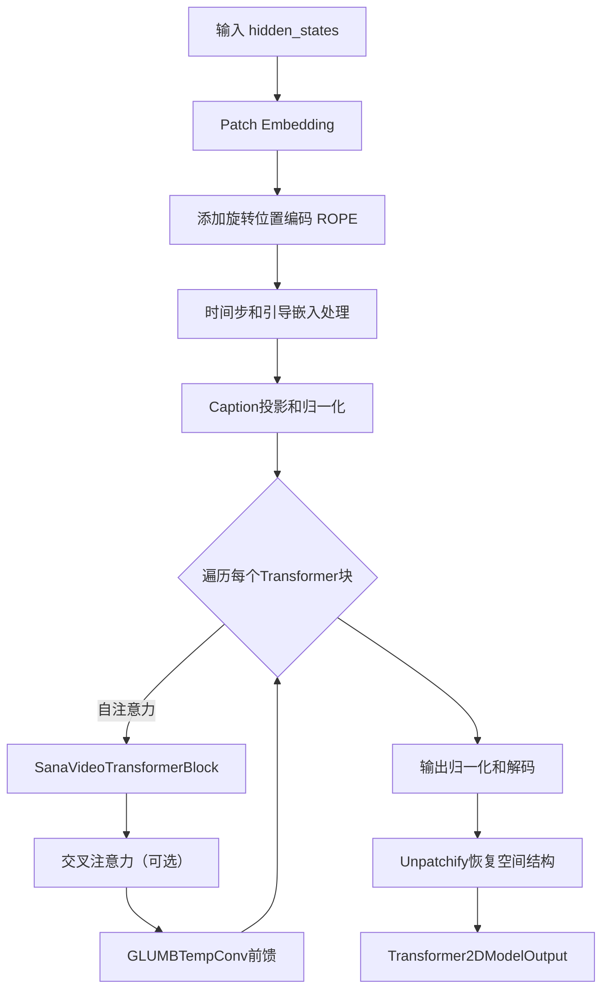

## 类结构

```
核心基础组件
├── GLUMBTempConv (带时间卷积的GLU块)
├── WanRotaryPosEmbed (3D旋转位置嵌入)
├── SanaModulatedNorm (调制归一化)
└── SanaCombinedTimestepGuidanceEmbeddings (时间和引导嵌入)
注意力处理器
├── SanaLinearAttnProcessor3_0 (线性注意力)
└── SanaAttnProcessor2_0 (标准注意力)
Transformer块
└── SanaVideoTransformerBlock
主模型
└── SanaVideoTransformer3DModel
```

## 全局变量及字段


### `logger`
    
模块级日志记录器，用于输出调试和信息日志

类型：`logging.Logger`
    


### `GLUMBTempConv.norm_type`
    
归一化类型，可选值为'rms_norm'或None

类型：`str | None`
    


### `GLUMBTempConv.residual_connection`
    
是否使用残差连接

类型：`bool`
    


### `GLUMBTempConv.nonlinearity`
    
SiLU激活函数

类型：`nn.SiLU`
    


### `GLUMBTempConv.conv_inverted`
    
倒 bottleneck 卷积层，用于扩展通道数

类型：`nn.Conv2d`
    


### `GLUMBTempConv.conv_depth`
    
深度可分离卷积层

类型：`nn.Conv2d`
    


### `GLUMBTempConv.conv_point`
    
逐点卷积层，用于降维

类型：`nn.Conv2d`
    


### `GLUMBTempConv.norm`
    
RMSNorm归一化层，当norm_type为'rms_norm'时使用

类型：`RMSNorm | None`
    


### `GLUMBTempConv.conv_temp`
    
时间维度卷积层，用于时序信息聚合

类型：`nn.Conv2d`
    


### `WanRotaryPosEmbed.attention_head_dim`
    
注意力头的维度

类型：`int`
    


### `WanRotaryPosEmbed.patch_size`
    
时空patch大小

类型：`tuple[int, int, int]`
    


### `WanRotaryPosEmbed.max_seq_len`
    
最大序列长度

类型：`int`
    


### `WanRotaryPosEmbed.t_dim`
    
时间维度的旋转 embedding 维度

类型：`int`
    


### `WanRotaryPosEmbed.h_dim`
    
高度维度的旋转 embedding 维度

类型：`int`
    


### `WanRotaryPosEmbed.w_dim`
    
宽度维度的旋转 embedding 维度

类型：`int`
    


### `WanRotaryPosEmbed.freqs_cos`
    
预计算的余弦旋转频率

类型：`torch.Tensor`
    


### `WanRotaryPosEmbed.freqs_sin`
    
预计算的正弦旋转频率

类型：`torch.Tensor`
    


### `SanaModulatedNorm.norm`
    
LayerNorm归一化层

类型：`nn.LayerNorm`
    


### `SanaCombinedTimestepGuidanceEmbeddings.time_proj`
    
时间步投影层

类型：`Timesteps`
    


### `SanaCombinedTimestepGuidanceEmbeddings.timestep_embedder`
    
时间步嵌入层

类型：`TimestepEmbedding`
    


### `SanaCombinedTimestepGuidanceEmbeddings.guidance_condition_proj`
    
引导条件投影层

类型：`Timesteps`
    


### `SanaCombinedTimestepGuidanceEmbeddings.guidance_embedder`
    
引导嵌入层

类型：`TimestepEmbedding`
    


### `SanaCombinedTimestepGuidanceEmbeddings.silu`
    
SiLU激活函数

类型：`nn.SiLU`
    


### `SanaCombinedTimestepGuidanceEmbeddings.linear`
    
线性层用于生成6倍维度的scale/shift参数

类型：`nn.Linear`
    


### `SanaAttnProcessor2_0._attention_backend`
    
注意力计算后端配置

类型：`Any`
    


### `SanaAttnProcessor2_0._parallel_config`
    
并行计算配置

类型：`Any`
    


### `SanaVideoTransformerBlock.norm1`
    
自注意力前的归一化层

类型：`nn.LayerNorm`
    


### `SanaVideoTransformerBlock.attn1`
    
自注意力模块

类型：`Attention`
    


### `SanaVideoTransformerBlock.norm2`
    
交叉注意力前的归一化层

类型：`nn.LayerNorm`
    


### `SanaVideoTransformerBlock.attn2`
    
交叉注意力模块，可为None

类型：`Attention | None`
    


### `SanaVideoTransformerBlock.ff`
    
前馈网络模块

类型：`GLUMBTempConv`
    


### `SanaVideoTransformerBlock.scale_shift_table`
    
可学习的缩放和偏移参数表

类型：`nn.Parameter`
    


### `SanaVideoTransformer3DModel.rope`
    
旋转位置嵌入模块

类型：`WanRotaryPosEmbed`
    


### `SanaVideoTransformer3DModel.patch_embedding`
    
3D卷积用于patch嵌入

类型：`nn.Conv3d`
    


### `SanaVideoTransformer3DModel.time_embed`
    
时间嵌入层，根据配置选择类型

类型：`SanaCombinedTimestepGuidanceEmbeddings | AdaLayerNormSingle`
    


### `SanaVideoTransformer3DModel.caption_projection`
    
文本描述投影层

类型：`PixArtAlphaTextProjection`
    


### `SanaVideoTransformer3DModel.caption_norm`
    
文本嵌入的归一化层

类型：`RMSNorm`
    


### `SanaVideoTransformer3DModel.transformer_blocks`
    
Transformer块列表

类型：`nn.ModuleList`
    


### `SanaVideoTransformer3DModel.scale_shift_table`
    
输出层的缩放和偏移参数

类型：`nn.Parameter`
    


### `SanaVideoTransformer3DModel.norm_out`
    
输出归一化层

类型：`SanaModulatedNorm`
    


### `SanaVideoTransformer3DModel.proj_out`
    
输出投影层

类型：`nn.Linear`
    


### `SanaVideoTransformer3DModel.gradient_checkpointing`
    
梯度检查点标志位

类型：`bool`
    
    

## 全局函数及方法


根据代码分析，`apply_lora_scale` 是从外部模块 `...utils` 导入的函数，并没有在该代码文件中定义。它被用作装饰器 `@apply_lora_scale("attention_kwargs")` 应用在 `SanaVideoTransformer3DModel` 类的 `forward` 方法上。

由于 `apply_lora_scale` 函数的定义不在当前提供的代码片段中，我无法获取其完整的参数、返回值、流程图和源码。根据代码中的使用方式，我可以提供以下推断性信息：

### `apply_lora_scale`

该函数是一个装饰器，用于在模型前向传播过程中应用 LoRA（Low-Rank Adaptation）缩放操作。它可能用于动态调整 LoRA 适配器的权重或配置，以确保在多任务或特定场景下的正确行为。

参数：

-  `*args`：可变位置参数，接收装饰器传入的配置参数，如字符串 `"attention_kwargs"`。
-  `**kwargs`：可变关键字参数，接收额外的配置选项。

返回值：返回一个装饰器函数，用于包装目标方法。

#### 流程图

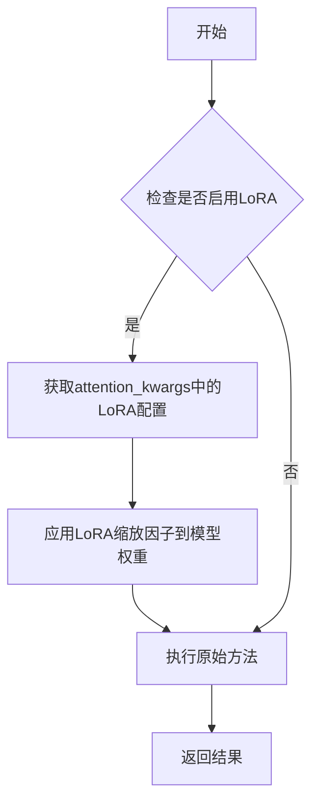

#### 带注释源码

```
# apply_lora_scale 源码不可用
# 以下为基于使用方式的推测实现

def apply_lora_scale(config: str = "attention_kwargs"):
    """
    装饰器：用于在模型方法上应用LoRA缩放
    
    参数:
        config: 配置键名，用于从kwargs中获取LoRA参数
    """
    def decorator(func):
        def wrapper(self, *args, **kwargs):
            # 获取LoRA配置
            attention_kwargs = kwargs.get(config, {})
            
            # 应用LoRA缩放（如有）
            if attention_kwargs:
                # 可能的缩放逻辑
                pass
            
            # 执行原始方法
            return func(self, *args, **kwargs)
        return wrapper
    return decorator
```

**注意**：由于 `apply_lora_scale` 的实际定义位于 `...utils` 模块中（该模块未在当前代码片段中提供），以上信息基于代码中的使用方式进行的合理推测。如需获取完整的函数定义，请参考 `diffusers` 库的 `utils` 模块源代码。


### `get_1d_rotary_pos_embed`

该函数用于生成一维旋转位置嵌入（Rotary Position Embedding），常用于transformer模型中为序列元素提供位置信息，通过正弦和余弦函数计算不同位置和维度的频率向量。

参数：

-  `dim`：`int`，嵌入维度，表示每个位置的向量维度
-  `max_seq_len`：`int`，最大序列长度，决定生成的位置编码长度
-  `theta`：`float`，基础频率参数，默认10000.0，用于控制正弦函数的周期
-  `use_real`：`bool`，是否使用实数形式的旋转嵌入
-  `repeat_interleave_real`：`bool`，是否对实数部分进行重复交错
-  `freqs_dtype`：`torch.dtype`，生成张量的数据类型，通常为float32或float64

返回值：`(torch.Tensor, torch.Tensor)`，返回两个张量——第一个是余弦频率 `freqs_cos`，第二个是正弦频率 `freqs_sin`，两者形状均为 `(max_seq_len, dim)`

#### 流程图

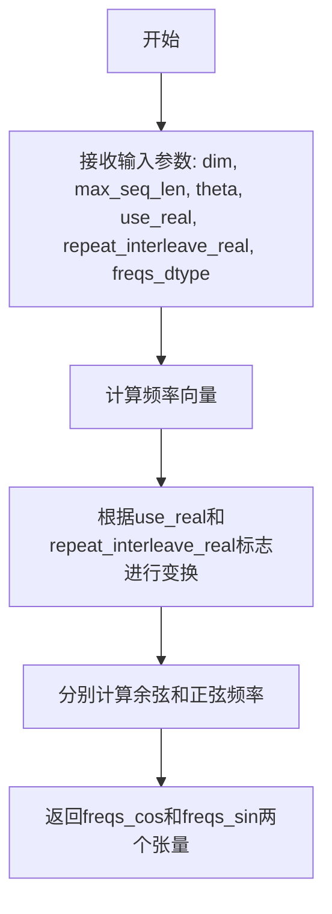

#### 带注释源码

```python
# 该函数定义在 diffusers 库的 ..embeddings 模块中
# 以下是基于调用方式和旋转位置嵌入原理的推断实现

def get_1d_rotary_pos_embed(
    dim: int,
    max_seq_len: int,
    theta: float = 10000.0,
    use_real: bool = True,
    repeat_interleave_real: bool = True,
    freqs_dtype: torch.dtype = torch.float64,
):
    """
    生成一维旋转位置嵌入的频率向量
    
    参数:
        dim: 嵌入维度
        max_seq_len: 最大序列长度
        theta: 基础频率参数
        use_real: 是否使用实数形式
        repeat_interleave_real: 是否重复交错实数
        freqs_dtype: 输出张量的数据类型
    
    返回:
        freqs_cos: 余弦频率向量
        freqs_sin: 正弦频率向量
    """
    # 计算位置索引 [0, 1, 2, ..., max_seq_len-1]
    positions = torch.arange(max_seq_len, dtype=freqs_dtype)
    
    # 计算频率: theta^(-2i/dim), i从0到dim/2
    # dim是偶数，这里假设dim能被2整除
    freqs = theta ** (-torch.arange(0, dim, 2, dtype=freqs_dtype) / dim)
    
    # 计算角度: position * frequency
    # 外积得到 (max_seq_len, dim/2) 的矩阵
    emb = positions[:, None] * freqs[None, :]
    
    # 连接位置编码: [cos(emb), sin(emb)]
    # 使用torch.cat在dim维度连接
    emb = torch.cat([emb, emb], dim=-1)
    
    # 分离余弦和正弦部分
    freqs_cos = emb.cos()
    freqs_sin = emb.sin()
    
    return freqs_cos, freqs_sin
```

> **注意**: 此源码为基于旋转位置嵌入原理和代码中调用方式的推断实现，实际定义可能在 `diffusers` 库的 embeddings 模块中。


### `apply_rotary_emb`

该函数是`SanaLinearAttnProcessor3_0`类中的内部函数，实现了旋转位置嵌入（Rotary Position Embedding）算法，用于在线性注意力机制中为查询和键向量注入位置信息。

参数：

- `hidden_states`：`torch.Tensor`，输入的张量，通常是 query 或 key，形状为 `(batch, num_heads, seq_len, head_dim)`
- `freqs_cos`：`torch.Tensor`，余弦频率，用于旋转计算的余弦部分
- `freqs_sin`：`torch.Tensor`，正弦频率，用于旋转计算的正弦部分

返回值：`torch.Tensor`，应用旋转位置嵌入后的张量，类型与输入张量相同

#### 流程图

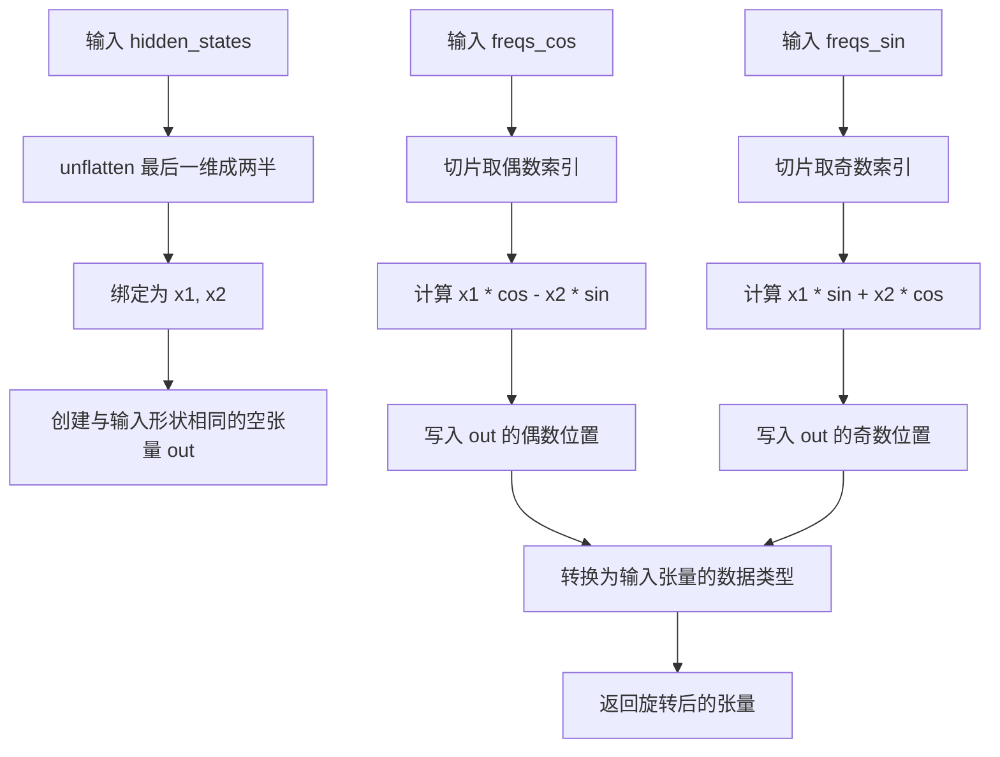

#### 带注释源码

```
def apply_rotary_emb(
    hidden_states: torch.Tensor,    # 输入张量，形状: (batch, heads, seq, head_dim)
    freqs_cos: torch.Tensor,         # 余弦频率，形状: (seq, 1, head_dim)
    freqs_sin: torch.Tensor,        # 正弦频率，形状: (seq, 1, head_dim)
):
    # 1. 将最后一维拆分为两半，得到 x1 和 x2
    # 例如 head_dim=64 -> x1, x2 各32维
    x1, x2 = hidden_states.unflatten(-1, (-1, 2)).unbind(-1)
    
    # 2. 从频率中提取余弦和正弦部分
    # freqs_cos[..., 0::2] 取偶数索引位置
    cos = freqs_cos[..., 0::2]
    # freqs_sin[..., 1::2] 取奇数索引位置
    sin = freqs_sin[..., 1::2]
    
    # 3. 创建输出张量，与输入形状相同
    out = torch.empty_like(hidden_states)
    
    # 4. 应用旋转公式:
    # out[..., 0::2] = x1 * cos - x2 * sin
    out[..., 0::2] = x1 * cos - x2 * sin
    
    # 5. 应用旋转公式:
    # out[..., 1::2] = x1 * sin + x2 * cos
    out[..., 1::2] = x1 * sin + x2 * cos
    
    # 6. 转换数据类型以匹配输入张量的数据类型
    return out.type_as(hidden_states)
```


### `logging.get_logger`

获取与当前模块名称关联的日志记录器实例，用于在该模块中记录日志信息。

参数：

- `name`：`str`，日志记录器的名称，通常传入 `__name__` 以获取模块级别的 logger

返回值：`logging.Logger`，返回 Python 标准库的 Logger 对象，用于记录日志

#### 流程图

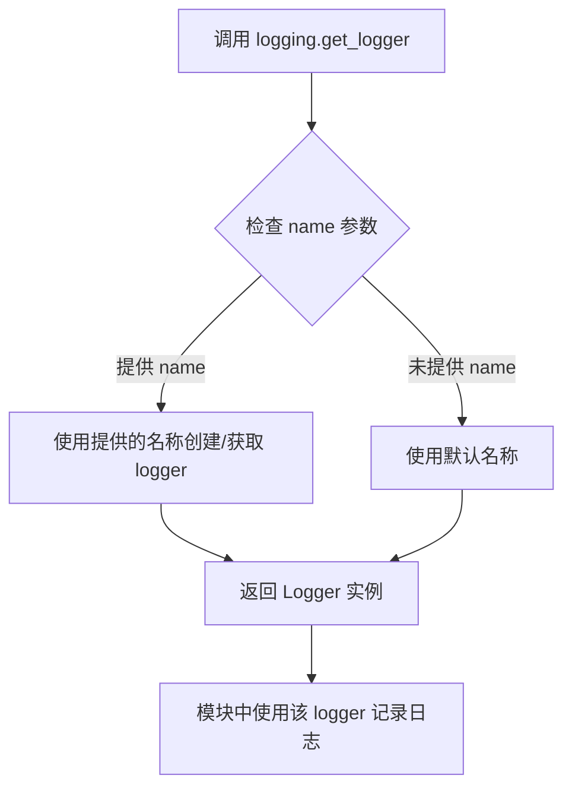

#### 带注释源码

```python
# 从 diffusers 库的 utils 模块导入 logging 对象
from ...utils import logging

# 调用 logging.get_logger 并传入当前模块的 __name__
# __name__ 是 Python 的内置变量，表示当前模块的完整路径
# 例如: 'diffusers.models.transformers.sana_video_transformer_3d'
# 这样可以创建模块级别的 logger，便于追踪日志来源
logger = logging.get_logger(__name__)  # pylint: disable=invalid-name
```


### `GLUMBTempConv.forward`

这是 `GLUMBTempConv` 类的核心前向传播方法。它实现了一个专门用于视频（或高帧率图像）处理的时空特征提取模块。该模块采用了**门控线性单元 (GLU)** 架构，结合了**倒置卷积 (Inverted Convolution)** 进行通道扩展、**深度可分离卷积 (Depthwise Convolution)** 提取空间特征，以及**时间卷积 (Temporal Convolution)** 来建模帧与帧之间的时间依赖关系。

参数：

- `hidden_states`：`torch.Tensor`，输入张量，形状为 `(batch_size, num_frames, height, width, in_channels)`。这是经过归一化和调制后的 Transformer 块输出，视为一个 5D 视频张量（批次, 时间, 高度, 宽度, 通道）。

返回值：`torch.Tensor`，处理后的输出张量，形状为 `(batch_size, num_frames, height, width, out_channels)`。如果启用了残差连接，输出会与输入相加。

#### 流程图

```mermaid
graph TD
    A[输入 hidden_states<br>(B, T, H, W, C)] --> B{residual_connection?}
    B -- Yes --> C[保存残差: residual]
    B -- No --> D
    C --> D[合并批次与时间维度<br>(B*T, C, H, W)]
    D --> E[Conv Inverted<br>扩展通道: (B*T, C_exp, H, W)]
    E --> F[SiLU 激活]
    F --> G[Conv Depthwise<br>深度卷积: (B*T, C_exp, H, W)]
    G --> H[Tensor Chunk 分割<br>分为 x 和 gate]
    H --> I[gate 分支 SiLU 激活]
    I --> J[Element-wise Multiply<br>x * SiLU(gate)]
    J --> K[Conv Pointwise<br>映射回输出通道: (B*T, C_out, H, W)]
    K --> L[准备时间维度<br>重塑为 (B, C_out, T, H*W)]
    L --> M[Conv Temporal<br>时间卷积 + 残差]
    M --> N[重塑回 5D<br>(B, T, H, W, C_out)]
    N --> O{norm_type == 'rms_norm'?}
    O -- Yes --> P[RMSNorm 归一化<br>移动通道维度到最后]
    O -- No --> Q
    P --> Q{residual_connection?}
    Q -- Yes --> R[Add Residual<br>hidden_states + residual]
    Q -- No --> S[返回输出]
    R --> S
```

#### 带注释源码

```python
def forward(self, hidden_states: torch.Tensor) -> torch.Tensor:
    # 1. 残差连接准备：如果开启残差连接，保存初始输入
    if self.residual_connection:
        residual = hidden_states
    
    # 获取输入的形状维度信息
    # 形状: (batch_size, num_frames, height, width, num_channels)
    batch_size, num_frames, height, width, num_channels = hidden_states.shape
    
    # 2. 空间特征提取准备：
    # 将 (B, T, H, W, C) 合并为 (B*T, C, H, W) 以便使用 2D 卷积处理所有帧
    hidden_states = hidden_states.view(batch_size * num_frames, height, width, num_channels).permute(0, 3, 1, 2)

    # 3. 倒置卷积 (Inverted Convolution)：扩展通道维度
    # 输入: (B*T, C, H, W) -> 输出: (B*T, hidden_channels*2, H, W)
    hidden_states = self.conv_inverted(hidden_states)
    # SiLU 激活函数
    hidden_states = self.nonlinearity(hidden_states)

    # 4. 深度可分离卷积 (Depthwise Convolution)：捕捉空间模式
    # 输入: (B*T, C_exp, H, W) -> 输出: (B*T, C_exp, H, W)
    hidden_states = self.conv_depth(hidden_states)
    
    # 5. 门控机制 (Gating Mechanism)：
    # 将卷积结果沿通道维度一分为二，一部分作为信息，一部分作为门控信号
    hidden_states, gate = torch.chunk(hidden_states, 2, dim=1)
    # 使用门控信号控制信息流的通过 (GLU 变体)
    hidden_states = hidden_states * self.nonlinearity(gate)

    # 6. 逐点卷积 (Pointwise Convolution)：调整通道数到目标输出通道
    # 输入: (B*T, hidden, H, W) -> 输出: (B*T, out_channels, H, W)
    hidden_states = self.conv_point(hidden_states)

    # 7. 时间聚合 (Temporal Aggregation)：
    # 这一步利用卷积处理时间维度，将 2D 卷积的输出转换回 3D (视频) 结构
    # 重塑为 (batch_size, num_frames, num_channels, height * width)
    hidden_states_temporal = hidden_states.view(batch_size, num_frames, num_channels, height * width).permute(
        0, 2, 1, 3
    )
    # 执行时间维度卷积: kernel_size=(3, 1) 意味着在时间轴( dim 2 )上进行核大小为3的卷积，空间轴(dim 3)进行1x1
    # 公式: Output = Input + Conv(Input)
    hidden_states = hidden_states_temporal + self.conv_temp(hidden_states_temporal)
    
    # 恢复形状回 (B, T, H, W, C)
    hidden_states = hidden_states.permute(0, 2, 3, 1).view(batch_size, num_frames, height, width, num_channels)

    # 8. 归一化处理：如果配置了 RMSNorm
    if self.norm_type == "rms_norm":
        # 将通道维度移到最后，以便对通道维度进行 RMSNorm
        # 输入: (B, T, H, W, C) -> (B, T, H, W, C) [movedim 实际上不变，因为是在 1 和 -1 之间互调，但在逻辑上准备计算]
        # 实际上代码是: hidden_states.movedim(1, -1) -> (B, H, W, T, C) -> Norm -> (B, T, H, W, C)
        hidden_states = self.norm(hidden_states.movedim(1, -1)).movedim(-1, 1)

    # 9. 最终残差相加
    if self.residual_connection:
        hidden_states = hidden_states + residual

    return hidden_states
```


### `SanaLinearAttnProcessor3_0.__call__`

实现Scaled Dot-Product Linear Attention（线性注意力机制），通过ReLU激活函数和高效的矩阵运算实现注意力计算，避免了传统softmax注意力的O(N²)计算复杂度，同时支持旋转位置编码（RoPE）来引入位置信息。

参数：

- `self`：实例本身，隐含参数
- `attn`：`Attention`，注意力模块，包含to_q、to_k、to_v线性层以及归一化层和输出层
- `hidden_states`：`torch.Tensor`，输入的隐藏状态，形状为 [batch, seq_len, dim]
- `encoder_hidden_states`：`torch.Tensor | None`，编码器隐藏状态，用于cross-attention，默认为None
- `attention_mask`：`torch.Tensor | None`，注意力掩码，当前实现未使用
- `rotary_emb`：`torch.Tensor | None`，旋转位置编码，包含cos和sin频率

返回值：`torch.Tensor`，经过线性注意力机制处理后的隐藏状态

#### 流程图

```mermaid
flowchart TD
    A[开始] --> B[保存原始数据类型 original_dtype]
    B --> C{encoder_hidden_states is None?}
    C -->|是| D[使用 hidden_states]
    C -->|否| E[使用 encoder_hidden_states]
    D --> F
    E --> F
    F[attn.to_q生成 query]
    G[attn.to_k生成 key]
    H[attn.to_v生成 value]
    F --> I{attn.norm_q 存在?}
    G --> J{attn.norm_k 存在?}
    I -->|是| K[query = attn.norm_q(query)]
    I -->|否| L
    J -->|是| M[key = attn.norm_k(key)]
    J -->|否| L
    K --> L
    M --> L
    L[query/key/value unflatten为 B,N,H,C]
    L --> N[query = F.relu(query)]
    N --> O[key = F.relu(key)]
    O --> P{rotary_emb 存在?}
    P -->|是| Q[apply_rotary_emb生成 query_rotate/key_rotate]
    P -->|否| R[query_rotate=query/key_rotate=key]
    Q --> S
    R --> S
    S[维度重排 B,H,C,N]
    T[转换为float类型]
    S --> T
    T --> U[计算 z = 1/(key·query + ε)]
    U --> V[scores = value @ key_rotate.T]
    V --> W[hidden_states = scores @ query_rotate]
    W --> X[hidden_states = hidden_states * z]
    X --> Y[flatten + transpose 恢复形状]
    Y --> Z[转换为 original_dtype]
    Z --> AA[attn.to_out[0] 线性投影]
    AA --> AB[attn.to_out[1] Dropout/残差连接]
    AB --> AC[返回 hidden_states]
```

#### 带注释源码

```python
def __call__(
    self,
    attn: Attention,
    hidden_states: torch.Tensor,
    encoder_hidden_states: torch.Tensor | None = None,
    attention_mask: torch.Tensor | None = None,
    rotary_emb: torch.Tensor | None = None,
) -> torch.Tensor:
    """
    实现Scaled Dot-Product Linear Attention的调用方法
    
    参数:
        attn: Attention模块，包含q/k/v投影层和归一化层
        hidden_states: 输入隐藏状态 [batch, seq_len, dim]
        encoder_hidden_states: 编码器隐藏状态，用于cross-attention
        attention_mask: 注意力掩码（当前版本未使用）
        rotary_emb: 旋转位置编码
    
    返回:
        处理后的隐藏状态
    """
    # 步骤1: 保存原始数据类型，后续需要转换回该类型
    original_dtype = hidden_states.dtype

    # 步骤2: 处理encoder_hidden_states
    # 如果没有提供encoder_hidden_states，则使用hidden_states进行self-attention
    if encoder_hidden_states is None:
        encoder_hidden_states = hidden_states

    # 步骤3: 通过线性层生成Q、K、V
    # to_q/to_k/to_v是Attention模块中的线性投影层
    query = attn.to_q(hidden_states)
    key = attn.to_k(encoder_hidden_states)
    value = attn.to_v(encoder_hidden_states)

    # 步骤4: 可选的归一化处理
    # 对query和key进行归一化（如果配置中指定了）
    if attn.norm_q is not None:
        query = attn.norm_q(query)
    if attn.norm_k is not None:
        key = attn.norm_k(key)

    # 步骤5: 维度重塑
    # 将 [batch, seq, dim] 重塑为 [batch, seq, heads, head_dim]
    # 原始形状: B,N,H*C -> 目标形状: B,N,H,C
    query = query.unflatten(2, (attn.heads, -1))
    key = key.unflatten(2, (attn.heads, -1))
    value = value.unflatten(2, (attn.heads, -1))
    # B,N,H,C

    # 步骤6: ReLU激活
    # Linear Attention使用ReLU作为激活函数，这是与传统Softmax Attention的关键区别
    query = F.relu(query)
    key = F.relu(key)

    # 步骤7: 旋转位置编码（RoPE）
    # 如果提供了旋转嵌入，则应用到query和key上
    if rotary_emb is not None:

        def apply_rotary_emb(
            hidden_states: torch.Tensor,
            freqs_cos: torch.Tensor,
            freqs_sin: torch.Tensor,
        ):
            """
            应用旋转位置编码
            将hidden_states与旋转矩阵相乘来引入位置信息
            """
            # 分离实部和虚部
            x1, x2 = hidden_states.unflatten(-1, (-1, 2)).unbind(-1)
            # 提取奇偶频率
            cos = freqs_cos[..., 0::2]
            sin = freqs_sin[..., 1::2]
            # 旋转公式: out = x1*cos - x2*sin, out = x1*sin + x2*cos
            out = torch.empty_like(hidden_states)
            out[..., 0::2] = x1 * cos - x2 * sin
            out[..., 1::2] = x1 * sin + x2 * cos
            return out.type_as(hidden_states)

        # 应用旋转编码到query和key
        query_rotate = apply_rotary_emb(query, *rotary_emb)
        key_rotate = apply_rotary_emb(key, *rotary_emb)

    # 步骤8: 维度重排
    # 从 [B,N,H,C] 转换为 [B,H,C,N] 以进行矩阵乘法
    # B,H,C,N 格式便于进行批量注意力计算
    query = query.permute(0, 2, 3, 1)
    key = key.permute(0, 2, 3, 1)
    query_rotate = query_rotate.permute(0, 2, 3, 1)
    key_rotate = key_rotate.permute(0, 2, 3, 1)
    value = value.permute(0, 2, 3, 1)

    # 步骤9: 转换为float类型
    # 确保计算精度，避免half精度可能带来的数值问题
    query_rotate, key_rotate, value = query_rotate.float(), key_rotate.float(), value.float()

    # 步骤10: 计算归一化因子z
    # z = 1 / (key^T @ query + epsilon)
    # 这是Linear Attention的核心归一化项，不同于softmax
    z = 1 / (key.sum(dim=-1, keepdim=True).transpose(-2, -1) @ query + 1e-15)

    # 步骤11: 计算注意力分数
    # 标准Linear Attention: (V @ K^T) @ Q
    # 带有旋转编码: (V @ K_rot^T) @ Q_rot
    scores = torch.matmul(value, key_rotate.transpose(-1, -2))
    hidden_states = torch.matmul(scores, query_rotate)

    # 步骤12: 应用归一化因子
    hidden_states = hidden_states * z
    # B,H,C,N

    # 步骤13: 恢复原始形状和数据类型
    # flatten head和channel维度，然后转置恢复 [B, N, dim]
    hidden_states = hidden_states.flatten(1, 2).transpose(1, 2)
    hidden_states = hidden_states.to(original_dtype)

    # 步骤14: 输出投影
    # 应用最后的线性层和可能的dropout/残差连接
    hidden_states = attn.to_out[0](hidden_states)
    hidden_states = attn.to_out[1](hidden_states)

    return hidden_states
```


### WanRotaryPosEmbed.forward

该方法根据输入的隐藏状态张量的时空维度，动态生成对应的3D旋转位置嵌入（RoPE）。它利用预计算的频率向量，通过切片和扩展操作生成适用于时间、高度和宽度维度的余弦与正弦频率矩阵。

参数：

- `hidden_states`：`torch.Tensor`，输入的隐藏状态张量，形状为 (batch_size, num_channels, num_frames, height, width)

返回值：`tuple[torch.Tensor, torch.Tensor]`，返回一个包含两个张量的元组，分别是余弦频率矩阵和正弦频率矩阵，用于后续的旋转位置嵌入计算

#### 流程图

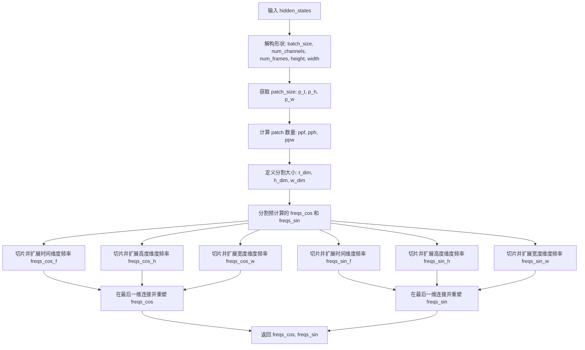

#### 带注释源码

```python
def forward(self, hidden_states: torch.Tensor) -> tuple[torch.Tensor, torch.Tensor]:
    # 从输入张量形状中提取批次大小、通道数、帧数、高度和宽度
    batch_size, num_channels, num_frames, height, width = hidden_states.shape
    # 获取 patch 尺寸（时间 patch 数、高度 patch 数、宽度 patch 数）
    p_t, p_h, p_w = self.patch_size
    # 计算 patch 后的数量：帧数除以时间 patch 数，高、宽同理
    ppf, pph, ppw = num_frames // p_t, height // p_h, width // p_w

    # 定义分割大小，分别对应时间、高度、宽度维度的嵌入维度
    split_sizes = [self.t_dim, self.h_dim, self.w_dim]

    # 将预计算的余弦和正弦频率张量按照分割大小进行切分
    freqs_cos = self.freqs_cos.split(split_sizes, dim=1)
    freqs_sin = self.freqs_sin.split(split_sizes, dim=1)

    # 从时间维度频率中切片并重塑为 (ppf, 1, 1, -1)，然后扩展到 (ppf, pph, ppw, -1)
    freqs_cos_f = freqs_cos[0][:ppf].view(ppf, 1, 1, -1).expand(ppf, pph, ppw, -1)
    # 从高度维度频率中切片并重塑为 (1, pph, 1, -1)，然后扩展到 (ppf, pph, ppw, -1)
    freqs_cos_h = freqs_cos[1][:pph].view(1, pph, 1, -1).expand(ppf, pph, ppw, -1)
    # 从宽度维度频率中切片并重塑为 (1, 1, ppw, -1)，然后扩展到 (ppf, pph, ppw, -1)
    freqs_cos_w = freqs_cos[2][:ppw].view(1, 1, ppw, -1).expand(ppf, pph, ppw, -1)

    # 对正弦频率进行相同的切片和扩展操作
    freqs_sin_f = freqs_sin[0][:ppf].view(ppf, 1, 1, -1).expand(ppf, pph, ppw, -1)
    freqs_sin_h = freqs_sin[1][:pph].view(1, pph, 1, -1).expand(ppf, pph, ppw, -1)
    freqs_sin_w = freqs_sin[2][:ppw].view(1, 1, ppw, -1).expand(ppf, pph, ppw, -1)

    # 将三个维度的频率在最后一维连接起来，并重塑为 (1, ppf * pph * ppw, 1, -1)
    freqs_cos = torch.cat([freqs_cos_f, freqs_cos_h, freqs_cos_w], dim=-1).reshape(1, ppf * pph * ppw, 1, -1)
    freqs_sin = torch.cat([freqs_sin_f, freqs_sin_h, freqs_sin_w], dim=-1).reshape(1, ppf * pph * ppw, 1, -1)

    # 返回生成的余弦和正弦频率矩阵
    return freqs_cos, freqs_sin
```


### `SanaModulatedNorm.forward`

该方法实现了一种带调制的归一化层，通过可学习的缩放和平移表（scale_shift_table）结合时间步嵌入（temb）动态调整 LayerNorm 的参数，实现 AdaNorm（自适应归一化）效果，常用于 Diffusion Transformer 中实现时间条件的特征调制。

参数：

- `hidden_states`：`torch.Tensor`，输入的隐藏状态张量，形状为 `(batch, seq_len, dim)`
- `temb`：`torch.Tensor`，时间步嵌入向量，形状为 `(batch, 6, dim)` 或类似维度
- `scale_shift_table`：`torch.Tensor`，可学习的缩放和平移参数表，形状为 `(6, dim)`

返回值：`torch.Tensor`，经过调制归一化后的隐藏状态，形状与输入 `hidden_states` 相同

#### 流程图

```mermaid
flowchart TD
    A[输入 hidden_states, temb, scale_shift_table] --> B[LayerNorm 归一化]
    B --> C[计算 scale_shift_table[None, None] + temb[:, :, None]]
    C --> D[在 dim=2 维度解绑获取 shift 和 scale]
    D --> E[计算 hidden_states * (1 + scale) + shift]
    E --> F[返回调制后的 hidden_states]
```

#### 带注释源码

```python
def forward(
    self, hidden_states: torch.Tensor, temb: torch.Tensor, scale_shift_table: torch.Tensor
) -> torch.Tensor:
    # Step 1: 对输入 hidden_states 进行标准 LayerNorm 归一化
    # 输入形状: (batch, seq_len, dim)
    hidden_states = self.norm(hidden_states)
    
    # Step 2: 计算调制参数
    # scale_shift_table 形状: (6, dim)
    # temb 形状: (batch, 6, dim) - 来自 SanaVideoTransformerBlock 的 6 个调制向量
    # [None, None] 将 scale_shift_table 扩展为 (1, 1, 6, dim)
    # temb[:, :, None] 将 temb 扩展为 (batch, 6, 1, dim) 以便广播加法
    # 结果形状: (batch, 6, dim)
    shift, scale = (scale_shift_table[None, None] + temb[:, :, None].to(scale_shift_table.device)).unbind(dim=2)
    
    # Step 3: 应用调制（AdaNorm 核心）
    # (1 + scale) 确保初始 scale 为 0 时不影响原始归一化结果
    # shift 提供可学习的偏置
    hidden_states = hidden_states * (1 + scale) + shift
    
    # 返回调制后的张量，形状保持为 (batch, seq_len, dim)
    return hidden_states
```


### `SanaCombinedTimestepGuidanceEmbeddings.forward`

该方法是 Sana 视频Transformer模型中的时间步与引导条件联合嵌入层，接收时间步timestep和可选的引导向量guidance，通过独立的时间投影和嵌入层处理后相加融合，再经由SiLU激活和线性变换输出用于后续模块调制的6倍维度嵌入向量和基础条件嵌入。

参数：

- `timestep`：`torch.Tensor`，时间步张量，通常为离散的时间步索引值
- `guidance`：`torch.Tensor`，引导条件张量，用于分类器自由引导（classifier-free guidance），可选
- `hidden_dtype`：`torch.dtype`，隐藏层的期望数据类型，用于指定输出张量的精度

返回值：`tuple[torch.Tensor, torch.Tensor]`，返回一个元组，包含经线性层和SiLU激活后的调制嵌入向量（维度为6×embedding_dim）以及原始的条件嵌入向量（维度为embedding_dim）

#### 流程图

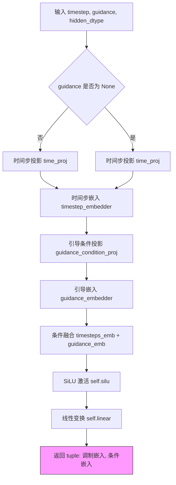

#### 带注释源码

```python
def forward(self, timestep: torch.Tensor, guidance: torch.Tensor = None, hidden_dtype: torch.dtype = None):
    """
    前向传播：生成时间步和引导条件的联合嵌入
    
    参数:
        timestep: 时间步张量，通常为 [batch_size] 形状的整数值
        guidance: 引导条件张量，用于分类器自由引导，可选
        hidden_dtype: 输出张量的数据类型
    
    返回:
        tuple: (调制后的嵌入向量, 原始条件嵌入向量)
    """
    
    # 1. 时间步投影：将离散时间步转换为连续嵌入表示
    # 使用 Timesteps 层进行投影，输出通道数为 256
    timesteps_proj = self.time_proj(timestep)
    
    # 2. 时间步嵌入：将投影后的时间步嵌入到指定维度
    # 转换为指定的数据类型 (hidden_dtype)
    timesteps_emb = self.timestep_embedder(timesteps_proj.to(dtype=hidden_dtype))  # (N, D)
    
    # 3. 引导条件投影：仅当 guidance 不为 None 时执行
    # 将引导向量投影到与时间步相同的嵌入空间
    guidance_proj = self.guidance_condition_proj(guidance)
    guidance_emb = self.guidance_embedder(guidance_proj.to(dtype=hidden_dtype))
    
    # 4. 条件融合：将时间步嵌入与引导嵌入相加
    # 这实现了分类器自由引导的条件嵌入
    conditioning = timesteps_emb + guidance_emb
    
    # 5. 非线性变换 + 线性投影
    # 使用 SiLU (Swish) 激活函数，然后通过线性层
    # 输出维度扩展为 embedding_dim 的 6 倍，用于后续的 shift/scale 调制参数
    return self.linear(self.silu(conditioning)), conditioning
```


### `SanaAttnProcessor2_0.__init__`

这是 Sana 模型的注意力处理器类的初始化方法，用于设置缩放点积注意力（SDPA）处理器，并验证 PyTorch 2.0 的可用性。

参数：无（仅包含 self）

返回值：`None`，该方法为构造函数，不返回任何值

#### 流程图

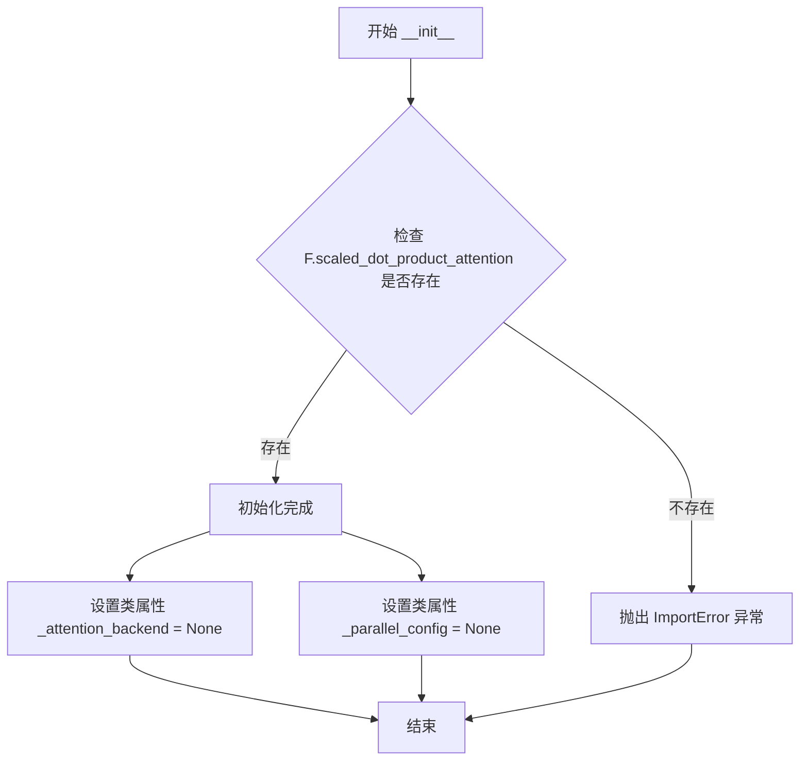

#### 带注释源码

```python
class SanaAttnProcessor2_0:
    r"""
    Processor for implementing scaled dot-product attention (enabled by default if you're using PyTorch 2.0).
    """

    # 类级别属性：用于配置注意力后端（默认为 None，表示使用默认后端）
    _attention_backend = None
    # 类级别属性：用于配置并行计算参数（默认为 None）
    _parallel_config = None

    def __init__(self):
        # 检查 PyTorch 2.0 的 scaled_dot_product_attention 函数是否可用
        # 这是 SDPA 加速注意力计算的核心功能
        if not hasattr(F, "scaled_dot_product_attention"):
            # 如果不支持，抛出 ImportError 提示用户升级 PyTorch 版本
            raise ImportError("SanaAttnProcessor2_0 requires PyTorch 2.0, to use it, please upgrade PyTorch to 2.0.")
```


### `SanaAttnProcessor2_0.__call__`

实现基于 PyTorch 2.0 的缩放点积注意力机制（Scaled Dot-Product Attention），通过自定义注意力处理器完成查询、键、值的计算与注意力分数的映射，并应用输出投影和 dropout，最终返回处理后的隐藏状态张量。

参数：

- `self`：指向类实例本身的隐式参数，表示 `SanaAttnProcessor2_0` 的实例。
- `attn`：`Attention` 类型，一个 Attention 模块实例，提供了查询、键、值投影层（to_q、to_k、to_v）、输出投影层（to_out）、归一化层（norm_q、norm_k）以及注意力掩码准备方法。
- `hidden_states`：`torch.Tensor` 类型，形状为 `(batch_size, sequence_length, dim)` 的输入隐藏状态，作为注意力机制的查询来源。
- `encoder_hidden_states`：`torch.Tensor | None` 类型，编码器的隐藏状态，用于跨注意力机制。如果为 `None`，则使用 `hidden_states` 作为键和值的来源。
- `attention_mask`：`torch.Tensor | None` 类型，用于掩盖注意力的掩码张量，形状应与注意力分数兼容，以屏蔽特定位置的注意力计算。

返回值：`torch.Tensor`，经过注意力处理和输出投影后的隐藏状态张量，形状为 `(batch_size, sequence_length, dim)`。

#### 流程图

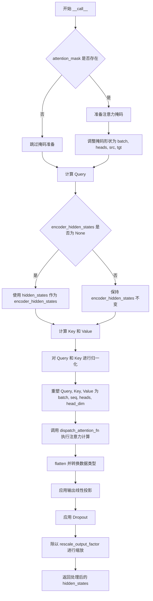

#### 带注释源码

```
class SanaAttnProcessor2_0:
    r"""
    Processor for implementing scaled dot-product attention (enabled by default if you're using PyTorch 2.0).
    """

    # 类变量：指定注意力计算的后端实现，默认为 None
    _attention_backend = None
    # 类变量：并行配置，用于分布式或并行计算场景
    _parallel_config = None

    def __init__(self):
        # 检查 PyTorch 是否支持 scaled_dot_product_attention 函数
        if not hasattr(F, "scaled_dot_product_attention"):
            raise ImportError("SanaAttnProcessor2_0 requires PyTorch 2.0, to use it, please upgrade PyTorch to 2.0.")

    def __call__(
        self,
        attn: Attention,
        hidden_states: torch.Tensor,
        encoder_hidden_states: torch.Tensor | None = None,
        attention_mask: torch.Tensor | None = None,
    ) -> torch.Tensor:
        # 根据是否存在 encoder_hidden_states 确定序列长度
        # 如果 encoder_hidden_states 存在，则使用其形状；否则使用 hidden_states 的形状
        batch_size, sequence_length, _ = (
            hidden_states.shape if encoder_hidden_states is None else encoder_hidden_states.shape
        )

        # 如果提供了 attention_mask，则需要准备掩码以适配注意力计算
        if attention_mask is not None:
            # 使用 attn 的 prepare_attention_mask 方法将掩码转换为适配的格式
            attention_mask = attn.prepare_attention_mask(attention_mask, sequence_length, batch_size)
            # scaled_dot_product_attention 期望的注意力掩码形状为
            # (batch, heads, source_length, target_length)
            attention_mask = attention_mask.view(batch_size, attn.heads, -1, attention_mask.shape[-1])

        # 使用注意力模块的 to_q 层对 hidden_states 进行查询投影
        query = attn.to_q(hidden_states)

        # 如果没有提供 encoder_hidden_states，则使用 hidden_states 代替
        # 这使得该处理器既可用于自注意力（self-attention），也可用于跨注意力（cross-attention）
        if encoder_hidden_states is None:
            encoder_hidden_states = hidden_states

        # 对 encoder_hidden_states 进行键和值的投影
        key = attn.to_k(encoder_hidden_states)
        value = attn.to_v(encoder_hidden_states)

        # 如果存在查询归一化层，则对查询进行归一化处理
        if attn.norm_q is not None:
            query = attn.norm_q(query)
        # 如果存在键归一化层，则对键进行归一化处理
        if attn.norm_k is not None:
            key = attn.norm_k(key)

        # 计算内部维度和每个头的维度
        inner_dim = key.shape[-1]
        head_dim = inner_dim // attn.heads

        # 将查询、键、值重塑为 (batch, seq_len, heads, head_dim) 的形式
        # 以便进行多头注意力计算
        query = query.view(batch_size, -1, attn.heads, head_dim)
        key = key.view(batch_size, -1, attn.heads, head_dim)
        value = value.view(batch_size, -1, attn.heads, head_dim)

        # 调用 dispatch_attention_fn 执行缩放点积注意力计算
        # 输出形状为 (batch, num_heads, seq_len, head_dim)
        hidden_states = dispatch_attention_fn(
            query,
            key,
            value,
            attn_mask=attention_mask,
            dropout_p=0.0,
            is_causal=False,
            backend=self._attention_backend,
            parallel_config=self._parallel_config,
        )
        
        # 将输出从 (batch, heads, seq_len, head_dim) 展平为 (batch, seq_len, heads * head_dim)
        hidden_states = hidden_states.flatten(2, 3)
        # 将隐藏状态的数据类型转换为与查询张量相同
        hidden_states = hidden_states.type_as(query)

        # 应用线性投影层（to_out[0]）进行输出变换
        hidden_states = attn.to_out[0](hidden_states)
        # 应用 dropout 层（to_out[1]）进行随机丢弃
        hidden_states = attn.to_out[1](hidden_states)

        # 根据 rescale_output_factor 对输出进行缩放，以稳定训练过程
        hidden_states = hidden_states / attn.rescale_output_factor

        return hidden_states
```


### `SanaVideoTransformerBlock.forward`

该方法是 Sana-Video Transformer 块的前向传播函数，实现了一个完整的 Transformer 块，包含自适应归一化调制（Modulation）、自注意力（Self-Attention）、交叉注意力（Cross-Attention）和带门控机制的前馈网络（Feed-forward），用于处理视频生成任务中的时空特征。

**参数：**

- `self`：类实例本身
- `hidden_states`：`torch.Tensor`，输入的隐藏状态张量，形状为 `[batch_size, sequence_length, dim]`
- `attention_mask`：`torch.Tensor | None`，自注意力掩码，用于控制哪些位置可以 attending 到其他位置
- `encoder_hidden_states`：`torch.Tensor | None`，编码器输出的隐藏状态，用于跨注意力机制
- `encoder_attention_mask`：`torch.Tensor | None`，跨注意力掩码，控制 cross-attention 的注意力分布
- `timestep`：`torch.LongTensor | None`，时间步长嵌入，用于 AdaLN 调制参数生成
- `frames`：`int | None`，视频帧数（patch 化后的帧数）
- `height`：`int | None`，特征图高度（patch 化后）
- `width`：`int | None`，特征图宽度（patch 化后）
- `rotary_emb`：`torch.Tensor | None`，旋转位置编码（RoPE），用于增强位置感知能力

**返回值：** `torch.Tensor`，经过 Transformer 块处理后的隐藏状态，形状与输入 `hidden_states` 相同

#### 流程图

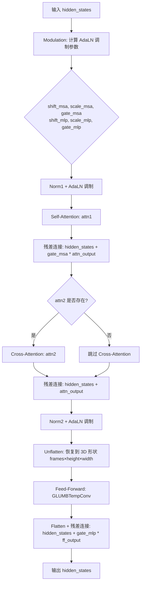

#### 带注释源码

```python
def forward(
    self,
    hidden_states: torch.Tensor,
    attention_mask: torch.Tensor | None = None,
    encoder_hidden_states: torch.Tensor | None = None,
    encoder_attention_mask: torch.Tensor | None = None,
    timestep: torch.LongTensor | None = None,
    frames: int = None,
    height: int = None,
    width: int = None,
    rotary_emb: torch.Tensor | None = None,
) -> torch.Tensor:
    """
    SanaVideoTransformerBlock 的前向传播方法
    
    处理流程:
    1. Modulation: 使用 timestep 生成 AdaLN 调制参数 (shift/scale/gate)
    2. Self-Attention: 自注意力 + 门控残差连接
    3. Cross-Attention: 跨注意力 (可选) + 残差连接
    4. Feed-Forward: GLUMBConv 前馈网络 + 门控残差连接
    
    参数:
        hidden_states: 输入张量 [batch, seq_len, dim]
        attention_mask: 注意力掩码
        encoder_hidden_states: 编码器隐藏状态
        encoder_attention_mask: 编码器注意力掩码
        timestep: 时间步长 [batch, 6, dim]
        frames: patch 化后的帧数
        height: patch 化后的高度
        width: patch 化后的宽度
        rotary_emb: 旋转位置编码
    
    返回:
        处理后的隐藏状态张量
    """
    batch_size = hidden_states.shape[0]

    # ==================== 1. Modulation ====================
    # 从 timestep 中解耦出 6 个调制参数
    # shift_msa/scale_msa/gate_msa: 用于自注意力分支
    # shift_mlp/scale_mlp/gate_mlp: 用于前馈网络分支
    # 使用 scale_shift_table [6, dim] + timestep [batch, 6, dim] 动态生成
    shift_msa, scale_msa, gate_msa, shift_mlp, scale_mlp, gate_mlp = (
        self.scale_shift_table[None, None] + timestep.reshape(batch_size, timestep.shape[1], 6, -1)
    ).unbind(dim=2)

    # ==================== 2. Self Attention ====================
    # LayerNorm + AdaLN 调制
    norm_hidden_states = self.norm1(hidden_states)
    norm_hidden_states = norm_hidden_states * (1 + scale_msa) + shift_msa
    # 转换为与输入相同的数据类型
    norm_hidden_states = norm_hidden_states.to(hidden_states.dtype)

    # 执行自注意力，使用 rotary_emb 进行位置编码增强
    attn_output = self.attn1(norm_hidden_states, rotary_emb=rotary_emb)
    # 门控残差连接: hidden_states = hidden_states + gate_msa * attn_output
    hidden_states = hidden_states + gate_msa * attn_output

    # ==================== 3. Cross Attention ====================
    # 如果配置了交叉注意力层，则执行 cross-attention
    if self.attn2 is not None:
        attn_output = self.attn2(
            hidden_states,
            encoder_hidden_states=encoder_hidden_states,
            attention_mask=encoder_attention_mask,
        )
        # 残差连接
        hidden_states = attn_output + hidden_states

    # ==================== 4. Feed-forward ====================
    # 对 hidden_states 进行 LayerNorm + AdaLN 调制
    norm_hidden_states = self.norm2(hidden_states)
    norm_hidden_states = norm_hidden_states * (1 + scale_mlp) + shift_mlp

    # 将 1D 序列展开为 3D 时空张量 [batch, frames, height, width, dim]
    # 以便 GLUMBTempConv 执行时序卷积
    norm_hidden_states = norm_hidden_states.unflatten(1, (frames, height, width))
    
    # 前馈网络 (GLUMBTempConv: 包含 depth-wise 和 temporal 卷积)
    ff_output = self.ff(norm_hidden_states)
    
    # 恢复为 1D 序列形状
    ff_output = ff_output.flatten(1, 3)
    
    # 门控残差连接
    hidden_states = hidden_states + gate_mlp * ff_output

    return hidden_states
```


### `SanaVideoTransformer3DModel.__init__`

这是 Sana-Video 3D Transformer 模型的初始化方法，负责构建整个模型架构，包括输入patch嵌入、位置编码、时间/条件嵌入、Transformer块堆栈和输出投影层。

参数：

- `in_channels`：`int`，默认值 `16`，输入数据的通道数
- `out_channels`：`int | None`，默认值 `16`，输出数据的通道数，若为 None 则等同于 in_channels
- `num_attention_heads`：`int`，默认值 `20`，多头注意力机制中的注意力头数量
- `attention_head_dim`：`int`，默认值 `112`，每个注意力头的维度
- `num_layers`：`int`，默认值 `20`，Transformer 块堆叠的层数
- `num_cross_attention_heads`：`int | None`，默认值 `20`，交叉注意力中的头数量
- `cross_attention_head_dim`：`int | None`，默认值 `112`，交叉注意力头的维度
- `cross_attention_dim`：`int | None`，默认值 `2240`，交叉注意力的维度
- `caption_channels`：`int`，默认值 `2304`，文本嵌入的通道数
- `mlp_ratio`：`float`，默认值 `2.5`，GLUMBConv 层中的扩展比率
- `dropout`：`float`，默认值 `0.0`，Dropout 概率
- `attention_bias`：`bool`，默认值 `False`，注意力层是否使用偏置
- `sample_size`：`int`，默认值 `30`，输入潜在变量的基础尺寸
- `patch_size`：`tuple[int, int, int]`，默认值 `(1, 2, 2)`，用于 patch 嵌入的时空 patch 大小
- `norm_elementwise_affine`：`bool`，默认值 `False`，归一化层是否使用元素级仿射
- `norm_eps`：`float`，默认值 `1e-6`，归一化层的 epsilon 值
- `interpolation_scale`：`int | None`，默认值 `None`，插值缩放因子
- `guidance_embeds`：`bool`，默认值 `False`，是否启用引导嵌入
- `guidance_embeds_scale`：`float`，默认值 `0.1`，引导嵌入的缩放因子
- `qk_norm`：`str | None`，默认值 `"rms_norm_across_heads"`，Query 和 Key 的归一化方式
- `rope_max_seq_len`：`int`，默认值 `1024`，旋转位置编码的最大序列长度

返回值：`None`，该方法为构造函数，不返回任何值

#### 流程图

```mermaid
flowchart TD
    A[开始 __init__] --> B[调用父类 super().__init__]
    B --> C{out_channels 是否为 None?}
    C -->|是| D[out_channels = in_channels]
    C -->|否| E[保持 out_channels 不变]
    D --> F[计算 inner_dim = num_attention_heads * attention_head_dim]
    E --> F
    F --> G[创建 WanRotaryPosEmbed 旋转位置编码]
    G --> H[创建 nn.Conv3d patch_embedding]
    H --> I{guidance_embeds 为真?}
    I -->|是| J[创建 SanaCombinedTimestepGuidanceEmbeddings]
    I -->|否| K[创建 AdaLayerNormSingle]
    J --> L
    K --> L[L: 创建 caption_projection 和 caption_norm]
    L --> M[创建 nn.ModuleList 包含 num_layers 个 SanaVideoTransformerBlock]
    M --> N[创建 scale_shift_table, norm_out, proj_out 输出层]
    N --> O[设置 gradient_checkpointing = False]
    O --> P[结束 __init__]
```

#### 带注释源码

```python
@register_to_config  # 装饰器：将所有参数注册到配置中，支持从配置创建模型
def __init__(
    self,
    in_channels: int = 16,  # 输入通道数，默认16
    out_channels: int | None = 16,  # 输出通道数，可选，默认等于输入
    num_attention_heads: int = 20,  # 注意力头数
    attention_head_dim: int = 112,  # 每个头的维度
    num_layers: int = 20,  # Transformer块数量
    num_cross_attention_heads: int | None = 20,  # 交叉注意力头数
    cross_attention_head_dim: int | None = 112,  # 交叉注意力头维度
    cross_attention_dim: int | None = 2240,  # 交叉注意力维度
    caption_channels: int = 2304,  # 文本caption嵌入通道数
    mlp_ratio: float = 2.5,  # MLP扩展比率
    dropout: float = 0.0,  # Dropout概率
    attention_bias: bool = False,  # 注意力层是否使用偏置
    sample_size: int = 30,  # 输入基础尺寸
    patch_size: tuple[int, int, int] = (1, 2, 2),  # 时空patch大小
    norm_elementwise_affine: bool = False,  # 归一化是否使用仿射
    norm_eps: float = 1e-6,  # 归一化epsilon
    interpolation_scale: int | None = None,  # 插值缩放
    guidance_embeds: bool = False,  # 是否启用guidance嵌入
    guidance_embeds_scale: float = 0.1,  # guidance嵌入缩放
    qk_norm: str | None = "rms_norm_across_heads",  # QK归一化类型
    rope_max_seq_len: int = 1024,  # RoPE最大序列长度
) -> None:
    super().__init__()  # 调用父类初始化

    out_channels = out_channels or in_channels  # 确保有输出通道数
    inner_dim = num_attention_heads * attention_head_dim  # 计算内部维度

    # 1. Patch & position embedding
    self.rope = WanRotaryPosEmbed(attention_head_dim, patch_size, rope_max_seq_len)  # 旋转位置编码
    self.patch_embedding = nn.Conv3d(in_channels, inner_dim, kernel_size=patch_size, stride=patch_size)  # 3D卷积进行patch嵌入

    # 2. Additional condition embeddings
    if guidance_embeds:  # 如果启用guidance条件
        self.time_embed = SanaCombinedTimestepGuidanceEmbeddings(inner_dim)  # 联合时间+guidance嵌入
    else:
        self.time_embed = AdaLayerNormSingle(inner_dim)  # 单独的时间嵌入

    self.caption_projection = PixArtAlphaTextProjection(in_features=caption_channels, hidden_size=inner_dim)  # 文本投影层
    self.caption_norm = RMSNorm(inner_dim, eps=1e-5, elementwise_affine=True)  # 文本归一化

    # 3. Transformer blocks
    self.transformer_blocks = nn.ModuleList(  # 模块列表，包含多个Transformer块
        [
            SanaVideoTransformerBlock(
                inner_dim,
                num_attention_heads,
                attention_head_dim,
                dropout=dropout,
                num_cross_attention_heads=num_cross_attention_heads,
                cross_attention_head_dim=cross_attention_head_dim,
                cross_attention_dim=cross_attention_dim,
                attention_bias=attention_bias,
                norm_elementwise_affine=norm_elementwise_affine,
                norm_eps=norm_eps,
                mlp_ratio=mlp_ratio,
                qk_norm=qk_norm,
            )
            for _ in range(num_layers)  # 循环创建num_layers个块
        ]
    )

    # 4. Output blocks
    self.scale_shift_table = nn.Parameter(torch.randn(2, inner_dim) / inner_dim**0.5)  # 输出缩放/偏移参数
    self.norm_out = SanaModulatedNorm(inner_dim, elementwise_affine=False, eps=1e-6)  # 输出调制归一化
    self.proj_out = nn.Linear(inner_dim, math.prod(patch_size) * out_channels)  # 输出投影，将hidden_dim映射回patch空间

    self.gradient_checkpointing = False  # 梯度检查点标志，默认关闭
```


### `SanaVideoTransformer3DModel.forward`

这是 SanaVideoTransformer3DModel 类的前向传播方法，负责执行 3D 视频变换器的完整推理流程，包括输入补丁化、时间步和引导嵌入、Transformer 块堆叠处理、输出归一化和解补丁化，最终生成视频帧的潜在表示。

参数：

- `hidden_states`：`torch.Tensor`，输入的隐藏状态，形状为 (batch_size, num_channels, num_frames, height, width)，代表视频帧的潜在表示
- `encoder_hidden_states`：`torch.Tensor`，编码器的隐藏状态，通常来自文本编码器的输出，用于提供文本条件信息
- `timestep`：`torch.Tensor`，时间步张量，用于调度扩散过程的时间嵌入
- `guidance`：`torch.Tensor | None`，引导向量，用于分类器无关引导（classifier-free guidance），默认为 None
- `encoder_attention_mask`：`torch.Tensor | None`，编码器的注意力掩码，用于控制文本令牌之间的注意力，默认为 None
- `attention_mask`：`torch.Tensor | None`，注意力掩码，用于控制视频令牌之间的注意力，默认为 None
- `attention_kwargs`：`dict[str, Any] | None`，注意力模块的可选参数字典，可用于 LoRA 等机制，默认为 None
- `controlnet_block_samples`：`tuple[torch.Tensor] | None`，来自 ControlNet 的中间块采样，用于增强生成控制，默认为 None
- `return_dict`：`bool`，是否返回 Transformer2DModelOutput 对象而不是元组，默认为 True

返回值：`tuple[torch.Tensor, ...] | Transformer2DModelOutput`，当 return_dict 为 True 时返回包含输出样本的 Transformer2DModelOutput 对象，否则返回元组

#### 流程图

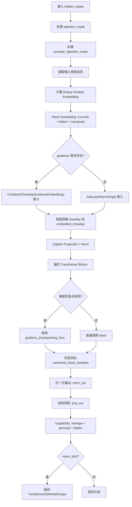

#### 带注释源码

```python
@apply_lora_scale("attention_kwargs")
def forward(
    self,
    hidden_states: torch.Tensor,
    encoder_hidden_states: torch.Tensor,
    timestep: torch.Tensor,
    guidance: torch.Tensor | None = None,
    encoder_attention_mask: torch.Tensor | None = None,
    attention_mask: torch.Tensor | None = None,
    attention_kwargs: dict[str, Any] | None = None,
    controlnet_block_samples: tuple[torch.Tensor] | None = None,
    return_dict: bool = True,
) -> tuple[torch.Tensor, ...] | Transformer2DModelOutput:
    # 确保 attention_mask 是一个偏置，并添加一个单例 query_tokens 维度
    # 如果我们是通过 UNet2DConditionModel#forward 过来的，可能已经做了这个转换
    # 可以通过维度数来判断：如果 ndim == 2，说明是 mask 而不是 bias
    # 期望 mask 形状: [batch, key_tokens]
    # 添加单例 query_tokens 维度: [batch, 1, key_tokens]
    # 这有助于将 mask 作为偏置广播到注意力分数，形状可能是:
    #   [batch, heads, query_tokens, key_tokens] (例如 torch sdp attn)
    #   [batch * heads, query_tokens, key_tokens] (例如 xformers 或经典 attn)
    if attention_mask is not None and attention_mask.ndim == 2:
        # 假设 mask 表示为:
        #   (1 = keep,      0 = discard)
        # 将 mask 转换为可以添加到注意力分数的偏置:
        #       (keep = +0,     discard = -10000.0)
        attention_mask = (1 - attention_mask.to(hidden_states.dtype)) * -10000.0
        attention_mask = attention_mask.unsqueeze(1)

    # 同样方式将 encoder_attention_mask 转换为偏置
    if encoder_attention_mask is not None and encoder_attention_mask.ndim == 2:
        encoder_attention_mask = (1 - encoder_attention_mask.to(hidden_states.dtype)) * -10000.0
        encoder_attention_mask = encoder_attention_mask.unsqueeze(1)

    # 1. 输入处理
    batch_size, num_channels, num_frames, height, width = hidden_states.shape
    p_t, p_h, p_w = self.config.patch_size  # 获取补丁大小
    # 计算补丁化后的帧数、高度和宽度
    post_patch_num_frames = num_frames // p_t
    post_patch_height = height // p_h
    post_patch_width = width // p_w

    # 计算旋转位置嵌入 (Rotary Position Embedding)
    rotary_emb = self.rope(hidden_states)

    # Patch Embedding: 使用 3D 卷积进行补丁化，然后 flatten 和 transpose
    hidden_states = self.patch_embedding(hidden_states)
    hidden_states = hidden_states.flatten(2).transpose(1, 2)

    # 时间步嵌入：根据是否有 guidance 选择不同的嵌入方式
    if guidance is not None:
        # 使用 CombinedTimestepGuidanceEmbeddings 处理时间和引导
        timestep, embedded_timestep = self.time_embed(
            timestep.flatten(), guidance=guidance, hidden_dtype=hidden_states.dtype
        )
    else:
        # 使用 AdaLayerNormSingle 处理时间
        timestep, embedded_timestep = self.time_embed(
            timestep.flatten(), batch_size=batch_size, hidden_dtype=hidden_states.dtype
        )

    # 调整 timestep 和 embedded_timestep 的视图以匹配 batch_size
    timestep = timestep.view(batch_size, -1, timestep.size(-1))
    embedded_timestep = embedded_timestep.view(batch_size, -1, embedded_timestep.size(-1))

    # 文本条件投影：使用 PixArtAlphaTextProjection 处理 caption
    encoder_hidden_states = self.caption_projection(encoder_hidden_states)
    encoder_hidden_states = encoder_hidden_states.view(batch_size, -1, hidden_states.shape[-1])

    # 对 encoder_hidden_states 进行归一化
    encoder_hidden_states = self.caption_norm(encoder_hidden_states)

    # 2. Transformer 块处理
    if torch.is_grad_enabled() and self.gradient_checkpointing:
        # 使用梯度检查点以节省显存
        for index_block, block in enumerate(self.transformer_blocks):
            hidden_states = self._gradient_checkpointing_func(
                block,
                hidden_states,
                attention_mask,
                encoder_hidden_states,
                encoder_attention_mask,
                timestep,
                post_patch_num_frames,
                post_patch_height,
                post_patch_width,
                rotary_emb,
            )
            # 如果有 ControlNet 块采样，则添加
            if controlnet_block_samples is not None and 0 < index_block <= len(controlnet_block_samples):
                hidden_states = hidden_states + controlnet_block_samples[index_block - 1]

    else:
        # 正常前向传播
        for index_block, block in enumerate(self.transformer_blocks):
            hidden_states = block(
                hidden_states,
                attention_mask,
                encoder_hidden_states,
                encoder_attention_mask,
                timestep,
                post_patch_num_frames,
                post_patch_height,
                post_patch_width,
                rotary_emb,
            )
            # 如果有 ControlNet 块采样，则添加
            if controlnet_block_samples is not None and 0 < index_block <= len(controlnet_block_samples):
                hidden_states = hidden_states + controlnet_block_samples[index_block - 1]

    # 3. 输出归一化
    hidden_states = self.norm_out(hidden_states, embedded_timestep, self.scale_shift_table)

    hidden_states = self.proj_out(hidden_states)

    # 5. Unpatchify: 将补丁化的表示转换回原始空间维度
    hidden_states = hidden_states.reshape(
        batch_size, post_patch_num_frames, post_patch_height, post_patch_width, p_t, p_h, p_w, -1
    )
    hidden_states = hidden_states.permute(0, 7, 1, 4, 2, 5, 3, 6)
    output = hidden_states.flatten(6, 7).flatten(4, 5).flatten(2, 3)

    if not return_dict:
        return (output,)

    return Transformer2DModelOutput(sample=output)
```

## 关键组件


### GLUMBTempConv

门控线性单元（GLU）驱动的时序卷积模块，用于SanaVideoTransformerBlock的前馈网络，支持残差连接和可选的RMS归一化。

### SanaLinearAttnProcessor3_0

线性注意力处理器，实现缩放点积线性注意力机制（Linear Attention），通过ReLU激活和矩阵乘法替代softmax计算注意力权重，提高长序列处理效率。

### WanRotaryPosEmbed

3D旋转位置嵌入模块，为视频时序（t）、高度（h）、宽度（w）三个维度分别生成旋转位置编码，支持不同维度的高效计算。

### SanaModulatedNorm

自适应调制归一化层，结合时间步嵌入生成的缩放（scale）和偏移（shift）参数对隐藏状态进行变换。

### SanaCombinedTimestepGuidanceEmbeddings

联合时间步与引导条件嵌入模块，将时间步和引导向量分别投影后相加，再通过SiLU激活和线性变换生成六个调制参数（shift_msa、scale_msa、gate_msa、shift_mlp、scale_mlp、gate_mlp）。

### SanaAttnProcessor2_0

标准PyTorch 2.0缩放点积注意力处理器，支持通过dispatch_attention_fn调度不同后端（SDPA/xFormers）的注意力实现。

### SanaVideoTransformerBlock

Sana-Video Transformer块，包含自注意力、交叉注意力和GLUMBTempConv前馈网络，支持时间步调制和残差连接。

### SanaVideoTransformer3DModel

主模型类，实现3D视频变换器架构，支持Patch嵌入、RoPE位置编码、条件注入、梯度检查点、ControlNet集成等功能。

### 梯度检查点（Gradient Checkpointing）

通过`_gradient_checkpointing_func`实现训练时内存优化，以计算时间换取显存空间。

### ControlNet支持

通过`controlnet_block_samples`参数在Transformer块中间插入额外特征，实现条件生成控制。


## 问题及建议


### 已知问题

-   **嵌套函数重复定义**：在 `SanaLinearAttnProcessor3_0` 的 `__call__` 方法中定义了嵌套函数 `apply_rotary_emb`，每次前向传播都会重新创建该函数对象，造成不必要的开销。
-   **过多张量重塑操作**：代码中大量使用 `view`、`permute`、`unflatten` 等张量操作（如 `GLUMBTempConv.forward` 中），这些操作可能产生内存拷贝而非视图，降低内存效率。
-   **冗长的前向方法**：`SanaVideoTransformer3DModel.forward` 方法超过 100 行，包含多个重复的注意力掩码处理逻辑，违反单一职责原则，可读性和可维护性差。
-   **未使用的参数**：`SanaCombinedTimestepGuidanceEmbeddings.forward` 中 `guidance` 参数可能为 `None`，但调用方需确保传入有效值，缺少显式的参数校验。
-   **硬编码的数值**：多处使用魔法数字如 `-10000.0`（注意力掩码填充值）、`1e-15`（数值稳定性 epsilon），缺乏常量统一管理。
-   **未完成的功能**：`forward` 方法中 `controlnet_block_samples` 参数被使用但未在类定义中说明其完整用途，可能为半成品代码。
-   **参数过多**：`SanaVideoTransformerBlock.forward` 方法接收 13 个参数，过多的参数会增加调用复杂度，易导致错误。
-   **RMSNorm 条件分支**：`GLUMBTempConv` 中 `norm_type == "rms_norm"` 的条件判断在每次前向传播时执行，增加了不必要的分支开销。

### 优化建议

-   **提取嵌套函数**：将 `apply_rotary_emb` 提升为模块级函数或类方法，避免重复创建。
-   **合并注意力掩码处理逻辑**：提取 `attention_mask` 和 `encoder_attention_mask` 的转换代码为独立方法，减少重复。
-   **优化张量操作**：使用 `reshape` 替代部分 `view`，或考虑使用 `einsum` 表达复杂张量变换，减少中间张量生成。
-   **参数校验**：在 `SanaCombinedTimestepGuidanceEmbeddings.forward` 开头添加 `guidance` 参数的 `None` 检查，提供默认值或抛出明确异常。
-   **提取常量**：将魔法数字提取为类或模块级常量（如 `ATTN_MASK_FILL_VALUE = -10000.0`），提高可维护性。
-   **重构前向方法**：将 `SanaVideoTransformer3DModel.forward` 拆分为多个私有方法（如 `_prepare_hidden_states`、`_apply_transformer_blocks`），每个方法负责单一职责。
-   **文档完善**：为 `controlnet_block_samples` 参数添加文档说明，或移除未完全实现的代码路径。

## 其它


### 设计目标与约束

该代码实现了一个用于视频生成的3D Transformer模型（Sana-Video），核心目标是将输入的latent视频表示转换为高质量的视频输出。设计约束包括：1) 支持视频时序建模，需处理(num_channels, num_frames, height, width)四维输入；2) 需支持cross-attention机制以融合文本编码器信息；3) 采用线性注意力机制降低计算复杂度；4) 需支持AdaLN调制和QK-Norm等技术提升训练稳定性。

### 错误处理与异常设计

代码中的错误处理主要通过以下方式实现：1) 在SanaAttnProcessor2_0的__init__方法中检查PyTorch版本，若不支持scaled_dot_product_attention则抛出ImportError；2) forward方法中对attention_mask和encoder_attention_mask进行维度检查，若ndim==2则转换为bias形式；3) 梯度检查点（gradient_checkpointing）启用时使用torch.is_grad_enabled()进行条件判断；4) 未显式处理的情况包括：patch_size无法整除输入尺寸、encoder_hidden_states与hidden_states批次不匹配、timestep维度不符合预期等。

### 数据流与状态机

数据流如下：输入hidden_states (B, C, T, H, W) -> patch_embedding转换为 (B, inner_dim, T', H', W') -> flatten并transpose为 (B, T'*H'*W', inner_dim) -> 通过N层SanaVideoTransformerBlock -> norm_out和proj_out进行输出调制 -> unpatchify还原为 (B, C_out, T, H, W)。每层Transformer Block内部状态流转：输入hidden_states -> AdaLN调制 -> Self-Attention -> Cross-Attention（可选）-> FFN -> 残差输出。关键状态变量包括：timestep嵌入、guidance嵌入（可选）、rotary_emb位置编码、attention_mask。

### 外部依赖与接口契约

主要外部依赖包括：1) torch.nn和torch.nn.functional提供基础算子；2) configuration_utils.ConfigMixin和register_to_config装饰器用于配置管理；3) loaders.FromOriginalModelMixin和PeftAdapterMixin用于模型加载；4) attention模块的Attention类、AttentionMixin；5) embeddings模块的TimestepEmbedding、Timesteps、PixArtAlphaTextProjection；6) normalization模块的RMSNorm、AdaLayerNormSingle；7) modeling_utils的ModelMixin基类。接口契约方面：forward方法接受hidden_states、encoder_hidden_states、timestep、guidance、attention_mask等参数，返回Transformer2DModelOutput或tuple；SanaVideoTransformerBlock的forward方法还额外接收frames、height、width、rotary_emb参数。

### 配置参数说明

该模型包含丰富的配置参数：in_channels/out_channels控制输入输出通道数；num_attention_heads和attention_head_dim决定注意力头数和维度；num_layers设置Transformer Block数量；cross_attention_dim配置跨注意力维度；patch_size指定时空patch划分；qk_norm选择查询键归一化方式（支持"rms_norm_across_heads"）；mlp_ratio控制FFN扩展比例；guidance_embeds控制是否启用CFG引导；rope_max_seq_len设置旋转位置编码最大序列长度。这些参数通过@register_to_config装饰器注册，支持从配置文件加载。

### 内存与计算优化

代码包含多项优化策略：1) 梯度检查点技术（gradient_checkpointing）通过checkpointing_func实现，以计算换内存；2) 线性注意力（SanaLinearAttnProcessor3_0）使用relu激活+矩阵乘法替代标准softmax注意力，降低复杂度；3) 使用torch.chunk进行门控分支；4) RMSNorm相比LayerNorm更节省内存；5) WanRotaryPosEmbed预计算cos/sin频率并注册为buffer避免重复计算。潜在优化空间：可进一步支持torch.compile、FlashAttention后端集成、 activations recomputation策略细化。

### 版本兼容性与扩展性

代码设计考虑了多版本兼容性：1) SanaAttnProcessor2_0显式检查PyTorch 2.0特性；2) dispatch_attention_fn支持可插拔的attention backend；3) _attention_backend和_parallel_config类变量允许运行时配置；4) 继承自ModelMixin、ConfigMixin、PeftAdapterMixin、FromOriginalModelMixin等多个Mixin类，支持LoRA微调、PEFT适配、从原始模型加载等扩展功能。扩展方向：可新增支持视频流式生成、更多注意力机制变体、层级可学习的动态调整等。

### 单元测试与验证要点

关键测试场景包括：1) patch_size与输入尺寸不匹配时的错误处理；2) guidance_embeds开关对time_embed模块的影响；3) gradient_checkpointing开启/关闭的梯度计算正确性；4) qk_norm不同取值对注意力输出分布的影响；5) rotary_emb维度与attention_head_dim的匹配性；6) 多层Transformer Block堆叠时的数值稳定性；7) 控制网络（ControlNet）block_samples的残差连接正确性。建议使用pytest框架，针对各模块编写单元测试并集成CI/CD流程。


    