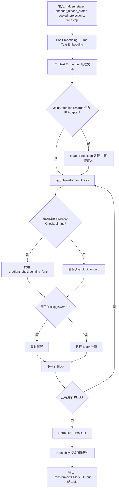
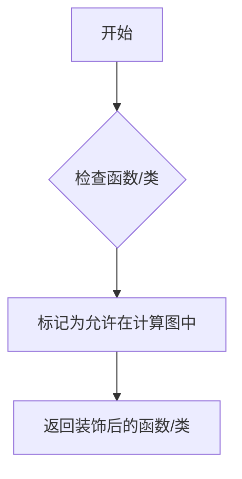
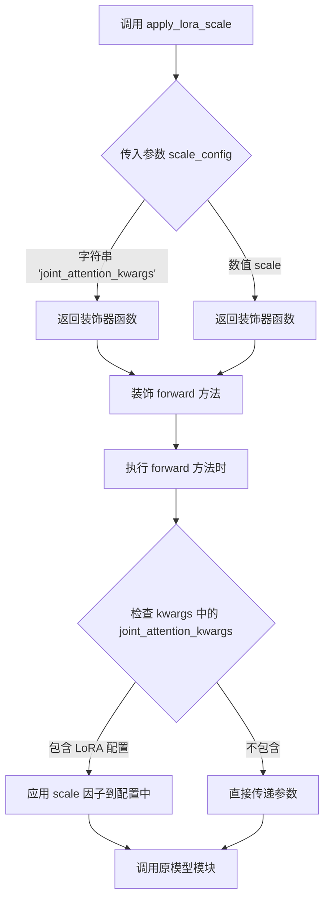
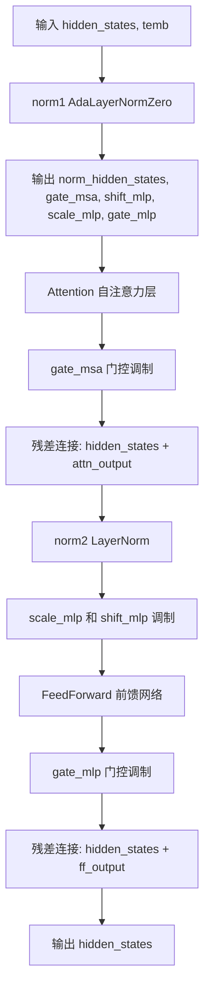
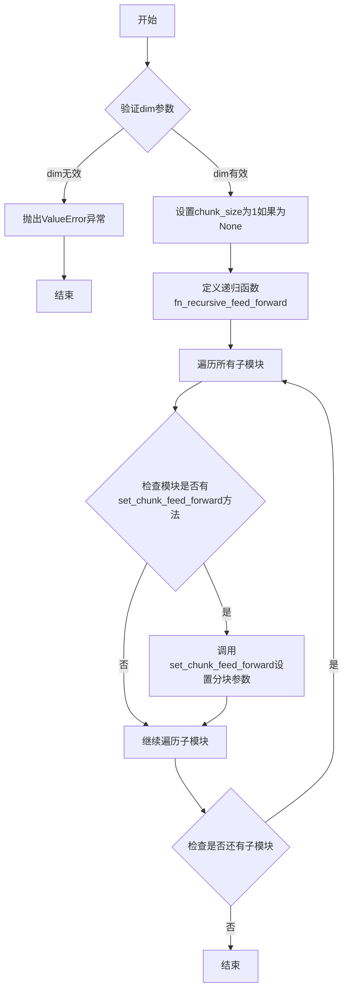
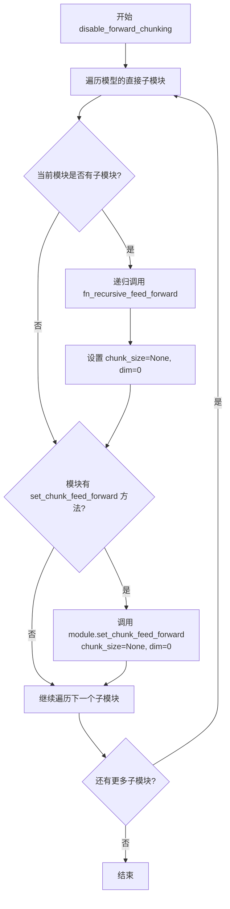
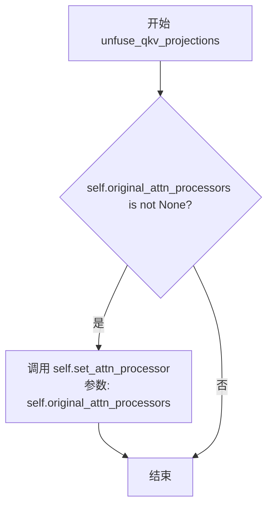
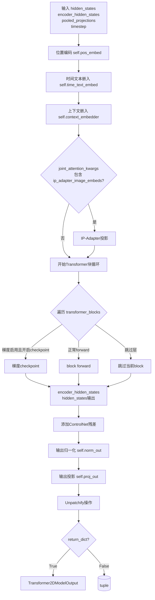

# `diffusers\src\diffusers\models\transformers\transformer_sd3.py` 详细设计文档

SD3Transformer2DModel 是一个基于 Transformer 的 2D 图像生成模型，应用于 Stable Diffusion 3 扩散系统。它接受潜空间张量、文本嵌入和时间步作为输入，通过多层 JointTransformerBlock 进行去噪处理，最终输出与输入尺寸相同的图像潜空间表示。

## 整体流程



## 类结构

```
SD3SingleTransformerBlock (单个Transformer块)
SD3Transformer2DModel (主模型类)
├── 继承自: ModelMixin, AttentionMixin, ConfigMixin, PeftAdapterMixin, FromOriginalModelMixin, SD3Transformer2DLoadersMixin
└── 包含组件:
    ├── pos_embed (PatchEmbed)
    ├── time_text_embed (CombinedTimestepTextProjEmbeddings)
    ├── context_embedder (nn.Linear)
    ├── transformer_blocks (nn.ModuleList of JointTransformerBlock)
    ├── norm_out (AdaLayerNormContinuous)
    └── proj_out (nn.Linear)
```

## 全局变量及字段


### `logger`
    
模块级日志记录器，用于输出日志信息

类型：`logging.Logger`
    


### `_supports_gradient_checkpointing`
    
类属性，指示该模型支持梯度检查点优化

类型：`bool`
    


### `_no_split_modules`
    
类属性，指定不分模块进行分割的模块名列表

类型：`list[str]`
    


### `_skip_layerwise_casting_patterns`
    
类属性，跳过逐层类型转换的模式列表

类型：`list[str]`
    


### `SD3SingleTransformerBlock.norm1`
    
第一个归一化层，用于注意力机制

类型：`AdaLayerNormZero`
    


### `SD3SingleTransformerBlock.attn`
    
注意力模块

类型：`Attention`
    


### `SD3SingleTransformerBlock.norm2`
    
第二个归一化层

类型：`nn.LayerNorm`
    


### `SD3SingleTransformerBlock.ff`
    
前馈网络

类型：`FeedForward`
    


### `SD3Transformer2DModel.out_channels`
    
输出通道数

类型：`int`
    


### `SD3Transformer2DModel.inner_dim`
    
内部维度 (num_attention_heads * attention_head_dim)

类型：`int`
    


### `SD3Transformer2DModel.pos_embed`
    
位置嵌入层

类型：`PatchEmbed`
    


### `SD3Transformer2DModel.time_text_embed`
    
时间和文本嵌入组合

类型：`CombinedTimestepTextProjEmbeddings`
    


### `SD3Transformer2DModel.context_embedder`
    
上下文嵌入器

类型：`nn.Linear`
    


### `SD3Transformer2DModel.transformer_blocks`
    
Transformer块列表

类型：`nn.ModuleList`
    


### `SD3Transformer2DModel.norm_out`
    
输出归一化层

类型：`AdaLayerNormContinuous`
    


### `SD3Transformer2DModel.proj_out`
    
输出投影层

类型：`nn.Linear`
    


### `SD3Transformer2DModel.gradient_checkpointing`
    
梯度检查点标志

类型：`bool`
    
    

## 全局函数及方法


### `maybe_allow_in_graph`

该函数是一个装饰器，用于允许特定模块（类或函数）在 PyTorch 的计算图中使用。在分布式训练、梯度checkpointing等场景下，某些自定义模块可能默认不被包含在计算图中，使用此装饰器可以确保模块被正确追踪。

参数：

- `fn`：`Callable`，被装饰的函数或类

返回值：`Callable`，装饰后的函数或类

#### 流程图



#### 带注释源码

```python
# 从 diffusers.utils.torch_utils 导入
# 这是一个装饰器，用于标记某个类或函数可以参与 PyTorch 的计算图
# 使用方式：@maybe_allow_in_graph
# 适用场景：在使用 torch.utils.checkpoint 或分布式训练时，确保自定义模块被正确追踪

from ...utils.torch_utils import maybe_allow_in_graph

# 使用示例：将 SD3SingleTransformerBlock 标记为允许在计算图中
@maybe_allow_in_graph
class SD3SingleTransformerBlock(nn.Module):
    """
    Stable Diffusion 3 的单个 Transformer 块
    """
    def __init__(
        self,
        dim: int,
        num_attention_heads: int,
        attention_head_dim: int,
    ):
        # 初始化代码...
        pass
    
    def forward(self, hidden_states: torch.Tensor, temb: torch.Tensor):
        # 前向传播代码...
        pass
```

> **注**：由于 `maybe_allow_in_graph` 的完整实现在外部模块中，以上信息基于其在代码中的使用方式和 PyTorch 通用模式推断。具体实现细节请参考 `diffusers/src/diffusers/utils/torch_utils.py` 源文件。


### `apply_lora_scale`

这是一个装饰器（装饰器工厂），用于在模型的前向传播（Forward Pass）中自动应用 LoRA（Low-Rank Adaptation）的缩放因子。它通过拦截 `forward` 方法的调用，修改传入的 `joint_attention_kwargs` 参数，从而实现在推理或训练时动态控制 LoRA 权重的影响。在 `SD3Transformer2DModel` 中，它被用于确保注意力模块能正确接收和应用 LoRA 相关的配置。

参数：

-  `scale_config`：此为装饰器工厂接收的参数。在代码示例 `@apply_lora_scale("joint_attention_kwargs")` 中，它接收了一个字符串 `"joint_attention_kwargs"`，用于指定要修改的参数字典键。实际应用中通常接收 `float` 类型的缩放系数。

返回值：返回一个装饰器函数（`Decorator`），该函数接收被装饰的 `forward` 方法，并返回一个新的包装函数（`Wrapper`），用于在调用原函数前注入 LoRA 缩放逻辑。

#### 流程图



#### 带注释源码

由于 `apply_lora_scale` 是从 `diffusers` 库工具集（`...utils`）导入的外部函数，其具体实现源码位于库内部。以下是基于其使用方式和逻辑功能的模拟实现，用于说明其核心机制：

```python
from typing import Any, Callable, Dict, Union

def apply_lora_scale(scale_config: Union[str, float] = "joint_attention_kwargs") -> Callable:
    """
    装饰器工厂，用于在模型前向传播时应用 LoRA 缩放。
    
    参数:
        scale_config (str or float): 
            如果是字符串（如 "joint_attention_kwargs"），则指定要修改的参数字典的键；
            如果是数值，则表示直接的缩放因子。
    """
    def decorator(func: Callable) -> Callable:
        def wrapper(self, *args, **kwargs):
            # 1. 获取目标参数字典（默认为 joint_attention_kwargs）
            target_key = scale_config if isinstance(scale_config, str) else None
            
            if target_key and target_key in kwargs:
                # 2. 获取传入的参数字典
                target_kwargs = kwargs[target_key]
                
                if isinstance(target_kwargs, dict):
                    # 3. 注入或覆盖 LoRA 缩放因子
                    # 注意：实际实现中会检查是否已存在 scale 或从配置中读取
                    # 这里模拟了注入逻辑
                    # target_kwargs['scale'] = target_kwargs.get('scale', 1.0)
                    pass
                    
            # 4. 调用原始 forward 方法
            return func(self, *args, **kwargs)
            
        return wrapper
    return decorator
```


### `SD3SingleTransformerBlock.forward`

该方法实现了Stable Diffusion 3中单个Transformer块的前向传播，通过AdaLayerNormZero进行自适应归一化并注入时间步信息，接着依次执行自注意力机制和前馈网络（包含门控调制），最终输出经过两个子层残差连接增强后的隐藏状态。

参数：

- `self`：SD3SingleTransformerBlock实例本身
- `hidden_states`：`torch.Tensor`，输入的隐藏状态张量，通常是经patch嵌入后的token序列
- `temb`：`torch.Tensor`，时间步嵌入（timestep embedding），用于自适应归一化的条件输入

返回值：`torch.Tensor`，经过单个Transformer块处理后的隐藏状态张量

#### 流程图



#### 带注释源码

```python
def forward(self, hidden_states: torch.Tensor, temb: torch.Tensor):
    """
    执行单个Transformer块的前向传播
    
    Args:
        hidden_states: 输入的隐藏状态张量
        temb: 时间步嵌入，用于条件自适应归一化
    
    Returns:
        处理后的隐藏状态张量
    """
    # ========== 1. Attention 阶段 ==========
    # AdaLayerNormZero: 自适应层归一化零初始化
    # 输入: hidden_states 和时间步嵌入 temb
    # 输出: 归一化后的隐藏状态 + 5个调制参数
    norm_hidden_states, gate_msa, shift_mlp, scale_mlp, gate_mlp = self.norm1(hidden_states, emb=temb)
    
    # 自注意力计算
    # encoder_hidden_states=None 表示仅执行自注意力（无交叉注意力）
    attn_output = self.attn(hidden_states=norm_hidden_states, encoder_hidden_states=None)
    
    # MSA门控: 通过gate_msa控制注意力输出的贡献程度
    # unsqueeze(1) 将gate_msa从[batch]扩展为[batch, 1]以匹配注意力输出的维度
    attn_output = gate_msa.unsqueeze(1) * attn_output
    
    # 残差连接: 将注意力输出加回到主路径
    hidden_states = hidden_states + attn_output

    # ========== 2. Feed Forward 阶段 ==========
    # 标准LayerNorm（无条件）
    norm_hidden_states = self.norm2(hidden_states)
    
    # MLP门控调制: 通过scale_mlp和shift_mlp调整归一化后的特征
    # (1 + scale_mlp) 实现自适应缩放，shift_mlp 实现自适应平移
    norm_hidden_states = norm_hidden_states * (1 + scale_mlp.unsqueeze(1)) + shift_mlp.unsqueeze(1)
    
    # 前馈网络: GELU激活函数
    ff_output = self.ff(norm_hidden_states)
    
    # MLP门控: 通过gate_mlp控制前馈输出的贡献程度
    ff_output = gate_mlp.unsqueeze(1) * ff_output
    
    # 残差连接: 将前馈输出加回到主路径
    hidden_states = hidden_states + ff_output

    return hidden_states
```


### SD3Transformer2DModel.__init__

该方法是 `SD3Transformer2DModel` 类的构造函数，负责初始化 Stable Diffusion 3（SD3）变换器模型的核心组件，包括位置嵌入、时间文本嵌入、上下文嵌入器、多个变换器块以及输出投影层，并配置模型的各类超参数。

参数：

- `sample_size`：`int`，默认值 `128`，输入 latent 的宽度/height，用于学习位置嵌入
- `patch_size`：`int`，默认值 `2`，将输入数据分割成小 patch 的大小
- `in_channels`：`int`，默认值 `16`，输入的 latent 通道数
- `num_layers`：`int`，默认值 `18`，使用的变换器块层数
- `attention_head_dim`：`int`，默认值 `64`，每个头的通道数
- `num_attention_heads`：`int`，默认值 `18`，多头注意力使用的头数
- `joint_attention_dim`：`int`，默认值 `4096`，用于文本-图像联合注意力的嵌入维度
- `caption_projection_dim`：`int`，默认值 `1152`，caption 嵌入的投影维度
- `pooled_projection_dim`：`int`，默认值 `2048`，池化文本投影的嵌入维度
- `out_channels`：`int`，默认值 `16`，输出的 latent 通道数
- `pos_embed_max_size`：`int`，默认值 `96`，位置嵌入的最大 latent 高度/宽度
- `dual_attention_layers`：`tuple[int, ...]`，默认值 `()`，要使用的双流变换器块索引集合（SD3.0 为空元组，SD3.5 为 0-12）
- `qk_norm`：`str | None`，默认值 `None`，注意力层中 query 和 key 使用的归一化方式

返回值：`None`，构造函数不返回值，仅初始化模型实例的内部状态

#### 流程图

```mermaid
flowchart TD
    A[开始 __init__] --> B[调用 super().__init__]
    B --> C[设置 self.out_channels 和 self.inner_dim]
    C --> D[创建 PatchEmbed 位置嵌入层]
    D --> E[创建 CombinedTimestepTextProjEmbeddings 时间文本嵌入层]
    E --> F[创建 nn.Linear 上下文嵌入器]
    F --> G[创建 nn.ModuleList JointTransformerBlock 列表]
    G --> H[创建 AdaLayerNormContinuous 输出归一化层]
    H --> I[创建 nn.Linear 输出投影层]
    I --> J[设置 self.gradient_checkpointing = False]
    J --> K[结束 __init__]
```

#### 带注释源码

```python
@register_to_config
def __init__(
    self,
    sample_size: int = 128,
    patch_size: int = 2,
    in_channels: int = 16,
    num_layers: int = 18,
    attention_head_dim: int = 64,
    num_attention_heads: int = 18,
    joint_attention_dim: int = 4096,
    caption_projection_dim: int = 1152,
    pooled_projection_dim: int = 2048,
    out_channels: int = 16,
    pos_embed_max_size: int = 96,
    dual_attention_layers: tuple[
        int, ...
    ] = (),  # () for sd3.0; (0, 1, 2, 3, 4, 5, 6, 7, 8, 9, 10, 11, 12) for sd3.5
    qk_norm: str | None = None,
):
    # 调用父类 ModelMixin 的初始化方法
    # ModelMixin 继承自 torch.nn.Module，提供模型加载/保存等基础功能
    super().__init__()
    
    # 设置输出通道数：如果 out_channels 为 None，则使用输入通道数
    # 这是为了确保模型在未明确指定输出通道时保持输入输出通道一致
    self.out_channels = out_channels if out_channels is not None else in_channels
    
    # 计算内部维度：注意力头数 × 每个头的维度
    # 这是变换器内部的特征维度
    self.inner_dim = num_attention_heads * attention_head_dim

    # 创建位置嵌入层 PatchEmbed
    # 将输入的 (batch, channel, height, width) 转换为 patch 序列
    # 并添加可学习的位置嵌入
    self.pos_embed = PatchEmbed(
        height=sample_size,
        width=sample_size,
        patch_size=patch_size,
        in_channels=in_channels,
        embed_dim=self.inner_dim,
        pos_embed_max_size=pos_embed_max_size,  # 硬编码配置
    )
    
    # 创建时间步和文本的组合嵌入层
    # 用于将时间步 timestep 和池化后的文本投影 pooled_projection 编码为条件向量
    self.time_text_embed = CombinedTimestepTextProjEmbeddings(
        embedding_dim=self.inner_dim, pooled_projection_dim=pooled_projection_dim
    )
    
    # 创建上下文嵌入器
    # 将联合注意力维度的文本嵌入投影到 caption 投影维度
    self.context_embedder = nn.Linear(joint_attention_dim, caption_projection_dim)

    # 创建变换器块列表
    # 遍历 num_layers 层，每层创建一个 JointTransformerBlock
    self.transformer_blocks = nn.ModuleList(
        [
            JointTransformerBlock(
                dim=self.inner_dim,
                num_attention_heads=num_attention_heads,
                attention_head_dim=attention_head_dim,
                # 最后一层为 context_pre_only，不进行自注意力
                context_pre_only=i == num_layers - 1,
                qk_norm=qk_norm,
                # 根据 dual_attention_layers 判断是否启用双注意力
                use_dual_attention=True if i in dual_attention_layers else False,
            )
            for i in range(num_layers)
        ]
    )

    # 创建输出归一化层
    # 使用 AdaLayerNormContinuous 进行自适应层归一化
    self.norm_out = AdaLayerNormContinuous(self.inner_dim, self.inner_dim, elementwise_affine=False, eps=1e-6)
    
    # 创建输出投影层
    # 将内部维度投影回 patch_size × patch_size × out_channels
    self.proj_out = nn.Linear(self.inner_dim, patch_size * patch_size * self.out_channels, bias=True)

    # 初始化梯度检查点标志
    # 用于在前向传播时节省显存，通过保存计算图而非中间激活值
    self.gradient_checkpointing = False
```


### `SD3Transformer2DModel.enable_forward_chunking`

该方法用于启用前向分块（feed forward chunking）功能，通过递归遍历模型的所有子模块，为支持分块的前馈层设置指定的分块大小和计算维度，以优化大型模型的内存使用和计算效率。

参数：

- `chunk_size`：`int | None`，可选参数，默认为None，表示前馈层的分块大小。如果不指定，则默认为1，即对每个张量单独进行前馈计算。
- `dim`：`int`，可选参数，默认为0，表示前馈计算应该分块的维度。必须设置为0（批次维度）或1（序列长度维度）。

返回值：`None`，该方法没有返回值。

#### 流程图



#### 带注释源码

```python
def enable_forward_chunking(self, chunk_size: int | None = None, dim: int = 0) -> None:
    """
    Sets the attention processor to use [feed forward
    chunking](https://huggingface.co/blog/reformer#2-chunked-feed-forward-layers).

    Parameters:
        chunk_size (`int`, *optional*):
            The chunk size of the feed-forward layers. If not specified, will run feed-forward layer individually
            over each tensor of dim=`dim`.
        dim (`int`, *optional*, defaults to `0`):
            The dimension over which the feed-forward computation should be chunked. Choose between dim=0 (batch)
            or dim=1 (sequence length).
    """
    # 验证dim参数是否有效，只接受0或1
    if dim not in [0, 1]:
        raise ValueError(f"Make sure to set `dim` to either 0 or 1, not {dim}")

    # 如果未指定chunk_size，默认为1，表示不对张量进行分块
    chunk_size = chunk_size or 1

    # 定义内部递归函数，用于遍历模型的所有子模块并设置分块参数
    def fn_recursive_feed_forward(module: torch.nn.Module, chunk_size: int, dim: int):
        # 如果模块具有set_chunk_feed_forward方法，则调用该方法设置分块参数
        if hasattr(module, "set_chunk_feed_forward"):
            module.set_chunk_feed_forward(chunk_size=chunk_size, dim=dim)

        # 递归遍历当前模块的所有子模块
        for child in module.children():
            fn_recursive_feed_forward(child, chunk_size, dim)

    # 遍历模型的顶层子模块，触发递归设置
    for module in self.children():
        fn_recursive_feed_forward(module, chunk_size, dim)
```


### `SD3Transformer2DModel.disable_forward_chunking`

该方法用于禁用前向分块（forward chunking）功能。它通过递归遍历模型的所有子模块，将支持分块前向计算的模块的 `chunk_size` 设置为 `None`，从而恢复到默认的非分块前向传播模式。

参数：无（仅包含隐式参数 `self`）

返回值：`None`，无返回值

#### 流程图



#### 带注释源码

```python
def disable_forward_chunking(self):
    """
    禁用前向分块（forward chunking）功能。
    
    该方法通过递归遍历模型的所有子模块，调用每个支持分块前向计算的模块的
    set_chunk_feed_forward 方法，将 chunk_size 设置为 None，从而禁用分块计算。
    """
    
    def fn_recursive_feed_forward(module: torch.nn.Module, chunk_size: int, dim: int):
        """
        递归遍历模块及其子模块，设置分块前向计算的参数。
        
        参数:
            module: 要处理的 PyTorch 模块
            chunk_size: 分块大小，设置为 None 表示禁用分块
            dim: 分块的维度，0 表示 batch 维度
        """
        # 检查当前模块是否支持设置分块前向计算
        if hasattr(module, "set_chunk_feed_forward"):
            # 调用模块的分块设置方法，传入 None 禁用分块
            module.set_chunk_feed_forward(chunk_size=chunk_size, dim=dim)

        # 递归处理所有子模块
        for child in module.children():
            fn_recursive_feed_forward(child, chunk_size, dim)

    # 遍历模型的直接子模块，触发递归设置
    for module in self.children():
        # 对每个子模块调用递归函数，chunk_size=None 表示禁用分块，dim=0 表示按 batch 维度
        fn_recursive_feed_forward(module, None, 0)
```


### `SD3Transformer2DModel.fuse_qkv_projections`

该方法用于启用融合的QKV投影，将注意力模块中的Query、Key、Value投影矩阵融合为单个矩阵以提升推理性能。对于自注意力模块，融合所有三个投影矩阵；对于交叉注意力模块，仅融合Key和Value投影矩阵。此操作会将原有的注意力处理器替换为FusedJointAttnProcessor2_0。

参数：此方法无参数。

返回值：无返回值（`None`），该方法直接修改模型内部状态。

#### 流程图

```mermaid
flowchart TD
    A[开始 fuse_qkv_projections] --> B[初始化 original_attn_processors = None]
    B --> C{检查 attn_processors 中是否存在 Added KV}
    C -->|存在 Added KV| D[抛出 ValueError]
    C -->|不存在 Added KV| E[保存 original_attn_processors]
    E --> F[遍历所有模块]
    F --> G{模块类型是否为 Attention?}
    G -->|是| H[调用 module.fuse_projections(fuse=True)]
    G -->|否| I[继续遍历]
    H --> I
    I --> J{是否还有更多模块?}
    J -->|是| F
    J -->|否| K[设置新的注意力处理器为 FusedJointAttnProcessor2_0]
    K --> L[结束]
    D --> L
```

#### 带注释源码

```python
def fuse_qkv_projections(self):
    """
    启用融合QKV投影。自注意力模块融合所有投影矩阵（query、key、value），
    交叉注意力模块融合key和value投影矩阵。

    > [!WARNING] > 此API为实验性。
    """
    # 1. 初始化original_attn_processors为None，用于后续可能的恢复操作
    self.original_attn_processors = None

    # 2. 遍历所有注意力处理器，检查是否存在Added KV投影
    for _, attn_processor in self.attn_processors.items():
        # 如果存在Added KV（如IP-Adapter），则不支持融合操作
        if "Added" in str(attn_processor.__class__.__name__):
            raise ValueError("`fuse_qkv_projections()` is not supported for models having added KV projections.")

    # 3. 保存原始注意力处理器，以便后续可以通过unfuse_qkv_projections恢复
    self.original_attn_processors = self.attn_processors

    # 4. 遍历模型中的所有模块，对每个Attention模块启用融合投影
    for module in self.modules():
        if isinstance(module, Attention):
            # 调用Attention模块的fuse_projections方法，fuse=True启用融合
            module.fuse_projections(fuse=True)

    # 5. 将模型的注意力处理器替换为融合后的处理器FusedJointAttnProcessor2_0
    self.set_attn_processor(FusedJointAttnProcessor2_0())
```


### `SD3Transformer2DModel.unfuse_qkv_projections`

该方法用于解除QKV投影的融合状态，将模型的注意力处理器从融合模式（FusedJointAttnProcessor2_0）恢复为原始的独立模式（JointAttnProcessor2_0）。这是 `fuse_qkv_projections()` 方法的逆操作，允许模型在推理或特定场景下切换回标准的QKV投影方式。

参数：
- 无（仅包含 `self`）

返回值：`None`，无返回值（该方法直接修改模型内部状态）

#### 流程图



#### 带注释源码

```python
def unfuse_qkv_projections(self):
    """Disables the fused QKV projection if enabled.

    > [!WARNING] > This API is 🧪 experimental.

    """
    # 检查是否存在原始保存的注意力处理器
    # 只有在之前调用过 fuse_qkv_projections() 后才会存在
    if self.original_attn_processors is not None:
        # 调用 set_attn_processor 方法恢复原始注意力处理器
        # 这会将 FusedJointAttnProcessor2_0 替换为之前保存的原始处理器
        self.set_attn_processor(self.original_attn_processors)
```


### `SD3Transformer2DModel.forward`

这是Stable Diffusion 3 Transformer 2D模型的主前向传播方法，负责将输入的latent特征经过位置编码、时间文本嵌入、Transformer块处理，最终输出重构的latent特征。

参数：

- `hidden_states`：`torch.Tensor`，形状为`(batch size, channel, height, width)`，输入的latent特征
- `encoder_hidden_states`：`torch.Tensor`，形状为`(batch size, sequence_len, embed_dims)`，条件 embeddings（从输入条件如prompts计算得到）
- `pooled_projections`：`torch.Tensor`，形状为`(batch_size, projection_dim)`，从输入条件embeddings投影得到的embeddings
- `timestep`：`torch.LongTensor`，用于指示去噪步骤
- `block_controlnet_hidden_states`：`list`，可选，如果指定则添加到transformer块的残差中
- `joint_attention_kwargs`：`dict[str, Any] | None`，可选，传递给`AttentionProcessor`的kwargs字典
- `return_dict`：`bool`，默认为`True`，是否返回`Transformer2DModelOutput`
- `skip_layers`：`list[int] | None`，可选，在前向传播过程中要跳过的层索引

返回值：`torch.Tensor | Transformer2DModelOutput`，如果`return_dict`为`True`，返回`Transformer2DModelOutput`，否则返回第一个元素为sample tensor的tuple

#### 流程图



#### 带注释源码

```python
@apply_lora_scale("joint_attention_kwargs")
def forward(
    self,
    hidden_states: torch.Tensor,
    encoder_hidden_states: torch.Tensor = None,
    pooled_projections: torch.Tensor = None,
    timestep: torch.LongTensor = None,
    block_controlnet_hidden_states: list = None,
    joint_attention_kwargs: dict[str, Any] | None = None,
    return_dict: bool = True,
    skip_layers: list[int] | None = None,
) -> torch.Tensor | Transformer2DModelOutput:
    """
    The [`SD3Transformer2DModel`] forward method.

    Args:
        hidden_states (`torch.Tensor` of shape `(batch size, channel, height, width)`):
            Input `hidden_states`.
        encoder_hidden_states (`torch.Tensor` of shape `(batch size, sequence_len, embed_dims)`):
            Conditional embeddings (embeddings computed from the input conditions such as prompts) to use.
        pooled_projections (`torch.Tensor` of shape `(batch_size, projection_dim)`):
            Embeddings projected from the embeddings of input conditions.
        timestep (`torch.LongTensor`):
            Used to indicate denoising step.
        block_controlnet_hidden_states (`list` of `torch.Tensor`):
            A list of tensors that if specified are added to the residuals of transformer blocks.
        joint_attention_kwargs (`dict`, *optional*):
            A kwargs dictionary that if specified is passed along to the `AttentionProcessor` as defined under
            `self.processor` in
            [diffusers.models.attention_processor](https://github.com/huggingface/diffusers/blob/main/src/diffusers/models/attention_processor.py).
        return_dict (`bool`, *optional*, defaults to `True`):
            Whether or not to return a [`~models.transformer_2d.Transformer2DModelOutput`] instead of a plain
            tuple.
        skip_layers (`list` of `int`, *optional*):
            A list of layer indices to skip during the forward pass.

    Returns:
        If `return_dict` is True, an [`~models.transformer_2d.Transformer2DModelOutput`] is returned, otherwise a
        `tuple` where the first element is the sample tensor.
    """

    # 1. 获取输入latent的空间维度（高度和宽度）
    height, width = hidden_states.shape[-2:]

    # 2. 应用位置编码（PatchEmbed同时处理patchify和位置编码）
    # takes care of adding positional embeddings too.
    hidden_states = self.pos_embed(hidden_states)
    
    # 3. 计算时间步和文本的联合嵌入
    temb = self.time_text_embed(timestep, pooled_projections)
    
    # 4. 对encoder_hidden_states进行上下文嵌入处理（维度转换）
    encoder_hidden_states = self.context_embedder(encoder_hidden_states)

    # 5. 处理IP-Adapter图像嵌入（如果存在）
    if joint_attention_kwargs is not None and "ip_adapter_image_embeds" in joint_attention_kwargs:
        # 提取IP-Adapter图像embeddings
        ip_adapter_image_embeds = joint_attention_kwargs.pop("ip_adapter_image_embeds")
        # 通过图像投影层处理
        ip_hidden_states, ip_temb = self.image_proj(ip_adapter_image_embeds, timestep)

        # 更新joint_attention_kwargs，添加IP相关的hidden states和temb
        joint_attention_kwargs.update(ip_hidden_states=ip_hidden_states, temb=ip_temb)

    # 6. 遍历所有Transformer块
    for index_block, block in enumerate(self.transformer_blocks):
        # 检查是否需要跳过当前层
        is_skip = True if skip_layers is not None and index_block in skip_layers else False

        # 7. 梯度检查点优化（减少显存占用）
        if torch.is_grad_enabled() and self.gradient_checkpointing and not is_skip:
            # 使用梯度checkpointing进行前向传播
            encoder_hidden_states, hidden_states = self._gradient_checkpointing_func(
                block,
                hidden_states,
                encoder_hidden_states,
                temb,
                joint_attention_kwargs,
            )
        # 8. 正常前向传播（不跳过层）
        elif not is_skip:
            encoder_hidden_states, hidden_states = block(
                hidden_states=hidden_states,
                encoder_hidden_states=encoder_hidden_states,
                temb=temb,
                joint_attention_kwargs=joint_attention_kwargs,
            )

        # 9. 添加ControlNet残差（如果提供且不是pre-only块）
        if block_controlnet_hidden_states is not None and block.context_pre_only is False:
            # 计算controlnet残差的采样间隔
            interval_control = len(self.transformer_blocks) / len(block_controlnet_hidden_states)
            hidden_states = hidden_states + block_controlnet_hidden_states[int(index_block / interval_control)]

    # 10. 最终输出归一化（使用AdaLayerNormContinuous）
    hidden_states = self.norm_out(hidden_states, temb)
    
    # 11. 输出投影（将inner_dim映射回patch_size^2 * out_channels）
    hidden_states = self.proj_out(hidden_states)

    # 12. Unpatchify操作：将patch形式的输出还原为空间形式
    patch_size = self.config.patch_size
    height = height // patch_size
    width = width // patch_size

    # 重塑为 (batch, height, width, patch, patch, channels)
    hidden_states = hidden_states.reshape(
        shape=(hidden_states.shape[0], height, width, patch_size, patch_size, self.out_channels)
    )
    
    # 使用einsum进行维度重排：从nhwpqc到nchpwq
    hidden_states = torch.einsum("nhwpqc->nchpwq", hidden_states)
    
    # 最终reshape为 (batch, channels, height*patch_size, width*patch_size)
    output = hidden_states.reshape(
        shape=(hidden_states.shape[0], self.out_channels, height * patch_size, width * patch_size)
    )

    # 13. 返回结果
    if not return_dict:
        return (output,)

    return Transformer2DModelOutput(sample=output)
```

## 关键组件


### SD3SingleTransformerBlock

单个Transformer块实现，包含自适应层归一化、注意力机制和前馈网络，用于处理隐藏状态的时间步嵌入和特征变换。

### SD3Transformer2DModel

Stable Diffusion 3的2D Transformer主模型类，继承自ModelMixin和多个Mixin类，实现完整的图像到图像的扩散Transformer前向传播，支持时间步、文本条件、ControlNet残差和IP-Adapter。

### PatchEmbed (pos_embed)

位置嵌入模块，将输入的latent张量切分为patch并添加可学习的位置编码，支持可配置的patch大小和最大位置嵌入尺寸。

### CombinedTimestepTextProjEmbeddings (time_text_embed)

联合时间步和文本池化投影的嵌入层，将时间步timestep和池化后的文本投影combined后输出为条件嵌入。

### context_embedder

线性投影层，将联合注意力维度的文本编码投影到caption投影维度，用于后续的交叉注意力计算。

### JointTransformerBlock

联合Transformer块，支持双流注意力机制，可配置是否使用dual_attention、qk_norm归一化，以及是否为context_pre_only模式。

### AdaLayerNormContinuous (norm_out)

自适应层归一化连续版本，根据时间步嵌入生成缩放和偏移参数，对特征进行动态归一化处理。

### FeedForward (ff)

前馈网络模块，使用GELU近似激活函数进行特征变换，支持维度和输出维度的配置。

### Attention (attn)

注意力机制模块，支持joint attention处理，可配置query_dim、dim_head、heads等参数，使用JointAttnProcessor2_0处理器。

### JointAttnProcessor2_0 / FusedJointAttnProcessor2_0

注意力处理器实现，支持联合注意力计算，后者为融合QKV投影的优化版本。

### gradient_checkpointing

梯度检查点机制，通过在前向传播中保存部分中间结果、在反向传播时重新计算的方式降低显存占用。

### fuse_qkv_projections / unfuse_qkv_projections

QKV投影融合功能，将query、key、value的投影矩阵融合以提升推理效率，支持实验性的 fused attention。

### skip_layers

跳过层机制，允许在前向传播中跳过指定的transformer块，实现高效的层跳过推理。

### block_controlnet_hidden_states

ControlNet残差连接支持，将外部ControlNet的中间特征添加到对应transformer块的输出中。

### joint_attention_kwargs

联合注意力关键字参数字典，支持传递IP-Adapter图像嵌入等额外注意力参数。

### enable_forward_chunking / disable_forward_chunking

前向分块处理功能，将注意力或前馈网络的计算分块处理以支持长序列或大分辨率输入。

## 问题及建议


### 已知问题

-   **未使用的类**：`SD3SingleTransformerBlock` 类被定义但在主类 `SD3Transformer2DModel` 中未被使用，主类实际使用的是 `JointTransformerBlock`，这可能是遗留代码或设计冗余。
-   **硬编码值**：多处硬编码了数值如 `pos_embed_max_size=96`、`eps=1e-6`，缺乏灵活性，配置分散在代码各处难以统一修改。
-   **重复代码**：`enable_forward_chunking` 和 `disable_forward_chunking` 方法内部逻辑高度重复，仅参数不同，可抽取公共逻辑。
-   **类型注解不一致**：`dual_attention_layers` 参数默认值为空元组 `()`，但类型标注为 `tuple[int, ...]`，空元组类型推断可能与预期不符。
-   **forward 方法职责过重**：forward 方法包含了 gradient checkpointing、controlnet residual、IP adapter 等多种功能，代码行数过长，可读性和可维护性较差。
-   **注释代码缺失**：虽然 `_skip_layerwise_casting_patterns` 声明了跳过铸造的模式，但实际逻辑未在代码中体现，注释与实现不匹配。
- **异常处理不足**：部分操作如 `joint_attention_kwargs` 访问和 `block_controlnet_hidden_states` 计算缺乏显式的 None 检查或默认值处理。

### 优化建议

-   移除未使用的 `SD3SingleTransformerBlock` 类，或明确其用途；将硬编码值提取为可配置参数或类常量。
-   重构 `enable_forward_chunking` 和 `disable_forward_chunking`，抽取公共函数减少重复代码。
-   拆分 forward 方法，将 gradient checkpointing、controlnet、IP adapter 等逻辑提取为独立私有方法。
-   修正类型注解，可使用 `typing.Tuple[int, ...]` 并明确空元组的类型处理。
-   补充 `_skip_layerwise_casting_patterns` 的实际实现逻辑或移除该属性。
-   增加必要的 None 检查和默认值处理，提升异常健壮性。

## 其它


### 设计目标与约束

本代码实现SD3（Stable Diffusion 3）的Transformer 2D模型，核心设计目标是将扩散模型的去噪过程建模为Transformer架构，支持文本条件引导的图像生成。主要约束包括：1）输入latent的尺寸需与sample_size和patch_size匹配；2）位置嵌入的 最大尺寸受pos_embed_max_size限制（默认为96）；3）dual_attention_layers的配置需与模型版本对应（SD3.0为空元组，SD3.5为0-12的索引）；4）必须继承Diffusers框架的ModelMixin以保持与pipeline的兼容性。

### 错误处理与异常设计

代码中的错误处理机制包括：1）在enable_forward_chunking方法中验证dim参数必须为0或1，否则抛出ValueError；2）在fuse_qkv_projections方法中检查是否存在Added类型的注意力处理器，若存在则抛出ValueError并提示不支持 fused projection；3）unfuse_qkv_projections方法在original_attn_processors为None时不会执行任何操作；4）forward方法依赖torch.is_grad_enabled()和gradient_checkpointing标志来控制梯度计算流程，但未对输入张量的shape进行显式验证。

### 数据流与状态机

数据流分为以下阶段：1）输入阶段：hidden_states经过PatchEmbed添加位置嵌入，timestep和pooled_projections经过CombinedTimestepTextProjEmbeddings生成时间-文本嵌入，encoder_hidden_states经过context_embedder投影；2）处理阶段：数据通过JointTransformerBlock组成的ModuleList进行多层级处理，每层可选择性地跳过（skip_layers）或添加controlnet残差；3）输出阶段：hidden_states经过AdaLayerNormContinuous和线性投影后，通过einsum操作和reshape完成unpatchify，将特征图还原为原始分辨率。

### 外部依赖与接口契约

本模块依赖以下外部组件：1）ConfigMixin和register_to_config装饰器用于配置注册；2）FromOriginalModelMixin和PeftAdapterMixin用于加载预训练权重和LoRA适配器；3）SD3Transformer2DLoadersMixin用于SD3特定的权重加载；4）AttentionMixin提供注意力相关的接口；5）JointTransformerBlock、Attention、FeedForward来自..attention模块；6）PatchEmbed、CombinedTimestepTextProjEmbeddings来自..embeddings模块；7）AdaLayerNormContinuous、AdaLayerNormZero来自..normalization模块；8）Transformer2DModelOutput来自..modeling_outputs。调用方需提供hidden_states、encoder_hidden_states、pooled_projections和tensor四个必需参数。

### 配置参数详解

核心配置参数包括：sample_size（默认128）定义输入latent的宽高；patch_size（默认2）定义patch化的大小；in_channels（默认16）定义输入通道数；num_layers（默认18）定义Transformer block数量；num_attention_heads（默认18）和attention_head_dim（默认64）共同决定inner_dim=1152；joint_attention_dim（默认4096）定义文本嵌入维度；caption_projection_dim（默认1152）定义 caption投影维度；pooled_projection_dim（默认2048）定义池化投影维度；dual_attention_layers定义哪些层启用双向注意力；qk_norm定义Query/Key的归一化方式。

### 性能考虑与优化空间

当前实现包含以下性能优化机制：1）gradient_checkpointing支持以时间换内存的梯度保存策略；2）enable_forward_chunking支持前向计算的分块处理以降低显存峰值；3）_skip_layerwise_casting_patterns和_no_split_modules标记用于框架级优化。潜在优化空间包括：1）可进一步支持Flash Attention以加速长序列处理；2）可添加对量化推理的支持（INT8/INT4）；3）可实现更细粒度的skip_layers控制以支持知识蒸馏；4）可优化unpatchify操作的内存布局以提高访问效率。

### 版本历史与兼容性

该实现对应Stable Diffusion 3论文（arXiv:2403.03206）。与SD3.0版本相比，SD3.5版本引入了dual_attention_layers参数支持。代码通过Copied from注释从UNet3DConditionModel和UNet2DConditionModel继承了部分方法，确保与其他Diffusers模型的API一致性。_supports_gradient_checkpointing和_no_split_modules属性用于框架识别模型的特殊需求。

### 使用示例与调用流程

典型的调用流程如下：1）初始化SD3Transformer2DModel并通过from_pretrained加载预训练权重；2）准备hidden_states（batch, 16, 64, 64）、encoder_hidden_states（batch, seq_len, 4096）、pooled_projections（batch, 2048）和timestep（batch,）；3）调用forward方法，可选传递joint_attention_kwargs（如IP-Adapter的image_embeds）或block_controlnet_hidden_states用于ControlNet；4）根据return_dict参数获取Transformer2DModelOutput或元组。

### 安全性和权限

代码采用Apache License 2.0开源许可。注意事项包括：1）qk_norm参数设置为非None值时会引入额外的归一化操作，需确保与预训练权重匹配；2）fuse_qkv_projections和unfuse_qkv_projections标记为实验性API（🧪）；3）LoRA支持通过apply_lora_scale装饰器实现，使用时需遵守LoRA的许可条款。

### 关键算法说明

模型采用Adaptive Layer Normalization Zero（AdaLayerNormZero）技术，将时间嵌入（temb）作为调制参数应用于注意力前向和MLP前向的shift、scale、gate参数，实现条件信息与主干网络的信息融合。Dual Attention机制通过use_dual_attention标志控制，在指定层启用双向（图像-文本）注意力计算。

    