# `diffusers\src\diffusers\models\transformers\transformer_skyreels_v2.py` 详细设计文档

SkyReelsV2是一个用于视频生成的3D Transformer模型，支持文本到视频(T2V)和图像到视频(I2V)任务，采用旋转位置编码(RoPE)、跨注意力机制、融合投影优化，并支持扩散forcing(Diffusion Forcing)框架的多帧 temporal 处理。

## 整体流程

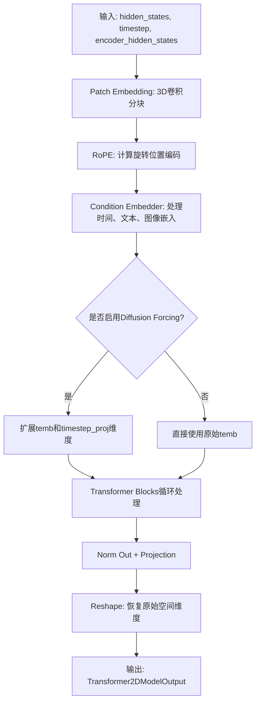

## 类结构

```
SkyReelsV2AttnProcessor (注意力处理器)
├── SkyReelsV2AttnProcessor2_0 (废弃,继承自SkyReelsV2AttnProcessor)
SkyReelsV2Attention (注意力模块, 继承AttentionModuleMixin)
├── 包含: to_q, to_k, to_v, to_out, norm_q, norm_k
├── 可选: add_k_proj, add_v_proj, to_qkv融合投影
SkyReelsV2ImageEmbedding (图像条件嵌入)
SkyReelsV2Timesteps (时间步编码)
SkyReelsV2TimeTextImageEmbedding (时间-文本-图像联合嵌入)
│   └── 包含: timesteps_proj, time_embedder, text_embedder, image_embedder
SkyReelsV2RotaryPosEmbed (3D旋转位置编码)
SkyReelsV2TransformerBlock (单个Transformer块)
│   ├── attn1 (自注意力)
│   ├── attn2 (跨注意力)
│   └── ffn (前馈网络)
SkyReelsV2Transformer3DModel (主模型类)
│   ├── 继承: ModelMixin, ConfigMixin, PeftAdapterMixin, FromOriginalModelMixin, CacheMixin, AttentionMixin
│   └── 包含: rope, patch_embedding, condition_embedder, blocks, norm_out, proj_out
```

## 全局变量及字段


### `logger`
    
模块级日志记录器，用于输出调试和运行信息

类型：`logging.Logger`
    


### `SkyReelsV2AttnProcessor._attention_backend`
    
注意力计算后端，用于指定使用哪个注意力实现

类型：`Any | None`
    


### `SkyReelsV2AttnProcessor._parallel_config`
    
并行配置，用于控制分布式训练时的并行策略

类型：`Any | None`
    


### `SkyReelsV2Attention._default_processor_cls`
    
默认的注意力处理器类

类型：`Type[SkyReelsV2AttnProcessor]`
    


### `SkyReelsV2Attention._available_processors`
    
可用的注意力处理器列表

类型：`list[Type[SkyReelsV2AttnProcessor]]`
    


### `SkyReelsV2Transformer3DModel._supports_gradient_checkpointing`
    
标记是否支持梯度检查点以节省显存

类型：`bool`
    


### `SkyReelsV2Transformer3DModel._skip_layerwise_casting_patterns`
    
跳过逐层类型转换的模式列表

类型：`list[str]`
    


### `SkyReelsV2Transformer3DModel._no_split_modules`
    
不允许进行模块分割的模块列表

类型：`list[str]`
    


### `SkyReelsV2Transformer3DModel._keep_in_fp32_modules`
    
保持在FP32精度的模块列表

类型：`list[str]`
    


### `SkyReelsV2Transformer3DModel._keys_to_ignore_on_load_unexpected`
    
加载模型时忽略的意外键

类型：`list[str]`
    


### `SkyReelsV2Transformer3DModel._repeated_blocks`
    
重复块的模块名称列表

类型：`list[str]`
    


### `SkyReelsV2Attention.inner_dim`
    
注意力内部维度，等于heads乘以dim_head

类型：`int`
    


### `SkyReelsV2Attention.heads`
    
注意力头的数量

类型：`int`
    


### `SkyReelsV2Attention.added_kv_proj_dim`
    
额外的KV投影维度，用于I2V任务中的图像上下文

类型：`int | None`
    


### `SkyReelsV2Attention.cross_attention_dim_head`
    
交叉注意力中每个头的维度

类型：`int | None`
    


### `SkyReelsV2Attention.kv_inner_dim`
    
Key和Value的内部维度

类型：`int`
    


### `SkyReelsV2Attention.to_q`
    
将输入投影到Query空间的线性层

类型：`nn.Linear`
    


### `SkyReelsV2Attention.to_k`
    
将输入投影到Key空间的线性层

类型：`nn.Linear`
    


### `SkyReelsV2Attention.to_v`
    
将输入投影到Value空间的线性层

类型：`nn.Linear`
    


### `SkyReelsV2Attention.to_out`
    
输出投影层列表，包含线性变换和Dropout

类型：`nn.ModuleList`
    


### `SkyReelsV2Attention.norm_q`
    
Query的RMS归一化层

类型：`nn.RMSNorm`
    


### `SkyReelsV2Attention.norm_k`
    
Key的RMS归一化层

类型：`nn.RMSNorm`
    


### `SkyReelsV2Attention.add_k_proj`
    
额外的Key投影层，用于I2V任务

类型：`nn.Linear | None`
    


### `SkyReelsV2Attention.add_v_proj`
    
额外的Value投影层，用于I2V任务

类型：`nn.Linear | None`
    


### `SkyReelsV2Attention.is_cross_attention`
    
标记是否为交叉注意力模式

类型：`bool`
    


### `SkyReelsV2Attention.fused_projections`
    
标记是否已融合QKV投影以提高效率

类型：`bool`
    


### `SkyReelsV2ImageEmbedding.norm1`
    
第一层归一化，用于稳定训练

类型：`FP32LayerNorm`
    


### `SkyReelsV2ImageEmbedding.ff`
    
前馈神经网络，用于特征变换

类型：`FeedForward`
    


### `SkyReelsV2ImageEmbedding.norm2`
    
第二层归一化

类型：`FP32LayerNorm`
    


### `SkyReelsV2ImageEmbedding.pos_embed`
    
可学习的位置嵌入参数

类型：`nn.Parameter | None`
    


### `SkyReelsV2Timesteps.num_channels`
    
时间嵌入的通道数

类型：`int`
    


### `SkyReelsV2Timesteps.output_type`
    
输出张量的类型

类型：`str`
    


### `SkyReelsV2Timesteps.flip_sin_to_cos`
    
是否将sin位置编码切换为cos

类型：`bool`
    


### `SkyReelsV2TimeTextImageEmbedding.timesteps_proj`
    
时间步投影模块

类型：`SkyReelsV2Timesteps`
    


### `SkyReelsV2TimeTextImageEmbedding.time_embedder`
    
时间嵌入器，将时间步转换为向量

类型：`TimestepEmbedding`
    


### `SkyReelsV2TimeTextImageEmbedding.act_fn`
    
SiLU激活函数

类型：`nn.SiLU`
    


### `SkyReelsV2TimeTextImageEmbedding.time_proj`
    
时间投影层

类型：`nn.Linear`
    


### `SkyReelsV2TimeTextImageEmbedding.text_embedder`
    
文本嵌入投影器

类型：`PixArtAlphaTextProjection`
    


### `SkyReelsV2TimeTextImageEmbedding.image_embedder`
    
图像嵌入器，用于I2V任务

类型：`SkyReelsV2ImageEmbedding | None`
    


### `SkyReelsV2RotaryPosEmbed.attention_head_dim`
    
每个注意力头的维度

类型：`int`
    


### `SkyReelsV2RotaryPosEmbed.patch_size`
    
3D补丁的尺寸

类型：`tuple[int, int, int]`
    


### `SkyReelsV2RotaryPosEmbed.max_seq_len`
    
最大序列长度

类型：`int`
    


### `SkyReelsV2RotaryPosEmbed.t_dim`
    
时间维度的旋转编码维度

类型：`int`
    


### `SkyReelsV2RotaryPosEmbed.h_dim`
    
高度维度的旋转编码维度

类型：`int`
    


### `SkyReelsV2RotaryPosEmbed.w_dim`
    
宽度维度的旋转编码维度

类型：`int`
    


### `SkyReelsV2RotaryPosEmbed.freqs_cos`
    
旋转位置编码的余弦部分

类型：`torch.Tensor`
    


### `SkyReelsV2RotaryPosEmbed.freqs_sin`
    
旋转位置编码的正弦部分

类型：`torch.Tensor`
    


### `SkyReelsV2TransformerBlock.norm1`
    
自注意力前的归一化层

类型：`FP32LayerNorm`
    


### `SkyReelsV2TransformerBlock.attn1`
    
自注意力模块

类型：`SkyReelsV2Attention`
    


### `SkyReelsV2TransformerBlock.norm2`
    
交叉注意力前的归一化层

类型：`FP32LayerNorm | nn.Identity`
    


### `SkyReelsV2TransformerBlock.attn2`
    
交叉注意力模块

类型：`SkyReelsV2Attention`
    


### `SkyReelsV2TransformerBlock.ffn`
    
前馈神经网络模块

类型：`FeedForward`
    


### `SkyReelsV2TransformerBlock.norm3`
    
FFN后的归一化层

类型：`FP32LayerNorm`
    


### `SkyReelsV2TransformerBlock.scale_shift_table`
    
用于计算AdaLN零星的缩放和偏移参数表

类型：`nn.Parameter`
    


### `SkyReelsV2Transformer3DModel.rope`
    
3D旋转位置嵌入模块

类型：`SkyReelsV2RotaryPosEmbed`
    


### `SkyReelsV2Transformer3DModel.patch_embedding`
    
3D卷积，用于将输入视频转换为补丁序列

类型：`nn.Conv3d`
    


### `SkyReelsV2Transformer3DModel.condition_embedder`
    
条件嵌入器，处理时间、文本和图像嵌入

类型：`SkyReelsV2TimeTextImageEmbedding`
    


### `SkyReelsV2Transformer3DModel.blocks`
    
Transformer块列表，包含多个注意力层和FFN

类型：`nn.ModuleList`
    


### `SkyReelsV2Transformer3DModel.norm_out`
    
输出前的最终归一化层

类型：`FP32LayerNorm`
    


### `SkyReelsV2Transformer3DModel.proj_out`
    
输出投影层，将特征映射回原始通道空间

类型：`nn.Linear`
    


### `SkyReelsV2Transformer3DModel.scale_shift_table`
    
用于最终输出的缩放和偏移参数

类型：`nn.Parameter`
    


### `SkyReelsV2Transformer3DModel.fps_embedding`
    
帧率嵌入层，用于注入样本帧率信息

类型：`nn.Embedding | None`
    


### `SkyReelsV2Transformer3DModel.fps_projection`
    
帧率投影层，用于处理帧率嵌入

类型：`FeedForward | None`
    


### `SkyReelsV2Transformer3DModel.gradient_checkpointing`
    
梯度检查点标志，控制是否启用显存优化

类型：`bool`
    
    

## 全局函数及方法


### `_get_qkv_projections`

该函数是注意力机制的核心投影计算模块，负责根据是否使用融合投影以及注意力类型（自注意力或交叉注意力），计算并返回Query、Key、Value三个投影张量，支持fused（融合）和non-fused（分离）两种投影模式以优化计算效率。

参数：

- `attn`：`SkyReelsV2Attention`，注意力模块实例，提供投影矩阵（to_q, to_k, to_v或to_qkv, to_kv）和配置属性（fused_projections, cross_attention_dim_head）
- `hidden_states`：`torch.Tensor`，输入的隐藏状态张量，通常形状为(batch_size, seq_len, dim)
- `encoder_hidden_states`：`torch.Tensor`，编码器侧的隐藏状态，用于交叉注意力；若为None则默认使用hidden_states

返回值：`tuple[torch.Tensor, torch.Tensor, torch.Tensor]`，返回Query、Key、Value三个投影后的张量元组

#### 流程图

```mermaid
flowchart TD
    A[开始: _get_qkv_projections] --> B{encoder_hidden_states is None?}
    B -- Yes --> C[encoder_hidden_states = hidden_states]
    B -- No --> D{fused_projections?}
    C --> D
    
    D -- Yes --> E{cross_attention_dim_head is None?}
    D -- No --> I[query = attn.to_q<br/>key = attn.to_k<br/>value = attn.to_v]
    I --> J[返回 query, key, value]
    
    E -- Yes --> F[query, key, value = attn.to_qkv<br/>.chunk(3, dim=-1)]
    E -- No --> G[query = attn.to_q<br/>key, value = attn.to_kv<br/>.chunk(2, dim=-1)]
    
    F --> J
    G --> J
```

#### 带注释源码

```python
def _get_qkv_projections(
    attn: "SkyReelsV2Attention", hidden_states: torch.Tensor, encoder_hidden_states: torch.Tensor
):
    """
    计算注意力机制中的Query、Key、Value投影。
    
    该函数根据注意力模块的配置（是否融合投影、是否交叉注意力）选择最优的计算路径。
    融合投影可以减少内存访问次数，提升推理性能。
    
    参数:
        attn: SkyReelsV2Attention实例，包含投影矩阵和配置
        hidden_states: 输入隐藏状态
        encoder_hidden_states: 编码器隐藏状态，为None时使用hidden_states
    
    返回:
        Query, Key, Value张量元组
    """
    # encoder_hidden_states is only passed for cross-attention
    # 如果没有传入encoder_hidden_states，则默认为自注意力，使用hidden_states
    if encoder_hidden_states is None:
        encoder_hidden_states = hidden_states

    # 检查是否启用了融合投影优化
    if attn.fused_projections:
        # 根据cross_attention_dim_head判断是自注意力还是交叉注意力
        if attn.cross_attention_dim_head is None:
            # In self-attention layers, we can fuse the entire QKV projection into a single linear
            # 自注意力：Q、K、V三个投影可以完全融合到一个linear层中
            # to_qkv是一个融合后的线性层，同时计算Q、K、V
            query, key, value = attn.to_qkv(hidden_states).chunk(3, dim=-1)
        else:
            # In cross-attention layers, we can only fuse the KV projections into a single linear
            # 交叉注意力：只能融合K、V投影，Q需要单独计算
            # 因为Q来自hidden_states，而K、V来自encoder_hidden_states
            query = attn.to_q(hidden_states)
            key, value = attn.to_kv(encoder_hidden_states).chunk(2, dim=-1)
    else:
        # 非融合模式：分别使用三个独立的线性层计算Q、K、V
        query = attn.to_q(hidden_states)
        key = attn.to_k(encoder_hidden_states)
        value = attn.to_v(encoder_hidden_states)
    return query, key, value
```


### `_get_added_kv_projections`

该函数用于获取图像到视频(I2V)任务中额外的Key和Value投影。根据是否启用了融合投影（Fused Projections），它会使用融合的线性层或分离的投影层来计算图像编码器隐藏状态对应的key和value投影。

参数：

- `attn`：`SkyReelsV2Attention`，Attention模块实例，包含投影层配置
- `encoder_hidden_states_img`：`torch.Tensor`，图像编码器的隐藏状态张量

返回值：`(torch.Tensor, torch.Tensor)`，返回图像key投影和图像value投影组成的元组

#### 流程图

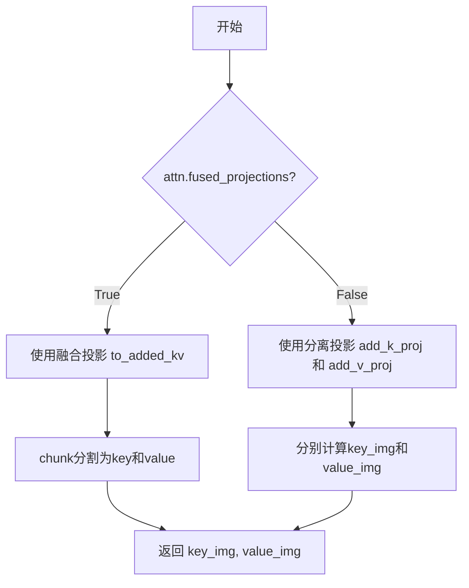

#### 带注释源码

```
def _get_added_kv_projections(attn: "SkyReelsV2Attention", encoder_hidden_states_img: torch.Tensor):
    # 判断是否启用融合投影优化
    if attn.fused_projections:
        # 融合投影模式：使用合并的线性层 to_added_kv 一次性计算 KV
        # to_added_kv 的输出在最后一个维度上concat了key和value
        # 使用 chunk(2, dim=-1) 将输出分割成key和value两部分
        key_img, value_img = attn.to_added_kv(encoder_hidden_states_img).chunk(2, dim=-1)
    else:
        # 非融合模式：分别使用独立的投影层计算key和value
        key_img = attn.add_k_proj(encoder_hidden_states_img)  # 图像key投影层
        value_img = attn.add_v_proj(encoder_hidden_states_img)  # 图像value投影层
    
    # 返回图像对应的key和value投影，用于后续cross-attention计算
    return key_img, value_img
```


### `SkyReelsV2AttnProcessor.__init__`

该方法是 `SkyReelsV2AttnProcessor` 类的构造函数，用于初始化注意力处理器实例。它会检查当前 PyTorch 版本是否支持 `scaled_dot_product_attention` 函数，若不支持则抛出 `ImportError` 异常。这是使用该处理器的必要前提条件。

参数：

- 无（仅包含隐式参数 `self`）

返回值：`None`，无返回值

#### 流程图

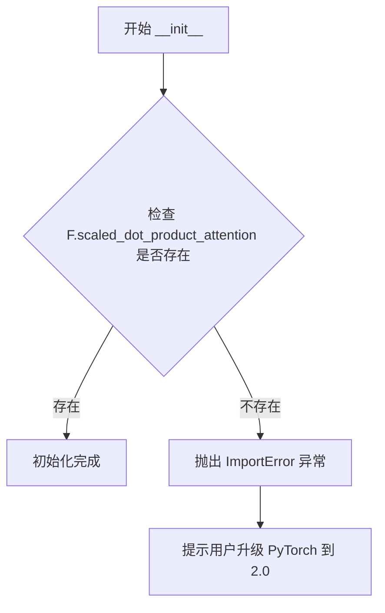

#### 带注释源码

```python
class SkyReelsV2AttnProcessor:
    # 类属性：注意力后端，默认为 None，会在运行时被具体后端实现填充
    _attention_backend = None
    # 类属性：并行配置，默认为 None，用于多 GPU 并行处理时的配置
    _parallel_config = None

    def __init__(self):
        # 检查 PyTorch 是否支持 scaled_dot_product_attention 函数
        # 这是 PyTorch 2.0 引入的高效注意力实现
        if not hasattr(F, "scaled_dot_product_attention"):
            # 如果不支持，抛出导入错误并提示用户升级 PyTorch
            raise ImportError(
                "SkyReelsV2AttnProcessor requires PyTorch 2.0. To use it, please upgrade PyTorch to 2.0."
            )
```

#### 相关类字段信息

- `_attention_backend`：类型 `Any`（运行时确定），用于指定注意力计算的后端实现（如 FlashAttention 等）
- `_parallel_config`：类型 `Any`（运行时确定），用于指定分布式训练时的并行配置


### `SkyReelsV2AttnProcessor.__call__`

这是 SkyReelsV2 模型的核心注意力处理器方法，负责执行自注意力和交叉注意力计算，支持图像到视频（I2V）任务中的多模态注意力机制。

参数：

- `self`：隐式参数，SkyReelsV2AttnProcessor 实例本身
- `attn`：`"SkyReelsV2Attention"`，注意力模块实例，包含 QKV 投影层和归一化层
- `hidden_states`：`torch.Tensor`，输入的隐藏状态张量，形状为 `(batch, seq_len, dim)`
- `encoder_hidden_states`：`torch.Tensor | None`，编码器的隐藏状态，用于交叉注意力，如果为 None 则使用 hidden_states
- `attention_mask`：`torch.Tensor | None`，注意力掩码，用于屏蔽不关注的 token
- `rotary_emb`：`tuple[torch.Tensor, torch.Tensor] | None`，旋转位置编码的 cos 和 sin 值

返回值：`torch.Tensor`，经过注意力计算和输出投影后的隐藏状态

#### 流程图

```mermaid
flowchart TD
    A[开始: __call__] --> B{encoder_hidden_states_img是否存在?}
    B -->|Yes| C[提取image_context和text_context]
    B -->|No| D[设置encoder_hidden_states_img为None]
    
    C --> E[调用_get_qkv_projections获取QKV]
    D --> E
    
    E --> F[attn.norm_q归一化query]
    F --> G[attn.norm_k归一化key]
    G --> H[unflatten为多头格式: (batch, heads, seq, dim_head)]
    
    H --> I{rotary_emb是否存在?}
    I -->|Yes| J[应用旋转位置编码到query和key]
    I -->|No| K[跳过旋转编码]
    
    J --> L{encoder_hidden_states_img是否存在?}
    K --> L
    
    L -->|Yes| M[获取added KV投影]
    M --> N[归一化key_img]
    N --> O[unflatten为多头格式]
    O --> P[dispatch_attention_fn计算图像注意力]
    P --> Q[flatten并转换类型]
    Q --> R[dispatch_attention_fn计算主注意力]
    
    L -->|No| R
    
    R --> S[flatten并转换类型]
    S --> T{hidden_states_img是否存在?}
    T -->|Yes| U[hidden_states = hidden_states + hidden_states_img]
    T -->|No| V[跳过合并]
    
    U --> W[attn.to_out[0]线性投影]
    V --> W
    W --> X[attn.to_out[1]Dropout]
    X --> Y[返回hidden_states]
```

#### 带注释源码

```python
def __call__(
    self,
    attn: "SkyReelsV2Attention",
    hidden_states: torch.Tensor,
    encoder_hidden_states: torch.Tensor | None = None,
    attention_mask: torch.Tensor | None = None,
    rotary_emb: tuple[torch.Tensor, torch.Tensor] | None = None,
) -> torch.Tensor:
    # 初始化图像上下文为 None，用于 I2V 任务
    encoder_hidden_states_img = None
    
    # 检查是否存在额外的 KV 投影（即 I2V 任务）
    if attn.add_k_proj is not None:
        # 512 是文本编码器的上下文长度，硬编码
        image_context_length = encoder_hidden_states.shape[1] - 512
        # 提取图像上下文（前面的部分）
        encoder_hidden_states_img = encoder_hidden_states[:, :image_context_length]
        # 提取文本上下文（后面的部分）
        encoder_hidden_states = encoder_hidden_states[:, image_context_length:]

    # 获取 QKV 投影
    # 根据是否融合投影和是否为交叉注意力，使用不同的投影方式
    query, key, value = _get_qkv_projections(attn, hidden_states, encoder_hidden_states)

    # 对 query 和 key 进行归一化（RMSNorm）
    query = attn.norm_q(query)
    key = attn.norm_k(key)

    # 将张量展开为多头注意力格式: (batch, seq_len, heads, head_dim) -> (batch, heads, seq_len, head_dim)
    query = query.unflatten(2, (attn.heads, -1))
    key = key.unflatten(2, (attn.heads, -1))
    value = value.unflatten(2, (attn.heads, -1))

    # 如果提供了旋转位置编码，则应用到 query 和 key
    if rotary_emb is not None:

        def apply_rotary_emb(
            hidden_states: torch.Tensor,
            freqs_cos: torch.Tensor,
            freqs_sin: torch.Tensor,
        ):
            # 将最后一个维度成对展开，提取实部和虚部
            x1, x2 = hidden_states.unflatten(-1, (-1, 2)).unbind(-1)
            # 提取偶数和奇数位置的频率
            cos = freqs_cos[..., 0::2]
            sin = freqs_sin[..., 1::2]
            # 创建输出张量
            out = torch.empty_like(hidden_states)
            # 应用旋转公式: out[0::2] = x1 * cos - x2 * sin
            out[..., 0::2] = x1 * cos - x2 * sin
            # out[1::2] = x1 * sin + x2 * cos
            out[..., 1::2] = x1 * sin + x2 * cos
            return out.type_as(hidden_states)

        # 应用旋转嵌入到 query 和 key
        query = apply_rotary_emb(query, *rotary_emb)
        key = apply_rotary_emb(key, *rotary_emb)

    # I2V 任务：处理图像上下文注意力
    hidden_states_img = None
    if encoder_hidden_states_img is not None:
        # 获取额外的 KV 投影（用于图像上下文）
        key_img, value_img = _get_added_kv_projections(attn, encoder_hidden_states_img)
        # 归一化 key_img
        key_img = attn.norm_added_k(key_img)

        # 展开为多头格式
        key_img = key_img.unflatten(2, (attn.heads, -1))
        value_img = value_img.unflatten(2, (attn.heads, -1))

        # 使用后端分发函数计算图像上下文注意力
        hidden_states_img = dispatch_attention_fn(
            query,
            key_img,
            value_img,
            attn_mask=None,
            dropout_p=0.0,
            is_causal=False,
            backend=self._attention_backend,
            parallel_config=self._parallel_config,
        )
        # 展平并转换类型以匹配 query 的数据类型
        hidden_states_img = hidden_states_img.flatten(2, 3)
        hidden_states_img = hidden_states_img.type_as(query)

    # 计算主注意力（文本上下文或自注意力）
    hidden_states = dispatch_attention_fn(
        query,
        key,
        value,
        attn_mask=attention_mask,
        dropout_p=0.0,
        is_causal=False,
        backend=self._attention_backend,
        parallel_config=self._parallel_config,
    )

    # 展平多头维度并转换类型
    hidden_states = hidden_states.flatten(2, 3)
    hidden_states = hidden_states.type_as(query)

    # 如果存在图像上下文注意力结果，将其叠加到主注意力结果
    if hidden_states_img is not None:
        hidden_states = hidden_states + hidden_states_img

    # 应用输出投影：线性层 + Dropout
    hidden_states = attn.to_out[0](hidden_states)
    hidden_states = attn.to_out[1](hidden_states)
    return hidden_states
```


### `SkyReelsV2AttnProcessor2_0.__new__`

这是一个类的 `__new__` 工厂方法，用于创建 `SkyReelsV2AttnProcessor2_0` 类的实例。该方法是一个兼容性封装，将所有对已弃用的 `SkyReelsV2AttnProcessor2_0` 类的调用重定向到新的 `SkyReelsV2AttnProcessor` 类，并发出弃用警告。

参数：

- `cls`：类型，对象类本身（Python 隐式传递），表示要实例化的类
- `*args`：类型，可变位置参数列表（Tuple），传递给父类的任意额外位置参数
- `**kwargs`：类型，可变关键字参数字典（Dict），传递给父类的任意额外关键字参数

返回值：`SkyReelsV2AttnProcessor`，返回 `SkyReelsV2AttnProcessor` 类的实例对象

#### 流程图

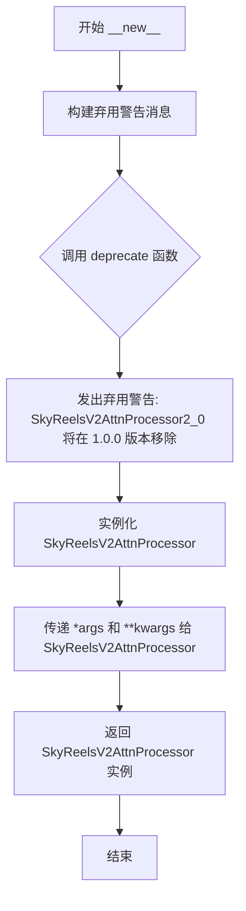

#### 带注释源码

```python
class SkyReelsV2AttnProcessor2_0:
    def __new__(cls, *args, **kwargs):
        # 构建弃用警告消息，告知用户该类已被弃用
        # 并建议使用 SkyReelsV2AttnProcessor 替代
        deprecation_message = (
            "The SkyReelsV2AttnProcessor2_0 class is deprecated and will be removed in a future version. "
            "Please use SkyReelsV2AttnProcessor instead. "
        )
        # 调用 deprecate 函数发出标准弃用警告
        # 参数: 类名, 版本号, 警告消息, standard_warn=False 表示使用自定义消息格式
        deprecate("SkyReelsV2AttnProcessor2_0", "1.0.0", deprecation_message, standard_warn=False)
        # 将所有传入的参数原样传递给 SkyReelsV2AttnProcessor 构造函数
        # 实现向后兼容：用户代码无需修改即可迁移到新类
        return SkyReelsV2AttnProcessor(*args, **kwargs)
```


### `SkyReelsV2Attention.__init__`

该方法是 `SkyReelsV2Attention` 类的构造函数，用于初始化注意力模块的内部状态。它设置了注意力机制的维度、头数、dropout、归一化层以及 QKV 投影矩阵，并根据配置决定是否支持交叉注意力（cross-attention）和额外的 KV 投影。

参数：

- `dim`：`int`，输入特征的维度（hidden states 的通道数）
- `heads`：`int = 8`，注意力头的数量，默认为 8
- `dim_head`：`int = 64`，每个注意力头的维度，默认为 64
- `eps`：`float = 1e-5`，RMSNorm 归一化层的 epsilon 值，用于数值稳定性
- `dropout`：`float = 0.0`，注意力输出层的 dropout 概率
- `added_kv_proj_dim`：`int | None = None`，额外的 KV 投影维度，用于图像上下文（I2V 任务）
- `cross_attention_dim_head`：`int | None = None`，交叉注意力中每个头的维度
- `processor`：`Any`，注意力处理器实例，默认为 `SkyReelsV2AttnProcessor`
- `is_cross_attention`：`bool | None = None`，标识是否为交叉注意力（已被 `cross_attention_dim_head` 推断）

返回值：`None`，该方法仅初始化对象状态，不返回任何值

#### 流程图

```mermaid
flowchart TD
    A[开始 __init__] --> B[调用 super().__init__]
    B --> C[计算内部维度: inner_dim = dim_head * heads]
    C --> D[计算 KV 内部维度: kv_inner_dim]
    D --> E[创建 QKV 投影层: to_q, to_k, to_v]
    E --> F[创建输出投影层: to_out = ModuleList[Linear, Dropout]]
    F --> G[创建 QK 归一化层: norm_q, norm_k]
    G --> H{added_kv_proj_dim 是否为 None?}
    H -->|否| I[创建额外 KV 投影: add_k_proj, add_v_proj, norm_added_k]
    H -->|是| J[add_k_proj 和 add_v_proj 设为 None]
    I --> K[设置 is_cross_attention 标志]
    J --> K
    K --> L[调用 set_processor 设置注意力处理器]
    L --> M[结束 __init__]
```

#### 带注释源码

```python
def __init__(
    self,
    dim: int,
    heads: int = 8,
    dim_head: int = 64,
    eps: float = 1e-5,
    dropout: float = 0.0,
    added_kv_proj_dim: int | None = None,
    cross_attention_dim_head: int | None = None,
    processor=None,
    is_cross_attention=None,
):
    """
    初始化 SkyReelsV2Attention 注意力模块。

    参数:
        dim: 输入隐藏状态的特征维度
        heads: 注意力头的数量
        dim_head: 每个头的维度
        eps: RMSNorm 的 epsilon 值
        dropout: 输出层的 dropout 概率
        added_kv_proj_dim: 额外的 KV 投影维度（用于 I2V 任务）
        cross_attention_dim_head: 交叉注意力头的维度
        processor: 注意力处理器实例
        is_cross_attention: 是否为交叉注意力（已废弃，由 cross_attention_dim_head 推断）
    """
    super().__init__()  # 调用 nn.Module 的初始化

    # 计算内部维度：总头数 × 每头维度
    self.inner_dim = dim_head * heads
    # 保存头数
    self.heads = heads
    # 保存额外 KV 投影维度
    self.added_kv_proj_dim = added_kv_proj_dim
    # 保存交叉注意力头维度
    self.cross_attention_dim_head = cross_attention_dim_head
    # 计算 KV 的内部维度：根据是否为交叉注意力使用不同维度
    self.kv_inner_dim = self.inner_dim if cross_attention_dim_head is None else cross_attention_dim_head * heads

    # QKV 投影层：将输入 dim 投影到 inner_dim 或 kv_inner_dim
    self.to_q = torch.nn.Linear(dim, self.inner_dim, bias=True)   # Query 投影
    self.to_k = torch.nn.Linear(dim, self.kv_inner_dim, bias=True)  # Key 投影
    self.to_v = torch.nn.Linear(dim, self.kv_inner_dim, bias=True)  # Value 投影

    # 输出投影层：ModuleList 包含线性层和 Dropout
    self.to_out = torch.nn.ModuleList(
        [
            torch.nn.Linear(self.inner_dim, dim, bias=True),  # 线性投影
            torch.nn.Dropout(dropout),  # Dropout 正则化
        ]
    )

    # Q 和 K 的 RMSNorm 归一化层，用于注意力计算前的归一化
    self.norm_q = torch.nn.RMSNorm(dim_head * heads, eps=eps, elementwise_affine=True)
    self.norm_k = torch.nn.RMSNorm(dim_head * heads, eps=eps, elementwise_affine=True)

    # 初始化额外的 KV 投影为 None
    self.add_k_proj = self.add_v_proj = None

    # 如果指定了 added_kv_proj_dim，则创建额外的 KV 投影层（用于 I2V 任务）
    if added_kv_proj_dim is not None:
        # 额外的 Key 和 Value 投影层
        self.add_k_proj = torch.nn.Linear(added_kv_proj_dim, self.inner_dim, bias=True)
        self.add_v_proj = torch.nn.Linear(added_kv_proj_dim, self.inner_dim, bias=True)
        # 额外的 Key 归一化层
        self.norm_added_k = torch.nn.RMSNorm(dim_head * heads, eps=eps)

    # 根据 cross_attention_dim_head 是否为 None 来判断是否为交叉注意力
    self.is_cross_attention = cross_attention_dim_head is not None

    # 设置注意力处理器
    self.set_processor(processor)
```


### `SkyReelsV2Attention.fuse_projections`

该方法通过将分离的 QKV（Query、Key、Value）投影矩阵融合为单个线性层来优化注意力模块的计算效率。在自注意力层中，它将 `to_q`、`to_k`、`to_v` 三个线性层的权重和偏置合并为一个 `to_qkv` 线性层；在交叉注意力层中，仅融合 `to_k` 和 `to_v` 为 `to_kv`；同时处理额外的 KV 投影层（`add_k_proj` 和 `add_v_proj`）。此优化减少了矩阵乘法运算次数，提升了推理性能。

参数：无（仅 `self` 隐式参数）

返回值：无（`None`），该方法直接修改对象状态，不返回任何值。

#### 流程图

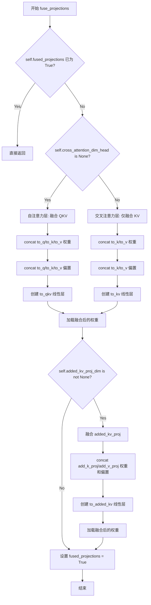

#### 带注释源码

```python
def fuse_projections(self):
    # 如果投影已经融合过，直接返回，避免重复操作
    if getattr(self, "fused_projections", False):
        return

    # 判断是否为自注意力层（cross_attention_dim_head 为 None）
    if self.cross_attention_dim_head is None:
        # === 自注意力层：融合完整的 QKV 投影 ===
        
        # 沿最后一维拼接 Q、K、V 的权重矩阵
        concatenated_weights = torch.cat([
            self.to_q.weight.data,    # Query 投影权重
            self.to_k.weight.data,    # Key 投影权重
            self.to_v.weight.data     # Value 投影权重
        ])
        # 沿最后一维拼接 Q、K、V 的偏置向量
        concatenated_bias = torch.cat([
            self.to_q.bias.data,
            self.to_k.bias.data,
            self.to_v.bias.data
        ])
        
        # 获取输出和输入特征维度
        out_features, in_features = concatenated_weights.shape
        
        # 在 "meta" 设备上创建融合后的线性层（不分配实际显存）
        with torch.device("meta"):
            self.to_qkv = nn.Linear(in_features, out_features, bias=True)
        
        # 将拼接后的权重加载到新创建的 to_qkv 线性层
        # assign=True 允许直接覆盖参数，适用于从状态字典加载
        self.to_qkv.load_state_dict(
            {"weight": concatenated_weights, "bias": concatenated_bias},
            strict=True,
            assign=True
        )
    else:
        # === 交叉注意力层：仅融合 KV 投影 ===
        # 在交叉注意力中，Query 来自隐藏状态，Key/Value 来自 encoder_hidden_states
        
        # 沿最后一维拼接 K、V 的权重矩阵
        concatenated_weights = torch.cat([
            self.to_k.weight.data,
            self.to_v.weight.data
        ])
        # 沿最后一维拼接 K、V 的偏置向量
        concatenated_bias = torch.cat([
            self.to_k.bias.data,
            self.to_v.bias.data
        ])
        
        out_features, in_features = concatenated_weights.shape
        
        # 在 "meta" 设备上创建融合后的 to_kv 线性层
        with torch.device("meta"):
            self.to_kv = nn.Linear(in_features, out_features, bias=True)
        
        # 加载融合后的 KV 权重
        self.to_kv.load_state_dict(
            {"weight": concatenated_weights, "bias": concatenated_bias},
            strict=True,
            assign=True
        )

    # === 处理额外的 KV 投影（用于图像上下文等）===
    if self.added_kv_proj_dim is not None:
        # 拼接 add_k_proj 和 add_v_proj 的权重
        concatenated_weights = torch.cat([
            self.add_k_proj.weight.data,
            self.add_v_proj.weight.data
        ])
        # 拼接对应的偏置
        concatenated_bias = torch.cat([
            self.add_k_proj.bias.data,
            self.add_v_proj.bias.data
        ])
        
        out_features, in_features = concatenated_weights.shape
        
        # 在 "meta" 设备上创建融合后的 to_added_kv 线性层
        with torch.device("meta"):
            self.to_added_kv = nn.Linear(in_features, out_features, bias=True)
        
        # 加载融合后的权重
        self.to_added_kv.load_state_dict(
            {"weight": concatenated_weights, "bias": concatenated_bias},
            strict=True,
            assign=True
        )

    # 标记投影已融合，后续调用将直接返回
    self.fused_projections = True
```


### `SkyReelsV2Attention.unfuse_projections`

该方法用于将融合的 QKV 投影分离回独立的投影层（与 `fuse_projections` 方法相反），通过删除融合后的线性层（`to_qkv`、`to_kv`、`to_added_kv`）并重置 `fused_projections` 标志来实现"解冻"操作。

参数：

- 该方法无显式参数（仅包含隐式参数 `self`）

返回值：`None`，无返回值（直接修改对象内部状态）

#### 流程图

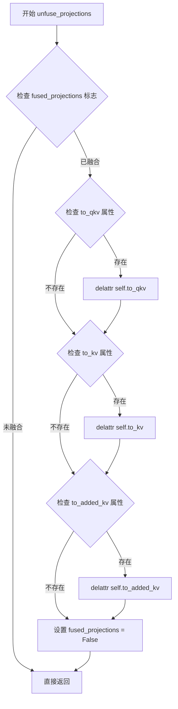

#### 带注释源码

```python
@torch.no_grad()
def unfuse_projections(self):
    """
    将融合的 QKV 投影分离回独立的投影层。
    
    此方法是 fuse_projections 的逆操作，用于在推理或模型转换过程中
    将合并的线性层（to_qkv/to_kv/to_added_kv）删除，恢复为独立的投影层。
    """
    # 检查模型是否处于融合状态，若未融合则直接返回
    if not getattr(self, "fused_projections", False):
        return

    # 删除融合后的完整 QKV 投影层（仅存在于自注意力层）
    if hasattr(self, "to_qkv"):
        delattr(self, "to_qkv")
    
    # 删除融合后的 KV 投影层（仅存在于交叉注意力层）
    if hasattr(self, "to_kv"):
        delattr(self, "to_kv")
    
    # 删除融合后的附加 KV 投影层（用于 I2V 任务的图像上下文）
    if hasattr(self, "to_added_kv"):
        delattr(self, "to_added_kv")

    # 重置融合标志，表示投影层已恢复到非融合状态
    self.fused_projections = False
```


### `SkyReelsV2Attention.forward`

该方法是 SkyReelsV2 注意力模块的前向传播入口，采用策略模式（Strategy Pattern）设计，将具体的注意力计算逻辑委托给外部注入的处理器（processor）执行。这种设计允许在运行时灵活切换不同的注意力实现（如标准注意力、Flash Attention 等），同时保持模块接口的一致性。

参数：

- `self`：隐式参数，SkyReelsV2Attention 实例本身
- `hidden_states`：`torch.Tensor`，输入的隐藏状态张量，形状为 `(batch_size, seq_len, hidden_dim)`
- `encoder_hidden_states`：`torch.Tensor | None`，编码器的隐藏状态，用于跨注意力机制（Cross-Attention），若为 None 则执行自注意力
- `attention_mask`：`torch.Tensor | None`，注意力掩码，用于控制注意力权重，可选
- `rotary_emb`：`tuple[torch.Tensor, torch.Tensor] | None`，旋转位置嵌入的余弦和正弦部分，用于位置编码，可选
- `**kwargs`：可变关键字参数，传递给处理器的额外参数

返回值：`torch.Tensor`，经过注意力机制处理后的隐藏状态张量

#### 流程图

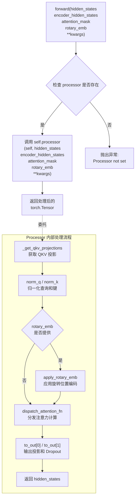

#### 带注释源码

```python
def forward(
    self,
    hidden_states: torch.Tensor,
    encoder_hidden_states: torch.Tensor | None = None,
    attention_mask: torch.Tensor | None = None,
    rotary_emb: tuple[torch.Tensor, torch.Tensor] | None = None,
    **kwargs,
) -> torch.Tensor:
    """
    SkyReelsV2Attention 的前向传播方法。
    
    采用策略模式，将具体的注意力计算委托给外部注入的 processor。
    这种设计允许在运行时动态切换不同的注意力实现，
    同时保持模块接口的一致性。
    
    参数:
        hidden_states: 输入的隐藏状态张量，形状为 (batch_size, seq_len, hidden_dim)
        encoder_hidden_states: 编码器的隐藏状态，用于跨注意力，若为 None 则执行自注意力
        attention_mask: 注意力掩码，用于控制注意力权重
        rotary_emb: 旋转位置嵌入的 (cos, sin) 元组，用于位置编码
        **kwargs: 传递给处理器的额外关键字参数
    
    返回:
        经过注意力机制处理后的隐藏状态张量
    """
    # 委托给处理器执行具体的注意力计算逻辑
    # 处理器可以是 SkyReelsV2AttnProcessor 或其他兼容的实现
    return self.processor(
        self,  # 传递注意力模块自身引用
        hidden_states,  # 主输入的隐藏状态
        encoder_hidden_states,  # 编码器隐藏状态（可选）
        attention_mask,  # 注意力掩码（可选）
        rotary_emb,  # 旋转嵌入（可选）
        **kwargs  # 传递额外的关键字参数
    )
```


### `SkyReelsV2ImageEmbedding.forward`

该方法实现图像嵌入的投影与增强，通过位置编码（可选）、归一化、前馈网络等操作，将图像特征映射到与文本/时间嵌入相同的特征空间，为后续的跨模态注意力机制提供图像上下文信息。

参数：

- `encoder_hidden_states_image`：`torch.Tensor`，图像编码器的隐藏状态张量，通常是经过图像编码器处理后的特征序列

返回值：`torch.Tensor`，处理后的图像嵌入张量，维度与时间嵌入对齐，可直接用于跨模态注意力或与文本嵌入拼接

#### 流程图

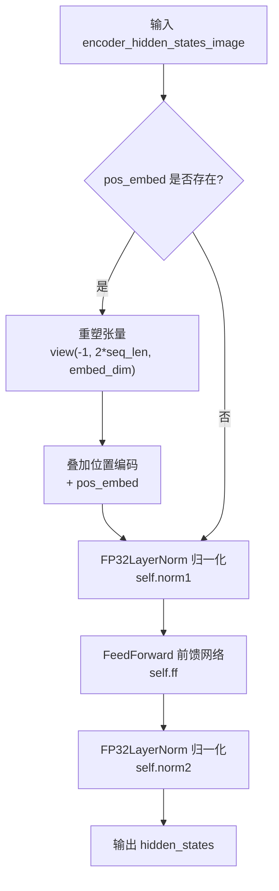

#### 带注释源码

```python
def forward(self, encoder_hidden_states_image: torch.Tensor) -> torch.Tensor:
    # 如果存在位置编码嵌入，则将其添加到输入张量
    # 位置编码用于为序列中的每个位置提供位置信息
    if self.pos_embed is not None:
        # 获取输入张量的形状信息
        batch_size, seq_len, embed_dim = encoder_hidden_states_image.shape
        # 将张量重塑为 (-1, 2*seq_len, embed_dim)
        # 这里 2*seq_len 可能是为了适应特殊的图像序列结构（如图像对或前后帧）
        encoder_hidden_states_image = encoder_hidden_states_image.view(-1, 2 * seq_len, embed_dim)
        # 将位置编码添加到图像隐藏状态，实现位置信息的注入
        encoder_hidden_states_image = encoder_hidden_states_image + self.pos_embed

    # 第一次归一化，使用 FP32 精度保证数值稳定性
    # 有助于提升训练过程中的梯度流动性和收敛性
    hidden_states = self.norm1(encoder_hidden_states_image)
    
    # 前馈网络进行特征变换和增强
    # 使用 GELU 激活函数，mult=1 表示隐藏层维度与输出维度相同
    hidden_states = self.ff(hidden_states)
    
    # 第二次归一化，最终输出特征的标准化
    hidden_states = self.norm2(hidden_states)
    
    # 返回处理后的图像嵌入，可用于后续的跨模态融合
    return hidden_states
```


### `SkyReelsV2Timesteps.forward`

该方法将离散的 timestep 值转换为连续的 Sinusoidal 位置嵌入（Positional Embedding），是 Transformer 模型对时间步进行编码的核心组件。它使用 1D 正弦余弦位置编码将时间步映射到高维空间，支持批量处理和多维时间步输入。

参数：

- `self`：隐式参数，表示 `SkyReelsV2Timesteps` 类的实例
- `timesteps`：`torch.Tensor`，输入的时间步张量，可以是 1D（单 timestep per batch）或更高维（多个 timestep per batch）

返回值：`torch.Tensor`，返回与输入 timesteps 形状对应的正弦余弦位置嵌入，维度为 `(*original_shape, num_channels)`

#### 流程图

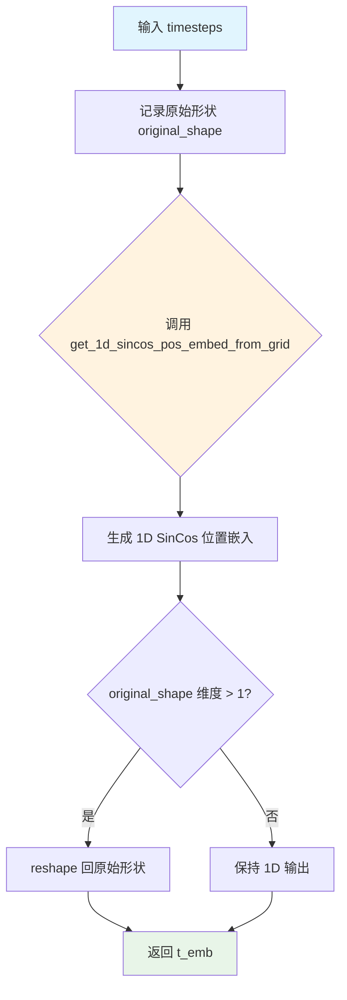

#### 带注释源码

```python
def forward(self, timesteps: torch.Tensor) -> torch.Tensor:
    """
    将离散的 timestep 值转换为连续的 Sinusoidal 位置嵌入
    
    参数:
        timesteps: 输入的时间步张量，形状可以是 (batch_size,) 或 (batch_size, num_timesteps)
    
    返回:
        正弦余弦位置嵌入，形状为 (*original_shape, num_channels)
    """
    # 记录输入张量的原始形状，用于后续 reshape
    original_shape = timesteps.shape
    
    # 调用辅助函数生成 1D 正弦余弦位置嵌入
    # 参数:
    #   - num_channels: 嵌入的通道数（维度）
    #   - timesteps: 输入的时间步值
    #   - output_type: 输出类型（"pt" 表示 PyTorch 张量）
    #   - flip_sin_to_cos: 是否将 sin 和 cos 交换位置
    t_emb = get_1d_sincos_pos_embed_from_grid(
        self.num_channels,      # 嵌入维度
        timesteps,              # 时间步输入
        output_type=self.output_type,  # 输出类型
        flip_sin_to_cos=self.flip_sin_to_cos,  # sin/cos 交换标志
    )
    
    # Reshape back to maintain batch structure
    # 如果输入是多维的（如 batch_size x num_timesteps），则将嵌入 reshape 回对应形状
    if len(original_shape) > 1:
        t_emb = t_emb.reshape(*original_shape, self.num_channels)
    
    # 返回生成的位置嵌入
    return t_emb
```


### `SkyReelsV2TimeTextImageEmbedding.forward`

该方法是 SkyReels-V2 模型中用于生成时间、文本和图像 embedding 的核心模块。它接收时间步、文本隐藏状态和可选的图像隐藏状态，通过多个子模块（包括时间步投影、时间嵌入、文本嵌入和图像嵌入）处理后，返回时间嵌入向量、时间步投影、文本嵌入和图像嵌入（若提供），为后续的 Transformer 模块提供条件信息。

参数：

- `timestep`：`torch.Tensor`，时间步张量，通常为模型的时间步输入
- `encoder_hidden_states`：`torch.Tensor`，编码器隐藏状态，包含文本嵌入信息
- `encoder_hidden_states_image`：`torch.Tensor | None`，可选的图像编码隐藏状态，用于图像到视频（I2V）任务

返回值：`tuple[torch.Tensor, torch.Tensor, torch.Tensor, torch.Tensor | None]`，包含四个元素：
- 时间嵌入张量 `temb`
- 时间步投影张量 `timestep_proj`
- 文本嵌入张量 `encoder_hidden_states`
- 图像嵌入张量 `encoder_hidden_states_image`（若输入为 `None` 则返回 `None`）

#### 流程图

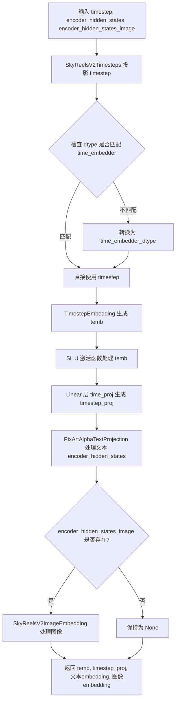

#### 带注释源码

```python
def forward(
    self,
    timestep: torch.Tensor,
    encoder_hidden_states: torch.Tensor,
    encoder_hidden_states_image: torch.Tensor | None = None,
):
    # 1. 时间步投影：将原始时间步转换为正弦余弦位置嵌入形式
    timestep = self.timesteps_proj(timestep)

    # 2. 获取 time_embedder 的参数数据类型，确保类型兼容
    time_embedder_dtype = get_parameter_dtype(self.time_embedder)
    if timestep.dtype != time_embedder_dtype and time_embedder_dtype != torch.int8:
        timestep = timestep.to(time_embedder_dtype)
    
    # 3. 时间嵌入：通过 TimestepEmbedding 层生成时间嵌入向量 temb
    temb = self.time_embedder(timestep).type_as(encoder_hidden_states)
    
    # 4. 时间步投影：应用 SiLU 激活函数后，通过线性层生成 timestep_proj
    timestep_proj = self.time_proj(self.act_fn(temb))

    # 5. 文本嵌入：通过 PixArtAlphaTextProjection 处理文本编码器隐藏状态
    encoder_hidden_states = self.text_embedder(encoder_hidden_states)
    
    # 6. 图像嵌入（可选）：如果提供了图像编码隐藏状态，则通过图像嵌入器处理
    if encoder_hidden_states_image is not None:
        encoder_hidden_states_image = self.image_embedder(encoder_hidden_states_image)

    # 7. 返回：temb（时间嵌入）、timestep_proj（时间步投影）、文本embedding、图像embedding
    return temb, timestep_proj, encoder_hidden_states, encoder_hidden_states_image
```


### `SkyReelsV2RotaryPosEmbed.forward`

该方法实现三维旋转位置编码（Rotary Position Embedding），用于为视频/3D数据的注意力机制提供位置感知能力。它根据输入的隐藏状态形状计算空间和时间维度的频率向量，并将其扩展到适当的形状以匹配patch级别的特征。

参数：

- `hidden_states`：`torch.Tensor`，输入的隐藏状态张量，形状为 (batch_size, num_channels, num_frames, height, width)

返回值：`tuple[torch.Tensor, torch.Tensor]`，返回两个张量元组 (freqs_cos, freqs_sin)，分别表示余弦和正弦形式的旋转位置编码，形状均为 (1, ppf * pph * ppw, 1, attention_head_dim)，其中 ppf、pph、ppw 分别表示时间、空间高度和空间宽度的patch数量。

#### 流程图

```mermaid
flowchart TD
    A[输入 hidden_states] --> B[获取形状 batch_size, num_channels, num_frames, height, width]
    B --> C[从 self.patch_size 解码 p_t, p_h, p_w]
    C --> D[计算 patch 数量: ppf, pph, ppw]
    D --> E[定义分割尺寸 split_sizes = [t_dim, h_dim, w_dim]]
    E --> F[分割预计算的 freqs_cos 和 freqs_sin]
    F --> G[分别为时间/高度/宽度维度扩展频率向量]
    G --> H[将三个维度的频率向量拼接]
    H --> I[reshape 到最终输出形状]
    I --> J[返回 freqs_cos, freqs_sin 元组]
```

#### 带注释源码

```python
def forward(self, hidden_states: torch.Tensor) -> torch.Tensor:
    # 获取输入张量的形状信息
    # hidden_states 形状: (batch_size, num_channels, num_frames, height, width)
    batch_size, num_channels, num_frames, height, width = hidden_states.shape
    
    # 从 patch_size 元组中解构时间、高度、宽度的 patch 大小
    p_t, p_h, p_w = self.patch_size
    
    # 计算 patch 后的数量：
    # ppf: 时间维度 patch 数量
    # pph: 高度维度 patch 数量
    # ppw: 宽度维度 patch 数量
    ppf, pph, ppw = num_frames // p_t, height // p_h, width // p_w

    # 定义分割尺寸，对应时间、高度、宽度三个维度
    split_sizes = [self.t_dim, self.h_dim, self.w_dim]

    # 使用预注册的缓冲区分割余弦和正弦频率向量
    # 分割后得到三个子张量，分别对应时间、高度、宽度维度
    freqs_cos = self.freqs_cos.split(split_sizes, dim=1)
    freqs_sin = self.freqs_sin.split(split_sizes, dim=1)

    # 为时间维度扩展频率向量
    # 从 (max_seq_len, t_dim) 提取前 ppf 个，并扩展到 (ppf, pph, ppw, t_dim)
    freqs_cos_f = freqs_cos[0][:ppf].view(ppf, 1, 1, -1).expand(ppf, pph, ppw, -1)
    freqs_sin_f = freqs_sin[0][:ppf].view(ppf, 1, 1, -1).expand(ppf, pph, ppw, -1)

    # 为高度维度扩展频率向量
    # 从 (max_seq_len, h_dim) 提取前 pph 个，并扩展到 (ppf, pph, ppw, h_dim)
    freqs_cos_h = freqs_cos[1][:pph].view(1, pph, 1, -1).expand(ppf, pph, ppw, -1)
    freqs_sin_h = freqs_sin[1][:pph].view(1, pph, 1, -1).expand(ppf, pph, ppw, -1)

    # 为宽度维度扩展频率向量
    # 从 (max_seq_len, w_dim) 提取前 ppw 个，并扩展到 (ppf, pph, ppw, w_dim)
    freqs_cos_w = freqs_cos[2][:ppw].view(1, 1, ppw, -1).expand(ppf, pph, ppw, -1)
    freqs_sin_w = freqs_sin[2][:ppw].view(1, 1, ppw, -1).expand(ppf, pph, ppw, -1)

    # 拼接三个维度的频率向量
    # 拼接后形状: (ppf, pph, ppw, t_dim + h_dim + w_dim) = (ppf, pph, ppw, attention_head_dim)
    freqs_cos = torch.cat([freqs_cos_f, freqs_cos_h, freqs_cos_w], dim=-1).reshape(1, ppf * pph * ppw, 1, -1)
    freqs_sin = torch.cat([freqs_sin_f, freqs_sin_h, freqs_sin_w], dim=-1).reshape(1, ppf * pph * ppw, 1, -1)

    # 返回频率向量元组，形状均为 (1, ppf * pph * ppw, 1, attention_head_dim)
    return freqs_cos, freqs_sin
```


### `SkyReelsV2TransformerBlock.forward`

该方法是 SkyReelsV2TransformerBlock 的前向传播方法，实现了视频/图像生成模型中的 Transformer 块，包含自注意力、交叉注意力和前馈网络三个核心部分，并支持扩散强制（Diffusion Forcing）框架下的自适应层归一化（AdaLN）机制。

参数：

- `hidden_states`：`torch.Tensor`，输入的隐藏状态，形状为 (batch_size, seq_len, dim)
- `encoder_hidden_states`：`torch.Tensor`，编码器隐藏状态，用于跨注意力机制
- `temb`：`torch.Tensor`，时间嵌入向量，用于计算 AdaLN 的 shift 和 scale 参数
- `rotary_emb`：`torch.Tensor`，旋转位置嵌入，用于自注意力中的位置编码
- `attention_mask`：`torch.Tensor`，注意力掩码，用于控制注意力计算

返回值：`torch.Tensor`，经过 Transformer 块处理后的隐藏状态

#### 流程图

```mermaid
flowchart TD
    A[输入 hidden_states<br/>encoder_hidden_states<br/>temb rotary_emb<br/>attention_mask] --> B{检查 temb 维度}
    
    B -->|temb.dim == 3| C[从 scale_shift_table + temb<br/>chunk 6 份得到<br/>shift_msa scale_msa<br/>gate_msa c_shift_msa<br/>c_scale_msa c_gate_msa]
    
    B -->|temb.dim == 4| D[从 scale_shift_table.unsqueeze 2 + temb<br/>chunk 6 份并 squeeze<br/>得到对应的 6 个参数]
    
    C --> E[1. 自注意力 Self-Attention]
    D --> E
    
    E --> F[norm1 hidden_states<br/>应用 AdaLN: * (1 + scale_msa + shift_msa]
    
    F --> G[attn1 norm_hidden_states<br/>None attention_mask<br/>rotary_emb]
    
    G --> H[hidden_states + attn_output * gate_msa]
    
    H --> I[2. 跨注意力 Cross-Attention]
    
    I --> J[norm2 hidden_states]
    
    J --> K[attn2 norm_hidden_states<br/>encoder_hidden_states<br/>None None]
    
    K --> L[hidden_states + attn_output]
    
    L --> M[3. 前馈网络 Feed-Forward]
    
    M --> N[norm3 hidden_states<br/>应用 AdaLN: * (1 + c_scale_msa + c_shift_msa]
    
    N --> O[ffn norm_hidden_states]
    
    O --> P[hidden_states + ff_output * c_gate_msa]
    
    P --> Q[输出 hidden_states]
```

#### 带注释源码

```python
def forward(
    self,
    hidden_states: torch.Tensor,
    encoder_hidden_states: torch.Tensor,
    temb: torch.Tensor,
    rotary_emb: torch.Tensor,
    attention_mask: torch.Tensor,
) -> torch.Tensor:
    """
    SkyReelsV2TransformerBlock 的前向传播方法
    
    Args:
        hidden_states: 输入隐藏状态，形状 (batch, seq_len, dim)
        encoder_hidden_states: 编码器隐藏状态，用于跨注意力
        temb: 时间嵌入，用于 AdaLN 自适应归一化
        rotary_emb: 旋转位置嵌入
        attention_mask: 注意力掩码
    
    Returns:
        处理后的隐藏状态
    """
    # ============================================================
    # 步骤1: 计算 AdaLN 参数 (Adaptive LayerNorm)
    # 根据 temb 的维度决定如何从 scale_shift_table 和 temb 计算
    # 6个参数: shift_msa, scale_msa, gate_msa 用于自注意力
    #          c_shift_msa, c_scale_msa, c_gate_msa 用于前馈网络
    # ============================================================
    if temb.dim() == 3:
        # 3D temb: 形状 (b, 6, inner_dim) - 用于标准扩散模型
        # 将 scale_shift_table (1, 6, dim) 与 temb (b, 6, dim) 相加后按 dim=1 分成6份
        shift_msa, scale_msa, gate_msa, c_shift_msa, c_scale_msa, c_gate_msa = (
            self.scale_shift_table + temb.float()
        ).chunk(6, dim=1)
    elif temb.dim() == 4:
        # 4D temb: 形状 (b, 6, f * pp_h * pp_w, inner_dim) - 用于 Diffusion Forcing 框架
        # Diffusion Forcing 是一种同时处理多个噪声级别的技术
        e = (self.scale_shift_table.unsqueeze(2) + temb.float()).chunk(6, dim=1)
        shift_msa, scale_msa, gate_msa, c_shift_msa, c_scale_msa, c_gate_msa = [ei.squeeze(1) for ei in e]

    # ============================================================
    # 步骤2: 自注意力 (Self-Attention) 块
    # 使用 AdaLN 进行自适应归一化: norm(x) * (1 + scale) + shift
    # ============================================================
    # 应用 FP32 归一化并使用 AdaLN 参数进行变换
    norm_hidden_states = (self.norm1(hidden_states.float()) * (1 + scale_msa) + shift_msa).type_as(hidden_states)
    
    # 执行自注意力计算，包含旋转位置编码
    attn_output = self.attn1(norm_hidden_states, None, attention_mask, rotary_emb)
    
    # 残差连接并应用门控机制 gate_msa
    hidden_states = (hidden_states.float() + attn_output * gate_msa).type_as(hidden_states)

    # ============================================================
    # 步骤3: 跨注意力 (Cross-Attention) 块
    # 接收来自编码器 (如文本编码器) 的条件信息
    # ============================================================
    # 归一化 (可选的 cross_attn_norm)
    norm_hidden_states = self.norm2(hidden_states.float()).type_as(hidden_states)
    
    # 执行跨注意力，encoder_hidden_states 提供外部条件
    attn_output = self.attn2(norm_hidden_states, encoder_hidden_states, None, None)
    
    # 残差连接
    hidden_states = hidden_states + attn_output

    # ============================================================
    # 步骤4: 前馈网络 (Feed-Forward Network) 块
    # 同样使用 AdaLN 进行自适应归一化
    # ============================================================
    # 应用 FP32 归一化并使用 c_ 前缀的 AdaLN 参数
    norm_hidden_states = (self.norm3(hidden_states.float()) * (1 + c_scale_msa) + c_shift_msa).type_as(
        hidden_states
    )
    
    # 执行前馈网络变换
    ff_output = self.ffn(norm_hidden_states)
    
    # 残差连接并应用门控机制 c_gate_msa
    hidden_states = (hidden_states.float() + ff_output.float() * c_gate_msa).type_as(hidden_states)

    return hidden_states
```


### `SkyReelsV2Transformer3DModel.__init__`

该方法是SkyReelsV2Transformer3DModel类的构造函数，负责初始化一个用于视频数据的3D Transformer模型，包括配置参数、旋转位置编码、patch嵌入、条件嵌入器、Transformer块堆栈、输出归一化和投影层等核心组件。

参数：

- `patch_size`：`tuple[int]`，默认为`(1, 2, 2)`，3D patch尺寸，用于视频嵌入（时间_patch、高度_patch、宽度_patch）
- `num_attention_heads`：`int`，默认为`16`，注意力头的数量
- `attention_head_dim`：`int`，默认为`128`，每个头的通道数
- `in_channels`：`int`，默认为`16`，输入通道数
- `out_channels`：`int`，默认为`16`，输出通道数
- `text_dim`：`int`，默认为`4096`，文本嵌入的输入维度
- `freq_dim`：`int`，默认为`256`，正弦时间嵌入的维度
- `ffn_dim`：`int`，默认为`8192`，前馈网络的中间维度
- `num_layers`：`int`，默认为`32`，Transformer块的数量
- `cross_attn_norm`：`bool`，默认为`True`，启用交叉注意力归一化
- `qk_norm`：`str | None`，默认为`"rms_norm_across_heads"`，查询/键归一化方式
- `eps`：`float`，默认为`1e-6`，归一化层的epsilon值
- `image_dim`：`int | None`，默认为`None`，图像嵌入的维度
- `added_kv_proj_dim`：`int | None`，默认为`None`，添加的键/值投影维度
- `rope_max_seq_len`：`int`，默认为`1024`，旋转嵌入的最大序列长度
- `pos_embed_seq_len`：`int | None`，默认为`None`，位置嵌入的序列长度
- `inject_sample_info`：`bool`，默认为`False`，是否向模型注入样本信息
- `num_frame_per_block`：`int`，默认为`1`，每个块的帧数

返回值：`None`，构造函数不返回任何值，仅初始化对象状态

#### 流程图

```mermaid
flowchart TD
    A[开始 __init__] --> B[调用父类初始化 super().__init__]
    B --> C[计算inner_dim = num_attention_heads * attention_head_dim]
    C --> D[确保out_channels有效 out_channels = out_channels or in_channels]
    D --> E[创建旋转位置编码 self.rope = SkyReelsV2RotaryPosEmbed]
    E --> F[创建3D卷积patch嵌入 self.patch_embedding = nn.Conv3d]
    F --> G[创建条件嵌入器 self.condition_embedder = SkyReelsV2TimeTextImageEmbedding]
    G --> H[循环创建num_layers个Transformer块 self.blocks = nn.ModuleList]
    H --> I[创建输出归一化 self.norm_out = FP32LayerNorm]
    I --> J[创建输出投影 self.proj_out = nn.Linear]
    J --> K[创建scale_shift_table参数]
    K --> L{inject_sample_info为True?}
    L -->|是| M[创建fps_embedding和fps_projection]
    L -->|否| N[跳过fps相关初始化]
    M --> O[设置gradient_checkpointing标志]
    N --> O
    O --> P[结束 __init__]
```

#### 带注释源码

```python
@register_to_config
def __init__(
    self,
    patch_size: tuple[int] = (1, 2, 2),
    num_attention_heads: int = 16,
    attention_head_dim: int = 128,
    in_channels: int = 16,
    out_channels: int = 16,
    text_dim: int = 4096,
    freq_dim: int = 256,
    ffn_dim: int = 8192,
    num_layers: int = 32,
    cross_attn_norm: bool = True,
    qk_norm: str | None = "rms_norm_across_heads",
    eps: float = 1e-6,
    image_dim: int | None = None,
    added_kv_proj_dim: int | None = None,
    rope_max_seq_len: int = 1024,
    pos_embed_seq_len: int | None = None,
    inject_sample_info: bool = False,
    num_frame_per_block: int = 1,
) -> None:
    """初始化SkyReelsV2Transformer3DModel模型"""
    # 调用所有父类的初始化方法
    # ModelMixin: 提供模型加载/保存功能
    # ConfigMixin: 提供配置注册功能
    # PeftAdapterMixin: 提供PEFT适配器支持
    # FromOriginalModelMixin: 支持从原始模型加载
    # CacheMixin: 提供缓存功能
    # AttentionMixin: 提供注意力机制支持
    super().__init__()

    # 计算内部维度：注意力头数 × 每个头的维度
    inner_dim = num_attention_heads * attention_head_dim
    # 确保输出通道数有效，如果未指定则使用输入通道数
    out_channels = out_channels or in_channels

    # 1. Patch和位置嵌入层
    # 创建旋转位置编码器，用于3D视频数据的空间-时间位置编码
    self.rope = SkyReelsV2RotaryPosEmbed(attention_head_dim, patch_size, rope_max_seq_len)
    # 创建3D卷积层，将输入视频分割成patch并嵌入到高维空间
    self.patch_embedding = nn.Conv3d(in_channels, inner_dim, kernel_size=patch_size, stride=patch_size)

    # 2. 条件嵌入层
    # 创建时间-文本-图像嵌入器，用于处理扩散模型的条件输入
    # image_embedding_dim=1280 用于I2V（图像到视频）模型
    self.condition_embedder = SkyReelsV2TimeTextImageEmbedding(
        dim=inner_dim,
        time_freq_dim=freq_dim,
        time_proj_dim=inner_dim * 6,
        text_embed_dim=text_dim,
        image_embed_dim=image_dim,
        pos_embed_seq_len=pos_embed_seq_len,
    )

    # 3. Transformer块堆栈
    # 创建多个Transformer块组成的编码器
    self.blocks = nn.ModuleList(
        [
            SkyReelsV2TransformerBlock(
                inner_dim, ffn_dim, num_attention_heads, qk_norm, cross_attn_norm, eps, added_kv_proj_dim
            )
            for _ in range(num_layers)
        ]
    )

    # 4. 输出归一化与投影
    # 最终输出层的归一化
    self.norm_out = FP32LayerNorm(inner_dim, eps, elementwise_affine=False)
    # 将隐藏状态投影回原始通道空间
    self.proj_out = nn.Linear(inner_dim, out_channels * math.prod(patch_size))
    # 可学习的缩放和平移参数，用于输出调整
    self.scale_shift_table = nn.Parameter(torch.randn(1, 2, inner_dim) / inner_dim**0.5)

    # 5. 可选：样本信息注入（用于FPS控制）
    if inject_sample_info:
        # FPS（帧率）嵌入层
        self.fps_embedding = nn.Embedding(2, inner_dim)
        # FPS投影层，用于将FPS信息融入时间嵌入
        self.fps_projection = FeedForward(inner_dim, inner_dim * 6, mult=1, activation_fn="linear-silu")

    # 6. 梯度检查点标志（用于内存优化）
    self.gradient_checkpointing = False
```


### `SkyReelsV2Transformer3DModel.forward`

这是SkyReels-V2模型的核心前向传播方法，负责处理视频数据的3D Transformer推理过程。该方法接收视频潜在表示、时间步、文本嵌入等条件信息，通过位置编码、补丁嵌入、条件嵌入、Transformer块序列处理，最终输出重构的视频潜在表示。

参数：

- `hidden_states`：`torch.Tensor`，输入的3D视频潜在表示，形状为 (batch_size, num_channels, num_frames, height, width)
- `timestep`：`torch.LongTensor`，扩散过程的时间步，用于条件嵌入
- `encoder_hidden_states`：`torch.Tensor`，文本编码器的隐藏状态（条件信息）
- `encoder_hidden_states_image`：`torch.Tensor | None`，图像编码器的隐藏状态（用于I2V任务）
- `enable_diffusion_forcing`：`bool`，是否启用Diffusion Forcing模式处理多帧时间步
- `fps`：`torch.Tensor | None`，每秒帧数信息（用于样本信息注入）
- `return_dict`：`bool`，是否返回字典格式的输出
- `attention_kwargs`：`dict[str, Any] | None`，注意力机制的额外参数（如LoRA配置）

返回值：`torch.Tensor | dict[str, torch.Tensor]`。当 `return_dict=True` 时返回 `Transformer2DModelOutput(sample=output)`，否则返回元组 `(output,)`

#### 流程图

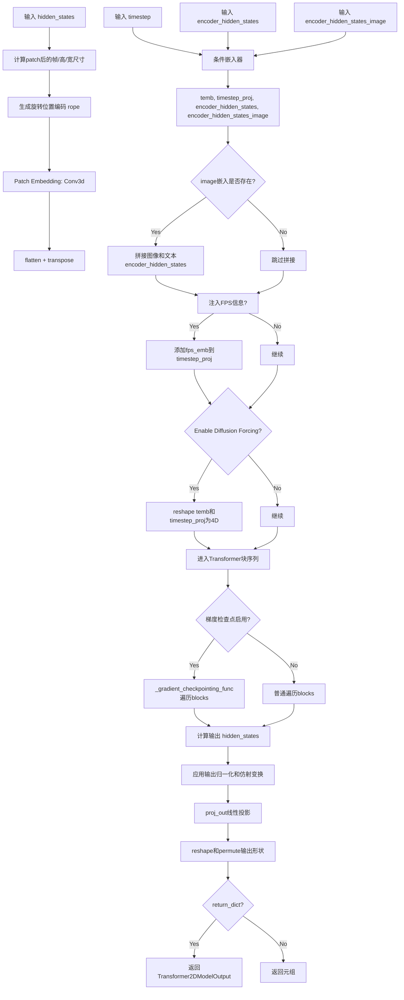

#### 带注释源码

```python
@apply_lora_scale("attention_kwargs")
def forward(
    self,
    hidden_states: torch.Tensor,
    timestep: torch.LongTensor,
    encoder_hidden_states: torch.Tensor,
    encoder_hidden_states_image: torch.Tensor | None = None,
    enable_diffusion_forcing: bool = False,
    fps: torch.Tensor | None = None,
    return_dict: bool = True,
    attention_kwargs: dict[str, Any] | None = None,
) -> torch.Tensor | dict[str, torch.Tensor]:
    # 1. 获取输入维度信息
    batch_size, num_channels, num_frames, height, width = hidden_states.shape
    p_t, p_h, p_w = self.config.patch_size
    
    # 2. 计算patch后的空间维度
    post_patch_num_frames = num_frames // p_t
    post_patch_height = height // p_h
    post_patch_width = width // p_w

    # 3. 生成3D旋转位置编码 (RoPE)
    rotary_emb = self.rope(hidden_states)

    # 4. 3D Patch Embedding: 将视频帧转换为token序列
    hidden_states = self.patch_embedding(hidden_states)
    # 从 (B, C, T, H, W) 转换为 (B, T*H*W, C)
    hidden_states = hidden_states.flatten(2).transpose(1, 2)

    # 5. 构建因果掩码 (用于Diffusion Forcing模式的多帧处理)
    causal_mask = None
    if self.config.num_frame_per_block > 1:
        # 计算block数量并生成因果关系矩阵
        block_num = post_patch_num_frames // self.config.num_frame_per_block
        range_tensor = torch.arange(block_num, device=hidden_states.device).repeat_interleave(
            self.config.num_frame_per_block
        )
        # 生成上三角掩码: 当前位置只能关注之前的帧
        causal_mask = range_tensor.unsqueeze(0) <= range_tensor.unsqueeze(1)  # f, f
        causal_mask = causal_mask.view(post_patch_num_frames, 1, 1, post_patch_num_frames, 1, 1)
        causal_mask = causal_mask.repeat(
            1, post_patch_height, post_patch_width, 1, post_patch_height, post_patch_width
        )
        causal_mask = causal_mask.reshape(
            post_patch_num_frames * post_patch_height * post_patch_width,
            post_patch_num_frames * post_patch_height * post_patch_width,
        )
        causal_mask = causal_mask.unsqueeze(0).unsqueeze(0)

    # 6. 条件嵌入处理: 时间步 + 文本 + 图像
    temb, timestep_proj, encoder_hidden_states, encoder_hidden_states_image = self.condition_embedder(
        timestep, encoder_hidden_states, encoder_hidden_states_image
    )

    # 7. 将timestep_proj从 (B, 6*inner_dim) reshape为 (B, 6, inner_dim)
    timestep_proj = timestep_proj.unflatten(-1, (6, -1))

    # 8. 图像条件拼接 (I2V任务: 图像token + 文本token)
    if encoder_hidden_states_image is not None:
        encoder_hidden_states = torch.concat([encoder_hidden_states_image, encoder_hidden_states], dim=1)

    # 9. FPS样本信息注入
    if self.config.inject_sample_info:
        fps = torch.tensor(fps, dtype=torch.long, device=hidden_states.device)
        fps_emb = self.fps_embedding(fps)
        
        if enable_diffusion_forcing:
            # Diffusion Forcing模式: 每个时间步独立处理
            timestep_proj = timestep_proj + self.fps_projection(fps_emb).unflatten(1, (6, -1)).repeat(
                timestep.shape[1], 1, 1
            )
        else:
            timestep_proj = timestep_proj + self.fps_projection(fps_emb).unflatten(1, (6, -1))

    # 10. Diffusion Forcing模式下的temb和timestep_proj reshape
    if enable_diffusion_forcing:
        b, f = timestep.shape
        # 扩展为 (B, F, 1, 1, -1)
        temb = temb.view(b, f, 1, 1, -1)
        # timestep_proj: (b, f, 1, 1, 6, inner_dim)
        timestep_proj = timestep_proj.view(b, f, 1, 1, 6, -1)
        
        # 扩展到所有空间位置: (b, f, pp_h, pp_w, -1)
        temb = temb.repeat(1, 1, post_patch_height, post_patch_width, 1).flatten(1, 3)
        timestep_proj = timestep_proj.repeat(1, 1, post_patch_height, post_patch_width, 1, 1).flatten(
            1, 3
        )  # (b, f * pp_h * pp_w, 6, inner_dim)
        
        # 转置: (b, 6, f * pp_h * pp_w, inner_dim)
        timestep_proj = timestep_proj.transpose(1, 2).contiguous()

    # 11. Transformer块序列处理
    if torch.is_grad_enabled() and self.gradient_checkpointing:
        # 梯度检查点模式: 节省显存
        for block in self.blocks:
            hidden_states = self._gradient_checkpointing_func(
                block,
                hidden_states,
                encoder_hidden_states,
                timestep_proj,
                rotary_emb,
                causal_mask,
            )
    else:
        # 标准前向传播
        for block in self.blocks:
            hidden_states = block(
                hidden_states,
                encoder_hidden_states,
                timestep_proj,
                rotary_emb,
                causal_mask,
            )

    # 12. 输出层: 仿射变换 + 投影
    if temb.dim() == 2:
        # 标准模式: 2D temb (batch, 2*inner_dim)
        shift, scale = (self.scale_shift_table + temb.unsqueeze(1)).chunk(2, dim=1)
    elif temb.dim() == 3:
        # Diffusion Forcing模式: 3D temb (batch, frames, 2*inner_dim)
        shift, scale = (self.scale_shift_table.unsqueeze(2) + temb.unsqueeze(1)).chunk(2, dim=1)
        shift, scale = shift.squeeze(1), scale.squeeze(1)

    # 确保shift和scale与hidden_states在同一设备
    shift = shift.to(hidden_states.device)
    scale = scale.to(hidden_states.device)

    # 应用归一化和仿射变换
    hidden_states = (self.norm_out(hidden_states.float()) * (1 + scale) + shift).type_as(hidden_states)

    # 线性投影回原始通道数 * patch_size
    hidden_states = self.proj_out(hidden_states)

    # 13. 输出reshape: 从token序列恢复为3D视频张量
    # (B, T*H*W, C) -> (B, T, H, W, p_t, p_h, p_w, C')
    hidden_states = hidden_states.reshape(
        batch_size, post_patch_num_frames, post_patch_height, post_patch_width, p_t, p_h, p_w, -1
    )
    # 维度重排: (B, C', p_t, p_h, p_w, T, H, W) -> (B, C', T*p_t, H*p_h, W*p_w)
    hidden_states = hidden_states.permute(0, 7, 1, 4, 2, 5, 3, 6)
    output = hidden_states.flatten(6, 7).flatten(4, 5).flatten(2, 3)

    # 14. 返回结果
    if not return_dict:
        return (output,)

    return Transformer2DModelOutput(sample=output)
```


### `SkyReelsV2Transformer3DModel._set_ar_attention`

该方法用于设置因果注意力（Causal Attention）的块大小，通过将传入的 `causal_block_size` 参数注册到模型配置中作为 `num_frame_per_block`，从而控制扩散强迫（Diffusion Forcing）框架中的时序因果掩码生成逻辑。

参数：

- `causal_block_size`：`int`，因果注意力块大小，用于指定每个时间块内的帧数，以生成因果掩码控制时序依赖关系。

返回值：`None`，该方法无返回值，仅修改模型内部配置状态。

#### 流程图

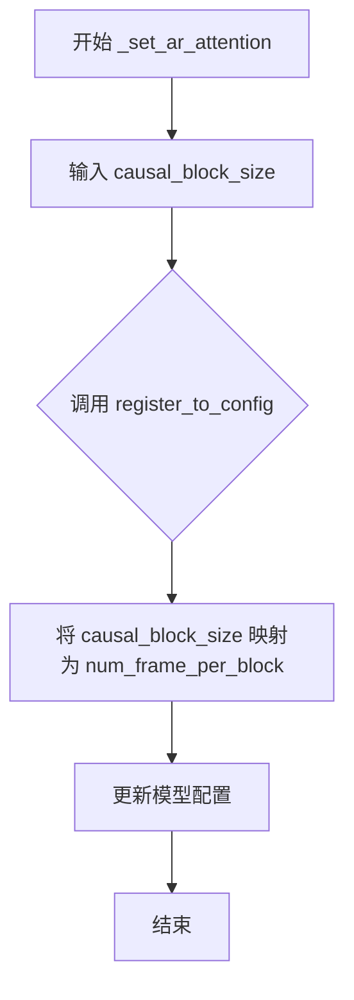

#### 带注释源码

```python
def _set_ar_attention(self, causal_block_size: int):
    """
    设置因果注意力（Auto-Regressive Attention）的块大小。
    
    该方法用于在 Diffusion Forcing 框架中控制时间维度的因果掩码生成。
    通过将 causal_block_size 注册为配置项 num_frame_per_block，
    可以在前向传播中构建时序因果掩码，确保未来帧不会影响当前帧的预测。
    
    参数:
        causal_block_size: int - 因果块大小，表示每个块包含的帧数。
                          较大的值会创建更长的因果依赖范围。
    """
    # 将 causal_block_size 注册到模型的配置中作为 num_frame_per_block
    # 这个配置会在 forward 方法中用于生成 causal_mask
    self.register_to_config(num_frame_per_block=causal_block_size)
```

## 关键组件


### SkyReelsV2AttnProcessor

注意力处理器，负责计算自注意力和交叉注意力，支持旋转位置编码和图像上下文注入。

### SkyReelsV2Attention

核心注意力模块，包含QKV投影，支持融合投影以提升推理效率，并集成了RMSNorm归一化。

### SkyReelsV2ImageEmbedding

图像嵌入模块，包含双层归一化和前馈网络，可选的位置编码支持。

### SkyReelsV2Timesteps

时间步嵌入模块，使用1D正弦余弦位置编码生成时间特征表示。

### SkyReelsV2TimeTextImageEmbedding

复合嵌入模块，整合时间嵌入、文本嵌入和图像嵌入三个分支。

### SkyReelsV2RotaryPosEmbed

3D旋转位置编码模块，支持时空三维位置的旋转嵌入生成。

### SkyReelsV2TransformerBlock

Transformer块，包含自注意力、交叉注意力和前馈网络，支持尺度偏移表实现的自适应门控。

### SkyReelsV2Transformer3DModel

主Transformer模型，用于视频数据处理，支持Diffusion Forcing、图像到视频任务和因果掩码。

### _get_qkv_projections

辅助函数，用于计算Query、Key、Value投影，支持融合和分离两种模式。

### fuse_projections

投影融合方法，将多个独立线性层合并为单个线性层以提升推理速度。

### dispatch_attention_fn

注意力分发函数，根据后端配置选择合适的注意力实现。


## 问题及建议


### 已知问题

- **硬编码的上下文长度**：在 `SkyReelsV2AttnProcessor.__call__` 中，`512` 被硬编码为文本编码器的上下文长度，缺乏灵活性。
- **重复的 `apply_rotary_emb` 函数定义**：该函数在每次调用 `__call__` 时都会被重新定义，导致额外的开销，应定义为模块级函数或静态方法。
- **因果掩码重复计算**：在 `SkyReelsV2Transformer3DModel.forward` 中，`causal_mask` 每次前向传播都会重新计算，应在初始化时或首次计算后缓存。
- **`torch.concat` 而非 `torch.cat`**：代码中使用 `torch.concat`，虽然功能等价，但不符合常见的 `torch.cat` 命名约定。
- **潜在的张量设备不一致**：在 `SkyReelsV2Transformer3DModel` 中处理 `fps` 时，先转换为 tensor 后再转换为 long 类型，但未检查输入 `fps` 的原始类型，可能导致不必要的类型转换。
- **重复的浮点类型转换**：多处使用 `.float()` 和 `.type_as()` 进行类型转换，可能引入额外的计算开销，应统一数据类型处理逻辑。
- **冗余的归一化层参数**：在 `SkyReelsV2TransformerBlock` 中，`norm2` 在 `cross_attn_norm=False` 时被设置为 `nn.Identity()`，但仍作为模块存在，增加内存开销。
- **`SkyReelsV2AttnProcessor2_0` 已废弃**：该类仅作为废弃警告的包装器，应在代码库中移除以减少维护负担。
- **MPS 后端 float64 支持**：`SkyReelsV2RotaryPosEmbed` 中根据 MPS 后端选择 `float64`，但 MPS 对 float64 支持有限，可能导致运行时问题。
- **未使用的 `output_type` 参数**：`SkyReelsV2Timesteps` 中定义了 `output_type` 参数，但在 `forward` 方法中未实际使用。
- **LoRA 相关的 `attention_kwargs` 处理**：虽然使用了 `@apply_lora_scale` 装饰器，但在 `forward` 方法中未体现 `attention_kwargs` 的具体处理逻辑。

### 优化建议

- **移除硬编码值**：将 `512` 提取为配置参数或从模型配置中读取。
- **优化函数定义位置**：将 `apply_rotary_emb` 移至模块级别或定义为类的静态方法，避免重复创建。
- **缓存因果掩码**：在模型初始化或首次前向传播时计算并缓存 `causal_mask`，避免重复计算。
- **统一张量操作 API**：将 `torch.concat` 替换为 `torch.cat`，使用更常见的命名。
- **简化类型转换**：减少 `.float()` 和 `.type_as()` 调用次数，统一在模型入口和出口进行数据类型管理。
- **条件创建归一化层**：根据 `cross_attn_norm` 条件决定是否创建 `norm2`，避免不必要的模块创建。
- **移除废弃类**：删除 `SkyReelsV2AttnProcessor2_0` 类及其相关废弃逻辑。
- **添加 MPS 兼容性检查**：在使用 `float64` 之前检查 MPS 设备能力，选择合适的精度类型。
- **移除未使用参数**：删除 `SkyReelsV2Timesteps` 中未使用的 `output_type` 参数，或实现其功能。
- **优化 LoRA 集成**：确保 `attention_kwargs` 在前向传播中被正确传递和使用。

## 其它


### 设计目标与约束

本代码实现SkyReelsV2Transformer3DModel，一个用于视频生成的3D Transformer架构。核心目标包括：(1) 支持文本到视频(T2V)、图像到视频(I2V)和扩散强制(Diffusion Forcing)三种生成范式；(2) 通过fused projections优化注意力计算效率；(3) 支持1280维图像嵌入(I2V模型)；(4) 支持最大1024序列长度的旋转位置编码；(5) 兼容PyTorch 2.0+的scaled_dot_product_attention。约束条件：输入通道数16、输出通道数16、默认patch大小(1,2,2)、默认层数32、默认FFN维度8192。

### 错误处理与异常设计

代码采用以下错误处理机制：(1) 在SkyReelsV2AttnProcessor.__init__中检查PyTorch版本，若无scaled_dot_product_attention则抛出ImportError；(2) SkyReelsV2AttnProcessor2_0类使用deprecation_message警告用户该类已废弃，指向SkyReelsV2AttnProcessor；(3) fuse_projections方法中使用getattr和hasattr进行安全检查，避免对未fused的投影重复操作或删除不存在的属性；(4) forward方法中通过类型检查确保temb维度处理正确（2D或3D或4D）；(5) 设备兼容性处理：在多GPU推理时显式将shift和scale张量移动到hidden_states所在设备。

### 数据流与状态机

数据流分为以下阶段：(1) 输入阶段：接收hidden_states(5D张量[B,C,T,H,W])、timestep、encoder_hidden_states、encoder_hidden_states_image可选、fps可选；(2) Patch嵌入阶段：通过Conv3d进行3D patch嵌入并flatten转置；(3) 位置编码阶段：通过SkyReelsV2RotaryPosEmbed生成旋转位置编码；(4) 条件嵌入阶段：通过SkyReelsV2TimeTextImageEmbedding生成temb、timestep_proj、文本和图像嵌入；(5) 因果掩码生成：当num_frame_per_block>1时生成块级因果掩码用于Diffusion Forcing；(6) Transformer块处理：32层Transformer块依次处理，每层包含自注意力、交叉注意力和前馈网络；(7) 输出投影阶段：norm_out归一化、scale_shift变换、proj_out投影、reshape重排为输出格式。

### 外部依赖与接口契约

主要外部依赖包括：(1) torch>=2.0：核心张量计算和scaled_dot_product_attention；(2) diffusers库：ConfigMixin、register_to_config、ModelMixin、PeftAdapterMixin、FromOriginalModelMixin、CacheMixin、AttentionMixin等Mixin类；(3) attention_dispatch模块：dispatch_attention_fn用于注意力计算后端分发；(4) normalization模块：FP32LayerNorm；(5) embeddings模块：PixArtAlphaTextProjection、TimestepEmbedding、get_1d_rotary_pos_embed、get_1d_sincos_pos_embed_from_grid；(6) cache_utils模块：CacheMixin。接口契约：forward方法接受hidden_states(B,C,T,H,W)、timestep(LongTensor)、encoder_hidden_states、encoder_hidden_states_image可选、enable_diffusion_forcing、fps可选、return_dict，返回Tensor或Transformer2DModelOutput。

### 性能考虑与优化点

代码包含以下性能优化：(1) Fused Projections：通过fuse_projections将QKV投影融合为单个线性层，减少内存访问和计算量；(2) Gradient Checkpointing：支持梯度检查点以节省显存；(3) FP32LayerNorm：使用FP32精度进行归一化以提高稳定性；(4) 设备兼容性：meta设备用于创建fused层结构，避免实际分配显存；(5) 注意力后端分发：dispatch_attention_fn支持不同计算后端的动态选择；(6) 参数_dtype管理：通过get_parameter_dtype确保参数使用适当的数据类型。

### 安全性考虑

代码包含以下安全措施：(1) 权限声明：文件头部包含Apache 2.0许可证声明和版权声明；(2) 设备安全：shift和scale张量显式移动到hidden_states设备避免设备不匹配；(3) 类型转换安全：timestep类型转换时检查目标dtype避免int8精度问题；(4) 内存安全：unfuse_projections中使用delattr安全删除属性；(5) 输入验证：encoder_hidden_states_img处理时使用硬编码的512上下文长度进行切片。

### 测试策略

建议的测试策略包括：(1) 单元测试：测试各模块(SkyReelsV2Attention、SkyReelsV2TransformerBlock、SkyReelsV2RotaryPosEmbed)的输出维度正确性；(2) 融合测试：测试fuse_projections和unfuse_projections前后的数值等价性；(3) 梯度测试：验证gradient_checkpointing的梯度计算正确性；(4) 端到端测试：在不同生成模式(T2V/I2V/DF)下验证模型输出的合理性；(5) 设备测试：测试CPU、CUDA、MPS设备上的兼容性；(6) 注意力后端测试：测试不同注意力后端的输出一致性。

### 版本兼容性

版本兼容性说明：(1) PyTorch版本：最低要求PyTorch 2.0（用于scaled_dot_product_attention）；(2) MPS后端：SkyReelsV2RotaryPosEmbed中使用float32以兼容Apple MPS后端（其他设备使用float64）；(3) 废弃兼容：SkyReelsV2AttnProcessor2_0保留但标记为废弃，提供向后兼容性；(4) 配置兼容性：_keys_to_ignore_on_load_unexpected包含"norm_added_q"以处理版本间权重不匹配。

### 配置与超参数

主要可配置超参数包括：patch_size(1,2,2)、num_attention_heads(16)、attention_head_dim(128)、in_channels(16)、out_channels(16)、text_dim(4096)、freq_dim(256)、ffn_dim(8192)、num_layers(32)、cross_attn_norm(True)、qk_norm("rms_norm_across_heads")、eps(1e-6)、image_dim(None/1280)、added_kv_proj_dim(None)、rope_max_seq_len(1024)、pos_embed_seq_len(None)、inject_sample_info(False)、num_frame_per_block(1)。

### 许可证与版权

本代码采用Apache License 2.0开源许可证。版权归属：Copyright 2025 The SkyReels Team, The Wan Team and The HuggingFace Team。许可证允许在遵守条款的前提下自由使用、修改和分发代码。


    