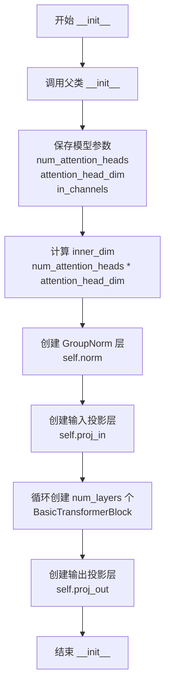
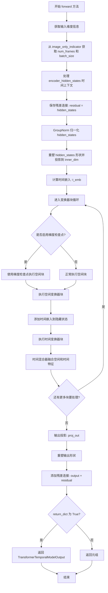

# `diffusers\src\diffusers\models\transformers\transformer_temporal.py` 详细设计文档

该文件实现了用于视频数据处理的Transformer模型，包含TransformerTemporalModel（时序Transformer）和TransformerSpatioTemporalModel（时空Transformer）两个核心类，支持时间维度和空间维度的注意力机制，用于图像/视频生成任务中的潜在时空建模。

## 整体流程

```mermaid
graph TD
A[输入hidden_states] --> B[Reshape: (batch, frames, C, H, W) -> (batch, C, frames, H, W)]
B --> C[GroupNorm归一化]
C --> D[Permute维度重排并reshape]
D --> E[proj_in线性投影]
E --> F{遍历transformer_blocks}
F -->|block| G[BasicTransformerBlock处理]
G --> F
F --> H[proj_out线性投影]
H --> I[Reshape回(batch*frames, C, H, W)]
I --> J[残差连接: output + residual]
J --> K[返回TransformerTemporalModelOutput]

--- SpatioTemporal流程 ---
L[输入hidden_states] --> M[构建time_context]
M --> N[GroupNorm + reshape + proj_in]
N --> O[计算t_emb时间嵌入]
O --> P{遍历transformer_blocks和temporal_blocks}
P -->|spatial block| Q[BasicTransformerBlock]
Q --> R[添加time embedding]
R -->|temporal block| S[TemporalBasicTransformerBlock]
S --> T[AlphaBlender混合时空特征]
T --> P
P --> U[proj_out投影]
U --> V[Reshape + Permute]
V --> W[残差连接]
W --> X[返回TransformerTemporalModelOutput]
```

## 类结构

```
ModelMixin (基类)
└── TransformerTemporalModel

nn.Module (基类)
└── TransformerSpatioTemporalModel

BaseOutput (基类)
└── TransformerTemporalModelOutput (数据类)
```

## 全局变量及字段


### `_skip_layerwise_casting_patterns`
    
跳过的层级别类型转换模式

类型：`list`
    


### `TransformerTemporalModelOutput.sample`
    
模型输出的隐藏状态张量，形状为(batch_size x num_frames, num_channels, height, width)

类型：`torch.Tensor`
    


### `TransformerTemporalModel.num_attention_heads`
    
多头注意力机制的头数

类型：`int`
    


### `TransformerTemporalModel.attention_head_dim`
    
每个注意力头的维度

类型：`int`
    


### `TransformerTemporalModel.in_channels`
    
输入通道数

类型：`int | None`
    


### `TransformerTemporalModel.norm`
    
分组归一化层

类型：`torch.nn.GroupNorm`
    


### `TransformerTemporalModel.proj_in`
    
输入线性投影层

类型：`nn.Linear`
    


### `TransformerTemporalModel.transformer_blocks`
    
Transformer块列表

类型：`nn.ModuleList`
    


### `TransformerTemporalModel.proj_out`
    
输出线性投影层

类型：`nn.Linear`
    


### `TransformerTemporalModel._skip_layerwise_casting_patterns`
    
跳过的层级别类型转换模式

类型：`list`
    


### `TransformerSpatioTemporalModel.num_attention_heads`
    
多头注意力的头数

类型：`int`
    


### `TransformerSpatioTemporalModel.attention_head_dim`
    
每个注意力头的维度

类型：`int`
    


### `TransformerSpatioTemporalModel.in_channels`
    
输入通道数

类型：`int`
    


### `TransformerSpatioTemporalModel.inner_dim`
    
内部维度 (num_attention_heads * attention_head_dim)

类型：`int`
    


### `TransformerSpatioTemporalModel.norm`
    
分组归一化层

类型：`torch.nn.GroupNorm`
    


### `TransformerSpatioTemporalModel.proj_in`
    
输入线性投影

类型：`nn.Linear`
    


### `TransformerSpatioTemporalModel.transformer_blocks`
    
空间Transformer块列表

类型：`nn.ModuleList`
    


### `TransformerSpatioTemporalModel.temporal_transformer_blocks`
    
时序Transformer块列表

类型：`nn.ModuleList`
    


### `TransformerSpatioTemporalModel.time_pos_embed`
    
时间位置嵌入层

类型：`TimestepEmbedding`
    


### `TransformerSpatioTemporalModel.time_proj`
    
时间投影层

类型：`Timesteps`
    


### `TransformerSpatioTemporalModel.time_mixer`
    
时空特征混合器

类型：`AlphaBlender`
    


### `TransformerSpatioTemporalModel.out_channels`
    
输出通道数

类型：`int`
    


### `TransformerSpatioTemporalModel.proj_out`
    
输出线性投影

类型：`nn.Linear`
    


### `TransformerSpatioTemporalModel.gradient_checkpointing`
    
梯度检查点标志

类型：`bool`
    
    

## 全局函数及方法


### `TransformerTemporalModel.__init__`

该方法是 `TransformerTemporalModel` 类的构造函数，负责初始化一个用于视频数据的Transformer模型。它配置了模型的各项参数，包括注意力头数、维度、层数、归一化设置等，并构建了模型的内部组件（GroupNorm层、输入投影、Transformer块序列和输出投影）。

参数：

- `num_attention_heads`：`int`，可选，默认值 16，多头注意力机制中使用的头数
- `attention_head_dim`：`int`，可选，默认值 88，每个注意力头的通道数
- `in_channels`：`int | None`，可选，默认值 None，输入和输出通道数（输入为连续时指定）
- `out_channels`：`int | None`，可选，默认值 None，输出通道数（当前实现中实际未使用）
- `num_layers`：`int`，可选，默认值 1，要使用的Transformer块层数
- `dropout`：`float`，可选，默认值 0.0，要使用的dropout概率
- `norm_num_groups`：`int`，可选，默认值 32，GroupNorm的组数
- `cross_attention_dim`：`int | None`，可选，默认值 None，要使用的`encoder_hidden_states`维度
- `attention_bias`：`bool`，可选，默认值 False，配置`TransformerBlock`注意力是否包含偏置参数
- `sample_size`：`int | None`，可选，默认值 None，潜在图像的宽度（输入为离散时指定），用于学习位置嵌入
- `activation_fn`：`str`，可选，默认值 "geglu"，前馈网络中使用的激活函数
- `norm_elementwise_affine`：`bool`，可选，默认值 True，配置`TransformerBlock`是否使用可学习的elementwise仿射参数进行归一化
- `double_self_attention`：`bool`，可选，默认值 True，配置每个`TransformerBlock`是否包含两个自注意力层
- `positional_embeddings`：`str | None`，可选，默认值 None，要应用于序列输入的位置嵌入类型
- `num_positional_embeddings`：`int | None`，可选，默认值 None，应用位置嵌入的序列最大长度

返回值：`None`，构造函数无返回值

#### 流程图



#### 带注释源码

```python
@register_to_config
def __init__(
    self,
    num_attention_heads: int = 16,           # 多头注意力的头数，默认16
    attention_head_dim: int = 88,            # 每个注意力头的维度，默认88
    in_channels: int | None = None,          # 输入通道数
    out_channels: int | None = None,          # 输出通道数（当前未使用）
    num_layers: int = 1,                      # Transformer块的数量，默认1
    dropout: float = 0.0,                     # Dropout概率，默认0.0
    norm_num_groups: int = 32,                # GroupNorm的组数，默认32
    cross_attention_dim: int | None = None,  # 交叉注意力维度
    attention_bias: bool = False,             # 注意力偏置标志
    sample_size: int | None = None,           # 样本大小（离散输入时使用）
    activation_fn: str = "geglu",             # 激活函数类型，默认geglu
    norm_elementwise_affine: bool = True,    # 是否使用elementwise仿射参数
    double_self_attention: bool = True,      # 是否使用双重自注意力
    positional_embeddings: str | None = None, # 位置嵌入类型
    num_positional_embeddings: int | None = None, # 位置嵌入的最大长度
):
    # 调用父类(ModelMixin和ConfigMixin)的初始化方法
    super().__init__()
    
    # 保存注意力头数量和每个头的维度
    self.num_attention_heads = num_attention_heads
    self.attention_head_dim = attention_head_dim
    
    # 计算内部维度：头数 × 每头维度
    inner_dim = num_attention_heads * attention_head_dim

    # 保存输入通道数
    self.in_channels = in_channels

    # 创建GroupNorm层：用于对输入进行组归一化
    # 参数：组数、通道数、eps防止除零、是否使用仿射
    self.norm = torch.nn.GroupNorm(
        num_groups=norm_num_groups, 
        num_channels=in_channels, 
        eps=1e-6, 
        affine=True
    )
    
    # 创建输入投影层：将输入通道映射到内部维度
    # 输入: in_channels -> 输出: inner_dim
    self.proj_in = nn.Linear(in_channels, inner_dim)

    # 定义Transformer块列表
    # 使用nn.ModuleList存储多个BasicTransformerBlock
    self.transformer_blocks = nn.ModuleList(
        [
            BasicTransformerBlock(
                inner_dim,                   # 内部维度
                num_attention_heads,         # 注意力头数
                attention_head_dim,         # 注意力头维度
                dropout=dropout,             # Dropout概率
                cross_attention_dim=cross_attention_dim,  # 交叉注意力维度
                activation_fn=activation_fn, # 激活函数
                attention_bias=attention_bias, # 注意力偏置
                double_self_attention=double_self_attention, # 双重自注意力
                norm_elementwise_affine=norm_elementwise_affine, # 元素级仿射
                positional_embeddings=positional_embeddings,     # 位置嵌入
                num_positional_embeddings=num_positional_embeddings, # 位置嵌入数量
            )
            for d in range(num_layers)  # 循环创建num_layers个块
        ]
    )

    # 创建输出投影层：将内部维度映射回输入通道
    # 输入: inner_dim -> 输出: in_channels
    self.proj_out = nn.Linear(inner_dim, in_channels)
```


### `TransformerTemporalModel.forward`

该方法是 `TransformerTemporalModel` 类的前向传播实现，用于处理视频类数据。它接收包含多帧的隐藏状态，通过归一化、投影、Transformer 块处理和输出投影等步骤，最终输出与输入残差相加后的样本。

参数：

- `hidden_states`：`torch.Tensor`，输入隐藏状态，连续情况下形状为 `(batch_size x num_frames, num_channels, height, width)`，离散情况下为 `(batch size, num latent pixels)`
- `encoder_hidden_states`：`torch.LongTensor | None`，交叉注意力层的条件嵌入，如果未提供则默认为自注意力
- `timestep`：`torch.LongTensor | None`，用于表示去噪步骤的时间步，可选
- `class_labels`：`torch.LongTensor`，用于类别标签条件的可选类别标签
- `num_frames`：`int`，每个批次要处理的帧数，默认为 1
- `cross_attention_kwargs`：`dict[str, Any] | None`，可选的 kwargs 字典传递给注意力处理器
- `return_dict`：`bool`，是否返回 `TransformerTemporalModelOutput`，默认为 True

返回值：`TransformerTemporalModelOutput | tuple`，当 `return_dict` 为 True 时返回包含样本张量的输出对象，否则返回元组

#### 流程图

```mermaid
flowchart TD
    A[输入 hidden_states] --> B[获取 batch_frames, channel, height, width]
    B --> C[保存 residual = hidden_states]
    C --> D[reshape: (batch_size, num_frames, channel, height, width)]
    D --> E[permute: (batch_size, channel, num_frames, height, width)]
    E --> F[self.norm 归一化]
    F --> G[reshape: (batch_size * height * width, num_frames, channel)]
    G --> H[self.proj_in 投影到 inner_dim]
    H --> I[遍历 transformer_blocks]
    I --> J[block 处理 hidden_states]
    J --> I
    I --> K{所有块处理完成?}
    K -->|是| L[self.proj_out 投影回 in_channels]
    K -->|否| I
    L --> M[reshape 和 permute 回到 (batch_frames, channel, height, width)]
    M --> N[output = hidden_states + residual]
    N --> O{return_dict?}
    O -->|True| P[返回 TransformerTemporalModelOutput]
    O -->|False| Q[返回 tuple]
```

#### 带注释源码

```python
def forward(
    self,
    hidden_states: torch.Tensor,
    encoder_hidden_states: torch.LongTensor | None = None,
    timestep: torch.LongTensor | None = None,
    class_labels: torch.LongTensor = None,
    num_frames: int = 1,
    cross_attention_kwargs: dict[str, Any] | None = None,
    return_dict: bool = True,
) -> TransformerTemporalModelOutput:
    """
    The [`TransformerTemporal`] forward method.

    Args:
        hidden_states (`torch.LongTensor` of shape `(batch size, num latent pixels)` if discrete, `torch.Tensor` of shape `(batch size, channel, height, width)` if continuous):
            Input hidden_states.
        encoder_hidden_states ( `torch.LongTensor` of shape `(batch size, encoder_hidden_states dim)`, *optional*):
            Conditional embeddings for cross attention layer. If not given, cross-attention defaults to
            self-attention.
        timestep ( `torch.LongTensor`, *optional*):
            Used to indicate denoising step. Optional timestep to be applied as an embedding in `AdaLayerNorm`.
        class_labels ( `torch.LongTensor` of shape `(batch size, num classes)`, *optional*):
            Used to indicate class labels conditioning. Optional class labels to be applied as an embedding in
            `AdaLayerZeroNorm`.
        num_frames (`int`, *optional*, defaults to 1):
            The number of frames to be processed per batch. This is used to reshape the hidden states.
        cross_attention_kwargs (`dict`, *optional*):
            A kwargs dictionary that if specified is passed along to the `AttentionProcessor` as defined under
            `self.processor` in
            [diffusers.models.attention_processor](https://github.com/huggingface/diffusers/blob/main/src/diffusers/models/attention_processor.py).
        return_dict (`bool`, *optional*, defaults to `True`):
            Whether or not to return a [`~models.transformers.transformer_temporal.TransformerTemporalModelOutput`]
            instead of a plain tuple.

    Returns:
        [`~models.transformers.transformer_temporal.TransformerTemporalModelOutput`] or `tuple`:
            If `return_dict` is True, an
            [`~models.transformers.transformer_temporal.TransformerTemporalModelOutput`] is returned, otherwise a
            `tuple` where the first element is the sample tensor.
    """
    # 1. Input: 提取输入张量的维度信息
    # hidden_states 形状: (batch_frames, channel, height, width)
    # 其中 batch_frames = batch_size * num_frames
    batch_frames, channel, height, width = hidden_states.shape
    # 计算实际批量大小
    batch_size = batch_frames // num_frames

    # 保存残差连接，用于后续的跳跃连接
    residual = hidden_states

    # 2. 重新整形 hidden_states 以分离批量和帧维度
    # 从 (batch_frames, channel, height, width) 变为 (batch_size, num_frames, channel, height, width)
    hidden_states = hidden_states[None, :].reshape(batch_size, num_frames, channel, height, width)
    # 调整维度顺序: (batch_size, num_frames, channel, height, width) -> (batch_size, channel, num_frames, height, width)
    hidden_states = hidden_states.permute(0, 2, 1, 3, 4)

    # 3. 应用 GroupNorm 归一化
    hidden_states = self.norm(hidden_states)
    # 重新整形以适应 Transformer 块: (batch_size, channel, num_frames, height, width) -> (batch_size * height * width, num_frames, channel)
    hidden_states = hidden_states.permute(0, 3, 4, 2, 1).reshape(batch_size * height * width, num_frames, channel)

    # 4. 投影到内部维度 (inner_dim = num_attention_heads * attention_head_dim)
    hidden_states = self.proj_in(hidden_states)

    # 5. Blocks: 遍历所有 Transformer 块进行处理
    for block in self.transformer_blocks:
        hidden_states = block(
            hidden_states,
            encoder_hidden_states=encoder_hidden_states,
            timestep=timestep,
            cross_attention_kwargs=cross_attention_kwargs,
            class_labels=class_labels,
        )

    # 6. Output: 投影回原始通道数并重新整形
    hidden_states = self.proj_out(hidden_states)
    # 重新整形回 (batch_size, height, width, num_frames, channel)
    hidden_states = (
        hidden_states[None, None, :]
        .reshape(batch_size, height, width, num_frames, channel)
        .permute(0, 3, 4, 1, 2)  # 变为 (batch_size, num_frames, channel, height, width)
        .contiguous()
    )
    # 重新整形为 (batch_frames, channel, height, width)
    hidden_states = hidden_states.reshape(batch_frames, channel, height, width)

    # 7. 残差连接: 将处理后的输出与原始输入相加
    output = hidden_states + residual

    # 8. 根据 return_dict 返回结果
    if not return_dict:
        return (output,)

    return TransformerTemporalModelOutput(sample=output)
```


### `TransformerSpatioTemporalModel.__init__`

这是 `TransformerSpatioTemporalModel` 类的初始化方法，用于构建一个用于视频数据的时空变换器模型。该方法接受注意力头数、注意力头维度、输入/输出通道数、层数和交叉注意力维度等参数，初始化模型的输入层、空间/时间变换器块、时间嵌入层、输出层等核心组件。

参数：

- `num_attention_heads`：`int`，多头注意力机制中的注意力头数量，默认为 16
- `attention_head_dim`：`int`，每个注意力头中的通道维度，默认为 88
- `in_channels`：`int`，输入和输出的通道数，默认为 320
- `out_channels`：`int | None`，输出通道数，若为 None 则默认为与 in_channels 相同
- `num_layers`：`int`，Transformer 块的层数，默认为 1
- `cross_attention_dim`：`int | None`，交叉注意力中的维度，若为 None 则不使用交叉注意力

返回值：`None`，该方法仅初始化对象属性，不返回任何值

#### 流程图

```mermaid
flowchart TD
    A[开始 __init__] --> B[调用 super().__init__]
    B --> C[保存 num_attention_heads 和 attention_head_dim]
    C --> D[计算 inner_dim = num_attention_heads * attention_head_dim]
    D --> E[保存 in_channels 和 inner_dim]
    E --> F[创建 GroupNorm 层: self.norm]
    F --> G[创建输入投影层: self.proj_in Linear]
    G --> H[创建空间 Transformer 块列表: self.transformer_blocks]
    H --> I[创建时间 Transformer 块列表: self.temporal_transformer_blocks]
    I --> J[创建时间位置嵌入: self.time_pos_embed]
    J --> K[创建时间投影: self.time_proj]
    K --> L[创建时间混合器: self.time_mixer AlphaBlender]
    L --> M[设置输出通道数 self.out_channels]
    M --> N[创建输出投影层: self.proj_out]
    N --> O[初始化梯度检查点标志: self.gradient_checkpointing = False]
    O --> P[结束 __init__]
```

#### 带注释源码

```python
def __init__(
    self,
    num_attention_heads: int = 16,
    attention_head_dim: int = 88,
    in_channels: int = 320,
    out_channels: int | None = None,
    num_layers: int = 1,
    cross_attention_dim: int | None = None,
):
    """
    初始化时空 Transformer 模型。

    参数:
        num_attention_heads: 多头注意力中的头数
        attention_head_dim: 每个头的维度
        in_channels: 输入通道数
        out_channels: 输出通道数，默认为 None（等同于 in_channels）
        num_layers: Transformer 块的数量
        cross_attention_dim: 交叉注意力维度
    """
    # 调用父类 nn.Module 的初始化方法
    super().__init__()
    
    # 保存注意力头数量和每个头的维度配置
    self.num_attention_heads = num_attention_heads
    self.attention_head_dim = attention_head_dim

    # 计算内部维度：总维度 = 头数 * 每头维度
    inner_dim = num_attention_heads * attention_head_dim
    self.inner_dim = inner_dim

    # ==================== 2. 定义输入层 ====================
    # 保存输入通道数
    self.in_channels = in_channels
    
    # 创建 GroupNorm 归一化层，用于稳定训练
    # 参数：组数=32，输入通道数，epsilon=1e-6
    self.norm = torch.nn.GroupNorm(num_groups=32, num_channels=in_channels, eps=1e-6)
    
    # 创建输入投影层：将 in_channels 维度映射到 inner_dim
    self.proj_in = nn.Linear(in_channels, inner_dim)

    # ==================== 3. 定义空间 Transformer 块 ====================
    # 创建多个 BasicTransformerBlock 组成的 ModuleList
    # 每个块处理空间维度的注意力
    self.transformer_blocks = nn.ModuleList(
        [
            BasicTransformerBlock(
                inner_dim,                    # 输入/输出维度
                num_attention_heads,          # 注意力头数
                attention_head_dim,           # 注意力头维度
                cross_attention_dim=cross_attention_dim,  # 交叉注意力维度
            )
            for d in range(num_layers)       # 根据层数创建对应数量的块
        ]
    )

    # 时间混合的内部维度
    time_mix_inner_dim = inner_dim
    
    # ==================== 创建时间 Transformer 块 ====================
    # 创建多个 TemporalBasicTransformerBlock 组成的 ModuleList
    # 每个块处理时间维度的注意力
    self.temporal_transformer_blocks = nn.ModuleList(
        [
            TemporalBasicTransformerBlock(
                inner_dim,                    # 主维度
                time_mix_inner_dim,            # 时间混合维度
                num_attention_heads,           # 注意力头数
                attention_head_dim,           # 注意力头维度
                cross_attention_dim=cross_attention_dim,  # 交叉注意力维度
            )
            for _ in range(num_layers)        # 根据层数创建对应数量的块
        ]
    )

    # ==================== 定义时间嵌入相关组件 ====================
    # 计算时间嵌入维度：通常是输入通道数的 4 倍
    time_embed_dim = in_channels * 4
    
    # 创建时间位置嵌入层：TimestepEmbedding 用于将时间步映射到嵌入向量
    self.time_pos_embed = TimestepEmbedding(in_channels, time_embed_dim, out_dim=in_channels)
    
    # 创建时间投影层：Timesteps 用于将帧索引映射到时间特征
    self.time_proj = Timesteps(in_channels, True, 0)
    
    # 创建时间混合器：AlphaBlender 用于混合空间和时间特征
    # alpha=0.5 表示空间和时间特征的混合权重各占 50%
    # merge_strategy="learned_with_images" 表示混合策略通过图像学习得到
    self.time_mixer = AlphaBlender(alpha=0.5, merge_strategy="learned_with_images")

    # ==================== 4. 定义输出层 ====================
    # 设置输出通道数：如果未指定，则使用输入通道数
    self.out_channels = in_channels if out_channels is None else out_channels
    
    # 创建输出投影层：将 inner_dim 映射回 in_channels
    # TODO: 建议使用 out_channels 进行连续投影以提高灵活性
    self.proj_out = nn.Linear(inner_dim, in_channels)

    # 初始化梯度检查点标志，默认为 False
    # 开启后可在前向传播时节省显存，但会增加计算时间
    self.gradient_checkpointing = False
```


### `TransformerSpatioTemporalModel.forward`

该方法是 `TransformerSpatioTemporalModel` 类的核心前向传播方法，负责处理视频数据的时空变换。它首先对输入的隐藏状态进行规范化和线性投影，然后依次通过空间变换器块和时间变换器块进行特征处理，最后通过时间混合器融合空间和时间特征，并添加残差连接输出最终结果。

参数：

- `hidden_states`：`torch.Tensor`，形状为 `(batch_size * num_frames, channels, height, width)`，输入的隐藏状态张量
- `encoder_hidden_states`：`torch.Tensor | None`，条件嵌入向量，用于跨注意力层，若不提供则默认为自注意力
- `image_only_indicator`：`torch.Tensor | None`，形状为 `(batch_size, num_frames)`，指示输入是仅包含图像（值为1）还是包含视频帧（值为0）
- `return_dict`：`bool`，默认为 `True`，是否返回 `TransformerTemporalModelOutput` 对象而非元组

返回值：`TransformerTemporalModelOutput | tuple`，若 `return_dict` 为 True 则返回包含 sample 张量的输出对象，否则返回元组

#### 流程图



#### 带注释源码

```python
def forward(
    self,
    hidden_states: torch.Tensor,
    encoder_hidden_states: torch.Tensor | None = None,
    image_only_indicator: torch.Tensor | None = None,
    return_dict: bool = True,
):
    """
    Args:
        hidden_states (`torch.Tensor` of shape `(batch size, channel, height, width)`):
            Input hidden_states.
        encoder_hidden_states ( `torch.LongTensor` of shape `(batch size, encoder_hidden_states dim)`, *optional*):
            Conditional embeddings for cross attention layer. If not given, cross-attention defaults to
            self-attention.
        image_only_indicator (`torch.LongTensor` of shape `(batch size, num_frames)`, *optional*):
            A tensor indicating whether the input contains only images. 1 indicates that the input contains only
            images, 0 indicates that the input contains video frames.
        return_dict (`bool`, *optional*, defaults to `True`):
            Whether or not to return a [`~models.transformers.transformer_temporal.TransformerTemporalModelOutput`]
            instead of a plain tuple.

    Returns:
        [`~models.transformers.transformer_temporal.TransformerTemporalModelOutput`] or `tuple`:
            If `return_dict` is True, an
            [`~models.transformers.transformer_temporal.TransformerTemporalModelOutput`] is returned, otherwise a
            `tuple` where the first element is the sample tensor.
    """
    # 1. Input - 提取输入维度信息
    # hidden_states 形状: (batch_frames, channels, height, width)
    batch_frames, _, height, width = hidden_states.shape
    # 从 image_only_indicator 获取帧数和批次大小
    num_frames = image_only_indicator.shape[-1]
    batch_size = batch_frames // num_frames

    # 处理时间上下文，用于时间变换器的 cross attention
    # encoder_hidden_states 形状: (batch_size * num_frames, seq_len, dim)
    time_context = encoder_hidden_states
    # 只取第一个时间步的时间上下文作为参考
    time_context_first_timestep = time_context[None, :].reshape(
        batch_size, num_frames, -1, time_context.shape[-1]
    )[:, 0]
    # 将时间上下文广播到所有空间位置
    time_context = time_context_first_timestep[:, None].broadcast_to(
        batch_size, height * width, time_context.shape[-2], time_context.shape[-1]
    )
    # 重塑为 (batch_size * height * width, seq_len, dim)
    time_context = time_context.reshape(batch_size * height * width, -1, time_context.shape[-1])

    # 保存残差连接，用于后续的跳跃连接
    residual = hidden_states

    # 2. Input Processing - 输入处理
    # GroupNorm 归一化
    hidden_states = self.norm(hidden_states)
    inner_dim = hidden_states.shape[1]
    # 形状变换: (batch_frames, channels, height, width) -> (batch_frames, height*width, channels)
    hidden_states = hidden_states.permute(0, 2, 3, 1).reshape(batch_frames, height * width, inner_dim)
    # 线性投影到内部维度
    hidden_states = self.proj_in(hidden_states)

    # 3. Time Embedding - 时间嵌入计算
    # 创建帧索引: [0, 1, 2, ..., num_frames-1]
    num_frames_emb = torch.arange(num_frames, device=hidden_states.device)
    # 重复每个索引 batch_size 次
    num_frames_emb = num_frames_emb.repeat(batch_size, 1)
    num_frames_emb = num_frames_emb.reshape(-1)
    # 投影到时间嵌入空间
    t_emb = self.time_proj(num_frames_emb)

    # 确保时间嵌入与隐藏状态数据类型一致（处理 fp16/bf16 精度问题）
    t_emb = t_emb.to(dtype=hidden_states.dtype)

    # 最终的时间嵌入形状: (batch_size * num_frames, 1, embed_dim)
    emb = self.time_pos_embed(t_emb)
    emb = emb[:, None, :]

    # 4. Blocks - 变换器块处理
    # 遍历空间变换器和时间变换器块
    for block, temporal_block in zip(self.transformer_blocks, self.temporal_transformer_blocks):
        # 检查是否启用梯度检查点以节省显存
        if torch.is_grad_enabled() and self.gradient_checkpointing:
            # 使用梯度检查点执行空间变换器块
            hidden_states = self._gradient_checkpointing_func(
                block, hidden_states, None, encoder_hidden_states, None
            )
        else:
            # 正常执行空间变换器块
            hidden_states = block(hidden_states, encoder_hidden_states=encoder_hidden_states)

        # 为时间处理准备隐藏状态
        hidden_states_mix = hidden_states
        # 添加时间嵌入
        hidden_states_mix = hidden_states_mix + emb

        # 执行时间变换器块
        hidden_states_mix = temporal_block(
            hidden_states_mix,
            num_frames=num_frames,
            encoder_hidden_states=time_context,
        )
        
        # 使用时间混合器融合空间特征和时间特征
        # image_only_indicator 指示哪些帧是图像（只处理空间信息）还是视频帧
        hidden_states = self.time_mixer(
            x_spatial=hidden_states,
            x_temporal=hidden_states_mix,
            image_only_indicator=image_only_indicator,
        )

    # 5. Output - 输出处理
    # 输出投影
    hidden_states = self.proj_out(hidden_states)
    # 重塑输出形状: (batch_frames, channels, height, width)
    hidden_states = hidden_states.reshape(batch_frames, height, width, inner_dim).permute(0, 3, 1, 2).contiguous()

    # 残差连接
    output = hidden_states + residual

    # 根据 return_dict 返回结果
    if not return_dict:
        return (output,)

    return TransformerTemporalModelOutput(sample=output)
```

## 关键组件


### TransformerTemporalModel

用于处理视频类数据的时序Transformer模型，继承自ModelMixin和ConfigMixin，支持通过BasicTransformerBlock处理时空维度信息并进行条件嵌入

### TransformerSpatioTemporalModel

处理时空数据的Transformer模型，结合空间Transformer块和时间Transformer块，通过AlphaBlender混合器融合空间与时间特征

### BasicTransformerBlock

空间域Transformer块，用于处理空间维度的自注意力和交叉注意力，支持timestep和class_labels条件嵌入

### TemporalBasicTransformerBlock

时间域Transformer块，专门处理时间维度的注意力计算，支持num_frames参数进行时序建模

### TimestepEmbedding

时间步嵌入层，将离散的时间步转换为连续嵌入向量，支持位置编码

### Timesteps

时间步处理模块，将帧索引转换为时间嵌入，不包含权重，始终返回float32张量

### AlphaBlender

时间和空间特征混合器，通过learned_with_images策略融合spatial和temporal特征，支持图像/视频混合输入

### GroupNorm归一化层

用于通道维度的组归一化，在TransformerTemporalModel中num_groups=32，在TransformerSpatioTemporalModel中同样使用

### 投影层(proj_in/proj_out)

线性投影层，负责将输入通道映射到inner_dim维度以及从inner_dim映射回原始通道维度

### 时间上下文处理模块

在TransformerSpatioTemporalModel中处理encoder_hidden_states的时间维度，将时间上下文广播到空间位置

### 梯度检查点(gradient_checkpointing)

支持梯度检查点技术以节省显存，通过_gradient_checkpointing_func实现


## 问题及建议


### 已知问题

-   **类型注解不一致**：代码中混合使用了Python 3.10+的`|`联合类型注解（如`int | None`）和传统的`Union`注解，可能影响兼容性
-   **配置注册不一致**：`TransformerTemporalModel`使用了`@register_to_config`装饰器，而`TransformerSpatioTemporalModel`没有使用，导致配置管理不统一
-   **TODO未完成**：代码中存在TODO注释（`# TODO: should use out_channels for continuous projections`），该功能尚未实现
-   **Gradient Checkpointing不完整**：仅对spatial transformer block启用了gradient checkpointing，temporal transformer block未应用相同优化
-   **硬编码值**：`num_groups=32`和`alpha=0.5`等值被硬编码，缺乏灵活性
-   **文档字符串错误**：forward方法参数描述中包含错误的类型描述（如`torch.LongTensor`应为`torch.Tensor`）
-   **冗余变量计算**：在`TransformerSpatioTemporalModel.forward`中，`inner_dim`在已有`self.inner_dim`的情况下被重新计算

### 优化建议

-   **统一配置管理**：为`TransformerSpatioTemporalModel`添加`@register_to_config`装饰器和配置参数
-   **提取公共逻辑**：将两个类中重复的reshape/permute操作提取到工具方法中
-   **完善Gradient Checkpointing**：对temporal block也应用gradient checkpointing优化
-   **参数化硬编码值**：将`num_groups`和`alpha`等值改为可配置参数
-   **修复文档错误**：更正forward方法中文档字符串的类型描述
-   **添加输入验证**：在forward方法中添加对hidden_states shape和有效性的检查

## 其它


### 设计目标与约束

本代码的设计目标是实现一个用于视频数据处理的Transformer模型，能够在时空维度上进行信息处理和特征提取。约束条件包括：1）输入张量维度必须符合(batch_frames, channel, height, width)格式；2）仅支持PyTorch框架；3）模型继承自diffusers库的ModelMixin和ConfigMixin，必须遵循其注册和配置机制；4）要求in_channels参数必须提供。

### 错误处理与异常设计

代码中的错误处理主要依赖PyTorch的张量形状检查和类型检查。具体包括：1）encoder_hidden_states和timestep等可选参数在未提供时默认为None；2）return_dict参数控制返回格式；3）梯度检查点(gradient_checkpointing)在torch.is_grad_enabled()条件下触发；4）代码未显式抛出自定义异常，错误传播依赖PyTorch的自动微分机制和形状不匹配时的运行时错误。

### 数据流与状态机

数据流遵循以下状态转换：输入hidden_states（原始张量）→ 重塑为(batch_size, num_frames, channel, height, width) → 归一化处理 → 投影到inner_dim维度 → 通过N个Transformer块 → 输出投影 → 恢复原始维度形状 → 残差连接 → 输出。对于TransformerSpatioTemporalModel，额外包含时间嵌入生成、空间块与时间块的交替处理、AlphaBlender混合等状态转换。

### 外部依赖与接口契约

主要外部依赖包括：1）torch和torch.nn（PyTorch核心库）；2）dataclasses.dataclass（Python数据类）；3）typing.Any（类型注解）；4）diffusers.configuration_utils中的ConfigMixin和register_to_config；5）diffusers.utils中的BaseOutput；6）diffusers.models.attention中的BasicTransformerBlock和TemporalBasicTransformerBlock；7）diffusers.models.embeddings中的TimestepEmbedding和Timesteps；8）diffusers.models.modeling_utils中的ModelMixin；9）diffusers.models.resnet中的AlphaBlender。

### 接口契约

TransformerTemporalModel的forward方法接收hidden_states（torch.Tensor）、encoder_hidden_states（可选torch.LongTensor）、timestep（可选torch.LongTensor）、class_labels（可选torch.LongTensor）、num_frames（int，默认1）、cross_attention_kwargs（可选dict）、return_dict（bool，默认True），返回TransformerTemporalModelOutput或tuple。TransformerSpatioTemporalModel的forward方法接收hidden_states（torch.Tensor）、encoder_hidden_states（可选torch.Tensor）、image_only_indicator（可选torch.Tensor）、return_dict（bool，默认True），返回TransformerTemporalModelOutput或tuple。

### 性能特征与资源消耗

计算复杂度主要集中在Transformer块的注意力机制，复杂度为O(N^2 * d)，其中N为序列长度（batch_size * height * width），d为隐藏维度。内存占用主要来自：1）hidden_states张量（batch_frames * channel * height * width）；2）Transformer块中的注意力矩阵；3）时间嵌入张量。梯度检查点技术可用于降低内存占用。

### 版本兼容性考虑

代码使用了Python 3.10+的类型注解语法（int | None），要求Python版本不低于3.10。PyTorch版本应支持动态参数绑定。代码兼容diffusers库的ModelMixin和ConfigMixin接口设计。

### 潜在扩展方向

1. 支持更灵活的位置编码机制；2. 添加更多的时间混合策略；3. 支持不同类型的注意力机制（如Flash Attention）；4. 增加对变长输入的处理能力；5. 支持模型的量化压缩。

    