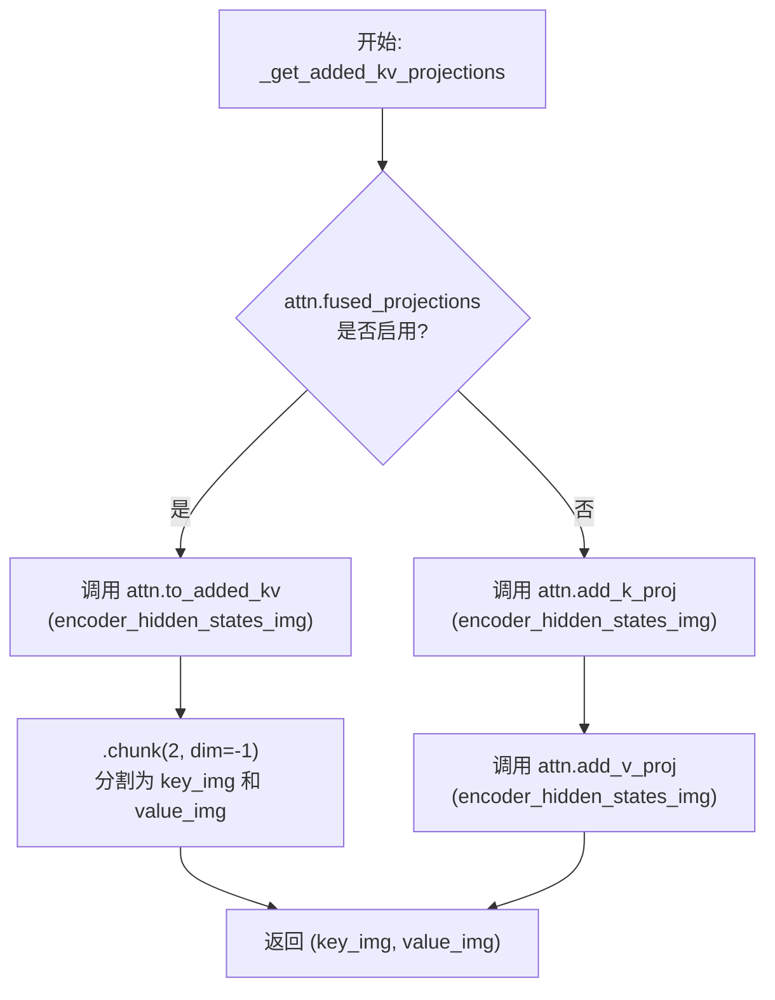
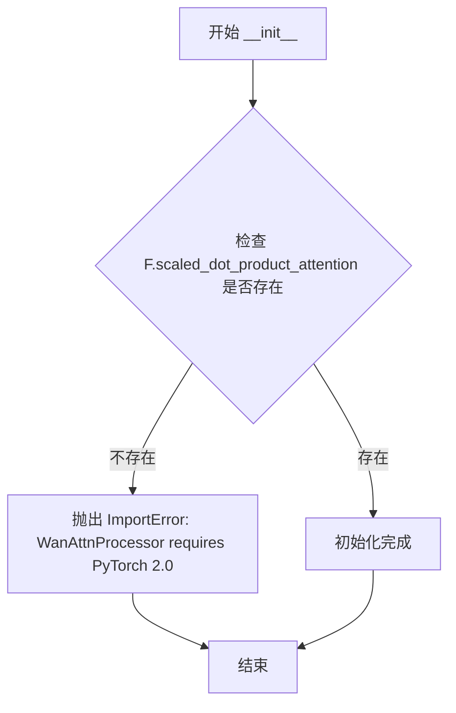
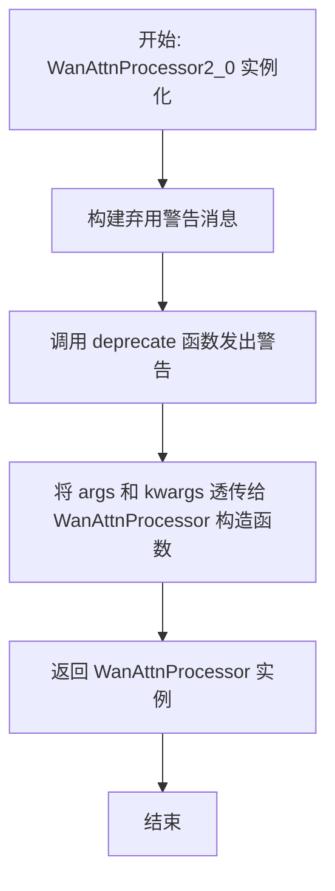
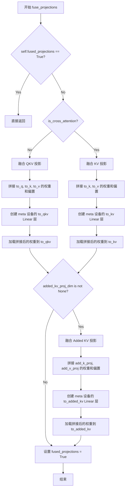
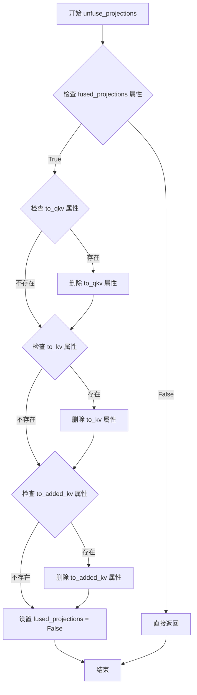
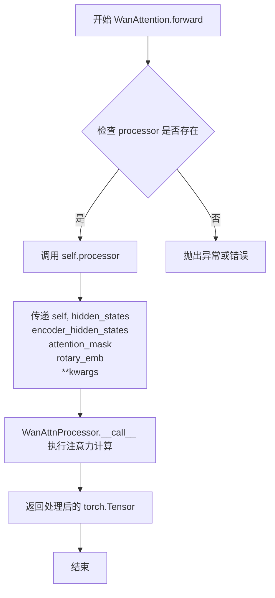
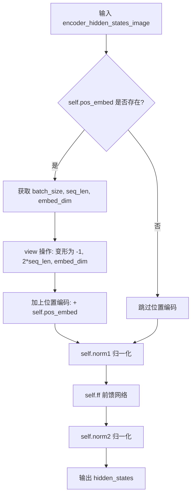
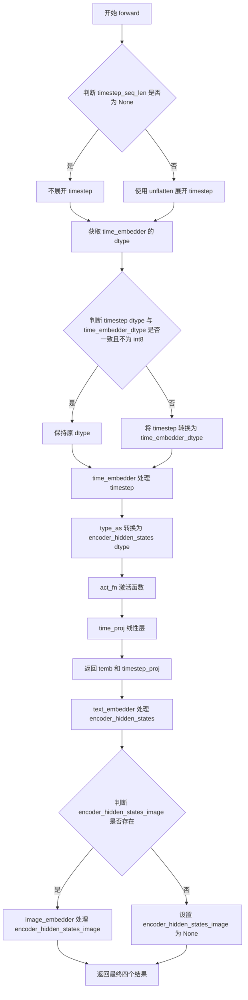
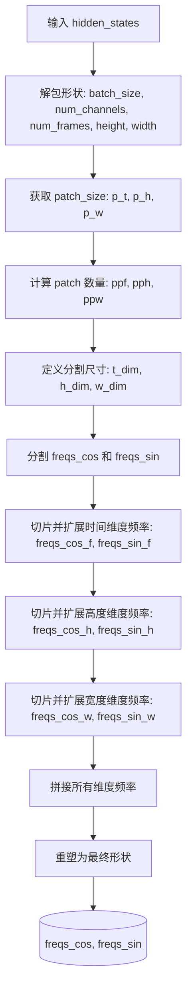
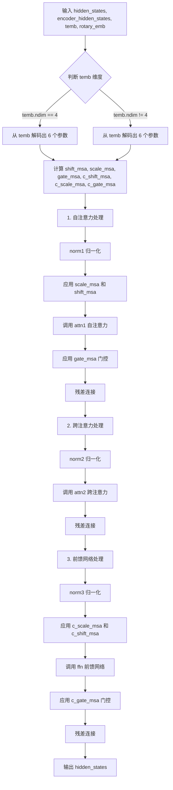

# `diffusers\src\diffusers\models\transformers\transformer_wan.py` 详细设计文档

这是Wan模型的3D Transformer实现，用于处理视频 latent 数据、文本 embeddings 和图像 embeddings (I2V任务)，通过包含自注意力、交叉注意力和前馈网络 的Transformer块序列进行生成。

## 整体流程

```mermaid
graph TD
    A[输入: hidden_states, timestep, encoder_hidden_states] --> B[Patch Embedding & RoPE]
    B --> C[Condition Embedder: Time/Text/Image]
    C --> D{循环 Transformer Blocks}
    D -- For each block --> E[AdaLN Shift & Scale (temb)]
    E --> F[WanAttention (Self-Attention)]
    F --> G[WanAttention (Cross-Attention)]
    G --> H[FeedForward Network]
    H --> D
    D --> I[Output Norm & Projection]
    I --> J[Unpatchify (Reshape to Video)]
    J --> K[输出: Transformer2DModelOutput]
```

## 类结构

```
WanTransformer3DModel (主模型)
├── WanRotaryPosEmbed (位置编码)
├── WanTimeTextImageEmbedding (条件嵌入)
│   ├── WanImageEmbedding (图像嵌入)
│   ├── TimestepEmbedding (时间步嵌入)
│   └── PixArtAlphaTextProjection (文本投影)
└── WanTransformerBlock (ModuleList, 堆叠多次)
    ├── WanAttention (Self-Attention)
    ├── WanAttention (Cross-Attention)
    └── FeedForward (前馈网络)

WanAttnProcessor (注意力处理器)
└── WanAttention (注意力模块)
```

## 全局变量及字段


### `logger`
    
用于日志记录的模块级logger对象

类型：`logging.Logger`
    


### `WanAttnProcessor._attention_backend`
    
注意力计算后端，存储当前使用的注意力实现

类型：`Any`
    


### `WanAttnProcessor._parallel_config`
    
并行配置，用于上下文并行计算的配置参数

类型：`Any`
    


### `WanAttention.inner_dim`
    
内部维度，等于dim_head * heads，表示注意力头的总维度

类型：`int`
    


### `WanAttention.heads`
    
注意力头的数量

类型：`int`
    


### `WanAttention.added_kv_proj_dim`
    
添加的键值投影维度，用于I2V任务的额外键值投影

类型：`int | None`
    


### `WanAttention.to_q`
    
查询投影线性层，将输入维度映射到内部维度

类型：`nn.Linear`
    


### `WanAttention.to_k`
    
键投影线性层，将输入维度映射到KV内部维度

类型：`nn.Linear`
    


### `WanAttention.to_v`
    
值投影线性层，将输入维度映射到KV内部维度

类型：`nn.Linear`
    


### `WanAttention.to_out`
    
输出投影模块列表，包含线性层和dropout层

类型：`nn.ModuleList`
    


### `WanAttention.norm_q`
    
查询归一化层，用于query的RMSNorm处理

类型：`nn.RMSNorm`
    


### `WanAttention.norm_k`
    
键归一化层，用于key的RMSNorm处理

类型：`nn.RMSNorm`
    


### `WanAttention.add_k_proj`
    
添加的键投影层，用于图像条件的键投影

类型：`nn.Linear | None`
    


### `WanAttention.add_v_proj`
    
添加的值投影层，用于图像条件的值投影

类型：`nn.Linear | None`
    


### `WanAttention.is_cross_attention`
    
标志位，指示是否为交叉注意力模式

类型：`bool`
    


### `WanAttention.fused_projections`
    
标志位，指示投影是否已融合以提高效率

类型：`bool`
    


### `WanImageEmbedding.norm1`
    
第一归一化层，用于输入的FP32LayerNorm处理

类型：`FP32LayerNorm`
    


### `WanImageEmbedding.ff`
    
前馈网络模块，用于图像特征的非线性变换

类型：`FeedForward`
    


### `WanImageEmbedding.norm2`
    
第二归一化层，用于FFN输出的归一化处理

类型：`FP32LayerNorm`
    


### `WanImageEmbedding.pos_embed`
    
可学习的位置嵌入参数，用于图像序列的位置编码

类型：`nn.Parameter | None`
    


### `WanTimeTextImageEmbedding.timesteps_proj`
    
时间步投影层，将时间步转换为频率嵌入

类型：`Timesteps`
    


### `WanTimeTextImageEmbedding.time_embedder`
    
时间嵌入层，将时间频率嵌入转换为时间嵌入向量

类型：`TimestepEmbedding`
    


### `WanTimeTextImageEmbedding.act_fn`
    
激活函数，用于时间嵌入的非线性变换

类型：`nn.SiLU`
    


### `WanTimeTextImageEmbedding.time_proj`
    
时间投影层，将时间嵌入投影到目标维度

类型：`nn.Linear`
    


### `WanTimeTextImageEmbedding.text_embedder`
    
文本嵌入投影层，将文本特征投影到模型维度

类型：`PixArtAlphaTextProjection`
    


### `WanTimeTextImageEmbedding.image_embedder`
    
图像嵌入模块，用于处理图像条件的嵌入

类型：`WanImageEmbedding | None`
    


### `WanRotaryPosEmbed.attention_head_dim`
    
每个注意力头的维度

类型：`int`
    


### `WanRotaryPosEmbed.patch_size`
    
3D补丁大小，包含时间、高度、宽度的补丁尺寸

类型：`tuple[int, int, int]`
    


### `WanRotaryPosEmbed.max_seq_len`
    
最大序列长度，用于预计算旋转位置嵌入

类型：`int`
    


### `WanRotaryPosEmbed.t_dim`
    
时间维度的旋转嵌入维度

类型：`int`
    


### `WanRotaryPosEmbed.h_dim`
    
高度维度的旋转嵌入维度

类型：`int`
    


### `WanRotaryPosEmbed.w_dim`
    
宽度维度的旋转嵌入维度

类型：`int`
    


### `WanRotaryPosEmbed.freqs_cos`
    
预计算的余弦旋转频率，用于旋转位置嵌入

类型：`torch.Tensor`
    


### `WanRotaryPosEmbed.freqs_sin`
    
预计算的正弦旋转频率，用于旋转位置嵌入

类型：`torch.Tensor`
    


### `WanTransformerBlock.norm1`
    
自注意力前的归一化层

类型：`FP32LayerNorm`
    


### `WanTransformerBlock.attn1`
    
自注意力模块，处理输入的自注意力计算

类型：`WanAttention`
    


### `WanTransformerBlock.attn2`
    
交叉注意力模块，处理与条件信息的注意力计算

类型：`WanAttention`
    


### `WanTransformerBlock.norm2`
    
交叉注意力前的归一化层（可选）

类型：`FP32LayerNorm | nn.Identity`
    


### `WanTransformerBlock.ffn`
    
前馈网络模块，用于特征的非线性变换

类型：`FeedForward`
    


### `WanTransformerBlock.norm3`
    
FFN后的归一化层

类型：`FP32LayerNorm`
    


### `WanTransformerBlock.scale_shift_table`
    
用于自适应门控的缩放和偏移参数表

类型：`nn.Parameter`
    


### `WanTransformer3DModel.rope`
    
旋转位置嵌入模块，用于生成旋转位置编码

类型：`WanRotaryPosEmbed`
    


### `WanTransformer3DModel.patch_embedding`
    
3D卷积补丁嵌入层，将输入视频转换为补丁序列

类型：`nn.Conv3d`
    


### `WanTransformer3DModel.condition_embedder`
    
条件嵌入器，处理时间、文本和图像条件的嵌入

类型：`WanTimeTextImageEmbedding`
    


### `WanTransformer3DModel.blocks`
    
Transformer块模块列表，包含多个WanTransformerBlock

类型：`nn.ModuleList`
    


### `WanTransformer3DModel.norm_out`
    
输出归一化层，对最终特征进行归一化处理

类型：`FP32LayerNorm`
    


### `WanTransformer3DModel.proj_out`
    
输出投影层，将特征映射回输出通道空间

类型：`nn.Linear`
    


### `WanTransformer3DModel.scale_shift_table`
    
用于输出自适应门控的缩放和偏移参数表

类型：`nn.Parameter`
    


### `WanTransformer3DModel.gradient_checkpointing`
    
梯度检查点标志，用于节省显存的可选功能

类型：`bool`
    
    

## 全局函数及方法


### `_get_qkv_projections`

该函数是 Wan 模型中注意力机制的核心辅助函数，负责计算 Query、Key、Value 投影。它根据是否启用投影融合以及是否使用交叉注意力，采用不同的投影策略来提高计算效率。

参数：

- `attn`：`WanAttention`，注意力模块实例，包含投影层配置
- `hidden_states`：`torch.Tensor`，输入的隐藏状态，用于自注意力计算
- `encoder_hidden_states`：`torch.Tensor`，编码器的隐藏状态，用于交叉注意力（可为 None）

返回值：`tuple[torch.Tensor, torch.Tensor, torch.Tensor]`，返回 query、key、value 三个张量

#### 流程图

```mermaid
flowchart TD
    A[开始: _get_qkv_projections] --> B{encoder_hidden_states is None?}
    B -- 是 --> C[encoder_hidden_states = hidden_states]
    B -- 否 --> D{attn.fused_projections?}
    C --> D
    
    D -- 是 --> E{attn.is_cross_attention?}
    D -- 否 --> F[query = attn.to_q<br/>key = attn.to_k<br/>value = attn.to_v]
    F --> M[返回 (query, key, value)]
    
    E -- 否 --> G[query, key, value = attn.to_qkv(hidden_states).chunk(3, dim=-1)]
    E -- 是 --> H[query = attn.to_q(hidden_states)<br/>key, value = attn.to_kv(encoder_hidden_states).chunk(2, dim=-1)]
    
    G --> M
    H --> M
```

#### 带注释源码

```python
def _get_qkv_projections(attn: "WanAttention", hidden_states: torch.Tensor, encoder_hidden_states: torch.Tensor):
    # encoder_hidden_states is only passed for cross-attention
    # 如果没有传入 encoder_hidden_states，则使用 hidden_states 本身（自注意力场景）
    if encoder_hidden_states is None:
        encoder_hidden_states = hidden_states

    # 根据 fused_projections 标志决定是否使用融合的投影层
    if attn.fused_projections:
        if not attn.is_cross_attention:
            # In self-attention layers, we can fuse the entire QKV projection into a single linear
            # 自注意力：使用融合的 to_qkv 一次计算 Q、K、V
            query, key, value = attn.to_qkv(hidden_states).chunk(3, dim=-1)
        else:
            # In cross-attention layers, we can only fuse the KV projections into a single linear
            # 交叉注意力：Q 单独计算，K 和 V 融合计算
            query = attn.to_q(hidden_states)
            key, value = attn.to_kv(encoder_hidden_states).chunk(2, dim=-1)
    else:
        # 未启用融合投影：分别使用独立的投影层
        query = attn.to_q(hidden_states)
        key = attn.to_k(encoder_hidden_states)
        value = attn.to_v(encoder_hidden_states)
    
    # 返回三个投影结果
    return query, key, value
```


### `_get_added_kv_projections`

该函数是 Wan 注意力机制中的辅助函数，用于获取图像编码器隐藏状态的 key 和 value 投影。当启用融合投影时，使用融合的线性层一次性计算 KV；否则分别使用独立的投影层计算 key 和 value。

参数：

- `attn`：`"WanAttention"`，WanAttention 类的实例，包含注意力机制的投影层配置
- `encoder_hidden_states_img`：`torch.Tensor`，图像编码器的隐藏状态张量

返回值：`tuple[torch.Tensor, torch.Tensor]`，返回两个张量——key_img（图像的 key 投影）和 value_img（图像的 value 投影）

#### 流程图



#### 带注释源码

```
def _get_added_kv_projections(attn: "WanAttention", encoder_hidden_states_img: torch.Tensor):
    """
    获取图像编码器隐藏状态的 key 和 value 投影。
    
    该函数根据注意力模块是否启用了融合投影（fused_projections）来选择不同的计算方式：
    - 如果启用了融合投影：使用融合后的线性层 to_added_kv 一次性计算 KV，然后 chunk 分割
    - 如果未启用融合投影：分别使用独立的投影层 add_k_proj 和 add_v_proj 计算 key 和 value
    
    Args:
        attn: WanAttention 注意力模块实例，包含投影层配置
        encoder_hidden_states_img: 图像编码器的隐藏状态张量
    
    Returns:
        key_img: 图像的 key 投影张量
        value_img: 图像的 value 投影张量
    """
    # 判断是否启用融合投影优化
    if attn.fused_projections:
        # 融合投影模式：使用融合的线性层一次性计算 key 和 value
        # to_added_kv 将输入投影到 (2 * inner_dim) 维度
        # .chunk(2, dim=-1) 在最后一个维度上分割为两个等份
        key_img, value_img = attn.to_added_kv(encoder_hidden_states_img).chunk(2, dim=-1)
    else:
        # 非融合模式：分别使用独立的投影层
        # add_k_proj: 将 added_kv_proj_dim 投影到 inner_dim
        # add_v_proj: 将 added_kv_proj_dim 投影到 inner_dim
        key_img = attn.add_k_proj(encoder_hidden_states_img)
        value_img = attn.add_v_proj(encoder_hidden_states_img)
    
    # 返回图像的 key 和 value 投影，供后续交叉注意力计算使用
    return key_img, value_img
```


### WanAttnProcessor.__init__

该方法是 WanAttnProcessor 类的构造函数，用于初始化注意力处理器实例。其核心功能是检查当前 PyTorch 版本是否支持 `scaled_dot_product_attention` 函数，若不支持则抛出 ImportError 异常，以确保后续注意力计算可以使用 PyTorch 2.0 及以上版本的高效注意力实现。

参数：无（除 self 外）

返回值：`None`，构造函数无返回值

#### 流程图



#### 带注释源码

```
def __init__(self):
    # 检查 PyTorch 是否具备 scaled_dot_product_attention 功能
    # 这是 PyTorch 2.0 引入的高效注意力计算函数
    if not hasattr(F, "scaled_dot_product_attention"):
        # 如果不支持，抛出导入错误并提示用户升级 PyTorch
        raise ImportError(
            "WanAttnProcessor requires PyTorch 2.0. To use it, please upgrade PyTorch to version 2.0 or higher."
        )
```


### `WanAttnProcessor.__call__`

该方法是 Wan 模型中注意力处理器的核心调用函数，负责执行自注意力和交叉注意力计算，支持图像到视频（I2V）任务中的图像上下文处理，并通过旋转位置嵌入增强位置感知能力。

参数：

- `self`：WanAttnProcessor，注意力处理器实例
- `attn`：`WanAttention`，WanAttention模块实例，提供投影矩阵和归一化层
- `hidden_states`：`torch.Tensor`，输入的隐藏状态张量，形状为 (batch, seq_len, dim)
- `encoder_hidden_states`：`torch.Tensor | None`，编码器的隐藏状态，用于交叉注意力，若为None则执行自注意力
- `attention_mask`：`torch.Tensor | None`，注意力掩码，用于控制注意力权重
- `rotary_emb`：`tuple[torch.Tensor, torch.Tensor] | None`，旋转位置嵌入的余弦和正弦部分

返回值：`torch.Tensor`，经过注意力处理和输出投影后的隐藏状态张量

#### 流程图

```mermaid
flowchart TD
    A[开始 __call__] --> B{encoder_hidden_states_img 存在?}
    B -->|是| C[提取图像上下文]
    B -->|否| D[直接使用 hidden_states]
    C --> E[分离图像和文本 encoder_hidden_states]
    D --> E
    E --> F[_get_qkv_projections 获取 Q K V]
    F --> G[attn.norm_q 对Query归一化]
    G --> H[attn.norm_k 对Key归一化]
    H --> I[unflatten 调整形状为 batch x heads x seq x head_dim]
    I --> J{rotary_emb 存在?}
    J -->|是| K[apply_rotary_emb 应用旋转嵌入到 Q K]
    J -->|否| L
    K --> L
    L --> M{encoder_hidden_states_img 存在?}
    M -->|是| N[_get_added_kv_projections 获取图像 K V]
    N --> O[norm_added_k 归一化图像K]
    O --> P[dispatch_attention_fn 图像注意力计算]
    P --> Q[flatten + type_as 调整输出]
    M -->|否| R
    Q --> R
    R --> S[dispatch_attention_fn 主注意力计算]
    S --> T[flatten + type_as 调整输出]
    T --> U{hidden_states_img 存在?}
    U -->|是| V[hidden_states + hidden_states_img 合并]
    U -->|否| W
    V --> W
    W --> X[to_out[0] 线性投影]
    X --> Y[to_out[1] Dropout]
    Y --> Z[返回 hidden_states]
```

#### 带注释源码

```python
def __call__(
    self,
    attn: "WanAttention",
    hidden_states: torch.Tensor,
    encoder_hidden_states: torch.Tensor | None = None,
    attention_mask: torch.Tensor | None = None,
    rotary_emb: tuple[torch.Tensor, torch.Tensor] | None = None,
) -> torch.Tensor:
    # 初始化：用于I2V任务的图像上下文
    encoder_hidden_states_img = None
    if attn.add_k_proj is not None:
        # 512是文本编码器的上下文长度，硬编码
        image_context_length = encoder_hidden_states.shape[1] - 512
        # 提取图像上下文部分 (batch, image_seq_len, dim)
        encoder_hidden_states_img = encoder_hidden_states[:, :image_context_length]
        # 提取文本上下文部分 (batch, text_seq_len, dim)
        encoder_hidden_states = encoder_hidden_states[:, image_context_length:]

    # 获取Query、Key、Value投影
    # 支持融合投影以提高效率
    query, key, value = _get_qkv_projections(attn, hidden_states, encoder_hidden_states)

    # 对Query和Key进行归一化 (RMSNorm)
    query = attn.norm_q(query)
    key = attn.norm_k(key)

    # 调整形状：从 (batch, seq, heads * head_dim) 变为 (batch, heads, seq, head_dim)
    query = query.unflatten(2, (attn.heads, -1))
    key = key.unflatten(2, (attn.heads, -1))
    value = value.unflatten(2, (attn.heads, -1))

    # 应用旋转位置嵌入 (RoPE) 以增强位置感知能力
    if rotary_emb is not None:

        def apply_rotary_emb(
            hidden_states: torch.Tensor,
            freqs_cos: torch.Tensor,
            freqs_sin: torch.Tensor,
        ):
            # 将隐藏状态最后维度分解为复数对 (x1, x2)
            x1, x2 = hidden_states.unflatten(-1, (-1, 2)).unbind(-1)
            # 提取偶数和奇数索引的频率
            cos = freqs_cos[..., 0::2]
            sin = freqs_sin[..., 1::2]
            # 应用旋转公式: out = x1*cos - x2*sin, out = x1*sin + x2*cos
            out = torch.empty_like(hidden_states)
            out[..., 0::2] = x1 * cos - x2 * sin
            out[..., 1::2] = x1 * sin + x2 * cos
            return out.type_as(hidden_states)

        # 对Query和Key应用旋转嵌入
        query = apply_rotary_emb(query, *rotary_emb)
        key = apply_rotary_emb(key, *rotary_emb)

    # I2V任务：处理图像上下文
    hidden_states_img = None
    if encoder_hidden_states_img is not None:
        # 获取图像的Key和Value投影
        key_img, value_img = _get_added_kv_projections(attn, encoder_hidden_states_img)
        # 对图像Key进行归一化
        key_img = attn.norm_added_k(key_img)

        # 调整形状以适配多头注意力
        key_img = key_img.unflatten(2, (attn.heads, -1))
        value_img = value_img.unflatten(2, (attn.heads, -1))

        # 执行图像到视频的交叉注意力计算
        hidden_states_img = dispatch_attention_fn(
            query,
            key_img,
            value_img,
            attn_mask=None,
            dropout_p=0.0,
            is_causal=False,
            backend=self._attention_backend,
            parallel_config=None,  # I2V场景不使用并行配置
        )
        # 调整输出形状并转换数据类型
        hidden_states_img = hidden_states_img.flatten(2, 3)
        hidden_states_img = hidden_states_img.type_as(query)

    # 执行主注意力计算 (自注意力或交叉注意力)
    hidden_states = dispatch_attention_fn(
        query,
        key,
        value,
        attn_mask=attention_mask,
        dropout_p=0.0,
        is_causal=False,
        backend=self._attention_backend,
        # 仅在非交叉注意力时使用并行配置
        parallel_config=(self._parallel_config if encoder_hidden_states is None else None),
    )
    # 调整输出形状并转换数据类型
    hidden_states = hidden_states.flatten(2, 3)
    hidden_states = hidden_states.type_as(query)

    # 合并图像上下文注意力输出 (I2V任务)
    if hidden_states_img is not None:
        hidden_states = hidden_states + hidden_states_img

    # 应用输出投影层
    hidden_states = attn.to_out[0](hidden_states)  # 线性投影
    hidden_states = attn.to_out[1](hidden_states)  # Dropout
    return hidden_states
```


### `WanAttnProcessor2_0.__new__`

该方法是 `WanAttnProcessor2_0` 类的构造函数，用于创建类实例。由于 `WanAttnProcessor2_0` 已被弃用，该 `__new__` 方法通过发出弃用警告并将所有构造参数转发给 `WanAttnProcessor` 类来实现向后兼容，本质上使 `WanAttnProcessor2_0` 作为 `WanAttnProcessor` 的别名存在。

参数：

- `cls`：`type`，Python `__new__` 方法的隐式参数，代表被实例化的类本身
- `*args`：`tuple`，可变数量的位置参数，会被透传给 `WanAttnProcessor` 构造函数
- `**kwargs`：`dict`，可变数量的关键字参数，会被透传给 `WanAttnProcessor` 构造函数

返回值：`WanAttnProcessor`，返回 `WanAttnProcessor` 类的实例对象

#### 流程图



#### 带注释源码

```python
def __new__(cls, *args, **kwargs):
    # 构建弃用警告消息，提醒用户 WanAttnProcessor2_0 已被弃用
    deprecation_message = (
        "The WanAttnProcessor2_0 class is deprecated and will be removed in a future version. "
        "Please use WanAttnProcessor instead. "
    )
    # 调用 deprecate 函数发出警告，版本号为 1.0.0，standard_warn=False 使用自定义警告格式
    deprecate("WanAttnProcessor2_0", "1.0.0", deprecation_message, standard_warn=False)
    # 将所有构造参数转发给 WanAttnProcessor 类，返回其创建的实例
    # 这使得 WanAttnProcessor2_0 实际上是 WanAttnProcessor 的别名
    return WanAttnProcessor(*args, **kwargs)
```


### `WanAttention.__init__`

该方法是 WanAttention 类的构造函数，负责初始化自注意力机制的核心组件，包括 QKV 投影层、输出层、归一化层以及可选的交叉注意力投影层，并设置默认的注意力处理器。

参数：

- `dim`：`int`，输入特征的维度
- `heads`：`int = 8`，注意力头的数量，默认为 8
- `dim_head`：`int = 64`，每个注意力头的维度，默认为 64
- `eps`：`float = 1e-5`，RMSNorm 的 epsilon 值，用于数值稳定性
- `dropout`：`float = 0.0`，注意力输出层的 dropout 概率
- `added_kv_proj_dim`：`int | None = None`，额外的 KV 投影维度，用于 I2V 任务
- `cross_attention_dim_head`：`int | None = None`，交叉注意力中 KV 的头维度
- `processor`：处理器实例，默认为 None，用于自定义注意力实现
- `is_cross_attention`：`bool | None = None`，是否启用交叉注意力模式

返回值：无（`__init__` 方法返回 `None`）

#### 流程图

```mermaid
flowchart TD
    A[开始 __init__] --> B[调用 super().__init__]
    B --> C[计算 inner_dim = dim_head * heads]
    C --> D[计算 kv_inner_dim]
    D --> E[创建 QKV 投影层: to_q, to_k, to_v]
    E --> F[创建输出层: to_out ModuleList]
    F --> G[创建 Q/K 归一化层: norm_q, norm_k]
    G --> H{added_kv_proj_dim is not None?}
    H -->|是| I[创建 add_k_proj, add_v_proj, norm_added_k]
    H -->|否| J[设置 add_k_proj = add_v_proj = None]
    I --> K{is_cross_attention is not None?}
    J --> K
    K -->|是| L[设置 is_cross_attention = is_cross_attention]
    K -->|否| M[设置 is_cross_attention = cross_attention_dim_head is not None]
    L --> N[调用 set_processor]
    M --> N
    N --> O[结束 __init__]
```

#### 带注释源码

```python
def __init__(
    self,
    dim: int,
    heads: int = 8,
    dim_head: int = 64,
    eps: float = 1e-5,
    dropout: float = 0.0,
    added_kv_proj_dim: int | None = None,
    cross_attention_dim_head: int | None = None,
    processor=None,
    is_cross_attention=None,
):
    """
    初始化 WanAttention 注意力模块
    
    参数:
        dim: 输入特征的维度
        heads: 注意力头的数量
        dim_head: 每个注意力头的维度
        eps: RMSNorm 数值稳定性参数
        dropout: Dropout 概率
        added_kv_proj_dim: 额外的 KV 投影维度 (用于 I2V 任务)
        cross_attention_dim_head: 交叉注意力中 KV 的头维度
        processor: 注意力处理器实例
        is_cross_attention: 是否为交叉注意力模式
    """
    super().__init__()  # 调用父类 torch.nn.Module 的初始化

    # 计算内部维度: 头数 × 每头维度
    self.inner_dim = dim_head * heads
    self.heads = heads  # 保存注意力头数量
    self.added_kv_proj_dim = added_kv_proj_dim  # 保存额外的 KV 投影维度
    self.cross_attention_dim_head = cross_attention_dim_head  # 保存交叉注意力头维度
    
    # 计算 KV 的内部维度: 如果没有单独指定 cross_attention_dim_head，则使用默认的 inner_dim
    self.kv_inner_dim = self.inner_dim if cross_attention_dim_head is None else cross_attention_dim_head * heads

    # 创建 QKV 投影层: 将输入 dim 映射到 inner_dim 或 kv_inner_dim
    self.to_q = torch.nn.Linear(dim, self.inner_dim, bias=True)   # Query 投影
    self.to_k = torch.nn.Linear(dim, self.kv_inner_dim, bias=True) # Key 投影
    self.to_v = torch.nn.Linear(dim, self.kv_inner_dim, bias=True) # Value 投影
    
    # 创建输出层: 包含线性变换和 Dropout
    self.to_out = torch.nn.ModuleList(
        [
            torch.nn.Linear(self.inner_dim, dim, bias=True),  # 输出投影
            torch.nn.Dropout(dropout),  # Dropout 层
        ]
    )
    
    # 创建 Query 和 Key 的 RMSNorm 归一化层，用于训练稳定性
    self.norm_q = torch.nn.RMSNorm(dim_head * heads, eps=eps, elementwise_affine=True)
    self.norm_k = torch.nn.RMSNorm(dim_head * heads, eps=eps, elementwise_affine=True)

    # 初始化额外的 KV 投影为 None
    self.add_k_proj = self.add_v_proj = None
    
    # 如果指定了 added_kv_proj_dim，创建额外的 KV 投影层 (用于 I2V 图像上下文)
    if added_kv_proj_dim is not None:
        self.add_k_proj = torch.nn.Linear(added_kv_proj_dim, self.inner_dim, bias=True)
        self.add_v_proj = torch.nn.Linear(added_kv_proj_dim, self.inner_dim, bias=True)
        self.norm_added_k = torch.nn.RMSNorm(dim_head * heads, eps=eps)

    # 确定是否为交叉注意力模式
    if is_cross_attention is not None:
        self.is_cross_attention = is_cross_attention
    else:
        # 如果未指定，则根据 cross_attention_dim_head 是否存在来判断
        self.is_cross_attention = cross_attention_dim_head is not None

    # 设置注意力处理器
    self.set_processor(processor)
```


### `WanAttention.fuse_projections`

该方法用于将 WanAttention 模块中的多个线性投影层（Q、K、V 以及可选的 Added KV）融合成更少的线性层（to_qkv / to_kv / to_added_kv），以减少矩阵运算次数，提升推理性能。

参数： 无

返回值：`None`，该方法直接修改对象状态，不返回任何值。

#### 流程图



#### 带注释源码

```python
def fuse_projections(self):
    """
    将 Q、K、V 的投影矩阵融合为单个矩阵以提升推理效率。
    对于自注意力，融合 to_q、to_k、to_v 为 to_qkv；
    对于交叉注意力，融合 to_k、to_v 为 to_kv；
    如果存在 added_kv_proj_dim，还需融合 add_k_proj、add_v_proj 为 to_added_kv。
    """
    # 如果已经融合过，则直接返回，避免重复操作
    if getattr(self, "fused_projections", False):
        return

    if not self.is_cross_attention:
        # === 自注意力模式：融合 Q、K、V 三个投影 ===
        # 将 to_q, to_k, to_v 的权重在最后一个维度（输出维度）上拼接
        # 假设 to_q.weight.data 形状为 [inner_dim, dim]
        # 拼接后形状为 [inner_dim * 3, dim]
        concatenated_weights = torch.cat([self.to_q.weight.data, self.to_k.weight.data, self.to_v.weight.data])
        concatenated_bias = torch.cat([self.to_q.bias.data, self.to_k.bias.data, self.to_v.bias.data])
        
        # 获取输出特征维度和输入特征维度
        out_features, in_features = concatenated_weights.shape
        
        # 在 meta 设备上创建一个空的 Linear 层（不分配实际显存）
        with torch.device("meta"):
            self.to_qkv = nn.Linear(in_features, out_features, bias=True)
        
        # 使用 assign=True 将拼接后的权重直接赋值给 to_qkv，避免复制
        self.to_qkv.load_state_dict(
            {"weight": concatenated_weights, "bias": concatenated_bias}, strict=True, assign=True
        )
    else:
        # === 交叉注意力模式：仅融合 K、V 投影 ===
        # 拼接 to_k, to_v 的权重
        concatenated_weights = torch.cat([self.to_k.weight.data, self.to_v.weight.data])
        concatenated_bias = torch.cat([self.to_k.bias.data, self.to_v.bias.data])
        out_features, in_features = concatenated_weights.shape
        
        with torch.device("meta"):
            self.to_kv = nn.Linear(in_features, out_features, bias=True)
        
        self.to_kv.load_state_dict(
            {"weight": concatenated_weights, "bias": concatenated_bias}, strict=True, assign=True
        )

    # === 处理额外的 KV 投影（用于 I2V 任务）===
    if self.added_kv_proj_dim is not None:
        # 拼接 add_k_proj, add_v_proj 的权重
        concatenated_weights = torch.cat([self.add_k_proj.weight.data, self.add_v_proj.weight.data])
        concatenated_bias = torch.cat([self.add_k_proj.bias.data, self.add_v_proj.bias.data])
        out_features, in_features = concatenated_weights.shape
        
        with torch.device("meta"):
            self.to_added_kv = nn.Linear(in_features, out_features, bias=True)
        
        self.to_added_kv.load_state_dict(
            {"weight": concatenated_weights, "bias": concatenated_bias}, strict=True, assign=True
        )

    # 标记已融合，后续调用将直接返回
    self.fused_projections = True
```


### `WanAttention.unfuse_projections`

该方法用于将融合的 QKV 投影分离回独立的投影矩阵。当模型需要从融合投影模式切换回独立投影模式时调用此方法，它会删除融合后的线性层（to_qkv、to_kv、to_added_kv），恢复为独立的 to_q、to_k、to_v 等投影层。

参数：

- 无显式参数（仅包含隐式参数 `self`）

返回值：`None`，无返回值

#### 流程图



#### 带注释源码

```python
@torch.no_grad()
def unfuse_projections(self):
    """
    将融合的 QKV 投影分离回独立的投影矩阵。
    
    此方法是 fuse_projections 的逆操作，用于在运行时动态切换
    投影模式。当 fused_projections 为 False 时，直接返回不做任何操作。
    """
    # 检查是否已经处于未融合状态
    if not getattr(self, "fused_projections", False):
        return

    # 删除自注意力融合的 QKV 投影层
    if hasattr(self, "to_qkv"):
        delattr(self, "to_qkv")
    
    # 删除交叉注意力融合的 KV 投影层
    if hasattr(self, "to_kv"):
        delattr(self, "to_kv")
    
    # 删除额外添加的 KV 投影层（用于 I2V 任务）
    if hasattr(self, "to_added_kv"):
        delattr(self, "to_added_kv")

    # 重置融合状态标志
    self.fused_projections = False
```


### `WanAttention.forward`

该方法是 Wan 注意力模块的前向传播入口，采用委托模式将计算逻辑转发给已注册的处理器（WanAttnProcessor）执行实际的自注意力、交叉注意力及图像上下文注意力计算。

参数：

- `self`：`WanAttention` 类实例，Wan 注意力模块本身，继承自 `torch.nn.Module` 和 `AttentionModuleMixin`
- `hidden_states`：`torch.Tensor`，输入的隐藏状态张量，形状为 `(batch_size, seq_len, dim)`
- `encoder_hidden_states`：`torch.Tensor | None`，编码器的隐藏状态，用于跨注意力机制，默认为 `None`
- `attention_mask`：`torch.Tensor | None`，注意力掩码，用于控制注意力计算中的可视区域，默认为 `None`
- `rotary_emb`：`tuple[torch.Tensor, torch.Tensor] | None`，旋转位置嵌入的余弦和正弦部分，用于位置编码，默认为 `None`
- `**kwargs`：可变关键字参数，用于传递额外的参数给处理器

返回值：`torch.Tensor`，经过注意力机制处理后的隐藏状态张量

#### 流程图



#### 带注释源码

```python
def forward(
    self,
    hidden_states: torch.Tensor,
    encoder_hidden_states: torch.Tensor | None = None,
    attention_mask: torch.Tensor | None = None,
    rotary_emb: tuple[torch.Tensor, torch.Tensor] | None = None,
    **kwargs,
) -> torch.Tensor:
    """
    WanAttention 模块的前向传播方法。
    
    该方法采用委托模式，将实际的注意力计算逻辑委托给已注册的处理器（processor）执行。
    处理器默认为 WanAttnProcessor，它负责：
    1. 计算 QKV 投影（可选择融合投影以提升效率）
    2. 应用旋转位置嵌入（RoPE）
    3. 执行自注意力计算
    4. 如有需要，执行跨注意力计算和图像上下文注意力（I2V 任务）
    5. 应用输出投影和 Dropout
    
    参数:
        hidden_states: 输入的隐藏状态，形状为 (batch_size, seq_len, dim)
        encoder_hidden_states: 编码器的隐藏状态，用于跨注意力，默认为 None
        attention_mask: 注意力掩码，用于控制注意力可视区域，默认为 None
        rotary_emb: 旋转位置嵌入的 (cos, sin) 元组，用于位置编码，默认为 None
        **kwargs: 额外的关键字参数，传递给处理器
    
    返回:
        torch.Tensor: 经过注意力机制处理后的隐藏状态
    """
    # 将所有参数传递给已注册的处理器执行实际的注意力计算
    # 处理器在类初始化时通过 set_processor 方法设置，默认为 WanAttnProcessor
    return self.processor(
        self,  # 传递 WanAttention 实例本身，以便处理器访问其属性（如 to_q, to_k, to_v 等）
        hidden_states,  # 输入隐藏状态
        encoder_hidden_states,  # 编码器隐藏状态（跨注意力用）
        attention_mask,  # 注意力掩码
        rotary_emb,  # 旋转嵌入
        **kwargs  # 额外参数
    )
```


### `WanImageEmbedding.forward`

该方法是`WanImageEmbedding`类的前向传播函数，负责对图像嵌入进行位置编码添加、归一化和前馈处理，最终输出处理后的图像隐藏状态。

参数：

- `encoder_hidden_states_image`：`torch.Tensor`，图像编码器的隐藏状态，通常是经过图像编码器处理的特征向量

返回值：`torch.Tensor`，处理后的图像隐藏状态，经过位置编码（可选）、归一化和前馈网络变换

#### 流程图



#### 带注释源码

```python
def forward(self, encoder_hidden_states_image: torch.Tensor) -> torch.Tensor:
    # 如果存在位置编码参数
    if self.pos_embed is not None:
        # 获取输入张量的形状信息
        batch_size, seq_len, embed_dim = encoder_hidden_states_image.shape
        # 将输入变形为双倍序列长度（可能是为了处理图像的某些特殊结构）
        # 例如：将 (batch, seq, dim) 转换为 (batch*2, seq/2, dim) 或类似的操作
        encoder_hidden_states_image = encoder_hidden_states_image.view(-1, 2 * seq_len, embed_dim)
        # 将位置编码加到输入上（广播机制自动处理batch维度）
        encoder_hidden_states_image = encoder_hidden_states_image + self.pos_embed

    # 第一层归一化处理
    hidden_states = self.norm1(encoder_hidden_states_image)
    # 前馈网络变换
    hidden_states = self.ff(hidden_states)
    # 第二层归一化处理
    hidden_states = self.norm2(hidden_states)
    # 返回处理后的隐藏状态
    return hidden_states
```


### WanTimeTextImageEmbedding.forward

该方法是 Wan 模型中时间、文本和图像嵌入的核心前向传播函数，负责将时间步长、文本隐藏状态和可选的图像隐藏状态分别投影并嵌入到统一的特征空间中，为后续的 Transformer 模块提供条件输入。

参数：

- `timestep`：`torch.Tensor`，时间步长张量，通常为形状 `[batch_size]` 的整数张量
- `encoder_hidden_states`：`torch.Tensor`，文本编码器的隐藏状态，形状为 `[batch_size, seq_len, text_embed_dim]`
- `encoder_hidden_states_image`：`torch.Tensor | None`，图像编码器的隐藏状态，形状为 `[batch_size, image_seq_len, image_embed_dim]`，可选
- `timestep_seq_len`：`int | None`，时间步长序列长度，用于 I2V 任务的帧级别时间嵌入

返回值：`tuple[torch.Tensor, torch.Tensor, torch.Tensor, torch.Tensor | None]`，返回包含时间嵌入 `temb`、时间投影 `timestep_proj`、文本嵌入 `encoder_hidden_states` 和图像嵌入 `encoder_hidden_states_image` 的元组

#### 流程图



#### 带注释源码

```python
def forward(
    self,
    timestep: torch.Tensor,
    encoder_hidden_states: torch.Tensor,
    encoder_hidden_states_image: torch.Tensor | None = None,
    timestep_seq_len: int | None = None,
):
    # 1. 时间步长投影：将原始时间步长投影到频率域
    timestep = self.timesteps_proj(timestep)
    
    # 2. 如果提供了 timestep_seq_len，则展开时间步长以适应序列维度（用于 I2V 任务）
    if timestep_seq_len is not None:
        timestep = timestep.unflatten(0, (-1, timestep_seq_len))

    # 3. 确保时间步长的 dtype 与 time_embedder 的参数 dtype 一致（避免精度问题）
    time_embedder_dtype = next(iter(self.time_embedder.parameters())).dtype
    if timestep.dtype != time_embedder_dtype and time_embedder_dtype != torch.int8:
        timestep = timestep.to(time_embedder_dtype)
    
    # 4. 时间嵌入：通过时间嵌入层得到 temb，用于后续的 scale-shift 控制
    temb = self.time_embedder(timestep).type_as(encoder_hidden_states)
    
    # 5. 时间投影：经过激活函数后投影到更大的维度（inner_dim * 6），用于 transformer block 的条件输入
    timestep_proj = self.time_proj(self.act_fn(temb))

    # 6. 文本嵌入：通过文本投影层将文本特征投影到模型维度
    encoder_hidden_states = self.text_embedder(encoder_hidden_states)
    
    # 7. 图像嵌入（可选）：如果提供了图像隐藏状态，则通过图像嵌入器处理
    if encoder_hidden_states_image is not None:
        encoder_hidden_states_image = self.image_embedder(encoder_hidden_states_image)

    # 8. 返回：temb（时间嵌入）、timestep_proj（时间投影）、encoder_hidden_states（文本嵌入）、encoder_hidden_states_image（图像嵌入）
    return temb, timestep_proj, encoder_hidden_states, encoder_hidden_states_image
```


### WanRotaryPosEmbed.forward

该方法实现了 Wan 模型的旋转位置嵌入（RoPE）前向传播，将预计算的余弦和正弦频率根据输入 hidden_states 的空间维度进行切片、扩展和重组，以适配 3D 视频数据的时空位置编码需求。

参数：

- `hidden_states`：`torch.Tensor`，输入的隐藏状态张量，形状为 (batch_size, num_channels, num_frames, height, width)，用于确定时空 patch 划分后的序列长度

返回值：`tuple[torch.Tensor, torch.Tensor]`，返回两个张量组成的元组，分别是余弦频率 freqs_cos 和正弦频率 freqs_sin，形状均为 (1, ppf * pph * ppw, 1, attention_head_dim)，用于后续在注意力机制中应用旋转位置嵌入

#### 流程图



#### 带注释源码

```python
def forward(self, hidden_states: torch.Tensor) -> torch.Tensor:
    # 从输入 hidden_states 解包形状信息
    # hidden_states 形状: (batch_size, num_channels, num_frames, height, width)
    batch_size, num_channels, num_frames, height, width = hidden_states.shape
    
    # 获取 3D patch 大小
    p_t, p_h, p_w = self.patch_size
    
    # 计算 patch 划分后的数量
    # ppf: 时间维度的 patch 数量
    # pph: 高度维度的 patch 数量
    # ppw: 宽度维度的 patch 数量
    ppf, pph, ppw = num_frames // p_t, height // p_h, width // p_w

    # 定义分割尺寸，对应时间、高度、宽度三个维度
    split_sizes = [self.t_dim, self.h_dim, self.w_dim]

    # 沿着维度 1 分割预计算的余弦和正弦频率
    freqs_cos = self.freqs_cos.split(split_sizes, dim=1)
    freqs_sin = self.freqs_sin.split(split_sizes, dim=1)

    # 处理时间维度 (frame) 的频率
    # 切片到当前序列长度，view 扩展为 4D 张量，然后 expand 到完整空间维度
    freqs_cos_f = freqs_cos[0][:ppf].view(ppf, 1, 1, -1).expand(ppf, pph, ppw, -1)
    freqs_cos_h = freqs_cos[1][:pph].view(1, pph, 1, -1).expand(ppf, pph, ppw, -1)
    freqs_cos_w = freqs_cos[2][:ppw].view(1, 1, ppw, -1).expand(ppf, pph, ppw, -1)

    # 处理高度维度 (height) 的频率
    freqs_sin_f = freqs_sin[0][:ppf].view(ppf, 1, 1, -1).expand(ppf, pph, ppw, -1)
    freqs_sin_h = freqs_sin[1][:pph].view(1, pph, 1, -1).expand(ppf, pph, ppw, -1)
    freqs_sin_w = freqs_sin[2][:ppw].view(1, 1, ppw, -1).expand(ppf, pph, ppw, -1)

    # 处理宽度维度 (width) 的频率
    
    # 拼接三个维度的频率
    freqs_cos = torch.cat([freqs_cos_f, freqs_cos_h, freqs_cos_w], dim=-1).reshape(1, ppf * pph * ppw, 1, -1)
    freqs_sin = torch.cat([freqs_sin_f, freqs_sin_h, freqs_sin_w], dim=-1).reshape(1, ppf * pph * ppw, 1, -1)

    # 返回频率元组，形状: (1, ppf*pph*ppw, 1, attention_head_dim)
    return freqs_cos, freqs_sin
```


### `WanTransformerBlock.forward`

该方法实现了 WanTransformerBlock 的前向传播，采用了 AdaLN-zero 技术进行条件控制。方法依次执行自注意力、交叉注意力和前馈网络三个核心模块，并对每个模块应用基于时间嵌入的动态缩放和偏移（shift/scale）参数，以实现对生成过程的细粒度控制。

参数：

- `hidden_states`：`torch.Tensor`，输入的隐藏状态张量，形状为 (batch_size, seq_len, dim)
- `encoder_hidden_states`：`torch.Tensor`，编码器的隐藏状态，用于跨注意力机制，通常为文本嵌入
- `temb`：`torch.Tensor`，时间嵌入张量，根据模型版本不同，形状可能为 (batch_size, 6, inner_dim) 或 (batch_size, seq_len, 6, inner_dim)
- `rotary_emb`：`torch.Tensor`，旋转位置嵌入，用于为注意力机制提供位置信息

返回值：`torch.Tensor`，经过自注意力、跨注意力和前馈网络处理后的隐藏状态张量

#### 流程图



#### 带注释源码

```python
def forward(
    self,
    hidden_states: torch.Tensor,
    encoder_hidden_states: torch.Tensor,
    temb: torch.Tensor,
    rotary_emb: torch.Tensor,
) -> torch.Tensor:
    """
    WanTransformerBlock 的前向传播方法
    
    参数:
        hidden_states: 输入的隐藏状态，形状为 (batch_size, seq_len, dim)
        encoder_hidden_states: 编码器的隐藏状态（如文本嵌入），形状为 (batch_size, text_seq_len, dim)
        temb: 时间嵌入，根据模型版本不同有不同形状
        rotary_emb: 旋转位置嵌入，用于注意力机制的位置编码
    
    返回:
        处理后的隐藏状态张量
    """
    # ============ 解析 temb 中的 AdaLN-zero 参数 ============
    if temb.ndim == 4:
        # temb: batch_size, seq_len, 6, inner_dim (wan2.2 ti2v 版本)
        # 从时间嵌入中解码出 6 个控制参数：shift, scale, gate 各有两个（MSA 和 FFN）
        shift_msa, scale_msa, gate_msa, c_shift_msa, c_scale_msa, c_gate_msa = (
            self.scale_shift_table.unsqueeze(0) + temb.float()
        ).chunk(6, dim=2)
        # 移除seq_len维度，形状变为: batch_size, 1, inner_dim -> batch_size, inner_dim
        shift_msa = shift_msa.squeeze(2)
        scale_msa = scale_msa.squeeze(2)
        gate_msa = gate_msa.squeeze(2)
        c_shift_msa = c_shift_msa.squeeze(2)
        c_scale_msa = c_scale_msa.squeeze(2)
        c_gate_msa = c_gate_msa.squeeze(2)
    else:
        # temb: batch_size, 6, inner_dim (wan2.1/wan2.2 14B 版本)
        # 从时间嵌入中解码出 6 个控制参数
        shift_msa, scale_msa, gate_msa, c_shift_msa, c_scale_msa, c_gate_msa = (
            self.scale_shift_table + temb.float()
        ).chunk(6, dim=1)
    
    # ============ 1. 自注意力处理 (Self-Attention) ============
    # 应用 AdaLN-zero: norm(x) * (1 + scale) + shift
    norm_hidden_states = (self.norm1(hidden_states.float()) * (1 + scale_msa) + shift_msa).type_as(hidden_states)
    # 执行自注意力，传入旋转位置编码
    attn_output = self.attn1(norm_hidden_states, None, None, rotary_emb)
    # 应用门控机制并进行残差连接
    hidden_states = (hidden_states.float() + attn_output * gate_msa).type_as(hidden_states)
    
    # ============ 2. 跨注意力处理 (Cross-Attention) ============
    # 对隐藏状态进行归一化（可选的 cross_attn_norm）
    norm_hidden_states = self.norm2(hidden_states.float()).type_as(hidden_states)
    # 执行跨注意力，使用 encoder_hidden_states 作为条件
    attn_output = self.attn2(norm_hidden_states, encoder_hidden_states, None, None)
    # 残差连接
    hidden_states = hidden_states + attn_output
    
    # ============ 3. 前馈网络处理 (Feed-Forward Network) ============
    # 应用 AdaLN-zero 条件控制
    norm_hidden_states = (self.norm3(hidden_states.float()) * (1 + c_scale_msa) + c_shift_msa).type_as(
        hidden_states
    )
    # 执行前馈网络
    ff_output = self.ffn(norm_hidden_states)
    # 应用门控并进行残差连接
    hidden_states = (hidden_states.float() + ff_output.float() * c_gate_msa).type_as(hidden_states)
    
    return hidden_states
```


### WanTransformer3DModel.__init__

该方法是 WanTransformer3DModel 类的构造函数，用于初始化一个用于视频数据的 3D Transformer 模型。它通过配置参数设置模型的各个组件，包括 3D 补丁嵌入、旋转位置编码、条件嵌入器（时间、文本和图像）、Transformer 块堆栈以及输出归一化和投影层。

参数：

- `patch_size`：`tuple[int, ...]`，默认为 `(1, 2, 2)`，3D 补丁尺寸，用于视频嵌入（时间补丁高度补丁、宽度补丁）
- `num_attention_heads`：`int`，默认为 `40`，注意力头的数量
- `attention_head_dim`：`int`，默认为 `128`，每个头的通道数
- `in_channels`：`int`，默认为 `16`，输入通道数
- `out_channels`：`int`，默认为 `16`，输出通道数
- `text_dim`：`int`，默认为 `4096`，文本嵌入的输入维度
- `freq_dim`：`int`，默认为 `256`，正弦时间嵌入的维度
- `ffn_dim`：`int`，默认为 `13824`，前馈网络中间层维度
- `num_layers`：`int`，默认为 `40`，Transformer 块的数量
- `cross_attn_norm`：`bool`，默认为 `True`，是否启用交叉注意力归一化
- `qk_norm`：`str | None`，默认为 `"rms_norm_across_heads"`，查询/键归一化方式
- `eps`：`float`，默认为 `1e-6`，归一化层的 epsilon 值
- `image_dim`：`int | None`，默认为 `None`，图像嵌入的维度（用于 I2V 模型）
- `added_kv_proj_dim`：`int | None`，默认为 `None`，额外的键值投影维度
- `rope_max_seq_len`：`int`，默认为 `1024`，旋转位置编码的最大序列长度
- `pos_embed_seq_len`：`int | None`，默认为 `None`，位置嵌入的序列长度

返回值：`None`，该方法不返回任何值，仅初始化模型组件

#### 流程图

```mermaid
flowchart TD
    A[开始 __init__] --> B[调用 super().__init__]
    B --> C[计算 inner_dim = num_attention_heads * attention_head_dim]
    C --> D[确保 out_channels 不为 None]
    D --> E[创建 WanRotaryPosEmbed 旋转位置编码器]
    E --> F[创建 nn.Conv3d 补丁嵌入层]
    F --> G[创建 WanTimeTextImageEmbedding 条件嵌入器]
    G --> H[创建 nn.ModuleList Transformer 块堆栈]
    H --> I[创建 FP32LayerNorm 输出归一化层]
    I --> J[创建 nn.Linear 输出投影层]
    J --> K[创建 scale_shift_table 可学习参数]
    K --> L[初始化 gradient_checkpointing 为 False]
    L --> M[结束 __init__]
```

#### 带注释源码

```python
@register_to_config
def __init__(
    self,
    patch_size: tuple[int, ...] = (1, 2, 2),
    num_attention_heads: int = 40,
    attention_head_dim: int = 128,
    in_channels: int = 16,
    out_channels: int = 16,
    text_dim: int = 4096,
    freq_dim: int = 256,
    ffn_dim: int = 13824,
    num_layers: int = 40,
    cross_attn_norm: bool = True,
    qk_norm: str | None = "rms_norm_across_heads",
    eps: float = 1e-6,
    image_dim: int | None = None,
    added_kv_proj_dim: int | None = None,
    rope_max_seq_len: int = 1024,
    pos_embed_seq_len: int | None = None,
) -> None:
    """
    初始化 WanTransformer3DModel 模型
    
    参数:
        patch_size: 3D 补丁尺寸 (t_patch, h_patch, w_patch)
        num_attention_heads: 注意力头数量
        attention_head_dim: 每个头的维度
        in_channels: 输入通道数
        out_channels: 输出通道数
        text_dim: 文本嵌入维度
        freq_dim: 时间嵌入频率维度
        ffn_dim: 前馈网络中间层维度
        num_layers: Transformer 层数
        cross_attn_norm: 是否启用交叉注意力归一化
        qk_norm: 查询/键归一化类型
        eps: 归一化 epsilon 值
        image_dim: 图像嵌入维度 (用于 I2V)
        added_kv_proj_dim: 额外键值投影维度
        rope_max_seq_len: 旋转位置编码最大序列长度
        pos_embed_seq_len: 位置嵌入序列长度
    """
    super().__init__()

    # 计算内部维度 = 头数 * 每头维度
    inner_dim = num_attention_heads * attention_head_dim
    # 如果 out_channels 为 None，则使用 in_channels
    out_channels = out_channels or in_channels

    # 1. 补丁与位置嵌入
    # 创建旋转位置编码器，用于 3D 视频数据的位置表示
    self.rope = WanRotaryPosEmbed(attention_head_dim, patch_size, rope_max_seq_len)
    # 创建 3D 卷积层，将输入视频转换为补丁序列
    self.patch_embedding = nn.Conv3d(in_channels, inner_dim, kernel_size=patch_size, stride=patch_size)

    # 2. 条件嵌入
    # 创建时间、文本和图像的条件嵌入器
    # image_embedding_dim=1280 用于 I2V 模型
    self.condition_embedder = WanTimeTextImageEmbedding(
        dim=inner_dim,
        time_freq_dim=freq_dim,
        time_proj_dim=inner_dim * 6,
        text_embed_dim=text_dim,
        image_embed_dim=image_dim,
        pos_embed_seq_len=pos_embed_seq_len,
    )

    # 3. Transformer 块
    # 创建多层 Transformer 块组成的模块列表
    self.blocks = nn.ModuleList(
        [
            WanTransformerBlock(
                inner_dim, ffn_dim, num_attention_heads, qk_norm, cross_attn_norm, eps, added_kv_proj_dim
            )
            for _ in range(num_layers)
        ]
    )

    # 4. 输出归一化与投影
    # 最终输出层归一化
    self.norm_out = FP32LayerNorm(inner_dim, eps, elementwise_affine=False)
    # 将隐藏状态投影回原始通道数并还原补丁
    self.proj_out = nn.Linear(inner_dim, out_channels * math.prod(patch_size))
    # 用于输出时移位和缩放的可学习参数
    self.scale_shift_table = nn.Parameter(torch.randn(1, 2, inner_dim) / inner_dim**0.5)

    # 初始化梯度检查点标志为 False
    self.gradient_checkpointing = False
```


### `WanTransformer3DModel.forward`

该方法是 WanTransformer3DModel 类的核心前向传播方法，负责将输入的 3D 视频数据（hidden_states）、时间步长（timestep）和文本/图像编码器隐藏状态（encoder_hidden_states）通过 3D VAE patch 嵌入、位置编码、Transformer 块处理，最后通过输出投影和解嵌操作生成目标视频样本。

参数：

- `self`：WanTransformer3DModel 实例本身。
- `hidden_states`：`torch.Tensor`，输入的 3D 视频张量，形状为 (batch_size, num_channels, num_frames, height, width)。
- `timestep`：`torch.LongTensor`，扩散过程的时间步长，形状为 (batch_size,) 或 (batch_size, seq_len)（用于 wan 2.2 ti2v）。
- `encoder_hidden_states`：`torch.Tensor`，文本编码器的隐藏状态，形状为 (batch_size, text_seq_len, text_dim)。
- `encoder_hidden_states_image`：`torch.Tensor | None`，可选的图像编码器隐藏状态，用于 I2V 任务，形状为 (batch_size, image_seq_len, image_dim)。
- `return_dict`：`bool`，默认为 True，是否返回字典格式的输出。
- `attention_kwargs`：`dict[str, Any] | None`，可选的注意力机制相关参数，用于 LORA 等。

返回值：`torch.Tensor | dict[str, torch.Tensor]`，当 return_dict 为 True 时返回 Transformer2DModelOutput 对象，包含 sample 属性；否则返回元组 (output,)。

#### 流程图

```mermaid
flowchart TD
    A[开始 forward] --> B[提取输入形状 batch_size, num_channels, num_frames, height, width]
    B --> C[计算 patch 后的尺寸 post_patch_num_frames, post_patch_height, post_patch_width]
    C --> D[使用 rope 生成旋转位置编码 rotary_emb]
    D --> E[执行 patch_embedding 并 flatten 和 transpose]
    E --> F{判断 timestep.ndim == 2?}
    F -->|Yes| G[展开 timestep 获取序列长度 ts_seq_len]
    F -->|No| H[设置 ts_seq_len = None]
    G --> I[调用 condition_embedder 处理 timestep, encoder_hidden_states, encoder_hidden_states_image]
    H --> I
    I --> J{判断 encoder_hidden_states_image 不为空?}
    J -->|Yes| K[拼接 image 和 text encoder hidden states]
    J -->|No| L[保持原 encoder_hidden_states]
    K --> M[进入 Transformer 块处理循环]
    L --> M
    M --> N{启用 gradient_checkpointing?}
    N -->|Yes| O[使用梯度检查点逐块处理]
    N -->|No| P[直接逐块处理]
    O --> Q[计算 shift 和 scale 偏置]
    P --> Q
    Q --> R[执行输出归一化 norm_out 和线性投影 proj_out]
    R --> S[重塑输出维度并进行 permute 和 flatten 操作]
    S --> T{return_dict == True?}
    T -->|Yes| U[返回 Transformer2DModelOutput 对象]
    T -->|No| V[返回元组 (output,)]
    U --> W[结束]
    V --> W
```

#### 带注释源码

```python
@apply_lora_scale("attention_kwargs")
def forward(
    self,
    hidden_states: torch.Tensor,
    timestep: torch.LongTensor,
    encoder_hidden_states: torch.Tensor,
    encoder_hidden_states_image: torch.Tensor | None = None,
    return_dict: bool = True,
    attention_kwargs: dict[str, Any] | None = None,
) -> torch.Tensor | dict[str, torch.Tensor]:
    # 1. 获取输入张量的形状信息
    # hidden_states 形状: (batch_size, num_channels, num_frames, height, width)
    batch_size, num_channels, num_frames, height, width = hidden_states.shape
    
    # 2. 获取配置中的 patch 大小，并计算 patch 后的空间/时间维度
    p_t, p_h, p_w = self.config.patch_size
    post_patch_num_frames = num_frames // p_t
    post_patch_height = height // p_h
    post_patch_width = width // p_w

    # 3. 使用旋转位置编码 (RoPE) 生成位置嵌入
    rotary_emb = self.rope(hidden_states)

    # 4. 对输入进行 3D patch 嵌入，然后 flatten 并转置
    # 将 (batch, channels, frames, height, width) -> (batch, seq_len, inner_dim)
    hidden_states = self.patch_embedding(hidden_states)
    hidden_states = hidden_states.flatten(2).transpose(1, 2)

    # 5. 处理 timestep
    # 如果 timestep 是 2D 的 (batch_size, seq_len)，则 flatten 为 1D
    # 否则保持原样（用于 wan 2.1/wan 2.2 14B 模型）
    if timestep.ndim == 2:
        ts_seq_len = timestep.shape[1]
        timestep = timestep.flatten()  # batch_size * seq_len
    else:
        ts_seq_len = None

    # 6. 通过条件嵌入器处理 timestep、文本和图像编码器隐藏状态
    # 返回: temb(时间嵌入), timestep_proj(投影后的timestep), encoder_hidden_states(处理后的文本), encoder_hidden_states_image(处理后的图像)
    temb, timestep_proj, encoder_hidden_states, encoder_hidden_states_image = self.condition_embedder(
        timestep, encoder_hidden_states, encoder_hidden_states_image, timestep_seq_len=ts_seq_len
    )
    
    # 7. 调整 timestep_proj 的形状以适配后续的 scale 和 shift 计算
    if ts_seq_len is not None:
        # batch_size, seq_len, 6, inner_dim (wan 2.2 ti2v)
        timestep_proj = timestep_proj.unflatten(2, (6, -1))
    else:
        # batch_size, 6, inner_dim (wan 2.1/wan 2.2 14B)
        timestep_proj = timestep_proj.unflatten(1, (6, -1))

    # 8. 如果存在图像编码器隐藏状态，则将其与文本编码器隐藏状态拼接
    # 图像 token 在前，文本 token 在后
    if encoder_hidden_states_image is not None:
        encoder_hidden_states = torch.concat([encoder_hidden_states_image, encoder_hidden_states], dim=1)

    # 9. 通过 Transformer 块序列处理 hidden_states
    if torch.is_grad_enabled() and self.gradient_checkpointing:
        # 如果启用梯度检查点，则使用梯度检查点函数节省显存
        for block in self.blocks:
            hidden_states = self._gradient_checkpointing_func(
                block, hidden_states, encoder_hidden_states, timestep_proj, rotary_emb
            )
    else:
        # 直接遍历所有 Transformer 块
        for block in self.blocks:
            hidden_states = block(hidden_states, encoder_hidden_states, timestep_proj, rotary_emb)

    # 10. 计算输出层的 shift 和 scale 偏置
    if temb.ndim == 3:
        # batch_size, seq_len, inner_dim (wan 2.2 ti2v)
        # 将 temb 扩展并与 scale_shift_table 相加，然后分块得到 shift 和 scale
        shift, scale = (self.scale_shift_table.unsqueeze(0).to(temb.device) + temb.unsqueeze(2)).chunk(2, dim=2)
        shift = shift.squeeze(2)
        scale = scale.squeeze(2)
    else:
        # batch_size, inner_dim
        shift, scale = (self.scale_shift_table.to(temb.device) + temb.unsqueeze(1)).chunk(2, dim=1)

    # 11. 确保 shift 和 scale 与 hidden_states 在同一设备上
    # 这对于多 GPU 推理非常重要，因为 hidden_states 可能在最后一个设备上
    shift = shift.to(hidden_states.device)
    scale = scale.to(hidden_states.device)

    # 12. 应用输出归一化和仿射变换，然后投影到输出通道
    hidden_states = (self.norm_out(hidden_states.float()) * (1 + scale) + shift).type_as(hidden_states)
    hidden_states = self.proj_out(hidden_states)

    # 13. 重塑输出并解嵌 (unpatchify)
    # 从 (batch, seq_len, inner_dim) 恢复到 (batch, channels, frames, height, width)
    hidden_states = hidden_states.reshape(
        batch_size, post_patch_num_frames, post_patch_height, post_patch_width, p_t, p_h, p_w, -1
    )
    # 调整维度顺序: (batch, inner_dim, frames, p_t, height, p_h, width, p_w) -> (batch, inner_dim, ...)
    hidden_states = hidden_states.permute(0, 7, 1, 4, 2, 5, 3, 6)
    # 合并最后几个维度
    output = hidden_states.flatten(6, 7).flatten(4, 5).flatten(2, 3)

    # 14. 根据 return_dict 返回结果
    if not return_dict:
        return (output,)

    return Transformer2DModelOutput(sample=output)
```

## 关键组件


### WanAttnProcessor

Wan模型的注意力处理器，负责计算注意力输出，支持融合投影和图像上下文（I2V任务），通过调度函数dispatch_attention_fn分发到具体后端。

### WanAttention

WanTransformer的核心注意力模块，包含QKV投影矩阵、归一化层和输出投影，支持自注意力和交叉注意力，可通过fuse_projections融合投影以提升推理效率。

### WanImageEmbedding

图像嵌入模块，包含双层归一化和前馈网络，可选的序列位置编码，用于处理图像条件的嵌入表示。

### WanTimeTextImageEmbedding

时间、文本和图像的联合嵌入模块，将时间步timestep转换为时间嵌入，文本编码器转换为文本嵌入，图像编码器转换为图像嵌入，返回四种嵌入用于后续处理。

### WanRotaryPosEmbed

3D旋转位置编码模块，为视频的时序、高度和宽度维度分别计算旋转位置嵌入，支持MPS后端的float32精度。

### WanTransformerBlock

WanTransformer的基本模块单元，包含自注意力、交叉注意力和前馈网络，支持AdaLN零阶次的scale-shift控制，处理隐藏状态、编码器状态和时间嵌入。

### WanTransformer3DModel

主模型类，负责3D视频数据的Patch嵌入、位置编码、条件嵌入、多层Transformer块堆叠和输出解码，支持梯度检查点、LoRA、PEFT适配器和上下文并行。


## 问题及建议


### 已知问题

- **硬编码的魔数**: `WanAttnProcessor.__call__` 中硬编码了 `512` 作为文本编码器的上下文长度，缺乏可配置性
- **废弃代码遗留**: `WanAttnProcessor2_0` 类已被废弃但仍保留，仅发出警告后返回 `WanAttnProcessor`，造成代码冗余和维护混乱
- **未使用的参数**: `WanTransformerBlock.__init__` 接收 `qk_norm` 参数但未在实现中使用，形同虚设
- **类型提示兼容性**: 代码大量使用 `|` 联合类型语法（Python 3.10+），与较低版本 Python 不兼容，且部分类型注解缺失或不准确
- **输入验证缺失**: 缺少对关键参数如 `patch_size`、`num_attention_heads` 与 `dim` 兼容性的校验，可能导致运行时错误
- **fuse_projections 安全隐患**: `fuse_projections` 方法使用 `torch.device("meta")` 创建空模型并使用 `assign=True` 加载权重，此模式可能导致设备不一致和状态管理问题
- **I2V 逻辑耦合**: Image-to-Video 特定逻辑直接嵌入 `WanAttnProcessor` 中，与通用注意力机制紧密耦合，降低了代码可复用性
- **设备处理不一致**: 多处手动调用 `.to(device)` 进行设备迁移（如 `shift` 和 `scale`），容易遗漏且不利于统一的设备管理
- **RMSNorm 重复定义**: `WanAttention` 内部使用 `torch.nn.RMSNorm`，而项目其他地方使用自定义 `FP32LayerNorm`，标准化层实现不统一

### 优化建议

- **参数化配置**: 将 `512` 文本上下文长度提取为配置参数或构造函数参数
- **清理废弃代码**: 完全移除 `WanAttnProcessor2_0` 类或将其移至单独的废弃模块
- **完善参数使用**: 若 `qk_norm` 暂不需要，应从构造函数签名中移除；若需要，应在 forward 中实现相应逻辑
- **统一类型注解**: 考虑使用 `typing.Union` 替代 `|` 语法以提升兼容性，或明确标注最低 Python 版本要求
- **增强输入校验**: 在 `__init__` 方法中添加参数校验逻辑，确保 `dim % num_heads == 0` 等兼容性条件
- **重构投影融合逻辑**: 考虑使用更安全的权重融合方式，避免 meta device 带来的潜在问题
- **解耦 I2V 逻辑**: 将 Image-to-Video 特定的处理逻辑提取为独立的处理器或混入类
- **统一设备管理**: 建议引入统一的设备迁移辅助函数，或依赖 PyTorch 的自动设备迁移机制
- **统一标准化层**: 考虑统一使用 `FP32LayerNorm` 或在配置中指定标准化类型，以提高代码一致性和可维护性

## 其它


### 设计目标与约束

本模块是Wan视频生成模型的核心Transformer组件，旨在处理视频-like数据（支持图像到视频I2V任务）。设计目标包括：1) 支持3D时空_patch化处理视频数据；2) 实现自注意力与交叉注意力机制；3) 集成旋转位置编码(RoPE)捕捉时空关系；4) 支持文本和图像条件嵌入；5) 兼容LoRA微调和PEFT适配器；6) 支持上下文并行(CP)分布式推理。核心约束包括：PyTorch 2.0+依赖、FP32LayerNorm精度要求、梯度检查点可选优化。

### 错误处理与异常设计

主要异常场景包括：1) PyTorch版本检查 - `WanAttnProcessor.__init__`中检查`scaled_dot_product_attention`可用性，不满足则抛出`ImportError`；2) 设备兼容性 - `WanRotaryPosEmbed`针对MPS后端使用float32以避免精度问题；3) 参数类型校验通过`@register_to_config`装饰器实现配置验证；4) 融合投影的设备检查 - `fuse_projections`使用meta设备创建融合层；5) 废弃警告 - `WanAttnProcessor2_0`通过`deprecate`函数发出版本废弃提示。

### 数据流与状态机

整体数据流：1) 输入阶段：接收hidden_states(5D张量:batch,channel,frames,height,width)、timestep、encoder_hidden_states、encoder_hidden_states_image；2) Patch嵌入：patch_embedding将输入转换为序列形式；3) 条件编码：WanTimeTextImageEmbedding生成temb、timestep_proj、encoder_hidden_states；4) 块处理：40层WanTransformerBlock依次处理，每层执行自注意力、交叉注意力、前馈网络；5) 输出阶段：norm_out归一化、proj_out投影、reshape恢复空间维度。状态转换受timestep维度影响：timestep.ndim==2时为wan2.2 ti2v模式，ndim==1时为wan2.1/wan2.2 14B模式。

### 外部依赖与接口契约

核心依赖：1) torch>=2.0 - 基础深度学习框架；2) diffusers库 - configuration_utils、loaders、utils、modeling_utils等模块；3) attention相关 - AttentionMixin、AttentionModuleMixin、FeedForward、dispatch_attention_fn；4) 嵌入相关 - TimestepEmbedding、Timestamps、PixArtAlphaTextProjection；5) 并行处理 - ContextParallelInput、ContextParallelOutput。接口契约：WanTransformer3DModel.forward()接受hidden_states、timestep(LongTensor)、encoder_hidden_states、encoder_hidden_states_image(Noneable)、return_dict、attention_kwargs(Noneable)，返回Tensor或Transformer2DModelOutput。

### 性能考虑与优化空间

性能优化点：1) 投影融合 - fuse_projections()将QKV投影合并为单个线性层，减少内存访问；2) 梯度检查点 - 通过gradient_checkpointing减少显存占用；3) FP32精度保留 - _keep_in_fp32_modules列表指定关键层保持FP32；4) 旋转位置编码预计算 - WanRotaryPosEmbed在初始化时预计算freqs_cos/sin；5) Meta设备融合 - 融合投影时使用torch.device("meta")避免实际内存分配。优化空间：1) 动态序列长度支持可进一步优化；2) FlashAttention后端集成可提升推理速度；3) 量化兼容性测试。

### 配置参数详解

关键配置参数：patch_size=(1,2,2) - 3D patch尺寸；num_attention_heads=40 - 注意力头数；attention_head_dim=128 - 每头维度；in_channels=16/out_channels=16 - 输入输出通道；text_dim=4096 - 文本嵌入维度；freq_dim=256 - 时间嵌入频率维度；ffn_dim=13824 - 前馈网络中间维度；num_layers=40 - Transformer块数量；cross_attn_norm=True - 交叉注意力归一化；qk_norm="rms_norm_across_heads" - QK归一化方式；added_kv_proj_dim=None - 额外KV投影维度(I2V使用)；rope_max_seq_len=1024 - RoPE最大序列长度。

### 使用示例

```python
from diffusers import WanTransformer3DModel
import torch

model = WanTransformer3DModel.from_pretrained("Wan-AI/Wan2.1-I2V-14B-480P")
model.enable_gradient_checkpointing()

hidden_states = torch.randn(1, 16, 16, 60, 90)
timestep = torch.tensor([500])
encoder_hidden_states = torch.randn(1, 769, 4096)

output = model(
    hidden_states=hidden_states,
    timestep=timestep,
    encoder_hidden_states=encoder_hidden_states
)
```

### 版本历史与兼容性

版本兼容：1) WanAttnProcessor要求PyTorch>=2.0；2) WanAttnProcessor2_0已废弃(1.0.0)；3) 支持Wan 2.1和Wan 2.2 TI2V两种架构；4) _cp_plan配置支持上下文并行；5) _keys_to_ignore_on_load_unexpected处理加载兼容。模型变体：I2V(图像到视频)模式使用added_kv_proj_dim参数，标准模式该参数为None。

### 测试策略

关键测试覆盖：1) 单元测试 - WanAttnProcessor/QKV投影计算；2) 融合/解融投影功能验证；3) WanTransformerBlock前向传播正确性；4) RoPE位置编码维度匹配；5) 梯度检查点显存占用对比；6) I2V与T2V模式切换；7) CP分布式推理兼容性；8) LoRA权重加载与推理。

### 安全考虑

安全要点：1) 设备迁移安全 - shift/scale张量显式迁移到hidden_states设备；2) dtype一致性 - timestep类型转换检查；3) 内存安全 - unfuse_projections正确删除属性；4) 输入验证 - tensor shape检查隐式由PyTorch自动处理。敏感操作：fuse_projections直接操作模型权重，需确保在推理/训练正确阶段调用。


    