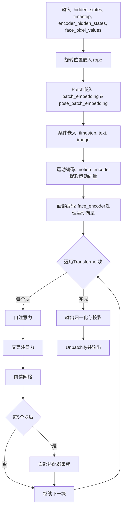
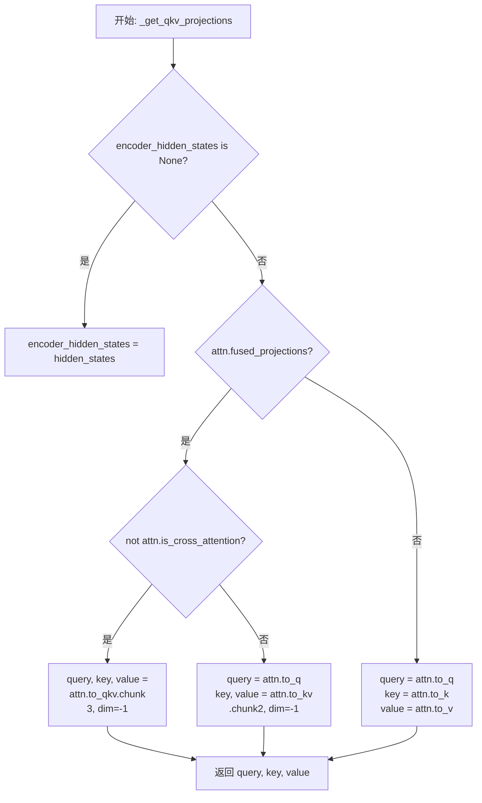
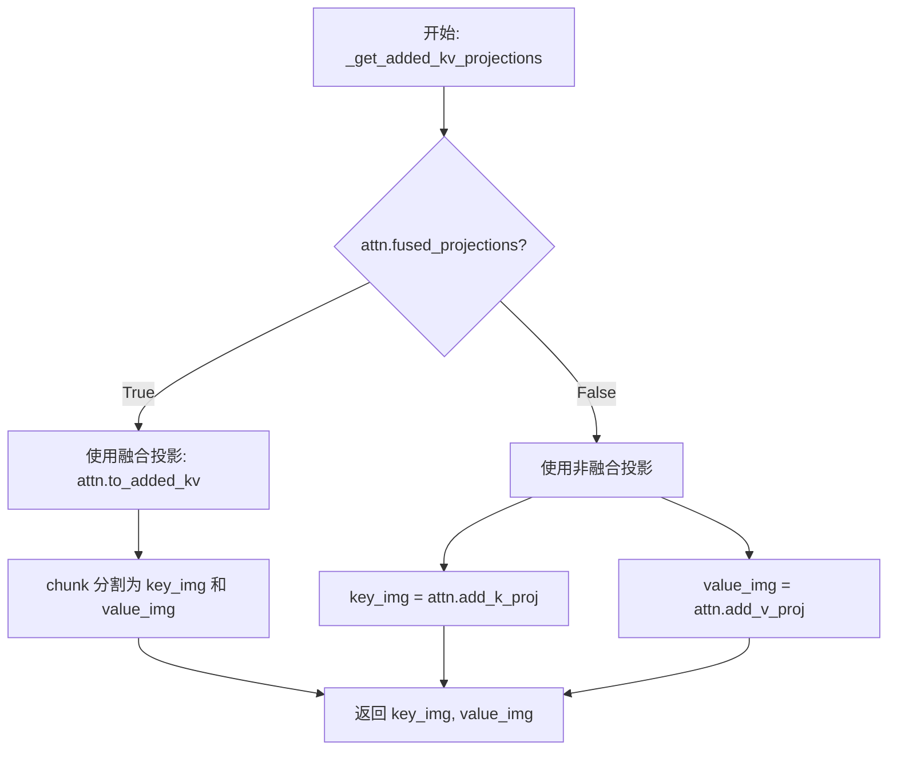
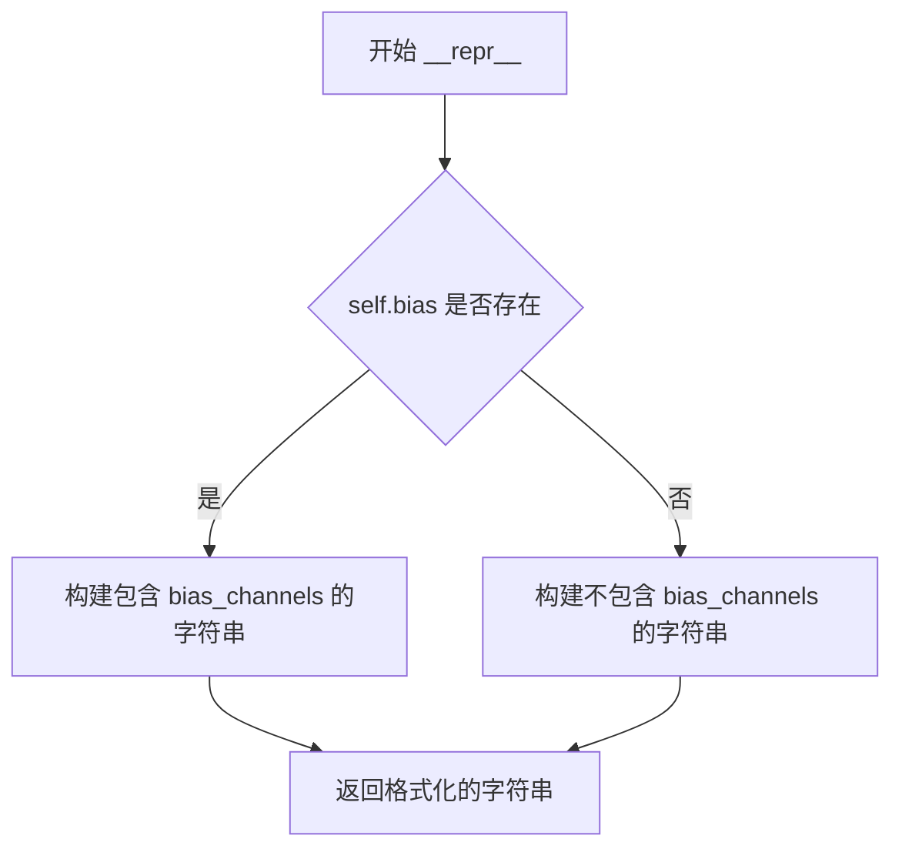
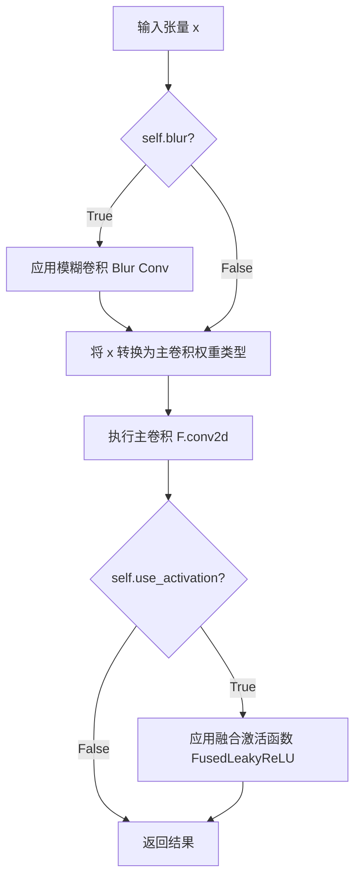
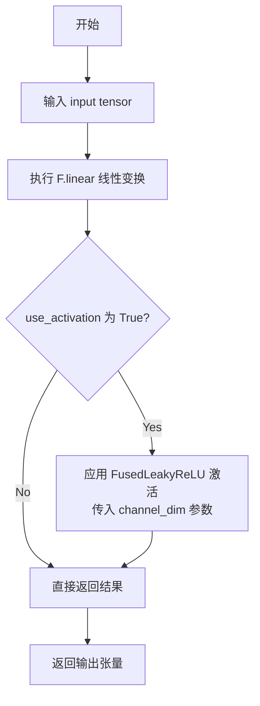
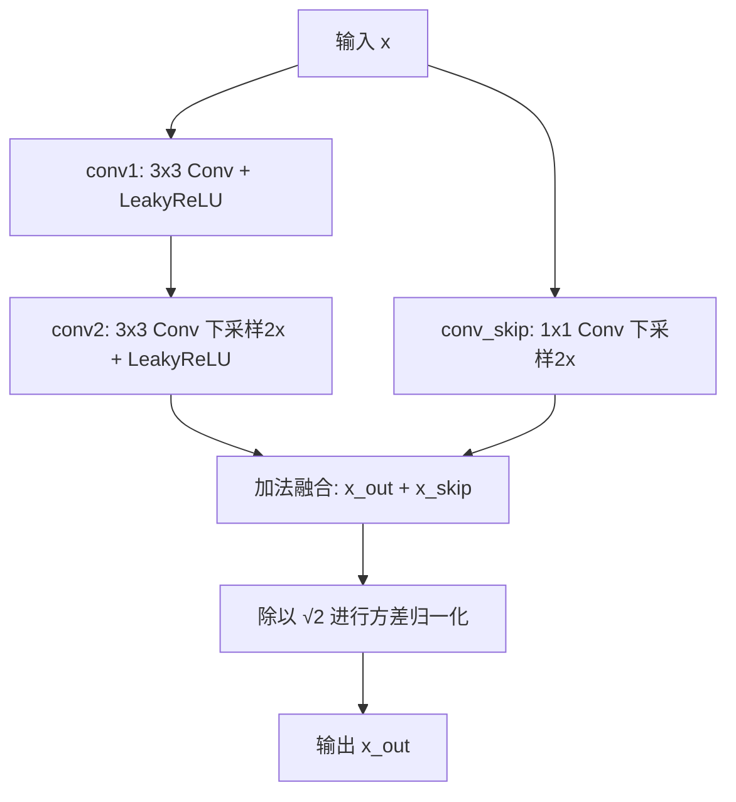
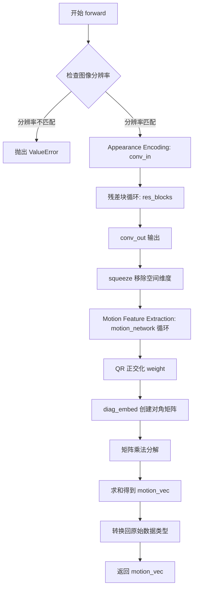
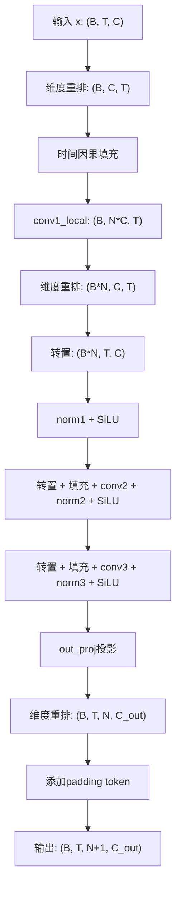
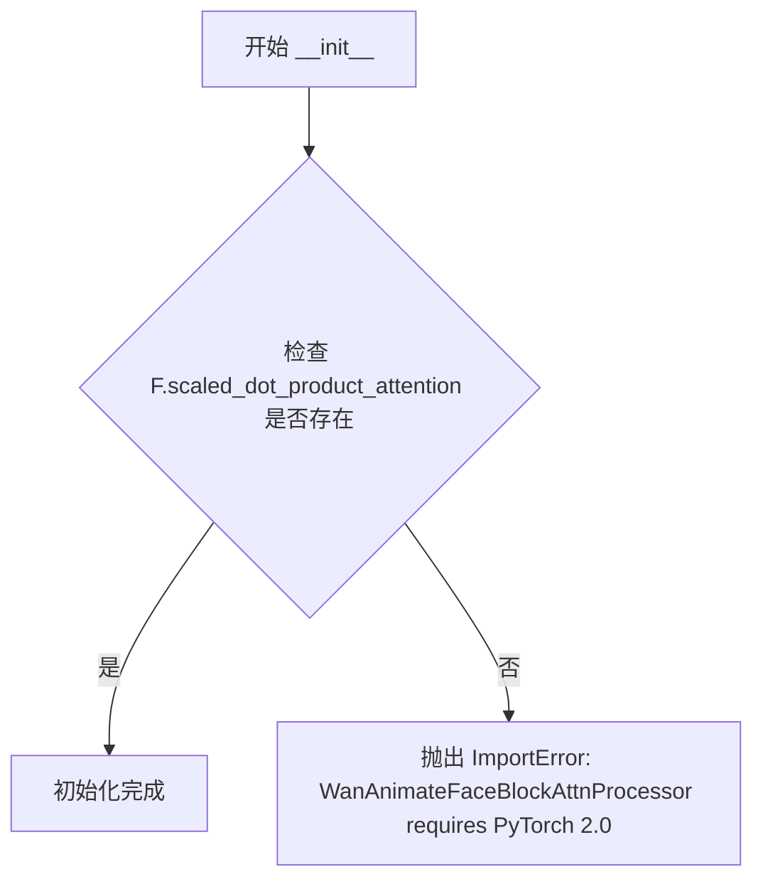

# `diffusers\src\diffusers\models\transformers\transformer_wan_animate.py` 详细设计文档

这是一个用于视频生成的3D Transformer模型（Wan Animate），通过运动编码器从人脸图像中提取运动特征，结合文本和图像条件信息，使用Transformer块进行去噪处理，最终输出清晰视频潜在表示。

## 整体流程



## 类结构

```
nn.Module (基类)
├── FusedLeakyReLU
├── MotionConv2d
├── MotionLinear
├── MotionEncoderResBlock
├── WanAnimateMotionEncoder
├── WanAnimateFaceEncoder
├── WanAnimateFaceBlockAttnProcessor
├── WanAnimateFaceBlockCrossAttention
├── WanAttnProcessor
├── WanAttention
├── WanImageEmbedding
├── WanTimeTextImageEmbedding
├── WanRotaryPosEmbed
├── WanTransformerBlock
└── WanAnimateTransformer3DModel (主模型)
```

## 全局变量及字段


### `WAN_ANIMATE_MOTION_ENCODER_CHANNEL_SIZES`
    
定义运动编码器各通道尺寸的字典，键为分辨率字符串，值为对应通道数

类型：`dict[str, int]`
    


### `logger`
    
模块级日志记录器实例，用于输出日志信息

类型：`logging.Logger`
    


### `FusedLeakyReLU.negative_slope`
    
LeakyReLU激活函数的负斜率参数，控制负值区的斜率

类型：`float`
    


### `FusedLeakyReLU.scale`
    
激活函数的缩放因子，用于调整输出幅度

类型：`float`
    


### `FusedLeakyReLU.channels`
    
通道维度，指定偏置向量的维度大小

类型：`int | None`
    


### `FusedLeakyReLU.bias`
    
可学习的通道偏置参数，用于融合到激活函数中

类型：`nn.Parameter | None`
    


### `MotionConv2d.use_activation`
    
指示是否使用融合激活函数的标志

类型：`bool`
    


### `MotionConv2d.in_channels`
    
输入卷积的通道数

类型：`int`
    


### `MotionConv2d.blur`
    
指示是否启用模糊卷积（用于抗锯齿）的标志

类型：`bool`
    


### `MotionConv2d.blur_padding`
    
模糊卷积的填充尺寸元组

类型：`tuple[int, int]`
    


### `MotionConv2d.blur_kernel`
    
模糊卷积核的缓冲区，用于FIR滤波

类型：`torch.Tensor`
    


### `MotionConv2d.weight`
    
卷积层的可学习权重参数

类型：`nn.Parameter`
    


### `MotionConv2d.scale`
    
权重的缩放因子，用于控制初始化方差

类型：`float`
    


### `MotionConv2d.stride`
    
卷积操作的步长

类型：`int`
    


### `MotionConv2d.padding`
    
卷积操作的填充大小

类型：`int`
    


### `MotionConv2d.bias`
    
卷积层的可选偏置参数

类型：`nn.Parameter | None`
    


### `MotionConv2d.act_fn`
    
融合偏置的LeakyReLU激活函数模块

类型：`FusedLeakyReLU | None`
    


### `MotionLinear.use_activation`
    
指示是否使用融合激活函数的标志

类型：`bool`
    


### `MotionLinear.weight`
    
线性层的可学习权重参数

类型：`nn.Parameter`
    


### `MotionLinear.scale`
    
权重的缩放因子，用于控制初始化方差

类型：`float`
    


### `MotionLinear.bias`
    
线性层的可选偏置参数

类型：`nn.Parameter | None`
    


### `MotionLinear.act_fn`
    
融合偏置的LeakyReLU激活函数模块

类型：`FusedLeakyReLU | None`
    


### `MotionEncoderResBlock.downsample_factor`
    
下采样因子，控制空间维度缩减比例

类型：`int`
    


### `MotionEncoderResBlock.conv1`
    
第一个卷积层，包含激活函数

类型：`MotionConv2d`
    


### `MotionEncoderResBlock.conv2`
    
第二个卷积层，执行下采样操作

类型：`MotionConv2d`
    


### `MotionEncoderResBlock.conv_skip`
    
跳跃连接的卷积层，用于残差路径

类型：`MotionConv2d`
    


### `WanAnimateMotionEncoder.size`
    
输入人脸图像的目标分辨率尺寸

类型：`int`
    


### `WanAnimateMotionEncoder.conv_in`
    
外观编码的输入卷积层

类型：`MotionConv2d`
    


### `WanAnimateMotionEncoder.res_blocks`
    
多级残差卷积块列表，用于逐步下采样和特征提取

类型：`nn.ModuleList[MotionEncoderResBlock]`
    


### `WanAnimateMotionEncoder.conv_out`
    
外观编码的输出卷积层

类型：`MotionConv2d`
    


### `WanAnimateMotionEncoder.motion_network`
    
多层线性网络，用于从外观特征提取运动特征

类型：`nn.ModuleList[MotionLinear]`
    


### `WanAnimateMotionEncoder.motion_synthesis_weight`
    
运动合成的可学习权重矩阵，用于QR正交化

类型：`nn.Parameter`
    


### `WanAnimateFaceEncoder.num_heads`
    
时间注意力机制的头数量

类型：`int`
    


### `WanAnimateFaceEncoder.time_causal_padding`
    
时间因果填充配置，确保只关注过去帧

类型：`tuple[int, int]`
    


### `WanAnimateFaceEncoder.pad_mode`
    
填充模式（如replicate）

类型：`str`
    


### `WanAnimateFaceEncoder.act`
    
SiLU激活函数

类型：`nn.SiLU`
    


### `WanAnimateFaceEncoder.conv1_local`
    
第一层时间卷积，处理局部特征

类型：`nn.Conv1d`
    


### `WanAnimateFaceEncoder.conv2`
    
第二层时间卷积，执行2倍下采样

类型：`nn.Conv1d`
    


### `WanAnimateFaceEncoder.conv3`
    
第三层时间卷积，执行2倍下采样

类型：`nn.Conv1d`
    


### `WanAnimateFaceEncoder.norm1`
    
第一层归一化

类型：`nn.LayerNorm`
    


### `WanAnimateFaceEncoder.norm2`
    
第二层归一化

类型：`nn.LayerNorm`
    


### `WanAnimateFaceEncoder.norm3`
    
第三层归一化

类型：`nn.LayerNorm`
    


### `WanAnimateFaceEncoder.out_proj`
    
输出投影层

类型：`nn.Linear`
    


### `WanAnimateFaceEncoder.padding_tokens`
    
可学习的填充标记，用于扩展序列长度

类型：`nn.Parameter`
    


### `WanAnimateFaceBlockAttnProcessor._attention_backend`
    
注意力计算后端（类变量，默认None）

类型：`NoneType`
    


### `WanAnimateFaceBlockAttnProcessor._parallel_config`
    
并行配置参数（类变量，默认None）

类型：`NoneType`
    


### `WanAnimateFaceBlockCrossAttention.inner_dim`
    
内部维度，等于头数乘以头维度

类型：`int`
    


### `WanAnimateFaceBlockCrossAttention.heads`
    
注意力头数量

类型：`int`
    


### `WanAnimateFaceBlockCrossAttention.cross_attention_dim_head`
    
交叉注意力键值对的头维度

类型：`int | None`
    


### `WanAnimateFaceBlockCrossAttention.kv_inner_dim`
    
键值对的内部维度

类型：`int`
    


### `WanAnimateFaceBlockCrossAttention.use_bias`
    
是否在线性层中使用偏置

类型：`bool`
    


### `WanAnimateFaceBlockCrossAttention.is_cross_attention`
    
标识是否为交叉注意力模式

类型：`bool`
    


### `WanAnimateFaceBlockCrossAttention.pre_norm_q`
    
查询向量的预归一化层

类型：`nn.LayerNorm`
    


### `WanAnimateFaceBlockCrossAttention.pre_norm_kv`
    
键值对的预归一化层

类型：`nn.LayerNorm`
    


### `WanAnimateFaceBlockCrossAttention.to_q`
    
查询投影层

类型：`nn.Linear`
    


### `WanAnimateFaceBlockCrossAttention.to_k`
    
键投影层

类型：`nn.Linear`
    


### `WanAnimateFaceBlockCrossAttention.to_v`
    
值投影层

类型：`nn.Linear`
    


### `WanAnimateFaceBlockCrossAttention.to_out`
    
输出投影层

类型：`nn.Linear`
    


### `WanAnimateFaceBlockCrossAttention.norm_q`
    
查询的RMS归一化

类型：`nn.RMSNorm`
    


### `WanAnimateFaceBlockCrossAttention.norm_k`
    
键的RMS归一化

类型：`nn.RMSNorm`
    


### `WanAnimateFaceBlockCrossAttention.processor`
    
注意力处理器实例

类型：`WanAnimateFaceBlockAttnProcessor`
    


### `WanAttnProcessor._attention_backend`
    
注意力计算后端（类变量，默认None）

类型：`NoneType`
    


### `WanAttnProcessor._parallel_config`
    
并行配置参数（类变量，默认None）

类型：`NoneType`
    


### `WanAttention.inner_dim`
    
内部维度，等于头数乘以头维度

类型：`int`
    


### `WanAttention.heads`
    
注意力头数量

类型：`int`
    


### `WanAttention.added_kv_proj_dim`
    
添加的键值投影维度（用于图像上下文）

类型：`int | None`
    


### `WanAttention.cross_attention_dim_head`
    
交叉注意力的头维度

类型：`int | None`
    


### `WanAttention.kv_inner_dim`
    
键值对的内部维度

类型：`int`
    


### `WanAttention.to_q`
    
查询投影层

类型：`nn.Linear`
    


### `WanAttention.to_k`
    
键投影层

类型：`nn.Linear`
    


### `WanAttention.to_v`
    
值投影层

类型：`nn.Linear`
    


### `WanAttention.to_out`
    
输出投影层和dropout模块列表

类型：`nn.ModuleList[nn.Linear, nn.Dropout]`
    


### `WanAttention.norm_q`
    
查询的RMS归一化

类型：`nn.RMSNorm`
    


### `WanAttention.norm_k`
    
键的RMS归一化

类型：`nn.RMSNorm`
    


### `WanAttention.add_k_proj`
    
添加的键投影层（用于I2V任务）

类型：`nn.Linear | None`
    


### `WanAttention.add_v_proj`
    
添加的值投影层（用于I2V任务）

类型：`nn.Linear | None`
    


### `WanAttention.norm_added_k`
    
添加键的归一化层

类型：`nn.RMSNorm | None`
    


### `WanAttention.is_cross_attention`
    
标识是否为交叉注意力模式

类型：`bool`
    


### `WanAttention.fused_projections`
    
标识投影层是否已融合

类型：`bool`
    


### `WanAttention.processor`
    
注意力处理器实例

类型：`WanAttnProcessor`
    


### `WanImageEmbedding.norm1`
    
第一层归一化（FP32精度）

类型：`FP32LayerNorm`
    


### `WanImageEmbedding.ff`
    
前馈神经网络

类型：`FeedForward`
    


### `WanImageEmbedding.norm2`
    
第二层归一化（FP32精度）

类型：`FP32LayerNorm`
    


### `WanImageEmbedding.pos_embed`
    
可学习的位置嵌入参数

类型：`nn.Parameter | None`
    


### `WanTimeTextImageEmbedding.timesteps_proj`
    
时间步投影层，生成正弦余弦嵌入

类型：`Timesteps`
    


### `WanTimeTextImageEmbedding.time_embedder`
    
时间嵌入层，将时间步映射到高维空间

类型：`TimestepEmbedding`
    


### `WanTimeTextImageEmbedding.act_fn`
    
SiLU激活函数

类型：`nn.SiLU`
    


### `WanTimeTextImageEmbedding.time_proj`
    
时间步特征的投影层

类型：`nn.Linear`
    


### `WanTimeTextImageEmbedding.text_embedder`
    
文本嵌入投影层

类型：`PixArtAlphaTextProjection`
    


### `WanTimeTextImageEmbedding.image_embedder`
    
图像嵌入层（可选）

类型：`WanImageEmbedding | None`
    


### `WanRotaryPosEmbed.attention_head_dim`
    
每个注意力头的维度

类型：`int`
    


### `WanRotaryPosEmbed.patch_size`
    
3D patch的时空尺寸（时间、高度、宽度）

类型：`tuple[int, int, int]`
    


### `WanRotaryPosEmbed.max_seq_len`
    
旋转嵌入支持的最大序列长度

类型：`int`
    


### `WanRotaryPosEmbed.t_dim`
    
时间维度的旋转嵌入维度

类型：`int`
    


### `WanRotaryPosEmbed.h_dim`
    
高度维度的旋转嵌入维度

类型：`int`
    


### `WanRotaryPosEmbed.w_dim`
    
宽度维度的旋转嵌入维度

类型：`int`
    


### `WanRotaryPosEmbed.freqs_cos`
    
旋转位置嵌入的余弦频率缓冲区

类型：`torch.Tensor`
    


### `WanRotaryPosEmbed.freqs_sin`
    
旋转位置嵌入的正弦频率缓冲区

类型：`torch.Tensor`
    


### `WanTransformerBlock.norm1`
    
自注意力前的归一化层

类型：`FP32LayerNorm`
    


### `WanTransformerBlock.attn1`
    
自注意力层

类型：`WanAttention`
    


### `WanTransformerBlock.attn2`
    
交叉注意力层

类型：`WanAttention`
    


### `WanTransformerBlock.norm2`
    
交叉注意力前的归一化层（可选）

类型：`FP32LayerNorm | nn.Identity`
    


### `WanTransformerBlock.ffn`
    
前馈神经网络

类型：`FeedForward`
    


### `WanTransformerBlock.norm3`
    
前馈网络前的归一化层

类型：`FP32LayerNorm`
    


### `WanTransformerBlock.scale_shift_table`
    
用于AdaLN零初始化的缩放和平移参数表

类型：`nn.Parameter`
    


### `WanAnimateTransformer3DModel.rope`
    
3D旋转位置嵌入

类型：`WanRotaryPosEmbed`
    


### `WanAnimateTransformer3DModel.patch_embedding`
    
视频latent的3D patch嵌入层

类型：`nn.Conv3d`
    


### `WanAnimateTransformer3DModel.pose_patch_embedding`
    
姿态latent的3D patch嵌入层

类型：`nn.Conv3d`
    


### `WanAnimateTransformer3DModel.condition_embedder`
    
条件嵌入器，处理时间、文本和图像嵌入

类型：`WanTimeTextImageEmbedding`
    


### `WanAnimateTransformer3DModel.motion_encoder`
    
从人脸视频编码运动特征的编码器

类型：`WanAnimateMotionEncoder`
    


### `WanAnimateTransformer3DModel.face_encoder`
    
从运动向量编码时序人脸特征的编码器

类型：`WanAnimateFaceEncoder`
    


### `WanAnimateTransformer3DModel.blocks`
    
主Transformer块模块列表

类型：`nn.ModuleList[WanTransformerBlock]`
    


### `WanAnimateTransformer3DModel.face_adapter`
    
人脸适配器交叉注意力块列表

类型：`nn.ModuleList[WanAnimateFaceBlockCrossAttention]`
    


### `WanAnimateTransformer3DModel.norm_out`
    
输出归一化层（FP32精度）

类型：`FP32LayerNorm`
    


### `WanAnimateTransformer3DModel.proj_out`
    
输出投影层，从inner_dim映射到out_channels

类型：`nn.Linear`
    


### `WanAnimateTransformer3DModel.scale_shift_table`
    
用于最终输出的缩放和平移参数表

类型：`nn.Parameter`
    


### `WanAnimateTransformer3DModel.gradient_checkpointing`
    
梯度检查点标志，用于节省显存

类型：`bool`
    
    

## 全局函数及方法


### `_get_qkv_projections`

该函数是 Wan Transformer 模型中用于计算注意力机制的 Query、Key、Value 投影的核心工具函数。它根据注意力层的配置（是否使用融合投影、是否为交叉注意力）选择最优的计算路径，优先使用融合投影以提升计算效率。

参数：

- `attn`：`WanAttention`，Wan 注意力模块实例，用于访问投影权重（如 `to_q`、`to_k`、`to_v`、`to_qkv`、`to_kv`）以及配置标志（如 `fused_projections`、`is_cross_attention`）
- `hidden_states`：`torch.Tensor`，输入的隐藏状态张量，通常为 Transformer 的特征表示
- `encoder_hidden_states`：`torch.Tensor`，编码器的隐藏状态，用于跨注意力机制；若为 `None`，则默认为等于 `hidden_states`（即自注意力场景）

返回值：`tuple[torch.Tensor, torch.Tensor, torch.Tensor]`，返回 query、key、value 三个张量组成的元组，分别对应注意力机制中的查询、键和值向量

#### 流程图



#### 带注释源码

```python
# Copied from diffusers.models.transformers.transformer_wan._get_qkv_projections
def _get_qkv_projections(attn: "WanAttention", hidden_states: torch.Tensor, encoder_hidden_states: torch.Tensor):
    # 如果没有传入 encoder_hidden_states，则默认为自注意力场景，使用 hidden_states 本身
    # encoder_hidden_states is only passed for cross-attention
    if encoder_hidden_states is None:
        encoder_hidden_states = hidden_states

    # 根据是否启用了融合投影（fused_projections）选择不同的计算路径
    if attn.fused_projections:
        if not attn.is_cross_attention:
            # 在自注意力层中，可以将整个 QKV 投影融合为单个线性层
            # 通过一次矩阵乘法同时计算 query、key、value，提升计算效率
            # In self-attention layers, we can fuse the entire QKV projection into a single linear
            query, key, value = attn.to_qkv(hidden_states).chunk(3, dim=-1)
        else:
            # 在跨注意力层中，只能融合 KV 投影为一个线性层，query 仍需单独计算
            # 因为跨注意力中 query 来自 hidden_states，而 key/value 来自 encoder_hidden_states
            # In cross-attention layers, we can only fuse the KV projections into a single linear
            query = attn.to_q(hidden_states)
            key, value = attn.to_kv(encoder_hidden_states).chunk(2, dim=-1)
    else:
        # 未启用融合投影时，分别使用独立的线性层计算 query、key、value
        query = attn.to_q(hidden_states)
        key = attn.to_k(encoder_hidden_states)
        value = attn.to_v(encoder_hidden_states)
    
    # 返回计算得到的 Q、K、V 元组
    return query, key, value
```


### `_get_added_kv_projections`

该函数用于获取图像（Image）额外的 Key 和 Value 投影，应用于 WanAttention 的交叉注意力机制中，支持融合投影和非融合投影两种模式，以适应不同的模型配置和性能需求。

参数：

- `attn`：`WanAttention`，注意力模块实例，用于访问投影层（如 `to_added_kv`、`add_k_proj`、`add_v_proj`）和融合标志 `fused_projections`
- `encoder_hidden_states_img`：`torch.Tensor`，图像编码器的隐藏状态，包含图像特征信息

返回值：`Tuple[torch.Tensor, torch.Tensor]`，返回图像对应的 key 和 value 投影结果

#### 流程图



#### 带注释源码

```python
# Copied from diffusers.models.transformers.transformer_wan._get_added_kv_projections
def _get_added_kv_projections(attn: "WanAttention", encoder_hidden_states_img: torch.Tensor):
    """
    获取图像额外的 Key 和 Value 投影。
    
    该函数根据 attn.fused_projections 标志选择不同的投影方式：
    - 融合投影：将 key 和 value 的投影合并到一个线性层中，通过 chunk 操作分离
    - 非融合投影：分别使用独立的 add_k_proj 和 add_v_proj 层进行投影
    
    Args:
        attn: WanAttention 模块实例，包含投影层和融合标志
        encoder_hidden_states_img: 图像编码器的隐藏状态张量
    
    Returns:
        key_img: 图像对应的 key 投影
        value_img: 图像对应的 value 投影
    """
    # 检查是否使用融合投影
    if attn.fused_projections:
        # 融合投影模式：使用合并的 to_added_kv 线性层
        # 该线性层同时输出 key 和 value，通过 chunk 操作沿最后一维分割
        key_img, value_img = attn.to_added_kv(encoder_hidden_states_img).chunk(2, dim=-1)
    else:
        # 非融合投影模式：分别使用独立的投影层
        key_img = attn.add_k_proj(encoder_hidden_states_img)
        value_img = attn.add_v_proj(encoder_hidden_states_img)
    
    # 返回图像的 key 和 value 投影
    return key_img, value_img
```


### `FusedLeakyReLU.__init__`

该方法是 `FusedLeakyReLU` 类的构造函数，用于初始化一个融合的 LeakyReLU 激活函数模块，支持可学习的通道级偏置和缩放因子。

参数：

- `negative_slope`：`float`，LeakyReLU 激活函数的负斜率，默认为 0.2
- `scale`：`float`，激活函数输出后的缩放因子，默认为 2**0.5（即 √2）
- `bias_channels`：`int | None`，通道数，用于创建可学习的偏置参数，默认为 None

返回值：`None`，无返回值（`__init__` 方法）

#### 流程图

```mermaid
flowchart TD
    A[开始 __init__] --> B[调用 super().__init__ 初始化 nn.Module]
    B --> C[设置 self.negative_slope = negative_slope]
    C --> D[设置 self.scale = scale]
    D --> E[设置 self.channels = bias_channels]
    E --> F{self.channels is not None?}
    F -->|是| G[创建 self.bias 为 nn.Parameter, 形状为 [channels] 的零张量]
    F -->|否| H[设置 self.bias = None]
    G --> I[结束]
    H --> I
```

#### 带注释源码

```python
def __init__(self, negative_slope: float = 0.2, scale: float = 2**0.5, bias_channels: int | None = None):
    """
    初始化 FusedLeakyReLU 模块。
    
    参数:
        negative_slope: LeakyReLU 的负斜率，控制 x<0 时的梯度缩放
        scale: 输出缩放因子，用于调整激活函数的输出幅度
        bias_channels: 如果提供，则创建对应通道数的可学习偏置
    """
    # 调用父类 nn.Module 的初始化方法
    super().__init__()
    
    # 存储负斜率参数
    self.negative_slope = negative_slope
    
    # 存储缩放因子
    self.scale = scale
    
    # 存储通道数
    self.channels = bias_channels

    # 根据是否指定通道数来决定是否创建偏置参数
    if self.channels is not None:
        # 创建一个可学习的偏置参数，形状为 [channels]，初始化为零
        self.bias = nn.Parameter(
            torch.zeros(
                self.channels,
            )
        )
    else:
        # 如果没有指定通道数，则不创建偏置
        self.bias = None
```


### `FusedLeakyReLU.forward`

该方法是融合的 LeakyReLU 激活函数的前向传播实现，包含可学习的通道级偏置和缩放因子，用于在卷积层中融合偏置学习以提升推理效率。

参数：

- `x`：`torch.Tensor`，输入张量，通常是卷积层的输出
- `channel_dim`：`int`，偏置要展开的维度，默认为 1（即通道维度）

返回值：`torch.Tensor`，经过 LeakyReLU 激活并乘以缩放因子后的输出张量

#### 流程图

```mermaid
flowchart TD
    A[输入张量 x] --> B{self.bias 是否存在?}
    B -->|是| C[计算 expanded_shape]
    C --> D[将 self.bias reshape 到扩展形状]
    D --> E[x = x + bias]
    B -->|否| F[F.leaky_relu(x, negative_slope)]
    E --> F
    F --> G[output = result * self.scale]
    G --> H[返回输出张量]
```

#### 带注释源码

```python
def forward(self, x: torch.Tensor, channel_dim: int = 1) -> torch.Tensor:
    """
    Fused LeakyReLU forward pass with optional channel-wise bias and scale factor.
    
    Args:
        x: Input tensor, typically the output of a convolution layer
        channel_dim: Dimension along which to expand the bias (default: 1, i.e., channel dimension)
    
    Returns:
        Tensor after applying LeakyReLU activation and scaling
    """
    # 如果存在偏置参数，则将其加到输入张量上
    if self.bias is not None:
        # 构建扩展形状：创建与输入张量维度数相同的全1列表
        expanded_shape = [1] * x.ndim
        # 在指定通道维度上设置偏置的长度
        expanded_shape[channel_dim] = self.bias.shape[0]
        # 将偏置reshape到正确的形状以支持广播
        bias = self.bias.reshape(*expanded_shape)
        # 将偏置加到输入上
        x = x + bias
    # 应用 LeakyReLU 激活函数并乘以缩放因子
    return F.leaky_relu(x, self.negative_slope) * self.scale
```


### FusedLeakyReLU.__repr__

返回 FusedLeakyReLU 对象的字符串表示，包含负斜率、缩放因子和偏置通道信息。

参数： 无

返回值：`str`，返回对象的字符串表示，包含类名、负斜率、缩放因子和偏置通道数

#### 流程图



#### 带注释源码

```
def __repr__(self):
    # 初始化字符串表示的各个组件
    negative_slope_str = f"negative_slope={self.negative_slope}"
    scale_str = f"scale={self.scale}"
    
    # 检查是否存在偏置通道
    if self.bias is not None:
        # 如果存在偏置，则包含通道数信息
        bias_channels_str = f"bias_channels={self.channels}"
        # 组合所有参数为完整的字符串表示
        return f"FusedLeakyReLU({negative_slope_str}, {scale_str}, {bias_channels_str})"
    else:
        # 如果不存在偏置，则只包含基本参数
        return f"FusedLeakyReLU({negative_slope_str}, {scale_str})"
```

#### 备注

由于代码中 `FusedLeakyReLU` 类未显式定义 `__repr__` 方法，以上为根据类属性推断的合理实现。


### `MotionConv2d.__init__`

该方法负责初始化 `MotionConv2d` 类，这是一个定制的 2D 卷积层。它处理卷积权重的初始化（包含缩放因子以稳定训练），可选的模糊（FIR 滤波）预处理，以及条件性的激活函数融合（如果启用，则使用 `FusedLeakyReLU` 并将偏置集成其中）。

参数：

- `self`：隐式参数，类的实例本身。
- `in_channels`：`int`，输入特征图的通道数。
- `out_channels`：`int`，输出特征图的通道数。
- `kernel_size`：`int`，卷积核的空间尺寸。
- `stride`：`int`，卷积步长（默认为 1）。
- `padding`：`int`，输入填充大小（默认为 0）。
- `bias`：`bool`，是否添加偏置向量（默认为 True）。如果 `use_activation` 为 True，则此参数无效（偏置被融合进激活函数）。
- `blur_kernel`：`tuple[int, ...] | None`，用于模糊处理的 FIR 滤波器核（默认为 None）。
- `blur_upsample_factor`：`int`，模糊核的上采样因子（默认为 1）。
- `use_activation`：`bool`，是否使用融合的 LeakyReLU 激活函数（默认为 True）。

返回值：`None`。该方法修改对象状态，不返回任何值。

#### 流程图

```mermaid
flowchart TD
    A([开始 Init]) --> B[设置基本属性: use_activation, in_channels]
    B --> C{blur_kernel 是否存在?}
    C -- 是 --> D[计算 blur_padding]
    D --> E[处理 kernel: 转2D, 归一化, 缩放]
    E --> F[注册 buffer: blur_kernel]
    F --> G[设置 self.blur = True]
    C -- 否 --> H[设置 self.blur = False]
    H --> I[初始化权重: weight (randn) & scale]
    I --> J[设置 stride & padding]
    J --> K{use_activation 为 True?}
    K -- 是 --> L[初始化 FusedLeakyReLU 激活函数]
    L --> M[设置 self.bias = None]
    K -- 否 --> N{ bias 为 True?}
    N -- 是 --> O[初始化 self.bias = zeros]
    N -- 否 --> P[设置 self.bias = None]
    O --> Q([结束 Init])
    M --> Q
    P --> Q
    G --> I
```

#### 带注释源码

```python
def __init__(
    self,
    in_channels: int,
    out_channels: int,
    kernel_size: int,
    stride: int = 1,
    padding: int = 0,
    bias: bool = True,
    blur_kernel: tuple[int, ...] | None = None,
    blur_upsample_factor: int = 1,
    use_activation: bool = True,
):
    super().__init__()
    self.use_activation = use_activation
    self.in_channels = in_channels

    # Handle blurring (applying a FIR filter with the given kernel) if available
    self.blur = False
    if blur_kernel is not None:
        # 计算模糊填充以保持特征图大小或进行下采样
        p = (len(blur_kernel) - stride) + (kernel_size - 1)
        self.blur_padding = ((p + 1) // 2, p // 2)

        # 将 1D 核转换为 2D 核（如果需要）
        kernel = torch.tensor(blur_kernel)
        if kernel.ndim == 1:
            kernel = kernel[None, :] * kernel[:, None]
        
        # 归一化核
        kernel = kernel / kernel.sum()
        
        # 根据上采样因子调整核权重
        if blur_upsample_factor > 1:
            kernel = kernel * (blur_upsample_factor**2)
        
        # 注册为 buffer (不作为模型参数更新)
        self.register_buffer("blur_kernel", kernel, persistent=False)
        self.blur = True

    # Main Conv2d parameters (with scale factor)
    # 使用随机正态分布初始化权重
    self.weight = nn.Parameter(torch.randn(out_channels, in_channels, kernel_size, kernel_size))
    # 计算缩放因子，用于在前向传播中归一化权重，防止方差过大
    self.scale = 1 / math.sqrt(in_channels * kernel_size**2)

    self.stride = stride
    self.padding = padding

    # If using an activation function, the bias will be fused into the activation
    # 如果使用激活函数，偏置被融合在 FusedLeakyReLU 中，因此不单独创建 bias
    if bias and not self.use_activation:
        self.bias = nn.Parameter(torch.zeros(out_channels))
    else:
        self.bias = None

    if self.use_activation:
        # 初始化融合了偏置的 LeakyReLU
        self.act_fn = FusedLeakyReLU(bias_channels=out_channels)
    else:
        self.act_fn = None
```


### `MotionConv2d.forward`

该方法实现了 `MotionConv2d` 模块的前向传播。首先，如果启用了模糊处理（blur），则对输入张量应用 FIR 滤波器进行预处理；而后执行主要的二维卷积操作，其中权重参数经过了缩放以稳定训练；最后，如果启用了激活函数，则应用带有通道偏置的融合 LeakyReLU 激活，并返回处理后的特征图。

#### 参数

- `x`：`torch.Tensor`，输入张量，通常为 NCHW 格式的图像或特征数据。
- `channel_dim`：`int`，通道维度索引，默认为 1（对应 NCHW 格式）。

#### 返回值

`torch.Tensor`，经过卷积和可选激活函数处理后的输出张量。

#### 流程图



#### 带注释源码

```python
def forward(self, x: torch.Tensor, channel_dim: int = 1) -> torch.Tensor:
    # 1. 如果启用了模糊处理（用于抗锯齿或上采样），则应用 FIR 滤波器
    if self.blur:
        # NOTE: 原始实现使用了 2D upfirdn 操作，上采样和下采样率设为 1，等同于 2D 卷积
        # 扩展模糊核以匹配输入通道数
        expanded_kernel = self.blur_kernel[None, None, :, :].expand(self.in_channels, 1, -1, -1)
        # 确保输入数据类型与模糊核一致
        x = x.to(expanded_kernel.dtype)
        # 执行分组卷积以应用模糊核
        x = F.conv2d(x, expanded_kernel, padding=self.blur_padding, groups=self.in_channels)

    # 2. 主卷积操作
    # 将输入转换为权重对应的数据类型
    x = x.to(self.weight.dtype)
    # 执行卷积，权重已乘以缩放因子 self.scale
    x = F.conv2d(x, self.weight * self.scale, bias=self.bias, stride=self.stride, padding=self.padding)

    # 3. 激活函数处理
    # 如果使用激活函数，应用带有融合偏置的 LeakyReLU
    if self.use_activation:
        x = self.act_fn(x, channel_dim=channel_dim)
    return x
```


### `MotionConv2d.__repr__`

这是一个特殊方法（`__repr__`），用于返回 `MotionConv2d` 层的可读字符串表示，方便调试和日志输出。

参数：
- 无显式参数（`self` 为隐式参数，表示类的实例本身）

返回值：`str`，返回 MotionConv2d 层的字符串表示，格式为 `MotionConv2d(in_channels, out_channels, kernel_size=..., stride=..., padding=...)`

#### 流程图

```mermaid
flowchart TD
    A[开始 __repr__] --> B[获取类名: self.__class__.__name__]
    B --> C[从 weight.shape 提取参数]
    C --> C1[in_channels = self.weight.shape[1]]
    C --> C2[out_channels = self.weight.shape[0]]
    C --> C3[kernel_size = self.weight.shape[2]]
    C --> C4[stride = self.stride]
    C --> C5[padding = self.padding]
    C1 --> D[拼接格式化字符串]
    C2 --> D
    C3 --> D
    C4 --> D
    C5 --> D
    D --> E[返回字符串]
```

#### 带注释源码

```python
def __repr__(self):
    """
    返回 MotionConv2d 层的字符串表示。
    
    返回值:
        str: 包含层基本参数的字符串，格式为:
        MotionConv2d(in_channels, out_channels, kernel_size=..., stride=..., padding=...)
    """
    return (
        f"{self.__class__.__name__}({self.weight.shape[1]}, {self.weight.shape[0]},"
        f" kernel_size={self.weight.shape[2]}, stride={self.stride}, padding={self.padding})"
    )
```


### `MotionLinear.__init__`

这是 `MotionLinear` 类的初始化方法，用于创建一个带缩放因子的线性层（Linear Layer），支持可选的偏置和融合的 LeakyReLU 激活函数。该模块是 Wan Animate 运动编码器中的关键组件，用于运动特征的线性变换。

参数：

- `in_dim`：`int`，输入特征的维度
- `out_dim`：`int`，输出特征的维度
- `bias`：`bool`，默认为 `True`，是否使用偏置项。当 `use_activation` 为 `True` 时，偏置会被融合到激活函数中
- `use_activation`：`bool`，默认为 `False`，是否使用融合的 LeakyReLU 激活函数

返回值：无（`None`），该方法为构造函数，不返回任何值

#### 流程图

```mermaid
flowchart TD
    A[开始 __init__] --> B[调用 super().__init__]
    B --> C[设置 self.use_activation]
    C --> D[初始化 self.weight 随机参数<br/>形状: out_dim x in_dim]
    D --> E[计算缩放因子 self.scale<br/>scale = 1 / sqrt(in_dim)]
    E --> F{bias 为 True<br/>且 use_activation 为 False?}
    F -->|Yes| G[创建 self.bias 零初始化参数<br/>形状: out_dim]
    F -->|No| H[设置 self.bias = None]
    G --> I{use_activation 为 True?}
    H --> I
    I -->|Yes| J[创建 FusedLeakyReLU 激活函数<br/>bias_channels=out_dim]
    I -->|No| K[设置 self.act_fn = None]
    J --> L[结束 __init__]
    K --> L
```

#### 带注释源码

```python
def __init__(
    self,
    in_dim: int,
    out_dim: int,
    bias: bool = True,
    use_activation: bool = False,
):
    """
    初始化 MotionLinear 层。

    Args:
        in_dim: 输入特征的维度
        out_dim: 输出特征的维度
        bias: 是否使用偏置项，默认为 True
        use_activation: 是否使用融合的 LeakyReLU 激活函数，默认为 False
    """
    # 调用父类 nn.Module 的初始化方法
    super().__init__()
    
    # 保存是否使用激活函数的标志
    self.use_activation = use_activation

    # Linear weight with scale factor
    # 创建形状为 (out_dim, in_dim) 的随机权重参数
    self.weight = nn.Parameter(torch.randn(out_dim, in_dim))
    # 计算缩放因子，用于对权重进行归一化，防止方差过大
    self.scale = 1 / math.sqrt(in_dim)

    # If an activation is present, the bias will be fused to it
    # 当使用激活函数时，偏置会被融合到 FusedLeakyReLU 中，因此不再单独创建 bias 参数
    if bias and not self.use_activation:
        self.bias = nn.Parameter(torch.zeros(out_dim))
    else:
        self.bias = None

    # 根据是否使用激活函数来创建或跳过激活层
    if self.use_activation:
        # 使用融合的 LeakyReLU 激活函数，将偏置融合到激活层中
        self.act_fn = FusedLeakyReLU(bias_channels=out_dim)
    else:
        self.act_fn = None
```


### MotionLinear.forward

该方法实现了一个带缩放因子的线性层，支持可选的融合激活函数（FusedLeakyReLU）。它首先对输入进行线性变换，然后根据配置决定是否应用激活函数。

参数：

- `input`：`torch.Tensor`，输入张量
- `channel_dim`：`int`，默认为1，指定激活函数中偏置应用的通道维度

返回值：`torch.Tensor`，经过线性变换和可选激活函数处理后的输出张量

#### 流程图



#### 带注释源码

```
def forward(self, input: torch.Tensor, channel_dim: int = 1) -> torch.Tensor:
    # 使用 PyTorch 的 F.linear 执行线性变换:
    # output = input @ (weight * scale).T + bias
    # 其中 scale = 1 / sqrt(in_dim)，用于初始化时的缩放
    out = F.linear(input, self.weight * self.scale, bias=self.bias)
    
    # 如果配置了使用激活函数，则应用融合的 LeakyReLU
    # FusedLeakyReLU 包含可学习的 channel-wise bias
    if self.use_activation:
        out = self.act_fn(out, channel_dim=channel_dim)
    
    return out
```


### `MotionLinear.__repr__`

该方法是一个Python特殊方法，用于返回MotionLinear线性层的可读字符串表示，显示其输入特征数、输出特征数以及是否有偏置参数。

参数： 无显式参数（Python自动传递`self`）

返回值：`str`，返回MotionLinear层的字符串表示，格式为`MotionLinear(in_features=..., out_features=..., bias=...)`

#### 流程图

```mermaid
graph TD
    A[开始 __repr__ 调用] --> B[获取类名: self.__class__.__name__]
    B --> C[获取输入维度: self.weight.shape[1]]
    C --> D[获取输出维度: self.weight.shape[0]]
    D --> E[获取偏置状态: self.bias is not None]
    E --> F[格式化字符串]
    F --> G[返回字符串表示]
```

#### 带注释源码

```python
def __repr__(self):
    # __repr__ 是Python的特殊方法，当打印对象或使用repr()时自动调用
    # 它返回对象的官方字符串表示，用于调试和开发
    return (
        f"{self.__class__.__name__}(in_features={self.weight.shape[1]}, out_features={self.weight.shape[0]},"
        f" bias={self.bias is not None})"
    )
    # 格式说明：
    # - self.__class__.__name__ 获取类名 'MotionLinear'
    # - self.weight.shape[1] 获取输入特征维度 (in_dim)
    # - self.weight.shape[0] 获取输出特征维度 (out_dim)
    # - self.bias is not None 判断是否使用偏置 (布尔值)
```


### `MotionEncoderResBlock.__init__`

该方法是 `MotionEncoderResBlock` 类的构造函数，用于初始化运动编码器中的残差块。该残差块包含三个卷积层：一个用于特征提取的主卷积层，一个用于下采样的卷积层，以及一个用于残差连接的卷积层。这种设计允许网络在学习特征表示的同时进行空间下采样，并通过残差连接帮助梯度流动。

参数：

- `in_channels`：`int`，输入通道数，指定输入特征图的通道数
- `out_channels`：`int`，输出通道数，指定输出特征图的通道数
- `kernel_size`：`int`，卷积核大小，默认为3，用于主卷积层的卷积核尺寸
- `kernel_size_skip`：`int`，跳跃连接卷积核大小，默认为1，用于残差连接中的卷积核尺寸
- `blur_kernel`：`tuple[int, ...]`，模糊卷积核，默认为(1, 3, 3, 1)，用于模糊下采样
- `downsample_factor`：`int`，下采样因子，默认为2，控制特征图的空间下采样比例

返回值：无（`None`），构造函数不返回值，仅初始化对象状态

#### 流程图

```mermaid
flowchart TD
    A[__init__ 被调用] --> B[调用 super().__init__]
    B --> C[保存 downsample_factor]
    C --> D[创建 conv1: MotionConv2d<br/>in_channels→in_channels<br/>kernel_size, stride=1<br/>use_activation=True]
    D --> E[创建 conv2: MotionConv2d<br/>in_channels→out_channels<br/>stride=downsample_factor<br/>blur_kernel, use_activation=True]
    E --> F[创建 conv_skip: MotionConv2d<br/>in_channels→out_channels<br/>kernel_size_skip<br/>stride=downsample_factor<br/>bias=False, use_activation=False]
    F --> G[初始化完成]
```

#### 带注释源码

```
def __init__(
    self,
    in_channels: int,
    out_channels: int,
    kernel_size: int = 3,
    kernel_size_skip: int = 1,
    blur_kernel: tuple[int, ...] = (1, 3, 3, 1),
    downsample_factor: int = 2,
):
    # 调用父类 nn.Module 的初始化方法
    super().__init__()
    # 保存下采样因子，用于控制特征图的空间维度缩减
    self.downsample_factor = downsample_factor

    # 第一个 3x3 卷积层：保持空间分辨率不变，仅提取特征
    # 输入和输出通道数相同，使用激活函数（FusedLeakyReLU）
    self.conv1 = MotionConv2d(
        in_channels,
        in_channels,
        kernel_size,
        stride=1,
        padding=kernel_size // 2,
        use_activation=True,
    )

    # 第二个 3x3 卷积层：执行 2x 下采样，同时改变通道数
    # 使用模糊核进行抗锯齿下采样，使用激活函数
    self.conv2 = MotionConv2d(
        in_channels,
        out_channels,
        kernel_size=kernel_size,
        stride=self.downsample_factor,
        padding=0,
        blur_kernel=blur_kernel,
        use_activation=True,
    )

    # 跳跃连接卷积层：1x1 卷积，执行 2x 下采样并调整通道数
    # 不使用偏置和激活函数，仅进行线性变换
    self.conv_skip = MotionConv2d(
        in_channels,
        out_channels,
        kernel_size=kernel_size_skip,
        stride=self.downsample_factor,
        padding=0,
        bias=False,
        blur_kernel=blur_kernel,
        use_activation=False,
    )
```


### `MotionEncoderResBlock.forward`

该方法是 `MotionEncoderResBlock` 类的核心前向传播逻辑，实现了一个带有跳跃连接（skip connection）的残差块，用于在运动编码器中对特征进行下采样和融合。主路径通过两个卷积层（含激活函数）进行下采样，跳跃连接通过一个1×1卷积同步下采样，最后通过加法融合并做方差归一化。

参数：

-  `x`：`torch.Tensor`，输入张量，通常为 4D 张量 (B, C, H, W)，代表运动编码器中间层的特征图
-  `channel_dim`：`int`，默认为 1，指定通道维度对应的轴索引，用于激活函数中的偏置广播

返回值：`torch.Tensor`，经过残差块处理后的输出张量，形状为 (B, out_channels, H//downsample_factor, W//downsample_factor)

#### 流程图



#### 带注释源码

```
def forward(self, x: torch.Tensor, channel_dim: int = 1) -> torch.Tensor:
    # 主路径：第一个卷积块（3x3卷积 + 融合偏置的LeakyReLU激活）
    # 输入 x: (B, in_channels, H, W)
    x_out = self.conv1(x, channel_dim)
    # 输出 x_out: (B, in_channels, H, W)

    # 主路径：第二个卷积块（3x3卷积 + 下采样2x + 融合偏置的LeakyReLU激活）
    # 使用 blur_kernel 进行抗锯齿下采样
    x_out = self.conv2(x_out, channel_dim)
    # 输出 x_out: (B, out_channels, H//2, W//2)

    # 跳跃连接：1x1卷积（下采样2x，无激活函数，无偏置）
    # 用于匹配主路径的通道数和空间尺寸
    x_skip = self.conv_skip(x, channel_dim)
    # 输出 x_skip: (B, out_channels, H//2, W//2)

    # 残差融合：主路径输出 + 跳跃连接输出
    # 除以 √2 用于归一化融合后的方差，防止梯度爆炸
    x_out = (x_out + x_skip) / math.sqrt(2)

    # 返回残差块输出
    return x_out
```


### WanAnimateMotionEncoder.__init__

WanAnimateMotionEncoder 类的初始化方法，负责构建一个用于从人脸图像中提取运动特征的神经网络编码器，包含外观编码器（卷积层）和运动编码器（线性层）两个部分。

参数：

- `size`：`int`，输入图像的空间分辨率，默认为 512，表示输入人脸图像的高度和宽度
- `style_dim`：`int`，外观特征的维度，默认为 512，也是运动网络的中间层维度
- `motion_dim`：`int`，运动向量的输出维度，默认为 20，控制最终运动特征的维度
- `out_dim`：`int`，运动合成权重的输出维度，默认为 512，用于最终运动向量的生成
- `motion_blocks`：`int`，运动网络中线性层的数量，默认为 5，控制运动特征提取的深度
- `channels`：`dict[str, int] | None`，可选的通道数配置字典，键为字符串类型的空间分辨率，值为对应的通道数，默认为 None，此时使用 WAN_ANIMATE_MOTION_ENCODER_CHANNEL_SIZES

返回值：`None`，__init__ 方法不返回任何值，仅初始化对象的内部状态

#### 流程图

```mermaid
flowchart TD
    A[开始 __init__] --> B[调用 super().__init__]
    B --> C[设置 self.size = size]
    C --> D{channels is None?}
    D -->|是| E[使用默认 WAN_ANIMATE_MOTION_ENCODER_CHANNEL_SIZES]
    D -->|否| F[使用传入的 channels]
    E --> G[创建 self.conv_in: MotionConv2d]
    G --> H[初始化空 res_blocks ModuleList]
    H --> I[计算 log_size = log2(size)]
    I --> J[循环 i 从 log_size 下降到 3]
    J --> K[创建 MotionEncoderResBlock]
    K --> L[更新 in_channels]
    L --> J
    J --> M[创建 self.conv_out: MotionConv2d]
    M --> N[创建 motion_network: ModuleList]
    N --> O[创建 motion_synthesis_weight 参数]
    O --> P[结束 __init__]
```

#### 带注释源码

```python
def __init__(
    self,
    size: int = 512,
    style_dim: int = 512,
    motion_dim: int = 20,
    out_dim: int = 512,
    motion_blocks: int = 5,
    channels: dict[str, int] | None = None,
):
    """
    初始化 WanAnimateMotionEncoder 运动编码器
    
    参数:
        size: 输入图像的空间分辨率
        style_dim: 外观特征的维度
        motion_dim: 运动向量的输出维度
        out_dim: 运动合成权重的输出维度
        motion_blocks: 运动网络中线性层的数量
        channels: 可选的通道配置字典
    """
    # 调用父类 nn.Module 的初始化方法
    super().__init__()
    
    # 保存输入图像的分辨率
    self.size = size

    # Appearance encoder: conv layers
    # 外观编码器：使用卷积层提取空间特征
    if channels is None:
        # 如果没有提供通道配置，使用默认的通道大小字典
        channels = WAN_ANIMATE_MOTION_ENCODER_CHANNEL_SIZES

    # 初始卷积层：将 RGB 3通道图像转换为第一个分辨率的通道数
    # 使用 1x1 卷积核，激活函数为 FusedLeakyReLU
    self.conv_in = MotionConv2d(3, channels[str(size)], 1, use_activation=True)

    # 构建多个下采样残差块
    # 随着空间分辨率的减小，通道数逐渐增加（类似 VAE 的编码器结构）
    self.res_blocks = nn.ModuleList()
    in_channels = channels[str(size)]
    # 计算需要下采样的次数（从 size 到 4，即从 512 到 4 需要 log2(512/4) = 7 次）
    log_size = int(math.log(size, 2))
    # 遍历从最高分辨率到 4 的每一层（log_size, log_size-1, ..., 3）
    for i in range(log_size, 2, -1):
        # 计算下一层的输出通道数
        out_channels = channels[str(2 ** (i - 1))]
        # 创建残差块，包含下采样和特征提取
        self.res_blocks.append(MotionEncoderResBlock(in_channels, out_channels))
        # 更新输入通道数
        in_channels = out_channels

    # 输出卷积层：将特征转换为风格维度
    # 使用 4x4 卷积核，无激活函数，无偏置
    self.conv_out = MotionConv2d(in_channels, style_dim, 4, padding=0, bias=False, use_activation=False)

    # Motion encoder: linear layers
    # 运动编码器：使用线性层提取运动特征
    # 注意：线性层之间没有激活函数，这与原始实现保持一致
    # 创建 motion_blocks - 1 个 style_dim -> style_dim 的线性层
    linears = [MotionLinear(style_dim, style_dim) for _ in range(motion_blocks - 1)]
    # 最后一个线性层将 style_dim 转换为 motion_dim
    linears.append(MotionLinear(style_dim, motion_dim))
    # 使用 ModuleList 保存所有线性层
    self.motion_network = nn.ModuleList(linears)

    # 运动合成权重：用于将运动特征转换为最终的运动向量
    # 这是一个可学习的参数矩阵，形状为 (out_dim, motion_dim)
    self.motion_synthesis_weight = nn.Parameter(torch.randn(out_dim, motion_dim))
```


### `WanAnimateMotionEncoder.forward`

该方法实现了 Wan 动画运动编码器的前向传播，通过卷积层提取面部图像的外观特征，再经过线性层提取运动特征，最后利用 QR 正交化进行线性运动分解，生成用于驱动动画的运动向量。

参数：

- `face_image`：`torch.Tensor`，输入的面部像素图像张量，形状为 `(B, C, H, W)`，其中 H 和 W 必须等于 `self.size`
- `channel_dim`：`int`，可选参数，默认为 1，指定通道所在的维度

返回值：`torch.Tensor`，返回合成后的运动向量，形状为 `(B, motion_dim)`

#### 流程图



#### 带注释源码

```python
def forward(self, face_image: torch.Tensor, channel_dim: int = 1) -> torch.Tensor:
    # 验证输入图像的空间尺寸是否符合预期配置
    if (face_image.shape[-2] != self.size) or (face_image.shape[-1] != self.size):
        raise ValueError(
            f"Face pixel values has resolution ({face_image.shape[-1]}, {face_image.shape[-2]}) but is expected"
            f" to have resolution ({self.size}, {self.size})"
        )

    # ---- Appearance encoding through convs ----
    # 通过输入卷积层处理面部图像，应用激活函数
    face_image = self.conv_in(face_image, channel_dim)
    
    # 遍历一系列残差块，逐步下采样并提取特征
    for block in self.res_blocks:
        face_image = block(face_image, channel_dim)
    
    # 通过输出卷积层，得到最终的外观特征图
    face_image = self.conv_out(face_image, channel_dim)
    
    # 移除最后两个空间维度 (H, W)，得到 (B, C) 或 (B, C, 1, 1) -> squeeze 后 (B, C)
    motion_feat = face_image.squeeze(-1).squeeze(-1)

    # ---- Motion feature extraction ----
    # 通过全连接层网络提取运动特征
    # 注意：这些线性层之间没有激活函数
    for linear_layer in self.motion_network:
        motion_feat = linear_layer(motion_feat, channel_dim=channel_dim)

    # ---- Motion synthesis via Linear Motion Decomposition ----
    # 添加小的 epsilon 值以避免数值不稳定
    weight = self.motion_synthesis_weight + 1e-8
    
    # 保存原始数据类型，稍后转换回来
    original_motion_dtype = motion_feat.dtype
    
    # 将特征和权重上转换为 FP32，以提高 QR 分解的数值精度
    motion_feat = motion_feat.to(torch.float32)
    weight = weight.to(torch.float32)

    # 对权重矩阵进行 QR 分解，Q 为正交矩阵
    # Q 的形状为 (out_dim, motion_dim)
    Q = torch.linalg.qr(weight)[0].to(device=motion_feat.device)

    # 将运动特征扩展为对角矩阵
    # motion_feat: (B, motion_dim) -> motion_feat_diag: (B, motion_dim, motion_dim)
    motion_feat_diag = torch.diagonal_embed(motion_feat)  # Alpha, diagonal matrix
    
    # 矩阵乘法： (B, motion_dim, motion_dim) @ (motion_dim, out_dim)^T -> (B, motion_dim, out_dim)
    motion_decomposition = torch.matmul(motion_feat_diag, Q.T)
    
    # 在维度 1 上求和，得到 (B, out_dim) 的运动向量
    motion_vec = torch.sum(motion_decomposition, dim=1)

    # 将结果转换回原始数据类型
    motion_vec = motion_vec.to(dtype=original_motion_dtype)

    return motion_vec
```


### WanAnimateFaceEncoder.__init__

 WanAnimateFaceEncoder 类是 Wan Animate 模型中的人脸编码器，用于将运动向量编码为 Transformer 可以使用的特征表示。该类的 `__init__` 方法初始化了基于 1D 卷积和 LayerNorm 的时间因果编码器结构，包含三个连续的卷积层用于下采样和特征提取，以及用于填充的可学习参数。

参数：

- `in_dim`：`int`，输入维度，对应运动编码器的输出维度（motion_encoder_dim）
- `out_dim`：`int`，输出维度，对应 Transformer 的内部维度（inner_dim）
- `hidden_dim`：`int`，隐藏层维度，默认为 1024，用于卷积层的中间通道数
- `num_heads`：`int`，注意力头数，默认为 4，用于控制 conv1_local 的输出通道数乘法因子
- `kernel_size`：`int`，卷积核大小，默认为 3，影响时间因果填充的大小
- `eps`：`float`，LayerNorm 的 epsilon 值，默认为 1e-6，用于数值稳定性
- `pad_mode`：`str`，填充模式，默认为 "replicate"，用于时间因果卷积的填充方式

返回值：`None`，`__init__` 方法不返回值，仅初始化对象属性

#### 流程图

```mermaid
flowchart TD
    A[开始 __init__] --> B[调用 super().__init__]
    B --> C[设置实例属性]
    C --> D[设置 num_heads]
    C --> E[设置 time_causal_padding]
    C --> F[设置 pad_mode]
    
    D --> G[初始化激活函数 act = nn.SiLU]
    E --> G
    F --> G
    
    G --> H[初始化 conv1_local: Conv1d]
    H --> I[初始化 conv2: Conv1d]
    I --> J[初始化 conv3: Conv1d]
    
    J --> K[初始化归一化层]
    K --> L[norm1: LayerNorm]
    L --> M[norm2: LayerNorm]
    M --> N[norm3: LayerNorm]
    
    N --> O[初始化 out_proj: Linear]
    O --> P[初始化 padding_tokens: Parameter]
    P --> Q[结束 __init__]
    
    style H fill:#e1f5fe
    style I fill:#e1f5fe
    style J fill:#e1f5fe
    style K fill:#f3e5f5
    style O fill:#e8f5e8
    style P fill:#fff3e0
```

#### 带注释源码

```
class WanAnimateFaceEncoder(nn.Module):
    def __init__(
        self,
        in_dim: int,              # 输入维度，运动编码器的输出维度
        out_dim: int,              # 输出维度，Transformer内部维度
        hidden_dim: int = 1024,   # 隐藏层维度，卷积中间通道数
        num_heads: int = 4,       # 注意力头数，控制输出通道乘数
        kernel_size: int = 3,     # 卷积核大小
        eps: float = 1e-6,        # LayerNorm epsilon值
        pad_mode: str = "replicate",  # 时间因果填充模式
    ):
        # 调用父类 nn.Module 的初始化方法
        super().__init__()
        
        # ====== 实例属性初始化 ======
        
        # 保存注意力头数，后续在 forward 中用于 reshape
        self.num_heads = num_heads
        
        # 计算时间因果填充：(kernel_size - 1, 0)
        # 左侧填充 kernel_size-1 个位置，右侧不填充
        # 这是为了实现因果卷积（当前时刻只能看到之前的历史信息）
        self.time_causal_padding = (kernel_size - 1, 0)
        
        # 保存填充模式，用于 F.pad
        self.pad_mode = pad_mode
        
        # ====== 激活函数 ======
        
        # SiLU 激活函数（Swish），公式：x * sigmoid(x）
        self.act = nn.SiLU()
        
        # ====== 卷积层 ======
        
        # 第一个卷积层：将输入维度映射到 hidden_dim * num_heads
        # 这相当于将输入分割成 num_heads 个头，每个头有 hidden_dim 通道
        # stride=1 保持时间维度不变（但会因填充而扩展）
        self.conv1_local = nn.Conv1d(
            in_dim,                # 输入通道数
            hidden_dim * num_heads, # 输出通道数 = hidden_dim * num_heads
            kernel_size=kernel_size,
            stride=1               # 不下采样
        )
        
        # 第二个卷积层：hidden_dim -> hidden_dim，stride=2 实现 2x 下采样
        self.conv2 = nn.Conv1d(
            hidden_dim,
            hidden_dim,
            kernel_size,
            stride=2   # 时间维度下采样 2x
        )
        
        # 第三个卷积层：hidden_dim -> hidden_dim，stride=2 再次 2x 下采样
        # 总共下采样 4x
        self.conv3 = nn.Conv1d(
            hidden_dim,
            hidden_dim,
            kernel_size,
            stride=2   # 时间维度再次下采样 2x
        )
        
        # ====== LayerNorm 层 ======
        
        # 三个 LayerNorm 层，分别用于三个卷积块之后的特征归一化
        # elementwise_affine=False 表示不学习仿射参数（仅归一化）
        
        self.norm1 = nn.LayerNorm(hidden_dim, eps, elementwise_affine=False)
        self.norm2 = nn.LayerNorm(hidden_dim, eps, elementwise_affine=False)
        self.norm3 = nn.LayerNorm(hidden_dim, eps, elementwise_affine=False)
        
        # ====== 输出投影 ======
        
        # 将隐藏维度映射到输出维度
        self.out_proj = nn.Linear(hidden_dim, out_dim)
        
        # ====== Padding Tokens ======
        
        # 可学习的填充标记，用于在序列末尾添加额外的位置
        # 形状：(1, 1, 1, out_dim) - 扩展维度以匹配 (batch, time, heads, dim)
        # 这是为了在多头注意力中区分实际特征和填充位置
        self.padding_tokens = nn.Parameter(torch.zeros(1, 1, 1, out_dim))
```


### `WanAnimateFaceEncoder.forward`

该方法是WanAnimate人脸编码器的前向传播过程，接收motion_encoder的输出特征，通过三个时间维度的一维卷积层进行下采样和特征提取，并添加padding token以适配后续的face adapter交叉注意力操作。

参数：

- `x`：`torch.Tensor`，输入张量，形状为`(B, T, C)`，其中B是批量大小，T是时间帧数，C是特征维度（来自motion_encoder的输出）

返回值：`torch.Tensor`，输出张量，形状为`(B, T, N+1, C_out)`，其中N是num_heads，添加了一个额外的padding token维度

#### 流程图



#### 带注释源码

```python
def forward(self, x: torch.Tensor) -> torch.Tensor:
    # 获取批量大小
    batch_size = x.shape[0]

    # 将输入从通道最后重排为通道优先，以便在帧维度上应用一维卷积
    # (B, T, C) -> (B, C, T)
    x = x.permute(0, 2, 1)
    
    # 对时间维度进行因果填充（只在左侧填充，防止未来信息泄露）
    # 填充量为 kernel_size - 1
    x = F.pad(x, self.time_causal_padding, mode=self.pad_mode)
    
    # 第一次卷积：(B, C, T_padded) -> (B, N * C_hidden, T)
    x = self.conv1_local(x)
    
    # 维度重排以适配多头注意力机制
    # (B, N * C, T) -> (B * N, C, T)
    x = x.unflatten(1, (self.num_heads, -1)).flatten(0, 1)
    
    # 转置以在通道维度应用LayerNorm：(B*N, C, T) -> (B*N, T, C)
    x = x.permute(0, 2, 1)
    x = self.norm1(x)
    x = self.act(x)

    # 第二次卷积（下采样2x）
    x = x.permute(0, 2, 1)  # (B*N, T, C) -> (B*N, C, T)
    x = F.pad(x, self.time_causal_padding, mode=self.pad_mode)
    x = self.conv2(x)  # (B*N, C, T) -> (B*N, C_hidden, T/2)
    x = x.permute(0, 2, 1)  # -> (B*N, T/2, C)
    x = self.norm2(x)
    x = self.act(x)

    # 第三次卷积（下采样2x）
    x = x.permute(0, 2, 1)  # -> (B*N, C, T/2)
    x = F.pad(x, self.time_causal_padding, mode=self.pad_mode)
    x = self.conv3(x)  # (B*N, C, T/2) -> (B*N, C_hidden, T/4)
    x = x.permute(0, 2, 1)  # -> (B*N, T/4, C)
    x = self.norm3(x)
    x = self.act(x)

    # 输出投影：(B*N, T/4, C_hidden) -> (B*N, T/4, C_out)
    x = self.out_proj(x)
    
    # 恢复批量维度并调整格式：(B*N, T/4, C_out) -> (B, T/4, N, C_out)
    x = x.unflatten(0, (batch_size, -1)).permute(0, 2, 1, 3)

    # 创建padding token并添加到序列末尾
    # padding_tokens: (1, 1, 1, C_out) -> (B, T, 1, C_out)
    padding = self.padding_tokens.repeat(batch_size, x.shape[1], 1, 1).to(device=x.device)
    
    # 拼接：(B, T, N, C_out) -> (B, T, N+1, C_out)
    x = torch.cat([x, padding], dim=-2)

    return x
```


### `WanAnimateFaceBlockAttnProcessor.__init__`

WanAnimateFaceBlockAttnProcessor 类的初始化方法，用于检查 PyTorch 版本是否满足要求（需要支持 scaled_dot_product_attention 函数），若不满足则抛出 ImportError。

参数：
- 无显式参数（隐式参数 `self` 为类实例自身）

返回值：`None`，无返回值（构造函数）

#### 流程图



#### 带注释源码

```python
def __init__(self):
    # 检查 PyTorch 是否支持 scaled_dot_product_attention 函数
    # 该函数是 PyTorch 2.0 引入的高效注意力机制实现
    if not hasattr(F, "scaled_dot_product_attention"):
        # 如果不支持，抛出 ImportError 提示用户升级 PyTorch
        raise ImportError(
            f"{self.__class__.__name__} requires PyTorch 2.0. To use it, please upgrade PyTorch to version 2.0 or"
            f" higher."
        )
```


### `WanAnimateFaceBlockAttnProcessor.__call__`

该方法是 Wan Animate 模型中面部模块的自定义注意力处理器，负责实现时间对齐的交叉注意力计算，将视频潜在特征与面部运动信号进行融合。

参数：

- `self`：隐含参数，当前注意力处理器实例
- `attn`：`WanAnimateFaceBlockCrossAttention`，注意力模块实例，提供归一化层和投影矩阵
- `hidden_states`：`torch.Tensor`，输入的隐藏状态，形状为 `[B, S, C]`，其中 B 是批次大小，S 是序列长度，C 是特征维度
- `encoder_hidden_states`：`torch.Tensor | None`，编码器的隐藏状态（对应运动向量），形状为 `[B, T, N, C]`，其中 T 是帧数，N 是面部编码器头数加 1
- `attention_mask`：`torch.Tensor | None`，注意力掩码（对应运动掩码），用于可选的乘法掩码

返回值：`torch.Tensor`，处理后的隐藏状态，形状与输入 `hidden_states` 相同

#### 流程图

```mermaid
flowchart TD
    A[开始 __call__] --> B[应用 pre_norm_q 到 hidden_states]
    B --> C[应用 pre_norm_kv 到 encoder_hidden_states]
    C --> D[获取 encoder_hidden_states 形状: B, T, N, C]
    D --> E[调用 _get_qkv_projections 获取 query, key, value]
    E --> F[重塑 query: [B, S, H, D]]
    F --> G[重塑 key: [B, T, N, H, D_kv]]
    G --> H[重塑 value: [B, T, N, H, D_v]]
    H --> I[对 query 应用 norm_q]
    I --> J[对 key 应用 norm_k]
    J --> K[重排 query: [B*T, S/T, H, D]]
    K --> L[ flatten key: [B*T, N, H, D_kv]]
    L --> M[ flatten value: [B*T, N, H, D_v]]
    M --> N[调用 dispatch_attention_fn 计算注意力]
    N --> O[flatten 并转换 hidden_states 类型]
    O --> P[unflatten 恢复形状: [B, T, S/T, H, D]]
    P --> Q[flatten 恢复: [B, S, H, D]]
    Q --> R[应用 to_out 投影]
    R --> S{attention_mask 是否存在?}
    S -->|是| T[应用 attention_mask 乘法掩码]
    S -->|否| U[返回 hidden_states]
    T --> U
```

#### 带注释源码

```python
def __call__(
    self,
    attn: "WanAnimateFaceBlockCrossAttention",
    hidden_states: torch.Tensor,
    encoder_hidden_states: torch.Tensor | None = None,
    attention_mask: torch.Tensor | None = None,
) -> torch.Tensor:
    # encoder_hidden_states 对应运动向量（motion vec）
    # attention_mask 对应运动掩码（motion mask），如果存在的话
    
    # 1. 预归一化：对 hidden_states 和 encoder_hidden_states 进行层归一化
    # 这是在注意力计算之前对查询和键值进行的有助于训练稳定性的处理
    hidden_states = attn.pre_norm_q(hidden_states)
    encoder_hidden_states = attn.pre_norm_kv(encoder_hidden_states)

    # 2. 获取维度信息
    # B: batch_size，批次大小
    # T: reduced inference segment len，减少后的推理段长度（帧数）
    # N: face_encoder_num_heads + 1，面部编码器头数加 1（额外的 padding token）
    # C: attn.dim，注意力维度
    B, T, N, C = encoder_hidden_states.shape

    # 3. 获取 QKV 投影：通过注意力模块的投影矩阵计算 query, key, value
    # 这里区分自注意力和交叉注意力，使用不同的投影方式
    query, key, value = _get_qkv_projections(attn, hidden_states, encoder_hidden_states)

    # 4. 重塑 query：从 [B, S, H*D] 到 [B, S, H, D]
    # 其中 S 是变换器隐藏状态的 patchify 后的序列长度
    # H 是头数，D 是每个头的维度
    query = query.unflatten(2, (attn.heads, -1))
    
    # 5. 重塑 key 和 value：从 [B, T, N, H*D] 到 [B, T, N, H, D]
    key = key.view(B, T, N, attn.heads, -1)
    value = value.view(B, T, N, attn.heads, -1)

    # 6. 应用 QK 归一化：使用 RMSNorm 对查询和键进行归一化
    # 这有助于提升注意力计算的稳定性和收敛速度
    query = attn.norm_q(query)
    key = attn.norm_k(key)

    # 7. 维度重排以进行注意力计算
    # NOTE: 下面的行（遵循官方代码）意味着实际上，encoder_hidden_states 中的帧数 T
    # （即应用面部编码器后的运动向量）必须均匀分割变换器 hidden_states 的 patchify 后序列长度 S
    # query: [B, S, H, D] --> [B*T, S/T, H, D]
    # 将序列长度 S 分割成 T 个子段，每个子段长度为 S/T
    query = query.unflatten(1, (T, -1)).flatten(0, 1)
    
    # key: [B, T, N, H, D_kv] --> [B*T, N, H, D_kv]
    key = key.flatten(0, 1)
    
    # value 同样 flatten
    value = value.flatten(0, 1)

    # 8. 调用注意力后端函数执行注意力计算
    # 使用 dispatch_attention_fn 进行注意力计算，这是一个可插拔的注意力后端
    # 参数 is_causal=False 表示不使用因果掩码（因为是双向交叉注意力）
    hidden_states = dispatch_attention_fn(
        query,
        key,
        value,
        attn_mask=None,  # 注意力掩码在外部处理
        dropout_p=0.0,  # 训练时才会使用 dropout
        is_causal=False,
        backend=self._attention_backend,
        parallel_config=self._parallel_config,
    )

    # 9. 后处理：将输出重塑回原始维度布局
    # flatten 2,3: 合并头维度和每头维度
    hidden_states = hidden_states.flatten(2, 3)
    # 转换为与 query 相同的数据类型
    hidden_states = hidden_states.type_as(query)
    # unflatten 0: 恢复 batch 和时间维度
    # flattern 1,2: 合并时间维度和序列维度
    hidden_states = hidden_states.unflatten(0, (B, T)).flatten(1, 2)

    # 10. 应用输出投影：将注意力输出映射回原始维度
    hidden_states = attn.to_out(hidden_states)

    # 11. 可选：应用注意力掩码
    # NOTE: attention_mask 被假定为乘法掩码
    if attention_mask is not None:
        attention_mask = attention_mask.flatten(start_dim=1)
        hidden_states = hidden_states * attention_mask

    return hidden_states
```


### WanAnimateFaceBlockCrossAttention.__init__

WanAnimateFaceBlockCrossAttention 类的初始化方法，用于构建 Wan Animate 人脸动画块中的时序对齐交叉注意力模块，该模块将人脸运动信号与视频潜在特征进行交叉注意力计算。

参数：

- `dim`：`int`，输入特征的维度，即 transformer 隐藏状态的通道数。
- `heads`：`int = 8`，注意力头的数量，默认为 8 个。
- `dim_head`：`int = 64`，每个注意力头的维度，默认为 64。
- `eps`：`float = 1e-6`，LayerNorm 和 RMSNorm 使用的 epsilon 值，用于数值稳定性。
- `cross_attention_dim_head`：`int | None = None`，交叉注意力中 key/value 的头维度，若为 None 则使用 `dim_head`。
- `bias`：`bool = True`，是否在 QKV 投影和输出投影中使用偏置项。
- `processor`：`Any | None = None`，注意力处理器实例，若为 None 则使用默认处理器 `WanAnimateFaceBlockAttnProcessor`。

返回值：`None`，该方法为构造函数，无返回值。

#### 流程图

```mermaid
flowchart TD
    A[__init__ 开始] --> B[调用 super().__init__]
    B --> C[计算 inner_dim = dim_head * heads]
    C --> D[计算 kv_inner_dim]
    D --> E[确定 is_cross_attention 标志]
    E --> F[创建 pre_norm_q: LayerNorm]
    F --> G[创建 pre_norm_kv: LayerNorm]
    G --> H[创建 to_q: Linear]
    H --> I[创建 to_k: Linear]
    I --> J[创建 to_v: Linear]
    J --> K[创建 to_out: Linear]
    K --> L[创建 norm_q: RMSNorm]
    L --> M[创建 norm_k: RMSNorm]
    M --> N[设置注意力处理器]
    N --> O[__init__ 结束]
```

#### 带注释源码

```python
def __init__(
    self,
    dim: int,
    heads: int = 8,
    dim_head: int = 64,
    eps: float = 1e-6,
    cross_attention_dim_head: int | None = None,
    bias: bool = True,
    processor=None,
):
    """
    初始化 WanAnimateFaceBlockCrossAttention 交叉注意力模块。

    Args:
        dim: 输入隐藏状态的特征维度
        heads: 注意力头数量
        dim_head: 每个头的维度
        eps: 归一化层 epsilon 值
        cross_attention_dim_head: 交叉注意力 key/value 的头维度
        bias: 是否使用偏置
        processor: 自定义注意力处理器
    """
    super().__init__()  # 调用 nn.Module 初始化

    # 计算内部维度：头数 × 每头维度
    self.inner_dim = dim_head * heads
    self.heads = heads  # 保存头数

    # 交叉注意力相关配置
    self.cross_attention_dim_head = cross_attention_dim_head
    # 计算 KV 的内部维度：如果指定了 cross_attention_dim_head，则使用它计算 kv 维度
    self.kv_inner_dim = self.inner_dim if cross_attention_dim_head is None else cross_attention_dim_head * heads
    self.use_bias = bias  # 保存偏置配置

    # 判断是否为交叉注意力模式：当 cross_attention_dim_head 不为 None 时为交叉注意力
    self.is_cross_attention = cross_attention_dim_head is not None

    # 1. Pre-Attention Norms：用于在注意力计算前对 hidden_states 和 encoder_hidden_states 进行归一化
    # 注意：这与 WanAttention（标准注意力）不同，WanAnimateFaceBlockCrossAttention 使用预归一化
    self.pre_norm_q = nn.LayerNorm(dim, eps, elementwise_affine=False)  # 对查询进行预归一化
    self.pre_norm_kv = nn.LayerNorm(dim, eps, elementwise_affine=False)  # 对键值进行预归一化

    # 2. QKV 和 Output 投影层
    self.to_q = torch.nn.Linear(dim, self.inner_dim, bias=bias)  # 查询投影
    self.to_k = torch.nn.Linear(dim, self.kv_inner_dim, bias=bias)  # 键投影
    self.to_v = torch.nn.Linear(dim, self.kv_inner_dim, bias=bias)  # 值投影
    self.to_out = torch.nn.Linear(self.inner_dim, dim, bias=bias)  # 输出投影

    # 3. QK 归一化：使用 RMSNorm 对查询和键进行归一化
    # 注意：RMSNorm 在 reshape 之后应用，仅在 dim_head 上而不是整个 head 维度
    self.norm_q = torch.nn.RMSNorm(dim_head, eps=eps, elementwise_affine=True)
    self.norm_k = torch.nn.RMSNorm(dim_head, eps=eps, elementwise_affine=True)

    # 4. 设置注意力处理器
    # 如果未提供处理器，使用默认的 WanAnimateFaceBlockAttnProcessor
    if processor is None:
        processor = self._default_processor_cls()
    self.set_processor(processor)
```


### `WanAnimateFaceBlockCrossAttention.forward`

该方法是 `WanAnimateFaceBlockCrossAttention` 类的前向传播函数。它不直接执行注意力计算，而是作为入口点，将查询（Query）张量（来自视频潜在特征）、键值（Key/Value）张量（来自人脸编码器的运动特征）以及注意力掩码传递给已配置的注意力处理器（`WanAnimateFaceBlockAttnProcessor`），以完成时间对齐的交叉注意力计算。

参数：

- `self`：类的实例本身，隐式参数。
- `hidden_states`：`torch.Tensor`，来自 Transformer 主干网络的查询（Query）张量，形状为 `(B, S, C)`，其中 B 为批次大小，S 为序列长度，C 为特征维度。
- `encoder_hidden_states`：`torch.Tensor | None`，来自人脸编码器的键值（Key/Value）张量，携带面部运动信息。如果为 `None`，则使用 `hidden_states` 本身（但在此类场景中通常不为 None）。
- `attention_mask`：`torch.Tensor | None`，可选的注意力掩码，用于对特定区域进行掩码处理（例如在面部特征不完整时）。
- `**kwargs`：`dict[str, Any]`，传递给处理器的额外关键字参数。

返回值：`torch.Tensor`，经过交叉注意力计算后的输出张量，形状与 `hidden_states` 相同。

#### 流程图

```mermaid
graph LR
    A[输入: hidden_states, encoder_hidden_states, attention_mask] --> B[调用 self.processor]
    B --> C[WanAnimateFaceBlockAttnProcessor]
    C --> D[执行注意力计算与投影]
    D --> E[输出: torch.Tensor]
```

#### 带注释源码

```python
def forward(
    self,
    hidden_states: torch.Tensor,
    encoder_hidden_states: torch.Tensor | None = None,
    attention_mask: torch.Tensor | None = None,
    **kwargs,
) -> torch.Tensor:
    # 该方法是一个委托包装器，它将实际的注意力计算逻辑委托给 self.processor。
    # self.processor 在本类中通常被设置为 WanAnimateFaceBlockAttnProcessor 的实例。
    # 参数被原样传递给处理器的 __call__ 方法。
    return self.processor(self, hidden_states, encoder_hidden_states, attention_mask)
```


### WanAttnProcessor.__init__

这是 `WanAttnProcessor` 类的初始化方法，负责验证 PyTorch 版本是否满足要求（必须支持 `scaled_dot_product_attention` 函数，即 PyTorch 2.0+），若不满足则抛出 `ImportError`。

参数： 无

返回值： 无

#### 流程图

```mermaid
flowchart TD
    A[开始 __init__] --> B{检查 F.scaled_dot_product_attention 是否存在}
    B -->|存在| C[初始化完成]
    B -->|不存在| D[抛出 ImportError: 需要 PyTorch 2.0+]
    D --> C
```

#### 带注释源码

```python
class WanAttnProcessor:
    """
    Wan 模型的注意力处理器，负责实现自定义的注意力计算逻辑。
    """
    _attention_backend = None  # 注意力计算的后端实现
    _parallel_config = None      # 并行计算配置

    def __init__(self):
        """
        初始化 WanAttnProcessor，验证 PyTorch 版本是否满足要求。
        
        必须使用 PyTorch 2.0 或更高版本，因为需要使用 F.scaled_dot_product_attention 函数。
        """
        # 检查 PyTorch 是否支持 scaled_dot_product_attention
        if not hasattr(F, "scaled_dot_product_attention"):
            # 如果不支持，抛出 ImportError 提示用户升级 PyTorch
            raise ImportError(
                "WanAttnProcessor requires PyTorch 2.0. To use it, please upgrade PyTorch to version 2.0 or higher."
            )
```


### `WanAttnProcessor.__call__`

该方法是 WanAttnProcessor 类的核心调用方法，负责执行 WanTransformerBlock 中的注意力计算逻辑。它处理自注意力（self-attention）和交叉注意力（cross-attention），支持图像到视频（I2V）任务，能够分离图像上下文和文本上下文，分别计算注意力，并将结果融合输出。

参数：

- `self`：`WanAttnProcessor` 实例本身
- `attn`：`"WanAttention"`，WanAttention 模块实例，提供投影矩阵、归一化层和输出层
- `hidden_states`：`torch.Tensor`，形状为 `(batch_size, seq_len, dim)` 的输入隐藏状态，通常是经过 patch 嵌入的视频潜在特征
- `encoder_hidden_states`：`torch.Tensor | None`，编码器的隐藏状态，通常为文本嵌入；当存在图像上下文时，前部分为图像特征，后部分为文本特征
- `attention_mask`：`torch.Tensor | None`，可选的注意力掩码，用于屏蔽某些位置的注意力计算
- `rotary_emb`：`tuple[torch.Tensor, torch.Tensor] | None`，可选的旋转位置嵌入，用于位置编码

返回值：`torch.Tensor`，经过注意力计算和输出投影后的隐藏状态，形状与 `hidden_states` 相同

#### 流程图

```mermaid
flowchart TD
    A[开始 __call__] --> B{attn.add_k_proj is not None}
    B -->|Yes| C[提取图像上下文和文本上下文]
    B -->|No| D[跳过图像上下文提取]
    
    C --> E[encoder_hidden_states_img = 前 image_context_length 个 token]
    C --> F[encoder_hidden_states = 剩余文本 token]
    D --> G[encoder_hidden_states 保持不变]
    
    E --> H[调用 _get_qkv_projections]
    F --> H
    G --> H
    
    H --> I[获取 query, key, value]
    I --> J[对 query 和 key 应用归一化]
    J --> K[将 query/key/value 按头展开]
    
    K --> L{rotary_emb is not None}
    L -->|Yes| M[应用旋转位置嵌入到 query 和 key]
    L -->|No| N[跳过旋转嵌入]
    
    M --> O
    N --> O{encoder_hidden_states_img is not None}
    
    O --> P{encoder_hidden_states_img is not None}
    P -->|Yes| Q[计算图像交叉注意力]
    P -->|No| R[跳过图像注意力]
    
    Q --> S[获取 key_img, value_img]
    S --> T[应用归一化和形状变换]
    T --> U[dispatch_attention_fn 计算注意力]
    U --> V[融合图像注意力结果 hidden_states_img]
    
    V --> W
    R --> W[计算主注意力]
    
    W --> X[dispatch_attention_fn 计算文本/自注意力]
    X --> Y[展平并类型转换结果]
    
    Y --> Z{hidden_states_img is not None}
    Z -->|Yes| AA[合并 hidden_states + hidden_states_img]
    Z -->|No| BB[保持 hidden_states 不变]
    
    AA --> CC
    BB --> CC[应用输出投影层 to_out[0] 和 to_out[1]]
    CC --> DD[返回最终 hidden_states]
```

#### 带注释源码

```python
def __call__(
    self,
    attn: "WanAttention",
    hidden_states: torch.Tensor,
    encoder_hidden_states: torch.Tensor | None = None,
    attention_mask: torch.Tensor | None = None,
    rotary_emb: tuple[torch.Tensor, torch.Tensor] | None = None,
) -> torch.Tensor:
    # 初始化图像上下文为 None，用于后续 I2V（Image to Video）任务
    encoder_hidden_states_img = None
    
    # 检查是否存在额外的 KV 投影（即是否存在图像上下文）
    if attn.add_k_proj is not None:
        # 512 是文本编码器的上下文长度，这里硬编码
        # 计算图像 token 的数量：总长度减去文本部分
        image_context_length = encoder_hidden_states.shape[1] - 512
        
        # 提取图像部分的 encoder_hidden_states（用于图像到视频的交叉注意力）
        encoder_hidden_states_img = encoder_hidden_states[:, :image_context_length]
        
        # 剩余部分为文本编码器的隐藏状态
        encoder_hidden_states = encoder_hidden_states[:, image_context_length:]

    # 获取 query、key、value 投影
    # 根据是否为交叉注意力以及是否使用 fused projections 来计算
    query, key, value = _get_qkv_projections(attn, hidden_states, encoder_hidden_states)

    # 对 query 和 key 应用 RMSNorm 归一化
    query = attn.norm_q(query)
    key = attn.norm_k(key)

    # 将 query、key、value 从 (batch, seq, heads*dim) 展开为 (batch, seq, heads, dim)
    query = query.unflatten(2, (attn.heads, -1))
    key = key.unflatten(2, (attn.heads, -1))
    value = value.unflatten(2, (attn.heads, -1))

    # 如果提供了旋转位置嵌入，则应用到 query 和 key
    if rotary_emb is not None:

        def apply_rotary_emb(
            hidden_states: torch.Tensor,
            freqs_cos: torch.Tensor,
            freqs_sin: torch.Tensor,
        ):
            # 将隐藏状态按维度拆分为实部和虚部
            x1, x2 = hidden_states.unflatten(-1, (-1, 2)).unbind(-1)
            # 提取偶数和奇数索引的频率
            cos = freqs_cos[..., 0::2]
            sin = freqs_sin[..., 1::2]
            # 应用旋转公式：out = x1*cos - x2*sin, out = x1*sin + x2*cos
            out = torch.empty_like(hidden_states)
            out[..., 0::2] = x1 * cos - x2 * sin
            out[..., 1::2] = x1 * sin + x2 * cos
            return out.type_as(hidden_states)

        # 对 query 和 key 应用旋转位置嵌入
        query = apply_rotary_emb(query, *rotary_emb)
        key = apply_rotary_emb(key, *rotary_emb)

    # I2V 任务：图像交叉注意力计算
    hidden_states_img = None
    if encoder_hidden_states_img is not None:
        # 获取额外的 key 和 value 投影（用于图像上下文）
        key_img, value_img = _get_added_kv_projections(attn, encoder_hidden_states_img)
        
        # 对图像 key 应用归一化
        key_img = attn.norm_added_k(key_img)

        # 展开为多头格式
        key_img = key_img.unflatten(2, (attn.heads, -1))
        value_img = value_img.unflatten(2, (attn.heads, -1))

        # 使用 dispatch_attention_fn 计算图像交叉注意力
        hidden_states_img = dispatch_attention_fn(
            query,
            key_img,
            value_img,
            attn_mask=None,
            dropout_p=0.0,
            is_causal=False,
            backend=self._attention_backend,
            # 参考: https://github.com/huggingface/diffusers/pull/12909
            parallel_config=None,
        )
        # 展平头维度并转换类型
        hidden_states_img = hidden_states_img.flatten(2, 3)
        hidden_states_img = hidden_states_img.type_as(query)

    # 主注意力计算（自注意力或文本交叉注意力）
    hidden_states = dispatch_attention_fn(
        query,
        key,
        value,
        attn_mask=attention_mask,
        dropout_p=0.0,
        is_causal=False,
        backend=self._attention_backend,
        # 如果 encoder_hidden_states 为 None（自注意力），则使用并行配置
        parallel_config=(self._parallel_config if encoder_hidden_states is None else None),
    )
    # 展平头维度并转换类型
    hidden_states = hidden_states.flatten(2, 3)
    hidden_states = hidden_states.type_as(query)

    # 如果存在图像注意力结果，将其与主注意力结果相加
    if hidden_states_img is not None:
        hidden_states = hidden_states + hidden_states_img

    # 应用输出投影层（线性层 + Dropout）
    hidden_states = attn.to_out[0](hidden_states)
    hidden_states = attn.to_out[1](hidden_states)
    
    # 返回最终结果
    return hidden_states
```


### WanAttention.__init__

该方法是 WanAttention 类的构造函数，负责初始化 WanTransformerBlock 中使用的注意力模块，包括 QKV 投影层、输出层、归一化层以及可选的额外键值投影层。

参数：

- `dim`：`int`，输入隐藏状态的维度
- `heads`：`int`，注意力头的数量，默认为 8
- `dim_head`：`int`，每个注意力头的维度，默认为 64
- `eps`：`float`，RMSNorm 的 epsilon 值，默认为 1e-5
- `dropout`：`float`，dropout 概率，默认为 0.0
- `added_kv_proj_dim`：`int | None`，额外的键值投影维度，用于图像/运动条件，默认为 None
- `cross_attention_dim_head`：`int | None`，交叉注意力中键值的头维度，默认为 None
- `processor`：注意力处理器实例，默认为 None
- `is_cross_attention`：`bool | None`，是否启用交叉注意力，默认为 None

返回值：`None`，构造函数无返回值

#### 流程图

```mermaid
flowchart TD
    A[开始 __init__] --> B[调用父类构造函数]
    B --> C[计算 inner_dim = dim_head * heads]
    C --> D[计算 kv_inner_dim]
    D --> E[初始化 QKV 投影层: to_q, to_k, to_v]
    E --> F[初始化输出层 to_out: Linear + Dropout]
    F --> G[初始化 QK 归一化层: norm_q, norm_k]
    G --> H{added_kv_proj_dim 是否为 None?}
    H -->|否| I[初始化额外KV投影: add_k_proj, add_v_proj, norm_added_k]
    H -->|是| J[设置 add_k_proj = add_v_proj = None]
    I --> K{is_cross_attention 是否为 None?}
    J --> K
    K -->|否| L[设置 self.is_cross_attention = is_cross_attention]
    K -->|是| M[根据 cross_attention_dim_head 判断]
    L --> N[设置注意力处理器]
    M --> N
    N --> O[结束 __init__]
```

#### 带注释源码

```python
def __init__(
    self,
    dim: int,                          # 输入隐藏状态的维度
    heads: int = 8,                    # 注意力头的数量
    dim_head: int = 64,                # 每个注意力头的维度
    eps: float = 1e-5,                 # RMSNorm 的 epsilon 值
    dropout: float = 0.0,              # Dropout 概率
    added_kv_proj_dim: int | None = None,  # 额外的键值投影维度（用于图像条件）
    cross_attention_dim_head: int | None = None,  # 交叉注意力键值的头维度
    processor=None,                    # 注意力处理器实例
    is_cross_attention=None,           # 是否为交叉注意力
):
    super().__init__()  # 调用 nn.Module 的初始化

    # 计算内部维度：头数 × 每头维度
    self.inner_dim = dim_head * heads
    self.heads = heads
    self.added_kv_proj_dim = added_kv_proj_dim
    self.cross_attention_dim_head = cross_attention_dim_head
    
    # 计算键值对的内部维度
    self.kv_inner_dim = self.inner_dim if cross_attention_dim_head is None else cross_attention_dim_head * heads

    # 初始化 QKV 投影层：线性层将输入 dim 映射到内部维度
    self.to_q = torch.nn.Linear(dim, self.inner_dim, bias=True)   # Query 投影
    self.to_k = torch.nn.Linear(dim, self.kv_inner_dim, bias=True)  # Key 投影
    self.to_v = torch.nn.Linear(dim, self.kv_inner_dim, bias=True)  # Value 投影
    
    # 输出投影层：包含线性变换和 Dropout
    self.to_out = torch.nn.ModuleList(
        [
            torch.nn.Linear(self.inner_dim, dim, bias=True),  # 输出线性变换
            torch.nn.Dropout(dropout),                         # Dropout 层
        ]
    )
    
    # QK 归一化层：使用 RMSNorm 进行归一化
    self.norm_q = torch.nn.RMSNorm(dim_head * heads, eps=eps, elementwise_affine=True)
    self.norm_k = torch.nn.RMSNorm(dim_head * heads, eps=eps, elementwise_affine=True)

    # 初始化额外的键值投影（用于图像/运动条件）
    self.add_k_proj = self.add_v_proj = None
    if added_kv_proj_dim is not None:
        # 额外的 KV 投影层用于图像条件
        self.add_k_proj = torch.nn.Linear(added_kv_proj_dim, self.inner_dim, bias=True)
        self.add_v_proj = torch.nn.Linear(added_kv_proj_dim, self.inner_dim, bias=True)
        # 额外的键归一化层
        self.norm_added_k = torch.nn.RMSNorm(dim_head * heads, eps=eps)

    # 确定是否为交叉注意力模式
    if is_cross_attention is not None:
        self.is_cross_attention = is_cross_attention
    else:
        # 如果未指定，则根据 cross_attention_dim_head 是否存在来判断
        self.is_cross_attention = cross_attention_dim_head is not None

    # 设置注意力处理器
    self.set_processor(processor)
```


### `WanAttention.fuse_projections`

该方法用于将 WanAttention 模块中的多个线性投影层（Q、K、V）融合为更少的线性层以提升推理效率。对于自注意力层，将 Q、K、V 三个投影融合为一个 `to_qkv` 层；对于交叉注意力层，将 K、V 融合为一个 `to_kv` 层；同时处理额外的 KV 投影（如果存在）。

参数： 无

返回值：`None`，该方法直接在对象上修改属性，不返回任何值。

#### 流程图

```mermaid
flowchart TD
    A[开始 fuse_projections] --> B{self.fused_projections 是否已为 True?}
    B -->|是| C[直接返回]
    B -->|否| D{是否为自注意力?}
    D -->|是| E[融合 Q、K、V 投影]
    D -->|否| F[融合 K、V 投影]
    E --> G{self.added_kv_proj_dim 是否存在?}
    F --> G
    G -->|是| H[融合 add_k_proj 和 add_v_proj 为 to_added_kv]
    G -->|否| I[设置 self.fused_projections = True]
    H --> I
    C --> Z[结束]
    I --> Z
```

#### 带注释源码

```python
def fuse_projections(self):
    # 如果已经融合过，则直接返回，避免重复融合
    if getattr(self, "fused_projections", False):
        return

    # 根据是否为交叉注意力采用不同的融合策略
    if not self.is_cross_attention:
        # 自注意力层：将 to_q、to_k、to_v 的权重和偏置沿最后一个维度拼接
        concatenated_weights = torch.cat([self.to_q.weight.data, self.to_k.weight.data, self.to_v.weight.data])
        concatenated_bias = torch.cat([self.to_q.bias.data, self.to_k.bias.data, self.to_v.bias.data])
        # 计算输出和输入特征维度
        out_features, in_features = concatenated_weights.shape
        # 在 meta 设备上创建融合后的线性层（不占用实际内存）
        with torch.device("meta"):
            self.to_qkv = nn.Linear(in_features, out_features, bias=True)
        # 使用 assign 模式加载融合后的权重，实现权重复制
        self.to_qkv.load_state_dict(
            {"weight": concatenated_weights, "bias": concatenated_bias}, strict=True, assign=True
        )
    else:
        # 交叉注意力层：只能融合 K、V 投影（Q 需要单独保持）
        concatenated_weights = torch.cat([self.to_k.weight.data, self.to_v.weight.data])
        concatenated_bias = torch.cat([self.to_k.bias.data, self.to_v.bias.data])
        out_features, in_features = concatenated_weights.shape
        with torch.device("meta"):
            self.to_kv = nn.Linear(in_features, out_features, bias=True)
        self.to_kv.load_state_dict(
            {"weight": concatenated_weights, "bias": concatenated_bias}, strict=True, assign=True
        )

    # 处理额外的 KV 投影（用于 I2V 任务中的图像上下文）
    if self.added_kv_proj_dim is not None:
        # 融合 add_k_proj 和 add_v_proj
        concatenated_weights = torch.cat([self.add_k_proj.weight.data, self.add_v_proj.weight.data])
        concatenated_bias = torch.cat([self.add_k_proj.bias.data, self.add_v_proj.bias.data])
        out_features, in_features = concatenated_weights.shape
        with torch.device("meta"):
            self.to_added_kv = nn.Linear(in_features, out_features, bias=True)
        self.to_added_kv.load_state_dict(
            {"weight": concatenated_weights, "bias": concatenated_bias}, strict=True, assign=True
        )

    # 标记已融合状态
    self.fused_projections = True
```


### WanAttention.unfuse_projections

该方法用于将 WanAttention 模块中已融合的投影（fused projections）解融合，恢复为独立的 Query、Key、Value 投影层。它是 `fuse_projections` 方法的逆操作，主要用于动态切换注意力机制的投影方式。

参数：

- 该方法无显式参数（隐式接收 `self` 作为参数）

返回值：`None`，无返回值，仅修改实例状态

#### 流程图

```mermaid
flowchart TD
    A[开始 unfuse_projections] --> B{检查 fused_projections 属性}
    B -->|False| C[直接返回]
    B -->|True| D{检查 to_qkv 属性存在}
    D -->|存在| E[delattr self, 'to_qkv']
    D -->|不存在| F{检查 to_kv 属性存在}
    E --> F
    F -->|存在| G[delattr self, 'to_kv']
    F -->|不存在| H{检查 to_added_kv 属性存在}
    G --> H
    H -->|存在| I[delattr self, 'to_added_kv']
    H -->|不存在| J[设置 self.fused_projections = False]
    I --> J
    C --> K[结束]
    J --> K
```

#### 带注释源码

```
@torch.no_grad()
def unfuse_projections(self):
    """
    解融合已融合的投影层，恢复为独立的 QKV 投影。
    此方法是 fuse_projections 的逆操作。
    """
    
    # 检查是否已经融合了投影；如果未融合则直接返回，避免重复操作
    if not getattr(self, "fused_projections", False):
        return

    # 如果存在融合的 to_qkv（用于自注意力），则删除该属性
    # 这会将查询、键、值投影分离回独立层
    if hasattr(self, "to_qkv"):
        delattr(self, "to_qkv")
    
    # 如果存在融合的 to_kv（用于交叉注意力），则删除该属性
    if hasattr(self, "to_kv"):
        delattr(self, "to_kv")
    
    # 如果存在融合的 to_added_kv（用于图像额外键值），则删除该属性
    if hasattr(self, "to_added_kv"):
        delattr(self, "to_added_kv")

    # 重置融合标志，标记投影已解融合
    self.fused_projections = False
```


### WanAttention.forward

该方法是 Wan 模型中注意力机制的前向传播入口，通过委托给处理器（processor）执行实际的注意力计算，支持自注意力、交叉注意力、旋转位置嵌入和图像上下文处理。

参数：

- `self`：类的实例，包含注意力机制的所有层和配置
- `hidden_states`：`torch.Tensor`，输入的隐藏状态张量，通常是经过投影的查询、键、值的来源
- `encoder_hidden_states`：`torch.Tensor | None`，编码器的隐藏状态，用于交叉注意力，如果为 None 则执行自注意力
- `attention_mask`：`torch.Tensor | None`，可选的注意力掩码，用于屏蔽某些位置
- `rotary_emb`：`tuple[torch.Tensor, torch.Tensor] | None`，旋转位置嵌入的余弦和正弦部分，用于位置编码
- `**kwargs`：其他关键字参数，允许传递额外的配置参数

返回值：`torch.Tensor`，经过注意力机制处理后的隐藏状态张量

#### 流程图

```mermaid
flowchart TD
    A[hidden_states 输入] --> B{encoder_hidden_states 是否为 None}
    B -->|是| C[自注意力模式]
    B -->|否| D[交叉注意力模式]
    
    C --> E[调用 processor 处理自注意力]
    D --> F[分离图像和文本编码状态]
    F --> G[调用 processor 处理交叉注意力]
    
    E --> H[返回处理后的张量]
    G --> H
    
    style A fill:#f9f,stroke:#333
    style H fill:#9f9,stroke:#333
```

#### 带注释源码

```python
def forward(
    self,
    hidden_states: torch.Tensor,
    encoder_hidden_states: torch.Tensor | None = None,
    attention_mask: torch.Tensor | None = None,
    rotary_emb: tuple[torch.Tensor, torch.Tensor] | None = None,
    **kwargs,
) -> torch.Tensor:
    # WanAttention.forward 是一个委托方法，它将实际的注意力计算
    # 委托给 self.processor（默认是 WanAttnProcessor）处理
    # 这种设计允许在不同的注意力变体之间灵活切换
    return self.processor(self, hidden_states, encoder_hidden_states, attention_mask, rotary_emb, **kwargs)
```


### WanImageEmbedding.__init__

该方法是 `WanImageEmbedding` 类的构造函数，用于初始化图像嵌入模块，包含两个层归一化层、一个前馈网络以及可选的位置嵌入参数。

参数：

- `self`：隐式的 Python 实例参数
- `in_features: int`：输入特征的维度
- `out_features: int`：输出特征的维度
- `pos_embed_seq_len: int | None`：位置嵌入的序列长度，默认为 None

返回值：无（`__init__` 方法没有返回值）

#### 流程图

```mermaid
graph TD
    A[开始初始化 WanImageEmbedding] --> B[调用父类 nn.Module 的 __init__]
    B --> C[创建 FP32LayerNorm: self.norm1]
    C --> D[创建 FeedForward: self.ff]
    D --> E[创建 FP32LayerNorm: self.norm2]
    E --> F{pos_embed_seq_len is not None?}
    F -->|是| G[创建位置嵌入参数 self.pos_embed]
    F -->|否| H[设置 self.pos_embed = None]
    G --> I[初始化完成]
    H --> I
```

#### 带注释源码

```python
def __init__(self, in_features: int, out_features: int, pos_embed_seq_len=None):
    """
    初始化 WanImageEmbedding 模块。
    
    Args:
        in_features: 输入特征的维度
        out_features: 输出特征的维度
        pos_embed_seq_len: 位置嵌入的序列长度，如果为 None 则不创建位置嵌入
    """
    # 调用父类 nn.Module 的初始化方法
    super().__init__()
    
    # 第一个层归一化，用于归一化输入特征
    # FP32LayerNorm 是 32 位浮点数的层归一化，提供更高的数值精度
    self.norm1 = FP32LayerNorm(in_features)
    
    # 前馈神经网络，包含 GELU 激活函数
    # 将特征维度从 in_features 映射到 out_features
    # mult=1 表示隐藏层维度与输出维度相同
    self.ff = FeedForward(in_features, out_features, mult=1, activation_fn="gelu")
    
    # 第二个层归一化，用于归一化前馈网络的输出
    self.norm2 = FP32LayerNorm(out_features)
    
    # 可选的位置嵌入参数
    # 仅当指定了位置嵌入序列长度时创建
    if pos_embed_seq_len is not None:
        # 创建可学习的位置嵌入参数，形状为 (1, pos_embed_seq_len, in_features)
        self.pos_embed = nn.Parameter(torch.zeros(1, pos_embed_seq_len, in_features))
    else:
        # 不使用位置嵌入
        self.pos_embed = None
```


### `WanImageEmbedding.forward`

该方法是WanImageEmbedding类的前向传播函数，用于对图像（CLIP视觉特征）嵌入进行后处理，包括位置编码注入、前馈网络变换和层归一化，以生成适合Transformer模型使用的图像条件嵌入。

参数：

- `encoder_hidden_states_image`：`torch.Tensor`，形状为`(batch_size, seq_len, embed_dim)`的图像嵌入向量，来自CLIP视觉编码器的输出特征

返回值：`torch.Tensor`，形状为`(batch_size, seq_len, out_features)`的图像条件嵌入向量，经过处理后可直接用于Transformer的交叉注意力机制

#### 流程图

```mermaid
flowchart TD
    A[开始: encoder_hidden_states_image] --> B{pos_embed is not None?}
    B -->|Yes| C[获取batch_size, seq_len, embed_dim]
    C --> D[view重塑为-1, 2*seq_len, embed_dim]
    D --> E[加上pos_embed位置编码]
    E --> F[self.norm1层归一化]
    B -->|No| F
    F --> G[self.ff前馈网络]
    G --> H[self.norm2层归一化]
    H --> I[返回hidden_states]
```

#### 带注释源码

```python
def forward(self, encoder_hidden_states_image: torch.Tensor) -> torch.Tensor:
    """
    WanImageEmbedding的前向传播方法
    
    参数:
        encoder_hidden_states_image: CLIP视觉特征嵌入，形状为 (batch_size, seq_len, embed_dim)
        
    返回:
        处理后的图像嵌入，形状为 (batch_size, seq_len, out_features)
    """
    # 检查是否配置了位置编码
    if self.pos_embed is not None:
        # 获取输入张量的维度信息
        batch_size, seq_len, embed_dim = encoder_hidden_states_image.shape
        
        # Wan模型使用特殊的2x序列长度重塑，将相邻帧对组合
        # 这与Wan的时间编码方式相关，每2帧作为一个处理单元
        encoder_hidden_states_image = encoder_hidden_states_image.view(-1, 2 * seq_len, embed_dim)
        
        # 注入可学习的位置编码
        encoder_hidden_states_image = encoder_hidden_states_image + self.pos_embed

    # 第一个归一化层 (FP32LayerNorm用于更高精度)
    hidden_states = self.norm1(encoder_hidden_states_image)
    
    # 前馈网络 (FeedForward with GELU activation)
    hidden_states = self.ff(hidden_states)
    
    # 第二个归一化层
    hidden_states = self.norm2(hidden_states)
    
    return hidden_states
```


### `WanTimeTextImageEmbedding.__init__`

该方法是 WanTimeTextImageEmbedding 类的构造函数，负责初始化时间、文本和图像的嵌入层，包括时间步投影、时间嵌入器、文本嵌入器以及可选的图像嵌入器。

参数：

- `dim`：`int`，Transformer 模型的内部维度，用于时间嵌入和文本/图像嵌入的输出维度
- `time_freq_dim`：`int`，时间嵌入的频率维度，用于 Timesteps 生成正弦余弦位置编码
- `time_proj_dim`：`int`，时间投影后的维度，用于生成 scale-shift 等参数
- `text_embed_dim`：`int`，文本编码器的输出嵌入维度
- `image_embed_dim`：`int | None`，图像编码器的输出嵌入维度，如果为 None 则不创建图像嵌入器
- `pos_embed_seq_len`：`int | None`，位置编码的序列长度，用于图像嵌入的可学习位置编码

返回值：`None`，该方法为构造函数，不返回任何值

#### 流程图

```mermaid
flowchart TD
    A[开始 __init__] --> B[调用 super().__init__]
    B --> C[创建 Timesteps: timesteps_proj]
    C --> D[创建 TimestepEmbedding: time_embedder]
    D --> E[创建 SiLU 激活函数: act_fn]
    E --> F[创建 Linear: time_proj]
    F --> G[创建 PixArtAlphaTextProjection: text_embedder]
    G --> H{image_embed_dim 是否为 None?}
    H -->|否| I[创建 WanImageEmbedding: image_embedder]
    H -->|是| J[设置 image_embedder = None]
    I --> K[结束 __init__]
    J --> K
```

#### 带注释源码

```python
def __init__(
    self,
    dim: int,                      # Transformer 内部维度，决定时间/文本/图像嵌入的输出通道数
    time_freq_dim: int,             # 时间嵌入的频率维度，用于生成时间步的正弦余弦编码
    time_proj_dim: int,             # 时间投影维度，通常为 dim * 6，用于生成 AdaLN-Scale-Shift 参数
    text_embed_dim: int,            # 文本编码器的输出维度（如 UMa3ee 的输出维度）
    image_embed_dim: int | None = None,  # 图像编码器的输出维度，若为 None 则不创建图像嵌入器
    pos_embed_seq_len: int | None = None,  # 图像位置编码的序列长度，控制可学习位置编码的参数形状
):
    # 调用父类 nn.Module 的初始化方法
    super().__init__()

    # 1. 时间步投影层：将离散的时间步转换为连续的正弦余弦编码
    # flip_sin_to_cos=True 表示使用 cos-sin 顺序，downscale_freq_shift=0 表示不进行频率下移
    self.timesteps_proj = Timesteps(num_channels=time_freq_dim, flip_sin_to_cos=True, downscale_freq_shift=0)

    # 2. 时间嵌入层：将时间频率编码投影到 Transformer 内部维度
    # 输入维度为 time_freq_dim，输出维度为 dim
    self.time_embedder = TimestepEmbedding(in_channels=time_freq_dim, time_embed_dim=dim)

    # 3. 激活函数：使用 SiLU (Swish) 激活函数，用于时间投影前的非线性变换
    self.act_fn = nn.SiLU()

    # 4. 时间投影层：将时间嵌入投影到 time_proj_dim 维度
    # 输出用于 AdaLN 条件注入的 scale-shift 参数
    self.time_proj = nn.Linear(dim, time_proj_dim)

    # 5. 文本嵌入层：将文本编码器的输出投影到 Transformer 内部维度
    # 使用 gelu_tanh 激活函数
    self.text_embedder = PixArtAlphaTextProjection(text_embed_dim, dim, act_fn="gelu_tanh")

    # 6. 图像嵌入层（可选）：用于图像到视频任务中的参考图像嵌入
    # 如果提供了 image_embed_dim，则创建 WanImageEmbedding；否则设为 None
    self.image_embedder = None
    if image_embed_dim is not None:
        # WanImageEmbedding 包含位置编码（可选）、FFN 和层归一化
        self.image_embedder = WanImageEmbedding(image_embed_dim, dim, pos_embed_seq_len=pos_embed_seq_len)
```


### WanTimeTextImageEmbedding.forward

该方法 WanTimeTextImageEmbedding.forward 是 Wan Animate 模型中的时间、文本和图像条件嵌入模块的前向传播函数，负责将时间步长、文本嵌入和参考图像嵌入转换为 Transformer 所需的条件向量。

参数：

- `self`：WanTimeTextImageEmbedding 类实例本身，无需传入
- `timestep`：`torch.Tensor`，去噪过程中的当前时间步长
- `encoder_hidden_states`：`torch.Tensor`，来自文本编码器（如 umT5）的文本嵌入向量
- `encoder_hidden_states_image`：`torch.Tensor | None`，可选参数，参考（角色）图像的 CLIP 视觉特征
- `timestep_seq_len`：`int | None`，可选参数，时间步长的序列长度，用于展开时间嵌入

返回值：`tuple[torch.Tensor, torch.Tensor, torch.Tensor, torch.Tensor | None]`，返回一个包含四个元素的元组：
- `temb`：`torch.Tensor`，时间嵌入向量，用于后续的缩放移位操作
- `timestep_proj`：`torch.Tensor`，投影后的时间特征，维度为 inner_dim * 6
- `encoder_hidden_states`：`torch.Tensor`，处理后的文本嵌入
- `encoder_hidden_states_image`：`torch.Tensor | None`，处理后的图像嵌入（如果提供了图像嵌入）

#### 流程图

```mermaid
flowchart TD
    A[输入: timestep, encoder_hidden_states, encoder_hidden_states_image] --> B{检查 timestep_seq_len}
    B -->|有值| C[timestep.unflatten 展开时间步长]
    B -->|无值| D[保持原样]
    C --> E[计算 time_embedder_dtype]
    D --> E
    E --> F[time_embedder 投影 timestep]
    F --> G[act_fn 激活函数]
    G --> H[time_proj 线性投影]
    H --> I[返回 temb 和 timestep_proj]
    I --> J{encoder_hidden_states_image 是否存在}
    J -->|是| K[image_embedder 嵌入图像]
    J -->|否| L[text_embedder 嵌入文本]
    K --> M[返回处理后的条件向量]
    L --> M
    M --> N[输出: temb, timestep_proj, encoder_hidden_states, encoder_hidden_states_image]
```

#### 带注释源码

```python
def forward(
    self,
    timestep: torch.Tensor,  # 当前时间步长，去噪过程中的t
    encoder_hidden_states: torch.Tensor,  # 文本编码器输出的嵌入向量
    encoder_hidden_states_image: torch.Tensor | None = None,  # 可选：参考图像的CLIP视觉特征
    timestep_seq_len: int | None = None,  # 可选：时间步长序列长度，用于推理分段
):
    # 1. 将时间步长投影到频率域
    #    使用正弦/余弦位置编码将离散时间步转换为连续 embedding
    timestep = self.timesteps_proj(timestep)
    
    # 2. 如果指定了序列长度，则展开时间步长
    #    这在推理时分段处理视频时使用
    if timestep_seq_len is not None:
        timestep = timestep.unflatten(0, (-1, timestep_seq_len))

    # 3. 确定 time_embedder 的数据类型
    #    优先使用 time_embedder 权重的数据类型，如果权重不是浮点型则使用 encoder_hidden_states 的类型
    if self.time_embedder.linear_1.weight.dtype.is_floating_point:
        time_embedder_dtype = self.time_embedder.linear_1.weight.dtype
    else:
        time_embedder_dtype = encoder_hidden_states.dtype

    # 4. 时间嵌入投影
    #    将频率域的时间 embedding 通过 MLP (TimestepEmbedding) 转换为高维向量
    #    .type_as() 确保输出与 encoder_hidden_states 使用相同的设备和数据类型
    temb = self.time_embedder(timestep.to(time_embedder_dtype)).type_as(encoder_hidden_states)
    
    # 5. 时间特征投影
    #    使用 SiLU 激活函数后通过线性层投影，用于后续的 scale-shift 调制
    timestep_proj = self.time_proj(self.act_fn(temb))

    # 6. 文本嵌入处理
    #    使用 PixArtAlphaTextProjection 将文本 embedding 投影到模型维度
    encoder_hidden_states = self.text_embedder(encoder_hidden_states)
    
    # 7. 图像嵌入处理（可选）
    #    如果提供了参考图像的视觉特征，则使用 WanImageEmbedding 进行处理
    if encoder_hidden_states_image is not None:
        encoder_hidden_states_image = self.image_embedder(encoder_hidden_states_image)

    # 8. 返回四个条件向量供 Transformer 使用
    return temb, timestep_proj, encoder_hidden_states, encoder_hidden_states_image
```


### WanRotaryPosEmbed.__init__

WanRotaryPosEmbed 类的初始化方法，用于创建旋转位置嵌入（Rotary Position Embedding），通过计算时间、高度和宽度三个维度的频率向量，并将其注册为非持久化的缓冲区，以用于后续的旋转位置编码计算。

参数：

- `attention_head_dim`：`int`，每个注意力头的维度大小，决定了旋转嵌入的总维度
- `patch_size`：`tuple[int, int, int]`，3D 补丁的形状 (t_patch, h_patch, w_patch)
- `max_seq_len`：`int`，最大序列长度，用于预计算频率向量的长度
- `theta`：`float`，旋转角度的基数，默认为 10000.0，用于控制频率的衰减速度

返回值：`None`，该方法仅初始化对象状态，不返回任何值

#### 流程图

```mermaid
flowchart TD
    A[开始 __init__] --> B[调用 super().__init__]
    B --> C[保存 attention_head_dim, patch_size, max_seq_len]
    C --> D[计算 h_dim = w_dim = 2 * (attention_head_dim // 6)]
    D --> E[计算 t_dim = attention_head_dim - h_dim - w_dim]
    E --> F[确定 freqs_dtype: MPS 为 float32 否则 float64]
    F --> G[初始化空列表 freqs_cos, freqs_sin]
    G --> H{遍历维度: t_dim, h_dim, w_dim}
    H -->|循环内| I[调用 get_1d_rotary_pos_embed 计算频率]
    I --> J[将 freq_cos, freq_sin 添加到列表]
    J --> H
    H --> K[将 freqs_cos 和 freqs_sin 拼接并注册为缓冲区]
    K --> L[结束]
```

#### 带注释源码

```python
def __init__(
    self,
    attention_head_dim: int,
    patch_size: tuple[int, int, int],
    max_seq_len: int,
    theta: float = 10000.0,
):
    """
    初始化 WanRotaryPosEmbed 旋转位置嵌入层。

    Args:
        attention_head_dim: 每个注意力头的维度
        patch_size: 3D 补丁的时间、高度、宽度尺寸
        max_seq_len: 最大序列长度
        theta: 旋转位置嵌入的频率基数，默认为 10000.0
    """
    super().__init__()  # 调用 nn.Module 的初始化方法

    # 保存配置参数
    self.attention_head_dim = attention_head_dim
    self.patch_size = patch_size
    self.max_seq_len = max_seq_len

    # 根据 attention_head_dim 分割出时间、高度、宽度三个维度的嵌入大小
    # h_dim 和 w_dim 各占 attention_head_dim 的 2/6，即 1/3
    h_dim = w_dim = 2 * (attention_head_dim // 6)
    # t_dim 占据剩余的维度
    t_dim = attention_head_dim - h_dim - w_dim

    # 保存分割后的维度大小
    self.t_dim = t_dim
    self.h_dim = h_dim
    self.w_dim = w_dim

    # 根据设备类型选择频率计算的数据类型
    # MPS (Apple Silicon) 上使用 float32，其他设备使用 float64 以获得更高精度
    freqs_dtype = torch.float32 if torch.backends.mps.is_available() else torch.float64

    # 用于存储三个维度的余弦和正弦频率
    freqs_cos = []
    freqs_sin = []

    # 分别为时间、高度、宽度维度生成旋转位置嵌入
    for dim in [t_dim, h_dim, w_dim]:
        # 调用辅助函数生成一维旋转位置嵌入
        freq_cos, freq_sin = get_1d_rotary_pos_embed(
            dim,                    # 当前维度的嵌入大小
            max_seq_len,            # 最大序列长度
            theta,                  # 频率基数
            use_real=True,          # 使用实数形式的旋转嵌入
            repeat_interleave_real=True,  # 在序列维度上重复实数部分
            freqs_dtype=freqs_dtype,       # 指定计算精度
        )
        freqs_cos.append(freq_cos)
        freqs_sin.append(freq_sin)

    # 将三个维度的频率向量沿维度 1 拼接，并注册为非持久化的缓冲区
    # persistent=False 表示该缓冲区不会被保存到模型权重文件中
    self.register_buffer("freqs_cos", torch.cat(freqs_cos, dim=1), persistent=False)
    self.register_buffer("freqs_sin", torch.cat(freqs_sin, dim=1), persistent=False)
```


### WanRotaryPosEmbed.forward

该方法实现了3D Rotary Position Embedding（旋转位置嵌入）的前向传播。它接收视频 latent 的隐藏状态，根据其时空维度计算 patch 网格数量，然后从初始化时预计算的频率表（freqs_cos, freqs_sin）中提取相应的正弦和余弦频率向量。通过对时间维、高维和宽维分别进行切片、形状重塑和空间扩展，生成覆盖整个 3D 时空 patch 序列的旋转位置编码，并将其转换为注意力机制所需的格式返回。

参数：

- `hidden_states`：`torch.Tensor`，输入的张量，形状为 `(batch_size, num_channels, num_frames, height, width)`，代表经过 patch 嵌入后的视频特征。

返回值：`tuple[torch.Tensor, torch.Tensor]`，返回一个元组，包含两个张量 `freqs_cos` 和 `freqs_sin`，形状均为 `(1, ppf * pph * ppw, 1, -1)`，用于在注意力计算中应用旋转位置嵌入。

#### 流程图

```mermaid
flowchart TD
    A[输入 hidden_states<br/>(B, C, T, H, W)] --> B[解包形状信息<br/>获取 T, H, W]
    B --> C[获取配置<br/>p_t, p_h, p_w]
    C --> D[计算 Patch 数量<br/>ppf = T / p_t<br/>pph = H / p_h<br/>ppw = W / p_w]
    D --> E[分割预计算频率表<br/>split freqs_cos/freqs_sin<br/>分为 t, h, w 三部分]
    E --> F{循环处理 t, h, w 维度}
    F -->|Time| G1[切片 freqs[0][:ppf]<br/>view(ppf, 1, 1, -1)<br/>expand(ppf, pph, ppw, -1)]
    F -->|Height| G2[切片 freqs[1][:pph]<br/>view(1, pph, 1, -1)<br/>expand(ppf, pph, ppw, -1)]
    F -->|Width| G3[切片 freqs[2][:ppw]<br/>view(1, 1, ppw, -1)<br/>expand(ppf, pph, ppw, -1)]
    G1 --> H[维度拼接<br/>torch.cat [f, h, w]<br/>dim=-1]
    G2 --> H
    G3 --> H
    H --> I[Reshape<br/>to (1, ppf*pph*ppw, 1, -1)]
    I --> J[返回元组<br/>(freqs_cos, freqs_sin)]
```

#### 带注释源码

```python
def forward(self, hidden_states: torch.Tensor) -> torch.Tensor:
    # 获取输入的批次大小、通道数、帧数、高度和宽度
    batch_size, num_channels, num_frames, height, width = hidden_states.shape
    # 从配置中获取 3D patch 的大小 (t_patch, h_patch, w_patch)
    p_t, p_h, p_w = self.patch_size
    # 计算过 patch 化后的时空维度数量
    ppf, pph, ppw = num_frames // p_t, height // p_h, width // p_w

    # 定义分割维度，对应 时间(t_dim)、高度(h_dim)、宽度(w_dim)
    split_sizes = [self.t_dim, self.h_dim, self.w_dim]

    # 从缓冲区获取预计算的频率向量，并按维度分割
    freqs_cos = self.freqs_cos.split(split_sizes, dim=1)
    freqs_sin = self.freqs_sin.split(split_sizes, dim=1)

    # --- 处理时间维 (Frequency for Time) ---
    # 切片并 reshape 为 (ppf, 1, 1, dim)，然后 expand 到完整的 3D 空间网格
    freqs_cos_f = freqs_cos[0][:ppf].view(ppf, 1, 1, -1).expand(ppf, pph, ppw, -1)
    freqs_sin_f = freqs_sin[0][:ppf].view(ppf, 1, 1, -1).expand(ppf, pph, ppw, -1)

    # --- 处理高度维 (Frequency for Height) ---
    freqs_cos_h = freqs_cos[1][:pph].view(1, pph, 1, -1).expand(ppf, pph, ppw, -1)
    freqs_sin_h = freqs_sin[1][:pph].view(1, pph, 1, -1).expand(ppf, pph, ppw, -1)

    # --- 处理宽度维 (Frequency for Width) ---
    freqs_cos_w = freqs_cos[2][:ppw].view(1, 1, ppw, -1).expand(ppf, pph, ppw, -1)
    freqs_sin_w = freqs_sin[2][:ppw].view(1, 1, ppw, -1).expand(ppf, pph, ppw, -1)

    # --- 合并时空频率 ---
    # 将时间、高度、宽度的频率在特征维拼接，形成完整的旋转编码
    freqs_cos = torch.cat([freqs_cos_f, freqs_cos_h, freqs_cos_w], dim=-1).reshape(1, ppf * pph * ppw, 1, -1)
    freqs_sin = torch.cat([freqs_sin_f, freqs_sin_h, freqs_sin_w], dim=-1).reshape(1, ppf * pph * ppw, 1, -1)

    return freqs_cos, freqs_sin
```


### WanTransformerBlock.__init__

WanTransformerBlock 类是 Wan Transformer 的基本构建块，初始化自注意力、交叉注意力和前馈网络三个核心组件，支持可选的 QK 归一化和交叉注意力归一化。

参数：

- `dim`：`int`，Transformer 模块的输入输出维度（hidden size）
- `ffn_dim`：`int`，前馈网络（FeedForward）的中间层维度
- `num_heads`：`int`，注意力机制中使用的多头数量
- `qk_norm`：`str`，QK 归一化方式，默认为 "rms_norm_across_heads"
- `cross_attn_norm`：`bool`，是否对交叉注意力进行归一化，默认为 False
- `eps`：`float`，归一化层的 epsilon 值，默认为 1e-6
- `added_kv_proj_dim`：`int | None`，额外的 key/value 投影维度，用于 I2V 任务，默认为 None

返回值：`None`，该方法为构造函数，不返回任何值

#### 流程图

```mermaid
flowchart TD
    A[开始 __init__] --> B[调用 super().__init__]
    B --> C[创建自注意力归一化层 norm1]
    C --> D[创建自注意力模块 attn1]
    D --> E[创建交叉注意力模块 attn2]
    E --> F{cross_attn_norm 为 True?}
    F -->|是| G[创建 FP32LayerNorm 作为 norm2]
    F -->|否| H[创建 nn.Identity 作为 norm2]
    G --> I[创建前馈网络 ffn]
    H --> I
    I --> J[创建前馈网络归一化层 norm3]
    J --> K[创建 scale_shift_table 可学习参数]
    K --> L[结束 __init__]
```

#### 带注释源码

```python
def __init__(
    self,
    dim: int,
    ffn_dim: int,
    num_heads: int,
    qk_norm: str = "rms_norm_across_heads",
    cross_attn_norm: bool = False,
    eps: float = 1e-6,
    added_kv_proj_dim: int | None = None,
):
    """
    初始化 WanTransformerBlock 模块。

    Args:
        dim: Transformer 模块的隐藏层维度
        ffn_dim: 前馈网络的中间层维度
        num_heads: 注意力头的数量
        qk_norm: QK 归一化策略
        cross_attn_norm: 是否启用交叉注意力归一化
        eps: 归一化层的 epsilon 值
        added_kv_proj_dim: 额外的 KV 投影维度（用于 I2V 任务）
    """
    super().__init__()

    # 1. Self-attention（自注意力机制）
    # 使用 FP32LayerNorm 进行层归一化，elementwise_affine=False 表示不学习仿射参数
    self.norm1 = FP32LayerNorm(dim, eps, elementwise_affine=False)
    # 初始化 WanAttention 作为自注意力模块
    self.attn1 = WanAttention(
        dim=dim,
        heads=num_heads,
        dim_head=dim // num_heads,
        eps=eps,
        cross_attention_dim_head=None,  # 自注意力不涉及 cross-attention
        processor=WanAttnProcessor(),
    )

    # 2. Cross-attention（交叉注意力机制）
    # 用于融合文本/图像等条件信息
    self.attn2 = WanAttention(
        dim=dim,
        heads=num_heads,
        dim_head=dim // num_heads,
        eps=eps,
        added_kv_proj_dim=added_kv_proj_dim,  # 支持 I2V 任务的额外 KV 投影
        cross_attention_dim_head=dim // num_heads,
        processor=WanAttnProcessor(),
    )
    # 根据 cross_attn_norm 参数选择归一化方式
    # 如果启用，使用 FP32LayerNorm；否则使用恒等映射
    self.norm2 = FP32LayerNorm(dim, eps, elementwise_affine=True) if cross_attn_norm else nn.Identity()

    # 3. Feed-forward（前馈网络）
    # 使用 GELU 近似激活函数的两层 MLP
    self.ffn = FeedForward(dim, inner_dim=ffn_dim, activation_fn="gelu-approximate")
    # 前馈网络前的归一化层
    self.norm3 = FP32LayerNorm(dim, eps, elementwise_affine=False)

    # 4. Scale and shift table（缩放和平移表）
    # 用于自适应门控机制，形状为 [1, 6, dim]
    # 6 个参数分别对应：shift_msa, scale_msa, gate_msa, c_shift_msa, c_scale_msa, c_gate_msa
    self.scale_shift_table = nn.Parameter(torch.randn(1, 6, dim) / dim**0.5)
```


### WanTransformerBlock.forward

该方法是 WanTransformerBlock 类的前向传播函数，实现了 Transformer 块的核心计算流程，包含自注意力（Self-Attention）、交叉注意力（Cross-Attention）和前馈网络（Feed-Forward Network）三个主要阶段，并采用 AdaLN-zero 技术进行自适应层归一化以实现高效的条件注入。

参数：

- `hidden_states`：`torch.Tensor`，输入的隐藏状态张量，形状为 `(batch_size, seq_len, dim)`
- `encoder_hidden_states`：`torch.Tensor`，编码器隐藏状态（文本嵌入），用于交叉注意力计算
- `temb`：`torch.Tensor`，时间嵌入张量，用于生成 AdaLN-zero 的 shift、scale 和 gate 参数
- `rotary_emb`：`torch.Tensor`，旋转位置嵌入，用于自注意力的位置编码

返回值：`torch.Tensor`，经过 Transformer 块处理后的输出隐藏状态

#### 流程图

```mermaid
flowchart TD
    A[输入 hidden_states<br/>encoder_hidden_states<br/>temb rotary_emb] --> B{判断 temb.ndim}
    B -->|temb.ndim == 4| C[使用 wan2.2 ti2v 模式<br/>unsqueeze(0) + temb]
    B -->|temb.ndim != 4| D[使用 wan2.1/wan2.2 14B 模式<br/>scale_shift_table + temb]
    C --> E[chunk(6, dim=2)<br/>分解为6个参数]
    D --> F[chunk(6, dim=1)<br/>分解为6个参数]
    E --> G[提取 shift_msa<br/>scale_msa<br/>gate_msa<br/>c_shift_msa<br/>c_scale_msa<br/>c_gate_msa]
    F --> G
    G --> H[1. Self-Attention<br/>norm1 + AdaLN-zero]
    H --> I[attn1 自注意力计算<br/>融合 rotary_emb]
    I --> J[残差连接<br/>hidden_states + attn_output * gate_msa]
    J --> K[2. Cross-Attention<br/>norm2 归一化]
    K --> L[attn2 交叉注意力计算<br/>使用 encoder_hidden_states]
    L --> M[残差连接<br/>hidden_states + attn_output]
    M --> N[3. Feed-Forward Network<br/>norm3 + AdaLN-zero]
    N --> O[ffn 前馈网络计算]
    O --> P[残差连接<br/>hidden_states + ff_output * c_gate_msa]
    P --> Q[返回 hidden_states]
```

#### 带注释源码

```python
def forward(
    self,
    hidden_states: torch.Tensor,
    encoder_hidden_states: torch.Tensor,
    temb: torch.Tensor,
    rotary_emb: torch.Tensor,
) -> torch.Tensor:
    # 根据 temb 的维度判断使用哪种模式
    # wan2.2 ti2v 模式: temb shape 为 (batch_size, seq_len, 6, inner_dim)
    # wan2.1/wan2.2 14B 模式: temb shape 为 (batch_size, 6, inner_dim)
    if temb.ndim == 4:
        # temb: batch_size, seq_len, 6, inner_dim (wan2.2 ti2v)
        # 将 scale_shift_table 扩展并与 temb 相加，然后按维度 2 分割成 6 个部分
        shift_msa, scale_msa, gate_msa, c_shift_msa, c_scale_msa, c_gate_msa = (
            self.scale_shift_table.unsqueeze(0) + temb.float()
        ).chunk(6, dim=2)
        # batch_size, seq_len, 1, inner_dim
        # 移除维度为 1 的维度
        shift_msa = shift_msa.squeeze(2)
        scale_msa = scale_msa.squeeze(2)
        gate_msa = gate_msa.squeeze(2)
        c_shift_msa = c_shift_msa.squeeze(2)
        c_scale_msa = c_scale_msa.squeeze(2)
        c_gate_msa = c_gate_msa.squeeze(2)
    else:
        # temb: batch_size, 6, inner_dim (wan2.1/wan2.2 14B)
        # 将 scale_shift_table 与 temb 相加，然后按维度 1 分割成 6 个部分
        shift_msa, scale_msa, gate_msa, c_shift_msa, c_scale_msa, c_gate_msa = (
            self.scale_shift_table + temb.float()
        ).chunk(6, dim=1)

    # ========== 1. Self-Attention (自注意力) ==========
    # 应用 FP32LayerNorm 并结合 AdaLN-zero 生成的 shift 和 scale 参数
    norm_hidden_states = (self.norm1(hidden_states.float()) * (1 + scale_msa) + shift_msa).type_as(hidden_states)
    # 执行自注意力计算，传入旋转位置嵌入 rotary_emb
    attn_output = self.attn1(norm_hidden_states, None, None, rotary_emb)
    # 残差连接：原始 hidden_states 加上注意力输出乘以 gate_msa
    hidden_states = (hidden_states.float() + attn_output * gate_msa).type_as(hidden_states)

    # ========== 2. Cross-Attention (交叉注意力) ==========
    # 对 hidden_states 进行归一化（可选的 cross_attn_norm）
    norm_hidden_states = self.norm2(hidden_states.float()).type_as(hidden_states)
    # 执行交叉注意力，使用 encoder_hidden_states 作为条件
    attn_output = self.attn2(norm_hidden_states, encoder_hidden_states, None, None)
    # 残差连接：直接加上注意力输出
    hidden_states = hidden_states + attn_output

    # ========== 3. Feed-Forward Network (前馈网络) ==========
    # 应用 FP32LayerNorm 并结合 AdaLN-zero 生成的 c_shift 和 c_scale 参数
    norm_hidden_states = (self.norm3(hidden_states.float()) * (1 + c_scale_msa) + c_shift_msa).type_as(
        hidden_states
    )
    # 执行前馈网络计算
    ff_output = self.ffn(norm_hidden_states)
    # 残差连接：原始 hidden_states 加上前馈输出乘以 c_gate_msa
    hidden_states = (hidden_states.float() + ff_output.float() * c_gate_msa).type_as(hidden_states)

    return hidden_states
```


### WanAnimateTransformer3DModel.__init__

这是 WanAnimate Transformer 3D 模型的初始化方法，负责构建完整的视频生成 Transformer 架构，包括时空 patch 嵌入、条件编码器（时间、文本、图像）、运动编码器、面部编码器、Transformer 块堆栈以及面部适配器模块，并设置梯度检查点等训练相关配置。

参数：

- `patch_size`：`tuple[int]`，3D patch 尺寸，默认为 `(1, 2, 2)`，用于视频数据的时空分块
- `num_attention_heads`：`int`，注意力头数量，默认为 `40`
- `attention_head_dim`：`int`，每个注意力头的维度，默认为 `128`
- `in_channels`：`int | None`，输入通道数，默认为 `36`
- `latent_channels`：`int | None`，潜在通道数，默认为 `16`
- `out_channels`：`int | None`，输出通道数，默认为 `16`
- `text_dim`：`int`，文本嵌入维度，默认为 `4096`
- `freq_dim`：`int`，时间嵌入的频率维度，默认为 `256`
- `ffn_dim`：`int`，前馈网络的隐藏层维度，默认为 `13824`
- `num_layers`：`int`，Transformer 块的数量，默认为 `40`
- `cross_attn_norm`：`bool`，是否启用跨注意力归一化，默认为 `True`
- `qk_norm`：`str | None`，查询/键归一化方式，默认为 `"rms_norm_across_heads"`
- `eps`：`float`，归一化层的 epsilon 值，默认为 `1e-6`
- `image_dim`：`int | None`，图像嵌入的维度，默认为 `1280`
- `added_kv_proj_dim`：`int | None`，额外的键值投影维度，默认为 `None`
- `rope_max_seq_len`：`int`，旋转位置编码的最大序列长度，默认为 `1024`
- `pos_embed_seq_len`：`int | None`，位置嵌入的序列长度，默认为 `None`
- `motion_encoder_channel_sizes`：`dict[str, int] | None`，运动编码器的通道尺寸映射，默认为 `None`
- `motion_encoder_size`：`int`，运动编码器处理的图像尺寸，默认为 `512`
- `motion_style_dim`：`int`，运动风格的嵌入维度，默认为 `512`
- `motion_dim`：`int`，运动向量的维度，默认为 `20`
- `motion_encoder_dim`：`int`，运动编码器的输出维度，默认为 `512`
- `face_encoder_hidden_dim`：`int`，面部编码器的隐藏层维度，默认为 `1024`
- `face_encoder_num_heads`：`int`，面部编码器的注意力头数量，默认为 `4`
- `inject_face_latents_blocks`：`int`，每隔多少个 Transformer 块注入一次面部潜在表示，默认为 `5`
- `motion_encoder_batch_size`：`int`，运动编码器的批处理大小，默认为 `8`

返回值：`None`，该方法为构造函数，不返回任何值

#### 流程图

```mermaid
flowchart TD
    A[开始 __init__] --> B[调用父类 ModelMixin.__init__]
    B --> C[计算 inner_dim = num_attention_heads * attention_head_dim]
    C --> D{处理 in_channels 和 latent_channels}
    D -->|in_channels 为 None| E[从 latent_channels 计算 in_channels]
    D -->|latent_channels 为 None| F[从 in_channels 计算 latent_channels]
    D -->|两者都有| G[验证 in_channels == 2 * latent_channels + 4]
    E --> H[设置 out_channels]
    F --> H
    G --> H
    H --> I[创建 WanRotaryPosEmbed 旋转位置编码]
    I --> J[创建 patch_embedding Conv3d 层]
    J --> K[创建 pose_patch_embedding Conv3d 层]
    K --> L[创建 condition_embedder WanTimeTextImageEmbedding]
    L --> M[创建 motion_encoder WanAnimateMotionEncoder]
    M --> N[创建 face_encoder WanAnimateFaceEncoder]
    N --> O[创建 num_layers 个 WanTransformerBlock]
    O --> P[创建 face_adapter 模块列表]
    P --> Q[创建 norm_out FP32LayerNorm]
    Q --> R[创建 proj_out Linear 层]
    R --> S[创建 scale_shift_table 参数]
    S --> T[设置 gradient_checkpointing = False]
    T --> U[结束 __init__]
```

#### 带注释源码

```python
@register_to_config
def __init__(
    self,
    patch_size: tuple[int] = (1, 2, 2),
    num_attention_heads: int = 40,
    attention_head_dim: int = 128,
    in_channels: int | None = 36,
    latent_channels: int | None = 16,
    out_channels: int | None = 16,
    text_dim: int = 4096,
    freq_dim: int = 256,
    ffn_dim: int = 13824,
    num_layers: int = 40,
    cross_attn_norm: bool = True,
    qk_norm: str | None = "rms_norm_across_heads",
    eps: float = 1e-6,
    image_dim: int | None = 1280,
    added_kv_proj_dim: int | None = None,
    rope_max_seq_len: int = 1024,
    pos_embed_seq_len: int | None = None,
    motion_encoder_channel_sizes: dict[str, int] | None = None,
    motion_encoder_size: int = 512,
    motion_style_dim: int = 512,
    motion_dim: int = 20,
    motion_encoder_dim: int = 512,
    face_encoder_hidden_dim: int = 1024,
    face_encoder_num_heads: int = 4,
    inject_face_latents_blocks: int = 5,
    motion_encoder_batch_size: int = 8,
) -> None:
    super().__init__()  # 调用所有父类的初始化方法

    # 计算内部维度：注意力头数 × 每个头的维度
    inner_dim = num_attention_heads * attention_head_dim
    
    # 允许只设置 in_channels 或 latent_channels 之一以方便使用
    if in_channels is None and latent_channels is not None:
        # 从 latent_channels 计算 in_channels: 2*C + 4
        in_channels = 2 * latent_channels + 4
    elif in_channels is not None and latent_channels is None:
        # 从 in_channels 反推 latent_channels
        latent_channels = (in_channels - 4) // 2
    elif in_channels is not None and latent_channels is not None:
        # 验证两者的一致性
        assert in_channels == 2 * latent_channels + 4, "in_channels should be 2 * latent_channels + 4"
    else:
        raise ValueError("At least one of `in_channels` and `latent_channels` must be supplied.")
    
    # 设置输出通道，默认为 latent_channels
    out_channels = out_channels or latent_channels

    # 1. 空间和位置嵌入层
    # 创建旋转位置编码器，用于处理长序列位置信息
    self.rope = WanRotaryPosEmbed(attention_head_dim, patch_size, rope_max_seq_len)
    # 3D 卷积层，将输入视频 patch 映射到 inner_dim 维度
    self.patch_embedding = nn.Conv3d(in_channels, inner_dim, kernel_size=patch_size, stride=patch_size)
    # 用于姿态（pose）输入的 patch 嵌入层
    self.pose_patch_embedding = nn.Conv3d(latent_channels, inner_dim, kernel_size=patch_size, stride=patch_size)

    # 2. 条件嵌入器：处理时间步、文本和图像条件
    self.condition_embedder = WanTimeTextImageEmbedding(
        dim=inner_dim,
        time_freq_dim=freq_dim,
        time_proj_dim=inner_dim * 6,
        text_embed_dim=text_dim,
        image_embed_dim=image_dim,
        pos_embed_seq_len=pos_embed_seq_len,
    )

    # 运动编码器：从面部图像序列中提取运动特征
    self.motion_encoder = WanAnimateMotionEncoder(
        size=motion_encoder_size,
        style_dim=motion_style_dim,
        motion_dim=motion_dim,
        out_dim=motion_encoder_dim,
        channels=motion_encoder_channel_sizes,
    )

    # 面部编码器：将运动向量进一步编码为面部潜在表示
    self.face_encoder = WanAnimateFaceEncoder(
        in_dim=motion_encoder_dim,
        out_dim=inner_dim,
        hidden_dim=face_encoder_hidden_dim,
        num_heads=face_encoder_num_heads,
    )

    # 3. Transformer 块堆叠
    self.blocks = nn.ModuleList(
        [
            WanTransformerBlock(
                dim=inner_dim,
                ffn_dim=ffn_dim,
                num_heads=num_attention_heads,
                qk_norm=qk_norm,
                cross_attn_norm=cross_attn_norm,
                eps=eps,
                added_kv_proj_dim=added_kv_proj_dim,
            )
            for _ in range(num_layers)  # 创建 num_layers 个 Transformer 块
        ]
    )

    # 面部适配器：用于将面部潜在信息注入到主 Transformer 中
    # 每隔 inject_face_latents_blocks 个块注入一次
    self.face_adapter = nn.ModuleList(
        [
            WanAnimateFaceBlockCrossAttention(
                dim=inner_dim,
                heads=num_attention_heads,
                dim_head=inner_dim // num_attention_heads,
                eps=eps,
                cross_attention_dim_head=inner_dim // num_attention_heads,
                processor=WanAnimateFaceBlockAttnProcessor(),
            )
            for _ in range(num_layers // inject_face_latents_blocks)
        ]
    )

    # 4. 输出归一化和投影层
    self.norm_out = FP32LayerNorm(inner_dim, eps, elementwise_affine=False)
    # 将 inner_dim 映射回 out_channels * patch_size 的乘积空间
    self.proj_out = nn.Linear(inner_dim, out_channels * math.prod(patch_size))
    # 用于输出层仿射变换的 scale 和 shift 参数
    self.scale_shift_table = nn.Parameter(torch.randn(1, 2, inner_dim) / inner_dim**0.5)

    # 初始化梯度检查点标志为 False
    self.gradient_checkpointing = False
```


### `WanAnimateTransformer3DModel.forward`

该方法是 Wan2.2-Animate 变换器模型的前向传播核心实现，接收噪声视频潜在表示、时间步、文本嵌入和面部像素值，经过位置编码、补丁嵌入、条件嵌入、transformer 块处理和面部适配器集成后，输出去噪后的视频潜在表示。

参数：

- `hidden_states`：`torch.Tensor`，输入噪声视频潜在表示，形状为 `(B, 2C + 4, T + 1, H, W)`，其中 B 为批量大小，C 为潜在通道数（16 表示 Wan VAE），T 为推理段的潜在帧数，H 和 W 为潜在高度和宽度
- `timestep`：`torch.LongTensor`，去噪循环中的当前时间步
- `encoder_hidden_states`：`torch.Tensor`，来自文本编码器（umT5 for Wan Animate）的文本嵌入
- `encoder_hidden_states_image`：`torch.Tensor | None`，参考图像的 CLIP 视觉特征
- `pose_hidden_states`：`torch.Tensor | None`，姿态视频潜在表示
- `face_pixel_values`：`torch.Tensor | None`，像素空间中的面部视频，通常形状为 `(B, C', S, H', W')`，其中 C'=3，S 为推理段长度（通常为 77）
- `motion_encode_batch_size`：`int | None`，通过运动编码器批量编码面部视频的批量大小，未设置时默认为 `self.config.motion_encoder_batch_size`
- `return_dict`：`bool`，是否返回字典格式的输出，默认为 `True`

返回值：`torch.Tensor | dict[str, torch.Tensor]`，返回去噪后的视频潜在表示或包含 `Transformer2DModelOutput` 的字典

#### 流程图

```mermaid
flowchart TD
    A[开始 forward] --> B{检查 pose_hidden_states 形状是否匹配}
    B -->|形状不匹配| C[抛出 ValueError]
    B -->|形状匹配| D[获取 hidden_states 形状信息]
    D --> E[1. 计算旋转位置编码: rotary_emb = self.rope(hidden_states)]
    E --> F[2. 补丁嵌入: hidden_states = self.patch_embedding(hidden_states)<br/>pose_hidden_states = self.pose_patch_embedding(pose_hidden_states)<br/>添加 pose 嵌入到 hidden_states]
    F --> G[3. 条件嵌入: temb, timestep_proj, encoder_hidden_states, encoder_hidden_states_image = self.condition_embedder]
    G --> H{encoder_hidden_states_image 是否存在}
    H -->|是| I[拼接图像和文本嵌入: torch.concat]
    H -->|否| J[直接使用 encoder_hidden_states]
    I --> K[4. 运动特征提取]
    J --> K
    K --> L[从 face_pixel_values 提取运动向量 motion_vec]
    L --> M[通过 face_encoder 处理 motion_vec]
    M --> N[在开头添加零填充]
    N --> O[5. Transformer 块迭代]
    O --> P{当前块索引是否是 inject_face_latents_blocks 的倍数}
    P -->|是| Q[应用 face_adapter]
    P -->|否| R[继续下一个块]
    Q --> S[将 face_adapter 输出添加到 hidden_states]
    R --> T{是否还有更多块}
    T -->|是| O
    T -->|否| U[6. 输出归一化、投影和 unpatchify]
    U --> V{return_dict 是否为 True}
    V -->|是| W[返回 Transformer2DModelOutput 字典]
    V -->|否| X[返回元组 (output,)]
```

#### 带注释源码

```python
@apply_lora_scale("attention_kwargs")
def forward(
    self,
    hidden_states: torch.Tensor,
    timestep: torch.LongTensor,
    encoder_hidden_states: torch.Tensor,
    encoder_hidden_states_image: torch.Tensor | None = None,
    pose_hidden_states: torch.Tensor | None = None,
    face_pixel_values: torch.Tensor | None = None,
    motion_encode_batch_size: int | None = None,
    return_dict: bool = True,
    attention_kwargs: dict[str, Any] | None = None,
) -> torch.Tensor | dict[str, torch.Tensor]:
    """
    Forward pass of Wan2.2-Animate transformer model.

    Args:
        hidden_states (`torch.Tensor` of shape `(B, 2C + 4, T + 1, H, W)`):
            Input noisy video latents of shape `(B, 2C + 4, T + 1, H, W)`, where B is the batch size, C is the
            number of latent channels (16 for Wan VAE), T is the number of latent frames in an inference segment, H
            is the latent height, and W is the latent width.
        timestep: (`torch.LongTensor`):
            The current timestep in the denoising loop.
        encoder_hidden_states (`torch.Tensor`):
            Text embeddings from the text encoder (umT5 for Wan Animate).
        encoder_hidden_states_image (`torch.Tensor`):
            CLIP visual features of the reference (character) image.
        pose_hidden_states (`torch.Tensor` of shape `(B, C, T, H, W)`):
            Pose video latents. TODO: description
        face_pixel_values (`torch.Tensor` of shape `(B, C', S, H', W')`):
            Face video in pixel space (not latent space). Typically C' = 3 and H' and W' are the height/width of
            the face video in pixels. Here S is the inference segment length, usually set to 77.
        motion_encode_batch_size (`int`, *optional*):
            The batch size for batched encoding of the face video via the motion encoder. Will default to
            `self.config.motion_encoder_batch_size` if not set.
        return_dict (`bool`, *optional*, defaults to `True`):
            Whether to return the output as a dict or tuple.
    """

    # 检查 pose_hidden_states 形状是否与 hidden_states 匹配
    # pose_hidden_states 的帧维度应该比 hidden_states 少 1
    if pose_hidden_states is not None and pose_hidden_states.shape[2] + 1 != hidden_states.shape[2]:
        raise ValueError(
            f"pose_hidden_states frame dim (dim 2) is {pose_hidden_states.shape[2]} but must be one less than the"
            f" hidden_states's corresponding frame dim: {hidden_states.shape[2]}"
        )

    # 获取输入张量的维度信息
    batch_size, num_channels, num_frames, height, width = hidden_states.shape
    
    # 获取补丁大小配置
    p_t, p_h, p_w = self.config.patch_size
    
    # 计算补丁化后的帧、高度和宽度数量
    post_patch_num_frames = num_frames // p_t
    post_patch_height = height // p_h
    post_patch_width = width // p_w

    # 步骤 1: 计算旋转位置嵌入，用于后续注意力机制
    rotary_emb = self.rope(hidden_states)

    # 步骤 2: 补丁嵌入
    # 将视频潜在表示转换为补丁序列
    hidden_states = self.patch_embedding(hidden_states)
    pose_hidden_states = self.pose_patch_embedding(pose_hidden_states)
    # 将姿态嵌入添加到隐藏状态（跳过第一帧，因为它是条件帧）
    hidden_states[:, :, 1:] = hidden_states[:, :, 1:] + pose_hidden_states
    # 调用 contiguous() 以确保在区域编译时不会重新编译
    hidden_states = hidden_states.flatten(2).transpose(1, 2).contiguous()

    # 步骤 3: 条件嵌入（时间、文本、图像）
    # Wan Animate 基于 Wan 2.1，因此使用 Wan 2.1 的时间步逻辑
    temb, timestep_proj, encoder_hidden_states, encoder_hidden_states_image = self.condition_embedder(
        timestep, encoder_hidden_states, encoder_hidden_states_image, timestep_seq_len=None
    )

    # 将 timestep_proj 重塑为 (batch_size, 6, inner_dim)
    timestep_proj = timestep_proj.unflatten(1, (6, -1))

    # 如果存在图像嵌入，则将其与文本嵌入拼接
    if encoder_hidden_states_image is not None:
        encoder_hidden_states = torch.concat([encoder_hidden_states_image, encoder_hidden_states], dim=1)

    # 步骤 4: 从面部视频获取运动特征
    # 从面部像素值计算运动向量
    batch_size, channels, num_face_frames, height, width = face_pixel_values.shape
    # 从 (B, C, T, H, W) 重排为 (B*T, C, H, W)
    face_pixel_values = face_pixel_values.permute(0, 2, 1, 3, 4).reshape(-1, channels, height, width)

    # 使用运动编码器提取运动特征
    # 执行批量运动编码器推理以允许权衡推理速度和内存使用
    motion_encode_batch_size = motion_encode_batch_size or self.config.motion_encoder_batch_size
    face_batches = torch.split(face_pixel_values, motion_encode_batch_size)
    motion_vec_batches = []
    for face_batch in face_batches:
        motion_vec_batch = self.motion_encoder(face_batch)
        motion_vec_batches.append(motion_vec_batch)
    motion_vec = torch.cat(motion_vec_batches)
    motion_vec = motion_vec.view(batch_size, num_face_frames, -1)

    # 现在从运动向量获取面部特征
    motion_vec = self.face_encoder(motion_vec)

    # 在开头添加零填充（前置零）
    pad_face = torch.zeros_like(motion_vec[:, :1])
    motion_vec = torch.cat([pad_face, motion_vec], dim=1)

    # 步骤 5: 带有面部适配器集成的 Transformer 块
    for block_idx, block in enumerate(self.blocks):
        # 如果启用梯度且使用梯度检查点，则使用梯度检查点
        if torch.is_grad_enabled() and self.gradient_checkpointing:
            hidden_states = self._gradient_checkpointing_func(
                block, hidden_states, encoder_hidden_states, timestep_proj, rotary_emb
            )
        else:
            hidden_states = block(hidden_states, encoder_hidden_states, timestep_proj, rotary_emb)

        # 面部适配器集成：每 5 个块后应用一次（0, 5, 10, 15, ...）
        if block_idx % self.config.inject_face_latents_blocks == 0:
            face_adapter_block_idx = block_idx // self.config.inject_face_latents_blocks
            face_adapter_output = self.face_adapter[face_adapter_block_idx](hidden_states, motion_vec)
            # 如果面部适配器和主变换器块在不同的设备上（使用模型并行时可能发生）
            face_adapter_output = face_adapter_output.to(device=hidden_states.device)
            hidden_states = face_adapter_output + hidden_states

    # 步骤 6: 输出归一化、投影和 unpatchify
    # 计算 shift 和 scale 用于最终的特征调整
    shift, scale = (self.scale_shift_table.to(temb.device) + temb.unsqueeze(1)).chunk(2, dim=1)

    # 保存原始数据类型
    hidden_states_original_dtype = hidden_states.dtype
    # 使用 FP32 进行输出归一化
    hidden_states = self.norm_out(hidden_states.float())
    # 将 shift 和 scale 移动到与 hidden_states 相同的设备
    # 当通过 accelerate 使用多 GPU 推理时，这些将在第一台设备上，而不是 hidden_states 最终所在的最后一台设备
    shift = shift.to(hidden_states.device)
    scale = scale.to(hidden_states.device)
    # 应用 shift 和 scale
    hidden_states = (hidden_states * (1 + scale) + shift).to(dtype=hidden_states_original_dtype)

    # 投影到输出通道
    hidden_states = self.proj_out(hidden_states)

    # Unpatchify：将序列重新转换为视频格式
    hidden_states = hidden_states.reshape(
        batch_size, post_patch_num_frames, post_patch_height, post_patch_width, p_t, p_h, p_w, -1
    )
    hidden_states = hidden_states.permute(0, 7, 1, 4, 2, 5, 3, 6)
    output = hidden_states.flatten(6, 7).flatten(4, 5).flatten(2, 3)

    # 根据 return_dict 返回结果
    if not return_dict:
        return (output,)

    return Transformer2DModelOutput(sample=output)
```

## 关键组件


### WanAnimateMotionEncoder

运动编码器，从人脸图像中提取运动特征，包含卷积外观编码器和线性运动网络，使用 QR 分解进行运动合成

### WanAnimateFaceEncoder

时间因果人脸编码器，使用一维卷积处理时间维度，通过多层卷积和 LayerNorm 提取人脸运动的时间特征

### WanAnimateFaceBlockCrossAttention

人脸块交叉注意力模块，在 Wan Animate Face Blocks 中实现时间对齐的交叉注意力，支持可插拔的注意力处理器

### WanAnimateTransformer3DModel

主 Transformer 模型，用于 Wan Animate 视频生成，集成了运动编码器、人脸编码器和 Transformer 块，支持姿态嵌入和面部适配器注入

### WanTransformerBlock

Wan Transformer 块，包含自注意力、交叉注意力和前馈网络，支持缩放-偏移（scale-shift）机制用于条件生成

### WanAttention

Wan 注意力机制，支持融合投影、QK 归一化、可选的 rotary embedding，以及图像上下文（I2V 任务）的额外 KV 投影

### WanRotaryPosEmbed

3D 旋转位置嵌入，在时间、空间（高度、宽度）三个维度上分别计算旋转位置编码，用于增强 Transformer 的位置感知能力

### MotionEncoderResBlock

运动编码器残差块，包含下采样卷积和跳跃连接，支持可选的模糊核（blur kernel）进行抗锯齿处理

### WanImageEmbedding

图像嵌入模块，包含层归一化、前馈网络和可选的位置嵌入，用于处理 CLIP 视觉特征

### WanTimeTextImageEmbedding

时间-文本-图像条件嵌入模块，分别对时间步、文本嵌入和图像嵌入进行投影和融合，生成条件向量

### FusedLeakyReLU

融合的 Leaky ReLU 激活函数，将偏置合并到激活计算中以提高效率，支持通道级别的可学习偏置

## 问题及建议


### 已知问题

- **硬编码值**: 代码中存在多处硬编码的魔法数字，如文本编码器上下文长度 `512`（在 `WanAttnProcessor.__call__` 中），`2 * latent_channels + 4` 的通道计算公式，以及 `motion_encoder_batch_size` 的默认值缺乏灵活性。
- **辅助函数位置不当**: `_get_qkv_projections` 和 `_get_added_kv_projections` 作为模块级函数定义，但它们明显是 `WanAttention` 类的辅助方法，应该封装到类内部以提高代码的内聚性。
- **类型提示不完整**: 某些参数的类型提示不精确，例如 `patch_size: tuple[int]` 应该是 `tuple[int, int, int]`；部分方法和变量缺少类型注解。
- **TODO 注释未完成**: 代码中存在多处 TODO 标记（如 `WanTransformerBlock.forward` 中的 `pose_hidden_states` 描述），表明某些功能或文档尚未完善。
- **QR 分解开销**: `WanAnimateMotionEncoder.forward` 中每次前向传播都会执行 `torch.linalg.qr` 分解，这是一个计算密集型操作，可以考虑缓存或预计算。
- **注意力后端配置模式**: `WanAnimateFaceBlockAttnProcessor` 和 `WanAttnProcessor` 使用类变量 `_attention_backend` 和 `_parallel_config` 来配置注意力后端，这种全局状态模式可能导致并发问题和难以调试的行为。
- **显存占用优化**:  motion encoder 中的 `torch.diag_embed` 操作和 face encoder 中的多次 tensor reshape/permute 操作会创建大量中间张量，可能导致显存占用过高。
- **归一化方法不统一**: 代码混合使用了 `FP32LayerNorm`、`RMSNorm` 和 `nn.LayerNorm`，增加了维护成本和潜在的数值行为不一致风险。

### 优化建议

- **消除硬编码**: 将 `512` 等魔法数字提取为配置参数或常量；将 `motion_encoder_batch_size` 的默认值移至配置类中统一管理。
- **重构代码结构**: 将模块级辅助函数重构为 `WanAttention` 类的私有方法；创建共享的注意力处理基类以减少代码重复。
- **完善类型提示**: 修正所有类型提示以确保准确性和完整性，特别是 `tuple` 类型应明确维度。
- **实现 QR 分解缓存**: 考虑对 `motion_synthesis_weight` 的 QR 分解结果进行缓存，或使用更轻量的正交化方法。
- **改进配置管理**: 将注意力后端配置从类变量改为实例变量或通过依赖注入方式传递，避免全局状态。
- **优化张量操作**: 合并连续的 reshape/permute 操作以减少中间张量创建；考虑使用原地操作（in-place operations）来降低显存占用。
- **统一归一化策略**: 审查并统一归一化层的使用，优先使用一种归一化方法以保持数值一致性。
- **增加输入验证**: 将断言替换为具有明确错误信息的 `ValueError` 异常，提升错误报告的友好性。

## 其它


### 设计目标与约束

本代码实现了Wan2.2-Animate视频生成Transformer模型，核心目标是将文本提示、参考图像、姿态信息和面部像素视频转换为动态视频latent。设计约束包括：1) 支持图像到视频(I2V)和文本到视频(T2V)任务；2) 使用RoPE位置编码处理时空维度；3) 运动编码器批处理以平衡推理速度和内存占用；4) 支持梯度检查点以节省显存；5) 集成Face Adapter实现面部特征注入。

### 错误处理与异常设计

代码中包含以下错误处理：1) `WanAnimateMotionEncoder.forward()`验证输入人脸图像分辨率是否匹配预期尺寸；2) `WanAnimateTransformer3DModel.forward()`检查`pose_hidden_states`帧维度与`hidden_states`的一致性；3) `WanAttnProcessor`和`WanAnimateFaceBlockAttnProcessor`检查PyTorch版本是否支持SDPA；4) 参数验证确保`in_channels`和`latent_channels`至少提供一个。建议补充：输入形状不匹配时的详细错误信息、内存溢出时的优雅降级机制、模型并行场景下的设备兼容检查。

### 数据流与状态机

数据流如下：1) 输入层接收noisy video latents、timestep、text embeddings、image embeddings、pose latents、face pixel values；2) RoPE计算旋转位置编码；3) Patch embedding将3D视频转换为序列；4) 条件嵌入器生成time-text-image联合表示；5) 运动编码器从face pixels提取运动特征向量；6) Face encoder进一步编码运动向量；7) Transformer块序列处理，每5个块注入一次Face Adapter；8) 输出层进行norm、投影和unpatchify。状态机主要体现在denoising循环中的timestep推进。

### 外部依赖与接口契约

主要依赖包括：1) `torch`和`torch.nn`用于张量计算和神经网络；2) `diffusers`库的`ConfigMixin`、`register_to_config`、`ModelMixin`、`PeftAdapterMixin`、`FromOriginalModelMixin`、`CacheMixin`、`AttentionMixin`提供模型基类；3) `diffusers`的`TimestepEmbedding`、`Timesteps`、`PixArtAlphaTextProjection`用于条件嵌入；4) `FeedForward`提供前馈网络；5) `AttentionMixin`和`dispatch_attention_fn`处理注意力分发；6) `FP32LayerNorm`提供32位浮点层归一化。接口契约：所有encode/decode方法接收torch.Tensor，输出符合`Transformer2DModelOutput`格式。

### 配置参数说明

关键配置参数包括：1) `patch_size`(默认(1,2,2))定义3D patch尺寸；2) `num_attention_heads`(默认40)和`attention_head_dim`(默认128)定义注意力头维度；3) `num_layers`(默认40)定义Transformer块数量；4) `motion_encoder_size`(默认512)、`motion_style_dim`(默认512)、`motion_dim`(默认20)定义运动编码器结构；5) `inject_face_latents_blocks`(默认5)定义Face Adapter注入频率；6) `motion_encoder_batch_size`(默认8)定义运动编码批处理大小。

### 性能优化建议

当前代码已实现：1) 梯度检查点支持(`gradient_checkpointing`)；2) 运动编码器批处理推理；3) 投影融合(`fuse_projections`)减少内存占用；4) FP32精度保护关键模块。潜在优化空间：1) Face Adapter与主Transformer块可融合减少内存拷贝；2) QR正交化可在更低精度执行；3) 动态批处理根据显存自动调整；4) 支持KV cache加速自回归生成；5) 混合精度推理优化。

### 版本兼容性说明

本代码要求PyTorch 2.0+以使用`F.scaled_dot_product_attention`。对于Apple MPS后端，旋转嵌入使用float32以避免精度问题。模型继承自diffusers库的多个Mixin类，需配合对应版本使用。文本编码器使用umT5，需确保兼容。

### 安全与伦理考量

本代码为视频生成模型基础组件，需注意：1) 生成的视频内容需符合使用条款；2) 运动编码器输入的人脸数据需获得授权；3) 模型输出可能包含偏见，需进行适当过滤；4) 商业使用需遵守Apache 2.0许可证要求。

    