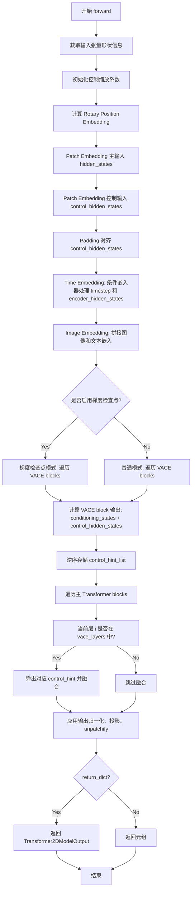

# `diffusers\src\diffusers\models\transformers\transformer_wan_vace.py` 详细设计文档

这是一个用于 Wan 模型的 3D Video Transformer 实现，专门支持 VACE（Video And Control Enhancement）视频控制和增强机制，通过特殊的 VACE Transformer 块将控制信息融入主 Transformer 块的处理流程中，实现图像到视频（I2V）的转换功能。

## 整体流程

```mermaid
graph TD
    A[输入: hidden_states, timestep, encoder_hidden_states, control_hidden_states] --> B[Rotary Position Embedding: 计算旋转位置编码]
    B --> C[Patch Embedding: 对输入进行3D卷积 patch 化]
    C --> D[VACE Patch Embedding: 对控制状态进行 patch 化并 padding]
    D --> E[Condition Embedder: 时间/文本/图像条件嵌入]
    E --> F[图像嵌入融合: concat encoder_hidden_states_image]
    F --> G{梯度检查点启用?}
    G -- 是 --> H[VACE Blocks + Gradient Checkpointing]
    G -- 否 --> I[VACE Blocks (普通前向)]
    H --> J[Main Transformer Blocks + VACE Control Hint]
    I --> J
    J --> K[Output Norm: FP32LayerNorm + Scale/Shift]
    K --> L[Projection: 线性投影输出通道]
    L --> M[Unpatchify: reshape + permute + flatten]
    M --> N[输出: Transformer2DModelOutput]
```

## 类结构

```
nn.Module (基类)
├── WanVACETransformerBlock
│   ├── proj_in (可选输入投影)
│   ├── norm1 (自注意力归一化)
│   ├── attn1 (自注意力)
│   ├── attn2 (交叉注意力)
│   ├── norm2 (交叉注意力归一化)
│   ├── ffn (前馈网络)
│   ├── norm3 (前馈归一化)
│   ├── proj_out (可选输出投影)
│   └── scale_shift_table (AdaLN 参数)
│
WanVACETransformer3DModel (多继承)
├── ModelMixin
├── ConfigMixin
├── PeftAdapterMixin
├── FromOriginalModelMixin
├── CacheMixin
├── AttentionMixin
│
│   (主要组件)
│   ├── rope (旋转位置编码)
│   ├── patch_embedding (主路径 patch 嵌入)
│   ├── vace_patch_embedding (VACE patch 嵌入)
│   ├── condition_embedder (条件嵌入器)
│   ├── blocks (主 Transformer 块 ModuleList)
│   ├── vace_blocks (VACE Transformer 块 ModuleList)
│   ├── norm_out (输出归一化)
│   ├── proj_out (输出投影)
│   └── scale_shift_table (AdaLN 参数)
```

## 全局变量及字段


### `logger`
    
模块级日志记录器，用于输出诊断信息

类型：`logging.Logger`
    


### `WanVACETransformerBlock.WanVACETransformerBlock.proj_in`
    
可选的输入投影层，用于第一层 VACE 块

类型：`nn.Linear | None`
    


### `WanVACETransformerBlock.WanVACETransformerBlock.norm1`
    
自注意力前的归一化层

类型：`FP32LayerNorm`
    


### `WanVACETransformerBlock.WanVACETransformerBlock.attn1`
    
自注意力机制

类型：`WanAttention`
    


### `WanVACETransformerBlock.WanVACETransformerBlock.attn2`
    
交叉注意力机制，用于融合 encoder_hidden_states

类型：`WanAttention`
    


### `WanVACETransformerBlock.WanVACETransformerBlock.norm2`
    
交叉注意力归一化，可选

类型：`FP32LayerNorm | nn.Identity`
    


### `WanVACETransformerBlock.WanVACETransformerBlock.ffn`
    
GELU 激活的前馈网络

类型：`FeedForward`
    


### `WanVACETransformerBlock.WanVACETransformerBlock.norm3`
    
前馈网络后的归一化

类型：`FP32LayerNorm`
    


### `WanVACETransformerBlock.WanVACETransformerBlock.proj_out`
    
可选的输出投影层

类型：`nn.Linear | None`
    


### `WanVACETransformerBlock.WanVACETransformerBlock.scale_shift_table`
    
AdaLN 调度的 6 维缩放平移参数

类型：`nn.Parameter`
    


### `WanVACETransformer3DModel.WanVACETransformer3DModel.rope`
    
3D 旋转位置嵌入

类型：`WanRotaryPosEmbed`
    


### `WanVACETransformer3DModel.WanVACETransformer3DModel.patch_embedding`
    
主路径的空间到通道转换

类型：`nn.Conv3d`
    


### `WanVACETransformer3DModel.WanVACETransformer3DModel.vace_patch_embedding`
    
VACE 控制路径的空间到通道转换

类型：`nn.Conv3d`
    


### `WanVACETransformer3DModel.WanVACETransformer3DModel.condition_embedder`
    
时间、文本、图像条件嵌入

类型：`WanTimeTextImageEmbedding`
    


### `WanVACETransformer3DModel.WanVACETransformer3DModel.blocks`
    
主 Transformer 块列表，长度为 num_layers

类型：`nn.ModuleList`
    


### `WanVACETransformer3DModel.WanVACETransformer3DModel.vace_blocks`
    
VACE Transformer 块列表，长度为 len(vace_layers)

类型：`nn.ModuleList`
    


### `WanVACETransformer3DModel.WanVACETransformer3DModel.norm_out`
    
输出归一化层

类型：`FP32LayerNorm`
    


### `WanVACETransformer3DModel.WanVACETransformer3DModel.proj_out`
    
输出通道投影

类型：`nn.Linear`
    


### `WanVACETransformer3DModel.WanVACETransformer3DModel.scale_shift_table`
    
输出 AdaLN 的 2 维缩放平移参数

类型：`nn.Parameter`
    


### `WanVACETransformer3DModel.WanVACETransformer3DModel.gradient_checkpointing`
    
梯度检查点开关

类型：`bool`
    
    

## 全局函数及方法


### `WanVACETransformerBlock.forward`

实现 WanVACETransformerBlock 的前向传播，包含自注意力、交叉注意力和前馈网络，支持 AdaLN 调度，用于视频生成模型的条件控制。

参数：

- `self`：WanVACETransformerBlock 实例本身
- `hidden_states`：`torch.Tensor`，主干 hidden states 输入
- `encoder_hidden_states`：`torch.Tensor`，编码器 hidden states（文本/图像条件）
- `control_hidden_states`：`torch.Tensor`，控制/条件 hidden states
- `temb`：`torch.Tensor`，时间嵌入，用于 AdaLN 调度参数
- `rotary_emb`：`torch.Tensor`，旋转位置嵌入

返回值：`Tuple[torch.Tensor, torch.Tensor]`，返回两个张量：
- `conditioning_states`：`torch.Tensor` 或 `None`，条件状态（如果启用了输出投影）
- `control_hidden_states`：`torch.Tensor`，处理后的控制 hidden states

#### 流程图

```mermaid
flowchart TD
    A[开始 forward] --> B{是否需要输入投影?}
    B -->|是| C[proj_in: control_hidden_states = proj_in(control_hidden_states) + hidden_states]
    B -->|否| D[control_hidden_states 保持不变]
    C --> E
    D --> E[从 temb 计算 AdaLN 参数: shift_msa, scale_msa, gate_msa, c_shift_msa, c_scale_msa, c_gate_msa]
    
    E --> F1[自注意力 Self-Attention]
    F1 --> F2[norm1: 归一化 + AdaLN shift/scale]
    F2 --> F3[attn1: 自注意力计算]
    F3 --> F4[残差连接: control_hidden_states + attn_output * gate_msa]
    
    F4 --> G1[交叉注意力 Cross-Attention]
    G1 --> G2[norm2: 归一化]
    G2 --> G3[attn2: 交叉注意力计算]
    G3 --> G4[残差连接: control_hidden_states + attn_output]
    
    G4 --> H1[前馈网络 Feed-Forward]
    H1 --> H2[norm3: 归一化 + AdaLN shift/scale]
    H2 --> H3[ffn: 前馈网络计算]
    H3 --> H4[残差连接: control_hidden_states + ff_output * c_gate_msa]
    
    H4 --> I{是否需要输出投影?}
    I -->|是| J[proj_out: conditioning_states = proj_out(control_hidden_states)]
    I -->|否| K[conditioning_states = None]
    
    J --> L[返回 (conditioning_states, control_hidden_states)]
    K --> L
    
    style F1 fill:#e1f5fe
    style G1 fill:#e1f5fe
    style H1 fill:#e1f5fe
    style E fill:#fff3e0
```

#### 带注释源码

```python
def forward(
    self,
    hidden_states: torch.Tensor,
    encoder_hidden_states: torch.Tensor,
    control_hidden_states: torch.Tensor,
    temb: torch.Tensor,
    rotary_emb: torch.Tensor,
) -> Tuple[torch.Tensor, torch.Tensor]:
    """
    WanVACETransformerBlock 前向传播
    
    参数:
        hidden_states: 主干 hidden states
        encoder_hidden_states: 编码器 hidden states (文本/图像条件)
        control_hidden_states: 控制/条件 hidden states
        temb: 时间嵌入，用于 AdaLN 调度参数
        rotary_emb: 旋转位置嵌入
    
    返回:
        Tuple[conditioning_states, control_hidden_states]:
            - conditioning_states: 条件状态 (如果启用输出投影)
            - control_hidden_states: 处理后的控制 hidden states
    """
    
    # ===== 1. 输入投影处理 =====
    # 如果配置了输入投影，对 control_hidden_states 进行线性变换并与 hidden_states 残差相加
    if self.proj_in is not None:
        control_hidden_states = self.proj_in(control_hidden_states)
        control_hidden_states = control_hidden_states + hidden_states  # 残差连接

    # ===== 2. 计算 AdaLN 调度参数 =====
    # 从 scale_shift_table 和 temb 计算 6 个 AdaLN 参数
    # shift_msa, scale_msa: 自注意力的 shift 和 scale
    # gate_msa: 自注意力的门控
    # c_shift_msa, c_scale_msa: 前馈网络的 shift 和 scale
    # c_gate_msa: 前馈网络的门控
    shift_msa, scale_msa, gate_msa, c_shift_msa, c_scale_msa, c_gate_msa = (
        self.scale_shift_table.to(temb.device) + temb.float()  # 将参数移到正确设备
    ).chunk(6, dim=1)  # 按维度分割成 6 个张量

    # ===== 3. 自注意力层 (Self-Attention) =====
    # 应用 LayerNorm + AdaLN shift/scale
    norm_hidden_states = (self.norm1(control_hidden_states.float()) * (1 + scale_msa) + shift_msa).type_as(
        control_hidden_states
    )
    # 执行自注意力计算，使用旋转位置嵌入
    attn_output = self.attn1(norm_hidden_states, None, None, rotary_emb)
    # 残差连接 + 门控
    control_hidden_states = (control_hidden_states.float() + attn_output * gate_msa).type_as(control_hidden_states)

    # ===== 4. 交叉注意力层 (Cross-Attention) =====
    # 应用 LayerNorm（可选 cross_attn_norm）
    norm_hidden_states = self.norm2(control_hidden_states.float()).type_as(control_hidden_states)
    # 执行交叉注意力计算，使用 encoder_hidden_states 作为条件
    attn_output = self.attn2(norm_hidden_states, encoder_hidden_states, None, None)
    # 残差连接（无门控）
    control_hidden_states = control_hidden_states + attn_output

    # ===== 5. 前馈网络层 (Feed-Forward) =====
    # 应用 LayerNorm + AdaLN shift/scale
    norm_hidden_states = (self.norm3(control_hidden_states.float()) * (1 + c_scale_msa) + c_shift_msa).type_as(
        control_hidden_states
    )
    # 执行前馈网络计算
    ff_output = self.ffn(norm_hidden_states)
    # 残差连接 + 门控
    control_hidden_states = (control_hidden_states.float() + ff_output.float() * c_gate_msa).type_as(
        control_hidden_states
    )

    # ===== 6. 输出投影处理 =====
    conditioning_states = None
    if self.proj_out is not None:
        # 将处理后的 control_hidden_states 投影到输出空间
        conditioning_states = self.proj_out(control_hidden_states)

    # 返回条件状态和处理后的 hidden states
    return conditioning_states, control_hidden_states
```


### `WanVACETransformer3DModel.__init__`

#### 描述

该方法是 WanVACETransformer3DModel 类的构造函数，负责初始化 Wan 视频/图像生成模型的核心 3D Transformer 架构。它不仅配置了标准的 Transformer 块来处理主要输入，还特别初始化了 VACE（Video/Image Adaptive Control）控制块，用于注入外部控制信号（如草图、深度图等）。方法内部完成了维度计算、参数校验、嵌入层创建、模块列表初始化以及输出层配置等关键步骤。

#### 文件整体运行流程

在 Wan 模型体系中，`WanVACETransformer3DModel` 充当 2D/3D 信号处理的骨干网络。当用户调用模型进行推理或训练时：
1.  **实例化阶段**：首先调用 `__init__` 方法，根据配置（如 patch_size, num_layers）构建模型图。
2.  **前向传播阶段**：在 `forward` 方法中，输入的原始视频/图像数据首先被处理为 Patch 并经过嵌入层；控制信号（control_hidden_states）经过专门的 VACE 嵌入层。
3.  **混合处理阶段**：标准 Transformer 块与 VACE 控制块交替运行，将控制信息以残差或加权和的形式注入到主特征中。
4.  **输出阶段**：最终特征经过归一化和投影，reshape 为目标输出尺寸。

此 `__init__` 方法正是连接配置参数与具体网络结构的桥梁。

#### 参数

- `patch_size`：`tuple[int, ...]`，默认为 `(1, 2, 2)`。3D 补丁的尺寸，用于将时空数据（帧、高、宽）划分为离散的 patches，格式为 `(时间, 高度, 宽度)`。
- `num_attention_heads`：`int`，默认为 `40`。多头注意力机制中的头数量。
- `attention_head_dim`：`int`，默认为 `128`。每个注意力头的维度。
- `in_channels`：`int`，默认为 `16`。输入数据的通道数（例如 RGB 视频通常为 3，这里通常是 latent 空间的通道数）。
- `out_channels`：`int`，默认为 `16`。输出数据的通道数，若为 None 则等同于 in_channels。
- `text_dim`：`int`，默认为 `4096`。文本编码器（Text Encoder）输出的嵌入向量维度。
- `freq_dim`：`int`，默认为 `256`。用于时间步（timestep）正弦位置编码的频率维度。
- `ffn_dim`：`int`，默认为 `13824`。前馈神经网络（Feed Forward Network）的内部隐藏层维度。
- `num_layers`：`int`，默认为 `40`。模型中包含的 Transformer 块的总层数。
- `cross_attn_norm`：`bool`，默认为 `True`。是否在交叉注意力层（Cross Attention）中应用归一化。
- `qk_norm`：`str | None`，默认为 `"rms_norm_across_heads"`。查询（Query）和键（Key）的归一化方式，通常使用 RMSNorm。
- `eps`：`float`，默认为 `1e-6`。归一化层（如 LayerNorm）中的 epsilon 防止除零。
- `image_dim`：`int | None`，默认为 `None`。图像编码器（Image Encoder）输出的嵌入向量维度，用于 I2V（图生视频）任务。
- `added_kv_proj_dim`：`int | None`，默认为 `None`。用于跨注意力（Cross Attention）的额外 Key/Value 投影维度。
- `rope_max_seq_len`：`int`，默认为 `1024`。旋转位置编码（RoPE）支持的最大序列长度。
- `pos_embed_seq_len`：`int | None`，默认为 `None`。位置嵌入的序列长度，若为 None 则自动适配。
- `vace_layers`：`list[int]`，默认为 `[0, 5, 10, 15, 20, 25, 30, 35]`。指定在哪些层应用 VACE 控制块（即注入控制信号）。
- `vace_in_channels`：`int`，默认为 `96`。控制信号（例如 Canny 边缘图、Depth 图）的输入通道数。

#### 返回值

`None`。该方法没有返回值，仅通过 `self` 修改对象状态。

#### 流程图

```mermaid
graph TD
    A([Start __init__]) --> B[调用 super().__init__]
    B --> C[计算 inner_dim = num_attention_heads * attention_head_dim]
    C --> D{校验 vace_layers 合法性}
    D -->|失败| E[抛出 ValueError]
    D -->|成功| F[初始化 self.rope: WanRotaryPosEmbed]
    F --> G[初始化 self.patch_embedding: Conv3d]
    G --> H[初始化 self.vace_patch_embedding: Conv3d]
    H --> I[初始化 self.condition_embedder: WanTimeTextImageEmbedding]
    I --> J[循环创建 self.blocks: nn.ModuleList[WanTransformerBlock]]
    J --> K[循环创建 self.vace_blocks: nn.ModuleList[WanVACETransformerBlock]]
    K --> L[初始化输出层: self.norm_out, self.proj_out, self.scale_shift_table]
    L --> M[设置 self.gradient_checkpointing = False]
    M --> N([End])
```

#### 带注释源码

```python
@register_to_config
def __init__(
    self,
    patch_size: tuple[int, ...] = (1, 2, 2),
    num_attention_heads: int = 40,
    attention_head_dim: int = 128,
    in_channels: int = 16,
    out_channels: int = 16,
    text_dim: int = 4096,
    freq_dim: int = 256,
    ffn_dim: int = 13824,
    num_layers: int = 40,
    cross_attn_norm: bool = True,
    qk_norm: str | None = "rms_norm_across_heads",
    eps: float = 1e-6,
    image_dim: int | None = None,
    added_kv_proj_dim: int | None = None,
    rope_max_seq_len: int = 1024,
    pos_embed_seq_len: int | None = None,
    vace_layers: list[int] = [0, 5, 10, 15, 20, 25, 30, 35],
    vace_in_channels: int = 96,
) -> None:
    super().__init__()

    # 1. 计算模型内部维度 (Hidden Dimension)
    inner_dim = num_attention_heads * attention_head_dim
    out_channels = out_channels or in_channels

    # 2. 校验 VACE 层配置合法性
    if max(vace_layers) >= num_layers:
        raise ValueError(f"VACE layers {vace_layers} exceed the number of transformer layers {num_layers}.")
    if 0 not in vace_layers:
        raise ValueError("VACE layers must include layer 0.")

    # 3. 位置编码与 Patch 嵌入初始化
    self.rope = WanRotaryPosEmbed(attention_head_dim, patch_size, rope_max_seq_len)
    self.patch_embedding = nn.Conv3d(in_channels, inner_dim, kernel_size=patch_size, stride=patch_size)
    self.vace_patch_embedding = nn.Conv3d(vace_in_channels, inner_dim, kernel_size=patch_size, stride=patch_size)

    # 4. 条件 embedding (Time, Text, Image)
    self.condition_embedder = WanTimeTextImageEmbedding(
        dim=inner_dim,
        time_freq_dim=freq_dim,
        time_proj_dim=inner_dim * 6,
        text_embed_dim=text_dim,
        image_embed_dim=image_dim,
        pos_embed_seq_len=pos_embed_seq_len,
    )

    # 5. 标准 Transformer 块堆叠
    self.blocks = nn.ModuleList(
        [
            WanTransformerBlock(
                inner_dim, ffn_dim, num_attention_heads, qk_norm, cross_attn_norm, eps, added_kv_proj_dim
            )
            for _ in range(num_layers)
        ]
    )

    # 6. VACE 控制块堆叠
    self.vace_blocks = nn.ModuleList(
        [
            WanVACETransformerBlock(
                inner_dim,
                ffn_dim,
                num_attention_heads,
                qk_norm,
                cross_attn_norm,
                eps,
                added_kv_proj_dim,
                # 第一个 VACE 层 (Layer 0) 需要输入投影，且所有层都需要输出投影用于控制注入
                apply_input_projection=i == 0, 
                apply_output_projection=True,
            )
            for i in range(len(vace_layers))
        ]
    )

    # 7. 输出归一化与投影
    self.norm_out = FP32LayerNorm(inner_dim, eps, elementwise_affine=False)
    self.proj_out = nn.Linear(inner_dim, out_channels * math.prod(patch_size))
    # 可学习的仿射变换参数，用于调节输出特征的 scale 和 shift
    self.scale_shift_table = nn.Parameter(torch.randn(1, 2, inner_dim) / inner_dim**0.5)

    self.gradient_checkpointing = False
```

#### 类字段详细信息

- `self.rope`：类型：`WanRotaryPosEmbed`。一句话描述：旋转位置编码器，用于给 3D 时空数据添加可学习的位置信息。
- `self.patch_embedding`：类型：`nn.Conv3d`。一句话描述：主输入的 3D 卷积嵌入层，将原始视频/图像转换为 Patch 序列。
- `self.vace_patch_embedding`：类型：`nn.Conv3d`。一句话描述：控制信号的 3D 卷积嵌入层，将条件图像（如深度图）转换为 Patch 序列。
- `self.condition_embedder`：类型：`WanTimeTextImageEmbedding`。一句话描述：多模态条件嵌入器，负责融合时间步（timestep）、文本和图像 Embedding。
- `self.blocks`：类型：`nn.ModuleList[WanTransformerBlock]`。一句话描述：标准的 Transformer 解码器块列表，处理主要的特征序列。
- `self.vace_blocks`：类型：`nn.ModuleList[WanVACETransformerBlock]`。一句话描述：VACE 专用 Transformer 块列表，用于根据控制信号生成控制提示（Control Hints）。
- `self.norm_out`：类型：`FP32LayerNorm`。一句话描述：输出层的 FP32 精度归一化，确保数值稳定性。
- `self.proj_out`：类型：`nn.Linear`。一句话描述：线性投影层，将隐藏维度映射回输出通道空间，并准备解 Patch 操作。
- `self.scale_shift_table`：类型：`nn.Parameter`。一句话描述：用于在输出前对特征进行仿射变换的可学习参数表，结合时间步信息使用。

#### 关键组件信息

- **WanVACETransformerBlock**: 这是一个特殊的 Transformer 块，与标准块不同，它接收 `control_hidden_states`（控制信号），并输出 `conditioning_states`（控制提示），实现了控制信号与主干的动态交互。
- **VACE Layers**: 代码中硬编码了 `vace_layers` 必须包含第 0 层（第 57 行 `if 0 not in vace_layers`），这表明架构设计强制要求在模型的初始阶段就引入控制信号，以确保内容的结构和整体布局符合控制图像的意图。

#### 潜在的技术债务或优化空间

1.  **硬编码的控制通道数**: `vace_in_channels` 被硬编码为 `96`。这意味着模型仅针对特定维度的控制输入（如 96 维的 VAE latent）设计。如果需要支持不同维度的控制信号（如不同的 VAE 架构），该值需要作为参数传入或动态计算。
2.  **VACE 层的灵活性**: 虽然 `vace_layers` 是可配置的，但对其有强制性的校验（必须包含 0）。这种硬性约束可能限制了某些不需要初始层控制的场景（如特定风格的迁移）。
3.  **模块重复**: 代码中 `WanTransformerBlock` 和 `WanVACETransformerBlock` 是分开定义的。虽然它们有交集逻辑，但代码复用性不高，未来维护时需注意保持一致性。

#### 其它项目

- **设计目标与约束**: 设计目标是将控制信号（Video/Image Adaptive Control）无缝集成到 3D 生成模型中。约束包括 VACE 层必须包含第 0 层，以及输入输出通道数必须匹配 patch 尺寸。
- **错误处理与异常设计**: 代码在初始化阶段进行了严格的参数校验（`vace_layers` 的范围检查），防止在运行时因索引越界导致隐蔽的错误。
- **数据流与状态机**: 数据流主要分为两路：主路（hidden_states）和控制路（control_hidden_states）。两者在各自嵌入后，VACE 块先于或同时于标准块运行，生成控制提示（conditioning_states），最终在特定层叠加（`hidden_states + control_hint * scale`）到主路上。
- **外部依赖**: 依赖 `diffusers` 库的 `ModelMixin`, `ConfigMixin`, `nn` (PyTorch) 等。


### WanVACETransformer3DModel.forward

该方法是 WanVACETransformer3DModel 类的核心前向传播方法，负责将视频数据、文本条件、图像条件和控制状态融合到统一的 Transformer 架构中。它通过 patch 嵌入将输入转换为序列 token，经过 VACE 专用块的初步处理和多个标准 Transformer 块的主干处理，在每个指定的 VACE 层注入控制线索（Control Hints），最终通过 unpatchify 操作将序列数据重构为 3D 张量输出，实现视频/图像到视频的生成任务。

参数：

- `hidden_states`：`torch.Tensor`，输入的主隐藏状态，通常是经过编码的视频或图像数据，形状为 `(batch_size, num_channels, num_frames, height, width)`
- `timestep`：`torch.LongTensor`，扩散过程的时间步长，用于条件嵌入
- `encoder_hidden_states`：`torch.Tensor`，编码器隐藏状态，通常是文本嵌入向量
- `encoder_hidden_states_image`：`torch.Tensor | None`，可选的图像编码隐藏状态，用于图像到视频任务中的首帧条件
- `control_hidden_states`：`torch.Tensor`，VACE 控制隐藏状态，来自外部控制网络（如 Canny、Depth 等）的特征
- `control_hidden_states_scale`：`torch.Tensor`，控制隐藏状态的缩放系数列表，用于调节各层控制线索的强度
- `return_dict`：`bool`，是否返回字典格式的输出，默认为 True
- `attention_kwargs`：`dict[str, Any] | None`，传递给注意力处理器的额外关键字参数（如 LoRA 配置）

返回值：`Transformer2DModelOutput | Tuple[torch.Tensor]`，当 `return_dict=True` 时返回 `Transformer2DModelOutput` 对象，其中 `sample` 属性包含输出的张量；否则返回元组。输出张量形状为 `(batch_size, out_channels, num_frames, height, width)`

#### 流程图



#### 带注释源码

```python
@apply_lora_scale("attention_kwargs")
def forward(
    self,
    hidden_states: torch.Tensor,
    timestep: torch.LongTensor,
    encoder_hidden_states: torch.Tensor,
    encoder_hidden_states_image: torch.Tensor | None = None,
    control_hidden_states: torch.Tensor = None,
    control_hidden_states_scale: torch.Tensor = None,
    return_dict: bool = True,
    attention_kwargs: dict[str, Any] | None = None,
) -> torch.Tensor | dict[str, torch.Tensor]:
    # 获取输入维度信息：批量大小、通道数、帧数、高度、宽度
    batch_size, num_channels, num_frames, height, width = hidden_states.shape
    # 从配置中获取 patch 尺寸
    p_t, p_h, p_w = self.config.patch_size
    # 计算 patch 后的空间维度
    post_patch_num_frames = num_frames // p_t
    post_patch_height = height // p_h
    post_patch_width = width // p_w

    # 如果未提供控制缩放系数，则默认为全 1 向量
    if control_hidden_states_scale is None:
        control_hidden_states_scale = control_hidden_states.new_ones(len(self.config.vace_layers))
    # 解除绑定以便于后续逐层使用
    control_hidden_states_scale = torch.unbind(control_hidden_states_scale)
    # 校验缩放系数数量与 VACE 层数量是否匹配
    if len(control_hidden_states_scale) != len(self.config.vace_layers):
        raise ValueError(
            f"Length of `control_hidden_states_scale` {len(control_hidden_states_scale)} should be "
            f"equal to {len(self.config.vace_layers)}."
        )

    # 1. 计算旋转位置嵌入 (Rotary Position Embedding)
    rotary_emb = self.rope(hidden_states)

    # 2. 主输入的 Patch 嵌入：将 3D 卷积展开为序列
    hidden_states = self.patch_embedding(hidden_states)
    # 形状变换: (B, C, T, H, W) -> (B, T*H*W, C)
    hidden_states = hidden_states.flatten(2).transpose(1, 2)

    # 2. 控制输入的 Patch 嵌入
    control_hidden_states = self.vace_patch_embedding(control_hidden_states)
    control_hidden_states = control_hidden_states.flatten(2).transpose(1, 2)
    # 3. Padding 对齐：确保控制序列长度与主序列一致（填充零）
    control_hidden_states_padding = control_hidden_states.new_zeros(
        batch_size, hidden_states.size(1) - control_hidden_states.size(1), control_hidden_states.size(2)
    )
    control_hidden_states = torch.cat([control_hidden_states, control_hidden_states_padding], dim=1)

    # 4. Time embedding：处理时间步和文本条件
    temb, timestep_proj, encoder_hidden_states, encoder_hidden_states_image = self.condition_embedder(
        timestep, encoder_hidden_states, encoder_hidden_states_image
    )
    # 重新整形时间投影以适配后续计算
    timestep_proj = timestep_proj.unflatten(1, (6, -1))

    # 5. Image embedding：如果存在图像条件，则将其与文本条件拼接
    if encoder_hidden_states_image is not None:
        encoder_hidden_states = torch.concat([encoder_hidden_states_image, encoder_hidden_states], dim=1)

    # 6. Transformer 块处理
    if torch.is_grad_enabled() and self.gradient_checkpointing:
        # === 梯度检查点模式（节省显存）===
        # 预先计算所有 VACE 块的输出作为控制线索
        control_hidden_states_list = []
        for i, block in enumerate(self.vace_blocks):
            conditioning_states, control_hidden_states = self._gradient_checkpointing_func(
                block, hidden_states, encoder_hidden_states, control_hidden_states, timestep_proj, rotary_emb
            )
            control_hidden_states_list.append((conditioning_states, control_hidden_states_scale[i]))
        # 逆序排列以便后续按层索引弹出
        control_hidden_states_list = control_hidden_states_list[::-1]

        for i, block in enumerate(self.blocks):
            hidden_states = self._gradient_checkpointing_func(
                block, hidden_states, encoder_hidden_states, timestep_proj, rotary_emb
            )
            # 在指定的 VACE 层注入控制线索
            if i in self.config.vace_layers:
                control_hint, scale = control_hidden_states_list.pop()
                hidden_states = hidden_states + control_hint * scale
    else:
        # === 普通前向模式 ===
        # 预先计算所有 VACE 块的输出
        control_hidden_states_list = []
        for i, block in enumerate(self.vace_blocks):
            conditioning_states, control_hidden_states = block(
                hidden_states, encoder_hidden_states, control_hidden_states, timestep_proj, rotary_emb
            )
            control_hidden_states_list.append((conditioning_states, control_hidden_states_scale[i]))
        control_hidden_states_list = control_hidden_states_list[::-1]

        for i, block in enumerate(self.blocks):
            hidden_states = block(hidden_states, encoder_hidden_states, timestep_proj, rotary_emb)
            # 条件控制线索融合
            if i in self.config.vace_layers:
                control_hint, scale = control_hidden_states_list.pop()
                hidden_states = hidden_states + control_hint * scale

    # 7. 输出后处理：归一化、投影、unpatchify
    # 计算 shift 和 scale 缩放参数
    shift, scale = (self.scale_shift_table.to(temb.device) + temb.unsqueeze(1)).chunk(2, dim=1)

    # 确保 shift 和 scale 与 hidden_states 在同一设备上（支持多 GPU 推理）
    shift = shift.to(hidden_states.device)
    scale = scale.to(hidden_states.device)

    # 应用输出归一化并加入仿射变换
    hidden_states = (self.norm_out(hidden_states.float()) * (1 + scale) + shift).type_as(hidden_states)
    # 输出投影
    hidden_states = self.proj_out(hidden_states)

    # Unpatchify：重构为 3D 图像/视频张量
    hidden_states = hidden_states.reshape(
        batch_size, post_patch_num_frames, post_patch_height, post_patch_width, p_t, p_h, p_w, -1
    )
    # 维度置换以匹配输出通道顺序
    hidden_states = hidden_states.permute(0, 7, 1, 4, 2, 5, 3, 6)
    # 展平空间维度得到最终输出形状
    output = hidden_states.flatten(6, 7).flatten(4, 5).flatten(2, 3)

    # 返回结果
    if not return_dict:
        return (output,)

    return Transformer2DModelOutput(sample=output)
```

#### 类相关信息补充

**WanVACETransformer3DModel 类核心字段：**

- `patch_embedding`：`nn.Conv3d`，主输入的视频/图像 patch 嵌入层
- `vace_patch_embedding`：`nn.Conv3d`，控制输入的 patch 嵌入层
- `rope`：`WanRotaryPosEmbed`，旋转位置嵌入生成器
- `condition_embedder`：`WanTimeTextImageEmbedding`，时间、文本、图像条件嵌入器
- `blocks`：`nn.ModuleList`，主 Transformer 块列表（`WanTransformerBlock`）
- `vace_blocks`：`nn.ModuleList`，VACE 专用 Transformer 块列表（`WanVACETransformerBlock`）
- `norm_out`：`FP32LayerNorm`，输出层归一化
- `proj_out`：`nn.Linear`，输出投影层
- `scale_shift_table`：`nn.Parameter`，输出仿射变换参数

#### 关键组件信息

- **VACE（Video And Control Estimation）**：一种视频生成控制机制，通过额外的控制网络提取特征，并在 Transformer 的多个中间层注入控制线索，实现对生成内容的空间和时间控制。
- **WanVACETransformerBlock**：专门设计的 VACE Transformer 块，包含自注意力、交叉注意力（前馈）和输出投影，支持控制状态的输入和条件注入。
- **Control Hint 机制**：通过 `vace_blocks` 预计算控制线索，在主 `blocks` 的特定层按 `vace_layers` 配置进行融合，实现分层控制。

#### 潜在技术债务与优化空间

1. **VACE 层硬编码**：当前 `vace_layers` 配置为固定的层索引列表 `[0, 5, 10, 15, 20, 25, 30, 35]`，缺乏灵活性。未来可考虑支持动态配置或学习式的层选择。
2. **Padding 资源浪费**：控制状态的 padding 策略简单粗暴地填充零向量，在控制序列远短于主序列时会浪费计算资源。可探索稀疏注意力或动态序列长度机制。
3. **梯度检查点兼容性**：`_gradient_checkpointing_func` 的使用依赖于传入参数的顺序，需确保与 `block.forward` 签名严格匹配，否则容易引入隐藏 bug。
4. **设备迁移潜在问题**：代码中显式处理了 `shift` 和 `scale` 的设备迁移，但这种模式可能在其他位置（如 `temb`）被忽略，导致潜在的不一致。

#### 其它设计说明

- **设计目标**：支持图像到视频（I2V）和视频到视频（V2V）的生成任务，通过 `encoder_hidden_states_image` 接收首帧或参考图像，通过 `control_hidden_states` 接收额外的控制信号（如 Canny 边缘、Depth 地图等）。
- **约束**：主 Transformer 块数量由 `num_layers` 决定，VACE 层必须包含层 0（首层必须进行输入投影），且 VACE 层索引不能超过总层数。
- **错误处理**：主要通过 `ValueError` 进行参数校验，包括 VACE 层索引范围和缩放系数长度匹配。
- **数据流**：数据流遵循 `hidden_states (input) -> patchify -> transformer blocks -> unpatchify -> output` 的标准流程，同时并行处理 `control_hidden_states` 并在中间层融合。
- **外部依赖**：依赖 `WanTransformerBlock`、`WanVACETransformerBlock`、`WanRotaryPosEmbed`、`WanTimeTextImageEmbedding` 等 Wan 框架内部组件，以及 `FP32LayerNorm`、`FeedForward`、`AttentionMixin` 等通用模块。

## 关键组件


### WanVACETransformerBlock

VACE（Video-Able Content Editing）专用Transformer块，包含输入投影、自注意力、交叉注意力、前馈网络和输出投影，支持条件状态处理与尺度平移表。

### WanVACETransformer3DModel

完整的3D视频变换器模型，支持VACE层插入、patch嵌入、旋转位置编码、条件嵌入和多层Transformer块堆叠，用于视频生成与编辑任务。

### patch_embedding

标准视频输入的3D卷积patch嵌入层，将原始视频张量转换为patch序列表示。

### vace_patch_embedding

VACE控制信号的3D卷积patch嵌入层，用于处理额外的控制隐状态输入。

### WanRotaryPosEmbed

旋转位置嵌入（RoPE）模块，为序列提供位置编码信息，支持3D视频数据的空间-时间位置建模。

### WanTimeTextImageEmbedding

时间-文本-图像条件嵌入器，生成timestep嵌入、文本特征和图像特征的融合表示。

### control_hidden_states_padding

通过`new_zeros`创建的填充张量，用于对齐控制隐状态与主隐状态的序列长度，实现惰性加载与张量索引对齐。

### scale_shift_table

可学习的尺度与平移参数表，用于自适应调整特征分布，支持模型的条件生成能力。

### gradient_checkpointing

梯度检查点标志，控制在前向传播中是否使用内存优化技术，通过`torch.utils.checkpoint`实现。

### _skip_layerwise_casting_patterns

定义跳过层级别类型转换的模块模式列表，用于优化量化/反量化过程中的精度管理。

### _keep_in_fp32_modules

指定始终保持在FP32精度的模块列表，包括time_embedder、scale_shift_table和归一化层，确保数值稳定性。

### 反量化支持

代码中使用`.float()`和`.type_as()`进行显式类型转换，将张量转换为浮点数再进行计算，最后转换回原始类型，支持混合精度训练。

### 梯度检查点实现

通过`_gradient_checkpointing_func`封装前向计算，在反向传播时重新计算中间激活值，以显存换计算量，支持更深层的模型堆叠。


## 问题及建议


### 已知问题

1. **设备移动操作冗余**：在`WanVACETransformerBlock.forward`和`WanVACETransformer3DModel.forward`中，`scale_shift_table`需要在每次前向传播时移动到目标设备（`temb.device`或`hidden_states.device`），这在多GPU推理时会导致额外的设备间数据传输开销。
2. **代码重复**：两种前向传播路径（梯度检查点启用/禁用）中的VACE提示准备逻辑几乎完全相同，包括`control_hidden_states_list`的构建和反转操作，应提取为独立方法以提高代码可维护性。
3. **梯度检查点调用参数不一致**：在gradient checkpointing分支中，`self._gradient_checkpointing_func`对`self.blocks`的调用缺少`encoder_hidden_states`参数（4个参数），而对`self.vace_blocks`的调用包含该参数（5个参数），这可能表明参数传递存在逻辑错误或设计不一致。
4. **硬编码的VACE层索引**：`vace_layers`默认为`[0, 5, 10, 15, 20, 25, 30, 35]`且必须包含层0，但没有提供灵活的配置文件接口来动态调整这些层。
5. **内存分配冗余**：padding张量`control_hidden_states_padding`在每批次都创建新的零张量，当control_hidden_states远小于hidden_states时会造成内存浪费。
6. **LoRA支持标记缺失**：虽然类继承自`PeftAdapterMixin`并在`forward`方法上使用了`@apply_lora_scale`装饰器，但未在类定义中明确声明`_adapter_names`或相关LoRA配置属性。

### 优化建议

1. **缓存设备张量**：在模型初始化或首次前向传播时，将`scale_shift_table`缓存到正确的设备上，避免每次forward都执行设备移动操作。
2. **提取公共方法**：将VACE提示准备的逻辑提取为私有方法`_prepare_vace_hints`，以消除代码重复并提高可读性。
3. **统一梯度检查点调用**：确保`_gradient_checkpointing_func`对blocks和vace_blocks的调用具有一致的参数签名，并验证参数缺失是否为有意设计。
4. **动态VACE层配置**：将`vace_layers`改为可选的配置参数，或提供配置文件接口以支持动态调整。
5. **优化padding策略**：考虑使用`torch.zeros_like`的视图切片而非创建完整的新张量，或在control_hidden_states维度已知时预分配padding张量。
6. **添加类型提示文档**：明确`forward`方法在`return_dict=False`时的返回值结构，并完善参数说明文档。
7. **预计算变换参数**：在首次前向传播时预计算`scale_shift_table`的chunk结果，并在后续调用中复用。


## 其它


### 设计目标与约束

该模型旨在实现视频数据的3D transformer处理，支持VACE（Video-Aware Control Encoding）控制机制。设计目标包括：(1) 支持视频帧的3D patch嵌入；(2) 实现VACE控制信号的注入与融合；(3) 支持条件文本和图像embedding；(4) 提供gradient checkpointing以优化显存使用。约束条件包括：patch_size必须能整除输入视频的帧数、height和width；vace_layers必须包含0且不超过num_layers；文本embedding维度必须与text_dim匹配。

### 错误处理与异常设计

代码中包含以下错误处理机制：(1) `max(vace_layers) >= num_layers`时抛出ValueError，防止VACE层索引超出transformer层数；(2) `0 not in vace_layers`时抛出ValueError，确保VACE控制从第一层开始；(3) `len(control_hidden_states_scale) != len(vace_layers)`时抛出ValueError，确保控制信号尺度数量与VACE层数匹配；(4) 使用`torch.is_grad_enabled()`检查梯度计算状态以决定是否启用gradient checkpointing。

### 数据流与状态机

输入数据流：hidden_states (B,C,T,H,W) → patch_embedding → (B, N, inner_dim)；control_hidden_states → vace_patch_embedding → (B, N', inner_dim)，不足部分padding；encoder_hidden_states和encoder_hidden_states_image → condition_embedder生成temb和cross-attention输入。处理流程：主transformer blocks顺序处理hidden_states，VACE blocks反向顺序生成control_hints，在对应层索引处将control_hint * scale叠加到hidden_states。最终输出：hidden_states → norm_out → proj_out → unpatchify → (B, C', T', H', W')。

### 外部依赖与接口契约

主要依赖模块包括：(1) `configuration_utils.ConfigMixin, register_to_config` - 配置管理；(2) `loaders.FromOriginalModelMixin, PeftAdapterMixin` - 模型加载；(3) `cache_utils.CacheMixin` - 缓存机制；(4) `attention.AttentionMixin, FeedForward` - 注意力机制；(5) `normalization.FP32LayerNorm` - 32位浮点层归一化；(6) `transformer_wan`中的WanAttention、WanTransformerBlock等组件。接口契约：forward方法接受hidden_states、timestep、encoder_hidden_states、encoder_hidden_states_image、control_hidden_states、control_hidden_states_scale等参数，返回Transformer2DModelOutput或元组。

### 配置参数说明

关键配置参数包括：patch_size=(1,2,2)定义3D patch尺寸；num_attention_heads=40定义注意力头数；attention_head_dim=128定义每个头的维度；in_channels=16定义输入通道数；out_channels=16定义输出通道数；text_dim=4096定义文本embedding维度；freq_dim=256定义时间频率embedding维度；ffn_dim=13824定义前馈网络中间层维度；num_layers=40定义transformer block数量；cross_attn_norm=True启用cross-attention归一化；qk_norm="rms_norm_across_heads"启用query/key归一化；vace_layers=[0,5,10,15,20,25,30,35]定义VACE控制层索引；vace_in_channels=96定义VACE控制输入通道数。

### 性能考虑与优化空间

性能优化机制：(1) gradient_checkpointing用于减少显存占用，通过牺牲计算时间换取显存空间；(2) FP32LayerNorm使用全精度计算避免精度损失；(3) scale_shift_table和temb使用.float()转换确保计算精度；(4) 移除了不需要梯度的模块（如patch_embedding）的cast操作。潜在优化空间：(1) 可考虑使用torch.compile加速推理；(2) 可添加KV caching支持自回归生成；(3) 可实现分布式transformer层并行；(4) VACE blocks使用逆序处理可考虑优化为并行计算。

    