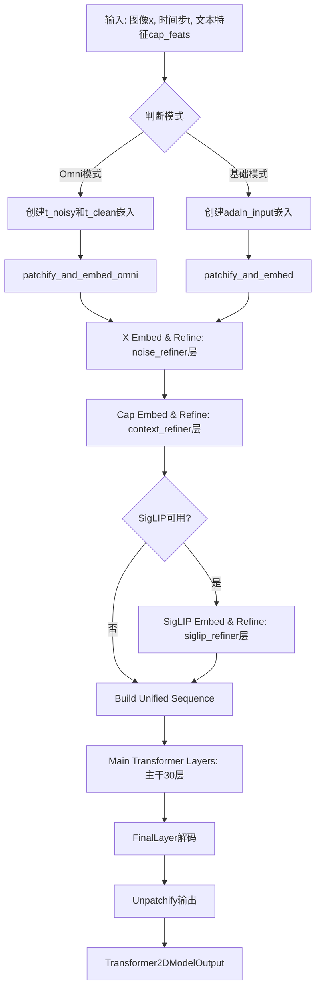
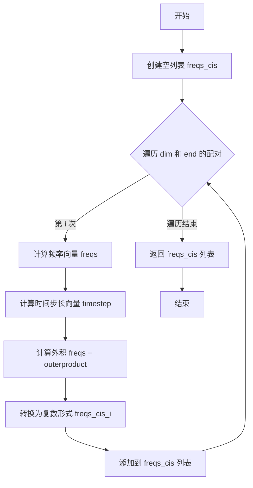
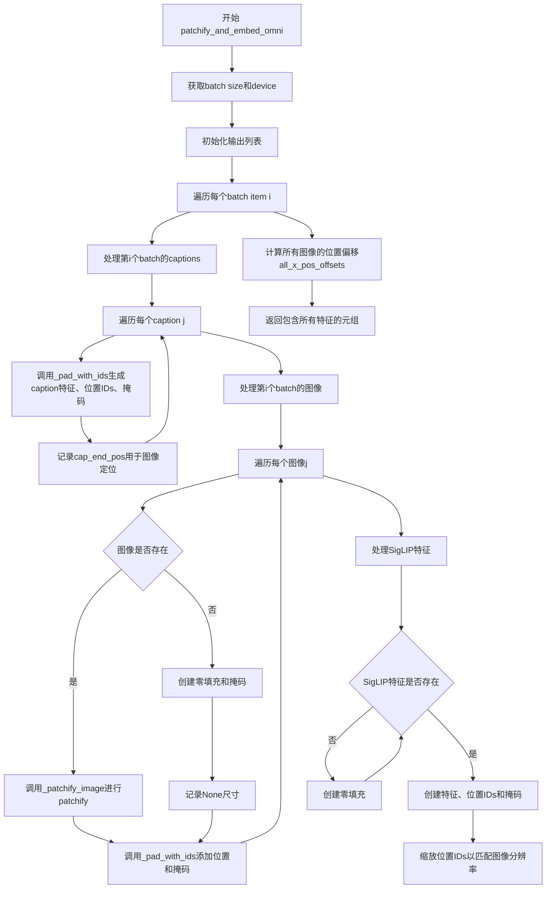
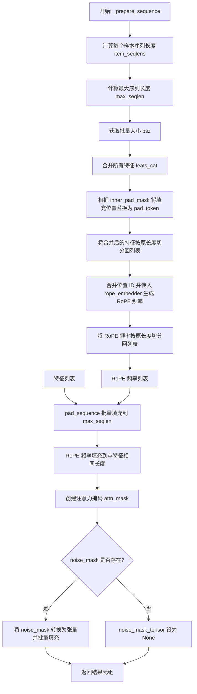
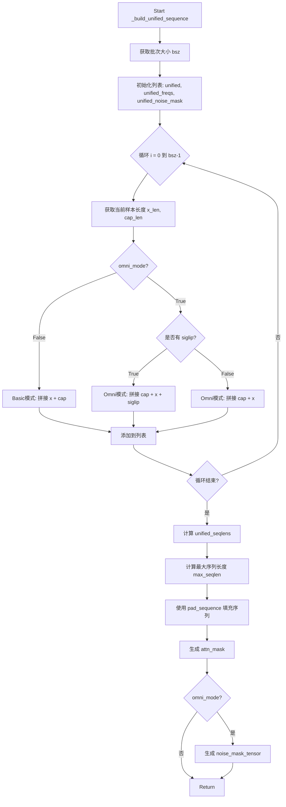
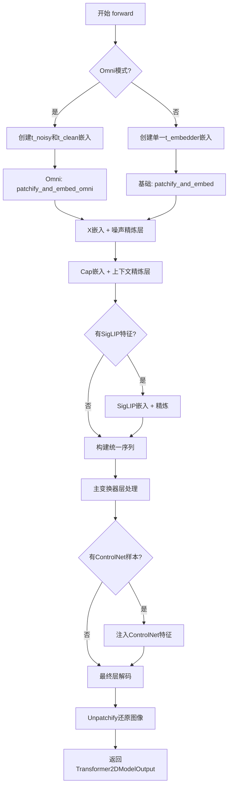
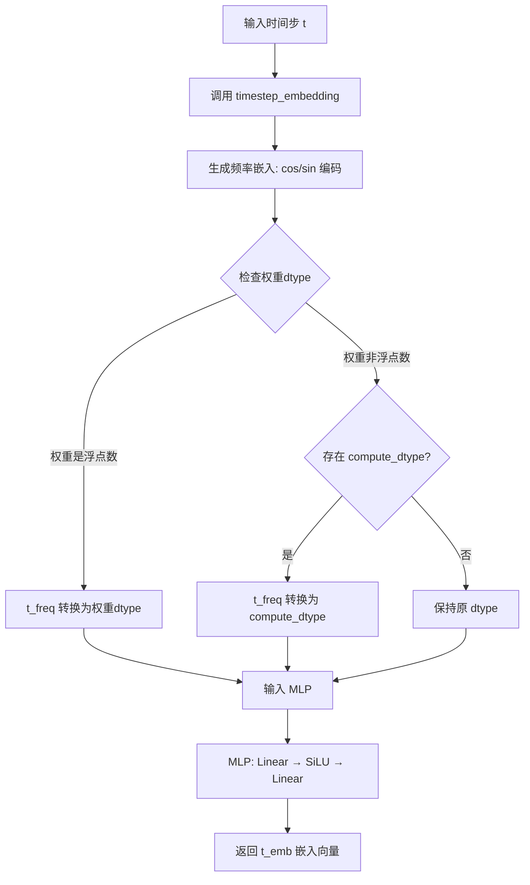
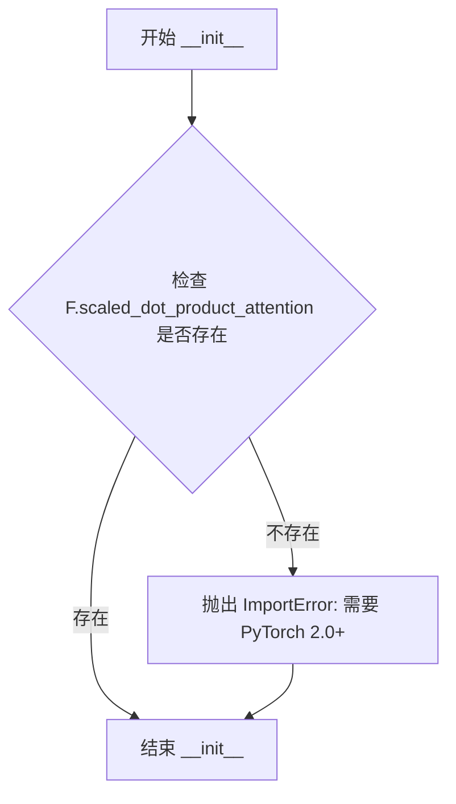

# `diffusers\src\diffusers\models\transformers\transformer_z_image.py` 详细设计文档

Z-Image Transformer 2D模型是一个用于图像生成的深度学习模型，支持基础模式和Omni多模态模式，通过时间步嵌入、噪声细化器、上下文细化器、SigLIP特征处理和主干Transformer层实现图像patch的编码与解码，采用RoPE位置编码和AdaLN调制技术。

## 整体流程



## 类结构

```
TimestepEmbedder (时间步嵌入器)
ZSingleStreamAttnProcessor (单流注意力处理器)
FeedForward (前馈网络)
ZImageTransformerBlock (Transformer块)
FinalLayer (最终输出层)
RopeEmbedder (RoPE位置编码)
ZImageTransformer2DModel (主模型类)
```

## 全局变量及字段


### `ADALN_EMBED_DIM`
    
自适应层归一化嵌入维度常量，用于AdaLN调制模块

类型：`int`
    


### `SEQ_MULTI_OF`
    
序列长度对齐倍数，确保序列长度能被该值整除

类型：`int`
    


### `X_PAD_DIM`
    
图像填充维度，用于填充占位符图像的维度

类型：`int`
    


### `TimestepEmbedder.mlp`
    
多层感知机，用于将时间步频率嵌入映射到目标维度

类型：`nn.Sequential`
    


### `TimestepEmbedder.frequency_embedding_size`
    
频率嵌入的维度大小，决定时间步编码的精度

类型：`int`
    


### `ZSingleStreamAttnProcessor._attention_backend`
    
注意力计算的后端实现，默认为None

类型：`Optional[Any]`
    


### `ZSingleStreamAttnProcessor._parallel_config`
    
并行配置参数，用于分布式计算设置

类型：`Optional[Any]`
    


### `FeedForward.w1`
    
门控线性层，将输入投影到隐藏维度

类型：`nn.Linear`
    


### `FeedForward.w2`
    
输出线性层，将隐藏维度投影回输入维度

类型：`nn.Linear`
    


### `FeedForward.w3`
    
门控线性层，提供额外的输入投影路径

类型：`nn.Linear`
    


### `ZImageTransformerBlock.dim`
    
隐藏层维度，表示特征的维度大小

类型：`int`
    


### `ZImageTransformerBlock.head_dim`
    
每个注意力头的维度，等于dim除以头数

类型：`int`
    


### `ZImageTransformerBlock.attention`
    
自注意力模块，处理序列内的注意力计算

类型：`Attention`
    


### `ZImageTransformerBlock.feed_forward`
    
前馈神经网络模块，进行特征非线性变换

类型：`FeedForward`
    


### `ZImageTransformerBlock.layer_id`
    
transformer块的层标识符，用于区分不同层

类型：`int`
    


### `ZImageTransformerBlock.attention_norm1`
    
注意力机制前的归一化层

类型：`RMSNorm`
    


### `ZImageTransformerBlock.ffn_norm1`
    
前馈网络前的归一化层

类型：`RMSNorm`
    


### `ZImageTransformerBlock.attention_norm2`
    
注意力机制后的归一化层

类型：`RMSNorm`
    


### `ZImageTransformerBlock.ffn_norm2`
    
前馈网络后的归一化层

类型：`RMSNorm`
    


### `ZImageTransformerBlock.modulation`
    
调制开关，控制是否启用AdaLN调制机制

类型：`bool`
    


### `ZImageTransformerBlock.adaLN_modulation`
    
AdaLN调制模块，用于生成缩放和门控参数

类型：`nn.Sequential`
    


### `FinalLayer.norm_final`
    
最终输出层的归一化操作

类型：`nn.LayerNorm`
    


### `FinalLayer.linear`
    
最终输出层的线性投影

类型：`nn.Linear`
    


### `FinalLayer.adaLN_modulation`
    
最终层的AdaLN调制模块

类型：`nn.Sequential`
    


### `RopeEmbedder.theta`
    
旋转位置编码的基础频率参数

类型：`float`
    


### `RopeEmbedder.axes_dims`
    
各轴的维度大小列表，用于多轴旋转编码

类型：`list[int]`
    


### `RopeEmbedder.axes_lens`
    
各轴的长度大小列表，定义位置范围

类型：`list[int]`
    


### `RopeEmbedder.freqs_cis`
    
预计算的旋转位置编码复数频率

类型：`Optional[list[torch.Tensor]]`
    


### `ZImageTransformer2DModel.in_channels`
    
输入图像的通道数

类型：`int`
    


### `ZImageTransformer2DModel.out_channels`
    
输出图像的通道数

类型：`int`
    


### `ZImageTransformer2DModel.all_patch_size`
    
空间分块大小列表，用于图像分块

类型：`tuple`
    


### `ZImageTransformer2DModel.all_f_patch_size`
    
频率分块大小列表，用于视频帧分块

类型：`tuple`
    


### `ZImageTransformer2DModel.dim`
    
模型隐藏层维度

类型：`int`
    


### `ZImageTransformer2DModel.n_heads`
    
注意力头数量

类型：`int`
    


### `ZImageTransformer2DModel.rope_theta`
    
旋转位置编码的基准频率

类型：`float`
    


### `ZImageTransformer2DModel.t_scale`
    
时间步缩放因子，用于调整扩散时间步

类型：`float`
    


### `ZImageTransformer2DModel.gradient_checkpointing`
    
梯度检查点开关，用于节省显存

类型：`bool`
    


### `ZImageTransformer2DModel.all_x_embedder`
    
图像分块嵌入层字典，按分块大小索引

类型：`nn.ModuleDict`
    


### `ZImageTransformer2DModel.all_final_layer`
    
最终输出层字典，按分块大小索引

类型：`nn.ModuleDict`
    


### `ZImageTransformer2DModel.noise_refiner`
    
噪声精炼transformer块列表，用于处理噪声特征

类型：`nn.ModuleList`
    


### `ZImageTransformer2DModel.context_refiner`
    
上下文精炼transformer块列表，用于处理条件特征

类型：`nn.ModuleList`
    


### `ZImageTransformer2DModel.t_embedder`
    
时间步嵌入器，将扩散时间步转换为向量

类型：`TimestepEmbedder`
    


### `ZImageTransformer2DModel.cap_embedder`
    
Caption嵌入器，将文本特征投影到模型维度

类型：`nn.Sequential`
    


### `ZImageTransformer2DModel.siglip_embedder`
    
SigLIP特征嵌入器，用于Omni变体

类型：`Optional[nn.Sequential]`
    


### `ZImageTransformer2DModel.siglip_refiner`
    
SigLIP特征精炼块列表

类型：`Optional[nn.ModuleList]`
    


### `ZImageTransformer2DModel.siglip_pad_token`
    
SigLIP序列的填充token嵌入

类型：`Optional[nn.Parameter]`
    


### `ZImageTransformer2DModel.x_pad_token`
    
图像序列的填充token嵌入

类型：`nn.Parameter`
    


### `ZImageTransformer2DModel.cap_pad_token`
    
Caption序列的填充token嵌入

类型：`nn.Parameter`
    


### `ZImageTransformer2DModel.layers`
    
主transformer块列表，构成模型主体

类型：`nn.ModuleList`
    


### `ZImageTransformer2DModel.axes_dims`
    
多轴RoPE编码的维度配置

类型：`list[int]`
    


### `ZImageTransformer2DModel.axes_lens`
    
多轴RoPE编码的长度配置

类型：`list[int]`
    


### `ZImageTransformer2DModel.rope_embedder`
    
旋转位置编码嵌入器

类型：`RopeEmbedder`
    
    

## 全局函数及方法


### `select_per_token`

该函数用于在噪声 token 和干净 token 之间进行逐 token 的选择。它根据 noise_mask 中每个位置的值为 1（噪声 token）还是 0（干净 token），从 value_noisy 或 value_clean 中选取对应的值，实现按token级别的条件选择。

参数：

- `value_noisy`：`torch.Tensor`，噪声条件下的值，通常是与噪声时间步相关的特征
- `value_clean`：`torch.Tensor`，干净条件下的值，通常是与干净时间步（t=1）相关的特征
- `noise_mask`：`torch.Tensor`，噪声掩码张量，形状为 (batch, seq_len)，值为 0 或 1，用于指示每个 token 是否为噪声 token
- `seq_len`：`int`，序列长度，用于扩展维度以匹配广播

返回值：`torch.Tensor`，根据 noise_mask 选择后的值，形状为 (batch, seq_len, feature_dim)

#### 流程图

```mermaid
flowchart TD
    A[开始: select_per_token] --> B[输入参数]
    B --> C[value_noisy: torch.Tensor]
    B --> D[value_clean: torch.Tensor]
    B --> E[noise_mask: torch.Tensor]
    B --> F[seq_len: int]
    
    C --> G[noise_mask.unsqueeze扩展维度]
    D --> G
    E --> G
    
    G --> H[noise_mask_expanded: (batch, seq_len, 1)]
    
    C --> I[value_noisy.unsqueeze扩展并expand]
    D --> J[value_clean.unsqueeze扩展并expand]
    
    I --> K[value_noisy_expanded: (batch, seq_len, feature_dim)]
    J --> L[value_clean_expanded: (batch, seq_len, feature_dim)]
    
    H --> M[torch.where条件选择]
    K --> M
    L --> M
    
    M --> N[返回: (batch, seq_len, feature_dim)]
    N --> O[结束]
```

#### 带注释源码

```python
def select_per_token(
    value_noisy: torch.Tensor,
    value_clean: torch.Tensor,
    noise_mask: torch.Tensor,
    seq_len: int,
) -> torch.Tensor:
    """
    根据噪声掩码在噪声值和干净值之间进行逐token选择。
    
    参数:
        value_noisy: 噪声条件下的特征值，形状为 (batch, feature_dim)
        value_clean: 干净条件下的特征值，形状为 (batch, feature_dim)
        noise_mask: 噪声掩码，形状为 (batch, seq_len)，值为0或1
        seq_len: 目标序列长度
    
    返回:
        根据noise_mask选择的特征，形状为 (batch, seq_len, feature_dim)
    """
    # 扩展noise_mask维度: (batch, seq_len) -> (batch, seq_len, 1)
    # 便于与扩展后的value进行广播比较
    noise_mask_expanded = noise_mask.unsqueeze(-1)
    
    # 使用torch.where进行条件选择:
    # 当noise_mask_expanded == 1时，选择value_noisy
    # 当noise_mask_expanded == 0时，选择value_clean
    # value_noisy.unsqueeze(1): (batch, feature_dim) -> (batch, 1, feature_dim)
    # .expand(-1, seq_len, -1): 沿seq_len维度复制到 (batch, seq_len, feature_dim)
    # value_clean同样处理
    return torch.where(
        noise_mask_expanded == 1,
        value_noisy.unsqueeze(1).expand(-1, seq_len, -1),
        value_clean.unsqueeze(1).expand(-1, seq_len, -1),
    )
```


### `TimestepEmbedder.timestep_embedding`

该函数实现基于正弦和余弦函数的时间步嵌入（timestep embedding），将时间步 `t` 映射到高维向量空间，常用于扩散模型中编码噪声时间步信息。通过指数衰减的频率生成对数和余弦变换，产生具有周期性的特征表示。

参数：

- `t`：`torch.Tensor`，形状为 `(batch_size,)` 的时间步张量，包含要编码的时间步值
- `dim`：`int`，目标嵌入向量的维度，必须为正整数
- `max_period`：`float`，可选参数，默认值为 `10000`，控制频率衰减的最大周期

返回值：`torch.Tensor`，形状为 `(batch_size, dim)` 的嵌入向量，如果 `dim` 为奇数则会在最后填充一行零

#### 流程图

```mermaid
flowchart TD
    A[开始 timestep_embedding] --> B[使用 autocast 上下文<br/>确保精度不受自动转换影响]
    B --> C[计算 half = dim // 2<br/>频率数组的一半长度]
    C --> D[生成频率数组 freqs<br/>torch.exp<br/>-math.log max_period<br/>* torch.arange / half]
    D --> E[计算 args = t[:, None] * freqs[None]<br/>广播时间步与频率相乘]
    E --> F[计算 embedding<br/>torch.cat [cos args, sin args]<br/>在最后一维拼接]
    F --> G{检查 dim 是否为奇数}
    G -->|是| H[在 embedding 末尾<br/>拼接一行零向量<br/>torch.cat embedding, zeros]
    G -->|否| I[直接返回 embedding]
    H --> I
    I --> J[结束: 返回嵌入向量]
```

#### 带注释源码

```python
@staticmethod
def timestep_embedding(t, dim, max_period=10000):
    # 使用 autocast 上下文管理器，enabled=False 确保所有操作
    # 在给定的设备上使用原始精度，避免自动类型转换带来的精度损失
    with torch.amp.autocast("cuda", enabled=False):
        # 计算嵌入维度的一半，用于生成频率数组
        # half 代表了正弦和余弦函数所需的频率数量
        half = dim // 2
        
        # 生成指数衰减的频率数组
        # 公式: exp(-log(max_period) * (0:half) / half)
        # 这创建了一个从 max_period 指数衰减到 1 的频率序列
        # 频率越高（周期越小），对应的指数越小
        freqs = torch.exp(
            -math.log(max_period) * torch.arange(start=0, end=half, dtype=torch.float32, device=t.device) / half
        )
        
        # 将时间步与频率相乘，通过广播机制生成参数矩阵
        # t: (batch_size,) -> t[:, None]: (batch_size, 1)
        # freqs: (half,) -> freqs[None]: (1, half)
        # args: (batch_size, half)
        args = t[:, None].float() * freqs[None]
        
        # 使用余弦和正弦函数生成嵌入向量
        # torch.cat([cos(args), sin(args)], dim=-1) 
        # 将 (batch_size, half) 的余弦结果和 (batch_size, half) 的正弦结果
        # 在最后一维拼接，得到 (batch_size, dim) 的嵌入
        embedding = torch.cat([torch.cos(args), torch.sin(args)], dim=-1)
        
        # 如果目标维度为奇数，需要在嵌入向量末尾填充一行零
        # 以确保输出维度为 (batch_size, dim)
        # 这是因为 half * 2 = dim - 1，当 dim 为奇数时
        if dim % 2:
            embedding = torch.cat([embedding, torch.zeros_like(embedding[:, :1])], dim=-1)
        
        # 返回最终的时间步嵌入向量
        return embedding
```


### `ZSingleStreamAttnProcessor.__call__`

该方法是 Z-Image 单流注意力处理器（ZSingleStreamAttnProcessor）的核心调用方法，负责执行完整的单流自注意力计算流程，包括将隐藏状态投影为 Q/K/V、应用归一化、应用旋转位置编码（RoPE）、计算注意力以及输出投影。

参数：

- `self`：类的实例本身，包含注意力后端配置和并行配置
- `attn`：`Attention`，Diffusers 库的 Attention 实例，用于获取 Q/K/V 投影矩阵以及输出投影层
- `hidden_states`：`torch.Tensor`，输入的隐藏状态，形状为 `[batch, seq_len, hidden_dim]`
- `encoder_hidden_states`：`torch.Tensor | None`，编码器隐藏状态（可选，当前实现未使用，支持双流注意力扩展）
- `attention_mask`：`torch.Tensor | None`，注意力掩码，形状为 `[batch, seq_len]` 或 `[batch, 1, 1, seq_len]`
- `freqs_cis`：`torch.Tensor | None`，预计算的旋转位置编码复数张量，用于 RoPE

返回值：`torch.Tensor`，经过注意力计算和输出投影后的隐藏状态，形状与输入 `hidden_states` 相同

#### 流程图

```mermaid
flowchart TD
    A[输入 hidden_states] --> B[Q = attn.to_q<br/>K = attn.to_k<br/>V = attn.to_v]
    B --> C[Unflatten 为多头格式]
    C --> D{attn.norm_q<br/>是否存在?}
    D -->|是| E[query = attn.norm_q(query)]
    D -->|否| F{attn.norm_k<br/>是否存在?}
    F -->|是| G[key = attn.norm_k(key)]
    F -->|否| H{freqs_cis<br/>是否提供?}
    E --> H
    G --> H
    H -->|是| I[query = apply_rotary_emb<br/>(query, freqs_cis)<br/>key = apply_rotary_emb<br/>(key, freqs_cis)]
    H -->|否| J[转换为统一 dtype]
    I --> J
    J --> K{attention_mask<br/>维度检查}
    K -->|2维| L[扩展为<br/>[batch,1,1,seq_len]]
    K -->|其他| M[dispatch_attention_fn<br/>计算注意力]
    L --> M
    M --> N[Reshape 回<br/>[batch,seq_len,hidden_dim]]
    N --> O[attn.to_out[0]<br/>输出投影]
    O --> P{to_out 长度<br/>> 1?}
    P -->|是| Q[attn.to_out[1]<br/>Dropout]
    P -->|否| R[返回 output]
    Q --> R
```

#### 带注释源码

```python
def __call__(
    self,
    attn: Attention,
    hidden_states: torch.Tensor,
    encoder_hidden_states: torch.Tensor | None = None,
    attention_mask: torch.Tensor | None = None,
    freqs_cis: torch.Tensor | None = None,
) -> torch.Tensor:
    """
    执行 Z-Image 单流注意力计算。
    
    Args:
        attn: Attention 模块，提供 Q/K/V 投影和输出投影
        hidden_states: 输入隐藏状态 [batch, seq_len, hidden_dim]
        encoder_hidden_states: 编码器隐藏状态（可选，当前未使用）
        attention_mask: 注意力掩码 [batch, seq_len] 或 [batch, 1, 1, seq_len]
        freqs_cis: 旋转位置编码复数张量
    
    Returns:
        输出隐藏状态 [batch, seq_len, hidden_dim]
    """
    # 1. 将 hidden_states 投影为 Query、Key、Value
    # 使用 attn 的 to_q/to_k/to_v 方法进行线性变换
    query = attn.to_q(hidden_states)
    key = attn.to_k(hidden_states)
    value = attn.to_v(hidden_states)

    # 2. 将 Q/K/V 从 [batch, seq_len, hidden_dim] 展开为 [batch, seq_len, heads, head_dim]
    # unflatten(-1, (attn.heads, -1)) 将最后一个维度展开为 (heads, head_dim)
    query = query.unflatten(-1, (attn.heads, -1))
    key = key.unflatten(-1, (attn.heads, -1))
    value = value.unflatten(-1, (attn.heads, -1))

    # 3. 应用 Norms（归一化层）
    # 对 Query 和 Key 分别应用 RMSNorm（如果已配置）
    if attn.norm_q is not None:
        query = attn.norm_q(query)
    if attn.norm_k is not None:
        key = attn.norm_k(key)

    # 4. 应用 RoPE（旋转位置编码）
    # 定义内部函数 apply_rotary_emb，用于对输入应用旋转位置嵌入
    def apply_rotary_emb(x_in: torch.Tensor, freqs_cis: torch.Tensor) -> torch.Tensor:
        """应用旋转位置嵌入 (Rotary Positional Embedding)"""
        with torch.amp.autocast("cuda", enabled=False):
            # 将实数张量视为复数张量以便进行复数乘法
            x = torch.view_as_complex(x_in.float().reshape(*x_in.shape[:-1], -1, 2))
            freqs_cis = freqs_cis.unsqueeze(2)  # 扩展维度以便广播
            # 复数乘法：x * freqs_cis，然后转回实数张量
            x_out = torch.view_as_real(x * freqs_cis).flatten(3)
            return x_out.type_as(x_in)  # 保持原始数据类型

    # 如果提供了频率编码，则应用到 query 和 key
    if freqs_cis is not None:
        query = apply_rotary_emb(query, freqs_cis)
        key = apply_rotary_emb(key, freqs_cis)

    # 5. 转换为统一的 dtype
    # 确保 query 和 key 数据类型一致
    dtype = query.dtype
    query, key = query.to(dtype), key.to(dtype)

    # 6. 处理 attention_mask 维度
    # 从 [batch, seq_len] 扩展为 [batch, 1, 1, seq_len] 以便广播到注意力矩阵
    if attention_mask is not None and attention_mask.ndim == 2:
        attention_mask = attention_mask[:, None, None, :]

    # 7. 计算联合注意力
    # 使用 dispatch_attention_fn 分发注意力计算，支持多种后端（Flash Attention 等）
    hidden_states = dispatch_attention_fn(
        query,
        key,
        value,
        attn_mask=attention_mask,
        dropout_p=0.0,  # 注意力阶段不使用 dropout
        is_causal=False,  # 非因果注意力（双向）
        backend=self._attention_backend,  # 注意力后端配置
        parallel_config=self._parallel_config,  # 并行配置
    )

    # 8. Reshape 回原始格式
    # 从 [batch, heads, seq_len, head_dim] 展平为 [batch, seq_len, hidden_dim]
    hidden_states = hidden_states.flatten(2, 3)
    hidden_states = hidden_states.to(dtype)

    # 9. 输出投影
    # 应用线性投影层 to_out[0]
    output = attn.to_out[0](hidden_states)
    # 如果存在额外的 dropout 层（to_out 长度 > 1），则应用
    if len(attn.to_out) > 1:  # dropout
        output = attn.to_out[1](output)

    return output
```


### `FeedForward._forward_silu_gating`

实现 FeedForward 网络中的 SiLU 门控机制，通过 SiLU 激活函数对输入进行非线性变换后与另一输入进行逐元素相乘，实现类似 Gated Linear Unit (GLU) 的门控效果。

参数：

-  `self`：`FeedForward` 类实例本身
-  `x1`：`torch.Tensor`，第一组输入特征，通常来自 w1 的线性变换输出
-  `x3`：`torch.Tensor`，第三组输入特征，通常来自 w3 的线性变换输出

返回值：`torch.Tensor`，门控后的输出，通过 SiLU(x1) * x3 计算得到

#### 流程图

```mermaid
flowchart TD
    A[输入 x1] --> B[F.silu 激活函数]
    A[输入 x3] --> D[直接传递]
    B --> C[逐元素乘法]
    D --> C
    C --> E[输出: SiLU(x1) * x3]
```

#### 带注释源码

```python
def _forward_silu_gating(self, x1, x3):
    """
    SiLU 门控前向传播
    
    实现 GLU (Gated Linear Unit) 机制：
    - 对 x1 应用 SiLU (Swish) 激活函数: SiLU(x) = x * sigmoid(x)
    - 将激活后的值与 x3 逐元素相乘作为门控输出
    
    这种门控机制允许模型自适应地控制信息的流动，
    类似于 LSTM 中的门控概念，但计算更加高效。
    
    Args:
        x1: 来自 w1 线性层的输出
        x3: 来自 w3 线性层的输出
    
    Returns:
        门控后的特征张量
    """
    return F.silu(x1) * x3
```


### `FeedForward.forward`

该方法实现了 Transformer 模型的前馈网络，采用门控线性单元（GLU）架构，通过三个线性层（w1、w3、w2）和 SiLU 激活函数实现非线性变换和门控机制。

参数：

- `x`：`torch.Tensor`，输入的张量，通常是 Transformer 块的输出

返回值：`torch.Tensor`，经过前馈网络处理后的输出张量

#### 流程图

```mermaid
flowchart TD
    A[输入 x] --> B[w1: nn.Linear(dim, hidden_dim)]
    A --> C[w3: nn.Linear(dim, hidden_dim)]
    B --> D[F.silu 激活函数]
    D --> E[门控乘法: silu(x1) * x3]
    C --> E
    E --> F[w2: nn.Linear(hidden_dim, dim)]
    F --> G[输出]
    
    style A fill:#f9f,color:#333
    style G fill:#9f9,color:#333
```

#### 带注释源码

```python
def forward(self, x):
    """
    前馈网络的前向传播
    
    实现说明：
    1. 使用三个线性变换 w1, w3, w2
    2. w1 和 w3 的输出通过 SiLU 激活函数进行门控
    3. 门控结果与 w3 输出相乘后，通过 w2 投影回原始维度
    
    这种架构类似于 SwiGLU (Swish-Gated Linear Unit) 变体，
    能够提供更好的性能和表达能力
    """
    # 计算门控信号：先通过 w1 变换，然后应用 SiLU 激活
    # 同时通过 w3 进行另一路变换
    # 最后将激活后的门控信号与 w3 输出相乘（逐元素乘法）
    return self.w2(self._forward_silu_gating(self.w1(x), self.w3(x)))
```


### `RopeEmbedder.precompute_freqs_cis`

该函数为旋转位置编码（RoPE）预计算复数频率张量。通过对每个轴的维度长度和序列长度进行计算，生成用于后续位置嵌入的复数形式频率矩阵。

参数：

- `dim`：`list[int]`，每个轴的维度列表，用于确定频率计算的维度
- `end`：`list[int]`，每个轴的长度列表，用于确定时间步长范围
- `theta`：`float`，默认值为 256.0，旋转角度的基础参数，用于控制频率的衰减速度

返回值：`list[torch.Tensor]`，返回复数类型的频率张量列表，每个元素对应一个轴的频率矩阵

#### 流程图



#### 带注释源码

```python
@staticmethod
def precompute_freqs_cis(dim: list[int], end: list[int], theta: float = 256.0):
    # 使用 CPU 设备进行计算，避免 GPU 内存占用
    with torch.device("cpu"):
        # 初始化存储频率复数张量的列表
        freqs_cis = []
        
        # 遍历每个轴的维度和长度
        for i, (d, e) in enumerate(zip(dim, end)):
            # 计算频率向量：theta^(-2k/d)，其中 k 从 0 到 d/2
            freqs = 1.0 / (theta ** (torch.arange(0, d, 2, dtype=torch.float64, device="cpu") / d))
            
            # 生成时间步长向量，从 0 到 e-1
            timestep = torch.arange(e, device=freqs.device, dtype=torch.float64)
            
            # 计算外积，得到频率矩阵
            freqs = torch.outer(timestep, freqs).float()
            
            # 将频率矩阵转换为复数形式（极坐标形式，幅值为1，相位为freqs）
            freqs_cis_i = torch.polar(torch.ones_like(freqs), freqs).to(torch.complex64)  # complex64
            
            # 将该轴的频率复数张量添加到列表中
            freqs_cis.append(freqs_cis_i)
        
        # 返回所有轴的频率复数张量列表
        return freqs_cis
```


### `ZImageTransformer2DModel.unpatchify`

该方法负责将经过展平（Flatten）和嵌入（Embedding）处理的补丁序列重新转换回原始的图像张量形式（通道 C, 深度 F, 高度 H, 宽度 W）。它支持两种模式：一种是标准的批处理模式（Original Mode），另一种是针对多图合一（Omni Mode）的目标图像提取与重建模式。

#### 参数

- `x`：`list[torch.Tensor]`，包含批次中每个样本的展平补丁向量列表。通常是 1D 向量（总补丁数 x 隐藏维度）。
- `size`：`list[tuple]`，表示每个样本原始图像尺寸的列表。在标准模式下为 `(F, H, W)`；在 Omni 模式下可能包含多个图像的尺寸信息。
- `patch_size`：`int`，空间方向（Height/Width）的补丁大小。
- `f_patch_size`：`int`，深度/时间方向（Frame）的补丁大小。
- `x_pos_offsets`：`list[tuple[int, int]] | None`，可选参数。用于 Omni 模式，指定目标图像在统一序列中的起始和结束位置。如果为 `None`，则执行标准重建逻辑。

#### 返回值

`list[torch.Tensor]`，返回重建后的 4D 图像张量列表，形状为 `(C, F, H, W)`。

#### 流程图

```mermaid
flowchart TD
    A[Start unpatchify] --> B{x_pos_offsets is not None?}
    B -- Yes (Omni Mode) --> C[Iterate batch i]
    C --> D[Extract unified_x using offsets]
    D --> E[Iterate images j in size[i]]
    E --> F{size[i][j] is None?}
    F -- Yes --> G[Skip / Update cu_len]
    F -- No (Valid Image) --> H[Calc ori_len & pad_len]
    H --> I[View & Permute to (C, F, H, W)]
    I --> J[Update cu_len]
    J --> K{More images in size[i]?}
    K -- Yes --> E
    K -- No --> L[Append x_item to result]
    L --> M[Return result]
    
    B -- No (Original Mode) --> N[Iterate batch i]
    N --> O[Get size[i] as F, H, W]
    O --> P[Calc ori_len]
    P --> Q[View & Permute to (C, F, H, W)]
    Q --> R[Update x[i]]
    R --> S{More batches?}
    S -- Yes --> N
    S -- No --> T[Return x]
```

#### 带注释源码

```python
def unpatchify(
    self,
    x: list[torch.Tensor],
    size: list[tuple],
    patch_size,
    f_patch_size,
    x_pos_offsets: list[tuple[int, int]] | None = None,
) -> list[torch.Tensor]:
    """
    将补丁序列反变换为图像张量。
    """
    pH = pW = patch_size
    pF = f_patch_size
    bsz = len(x)
    # 断言：确保提供的尺寸列表长度与批次大小一致
    assert len(size) == bsz

    # ---------------------------------------------------------
    # 模式一：Omni Mode (用于从统一序列中提取特定目标图像)
    # ---------------------------------------------------------
    if x_pos_offsets is not None:
        result = []
        for i in range(bsz):
            # 1. 根据偏移量从统一的序列张量中切取出目标图像的补丁部分
            unified_x = x[i][x_pos_offsets[i][0] : x_pos_offsets[i][1]]
            
            cu_len = 0  # 当前处理的序列位置指针
            x_item = None  # 当前重建的图像
            
            # 2. 遍历该样本中所有可能的图像（包括可能存在的占位符）
            for j in range(len(size[i])):
                if size[i][j] is None:
                    # 如果尺寸为None，表示这是一个占位符（例如Omni中的空图像），直接跳过并累加序列长度
                    ori_len = 0
                    pad_len = SEQ_MULTI_OF
                    cu_len += pad_len + ori_len
                else:
                    # 3. 解析有效图像尺寸
                    F, H, W = size[i][j]
                    # 计算原始有效补丁数量
                    ori_len = (F // pF) * (H // pH) * (W // pW)
                    # 计算填充长度以满足SEQ_MULTI_OF对齐要求
                    pad_len = (-ori_len) % SEQ_MULTI_OF
                    
                    # 4. 核心重塑逻辑：将 (Tokens, Dim) -> (C, F, H, W)
                    # 切片获取当前图像的补丁 -> (ori_len, Dim)
                    # 视图变换：(F_tokens, H_tokens, W_tokens, pF, pH, pW, C)
                    # 轴置换： (C, F_tokens, pF, H_tokens, pH, W_tokens, pW)
                    # 重塑： (C, F, H, W)
                    x_item = (
                        unified_x[cu_len : cu_len + ori_len]
                        .view(F // pF, H // pH, W // pW, pF, pH, pW, self.out_channels)
                        .permute(6, 0, 3, 1, 4, 2, 5)
                        .reshape(self.out_channels, F, H, W)
                    )
                    # 更新序列指针
                    cu_len += ori_len + pad_len
            
            # 注意：逻辑上只保留并返回最后一个（目标）图像
            result.append(x_item)  
        return result
    
    # ---------------------------------------------------------
    # 模式二：Original Mode (标准批处理)
    # ---------------------------------------------------------
    else:
        for i in range(bsz):
            F, H, W = size[i]
            # 计算该图像应有的补丁总数
            ori_len = (F // pF) * (H // pH) * (W // pW)
            
            # 执行与上面相同的重塑操作
            # 取前 ori_len 个向量（丢弃填充部分），还原为图像
            x[i] = (
                x[i][:ori_len]
                .view(F // pF, H // pH, W // pW, pF, pH, pW, self.out_channels)
                .permute(6, 0, 3, 1, 4, 2, 5)
                .reshape(self.out_channels, F, H, W)
            )
        return x
```


### ZImageTransformer2DModel.create_coordinate_grid

这是一个静态方法，用于创建一个多维坐标网格张量，常用于生成位置编码或空间坐标信息。

参数：

- `size`：`tuple[int, ...]`，表示坐标网格在每个维度上的大小（例如 (height, width, depth)）
- `start`：`tuple[int, ...] | None`，可选，起始坐标，默认为 None（当为 None 时，内部会生成一个全 0 的生成器）
- `device`：`torch.device | None`，可选，指定张量创建的设备，默认为 None

返回值：`torch.Tensor`，返回一个坐标网格张量，形状为 (size[0], size[1], ..., size[-1], len(size))，最后一维包含每个维度的坐标值

#### 流程图

```mermaid
flowchart TD
    A[开始] --> B{start是否为None}
    B -->|是| C[start = (0 for _ in size)]
    B -->|否| D[start保持原值]
    C --> E[使用zip将start和size配对]
    D --> E
    E --> F[对每对起始值和跨度, 使用torch.arange创建坐标轴]
    F --> G[使用torch.meshgrid生成网格]
    G --> H[使用torch.stack堆叠网格]
    H --> I[返回坐标网格张量]
```

#### 带注释源码

```python
@staticmethod
def create_coordinate_grid(size, start=None, device=None):
    # 如果 start 为 None，创建一个生成器，默认从 0 开始
    # 例如 size = (3, 4) 时，start 变为 (0, 0)
    if start is None:
        start = (0 for _ in size)
    
    # 为每个维度创建坐标轴
    # 例如 size = (3, 4), start = (1, 2) 时：
    # axis 0: torch.arange(1, 1+3) = [1, 2, 3]
    # axis 1: torch.arange(2, 2+4) = [2, 3, 4, 5]
    axes = [torch.arange(x0, x0 + span, dtype=torch.int32, device=device) for x0, span in zip(start, size)]
    
    # 使用 meshgrid 创建网格
    # indexing="ij" 表示使用行列索引（而非 xy 索引）
    # 返回的 grids 是 len(size) 个张量的列表
    grids = torch.meshgrid(axes, indexing="ij")
    
    # 将网格堆叠，最后一维是坐标维度
    # 例如对于 (3, 4) 的 size，返回形状为 (3, 4, 2) 的张量
    # grids[i][y, x] = [y坐标, x坐标]
    return torch.stack(grids, dim=-1)
```


### `ZImageTransformer2DModel._patchify_image`

该函数将单个图像张量从空间维度展开为补丁序列，实现图像到序列的转换，用于后续的Transformer处理。

参数：

-  `self`：类方法的隐式参数，表示`ZImageTransformer2DModel`实例
-  `image`：`torch.Tensor`，输入图像张量，shape 为 (C, F, H, W)，其中 C 是通道数，F 是帧数/深度，H 是高度，W 是宽度
-  `patch_size`：`int`，空间方向（高度 H 和宽度 W）的补丁大小
-  `f_patch_size`：`int`，时间/深度方向（F）的补丁大小

返回值：元组 `(torch.Tensor, tuple, tuple)`
- 第一个元素：变换后的图像张量，shape 为 (num_patches, patch_dim)，其中 num_patches = F_tokens × H_tokens × W_tokens，patch_dim = pF × pH × pW × C
- 第二个元素：原始图像尺寸 (F, H, W)
- 第三个元素：各维度的令牌数量 (F_tokens, H_tokens, W_tokens)

#### 流程图

```mermaid
flowchart TD
    A[输入 image: (C, F, H, W)] --> B[计算 pH, pW, pF = patch_size, patch_size, f_patch_size]
    B --> C[获取图像尺寸 C, F, H, W]
    C --> D[计算 F_tokens = F // pF, H_tokens = H // pH, W_tokens = W // pW]
    D --> E[view 重塑: image.view(C, F_tokens, pF, H_tokens, pH, W_tokens, pW)]
    E --> F[permute 维度置换: (C, F_tokens, pF, H_tokens, pH, W_tokens, pW) -> (F_tokens, H_tokens, pF, pH, pW, C)]
    F --> G[reshape 展平为二维: (F_tokens * H_tokens * W_tokens, pF * pH * pW * C)]
    G --> H[返回 image, (F, H, W), (F_tokens, H_tokens, W_tokens)]
```

#### 带注释源码

```python
def _patchify_image(self, image: torch.Tensor, patch_size: int, f_patch_size: int):
    """Patchify a single image tensor: (C, F, H, W) -> (num_patches, patch_dim)."""
    # 统一空间方向的补丁大小 pH, pW
    pH, pW, pF = patch_size, patch_size, f_patch_size
    
    # 获取输入图像的通道数 C、帧数 F、高度 H、宽度 W
    C, F, H, W = image.size()
    
    # 计算各维度可以被补丁分割的令牌数量
    F_tokens, H_tokens, W_tokens = F // pF, H // pH, W // pW
    
    # 第一步重塑：将图像按通道 C 以外的所有维度分割成补丁块
    # 结果 shape: (C, F_tokens, pF, H_tokens, pH, W_tokens, pW)
    image = image.view(C, F_tokens, pF, H_tokens, pH, W_tokens, pW)
    
    # 第二步置换：调整维度顺序，将空间/时间补丁维度提取出来
    # 原顺序: (C, F_tokens, pF, H_tokens, pH, W_tokens, pW)
    # 置换后: (F_tokens, H_tokens, pF, pH, pW, C)
    # 这样可以让 F_tokens*H_tokens*W_tokens 个补丁在第一维
    image = image.permute(1, 3, 5, 2, 4, 6, 0).reshape(F_tokens * H_tokens * W_tokens, pF * pH * pW * C)
    
    # 第三步展平：将每个补丁的所有维度展平为一个向量
    # 输出 shape: (num_patches, patch_dim)
    # 返回: 展平后的图像、原始尺寸、各维度令牌数量
    return image, (F, H, W), (F_tokens, H_tokens, W_tokens)
```


### `ZImageTransformer2DModel._pad_with_ids`

该方法用于将特征填充到 SEQ_MULTI_OF 的倍数长度，并创建相应的位置 IDs 和填充掩码。它是 Z-Image Transformer 2D 模型中处理图像和文本特征序列化的核心辅助方法，确保不同大小的输入被规范化为统一长度以便后续 transformer 处理。

参数：

- `feat`：`torch.Tensor`，输入的特征张量，通常是已经过 patchify 处理的图像 patch 序列或 caption 特征序列
- `pos_grid_size`：`tuple`，位置网格的尺寸，格式为 (F, H, W)，用于生成原始位置 IDs
- `pos_start`：`tuple`，位置网格的起始坐标，格式为 (F_start, H_start, W_start)，用于计算原始位置 IDs
- `device`：`torch.device`，计算设备，用于创建张量
- `noise_mask_val`：`int | None`，可选的噪声掩码值，用于标记 token 级别的噪声类型（如 0 表示 clean，1 表示 noisy），如果为 None 则不创建噪声掩码

返回值：`tuple`，包含以下五个元素：
- `padded_feat`：`torch.Tensor`，填充后的特征张量，长度为 SEQ_MULTI_OF 的倍数
- `pos_ids`：`torch.Tensor`，位置 IDs 张量，形状为 (total_len, 3)，包含 F/H/W 三个维度的坐标
- `pad_mask`：`torch.Tensor`，布尔类型的填充掩码，True 表示填充位置，False 表示原始位置
- `total_len`：`int`，填充后的总长度
- `noise_mask`：`list[int] | None`，噪声掩码列表，长度为 total_len，每个元素表示对应 token 的噪声类型

#### 流程图

```mermaid
flowchart TD
    A[开始: _pad_with_ids] --> B[计算原始长度 ori_len]
    B --> C[计算填充长度 pad_len = (-ori_len) % SEQ_MULTI_OF]
    C --> D[计算总长度 total_len = ori_len + pad_len]
    E[创建原始位置 IDs] --> F{需要填充?}
    D --> E
    E --> F
    F -->|是| G[创建填充位置 IDs: 全0坐标重复 pad_len 次]
    G --> H[拼接原始和填充位置 IDs]
    I[重复最后一个特征 pad_len 次] --> J[拼接原始和填充特征]
    H --> K[创建填充掩码: 前 ori_len 个 False, 后 pad_len 个 True]
    J --> K
    F -->|否| L[位置 IDs = 原始位置 IDs]
    L --> M[特征 = 原始特征]
    M --> N[填充掩码: 全 False]
    K --> O[创建噪声掩码列表?]
    N --> O
    O -->|是| P[noise_mask = [noise_mask_val] * total_len]
    O -->|否| Q[noise_mask = None]
    P --> R[返回: padded_feat, pos_ids, pad_mask, total_len, noise_mask]
    Q --> R
```

#### 带注释源码

```python
def _pad_with_ids(
    self,
    feat: torch.Tensor,
    pos_grid_size: tuple,
    pos_start: tuple,
    device: torch.device,
    noise_mask_val: int | None = None,
):
    """Pad feature to SEQ_MULTI_OF, create position IDs and pad mask."""
    # 获取输入特征的原始长度
    ori_len = len(feat)
    # 计算需要填充的长度，使其达到 SEQ_MULTI_OF 的倍数
    # (-ori_len) % SEQ_MULTI_OF 等价于 (SEQ_MULTI_OF - ori_len % SEQ_MULTI_OF) % SEQ_MULTI_OF
    pad_len = (-ori_len) % SEQ_MULTI_OF
    # 计算填充后的总长度
    total_len = ori_len + pad_len

    # Pos IDs: 创建原始位置网格并展平
    # 使用 create_coordinate_grid 生成 3D 坐标网格，然后展平为 (N, 3) 的形状
    # 其中每行表示一个 token 的 (F, H, W) 位置坐标
    ori_pos_ids = self.create_coordinate_grid(size=pos_grid_size, start=pos_start, device=device).flatten(0, 2)
    
    if pad_len > 0:
        # 需要填充时：
        # 1. 创建填充位置坐标 (0, 0, 0)，重复 pad_len 次
        pad_pos_ids = (
            self.create_coordinate_grid(size=(1, 1, 1), start=(0, 0, 0), device=device)
            .flatten(0, 2)
            .repeat(pad_len, 1)
        )
        # 2. 拼接原始位置 IDs 和填充位置 IDs
        pos_ids = torch.cat([ori_pos_ids, pad_pos_ids], dim=0)
        
        # 3. 填充特征：重复最后一个特征向量来填充
        padded_feat = torch.cat([feat, feat[-1:].repeat(pad_len, 1)], dim=0)
        
        # 4. 创建填充掩码：True 表示填充位置，用于后续识别哪些是真实的 token
        pad_mask = torch.cat(
            [
                torch.zeros(ori_len, dtype=torch.bool, device=device),  # 原始位置为 False
                torch.ones(pad_len, dtype=torch.bool, device=device),   # 填充位置为 True
            ]
        )
    else:
        # 不需要填充时直接使用原始数据
        pos_ids = ori_pos_ids
        padded_feat = feat
        pad_mask = torch.zeros(ori_len, dtype=torch.bool, device=device)

    # 如果提供了噪声掩码值，创建噪声掩码列表（token 级别）
    # 这用于区分 noisy tokens 和 clean tokens
    noise_mask = [noise_mask_val] * total_len if noise_mask_val is not None else None
    
    return padded_feat, pos_ids, pad_mask, total_len, noise_mask
```


### `ZImageTransformer2DModel.patchify_and_embed`

该方法是 Z-Image 2D Transformer 模型的核心预处理方法之一，专门用于处理**基础模式（Basic Mode）**下的数据输入。它将批量图像转换为 Patch 序列，将 Caption 特征进行填充以满足 Transformer 的序列长度要求，并生成相应的位置 ID 和注意力掩码，为后续的嵌入（Embedding）和Transformer处理做准备。

参数：

- `self`：`ZImageTransformer2DModel`，模型实例本身。
- `all_image`：`list[torch.Tensor]`，输入的图像列表。每个元素是一个四维张量，形状为 `(C, F, H, W)`，分别代表通道数、帧数、高度和宽度。
- `all_cap_feats`：`list[torch.Tensor]`，输入的Caption特征列表。每个元素是形状为 `(L, D)` 的二维张量，代表特征序列长度和维度。
- `patch_size`：`int`，图像块（Patch）的空间尺寸（高度和宽度）。
- `f_patch_size`：`int`，图像块（Patch）的时间尺寸（帧数）。

返回值：`tuple`，返回一个包含7个元素的元组，具体包括：
1. `all_img_out`：`list[torch.Tensor]`，处理后的图像Patch嵌入列表。
2. `all_cap_out`：`list[torch.Tensor]`，处理后的Caption嵌入列表。
3. `all_img_size`：`list[tuple[int, int, int]]`，原始图像的尺寸 `(F, H, W)` 列表。
4. `all_img_pos_ids`：`list[torch.Tensor]`，图像Token的位置ID列表（用于RoPE）。
5. `all_cap_pos_ids`：`list[torch.Tensor]`，Caption Token的位置ID列表。
6. `all_img_pad_mask`：`list[torch.Tensor]`，图像部分的填充掩码（Boolean类型）。
7. `all_cap_pad_mask`：`list[torch.Tensor]`，Caption部分的填充掩码（Boolean类型）。

#### 流程图

```mermaid
graph TD
    A([Start: patchify_and_embed]) --> B[获取设备 Device]
    B --> C[初始化输出列表: img_out, cap_out, pos_ids, mask etc.]
    C --> D[For Loop: 遍历 all_image 和 all_cap_feats]
    
    %% Caption 分支
    D --> E[处理 Caption]
    E --> E1[计算 Padding 长度]
    E1 --> E2[调用 _pad_with_ids]
    E2 --> E3[生成 Caption Embedding, Pos IDs, Pad Mask]
    E3 --> E4[添加到 Cap 列表]

    %% Image 分支
    D --> F[处理 Image]
    F --> F1[调用 _patchify_image]
    F1 --> F2[图像分块: (C,F,H,W) -> (Num_Patches, Patch_Dim)]
    F2 --> F3[计算图像序列起始位置]
    F3 --> F4[调用 _pad_with_ids]
    F4 --> F5[生成图像 Embedding, Pos IDs, Pad Mask, Size]
    F5 --> E4

    D --> G([End Loop])
    E4 --> G
    G --> H([Return Tuple])
```

#### 带注释源码

```python
def patchify_and_embed(
    self, all_image: list[torch.Tensor], all_cap_feats: list[torch.Tensor], patch_size: int, f_patch_size: int
):
    """Patchify for basic mode: single image per batch item."""
    # 1. 获取设备信息，通常从第一个图像张量获取
    device = all_image[0].device
    
    # 2. 初始化用于存储结果的列表
    all_img_out, all_img_size, all_img_pos_ids, all_img_pad_mask = [], [], [], []
    all_cap_out, all_cap_pos_ids, all_cap_pad_mask = [], [], []

    # 3. 遍历批次中的每个图像和Caption特征对
    for image, cap_feat in zip(all_image, all_cap_feats):
        # --- 处理 Caption (描述/条件特征) ---
        # 计算Caption需要填充的长度，使其达到 SEQ_MULTI_OF 的倍数
        cap_out, cap_pos_ids, cap_pad_mask, cap_len, _ = self._pad_with_ids(
            cap_feat, 
            (len(cap_feat) + (-len(cap_feat)) % SEQ_MULTI_OF, 1, 1), # 目标长度计算
            (1, 0, 0), # 起始位置偏移 (保留一个位置给图像)
            device
        )
        # 将处理后的Caption相关数据添加到列表
        all_cap_out.append(cap_out)
        all_cap_pos_ids.append(cap_pos_ids)
        all_cap_pad_mask.append(cap_pad_mask)

        # --- 处理 Image (图像特征) ---
        # 将图像转换为Patch序列 (C, F, H, W) -> (Num_Patches, Patch_Dim)
        img_patches, size, (F_t, H_t, W_t) = self._patchify_image(image, patch_size, f_patch_size)
        
        # 对图像Patch进行Padding，并生成位置ID，起始位置在Caption之后
        img_out, img_pos_ids, img_pad_mask, _, _ = self._pad_with_ids(
            img_patches, 
            (F_t, H_t, W_t), # 目标网格大小
            (cap_len + 1, 0, 0), # 起始位置：紧接着Caption序列
            device
        )
        
        # 将处理后的图像相关数据添加到列表
        all_img_out.append(img_out)
        all_img_size.append(size)
        all_img_pos_ids.append(img_pos_ids)
        all_img_pad_mask.append(img_pad_mask)

    # 4. 返回包含图像和Caption所有信息的元组
    return (
        all_img_out,
        all_cap_out,
        all_img_size,
        all_img_pos_ids,
        all_cap_pos_ids,
        all_img_pad_mask,
        all_cap_pad_mask,
    )
```


### `ZImageTransformer2DModel.patchify_and_embed_omni`

该方法用于Omni模式下对多个图像、caption和可选SigLIP特征进行patchify处理和嵌入，生成包含位置信息、填充掩码和噪声掩码的统一序列，支持每张图像有不同的噪声掩码以实现条件去噪。

参数：

- `self`：`ZImageTransformer2DModel` 类实例，模型本身
- `all_x`：`list[list[torch.Tensor]]`，输入图像列表，每个batch item可能包含多个图像（用于Omni模式）
- `all_cap_feats`：`list[list[torch.Tensor]]`，输入caption特征列表，每个图像对应一个caption特征列表
- `all_siglip_feats`：`list[list[torch.Tensor]]`，可选的SigLIP特征列表，用于多模态融合
- `patch_size`：`int`，空间patch大小（高和宽）
- `f_patch_size`：`int`，时间/特征patch大小
- `images_noise_mask`：`list[list[int]]`，噪声掩码列表，指定每个token是来自噪声图像还是干净图像（1表示噪声，0表示干净）

返回值：`tuple`，包含以下元素的元组：
- `all_x_out`：`list[torch.Tensor]` - patchify并填充后的图像特征
- `all_cap_out`：`list[torch.Tensor]` - patchify并填充后的caption特征
- `all_sig_out`：`list[torch.Tensor] | None` - patchify并填充后的SigLIP特征（可能为None）
- `all_x_size`：`list[list[tuple]]` - 每个图像的原始尺寸(F, H, W)
- `all_x_pos_ids`：`list[torch.Tensor]` - 图像的位置编码IDs
- `all_cap_pos_ids`：`list[torch.Tensor]` - caption的位置编码IDs
- `all_sig_pos_ids`：`list[torch.Tensor]` - SigLIP的位置编码IDs
- `all_x_pad_mask`：`list[torch.Tensor]` - 图像的填充掩码（True表示填充）
- `all_cap_pad_mask`：`list[torch.Tensor]` - caption的填充掩码
- `all_sig_pad_mask`：`list[torch.Tensor]` - SigLIP的填充掩码
- `all_x_pos_offsets`：`list[tuple[int, int]]` - 图像在统一序列中的起始和结束位置
- `all_x_noise_mask`：`list[list[int]]` - 图像token级别的噪声标签
- `all_cap_noise_mask`：`list[list[int]]` - caption token级别的噪声标签
- `all_sig_noise_mask`：`list[list[int]]` - SigLIP token级别的噪声标签

#### 流程图



#### 带注释源码

```python
def patchify_and_embed_omni(
    self,
    all_x: list[list[torch.Tensor]],          # 输入图像列表: [batch][num_images][C,F,H,W]
    all_cap_feats: list[list[torch.Tensor]],  # caption特征: [batch][num_images][seq_len, cap_dim]
    all_siglip_feats: list[list[torch.Tensor]], # SigLIP特征: [batch][num_images][H,W,C]
    patch_size: int,                           # 空间patch大小 (pH, pW)
    f_patch_size: int,                         # 时间patch大小 (pF)
    images_noise_mask: list[list[int]],        # 噪声掩码: [batch][num_images] 每个元素为1或0
):
    """Patchify for omni mode: multiple images per batch item with noise masks."""
    bsz = len(all_x)                           # batch size
    device = all_x[0][-1].device              # 获取设备信息
    dtype = all_x[0][-1].dtype                # 获取数据类型

    # 初始化所有输出列表
    all_x_out, all_x_size, all_x_pos_ids, all_x_pad_mask, all_x_len, all_x_noise_mask = [], [], [], [], [], []
    all_cap_out, all_cap_pos_ids, all_cap_pad_mask, all_cap_len, all_cap_noise_mask = [], [], [], [], []
    all_sig_out, all_sig_pos_ids, all_sig_pad_mask, all_sig_len, all_sig_noise_mask = [], [], [], [], []

    # 遍历每个batch item
    for i in range(bsz):
        num_images = len(all_x[i])
        cap_feats_list, cap_pos_list, cap_mask_list, cap_lens, cap_noise = [], [], [], [], []
        cap_end_pos = []
        cap_cu_len = 1  # 起始位置偏移（保留一个位置）

        # ====== 处理Captions ======
        for j, cap_item in enumerate(all_cap_feats[i]):
            # 获取当前图像的噪声值
            noise_val = images_noise_mask[i][j] if j < len(images_noise_mask[i]) else 1
            # 对caption进行填充并生成位置IDs和掩码
            cap_out, cap_pos, cap_mask, cap_len, cap_nm = self._pad_with_ids(
                cap_item,
                (len(cap_item) + (-len(cap_item)) % SEQ_MULTI_OF, 1, 1),  # 填充到SEQ_MULTI_OF倍数
                (cap_cu_len, 0, 0),  # 位置起始点
                device,
                noise_val,
            )
            cap_feats_list.append(cap_out)
            cap_pos_list.append(cap_pos)
            cap_mask_list.append(cap_mask)
            cap_lens.append(cap_len)
            cap_noise.extend(cap_nm)
            cap_cu_len += len(cap_item)
            cap_end_pos.append(cap_cu_len)
            cap_cu_len += 2  # 跳过image VAE和siglip token的位置

        # 拼接同一个batch item的所有caption
        all_cap_out.append(torch.cat(cap_feats_list, dim=0))
        all_cap_pos_ids.append(torch.cat(cap_pos_list, dim=0))
        all_cap_pad_mask.append(torch.cat(cap_mask_list, dim=0))
        all_cap_len.append(cap_lens)
        all_cap_noise_mask.append(cap_noise)

        # ====== 处理Images ======
        x_feats_list, x_pos_list, x_mask_list, x_lens, x_size, x_noise = [], [], [], [], [], []
        for j, x_item in enumerate(all_x[i]):
            noise_val = images_noise_mask[i][j]
            if x_item is not None:
                # 对图像进行patchify: (C,F,H,W) -> (num_patches, patch_dim)
                x_patches, size, (F_t, H_t, W_t) = self._patchify_image(x_item, patch_size, f_patch_size)
                # 填充并生成位置IDs和掩码
                x_out, x_pos, x_mask, x_len, x_nm = self._pad_with_ids(
                    x_patches, (F_t, H_t, W_t), (cap_end_pos[j], 0, 0), device, noise_val
                )
                x_size.append(size)
            else:
                # 图像为空时创建零填充
                x_len = SEQ_MULTI_OF
                x_out = torch.zeros((x_len, X_PAD_DIM), dtype=dtype, device=device)
                x_pos = self.create_coordinate_grid((1, 1, 1), (0, 0, 0), device).flatten(0, 2).repeat(x_len, 1)
                x_mask = torch.ones(x_len, dtype=torch.bool, device=device)
                x_nm = [noise_val] * x_len
                x_size.append(None)
            x_feats_list.append(x_out)
            x_pos_list.append(x_pos)
            x_mask_list.append(x_mask)
            x_lens.append(x_len)
            x_noise.extend(x_nm)

        # 拼接同一个batch item的所有图像patches
        all_x_out.append(torch.cat(x_feats_list, dim=0))
        all_x_pos_ids.append(torch.cat(x_pos_list, dim=0))
        all_x_pad_mask.append(torch.cat(x_mask_list, dim=0))
        all_x_size.append(x_size)
        all_x_len.append(x_lens)
        all_x_noise_mask.append(x_noise)

        # ====== 处理SigLIP特征 ======
        if all_siglip_feats[i] is None:
            all_sig_len.append([0] * num_images)
            all_sig_out.append(None)
        else:
            sig_feats_list, sig_pos_list, sig_mask_list, sig_lens, sig_noise = [], [], [], [], []
            for j, sig_item in enumerate(all_siglip_feats[i]):
                noise_val = images_noise_mask[i][j]
                if sig_item is not None:
                    # SigLIP特征: (H,W,C) -> (H*W, C)
                    sig_H, sig_W, sig_C = sig_item.size()
                    sig_flat = sig_item.permute(2, 0, 1).reshape(sig_H * sig_W, sig_C)
                    # 填充并生成位置IDs
                    sig_out, sig_pos, sig_mask, sig_len, sig_nm = self._pad_with_ids(
                        sig_flat, (1, sig_H, sig_W), (cap_end_pos[j] + 1, 0, 0), device, noise_val
                    )
                    # 缩放位置IDs以匹配图像分辨率
                    if x_size[j] is not None:
                        sig_pos = sig_pos.float()
                        sig_pos[..., 1] = sig_pos[..., 1] / max(sig_H - 1, 1) * (x_size[j][1] - 1)
                        sig_pos[..., 2] = sig_pos[..., 2] / max(sig_W - 1, 1) * (x_size[j][2] - 1)
                        sig_pos = sig_pos.to(torch.int32)
                else:
                    # SigLIP特征为空时创建零填充
                    sig_len = SEQ_MULTI_OF
                    sig_out = torch.zeros((sig_len, self.config.siglip_feat_dim), dtype=dtype, device=device)
                    sig_pos = (
                        self.create_coordinate_grid((1, 1, 1), (0, 0, 0), device).flatten(0, 2).repeat(sig_len, 1)
                    )
                    sig_mask = torch.ones(sig_len, dtype=torch.bool, device=device)
                    sig_nm = [noise_val] * sig_len
                sig_feats_list.append(sig_out)
                sig_pos_list.append(sig_pos)
                sig_mask_list.append(sig_mask)
                sig_lens.append(sig_len)
                sig_noise.extend(sig_nm)

            all_sig_out.append(torch.cat(sig_feats_list, dim=0))
            all_sig_pos_ids.append(torch.cat(sig_pos_list, dim=0))
            all_sig_pad_mask.append(torch.cat(sig_mask_list, dim=0))
            all_sig_len.append(sig_lens)
            all_sig_noise_mask.append(sig_noise)

    # 计算每个batch item中图像在统一序列中的位置偏移
    all_x_pos_offsets = [(sum(all_cap_len[i]), sum(all_cap_len[i]) + sum(all_x_len[i])) for i in range(bsz)]

    # 返回包含所有处理结果的元组
    return (
        all_x_out,
        all_cap_out,
        all_sig_out,
        all_x_size,
        all_x_pos_ids,
        all_cap_pos_ids,
        all_sig_pos_ids,
        all_x_pad_mask,
        all_cap_pad_mask,
        all_sig_pad_mask,
        all_x_pos_offsets,
        all_x_noise_mask,
        all_cap_noise_mask,
        all_sig_noise_mask,
    )
```


### `ZImageTransformer2DModel._prepare_sequence`

该方法负责将输入的特征序列进行预处理，包括应用填充标记、应用旋转位置嵌入（RoPE）、批量填充以对齐序列长度，以及创建注意力掩码和噪声掩码。这是将图像和文本标记准备为 Transformer 输入的关键步骤。

参数：

- `self`：`ZImageTransformer2DModel`，模型实例本身
- `feats`：`list[torch.Tensor]`，输入特征列表，每个元素是一个样本的特征向量序列
- `pos_ids`：`list[torch.Tensor]`，位置 ID 列表，对应每个样本的位置编码索引
- `inner_pad_mask`：`list[torch.Tensor]`，内部填充掩码列表，指示哪些位置是填充的
- `pad_token`：`torch.nn.Parameter`，填充标记的嵌入向量，用于替换填充位置的原始特征
- `noise_mask`：`list[list[int]] | None`，噪声掩码列表（可选），用于指示每个位置的噪声状态
- `device`：`torch.device`，目标设备（CPU 或 CUDA），用于创建掩码张量

返回值：`tuple[torch.Tensor, torch.Tensor, torch.Tensor, list[int], torch.Tensor | None]`，返回一个元组包含：
- 处理后的特征张量（批量填充后）
- 旋转位置嵌入频率张量（批量填充后）
- 注意力掩码张量
- 每个样本的序列长度列表
- 噪声掩码张量（可选，可能为 None）

#### 流程图



#### 带注释源码

```python
def _prepare_sequence(
    self,
    feats: list[torch.Tensor],              # 输入特征列表: [(seq_len1, feat_dim), (seq_len2, feat_dim), ...]
    pos_ids: list[torch.Tensor],             # 位置 ID 列表: [(seq_len1, 3), (seq_len2, 3), ...]
    inner_pad_mask: list[torch.Tensor],      # 内部填充掩码列表: [(seq_len1,), (seq_len2,), ...]
    pad_token: torch.nn.Parameter,           # 填充标记的嵌入向量: (1, feat_dim)
    noise_mask: list[list[int]] | None = None,  # 噪声掩码列表（可选）: [[1,0,1,...], ...]
    device: torch.device = None,             # 目标计算设备
):
    """Prepare sequence: apply pad token, RoPE embed, pad to batch, create attention mask."""
    # 步骤1: 计算每个样本的序列长度
    item_seqlens = [len(f) for f in feats]  # 提取每个特征序列的长度
    
    # 步骤2: 获取最大序列长度和批量大小
    max_seqlen = max(item_seqlens)          # 找出最长序列的长度
    bsz = len(feats)                        # 批量大小（样本数量）

    # 步骤3: 应用填充标记
    # 将所有特征在序列维度上拼接起来
    feats_cat = torch.cat(feats, dim=0)     # 拼接: (sum(seq_lens), feat_dim)
    # 根据内部填充掩码，将填充位置的原始特征替换为指定的 pad_token
    feats_cat[torch.cat(inner_pad_mask)] = pad_token
    # 将合并后的特征按原始长度切分回列表形式
    feats = list(feats_cat.split(item_seqlens, dim=0))

    # 步骤4: 计算旋转位置嵌入（RoPE）
    # 合并所有位置 ID 并通过 RoPE 嵌入器生成复数频率
    freqs_cis = list(
        self.rope_embedder(torch.cat(pos_ids, dim=0))  # (sum(seq_lens), rope_dim)
             .split([len(p) for p in pos_ids], dim=0)  # 按原长度切分回列表
    )

    # 步骤5: 批量填充到相同长度
    # 使用 pad_sequence 将变长序列填充到 max_seqlen，填充值为 0.0
    feats = pad_sequence(feats, batch_first=True, padding_value=0.0)  # (bsz, max_seqlen, feat_dim)
    # 同样对 RoPE 频率进行批量填充，并确保长度与特征张量一致
    freqs_cis = pad_sequence(freqs_cis, batch_first=True, padding_value=0.0)[:, :feats.shape[1]]

    # 步骤6: 创建注意力掩码
    # 初始化全零布尔张量，用于指示每个位置是否为有效数据
    attn_mask = torch.zeros((bsz, max_seqlen), dtype=torch.bool, device=device)
    # 遍历每个样本，将有效位置设置为 True
    for i, seq_len in enumerate(item_seqlens):
        attn_mask[i, :seq_len] = 1

    # 步骤7: 处理噪声掩码（可选）
    noise_mask_tensor = None
    if noise_mask is not None:
        # 将噪声掩码列表转换为长整型张量并进行批量填充
        noise_mask_tensor = pad_sequence(
            [torch.tensor(m, dtype=torch.long, device=device) for m in noise_mask],
            batch_first=True,
            padding_value=0,
        )[:, :feats.shape[1]]  # 截断到与特征张量相同长度

    # 返回: 填充后的特征、RoPE频率、注意力掩码、序列长度列表、噪声掩码张量
    return feats, freqs_cis, attn_mask, item_seqlens, noise_mask_tensor
```


### `ZImageTransformer2DModel._build_unified_sequence`

该方法根据 `omni_mode` 参数将图像（x）、Caption（cap）和可选的 SigLIP（siglip）特征向量及其对应的频率向量进行顺序拼接（Basic 模式：[x, cap]；Omni 模式：[cap, x, siglip]），并处理变长序列的填充（Padding）、生成注意力掩码（Attention Mask）和噪声掩码（Noise Mask），最终返回一个统一的批次化序列及其属性，供后续的 Transformer 主干网络使用。

参数：

- `x`：`torch.Tensor`，图像 token 序列（已填充到批次内最大长度）
- `x_freqs`：`torch.Tensor`，图像 token 对应的旋转位置编码（RoPE）频率向量
- `x_seqlens`：`list[int]`，每个样本中图像序列的实际长度列表
- `x_noise_mask`：`list[list[int]] | None`，图像 token 的噪声掩码（用于区分 noisy/clean token）
- `cap`：`torch.Tensor`，Caption token 序列（已填充）
- `cap_freqs`：`torch.Tensor`，Caption token 对应的 RoPE 频率向量
- `cap_seqlens`：`list[int]`，每个样本中 Caption 序列的实际长度列表
- `cap_noise_mask`：`list[list[int]] | None`，Caption token 的噪声掩码
- `siglip`：`torch.Tensor | None`，SigLIP token 序列（仅在 Omni 模式下存在）
- `siglip_freqs`：`torch.Tensor | None`，SigLIP token 对应的 RoPE 频率向量
- `siglip_seqlens`：`list[int] | None`，每个样本中 SigLIP 序列的实际长度列表
- `siglip_noise_mask`：`list[list[int]] | None`，SigLIP token 的噪声掩码
- `omni_mode`：`bool`，布尔标志，指定拼接模式：True 表示 Omni 模式（顺序：cap -> x -> siglip），False 表示 Basic 模式（顺序：x -> cap）
- `device`：`torch.device`，用于创建张量的目标设备

返回值：`tuple[torch.Tensor, torch.Tensor, torch.Tensor, torch.Tensor | None]`
- `unified`：`torch.Tensor`，拼接并填充后的统一序列张量
- `unified_freqs`：`torch.Tensor`，拼接并填充后的统一频率张量
- `attn_mask`：`torch.Tensor`，布尔类型注意力掩码（True 表示有效 token）
- `noise_mask_tensor`：`torch.Tensor | None`，处理后的噪声掩码张量（仅在 Omni 模式下返回有效值）

#### 流程图



#### 带注释源码

```python
def _build_unified_sequence(
    self,
    x: torch.Tensor,
    x_freqs: torch.Tensor,
    x_seqlens: list[int],
    x_noise_mask: list[list[int]] | None,
    cap: torch.Tensor,
    cap_freqs: torch.Tensor,
    cap_seqlens: list[int],
    cap_noise_mask: list[list[int]] | None,
    siglip: torch.Tensor | None,
    siglip_freqs: torch.Tensor | None,
    siglip_seqlens: list[int] | None,
    siglip_noise_mask: list[list[int]] | None,
    omni_mode: bool,
    device: torch.device,
):
    """Build unified sequence: x, cap, and optionally siglip.
    Basic mode order: [x, cap]; Omni mode order: [cap, x, siglip]
    """
    bsz = len(x_seqlens) # 获取批次大小
    unified = [] # 初始化统一序列列表
    unified_freqs = [] # 初始化统一频率列表
    unified_noise_mask = [] # 初始化统一噪声掩码列表

    # 遍历每个批次样本进行拼接
    for i in range(bsz):
        x_len, cap_len = x_seqlens[i], cap_seqlens[i]

        if omni_mode:
            # Omni 模式: 顺序为 [cap, x, siglip]
            if siglip is not None and siglip_seqlens is not None:
                sig_len = siglip_seqlens[i]
                # 拼接特征、频率和噪声掩码
                unified.append(torch.cat([cap[i][:cap_len], x[i][:x_len], siglip[i][:sig_len]]))
                unified_freqs.append(
                    torch.cat([cap_freqs[i][:cap_len], x_freqs[i][:x_len], siglip_freqs[i][:sig_len]])
                )
                unified_noise_mask.append(
                    torch.tensor(
                        cap_noise_mask[i] + x_noise_mask[i] + siglip_noise_mask[i], dtype=torch.long, device=device
                    )
                )
            else:
                # Omni 模式下无 siglip 时，只拼接 cap 和 x
                unified.append(torch.cat([cap[i][:cap_len], x[i][:x_len]]))
                unified_freqs.append(torch.cat([cap_freqs[i][:cap_len], x_freqs[i][:x_len]]))
                unified_noise_mask.append(
                    torch.tensor(cap_noise_mask[i] + x_noise_mask[i], dtype=torch.long, device=device)
                )
        else:
            # Basic 模式: 顺序为 [x, cap]
            unified.append(torch.cat([x[i][:x_len], cap[i][:cap_len]]))
            unified_freqs.append(torch.cat([x_freqs[i][:x_len], cap_freqs[i][:cap_len]]))

    # 计算每个样本拼接后的总长度
    if omni_mode:
        if siglip is not None and siglip_seqlens is not None:
            unified_seqlens = [a + b + c for a, b, c in zip(cap_seqlens, x_seqlens, siglip_seqlens)]
        else:
            unified_seqlens = [a + b for a, b in zip(cap_seqlens, x_seqlens)]
    else:
        unified_seqlens = [a + b for a, b in zip(x_seqlens, cap_seqlens)]

    max_seqlen = max(unified_seqlens) # 找出最大序列长度用于填充

    # Pad to batch: 将列表中的序列填充到统一长度
    unified = pad_sequence(unified, batch_first=True, padding_value=0.0)
    unified_freqs = pad_sequence(unified_freqs, batch_first=True, padding_value=0.0)

    # Attention mask: 生成布尔掩码，标识有效 token 位置
    attn_mask = torch.zeros((bsz, max_seqlen), dtype=torch.bool, device=device)
    for i, seq_len in enumerate(unified_seqlens):
        attn_mask[i, :seq_len] = 1

    # Noise mask: 处理噪声掩码（仅 Omni 模式需要）
    noise_mask_tensor = None
    if omni_mode:
        noise_mask_tensor = pad_sequence(unified_noise_mask, batch_first=True, padding_value=0)[
            :, : unified.shape[1]
        ]

    return unified, unified_freqs, attn_mask, noise_mask_tensor
```


### `ZImageTransformer2DModel.forward`

这是 Z-Image 2D 变换器模型的前向传播方法，实现了从图像潜向量到生成图像的完整变换流程，支持基础模式和Omni多图模式，通过噪声精炼、上下文精炼和主变换器层处理后经最终层解码并还原为图像。

参数：

- `x`：`list[torch.Tensor, list[list[torch.Tensor]]]`，输入的图像潜向量列表，基础模式为`list[torch.Tensor]`，Omni模式为`list[list[torch.Tensor]]`
- `t`：`torch.Tensor`，时间步张量，用于噪声调度
- `cap_feats`：`list[torch.Tensor, list[list[torch.Tensor]]]`，输入的caption特征列表，结构同x
- `return_dict`：`bool`，是否返回字典格式输出，默认为True
- `controlnet_block_samples`：`dict[int, torch.Tensor] | None`，可选的ControlNet块采样，用于特征注入
- `siglip_feats`：`list[list[torch.Tensor]] | None`，可选的SigLIP特征，用于Omni模式
- `image_noise_mask`：`list[list[int]] | None`，图像噪声掩码，标识哪些token是有噪的
- `patch_size`：`int`，空间patch大小，默认为2
- `f_patch_size`：`int`，频率patch大小，默认为1

返回值：`Transformer2DModelOutput`，包含生成的图像样本

#### 流程图



#### 带注释源码

```
def forward(
    self,
    x: list[torch.Tensor, list[list[torch.Tensor]]],  # 输入图像潜向量
    t,                                              # 时间步
    cap_feats: list[torch.Tensor, list[list[torch.Tensor]]],  # caption特征
    return_dict: bool = True,                       # 是否返回字典
    controlnet_block_samples: dict[int, torch.Tensor] | None = None,  # ControlNet特征
    siglip_feats: list[list[torch.Tensor]] | None = None,  # SigLIP特征
    image_noise_mask: list[list[int]] | None = None,  # 噪声掩码
    patch_size: int = 2,                            # 空间patch大小
    f_patch_size: int = 1,                          # 频率patch大小
):
    """
    完整流程: patchify -> t_embed -> x_embed -> x_refine -> cap_embed -> cap_refine
             -> [siglip_embed -> siglip_refine] -> build_unified -> main_layers 
             -> final_layer -> unpatchify
    """
    # 验证patch_size有效性
    assert patch_size in self.all_patch_size and f_patch_size in self.all_f_patch_size
    
    # 判断运行模式
    omni_mode = isinstance(x[0], list)  # Omni模式支持多图
    device = x[0][-1].device if omni_mode else x[0].device
    
    # ====== 时间步嵌入 ======
    if omni_mode:
        # Omni模式：分别创建有噪(t)和无噪(t=1)的时间步嵌入
        t_noisy = self.t_embedder(t * self.t_scale).type_as(x[0][-1])
        t_clean = self.t_embedder(torch.ones_like(t) * self.t_scale).type_as(x[0][-1])
        adaln_input = None
    else:
        # 基础模式：创建统一的AdaLN调制输入
        adaln_input = self.t_embedder(t * self.t_scale).type_as(x[0])
        t_noisy = t_clean = None
    
    # ====== Patchify和嵌入 ======
    if omni_mode:
        # Omni模式：处理多图+多caption+SigLIP特征
        (
            x,
            cap_feats,
            siglip_feats,
            x_size,              # 图像尺寸列表
            x_pos_ids,           # 图像位置ID
            cap_pos_ids,         # caption位置ID
            siglip_pos_ids,      # SigLIP位置ID
            x_pad_mask,          # 图像pad掩码
            cap_pad_mask,        # caption pad掩码
            siglip_pad_mask,     # SigLIP pad掩码
            x_pos_offsets,       # 图像位置偏移（用于提取目标图）
            x_noise_mask,        # 图像噪声掩码
            cap_noise_mask,      # caption噪声掩码
            siglip_noise_mask,   # SigLIP噪声掩码
        ) = self.patchify_and_embed_omni(
            x, cap_feats, siglip_feats, patch_size, f_patch_size, image_noise_mask
        )
    else:
        # 基础模式：处理单图+单caption
        (
            x,
            cap_feats,
            x_size,
            x_pos_ids,
            cap_pos_ids,
            x_pad_mask,
            cap_pad_mask,
        ) = self.patchify_and_embed(x, cap_feats, patch_size, f_patch_size)
        x_pos_offsets = x_noise_mask = cap_noise_mask = siglip_noise_mask = None
    
    # ====== X嵌入和噪声精炼 ======
    x_seqlens = [len(xi) for xi in x]
    # 线性投影到模型维度
    x = self.all_x_embedder[f"{patch_size}-{f_patch_size}"](torch.cat(x, dim=0))
    # 准备序列：填充、RoPE、注意力掩码
    x, x_freqs, x_mask, _, x_noise_tensor = self._prepare_sequence(
        list(x.split(x_seqlens, dim=0)), x_pos_ids, x_pad_mask, 
        self.x_pad_token, x_noise_mask, device
    )
    
    # 通过噪声精炼层（noise refiner）
    for layer in self.noise_refiner:
        x = (
            self._gradient_checkpointing_func(
                layer, x, x_mask, x_freqs, adaln_input, x_noise_tensor, t_noisy, t_clean
            )
            if torch.is_grad_enabled() and self.gradient_checkpointing
            else layer(x, x_mask, x_freqs, adaln_input, x_noise_tensor, t_noisy, t_clean)
        )
    
    # ====== Caption嵌入和上下文精炼 ======
    cap_seqlens = [len(ci) for ci in cap_feats]
    cap_feats = self.cap_embedder(torch.cat(cap_feats, dim=0))
    cap_feats, cap_freqs, cap_mask, _, _ = self._prepare_sequence(
        list(cap_feats.split(cap_seqlens, dim=0)), cap_pos_ids, cap_pad_mask, 
        self.cap_pad_token, None, device
    )
    
    # 通过上下文精炼层（context refiner）
    for layer in self.context_refiner:
        cap_feats = (
            self._gradient_checkpointing_func(layer, cap_feats, cap_mask, cap_freqs)
            if torch.is_grad_enabled() and self.gradient_checkpointing
            else layer(cap_feats, cap_mask, cap_freqs)
        )
    
    # ====== SigLIP嵌入和精炼（仅Omni模式） ======
    siglip_seqlens = siglip_freqs = None
    if omni_mode and siglip_feats[0] is not None and self.siglip_embedder is not None:
        siglip_seqlens = [len(si) for si in siglip_feats]
        siglip_feats = self.siglip_embedder(torch.cat(siglip_feats, dim=0))
        siglip_feats, siglip_freqs, siglip_mask, _, _ = self._prepare_sequence(
            list(siglip_feats.split(siglip_seqlens, dim=0)),
            siglip_pos_ids, siglip_pad_mask, self.siglip_pad_token, None, device
        )
    
        for layer in self.siglip_refiner:
            siglip_feats = (
                self._gradient_checkpointing_func(layer, siglip_feats, siglip_mask, siglip_freqs)
                if torch.is_grad_enabled() and self.gradient_checkpointing
                else layer(siglip_feats, siglip_mask, siglip_freqs)
            )
    
    # ====== 构建统一序列 ======
    # 基础模式: [x, cap]，Omni模式: [cap, x, siglip]
    unified, unified_freqs, unified_mask, unified_noise_tensor = self._build_unified_sequence(
        x, x_freqs, x_seqlens, x_noise_mask,
        cap_feats, cap_freqs, cap_seqlens, cap_noise_mask,
        siglip_feats, siglip_freqs, siglip_seqlens, siglip_noise_mask,
        omni_mode, device
    )
    
    # ====== 主变换器层 ======
    for layer_idx, layer in enumerate(self.layers):
        unified = (
            self._gradient_checkpointing_func(
                layer, unified, unified_mask, unified_freqs, 
                adaln_input, unified_noise_tensor, t_noisy, t_clean
            )
            if torch.is_grad_enabled() and self.gradient_checkpointing
            else layer(unified, unified_mask, unified_freqs, adaln_input, 
                      unified_noise_tensor, t_noisy, t_clean)
        )
        # 注入ControlNet特征
        if controlnet_block_samples is not None and layer_idx in controlnet_block_samples:
            unified = unified + controlnet_block_samples[layer_idx]
    
    # ====== 最终层解码 ======
    unified = (
        self.all_final_layer[f"{patch_size}-{f_patch_size}"](
            unified, noise_mask=unified_noise_tensor, c_noisy=t_noisy, c_clean=t_clean
        )
        if omni_mode
        else self.all_final_layer[f"{patch_size}-{f_patch_size}"](unified, c=adaln_input)
    )
    
    # ====== Unpatchify还原图像 ======
    x = self.unpatchify(
        list(unified.unbind(dim=0)), x_size, patch_size, f_patch_size, x_pos_offsets
    )
    
    # 返回结果
    return (x,) if not return_dict else Transformer2DModelOutput(sample=x)
```


### TimestepEmbedder.__init__

初始化时间步嵌入器（`TimestepEmbedder`）实例。该类继承自 `nn.Module`，主要用于将时间步（timestep）映射到高维嵌入空间，其核心结构是一个多层感知机（MLP）。

参数：

- `out_size`：`int`，输出嵌入向量的目标维度。
- `mid_size`：`int | None`（可选），MLP 中间层的隐藏维度。如果为 `None`，则默认设置为 `out_size`。默认为 `None`。
- `frequency_embedding_size`：`int`，输入频率嵌入的维度。默认为 `256`。

返回值：无（`None`），构造函数不返回任何值。

#### 流程图

```mermaid
graph TD
    A[Start __init__] --> B{检查 mid_size 是否为 None}
    B -- 是 --> C[设置 mid_size = out_size]
    B -- 否 --> D[保持 mid_size 不变]
    C --> E[创建 MLP: Linear(frequency_embedding_size, mid_size) -> SiLU() -> Linear(mid_size, out_size)]
    E --> F[保存 self.frequency_embedding_size]
    F --> G[End __init__]
```

#### 带注释源码

```python
def __init__(self, out_size, mid_size=None, frequency_embedding_size=256):
    # 调用父类 nn.Module 的初始化方法
    super().__init__()
    
    # 如果没有指定中间层维度，则默认使用输出维度
    if mid_size is None:
        mid_size = out_size
        
    # 定义一个顺序容器 MLP，包含三层：
    # 1. 线性层：将频率嵌入映射到中间维度
    # 2. SiLU 激活函数
    # 3. 线性层：将中间维度映射到输出维度
    self.mlp = nn.Sequential(
        nn.Linear(frequency_embedding_size, mid_size, bias=True),
        nn.SiLU(),
        nn.Linear(mid_size, out_size, bias=True),
    )

    # 保存频率嵌入的维度信息，供前向传播使用
    self.frequency_embedding_size = frequency_embedding_size
```


### `TimestepEmbedder.forward`

该方法将输入的时间步张量转换为高维嵌入向量，通过正弦位置编码生成频率特征，并经过多层感知机（MLP）处理后输出嵌入张量。在处理过程中会智能切换计算精度以匹配模型权重的dtype。

参数：

-  `t`：`torch.Tensor`，时间步张量，通常为形状 `[batch_size]` 的一维张量，表示扩散模型的时间步

返回值：`torch.Tensor`，形状为 `[batch_size, out_size]` 的嵌入张量，其中 `out_size` 由初始化时的 `out_size` 参数决定

#### 流程图



#### 带注释源码

```python
def forward(self, t):
    """
    TimestepEmbedder 的前向传播方法
    
    参数:
        t: torch.Tensor，形状为 [batch_size] 的时间步张量
        
    返回:
        torch.Tensor，形状为 [batch_size, out_size] 的时间步嵌入
    """
    # Step 1: 将时间步 t 转换为频率域嵌入
    # 使用正弦位置编码方式生成特征: [batch_size, frequency_embedding_size]
    t_freq = self.timestep_embedding(t, self.frequency_embedding_size)
    
    # Step 2: 获取 MLP 第一层权重的 dtype，用于决定计算精度
    weight_dtype = self.mlp[0].weight.dtype  # 例如 torch.float16 或 torch.float32
    
    # Step 3: 尝试获取自定义的 compute_dtype（如果存在）
    compute_dtype = getattr(self.mlp[0], "compute_dtype", None)
    
    # Step 4: 根据权重类型转换输入张量的 dtype
    # 优先使用权重的 dtype，其次使用 compute_dtype
    if weight_dtype.is_floating_point:
        # 如果权重是浮点数类型，将频率嵌入转换为相同类型
        t_freq = t_freq.to(weight_dtype)
    elif compute_dtype is not None:
        # 否则使用显式指定的计算类型
        t_freq = t_freq.to(compute_dtype)
    
    # Step 5: 通过 MLP 网络处理频率嵌入
    # MLP 结构: Linear(in=256, out=mid) → SiLU → Linear(in=mid, out=out_size)
    t_emb = self.mlp(t_freq)
    
    # Step 6: 返回最终的嵌入向量
    return t_emb


@staticmethod
def timestep_embedding(t, dim, max_period=10000):
    """
    静态方法：生成正弦/余弦时间步编码
    
    参数:
        t: 输入时间步张量 [batch_size]
        dim: 嵌入维度（应等于 frequency_embedding_size）
        max_period: 正弦编码的最大周期，默认 10000
        
    返回:
        形状为 [batch_size, dim] 的嵌入张量
    """
    # 禁用自动混合精度(AMP)，确保计算精度
    with torch.amp.autocast("cuda", enabled=False):
        half = dim // 2  # 取半，用于生成 cos 和 sin 两部分
        
        # 生成频率向量: exp(-log(max_period) * i / half)
        # 形成从 1 到 1/max_period 的指数衰减序列
        freqs = torch.exp(
            -math.log(max_period) * torch.arange(start=0, end=half, dtype=torch.float32, device=t.device) / half
        )
        
        # 计算 args = t * freqs，外展以进行广播
        # t: [batch_size, 1], freqs: [half] -> args: [batch_size, half]
        args = t[:, None].float() * freqs[None]
        
        # 连接余弦和正弦编码
        embedding = torch.cat([torch.cos(args), torch.sin(args)], dim=-1)
        
        # 如果维度为奇数，填充一个零列以匹配所需维度
        if dim % 2:
            embedding = torch.cat([embedding, torch.zeros_like(embedding[:, :1])], dim=-1)
            
        return embedding
```


### `ZSingleStreamAttnProcessor.__init__`

这是 `ZSingleStreamAttnProcessor` 类的初始化方法，用于检查 PyTorch 版本是否满足要求（需要支持 `scaled_dot_product_attention`，即 PyTorch 2.0+）。

参数：此方法无显式参数（隐含参数 `self` 为类实例自身）。

返回值：`None`，无返回值。

#### 流程图



#### 带注释源码

```python
def __init__(self):
    # 检查 PyTorch 是否具备 scaled_dot_product_attention 函数
    # 这是 PyTorch 2.0 引入的用于高效计算注意力机制的方法
    if not hasattr(F, "scaled_dot_product_attention"):
        # 如果不支持，抛出导入错误，提示用户升级 PyTorch
        raise ImportError(
            "ZSingleStreamAttnProcessor requires PyTorch 2.0. To use it, please upgrade PyTorch to version 2.0 or higher."
        )
```


### `ZImageTransformerBlock.__init__`

该方法是 `ZImageTransformerBlock` 类的构造函数，负责初始化一个完整的 Transformer 块，包含自注意力机制、前馈网络、自适应层归一化（AdaLN）调制等核心组件。

参数：

- `layer_id`：`int`，层的唯一标识符，用于区分不同的 Transformer 块
- `dim`：`int`，输入特征的隐藏维度
- `n_heads`：`int`，注意力头的数量
- `n_kv_heads`：`int`，Key 和 Value 的头数量（用于 GQA 优化）
- `norm_eps`：`float`，RMSNorm 的 epsilon 值，用于数值稳定性
- `qk_norm`：`bool`，是否对 Query 和 Key 进行归一化
- `modulation`：`bool`，是否启用 AdaLN 调制（默认 True）

返回值：无（`__init__` 方法不返回任何内容）

#### 流程图

```mermaid
flowchart TD
    A[开始 __init__] --> B[调用 super().__init__]
    B --> C[设置 self.dim 和 self.head_dim]
    C --> D[创建 Attention 模块]
    D --> E[创建 FeedForward 模块]
    E --> F[创建归一化层 attention_norm1, ffn_norm1, attention_norm2, ffn_norm2]
    F --> G{modulation == True?}
    G -->|Yes| H[创建 adaLN_modulation 线性层]
    G -->|No| I[结束初始化]
    H --> I
```

#### 带注释源码

```python
def __init__(
    self,
    layer_id: int,
    dim: int,
    n_heads: int,
    n_kv_heads: int,
    norm_eps: float,
    qk_norm: bool,
    modulation=True,
):
    """
    初始化 ZImageTransformerBlock 变换器块
    
    参数:
        layer_id: 层的唯一标识符
        dim: 隐藏层维度
        n_heads: 注意力头数量
        n_kv_heads: Key/Value 头数量 (用于 GQA)
        norm_eps: RMSNorm  epsilon 值
        qk_norm: 是否对 Q/K 进行归一化
        modulation: 是否启用 AdaLN 调制
    """
    # 调用父类 nn.Module 的初始化
    super().__init__()
    
    # 存储维度信息
    self.dim = dim
    # 计算每个头的维度 (head_dim = dim / n_heads)
    self.head_dim = dim // n_heads

    # 创建自注意力模块
    # 使用 diffusers 的 Attention 类，配置自定义的单流处理器
    self.attention = Attention(
        query_dim=dim,
        cross_attention_dim=None,  # 自注意力，不需要跨注意力
        dim_head=dim // n_heads,
        heads=n_heads,
        qk_norm="rms_norm" if qk_norm else None,  # 根据 qk_norm 配置 RMSNorm
        eps=1e-5,
        bias=False,
        out_bias=False,
        processor=ZSingleStreamAttnProcessor(),  # 自定义注意力处理器
    )

    # 创建前馈网络 (SwiGLU 架构)
    # 隐藏层维度为 dim/3*8 (约 2.67 倍 dim)
    self.feed_forward = FeedForward(dim=dim, hidden_dim=int(dim / 3 * 8))
    
    # 存储层 ID
    self.layer_id = layer_id

    # 第一组归一化层 (用于注意力之前的预处理)
    self.attention_norm1 = RMSNorm(dim, eps=norm_eps)
    self.ffn_norm1 = RMSNorm(dim, eps=norm_eps)

    # 第二组归一化层 (用于注意力之后的后处理)
    self.attention_norm2 = RMSNorm(dim, eps=norm_eps)
    self.ffn_norm2 = RMSNorm(dim, eps=norm_eps)

    # 存储调制开关
    self.modulation = modulation
    
    # 如果启用调制，创建 AdaLN 调制层
    # 将输入映射到 4*dim 空间，用于生成缩放和门控因子
    if modulation:
        # 输入维度取 dim 和 ADALN_EMBED_DIM 的较小值
        self.adaLN_modulation = nn.Sequential(
            nn.Linear(min(dim, ADALN_EMBED_DIM), 4 * dim, bias=True)
        )
```


### `ZImageTransformerBlock.forward`

该方法是Z-Image变换器块的前向传播核心，实现了带自适应LayerNorm（AdaLN）调制的多头注意力机制和前馈网络（FFN）。根据`modulation`参数，它支持两种模式：全局调制（对所有token使用相同的调制参数）和per-token调制（根据noise_mask为noisy和clean tokens分别计算不同的缩放和门控系数），从而实现对扩散模型中条件信息的细粒度控制。

参数：

- `x`：`torch.Tensor`，输入的隐藏状态，形状为 `(batch, seq_len, dim)`
- `attn_mask`：`torch.Tensor`，注意力掩码，用于控制注意力计算的范围
- `freqs_cis`：`torch.Tensor`，旋转位置编码（RoPE）的频率复数张量
- `adaln_input`：`torch.Tensor | None`，全局调制时的AdaLN输入张量
- `noise_mask`：`torch.Tensor | None`，噪声掩码，用于区分noisy和clean tokens（1表示noisy，0表示clean）
- `adaln_noisy`：`torch.Tensor | None`，per-token调制时noisy tokens的AdaLN输入
- `adaln_clean`：`torch.Tensor | None`，per-token调制时clean tokens的AdaLN输入

返回值：`torch.Tensor`，经过注意力块和FFN块处理后的输出张量，形状为 `(batch, seq_len, dim)`

#### 流程图

```mermaid
flowchart TD
    A[输入 x, attn_mask, freqs_cis] --> B{self.modulation?}
    B -->|True: 启用调制| C{noise_mask is not None?}
    B -->|False: 无调制| M[attn_out = attention<br/>self.attention_norm1(x)]
    C -->|True: Per-token调制| D[mod_noisy = adaLN_modulation<br/>adaln_noisy]
    C -->|False: 全局调制| H[mod = adaLN_modulation<br/>adaln_input]
    
    D --> E[mod_clean = adaLN_modulation<br/>adaln_clean]
    E --> F[chunk为4部分: scale_msa, gate_msa, scale_mlp, gate_mlp]
    F --> G[select_per_token根据noise_mask<br/>选择noisy/clean参数]
    
    H --> I[chunk为4部分: scale_msa, gate_msa, scale_mlp, gate_mlp]
    I --> J[应用tanh门控和1+缩放]
    
    G --> K[attn_out = attention<br/>attention_norm1(x) * scale_msa]
    J --> K
    K --> L[x = x + gate_msa * attention_norm2<br/>(attn_out)]
    
    L --> N[ffn_out = feed_forward<br/>ffn_norm1(x) * scale_mlp]
    N --> O[x = x + gate_mlp * ffn_norm2<br/>(ffn_out)]
    
    M --> P[attn_out = attention<br/>attention_norm1(x)]
    P --> Q[x = x + attention_norm2<br/>(attn_out)]
    Q --> R[ffn_out = feed_forward<br/>ffn_norm1(x)]
    R --> S[x = x + ffn_norm2<br/>(ffn_out)]
    
    O --> T[返回 x]
    S --> T
    
    style A fill:#e1f5fe
    style T fill:#c8e6c9
    style B fill:#fff3e0
    style C fill:#fce4ec
```

#### 带注释源码

```python
def forward(
    self,
    x: torch.Tensor,
    attn_mask: torch.Tensor,
    freqs_cis: torch.Tensor,
    adaln_input: torch.Tensor | None = None,
    noise_mask: torch.Tensor | None = None,
    adaln_noisy: torch.Tensor | None = None,
    adaln_clean: torch.Tensor | None = None,
):
    """
    ZImageTransformerBlock的前向传播方法。
    
    参数:
        x: 输入隐藏状态张量 (batch, seq_len, dim)
        attn_mask: 注意力掩码张量
        freqs_cis: RoPE旋转位置编码的频率复数
        adaln_input: 全局调制时的AdaLN输入 (batch, dim) 或 (batch, 1, dim)
        noise_mask: 噪声掩码，1=有噪声token, 0=干净token (batch, seq_len)
        adaln_noisy: per-token调制时noisy tokens的AdaLN输入
        adaln_clean: per-token调制时clean tokens的AdaLN输入
    
    返回:
        处理后的隐藏状态张量 (batch, seq_len, dim)
    """
    
    # 判断是否启用AdaLN调制机制
    if self.modulation:
        seq_len = x.shape[1]  # 获取序列长度

        # 根据是否存在noise_mask决定调制模式
        if noise_mask is not None:
            # ===== Per-token调制模式 =====
            # 适用于Omni模式：同时处理noisy和clean条件
            
            # 分别对noisy和clean条件进行AdaLN调制计算
            mod_noisy = self.adaLN_modulation(adaln_noisy)   # (batch, 4*dim)
            mod_clean = self.adaLN_modulation(adaln_clean)   # (batch, 4*dim)

            # 将调制参数分成4个部分：scale_msa, gate_msa, scale_mlp, gate_mlp
            # 每个部分的维度为dim
            scale_msa_noisy, gate_msa_noisy, scale_mlp_noisy, gate_mlp_noisy = mod_noisy.chunk(4, dim=1)
            scale_msa_clean, gate_msa_clean, scale_mlp_clean, gate_mlp_clean = mod_clean.chunk(4, dim=1)

            # 对门控系数应用tanh激活，将值域映射到[-1, 1]
            gate_msa_noisy, gate_mlp_noisy = gate_msa_noisy.tanh(), gate_mlp_noisy.tanh()
            gate_msa_clean, gate_mlp_clean = gate_msa_clean.tanh(), gate_mlp_clean.tanh()

            # 缩放系数初始化为1+调制值，实现自适应缩放
            scale_msa_noisy, scale_mlp_noisy = 1.0 + scale_msa_noisy, 1.0 + scale_mlp_noisy
            scale_msa_clean, scale_mlp_clean = 1.0 + scale_msa_clean, 1.0 + scale_mlp_clean

            # 根据noise_mask从noisy和clean参数中选择对应的值
            # noise_mask=1选择noisy参数, noise_mask=0选择clean参数
            scale_msa = select_per_token(scale_msa_noisy, scale_msa_clean, noise_mask, seq_len)
            scale_mlp = select_per_token(scale_mlp_noisy, scale_mlp_clean, noise_mask, seq_len)
            gate_msa = select_per_token(gate_msa_noisy, gate_msa_clean, noise_mask, seq_len)
            gate_mlp = select_per_token(gate_mlp_noisy, gate_mlp_clean, noise_mask, seq_len)
            
        else:
            # ===== 全局调制模式 =====
            # 适用于基础模式：所有token使用相同的调制参数
            
            # 计算全局AdaLN调制参数
            mod = self.adaLN_modulation(adaln_input)  # (batch, 1, 4*dim) 或 (batch, 4*dim)
            
            # 调整维度以匹配注意力计算: (batch, 1, 4*dim) -> (batch, 1, 4, dim)
            scale_msa, gate_msa, scale_mlp, gate_mlp = mod.unsqueeze(1).chunk(4, dim=2)
            
            # 应用tanh门控和1+缩放
            gate_msa, gate_mlp = gate_msa.tanh(), gate_mlp.tanh()
            scale_msa, scale_mlp = 1.0 + scale_msa, 1.0 + scale_mlp

        # ===== 注意力块 (Multi-Head Self-Attention with AdaLN) =====
        # 步骤1: 对输入进行归一化并乘以缩放系数
        # 步骤2: 应用注意力机制，传入归一化后的输入、attention mask和RoPE编码
        # 步骤3: 对注意力输出进行归一化，乘以门控系数，并与残差连接
        attn_out = self.attention(
            self.attention_norm1(x) * scale_msa,  # RMSNorm + AdaLN缩放
            attention_mask=attn_mask, 
            freqs_cis=freqs_cis
        )
        x = x + gate_msa * self.attention_norm2(attn_out)  # 残差连接 + 门控

        # ===== FFN块 (Feed-Forward Network with AdaLN) =====
        # 步骤1: 对输入进行归一化并乘以缩放系数
        # 步骤2: 应用前馈网络
        # 步骤3: 对FFN输出进行归一化，乘以门控系数，并与残差连接
        x = x + gate_mlp * self.ffn_norm2(self.feed_forward(self.ffn_norm1(x) * scale_mlp))
        
    else:
        # ===== 无调制模式 (基础Transformer块) =====
        # 标准的Pre-LN Transformer块，无自适应调制
        
        # 注意力块：Pre-LN结构 (归一化在注意力之前)
        attn_out = self.attention(
            self.attention_norm1(x),  # 仅RMSNorm，无缩放
            attention_mask=attn_mask, 
            freqs_cis=freqs_cis
        )
        x = x + self.attention_norm2(attn_out)  # 残差连接

        # FFN块：Pre-LN结构
        x = x + self.ffn_norm2(self.feed_forward(self.ffn_norm1(x)))

    return x  # 返回处理后的隐藏状态
```


### `FinalLayer.__init__`

这是 `FinalLayer` 类的构造函数，用于初始化最终输出层。该层将变换器输出的隐藏状态转换为最终的图像 token 预测，包含 LayerNorm 归一化、线性投影以及用于自适应层归一化（AdaLN）的调制网络。

参数：

- `hidden_size`：`int`，隐藏层维度，指定输入特征的维度大小
- `out_channels`：`int`，输出通道数，指定最终输出的通道数（通常等于 patch_size^3 * in_channels）

返回值：`None`，构造函数不返回值，仅初始化对象属性

#### 流程图

```mermaid
flowchart TD
    A[开始 __init__] --> B[调用父类 nn.Module 初始化]
    B --> C[创建 LayerNorm: norm_final]
    C --> D[创建 Linear: linear]
    D --> E[创建 AdaLN 调制网络 adaLN_modulation]
    E --> F[结束]
    
    C -.-> C1[hidden_size 维度<br/>elementwise_affine=False<br/>eps=1e-6]
    D -.-> D1[hidden_size → out_channels<br/>bias=True]
    E -.-> E1[SiLU 激活<br/>Linear: min(hidden_size, ADALN_EMBED_DIM) → hidden_size]
```

#### 带注释源码

```python
def __init__(self, hidden_size: int, out_channels: int):
    """
    初始化 FinalLayer 最终输出层
    
    参数:
        hidden_size: 输入隐藏状态的维度
        out_channels: 输出的通道数（patch_size^3 * in_channels）
    """
    # 调用父类 nn.Module 的初始化方法
    super().__init__()
    
    # LayerNorm 归一化层，对隐藏状态进行归一化处理
    # elementwise_affine=False 表示不学习仿射参数（权重为1，偏移为0）
    # eps=1e-6 防止除零
    self.norm_final = nn.LayerNorm(hidden_size, elementwise_affine=False, eps=1e-6)
    
    # 线性投影层，将隐藏状态映射到输出通道空间
    # 用于将每个 token 的隐藏表示转换为最终预测
    self.linear = nn.Linear(hidden_size, out_channels, bias=True)
    
    # AdaLN (Adaptive Layer Norm) 调制网络
    # 这是一个两层的序列网络，用于生成调制参数
    # 结构: SiLU 激活函数 + 线性层
    # 输入维度: min(hidden_size, ADALN_EMBED_DIM)，限制调制输入维度
    # 输出维度: hidden_size，用于对隐藏状态进行缩放
    self.adaLN_modulation = nn.Sequential(
        nn.SiLU(),  # Swish 激活函数: x * sigmoid(x)
        nn.Linear(min(hidden_size, ADALN_EMBED_DIM), hidden_size, bias=True),
    )
```


### `FinalLayer.forward`

该方法是 Z-Image Transformer 模型的最终输出层，负责对Transformer的输出进行归一化和线性投影，生成最终的预测结果。支持两种调制模式：全局调制（对所有token使用相同的scale）和per-token调制（根据noise_mask分别为noisy和clean tokens选择不同的scale）。

参数：

- `x`：`torch.Tensor`，输入特征张量，形状为 `(batch, seq_len, hidden_size)`
- `c`：`torch.Tensor | None`，全局调制输入特征，用于生成全局scale（当noise_mask为None时使用）
- `noise_mask`：`torch.Tensor | None`，噪声掩码，标识哪些token是noisy的，哪些是clean的（用于per-token调制）
- `c_noisy`：`torch.Tensor | None`，对应noisy token的调制输入（当noise_mask不为None时使用）
- `c_clean`：`torch.Tensor | None`，对应clean token的调制输入（当noise_mask不为None时使用）

返回值：`torch.Tensor`，经过归一化、调制和线性投影后的输出张量，形状为 `(batch, seq_len, out_channels)`

#### 流程图

```mermaid
flowchart TD
    A[输入 x, c, noise_mask, c_noisy, c_clean] --> B{noise_mask is not None?}
    B -->|Yes| C[Per-token 调制模式]
    B -->|No| D[全局调制模式]
    
    C --> C1[计算 scale_noisy = 1.0 + adaLN_modulation(c_noisy)]
    C --> C2[计算 scale_clean = 1.0 + adaLN_modulation(c_clean)]
    C --> C3[使用 select_per_token 选取 token 级别 scale]
    
    D --> D1[断言 c is not None]
    D --> D2[计算 scale = 1.0 + adaLN_modulation(c)]
    D --> D3[scale = scale.unsqueeze(1)]
    
    C3 --> E[x = norm_final(x) * scale]
    D3 --> E
    
    E --> F[x = linear(x)]
    F --> G[返回输出]
```

#### 带注释源码

```python
def forward(self, x, c=None, noise_mask=None, c_noisy=None, c_clean=None):
    """
    FinalLayer 的前向传播方法
    
    参数:
        x: 输入特征张量 (batch, seq_len, hidden_size)
        c: 全局调制输入 (当 noise_mask 为 None 时使用)
        noise_mask: 噪声掩码 (当不为 None 时使用 per-token 调制)
        c_noisy: noisy token 的调制输入
        c_clean: clean token 的调制输入
    
    返回:
        输出张量 (batch, seq_len, out_channels)
    """
    # 获取序列长度
    seq_len = x.shape[1]

    if noise_mask is not None:
        # Per-token 调制模式：根据 noise_mask 分别处理 noisy 和 clean tokens
        # 计算 noisy token 的 scale
        scale_noisy = 1.0 + self.adaLN_modulation(c_noisy)
        # 计算 clean token 的 scale
        scale_clean = 1.0 + self.adaLN_modulation(c_clean)
        # 根据 noise_mask 选择每个 token 对应的 scale
        # noise_mask=1 选择 noisy scale, noise_mask=0 选择 clean scale
        scale = select_per_token(scale_noisy, scale_clean, noise_mask, seq_len)
    else:
        # 全局调制模式：所有 token 使用相同的 scale
        assert c is not None, "Either c or (c_noisy, c_clean) must be provided"
        # 计算全局 scale
        scale = 1.0 + self.adaLN_modulation(c)
        # 扩展维度以匹配输入序列维度 (batch, 1, hidden_size)
        scale = scale.unsqueeze(1)

    # 归一化输入并应用 scale 调制
    x = self.norm_final(x) * scale
    # 线性投影到输出通道
    x = self.linear(x)
    return x
```


### `RopeEmbedder.__init__`

该方法是 `RopeEmbedder` 类的构造函数，用于初始化旋转位置编码（RoPE）嵌入器的配置参数，包括频率参数、各轴维度和长度，并预计算频率复数向量。

参数：

- `theta`：`float`，默认值 256.0，旋转位置编码的基础频率参数，控制编码的周期特性
- `axes_dims`：`list[int]`，默认值 (16, 56, 56)，各轴的维度列表，用于定义多轴位置编码的维度
- `axes_lens`：`list[int]`，默认值 (64, 128, 128)，各轴的长度列表，定义每个轴的位置数量

返回值：`None`，无返回值，仅完成对象属性的初始化

#### 流程图

```mermaid
flowchart TD
    A[开始 __init__] --> B[接收参数 theta, axes_dims, axes_lens]
    B --> C[将 theta 赋值给 self.theta]
    C --> D[将 axes_dims 赋值给 self.axes_dims]
    D --> E[将 axes_lens 赋值给 self.axes_lens]
    E --> F{检查 axes_dims 和 axes_lens 长度是否相等}
    F -->|相等| G[通过断言]
    F -->|不相等| H[抛出 AssertionError]
    G --> I[初始化 self.freqs_cis = None]
    I --> J[结束 __init__]
```

#### 带注释源码

```python
def __init__(
    self,
    theta: float = 256.0,
    axes_dims: list[int] = (16, 56, 56),
    axes_lens: list[int] = (64, 128, 128),
):
    # 初始化旋转位置编码的基础频率参数，默认值 256.0
    self.theta = theta
    
    # 初始化各轴的维度列表，用于多轴位置编码
    self.axes_dims = axes_dims
    
    # 初始化各轴的长度列表，定义每个轴的位置数量
    self.axes_lens = axes_lens
    
    # 断言检查：确保 axes_dims 和 axes_lens 长度一致，否则抛出错误
    assert len(axes_dims) == len(axes_lens), "axes_dims and axes_lens must have the same length"
    
    # 初始化频率复数向量为 None，延迟到实际调用时再预计算
    self.freqs_cis = None
```


### `RopeEmbedder.__call__`

该方法接收位置索引张量，通过缓存的旋转位置编码（RoPE）频率复数向量，为输入序列中的每个token生成对应的旋转位置嵌入。如果频率编码尚未计算或设备不匹配，则进行计算或迁移，最终将多轴编码沿特征维度拼接返回。

参数：

- `ids`：`torch.Tensor`，形状为 `(batch_size, num_axes)` 的二维张量，包含每个token在各轴上的位置索引

返回值：`torch.Tensor`，形状为 `(batch_size, sum(axes_dims))` 的三维张量（第三维为复数的实部和虚部展开），表示拼接后的旋转位置嵌入

#### 流程图

```mermaid
flowchart TD
    A[输入 ids 张量] --> B{检查 ndim == 2}
    B -->|否| C[抛出断言错误]
    B -->|是| D{检查 shape[-1] == len(axes_dims)}
    D -->|否| C
    D -->|是| E{freqs_cis 是否为 None}
    E -->|是| F[调用 precompute_freqs_cis 计算频率编码]
    F --> G[将频率编码转移到输入设备]
    E -->|否| H{freqs_cis 设备是否匹配}
    H -->|是| I[直接使用缓存的频率编码]
    H -->|否| G
    I --> J[遍历每个轴]
    J --> K[提取对应轴的频率编码: freqs_cis[i][ids[:, i]]]
    K --> L[拼接所有轴的结果]
    L --> M[返回拼接后的张量]
```

#### 带注释源码

```python
def __call__(self, ids: torch.Tensor):
    # 验证输入维度：必须是二维张量 (batch_size, num_axes)
    assert ids.ndim == 2
    # 验证输入的最后一维长度必须与配置的轴数量一致
    assert ids.shape[-1] == len(self.axes_dims)
    # 获取输入张量所在的设备
    device = ids.device

    # 如果频率编码尚未计算（首次调用），则进行预计算
    if self.freqs_cis is None:
        # 使用预定义参数计算各轴的频率复数编码
        self.freqs_cis = self.precompute_freqs_cis(self.axes_dims, self.axes_lens, theta=self.theta)
        # 将计算结果迁移到输入张量所在的设备上
        self.freqs_cis = [freqs_cis.to(device) for freqs_cis in self.freqs_cis]
    else:
        # 频率编码已存在，检查其设备是否与当前输入匹配
        if self.freqs_cis[0].device != device:
            # 设备不匹配，将缓存的频率编码迁移到正确设备
            self.freqs_cis = [freqs_cis.to(device) for freqs_cis in self.freqs_cis]

    # 存储各轴的嵌入结果
    result = []
    # 遍历每个轴，提取对应位置的频率编码
    for i in range(len(self.axes_dims)):
        # 获取第 i 轴的位置索引，形状为 (batch_size,)
        index = ids[:, i]
        # 使用索引从预计算的频率编码表中查询，形状为 (batch_size, axes_dims[i])
        result.append(self.freqs_cis[i][index])
    
    # 沿最后一维（特征维）拼接所有轴的编码，形成最终的旋转位置嵌入
    return torch.cat(result, dim=-1)
```


### ZImageTransformer2DModel.__init__

该方法是ZImageTransformer2DModel类的构造函数，负责初始化整个2D图像变换器模型的各个方面，包括模型配置参数、嵌入层、变换器块、注意力机制等组件。

参数：

- `all_patch_size`：`tuple`，空间patch大小，默认为(2,)
- `all_f_patch_size`：`tuple`，特征patch大小，默认为(1,)
- `in_channels`：`int`，输入通道数，默认为16
- `dim`：`int`，隐藏层维度，默认为3840
- `n_layers`：`int`，主变换器层数量，默认为30
- `n_refiner_layers`：`int`，细化层数量，默认为2
- `n_heads`：`int`，注意力头数，默认为30
- `n_kv_heads`：`int`，键值头数，默认为30
- `norm_eps`：`float`，归一化epsilon值，默认为1e-5
- `qk_norm`：`bool`，是否使用QK归一化，默认为True
- `cap_feat_dim`：`int`， caption特征维度，默认为2560
- `siglip_feat_dim`：`int | None`，可选的SigLIP特征维度，用于Omni变体，默认为None
- `rope_theta`：`float`，RoPE旋转位置编码的theta参数，默认为256.0
- `t_scale`：`float`，时间步缩放因子，默认为1000.0
- `axes_dims`：`list[int]`，轴维度列表，默认为[32, 48, 48]
- `axes_lens`：`list[int]`，轴长度列表，默认为[1024, 512, 512]

返回值：`None`，该方法为初始化方法，不返回任何值

#### 流程图

```mermaid
flowchart TD
    A[开始 __init__] --> B[调用 super().__init__]
    B --> C[设置基础模型属性<br/>in_channels, out_channels, dim, n_heads等]
    C --> D{检查 all_patch_size 和<br/>all_f_patch_size 长度一致性}
    D -->|不一致| E[断言错误]
    D -->|一致| F[遍历 all_patch_size 和 all_f_patch_size]
    F --> G[为每个patch组合创建 x_embedder]
    G --> H[为每个patch组合创建 final_layer]
    H --> I[初始化 noise_refiner 模块列表]
    I --> J[初始化 context_refiner 模块列表]
    J --> K[初始化 t_embedder 时间步嵌入器]
    K --> L[初始化 cap_embedder caption嵌入器]
    L --> M{判断 siglip_feat_dim<br/>是否提供}
    M -->|是| N[初始化 SigLIP相关组件<br/>siglip_embedder, siglip_refiner, siglip_pad_token]
    M -->|否| O[设置 siglip 相关属性为 None]
    N --> P
    O --> P[初始化 x_pad_token 和 cap_pad_token]
    P --> Q[初始化主变换器层列表 layers]
    Q --> R[验证 head_dim 与 axes_dims 总和相等]
    R --> S[初始化 rope_embedder RoPE嵌入器]
    S --> T[结束 __init__]
```

#### 带注释源码

```python
@register_to_config
def __init__(
    self,
    all_patch_size=(2,),          # 空间patch大小元组
    all_f_patch_size=(1,),         # 特征patch大小元组
    in_channels=16,               # 输入通道数
    dim=3840,                     # 隐藏层维度
    n_layers=30,                  # 主变换器层数量
    n_refiner_layers=2,           # 细化层数量
    n_heads=30,                   # 注意力头数
    n_kv_heads=30,                 # 键值头数
    norm_eps=1e-5,                # 归一化epsilon
    qk_norm=True,                 # 是否使用QK归一化
    cap_feat_dim=2560,            # caption特征维度
    siglip_feat_dim=None,         # 可选的SigLIP特征维度（Omni变体用）
    rope_theta=256.0,             # RoPE theta参数
    t_scale=1000.0,               # 时间步缩放因子
    axes_dims=[32, 48, 48],       # 轴维度列表
    axes_lens=[1024, 512, 512],   # 轴长度列表
) -> None:
    super().__init__()  # 调用父类初始化
    
    # 基础模型属性赋值
    self.in_channels = in_channels
    self.out_channels = in_channels  # 输出通道数等于输入通道数
    self.all_patch_size = all_patch_size
    self.all_f_patch_size = all_f_patch_size
    self.dim = dim
    self.n_heads = n_heads
    
    # 其他模型配置
    self.rope_theta = rope_theta
    self.t_scale = t_scale
    self.gradient_checkpointing = False  # 默认关闭梯度 checkpoint
    
    # 断言检查：patch大小列表长度必须一致
    assert len(all_patch_size) == len(all_f_patch_size)
    
    # 初始化嵌入层和最终层字典
    all_x_embedder = {}
    all_final_layer = {}
    
    # 为每种patch大小组合创建嵌入层和最终层
    for patch_idx, (patch_size, f_patch_size) in enumerate(zip(all_patch_size, all_f_patch_size)):
        # 创建图像patch嵌入器：输入维度 = patch_size^3 * f_patch_size * in_channels
        x_embedder = nn.Linear(
            f_patch_size * patch_size * patch_size * in_channels, 
            dim, 
            bias=True
        )
        all_x_embedder[f"{patch_size}-{f_patch_size}"] = x_embedder
        
        # 创建最终层：输出维度 = patch_size^3 * f_patch_size * out_channels
        final_layer = FinalLayer(
            dim, 
            patch_size * patch_size * f_patch_size * self.out_channels
        )
        all_final_layer[f"{patch_size}-{f_patch_size}"] = final_layer
    
    # 将嵌入层和最终层存储为ModuleDict
    self.all_x_embedder = nn.ModuleDict(all_x_embedder)
    self.all_final_layer = nn.ModuleDict(all_final_layer)
    
    # 初始化噪声细化器模块列表（用于处理带噪声的图像token）
    self.noise_refiner = nn.ModuleList(
        [
            ZImageTransformerBlock(
                1000 + layer_id,  # layer_id偏移1000以区分主层
                dim,
                n_heads,
                n_kv_heads,
                norm_eps,
                qk_norm,
                modulation=True,  # 启用调制机制
            )
            for layer_id in range(n_refiner_layers)
        ]
    )
    
    # 初始化上下文细化器模块列表（用于处理caption token）
    self.context_refiner = nn.ModuleList(
        [
            ZImageTransformerBlock(
                layer_id,
                dim,
                n_heads,
                n_kv_heads,
                norm_eps,
                qk_norm,
                modulation=False,  # 不启用调制
            )
            for layer_id in range(n_refiner_layers)
        ]
    )
    
    # 初始化时间步嵌入器
    self.t_embedder = TimestepEmbedder(
        min(dim, ADALN_EMBED_DIM),  # 使用dim和ADALN_EMBED_DIM中的较小值
        mid_size=1024
    )
    
    # 初始化caption嵌入器：包含RMSNorm和线性层
    self.cap_embedder = nn.Sequential(
        RMSNorm(cap_feat_dim, eps=norm_eps), 
        nn.Linear(cap_feat_dim, dim, bias=True)
    )
    
    # 可选的SigLIP组件（用于Omni变体）
    if siglip_feat_dim is not None:
        # 创建SigLIP嵌入器
        self.siglip_embedder = nn.Sequential(
            RMSNorm(siglip_feat_dim, eps=norm_eps), 
            nn.Linear(siglip_feat_dim, dim, bias=True)
        )
        
        # 创建SigLIP细化器模块列表
        self.siglip_refiner = nn.ModuleList(
            [
                ZImageTransformerBlock(
                    2000 + layer_id,  # layer_id偏移2000以区分其他层
                    dim,
                    n_heads,
                    n_kv_heads,
                    norm_eps,
                    qk_norm,
                    modulation=False,
                )
                for layer_id in range(n_refiner_layers)
            ]
        )
        
        # 创建SigLIP填充token参数
        self.siglip_pad_token = nn.Parameter(torch.empty((1, dim)))
    else:
        # 如果未提供siglip_feat_dim，设为None
        self.siglip_embedder = None
        self.siglip_refiner = None
        self.siglip_pad_token = None
    
    # 创建图像和caption的填充token参数
    self.x_pad_token = nn.Parameter(torch.empty((1, dim)))
    self.cap_pad_token = nn.Parameter(torch.empty((1, dim)))
    
    # 初始化主变换器层列表
    self.layers = nn.ModuleList(
        [
            ZImageTransformerBlock(
                layer_id, 
                dim, 
                n_heads, 
                n_kv_heads, 
                norm_eps, 
                qk_norm
            )
            for layer_id in range(n_layers)
        ]
    )
    
    # 验证head_dim与axes_dims总和相等
    head_dim = dim // n_heads
    assert head_dim == sum(axes_dims)
    
    # 存储轴相关配置
    self.axes_dims = axes_dims
    self.axes_lens = axes_lens
    
    # 初始化RoPE嵌入器
    self.rope_embedder = RopeEmbedder(
        theta=rope_theta, 
        axes_dims=axes_dims, 
        axes_lens=axes_lens
    )
```

## 关键组件


### TimestepEmbedder

时间步嵌入器，将扩散模型的时间步t转换为频率域嵌入，通过正弦和余弦函数编码时间信息，并支持权重的精确数据类型转换。

### ZSingleStreamAttnProcessor

单流注意力处理器，适配现有的Diffusers Attention类以实现Z-Image原始注意力模块的行为，包含RoPE旋转位置嵌入应用和自定义注意力计算后端。

### select_per_token

按token选择的辅助函数，根据噪声掩码从噪声值和干净值中选择对应的token级别特征，实现噪声条件下的差异化调制。

### FeedForward

门控前馈网络模块，采用SwiGLU激活函数，包含三个线性变换(w1, w2, w3)，通过门控机制增强模型的表达能力。

### ZImageTransformerBlock

Z-Image变换器块，包含注意力模块和前馈网络，支持两种调制模式：全局调制（所有token共享AdaLN参数）和按token调制（噪声/干净token分别处理），可接受噪声掩码实现条件生成。

### FinalLayer

最终输出层，负责将隐藏状态映射回图像空间，支持全局调制和按token调制两种模式，可根据噪声条件生成不同的缩放系数。

### RopeEmbedder

旋转位置嵌入（RoPE）生成器，支持多轴（axes）配置，预计算频率复数张量并在推理时进行惰性加载，实现高效的相对位置编码。

### ZImageTransformer2DModel

主变换器模型类，支持基础模式（单图像）和Omni模式（多图像+SigLIP），包含完整的流水线：patchify→t_embed→x_refine→cap_refine→siglip处理→统一序列构建→主层→final_layer→unpatchify，实现图像到图像的生成任务。

### patchify_and_embed

基础模式的图像patch化与嵌入函数，将图像tensor转换为patch序列并添加位置信息和填充掩码。

### patchify_and_embed_omni

Omni模式的图像patch化与嵌入函数，支持批处理中每个样本包含多个图像，每个图像可设置不同的噪声掩码值，实现条件图像生成。

### _prepare_sequence

序列准备函数，应用填充token、RoPE嵌入、批量填充和创建注意力掩码，统一处理不同长度的序列。

### _build_unified_sequence

统一序列构建函数，在Omni模式下按[caption, image, siglip]顺序拼接各模态特征，基础模式下按[image, caption]顺序拼接。

### unpatchify

逆patch化函数，将patch序列还原为图像tensor，支持Omni模式下的目标图像提取和原始模式下的直接重构。

### _pad_with_ids

填充与ID生成函数，创建坐标位置ID、填充掩码，并将特征填充至SEQ_MULTI_OF的倍数长度以满足Transformer的序列长度要求。


## 问题及建议


### 已知问题

-   **类型注解错误**：forward 方法中 `x` 和 `cap_feats` 的类型注解 `list[torch.Tensor, list[list[torch.Tensor]]]` 是无效的 Python 类型注解，应为 `list[torch.Tensor] | list[list[torch.Tensor]]`
-   **全局状态共享风险**：ZSingleStreamAttnProcessor 类使用类变量 `_attention_backend` 和 `_parallel_config`，多个实例会共享同一配置，可能导致并发使用时出现状态冲突
-   **RopeEmbedder 缓存线程不安全**：freqs_cis 在首次调用时进行延迟初始化并缓存，但缺乏线程安全保护，多线程环境下可能导致重复计算或设备不匹配
- **重复代码模式**：patchify_and_embed 和 patchify_and_embed_omni 方法存在大量重复逻辑，可以提取公共函数减少代码冗余
- **魔法数字分散**：1000 + layer_id 和 2000 + layer_id 用于区分 refiner 层，缺少明确注释说明其用途
- **参数不一致**：ZImageTransformerBlock.forward 中 noise_mask 为 None 时会忽略 adaln_noisy/adaln_clean 参数，但没有相应警告或断言
- **未使用参数**：FinalLayer.forward 方法接收 c 参数但实际未使用（当 noise_mask 不为 None 时），存在 API 设计不一致
- **内存碎片风险**：大量使用 torch.cat 和 pad_sequence 进行序列拼接，可能导致内存碎片和性能下降

### 优化建议

-   **修复类型注解**：将 forward 方法参数类型改为 `list[torch.Tensor] | list[list[torch.Tensor]]`，提高代码可读性和 IDE 支持
-   **重构 Attention Processor**：将 _attention_backend 和 _parallel_config 改为实例变量或通过构造函数注入，避免全局状态共享
-   **改进 RoPE 缓存机制**：添加线程锁或设备检查，确保缓存初始化的线程安全性和设备一致性
-   **提取公共 patchify 逻辑**：将 patchify_and_embed 和 patchify_and_embed_omni 中的共同逻辑抽取为私有方法，如 _pad_sequence、_create_pos_ids 等
-   **添加层 ID 常量**：定义有意义的常量替代魔法数字，如 NOISE_REFINER_LAYER_OFFSET = 1000, SIGLIP_REFINER_LAYER_OFFSET = 2000
-   **增强参数校验**：在 ZImageTransformerBlock.forward 中添加断言，当提供 adaln_noisy/adaln_clean 时要求 noise_mask 必须提供
-   **清理未使用参数**：移除 FinalLayer.forward 中未使用的 c 参数，或在两种模式下统一使用方式
-   **优化内存使用**：考虑使用 torch.jit.script 优化频繁的 tensor 拼接操作，或预先分配固定大小 tensor 减少动态分配

## 其它


### 设计目标与约束

本模块旨在实现Z-Image Transformer 2D模型，核心目标是将图像处理为序列形式并通过Transformer架构进行特征提取与重构。设计约束包括：1) 输入图像通道数必须为16；2) 序列长度需为SEQ_MULTI_OF(32)的倍数以满足硬件并行计算要求；3) head_dim必须等于axes_dims之和以保证RoPE位置编码兼容性；4) patch_size和f_patch_size必须在预定义的all_patch_size和all_f_patch_size列表中。

### 错误处理与异常设计

主要异常场景包括：1) PyTorch版本检查，当PyTorch版本低于2.0时ZSingleStreamAttnProcessor会抛出ImportError；2) 形状兼容性检查，模型前向传播中对输入维度进行assert验证，确保patch_size和f_patch_size配置正确；3) 设备一致性检查，RopeEmbedder在调用时验证freqs_cis与输入ids设备一致性并自动迁移；4) 维度匹配验证，ZImageTransformerBlock中head_dim计算后进行assert确保与axes_dims兼容。

### 数据流与状态机

模型数据流主要包含三种模式：基础模式流程为patchify→t_embed→x_embed→x_refine→cap_embed→cap_refine→main_layers→final_layer→unpatchify；Omni模式额外包含siglip_embed→siglip_refine步骤，且在构建统一序列时顺序为[cap,x,siglip]而非基础的[x,cap]。状态转换关键节点包括：图像分块状态(patchified)、嵌入状态(embedded)、RoPE编码状态(freqs_cis applied)、注意力掩码状态(mask applied)、Transformer层输出状态(transformed)、最终解包状态(unpatchified)。

### 外部依赖与接口契约

核心依赖包括：1) torch>=2.0（必需scaled_dot_product_attention）；2) torch.nn模块（层定义）；3) torch.nn.utils.rnn.pad_sequence（序列填充）；4) diffusers库的ConfigMixin、register_to_config装饰器、ModelMixin、PeftAdapterMixin、FromOriginalModelMixin；5) RMSNorm（均方根层归一化）；6) dispatch_attention_fn（注意力分发）。外部调用接口为ZImageTransformer2DModel.forward()，输入参数包括x(图像列表)、t(时间步)、cap_feats( caption特征)，可选参数包括siglip_feats、image_noise_mask、controlnet_block_samples等。

### 配置参数说明

关键配置参数包括：in_channels=16（输入通道数）、dim=3840（模型维度）、n_layers=30（主Transformer层数）、n_refiner_layers=2（噪声/上下文重构层数）、n_heads=30（注意力头数）、n_kv_heads=30（键值头数）、norm_eps=1e-5（归一化epsilon）、qk_norm=True（是否启用QK归一化）、rope_theta=256.0（RoPE基础频率）、t_scale=1000.0（时间步缩放因子）、axes_dims=[32,48,48]（RoPE各轴维度）、axes_lens=[1024,512,512]（RoPE各轴长度）、siglip_feat_dim=None（可选SigLIP特征维度）。

### 性能优化策略

本模块采用以下性能优化手段：1) 梯度检查点(gradient_checkpointing)通过self._gradient_checkpointing_func在前向传播时减少中间激活值显存占用；2) 混合精度支持，TimestepEmbedder根据权重dtype动态转换计算精度；3) 设备自动迁移，RopeEmbedder缓存的freqs_cis在设备不匹配时自动to(device)；4) 序列填充优化，使用pad_sequence批量处理变长序列；5) 条件计算，Omni模式下仅在siglip_feats有效时执行相关计算路径。

### 版本兼容性说明

本实现基于以下版本契约：1) 要求PyTorch>=2.0以支持F.scaled_dot_product_attention；2) 继承自diffusers库的ModelMixin、ConfigMixin等基类，需兼容diffusers v0.20.0+版本；3) RMSNorm需从...models.normalization导入，需确保diffusers环境已安装；4) Attention_processor中的qk_norm参数支持"rms_norm"字符串或None值。FromOriginalModelMixin接口用于从原始模型权重加载，PeftAdapterMixin提供LoRA微调适配能力。

### 关键算法说明

核心算法包括：1) RoPE位置编码(RopeEmbedder)，通过precompute_freqs_cis预计算复数形式旋转位置嵌入，支持多轴维度；2) AdaLN调制(ZImageTransformerBlock)，支持per-token模式根据noise_mask为不同token选择noisy/clean调制参数，或global模式统一调制；3) 噪声感知注意力(ZSingleStreamAttnProcessor)，应用旋转位置嵌入并通过dispatch_attention_fn分发计算；4) 序列填充策略(_pad_with_ids)，确保序列长度为SEQ_MULTI_OF倍数并生成位置ID和填充掩码。

### 典型使用场景

基础模式适用于单图像到单图像的转换任务，输入x为list[torch.Tensor]（每batch一项），cap_feats为对应的caption特征；Omni模式适用于多图像条件生成，x为list[list[torch.Tensor]]支持每batch项多个图像，配合image_noise_mask指定每图像的噪声级别(0表示clean/1表示noisy)，支持siglip_feats引入额外视觉特征。输出通过unpatchify重构为原始图像尺寸的Tensor列表。
    