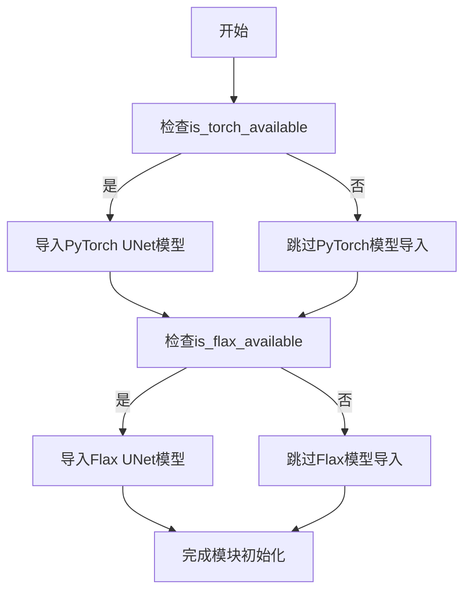
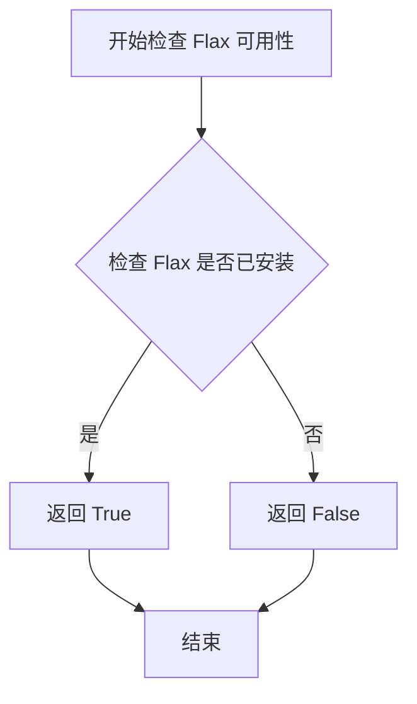
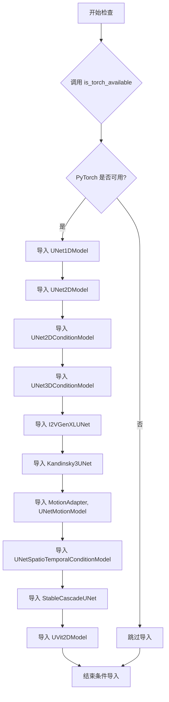

# `diffusers\src\diffusers\models\unets\__init__.py` 详细设计文档

这是一个Diffusion模型包的初始化文件，通过条件导入机制根据深度学习框架（PyTorch/Flax）的可用性动态加载多种UNet变体模型，包括1D、2D、3D、条件生成、运动模型等不同架构的扩散模型实现。

## 整体流程



## 类结构

```
UNet Model Variants (条件导入模块)
├── UNet1DModel (1D UNet)
├── UNet2DModel (2D UNet)
├── UNet2DConditionModel (2D条件UNet)
├── UNet3DConditionModel (3D条件UNet)
├── I2VGenXLUNet (图到视频生成UNet)
├── Kandinsky3UNet (Kandinsky3 UNet)
├── MotionAdapter (运动适配器)
├── UNetMotionModel (运动UNet模型)
├── UNetSpatioTemporalConditionModel (时空条件UNet)
├── StableCascadeUNet (稳定级联UNet)
├── UVit2DModel (2D UVit模型)
└── FlaxUNet2DConditionModel (Flax 2D条件UNet)
```

## 全局变量及字段


### `is_torch_available`
    
检查PyTorch是否可用的工具函数

类型：`function`
    


### `is_flax_available`
    
检查Flax是否可用的工具函数

类型：`function`
    


    

## 全局函数及方法


### `is_flax_available`

该函数用于检查当前环境中是否安装了 Flax 深度学习框架库。如果 Flax 已安装且可用，函数返回 `True`，否则返回 `False`。常用于条件导入，确保在 Flax 不可用时不会引发导入错误。

参数：

- 无参数

返回值：`bool`，返回 `True` 表示 Flax 框架可用，可以安全导入 Flax 相关的模块；返回 `False` 表示 Flax 不可用。

#### 流程图



#### 带注释源码

```
# is_flax_available 函数的典型实现逻辑（基于 Hugging Face transformers 库模式）
def is_flax_available() -> bool:
    """
    检查 Flax 库是否可用。
    
    该函数通常通过以下方式检查：
    1. 尝试导入 flax 模块
    2. 检查版本兼容性
    3. 返回布尔值表示是否可用
    
    返回:
        bool: 如果 Flax 可用返回 True，否则返回 False
    """
    # 内部实现细节：
    # - 检查 flax 包是否在 site-packages 中
    # - 验证必要的依赖项
    # - 可能包含版本检查逻辑
    pass
```

> **注意**：由于 `is_flax_available` 是从 `...utils` 模块导入的外部函数，上述源码为基于常见实现模式的推断，实际实现请参考具体来源的 `utils` 模块。该函数的主要用途是在代码中实现条件导入，只有当 Flax 可用时才尝试导入 `FlaxUNet2DConditionModel` 等 Flax 相关的模型类。


### `is_torch_available`

这是一个从 `...utils` 模块导入的实用函数，用于检查 PyTorch 框架是否在当前环境中可用。该函数根据检查结果决定是否导入各种 UNet 模型类，从而实现条件导入，确保代码在有 PyTorch 和无 PyTorch 的环境中都能正常运行。

参数： 无

返回值：`bool`，返回 `True` 表示 PyTorch 可用，返回 `False` 表示 PyTorch 不可用

#### 流程图



#### 带注释源码

```python
# 从上级目录的 utils 模块导入两个可用性检查函数
# is_torch_available: 检查 PyTorch 是否可用
# is_flax_available: 检查 Flax 是否可用
from ...utils import is_flax_available, is_torch_available

# 条件导入：如果 PyTorch 可用，则导入所有 UNet 相关模型
# 这实现了条件加载，避免在没有安装 PyTorch 的环境中导入失败
if is_torch_available():
    # 导入不同维度的 UNet 模型
    from .unet_1d import UNet1DModel              # 1D UNet 模型
    from .unet_2d import UNet2DModel               # 2D UNet 模型
    from .unet_2d_condition import UNet2DConditionModel  # 条件 2D UNet 模型
    from .unet_3d_condition import UNet3DConditionModel  # 条件 3D UNet 模型
    from .unet_i2vgen_xl import I2VGenXLUNet       # I2VGen XL UNet 模型
    from .unet_kandinsky3 import Kandinsky3UNet    # Kandinsky 3 UNet 模型
    from .unet_motion_model import MotionAdapter, UNetMotionModel  # 运动模型适配器
    from .unet_spatio_temporal_condition import UNetSpatioTemporalConditionModel  # 时空条件模型
    from .unet_stable_cascade import StableCascadeUNet  # 稳定级联 UNet
    from .uvit_2d import UVit2DModel                # UVit 2D 模型

# 条件导入：如果 Flax 可用，则导入 Flax 版本的 UNet 模型
if is_flax_available():
    from .unet_2d_condition_flax import FlaxUNet2DConditionModel  # Flax 2D 条件 UNet
```

## 关键组件


### 条件导入系统

通过 `is_torch_available()` 和 `is_flax_available()` 工具函数实现框架感知的条件导入，根据运行时环境动态加载对应的 UNet 模型模块。

### UNet1DModel

一维 UNet 模型，用于一维信号处理或时序数据的特征提取与重建。

### UNet2DModel

二维 UNet 模型，用于二维图像的特征提取与重建任务。

### UNet2DConditionModel

二维条件 UNet 模型，支持额外的条件输入（如文本embedding或图像mask），广泛应用于条件图像生成任务。

### UNet3DConditionModel

三维条件 UNet 模型，支持视频或三维数据的条件生成任务。

### I2VGenXLUNet

I2VGenXL 特定的 UNet 实现，用于图像到视频生成任务。

### Kandinsky3UNet

Kandinsky3 特定的 UNet 实现，用于多模态内容生成。

### MotionAdapter, UNetMotionModel

运动适配器与运动UNet模型，用于视频生成中的运动特征提取与控制。

### UNetSpatioTemporalConditionModel

时空条件 UNet 模型，用于同时考虑空间与时间维度的条件生成任务。

### StableCascadeUNet

Stable Cascade 特定的 UNet 实现，用于高质量图像生成流水线。

### UVit2DModel

2D UVit（UNet + Vision Transformer）混合架构模型，结合 Transformer 注意力机制与 UNet 结构。

### FlaxUNet2DConditionModel

基于 Flax 框架的二维条件 UNet 模型，提供 JAX/Flax 生态的等效实现。

### 框架兼容性层

提供 PyTorch 与 Flax 两种深度学习框架的模型支持，通过运行时检测实现条件加载。


## 问题及建议


### 已知问题

-   **框架支持不平衡**：PyTorch版本导入了10个不同的UNet模型变体，而Flax版本仅有1个（FlaxUNet2DConditionModel），导致两个框架的API覆盖度严重不均，用户在使用Flax时将面临功能缺失。
-   **缺少延迟导入机制**：所有模型在模块初始化时被无条件导入，即使实际业务可能只需要其中某一个模型，这会导致不必要的内存占用和启动时间增加。
-   **缺乏错误处理与提示**：当is_torch_available()或is_flax_available()返回False时，模块静默失败，用户无法得知具体是缺少哪个依赖，导致问题排查困难。
-   **缺少统一的模型基类或接口定义**：10余个UNet模型各自独立导入，未提供抽象基类或接口契约，用户无法以统一方式操作不同维度的UNet模型。
-   **文档注释缺失**：该__init__.py文件未包含任何模块级docstring说明该模块的用途、支持的框架版本、模型列表等关键信息。
-   **导入组织结构松散**：所有导入语句平铺直叙，未按维度（1D/2D/3D）或功能（condition/motion等）进行分组注释，影响可读性。

### 优化建议

-   **实现延迟导入（Lazy Import）**：使用__getattr__实现按需动态导入，避免在模块初始化时加载所有模型，例如定义__all__列表并在__getattr__中根据字符串名称加载对应类。
-   **提供框架统一的模型注册机制**：创建抽象基类BaseUNetModel，定义统一的forward、from_pretrained等接口，所有UNet变体继承该基类。
-   **添加依赖缺失的友好提示**：在is_torch_available()或is_flax_available()返回False时，通过warnings模块或自定义异常抛出明确的错误信息，告知用户需要安装哪个框架。
-   **完善模块文档**：在文件顶部添加模块级docstring，说明该模块是UNet模型集合、支持的框架、包含的模型列表及简要用途。
-   **按功能分组导入并添加注释**：将导入语句按维度或功能类型分组（如2D Condition、3D Condition、Motion等），提升代码可维护性。
-   **考虑为Flax补充对应模型**：调研并实现Flax版本的UNet1DModel、UNet3DConditionModel等，以平衡两个框架的API覆盖度。
-   **添加版本兼容性检查**：在导入时检查PyTorch/Flax版本是否符合最低要求，避免运行时出现不兼容错误。


## 其它


### 设计目标与约束

本模块作为UNet模型家族的统一入口点，采用条件导入机制实现跨框架（PyTorch/Flax）支持。根据运行时环境可用性动态加载对应的模型实现类，支持1D、2D、3D、条件生成等多种UNet变体模型。设计约束包括：仅支持PyTorch和Flax框架，不支持其他深度学习框架；模型类必须遵循统一的接口规范以确保互换性。

### 错误处理与异常设计

本模块采用隐式错误处理策略，通过is_torch_available()和is_flax_available()条件函数预检查框架可用性，避免在框架不可用时导入失败。若所需框架未安装，模块导入将静默失败，不会抛出异常，上层代码需自行处理ImportError。条件导入失败属于可预期情况，不应中断程序运行。

### 数据流与状态机

模块初始化时首先执行环境检测流程：检测PyTorch可用性→若有则导入PyTorch模型类→检测Flax可用性→若有则导入Flax模型类。数据流为单向流动，仅负责模型类的导入注册，不涉及模型实例化或数据处理。状态转换：未检测→检测中→导入完成（或跳过），状态转换不可逆。

### 外部依赖与接口契约

核心依赖包括：torch框架（通过is_torch_available()间接依赖）、flax框架（通过is_flax_available()间接依赖）、utils模块中的条件检测函数。导入的各UNet类需符合模型基类接口规范：至少包含forward()方法、config参数、from_pretrained()类方法。各模型类之间为平级关系，无继承依赖，统一通过模块命名空间暴露。

### 兼容性考虑

本模块支持Python 3.7+环境，需配合Transformers库版本兼容的PyTorch（≥1.9.0）和Flax（≥0.4.0）版本。不同UNet模型变体间存在功能差异：UNet2DConditionModel支持条件输入，UNet3DConditionModel支持3D空间条件，MotionAdapter为独立组件需配合UNet使用。Flax版本仅提供UNet2DConditionModel的移植实现，其他模型暂无Flax版本。

### 模块导入机制

采用延迟导入（Lazy Import）模式，仅在对应框架可用时才执行from子句导入操作。模块级导入触发__init__.py执行，完成条件检测与类注册。全局命名空间通过条件判断动态构建，框架不可用时对应类不可见，此设计符合最小化依赖原则。

### 可扩展性设计

新增UNet模型变体需遵循以下扩展路径：在对应子模块文件中实现模型类→在__init__.py中添加条件导入语句→确保is_xxx_available()检测通过。推荐将同类模型置于统一子模块（如unet_2d系列），便于维护管理。扩展时需保持接口一致性，建议继承通用基类以保证兼容性。

### 性能考量

条件导入机制本身不引入运行时性能开销，因其在模块初始化时一次性执行。对于未安装对应框架的场景，可避免导入不存在的模块从而节省初始化时间。建议在多框架环境下明确指定所需模型类型，避免不必要的框架检测开销。

    