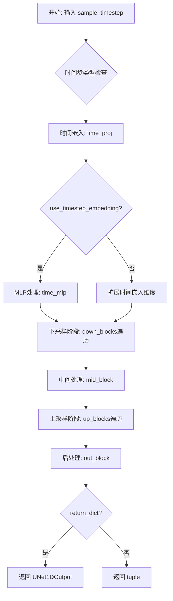
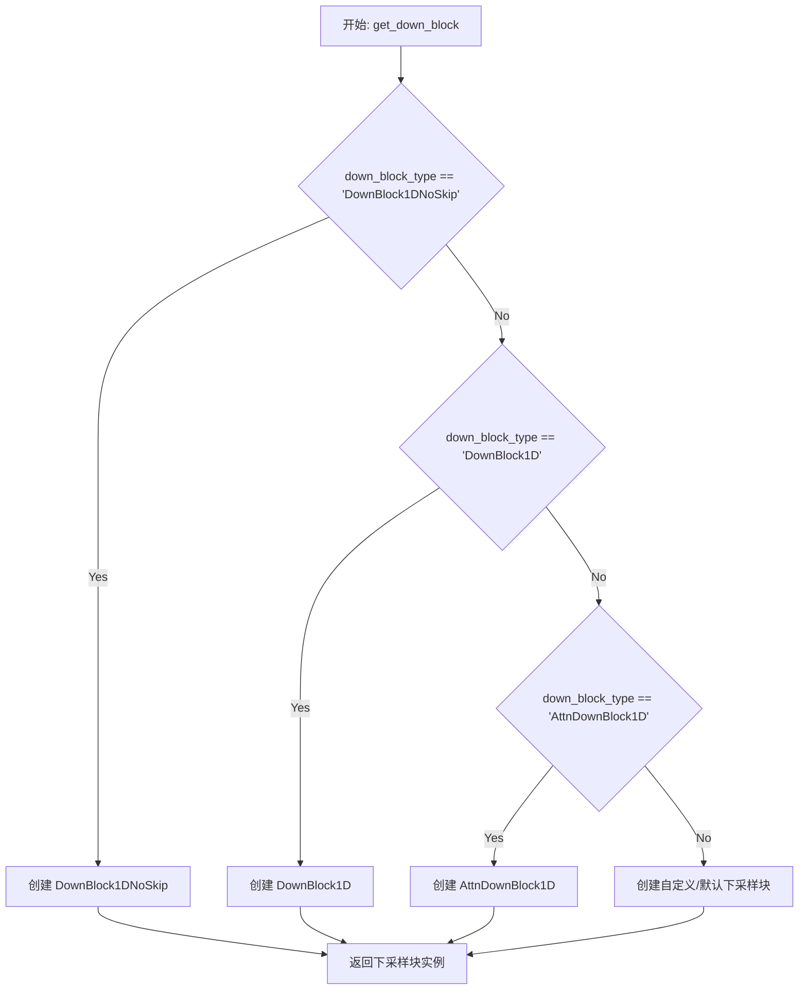
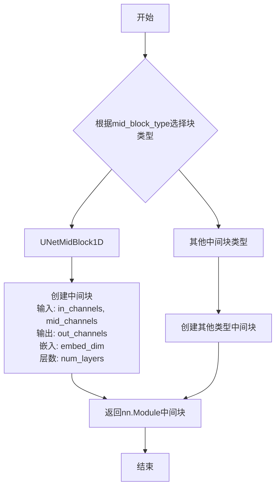
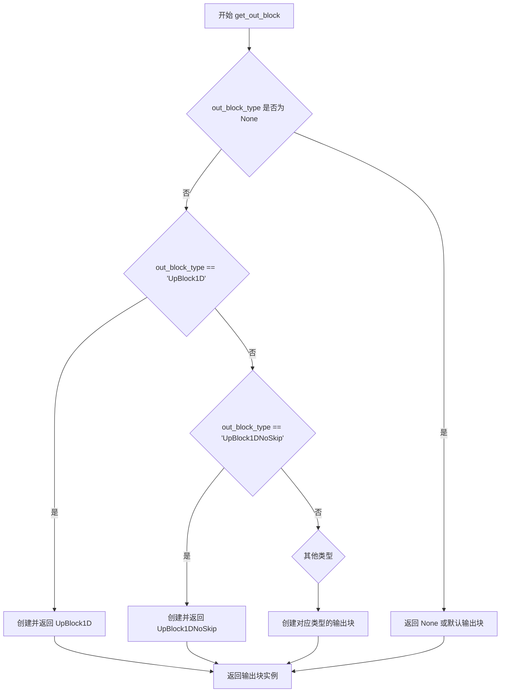
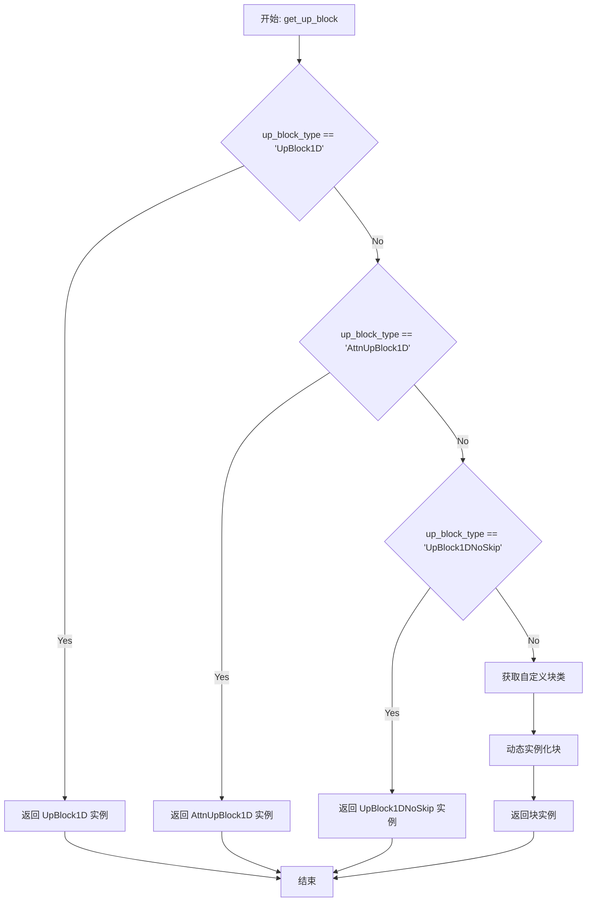
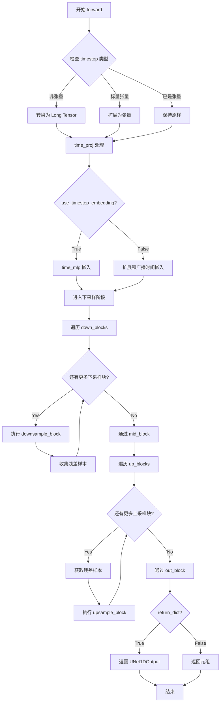

# `diffusers\src\diffusers\models\unets\unet_1d.py` 详细设计文档

UNet1DModel是一个一维UNet神经网络模型，继承自ModelMixin和ConfigMixin，用于处理音频等一维信号的深度学习任务（如Diffusion模型的噪声预测）。它接收噪声样本和时间步，通过编码器（下采样块）、中间块、解码器（上采样块）和输出块的处理，输出去噪后的样本。

## 整体流程



## 类结构

```
BaseOutput (数据基类)
└── UNet1DOutput (1D UNet输出数据类)
ModelMixin (模型混合基类)
ConfigMixin (配置混合基类)
└── UNet1DModel (1D UNet主模型类)
```

## 全局变量及字段


### `_skip_layerwise_casting_patterns`
    
跳过层级铸造的模式列表，用于指定哪些层不需要进行类型转换

类型：`list[str]`
    


### `UNet1DOutput.sample`
    
模型最后输出的隐藏状态张量

类型：`torch.Tensor`
    


### `UNet1DModel.sample_size`
    
样本长度，默认为65536

类型：`int`
    


### `UNet1DModel.time_proj`
    
时间投影层，用于将时间步嵌入到高维空间

类型：`GaussianFourierProjection | Timesteps`
    


### `UNet1DModel.time_mlp`
    
时间MLP嵌入层，用于进一步处理时间嵌入（可选）

类型：`TimestepEmbedding | None`
    


### `UNet1DModel.down_blocks`
    
下采样块列表，用于逐步降低特征分辨率

类型：`nn.ModuleList`
    


### `UNet1DModel.mid_block`
    
中间处理块，位于编码器和解码器之间

类型：`nn.Module | None`
    


### `UNet1DModel.up_blocks`
    
上采样块列表，用于逐步恢复特征分辨率

类型：`nn.ModuleList`
    


### `UNet1DModel.out_block`
    
输出处理块，用于最终输出生成

类型：`nn.Module | None`
    


### `UNet1DModel._skip_layerwise_casting_patterns`
    
跳过层级铸造的模式列表，用于混合精度训练时的特殊处理

类型：`list[str]`
    
    

## 全局函数及方法


### `get_down_block`

获取下采样块工厂函数，用于根据指定的块类型创建对应的 UNet 1D 下采样块实例。

参数：

-  `down_block_type`：`str`，下采样块的类型标识符，如 "DownBlock1DNoSkip"、"DownBlock1D"、"AttnDownBlock1D" 等
-  `num_layers`：`int`，每个块中包含的层数
-  `in_channels`：`int`，输入特征图的通道数
-  `out_channels`：`int`，输出特征图的通道数
-  `temb_channels`：`int`，时间嵌入（timestep embedding）的通道数
-  `add_downsample`：`bool`，是否在下采样块中包含下采样操作

返回值：`nn.Module`，返回创建的下采样块实例，是一个 `nn.Module` 子类对象

#### 流程图



#### 带注释源码

```python
# 从当前代码文件中提取的调用示例
down_block = get_down_block(
    down_block_type,       # str: 下采样块类型字符串
    num_layers=layers_per_block,       # int: 块内层数
    in_channels=input_channel,         # int: 输入通道数（包含额外通道）
    out_channels=output_channel,       # int: 输出通道数
    temb_channels=block_out_channels[0],  # int: 时间嵌入通道数
    add_downsample=not is_final_block or downsample_each_block,  # bool: 是否添加下采样
)
```

> **注意**：该函数定义位于 `diffusers` 库的 `src/diffusers/models/unets/unet_1d_blocks.py` 模块中，当前代码文件仅导入并使用该函数。详细的工厂函数实现需要查阅源文件。根据调用方式和 UNet 架构惯例，该函数是一个工厂方法，根据 `down_block_type` 字符串参数动态创建对应的下采样块类实例，返回值为 `nn.Module` 类型。


### `get_mid_block`

获取中间块工厂函数，用于根据块类型创建UNet的中间块（bottleneck block）。

参数：

- `mid_block_type`：`str`，中间块的类型（如"UNetMidBlock1D"）
- `in_channels`：`int`，输入通道数
- `mid_channels`：`int`，中间通道数
- `out_channels`：`int`，输出通道数
- `embed_dim`：`int`，时间嵌入维度
- `num_layers`：`int`，每块的层数
- `add_downsample`：`bool`，是否添加下采样层

返回值：`nn.Module`，返回构建好的中间块模块

#### 流程图



#### 带注释源码

```python
# 调用示例（在UNet1DModel.__init__中）
self.mid_block = get_mid_block(
    mid_block_type,               # 中间块类型字符串，如"UNetMidBlock1D"
    in_channels=block_out_channels[-1],  # 输入通道数（来自最后一个下块输出）
    mid_channels=block_out_channels[-1],  # 中间通道数
    out_channels=block_out_channels[-1],  # 输出通道数
    embed_dim=block_out_channels[0],       # 时间嵌入维度（来自第一个块输出）
    num_layers=layers_per_block,           # 每块的层数
    add_downsample=downsample_each_block,  # 是否添加下采样
)
```

> **注意**：该函数的实际实现位于 `unet_1d_blocks` 模块中，当前代码文件仅导入并调用该函数。函数根据 `mid_block_type` 参数返回不同类型的中间块模块，用于UNet架构的瓶颈部分，负责处理编码器和解码器之间的特征。


### `get_out_block`

获取输出块工厂函数，根据 `out_block_type` 参数创建并返回对应的 1D UNet 输出块（UpBlock 或 MidBlock 等），用于对 UNet 的最终特征图进行后处理，输出预测的噪声或目标信号。

参数：

- `out_block_type`：`str`，输出块的类型标识符（如 `"UpBlock1D"`、`"UNetMidBlock1D"` 或 `None`），决定了创建的具体输出块类
- `num_groups_out`：`int`，输出块中分组归一化的组数，用于控制特征归一化
- `embed_dim`：`int`，时间嵌入的维度，通常等于第一个下采样块的输出通道数
- `out_channels`：`int`，输出特征图的通道数，对应目标信号的通道数
- `act_fn`：`str | None`，激活函数名称（如 `"silu"`、`"relu"` 等），用于输出块中的非线性变换
- `fc_dim`：`int`，全连接层（线性层）的隐藏维度，用于输出块中的特征变换

返回值：`nn.Module`，返回创建的输出块实例，是一个 `nn.Module` 子类对象，负责对 UNet 的最终特征进行后处理以生成输出

#### 流程图



#### 带注释源码

```python
# 注：由于 get_out_block 定义在 unet_1d_blocks.py 模块中，
# 以下是基于代码中调用方式的推断实现

def get_out_block(
    out_block_type: str | None,          # 输出块类型标识
    num_groups_out: int,                 # 分组归一化的组数
    embed_dim: int,                      # 时间嵌入维度
    out_channels: int,                   # 输出通道数
    act_fn: str | None,                  # 激活函数名称
    fc_dim: int,                         # 全连接层维度
) -> nn.Module | None:
    """
    工厂函数：根据 out_block_type 创建并返回对应的输出块
    
    参数:
        out_block_type: 输出块类型（如 "UpBlock1D", "AttnUpBlock1D" 等）
        num_groups_out: 分组归一化的组数
        embed_dim: 嵌入维度（时间嵌入维度）
        out_channels: 输出通道数
        act_fn: 激活函数名称
        fc_dim: 全连接层维度
    
    返回:
        输出块实例 nn.Module 或 None
    """
    # 如果没有指定输出块类型，返回 None（使用默认行为）
    if out_block_type is None:
        return None
    
    # 根据类型字符串创建对应的输出块
    # 具体实现依赖于 unet_1d_blocks.py 中的类定义
    if out_block_type == "UpBlock1D":
        return UpBlock1D(...)
    elif out_block_type == "AttnUpBlock1D":
        return AttnUpBlock1D(...)
    elif out_block_type == "UpBlock1DNoSkip":
        return UpBlock1DNoSkip(...)
    else:
        # 可扩展支持其他输出块类型
        raise ValueError(f"Unsupported out_block_type: {out_block_type}")
```

#### 在 `UNet1DModel` 中的调用示例

```python
# in UNet1DModel.__init__
num_groups_out = norm_num_groups if norm_num_groups is not None else min(block_out_channels[0] // 4, 32)
self.out_block = get_out_block(
    out_block_type=out_block_type,       # 如 "UpBlock1D" 或 None
    num_groups_out=num_groups_out,       # 分组归一化组数
    embed_dim=block_out_channels[0],     # 嵌入维度 = 第一层通道数
    out_channels=out_channels,           # 输出通道数（目标信号通道）
    act_fn=act_fn,                        # 激活函数（如 "silu"）
    fc_dim=block_out_channels[-1] // 4,  # 全连接层维度
)
```

---

#### 技术债务与优化空间

1. **缺少源码实现**：`get_out_block` 函数的实际实现位于 `unet_1d_blocks.py` 模块中，当前代码文件仅导入并使用它，建议补充完整的工厂函数实现以便全面理解
2. **类型处理逻辑**：`out_block_type` 为 `None` 时返回 `None`，这种隐式的可选块设计可能导致运行时行为不一致，建议使用显式的默认块类型
3. **参数硬编码**：调用时 `fc_dim` 使用 `block_out_channels[-1] // 4` 这样的经验值进行计算，缺少文档说明为何使用此比例，可能导致在某些配置下特征维度不匹配


### `get_up_block`

获取上采样块工厂函数，用于根据给定的块类型和参数动态创建UNet 1D模型的上采样（解码器）块。

参数：

- `up_block_type`：`str`，上采样块的类型标识符（如"UpBlock1D"、"AttnUpBlock1D"、"UpBlock1DNoSkip"等）
- `num_layers`：`int`，每个块中的层数
- `in_channels`：`int`，输入特征图的通道数
- `out_channels`：`int`，输出特征图的通道数
- `temb_channels`：`int`，时间嵌入（timestep embedding）通道数
- `add_upsample`：`bool`，是否在块中添加上采样操作

返回值：`torch.nn.Module`，返回创建的上采样块实例

#### 流程图



#### 带注释源码

```
# 该函数定义在 unet_1d_blocks.py 模块中
# 以下为推断的函数签名和实现逻辑

def get_up_block(
    up_block_type: str,              # 上采样块类型名称
    num_layers: int,                 # 块内卷积层数量
    in_channels: int,                # 输入通道数
    out_channels: int,               # 输出通道数
    temb_channels: int,              # 时间嵌入通道数
    add_upsample: bool = True,       # 是否添加上采样层
    **kwargs                         # 其他可选参数
) -> nn.Module:
    """
    根据 up_block_type 创建对应的上采样块实例
    
    常见块类型:
    - "UpBlock1D": 标准上采样块，包含转置卷积和残差连接
    - "AttnUpBlock1D": 带注意力机制的上采样块
    - "UpBlock1DNoSkip": 不带跳跃连接的上采样块
    
    返回:
        nn.Module: 配置好的上采样块实例
    """
    # 块类型到类名的映射（内部逻辑）
    up_block_map = {
        "UpBlock1D": UpBlock1D,
        "AttnUpBlock1D": AttnUpBlock1D,
        "UpBlock1DNoSkip": UpBlock1DNoSkip,
    }
    
    # 根据类型查找并实例化块
    if up_block_type in up_block_map:
        block_class = up_block_map[up_block_type]
    else:
        # 支持自定义块类型
        block_class = _get_block_from_type(up_block_type)
    
    # 创建块实例，传入所有必要参数
    return block_class(
        num_layers=num_layers,
        in_channels=in_channels,
        out_channels=out_channels,
        temb_channels=temb_channels,
        add_upsample=add_upsample,
        **kwargs
    )
```

> **注意**：该函数的实际源码位于 `unet_1d_blocks.py` 模块中，当前代码文件仅导入了该函数并在上采样阶段调用它。从 `UNet1DModel.__init__` 方法中的调用模式可以看出，函数接收6个核心参数并返回对应的 `nn.Module` 子类实例，用于构建UNet的解码器部分。


### `UNet1DModel.__init__`

初始化UNet1DModel模型结构，创建时间嵌入层、下采样块、中间块、上采样块和输出块，构建完整的1D UNet神经网络架构。

参数：

- `sample_size`：`int`，默认65536，输入样本的长度
- `sample_rate`：`int | None`，默认None，音频采样率（当前未使用）
- `in_channels`：`int`，默认2，输入样本的通道数
- `out_channels`：`int`，默认2，输出样本的通道数
- `extra_in_channels`：`int`，默认0，额外输入通道数，用于扩展输入
- `time_embedding_type`：`str`，默认"fourier"，时间嵌入类型（"fourier"或"positional"）
- `time_embedding_dim`：`int | None`，默认None，时间嵌入维度，若为None则自动计算
- `flip_sin_to_cos`：`bool`，默认True，是否将sin转换为cos用于Fourier时间嵌入
- `use_timestep_embedding`：`bool`，默认False，是否使用时间步嵌入
- `freq_shift`：`float`，默认0.0，Fourier时间嵌入的频率偏移
- `down_block_types`：`tuple[str, ...]`，默认("DownBlock1DNoSkip", "DownBlock1D", "AttnDownBlock1D")，下采样块类型元组
- `up_block_types`：`tuple[str, ...]`，默认("AttnUpBlock1D", "UpBlock1D", "UpBlock1DNoSkip")，上采样块类型元组
- `mid_block_type`：`str`，默认"UNetMidBlock1D"，中间块类型
- `out_block_type`：`str | None`，默认None，输出块类型
- `block_out_channels`：`tuple[int, ...]`，默认(32, 32, 64)，块的输出通道数元组
- `act_fn`：`str | None`，默认None，激活函数名称
- `norm_num_groups`：`int`，默认8，归一化的分组数
- `layers_per_block`：`int`，默认1，每个块的层数
- `downsample_each_block`：`bool`，默认False，是否在每个块中进行下采样

返回值：`None`，该方法为构造函数，不返回任何值

#### 流程图

```mermaid
flowchart TD
    A[开始 __init__] --> B[调用 super().__init__]
    B --> C[设置 self.sample_size]
    
    C --> D{time_embedding_type == 'fourier'?}
    D -->|Yes| E[创建 GaussianFourierProjection]
    D -->|No| F{time_embedding_type == 'positional'?}
    F -->|Yes| G[创建 Timesteps]
    F -->|No| H[抛出 ValueError 异常]
    
    E --> I[设置 timestep_input_dim]
    G --> I
    I --> J{use_timestep_embedding == True?}
    J -->|Yes| K[创建 TimestepEmbedding]
    J -->|No| L[跳过时间MLP创建]
    
    K --> M[初始化空 ModuleList]
    L --> M
    M --> N[开始创建下采样块循环]
    
    N --> O{遍历 down_block_types}
    O -->|每次迭代| P[调用 get_down_block 创建下采样块]
    P --> Q[将下采样块添加到 self.down_blocks]
    Q --> O
    
    O -->|循环结束| R[创建中间块 get_mid_block]
    R --> S[设置 self.mid_block]
    
    S --> T[开始创建上采样块循环]
    T --> U{遍历 up_block_types}
    U -->|每次迭代| V[调用 get_up_block 创建上采样块]
    V --> W[将上采样块添加到 self.up_blocks]
    W --> U
    
    U -->|循环结束| X[计算 num_groups_out]
    X --> Y[调用 get_out_block 创建输出块]
    Y --> Z[设置 self.out_block]
    Z --> AA[结束 __init__]
```

#### 带注释源码

```python
@register_to_config
def __init__(
    self,
    sample_size: int = 65536,
    sample_rate: int | None = None,
    in_channels: int = 2,
    out_channels: int = 2,
    extra_in_channels: int = 0,
    time_embedding_type: str = "fourier",
    time_embedding_dim: int | None = None,
    flip_sin_to_cos: bool = True,
    use_timestep_embedding: bool = False,
    freq_shift: float = 0.0,
    down_block_types: tuple[str, ...] = ("DownBlock1DNoSkip", "DownBlock1D", "AttnDownBlock1D"),
    up_block_types: tuple[str, ...] = ("AttnUpBlock1D", "UpBlock1D", "UpBlock1DNoSkip"),
    mid_block_type: str = "UNetMidBlock1D",
    out_block_type: str = None,
    block_out_channels: tuple[int, ...] = (32, 32, 64),
    act_fn: str = None,
    norm_num_groups: int = 8,
    layers_per_block: int = 1,
    downsample_each_block: bool = False,
):
    """初始化UNet1DModel模型结构"""
    # 调用父类初始化器，注册配置
    super().__init__()
    # 保存样本大小到实例属性
    self.sample_size = sample_size

    # ==================== 时间嵌入层初始化 ====================
    if time_embedding_type == "fourier":
        # Fourier时间嵌入：使用高斯傅里叶投影
        # 计算时间嵌入维度，默认为block_out_channels[0] * 2
        time_embed_dim = time_embedding_dim or block_out_channels[0] * 2
        # 验证time_embed_dim必须能被2整除
        if time_embed_dim % 2 != 0:
            raise ValueError(f"`time_embed_dim` should be divisible by 2, but is {time_embed_dim}.")
        # 创建高斯傅里叶投影时间嵌入层
        self.time_proj = GaussianFourierProjection(
            embedding_size=time_embed_dim // 2,  # 嵌入大小为维度的一半
            set_W_to_weight=False,               # 不将W设置为权重
            log=False,                            # 不使用对数缩放
            flip_sin_to_cos=flip_sin_to_cos       # 是否翻转sin到cos
        )
        # 时间步输入维度等于time_embed_dim
        timestep_input_dim = time_embed_dim
    elif time_embedding_type == "positional":
        # 位置时间嵌入：使用Timesteps层
        time_embed_dim = time_embedding_dim or block_out_channels[0] * 4
        self.time_proj = Timesteps(
            block_out_channels[0],                # 输入通道数
            flip_sin_to_cos=flip_sin_to_cos,      # 是否翻转sin到cos
            downscale_freq_shift=freq_shift       # 频率偏移
        )
        # 位置嵌入的输入维度为block_out_channels[0]
        timestep_input_dim = block_out_channels[0]
    else:
        # 不支持的时间嵌入类型，抛出异常
        raise ValueError(
            f"{time_embedding_type} does not exist. Please make sure to use one of `fourier` or `positional`."
        )

    # 可选：创建时间步MLP嵌入层
    if use_timestep_embedding:
        # 使用MLP进一步处理时间嵌入
        time_embed_dim = block_out_channels[0] * 4
        self.time_mlp = TimestepEmbedding(
            in_channels=timestep_input_dim,       # 输入维度
            time_embed_dim=time_embed_dim,        # 时间嵌入维度
            act_fn=act_fn,                        # 激活函数
            out_dim=block_out_channels[0]         # 输出维度
        )

    # ==================== 初始化模块列表 ====================
    # 下采样块列表
    self.down_blocks = nn.ModuleList([])
    # 中间块（初始化为None，后续创建）
    self.mid_block = None
    # 上采样块列表
    self.up_blocks = nn.ModuleList([])
    # 输出块（初始化为None，后续创建）
    self.out_block = None

    # ==================== 创建下采样块 ====================
    # 当前输出通道数等于输入通道数
    output_channel = in_channels
    # 遍历下采样块类型，创建对应的下采样块
    for i, down_block_type in enumerate(down_block_types):
        # 当前块的输入通道数等于上一个块的输出通道数
        input_channel = output_channel
        # 当前块的输出通道数从block_out_channels获取
        output_channel = block_out_channels[i]

        # 如果是第一个块，加上额外输入通道数
        if i == 0:
            input_channel += extra_in_channels

        # 判断是否为最后一个块
        is_final_block = i == len(block_out_channels) - 1

        # 获取并创建下采样块
        down_block = get_down_block(
            down_block_type,                    # 下采样块类型
            num_layers=layers_per_block,        # 每块的层数
            in_channels=input_channel,         # 输入通道数
            out_channels=output_channel,        # 输出通道数
            temb_channels=block_out_channels[0],# 时间嵌入通道数
            add_downsample=not is_final_block or downsample_each_block  # 是否添加下采样
        )
        # 将下采样块添加到模块列表
        self.down_blocks.append(down_block)

    # ==================== 创建中间块 ====================
    # 使用最后一个block_out_channels创建中间块
    self.mid_block = get_mid_block(
        mid_block_type,                        # 中间块类型
        in_channels=block_out_channels[-1],   # 输入通道数
        mid_channels=block_out_channels[-1],  # 中间通道数
        out_channels=block_out_channels[-1], # 输出通道数
        embed_dim=block_out_channels[0],      # 嵌入维度
        num_layers=layers_per_block,          # 层数
        add_downsample=downsample_each_block, # 是否添加下采样
    )

    # ==================== 创建上采样块 ====================
    # 反转block_out_channels顺序用于上采样
    reversed_block_out_channels = list(reversed(block_out_channels))
    # 初始输出通道数
    output_channel = reversed_block_out_channels[0]
    # 确定最终上采样通道数
    if out_block_type is None:
        final_upsample_channels = out_channels
    else:
        final_upsample_channels = block_out_channels[0]

    # 遍历上采样块类型，创建对应的上采样块
    for i, up_block_type in enumerate(up_block_types):
        # 前一个输出通道数
        prev_output_channel = output_channel
        # 当前输出通道数
        output_channel = (
            reversed_block_out_channels[i + 1] if i < len(up_block_types) - 1 else final_upsample_channels
        )

        # 判断是否为最后一个块
        is_final_block = i == len(block_out_channels) - 1

        # 获取并创建上采样块
        up_block = get_up_block(
            up_block_type,                     # 上采样块类型
            num_layers=layers_per_block,       # 每块的层数
            in_channels=prev_output_channel,   # 输入通道数
            out_channels=output_channel,       # 输出通道数
            temb_channels=block_out_channels[0],# 时间嵌入通道数
            add_upsample=not is_final_block,   # 是否添加上采样
        )
        # 将上采样块添加到模块列表
        self.up_blocks.append(up_block)
        # 更新前一输出通道数
        prev_output_channel = output_channel

    # ==================== 创建输出块 ====================
    # 计算输出归一化分组数
    num_groups_out = norm_num_groups if norm_num_groups is not None else min(block_out_channels[0] // 4, 32)
    # 获取并创建输出块
    self.out_block = get_out_block(
        out_block_type=out_block_type,                 # 输出块类型
        num_groups_out=num_groups_out,                 # 输出归一化分组数
        embed_dim=block_out_channels[0],              # 嵌入维度
        out_channels=out_channels,                     # 输出通道数
        act_fn=act_fn,                                  # 激活函数
        fc_dim=block_out_channels[-1] // 4,            # 全连接层维度
    )
```


### `UNet1DModel.forward`

该方法是 1D UNet 模型的前向传播核心，实现了去噪过程：接收带噪声的输入样本和时间步，经过时间嵌入、下采样编码、中间块处理、上采样解码以及输出块处理，最终返回去噪后的样本或包含样本的元组。

参数：

- `sample`：`torch.Tensor`，形状为 `(batch_size, num_channels, sample_size)`，表示带噪声的输入张量
- `timestep`：`torch.Tensor | float | int`，时间步，用于指示去噪的当前阶段
- `return_dict`：`bool`，默认为 `True`，是否返回 `UNet1DOutput` 字典而非元组

返回值：`UNet1DOutput | tuple`，去噪后的样本张量（包装在 `UNet1DOutput` 中）或包含样本的元组

#### 流程图



#### 带注释源码

```python
def forward(
    self,
    sample: torch.Tensor,
    timestep: torch.Tensor | float | int,
    return_dict: bool = True,
) -> UNet1DOutput | tuple:
    r"""
    The [`UNet1DModel`] forward method.

    Args:
        sample (`torch.Tensor`):
            The noisy input tensor with the following shape `(batch_size, num_channels, sample_size)`.
        timestep (`torch.Tensor` or `float` or `int`): The number of timesteps to denoise an input.
        return_dict (`bool`, *optional*, defaults to `True`):
            Whether or not to return a [`~models.unets.unet_1d.UNet1DOutput`] instead of a plain tuple.

    Returns:
        [`~models.unets.unet_1d.UNet1DOutput`] or `tuple`:
            If `return_dict` is True, an [`~models.unets.unet_1d.UNet1DOutput`] is returned, otherwise a `tuple` is
            returned where the first element is the sample tensor.
    """

    # 步骤1: 时间步处理
    # --------------------------------------
    # 将输入的 timestep 标准化为张量格式
    timesteps = timestep
    if not torch.is_tensor(timesteps):
        # 如果是 Python 原生类型（float/int），转换为 Long Tensor
        timesteps = torch.tensor([timesteps], dtype=torch.long, device=sample.device)
    elif torch.is_tensor(timesteps) and len(timesteps.shape) == 0:
        # 如果是标量张量（0维），扩展为1维张量以适配批处理
        timesteps = timesteps[None].to(sample.device)
    
    # 通过时间投影层将 timesteps 转换为时间嵌入
    timestep_embed = self.time_proj(timesteps)
    
    # 根据配置决定是否使用额外的 MLP 处理时间嵌入
    if self.config.use_timestep_embedding:
        # 使用 TimestepEmbedding 进行进一步处理
        timestep_embed = self.time_mlp(timestep_embed.to(sample.dtype))
    else:
        # 对时间嵌入进行空间维度的扩展和广播，以匹配样本的空间维度
        timestep_embed = timestep_embed[..., None]  # 在最后添加一个维度
        timestep_embed = timestep_embed.repeat([1, 1, sample.shape[2]]).to(sample.dtype)  # 沿空间维度重复
        timestep_embed = timestep_embed.broadcast_to((sample.shape[:1] + timestep_embed.shape[1:]))  # 广播以匹配批次

    # 步骤2: 下采样阶段（编码器）
    # --------------------------------------
    # 初始化残差样本元组，用于收集每个下采样块的跳跃连接
    down_block_res_samples = ()
    # 遍历所有下采样块
    for downsample_block in self.down_blocks:
        # 执行下采样块，返回当前层的输出和残差连接列表
        sample, res_samples = downsample_block(hidden_states=sample, temb=timestep_embed)
        # 将残差样本追加到元组中
        down_block_res_samples += res_samples

    # 步骤3: 中间块处理
    # --------------------------------------
    # 通过中间块进行进一步的特征提取和整合
    if self.mid_block:
        sample = self.mid_block(sample, timestep_embed)

    # 步骤4: 上采样阶段（解码器）
    # --------------------------------------
    # 遍历所有上采样块，使用之前收集的残差连接进行跳跃连接
    for i, upsample_block in enumerate(self.up_blocks):
        # 从保存的残差样本中取出最后一个（对应当前上采样层）
        res_samples = down_block_res_samples[-1:]
        # 移除已使用的残差样本
        down_block_res_samples = down_block_res_samples[:-1]
        # 执行上采样块，将残差连接传入
        sample = upsample_block(sample, res_hidden_states_tuple=res_samples, temb=timestep_embed)

    # 步骤5: 后处理输出
    # --------------------------------------
    # 通过输出块生成最终的预测结果
    if self.out_block:
        sample = self.out_block(sample, timestep_embed)

    # 根据 return_dict 参数决定返回格式
    if not return_dict:
        return (sample,)

    # 返回包装在 UNet1DOutput 中的样本
    return UNet1DOutput(sample=sample)
```

## 关键组件


### UNet1DOutput

输出数据类，包含去噪后的样本张量，形状为 (batch_size, num_channels, sample_size)

### UNet1DModel

核心1D UNet模型类，继承自 ModelMixin 和 ConfigMixin，用于处理噪声样本和时间步并返回去噪后的输出

### Time Embedding 组件

包含 GaussianFourierProjection、TimestepEmbedding 和 Timesteps，用于将时间步转换为高维嵌入表示，支持 fourier 和 positional 两种嵌入类型

### Down Blocks 模块列表

self.down_blocks (nn.ModuleList)，包含多个下采样块，用于逐步提取特征并降低空间分辨率

### Mid Block

self.mid_block，位于UNet中部，用于处理最深层级的特征表示

### Up Blocks 模块列表

self.up_blocks (nn.ModuleList)，包含多个上采样块，用于逐步恢复空间分辨率并融合跳跃连接特征

### Out Block

self.out_block，输出处理块，负责将特征转换为最终的目标通道数

### Forward 方法

核心前向传播方法，包含时间嵌入计算、下采样、中间处理、上采样和后处理五个阶段


## 问题及建议


### 已知问题

- **时间嵌入的广播逻辑冗余且低效**：在forward方法中，`timestep_embed.repeat([1, 1, sample.shape[2]])` 和 `broadcast_to` 操作对于每个样本都会重复执行，当sample_size很大时会产生大量内存复制
- **up_block循环中存在索引逻辑错误风险**：代码中使用 `reversed_block_out_channels[i + 1]` 访问下一个元素，但循环边界检查与block_out_channels长度耦合，可能导致边界访问越界（虽然当前逻辑有保护）
- **时间步处理存在类型转换冗余**：timestep参数支持多种类型(torch.Tensor/float/int)，导致forward方法中存在多次类型检查和转换分支，增加了运行时开销
- **sample_size参数未被实际使用**：构造函数中保存了sample_size，但在forward传播中并未利用该值进行任何验证或约束
- **未使用的构造函数参数**：sample_rate参数被接收但从未在任何地方使用
- **is_final_block判断逻辑不一致**：在down_blocks中使用`i == len(block_out_channels) - 1`，但实际判断应该基于down_block_types的长度
- **缺少梯度检查点(gradient checkpointing)支持**：对于大型模型，缺少中间层激活的内存优化支持

### 优化建议

- 将时间嵌入的广播操作改为在通道维度上进行，避免对序列长度维度的重复操作
- 移除timestep_embed的repeat和broadcast操作，改为在down_block内部进行适当的维度扩展
- 统一时间步处理逻辑，强制要求输入timestep为torch.Tensor以减少类型分支
- 在forward方法入口添加sample_size验证，确保输入张量维度匹配配置
- 删除未使用的sample_rate参数或添加相应的处理逻辑
- 修复is_final_block的判断逻辑，使用len(down_block_types)或len(up_block_types)进行判断
- 考虑添加gradient_checkpointing参数支持，通过torch.utils.checkpoint实现内存优化
- 可以考虑添加类变量注释说明skip connection的处理模式，因为代码中有_skip_layerwise_casting_patterns但未在实现中体现

## 其它


### 设计目标与约束

本模块的设计目标是实现一个高效、可扩展的1D UNet架构，用于一维信号（如音频）的去噪任务。核心约束包括：(1) 支持可配置的编码器/解码器块类型，以适应不同的应用场景；(2) 保持与2D UNet接口的一致性，便于在Diffusion模型中替换使用；(3) 必须支持时间步嵌入，以实现与扩散过程的集成；(4) 模型需支持梯度计算，用于训练过程中的反向传播；(5) 输入输出张量形状需保持一致性，确保与pipeline的无缝对接。

### 错误处理与异常设计

代码中的错误处理主要体现在参数验证阶段。在`__init__`方法中，当`time_embedding_type`设置为不支持的类型时，会抛出`ValueError`并提供明确的错误信息，提示用户使用`fourier`或`positional`。对于`time_embed_dim`，要求其必须能被2整除，否则抛出`ValueError`。此外，在`forward`方法中，对`timestep`参数进行了类型检查和形状规范化处理，将其转换为张量并确保正确的设备位置。整体采用防御式编程风格，在入口处进行参数校验，但缺少对异常输入形状的详细检查和更细粒度的异常分类。

### 数据流与状态机

数据流遵循经典的UNet对称架构：(1) 时间嵌入阶段：将输入的时间步长转换为高维嵌入表示；(2) 编码器阶段：样本依次通过多个下采样块，每块输出残差连接样本用于解码器；(3) 中间阶段：编码后的特征通过中间块进行进一步处理；(4) 解码器阶段：从最深层开始，依次通过上采样块，每块接收对应的编码器残差连接；(5) 输出阶段：通过输出块生成最终的去噪样本。状态机方面，模型本身无内部状态，状态转换完全由输入的`timestep`参数驱动，不同的时间步长决定模型在推理过程中的去噪程度。

### 外部依赖与接口契约

本模块依赖以下外部组件：(1) `torch`与`torch.nn`：用于张量运算和神经网络构建；(2) `dataclasses.dataclass`：用于定义输出数据结构；(3) `configuration_utils.ConfigMixin, register_to_config`：用于配置管理和序列化；(4) `utils.BaseOutput`：基础输出类；(5) `embeddings`模块：提供`GaussianFourierProjection`、`TimestepEmbedding`和`Timesteps`等时间嵌入组件；(6) `modeling_utils.ModelMixin`：基础模型混合类；(7) `unet_1d_blocks`：提供各种UNet块的构建函数。接口契约要求：`sample`输入必须是`(batch_size, num_channels, sample_size)`形状的3D张量；`timestep`可以是张量、浮点数或整数；返回值默认为`UNet1DOutput`对象，包含`sample`属性，也可返回元组以兼容旧版接口。

### 性能考虑与基准测试

性能优化方面，代码采用了`nn.ModuleList`管理多个块以支持高效的GPU并行计算；使用`broadcast_to`避免显式复制张量；通过`_skip_layerwise_casting_patterns`属性标记某些层跳过类型转换以提升性能。潜在的性能瓶颈包括：(1) 时间嵌入在每个前向传播中都进行重复计算和广播，未进行缓存；(2) 残差连接在解码器阶段通过列表操作管理，存在一定的内存开销；(3) 对于极长序列（如默认的65536），中间特征图的内存占用较大。建议进行基准测试以评估不同配置下的吞吐量、内存占用和延迟表现。

### 配置参数详解

`sample_size`：输入输出样本的序列长度，默认65536，对应约1.5秒的44.1kHz音频；`sample_rate`：采样率信息，当前代码中未直接使用，仅作记录；`in_channels`/`out_channels`：输入输出通道数，默认为2（立体声）；`extra_in_channels`：额外输入通道，用于扩展输入维度；`time_embedding_type`：时间嵌入类型，`fourier`使用高斯随机傅里叶特征，`positional`使用可学习的位置编码；`flip_sin_to_cos`：控制傅里叶嵌入的相位翻转；`freq_shift`：傅里叶嵌入的频率偏移；`down_block_types`/`up_block_types`：上 下采样块类型列表，决定网络架构；`block_out_channels`：各块的输出通道数列表；`mid_block_type`：中间块类型；`norm_num_groups`：分组归一化的组数；`layers_per_block`：每个块内的卷积层数。

### 使用示例与用例

基本使用示例：首先实例化模型，然后进行前向传播：
```python
from diffusers import UNet1DModel
model = UNet1DModel(in_channels=2, out_channels=2, sample_size=8192)
sample = torch.randn(1, 2, 8192)
timestep = 100
output = model(sample, timestep)
denoised_sample = output.sample
```
典型应用场景包括：(1) 音频扩散模型的去噪网络；(2) 时间序列预测和生成；(3) 一维信号增强和修复。模型支持作为DiffusionPipeline的一部分与其他组件（如调度器、VAE）配合使用。

### 安全性考虑

当前代码未包含针对恶意输入的防护措施。潜在的安全考虑包括：(1) 输入验证：应检查`sample`是否为有效的torch张量且不包含NaN或Inf值；(2) 内存安全：对于过大的`sample_size`可能导致内存溢出，应设置上限；(3) 设备安全：确保模型和输入在同一设备上，避免跨设备操作带来的性能问题；(4) 梯度安全：在训练模式下，较大的中间变量可能引发梯度爆炸，建议配合梯度裁剪使用。

### 测试策略建议

建议补充的测试包括：(1) 单元测试：验证各配置参数组合下的模型实例化和前向传播；(2) 形状一致性测试：确保输入输出形状匹配；(3) 梯度测试：验证模型可正常计算梯度；(4) 设备迁移测试：验证CPU/GPU之间的迁移；(5) 序列化测试：验证模型的保存和加载功能；(6) 数值稳定性测试：验证输出不包含NaN或Inf；(7) 性能基准测试：记录不同配置下的推理时间。


    