# `diffusers\src\diffusers\models\unets\unet_1d_blocks.py` 详细设计文档

这是一个1D信号处理的神经网络模块库，提供各种下采样、上采样、残差块和注意力块，用于构建音频/时间序列扩散模型的UNet架构。模块包含DownResnetBlock1D、UpResnetBlock1D、MidResTemporalBlock1D等核心组件，支持多种上/下采样策略和注意力机制。

## 整体流程

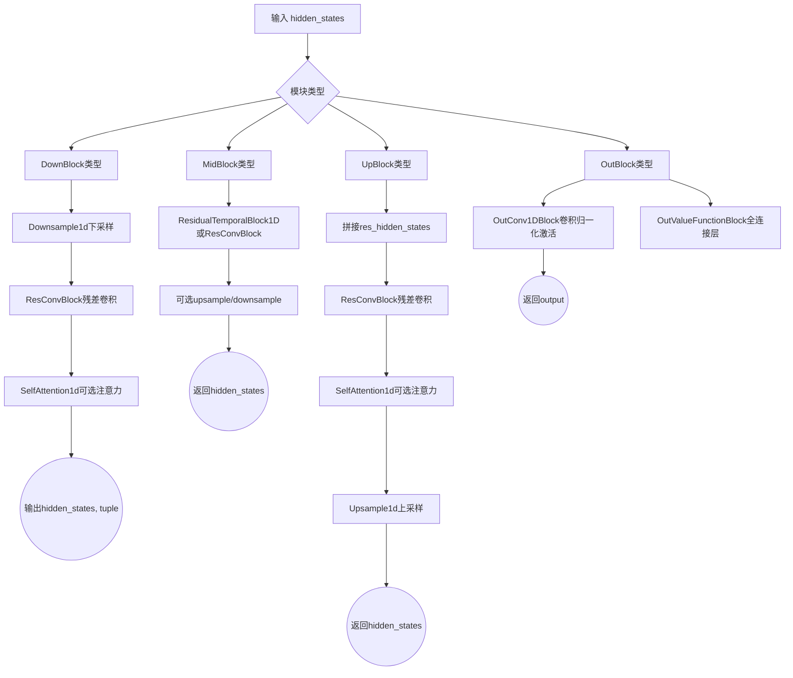

## 类结构

```
nn.Module (PyTorch基类)
├── DownResnetBlock1D (下采样残差块)
├── UpResnetBlock1D (上采样残差块)
├── ValueFunctionMidBlock1D (价值函数中间块)
├── MidResTemporalBlock1D (中间时序残差块)
├── OutConv1DBlock (输出卷积块)
├── OutValueFunctionBlock (输出价值函数块)
├── Downsample1d (下采样模块)
├── Upsample1d (上采样模块)
├── SelfAttention1d (自注意力模块)
├── ResConvBlock (残差卷积块)
├── UNetMidBlock1D (UNet中间块)
├── AttnDownBlock1D (带注意力下采样块)
├── DownBlock1D (标准下采样块)
├── DownBlock1DNoSkip (无跳跃下采样块)
├── AttnUpBlock1D (带注意力上采样块)
├── UpBlock1D (标准上采样块)
└── UpBlock1DNoSkip (无跳跃上采样块)
├── 类型别名 (DownBlockType, MidBlockType, OutBlockType, UpBlockType)
└── 工厂函数 (get_down_block, get_up_block, get_mid_block, get_out_block)
```

## 全局变量及字段


### `_kernels`
    
上采样/下采样卷积核权重字典，包含linear、cubic、lanczos3三种类型

类型：`dict`
    


### `DownResnetBlock1D.in_channels`
    
输入通道数

类型：`int`
    


### `DownResnetBlock1D.out_channels`
    
输出通道数

类型：`int`
    


### `DownResnetBlock1D.use_conv_shortcut`
    
是否使用卷积shortcut

类型：`bool`
    


### `DownResnetBlock1D.time_embedding_norm`
    
时间嵌入归一化方式

类型：`str`
    


### `DownResnetBlock1D.add_downsample`
    
是否添加下采样

类型：`bool`
    


### `DownResnetBlock1D.output_scale_factor`
    
输出缩放因子

类型：`float`
    


### `DownResnetBlock1D.resnets`
    
残差块列表

类型：`nn.ModuleList`
    


### `DownResnetBlock1D.nonlinearity`
    
非线性激活函数

类型：`Activation`
    


### `DownResnetBlock1D.downsample`
    
下采样层

类型：`Downsample1D`
    


### `UpResnetBlock1D.in_channels`
    
输入通道数

类型：`int`
    


### `UpResnetBlock1D.out_channels`
    
输出通道数

类型：`int`
    


### `UpResnetBlock1D.time_embedding_norm`
    
时间嵌入归一化方式

类型：`str`
    


### `UpResnetBlock1D.add_upsample`
    
是否添加上采样

类型：`bool`
    


### `UpResnetBlock1D.output_scale_factor`
    
输出缩放因子

类型：`float`
    


### `UpResnetBlock1D.resnets`
    
残差块列表

类型：`nn.ModuleList`
    


### `UpResnetBlock1D.nonlinearity`
    
非线性激活函数

类型：`Activation`
    


### `UpResnetBlock1D.upsample`
    
上采样层

类型：`Upsample1D`
    


### `ValueFunctionMidBlock1D.in_channels`
    
输入通道数

类型：`int`
    


### `ValueFunctionMidBlock1D.out_channels`
    
输出通道数

类型：`int`
    


### `ValueFunctionMidBlock1D.embed_dim`
    
嵌入维度

类型：`int`
    


### `ValueFunctionMidBlock1D.res1`
    
第一个残差时间块

类型：`ResidualTemporalBlock1D`
    


### `ValueFunctionMidBlock1D.down1`
    
下采样层1

类型：`Downsample1D`
    


### `ValueFunctionMidBlock1D.res2`
    
第二个残差时间块

类型：`ResidualTemporalBlock1D`
    


### `ValueFunctionMidBlock1D.down2`
    
下采样层2

类型：`Downsample1D`
    


### `MidResTemporalBlock1D.in_channels`
    
输入通道数

类型：`int`
    


### `MidResTemporalBlock1D.out_channels`
    
输出通道数

类型：`int`
    


### `MidResTemporalBlock1D.add_downsample`
    
是否添加下采样

类型：`bool`
    


### `MidResTemporalBlock1D.resnets`
    
残差块列表

类型：`nn.ModuleList`
    


### `MidResTemporalBlock1D.nonlinearity`
    
非线性激活函数

类型：`Activation`
    


### `MidResTemporalBlock1D.upsample`
    
上采样层

类型：`Upsample1D`
    


### `MidResTemporalBlock1D.downsample`
    
下采样层

类型：`Downsample1D`
    


### `OutConv1DBlock.final_conv1d_1`
    
第一个卷积层

类型：`nn.Conv1d`
    


### `OutConv1DBlock.final_conv1d_gn`
    
组归一化层

类型：`nn.GroupNorm`
    


### `OutConv1DBlock.final_conv1d_act`
    
激活函数

类型：`Activation`
    


### `OutConv1DBlock.final_conv1d_2`
    
第二个卷积层

类型：`nn.Conv1d`
    


### `OutValueFunctionBlock.final_block`
    
最终全连接块

类型：`nn.ModuleList`
    


### `Downsample1d.pad_mode`
    
填充模式

类型：`str`
    


### `Downsample1d.pad`
    
填充大小

类型：`int`
    


### `Downsample1d.kernel`
    
卷积核权重

类型：`torch.Tensor`
    


### `Upsample1d.pad_mode`
    
填充模式

类型：`str`
    


### `Upsample1d.pad`
    
填充大小

类型：`int`
    


### `Upsample1d.kernel`
    
卷积核权重

类型：`torch.Tensor`
    


### `SelfAttention1d.channels`
    
通道数

类型：`int`
    


### `SelfAttention1d.group_norm`
    
组归一化层

类型：`nn.GroupNorm`
    


### `SelfAttention1d.num_heads`
    
注意力头数

类型：`int`
    


### `SelfAttention1d.query`
    
查询投影层

类型：`nn.Linear`
    


### `SelfAttention1d.key`
    
键投影层

类型：`nn.Linear`
    


### `SelfAttention1d.value`
    
值投影层

类型：`nn.Linear`
    


### `SelfAttention1d.proj_attn`
    
输出投影层

类型：`nn.Linear`
    


### `SelfAttention1d.dropout`
    
Dropout层

类型：`nn.Dropout`
    


### `ResConvBlock.is_last`
    
是否为最后一层

类型：`bool`
    


### `ResConvBlock.has_conv_skip`
    
是否有卷积跳跃连接

类型：`bool`
    


### `ResConvBlock.conv_skip`
    
跳跃连接卷积层

类型：`nn.Conv1d`
    


### `ResConvBlock.conv_1`
    
第一个卷积层

类型：`nn.Conv1d`
    


### `ResConvBlock.group_norm_1`
    
第一个组归一化层

类型：`nn.GroupNorm`
    


### `ResConvBlock.gelu_1`
    
第一个激活函数

类型：`nn.GELU`
    


### `ResConvBlock.conv_2`
    
第二个卷积层

类型：`nn.Conv1d`
    


### `ResConvBlock.group_norm_2`
    
第二个组归一化层

类型：`nn.GroupNorm`
    


### `ResConvBlock.gelu_2`
    
第二个激活函数

类型：`nn.GELU`
    


### `UNetMidBlock1D.down`
    
下采样层

类型：`Downsample1d`
    


### `UNetMidBlock1D.resnets`
    
残差卷积块列表

类型：`nn.ModuleList`
    


### `UNetMidBlock1D.attentions`
    
注意力模块列表

类型：`nn.ModuleList`
    


### `UNetMidBlock1D.up`
    
上采样层

类型：`Upsample1d`
    


### `AttnDownBlock1D.down`
    
下采样层

类型：`Downsample1d`
    


### `AttnDownBlock1D.resnets`
    
残差卷积块列表

类型：`nn.ModuleList`
    


### `AttnDownBlock1D.attentions`
    
注意力模块列表

类型：`nn.ModuleList`
    


### `DownBlock1D.down`
    
下采样层

类型：`Downsample1d`
    


### `DownBlock1D.resnets`
    
残差卷积块列表

类型：`nn.ModuleList`
    


### `DownBlock1DNoSkip.resnets`
    
残差卷积块列表

类型：`nn.ModuleList`
    


### `AttnUpBlock1D.resnets`
    
残差卷积块列表

类型：`nn.ModuleList`
    


### `AttnUpBlock1D.attentions`
    
注意力模块列表

类型：`nn.ModuleList`
    


### `AttnUpBlock1D.up`
    
上采样层

类型：`Upsample1d`
    


### `UpBlock1D.resnets`
    
残差卷积块列表

类型：`nn.ModuleList`
    


### `UpBlock1D.up`
    
上采样层

类型：`Upsample1d`
    


### `UpBlock1DNoSkip.resnets`
    
残差卷积块列表

类型：`nn.ModuleList`
    
    

## 全局函数及方法


### `get_down_block`

该函数是一个工厂函数，用于根据传入的 `down_block_type` 字符串参数动态创建不同的下采样块（DownBlock）实例。它是 1D UNet 架构中构建下采样路径的核心工厂方法，支持多种下采样块类型，包括残差块、标准卷积块、带注意力机制的块以及无跳跃连接的块。

参数：

- `down_block_type`：`str`，指定要创建的下采样块类型，可选值为 "DownResnetBlock1D"、"DownBlock1D"、"AttnDownBlock1D" 或 "DownBlock1DNoSkip"
- `num_layers`：`int`，指定块内部堆叠的残差层或卷积层数量
- `in_channels`：`int`，输入数据的通道数
- `out_channels`：`int`，输出数据的通道数
- `temb_channels`：`int`，时间嵌入（temporal embedding）的通道数，用于残差块中的时间条件注入
- `add_downsample`：`bool`，是否在下采样块末尾添加下采样操作

返回值：`DownBlockType`，返回创建的下采样块实例，具体类型为 `DownResnetBlock1D`、`DownBlock1D`、`AttnDownBlock1D` 或 `DownBlock1DNoSkip` 之一

#### 流程图

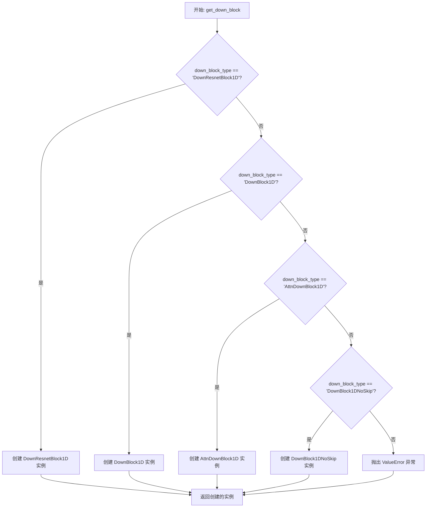

#### 带注释源码

```python
def get_down_block(
    down_block_type: str,      # 字符串类型，指定要实例化的下采样块类别
    num_layers: int,            # 整型，表示块内部堆叠的层数
    in_channels: int,           # 整型，输入特征图的通道维度
    out_channels: int,          # 整型，输出特征图的通道维度
    temb_channels: int,         # 整型，时间嵌入向量的通道数，用于条件注入
    add_downsample: bool,      # 布尔型，控制是否在块末尾添加下采样层
) -> DownBlockType:             # 返回类型为联合类型，表示任意一种下采样块
    """工厂函数：根据 down_block_type 创建对应的下采样块实例"""
    
    # 检查类型是否为 DownResnetBlock1D（带时间嵌入的残差下采样块）
    if down_block_type == "DownResnetBlock1D":
        return DownResnetBlock1D(
            in_channels=in_channels,
            num_layers=num_layers,
            out_channels=out_channels,
            temb_channels=temb_channels,
            add_downsample=add_downsample,
        )
    # 检查类型是否为 DownBlock1D（标准卷积下采样块）
    elif down_block_type == "DownBlock1D":
        return DownBlock1D(out_channels=out_channels, in_channels=in_channels)
    # 检查类型是否为 AttnDownBlock1D（带自注意力机制的下采样块）
    elif down_block_type == "AttnDownBlock1D":
        return AttnDownBlock1D(out_channels=out_channels, in_channels=in_channels)
    # 检查类型是否为 DownBlock1DNoSkip（无跳跃连接的下采样块）
    elif down_block_type == "DownBlock1DNoSkip":
        return DownBlock1DNoSkip(out_channels=out_channels, in_channels=in_channels)
    
    # 如果传入的 down_block_type 不匹配任何已知类型，抛出 ValueError
    raise ValueError(f"{down_block_type} does not exist.")
```


### `get_up_block`

该函数是一个工厂函数（Factory Function），用于根据传入的`up_block_type`字符串参数动态创建不同的1D上采样块（UpBlock）实例。它支持四种上采样块类型：`UpResnetBlock1D`、`UpBlock1D`、`AttnUpBlock1D`和`UpBlock1DNoSkip`，并返回对应的`UpBlockType`类型实例，供UNet架构的上采样路径使用。

参数：

- `up_block_type`：`str`，指定要创建的上采样块类型，可选值为"UpResnetBlock1D"、"UpBlock1D"、"AttnUpBlock1D"或"UpBlock1DNoSkip"
- `num_layers`：`int`，指定残差块的数量（仅用于UpResnetBlock1D类型）
- `in_channels`：`int`，输入特征图的通道数
- `out_channels`：`int`，输出特征图的通道数
- `temb_channels`：`int`，时间嵌入（temporal embedding）的通道数（仅用于UpResnetBlock1D类型）
- `add_upsample`：`bool`，是否添加上采样操作（仅用于UpResnetBlock1D类型）

返回值：`UpBlockType`，返回创建的上采样块实例，类型为`UpResnetBlock1D`、`UpBlock1D`、`AttnUpBlock1D`或`UpBlock1DNoSkip`之一

#### 流程图

```mermaid
flowchart TD
    A[开始: get_up_block] --> B{up_block_type == "UpResnetBlock1D"}
    B -->|是| C[创建并返回UpResnetBlock1D实例]
    B -->|否| D{up_block_type == "UpBlock1D"}
    D -->|是| E[创建并返回UpBlock1D实例]
    D -->|否| F{up_block_type == "AttnUpBlock1D"}
    F -->|是| G[创建并返回AttnUpBlock1D实例]
    F -->|否| H{up_block_type == "UpBlock1DNoSkip"}
    H -->|是| I[创建并返回UpBlock1DNoSkip实例]
    H -->|否| J[抛出ValueError异常]
    C --> K[结束: 返回UpBlockType实例]
    E --> K
    G --> K
    I --> K
```

#### 带注释源码

```python
def get_up_block(
    up_block_type: str,          # 上采样块类型字符串标识
    num_layers: int,              # 残差层数量（UpResnetBlock1D专用）
    in_channels: int,             # 输入通道数
    out_channels: int,            # 输出通道数
    temb_channels: int,           # 时间嵌入通道数（UpResnetBlock1D专用）
    add_upsample: bool            # 是否添加上采样（UpResnetBlock1D专用）
) -> UpBlockType:                 # 返回Union类型: UpResnetBlock1D | UpBlock1D | AttnUpBlock1D | UpBlock1DNoSkip
    """
    工厂函数：根据up_block_type创建相应的上采样块实例
    
    支持的上采样块类型：
    - UpResnetBlock1D: 带残差连接的上采样块，支持时间嵌入
    - UpBlock1D: 标准的UNet上采样块
    - AttnUpBlock1D: 带注意力机制的上采样块
    - UpBlock1DNoSkip: 不带跳跃连接的上采样块
    """
    
    # 判断是否为UpResnetBlock1D类型
    if up_block_type == "UpResnetBlock1D":
        # 创建带残差连接和时间嵌入的上采样块
        return UpResnetBlock1D(
            in_channels=in_channels,      # 设置输入通道数
            num_layers=num_layers,        # 设置残差层数量
            out_channels=out_channels,    # 设置输出通道数
            temb_channels=temb_channels,   # 设置时间嵌入通道数
            add_upsample=add_upsample,     # 设置是否添加上采样
        )
    
    # 判断是否为UpBlock1D类型
    elif up_block_type == "UpBlock1D":
        # 创建标准的UNet上采样块（仅需输入输出通道数）
        return UpBlock1D(in_channels=in_channels, out_channels=out_channels)
    
    # 判断是否为AttnUpBlock1D类型
    elif up_block_type == "AttnUpBlock1D":
        # 创建带注意力机制的上采样块
        return AttnUpBlock1D(in_channels=in_channels, out_channels=out_channels)
    
    # 判断是否为UpBlock1DNoSkip类型
    elif up_block_type == "UpBlock1DNoSkip":
        # 创建不带跳跃连接的上采样块
        return UpBlock1DNoSkip(in_channels=in_channels, out_channels=out_channels)
    
    # 如果传入的up_block_type不支持，抛出ValueError异常
    raise ValueError(f"{up_block_type} does not exist.")
```


### `get_mid_block`

该函数是一个工厂函数（Factory Function），用于根据传入的 `mid_block_type` 参数动态创建并返回不同的中间块（Mid Block）实例。它是 1D UNet 架构中构建模型的关键组件，支持三种不同类型的中段结构：残差时序块、值函数中段块和标准 UNet 中段块。

参数：

-  `mid_block_type`：`str`，指定要创建的中段块的类型（如 "MidResTemporalBlock1D", "ValueFunctionMidBlock1D", "UNetMidBlock1D"）。
-  `num_layers`：`int`，块内部堆叠的残差层数量。
-  `in_channels`：`int`，输入数据的通道数。
-  `mid_channels`：`int`，中间层（Middle Layer）的通道数，通常用于 UNet 中段结构。
-  `out_channels`：`int`，输出数据的通道数。
-  `embed_dim`：`int`，时间嵌入（Time Embedding）的维度。
-  `add_downsample`：`bool`，布尔标志，用于控制在中段块末端是否添加下采样层。

返回值：`MidBlockType`，返回具体的中段块实例（`MidResTemporalBlock1D`, `ValueFunctionMidBlock1D`, 或 `UNetMidBlock1D`）。

#### 流程图

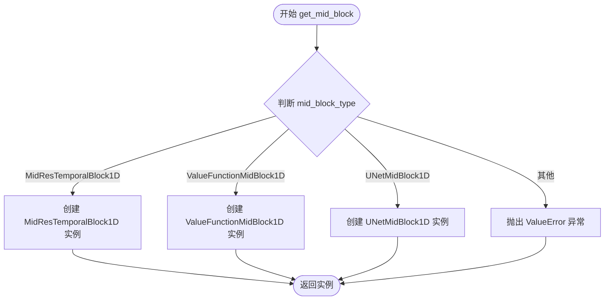

#### 带注释源码

```python
def get_mid_block(
    mid_block_type: str,
    num_layers: int,
    in_channels: int,
    mid_channels: int,
    out_channels: int,
    embed_dim: int,
    add_downsample: bool,
) -> MidBlockType:
    """
    根据 mid_block_type 创建并返回对应的中间块（Mid Block）实例。

    参数:
        mid_block_type (str): 中间块的类型标识符。
        num_layers (int): 块内残差块的数量。
        in_channels (int): 输入通道数。
        mid_channels (int): 中间通道数。
        out_channels (int): 输出通道数。
        embed_dim (int): 时间嵌入维度。
        add_downsample (bool): 是否在块后添加下采样。

    返回:
        MidBlockType: 对应的中间块网络实例。

    异常:
        ValueError: 如果传入的 mid_block_type 不支持。
    """
    # 如果类型为 MidResTemporalBlock1D，则创建残差时序中段块
    if mid_block_type == "MidResTemporalBlock1D":
        return MidResTemporalBlock1D(
            num_layers=num_layers,
            in_channels=in_channels,
            out_channels=out_channels,
            embed_dim=embed_dim,
            add_downsample=add_downsample,
        )
    # 如果类型为 ValueFunctionMidBlock1D，则创建值函数专用中段块
    elif mid_block_type == "ValueFunctionMidBlock1D":
        return ValueFunctionMidBlock1D(in_channels=in_channels, out_channels=out_channels, embed_dim=embed_dim)
    # 如果类型为 UNetMidBlock1D，则创建标准 UNet 中段块
    elif mid_block_type == "UNetMidBlock1D":
        return UNetMidBlock1D(in_channels=in_channels, mid_channels=mid_channels, out_channels=out_channels)
    # 如果类型不匹配，抛出异常
    raise ValueError(f"{mid_block_type} does not exist.")
```


### `get_out_block`

这是一个工厂函数，用于根据 `out_block_type` 参数创建并返回对应的输出块（OutBlock）实例。如果传入的类型不匹配任何已知的输出块类型，则返回 `None`。

参数：

- `out_block_type`：`str`，输出块的类型标识符，用于决定创建哪种类型的输出块（如 "OutConv1DBlock" 或 "ValueFunction"）
- `num_groups_out`：`int`，用于 `OutConv1DBlock` 的 GroupNorm 分组数，控制归一化的分组
- `embed_dim`：`int`，嵌入维度，指定特征图的维度
- `out_channels`：`int`，输出通道数，指定最终输出特征的通道数
- `act_fn`：`str`，激活函数名称，用于指定激活函数的类型（如 "mish"、"relu" 等）
- `fc_dim`：`int`，全连接层维度，仅用于 `OutValueFunctionBlock` 的中间层维度

返回值：`OutBlockType | None`，返回创建的输出块实例或 `None`

#### 流程图

```mermaid
graph TD
    A[开始 get_out_block] --> B{out_block_type == "OutConv1DBlock"}
    B -->|是| C[创建并返回 OutConv1DBlock 实例]
    B -->|否| D{out_block_type == "ValueFunction"}
    D -->|是| E[创建并返回 OutValueFunctionBlock 实例]
    D -->|否| F[返回 None]
    C --> G[结束]
    E --> G
    F --> G
```

#### 带注释源码

```python
def get_out_block(
    *,  # 使用关键字参数强制指定参数名
    out_block_type: str,      # 输出块的类型标识符
    num_groups_out: int,      # GroupNorm 分组数
    embed_dim: int,           # 嵌入维度
    out_channels: int,        # 输出通道数
    act_fn: str,              # 激活函数名称
    fc_dim: int               # 全连接层维度
) -> OutBlockType | None:    # 返回 OutBlockType 或 None
    """工厂函数：根据类型创建输出块"""
    
    # 检查是否为 OutConv1DBlock 类型
    if out_block_type == "OutConv1DBlock":
        # 创建并返回卷积输出块
        return OutConv1DBlock(
            num_groups_out,   # 分组数
            out_channels,     # 输出通道数
            embed_dim,        # 嵌入维度
            act_fn            # 激活函数
        )
    # 检查是否为 ValueFunction 类型
    elif out_block_type == "ValueFunction":
        # 创建并返回价值函数输出块
        return OutValueFunctionBlock(
            fc_dim,           # 全连接层维度
            embed_dim,        # 嵌入维度
            act_fn            # 激活函数
        )
    
    # 如果类型不匹配，返回 None
    return None
```


### `DownResnetBlock1D.forward`

该方法实现了一个用于1D信号降采样的残差网络块，通过多个残差时间块（ResidualTemporalBlock1D）对输入特征进行处理，可选地应用非线性和降采样操作，最终返回降采样后的隐藏状态及中间输出状态元组。

#### 参数

- `hidden_states`：`torch.Tensor`，输入的隐藏状态张量，形状通常为 `(batch, channels, length)`
- `temb`：`torch.Tensor | None`，时间嵌入张量，用于残差块中的时间条件处理，可选

#### 流程图

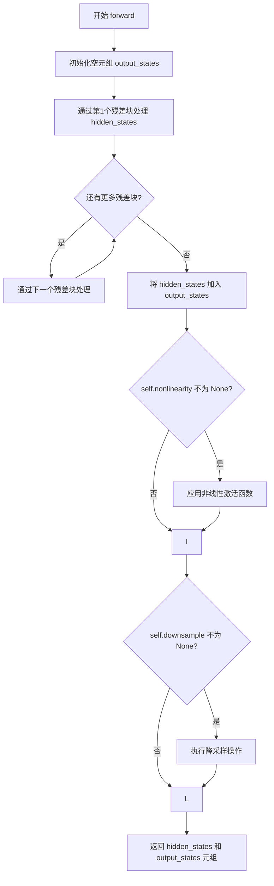

#### 带注释源码

```python
def forward(self, hidden_states: torch.Tensor, temb: torch.Tensor | None = None) -> Tuple[torch.Tensor, Tuple[torch.Tensor, ...]]:
    """
    DownResnetBlock1D 的前向传播方法
    
    参数:
        hidden_states: 输入张量，形状为 (batch, in_channels, time_steps)
        temb: 可选的时间嵌入，用于残差块的时间条件化
    
    返回:
        Tuple[torch.Tensor, Tuple[torch.Tensor, ...]]: 
            - hidden_states: 处理并降采样后的张量
            - output_states: 包含中间隐藏状态的元组，用于跳跃连接
    """
    # 初始化输出状态元组，用于存储中间残差块输出（供跳跃连接使用）
    output_states = ()

    # 第一个残差块处理输入
    # 调用 ResidualTemporalBlock1D 进行残差连接和时间嵌入处理
    hidden_states = self.resnets[0](hidden_states, temb)
    
    # 遍历剩余的残差块（如果有 num_layers > 0）
    # 逐层进一步处理特征
    for resnet in self.resnets[1:]:
        hidden_states = resnet(hidden_states, temb)

    # 将最终的隐藏状态添加到输出元组
    # 保存中间状态以便在上采样路径中用于跳跃连接
    output_states += (hidden_states,)

    # 可选：应用非线性激活函数（如 SiLU/GELU）
    # 这是在残差块堆叠之后、下采样之前进行的
    if self.nonlinearity is not None:
        hidden_states = self.nonlinearity(hidden_states)

    # 可选：执行降采样
    # 使用可学习的卷积下采样（Downsample1D），步长为2
    if self.downsample is not None:
        hidden_states = self.downsample(hidden_states)

    # 返回处理后的隐藏状态和中间状态元组
    return hidden_states, output_states
```


### `UpResnetBlock1D.forward`

该方法实现了一个用于1D UNet上采样阶段的残差网络块（UpResnetBlock），其核心功能是通过残差连接和上采样操作将特征图的空间分辨率扩大2倍，同时融合来自编码器侧的跳跃连接（skip connection）信息，以恢复细节特征。

参数：

- `hidden_states`：`torch.Tensor`，输入的隐藏状态张量，形状为 (batch, in_channels, length)，表示当前上采样层的特征
- `res_hidden_states_tuple`：`tuple[torch.Tensor, ...] | None`，可选的残差隐藏状态元组，通常来自对应下采样层的输出，用于跳跃连接；若为 None 则不使用跳跃连接
- `temb`：`torch.Tensor | None`，可选的时间嵌入向量，用于添加时间条件信息到残差块中

返回值：`torch.Tensor`，经过残差块处理并上采样后的输出张量，形状为 (batch, out_channels, length * 2)（若启用了上采样）

#### 流程图

```mermaid
flowchart TD
    A[forward 开始] --> B{res_hidden_states_tuple 是否为 None?}
    B -->|否| C[获取最后一个残差状态 res_hidden_states_tuple[-1]]
    C --> D[沿通道维度拼接: torch.cat<br/>hidden_states + res_hidden_states]
    B -->|是| E[跳过拼接，直接使用 hidden_states]
    D --> F[通过第一个残差块: resnets[0]]
    E --> F
    F --> G[遍历其余残差块: resnets[1:]]
    G --> H{self.nonlinearity 是否为 None?}
    H -->|否| I[应用非线性激活函数]
    H -->|是| J[跳过激活]
    I --> J
    J --> K{self.upsample 是否为 None?}
    K -->|否| L[应用上采样: Upsample1D]
    K -->|是| M[跳过上采样]
    L --> N[返回最终 hidden_states]
    M --> N
```

#### 带注释源码

```python
def forward(
    self,
    hidden_states: torch.Tensor,
    res_hidden_states_tuple: tuple[torch.Tensor, ...] | None = None,
    temb: torch.Tensor | None = None,
) -> torch.Tensor:
    """
    UpResnetBlock1D 的前向传播方法。

    参数:
        hidden_states: 输入特征张量，形状为 (batch, in_channels, length)
        res_hidden_states_tuple: 来自下采样层的跳跃连接特征元组，可选
        temb: 时间嵌入向量，用于条件注入，可选

    返回:
        上采样后的特征张量，形状为 (batch, out_channels, length * 2)
    """
    # 如果提供了残差隐藏状态（跳跃连接），则将其与当前隐藏状态沿通道维度拼接
    if res_hidden_states_tuple is not None:
        # 取最后一个残差状态（通常对应同一层级的下采样输出）
        res_hidden_states = res_hidden_states_tuple[-1]
        # 沿通道维度(dim=1)拼接两个特征
        hidden_states = torch.cat((hidden_states, res_hidden_states), dim=1)

    # 第一个残差块的输入通道数为 2*in_channels（因为拼接了跳跃连接）
    hidden_states = self.resnets[0](hidden_states, temb)
    
    # 依次通过后续的残差块，每个块的输入输出通道数均为 out_channels
    for resnet in self.resnets[1:]:
        hidden_states = resnet(hidden_states, temb)

    # 如果配置了非线性激活函数，则应用到特征上
    if self.nonlinearity is not None:
        hidden_states = self.nonlinearity(hidden_states)

    # 如果配置了上采样层，则对特征进行上采样（空间维度扩大2倍）
    if self.upsample is not None:
        hidden_states = self.upsample(hidden_states)

    return hidden_states
```


### `ValueFunctionMidBlock1D.forward`

该方法实现了一个用于 Value Function（价值函数）网络的中间块，通过两个残差时间块（ResidualTemporalBlock1D）进行特征提取，并利用两个下采样层（Downsample1D）对特征图进行空间降采样，以逐步提取高级语义特征并降低计算复杂度。

参数：

- `x`：`torch.Tensor`，输入张量，通常是来自编码器或上一层的隐藏状态，形状为 `(batch, channels, length)`。
- `temb`：`torch.Tensor | None`，时间嵌入向量，用于注入时间步信息，可选，默认为 `None`。

返回值：`torch.Tensor`，经过两次残差块处理和两次下采样后的输出张量，形状为 `(batch, out_channels // 4, length // 4)`。

#### 流程图

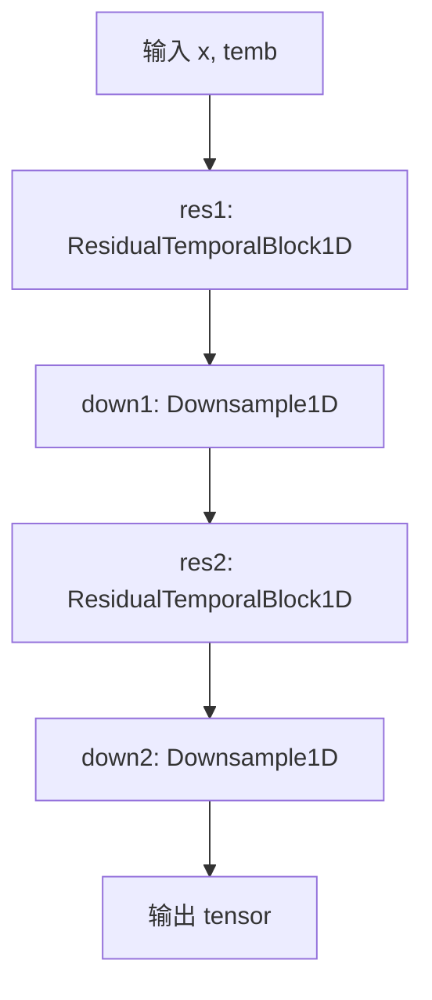

#### 带注释源码

```python
def forward(self, x: torch.Tensor, temb: torch.Tensor | None = None) -> torch.Tensor:
    """
    前向传播函数，对输入特征进行两次残差块处理和下采样。

    参数:
        x: 输入张量，形状为 (batch, in_channels, length)。
        temb: 可选的时间嵌入，用于残差块的时间维度融合。

    返回:
        下采样后的特征张量，形状为 (batch, out_channels // 4, length // 4)。
    """
    # 第一步：通过第一个残差时间块 res1，处理输入特征并融合时间嵌入
    # 该块将通道数从 in_channels 压缩到 in_channels // 2
    x = self.res1(x, temb)

    # 第二步：通过下采样层 down1，将特征图长度减半
    x = self.down1(x)

    # 第三步：通过第二个残差时间块 res2，进一步处理特征
    # 通道数从 in_channels // 2 压缩到 in_channels // 4
    x = self.res2(x, temb)

    # 第四步：通过第二个下采样层 down2，再次将特征图长度减半
    x = self.down2(x)

    # 返回最终处理后的特征表示
    return x
```


### `MidResTemporalBlock1D.forward`

该方法是 `MidResTemporalBlock1D` 类的前向传播函数，负责在 1D 音频/序列任务的 UNet 架构中间层执行特征提取和可选的上/下采样操作。它通过堆叠多个 `ResidualTemporalBlock1D` 残差时间块对输入隐藏状态进行逐层处理，并根据配置条件性地应用上采样或下采样。

参数：

- `hidden_states`：`torch.Tensor`，输入的隐藏状态张量，通常形状为 `(batch, channels, seq_len)`，代表当前层的特征图。
- `temb`：`torch.Tensor`，时间嵌入（temporal embedding）张量，用于注入时间步信息，通常来自时间嵌入层。

返回值：`torch.Tensor`，经过残差块处理并可能经过上/下采样后的输出张量，形状可能因采样操作而变化。

#### 流程图

```mermaid
flowchart TD
    A[输入 hidden_states, temb] --> B[通过第1个 ResidualTemporalBlock1D]
    B --> C{还有更多 resnet 层?}
    C -->|是| D[获取下一个 resnet]
    D --> E[执行 hidden_states = resnet&#40;hidden_states, temb&#41;]
    E --> C
    C -->|否| F{需要上采样?}
    F -->|是| G[hidden_states = self.upsample&#40;hidden_states&#41;]
    F -->|否| H{需要下采样?}
    H -->|是| I[hidden_states = self.downsample&#40;hidden_states&#41;]
    H -->|否| J[直接返回]
    G --> J
    I --> J
    J --> K[返回输出 hidden_states]
```

#### 带注释源码

```python
def forward(self, hidden_states: torch.Tensor, temb: torch.Tensor) -> torch.Tensor:
    """
    MidResTemporalBlock1D 的前向传播方法。

    参数:
        hidden_states (torch.Tensor): 输入特征张量，形状为 (batch, in_channels, time_steps)。
        temb (torch.Tensor): 时间嵌入向量，用于残差块中的时间条件注入。

    返回:
        torch.Tensor: 处理后的输出张量。
    """
    # -------- 阶段1: 通过第一个残差时间块 --------
    # 第一个块负责将输入通道 in_channels 映射到输出通道 out_channels
    hidden_states = self.resnets[0](hidden_states, temb)

    # -------- 阶段2: 依次通过剩余的残差时间块 --------
    # 这些块保持通道数不变 (out_channels -> out_channels)
    # num_layers 参数决定了额外添加多少个这样的块
    for resnet in self.resnets[1:]:
        hidden_states = resnet(hidden_states, temb)

    # -------- 阶段3: 可选的上采样操作 --------
    # 如果配置了 add_upsample=True，则对特征进行时间维度的上采样
    # 使用卷积核为 3x3 的转置卷积实现
    if self.upsample:
        hidden_states = self.upsample(hidden_states)

    # -------- 阶段4: 可选的下采样操作 --------
    # 如果配置了 add_downsample=True，则对特征进行时间维度的下采样
    # 注意: 上采样和下采样不能同时启用 (在 __init__ 中已检查)
    if self.downsample:
        hidden_states = self.downsample(hidden_states)

    # -------- 返回最终结果 --------
    return hidden_states
```


### `OutConv1DBlock.forward`

该函数实现了一个一维卷积输出块，包含两个卷积层、一个分组归一化层和一个激活函数，用于将嵌入维度转换为最终输出通道。

参数：

- `hidden_states`：`torch.Tensor`，输入的隐藏状态张量，形状为 (batch, embed_dim, time_steps)
- `temb`：`torch.Tensor | None`，时间嵌入向量（可选参数，在此实现中未使用，保留用于接口一致性）

返回值：`torch.Tensor`，经过卷积、归一化和激活处理后的输出张量，形状为 (batch, out_channels, time_steps)

#### 流程图

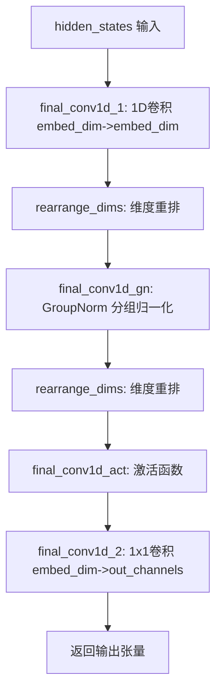

#### 带注释源码

```python
def forward(self, hidden_states: torch.Tensor, temb: torch.Tensor | None = None) -> torch.Tensor:
    """
    OutConv1DBlock 的前向传播方法
    
    参数:
        hidden_states: 输入的隐藏状态张量，形状为 (batch, embed_dim, time_steps)
        temb: 时间嵌入向量，当前版本中未使用，保留用于接口兼容性
    
    返回:
        处理后的输出张量，形状为 (batch, out_channels, time_steps)
    """
    # 第一个卷积层：使用5x1卷积核，保持embed_dim维度
    hidden_states = self.final_conv1d_1(hidden_states)
    
    # 对张量维度进行重排，以适应GroupNorm的输入格式要求
    hidden_states = rearrange_dims(hidden_states)
    
    # 分组归一化：对embed_dim维进行分组归一化处理
    hidden_states = self.final_conv1d_gn(hidden_states)
    
    # 再次重排维度，恢复为卷积层期望的格式
    hidden_states = rearrange_dims(hidden_states)
    
    # 应用激活函数（如silu、gelu等）
    hidden_states = self.final_conv1d_act(hidden_states)
    
    # 第二个卷积层：1x1卷积，将embed_dim映射到最终输出通道数
    hidden_states = self.final_conv1d_2(hidden_states)
    
    return hidden_states
```


### `OutValueFunctionBlock.forward`

该方法是 `OutValueFunctionBlock` 类的核心前向传播方法，负责将隐藏状态与时间嵌入拼接后通过全连接层映射为单一值函数估计。用于价值函数（Value Function）输出，常用于强化学习或扩散模型中的状态价值预测。

参数：

- `hidden_states`：`torch.Tensor`，输入的隐藏状态张量，通常来自UNet或类似模型的特征输出，形状为 (batch, channels, seq) 或 (batch, channels)
- `temb`：`torch.Tensor`，时间嵌入（temporal embedding）张量，由时间编码器生成，用于注入时间步信息，形状为 (batch, embed_dim)

返回值：`torch.Tensor`，返回计算后的价值函数标量预测，形状为 (batch, 1)

#### 流程图

```mermaid
flowchart TD
    A[hidden_states: torch.Tensor] --> B[view - 展平张量]
    B --> C[torch.cat 拼接 hidden_states 与 temb]
    C --> D[遍历 final_block 模块列表]
    D -->|Layer 1| E[nn.Linear: fc_dim+embed_dim -> fc_dim//2]
    E -->|Layer 2| F[激活函数: act_fn]
    F -->|Layer 3| G[nn.Linear: fc_dim//2 -> 1]
    G --> H[return: torch.Tensor (batch, 1)]
    
    I[temb: torch.Tensor] --> C
```

#### 带注释源码

```python
def forward(self, hidden_states: torch.Tensor, temb: torch.Tensor) -> torch.Tensor:
    """
    OutValueFunctionBlock 的前向传播方法
    
    将隐藏状态展平后与时间嵌入拼接，通过全连接层输出价值函数估计
    
    参数:
        hidden_states: 来自UNet的隐藏状态特征，形状为 (batch, channels, seq) 或 (batch, channels)
        temb: 时间嵌入向量，形状为 (batch, embed_dim)
    
    返回:
        torch.Tensor: 价值函数预测值，形状为 (batch, 1)
    """
    # Step 1: 将隐藏状态展平为二维张量 (batch, -1)
    # 例如从 (batch, 512, 10) 展平为 (batch, 5120)
    hidden_states = hidden_states.view(hidden_states.shape[0], -1)
    
    # Step 2: 沿最后一维拼接 hidden_states 和 temb
    # hidden_states: (batch, fc_dim) 与 temb: (batch, embed_dim) 
    # 拼接后: (batch, fc_dim + embed_dim)
    hidden_states = torch.cat((hidden_states, temb), dim=-1)
    
    # Step 3: 依次通过全连接层网络
    # final_block 包含: [Linear(fc_dim+embed_dim, fc_dim//2), Activation, Linear(fc_dim//2, 1)]
    for layer in self.final_block:
        hidden_states = layer(hidden_states)
    
    # 返回最终的价值函数预测 (batch, 1)
    return hidden_states
```


### `Downsample1d.forward`

该方法实现了一维信号的下采样操作，通过应用预定义的内核（线性、立方或 lanczos3）进行卷积运算，实现对时间序列数据的空间降采样。

参数：

- `hidden_states`：`torch.Tensor`，输入的张量，形状为 (batch_size, channels, length)，表示一维特征序列

返回值：`torch.Tensor`，经过下采样后的张量，形状为 (batch_size, channels, length // 2)，长度减半

#### 流程图

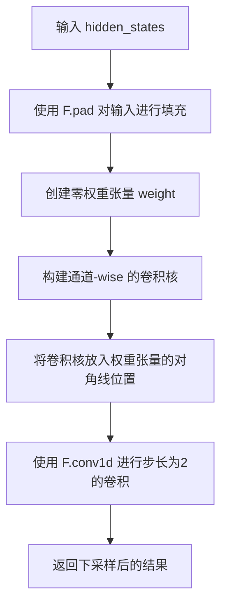

#### 带注释源码

```python
def forward(self, hidden_states: torch.Tensor) -> torch.Tensor:
    # 对输入张量进行边界填充，填充模式为反射填充，填充宽度由卷积核大小决定
    # 填充是为了在卷积后保持或控制输出长度
    hidden_states = F.pad(hidden_states, (self.pad,) * 2, self.pad_mode)
    
    # 创建一个形状为 [channels, channels, kernel_size] 的零张量
    # 用于构建可分离的卷积权重（每个通道独立卷积）
    weight = hidden_states.new_zeros([hidden_states.shape[1], hidden_states.shape[1], self.kernel.shape[0]])
    
    # 获取通道索引，用于构建对角权重矩阵
    indices = torch.arange(hidden_states.shape[1], device=hidden_states.device)
    
    # 将存储的卷积核展开并扩展到每个通道
    # 形状: [channels, kernel_size]
    kernel = self.kernel.to(weight)[None, :].expand(hidden_states.shape[1], -1)
    
    # 将卷积核权重放置到 weight 张量的对角线位置
    # 这样实现分组卷积，每个通道使用相同的卷积核独立卷积
    weight[indices, indices] = kernel
    
    # 执行一维卷积，stride=2 实现下采样（长度减半）
    # 输出长度 ≈ (input_length + 2*pad - kernel_size) / stride + 1
    return F.conv1d(hidden_states, weight, stride=2)
```


### Upsample1d.forward

该方法实现了一维上采样（升采样）操作，通过转置卷积将输入张量的序列维度扩展为原来的2倍，使用可配置的插值核（linear、cubic或lanczos3）进行上采样，并支持时间嵌入（temb）作为可选输入。

参数：

- `hidden_states`：`torch.Tensor`，输入的隐藏状态张量，形状为 (batch_size, channels, length)
- `temb`：`torch.Tensor | None`，可选的时间嵌入张量，当前实现中未被使用，仅保留接口兼容性

返回值：`torch.Tensor`，上采样后的隐藏状态张量，形状为 (batch_size, channels, length * 2)

#### 流程图

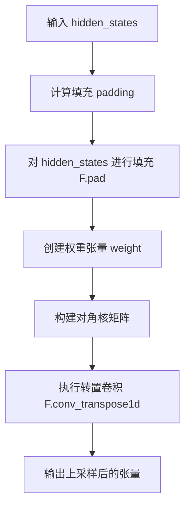

#### 带注释源码

```python
def forward(self, hidden_states: torch.Tensor, temb: torch.Tensor | None = None) -> torch.Tensor:
    """
    一维上采样前向传播
    
    参数:
        hidden_states: 输入张量，形状为 (batch, channels, length)
        temb: 时间嵌入（可选，当前未使用）
    
    返回:
        上采样后的张量，形状为 (batch, channels, length*2)
    """
    # 1. 计算填充大小，使用 (pad+1)//2 确保对称填充
    #    _kernels中linear核长度为4，所以pad = 4//2 - 1 = 1
    #    实际填充为 ((1+1)//2,) * 2 = (1, 1)
    hidden_states = F.pad(hidden_states, ((self.pad + 1) // 2,) * 2, self.pad_mode)
    
    # 2. 创建权重张量，形状为 [out_channels, in_channels, kernel_size]
    #    out_channels = in_channels = hidden_states.shape[1]
    weight = hidden_states.new_zeros([
        hidden_states.shape[1],  # out_channels
        hidden_states.shape[1],  # in_channels  
        self.kernel.shape[0]     # kernel_size
    ])
    
    # 3. 获取通道索引，用于构建对角权重矩阵
    indices = torch.arange(hidden_states.shape[1], device=hidden_states.device)
    
    # 4. 将核参数扩展到与通道数匹配，并填充到对角线位置
    #    这创建了一个可分离的卷积核，每个通道独立进行上采样
    kernel = self.kernel.to(weight)[None, :].expand(hidden_states.shape[1], -1)
    weight[indices, indices] = kernel
    
    # 5. 执行转置卷积（反卷积），stride=2 实现2倍上采样
    #    padding=self.pad * 2 + 1 用于控制输出尺寸
    return F.conv_transpose1d(hidden_states, weight, stride=2, padding=self.pad * 2 + 1)
```


### `SelfAttention1d.transpose_for_scores`

该方法将输入的投影张量重新整形并置换维度，以便进行多头注意力计算。它将原始的 3D 张量 (batch, seq_len, channels) 转换为 4D 张量 (batch, heads, seq_len, head_dim)，使每个注意力头可以独立处理序列的不同部分。

参数：

- `projection`：`torch.Tensor`，输入的投影张量，通常是来自 query、key 或 value 线性层的输出，形状为 (batch, seq_len, channels)

返回值：`torch.Tensor`，变换后的张量，形状为 (batch, num_heads, seq_len, head_dim)，其中 head_dim = channels / num_heads

#### 流程图

```mermaid
flowchart TD
    A[输入 projection 张量<br/>形状: (B, T, C)] --> B[计算新形状<br/>new_shape = (B, T, num_heads, -1)]
    B --> C[使用 view 重新整形<br/>(B, T, C) -> (B, T, H, D)]
    C --> D[使用 permute 置换维度<br/>(B, T, H, D) -> (B, H, T, D)]
    D --> E[返回变换后的张量<br/>形状: (B, H, T, D)]
    
    style A fill:#e1f5fe
    style E fill:#e8f5e8
```

#### 带注释源码

```python
def transpose_for_scores(self, projection: torch.Tensor) -> torch.Tensor:
    """
    将投影张量转换为适合计算注意力分数的形状。
    
    注意力机制需要将通道维度分割成多个头，此方法实现这一转换。
    
    参数:
        projection: 来自 Q/K/V 线性层的输出，形状为 (batch, seq_len, channels)
        
    返回:
        变换后的张量，形状为 (batch, num_heads, seq_len, head_dim)
    """
    # 计算新的投影形状：将最后维度替换为 (num_heads, -1)
    # 其中 -1 自动计算 head_dim = channels / num_heads
    new_projection_shape = projection.size()[:-1] + (self.num_heads, -1)
    
    # move heads to 2nd position (B, T, H * D) -> (B, T, H, D) -> (B, H, T, D)
    # 1. view: 将 (B, T, C) 重塑为 (B, T, H, D)
    # 2. permute: 将维度重新排列为 (B, H, T, D)
    # 这样每个头可以独立计算注意力
    new_projection = projection.view(new_projection_shape).permute(0, 2, 1, 3)
    
    return new_projection
```


### `SelfAttention1d.forward`

该方法实现了一维自注意力机制，通过GroupNorm进行特征归一化，将输入转换为查询、键、值向量，计算多头注意力分数并通过softmax归一化，最后投影回原始维度并通过残差连接输出注意力增强后的特征张量。

参数：

- `hidden_states`：`torch.Tensor`，输入的张量，形状为 (batch, channel_dim, seq)，表示批量大小、通道维度和序列长度

返回值：`torch.Tensor`，返回经过自注意力机制处理后的张量，形状与输入相同 (batch, channel_dim, seq)

#### 流程图

```mermaid
flowchart TD
    A[开始 forward] --> B[保存残差 hidden_states]
    B --> C[获取输入形状 batch, channel_dim, seq]
    C --> D[GroupNorm 归一化]
    D --> E[维度变换: (B, C, S) → (B, S, C)]
    E --> F[线性投影生成 Query, Key, Value]
    F --> G[多头变换 transpose_for_scores]
    G --> H[计算注意力分数 scale]
    H --> I[矩阵乘法 Query × Key^T]
    I --> J[Softmax 归一化 attention_probs]
    J --> K[矩阵乘法 attention_probs × Value]
    K --> L[维度恢复与变换]
    L --> M[投影层 proj_attn]
    M --> N[维度变换回 (B, C, S)]
    N --> O[Dropout 正则化]
    O --> P[残差连接 output + residual]
    P --> Q[返回输出]
```

#### 带注释源码

```python
def forward(self, hidden_states: torch.Tensor) -> torch.Tensor:
    # 保存输入作为残差连接
    residual = hidden_states
    # 获取输入张量的形状: batch=批量大小, channel_dim=通道维度, seq=序列长度
    batch, channel_dim, seq = hidden_states.shape

    # 1. GroupNorm 归一化：对通道维度进行组归一化
    hidden_states = self.group_norm(hidden_states)
    # 2. 维度变换：将 (batch, channel, seq) 转换为 (batch, seq, channel) 以便进行线性投影
    hidden_states = hidden_states.transpose(1, 2)

    # 3. 线性投影：生成查询(Query)、键(Key)、值(Value)向量
    query_proj = self.query(hidden_states)
    key_proj = self.key(hidden_states)
    value_proj = self.value(hidden_states)

    # 4. 多头变换：将投影向量重塑为多头格式 (batch, num_heads, seq, head_dim)
    query_states = self.transpose_for_scores(query_proj)
    key_states = self.transpose_for_scores(key_proj)
    value_states = self.transpose_for_scores(value_proj)

    # 5. 计算缩放因子：使用键向量维度的平方根的平方根进行缩放
    scale = 1 / math.sqrt(math.sqrt(key_states.shape[-1]))

    # 6. 计算注意力分数：Query 与 Key 的转置进行矩阵乘法
    attention_scores = torch.matmul(query_states * scale, key_states.transpose(-1, -2) * scale)
    # 7. 对注意力分数进行 Softmax 归一化得到注意力概率
    attention_probs = torch.softmax(attention_scores, dim=-1)

    # 8. 计算注意力输出：注意力概率与 Value 进行矩阵乘法
    hidden_states = torch.matmul(attention_probs, value_states)

    # 9. 维度恢复：将多头格式转换回原始形状 (batch, seq, channels)
    hidden_states = hidden_states.permute(0, 2, 1, 3).contiguous()
    new_hidden_states_shape = hidden_states.size()[:-2] + (self.channels,)
    hidden_states = hidden_states.view(new_hidden_states_shape)

    # 10. 投影层：将注意力输出投影回原始通道维度
    hidden_states = self.proj_attn(hidden_states)
    # 11. 维度变换：转置回 (batch, channels, seq)
    hidden_states = hidden_states.transpose(1, 2)
    # 12. Dropout 正则化
    hidden_states = self.dropout(hidden_states)

    # 13. 残差连接：将注意力输出与原始输入相加
    output = hidden_states + residual

    return output
```


### `ResConvBlock.forward`

该方法实现了一个带有残差连接的卷积块，用于处理一维隐藏状态。输入首先通过两个卷积层（中间层和输出层）进行变换，然后与原始输入（如果通道数不匹配则通过卷积适配）相加，形成残差连接。如果不是最后一层，还会应用GroupNorm和GELU激活函数。

参数：

- `hidden_states`：`torch.Tensor`，输入的一维隐藏状态张量，形状为 (batch_size, in_channels, seq_len)

返回值：`torch.Tensor`，经过卷积块处理后的输出张量，形状为 (batch_size, out_channels, seq_len)

#### 流程图

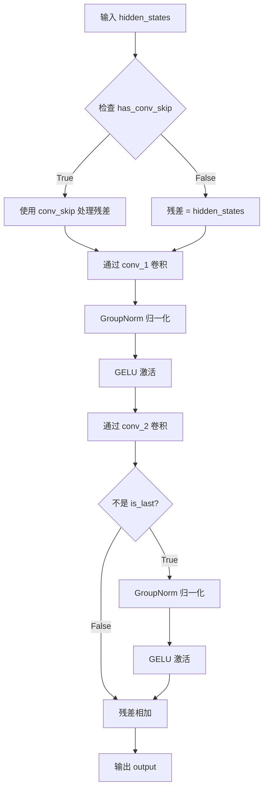

#### 带注释源码

```python
def forward(self, hidden_states: torch.Tensor) -> torch.Tensor:
    """
    ResConvBlock 的前向传播方法
    
    参数:
        hidden_states: 输入的一维隐藏状态张量
        
    返回值:
        经过残差卷积块处理后的张量
    """
    # 处理残差连接：如果输入输出通道数不同，使用卷积层适配；否则直接使用输入
    residual = self.conv_skip(hidden_states) if self.has_conv_skip else hidden_states

    # 第一个卷积块：卷积 -> GroupNorm -> GELU
    hidden_states = self.conv_1(hidden_states)   # 降维或保持维度到中间通道数
    hidden_states = self.group_norm_1(hidden_states)  # GroupNorm 归一化
    hidden_states = self.gelu_1(hidden_states)   # GELU 激活函数
    
    # 第二个卷积块
    hidden_states = self.conv_2(hidden_states)  # 卷积到输出通道数

    # 如果不是最后一层，应用 GroupNorm 和 GELU
    if not self.is_last:
        hidden_states = self.group_norm_2(hidden_states)  # 归一化
        hidden_states = self.gelu_2(hidden_states)       # 激活函数

    # 残差连接：将卷积输出与原始输入相加
    output = hidden_states + residual
    return output
```


### `UNetMidBlock1D.forward`

该方法是 UNetMidBlock1D 类的前向传播函数，负责对输入的隐藏状态进行下采样、通过多个 ResConvBlock 和 SelfAttention1d 模块进行特征处理，最后上采样输出。包含 6 个 ResConvBlock 和 6 个 SelfAttention1d 模块，用于在 UNet 的中间层进行深度特征提取和注意力机制处理。

参数：

- `hidden_states`：`torch.Tensor`，输入的隐藏状态张量，形状为 (batch, channels, length)
- `temb`：`torch.Tensor | None`，时间嵌入张量，在此实现中未使用，保留为接口兼容

返回值：`torch.Tensor`，处理后的隐藏状态张量，形状为 (batch, out_channels, length)

#### 流程图

```mermaid
graph TD
    A[输入 hidden_states] --> B[self.down 下采样]
    B --> C[遍历 attentions 和 resnets]
    C --> D{还有更多模块?}
    D -->|是| E[resnets[i] 处理 hidden_states]
    E --> F[attentions[i] 处理 hidden_states]
    F --> C
    D -->|否| G[self.up 上采样]
    G --> H[输出 hidden_states]
```

#### 带注释源码

```python
def forward(self, hidden_states: torch.Tensor, temb: torch.Tensor | None = None) -> torch.Tensor:
    # Step 1: 对输入 hidden_states 进行下采样
    # 使用 cubic 核的下采样模块，将序列长度减半
    hidden_states = self.down(hidden_states)
    
    # Step 2: 遍历所有的注意力模块和残差卷积块
    # attentions 和 resnets 长度相同（均为6），通过 zip 配对处理
    for attn, resnet in zip(self.attentions, self.resnets):
        # 先通过 ResConvBlock 进行卷积、残差连接和激活
        hidden_states = resnet(hidden_states)
        # 再通过 SelfAttention1d 进行自注意力处理
        hidden_states = attn(hidden_states)
    
    # Step 3: 对处理后的特征进行上采样
    # 使用 cubic 核的上采样模块，将序列长度恢复到原始大小
    hidden_states = self.up(hidden_states)
    
    # Step 4: 返回最终的隐藏状态
    return hidden_states
```


### `AttnDownBlock1D.forward`

该方法是 AttnDownBlock1D 类的前向传播函数，实现了带注意力机制的下采样块。首先对输入 hidden_states 进行下采样，然后依次通过三个 ResConvBlock 和 SelfAttention1d 模块进行处理，最终返回处理后的隐藏状态及其元组形式的残差连接。

参数：

- `hidden_states`：`torch.Tensor`，输入的隐藏状态张量，形状为 (batch, channels, length)
- `temb`：`torch.Tensor | None`，时间嵌入张量，可选参数，当前实现中未使用但保留接口兼容性

返回值：`Tuple[torch.Tensor, Tuple[torch.Tensor, ...]]`，返回处理后的隐藏状态张量和包含隐藏状态的元组

#### 流程图

```mermaid
flowchart TD
    A[输入 hidden_states] --> B[self.down 下采样]
    B --> C[遍历 resnets 和 attentions]
    C --> D[resnet 处理 hidden_states]
    D --> E[attn 自注意力处理]
    E --> F{是否还有残差块?}
    F -->|是| C
    F -->|否| G[返回 hidden_states 和 (hidden_states,)]
```

#### 带注释源码

```python
def forward(self, hidden_states: torch.Tensor, temb: torch.Tensor | None = None) -> torch.Tensor:
    # Step 1: 下采样操作，使用 cubic kernel 进行下采样
    hidden_states = self.down(hidden_states)

    # Step 2: 遍历三个 ResConvBlock 和对应的 SelfAttention1d
    # 依次进行残差卷积和自注意力处理
    for resnet, attn in zip(self.resnets, self.attentions):
        # 残差卷积块：提取局部特征
        hidden_states = resnet(hidden_states)
        # 自注意力块：捕获全局依赖关系
        hidden_states = attn(hidden_states)

    # Step 3: 返回处理后的隐藏状态和元组形式的残差状态
    return hidden_states, (hidden_states,)
```


### DownBlock1D.forward

DownBlock1D类的前向传播方法，实现1D信号的下采样过程，通过下采样操作和三个级联的残差卷积块逐步降低特征维度，同时保留残差连接以促进梯度流动。

参数：

- `hidden_states`：`torch.Tensor`，输入的隐藏状态张量，形状通常为(batch, channels, length)
- `temb`：`torch.Tensor | None`，时间嵌入张量，用于条件注入（可选参数，当前实现中未使用）

返回值：`Tuple[torch.Tensor, Tuple[torch.Tensor, ...]]`，返回处理后的隐藏状态张量以及包含隐藏状态的元组，用于跨级连接

#### 流程图

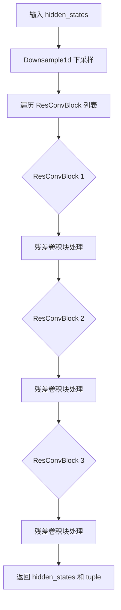

#### 带注释源码

```python
def forward(self, hidden_states: torch.Tensor, temb: torch.Tensor | None = None) -> torch.Tensor:
    # 第一步：下采样操作，使用三次插值核进行1D下采样
    hidden_states = self.down(hidden_states)

    # 第二步：遍历三个级联的残差卷积块(ResConvBlock)
    # - 第一个: in_channels -> mid_channels -> mid_channels
    # - 第二个: mid_channels -> mid_channels -> mid_channels  
    # - 第三个: mid_channels -> mid_channels -> out_channels
    for resnet in self.resnets:
        hidden_states = resnet(hidden_states)

    # 第三步：返回处理后的hidden_states以及包含自身的元组
    # tuple中的hidden_states用于跨级连接(skip connections)
    return hidden_states, (hidden_states,)
```


### `DownBlock1DNoSkip.forward`

该方法实现了一个没有跳跃连接的下采样模块，用于将输入的隐藏状态与时间嵌入（temb）沿通道维度拼接，然后通过三个残差卷积块（ResConvBlock）进行特征提取和处理，最后返回处理后的隐藏状态和隐藏状态元组。

参数：

- `hidden_states`：`torch.Tensor`，输入的隐藏状态张量，形状通常为 (batch, channels, length)
- `temb`：`torch.Tensor | None`，时间嵌入张量，用于提供时间步信息，必须与 hidden_states 在通道维度上兼容

返回值：`Tuple[torch.Tensor, Tuple[torch.Tensor, ...]]`，返回两个元素的元组：第一个是经过处理后的最终隐藏状态，第二个是包含处理过程中隐藏状态的元组（这里只包含最终的隐藏状态）

#### 流程图

```mermaid
flowchart TD
    A[输入 hidden_states] --> B[检查并拼接 temb]
    B --> C{torch.cat([hidden_states, temb], dim=1)}
    C --> D[ResConvBlock 1: in_channels -> mid_channels -> mid_channels]
    D --> E[ResConvBlock 2: mid_channels -> mid_channels -> mid_channels]
    E --> F[ResConvBlock 3: mid_channels -> mid_channels -> out_channels]
    F --> G[返回 Tuple[hidden_states, (hidden_states,)]]
```

#### 带注释源码

```python
def forward(self, hidden_states: torch.Tensor, temb: torch.Tensor | None = None) -> torch.Tensor:
    """
    DownBlock1DNoSkip 的前向传播方法
    
    参数:
        hidden_states: 输入的隐藏状态张量，形状为 (batch, channels, length)
        temb: 可选的时间嵌入张量，用于提供时间步信息
    
    返回:
        Tuple[torch.Tensor, Tuple[torch.Tensor, ...]]: 
            - 处理后的隐藏状态
            - 包含隐藏状态的元组
    """
    # 将 hidden_states 与 temb 在通道维度(dim=1)上进行拼接
    # 注意：如果 temb 为 None，这里会抛出错误
    hidden_states = torch.cat([hidden_states, temb], dim=1)
    
    # 依次通过三个 ResConvBlock 进行特征提取
    for resnet in self.resnets:
        hidden_states = resnet(hidden_states)

    # 返回处理后的隐藏状态和包含隐藏状态的元组
    return hidden_states, (hidden_states,)
```


### `AttnUpBlock1D.forward`

该函数实现了一个带注意力机制的上采样残差块（Up-sampling Residual Block with Attention），用于 UNet 架构的上采样路径。它接收当前的隐藏状态和来自编码器侧的跳跃连接特征，通过残差卷积块和自注意力模块进行特征融合与增强，最后通过上采样操作将特征图尺寸放大至原始大小的两倍。

参数：

- `hidden_states`：`torch.Tensor`，当前层的隐藏状态/特征，通常来自上一层的输出，形状为 `(batch, channels, length)`
- `res_hidden_states_tuple`：`tuple[torch.Tensor, ...]`，来自编码器（下采样路径）的跳跃连接特征元组，通常取最后一个元素 `res_hidden_states_tuple[-1]`
- `temb`：`torch.Tensor | None`，时间嵌入（temporal embedding），用于条件生成任务（如扩散模型），可选参数

返回值：`torch.Tensor`，经过残差块、注意力模块和上采样处理后的输出特征，形状为 `(batch, out_channels, length * 2)`

#### 流程图

```mermaid
flowchart TD
    A[hidden_states 输入] --> B[res_hidden_states_tuple[-1]]
    B --> C[torch.cat 沿通道维度拼接]
    C --> D[遍历 resnets 和 attentions]
    D --> E[resnet 残差卷积块]
    E --> F[SelfAttention1d 自注意力]
    F --> D
    D --> G[Upsample1d 上采样]
    G --> H[返回 hidden_states 输出]
```

#### 带注释源码

```python
def forward(
    self,
    hidden_states: torch.Tensor,
    res_hidden_states_tuple: tuple[torch.Tensor, ...],
    temb: torch.Tensor | None = None,
) -> torch.Tensor:
    """
    AttnUpBlock1D 的前向传播方法

    参数:
        hidden_states: 当前上采样路径的输入特征，形状 (batch, in_channels, length)
        res_hidden_states_tuple: 来自下采样路径的跳跃连接特征元组
        temb: 可选的时间嵌入，用于条件信息

    返回:
        上采样后的特征，形状 (batch, out_channels, length * 2)
    """
    # 从跳跃连接元组中获取最后一个（最新鲜的）特征图
    res_hidden_states = res_hidden_states_tuple[-1]
    
    # 将当前特征与跳跃连接特征沿通道维度（dim=1）拼接
    # 拼接后通道数翻倍：in_channels * 2
    hidden_states = torch.cat([hidden_states, res_hidden_states], dim=1)

    # 依次通过三个残差卷积块和自注意力模块
    # 第一个 ResConvBlock: 2*in_channels -> mid_channels -> mid_channels
    # 第二个 ResConvBlock: mid_channels -> mid_channels -> mid_channels
    # 第三个 ResConvBlock: mid_channels -> mid_channels -> out_channels
    for resnet, attn in zip(self.resnets, self.attentions):
        hidden_states = resnet(hidden_states)
        hidden_states = attn(hidden_states)

    # 使用 cubic 核进行上采样，将序列长度扩展为原来的 2 倍
    hidden_states = self.up(hidden_states)

    return hidden_states
```


### `UpBlock1D.forward`

该方法是 1D 上采样块的前向传播函数，负责将输入特征图上采样至更高分辨率，并通过残差连接融合来自编码器的特征。它首先将当前隐藏状态与来自编码器的残差特征在通道维度拼接，然后依次通过三个残差卷积块（ResConvBlock）进行特征提取和转换，最后通过上采样层（Upsample1d）输出上采样后的特征。

参数：

- `hidden_states`：`torch.Tensor`，当前层的隐藏状态/特征图，通常来自 Decoder 的上一层
- `res_hidden_states_tuple`：`tuple[torch.Tensor, ...]`，来自 Encoder 各层的残差特征元组，通常取最后一个（即最接近当前层的编码器特征）
- `temb`：`torch.Tensor | None = None`，时间嵌入（temporal embedding），用于条件时间信息（在当前实现中未直接使用，但保留接口兼容性）

返回值：`torch.Tensor`，经过上采样和残差融合后的输出特征图

#### 流程图

```mermaid
flowchart TD
    A[hidden_states 输入] --> B[res_hidden_states_tuple]
    B --> C[取最后一个残差特征: res_hidden_states_tuple[-1]]
    C --> D[沿通道维度拼接: torch.cat([hidden_states, res_hidden_states], dim=1)]
    D --> E[ResConvBlock 1: 2*in_channels → mid_channels → mid_channels]
    E --> F[ResConvBlock 2: mid_channels → mid_channels → mid_channels]
    F --> G[ResConvBlock 3: mid_channels → mid_channels → out_channels]
    G --> H[Upsample1d 上采样: kernel='cubic']
    H --> I[返回上采样后的特征图]
```

#### 带注释源码

```python
def forward(
    self,
    hidden_states: torch.Tensor,
    res_hidden_states_tuple: tuple[torch.Tensor, ...],
    temb: torch.Tensor | None = None,
) -> torch.Tensor:
    # 从残差元组中获取最后一个（最接近的编码器特征）
    res_hidden_states = res_hidden_states_tuple[-1]
    
    # 将当前隐藏状态与残差特征在通道维度（dim=1）拼接
    # 拼接后通道数翻倍（2 * in_channels）
    hidden_states = torch.cat([hidden_states, res_hidden_states], dim=1)

    # 依次通过三个残差卷积块进行特征提取和转换
    for resnet in self.resnets:
        hidden_states = resnet(hidden_states)

    # 使用 cubic 核的上采样层进行上采样
    hidden_states = self.up(hidden_states)

    return hidden_states
```


### `UpBlock1DNoSkip.forward`

该方法是 `UpBlock1DNoSkip` 类的前向传播函数，负责在 U-Net 的上采样阶段处理隐藏状态，并将残差连接的特征与当前特征进行融合（通过拼接），然后通过多个卷积块进行特征提取，最终返回上采样后的隐藏状态。注意：此类设计上不包含跳跃连接（NoSkip），因此不会像标准 UpBlock 那样进行特征相加。

参数：

- `hidden_states`：`torch.Tensor`，当前层的主输入特征，通常来自上层的上采样结果
- `res_hidden_states_tuple`：`tuple[torch.Tensor, ...]`，来自编码器/下采样层的残差特征元组，通常取最后一个元素（`res_hidden_states_tuple[-1]`）作为拼接对象
- `temb`：`torch.Tensor | None`，时间嵌入（temporal embedding）向量，用于条件增强，在该类中未被直接使用（仅作为接口兼容）

返回值：`torch.Tensor`，经过残差特征融合和多个卷积块处理后的输出特征

#### 流程图

```mermaid
graph TD
    A[输入 hidden_states] --> B[获取残差特征]
    B --> C[取 res_hidden_states_tuple[-1]]
    C --> D[在通道维度 dim=1 拼接 hidden_states 和 res_hidden_states]
    D --> E[遍历 self.resnets]
    E --> F{ResConvBlock 1: 2*in_channels → mid_channels → mid_channels}
    F --> G{ResConvBlock 2: mid_channels → mid_channels → mid_channels}
    G --> H{ResConvBlock 3: mid_channels → mid_channels → out_channels, is_last=True}
    H --> I[返回最终 hidden_states]
```

#### 带注释源码

```python
def forward(
    self,
    hidden_states: torch.Tensor,
    res_hidden_states_tuple: tuple[torch.Tensor, ...],
    temb: torch.Tensor | None = None,
) -> torch.Tensor:
    """
    上采样块的前向传播（无跳跃连接版本）。
    
    Args:
        hidden_states: 当前层的输入特征张量，形状为 (B, C, T)
        res_hidden_states_tuple: 来自编码器侧的残差特征元组
        temb: 时间嵌入向量（当前未使用，仅作接口兼容）
    
    Returns:
        处理后的特征张量，形状为 (B, out_channels, T')
    """
    # 从残差元组中提取最后一个（最深层）的残差特征
    res_hidden_states = res_hidden_states_tuple[-1]
    
    # 在通道维度（dim=1）拼接主输入和残差特征
    # 2 * in_channels -> mid_channels（通过 ResConvBlock 压缩通道数）
    hidden_states = torch.cat([hidden_states, res_hidden_states], dim=1)
    
    # 依次通过三个残差卷积块进行特征提取
    for resnet in self.resnets:
        hidden_states = resnet(hidden_states)
    
    # 返回最终的特征张量
    return hidden_states
```

## 关键组件


### DownResnetBlock1D

带时间嵌入的下采样残差块，用于编码器路径的特征提取和空间降采样，支持可选的跳跃连接输出。

### UpResnetBlock1D

带时间嵌入的上采样残差块，用于解码器路径的特征重建，支持与编码器特征的跳跃连接融合。

### ValueFunctionMidBlock1D

专门用于值函数估计的中间块，包含两次残差块和下采样操作，将特征压缩到低维度用于价值回归。

### MidResTemporalBlock1D

通用中间残差块，支持可选的上下采样操作，可作为UNet的瓶颈层，包含多个时间残差块堆叠。

### OutConv1DBlock

卷积输出块，包含GroupNorm和激活函数，用于将隐藏维度映射到输出通道，是常见的UNet解码器输出头。

### OutValueFunctionBlock

值函数输出块，将特征与时间嵌入拼接后通过全连接层输出标量价值估计。

### Downsample1d

基于可学习卷积核的下采样模块，支持线性、立方和Lanczos3核，采用反射填充模式。

### Upsample1d

基于转置卷积的上采样模块，使用与下采样对应的卷积核，支持可配置的内核和填充模式。

### SelfAttention1d

一维自注意力模块，对序列维度应用多头注意力机制，包含GroupNorm预处理，支持残差连接。

### ResConvBlock

残差卷积块，包含两个卷积层和残差跳跃连接，支持通道维度变换，是构建UNet的基本单元。

### UNetMidBlock1D

UNet标准中间块，包含一个下采样、6个ResConvBlock、6个SelfAttention1d和一个上采样，构成强特征提取瓶颈。

### AttnDownBlock1D

带注意力机制的下采样块，输出降采样特征和跳跃连接特征，用于标准UNet编码器。

### DownBlock1D

不带注意力机制的下采样块，比AttnDownBlock更轻量，适合对计算资源敏感的场景。

### DownBlock1DNoSkip

无跳跃连接的下采样块，将时间嵌入与特征拼接后处理，用于特定的UNet变体或无skip架构。

### AttnUpBlock1D

带注意力机制的上采样块，融合跳跃连接特征后应用残差块和注意力，支持特征重建。

### UpBlock1D

不带注意力机制的上采样块，比AttnUpBlock更轻量，用于标准UNet解码器。

### UpBlock1DNoSkip

无跳跃连接的上采样块，直接处理上采样特征，用于特殊架构需求。

### get_down_block

工厂函数，根据down_block_type字符串动态创建对应的下采样块实例。

### get_up_block

工厂函数，根据up_block_type字符串动态创建对应的上采样块实例。

### get_mid_block

工厂函数，根据mid_block_type字符串动态创建对应的中间块实例。

### get_out_block

工厂函数，根据out_block_type字符串动态创建对应的输出块实例，支持卷积和值函数两种输出类型。

## 问题及建议


### 已知问题

- **命名不一致**：存在类名大小写不统一问题，如 `Downsample1d` vs `Downsample1D`、`Upsample1d` vs `Upsample1D`，以及函数名 `get_down_block` vs `get_up_block` 等，违反项目命名规范
- **重复代码过多**：`DownBlock1D`、`AttnDownBlock1D`、`DownBlock1DNoSkip` 三个类的结构和 `forward` 方法高度相似，仅在细节上有差异；`UpBlock1D` 和 `AttnUpBlock1D` 同样存在此类问题
- **手动实现注意力机制效率低**：`SelfAttention1d` 使用手动矩阵乘法实现注意力，未使用 PyTorch 的 scaled_dot_product_attention 或 Flash Attention，在长序列上性能较差
- **Downsample1d/Upsample1d 存在效率问题**：每次 forward 调用都创建新的 weight 零张量并逐通道展开核权重，未复用计算图；kernel 转换为设备张量的操作可优化
- **硬编码值**：注意力头数计算使用 `mid_channels // 32` 硬编码，应作为参数传入；ResNet 块中卷积核大小 5 和填充 2 也是硬编码
- **API 不一致**：部分模块（如 `DownBlock1D`、`AttnDownBlock1D`）的 `forward` 方法接收 `temb` 参数但实际未使用；不同模块返回格式不统一（部分返回元组，部分返回单tensor）
- **潜在 bug**：在 `Downsample1d.forward` 中，pad 计算为 `kernel_1d.shape[0] // 2 - 1`，对于不同 kernel 可能产生不正确的填充；`Upsample1d` 的 padding 计算同样复杂且易错
- **缺失输入验证**：工厂函数 `get_down_block`、`get_up_block` 等未对 `down_block_type`、`up_block_type` 等参数做边界和合法性校验，传入非法值时直接 raise 错误但缺乏具体错误信息
- **类型注解不完整**：部分变量如 `resnets`、`attentions` 列表的元素类型未在构造函数中明确标注；函数返回值类型注解可更精确
- **OutValueFunctionBlock 设计差异**：该类采用全连接层架构而其他输出块使用卷积块，导致整体输出模块架构不统一，可能增加上层集成复杂度

### 优化建议

- 统一类名和函数命名规范，使用一致的驼峰或下划线风格（如统一为 `Downsample1D`）
- 提取公共基类或使用组合模式重构相似块，将 downsample/upsample 逻辑、resnet 堆叠抽象为可配置组件，减少代码重复
- 替换手动注意力实现为 `F.scaled_dot_product_attention`，或提供回退机制以支持 Flash Attention
- 预计算并缓存 weight 张量到 buffer，避免每次 forward 重新分配；考虑使用 `nn.Conv1d` 替代手动卷积实现
- 将硬编码值（如注意力头数除数、卷积核大小）提取为构造函数参数，提供合理的默认值
- 统一 `forward` 方法签名，对于不需要 temb 的模块可显式忽略该参数或提供默认值；统一返回格式（建议统一返回 tuple 或单 tensor）
- 增加参数校验和更友好的错误提示，添加断言或验证逻辑确保通道数、层数等参数合法
- 完善类型注解，使用 `list[]` 而非裸 `list`；为复杂函数添加详细的 docstring 说明参数约束
- 考虑将 `OutValueFunctionBlock` 重构为与其他输出块一致的接口风格，或在文档中明确说明其特殊用途

## 其它


### 设计目标与约束

本模块旨在为1D时间序列数据（如音频信号）提供U-Net结构的神经网络组件，主要用于扩散模型（Diffusion Model）的编解码器部分。设计目标包括：(1) 支持多种下采样/上采样策略，包括基于残差块和卷积块的实现；(2) 提供灵活的时间嵌入（temporal embedding）集成机制，支持条件生成；(3) 实现跳跃连接（skip connections）以保留多尺度特征；(4) 支持注意力机制以增强模型对局部特征的捕获能力。约束条件包括：输入必须是三维张量（batch, channel, sequence）；通道数需为正整数；内核类型仅支持"linear"、"cubic"和"lanczos3"三种。

### 错误处理与异常设计

代码中的错误处理主要体现在以下几个方面：参数验证方面，`MidResTemporalBlock1D`类在`__init__`方法中检查不能同时启用上采样和下采样（`if self.upsample and self.downsample: raise ValueError("Block cannot downsample and upsample")`）；工厂函数（`get_down_block`、`get_up_block`、`get_mid_block`、`get_out_block`）在收到未知块类型时会抛出`ValueError`并提示可用的块类型。潜在改进空间：可增加通道数不匹配的验证、输入维度兼容性检查、以及数值稳定性验证（如NaN/Inf检测）。

### 数据流与状态机

整体数据流遵循标准的U-Net架构：输入信号首先经过下采样路径（DownBlock），在每一层捕获不同尺度的特征并保存用于跳跃连接；随后进入中间层（MidBlock）进行最抽象的特征处理；最后经过上采样路径（UpBlock），同时接收对应下采样层的跳跃连接特征。关键状态转换包括：`DownResnetBlock1D`返回元组`(hidden_states, output_states)`，其中`output_states`用于跳跃连接；`UpResnetBlock1D`接收`res_hidden_states_tuple`参数并取最后一个元素进行特征融合；`DownBlock1DNoSkip`将temb与hidden_states沿通道维度拼接后处理，展示了无跳跃连接的变体。

### 外部依赖与接口契约

本模块依赖以下外部组件：`torch`（基础张量运算）、`torch.nn`（神经网络层）、`torch.nn.functional`（功能性操作如F.pad、F.conv1d）、`math`（数学函数）；内部依赖包括：`..activations.get_activation`（激活函数获取）、`..resnet.Downsample1D`、`..resnet.ResidualTemporalBlock1D`、`..resnet.Upsample1D`、`..resnet.rearrange_dims`。接口契约要求：所有Block类的forward方法接受`hidden_states: torch.Tensor`和可选的`temb: torch.Tensor | None`参数；返回类型为`torch.Tensor`或`tuple[torch.Tensor, ...]`；工厂函数返回具体Block实例或None。

### 性能考虑与优化建议

当前实现中存在若干可优化点：(1) `Downsample1d`和`Upsample1d`中每次前向传播都重新创建权重张量（`weight = hidden_states.new_zeros(...)`），建议将权重缓存为类属性以减少内存分配开销；(2) 注意力机制中的`transpose_for_scores`方法涉及多次tensor视图操作，可考虑融合以减少中间变量；(3) `SelfAttention1d`中使用固定的head数除法（`mid_channels // 32`），当通道数较小时可能导致head数为0，建议增加最小值保护；(4) 工厂函数中使用字符串比较进行类型分发，在高频调用场景下可考虑使用字典映射或注册机制提升查找效率。

### 版本兼容性说明

代码使用Python 3.10+的类型注解语法（如`int | None`、`tuple[torch.Tensor, ...]`），要求Python 3.10及以上版本；依赖PyTorch的最新特性如`torch.Tensor | None`联合类型注解；`nn.ModuleList`和`nn.ModuleList`的模块化设计确保了与PyTorch 2.0+的兼容性。注意事项：旧版PyTorch可能不支持某些类型注解的运行时解析，建议在requirements.txt中明确PyTorch版本要求（建议≥2.0.0）。

### 测试策略建议

建议针对以下场景设计单元测试：(1) 各类Block的前向传播输出维度正确性验证；(2) 上采样/下采样块的多核测试（linear、cubic、lanczos3）；(3) 注意力机制的数值稳定性测试（输入含NaN/Inf时的处理）；(4) 工厂函数对非法输入参数的异常抛出验证；(5) MidResTemporalBlock1D同时启用上下采样的异常检测；(6) 模块整体集成测试：构建完整U-Net并验证编码器-解码器维度一致性；(7) 梯度流测试：验证反向传播能够正常进行且参数更新合理。

### 部署注意事项

部署时需注意以下事项：(1) 模型导出为ONNX格式时，需确保所有自定义操作（如F.conv_transpose1d的自定义kernel）有对应实现；(2) 生产环境中建议将预定义的kernel字典（_kernels）以常量形式缓存，避免每次实例化时重新创建；(3) 对于音频生成等实时应用场景，需关注Downsample1d和Upsample1d的padding模式选择对输出序列长度的影响；(4) 多GPU部署时需注意nn.ModuleList的默认参数共享行为；(5) 建议使用torch.jit.script对关键路径进行编译优化以提升推理速度。

### 配置与扩展性设计

本模块采用了工厂函数模式（get_down_block、get_up_block等）实现Block类型的可插拔设计，支持通过字符串配置灵活选择Block类型。扩展建议：(1) 可通过继承BaseBlock类并实现标准接口来添加新的Block类型；(2) 激活函数通过get_activation动态获取，支持零侵入式添加新激活函数；(3) _kernels字典可扩展支持更多采样核函数；(4) 类型别名（DownBlockType、MidBlockType等）的使用便于类型检查和IDE自动补全，同时为未来添加新Block类型提供了清晰的扩展点。


    