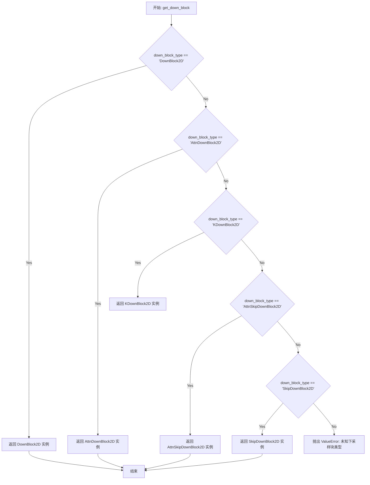
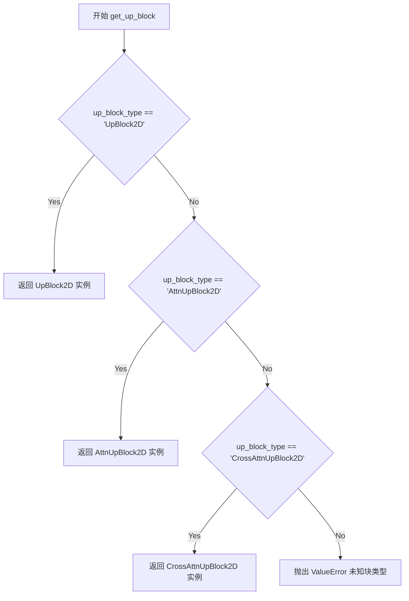

# `diffusers\src\diffusers\models\unets\unet_2d.py` 详细设计文档

UNet2DModel是一个2D UNet架构的扩散模型，用于在给定噪声样本和时间步长的条件下预测去噪后的样本。该模型采用编码器-解码器结构，包含时间嵌入、类别条件嵌入、下采样块、中间块和上采样块，适用于图像生成和修复任务。

## 整体流程

```mermaid
graph TD
A[开始 forward] --> B{center_input_sample?}
B -- 是 --> C[样本中心化: sample = 2 * sample - 1.0]
B -- 否 --> D[跳过中心化]
C --> E[时间步处理]
D --> E
E --> F[时间嵌入: t_emb = time_proj(timesteps)]
F --> G[嵌入投射: emb = time_embedding(t_emb)]
G --> H{有class_embedding?}
H -- 是 --> I[类别条件处理: emb = emb + class_emb]
H -- 否 --> J[跳过类别嵌入]
I --> K[输入卷积: sample = conv_in(sample)]
J --> K
K --> L[下采样阶段]
L --> M[中间块处理: sample = mid_block(sample, emb)]
M --> N[上采样阶段]
N --> O[后处理: norm -> act -> conv]
O --> P{有skip_sample?}
P -- 是 --> Q[残差连接: sample += skip_sample]
P -- 否 --> R{使用Fourier时间嵌入?}
Q --> R
R -- 是 --> S[除以timesteps归一化]
R -- 否 --> T[返回UNet2DOutput]
S --> T
```

## 类结构

```
BaseOutput (数据基类)
├── UNet2DOutput (输出数据类)
ModelMixin (模型混合基类)
├── UNet2DModel (2D UNet主模型)
    ├── 时间嵌入组件
    │   ├── Timesteps / GaussianFourierProjection (时间投影)
    │   └── TimestepEmbedding (时间嵌入层)
    ├── 类别嵌入组件
    │   └── nn.Embedding / TimestepEmbedding / nn.Identity
    ├── 编码器 (down_blocks)
    │   └── DownBlock2D / AttnDownBlock2D
    ├── 中间块
    │   └── UNetMidBlock2D
    ├── 解码器 (up_blocks)
    │   └── UpBlock2D / AttnUpBlock2D
    └── 输出层 (conv_in, conv_out, norm, act)
```

## 全局变量及字段


### `_supports_gradient_checkpointing`
    
类属性，指示模型支持梯度检查点以节省显存

类型：`bool`
    


### `_skip_layerwise_casting_patterns`
    
类属性，指定跳过头部模式以避免类型转换

类型：`list`
    


### `UNet2DOutput.sample`
    
模型输出的去噪样本张量，形状为(batch_size, num_channels, height, width)

类型：`torch.Tensor`
    


### `UNet2DModel.sample_size`
    
输入输出样本的尺寸

类型：`int | tuple[int, int] | None`
    


### `UNet2DModel.conv_in`
    
输入卷积层，将输入通道映射到初始通道数

类型：`nn.Conv2d`
    


### `UNet2DModel.time_proj`
    
时间步投影层，将时间步转换为嵌入向量

类型：`Timesteps | GaussianFourierProjection | nn.Embedding`
    


### `UNet2DModel.time_embedding`
    
时间嵌入层，将投影后的时间步映射到嵌入空间

类型：`TimestepEmbedding`
    


### `UNet2DModel.class_embedding`
    
类别嵌入层，用于类别条件生成

类型：`nn.Embedding | TimestepEmbedding | nn.Identity | None`
    


### `UNet2DModel.down_blocks`
    
下采样块列表，包含编码器各层

类型：`nn.ModuleList`
    


### `UNet2DModel.mid_block`
    
UNet中间块，处理最深层特征

类型：`UNetMidBlock2D | None`
    


### `UNet2DModel.up_blocks`
    
上采样块列表，包含解码器各层

类型：`nn.ModuleList`
    


### `UNet2DModel.conv_norm_out`
    
输出归一化层

类型：`nn.GroupNorm`
    


### `UNet2DModel.conv_act`
    
输出激活函数

类型：`nn.SiLU`
    


### `UNet2DModel.conv_out`
    
输出卷积层，将通道映射到输出通道数

类型：`nn.Conv2d`
    
    

## 全局函数及方法


### `get_down_block`

这是一个工厂函数，根据传入的 `down_block_type` 参数返回对应的下采样块（Down Block）实例。该函数是 UNet2DModel 构建过程中的关键组件，负责创建不同类型的下采样模块，如标准下采样块、带有注意力机制的下采样块等。

参数：

- `down_block_type`：`str`，下采样块的类型标识符，如 "DownBlock2D"、"AttnDownBlock2D" 等
- `num_layers`：`int`，下采样块中包含的 ResNet 层数量
- `in_channels`：`int`，输入特征图的通道数
- `out_channels`：`int`，输出特征图的通道数
- `temb_channels`：`int`，时间嵌入（temporal embedding）的通道数
- `add_downsample`：`bool`，是否在块中添加下采样操作
- `resnet_eps`：`float`，ResNet 块中 GroupNorm 的 epsilon 值
- `resnet_act_fn`：`str`，ResNet 块使用的激活函数名称（如 "silu"、"relu" 等）
- `resnet_groups`：`int`，GroupNorm 的分组数量
- `attention_head_dim`：`int`，注意力机制的头维度
- `downsample_padding`：`int`，下采样卷积的填充大小
- `resnet_time_scale_shift`：`str`，ResNet 时间尺度移位配置（"default" 或 "scale_shift"）
- `downsample_type`：`str`，下采样类型（"conv" 或 "resnet"）
- `dropout`：`float`，Dropout 概率

返回值：`nn.Module`，返回具体类型的下采样块实例（如 DownBlock2D、AttnDownBlock2D 等）

#### 流程图



#### 带注释源码

```
# 注意: 此源码位于 unet_2d_blocks 模块中，此处为基于调用的推断实现

def get_down_block(
    down_block_type: str,              # 下采样块类型标识
    num_layers: int,                    # ResNet 层数
    in_channels: int,                  # 输入通道数
    out_channels: int,                 # 输出通道数
    temb_channels: int,                # 时间嵌入通道数
    add_downsample: bool = True,       # 是否添加下采样
    resnet_eps: float = 1e-6,          # GroupNorm epsilon
    resnet_act_fn: str = "silu",       # 激活函数
    resnet_groups: int = 32,           # GroupNorm 分组数
    attention_head_dim: int = 1,       # 注意力头维度
    downsample_padding: int = 1,       # 下采样填充
    resnet_time_scale_shift: str = "default",  # 时间尺度移位
    downsample_type: str = "conv",     # 下采样类型
    dropout: float = 0.0,              # Dropout 概率
):
    """
    工厂函数: 根据 down_block_type 返回对应的下采样块实例
    
    支持的块类型:
    - "DownBlock2D": 标准下采样块
    - "AttnDownBlock2D": 带注意力机制的下采样块
    - "KDownBlock2D": K类型下采样块
    - "AttnSkipDownBlock2D": 带跳跃连接和注意力的下采样块
    - "SkipDownBlock2D": 带跳跃连接的下采样块
    """
    
    # 根据块类型选择对应的类
    if down_block_type == "DownBlock2D":
        # 标准2D下采样块：无注意力机制
        return DownBlock2D(
            num_layers=num_layers,
            in_channels=in_channels,
            out_channels=out_channels,
            temb_channels=temb_channels,
            add_downsample=add_downsample,
            resnet_eps=resnet_eps,
            resnet_act_fn=resnet_act_fn,
            resnet_groups=resnet_groups,
            downsample_padding=downsample_padding,
            resnet_time_scale_shift=resnet_time_scale_shift,
            downsample_type=downsample_type,
            dropout=dropout,
        )
    elif down_block_type == "AttnDownBlock2D":
        # 带注意力机制的2D下采样块
        return AttnDownBlock2D(
            num_layers=num_layers,
            in_channels=in_channels,
            out_channels=out_channels,
            temb_channels=temb_channels,
            add_downsample=add_downsample,
            resnet_eps=resnet_eps,
            resnet_act_fn=resnet_act_fn,
            resnet_groups=resnet_groups,
            attention_head_dim=attention_head_dim,
            downsample_padding=downsample_padding,
            resnet_time_scale_shift=resnet_time_scale_shift,
            downsample_type=downsample_type,
            dropout=dropout,
        )
    elif down_block_type == "KDownBlock2D":
        # K类型下采样块
        return KDownBlock2D(...)
    elif down_block_type == "AttnSkipDownBlock2D":
        # 带跳跃连接和注意力的下采样块
        return AttnSkipDownBlock2D(...)
    elif down_block_type == "SkipDownBlock2D":
        # 带跳跃连接的下采样块
        return SkipDownBlock2D(...)
    else:
        # 未知块类型，抛出异常
        raise ValueError(
            f"Unsupported down_block_type: {down_block_type}. "
            f"Supported types: DownBlock2D, AttnDownBlock2D, KDownBlock2D, "
            f"AttnSkipDownBlock2D, SkipDownBlock2D"
        )
```


### `get_up_block`

工厂函数，根据 `up_block_type` 参数返回对应的上采样块实例（UpBlock2D 或 AttnUpBlock2D 等），用于 UNet 2D 模型的上采样路径。

参数：

- `up_block_type`：`str`，上采样块的类型标识符（如 "UpBlock2D", "AttnUpBlock2D"）
- `num_layers`：`int`，该块中 ResNet 层的数量
- `in_channels`：`int`，输入特征图的通道数
- `out_channels`：`int`，输出特征图的通道数
- `prev_output_channel`：`int`，来自解码器上一层的输出通道数（用于跳跃连接）
- `temb_channels`：`int`，时间嵌入（timestep embedding）的通道数
- `add_upsample`：`bool`，是否在块末尾添加上采样操作
- `resnet_eps`：`float`，ResNet 块中 GroupNorm 的 epsilon 值
- `resnet_act_fn`：`str`，ResNet 块使用的激活函数名称（如 "silu"）
- `resnet_groups`：`int`，GroupNorm 的组数
- `attention_head_dim`：`int`，多头注意力机制中每个头的维度
- `resnet_time_scale_shift`：`str`，ResNet 时间尺度移位配置（"default" 或 "scale_shift"）
- `upsample_type`：`str`，上采样类型（"conv" 或 "resnet"）
- `dropout`：`float`，Dropout 概率

返回值：`nn.Module`，返回对应的上采样块实例（具体类型取决于 `up_block_type`）

#### 流程图



#### 带注释源码

```python
# 该函数为工厂函数，根据 up_block_type 返回对应的上采样块实例
# 定义位置：from .unet_2d_blocks import get_up_block
# （具体实现不在当前文件中）

up_block = get_up_block(
    up_block_type,                      # 块类型：'UpBlock2D' 或 'AttnUpBlock2D' 等
    num_layers=layers_per_block + 1,    # 层数：下采样层数+1
    in_channels=input_channel,          # 当前块的输入通道数
    out_channels=output_channel,        # 当前块的输出通道数
    prev_output_channel=prev_output_channel,  # 跳跃连接来的通道数
    temb_channels=time_embed_dim,       # 时间嵌入通道数
    add_upsample=not is_final_block,    # 是否添加上采样（最后一层不加）
    resnet_eps=norm_eps,                # GroupNorm epsilon
    resnet_act_fn=act_fn,               # 激活函数
    resnet_groups=norm_num_groups,      # GroupNorm 组数
    attention_head_dim=attention_head_dim if attention_head_dim is not None else output_channel,
    resnet_time_scale_shift=resnet_time_scale_shift,  # 时间尺度移位方式
    upsample_type=upsample_type,        # 上采样方式：conv 或 resnet
    dropout=dropout,                    # Dropout 概率
)
```


### UNet2DModel.__init__

初始化UNet2DModel结构，创建所有必要的层和块，包括时间嵌入、类别嵌入、下采样块、中间块、上采样块和输出卷积层，构建完整的2D UNet神经网络架构。

参数：

- `sample_size`：`int | tuple[int, int] | None`，输入/输出样本的高度和宽度，必须为 `2 ** (len(block_out_channels) - 1)` 的倍数，默认为 None
- `in_channels`：`int`，输入样本的通道数，默认为 3
- `out_channels`：`int`，输出样本的通道数，默认为 3
- `center_input_sample`：`bool`，是否对输入样本进行中心化处理（(x * 2 - 1)），默认为 False
- `time_embedding_type`：`str`，时间嵌入类型，可选 "positional"、"fourier" 或 "learned"，默认为 "positional"
- `time_embedding_dim`：`int | None`，时间嵌入维度，默认使用 block_out_channels[0] * 4
- `freq_shift`：`int`，傅里叶时间嵌入的频率偏移，默认为 0
- `flip_sin_to_cos`：`bool`，是否将正弦转换为余弦（用于傅里叶时间嵌入），默认为 True
- `down_block_types`：`tuple[str, ...]`，下采样块类型的元组，默认为 ("DownBlock2D", "AttnDownBlock2D", "AttnDownBlock2D", "AttnDownBlock2D")
- `mid_block_type`：`str | None`，中间块类型，可选 "UNetMidBlock2D" 或 None，默认为 "UNetMidBlock2D"
- `up_block_types`：`tuple[str, ...]`，上采样块类型的元组，默认为 ("AttnUpBlock2D", "AttnUpBlock2D", "AttnUpBlock2D", "UpBlock2D")
- `block_out_channels`：`tuple[int, ...]`，块输出通道数的元组，默认为 (224, 448, 672, 896)
- `layers_per_block`：`int`，每个块中的层数，默认为 2
- `mid_block_scale_factor`：`float`，中间块的缩放因子，默认为 1
- `downsample_padding`：`int`，下采样卷积的填充数，默认为 1
- `downsample_type`：`str`，下采样类型，可选 "conv" 或 "resnet"，默认为 "conv"
- `upsample_type`：`str`，上采样类型，可选 "conv" 或 "resnet"，默认为 "conv"
- `dropout`：`float`，Dropout 概率，默认为 0.0
- `act_fn`：`str`，激活函数名称，默认为 "silu"
- `attention_head_dim`：`int | None`，注意力头维度，默认为 8
- `norm_num_groups`：`int`，GroupNorm 的组数，默认为 32
- `attn_norm_num_groups`：`int | None`，中间块注意力层的 GroupNorm 组数，默认为 None
- `norm_eps`：`float`，归一化的 epsilon 值，默认为 1e-5
- `resnet_time_scale_shift`：`str`，ResNet 块的时间尺度偏移配置，可选 "default" 或 "scale_shift"，默认为 "default"
- `add_attention`：`bool`，是否在中间块添加注意力机制，默认为 True
- `class_embed_type`：`str | None`，类别嵌入类型，可选 None、"timestep" 或 "identity"，默认为 None
- `num_class_embeds`：`int | None`，类别嵌入矩阵的输入维度，默认为 None
- `num_train_timesteps`：`int | None`，训练时间步数（用于 learnable 时间嵌入），默认为 None

返回值：`None`，该方法为构造函数，不返回任何值，仅初始化模型结构

#### 流程图

```mermaid
flowchart TD
    A[开始 __init__] --> B[调用 super().__init__]
    B --> C[设置 self.sample_size]
    C --> D[计算 time_embed_dim]
    D --> E{验证输入参数}
    E -->|失败| F[抛出 ValueError]
    E -->|成功| G[创建 conv_in 层]
    G --> H{time_embedding_type}
    H -->|"fourier"| I[创建 GaussianFourierProjection]
    H -->|"positional"| J[创建 Timesteps]
    H -->|"learned"| K[创建 nn.Embedding]
    I --> L[设置 timestep_input_dim]
    J --> L
    K --> L
    L --> M[创建 TimestepEmbedding]
    M --> N{class_embed_type}
    N -->|None 且 num_class_embeds 存在| O[创建 nn.Embedding]
    N -->|"timestep"| P[创建 TimestepEmbedding]
    N -->|"identity"| Q[创建 nn.Identity]
    N -->|其他| R[设置 class_embedding 为 None]
    O --> S
    P --> S
    Q --> S
    R --> S
    S --> T[初始化 down_blocks 列表]
    T --> U[遍历 down_block_types]
    U --> V[调用 get_down_block]
    V --> W[添加到 down_blocks]
    W --> X{是否还有更多块}
    X -->|是| U
    X -->|否| Y[创建 mid_block]
    Y --> Z[初始化 up_blocks 列表]
    Z --> AA[遍历 up_block_types]
    AA --> AB[调用 get_up_block]
    AB --> AC[添加到 up_blocks]
    AC --> AD{是否还有更多块}
    AD -->|是| AA
    AD -->|否| AE[计算 num_groups_out]
    AE --> AF[创建 conv_norm_out]
    AF --> AG[创建 conv_act SiLU]
    AG --> AH[创建 conv_out]
    AH --> AI[结束 __init__]
```

#### 带注释源码

```python
@register_to_config
def __init__(
    self,
    sample_size: int | tuple[int, int] | None = None,
    in_channels: int = 3,
    out_channels: int = 3,
    center_input_sample: bool = False,
    time_embedding_type: str = "positional",
    time_embedding_dim: int | None = None,
    freq_shift: int = 0,
    flip_sin_to_cos: bool = True,
    down_block_types: tuple[str, ...] = ("DownBlock2D", "AttnDownBlock2D", "AttnDownBlock2D", "AttnDownBlock2D"),
    mid_block_type: str | None = "UNetMidBlock2D",
    up_block_types: tuple[str, ...] = ("AttnUpBlock2D", "AttnUpBlock2D", "AttnUpBlock2D", "UpBlock2D"),
    block_out_channels: tuple[int, ...] = (224, 448, 672, 896),
    layers_per_block: int = 2,
    mid_block_scale_factor: float = 1,
    downsample_padding: int = 1,
    downsample_type: str = "conv",
    upsample_type: str = "conv",
    dropout: float = 0.0,
    act_fn: str = "silu",
    attention_head_dim: int | None = 8,
    norm_num_groups: int = 32,
    attn_norm_num_groups: int | None = None,
    norm_eps: float = 1e-5,
    resnet_time_scale_shift: str = "default",
    add_attention: bool = True,
    class_embed_type: str | None = None,
    num_class_embeds: int | None = None,
    num_train_timesteps: int | None = None,
):
    """初始化 UNet2DModel 的所有层和组件"""
    super().__init__()  # 调用父类 ModelMixin 和 ConfigMixin 的初始化

    self.sample_size = sample_size  # 保存样本尺寸配置
    # 计算时间嵌入维度，默认使用第一层输出通道的4倍
    time_embed_dim = time_embedding_dim or block_out_channels[0] * 4

    # ========== 输入验证 ==========
    # 验证下采样块类型和上采样块类型数量一致
    if len(down_block_types) != len(up_block_types):
        raise ValueError(
            f"Must provide the same number of `down_block_types` as `up_block_types`. "
            f"`down_block_types`: {down_block_types}. `up_block_types`: {up_block_types}."
        )

    # 验证块输出通道数和下采样块类型数量一致
    if len(block_out_channels) != len(down_block_types):
        raise ValueError(
            f"Must provide the same number of `block_out_channels` as `down_block_types`. "
            f"`block_out_channels`: {block_out_channels}. `down_block_types`: {down_block_channels}."
        )

    # ========== 输入卷积层 ==========
    # 将输入图像转换为初始特征图
    self.conv_in = nn.Conv2d(in_channels, block_out_channels[0], kernel_size=3, padding=(1, 1))

    # ========== 时间嵌入层 ==========
    # 根据配置创建不同类型的时间投影层
    if time_embedding_type == "fourier":
        # 高斯傅里叶投影：使用随机频率的正弦余弦特征
        self.time_proj = GaussianFourierProjection(embedding_size=block_out_channels[0], scale=16)
        timestep_input_dim = 2 * block_out_channels[0]  # 输出维度翻倍
    elif time_embedding_type == "positional":
        # 位置编码类型的时间嵌入
        self.time_proj = Timesteps(block_out_channels[0], flip_sin_to_cos, freq_shift)
        timestep_input_dim = block_out_channels[0]
    elif time_embedding_type == "learned":
        # 可学习的嵌入（需要提供训练步数）
        self.time_proj = nn.Embedding(num_train_timesteps, block_out_channels[0])
        timestep_input_dim = block_out_channels[0]

    # 时间嵌入层：将时间投影映射到高维空间
    self.time_embedding = TimestepEmbedding(timestep_input_dim, time_embed_dim)

    # ========== 类别嵌入层（条件生成） ==========
    # 支持无嵌入、时间步嵌入、恒等映射三种方式
    if class_embed_type is None and num_class_embeds is not None:
        # 独立学习的类别嵌入
        self.class_embedding = nn.Embedding(num_class_embeds, time_embed_dim)
    elif class_embed_type == "timestep":
        # 与时间步共享嵌入空间
        self.class_embedding = TimestepEmbedding(timestep_input_dim, time_embed_dim)
    elif class_embed_type == "identity":
        # 恒等映射（直接使用时间嵌入）
        self.class_embedding = nn.Identity(time_embed_dim, time_embed_dim)
    else:
        # 不使用类别条件
        self.class_embedding = None

    # 初始化块容器
    self.down_blocks = nn.ModuleList([])
    self.mid_block = None
    self.up_blocks = nn.ModuleList([])

    # ========== 下采样路径 ==========
    output_channel = block_out_channels[0]  # 初始输出通道数
    for i, down_block_type in enumerate(down_block_types):
        input_channel = output_channel  # 当前块的输入通道
        output_channel = block_out_channels[i]  # 当前块的输出通道
        is_final_block = (i == len(block_out_channels) - 1)  # 是否为最后一块

        # 获取对应的下采样块工厂函数并创建实例
        down_block = get_down_block(
            down_block_type,
            num_layers=layers_per_block,
            in_channels=input_channel,
            out_channels=output_channel,
            temb_channels=time_embed_dim,
            add_downsample=not is_final_block,  # 最后一块不添加下采样
            resnet_eps=norm_eps,
            resnet_act_fn=act_fn,
            resnet_groups=norm_num_groups,
            attention_head_dim=attention_head_dim if attention_head_dim is not None else output_channel,
            downsample_padding=downsample_padding,
            resnet_time_scale_shift=resnet_time_scale_shift,
            downsample_type=downsample_type,
            dropout=dropout,
        )
        self.down_blocks.append(down_block)

    # ========== 中间块 ==========
    if mid_block_type is None:
        self.mid_block = None
    else:
        # 连接最深层级的特征
        self.mid_block = UNetMidBlock2D(
            in_channels=block_out_channels[-1],  # 最后一层下采样块的输出通道
            temb_channels=time_embed_dim,
            dropout=dropout,
            resnet_eps=norm_eps,
            resnet_act_fn=act_fn,
            output_scale_factor=mid_block_scale_factor,
            resnet_time_scale_shift=resnet_time_scale_shift,
            attention_head_dim=attention_head_dim if attention_head_dim is not None else block_out_channels[-1],
            resnet_groups=norm_num_groups,
            attn_groups=attn_norm_num_groups,
            add_attention=add_attention,
        )

    # ========== 上采样路径 ==========
    reversed_block_out_channels = list(reversed(block_out_channels))  # 反转通道列表
    output_channel = reversed_block_out_channels[0]
    for i, up_block_type in enumerate(up_block_types):
        prev_output_channel = output_channel  # 来自更浅层的跳跃连接
        output_channel = reversed_block_out_channels[i]  # 当前块输出通道
        # 计算输入通道（考虑跳跃连接）
        input_channel = reversed_block_out_channels[min(i + 1, len(block_out_channels) - 1)]

        is_final_block = (i == len(block_out_channels) - 1)

        # 获取对应的上采样块并创建实例
        up_block = get_up_block(
            up_block_type,
            num_layers=layers_per_block + 1,  # 上采样块多一层（处理跳跃连接）
            in_channels=input_channel,
            out_channels=output_channel,
            prev_output_channel=prev_output_channel,
            temb_channels=time_embed_dim,
            add_upsample=not is_final_block,
            resnet_eps=norm_eps,
            resnet_act_fn=act_fn,
            resnet_groups=norm_num_groups,
            attention_head_dim=attention_head_dim if attention_head_dim is not None else output_channel,
            resnet_time_scale_shift=resnet_time_scale_shift,
            upsample_type=upsample_type,
            dropout=dropout,
        )
        self.up_blocks.append(up_block)

    # ========== 输出后处理层 ==========
    # 计算输出归一化的组数
    num_groups_out = norm_num_groups if norm_num_groups is not None else min(block_out_channels[0] // 4, 32)
    self.conv_norm_out = nn.GroupNorm(num_channels=block_out_channels[0], num_groups=num_groups_out, eps=norm_eps)
    self.conv_act = nn.SiLU()  # SiLU 激活函数
    self.conv_out = nn.Conv2d(block_out_channels[0], out_channels, kernel_size=3, padding=1)
```


### `UNet2DModel.forward`

该方法是2D UNet模型的前向传播核心实现，接收噪声样本、时间步长和可选的类别标签作为输入，经过完整的三阶段处理流程（编码器-中间层-解码器），最终输出去噪后的样本张量。

参数：

- `sample`：`torch.Tensor`，形状为`(batch, channel, height, width)`的噪声输入张量
- `timestep`：`torch.Tensor | float | int`，去噪所需的时间步长
- `class_labels`：`torch.Tensor | None`，可选的类别标签，用于类别条件生成，其嵌入将与时间嵌入相加
- `return_dict`：`bool`，默认为`True`，是否返回`UNet2DOutput`对象而非元组

返回值：`UNet2DOutput | tuple`，当`return_dict`为`True`时返回`UNet2DOutput`（包含`sample`字段），否则返回元组（第一个元素为样本张量）

#### 流程图

```mermaid
flowchart TD
    A[开始 forward] --> B{config.center_input_sample?}
    B -->|Yes| C[中心化输入: sample = 2 * sample - 1.0]
    B -->|No| D[跳过中心化]
    C --> E[标准化时间步长]
    D --> E
    E --> F[时间嵌入投影: t_emb = time_proj(timesteps)]
    F --> G[时间嵌入: emb = time_embedding(t_emb)]
    G --> H{class_embedding存在?}
    H -->|Yes| I[类别嵌入: class_emb = class_embedding(class_labels)]
    I --> J[emb = emb + class_emb]
    H -->|No| K{class_labels存在?}
    K -->|Yes| L[抛出错误: class_embedding未初始化]
    K -->|No| M[跳过类别嵌入]
    J --> N[预处理: sample = conv_in(sample)]
    M --> N
    N --> O[初始化skip_sample = sample]
    O --> P[编码器阶段: 遍历down_blocks]
    P --> Q{每个down_block}
    Q -->|有skip_conv| R[downsample_block返回skip_sample]
    Q -->|无skip_conv| S[downsample_block不返回skip_sample]
    R --> T[收集res_samples]
    S --> T
    T --> U{还有down_block?}
    U -->|Yes| P
    U -->|No| V[中间层: mid_block处理]
    V --> W[解码器阶段: 遍历up_blocks]
    W --> X{每个up_block}
    X -->|有skip_conv| Y[upsample_block处理skip_sample]
    X -->|无skip_conv| Z[upsample_block不处理skip_sample]
    Y --> AA[收集res_samples]
    Z --> AA
    AA --> AB{还有up_block?}
    AB -->|Yes| W
    AB -->|No| AC[后处理: GroupNorm -> SiLU -> Conv2d]
    AC --> AD{skip_sample存在?}
    AD -->|Yes| AE[sample += skip_sample]
    AD -->|No| AF{time_embedding_type == 'fourier'?}
    AE --> AF
    AF -->|Yes| AG[sample = sample / timesteps]
    AF -->|No| AH{return_dict?}
    AG --> AH
    AH -->|Yes| AI[返回UNet2DOutput(sample)]
    AH -->|No| AJ[返回tuple(sample,)]
```

#### 带注释源码

```python
def forward(
    self,
    sample: torch.Tensor,
    timestep: torch.Tensor | float | int,
    class_labels: torch.Tensor | None = None,
    return_dict: bool = True,
) -> UNet2DOutput | tuple:
    r"""
    The [`UNet2DModel`] forward method.

    Args:
        sample (`torch.Tensor`):
            The noisy input tensor with the following shape `(batch, channel, height, width)`.
        timestep (`torch.Tensor` or `float` or `int`): The number of timesteps to denoise an input.
        class_labels (`torch.Tensor`, *optional*, defaults to `None`):
            Optional class labels for conditioning. Their embeddings will be summed with the timestep embeddings.
        return_dict (`bool`, *optional*, defaults to `True`):
            Whether or not to return a [`~models.unets.unet_2d.UNet2DOutput`] instead of a plain tuple.

    Returns:
        [`~models.unets.unet_2d.UNet2DOutput`] or `tuple`:
            If `return_dict` is True, an [`~models.unets.unet_2d.UNet2DOutput`] is returned, otherwise a `tuple` is
            returned where the first element is the sample tensor.
    """
    # 0. 如果配置了center_input_sample，则对输入进行中心化处理
    # 这是一种常见的预处理技巧，将输入从[0,1]范围转换到[-1,1]范围
    if self.config.center_input_sample:
        sample = 2 * sample - 1.0

    # 1. 时间步处理：将输入的时间步长转换为张量并进行批处理
    # 支持多种输入格式：标量、浮点数、整数或张量
    timesteps = timestep
    if not torch.is_tensor(timesteps):
        # 如果不是张量，转换为长整型张量
        timesteps = torch.tensor([timesteps], dtype=torch.long, device=sample.device)
    elif torch.is_tensor(timesteps) and len(timesteps.shape) == 0:
        # 如果是标量张量，扩展为批处理维度
        timesteps = timesteps[None].to(sample.device)

    # 广播到批次维度，兼容ONNX/Core ML导出
    timesteps = timesteps * torch.ones(sample.shape[0], dtype=timesteps.dtype, device=timesteps.device)

    # 2. 时间嵌入：将时间步长投影为嵌入向量
    t_emb = self.time_proj(timesteps)

    # 时间嵌入可能运行在fp16，但time_proj返回fp32，这里进行类型转换以保持一致
    t_emb = t_emb.to(dtype=self.dtype)
    emb = self.time_embedding(t_emb)

    # 3. 类别嵌入处理：如果配置了类别嵌入，则将类别嵌入加到时间嵌入上
    if self.class_embedding is not None:
        if class_labels is None:
            raise ValueError("class_labels should be provided when doing class conditioning")

        # 如果类别嵌入类型是"timestep"，则先对类别标签进行时间投影
        if self.config.class_embed_type == "timestep":
            class_labels = self.time_proj(class_labels)

        # 获取类别嵌入并转换为模型dtype
        class_emb = self.class_embedding(class_labels).to(dtype=self.dtype)
        # 将类别嵌入与时间嵌入相加
        emb = emb + class_emb
    elif self.class_embedding is None and class_labels is not None:
        # 如果没有类别嵌入但提供了类别标签，抛出错误
        raise ValueError("class_embedding needs to be initialized in order to use class conditioning")

    # 4. 预处理阶段：通过输入卷积层将输入通道转换为第一个块输出通道
    skip_sample = sample  # 保存原始样本用于最后的残差连接
    sample = self.conv_in(sample)

    # 5. 编码器阶段（Down Blocks）：逐步下采样，提取多尺度特征
    down_block_res_samples = (sample,)  # 存储每个块的残差连接
    for downsample_block in self.down_blocks:
        if hasattr(downsample_block, "skip_conv"):
            # 如果块有skip_conv，则返回skip_sample用于残差连接
            sample, res_samples, skip_sample = downsample_block(
                hidden_states=sample, temb=emb, skip_sample=skip_sample
            )
        else:
            sample, res_samples = downsample_block(hidden_states=sample, temb=emb)

        # 收集所有残差样本，供解码器阶段使用
        down_block_res_samples += res_samples

    # 6. 中间层（Mid Block）：处理最深的特征表示
    if self.mid_block is not None:
        sample = self.mid_block(sample, emb)

    # 7. 解码器阶段（Up Blocks）：逐步上采样，重建输出
    skip_sample = None  # 重置skip_sample
    for upsample_block in self.up_blocks:
        # 从收集的残差样本中取出当前块需要的数量
        res_samples = down_block_res_samples[-len(upsample_block.resnets) :]
        down_block_res_samples = down_block_res_samples[: -len(upsample_block.resnets)]

        if hasattr(upsample_block, "skip_conv"):
            # 如果块有skip_conv，则处理skip_sample
            sample, skip_sample = upsample_block(sample, res_samples, emb, skip_sample)
        else:
            sample = upsample_block(sample, res_samples, emb)

    # 8. 后处理阶段：归一化、激活、输出卷积
    sample = self.conv_norm_out(sample)  # GroupNorm归一化
    sample = self.conv_act(sample)        # SiLU激活函数
    sample = self.conv_out(sample)        # 输出卷积到目标通道数

    # 9. 残差连接：如果使用了skip_connection，加到输出上
    if skip_sample is not None:
        sample += skip_sample

    # 10. Fourier时间嵌入的缩放处理
    if self.config.time_embedding_type == "fourier":
        # 对输出进行时间步长缩放（仅在使用Fourier嵌入时）
        timesteps = timesteps.reshape((sample.shape[0], *([1] * len(sample.shape[1:]))))
        sample = sample / timesteps

    # 11. 根据return_dict决定返回格式
    if not return_dict:
        return (sample,)

    return UNet2DOutput(sample=sample)
```

## 关键组件


### 时间嵌入组件 (Time Embedding Components)

负责将时间步长(timestep)转换为高维向量表示,支持傅里叶positional三种嵌入方式,是条件扩散模型的核心组件

### 下采样块 (Down Blocks)

由多个DownBlock2D或AttnDownBlock2D组成的模块列表,逐步降低空间分辨率并提取多尺度特征,是UNet编码器部分

### 上采样块 (Up Blocks)

由多个AttnUpBlock2D或UpBlock2D组成的模块列表,逐步恢复空间分辨率并融合编码器特征,是UNet解码器部分

### 中间块 (Mid Block)

位于编码器和解码器之间的UNetMidBlock2D块,处理最深层特征并维持模型表征能力

### 类别条件嵌入 (Class Embedding)

支持None、timestep、identity三种类型的类别嵌入,与时间嵌入相加实现类别条件控制

### 残差连接处理 (Skip Connections)

在上下采样过程中收集并传递残差样本,上采样时与特征图相加以恢复细节信息

### 输出归一化与激活 (Output Normalization and Activation)

GroupNorm归一化配合SiLU激活函数,最后通过卷积输出预测的噪声残差


## 问题及建议


### 已知问题

- **类型注解兼容性问题**：使用了`int | tuple[int, int] | None`这种Python 3.10+的联合类型语法，在较低版本Python环境中可能无法运行。
- **timestep处理逻辑复杂**：`forward`方法中对`timestep`的类型判断和转换逻辑嵌套较深，容易出错且难以维护，特别是将标量转换为tensor并broadcasting的逻辑不够清晰。
- **mid_block可能为None但使用**：虽然代码中创建了mid_block，但如果传入`mid_block_type=None`，后续在使用`self.mid_block`时缺乏显式的None检查。
- **class_embedding逻辑分散**：class embedding的初始化逻辑使用了大量的if-elif分支，逻辑分散且难以扩展，新增class_embed_type需要修改多处代码。
- **硬编码的magic number**：代码中存在多个硬编码值，如`num_groups_out`的计算`min(block_out_channels[0] // 4, 32)`缺乏明确注释说明其设计意图。
- **缺失输入验证**：forward方法没有对输入`sample`的形状、通道数等是否符合模型配置进行验证，可能导致运行时错误。
- **配置参数冗余**：`num_train_timesteps`参数在`__init__`中接收但仅在`learned`类型的time_embedding中使用，配置设计不够直观。
- **注释代码遗留**：注释中提到"there might be better ways to encapsulate this"表明作者也意识到某些逻辑（如dtype casting）需要重构。

### 优化建议

- **统一类型注解风格**：考虑使用`typing.Union`替代`|`操作符以提高Python版本兼容性，或明确标注最低Python版本要求。
- **提取timestep处理逻辑**：将timestep的验证和转换逻辑封装为独立的私有方法如`_preprocess_timestep`，提高可读性和可测试性。
- **使用工厂模式重构class_embedding**：将class_embedding的创建逻辑提取为单独的工厂方法或配置类，减少__init__中的条件分支。
- **添加输入验证**：在forward方法开始处添加sample形状和通道数的验证，确保与模型配置匹配，提供友好的错误信息。
- **明确配置参数职责**：重新设计配置参数结构，将time_embedding相关参数分组，清晰标注哪些参数仅在特定embedding类型下生效。
- **优化dtype处理**：重构dtype casting逻辑，使用更清晰的模式处理time_embedding可能的fp16执行问题。
- **文档完善**：为关键方法和复杂逻辑添加更详细的文档字符串，说明参数约束和边界条件。
- **性能优化**：考虑利用已声明的`_supports_gradient_checkpointing`特性，在适当层上启用梯度检查点以节省显存。


## 其它


### 设计目标与约束

**设计目标**：实现一个灵活的2D UNet架构，用于扩散模型的噪声预测任务，支持条件生成（类别条件）和多种时间嵌入方式。

**约束条件**：
- 输入输出尺寸必须为 `2^(len(block_out_channels)-1)` 的倍数
- `down_block_types` 和 `up_block_types` 数量必须一致
- `block_out_channels` 长度必须等于 `down_block_types` 长度
- 当使用类别条件时，`class_labels` 必须提供
- 时间嵌入维度默认为 `block_out_channels[0] * 4`

### 错误处理与异常设计

**输入验证错误**：
- `down_block_types` 与 `up_block_types` 数量不一致时抛出 `ValueError`
- `block_out_channels` 与 `down_block_types` 长度不一致时抛出 `ValueError`
- 使用类别条件但未提供 `class_labels` 时抛出 `ValueError`
- 未初始化类别嵌入但提供了 `class_labels` 时抛出 `ValueError`

**类型转换处理**：
- `timestep` 支持 `torch.Tensor`、`float`、`int` 三种类型
- 自动将不同类型的 timestep 转换为 batch 维度的张量
- 自动处理设备（device）兼容性

### 数据流与状态机

**前向传播流程**：
1. **输入预处理**：如果启用 `center_input_sample`，则对输入进行归一化处理
2. **时间嵌入**：将 timestep 转换为时间嵌入向量
3. **类别嵌入**：如果配置了类别条件，将类别标签转换为嵌入并与时间嵌入相加
4. **编码器（下采样）**：通过多个下采样块逐步提取特征，保存跳跃连接样本
5. **中间层**：通过中间块处理最深层级的特征
6. **解码器（上采样）**：通过多个上采样块逐步恢复分辨率，使用跳跃连接
7. **输出后处理**：GroupNorm -> SiLU -> 卷积输出，可选添加跳跃连接
8. **傅里叶时间嵌入特殊处理**：如果使用 Fourier 嵌入，根据时间步进行缩放

### 外部依赖与接口契约

**依赖模块**：
- `torch`, `torch.nn`：核心深度学习框架
- `dataclasses.dataclass`：输出数据结构
- `configuration_utils.ConfigMixin, register_to_config`：配置管理
- `utils.BaseOutput`：基础输出类
- `embeddings.GaussianFourierProjection, TimestepEmbedding, Timesteps`：时间嵌入层
- `modeling_utils.ModelMixin`：模型基类
- `unet_2d_blocks.UNetMidBlock2D, get_down_block, get_up_block`：UNet 构建块

**接口契约**：
- `forward()` 方法接收 `sample`（噪声图像）、`timestep`（时间步）、`class_labels`（可选，类别标签）、`return_dict`（是否返回字典）
- 返回 `UNet2DOutput` 对象或元组，包含 `sample` 字段

### 性能考虑

**内存优化**：
- 支持梯度检查点（`_supports_gradient_checkpointing = True`）
- 跳过 norm 层的类型转换（`_skip_layerwise_casting_patterns = ["norm"]`）

**计算优化**：
- 下采样块在非最终块时自动添加下采样
- 上采样块在非最终块时自动添加上采样
- 注意力头维度可配置，可根据通道数自动调整

### 配置管理

**配置参数管理**：
- 使用 `@register_to_config` 装饰器自动将 `__init__` 参数注册为配置
- 配置可通过 `model.config` 访问
- 支持配置序列化与反序列化

**可配置组件**：
- 时间嵌入类型（`positional`、`fourier`、`learned`）
- 上下采样类型（`conv`、`resnet`）
- ResNet 时间尺度偏移（`default`、`scale_shift`）
- 类别嵌入类型（`None`、`timestep`、`identity`）

### 版本兼容性

**PyTorch 兼容性**：
- 使用 `|` 联合类型注解（需要 Python 3.10+）
- 兼容 ONNX 和 Core ML 导出（batch 维度广播处理）

**依赖版本**：
- 需要 `torch` 1.9.0+ 以支持部分功能
- 需要 `transformers` 库的配套模块

### 测试考虑

**单元测试重点**：
- 配置参数验证（块类型数量匹配）
- 类别条件逻辑验证
- 不同时间嵌入类型的前向传播
- 梯度检查点功能验证

**集成测试重点**：
- 与完整扩散pipeline的集成
- 多种输入尺寸的兼容性
- 设备迁移（CPU/GPU）

### 使用示例

```python
# 基本用法
model = UNet2DModel.from_pretrained("path/to/model")
noisy_sample = torch.randn(1, 3, 64, 64)
timestep = 50
output = model(noisy_sample, timestep)
denoised_sample = output.sample

# 类别条件生成
class_labels = torch.tensor([1])
output = model(noisy_sample, timestep, class_labels=class_labels)

# 自定义配置
model = UNet2DModel(
    in_channels=4,
    out_channels=4,
    down_block_types=("DownBlock2D", "AttnDownBlock2D"),
    up_block_types=("AttnUpBlock2D", "UpBlock2D"),
    block_out_channels=(128, 256),
)
```

### 常见用例

1. **图像去噪扩散模型**：DDPM、DDIM 等扩散模型的主干网络
2. **图像到图像任务**：图像修复、图像超分辨率、图像编辑
3. **条件生成**：类别条件扩散模型（如 class-conditional ImageNet 生成）
4. **多模态条件**：结合文本嵌入或其他条件信息的生成模型


    