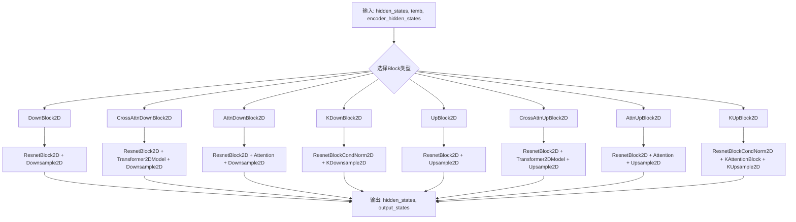
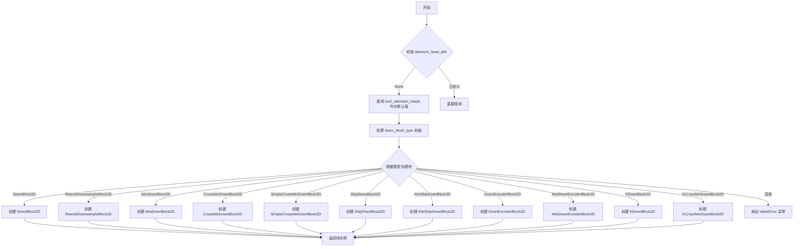
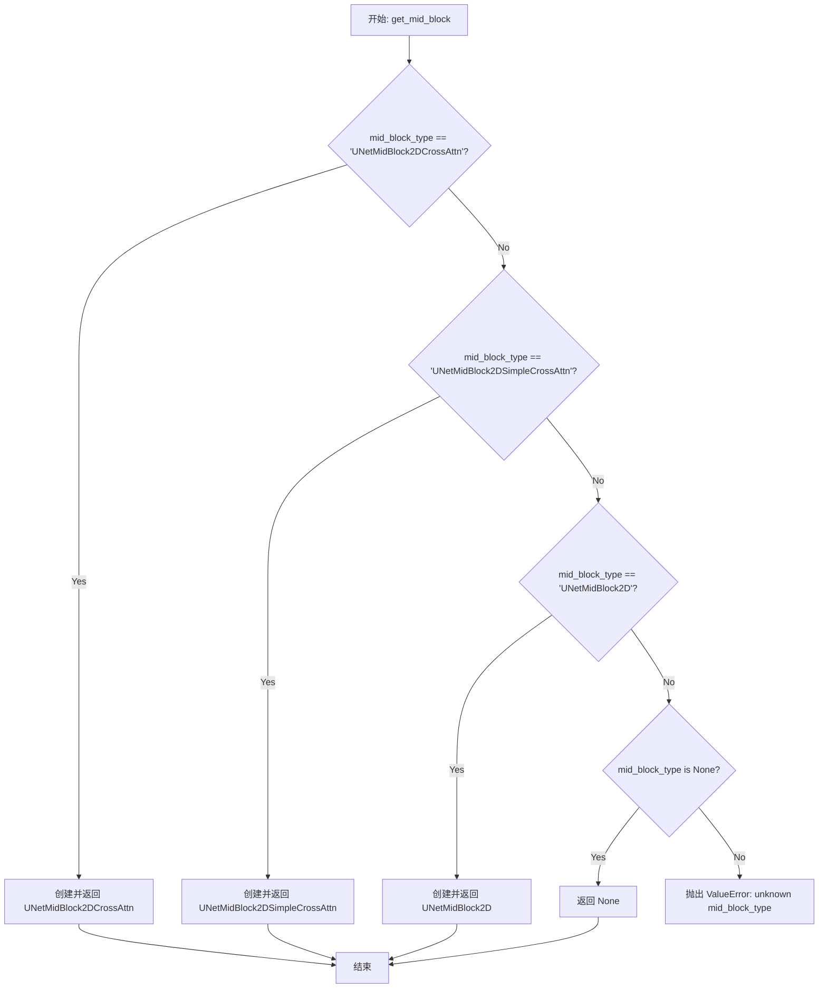
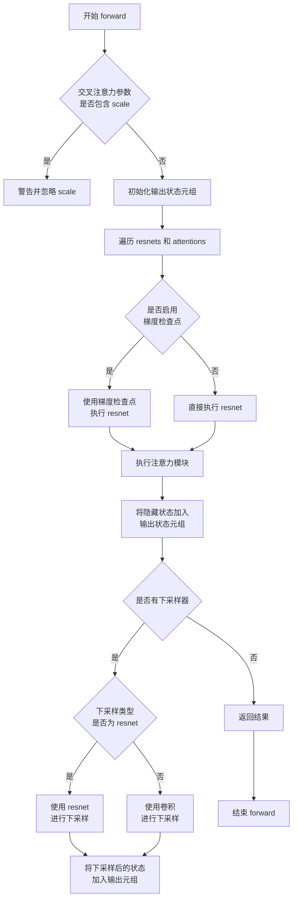
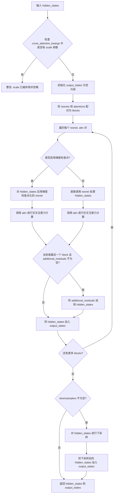
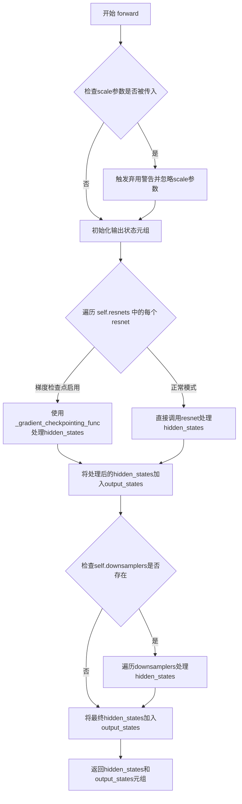
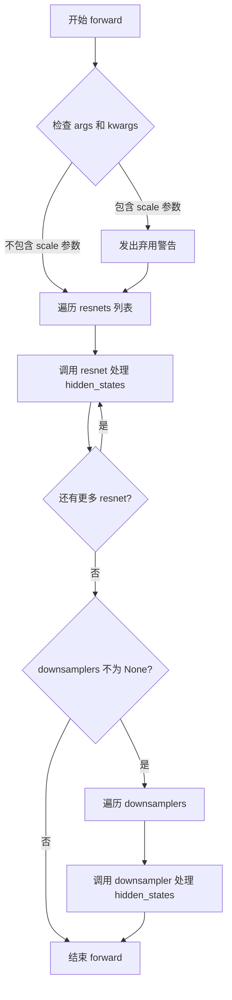
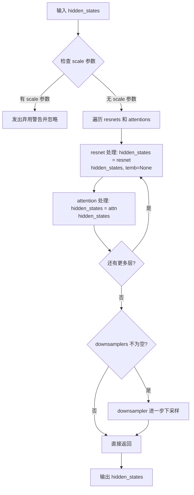
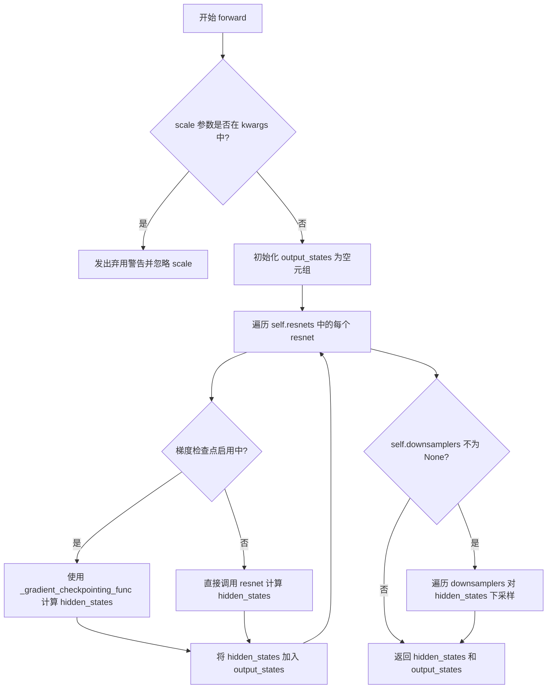
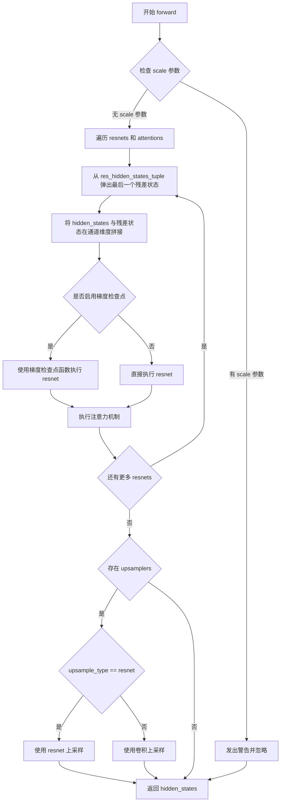

# `diffusers\src\diffusers\models\unets\unet_2d_blocks.py` 详细设计文档

这是HuggingFace Diffusers库中的UNet 2D块模块，提供了各种用于Diffusion模型的编码器和解码器组件，包括不同类型的上采样、下采样块、注意力块和中间块，支持多种架构变体如CrossAttention、SimpleCrossAttention、K-类型块等，用于构建完整的UNet网络结构。

## 整体流程



## 类结构

```
nn.Module (基类)
├── AutoencoderTinyBlock
├── UNetMidBlock2D
│   ├── UNetMidBlock2DCrossAttn
│   └── UNetMidBlock2DSimpleCrossAttn
├── DownBlock2D (下采样块基类)
│   ├── AttnDownBlock2D
│   ├── CrossAttnDownBlock2D
│   ├── ResnetDownsampleBlock2D
│   ├── SimpleCrossAttnDownBlock2D
│   ├── SkipDownBlock2D
│   ├── AttnSkipDownBlock2D
│   ├── DownEncoderBlock2D
│   ├── AttnDownEncoderBlock2D
│   ├── KDownBlock2D
│   └── KCrossAttnDownBlock2D
├── UpBlock2D (上采样块基类)
│   ├── AttnUpBlock2D
│   ├── CrossAttnUpBlock2D
│   ├── ResnetUpsampleBlock2D
│   ├── SimpleCrossAttnUpBlock2D
│   ├── SkipUpBlock2D
│   ├── AttnSkipUpBlock2D
│   ├── UpDecoderBlock2D
│   ├── AttnUpDecoderBlock2D
│   ├── KUpBlock2D
│   └── KCrossAttnUpBlock2D
└── KAttentionBlock (K-类型注意力)
```

## 全局变量及字段


### `logger`
    
用于记录日志的logger对象

类型：`logging.Logger`
    


### `AutoencoderTinyBlock.AutoencoderTinyBlock.conv`
    
包含卷积和激活函数的序列模块，用于特征提取

类型：`nn.Sequential`
    


### `AutoencoderTinyBlock.AutoencoderTinyBlock.skip`
    
跳跃连接层，用于残差连接

类型：`nn.Module`
    


### `AutoencoderTinyBlock.AutoencoderTinyBlock.fuse`
    
融合跳跃连接的激活函数

类型：`nn.ReLU`
    


### `UNetMidBlock2D.UNetMidBlock2D.attentions`
    
注意力模块列表

类型：`nn.ModuleList`
    


### `UNetMidBlock2D.UNetMidBlock2D.resnets`
    
ResNet模块列表

类型：`nn.ModuleList`
    


### `UNetMidBlock2D.UNetMidBlock2D.add_attention`
    
是否添加注意力机制

类型：`bool`
    


### `UNetMidBlock2D.UNetMidBlock2D.gradient_checkpointing`
    
梯度检查点标志

类型：`bool`
    


### `UNetMidBlock2DCrossAttn.UNetMidBlock2DCrossAttn.in_channels`
    
输入通道数

类型：`int`
    


### `UNetMidBlock2DCrossAttn.UNetMidBlock2DCrossAttn.out_channels`
    
输出通道数

类型：`int`
    


### `UNetMidBlock2DCrossAttn.UNetMidBlock2DCrossAttn.has_cross_attention`
    
是否具有交叉注意力

类型：`bool`
    


### `UNetMidBlock2DCrossAttn.UNetMidBlock2DCrossAttn.num_attention_heads`
    
注意力头数量

类型：`int`
    


### `UNetMidBlock2DCrossAttn.UNetMidBlock2DCrossAttn.attentions`
    
注意力模块列表

类型：`nn.ModuleList`
    


### `UNetMidBlock2DCrossAttn.UNetMidBlock2DCrossAttn.resnets`
    
ResNet模块列表

类型：`nn.ModuleList`
    


### `UNetMidBlock2DCrossAttn.UNetMidBlock2DCrossAttn.gradient_checkpointing`
    
梯度检查点标志

类型：`bool`
    


### `UNetMidBlock2DSimpleCrossAttn.UNetMidBlock2DSimpleCrossAttn.has_cross_attention`
    
是否具有交叉注意力

类型：`bool`
    


### `UNetMidBlock2DSimpleCrossAttn.UNetMidBlock2DSimpleCrossAttn.attention_head_dim`
    
注意力头维度

类型：`int`
    


### `UNetMidBlock2DSimpleCrossAttn.UNetMidBlock2DSimpleCrossAttn.num_heads`
    
注意力头数量

类型：`int`
    


### `UNetMidBlock2DSimpleCrossAttn.UNetMidBlock2DSimpleCrossAttn.attentions`
    
注意力模块列表

类型：`nn.ModuleList`
    


### `UNetMidBlock2DSimpleCrossAttn.UNetMidBlock2DSimpleCrossAttn.resnets`
    
ResNet模块列表

类型：`nn.ModuleList`
    


### `AttnDownBlock2D.AttnDownBlock2D.downsample_type`
    
下采样类型

类型：`str`
    


### `AttnDownBlock2D.AttnDownBlock2D.attentions`
    
注意力模块列表

类型：`nn.ModuleList`
    


### `AttnDownBlock2D.AttnDownBlock2D.resnets`
    
ResNet模块列表

类型：`nn.ModuleList`
    


### `AttnDownBlock2D.AttnDownBlock2D.downsamplers`
    
下采样模块列表

类型：`nn.ModuleList`
    


### `AttnDownBlock2D.AttnDownBlock2D.gradient_checkpointing`
    
梯度检查点标志

类型：`bool`
    


### `CrossAttnDownBlock2D.CrossAttnDownBlock2D.has_cross_attention`
    
是否具有交叉注意力

类型：`bool`
    


### `CrossAttnDownBlock2D.CrossAttnDownBlock2D.num_attention_heads`
    
注意力头数量

类型：`int`
    


### `CrossAttnDownBlock2D.CrossAttnDownBlock2D.attentions`
    
注意力模块列表

类型：`nn.ModuleList`
    


### `CrossAttnDownBlock2D.CrossAttnDownBlock2D.resnets`
    
ResNet模块列表

类型：`nn.ModuleList`
    


### `CrossAttnDownBlock2D.CrossAttnDownBlock2D.downsamplers`
    
下采样模块列表

类型：`nn.ModuleList`
    


### `CrossAttnDownBlock2D.CrossAttnDownBlock2D.gradient_checkpointing`
    
梯度检查点标志

类型：`bool`
    


### `DownBlock2D.DownBlock2D.resnets`
    
ResNet模块列表

类型：`nn.ModuleList`
    


### `DownBlock2D.DownBlock2D.downsamplers`
    
下采样模块列表

类型：`nn.ModuleList`
    


### `DownBlock2D.DownBlock2D.gradient_checkpointing`
    
梯度检查点标志

类型：`bool`
    


### `DownEncoderBlock2D.DownEncoderBlock2D.resnets`
    
ResNet模块列表

类型：`nn.ModuleList`
    


### `DownEncoderBlock2D.DownEncoderBlock2D.downsamplers`
    
下采样模块列表

类型：`nn.ModuleList`
    


### `AttnDownEncoderBlock2D.AttnDownEncoderBlock2D.attentions`
    
注意力模块列表

类型：`nn.ModuleList`
    


### `AttnDownEncoderBlock2D.AttnDownEncoderBlock2D.resnets`
    
ResNet模块列表

类型：`nn.ModuleList`
    


### `AttnDownEncoderBlock2D.AttnDownEncoderBlock2D.downsamplers`
    
下采样模块列表

类型：`nn.ModuleList`
    


### `AttnSkipDownBlock2D.AttnSkipDownBlock2D.attentions`
    
注意力模块列表

类型：`nn.ModuleList`
    


### `AttnSkipDownBlock2D.AttnSkipDownBlock2D.resnets`
    
ResNet模块列表

类型：`nn.ModuleList`
    


### `AttnSkipDownBlock2D.AttnSkipDownBlock2D.resnet_down`
    
下采样ResNet块

类型：`nn.Module`
    


### `AttnSkipDownBlock2D.AttnSkipDownBlock2D.downsamplers`
    
下采样模块列表

类型：`nn.ModuleList`
    


### `AttnSkipDownBlock2D.AttnSkipDownBlock2D.skip_conv`
    
跳跃连接卷积层

类型：`nn.Conv2d`
    


### `SkipDownBlock2D.SkipDownBlock2D.resnets`
    
ResNet模块列表

类型：`nn.ModuleList`
    


### `SkipDownBlock2D.SkipDownBlock2D.resnet_down`
    
下采样ResNet块

类型：`nn.Module`
    


### `SkipDownBlock2D.SkipDownBlock2D.downsamplers`
    
下采样模块列表

类型：`nn.ModuleList`
    


### `SkipDownBlock2D.SkipDownBlock2D.skip_conv`
    
跳跃连接卷积层

类型：`nn.Conv2d`
    


### `ResnetDownsampleBlock2D.ResnetDownsampleBlock2D.resnets`
    
ResNet模块列表

类型：`nn.ModuleList`
    


### `ResnetDownsampleBlock2D.ResnetDownsampleBlock2D.downsamplers`
    
下采样模块列表

类型：`nn.ModuleList`
    


### `ResnetDownsampleBlock2D.ResnetDownsampleBlock2D.gradient_checkpointing`
    
梯度检查点标志

类型：`bool`
    


### `SimpleCrossAttnDownBlock2D.SimpleCrossAttnDownBlock2D.has_cross_attention`
    
是否具有交叉注意力

类型：`bool`
    


### `SimpleCrossAttnDownBlock2D.SimpleCrossAttnDownBlock2D.attention_head_dim`
    
注意力头维度

类型：`int`
    


### `SimpleCrossAttnDownBlock2D.SimpleCrossAttnDownBlock2D.num_heads`
    
注意力头数量

类型：`int`
    


### `SimpleCrossAttnDownBlock2D.SimpleCrossAttnDownBlock2D.attentions`
    
注意力模块列表

类型：`nn.ModuleList`
    


### `SimpleCrossAttnDownBlock2D.SimpleCrossAttnDownBlock2D.resnets`
    
ResNet模块列表

类型：`nn.ModuleList`
    


### `SimpleCrossAttnDownBlock2D.SimpleCrossAttnDownBlock2D.downsamplers`
    
下采样模块列表

类型：`nn.ModuleList`
    


### `SimpleCrossAttnDownBlock2D.SimpleCrossAttnDownBlock2D.gradient_checkpointing`
    
梯度检查点标志

类型：`bool`
    


### `KDownBlock2D.KDownBlock2D.resnets`
    
ResNet模块列表

类型：`nn.ModuleList`
    


### `KDownBlock2D.KDownBlock2D.downsamplers`
    
下采样模块列表

类型：`nn.ModuleList`
    


### `KDownBlock2D.KDownBlock2D.gradient_checkpointing`
    
梯度检查点标志

类型：`bool`
    


### `KCrossAttnDownBlock2D.KCrossAttnDownBlock2D.has_cross_attention`
    
是否具有交叉注意力

类型：`bool`
    


### `KCrossAttnDownBlock2D.KCrossAttnDownBlock2D.resnets`
    
ResNet模块列表

类型：`nn.ModuleList`
    


### `KCrossAttnDownBlock2D.KCrossAttnDownBlock2D.attentions`
    
注意力模块列表

类型：`nn.ModuleList`
    


### `KCrossAttnDownBlock2D.KCrossAttnDownBlock2D.downsamplers`
    
下采样模块列表

类型：`nn.ModuleList`
    


### `KCrossAttnDownBlock2D.KCrossAttnDownBlock2D.gradient_checkpointing`
    
梯度检查点标志

类型：`bool`
    


### `AttnUpBlock2D.AttnUpBlock2D.upsample_type`
    
上采样类型

类型：`str`
    


### `AttnUpBlock2D.AttnUpBlock2D.attentions`
    
注意力模块列表

类型：`nn.ModuleList`
    


### `AttnUpBlock2D.AttnUpBlock2D.resnets`
    
ResNet模块列表

类型：`nn.ModuleList`
    


### `AttnUpBlock2D.AttnUpBlock2D.upsamplers`
    
上采样模块列表

类型：`nn.ModuleList`
    


### `AttnUpBlock2D.AttnUpBlock2D.gradient_checkpointing`
    
梯度检查点标志

类型：`bool`
    


### `AttnUpBlock2D.AttnUpBlock2D.resolution_idx`
    
分辨率索引

类型：`int`
    


### `CrossAttnUpBlock2D.CrossAttnUpBlock2D.has_cross_attention`
    
是否具有交叉注意力

类型：`bool`
    


### `CrossAttnUpBlock2D.CrossAttnUpBlock2D.num_attention_heads`
    
注意力头数量

类型：`int`
    


### `CrossAttnUpBlock2D.CrossAttnUpBlock2D.attentions`
    
注意力模块列表

类型：`nn.ModuleList`
    


### `CrossAttnUpBlock2D.CrossAttnUpBlock2D.resnets`
    
ResNet模块列表

类型：`nn.ModuleList`
    


### `CrossAttnUpBlock2D.CrossAttnUpBlock2D.upsamplers`
    
上采样模块列表

类型：`nn.ModuleList`
    


### `CrossAttnUpBlock2D.CrossAttnUpBlock2D.gradient_checkpointing`
    
梯度检查点标志

类型：`bool`
    


### `CrossAttnUpBlock2D.CrossAttnUpBlock2D.resolution_idx`
    
分辨率索引

类型：`int`
    


### `UpBlock2D.UpBlock2D.resnets`
    
ResNet模块列表

类型：`nn.ModuleList`
    


### `UpBlock2D.UpBlock2D.upsamplers`
    
上采样模块列表

类型：`nn.ModuleList`
    


### `UpBlock2D.UpBlock2D.gradient_checkpointing`
    
梯度检查点标志

类型：`bool`
    


### `UpBlock2D.UpBlock2D.resolution_idx`
    
分辨率索引

类型：`int`
    


### `UpDecoderBlock2D.UpDecoderBlock2D.resnets`
    
ResNet模块列表

类型：`nn.ModuleList`
    


### `UpDecoderBlock2D.UpDecoderBlock2D.upsamplers`
    
上采样模块列表

类型：`nn.ModuleList`
    


### `UpDecoderBlock2D.UpDecoderBlock2D.resolution_idx`
    
分辨率索引

类型：`int`
    


### `AttnUpDecoderBlock2D.AttnUpDecoderBlock2D.attentions`
    
注意力模块列表

类型：`nn.ModuleList`
    


### `AttnUpDecoderBlock2D.AttnUpDecoderBlock2D.resnets`
    
ResNet模块列表

类型：`nn.ModuleList`
    


### `AttnUpDecoderBlock2D.AttnUpDecoderBlock2D.upsamplers`
    
上采样模块列表

类型：`nn.ModuleList`
    


### `AttnUpDecoderBlock2D.AttnUpDecoderBlock2D.resolution_idx`
    
分辨率索引

类型：`int`
    


### `AttnSkipUpBlock2D.AttnSkipUpBlock2D.attentions`
    
注意力模块列表

类型：`nn.ModuleList`
    


### `AttnSkipUpBlock2D.AttnSkipUpBlock2D.resnets`
    
ResNet模块列表

类型：`nn.ModuleList`
    


### `AttnSkipUpBlock2D.AttnSkipUpBlock2D.upsampler`
    
上采样器模块

类型：`nn.Module`
    


### `AttnSkipUpBlock2D.AttnSkipUpBlock2D.resnet_up`
    
上采样ResNet块

类型：`nn.Module`
    


### `AttnSkipUpBlock2D.AttnSkipUpBlock2D.skip_conv`
    
跳跃连接卷积层

类型：`nn.Conv2d`
    


### `AttnSkipUpBlock2D.AttnSkipUpBlock2D.skip_norm`
    
跳跃连接归一化层

类型：`nn.GroupNorm`
    


### `AttnSkipUpBlock2D.AttnSkipUpBlock2D.act`
    
激活函数模块

类型：`nn.Module`
    


### `AttnSkipUpBlock2D.AttnSkipUpBlock2D.resolution_idx`
    
分辨率索引

类型：`int`
    


### `SkipUpBlock2D.SkipUpBlock2D.resnets`
    
ResNet模块列表

类型：`nn.ModuleList`
    


### `SkipUpBlock2D.SkipUpBlock2D.upsampler`
    
上采样器模块

类型：`nn.Module`
    


### `SkipUpBlock2D.SkipUpBlock2D.resnet_up`
    
上采样ResNet块

类型：`nn.Module`
    


### `SkipUpBlock2D.SkipUpBlock2D.skip_conv`
    
跳跃连接卷积层

类型：`nn.Conv2d`
    


### `SkipUpBlock2D.SkipUpBlock2D.skip_norm`
    
跳跃连接归一化层

类型：`nn.GroupNorm`
    


### `SkipUpBlock2D.SkipUpBlock2D.act`
    
激活函数模块

类型：`nn.Module`
    


### `SkipUpBlock2D.SkipUpBlock2D.resolution_idx`
    
分辨率索引

类型：`int`
    


### `ResnetUpsampleBlock2D.ResnetUpsampleBlock2D.resnets`
    
ResNet模块列表

类型：`nn.ModuleList`
    


### `ResnetUpsampleBlock2D.ResnetUpsampleBlock2D.upsamplers`
    
上采样模块列表

类型：`nn.ModuleList`
    


### `ResnetUpsampleBlock2D.ResnetUpsampleBlock2D.gradient_checkpointing`
    
梯度检查点标志

类型：`bool`
    


### `ResnetUpsampleBlock2D.ResnetUpsampleBlock2D.resolution_idx`
    
分辨率索引

类型：`int`
    


### `SimpleCrossAttnUpBlock2D.SimpleCrossAttnUpBlock2D.has_cross_attention`
    
是否具有交叉注意力

类型：`bool`
    


### `SimpleCrossAttnUpBlock2D.SimpleCrossAttnUpBlock2D.attention_head_dim`
    
注意力头维度

类型：`int`
    


### `SimpleCrossAttnUpBlock2D.SimpleCrossAttnUpBlock2D.num_heads`
    
注意力头数量

类型：`int`
    


### `SimpleCrossAttnUpBlock2D.SimpleCrossAttnUpBlock2D.attentions`
    
注意力模块列表

类型：`nn.ModuleList`
    


### `SimpleCrossAttnUpBlock2D.SimpleCrossAttnUpBlock2D.resnets`
    
ResNet模块列表

类型：`nn.ModuleList`
    


### `SimpleCrossAttnUpBlock2D.SimpleCrossAttnUpBlock2D.upsamplers`
    
上采样模块列表

类型：`nn.ModuleList`
    


### `SimpleCrossAttnUpBlock2D.SimpleCrossAttnUpBlock2D.gradient_checkpointing`
    
梯度检查点标志

类型：`bool`
    


### `SimpleCrossAttnUpBlock2D.SimpleCrossAttnUpBlock2D.resolution_idx`
    
分辨率索引

类型：`int`
    


### `KUpBlock2D.KUpBlock2D.resnets`
    
ResNet模块列表

类型：`nn.ModuleList`
    


### `KUpBlock2D.KUpBlock2D.upsamplers`
    
上采样模块列表

类型：`nn.ModuleList`
    


### `KUpBlock2D.KUpBlock2D.gradient_checkpointing`
    
梯度检查点标志

类型：`bool`
    


### `KUpBlock2D.KUpBlock2D.resolution_idx`
    
分辨率索引

类型：`int`
    


### `KCrossAttnUpBlock2D.KCrossAttnUpBlock2D.has_cross_attention`
    
是否具有交叉注意力

类型：`bool`
    


### `KCrossAttnUpBlock2D.KCrossAttnUpBlock2D.attention_head_dim`
    
注意力头维度

类型：`int`
    


### `KCrossAttnUpBlock2D.KCrossAttnUpBlock2D.resnets`
    
ResNet模块列表

类型：`nn.ModuleList`
    


### `KCrossAttnUpBlock2D.KCrossAttnUpBlock2D.attentions`
    
注意力模块列表

类型：`nn.ModuleList`
    


### `KCrossAttnUpBlock2D.KCrossAttnUpBlock2D.upsamplers`
    
上采样模块列表

类型：`nn.ModuleList`
    


### `KCrossAttnUpBlock2D.KCrossAttnUpBlock2D.gradient_checkpointing`
    
梯度检查点标志

类型：`bool`
    


### `KCrossAttnUpBlock2D.KCrossAttnUpBlock2D.resolution_idx`
    
分辨率索引

类型：`int`
    


### `KAttentionBlock.KAttentionBlock.add_self_attention`
    
是否添加自注意力

类型：`bool`
    


### `KAttentionBlock.KAttentionBlock.norm1`
    
第一个归一化层

类型：`nn.Module`
    


### `KAttentionBlock.KAttentionBlock.attn1`
    
第一个注意力模块

类型：`nn.Module`
    


### `KAttentionBlock.KAttentionBlock.norm2`
    
第二个归一化层

类型：`nn.Module`
    


### `KAttentionBlock.KAttentionBlock.attn2`
    
第二个注意力模块

类型：`nn.Module`
    
    

## 全局函数及方法


### `get_down_block`

这是一个工厂函数，用于根据指定的`down_block_type`创建不同类型的下采样块（Down Block），这些块是UNet架构中用于对输入特征图进行下采样（降维）的核心组件。

参数：

- `down_block_type`：`str`，指定要创建的下采样块类型（如"DownBlock2D"、"CrossAttnDownBlock2D"等）
- `num_layers`：`int`，下采样块中ResNet层的数量
- `in_channels`：`int`，输入特征图的通道数
- `out_channels`：`int`，输出特征图的通道数
- `temb_channels`：`int`，时间嵌入（temporal embedding）的通道数
- `add_downsample`：`bool`，是否在块末尾添加下采样操作
- `resnet_eps`：`float`，ResNet块中使用的epsilon值，用于数值稳定性
- `resnet_act_fn`：`str`，ResNet块中使用的激活函数名称
- `transformer_layers_per_block`：`int = 1`，每个块中Transformer层的数量
- `num_attention_heads`：`int | None = None`，注意力机制中的头数
- `resnet_groups`：`int | None = None`，ResNet中GroupNorm的组数
- `cross_attention_dim`：`int | None = None`，交叉注意力中使用的上下文向量维度
- `downsample_padding`：`int | None = None`，下采样卷积的填充大小
- `dual_cross_attention`：`bool = False`，是否使用双交叉注意力机制
- `use_linear_projection`：`bool = False`，在注意力模块中是否使用线性投影
- `only_cross_attention`：`bool = False`，是否仅使用交叉注意力（无自注意力）
- `upcast_attention`：`bool = False`，是否将注意力计算向上转型为更高精度
- `resnet_time_scale_shift`：`str = "default"`，ResNet中时间嵌入的归一化方式（"default"或"spatial"）
- `attention_type`：`str = "default"`，注意力机制的类型
- `resnet_skip_time_act`：`bool = False`，是否跳过ResNet中的时间激活
- `resnet_out_scale_factor`：`float = 1.0`，ResNet输出的缩放因子
- `cross_attention_norm`：`str | None = None`，交叉注意力中的归一化类型
- `attention_head_dim`：`int | None = None`，每个注意力头的维度
- `downsample_type`：`str | None = None`，下采样的类型（如"conv"、"resnet"）
- `dropout`：`float = 0.0`，Dropout比率

返回值：`nn.Module`，返回对应类型的下采样块实例

#### 流程图



#### 带注释源码

```python
def get_down_block(
    down_block_type: str,                # 下采样块的类型字符串标识
    num_layers: int,                     # ResNet层数
    in_channels: int,                    # 输入通道数
    out_channels: int,                   # 输出通道数
    temb_channels: int,                 # 时间嵌入通道数
    add_downsample: bool,                # 是否添加下采样
    resnet_eps: float,                   # ResNet epsilon值
    resnet_act_fn: str,                  # 激活函数名
    transformer_layers_per_block: int = 1,  # Transformer层数
    num_attention_heads: int | None = None,  # 注意力头数
    resnet_groups: int | None = None,    # GroupNorm组数
    cross_attention_dim: int | None = None,   # 交叉注意力维度
    downsample_padding: int | None = None,    # 下采样填充
    dual_cross_attention: bool = False,   # 双交叉注意力
    use_linear_projection: bool = False,  # 线性投影
    only_cross_attention: bool = False,   # 仅交叉注意力
    upcast_attention: bool = False,       # 上转注意力
    resnet_time_scale_shift: str = "default",  # 时间尺度移位
    attention_type: str = "default",      # 注意力类型
    resnet_skip_time_act: bool = False,    # 跳过时间激活
    resnet_out_scale_factor: float = 1.0, # 输出缩放因子
    cross_attention_norm: str | None = None,   # 交叉注意力归一化
    attention_head_dim: int | None = None, # 注意力头维度
    downsample_type: str | None = None,     # 下采样类型
    dropout: float = 0.0,                   # Dropout比率
):
    """
    工厂函数：根据down_block_type创建对应的下采样块实例
    
    该函数是UNet架构的核心组件工厂，支持多种不同类型的下采样块，
    包括基础ResNet块、带有注意力机制的块、以及针对特定任务优化的块。
    """
    
    # 如果未指定attention_head_dim，则默认使用num_attention_heads
    # 这是一个向后兼容的默认处理逻辑
    if attention_head_dim is None:
        logger.warning(
            f"It is recommended to provide `attention_head_dim` when calling `get_down_block`. "
            f"Defaulting `attention_head_dim` to {num_attention_heads}."
        )
        attention_head_dim = num_attention_heads

    # 处理block类型前缀，移除"UNetRes"前缀以统一命名
    # 例如："UNetResDownBlock2D" -> "DownBlock2D"
    down_block_type = down_block_type[7:] if down_block_type.startswith("UNetRes") else down_block_type
    
    # 根据类型字符串创建对应的下采样块实例
    if down_block_type == "DownBlock2D":
        # 基础下采样块：仅包含ResNet层
        return DownBlock2D(
            num_layers=num_layers,
            in_channels=in_channels,
            out_channels=out_channels,
            temb_channels=temb_channels,
            dropout=dropout,
            add_downsample=add_downsample,
            resnet_eps=resnet_eps,
            resnet_act_fn=resnet_act_fn,
            resnet_groups=resnet_groups,
            downsample_padding=downsample_padding,
            resnet_time_scale_shift=resnet_time_scale_shift,
        )
    elif down_block_type == "ResnetDownsampleBlock2D":
        # 使用ResNet进行下采样的块
        return ResnetDownsampleBlock2D(
            num_layers=num_layers,
            in_channels=in_channels,
            out_channels=out_channels,
            temb_channels=temb_channels,
            dropout=dropout,
            add_downsample=add_downsample,
            resnet_eps=resnet_eps,
            resnet_act_fn=resnet_act_fn,
            resnet_groups=resnet_groups,
            resnet_time_scale_shift=resnet_time_scale_shift,
            skip_time_act=resnet_skip_time_act,
            output_scale_factor=resnet_out_scale_factor,
        )
    elif down_block_type == "AttnDownBlock2D":
        # 带注意力机制的下采样块
        if add_downsample is False:
            downsample_type = None
        else:
            downsample_type = downsample_type or "conv"  # 默认使用卷积下采样
        return AttnDownBlock2D(
            num_layers=num_layers,
            in_channels=in_channels,
            out_channels=out_channels,
            temb_channels=temb_channels,
            dropout=dropout,
            resnet_eps=resnet_eps,
            resnet_act_fn=resnet_act_fn,
            resnet_groups=resnet_groups,
            downsample_padding=downsample_padding,
            attention_head_dim=attention_head_dim,
            resnet_time_scale_shift=resnet_time_scale_shift,
            downsample_type=downsample_type,
        )
    elif down_block_type == "CrossAttnDownBlock2D":
        # 带交叉注意力的下采样块，需要cross_attention_dim参数
        if cross_attention_dim is None:
            raise ValueError("cross_attention_dim must be specified for CrossAttnDownBlock2D")
        return CrossAttnDownBlock2D(
            num_layers=num_layers,
            transformer_layers_per_block=transformer_layers_per_block,
            in_channels=in_channels,
            out_channels=out_channels,
            temb_channels=temb_channels,
            dropout=dropout,
            add_downsample=add_downsample,
            resnet_eps=resnet_eps,
            resnet_act_fn=resnet_act_fn,
            resnet_groups=resnet_groups,
            downsample_padding=downsample_padding,
            cross_attention_dim=cross_attention_dim,
            num_attention_heads=num_attention_heads,
            dual_cross_attention=dual_cross_attention,
            use_linear_projection=use_linear_projection,
            only_cross_attention=only_cross_attention,
            upcast_attention=upcast_attention,
            resnet_time_scale_shift=resnet_time_scale_shift,
            attention_type=attention_type,
        )
    elif down_block_type == "SimpleCrossAttnDownBlock2D":
        # 简单交叉注意力下采样块
        if cross_attention_dim is None:
            raise ValueError("cross_attention_dim must be specified for SimpleCrossAttnDownBlock2D")
        return SimpleCrossAttnDownBlock2D(
            num_layers=num_layers,
            in_channels=in_channels,
            out_channels=out_channels,
            temb_channels=temb_channels,
            dropout=dropout,
            add_downsample=add_downsample,
            resnet_eps=resnet_eps,
            resnet_act_fn=resnet_act_fn,
            resnet_groups=resnet_groups,
            cross_attention_dim=cross_attention_dim,
            attention_head_dim=attention_head_dim,
            resnet_time_scale_shift=resnet_time_scale_shift,
            skip_time_act=resnet_skip_time_act,
            output_scale_factor=resnet_out_scale_factor,
            only_cross_attention=only_cross_attention,
            cross_attention_norm=cross_attention_norm,
        )
    elif down_block_type == "SkipDownBlock2D":
        # 带跳跃连接的下采样块
        return SkipDownBlock2D(
            num_layers=num_layers,
            in_channels=in_channels,
            out_channels=out_channels,
            temb_channels=temb_channels,
            dropout=dropout,
            add_downsample=add_downsample,
            resnet_eps=resnet_eps,
            resnet_act_fn=resnet_act_fn,
            downsample_padding=downsample_padding,
            resnet_time_scale_shift=resnet_time_scale_shift,
        )
    elif down_block_type == "AttnSkipDownBlock2D":
        # 带注意力和跳跃连接的下采样块
        return AttnSkipDownBlock2D(
            num_layers=num_layers,
            in_channels=in_channels,
            out_channels=out_channels,
            temb_channels=temb_channels,
            dropout=dropout,
            add_downsample=add_downsample,
            resnet_eps=resnet_eps,
            resnet_act_fn=resnet_act_fn,
            attention_head_dim=attention_head_dim,
            resnet_time_scale_shift=resnet_time_scale_shift,
        )
    elif down_block_type == "DownEncoderBlock2D":
        # 编码器下采样块
        return DownEncoderBlock2D(
            num_layers=num_layers,
            in_channels=in_channels,
            out_channels=out_channels,
            dropout=dropout,
            add_downsample=add_downsample,
            resnet_eps=resnet_eps,
            resnet_act_fn=resnet_act_fn,
            resnet_groups=resnet_groups,
            downsample_padding=downsample_padding,
            resnet_time_scale_shift=resnet_time_scale_shift,
        )
    elif down_block_type == "AttnDownEncoderBlock2D":
        # 带注意力的编码器下采样块
        return AttnDownEncoderBlock2D(
            num_layers=num_layers,
            in_channels=in_channels,
            out_channels=out_channels,
            dropout=dropout,
            add_downsample=add_downsample,
            resnet_eps=resnet_eps,
            resnet_act_fn=resnet_act_fn,
            resnet_groups=resnet_groups,
            downsample_padding=downsample_padding,
            attention_head_dim=attention_head_dim,
            resnet_time_scale_shift=resnet_time_scale_shift,
        )
    elif down_block_type == "KDownBlock2D":
        # K-Net使用的下采样块
        return KDownBlock2D(
            num_layers=num_layers,
            in_channels=in_channels,
            out_channels=out_channels,
            temb_channels=temb_channels,
            dropout=dropout,
            add_downsample=add_downsample,
            resnet_eps=resnet_eps,
            resnet_act_fn=resnet_act_fn,
        )
    elif down_block_type == "KCrossAttnDownBlock2D":
        # K-Net使用的带交叉注意力的下采样块
        return KCrossAttnDownBlock2D(
            num_layers=num_layers,
            in_channels=in_channels,
            out_channels=out_channels,
            temb_channels=temb_channels,
            dropout=dropout,
            add_downsample=add_downsample,
            resnet_eps=resnet_eps,
            resnet_act_fn=resnet_act_fn,
            cross_attention_dim=cross_attention_dim,
            attention_head_dim=attention_head_dim,
            add_self_attention=True if not add_downsample else False,
        )
    
    # 如果传入的block类型不支持，抛出异常
    raise ValueError(f"{down_block_type} does not exist.")
```


### `get_mid_block`

该函数是一个工厂函数，用于根据 `mid_block_type` 参数创建并返回不同类型的 UNet 中间块（Mid Block）。它支持多种中间块类型，包括带交叉注意力的中间块、简单交叉注意力中间块以及不带注意力的基础中间块，是 UNet 架构构建过程中的关键组件。

参数：

-  `mid_block_type`：`str`，指定要创建的中间块类型，支持 "UNetMidBlock2DCrossAttn"、"UNetMidBlock2DSimpleCrossAttn"、"UNetMidBlock2D" 或 None
-  `temb_channels`：`int`，时间嵌入（temporal embedding）通道数，用于时间条件信息的传递
-  `in_channels`：`int`，输入特征图的通道数
-  `resnet_eps`：`float`，ResNet 块中 GroupNorm 的 epsilon 值，防止除零错误
-  `resnet_act_fn`：`str`，ResNet 块使用的激活函数名称（如 "swish"、"relu" 等）
-  `resnet_groups`：`int`，GroupNorm 中的分组数量，用于归一化
-  `output_scale_factor`：`float`，输出缩放因子，默认为 1.0，用于调整输出特征的尺度
-  `transformer_layers_per_block`：`int`，每个 Transformer 块中的层数，默认为 1
-  `num_attention_heads`：`int | None`，注意力头数量，若为 None 则使用默认值
-  `cross_attention_dim`：`int | None`，交叉注意力中上下文向量的维度
-  `dual_cross_attention`：`bool`，是否使用双交叉注意力机制，默认为 False
-  `use_linear_projection`：`bool`，是否在注意力中使用线性投影，默认为 False
-  `mid_block_only_cross_attention`：`bool`，中间块是否只使用交叉注意力，默认为 False
-  `upcast_attention`：`bool`，是否将注意力计算向上转换为 float32，默认为 False
-  `resnet_time_scale_shift`：`str`，ResNet 时间尺度偏移类型，默认为 "default"，可选 "spatial"
-  `attention_type`：`str`，注意力机制类型，默认为 "default"
-  `resnet_skip_time_act`：`bool`，是否跳过 ResNet 中的时间激活，默认为 False
-  `cross_attention_norm`：`str | None`，交叉注意力归一化类型，可为 None、"group_norm" 或 "layer_norm"
-  `attention_head_dim`：`int | None`，单个注意力头的维度，默认为 1
-  `dropout`：`float`，Dropout 概率，默认为 0.0

返回值：`UNetMidBlock2DCrossAttn | UNetMidBlock2DSimpleCrossAttn | UNetMidBlock2D | None`，返回对应类型的中间块实例，若 `mid_block_type` 为 None 则返回 None

#### 流程图



#### 带注释源码

```python
def get_mid_block(
    mid_block_type: str,                      # 中间块类型标识符
    temb_channels: int,                       # 时间嵌入通道数
    in_channels: int,                         # 输入通道数
    resnet_eps: float,                        # ResNet epsilon 值
    resnet_act_fn: str,                       # 激活函数名称
    resnet_groups: int,                       # 分组归一化组数
    output_scale_factor: float = 1.0,         # 输出缩放因子
    transformer_layers_per_block: int = 1,    # Transformer 层数
    num_attention_heads: int | None = None,   # 注意力头数
    cross_attention_dim: int | None = None,   # 交叉注意力维度
    dual_cross_attention: bool = False,       # 双交叉注意力标志
    use_linear_projection: bool = False,      # 线性投影标志
    mid_block_only_cross_attention: bool = False,  # 仅交叉注意力
    upcast_attention: bool = False,           # 注意力类型转换
    resnet_time_scale_shift: str = "default", # 时间尺度偏移
    attention_type: str = "default",           # 注意力类型
    resnet_skip_time_act: bool = False,       # 跳过时间激活
    cross_attention_norm: str | None = None,  # 交叉注意力归一化
    attention_head_dim: int | None = 1,       # 注意力头维度
    dropout: float = 0.0,                      # Dropout 概率
):
    """
    工厂函数：根据 mid_block_type 创建并返回相应类型的 UNet 中间块
    
    该函数是 UNet 架构构建的核心组件之一，负责实例化不同类型的中间块：
    - UNetMidBlock2DCrossAttn: 带 Transformer 交叉注意力的中间块
    - UNetMidBlock2DSimpleCrossAttn: 简化版交叉注意力中间块
    - UNetMidBlock2D: 基础中间块（无注意力机制）
    """
    
    # 类型1: 带 Transformer 的交叉注意力中间块
    if mid_block_type == "UNetMidBlock2DCrossAttn":
        return UNetMidBlock2DCrossAttn(
            transformer_layers_per_block=transformer_layers_per_block,
            in_channels=in_channels,
            temb_channels=temb_channels,
            dropout=dropout,
            resnet_eps=resnet_eps,
            resnet_act_fn=resnet_act_fn,
            output_scale_factor=output_scale_factor,
            resnet_time_scale_shift=resnet_time_scale_shift,
            cross_attention_dim=cross_attention_dim,
            num_attention_heads=num_attention_heads,
            resnet_groups=resnet_groups,
            dual_cross_attention=dual_cross_attention,
            use_linear_projection=use_linear_projection,
            upcast_attention=upcast_attention,
            attention_type=attention_type,
        )
    
    # 类型2: 简化版交叉注意力中间块（使用 AttnAddedKVProcessor）
    elif mid_block_type == "UNetMidBlock2DSimpleCrossAttn":
        return UNetMidBlock2DSimpleCrossAttn(
            in_channels=in_channels,
            temb_channels=temb_channels,
            dropout=dropout,
            resnet_eps=resnet_eps,
            resnet_act_fn=resnet_act_fn,
            output_scale_factor=output_scale_factor,
            cross_attention_dim=cross_attention_dim,
            attention_head_dim=attention_head_dim,
            resnet_groups=resnet_groups,
            resnet_time_scale_shift=resnet_time_scale_shift,
            skip_time_act=resnet_skip_time_act,
            only_cross_attention=mid_block_only_cross_attention,
            cross_attention_norm=cross_attention_norm,
        )
    
    # 类型3: 基础中间块（仅 ResNet，无注意力）
    elif mid_block_type == "UNetMidBlock2D":
        return UNetMidBlock2D(
            in_channels=in_channels,
            temb_channels=temb_channels,
            dropout=dropout,
            num_layers=0,  # 中间块默认无额外层
            resnet_eps=resnet_eps,
            resnet_act_fn=resnet_act_fn,
            output_scale_factor=output_scale_factor,
            resnet_groups=resnet_groups,
            resnet_time_scale_shift=resnet_time_scale_shift,
            add_attention=False,  # 显式禁用注意力
        )
    
    # 处理 None 类型：返回空块
    elif mid_block_type is None:
        return None
    
    # 错误处理：未知类型
    else:
        raise ValueError(f"unknown mid_block_type : {mid_block_type}")
```


### `get_up_block`

`get_up_block` 是一个工厂函数，用于根据传入的 `up_block_type` 参数动态创建并返回不同类型的 UNet 上采样（Up）块模块。该函数支持多种上采样块变体，包括基本的 ResNet 块、带有交叉注意力机制的块、跳跃连接块等，是构建扩散模型中 UNet 解码器部分的核心组件。

参数：

- `up_block_type`：`str`，指定要创建的上采样块类型（如 "UpBlock2D"、"CrossAttnUpBlock2D" 等）
- `num_layers`：`int`，上采样块中包含的 ResNet 层数量
- `in_channels`：`int`，输入特征的通道数
- `out_channels`：`int`，输出特征的通道数
- `prev_output_channel`：`int`，上一层的输出通道数（用于跳跃连接）
- `temb_channels`：`int`，时间嵌入（temporal embedding）的通道数
- `add_upsample`：`bool`，是否添加上采样操作
- `resnet_eps`：`float`，ResNet 块中 GroupNorm 的 epsilon 值
- `resnet_act_fn`：`str`，ResNet 块使用的激活函数名称
- `resolution_idx`：`int | None`，分辨率索引，用于 FreeU 等优化技术
- `transformer_layers_per_block`：`int`，每个块中 Transformer 层的数量（默认为 1）
- `num_attention_heads`：`int | None`，注意力头的数量
- `resnet_groups`：`int | None`，ResNet 块中 GroupNorm 的组数
- `cross_attention_dim`：`int | None`，交叉注意力机制的维度
- `dual_cross_attention`：`bool`，是否使用双交叉注意力机制
- `use_linear_projection`：`bool`，是否在注意力中使用线性投影
- `only_cross_attention`：`bool`，是否仅使用交叉注意力（无自注意力）
- `upcast_attention`：`bool`，是否将注意力计算向上转型为 float32
- `resnet_time_scale_shift`：`str`，ResNet 时间尺度偏移类型（"default" 或 "spatial"）
- `attention_type`：`str`，注意力机制的类型
- `resnet_skip_time_act`：`bool`，是否在 ResNet 中跳过时间激活
- `resnet_out_scale_factor`：`float`，ResNet 输出缩放因子
- `cross_attention_norm`：`str | None`，交叉注意力的归一化类型
- `attention_head_dim`：`int | None`，单个注意力头的维度
- `upsample_type`：`str | None`，上采样操作的类型（如 "conv"、"resnet"）
- `dropout`：`float`，Dropout 概率

返回值：`nn.Module`，返回创建的上采样块模块实例

#### 流程图

```mermaid
flowchart TD
    A[开始: get_up_block] --> B{attention_head_dim is None?}
    B -->|Yes| C[记录警告日志<br/>attention_head_dim = num_attention_heads]
    B -->|No| D[继续]
    C --> D
    D --> E{up_block_type starts with 'UNetRes'?}
    E -->|Yes| F[去除前缀 'UNetRes'<br/>up_block_type = up_block_type[7:]]
    E -->|No| G[继续]
    F --> G
    G --> H{up_block_type == 'UpBlock2D'?}
    H -->|Yes| I[返回 UpBlock2D 实例]
    H -->|No| J{up_block_type == 'ResnetUpsampleBlock2D'?}
    J -->|Yes| K[返回 ResnetUpsampleBlock2D 实例]
    J -->|No| L{up_block_type == 'CrossAttnUpBlock2D'?}
    L -->|Yes| M{检查 cross_attention_dim<br/>不能为 None}
    M -->|Valid| N[返回 CrossAttnUpBlock2D 实例]
    M -->|Invalid| O[抛出 ValueError]
    L -->|No| P{up_block_type == 'SimpleCrossAttnUpBlock2D'?}
    P -->|Yes| Q{检查 cross_attention_dim<br/>不能为 None}
    Q -->|Valid| R[返回 SimpleCrossAttnUpBlock2D 实例]
    Q -->|Invalid| O
    P -->|No| S{up_block_type == 'AttnUpBlock2D'?}
    S -->|Yes| T[设置 upsample_type<br/>默认 'conv']
    T --> U[返回 AttnUpBlock2D 实例]
    S -->|No| V{up_block_type == 'SkipUpBlock2D'?}
    V -->|Yes| W[返回 SkipUpBlock2D 实例]
    V -->|No| X{up_block_type == 'AttnSkipUpBlock2D'?}
    X -->|Yes| Y[返回 AttnSkipUpBlock2D 实例]
    X -->|No| Z{up_block_type == 'UpDecoderBlock2D'?}
    Z -->|Yes| AA[返回 UpDecoderBlock2D 实例]
    Z -->|No| AB{up_block_type == 'AttnUpDecoderBlock2D'?}
    AB -->|Yes| AC[返回 AttnUpDecoderBlock2D 实例]
    AB -->|No| AD{up_block_type == 'KUpBlock2D'?}
    AD -->|Yes| AE[返回 KUpBlock2D 实例]
    AD -->|No| AF{up_block_type == 'KCrossAttnUpBlock2D'?}
    AF -->|Yes| AG[返回 KCrossAttnUpBlock2D 实例]
    AF -->|No| AH[抛出 ValueError<br/>f'{up_block_type} does not exist.']
```

#### 带注释源码

```python
def get_up_block(
    up_block_type: str,                      # 上采样块的类型标识符
    num_layers: int,                          # ResNet 层数量
    in_channels: int,                         # 输入通道数
    out_channels: int,                        # 输出通道数
    prev_output_channel: int,                 # 上一输出通道（跳跃连接用）
    temb_channels: int,                       # 时间嵌入通道数
    add_upsample: bool,                        # 是否添加上采样
    resnet_eps: float,                        # ResNet GroupNorm epsilon
    resnet_act_fn: str,                       # ResNet 激活函数
    resolution_idx: int | None = None,        # 分辨率索引（FreeU用）
    transformer_layers_per_block: int = 1,    # Transformer层数
    num_attention_heads: int | None = None,   # 注意力头数
    resnet_groups: int | None = None,         # GroupNorm组数
    cross_attention_dim: int | None = None,    # 交叉注意力维度
    dual_cross_attention: bool = False,       # 双交叉注意力开关
    use_linear_projection: bool = False,      # 线性投影开关
    only_cross_attention: bool = False,       # 仅交叉注意力开关
    upcast_attention: bool = False,            # 注意力float32向上转型
    resnet_time_scale_shift: str = "default", # 时间尺度偏移类型
    attention_type: str = "default",          # 注意力机制类型
    resnet_skip_time_act: bool = False,       # 跳过时间激活
    resnet_out_scale_factor: float = 1.0,     # 输出缩放因子
    cross_attention_norm: str | None = None,  # 交叉注意力归一化
    attention_head_dim: int | None = None,    # 注意力头维度
    upsample_type: str | None = None,         # 上采样类型
    dropout: float = 0.0,                      # Dropout概率
) -> nn.Module:
    # 如果未定义注意力头维度，默认使用注意力头数量
    if attention_head_dim is None:
        logger.warning(
            f"It is recommended to provide `attention_head_dim` when calling `get_up_block`. "
            f"Defaulting `attention_head_dim` to {num_attention_heads}."
        )
        attention_head_dim = num_attention_heads

    # 处理块类型前缀（兼容 "UNetRes" 前缀的旧命名）
    up_block_type = up_block_type[7:] if up_block_type.startswith("UNetRes") else up_block_type
    
    # 根据类型创建对应的上采样块
    if up_block_type == "UpBlock2D":
        # 标准上采样块：仅包含 ResNet 层的上采样
        return UpBlock2D(
            num_layers=num_layers,
            in_channels=in_channels,
            out_channels=out_channels,
            prev_output_channel=prev_output_channel,
            temb_channels=temb_channels,
            resolution_idx=resolution_idx,
            dropout=dropout,
            add_upsample=add_upsample,
            resnet_eps=resnet_eps,
            resnet_act_fn=resnet_act_fn,
            resnet_groups=resnet_groups,
            resnet_time_scale_shift=resnet_time_scale_shift,
        )
    elif up_block_type == "ResnetUpsampleBlock2D":
        # 带 ResNet 上采样的块
        return ResnetUpsampleBlock2D(
            num_layers=num_layers,
            in_channels=in_channels,
            out_channels=out_channels,
            prev_output_channel=prev_output_channel,
            temb_channels=temb_channels,
            resolution_idx=resolution_idx,
            dropout=dropout,
            add_upsample=add_upsample,
            resnet_eps=resnet_eps,
            resnet_act_fn=resnet_act_fn,
            resnet_groups=resnet_groups,
            resnet_time_scale_shift=resnet_time_scale_shift,
            skip_time_act=resnet_skip_time_act,
            output_scale_factor=resnet_out_scale_factor,
        )
    elif up_block_type == "CrossAttnUpBlock2D":
        # 带交叉注意力的上采样块（支持 Transformer）
        if cross_attention_dim is None:
            raise ValueError("cross_attention_dim must be specified for CrossAttnUpBlock2D")
        return CrossAttnUpBlock2D(
            num_layers=num_layers,
            transformer_layers_per_block=transformer_layers_per_block,
            in_channels=in_channels,
            out_channels=out_channels,
            prev_output_channel=prev_output_channel,
            temb_channels=temb_channels,
            resolution_idx=resolution_idx,
            dropout=dropout,
            add_upsample=add_upsample,
            resnet_eps=resnet_eps,
            resnet_act_fn=resnet_act_fn,
            resnet_groups=resnet_groups,
            cross_attention_dim=cross_attention_dim,
            num_attention_heads=num_attention_heads,
            dual_cross_attention=dual_cross_attention,
            use_linear_projection=use_linear_projection,
            only_cross_attention=only_cross_attention,
            upcast_attention=upcast_attention,
            resnet_time_scale_shift=resnet_time_scale_shift,
            attention_type=attention_type,
        )
    elif up_block_type == "SimpleCrossAttnUpBlock2D":
        # 简单交叉注意力上采样块
        if cross_attention_dim is None:
            raise ValueError("cross_attention_dim must be specified for SimpleCrossAttnUpBlock2D")
        return SimpleCrossAttnUpBlock2D(
            num_layers=num_layers,
            in_channels=in_channels,
            out_channels=out_channels,
            prev_output_channel=prev_output_channel,
            temb_channels=temb_channels,
            resolution_idx=resolution_idx,
            dropout=dropout,
            add_upsample=add_upsample,
            resnet_eps=resnet_eps,
            resnet_act_fn=resnet_act_fn,
            resnet_groups=resnet_groups,
            cross_attention_dim=cross_attention_dim,
            attention_head_dim=attention_head_dim,
            resnet_time_scale_shift=resnet_time_scale_shift,
            skip_time_act=resnet_skip_time_act,
            output_scale_factor=resnet_out_scale_factor,
            only_cross_attention=only_cross_attention,
            cross_attention_norm=cross_attention_norm,
        )
    elif up_block_type == "AttnUpBlock2D":
        # 带注意力机制的上采样块
        if add_upsample is False:
            upsample_type = None
        else:
            upsample_type = upsample_type or "conv"  # 默认使用卷积上采样

        return AttnUpBlock2D(
            num_layers=num_layers,
            in_channels=in_channels,
            out_channels=out_channels,
            prev_output_channel=prev_output_channel,
            temb_channels=temb_channels,
            resolution_idx=resolution_idx,
            dropout=dropout,
            resnet_eps=resnet_eps,
            resnet_act_fn=resnet_act_fn,
            resnet_groups=resnet_groups,
            attention_head_dim=attention_head_dim,
            resnet_time_scale_shift=resnet_time_scale_shift,
            upsample_type=upsample_type,
        )
    elif up_block_type == "SkipUpBlock2D":
        # 带跳跃连接的上采样块
        return SkipUpBlock2D(
            num_layers=num_layers,
            in_channels=in_channels,
            out_channels=out_channels,
            prev_output_channel=prev_output_channel,
            temb_channels=temb_channels,
            resolution_idx=resolution_idx,
            dropout=dropout,
            add_upsample=add_upsample,
            resnet_eps=resnet_eps,
            resnet_act_fn=resnet_act_fn,
            resnet_time_scale_shift=resnet_time_scale_shift,
        )
    elif up_block_type == "AttnSkipUpBlock2D":
        # 带注意力跳跃连接的上采样块
        return AttnSkipUpBlock2D(
            num_layers=num_layers,
            in_channels=in_channels,
            out_channels=out_channels,
            prev_output_channel=prev_output_channel,
            temb_channels=temb_channels,
            resolution_idx=resolution_idx,
            dropout=dropout,
            add_upsample=add_upsample,
            resnet_eps=resnet_eps,
            resnet_act_fn=resnet_act_fn,
            attention_head_dim=attention_head_dim,
            resnet_time_scale_shift=resnet_time_scale_shift,
        )
    elif up_block_type == "UpDecoderBlock2D":
        # 上解码器块
        return UpDecoderBlock2D(
            num_layers=num_layers,
            in_channels=in_channels,
            out_channels=out_channels,
            resolution_idx=resolution_idx,
            dropout=dropout,
            add_upsample=add_upsample,
            resnet_eps=resnet_eps,
            resnet_act_fn=resnet_act_fn,
            resnet_groups=resnet_groups,
            resnet_time_scale_shift=resnet_time_scale_shift,
            temb_channels=temb_channels,
        )
    elif up_block_type == "AttnUpDecoderBlock2D":
        # 带注意力的上解码器块
        return AttnUpDecoderBlock2D(
            num_layers=num_layers,
            in_channels=in_channels,
            out_channels=out_channels,
            resolution_idx=resolution_idx,
            dropout=dropout,
            add_upsample=add_upsample,
            resnet_eps=resnet_eps,
            resnet_act_fn=resnet_act_fn,
            resnet_groups=resnet_groups,
            attention_head_dim=attention_head_dim,
            resnet_time_scale_shift=resnet_time_scale_shift,
            temb_channels=temb_channels,
        )
    elif up_block_type == "KUpBlock2D":
        # K-扩散模型专用上采样块
        return KUpBlock2D(
            num_layers=num_layers,
            in_channels=in_channels,
            out_channels=out_channels,
            temb_channels=temb_channels,
            resolution_idx=resolution_idx,
            dropout=dropout,
            add_upsample=add_upsample,
            resnet_eps=resnet_eps,
            resnet_act_fn=resnet_act_fn,
        )
    elif up_block_type == "KCrossAttnUpBlock2D":
        # K-扩散模型带交叉注意力的上采样块
        return KCrossAttnUpBlock2D(
            num_layers=num_layers,
            in_channels=in_channels,
            out_channels=out_channels,
            temb_channels=temb_channels,
            resolution_idx=resolution_idx,
            dropout=dropout,
            add_upsample=add_upsample,
            resnet_eps=resnet_eps,
            resnet_act_fn=resnet_act_fn,
            cross_attention_dim=cross_attention_dim,
            attention_head_dim=attention_head_dim,
        )

    # 如果块类型不匹配任何已知类型，抛出异常
    raise ValueError(f"{up_block_type} does not exist.")
```


### `AutoencoderTinyBlock.forward`

该方法实现了一个微型残差自编码器块的前向传播，通过三个卷积层进行特征提取，并与跳跃连接（skip connection）进行残差融合，最后通过 ReLU 激活函数输出结果。

参数：

- `x`：`torch.Tensor`，输入张量，形状为 `(batch_size, in_channels, height, width)`

返回值：`torch.Tensor`，输出张量，形状为 `(batch_size, out_channels, height, width)`，通道数转换为输出通道数，空间尺寸保持不变

#### 流程图

```mermaid
flowchart TD
    A[输入 x: torch.Tensor] --> B[self.conv(x)<br/>三个卷积层 + 激活函数]
    A --> C[self.skip(x)<br/>1x1卷积或Identity]
    B --> D[相加: conv_output + skip_output]
    D --> E[self.fuse()<br/>ReLU激活]
    E --> F[输出: torch.Tensor]
```

#### 带注释源码

```python
def forward(self, x: torch.Tensor) -> torch.Tensor:
    """
    Tiny Autoencoder block forward pass.
    
    实现残差连接：主路径卷积处理 + 跳跃连接融合 -> ReLU激活
    
    Args:
        x: 输入张量，形状为 (batch_size, in_channels, height, width)
    
    Returns:
        输出张量，形状为 (batch_size, out_channels, height, width)
    """
    # 主路径：三个连续的卷积层 + 激活函数
    # 1. Conv2d: in_channels -> out_channels, 3x3卷积
    # 2. 激活函数 (由act_fn指定，如swish/mish/gelu/relu)
    # 3. Conv2d: out_channels -> out_channels, 3x3卷积
    # 4. 激活函数
    # 5. Conv2d: out_channels -> out_channels, 3x3卷积
    conv_output = self.conv(x)
    
    # 跳跃连接：
    # - 如果输入通道 != 输出通道：使用1x1卷积进行通道转换
    # - 如果输入通道 == 输出通道：使用Identity直接传递
    skip_output = self.skip(x)
    
    # 残差融合：主路径输出 + 跳跃连接输出
    fused = conv_output + skip_output
    
    # 最终激活函数 (ReLU)
    return self.fuse(fused)
```


### `UNetMidBlock2D.forward`

该方法是 UNet 中间块的前向传播函数，负责对输入的隐藏状态进行一系列残差块和注意力块的处理。它首先通过第一个残差块，然后用交替的注意力块和残差块处理特征，支持梯度检查点优化以节省显存。

参数：

- `hidden_states`：`torch.Tensor`，输入的隐藏状态张量，形状为 (batch_size, channels, height, width)
- `temb`：`torch.Tensor | None`，时间嵌入张量，用于条件归一化，可选

返回值：`torch.Tensor`，经过中间块处理后的隐藏状态张量，形状与输入相同

#### 流程图

```mermaid
flowchart TD
    A[开始 forward] --> B[hidden_states = resnets[0](hidden_states, temb)]
    B --> C{梯度检查点启用?}
    C -->|是| D[attn if attn is not None]
    C -->|否| E[attn if attn is not None]
    D --> F[_gradient_checkpointing_func resnet]
    E --> G[resnet hidden_states, temb]
    F --> H[返回 hidden_states]
    G --> H
    C --> I[遍历 attn, resnet 对]
    I --> J{还有更多层?}
    J -->|是| K[attn hidden_states, temb]
    J -->|否| L[返回 hidden_states]
    K --> M[resnet hidden_states, temb]
    M --> J
```

#### 带注释源码

```python
def forward(self, hidden_states: torch.Tensor, temb: torch.Tensor | None = None) -> torch.Tensor:
    """
    UNetMidBlock2D 的前向传播方法
    
    参数:
        hidden_states: 输入的隐藏状态张量，形状 (batch, channels, height, width)
        temb: 可选的时间嵌入，用于残差块的条件归一化
    
    返回:
        处理后的隐藏状态张量
    """
    # 1. 首先通过第一个残差块进行处理
    # 这是必需的，因为中间块始终至少有一个残差块
    hidden_states = self.resnets[0](hidden_states, temb)
    
    # 2. 遍历剩余的注意力块和残差块
    # 使用 zip 将注意力块和残差块配对
    for attn, resnet in zip(self.attentions, self.resnets[1:]):
        # 检查是否启用梯度检查点以节省显存
        if torch.is_grad_enabled() and self.gradient_checkpointing:
            # 如果存在注意力块，先应用注意力机制
            if attn is not None:
                hidden_states = attn(hidden_states, temb=temb)
            # 使用梯度检查点函数执行残差块
            hidden_states = self._gradient_checkpointing_func(resnet, hidden_states, temb)
        else:
            # 正常执行路径
            # 如果存在注意力块，先应用注意力机制
            if attn is not None:
                hidden_states = attn(hidden_states, temb=temb)
            # 执行残差块
            hidden_states = resnet(hidden_states, temb)
    
    # 3. 返回处理后的隐藏状态
    return hidden_states
```


### `UNetMidBlock2DCrossAttn.forward`

该方法是 UNet 中间块的前向传播函数，负责在 UNet 的中间层处理特征图，并通过交叉注意力机制融合编码器（encoder）的隐藏状态。方法首先通过第一个残差块处理输入，然后交替执行交叉注意力层和残差块，支持梯度检查点以节省显存。

参数：

- `self`：类的实例本身，无需显式传递。
- `hidden_states`：`torch.Tensor`，输入的隐藏状态张量，形状为 (batch, channels, height, width)。
- `temb`：`torch.Tensor | None`，时间嵌入（temporal embedding），用于条件归一化，可选。
- `encoder_hidden_states`：`torch.Tensor | None`，编码器的隐藏状态，用于交叉注意力，可选。
- `attention_mask`：`torch.Tensor | None`，注意力掩码，用于掩码某些位置，可选。
- `cross_attention_kwargs`：`dict[str, Any] | None`，传递给交叉注意力层的额外关键字参数字典，可选。
- `encoder_attention_mask`：`torch.Tensor | None`，编码器注意力掩码，用于掩码编码器中的某些位置，可选。

返回值：`torch.Tensor`，处理后的隐藏状态张量，形状与输入 hidden_states 相同。

#### 流程图

```mermaid
flowchart TD
    A[开始 forward] --> B{检查 cross_attention_kwargs 中是否有 scale}
    B -->|是| C[警告: scale 将被忽略]
    B -->|否| D[继续]
    C --> D
    D --> E[self.resnets[0] 处理 hidden_states]
    E --> F[遍历 attentions 和 resnets[1:]]
    F --> G{是否启用梯度检查点}
    G -->|是| H[使用 attn 和 _gradient_checkpointing_func]
    G -->|否| I[直接使用 attn 和 resnet]
    H --> J[attn 处理 hidden_states<br>传入 encoder_hidden_states<br>cross_attention_kwargs attention_mask<br>encoder_attention_mask]
    I --> J
    J --> K[获取 attn 返回的第一个元素]
    K --> L[resnet 处理 hidden_states 和 temb]
    L --> M{是否还有更多层}
    M -->|是| F
    M -->|否| N[返回 hidden_states]
```

#### 带注释源码

```python
def forward(
    self,
    hidden_states: torch.Tensor,
    temb: torch.Tensor | None = None,
    encoder_hidden_states: torch.Tensor | None = None,
    attention_mask: torch.Tensor | None = None,
    cross_attention_kwargs: dict[str, Any] | None = None,
    encoder_attention_mask: torch.Tensor | None = None,
) -> torch.Tensor:
    # 检查 cross_attention_kwargs 是否包含 'scale' 参数
    # 如果包含，发出警告说明该参数已被弃用并将被忽略
    if cross_attention_kwargs is not None:
        if cross_attention_kwargs.get("scale", None) is not None:
            logger.warning("Passing `scale` to `cross_attention_kwargs` is deprecated. `scale` will be ignored.")

    # 通过第一个残差块处理 hidden_states
    # 这是中间块的初始特征提取步骤
    hidden_states = self.resnets[0](hidden_states, temb)
    
    # 遍历交叉注意力层和后续残差块
    # attn 和 resnet 逐一配对处理特征
    for attn, resnet in zip(self.attentions, self.resnets[1:]):
        # 判断是否启用梯度检查点以节省显存
        if torch.is_grad_enabled() and self.gradient_checkpointing:
            # 梯度检查点模式：使用 _gradient_checkpointing_func 包装残差块计算
            # 交叉注意力层处理特征，融合 encoder_hidden_states
            hidden_states = attn(
                hidden_states,
                encoder_hidden_states=encoder_hidden_states,
                cross_attention_kwargs=cross_attention_kwargs,
                attention_mask=attention_mask,
                encoder_attention_mask=encoder_attention_mask,
                return_dict=False,
            )[0]  # attn 返回元组，取第一个元素（即处理后的 hidden_states）
            # 残差块进一步处理特征
            hidden_states = self._gradient_checkpointing_func(resnet, hidden_states, temb)
        else:
            # 正常模式：直接计算，不使用梯度检查点
            # 交叉注意力层处理特征
            hidden_states = attn(
                hidden_states,
                encoder_hidden_states=encoder_hidden_states,
                cross_attention_kwargs=cross_attention_kwargs,
                attention_mask=attention_mask,
                encoder_attention_mask=encoder_attention_mask,
                return_dict=False,
            )[0]
            # 残差块处理特征
            hidden_states = resnet(hidden_states, temb)

    # 返回最终处理后的 hidden_states
    return hidden_states
```


### `UNetMidBlock2DSimpleCrossAttn.forward`

该方法实现了 UNet 中间块的简单交叉注意力前向传播，接收隐藏状态、时间嵌入和编码器隐藏状态，通过多个残差块和交叉注意力层进行处理，最终返回处理后的隐藏状态。

参数：

- `self`：类的实例本身，包含注意力层和残差网络层
- `hidden_states`：`torch.Tensor`，输入的隐藏状态张量，形状为 (batch, channels, height, width)
- `temb`：`torch.Tensor | None`，时间嵌入张量，用于条件归一化，可选
- `encoder_hidden_states`：`torch.Tensor | None`，编码器的隐藏状态，用于交叉注意力，可选
- `attention_mask`：`torch.Tensor | None`，注意力掩码，用于处理注意力计算，可选
- `cross_attention_kwargs`：`dict[str, Any] | None`，交叉注意力的额外关键字参数，可选
- `encoder_attention_mask`：`torch.Tensor | None`，编码器的注意力掩码，用于交叉注意力，可选

返回值：`torch.Tensor`，经过中间块处理后的隐藏状态张量，形状与输入 hidden_states 相同

#### 流程图

```mermaid
flowchart TD
    A[开始 forward] --> B{检查 cross_attention_kwargs}
    B -->|有 scale| C[警告并忽略 scale]
    B -->|无 scale| D{检查 attention_mask}
    D -->|为 None| E{检查 encoder_hidden_states}
    E -->|不为 None| F[mask = encoder_attention_mask]
    E -->|为 None| G[mask = None]
    D -->|不为 None| H[mask = attention_mask]
    H --> I[hidden_states = resnets[0](hidden_states, temb)]
    F --> I
    G --> I
    I --> J[遍历 attentions 和 resnets[1:]]
    J --> K[attn 处理 hidden_states]
    K --> L[resnet 处理 hidden_states]
    L --> M{还有更多层?}
    M -->|是| J
    M -->|否| N[返回 hidden_states]
```

#### 带注释源码

```python
def forward(
    self,
    hidden_states: torch.Tensor,
    temb: torch.Tensor | None = None,
    encoder_hidden_states: torch.Tensor | None = None,
    attention_mask: torch.Tensor | None = None,
    cross_attention_kwargs: dict[str, Any] | None = None,
    encoder_attention_mask: torch.Tensor | None = None,
) -> torch.Tensor:
    # 处理交叉注意力额外参数，如果传入了 scale 参数则发出警告并忽略
    cross_attention_kwargs = cross_attention_kwargs if cross_attention_kwargs is not None else {}
    if cross_attention_kwargs.get("scale", None) is not None:
        logger.warning("Passing `scale` to `cross_attention_kwargs` is deprecated. `scale` will be ignored.")

    # 确定使用的注意力掩码
    if attention_mask is None:
        # 如果没有提供 attention_mask，根据是否有 encoder_hidden_states 决定
        # 如果有 encoder_hidden_states，使用 encoder_attention_mask（交叉注意力）
        # 否则 mask 为 None
        mask = None if encoder_hidden_states is None else encoder_attention_mask
    else:
        # 如果提供了 attention_mask，直接使用它
        # 这是为了保持与 UnCLIP 的兼容性，UnCLIP 使用 attention_mask 参数进行交叉注意力掩码
        mask = attention_mask

    # 通过第一个残差块处理隐藏状态
    hidden_states = self.resnets[0](hidden_states, temb)
    
    # 遍历剩余的注意力层和残差层
    for attn, resnet in zip(self.attentions, self.resnets[1:]):
        # 注意力层：执行交叉注意力操作
        # 将 encoder_hidden_states 作为上下文信息融入 hidden_states
        hidden_states = attn(
            hidden_states,
            encoder_hidden_states=encoder_hidden_states,
            attention_mask=mask,
            **cross_attention_kwargs,
        )

        # 残差块：进一步处理特征
        hidden_states = resnet(hidden_states, temb)

    # 返回最终处理后的隐藏状态
    return hidden_states
```


### AttnDownBlock2D.forward

该方法是 `AttnDownBlock2D` 类的前向传播函数，负责对输入的隐藏状态进行下采样块的处理。该模块包含多个 ResNet 块和注意力块，可以选择性地使用梯度检查点来节省显存，并通过下采样操作降低特征图的空间分辨率。

参数：

- `hidden_states`：`torch.Tensor`，输入的隐藏状态张量，形状为 `(batch_size, channels, height, width)`
- `temb`：`torch.Tensor | None`，时间嵌入向量，用于条件归一化，可选
- `upsample_size`：`int | None`，上采样尺寸，用于可选的上采样操作，可选
- `cross_attention_kwargs`：`dict[str, Any] | None`，传递给注意力模块的额外关键字参数，如缩放因子等，可选

返回值：`tuple[torch.Tensor, tuple[torch.Tensor, ...]]`，返回处理后的隐藏状态和所有中间状态的元组

#### 流程图



#### 带注释源码

```python
def forward(
    self,
    hidden_states: torch.Tensor,
    temb: torch.Tensor | None = None,
    upsample_size: int | None = None,
    cross_attention_kwargs: dict[str, Any] | None = None,
) -> tuple[torch.Tensor, tuple[torch.Tensor, ...]]:
    """
    AttnDownBlock2D 的前向传播方法
    
    参数:
        hidden_states: 输入的隐藏状态张量，形状为 (batch, channels, height, width)
        temb: 时间嵌入向量，用于 ResNet 块的条件归一化
        upsample_size: 可选的上采样尺寸参数
        cross_attention_kwargs: 传递给注意力模块的额外参数
    
    返回:
        元组包含:
        - hidden_states: 经过处理后的最终隐藏状态
        - output_states: 包含所有中间隐藏状态的元组
    """
    # 处理 cross_attention_kwargs，提取并验证其中的参数
    cross_attention_kwargs = cross_attention_kwargs if cross_attention_kwargs is not None else {}
    if cross_attention_kwargs.get("scale", None) is not None:
        logger.warning("Passing `scale` to `cross_attention_kwargs` is deprecated. `scale` will be ignored.")

    # 初始化输出状态元组，用于保存每个块处理后的中间状态
    output_states = ()

    # 遍历每一层 ResNet 和 Attention
    for resnet, attn in zip(self.resnets, self.attentions):
        # 根据是否启用梯度检查点选择不同的执行路径
        if torch.is_grad_enabled() and self.gradient_checkpointing:
            # 梯度检查点模式：分步执行以节省显存
            hidden_states = self._gradient_checkpointing_func(resnet, hidden_states, temb)
            hidden_states = attn(hidden_states, **cross_attention_kwargs)
            output_states = output_states + (hidden_states,)
        else:
            # 常规模式：直接执行
            hidden_states = resnet(hidden_states, temb)
            hidden_states = attn(hidden_states, **cross_attention_kwargs)
            output_states = output_states + (hidden_states,)

    # 如果存在下采样器，则执行下采样操作
    if self.downsamplers is not None:
        for downsampler in self.downsamplers:
            # 根据下采样类型选择不同的处理方式
            if self.downsample_type == "resnet":
                # 使用 ResNet 块进行下采样，需要传入 temb
                hidden_states = downsampler(hidden_states, temb=temb)
            else:
                # 使用卷积进行下采样
                hidden_states = downsampler(hidden_states)

        # 将下采样后的最终状态也加入输出元组
        output_states += (hidden_states,)

    # 返回最终隐藏状态和所有中间状态
    return hidden_states, output_states
```


### CrossAttnDownBlock2D.forward

该方法是 CrossAttnDownBlock2D 类的核心前向传播方法，负责在 UNet 的下采样阶段处理隐藏状态。它通过交替应用 ResNet 残差块和交叉注意力模块，对输入特征进行逐层下采样，同时支持来自编码器的条件信息注入，并可选择性地添加额外的残差连接。

参数：

- `self`：`CrossAttnDownBlock2D` 实例本身
- `hidden_states`：`torch.Tensor`，输入的隐藏状态张量，形状为 (batch, channels, height, width)
- `temb`：`torch.Tensor | None`，时间嵌入向量，用于条件归一化，可选
- `encoder_hidden_states`：`torch.Tensor | None`，编码器的隐藏状态，用于交叉注意力，可选
- `attention_mask`：`torch.Tensor | None`，注意力掩码，用于注意力计算，可选
- `cross_attention_kwargs`：`dict[str, Any] | None`，交叉注意力模块的额外关键字参数字典，可选
- `encoder_attention_mask`：`torch.Tensor | None`，编码器注意力掩码，可选
- `additional_residuals`：`torch.Tensor | None`，额外的残差张量，会被加到最后一对 ResNet 和注意力块的输出上，可选

返回值：`tuple[torch.Tensor, tuple[torch.Tensor, ...]]`，返回一个元组，包含下采样后的最终隐藏状态和一个包含所有中间隐藏状态的元组

#### 流程图



#### 带注释源码

```python
def forward(
    self,
    hidden_states: torch.Tensor,
    temb: torch.Tensor | None = None,
    encoder_hidden_states: torch.Tensor | None = None,
    attention_mask: torch.Tensor | None = None,
    cross_attention_kwargs: dict[str, Any] | None = None,
    encoder_attention_mask: torch.Tensor | None = None,
    additional_residuals: torch.Tensor | None = None,
) -> tuple[torch.Tensor, tuple[torch.Tensor, ...]]:
    """
    前向传播方法，执行下采样块的前向计算。

    参数:
        hidden_states: 输入的隐藏状态张量
        temb: 时间嵌入向量，用于残差块的条件归一化
        encoder_hidden_states: 编码器输出的隐藏状态，用于交叉注意力
        attention_mask: 注意力掩码
        cross_attention_kwargs: 传递给注意力模块的额外参数
        encoder_attention_mask: 编码器注意力掩码
        additional_residuals: 额外的残差连接，会加到最后一个块的输出上

    返回:
        元组 (最终隐藏状态, 中间状态元组)
    """
    # 检查 cross_attention_kwargs 中是否传递了已弃用的 scale 参数
    if cross_attention_kwargs is not None:
        if cross_attention_kwargs.get("scale", None) is not None:
            logger.warning("Passing `scale` to `cross_attention_kwargs` is deprecated. `scale` will be ignored.")

    # 初始化输出状态元组，用于保存每个 block 的中间输出
    output_states = ()

    # 将 resnets 和 attentions 列表配对成元组列表，方便遍历
    blocks = list(zip(self.resnets, self.attentions))

    # 遍历每一对 ResNet 块和注意力块
    for i, (resnet, attn) in enumerate(blocks):
        # 根据是否启用梯度检查点选择不同的计算路径
        if torch.is_grad_enabled() and self.gradient_checkpointing:
            # 梯度检查点模式下使用 checkpointing 优化内存
            hidden_states = self._gradient_checkpointing_func(resnet, hidden_states, temb)
            hidden_states = attn(
                hidden_states,
                encoder_hidden_states=encoder_hidden_states,
                cross_attention_kwargs=cross_attention_kwargs,
                attention_mask=attention_mask,
                encoder_attention_mask=encoder_attention_mask,
                return_dict=False,
            )[0]
        else:
            # 普通模式下直接计算
            hidden_states = resnet(hidden_states, temb)
            hidden_states = attn(
                hidden_states,
                encoder_hidden_states=encoder_hidden_states,
                cross_attention_kwargs=cross_attention_kwargs,
                attention_mask=attention_mask,
                encoder_attention_mask=encoder_attention_mask,
                return_dict=False,
            )[0]

        # 如果是最后一个 block 且存在额外的残差，则将其相加
        # 这通常用于从其他分支传递来的跳跃连接
        if i == len(blocks) - 1 and additional_residuals is not None:
            hidden_states = hidden_states + additional_residuals

        # 将当前 block 的输出添加到中间状态元组
        output_states = output_states + (hidden_states,)

    # 如果存在下采样器，则对隐藏状态进行下采样
    if self.downsamplers is not None:
        for downsampler in self.downsamplers:
            hidden_states = downsampler(hidden_states)

        # 将下采样后的状态也加入中间状态元组
        output_states = output_states + (hidden_states,)

    # 返回最终的隐藏状态和所有中间状态
    return hidden_states, output_states
```


### `DownBlock2D.forward`

DownBlock2D类的forward方法是UNet的下采样块，用于对输入特征进行多层次ResNet处理并执行下采样操作。该方法遍历所有ResNet块进行处理，并在需要时应用下采样器，最后返回最终隐藏状态和所有中间输出状态的元组。

参数：

- `hidden_states`：`torch.Tensor`，输入的隐藏状态张量，形状为(batch_size, channels, height, width)
- `temb`：`torch.Tensor | None`，时间嵌入张量，用于条件归一化，可选
- `*args`：可变位置参数，用于向后兼容，如果传入会触发弃用警告
- `**kwargs`：可变关键字参数，支持传递额外的参数如scale（已弃用）

返回值：`tuple[torch.Tensor, tuple[torch.Tensor, ...]]`，返回最终处理后的隐藏状态张量和包含每个ResNet块输出的元组

#### 流程图



#### 带注释源码

```python
def forward(
    self, hidden_states: torch.Tensor, temb: torch.Tensor | None = None, *args, **kwargs
) -> tuple[torch.Tensor, tuple[torch.Tensor, ...]]:
    # 检查是否传入了已弃用的scale参数，如果传入则发出警告并忽略
    if len(args) > 0 or kwargs.get("scale", None) is not None:
        deprecation_message = "The `scale` argument is deprecated and will be ignored. Please remove it, as passing it will raise an error in the future. `scale` should directly be passed while calling the underlying pipeline component i.e., via `cross_attention_kwargs`."
        deprecate("scale", "1.0.0", deprecation_message)

    # 初始化输出状态元组，用于保存每个ResNet块的输出
    output_states = ()

    # 遍历所有ResNet块进行处理
    for resnet in self.resnets:
        # 如果启用了梯度检查点，则使用梯度检查点函数来节省显存
        if torch.is_grad_enabled() and self.gradient_checkpointing:
            hidden_states = self._gradient_checkpointing_func(resnet, hidden_states, temb)
        else:
            # 正常模式下直接调用ResNet块的前向传播
            hidden_states = resnet(hidden_states, temb)

        # 将每个ResNet块的输出添加到输出状态元组中
        output_states = output_states + (hidden_states,)

    # 如果存在下采样器，则对hidden_states进行下采样
    if self.downsamplers is not None:
        for downsampler in self.downsamplers:
            hidden_states = downsampler(hidden_states)

        # 将下采样后的状态也添加到输出元组中
        output_states = output_states + (hidden_states,)

    # 返回最终的hidden_states和所有中间输出状态的元组
    return hidden_states, output_states
```


### `DownEncoderBlock2D.forward`

该方法是 `DownEncoderBlock2D` 类的前向传播函数，负责将输入特征图通过多个残差块进行下采样处理，并返回下采样后的特征张量。

参数：

- `hidden_states`：`torch.Tensor`，输入的隐藏状态张量，形状为 `(batch_size, in_channels, height, width)`
- `*args`：可变位置参数，用于兼容其他调用方式
- `**kwargs`：可变关键字参数，支持传递额外的参数（如已弃用的 `scale` 参数）

返回值：`torch.Tensor`，经过下采样处理后的输出张量，形状为 `(batch_size, out_channels, height // 2, width // 2)`（当 `add_downsample=True` 时）

#### 流程图



#### 带注释源码

```python
def forward(self, hidden_states: torch.Tensor, *args, **kwargs) -> torch.Tensor:
    """
    DownEncoderBlock2D 的前向传播方法。
    
    参数:
        hidden_states: 输入的隐藏状态张量，形状为 (batch_size, in_channels, height, width)
        *args: 可变位置参数，用于兼容其他调用方式
        **kwargs: 可变关键字参数，支持传递额外的参数
        
    返回:
        torch.Tensor: 经过下采样处理后的输出张量
    """
    # 检查是否传入了弃用的 scale 参数
    if len(args) > 0 or kwargs.get("scale", None) is not None:
        # 构建弃用警告消息
        deprecation_message = "The `scale` argument is deprecated and will be ignored. Please remove it, as passing it will raise an error in the future. `scale` should directly be passed while calling the underlying pipeline component i.e., via `cross_attention_kwargs`."
        deprecate("scale", "1.0.0", deprecation_message)

    # 遍历所有残差块（resnet），依次处理输入
    # 每个 resnet 会将 hidden_states 通过残差块更新
    # temb=None 表示该模块不支持时间嵌入（temb_channels=None）
    for resnet in self.resnets:
        hidden_states = resnet(hidden_states, temb=None)

    # 如果存在下采样器（downsamplers），则进行下采样操作
    # 下采样通过卷积层实现，将特征图的空间尺寸减半
    if self.downsamplers is not None:
        for downsampler in self.downsamplers:
            hidden_states = downsampler(hidden_states)

    # 返回处理后的特征张量
    return hidden_states
```


### `AttnDownEncoderBlock2D.forward`

该方法是 `AttnDownEncoderBlock2D` 类的前向传播函数，负责对输入特征图进行下采样处理。方法首先检查并忽略过时的 `scale` 参数，然后依次通过多个 ResNet 块和注意力块处理特征图，最后根据配置决定是否执行下采样操作。

参数：

- `hidden_states`：`torch.Tensor`，输入的隐藏状态张量，形状为 (batch, channels, height, width)
- `*args`：可变位置参数，用于向后兼容
- `**kwargs`：可变关键字参数，用于向后兼容（已弃用的 `scale` 参数）

返回值：`torch.Tensor`，处理后的隐藏状态张量，形状为 (batch, out_channels, height//2, width//2)（如果添加了下采样）

#### 流程图



#### 带注释源码

```python
def forward(self, hidden_states: torch.Tensor, *args, **kwargs) -> torch.Tensor:
    """
    AttnDownEncoderBlock2D 的前向传播方法。
    
    参数:
        hidden_states: 输入的隐藏状态张量，形状为 (batch, channels, height, width)
        *args: 可变位置参数，用于向后兼容
        **kwargs: 可变关键字参数，已弃用的 'scale' 参数
    
    返回:
        处理后的隐藏状态张量
    """
    # 检查是否存在已弃用的 scale 参数并发出警告
    if len(args) > 0 or kwargs.get("scale", None) is not None:
        deprecation_message = "The `scale` argument is deprecated and will be ignored. Please remove it, as passing it will raise an error in the future. `scale` should directly be passed while calling the underlying pipeline component i.e., via `cross_attention_kwargs`."
        deprecate("scale", "1.0.0", deprecation_message)

    # 遍历每一层 ResNet 和 Attention 模块
    # self.resnets: 包含多个 ResnetBlock2D 或 ResnetBlockCondNorm2D 模块
    # self.attentions: 包含多个 Attention 模块
    for resnet, attn in zip(self.resnets, self.attentions):
        # ResNet 块处理，temb 设置为 None（该块不支持时间嵌入）
        hidden_states = resnet(hidden_states, temb=None)
        # 注意力模块处理，进一步提取特征
        hidden_states = attn(hidden_states)

    # 如果存在下采样器，则进行下采样操作
    if self.downsamplers is not None:
        for downsampler in self.downsamplers:
            hidden_states = downsampler(hidden_states)

    return hidden_states
```


### `AttnSkipDownBlock2D.forward`

该方法实现了带有注意力机制的下采样块（AttnSkipDownBlock2D）的前向传播，处理输入隐藏状态，执行残差网络操作和自注意力计算，最后通过下采样层输出处理后的特征和跳跃连接信息。

参数：

- `hidden_states`：`torch.Tensor`，输入的隐藏状态张量，形状为 (batch_size, in_channels, height, width)
- `temb`：`torch.Tensor | None`，时间嵌入向量，用于残差网络的时序条件归一化
- `skip_sample`：`torch.Tensor | None`，跳跃采样输入，用于在decoder中融合浅层特征，形状为 (batch_size, 3, height, width)
- `*args`：可变位置参数（已弃用，不推荐使用）
- `**kwargs`：可变关键字参数（已弃用，不推荐使用）

返回值：`tuple[torch.Tensor, tuple[torch.Tensor, ...], torch.Tensor]`

- 第一个元素：处理后的 `hidden_states`，形状为 (batch_size, out_channels, height/2, width/2)
- 第二个元素：`output_states`，包含每个残差块输出的元组
- 第三个元素：处理后的 `skip_sample`

#### 流程图

```mermaid
flowchart TD
    A[输入 hidden_states, temb, skip_sample] --> B{检查是否传入scale参数}
    B -->|传入| C[发出弃用警告并忽略]
    B -->|未传入| D[初始化 output_states = ()]
    D --> E[遍历 resnets 和 attentions]
    E --> F[hidden_states = resnet hidden_states, temb]
    F --> G[hidden_states = attn hidden_states]
    G --> H[output_states += hidden_states]
    H --> I{downsamplers 不为 None?}
    I -->|是| J[hidden_states = resnet_down hidden_states, temb]
    J --> K[skip_sample = downsampler skip_sample]
    K --> L[hidden_states = skip_conv skip_sample + hidden_states]
    L --> M[output_states += hidden_states]
    I -->|否| N[返回 hidden_states, output_states, skip_sample]
    M --> N
```

#### 带注释源码

```python
def forward(
    self,
    hidden_states: torch.Tensor,
    temb: torch.Tensor | None = None,
    skip_sample: torch.Tensor | None = None,
    *args,
    **kwargs,
) -> tuple[torch.Tensor, tuple[torch.Tensor, ...], torch.Tensor]:
    # 检查是否传入了已弃用的 scale 参数，并发出警告
    if len(args) > 0 or kwargs.get("scale", None) is not None:
        deprecation_message = "The `scale` argument is deprecated and will be ignored. Please remove it, as passing it will raise an error in the future. `scale` should directly be passed while calling the underlying pipeline component i.e., via `cross_attention_kwargs`."
        deprecate("scale", "1.0.0", deprecation_message)

    # 初始化输出状态元组，用于保存每个残差块后的中间状态
    output_states = ()

    # 遍历每个残差块和注意力块
    for resnet, attn in zip(self.resnets, self.attentions):
        # 1. 通过残差块处理 hidden_states
        #    resnet 包含卷积、归一化、激活等操作，temb 提供时序条件信息
        hidden_states = resnet(hidden_states, temb)
        
        # 2. 通过自注意力块处理特征
        #    增强特征的全局建模能力
        hidden_states = attn(hidden_states)
        
        # 3. 将每层的输出状态添加到元组中
        output_states += (hidden_states,)

    # 如果存在下采样器，执行下采样操作
    if self.downsamplers is not None:
        # 4. 通过专门的 down resnet 进行下采样（使用 FIR 核）
        hidden_states = self.resnet_down(hidden_states, temb)
        
        # 5. 对 skip_sample 进行下采样
        for downsampler in self.downsamplers:
            skip_sample = downsampler(skip_sample)

        # 6. 将 skip_sample 通过卷积变换后与 hidden_states 融合
        #    这是 UNet 跳跃连接的核心操作
        hidden_states = self.skip_conv(skip_sample) + hidden_states

        # 7. 将最终输出状态添加到元组
        output_states += (hidden_states,)

    # 返回：处理后的特征、所有中间状态、跳跃连接样本
    return hidden_states, output_states, skip_sample
```


### `SkipDownBlock2D.forward`

该方法是 `SkipDownBlock2D` 类的前向传播函数，实现带有跳跃连接的下采样块。它通过多个 ResNet 块处理输入特征，并在下采样阶段将跳跃连接的输入与主路径特征融合，常用于 UNet 架构的编码器部分以保留细粒度信息。

参数：

- `hidden_states`：`torch.Tensor`，输入的隐藏状态张量，通常是上一层的输出特征
- `temb`：`torch.Tensor | None`，时间嵌入向量，用于条件归一化等时间相关操作
- `skip_sample`：`torch.Tensor | None`，跳跃采样输入，来自对应上采样层的低分辨率特征，用于特征融合
- `*args`：可变位置参数，用于向后兼容（已弃用）
- `**kwargs`：可变关键字参数，用于向后兼容（已弃用）

返回值：`tuple[torch.Tensor, tuple[torch.Tensor, ...], torch.Tensor]`，返回三个元素的元组：
- 第一个元素是处理后的最终隐藏状态 `torch.Tensor`
- 第二个元素是包含各层输出状态的元组 `tuple[torch.Tensor, ...]`
- 第三个元素是处理后的跳跃采样 `torch.Tensor`

#### 流程图

```mermaid
flowchart TD
    A[输入 hidden_states, temb, skip_sample] --> B{检查参数兼容性}
    B -->|scale 参数已弃用| C[初始化 output_states = ()]
    C --> D[遍历 self.resnets]
    D -->|每个 resnet| E[hidden_states = resnet hidden_states, temb]
    E --> F[output_states += hidden_states]
    F --> G{downsamplers 不为空?}
    G -->|是| H[hidden_states = self.resnet_down hidden_states, temb]
    H --> I[遍历 downsamplers: skip_sample = downsampler skip_sample]
    I --> J[hidden_states = self.skip_conv skip_sample + hidden_states]
    J --> K[output_states += hidden_states]
    G -->|否| L[返回 hidden_states, output_states, skip_sample]
    K --> L
```

#### 带注释源码

```python
def forward(
    self,
    hidden_states: torch.Tensor,
    temb: torch.Tensor | None = None,
    skip_sample: torch.Tensor | None = None,
    *args,
    **kwargs,
) -> tuple[torch.Tensor, tuple[torch.Tensor, ...], torch.Tensor]:
    # 检查是否传递了已弃用的 scale 参数，若有则记录警告信息
    if len(args) > 0 or kwargs.get("scale", None) is not None:
        deprecation_message = "The `scale` argument is deprecated and will be ignored. Please remove it, as passing it will raise an error in the future. `scale` should directly be passed while calling the underlying pipeline component i.e., via `cross_attention_kwargs`."
        deprecate("scale", "1.0.0", deprecation_message)

    # 初始化输出状态元组，用于保存每一层的输出特征
    output_states = ()

    # 遍历所有 ResNet 块，对隐藏状态进行特征提取
    for resnet in self.resnets:
        hidden_states = resnet(hidden_states, temb)  # 通过 ResNet 块处理特征
        output_states += (hidden_states,)  # 将每层输出保存到元组中

    # 如果存在下采样器（add_downsample=True）
    if self.downsamplers is not None:
        # 先通过下采样 ResNet 块处理隐藏状态
        hidden_states = self.resnet_down(hidden_states, temb)
        
        # 对跳跃采样输入进行下采样
        for downsampler in self.downsamplers:
            skip_sample = downsampler(skip_sample)

        # 将下采样后的跳跃连接特征与主路径特征相加（融合）
        hidden_states = self.skip_conv(skip_sample) + hidden_states

        # 将最终融合后的特征也加入输出状态元组
        output_states += (hidden_states,)

    # 返回：处理后的隐藏状态、所有层的输出状态、跳跃采样
    return hidden_states, output_states, skip_sample
```


### `ResnetDownsampleBlock2D.forward`

该函数执行 UNet 中的下采样过程，首先将输入特征图依次通过若干个残差网络块（ResNet Block）进行特征提取与下采样前的处理，随后如果配置了下采样，则通过额外的残差块进行空间尺寸的缩小。最终返回最终的隐藏状态以及包含所有中间状态的元组。

参数：

-  `self`：类实例本身。
-  `hidden_states`：`torch.Tensor`，输入的隐藏状态张量，通常是上一层的输出特征图，形状为 `(batch, channels, height, width)`。
-  `temb`：`torch.Tensor | None`，时间嵌入向量，用于残差网络的归一化处理，可为 None。
-  `*args, **kwargs`：可变参数，用于保持向后兼容性。其中若传入 `scale` 参数会触发弃用警告。

返回值：`tuple[torch.Tensor, tuple[torch.Tensor, ...]]`，返回一个元组，包含：
1.  `torch.Tensor`：经过处理和下采样后的最终隐藏状态。
2.  `tuple[torch.Tensor, ...]`：包含每一层 ResNet 输出及下采样输出的元组，用于跳跃连接（Skip Connections）。

#### 流程图

```mermaid
flowchart TD
    A([Start forward]) --> B{检查 scale 参数}
    B -->|是| C[发出弃用警告]
    B -->|否| D[初始化 output_states = ()]
    D --> E[遍历 self.resnets]
    E --> F{启用梯度检查点?}
    F -->|是| G[调用 _gradient_checkpointing_func]
    F -->|否| H[直接调用 resnet.forward]
    G --> I[保存中间状态到 output_states]
    H --> I
    I --> J{还有更多 Resnet?}
    J -->|是| E
    J --> K{self.downsamplers 存在?}
    K -->|是| L[遍历 downsamplers]
    K -->|否| M[返回 hidden_states, output_states]
    L --> N[调用 downsampler.forward]
    N --> O[保存下采样结果]
    O --> M
```

#### 带注释源码

```python
def forward(
    self, hidden_states: torch.Tensor, temb: torch.Tensor | None = None, *args, **kwargs
) -> tuple[torch.Tensor, tuple[torch.Tensor, ...]]:
    # 检查是否通过 kwargs 传入了旧的 'scale' 参数，如果是则发出警告并忽略
    if len(args) > 0 or kwargs.get("scale", None) is not None:
        deprecation_message = "The `scale` argument is deprecated and will be ignored. Please remove it, as passing it will raise an error in the future. `scale` should directly be passed while calling the underlying pipeline component i.e., via `cross_attention_kwargs`."
        deprecate("scale", "1.0.0", deprecation_message)

    # 初始化输出状态元组，用于保存每一层的输出
    output_states = ()

    # 遍历定义的所有 ResNet 块
    for resnet in self.resnets:
        # 如果开启了梯度检查点且当前处于训练模式，则使用检查点机制节省显存
        if torch.is_grad_enabled() and self.gradient_checkpointing:
            hidden_states = self._gradient_checkpointing_func(resnet, hidden_states, temb)
        else:
            # 正常前向传播
            hidden_states = resnet(hidden_states, temb)

        # 将当前层的输出添加到输出状态元组中
        output_states = output_states + (hidden_states,)

    # 如果存在下采样器（Downsamplers），则执行下采样
    if self.downsamplers is not None:
        for downsampler in self.downsamplers:
            # 执行下采样，同样可能需要传入 temb
            hidden_states = downsampler(hidden_states, temb)

        # 将下采样后的结果也添加到输出状态元组
        output_states = output_states + (hidden_states,)

    # 返回最终的隐藏状态和所有中间状态的元组
    return hidden_states, output_states
```


### `SimpleCrossAttnDownBlock2D.forward`

该方法实现了 `SimpleCrossAttnDownBlock2D` 模块的前向传播。该模块通常用于 UNet 的下采样路径，由多个 ResNet 块（用于局部特征提取）和交叉注意力块（用于融合来自编码器的全局信息）组成。方法内部处理了注意力掩码的逻辑、梯度检查点（如果启用）以及最终的下采样操作。

参数：

- `self`：类实例，包含 `resnets`（ResNet 块列表）、`attentions`（注意力块列表）和 `downsamplers`（下采样层）。
- `hidden_states`：`torch.Tensor`，输入的隐藏状态张量，形状为 `(batch, channels, height, width)`。
- `temb`：`torch.Tensor | None`，时间嵌入向量，用于 ResNet 块的条件归一化。
- `encoder_hidden_states`：`torch.Tensor | None`，编码器的隐藏状态，用于交叉注意力计算。
- `attention_mask`：`torch.Tensor | None`，注意力掩码，用于控制注意力权重的屏蔽。
- `cross_attention_kwargs`：`dict[str, Any] | None`，传递给注意力层的额外关键字参数（如 `scale`）。
- `encoder_attention_mask`：`torch.Tensor | None`，编码器隐藏状态的注意力掩码。

返回值：`tuple[torch.Tensor, tuple[torch.Tensor, ...]]`，返回处理后的最终隐藏状态以及包含每一层输出的元组 `output_states`。

#### 流程图

```mermaid
flowchart TD
    A[开始 Forward] --> B{处理 cross_attention_kwargs}
    B --> C{检查 attention_mask}
    C --> D{如果 attention_mask 为 None}
    D -->|是| E[mask = encoder_attention_mask<br>如果 encoder_hidden_states 存在]
    D -->|否| F[mask = attention_mask]
    E --> G[遍历 resnets 和 attentions]
    F --> G
    G --> H[ResNet 处理: hidden_states = resnet(hidden_states, temb)]
    H --> I[Attention 处理: hidden_states = attn(hidden_states, encoder_hidden_states, mask)]
    I --> J[收集输出: output_states += hidden_states]
    J --> K{是否还有更多层?}
    K -->|是| H
    K -->|否| L{downsamplers 是否存在?}
    L -->|是| M[执行下采样: hidden_states = downsampler(hidden_states, temb)]
    L -->|否| N[返回 hidden_states, output_states]
    M --> N
```

#### 带注释源码

```python
def forward(
    self,
    hidden_states: torch.Tensor,
    temb: torch.Tensor | None = None,
    encoder_hidden_states: torch.Tensor | None = None,
    attention_mask: torch.Tensor | None = None,
    cross_attention_kwargs: dict[str, Any] | None = None,
    encoder_attention_mask: torch.Tensor | None = None,
) -> tuple[torch.Tensor, tuple[torch.Tensor, ...]]:
    # 1. 处理交叉注意力参数，解构或警告过时的 'scale' 参数
    cross_attention_kwargs = cross_attention_kwargs if cross_attention_kwargs is not None else {}
    if cross_attention_kwargs.get("scale", None) is not None:
        logger.warning("Passing `scale` to `cross_attention_kwargs` is deprecated. `scale` will be ignored.")

    # 2. 初始化输出状态元组
    output_states = ()

    # 3. 确定注意力掩码 (mask)
    # 如果没有传入 attention_mask，则根据是否有 encoder_hidden_states 来决定使用哪个掩码
    if attention_mask is None:
        # 如果定义了 encoder_hidden_states，说明在做交叉注意力，应该使用 encoder 的掩码
        mask = None if encoder_hidden_states is None else encoder_attention_mask
    else:
        # 保持与 UnCLIP 的兼容性，它使用 'attention_mask' 参数来传递交叉注意力掩码
        # TODO: UnCLIP 应该通过 encoder_attention_mask 参数来表示交叉注意力掩码
        mask = attention_mask

    # 4. 遍历 ResNet 块和注意力块
    for resnet, attn in zip(self.resnets, self.attentions):
        # 如果开启了梯度检查点并且当前处于训练模式
        if torch.is_grad_enabled() and self.gradient_checkpointing:
            # 使用梯度检查点函数来节省显存
            hidden_states = self._gradient_checkpointing_func(resnet, hidden_states, temb)
            # 执行注意力计算
            hidden_states = attn(
                hidden_states,
                encoder_hidden_states=encoder_hidden_states,
                attention_mask=mask,
                **cross_attention_kwargs,
            )
        else:
            # 标准前向传播：先经过 ResNet
            hidden_states = resnet(hidden_states, temb)

            # 再经过 Cross-Attention
            hidden_states = attn(
                hidden_states,
                encoder_hidden_states=encoder_hidden_states,
                attention_mask=mask,
                **cross_attention_kwargs,
            )

        # 将每一层的输出状态添加到元组中
        output_states = output_states + (hidden_states,)

    # 5. 如果存在下采样器，进行下采样
    if self.downsamplers is not None:
        for downsampler in self.downsamplers:
            hidden_states = downsampler(hidden_states, temb)

        # 更新输出状态元组，包含下采样后的状态
        output_states = output_states + (hidden_states,)

    # 6. 返回最终的隐藏状态和所有中间状态
    return hidden_states, output_states
```


### `KDownBlock2D.forward`

该方法是 K 风格下采样块的前向传播函数，负责对输入特征图进行多层残差网络处理，并在最后可选地进行下采样操作。

参数：

- `hidden_states`：`torch.Tensor`，输入的隐藏状态张量，形状为 (batch, channels, height, width)
- `temb`：`torch.Tensor | None`，时间嵌入张量，用于条件归一化，可选
- `*args, **kwargs`：可变参数，用于兼容旧版接口，其中 `scale` 参数已弃用

返回值：`tuple[torch.Tensor, tuple[torch.Tensor, ...]]`，返回最终隐藏状态和所有中间输出状态组成的元组

#### 流程图



#### 带注释源码

```python
def forward(
    self, hidden_states: torch.Tensor, temb: torch.Tensor | None = None, *args, **kwargs
) -> tuple[torch.Tensor, tuple[torch.Tensor, ...]]:
    """
    KDownBlock2D 的前向传播方法
    
    参数:
        hidden_states: 输入张量，形状 (batch, channels, height, width)
        temb: 可选的时间嵌入，用于条件归一化
        *args, **kwargs: 兼容旧接口的可变参数
    
    返回:
        tuple: (最终 hidden_states, 中间输出状态元组)
    """
    # 检查是否传入了已废弃的 scale 参数
    if len(args) > 0 or kwargs.get("scale", None) is not None:
        deprecation_message = "The `scale` argument is deprecated and will be ignored. Please remove it, as passing it will raise an error in the future. `scale` should directly be passed while calling the underlying pipeline component i.e., via `cross_attention_kwargs`."
        deprecate("scale", "1.0.0", deprecation_message)

    # 用于存储每一层的输出状态
    output_states = ()

    # 遍历所有 ResNet 块
    for resnet in self.resnets:
        # 如果启用了梯度检查点（用于节省显存）
        if torch.is_grad_enabled() and self.gradient_checkpointing:
            hidden_states = self._gradient_checkpointing_func(resnet, hidden_states, temb)
        else:
            # 正常前向传播：resnet 块处理 hidden_states
            hidden_states = resnet(hidden_states, temb)

        # 将当前层的输出状态添加到元组中
        output_states += (hidden_states,)

    # 如果存在下采样器，则进行下采样操作
    if self.downsamplers is not None:
        for downsampler in self.downsamplers:
            hidden_states = downsampler(hidden_states)

    # 返回最终隐藏状态和所有中间状态
    return hidden_states, output_states
```


### `KCrossAttnDownBlock2D.forward`

该方法是 K-UNet 架构中下采样阶段的核心前向传播函数，负责在降低特征图分辨率的同时，通过交叉注意力机制融合来自编码器的条件信息，并可选地添加自注意力以增强特征表示。

参数：

- `hidden_states`：`torch.Tensor`，输入的隐藏状态张量，形状为 (batch, channels, height, width)
- `temb`：`torch.Tensor | None`，时间嵌入向量，用于条件归一化 (AdaGroupNorm)
- `encoder_hidden_states`：`torch.Tensor | None`，编码器输出的隐藏状态，用于交叉注意力计算
- `attention_mask`：`torch.Tensor | None`，注意力掩码，用于掩盖特定的注意力位置
- `cross_attention_kwargs`：`dict[str, Any] | None`，传递给交叉注意力模块的额外关键字参数
- `encoder_attention_mask`：`torch.Tensor | None`，编码器注意力掩码，用于交叉注意力

返回值：`tuple[torch.Tensor, tuple[torch.Tensor, ...]]`，返回下采样后的隐藏状态和所有中间输出状态的元组

#### 流程图

```mermaid
flowchart TD
    A[输入 hidden_states] --> B{检查 cross_attention_kwargs 中是否有 scale}
    B -->|有| C[警告: scale 已被弃用]
    B -->|无| D[初始化 output_states 为空元组]
    C --> D
    D --> E[遍历 resnets 和 attentions 列表]
    E --> F{是否启用梯度检查点}
    F -->|是| G[使用 _gradient_checkpointing_func 执行 resnet]
    F -->|否| H[直接执行 resnet: hidden_states = resnet(hidden_states, temb)]
    G --> I[执行 attn: hidden_states = attn<br/>- encoder_hidden_states<br/>- emb=temb<br/>- attention_mask<br/>- cross_attention_kwargs<br/>- encoder_attention_mask]
    H --> I
    I --> J{self.downsamplers 是否为 None}
    J -->|是| K[output_states 添加 None]
    J -->|否| L[output_states 添加 hidden_states]
    K --> M[遍历结束?]
    L --> M
    M -->|否| E
    M -->|是| N{self.downsamplers 不为 None?}
    N -->|是| O[对 hidden_states 执行下采样]
    N -->|否| P[返回 hidden_states 和 output_states]
    O --> P
```

#### 带注释源码

```python
def forward(
    self,
    hidden_states: torch.Tensor,
    temb: torch.Tensor | None = None,
    encoder_hidden_states: torch.Tensor | None = None,
    attention_mask: torch.Tensor | None = None,
    cross_attention_kwargs: dict[str, Any] | None = None,
    encoder_attention_mask: torch.Tensor | None = None,
) -> tuple[torch.Tensor, tuple[torch.Tensor, ...]]:
    # 处理交叉注意力参数：如果未提供则初始化为空字典
    cross_attention_kwargs = cross_attention_kwargs if cross_attention_kwargs is not None else {}
    
    # 检查是否传递了已弃用的 scale 参数并发出警告
    if cross_attention_kwargs.get("scale", None) is not None:
        logger.warning("Passing `scale` to `cross_attention_kwargs` is deprecated. `scale` will be ignored.")

    # 初始化输出状态元组，用于保存每一层的中间输出
    output_states = ()

    # 遍历所有的 ResNet 块和注意力块（配对执行）
    for resnet, attn in zip(self.resnets, self.attentions):
        # 检查是否启用了梯度检查点以节省显存
        if torch.is_grad_enabled() and self.gradient_checkpointing:
            # 使用梯度检查点方式执行 ResNet 块
            hidden_states = self._gradient_checkpointing_func(
                resnet,
                hidden_states,
                temb,
            )
            # 执行注意力块（KAttentionBlock）
            hidden_states = attn(
                hidden_states,
                encoder_hidden_states=encoder_hidden_states,
                emb=temb,  # 传入时间嵌入用于条件归一化
                attention_mask=attention_mask,
                cross_attention_kwargs=cross_attention_kwargs,
                encoder_attention_mask=encoder_attention_mask,
            )
        else:
            # 标准前向传播：先执行 ResNet 块
            hidden_states = resnet(hidden_states, temb)
            # 执行注意力块（KAttentionBlock）
            hidden_states = attn(
                hidden_states,
                encoder_hidden_states=encoder_hidden_states,
                emb=temb,  # 传入时间嵌入用于条件归一化
                attention_mask=attention_mask,
                cross_attention_kwargs=cross_attention_kwargs,
                encoder_attention_mask=encoder_attention_mask,
            )

        # 根据是否有下采样器来决定输出状态的内容
        if self.downsamplers is None:
            output_states += (None,)
        else:
            output_states += (hidden_states,)

    # 如果存在下采样器，则执行下采样操作
    if self.downsamplers is not None:
        for downsampler in self.downsamplers:
            hidden_states = downsampler(hidden_states)

    # 返回最终的隐藏状态和所有中间输出状态
    return hidden_states, output_states
```


### `AttnUpBlock2D.forward`

该方法是 `AttnUpBlock2D` 类的前向传播函数，负责在 UNet 的上采样阶段处理特征图。它通过残差块和注意力机制处理输入特征，并与来自下采样层的跳跃连接特征进行融合，最后可选地执行上采样操作。

参数：

-  `hidden_states`：`torch.Tensor`，当前层的主输入特征图
-  `res_hidden_states_tuple`：`tuple[torch.Tensor, ...]`，来自下采样层的跳跃连接特征元组，按照从后向前的顺序存储
-  `temb`：`torch.Tensor | None`，时间嵌入向量，用于条件归一化
-  `upsample_size`：`int | None`，上采样的目标尺寸
-  `*args`：可变位置参数（已废弃，会触发警告）
-  `**kwargs`：可变关键字参数（已废弃，会触发警告）

返回值：`torch.Tensor`，经过残差块、注意力机制和上采样处理后的输出特征图

#### 流程图



#### 带注释源码

```python
def forward(
    self,
    hidden_states: torch.Tensor,
    res_hidden_states_tuple: tuple[torch.Tensor, ...],
    temb: torch.Tensor | None = None,
    upsample_size: int | None = None,
    *args,
    **kwargs,
) -> torch.Tensor:
    """
    AttnUpBlock2D 的前向传播方法，执行上采样块的前向计算。
    
    参数:
        hidden_states: 输入的隐藏状态张量，形状为 (batch, channels, height, width)
        res_hidden_states_tuple: 来自下采样层的跳跃连接特征元组
        temb: 时间嵌入向量，用于 AdaGroupNorm 等条件归一化
        upsample_size: 上采样的目标尺寸
        *args, **kwargs: 已废弃的参数，会触发警告
    
    返回:
        处理后的隐藏状态张量
    """
    # 检查是否传递了已废弃的 scale 参数，并发出警告
    if len(args) > 0 or kwargs.get("scale", None) is not None:
        deprecation_message = "The `scale` argument is deprecated and will be ignored. Please remove it, as passing it will raise an error in the future. `scale` should directly be passed while calling the underlying pipeline component i.e., via `cross_attention_kwargs`."
        deprecate("scale", "1.0.0", deprecation_message)

    # 遍历每个 resnet 块和对应的注意力块
    for resnet, attn in zip(self.resnets, self.attentions):
        # 从跳跃连接元组中弹出最后一个残差隐藏状态
        # 元组中存储顺序是[block3_output, block2_output, block1_output, ...]
        # 所以使用 -1 获取最新的（来自对应层的）特征
        res_hidden_states = res_hidden_states_tuple[-1]
        res_hidden_states_tuple = res_hidden_states_tuple[:-1]
        
        # 将当前隐藏状态与跳跃连接特征在通道维度（dim=1）拼接
        hidden_states = torch.cat([hidden_states, res_hidden_states], dim=1)

        # 根据是否启用梯度检查点选择不同的执行路径
        if torch.is_grad_enabled() and self.gradient_checkpointing:
            # 梯度检查点模式：节省显存但增加计算时间
            hidden_states = self._gradient_checkpointing_func(resnet, hidden_states, temb)
            hidden_states = attn(hidden_states)
        else:
            # 正常模式：直接执行 resnet 块和注意力机制
            hidden_states = resnet(hidden_states, temb)
            hidden_states = attn(hidden_states)

    # 如果存在上采样器，则执行上采样
    if self.upsamplers is not None:
        for upsampler in self.upsamplers:
            # 根据上采样类型选择不同的上采样方式
            if self.upsample_type == "resnet":
                # 使用 ResNet 块进行上采样，需要传入 temb
                hidden_states = upsampler(hidden_states, temb=temb)
            else:
                # 使用卷积进行上采样（默认）
                hidden_states = upsampler(hidden_states)

    return hidden_states
```


### `CrossAttnUpBlock2D.forward`

该方法是 CrossAttnUpBlock2D 类的前向传播函数，负责在 UNet 的上采样阶段处理隐藏状态。它首先从残差隐藏状态元组中弹出对应的状态，然后通过 FreeU 机制（如启用）处理隐藏状态和残差状态，接着将它们拼接后依次通过 ResNet 块和 Transformer 交叉注意力块进行处理，最后通过上采样器（如果启用）输出处理后的隐藏状态。

参数：

- `hidden_states`：`torch.Tensor`，主输入隐藏状态张量，形状为 (batch_size, channels, height, width)
- `res_hidden_states_tuple`：`tuple[torch.Tensor, ...]`，来自下采样阶段的残差隐藏状态元组，用于跳跃连接
- `temb`：`torch.Tensor | None`，时间嵌入向量，用于条件归一化
- `encoder_hidden_states`：`torch.Tensor | None`，编码器输出的隐藏状态，用于交叉注意力
- `cross_attention_kwargs`：`dict[str, Any] | None`，交叉注意力可选参数字典（如缩放因子）
- `upsample_size`：`int | None`，上采样尺寸，用于可选的上采样操作
- `attention_mask`：`torch.Tensor | None`，注意力掩码，用于自注意力计算
- `encoder_attention_mask`：`torch.Tensor | None`，编码器注意力掩码，用于交叉注意力计算

返回值：`torch.Tensor`，处理后的隐藏状态张量，形状为 (batch_size, out_channels, height, width)

#### 流程图

```mermaid
flowchart TD
    A[输入 hidden_states] --> B{检查 FreeU 启用?}
    B -->|是| C[获取 s1, s2, b1, b2 参数]
    B -->|否| D[遍历 resnets 和 attentions]
    
    C --> D
    D --> E[从 res_hidden_states_tuple 弹出最后一个残差状态]
    
    E --> F{FreeU 启用?}
    F -->|是| G[apply_freeu 处理 hidden_states 和 res_hidden_states]
    F -->|否| H[直接使用原始 hidden_states 和 res_hidden_states]
    
    G --> I
    H --> I[torch.cat 拼接 hidden_states 和 res_hidden_states]
    
    I --> J{梯度检查点启用?}
    J -->|是| K[使用 gradient_checkpointing_func 执行 resnet 和 attn]
    J -->|否| L[直接执行 resnet 和 attn]
    
    K --> M
    L --> M[收集输出 hidden_states]
    
    M --> N{有 upsamplers?}
    N -->|是| O[遍历 upsamplers 执行上采样]
    N -->|否| P[返回 hidden_states]
    
    O --> P
```

#### 带注释源码

```python
def forward(
    self,
    hidden_states: torch.Tensor,
    res_hidden_states_tuple: tuple[torch.Tensor, ...],
    temb: torch.Tensor | None = None,
    encoder_hidden_states: torch.Tensor | None = None,
    cross_attention_kwargs: dict[str, Any] | None = None,
    upsample_size: int | None = None,
    attention_mask: torch.Tensor | None = None,
    encoder_attention_mask: torch.Tensor | None = None,
) -> torch.Tensor:
    # 检查 cross_attention_kwargs 中是否传递了已弃用的 'scale' 参数
    if cross_attention_kwargs is not None:
        if cross_attention_kwargs.get("scale", None) is not None:
            logger.warning("Passing `scale` to `cross_attention_kwargs` is deprecated. `scale` will be ignored.")

    # 检查 FreeU 机制是否启用（通过检查 s1, s2, b1, b2 属性是否存在）
    is_freeu_enabled = (
        getattr(self, "s1", None)
        and getattr(self, "s2", None)
        and getattr(self, "b1", None)
        and getattr(self, "b2", None)
    )

    # 遍历每一层 resnet 和 attention
    for resnet, attn in zip(self.resnets, self.attentions):
        # 弹出残差隐藏状态（从元组末尾取最后一个）
        res_hidden_states = res_hidden_states_tuple[-1]
        res_hidden_states_tuple = res_hidden_states_tuple[:-1]

        # FreeU: 仅在前两个阶段操作
        if is_freeu_enabled:
            hidden_states, res_hidden_states = apply_freeu(
                self.resolution_idx,
                hidden_states,
                res_hidden_states,
                s1=self.s1,
                s2=self.s2,
                b1=self.b1,
                b2=self.b2,
            )

        # 将当前隐藏状态与残差隐藏状态沿通道维度拼接
        hidden_states = torch.cat([hidden_states, res_hidden_states], dim=1)

        # 根据是否启用梯度检查点选择执行路径
        if torch.is_grad_enabled() and self.gradient_checkpointing:
            hidden_states = self._gradient_checkpointing_func(resnet, hidden_states, temb)
            hidden_states = attn(
                hidden_states,
                encoder_hidden_states=encoder_hidden_states,
                cross_attention_kwargs=cross_attention_kwargs,
                attention_mask=attention_mask,
                encoder_attention_mask=encoder_attention_mask,
                return_dict=False,
            )[0]
        else:
            # 先通过 ResNet 块处理
            hidden_states = resnet(hidden_states, temb)
            # 再通过交叉注意力 Transformer 处理
            hidden_states = attn(
                hidden_states,
                encoder_hidden_states=encoder_hidden_states,
                cross_attention_kwargs=cross_attention_kwargs,
                attention_mask=attention_mask,
                encoder_attention_mask=encoder_attention_mask,
                return_dict=False,
            )[0]

    # 如果有上采样器，则执行上采样
    if self.upsamplers is not None:
        for upsampler in self.upsamplers:
            hidden_states = upsampler(hidden_states, upsample_size)

    return hidden_states
```


### `UpBlock2D.forward`

该方法实现了 UpBlock2D 类的前向传播，负责在 UNet 的上采样阶段处理隐藏状态，通过残差连接将跳跃连接的特征与当前特征融合，并可选地上采样输出。

参数：

- `hidden_states`：`torch.Tensor`，当前层的输入隐藏状态
- `res_hidden_states_tuple`：`tuple[torch.Tensor, ...]`（可能为 `None`），从编码器传来的跳跃连接特征元组
- `temb`：`torch.Tensor | None`，时间嵌入向量，用于条件归一化
- `upsample_size`：`int | None`，上采样的目标尺寸
- `*args`：可变位置参数（已废弃）
- `**kwargs`：可变关键字参数（已废弃）

返回值：`torch.Tensor`，经过上采样块处理后的隐藏状态

#### 流程图

```mermaid
flowchart TD
    A[开始 forward] --> B{检查 scale 参数是否传入}
    B -->|是| C[发出弃用警告并忽略 scale]
    B -->|否| D[检查 FreeU 是否启用]
    D --> E{is_freeu_enabled}
    E -->|True| F[获取 FreeU 参数 s1, s2, b1, b2]
    E -->|False| G[跳过 FreeU 处理]
    F --> H[调用 apply_freeu 处理 hidden_states 和 res_hidden_states]
    H --> I
    G --> I[从 res_hidden_states_tuple 弹出最后一个残差状态]
    I --> J[沿通道维度拼接 hidden_states 和 res_hidden_states]
    J --> K{启用梯度检查点?}
    K -->|是| L[使用 _gradient_checkpointing_func 调用 resnet]
    K -->|否| M[直接调用 resnet]
    L --> N
    M --> N{还有更多 resnet 层?}
    N -->|是| I
    N -->|否| O{有 upsamplers?}
    O -->|是| P[遍历 upsamplers 进行上采样]
    O -->|否| Q[返回 hidden_states]
    P --> Q
```

#### 带注释源码

```python
def forward(
    self,
    hidden_states: torch.Tensor,
    res_hidden_states_tuple: tuple[torch.Tensor, ...],
    temb: torch.Tensor | None = None,
    upsample_size: int | None = None,
    *args,
    **kwargs,
) -> torch.Tensor:
    # 检查是否传入了已废弃的 scale 参数，如果是则发出警告并忽略
    if len(args) > 0 or kwargs.get("scale", None) is not None:
        deprecation_message = "The `scale` argument is deprecated and will be ignored. Please remove it, as passing it will raise an error in the future. `scale` should directly be passed while calling the underlying pipeline component i.e., via `cross_attention_kwargs`."
        deprecate("scale", "1.0.0", deprecation_message)

    # 检查 FreeU 特征是否启用（通过检查 s1, s2, b1, b2 属性是否存在）
    is_freeu_enabled = (
        getattr(self, "s1", None)
        and getattr(self, "s2", None)
        and getattr(self, "b1", None)
        and getattr(self, "b2", None)
    )

    # 遍历每个 resnet 层进行处理
    for resnet in self.resnets:
        # 从残差状态元组中弹出最后一个元素（跳跃连接特征）
        res_hidden_states = res_hidden_states_tuple[-1]
        res_hidden_states_tuple = res_hidden_states_tuple[:-1]

        # 如果启用 FreeU，对 hidden_states 和 res_hidden_states 应用 FreeU 处理
        # FreeU 是一种用于改善 UNet 上采样质量的特征处理技术
        if is_freeu_enabled:
            hidden_states, res_hidden_states = apply_freeu(
                self.resolution_idx,
                hidden_states,
                res_hidden_states,
                s1=self.s1,
                s2=self.s2,
                b1=self.b1,
                b2=self.b2,
            )

        # 将当前隐藏状态与跳跃连接特征沿通道维度拼接
        # 这是 UNet 上采样阶段的核心操作：将decoder特征与encoder跳跃连接特征融合
        hidden_states = torch.cat([hidden_states, res_hidden_states], dim=1)

        # 根据是否启用梯度检查点，选择不同的执行路径
        if torch.is_grad_enabled() and self.gradient_checkpointing:
            # 梯度检查点模式：节省显存但增加计算时间
            hidden_states = self._gradient_checkpointing_func(resnet, hidden_states, temb)
        else:
            # 正常模式：直接执行 resnet 前向传播
            hidden_states = resnet(hidden_states, temb)

    # 如果存在上采样器，则对输出进行上采样
    if self.upsamplers is not None:
        for upsampler in self.upsamplers:
            hidden_states = upsampler(hidden_states, upsample_size)

    return hidden_states
```


### `UpDecoderBlock2D.forward`

该方法是上采样解码器块的前向传播函数，负责对输入的特征图进行上采样操作。它通过一系列残差网络块（ResNet blocks）处理特征，并在需要时应用上采样模块来增大特征图的空间分辨率。

参数：

- `hidden_states`：`torch.Tensor`，输入的隐藏状态张量，通常是来自上一层的特征图，形状为 (batch_size, channels, height, width)
- `temb`：`torch.Tensor | None`，时间嵌入向量，用于条件归一化，可选，默认为 None

返回值：`torch.Tensor`，经过上采样和解码处理后的输出特征图，形状为 (batch_size, out_channels, height * scale, width * scale)，其中 scale 为上采样倍率（若未添加上采样则形状不变）

#### 流程图

```mermaid
flowchart TD
    A[开始: hidden_states 输入] --> B{遍历 resnets 模块列表}
    B -->|对于每个 resnet| C[resnet 隐藏状态]
    C --> B
    B -->|遍历完成| D{检查 upsamplers 是否存在}
    D -->|是| E[对 hidden_states 进行上采样]
    D -->|否| F[跳过上采样]
    E --> G[返回处理后的 hidden_states]
    F --> G
```

#### 带注释源码

```python
def forward(self, hidden_states: torch.Tensor, temb: torch.Tensor | None = None) -> torch.Tensor:
    """
    UpDecoderBlock2D 的前向传播方法。

    参数:
        hidden_states (torch.Tensor): 输入的隐藏状态张量，形状为 (batch_size, in_channels, height, width)
        temb (torch.Tensor | None, optional): 时间嵌入向量，用于条件归一化，默认为 None

    返回:
        torch.Tensor: 上采样后的特征图，形状为 (batch_size, out_channels, height*scale, width*scale)
    """
    # 遍历所有的残差网络块，对特征进行处理
    for resnet in self.resnets:
        # 每个 resnet 块会进行卷积、归一化、激活等操作
        # temb 参数用于时间条件嵌入（可选）
        hidden_states = resnet(hidden_states, temb=temb)

    # 如果存在上采样器，则对特征图进行上采样操作
    if self.upsamplers is not None:
        for upsampler in self.upsamplers:
            # 上采样操作通常是转置卷积或插值
            hidden_states = upsampler(hidden_states)

    # 返回处理后的特征图
    return hidden_states
```


### `AttnUpDecoderBlock2D.forward`

该方法是上采样解码器块的前向传播函数，通过顺序应用残差网络块和自注意力机制来处理隐藏状态，并在最后可选地执行上采样操作，以实现图像或特征图的空间尺寸放大。

参数：

- `hidden_states`：`torch.Tensor`，输入的隐藏状态张量，形状为 (batch_size, channels, height, width)
- `temb`：`torch.Tensor | None`，时间嵌入向量，用于条件归一化，可选

返回值：`torch.Tensor`，经过上采样解码器块处理后的输出张量，形状为 (batch_size, out_channels, upsampled_height, upsampled_width)

#### 流程图

```mermaid
flowchart TD
    A[开始 forward] --> B{遍历 resnets 和 attentions}
    B -->|对每层| C[执行 ResnetBlock2D 或 ResnetBlockCondNorm2D]
    C --> D[执行 Attention 模块]
    D --> E{是否还有更多层?}
    E -->|是| B
    E -->|否| F{检查 upsamplers 是否存在}
    F -->|是| G[执行上采样操作 Upsample2D]
    F -->|否| H[返回最终隐藏状态]
    G --> H
    H[结束 forward]
```

#### 带注释源码

```python
def forward(self, hidden_states: torch.Tensor, temb: torch.Tensor | None = None) -> torch.Tensor:
    """
    AttnUpDecoderBlock2D 的前向传播方法
    
    参数:
        hidden_states: 输入的隐藏状态张量，形状为 (batch_size, in_channels, height, width)
        temb: 可选的时间嵌入向量，用于 AdaGroupNorm 等条件归一化
    
    返回:
        处理后的隐藏状态张量，如果 add_upsample=True 则尺寸放大
    """
    # 遍历每一层 resnet 和 attention
    for resnet, attn in zip(self.resnets, self.attentions):
        # 1. 先通过 ResNet 块进行特征提取和残差连接
        #    根据 resnet_time_scale_shift 选择 ResnetBlock2D 或 ResnetBlockCondNorm2D
        hidden_states = resnet(hidden_states, temb=temb)
        
        # 2. 再通过自注意力块进行空间信息交互
        #    attention_head_dim 决定每个头的维度
        hidden_states = attn(hidden_states, temb=temb)
    
    # 如果配置了上采样器，则执行上采样操作
    if self.upsamplers is not None:
        for upsampler in self.upsamplers:
            # 使用卷积上采样将特征图尺寸放大2倍
            hidden_states = upsampler(hidden_states)
    
    return hidden_states
```


### `AttnSkipUpBlock2D.forward`

该方法是 `AttnSkipUpBlock2D` 类的前向传播函数，负责在 UNet 上采样阶段处理特征融合、注意力计算和跳跃连接。

参数：

- `hidden_states`：`torch.Tensor`，输入的隐藏状态张量
- `res_hidden_states_tuple`：`tuple[torch.Tensor, ...]`（可能为 `None`），来自下采样层的残差隐藏状态元组
- `temb`：`torch.Tensor | None`，时间嵌入向量，用于条件归一化
- `skip_sample`：`torch.Tensor | None`（或 `Any`），跳跃采样输入，用于特征融合
- `*args`：可变位置参数（已废弃）
- `**kwargs`：可变关键字参数（已废弃）

返回值：`tuple[torch.Tensor, torch.Tensor]`，返回处理后的隐藏状态和更新后的跳跃样本

#### 流程图

```mermaid
flowchart TD
    A[开始 forward] --> B{检查废弃参数 scale}
    B --> C[遍历 resnets]
    C --> D[弹出 res_hidden_states]
    D --> E[拼接 hidden_states 和 res_hidden_states]
    E --> F[resnet 处理]
    F --> G{还有更多 resnets?}
    G -->|是| C
    G -->|否| H[应用注意力模块]
    H --> I{skip_sample 存在?}
    I -->|是| J[上采样 skip_sample]
    I -->|否| K[skip_sample = 0]
    J --> L{resnet_up 存在?}
    K --> L
    L -->|是| M[归一化激活 skip_sample]
    M --> N[卷积处理 skip_sample]
    N --> O[融合 skip_sample]
    O --> P[resnet_up 处理 hidden_states]
    P --> Q[返回结果]
    L -->|否| Q
```

#### 带注释源码

```python
def forward(
    self,
    hidden_states: torch.Tensor,
    res_hidden_states_tuple: tuple[torch.Tensor, ...],
    temb: torch.Tensor | None = None,
    skip_sample=None,
    *args,
    **kwargs,
) -> tuple[torch.Tensor, torch.Tensor]:
    # 检查废弃的 scale 参数并发出警告
    if len(args) > 0 or kwargs.get("scale", None) is not None:
        deprecation_message = "The `scale` argument is deprecated and will be ignored. Please remove it, as passing it will raise an error in the future. `scale` should directly be passed while calling the underlying pipeline component i.e., via `cross_attention_kwargs`."
        deprecate("scale", "1.0.0", deprecation_message)

    # 遍历每个 resnet 块，进行特征融合与处理
    for resnet in self.resnets:
        # 从元组中弹出最后一个残差隐藏状态
        res_hidden_states = res_hidden_states_tuple[-1]
        res_hidden_states_tuple = res_hidden_states_tuple[:-1]
        
        # 将当前隐藏状态与残差隐藏状态在通道维度拼接
        hidden_states = torch.cat([hidden_states, res_hidden_states], dim=1)

        # 通过残差块处理
        hidden_states = resnet(hidden_states, temb)

    # 应用注意力模块处理隐藏状态
    hidden_states = self.attentions[0](hidden_states)

    # 处理跳跃采样输入
    if skip_sample is not None:
        # 对跳跃采样进行上采样
        skip_sample = self.upsampler(skip_sample)
    else:
        # 如果无跳跃采样，则置零
        skip_sample = 0

    # 如果存在上采样残差块，则进行额外处理
    if self.resnet_up is not None:
        # 对隐藏状态进行归一化
        skip_sample_states = self.skip_norm(hidden_states)
        # 激活函数处理
        skip_sample_states = self.act(skip_sample_states)
        # 卷积处理
        skip_sample_states = self.skip_conv(skip_sample_states)

        # 将处理后的跳跃状态与原始跳跃采样融合
        skip_sample = skip_sample + skip_sample_states

        # 通过上采样残差块处理隐藏状态
        hidden_states = self.resnet_up(hidden_states, temb)

    # 返回最终的隐藏状态和跳跃样本
    return hidden_states, skip_sample
```


### `SkipUpBlock2D.forward`

该方法实现了带有跳跃连接的上采样块（Upsample Block），通过多个残差网络块处理隐藏状态，并在上采样阶段融合跳跃样本（skip_sample）以恢复高清图像细节。

参数：

- `hidden_states`：`torch.Tensor`，主输入特征，通常来自上一层的输出
- `res_hidden_states_tuple`：`tuple[torch.Tensor, ...]`（即 `tuple[torch.Tensor, ...]`），残差隐藏状态元组，来自编码器对应层的输出
- `temb`：`torch.Tensor | None`，时间嵌入向量，用于条件归一化
- `skip_sample`：`torch.Tensor | None`，跳跃采样输入，用于恢复高清细节

返回值：`tuple[torch.Tensor, torch.Tensor]`，第一个是处理后的隐藏状态，第二个是更新后的跳跃样本

#### 流程图

```mermaid
flowchart TD
    A[输入 hidden_states, res_hidden_states_tuple, temb, skip_sample] --> B{检查 scale 参数是否已废弃}
    B -->|是| C[发出废弃警告]
    B -->|否| D[遍历 resnets 列表]
    
    D --> E[弹出最后一个 res_hidden_states]
    E --> F[拼接 hidden_states 和 res_hidden_states]
    F --> G[通过 ResnetBlock2D 处理]
    
    G --> H{还有更多 resnets?}
    H -->|是| E
    H -->|否| I{skip_sample 不为空?}
    
    I -->|是| J[通过 FirUpsample2D 上采样 skip_sample]
    I -->|否| K[skip_sample 设为 0]
    
    J --> L{resnet_up 不为空?}
    K --> L
    L -->|是| M[GroupNorm 归一化 hidden_states]
    M --> N[SiLU 激活]
    N --> O[Conv2d 卷积]
    O --> P[skip_sample 与 skip_sample_states 相加]
    P --> Q[ResnetBlock2D 上采样 hidden_states]
    
    L -->|否| R[返回 hidden_states 和 skip_sample]
    Q --> R
    
    style A fill:#f9f,stroke:#333
    style R fill:#9f9,stroke:#333
```

#### 带注释源码

```python
def forward(
    self,
    hidden_states: torch.Tensor,
    res_hidden_states_tuple: tuple[torch.Tensor, ...],
    temb: torch.Tensor | None = None,
    skip_sample=None,
    *args,
    **kwargs,
) -> tuple[torch.Tensor, torch.Tensor]:
    # 检查是否传入了已废弃的 scale 参数，如果是则发出警告
    if len(args) > 0 or kwargs.get("scale", None) is not None:
        deprecation_message = "The `scale` argument is deprecated and will be ignored. Please remove it, as passing it will raise an error in the future. `scale` should directly be passed while calling the underlying pipeline component i.e., via `cross_attention_kwargs`."
        deprecate("scale", "1.0.0", deprecation_message)

    # 遍历所有残差网络块，将跳跃连接的特征与当前隐藏状态拼接并处理
    for resnet in self.resnets:
        # 从元组中弹出最后一个残差隐藏状态
        res_hidden_states = res_hidden_states_tuple[-1]
        res_hidden_states_tuple = res_hidden_states_tuple[:-1]
        # 在通道维度上拼接隐藏状态和残差状态
        hidden_states = torch.cat([hidden_states, res_hidden_states], dim=1)
        # 通过残差块处理
        hidden_states = resnet(hidden_states, temb)

    # 如果存在跳跃采样输入，则进行上采样；否则设为0
    if skip_sample is not None:
        skip_sample = self.upsampler(skip_sample)
    else:
        skip_sample = 0

    # 如果存在上采样残差块，则将隐藏状态的处理结果融合到跳跃样本中
    if self.resnet_up is not None:
        # 对隐藏状态进行GroupNorm归一化
        skip_sample_states = self.skip_norm(hidden_states)
        # SiLU激活
        skip_sample_states = self.act(skip_sample_states)
        # 卷积处理
        skip_sample_states = self.skip_conv(skip_sample_states)
        # 将处理后的跳跃状态与上采样后的skip_sample相加
        skip_sample = skip_sample + skip_sample_states
        # 对隐藏状态进行上采样
        hidden_states = self.resnet_up(hidden_states, temb)

    # 返回最终的隐藏状态和跳跃样本
    return hidden_states, skip_sample
```


### `ResnetUpsampleBlock2D.forward`

该方法实现了 ResNet 上采样块的前向传播，通过残差连接与来自编码器的特征进行融合，并使用 ResNet 块进行上采样处理。

参数：

- `hidden_states`：`torch.Tensor`，当前层的隐藏状态张量
- `res_hidden_states_tuple`：`tuple[torch.Tensor, ...]`，来自解码器不同层的残差特征元组
- `temb`：`torch.Tensor | None`，时间嵌入向量，用于条件归一化
- `upsample_size`：`int | None`，上采样的目标尺寸
- `*args`：可变位置参数（已废弃）
- `**kwargs`：可变关键字参数（已废弃）

返回值：`torch.Tensor`，经过上采样和残差融合后的输出隐藏状态

#### 流程图

```mermaid
flowchart TD
    A[开始 forward] --> B{检查 kwargs 中是否有 scale 参数}
    B -->|有| C[发出废弃警告并忽略 scale]
    B -->|无| D[遍历 self.resnets]
    
    D --> E[从 res_hidden_states_tuple 弹出最后一个残差状态]
    E --> F[将 hidden_states 与 res_hidden_states 沿通道维度拼接]
    F --> G{梯度检查点启用?}
    G -->|是| H[使用 _gradient_checkpointing_func 计算 resnet]
    G -->|否| I[直接调用 resnet 块]
    
    H --> J[返回处理后的 hidden_states]
    I --> J
    
    J --> K{self.upsamplers 不为空?}
    K -->|是| L[遍历 upsamplers]
    K -->|否| M[返回 hidden_states]
    
    L --> N[调用 upsampler 进行上采样]
    N --> M
    
    M --> O[结束 forward]
```

#### 带注释源码

```python
def forward(
    self,
    hidden_states: torch.Tensor,
    res_hidden_states_tuple: tuple[torch.Tensor, ...],
    temb: torch.Tensor | None = None,
    upsample_size: int | None = None,
    *args,
    **kwargs,
) -> torch.Tensor:
    """
    ResnetUpsampleBlock2D 的前向传播方法
    
    参数:
        hidden_states: 当前层的输入特征
        res_hidden_states_tuple: 来自跳跃连接的残差特征元组
        temb: 时间嵌入,用于条件归一化
        upsample_size: 可选的上采样尺寸
        *args, **kwargs: 已废弃的参数,会被忽略
    
    返回:
        上采样后的特征张量
    """
    # 检查是否传递了已废弃的 scale 参数,并发出警告
    if len(args) > 0 or kwargs.get("scale", None) is not None:
        deprecation_message = "The `scale` argument is deprecated and will be ignored. Please remove it, as passing it will raise an error in the future. `scale` should directly be passed while calling the underlying pipeline component i.e., via `cross_attention_kwargs`."
        deprecate("scale", "1.0.0", deprecation_message)

    # 遍历每个 ResNet 块进行处理
    for resnet in self.resnets:
        # 从残差元组中弹出最后一个状态(从后往前融合)
        res_hidden_states = res_hidden_states_tuple[-1]
        res_hidden_states_tuple = res_hidden_states_tuple[:-1]
        
        # 沿通道维度拼接当前特征与残差特征
        hidden_states = torch.cat([hidden_states, res_hidden_states], dim=1)

        # 根据是否启用梯度检查点选择不同的计算路径
        if torch.is_grad_enabled() and self.gradient_checkpointing:
            # 使用梯度检查点节省显存
            hidden_states = self._gradient_checkpointing_func(resnet, hidden_states, temb)
        else:
            # 正常前向传播
            hidden_states = resnet(hidden_states, temb)

    # 如果存在上采样器,则进行上采样操作
    if self.upsamplers is not None:
        for upsampler in self.upsamplers:
            hidden_states = upsampler(hidden_states, temb)

    return hidden_states
```


### `SimpleCrossAttnUpBlock2D.forward`

该方法是 `SimpleCrossAttnUpBlock2D` 类的前向传播函数，负责在 U-Net 的上采样阶段处理隐藏状态。它通过残差网络（ResNet）块处理隐藏状态，并结合来自编码器的上下文信息（通过交叉注意力机制）进行特征融合，最后可选地通过上采样器提升特征图的空间分辨率。

参数：

- `self`：类的实例本身，无需显式传递。
- `hidden_states`：`torch.Tensor`，当前层的输入特征图，形状为 (batch_size, channels, height, width)。
- `res_hidden_states_tuple`：`tuple[torch.Tensor, ...]`，来自下采样阶段的残差特征图元组，用于跳跃连接。
- `temb`：`torch.Tensor | None`，时间嵌入向量，用于条件归一化（AdaGroupNorm），可选。
- `encoder_hidden_states`：`torch.Tensor | None`，编码器（如文本编码器）的输出隐藏状态，用于交叉注意力，可选。
- `upsample_size`：`int | None`，上采样的目标尺寸，可选。
- `attention_mask`：`torch.Tensor | None`，注意力掩码，用于屏蔽特定位置的注意力分数，可选。
- `cross_attention_kwargs`：`dict[str, Any] | None`，传递给交叉注意力层的额外关键字参数（如 Dropout 概率），可选。
- `encoder_attention_mask`：`torch.Tensor | None`，编码器注意力掩码，用于屏蔽编码器隐藏状态中的特定位置，可选。

返回值：`torch.Tensor`，经过处理和上采样后的输出特征图，形状为 (batch_size, out_channels, height * upsample_factor, width * upsample_factor)。

#### 流程图

```mermaid
graph TD
    A[开始 forward] --> B{检查 cross_attention_kwargs 中的 scale 参数}
    B -->|scale 存在| C[警告并忽略 scale]
    B -->|scale 不存在| D[继续处理]
    
    D --> E{attention_mask 是否为 None?}
    E -->|是| F[设置 mask = encoder_attention_mask 或 None]
    E -->|否| G[设置 mask = attention_mask]
    
    F --> H[遍历 resnets 和 attentions]
    G --> H
    
    H --> I[从 res_hidden_states_tuple 弹出最后一个残差状态]
    I --> J[将 hidden_states 与 res_hidden_states 沿通道维度拼接]
    
    J --> K{启用梯度检查点?}
    K -->|是| L[通过梯度检查点函数执行 resnet 和 attn]
    K -->|否| M[直接执行 resnet 和 attn]
    
    L --> N[resnet 处理 hidden_states]
    M --> N
    
    N --> O[attn 处理 hidden_states<br>使用 encoder_hidden_states 和 mask]
    O --> P[将处理后的 hidden_states 添加到输出元组]
    
    P --> Q{是否还有更多层?}
    Q -->|是| H
    Q -->|否| R{upsamplers 是否存在?}
    
    R -->|是| S[遍历 upsamplers 执行上采样]
    R -->|否| T[返回 hidden_states]
    
    S --> T
    T --> U[结束 forward]
```

#### 带注释源码

```python
def forward(
    self,
    hidden_states: torch.Tensor,
    res_hidden_states_tuple: tuple[torch.Tensor, ...],
    temb: torch.Tensor | None = None,
    encoder_hidden_states: torch.Tensor | None = None,
    upsample_size: int | None = None,
    attention_mask: torch.Tensor | None = None,
    cross_attention_kwargs: dict[str, Any] | None = None,
    encoder_attention_mask: torch.Tensor | None = None,
) -> torch.Tensor:
    """
    SimpleCrossAttnUpBlock2D 的前向传播方法。

    参数:
        hidden_states: 当前上采样层的输入特征图。
        res_hidden_states_tuple: 来自下采样阶段的残差特征图元组。
        temb: 时间嵌入向量，用于 AdaGroupNorm 条件归一化。
        encoder_hidden_states: 编码器输出，用于交叉注意力。
        upsample_size: 上采样的目标尺寸。
        attention_mask: 注意力掩码。
        cross_attention_kwargs: 交叉注意力的额外参数。
        encoder_attention_mask: 编码器注意力掩码。

    返回:
        处理后的特征图。
    """
    # 如果 cross_attention_kwargs 为 None，初始化为空字典
    cross_attention_kwargs = cross_attention_kwargs if cross_attention_kwargs is not None else {}
    
    # 检查并警告 deprecated 的 scale 参数
    if cross_attention_kwargs.get("scale", None) is not None:
        logger.warning("Passing `scale` to `cross_attention_kwargs` is deprecated. `scale` will be ignored.")

    # 处理注意力掩码的逻辑：
    # 如果 attention_mask 为 None，则使用 encoder_attention_mask（当 encoder_hidden_states 存在时）
    # 否则使用 attention_mask。这是为保持与 UnCLIP 的兼容性。
    if attention_mask is None:
        # 如果定义了 encoder_hidden_states，则进行交叉注意力，使用 encoder_attention_mask
        mask = None if encoder_hidden_states is None else encoder_attention_mask
    else:
        # 当 attention_mask 已定义时，直接使用它，不再检查 encoder_attention_mask
        mask = attention_mask

    # 遍历每一层的 ResNet 块和注意力块
    for resnet, attn in zip(self.resnets, self.attentions):
        # 从残差元组中弹出最后一个状态（跳跃连接）
        res_hidden_states = res_hidden_states_tuple[-1]
        res_hidden_states_tuple = res_hidden_states_tuple[:-1]
        
        # 沿通道维度拼接当前隐藏状态与残差状态
        hidden_states = torch.cat([hidden_states, res_hidden_states], dim=1)

        # 根据是否启用梯度检查点选择执行路径
        if torch.is_grad_enabled() and self.gradient_checkpointing:
            # 梯度检查点模式：减少显存占用
            hidden_states = self._gradient_checkpointing_func(resnet, hidden_states, temb)
            hidden_states = attn(
                hidden_states,
                encoder_hidden_states=encoder_hidden_states,
                attention_mask=mask,
                **cross_attention_kwargs,
            )
        else:
            # 正常模式：直接执行
            # ResNet 块处理特征
            hidden_states = resnet(hidden_states, temb)
            
            # 注意力块处理特征（融合编码器信息）
            hidden_states = attn(
                hidden_states,
                encoder_hidden_states=encoder_hidden_states,
                attention_mask=mask,
                **cross_attention_kwargs,
            )

    # 如果存在上采样器，则执行上采样
    if self.upsamplers is not None:
        for upsampler in self.upsamplers:
            hidden_states = upsampler(hidden_states, temb)

    return hidden_states
```


### `KUpBlock2D.forward`

该方法是 K-UNet（K-网络）架构中上采样块的前向传播函数，负责接收来自解码器的隐藏状态和跳跃连接特征，通过残差块进行特征融合与上采样，最终输出更高分辨率的特征表示。

参数：

- `hidden_states`：`torch.Tensor`，来自上一层的隐藏状态（特征图）
- `res_hidden_states_tuple`：`tuple[torch.Tensor, ...]`，来自编码器的跳跃连接特征元组
- `temb`：`torch.Tensor | None`，时间嵌入向量，用于条件归一化
- `upsample_size`：`int | None`，可选的上采样尺寸目标
- `*args, **kwargs`：可变参数，用于保持接口兼容性，其中`scale`参数已弃用

返回值：`torch.Tensor`，经过上采样和残差融合后的输出特征

#### 流程图

```mermaid
flowchart TD
    A[开始 forward] --> B{检查 scale 参数是否已弃用}
    B -->|是| C[记录弃用警告]
    B -->|否| D[继续执行]
    C --> D
    
    D --> E[从 res_hidden_states_tuple 提取最后一个残差特征]
    E --> F{res_hidden_states_tuple 不为空?}
    F -->|是| G[将 hidden_states 与 res_hidden_states_tuple 沿通道维度拼接]
    F -->|否| H[跳过拼接]
    G --> I
    H --> I
    
    I{for each resnet in self.resnets}
    I --> J{梯度检查点启用?}
    J -->|是| K[使用 _gradient_checkpointing_func 执行 resnet]
    J -->|否| L[直接执行 resnet]
    K --> M
    L --> M
    
    M[更新 hidden_states]
    I --> N
    
    N{self.upsamplers 不为空?}
    N -->|是| O[执行上采样器]
    N -->|否| P[跳过]
    O --> Q
    P --> Q
    
    Q[返回 hidden_states]
```

#### 带注释源码

```python
def forward(
    self,
    hidden_states: torch.Tensor,
    res_hidden_states_tuple: tuple[torch.Tensor, ...],
    temb: torch.Tensor | None = None,
    upsample_size: int | None = None,
    *args,
    **kwargs,
) -> torch.Tensor:
    # 弃用检查：scale 参数已废弃，不应再使用
    if len(args) > 0 or kwargs.get("scale", None) is not None:
        deprecation_message = "The `scale` argument is deprecated and will be ignored. Please remove it, as passing it will raise an error in the future. `scale` should directly be passed while calling the underlying pipeline component i.e., via `cross_attention_kwargs`."
        deprecate("scale", "1.0.0", deprecation_message)

    # 从残差状态元组中获取最后一个编码器特征（跳跃连接）
    # K-UNet 架构中每个分辨率层级仅有一个跳跃连接
    res_hidden_states_tuple = res_hidden_states_tuple[-1]
    
    # 通道维度拼接：融合解码器特征与编码器跳跃连接特征
    if res_hidden_states_tuple is not None:
        hidden_states = torch.cat([hidden_states, res_hidden_states_tuple], dim=1)

    # 遍历所有残差块进行特征处理
    for resnet in self.resnets:
        # 梯度检查点：在前向传播时不保存中间激活，节省显存
        if torch.is_grad_enabled() and self.gradient_checkpointing:
            hidden_states = self._gradient_checkpointing_func(resnet, hidden_states, temb)
        else:
            # 标准前向传播：残差块包含卷积、归一化、激活
            hidden_states = resnet(hidden_states, temb)

    # 上采样操作：增大特征图的空间分辨率
    if self.upsamplers is not None:
        for upsampler in self.upsamplers:
            hidden_states = upsampler(hidden_states)

    return hidden_states
```


### `KCrossAttnUpBlock2D.forward`

该方法是 K-UNet 架构中上采样块的前向传播函数，负责将低分辨率特征图上采样到更高分辨率，同时通过交叉注意力机制融合编码器（文本）特征，并在上采样过程中通过残差连接保留来自对应下采样层的特征。

#### 参数

- `hidden_states`：`torch.Tensor`，当前层的主输入特征，形状为 `(batch_size, channels, height, width)`
- `res_hidden_states_tuple`：`tuple[torch.Tensor, ...]`来自对应下采样层的残差特征元组，用于跳跃连接
- `temb`：`torch.Tensor | None`，时间嵌入向量，用于条件归一化（AdaGroupNorm）
- `encoder_hidden_states`：`torch.Tensor | None`，编码器输出的隐藏状态（文本/条件特征），用于交叉注意力
- `cross_attention_kwargs`：`dict[str, Any] | None`，交叉注意力可选参数字典，如 Dropout 缩放因子等
- `upsample_size`：`int | None`，上采样尺寸（可选）
- `attention_mask`：`torch.Tensor | None`，注意力掩码（可选）
- `encoder_attention_mask`：`torch.Tensor | None`，编码器注意力掩码（可选）

#### 返回值

`torch.Tensor`，经过上采样和特征融合后的输出特征，形状为 `(batch_size, out_channels, height * upsample_factor, width * upsample_factor)`

#### 流程图

```mermaid
flowchart TD
    A[forward 开始] --> B{res_hidden_states_tuple<br/>是否为 None}
    B -->|否| C[取出最后一个残差状态]
    B -->|是| D[跳过拼接]
    C --> E[拼接 hidden_states 和<br/>res_hidden_states_tuple]
    D --> F[进入残差块和注意力块循环]
    E --> F
    
    F --> G{检查梯度是否启用<br/>且启用梯度检查点}
    G -->|是| H[对 resnet 使用梯度检查点]
    G -->|否| I[直接执行 resnet 前向]
    H --> J[执行 attn 前向<br/>with 梯度检查点]
    I --> K[执行 attn 前向<br/>without 梯度检查点]
    J --> L[收集输出状态]
    K --> L
    
    L --> M{是否还有更多<br/>resnet/attn 层}
    M -->|是| F
    M -->|否| N{upsamplers<br/>是否存在}
    
    N -->|是| O[遍历上采样器]
    N -->|否| P[返回 hidden_states]
    O --> Q[执行上采样]
    Q --> P
    
    style A fill:#f9f,color:#000
    style P fill:#9f9,color:#000
```

#### 带注释源码

```python
def forward(
    self,
    hidden_states: torch.Tensor,
    res_hidden_states_tuple: tuple[torch.Tensor, ...],
    temb: torch.Tensor | None = None,
    encoder_hidden_states: torch.Tensor | None = None,
    cross_attention_kwargs: dict[str, Any] | None = None,
    upsample_size: int | None = None,
    attention_mask: torch.Tensor | None = None,
    encoder_attention_mask: torch.Tensor | None = None,
) -> torch.Tensor:
    """
    K-UNet 上采样块的前向传播。
    
    参数:
        hidden_states: 主输入特征张量
        res_hidden_states_tuple: 来自下采样层的残差特征元组
        temb: 时间嵌入，用于 AdaGroupNorm 条件归一化
        encoder_hidden_states: 编码器隐藏状态（文本特征）
        cross_attention_kwargs: 交叉注意力可选参数
        upsample_size: 上采样尺寸
        attention_mask: 注意力掩码
        encoder_attention_mask: 编码器注意力掩码
    
    返回:
        上采样后的特征张量
    """
    # 取出残差连接中最后一个下采样层的特征
    res_hidden_states_tuple = res_hidden_states_tuple[-1]
    
    # 如果存在残差特征，则沿通道维度拼接
    if res_hidden_states_tuple is not None:
        hidden_states = torch.cat([hidden_states, res_hidden_states_tuple], dim=1)

    # 遍历残差块和注意力块
    for resnet, attn in zip(self.resnets, self.attentions):
        # 检查是否启用梯度检查点以节省显存
        if torch.is_grad_enabled() and self.gradient_checkpointing:
            # 使用梯度检查点执行残差块（前向不保存中间激活）
            hidden_states = self._gradient_checkpointing_func(
                resnet,
                hidden_states,
                temb,
            )
            # 使用梯度检查点执行注意力块
            hidden_states = attn(
                hidden_states,
                encoder_hidden_states=encoder_hidden_states,
                emb=temb,  # 传入时间嵌入用于条件归一化
                attention_mask=attention_mask,
                cross_attention_kwargs=cross_attention_kwargs,
                encoder_attention_mask=encoder_attention_mask,
            )
        else:
            # 标准前向传播
            # 残差块：包含卷积、AdaGroupNorm 和激活函数
            hidden_states = resnet(hidden_states, temb)
            # 交叉注意力块：融合编码器特征
            hidden_states = attn(
                hidden_states,
                encoder_hidden_states=encoder_hidden_states,
                emb=temb,
                attention_mask=attention_mask,
                cross_attention_kwargs=cross_attention_kwargs,
                encoder_attention_mask=encoder_attention_mask,
            )

    # 如果存在上采样器，则执行上采样
    if self.upsamplers is not None:
        for upsampler in self.upsamplers:
            # K-UpSample 使用专门的上采样方法
            hidden_states = upsampler(hidden_states)

    return hidden_states
```


### `KAttentionBlock._to_3d`

该方法用于将四维张量（batch, channels, height, weight）转换为三维张量（batch, height*weight, channels），以便在注意力机制中处理空间信息。

参数：

- `self`：`KAttentionBlock` 实例本身，隐式参数
- `hidden_states`：`torch.Tensor`，输入的四维张量，形状为 (batch, channels, height, weight)
- `height`：`int`，张量的高度维度
- `weight`：`int`，张量的宽度维度（代码中拼写为 weight）

返回值：`torch.Tensor`，返回重新整形后的三维张量，形状为 (batch, height * weight, channels)

#### 流程图

```mermaid
flowchart TD
    A[输入 hidden_states<br/>shape: (B, C, H, W)] --> B[permute(0, 2, 3, 1)<br/>转换为 (B, H, W, C)]
    B --> C[reshape(B, H*W, C)<br/>转换为 3D 张量]
    C --> D[输出 hidden_states<br/>shape: (B, H*W, C)]
```

#### 带注释源码

```python
def _to_3d(self, hidden_states: torch.Tensor, height: int, weight: int) -> torch.Tensor:
    """
    将四维张量转换为三维张量
    
    参数:
        hidden_states: 输入张量，形状为 (batch, channels, height, weight)
        height: 张量的高度
        weight: 张量的宽度
    
    返回:
        转换后的三维张量，形状为 (batch, height * weight, channels)
    """
    # permute(0, 2, 3, 1) 将维度从 (B, C, H, W) 重新排列为 (B, H, W, C)
    # reshape 将 (B, H, W, C) 转换为 (B, H*W, C)
    return hidden_states.permute(0, 2, 3, 1).reshape(hidden_states.shape[0], height * weight, -1)
```


### `KAttentionBlock._to_4d`

该方法将3D张量（序列格式）重新整形为4D张量（图像格式），通过置换维度并reshape实现从(batch, seq_len, channels)到(batch, channels, height, weight)的转换。

参数：

- `hidden_states`：`torch.Tensor`，输入的3D张量，形状为(batch, seq_len, channels)
- `height`：`int`，目标高度维度
- `weight`：`int`，目标宽度维度

返回值：`torch.Tensor`，变形后的4D张量，形状为(batch, channels, height, weight)

#### 流程图

```mermaid
flowchart TD
    A[输入hidden_states<br/>shape: (batch, seq_len, channels)] --> B[permute(0, 2, 1)<br/>维度置换]
    B --> C[reshape变形<br/>目标shape: (batch, channels, height, weight)]
    C --> D[输出4D张量]
    
    style A fill:#e1f5fe
    style D fill:#e8f5e8
```

#### 带注释源码

```python
def _to_4d(self, hidden_states: torch.Tensor, height: int, weight: int) -> torch.Tensor:
    """
    将3D张量重新整形为4D张量
    
    参数:
        hidden_states: 输入的3D张量，形状为 (batch, seq_len, channels)
        height: 目标高度
        weight: 目标宽度
    
    返回:
        变形后的4D张量，形状为 (batch, channels, height, weight)
    """
    # 步骤1: permute(0, 2, 1) 将张量从 (batch, seq_len, channels) 转换为 (batch, channels, seq_len)
    # 步骤2: reshape 将 (batch, channels, seq_len) 转换为 (batch, channels, height, weight)
    # 其中 seq_len = height * weight
    return hidden_states.permute(0, 2, 1).reshape(hidden_states.shape[0], -1, height, weight)
```


### `KAttentionBlock.forward`

实现了一个结合自注意力（Self-Attention）和交叉注意力（Cross-Attention）的Transformer块，用于K-UNet架构中。该块首先（可选）应用自注意力机制处理输入特征，然后应用交叉注意力机制融合来自编码器的条件信息，最后将注意力输出与输入残差相加得到最终结果。

参数：

- `self`：`KAttentionBlock`，KAttentionBlock类的实例
- `hidden_states`：`torch.Tensor`，输入的隐藏状态张量，形状为 (batch, channels, height, weight)
- `encoder_hidden_states`：`torch.Tensor | None`，编码器的隐藏状态，用于跨注意力机制，默认为 None
- `emb`：`torch.Tensor | None`，时间嵌入（temporal embedding），用于 AdaGroupNorm 归一化，默认为 None
- `attention_mask`：`torch.Tensor | None`，注意力掩码，用于控制注意力计算的权重，默认为 None
- `cross_attention_kwargs`：`dict[str, Any] | None`，跨注意力机制的额外关键字参数（如 scale 等），默认为 None
- `encoder_attention_mask`：`torch.Tensor | None`，编码器的注意力掩码，用于跨注意力计算，默认为 None

返回值：`torch.Tensor`，经过注意力机制处理后的隐藏状态，形状与输入 hidden_states 相同

#### 流程图

```mermaid
flowchart TD
    A[开始 forward] --> B{检查 cross_attention_kwargs 是否有 scale}
    B -->|有| C[警告并忽略 scale]
    B -->|无| D{检查 add_self_attention 是否为 True}
    
    D -->|是| E[自注意力分支]
    D -->|否| F[跳过自注意力]
    
    E --> E1[norm1 归一化 hidden_states]
    E1 --> E2[_to_3d 转换为 3D]
    E2 --> E3[attn1 自注意力计算]
    E3 --> E4[_to_4d 转换回 4D]
    E4 --> E5[残差相加: hidden_states + attn_output]
    E5 --> G[交叉注意力分支]
    
    F --> G
    
    G --> G1[norm2 归一化 hidden_states]
    G1 --> G2[_to_3d 转换为 3D]
    G2 --> G3{encoder_hidden_states 是否存在}
    G3 -->|是| G4[使用 encoder_attention_mask]
    G3 -->|否| G5[使用 attention_mask]
    G4 --> G6[attn2 交叉注意力计算]
    G5 --> G6
    G6 --> G7[_to_4d 转换回 4D]
    G7 --> G8[残差相加: hidden_states + attn_output]
    G8 --> H[返回 hidden_states]
    
    E5 -->|skip| G
```

#### 带注释源码

```python
def forward(
    self,
    hidden_states: torch.Tensor,
    encoder_hidden_states: torch.Tensor | None = None,
    # TODO: mark emb as non-optional (self.norm2 requires it).
    #       requires assessing impact of change to positional param interface.
    emb: torch.Tensor | None = None,
    attention_mask: torch.Tensor | None = None,
    cross_attention_kwargs: dict[str, Any] | None = None,
    encoder_attention_mask: torch.Tensor | None = None,
) -> torch.Tensor:
    """
    KAttentionBlock 的前向传播方法。
    
    参数:
        hidden_states: 输入的隐藏状态，形状为 (batch, channels, height, weight)
        encoder_hidden_states: 编码器的隐藏状态，用于跨注意力（可选）
        emb: 时间嵌入，用于 AdaGroupNorm 归一化（可选）
        attention_mask: 注意力掩码（可选）
        cross_attention_kwargs: 跨注意力额外参数（可选）
        encoder_attention_mask: 编码器注意力掩码（可选）
    
    返回:
        经过注意力机制处理后的隐藏状态
    """
    # 处理 cross_attention_kwargs，如果包含 scale 则发出警告并忽略
    cross_attention_kwargs = cross_attention_kwargs if cross_attention_kwargs is not None else {}
    if cross_attention_kwargs.get("scale", None) is not None:
        logger.warning("Passing `scale` to `cross_attention_kwargs` is deprecated. `scale` will be ignored.")

    # ==================== 1. Self-Attention 自注意力分支 ====================
    if self.add_self_attention:
        # 使用 AdaGroupNorm 对 hidden_states 进行归一化，emb 用于条件归一化
        norm_hidden_states = self.norm1(hidden_states, emb)

        # 获取归一化后的高度和宽度
        height, weight = norm_hidden_states.shape[2:]
        # 将 4D 张量 (B, C, H, W) 转换为 3D 张量 (B, H*W, C)
        norm_hidden_states = self._to_3d(norm_hidden_states, height, weight)

        # 执行自注意力计算（encoder_hidden_states 为 None 表示自注意力）
        attn_output = self.attn1(
            norm_hidden_states,
            encoder_hidden_states=None,
            attention_mask=attention_mask,
            **cross_attention_kwargs,
        )
        # 将 3D 张量转换回 4D 张量 (B, C, H, W)
        attn_output = self._to_4d(attn_output, height, weight)

        # 残差连接：将注意力输出与输入相加
        hidden_states = attn_output + hidden_states

    # ==================== 2. Cross-Attention 交叉注意力分支 ====================
    # 使用 AdaGroupNorm 对 hidden_states 进行第二次归一化
    norm_hidden_states = self.norm2(hidden_states, emb)

    # 获取归一化后的高度和宽度
    height, weight = norm_hidden_states.shape[2:]
    # 将 4D 张量转换为 3D 张量
    norm_hidden_states = self._to_3d(norm_hidden_states, height, weight)
    
    # 执行交叉注意力计算
    attn_output = self.attn2(
        norm_hidden_states,
        encoder_hidden_states=encoder_hidden_states,
        # 如果存在 encoder_hidden_states 则使用 encoder_attention_mask，否则使用 attention_mask
        attention_mask=attention_mask if encoder_hidden_states is None else encoder_attention_mask,
        **cross_attention_kwargs,
    )
    # 将 3D 张量转换回 4D 张量
    attn_output = self._to_4d(attn_output, height, weight)

    # 残差连接：将注意力输出与输入相加
    hidden_states = attn_output + hidden_states

    return hidden_states
```

## 关键组件


### 核心工厂函数

用于根据配置参数动态创建UNet各层级块的工厂函数，包括下采样块、中间块和上采样块的实例化。

### ResNet2D块

标准残差网络块，包含时间嵌入归一化，支持跳跃连接和下采样/上采样操作，是UNet架构的基础卷积组件。

### Transformer2DModel

2DTransformer模型，实现自注意力和交叉注意力机制，支持线性投影和多种注意力类型，用于处理空间特征。

### DualTransformer2DModel

双Transformer模型，包含两个并行的Transformer结构，支持更强的交叉注意力建模能力。

### KAttentionBlock

针对K-扩散模型优化的注意力块，支持自注意力和交叉注意力，使用AdaGroupNorm进行条件归一化。

### 下采样块集合

包含多种下采样策略：标准卷积下采样(`DownBlock2D`)、带注意力下采样(`AttnDownBlock2D`)、交叉注意力下采样(`CrossAttnDownBlock2D`)、跳跃连接下采样(`SkipDownBlock2D`)、残差下采样(`ResnetDownsampleBlock2D`)、K-模型下采样(`KDownBlock2D`)和编码器下采样(`DownEncoderBlock2D`)等。

### 上采样块集合

包含多种上采样策略：标准上采样(`UpBlock2D`)、带注意力上采样(`AttnUpBlock2D`)、交叉注意力上采样(`CrossAttnUpBlock2D`)、跳跃连接上采样(`SkipUpBlock2D`)、残差上采样(`ResnetUpsampleBlock2D`)、K-模型上采样(`KUpBlock2D`)和解码器上采样(`UpDecoderBlock2D`)等。

### UNet中间块

处理UNet编码器和解码器之间的特征，包含`UNetMidBlock2D`(无注意力)、`UNetMidBlock2DCrossAttn`(Transformer交叉注意力)和`UNetMidBlock2DSimpleCrossAttn`(简化交叉注意力)三种变体。

### FreeU技术

在`CrossAttnUpBlock2D`和`UpBlock2D`中实现的特征调制技术，通过s1、s2、b1、b2参数对跳跃连接特征进行频率调制，增强模型表达能力。

### 梯度检查点机制

多个块类中实现了`gradient_checkpointing`属性，支持训练时以计算换显存，通过`_gradient_checkpointing_func`实现。


## 问题及建议


### 已知问题

-   **代码重复严重**：多个类（如 `DownBlock2D`、`UpBlock2D` 等）的 `forward` 方法中都有相同的废弃参数检查逻辑（`if len(args) > 0 or kwargs.get("scale", None) is not None`），导致代码冗余。
-   **工厂函数过于庞大**：`get_down_block`、`get_up_block` 和 `get_mid_block` 函数包含大量 `if-elif` 分支，每个分支都在重复相似的构造逻辑，难以维护和扩展。
-   **类型注解不一致**：部分地方使用 `int | None`，部分使用 `Optional[int]`，同一参数在不同类中的类型注解不统一。
-   **硬编码的默认值**：多处使用 `min(in_channels // 4, 32)` 作为默认 `resnet_groups`，以及 `resnet_eps=1e-6` 或 `1e-5` 等硬编码值，分散在各处难以统一修改。
-   **API 参数冗余**：`forward` 方法大量使用 `*args, **kwargs` 捕获未显式声明的参数（如 `DownBlock2D.forward` 中的 `*args, **kwargs`），导致接口不清晰，无法通过静态分析发现错误。
-   **遗留废弃代码**：`scale` 参数虽已废弃但仍在多个类中通过 `deprecate` 处理，保持向后兼容性增加了代码复杂度。
-   **魔法数字**：代码中大量使用未命名的数值（如 `32`、`np.sqrt(2.0)`），缺乏解释性。
-   **注意力机制选择逻辑重复**：`AttnAddedKVProcessor` 与 `AttnAddedKVProcessor2_0` 的选择逻辑在 `UNetMidBlock2DSimpleCrossAttn`、`SimpleCrossAttnDownBlock2D`、`SimpleCrossAttnUpBlock2D` 中重复出现。
-   **文档不完整**：大量类缺少完整的文档字符串，参数描述不完整或缺失，特别是 `UNetMidBlock2DCrossAttn` 等关键类。
-   **TODO 未完成**：代码中存在 TODO 注释（如 `UNetMidBlock2DSimpleCrossAttn` 中关于 UnCLIP mask 的说明），表明有已知的设计问题未修复。

### 优化建议

-   **提取公共基类或混入**：将下采样/上采样块的公共逻辑（如残差块列表构建、废弃参数检查、梯度检查点调用模式）提取到基类或混入类中，减少重复。
-   **重构工厂函数**：使用注册表模式（Registry Pattern）或字典映射替代长串的 `if-elif` 分支，提高可扩展性。
-   **统一类型注解**：遵循 PEP 484，建议统一使用 `typing.Optional` 或 Python 3.10+ 的 `X | None` 语法。
-   **提取配置常量**：将硬编码的默认值（如 `DEFAULT_RESNET_GROUPS = 32`、`DEFAULT_RESNET_EPS = 1e-6`）提取为模块级常量或配置类。
-   **明确接口定义**：移除 `forward` 方法中的 `*args, **kwargs`，显式声明所有参数，提高类型安全和可读性。
-   **简化废弃处理**：考虑在一个统一的位置（如基类或装饰器）处理废弃参数，而非在每个子类中重复。
-   **提取注意力处理器选择逻辑**：将 `AttnAddedKVProcessor` 选择逻辑提取为工具函数或配置方法。
-   **完善文档**：为所有类和关键方法添加完整的文档字符串，包括参数描述、返回值说明和使用示例。
-   **完成 TODO**：实现 TODO 中提到的改进，如统一 UnCLIP 的 attention mask 处理方式。
-   **统一错误处理策略**：对于必需参数缺失的情况，统一使用 `ValueError` 或统一的验证函数，而非有些地方抛异常有些地方发警告。

## 其它


### 设计目标与约束

本模块是Diffusers库中UNet2DConditionModel的核心组件库，负责构建扩散模型的编码器（Down Blocks）、解码器（Up Blocks）和中间块（Mid Blocks）。设计目标包括：支持多种block类型（标准resnet、cross-attention、k-cross-attention等）以适配不同模型架构；提供灵活的配置选项以满足各类扩散模型需求；通过gradient checkpointing支持训练阶段内存优化；支持FreeU机制用于推理加速。约束条件包括：输入输出需保持空间维度一致性（除downsample/upsample外）；cross-attention相关block需要指定cross_attention_dim；temb_channels用于时间嵌入维度。

### 错误处理与异常设计

代码采用三层错误处理机制：**参数校验**：在get_down_block、get_up_block等工厂函数中对必填参数进行校验，如cross_attention_dim为None时抛出ValueError("cross_attention_dim must be specified for CrossAttnDownBlock2D")；**弃用警告**：对已废弃参数（如scale）使用deprecate函数和logger.warning进行警告并忽略该参数；**降级处理**：对可选参数未指定时采用智能默认值，如attention_head_dim为None时自动推导。异常信息格式统一为"{} does not exist."或"{} must be specified for {}"。

### 数据流与状态机

**Down Blocks数据流**：输入hidden_states和temb，经过num_layers个ResnetBlock2D和可选的Attention/Transformer2DModel处理，每层输出添加到output_states元组，最后可选经过downsampler输出。**Mid Blocks数据流**：第一个resnet处理hidden_states，然后交替执行attention和resnet块，支持encoder_hidden_states进行cross-attention。**Up Blocks数据流**：输入hidden_states和res_hidden_states_tuple（来自downsample支路），每层将hidden_states与res_hidden_states拼接后经过resnet和attention处理，支持FreeU机制。关键状态转换包括：gradient_checkpointing启用时的梯度计算绕过、FreeU启用时的特征图处理、skip connection的残差添加。

### 外部依赖与接口契约

**核心依赖**：torch.nn、numpy（用于sqrt(2.0)等数值计算）、torch.nn.functional。**内部依赖**：from ..activations导入get_activation；from ..attention_processor导入Attention及相关processor；from ..normalization导入AdaGroupNorm；from ..resnet导入各类ResnetBlock和Downsample/Upsample；from ..transformers导入Transformer2DModel和DualTransformer2DModel。**接口契约**：所有Block的forward方法均返回tuple(hidden_states, output_states)或hidden_states；DownBlock返回(hidden_states, tuple(output_states))；UpBlock返回hidden_states或(hidden_states, skip_sample)；支持cross-attention的block接受encoder_hidden_states参数；所有block的__init__参数遵循统一的命名规范（resnet_*、attention_*、transformer_*等）。

### 性能优化策略

本模块实现了两类性能优化：**Gradient Checkpointing**：通过self.gradient_checkpointing标志和self._gradient_checkpointing_func，在反向传播时重新计算前向传播以节省显存，适用于大规模模型训练；**FreeU机制**：在CrossAttnUpBlock2D和UpBlock2D中通过apply_freeu函数对中间特征进行频率域处理，可在推理阶段提升生成质量而无需额外训练。配置通过setattr动态添加s1/s2/b1/b2属性实现。

### 版本兼容性设计

代码展示了向后兼容的典型模式：**参数别名**：通过strip前缀（如down_block_type[7:]）支持"UNetRes"前缀的旧命名；**默认值演进**：attention_head_dim早期版本可传None，新版本建议显式传入；**弃用流程**：对scale参数先警告后忽略，最终计划在未来版本移除。跨版本兼容通过try/except逻辑实现，如AttnAddedKVProcessor2_0的选择性使用（检查F.scaled_dot_product_attention可用性）。

### 关键配置项说明

| 配置项 | 作用 | 推荐值 |
|--------|------|--------|
| resnet_time_scale_shift | 时间嵌入归一化方式 | "default"或"spatial" |
| attention_type | 注意力机制变体 | "default"或"flash" |
| downsample_type | 下采样实现方式 | "conv"(默认)或"resnet" |
| upsample_type | 上采样实现方式 | "conv"(默认)或"resnet" |
| transformer_layers_per_block | 每个block的transformer层数 | 1或(1,1,1)等元组 |
| dual_cross_attention | 是否使用双transformer | False(默认) |

### 测试与验证要点

工厂函数返回值类型验证（是否为nn.Module）；不同block_type组合的兼容性测试；gradient_checkpointing开关对内存和计算的影响验证；FreeU参数正确传递和生效性验证；cross-attention维度不匹配时的错误抛出验证；输入输出形状一致性验证（除明确的下采样/上采样外）。

    