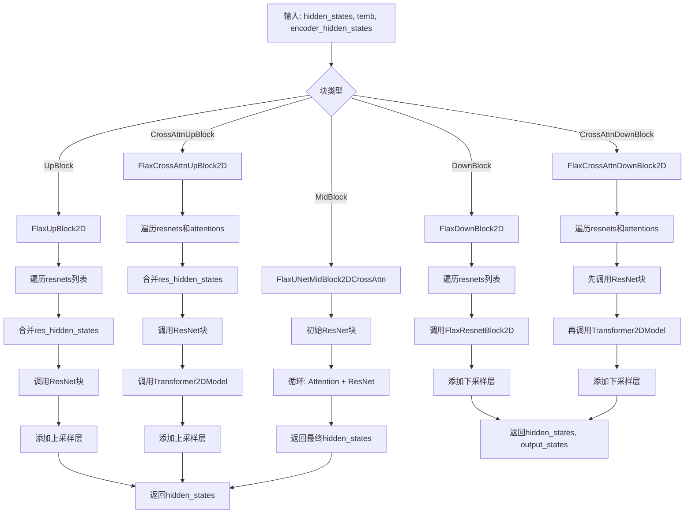
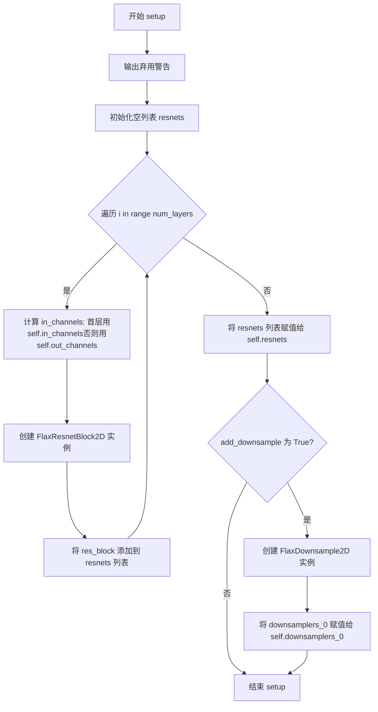
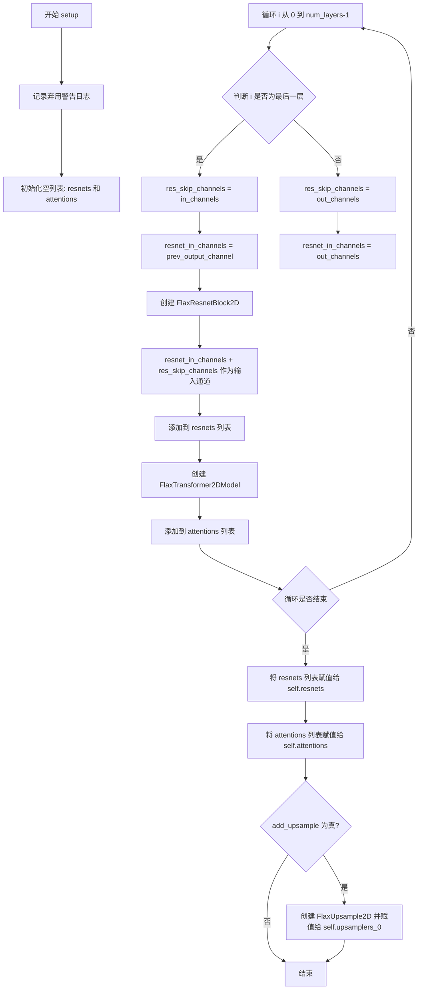
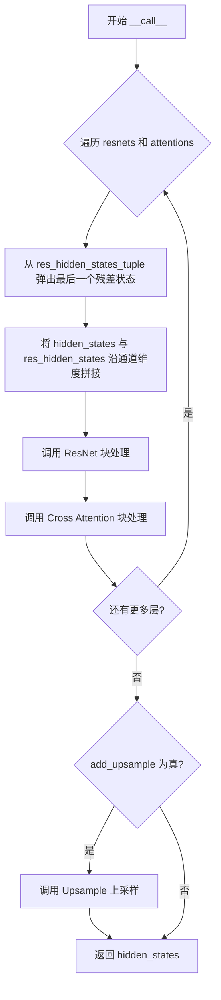
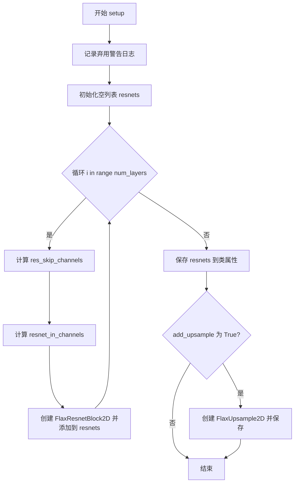
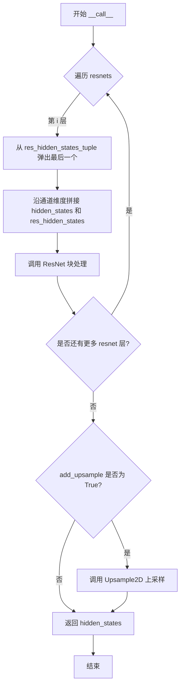
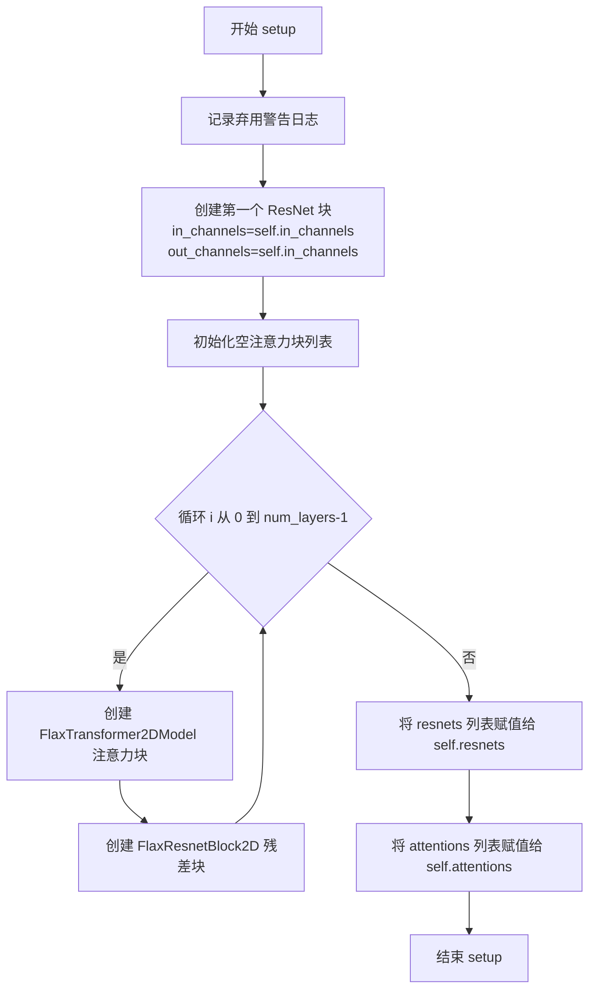

# `diffusers\src\diffusers\models\unets\unet_2d_blocks_flax.py` 详细设计文档

该文件实现了基于 Flax (JAX) 的 UNet 2D 架构组件，包括下采样块、上采样块和中层级块，用于扩散模型的图像生成。这些块结合了 ResNet 残差块和 Transformer 交叉注意力机制，支持内存高效注意力计算和多种配置选项。

## 整体流程



## 类结构

```
nn.Module (Flax基类)
├── FlaxCrossAttnDownBlock2D
│   ├── FlaxResnetBlock2D (列表)
│   ├── FlaxTransformer2DModel (列表)
│   └── FlaxDownsample2D
├── FlaxDownBlock2D
│   ├── FlaxResnetBlock2D (列表)
│   └── FlaxDownsample2D
├── FlaxCrossAttnUpBlock2D
│   ├── FlaxResnetBlock2D (列表)
│   ├── FlaxTransformer2DModel (列表)
│   └── FlaxUpsample2D
├── FlaxUpBlock2D
│   ├── FlaxResnetBlock2D (列表)
│   └── FlaxUpsample2D
└── FlaxUNetMidBlock2DCrossAttn
    ├── FlaxResnetBlock2D (列表)
    └── FlaxTransformer2DModel (列表)
```

## 全局变量及字段


### `logger`
    
日志记录器对象，用于记录警告信息

类型：`logging.Logger`
    


### `FlaxCrossAttnDownBlock2D.in_channels`
    
输入通道数

类型：`int`
    


### `FlaxCrossAttnDownBlock2D.out_channels`
    
输出通道数

类型：`int`
    


### `FlaxCrossAttnDownBlock2D.dropout`
    
Dropout率

类型：`float`
    


### `FlaxCrossAttnDownBlock2D.num_layers`
    
注意力层数量

类型：`int`
    


### `FlaxCrossAttnDownBlock2D.num_attention_heads`
    
注意力头数

类型：`int`
    


### `FlaxCrossAttnDownBlock2D.add_downsample`
    
是否添加下采样

类型：`bool`
    


### `FlaxCrossAttnDownBlock2D.use_linear_projection`
    
是否使用线性投影

类型：`bool`
    


### `FlaxCrossAttnDownBlock2D.only_cross_attention`
    
是否仅交叉注意力

类型：`bool`
    


### `FlaxCrossAttnDownBlock2D.use_memory_efficient_attention`
    
是否使用内存高效注意力

类型：`bool`
    


### `FlaxCrossAttnDownBlock2D.split_head_dim`
    
是否分割头维度

类型：`bool`
    


### `FlaxCrossAttnDownBlock2D.dtype`
    
数据类型

类型：`jnp.dtype`
    


### `FlaxCrossAttnDownBlock2D.transformer_layers_per_block`
    
每个块的Transformer层数

类型：`int`
    


### `FlaxCrossAttnDownBlock2D.resnets`
    
ResNet块列表

类型：`list`
    


### `FlaxCrossAttnDownBlock2D.attentions`
    
注意力块列表

类型：`list`
    


### `FlaxCrossAttnDownBlock2D.downsamplers_0`
    
下采样器

类型：`FlaxDownsample2D`
    


### `FlaxDownBlock2D.in_channels`
    
输入通道数

类型：`int`
    


### `FlaxDownBlock2D.out_channels`
    
输出通道数

类型：`int`
    


### `FlaxDownBlock2D.dropout`
    
Dropout率

类型：`float`
    


### `FlaxDownBlock2D.num_layers`
    
层数量

类型：`int`
    


### `FlaxDownBlock2D.add_downsample`
    
是否添加下采样

类型：`bool`
    


### `FlaxDownBlock2D.dtype`
    
数据类型

类型：`jnp.dtype`
    


### `FlaxDownBlock2D.resnets`
    
ResNet块列表

类型：`list`
    


### `FlaxDownBlock2D.downsamplers_0`
    
下采样器

类型：`FlaxDownsample2D`
    


### `FlaxCrossAttnUpBlock2D.in_channels`
    
输入通道数

类型：`int`
    


### `FlaxCrossAttnUpBlock2D.out_channels`
    
输出通道数

类型：`int`
    


### `FlaxCrossAttnUpBlock2D.prev_output_channel`
    
上一输出通道数

类型：`int`
    


### `FlaxCrossAttnUpBlock2D.dropout`
    
Dropout率

类型：`float`
    


### `FlaxCrossAttnUpBlock2D.num_layers`
    
注意力层数量

类型：`int`
    


### `FlaxCrossAttnUpBlock2D.num_attention_heads`
    
注意力头数

类型：`int`
    


### `FlaxCrossAttnUpBlock2D.add_upsample`
    
是否添加上采样

类型：`bool`
    


### `FlaxCrossAttnUpBlock2D.use_linear_projection`
    
是否使用线性投影

类型：`bool`
    


### `FlaxCrossAttnUpBlock2D.only_cross_attention`
    
是否仅交叉注意力

类型：`bool`
    


### `FlaxCrossAttnUpBlock2D.use_memory_efficient_attention`
    
是否使用内存高效注意力

类型：`bool`
    


### `FlaxCrossAttnUpBlock2D.split_head_dim`
    
是否分割头维度

类型：`bool`
    


### `FlaxCrossAttnUpBlock2D.dtype`
    
数据类型

类型：`jnp.dtype`
    


### `FlaxCrossAttnUpBlock2D.transformer_layers_per_block`
    
每个块的Transformer层数

类型：`int`
    


### `FlaxCrossAttnUpBlock2D.resnets`
    
ResNet块列表

类型：`list`
    


### `FlaxCrossAttnUpBlock2D.attentions`
    
注意力块列表

类型：`list`
    


### `FlaxCrossAttnUpBlock2D.upsamplers_0`
    
上采样器

类型：`FlaxUpsample2D`
    


### `FlaxUpBlock2D.in_channels`
    
输入通道数

类型：`int`
    


### `FlaxUpBlock2D.out_channels`
    
输出通道数

类型：`int`
    


### `FlaxUpBlock2D.prev_output_channel`
    
上一输出通道数

类型：`int`
    


### `FlaxUpBlock2D.dropout`
    
Dropout率

类型：`float`
    


### `FlaxUpBlock2D.num_layers`
    
层数量

类型：`int`
    


### `FlaxUpBlock2D.add_upsample`
    
是否添加上采样

类型：`bool`
    


### `FlaxUpBlock2D.dtype`
    
数据类型

类型：`jnp.dtype`
    


### `FlaxUpBlock2D.resnets`
    
ResNet块列表

类型：`list`
    


### `FlaxUpBlock2D.upsamplers_0`
    
上采样器

类型：`FlaxUpsample2D`
    


### `FlaxUNetMidBlock2DCrossAttn.in_channels`
    
输入通道数

类型：`int`
    


### `FlaxUNetMidBlock2DCrossAttn.dropout`
    
Dropout率

类型：`float`
    


### `FlaxUNetMidBlock2DCrossAttn.num_layers`
    
注意力层数量

类型：`int`
    


### `FlaxUNetMidBlock2DCrossAttn.num_attention_heads`
    
注意力头数

类型：`int`
    


### `FlaxUNetMidBlock2DCrossAttn.use_linear_projection`
    
是否使用线性投影

类型：`bool`
    


### `FlaxUNetMidBlock2DCrossAttn.use_memory_efficient_attention`
    
是否使用内存高效注意力

类型：`bool`
    


### `FlaxUNetMidBlock2DCrossAttn.split_head_dim`
    
是否分割头维度

类型：`bool`
    


### `FlaxUNetMidBlock2DCrossAttn.dtype`
    
数据类型

类型：`jnp.dtype`
    


### `FlaxUNetMidBlock2DCrossAttn.transformer_layers_per_block`
    
每个块的Transformer层数

类型：`int`
    


### `FlaxUNetMidBlock2DCrossAttn.resnets`
    
ResNet块列表

类型：`list`
    


### `FlaxUNetMidBlock2DCrossAttn.attentions`
    
注意力块列表

类型：`list`
    
    

## 全局函数及方法


### `FlaxCrossAttnDownBlock2D.setup()`

该方法是FlaxCrossAttnDownBlock2D类的初始化方法，用于在Flax神经网络模块中动态创建和配置ResNet块和注意力块，以构建带有交叉注意力机制的2D下采样模块。

参数：
- `self`：FlaxCrossAttnDownBlock2D实例本身，Flax框架自动传递

返回值：无（`None`），该方法为初始化方法，仅设置实例属性

#### 流程图

```mermaid
flowchart TD
    A[开始 setup] --> B[输出弃用警告日志]
    B --> C[初始化空列表: resnets, attentions]
    C --> D{循环 i in range(num_layers)}
    D -->|首次迭代| E[设置 in_channels = self.in_channels]
    D -->|非首次迭代| F[设置 in_channels = self.out_channels]
    E --> G[创建 FlaxResnetBlock2D]
    F --> G
    G --> H[将 res_block 添加到 resnets 列表]
    H --> I[创建 FlaxTransformer2DModel 注意力块]
    I --> J[将 attn_block 添加到 attentions 列表]
    J --> K{循环是否结束?}
    K -->|否| D
    K -->|是| L[将 resnets 赋值给 self.resnets]
    L --> M[将 attentions 赋值给 self.attentions]
    M --> N{add_downsample 为 True?}
    N -->|是| O[创建 FlaxDownsample2D 并赋值给 self.downsamplers_0]
    N -->|否| P[结束 setup]
    O --> P
```

#### 带注释源码

```python
def setup(self):
    """
    初始化FlaxCrossAttnDownBlock2D模块的子层。
    在Flax框架中，setup()方法在__init__之后被调用，用于构建子模块。
    """
    # 输出弃用警告，提示用户Flax类将在Diffusers v1.0.0中移除
    logger.warning(
        "Flax classes are deprecated and will be removed in Diffusers v1.0.0. We "
        "recommend migrating to PyTorch classes or pinning your version of Diffusers."
    )

    # 初始化空列表用于存储ResNet块和注意力块
    resnets = []
    attentions = []

    # 根据num_layers循环创建对应数量的ResNet和注意力块
    for i in range(self.num_layers):
        # 确定当前层的输入通道数：首层使用输入通道，后续层使用输出通道
        in_channels = self.in_channels if i == 0 else self.out_channels

        # 创建ResNet块，用于特征提取和残差连接
        res_block = FlaxResnetBlock2D(
            in_channels=in_channels,
            out_channels=self.out_channels,
            dropout_prob=self.dropout,
            dtype=self.dtype,
        )
        resnets.append(res_block)

        # 创建Transformer注意力块，用于交叉注意力机制
        attn_block = FlaxTransformer2DModel(
            in_channels=self.out_channels,
            n_heads=self.num_attention_heads,
            d_head=self.out_channels // self.num_attention_heads,
            depth=self.transformer_layers_per_block,
            use_linear_projection=self.use_linear_projection,
            only_cross_attention=self.only_cross_attention,
            use_memory_efficient_attention=self.use_memory_efficient_attention,
            split_head_dim=self.split_head_dim,
            dtype=self.dtype,
        )
        attentions.append(attn_block)

    # 将列表转换为不可变元组并存储为实例属性
    self.resnets = resnets
    self.attentions = attentions

    # 如果需要下采样，创建下采样层
    if self.add_downsample:
        self.downsamplers_0 = FlaxDownsample2D(self.out_channels, dtype=self.dtype)
```


### `FlaxCrossAttnDownBlock2D.__call__`

该方法是 FlaxCrossAttnDownBlock2D 类的前向传播函数，接收隐藏状态、时间嵌入和编码器隐藏状态，通过循环执行 ResNet 块和 Cross-Attention 块实现 2D 下采样块的特征提取与处理，最后返回最终隐藏状态和各中间输出状态。

参数：

- `self`：`FlaxCrossAttnDownBlock2D`，Flax 模块实例，隐式参数，表示当前的下采样块对象
- `hidden_states`：`jax.numpy.ndarray`，输入的隐藏状态张量，通常为形状 `(batch, height, width, channels)` 的 4D 张量
- `temb`：`jax.numpy.ndarray`，时间嵌入向量，用于条件注入，通常为形状 `(batch, dim)` 的 2D 张量
- `encoder_hidden_states`：`jax.numpy.ndarray`，编码器的隐藏状态，用于 Cross-Attention 计算，通常为形状 `(batch, seq_len, embed_dim)` 的 3D 张量
- `deterministic`：`bool`，可选参数，默认为 `True`，控制是否使用确定性前向传播（若为 `False` 则启用 dropout）

返回值：`(jax.numpy.ndarray, tuple[jax.numpy.ndarray])`，返回元组，第一个元素为最终的隐藏状态 `hidden_states`，第二个元素为包含所有中间输出状态的元组 `output_states`

#### 流程图

```mermaid
flowchart TD
    A[开始 __call__] --> B[初始化 output_states = ()]
    B --> C{遍历 resnets 和 attentions}
    C -->|第 i 层| D[hidden_states = resnet_i hidden_states, temb]
    D --> E[hidden_states = attn_i hidden_states, encoder_hidden_states]
    E --> F[output_states += hidden_states]
    F --> C
    C -->|遍历结束| G{add_downsample 是否为 True}
    G -->|是| H[hidden_states = downsamplers_0 hidden_states]
    H --> I[output_states += hidden_states]
    G -->|否| J[返回 hidden_states, output_states]
    I --> J
```

#### 带注释源码

```python
def __call__(self, hidden_states, temb, encoder_hidden_states, deterministic=True):
    """
    FlaxCrossAttnDownBlock2D 的前向传播方法，执行下采样块的特征提取
    
    参数:
        hidden_states: 输入特征图，形状为 (batch, height, width, in_channels)
        temb: 时间嵌入，用于残差块的条件注入
        encoder_hidden_states: 文本编码器的隐藏状态，用于 Cross-Attention
        deterministic: 控制是否使用 dropout，True 表示确定性前向传播
    
    返回:
        hidden_states: 经过所有层处理后的最终隐藏状态
        output_states: 包含每层输出的元组，用于跳跃连接
    """
    # 初始化输出状态元组，用于存储每层的中间输出
    output_states = ()

    # 遍历每一层 ResNet 和 Attention 块
    for resnet, attn in zip(self.resnets, self.attentions):
        # 第一层使用输入通道数，后续层使用输出通道数
        # ResNet 块进行特征提取和残差连接
        hidden_states = resnet(hidden_states, temb, deterministic=deterministic)
        
        # Cross-Attention 块接收 ResNet 输出和编码器隐藏状态
        # 实现文本条件对图像特征的条件控制
        hidden_states = attn(hidden_states, encoder_hidden_states, deterministic=deterministic)
        
        # 将当前层的输出添加到输出元组
        output_states += (hidden_states,)

    # 如果启用了下采样层，则进行空间维度的下采样
    if self.add_downsample:
        hidden_states = self.downsamplers_0(hidden_states)
        output_states += (hidden_states,)

    # 返回最终隐藏状态和所有中间状态（用于跳跃连接）
    return hidden_states, output_states
```


### `FlaxDownBlock2D.setup()`

该方法是 FlaxDownBlock2D 类的初始化方法，负责初始化 ResNet 块和下采样层，构建用于 UNet 模型的 2D 下采样块。它根据 num_layers 参数循环创建指定数量的 FlaxResnetBlock2D 实例，并根据 add_downsample 标志决定是否添加下采样层。

参数：此方法为 setup 方法，不接受外部参数（使用类属性作为配置）

返回值：无返回值（None），此方法用于初始化类属性

#### 流程图



#### 带注释源码

```python
def setup(self):
    """
    初始化 FlaxDownBlock2D 块，创建 ResNet 块和可选的下采样层
    """
    # 输出弃用警告，提示用户 Flax 类将在未来版本中移除
    logger.warning(
        "Flax classes are deprecated and will be removed in Diffusers v1.0.0. We "
        "recommend migrating to PyTorch classes or pinning your version of Diffusers."
    )

    # 初始化空列表用于存储 ResNet 块
    resnets = []

    # 循环创建 num_layers 个 ResNet 块
    for i in range(self.num_layers):
        # 确定当前层的输入通道数：第一层使用输入通道，其余层使用输出通道
        in_channels = self.in_channels if i == 0 else self.out_channels

        # 创建 ResNet 块实例
        res_block = FlaxResnetBlock2D(
            in_channels=in_channels,         # 当前层的输入通道
            out_channels=self.out_channels,   # 输出通道（所有层相同）
            dropout_prob=self.dropout,        # Dropout 概率
            dtype=self.dtype,                 # 数据类型
        )
        # 将创建的 ResNet 块添加到列表中
        resnets.append(res_block)

    # 将 ResNet 块列表存储为类属性
    self.resnets = resnets

    # 如果需要下采样，则创建下采样层
    if self.add_downsample:
        # 创建下采样层实例，使用输出通道数作为输入
        self.downsamplers_0 = FlaxDownsample2D(self.out_channels, dtype=self.dtype)
```


### `FlaxDownBlock2D.__call__`

该方法是 FlaxDownBlock2D 类的前向传播函数，负责对输入隐藏状态进行下采样块的处理。函数遍历内部的 ResNet 块序列，对每个块应用残差连接和下采样（如果启用），最终返回处理后的隐藏状态和所有中间输出状态。

参数：

- `hidden_states`：`jnp.ndarray`，输入的隐藏状态张量，形状为 (batch, height, width, channels)
- `temb`：`jnp.ndarray`，时间嵌入向量，用于条件化残差块
- `deterministic`：`bool`，是否在推理模式下运行（决定是否使用 dropout）

返回值：`Tuple[jnp.ndarray, Tuple[jnp.ndarray, ...]]`，返回最终的隐藏状态和所有中间输出状态组成的元组

#### 流程图

```mermaid
graph TD
    A[开始 __call__] --> B[初始化 output_states = ()]
    B --> C{遍历 resnets}
    C -->|每次迭代| D[resnet 处理 hidden_states 和 temb]
    D --> E[更新 output_states += (hidden_states,)]
    E --> C
    C -->|遍历完成| F{add_downsample 为 True?}
    F -->|是| G[downsamplers_0 下采样 hidden_states]
    G --> H[更新 output_states += (hidden_states,)]
    H --> I[返回 hidden_states, output_states]
    F -->|否| I
```

#### 带注释源码

```python
def __call__(self, hidden_states, temb, deterministic=True):
    """
    FlaxDownBlock2D 的前向传播方法，对输入特征进行下采样处理
    
    参数:
        hidden_states: 输入的隐藏状态张量，形状为 (batch, height, width, in_channels)
        temb: 时间嵌入向量，用于残差块的条件处理
        deterministic: 布尔值，决定是否使用 dropout（True 表示推理模式）
    
    返回:
        tuple: (hidden_states, output_states) - 最终隐藏状态和各中间输出状态
    """
    # 初始化输出状态元组，用于保存所有中间隐藏状态
    output_states = ()

    # 遍历每个 ResNet 块，依次处理隐藏状态
    for resnet in self.resnets:
        # 调用残差块的前向传播，更新隐藏状态
        # 参数: hidden_states, temb, deterministic
        hidden_states = resnet(hidden_states, temb, deterministic=deterministic)
        # 将当前隐藏状态添加到输出元组
        output_states += (hidden_states,)

    # 如果启用了下采样层
    if self.add_downsample:
        # 使用下采样器处理隐藏状态，降低空间分辨率
        hidden_states = self.downsamplers_0(hidden_states)
        # 将下采样后的隐藏状态添加到输出元组
        output_states += (hidden_states,)

    # 返回最终的隐藏状态和所有中间输出状态
    return hidden_states, output_states
```


### FlaxCrossAttnUpBlock2D.setup

该方法是 FlaxCrossAttnUpBlock2D 类的初始化方法，负责在模型构建阶段创建 ResNet 残差块和 Transformer 注意力块，以构建 Cross Attention 上采样模块。该方法根据 num_layers 参数循环创建指定数量的 ResNet 块和注意力块，并将它们存储为类的实例变量，同时根据 add_upsample 标志决定是否添加上采样层。

参数：
- 该方法无显式参数（使用类属性作为配置）

返回值：无返回值（None），该方法为副作用型方法，通过修改 self 来初始化类属性

#### 流程图



#### 带注释源码

```python
def setup(self):
    """
    初始化 FlaxCrossAttnUpBlock2D 模块的内部组件。
    该方法在 Flax Linen 框架的模型构建阶段被调用，用于创建
    ResNet 块、注意力块和可选的上采样层。
    """
    
    # 记录一条弃用警告，建议用户迁移到 PyTorch 实现
    logger.warning(
        "Flax classes are deprecated and will be removed in Diffusers v1.0.0. We "
        "recommend migrating to PyTorch classes or pinning your version of Diffusers."
    )

    # 创建空列表用于存储 ResNet 块和注意力块
    resnets = []
    attentions = []

    # 遍历每一层，根据 num_layers 参数创建对应数量的块
    for i in range(self.num_layers):
        # 计算跳跃连接通道数：
        # 最后一层使用 in_channels 作为跳跃连接通道
        # 其他层使用 out_channels
        res_skip_channels = self.in_channels if (i == self.num_layers - 1) else self.out_channels
        
        # 计算 ResNet 块的输入通道数：
        # 第一层使用 prev_output_channel（来自解码器跳跃连接）
        # 其他层使用 out_channels
        resnet_in_channels = self.prev_output_channel if i == 0 else self.out_channels

        # 创建 ResNet 块，输入通道 = 跳跃连接通道 + ResNet输入通道
        res_block = FlaxResnetBlock2D(
            in_channels=resnet_in_channels + res_skip_channels,
            out_channels=self.out_channels,
            dropout_prob=self.dropout,
            dtype=self.dtype,
        )
        resnets.append(res_block)

        # 创建 Cross Attention  Transformer 块
        attn_block = FlaxTransformer2DModel(
            in_channels=self.out_channels,
            n_heads=self.num_attention_heads,
            d_head=self.out_channels // self.num_attention_heads,
            depth=self.transformer_layers_per_block,
            use_linear_projection=self.use_linear_projection,
            only_cross_attention=self.only_cross_attention,
            use_memory_efficient_attention=self.use_memory_efficient_attention,
            split_head_dim=self.split_head_dim,
            dtype=self.dtype,
        )
        attentions.append(attn_block)

    # 将创建的块列表存储为类属性，供 __call__ 方法使用
    self.resnets = resnets
    self.attentions = attentions

    # 根据 add_upsample 标志决定是否添加上采样层
    if self.add_upsample:
        self.upsamplers_0 = FlaxUpsample2D(self.out_channels, dtype=self.dtype)
```


### `FlaxCrossAttnUpBlock2D.__call__`

该方法是FlaxCrossAttnUpBlock2D类的前向传播函数，负责执行Cross Attention 2D上采样块的前向计算。它接收隐藏状态、残差隐藏状态元组、时间嵌入和编码器隐藏状态，通过依次将隐藏状态与残差状态拼接后经过ResNet块和Cross Attention块处理，最后根据需要执行上采样操作，输出处理后的隐藏状态。

参数：

- `hidden_states`：`jnp.ndarray`，输入的隐藏状态张量，形状为(batch, channels, height, width)
- `res_hidden_states_tuple`：`Tuple[jnp.ndarray]`，来自解码器各层的残差隐藏状态元组，用于跳跃连接
- `temb`：`jnp.ndarray`，时间嵌入向量，用于条件生成
- `encoder_hidden_states`：`jnp.ndarray`，编码器的隐藏状态，用于Cross Attention计算
- `deterministic`：`bool`，控制是否使用确定性计算（影响dropout等随机操作）

返回值：`jnp.ndarray`，经过上采样块处理后的隐藏状态张量

#### 流程图



#### 带注释源码

```python
def __call__(self, hidden_states, res_hidden_states_tuple, temb, encoder_hidden_states, deterministic=True):
    """
    Cross Attention 2D 上采样块的前向传播
    
    参数:
        hidden_states: 输入隐藏状态 (batch, channels, height, width)
        res_hidden_states_tuple: 残差隐藏状态元组，用于跳跃连接
        temb: 时间嵌入，用于控制生成过程
        encoder_hidden_states: 编码器隐藏状态，用于cross attention
        deterministic: 是否确定性执行（影响dropout）
    
    返回:
        hidden_states: 处理后的隐藏状态
    """
    # 遍历每个ResNet块和Attention块
    for resnet, attn in zip(self.resnets, self.attentions):
        # 从残差元组中弹出最后一个元素（从最深层到最浅层）
        res_hidden_states = res_hidden_states_tuple[-1]
        res_hidden_states_tuple = res_hidden_states_tuple[:-1]
        
        # 将当前隐藏状态与残差隐藏状态沿通道维度(-1)拼接
        # 这是UNet上采样阶段的典型跳跃连接操作
        hidden_states = jnp.concatenate((hidden_states, res_hidden_states), axis=-1)
        
        # 通过ResNet块处理，融合跳跃连接的特征
        hidden_states = resnet(hidden_states, temb, deterministic=deterministic)
        
        # 通过Cross Attention块处理，引入encoder_hidden_states的条件信息
        hidden_states = attn(hidden_states, encoder_hidden_states, deterministic=deterministic)

    # 如果启用了上采样，则应用上采样层
    if self.add_upsample:
        hidden_states = self.upsamplers_0(hidden_states)

    return hidden_states
```


### FlaxUpBlock2D.setup()

该方法是 FlaxUpBlock2D 类的初始化方法，负责初始化 ResNet 块列表和可选的上采样层，用于构建 UNet 的上采样模块。

参数：

- 该方法没有显式参数（使用类的属性作为配置）

返回值：`None`，该方法仅初始化类属性，不返回任何值

#### 流程图



#### 带注释源码

```
def setup(self):
    """
    初始化 FlaxUpBlock2D 的内部组件
    """
    # 记录弃用警告 - Flax 类将在 Diffusers v1.0.0 中移除
    logger.warning(
        "Flax classes are deprecated and will be removed in Diffusers v1.0.0. We "
        "recommend migrating to PyTorch classes or pinning your version of Diffusers."
    )

    # 初始化空列表用于存储 ResNet 块
    resnets = []

    # 遍历每一层创建 ResNet 块
    for i in range(self.num_layers):
        # 计算跳跃连接的通道数
        # 最后一层使用 in_channels，否则使用 out_channels
        res_skip_channels = self.in_channels if (i == self.num_layers - 1) else self.out_channels
        
        # 计算 ResNet 块的输入通道数
        # 第一层使用 prev_output_channel（来自解码器），后续层使用 out_channels
        resnet_in_channels = self.prev_output_channel if i == 0 else self.out_channels

        # 创建 ResNet 块实例，输入通道 = resnet_in_channels + res_skip_channels（跳跃连接）
        res_block = FlaxResnetBlock2D(
            in_channels=resnet_in_channels + res_skip_channels,
            out_channels=self.out_channels,
            dropout_prob=self.dropout,
            dtype=self.dtype,
        )
        # 将创建的 ResNet 块添加到列表中
        resnets.append(res_block)

    # 将 ResNet 块列表保存为类属性
    self.resnets = resnets

    # 如果需要添加上采样层
    if self.add_upsample:
        # 创建上采样器实例
        self.upsamplers_0 = FlaxUpsample2D(self.out_channels, dtype=self.dtype)
```


### `FlaxUpBlock2D.__call__`

该方法是 Flax 2D 上采样块的前向传播函数，负责将特征图上采样并通过残差连接融合来自编码器的跳跃连接信息。

参数：

- `hidden_states`：`jnp.ndarray`，当前层的主输入特征张量，形状为 (batch, height, width, channels)
- `res_hidden_states_tuple`：Tuple[jnp.ndarray]，来自编码器侧的跳跃连接特征元组，按从大到小的空间尺寸排列
- `temb`：`jnp.ndarray`，时间嵌入向量，用于条件归一化
- `deterministic`：`bool`，是否使用确定性计算（禁用 dropout）

返回值：`jnp.ndarray`，经过上采样和残差块处理后的输出特征张量

#### 流程图



#### 带注释源码

```python
def __call__(self, hidden_states, res_hidden_states_tuple, temb, deterministic=True):
    """
    Flax 2D 上采样块的前向传播
    
    参数:
        hidden_states: 主输入特征图 (batch, h, w, in_channels)
        res_hidden_states_tuple: 跳跃连接特征元组，从编码器侧收集
        temb: 时间嵌入向量，用于残差块的条件归一化
        deterministic: 是否禁用 dropout 进行确定性推理
    
    返回:
        上采样后的特征图
    """
    # 遍历每个残差网络层
    for resnet in self.resnets:
        # 从跳跃连接元组中弹出最后一个（空间尺寸最大的）
        res_hidden_states = res_hidden_states_tuple[-1]
        res_hidden_states_tuple = res_hidden_states_tuple[:-1]
        
        # 沿通道维度(-1)拼接当前特征与跳跃连接特征
        hidden_states = jnp.concatenate((hidden_states, res_hidden_states), axis=-1)
        
        # 通过残差块处理，融合并变换特征
        hidden_states = resnet(hidden_states, temb, deterministic=deterministic)

    # 如果启用上采样，则应用上采样层
    if self.add_upsample:
        hidden_states = self.upsamplers_0(hidden_states)

    return hidden_states
```


### `FlaxUNetMidBlock2DCrossAttn.setup`

该方法初始化 `FlaxUNetMidBlock2DCrossAttn` 模块的内部组件，包括创建 ResNet 残差块和 Cross-Attention 注意力块列表，用于构建 UNet 中间层的网络结构。

参数：

- 该方法无显式参数（使用类属性进行配置）

返回值：无返回值（`None`），通过 `self.resnets` 和 `self.attentions` 属性存储组件

#### 流程图



#### 带注释源码

```
def setup(self):
    """
    初始化模块的内部组件。
    构建 ResNet 残差块和 Cross-Attention 注意力块的堆叠结构。
    """
    # 记录弃用警告：Flax 类将在 Diffusers v1.0.0 中移除
    logger.warning(
        "Flax classes are deprecated and will be removed in Diffusers v1.0.0. We "
        "recommend migrating to PyTorch classes or pinning your version of Diffusers."
    )

    # 始终至少有一个 ResNet 块
    # 创建第一个残差块，输入输出通道数相同
    resnets = [
        FlaxResnetBlock2D(
            in_channels=self.in_channels,    # 输入通道数
            out_channels=self.in_channels,   # 输出通道数（与输入相同）
            dropout_prob=self.dropout,       # Dropout 概率
            dtype=self.dtype,                # 数据类型
        )
    ]

    # 初始化空注意力块列表
    attentions = []

    # 根据 num_layers 循环创建注意力块和残差块
    for _ in range(self.num_layers):
        # 创建 Cross-Attention Transformer 块
        attn_block = FlaxTransformer2DModel(
            in_channels=self.in_channels,                    # 输入通道数
            n_heads=self.num_attention_heads,                 # 注意力头数量
            d_head=self.in_channels // self.num_attention_heads,  # 每个头的维度
            depth=self.transformer_layers_per_block,          # Transformer 层数
            use_linear_projection=self.use_linear_projection, # 是否使用线性投影
            use_memory_efficient_attention=self.use_memory_efficient_attention,  # 内存高效注意力
            split_head_dim=self.split_head_dim,               # 是否分割头维度
            dtype=self.dtype,                                  # 数据类型
        )
        attentions.append(attn_block)

        # 创建额外的 ResNet 残差块
        res_block = FlaxResnetBlock2D(
            in_channels=self.in_channels,    # 输入通道数
            out_channels=self.in_channels,   # 输出通道数
            dropout_prob=self.dropout,       # Dropout 概率
            dtype=self.dtype,                # 数据类型
        )
        resnets.append(res_block)

    # 将构建好的模块列表保存为实例属性
    self.resnets = resnets      # 存储所有 ResNet 块
    self.attentions = attentions  # 存储所有注意力块
```


### `FlaxUNetMidBlock2DCrossAttn.__call__`

Cross Attention 2D 中间块的前向传播方法，负责处理 UNet 架构中间层的特征。通过交替执行 Cross Attention 模块和 ResNet 块，将编码器隐藏状态（encoder_hidden_states）作为条件信息注入到特征空间中，实现文本到图像扩散模型中的跨模态特征融合。

参数：

- `hidden_states`：`jax.numpy.ndarray`，输入的隐藏状态张量，通常是来自编码器的特征图
- `temb`：`jax.numpy.ndarray`，时间嵌入向量，用于注入扩散过程的时间步信息
- `encoder_hidden_states`：`jax.numpy.ndarray`，编码器的隐藏状态（来自文本编码器），作为 Cross Attention 的 Key 和 Value
- `deterministic`：`bool`，控制是否启用 dropout，True 表示确定性执行（推理模式），False 表示训练模式

返回值：`jax.numpy.ndarray`，经过中间块处理后的隐藏状态张量

#### 流程图

```mermaid
flowchart TD
    A[hidden_states 输入] --> B[resnets[0] 初始 ResNet 块]
    B --> C{遍历 attentions 和 resnets[1:]"}
    
    C -->|第 i 次迭代| D[attn[i] Cross Attention]
    D --> E[encoder_hidden_states 作为条件]
    D --> F[hidden_states 输出]
    
    F --> G[resnets[i+1] ResNet 块]
    G --> H[temb 时间嵌入注入]
    G --> I[hidden_states 更新]
    
    I --> C
    C -->|遍历结束| J[返回 hidden_states]
    
    style A fill:#e1f5fe
    style J fill:#c8e6c9
    style E fill:#fff3e0
    style H fill:#fce4ec
```

#### 带注释源码

```python
def __call__(self, hidden_states, temb, encoder_hidden_states, deterministic=True):
    """
    Cross Attention 2D 中间块的前向传播
    
    参数:
        hidden_states: 输入特征张量，形状为 (batch, height, width, channels)
        temb: 时间嵌入向量，用于注入扩散时间步信息
        encoder_hidden_states: 文本编码器输出，用于 Cross Attention
        deterministic: 控制 dropout，True 为推理模式，False 为训练模式
    
    返回:
        处理后的隐藏状态张量
    """
    
    # 步骤1: 通过第一个 ResNet 块进行初始特征处理
    # 这里不传入 deterministic，因为第一个块通常不含 dropout
    hidden_states = self.resnets[0](hidden_states, temb)
    
    # 步骤2: 交替执行 Cross Attention 和 ResNet 块
    # attentions 和 resnets[1:] 长度相同，形成 attention-resnet 交替结构
    for attn, resnet in zip(self.attentions, self.resnets[1:]):
        # 2.1 Cross Attention 模块
        # 将 encoder_hidden_states 作为条件信息注入到 hidden_states
        # deterministic 参数控制是否使用 dropout
        hidden_states = attn(
            hidden_states, 
            encoder_hidden_states, 
            deterministic=deterministic
        )
        
        # 2.2 ResNet 残差块
        # 再次注入时间嵌入 temb，并进行残差连接
        hidden_states = resnet(
            hidden_states, 
            temb, 
            deterministic=deterministic
        )
    
    # 步骤3: 返回最终的隐藏状态
    return hidden_states
```

## 关键组件


### FlaxCrossAttnDownBlock2D
带交叉注意力的2D下采样块，用于UNet编码器部分，包含ResNet块和Transformer注意力块的级联，支持内存高效注意力和头维度分割优化。

### FlaxDownBlock2D
基础2D下采样块，仅包含ResNet块序列，用于不需要交叉注意力的下采样路径。

### FlaxCrossAttnUpBlock2D
带交叉注意力的2D上采样块，用于UNet解码器部分，通过跳跃连接融合编码器特征，支持残差状态合并和上采样。

### FlaxUpBlock2D
基础2D上采样块，仅包含ResNet块序列，用于不需要交叉注意力的上采样路径。

### FlaxUNetMidBlock2DCrossAttn
UNet中间层的交叉注意力块，连接编码器和解码器，首先通过ResNet块处理，再交替执行注意力和ResNet操作。

### FlaxResnetBlock2D (外部依赖)
ResNet残差块，用于特征提取和维度变换，提供非线性表达能力。

### FlaxTransformer2DModel (外部依赖)
2D Transformer模型，实现自注意力和交叉注意力机制，支持内存高效注意力计算和线性投影优化。

### FlaxDownsample2D / FlaxUpsample2D (外部依赖)
上采样和下采样2D模块，用于调整特征图的空间分辨率。

### 内存高效注意力机制
通过use_memory_efficient_attention参数启用，采用分块计算策略降低注意力计算的内存占用。

### 头维度分割优化
通过split_head_dim参数启用，将注意力头维度分割为新轴进行计算，可加速Stable Diffusion 2.x和XL版本的推理。

### 跳跃连接机制
上采样块中通过jnp.concatenate合并残差隐藏状态，实现编码器-解码器特征融合。

### 确定性执行控制
通过deterministic参数控制是否使用随机性（如dropout），支持可复现的推理和训练模式。


## 问题及建议


### 已知问题

- **Flax框架弃用风险**：所有类都包含弃用警告，说明Flax实现将在Diffusers v1.0.0中移除，继续使用将面临迁移压力
- **重复代码模式**：五个类（DownBlock、CrossAttnDownBlock、UpBlock、CrossAttnUpBlock、UNetMidBlock）之间存在高度重复的setup逻辑和类结构
- **重复的警告日志**：每各类都有相同的弃用警告信息，导致代码冗余
- **命名不一致**：`FlaxDownBlock2D`中使用`add_downsample`参数，而`FlaxUpBlock2D`中使用`add_upsample`参数，命名不统一
- **缺失的参数校验**：没有对输入参数（如in_channels、out_channels、num_layers等）进行有效性验证，可能导致运行时错误
- **类型注解不完整**：部分变量和返回值缺少类型注解，影响代码可读性和静态分析
- **弃用信息硬编码**：弃用警告信息硬编码在类内部，难以维护和统一管理
- **内存泄漏风险**：在`__call__`方法中通过tuple切片（`res_hidden_states_tuple[:-1]`）创建新元组，可能导致内存开销

### 优化建议

- **统一迁移路径**：建立明确的Flax到PyTorch的迁移计划，并提供迁移工具或脚本
- **提取公共基类**：将重复的ResNet构建逻辑、attention块初始化、downsample/upsample配置提取到抽象基类中
- **统一参数命名**：将`add_downsample`和`add_upsample`统一为`add_sample`或类似的通用名称
- **集中弃用管理**：创建装饰器或配置类统一管理弃用警告，避免在每个类中重复定义
- **添加输入校验**：在`setup`或`__call__`方法开始处添加参数有效性检查（如channels > 0、num_layers >= 1等）
- **完善类型注解**：为所有方法参数和返回值添加完整的类型注解
- **优化残差连接处理**：考虑使用列表代替tuple进行res_hidden_states的处理，减少内存拷贝
- **文档增强**：为每个参数添加更详细的描述，特别是`transformer_layers_per_block`和`split_head_dim`等高级参数的作用

## 其它


### 设计目标与约束

**设计目标**：实现Flax版本的UNet 2D模块，用于扩散模型的编码器-解码器架构，支持下采样、上采样和交叉注意力机制，提供高效的图像特征提取和重建能力。

**主要约束**：
- 依赖Flax Linen框架和JAX/Flax张量操作
- 必须与Diffusers库的其他组件（如FlaxTransformer2DModel、FlaxResnetBlock2D等）兼容
- 需要支持内存高效注意力机制以处理高分辨率图像
- 受限于JAX的函数式编程范式，所有模块必须是纯函数式

### 错误处理与异常设计

- **参数校验**：在setup()方法中应添加参数有效性检查（如in_channels/out_channels必须为正整数，dropout必须在[0,1]范围内）
- **维度不匹配**：当encoder_hidden_states与hidden_states维度不兼容时应抛出明确的错误信息
- **废弃警告**：当前代码已包含Flax类废弃警告，建议在文档中明确说明迁移时间线
- **异常传播**：JAX框架下主要通过assert和raise语句进行错误处理，建议补充详细的错误日志

### 数据流与状态机

**数据流方向**：
- **下采样路径（Down Blocks）**：hidden_states → ResNet块 → 注意力块 → 下采样 → 输出
- **上采样路径（Up Blocks）**：hidden_states + res_hidden_states → ResNet块 → 注意力块 → 上采样 → 输出
- **中间块（Mid Block）**：hidden_states → ResNet → 注意力块交替 → 输出

**状态管理**：
- 使用Flax的不可变状态（immutable state），通过deterministic参数控制随机性
- output_states元组用于保存每层输出，供跳跃连接使用

### 外部依赖与接口契约

**直接依赖**：
- `flax.linen as nn` - 神经网络基类
- `jax.numpy as jnp` - 张量操作
- `FlaxTransformer2DModel` - 注意力模块
- `FlaxResnetBlock2D` - ResNet块
- `FlaxDownsample2D` / `FlaxUpsample2D` - 采样模块

**接口约定**：
- 所有__call__方法必须接受deterministic参数以控制Dropout
- 下采样块返回(hidden_states, output_states)元组
- 上采样块接受res_hidden_states_tuple作为跳跃连接输入
- encoder_hidden_states仅在CrossAttn块中使用

### 性能考虑与基准测试

- 内存高效注意力（use_memory_efficient_attention）可显著降低大分辨率下的显存占用
- split_head_dim选项对Stable Diffusion 2.x和XL有加速效果
- 建议在文档中标注各配置组合的典型推理速度和显存需求
- 应包含JIT编译性能测试结果

### 安全性考虑

- 当前代码不涉及用户数据处理，无直接安全风险
- 建议确保依赖库的版本安全性（特别是Flax和JAX）
- 代码中无敏感信息硬编码

### 兼容性设计

- **框架兼容性**：仅支持Flax Linen，不支持PyTorch版本
- **版本兼容性**：代码标注将在Diffusers v1.0.0中移除，需提前规划迁移
- **API兼容性**：transformer_layers_per_block参数需与FlaxTransformer2DModel保持一致

### 配置管理与参数说明

- 所有类字段均通过构造函数参数配置
- 建议补充配置示例和默认值说明文档
- 关键参数：in_channels、out_channels、num_layers、num_attention_heads、dtype

### 测试策略建议

- 单元测试：验证各模块前向传播输出维度正确性
- 集成测试：验证UNet整体架构的数据流正确性
- 数值测试：对比PyTorch实现确保输出一致（考虑数值误差容限）
- 性能测试：对比不同配置下的推理速度和显存占用

    