# `diffusers\src\diffusers\models\unets\unet_2d_condition.py` 详细设计文档

UNet2DConditionModel 是一个条件 2D UNet 神经网络模型，用于图像生成任务。该模型接收噪声样本、时间步长和编码器隐藏状态作为输入，通过下采样块、中间块和上采样块进行处理，最终输出去噪后的图像样本。该模型支持多种注意力机制、LoRA 适配器、ControlNet 和 T2I-Adapter 等扩展功能。

## 整体流程

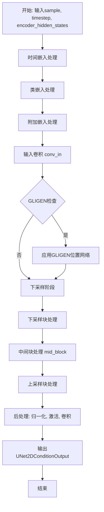

## 类结构

```
UNet2DConditionOutput (数据类)
└── UNet2DConditionModel (主类)
    ├── 嵌入层: time_embedding, class_embedding, add_embedding, encoder_hid_proj
    ├── 卷积层: conv_in, conv_out, conv_norm_out
    ├── 时间投影: time_proj
    ├── 下采样块: down_blocks (ModuleList)
    ├── 上采样块: up_blocks (ModuleList)
    └── 中间块: mid_block
```

## 全局变量及字段


### `logger`
    
Logger instance for tracking and debugging the UNet model operations

类型：`logging.Logger`
    


### `ADDED_KV_ATTENTION_PROCESSORS`
    
Set of attention processor classes that support added key-value projections for cross-attention mechanisms

类型：`set`
    


### `CROSS_ATTENTION_PROCESSORS`
    
Set of attention processor classes that implement standard cross-attention functionality

类型：`set`
    


### `UNet2DConditionOutput.sample`
    
The hidden states output conditioned on encoder_hidden_states input, with shape (batch_size, num_channels, height, width)

类型：`torch.Tensor`
    


### `UNet2DConditionModel.sample_size`
    
Height and width of input/output sample, defining the spatial dimensions for the UNet

类型：`int | tuple[int, int] | None`
    


### `UNet2DConditionModel.conv_in`
    
Input convolutional layer that projects from in_channels to the first block_out_channels

类型：`nn.Conv2d`
    


### `UNet2DConditionModel.time_proj`
    
Time embedding projection layer that converts timesteps into positional or Fourier embeddings

类型：`Timesteps | GaussianFourierProjection`
    


### `UNet2DConditionModel.time_embedding`
    
Neural network that processes timestep embeddings with optional activation and conditioning projection

类型：`TimestepEmbedding`
    


### `UNet2DConditionModel.encoder_hid_proj`
    
Projection layer for encoding hidden dimensions from external encoders (text/image) to cross-attention dimension

类型：`nn.Linear | TextImageProjection | ImageProjection | None`
    


### `UNet2DConditionModel.class_embedding`
    
Embedding layer for class labels used in conditional generation, supporting various embedding strategies

类型：`nn.Embedding | TimestepEmbedding | nn.Identity | nn.Linear | None`
    


### `UNet2DConditionModel.add_embedding`
    
Additional embedding layer for extra conditioning information like text, images, or hints

类型：`TextTimeEmbedding | TextImageTimeEmbedding | TimestepEmbedding | ImageTimeEmbedding | ImageHintTimeEmbedding | None`
    


### `UNet2DConditionModel.down_blocks`
    
List of downsampling blocks that progressively reduce spatial dimensions while increasing channels

类型：`nn.ModuleList`
    


### `UNet2DConditionModel.mid_block`
    
Middle block of the UNet that processes the lowest resolution features with optional cross-attention

类型：`UNetMidBlock2DCrossAttn | UNetMidBlock2D | None`
    


### `UNet2DConditionModel.up_blocks`
    
List of upsampling blocks that progressively restore spatial dimensions while decoding features

类型：`nn.ModuleList`
    


### `UNet2DConditionModel.conv_norm_out`
    
Group normalization layer applied before the output convolution for feature normalization

类型：`nn.GroupNorm | None`
    


### `UNet2DConditionModel.conv_act`
    
Activation function applied after group normalization in the output post-processing

类型：`Callable | None`
    


### `UNet2DConditionModel.conv_out`
    
Output convolutional layer that projects from first block_out_channels to out_channels

类型：`nn.Conv2d`
    


### `UNet2DConditionModel.num_upsamplers`
    
Counter tracking the number of upsampling layers in the UNet architecture

类型：`int`
    


### `UNet2DConditionModel.time_embed_act`
    
Optional activation function applied to time embeddings before passing to UNet blocks

类型：`Callable | None`
    
    

## 全局函数及方法


### `get_down_block`

该函数是一个工厂函数，用于根据传入的 `down_block_type` 参数动态创建不同的下采样块（Down Block）。这些下采样块是 UNet 架构中 Encoder 部分的核心组件，负责逐步降低特征图的空间分辨率同时提取多尺度特征。

参数：

-  `down_block_type`：`str`，指定要创建的下采样块类型（如 "CrossAttnDownBlock2D"、"DownBlock2D" 等）
-  `num_layers`：`int`，该块中包含的 ResNet 层数量
-  `transformer_layers_per_block`：`int | tuple[int] | tuple[tuple]`，每个块中 transformer 层的数量
-  `in_channels`：`int`，输入通道数
-  `out_channels`：`int`，输出通道数
-  `temb_channels`：`int`，时间嵌入（timestep embedding）的通道数
-  `add_downsample`：`bool`，是否添加下采样层
-  `resnet_eps`：`float`，ResNet 块的 epsilon 值，用于归一化层
-  `resnet_act_fn`：`str`，ResNet 块使用的激活函数（如 "silu"）
-  `resnet_groups`：`int`，ResNet 块中 GroupNorm 的组数
-  `cross_attention_dim`：`int | tuple[int]`，交叉注意力机制的维度
-  `num_attention_heads`：`int | tuple[int]`，注意力头的数量
-  `downsample_padding`：`int`，下采样卷积的填充大小
-  `dual_cross_attention`：`bool`，是否使用双交叉注意力
-  `use_linear_projection`：`bool`，是否使用线性投影
-  `only_cross_attention`：`bool`，是否只使用交叉注意力
-  `upcast_attention`：`bool`，是否向上转换注意力计算精度
-  `resnet_time_scale_shift`：`str`，ResNet 时间尺度移位配置
-  `attention_type`：`str`，注意力机制类型
-  `resnet_skip_time_act`：`bool`，是否跳过 ResNet 中的时间激活
-  `resnet_out_scale_factor`：`float`，ResNet 输出缩放因子
-  `cross_attention_norm`：`str | None`，交叉注意力归一化类型
-  `attention_head_dim`：`int`，注意力头的维度
-  `dropout`：`float`，Dropout 概率

返回值：`nn.Module`，返回一个下采样块（Down Block）的实例

#### 流程图

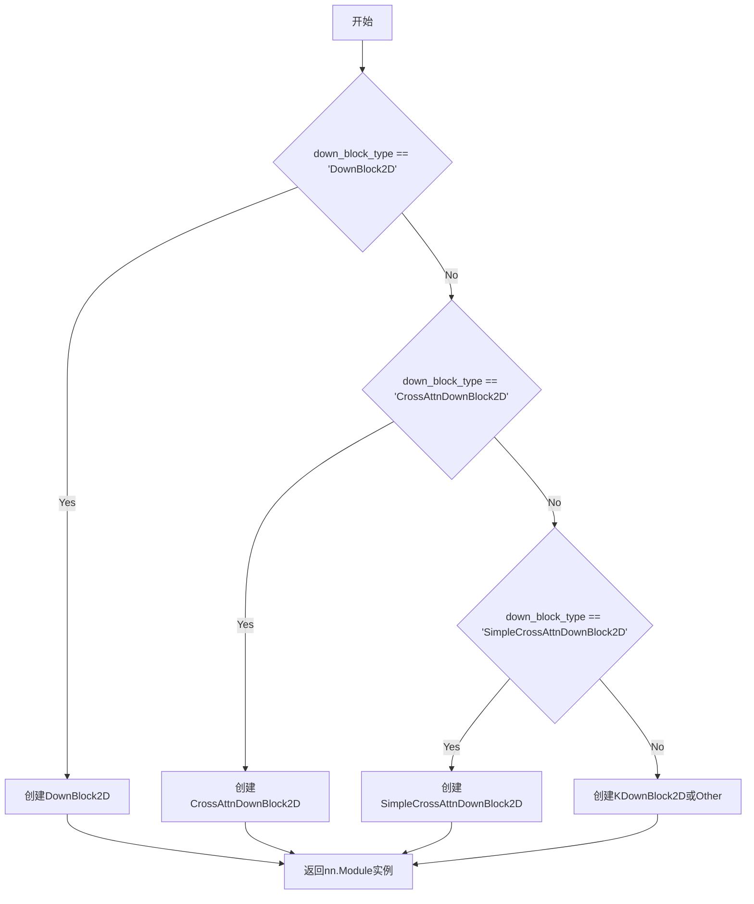

#### 带注释源码

```python
# 注意：此源码是基于代码中调用get_down_block的方式推断得出的。
# 实际的函数定义位于 unet_2d_blocks.py 文件中。
def get_down_block(
    down_block_type: str,  # 下采样块的类型标识符
    num_layers: int = 1,  # 块内ResNet层数
    transformer_layers_per_block: int | tuple[int] | tuple[tuple] = 1,  # Transformer层数
    in_channels: int = 0,  # 输入特征通道数
    out_channels: int = 0,  # 输出特征通道数
    temb_channels: int = 0,  # 时间嵌入通道数
    add_downsample: bool = True,  # 是否添加下采样操作
    resnet_eps: float = 1e-6,  # 归一化层epsilon
    resnet_act_fn: str = "silu",  # 激活函数名称
    resnet_groups: int = 32,  # GroupNorm组数
    cross_attention_dim: int = 0,  # 交叉注意力维度
    num_attention_heads: int = 1,  # 注意力头数
    downsample_padding: int = 1,  # 下采样卷积填充
    dual_cross_attention: bool = False,  # 双交叉注意力开关
    use_linear_projection: bool = False,  # 线性投影开关
    only_cross_attention: bool = False,  # 仅交叉注意力开关
    upcast_attention: bool = False,  # 注意力精度升级开关
    resnet_time_scale_shift: str = "default",  # ResNet时间偏移策略
    attention_type: str = "default",  # 注意力机制类型
    resnet_skip_time_act: bool = False,  # 跳过时间激活
    resnet_out_scale_factor: float = 1.0,  # 输出缩放因子
    cross_attention_norm: str | None = None,  # 交叉注意力归一化
    attention_head_dim: int = 8,  # 注意力头维度
    dropout: float = 0.0,  # Dropout概率
) -> nn.Module:
    """
    根据down_block_type参数创建对应的下采样块实例。
    
    该函数通过字符串标识符动态实例化不同的下采样块类，
    支持ResNet与Transformer的多种组合方式。
    """
    # 内部逻辑根据down_block_type字符串匹配并调用相应的块构造函数
    # 返回值是一个nn.Module子类的实例
```


### `get_mid_block`

`get_mid_block` 是一个工厂函数，根据 `mid_block_type` 参数创建并返回 UNet 的中间块（Middle Block）。该函数根据传入的块类型（如 `UNetMidBlock2DCrossAttn`、`UNetMidBlock2D`、`UNetMidBlock2DSimpleCrossAttn`）和配置参数，实例化相应的中间块对象，用于 UNet2DConditionModel 的中间层。

参数：

- `mid_block_type`：`str`，中间块的类型（如 "UNetMidBlock2DCrossAttn"、"UNetMidBlock2D"、"UNetMidBlock2DSimpleCrossAttn" 或 None）
- `temb_channels`：`int`，时间嵌入的通道数
- `in_channels`：`int`，输入特征图的通道数
- `resnet_eps`：`float`，ResNet 块的 epsilon 值，用于归一化层
- `resnet_act_fn`：`str`，ResNet 块的激活函数名称（如 "silu"）
- `resnet_groups`：`int` 或 `None`，ResNet 块中 GroupNorm 的组数
- `output_scale_factor`：`float`，中间块输出尺度因子
- `transformer_layers_per_block`：`int`、`tuple[int]` 或 `tuple[tuple]`，每个块中 Transformer 层的数量
- `num_attention_heads`：`int` 或 `tuple[int]`，注意力头的数量
- `cross_attention_dim`：`int` 或 `tuple[int]`，交叉注意力维度
- `dual_cross_attention`：`bool`，是否使用双交叉注意力
- `use_linear_projection`：`bool`，是否使用线性投影
- `mid_block_only_cross_attention`：`bool` 或 `None`，中间块是否仅使用交叉注意力
- `upcast_attention`：`bool`，是否向上转换注意力
- `resnet_time_scale_shift`：`str`，ResNet 时间尺度移位配置（"default" 或 "scale_shift"）
- `attention_type`：`str`，注意力类型（"default"、"gated"、"gated-text-image" 等）
- `resnet_skip_time_act`：`bool`，是否跳过 ResNet 的时间激活
- `cross_attention_norm`：`str` 或 `None`，交叉注意力归一化类型
- `attention_head_dim`：`int`，注意力头的维度
- `dropout`：`float`，Dropout 概率

返回值：`nn.Module` 或 `None`，返回实例化的中间块模型，如果 `mid_block_type` 为 `None` 则返回 `None`

#### 流程图

```mermaid
flowchart TD
    A[开始 get_mid_block] --> B{检查 mid_block_type 是否为 None}
    B -->|是| C[返回 None]
    B -->|否| D{mid_block_type == "UNetMidBlock2D"}
    D -->|是| E[创建并返回 UNetMidBlock2D 实例]
    D -->|否| F{mid_block_type == "UNetMidBlock2DCrossAttn"}
    F -->|是| G[创建并返回 UNetMidBlock2DCrossAttn 实例]
    F -->|否| H{mid_block_type == "UNetMidBlock2DSimpleCrossAttn"}
    H -->|是| I[创建并返回 UNetMidBlock2DSimpleCrossAttn 实例]
    H -->|否| J[抛出 ValueError: 不支持的 mid_block_type]
```

#### 带注释源码

```python
# 源码位于 diffusers/src/diffusers/models/unets/unet_2d_blocks.py
# 以下为逻辑推断的代码结构

def get_mid_block(
    mid_block_type: str | None,
    temb_channels: int,
    in_channels: int,
    resnet_eps: float,
    resnet_act_fn: str,
    resnet_groups: int | None,
    output_scale_factor: float = 1.0,
    transformer_layers_per_block: int | tuple[int] | tuple[tuple] = 1,
    num_attention_heads: int | tuple[int] = 1,
    cross_attention_dim: int | tuple[int] = 1280,
    dual_cross_attention: bool = False,
    use_linear_projection: bool = False,
    mid_block_only_cross_attention: bool | None = None,
    upcast_attention: bool = False,
    resnet_time_scale_shift: str = "default",
    attention_type: str = "default",
    resnet_skip_time_act: bool = False,
    cross_attention_norm: str | None = None,
    attention_head_dim: int = 8,
    dropout: float = 0.0,
) -> nn.Module | None:
    """
    根据 mid_block_type 创建 UNet 的中间块。
    
    参数:
        mid_block_type: 中间块的类型标识符
        temb_channels: 时间嵌入通道数
        in_channels: 输入通道数
        resnet_eps: ResNet 归一化 epsilon
        resnet_act_fn: 激活函数名称
        resnet_groups: GroupNorm 组数
        output_scale_factor: 输出缩放因子
        transformer_layers_per_block: Transformer 层数配置
        num_attention_heads: 注意力头数量
        cross_attention_dim: 交叉注意力维度
        dual_cross_attention: 是否启用双交叉注意力
        use_linear_projection: 是否使用线性投影
        mid_block_only_cross_attention: 中间块仅使用交叉注意力
        upcast_attention: 是否向上转换注意力计算
        resnet_time_scale_shift: ResNet 时间移位类型
        attention_type: 注意力机制类型
        resnet_skip_time_act: 是否跳过时间激活
        cross_attention_norm: 交叉注意力归一化方式
        attention_head_dim: 注意力头维度
        dropout: Dropout 概率
    
    返回:
        中间块模块实例，或 None（当 mid_block_type 为 None 时）
    """
    if mid_block_type is None:
        # 如果未指定中间块类型，则跳过中间块
        return None
    
    # 根据类型创建相应的中间块
    if mid_block_type == "UNetMidBlock2D":
        # 基础中间块，仅包含 ResNet 层，无注意力机制
        return UNetMidBlock2D(
            in_channels=in_channels,
            temb_channels=temb_channels,
            eps=resnet_eps,
            groups=resnet_groups,
            act_fn=resnet_act_fn,
            output_scale_factor=output_scale_factor,
            dropout=dropout,
            resnet_time_scale_shift=resnet_time_scale_shift,
            resnet_skip_time_act=resnet_skip_time_act,
        )
    elif mid_block_type == "UNetMidBlock2DCrossAttn":
        # 带交叉注意力的中间块
        return UNetMidBlock2DCrossAttn(
            in_channels=in_channels,
            temb_channels=temb_channels,
            eps=resnet_eps,
            groups=resnet_groups,
            act_fn=resnet_act_fn,
            output_scale_factor=output_scale_factor,
            transformer_layers_per_block=transformer_layers_per_block,
            num_attention_heads=num_attention_heads,
            cross_attention_dim=cross_attention_dim,
            dual_cross_attention=dual_cross_attention,
            use_linear_projection=use_linear_projection,
            upcast_attention=upcast_attention,
            resnet_time_scale_shift=resnet_time_scale_shift,
            attention_type=attention_type,
            resnet_skip_time_act=resnet_skip_time_act,
            cross_attention_norm=cross_attention_norm,
            attention_head_dim=attention_head_dim,
            dropout=dropout,
        )
    elif mid_block_type == "UNetMidBlock2DSimpleCrossAttn":
        # 简单交叉注意力中间块
        return UNetMidBlock2DSimpleCrossAttn(
            in_channels=in_channels,
            temb_channels=temb_channels,
            eps=resnet_eps,
            groups=resnet_groups,
            act_fn=resnet_act_fn,
            output_scale_factor=output_scale_factor,
            num_attention_heads=num_attention_heads,
            cross_attention_dim=cross_attention_dim,
            use_linear_projection=use_linear_projection,
            upcast_attention=upcast_attention,
            resnet_time_scale_shift=resnet_time_scale_shift,
            attention_type=attention_type,
            resnet_skip_time_act=resnet_skip_time_act,
            cross_attention_norm=cross_attention_norm,
            attention_head_dim=attention_head_dim,
            dropout=dropout,
            mid_block_only_cross_attention=mid_block_only_cross_attention,
        )
    else:
        # 不支持的中间块类型
        raise ValueError(
            f"Unsupported mid_block_type: {mid_block_type}. "
            f"Supported types: 'UNetMidBlock2D', 'UNetMidBlock2DCrossAttn', "
            f"'UNetMidBlock2DSimpleCrossAttn', or None"
        )
```


### get_up_block

`get_up_block` 是一个从 `diffusers.models.unets.unet_2d_blocks` 模块导入的工厂函数，用于根据指定的块类型创建 UNet 2D 上采样（upsample）块。在 `UNet2DConditionModel` 的 `__init__` 方法中被调用，以构建 UNet 的上采样路径。

参数：

- `up_block_type`：`str`，上采样块的类型（如 "UpBlock2D", "CrossAttnUpBlock2D" 等）
- `num_layers`：`int`，该块包含的层数
- `transformer_layers_per_block`：`int | tuple[tuple]`，每个块的 Transformer 层数
- `in_channels`：`int`，输入通道数
- `out_channels`：`int`，输出通道数
- `prev_output_channel`：`int`，上一层的输出通道数（用于残差连接）
- `temb_channels`：`int`，时间嵌入的通道数
- `add_upsample`：`bool`，是否添加上采样层
- `resnet_eps`：`float`，ResNet 块的 epsilon 值（用于归一化）
- `resnet_act_fn`：`str`，ResNet 块的激活函数
- `resolution_idx`：`int`，当前块的分辨率索引
- `resnet_groups`：`int | None`，ResNet 归一化的组数
- `cross_attention_dim`：`int | tuple[int]`，交叉注意力维度
- `num_attention_heads`：`int | tuple[int]`，注意力头数
- `dual_cross_attention`：`bool`，是否使用双交叉注意力
- `use_linear_projection`：`bool`，是否使用线性投影
- `only_cross_attention`：`bool | tuple[bool]`，是否仅使用交叉注意力
- `upcast_attention`：`bool`，是否向上转换注意力
- `resnet_time_scale_shift`：`str`，ResNet 时间尺度偏移配置
- `attention_type`：`str`，注意力机制类型
- `resnet_skip_time_act`：`bool`，是否跳过 ResNet 时间激活
- `resnet_out_scale_factor`：`float`，ResNet 输出缩放因子
- `cross_attention_norm`：`str | None`，交叉注意力归一化类型
- `attention_head_dim`：`int`，注意力头维度
- `dropout`：`float`，Dropout 概率

返回值：`nn.Module`，返回构建好的上采样块（`UpBlock2D` 或 `CrossAttnUpBlock2D` 等）

#### 流程图

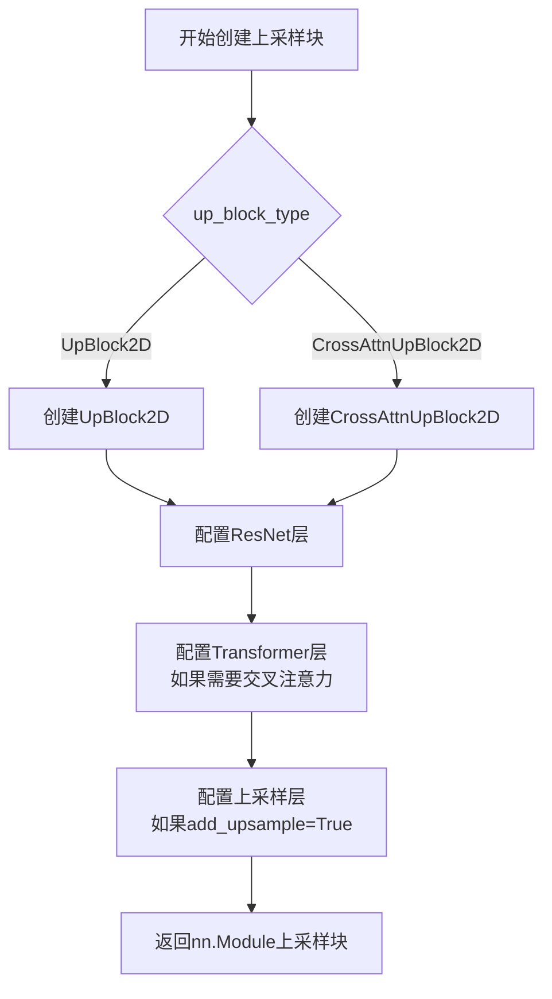

#### 带注释源码

```python
# 在 UNet2DConditionModel.__init__ 方法中的调用示例
# 这段代码展示了 get_up_block 函数的使用方式

# 遍历上块类型，创建上采样块
for i, up_block_type in enumerate(up_block_types):
    is_final_block = i == len(block_out_channels) - 1

    # 计算当前块的输入输出通道数
    prev_output_channel = output_channel
    output_channel = reversed_block_out_channels[i]
    input_channel = reversed_block_out_channels[min(i + 1, len(block_out_channels) - 1)]

    # 决定是否添加上采样层（非最后一层需要上采样）
    if not is_final_block:
        add_upsample = True
        self.num_upsamplers += 1
    else:
        add_upsample = False

    # 调用工厂函数创建上采样块
    up_block = get_up_block(
        up_block_type,                           # 块类型
        num_layers=reversed_layers_per_block[i] + 1,  # 层数（+1用于残差连接）
        transformer_layers_per_block=reversed_transformer_layers_per_block[i],
        in_channels=input_channel,
        out_channels=output_channel,
        prev_output_channel=prev_output_channel,
        temb_channels=blocks_time_embed_dim,
        add_upsample=add_upsample,
        resnet_eps=norm_eps,
        resnet_act_fn=act_fn,
        resolution_idx=i,
        resnet_groups=norm_num_groups,
        cross_attention_dim=reversed_cross_attention_dim[i],
        num_attention_heads=reversed_num_attention_heads[i],
        dual_cross_attention=dual_cross_attention,
        use_linear_projection=use_linear_projection,
        only_cross_attention=only_cross_attention[i],
        upcast_attention=upcast_attention,
        resnet_time_scale_shift=resnet_time_scale_shift,
        attention_type=attention_type,
        resnet_skip_time_act=resnet_skip_time_act,
        resnet_out_scale_factor=resnet_out_scale_factor,
        cross_attention_norm=cross_attention_norm,
        attention_head_dim=attention_head_dim[i] if attention_head_dim[i] is not None else output_channel,
        dropout=dropout,
    )
    # 将创建的上采样块添加到模块列表中
    self.up_blocks.append(up_block)
```


# 函数提取：`get_activation`

### `get_activation`

全局激活函数获取器，根据字符串名称返回对应的 PyTorch 激活函数模块。

参数：

- `activation_fn`：`str`，激活函数的名称（如 "silu"、"gelu"、"relu" 等）

返回值：`nn.Module`，返回对应的 PyTorch 激活函数模块

#### 流程图

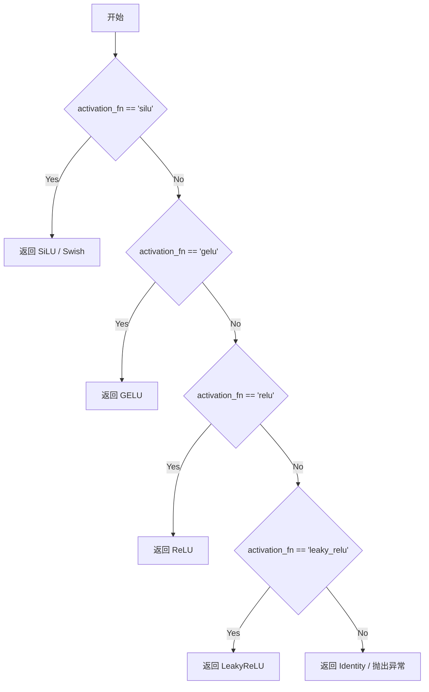

#### 带注释源码

```python
# 该函数定义在 ..activations 模块中（从当前文件第27行导入）
# 以下是根据代码使用方式推断的函数签名和用途

def get_activation(activation_fn: str) -> nn.Module:
    """
    根据字符串名称返回对应的 PyTorch 激活函数模块。
    
    常见支持的激活函数：
    - "silu" / "swish": nn.SiLU()
    - "gelu": nn.GELU()
    - "relu": nn.ReLU()
    - "leaky_relu": nn.LeakyReLU()
    - "mish": nn.Mish()
    - "tanh": nn.Tanh()
    - "sigmoid": nn.Sigmoid()
    
    参数:
        activation_fn: str - 激活函数的名称
        
    返回:
        nn.Module - 对应的 PyTorch 激活函数实例
    """
    # 源码位置：..activations 模块
    pass

# 在 UNet2DConditionModel 中的使用示例（第305行）
if time_embedding_act_fn is None:
    self.time_embed_act = None
else:
    self.time_embed_act = get_activation(time_embedding_act_fn)

# 在 UNet2DConditionModel 中的另一个使用示例（第453行）
if norm_num_groups is not None:
    self.conv_norm_out = nn.GroupNorm(...)
    self.conv_act = get_activation(act_fn)  # 获取主激活函数
```

---

**说明**：由于 `get_activation` 函数定义在外部模块 `..activations` 中，当前代码文件仅导入了该函数。上述源码是基于其在项目中的使用方式推断得出的。该函数是 Diffusers 库中常见的激活函数工厂方法，用于将字符串名称映射到对应的 PyTorch 激活层模块。


### `apply_lora_scale`

描述：`apply_lora_scale` 是一个从 `diffusers.utils` 模块导入的装饰器函数，用于在调用函数时根据 LoRA（Low-Rank Adaptation）配置对注意力参数进行缩放。在 `UNet2DConditionModel` 的 `forward` 方法上用作装饰器，以支持 LoRA 模型的推理和训练。

参数：

- `scale_kwargs`：`str`，指定要缩放的关键字参数名称（例如 `"cross_attention_kwargs"`）。

返回值：返回一个新的函数装饰器，该装饰器包装原始函数并应用 LoRA 缩放。

#### 流程图

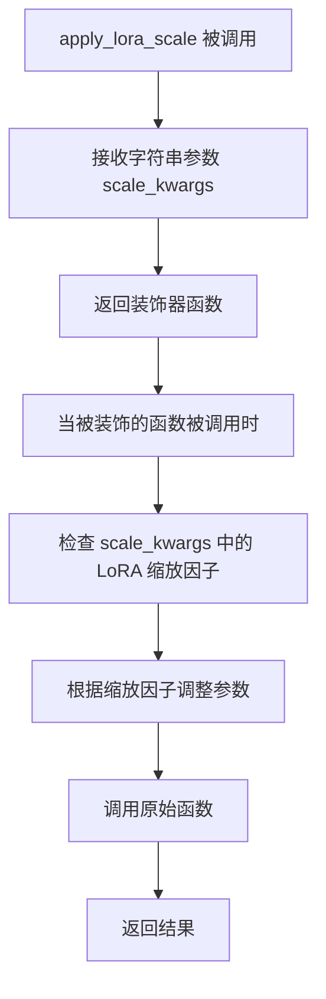

*注：此流程图基于 `apply_lora_scale` 的典型用途推断，因为其完整源码未在给定代码中提供。*

#### 带注释源码

```
# apply_lora_scale 的实现未在给定代码中显示。它是从 ...utils 导入的。
# 以下是其在 UNet2DConditionModel 中的使用方式：

@apply_lora_scale("cross_attention_kwargs")
def forward(
    self,
    sample: torch.Tensor,
    timestep: torch.Tensor | float | int,
    encoder_hidden_states: torch.Tensor,
    class_labels: torch.Tensor | None = None,
    timestep_cond: torch.Tensor | None = None,
    attention_mask: torch.Tensor | None = None,
    cross_attention_kwargs: dict[str, Any] | None = None,
    added_cond_kwargs: dict[str, torch.Tensor] | None = None,
    down_block_additional_residuals: tuple[torch.Tensor] | None = None,
    mid_block_additional_residual: torch.Tensor | None = None,
    down_intrablock_additional_residuals: tuple[torch.Tensor] | None = None,
    encoder_attention_mask: torch.Tensor | None = None,
    return_dict: bool = True,
) -> UNet2DConditionOutput | tuple:
    # ... forward 方法的实现
```

*注：给定代码中仅包含 `apply_lora_scale` 的导入和使用，其具体实现位于 `diffusers.utils` 模块中，未在此代码块中提供。*


### `deprecate`

该函数是一个用于发出弃用警告的工具函数，在 `UNet2DConditionModel` 的 `forward` 方法中被调用，用于提醒用户 `down_block_additional_residuals` 参数即将被弃用，建议使用 `down_intrablock_additional_residuals` 替代。

参数：

-  `old_name`：`str`，即将被弃用的参数或功能的名称
-  `new_name`：`str`，新版本号
-  `deprecation_message`：`str`，详细的弃用说明信息
-  `standard_warn`：`bool`，是否使用标准警告格式

返回值：`None`，该函数直接发出警告，不返回任何值

#### 流程图

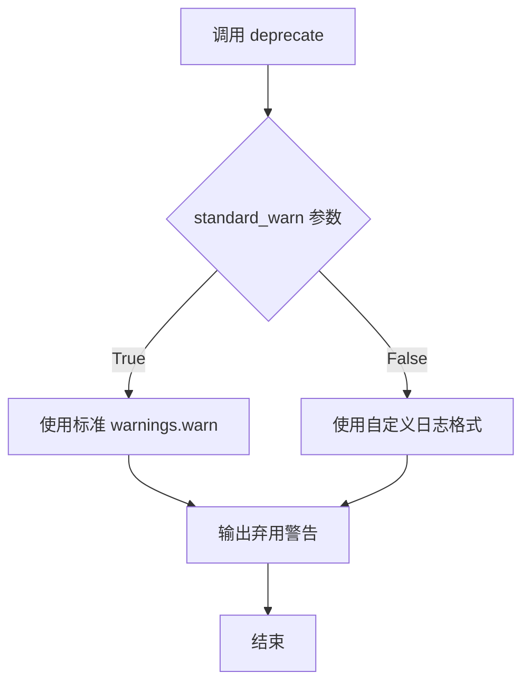

#### 带注释源码

```python
# 在 UNet2DConditionModel.forward() 方法中的使用示例：
# 当检测到旧版 T2I-Adapter 参数传递方式时，发出弃用警告
if not is_adapter and mid_block_additional_residual is None and down_block_additional_residuals is not None:
    deprecate(
        "T2I should not use down_block_additional_residuals",  # 旧参数名
        "1.3.0",  # 将在此版本移除
        "Passing intrablock residual connections with `down_block_additional_residuals` is deprecated "
        "and will be removed in diffusers 1.3.0. `down_block_additional_residuals` should only be used "
        "for ControlNet. Please make sure use `down_intrablock_additional_residuals` instead.",  # 弃用说明
        standard_warn=False,  # 使用自定义格式
    )
    # 兼容处理：将旧参数转换为新参数
    down_intrablock_additional_residuals = down_block_additional_residuals
    is_adapter = True
```

> **注意**：该函数的完整实现定义在 `diffusers/src/diffusers/utils/deprecation.py` 中（通过 `...utils` 导入），当前代码文件中仅包含其使用方式。该函数主要用于向用户提示哪些API或参数已被弃用，并建议使用新的替代方案，是库维护向后兼容性的重要工具。


### `logging.get_logger`

获取或创建一个与给定模块名称关联的 Logger 实例，用于在该模块中进行日志记录。

参数：

- `name`：`str`，Logger 的名称，通常使用 `__name__`（当前模块的完全限定名称）

返回值：`logging.Logger`，返回与指定名称关联的 Logger 实例

#### 流程图

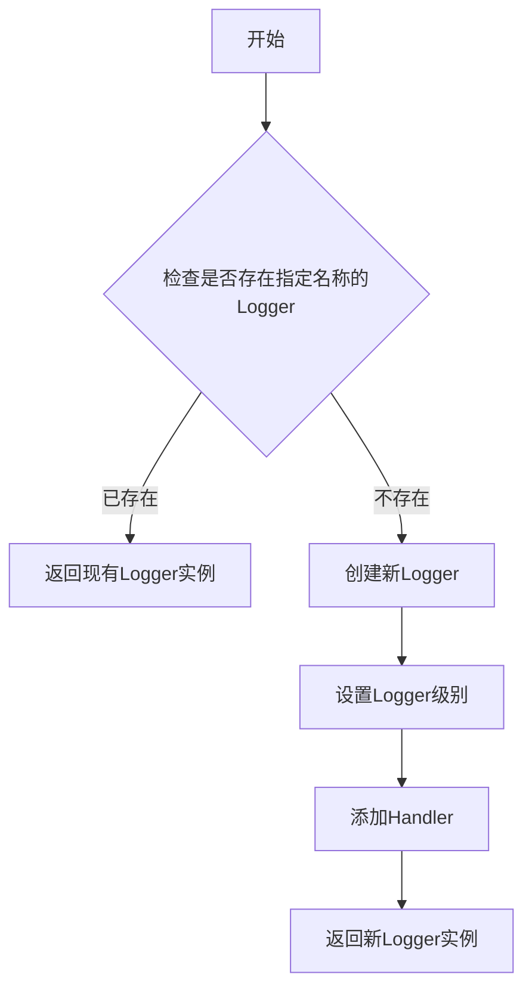

#### 带注释源码

```python
# 从 utils 模块导入 logging 对象
from ...utils import (
    BaseOutput,
    apply_lora_scale,
    deprecate,
    logging,
)

# 使用示例：
logger = logging.get_logger(__name__)  # pylint: disable=invalid-name
# 参数 __name__ 是 Python 内置变量，表示当前模块的完全限定名称
# 例如：diffusers.models.unets.unet_2d_condition
# 返回值 logger 是一个 logging.Logger 实例，用于模块级日志记录
```


### `UNet2DConditionModel.__init__`

这是条件2D UNet模型的初始化方法，负责构建完整的UNet架构，包括时间嵌入层、编码器投影层、类别嵌入层、下采样块、中间块、上采样块以及输出层，并配置各种注意力处理器和可选的GLIGEN位置网络。

参数：

- `sample_size`: `int | tuple[int, int] | None`，输入输出样本的高度和宽度，默认为None
- `in_channels`: `int`，输入样本的通道数，默认为4
- `out_channels`: `int`，输出样本的通道数，默认为4
- `center_input_sample`: `bool`，是否对输入样本进行中心化，默认为False
- `flip_sin_to_cos`: `bool`，时间嵌入中是否将sin翻转成cos，默认为True
- `freq_shift`: `int`，时间嵌入的频率偏移量，默认为0
- `down_block_types`: `tuple[str, ...]`，下采样块的类型元组
- `mid_block_type`: `str | None`，UNet中间块的类型
- `up_block_types`: `tuple[str, ...]`，上采样块的类型元组
- `only_cross_attention`: `bool | tuple[bool]`，是否在基础transformer块中包含自注意力
- `block_out_channels`: `tuple[int, ...]`，每个块的输出通道数元组
- `layers_per_block`: `int | tuple[int]`，每个块的层数
- `downsample_padding`: `int`，下采样卷积的填充数，默认为1
- `mid_block_scale_factor`: `float`，中间块的缩放因子，默认为1.0
- `dropout`: `float`，Dropout概率，默认为0.0
- `act_fn`: `str`，激活函数名称，默认为"silu"
- `norm_num_groups`: `int | None`，归一化的组数，默认为32
- `norm_eps`: `float`，归一化的epsilon值，默认为1e-5
- `cross_attention_dim`: `int | tuple[int]`，交叉注意力特征的维度
- `transformer_layers_per_block`: `int | tuple[int] | tuple[tuple]`，每个块的Transformer块数量
- `reverse_transformer_layers_per_block`: `tuple[tuple[int]] | None`，上采样块中Transformer块的数量
- `encoder_hid_dim`: `int | None`，编码器隐藏层维度
- `encoder_hid_dim_type`: `str | None`，编码器隐藏层维度类型
- `attention_head_dim`: `int | tuple[int]`，注意力头的维度
- `num_attention_heads`: `int | tuple[int] | None`，注意力头的数量
- `dual_cross_attention`: `bool`，是否使用双交叉注意力，默认为False
- `use_linear_projection`: `bool`，是否使用线性投影，默认为False
- `class_embed_type`: `str | None`，类别嵌入的类型
- `addition_embed_type`: `str | None`，附加嵌入的类型
- `addition_time_embed_dim`: `int | None`，附加时间嵌入的维度
- `num_class_embeds`: `int | None`，类别嵌入矩阵的输入维度
- `upcast_attention`: `bool`，是否上cast注意力，默认为False
- `resnet_time_scale_shift`: `str`，ResNet块的时间缩放偏移配置
- `resnet_skip_time_act`: `bool`，是否跳过ResNet时间激活
- `resnet_out_scale_factor`: `float`，ResNet输出缩放因子
- `time_embedding_type`: `str`，时间嵌入类型，"positional"或"fourier"
- `time_embedding_dim`: `int | None`，时间嵌入维度的可选覆盖
- `time_embedding_act_fn`: `str | None`，时间嵌入的一次激活函数
- `timestep_post_act`: `str | None`，时间嵌入的二次激活函数
- `time_cond_proj_dim`: `int | None`，时间嵌入中cond_proj层的维度
- `conv_in_kernel`: `int`，conv_in层的卷积核大小，默认为3
- `conv_out_kernel`: `int`，conv_out层的卷积核大小，默认为3
- `projection_class_embeddings_input_dim`: `int | None`，当class_embed_type="projection"时的类别嵌入输入维度
- `attention_type`: `str`，注意力类型，"default"或其他
- `class_embeddings_concat`: `bool`，是否将时间嵌入与类别嵌入拼接
- `mid_block_only_cross_attention`: `bool | None`，中间块是否使用交叉注意力
- `cross_attention_norm`: `str | None`，交叉注意力归一化类型
- `addition_embed_type_num_heads`: `int`，附加嵌入类型的注意力头数，默认为64

返回值：无（`None`），但该方法会初始化模型的各个组件并赋值给实例属性

#### 流程图

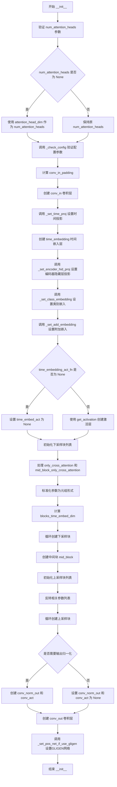

#### 带注释源码

```
@register_to_config
def __init__(
    self,
    sample_size: int | tuple[int, int] | None = None,
    in_channels: int = 4,
    out_channels: int = 4,
    center_input_sample: bool = False,
    flip_sin_to_cos: bool = True,
    freq_shift: int = 0,
    down_block_types: tuple[str, ...] = (...),
    mid_block_type: str | None = "UNetMidBlock2DCrossAttn",
    up_block_types: tuple[str, ...] = (...),
    only_cross_attention: bool | tuple[bool] = False,
    block_out_channels: tuple[int, ...] = (320, 640, 1280, 1280),
    layers_per_block: int | tuple[int] = 2,
    downsample_padding: int = 1,
    mid_block_scale_factor: float = 1,
    dropout: float = 0.0,
    act_fn: str = "silu",
    norm_num_groups: int | None = 32,
    norm_eps: float = 1e-5,
    cross_attention_dim: int | tuple[int] = 1280,
    transformer_layers_per_block: int | tuple[int] | tuple[tuple] = 1,
    reverse_transformer_layers_per_block: tuple[tuple[int]] | None = None,
    encoder_hid_dim: int | None = None,
    encoder_hid_dim_type: str | None = None,
    attention_head_dim: int | tuple[int] = 8,
    num_attention_heads: int | tuple[int] | None = None,
    dual_cross_attention: bool = False,
    use_linear_projection: bool = False,
    class_embed_type: str | None = None,
    addition_embed_type: str | None = None,
    addition_time_embed_dim: int | None = None,
    num_class_embeds: int | None = None,
    upcast_attention: bool = False,
    resnet_time_scale_shift: str = "default",
    resnet_skip_time_act: bool = False,
    resnet_out_scale_factor: float = 1.0,
    time_embedding_type: str = "positional",
    time_embedding_dim: int | None = None,
    time_embedding_act_fn: str | None = None,
    timestep_post_act: str | None = None,
    time_cond_proj_dim: int | None = None,
    conv_in_kernel: int = 3,
    conv_out_kernel: int = 3,
    projection_class_embeddings_input_dim: int | None = None,
    attention_type: str = "default",
    class_embeddings_concat: bool = False,
    mid_block_only_cross_attention: bool | None = None,
    cross_attention_norm: str | None = None,
    addition_embed_type_num_heads: int = 64,
):
    super().__init__()

    # 保存样本大小配置
    self.sample_size = sample_size

    # 验证并修正 num_attention_heads 参数（兼容旧版本命名）
    if num_attention_heads is not None:
        raise ValueError(...)
    num_attention_heads = num_attention_heads or attention_head_dim

    # 验证配置参数的合法性
    self._check_config(...)

    # ===== 输入处理层 =====
    conv_in_padding = (conv_in_kernel - 1) // 2
    self.conv_in = nn.Conv2d(
        in_channels, block_out_channels[0], kernel_size=conv_in_kernel, padding=conv_in_padding
    )

    # ===== 时间嵌入层 =====
    time_embed_dim, timestep_input_dim = self._set_time_proj(
        time_embedding_type,
        block_out_channels=block_out_channels,
        flip_sin_to_cos=flip_sin_to_cos,
        freq_shift=freq_shift,
        time_embedding_dim=time_embedding_dim,
    )

    self.time_embedding = TimestepEmbedding(
        timestep_input_dim,
        time_embed_dim,
        act_fn=act_fn,
        post_act_fn=timestep_post_act,
        cond_proj_dim=time_cond_proj_dim,
    )

    # ===== 编码器隐藏层投影 =====
    self._set_encoder_hid_proj(
        encoder_hid_dim_type,
        cross_attention_dim=cross_attention_dim,
        encoder_hid_dim=encoder_hid_dim,
    )

    # ===== 类别嵌入层 =====
    self._set_class_embedding(
        class_embed_type,
        act_fn=act_fn,
        num_class_embeds=num_class_embeds,
        projection_class_embeddings_input_dim=projection_class_embeddings_input_dim,
        time_embed_dim=time_embed_dim,
        timestep_input_dim=timestep_input_dim,
    )

    # ===== 附加嵌入层 =====
    self._set_add_embedding(
        addition_embed_type,
        addition_embed_type_num_heads=addition_embed_type_num_heads,
        addition_time_embed_dim=addition_time_embed_dim,
        cross_attention_dim=cross_attention_dim,
        encoder_hid_dim=encoder_hid_dim,
        flip_sin_to_cos=flip_sin_to_cos,
        freq_shift=freq_shift,
        projection_class_embeddings_input_dim=projection_class_embeddings_input_dim,
        time_embed_dim=time_embed_dim,
    )

    # 时间嵌入的额外激活函数
    if time_embedding_act_fn is None:
        self.time_embed_act = None
    else:
        self.time_embed_act = get_activation(time_embedding_act_fn)

    # ===== 下采样块（编码器） =====
    self.down_blocks = nn.ModuleList([])
    self.up_blocks = nn.ModuleList([])

    # 处理注意力配置
    if isinstance(only_cross_attention, bool):
        if mid_block_only_cross_attention is None:
            mid_block_only_cross_attention = only_cross_attention
        only_cross_attention = [only_cross_attention] * len(down_block_types)

    if mid_block_only_cross_attention is None:
        mid_block_only_cross_attention = False

    # 标准化各参数为元组形式
    if isinstance(num_attention_heads, int):
        num_attention_heads = (num_attention_heads,) * len(down_block_types)
    if isinstance(attention_head_dim, int):
        attention_head_dim = (attention_head_dim,) * len(down_block_types)
    if isinstance(cross_attention_dim, int):
        cross_attention_dim = (cross_attention_dim,) * len(down_block_types)
    if isinstance(layers_per_block, int):
        layers_per_block = [layers_per_block] * len(down_block_types)
    if isinstance(transformer_layers_per_block, int):
        transformer_layers_per_block = [transformer_layers_per_block] * len(down_block_types)

    # 计算块的嵌入维度（考虑类别嵌入拼接情况）
    if class_embeddings_concat:
        blocks_time_embed_dim = time_embed_dim * 2
    else:
        blocks_time_embed_dim = time_embed_dim

    # 循环创建下采样块
    output_channel = block_out_channels[0]
    for i, down_block_type in enumerate(down_block_types):
        input_channel = output_channel
        output_channel = block_out_channels[i]
        is_final_block = i == len(block_out_channels) - 1

        down_block = get_down_block(
            down_block_type,
            num_layers=layers_per_block[i],
            transformer_layers_per_block=transformer_layers_per_block[i],
            in_channels=input_channel,
            out_channels=output_channel,
            temb_channels=blocks_time_embed_dim,
            add_downsample=not is_final_block,
            resnet_eps=norm_eps,
            resnet_act_fn=act_fn,
            resnet_groups=norm_num_groups,
            cross_attention_dim=cross_attention_dim[i],
            num_attention_heads=num_attention_heads[i],
            downsample_padding=downsample_padding,
            dual_cross_attention=dual_cross_attention,
            use_linear_projection=use_linear_projection,
            only_cross_attention=only_cross_attention[i],
            upcast_attention=upcast_attention,
            resnet_time_scale_shift=resnet_time_scale_shift,
            attention_type=attention_type,
            resnet_skip_time_act=resnet_skip_time_act,
            resnet_out_scale_factor=resnet_out_scale_factor,
            cross_attention_norm=cross_attention_norm,
            attention_head_dim=attention_head_dim[i] if attention_head_dim[i] is not None else output_channel,
            dropout=dropout,
        )
        self.down_blocks.append(down_block)

    # ===== 中间块 =====
    self.mid_block = get_mid_block(
        mid_block_type,
        temb_channels=blocks_time_embed_dim,
        in_channels=block_out_channels[-1],
        resnet_eps=norm_eps,
        resnet_act_fn=act_fn,
        resnet_groups=norm_num_groups,
        output_scale_factor=mid_block_scale_factor,
        transformer_layers_per_block=transformer_layers_per_block[-1],
        num_attention_heads=num_attention_heads[-1],
        cross_attention_dim=cross_attention_dim[-1],
        dual_cross_attention=dual_cross_attention,
        use_linear_projection=use_linear_projection,
        mid_block_only_cross_attention=mid_block_only_cross_attention,
        upcast_attention=upcast_attention,
        resnet_time_scale_shift=resnet_time_scale_shift,
        attention_type=attention_type,
        resnet_skip_time_act=resnet_skip_time_act,
        cross_attention_norm=cross_attention_norm,
        attention_head_dim=attention_head_dim[-1],
        dropout=dropout,
    )

    # 计数上采样层数量
    self.num_upsamplers = 0

    # ===== 上采样块（解码器） =====
    # 反转相关参数用于上采样路径
    reversed_block_out_channels = list(reversed(block_out_channels))
    reversed_num_attention_heads = list(reversed(num_attention_heads))
    reversed_layers_per_block = list(reversed(layers_per_block))
    reversed_cross_attention_dim = list(reversed(cross_attention_dim))
    reversed_transformer_layers_per_block = (
        list(reversed(transformer_layers_per_block))
        if reverse_transformer_layers_per_block is None
        else reverse_transformer_layers_per_block
    )
    only_cross_attention = list(reversed(only_cross_attention))

    output_channel = reversed_block_out_channels[0]
    for i, up_block_type in enumerate(up_block_types):
        is_final_block = i == len(block_out_channels) - 1

        prev_output_channel = output_channel
        output_channel = reversed_block_out_channels[i]
        input_channel = reversed_block_out_channels[min(i + 1, len(block_out_channels) - 1)]

        # 除了最后一层外都需要上采样
        if not is_final_block:
            add_upsample = True
            self.num_upsamplers += 1
        else:
            add_upsample = False

        up_block = get_up_block(
            up_block_type,
            num_layers=reversed_layers_per_block[i] + 1,
            transformer_layers_per_block=reversed_transformer_layers_per_block[i],
            in_channels=input_channel,
            out_channels=output_channel,
            prev_output_channel=prev_output_channel,
            temb_channels=blocks_time_embed_dim,
            add_upsample=add_upsample,
            resnet_eps=norm_eps,
            resnet_act_fn=act_fn,
            resolution_idx=i,
            resnet_groups=norm_num_groups,
            cross_attention_dim=reversed_cross_attention_dim[i],
            num_attention_heads=reversed_num_attention_heads[i],
            dual_cross_attention=dual_cross_attention,
            use_linear_projection=use_linear_projection,
            only_cross_attention=only_cross_attention[i],
            upcast_attention=upcast_attention,
            resnet_time_scale_shift=resnet_time_scale_shift,
            attention_type=attention_type,
            resnet_skip_time_act=resnet_skip_time_act,
            resnet_out_scale_factor=resnet_out_scale_factor,
            cross_attention_norm=cross_attention_norm,
            attention_head_dim=attention_head_dim[i] if attention_head_dim[i] is not None else output_channel,
            dropout=dropout,
        )
        self.up_blocks.append(up_block)

    # ===== 输出处理层 =====
    if norm_num_groups is not None:
        self.conv_norm_out = nn.GroupNorm(
            num_channels=block_out_channels[0], num_groups=norm_num_groups, eps=norm_eps
        )
        self.conv_act = get_activation(act_fn)
    else:
        self.conv_norm_out = None
        self.conv_act = None

    conv_out_padding = (conv_out_kernel - 1) // 2
    self.conv_out = nn.Conv2d(
        block_out_channels[0], out_channels, kernel_size=conv_out_kernel, padding=conv_out_padding
    )

    # ===== GLIGEN 位置网络（可选） =====
    self._set_pos_net_if_use_gligen(attention_type=attention_type, cross_attention_dim=cross_attention_dim)
```


### `UNet2DConditionModel._check_config`

该方法是一个配置验证函数，用于在 `UNet2DConditionModel` 初始化时校验传入的各种配置参数是否合法，确保下采样块类型、上采样块类型、输出通道数、注意力头维度等配置之间的一致性，如果不匹配则抛出详细的 `ValueError` 异常。

参数：

- `down_block_types`：`tuple[str, ...]`，下采样块的类型元组，指定 UNet 编码器部分使用的块类型
- `up_block_types`：`tuple[str, ...]`，上采样块的类型元组，指定 UNet 解码器部分使用的块类型
- `only_cross_attention`：`bool | tuple[bool]`，控制是否只在块中使用交叉注意力，可为单个布尔值或布尔值元组
- `block_out_channels`：`tuple[int, ...]`，每个块的输出通道数元组
- `layers_per_block`：`int | tuple[int]`，每个块包含的层数，可为单个整数或整数元组
- `cross_attention_dim`：`int | tuple[int]`，交叉注意力机制的维度，可为单个整数或整数元组
- `transformer_layers_per_block`：`int | tuple[int, tuple[tuple[int]]]`，每个块中 transformer 层的数量
- `reverse_transformer_layers_per_block`：`bool`，指定是否在 upsampling 块中使用反向 transformer 层配置
- `attention_head_dim`：`int`，注意力头的维度
- `num_attention_heads`：`int | tuple[int] | None`，注意力头的数量，可为整数、整数元组或 None

返回值：`None`，该方法不返回值，通过抛出 `ValueError` 异常来处理配置错误

#### 流程图

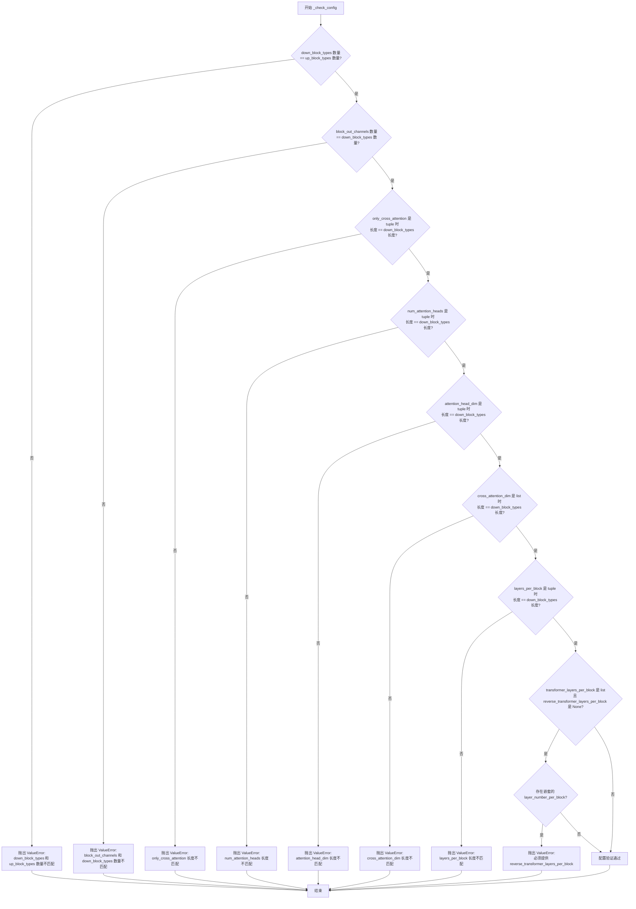

#### 带注释源码

```python
def _check_config(
    self,
    down_block_types: tuple[str, ...],
    up_block_types: tuple[str, ...],
    only_cross_attention: bool | tuple[bool],
    block_out_channels: tuple[int, ...],
    layers_per_block: int | tuple[int],
    cross_attention_dim: int | tuple[int],
    transformer_layers_per_block: int | tuple[int, tuple[tuple[int]]],
    reverse_transformer_layers_per_block: bool,
    attention_head_dim: int,
    num_attention_heads: int | tuple[int] | None,
):
    """
    验证 UNet2DConditionModel 配置参数的一致性。
    
    检查下采样块类型、上采样块类型、输出通道数、每块层数、交叉注意力维度、
    transformer 层数、注意力头维度等参数之间的匹配性，确保它们在数量上保持一致。
    
    参数:
        down_block_types: 下采样块的类型元组
        up_block_types: 上采样块的类型元组
        only_cross_attention: 是否只使用交叉注意力
        block_out_channels: 每个块的输出通道数
        layers_per_block: 每个块的层数
        cross_attention_dim: 交叉注意力维度
        transformer_layers_per_block: 每个块的 transformer 层数
        reverse_transformer_layers_per_block: 是否反转 transformer 层配置
        attention_head_dim: 注意力头维度
        num_attention_heads: 注意力头数量
    
    异常:
        ValueError: 当任何配置参数不匹配时抛出
    """
    # 检查下采样块类型和上采样块类型的数量是否一致
    if len(down_block_types) != len(up_block_types):
        raise ValueError(
            f"Must provide the same number of `down_block_types` as `up_block_types`. `down_block_types`: {down_block_types}. `up_block_types`: {up_block_types}."
        )

    # 检查输出通道数与下采样块类型的数量是否一致
    if len(block_out_channels) != len(down_block_types):
        raise ValueError(
            f"Must provide the same number of `block_out_channels` as `down_block_types`. `block_out_channels`: {block_out_channels}. `down_block_types`: {down_block_types}."
        )

    # 检查 only_cross_attention（如果是元组）长度是否与下采样块类型数量一致
    if not isinstance(only_cross_attention, bool) and len(only_cross_attention) != len(down_block_types):
        raise ValueError(
            f"Must provide the same number of `only_cross_attention` as `down_block_types`. `only_cross_attention`: {only_cross_attention}. `down_block_types`: {down_block_types}."
        )

    # 检查 num_attention_heads（如果是元组）长度是否与下采样块类型数量一致
    if not isinstance(num_attention_heads, int) and len(num_attention_heads) != len(down_block_types):
        raise ValueError(
            f"Must provide the same number of `num_attention_heads` as `down_block_types`. `num_attention_heads`: {num_attention_heads}. `down_block_types`: {down_block_types}."
        )

    # 检查 attention_head_dim（如果是元组）长度是否与下采样块类型数量一致
    if not isinstance(attention_head_dim, int) and len(attention_head_dim) != len(down_block_types):
        raise ValueError(
            f"Must provide the same number of `attention_head_dim` as `down_block_types`. `attention_head_dim`: {attention_head_dim}. `down_block_types`: {down_block_types}."
        )

    # 检查 cross_attention_dim（如果是列表）长度是否与下采样块类型数量一致
    if isinstance(cross_attention_dim, list) and len(cross_attention_dim) != len(down_block_types):
        raise ValueError(
            f"Must provide the same number of `cross_attention_dim` as `down_block_types`. `cross_attention_dim`: {cross_attention_dim}. `down_block_types`: {down_block_types}."
        )

    # 检查 layers_per_block（如果是元组）长度是否与下采样块类型数量一致
    if not isinstance(layers_per_block, int) and len(layers_per_block) != len(down_block_types):
        raise ValueError(
            f"Must provide the same number of `layers_per_block` as `down_block_types`. `layers_per_block`: {layers_per_block}. `down_block_types`: {down_block_types}."
        )
    
    # 如果 transformer_layers_per_block 是列表形式且未提供 reverse_transformer_layers_per_block，
    # 则检查是否存在非对称的 UNet 配置（即嵌套的 layer_number_per_block）
    if isinstance(transformer_layers_per_block, list) and reverse_transformer_layers_per_block is None:
        for layer_number_per_block in transformer_layers_per_block:
            # 如果存在嵌套结构（列表中的列表），说明使用了非对称 UNet，
            # 必须提供 reverse_transformer_layers_per_block 参数
            if isinstance(layer_number_per_block, list):
                raise ValueError("Must provide 'reverse_transformer_layers_per_block` if using asymmetrical UNet.")
```


### `UNet2DConditionModel._set_time_proj`

该方法负责初始化 UNet 模型的时间投影层（time projection layer），根据指定的时间嵌入类型（fourier 或 positional）创建相应的时间嵌入投影器，并返回计算得到的时间嵌入维度和时间步输入维度。

参数：

- `self`：隐式参数，UNet2DConditionModel 实例本身
- `time_embedding_type`：`str`，时间嵌入类型，可选值为 `"fourier"` 或 `"positional"`，用于指定使用哪种时间嵌入方法
- `block_out_channels`：`int`，第一个下采样块的输出通道数，用于计算默认的时间嵌入维度
- `flip_sin_to_cos`：`bool`，是否将正弦函数翻转转换为余弦函数，用于时间嵌入的相位变换
- `freq_shift`：`float`，频率偏移量，仅在 positional 类型时使用，用于调整时间嵌入的频率
- `time_embedding_dim`：`int | None`，可选的时间嵌入维度覆盖值，如果为 None 则根据 block_out_channels 自动计算

返回值：`tuple[int, int]`，返回一个元组 `(time_embed_dim, timestep_input_dim)`，其中 `time_embed_dim` 是最终的时间嵌入维度，`timestep_input_dim` 是时间步输入维度

#### 流程图

```mermaid
flowchart TD
    A[开始 _set_time_proj] --> B{time_embedding_type == 'fourier'?}
    B -->|Yes| C[计算 time_embed_dim]
    B -->|No| D{time_embedding_type == 'positional'?}
    C --> E{time_embed_dim % 2 == 0?}
    D -->|Yes| F[计算 time_embed_dim]
    D -->|No| G[抛出 ValueError]
    E -->|Yes| H[创建 GaussianFourierProjection]
    E -->|No| I[抛出 ValueError]
    H --> J[timestep_input_dim = time_embed_dim]
    F --> K[创建 Timesteps]
    K --> L[timestep_input_dim = block_out_channels[0]]
    J --> M[返回 (time_embed_dim, timestep_input_dim)]
    L --> M
```

#### 带注释源码

```python
def _set_time_proj(
    self,
    time_embedding_type: str,
    block_out_channels: int,
    flip_sin_to_cos: bool,
    freq_shift: float,
    time_embedding_dim: int,
) -> tuple[int, int]:
    """
    设置时间投影层，根据 time_embedding_type 选择不同的嵌入方式
    
    参数:
        time_embedding_type: 时间嵌入类型，"fourier" 或 "positional"
        block_out_channels: 第一个块的输出通道数
        flip_sin_to_cos: 是否翻转 sin 到 cos
        freq_shift: 频率偏移量
        time_embedding_dim: 指定的时间嵌入维度，None 时自动计算
    
    返回:
        (time_embed_dim, timestep_input_dim): 时间嵌入维度和时间步输入维度
    """
    # 使用傅里叶投影的时间嵌入方式
    if time_embedding_type == "fourier":
        # 如果未指定 time_embedding_dim，则默认使用第一层输出通道数的 2 倍
        time_embed_dim = time_embedding_dim or block_out_channels[0] * 2
        
        # 验证 time_embed_dim 必须能被 2 整除，因为需要除以 2 来创建投影
        if time_embed_dim % 2 != 0:
            raise ValueError(f"`time_embed_dim` should be divisible by 2, but is {time_embed_dim}.")
        
        # 创建高斯傅里叶投影层，用于将时间步映射到频域嵌入
        self.time_proj = GaussianFourierProjection(
            time_embed_dim // 2,  # 投影维度
            set_W_to_weight=False,  # 不将权重设置为预定义权重
            log=False,  # 不使用对数缩放
            flip_sin_to_cos=flip_sin_to_cos  # 是否翻转正弦到余弦
        )
        # 傅里叶方式的输入维度等于嵌入维度
        timestep_input_dim = time_embed_dim
    
    # 使用位置编码的时间嵌入方式
    elif time_embedding_type == "positional":
        # 如果未指定 time_embedding_dim，则默认使用第一层输出通道数的 4 倍
        time_embed_dim = time_embedding_dim or block_out_channels[0] * 4

        # 创建 Timesteps 层，将时间步转换为正弦/余弦位置编码
        self.time_proj = Timesteps(
            block_out_channels[0],  # 输入维度
            flip_sin_to_cos,       # 是否翻转正弦到余弦
            freq_shift             # 频率偏移
        )
        # 位置编码方式的输入维度等于第一个块的输出通道数
        timestep_input_dim = block_out_channels[0]
    
    # 不支持的时间嵌入类型
    else:
        raise ValueError(
            f"{time_embedding_type} does not exist. Please make sure to use one of `fourier` or `positional`."
        )

    # 返回计算得到的时间嵌入维度和时间步输入维度
    return time_embed_dim, timestep_input_dim
```


### `UNet2DConditionModel._set_encoder_hid_proj`

该方法用于设置编码器隐藏层投影（encoder hidden projection），根据 `encoder_hid_dim_type` 类型创建相应的投影层（Linear、TextImageProjection 或 ImageProjection），将编码器隐藏状态从 `encoder_hid_dim` 维度投影到 `cross_attention_dim` 维度。

参数：

- `encoder_hid_dim_type`：`str | None`，编码器隐藏层维度类型，可选值为 `"text_proj"`、`"text_image_proj"`、`"image_proj"` 或 `None`
- `cross_attention_dim`：`int | tuple[int]`，交叉注意力机制的维度
- `encoder_hid_dim`：`int | None`，编码器隐藏层维度

返回值：`None`，该方法无返回值，直接在对象上设置 `self.encoder_hid_proj` 属性

#### 流程图

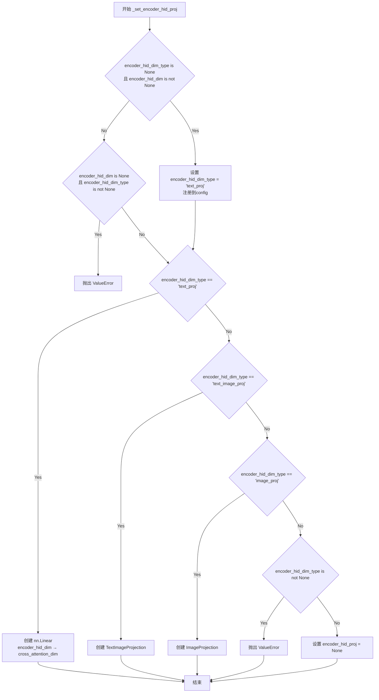

#### 带注释源码

```python
def _set_encoder_hid_proj(
    self,
    encoder_hid_dim_type: str | None,
    cross_attention_dim: int | tuple[int],
    encoder_hid_dim: int | None,
):
    """
    设置编码器隐藏层投影层。

    根据 encoder_hid_dim_type 创建相应的投影层，将编码器隐藏状态
    从 encoder_hid_dim 维度投影到 cross_attention_dim 维度。
    """
    # 如果未指定 encoder_hid_dim_type 但提供了 encoder_hid_dim，
    # 则默认使用 'text_proj' 类型
    if encoder_hid_dim_type is None and encoder_hid_dim is not None:
        encoder_hid_dim_type = "text_proj"
        self.register_to_config(encoder_hid_dim_type=encoder_hid_dim_type)
        logger.info("encoder_hid_dim_type defaults to 'text_proj' as `encoder_hid_dim` is defined.")

    # 如果指定了 encoder_hid_dim_type 但未提供 encoder_hid_dim，则抛出错误
    if encoder_hid_dim is None and encoder_hid_dim_type is not None:
        raise ValueError(
            f"`encoder_hid_dim` has to be defined when `encoder_hid_dim_type` is set to {encoder_hid_dim_type}."
        )

    # 根据 encoder_hid_dim_type 创建相应的投影层
    if encoder_hid_dim_type == "text_proj":
        # 文本投影：简单的线性层，将文本嵌入从 encoder_hid_dim 投影到 cross_attention_dim
        self.encoder_hid_proj = nn.Linear(encoder_hid_dim, cross_attention_dim)
    elif encoder_hid_dim_type == "text_image_proj":
        # 文本图像投影（Kandinsky 2.1 风格）
        # image_embed_dim 不必等于 cross_attention_dim，这里设置为 cross_attention_dim
        # 是因为这是当前唯一用例所需的确切维度
        self.encoder_hid_proj = TextImageProjection(
            text_embed_dim=encoder_hid_dim,
            image_embed_dim=cross_attention_dim,
            cross_attention_dim=cross_attention_dim,
        )
    elif encoder_hid_dim_type == "image_proj":
        # 图像投影（Kandinsky 2.2 风格）
        self.encoder_hid_proj = ImageProjection(
            image_embed_dim=encoder_hid_dim,
            cross_attention_dim=cross_attention_dim,
        )
    elif encoder_hid_dim_type is not None:
        # 不支持的 encoder_hid_dim_type
        raise ValueError(
            f"`encoder_hid_dim_type`: {encoder_hid_dim_type} must be None, 'text_proj', 'text_image_proj', or 'image_proj'."
        )
    else:
        # 未指定任何投影类型
        self.encoder_hid_proj = None
```


### `UNet2DConditionModel._set_class_embedding`

该方法根据 `class_embed_type` 参数的取值，初始化不同类型的类别嵌入层（class_embedding），用于在 UNet 模型的 timestep embedding 基础上注入类别信息，实现条件生成时的类别控制。

参数：

- `self`：`UNet2DConditionModel` 实例本身
- `class_embed_type`：`str | None`，类别嵌入的类型，支持 None、"timestep"、"identity"、"projection" 和 "simple_projection"
- `act_fn`：`str`，激活函数名称，用于 TimestepEmbedding 层
- `num_class_embeds`：`int | None`，当 class_embed_type 为 None 时，指定可学习的类别嵌入数量
- `projection_class_embeddings_input_dim`：`int | None`，当 class_embed_type 为 "projection" 或 "simple_projection" 时，指定输入维度
- `time_embed_dim`：`int`，时间嵌入的目标输出维度
- `timestep_input_dim`：`int`，时间步嵌入的输入维度

返回值：无（`None`），该方法直接修改实例属性 `self.class_embedding`

#### 流程图

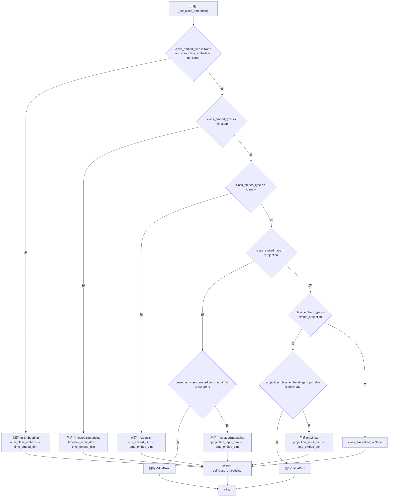

#### 带注释源码

```python
def _set_class_embedding(
    self,
    class_embed_type: str | None,
    act_fn: str,
    num_class_embeds: int | None,
    projection_class_embeddings_input_dim: int | None,
    time_embed_dim: int,
    timestep_input_dim: int,
):
    """
    设置类别嵌入层，根据 class_embed_type 选择不同的嵌入方式
    
    参数:
        class_embed_type: 类别嵌入类型，可选 None/timestep/identity/projection/simple_projection
        act_fn: 激活函数名称
        num_class_embeds: 可学习的类别数量（当 class_embed_type=None 时使用）
        projection_class_embeddings_input_dim: 投影类型的输入维度
        time_embed_dim: 时间嵌入的目标维度
        timestep_input_dim: 时间步输入维度
    """
    # 情况1: 使用可学习的 Embedding 层
    # 当没有指定 class_embed_type 但指定了 num_class_embeds 时
    if class_embed_type is None and num_class_embeds is not None:
        self.class_embedding = nn.Embedding(num_class_embeds, time_embed_dim)
    
    # 情况2: 使用 TimestepEmbedding 处理类别标签
    # 类别标签会先被转换为正弦嵌入再投影
    elif class_embed_type == "timestep":
        self.class_embedding = TimestepEmbedding(timestep_input_dim, time_embed_dim, act_fn=act_fn)
    
    # 情况3: 恒等映射，不做额外处理
    # 直接透传 time_embed_dim 维度
    elif class_embed_type == "identity":
        self.class_embedding = nn.Identity(time_embed_dim, time_embed_dim)
    
    # 情况4: 投影类型
    # 与 timestep 类似，但不经过正弦嵌入，直接从任意维度投影
    elif class_embed_type == "projection":
        if projection_class_embeddings_input_dim is None:
            raise ValueError(
                "`class_embed_type`: 'projection' requires `projection_class_embeddings_input_dim` be set"
            )
        # TimestepEmbedding 本质上是线性层+激活函数的组合
        # 用于 timesteps 时会先做正弦嵌入，但也可以接受任意向量输入
        self.class_embedding = TimestepEmbedding(projection_class_embeddings_input_dim, time_embed_dim)
    
    # 情况5: 简单线性投影
    # 仅使用单个线性层从任意维度投影到 time_embed_dim
    elif class_embed_type == "simple_projection":
        if projection_class_embeddings_input_dim is None:
            raise ValueError(
                "`class_embed_type`: 'simple_projection' requires `projection_class_embeddings_input_dim` be set"
            )
        self.class_embedding = nn.Linear(projection_class_embeddings_input_dim, time_embed_dim)
    
    # 情况6: 不使用类别嵌入
    else:
        self.class_embedding = None
```


### `UNet2DConditionModel._set_add_embedding`

该方法用于根据不同的addition_embed_type配置初始化附加Embedding层（如TextTimeEmbedding、TextImageTimeEmbedding、ImageTimeEmbedding等），以支持额外的条件嵌入功能。

参数：

- `self`：隐式参数，UNet2DConditionModel实例本身
- `addition_embed_type`：`str`，附加嵌入的类型，支持"text"、"text_image"、"text_time"、"image"、"image_hint"或None
- `addition_embed_type_num_heads`：`int`，用于TextTimeEmbedding的头数
- `addition_time_embed_dim`：`int | None`，时间嵌入维度
- `flip_sin_to_cos`：`bool`，是否将sin替换为cos用于时间嵌入
- `freq_shift`：`float`，频率偏移量
- `cross_attention_dim`：`int | None`，交叉注意力维度
- `encoder_hid_dim`：`int | None`，编码器隐藏层维度
- `projection_class_embeddings_input_dim`：`int | None`，类别嵌入投影输入维度
- `time_embed_dim`：`int`，时间嵌入维度

返回值：无（void），该方法直接设置实例属性`self.add_embedding`或`self.add_time_proj`

#### 流程图

```mermaid
flowchart TD
    A[开始 _set_add_embedding] --> B{addition_embed_type == "text"}
    B -->|Yes| C{encoder_hid_dim is not None}
    C -->|Yes| D[text_time_embedding_from_dim = encoder_hid_dim]
    C -->|No| E[text_time_embedding_from_dim = cross_attention_dim]
    D --> F[创建 TextTimeEmbedding]
    E --> F
    F --> G[设置 self.add_embedding]
    B -->|No| H{addition_embed_type == "text_image"}
    H -->|Yes| I[创建 TextImageTimeEmbedding]
    I --> G
    H -->|No| J{addition_embed_type == "text_time"}
    J -->|Yes| K[创建 Timesteps 和 TimestepEmbedding]
    K --> L[设置 self.add_time_proj 和 self.add_embedding]
    J -->|No| M{addition_embed_type == "image"}
    M -->|Yes| N[创建 ImageTimeEmbedding]
    N --> G
    M -->|No| O{addition_embed_type == "image_hint"}
    O -->|Yes| P[创建 ImageHintTimeEmbedding]
    P --> G
    O -->|No| Q{addition_embed_type is not None}
    Q -->|Yes| R[抛出 ValueError 异常]
    Q -->|No| S[结束 - 不创建任何嵌入]
    G --> S
    L --> S
    R --> S
```

#### 带注释源码

```python
def _set_add_embedding(
    self,
    addition_embed_type: str,
    addition_embed_type_num_heads: int,
    addition_time_embed_dim: int | None,
    flip_sin_to_cos: bool,
    freq_shift: float,
    cross_attention_dim: int | None,
    encoder_hid_dim: int | None,
    projection_class_embeddings_input_dim: int | None,
    time_embed_dim: int,
):
    """
    根据addition_embed_type配置初始化附加的嵌入层
    
    该方法支持多种嵌入类型:
    - "text": 文本时间嵌入
    - "text_image": 文本图像时间嵌入
    - "text_time": 文本和时间嵌入
    - "image": 图像时间嵌入
    - "image_hint": 带提示的图像时间嵌入 (用于ControlNet)
    """
    
    # 处理"text"类型: 创建TextTimeEmbedding
    if addition_embed_type == "text":
        # 确定文本时间嵌入的输入维度
        # 如果有encoder_hid_dim则使用它，否则使用cross_attention_dim
        if encoder_hid_dim is not None:
            text_time_embedding_from_dim = encoder_hid_dim
        else:
            text_time_embedding_from_dim = cross_attention_dim

        # 创建TextTimeEmbedding层用于文本条件嵌入
        self.add_embedding = TextTimeEmbedding(
            text_time_embedding_from_dim, time_embed_dim, num_heads=addition_embed_type_num_heads
        )
    
    # 处理"text_image"类型: 创建TextImageTimeEmbedding (Kandinsky 2.1风格)
    elif addition_embed_type == "text_image":
        # text_embed_dim和image_embed_dim不必等于cross_attention_dim
        # 此处设置为cross_attention_dim以保持代码简洁
        self.add_embedding = TextImageTimeEmbedding(
            text_embed_dim=cross_attention_dim, 
            image_embed_dim=cross_attention_dim, 
            time_embed_dim=time_embed_dim
        )
    
    # 处理"text_time"类型: 创建Timesteps和TimestepEmbedding (SDXL风格)
    elif addition_embed_type == "text_time":
        # 创建时间投影层
        self.add_time_proj = Timesteps(addition_time_embed_dim, flip_sin_to_cos, freq_shift)
        # 创建TimestepEmbedding层用于文本+时间条件嵌入
        self.add_embedding = TimestepEmbedding(projection_class_embeddings_input_dim, time_embed_dim)
    
    # 处理"image"类型: 创建ImageTimeEmbedding (Kandinsky 2.2风格)
    elif addition_embed_type == "image":
        self.add_embedding = ImageTimeEmbedding(
            image_embed_dim=encoder_hid_dim, 
            time_embed_dim=time_embed_dim
        )
    
    # 处理"image_hint"类型: 创建ImageHintTimeEmbedding (Kandinsky 2.2 ControlNet风格)
    elif addition_embed_type == "image_hint":
        self.add_embedding = ImageHintTimeEmbedding(
            image_embed_dim=encoder_hid_dim, 
            time_embed_dim=time_embed_dim
        )
    
    # 处理无效的addition_embed_type
    elif addition_embed_type is not None:
        raise ValueError(
            f"`addition_embed_type`: {addition_embed_type} must be None, 'text', 'text_image', 'text_time', 'image', or 'image_hint'."
        )
```


### `UNet2DConditionModel._set_pos_net_if_use_gligen`

该方法用于在启用GLIGEN（一种文本到图像生成的控制机制）时，初始化位置网络（position_net）。它根据传入的`attention_type`和`cross_attention_dim`参数，配置并创建`GLIGENTextBoundingboxProjection`实例，以支持带有门控机制的文本或文本-图像条件生成。

参数：

- `self`：`UNet2DConditionModel`，UNet 2D条件模型的实例本身
- `attention_type`：`str`，注意力类型，用于判断是否启用GLIGEN。当值为`"gated"`或`"gated-text-image"`时才会创建位置网络
- `cross_attention_dim`：`int`，交叉注意力维度，用于确定位置网络的输出维度

返回值：`None`，该方法无返回值，直接在实例上设置`self.position_net`属性

#### 流程图

```mermaid
flowchart TD
    A[开始 _set_pos_net_if_use_gligen] --> B{attention_type 是否为 'gated' 或 'gated-text-image'?}
    B -->|否| C[直接返回，不创建position_net]
    B -->|是| D[确定 positive_len]
    D --> E{cross_attention_dim 类型判断}
    E -->|int| F[positive_len = cross_attention_dim]
    E -->|list/tuple| G[positive_len = cross_attention_dim[0]]
    E -->|其他| H[positive_len 保持默认 768]
    F --> I[确定 feature_type]
    G --> I
    H --> I
    I --> J{attention_type == 'gated'?}
    J -->|是| K[feature_type = 'text-only']
    J -->|否| L[feature_type = 'text-image']
    K --> M[创建 GLIGENTextBoundingboxProjection]
    L --> M
    M --> N[赋值给 self.position_net]
    N --> O[结束]
```

#### 带注释源码

```python
def _set_pos_net_if_use_gligen(self, attention_type: str, cross_attention_dim: int):
    """
    配置并初始化GLIGEN位置网络。
    
    当attention_type为'gated'或'gated-text-image'时，
    创建一个GLIGENTextBoundingboxProjection实例作为位置网络，
    用于支持GLIGEN方法的文本/文本-图像条件生成。
    
    参数:
        attention_type: 注意力类型，'gated'或'gated-text-image'时启用GLIGEN
        cross_attention_dim: 交叉注意力维度，决定位置网络的输出维度
    """
    # 检查是否需要启用GLIGEN（门控注意力机制）
    if attention_type in ["gated", "gated-text-image"]:
        # 默认positive_len设为768（这是早期GLIGEN模型的典型维度）
        positive_len = 768
        
        # 根据cross_attention_dim的类型确定positive_len
        if isinstance(cross_attention_dim, int):
            # 如果是整数，直接使用该值
            positive_len = cross_attention_dim
        elif isinstance(cross_attention_dim, (list, tuple)):
            # 如果是列表或元组，取第一个元素
            positive_len = cross_attention_dim[0]

        # 根据attention_type确定特征类型
        # 'gated'对应纯文本特征，'gated-text-image'对应文本-图像特征
        feature_type = "text-only" if attention_type == "gated" else "text-image"
        
        # 创建GLIGEN文本边界框投影层
        # 该层用于将文本/图像嵌入投影到适合交叉注意力的空间
        self.position_net = GLIGENTextBoundingboxProjection(
            positive_len=positive_len,  # 输入特征维度
            out_dim=cross_attention_dim,  # 输出维度（交叉注意力维度）
            feature_type=feature_type     # 特征类型：text-only 或 text-image
        )
```


### `UNet2DConditionModel.set_default_attn_processor`

该方法用于禁用自定义注意力处理器，并将注意力实现重置为默认处理器。它会检查当前所有注意力处理器的类型，根据类型选择相应的默认处理器（AttnAddedKVProcessor 或 AttnProcessor），然后调用 set_attn_processor 进行设置。

参数： 无（仅包含 self 参数）

返回值：`None`，无返回值（该方法直接修改模型内部状态）

#### 流程图

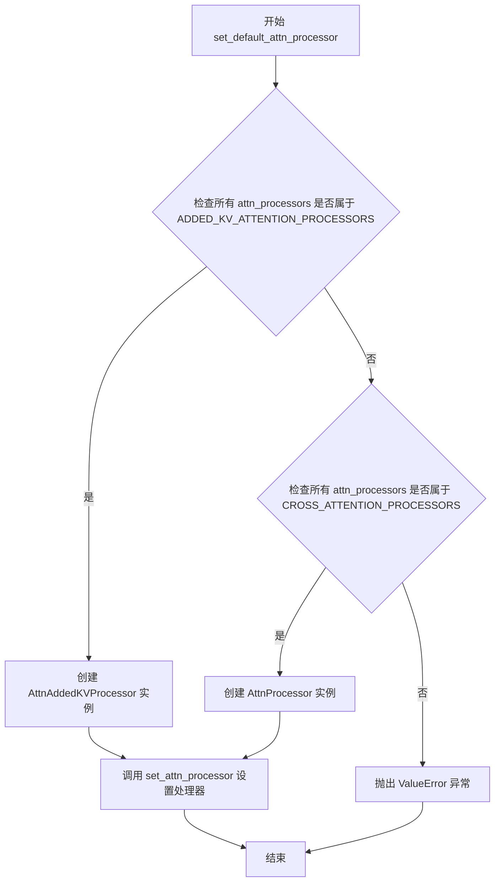

#### 带注释源码

```python
def set_default_attn_processor(self):
    """
    Disables custom attention processors and sets the default attention implementation.
    """
    # 检查所有注意力处理器是否都属于 ADDED_KV_ATTENTION_PROCESSORS 类型
    # ADDED_KV_ATTENTION_PROCESSORS 是用于处理额外键值对的注意力处理器集合
    if all(proc.__class__ in ADDED_KV_ATTENTION_PROCESSORS for proc in self.attn_processors.values()):
        # 如果所有处理器都是 ADDED_KV 类型，创建 AttnAddedKVProcessor 实例
        processor = AttnAddedKVProcessor()
    # 检查所有注意力处理器是否都属于 CROSS_ATTENTION_PROCESSORS 类型
    elif all(proc.__class__ in CROSS_ATTENTION_PROCESSORS for proc in self.attn_processors.values()):
        # 如果所有处理器都是 CROSS_ATTENTION 类型，创建 AttnProcessor 实例
        processor = AttnProcessor()
    else:
        # 如果处理器类型混合或不匹配，抛出 ValueError 异常
        # 错误信息包含当前处理器类型供调试参考
        raise ValueError(
            f"Cannot call `set_default_attn_processor` when attention processors are of type {next(iter(self.attn_processors.values()))}"
        )

    # 调用 set_attn_processor 方法将选定的默认处理器应用到模型
    self.set_attn_processor(processor)
```


### `UNet2DConditionModel.set_attention_slice`

该方法用于启用切片注意力计算，通过将输入张量分割成多个切片来分步计算注意力，以节省内存占用，但会导致速度略有下降。

参数：

- `slice_size`：`str | int | list[int]`，默认为 `"auto"`。当为 `"auto"` 时，输入到注意力头的数据减半，注意力分两步计算；当为 `"max"` 时，最大限度地节省内存，每次只运行一个切片；当为数字时，使用 `attention_head_dim // slice_size` 个切片，此时 `attention_head_dim` 必须是 `slice_size` 的倍数。

返回值：`None`，该方法直接修改模型内部状态，不返回任何值。

#### 流程图

```mermaid
flowchart TD
    A[开始 set_attention_slice] --> B[初始化空列表 sliceable_head_dims]
    B --> C[定义递归函数 fn_recursive_retrieve_sliceable_dims]
    C --> D{模块有 set_attention_slice 属性?}
    D -->|是| E[添加 module.sliceable_head_dim 到列表]
    D -->|否| F[遍历子模块递归调用]
    E --> F
    F --> G[遍历 self.children 获取所有可切片维度]
    G --> H[获取可切片层数量 num_sliceable_layers]
    H --> I{slice_size == 'auto'?}
    I -->|是| J[设置 slice_size = [dim // 2 for dim in sliceable_head_dims]]
    I -->|否| K{slice_size == 'max'?}
    K -->|是| L[设置 slice_size = num_sliceable_layers * [1]]
    K -->|否| M[保持原 slice_size]
    J --> N
    L --> N
    M --> N
    N[确保 slice_size 是列表]
    N --> O{len(slice_size) == len(sliceable_head_dims)?}
    O -->|否| P[抛出 ValueError]
    O -->|是| Q{遍历每个 slice_size 和 dim]
    Q --> R{size > dim?}
    R -->|是| S[抛出 ValueError]
    R -->|否| T[继续]
    Q --> U[反转 slice_size 列表]
    U --> V[递归设置每个模块的 set_attention_slice]
    V --> W[结束]
    P --> W
    S --> W
```

#### 带注释源码

```python
def set_attention_slice(self, slice_size: str | int | list[int] = "auto"):
    r"""
    Enable sliced attention computation.

    When this option is enabled, the attention module splits the input tensor in slices to compute attention in
    several steps. This is useful for saving some memory in exchange for a small decrease in speed.

    Args:
        slice_size (`str` or `int` or `list(int)`, *optional*, defaults to `"auto"`):
            When `"auto"`, input to the attention heads is halved, so attention is computed in two steps. If
            `"max"`, maximum amount of memory is saved by running only one slice at a time. If a number is
            provided, uses as many slices as `attention_head_dim // slice_size`. In this case, `attention_head_dim`
            must be a multiple of `slice_size`.
    """
    # 用于存储所有可切片注意力层的头维度
    sliceable_head_dims = []

    # 递归函数：遍历模块获取可切片的维度
    def fn_recursive_retrieve_sliceable_dims(module: torch.nn.Module):
        # 如果模块有 set_attention_slice 方法，说明它是可切片的注意力模块
        if hasattr(module, "set_attention_slice"):
            # 获取该模块的 sliceable_head_dim 属性并添加到列表
            sliceable_head_dims.append(module.sliceable_head_dim)
        # 递归遍历所有子模块
        for child in module.children():
            fn_recursive_retrieve_sliceable_dims(child)

    # 遍历模型的所有子模块，收集可切片注意力层的维度信息
    for module in self.children():
        fn_recursive_retrieve_sliceable_dims(module)

    # 计算可切片的层数
    num_sliceable_layers = len(sliceable_head_dims)

    # 根据 slice_size 参数确定具体的切片大小
    if slice_size == "auto":
        # "auto" 模式：将每个注意力头维度减半，通常是速度和内存的良好权衡
        slice_size = [dim // 2 for dim in sliceable_head_dims]
    elif slice_size == "max":
        # "max" 模式：使用最小的切片，每次只处理一个元素，最大程度节省内存
        slice_size = num_sliceable_layers * [1]

    # 确保 slice_size 是列表格式
    slice_size = num_sliceable_layers * [slice_size] if not isinstance(slice_size, list) else slice_size

    # 验证 slice_size 列表长度与可切片层数是否匹配
    if len(slice_size) != len(sliceable_head_dims):
        raise ValueError(
            f"You have provided {len(slice_size)}, but {self.config} has {len(sliceable_head_dims)} different"
            f" attention layers. Make sure to match `len(slice_size)` to be {len(sliceable_head_dims)}."
        )

    # 验证每个切片大小是否不超过对应的注意力头维度
    for i in range(len(slice_size)):
        size = slice_size[i]
        dim = sliceable_head_dims[i]
        if size is not None and size > dim:
            raise ValueError(f"size {size} has to be smaller or equal to {dim}.")

    # 定义递归函数：为每个子模块设置切片大小
    # 遍历所有子模块，任何暴露了 set_attention_slice 方法的模块都会收到设置消息
    def fn_recursive_set_attention_slice(module: torch.nn.Module, slice_size: list[int]):
        if hasattr(module, "set_attention_slice"):
            # 弹出列表最后一个元素作为当前模块的切片大小
            module.set_attention_slice(slice_size.pop())
        # 递归遍历子模块
        for child in module.children():
            fn_recursive_set_attention_slice(child, slice_size)

    # 反转切片大小列表，确保顺序正确
    reversed_slice_size = list(reversed(slice_size))
    # 遍历模型子模块，设置每个注意力模块的切片大小
    for module in self.children():
        fn_recursive_set_attention_slice(module, reversed_slice_size)
```


### `UNet2DConditionModel.enable_freeu`

该方法用于启用 FreeU 机制，该机制通过调整上采样块中的跳跃特征（skip features）和主干特征（backbone features）的贡献权重来减轻去噪过程中的"过度平滑效应"，从而提升生成图像的质量。

参数：

- `s1`：`float`，第一阶段的缩放因子，用于衰减跳跃特征的贡献，以减轻过度平滑效应
- `s2`：`float`，第二阶段的缩放因子，用于衰减跳跃特征的贡献，以减轻过度平滑效应
- `b1`：`float`，第一阶段的缩放因子，用于放大主干特征的贡献
- `b2`：`float`，第二阶段的缩放因子，用于放大主干特征的贡献

返回值：`None`，无返回值（该方法直接修改模型状态）

#### 流程图

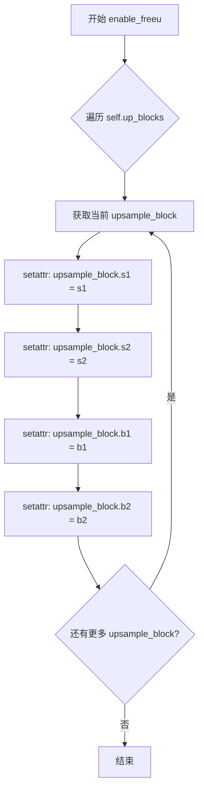

#### 带注释源码

```python
def enable_freeu(self, s1: float, s2: float, b1: float, b2: float):
    r"""Enables the FreeU mechanism from https://huggingface.co/papers/2309.11497.

    The suffixes after the scaling factors represent the stage blocks where they are being applied.

    Please refer to the [official repository](https://github.com/ChenyangSi/FreeU) for combinations of values that
    are known to work well for different pipelines such as Stable Diffusion v1, v2, and Stable Diffusion XL.

    Args:
        s1 (`float`):
            Scaling factor for stage 1 to attenuate the contributions of the skip features. This is done to
            mitigate the "oversmoothing effect" in the enhanced denoising process.
        s2 (`float`):
            Scaling factor for stage 2 to attenuate the contributions of the skip features. This is done to
            mitigate the "oversmoothing effect" in the enhanced denoising process.
        b1 (`float`): Scaling factor for stage 1 to amplify the contributions of backbone features.
        b2 (`float`): Scaling factor for stage 2 to amplify the contributions of backbone features.
    """
    # 遍历模型中所有的上采样块（up_blocks）
    # 每个上采样块对应 UNet 的不同上采样阶段
    for i, upsample_block in enumerate(self.up_blocks):
        # 为每个上采样块设置 FreeU 机制所需的四个缩放因子
        # s1, s2: 用于衰减跳跃连接特征的贡献（减轻过度平滑）
        # b1, b2: 用于增强主干特征的贡献（保持细节）
        setattr(upsample_block, "s1", s1)
        setattr(upsample_block, "s2", s2)
        setattr(upsample_block, "b1", b1)
        setattr(upsample_block, "b2", b2)
```


### `UNet2DConditionModel.disable_freeu`

该方法用于禁用 FreeU 机制，通过遍历所有上采样块（up_blocks），将 FreeU 相关的属性（s1, s2, b1, b2）设置为 None，从而关闭 FreeU 功能。

参数：
- 无参数（仅包含 self）

返回值：`None`，无返回值

#### 流程图

```mermaid
flowchart TD
    A[开始 disable_freeu] --> B[定义 freeu_keys = {'s1', 's2', 'b1', 'b2'}]
    B --> C[遍历 self.up_blocks]
    C --> D{遍历完所有 upsample_block?}
    D -->|否| E[获取当前 upsample_block]
    E --> F[遍历 freeu_keys 中的每个 k]
    F --> G{检查 hasattr 或 getattr}
    G -->|条件满足| H[setattr(upsample_block, k, None)]
    H --> F
    G -->|条件不满足| F
    F --> C
    D -->|是| I[结束]
```

#### 带注释源码

```python
def disable_freeu(self):
    """Disables the FreeU mechanism."""
    # 定义 FreeU 机制需要管理的属性键集合
    # s1, s2: 用于 attenuate（衰减）skip features 的缩放因子
    # b1, b2: 用于 amplify（放大）backbone features 的缩放因子
    freeu_keys = {"s1", "s2", "b1", "b2"}
    
    # 遍历 UNet 的所有上采样块（upsample blocks）
    # 这些块在 U-Net 的解码器部分，负责逐步上采样特征图
    for i, upsample_block in enumerate(self.up_blocks):
        # 遍历 FreeU 相关的所有属性键
        for k in freeu_keys:
            # 检查 upsample_block 是否具有该属性，或者属性值不为 None
            # hasattr 检查属性是否存在
            # getattr(upsample_block, k, None) 检查属性值是否为 None
            if hasattr(upsample_block, k) or getattr(upsample_block, k, None) is not None:
                # 将该属性设置为 None，从而禁用 FreeU 机制
                # 当属性为 None 时，forward 过程中将不会应用 FreeU 的特征缩放
                setattr(upsample_block, k, None)
```


### `UNet2DConditionModel.fuse_qkv_projections`

该方法用于启用融合的 QKV 投影，将注意力模块中的查询、键、值投影矩阵进行融合以提升计算效率。对于自注意力模块，融合所有三个投影矩阵；对于交叉注意力模块，只融合键和值投影矩阵。

参数： 无

返回值： 无返回值（该方法直接修改模型内部状态）

#### 流程图

```mermaid
flowchart TD
    A[开始: 调用 fuse_qkv_projections] --> B[初始化 original_attn_processors = None]
    B --> C{检查 attn_processors 中是否存在 Added KV 处理器}
    C -->|是| D[抛出 ValueError: 不支持具有 Added KV 投影的模型]
    C -->|否| E[保存当前 attention processors 到 original_attn_processors]
    E --> F[遍历所有模块]
    F --> G{当前模块是否为 Attention 类型?}
    G -->|是| H[调用 module.fuse_projections(fuse=True) 融合 QKV 投影]
    G -->|否| I[继续下一个模块]
    H --> F
    F --> J[所有模块遍历完成]
    J --> K[设置新的注意力处理器为 FusedAttnProcessor2_0]
    K --> L[结束]
```

#### 带注释源码

```python
def fuse_qkv_projections(self):
    """
    Enables fused QKV projections. For self-attention modules, all projection matrices (i.e., query, key, value)
    are fused. For cross-attention modules, key and value projection matrices are fused.

    > [!WARNING] > This API is 🧪 experimental.
    """
    # 初始化 original_attn_processors 为 None，用于存储原始注意力处理器
    self.original_attn_processors = None

    # 遍历所有注意力处理器，检查是否存在 Added KV 类型的处理器
    for _, attn_processor in self.attn_processors.items():
        # 如果存在 Added KV 处理器，则抛出异常，因为不支持此类模型的 QKV 融合
        if "Added" in str(attn_processor.__class__.__name__):
            raise ValueError("`fuse_qkv_projections()` is not supported for models having added KV projections.")

    # 将当前的注意力处理器保存到 original_attn_processors，以便后续可以恢复
    self.original_attn_processors = self.attn_processors

    # 遍历模型中的所有模块
    for module in self.modules():
        # 检查模块是否为 Attention 类型
        if isinstance(module, Attention):
            # 调用 Attention 模块的 fuse_projections 方法，传入 fuse=True 以启用融合
            module.fuse_projections(fuse=True)

    # 设置新的注意力处理器为 FusedAttnProcessor2_0，这是一种融合了 QKV 投影的注意力处理器
    self.set_attn_processor(FusedAttnProcessor2_0())
```


### `UNet2DConditionModel.unfuse_qkv_projections`

该方法用于禁用已启用的融合QKV投影，将注意力处理器恢复到原始状态。这是`fuse_qkv_projections()`方法的逆操作，允许模型在融合QKV投影和原始实现之间切换。

参数：

- `self`：`UNet2DConditionModel`，UNet2DConditionModel类的实例，隐式参数，表示当前模型对象

返回值：`None`，无返回值，该方法直接修改模型内部状态

#### 流程图

```mermaid
flowchart TD
    A[开始 unfuse_qkv_projections] --> B{检查 original_attn_processors 是否存在}
    B -->|存在| C[调用 set_attn_processor 恢复原始处理器]
    B -->|不存在| D[什么都不做]
    C --> E[结束]
    D --> E
    
    style A fill:#f9f,stroke:#333
    style C fill:#9f9,stroke:#333
    style E fill:#9ff,stroke:#333
```

#### 带注释源码

```python
def unfuse_qkv_projections(self):
    """Disables the fused QKV projection if enabled.

    > [!WARNING] > This API is 🧪 experimental.

    """
    # 检查是否存在原始的注意力处理器
    # original_attn_processors 在 fuse_qkv_projections() 方法中被赋值
    # 如果模型未执行过融合操作，则该属性为 None
    if self.original_attn_processors is not None:
        # 调用 set_attn_processor 方法将注意力处理器恢复为原始状态
        # 这会撤销 fuse_qkv_projections() 所做的融合操作
        self.set_attn_processor(self.original_attn_processors)
```


### `UNet2DConditionModel.get_time_embed`

该方法将输入的时间步（timestep）转换为时间嵌入向量（time embedding），是 UNet2DConditionModel 用于处理扩散模型时间条件信息的关键方法。它负责将各种形式的时间步统一转换为模型可用的嵌入表示。

参数：

- `sample`：`torch.Tensor`，输入样本张量，用于确定批次大小和设备信息
- `timestep`：`torch.Tensor | float | int`，时间步，可以是张量、浮点数或整数

返回值：`torch.Tensor | None`，时间嵌入向量，形状为 `(batch_size, time_embed_dim)`，如果输入无效则返回 None

#### 流程图

```mermaid
flowchart TD
    A[开始: get_time_embed] --> B{判断 timestep 是否为 Tensor}
    B -->|否| C[检查设备类型: mps 或 npu]
    B -->|是| D{检查 timestep 维度}
    
    C --> E{判断 timestep 类型}
    E -->|float| F[选择 float32 或 float64]
    E -->|其他| G[选择 int32 或 int64]
    
    F --> H[创建 1D Tensor 并指定 dtype 和 device]
    G --> H
    
    D -->|维度为0| I[扩展维度: timestep[None].todevice]
    D -->|维度非0| J[直接使用原始 timestep]
    
    H --> K
    I --> K
    J --> K
    
    K[广播到批次维度: expandbatch_size]
    K --> L[调用 time_proj: t_emb = self.time_proj timesteps]
    L --> M[转换 dtype: t_emb.to dtype=sample.dtype]
    M --> N[返回 t_emb]
```

#### 带注释源码

```python
def get_time_embed(self, sample: torch.Tensor, timestep: torch.Tensor | float | int) -> torch.Tensor | None:
    """
    将时间步转换为时间嵌入向量
    
    参数:
        sample: 输入样本张量，用于确定批次大小和设备
        timestep: 时间步，支持 Tensor、float 或 int 类型
    
    返回:
        时间嵌入张量，形状为 (batch_size, time_embed_dim)
    """
    timesteps = timestep
    
    # 检查 timestep 是否为 PyTorch Tensor
    if not torch.is_tensor(timesteps):
        # 如果不是 Tensor，需要进行类型转换
        # 注意: 这需要 CPU 和 GPU 之间的同步，建议尽可能传入 Tensor
        is_mps = sample.device.type == "mps"      # 判断是否为 Apple Silicon 设备
        is_npu = sample.device.type == "npu"      # 判断是否为华为 NPU 设备
        
        if isinstance(timestep, float):
            # 浮点数时间步: mps/npu 使用 float32，其他使用 float64
            dtype = torch.float32 if (is_mps or is_npu) else torch.float64
        else:
            # 整数时间步: mps/npu 使用 int32，其他使用 int64
            dtype = torch.int32 if (is_mps or is_npu) else torch.int64
        
        # 将 Python 数据转换为 1D Tensor，并指定正确的 dtype 和设备
        timesteps = torch.tensor([timesteps], dtype=dtype, device=sample.device)
    elif len(timesteps.shape) == 0:
        # 如果是 0 维标量 Tensor，扩展为 1D Tensor
        timesteps = timesteps[None].to(sample.device)
    
    # 将时间步广播到与样本批次维度兼容
    # 这种广播方式与 ONNX/Core ML 兼容
    timesteps = timesteps.expand(sample.shape[0])
    
    # 通过时间投影层获取嵌入
    # Timesteps 层不包含权重，始终返回 f32 张量
    t_emb = self.time_proj(timesteps)
    
    # 时间嵌入层可能运行在 fp16，因此需要转换数据类型
    # 这里可能有更好的封装方式
    t_emb = t_emb.to(dtype=sample.dtype)
    
    return t_emb
```


### `UNet2DConditionModel.get_class_embed`

获取类别嵌入向量，用于将类别标签转换为模型可用的嵌入表示。该方法根据配置的类型对类别标签进行相应处理（如时间投影或直接嵌入），并返回与输入样本数据类型一致的嵌入张量。

参数：

- `sample`：`torch.Tensor`，输入样本张量，用于确定返回嵌入的数据类型和设备
- `class_labels`：`torch.Tensor | None`，类别标签张量，用于生成对应的嵌入表示，当 `class_embed_type` 不为 None 时需要提供

返回值：`torch.Tensor | None`，返回处理后的类别嵌入张量，若未配置类别嵌入则返回 None

#### 流程图

```mermaid
flowchart TD
    A[开始 get_class_embed] --> B{self.class_embedding 是否为 None}
    B -->|是| C[返回 None]
    B -->|否| D{class_labels 是否为 None}
    D -->|是| E[抛出 ValueError]
    D -->|否| F{class_embed_type == 'timestep'}
    F -->|是| G[通过 self.time_proj 处理 class_labels]
    G --> H[转换为 sample.dtype]
    F -->|否| I[直接使用 class_labels]
    H --> J[通过 self.class_embedding 嵌入]
    I --> J
    J --> K[转换为 sample.dtype]
    K --> L[返回 class_emb]
```

#### 带注释源码

```python
def get_class_embed(self, sample: torch.Tensor, class_labels: torch.Tensor | None) -> torch.Tensor | None:
    """
    获取类别嵌入向量，用于条件生成任务中的类别条件处理。
    
    参数:
        sample: 输入样本张量，用于确定返回嵌入的数据类型和设备
        class_labels: 类别标签张量，用于生成对应的嵌入表示
        
    返回:
        处理后的类别嵌入张量，若未配置类别嵌入则返回 None
    """
    # 初始化类别嵌入为 None
    class_emb = None
    
    # 检查是否配置了类别嵌入层
    if self.class_embedding is not None:
        # 如果类别嵌入层存在但未提供类别标签，抛出错误
        if class_labels is None:
            raise ValueError("class_labels should be provided when num_class_embeds > 0")

        # 根据配置的类型处理类别标签
        if self.config.class_embed_type == "timestep":
            # 对于 timestep 类型，先通过时间投影层处理
            class_labels = self.time_proj(class_labels)

            # Timesteps 层总是返回 float32 张量
            # 需要转换为与输入样本相同的数据类型
            class_labels = class_labels.to(dtype=sample.dtype)

        # 通过类别嵌入层生成嵌入向量，并转换为输入样本的数据类型
        class_emb = self.class_embedding(class_labels).to(dtype=sample.dtype)
    
    # 返回类别嵌入（可能为 None）
    return class_emb
```


### `UNet2DConditionModel.get_aug_embed`

该方法用于根据不同的附加嵌入类型（addition_embed_type）处理和生成增强的嵌入向量。它支持多种条件嵌入场景，包括文本嵌入、文本-图像嵌入、文本-时间嵌入（SDXL风格）、图像嵌入以及图像提示嵌入（Kandinsky 2.2 ControlNet风格），并将这些增强嵌入与时间嵌入相加，以实现更丰富的条件控制。

参数：

- `self`：类实例本身，包含模型配置和嵌入层。
- `emb`：`torch.Tensor`，时间嵌入向量，用于确保返回的增强嵌入与时间嵌入数据类型一致。
- `encoder_hidden_states`：`torch.Tensor`，编码器的隐藏状态，通常为文本嵌入，在某些嵌入类型中作为备选文本嵌入使用。
- `added_cond_kwargs`：`dict[str, Any]`（字典），包含额外条件参数的字典，如`image_embeds`（图像嵌入）、`text_embeds`（文本嵌入）、`time_ids`（时间ID）等，具体内容根据`addition_embed_type`而定。

返回值：`torch.Tensor | None`，返回处理后的增强嵌入向量，如果`addition_embed_type`为`None`或不在支持的处理类型中则返回`None`。

#### 流程图

```mermaid
flowchart TD
    A[开始: get_aug_embed] --> B{addition_embed_type == 'text'}
    B -->|Yes| C[使用add_embedding处理encoder_hidden_states]
    B -->|No| D{addition_embed_type == 'text_image'}
    D -->|Yes| E{检查image_embeds在added_cond_kwargs中}
    E -->|No| F[抛出ValueError]
    E -->|Yes| G[获取image_embeds和text_embeds]
    G --> H[使用add_embedding处理text_embeds和image_embeds]
    D -->|No| I{addition_embed_type == 'text_time'}
    I -->|Yes| J{检查text_embeds在added_cond_kwargs中}
    J -->|No| K[抛出ValueError]
    J -->|Yes| L{检查time_ids在added_cond_kwargs中}
    L -->|No| M[抛出ValueError]
    L -->|Yes| N[获取text_embeds和time_ids]
    N --> O[使用add_time_proj处理time_ids]
    O --> P[重塑time_embeds形状]
    P --> Q[连接text_embeds和time_embeds]
    Q --> R[转换为emb dtype]
    R --> S[使用add_embedding处理连接后的嵌入]
    I -->|No| T{addition_embed_type == 'image'}
    T -->|Yes| U{检查image_embeds在added_cond_kwargs中}
    U -->|No| V[抛出ValueError]
    U -->|Yes| W[获取image_embeds]
    W --> X[使用add_embedding处理image_embeds]
    T -->|No| Y{addition_embed_type == 'image_hint'}
    Y -->|Yes| Z{检查image_embeds和hint在added_cond_kwargs中}
    Z -->|No| AA[抛出ValueError]
    Z -->|Yes| AB[获取image_embeds和hint]
    AB --> AC[使用add_embedding处理image_embeds和hint]
    Y -->|No| AD[返回None]
    C --> AE[返回aug_emb]
    H --> AE
    S --> AE
    X --> AE
    AC --> AE
    AD --> AE
```

#### 带注释源码

```python
def get_aug_embed(
    self, emb: torch.Tensor, encoder_hidden_states: torch.Tensor, added_cond_kwargs: dict[str, Any]
) -> torch.Tensor | None:
    """
    根据addition_embed_type配置处理额外的条件嵌入。
    
    参数:
        emb: 时间嵌入，用于dtype转换
        encoder_hidden_states: 编码器隐藏状态（文本嵌入）
        added_cond_kwargs: 包含额外条件的字典
    
    返回:
        处理后的增强嵌入或None
    """
    aug_emb = None  # 初始化增强嵌入为None
    
    if self.config.addition_embed_type == "text":
        # 类型1: 纯文本嵌入
        # 直接使用add_embedding处理encoder_hidden_states
        aug_emb = self.add_embedding(encoder_hidden_states)
    
    elif self.config.addition_embed_type == "text_image":
        # 类型2: 文本-图像嵌入 (Kandinsky 2.1风格)
        # 需要从added_cond_kwargs中获取image_embeds
        if "image_embeds" not in added_cond_kwargs:
            raise ValueError(
                f"{self.__class__} has the config param `addition_embed_type` set to 'text_image' which requires the keyword argument `image_embeds` to be passed in `added_cond_kwargs`"
            )

        image_embs = added_cond_kwargs.get("image_embeds")
        # 如果没有单独提供text_embeds，则使用encoder_hidden_states
        text_embs = added_cond_kwargs.get("text_embeds", encoder_hidden_states)
        # 将文本和图像嵌入传递给add_embedding层处理
        aug_emb = self.add_embedding(text_embs, image_embs)
    
    elif self.config.addition_embed_type == "text_time":
        # 类型3: 文本-时间嵌入 (SDXL风格)
        # 需要text_embeds和time_ids
        if "text_embeds" not in added_cond_kwargs:
            raise ValueError(
                f"{self.__class__} has the config param `addition_embed_type` set to 'text_time' which requires the keyword argument `text_embeds` to be passed in `added_cond_kwargs`"
            )
        text_embeds = added_cond_kwargs.get("text_embeds")
        
        if "time_ids" not in added_cond_kwargs:
            raise ValueError(
                f"{self.__class__} has the config param `addition_embed_type` set to 'text_time' which requires the keyword argument `time_ids` to be passed in `added_cond_kwargs`"
            )
        time_ids = added_cond_kwargs.get("time_ids")
        
        # 处理时间ID: 展平后投影，然后重塑为(batch, -1)形状
        time_embeds = self.add_time_proj(time_ids.flatten())
        time_embeds = time_embeds.reshape((text_embeds.shape[0], -1))
        
        # 沿最后一个维度连接文本和时间嵌入
        add_embeds = torch.concat([text_embeds], dim=-1)
        
        # 转换为与emb相同的数据类型以保持一致性
        add_embeds = add_embeds.to(emb.dtype)
        
        # 通过add_embedding层处理连接后的嵌入
        aug_emb = self.add_embedding(add_embeds)
    
    elif self.config.addition_embed_type == "image":
        # 类型4: 纯图像嵌入 (Kandinsky 2.2风格)
        if "image_embeds" not in added_cond_kwargs:
            raise ValueError(
                f"{self.__class__} has the config param `addition_embed_type` set to 'image' which requires the keyword argument `image_embeds` to be passed in `added_cond_kwargs`"
            )
        image_embs = added_cond_kwargs.get("image_embeds")
        aug_emb = self.add_embedding(image_embs)
    
    elif self.config.addition_embed_type == "image_hint":
        # 类型5: 图像提示嵌入 (Kandinsky 2.2 ControlNet风格)
        # 同时需要image_embeds和hint
        if "image_embeds" not in added_cond_kwargs or "hint" not in added_cond_kwargs:
            raise ValueError(
                f"{self.__class__} has the config param `addition_embed_type` set to 'image_hint' which requires the keyword arguments `image_embeds` and `hint` to be passed in `added_cond_kwargs`"
            )
        image_embs = added_cond_kwargs.get("image_embeds")
        hint = added_cond_kwargs.get("hint")
        aug_emb = self.add_embedding(image_embs, hint)
    
    return aug_emb
```


### `UNet2DConditionModel.process_encoder_hidden_states`

该方法负责根据配置的类型（text_proj、text_image_proj、image_proj、ip_image_proj）对编码器隐藏状态进行投影处理，将原始的 encoder_hidden_states 转换为适合 UNet 交叉注意力机制使用的形式，支持纯文本嵌入、文本-图像联合嵌入、纯图像嵌入以及 IP-Adapter 图像嵌入等场景。

参数：

- `self`：`UNet2DConditionModel` 实例本身
- `encoder_hidden_states`：`torch.Tensor`，编码器隐藏状态，通常来自文本编码器的输出，形状为 `(batch, sequence_length, feature_dim)`
- `added_cond_kwargs`：`dict[str, Any]`，包含额外条件的字典，如图像嵌入 `image_embeds`、文本嵌入 `text_embeds` 等

返回值：`torch.Tensor`，处理后的编码器隐藏状态，根据配置可能是投影后的单一张量或元组 `(encoder_hidden_states, image_embeds)`

#### 流程图

```mermaid
flowchart TD
    A[开始 process_encoder_hidden_states] --> B{encoder_hid_proj<br>是否存在?}
    B -->|否| Z[直接返回原始<br>encoder_hidden_states]
    B -->|是| C{encoder_hid_dim_type<br>== 'text_proj'?}
    C -->|是| D[执行线性投影<br>encoder_hid_proj]
    D --> Z
    C -->|否| E{encoder_hid_dim_type<br>== 'text_image_proj'?}
    E -->|是| F{added_cond_kwargs中<br>是否有image_embeds?}
    F -->|否| G[抛出ValueError]
    F -->|是| H[获取image_embeds<br>执行联合投影]
    H --> Z
    E -->|否| I{encoder_hid_dim_type<br>== 'image_proj'?}
    I -->|是| J{added_cond_kwargs中<br>是否有image_embeds?}
    J -->|否| K[抛出ValueError]
    J -->|是| L[获取image_embeds<br>仅投影图像嵌入]
    L --> Z
    I -->|否| M{encoder_hid_dim_type<br>== 'ip_image_proj'?}
    M -->|是| N{added_cond_kwargs中<br>是否有image_embeds?}
    N -->|否| O[抛出ValueError]
    N -->|是| P[可选: text_encoder_hid_proj<br>投影文本状态]
    P --> Q[获取image_embeds<br>encoder_hid_proj投影图像]
    Q --> R[返回元组<br>encoder_hidden_states<br>和image_embeds]
    M -->|否| Z
```

#### 带注释源码

```python
def process_encoder_hidden_states(
    self, encoder_hidden_states: torch.Tensor, added_cond_kwargs: dict[str, Any]
) -> torch.Tensor:
    """
    处理编码器隐藏状态，根据配置进行投影变换
    
    参数:
        encoder_hidden_states: 来自文本编码器的隐藏状态
        added_cond_kwargs: 包含额外条件的字典，如图像嵌入等
    
    返回:
        处理后的编码器隐藏状态
    """
    # 情况1: 简单的文本投影 (text_proj)
    # 最常见的情况，直接通过线性层将文本嵌入投影到cross_attention_dim维度
    if self.encoder_hid_proj is not None and self.config.encoder_hid_dim_type == "text_proj":
        encoder_hidden_states = self.encoder_hid_proj(encoder_hidden_states)
    
    # 情况2: 文本-图像联合投影 (text_image_proj) - Kandinsky 2.1风格
    # 需要同时考虑文本嵌入和图像嵌入，进行联合投影
    elif self.encoder_hid_proj is not None and self.config.encoder_hid_dim_type == "text_image_proj":
        if "image_embeds" not in added_cond_kwargs:
            raise ValueError(
                f"{self.__class__} has the config param `encoder_hid_dim_type` set to 'text_image_proj' which requires the keyword argument `image_embeds` to be passed in `added_cond_kwargs`"
            )

        image_embeds = added_cond_kwargs.get("image_embeds")
        encoder_hidden_states = self.encoder_hid_proj(encoder_hidden_states, image_embeds)
    
    # 情况3: 纯图像投影 (image_proj) - Kandinsky 2.2风格
    # 仅使用图像嵌入，忽略文本嵌入（encoder_hidden_states被替换为image_embeds）
    elif self.encoder_hid_proj is not None and self.config.encoder_hid_dim_type == "image_proj":
        if "image_embeds" not in added_cond_kwargs:
            raise ValueError(
                f"{self.__class__} has the config param `encoder_hid_dim_type` set to 'image_proj' which requires the keyword argument `image_embeds` to be passed in `added_cond_kwargs`"
            )
        image_embeds = added_cond_kwargs.get("image_embeds")
        encoder_hidden_states = self.encoder_hid_proj(image_embeds)
    
    # 情况4: IP-Adapter图像投影 (ip_image_proj)
    # IP-Adapter使用单独的文本投影和图像投影，返回元组供后续交叉注意力使用
    elif self.encoder_hid_proj is not None and self.config.encoder_hid_dim_type == "ip_image_proj":
        if "image_embeds" not in added_cond_kwargs:
            raise ValueError(
                f"{self.__class__} has the config param `encoder_hid_dim_type` set to 'ip_image_proj' which requires the keyword argument `image_embeds` to be passed in `added_cond_kwargs`"
            )

        # 可选：先通过文本投影层处理原始encoder_hidden_states
        if hasattr(self, "text_encoder_hid_proj") and self.text_encoder_hid_proj is not None:
            encoder_hidden_states = self.text_encoder_hid_proj(encoder_hidden_states)

        image_embeds = added_cond_kwargs.get("image_embeds")
        image_embeds = self.encoder_hid_proj(image_embeds)
        # 返回元组，保留原始文本状态和投影后的图像状态
        encoder_hidden_states = (encoder_hidden_states, image_embeds)
    
    # 情况5: 无投影或未知类型，直接返回原始encoder_hidden_states
    return encoder_hidden_states
```


### `UNet2DConditionModel.forward`

这是UNet2DConditionModel的核心推理方法，负责接收噪声样本、条件信息和时间步，通过编码器-解码器结构处理后输出去噪后的样本。

参数：

- `sample`：`torch.Tensor`，噪声输入张量，形状为`(batch, channel, height, width)`
- `timestep`：`torch.Tensor | float | int`，去噪的时间步数
- `encoder_hidden_states`：`torch.Tensor`，编码器隐藏状态，形状为`(batch, sequence_length, feature_dim)`
- `class_labels`：`torch.Tensor | None`，可选的类别标签，用于条件处理，其嵌入将与时间嵌入求和
- `timestep_cond`：`torch.Tensor | None`，时间步的条件嵌入，如果提供，将与通过`self.time_embedding`层的样本求和得到时间步嵌入
- `attention_mask`：`torch.Tensor | None`，形状为`(batch, key_tokens)`的注意力掩码应用于`encoder_hidden_states`
- `cross_attention_kwargs`：`dict | None`，可选的关键字参数字典，用于传递给`AttentionProcessor`
- `added_cond_kwargs`：`dict | None`，包含额外嵌入的关键字参数字典，如果指定将被添加到传递给UNet块的嵌入中
- `down_block_additional_residuals`：`tuple | None`，可选的张量元组，添加到下UNet块的残差中
- `mid_block_additional_residual`：`torch.Tensor | None`，如果指定，添加到中间UNet块的残差中
- `down_intrablock_additional_residuals`：`tuple | None`，UNet下块内的额外残差，例如来自T2I-Adapter侧模型
- `encoder_attention_mask`：`torch.Tensor | None`，形状为`(batch, sequence_length)`的交叉注意力掩码应用于`encoder_hidden_states`
- `return_dict`：`bool`，是否返回`UNet2DConditionOutput`而不是普通元组

返回值：`UNet2DConditionOutput | tuple`，如果`return_dict`为True，返回`UNet2DConditionOutput`，否则返回元组（第一个元素为样本张量）

#### 流程图

```mermaid
flowchart TD
    A[开始 forward] --> B{检查sample尺寸是否是upsampling因子的倍数}
    B -->|否| C[forward_upsample_size=True]
    B -->|是| D[继续处理attention_mask]
    C --> D
    D --> E[处理attention_mask为bias]
    E --> F[处理encoder_attention_mask为bias]
    F --> G{center_input_sample?}
    G -->|是| H[sample = 2 * sample - 1.0]
    G -->|否| I[获取time embedding]
    H --> I
    I --> J[time_embedding层处理]
    J --> K{获取class embedding}
    K -->|不为None| L{class_embeddings_concat?}
    K -->|为None| M[获取aug embedding]
    L -->|是| N[emb = torch.cat([emb, class_emb])]
    L -->|否| O[emb = emb + class_emb]
    N --> M
    O --> M
    M --> P{addition_embed_type == 'image_hint'}
    P -->|是| Q[aug_emb, hint = aug_emb<br/>sample = torch.cat([sample, hint])]
    P -->|否| R[emb = emb + aug_emb]
    Q --> S[time_embed_act处理]
    R --> S
    S --> T[处理encoder_hidden_states]
    T --> U[conv_in预处理]
    U --> V{GLIGEN position net?}
    V -->|是| W[处理gligen参数]
    V -->|否| X[开始下采样阶段]
    W --> X
    X --> Y{遍历down_blocks]
    Y -->|有cross_attention| Z[调用downsample_block with encoder_hidden_states]
    Y -->|无cross_attention| AA[调用downsample_block without encoder]
    Z --> AB[收集res_samples]
    AA --> AB
    AB --> AC[is_controlnet?]
    AC -->|是| AD[添加down_block_additional_residuals]
    AC -->|否| AE[中间块处理]
    AD --> AE
    AE --> AF{mid_block存在且有cross_attention?}
    AF -->|是| AG[mid_block with encoder]
    AF -->|否| AH[mid_block without encoder]
    AG --> AI[添加T2I-Adapter残差]
    AH --> AI
    AI --> AJ{is_controlnet添加mid_block残差}]
    AJ --> AK[开始上采样阶段]
    AK --> AL{遍历up_blocks]
    AL --> AM[获取res_samples]
    AM --> AN{不是最终块且forward_upsample_size?}
    AN -->|是| AO[设置upsample_size]
    AN -->|否| AP{has_cross_attention?}
    AO --> AP
    AP -->|是| AQ[upsample_block with encoder]
    AP -->|否| AR[upsample_block without encoder]
    AQ --> AS[后处理]
    AR --> AS
    AS --> AT{conv_norm_out存在?]
    AT -->|是| AU[conv_norm_out + conv_act]
    AT -->|否| AV[conv_out]
    AU --> AV
    AV --> AW{return_dict?}
    AW -->|是| AX[返回UNet2DConditionOutput]
    AW -->|否| AY[返回tuple]
    AX --> AZ[结束]
    AY --> AZ
```

#### 带注释源码

```python
@apply_lora_scale("cross_attention_kwargs")
def forward(
    self,
    sample: torch.Tensor,
    timestep: torch.Tensor | float | int,
    encoder_hidden_states: torch.Tensor,
    class_labels: torch.Tensor | None = None,
    timestep_cond: torch.Tensor | None = None,
    attention_mask: torch.Tensor | None = None,
    cross_attention_kwargs: dict[str, Any] | None = None,
    added_cond_kwargs: dict[str, torch.Tensor] | None = None,
    down_block_additional_residuals: tuple[torch.Tensor] | None = None,
    mid_block_additional_residual: torch.Tensor | None = None,
    down_intrablock_additional_residuals: tuple[torch.Tensor] | None = None,
    encoder_attention_mask: torch.Tensor | None = None,
    return_dict: bool = True,
) -> UNet2DConditionOutput | tuple:
    r"""
    The [`UNet2DConditionModel`] forward method.

    Args:
        sample (`torch.Tensor`): 噪声输入张量，形状为(batch, channel, height, width)
        timestep (`torch.Tensor` or `float` or `int`): 去噪的时间步数
        encoder_hidden_states (`torch.Tensor`): 编码器隐藏状态，形状为(batch, sequence_length, feature_dim)
        class_labels (`torch.Tensor`, *optional*): 可选的类别标签
        timestep_cond: (`torch.Tensor`, *optional*): 时间步的条件嵌入
        attention_mask (`torch.Tensor`, *optional*): 注意力掩码
        cross_attention_kwargs (`dict`, *optional*): 交叉注意力关键字参数
        added_cond_kwargs: (`dict`, *optional*): 额外的条件关键字参数
        down_block_additional_residuals: (`tuple` of `torch.Tensor`, *optional*): 下块额外残差
        mid_block_additional_residual: (`torch.Tensor`, *optional*): 中间块额外残差
        down_intrablock_additional_residuals: (`tuple` of `torch.Tensor`, *optional*): 块内额外残差
        encoder_attention_mask (`torch.Tensor`): 编码器注意力掩码
        return_dict (`bool`, *optional*): 是否返回字典格式

    Returns:
        [`~models.unets.unet_2d_condition.UNet2DConditionOutput`] or `tuple`
    """
    # 默认情况下，样本必须至少是整体上采样因子的倍数
    # 整体上采样因子等于 2 ** (# 上采样层数)
    default_overall_up_factor = 2**self.num_upsamplers

    # 当sample不是default_overall_up_factor的倍数时，需要转发upsample大小
    forward_upsample_size = False
    upsample_size = None

    for dim in sample.shape[-2:]:
        if dim % default_overall_up_factor != 0:
            # 转发upsample大小以强制插值输出大小
            forward_upsample_size = True
            break

    # 确保attention_mask是一个bias，并赋予它单例query_tokens维度
    # 期望mask形状: [batch, key_tokens]
    # 添加单例query_tokens维度: [batch, 1, key_tokens]
    if attention_mask is not None:
        # 假设mask表示为: (1 = keep, 0 = discard)
        # 将mask转换为可添加到注意力分数的bias: (keep = +0, discard = -10000.0)
        attention_mask = (1 - attention_mask.to(sample.dtype)) * -10000.0
        attention_mask = attention_mask.unsqueeze(1)

    # 以与attention_mask相同的方式转换encoder_attention_mask为bias
    if encoder_attention_mask is not None:
        encoder_attention_mask = (1 - encoder_attention_mask.to(sample.dtype)) * -10000.0
        encoder_attention_mask = encoder_attention_mask.unsqueeze(1)

    # 0. 如需要则中心化输入
    if self.config.center_input_sample:
        sample = 2 * sample - 1.0

    # 1. 时间处理
    t_emb = self.get_time_embed(sample=sample, timestep=timestep)
    emb = self.time_embedding(t_emb, timestep_cond)

    # 获取类别嵌入
    class_emb = self.get_class_embed(sample=sample, class_labels=class_labels)
    if class_emb is not None:
        if self.config.class_embeddings_concat:
            emb = torch.cat([emb, class_emb], dim=-1)
        else:
            emb = emb + class_emb

    # 获取增强嵌入
    aug_emb = self.get_aug_embed(
        emb=emb, encoder_hidden_states=encoder_hidden_states, added_cond_kwargs=added_cond_kwargs
    )
    # 处理image_hint类型的额外嵌入
    if self.config.addition_embed_type == "image_hint":
        aug_emb, hint = aug_emb
        sample = torch.cat([sample, hint], dim=1)

    # 合并嵌入
    emb = emb + aug_emb if aug_emb is not None else emb

    # 应用时间嵌入激活函数
    if self.time_embed_act is not None:
        emb = self.time_embed_act(emb)

    # 处理编码器隐藏状态
    encoder_hidden_states = self.process_encoder_hidden_states(
        encoder_hidden_states=encoder_hidden_states, added_cond_kwargs=added_cond_kwargs
    )

    # 2. 预处理 - 输入卷积
    sample = self.conv_in(sample)

    # 2.5 GLIGEN位置网络处理
    if cross_attention_kwargs is not None and cross_attention_kwargs.get("gligen", None) is not None:
        cross_attention_kwargs = cross_attention_kwargs.copy()
        gligen_args = cross_attention_kwargs.pop("gligen")
        cross_attention_kwargs["gligen"] = {"objs": self.position_net(**gligen_args)}

    # 3. 下采样阶段
    is_controlnet = mid_block_additional_residual is not None and down_block_additional_residuals is not None
    # 使用新参数down_intrablock_additional_residuals用于T2I-Adapter
    is_adapter = down_intrablock_additional_residuals is not None
    
    # 保持向后兼容性
    if not is_adapter and mid_block_additional_residual is None and down_block_additional_residuals is not None:
        deprecate(
            "T2I should not use down_block_additional_residuals",
            "1.3.0",
            "Passing intrablock residual connections with `down_block_additional_residuals` is deprecated",
            standard_warn=False,
        )
        down_intrablock_additional_residuals = down_block_additional_residuals
        is_adapter = True

    down_block_res_samples = (sample,)
    for downsample_block in self.down_blocks:
        if hasattr(downsample_block, "has_cross_attention") and downsample_block.has_cross_attention:
            # 对于t2i-adapter CrossAttnDownBlock2D
            additional_residuals = {}
            if is_adapter and len(down_intrablock_additional_residuals) > 0:
                additional_residuals["additional_residuals"] = down_intrablock_additional_residuals.pop(0)

            sample, res_samples = downsample_block(
                hidden_states=sample,
                temb=emb,
                encoder_hidden_states=encoder_hidden_states,
                attention_mask=attention_mask,
                cross_attention_kwargs=cross_attention_kwargs,
                encoder_attention_mask=encoder_attention_mask,
                **additional_residuals,
            )
        else:
            sample, res_samples = downsample_block(hidden_states=sample, temb=emb)
            if is_adapter and len(down_intrablock_additional_residuals) > 0:
                sample += down_intrablock_additional_residuals.pop(0)

        down_block_res_samples += res_samples

    # 处理ControlNet的额外残差
    if is_controlnet:
        new_down_block_res_samples = ()
        for down_block_res_sample, down_block_additional_residual in zip(
            down_block_res_samples, down_block_additional_residuals
        ):
            down_block_res_sample = down_block_res_sample + down_block_additional_residual
            new_down_block_res_samples = new_down_block_res_samples + (down_block_res_sample,)
        down_block_res_samples = new_down_block_res_samples

    # 4. 中间块处理
    if self.mid_block is not None:
        if hasattr(self.mid_block, "has_cross_attention") and self.mid_block.has_cross_attention:
            sample = self.mid_block(
                sample,
                emb,
                encoder_hidden_states=encoder_hidden_states,
                attention_mask=attention_mask,
                cross_attention_kwargs=cross_attention_kwargs,
                encoder_attention_mask=encoder_attention_mask,
            )
        else:
            sample = self.mid_block(sample, emb)

        # 支持T2I-Adapter-XL
        if (
            is_adapter
            and len(down_intrablock_additional_residuals) > 0
            and sample.shape == down_intrablock_additional_residuals[0].shape
        ):
            sample += down_intrablock_additional_residuals.pop(0)

    # 添加ControlNet中间块残差
    if is_controlnet:
        sample = sample + mid_block_additional_residual

    # 5. 上采样阶段
    for i, upsample_block in enumerate(self.up_blocks):
        is_final_block = i == len(self.up_blocks) - 1

        res_samples = down_block_res_samples[-len(upsample_block.resnets):]
        down_block_res_samples = down_block_res_samples[:-len(upsample_block.resnets)]

        # 如果没有到达最终块且需要转发上采样大小
        if not is_final_block and forward_upsample_size:
            upsample_size = down_block_res_samples[-1].shape[2:]

        if hasattr(upsample_block, "has_cross_attention") and upsample_block.has_cross_attention:
            sample = upsample_block(
                hidden_states=sample,
                temb=emb,
                res_hidden_states_tuple=res_samples,
                encoder_hidden_states=encoder_hidden_states,
                cross_attention_kwargs=cross_attention_kwargs,
                upsample_size=upsample_size,
                attention_mask=attention_mask,
                encoder_attention_mask=encoder_attention_mask,
            )
        else:
            sample = upsample_block(
                hidden_states=sample,
                temb=emb,
                res_hidden_states_tuple=res_samples,
                upsample_size=upsample_size,
            )

    # 6. 后处理
    if self.conv_norm_out:
        sample = self.conv_norm_out(sample)
        sample = self.conv_act(sample)
    sample = self.conv_out(sample)

    if not return_dict:
        return (sample,)

    return UNet2DConditionOutput(sample=sample)
```

## 关键组件


### 1. 张量索引与注意力掩码处理

在`forward`方法中，代码对attention_mask和encoder_attention_mask进行了张量索引转换，将掩码转换为可加到注意力分数的偏置。通过`(1 - attention_mask.to(sample.dtype)) * -10000.0`的转换，将keep(1)映射为+0，discard(0)映射为-10000.0，然后通过`unsqueeze(1)`添加单例查询令牌维度以支持广播。

### 2. 时间嵌入与条件投影

`get_time_embed`方法处理时间步张量的索引和广播，确保与输入样本的批次维度兼容。`time_embedding`层支持`timestep_cond`条件投影，允许额外的条件嵌入与时间嵌入求和。`TimestepEmbedding`内部实现包含线性层和激活函数，支持条件投影维度配置。

### 3. 类别嵌入与条件类型

`get_class_embed`方法支持多种class_embed_type：timestep（先进行时间投影）、identity（恒等映射）、projection（任意维度投影）、simple_projection（线性投影）。当`class_embeddings_concat`为True时，类别嵌入与时间嵌入在维度上拼接而非求和。

### 4. 融合QKV投影机制

`fuse_qkv_projections`方法将自注意力模块的所有投影矩阵（query、key、value）融合为一个矩阵，交叉注意力模块融合key和value投影。通过`FusedAttnProcessor2_0`处理器启用融合计算，`unuse_qkv_projections`方法可恢复原始处理器。

### 5. 切片注意力计算

`set_attention_slice`方法启用切片注意力计算，通过递归遍历子模块设置`sliceable_head_dim`。支持"auto"（减半头尺寸）、"max"（最小切片）、整数或列表三种配置模式，以内存换取计算速度的优化。

### 6. FreeU机制

`enable_freeu`和`disable_freeu`方法实现FreeU机制，通过在upsample_block上设置s1、s2、b1、b2四个缩放因子来减轻上采样过程中的过度平滑问题。s1/s2衰减跳跃特征贡献，b1/b2放大主干特征贡献。

### 7. UNet下采样与上采样结构

`down_blocks`（nn.ModuleList）和`up_blocks`（nn.ModuleList）构成UNet的编码器-解码器结构。通过`get_down_block`和`get_up_block`工厂函数动态创建不同类型的块，支持CrossAttnDownBlock2D、DownBlock2D、CrossAttnUpBlock2D、UpBlock2D等变体。

### 8. 中间块与跳跃连接

`mid_block`处理UNet中间层的特征，通过`get_mid_block`创建。跳跃连接通过`down_block_res_samples`元组收集并在up_blocks中按反向顺序使用，支持ControlNet和T2I-Adapter的额外残差连接（`down_block_additional_residuals`、`mid_block_additional_residual`、`down_intrablock_additional_residuals`）。

### 9. 额外条件嵌入处理

`get_aug_embed`方法处理多种addition_embed_type（text、text_image、text_time、image、image_hint），从`added_cond_kwargs`字典提取相应嵌入。`process_encoder_hidden_states`方法处理encoder_hidden_states的投影，支持text_proj、text_image_proj、image_proj、ip_image_proj类型。

### 10. GLIGEN位置网络

当attention_type为"gated"或"gated-text-image"时，`_set_pos_net_if_use_gligen`方法创建GLIGENTextBoundingboxProjection位置网络。在forward中通过`cross_attention_kwargs`传递gligen参数，实现文本引导的图像生成。

### 11. 编码器隐藏状态投影

`_set_encoder_hid_proj`方法创建encoder_hid_proj模块，将encoder_hidden_states从encoder_hid_dim投影到cross_attention_dim。支持TextImageProjection（Kandinsky 2.1）、ImageProjection（Kandinsky 2.2）等投影类型。

### 12. 数据类型转换与精度管理

在获取时间嵌入和类别嵌入时，代码显式执行dtype转换：`t_emb.to(dtype=sample.dtype)`和`class_labels.to(dtype=sample.dtype)`，以处理time_proj返回fp32而time_embedding可能运行在fp16的情况，确保数值精度一致性。


## 问题及建议


### 已知问题

-   **废弃参数仍被支持**：`num_attention_heads` 参数已废弃，但由于向后兼容仍被支持，导致代码中存在大量兼容性逻辑（如 `num_attention_heads = num_attention_heads or attention_head_dim`），增加了代码复杂性和理解难度。
-   **`forward` 方法参数过多**：该方法接受 14 个参数（包括多个可选参数），导致调用接口复杂，容易出现参数遗漏或错误使用的情况，违反了最小惊讶原则。
-   **类型注解不一致**：部分位置使用了 `Any` 类型而非具体类型（如 `added_cond_kwargs: dict[str, Any]`），降低了类型安全性和 IDE 智能提示效果。
-   **配置验证不完善**：`_check_config` 方法仅验证数量匹配，未验证具体值的有效性（如 `down_block_types` 中的字符串值是否合法）。
-   **魔法数字和字符串**：代码中存在多处硬编码的字符串（如 `"default"`、`"auto"`）和数值（如 `-10000.0` 用于注意力掩码），缺乏常量定义，降低了可维护性。
-   **向后兼容代码冗余**：大量 `if isinstance(...) else` 模式处理不同类型的参数（int、tuple、list），导致初始化逻辑臃肿。
-   **重复逻辑**：在 `__init__` 中对 `only_cross_attention`、`num_attention_heads`、`cross_attention_dim` 等参数进行多次相同类型的转换和处理。
-   **错误处理不够友好**：部分错误信息较长且格式不统一，如 `process_encoder_hidden_states` 方法中的多个条件分支。

### 优化建议

-   **移除废弃参数**：在主要版本更新中移除对 `num_attention_heads` 的支持，统一使用 `attention_head_dim`，简化代码。
-   **重构 forward 方法**：考虑使用数据类或配置对象封装相关参数（如 `ForwardOptions`），减少参数数量，提高可读性。
-   **完善类型注解**：将 `Any` 替换为更具体的类型定义，或使用 TypeVar 泛型化。
-   **增加常量定义**：将魔法数字和字符串提取为模块级常量，如 `DEFAULT_ATTN_BIAS = -10000.0`，提高可维护性。
-   **增强配置验证**：在 `_check_config` 中增加对 `down_block_types`、`up_block_types` 等枚举值的验证，提前发现配置错误。
-   **简化参数转换逻辑**：将重复的类型转换逻辑提取为私有方法，如 `_normalize_to_tuple()`，减少代码冗余。
-   **统一错误处理风格**：使用统一的错误格式和错误类，提供更一致的错误信息体验。
-   **增加文档注释**：对部分复杂逻辑（如 FreeU 机制、GLIGEN 集成）增加更详细的技术说明，帮助后续开发者理解设计意图。

## 其它


### 设计目标与约束

**设计目标**：
1. 实现一个条件2D UNet模型，用于扩散模型的噪声预测
2. 支持多种条件输入（文本、图像、时间步、类标签等）
3. 提供灵活的架构配置以适应不同的扩散任务
4. 支持高效推理（注意力切片、QKV融合等）

**约束**：
1. 必须继承自ModelMixin、ConfigMixin等基础类以保持一致性
2. 输入样本尺寸必须能被整体上采样因子整除（除非显式传递upsample_size）
3. 配置文件参数必须通过@register_to_config装饰器注册
4. 注意力处理器必须与模型一起初始化和保存

### 错误处理与异常设计

**配置验证错误**：
- `down_block_types`和`up_block_types`数量不一致时抛出ValueError
- `block_out_channels`与`down_block_types`数量不匹配时抛出ValueError
- `only_cross_attention`、`num_attention_heads`、`attention_head_dim`、`cross_attention_dim`、`layers_per_block`与`down_block_types`数量不匹配时抛出ValueError
- `transformer_layers_per_block`为列表形式但未提供`reverse_transformer_layers_per_block`时抛出ValueError

**输入验证错误**：
- `num_attention_heads`参数已废弃，传递该参数会抛出ValueError
- 当`class_embed_type`为"projection"或"simple_projection"但未提供`projection_class_embeddings_input_dim`时抛出ValueError
- 当`encoder_hid_dim_type`已设置但`encoder_hid_dim`为None时抛出ValueError

**运行时错误**：
- `class_labels`为None但`class_embedding`已配置时抛出ValueError
- 注意力处理器类型不兼容时无法调用`set_default_attn_processor`
- 已融合QKV投影的模型不支持再次融合

### 数据流与状态机

**前向传播数据流**：

```
输入样本(sample) + 时间步(timestep) + 编码器隐藏状态(encoder_hidden_states)
        ↓
1. 时间嵌入处理 (get_time_embed + time_embedding)
        ↓
2. 类嵌入处理 (get_class_embed)
        ↓
3. 附加条件嵌入处理 (get_aug_embed)
        ↓
4. 编码器隐藏状态预处理 (process_encoder_hidden_states)
        ↓
5. 输入卷积 (conv_in)
        ↓
6. 下采样阶段 (down_blocks) - 提取多尺度特征
        ↓
7. 中间块处理 (mid_block) - 特征融合
        ↓
8. 上采样阶段 (up_blocks) - 逐步上采样并融合跳跃连接
        ↓
9. 输出后处理 (conv_norm_out + conv_act + conv_out)
        ↓
输出样本 (sample)
```

**特殊状态**：
- ControlNet模式：当`mid_block_additional_residual`和`down_block_additional_residuals`不为None时
- T2I-Adapter模式：当`down_intrablock_additional_residuals`不为None时
- FreeU模式：通过`enable_freeu`激活，修改上采样块的跳过连接权重

### 外部依赖与接口契约

**核心依赖**：
- `torch.nn.Module`：基础神经网络模块
- `dataclasses.dataclass`：输出数据结构
- `configuration_utils.ConfigMixin`：配置混入
- `loaders.PeftAdapterMixin`：PEFT适配器支持
- `loaders.UNet2DConditionLoadersMixin`：UNet加载器混入
- `loaders.single_file_model.FromOriginalModelMixin`：单文件模型导入
- `modeling_utils.ModelMixin`：模型混入基类
- `attention.AttentionMixin`：注意力混入

**内部模块依赖**：
- `activations.get_activation`：激活函数获取
- `attention_processor`：各种注意力处理器
- `embeddings`：时间嵌入、文本嵌入、图像嵌入等
- `unet_2d_blocks`：下采样、上采样、中间块构建函数

**公共接口**：
- `forward()`：主前向传播方法
- `set_attention_slice()`：设置注意力切片以节省显存
- `enable_freeu()` / `disable_freeu()`：FreeU机制控制
- `fuse_qkv_projections()` / `unuse_qkv_projections()`：QKV投影融合
- `set_default_attn_processor()`：设置默认注意力处理器
- `set_attn_processor()`：设置自定义注意力处理器

### 性能优化特性

**显存优化**：
- 梯度检查点支持（`_supports_gradient_checkpointing = True`）
- 注意力切片机制，允许分片计算注意力
- QKV投影融合，减少内存访问

**计算优化**：
- 支持不同注意力头维度配置
- 支持线性投影（替代Conv2d）
- 支持不同的ResNet时间尺度移位配置

### 版本兼容性信息

- `num_attention_heads`参数已废弃（v0.19之前不支持）
- `down_block_additional_residuals`用于T2I-Adapter已废弃，应使用`down_intrablock_additional_residuals`
- 注意力头维度与数量曾经混淆命名（为保持向后兼容而保留现有命名）

### 配置参数分类

**时间嵌入相关**：
- `time_embedding_type`、`time_embedding_dim`、`time_embedding_act_fn`、`timestep_post_act`

**架构相关**：
- `down_block_types`、`up_block_types`、`mid_block_type`、`block_out_channels`、`layers_per_block`

**注意力相关**：
- `attention_head_dim`、`num_attention_heads`、`only_cross_attention`、`use_linear_projection`

**条件相关**：
- `class_embed_type`、`addition_embed_type`、`encoder_hid_dim_type`、`cross_attention_dim`

    