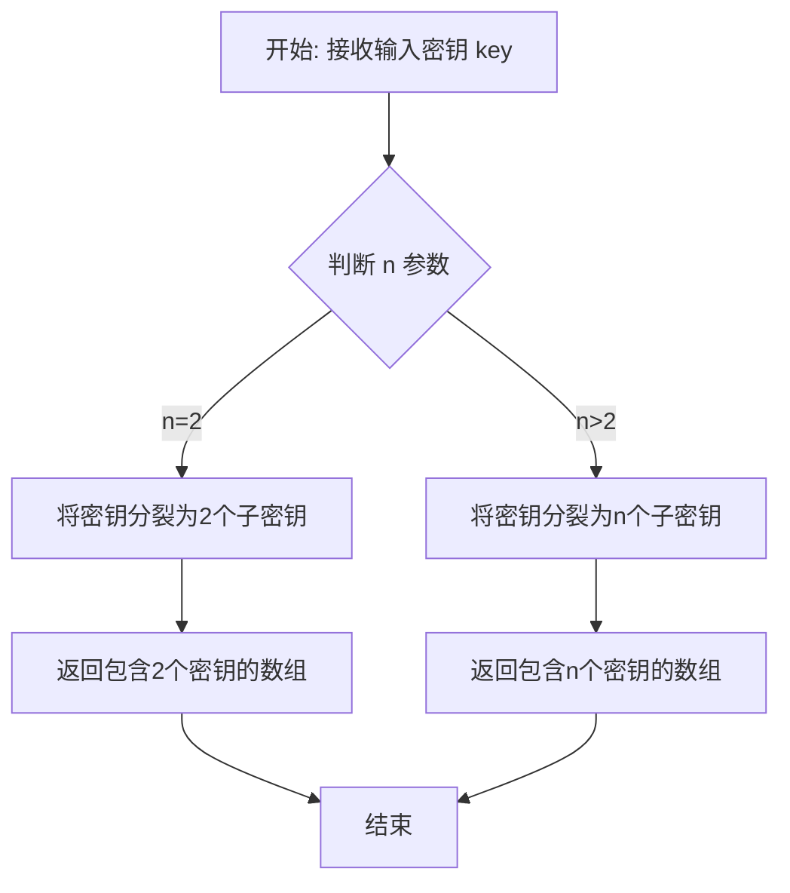
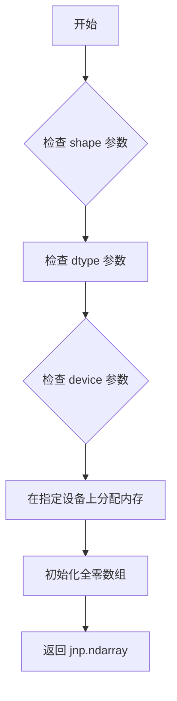
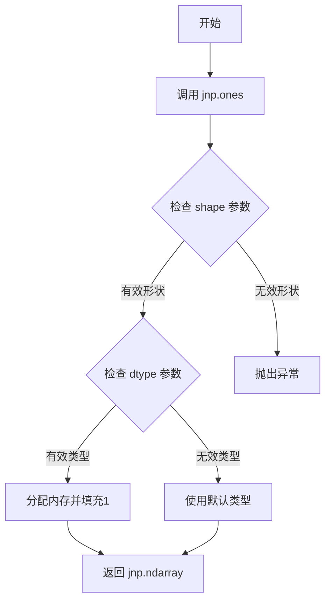
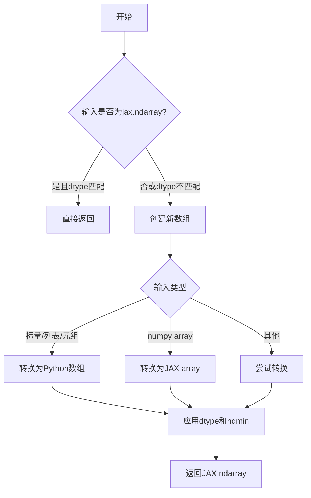
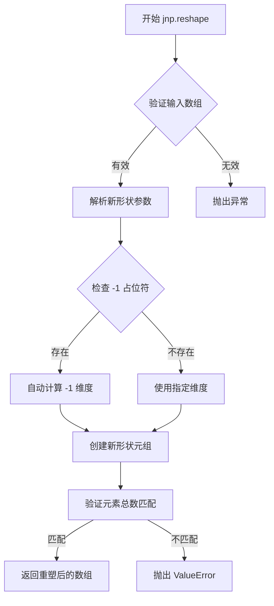
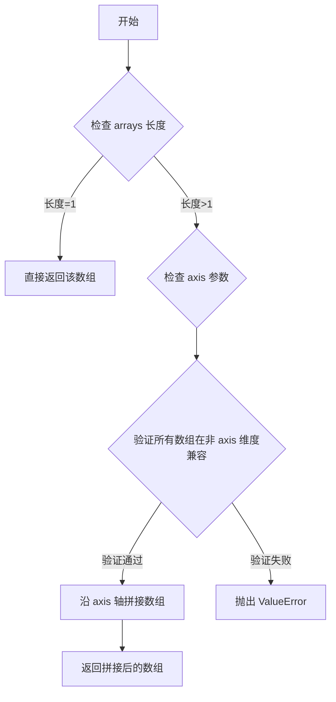
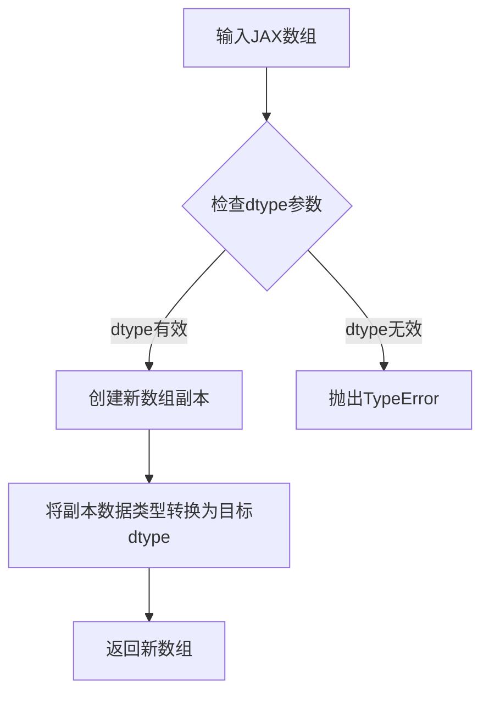
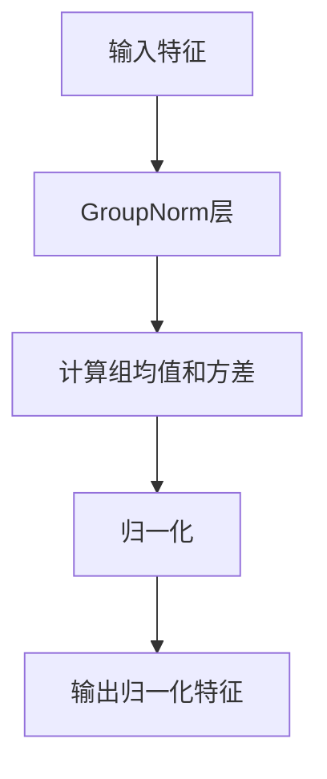
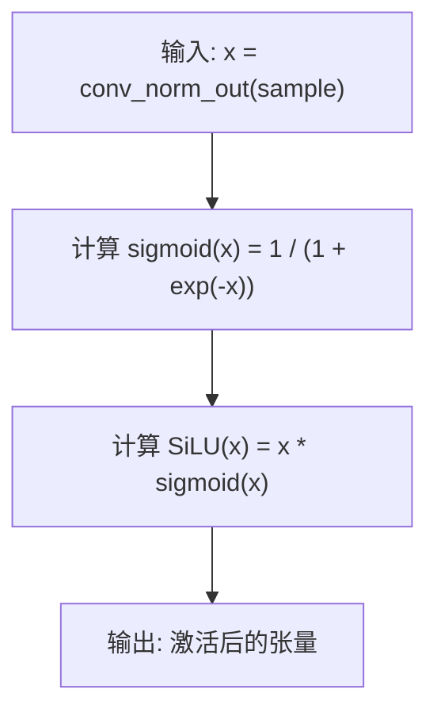
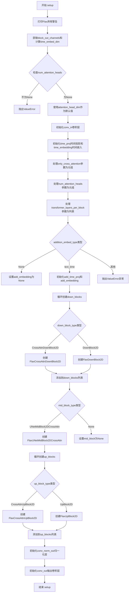

# `diffusers\src\diffusers\models\unets\unet_2d_condition_flax.py` 详细设计文档

这是一个基于Flax Linen框架实现的UNet 2D条件模型，用于Diffusion模型的噪声预测任务。模型接收带噪声的图像样本、时间步嵌入和条件状态（encoder_hidden_states），通过下采样、上采样模块以及交叉注意力机制处理后，输出预测的噪声样本。

## 整体流程

```mermaid
graph TD
    A[开始] --> B[输入预处理]
    B --> C[时间步嵌入计算]
    C --> D{addition_embed_type是否为text_time?}
    D -- 是 --> E[计算额外条件嵌入]
    D -- 否 --> F[跳过额外嵌入]
    E --> G[合并时间嵌入和额外嵌入]
    F --> G
    G --> H[卷积预处理]
    H --> I[下采样阶段]
    I --> J[中间块处理]
    J --> K[上采样阶段]
    K --> L[后处理卷积]
    L --> M{return_dict=True?}
    M -- 是 --> N[返回FlaxUNet2DConditionOutput]
    M -- 否 --> O[返回tuple(sample)]
```

## 类结构

```
BaseOutput (基类)
├── FlaxUNet2DConditionOutput (数据输出类)
ConfigMixin (配置混入)
FlaxModelMixin (Flax模型混入)
nn.Module (Flax Linen模块基类)
└── FlaxUNet2DConditionModel (UNet 2D条件模型主类)
    ├── conv_in (输入卷积层)
    ├── time_proj (时间步投影)
    ├── time_embedding (时间步嵌入)
    ├── add_time_proj (额外时间投影)
    ├── add_embedding (额外嵌入层)
    ├── down_blocks (下采样块列表)
    ├── mid_block (中间块)
    ├── up_blocks (上采样块列表)
    ├── conv_norm_out (输出归一化)
    └── conv_out (输出卷积层)
```

## 全局变量及字段


### `logger`
    
模块级别的日志记录器

类型：`logging.Logger`
    


### `block_out_channels`
    
每个块的输出通道数

类型：`tuple[int, ...]`
    


### `time_embed_dim`
    
时间嵌入维度

类型：`int`
    


### `num_attention_heads`
    
注意力头数量

类型：`int | tuple[int, ...]`
    


### `only_cross_attention`
    
是否仅使用交叉注意力

类型：`tuple[bool]`
    


### `transformer_layers_per_block`
    
每个块的Transformer层数列表

类型：`list[int]`
    


### `down_blocks`
    
下采样块列表

类型：`list`
    


### `output_channel`
    
当前块的输出通道数

类型：`int`
    


### `up_blocks`
    
上采样块列表

类型：`list`
    


### `reversed_block_out_channels`
    
反转后的输出通道数列表

类型：`list[int]`
    


### `reversed_num_attention_heads`
    
反转后的注意力头数量列表

类型：`list[int]`
    


### `reversed_transformer_layers_per_block`
    
反转后的Transformer层数列表

类型：`list[int]`
    


### `t_emb`
    
时间嵌入向量

类型：`jnp.ndarray`
    


### `aug_emb`
    
额外嵌入向量

类型：`jnp.ndarray`
    


### `sample`
    
当前处理样本张量

类型：`jnp.ndarray`
    


### `down_block_res_samples`
    
下采样块残差样本元组

类型：`tuple[jnp.ndarray, ...]`
    


### `res_samples`
    
单个块产生的残差样本

类型：`tuple[jnp.ndarray, ...]`
    


### `dataclass.FlaxUNet2DConditionOutput`
    
模型输出数据类，包含sample字段

类型：`flax.struct.dataclass`
    


### `FlaxUNet2DConditionOutput.sample`
    
模型输出的隐藏状态样本

类型：`jnp.ndarray`
    


### `nn.Module.FlaxUNet2DConditionModel`
    
条件2D UNet模型，用于图像生成

类型：`class`
    


### `FlaxUNet2DConditionModel.sample_size`
    
输入样本的尺寸

类型：`int`
    


### `FlaxUNet2DConditionModel.in_channels`
    
输入通道数

类型：`int`
    


### `FlaxUNet2DConditionModel.out_channels`
    
输出通道数

类型：`int`
    


### `FlaxUNet2DConditionModel.down_block_types`
    
下采样块类型元组

类型：`tuple[str, ...]`
    


### `FlaxUNet2DConditionModel.up_block_types`
    
上采样块类型元组

类型：`tuple[str, ...]`
    


### `FlaxUNet2DConditionModel.mid_block_type`
    
中间块类型

类型：`str | None`
    


### `FlaxUNet2DConditionModel.only_cross_attention`
    
是否仅使用交叉注意力

类型：`bool | tuple[bool]`
    


### `FlaxUNet2DConditionModel.block_out_channels`
    
每个块的输出通道数

类型：`tuple[int, ...]`
    


### `FlaxUNet2DConditionModel.layers_per_block`
    
每个块的层数

类型：`int`
    


### `FlaxUNet2DConditionModel.attention_head_dim`
    
注意力头维度

类型：`int | tuple[int, ...]`
    


### `FlaxUNet2DConditionModel.num_attention_heads`
    
注意力头数量

类型：`int | tuple[int, ...] | None`
    


### `FlaxUNet2DConditionModel.cross_attention_dim`
    
交叉注意力维度

类型：`int`
    


### `FlaxUNet2DConditionModel.dropout`
    
Dropout概率

类型：`float`
    


### `FlaxUNet2DConditionModel.use_linear_projection`
    
是否使用线性投影

类型：`bool`
    


### `FlaxUNet2DConditionModel.dtype`
    
数据类型

类型：`jnp.dtype`
    


### `FlaxUNet2DConditionModel.flip_sin_to_cos`
    
是否将sin转换为cos

类型：`bool`
    


### `FlaxUNet2DConditionModel.freq_shift`
    
频率偏移量

类型：`int`
    


### `FlaxUNet2DConditionModel.use_memory_efficient_attention`
    
是否使用内存高效注意力

类型：`bool`
    


### `FlaxUNet2DConditionModel.split_head_dim`
    
是否分割头维度

类型：`bool`
    


### `FlaxUNet2DConditionModel.transformer_layers_per_block`
    
每个块的Transformer层数

类型：`int | tuple[int, ...]`
    


### `FlaxUNet2DConditionModel.addition_embed_type`
    
额外嵌入类型

类型：`str | None`
    


### `FlaxUNet2DConditionModel.addition_time_embed_dim`
    
额外时间嵌入维度

类型：`int | None`
    


### `FlaxUNet2DConditionModel.addition_embed_type_num_heads`
    
额外嵌入的注意力头数

类型：`int`
    


### `FlaxUNet2DConditionModel.projection_class_embeddings_input_dim`
    
投影类嵌入输入维度

类型：`int | None`
    


### `FlaxUNet2DConditionModel.conv_in`
    
输入卷积层

类型：`nn.Conv`
    


### `FlaxUNet2DConditionModel.time_proj`
    
时间步投影层

类型：`FlaxTimesteps`
    


### `FlaxUNet2DConditionModel.time_embedding`
    
时间步嵌入层

类型：`FlaxTimestepEmbedding`
    


### `FlaxUNet2DConditionModel.add_time_proj`
    
额外时间投影层

类型：`FlaxTimesteps`
    


### `FlaxUNet2DConditionModel.add_embedding`
    
额外嵌入层

类型：`FlaxTimestepEmbedding`
    


### `FlaxUNet2DConditionModel.down_blocks`
    
下采样块列表

类型：`list`
    


### `FlaxUNet2DConditionModel.mid_block`
    
中间块

类型：`FlaxUNetMidBlock2DCrossAttn | None`
    


### `FlaxUNet2DConditionModel.up_blocks`
    
上采样块列表

类型：`list`
    


### `FlaxUNet2DConditionModel.conv_norm_out`
    
输出归一化层

类型：`nn.GroupNorm`
    


### `FlaxUNet2DConditionModel.conv_out`
    
输出卷积层

类型：`nn.Conv`
    
    

## 全局函数及方法


### `jax.random.split`

这是 JAX 库中的随机数生成函数，用于将一个随机数生成器（RNG）分裂成多个独立的子 RNG。在 `FlaxUNet2DConditionModel.init_weights` 方法中用于将单一的 RNG 分成参数初始化和 dropout 所需的两个独立随机数生成器。

参数：

-  `key`：`jax.random.KeyArray`，原始的随机数生成器密钥（来自 `jax.random.PRNGKey` 或之前的分裂结果）
-  `n`：`int`（可选，默认为 2），要分裂产生的子密钥数量
-  `shape`：`tuple`（可选），可选的形状参数，用于批量生成多个独立的密钥

返回值：`jax.random.KeyArray`，当 `n=2` 时返回长度为 2 的密钥数组；当 `n>2` 时返回长度为 `n` 的密钥数组

#### 流程图



#### 带注释源码

```python
# 在 FlaxUNet2DConditionModel.init_weights 方法中的使用示例：

def init_weights(self, rng: jax.Array) -> FrozenDict:
    # ... 省略其他代码 ...
    
    # 使用 jax.random.split 将 RNG 分裂为两个独立的子 RNG
    # 用途：一个用于参数初始化，一个用于 dropout
    params_rng, dropout_rng = jax.random.split(rng)
    rngs = {"params": params_rng, "dropout": dropout_rng}
    
    # 返回初始化后的参数
    return self.init(rngs, sample, timesteps, encoder_hidden_states, added_cond_kwargs)["params"]
```

**说明**：`jax.random.split` 是 JAX 官方提供的随机数管理函数，属于外部依赖（`import jax`）。在此代码中用于确保参数初始化和 dropout 使用不同的随机种子，从而保证模型初始化的确定性和可重复性。


### `jnp.zeros`

用于创建全零数组的 JAX NumPy 函数，常用于初始化输入张量、占位符或创建与输入形状相同的零张量。

参数：

-  `shape`：`int` 或 `tuple[int, ...]`，输出数组的形状
-  `dtype`：`jnp.dtype`，可选，数据类型，默认为 `jnp.float32`
-  `device`：`jax.Device`，可选，指定放置数组的设备

返回值：`jnp.ndarray`，指定形状和类型的全零数组

#### 流程图



#### 带注释源码

```python
def zeros(shape: Shape, dtype: DType = float32, device: Device = None) -> Array:
    """
    创建全零数组。
    
    参数:
        shape: 输出数组的形状，可以是整数或整数元组
        dtype: 数组的数据类型，默认为 float32
        device: 可选的设备，用于放置数组
    
    返回:
        指定形状和类型的全零 JAX 数组
    """
    # 将形状规范化为元组
    shape = canonicalize_shape(shape)
    
    # 获取默认的数值类型
    dtype = dtype or _default_dtype
    
    # 在设备上创建全零数组
    return lax.broadcast(
        zeros_like_empty(shape, dtype, device),
        shape
    )
```


### `jnp.ones`

`jnp.ones` 是 JAX 库中的一个函数，用于创建一个指定形状和数据类型的全 1 数组。在代码中用于初始化时间步张量。

参数：

- `shape`：`tuple[int, ...]`，数组的形状，如 `(1,)` 表示一维数组包含1个元素
- `dtype`：`jnp.dtype`，数组的数据类型，如 `jnp.int32`，指定输出数组的元素类型
- `device`：可选，指定计算设备

返回值：`jnp.ndarray`，返回一个填充全 1 值的 JAX 数组

#### 流程图



#### 带注释源码

```python
# 使用 jnp.ones 创建一个形状为 (1,) 的整数数组
timesteps = jnp.ones((1,), dtype=jnp.int32)
# 参数说明：
#   - (1,): 形状元组，表示创建1个元素的一维数组
#   - dtype=jnp.int32: 指定数据类型为32位整数
# 返回值：jnp.ndarray([1])，即值为 [1] 的数组
```


### `jnp.array`

将输入数据转换为 JAX ndarray，是 JAX 中创建数组的核心函数。

参数：

-  `object`：`Any`，输入对象，可以是 Python 列表、元组、标量或其他数组-like 对象
-  `dtype`：`optional`，目标数据类型，如 `jnp.float32`、`jnp.int32` 等，默认根据输入推断
-  `copy`：`optional`，是否强制复制数据，默认 `None`
-  `ndmin`：`optional`，指定最小维度数，默认 `0`

返回值：`jax.numpy.ndarray`，转换后的 JAX 数组

#### 流程图



#### 带注释源码

```
# 在 FlaxUNet2DConditionModel.__call__ 方法中使用 jnp.array 将 timesteps 转换为 JAX 数组
# 示例代码:
if not isinstance(timesteps, jnp.ndarray):
    # 如果 timesteps 不是 JAX 数组，则将其转换为 JAX 数组
    # 这里将单个值转换为包含一个元素的 1 维数组
    timesteps = jnp.array([timesteps], dtype=jnp.int32)
elif isinstance(timesteps, jnp.ndarray) and len(timesteps.shape) == 0:
    # 如果 timesteps 是 JAX 数组但是标量（0维）
    # 1. 转换为浮点数
    # 2. 扩展维度到 1 维
    timesteps = timesteps.astype(dtype=jnp.float32)
    timesteps = jnp.expand_dims(timesteps, 0)

# 完整调用形式:
# jnp.array(object, dtype=None, copy=None, ndmin=0)
```

#### 使用场景说明

在代码中 `jnp.array` 被用于：

1. **类型转换**：将 Python 原生类型或 NumPy 数组转换为 JAX 数组，以支持后续的 JAX 操作
2. **维度规范**：通过 `[timesteps]` 包装将标量转换为 1 维数组，确保维度一致性
3. **数据类型指定**：明确指定 `dtype=jnp.int32` 确保整数类型

#### 相关技术细节

- `jnp.array` 是 JAX 对 NumPy `np.array` 的兼容实现
- 与 NumPy 不同，JAX 数组是不可变的（immutable），所有操作返回新数组
- JAX 数组支持 JIT 编译，可被 JIT 追踪并编译为高效的 XLA 计算图


### `jnp.expand_dims`

在 `FlaxUNet2DConditionModel.__call__` 方法中用于将一维时间步张量扩展为二维张量，以确保时间投影层能够正确处理标量时间步输入。

参数：

- `array`：`jnp.ndarray`，输入的时间步张量，通常为一维数组（如 shape 为 (batch_size,)）
- `axis`：`int`，整数，指定在哪个轴（维度）插入新维度，此处为 `0`

返回值：`jnp.ndarray`，扩展维度后的张量（通常 shape 从 (batch_size,) 变为 (batch_size, 1)）

#### 流程图

```mermaid
flowchart TD
    A[输入 timesteps 一维数组] --> B{检查 timestep 类型}
    B -->|非 jnp.ndarray| C[转换为 jnp.ndarray]
    B -->|jnp.ndarray 但标量| D[转换为 float32]
    C --> E[执行 jnp.expand_dims]
    D --> E
    E --> F[在 axis=0 维度插入新维度]
    F --> G[输出二维数组 shape: (batch, 1)]
    
    style A fill:#f9f,stroke:#333
    style G fill:#9f9,stroke:#333
```

#### 带注释源码

```python
# 在 FlaxUNet2DConditionModel.__call__ 方法中
# 将 timesteps 转换为 float32 类型（如果是标量的话）
timesteps = timesteps.astype(dtype=jnp.float32)

# 使用 jnp.expand_dims 在第0维插入新维度
# 将 shape 从 (batch_size,) 变为 (batch_size, 1)
# 原因：time_proj 层期望至少是二维输入以进行正弦余弦位置编码
timesteps = jnp.expand_dims(timesteps, 0)
```


### `jnp.transpose`

`jnp.transpose` 是 JAX 库中的数组转置函数，用于根据指定的轴顺序对输入数组进行维度重排。在 `FlaxUNet2DConditionModel` 中，该函数用于在不同的数组布局格式之间进行切换：将输入样本从 channels-first (NCHW) 格式转换为 channels-last (NHWC) 格式进行处理，处理完成后再转换回 channels-first 格式。

参数：

- `a`：`jnp.ndarray`，输入的需要转置的数组
- `axes`：`tuple[int, ...]`，可选参数，指定新的轴排列顺序。例如 `(0, 2, 3, 1)` 表示将原数组的第0维保持不变，第1维移到第3位，第2维移到第1位，第3维移到第2位

返回值：`jnp.ndarray`，转置后的数组

#### 流程图

```mermaid
graph TD
    A[输入数组 sample] --> B{是否指定 axes}
    B -->|Yes| C[按照指定 axes 转置]
    B -->|No| D[反转所有轴]
    C --> E[输出转置后的数组]
    D --> E
    
    F[(FlaxUNet2DConditionModel中的实际使用)] --> G[第一次: (0,2,3,1)<br/>NCHW → NHWC]
    G --> H[第二次: (0,3,1,2)<br/>NHWC → NCHW]
```

#### 带注释源码

```python
# 在 FlaxUNet2DConditionModel.__call__ 方法中的使用

# 第一次使用：将输入从 (batch, channel, height, width) 转换为 (batch, height, width, channel)
# 这是因为后续的卷积层使用了 channels-last 的数据布局
sample = jnp.transpose(sample, (0, 2, 3, 1))

# ... 中间是卷积块的处理过程 ...

# 第二次使用：将处理后的数据从 (batch, height, width, channel) 转换回 (batch, channel, height, width)
# 还原为标准的图像张量布局
sample = jnp.transpose(sample, (0, 3, 1, 2))
```

#### 技术细节说明

| 使用场景 | 输入形状 | axes 参数 | 输出形状 | 目的 |
|---------|---------|-----------|---------|------|
| 第一次转置 | (batch, C, H, W) | (0, 2, 3, 1) | (batch, H, W, C) | 转换为 channels-last 格式供卷积操作使用 |
| 第二次转置 | (batch, H, W, C) | (0, 3, 1, 2) | (batch, C, H, W) | 还原为 channels-first 格式输出 |


### `jnp.ravel`

将多维数组展平为一维数组。这是 JAX NumPy 库中的函数，用于将输入的数组（如时间ID）展平为一维数组，常用于处理嵌入或条件信息。

参数：

-  `time_ids`：`jnp.ndarray`，输入的多维数组（通常为 shape 为 (batch_size, num_ids) 的 2D 数组，例如代码中为 (1, 6)）

返回值：`jnp.ndarray`，返回展平后的一维数组（shape 为 (batch_size * num_ids,)，例如代码中为 (6,)）

#### 流程图

```mermaid
flowchart TD
    A[输入: time_ids] --> B{jnp.ravel}
    B --> C[输出: 展平后的一维数组]
    
    subgraph 具体示例
    A1[(1, 6) 数组] --> B1{rnp.ravel}
    B1 --> C1[(6,) 数组]
    end
```

#### 带注释源码

```python
# 从 added_cond_kwargs 获取 time_ids
time_ids = added_cond_kwargs.get("time_ids")

# 使用 jnp.ravel 将 time_ids 展平为一维数组
# 输入: (1, 6) - batch_size=1, 6个时间ID
# 输出: (6,) - 展平后的一维数组
time_embeds = self.add_time_proj(jnp.ravel(time_ids))  # (1, 6) => (6,) => (6, 256)

# 后续处理：
# 将展平后的 time_embeds 重塑为与 text_embeds 批次大小匹配的形状
time_embeds = jnp.reshape(time_embeds, (text_embeds.shape[0], -1))

# 将文本嵌入和时间嵌入拼接在一起
add_embeds = jnp.concatenate([text_embeds, time_embeds], axis=-1)
```


### `jnp.reshape`

该函数是 JAX 库提供的数组重塑函数，用于改变数组的形状而不改变其数据内容。在 `FlaxUNet2DConditionModel` 中用于将时间嵌入从扁平向量重塑为与文本嵌入批次大小匹配的二维矩阵。

参数：

- `a`：`jnp.ndarray`，要重塑的输入数组，这里是 `time_embeds`（从时间 IDs 计算得到的嵌入向量）
- `newshape`：元组或整数，指定目标形状，这里传入 `(text_embeds.shape[0], -1)`，其中 `-1` 表示自动计算该维度的大小
- `order`：`str`，可选参数，指定读取/写入元素的顺序，默认为 'C'（行优先）

返回值：`jnp.ndarray`，返回重塑后的新数组，元素数量必须与输入数组相同。

#### 流程图



#### 带注释源码

```python
# 在 FlaxUNet2DConditionModel.__call__ 方法中使用 jnp.reshape
# 用于将时间嵌入从 (6,) 转换为 (batch_size, 256) 的二维矩阵

# 原始 time_ids shape: (1, 6) - 包含6个时间条件ID
time_ids = added_cond_kwargs.get("time_ids")

# ravel 将数组展平为一维向量 (6,)
time_embeds = self.add_time_proj(jnp.ravel(time_ids))

# 使用 jnp.reshape 重塑为 (batch_size, -1)
# 其中 batch_size = text_embeds.shape[0]
# -1 自动计算为 256，确保总元素数不变
time_embeds = jnp.reshape(time_embeds, (text_embeds.shape[0], -1))

# 结果：time_embeds 从 (6,) 变为 (1, 256)，与 text_embeds 形状兼容
# 最终通过 concatenate 在最后一维合并: (1, text_embeds_dim + 256)
add_embeds = jnp.concatenate([text_embeds, time_embeds], axis=-1)
```


### `jnp.concatenate`

该函数是 JAX NumPy 库中的数组拼接函数，用于沿指定轴将多个数组连接成一个数组。在 `FlaxUNet2DConditionModel` 中用于将文本嵌入和时间嵌入沿最后一个轴进行拼接，以生成联合条件嵌入。

参数：

- `arrays`：元组或数组列表（`tuple[jnp.ndarray, ...]`），需要拼接的数组序列，所有数组在拼接轴之外的维度必须一致
- `axis`：`int` 类型，可选参数（默认为 0），指定沿哪个轴进行拼接

返回值：`jnp.ndarray`，拼接后的数组

#### 流程图



#### 带注释源码

```python
# jnp.concatenate 使用示例（来自 FlaxUNet2DConditionModel.__call__ 方法）
# 用于将 text_embeds 和 time_embeds 沿最后一个轴拼接

# 假设 text_embeds 形状为 (batch_size, text_embeds_dim)
# 假设 time_embeds 形状为 (batch_size, time_embeds_dim)
# axis=-1 表示沿最后一个轴（即特征维度）进行拼接

add_embeds = jnp.concatenate([text_embeds, time_embeds], axis=-1)
# 拼接后 add_embeds 形状为 (batch_size, text_embeds_dim + time_embeds_dim)
```

#### 实际代码上下文

```python
# 位于 FlaxUNet2DConditionModel.__call__ 方法中
# 用于计算额外的条件嵌入（text_time embedding）

# 1. 计算时间嵌入
time_embeds = self.add_time_proj(jnp.ravel(time_ids))  # (1, 6) => (6,) => (6, 256)
time_embeds = jnp.reshape(time_embeds, (text_embeds.shape[0], -1))

# 2. 沿最后一个轴拼接文本嵌入和时间嵌入
add_embeds = jnp.concatenate([text_embeds, time_embeds], axis=-1)

# 3. 通过嵌入层处理
aug_emb = self.add_embedding(add_embeds)
```

---

### 注意事项

1. **维度兼容性**：所有输入数组在非拼接轴上的维度必须完全一致
2. **轴的默认值**：默认为 0 轴
3. **性能优化**：JAX 实现经过高度优化，支持 JIT 编译加速


### `jnp.ndarray.astype`

将JAX数组转换为指定的数据类型（dtype），常用于在推理或训练过程中调整张量的数值精度。

参数：

- `self`：调用astype方法的jnp.ndarray对象，即需要转换的JAX数组
- `dtype`：目标数据类型（如jnp.float32、jnp.int32等），指定转换后的数据类型

返回值：`jnp.ndarray`，返回转换数据类型后的新JAX数组，原数组保持不变。

#### 流程图



#### 带注释源码

```python
# 在 FlaxUNet2DConditionModel.__call__ 方法中使用 jnp.astype
# 将 timesteps 转换为 float32 类型以进行后续计算

# 原始代码位置：FlaxUNet2DConditionModel.__call__ 方法
if not isinstance(timesteps, jnp.ndarray):
    # 如果 timesteps 不是 jnp.ndarray，先转换为 jnp.ndarray
    timesteps = jnp.array([timesteps], dtype=jnp.int32)
elif isinstance(timesteps, jnp.ndarray) and len(timesteps.shape) == 0:
    # 如果 timesteps 是标量 jnp.ndarray（零维）
    # 转换为 float32 类型
    timesteps = timesteps.astype(dtype=jnp.float32)
    # 扩展维度以适应后续计算
    timesteps = jnp.expand_dims(timesteps, 0)

# jnp.astype 方法说明：
# - 语法：jnp.ndarray.astype(dtype)
# - 功能：返回一个新的JAX数组，数据类型转换为指定的dtype
# - 参数dtype：目标数据类型，如jnp.float32, jnp.int32, jnp.bfloat16等
# - 返回值：新的JAX数组，副本数据已转换为目标类型
# - 注意：此操作会创建新的数组副本，不会修改原数组
```


### `nn.Conv`

Flax linen 卷积层模块，用于在 UNet 模型中执行 2D 卷积操作。具体在此代码中用于输入投影（`conv_in`）和输出投影（`conv_out`），实现特征的维度变换和空间特征提取。

参数：

-  `features`：`int`，输出通道数（conv_in 为 `block_out_channels[0]`，conv_out 为 `self.out_channels`）
-  `kernel_size`：`tuple[int, int]`，卷积核大小，值为 `(3, 3)`
-  `strides`：`tuple[int, int]`，步长，值为 `(1, 1)`
-  `padding`：`tuple[tuple[int, int], tuple[int, int]]`，填充方式，值为 `((1, 1), (1, 1))`
-  `dtype`：`jnp.dtype`，数据类型，值为 `self.dtype`（默认为 `jnp.float32`）

返回值：`nn.Module`，返回 Flax Conv 模块实例

#### 流程图

```mermaid
flowchart TD
    A[nn.Conv 调用] --> B{输入参数}
    B --> C[features: 输出通道数]
    B --> D[kernel_size: 卷积核尺寸]
    B --> E[strides: 步长]
    B --> F[padding: 填充]
    B --> G[dtype: 数据类型]
    C --> H[创建 Conv 模块]
    D --> H
    E --> H
    F --> H
    G --> H
    H --> I[返回 Conv 实例]
    
    J[conv_in 使用] --> K[输入: sample]
    K --> L[输出: (batch, height, width, channels)]
    
    M[conv_out 使用] --> N[输入: features after processing]
    N --> O[输出: (batch, height, width, out_channels)]
```

#### 带注释源码

```python
# 在 FlaxUNet2DConditionModel 类的 setup() 方法中：

# 1. 输入卷积层 (conv_in)
# 将输入样本从 in_channels 通道映射到 block_out_channels[0] 通道
self.conv_in = nn.Conv(
    block_out_channels[0],          # features: 输出通道数 (320)
    kernel_size=(3, 3),              # 卷积核大小 3x3
    strides=(1, 1),                 # 步长为1，保持空间维度
    padding=((1, 1), (1, 1)),       # 填充方式，保持边界像素
    dtype=self.dtype,                # 数据类型，默认 float32
)

# 2. 输出卷积层 (conv_out)
# 将特征映射回 out_channels 通道
self.conv_out = nn.Conv(
    self.out_channels,               # features: 输出通道数 (4)
    kernel_size=(3, 3),             # 卷积核大小 3x3
    strides=(1, 1),                 # 步长为1
    padding=((1, 1), (1, 1)),       # 填充方式
    dtype=self.dtype,                # 数据类型
)

# 在 __call__ 方法中的使用：

# 2. 预处理阶段
# 转换维度顺序并通过输入卷积层
sample = jnp.transpose(sample, (0, 2, 3, 1))  # (B, C, H, W) -> (B, H, W, C)
sample = self.conv_in(sample)                # 投影到隐藏维度

# 6. 后处理阶段
# 应用归一化、激活和输出卷积
sample = self.conv_norm_out(sample)  # GroupNorm 归一化
sample = nn.silu(sample)              # SiLU 激活函数
sample = self.conv_out(sample)        # 投影回输出通道
sample = jnp.transpose(sample, (0, 3, 1, 2))  # (B, H, W, C) -> (B, C, H, W)
```


### `FlaxUNet2DConditionModel.conv_norm_out`

这是 FlaxUNet2DConditionModel 类中的一个 GroupNorm 层实例，用于在 UNet 的后处理阶段对特征进行归一化。

参数：

- `num_groups`：`int`，值为 32，表示将通道分成 32 个组进行归一化
- `epsilon`：`float`，值为 1e-5，用于防止除零的较小常数

返回值：`jnp.ndarray`，返回归一化后的张量，形状与输入相同

#### 流程图



#### 带注释源码

```python
# 在 FlaxUNet2DConditionModel 类的 setup 方法中定义
self.conv_norm_out = nn.GroupNorm(num_groups=32, epsilon=1e-5)
# 创建一个 GroupNorm 层:
# - num_groups=32: 将通道分成32个组进行组归一化
# - epsilon=1e-5: 防止方差为0时除零的数值稳定性参数
# 此层在 UNet 的后处理阶段使用，位于 conv_out 之前
```

#### 详细说明

| 属性 | 值 |
|------|-----|
| 所在类 | `FlaxUNet2DConditionModel` |
| 定义位置 | `setup()` 方法 |
| 使用位置 | `__call__()` 方法的第6步后处理 |
| 输入通道数 | 由 `block_out_channels[0]` 决定（默认为320） |
| 激活函数 | 在 GroupNorm 之后应用 `nn.silu`（SiLU/Swish激活函数） |

**技术债务/优化空间：**

1. **硬编码的 num_groups 值**：32 是硬编码的，对于不同通道数的模型可能不是最优值
2. **固定 epsilon**：1e-5 是标准值，但可以根据具体任务调整
3. **功能有限**：仅用于后处理阶段，未考虑在其他位置使用 GroupNorm

**使用上下文：**

```python
# 在 __call__ 方法中的使用
# 6. post-process
sample = self.conv_norm_out(sample)  # 应用组归一化
sample = nn.silu(sample)              # 应用SiLU激活
sample = self.conv_out(sample)        # 输出卷积
```


### `nn.silu`

SiLU（Swish）激活函数，用于对输入张量应用SiLU激活操作。SiLU激活函数定义为 $f(x) = x \cdot \sigma(x)$，其中 $\sigma(x)$ 是sigmoid函数。该函数在 `FlaxUNet2DConditionModel` 的后处理阶段对特征图进行非线性变换。

参数：

-  `x`：`jnp.ndarray`，输入的张量，可以是任意维度的JAX数组

返回值：`jnp.ndarray`，与输入形状相同的激活输出张量

#### 流程图



#### 带注释源码

```
# 源代码位于 FlaxUNet2DConditionModel.__call__ 方法中
# 第6步 post-process 阶段使用

sample = self.conv_norm_out(sample)  # 对特征图进行GroupNorm归一化
sample = nn.silu(sample)              # 应用SiLU激活函数: f(x) = x * sigmoid(x)
sample = self.conv_out(sample)       # 最终卷积层输出预测结果
```


### FlaxUNet2DConditionModel.init_weights

该方法用于初始化Flax UNet 2D条件模型的权重参数，通过构建虚拟输入并调用模型的前向传播来触发参数初始化，最终返回包含所有可训练参数的FrozenDict。

参数：

- `rng`：`jax.Array`，JAX随机数生成器，用于分割生成参数初始化和dropout的随机数

返回值：`FrozenDict`，初始化后的模型参数，包含模型所有层的权重

#### 流程图

```mermaid
flowchart TD
    A[开始 init_weights] --> B[构建虚拟输入]
    B --> B1[sample_shape = (1, in_channels, sample_size, sample_size)]
    B --> B2[sample = zeros(sample_shape)]
    B --> B3[timesteps = ones(1,)]
    B --> B4[encoder_hidden_states = zeros(1, 1, cross_attention_dim)]
    
    C[分割随机数] --> C1[jax.random.split rng]
    C1 --> C2[params_rng, dropout_rng]
    C2 --> C3[rngs = {params: params_rng, dropout: dropout_rng}]
    
    D{addition_embed_type == 'text_time'} -->|否| E[added_cond_kwargs = None]
    D -->|是| F[判断是否为refiner架构]
    F --> G[计算num_micro_conditions]
    G --> H[计算text_embeds_dim]
    H --> I[计算time_ids_dims]
    I --> J[构建added_cond_kwargs]
    J --> E
    
    E --> K[调用 self.init]
    K --> L[返回 params['params']]
    L --> M[结束 - 返回FrozenDict]
```

#### 带注释源码

```python
def init_weights(self, rng: jax.Array) -> FrozenDict:
    """
    初始化模型权重参数
    
    通过创建虚拟输入（零张量）并执行前向传播来触发Flax框架的参数初始化机制。
    这是Flax模型的标准初始化方式，类似于PyTorch中的reset_parameters。
    
    参数:
        rng: JAX随机数生成器，用于参数初始化和dropout的随机种子
        
    返回:
        包含所有可训练参数的FrozenDict字典
    """
    
    # ==================== 步骤1: 构建虚拟输入张量 ====================
    # 这些张量仅用于触发参数初始化，不包含任何实际数据
    # 形状遵循 (batch_size, channels, height, width) 的约定
    
    # 1.1 创建样本输入张量
    # batch_size=1, channels=self.in_channels, height/width=self.sample_size
    sample_shape = (1, self.in_channels, self.sample_size, self.sample_size)
    sample = jnp.zeros(sample_shape, dtype=jnp.float32)  # 初始化为全零
    
    # 1.2 创建时间步张量
    # 用于时间嵌入，batch_size=1
    timesteps = jnp.ones((1,), dtype=jnp.int32)
    
    # 1.3 创建条件编码隐藏状态
    # 形状: (batch_size=1, sequence_length=1, cross_attention_dim)
    encoder_hidden_states = jnp.zeros((1, 1, self.cross_attention_dim), dtype=jnp.float32)
    
    # ==================== 步骤2: 准备随机数生成器 ====================
    # Flax的nn.Module.init需要不同用途的随机数生成器字典
    
    # 2.1 分割随机数生成器
    # 从主rng分离出参数rng和dropout rng
    params_rng, dropout_rng = jax.random.split(rng)
    
    # 2.2 构建rngs字典
    # 'params'用于参数初始化, 'dropout'用于dropout层（在训练时使用）
    rngs = {"params": params_rng, "dropout": dropout_rng}
    
    # ==================== 步骤3: 处理额外条件嵌入 ====================
    # 当使用text_time类型的额外嵌入时需要特殊处理
    
    added_cond_kwargs = None  # 默认为None
    
    # 检查是否配置了text_time类型的额外嵌入
    if self.addition_embed_type == "text_time":
        # 3.1 判断架构类型（refiner vs 非refiner）
        # 通过检查维度关系来判断：5 * time_embed_dim + cross_attention_dim == projection_class_embeddings_input_dim
        is_refiner = (
            5 * self.config.addition_time_embed_dim + self.config.cross_attention_dim
            == self.config.projection_class_embeddings_input_dim
        )
        
        # 3.2 计算微条件数量
        # refiner架构有5个微条件，非refiner有6个
        num_micro_conditions = 5 if is_refiner else 6
        
        # 3.3 反向计算text_embeds_dim
        # text_embeds_dim = projection_class_embeddings_input_dim - num_micro_conditions * addition_time_embed_dim
        text_embeds_dim = self.config.projection_class_embeddings_input_dim - (
            num_micro_conditions * self.config.addition_time_embed_dim
        )
        
        # 3.4 计算time_ids维度
        time_ids_channels = self.projection_class_embeddings_input_dim - text_embeds_dim
        time_ids_dims = time_ids_channels // self.addition_time_embed_dim
        
        # 3.5 构建额外条件参数字典
        added_cond_kwargs = {
            "text_embeds": jnp.zeros((1, text_embeds_dim), dtype=jnp.float32),
            "time_ids": jnp.zeros((1, time_ids_dims), dtype=jnp.float32),
        }
    
    # ==================== 步骤4: 执行初始化并返回参数 ====================
    # 调用Flax模型的init方法进行参数初始化
    # self.init会执行__call__方法，但仅用于触发参数创建，不返回实际输出
    
    # 初始化结果包含'params'键，值为FrozenDict类型的参数集合
    return self.init(rngs, sample, timesteps, encoder_hidden_states, added_cond_kwargs)["params"]
```


### FlaxUNet2DConditionModel.setup

该方法是FlaxUNet2DConditionModel类的初始化方法，负责在模型首次调用前配置并构建UNet网络的所有子组件，包括时间嵌入层、下采样块、中间块、上采样块和输出层等。

参数：
- 无参数（继承自nn.Module的setup方法，由Flax框架在模型初始化时自动调用）

返回值：`None`，无返回值

#### 流程图



#### 带注释源码

```python
def setup(self) -> None:
    """
    初始化方法，在模型首次调用前自动执行，构建UNet的所有子组件。
    """
    # 打印弃用警告，提示用户Flax类将在Diffusers v1.0.0中移除
    logger.warning(
        "Flax classes are deprecated and will be removed in Diffusers v1.0.0. We "
        "recommend migrating to PyTorch classes or pinning your version of Diffusers."
    )

    # 获取block_out_channels配置并计算time_embed_dim（时间嵌入维度）
    block_out_channels = self.block_out_channels
    time_embed_dim = block_out_channels[0] * 4

    # 检查num_attention_heads参数，由于命名问题暂不支持
    if self.num_attention_heads is not None:
        raise ValueError(
            "At the moment it is not possible to define the number of attention heads via `num_attention_heads` because of a naming issue as described in https://github.com/huggingface/diffusers/issues/2011#issuecomment-1547958131. Passing `num_attention_heads` will only be supported in diffusers v0.19."
        )

    # 如果num_attention_heads未定义，则默认为attention_head_dim
    # 这是为了兼容早期版本中错误命名的变量
    num_attention_heads = self.num_attention_heads or self.attention_head_dim

    # ==================== 输入层 ====================
    # 初始化输入卷积层，将输入样本转换到第一个block的通道数
    self.conv_in = nn.Conv(
        block_out_channels[0],
        kernel_size=(3, 3),
        strides=(1, 1),
        padding=((1, 1), (1, 1)),
        dtype=self.dtype,
    )

    # ==================== 时间嵌入层 ====================
    # 初始化时间步投影和嵌入层
    self.time_proj = FlaxTimesteps(
        block_out_channels[0], flip_sin_to_cos=self.flip_sin_to_cos, freq_shift=self.config.freq_shift
    )
    self.time_embedding = FlaxTimestepEmbedding(time_embed_dim, dtype=self.dtype)

    # 处理only_cross_attention参数，确保为元组格式
    only_cross_attention = self.only_cross_attention
    if isinstance(only_cross_attention, bool):
        only_cross_attention = (only_cross_attention,) * len(self.down_block_types)

    # 处理num_attention_heads参数，确保为元组格式
    if isinstance(num_attention_heads, int):
        num_attention_heads = (num_attention_heads,) * len(self.down_block_types)

    # 处理transformer_layers_per_block参数，确保为列表格式
    transformer_layers_per_block = self.transformer_layers_per_block
    if isinstance(transformer_layers_per_block, int):
        transformer_layers_per_block = [transformer_layers_per_block] * len(self.down_block_types)

    # ==================== 额外的嵌入层（可选） ====================
    # 根据addition_embed_type配置额外的嵌入层
    if self.addition_embed_type is None:
        self.add_embedding = None
    elif self.addition_embed_type == "text_time":
        # 文本和时间嵌入类型
        if self.addition_time_embed_dim is None:
            raise ValueError(
                f"addition_embed_type {self.addition_embed_type} requires `addition_time_embed_dim` to not be None"
            )
        self.add_time_proj = FlaxTimesteps(self.addition_time_embed_dim, self.flip_sin_to_cos, self.freq_shift)
        self.add_embedding = FlaxTimestepEmbedding(time_embed_dim, dtype=self.dtype)
    else:
        raise ValueError(f"addition_embed_type: {self.addition_embed_type} must be None or `text_time`.")

    # ==================== 下采样块（Down Blocks） ====================
    down_blocks = []
    output_channel = block_out_channels[0]
    for i, down_block_type in enumerate(self.down_block_types):
        input_channel = output_channel
        output_channel = block_out_channels[i]
        is_final_block = i == len(block_out_channels) - 1

        if down_block_type == "CrossAttnDownBlock2D":
            # 带交叉注意力的下采样块
            down_block = FlaxCrossAttnDownBlock2D(
                in_channels=input_channel,
                out_channels=output_channel,
                dropout=self.dropout,
                num_layers=self.layers_per_block,
                transformer_layers_per_block=transformer_layers_per_block[i],
                num_attention_heads=num_attention_heads[i],
                add_downsample=not is_final_block,
                use_linear_projection=self.use_linear_projection,
                only_cross_attention=only_cross_attention[i],
                use_memory_efficient_attention=self.use_memory_efficient_attention,
                split_head_dim=self.split_head_dim,
                dtype=self.dtype,
            )
        else:
            # 普通下采样块
            down_block = FlaxDownBlock2D(
                in_channels=input_channel,
                out_channels=output_channel,
                dropout=self.dropout,
                num_layers=self.layers_per_block,
                add_downsample=not is_final_block,
                dtype=self.dtype,
            )

        down_blocks.append(down_block)
    self.down_blocks = down_blocks

    # ==================== 中间块（Mid Block） ====================
    if self.config.mid_block_type == "UNetMidBlock2DCrossAttn":
        # 带交叉注意力的中间块
        self.mid_block = FlaxUNetMidBlock2DCrossAttn(
            in_channels=block_out_channels[-1],
            dropout=self.dropout,
            num_attention_heads=num_attention_heads[-1],
            transformer_layers_per_block=transformer_layers_per_block[-1],
            use_linear_projection=self.use_linear_projection,
            use_memory_efficient_attention=self.use_memory_efficient_attention,
            split_head_dim=self.split_head_dim,
            dtype=self.dtype,
        )
    elif self.config.mid_block_type is None:
        # 无中间块
        self.mid_block = None
    else:
        raise ValueError(f"Unexpected mid_block_type {self.config.mid_block_type}")

    # ==================== 上采样块（Up Blocks） ====================
    up_blocks = []
    reversed_block_out_channels = list(reversed(block_out_channels))
    reversed_num_attention_heads = list(reversed(num_attention_heads))
    only_cross_attention = list(reversed(only_cross_attention))
    output_channel = reversed_block_out_channels[0]
    reversed_transformer_layers_per_block = list(reversed(transformer_layers_per_block))
    for i, up_block_type in enumerate(self.up_block_types):
        prev_output_channel = output_channel
        output_channel = reversed_block_out_channels[i]
        input_channel = reversed_block_out_channels[min(i + 1, len(block_out_channels) - 1)]

        is_final_block = i == len(block_out_channels) - 1

        if up_block_type == "CrossAttnUpBlock2D":
            # 带交叉注意力的上采样块
            up_block = FlaxCrossAttnUpBlock2D(
                in_channels=input_channel,
                out_channels=output_channel,
                prev_output_channel=prev_output_channel,
                num_layers=self.layers_per_block + 1,
                transformer_layers_per_block=reversed_transformer_layers_per_block[i],
                num_attention_heads=reversed_num_attention_heads[i],
                add_upsample=not is_final_block,
                dropout=self.dropout,
                use_linear_projection=self.use_linear_projection,
                only_cross_attention=only_cross_attention[i],
                use_memory_efficient_attention=self.use_memory_efficient_attention,
                split_head_dim=self.split_head_dim,
                dtype=self.dtype,
            )
        else:
            # 普通上采样块
            up_block = FlaxUpBlock2D(
                in_channels=input_channel,
                out_channels=output_channel,
                prev_output_channel=prev_output_channel,
                num_layers=self.layers_per_block + 1,
                add_upsample=not is_final_block,
                dropout=self.dropout,
                dtype=self.dtype,
            )

        up_blocks.append(up_block)
        prev_output_channel = output_channel
    self.up_blocks = up_blocks

    # ==================== 输出层 ====================
    # 初始化输出归一化层（GroupNorm）
    self.conv_norm_out = nn.GroupNorm(num_groups=32, epsilon=1e-5)
    # 初始化输出卷积层，将通道数转换回out_channels
    self.conv_out = nn.Conv(
        self.out_channels,
        kernel_size=(3, 3),
        strides=(1, 1),
        padding=((1, 1), (1, 1)),
        dtype=self.dtype,
    )
```


### `FlaxUNet2DConditionModel.__call__`

该方法是 FlaxUNet2DConditionModel 的核心推理方法，负责执行条件 2D UNet 的前向传播。它接收噪声样本、时间步和编码器隐藏状态，经过时间嵌入、下采样块、中间块、上采样块和后处理，输出去噪后的样本张量。

参数：

- `sample`：`jnp.ndarray`，形状为 (batch, channel, height, width) 的噪声输入张量
- `timesteps`：`jnp.ndarray | float | int`，时间步，用于去噪调度
- `encoder_hidden_states`：`jnp.ndarray`，形状为 (batch_size, sequence_length, hidden_size) 的编码器隐藏状态，用于条件控制
- `added_cond_kwargs`：`dict | FrozenDict | None`，可选的额外嵌入参数字典，包含 text_embeds 和 time_ids 等
- `down_block_additional_residuals`：`tuple[jnp.ndarray, ...] | None`，可选的下块残差元组，用于推理加速
- `mid_block_additional_residual`：`jnp.ndarray | None`，可选的中间块残差，用于推理加速
- `return_dict`：`bool`，是否返回 FlaxUNet2DConditionOutput 对象，默认为 True
- `train`：`bool`，是否为训练模式，训练模式启用 dropout，默认为 False

返回值：`FlaxUNet2DConditionOutput | tuple[jnp.ndarray]`，模型输出。如果 return_dict 为 True，返回 FlaxUNet2DConditionOutput 对象，其中 sample 字段包含去噪后的样本；否则返回元组，第一个元素为样本张量。

#### 流程图

```mermaid
flowchart TD
    A[Start: __call__] --> B{Is timesteps jnp.ndarray?}
    B -->|No| C[timesteps = jnp.array<br/>timesteps dtype=jnp.int32]
    B -->|Yes| D{len timesteps.shape<br/>== 0?}
    D -->|Yes| E[timesteps = timesteps<br/>astype float32<br/>expand_dims 0]
    D -->|No| F[Continue]
    C --> F
    E --> F
    F --> G[t_emb = self.time_proj<br/>timesteps]
    G --> H[t_emb = self.time_embedding<br/>t_emb]
    H --> I{addition_embed_type<br/>== 'text_time'?}
    I -->|Yes| J[Extract text_embeds<br/>time_ids from<br/>added_cond_kwargs]
    J --> K[time_embeds = add_time_proj<br/>ravel time_ids]
    K --> L[add_embeds = concat<br/>text_embeds time_embeds]
    L --> M[aug_emb = add_embedding<br/>add_embeds]
    I -->|No| N[aug_emb = None]
    M --> O
    N --> O
    O{t_emb = t_emb + aug_emb<br/>if aug_emb else t_emb]
    O --> P[sample = transpose<br/>sample to BHWC]
    P --> Q[sample = conv_in sample]
    Q --> R[down_block_res_samples<br/>= sample initial]
    R --> S{For each<br/>down_block}
    S -->|CrossAttnDownBlock2D| T[sample res = down_block<br/>sample t_emb enc_hid<br/>deterministic=not train]
    S -->|DownBlock2D| U[sample res = down_block<br/>sample t_emb<br/>deterministic=not train]
    T --> V[down_block_res_samples<br/>+= res_samples]
    U --> V
    V --> W{down_block_additional<br/>residuals not None?}
    W -->|Yes| X[Add additional residuals<br/>to down_block_res_samples]
    W -->|No| Y[Continue]
    X --> Y
    Y --> Z{mid_block exists?}
    Z -->|Yes| AA[sample = mid_block<br/>sample t_emb enc_hid<br/>deterministic=not train]
    Z -->|No| AB[Continue]
    AA --> AC{mid_block_additional<br/>residual not None?}
    AC -->|Yes| AD[sample += mid_block<br/>additional_residual]
    AC -->|No| AE[Continue]
    AD --> AE
    AE --> AF{For each<br/>up_block]
    AF --> AG[res_samples = last<br/>layers_per_block+1<br/>from down_block_res]
    AG --> AH[down_block_res = remove<br/>used residuals]
    AH -->|CrossAttnUpBlock2D| AI[sample = up_block<br/>sample t_emb enc_hid<br/>res_samples<br/>deterministic=not train]
    AH -->|UpBlock2D| AJ[sample = up_block<br/>sample t_emb<br/>res_samples<br/>deterministic=not train]
    AI --> AK
    AJ --> AK
    AK --> AL{sample = conv_norm_out<br/>sample}
    AL --> AM[sample = nn.silu<br/>sample]
    AM --> AN[sample = conv_out<br/>sample]
    AN --> AO[sample = transpose<br/>sample to BCHW]
    AO --> AP{return_dict?}
    AP -->|Yes| AQ[Return FlaxUNet2DConditionOutput<br/>sample=sample]
    AP -->|No| AR[Return tuple sample]
```

#### 带注释源码

```python
def __call__(
    self,
    sample: jnp.ndarray,
    timesteps: jnp.ndarray | float | int,
    encoder_hidden_states: jnp.ndarray,
    added_cond_kwargs: dict | FrozenDict | None = None,
    down_block_additional_residuals: tuple[jnp.ndarray, ...] | None = None,
    mid_block_additional_residual: jnp.ndarray | None = None,
    return_dict: bool = True,
    train: bool = False,
) -> FlaxUNet2DConditionOutput | tuple[jnp.ndarray]:
    r"""
    执行条件 2D UNet 模型的前向传播。

    参数:
        sample: 噪声输入张量，形状 (batch, channel, height, width)
        timestep: 时间步，可以是 jnp.ndarray、float 或 int
        encoder_hidden_states: 编码器隐藏状态，形状 (batch_size, sequence_length, hidden_size)
        added_cond_kwargs: 可选的额外嵌入字典
        down_block_additional_residuals: 可选的下块残差元组
        mid_block_additional_residual: 可选的中间块残差
        return_dict: 是否返回字典格式
        train: 是否为训练模式

    返回:
        FlaxUNet2DConditionOutput 或 tuple: 去噪后的样本
    """
    # =====================================================
    # 步骤 1: 时间嵌入处理
    # =====================================================
    # 确保 timesteps 是 jnp.ndarray 类型
    if not isinstance(timesteps, jnp.ndarray):
        # 标量或列表转换为数组
        timesteps = jnp.array([timesteps], dtype=jnp.int32)
    elif isinstance(timesteps, jnp.ndarray) and len(timesteps.shape) == 0:
        # 标量数组转换为浮点并扩展维度
        timesteps = timesteps.astype(dtype=jnp.float32)
        timesteps = jnp.expand_dims(timesteps, 0)

    # 通过时间投影层获取时间嵌入
    t_emb = self.time_proj(timesteps)
    # 通过时间嵌入层进一步处理
    t_emb = self.time_embedding(t_emb)

    # =====================================================
    # 步骤 2: 处理额外条件嵌入 (text_time 类型)
    # =====================================================
    aug_emb = None  # 初始化额外嵌入为 None
    if self.addition_embed_type == "text_time":
        # text_time 类型需要 added_cond_kwargs 参数
        if added_cond_kwargs is None:
            raise ValueError(
                f"Need to provide argument `added_cond_kwargs` for {self.__class__} "
                f"when using `addition_embed_type={self.addition_embed_type}`"
            )
        
        # 提取文本嵌入
        text_embeds = added_cond_kwargs.get("text_embeds")
        if text_embeds is None:
            raise ValueError(
                f"{self.__class__} has the config param `addition_embed_type` set to 'text_time' "
                f"which requires the keyword argument `text_embeds` to be passed in `added_cond_kwargs`"
            )
        
        # 提取时间 IDs
        time_ids = added_cond_kwargs.get("time_ids")
        if time_ids is None:
            raise ValueError(
                f"{self.__class__} has the config param `addition_embed_type` set to 'text_time' "
                f"which requires the keyword argument `time_ids` to be passed in `added_cond_kwargs`"
            )
        
        # 计算时间嵌入: 展平 time_ids -> 投影 -> 重塑
        time_embeds = self.add_time_proj(jnp.ravel(time_ids))  # (1, 6) => (6,) => (6, 256)
        time_embeds = jnp.reshape(time_embeds, (text_embeds.shape[0], -1))
        
        # 拼接文本嵌入和时间嵌入
        add_embeds = jnp.concatenate([text_embeds, time_embeds], axis=-1)
        # 通过额外嵌入层
        aug_emb = self.add_embedding(add_embeds)

    # 将额外嵌入加到时间嵌入上
    t_emb = t_emb + aug_emb if aug_emb is not None else t_emb

    # =====================================================
    # 步骤 3: 预处理输入样本
    # =====================================================
    # 将样本从 NCHW 格式转换为 NHWC 格式 (channel last for Flax Conv)
    sample = jnp.transpose(sample, (0, 2, 3, 1))
    # 通过输入卷积层
    sample = self.conv_in(sample)

    # =====================================================
    # 步骤 4: 下采样路径
    # =====================================================
    # 初始化下块残差列表
    down_block_res_samples = (sample,)
    
    # 遍历所有下采样块
    for down_block in self.down_blocks:
        if isinstance(down_block, FlaxCrossAttnDownBlock2D):
            # 带交叉注意力的下块
            sample, res_samples = down_block(
                sample, t_emb, encoder_hidden_states, deterministic=not train
            )
        else:
            # 普通下块
            sample, res_samples = down_block(sample, t_emb, deterministic=not train)
        # 收集残差
        down_block_res_samples += res_samples

    # 如果有额外的下块残差，加到现有残差上 (用于推理加速)
    if down_block_additional_residuals is not None:
        new_down_block_res_samples = ()
        for down_block_res_sample, down_block_additional_residual in zip(
            down_block_res_samples, down_block_additional_residuals
        ):
            # 残差连接
            down_block_res_sample += down_block_additional_residual
            new_down_block_res_samples += (down_block_res_sample,)
        down_block_res_samples = new_down_block_res_samples

    # =====================================================
    # 步骤 5: 中间块处理
    # =====================================================
    if self.mid_block is not None:
        sample = self.mid_block(
            sample, t_emb, encoder_hidden_states, deterministic=not train
        )

    # 如果有额外的中间块残差，加上去 (用于推理加速)
    if mid_block_additional_residual is not None:
        sample += mid_block_additional_residual

    # =====================================================
    # 步骤 6: 上采样路径
    # =====================================================
    for up_block in self.up_blocks:
        # 获取当前上块需要的残差 (layers_per_block + 1 个)
        res_samples = down_block_res_samples[-(self.layers_per_block + 1):]
        # 移除已使用的残差
        down_block_res_samples = down_block_res_samples[:-(self.layers_per_block + 1)]
        
        if isinstance(up_block, FlaxCrossAttnUpBlock2D):
            # 带交叉注意力的上块
            sample = up_block(
                sample,
                temb=t_emb,
                encoder_hidden_states=encoder_hidden_states,
                res_hidden_states_tuple=res_samples,
                deterministic=not train,
            )
        else:
            # 普通上块
            sample = up_block(
                sample, 
                temb=t_emb, 
                res_hidden_states_tuple=res_samples, 
                deterministic=not train
            )

    # =====================================================
    # 步骤 7: 后处理输出
    # =====================================================
    # GroupNorm 归一化
    sample = self.conv_norm_out(sample)
    # SiLU 激活函数
    sample = nn.silu(sample)
    # 输出卷积
    sample = self.conv_out(sample)
    # 转换回 NCHW 格式
    sample = jnp.transpose(sample, (0, 3, 1, 2))

    # 返回结果
    if not return_dict:
        return (sample,)

    return FlaxUNet2DConditionOutput(sample=sample)
```

## 关键组件


### FlaxUNet2DConditionModel

条件2D UNet模型，接收噪声样本、条件状态（encoder_hidden_states）和时间步，返回去噪后的样本。继承自Flax Linen Module，支持JIT编译、自动微分、向量化和平行化。

### FlaxUNet2DConditionOutput

输出数据类，包含去噪后的样本张量（shape: batch_size, num_channels, height, width），用于封装模型的最终输出。

### 时间嵌入模块

由FlaxTimesteps和FlaxTimestepEmbedding组成，负责将时间步转换为高维嵌入向量，供UNet各层使用，支持flip_sin_to_cos和freq_shift配置。

### 下采样块（Down Blocks）

包含FlaxCrossAttnDownBlock2D（带交叉注意力）和FlaxDownBlock2D（不带注意力）两种类型，负责逐步降低特征分辨率并提取多尺度特征，支持use_memory_efficient_attention和split_head_dim优化。

### 上采样块（Up Blocks）

包含FlaxCrossAttnUpBlock2D和FlaxUpBlock2D两种类型，负责逐步恢复空间分辨率并融合下采样阶段的特征，支持交叉注意力机制进行条件信息注入。

### 中间块（Mid Block）

FlaxUNetMidBlock2DCrossAttn类型，位于UNet瓶颈处，负责处理最深层级的特征和条件信息，是编码器与解码器之间的关键连接。

### 条件嵌入机制

支持text_time类型的addition_embed_type，通过FlaxTimesteps和FlaxTimestepEmbedding处理额外的文本和时间ID条件，实现更丰富的条件信息注入。

### 残差连接管理

在forward过程中维护down_block_res_samples元组，实现下采样特征到上采样模块的残差连接，支持down_block_additional_residuals和mid_block_additional_residual的额外残差注入。

### 注意力优化配置

use_memory_efficient_attention启用内存高效注意力机制（Flash Attention），split_head_dim支持将注意力头维度分割以加速计算，主要用于Stable Diffusion 2.x和XL版本。

## 问题及建议


### 已知问题

- **废弃技术栈**：代码中包含废弃警告，Flax类将在Diffusers v1.0.0中移除，建议迁移到PyTorch实现，但当前代码仍在维护
- **多重继承复杂性**：类继承自`nn.Module`、`FlaxModelMixin`和`ConfigMixin`三个基类，增加了方法解析顺序（MRO）的复杂性和潜在的冲突风险
- **setup方法过长**：`setup()`方法包含超过200行代码，违反了单一职责原则，包含时间嵌入、下采样块、中间块、上采样块等多部分初始化逻辑
- **硬编码值**：GroupNorm中硬编码了`num_groups=32`，缺乏灵活性
- **历史遗留的命名问题**：代码中包含对`num_attention_heads`和`attention_head_dim`命名问题的复杂处理逻辑，这是为了向后兼容但增加了代码理解难度
- **类型注解不完整**：部分参数使用`dict`而非更具体的类型注解，如`added_cond_kwargs: dict | FrozenDict | None`
- **错误处理分散**：错误检查分散在各处，缺乏统一的验证框架
- **配置参数过多**：20+个配置参数导致配置复杂度高，增加了使用难度

### 优化建议

- **模块化重构**：将`setup()`方法拆分为多个私有方法，如`_init_time_embedding()`、`_init_down_blocks()`、`_init_up_blocks()`等，每个方法负责单一职责
- **配置验证**：在初始化时添加配置验证逻辑，统一检查参数合法性和兼容性
- **工厂模式优化**：使用工厂模式或注册表机制来创建不同类型的块，减少重复代码
- **移除废弃代码**：随着Flax支持的废弃，可以逐步移除相关警告和维护代码
- **类型注解完善**：使用更精确的类型注解，如使用TypedDict定义`added_cond_kwargs`的结构
- **常量提取**：将硬编码值（如GroupNorm的num_groups）提取为类常量或配置参数
- **文档增强**：为复杂逻辑添加更详细的文档字符串，特别是关于历史兼容性的处理

## 其它


### 设计目标与约束

本模块旨在实现一个基于JAX/Flax的条件2D UNet模型，用于扩散模型（Diffusion Models）中的噪声预测任务。设计目标包括：支持条件生成（通过encoder_hidden_statesconditioning），兼容JAX的JIT编译、自动微分、向量化和并行化特性，提供与PyTorch版本一致的API接口。约束条件包括：必须继承FlaxModelMixin和ConfigMixin以保持与Diffusers库的一致性，需支持多种block类型（CrossAttnDownBlock2D、DownBlock2D等），并遵循Flax Linen模块的编程范式。

### 错误处理与异常设计

代码中实现了以下错误处理机制：1）参数验证错误：当num_attention_heads被显式传递时抛出ValueError（因命名问题）；2）配置缺失错误：当addition_embed_type为"text_time"但addition_time_embed_dim为None时抛出ValueError；3）输入缺失错误：当使用text_time embedding时，如果added_cond_kwargs中缺少text_embeds或time_ids则抛出ValueError；4）mid_block_type类型错误：当配置了不支持的mid_block_type时抛出ValueError。所有错误均通过logger.warning记录弃用警告，并在setup()方法中进行防御性检查。

### 数据流与状态机

模型的前向传播数据流如下：1）时间步处理：将timesteps通过time_proj投影并经过time_embedding得到时间嵌入t_emb；2）额外嵌入处理：若addition_embed_type为"text_time"，则从added_cond_kwargs提取text_embeds和time_ids，计算额外嵌入aug_emb并与t_emb相加；3）预处理：输入sample从CHW格式转置为HWC格式，经conv_in卷积；4）下采样路径：依次经过down_blocks，每阶段输出特征和残差样本；5）中block处理：经过mid_block（可选）；6）上采样路径：逆序使用up_blocks，结合残差样本进行上采样；7）后处理：经GroupNorm、SiLU激活和conv_out卷积，最终转置回CHW格式输出。

### 外部依赖与接口契约

主要依赖包括：flax.linen（神经网络模块）、jax和jax.numpy（数值计算）、flax.core.frozen_dict.FrozenDict（不可变字典）、diffusers库的configuration_utils（ConfigMixin、flax_register_to_config）、utils（BaseOutput、logging）、embeddings_flax（FlaxTimestepEmbedding、FlaxTimesteps）和modeling_flax_utils（FlaxModelMixin）。接口契约要求：输入sample为(batch, channel, height, width)格式的jnp.ndarray，timesteps支持jnp.ndarray/float/int类型，encoder_hidden_states为(batch_size, sequence_length, hidden_size)形状，返回值支持FlaxUNet2DConditionOutput或元组形式。

### 配置参数详解

sample_size：输入输出的空间分辨率，默认32；in_channels：输入通道数，默认4（RGB+噪声）；out_channels：输出通道数，默认4；down_block_types和up_block_types：指定各阶段的block类型；mid_block_type：中间层block类型；block_out_channels：各阶段输出通道数列表；layers_per_block：每个block的层数；attention_head_dim和num_attention_heads：注意力头维度；cross_attention_dim：交叉注意力维度；dropout： dropout概率；flip_sin_to_cos和freq_shift：时间嵌入的参数；use_memory_efficient_attention和split_head_dim：注意力计算优化选项。

### 性能考虑与优化

代码支持多项性能优化：1）use_memory_efficient_attention：启用内存高效注意力机制（参考论文2112.05682）；2）split_head_dim：将注意力头维度拆分以加速计算（适用于SD 2.x和SDXL）；3）JAX JIT编译：所有计算自动JIT编译；4）Flax结构化数据：使用@flax.struct.dataclass确保pytree兼容性和高效序列化。注意：Flax类已在Diffusers v1.0.0弃用，建议迁移至PyTorch版本或锁定版本。

### 安全性考虑

代码本身为机器学习模型推理模块，无直接安全风险。但需注意：1）模型输入未进行恶意输入检测，建议在生产环境中对输入shape和数值范围进行验证；2）dropout在训练模式下启用，需确保推理时train=False以获得确定性输出；3）dtype参数控制数值精度，需根据硬件支持情况合理选择（jnp.float32/jnp.float16）。

### 版本兼容性

本代码兼容Diffusers库早期版本，明确标注Flax类将在v1.0.0移除。建议：1）生产环境锁定diffusers版本；2）关注官方PyTorch迁移指南；3）JAX版本需支持flax.linen的所有特性。代码中对num_attention_heads的处理体现了历史兼容性修正（参考issue #2011）。

### 使用示例与调用方式

```python
# 初始化模型
model = FlaxUNet2DConditionModel.from_pretrained("path/to/model")

# 准备输入
sample = jnp.zeros((1, 4, 32, 32), dtype=jnp.float32)
timesteps = jnp.array([100], dtype=jnp.int32)
encoder_hidden_states = jnp.zeros((1, 1, 1280), dtype=jnp.float32)

# 前向传播
output = model(sample, timesteps, encoder_hidden_states)
predicted_noise = output.sample
```

### 测试策略建议

1）单元测试：验证各block的输出shape和数值范围；2）集成测试：与完整扩散pipeline集成，验证生成质量；3）数值精度测试：对比PyTorch版本输出的一致性；4）性能基准测试：JIT编译时间、推理速度、内存占用；5）边界条件测试：极端batch_size、不同的timesteps值、None输入处理。


    