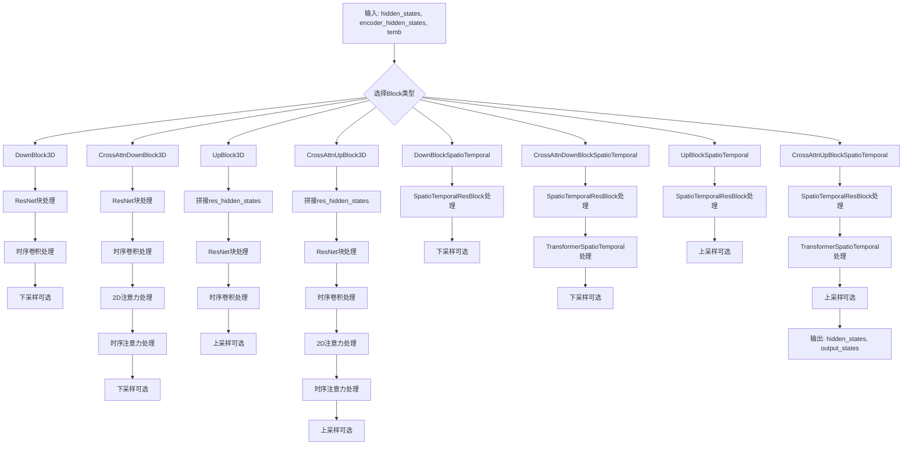
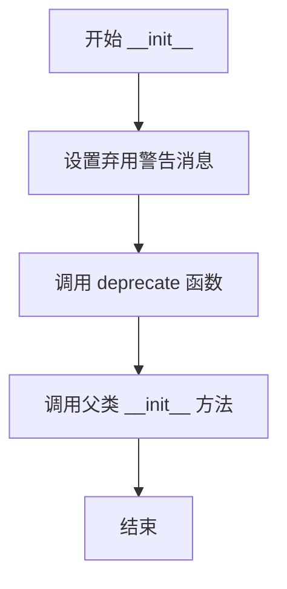
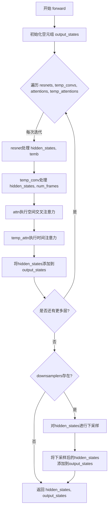
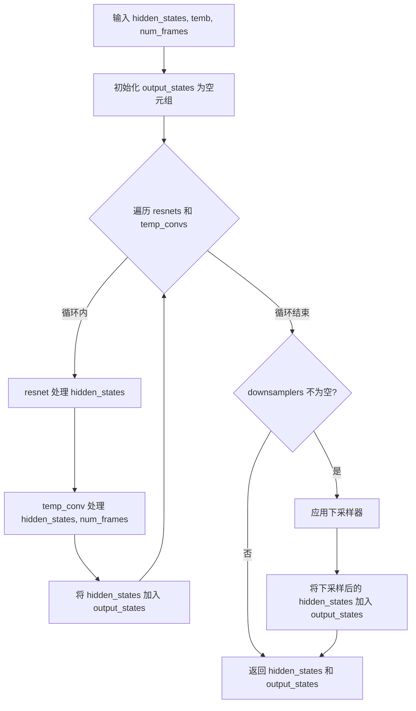
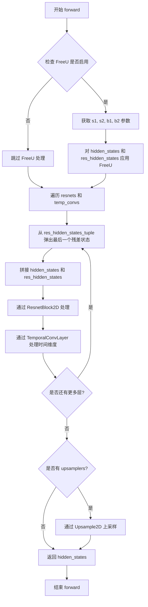
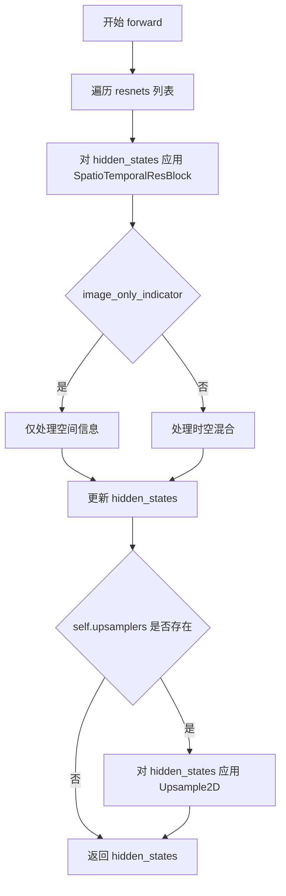
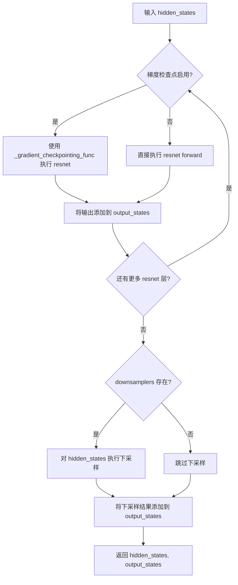
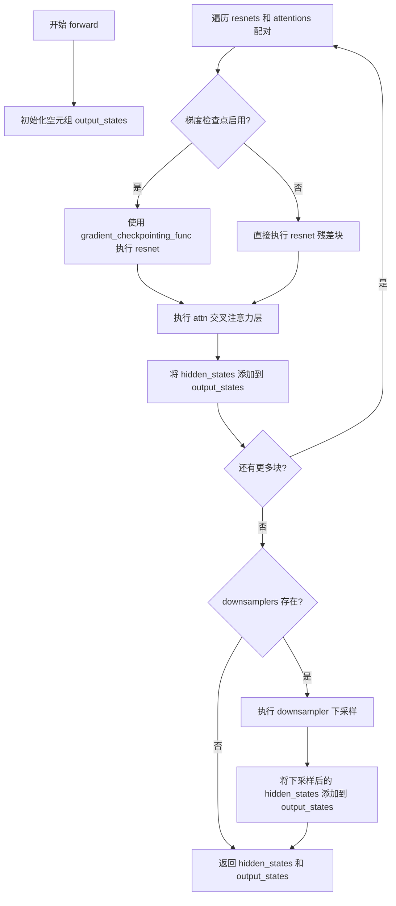
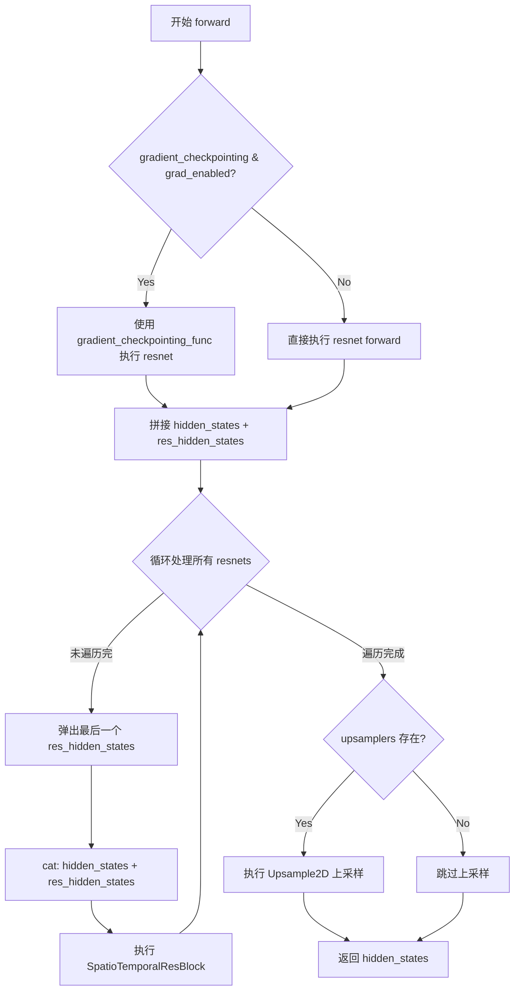
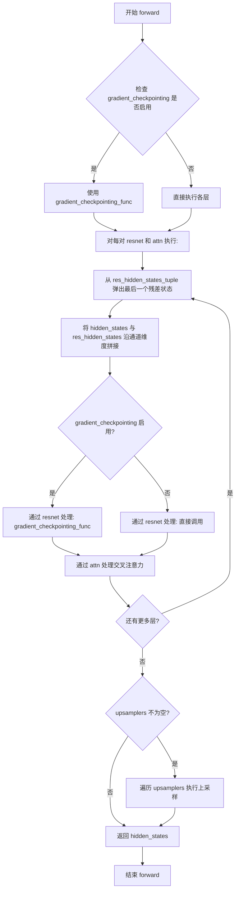

# `diffusers\src\diffusers\models\unets\unet_3d_blocks.py` 详细设计文档

该文件定义了用于3D时空UNet架构的神经网络块，包括下采样块、上采样块、中间块和时序注意力块，支持视频扩散模型的构建。这些块通过ResNet、Transformer和时序卷积层处理时空特征，实现视频帧的特征提取和重建。

## 整体流程



## 类结构

```
UNet 3D Blocks (模块集合)
├── 弃用兼容类 (Deprecated Wrappers)
│   ├── DownBlockMotion
│   ├── CrossAttnDownBlockMotion
│   ├── UpBlockMotion
│   ├── CrossAttnUpBlockMotion
│   └── UNetMidBlockCrossAttnMotion
├── 工厂函数 (Factory Functions)
│   ├── get_down_block (创建下采样块)
│   └── get_up_block (创建上采样块)
├── 3D UNet块 (3D Blocks)
│   ├── UNetMidBlock3DCrossAttn (中间交叉注意力块)
│   ├── CrossAttnDownBlock3D (下采样交叉注意力块)
│   ├── DownBlock3D (下采样块)
│   ├── CrossAttnUpBlock3D (上采样交叉注意力块)
│   └── UpBlock3D (上采样块)
├── 时序解码器块 (Temporal Decoder Blocks)
│   ├── MidBlockTemporalDecoder
│   └── UpBlockTemporalDecoder
└── 时空块 (SpatioTemporal Blocks)
    ├── UNetMidBlockSpatioTemporal
    ├── DownBlockSpatioTemporal
    ├── CrossAttnDownBlockSpatioTemporal
    ├── UpBlockSpatioTemporal
    └── CrossAttnUpBlockSpatioTemporal
```

## 全局变量及字段


### `logger`
    
模块级logger对象，用于记录日志信息

类型：`logging.Logger`
    


### `UNetMidBlock3DCrossAttn.has_cross_attention`
    
标识该模块是否支持cross attention机制

类型：`bool`
    


### `UNetMidBlock3DCrossAttn.num_attention_heads`
    
cross attention中使用的注意力头数量

类型：`int`
    


### `UNetMidBlock3DCrossAttn.resnets`
    
空间ResNet块的模块列表，用于特征提取和残差连接

类型：`nn.ModuleList[ResnetBlock2D]`
    


### `UNetMidBlock3DCrossAttn.temp_convs`
    
时间维度卷积层的模块列表，用于处理时间序列信息

类型：`nn.ModuleList[TemporalConvLayer]`
    


### `UNetMidBlock3DCrossAttn.attentions`
    
空间transformer模块的列表，用于空间域自注意力计算

类型：`nn.ModuleList[Transformer2DModel]`
    


### `UNetMidBlock3DCrossAttn.temp_attentions`
    
时间transformer模块的列表，用于时间域自注意力计算

类型：`nn.ModuleList[TransformerTemporalModel]`
    


### `CrossAttnDownBlock3D.has_cross_attention`
    
标识该模块是否支持cross attention机制

类型：`bool`
    


### `CrossAttnDownBlock3D.num_attention_heads`
    
cross attention中使用的注意力头数量

类型：`int`
    


### `CrossAttnDownBlock3D.resnets`
    
空间ResNet块的模块列表，用于下采样过程中的特征提取

类型：`nn.ModuleList[ResnetBlock2D]`
    


### `CrossAttnDownBlock3D.temp_convs`
    
时间卷积层的模块列表，用于处理时间维度特征

类型：`nn.ModuleList[TemporalConvLayer]`
    


### `CrossAttnDownBlock3D.attentions`
    
空间transformer attention模块列表

类型：`nn.ModuleList[Transformer2DModel]`
    


### `CrossAttnDownBlock3D.temp_attentions`
    
时间transformer attention模块列表

类型：`nn.ModuleList[TransformerTemporalModel]`
    


### `CrossAttnDownBlock3D.downsamplers`
    
空间下采样层的模块列表，用于降低特征图分辨率

类型：`nn.ModuleList[Downsample2D]`
    


### `CrossAttnDownBlock3D.gradient_checkpointing`
    
标识是否启用梯度检查点以节省显存

类型：`bool`
    


### `DownBlock3D.resnets`
    
ResNet块模块列表，用于下采样路径的特征提取

类型：`nn.ModuleList[ResnetBlock2D]`
    


### `DownBlock3D.temp_convs`
    
时间卷积层模块列表，用于时间维度特征处理

类型：`nn.ModuleList[TemporalConvLayer]`
    


### `DownBlock3D.downsamplers`
    
下采样操作模块列表，用于空间维度的下采样

类型：`nn.ModuleList[Downsample2D]`
    


### `DownBlock3D.gradient_checkpointing`
    
标识是否启用梯度检查点优化

类型：`bool`
    


### `CrossAttnUpBlock3D.has_cross_attention`
    
标识该上采样块是否支持cross attention

类型：`bool`
    


### `CrossAttnUpBlock3D.num_attention_heads`
    
attention机制中使用的头的数量

类型：`int`
    


### `CrossAttnUpBlock3D.resnets`
    
上采样路径中的ResNet块模块列表

类型：`nn.ModuleList[ResnetBlock2D]`
    


### `CrossAttnUpBlock3D.temp_convs`
    
时间卷积层列表，用于时间特征处理

类型：`nn.ModuleList[TemporalConvLayer]`
    


### `CrossAttnUpBlock3D.attentions`
    
空间transformer attention模块列表

类型：`nn.ModuleList[Transformer2DModel]`
    


### `CrossAttnUpBlock3D.temp_attentions`
    
时间transformer attention模块列表

类型：`nn.ModuleList[TransformerTemporalModel]`
    


### `CrossAttnUpBlock3D.upsamplers`
    
上采样层模块列表，用于空间维度上采样

类型：`nn.ModuleList[Upsample2D]`
    


### `CrossAttnUpBlock3D.gradient_checkpointing`
    
是否启用梯度检查点优化

类型：`bool`
    


### `CrossAttnUpBlock3D.resolution_idx`
    
分辨率阶段的索引，用于FreeU等技术的配置

类型：`int | None`
    


### `UpBlock3D.resnets`
    
不含attention的ResNet块列表，用于上采样路径

类型：`nn.ModuleList[ResnetBlock2D]`
    


### `UpBlock3D.temp_convs`
    
时间卷积层模块列表

类型：`nn.ModuleList[TemporalConvLayer]`
    


### `UpBlock3D.upsamplers`
    
上采样操作模块列表

类型：`nn.ModuleList[Upsample2D]`
    


### `UpBlock3D.gradient_checkpointing`
    
是否启用梯度检查点

类型：`bool`
    


### `UpBlock3D.resolution_idx`
    
分辨率索引标识

类型：`int | None`
    


### `MidBlockTemporalDecoder.resnets`
    
时空ResNet块列表，用于中间块的特征处理

类型：`nn.ModuleList[SpatioTemporalResBlock]`
    


### `MidBlockTemporalDecoder.attentions`
    
注意力模块列表，用于特征增强

类型：`nn.ModuleList[Attention]`
    


### `UpBlockTemporalDecoder.resnets`
    
时空ResNet块列表，用于时间解码器上采样

类型：`nn.ModuleList[SpatioTemporalResBlock]`
    


### `UpBlockTemporalDecoder.upsamplers`
    
上采样层模块列表

类型：`nn.ModuleList[Upsample2D]`
    


### `UNetMidBlockSpatioTemporal.has_cross_attention`
    
标识该中间块是否支持cross attention

类型：`bool`
    


### `UNetMidBlockSpatioTemporal.num_attention_heads`
    
注意力头的数量

类型：`int`
    


### `UNetMidBlockSpatioTemporal.attentions`
    
时空transformer模块列表

类型：`nn.ModuleList[TransformerSpatioTemporalModel]`
    


### `UNetMidBlockSpatioTemporal.resnets`
    
时空ResNet块列表

类型：`nn.ModuleList[SpatioTemporalResBlock]`
    


### `UNetMidBlockSpatioTemporal.gradient_checkpointing`
    
是否启用梯度检查点

类型：`bool`
    


### `DownBlockSpatioTemporal.resnets`
    
时空下采样ResNet块列表

类型：`nn.ModuleList[SpatioTemporalResBlock]`
    


### `DownBlockSpatioTemporal.downsamplers`
    
下采样层模块列表

类型：`nn.ModuleList[Downsample2D]`
    


### `DownBlockSpatioTemporal.gradient_checkpointing`
    
是否启用梯度检查点

类型：`bool`
    


### `CrossAttnDownBlockSpatioTemporal.has_cross_attention`
    
标识是否支持cross attention

类型：`bool`
    


### `CrossAttnDownBlockSpatioTemporal.num_attention_heads`
    
注意力头数量

类型：`int`
    


### `CrossAttnDownBlockSpatioTemporal.resnets`
    
时空ResNet块模块列表

类型：`nn.ModuleList[SpatioTemporalResBlock]`
    


### `CrossAttnDownBlockSpatioTemporal.attentions`
    
时空transformer attention模块列表

类型：`nn.ModuleList[TransformerSpatioTemporalModel]`
    


### `CrossAttnDownBlockSpatioTemporal.downsamplers`
    
下采样层模块列表

类型：`nn.ModuleList[Downsample2D]`
    


### `CrossAttnDownBlockSpatioTemporal.gradient_checkpointing`
    
是否启用梯度检查点

类型：`bool`
    


### `UpBlockSpatioTemporal.resnets`
    
时空上采样ResNet块列表

类型：`nn.ModuleList[SpatioTemporalResBlock]`
    


### `UpBlockSpatioTemporal.upsamplers`
    
上采样层模块列表

类型：`nn.ModuleList[Upsample2D]`
    


### `UpBlockSpatioTemporal.gradient_checkpointing`
    
是否启用梯度检查点

类型：`bool`
    


### `UpBlockSpatioTemporal.resolution_idx`
    
分辨率阶段索引

类型：`int | None`
    


### `CrossAttnUpBlockSpatioTemporal.has_cross_attention`
    
标识是否支持cross attention

类型：`bool`
    


### `CrossAttnUpBlockSpatioTemporal.num_attention_heads`
    
注意力头数量

类型：`int`
    


### `CrossAttnUpBlockSpatioTemporal.resnets`
    
时空ResNet块列表

类型：`nn.ModuleList[SpatioTemporalResBlock]`
    


### `CrossAttnUpBlockSpatioTemporal.attentions`
    
时空transformer attention模块列表

类型：`nn.ModuleList[TransformerSpatioTemporalModel]`
    


### `CrossAttnUpBlockSpatioTemporal.upsamplers`
    
上采样层模块列表

类型：`nn.ModuleList[Upsample2D]`
    


### `CrossAttnUpBlockSpatioTemporal.gradient_checkpointing`
    
是否启用梯度检查点

类型：`bool`
    


### `CrossAttnUpBlockSpatioTemporal.resolution_idx`
    
分辨率阶段索引

类型：`int | None`
    
    

## 全局函数及方法


### `get_down_block`

该函数是一个工厂函数，用于根据传入的`down_block_type`参数动态创建并返回不同类型的DownBlock（降采样块）实例。它支持多种3D和时空（spatio-temporal）降采样块类型，包括`DownBlock3D`、`CrossAttnDownBlock3D`、`DownBlockSpatioTemporal`和`CrossAttnDownBlockSpatioTemporal`。

参数：

- `down_block_type`：`str`，指定要创建的降采样块类型（如"DownBlock3D"、"CrossAttnDownBlock3D"等）
- `num_layers`：`int`，降采样块中ResNet层的数量
- `in_channels`：`int`，输入特征图的通道数
- `out_channels`：`int`，输出特征图的通道数
- `temb_channels`：`int`，时间嵌入（temporal embedding）的通道数
- `add_downsample`：`bool`，是否添加下采样层
- `resnet_eps`：`float`，ResNet块中使用的epsilon值，用于数值稳定性
- `resnet_act_fn`：`str`，ResNet块中使用的激活函数名称
- `num_attention_heads`：`int`，注意力机制中使用的头数量
- `resnet_groups`：`int | None`，ResNet块中分组卷积的组数，默认为None
- `cross_attention_dim`：`int | None`，交叉注意力机制的维度，仅当使用CrossAttn类型块时需要
- `downsample_padding`：`int | None`，下采样层的填充大小，默认为None
- `dual_cross_attention`：`bool`，是否使用双交叉注意力机制，默认为False
- `use_linear_projection`：`bool`，是否使用线性投影，默认为True
- `only_cross_attention`：`bool`，是否仅使用交叉注意力，默认为False
- `upcast_attention`：`bool`，是否向上转换注意力计算，默认为False
- `resnet_time_scale_shift`：`str`，ResNet时间尺度移位方式，默认为"default"
- `temporal_num_attention_heads`：`int`，时间注意力机制的头数量，默认为8
- `temporal_max_seq_length`：`int`，时间序列的最大长度，默认为32
- `transformer_layers_per_block`：`int | tuple[int]`，每个块的Transformer层数，默认为1
- `temporal_transformer_layers_per_block`：`int | tuple[int]`，每个块的时间Transformer层数，默认为1
- `dropout`：`float`，Dropout比率，默认为0.0

返回值：`DownBlock3D | CrossAttnDownBlock3D | DownBlockSpatioTemporal | CrossAttnDownBlockSpatioTemporal`，返回相应类型的降采样块实例

#### 流程图

```mermaid
flowchart TD
    A[开始 get_down_block] --> B{down_block_type == 'DownBlock3D'?}
    B -->|Yes| C[创建并返回 DownBlock3D 实例]
    B -->|No| D{down_block_type == 'CrossAttnDownBlock3D'?}
    D -->|Yes| E{cross_attention_dim is None?}
    E -->|Yes| F[抛出 ValueError: cross_attention_dim must be specified]
    E -->|No| G[创建并返回 CrossAttnDownBlock3D 实例]
    D -->|No| H{down_block_type == 'DownBlockSpatioTemporal'?}
    H -->|Yes| I[创建并返回 DownBlockSpatioTemporal 实例]
    H -->|No| J{down_block_type == 'CrossAttnDownBlockSpatioTemporal'?}
    J -->|Yes| K{cross_attention_dim is None?}
    K -->|Yes| L[抛出 ValueError: cross_attention_dim must be specified]
    K -->|No| M[创建并返回 CrossAttnDownBlockSpatioTemporal 实例]
    J -->|No| N[抛出 ValueError: {down_block_type} does not exist.]
    C --> O[返回实例]
    G --> O
    I --> O
    M --> O
```

#### 带注释源码

```python
def get_down_block(
    down_block_type: str,  # 降采样块的类型标识符
    num_layers: int,  # ResNet层数量
    in_channels: int,  # 输入通道数
    out_channels: int,  # 输出通道数
    temb_channels: int,  # 时间嵌入通道数
    add_downsample: bool,  # 是否添加下采样
    resnet_eps: float,  # ResNet epsilon参数
    resnet_act_fn: str,  # ResNet激活函数
    num_attention_heads: int,  # 注意力头数
    resnet_groups: int | None = None,  # ResNet分组数
    cross_attention_dim: int | None = None,  # 交叉注意力维度
    downsample_padding: int | None = None,  # 下采样填充
    dual_cross_attention: bool = False,  # 双交叉注意力标志
    use_linear_projection: bool = True,  # 线性投影标志
    only_cross_attention: bool = False,  # 仅交叉注意力标志
    upcast_attention: bool = False,  # 上转注意力标志
    resnet_time_scale_shift: str = "default",  # ResNet时间尺度移位
    temporal_num_attention_heads: int = 8,  # 时间注意力头数
    temporal_max_seq_length: int = 32,  # 时间最大序列长度
    transformer_layers_per_block: int | tuple[int] = 1,  # Transformer层数
    temporal_transformer_layers_per_block: int | tuple[int] = 1,  # 时间Transformer层数
    dropout: float = 0.0,  # Dropout比率
) -> "DownBlock3D" | "CrossAttnDownBlock3D" | "DownBlockSpatioTemporal" | "CrossAttnDownBlockSpatioTemporal":
    # 根据down_block_type创建对应的DownBlock实例
    
    if down_block_type == "DownBlock3D":
        # 创建标准3D降采样块（不含注意力机制）
        return DownBlock3D(
            num_layers=num_layers,
            in_channels=in_channels,
            out_channels=out_channels,
            temb_channels=temb_channels,
            add_downsample=add_downsample,
            resnet_eps=resnet_eps,
            resnet_act_fn=resnet_act_fn,
            resnet_groups=resnet_groups,
            downsample_padding=downsample_padding,
            resnet_time_scale_shift=resnet_time_scale_shift,
            dropout=dropout,
        )
    elif down_block_type == "CrossAttnDownBlock3D":
        # 创建带交叉注意力的3D降采样块
        if cross_attention_dim is None:
            # 验证交叉注意力维度是否提供
            raise ValueError("cross_attention_dim must be specified for CrossAttnDownBlock3D")
        return CrossAttnDownBlock3D(
            num_layers=num_layers,
            in_channels=in_channels,
            out_channels=out_channels,
            temb_channels=temb_channels,
            add_downsample=add_downsample,
            resnet_eps=resnet_eps,
            resnet_act_fn=resnet_act_fn,
            resnet_groups=resnet_groups,
            downsample_padding=downsample_padding,
            cross_attention_dim=cross_attention_dim,
            num_attention_heads=num_attention_heads,
            dual_cross_attention=dual_cross_attention,
            use_linear_projection=use_linear_projection,
            only_cross_attention=only_cross_attention,
            upcast_attention=upcast_attention,
            resnet_time_scale_shift=resnet_time_scale_shift,
            dropout=dropout,
        )
    elif down_block_type == "DownBlockSpatioTemporal":
        # 创建时空降采样块（用于SDV）
        return DownBlockSpatioTemporal(
            num_layers=num_layers,
            in_channels=in_channels,
            out_channels=out_channels,
            temb_channels=temb_channels,
            add_downsample=add_downsample,
        )
    elif down_block_type == "CrossAttnDownBlockSpatioTemporal":
        # 创建带交叉注意力的时空降采样块（用于SDV）
        if cross_attention_dim is None:
            raise ValueError("cross_attention_dim must be specified for CrossAttnDownBlockSpatioTemporal")
        return CrossAttnDownBlockSpatioTemporal(
            in_channels=in_channels,
            out_channels=out_channels,
            temb_channels=temb_channels,
            num_layers=num_layers,
            transformer_layers_per_block=transformer_layers_per_block,
            add_downsample=add_downsample,
            cross_attention_dim=cross_attention_dim,
            num_attention_heads=num_attention_heads,
        )

    # 如果传入的down_block_type不支持，抛出异常
    raise ValueError(f"{down_block_type} does not exist.")
```


### `get_up_block`

该函数是一个工厂函数，用于根据`up_block_type`参数创建并返回对应的上采样块（Up Block）实例，支持创建UpBlock3D、CrossAttnUpBlock3D、UpBlockSpatioTemporal和CrossAttnUpBlockSpatioTemporal四种不同类型的上采样块，以满足不同UNet架构的需求。

参数：

- `up_block_type`：`str`，上采样块的类型标识符，用于选择创建的具体块类
- `num_layers`：`int`，块内ResNet层的数量
- `in_channels`：`int`，输入特征图的通道数
- `out_channels`：`int`，输出特征图的通道数
- `prev_output_channel`：`int`，来自解码器上一层的输出通道数，用于残差连接
- `temb_channels`：`int`，时间嵌入（temporal embedding）通道数
- `add_upsample`：`bool`，是否添加上采样操作
- `resnet_eps`：`float`，ResNet块中LayerNorm的epsilon参数
- `resnet_act_fn`：`str`，ResNet块中激活函数的名称
- `num_attention_heads`：`int`，注意力机制中使用的头数量
- `resolution_idx`：`int | None = None`，分辨率索引，用于FreeU等技术的阶段标识
- `resnet_groups`：`int | None = None`，ResNet中GroupNorm的组数
- `cross_attention_dim`：`int | None = None`，交叉注意力中查询/键/值的维度
- `dual_cross_attention`：`bool = False`，是否使用双交叉注意力机制
- `use_linear_projection`：`bool = True`，是否在注意力中使用线性投影
- `only_cross_attention`：`bool = False`，是否仅使用交叉注意力（不含自注意力）
- `upcast_attention`：`bool = False`，是否将注意力计算向上转型以提高精度
- `resnet_time_scale_shift`：`str = "default"`ResNet中时间尺度移位的类型
- `temporal_num_attention_heads`：`int = 8`，时间注意力机制的头数量
- `temporal_cross_attention_dim`：`int | None = None`，时间交叉注意力的维度
- `temporal_max_seq_length`：`int = 32`，时间维度的最大序列长度
- `transformer_layers_per_block`：`int | tuple[int] = 1`，每个块的Transformer层数
- `temporal_transformer_layers_per_block`：`int | tuple[int] = 1`，每个块的时间Transformer层数
- `dropout`：`float = 0.0`，Dropout概率

返回值：`UpBlock3D | CrossAttnUpBlock3D | UpBlockSpatioTemporal | CrossAttnUpBlockSpatioTemporal`，返回创建的上采样块实例

#### 流程图

```mermaid
flowchart TD
    A[开始 get_up_block] --> B{up_block_type == "UpBlock3D"}
    B -->|Yes| C[创建并返回 UpBlock3D 实例]
    B -->|No| D{up_block_type == "CrossAttnUpBlock3D"}
    D -->|Yes| E{检查 cross_attention_dim}
    E -->|None| F[抛出 ValueError]
    E -->|Valid| G[创建并返回 CrossAttnUpBlock3D 实例]
    D -->|No| H{up_block_type == "UpBlockSpatioTemporal"}
    H -->|Yes| I[创建并返回 UpBlockSpatioTemporal 实例]
    H -->|No| J{up_block_type == "CrossAttnUpBlockSpatioTemporal"}
    J -->|Yes| K{检查 cross_attention_dim}
    K -->|None| L[抛出 ValueError]
    K -->|Valid| M[创建并返回 CrossAttnUpBlockSpatioTemporal 实例]
    J -->|No| N[抛出 ValueError 不支持的类型]
    C --> O[结束]
    G --> O
    I --> O
    M --> O
    F --> O
    L --> O
    N --> O
```

#### 带注释源码

```python
def get_up_block(
    up_block_type: str,
    num_layers: int,
    in_channels: int,
    out_channels: int,
    prev_output_channel: int,
    temb_channels: int,
    add_upsample: bool,
    resnet_eps: float,
    resnet_act_fn: str,
    num_attention_heads: int,
    resolution_idx: int | None = None,
    resnet_groups: int | None = None,
    cross_attention_dim: int | None = None,
    dual_cross_attention: bool = False,
    use_linear_projection: bool = True,
    only_cross_attention: bool = False,
    upcast_attention: bool = False,
    resnet_time_scale_shift: str = "default",
    temporal_num_attention_heads: int = 8,
    temporal_cross_attention_dim: int | None = None,
    temporal_max_seq_length: int = 32,
    transformer_layers_per_block: int | tuple[int] = 1,
    temporal_transformer_layers_per_block: int | tuple[int] = 1,
    dropout: float = 0.0,
) -> "UpBlock3D" | "CrossAttnUpBlock3D" | "UpBlockSpatioTemporal" | "CrossAttnUpBlockSpatioTemporal":
    """
    根据 up_block_type 参数创建并返回对应的上采样块实例
    
    参数:
        up_block_type: 上采样块类型标识 ("UpBlock3D", "CrossAttnUpBlock3D", 
                       "UpBlockSpatioTemporal", "CrossAttnUpBlockSpatioTemporal")
        num_layers: 块内ResNet层数
        in_channels: 输入通道数
        out_channels: 输出通道数
        prev_output_channel: 上一输出通道数
        temb_channels: 时间嵌入通道数
        add_upsample: 是否添加上采样
        resnet_eps: ResNet中LayerNorm的epsilon
        resnet_act_fn: 激活函数名称
        num_attention_heads: 注意力头数
        resolution_idx: 分辨率索引
        resnet_groups: GroupNorm组数
        cross_attention_dim: 交叉注意力维度
        dual_cross_attention: 双交叉注意力标志
        use_linear_projection: 线性投影标志
        only_cross_attention: 仅交叉注意力标志
        upcast_attention: 注意力向上转型标志
        resnet_time_scale_shift: 时间尺度移位类型
        temporal_num_attention_heads: 时间注意力头数
        temporal_cross_attention_dim: 时间交叉注意力维度
        temporal_max_seq_length: 时间最大序列长度
        transformer_layers_per_block: 每块Transformer层数
        temporal_transformer_layers_per_block: 每块时间Transformer层数
        dropout: Dropout概率
    
    返回:
        对应类型的上采样块实例
    
    异常:
        ValueError: 当 up_block_type 不支持或缺少必需的 cross_attention_dim 时抛出
    """
    
    # 处理标准的3D上采样块（无交叉注意力）
    if up_block_type == "UpBlock3D":
        return UpBlock3D(
            num_layers=num_layers,
            in_channels=in_channels,
            out_channels=out_channels,
            prev_output_channel=prev_output_channel,
            temb_channels=temb_channels,
            add_upsample=add_upsample,
            resnet_eps=resnet_eps,
            resnet_act_fn=resnet_act_fn,
            resnet_groups=resnet_groups,
            resnet_time_scale_shift=resnet_time_scale_shift,
            resolution_idx=resolution_idx,
            dropout=dropout,
        )
    
    # 处理带交叉注意力的3D上采样块
    elif up_block_type == "CrossAttnUpBlock3D":
        # 验证交叉注意力维度必须指定
        if cross_attention_dim is None:
            raise ValueError("cross_attention_dim must be specified for CrossAttnUpBlock3D")
        return CrossAttnUpBlock3D(
            num_layers=num_layers,
            in_channels=in_channels,
            out_channels=out_channels,
            prev_output_channel=prev_output_channel,
            temb_channels=temb_channels,
            add_upsample=add_upsample,
            resnet_eps=resnet_eps,
            resnet_act_fn=resnet_act_fn,
            resnet_groups=resnet_groups,
            cross_attention_dim=cross_attention_dim,
            num_attention_heads=num_attention_heads,
            dual_cross_attention=dual_cross_attention,
            use_linear_projection=use_linear_projection,
            only_cross_attention=only_cross_attention,
            upcast_attention=upcast_attention,
            resnet_time_scale_shift=resnet_time_scale_shift,
            resolution_idx=resolution_idx,
            dropout=dropout,
        )
    
    # 处理时空上采样块（用于Stable Diffusion Video等）
    elif up_block_type == "UpBlockSpatioTemporal":
        # added for SDV
        return UpBlockSpatioTemporal(
            num_layers=num_layers,
            in_channels=in_channels,
            out_channels=out_channels,
            prev_output_channel=prev_output_channel,
            temb_channels=temb_channels,
            resolution_idx=resolution_idx,
            add_upsample=add_upsample,
        )
    
    # 处理带交叉注意力的时空上采样块
    elif up_block_type == "CrossAttnUpBlockSpatioTemporal":
        # added for SDV
        if cross_attention_dim is None:
            raise ValueError("cross_attention_dim must be specified for CrossAttnUpBlockSpatioTemporal")
        return CrossAttnUpBlockSpatioTemporal(
            in_channels=in_channels,
            out_channels=out_channels,
            prev_output_channel=prev_output_channel,
            temb_channels=temb_channels,
            num_layers=num_layers,
            transformer_layers_per_block=transformer_layers_per_block,
            add_upsample=add_upsample,
            cross_attention_dim=cross_attention_dim,
            num_attention_heads=num_attention_heads,
            resolution_idx=resolution_idx,
        )

    # 如果上采样块类型不支持，抛出异常
    raise ValueError(f"{up_block_type} does not exist.")
```


### DownBlockMotion.__init__

该方法是 `DownBlockMotion` 类的初始化方法，它是一个弃用封装类，用于保持向后兼容性。当用户从旧路径 `diffusers.models.unets.unet_3d_blocks` 导入该类时，会发出弃用警告，并将调用转发到新的实现路径 `diffusers.models.unets.unet_motion_model.DownBlockMotion`。

参数：

- `*args`：任意位置参数，这些参数将传递给父类的初始化方法
- `**kwargs`：任意关键字参数，这些参数将传递给父类的初始化方法

返回值：无（`__init__` 方法不返回值）

#### 流程图

```mermaid
flowchart TD
    A[开始 __init__] --> B[发出弃用警告]
    B --> C[调用 super().__init__(*args, **kwargs)]
    C --> D[结束]
    
    B -->|警告信息| E[提示用户使用新路径导入]
```

#### 带注释源码

```python
class DownBlockMotion(DownBlockMotion):
    def __init__(self, *args, **kwargs):
        # 定义弃用消息，提醒用户该导入路径已被弃用
        deprecation_message = "Importing `DownBlockMotion` from `diffusers.models.unets.unet_3d_blocks` is deprecated and this will be removed in a future version. Please use `from diffusers.models.unets.unet_motion_model import DownBlockMotion` instead."
        
        # 调用 deprecate 函数发出弃用警告，指定将在 1.0.0 版本移除
        deprecate("DownBlockMotion", "1.0.0", deprecation_message)
        
        # 调用父类的初始化方法，将所有参数传递过去
        # 实际执行的是从 unet_motion_model 导入的 DownBlockMotion 的初始化逻辑
        super().__init__(*args, **kwargs)
```


### `CrossAttnDownBlockMotion.__init__`

这是 `CrossAttnDownBlockMotion` 类的初始化方法，主要用于处理弃用警告。该方法接收任意参数并将其传递给父类，同时向用户发出弃用警告，提醒他们改用从 `diffusers.models.unets.unet_motion_model` 导入的 `CrossAttnDownBlockMotion`。

参数：

- `*args`：任意类型，传递给父类 `CrossAttnDownBlockMotion` 的位置参数。
- `**kwargs`：任意类型，传递给父类 `CrossAttnDownBlockMotion` 的关键字参数。

返回值：`None`，无返回值，仅执行警告和父类初始化。

#### 流程图



#### 带注释源码

```python
class CrossAttnDownBlockMotion(CrossAttnDownBlockMotion):
    def __init__(self, *args, **kwargs):
        # 构建弃用警告消息，提醒用户从旧路径导入已被弃用
        deprecation_message = "Importing `CrossAttnDownBlockMotion` from `diffusers.models.unets.unet_3d_blocks` is deprecated and this will be removed in a future version. Please use `from diffusers.models.unets.unet_motion_model import CrossAttnDownBlockMotion` instead."
        
        # 调用 deprecate 函数记录弃用警告
        deprecate("CrossAttnDownBlockMotion", "1.0.0", deprecation_message)
        
        # 将所有参数传递给父类（从 unet_motion_model 导入的原始类）进行初始化
        super().__init__(*args, **kwargs)
```


### UpBlockMotion.__init__

该方法是 `UpBlockMotion` 类的构造函数，是一个deprecated（已废弃）的包装器，用于重定向到 `unet_motion_model` 模块中的实际实现。它接受任意参数，输出deprecation警告后调用父类构造函数。

参数：

- `*args`：任意位置参数，用于传递给父类构造函数
- `**kwargs`：任意关键字参数，用于传递给父类构造函数

返回值：`None`，无返回值

#### 流程图

```mermaid
graph TD
    A[开始 __init__] --> B[记录deprecation警告]
    B --> C[调用super().__init__传递所有参数]
    C --> D[结束]
```

#### 带注释源码

```python
class UpBlockMotion(UpBlockMotion):
    def __init__(self, *args, **kwargs):
        # 定义废弃警告消息，提示用户从新路径导入
        deprecation_message = "Importing `UpBlockMotion` from `diffusers.models.unets.unet_3d_blocks` is deprecated and this will be removed in a future version. Please use `from diffusers.models.unets.unet_motion_model import UpBlockMotion` instead."
        # 调用deprecate函数记录废弃警告
        deprecate("UpBlockMotion", "1.0.0", deprecation_message)
        # 调用父类（实际为unet_motion_model中的UpBlockMotion）的构造函数
        super().__init__(*args, **kwargs)
```


### `CrossAttnUpBlockMotion.__init__`

该方法是 `CrossAttnUpBlockMotion` 类的构造函数，用于初始化支持交叉注意力机制的上采样运动模型块。该类是一个弃用包装器，通过调用 `deprecate` 函数发出弃用警告，并将所有参数透传给父类 `CrossAttnUpBlockMotion`（来自 `diffusers.models.unets.unet_motion_model`）的实际实现。

参数：

-  `*args`：可变位置参数列表，用于传递给父类构造函数，包含上采样块的核心参数（如层数、通道数等）
-  `**kwargs`：可变关键字参数字典，用于传递给父类构造函数，包含上采样块的配置参数（如注意力头数、交叉注意力维度等）

返回值：`None`，该方法直接调用父类构造函数，不返回任何值

#### 流程图

```mermaid
flowchart TD
    A[开始 __init__] --> B[定义弃用警告消息]
    B --> C[调用 deprecate 函数]
    C --> D[调用 super().__init__(*args, **kwargs)]
    D --> E[结束]
```

#### 带注释源码

```python
class CrossAttnUpBlockMotion(CrossAttnUpBlockMotion):
    def __init__(self, *args, **kwargs):
        # 定义弃用警告消息，提示用户从新路径导入该类
        deprecation_message = "Importing `CrossAttnUpBlockMotion` from `diffusers.models.unets.unet_3d_blocks` is deprecated and this will be removed in a future version. Please use `from diffusers.models.unets.unet_motion_model import CrossAttnUpBlockMotion` instead."
        
        # 调用 deprecate 函数发出弃用警告，版本号为 1.0.0
        deprecate("CrossAttnUpBlockMotion", "1.0.0", deprecation_message)
        
        # 调用父类（CrossAttnUpBlockMotion from unet_motion_model）的构造函数
        # 将所有传入的参数传递给父类进行实际初始化
        super().__init__(*args, **kwargs)
```


### `UNetMidBlockCrossAttnMotion.__init__`

这是一个UNet中间块交叉注意力运动模型的初始化方法，现已弃用并重定向到新的模块位置。该方法主要用于构建扩散模型中UNet架构的中间块，支持交叉注意力机制以处理时序运动信息。

参数：

- `*args`：可变位置参数，传递给父类 UNetMidBlockCrossAttnMotion 的位置参数
- `**kwargs`：可变关键字参数，传递给父类 UNetMidBlockCrossAttnMotion 的关键字参数

返回值：`None`，该方法不返回任何值，仅执行初始化逻辑

#### 流程图

```mermaid
flowchart TD
    A[开始 __init__] --> B[定义弃用警告消息]
    B --> C[调用 deprecate 函数记录弃用信息]
    C --> D[调用父类构造函数 super().__init__]
    D --> E[结束]
    
    style A fill:#f9f,stroke:#333
    style E fill:#9f9,stroke:#333
```

#### 带注释源码

```python
class UNetMidBlockCrossAttnMotion(UNetMidBlockCrossAttnMotion):
    def __init__(self, *args, **kwargs):
        # 定义弃用警告消息，告知用户该类已从 unet_3d_blocks 移动到 unet_motion_model
        deprecation_message = "Importing `UNetMidBlockCrossAttnMotion` from `diffusers.models.unets.unet_3d_blocks` is deprecated and this will be removed in a future version. Please use `from diffusers.models.unets.unet_motion_model import UNetMidBlockCrossAttnMotion` instead."
        
        # 调用 deprecate 函数记录弃用警告，版本号为 1.0.0
        deprecate("UNetMidBlockCrossAttnMotion", "1.0.0", deprecation_message)
        
        # 调用父类的初始化方法，传递所有接收到的参数
        super().__init__(*args, **kwargs)
```


### `UNetMidBlock3DCrossAttn.forward`

该方法是 UNetMidBlock3DCrossAttn 类的前向传播函数，负责处理 3D UNet 中间块的特征处理。它通过交替执行空间域Transformer注意力（Transformer2DModel）、时序域Transformer注意力（TransformerTemporalModel）、残差块（ResnetBlock2D）和时序卷积层（TemporalConvLayer），实现对输入隐藏状态的跨模态（时空）特征提取与融合，最后返回处理后的隐藏状态张量。

参数：

- `hidden_states`：`torch.Tensor`，输入的隐藏状态张量，形状通常为 (batch, channels, depth, height, width) 或类似的多维张量
- `temb`：`torch.Tensor | None`，时间嵌入向量，用于残差块的时间条件注入，可选
- `encoder_hidden_states`：`torch.Tensor | None`，编码器的隐藏状态，用于跨注意力机制，可选
- `attention_mask`：`torch.Tensor | None`，注意力掩码，用于控制注意力计算，当前实现中未使用（代码中有 TODO 注释）
- `num_frames`：`int = 1`，视频或3D数据的帧数，用于时序层的时间维度处理
- `cross_attention_kwargs`：`dict[str, Any] | None`，跨注意力机制的额外关键字参数（如 dropout、guidance_scale 等）

返回值：`torch.Tensor`，经过完整中间块处理后的隐藏状态张量

#### 流程图

```mermaid
flowchart TD
    A[输入 hidden_states] --> B[resnets[0] 残差块]
    B --> C[temp_convs[0] 时序卷积]
    C --> D[遍历 attn, temp_attn, resnet, temp_conv]
    
    D --> E[attn 空间域Transformer注意力]
    E --> F[temp_attn 时序域Transformer注意力]
    F --> G[resnet 残差块]
    G --> H[temp_conv 时序卷积]
    
    H --> I{是否还有更多层?}
    I -->|是| E
    I -->|否| J[返回 hidden_states]
    
    style A fill:#f9f,color:#000
    style J fill:#9f9,color:#000
```

#### 带注释源码

```python
def forward(
    self,
    hidden_states: torch.Tensor,
    temb: torch.Tensor | None = None,
    encoder_hidden_states: torch.Tensor | None = None,
    attention_mask: torch.Tensor | None = None,
    num_frames: int = 1,
    cross_attention_kwargs: dict[str, Any] | None = None,
) -> torch.Tensor:
    # 第一层：初始残差块处理，执行空间域特征提取
    # 使用 ResnetBlock2D 进行初步的特征变换和残差连接
    hidden_states = self.resnets[0](hidden_states, temb)
    
    # 第一层：时序卷积处理，将时间维度信息融入特征
    # TemporalConvLayer 用于捕捉帧与帧之间的时序依赖关系
    hidden_states = self.temp_convs[0](hidden_states, num_frames=num_frames)
    
    # 核心循环：遍历每一组（空间注意力 + 时序注意力 + 残差块 + 时序卷积）
    # zip 将四个模块列表同步迭代，每次处理一层
    for attn, temp_attn, resnet, temp_conv in zip(
        self.attentions, self.temp_attentions, self.resnets[1:], self.temp_convs[1:]
    ):
        # 空间域Transformer注意力：处理空间维度上的跨注意力机制
        # 接收 encoder_hidden_states 作为条件输入，实现条件生成
        hidden_states = attn(
            hidden_states,
            encoder_hidden_states=encoder_hidden_states,
            cross_attention_kwargs=cross_attention_kwargs,
            return_dict=False,
        )[0]  # 返回 tuple，取第一个元素（隐藏状态张量）
        
        # 时序域Transformer注意力：处理时间维度上的自注意力机制
        # 专门用于建模帧与帧之间的时序关系
        hidden_states = temp_attn(
            hidden_states,
            num_frames=num_frames,
            cross_attention_kwargs=cross_attention_kwargs,
            return_dict=False,
        )[0]
        
        # 残差块：再次进行空间域特征提取和残差连接
        hidden_states = resnet(hidden_states, temb)
        
        # 时序卷积：再次处理时序信息
        hidden_states = temp_conv(hidden_states, num_frames=num_frames)

    # 返回经过完整时空特征处理后的隐藏状态
    return hidden_states
```


### CrossAttnDownBlock3D.forward

该方法是3D UNet中交叉注意力下采样块的前向传播函数，负责在空间维度下采样特征图的同时，通过空间和时间注意力机制处理时空特征，并可选择性地将特征下采样以降低分辨率。

参数：

- `hidden_states`：`torch.Tensor`，输入的隐藏状态张量，通常是来自上一层的特征图
- `temb`：`torch.Tensor | None`，时间嵌入向量，用于残差块的时间条件注入
- `encoder_hidden_states`：`torch.Tensor | None`，编码器的隐藏状态，用于交叉注意力机制的条件输入
- `attention_mask`：`torch.Tensor | None`，注意力掩码，用于控制注意力计算的遮罩（当前代码中未使用）
- `num_frames`：`int = 1`，输入序列的帧数，用于时间维度处理
- `cross_attention_kwargs`：`dict[str, Any] = None`，交叉注意力模块的额外关键字参数

返回值：`torch.Tensor | tuple[torch.Tensor, ...]`，返回最终的隐藏状态和所有中间输出状态的元组

#### 流程图



#### 带注释源码

```python
def forward(
    self,
    hidden_states: torch.Tensor,
    temb: torch.Tensor | None = None,
    encoder_hidden_states: torch.Tensor | None = None,
    attention_mask: torch.Tensor | None = None,
    num_frames: int = 1,
    cross_attention_kwargs: dict[str, Any] = None,
) -> torch.Tensor | tuple[torch.Tensor, ...]:
    # TODO(Patrick, William) - attention mask is not used
    # 初始化输出状态元组，用于存储每一层的中间输出
    output_states = ()

    # 遍历每一层的组件：ResNet块、时间卷积、空间注意力、时间注意力
    for resnet, temp_conv, attn, temp_attn in zip(
        self.resnets, self.temp_convs, self.attentions, self.temp_attentions
    ):
        # 1. ResNet块处理：执行残差连接和时间嵌入注入
        hidden_states = resnet(hidden_states, temb)
        
        # 2. 时间卷积层处理：沿时间维度进行卷积操作
        hidden_states = temp_conv(hidden_states, num_frames=num_frames)
        
        # 3. 空间交叉注意力：使用Transformer2DModel处理空间维度
        hidden_states = attn(
            hidden_states,
            encoder_hidden_states=encoder_hidden_states,
            cross_attention_kwargs=cross_attention_kwargs,
            return_dict=False,
        )[0]
        
        # 4. 时间注意力：使用TransformerTemporalModel处理时间维度
        hidden_states = temp_attn(
            hidden_states,
            num_frames=num_frames,
            cross_attention_kwargs=cross_attention_kwargs,
            return_dict=False,
        )[0]

        # 将每层的输出添加到元组中
        output_states += (hidden_states,)

    # 如果存在下采样器，则对特征图进行空间下采样
    if self.downsamplers is not None:
        for downsampler in self.downsamplers:
            hidden_states = downsampler(hidden_states)

        # 将下采样后的输出也添加到元组中
        output_states += (hidden_states,)

    # 返回最终的隐藏状态和所有中间输出状态
    return hidden_states, output_states
```


### `DownBlock3D.forward`

该方法是 `DownBlock3D` 类的前向传播函数，负责在 3D U-Net 的下采样阶段对隐藏状态进行处理。它通过堆叠的残差网络（ResNet）块和时序卷积层提取特征，并在需要时应用下采样操作，最后返回当前隐藏状态和所有中间输出状态。

参数：

- `hidden_states`：`torch.Tensor`，输入的隐藏状态张量，通常是上一层的输出特征
- `temb`：`torch.Tensor | None = None`，时间嵌入向量，用于条件化生成过程
- `num_frames`：`int = 1`，视频或序列的帧数，用于时序卷积处理

返回值：`torch.Tensor | tuple[torch.Tensor, ...]`，返回主隐藏状态和所有中间输出状态组成的元组

#### 流程图



#### 带注释源码

```python
def forward(
    self,
    hidden_states: torch.Tensor,
    temb: torch.Tensor | None = None,
    num_frames: int = 1,
) -> torch.Tensor | tuple[torch.Tensor, ...]:
    """
    DownBlock3D 的前向传播方法，对输入进行下采样特征提取
    
    参数:
        hidden_states: 输入特征张量，形状通常为 (batch, channels, height, width) 或包含帧维度的 5D 张量
        temb: 时间嵌入，用于将时间步信息注入网络，可选
        num_frames: 输入序列的帧数，用于时序卷积层处理，默认 1
    
    返回:
        tuple: (hidden_states, output_states) - 主输出特征和所有中间特征
    """
    # 初始化输出状态元组，用于保存每一层的输出
    output_states = ()

    # 遍历所有 ResNet 块和时序卷积层
    for resnet, temp_conv in zip(self.resnets, self.temp_convs):
        # 通过残差块处理特征，同时注入时间嵌入信息
        hidden_states = resnet(hidden_states, temb)
        # 通过时序卷积层处理特征，利用 num_frames 参数进行时序建模
        hidden_states = temp_conv(hidden_states, num_frames=num_frames)

        # 保存当前层的输出状态
        output_states += (hidden_states,)

    # 如果存在下采样层，则应用下采样
    if self.downsamplers is not None:
        for downsampler in self.downsamplers:
            hidden_states = downsampler(hidden_states)

        # 保存下采样后的输出状态
        output_states += (hidden_states,)

    # 返回最终隐藏状态和所有中间状态
    return hidden_states, output_states
```


### `CrossAttnUpBlock3D.forward`

该方法是 `CrossAttnUpBlock3D` 类的成员方法，负责在 U-Net 的上采样阶段处理隐藏状态。它接收来自解码器深层的残差特征（res_hidden_states_tuple），将其与当前隐藏状态进行融合，然后依次通过残差块、时序卷积、空间注意力模块和时序注意力模块进行处理，最后通过上采样器进行上采样操作。

参数：

- `hidden_states`：`torch.Tensor`，当前层的隐藏状态输入
- `res_hidden_states_tuple`：`tuple[torch.Tensor, ...]`，来自编码器/解码器深层的残差隐藏状态元组
- `temb`：`torch.Tensor | None = None`，时间嵌入向量，用于残差块的仿射变换
- `encoder_hidden_states`：`torch.Tensor | None = None`，编码器输出的隐藏状态，用于交叉注意力计算
- `upsample_size`：`int | None = None`，上采样的尺寸
- `attention_mask`：`torch.Tensor | None = None`，注意力掩码（当前代码中未使用）
- `num_frames`：`int = 1`，时间维度上的帧数，用于时序卷积和时序注意力
- `cross_attention_kwargs`：`dict[str, Any] | None = None`，传递给交叉注意力模块的额外关键字参数

返回值：`torch.Tensor`，处理并上采样后的隐藏状态

#### 流程图

```mermaid
flowchart TD
    A[开始 forward] --> B{检查 FreeU 是否启用}
    B -->|是| C[获取 s1, s2, b1, b2 参数]
    B -->|否| D[跳过 FreeU 处理]
    
    C --> D
    
    D --> E[遍历 resnets, temp_convs, attentions, temp_attentions]
    
    E --> F[从 res_hidden_states_tuple 弹出最后一个残差状态]
    G{FreeU 启用?} -->|是| H[对 hidden_states 和 res_hidden_states 应用 apply_freeu]
    G -->|否| I[跳过 FreeU 应用]
    
    H --> J
    I --> J
    
    J[K[hidden_states, res_hidden_states] 拼接] --> L[resnet 处理]
    L --> M[temp_conv 时序卷积处理]
    M --> N[attn 空间注意力处理]
    N --> O[temp_attn 时序注意力处理]
    O --> P{是否还有更多层?}
    P -->|是| F
    P -->|否| Q{upsamplers 不为空?}
    
    Q -->|是| R[upsampler 上采样处理]
    Q -->|否| S[返回 hidden_states]
    R --> S
    
    style A fill:#f9f,color:#333
    style S fill:#9f9,color:#333
```

#### 带注释源码

```python
def forward(
    self,
    hidden_states: torch.Tensor,
    res_hidden_states_tuple: tuple[torch.Tensor, ...],
    temb: torch.Tensor | None = None,
    encoder_hidden_states: torch.Tensor | None = None,
    upsample_size: int | None = None,
    attention_mask: torch.Tensor | None = None,
    num_frames: int = 1,
    cross_attention_kwargs: dict[str, Any] = None,
) -> torch.Tensor:
    # 检查 FreeU（一种加速扩散模型采样的技术）是否启用
    # 通过检查是否存在 s1, s2, b1, b2 这些属性来判断
    is_freeu_enabled = (
        getattr(self, "s1", None)
        and getattr(self, "s2", None)
        and getattr(self, "b1", None)
        and getattr(self, "b2", None)
    )

    # TODO(Patrick, William) - attention mask is not used
    # 遍历每一层的组件：resnet, 时序卷积, 空间注意力, 时序注意力
    for resnet, temp_conv, attn, temp_attn in zip(
        self.resnets, self.temp_convs, self.attentions, self.temp_attentions
    ):
        # 从残差状态元组中弹出最后一个状态（从深层到浅层）
        res_hidden_states = res_hidden_states_tuple[-1]
        res_hidden_states_tuple = res_hidden_states_tuple[:-1]

        # FreeU: 仅在前两个阶段操作
        # FreeU 通过对特征图进行频率分离处理来加速采样
        if is_freeu_enabled:
            hidden_states, res_hidden_states = apply_freeu(
                self.resolution_idx,
                hidden_states,
                res_hidden_states,
                s1=self.s1,
                s2=self.s2,
                b1=self.b1,
                b2=self.b2,
            )

        # 将当前隐藏状态与残差状态在通道维度上拼接
        # 这是 U-Net 上采样阶段的标准做法
        hidden_states = torch.cat([hidden_states, res_hidden_states], dim=1)

        # 残差块处理：包含归一化、卷积、激活等操作
        hidden_states = resnet(hidden_states, temb)
        
        # 时序卷积层：沿时间维度进行信息传递
        hidden_states = temp_conv(hidden_states, num_frames=num_frames)
        
        # 空间交叉注意力模块：使用 encoder_hidden_states 作为条件
        hidden_states = attn(
            hidden_states,
            encoder_hidden_states=encoder_hidden_states,
            cross_attention_kwargs=cross_attention_kwargs,
            return_dict=False,
        )[0]
        
        # 时序注意力模块：捕获帧间的时序依赖关系
        hidden_states = temp_attn(
            hidden_states,
            num_frames=num_frames,
            cross_attention_kwargs=cross_attention_kwargs,
            return_dict=False,
        )[0]

    # 如果存在上采样器，则对隐藏状态进行上采样
    if self.upsamplers is not None:
        for upsampler in self.upsamplers:
            hidden_states = upsampler(hidden_states, upsample_size)

    return hidden_states
```


### `UpBlock3D.forward`

该方法实现了 3D U-Net 的上采样块（UpBlock3D）的前向传播过程，负责将低分辨率特征图上采样至高分辨率，并通过残差连接融合编码器特征，同时支持时间维度卷积处理视频/时序数据。

参数：

- `hidden_states`：`torch.Tensor`，当前层的隐藏状态/特征图
- `res_hidden_states_tuple`：`tuple[torch.Tensor, ...]`，来自编码器（下采样路径）的残差特征元组，用于跳跃连接
- `temb`：`torch.Tensor | None`，时间嵌入向量，用于注入时序信息
- `upsample_size`：`int | None`，上采样尺寸，用于指导上采样操作
- `num_frames`：`int = 1`，时间维度（帧）数量，用于时序卷积处理

返回值：`torch.Tensor`，经过上采样和特征融合后的输出隐藏状态

#### 流程图



#### 带注释源码

```python
def forward(
    self,
    hidden_states: torch.Tensor,
    res_hidden_states_tuple: tuple[torch.Tensor, ...],
    temb: torch.Tensor | None = None,
    upsample_size: int | None = None,
    num_frames: int = 1,
) -> torch.Tensor:
    """
    UpBlock3D 的前向传播方法
    
    参数:
        hidden_states: 输入的隐藏状态张量，形状为 (B, C, H, W) 或 (B, C, T, H, W)
        res_hidden_states_tuple: 来自编码器的残差特征元组，包含多个分辨率的特征
        temb: 时间嵌入向量，用于残差块的时间条件注入
        upsample_size: 上采样输出尺寸
        num_frames: 输入的时间维度帧数
    
    返回:
        上采样并融合后的隐藏状态张量
    """
    # 检查 FreeU 特征是否启用（用于加速上采样训练的技巧）
    is_freeu_enabled = (
        getattr(self, "s1", None)
        and getattr(self, "s2", None)
        and getattr(self, "b1", None)
        and getattr(self, "b2", None)
    )
    
    # 遍历每一层上采样块
    for resnet, temp_conv in zip(self.resnets, self.temp_convs):
        # 从残差元组中弹出最后一个特征（后进先出）
        res_hidden_states = res_hidden_states_tuple[-1]
        res_hidden_states_tuple = res_hidden_states_tuple[:-1]

        # 如果启用 FreeU，对特征进行平滑处理
        if is_freeu_enabled:
            hidden_states, res_hidden_states = apply_freeu(
                self.resolution_idx,
                hidden_states,
                res_hidden_states,
                s1=self.s1,
                s2=self.s2,
                b1=self.b1,
                b2=self.b2,
            )

        # 将当前特征与跳跃连接的残差特征在通道维度拼接
        hidden_states = torch.cat([hidden_states, res_hidden_states], dim=1)

        # 通过残差块进行特征提取和融合
        hidden_states = resnet(hidden_states, temb)
        
        # 通过时间卷积层处理时序信息
        hidden_states = temp_conv(hidden_states, num_frames=num_frames)

    # 如果存在上采样器，进行上采样操作
    if self.upsamplers is not None:
        for upsampler in self.upsamplers:
            hidden_states = upsampler(hidden_states, upsample_size)

    return hidden_states
```


### `MidBlockTemporalDecoder.forward`

该方法实现了一个时间解码器的中间的块的前向传播，通过堆叠的时空残差块和自注意力层处理隐藏状态，并利用图像指示器来区分纯图像和视频帧。

参数：

- `hidden_states`：`torch.Tensor`，输入的隐藏状态张量，通常是 UNet 中间层的特征表示
- `image_only_indicator`：`torch.Tensor`，一个指示器张量，用于标识哪些样本仅包含图像（无时间维度），用于控制在视频/图像混合训练中的时空块行为

返回值：`torch.Tensor`，经过时空残差块和注意力层处理后的输出隐藏状态

#### 流程图

```mermaid
flowchart TD
    A[开始 forward] --> B[hidden_states = resnets[0](hidden_states, image_only_indicator)]
    B --> C{遍历 resnets[1:] 和 attentions}
    C -->|每轮| D[hidden_states = attn(hidden_states)]
    D --> E[hidden_states = resnet(hidden_states, image_only_indicator)]
    E --> C
    C -->|遍历结束| F[返回 hidden_states]
```

#### 带注释源码

```python
def forward(
    self,
    hidden_states: torch.Tensor,
    image_only_indicator: torch.Tensor,
):
    # 第一层：直接通过第一个时空残差块处理输入
    # 这是一个特殊的处理，因为注意力层只在后续层出现
    hidden_states = self.resnets[0](
        hidden_states,
        image_only_indicator=image_only_indicator,
    )
    
    # 后续层：交替应用自注意力和时空残差块
    # 注意：attentions 列表通常只有一个元素，所以每轮都使用同一个注意力模块
    for resnet, attn in zip(self.resnets[1:], self.attentions):
        # 1. 应用自注意力机制（无交叉注意力）
        hidden_states = attn(hidden_states)
        
        # 2. 通过时空残差块进一步处理
        # image_only_indicator 用于控制是否进行时间维度的混合
        hidden_states = resnet(
            hidden_states,
            image_only_indicator=image_only_indicator,
        )

    # 返回最终的隐藏状态
    return hidden_states
```


### `UpBlockTemporalDecoder.forward`

该方法是 `UpBlockTemporalDecoder` 类的前向传播函数，用于在时序解码器中执行上采样操作。它通过一系列时空残差块处理隐藏状态，并在需要时应用上采样操作。

参数：

- `hidden_states`：`torch.Tensor`，输入的隐藏状态张量，形状为 (batch, channels, height, width, frames) 或类似的多维张量
- `image_only_indicator`：`torch.Tensor`，指示是否仅处理图像的布尔张量，用于控制时空混合行为

返回值：`torch.Tensor`，经过上采样块处理后的隐藏状态张量

#### 流程图



#### 带注释源码

```python
def forward(
    self,
    hidden_states: torch.Tensor,
    image_only_indicator: torch.Tensor,
) -> torch.Tensor:
    """
    UpBlockTemporalDecoder 的前向传播方法
    
    参数:
        hidden_states: 输入的隐藏状态张量，形状为 (batch, channels, height, width, frames)
        image_only_indicator: 图像-only 指示器，用于控制时空混合
    
    返回:
        处理后的隐藏状态张量
    """
    # 遍历所有时空残差块 (SpatioTemporalResBlock)
    for resnet in self.resnets:
        hidden_states = resnet(
            hidden_states,
            image_only_indicator=image_only_indicator,
        )

    # 如果存在上采样器，则应用上采样
    if self.upsamplers is not None:
        for upsampler in self.upsamplers:
            hidden_states = upsampler(hidden_states)

    return hidden_states
```


### `UNetMidBlockSpatioTemporal.forward`

该方法是 UNet（U-Net）中时空中间块的前向传播函数，负责处理输入的隐藏状态，通过交替执行时空注意力模块和残差块来提取特征，并在启用梯度检查点时优化内存使用。

参数：

- `hidden_states`：`torch.Tensor`，输入的隐藏状态张量
- `temb`：`torch.Tensor | None`，时间嵌入向量，用于提供时间步信息
- `encoder_hidden_states`：`torch.Tensor | None`，编码器的隐藏状态，用于交叉注意力机制
- `image_only_indicator`：`torch.Tensor | None`，图像唯一指示器，用于指示是否仅处理图像

返回值：`torch.Tensor`，经过处理后的隐藏状态张量

#### 流程图

```mermaid
flowchart TD
    A[开始] --> B[hidden_states = resnets[0](hidden_states, temb, image_only_indicator)]
    B --> C{梯度检查点启用?}
    C -->|是| D[hidden_states = attn with gradient checkpointing]
    C -->|否| E[hidden_states = attn without gradient checkpointing]
    D --> F[hidden_states = resnet with gradient checkpointing]
    E --> G[hidden_states = resnet without gradient checkpointing]
    F --> H{遍历完成?}
    G --> H
    H -->|否| C
    H -->|是| I[返回 hidden_states]
```

#### 带注释源码

```python
def forward(
    self,
    hidden_states: torch.Tensor,
    temb: torch.Tensor | None = None,
    encoder_hidden_states: torch.Tensor | None = None,
    image_only_indicator: torch.Tensor | None = None,
) -> torch.Tensor:
    # 第一个残差块处理输入的隐藏状态
    # 应用第一个时空残差块，使用时间嵌入和图像唯一指示器
    hidden_states = self.resnets[0](
        hidden_states,
        temb,
        image_only_indicator=image_only_indicator,
    )

    # 遍历注意力模块和剩余的残差块
    # 使用zip将注意力模块和对应的残差块配对
    for attn, resnet in zip(self.attentions, self.resnets[1:]):
        # 检查是否启用了梯度检查点以优化内存使用
        if torch.is_grad_enabled() and self.gradient_checkpointing:
            # 梯度检查点模式下：使用gradient_checkpointing_func
            # 首先通过注意力模块处理，考虑编码器隐藏状态
            hidden_states = attn(
                hidden_states,
                encoder_hidden_states=encoder_hidden_states,
                image_only_indicator=image_only_indicator,
                return_dict=False,
            )[0]
            # 然后通过梯度检查点封装后的残差块
            hidden_states = self._gradient_checkpointing_func(resnet, hidden_states, temb, image_only_indicator)
        else:
            # 正常模式：直接执行前向传播
            # 通过时空注意力模块处理，支持交叉注意力
            hidden_states = attn(
                hidden_states,
                encoder_hidden_states=encoder_hidden_states,
                image_only_indicator=image_only_indicator,
                return_dict=False,
            )[0]
            # 通过时空残差块处理
            hidden_states = resnet(hidden_states, temb, image_only_indicator=image_only_indicator)

    # 返回处理后的最终隐藏状态
    return hidden_states
```


### `DownBlockSpatioTemporal.forward`

该方法是时空下采样块的前向传播函数，负责对输入特征进行多次时空残差处理并通过下采样层降低空间分辨率，同时保留各层的输出状态用于跳跃连接。

参数：

- `hidden_states`：`torch.Tensor`，输入的隐藏状态张量，形状为 (batch, channels, height, width, frames) 或类似的时空维度排列
- `temb`：`torch.Tensor | None`，时间嵌入向量，用于提供时间步信息，可选
- `image_only_indicator`：`torch.Tensor | None`，图像指示器张量，标识哪些样本仅包含图像（无时间维度），可选

返回值：`tuple[torch.Tensor, tuple[torch.Tensor, ...]]`，返回最终下采样后的隐藏状态和所有中间层输出状态的元组

#### 流程图



#### 带注释源码

```python
def forward(
    self,
    hidden_states: torch.Tensor,
    temb: torch.Tensor | None = None,
    image_only_indicator: torch.Tensor | None = None,
) -> tuple[torch.Tensor, tuple[torch.Tensor, ...]]:
    """
    DownBlockSpatioTemporal 的前向传播方法
    
    参数:
        hidden_states: 输入的隐藏状态张量
        temb: 时间嵌入向量
        image_only_indicator: 图像指示器，用于标识纯图像输入
    
    返回:
        tuple: (最终隐藏状态, 中间输出状态元组)
    """
    # 初始化输出状态元组，用于存储每一层的输出
    output_states = ()
    
    # 遍历所有 ResNet 块（时空残差块）
    for resnet in self.resnets:
        # 检查是否启用梯度检查点以节省显存
        if torch.is_grad_enabled() and self.gradient_checkpointing:
            # 使用梯度检查点方式执行前向传播
            hidden_states = self._gradient_checkpointing_func(
                resnet, hidden_states, temb, image_only_indicator
            )
        else:
            # 直接执行残差块的前向传播
            hidden_states = resnet(hidden_states, temb, image_only_indicator=image_only_indicator)

        # 将当前层的输出添加到输出状态元组
        output_states = output_states + (hidden_states,)

    # 如果存在下采样层
    if self.downsamplers is not None:
        # 对隐藏状态进行下采样
        for downsampler in self.downsamplers:
            hidden_states = downsampler(hidden_states)

        # 将下采样后的结果添加到输出状态
        output_states = output_states + (hidden_states,)

    # 返回最终隐藏状态和所有中间输出状态
    return hidden_states, output_states
```


### `CrossAttnDownBlockSpatioTemporal.forward`

该方法实现了时空交叉注意力下采样块的前向传播，通过堆叠多个时空残差块和注意力块来逐步提取特征并降低空间分辨率。方法支持梯度检查点以节省显存，并可选择性地对输出进行下采样。

参数：

- `hidden_states`：`torch.Tensor`，输入的隐藏状态张量，通常是UNet的中间特征
- `temb`：`torch.Tensor | None`，时间嵌入向量，用于注入时间步信息
- `encoder_hidden_states`：`torch.Tensor | None`，编码器隐藏状态，用于跨注意力机制
- `image_only_indicator`：`torch.Tensor | None`，图像指示器，用于区分图像和视频帧

返回值：`tuple[torch.Tensor, tuple[torch.Tensor, ...]]`，返回最终隐藏状态和所有中间输出状态的元组

#### 流程图



#### 带注释源码

```python
def forward(
    self,
    hidden_states: torch.Tensor,
    temb: torch.Tensor | None = None,
    encoder_hidden_states: torch.Tensor | None = None,
    image_only_indicator: torch.Tensor | None = None,
) -> tuple[torch.Tensor, tuple[torch.Tensor, ...]]:
    # 初始化输出状态元组，用于存储每一层的中间输出
    output_states = ()

    # 将resnets和attentions打包成列表进行遍历
    blocks = list(zip(self.resnets, self.attentions))
    
    # 遍历每一对resnet块和注意力块
    for resnet, attn in blocks:
        # 检查是否启用了梯度检查点以节省显存
        if torch.is_grad_enabled() and self.gradient_checkpointing:
            # 使用梯度检查点方式执行resnet块，传入时间嵌入和图像指示器
            hidden_states = self._gradient_checkpointing_func(
                resnet, hidden_states, temb, image_only_indicator
            )
            
            # 执行时空transformer注意力层
            hidden_states = attn(
                hidden_states,
                encoder_hidden_states=encoder_hidden_states,
                image_only_indicator=image_only_indicator,
                return_dict=False,
            )[0]
        else:
            # 直接执行resnet块进行时空特征提取
            hidden_states = resnet(hidden_states, temb, image_only_indicator=image_only_indicator)
            
            # 执行时空交叉注意力层
            hidden_states = attn(
                hidden_states,
                encoder_hidden_states=encoder_hidden_states,
                image_only_indicator=image_only_indicator,
                return_dict=False,
            )[0]

        # 将当前层的输出状态添加到元组中
        output_states = output_states + (hidden_states,)

    # 如果存在下采样器，则执行下采样操作
    if self.downsamplers is not None:
        for downsampler in self.downsamplers:
            hidden_states = downsampler(hidden_states)

        # 将下采样后的输出也添加到输出状态元组
        output_states = output_states + (hidden_states,)

    # 返回最终的隐藏状态和所有中间输出状态
    return hidden_states, output_states
```


### UpBlockSpatioTemporal.forward

该方法是 `UpBlockSpatioTemporal` 类的前向传播函数，负责在时空（spatio-temporal）UNet 架构中执行上采样操作。它接收来自解码器层的隐藏状态和跳跃连接的特征图，通过残差块处理后进行上采样，最终输出增强后的特征表示。

参数：

- `hidden_states`：`torch.Tensor`，主输入特征张量，通常来自上一层的输出
- `res_hidden_states_tuple`：`tuple[torch.Tensor, ...]` ，来自编码器的跳跃连接特征元组，按层级顺序存储
- `temb`：`torch.Tensor | None`，时间嵌入向量，用于控制时序动态特征
- `image_only_indicator`：`torch.Tensor | None`，图像帧指示器，标识纯图像输入（无时序信息）
- `upsample_size`：`int | None`，上采样目标尺寸，控制输出特征的空间分辨率

返回值：`torch.Tensor`，经过上采样和残差融合后的输出特征张量

#### 流程图



#### 带注释源码

```python
def forward(
    self,
    hidden_states: torch.Tensor,
    res_hidden_states_tuple: tuple[torch.Tensor, ...],
    temb: torch.Tensor | None = None,
    image_only_indicator: torch.Tensor | None = None,
    upsample_size: int | None = None,
) -> torch.Tensor:
    """
    UpBlockSpatioTemporal 的前向传播方法，执行上采样和特征融合
    
    参数:
        hidden_states: 主输入特征，形状为 (B, C, H, W) 或 (B, C, T, H, W)
        res_hidden_states_tuple: 编码器传来的跳跃连接特征元组
        temb: 时间嵌入向量，用于控制动态特征
        image_only_indicator: 指示是否为纯图像（无时序）的张量
        upsample_size: 可选的上采样尺寸参数
    
    返回:
        上采样并融合后的特征张量
    """
    # 遍历每个残差块层进行处理
    for resnet in self.resnets:
        # 从跳跃连接元组中弹出最后一个（最深层）特征
        res_hidden_states = res_hidden_states_tuple[-1]
        # 更新元组，移除已使用的特征
        res_hidden_states_tuple = res_hidden_states_tuple[:-1]

        # 沿通道维度拼接当前隐藏状态与跳跃连接特征
        # 维度: (B, C1+C2, H, W) 或 (B, C1+C2, T, H, W)
        hidden_states = torch.cat([hidden_states, res_hidden_states], dim=1)

        # 根据是否启用梯度检查点选择执行路径（节省显存）
        if torch.is_grad_enabled() and self.gradient_checkpointing:
            hidden_states = self._gradient_checkpointing_func(
                resnet, hidden_states, temb, image_only_indicator
            )
        else:
            # 执行时空残差块：包含卷积归一化、非线性激活
            # SpatioTemporalResBlock 融合空间和时间维度的特征表示
            hidden_states = resnet(hidden_states, temb, image_only_indicator=image_only_indicator)

    # 如果配置了上采样层，则执行上采样操作
    if self.upsamplers is not None:
        for upsampler in self.upsamplers:
            # Upsample2D 使用转置卷积或插值进行 2x 上采样
            hidden_states = upsampler(hidden_states, upsample_size)

    return hidden_states
```


### `CrossAttnUpBlockSpatioTemporal.forward`

该方法是 `CrossAttnUpBlockSpatioTemporal` 类的前向传播函数，负责在时空UNet的上采样阶段处理隐藏状态。它通过残差连接融合下采样阶段的特征，应用时空Transformer进行交叉注意力处理，最后通过上采样层输出高分辨率特征。

参数：

- `hidden_states`：`torch.Tensor`，输入的隐藏状态张量，通常来自上一层的输出
- `res_hidden_states_tuple`：`tuple[torch.Tensor, ...]`，来自下采样阶段的残差隐藏状态元组，按从粗到细的顺序存储
- `temb`：`torch.Tensor | None`，时间嵌入向量，用于条件注入时间维度的信息
- `encoder_hidden_states`：`torch.Tensor | None`，编码器的隐藏状态，用于跨注意力机制的条件输入
- `image_only_indicator`：`torch.Tensor | None`，图像唯一指示器，用于区分纯图像生成和视频生成场景
- `upsample_size`：`int | None`，上采样尺寸，当需要指定输出尺寸时使用

返回值：`torch.Tensor`，经过上采样块处理后的最终隐藏状态张量

#### 流程图



#### 带注释源码

```python
def forward(
    self,
    hidden_states: torch.Tensor,
    res_hidden_states_tuple: tuple[torch.Tensor, ...],
    temb: torch.Tensor | None = None,
    encoder_hidden_states: torch.Tensor | None = None,
    image_only_indicator: torch.Tensor | None = None,
    upsample_size: int | None = None,
) -> torch.Tensor:
    """
    前向传播函数，处理上采样块的时空特征融合和注意力计算
    
    参数:
        hidden_states: 输入的隐藏状态张量
        res_hidden_states_tuple: 来自下采样阶段的残差隐藏状态元组
        temb: 时间嵌入向量，用于条件信息注入
        encoder_hidden_states: 编码器隐藏状态，用于跨注意力
        image_only_indicator: 图像唯一指示器，区分图像/视频生成
        upsample_size: 可选的上采样尺寸参数
    
    返回:
        处理后的隐藏状态张量
    """
    # 遍历所有的 resnet（残差块）和 attn（注意力块）组合
    for resnet, attn in zip(self.resnets, self.attentions):
        # 从残差元组中弹出最后一个元素（从最粗的分辨率开始）
        res_hidden_states = res_hidden_states_tuple[-1]
        res_hidden_states_tuple = res_hidden_states_tuple[:-1]

        # 将当前隐藏状态与残差隐藏状态沿通道维度（dim=1）拼接
        # 这实现了UNet的跳跃连接机制
        hidden_states = torch.cat([hidden_states, res_hidden_states], dim=1)

        # 根据是否启用梯度检查点来选择不同的执行路径
        if torch.is_grad_enabled() and self.gradient_checkpointing:
            # 梯度检查点模式：节省显存但增加计算时间
            # 使用 gradient_checkpointing_func 包装 resnet 的前向传播
            hidden_states = self._gradient_checkpointing_func(
                resnet, hidden_states, temb, image_only_indicator
            )
            # 执行空间-时间transformer的交叉注意力计算
            hidden_states = attn(
                hidden_states,
                encoder_hidden_states=encoder_hidden_states,
                image_only_indicator=image_only_indicator,
                return_dict=False,
            )[0]
        else:
            # 正常模式：直接执行前向传播
            # 首先通过残差块处理拼接后的特征
            hidden_states = resnet(hidden_states, temb, image_only_indicator=image_only_indicator)
            # 然后通过注意力块进行交叉注意力处理
            hidden_states = attn(
                hidden_states,
                encoder_hidden_states=encoder_hidden_states,
                image_only_indicator=image_only_indicator,
                return_dict=False,
            )[0]

    # 上采样处理：如果配置了上采样器，则执行上采样
    if self.upsamplers is not None:
        for upsampler in self.upsamplers:
            hidden_states = upsampler(hidden_states, upsample_size)

    return hidden_states
```

## 关键组件


### DownBlock3D

3D下采样块，用于UNet的编码器路径，执行空间和时间维度的特征提取与下采样，包含ResNet块和时间卷积层。

### CrossAttnDownBlock3D

带交叉注意力的3D下采样块，在ResNet块和时间卷积层基础上集成了空间Transformer和时间Transformer，支持文本/条件引导的图像生成。

### UpBlock3D

3D上采样块，用于UNet的解码器路径，执行特征上采样并融合跳跃连接，包含ResNet块和时间卷积层。

### CrossAttnUpBlock3D

带交叉注意力的3D上采样块，结合ResNet、时间卷积、空间Transformer和时间Transformer，支持条件引导的上采样过程。

### UNetMidBlock3DCrossAttn

带交叉注意力的UNet中间块，串联多个ResNet块、时间卷积、空间Transformer和时间Transformer，处理最深层特征并支持条件输入。

### DownBlockSpatioTemporal

时空下采样块，支持视频生成的时空联合建模，包含SpatioTemporalResBlock，可处理图像和时间维度。

### CrossAttnDownBlockSpatioTemporal

带交叉注意力的时空下采样块，在SpatioTemporalResBlock基础上集成TransformerSpatioTemporalModel，支持视频条件生成。

### UpBlockSpatioTemporal

时空上采样块，用于视频UNet的解码器，执行时空特征上采样和跳跃连接融合。

### CrossAttnUpBlockSpatioTemporal

带交叉注意力的时空上采样块，结合SpatioTemporalResBlock和TransformerSpatioTemporalModel，支持视频上采样和条件引导。

### UNetMidBlockSpatioTemporal

时空UNet中间块，支持可变的Transformer层数配置，执行时空特征融合和中间处理。

### MidBlockTemporalDecoder

时间解码器中间块，包含SpatioTemporalResBlock和Attention模块，用于时间维度的特征细化。

### UpBlockTemporalDecoder

时间解码器上采样块，执行时间维度的上采样操作，包含SpatioTemporalResBlock。

### get_down_block

工厂函数，根据down_block_type参数创建对应的下采样块（DownBlock3D、CrossAttnDownBlock3D、DownBlockSpatioTemporal、CrossAttnDownBlockSpatioTemporal），支持空间3D和时空版本。

### get_up_block

工厂函数，根据up_block_type参数创建对应的上采样块（UpBlock3D、CrossAttnUpBlock3D、UpBlockSpatioTemporal、CrossAttnUpBlockSpatioTemporal），支持空间3D和时空版本。

### 废弃警告类（DownBlockMotion等）

提供向后兼容性的废弃类，通过deprecation_message警告用户迁移到新模块路径，确保API演进过程中的兼容性。

## 问题及建议


### 已知问题

-   **大量重复代码**：`DownBlock3D`/`CrossAttnDownBlock3D`、`UpBlock3D`/`CrossAttnUpBlock3D`、`DownBlockSpatioTemporal`/`CrossAttnDownBlockSpatioTemporal`、`UpBlockSpatioTemporal`/`CrossAttnUpBlockSpatioTemporal` 之间存在大量重复的初始化和前向传播逻辑，增加了维护成本。
-   **废弃兼容性的技术债务**：文件开头的 `DownBlockMotion`、`CrossAttnDownBlockMotion`、`UpBlockMotion`、`CrossAttnUpBlockMotion`、`UNetMidBlockCrossAttnMotion` 这五个类仅用于向后兼容，会在将来版本中移除，它们继承自同名类并显示 deprecation 警告，应在适当时机完全移除。
-   **未使用的函数参数**：`get_down_block` 和 `get_up_block` 函数中定义了 `temporal_num_attention_heads`、`temporal_max_seq_length`、`temporal_cross_attention_dim` 等参数，但从未在实际创建对象时使用。
-   **未使用的 attention_mask**：`CrossAttnDownBlock3D.forward` 和 `CrossAttnUpBlock3D.forward` 方法中明确标注了 `TODO(Patrick, William) - attention mask is not used`，表明 `attention_mask` 参数被传入但从未使用，可能是未完成的功能或遗留设计。
-   **硬编码的超参数**：多处使用硬编码值如 `dropout=0.1`（TemporalConvLayer）、`merge_factor=0.0`、`merge_strategy="learned"`、`switch_spatial_to_temporal_mix=True` 等，应该通过配置参数传入以提高灵活性。
-   **不一致的 gradient_checkpointing 实现**：多个类定义了 `self.gradient_checkpointing = False` 属性，但实际功能实现不完整（如某些类中 `_gradient_checkpointing_func` 方法未被定义或未正确连接）。
-   **SpatioTemporal 模块的 eps 不一致**：`UNetMidBlockSpatioTemporal` 和 `DownBlockSpatioTemporal` 中使用 `eps=1e-5`，而 `CrossAttnDownBlockSpatioTemporal` 中使用 `eps=1e-6`，缺乏统一性。
-   **类型标注使用字符串引用**：函数返回类型如 `"DownBlock3D" | "CrossAttnDownBlock3D"` 使用了字符串引用而非实际类类型，虽然合法但不够规范。

### 优化建议

-   **提取公共基类**：为 `DownBlock` 系列、`UpBlock` 系列创建抽象基类，将公共的初始化逻辑和前向传播提取到基类中，减少代码重复。
-   **完成或移除未使用功能**：针对 `attention_mask` 参数的 TODO，要么完成其实现（如需要），要么从接口中移除以避免误导。
-   **参数化硬编码值**：将硬编码的超参数（如 dropout、eps、merge_factor 等）提取为构造函数的可选参数，使用合理的默认值。
-   **统一 SpatioTemporal 模块的 epsilon 值**：统一使用相同的 epsilon 值（如 1e-6）以保持一致性。
-   **完善 gradient_checkpointing 实现**：确保所有需要该功能的类都正确实现了 `_gradient_checkpointing_func` 方法，或者统一使用 PyTorch 的 `torch.utils.checkpoint` 机制。
-   **清理废弃代码**：在适当的版本中移除向后兼容的废弃类，避免长期维护废弃代码。
-   **使用类型注解替代字符串引用**：考虑使用 `from __future__ import annotations` 配合实际类型，或使用 `typing.get_type_hints()` 处理前向引用。


## 其它


### 设计目标与约束

本模块旨在为Diffusers库提供用于视频生成和时空（spatio-temporal）模型UNet架构的构建块。核心目标包括：1）支持3D卷积和时空注意力机制以处理视频数据；2）提供可组合的下采样、上采样和中间块；3）支持cross-attention机制以接受条件输入（如文本embedding）；4）兼容FreeU等特征增强技术；5）通过gradient checkpointing支持内存优化。设计约束包括：必须继承自nn.Module、遵循Diffusers库的命名约定、支持torch.float16/bfloat16精度。

### 错误处理与异常设计

代码中的错误处理主要体现在：1）工厂函数get_down_block和get_up_block在传入无效的block_type时抛出ValueError；2）当cross_attention_dim为None但需要cross-attention时显式抛出ValueError并说明原因；3）通过deprecation_message对已弃用的类进行警告，使用deprecate函数记录弃用信息；4）空值检查使用getattr和if条件判断（如is_freeu_enabled的检测）。异常设计遵循Fail-Fast原则，在构造函数或工厂函数阶段尽早验证必要参数。

### 数据流与状态机

数据流遵循标准的UNet编码器-解码器架构：编码器路径（DownBlock）逐步下采样空间分辨率并提取特征，每层输出保留skip connections；解码器路径（UpBlock）接收上采样特征并通过skip connections融合对应编码器层的特征。时空块（SpatioTemporal）额外处理时间维度，使用TemporalConvLayer和TransformerTemporalModel。关键状态包括：hidden_states（当前特征）、res_hidden_states_tuple（来自编码器的skip特征）、temb（时间embedding）、encoder_hidden_states（条件输入）、image_only_indicator（区分图像/视频的标志）。Forward过程按照resnet→temp_conv→attn→temp_attn的顺序处理（对于支持时空注意力的块）。

### 外部依赖与接口契约

本模块依赖以下外部组件：1）torch和nn（PyTorch核心）；2）diffusers.utils中的deprecate、logging工具；3）diffusers.models中的Attention、ResnetBlock2D、Downsample2D、Upsample2D、TemporalConvLayer；4）transformers模块（Transformer2DModel、TransformerTemporalModel、TransformerSpatioTemporalModel）。接口契约要求：1）所有块继承nn.Module并实现forward方法；2）forward方法接受hidden_states作为主要输入，返回变换后的hidden_states和output_states元组；3）时空块额外接受num_frames或image_only_indicator参数；4）支持cross_attention_kwargs字典传递注意力层额外参数；5）gradient_checkpointing属性控制梯度检查点策略。

### 性能考虑与优化点

性能优化机制包括：1）gradient_checkpointing属性支持训练时内存优化，通过在forward中检查torch.is_grad_enabled()和gradient_checkpointing标志来决定是否使用梯度检查点；2）FreeU技术集成在UpBlock3D和CrossAttnUpBlock3D中，通过s1/s2/b1/b2参数增强特征表示；3）使用torch.jit.script兼容的写法；4）ModuleList和参数共享减少内存开销。潜在优化方向：1）attention_mask参数在注释中标注未使用，可考虑实现；2）可添加对torch.compile的支持；3）可实现混合精度训练的更细粒度控制。

### 版本兼容性说明

本代码设计用于Diffusers库，兼容Python 3.8+和PyTorch 1.9+。关键版本相关特性：1）使用Python 3.9+的类型注解语法（如int | None）；2）from __future__ import annotations确保向后兼容；3）已弃用的类（DownBlockMotion等）将在1.0.0版本移除，重定向到unet_motion_model模块；4）transformer_layers_per_block参数支持int或tuple类型，以适配不同层数的transformer配置。

    