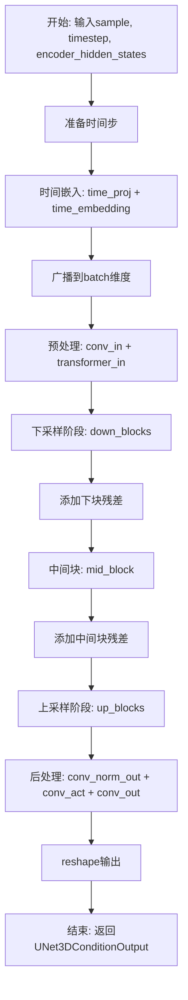
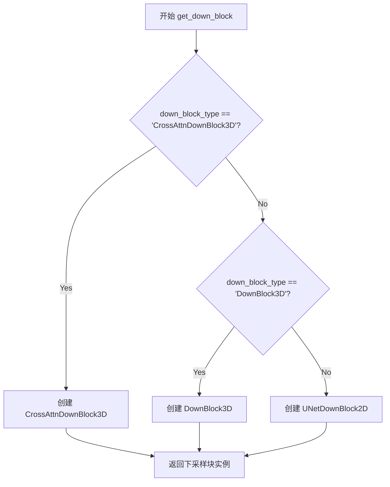
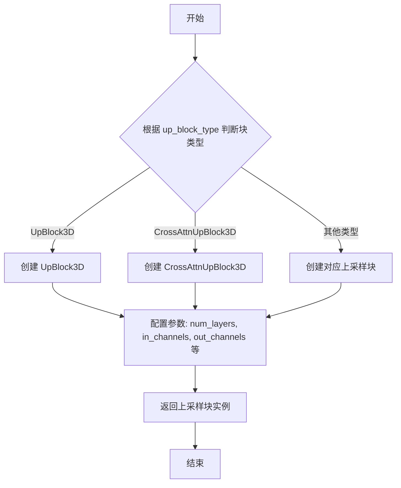
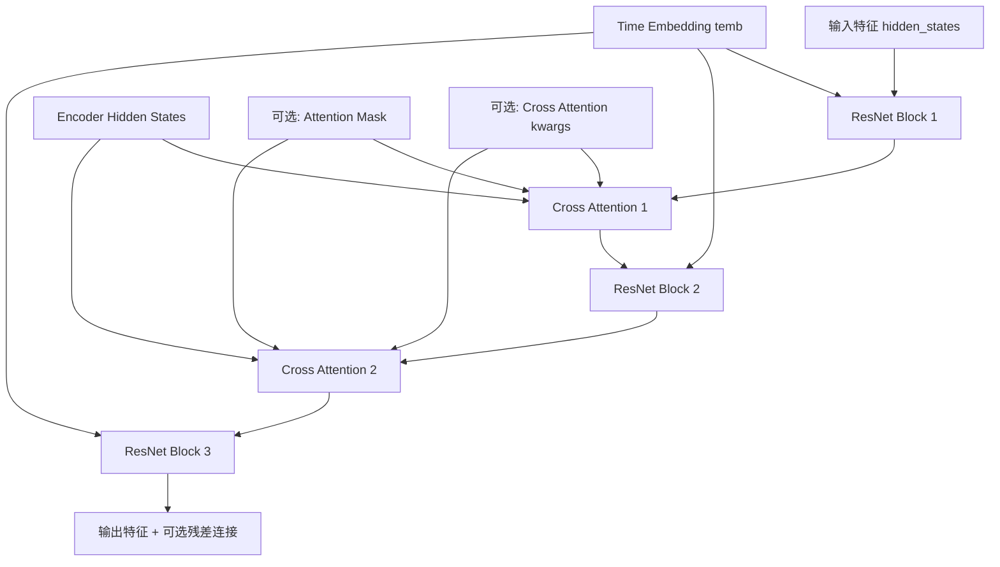
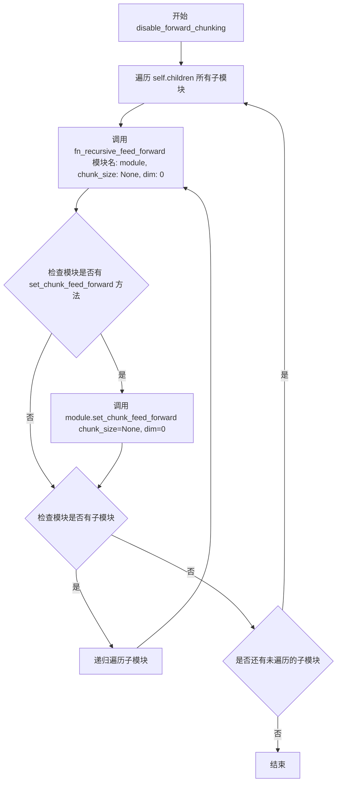
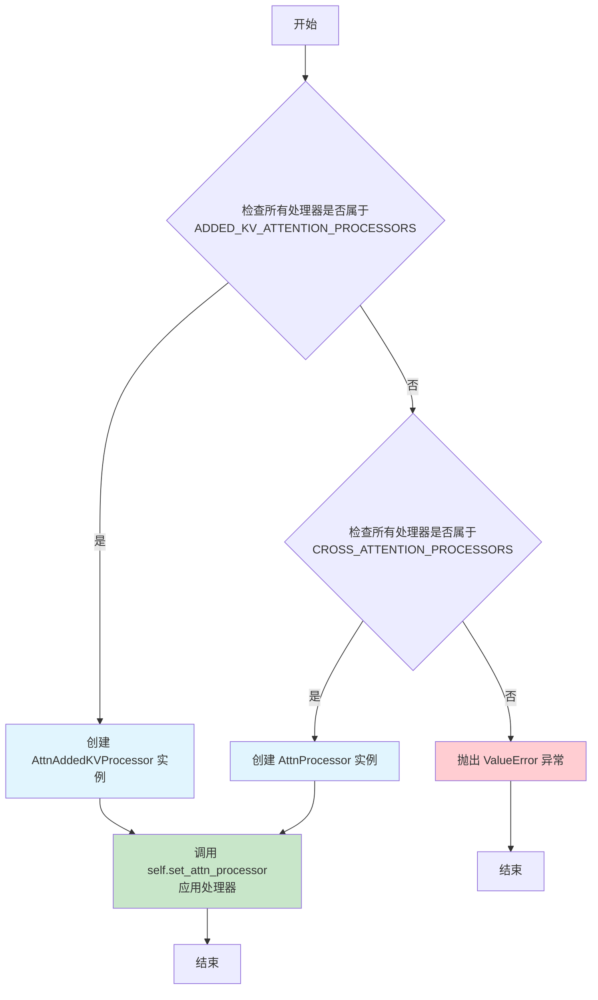
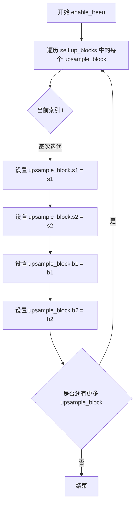
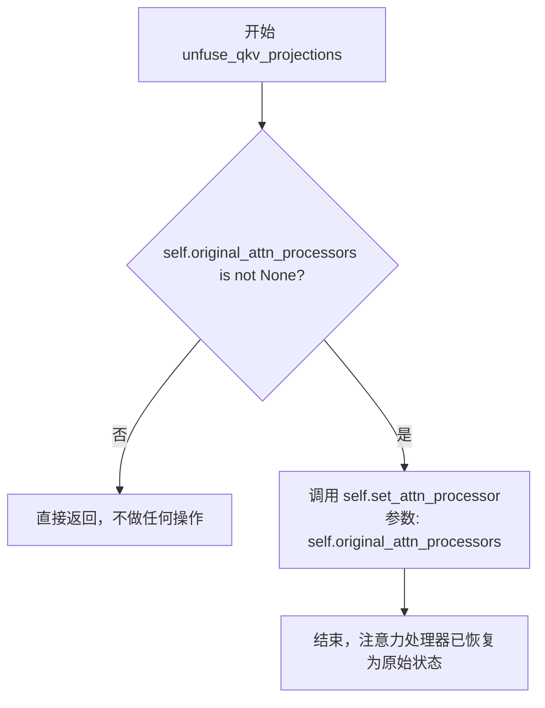

# `diffusers\src\diffusers\models\unets\unet_3d_condition.py` 详细设计文档

这是一个条件3D UNet模型，用于处理带噪声的样本、条件状态和时间步，并通过编码器隐藏状态进行条件化，最终返回去噪后的样本输出。该模型继承自ModelMixin和AttentionMixin，支持时间步嵌入、下采样/上采样块、跨注意力机制和FreeU等技术，常用于视频扩散模型的去噪过程。

## 整体流程



## 类结构

```
UNet3DConditionOutput (数据类)
UNet3DConditionModel (主模型类)
├── 父类: ModelMixin, AttentionMixin, ConfigMixin, UNet2DConditionLoadersMixin
├── 子组件:
│   ├── TransformerTemporalModel (时间transformer)
│   ├── TimestepEmbedding (时间步嵌入层)
│   ├── Timesteps (时间步处理)
│   ├── down_blocks (ModuleList of down blocks)
│   ├── up_blocks (ModuleList of up blocks)
│   └── mid_block (中间块)
```

## 全局变量及字段


### `logger`
    
模块级日志记录器，用于记录模型运行时的日志信息

类型：`logging.Logger`
    


### `UNet3DConditionOutput.sample`
    
模型输出张量，形状为(batch_size, num_channels, num_frames, height, width)

类型：`torch.Tensor`
    


### `UNet3DConditionModel.sample_size`
    
输入/输出样本的高度和宽度

类型：`int | None`
    


### `UNet3DConditionModel.conv_in`
    
输入卷积层

类型：`nn.Conv2d`
    


### `UNet3DConditionModel.time_proj`
    
时间步投影层

类型：`Timesteps`
    


### `UNet3DConditionModel.time_embedding`
    
时间步嵌入层

类型：`TimestepEmbedding`
    


### `UNet3DConditionModel.transformer_in`
    
时间transformer模型

类型：`TransformerTemporalModel`
    


### `UNet3DConditionModel.down_blocks`
    
下采样块列表

类型：`nn.ModuleList`
    


### `UNet3DConditionModel.up_blocks`
    
上采样块列表

类型：`nn.ModuleList`
    


### `UNet3DConditionModel.mid_block`
    
中间块

类型：`UNetMidBlock3DCrossAttn`
    


### `UNet3DConditionModel.num_upsamplers`
    
上采样器数量计数

类型：`int`
    


### `UNet3DConditionModel.conv_norm_out`
    
输出归一化层

类型：`nn.GroupNorm | None`
    


### `UNet3DConditionModel.conv_act`
    
输出激活层

类型：`Activation | None`
    


### `UNet3DConditionModel.conv_out`
    
输出卷积层

类型：`nn.Conv2d`
    


### `UNet3DConditionModel.original_attn_processors`
    
原始注意力处理器(用于QKV融合)

类型：`dict | None`
    


### `UNet3DConditionModel._supports_gradient_checkpointing`
    
是否支持梯度检查点

类型：`bool`
    


### `UNet3DConditionModel._skip_layerwise_casting_patterns`
    
跳过逐层转换的模式

类型：`list`
    
    

## 全局函数及方法


### `get_down_block`

获取下采样块的工厂函数，根据 `down_block_type` 参数创建并返回对应的 3D 下采样块实例（如 CrossAttnDownBlock3D 或 DownBlock3D）。

参数：

- `down_block_type`：`str`，下采样块的类型标识符（如 "CrossAttnDownBlock3D"、"DownBlock3D"）
- `num_layers`：`int`，该块中包含的 ResNet 层数量
- `in_channels`：`int`，输入张量的通道数
- `out_channels`：`int`，输出张量的通道数
- `temb_channels`：`int`，时间嵌入（timestep embedding）的通道数
- `add_downsample`：`bool`，是否在该块中添加下采样操作
- `resnet_eps`：`float`，ResNet 块中 GroupNorm 的 epsilon 值
- `resnet_act_fn`：`str`，ResNet 块中使用的激活函数名称（如 "silu"）
- `resnet_groups`：`int | None`，GroupNorm 的分组数
- `cross_attention_dim`：`int`，交叉注意力机制的维度
- `num_attention_heads`：`int`，注意力头的数量
- `downsample_padding`：`int`，下采样卷积的填充大小
- `dual_cross_attention`：`bool`，是否启用双交叉注意力

返回值：`nn.Module`，返回创建的下采样块实例（UNet3D 下采样模块）

#### 流程图



#### 带注释源码

```python
# 该函数为工厂函数，根据 down_block_type 创建对应的下采样块
# 位于 unet_3d_blocks.py 模块中（从当前文件导入）
down_block = get_down_block(
    down_block_type,           # 块类型：'CrossAttnDownBlock3D' 或 'DownBlock3D'
    num_layers=layers_per_block,       # 层数，通常为 2
    in_channels=input_channel,          # 输入通道数
    out_channels=output_channel,        # 输出通道数
    temb_channels=time_embed_dim,       # 时间嵌入通道维度
    add_downsample=not is_final_block,  # 非最终块时添加下采样
    resnet_eps=norm_eps,                # ResNet epsilon 参数
    resnet_act_fn=act_fn,                # 激活函数类型
    resnet_groups=norm_num_groups,      # GroupNorm 分组数
    cross_attention_dim=cross_attention_dim,  # 交叉注意力维度
    num_attention_heads=num_attention_heads[i], # 注意力头数
    downsample_padding=downsample_padding,      # 下采样填充
    dual_cross_attention=False,         # 禁用双交叉注意力
)
```


### `get_up_block`

获取上采样块的工厂函数，根据 `up_block_type` 参数创建并返回对应的上采样块实例（如 `UpBlock3D`、`CrossAttnUpBlock3D` 等），用于构建 3D UNet 的上采样路径。

参数：

- `up_block_type`：`str`，上采样块的类型字符串（如 "UpBlock3D"、"CrossAttnUpBlock3D"）
- `num_layers`：`int`，每个块中的残差层数量
- `in_channels`：`int`，输入特征图的通道数
- `out_channels`：`int`，输出特征图的通道数
- `prev_output_channel`：`int`，前一个块的输出通道数（用于跳跃连接）
- `temb_channels`：`int`，时间嵌入的通道数
- `add_upsample`：`bool`，是否添加上采样层
- `resnet_eps`：`float`，ResNet 归一化层的 epsilon 值
- `resnet_act_fn`：`str`，ResNet 激活函数名称
- `resnet_groups`：`int`，归一化的组数
- `cross_attention_dim`：`int`，交叉注意力机制的维度
- `num_attention_heads`：`int`，注意力头的数量
- `dual_cross_attention`：`bool`，是否使用双交叉注意力
- `resolution_idx`：`int`，当前块的分辨率索引

返回值：`nn.Module`，创建的上采样块实例

#### 流程图



#### 带注释源码

```python
# 从 unet_3d_blocks 模块导入的工厂函数
# 该函数根据 up_block_type 字符串创建相应的上采样块
# 用于 UNet3DConditionModel 的上采样路径构建

up_block = get_up_block(
    up_block_type,                          # 块类型: "UpBlock3D" 或 "CrossAttnUpBlock3D"
    num_layers=layers_per_block + 1,        # 层数 = 每块层数 + 1（因为是上采样路径）
    in_channels=input_channel,              # 输入通道数
    out_channels=output_channel,            # 输出通道数
    prev_output_channel=prev_output_channel,# 前一块输出通道数（跳跃连接用）
    temb_channels=time_embed_dim,           # 时间嵌入通道数
    add_upsample=add_upsample,              # 是否添加上采样操作
    resnet_eps=norm_eps,                    # ResNet 归一化 epsilon
    resnet_act_fn=act_fn,                   # 激活函数
    resnet_groups=norm_num_groups,          # 组归一化组数
    cross_attention_dim=cross_attention_dim,# 交叉注意力维度
    num_attention_heads=reversed_num_attention_heads[i],  # 注意力头数（反转顺序）
    dual_cross_attention=False,             # 是否双交叉注意力
    resolution_idx=i,                       # 分辨率索引
)
```


### `UNetMidBlock3DCrossAttn`

3D UNet的中间交叉注意力块，负责处理UNet编码器-解码器结构中最深层级的特征，通过交叉注意力机制融合条件信息（encoder_hidden_states），并结合残差网络进行特征细化和尺度调整。

参数：

- `in_channels`：`int`，输入特征图的通道数，通常为UNet最后一级block的输出通道数
- `temb_channels`：`int`，时间嵌入（timestep embedding）的通道维度，用于残差网络的 conditioning
- `resnet_eps`：`float`，残差网络中GroupNorm的epsilon值，防止除零，默认1e-5
- `resnet_act_fn`：`str`，残差网络中激活函数的名称，如"silu"
- `output_scale_factor`：`float`，输出特征的缩放因子，用于调整中间块输出的尺度，默认1.0
- `cross_attention_dim`：`int`，交叉注意力机制中查询/键/值的特征维度，通常与encoder_hidden_states的维度一致
- `num_attention_heads`：`int`或`tuple[int]`，交叉注意力中使用的注意力头数量
- `resnet_groups`：`int`或`None`，GroupNorm的分组数，用于残差网络的归一化，若为None则跳过归一化
- `dual_cross_attention`：`bool`，是否使用双交叉注意力机制（即两个方向的交叉注意力），默认False

返回值：通常返回处理后的特征张量，可能为`torch.Tensor`或包含该张量的元组

#### 流程图



#### 带注释源码

```
# UNetMidBlock3DCrossAttn 类定义（在 unet_3d_blocks.py 中实现）
# 此处为基于调用方式的推断性源码展示

class UNetMidBlock3DCrossAttn(nn.Module):
    """
    3D UNet中间块，结合ResNet和交叉注意力机制
    
    该中间块位于UNet的U型结构底部，负责处理最抽象的特征表示。
    通过交叉注意力机制将条件信息（来自encoder）融入到特征中。
    """
    
    def __init__(
        self,
        in_channels: int,                    # 输入通道数
        temb_channels: int,                   # 时间嵌入通道数
        resnet_eps: float = 1e-5,            # GroupNorm epsilon
        resnet_act_fn: str = "silu",         # 激活函数
        output_scale_factor: float = 1.0,    # 输出缩放因子
        cross_attention_dim: int = 1024,     # 交叉注意力维度
        num_attention_heads: int = 1,        # 注意力头数
        resnet_groups: int = 32,             # ResNet分组数
        dual_cross_attention: bool = False,  # 双交叉注意力
    ):
        super().__init__()
        
        # 1. 残差块（ResNet Block）- 提取空间特征
        # 包含两个卷积层、GroupNorm和激活函数
        self.resnets = nn.ModuleList([
            ResnetBlock3D(
                in_channels=in_channels,
                out_channels=in_channels,
                temb_channels=temb_channels,
                eps=resnet_eps,
                groups=resnet_groups,
                act_fn=resnet_act_fn,
            ),
            ResnetBlock3D(
                in_channels=in_channels,
                out_channels=in_channels,
                temb_channels=temb_channels,
                eps=resnet_eps,
                groups=resnet_groups,
                act_fn=resnet_act_fn,
            ),
        ])
        
        # 2. 交叉注意力层（Cross Attention）
        # 用于将encoder_hidden_states中的条件信息融入到特征中
        self.attentions = nn.ModuleList([
            Transformer3DCrossAttention(
                query_dim=in_channels,
                cross_attention_dim=cross_attention_dim,
                num_heads=num_attention_heads,
            ),
            Transformer3DCrossAttention(
                query_dim=in_channels,
                cross_attention_dim=cross_attention_dim,
                num_heads=num_attention_heads,
            ),
        ])
        
        # 输出缩放因子
        self.output_scale_factor = output_scale_factor
    
    def forward(
        self,
        hidden_states: torch.Tensor,          # 输入特征 (B, C, F, H, W) 或 (B, C, H*W)
        temb: torch.Tensor,                    # 时间嵌入 (B, temb_channels)
        encoder_hidden_states: torch.Tensor,  # 编码器隐藏状态 (B, seq_len, cross_attn_dim)
        attention_mask: torch.Tensor | None = None,  # 注意力掩码
        num_frames: int = 1,                   # 帧数（用于3D）
        cross_attention_kwargs: dict | None = None,  # 交叉注意力额外参数
    ) -> torch.Tensor:
        """
        前向传播
        
        处理流程：
        1. ResNet块 -> 2. 交叉注意力 -> 3. ResNet块 -> 4. 交叉注意力 -> 5. ResNet块
        """
        
        # 第一次ResNet处理
        hidden_states = self.resnets[0](hidden_states, temb)
        
        # 第一次交叉注意力
        hidden_states = self.attentions[0](
            hidden_states,
            encoder_hidden_states=encoder_hidden_states,
            attention_mask=attention_mask,
            **cross_attention_kwargs or {},
        )
        
        # 第二次ResNet处理
        hidden_states = self.resnets[1](hidden_states, temb)
        
        # 第二次交叉注意力
        hidden_states = self.attentions[1](
            hidden_states,
            encoder_hidden_states=encoder_hidden_states,
            attention_mask=attention_mask,
            **cross_attention_kwargs or {},
        )
        
        # 应用输出缩放
        hidden_states = hidden_states / self.output_scale_factor
        
        return hidden_states
```

> **注意**：由于提供的代码文件中仅包含`UNetMidBlock3DCrossAttn`类的导入和使用示例，实际的类定义位于`unet_3d_blocks.py`模块中。上述源码为基于该类在`UNet3DConditionModel`中的调用方式和通用架构模式推断得出的结构化展示。


### `UNet3DConditionModel.__init__`

这是 `UNet3DConditionModel` 类的初始化方法，负责构建一个用于3D条件去噪的UNet模型架构。该方法根据传入的配置参数初始化模型的各个组件，包括时间嵌入层、输入卷积、下采样块、中间块、上采样块和输出卷积等。

参数：

- `sample_size`：`int | None`，输入/输出样本的高度和宽度，默认为 `None`
- `in_channels`：`int`，输入样本的通道数，默认为 `4`
- `out_channels`：`int`，输出样本的通道数，默认为 `4`
- `down_block_types`：`tuple[str, ...]`，下采样块的类型元组，默认为 `("CrossAttnDownBlock3D", "CrossAttnDownBlock3D", "CrossAttnDownBlock3D", "DownBlock3D")`
- `up_block_types`：`tuple[str, ...]`，上采样块的类型元组，默认为 `("UpBlock3D", "CrossAttnUpBlock3D", "CrossAttnUpBlock3D", "CrossAttnUpBlock3D")`
- `block_out_channels`：`tuple[int, ...]`，每个块的输出通道数元组，默认为 `(320, 640, 1280, 1280)`
- `layers_per_block`：`int`，每个块中的层数，默认为 `2`
- `downsample_padding`：`int`，下采样卷积使用的填充数，默认为 `1`
- `mid_block_scale_factor`：`float`，中间块的缩放因子，默认为 `1.0`
- `act_fn`：`str`，激活函数名称，默认为 `"silu"`
- `norm_num_groups`：`int | None`，归一化的组数，默认为 `32`，若为 `None` 则跳过归一化和激活层
- `norm_eps`：`float`，归一化的 epsilon 值，默认为 `1e-5`
- `cross_attention_dim`：`int`，交叉注意力特征的维度，默认为 `1024`
- `attention_head_dim`：`int | tuple[int]`，注意力头的维度，默认为 `64`
- `num_attention_heads`：`int | tuple[int] | None`，注意力头的数量，默认为 `None`
- `time_cond_proj_dim`：`int | None`，时间嵌入中 `cond_proj` 层的维度，默认为 `None`

返回值：`None`，该方法为构造函数，不返回任何值

#### 流程图

```mermaid
flowchart TD
    A[开始 __init__] --> B[调用父类 super().__init__]
    B --> C[设置 self.sample_size]
    C --> D[检查 num_attention_heads 参数]
    D --> E{num_attention_heads 是否为 None?}
    E -->|是| F[使用 attention_head_dim 作为默认值]
    E -->|否| G[抛出 NotImplementedError]
    F --> H[输入验证: 检查 down_block_types/up_block_types/block_out_channels/num_attention_heads 长度一致性]
    H --> I[创建输入卷积层 conv_in: Conv2d]
    I --> J[创建时间嵌入组件: time_proj + time_embedding]
    J --> K[创建 TransformerTemporalModel: transformer_in]
    K --> L[初始化下采样块列表 down_blocks]
    L --> M[遍历 down_block_types 创建各下采样块]
    M --> N[创建中间块 mid_block: UNetMidBlock3DCrossAttn]
    N --> O[初始化上采样块列表 up_blocks]
    O --> P[遍历 up_block_types 创建各上采样块]
    P --> Q[创建输出归一化层 conv_norm_out]
    Q --> R[创建输出激活层 conv_act]
    R --> S[创建输出卷积层 conv_out]
    S --> T[结束 __init__]
```

#### 带注释源码

```python
@register_to_config
def __init__(
    self,
    sample_size: int | None = None,
    in_channels: int = 4,
    out_channels: int = 4,
    down_block_types: tuple[str, ...] = (
        "CrossAttnDownBlock3D",
        "CrossAttnDownBlock3D",
        "CrossAttnDownBlock3D",
        "DownBlock3D",
    ),
    up_block_types: tuple[str, ...] = (
        "UpBlock3D",
        "CrossAttnUpBlock3D",
        "CrossAttnUpBlock3D",
        "CrossAttnUpBlock3D",
    ),
    block_out_channels: tuple[int, ...] = (320, 640, 1280, 1280),
    layers_per_block: int = 2,
    downsample_padding: int = 1,
    mid_block_scale_factor: float = 1,
    act_fn: str = "silu",
    norm_num_groups: int | None = 32,
    norm_eps: float = 1e-5,
    cross_attention_dim: int = 1024,
    attention_head_dim: int | tuple[int] = 64,
    num_attention_heads: int | tuple[int] | None = None,
    time_cond_proj_dim: int | None = None,
):
    """
    初始化 UNet3DConditionModel 模型
    
    参数:
        sample_size: 输入/输出样本尺寸
        in_channels: 输入通道数
        out_channels: 输出通道数
        down_block_types: 下采样块类型列表
        up_block_types: 上采样块类型列表
        block_out_channels: 各块输出通道数
        layers_per_block: 每块层数
        downsample_padding: 下采样填充
        mid_block_scale_factor: 中间块缩放因子
        act_fn: 激活函数
        norm_num_groups: 归一化组数
        norm_eps: 归一化 epsilon
        cross_attention_dim: 交叉注意力维度
        attention_head_dim: 注意力头维度
        num_attention_heads: 注意力头数量
        time_cond_proj_dim: 时间条件投影维度
    """
    # 调用父类初始化
    super().__init__()

    # 保存样本尺寸
    self.sample_size = sample_size

    # 检查注意力头数量参数
    if num_attention_heads is not None:
        raise NotImplementedError(
            "At the moment it is not possible to define the number of attention heads via `num_attention_heads` because of a naming issue as described in https://github.com/huggingface/diffusers/issues/2011#issuecomment-1547958131. Passing `num_attention_heads` will only be supported in diffusers v0.19."
        )

    # 如果 num_attention_heads 未定义，默认使用 attention_head_dim
    # 这是为了兼容之前错误命名的变量
    num_attention_heads = num_attention_heads or attention_head_dim

    # ============ 输入验证 ============
    # 检查下采样块和上采样块数量一致
    if len(down_block_types) != len(up_block_types):
        raise ValueError(
            f"Must provide the same number of `down_block_types` as `up_block_types`. `down_block_types`: {down_block_types}. `up_block_types`: {up_block_types}."
        )

    # 检查块输出通道数与下采样块数量一致
    if len(block_out_channels) != len(down_block_types):
        raise ValueError(
            f"Must provide the same number of `block_out_channels` as `down_block_types`. `block_out_channels`: {block_out_channels}. `down_block_types`: {down_block_types}."
        )

    # 检查注意力头数量与下采样块数量一致
    if not isinstance(num_attention_heads, int) and len(num_attention_heads) != len(down_block_types):
        raise ValueError(
            f"Must provide the same number of `num_attention_heads` as `down_block_types`. `num_attention_heads`: {num_attention_heads}. `down_block_types`: {down_block_types}."
        )

    # ============ 输入卷积层 ============
    conv_in_kernel = 3  # 卷积核大小
    conv_out_kernel = 3
    conv_in_padding = (conv_in_kernel - 1) // 2  # 计算填充以保持尺寸
    # 创建输入卷积层: 将输入图像通道转换为第一个块的输出通道
    self.conv_in = nn.Conv2d(
        in_channels, block_out_channels[0], kernel_size=conv_in_kernel, padding=conv_in_padding
    )

    # ============ 时间嵌入 ============
    time_embed_dim = block_out_channels[0] * 4  # 时间嵌入维度为通道数的4倍
    # 创建时间投影层
    self.time_proj = Timesteps(block_out_channels[0], True, 0)
    timestep_input_dim = block_out_channels[0]

    # 创建时间嵌入层
    self.time_embedding = TimestepEmbedding(
        timestep_input_dim,
        time_embed_dim,
        act_fn=act_fn,
        cond_proj_dim=time_cond_proj_dim,
    )

    # ============ 时间 Transformer ============
    # 创建一个时间维度的Transformer模型用于处理时间信息
    self.transformer_in = TransformerTemporalModel(
        num_attention_heads=8,
        attention_head_dim=attention_head_dim,
        in_channels=block_out_channels[0],
        num_layers=1,
        norm_num_groups=norm_num_groups,
    )

    # ============ 下采样块 ============
    self.down_blocks = nn.ModuleList([])
    self.up_blocks = nn.ModuleList([])

    # 扩展注意力头数量以匹配下采样块数量
    if isinstance(num_attention_heads, int):
        num_attention_heads = (num_attention_heads,) * len(down_block_types)

    # 遍历创建下采样块
    output_channel = block_out_channels[0]
    for i, down_block_type in enumerate(down_block_types):
        input_channel = output_channel
        output_channel = block_out_channels[i]
        is_final_block = i == len(block_out_channels) - 1

        # 获取对应的下采样块
        down_block = get_down_block(
            down_block_type,
            num_layers=layers_per_block,
            in_channels=input_channel,
            out_channels=output_channel,
            temb_channels=time_embed_dim,
            add_downsample=not is_final_block,
            resnet_eps=norm_eps,
            resnet_act_fn=act_fn,
            resnet_groups=norm_num_groups,
            cross_attention_dim=cross_attention_dim,
            num_attention_heads=num_attention_heads[i],
            downsample_padding=downsample_padding,
            dual_cross_attention=False,
        )
        self.down_blocks.append(down_block)

    # ============ 中间块 ============
    self.mid_block = UNetMidBlock3DCrossAttn(
        in_channels=block_out_channels[-1],
        temb_channels=time_embed_dim,
        resnet_eps=norm_eps,
        resnet_act_fn=act_fn,
        output_scale_factor=mid_block_scale_factor,
        cross_attention_dim=cross_attention_dim,
        num_attention_heads=num_attention_heads[-1],
        resnet_groups=norm_num_groups,
        dual_cross_attention=False,
    )

    # 统计上采样层数量
    self.num_upsamplers = 0

    # ============ 上采样块 ============
    reversed_block_out_channels = list(reversed(block_out_channels))
    reversed_num_attention_heads = list(reversed(num_attention_heads))

    output_channel = reversed_block_out_channels[0]
    for i, up_block_type in enumerate(up_block_types):
        is_final_block = i == len(block_out_channels) - 1

        prev_output_channel = output_channel
        output_channel = reversed_block_out_channels[i]
        input_channel = reversed_block_out_channels[min(i + 1, len(block_out_channels) - 1)]

        # 判断是否需要添加上采样层
        if not is_final_block:
            add_upsample = True
            self.num_upsamplers += 1
        else:
            add_upsample = False

        # 获取对应的上采样块
        up_block = get_up_block(
            up_block_type,
            num_layers=layers_per_block + 1,  # 上采样块层数多1
            in_channels=input_channel,
            out_channels=output_channel,
            prev_output_channel=prev_output_channel,
            temb_channels=time_embed_dim,
            add_upsample=add_upsample,
            resnet_eps=norm_eps,
            resnet_act_fn=act_fn,
            resnet_groups=norm_num_groups,
            cross_attention_dim=cross_attention_dim,
            num_attention_heads=reversed_num_attention_heads[i],
            dual_cross_attention=False,
            resolution_idx=i,
        )
        self.up_blocks.append(up_block)
        prev_output_channel = output_channel

    # ============ 输出卷积层 ============
    # 如果指定了归一化组数，创建输出归一化和激活层
    if norm_num_groups is not None:
        self.conv_norm_out = nn.GroupNorm(
            num_channels=block_out_channels[0], num_groups=norm_num_groups, eps=norm_eps
        )
        self.conv_act = get_activation("silu")
    else:
        self.conv_norm_out = None
        self.conv_act = None

    conv_out_padding = (conv_out_kernel - 1) // 2
    # 创建输出卷积层
    self.conv_out = nn.Conv2d(
        block_out_channels[0], out_channels, kernel_size=conv_out_kernel, padding=conv_out_padding
    )
```


### `UNet3DConditionModel.set_attention_slice`

启用切片注意力计算功能。当启用此选项时，注意力模块会将输入张量分割成多个切片分步计算，从而以牺牲少量速度为代价节省显存。

参数：

- `slice_size`：`str | int | list[int]`，切片大小。当设为 `"auto"` 时，输入注意力头维度减半，注意力分两步计算；设为 `"max"` 时最大化显存节省，每次只运行一个切片；如果是数字，则使用 `attention_head_dim // slice_size` 数量的切片。

返回值：`None`，无返回值，该方法直接修改模型内部状态。

#### 流程图

```mermaid
flowchart TD
    A[开始 set_attention_slice] --> B[初始化空列表 sliceable_head_dims]
    B --> C[递归遍历子模块获取 sliceable_head_dims]
    C --> D{slice_size == 'auto'?}
    D -->|Yes| E[slice_size = 每维 // 2]
    D -->|No| F{slice_size == 'max'?}
    F -->|Yes| G[slice_size = [1] * 层数]
    F -->|No| H[保持原 slice_size]
    E --> I[标准化 slice_size 为列表]
    G --> I
    H --> I
    I --> J{len(slice_size) != len(sliceable_head_dims)?}
    J -->|Yes| K[抛出 ValueError]
    J -->|No| L{切片大小 > 对应维度?}
    L -->|Yes| K
    L -->|No| M[递归设置各子模块的 attention slice]
    M --> N[结束]
    K --> O[结束]
```

#### 带注释源码

```python
def set_attention_slice(self, slice_size: str | int | list[int]) -> None:
    r"""
    Enable sliced attention computation.

    When this option is enabled, the attention module splits the input tensor in slices to compute attention in
    several steps. This is useful for saving some memory in exchange for a small decrease in speed.

    Args:
        slice_size (`str` or `int` or `list(int)`, *optional*, defaults to `"auto"`):
            When `"auto"`, input to the attention heads is halved, so attention is computed in two steps. If
            `"max"`, maximum amount of memory is saved by running only one slice at a time. If a number is
            provided, uses as many slices as `attention_head_dim // slice_size`. In this case, `attention_head_dim`
            must be a multiple of `slice_size`.
    """
    # 用于存储所有可切片注意力层的头维度
    sliceable_head_dims = []

    def fn_recursive_retrieve_sliceable_dims(module: torch.nn.Module):
        """递归遍历模块，获取所有支持切片注意力的模块的 sliceable_head_dim"""
        if hasattr(module, "set_attention_slice"):
            sliceable_head_dims.append(module.sliceable_head_dim)

        for child in module.children():
            fn_recursive_retrieve_sliceable_dims(child)

    # 遍历所有子模块，收集可切片的注意力层信息
    for module in self.children():
        fn_recursive_retrieve_sliceable_dims(module)

    # 获取可切片的层数
    num_sliceable_layers = len(sliceable_head_dims)

    # 根据 slice_size 参数设置具体的切片策略
    if slice_size == "auto":
        # 当设为 "auto" 时，将每个注意力头维度减半，注意力分两步计算
        # 这是速度和内存之间的良好权衡
        slice_size = [dim // 2 for dim in sliceable_head_dims]
    elif slice_size == "max":
        # 当设为 "max" 时，使用最小可能的切片，最大限度节省内存
        slice_size = num_sliceable_layers * [1]

    # 将 slice_size 标准化为列表形式
    # 如果不是列表，则为每层复制一份相同的 slice_size
    slice_size = num_sliceable_layers * [slice_size] if not isinstance(slice_size, list) else slice_size

    # 验证 slice_size 长度是否与可切片层数匹配
    if len(slice_size) != len(sliceable_head_dims):
        raise ValueError(
            f"You have provided {len(slice_size)}, but {self.config} has {len(sliceable_head_dims)} different"
            f" attention layers. Make sure to match `len(slice_size)` to be {len(sliceable_head_dims)}."
        )

    # 验证每个切片大小是否小于等于对应的注意力头维度
    for i in range(len(slice_size)):
        size = slice_size[i]
        dim = sliceable_head_dims[i]
        if size is not None and size > dim:
            raise ValueError(f"size {size} has to be smaller or equal to {dim}.")

    # 递归遍历所有子模块，设置注意力切片
    # 任何暴露了 set_attention_slice 方法的子模块都会收到设置消息
    def fn_recursive_set_attention_slice(module: torch.nn.Module, slice_size: list[int]):
        """递归设置每个子模块的注意力切片大小"""
        if hasattr(module, "set_attention_slice"):
            module.set_attention_slice(slice_size.pop())

        for child in module.children():
            fn_recursive_set_attention_slice(child, slice_size)

    # 将切片大小列表反转，以正确匹配从顶层到底层的模块顺序
    reversed_slice_size = list(reversed(slice_size))
    for module in self.children():
        fn_recursive_set_attention_slice(module, reversed_slice_size)
```


### `UNet3DConditionModel.enable_forward_chunking`

该方法用于启用前馈网络分块计算（feed forward chunking），通过将前馈层计算分块处理来节省显存，适用于批量维度或序列长度维度的分块计算。

参数：

- `chunk_size`：`int | None`，前馈层的分块大小。如果不指定，则默认为1，表示逐个tensor计算。
- `dim`：`int`，分块计算的维度，默认为0。可选值为0（batch维度）或1（序列长度维度）。

返回值：`None`，该方法无返回值。

#### 流程图

```mermaid
flowchart TD
    A[开始 enable_forward_chunking] --> B{验证 dim 参数}
    B -->|dim 不在 [0, 1]| C[抛出 ValueError 异常]
    B -->|dim 合法| D[设置 chunk_size 默认值为 1]
    D --> E[定义递归函数 fn_recursive_feed_forward]
    E --> F{遍历子模块}
    F -->|子模块有 set_chunk_feed_forward 方法| G[调用 module.set_chunk_feed_forward]
    F -->|无此方法| H[继续遍历子模块的子模块]
    G --> H
    H -->|还有子模块未遍历| F
    H -->|遍历完成| I[结束]
```

#### 带注释源码

```python
def enable_forward_chunking(self, chunk_size: int | None = None, dim: int = 0) -> None:
    """
    设置注意力处理器使用 feed forward chunking（前馈网络分块计算）。
    
    该技术源自 Reformer 论文，通过将前馈层计算分块来节省显存。
    详见: https://huggingface.co/blog/reformer#2-chunked-feed-forward-layers

    参数:
        chunk_size (`int`, *可选*):
            前馈层的分块大小。如果未指定，将根据 dim 参数对每个 tensor 单独运行前馈层计算。
        dim (`int`, *可选*, 默认为 `0`):
            前馈计算应该被分块的维度。可选值:
            - dim=0: 按 batch 维度分块
            - dim=1: 按 sequence length 维度分块
    """
    # 验证 dim 参数必须在 0 或 1 范围内
    if dim not in [0, 1]:
        raise ValueError(f"Make sure to set `dim` to either 0 or 1, not {dim}")

    # 默认分块大小为 1，即不进行分块
    chunk_size = chunk_size or 1

    # 定义递归函数，用于遍历所有子模块并设置分块参数
    def fn_recursive_feed_forward(module: torch.nn.Module, chunk_size: int, dim: int):
        # 如果模块有 set_chunk_feed_forward 方法，则调用它来启用分块
        if hasattr(module, "set_chunk_feed_forward"):
            module.set_chunk_feed_forward(chunk_size=chunk_size, dim=dim)

        # 递归遍历所有子模块
        for child in module.children():
            fn_recursive_feed_forward(child, chunk_size, dim)

    # 遍历当前模型的所有直接子模块
    for module in self.children():
        fn_recursive_feed_forward(module, chunk_size, dim)
```


### `UNet3DConditionModel.disable_forward_chunking`

该方法用于禁用前向分块（forward chunking）功能。它递归地遍历模型的所有子模块，将每个模块的 `chunk_feed_forward` 参数设置为 `None`（即禁用分块），从而恢复默认的前向计算方式。

参数：此方法无显式参数。

返回值：`None`，无返回值（该方法直接修改模型内部状态）。

#### 流程图



#### 带注释源码

```python
def disable_forward_chunking(self):
    """
    禁用前向分块（forward chunking）功能。
    
    该方法通过递归遍历模型的所有子模块，调用每个模块的 set_chunk_feed_forward 方法，
    将 chunk_size 设置为 None，从而禁用前向分块计算。
    这与 enable_forward_chunking 方法相反，用于恢复默认的前向计算方式。
    """
    def fn_recursive_feed_forward(module: torch.nn.Module, chunk_size: int, dim: int):
        """
        递归遍历模块及其子模块的内部函数。
        
        参数:
            module: torch.nn.Module - 当前遍历的模块
            chunk_size: int - 分块大小，传入 None 表示禁用分块
            dim: int - 分块的维度，默认为 0
        """
        # 检查当前模块是否实现了 set_chunk_feed_forward 方法
        if hasattr(module, "set_chunk_feed_forward"):
            # 调用模块的 set_chunk_feed_forward 方法，禁用分块
            module.set_chunk_feed_forward(chunk_size=chunk_size, dim=dim)

        # 递归遍历当前模块的所有子模块
        for child in module.children():
            fn_recursive_feed_forward(child, chunk_size, dim)

    # 遍历模型的所有直接子模块
    for module in self.children():
        # 对每个子模块调用递归函数，chunk_size=None 表示禁用分块
        fn_recursive_feed_forward(module, None, 0)
```


### `UNet3DConditionModel.set_default_attn_processor`

该方法用于禁用自定义注意力处理器，并将注意力实现重置为默认配置。它会检查当前注册的所有注意力处理器类型，根据其类型选择相应的默认处理器（AttnAddedKVProcessor 或 AttnProcessor），然后通过 `set_attn_processor` 方法应用选定的默认处理器。

参数：

- 该方法无显式参数（仅包含 `self`）

返回值：`None`，该方法直接修改对象状态，不返回任何值

#### 流程图



#### 带注释源码

```python
def set_default_attn_processor(self):
    """
    Disables custom attention processors and sets the default attention implementation.
    """
    # 步骤1：检查当前所有注意力处理器是否都属于 ADDED_KV_ATTENTION_PROCESSORS 类型
    # ADDED_KV_ATTENTION_PROCESSORS 是用于处理额外键值对的注意力处理器集合
    if all(proc.__class__ in ADDED_KV_ATTENTION_PROCESSORS for proc in self.attn_processors.values()):
        # 如果所有处理器都是 ADDED_KV 类型，则创建 AttnAddedKVProcessor 作为默认处理器
        processor = AttnAddedKVProcessor()
    # 步骤2：检查当前所有注意力处理器是否都属于 CROSS_ATTENTION_PROCESSORS 类型
    elif all(proc.__class__ in CROSS_ATTENTION_PROCESSORS for proc in self.attn_processors.values()):
        # 如果所有处理器都是 CROSS_ATTENTION 类型，则创建 AttnProcessor 作为默认处理器
        processor = AttnProcessor()
    # 步骤3：如果处理器类型混合或不匹配，则抛出异常
    else:
        raise ValueError(
            f"Cannot call `set_default_attn_processor` when attention processors are of type {next(iter(self.attn_processors.values()))}"
        )

    # 步骤4：调用 set_attn_processor 方法将选定的默认处理器应用到模型
    self.set_attn_processor(processor)
```


### `UNet3DConditionModel.enable_freeu`

该方法用于启用FreeU机制，通过为UNet的上采样块（up_blocks）设置四个缩放因子（s1、s2、b1、b2），从而减轻去噪过程中的"过度平滑效应"，增强模型的细节恢复能力。

参数：

- `s1`：`float`，第一阶段缩放因子，用于衰减跳跃特征（skip features）的贡献，以减轻过度平滑
- `s2`：`float`，第二阶段缩放因子，用于衰减跳跃特征的贡献，以减轻过度平滑
- `b1`：`float`，第一阶段缩放因子，用于放大主干特征（backbone features）的贡献
- `b2`：`float`，第二阶段缩放因子，用于放大主干特征的贡献

返回值：`None`，该方法直接修改模型状态，不返回任何值

#### 流程图



#### 带注释源码

```python
def enable_freeu(self, s1, s2, b1, b2):
    r"""Enables the FreeU mechanism from https://huggingface.co/papers/2309.11497.
    # 方法功能说明：启用FreeU机制，来源于论文2309.11497

    The suffixes after the scaling factors represent the stage blocks where they are being applied.
    # 缩放因子的后缀表示应用它们的阶段块

    Please refer to the [official repository](https://github.com/ChenyangSi/FreeU) for combinations of values that
    are known to work well for different pipelines such as Stable Diffusion v1, v2, and Stable Diffusion XL.
    # 建议参考官方仓库了解不同管道的有效参数组合

    Args:
        s1 (`float`):
            Scaling factor for stage 1 to attenuate the contributions of the skip features. This is done to
            mitigate the "oversmoothing effect" in the enhanced denoising process.
            # 第一阶段缩放因子，用于衰减跳跃特征贡献，减轻去噪过度平滑
        s2 (`float`):
            Scaling factor for stage 2 to attenuate the contributions of the skip features. This is done to
            mitigate the "oversmoothing effect" in the enhanced denoising process.
            # 第二阶段缩放因子，用于衰减跳跃特征贡献，减轻去噪过度平滑
        b1 (`float`): Scaling factor for stage 1 to amplify the contributions of backbone features.
            # 第一阶段缩放因子，用于放大主干特征贡献
        b2 (`float`): Scaling factor for stage 2 to amplify the contributions of backbone features.
            # 第二阶段缩放因子，用于放大主干特征贡献
    """
    # 遍历模型中所有的上采样块（up_blocks）
    for i, upsample_block in enumerate(self.up_blocks):
        # 为每个上采样块设置FreeU机制的四个缩放因子属性
        # s1, s2: 控制跳跃特征（skip features）的衰减程度
        # b1, b2: 控制主干特征（backbone features）的放大程度
        setattr(upsample_block, "s1", s1)
        setattr(upsample_block, "s2", s2)
        setattr(upsample_block, "b1", b1)
        setattr(upsample_block, "b2", b2)
```


### `UNet3DConditionModel.disable_freeu`

该方法用于禁用 UNet3DConditionModel 中的 FreeU 机制，通过将上采样块（upsample_block）中的 FreeU 相关属性（s1, s2, b1, b2）设置为 None 来关闭该功能。

参数：
- 该方法无显式参数（隐式参数 `self` 为模型实例本身）

返回值：`None`，无返回值

#### 流程图

```mermaid
flowchart TD
    A[开始 disable_freeu] --> B[定义 freeu_keys = {'s1', 's2', 'b1', 'b2'}]
    B --> C[遍历 self.up_blocks]
    C --> D{还有更多 upsample_block?}
    D -->|是| E[遍历 freeu_keys 中的每个键 k]
    E --> F{upsample_block 有属性 k 或属性值不为 None?}
    F -->|是| G[setattr(upsample_block, k, None)]
    F -->|否| H[不执行操作]
    G --> I[继续下一个键]
    H --> I
    I --> E
    D -->|否| J[结束]
```

#### 带注释源码

```python
# Copied from diffusers.models.unets.unet_2d_condition.UNet2DConditionModel.disable_freeu
def disable_freeu(self):
    """Disables the FreeU mechanism."""
    # 定义需要清除的 FreeU 相关属性键
    # s1, s2: 用于 attenuate（衰减）skip features 的缩放因子
    # b1, b2: 用于 amplify（放大）backbone features 的缩放因子
    freeu_keys = {"s1", "s2", "b1", "b2"}
    
    # 遍历模型中所有的上采样块（up_blocks）
    for i, upsample_block in enumerate(self.up_blocks):
        # 遍历每个 FreeU 相关属性键
        for k in freeu_keys:
            # 检查该 upsample_block 是否有该属性，或者属性值不为 None
            # 只有当属性存在且值不为 None 时才执行清除操作
            if hasattr(upsample_block, k) or getattr(upsample_block, k, None) is not None:
                # 将该属性设置为 None，从而禁用 FreeU 机制
                setattr(upsample_block, k, None)
```


### `UNet3DConditionModel.fuse_qkv_projections`

启用融合的 QKV 投影。对于自注意力模块，所有投影矩阵（即 query、key、value）都被融合；对于交叉注意力模块，key 和 value 投影矩阵被融合。该 API 是实验性的。

参数：

- 无参数（仅 `self`）

返回值：无返回值（`None`），该方法直接修改模型内部状态

#### 流程图

```mermaid
flowchart TD
    A[开始] --> B[初始化 original_attn_processors 为 None]
    B --> C{检查 attn_processors 中是否存在 Added KV Processor}
    C -->|是| D[抛出 ValueError 异常]
    C -->|否| E[保存当前 attn_processors 到 original_attn_processors]
    E --> F[遍历所有子模块]
    F --> G{当前模块是否为 Attention 类型?}
    G -->|是| H[调用 module.fuse_projections(fuse=True)]
    G -->|否| I[继续下一个模块]
    H --> I
    F --> J[将注意力处理器设置为 FusedAttnProcessor2_0]
    J --> K[结束]
```

#### 带注释源码

```python
def fuse_qkv_projections(self):
    """
    Enables fused QKV projections. For self-attention modules, all projection matrices (i.e., query, key, value)
    are fused. For cross-attention modules, key and value projection matrices are fused.

    > [!WARNING] > This API is 🧪 experimental.
    """
    # 1. 初始化 original_attn_processors 为 None，用于后续可能的恢复操作
    self.original_attn_processors = None

    # 2. 检查现有的注意力处理器，确保没有 Added KV 投影
    # 如果存在 Added KV 处理器，则不支持融合 QKV 投影
    for _, attn_processor in self.attn_processors.items():
        if "Added" in str(attn_processor.__class__.__name__):
            raise ValueError("`fuse_qkv_projections()` is not supported for models having added KV projections.")

    # 3. 保存当前的注意力处理器，以便后续可以通过 unfuse_qkv_projections 恢复
    self.original_attn_processors = self.attn_processors

    # 4. 遍历模型中的所有模块
    for module in self.modules():
        # 5. 对于所有 Attention 类型的模块，调用 fuse_projections 方法进行融合
        if isinstance(module, Attention):
            module.fuse_projections(fuse=True)

    # 6. 将注意力处理器设置为 FusedAttnProcessor2_0，这是支持融合 QKV 的处理器
    self.set_attn_processor(FusedAttnProcessor2_0())
```


### `UNet3DConditionModel.unfuse_qkv_projections`

此方法用于禁用融合的QKV投影，将注意力处理器恢复为融合前的原始状态。

参数：

- 无（仅包含隐式参数 `self`）

返回值：`None`，无返回值

#### 流程图



#### 带注释源码

```python
# Copied from diffusers.models.unets.unet_2d_condition.UNet2DConditionModel.unfuse_qkv_projections
def unfuse_qkv_projections(self):
    """Disables the fused QKV projection if enabled.

    > [!WARNING] > This API is 🧪 experimental.

    """
    # 检查是否存在原始的注意力处理器保存
    # 该属性在 fuse_qkv_projections() 被调用时会被设置
    if self.original_attn_processors is not None:
        # 如果存在原始处理器，则通过 set_attn_processor 方法恢复
        # 这会将模型中所有注意力层的处理器恢复为融合前的状态
        self.set_attn_processor(self.original_attn_processors)
```


### UNet3DConditionModel.forward

该方法是3D条件UNet模型的前向传播核心逻辑，接收带噪声的样本张量、时间步、编码器隐藏状态等条件信息，经过时间嵌入、输入预处理、下采样编码、中间块处理、上采样解码和后处理等阶段，最终输出去噪后的样本张量。

参数：

- `sample`：`torch.Tensor`，噪声输入张量，形状为`(batch, num_channels, num_frames, height, width)`
- `timestep`：`torch.Tensor | float | int`，去噪所需的时间步
- `encoder_hidden_states`：`torch.Tensor`，编码器隐藏状态，形状为`(batch, sequence_length, feature_dim)`
- `class_labels`：`torch.Tensor | None`，可选的类别标签，用于条件嵌入
- `timestep_cond`：`torch.Tensor | None`，时间步的条件嵌入，如果提供则与时间嵌入相加
- `attention_mask`：`torch.Tensor | None`，应用于编码器隐藏状态的注意力掩码
- `cross_attention_kwargs`：`dict[str, Any] | None`，传递给注意力处理器的额外关键字参数
- `down_block_additional_residuals`：`tuple[torch.Tensor] | None`，要添加到下采样块残差的额外张量
- `mid_block_additional_residual`：`torch.Tensor | None`，要添加到中间块残差的额外张量
- `return_dict`：`bool`，是否返回`UNet3DConditionOutput`而不是元组

返回值：`UNet3DConditionOutput | tuple[torch.Tensor]`，如果`return_dict`为True，返回`UNet3DConditionOutput`对象，否则返回包含样本张量的元组

#### 流程图

```mermaid
flowchart TD
    A[开始: 输入sample, timestep, encoder_hidden_states] --> B{检查upsample尺寸}
    B -->|非倍数| C[设置forward_upsample_size=True]
    B -->|是倍数| D[设置forward_upsample_size=False]
    C --> E[准备attention_mask]
    D --> E
    E --> F[1. 时间处理: 将timestep转换为张量并扩展到batch维度]
    F --> G[计算time_embedding: t_emb = self.time_proj(timesteps)]
    G --> H[时间嵌入: emb = self.time_embedding(t_emb, timestep_cond)]
    H --> I[扩展emb和encoder_hidden_states到num_frames维度]
    I --> J[2. 预处理: sample维度重排和reshape]
    J --> K[卷积输入: sample = self.conv_in(sample)]
    K --> L[Transformer处理: sample = self.transformer_in<br/>(sample, num_frames, ...)]
    L --> M[3. 下采样编码: 遍历down_blocks]
    M --> N{检查has_cross_attention?}
    N -->|是| O[downsample_block带交叉注意力]
    N -->|否| P[downsample_block不带交叉注意力]
    O --> Q[收集残差: down_block_res_samples]
    P --> Q
    Q --> R{有down_block_additional_residuals?}
    R -->|是| S[将额外残差添加到down_block_res_samples]
    R -->|否| T[继续]
    S --> T
    T --> U[4. 中间块处理: sample = self.mid_block<br/>(sample, emb, ...)]
    U --> V{有mid_block_additional_residual?}
    V -->|是| W[添加中间残差: sample + mid_block_additional_residual]
    V -->|否| X[继续]
    W --> X
    X --> Y[5. 上采样解码: 遍历up_blocks]
    Y --> Z[取出对应数量的残差res_samples]
    Z --> AA{不是最终块且forward_upsample_size?}
    AA -->|是| AB[设置upsample_size]
    AA -->|否| AC[不设置upsample_size]
    AB --> AD{检查has_cross_attention?}
    AC --> AD
    AD -->|是| AE[upsample_block带交叉注意力]
    AD -->|否| AF[upsample_block不带交叉注意力]
    AE --> AG[更新sample]
    AF --> AG
    AG --> AH{还有更多up_blocks?}
    AH -->|是| Y
    AH -->|否| AI[6. 后处理: conv_norm_out, conv_act, conv_out]
    AI --> AJ[reshape输出: (batch, channel, framerate, width, height)]
    AJ --> AK{return_dict?}
    AK -->|是| AL[返回UNet3DConditionOutput(sample=sample)]
    AK -->|否| AM[返回tuple(sample,)]
```

#### 带注释源码

```python
def forward(
    self,
    sample: torch.Tensor,                      # 噪声输入: (batch, num_channels, num_frames, height, width)
    timestep: torch.Tensor | float | int,       # 时间步: 单个值或张量
    encoder_hidden_states: torch.Tensor,        # 编码器隐藏状态: (batch, seq_len, feature_dim)
    class_labels: torch.Tensor | None = None,   # 可选类别标签
    timestep_cond: torch.Tensor | None = None,  # 时间步条件嵌入
    attention_mask: torch.Tensor | None = None,# 注意力掩码: (batch, key_tokens)
    cross_attention_kwargs: dict[str, Any] | None = None,  # 交叉注意力额外参数
    down_block_additional_residuals: tuple[torch.Tensor] | None = None,  # 下块额外残差
    mid_block_additional_residual: torch.Tensor | None = None,            # 中间块额外残差
    return_dict: bool = True,                  # 是否返回字典格式
) -> UNet3DConditionOutput | tuple[torch.Tensor]:
    """
    UNet3DConditionModel的前向传播方法
    
    处理流程:
    1. 时间步处理: 将时间步转换为嵌入向量
    2. 预处理: 对输入样本进行卷积和Transformer处理
    3. 下采样: 通过down blocks提取特征并收集残差
    4. 中间处理: 通过middle block进一步处理
    5. 上采样: 通过up blocks解码并融合残差
    6. 后处理: 归一化、激活、卷积输出
    """
    
    # 计算默认的上采样因子（基于上采样层数量）
    # 整体上采样因子 = 2 ** (#上采样层数)
    default_overall_up_factor = 2**self.num_upsamplers
    
    # 检查是否需要强制插值输出尺寸
    forward_upsample_size = False
    upsample_size = None
    
    # 如果样本尺寸不是上采样因子的倍数，则转发upsample尺寸
    if any(s % default_overall_up_factor != 0 for s in sample.shape[-2:]):
        logger.info("Forward upsample size to force interpolation output size.")
        forward_upsample_size = True
    
    # 准备attention_mask: 将0/1掩码转换为注意力分数的偏置
    if attention_mask is not None:
        # 转换为: 1->0, 0->-10000 (掩码位置加大的负值)
        attention_mask = (1 - attention_mask.to(sample.dtype)) * -10000.0
        # 添加批次维度用于广播
        attention_mask = attention_mask.unsqueeze(1)
    
    # ==================== 1. 时间处理 ====================
    timesteps = timestep
    if not torch.is_tensor(timesteps):
        # 检测设备类型
        is_mps = sample.device.type == "mps"
        is_npu = sample.device.type == "npu"
        # 根据设备选择dtype
        if isinstance(timestep, float):
            dtype = torch.float32 if (is_mps or is_npu) else torch.float64
        else:
            dtype = torch.int32 if (is_mps or is_npu) else torch.int64
        # 转换为张量
        timesteps = torch.tensor([timesteps], dtype=dtype, device=sample.device)
    elif len(timesteps.shape) == 0:
        # 标量张量扩展为1维
        timesteps = timesteps[None].to(sample.device)
    
    # 广播到batch维度
    num_frames = sample.shape[2]  # 帧数
    timesteps = timesteps.expand(sample.shape[0])  # 扩展到batch size
    
    # 时间投影: 将timesteps投影到嵌入空间
    t_emb = self.time_proj(timesteps)
    
    # 确保dtype一致(time_embedding可能运行在fp16)
    t_emb = t_emb.to(dtype=self.dtype)
    
    # 时间嵌入层
    emb = self.time_embedding(t_emb, timestep_cond)
    
    # 扩展到帧维度: 每个时间步嵌入需要为每一帧复制
    emb = emb.repeat_interleave(num_frames, dim=0, output_size=emb.shape[0] * num_frames)
    encoder_hidden_states = encoder_hidden_states.repeat_interleave(
        num_frames, dim=0, output_size=encoder_hidden_states.shape[0] * num_frames
    )
    
    # ==================== 2. 预处理 ====================
    # 维度重排: (batch, channel, frames, h, w) -> (batch, frames, channel, h, w)
    # 然后reshape: (batch*frames, channel, h, w)
    sample = sample.permute(0, 2, 1, 3, 4).reshape((sample.shape[0] * num_frames, -1) + sample.shape[3:])
    
    # 初始卷积
    sample = self.conv_in(sample)
    
    # Temporal Transformer处理 (处理时序信息)
    sample = self.transformer_in(
        sample,
        num_frames=num_frames,
        cross_attention_kwargs=cross_attention_kwargs,
        return_dict=False,
    )[0]
    
    # ==================== 3. 下采样编码 ====================
    down_block_res_samples = (sample,)  # 初始化残差列表，包含初始特征
    for downsample_block in self.down_blocks:
        if hasattr(downsample_block, "has_cross_attention") and downsample_block.has_cross_attention:
            # 带交叉注意力的下采样块
            sample, res_samples = downsample_block(
                hidden_states=sample,
                temb=emb,
                encoder_hidden_states=encoder_hidden_states,
                attention_mask=attention_mask,
                num_frames=num_frames,
                cross_attention_kwargs=cross_attention_kwargs,
            )
        else:
            # 不带交叉注意力的下采样块
            sample, res_samples = downsample_block(hidden_states=sample, temb=emb, num_frames=num_frames)
        
        # 收集所有残差用于后续上采样
        down_block_res_samples += res_samples
    
    # 添加额外的下采样块残差（如果有）
    if down_block_additional_residuals is not None:
        new_down_block_res_samples = ()
        for down_block_res_sample, down_block_additional_residual in zip(
            down_block_res_samples, down_block_additional_residuals
        ):
            # 残差连接
            down_block_res_sample = down_block_res_sample + down_block_additional_residual
            new_down_block_res_samples += (down_block_res_sample,)
        
        down_block_res_samples = new_down_block_res_samples
    
    # ==================== 4. 中间块处理 ====================
    if self.mid_block is not None:
        sample = self.mid_block(
            sample,
            emb,
            encoder_hidden_states=encoder_hidden_states,
            attention_mask=attention_mask,
            num_frames=num_frames,
            cross_attention_kwargs=cross_attention_kwargs,
        )
    
    # 添加额外的中间块残差（如果有）
    if mid_block_additional_residual is not None:
        sample = sample + mid_block_additional_residual
    
    # ==================== 5. 上采样解码 ====================
    for i, upsample_block in enumerate(self.up_blocks):
        is_final_block = i == len(self.up_blocks) - 1
        
        # 从残差列表中取出当前块需要的残差数量
        res_samples = down_block_res_samples[-len(upsample_block.resnets) :]
        down_block_res_samples = down_block_res_samples[: -len(upsample_block.resnets)]
        
        # 非最终块时，如果需要转发upsample尺寸
        if not is_final_block and forward_upsample_size:
            upsample_size = down_block_res_samples[-1].shape[2:]
        
        if hasattr(upsample_block, "has_cross_attention") and upsample_block.has_cross_attention:
            # 带交叉注意力的上采样块
            sample = upsample_block(
                hidden_states=sample,
                temb=emb,
                res_hidden_states_tuple=res_samples,
                encoder_hidden_states=encoder_hidden_states,
                upsample_size=upsample_size,
                attention_mask=attention_mask,
                num_frames=num_frames,
                cross_attention_kwargs=cross_attention_kwargs,
            )
        else:
            # 不带交叉注意力的上采样块
            sample = upsample_block(
                hidden_states=sample,
                temb=emb,
                res_hidden_states_tuple=res_samples,
                upsample_size=upsample_size,
                num_frames=num_frames,
            )
    
    # ==================== 6. 后处理 ====================
    if self.conv_norm_out:
        # GroupNorm归一化
        sample = self.conv_norm_out(sample)
        # SiLU激活
        sample = self.conv_act(sample)
    
    # 最终卷积输出
    sample = self.conv_out(sample)
    
    # reshape回原始格式: (batch*frames, channels, h, w) -> (batch, channels, frames, h, w)
    sample = sample[None, :].reshape((-1, num_frames) + sample.shape[1:]).permute(0, 2, 1, 3, 4)
    
    # 返回结果
    if not return_dict:
        return (sample,)
    
    return UNet3DConditionOutput(sample=sample)
```

## 关键组件


### UNet3DConditionModel

主类，一个条件3D UNet模型，接收噪声样本、条件状态和时间步长，返回形状为(batch_size, num_channels, num_frames, height, width)的样本输出。

### UNet3DConditionOutput

输出数据类，包含去噪后的样本张量，形状为(batch_size, num_channels, num_frames, height, width)。

### 时间嵌入模块 (time_proj, time_embedding)

将时间步长转换为嵌入向量，包含Timesteps和TimestepEmbedding两个子模块，用于将离散的时间步长编码为连续的向量表示。

### TransformerTemporalModel (transformer_in)

时序变换器模型，在主UNet之前对输入进行预处理，捕捉时间维度的特征。

### 下采样块 (down_blocks)

由get_down_block工厂函数创建的多个下采样块模块列表，包括CrossAttnDownBlock3D和DownBlock3D类型，用于逐步提取特征并降低空间分辨率。

### 上采样块 (up_blocks)

由get_up_block工厂函数创建的多个上采样块模块列表，包括UpBlock3D和CrossAttnUpBlock3D类型，用于逐步恢复空间分辨率并融合下采样特征。

### 中间块 (mid_block)

UNetMidBlock3DCrossAttn类型，包含跳跃连接和交叉注意力机制，在UNet的最低分辨率处进行特征处理。

### 注意力切片机制 (set_attention_slice)

通过分割输入张量来计算注意力，允许在内存和速度之间进行权衡，支持auto、max和自定义切片大小。

### 前馈分块机制 (enable_forward_chunking, disable_forward_chunking)

将前馈层分块计算以节省内存，支持在批次维度和序列长度维度进行分块。

### FreeU机制 (enable_freeu, disable_freeu)

通过缩放跳跃连接特征和主干特征来减轻过度平滑效果，包含s1、s2、b1、b2四个可调参数。

### QKV融合机制 (fuse_qkv_projections, unfuse_qkv_projections)

将查询、键、值投影矩阵融合以提高推理效率，支持自注意力和交叉注意力的融合。

### 默认注意力处理器 (set_default_attn_processor)

设置默认的注意力实现，根据当前处理器类型自动选择AttnAddedKVProcessor或AttnProcessor。

### 输入卷积层 (conv_in)

nn.Conv2d，将输入通道映射到第一个块输出通道，用于预处理输入样本。

### 输出卷积层 (conv_out)

nn.Conv2d，将最终通道数映射到输出通道数，用于生成去噪后的样本。

### 归一化与激活 (conv_norm_out, conv_act)

GroupNorm和SiLU激活函数，用于后处理阶段的特征归一化和非线性变换。

### 前向传播流程 (forward)

完整的前向传播：时间嵌入 → 输入预处理 → 下采样 → 中间块 → 上采样 → 后处理输出，支持交叉注意力、条件嵌入和残差连接。


## 问题及建议


### 已知问题

- **不支持梯度检查点（Gradient Checkpointing）**：`_supports_gradient_checkpointing = False`，在深层网络中会导致高显存占用，无法通过梯度checkpointing进行显存优化。
- **`num_attention_heads` 参数存在未完成的重构**：代码中显式抛出 `NotImplementedError`，但注释提到将在 v0.19 支持，当前配置不够灵活。
- **TODO 注释指示的 CPU/GPU 同步问题**：时间步处理依赖 CPU-GPU 同步，缺乏异步处理机制，可能影响性能。
- **`enable_freeu` 使用动态属性设置**：通过 `setattr` 动态添加属性，缺乏静态类型检查和 IDE 支持，容易引入运行时错误。
- **前向传播方法复杂度较高**：`forward` 方法包含大量硬编码逻辑和条件分支（如 upsample_size 处理、attention_mask 转换），难以维护和扩展。
- **注意力掩码处理不完整**：仅应用于 cross-attention，未考虑 self-attention 的掩码处理。
- **`transformer_in` 参数硬编码**：始终使用 `num_attention_heads=8, num_layers=1`，未遵循配置参数。
- **方法间存在重复逻辑**：`enable_forward_chunking` 和 `disable_forward_chunking` 核心逻辑几乎相同，未抽象复用。
- **缺少输入验证**：未对 `sample`、`timestep`、`encoder_hidden_states` 的形状和维度进行严格校验，可能导致隐式错误。
- **mid_block_additional_residual 处理时机不一致**：在 mid_block 执行后添加 residual，而 down_block_additional_residuals 在执行前添加，设计上不对称。

### 优化建议

- **实现梯度检查点支持**：重写 `_supports_gradient_checkpointing = True` 并实现必要的 `_gradient_checkpointing_enable`/`_gradient_checkpointing_disable` 方法，以支持深层网络的显存优化。
- **完善参数校验逻辑**：在 `__init__` 和 `forward` 方法中添加输入形状、维度、类型校验，提前捕获配置错误。
- **重构 forward 方法**：将 upsample_size 处理、attention_mask 转换、时间步展平等逻辑抽取为独立私有方法，降低主流程复杂度。
- **抽象前向分块逻辑**：合并 `enable_forward_chunking` 和 `disable_forward_chunking` 为统一接口，接收 chunk_size=None 来触发禁用逻辑。
- **配置化 transformer_in**：将 `transformer_in` 的参数（num_attention_heads、num_layers）提取为构造函数参数或从配置读取。
- **统一残差添加时机**：将 mid_block_additional_residual 的添加移至 mid_block 调用前，与 down_block_additional_residuals 保持一致的处理流程。
- **增强类型注解**：为所有方法参数添加完整的类型注解，提升代码可读性和静态分析能力。
- **添加配置一致性检查**：在初始化时验证 block_out_channels、down_block_types、up_block_types 之间的维度兼容性。

## 其它


### 设计目标与约束

该代码实现了一个条件 3D UNet 模型（UNet3DConditionModel），主要用于扩散模型（如视频生成）中接收噪声样本、条件状态（encoder_hidden_states）和时间步（timestep），输出去噪后的样本。设计目标是支持 3D 数据（包含时间维度的输入），实现高效的图像/视频去噪过程。约束包括：输入必须能被整体上采样因子整除（默认因子为 2^upsampler数量）、支持 sliced attention 和 feed-forward chunking 优化、兼容 FreeU 机制和 QKV 融合优化、仅支持 PyTorch 后端。

### 错误处理与异常设计

代码中包含多处输入验证和错误处理：1）__init__ 中检查 down_block_types 和 up_block_types 数量一致性；2）检查 block_out_channels 与 down_block_types 数量一致性；3）检查 num_attention_heads 数量与 down_block_types 一致性；4）set_attention_slice 中检查 slice_size 与可切片维度匹配；5）enable_forward_chunking 中检查 dim 参数必须为 0 或 1；6）fuse_qkv_projections 中检查不支持 Added KV projections 的模型；7）forward 中对 timestep 类型进行转换处理（MPS/NPU 设备特殊处理）。所有异常均抛出 ValueError 并携带描述性错误信息。

### 数据流与状态机

数据流遵循固定模式：1）时间步处理：timestep → time_proj → time_embedding → 扩展到 num_frames 维度；2）条件处理：encoder_hidden_states 同样重复扩展到 num_frames；3）输入预处理：sample 从 (B, C, F, H, W) 转换为 (B*F, C, H, W)；4）下采样阶段：依次通过 down_blocks，每层输出特征和残差连接；5）中间处理：通过 mid_block；6）上采样阶段：结合残差连接依次通过 up_blocks；7）后处理：GroupNorm → SiLU → Conv2d；8）输出重塑：从 (B*F, C', H', W') 转换回 (B, C', F, H', W')。状态机主要涉及注意力处理器状态管理（original_attn_processors）和 FreeU 参数状态（s1, s2, b1, b2）。

### 外部依赖与接口契约

主要依赖包括：1）内部模块：configuration_utils（ConfigMixin, register_to_config）、loaders（UNet2DConditionLoadersMixin）、utils（BaseOutput, logging）、activations（get_activation）、attention（AttentionMixin, Attention）、attention_processor（多种处理器）、embeddings（TimestepEmbedding, Timesteps）、modeling_utils（ModelMixin）、transformers.transformer_temporal（TransformerTemporalModel）、unet_3d_blocks（UNetMidBlock3DCrossAttn, get_down_block, get_up_block）；2）PyTorch 依赖：torch, torch.nn。接口契约：forward 方法接受 sample (B, C, F, H, W)、timestep、encoder_hidden_states 等参数，返回 UNet3DConditionOutput 或元组；set_attention_slice 接受 slice_size 参数；enable_forward_chunking 接受 chunk_size 和 dim 参数。

### 配置管理

模型使用 @register_to_config 装饰器实现配置管理，主要配置参数包括：sample_size（输入输出样本尺寸）、in_channels（输入通道数，默认4）、out_channels（输出通道数，默认4）、down_block_types（下采样块类型元组）、up_block_types（上采样块类型元组）、block_out_channels（每块输出通道数）、layers_per_block（每块层数）、downsample_padding（下采样填充）、mid_block_scale_factor（中间块缩放因子）、act_fn（激活函数）、norm_num_groups（归一化组数）、norm_eps（归一化 epsilon）、cross_attention_dim（交叉注意力维度）、attention_head_dim（注意力头维度）、num_attention_heads（注意力头数量）、time_cond_proj_dim（时间条件投影维度）。配置在 __init__ 中注册并在多处用于验证和默认值确定。

### 性能优化机制

代码实现了多种性能优化机制：1）注意力切片（sliced attention）：通过 set_attention_slice 方法允许将注意力计算分片进行以节省显存；2）前向分块（forward chunking）：通过 enable_forward_chunking / disable_forward_chunking 控制 feed-forward 层的分块计算；3）QKV 融合：fuse_qkv_projections 方法将 query、key、value 投影矩阵融合以提高计算效率；4）FreeU 机制：通过 enable_freeu / disable_freeu 控制，用于减轻过度平滑效应。优化选项通过内部标志位（如 _supports_gradient_checkpointing、_skip_layerwise_casting_patterns）控制梯度检查点和类型转换行为。

### 模型变体与扩展性

模型设计支持多种变体和扩展：1）块类型可配置：down_block_types 和 up_block_types 可自定义，支持 CrossAttnDownBlock3D、DownBlock3D、UpBlock3D、CrossAttnUpBlock3D 等类型；2）注意力处理器可插拔：通过 set_attn_processor 方法支持不同的注意力实现（AttnProcessor、AttnAddedKVProcessor、FusedAttnProcessor2_0 等）；3）残差连接可扩展：支持 down_block_additional_residuals 和 mid_block_additional_residual 额外残差输入；4）时间条件可增强：支持 timestep_cond 额外时间条件嵌入。继承自 ModelMixin、AttentionMixin、ConfigMixin、UNet2DConditionLoadersMixin 提供通用模型功能。

### 版本兼容性与弃用处理

代码中存在版本兼容性处理：1）num_attention_heads 参数处理：由于历史命名问题，当前版本不支持通过 num_attention_heads 定义注意力头数量（会抛出 NotImplementedError），而是默认使用 attention_head_dim；2）设备兼容性：针对 MPS（Apple Silicon）和 NPU（华为昇腾）设备有特殊的时间步类型处理（float32/int32 vs float64/int64）；3）梯度检查点：_supports_gradient_checkpointing = False 明确禁用梯度检查点支持。代码遵循 Apache 2.0 许可证，继承自 Alibaba DAMO-VILAB、The HuggingFace Team 和 ModelScope Team 的版权声明。

    