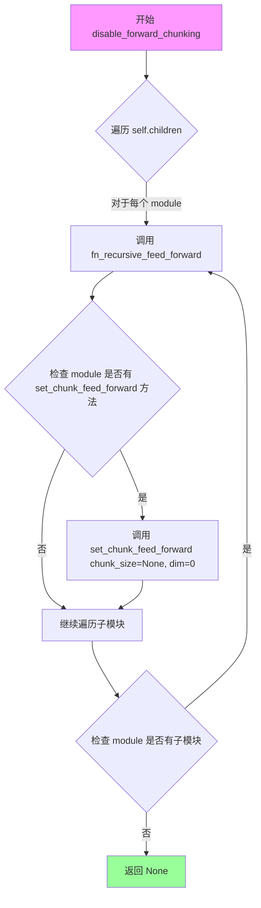
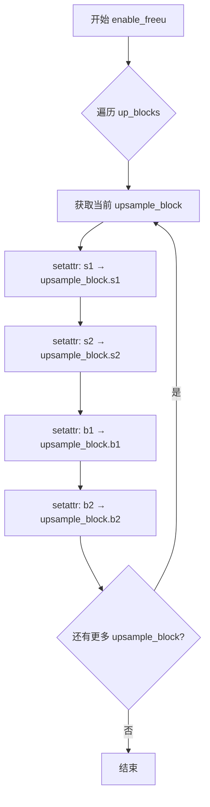
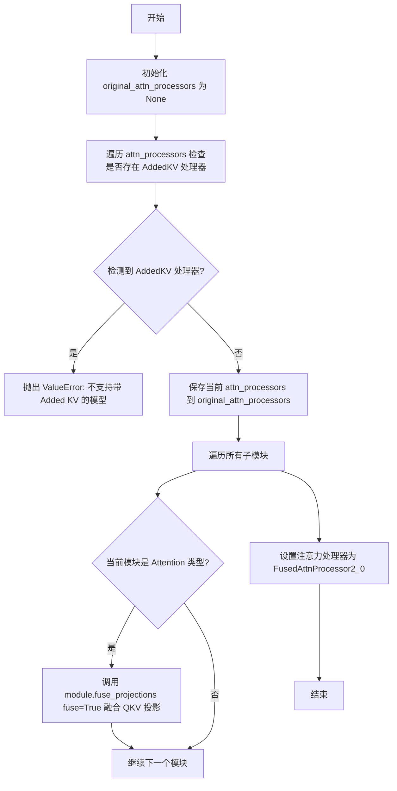
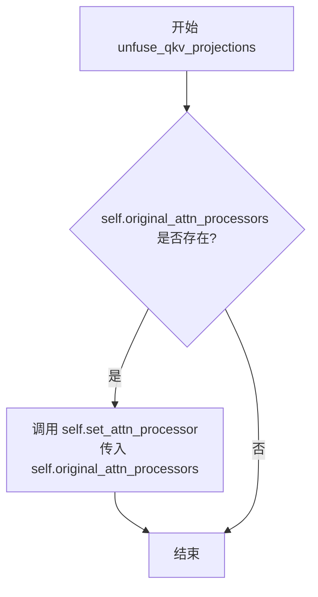
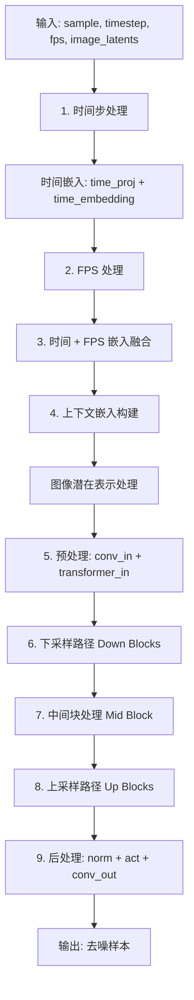

# `diffusers\src\diffusers\models\unets\unet_i2vgen_xl.py` 详细设计文档

I2VGenXL UNet 是一个条件3D UNet模型，用于图像到视频（Image-to-Video）生成任务。该模型接收噪声样本、时间步长、fps条件、图像潜在表示和文本/图像嵌入作为输入，通过多级下采样、中间块处理和多级上采样过程，输出与输入形状匹配的去噪视频样本。模型集成了时间编码器处理帧间时序信息，并支持FreeU、注意力处理器融合等高级特性。

## 整体流程

```mermaid
graph TD
    A[开始: 输入 sample, timestep, fps, image_latents, image_embeddings, encoder_hidden_states] --> B[1. 时间嵌入处理]
    B --> C[2. FPS 嵌入处理]
    C --> D[3. 融合时间和FPS嵌入并扩展到帧维度]
    D --> E[4. 上下文嵌入构建]
    E --> F[5. 图像潜在表示处理]
    F --> G[6. 输入卷积和Transformer时序处理]
    G --> H[7. 下采样阶段]
    H --> I{是否存在cross attention}
    I -- 是 --> J[带cross attention的下采样块]
    I -- 否 --> K[普通下采样块]
    J --> L[收集残差连接]
    K --> L
    L --> M[8. 中间块处理]
    M --> N[9. 上采样阶段]
    N --> O{是否为最后一层}
    O -- 否 --> P[上采样并融合残差]
    O -- 是 --> Q[仅融合残差]
    P --> R[10. 后处理: GroupNorm -> SiLU -> Conv2d]
    Q --> R
    R --> S[11. reshape输出为(batch, channel, framerate, width, height)]
    S --> T[返回 UNet3DConditionOutput 或 tuple]
```

## 类结构

```
ModelMixin (抽象基类)
├── AttentionMixin (注意力混入)
├── ConfigMixin (配置混入)
├── UNet2DConditionLoadersMixin (UNet加载器混入)
└── I2VGenXLUNet (主模型类)
    ├── I2VGenXLTransformerTemporalEncoder (时序编码器)
    ├── TransformerTemporalModel (Transformer时序模型)
    ├── nn.ModuleList[down_blocks] (下采样块列表)
    ├── nn.ModuleList[up_blocks] (上采样块列表)
    └── UNetMidBlock3DCrossAttn (中间块)
```

## 全局变量及字段


### `logger`
    
模块级日志记录器

类型：`logging.Logger`
    


### `I2VGenXLTransformerTemporalEncoder.norm1`
    
第一层归一化

类型：`nn.LayerNorm`
    


### `I2VGenXLTransformerTemporalEncoder.attn1`
    
自注意力层

类型：`Attention`
    


### `I2VGenXLTransformerTemporalEncoder.ff`
    
前馈网络层

类型：`FeedForward`
    


### `I2VGenXLUNet.conv_in`
    
输入卷积层

类型：`nn.Conv2d`
    


### `I2VGenXLUNet.transformer_in`
    
时序Transformer

类型：`TransformerTemporalModel`
    


### `I2VGenXLUNet.image_latents_proj_in`
    
图像潜在表示投影

类型：`nn.Sequential`
    


### `I2VGenXLUNet.image_latents_temporal_encoder`
    
图像时序编码器

类型：`I2VGenXLTransformerTemporalEncoder`
    


### `I2VGenXLUNet.image_latents_context_embedding`
    
图像上下文嵌入

类型：`nn.Sequential`
    


### `I2VGenXLUNet.time_proj`
    
时间投影

类型：`Timesteps`
    


### `I2VGenXLUNet.time_embedding`
    
时间嵌入层

类型：`TimestepEmbedding`
    


### `I2VGenXLUNet.context_embedding`
    
上下文嵌入层

类型：`nn.Sequential`
    


### `I2VGenXLUNet.fps_embedding`
    
FPS嵌入层

类型：`nn.Sequential`
    


### `I2VGenXLUNet.down_blocks`
    
下采样块列表

类型：`nn.ModuleList`
    


### `I2VGenXLUNet.up_blocks`
    
上采样块列表

类型：`nn.ModuleList`
    


### `I2VGenXLUNet.mid_block`
    
中间块

类型：`UNetMidBlock3DCrossAttn`
    


### `I2VGenXLUNet.num_upsamplers`
    
上采样器数量

类型：`int`
    


### `I2VGenXLUNet.conv_norm_out`
    
输出归一化

类型：`nn.GroupNorm`
    


### `I2VGenXLUNet.conv_act`
    
输出激活函数

类型：`activation`
    


### `I2VGenXLUNet.conv_out`
    
输出卷积层

类型：`nn.Conv2d`
    


### `I2VGenXLUNet.original_attn_processers`
    
原始注意力处理器存储

类型：`Optional[dict]`
    
    

## 全局函数及方法


### `I2VGenXLTransformerTemporalEncoder.forward`

该方法是 `I2VGenXLTransformerTemporalEncoder` 类的前向传播方法，实现了一个轻量级的时间编码器块，包含自注意力机制和前馈网络，用于处理图像潜变量的时序信息。

参数：

- `hidden_states`：`torch.Tensor`，输入的隐藏状态张量，通常为经过投影的图像潜变量，形状为 (batch_size, channels, num_frames, height, width) 或 (batch, seq_len, dim)

返回值：`torch.Tensor`，经过注意力机制和前馈网络处理后的隐藏状态张量，形状与输入可能不同（取决于是否执行了 squeeze 操作）

#### 流程图

```mermaid
flowchart TD
    A[输入 hidden_states] --> B[LayerNorm: self.norm1]
    B --> C[Self-Attention: self.attn1]
    C --> D[残差连接: attn_output + hidden_states]
    D --> E{hidden_states.ndim == 4?}
    E -->|Yes| F[squeeze(1) 移除帧维度]
    E -->|No| G[保持不变]
    F --> H[FeedForward: self.ff]
    G --> H
    H --> I[残差连接: ff_output + hidden_states]
    I --> J{hidden_states.ndim == 4?}
    J -->|Yes| K[squeeze(1) 移除帧维度]
    J -->|No| L[保持不变]
    K --> M[返回 hidden_states]
    L --> M
```

#### 带注释源码

```python
def forward(
    self,
    hidden_states: torch.Tensor,
) -> torch.Tensor:
    # Step 1: 对输入 hidden_states 进行 LayerNorm 归一化
    # 这一步有助于稳定训练过程，提供更好的梯度流动
    norm_hidden_states = self.norm1(hidden_states)
    
    # Step 2: 自注意力机制处理
    # encoder_hidden_states=None 表示这是自注意力（self-attention）
    # 注意: 原始实现中这里传入 encoder_hidden_states=None，这是该类的一个简化设计
    attn_output = self.attn1(norm_hidden_states, encoder_hidden_states=None)
    
    # Step 3: 残差连接（Residual Connection）
    # 将注意力输出与原始输入相加，有助于梯度流动并防止梯度消失
    hidden_states = attn_output + hidden_states
    
    # Step 4: 条件维度压缩
    # 如果 hidden_states 是4维张量 (batch, dim, frames, seq)
    # 则通过 squeeze(1) 移除中间维度，实现从 (B, D, T, N) -> (B, T, N) 的转换
    # 这是因为某些输入可能是4D的，但后续处理需要3D张量
    if hidden_states.ndim == 4:
        hidden_states = hidden_states.squeeze(1)

    # Step 5: 前馈网络（Feed Forward Network）处理
    # 提供非线性变换和特征提取能力
    ff_output = self.ff(hidden_states)
    
    # Step 6: 残差连接
    # 再次使用残差连接，合并前馈网络的输出
    hidden_states = ff_output + hidden_states
    
    # Step 7: 再次条件维度压缩
    # 同样地，如果需要则移除帧维度，确保输出维度一致性
    if hidden_states.ndim == 4:
        hidden_states = hidden_states.squeeze(1)

    # Step 8: 返回处理后的隐藏状态
    return hidden_states
```


### `I2VGenXLUNet.enable_forward_chunking`

启用前向分块（Forward Chunking）功能，通过设置注意力处理器的分块前馈计算模式来减少大型模型推理时的显存占用。

参数：

- `chunk_size`：`int | None`，前馈层的分块大小。若不指定，则默认为 1，即对 dim 指定维度的每个张量单独执行前馈计算。
- `dim`：`int`，执行分块计算的维度。只能为 0（batch 维度）或 1（序列长度维度）。

返回值：`None`，该方法直接修改模型内部状态，不返回任何值。

#### 流程图

```mermaid
flowchart TD
    A[开始 enable_forward_chunking] --> B{检查 dim 是否在 [0, 1] 范围内}
    B -->|是| C[设置 chunk_size 默认值为 1]
    B -->|否| D[抛出 ValueError 异常]
    
    C --> E[定义递归函数 fn_recursive_feed_forward]
    E --> F[遍历当前模块的所有子模块]
    
    F --> G{子模块是否有 set_chunk_feed_forward 方法?}
    G -->|是| H[调用 set_chunk_feed_forward 设置分块参数]
    G -->|否| I[继续遍历子模块的子模块]
    
    H --> I
    I --> J{是否还有未遍历的子模块?}
    J -->|是| F
    J -->|否| K[结束]
    
    D --> K
```

#### 带注释源码

```python
def enable_forward_chunking(self, chunk_size: int | None = None, dim: int = 0) -> None:
    """
    设置注意力处理器使用 [feed forward
    chunking](https://huggingface.co/blog/reformer#2-chunked-feed-forward-layers) 技术。

    Parameters:
        chunk_size (`int`, *optional*):
            前馈层的分块大小。如果不指定，则默认对 dim 指定维度的每个张量单独执行前馈计算。
        dim (`int`, *optional*, defaults to `0`):
            执行分块计算的维度。可选 0（batch 维度）或 1（序列长度维度）。
    """
    # 验证 dim 参数必须在 0 或 1 之间
    if dim not in [0, 1]:
        raise ValueError(f"Make sure to set `dim` to either 0 or 1, not {dim}")

    # 默认分块大小为 1，即逐个处理
    chunk_size = chunk_size or 1

    # 定义递归函数，遍历所有子模块并设置分块前馈参数
    def fn_recursive_feed_forward(module: torch.nn.Module, chunk_size: int, dim: int):
        # 如果模块支持分块前馈设置，则调用其方法
        if hasattr(module, "set_chunk_feed_forward"):
            module.set_chunk_feed_forward(chunk_size=chunk_size, dim=dim)

        # 递归遍历子模块
        for child in module.children():
            fn_recursive_feed_forward(child, chunk_size, dim)

    # 遍历模型的所有顶层子模块
    for module in self.children():
        fn_recursive_feed_forward(module, chunk_size, dim)
```


### `I2VGenXLUNet.disable_forward_chunking`

禁用前向分块功能，关闭模型的 feed-forward 层分块计算，使得前向传播不再采用分块方式处理数据。

参数：
- 该方法无显式参数（除隐式 `self`）

返回值：`None`，无返回值

#### 流程图



#### 带注释源码

```python
def disable_forward_chunking(self) -> None:
    """
    禁用前向分块功能。
    该方法通过递归遍历模型的所有子模块，将每个支持分块的前馈层的
    chunk_size 设置为 None，从而关闭前向分块计算模式。
    """
    # 定义内部递归函数，用于遍历模型的所有子模块
    def fn_recursive_feed_forward(module: torch.nn.Module, chunk_size: int, dim: int):
        # 检查当前模块是否支持设置分块大小
        if hasattr(module, "set_chunk_feed_forward"):
            # 调用模块的分块设置方法，传入 chunk_size=None 禁用分块
            module.set_chunk_feed_forward(chunk_size=chunk_size, dim=dim)

        # 递归遍历当前模块的所有子模块
        for child in module.children():
            fn_recursive_feed_forward(child, chunk_size, dim)

    # 遍历模型的所有顶层子模块
    for module in self.children():
        # 对每个子模块调用递归函数，chunk_size=None 禁用分块，dim=0 表示按批次维度
        fn_recursive_feed_forward(module, None, 0)
```


### `I2VGenXLUNet.set_default_attn_processor`

该方法用于禁用自定义注意力处理器，并将默认注意力实现设置为标准的注意力处理器。它会根据当前已注册的注意力处理器类型，自动选择合适的默认处理器（AttnAddedKVProcessor 或 AttnProcessor），然后调用 set_attn_processor 进行设置。

参数： 无

返回值：`None`，无返回值，仅修改模型内部状态

#### 流程图

```mermaid
flowchart TD
    A[开始 set_default_attn_processor] --> B{检查所有 attn_processors}
    B --> C{所有处理器都是 ADDED_KV_ATTENTION_PROCESSORS?}
    C -->|是| D[processor = AttnAddedKVProcessor]
    C -->|否| E{所有处理器都是 CROSS_ATTENTION_PROCESSORS?}
    E -->|是| F[processor = AttnProcessor]
    E -->|否| G[抛出 ValueError 异常]
    D --> H[调用 self.set_attn_processor(processor)]
    F --> H
    G --> I[结束]
    H --> I
    
    style D fill:#90EE90
    style F fill:#90EE90
    style G fill:#FFB6C1
```

#### 带注释源码

```python
def set_default_attn_processor(self):
    """
    Disables custom attention processors and sets the default attention implementation.
    禁用自定义注意力处理器并设置默认注意力实现。
    """
    # 检查当前所有注意力处理器是否都属于 ADDED_KV_ATTENTION_PROCESSORS 类型
    # ADDED_KV_ATTENTION_PROCESSORS 是支持额外 KV 注入的注意力处理器集合
    if all(proc.__class__ in ADDED_KV_ATTENTION_PROCESSORS for proc in self.attn_processors.values()):
        # 如果所有处理器都是添加 KV 类型的，则使用 AttnAddedKVProcessor 作为默认处理器
        processor = AttnAddedKVProcessor()
    # 检查当前所有注意力处理器是否都属于 CROSS_ATTENTION_PROCESSORS 类型
    # CROSS_ATTENTION_PROCESSORS 是标准交叉注意力处理器集合
    elif all(proc.__class__ in CROSS_ATTENTION_PROCESSORS for proc in self.attn_processors.values()):
        # 如果所有处理器都是交叉注意力类型的，则使用 AttnProcessor 作为默认处理器
        processor = AttnProcessor()
    else:
        # 如果处理器类型混合或不匹配，抛出 ValueError 异常
        # 这种情况表示存在不支持自动转换的自定义处理器
        raise ValueError(
            f"Cannot call `set_default_attn_processor` when attention processors are of type {next(iter(self.attn_processors.values()))}"
        )

    # 调用模型内部方法，使用选定的默认处理器替换所有注意力处理器
    # 这会将整个 UNet 的注意力机制恢复到默认实现
    self.set_attn_processor(processor)
```


### `I2VGenXLUNet.enable_freeu`

该方法用于启用 FreeU 机制，通过对跳跃连接特征和主干特征进行缩放来减轻图像生成过程中的"过度平滑效应"。FreeU 机制通过两个阶段的缩放因子（s1/s2 用于衰减跳跃特征，b1/b2 用于放大主干特征）来平衡细节保留与噪声抑制。

参数：

- `s1`：`float`，第一阶段（stage 1）的缩放因子，用于衰减跳跃特征的贡献，以减轻去噪过程中的过度平滑效应
- `s2`：`float`，第二阶段（stage 2）的缩放因子，用于衰减跳跃特征的贡献，以减轻去噪过程中的过度平滑效应
- `b1`：`float`，第一阶段（stage 1）的缩放因子，用于放大主干特征的贡献，增强特征表达能力
- `b2`：`float`，第二阶段（stage 2）的缩放因子，用于放大主干特征的贡献，增强特征表达能力

返回值：`None`，无返回值，该方法直接修改模型内部状态

#### 流程图



#### 带注释源码

```python
# Copied from diffusers.models.unets.unet_2d_condition.UNet2DConditionModel.enable_freeu
def enable_freeu(self, s1, s2, b1, b2):
    r"""Enables the FreeU mechanism from https://huggingface.co/papers/2309.11497.

    The suffixes after the scaling factors represent the stage blocks where they are being applied.

    Please refer to the [official repository](https://github.com/ChenyangSi/FreeU) for combinations of values that
    are known to work well for different pipelines such as Stable Diffusion v1, v2, and Stable Diffusion XL.

    Args:
        s1 (`float`):
            Scaling factor for stage 1 to attenuate the contributions of the skip features. This is done to
            mitigate the "oversmoothing effect" in the enhanced denoising process.
        s2 (`float`):
            Scaling factor for stage 2 to attenuate the contributions of the skip features. This is done to
            mitigate the "oversmoothing effect" in the enhanced denoising process.
        b1 (`float`): Scaling factor for stage 1 to amplify the contributions of backbone features.
        b2 (`float`): Scaling factor for stage 2 to amplify the contributions of backbone features.
    """
    # 遍历所有上采样块（up_blocks）
    # FreeU 机制需要在每个上采样阶段应用不同的缩放因子
    for i, upsample_block in enumerate(self.up_blocks):
        # 设置第一阶段缩放因子 s1：衰减跳跃特征
        setattr(upsample_block, "s1", s1)
        # 设置第二阶段缩放因子 s2：衰减跳跃特征
        setattr(upsample_block, "s2", s2)
        # 设置第一阶段缩放因子 b1：放大主干特征
        setattr(upsample_block, "b1", b1)
        # 设置第二阶段缩放因子 b2：放大主干特征
        setattr(upsample_block, "b2", b2)
```


### `I2VGenXLUNet.disable_freeu`

该方法用于禁用FreeU机制，将上采样块中的FreeU相关属性（s1, s2, b1, b2）设置为None。

参数：

- 无参数（仅包含self参数）

返回值：`None`，无返回值

#### 流程图

```mermaid
flowchart TD
    A[开始 disable_freeu] --> B[定义freeu_keys为集合 {'s1', 's2', 'b1', 'b2'}]
    B --> C[遍历self.up_blocks中的每个upsample_block]
    C --> D[遍历freeu_keys中的每个键k]
    D --> E{检查upsample_block是否有属性k或属性k的值不为None}
    E -->|是| F[使用setattr将upsample_block的k属性设为None]
    E -->|否| G[继续下一个键]
    F --> G
    G --> H{是否还有未遍历的键?}
    H -->|是| D
    H -->|否| I{是否还有未遍历的upsample_block?}
    I -->|是| C
    I -->|结束| J[返回None]
```

#### 带注释源码

```python
def disable_freeu(self):
    """Disables the FreeU mechanism."""
    # 定义需要清除的FreeU相关属性键
    freeu_keys = {"s1", "s2", "b1", "b2"}
    
    # 遍历所有的上采样块（up_blocks）
    for i, upsample_block in enumerate(self.up_blocks):
        # 遍历每个FreeU属性键
        for k in freeu_keys:
            # 检查上采样块是否有该属性，或者属性值不为None
            if hasattr(upsample_block, k) or getattr(upsample_block, k, None) is not None:
                # 将该属性设置为None以禁用FreeU机制
                setattr(upsample_block, k, None)
```


### I2VGenXLUNet.fuse_qkv_projections

该方法用于启用融合的QKV投影，用于优化推理性能。对于自注意力模块，将query、key、value的投影矩阵融合为一个矩阵；对于交叉注意力模块，只融合key和value的投影矩阵。此操作会修改注意力处理器为融合版本。

参数：无（仅使用 self）

返回值：`None`，无返回值描述

#### 流程图



#### 带注释源码

```python
def fuse_qkv_projections(self) -> None:
    """
    启用融合的 QKV 投影。
    对于自注意力模块，所有投影矩阵（query、key、value）将被融合。
    对于交叉注意力模块，仅融合 key 和 value 投影矩阵。
    
    注意: 此 API 为实验性功能。
    """
    # 初始化原始注意力处理器引用为 None
    self.original_attn_processors = None

    # 遍历所有注意力处理器，检查是否存在 AddedKV 类型处理器
    # 如果存在则抛出异常，因为融合 QKV 不支持此类处理器
    for _, attn_processor in self.attn_processors.items():
        if "Added" in str(attn_processor.__class__.__name__):
            raise ValueError("`fuse_qkv_projections()` is not supported for models having added KV projections.")

    # 保存当前的注意力处理器，以便后续可以恢复（通过 unfuse_qkv_projections）
    self.original_attn_processors = self.attn_processors

    # 遍历模型中的所有模块
    for module in self.modules():
        # 检查模块是否为 Attention 类型
        if isinstance(module, Attention):
            # 调用 Attention 模块的 fuse_projections 方法进行 QKV 融合
            module.fuse_projections(fuse=True)

    # 将所有注意力处理器替换为 FusedAttnProcessor2_0
    # 这是一个优化的注意力处理器，支持融合后的 QKV 投影计算
    self.set_attn_processor(FusedAttnProcessor2_0())
```


### `I2VGenXLUNet.unfuse_qkv_projections`

解除QKV投影融合，将注意力处理器从融合模式（`FusedAttnProcessor2_0`）恢复为融合前的原始处理器状态。

参数：

- 无（仅 `self` 隐式参数）

返回值：`None`，无返回值

#### 流程图



#### 带注释源码

```python
# Copied from diffusers.models.unets.unet_2d_condition.UNet2DConditionModel.unfuse_qkv_projections
def unfuse_qkv_projections(self):
    """Disables the fused QKV projection if enabled.

    > [!WARNING] > This API is 🧪 experimental.

    """
    # 检查是否之前已经融合了QKV投影（即 original_attn_processors 不为 None）
    if self.original_attn_processors is not None:
        # 恢复原始的注意力处理器，将模型从融合模式切换回原始模式
        self.set_attn_processor(self.original_attn_processors)
```


### I2VGenXLUNet.forward

I2VGenXLUNet 的前向传播方法，接收带噪声的视频样本、时间步、帧率、图像潜在表示和文本/图像嵌入，执行 3D U-Net 条件扩散过程，输出去噪后的视频样本或 UNet3DConditionOutput 对象。

参数：

- `self`：`I2VGenXLUNet` 类实例本身
- `sample`：`torch.Tensor`，带噪声的输入张量，形状为 `(batch, num_frames, channel, height, width)`
- `timestep`：`torch.Tensor | float | int`，去噪输入的时间步
- `fps`：`torch.Tensor`，生成的视频的帧率，用于"微条件"
- `image_latents`：`torch.Tensor`，来自 VAE 的图像编码
- `image_embeddings`：`torch.Tensor | None`，条件图像的计算投影嵌入（可选）
- `encoder_hidden_states`：`torch.Tensor | None`，编码器隐藏状态，形状为 `(batch, sequence_length, feature_dim)`（可选）
- `timestep_cond`：`torch.Tensor | None`，时间步条件张量（可选）
- `cross_attention_kwargs`：`dict[str, Any] | None`，传递给 AttentionProcessor 的 kwargs 字典（可选）
- `return_dict`：`bool`，默认为 True，是否返回 `UNet3DConditionOutput` 而不是普通元组

返回值：`UNet3DConditionOutput | tuple[torch.Tensor]`，如果 `return_dict` 为 True，返回 `UNet3DConditionOutput`，否则返回元组，第一个元素是样本张量

#### 流程图



#### 带注释源码

```python
def forward(
    self,
    sample: torch.Tensor,              # 带噪声输入: (batch, num_frames, channel, height, width)
    timestep: torch.Tensor | float | int,  # 时间步
    fps: torch.Tensor,                  # 帧率 "微条件"
    image_latents: torch.Tensor,       # VAE 图像编码
    image_embeddings: torch.Tensor | None = None,  # 图像投影嵌入
    encoder_hidden_states: torch.Tensor | None = None,  # 文本嵌入
    timestep_cond: torch.Tensor | None = None,  # 时间步条件
    cross_attention_kwargs: dict[str, Any] | None = None,  # 注意力 kwargs
    return_dict: bool = True,           # 是否返回对象
) -> UNet3DConditionOutput | tuple[torch.Tensor]:
    # 获取输入维度信息
    batch_size, channels, num_frames, height, width = sample.shape

    # 计算上采样因子（默认 2^上采样层数）
    default_overall_up_factor = 2**self.num_upsamplers

    # 检查是否需要转发上采样尺寸
    forward_upsample_size = False
    upsample_size = None
    if any(s % default_overall_up_factor != 0 for s in sample.shape[-2:]):
        logger.info("Forward upsample size to force interpolation output size.")
        forward_upsample_size = True

    # === 1. 时间步处理 ===
    timesteps = timestep
    if not torch.is_tensor(timesteps):
        # 转换为张量
        is_mps = sample.device.type == "mps"
        is_npu = sample.device.type == "npu"
        if isinstance(timesteps, float):
            dtype = torch.float32 if (is_mps or is_npu) else torch.float64
        else:
            dtype = torch.int32 if (is_mps or is_npu) else torch.int64
        timesteps = torch.tensor([timesteps], dtype=dtype, device=sample.device)
    elif len(timesteps.shape) == 0:
        timesteps = timesteps[None].to(sample.device)
    
    # 广播到 batch 维度
    timesteps = timesteps.expand(sample.shape[0])
    t_emb = self.time_proj(timesteps)  # 时间投影
    t_emb = t_emb.to(dtype=self.dtype)
    t_emb = self.time_embedding(t_emb, timestep_cond)  # 时间嵌入

    # === 2. FPS 处理 ===
    fps = fps.expand(fps.shape[0])
    fps_emb = self.fps_embedding(self.time_proj(fps).to(dtype=self.dtype))

    # === 3. 时间 + FPS 嵌入融合 ===
    emb = t_emb + fps_emb
    emb = emb.repeat_interleave(num_frames, dim=0, output_size=emb.shape[0] * num_frames)

    # === 4. 上下文嵌入构建 ===
    # 包含文本嵌入和图像嵌入
    context_emb = sample.new_zeros(batch_size, 0, self.config.cross_attention_dim)
    context_emb = torch.cat([context_emb, encoder_hidden_states], dim=1)

    # 图像潜在表示的上下文嵌入
    image_latents_for_context_embds = image_latents[:, :, :1, :]
    image_latents_context_embs = image_latents_for_context_embds.permute(0, 2, 1, 3, 4).reshape(
        image_latents_for_context_embds.shape[0] * image_latents_for_context_embds.shape[2],
        image_latents_for_context_embds.shape[1],
        image_latents_for_context_embds.shape[3],
        image_latents_for_context_embds.shape[4],
    )
    image_latents_context_embs = self.image_latents_context_embedding(image_latents_context_embs)

    _batch_size, _channels, _height, _width = image_latents_context_embs.shape
    image_latents_context_embs = image_latents_context_embs.permute(0, 2, 3, 1).reshape(
        _batch_size, _height * _width, _channels
    )
    context_emb = torch.cat([context_emb, image_latents_context_embs], dim=1)

    # 图像嵌入处理
    image_emb = self.context_embedding(image_embeddings)
    image_emb = image_emb.view(-1, self.config.in_channels, self.config.cross_attention_dim)
    context_emb = torch.concat([context_emb, image_emb], dim=1)
    context_emb = context_emb.repeat_interleave(num_frames, dim=0, output_size=context_emb.shape[0] * num_frames)

    # 图像潜在表示的时序编码
    image_latents = image_latents.permute(0, 2, 1, 3, 4).reshape(
        image_latents.shape[0] * image_latents.shape[2],
        image_latents.shape[1],
        image_latents.shape[3],
        image_latents.shape[4],
    )
    image_latents = self.image_latents_proj_in(image_latents)
    image_latents = (
        image_latents[None, :]
        .reshape(batch_size, num_frames, channels, height, width)
        .permute(0, 3, 4, 1, 2)
        .reshape(batch_size * height * width, num_frames, channels)
    )
    image_latents = self.image_latents_temporal_encoder(image_latents)
    image_latents = image_latents.reshape(batch_size, height, width, num_frames, channels).permute(0, 4, 3, 1, 2)

    # === 5. 预处理 ===
    sample = torch.cat([sample, image_latents], dim=1)
    sample = sample.permute(0, 2, 1, 3, 4).reshape((sample.shape[0] * num_frames, -1) + sample.shape[3:])
    sample = self.conv_in(sample)
    sample = self.transformer_in(
        sample,
        num_frames=num_frames,
        cross_attention_kwargs=cross_attention_kwargs,
        return_dict=False,
    )[0]

    # === 6. 下采样路径 (Down Blocks) ===
    down_block_res_samples = (sample,)
    for downsample_block in self.down_blocks:
        if hasattr(downsample_block, "has_cross_attention") and downsample_block.has_cross_attention:
            sample, res_samples = downsample_block(
                hidden_states=sample,
                temb=emb,
                encoder_hidden_states=context_emb,
                num_frames=num_frames,
                cross_attention_kwargs=cross_attention_kwargs,
            )
        else:
            sample, res_samples = downsample_block(hidden_states=sample, temb=emb, num_frames=num_frames)

        down_block_res_samples += res_samples

    # === 7. 中间块处理 (Mid Block) ===
    if self.mid_block is not None:
        sample = self.mid_block(
            sample,
            emb,
            encoder_hidden_states=context_emb,
            num_frames=num_frames,
            cross_attention_kwargs=cross_attention_kwargs,
        )

    # === 8. 上采样路径 (Up Blocks) ===
    for i, upsample_block in enumerate(self.up_blocks):
        is_final_block = i == len(self.up_blocks) - 1

        res_samples = down_block_res_samples[-len(upsample_block.resnets) :]
        down_block_res_samples = down_block_res_samples[: -len(upsample_block.resnets)]

        if not is_final_block and forward_upsample_size:
            upsample_size = down_block_res_samples[-1].shape[2:]

        if hasattr(upsample_block, "has_cross_attention") and upsample_block.has_cross_attention:
            sample = upsample_block(
                hidden_states=sample,
                temb=emb,
                res_hidden_states_tuple=res_samples,
                encoder_hidden_states=context_emb,
                upsample_size=upsample_size,
                num_frames=num_frames,
                cross_attention_kwargs=cross_attention_kwargs,
            )
        else:
            sample = upsample_block(
                hidden_states=sample,
                temb=emb,
                res_hidden_states_tuple=res_samples,
                upsample_size=upsample_size,
                num_frames=num_frames,
            )

    # === 9. 后处理 ===
    sample = self.conv_norm_out(sample)
    sample = self.conv_act(sample)
    sample = self.conv_out(sample)

    # reshape: (batch, channel, framerate, width, height)
    sample = sample[None, :].reshape((-1, num_frames) + sample.shape[1:]).permute(0, 2, 1, 3, 4)

    # 返回结果
    if not return_dict:
        return (sample,)

    return UNet3DConditionOutput(sample=sample)
```

## 关键组件


### I2VGenXLTransformerTemporalEncoder

用于处理图像到视频生成任务中的时间维度特征的时间编码器模块，包含层归一化、自注意力机制和前馈网络，对输入的隐藏状态进行时间序列建模。

### I2VGenXLUNet

条件3D UNet模型，主干网络架构，接收噪声样本、条件状态（图像latents和图像嵌入）和时间步，返回视频帧形式的输出。继承自ModelMixin、AttentionMixin、ConfigMixin和UNet2DConditionLoadersMixin。

### 张量索引与形状变换

在forward方法中实现了复杂的维度变换：样本从(batch, channel, num_frames, height, width)经permute和reshape操作转换为(batch*num_frames, channels, height, width)；image_latents进行维度重排以适应不同的处理阶段；最终输出通过reshape和permute恢复为(batch, channel, num_frames, width, height)格式。

### 反量化支持

通过导入ADDED_KV_ATTENTION_PROCESSORS、CROSS_ATTENTION_PROCESSORS、AttnProcessor、AttnAddedKVProcessor和FusedAttnProcessor2_0等注意力处理器类，支持多种注意力机制的实现，包括自定义注意力处理器的融合与分离（fuse_qkv_projections/unfuse_qkv_projections）。

### 图像Latents处理管道

包含三个关键组件：image_latents_proj_in（卷积投影层，将4通道图像latents映射到in_channels维度）、image_latents_temporal_encoder（时间编码器处理时间维度信息）、image_latents_context_embedding（上下文嵌入生成，将图像latents转换为交叉注意力所需的上下文特征）。

### 时间与FPS嵌入层

time_proj将时间步投影到嵌入空间，TimestepEmbedding将投影结果映射到高维时间嵌入；fps_embedding专门处理帧率条件，以"微条件"形式影响视频生成的时间特性。

### 上下文嵌入生成

context_embedding网络将图像嵌入投影到与文本嵌入相同的维度空间，与encoder_hidden_states（文本条件）拼接后形成完整的上下文表示，用于交叉注意力机制。

### 3D卷积与下采样块

使用Conv2d处理输入（带图像latents拼接）、TransformerTemporalModel处理时序信息；down_blocks和up_blocks分别实现3D下采样和上采样路径，包含CrossAttnDownBlock3D、CrossAttnUpBlock3D等块类型，支持跳跃连接和交叉注意力。

### FreeU机制

enable_freeu和disable_freeu方法实现了FreeU后处理机制，通过s1、s2、b1、b2缩放因子调节跳跃特征和主干特征的贡献，缓解过度平滑效应。

### 前向分块策略

enable_forward_chunking和disable_forward_chunking方法实现前馈网络分块计算，通过set_chunk_feed_forward递归设置子模块的块大小，优化内存使用。


## 问题及建议


### 已知问题

- **历史遗留的类型混淆**：注释中提到错误地使用 `num_attention_heads` 来表示 `attention_head_dim`，这是早期集成的历史遗留问题，导致 API 语义不清晰
- **硬编码的超参数**：`TransformerTemporalModel` 在初始化时硬编码了 `num_attention_heads=8`、`num_layers=1`、`norm_num_groups` 等参数，缺乏灵活性
- **重复代码**：`enable_forward_chunking` 和 `disable_forward_chunking` 方法内部逻辑几乎完全重复，仅参数不同
- **动态属性风险**：`enable_freeu` 和 `disable_freeu` 方法使用 `setattr` 动态设置属性（s1、s2、b1、b2），缺乏类型安全且 IDE 无法静态分析
- **缺失梯度检查点支持**：`_supports_gradient_checkpointing = False` 禁用了梯度检查点，但对于大模型可能会导致显存不足
- **张量设备转换隐患**：代码中对 MPS 和 NPU 设备有特殊处理，但 `time_proj` 和 `time_embedding` 的 dtype 转换逻辑分散，容易在不同设备上出现精度问题
- **内存占用风险**：`forward` 方法中存在大量张量 reshape 和 permute 操作，特别是 `repeat_interleave` 可能导致内存峰值过高

### 优化建议

- **重构类型语义**：澄清 `attention_head_dim` 和 `num_attention_heads` 的使用，统一 API 语义
- **提取公共方法**：将 `enable_forward_chunking` 和 `disable_forward_chunking` 的公共逻辑提取为辅助函数
- **增加配置接口**：将 `TransformerTemporalModel` 的硬编码参数改为可配置项，通过 `__init__` 参数传入
- **类型安全改进**：`enable_freeu`/`disable_freeu` 改用显式属性声明或配置类，替代动态 setattr
- **启用梯度检查点**：评估将 `_supports_gradient_checkpointing` 设为 True 以支持大模型训练
- **内存优化**：考虑使用 `torch.inference_mode` 或 `torch.no_grad` 包装推理代码，避免不必要的梯度存储

## 其它


### 设计目标与约束

本模型（I2VGenXLUNet）旨在实现高质量的图像到视频（Image-to-Video）生成任务。设计目标包括：1）支持条件3D UNet架构，能够处理带噪声的样本、条件状态和时间步长；2）集成时间编码器和空间变换器，以处理视频帧的时间维度和空间维度；3）支持多种注意力机制（包括自注意力和交叉注意力）；4）遵循Diffusers库的模块化设计规范。约束条件包括：输入样本尺寸需为2的幂次方倍数（受上采样因子2^num_upsamplers限制）；交叉注意力维度需与配置匹配；时间嵌入维度必须为block_out_channels[0]的4倍。

### 错误处理与异常设计

模型在初始化阶段进行多项输入验证：检查down_block_types与up_block_types数量是否匹配；验证block_out_channels与down_block_types数量一致；确保num_attention_heads与down_block_types数量匹配或为整数类型。forward方法中对timestep进行类型检查和设备同步处理，支持tensor、float、int三种输入形式。对于不支持的注意力处理器类型（如AddedKVProcessor），fuse_qkv_projections方法会抛出ValueError。设备类型检查覆盖mps和npu场景，确保数据类型转换兼容性。

### 数据流与状态机

数据流遵循以下主要阶段：1）时间步处理：将timestep转换为embedding并与fps embedding融合；2）上下文构建：合并encoder_hidden_states、image_latents_context_embs和image_embeddings；3）图像latent处理：通过image_latents_proj_in投影和image_latents_temporal_encoder编码；4）预处理：沿时间维度重塑样本并通过conv_in和transformer_in；5）下采样阶段：依次通过各down_blocks收集残差样本；6）中端处理：通过mid_block；7）上采样阶段：结合残差样本逐步上采样；8）后处理：归一化、激活、卷积输出并重塑为(batch, channel, framerate, width, height)格式。

### 外部依赖与接口契约

核心依赖包括：torch和torch.nn提供基础张量操作和神经网络模块；configuration_utils.ConfigMixin和register_to_config提供配置注册机制；loaders.UNet2DConditionLoadersMixin提供UNet加载器功能；activations.get_activation提供激活函数选择；attention.Attention和AttentionMixin提供注意力实现；embeddings.TimestepEmbedding和Timesteps提供时间嵌入；modeling_utils.ModelMixin提供模型基础功能；transformers.transformer_temporal.TransformerTemporalModel提供时间变换器。输入契约：sample.shape需为(batch, channels, num_frames, height, width)；timestep支持torch.Tensor/float/int类型；fps为torch.Tensor；image_latents为VAE编码的图像latent；encoder_hidden_states为文本embedding。输出契约：返回UNet3DConditionOutput包含sample张量，形状为(batch, out_channels, num_frames, height, width)。

### 配置参数详解

sample_size控制输入输出高度和宽度；in_channels和out_channels控制输入输出通道数；down_block_types和up_block_types指定上下采样块类型；block_out_channels定义各块输出通道；layers_per_block指定每块层数；norm_num_groups定义GroupNorm的组数；cross_attention_dim为交叉注意力维度；attention_head_dim为注意力头维度；num_attention_heads指定注意力头数量。配置通过@register_to_config装饰器注册，支持config.to_dict()序列化。

### 性能考量与优化空间

时间复杂度主要受注意力机制影响，自注意力和交叉注意力均为O(n²d)，其中n为序列长度，d为特征维度。空间复杂度主要存储注意力矩阵和中间激活值。提供enable_forward_chunking方法支持前馈层分块计算以节省显存；fuse_qkv_projections方法融合QKV投影矩阵以提升推理效率。潜在优化方向：当前num_attention_heads从attention_head_dim直接计算的方式不够灵活；forward_upsample_size机制可以进一步简化；transformer_in仅使用单层配置可能不足以捕捉复杂时间依赖。

### 版本兼容性与迁移说明

_supports_gradient_checkpointing设置为False，表明当前版本不支持梯度检查点以节省显存。enable_freeu和disable_freeu方法提供FreeU机制支持，需配合特定up_blocks实现。fuse_qkv_projections和unfuse_qkv_projections为实验性API。原始_attn_processors在fuse操作前保存，支持后续还原。配置参数命名遵循早期集成时的历史约定（如num_attention_heads实际表示attention_head_dim），迁移时需注意语义差异。

### 测试计划建议

单元测试应覆盖：初始化参数验证（block类型数量匹配、通道数一致性）；forward方法各阶段的输出形状正确性；设备迁移（cpu/cuda）的参数一致性；enable/disable_freeu的状态切换；fuse/unfuse_qkv_projections的投影矩阵变化。集成测试应验证：与VAE、text encoder等组件的完整pipeline；不同输入尺寸的推理稳定性；多帧视频生成的时间维度处理。性能基准测试应包括：不同batch size和帧数的推理速度；显存占用对比；fused attention的加速效果。


    