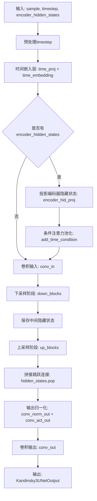
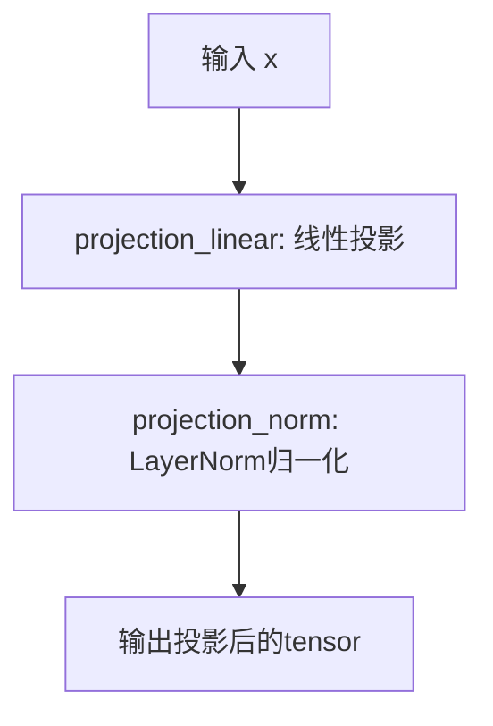
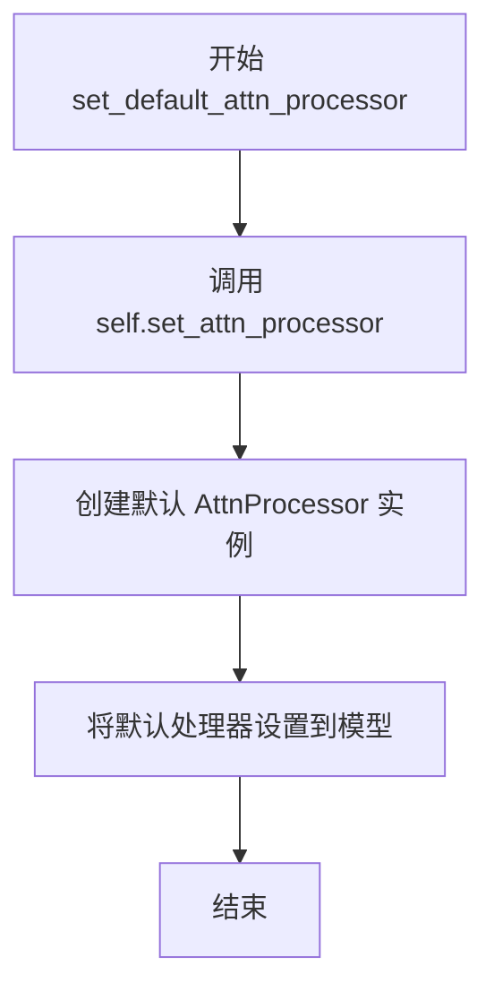
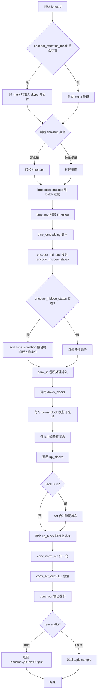
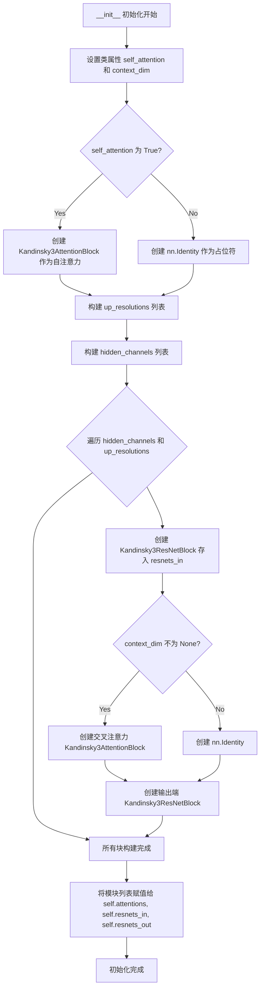
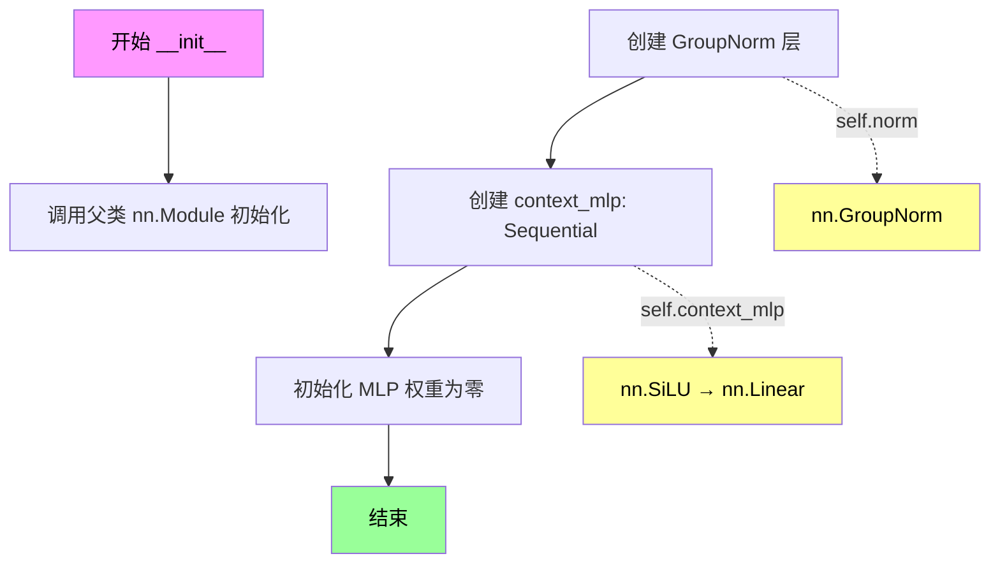
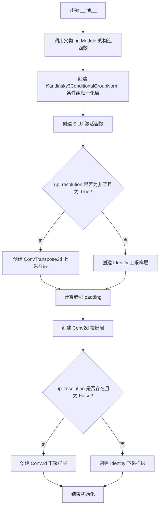
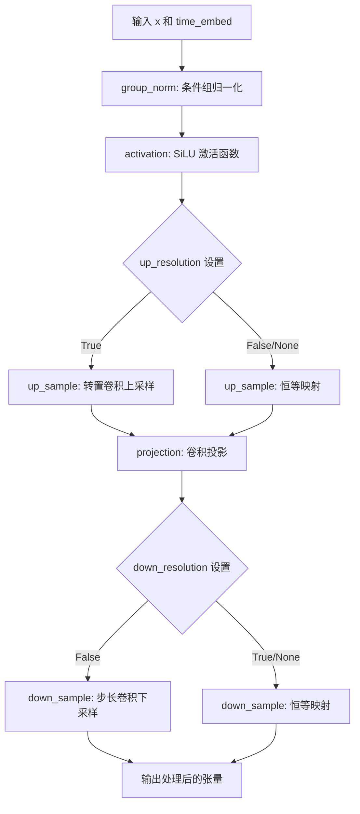
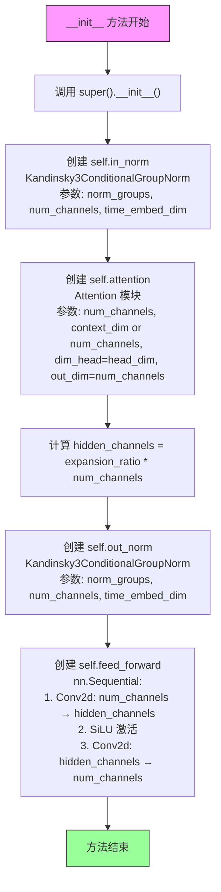
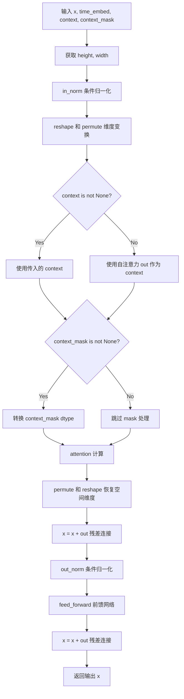

# `diffusers\src\diffusers\models\unets\unet_kandinsky3.py` 详细设计文档

这是 Kandinsky 3 扩散模型的 UNet 神经网络实现，用于图像生成任务。该架构采用编码器-解码器结构，包含时间步嵌入、条件注入、多尺度下采样和上采样块、注意力机制和残差连接，能够根据噪声样本、时间步和文本编码条件生成目标图像。

## 整体流程



## 类结构

```
Kandinsky3UNet (主模型类)
├── Kandinsky3EncoderProj (编码器投影)
├── Kandinsky3UpSampleBlock (上采样块)
│   ├── Kandinsky3AttentionBlock (注意力块)
│   └── Kandinsky3ResNetBlock (残差块)
├── Kandinsky3DownSampleBlock (下采样块)
│   ├── Kandinsky3AttentionBlock
│   └── Kandinsky3ResNetBlock
├── Kandinsky3ConditionalGroupNorm (条件组归一化)
├── Kandinsky3Block (基础块)
├── Kandinsky3ResNetBlock (残差块)
├── Kandinsky3AttentionPooling (注意力池化)
└── Kandinsky3AttentionBlock (注意力块)
```

## 全局变量及字段


### `logger`
    
模块级日志记录器

类型：`logging.Logger`
    


### `expansion_ratio`
    
扩展比率

类型：`int`
    


### `compression_ratio`
    
压缩比率

类型：`int`
    


### `add_cross_attention`
    
是否添加交叉注意力

类型：`tuple[bool]`
    


### `add_self_attention`
    
是否添加自注意力

类型：`tuple[bool]`
    


### `Kandinsky3UNetOutput.sample`
    
UNet输出的图像张量

类型：`torch.Tensor`
    


### `Kandinsky3EncoderProj.projection_linear`
    
线性投影层

类型：`nn.Linear`
    


### `Kandinsky3EncoderProj.projection_norm`
    
层归一化

类型：`nn.LayerNorm`
    


### `Kandinsky3UNet.time_proj`
    
时间步投影

类型：`Timesteps`
    


### `Kandinsky3UNet.time_embedding`
    
时间步嵌入

类型：`TimestepEmbedding`
    


### `Kandinsky3UNet.add_time_condition`
    
条件注意力池化

类型：`Kandinsky3AttentionPooling`
    


### `Kandinsky3UNet.conv_in`
    
输入卷积层

类型：`nn.Conv2d`
    


### `Kandinsky3UNet.encoder_hid_proj`
    
编码器隐藏投影

类型：`Kandinsky3EncoderProj`
    


### `Kandinsky3UNet.down_blocks`
    
下采样模块列表

类型：`nn.ModuleList`
    


### `Kandinsky3UNet.up_blocks`
    
上采样模块列表

类型：`nn.ModuleList`
    


### `Kandinsky3UNet.conv_norm_out`
    
输出归一化

类型：`nn.GroupNorm`
    


### `Kandinsky3UNet.conv_act_out`
    
输出激活函数

类型：`nn.SiLU`
    


### `Kandinsky3UNet.conv_out`
    
输出卷积层

类型：`nn.Conv2d`
    


### `Kandinsky3UNet.num_levels`
    
网络层数

类型：`int`
    


### `Kandinsky3UpSampleBlock.self_attention`
    
是否使用自注意力

类型：`bool`
    


### `Kandinsky3UpSampleBlock.context_dim`
    
上下文维度

类型：`int | None`
    


### `Kandinsky3UpSampleBlock.attentions`
    
注意力模块列表

类型：`nn.ModuleList`
    


### `Kandinsky3UpSampleBlock.resnets_in`
    
输入残差块列表

类型：`nn.ModuleList`
    


### `Kandinsky3UpSampleBlock.resnets_out`
    
输出残差块列表

类型：`nn.ModuleList`
    


### `Kandinsky3DownSampleBlock.self_attention`
    
是否使用自注意力

类型：`bool`
    


### `Kandinsky3DownSampleBlock.context_dim`
    
上下文维度

类型：`int | None`
    


### `Kandinsky3DownSampleBlock.attentions`
    
注意力模块列表

类型：`nn.ModuleList`
    


### `Kandinsky3DownSampleBlock.resnets_in`
    
输入残差块列表

类型：`nn.ModuleList`
    


### `Kandinsky3DownSampleBlock.resnets_out`
    
输出残差块列表

类型：`nn.ModuleList`
    


### `Kandinsky3ConditionalGroupNorm.norm`
    
基础组归一化

类型：`nn.GroupNorm`
    


### `Kandinsky3ConditionalGroupNorm.context_mlp`
    
上下文MLP网络

类型：`nn.Sequential`
    


### `Kandinsky3Block.group_norm`
    
条件组归一化

类型：`Kandinsky3ConditionalGroupNorm`
    


### `Kandinsky3Block.activation`
    
激活函数

类型：`nn.SiLU`
    


### `Kandinsky3Block.up_sample`
    
上采样模块

类型：`nn.Module`
    


### `Kandinsky3Block.projection`
    
卷积投影

类型：`nn.Conv2d`
    


### `Kandinsky3Block.down_sample`
    
下采样模块

类型：`nn.Module`
    


### `Kandinsky3ResNetBlock.resnet_blocks`
    
ResNet块列表

类型：`nn.ModuleList`
    


### `Kandinsky3ResNetBlock.shortcut_up_sample`
    
快捷上采样

类型：`nn.Module`
    


### `Kandinsky3ResNetBlock.shortcut_projection`
    
快捷投影

类型：`nn.Module`
    


### `Kandinsky3ResNetBlock.shortcut_down_sample`
    
快捷下采样

类型：`nn.Module`
    


### `Kandinsky3AttentionPooling.attention`
    
注意力机制

类型：`Attention`
    


### `Kandinsky3AttentionBlock.in_norm`
    
输入归一化

类型：`Kandinsky3ConditionalGroupNorm`
    


### `Kandinsky3AttentionBlock.attention`
    
注意力模块

类型：`Attention`
    


### `Kandinsky3AttentionBlock.out_norm`
    
输出归一化

类型：`Kandinsky3ConditionalGroupNorm`
    


### `Kandinsky3AttentionBlock.feed_forward`
    
前馈网络

类型：`nn.Sequential`
    
    

## 全局函数及方法


### `Kandinsky3EncoderProj.forward`

该方法实现了Kandinsky3模型中Encoder投影模块的前向传播，将编码器的隐藏维度投影到交叉注意力维度，并进行层归一化处理。

参数：

- `x`：`torch.Tensor`，输入的Encoder隐藏状态，通常来自图像编码器的输出，形状为 `(batch_size, seq_len, encoder_hid_dim)`

返回值：`torch.Tensor`，投影并归一化后的Encoder隐藏状态，形状为 `(batch_size, seq_len, cross_attention_dim)`

#### 流程图



#### 带注释源码

```python
def forward(self, x):
    """
    前向传播：将encoder隐藏状态投影到cross_attention维度
    
    参数:
        x: 输入tensor，形状为 (batch_size, seq_len, encoder_hid_dim)
    
    返回:
        投影并归一化后的tensor，形状为 (batch_size, seq_len, cross_attention_dim)
    """
    # 第一步：线性投影，将encoder_hid_dim维度映射到cross_attention_dim维度
    x = self.projection_linear(x)
    
    # 第二步：LayerNorm归一化，稳定训练过程
    x = self.projection_norm(x)
    
    return x
```


### `Kandinsky3UNet.__init__`

该方法是 `Kandinsky3UNet` 类的构造函数，负责初始化整个U-Net模型的所有组件，包括时间嵌入模块、输入卷积、编码器隐藏投影、下采样和上采样 blocks 以及输出卷积层，从而构建一个用于图像生成的完整神经网络架构。

参数：

- `in_channels`：`int`，输入图像的通道数，默认为 4（例如 RGB 图像为 3，RGBA 为 4）。
- `time_embedding_dim`：`int`，时间嵌入向量的维度，用于将时间步（timestep）编码为高维向量，默认为 1536。
- `groups`：`int`，GroupNorm 中的分组数量，用于归一化操作，默认为 32。
- `attention_head_dim`：`int`，多头注意力机制中每个头的维度，默认为 64。
- `layers_per_block`：`int | tuple[int]`，每个 resolution block 中的 ResNet 层数，默认为 3。
- `block_out_channels`：`tuple[int, ...]`，各 resolution block 输出的通道数元组，默认为 (384, 768, 1536, 3072)。
- `cross_attention_dim`：`int | tuple[int]`，跨注意力机制中上下文（context）向量的维度，默认为 4096。
- `encoder_hid_dim`：`int`，编码器隐藏层的维度，用于投影编码器输出，默认为 4096。

返回值：`None`，构造函数无返回值。

#### 流程图

```mermaid
graph TD
    A([开始初始化]) --> B[调用 super().__init__]
    B --> C[定义局部变量<br/>expansion_ratio=4<br/>compression_ratio=2<br/>add_cross_attention<br/>add_self_attention]
    C --> D[初始化 time_proj: Timesteps]
    D --> E[初始化 time_embedding: TimestepEmbedding]
    E --> F[初始化 add_time_condition: Kandinsky3AttentionPooling]
    F --> G[初始化 conv_in: nn.Conv2d]
    G --> H[初始化 encoder_hid_proj: Kandinsky3EncoderProj]
    H --> I[计算 hidden_dims 和 in_out_dims]
    I --> J[循环创建 down_blocks<br/>Kandinsky3DownSampleBlock]
    J --> K[循环创建 up_blocks<br/>Kandinsky3UpSampleBlock]
    K --> L[初始化输出层<br/>conv_norm_out, conv_act_out, conv_out]
    L --> M([结束初始化])
```

#### 带注释源码

```python
def __init__(
    self,
    in_channels: int = 4,
    time_embedding_dim: int = 1536,
    groups: int = 32,
    attention_head_dim: int = 64,
    layers_per_block: int | tuple[int] = 3,
    block_out_channels: tuple[int, ...] = (384, 768, 1536, 3072),
    cross_attention_dim: int | tuple[int] = 4096,
    encoder_hid_dim: int = 4096,
):
    # 调用父类 ModelMixin, AttentionMixin, ConfigMixin 的初始化方法
    super().__init__()

    # TODO(Yiyi): Give better name and put into config for the following 4 parameters
    # 局部变量：扩展比、压缩比、是否添加跨注意力和自注意力（ TODO: 需要更好的命名和配置管理）
    expansion_ratio = 4
    compression_ratio = 2
    add_cross_attention = (False, True, True, True)
    add_self_attention = (False, True, True, True)

    # 输出通道数等于输入通道数
    out_channels = in_channels
    # 初始通道数：为第一个 block_out_channels 的一半
    init_channels = block_out_channels[0] // 2
    # 时间步投影层：将时间步映射到初始通道数维度
    self.time_proj = Timesteps(init_channels, flip_sin_to_cos=False, downscale_freq_shift=1)

    # 时间嵌入层：将投影后的时间步嵌入到高维空间
    self.time_embedding = TimestepEmbedding(
        init_channels,
        time_embedding_dim,
    )

    # 注意力池化层：用于将时间嵌入和上下文嵌入融合
    self.add_time_condition = Kandinsky3AttentionPooling(
        time_embedding_dim, cross_attention_dim, attention_head_dim
    )

    # 输入卷积层：将输入图像映射到初始通道数
    self.conv_in = nn.Conv2d(in_channels, init_channels, kernel_size=3, padding=1)

    # 编码器隐藏投影层：将编码器输出投影到 cross_attention_dim 维度
    self.encoder_hid_proj = Kandinsky3EncoderProj(encoder_hid_dim, cross_attention_dim)

    # hidden_dims 列表：包含初始通道数以及所有 block_out_channels
    hidden_dims = [init_channels] + list(block_out_channels)
    # in_out_dims：相邻通道数对列表，用于构建 down 和 up blocks
    in_out_dims = list(zip(hidden_dims[:-1], hidden_dims[1:]))
    # text_dims：根据 add_cross_attention 决定每个 level 的 cross_attention_dim（若不存在则为 None）
    text_dims = [cross_attention_dim if is_exist else None for is_exist in add_cross_attention]
    # num_blocks：每个 level 的 block 数量列表
    num_blocks = len(block_out_channels) * [layers_per_block]
    # layer_params：包含 num_blocks, text_dims, add_self_attention 的列表
    layer_params = [num_blocks, text_dims, add_self_attention]
    # rev_layer_params：反转后的 layer_params
    rev_layer_params = map(reversed, layer_params)

    # cat_dims：用于上采样时 concatenation 的维度列表
    cat_dims = []
    # 获取 level 数量
    self.num_levels = len(in_out_dims)
    # 初始化下采样 blocks 列表
    self.down_blocks = nn.ModuleList([])
    # 遍历每个 level，构建下采样 block
    for level, ((in_dim, out_dim), res_block_num, text_dim, self_attention) in enumerate(
        zip(in_out_dims, *layer_params)
    ):
        # 判断是否需要下采样（除了最后一个 level）
        down_sample = level != (self.num_levels - 1)
        # 记录用于上采样时拼接的维度（最后一个 level 拼接维度为 0）
        cat_dims.append(out_dim if level != (self.num_levels - 1) else 0)
        # 添加下采样 block
        self.down_blocks.append(
            Kandinsky3DownSampleBlock(
                in_dim,
                out_dim,
                time_embedding_dim,
                text_dim,
                res_block_num,
                groups,
                attention_head_dim,
                expansion_ratio,
                compression_ratio,
                down_sample,
                self_attention,
            )
        )

    # 初始化上采样 blocks 列表
    self.up_blocks = nn.ModuleList([])
    # 逆序遍历每个 level，构建上采样 block
    for level, ((out_dim, in_dim), res_block_num, text_dim, self_attention) in enumerate(
        zip(reversed(in_out_dims), *rev_layer_params)
    ):
        # 判断是否需要上采样（除了第一个 level）
        up_sample = level != 0
        # 添加上采样 block
        self.up_blocks.append(
            Kandinsky3UpSampleBlock(
                in_dim,
                cat_dims.pop(),  # 取出对应的拼接维度
                out_dim,
                time_embedding_dim,
                text_dim,
                res_block_num,
                groups,
                attention_head_dim,
                expansion_ratio,
                compression_ratio,
                up_sample,
                self_attention,
            )
        )

    # 输出归一化层：GroupNorm
    self.conv_norm_out = nn.GroupNorm(groups, init_channels)
    # 输出激活函数：SiLU
    self.conv_act_out = nn.SiLU()
    # 输出卷积层：将最终特征映射回输出通道数
    self.conv_out = nn.Conv2d(init_channels, out_channels, kernel_size=3, padding=1)
```

#### 关键组件信息

- **time_proj** (`Timesteps`): 将时间步（timestep）转换为正弦或余弦嵌入。
- **time_embedding** (`TimestepEmbedding`): 进一步映射时间嵌入到高维空间，增加模型容量。
- **add_time_condition** (`Kandinsky3AttentionPooling`): 注意力池化层，用于融合时间嵌入和上下文信息。
- **conv_in** (`nn.Conv2d`): 输入卷积，处理原始图像输入。
- **encoder_hid_proj** (`Kandinsky3EncoderProj`): 投影层，将编码器（如 VAE）的隐藏状态映射到 cross_attention 维度。
- **down_blocks** (`nn.ModuleList`): 包含多个下采样块，逐步降低分辨率并提取特征。
- **up_blocks** (`nn.ModuleList`): 包含多个上采样块，逐步恢复分辨率并生成输出。
- **conv_out** (`nn.Conv2d`): 输出卷积，将最终特征映射到图像通道。

#### 潜在的技术债务或优化空间

1. **TODO 注释**: 代码中明确指出 `expansion_ratio`、`compression_ratio`、`add_cross_attention` 和 `add_self_attention` 四个参数需要更好的命名并放入配置中。这些硬编码的局部变量降低了模型的可配置性。
2. **魔法数字**: 许多超参数（如 `block_out_channels` 默认值）以魔法数字形式存在，难以调整。
3. **重复逻辑**: 下采样和上采样 block 的构建逻辑存在重复，可以考虑抽象成工厂函数或更通用的构建方法。

#### 其它项目

- **设计目标**: 该 U-Net 架构旨在处理图像生成任务，支持条件生成（如文本提示）。
- **约束**: 输入必须为 4 通道（默认为 RGBA 图像），时间步嵌入维度与通道数相关联。
- **错误处理**: 初始化时未进行参数校验，可能导致运行时错误。
- **外部依赖**: 依赖于 `...utils` 中的 `BaseOutput`, `logging` 以及 `..embeddings`, `..attention` 等模块。


### `Kandinsky3UNet.set_default_attn_processor`

该方法用于将UNet的注意力处理器重置为默认的AttnProcessor，禁用所有自定义注意力实现，使模型使用标准的注意力机制进行推理。

参数：
- （无参数，仅使用self）

返回值：`None`，无返回值

#### 流程图



#### 带注释源码

```
def set_default_attn_processor(self):
    """
    Disables custom attention processors and sets the default attention implementation.
    
    此方法执行以下操作：
    1. 创建一个新的默认 AttnProcessor 实例
    2. 调用父类 AttentionMixin 的 set_attn_processor 方法
    3. 将模型中所有注意力层替换为默认处理器
    
    用途：
    - 当需要禁用自定义注意力实现时调用
    - 恢复模型到标准注意力机制
    - 在推理时确保使用最基础的注意力计算
    """
    self.set_attn_processor(AttnProcessor())  # 创建默认处理器并设置到模型
```


### `Kandinsky3UNet.forward`

这是Kandinsky3 UNet模型的前向传播方法，负责将带噪声的图像样本、噪声时间步和文本编码器隐藏状态作为输入，通过一系列下采样和上采样块（含自注意力和交叉注意力）处理后，输出去噪后的图像样本。

参数：

- `sample`：`torch.Tensor`，输入的带噪声图像样本，形状为 `(batch_size, channels, height, width)`
- `timestep`：Union[float, int, torch.Tensor]，扩散过程中的时间步，用于调度噪声添加
- `encoder_hidden_states`：`torch.Tensor`，文本编码器的隐藏状态（条件信息），用于引导生成
- `encoder_attention_mask`：`torch.Tensor`，可选，文本编码器的注意力掩码，用于处理变长文本输入
- `return_dict`：`bool`，默认为 `True`，是否返回 `Kandinsky3UNetOutput` 对象而非元组

返回值：`Kandinsky3UNetOutput | tuple`，当 `return_dict=True` 时返回包含 `sample` 字段的命名元组，否则返回仅含样本的张量元组 `(sample,)`

#### 流程图



#### 带注释源码

```python
def forward(self, sample, timestep, encoder_hidden_states=None, encoder_attention_mask=None, return_dict=True):
    """
    Kandinsky3UNet 前向传播
    
    参数:
        sample: 输入的带噪声图像样本
        timestep: 扩散时间步
        encoder_hidden_states: 文本编码器的隐藏状态（条件）
        encoder_attention_mask: 文本注意力掩码
        return_dict: 是否返回字典格式
    
    返回:
        Kandinsky3UNetOutput 或 tuple
    """
    
    # ========== 1. 处理 encoder_attention_mask ==========
    # 如果提供了注意力掩码，将其转换为与 sample 相同的 dtype
    # 并反转（1 -> 0, 0 -> -10000）用于注意力计算中的遮蔽
    if encoder_attention_mask is not None:
        encoder_attention_mask = (1 - encoder_attention_mask.to(sample.dtype)) * -10000.0
        # 扩展维度以便与注意力分数相加: [batch] -> [batch, 1, 1]
        encoder_attention_mask = encoder_attention_mask.unsqueeze(1)

    # ========== 2. 处理 timestep ==========
    # 确保 timestep 是正确类型的张量并移动到正确设备
    if not torch.is_tensor(timestep):
        # 如果是浮点数使用 float32，整数使用 int32
        dtype = torch.float32 if isinstance(timestep, float) else torch.int32
        timestep = torch.tensor([timestep], dtype=dtype, device=sample.device)
    elif len(timestep.shape) == 0:
        # 标量张量扩展为 1 维并移动到 sample 设备
        timestep = timestep[None].to(sample.device)

    # ========== 3. Broadcast timestep 到 batch 维度 ==========
    # 兼容 ONNX/Core ML 的维度扩展方式
    timestep = timestep.expand(sample.shape[0])
    
    # ========== 4. 时间嵌入计算 ==========
    # 将 timestep 投影到时间嵌入空间
    time_embed_input = self.time_proj(timestep).to(sample.dtype)
    # 通过时间嵌入层获取最终的时间嵌入
    time_embed = self.time_embedding(time_embed_input)

    # ========== 5. 投影编码器隐藏状态 ==========
    # 将文本编码器输出投影到 cross attention 维度
    encoder_hidden_states = self.encoder_hid_proj(encoder_hidden_states)

    # ========== 6. 条件时间嵌入融合 ==========
    # 如果存在文本条件，将时间嵌入与文本嵌入通过注意力池化融合
    if encoder_hidden_states is not None:
        time_embed = self.add_time_condition(time_embed, encoder_hidden_states, encoder_attention_mask)

    # ========== 7. 初始卷积处理输入 ==========
    hidden_states = []  # 用于存储下采样过程中的特征
    sample = self.conv_in(sample)  # 将输入通道映射到初始通道数

    # ========== 8. 下采样阶段 ==========
    # 遍历每个下采样块
    for level, down_sample in enumerate(self.down_blocks):
        sample = down_sample(sample, time_embed, encoder_hidden_states, encoder_attention_mask)
        # 保存除最后一层外的所有层的输出，用于上采样时的跳跃连接
        if level != self.num_levels - 1:
            hidden_states.append(sample)

    # ========== 9. 上采样阶段 ==========
    for level, up_sample in enumerate(self.up_blocks):
        # 除了第一层外，每层都通过跳跃连接融合对应下采样层的特征
        if level != 0:
            sample = torch.cat([sample, hidden_states.pop()], dim=1)
        sample = up_sample(sample, time_embed, encoder_hidden_states, encoder_attention_mask)

    # ========== 10. 输出后处理 ==========
    sample = self.conv_norm_out(sample)  # GroupNorm 归一化
    sample = self.conv_act_out(sample)   # SiLU 激活函数
    sample = self.conv_out(sample)       # 最终卷积输出

    # ========== 11. 返回结果 ==========
    if not return_dict:
        return (sample,)
    return Kandinsky3UNetOutput(sample=sample)
```


### `Kandinsky3UpSampleBlock.__init__`

这是 Kandinsky3 扩散模型中上采样块（UpSample Block）的初始化方法，负责构建上采样网络结构，包括残差块、自注意力块和交叉注意力块，用于图像生成过程中的上采样操作。

参数：

- `in_channels`：`int`，输入特征图的通道数
- `cat_dim`：`int`，用于跳跃连接（skip connection）的通道维度，在上采样时与主路径特征拼接
- `out_channels`：`int`，输出特征图的通道数
- `time_embed_dim`：`int`，时间嵌入的维度，用于时间条件注入
- `context_dim`：`int | None`，上下文嵌入的维度，用于交叉注意力机制，默认为 `None`
- `num_blocks`：`int`，块内残差网络的数量，默认为 3
- `groups`：`int`，GroupNorm 的分组数，默认为 32
- `head_dim`：`int`，多头注意力中每个头的维度，默认为 64
- `expansion_ratio`：`int`，前馈网络扩展比率，默认为 4
- `compression_ratio`：`int`，残差块内部通道压缩比率，默认为 2
- `up_sample`：`bool`，是否执行上采样操作，默认为 `True`
- `self_attention`：`bool`，是否使用自注意力机制，默认为 `True`

返回值：`None`，构造函数不返回任何值

#### 流程图



#### 带注释源码

```python
class Kandinsky3UpSampleBlock(nn.Module):
    def __init__(
        self,
        in_channels,          # 输入通道数
        cat_dim,              # 跳跃连接维度（来自下采样块的输出）
        out_channels,         # 输出通道数
        time_embed_dim,      # 时间嵌入维度
        context_dim=None,    # 上下文嵌入维度（可选）
        num_blocks=3,        # 残差块数量
        groups=32,           # GroupNorm 分组数
        head_dim=64,         # 注意力头维度
        expansion_ratio=4,  # 前馈网络扩展比率
        compression_ratio=2, # 通道压缩比率
        up_sample=True,      # 是否上采样
        self_attention=True, # 是否使用自注意力
    ):
        super().__init__()
        
        # 构建上采样分辨率配置列表
        # 第一个块根据 up_sample 参数决定是否上采样，其余块为 None（无操作）
        up_resolutions = [[None, True if up_sample else None, None, None]] + [[None] * 4] * (num_blocks - 1)
        
        # 构建隐藏通道配置列表
        # 格式: [(输入通道, 输出通道), ...]
        # 第一个元素: 拼接 cat_dim 后的输入通道数
        # 中间元素: 保持通道数不变
        # 最后一个元素: 输出到目标通道数
        hidden_channels = (
            [(in_channels + cat_dim, in_channels)]
            + [(in_channels, in_channels)] * (num_blocks - 2)
            + [(in_channels, out_channels)]
        )
        
        # 初始化存储列表
        attentions = []       # 存储所有注意力层
        resnets_in = []       # 存储输入残差块
        resnets_out = []      # 存储输出残差块

        # 保存配置属性
        self.self_attention = self_attention
        self.context_dim = context_dim

        # 处理自注意力层（在所有残差块之前应用）
        if self_attention:
            # 创建最终输出的自注意力块
            attentions.append(
                Kandinsky3AttentionBlock(out_channels, time_embed_dim, None, groups, head_dim, expansion_ratio)
            )
        else:
            # 无自注意力时使用恒等映射占位
            attentions.append(nn.Identity())

        # 遍历每个块的配置，创建对应的残差块和注意力层
        for (in_channel, out_channel), up_resolution in zip(hidden_channels, up_resolutions):
            # 输入端残差块：处理当前层特征
            resnets_in.append(
                Kandinsky3ResNetBlock(in_channel, in_channel, time_embed_dim, groups, compression_ratio, up_resolution)
            )

            # 条件添加交叉注意力层（用于文本上下文交互）
            if context_dim is not None:
                attentions.append(
                    Kandinsky3AttentionBlock(
                        in_channel, time_embed_dim, context_dim, groups, head_dim, expansion_ratio
                    )
                )
            else:
                attentions.append(nn.Identity())

            # 输出端残差块：变换通道数并准备下一层输入
            resnets_out.append(
                Kandinsky3ResNetBlock(in_channel, out_channel, time_embed_dim, groups, compression_ratio)
            )

        # 将列表转换为 ModuleList 以便 PyTorch 正确管理参数
        self.attentions = nn.ModuleList(attentions)
        self.resnets_in = nn.ModuleList(resnets_in)
        self.resnets_out = nn.ModuleList(resnets_out)
```


### Kandinsky3UpSampleBlock.forward

该函数实现了 Kandinsky3 模型中上采样（UpSample）块的前向传播过程。输入特征（通常包含当前层特征与编码器跳跃连接特征的拼接）会依次通过多个残差网络块（ResNet）和交叉注意力块（Cross Attention）进行特征整合与转换，这些过程均以时间嵌入（time_embed）为条件；最后，根据配置在序列末尾（与下采样块相反）应用自注意力模块（Self Attention）以进一步增强特征表示，最终返回处理后的特征张量。

参数：

- `x`：`torch.Tensor`，输入特征张量，通常为来自解码器上一层的特征与编码器跳跃连接特征的拼接结果。
- `time_embed`：`torch.Tensor`，时间步嵌入向量（Timestep Embedding），用于残差块和注意力块的条件归一化。
- `context`：`torch.Tensor`，上下文嵌入（如文本Encoder的输出），用于交叉注意力机制。
- `context_mask`：`torch.Tensor`，上下文嵌入的掩码，用于在交叉注意力计算中忽略无效或填充的token。
- `image_mask`：`torch.Tensor`，图像特征的掩码，用于处理图像中的可变区域或遮罩。

返回值：`torch.Tensor`，经过上采样块处理后的特征张量。

#### 流程图

```mermaid
flowchart TD
    Start([开始 forward]) --> Input[输入 x, time_embed, context, context_mask, image_mask]
    
    subgraph LoopBlock [循环处理: num_blocks 次]
        direction TB
        ResIn[应用 ResNet In: resnets_in]
        CheckContext{self.context_dim is not None?}
        ResIn --> CheckContext
        
        CheckContext -- Yes --> CrossAttn[应用交叉注意力: attention]
        CheckContext -- No --> ResOut
        
        CrossAttn --> ResOut[应用 ResNet Out: resnets_out]
    end
    
    Input --> LoopBlock
    LoopBlock --> CheckSelfAttn{self.self_attention is True?}
    
    CheckSelfAttn -- Yes --> SelfAttn[应用自注意力: attentions[0]]
    CheckSelfAttn -- No --> Output
    
    SelfAttn --> Output([返回 x])
```

#### 带注释源码

```python
def forward(self, x, time_embed, context=None, context_mask=None, image_mask=None):
    # 遍历配置中的多个块（num_blocks），依次处理特征
    # Iterate through the blocks: resnets and cross attentions
    for attention, resnet_in, resnet_out in zip(self.attentions[1:], self.resnets_in, self.resnets_out):
        # 1. 应用输入端的残差网络块 (ResNet In)，引入时间条件
        # 1. Apply input-side ResNet block with time embedding conditioning
        x = resnet_in(x, time_embed)
        
        # 2. 如果配置了上下文维度 (context_dim)，则应用交叉注意力机制
        #    将文本或图像上下文信息融入特征
        # 2. Apply cross-attention block if context_dim is configured
        if self.context_dim is not None:
            x = attention(x, time_embed, context, context_mask, image_mask)
        
        # 3. 应用输出端的残差网络块 (ResNet Out)，进一步处理特征
        # 3. Apply output-side ResNet block
        x = resnet_out(x, time_embed)

    # 4. 如果启用了自注意力 (self_attention)，则在所有处理完成后在末尾应用
    #    这与下采样块相反，下采样块通常在开始处应用自注意力
    # 4. Apply self-attention at the end if enabled (distinct from DownSampleBlock)
    if self.self_attention:
        x = self.attentions[0](x, time_embed, image_mask=image_mask)
        
    return x
```


### `Kandinsky3DownSampleBlock.__init__`

该方法是 Kandinsky3UNet 模型中下采样块（DownSample Block）的初始化函数，负责构建包含残差网络块和自注意力机制的降采样模块，用于逐步降低特征图的空间分辨率并提取多层次特征。

参数：

- `in_channels`：`int`，输入特征图的通道数
- `out_channels`：`int`，输出特征图的通道数
- `time_embed_dim`：`int`，时间嵌入的维度，用于条件归一化
- `context_dim`：`int | None`，上下文（文本）嵌入的维度，用于跨注意力机制，默认为 None
- `num_blocks`：`int`，残差块的数量，默认为 3
- `groups`：`int`，分组归一化的组数，默认为 32
- `head_dim`：`int`，多头注意力的每个头维度，默认为 64
- `expansion_ratio`：`int`，前馈网络隐藏层扩展比率，默认为 4
- `compression_ratio`：`int`，残差块内部通道压缩比率，默认为 2
- `down_sample`：`bool`，是否执行下采样操作，默认为 True
- `self_attention`：`bool`，是否启用自注意力机制，默认为 True

返回值：`None`，该方法为初始化方法，不返回任何值

#### 流程图

```mermaid
flowchart TD
    A[开始 __init__] --> B[调用 super().__init__]
    B --> C[初始化空列表: attentions, resnets_in, resnets_out]
    C --> D[保存 self_attention 和 self_context_dim]
    D --> E{self_attention 为 True?}
    E -->|是| F[创建 Kandinsky3AttentionBlock 添加到 attentions]
    E -->|否| G[添加 nn.Identity 到 attentions]
    F --> H[构建 up_resolutions 列表]
    G --> H
    H --> I[构建 hidden_channels 列表]
    I --> J{遍历 hidden_channels 和 up_resolutions}
    J -->|循环| K[创建 Kandinsky3ResNetBlock 加入 resnets_in]
    K --> L{context_dim 不为 None?}
    L -->|是| M[创建 Kandinsky3AttentionBlock 加入 attentions]
    L -->|否| N[添加 nn.Identity 到 attentions]
    M --> O[创建 Kandinsky3ResNetBlock 加入 resnets_out]
    N --> O
    O --> J
    J -->|循环结束| P[将列表转换为 nn.ModuleList]
    P --> Q[结束 __init__]
```

#### 带注释源码

```python
class Kandinsky3DownSampleBlock(nn.Module):
    def __init__(
        self,
        in_channels,          # 输入特征图的通道数
        out_channels,         # 输出特征图的通道数
        time_embed_dim,       # 时间嵌入维度，用于条件归一化
        context_dim=None,     # 上下文嵌入维度，用于跨注意力机制
        num_blocks=3,         # 残差块的数量
        groups=32,            # 分组归一化的组数
        head_dim=64,          # 多头注意力的头维度
        expansion_ratio=4,    # 前馈网络扩展比率
        compression_ratio=2,  # 通道压缩比率
        down_sample=True,     # 是否执行下采样
        self_attention=True,  # 是否启用自注意力
    ):
        # 调用父类 nn.Module 的初始化方法
        super().__init__()
        
        # 初始化用于存储各层组件的列表
        attentions = []       # 存储所有注意力层
        resnets_in = []       # 存储输入残差网络块
        resnets_out = []      # 存储输出残差网络块
        
        # 保存配置参数到实例属性
        self.self_attention = self_attention  # 是否使用自注意力
        self.context_dim = context_dim        # 上下文维度（跨注意力用）
        
        # 根据 self_attention 标志决定是否添加自注意力层
        if self_attention:
            # 创建自注意力块，用于处理输入特征
            attentions.append(
                Kandinsky3AttentionBlock(
                    in_channels, time_embed_dim, None, groups, head_dim, expansion_ratio
                )
            )
        else:
            # 不使用自注意力时添加身份层（占位符）
            attentions.append(nn.Identity())
        
        # 构建上采样分辨率列表
        # 格式为 4 个元素的列表 [up, down, reverse, pad]，用于控制每个残差块的上/下采样
        # 最后一个块的 down_sample 参数决定是否执行下采样
        up_resolutions = (
            [[None] * 4] * (num_blocks - 1) +  # 前 num_blocks-1 个块不进行空间变换
            [[None, None, False if down_sample else None, None]]  # 最后一个块根据 down_sample 决定
        )
        
        # 构建隐藏通道配置列表
        # 第一个元素指定输入到输出的通道变换，后续元素保持通道数不变
        hidden_channels = (
            [(in_channels, out_channels)] +                    # 第一个块：通道变换
            [(out_channels, out_channels)] * (num_blocks - 1)   # 后续块：保持通道数
        )
        
        # 遍历每个隐藏通道配置，创建对应的残差块和注意力层
        for (in_channel, out_channel), up_resolution in zip(hidden_channels, up_resolutions):
            # 创建输入残差网络块（负责主要通道变换）
            resnets_in.append(
                Kandinsky3ResNetBlock(
                    in_channel, out_channel, time_embed_dim, groups, compression_ratio
                )
            )
            
            # 如果提供了上下文维度，创建跨注意力块
            if context_dim is not None:
                attentions.append(
                    Kandinsky3AttentionBlock(
                        out_channel, time_embed_dim, context_dim, groups, head_dim, expansion_ratio
                    )
                )
            else:
                # 无上下文信息时添加占位符
                attentions.append(nn.Identity())
            
            # 创建输出残差网络块（可选择性地进行上/下采样）
            resnets_out.append(
                Kandinsky3ResNetBlock(
                    out_channel, out_channel, time_embed_dim, groups, compression_ratio, up_resolution
                )
            )
        
        # 将 Python 列表转换为 nn.ModuleList，以便 PyTorch 正确管理参数
        self.attentions = nn.ModuleList(attentions)
        self.resnets_in = nn.ModuleList(resnets_in)
        self.resnets_out = nn.ModuleList(resnets_out)
```


### `Kandinsky3DownSampleBlock.forward`

该方法是Kandinsky3下采样块的前向传播方法，负责对输入特征进行下采样处理，包含自注意力机制、残差网络块和可选的交叉注意力机制。

参数：

- `x`：`torch.Tensor`，输入特征张量，通常是来自上一层的图像特征
- `time_embed`：`torch.Tensor`，时间嵌入向量，用于条件注入
- `context`：`torch.Tensor | None`，上下文嵌入向量，用于交叉注意力机制
- `context_mask`：`torch.Tensor | None`，上下文注意力掩码，用于控制上下文信息的可见性
- `image_mask`：`torch.Tensor | None`，图像注意力掩码，用于控制自注意力机制中像素的可见性

返回值：`torch.Tensor`，经过下采样块处理后的输出特征张量

#### 流程图

```mermaid
flowchart TD
    A[输入 x, time_embed, context, context_mask, image_mask] --> B{self_attention 是否为真}
    
    B -->|是| C[应用 self.attentions[0] 自注意力]
    B -->|否| D[跳过自注意力]
    
    C --> E[进入残差网络循环]
    D --> E
    
    E --> F[遍历 attention, resnet_in, resnet_out]
    
    F --> G[resnet_in(x, time_embed)]
    G --> H{context_dim 是否为 None}
    
    H -->|否| I[attention(x, time_embed, context, context_mask, image_mask)]
    H -->|是| J[跳过交叉注意力]
    
    I --> K[resnet_out(x, time_embed)]
    J --> K
    
    K --> L{是否还有更多层}
    L -->|是| F
    L -->|否| M[返回处理后的 x]
    
    J --> M
```

#### 带注释源码

```python
def forward(self, x, time_embed, context=None, context_mask=None, image_mask=None):
    """
    Kandinsky3DownSampleBlock 的前向传播方法
    
    参数:
        x: 输入特征张量，形状为 (batch, channels, height, width)
        time_embed: 时间嵌入向量，形状为 (batch, time_embedding_dim)
        context: 可选的上下文嵌入，用于交叉注意力 (batch, seq_len, context_dim)
        context_mask: 上下文注意力掩码，用于屏蔽无效的上下文位置
        image_mask: 图像注意力掩码，用于屏蔽无效的图像位置
    
    返回:
        处理后的特征张量，形状为 (batch, out_channels, height//2, width//2) 如果下采样
    """
    # 步骤1：如果启用自注意力，则先对输入应用自注意力机制
    # Kandinsky3AttentionBlock 处理图像特征的自注意力
    if self.self_attention:
        x = self.attentions[0](x, time_embed, image_mask=image_mask)

    # 步骤2：遍历后续的残差网络块和交叉注意力块
    # 每个块包含：resnet_in -> attention (可选) -> resnet_out
    for attention, resnet_in, resnet_out in zip(self.attentions[1:], self.resnets_in, self.resnets_out):
        # 2.1 应用输入残差块进行特征变换
        x = resnet_in(x, time_embed)
        
        # 2.2 如果存在上下文维度，应用交叉注意力机制
        # 将全局上下文信息注入到当前特征中
        if self.context_dim is not None:
            x = attention(x, time_embed, context, context_mask, image_mask)
        
        # 2.3 应用输出残差块进行最终特征变换
        x = resnet_out(x, time_embed)
    
    # 返回处理后的特征张量
    return x
```

#### 类字段详情

| 字段名称 | 类型 | 描述 |
|---------|------|------|
| `self.self_attention` | `bool` | 标识是否启用自注意力机制 |
| `self.context_dim` | `int \| None` | 交叉注意力机制的上下文维度，若为None则禁用交叉注意力 |
| `self.attentions` | `nn.ModuleList[Kandinsky3AttentionBlock \| nn.Identity]` | 注意力模块列表，包含自注意力和交叉注意力块 |
| `self.resnets_in` | `nn.ModuleList[Kandinsky3ResNetBlock]` | 输入残差网络块列表，用于特征变换 |
| `self.resnets_out` | `nn.ModuleList[Kandinsky3ResNetBlock]` | 输出残差网络块列表，用于特征变换和分辨率调整 |


### `Kandinsky3ConditionalGroupNorm.__init__`

该构造函数初始化了一个基于条件的分组归一化层，通过 MLP 将上下文嵌入转换为缩放（scale）和偏移（shift）参数，从而实现对特征的条件化调制。

参数：

- `groups`：`int`，分组数，指定 GroupNorm 的分组数量，用于将通道分成多个组进行归一化
- `normalized_shape`：`int` 或 `tuple[int]`，归一化形状，通常为输入通道数，用于定义 GroupNorm 的归一化维度
- `context_dim`：`int`，上下文维度，条件嵌入的维度，用于生成缩放和偏移参数

返回值：`None`，构造函数无返回值

#### 流程图



#### 带注释源码

```python
class Kandinsky3ConditionalGroupNorm(nn.Module):
    """
    Kandinsky3的条件分组归一化层。
    通过将上下文嵌入映射到缩放(scale)和偏移(shift)参数，实现对特征的条件化调制。
    """
    
    def __init__(self, groups: int, normalized_shape: int, context_dim: int):
        """
        初始化条件分组归一化层。
        
        参数:
            groups: 分组数，用于GroupNorm将通道分成groups个组
            normalized_shape: 归一化的形状，通常为输入通道数
            context_dim: 上下文/条件的维度，用于生成调制参数
        """
        # 调用父类nn.Module的初始化方法
        super().__init__()
        
        # 创建分组归一化层，affine=False表示不使用可学习的仿射参数
        # 因为缩放和偏移将由context_mlp条件化生成
        self.norm = nn.GroupNorm(groups, normalized_shape, affine=False)
        
        # 创建上下文MLP: SiLU激活函数 + 线性层
        # 输出维度为normalized_shape的2倍，用于生成scale和shift
        self.context_mlp = nn.Sequential(
            nn.SiLU(),  # Swish激活函数
            nn.Linear(context_dim, 2 * normalized_shape)  # 映射到2*channels
        )
        
        # 初始化MLP最后一层的权重和偏置为零
        # 这样初始时scale=0, shift=0，使得输出等同于普通GroupNorm
        # 这种设计提供了一种稳定的初始状态，便于训练
        self.context_mlp[1].weight.data.zero_()
        self.context_mlp[1].bias.data.zero_()
```


### `Kandinsky3ConditionalGroupNorm.forward`

该方法实现了条件组归一化（Conditional Group Normalization），通过一个轻量级的 MLP 将上下文向量（context）映射为缩放（scale）和偏移（shift）系数，并据此动态调整输入特征图的均值和方差，实现基于文本或其他条件的特征调制。

参数：

-  `x`：`torch.Tensor`，输入的特征张量，通常为残差块的输出，形状为 `(B, C, H, W)`。
-  `context`：`torch.Tensor`，条件上下文向量，通常为文本编码后的嵌入向量，形状为 `(B, context_dim)`。

返回值：`torch.Tensor`，经过条件组归一化处理后的特征张量，形状与输入 `x` 相同。

#### 流程图

```mermaid
flowchart TD
    A[Start: forward(x, context)] --> B[MLP Processing: self.context_mlp(context)]
    B --> C{Loop over spatial dims: range(len(x.shape[2:]))}
    C -- Add spatial dimensions --> D[context.unsqueeze(-1)]
    D --> C
    C -- Done --> E[Chunk: context.split(2, dim=1)]
    E --> F[Extract: scale, shift]
    F --> G[Base Norm: self.norm(x)]
    G --> H[Apply Scale & Shift: x * (scale + 1.0) + shift]
    H --> I[Return: Transformed Tensor]
```

#### 带注释源码

```python
def forward(self, x, context):
    # 1. 将上下文向量通过 MLP 进行处理
    # 输入 context: (batch_size, context_dim)
    # 输出 context: (batch_size, 2 * normalized_shape) - 包含scale和shift
    context = self.context_mlp(context)

    # 2. 扩展上下文维度以匹配输入特征图的空间维度
    # 如果输入 x 是 4D (B, C, H, W)，则需要将 context 扩展为 (B, 2*C, 1, 1)
    # 如果输入 x 是 5D (B, C, D, H, W)，则需要扩展为 (B, 2*C, 1, 1, 1)
    for _ in range(len(x.shape[2:])):
        context = context.unsqueeze(-1)

    # 3. 将处理后的上下文拆分为缩放系数 (scale) 和偏移系数 (shift)
    # chunk 操作在维度 1 上进行，将通道数一分为二
    scale, shift = context.chunk(2, dim=1)

    # 4. 执行组归一化
    # norm 是 nn.GroupNorm，affine=False (因为 scale 和 shift 替代了 affine 的作用)
    x = self.norm(x)

    # 5. 应用条件缩放和偏移
    # 公式: (x * (scale + 1.0)) + shift
    # 加上 1.0 使得初始状态相当于恒等映射 (identity mapping)
    x = x * (scale + 1.0) + shift
    return x
```


### `Kandinsky3Block.__init__`

该方法是 Kandinsky3Block 类的构造函数，用于初始化一个包含条件组归一化、激活函数、可选的上采样和下采样以及卷积投影的神经网络模块。

参数：

- `in_channels`：`int`，输入特征图的通道数
- `out_channels`：`int`，输出特征图的通道数
- `time_embed_dim`：`int`，时间嵌入的维度，用于条件组归一化
- `kernel_size`：`int`（默认值 3），卷积核的大小
- `norm_groups`：`int`（默认值 32），分组归一化的组数
- `up_resolution`：`int` 或 `None`（默认值 None），上采样分辨率，None 表示不使用上采样，True 表示使用转置卷积上采样，False 表示使用卷积下采样

返回值：`None`，构造函数无返回值

#### 流程图



#### 带注释源码

```python
def __init__(self, in_channels, out_channels, time_embed_dim, kernel_size=3, norm_groups=32, up_resolution=None):
    """
    初始化 Kandinsky3Block 模块
    
    参数:
        in_channels: 输入通道数
        out_channels: 输出通道数
        time_embed_dim: 时间嵌入维度，用于条件组归一化
        kernel_size: 卷积核大小，默认为3
        norm_groups: 分组归一化的组数，默认为32
        up_resolution: 上采样分辨率，None表示不使用上采样，True表示上采样，False表示下采样
    """
    # 调用父类 nn.Module 的初始化方法
    super().__init__()
    
    # 创建条件组归一化层，根据 time_embed_dim 对特征进行条件归一化
    self.group_norm = Kandinsky3ConditionalGroupNorm(norm_groups, in_channels, time_embed_dim)
    
    # 创建 SiLU 激活函数（Sigmoid Linear Unit）
    self.activation = nn.SiLU()
    
    # 根据 up_resolution 参数决定是否创建上采样层
    if up_resolution is not None and up_resolution:
        # 使用转置卷积进行 2x 上采样
        self.up_sample = nn.ConvTranspose2d(in_channels, in_channels, kernel_size=2, stride=2)
    else:
        # 不使用上采样，使用 Identity 层作为占位符
        self.up_sample = nn.Identity()
    
    # 计算卷积 padding，以保持空间维度不变
    # 当 kernel_size > 1 时，padding 为 1；否则为 0
    padding = int(kernel_size > 1)
    
    # 创建主投影卷积层，将输入通道映射到输出通道
    self.projection = nn.Conv2d(in_channels, out_channels, kernel_size=kernel_size, padding=padding)
    
    # 根据 up_resolution 参数决定是否创建下采样层
    if up_resolution is not None and not up_resolution:
        # 使用步长为 2 的卷积进行 2x 下采样
        self.down_sample = nn.Conv2d(out_channels, out_channels, kernel_size=2, stride=2)
    else:
        # 不使用下采样，使用 Identity 层作为占位符
        self.down_sample = nn.Identity()
```


### `Kandinsky3Block.forward`

该方法是 Kandinsky3Block 的前向传播逻辑，接收输入张量 x 和时间嵌入 time_embed，依次通过条件组归一化、激活函数、上采样、投影卷积和下采样操作，返回处理后的张量。

参数：

- `x`：`torch.Tensor`，输入特征张量，通常为 4D 张量 (batch_size, channels, height, width)
- `time_embed`：`torch.Tensor`，时间嵌入向量，用于条件组归一化的条件输入

返回值：`torch.Tensor`，经过完整处理后的输出特征张量，形状取决于 up_resolution 和 down_resolution 的设置

#### 流程图



#### 带注释源码

```python
def forward(self, x, time_embed):
    """
    Kandinsky3Block 的前向传播方法
    
    参数:
        x: 输入特征张量，形状为 (batch_size, in_channels, height, width)
        time_embed: 时间嵌入向量，用于条件归一化
    
    返回:
        输出特征张量，形状为 (batch_size, out_channels, height', width')
    """
    # 步骤1: 条件组归一化
    # 使用 Kandinsky3ConditionalGroupNorm 对输入进行归一化
    # 该归一化层接收 time_embed 作为条件，学习 scale 和 shift 参数
    x = self.group_norm(x, time_embed)
    
    # 步骤2: SiLU 激活函数
    # SiLU (Sigmoid Linear Unit) 也称为 Swish 激活函数
    x = self.activation(x)
    
    # 步骤3: 上采样（可选）
    # 如果 up_resolution 为 True，执行 2x 上采样
    # 使用转置卷积实现，空间分辨率翻倍
    x = self.up_sample(x)
    
    # 步骤4: 投影卷积
    # 将通道数从 in_channels 变换到 out_channels
    # 使用 kernel_size=3 的卷积核，保持空间分辨率（通过 padding）
    x = self.projection(x)
    
    # 步骤5: 下采样（可选）
    # 如果 up_resolution 为 False，执行 2x 下采样
    # 使用步长为 2 的卷积实现，空间分辨率减半
    x = self.down_sample(x)
    
    # 返回处理后的张量
    return x
```


### `Kandinsky3ResNetBlock.__init__`

该方法是 Kandinsky3ResNetBlock 类的初始化方法，用于构建一个残差网络块，包含多个卷积层、条件归一化层以及用于处理输入输出通道不匹配和分辨率变化的快捷连接（shortcut）路径。

参数：

- `in_channels`：`int`，输入张量的通道数
- `out_channels`：`int`，输出张量的通道数
- `time_embed_dim`：`int`，时间嵌入的维度，用于条件归一化
- `norm_groups`：`int`（默认值为 32），分组归一化的组数
- `compression_ratio`：`int`（默认值为 2），隐藏通道的压缩比率，用于减少计算量
- `up_resolutions`：`list`（默认值为 4 个 None 元素的列表），上/下采样分辨率配置列表，长度为 4，用于控制每个子块的上采样、下采样或保持分辨率

返回值：`None`，该方法不返回任何值，仅初始化对象属性

#### 流程图

```mermaid
flowchart TD
    A[开始 __init__] --> B[计算隐藏通道数: hidden_channel = max(in_channels, out_channels) // compression_ratio]
    B --> C[构建 hidden_channels 列表: [(in_channels, hidden_channel), (hidden_channel, hidden_channel), (hidden_channel, hidden_channel), (hidden_channel, out_channels)]"]
    C --> D[创建 Kandinsky3Block 模块列表 resnet_blocks]
    D --> E{检查 up_resolutions 中是否存在 True}
    E -->|是| F[创建 shortcut_up_sample: nn.ConvTranspose2d]
    E -->|否| G[创建 shortcut_up_sample: nn.Identity]
    G --> H{检查 in_channels != out_channels}
    H -->|是| I[创建 shortcut_projection: nn.Conv2d]
    H -->|否| J[创建 shortcut_projection: nn.Identity]
    I --> K{检查 up_resolutions 中是否存在 False}
    K -->|是| L[创建 shortcut_down_sample: nn.Conv2d]
    K -->|否| M[创建 shortcut_down_sample: nn.Identity]
    M --> N[结束 __init__]
    F --> I
    L --> M
```

#### 带注释源码

```python
class Kandinsky3ResNetBlock(nn.Module):
    def __init__(
        self, in_channels, out_channels, time_embed_dim, norm_groups=32, compression_ratio=2, up_resolutions=4 * [None]
    ):
        """
        初始化 Kandinsky3 残差网络块
        
        参数:
            in_channels: 输入通道数
            out_channels: 输出通道数
            time_embed_dim: 时间嵌入维度，用于条件分组归一化
            norm_groups: 分组归一化的组数，默认 32
            compression_ratio: 隐藏层通道压缩比率，默认 2
            up_resolutions: 上/下采样配置列表，长度为 4，每个元素可为 None/True/False
        """
        super().__init__()
        
        # 定义四个子卷积层的卷积核大小：[1x1, 3x3, 3x3, 1x1]
        kernel_sizes = [1, 3, 3, 1]
        
        # 计算隐藏通道数：取输入输出通道数的最大值除以压缩比
        hidden_channel = max(in_channels, out_channels) // compression_ratio
        
        # 构建隐藏通道配置列表：
        # 第一个子块：in_channels -> hidden_channel
        # 中间两个子块：hidden_channel -> hidden_channel（保持不变）
        # 最后一个子块：hidden_channel -> out_channels
        hidden_channels = (
            [(in_channels, hidden_channel)] 
            + [(hidden_channel, hidden_channel)] * 2 
            + [(hidden_channel, out_channels)]
        )
        
        # 使用 ModuleList 创建四个级联的 Kandinsky3Block 残差子块
        # 每个子块包含：条件分组归一化 -> SiLU激活 -> 上采样(可选) -> 卷积投影 -> 下采样(可选)
        self.resnet_blocks = nn.ModuleList(
            [
                Kandinsky3Block(in_channel, out_channel, time_embed_dim, kernel_size, norm_groups, up_resolution)
                for (in_channel, out_channel), kernel_size, up_resolution in zip(
                    hidden_channels, kernel_sizes, up_resolutions
                )
            ]
        )
        
        # 快捷连接的上采样路径：如果 up_resolutions 中包含 True，则创建转置卷积上采样
        self.shortcut_up_sample = (
            nn.ConvTranspose2d(in_channels, in_channels, kernel_size=2, stride=2)
            if True in up_resolutions
            else nn.Identity()
        )
        
        # 快捷连接的投影层：如果输入输出通道数不同，则使用 1x1 卷积进行通道变换
        self.shortcut_projection = (
            nn.Conv2d(in_channels, out_channels, kernel_size=1)
            if in_channels != out_channels
            else nn.Identity()
        )
        
        # 快捷连接的下采样路径：如果 up_resolutions 中包含 False，则创建卷积下采样
        self.shortcut_down_sample = (
            nn.Conv2d(out_channels, out_channels, kernel_size=2, stride=2)
            if False in up_resolutions
            else nn.Identity()
        )
```


### `Kandinsky3ResNetBlock.forward`

这是 Kandinsky3 UNet 模型中的残差网络块前向传播方法，实现了带条件时间嵌入的残差块结构，通过多个卷积子块处理特征并通过快捷连接（shortcut）进行残差连接。

参数：

-  `x`：`torch.Tensor`，输入特征张量，形状为 (batch_size, in_channels, height, width)
-  `time_embed`：`torch.Tensor`，时间嵌入向量，用于条件归一化和特征调制

返回值：`torch.Tensor`，输出特征张量，形状为 (batch_size, out_channels, height', width')，其中 height' 和 width' 可能因上/下采样而变化

#### 流程图

```mermaid
flowchart TD
    A[输入 x, time_embed] --> B[out = x]
    B --> C[遍历 resnet_blocks]
    C --> D[resnet_block_i forward: out = resnet_block_i(out, time_embed)]
    D --> E{还有更多resnet_block?}
    E -->|是| C
    E -->|否| F[x = shortcut_up_sample]
    F --> G[x = shortcut_projection]
    G --> H[x = shortcut_down_sample]
    H --> I[x = x + out]
    I --> J[返回 x]
```

#### 带注释源码

```python
def forward(self, x, time_embed):
    # 保存输入作为残差连接的基础
    out = x
    
    # 遍历所有残差网络子块进行处理
    # 每个子块包含: 条件归一化 -> SiLU激活 -> 上采样(可选) -> 卷积 -> 下采样(可选)
    for resnet_block in self.resnet_blocks:
        out = resnet_block(out, time_embed)
    
    # 对输入应用快捷连接的变换路径
    # 1. 上采样: 如果 up_resolutions 中有 True，则进行转置卷积上采样
    x = self.shortcut_up_sample(x)
    
    # 2. 投影: 如果输入输出通道数不同，则使用 1x1 卷积调整通道数
    x = self.shortcut_projection(x)
    
    # 3. 下采样: 如果 up_resolutions 中有 False，则进行卷积下采样
    x = self.shortcut_down_sample(x)
    
    # 残差连接: 将变换后的输入与子块输出相加
    x = x + out
    
    return x
```


### `Kandinsky3AttentionPooling.__init__`

该方法是 `Kandinsky3AttentionPooling` 类的构造函数，用于初始化注意力池化模块。它接收通道数、上下文维度和注意力头维度作为参数，创建一个 `Attention` 实例作为核心组件，用于后续的特征融合操作。

参数：

- `num_channels`：`int`，时间嵌入的通道维度，用于定义输出的维度
- `context_dim`：`int`，上下文（context）的维度，用于注意力计算
- `head_dim`：`int`（默认值 64），每个注意力头的维度

返回值：`None`，构造函数不返回任何值

#### 流程图

```mermaid
flowchart TD
    A[开始 __init__] --> B[调用 super().__init__ 初始化 nn.Module]
    C[创建 Attention 注意力模块] --> D[参数: context_dim, context_dim, dim_head=head_dim, out_dim=num_channels, out_bias=False]
    B --> C
    D --> E[将 self.attention 赋值给实例属性]
    E --> F[结束 __init__]
```

#### 带注释源码

```python
class Kandinsky3AttentionPooling(nn.Module):
    def __init__(self, num_channels, context_dim, head_dim=64):
        """
        初始化注意力池化模块
        
        参数:
            num_channels (int): 时间嵌入的通道维度，也是输出的维度
            context_dim (int): 上下文向量的维度，用于注意力计算
            head_dim (int, optional): 注意力头的维度，默认为64
        """
        # 调用父类 nn.Module 的初始化方法
        super().__init__()
        
        # 创建注意力机制实例
        # 该注意力模块用于将上下文信息融合到时间嵌入中
        # 输入和输出的维度都是 context_dim，通过注意力机制提取上下文特征
        # 输出维度映射到 num_channels，以便与时间嵌入维度对齐
        self.attention = Attention(
            context_dim,      # 查询和键值的维度
            context_dim,      # 上下文向量的维度
            dim_head=head_dim,# 每个注意力头的维度
            out_dim=num_channels, # 输出维度，匹配时间嵌入的通道数
            out_bias=False,  # 输出层不使用偏置
        )
```


### `Kandinsky3AttentionPooling.forward`

该方法实现了一种注意力池化机制，用于将条件上下文信息通过注意力加权后融合到主输入特征中。首先对上下文序列求平均得到池化表示，然后通过注意力模块计算加权上下文，最后将加权后的上下文添加到输入特征上实现条件信息融合。

参数：

- `x`：`torch.Tensor`，主输入特征，通常是时间嵌入（time embedding）
- `context`：`torch.Tensor`，上下文/条件信息，通常是编码器的隐藏状态
- `context_mask`：`torch.Tensor`，可选，上下文注意力掩码，用于屏蔽无效的上下文位置

返回值：`torch.Tensor`，融合了条件上下文信息后的特征向量

#### 流程图

```mermaid
flowchart TD
    A[输入 x, context, context_mask] --> B{context_mask 存在?}
    B -->|是| C[将 context_mask 转换为 context 的 dtype]
    B -->|否| D[跳过 mask 处理]
    C --> E[对 context 在 dim=1 求平均并 keepdim]
    D --> E
    E --> F[调用 Attention 模块]
    F --> G[注意力计算: attention_mean, context, context_mask]
    G --> H[对结果 squeeze(1) 去除中间维度]
    H --> I[x + context 融合]
    I --> J[返回融合后的特征]
```

#### 带注释源码

```python
def forward(self, x, context, context_mask=None):
    """
    注意力池化前向传播
    
    参数:
        x: 主输入特征，通常是时间嵌入 [batch_size, embed_dim]
        context: 上下文/条件信息 [batch_size, seq_len, embed_dim]
        context_mask: 可选的上下文掩码 [batch_size, seq_len]
    
    返回:
        融合后的特征 [batch_size, embed_dim]
    """
    # 将 context_mask 转换为与 context 相同的数据类型
    # 以确保注意力计算时的数值兼容性
    context_mask = context_mask.to(dtype=context.dtype)
    
    # 对上下文序列在序列维度(dim=1)上求平均，得到池化表示
    # keepdim=True 保持维度为 [batch_size, 1, embed_dim]，便于后续注意力计算
    pooled_context = context.mean(dim=1, keepdim=True)
    
    # 使用注意力模块处理：
    # - pooled_context 作为 query（被复制为 batch_size x 1 x embed_dim）
    # - context 作为 key 和 value
    # - context_mask 用于屏蔽无效的上下文位置
    # 结果形状: [batch_size, 1, embed_dim]
    context = self.attention(pooled_context, context, context_mask)
    
    # 移除中间维度，从 [batch_size, 1, embed_dim] -> [batch_size, embed_dim]
    context = context.squeeze(1)
    
    # 将加权后的上下文信息添加到主输入特征 x 上
    # 实现条件信息的融合
    return x + context
```


### `Kandinsky3AttentionBlock.__init__`

该方法是 Kandinsky3 注意力块（Attention Block）的初始化方法，用于构建一个包含条件分组归一化、自注意力机制和前馈神经网络的复合模块。该模块是 Kandinsky3 UNet 架构中处理空间特征与时间条件信息融合的核心组件。

参数：

- `num_channels`：`int`，输入特征的通道数，定义该注意力块的输入维度
- `time_embed_dim`：`int`，时间嵌入的维度，用于条件分组归一化的上下文投影
- `context_dim`：`int | None`，上下文（文本）嵌入的维度，若为 `None` 则使用 `num_channels` 作为自注意力
- `norm_groups`：`int`，分组归一化的组数，默认值为 32，用于控制归一化的粒度
- `head_dim`：`int`，注意力头的大小，默认值为 64，决定每个注意力头的维度
- `expansion_ratio`：`int`，前馈网络隐藏层相对于输入通道数的扩展比率，默认值为 4

返回值：`None`，该方法为构造函数，不返回任何值

#### 流程图



#### 带注释源码

```python
def __init__(self, num_channels, time_embed_dim, context_dim=None, norm_groups=32, head_dim=64, expansion_ratio=4):
    """
    初始化 Kandinsky3 注意力块
    
    参数:
        num_channels: 输入特征的通道数
        time_embed_dim: 时间嵌入维度，用于条件归一化
        context_dim: 可选的上下文（文本）维度，为None时使用自注意力
        norm_groups: 分组归一化的组数
        head_dim: 注意力头的维度
        expansion_ratio: 前馈网络隐藏层的扩展比率
    """
    # 调用父类 nn.Module 的初始化方法
    super().__init__()
    
    # ========== 输入条件分组归一化层 ==========
    # Kandinsky3ConditionalGroupNorm 是带上下文条件的分组归一化
    # 它接收时间嵌入作为条件，计算 scale 和 shift 因子来调节归一化输出
    self.in_norm = Kandinsky3ConditionalGroupNorm(norm_groups, num_channels, time_embed_dim)
    
    # ========== 自注意力/交叉注意力层 ==========
    # 如果 context_dim 为 None，则使用 num_channels，表现为自注意力
    # 否则使用 context_dim，实现跨模态（图像-文本）注意力
    self.attention = Attention(
        num_channels,                           # 输入通道数
        context_dim or num_channels,            # 上下文维度（None时用自注意力）
        dim_head=head_dim,                      # 每个注意力头的维度
        out_dim=num_channels,                   # 输出通道数
        out_bias=False,                         # 输出不使用偏置
    )
    
    # ========== 计算前馈网络隐藏层维度 ==========
    # 隐藏层通道数 = 扩展比率 × 输入通道数
    hidden_channels = expansion_ratio * num_channels
    
    # ========== 输出条件分组归一化层 ==========
    self.out_norm = Kandinsky3ConditionalGroupNorm(norm_groups, num_channels, time_embed_dim)
    
    # ========== 前馈神经网络（Feed Forward Network）==========
    # 采用类似 ResNet 的两层卷积结构：
    # 1. 扩展阶段：num_channels → hidden_channels（1x1卷积）
    # 2. 激活阶段：SiLU 非线性激活
    # 3. 压缩阶段：hidden_channels → num_channels（1x1卷积）
    self.feed_forward = nn.Sequential(
        nn.Conv2d(num_channels, hidden_channels, kernel_size=1, bias=False),  # 扩展通道
        nn.SiLU(),                                                             # 激活函数
        nn.Conv2d(hidden_channels, num_channels, kernel_size=1, bias=False), # 恢复通道
    )
```


### `Kandinsky3AttentionBlock.forward`

该方法是 Kandinsky3 模型中注意力块的前向传播函数，负责对输入特征进行自注意力或交叉注意力计算，并结合残差连接和前馈网络进行特征处理。

参数：

- `x`：`torch.Tensor`，输入特征张量，形状为 (batch, channels, height, width)
- `time_embed`：`torch.Tensor`，时间嵌入向量，用于条件归一化
- `context`：`torch.Tensor | None`，上下文/文本嵌入向量，用于交叉注意力，如果为 None 则使用自注意力
- `context_mask`：`torch.Tensor | None`，上下文注意力掩码，用于屏蔽无效的上下文位置
- `image_mask`：`torch.Tensor | None`，图像注意力掩码（当前实现中未使用，保留接口）

返回值：`torch.Tensor`，经过注意力机制和前馈网络处理后的输出张量，形状与输入 x 相同

#### 流程图



#### 带注释源码

```python
def forward(self, x, time_embed, context=None, context_mask=None, image_mask=None):
    """
    Kandinsky3AttentionBlock 的前向传播
    
    处理流程:
    1. 条件归一化 - 使用 time_embed 对输入进行条件组归一化
    2. 注意力计算 - 执行自注意力或交叉注意力
    3. 残差连接 - 将注意力输出与输入相加
    4. 前馈网络 - 进一步处理特征
    5. 残差连接 - 将前馈输出与输入相加
    
    参数:
        x: 输入特征张量, 形状 (batch, channels, height, width)
        time_embed: 时间嵌入向量, 用于条件归一化
        context: 上下文嵌入, 为 None 时使用自注意力
        context_mask: 上下文注意力掩码
        image_mask: 图像掩码 (当前版本未使用)
    
    返回:
        处理后的特征张量, 形状与输入相同
    """
    # Step 1: 保存原始输入的空间维度信息
    height, width = x.shape[-2:]
    
    # Step 2: 使用条件组归一化对输入进行规范化
    # Kandinsky3ConditionalGroupNorm 会根据 time_embed 生成 scale 和 shift 参数
    out = self.in_norm(x, time_embed)
    
    # Step 3: 维度变换 - 从 (B, C, H, W) 转换为 (B, H*W, C) 以适配注意力机制
    # 注意力机制期望输入形状为 (batch, seq_len, dim)
    out = out.reshape(x.shape[0], -1, height * width).permute(0, 2, 1)
    
    # Step 4: 确定上下文内容
    # 如果提供了 context 则使用交叉注意力，否则使用自注意力
    context = context if context is not None else out
    
    # Step 5: 处理上下文掩码
    # 将掩码转换为与 context 相同的数据类型
    if context_mask is not None:
        context_mask = context_mask.to(dtype=context.dtype)
    
    # Step 6: 执行注意力计算
    # Attention 模块接受 (query, key, mask) 三个参数
    out = self.attention(out, context, context_mask)
    
    # Step 7: 恢复原始空间维度形状
    # 从 (B, H*W, C) 转回 (B, C, H, W)
    out = out.permute(0, 2, 1).unsqueeze(-1).reshape(out.shape[0], -1, height, width)
    
    # Step 8: 第一个残差连接 - 注意力输出与输入相加
    x = x + out
    
    # Step 9: 对残差结果进行条件归一化
    out = self.out_norm(x, time_embed)
    
    # Step 10: 前馈网络处理
    # 包含两个 1x1 卷积和 SiLU 激活函数
    # 扩展比例由 expansion_ratio 决定 (默认4倍)
    out = self.feed_forward(out)
    
    # Step 11: 第二个残差连接 - 前馈输出与输入相加
    x = x + out
    
    return x
```

## 关键组件


### Kandinsky3UNet

Kandinsky3的主UNet模型，负责图像到图像的噪声预测任务，支持时间步条件和文本编码器hidden states的交叉注意力处理。

### Kandinsky3EncoderProj

将编码器输出的hidden_dim投影到cross_attention_dim的线性层，带LayerNorm归一化，用于将外部编码器特征接入UNet。

### Kandinsky3UpSampleBlock

上采样块，包含多个ResNet块和注意力块，支持self-attention和cross-attention，用于UNet的解码器部分。

### Kandinsky3DownSampleBlock

下采样块，包含多个ResNet块和注意力块，支持self-attention和cross-attention，用于UNet的编码器部分。

### Kandinsky3ConditionalGroupNorm

条件组归一化层，通过MLP将context信息转换为scale和shift参数，实现自适应归一化偏移。

### Kandinsky3Block

基础卷积块，包含条件组归一化、SiLU激活、上下采样和卷积投影。

### Kandinsky3ResNetBlock

残差块，由多个Kandinsky3Block组成，包含shortcut连接，支持上下采样。

### Kandinsky3AttentionPooling

注意力池化层，使用Attention模块对context进行加权平均，实现时间条件与文本条件的融合。

### Kandinsky3AttentionBlock

注意力块，包含条件组归一化、自注意力/交叉注意力机制和前馈网络，支持image_mask。

### Kandinsky3UNetOutput

输出数据类，包含sample张量，用于封装UNet的推理结果。


## 问题及建议


### 已知问题

-   **硬编码的超参数**：代码中存在多个硬编码的参数（如 `expansion_ratio = 4`、`compression_ratio = 2`、`add_cross_attention` 和 `add_self_attention` 数组等），未通过构造函数参数或配置文件进行管理，降低了模型的灵活性。
-   **TODO 注释未完成**：代码中第 52 行存在 TODO 注释（`# TODO(Yiyi): Give better name and put into config for the following 4 parameters`），表明这些参数需要重构但尚未完成。
-   **缺少类型提示**：多个方法的参数和返回值缺少类型注解（如 `Kandinsky3EncoderProj.forward`、`Kandinsky3ResNetBlock.__init__` 部分参数、`Kandinsky3Block` 的部分参数等），影响代码可读性和 IDE 支持。
-   **缺少输入验证**：主 `forward` 方法和其他模块的 `forward` 方法中均未对输入维度、类型进行验证，可能导致运行时错误且难以调试。
-   **设备转换效率低下**：在 `Kandinsky3UNet.forward` 中多次调用 `.to(sample.device)` 和 `.to(sample.dtype)`，每次都创建新的张量副本，未充分利用原地操作或缓存机制。
-   **魔法数字和字符串**：多处使用魔法数字（如 `kernel_sizes = [1, 3, 3, 1]`），缺乏常量定义，降低了代码可维护性。
-   **注意力池化潜在缺陷**：`Kandinsky3AttentionPooling.forward` 中使用 `.squeeze(1)` 时未考虑输入维度可能已经是 1 的情况，可能导致维度压缩错误。
-   **条件组归一化实现风险**：`Kandinsky3ConditionalGroupNorm.forward` 中通过循环 `unsqueeze` 来扩展上下文维度的方式不够直观，且与输入维度相关联，扩展维度数量硬编码为 `len(x.shape[2:])`，缺乏灵活性。
-   **代码重复**：ResNet 块和注意力块在上下采样模块中存在大量相似模式，可以进一步抽象为基类或通用模块以减少重复。

### 优化建议

-   **参数化配置**：将所有硬编码的超参数（如 `expansion_ratio`、`compression_ratio`、`add_cross_attention` 等）移至构造函数参数或配置类中，并在类级别添加默认值以提高灵活性。
-   **完善类型注解**：为所有公共方法添加完整的类型注解，包括参数类型、返回值类型，提高代码的可维护性和可读性。
-   **添加输入验证**：在 `forward` 方法开始处添加输入验证逻辑，检查 `sample`、`timestep`、`encoder_hidden_states` 的维度兼容性，确保设备一致。
-   **优化设备转换**：预先获取目标设备和 dtype，避免在 forward 过程中重复调用 `.to()`，对于需要类型转换的场景使用 `to()` 的链式调用。
-   **提取魔法数字**：定义模块级常量（如 `DEFAULT_KERNEL_SIZES`、`DEFAULT_EXPANSION_RATIO` 等），使意图更清晰，便于后续调整。
-   **改进注意力池化**：在 `.squeeze(1)` 前增加维度检查，或使用更安全的切片方式（如 `context[:, 0, :]`）来提取池化结果。
-   **重构组归一化**：考虑使用 `torch.nn.functional.expand` 代替循环 `unsqueeze`，或预先计算需要扩展的维度模式，提高可读性和效率。
-   **提取通用模式**：创建基类或混入（Mixin）来封装 ResNet 块和注意力块的公共逻辑，减少重复代码。
-   **文档字符串**：为所有公共类和主要方法添加 docstring，说明参数含义、返回值和行为，提升代码可维护性。

## 其它


### 设计目标与约束

设计目标：本模块实现Kandinsky 3的UNet架构，用于扩散模型的噪声预测任务，通过时间条件注入和文本条件交叉注意力机制，实现从噪声样本到目标样本的去噪过程。设计约束包括：in_channels固定为4（对应潜在空间的通道数），block_out_channels遵循(384, 768, 1536, 3072)的金字塔结构，cross_attention_dim为4096，encoder_hid_dim为4096，时间嵌入维度为1536，groups为32，attention_head_dim为64，layers_per_block为3。

### 错误处理与异常设计

encoder_hidden_states为None时的处理：代码中仅在encoder_hidden_states不为None时才执行add_time_condition和encoder_hid_proj操作，需要确保调用方在需要文本条件时传入有效的encoder_hidden_states。encoder_attention_mask的形状与encoder_hidden_states不匹配时可能导致维度错误，应在文档中明确mask的预期形状。timestep的类型处理存在潜在问题：代码将float转换为float32，将int转换为int32，但对于其他数值类型（如numpy数组）可能未做完整处理，应添加类型检查和转换逻辑。

### 数据流与状态机

数据流包含以下主要阶段：输入sample经过conv_in进行初始卷积处理；timestep经过time_proj和time_embedding进行时间嵌入；encoder_hidden_states经过encoder_hid_proj进行维度映射，然后通过add_time_condition进行时间条件融合。下采样阶段：遍历down_blocks，每次处理后如果非最末层级则将特征保存到hidden_states用于后续跳跃连接。上采样阶段：遍历up_blocks，每次处理前先通过torch.cat融合对应的hidden_states特征。最后经过conv_norm_out、conv_act_out和conv_out进行输出卷积。状态转移主要体现在空间分辨率的变化：下采样阶段分辨率逐级减半，上采样阶段分辨率逐级恢复。

### 外部依赖与接口契约

核心依赖包括torch.nn.Module（所有模块的基类）、TimestepEmbedding和Timesteps（来自..embeddings）、Attention和AttnProcessor（来自..attention_processor）、ConfigMixin和register_to_config（来自..configuration_utils）、ModelMixin（来自..modeling_utils）、BaseOutput和logging（来自..utils）。输入契约：sample要求为4D张量（batch, channel, height, width），timestep支持int、float或1D张量，encoder_hidden_states要求为3D张量（batch, seq_len, hidden_dim），encoder_attention_mask为2D张量（batch, seq_len）。输出契约：返回Kandinsky3UNetOutput对象或元组，sample为4D张量（batch, out_channels, height, width）。

### 版本兼容性说明

代码中使用了Python 3.10+的类型联合语法（int | tuple[int]），需要Python 3.10及以上版本。torch版本应满足>=1.9.0以支持set_default_attn_processor等方法。Attention相关模块需要与diffusers库的Attention和AttnProcessor接口兼容。

### 性能特征与资源需求

内存复杂度：hidden_states列表最多存储num_levels-1个中间特征图，最大显存占用约为O(batch * sum(block_out_channels) * height * width)。计算复杂度：forward方法的时间复杂度约为O(L * B * H * W * C^2)，其中L为层数，B为batch size，H*W为特征图分辨率，C为通道数。参数量估算：主要参数量集中在attention_block的feed_forward层和resnet_block的卷积层。

### 配置参数说明

expansion_ratio和compression_ratio为硬编码的内部参数（分别为4和2），未通过__init__参数暴露。add_cross_attention和add_self_attention为固定配置元组，默认值为(False, True, True, True)。这些参数的设计意图和可调整范围应在文档中明确说明。


    