# `diffusers\src\diffusers\models\unets\unet_motion_model.py` 详细设计文档

这是一个用于视频生成的UNet模型（UNetMotionModel），基于AnimateDiff技术，通过在标准UNet2DConditionModel中集成时间维度的运动模块（Motion Modules），实现对多帧视频数据的去噪处理。模型包含下采样块、上采样块和中间块，每块都包含ResNet层和Transformer层用于处理空间和时间维度的注意力。

## 整体流程

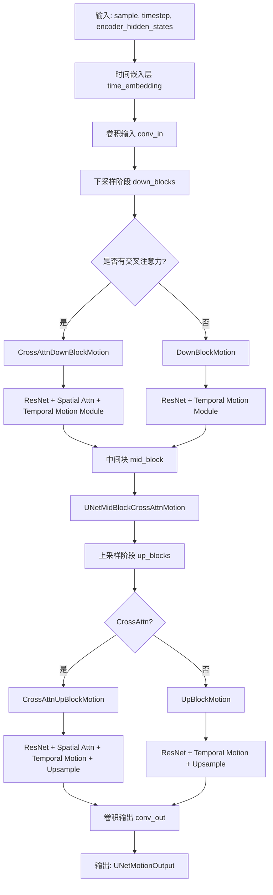

## 类结构

```
nn.Module (基类)
├── UNetMotionOutput (dataclass)
├── AnimateDiffTransformer3D
├── DownBlockMotion
├── CrossAttnDownBlockMotion
├── CrossAttnUpBlockMotion
├── UpBlockMotion
├── UNetMidBlockCrossAttnMotion
├── MotionModules
├── MotionAdapter (ModelMixin, ConfigMixin, FromOriginalModelMixin)
└── UNetMotionModel (ModelMixin, AttentionMixin, ConfigMixin, UNet2DConditionLoadersMixin, PeftAdapterMixin)
```

## 全局变量及字段


### `logger`
    
Logger instance for the unet_motion_model module

类型：`logging.Logger`
    


### `UNetMotionOutput.sample`
    
The hidden states output conditioned on encoder_hidden_states input

类型：`torch.Tensor`
    


### `AnimateDiffTransformer3D.num_attention_heads`
    
Number of attention heads for multi-head attention

类型：`int`
    


### `AnimateDiffTransformer3D.attention_head_dim`
    
Number of channels in each attention head

类型：`int`
    


### `AnimateDiffTransformer3D.in_channels`
    
Number of channels in the input

类型：`int | None`
    


### `AnimateDiffTransformer3D.norm`
    
Group normalization layer for input hidden states

类型：`nn.GroupNorm`
    


### `AnimateDiffTransformer3D.proj_in`
    
Linear projection layer for input hidden states

类型：`nn.Linear`
    


### `AnimateDiffTransformer3D.transformer_blocks`
    
List of BasicTransformerBlock modules for temporal modeling

类型：`nn.ModuleList`
    


### `AnimateDiffTransformer3D.proj_out`
    
Linear projection layer for output hidden states

类型：`nn.Linear`
    


### `DownBlockMotion.resnets`
    
List of ResnetBlock2D modules for downsampling

类型：`nn.ModuleList`
    


### `DownBlockMotion.motion_modules`
    
List of AnimateDiffTransformer3D modules for temporal motion

类型：`nn.ModuleList`
    


### `DownBlockMotion.downsamplers`
    
Downsampling layers for spatial reduction

类型：`nn.ModuleList | None`
    


### `DownBlockMotion.gradient_checkpointing`
    
Flag to enable gradient checkpointing for memory efficiency

类型：`bool`
    


### `CrossAttnDownBlockMotion.resnets`
    
List of ResnetBlock2D modules for downsampling

类型：`nn.ModuleList`
    


### `CrossAttnDownBlockMotion.attentions`
    
List of Transformer2DModel or DualTransformer2DModel for cross-attention

类型：`nn.ModuleList`
    


### `CrossAttnDownBlockMotion.motion_modules`
    
List of AnimateDiffTransformer3D modules for temporal motion

类型：`nn.ModuleList`
    


### `CrossAttnDownBlockMotion.downsamplers`
    
Downsampling layers for spatial reduction

类型：`nn.ModuleList | None`
    


### `CrossAttnDownBlockMotion.has_cross_attention`
    
Flag indicating whether block has cross-attention

类型：`bool`
    


### `CrossAttnDownBlockMotion.num_attention_heads`
    
Number of attention heads for cross-attention

类型：`int`
    


### `CrossAttnDownBlockMotion.gradient_checkpointing`
    
Flag to enable gradient checkpointing for memory efficiency

类型：`bool`
    


### `CrossAttnUpBlockMotion.resnets`
    
List of ResnetBlock2D modules for upsampling

类型：`nn.ModuleList`
    


### `CrossAttnUpBlockMotion.attentions`
    
List of Transformer2DModel or DualTransformer2DModel for cross-attention

类型：`nn.ModuleList`
    


### `CrossAttnUpBlockMotion.motion_modules`
    
List of AnimateDiffTransformer3D modules for temporal motion

类型：`nn.ModuleList`
    


### `CrossAttnUpBlockMotion.upsamplers`
    
Upsampling layers for spatial expansion

类型：`nn.ModuleList | None`
    


### `CrossAttnUpBlockMotion.has_cross_attention`
    
Flag indicating whether block has cross-attention

类型：`bool`
    


### `CrossAttnUpBlockMotion.num_attention_heads`
    
Number of attention heads for cross-attention

类型：`int`
    


### `CrossAttnUpBlockMotion.gradient_checkpointing`
    
Flag to enable gradient checkpointing for memory efficiency

类型：`bool`
    


### `CrossAttnUpBlockMotion.resolution_idx`
    
Index for resolution tracking in FreeU mechanism

类型：`int | None`
    


### `UpBlockMotion.resnets`
    
List of ResnetBlock2D modules for upsampling

类型：`nn.ModuleList`
    


### `UpBlockMotion.motion_modules`
    
List of AnimateDiffTransformer3D modules for temporal motion

类型：`nn.ModuleList`
    


### `UpBlockMotion.upsamplers`
    
Upsampling layers for spatial expansion

类型：`nn.ModuleList | None`
    


### `UpBlockMotion.gradient_checkpointing`
    
Flag to enable gradient checkpointing for memory efficiency

类型：`bool`
    


### `UpBlockMotion.resolution_idx`
    
Index for resolution tracking in FreeU mechanism

类型：`int | None`
    


### `UNetMidBlockCrossAttnMotion.resnets`
    
List of ResnetBlock2D modules for middle block

类型：`nn.ModuleList`
    


### `UNetMidBlockCrossAttnMotion.attentions`
    
List of Transformer2DModel or DualTransformer2DModel for cross-attention

类型：`nn.ModuleList`
    


### `UNetMidBlockCrossAttnMotion.motion_modules`
    
List of AnimateDiffTransformer3D modules for temporal motion

类型：`nn.ModuleList`
    


### `UNetMidBlockCrossAttnMotion.has_cross_attention`
    
Flag indicating whether block has cross-attention

类型：`bool`
    


### `UNetMidBlockCrossAttnMotion.num_attention_heads`
    
Number of attention heads for cross-attention

类型：`int`
    


### `UNetMidBlockCrossAttnMotion.gradient_checkpointing`
    
Flag to enable gradient checkpointing for memory efficiency

类型：`bool`
    


### `MotionModules.motion_modules`
    
List of AnimateDiffTransformer3D modules for motion modeling

类型：`nn.ModuleList`
    


### `MotionAdapter.conv_in`
    
Convolutional layer for input processing (used for PIA UNets)

类型：`nn.Conv2d | None`
    


### `MotionAdapter.down_blocks`
    
List of MotionModules for downsampling path

类型：`nn.ModuleList`
    


### `MotionAdapter.up_blocks`
    
List of MotionModules for upsampling path

类型：`nn.ModuleList`
    


### `MotionAdapter.mid_block`
    
Motion module for middle block of UNet

类型：`MotionModules | None`
    


### `UNetMotionModel.sample_size`
    
Width/height of the latent images for discrete inputs

类型：`int | None`
    


### `UNetMotionModel.conv_in`
    
Convolutional layer for input sample processing

类型：`nn.Conv2d`
    


### `UNetMotionModel.time_proj`
    
Timestep projection layer for encoding denoising steps

类型：`Timesteps`
    


### `UNetMotionModel.time_embedding`
    
Time embedding layer for timestep conditioning

类型：`TimestepEmbedding`
    


### `UNetMotionModel.encoder_hid_proj`
    
Projection layer for encoder hidden states (used for IP-Adapter)

类型：`nn.Linear | None`
    


### `UNetMotionModel.add_time_proj`
    
Additional timestep projection for text-time embeddings

类型：`Timesteps | None`
    


### `UNetMotionModel.add_embedding`
    
Additional embedding layer for text-time conditioning

类型：`TimestepEmbedding | None`
    


### `UNetMotionModel.down_blocks`
    
List of down blocks for downsampling path

类型：`nn.ModuleList`
    


### `UNetMotionModel.up_blocks`
    
List of up blocks for upsampling path

类型：`nn.ModuleList`
    


### `UNetMotionModel.mid_block`
    
Middle block of the UNet for feature processing

类型：`UNetMidBlockCrossAttnMotion | UNetMidBlock2DCrossAttn`
    


### `UNetMotionModel.conv_norm_out`
    
Group normalization for output convolution

类型：`nn.GroupNorm | None`
    


### `UNetMotionModel.conv_act`
    
Activation function for output convolution

类型：`nn.SiLU | None`
    


### `UNetMotionModel.conv_out`
    
Convolutional layer for final output generation

类型：`nn.Conv2d`
    


### `UNetMotionModel.num_upsamplers`
    
Count of upsampling layers in the UNet

类型：`int`
    
    

## 全局函数及方法


### `AnimateDiffTransformer3D.forward`

该方法是 AnimateDiffTransformer3D 类的前向传播函数，用于处理视频类数据的 Transformer 模块。它接收包含多帧的隐藏状态，通过形状变换将时空数据组织后依次经过归一化、线性投影、Transformer 块处理和输出投影，最后与残差连接输出结果。

参数：

- `hidden_states`：`torch.Tensor`，输入的隐藏状态张量，离散时为 `(batch size, num latent pixels)`，连续时为 `(batch size, channel, height, width)`
- `encoder_hidden_states`：`torch.LongTensor | None`，交叉注意力层的条件嵌入，如果未提供则默认为自注意力
- `timestep`：`torch.LongTensor | None`，用于指示去噪步骤的可选时间步，可作为 AdaLayerNorm 的嵌入
- `class_labels`：`torch.LongTensor | None`，用于指示类别标签条件的可选类别标签，可作为 AdaLayerZeroNorm 的嵌入
- `num_frames`：`int`，默认为 1，每个批次要处理的帧数，用于重塑隐藏状态
- `cross_attention_kwargs`：`dict[str, Any] | None`，可选的 kwargs 字典，如果指定则传递给 AttentionProcessor

返回值：`torch.Tensor`，输出张量

#### 流程图

```mermaid
flowchart TD
    A[开始 forward] --> B[获取输入维度信息<br/>batch_frames, channel, height, width]
    B --> C[保存残差 hidden_states]
    C --> D[形状变换<br/>reshape to (batch_size, num_frames, channel, height, width)]
    D --> E[维度置换<br/>permute to (batch_size, channel, num_frames, height, width)]
    E --> F[GroupNorm 归一化]
    F --> G[重塑为序列形式<br/>(batch_size * height * width, num_frames, channel)]
    G --> H[线性投影 proj_in]
    H --> I[遍历 transformer_blocks]
    I -->|for block| J[调用 block 进行处理<br/>包含 self-attention, cross-attention 等]
    J --> I
    I --> K[线性投影 proj_out]
    K --> L[形状恢复到 5D<br/>(batch_size, height, width, num_frames, channel)]
    L --> M[维度置换到标准形式<br/>(batch_size, num_frames, channel, height, width)]
    M --> N[连续内存重塑<br/>reshape to (batch_frames, channel, height, width)]
    N --> O[残差连接<br/>hidden_states + residual]
    O --> P[返回输出]
```

#### 带注释源码

```python
def forward(
    self,
    hidden_states: torch.Tensor,
    encoder_hidden_states: torch.LongTensor | None = None,
    timestep: torch.LongTensor | None = None,
    class_labels: torch.LongTensor | None = None,
    num_frames: int = 1,
    cross_attention_kwargs: dict[str, Any] | None = None,
) -> torch.Tensor:
    """
    The [`AnimateDiffTransformer3D`] forward method.

    Args:
        hidden_states (`torch.LongTensor` of shape `(batch size, num latent pixels)` if discrete, `torch.Tensor` of shape `(batch size, channel, height, width)` if continuous):
            Input hidden_states.
        encoder_hidden_states ( `torch.LongTensor` of shape `(batch size, encoder_hidden_states dim)`, *optional*):
            Conditional embeddings for cross attention layer. If not given, cross-attention defaults to
            self-attention.
        timestep ( `torch.LongTensor`, *optional*):
            Used to indicate denoising step. Optional timestep to be applied as an embedding in `AdaLayerNorm`.
        class_labels ( `torch.LongTensor` of shape `(batch size, num classes)`, *optional*):
            Used to indicate class labels conditioning. Optional class labels to be applied as an embedding in
            `AdaLayerZeroNorm`.
        num_frames (`int`, *optional*, defaults to 1):
            The number of frames to be processed per batch. This is used to reshape the hidden states.
        cross_attention_kwargs (`dict`, *optional*):
            A kwargs dictionary that if specified is passed along to the `AttentionProcessor` as defined under
            `self.processor` in
            [diffusers.models.attention_processor](https://github.com/huggingface/diffusers/blob/main/src/diffusers/models/attention_processor.py).

    Returns:
        torch.Tensor:
            The output tensor.
    """
    # 1. Input
    # 获取输入张量的维度信息
    # batch_frames: 批次中的总帧数 (batch_size * num_frames)
    batch_frames, channel, height, width = hidden_states.shape
    # 计算实际批次大小
    batch_size = batch_frames // num_frames

    # 保存残差连接所需的原始输入
    residual = hidden_states

    # 将隐藏状态从 (batch_frames, channel, height, width) 
    # 重塑为 (batch_size, num_frames, channel, height, width)
    # 以便处理视频帧序列
    hidden_states = hidden_states[None, :].reshape(batch_size, num_frames, channel, height, width)
    # 置换维度从 (batch_size, num_frames, channel, height, width) 
    # 变为 (batch_size, channel, num_frames, height, width)
    hidden_states = hidden_states.permute(0, 2, 1, 3, 4)

    # 应用 GroupNorm 归一化
    hidden_states = self.norm(hidden_states)
    # 重新排列维度并重塑为序列形式
    # 从 (batch_size, channel, num_frames, height, width)
    # 到 (batch_size * height * width, num_frames, channel)
    # 这将空间维度合并到批次维度，每帧作为一个序列元素
    hidden_states = hidden_states.permute(0, 3, 4, 2, 1).reshape(batch_size * height * width, num_frames, channel)

    # 线性投影到内部维度
    hidden_states = self.proj_in(input=hidden_states)

    # 2. Blocks
    # 遍历每个 Transformer 块进行处理
    for block in self.transformer_blocks:
        hidden_states = block(
            hidden_states=hidden_states,
            encoder_hidden_states=encoder_hidden_states,
            timestep=timestep,
            cross_attention_kwargs=cross_attention_kwargs,
            class_labels=class_labels,
        )

    # 3. Output
    # 输出线性投影
    hidden_states = self.proj_out(input=hidden_states)
    # 恢复形状到 5D 张量 (batch_size, height, width, num_frames, channel)
    hidden_states = (
        hidden_states[None, None, :]
        .reshape(batch_size, height, width, num_frames, channel)
        .permute(0, 3, 4, 1, 2)  # 转换为 (batch_size, num_frames, channel, height, width)
        .contiguous()  # 确保内存连续
    )
    # 重塑为 4D 张量 (batch_frames, channel, height, width)
    hidden_states = hidden_states.reshape(batch_frames, channel, height, width)

    # 残差连接：将输出与输入相加
    output = hidden_states + residual
    return output
```


### `DownBlockMotion.forward`

该方法是 `DownBlockMotion` 类的前向传播方法，负责对输入的隐藏状态进行下采样处理。方法首先对输入应用残差网络（ResNet）块进行特征提取，然后通过运动模块（motion_module）对特征进行时间维度上的处理，最后通过下采样器（downsampler）对特征图进行空间下采样。在训练时会使用梯度检查点（gradient checkpointing）来节省显存。

参数：

- `hidden_states`：`torch.Tensor`，输入的隐藏状态张量，通常是来自上一层的特征图，形状为 `(batch_size, channels, height, width)` 或包含帧维度的 `(batch_size, channels, num_frames, height, width)`
- `temb`：`torch.Tensor | None`，时间嵌入（temporal embedding），用于条件化噪声调度（noise schedule），可以为空
- `num_frames`：`int`，要处理的帧数量，默认为 1，用于reshape隐藏状态以支持视频数据
- `*args`：可变位置参数，已废弃，用于向后兼容
- `**kwargs`：可变关键字参数，应包含 `scale` 参数（已废弃），用于向后兼容

返回值：`torch.Tensor | tuple[torch.Tensor, ...]`，返回最终的隐藏状态和所有中间输出状态的元组。如果有下采样器，最终隐藏状态会经过下采样处理。

#### 流程图

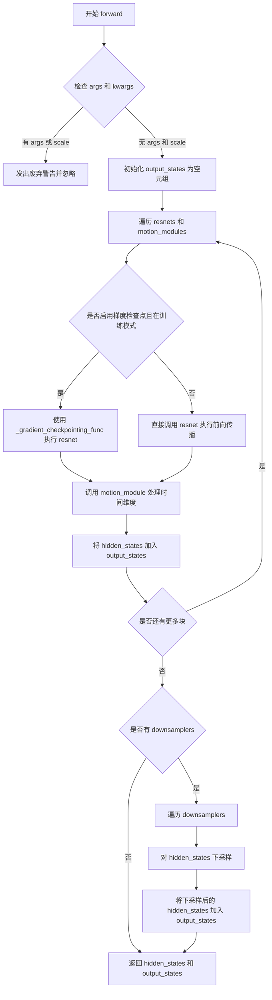

#### 带注释源码

```python
def forward(
    self,
    hidden_states: torch.Tensor,
    temb: torch.Tensor | None = None,
    num_frames: int = 1,
    *args,
    **kwargs,
) -> torch.Tensor | tuple[torch.Tensor, ...]:
    # 检查是否有遗留的位置参数或 scale 参数（已废弃）
    if len(args) > 0 or kwargs.get("scale", None) is not None:
        # 构造废弃警告信息
        deprecation_message = "The `scale` argument is deprecated and will be ignored. Please remove it, as passing it will raise an error in the future. `scale` should directly be passed while calling the underlying pipeline component i.e., via `cross_attention_kwargs`."
        # 调用 deprecate 函数发出警告
        deprecate("scale", "1.0.0", deprecation_message)

    # 初始化输出状态元组，用于存储每一层的中间输出
    output_states = ()

    # 将残差块和运动模块配对遍历
    blocks = zip(self.resnets, self.motion_modules)
    for resnet, motion_module in blocks:
        # 检查是否启用梯度检查点且当前在训练模式
        if torch.is_grad_enabled() and self.gradient_checkpointing:
            # 使用梯度检查点函数执行残差块，以节省显存
            hidden_states = self._gradient_checkpointing_func(resnet, hidden_states, temb)
        else:
            # 直接执行残差块的前向传播
            # 参数 input_tensor 为输入特征，temb 为时间嵌入
            hidden_states = resnet(input_tensor=hidden_states, temb=temb)

        # 调用运动模块处理时间维度信息
        # hidden_states: 当前特征张量
        # num_frames: 视频帧数，用于reshape
        hidden_states = motion_module(hidden_states, num_frames=num_frames)

        # 将当前层的输出加入到输出状态元组中
        output_states = output_states + (hidden_states,)

    # 检查是否存在下采样器
    if self.downsamplers is not None:
        # 遍历所有下采样器
        for downsampler in self.downsamplers:
            # 对隐藏状态进行下采样（空间维度降采样）
            hidden_states = downsampler(hidden_states=hidden_states)

        # 将下采样后的隐藏状态也加入到输出状态元组
        output_states = output_states + (hidden_states,)

    # 返回最终隐藏状态和所有中间状态
    return hidden_states, output_states
```


### `CrossAttnDownBlockMotion.forward`

该方法是 `CrossAttnDownBlockMotion` 类的前向传播函数，负责在 UNet 下采样阶段处理隐藏状态。它依次通过 ResNet 块、空间注意力块（Cross-Attention）和时间运动模块（Motion Module），并可选地应用下采样操作，最终返回当前块的输出隐藏状态及所有中间状态。

参数：

- `self`：`CrossAttnDownBlockMotion`，当前类的实例
- `hidden_states`：`torch.Tensor`，输入的隐藏状态张量，形状为 `(batch, channel, height, width)`
- `temb`：`torch.Tensor | None`，时间嵌入向量，用于条件注入
- `encoder_hidden_states`：`torch.Tensor | None`，编码器隐藏状态，用于跨注意力机制的条件输入
- `attention_mask`：`torch.Tensor | None`，空间注意力掩码，用于控制注意力计算
- `num_frames`：`int = 1`，视频帧数，用于时间维度的处理
- `encoder_attention_mask`：`torch.Tensor | None`，编码器注意力掩码，用于跨注意力的条件掩码
- `cross_attention_kwargs`：`dict[str, Any] | None`，跨注意力关键字参数字典，用于传递注意力处理器配置
- `additional_residuals`：`torch.Tensor | None`，额外的残差张量，在最后一个 ResNet-Attention 块后添加到输出

返回值：`tuple[torch.Tensor, ...]`，返回元组，包含最终隐藏状态和所有中间输出状态的元组

#### 流程图

```mermaid
flowchart TD
    A[输入 hidden_states, temb, encoder_hidden_states, attention_mask, num_frames, encoder_attention_mask, cross_attention_kwargs, additional_residuals] --> B{检查 cross_attention_kwargs 中的 scale 参数}
    B -->|存在| C[警告 scale 已弃用并忽略]
    B -->|不存在| D[初始化输出状态元组]
    C --> D
    D --> E[遍历 resnets, attentions, motion_modules 三元组]
    E --> F{是否启用梯度检查点}
    F -->|是| G[使用 _gradient_checkpointing_func 执行 resnet]
    F -->|否| H[直接执行 resnet: resnet(input_tensor=hidden_states, temb=temb)]
    G --> I
    H --> I[执行空间注意力: attn hidden_states, encoder_hidden_states, cross_attention_kwargs, attention_mask, encoder_attention_mask, return_dict=False]
    I --> J[执行时间运动模块: motion_module hidden_states, num_frames=num_frames]
    J --> K{是否为最后一个块且存在 additional_residuals}
    K -->|是| L[将 additional_residuals 加到 hidden_states]
    K -->|否| M
    L --> M[将 hidden_states 加入 output_states]
    M --> N{是否还有更多块}
    N -->|是| E
    N -->|否| O{是否存在 downsamplers}
    O -->|是| P[遍历 downsamplers 执行下采样]
    O -->|否| Q
    P --> R[将下采样后的 hidden_states 加入 output_states]
    R --> Q
    Q --> S[返回 hidden_states 和 output_states 元组]
```

#### 带注释源码

```python
def forward(
    self,
    hidden_states: torch.Tensor,
    temb: torch.Tensor | None = None,
    encoder_hidden_states: torch.Tensor | None = None,
    attention_mask: torch.Tensor | None = None,
    num_frames: int = 1,
    encoder_attention_mask: torch.Tensor | None = None,
    cross_attention_kwargs: dict[str, Any] | None = None,
    additional_residuals: torch.Tensor | None = None,
):
    # 检查 cross_attention_kwargs 中是否传递了已弃用的 scale 参数
    if cross_attention_kwargs is not None:
        if cross_attention_kwargs.get("scale", None) is not None:
            # 记录警告：scale 参数已弃用，应通过 cross_attention_kwargs 传递
            logger.warning("Passing `scale` to `cross_attention_kwargs` is deprecated. `scale` will be ignored.")

    # 初始化输出状态元组，用于存储每个块的中间输出
    output_states = ()

    # 将 resnets、attentions、motion_modules 打包为三元组列表进行迭代
    blocks = list(zip(self.resnets, self.attentions, self.motion_modules))
    
    # 遍历每个三元组：ResNet块、空间注意力块、时间运动模块
    for i, (resnet, attn, motion_module) in enumerate(blocks):
        # 判断是否启用梯度检查点优化以节省显存
        if torch.is_grad_enabled() and self.gradient_checkpointing:
            # 使用梯度检查点方式执行 ResNet（前向不保存中间激活，反向时重新计算）
            hidden_states = self._gradient_checkpointing_func(resnet, hidden_states, temb)
        else:
            # 标准前向传播：ResNet 块处理隐藏状态和时间嵌入
            hidden_states = resnet(input_tensor=hidden_states, temb=temb)

        # 空间 Cross-Attention：使用 encoder_hidden_states 作为条件进行注意力计算
        hidden_states = attn(
            hidden_states=hidden_states,
            encoder_hidden_states=encoder_hidden_states,
            cross_attention_kwargs=cross_attention_kwargs,
            attention_mask=attention_mask,
            encoder_attention_mask=encoder_attention_mask,
            return_dict=False,  # 返回元组而非字典
        )[0]  # 取第一个元素（输出张量）

        # 时间运动模块（AnimateDiffTransformer3D）：处理视频帧间的时间维度的依赖关系
        hidden_states = motion_module(hidden_states, num_frames=num_frames)

        # 如果是最后一个块且存在额外残差，则将其加到输出上
        # 这通常用于跨块残差连接（如 ControlNet 的额外控制）
        if i == len(blocks) - 1 and additional_residuals is not None:
            hidden_states = hidden_states + additional_residuals

        # 将当前块的输出加入输出状态元组
        output_states = output_states + (hidden_states,)

    # 如果存在下采样器，则对隐藏状态进行空间下采样
    if self.downsamplers is not None:
        for downsampler in self.downsamplers:
            hidden_states = downsampler(hidden_states=hidden_states)

        # 将下采样后的输出也加入输出状态元组
        output_states = output_states + (hidden_states,)

    # 返回最终隐藏状态和所有中间输出状态
    return hidden_states, output_states
```


### `CrossAttnUpBlockMotion.forward`

这是UNet上采样块中带有交叉注意力机制的运动模块块的前向传播方法，负责在视频生成过程中将低分辨率特征上采样到高分辨率，同时通过交叉注意力机制整合编码器信息，并应用时间维度的运动变换来捕捉时间动态。

参数：

- `hidden_states`：`torch.Tensor`，当前层的输入隐藏状态，通常为(batch, channels, height, width)或包含帧维度的形状
- `res_hidden_states_tuple`：`tuple[torch.Tensor, ...]`，来自下采样层的残差特征元组，用于跳跃连接
- `temb`：`torch.Tensor | None`，时间嵌入向量，用于条件注入
- `encoder_hidden_states`：`torch.Tensor | None`，编码器输出的隐藏状态，用于交叉注意力
- `cross_attention_kwargs`：`dict[str, Any] | None`，传递给交叉注意力处理器的额外关键字参数
- `upsample_size`：`int | None`，上采样输出尺寸，用于控制输出大小
- `attention_mask`：`torch.Tensor | None`，注意力掩码，用于屏蔽无效位置
- `encoder_attention_mask`：`torch.Tensor | None`，编码器注意力掩码
- `num_frames`：`int`，要处理的帧数，默认为1

返回值：`torch.Tensor`，经过上采样、注意力机制和运动模块处理后的输出特征

#### 流程图

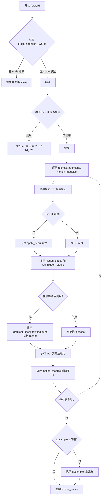

#### 带注释源码

```python
def forward(
    self,
    hidden_states: torch.Tensor,
    res_hidden_states_tuple: tuple[torch.Tensor, ...],
    temb: torch.Tensor | None = None,
    encoder_hidden_states: torch.Tensor | None = None,
    cross_attention_kwargs: dict[str, Any] | None = None,
    upsample_size: int | None = None,
    attention_mask: torch.Tensor | None = None,
    encoder_attention_mask: torch.Tensor | None = None,
    num_frames: int = 1,
) -> torch.Tensor:
    # 检查是否传递了已弃用的 scale 参数
    if cross_attention_kwargs is not None:
        if cross_attention_kwargs.get("scale", None) is not None:
            # 警告：scale 参数已弃用，将被忽略
            logger.warning("Passing `scale` to `cross_attention_kwargs` is deprecated. `scale` will be ignored.")

    # 检查 FreeU 机制是否启用
    # FreeU 用于减轻上采样过程中的过度平滑效应
    is_freeu_enabled = (
        getattr(self, "s1", None)
        and getattr(self, "s2", None)
        and getattr(self, "b1", None)
        and getattr(self, "b2", None)
    )

    # 遍历每个resnet、attention和motion_module组成的块
    blocks = zip(self.resnets, self.attentions, self.motion_modules)
    for resnet, attn, motion_module in blocks:
        # 从残差元组中弹出最后一个状态（后进先出）
        res_hidden_states = res_hidden_states_tuple[-1]
        res_hidden_states_tuple = res_hidden_states_tuple[:-1]

        # FreeU: 仅在前两个阶段操作
        if is_freeu_enabled:
            # 应用Freeu特征变换来改进上采样质量
            hidden_states, res_hidden_states = apply_freeu(
                self.resolution_idx,
                hidden_states,
                res_hidden_states,
                s1=self.s1,
                s2=self.s2,
                b1=self.b1,
                b2=self.b2,
            )

        # 将当前隐藏状态与残差状态在通道维度拼接
        hidden_states = torch.cat([hidden_states, res_hidden_states], dim=1)

        # 根据是否启用梯度检查点选择执行路径
        if torch.is_grad_enabled() and self.gradient_checkpointing:
            # 使用梯度检查点节省显存
            hidden_states = self._gradient_checkpointing_func(resnet, hidden_states, temb)
        else:
            # 直接执行resnet块
            hidden_states = resnet(input_tensor=hidden_states, temb=temb)

        # 执行交叉注意力操作，整合encoder_hidden_states信息
        hidden_states = attn(
            hidden_states=hidden_states,
            encoder_hidden_states=encoder_hidden_states,
            cross_attention_kwargs=cross_attention_kwargs,
            attention_mask=attention_mask,
            encoder_attention_mask=encoder_attention_mask,
            return_dict=False,
        )[0]

        # 执行时间维度的运动模块，处理帧间关系
        hidden_states = motion_module(hidden_states, num_frames=num_frames)

    # 如果存在上采样器，则执行上采样
    if self.upsamplers is not None:
        for upsampler in self.upsamplers:
            hidden_states = upsampler(hidden_states=hidden_states, output_size=upsample_size)

    return hidden_states
```


### `UpBlockMotion.forward`

该方法是 `UpBlockMotion` 类的前向传播函数，负责在 UNet 上采样阶段处理隐藏状态，包括残差连接、时间嵌入处理、运动模块应用以及可选的上采样操作。

**参数：**

- `hidden_states`：`torch.Tensor`，当前层的输入隐藏状态
- `res_hidden_states_tuple`：`tuple[torch.Tensor, ...]`，来自下采样层的残差隐藏状态元组
- `temb`：`torch.Tensor | None`，时间嵌入向量
- `upsample_size`：`None`，上采样尺寸（可选）
- `num_frames`：`int`，要处理的帧数，默认为 1
- `*args`：可变位置参数（已废弃）
- `**kwargs`：可变关键字参数（已废弃）

**返回值：** `torch.Tensor`，处理后的隐藏状态

#### 流程图

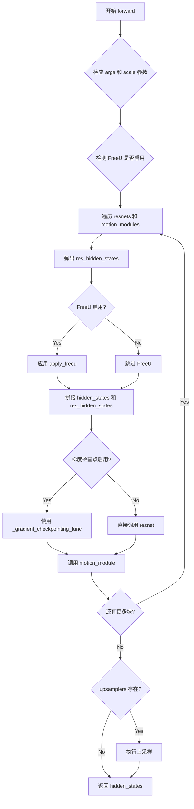

#### 带注释源码

```python
def forward(
    self,
    hidden_states: torch.Tensor,           # 当前层输入特征
    res_hidden_states_tuple: tuple[torch.Tensor, ...],  # 下采样层残差特征
    temb: torch.Tensor | None = None,      # 时间嵌入
    upsample_size=None,                     # 上采样尺寸
    num_frames: int = 1,                    # 帧数
    *args,                                  # 已废弃参数
    **kwargs,                               # 已废弃参数
) -> torch.Tensor:
    # 检查是否传递了已废弃的 scale 参数
    if len(args) > 0 or kwargs.get("scale", None) is not None:
        deprecation_message = "The `scale` argument is deprecated and will be ignored. Please remove it, as passing it will raise an error in the future. `scale` should directly be passed while calling the underlying pipeline component i.e., via `cross_attention_kwargs`."
        deprecate("scale", "1.0.0", deprecation_message)

    # 检测 FreeU 机制是否启用（通过检查 s1, s2, b1, b2 属性）
    is_freeu_enabled = (
        getattr(self, "s1", None)
        and getattr(self, "s2", None)
        and getattr(self, "b1", None)
        and getattr(self, "b2", None)
    )

    # 配对 resnet 块和运动模块
    blocks = zip(self.resnets, self.motion_modules)

    for resnet, motion_module in blocks:
        # 弹出残差隐藏状态（从元组末尾取）
        res_hidden_states = res_hidden_states_tuple[-1]
        res_hidden_states_tuple = res_hidden_states_tuple[:-1]

        # FreeU：仅在前两个阶段操作
        if is_freeu_enabled:
            hidden_states, res_hidden_states = apply_freeu(
                self.resolution_idx,
                hidden_states,
                res_hidden_states,
                s1=self.s1,
                s2=self.s2,
                b1=self.b1,
                b2=self.b2,
            )

        # 跳跃连接：拼接主特征和残差特征
        hidden_states = torch.cat([hidden_states, res_hidden_states], dim=1)

        # 根据是否启用梯度检查点选择前向传播方式
        if torch.is_grad_enabled() and self.gradient_checkpointing:
            hidden_states = self._gradient_checkpointing_func(resnet, hidden_states, temb)
        else:
            hidden_states = resnet(input_tensor=hidden_states, temb=temb)

        # 应用时序运动模块处理多帧特征
        hidden_states = motion_module(hidden_states, num_frames=num_frames)

    # 执行上采样（如果存在）
    if self.upsamplers is not None:
        for upsampler in self.upsamplers:
            hidden_states = upsampler(hidden_states=hidden_states, output_size=upsample_size)

    return hidden_states
```


### `UNetMidBlockCrossAttnMotion.forward`

该方法是 UNet 中间块的前向传播函数，负责处理 UNet 架构中间层的特征提取与增强。它首先通过初始残差块处理输入隐藏状态，然后依次通过交叉注意力模块、运动模块和残差块进行多层特征处理，最后输出处理后的特征张量。在执行过程中，若启用梯度检查点则使用梯度checkpointing优化显存占用。

参数：

- `self`：`UNetMidBlockCrossAttnMotion` 类实例，隐式参数
- `hidden_states`：`torch.Tensor`，输入的隐藏状态张量，通常为上一层的输出特征
- `temb`：`torch.Tensor | None`，时间嵌入向量，用于条件生成的时间步信息
- `encoder_hidden_states`：`torch.Tensor | None`，编码器隐藏状态，用于交叉注意力机制的条件输入
- `attention_mask`：`torch.Tensor | None`，注意力掩码，用于控制自注意力计算中需要忽略的位置
- `cross_attention_kwargs`：`dict[str, Any] | None`，交叉注意力处理的额外关键字参数（如 LoRA 缩放因子等）
- `encoder_attention_mask`：`torch.Tensor | None`，编码器注意力掩码，用于交叉注意力中忽略特定位置
- `num_frames`：`int`，要处理的帧数，默认为1，用于时间维度的处理

返回值：`torch.Tensor`，处理后的隐藏状态张量

#### 流程图

```mermaid
flowchart TD
    A[开始 forward] --> B{检查 cross_attention_kwargs 中是否有 scale}
    B -->|有| C[警告: scale 已废弃并忽略]
    B -->|无| D[继续执行]
    C --> D
    D --> E[通过 resnets[0] 处理 hidden_states]
    E --> F[zip attnetions, resnets[1:], motion_modules 组成块]
    F --> G{遍历每个块}
    G -->|第i块| H[attn 处理 hidden_states]
    H --> I{检查梯度检查点是否启用}
    I -->|是| J[使用 _gradient_checkpointing_func 依次执行 motion_module 和 resnet]
    I -->|否| K[直接执行 motion_module 和 resnet]
    J --> L[更新 hidden_states]
    K --> L
    L --> G
    G -->|遍历完成| M[返回最终 hidden_states]
```

#### 带注释源码

```python
def forward(
    self,
    hidden_states: torch.Tensor,
    temb: torch.Tensor | None = None,
    encoder_hidden_states: torch.Tensor | None = None,
    attention_mask: torch.Tensor | None = None,
    cross_attention_kwargs: dict[str, Any] | None = None,
    encoder_attention_mask: torch.Tensor | None = None,
    num_frames: int = 1,
) -> torch.Tensor:
    """
    UNetMidBlockCrossAttnMotion 的前向传播方法
    
    参数:
        hidden_states: 输入的隐藏状态张量
        temb: 时间嵌入，用于条件注入
        encoder_hidden_states: 编码器输出的隐藏状态，用于交叉注意力
        attention_mask: 注意力掩码
        cross_attention_kwargs: 交叉注意力额外参数
        encoder_attention_mask: 编码器注意力掩码
        num_frames: 处理的帧数
    
    返回:
        处理后的隐藏状态张量
    """
    # 检查 cross_attention_kwargs 中是否有 scale 参数
    # 如果有，发出警告并忽略该参数（已废弃）
    if cross_attention_kwargs is not None:
        if cross_attention_kwargs.get("scale", None) is not None:
            logger.warning("Passing `scale` to `cross_attention_kwargs` is deprecated. `scale` will be ignored.")

    # 步骤1: 通过第一个残差块处理输入 hidden_states
    # 这是中间块的初始处理，使用 resnets 列表中的第一个块
    hidden_states = self.resnets[0](input_tensor=hidden_states, temb=temb)

    # 步骤2: 遍历注意力、残差块和运动模块进行级联处理
    # 使用 zip 将三个模块配对遍历: (attention, resnet, motion_module)
    blocks = zip(self.attentions, self.resnets[1:], self.motion_modules)
    for attn, resnet, motion_module in blocks:
        # 2.1 通过交叉注意力模块处理
        # 使用 encoder_hidden_states 作为条件输入
        hidden_states = attn(
            hidden_states=hidden_states,
            encoder_hidden_states=encoder_hidden_states,
            cross_attention_kwargs=cross_attention_kwargs,
            attention_mask=attention_mask,
            encoder_attention_mask=encoder_attention_mask,
            return_dict=False,  # 返回张量而非字典
        )[0]  # 取第一个返回值（隐藏状态）

        # 2.2 根据是否启用梯度检查点选择执行路径
        if torch.is_grad_enabled() and self.gradient_checkpointing:
            # 启用梯度检查点: 节省显存但增加计算时间
            # 先执行运动模块（motion_module），传入 num_frames 参数
            hidden_states = self._gradient_checkpointing_func(
                motion_module, hidden_states, None, None, None, num_frames, None
            )
            # 再执行残差块（resnet）
            hidden_states = self._gradient_checkpointing_func(resnet, hidden_states, temb)
        else:
            # 直接执行（标准前向传播）
            # 运动模块处理时间维度的特征交互
            hidden_states = motion_module(hidden_states, None, None, None, num_frames, None)
            # 残差块进一步处理特征
            hidden_states = resnet(input_tensor=hidden_states, temb=temb)

    # 步骤3: 返回处理完成的隐藏状态
    return hidden_states
```


### `MotionAdapter.forward`

MotionAdapter 的前向传播方法，用于将运动适配模块应用于输入样本，处理视频或多帧数据中的时间维度信息。

参数：

- `sample`：`torch.Tensor`，输入的样本张量，通常是包含多帧的潜在表示，形状为 `(batch, num_frames, channels, height, width)` 或类似结构

返回值：`torch.Tensor` 或 `pass`，处理后的样本张量，但由于当前实现为 `pass`，实际返回 `None`

#### 流程图

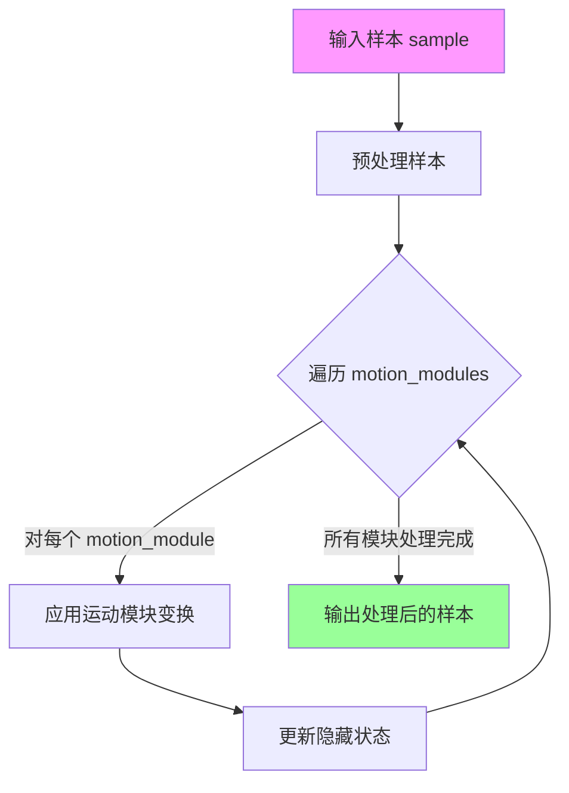

#### 带注释源码

```python
def forward(self, sample):
    """
    MotionAdapter 的前向传播方法。
    
    该方法接收一个样本输入，将其通过运动适配模块进行处理。
    运动模块通常用于为视频生成模型添加时间维度的建模能力。
    
    Args:
        sample (torch.Tensor): 输入样本张量，通常包含多帧的潜在表示
        
    Returns:
        torch.Tensor: 处理后的样本张量（当前实现返回 None）
    """
    pass  # TODO: 实现运动模块的前向传播逻辑
```


### `UNetMotionModel.from_unet2d`

这是一个类方法，用于将预训练的 `UNet2DConditionModel` 转换为支持动画运动功能的 `UNetMotionModel`。该方法可以可选地加载 `MotionAdapter` 的权重，并处理权重迁移、配置更新等关键逻辑，使得原本用于图像生成的 UNet 能够支持视频/动画生成任务。

参数：

-   `cls`：类型 `type`，Python 类本身（隐式参数），用于调用类的构造函数
-   `unet`：类型 `UNet2DConditionModel`，要转换的基础 UNet2D 条件模型，包含预训练的权重配置
-   `motion_adapter`：类型 `MotionAdapter | None`（可选），运动适配器模块，包含时间维度的运动注意力机制权重，如果提供则会被加载到模型中
-   `load_weights`：类型 `bool`（默认为 `True`），是否加载预训练权重，如果为 `False` 则只初始化模型结构

返回值：`UNetMotionModel`，返回转换并（可选）加载权重后的运动模型实例

#### 流程图

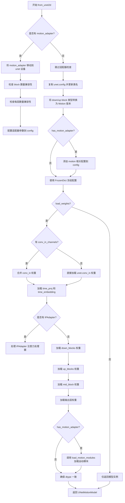

#### 带注释源码

```python
@classmethod
def from_unet2d(
    cls,
    unet: UNet2DConditionModel,
    motion_adapter: MotionAdapter | None = None,
    load_weights: bool = True,
):
    """
    从 UNet2DConditionModel 创建 UNetMotionModel

    Args:
        unet: 预训练的 UNet2DConditionModel
        motion_adapter: 可选的 MotionAdapter 用于运动模块
        load_weights: 是否加载权重
    """
    # 检查是否有运动适配器
    has_motion_adapter = motion_adapter is not None

    if has_motion_adapter:
        # 将适配器移动到与 unet 相同的设备
        motion_adapter.to(device=unet.device)

        # 检查兼容性：block 数量必须一致
        if len(unet.config["down_block_types"]) != len(motion_adapter.config["block_out_channels"]):
            raise ValueError("Incompatible Motion Adapter, got different number of blocks")

        # 检查每层的兼容性
        # 展开 unet 的 layers_per_block 为列表
        if isinstance(unet.config["layers_per_block"], int):
            expanded_layers_per_block = [unet.config["layers_per_block"]] * len(unet.config["down_block_types"])
        else:
            expanded_layers_per_block = list(unet.config["layers_per_block"])

        # 展开适配器的 layers_per_block 为列表
        if isinstance(motion_adapter.config["motion_layers_per_block"], int):
            expanded_adapter_layers_per_block = [motion_adapter.config["motion_layers_per_block"]] * len(
                motion_adapter.config["block_out_channels"]
            )
        else:
            expanded_adapter_layers_per_block = list(motion_adapter.config["motion_layers_per_block"])

        # 检查层数是否匹配
        if expanded_layers_per_block != expanded_adapter_layers_per_block:
            raise ValueError("Incompatible Motion Adapter, got different number of layers per block")

    # 基于原始 unet.config 创建新配置
    # 参考: https://github.com/guoyww/AnimateDiff/blob/main/animatediff/models/unet.py#L459
    config = dict(unet.config)
    config["_class_name"] = cls.__name__  # 设置类名为 UNetMotionModel

    # 将 down_block_types 转换为 Motion 版本
    down_blocks = []
    for down_blocks_type in config["down_block_types"]:
        if "CrossAttn" in down_blocks_type:
            down_blocks.append("CrossAttnDownBlockMotion")
        else:
            down_blocks.append("DownBlockMotion")
    config["down_block_types"] = down_blocks

    # 将 up_block_types 转换为 Motion 版本
    up_blocks = []
    for down_blocks_type in config["up_block_types"]:
        if "CrossAttn" in down_blocks_type:
            up_blocks.append("CrossAttnUpBlockMotion")
        else:
            up_blocks.append("UpBlockMotion")
    config["up_block_types"] = up_blocks

    # 如果有运动适配器，添加相关配置
    if has_motion_adapter:
        config["motion_num_attention_heads"] = motion_adapter.config["motion_num_attention_heads"]
        config["motion_max_seq_length"] = motion_adapter.config["motion_max_seq_length"]
        config["use_motion_mid_block"] = motion_adapter.config["use_motion_mid_block"]
        config["layers_per_block"] = motion_adapter.config["motion_layers_per_block"]
        config["temporal_transformer_layers_per_mid_block"] = motion_adapter.config[
            "motion_transformer_layers_per_mid_block"
        ]
        config["temporal_transformer_layers_per_block"] = motion_adapter.config[
            "motion_transformer_layers_per_block"
        ]
        config["motion_num_attention_heads"] = motion_adapter.config["motion_num_attention_heads"]

        # 对于 PIA UNets，需要设置输入通道数为 9
        if motion_adapter.config["conv_in_channels"]:
            config["in_channels"] = motion_adapter.config["conv_in_channels"]

    # 兼容性处理：确保 num_attention_heads 存在
    if not config.get("num_attention_heads"):
        config["num_attention_heads"] = config["attention_head_dim"]

    # 获取预期的参数和可选参数
    expected_kwargs, optional_kwargs = cls._get_signature_keys(cls)
    # 过滤配置，只保留有效参数
    config = FrozenDict({k: config.get(k) for k in config if k in expected_kwargs or k in optional_kwargs})
    config["_class_name"] = cls.__name__

    # 从配置创建模型实例
    model = cls.from_config(config)

    # 如果不需要加载权重，直接返回
    if not load_weights:
        return model

    # 处理 PIA UNets 的特殊权重加载逻辑
    # 允许前 4 个通道来自任何 UNet2DConditionModel
    # 后 5 个通道必须来自 PIA conv_in 权重
    if has_motion_adapter and motion_adapter.config["conv_in_channels"]:
        model.conv_in = motion_adapter.conv_in
        # 合并权重：将 unet 的前 4 通道和适配器的后 5 通道拼接
        updated_conv_in_weight = torch.cat(
            [unet.conv_in.weight, motion_adapter.conv_in.weight[:, 4:, :, :]], dim=1
        )
        model.conv_in.load_state_dict({"weight": updated_conv_in_weight, "bias": unet.conv_in.bias})
    else:
        # 直接加载 unet 的 conv_in 权重
        model.conv_in.load_state_dict(unet.conv_in.state_dict())

    # 加载时间投影和时间嵌入层权重
    model.time_proj.load_state_dict(unet.time_proj.state_dict())
    model.time_embedding.load_state_dict(unet.time_embedding.state_dict())

    # 处理 IPAdapter 注意力处理器
    if any(
        isinstance(proc, (IPAdapterAttnProcessor, IPAdapterAttnProcessor2_0))
        for proc in unet.attn_processors.values()
    ):
        attn_procs = {}
        for name, processor in unet.attn_processors.items():
            if name.endswith("attn1.processor"):
                # 自注意力使用标准处理器
                attn_processor_class = (
                    AttnProcessor2_0 if hasattr(F, "scaled_dot_product_attention") else AttnProcessor
                )
                attn_procs[name] = attn_processor_class()
            else:
                # 交叉注意力使用 IPAdapter 处理器
                attn_processor_class = (
                    IPAdapterAttnProcessor2_0
                    if hasattr(F, "scaled_dot_product_attention")
                    else IPAdapterAttnProcessor
                )
                attn_procs[name] = attn_processor_class(
                    hidden_size=processor.hidden_size,
                    cross_attention_dim=processor.cross_attention_dim,
                    scale=processor.scale,
                    num_tokens=processor.num_tokens,
                )
        # 为模型设置注意力处理器
        for name, processor in model.attn_processors.items():
            if name not in attn_procs:
                attn_procs[name] = processor.__class__()
        model.set_attn_processor(attn_procs)
        model.config.encoder_hid_dim_type = "ip_image_proj"
        model.encoder_hid_proj = unet.encoder_hid_proj

    # 加载下采样块的权重
    for i, down_block in enumerate(unet.down_blocks):
        model.down_blocks[i].resnets.load_state_dict(down_block.resnets.state_dict())
        if hasattr(model.down_blocks[i], "attentions"):
            model.down_blocks[i].attentions.load_state_dict(down_block.attentions.state_dict())
        if model.down_blocks[i].downsamplers:
            model.down_blocks[i].downsamplers.load_state_dict(down_block.downsamplers.state_dict())

    # 加载上采样块的权重
    for i, up_block in enumerate(unet.up_blocks):
        model.up_blocks[i].resnets.load_state_dict(up_block.resnets.state_dict())
        if hasattr(model.up_blocks[i], "attentions"):
            model.up_blocks[i].attentions.load_state_dict(up_block.attentions.state_dict())
        if model.up_blocks[i].upsamplers:
            model.up_blocks[i].upsamplers.load_state_dict(up_block.upsamplers.state_dict())

    # 加载中间块的权重
    model.mid_block.resnets.load_state_dict(unet.mid_block.resnets.state_dict())
    model.mid_block.attentions.load_state_dict(unet.mid_block.attentions.state_dict())

    # 加载输出层权重
    if unet.conv_norm_out is not None:
        model.conv_norm_out.load_state_dict(unet.conv_norm_out.state_dict())
    if unet.conv_act is not None:
        model.conv_act.load_state_dict(unet.conv_act.state_dict())
    model.conv_out.load_state_dict(unet.conv_out.state_dict())

    # 如果有运动适配器，加载运动模块权重
    if has_motion_adapter:
        model.load_motion_modules(motion_adapter)

    # 确保 Motion UNet 的数据类型与 UNet2DConditionModel 一致
    model.to(unet.dtype)

    return model
```


### `UNetMotionModel.freeze_unet2d_params`

该方法用于冻结UNet2DConditionModel的权重参数，同时保持运动模块（motion modules）的参数处于可训练状态，以便进行微调操作。

参数：
- 无（仅包含隐式参数 `self`，表示模型实例本身）

返回值：`None`，无返回值

#### 流程图

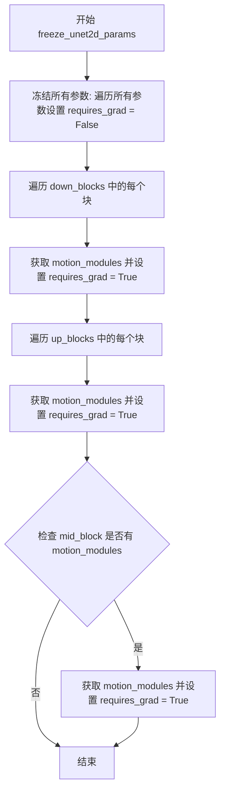

#### 带注释源码

```python
def freeze_unet2d_params(self) -> None:
    """
    Freeze the weights of just the UNet2DConditionModel, and leave the motion modules
    unfrozen for fine tuning.
    """
    # Freeze everything
    # 首先冻结模型的所有参数，使其不可训练
    for param in self.parameters():
        param.requires_grad = False

    # Unfreeze Motion Modules
    # 遍历下采样块，解除运动模块的冻结状态
    for down_block in self.down_blocks:
        motion_modules = down_block.motion_modules
        # 将下采样块中的运动模块参数设置为可训练
        for param in motion_modules.parameters():
            param.requires_grad = True

    # 遍历上采样块，解除运动模块的冻结状态
    for up_block in self.up_blocks:
        motion_modules = up_block.motion_modules
        # 将上采样块中的运动模块参数设置为可训练
        for param in motion_modules.parameters():
            param.requires_grad = True

    # 检查中间块是否包含运动模块，如果存在则解除冻结
    if hasattr(self.mid_block, "motion_modules"):
        motion_modules = self.mid_block.motion_modules
        # 将中间块的运动模块参数设置为可训练
        for param in motion_modules.parameters():
            param.requires_grad = True
```


### `UNetMotionModel.load_motion_modules`

该方法用于将 `MotionAdapter` 中的运动模块（motion modules）加载到 `UNetMotionModel` 模型中。它遍历运动适配器的下采样块、上采样块和中块，将对应的运动模块状态字典加载到 UNetMotionModel 的相应组件中。

参数：

- `motion_adapter`：`MotionAdapter | None`，要加载的运动适配器，包含预训练的运动模块权重

返回值：`None`，无返回值（该方法直接修改模型内部状态）

#### 流程图

```mermaid
flowchart TD
    A[开始 load_motion_modules] --> B{motion_adapter 是否为 None}
    B -->|是| C[直接返回，不执行任何操作]
    B -->|否| D[遍历 motion_adapter.down_blocks]
    D --> E[对每个下采样块]
    E --> F[self.down_blocks[i].motion_modules.load_state_dict]
    F --> G[遍历 motion_adapter.up_blocks]
    G --> H[对每个上采样块]
    H --> I[self.up_blocks[i].motion_modules.load_state_dict]
    I --> J{mid_block 是否有 motion_modules 属性}
    J -->|是| K[self.mid_block.motion_modules.load_state_dict]
    J -->|否| L[跳过中块加载]
    K --> M[结束]
    L --> M
    C --> M
```

#### 带注释源码

```python
def load_motion_modules(self, motion_adapter: MotionAdapter | None) -> None:
    """
    将运动适配器中的运动模块加载到当前 UNetMotionModel 中。
    
    该方法会:
    1. 从 motion_adapter 的下采样块中加载运动模块权重
    2. 从 motion_adapter 的上采样块中加载运动模块权重
    3. 如果中块存在运动模块，也进行加载（兼容旧版本）
    
    参数:
        motion_adapter: 包含预训练运动模块权重的 MotionAdapter 实例
    """
    # 遍历运动适配器的所有下采样块
    for i, down_block in enumerate(motion_adapter.down_blocks):
        # 将每个下采样块中的运动模块状态字典加载到当前模型对应位置
        self.down_blocks[i].motion_modules.load_state_dict(down_block.motion_modules.state_dict())
    
    # 遍历运动适配器的所有上采样块
    for i, up_block in enumerate(motion_adapter.up_blocks):
        # 将每个上采样块中的运动模块状态字典加载到当前模型对应位置
        self.up_blocks[i].motion_modules.load_state_dict(up_block.motion_modules.state_dict())

    # 为了兼容较旧的运动模块（可能没有中块）
    # 检查当前模型的中块是否具有 motion_modules 属性
    if hasattr(self.mid_block, "motion_modules"):
        # 如果中块有运动模块，则从中块加载状态字典
        self.mid_block.motion_modules.load_state_dict(motion_adapter.mid_block.motion_modules.state_dict())
```


### `UNetMotionModel.save_motion_modules`

该方法用于将 UNetMotionModel 中的运动模块（motion modules）提取并保存为独立的 MotionAdapter 模型权重文件，支持安全序列化、本地保存或推送到 HuggingFace Hub。

参数：

- `save_directory`：`str`，保存目标目录的路径，必填。
- `is_main_process`：`bool`，默认为 `True`，在分布式训练中指定是否为主进程执行保存操作。
- `safe_serialization`：`bool`，默认为 `True`，是否使用安全序列化（safetensors）格式保存权重。
- `variant`：`str | None`，默认为 `None`，保存时指定模型变体名称。
- `push_to_hub`：`bool`，默认为 `False`，是否将模型推送到 HuggingFace Hub。
- `**kwargs`：其他可选参数，会透传给 `save_pretrained` 方法。

返回值：`None`，该方法直接执行保存操作，无返回值。

#### 流程图

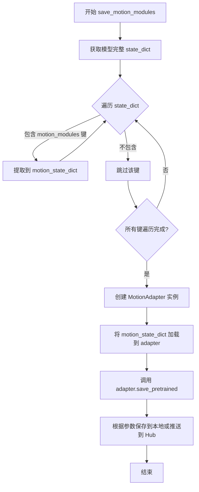

#### 带注释源码

```python
def save_motion_modules(
    self,
    save_directory: str,
    is_main_process: bool = True,
    safe_serialization: bool = True,
    variant: str | None = None,
    push_to_hub: bool = False,
    **kwargs,
) -> None:
    # 1. 获取当前模型的完整状态字典（包含所有参数）
    state_dict = self.state_dict()

    # 2. 从完整状态字典中筛选出所有与 motion_modules 相关的参数
    motion_state_dict = {}
    for k, v in state_dict.items():
        if "motion_modules" in k:
            # 仅保留键名中包含 motion_modules 的参数（如 down_blocks.0.motion_modules.0.proj_in.weight）
            motion_state_dict[k] = v

    # 3. 创建一个新的 MotionAdapter 对象，用于保存运动模块
    #    该 adapter 会作为独立模型保存，与原始 UNet2DConditionModel 分离
    adapter = MotionAdapter(
        block_out_channels=self.config["block_out_channels"],
        motion_layers_per_block=self.config["layers_per_block"],
        motion_norm_num_groups=self.config["norm_num_groups"],
        motion_num_attention_heads=self.config["motion_num_attention_heads"],
        motion_max_seq_length=self.config["motion_max_seq_length"],
        use_motion_mid_block=self.config["use_motion_mid_block"],
    )

    # 4. 将提取的运动模块参数加载到 adapter 实例中
    adapter.load_state_dict(motion_state_dict)

    # 5. 调用 adapter 的保存方法，将运动模块保存到指定目录
    #    支持安全序列化、variant 变体选择、push_to_hub 推送等功能
    adapter.save_pretrained(
        save_directory=save_directory,
        is_main_process=is_main_process,
        safe_serialization=safe_serialization,
        variant=variant,
        push_to_hub=push_to_hub,
        **kwargs,
    )
```


### `UNetMotionModel.enable_forward_chunking`

该方法用于启用 UNet 模型的“前馈网络分块（Feed-Forward Chunking）”功能。它通过递归遍历模型的所有子模块，将分块大小（chunk_size）和维度（dim）传递给支持该特性的注意力处理器或变换器模块，从而实现对长序列的正向传播进行内存优化或计算加速。

参数：

- `chunk_size`：`int | None`，可选。指定前馈层的分块大小。如果不指定，默认为 1（即逐个张量处理）。
- `dim`：`int`，可选。指定进行分块计算的维度。默认为 0（通常指 Batch 维度），设为 1 表示 Sequence Length（序列长度）维度。

返回值：`None`。该方法直接修改模型实例的状态，不返回任何值。

#### 流程图

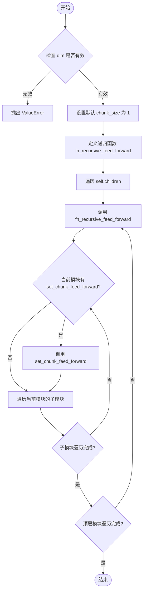

#### 带注释源码

```python
def enable_forward_chunking(self, chunk_size: int | None = None, dim: int = 0) -> None:
    """
    设置注意力处理器使用前馈网络分块（Feed Forward Chunking）。
    参考资料: https://huggingface.co/blog/reformer#2-chunked-feed-forward-layers

    参数:
        chunk_size (int, 可选):
            前馈层的分块大小。如果未指定，默认值为 1，表示在 dim 指定维度上逐个处理每个张量。
        dim (int, 可选，默认为 0):
            执行分块计算的维度。可选值为 0 (batch维度) 或 1 (sequence length维度)。
    """
    # 1. 参数校验：dim 必须是 0 或 1
    if dim not in [0, 1]:
        raise ValueError(f"Make sure to set `dim` to either 0 or 1, not {dim}")

    # 2. 默认值处理：如果 chunk_size 为 None，则设置为 1
    chunk_size = chunk_size or 1

    # 3. 定义内部递归函数，用于深度优先遍历模型结构
    def fn_recursive_feed_forward(module: torch.nn.Module, chunk_size: int, dim: int):
        # 如果当前模块实现了 set_chunk_feed_forward 方法，则调用它来开启分块计算
        if hasattr(module, "set_chunk_feed_forward"):
            module.set_chunk_feed_forward(chunk_size=chunk_size, dim=dim)

        # 递归遍历当前模块的所有子模块
        for child in module.children():
            fn_recursive_feed_forward(child, chunk_size, dim)

    # 4. 遍历模型的顶层子模块（如 down_blocks, up_blocks, mid_block 等）
    for module in self.children():
        fn_recursive_feed_forward(module, chunk_size, dim)
```


### `UNetMotionModel.disable_forward_chunking`

该方法用于禁用 UNet 运动模型的前向分块（feed forward chunking）功能。前向分块是一种优化技术，通过将前馈层计算分块来减少内存占用。

参数：
- 无显式参数（仅包含隐式 `self` 参数）

返回值：`None`，无返回值

#### 流程图

```mermaid
flowchart TD
    A[开始 disable_forward_chunking] --> B[定义内部函数 fn_recursive_feed_forward]
    B --> C{检查 module 是否有 set_chunk_feed_forward 方法}
    C -->|是| D[调用 module.set_chunk_feed_forward(chunk_size=None, dim=0)]
    C -->|否| E[跳过该模块]
    D --> F[遍历 module 的所有子模块]
    E --> F
    F --> G[对每个子模块递归调用 fn_recursive_feed_forward]
    G --> H{self.children() 是否遍历完成}
    H -->|否| C
    H -->|是| I[遍历 self 的所有直接子模块]
    I --> J[对每个子模块调用 fn_recursive_feed_forward]
    J --> K[结束]
```

#### 带注释源码

```python
def disable_forward_chunking(self) -> None:
    """
    禁用前向分块功能。
    
    该方法通过递归遍历模型的所有子模块，调用每个支持分块功能的模块的
    set_chunk_feed_forward 方法，将 chunk_size 设置为 None，从而禁用前向分块。
    与 enable_forward_chunking 配合使用，可以动态控制前向分块的开启和关闭。
    """
    # 定义内部递归函数，用于遍历模型的所有子模块
    def fn_recursive_feed_forward(module: torch.nn.Module, chunk_size: int, dim: int):
        # 检查当前模块是否支持设置前向分块参数
        if hasattr(module, "set_chunk_feed_forward"):
            # 调用模块的分块设置方法，传入 chunk_size=None 和 dim=0
            # chunk_size=None 表示禁用分块
            module.set_chunk_feed_forward(chunk_size=chunk_size, dim=dim)
        
        # 递归遍历当前模块的所有子模块
        for child in module.children():
            fn_recursive_feed_forward(child, chunk_size, dim)
    
    # 遍历模型的所有直接子模块（通常是 down_blocks, mid_block, up_blocks 等）
    for module in self.children():
        # 对每个子模块调用递归函数，设置 chunk_size=None 禁用分块，dim=0
        fn_recursive_feed_forward(module, None, 0)
```


### `UNetMotionModel.set_default_attn_processor`

该方法用于禁用自定义注意力处理器，并将注意力实现重置为默认设置。它会检查当前所有注意力处理器的类型，根据结果选择合适的默认处理器（AttnAddedKVProcessor 或 AttnProcessor），然后将其应用到整个模型。

参数：
- 该方法无参数（仅包含 `self`）

返回值：`None`，无返回值

#### 流程图

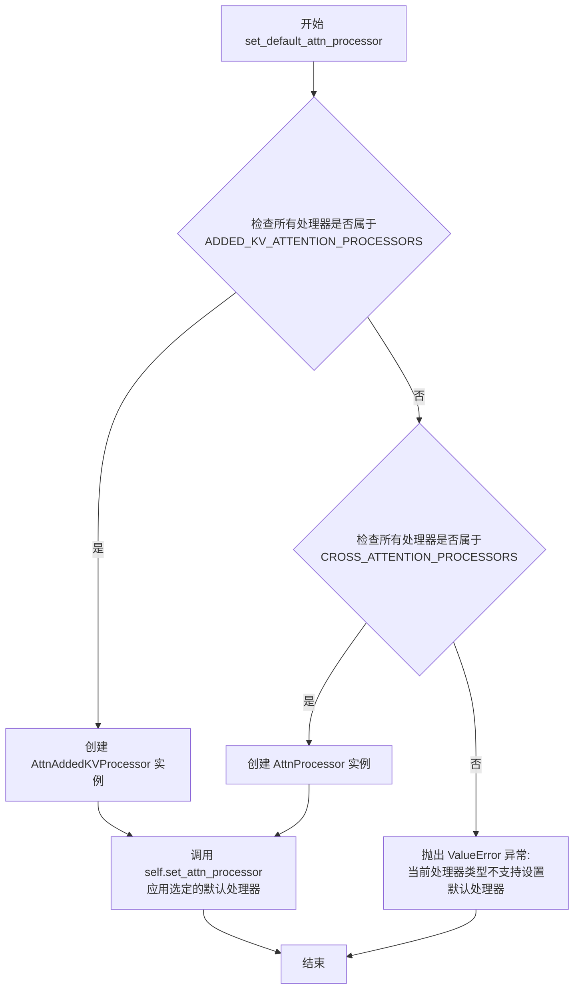

#### 带注释源码

```python
def set_default_attn_processor(self) -> None:
    """
    Disables custom attention processors and sets the default attention implementation.
    """
    # 检查所有注意力处理器是否都属于 ADDED_KV_ATTENTION_PROCESSORS 类型
    # ADDED_KV_ATTENTION_PROCESSORS 是包含 AddedKV 注意力处理器的集合
    if all(proc.__class__ in ADDED_KV_ATTENTION_PROCESSORS for proc in self.attn_processors.values()):
        # 如果所有处理器都是 AddedKV 类型，创建 AttnAddedKVProcessor 作为默认处理器
        processor = AttnAddedKVProcessor()
    # 否则检查是否所有处理器都属于 CROSS_ATTENTION_PROCESSORS 类型
    elif all(proc.__class__ in CROSS_ATTENTION_PROCESSORS for proc in self.attn_processors.values()):
        # 如果所有处理器都是 Cross Attention 类型，创建 AttnProcessor 作为默认处理器
        processor = AttnProcessor()
    else:
        # 如果处理器类型混合或不属于上述两类，抛出 ValueError 异常
        raise ValueError(
            f"Cannot call `set_default_attn_processor` when attention processors are of type {next(iter(self.attn_processors.values()))}"
        )

    # 调用 set_attn_processor 方法将选定的默认处理器应用到整个模型
    self.set_attn_processor(processor)
```


### `UNetMotionModel.enable_freeu`

启用 FreeU 机制，用于在 UNet 上采样阶段对跳跃连接特征进行缩放，以减轻去噪过程中的"过度平滑"问题。

参数：

- `s1`：`float`，第一阶段跳跃特征的缩放因子，用于衰减跳跃特征的贡献。
- `s2`：`float`，第二阶段跳跃特征的缩放因子，用于衰减跳跃特征的贡献。
- `b1`：`float`，第一阶段主干特征的缩放因子，用于放大主干特征的贡献。
- `b2`：`float`，第二阶段主干特征的缩放因子，用于放大主干特征的贡献。

返回值：`None`，无返回值。

#### 流程图

```mermaid
flowchart TD
    A[开始 enable_freeu] --> B[遍历 self.up_blocks 中的每个 upsample_block]
    B --> C{遍历每个 upsample_block}
    C -->|对每个 block| D[setattr(upsample_block, 's1', s1)]
    D --> E[setattr(upsample_block, 's2', s2)]
    E --> F[setattr(upsample_block, 'b1', b1)]
    F --> G[setattr(upsample_block, 'b2', b2)]
    G --> H{是否还有更多 upsample_block}
    H -->|是| C
    H -->|否| I[结束]
    
    style A fill:#f9f,color:#333
    style I fill:#9f9,color:#333
```

#### 带注释源码

```python
def enable_freeu(self, s1: float, s2: float, b1: float, b2: float) -> None:
    r"""Enables the FreeU mechanism from https://huggingface.co/papers/2309.11497.

    The suffixes after the scaling factors represent the stage blocks where they are being applied.

    Please refer to the [official repository](https://github.com/ChenyangSi/FreeU) for combinations of values that
    are known to work well for different pipelines such as Stable Diffusion v1, v2, and Stable Diffusion XL.

    Args:
        s1 (`float`):
            Scaling factor for stage 1 to attenuate the contributions of the skip features. This is done to
            mitigate the "oversmoothing effect" in the enhanced denoising process.
        s2 (`float`):
            Scaling factor for stage 2 to attenuate the contributions of the skip features. This is done to
            mitigate the "oversmoothing effect" in the enhanced denoising process.
        b1 (`float`): Scaling factor for stage 1 to amplify the contributions of backbone features.
        b2 (`float`): Scaling factor for stage 2 to amplify the contributions of backbone features.
    """
    # 遍历所有上采样块（up_blocks）
    # 在 UNet 结构中，up_blocks 通常包含多个上采样阶段
    for i, upsample_block in enumerate(self.up_blocks):
        # 为每个上采样块设置四个 FreeU 缩放参数
        # s1, s2: 用于缩放跳跃连接特征（skip features）
        # b1, b2: 用于缩放主干特征（backbone features）
        setattr(upsample_block, "s1", s1)  # 设置阶段1的跳跃特征缩放因子
        setattr(upsample_block, "s2", s2)  # 设置阶段2的跳跃特征缩放因子
        setattr(upsample_block, "b1", b1)  # 设置阶段1的主干特征缩放因子
        setattr(upsample_block, "b2", b2)  # 设置阶段2的主干特征缩放因子
```


### `UNetMotionModel.disable_freeu`

该方法用于禁用 FreeU 机制，将上采样块中的 FreeU 相关属性 s1、s2、b1、b2 设置为 None，以关闭特征缩放功能。

参数：  
无参数（仅包含 self）

返回值：`None`，无返回值，该方法仅修改对象内部状态

#### 流程图

```mermaid
flowchart TD
    A[开始 disable_freeu] --> B[定义 freeu_keys = {'s1', 's2', 'b1', 'b2'}]
    B --> C[遍历 self.up_blocks]
    C --> D{遍历每个 upsample_block}
    D --> E{遍历 freeu_keys 中的每个 key}
    E --> F{检查 upsample_block 是否具有该属性且值不为 None}
    F -->|是| G[将该属性设置为 None]
    F -->|否| H[跳过]
    G --> H
    H --> I{是否还有未处理的 key}
    I -->|是| E
    I -->|否| J{是否还有未处理的 upsample_block}
    J -->|是| D
    J -->|否| K[结束]
```

#### 带注释源码

```python
# Copied from diffusers.models.unets.unet_2d_condition.UNet2DConditionModel.disable_freeu
def disable_freeu(self) -> None:
    """Disables the FreeU mechanism."""
    # 定义需要禁用的 FreeU 相关属性键
    freeu_keys = {"s1", "s2", "b1", "b2"}
    
    # 遍历所有的上采样块（up_blocks）
    for i, upsample_block in enumerate(self.up_blocks):
        # 遍历每个 FreeU 属性键
        for k in freeu_keys:
            # 检查上采样块是否具有该属性且值不为 None
            # hasattr 检查属性是否存在，getattr 获取属性值
            if hasattr(upsample_block, k) or getattr(upsample_block, k, None) is not None:
                # 将该属性设置为 None，从而禁用 FreeU 机制
                setattr(upsample_block, k, None)
```


### `UNetMotionModel.fuse_qkv_projections`

该方法用于启用融合的 QKV（Query-Key-Value）投影计算。对于自注意力模块，将所有投影矩阵（即 query、key、value）融合在一起；对于交叉注意力模块，则融合 key 和 value 投影矩阵。这是一种性能优化技术，可以减少内存访问并提高计算效率。

参数：
- 该方法无显式参数（除隐式 self 参数）

返回值：`None`，无返回值（该方法直接修改模型内部状态）

#### 流程图

```mermaid
flowchart TD
    A[开始执行 fuse_qkv_projections] --> B[初始化 original_attn_processors 为 None]
    B --> C{检查所有注意力处理器}
    C --> D{是否存在 Added KV 处理器?}
    D -->|是| E[抛出 ValueError 异常]
    D -->|否| F[保存原始注意力处理器到 original_attn_processors]
    F --> G[遍历所有模块]
    G --> H{当前模块是否为 Attention 类型?}
    H -->|是| I[调用 module.fuse_projections(fuse=True)]
    H -->|否| J[继续遍历下一个模块]
    I --> G
    J --> G
    G --> K[设置注意力处理器为 FusedAttnProcessor2_0]
    K --> L[结束执行]
    E --> L
```

#### 带注释源码

```python
def fuse_qkv_projections(self):
    """
    Enables fused QKV projections. For self-attention modules, all projection matrices 
    (i.e., query, key, value) are fused. For cross-attention modules, key and value 
    projection matrices are fused.

    > [!WARNING] > This API is 🧪 experimental.
    """
    # 步骤1: 初始化 original_attn_processors 为 None，用于后续保存原始处理器状态
    self.original_attn_processors = None

    # 步骤2: 遍历所有注意力处理器，检查是否包含 Added KV 处理器
    # Added KV 处理器不支持 QKV 融合，因此需要提前检测并报错
    for _, attn_processor in self.attn_processors.items():
        if "Added" in str(attn_processor.__class__.__name__):
            raise ValueError(
                "`fuse_qkv_projections()` is not supported for models having added KV projections."
            )

    # 步骤3: 保存原始注意力处理器，以便后续可以通过 unfuse_qkv_projections 恢复
    self.original_attn_processors = self.attn_processors

    # 步骤4: 遍历模型中的所有模块
    for module in self.modules():
        # 检查当前模块是否为 Attention 类型
        if isinstance(module, Attention):
            # 调用 Attention 模块的 fuse_projections 方法，传入 fuse=True 以启用融合
            module.fuse_projections(fuse=True)

    # 步骤5: 将模型的注意力处理器设置为 FusedAttnProcessor2_0
    # 这是融合后的注意力处理器实现
    self.set_attn_processor(FusedAttnProcessor2_0())
```


### `UNetMotionModel.unfuse_qkv_projections`

该方法用于禁用融合的 QKV 投影，将注意力处理器恢复为原始状态。

参数：无（仅包含 `self`）

返回值：`None`，无返回值

#### 流程图

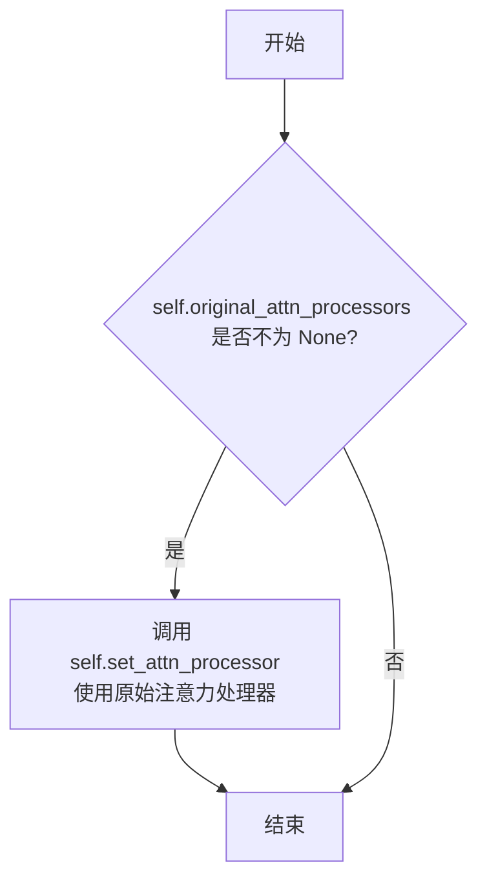

#### 带注释源码

```python
def unfuse_qkv_projections(self):
    """Disables the fused QKV projection if enabled.

    > [!WARNING] > This API is 🧪 experimental.

    """
    # 检查是否之前已经融合了 QKV 投影（即 original_attn_processors 是否已保存）
    if self.original_attn_processors is not None:
        # 如果之前保存了原始注意力处理器，则恢复它们
        # 这会将 fused attention processor 切换回原始的多个独立 processor
        self.set_attn_processor(self.original_attn_processors)
```


### `UNetMotionModel.forward`

该方法是 `UNetMotionModel` 的核心前向传播方法，负责对包含时空信息的噪声样本进行去噪处理。通过时间步嵌入、空间下采样/上采样模块、交叉注意力机制以及运动模块（Motion Modules）的协同工作，输出与条件信息（encoder_hidden_states）对应的去噪后的样本。

参数：

- `sample`：`torch.Tensor`，形状为 `(batch, num_frames, channel, height, width)` 的噪声输入张量
- `timestep`：`torch.Tensor | float | int`，去噪过程的时间步
- `encoder_hidden_states`：`torch.Tensor`，条件嵌入，形状为 `(batch, sequence_length, feature_dim)`
- `timestep_cond`：`torch.Tensor | None`，可选的时间步条件嵌入
- `attention_mask`：`torch.Tensor | None`，可选的注意力掩码
- `cross_attention_kwargs`：`dict[str, Any] | None`，传递给注意力处理器的额外参数
- `added_cond_kwargs`：`dict[str, torch.Tensor] | None`，额外的条件参数（如 text_embeds、time_ids）
- `down_block_additional_residuals`：`tuple[torch.Tensor] | None`，可选的额外下采样块残差
- `mid_block_additional_residual`：`torch.Tensor | None`，可选的中间块额外残差
- `return_dict`：`bool`，是否返回 `UNetMotionOutput` 对象

返回值：`UNetMotionOutput | tuple[torch.Tensor]`，如果 `return_dict` 为 True，返回 `UNetMotionOutput` 对象（包含 sample 张量）；否则返回元组

#### 流程图

```mermaid
flowchart TD
    A[开始 Forward] --> B[计算上采样因子和尺寸]
    B --> C{attention_mask存在?}
    C -->|Yes| D[转换attention_mask为注意力偏置]
    C -->|No| E[跳过mask处理]
    D --> E
    E --> F[处理timestep: 转换为tensor并扩展到batch维度]
    F --> G[计算time_embedding]
    G --> H{addition_embed_type == 'text_time'?}
    H -->|Yes| I[计算额外text_time embedding并相加]
    H -->|No| J[跳过额外embedding]
    I --> J
    J --> K[扩展emb到num_frames维度]
    K --> L{encoder_hid_dim_type == 'ip_image_proj'?}
    L -->|Yes| M[处理image_embeds并扩展到num_frames]
    L -->|No| N[跳过image处理]
    M --> N
    N --> O[预处理sample: 维度重排并通过conv_in]
    O --> P[下采样阶段: 遍历down_blocks]
    P --> Q[收集down_block_res_samples]
    Q --> R{有down_block_additional_residuals?}
    R -->|Yes| S[将额外残差添加到res_samples]
    R -->|No| T[跳过额外残差]
    S --> T
    T --> U[中间块处理: mid_block]
    U --> V{有mid_block_additional_residual?}
    V -->|Yes| W[添加中间块残差]
    V -->|No| X[跳过中间块残差]
    W --> X
    X --> Y[上采样阶段: 遍历up_blocks]
    Y --> Z[应用残差连接]
    Z --> AA[后处理: norm, act, conv_out]
    AA --> AB[reshape输出到batch维度]
    AB --> AC{return_dict?}
    AC -->|Yes| AD[返回UNetMotionOutput]
    AC -->|No| AE[返回tuple]
    AD --> AF[结束]
    AE --> AF
```

#### 带注释源码

```python
@apply_lora_scale("cross_attention_kwargs")
def forward(
    self,
    sample: torch.Tensor,
    timestep: torch.Tensor | float | int,
    encoder_hidden_states: torch.Tensor,
    timestep_cond: torch.Tensor | None = None,
    attention_mask: torch.Tensor | None = None,
    cross_attention_kwargs: dict[str, Any] | None = None,
    added_cond_kwargs: dict[str, torch.Tensor] | None = None,
    down_block_additional_residuals: tuple[torch.Tensor] | None = None,
    mid_block_additional_residual: torch.Tensor | None = None,
    return_dict: bool = True,
) -> UNetMotionOutput | tuple[torch.Tensor]:
    r"""
    The [`UNetMotionModel`] forward method.

    Args:
        sample (`torch.Tensor`):
            The noisy input tensor with the following shape `(batch, num_frames, channel, height, width`.
        timestep (`torch.Tensor` or `float` or `int`): The number of timesteps to denoise an input.
        encoder_hidden_states (`torch.Tensor`):
            The encoder hidden states with shape `(batch, sequence_length, feature_dim)`.
        timestep_cond: (`torch.Tensor`, *optional*, defaults to `None`):
            Conditional embeddings for timestep. If provided, the embeddings will be summed with the samples passed
            through the `self.time_embedding` layer to obtain the timestep embeddings.
        attention_mask (`torch.Tensor`, *optional*, defaults to `None`):
            An attention mask of shape `(batch, key_tokens)` is applied to `encoder_hidden_states`. If `1` the mask
            is kept, otherwise if `0` it is discarded. Mask will be converted into a bias, which adds large
            negative values to the attention scores corresponding to "discard" tokens.
        cross_attention_kwargs (`dict`, *optional*):
            A kwargs dictionary that if specified is passed along to the `AttentionProcessor` as defined under
            `self.processor` in
            [diffusers.models.attention_processor](https://github.com/huggingface/diffusers/blob/main/src/diffusers/models/attention_processor.py).
        down_block_additional_residuals: (`tuple` of `torch.Tensor`, *optional*):
            A tuple of tensors that if specified are added to the residuals of down unet blocks.
        mid_block_additional_residual: (`torch.Tensor`, *optional*):
            A tensor that if specified is added to the residual of the middle unet block.
        return_dict (`bool`, *optional*, defaults to `True`):
            Whether or not to return a [`~models.unets.unet_motion_model.UNetMotionOutput`] instead of a plain
            tuple.

    Returns:
        [`~models.unets.unet_motion_model.UNetMotionOutput`] or `tuple`:
            If `return_dict` is True, an [`~models.unets.unet_motion_model.UNetMotionOutput`] is returned,
            otherwise a `tuple` is returned where the first element is the sample tensor.
    """
    # By default samples have to be AT least a multiple of the overall upsampling factor.
    # The overall upsampling factor is equal to 2 ** (# num of upsampling layears).
    # However, the upsampling interpolation output size can be forced to fit any upsampling size
    # on the fly if necessary.
    default_overall_up_factor = 2**self.num_upsamplers

    # upsample size should be forwarded when sample is not a multiple of `default_overall_up_factor`
    forward_upsample_size = False
    upsample_size = None

    # 检查sample尺寸是否为上采样因子的倍数，否则记录日志并准备前向传播上采样尺寸
    if any(s % default_overall_up_factor != 0 for s in sample.shape[-2:]):
        logger.info("Forward upsample size to force interpolation output size.")
        forward_upsample_size = True

    # prepare attention_mask: 将mask转换为注意力偏置（0保持，-10000丢弃）
    if attention_mask is not None:
        attention_mask = (1 - attention_mask.to(sample.dtype)) * -10000.0
        attention_mask = attention_mask.unsqueeze(1)

    # 1. time: 处理时间步
    timesteps = timestep
    if not torch.is_tensor(timesteps):
        # TODO: this requires sync between CPU and GPU. So try to pass timesteps as tensors if you can
        # This would be a good case for the `match` statement (Python 3.10+)
        is_mps = sample.device.type == "mps"
        is_npu = sample.device.type == "npu"
        if isinstance(timestep, float):
            dtype = torch.float32 if (is_mps or is_npu) else torch.float64
        else:
            dtype = torch.int32 if (is_mps or is_npu) else torch.int64
        timesteps = torch.tensor([timesteps], dtype=dtype, device=sample.device)
    elif len(timesteps.shape) == 0:
        timesteps = timesteps[None].to(sample.device)

    # broadcast to batch dimension in a way that's compatible with ONNX/Core ML
    num_frames = sample.shape[2]  # 从sample中提取帧数
    timesteps = timesteps.expand(sample.shape[0])  # 扩展到batch维度

    # 将timesteps投影到embedding空间
    t_emb = self.time_proj(timesteps)

    # timesteps does not contain any weights and will always return f32 tensors
    # but time_embedding might actually be running in fp16. so we need to cast here.
    # there might be better ways to encapsulate this.
    t_emb = t_emb.to(dtype=self.dtype)

    # 计算时间嵌入，可选地加入timestep_cond条件
    emb = self.time_embedding(t_emb, timestep_cond)
    aug_emb = None

    # 处理额外的text_time类型的embedding
    if self.config.addition_embed_type == "text_time":
        if "text_embeds" not in added_cond_kwargs:
            raise ValueError(
                f"{self.__class__} has the config param `addition_embed_type` set to 'text_time' which requires the keyword argument `text_embeds` to be passed in `added_cond_kwargs`"
            )

        text_embeds = added_cond_kwargs.get("text_embeds")
        if "time_ids" not in added_cond_kwargs:
            raise ValueError(
                f"{self.__class__} has the config param `addition_embed_type` set to 'text_time' which requires the keyword argument `time_ids` to be passed in `added_cond_kwargs`"
            )
        time_ids = added_cond_kwargs.get("time_ids")
        time_embeds = self.add_time_proj(time_ids.flatten())
        time_embeds = time_embeds.reshape((text_embeds.shape[0], -1))

        add_embeds = torch.concat([text_embeds, time_embeds], dim=-1)
        add_embeds = add_embeds.to(emb.dtype)
        aug_emb = self.add_embedding(add_embeds)

    # 将额外embedding加到主embedding上
    emb = emb if aug_emb is None else emb + aug_emb
    # 扩展embedding以匹配多帧（每个时间步对应所有帧）
    emb = emb.repeat_interleave(num_frames, dim=0, output_size=emb.shape[0] * num_frames)

    # 处理IP-Adapter的image embeddings
    if self.encoder_hid_proj is not None and self.config.encoder_hid_dim_type == "ip_image_proj":
        if "image_embeds" not in added_cond_kwargs:
            raise ValueError(
                f"{self.__class__} has the config param `encoder_hid_dim_type` set to 'ip_image_proj' which requires the keyword argument `image_embeds` to be passed in  `added_conditions`"
            )
        image_embeds = added_cond_kwargs.get("image_embeds")
        image_embeds = self.encoder_hid_proj(image_embeds)
        image_embeds = [
            image_embed.repeat_interleave(num_frames, dim=0, output_size=image_embed.shape[0] * num_frames)
            for image_embed in image_embeds
        ]
        encoder_hidden_states = (encoder_hidden_states, image_embeds)

    # 2. pre-process: 预处理输入样本
    # 将 (batch, num_frames, channel, height, width) 转换为 (batch*num_frames, channel, height, width)
    sample = sample.permute(0, 2, 1, 3, 4).reshape((sample.shape[0] * num_frames, -1) + sample.shape[3:])
    sample = self.conv_in(sample)  # 通过初始卷积层

    # 3. down: 下采样阶段
    down_block_res_samples = (sample,)  # 收集残差用于后续上采样连接
    for downsample_block in self.down_blocks:
        if hasattr(downsample_block, "has_cross_attention") and downsample_block.has_cross_attention:
            sample, res_samples = downsample_block(
                hidden_states=sample,
                temb=emb,
                encoder_hidden_states=encoder_hidden_states,
                attention_mask=attention_mask,
                num_frames=num_frames,
                cross_attention_kwargs=cross_attention_kwargs,
            )
        else:
            sample, res_samples = downsample_block(hidden_states=sample, temb=emb, num_frames=num_frames)

        down_block_res_samples += res_samples

    # 应用额外的下采样残差
    if down_block_additional_residuals is not None:
        new_down_block_res_samples = ()

        for down_block_res_sample, down_block_additional_residual in zip(
            down_block_res_samples, down_block_additional_residuals
        ):
            down_block_res_sample = down_block_res_sample + down_block_additional_residual
            new_down_block_res_samples += (down_block_res_sample,)

        down_block_res_samples = new_down_block_res_samples

    # 4. mid: 中间块处理
    if self.mid_block is not None:
        # To support older versions of motion modules that don't have a mid_block
        if hasattr(self.mid_block, "motion_modules"):
            sample = self.mid_block(
                sample,
                emb,
                encoder_hidden_states=encoder_hidden_states,
                attention_mask=attention_mask,
                num_frames=num_frames,
                cross_attention_kwargs=cross_attention_kwargs,
            )
        else:
            sample = self.mid_block(
                sample,
                emb,
                encoder_hidden_states=encoder_hidden_states,
                attention_mask=attention_mask,
                cross_attention_kwargs=cross_attention_kwargs,
            )

    # 应用中间块额外残差
    if mid_block_additional_residual is not None:
        sample = sample + mid_block_additional_residual

    # 5. up: 上采样阶段
    for i, upsample_block in enumerate(self.up_blocks):
        is_final_block = i == len(self.up_blocks) - 1

        # 获取当前上采样块对应的残差
        res_samples = down_block_res_samples[-len(upsample_block.resnets) :]
        down_block_res_samples = down_block_res_samples[: -len(upsample_block.resnets)]

        # if we have not reached the final block and need to forward the
        # upsample size, we do it here
        if not is_final_block and forward_upsample_size:
            upsample_size = down_block_res_samples[-1].shape[2:]

        if hasattr(upsample_block, "has_cross_attention") and upsample_block.has_cross_attention:
            sample = upsample_block(
                hidden_states=sample,
                temb=emb,
                res_hidden_states_tuple=res_samples,
                encoder_hidden_states=encoder_hidden_states,
                upsample_size=upsample_size,
                attention_mask=attention_mask,
                num_frames=num_frames,
                cross_attention_kwargs=cross_attention_kwargs,
            )
        else:
            sample = upsample_block(
                hidden_states=sample,
                temb=emb,
                res_hidden_states_tuple=res_samples,
                upsample_size=upsample_size,
                num_frames=num_frames,
            )

    # 6. post-process: 后处理
    if self.conv_norm_out:
        sample = self.conv_norm_out(sample)
        sample = self.conv_act(sample)

    sample = self.conv_out(sample)

    # reshape to (batch, channel, framerate, width, height)
    # 从 (batch*num_frames, channel, height, width) 转换回 (batch, num_frames, channel, height, width)
    # 然后调整为 (batch, channel, num_frames, height, width)
    sample = sample[None, :].reshape((-1, num_frames) + sample.shape[1:]).permute(0, 2, 1, 3, 4)

    if not return_dict:
        return (sample,)

    return UNetMotionOutput(sample=sample)
```

## 关键组件


### AnimateDiffTransformer3D

时间维度变换器模块，用于处理视频帧序列的时间注意力，将批量帧维度重塑并permute以支持时序建模。

### DownBlockMotion

下采样运动块，包含ResnetBlock2D和AnimateDiffTransformer3D，用于对输入进行下采样并提取时间维度的运动特征。

### CrossAttnDownBlockMotion

带交叉注意力的下采样运动块，在DownBlockMotion基础上增加了Transformer2DModel进行空间交叉注意力建模。

### CrossAttnUpBlockMotion

带交叉注意力的上采样运动块，支持FreeU机制，用于上采样并融合跳跃连接的特征，同时应用运动模块。

### UpBlockMotion

上采样运动块，不带交叉注意力，仅包含ResnetBlock2D和AnimateDiffTransformer3D，用于上采样路径。

### UNetMidBlockCrossAttnMotion

UNet中间块，包含多个带交叉注意力的Transformer和运动模块，用于处理UNet最中间层的特征。

### MotionModules

运动模块容器，用于存储多个AnimateDiffTransformer3D实例，管理块内的运动变换层。

### MotionAdapter

运动适配器容器类，用于存储可独立保存/加载的运动模块权重，支持从原始UNet2D模型集成运动能力。

### UNetMotionModel

主导入模型，继承UNet2DConditionModel并集成运动模块，支持视频生成的完整UNet结构，包含时间嵌入、上下采样块、中间块等组件。

### UNetMotionOutput

输出数据结构类，包含sample张量，形状为(batch_size, num_channels, num_frames, height, width)。

## 问题及建议


### 已知问题

-   **未实现的抽象方法**：`MotionModules`类和`MotionAdapter`类的`forward`方法只有`pass`语句，没有实际实现，这会导致在实际调用这些模块时出错或返回None。
-   **缺失的梯度检查点实现**：虽然类中设置了`self.gradient_checkpointing = False`并在forward中检查`torch.is_grad_enabled()`，但没有实现`_gradient_checkpointing_func`方法，梯度检查点功能无法真正工作。
-   **参数重复赋值**：在`MotionAdapter.from_unet2d`方法中，`motion_num_attention_heads`被设置了两次（第593和594行），存在冗余。
-   **类型注解不一致**：部分方法参数缺少类型注解，如`UpBlockMotion.forward`中的`upsample_size=None`没有类型注解，`num_frames`参数在某些地方是`int | None`而在其他地方是`int`。
-   **冗余的变量声明**：在`DownBlockMotion.forward`中使用了`*args`收集参数但从未使用，造成代码冗余。
-   **硬编码的激活函数**：多处硬编码了`activation_fn="geglu"`和`positional_embeddings="sinusoidal"`，降低了对新激活函数和位置编码方式的灵活性。
-   **API弃用处理不一致**：部分地方使用`deprecate`处理`scale`参数弃用，而其他地方使用`logger.warning`警告，风格不统一。

### 优化建议

-   **完善forward方法实现**：为`MotionModules`和`MotionAdapter`类实现完整的forward方法，使其能够正确处理时间维度的特征。
-   **统一梯度检查点实现**：要么移除gradient_checkpointing相关代码，要么实现完整的`_gradient_checkpointing_func`方法以支持训练时的内存优化。
-   **移除重复代码**：删除重复的`motion_num_attention_heads`赋值语句，统一使用config中的值。
-   **添加类型注解**：完善所有方法参数的类型注解，特别是`num_frames`、`upsample_size`等关键参数。
-   **提取公共逻辑**：将重复的参数验证逻辑（如`temporal_transformer_layers_per_block`的tuple转换）提取到基类或工具函数中。
-   **配置化硬编码值**：将硬编码的`geglu`、`sinusoidal`等改为可配置的参数，通过config传递。
-   **统一弃用处理方式**：使用统一的日志方式处理参数弃用，建议全部使用`deprecate`或全部使用`logger.warning`。

## 其它


### 设计目标与约束

本模块旨在为Stable Diffusion模型添加视频/动画生成能力，通过在UNet中集成时间维度的注意力机制（Motion Modules），实现从静态图像到动态视频的扩展。核心约束包括：1) 保持与UNet2DConditionModel的兼容性，支持从预训练SD模型迁移；2) motion模块仅处理时间维度的信息，不改变空间注意力结构；3) 支持FreeU、gradient checkpointing等优化技术；4) 兼容LoRA、IP-Adapter等微调机制。

### 错误处理与异常设计

代码中的错误处理主要体现在参数验证阶段。ValueError异常用于检测不匹配的维度参数（如temporal_transformer_layers_per_block长度与num_layers不匹配）、不支持的block类型、缺失的必要配置等。deprecation警告用于标识已废弃参数（如scale参数）。运行时通过torch.is_grad_enabled()和gradient_checkpointing标志控制梯度计算策略，兼容ONNX/Core ML的设备类型检测（mps/npu）。存在少量pass占位方法（如MotionAdapter.forward），调用时需注意返回None。

### 数据流与状态机

输入数据遵循标准SD去噪流程：sample(batch,num_frames,channel,height,width) → 时间维度重排 → UNet编码器 → 潜在空间处理 → UNet解码器 → 输出去噪结果。Motion模块在每个resnet block之后介入，将(batch,frames,channel,height,width) reshape为(batch*height*width, frames, channel)进行时间维度的自注意力计算。时间嵌入timestep通过repeat_interleave扩展到num_frames维度以匹配批量大小。关键状态转换：hidden_states在down blocks中逐步下采样，在up blocks中通过skip connections融合编码器特征并上采样。

### 外部依赖与接口契约

本模块依赖diffusers核心库：configuration_utils提供ConfigMixin和register_to_config装饰器；loaders模块提供FromOriginalModelMixin和PeftAdapterMixin用于权重加载；attention_processor定义注意力机制接口；embeddings提供TimestepEmbedding和Timesteps；resnet提供ResnetBlock2D和上下采样模块。Transformer2DModel和DualTransformer2DModel来自transformers子模块。外部调用入口为UNetMotionModel.from_unet2d()方法，需传入UNet2DConditionModel实例和可选的MotionAdapter。forward方法返回UNetMotionOutput结构体，包含sample张量。

### 性能考虑与优化空间

模块支持gradient_checkpointing减少显存占用；enable_forward_chunking实现feed-forward层分块计算；Freeu机制通过s1/s2/b1/b2参数调节skip feature贡献以缓解过平滑；fuse_qkv_projections融合投影矩阵提升推理速度。潜在优化方向：MotionAdapter.forward为pass空实现，可补充完整前向传播逻辑；多处重复的tuple/list参数规范化逻辑可抽取为工具函数；motion_modules的state_dict提取逻辑可复用；跨block的attention_processor同步逻辑存在冗余代码。

### 配置参数说明

关键配置参数包括：block_out_channels定义UNet各层通道数(320,640,1280,1280)；motion_num_attention_heads/motion_max_seq_length控制时间注意力维度；temporal_transformer_layers_per_block指定每block的时间transformer层数；use_motion_mid_block决定是否在中间层使用motion模块；conv_in_channels支持PIA(Pluginable Input Adapter)的9通道输入模式。参数多支持int或tuple形式，tuple形式允许逐层差异化配置。

### 版本兼容性说明

代码兼容PyTorch 2.0+的scaled_dot_product_attention（通过hasattr(F,"scaled_dot_product_attention")检测）。IPAdapter支持通过IPAdapterAttnProcessor2_0/AttnProcessor2_0处理器适配。from_unet2d方法包含backwards compatibility逻辑处理旧版checkpoint的num_attention_heads/attention_head_dim映射。Conv_in权重合并逻辑支持PIA UNet的特殊权重格式。模型通过@register_to_config装饰器实现配置序列化/反序列化。

    