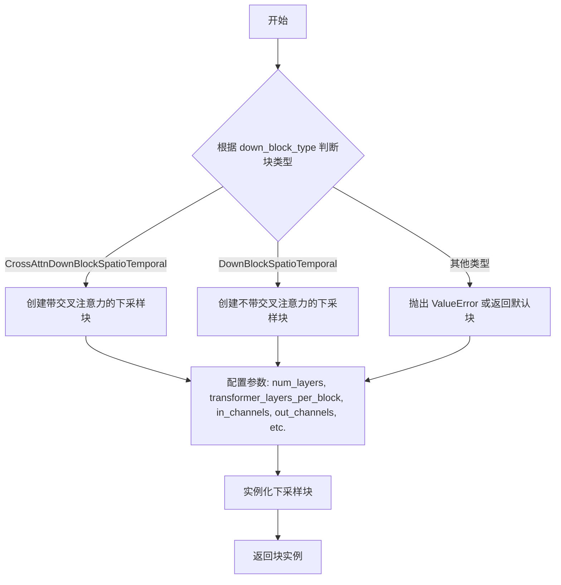
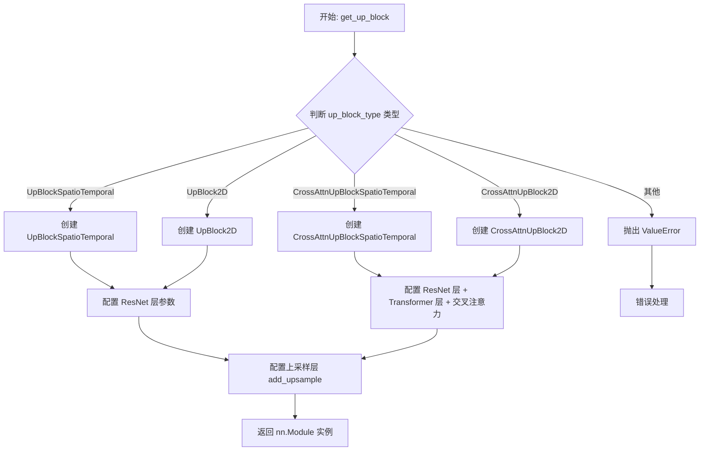
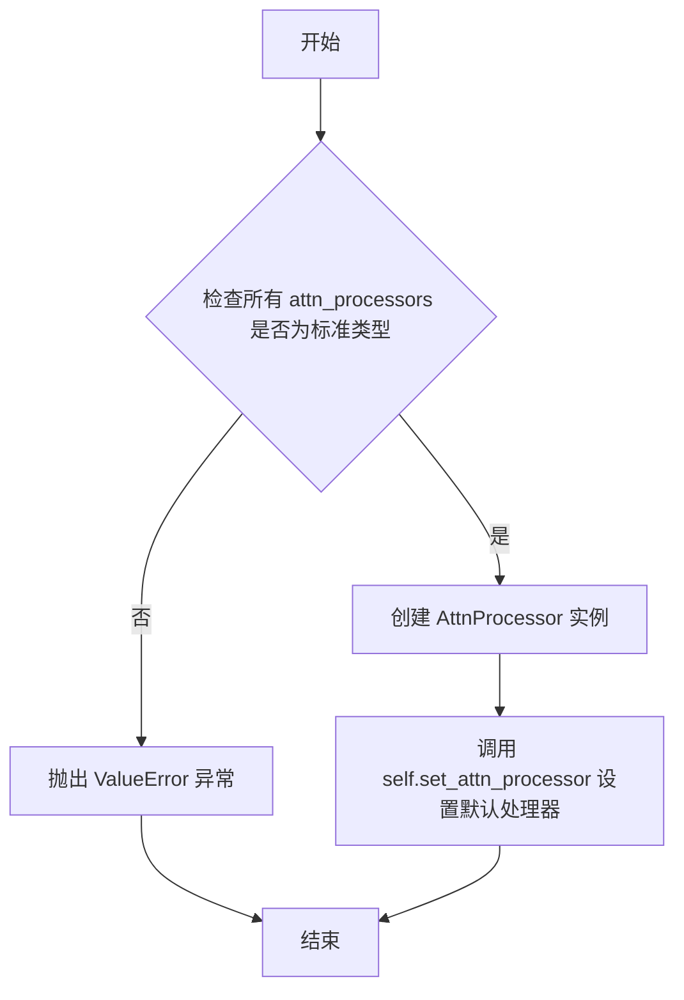
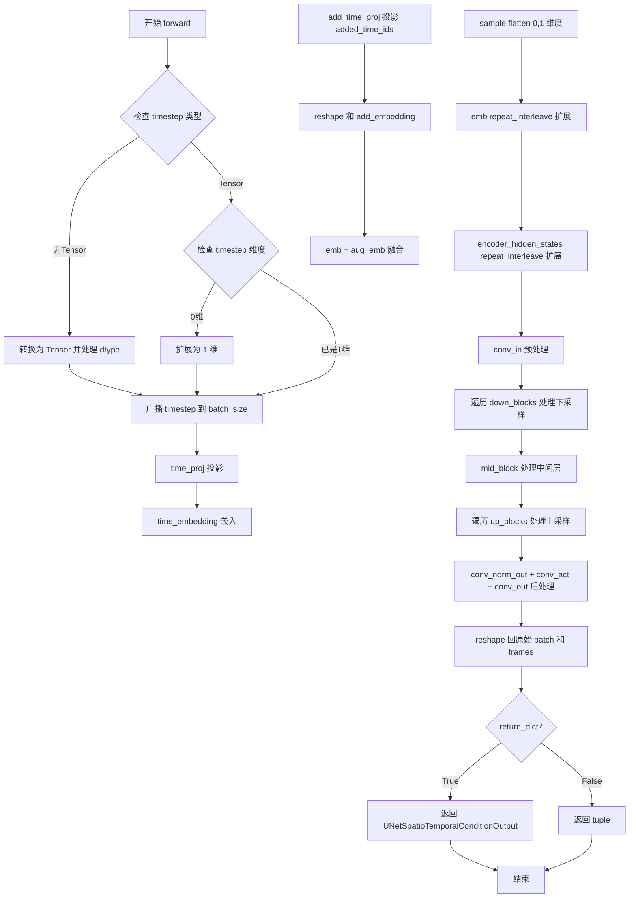

# `diffusers\src\diffusers\models\unets\unet_spatio_temporal_condition.py` 详细设计文档

该文件实现了一个用于视频生成的时空条件UNet模型（UNetSpatioTemporalConditionModel），接收带噪声的视频帧、时间步长和编码器隐藏状态作为输入，通过下采样、中间块和上采样块处理后，输出降噪后的视频帧样本。

## 整体流程

```mermaid
graph TD
    Input[输入: sample, timestep, encoder_hidden_states, added_time_ids] --> TimeEmb[时间嵌入: 处理timestep和added_time_ids]
    Input --> Flatten[维度变换: 合并Batch和Frame维度]
    TimeEmb --> Prep[准备数据: 重复time_embeds和encoder_hidden_states以匹配帧数]
    Flatten --> ConvIn[卷积输入: self.conv_in]
    Prep --> ConvIn
    ConvIn --> DownBlocks[下采样循环: self.down_blocks]
    DownBlocks --> MidBlock[中间块: self.mid_block]
    MidBlock --> UpBlocks[上采样循环: self.up_blocks]
    UpBlocks --> PostProcess[后处理: Norm -> SiLU -> ConvOut]
    PostProcess --> Reshape[维度恢复: reshape回 (batch, frames, channels, height, width)]
    Reshape --> Output[输出: UNetSpatioTemporalConditionOutput]
```

## 类结构

```
UNetSpatioTemporalConditionModel (主模型类)
├── 继承: ModelMixin, AttentionMixin, ConfigMixin, UNet2DConditionLoadersMixin
└── UNetSpatioTemporalConditionOutput (输出数据类)
```

## 全局变量及字段


### `logger`
    
Logger instance for tracking runtime information and errors

类型：`logging.Logger`
    


### `UNetSpatioTemporalConditionOutput.sample`
    
The hidden states output conditioned on encoder_hidden_states input, with shape (batch_size, num_frames, num_channels, height, width)

类型：`torch.Tensor`
    


### `UNetSpatioTemporalConditionModel.sample_size`
    
Height and width of input/output sample

类型：`int | None`
    


### `UNetSpatioTemporalConditionModel.conv_in`
    
Input convolution layer that processes the noisy video frames

类型：`nn.Conv2d`
    


### `UNetSpatioTemporalConditionModel.time_proj`
    
Time projection layer that encodes timesteps into embeddings

类型：`Timesteps`
    


### `UNetSpatioTemporalConditionModel.time_embedding`
    
Time embedding layer that transforms projected time features into embeddings

类型：`TimestepEmbedding`
    


### `UNetSpatioTemporalConditionModel.add_time_proj`
    
Additional time projection layer for encoding added_time_ids

类型：`Timesteps`
    


### `UNetSpatioTemporalConditionModel.add_embedding`
    
Additional embedding layer for processing time embeddings from added_time_ids

类型：`TimestepEmbedding`
    


### `UNetSpatioTemporalConditionModel.down_blocks`
    
List of downsampling blocks that progressively reduce spatial dimensions

类型：`nn.ModuleList`
    


### `UNetSpatioTemporalConditionModel.up_blocks`
    
List of upsampling blocks that progressively restore spatial dimensions

类型：`nn.ModuleList`
    


### `UNetSpatioTemporalConditionModel.mid_block`
    
Middle block of the UNet that processes the most compressed representation

类型：`UNetMidBlockSpatioTemporal`
    


### `UNetSpatioTemporalConditionModel.num_upsamplers`
    
Counter tracking the number of upsampling layers in the model

类型：`int`
    


### `UNetSpatioTemporalConditionModel.conv_norm_out`
    
Output normalization layer using group normalization

类型：`nn.GroupNorm`
    


### `UNetSpatioTemporalConditionModel.conv_act`
    
Output activation function (Sigmoid Linear Unit)

类型：`nn.SiLU`
    


### `UNetSpatioTemporalConditionModel.conv_out`
    
Output convolution layer that produces the final predicted noise

类型：`nn.Conv2d`
    
    

## 全局函数及方法


### `get_down_block`

`get_down_block` 是一个工厂函数，用于根据传入的块类型（`down_block_type`）动态创建不同的下采样块（Down Block）。它接收下采样块的各种配置参数（如层数、通道数、注意力头数等），并返回相应类型的下采样块实例。该函数在 `UNetSpatioTemporalConditionModel` 的初始化过程中被调用，用于构建模型的下游（Encoder）部分。

参数：

- `down_block_type`：`str`，指定要创建的下采样块类型（如 "CrossAttnDownBlockSpatioTemporal", "DownBlockSpatioTemporal" 等）。
- `num_layers`：`int` 或 `tuple[int]`，每个块中的 ResNet 层数。
- `transformer_layers_per_block`：`int` 或 `tuple[int, tuple[tuple]]`，每个块中 Transformer 层的数量（仅对带交叉注意力的块有效）。
- `in_channels`：`int`，输入特征的通道数。
- `out_channels`：`int`，输出特征的通道数。
- `temb_channels`：`int`，时间嵌入（timestep embedding）的通道数。
- `add_downsample`：`bool`，是否在该块后添加下采样层。
- `resnet_eps`：`float`，ResNet 层中 GroupNorm 的 epsilon 值（通常设为 1e-5）。
- `cross_attention_dim`：`int`，交叉注意力机制的维度（仅对带交叉注意力的块有效）。
- `num_attention_heads`：`int` 或 `tuple[int, ...]`，注意力头的数量。
- `resnet_act_fn`：`str`，ResNet 层的激活函数名称（如 "silu", "relu" 等）。

返回值：`nn.Module`，返回创建的下采样块实例（类型取决于 `down_block_type`，例如 `CrossAttnDownBlockSpatioTemporal` 或 `DownBlockSpatioTemporal`）。

#### 流程图



#### 带注释源码

```python
# 注意：以下源码为推断内容，实际源码位于 unet_3d_blocks.py 文件中
def get_down_block(
    down_block_type: str,
    num_layers: int,
    transformer_layers_per_block: int,
    in_channels: int,
    out_channels: int,
    temb_channels: int,
    add_downsample: bool,
    resnet_eps: float,
    cross_attention_dim: int,
    num_attention_heads: int,
    resnet_act_fn: str,
) -> nn.Module:
    """
    根据 down_block_type 创建相应的下采样块。

    参数:
        down_block_type: 下采样块的类型名称。
        num_layers: ResNet 层数。
        transformer_layers_per_block: Transformer 层数。
        in_channels: 输入通道数。
        out_channels: 输出通道数。
        temb_channels: 时间嵌入通道数。
        add_downsample: 是否添加下采样。
        resnet_eps: ResNet epsilon。
        cross_attention_dim: 交叉注意力维度。
        num_attention_heads: 注意力头数。
        resnet_act_fn: 激活函数名称。

    返回:
        下采样块实例。
    """
    # 根据 down_block_type 字符串匹配并创建对应的块类
    if down_block_type == "CrossAttnDownBlockSpatioTemporal":
        # 带交叉注意力的 SpatioTemporal 下采样块
        return CrossAttnDownBlockSpatioTemporal(...)
    elif down_block_type == "DownBlockSpatioTemporal":
        # 不带交叉注意力的 SpatioTemporal 下采样块
        return DownBlockSpatioTemporal(...)
    else:
        # 如果遇到未知类型，可以抛出异常或返回默认值
        raise ValueError(f"Unsupported down_block_type: {down_block_type}")
```


### `get_up_block`

`get_up_block` 是一个工厂函数，用于根据传入的块类型（up_block_type）动态创建上采样（upsample）模块。该函数根据配置参数实例化不同类型的上采样块，如 `UpBlockSpatioTemporal` 或 `CrossAttnUpBlockSpatioTemporal`，并返回相应的 `nn.Module` 对象。

参数：

- `up_block_type`：`str`，要创建的上采样块的类型（如 "UpBlockSpatioTemporal"、"CrossAttnUpBlockSpatioTemporal"）
- `num_layers`：`int`，块中 ResNet 层的数量
- `transformer_layers_per_block`：`int | tuple[tuple]`，每个块中 transformer 层的数量
- `in_channels`：`int`，输入通道数
- `out_channels`：`int`，输出通道数
- `prev_output_channel`：`int`，前一层的输出通道数（用于跳跃连接）
- `temb_channels`：`int`，时间嵌入的通道数
- `add_upsample`：`bool`，是否添加上采样层
- `resnet_eps`：`float`，ResNet 层的 epsilon 值（用于 GroupNorm）
- `resolution_idx`：`int`，当前分辨率的索引
- `cross_attention_dim`：`int`，交叉注意力机制的维度
- `num_attention_heads`：`int`，注意力头的数量
- `resnet_act_fn`：`str`，激活函数名称（如 "silu"）

返回值：`nn.Module`，创建的上采样块实例

#### 流程图



#### 带注释源码

```python
def get_up_block(
    up_block_type: str,
    num_layers: int,
    transformer_layers_per_block: int | tuple[tuple],
    in_channels: int,
    out_channels: int,
    prev_output_channel: int,
    temb_channels: int,
    add_upsample: bool,
    resnet_eps: float,
    resolution_idx: int,
    cross_attention_dim: int,
    num_attention_heads: int,
    resnet_act_fn: str,
) -> nn.Module:
    """
    根据块类型创建对应的上采样模块
    
    参数:
        up_block_type: 上采样块的类型名称
        num_layers: ResNet 层数量
        transformer_layers_per_block: Transformer 层配置
        in_channels: 输入通道数
        out_channels: 输出通道数
        prev_output_channel: 跳跃连接的前一层输出通道数
        temb_channels: 时间嵌入通道数
        add_upsample: 是否添加上采样操作
        resnet_eps: GroupNorm 的 epsilon 参数
        resolution_idx: 当前上采样块的分辨率索引
        cross_attention_dim: 交叉注意力维度
        num_attention_heads: 注意力头数量
        resnet_act_fn: 激活函数类型
    
    返回:
        上采样块模块实例
    """
    # 根据 up_block_type 选择对应的上采样块类
    if up_block_type == "UpBlockSpatioTemporal":
        # 时空上采样块（不含交叉注意力）
        return UpBlockSpatioTemporal(
            num_layers=num_layers,
            transformer_layers_per_block=transformer_layers_per_block,
            in_channels=in_channels,
            out_channels=out_channels,
            prev_output_channel=prev_output_channel,
            temb_channels=temb_channels,
            add_upsample=add_upsample,
            resnet_eps=resnet_eps,
            resolution_idx=resolution_idx,
            resnet_act_fn=resnet_act_fn,
        )
    elif up_block_type == "CrossAttnUpBlockSpatioTemporal":
        # 带交叉注意力的时空上采样块
        return CrossAttnUpBlockSpatioTemporal(
            num_layers=num_layers,
            transformer_layers_per_block=transformer_layers_per_block,
            in_channels=in_channels,
            out_channels=out_channels,
            prev_output_channel=prev_output_channel,
            temb_channels=temb_channels,
            add_upsample=add_upsample,
            resnet_eps=resnet_eps,
            resolution_idx=resolution_idx,
            cross_attention_dim=cross_attention_dim,
            num_attention_heads=num_attention_heads,
            resnet_act_fn=resnet_act_fn,
        )
    elif up_block_type == "UpBlock2D":
        # 2D 标准上采样块
        return UpBlock2D(...)
    elif up_block_type == "CrossAttnUpBlock2D":
        # 带交叉注意力的 2D 上采样块
        return CrossAttnUpBlock2D(...)
    else:
        raise ValueError(f"Unsupported up block type: {up_block_type}")
```


### `UNetSpatioTemporalConditionModel.__init__`

这是条件时空UNet模型的初始化方法，用于构建一个能够处理视频帧的神经网络架构，包括时间嵌入、编码器（下采样块）、解码器（上采样块）和中间块，并完成所有层和连接的配置。

参数：

- `sample_size`：`int | None`，输入/输出样本的高度和宽度，默认为 `None`
- `in_channels`：`int`，输入样本的通道数，默认为 `8`
- `out_channels`：`int`，输出样本的通道数，默认为 `4`
- `down_block_types`：`tuple[str, ...]`，下采样块的类型元组，包含时空交叉注意力块和标准下采样块
- `up_block_types`：`tuple[str, ...]`，上采样块的类型元组，包含标准上采样块和时空交叉注意力块
- `block_out_channels`：`tuple[int, ...]`，每个块的输出通道数元组，默认为 `(320, 640, 1280, 1280)`
- `addition_time_embed_dim`：`int`，编码附加时间ID的维度，默认为 `256`
- `projection_class_embeddings_input_dim`：`int`，投影类嵌入输入维度，默认为 `768`
- `layers_per_block`：`int | tuple[int]`，每个块的层数，默认为 `2`
- `cross_attention_dim`：`int | tuple[int]`，交叉注意力特征维度，默认为 `1024`
- `transformer_layers_per_block`：`int | tuple[int, tuple[tuple]]`，每个块的Transformer层数，默认为 `1`
- `num_attention_heads`：`int | tuple[int, ...]`，注意力头数，默认为 `(5, 10, 20, 20)`
- `num_frames`：`int`，视频帧数，默认为 `25`

返回值：`None`，初始化方法不返回任何值

#### 流程图

```mermaid
flowchart TD
    A[开始 __init__] --> B[调用 super().__init__]
    B --> C[设置 self.sample_size]
    C --> D{验证输入参数一致性}
    D -->|通过| E[创建 conv_in: nn.Conv2d]
    E --> F[创建 time_proj: Timesteps]
    F --> G[创建 time_embedding: TimestepEmbedding]
    G --> H[创建 add_time_proj: Timesteps]
    H --> I[创建 add_embedding: TimestepEmbedding]
    I --> J[初始化 down_blocks 和 up_blocks 为空 ModuleList]
    J --> K[标准化 num_attention_heads 为元组]
    K --> L[标准化 cross_attention_dim 为元组]
    L --> M[标准化 layers_per_block 为列表]
    M --> N[标准化 transformer_layers_per_block 为列表]
    N --> O[遍历 down_block_types 创建下采样块]
    O --> P[创建 mid_block: UNetMidBlockSpatioTemporal]
    P --> Q[初始化 num_upsamplers = 0]
    Q --> R[反转通道和注意力头等参数]
    R --> S[遍历 up_block_types 创建上采样块]
    S --> T[创建 conv_norm_out: GroupNorm]
    T --> U[创建 conv_act: SiLU]
    U --> V[创建 conv_out: nn.Conv2d]
    V --> W[结束 __init__]
```

#### 带注释源码

```python
@register_to_config
def __init__(
    self,
    sample_size: int | None = None,
    in_channels: int = 8,
    out_channels: int = 4,
    down_block_types: tuple[str, ...] = (
        "CrossAttnDownBlockSpatioTemporal",
        "CrossAttnDownBlockSpatioTemporal",
        "CrossAttnDownBlockSpatioTemporal",
        "DownBlockSpatioTemporal",
    ),
    up_block_types: tuple[str, ...] = (
        "UpBlockSpatioTemporal",
        "CrossAttnUpBlockSpatioTemporal",
        "CrossAttnUpBlockSpatioTemporal",
        "CrossAttnUpBlockSpatioTemporal",
    ),
    block_out_channels: tuple[int, ...] = (320, 640, 1280, 1280),
    addition_time_embed_dim: int = 256,
    projection_class_embeddings_input_dim: int = 768,
    layers_per_block: int | tuple[int] = 2,
    cross_attention_dim: int | tuple[int] = 1024,
    transformer_layers_per_block: int | tuple[int, tuple[tuple]] = 1,
    num_attention_heads: int | tuple[int, ...] = (5, 10, 20, 20),
    num_frames: int = 25,
):
    """
    初始化 UNetSpatioTemporalConditionModel 模型结构
    
    参数:
        sample_size: 输入/输出样本尺寸
        in_channels: 输入通道数
        out_channels: 输出通道数
        down_block_types: 下采样块类型列表
        up_block_types: 上采样块类型列表
        block_out_channels: 每个块的输出通道数
        addition_time_embed_dim: 额外时间嵌入维度
        projection_class_embeddings_input_dim: 投影类嵌入输入维度
        layers_per_block: 每个块的层数
        cross_attention_dim: 交叉注意力维度
        transformer_layers_per_block: 每个块的Transformer层数
        num_attention_heads: 注意力头数
        num_frames: 视频帧数
    """
    super().__init__()  # 调用父类初始化

    self.sample_size = sample_size  # 保存样本尺寸

    # 验证输入参数的一致性
    if len(down_block_types) != len(up_block_types):
        raise ValueError(
            f"Must provide the same number of `down_block_types` as `up_block_types`. `down_block_types`: {down_block_types}. `up_block_types`: {up_block_types}."
        )

    if len(block_out_channels) != len(down_block_types):
        raise ValueError(
            f"Must provide the same number of `block_out_channels` as `down_block_types`. `block_out_channels`: {block_out_channels}. `down_block_types`: {down_block_types}."
        )

    if not isinstance(num_attention_heads, int) and len(num_attention_heads) != len(down_block_types):
        raise ValueError(
            f"Must provide the same number of `num_attention_heads` as `down_block_types`. `num_attention_heads`: {num_attention_heads}. `down_block_types`: {down_block_types}."
        )

    if isinstance(cross_attention_dim, list) and len(cross_attention_dim) != len(down_block_types):
        raise ValueError(
            f"Must provide the same number of `cross_attention_dim` as `down_block_types`. `cross_attention_dim`: {cross_attention_dim}. `down_block_types`: {down_block_types}."
        )

    if not isinstance(layers_per_block, int) and len(layers_per_block) != len(down_block_types):
        raise ValueError(
            f"Must provide the same number of `layers_per_block` as `down_block_types`. `layers_per_block`: {layers_per_block}. `down_block_types`: {down_block_types}."
        )

    # 输入卷积层: 将输入转换为初始特征图
    self.conv_in = nn.Conv2d(
        in_channels,
        block_out_channels[0],
        kernel_size=3,
        padding=1,
    )

    # 时间相关嵌入
    time_embed_dim = block_out_channels[0] * 4  # 时间嵌入维度为初始通道数的4倍

    # 时间步投影层
    self.time_proj = Timesteps(block_out_channels[0], True, downscale_freq_shift=0)
    timestep_input_dim = block_out_channels[0]

    # 时间嵌入层
    self.time_embedding = TimestepEmbedding(timestep_input_dim, time_embed_dim)

    # 额外时间信息的投影和嵌入
    self.add_time_proj = Timesteps(addition_time_embed_dim, True, downscale_freq_shift=0)
    self.add_embedding = TimestepEmbedding(projection_class_embeddings_input_dim, time_embed_dim)

    # 初始化下采样和上采样块列表
    self.down_blocks = nn.ModuleList([])
    self.up_blocks = nn.ModuleList([])

    # 标准化参数为元组/列表形式，以便遍历
    if isinstance(num_attention_heads, int):
        num_attention_heads = (num_attention_heads,) * len(down_block_types)

    if isinstance(cross_attention_dim, int):
        cross_attention_dim = (cross_attention_dim,) * len(down_block_types)

    if isinstance(layers_per_block, int):
        layers_per_block = [layers_per_block] * len(down_block_types)

    if isinstance(transformer_layers_per_block, int):
        transformer_layers_per_block = [transformer_layers_per_block] * len(down_block_types)

    blocks_time_embed_dim = time_embed_dim

    # 构建下采样（编码器）块
    output_channel = block_out_channels[0]
    for i, down_block_type in enumerate(down_block_types):
        input_channel = output_channel
        output_channel = block_out_channels[i]
        is_final_block = i == len(block_out_channels) - 1

        # 获取并创建下采样块
        down_block = get_down_block(
            down_block_type,
            num_layers=layers_per_block[i],
            transformer_layers_per_block=transformer_layers_per_block[i],
            in_channels=input_channel,
            out_channels=output_channel,
            temb_channels=blocks_time_embed_dim,
            add_downsample=not is_final_block,
            resnet_eps=1e-5,
            cross_attention_dim=cross_attention_dim[i],
            num_attention_heads=num_attention_heads[i],
            resnet_act_fn="silu",
        )
        self.down_blocks.append(down_block)

    # 构建中间块（瓶颈层）
    self.mid_block = UNetMidBlockSpatioTemporal(
        block_out_channels[-1],
        temb_channels=blocks_time_embed_dim,
        transformer_layers_per_block=transformer_layers_per_block[-1],
        cross_attention_dim=cross_attention_dim[-1],
        num_attention_heads=num_attention_heads[-1],
    )

    # 计数上采样层数量
    self.num_upsamplers = 0

    # 反转参数用于上采样块构建
    reversed_block_out_channels = list(reversed(block_out_channels))
    reversed_num_attention_heads = list(reversed(num_attention_heads))
    reversed_layers_per_block = list(reversed(layers_per_block))
    reversed_cross_attention_dim = list(reversed(cross_attention_dim))
    reversed_transformer_layers_per_block = list(reversed(transformer_layers_per_block))

    # 构建上采样（解码器）块
    output_channel = reversed_block_out_channels[0]
    for i, up_block_type in enumerate(up_block_types):
        is_final_block = i == len(block_out_channels) - 1

        prev_output_channel = output_channel
        output_channel = reversed_block_out_channels[i]
        input_channel = reversed_block_out_channels[min(i + 1, len(block_out_channels) - 1)]

        # 除了最后一层外都需要上采样
        if not is_final_block:
            add_upsample = True
            self.num_upsamplers += 1
        else:
            add_upsample = False

        # 获取并创建上采样块
        up_block = get_up_block(
            up_block_type,
            num_layers=reversed_layers_per_block[i] + 1,
            transformer_layers_per_block=reversed_transformer_layers_per_block[i],
            in_channels=input_channel,
            out_channels=output_channel,
            prev_output_channel=prev_output_channel,
            temb_channels=blocks_time_embed_dim,
            add_upsample=add_upsample,
            resnet_eps=1e-5,
            resolution_idx=i,
            cross_attention_dim=reversed_cross_attention_dim[i],
            num_attention_heads=reversed_num_attention_heads[i],
            resnet_act_fn="silu",
        )
        self.up_blocks.append(up_block)
        prev_output_channel = output_channel

    # 输出后处理层
    self.conv_norm_out = nn.GroupNorm(num_channels=block_out_channels[0], num_groups=32, eps=1e-5)
    self.conv_act = nn.SiLU()

    self.conv_out = nn.Conv2d(
        block_out_channels[0],
        out_channels,
        kernel_size=3,
        padding=1,
    )
```


### `UNetSpatioTemporalConditionModel.set_default_attn_processor`

该方法用于禁用自定义注意力处理器，并将注意力实现重置为默认的 `AttnProcessor`。它首先检查当前所有注意力处理器是否都属于标准类型，如果是则创建并应用默认处理器，否则抛出异常。

参数：无需额外参数（仅包含 `self`）

返回值：无返回值（`None`），通过内部调用 `set_attn_processor` 修改对象状态

#### 流程图



#### 带注释源码

```
def set_default_attn_processor(self):
    """
    Disables custom attention processors and sets the default attention implementation.
    """
    # 检查模型中所有注意力处理器是否都是 CROSS_ATTENTION_PROCESSORS 注册的标准处理器
    if all(proc.__class__ in CROSS_ATTENTION_PROCESSORS for proc in self.attn_processors.values()):
        # 如果所有处理器都是标准类型，则创建默认的 AttnProcessor 实例
        processor = AttnProcessor()
    else:
        # 如果存在非标准类型的处理器，则抛出异常，阻止重置操作
        raise ValueError(
            f"Cannot call `set_default_attn_processor` when attention processors are of type {next(iter(self.attn_processors.values()))}"
        )

    # 调用父类方法将当前注意力处理器替换为默认处理器
    self.set_attn_processor(processor)
```


### `UNetSpatioTemporalConditionModel.enable_forward_chunking`

该方法用于启用前馈网络分块处理（feed forward chunking），通过递归遍历模型的所有子模块，将分块参数传递给支持该功能的注意力处理器，从而优化大型模型的内存使用。

参数：

- `self`：`UNetSpatioTemporalConditionModel`，隐式参数，表示模型实例本身
- `chunk_size`：`int | None`，可选参数，默认为 None，前馈层的分块大小。如果未指定，则默认为 1，即对 dim 参数指定的维度上的每个张量单独运行前馈层
- `dim`：`int`，可选参数，默认为 0，要进行分块计算的前馈维度。只能是 0（batch 维度）或 1（序列长度维度）

返回值：`None`，无返回值，该方法直接修改模型内部状态

#### 流程图

```mermaid
flowchart TD
    A[开始 enable_forward_chunking] --> B{检查 dim 是否有效}
    B -->|dim 不在 [0, 1]中| C[抛出 ValueError 异常]
    B -->|dim 有效| D[设置 chunk_size 默认值为 1]
    D --> E[定义递归函数 fn_recursive_feed_forward]
    E --> F[遍历模型的直接子模块]
    F --> G[对每个子模块调用 fn_recursive_feed_forward]
    G --> H{模块是否有 set_chunk_feed_forward 方法}
    H -->|是| I[调用模块的 set_chunk_feed_forward 设置分块参数]
    H -->|否| J[继续遍历子模块的子模块]
    I --> J
    J --> K[递归遍历所有子模块的子模块]
    K --> L[结束]
```

#### 带注释源码

```python
def enable_forward_chunking(self, chunk_size: int | None = None, dim: int = 0) -> None:
    """
    Sets the attention processor to use [feed forward
    chunking](https://huggingface.co/blog/reformer#2-chunked-feed-forward-layers).

    Parameters:
        chunk_size (`int`, *optional*):
            The chunk size of the feed-forward layers. If not specified, will run feed-forward layer individually
            over each tensor of dim=`dim`.
        dim (`int`, *optional*, defaults to `0`):
            The dimension over which the feed-forward computation should be chunked. Choose between dim=0 (batch)
            or dim=1 (sequence length).
    """
    # 验证 dim 参数必须在 0 或 1 范围内，确保维度选择正确
    if dim not in [0, 1]:
        raise ValueError(f"Make sure to set `dim` to either 0 or 1, not {dim}")

    # 默认分块大小为 1，表示对每个张量单独处理，不进行分块
    # 如果未指定 chunk_size，则使用默认值 1
    chunk_size = chunk_size or 1

    # 定义递归函数，用于遍历模型的所有子模块
    # 该函数会将分块配置应用到所有支持该功能的模块上
    def fn_recursive_feed_forward(module: torch.nn.Module, chunk_size: int, dim: int):
        # 检查当前模块是否支持设置前馈分块功能
        # 只有实现了 set_chunk_feed_forward 方法的模块才需要配置
        if hasattr(module, "set_chunk_feed_forward"):
            module.set_chunk_feed_forward(chunk_size=chunk_size, dim=dim)

        # 递归遍历当前模块的所有子模块
        for child in module.children():
            fn_recursive_feed_forward(child, chunk_size, dim)

    # 遍历模型的直接子模块，开始递归配置过程
    for module in self.children():
        fn_recursive_feed_forward(module, chunk_size, dim)
```


### `UNetSpatioTemporalConditionModel.forward`

该方法是时空条件UNet模型的前向传播函数，接收带噪声的视频帧、条件编码、 时间步长和额外时间标识，通过编码器-解码器结构处理时空信息，最终输出去噪后的样本。

参数：

- `sample`：`torch.Tensor`，输入的噪声张量，形状为 `(batch, num_frames, channel, height, width)`
- `timestep`：`torch.Tensor | float | int`，去噪过程的时间步长
- `encoder_hidden_states`：`torch.Tensor`，编码器的隐藏状态，形状为 `(batch, sequence_length, cross_attention_dim)`
- `added_time_ids`：`torch.Tensor`，额外的时间标识，形状为 `(batch, num_additional_ids)`，使用正弦嵌入编码后添加到时间嵌入中
- `return_dict`：`bool`，默认为 `True`，是否返回 `UNetSpatioTemporalConditionOutput` 对象

返回值：`UNetSpatioTemporalConditionOutput | tuple`，当 `return_dict=True` 时返回包含去噪样本的输出对象，否则返回元组

#### 流程图



#### 带注释源码

```python
def forward(
    self,
    sample: torch.Tensor,
    timestep: torch.Tensor | float | int,
    encoder_hidden_states: torch.Tensor,
    added_time_ids: torch.Tensor,
    return_dict: bool = True,
) -> UNetSpatioTemporalConditionOutput | tuple:
    r"""
    The [`UNetSpatioTemporalConditionModel`] forward method.

    Args:
        sample (`torch.Tensor`):
            The noisy input tensor with the following shape `(batch, num_frames, channel, height, width)`.
        timestep (`torch.Tensor` or `float` or `int`): The number of timesteps to denoise an input.
        encoder_hidden_states (`torch.Tensor`):
            The encoder hidden states with shape `(batch, sequence_length, cross_attention_dim)`.
        added_time_ids: (`torch.Tensor`):
            The additional time ids with shape `(batch, num_additional_ids)`. These are encoded with sinusoidal
            embeddings and added to the time embeddings.
        return_dict (`bool`, *optional*, defaults to `True`):
            Whether or not to return a [`~models.unet_slatio_temporal.UNetSpatioTemporalConditionOutput`] instead
            of a plain tuple.
    Returns:
        [`~models.unet_slatio_temporal.UNetSpatioTemporalConditionOutput`] or `tuple`:
            If `return_dict` is True, an [`~models.unet_slatio_temporal.UNetSpatioTemporalConditionOutput`] is
            returned, otherwise a `tuple` is returned where the first element is the sample tensor.
    """
    # By default samples have to be AT least a multiple of the overall upsampling factor.
    # The overall upsampling factor is equal to 2 ** (# num of upsampling layears).
    # However, the upsampling interpolation output size can be forced to fit any upsampling size
    # on the fly if necessary.
    default_overall_up_factor = 2**self.num_upsamplers

    # upsample size should be forwarded when sample is not a multiple of `default_overall_up_factor`
    forward_upsample_size = False
    upsample_size = None

    # 检查样本尺寸是否需要强制插值
    if any(s % default_overall_up_factor != 0 for s in sample.shape[-2:]):
        logger.info("Forward upsample size to force interpolation output size.")
        forward_upsample_size = True

    # 1. time - 处理时间步长
    timesteps = timestep
    if not torch.is_tensor(timesteps):
        # TODO: this requires sync between CPU and GPU. So try to pass timesteps as tensors if you can
        # This would be a good case for the `match` statement (Python 3.10+)
        is_mps = sample.device.type == "mps"
        is_npu = sample.device.type == "npu"
        if isinstance(timestep, float):
            dtype = torch.float32 if (is_mps or is_npu) else torch.float64
        else:
            dtype = torch.int32 if (is_mps or is_npu) else torch.int64
        timesteps = torch.tensor([timesteps], dtype=dtype, device=sample.device)
    elif len(timesteps.shape) == 0:
        timesteps = timesteps[None].to(sample.device)

    # broadcast to batch dimension in a way that's compatible with ONNX/Core ML
    batch_size, num_frames = sample.shape[:2]
    timesteps = timesteps.expand(batch_size)  # 广播到 batch 维度

    t_emb = self.time_proj(timesteps)  # 时间步投影

    # `Timesteps` does not contain any weights and will always return f32 tensors
    # but time_embedding might actually be running in fp16. so we need to cast here.
    # there might be better ways to encapsulate this.
    t_emb = t_emb.to(dtype=sample.dtype)

    emb = self.time_embedding(t_emb)  # 时间嵌入

    # 处理额外时间标识并融合
    time_embeds = self.add_time_proj(added_time_ids.flatten())
    time_embeds = time_embeds.reshape((batch_size, -1))
    time_embeds = time_embeds.to(emb.dtype)
    aug_emb = self.add_embedding(time_embeds)
    emb = emb + aug_emb  # 融合主时间嵌入和额外时间嵌入

    # Flatten the batch and frames dimensions
    # sample: [batch, frames, channels, height, width] -> [batch * frames, channels, height, width]
    sample = sample.flatten(0, 1)
    # Repeat the embeddings num_video_frames times
    # emb: [batch, channels] -> [batch * frames, channels]
    emb = emb.repeat_interleave(num_frames, dim=0, output_size=emb.shape[0] * num_frames)
    # encoder_hidden_states: [batch, 1, channels] -> [batch * frames, 1, channels]
    encoder_hidden_states = encoder_hidden_states.repeat_interleave(
        num_frames, dim=0, output_size=encoder_hidden_states.shape[0] * num_frames
    )

    # 2. pre-process - 预处理
    sample = self.conv_in(sample)

    # 创建图像唯一指示器，用于区分图像和视频帧
    image_only_indicator = torch.zeros(batch_size, num_frames, dtype=sample.dtype, device=sample.device)

    down_block_res_samples = (sample,)
    # 3. down - 下采样阶段
    for downsample_block in self.down_blocks:
        if hasattr(downsample_block, "has_cross_attention") and downsample_block.has_cross_attention:
            sample, res_samples = downsample_block(
                hidden_states=sample,
                temb=emb,
                encoder_hidden_states=encoder_hidden_states,
                image_only_indicator=image_only_indicator,
            )
        else:
            sample, res_samples = downsample_block(
                hidden_states=sample,
                temb=emb,
                image_only_indicator=image_only_indicator,
            )

        down_block_res_samples += res_samples

    # 4. mid - 中间块处理
    sample = self.mid_block(
        hidden_states=sample,
        temb=emb,
        encoder_hidden_states=encoder_hidden_states,
        image_only_indicator=image_only_indicator,
    )

    # 5. up - 上采样阶段
    for i, upsample_block in enumerate(self.up_blocks):
        is_final_block = i == len(self.up_blocks) - 1

        res_samples = down_block_res_samples[-len(upsample_block.resnets) :]
        down_block_res_samples = down_block_res_samples[: -len(upsample_block.resnets)]

        # if we have not reached the final block and need to forward the
        # upsample size, we do it here
        if not is_final_block and forward_upsample_size:
            upsample_size = down_block_res_samples[-1].shape[2:]

        if hasattr(upsample_block, "has_cross_attention") and upsample_block.has_cross_attention:
            sample = upsample_block(
                hidden_states=sample,
                temb=emb,
                res_hidden_states_tuple=res_samples,
                encoder_hidden_states=encoder_hidden_states,
                upsample_size=upsample_size,
                image_only_indicator=image_only_indicator,
            )
        else:
            sample = upsample_block(
                hidden_states=sample,
                temb=emb,
                res_hidden_states_tuple=res_samples,
                upsample_size=upsample_size,
                image_only_indicator=image_only_indicator,
            )

    # 6. post-process - 后处理阶段
    sample = self.conv_norm_out(sample)
    sample = self.conv_act(sample)
    sample = self.conv_out(sample)

    # 7. Reshape back to original shape - 恢复原始形状
    sample = sample.reshape(batch_size, num_frames, *sample.shape[1:])

    if not return_dict:
        return (sample,)

    return UNetSpatioTemporalConditionOutput(sample=sample)
```

## 关键组件


### UNetSpatioTemporalConditionModel

主模型类，实现条件时空UNet，用于对噪声视频帧进行去噪处理，返回指定形状的输出样本。

### UNetSpatioTemporalConditionOutput

输出数据类，封装模型的去噪结果，包含sample张量，形状为(batch_size, num_frames, num_channels, height, width)。

### time_proj (Timesteps)

时间步投影层，将输入的时间步转换为嵌入向量，包含下采样频率移位参数。

### time_embedding (TimestepEmbedding)

时间步嵌入层，将投影后的时间嵌入向量映射到高维空间，用于后续网络层。

### add_time_proj (Timesteps)

附加时间ID投影层，用于编码额外的时间标识信息。

### add_embedding (TimestepEmbedding)

附加时间嵌入层，对附加时间ID进行嵌入并与主时间嵌入融合。

### down_blocks (nn.ModuleList)

下采样模块列表，包含多个时空下采样块，逐步降低特征图的空间分辨率。

### up_blocks (nn.ModuleList)

上采样模块列表，包含多个时空上采样块，逐步恢复特征图的空间分辨率。

### mid_block (UNetMidBlockSpatioTemporal)

中间块，处理最深层级的特征，包含Transformer层用于增强特征表示。

### conv_in (nn.Conv2d)

输入卷积层，将输入通道映射到第一个块输出通道数。

### conv_out (nn.Conv2d)

输出卷积层，将特征映射到目标输出通道数。

### conv_norm_out (nn.GroupNorm)

输出归一化层，使用GroupNorm进行通道分组归一化。

### conv_act (nn.SiLU)

输出激活函数，使用SiLU激活函数。

### enable_forward_chunking

前向分块方法，支持对注意力前馈层进行分块处理以优化内存使用。

### set_default_attn_processor

默认注意力处理器设置方法，禁用自定义注意力处理器并使用默认实现。


## 问题及建议


### 已知问题

- **注释序号错误**：forward方法中注释"# 4. mid"不正确，应该是"# 3. mid"（因为前面有# 1. time和# 2. pre-process），缺少"# 3. mid"的标记
- **类型注解不一致**：`transformer_layers_per_block`参数类型为`int | tuple[int, tuple[tuple]]`，类型定义过于复杂且不够清晰；`layers_per_block`参数类型定义为`int | tuple[int]`但在后续使用中被转换为list
- **硬编码魔法数字**：多处使用硬编码值如`resnet_eps=1e-5`、`num_groups=32`、`downscale_freq_shift=0`等，缺乏配置化
- **输入验证不完整**：仅验证了维度匹配，未检查`added_time_ids`形状与`num_frames`的对应关系，也未验证`timestep`的有效性
- **变量重复计算**：在upsample循环中`reversed_block_out_channels[min(i + 1, len(block_out_channels) - 1)]`每次都重新计算，可预先计算
- **GPU/NPU设备类型判断冗余**：is_mps和is_npu的判断逻辑重复，可合并优化
- **缺失num_frames参数验证**：构造函数接收num_frames参数但未进行任何验证或使用

### 优化建议

- 修正forward方法中的注释序号，确保与实际执行流程一致
- 梳理并统一类型注解，使用更清晰的泛型定义或 dataclass 进行参数分组
- 将硬编码的数值抽取为可配置参数或类常量，提高模型灵活性
- 增加对输入张量形状的运行时验证，特别是added_time_ids与sample的batch_size和num_frames一致性
- 预先计算up_block循环中重复使用的索引值，避免重复计算
- 将设备类型判断逻辑提取为工具函数，减少代码冗余
- 在构造函数中验证num_frames参数，确保其正整数属性

## 其它


### 设计目标与约束

该模型旨在实现视频时空条件去噪的UNet网络，能够接收带噪声的视频帧序列、时间步长、编码器隐藏状态以及额外的时间ID，输出与输入形状匹配的去噪视频帧。设计约束包括：输入sample必须为(batch, num_frames, channel, height, width)五维张量；timestep支持Tensor、float或int类型；encoder_hidden_states需为(batch, sequence_length, cross_attention_dim)三维张量；added_time_ids需为(batch, num_additional_ids)二维张量。模型支持梯度检查点(gradient checkpointing)以节省显存，支持前向分块(forward chunking)优化。

### 错误处理与异常设计

模型在__init__中进行了多项参数校验：down_block_types与up_block_types数量必须一致；block_out_channels与down_block_types数量必须一致；num_attention_heads为整数或与down_block_types数量一致的元组；cross_attention_dim为整数或与down_block_types数量一致的列表；layers_per_block为整数或与down_block_types数量一致的列表。enable_forward_chunking方法检查dim参数必须在0或1之间。set_default_attn_processor方法检查所有注意力处理器必须是CROSS_ATTENTION_PROCESSORS中的类型。

### 数据流与状态机

模型前向传播数据流如下：1)时间步处理：将timestep转换为Tensor并广播到batch维度，通过time_proj投影并经time_embedding嵌入；2)额外时间ID处理：将added_time_ids展平、reshape后通过add_time_proj和add_embedding处理；3)融合：时间嵌入与额外时间嵌入相加；4)维度变换：sample从(batch,frames,ch,h,w)展平为(batch*frames,ch,h,w)，嵌入向量和encoder_hidden_states按frame数重复；5)编码路径：依次通过down_blocks进行下采样，保留残差；6)中间层：通过mid_block处理；7)解码路径：依次通过up_blocks上采样，结合残差；8)后处理：GroupNorm、SiLU激活、卷积输出；9)恢复维度：reshape回(batch,frames,ch,h,w)。

### 外部依赖与接口契约

模型继承自ModelMixin、AttentionMixin、ConfigMixin和UNet2DConditionLoadersMixin。依赖的核心模块包括：configuration_utils中的ConfigMixin和register_to_config装饰器；loaders中的UNet2DConditionLoadersMixin；utils中的BaseOutput和logging；attention模块中的AttentionMixin；attention_processor模块中的CROSS_ATTENTION_PROCESSORS和AttnProcessor；embeddings模块中的TimestepEmbedding和Timesteps；modeling_utils模块中的ModelMixin；unet_3d_blocks模块中的UNetMidBlockSpatioTemporal、get_down_block和get_up_block。输入输出遵循BaseOutput封装规范。

### 性能考虑与优化建议

模型支持_gradient_checkpointing以减少显存占用；enable_forward_chunking方法支持前向分块计算，可通过chunk_size参数控制分块大小，dim参数选择批维度(0)或序列维度(1)进行分块。默认使用silu激活函数。num_attention_heads和transformer_layers_per_block参数影响计算复杂度。num_frames参数决定了时间维度的展开规模，影响内存使用。建议在GPU资源有限时启用梯度检查点，在处理长序列时启用前向分块。

### 配置参数详解

核心配置参数包括：sample_size指定输入输出尺寸；in_channels默认8（视频帧通道数）；out_channels默认4（输出通道数）；down_block_types和up_block_types指定网络结构；block_out_channels指定各模块输出通道；addition_time_embed_dim默认256用于编码额外时间ID；projection_class_embeddings_input_dim默认768用于投影类嵌入；layers_per_block默认2指定每块层数；cross_attention_dim默认1024指定交叉注意力维度；transformer_layers_per_block默认1指定Transformer块数量；num_attention_heads默认(5,10,20,20)指定各层注意力头数；num_frames默认25指定输入帧数。

### 兼容性考虑

模型通过register_to_config装饰器支持配置序列化与反序列化；支持从预训练权重加载；通过UNet2DConditionLoadersMixin支持2D UNet加载器兼容；AttentionMixin提供注意力机制统一接口；支持MPS和NPU设备类型处理；时间步处理兼容Python float/int和PyTorch Tensor类型；输出支持dict或tuple两种返回形式。

### 安全性与隐私

模型本身不包含用户数据处理逻辑，输入数据由调用方管理。logger使用标准logging模块记录信息，不输出敏感内容。建议在生产环境中对输入进行验证，确保tensor形状和类型符合规范，防止异常输入导致计算错误或内存溢出。

### 测试策略

应测试以下场景：不同batch_size和num_frames的输入；不同分辨率的sample_size；各种timestep输入类型（float、int、Tensor）；return_dict=True/False两种返回模式；梯度检查点启用/禁用；前向分块不同配置；模型save/load流程；参数校验异常情况。

### 使用示例

基础调用：model = UNetSpatioTemporalConditionModel.from_pretrained("path/to/model")；sample = torch.randn(1, 25, 8, 64, 64)；timestep = 100；encoder_hidden_states = torch.randn(1, 1, 1024)；added_time_ids = torch.randn(1, 5)；output = model(sample, timestep, encoder_hidden_states, added_time_ids)。启用优化：model.enable_gradient_checkpointing()；model.enable_forward_chunking(chunk_size=1, dim=0)。

    