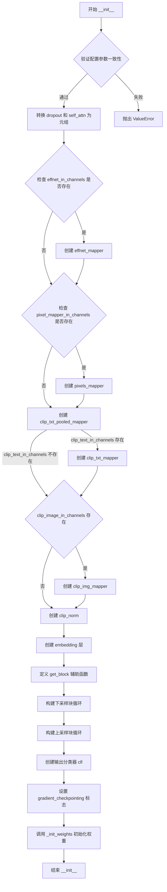
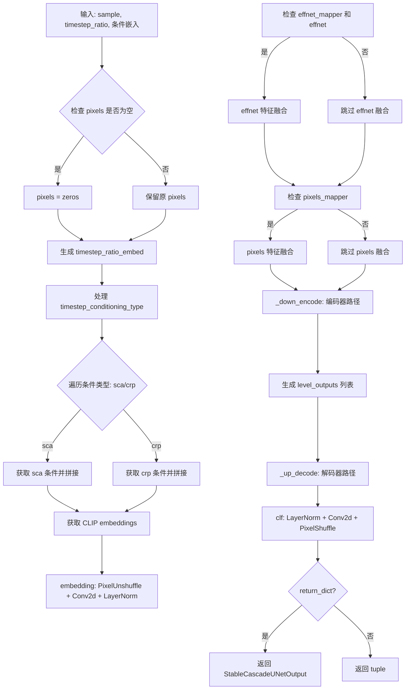
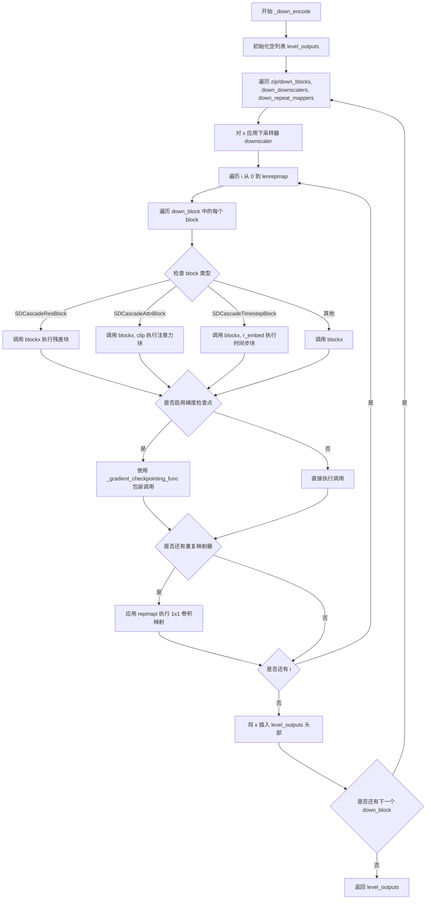
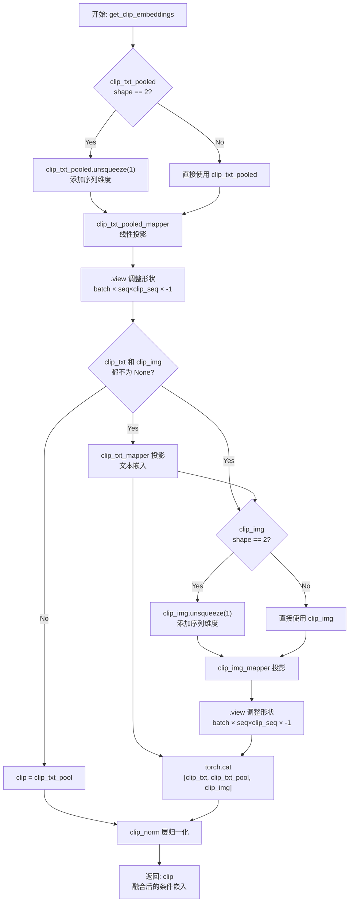
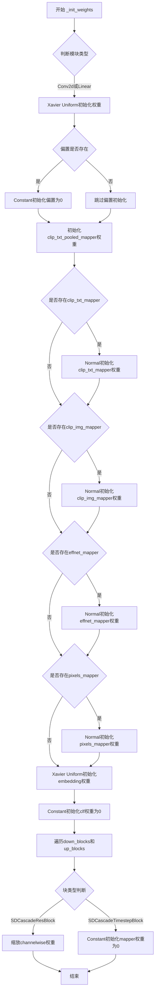
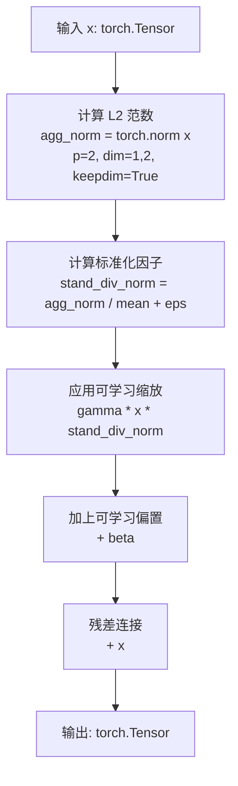

# `diffusers\src\diffusers\models\unets\unet_stable_cascade.py` 详细设计文档

这是一个用于 Stable Cascade 扩散模型的核心 U-Net 神经网络架构实现，包含了编码器-解码器结构、时间步长嵌入、CLIP 条件注入以及多种自定义残差块和注意力机制，用于根据文本和图像条件生成分辨率更高的图像。

## 整体流程

```mermaid
graph TD
    Input[输入: sample, timestep_ratio, clip_text_pooled, etc.] --> TimeEmb[计算时间嵌入: get_timestep_ratio_embedding]
    Input --> ClipEmb[计算CLIP嵌入: get_clip_embeddings]
    Input --> InputEmb[输入映射: self.embedding (PixelUnshuffle + Conv)]
    TimeEmb --> CondInject[条件注入: Effnet/Pixel Mapper]
    ClipEmb --> CondInject
    InputEmb --> CondInject
    CondInject --> Encoder[下采样编码: _down_encode]
    Encoder --> LevelOut[保存多级特征用于跳跃连接]
    LevelOut --> Decoder[上采样解码: _up_decode]
    Decoder --> OutputProj[输出映射: self.clf (PixelShuffle)]
    OutputProj --> Out[StableCascadeUNetOutput]
```

## 类结构

```
StableCascadeUNet (主模型基类)
├── SDCascadeLayerNorm (自定义层归一化)
├── SDCascadeTimestepBlock (时间步处理块)
├── SDCascadeResBlock (残差块，包含深度可分离卷积和通道MLP)
│   └── GlobalResponseNorm (全局响应归一化)
├── SDCascadeAttnBlock (注意力块，支持Cross-Attention)
├── UpDownBlock2d (上采样/下采样块)
└── StableCascadeUNetOutput (输出数据结构)
```

## 全局变量及字段


### `StableCascadeUNet.down_blocks`
    
下采样编码器块，包含多个残差块、时间步块和注意力块

类型：`nn.ModuleList`
    


### `StableCascadeUNet.up_blocks`
    
上采样解码器块，包含多个残差块、时间步块和注意力块

类型：`nn.ModuleList`
    


### `StableCascadeUNet.down_downscalers`
    
下采样操作，用于降低特征图的空间分辨率

类型：`nn.ModuleList`
    


### `StableCascadeUNet.up_upscalers`
    
上采样操作，用于提升特征图的空间分辨率

类型：`nn.ModuleList`
    


### `StableCascadeUNet.embedding`
    
输入像素解嵌+卷积，将输入样本映射到特征空间

类型：`nn.Sequential`
    


### `StableCascadeUNet.clf`
    
输出像素混洗+卷积，将特征映射回样本空间

类型：`nn.Sequential`
    


### `StableCascadeUNet.effnet_mapper`
    
可选，Effnet条件映射，将Effnet特征注入主网络

类型：`nn.Sequential`
    


### `StableCascadeUNet.pixels_mapper`
    
可选，像素条件映射，将像素级条件信息注入主网络

类型：`nn.Sequential`
    


### `StableCascadeUNet.clip_txt_pooled_mapper`
    
CLIP文本池化映射，将池化后的文本嵌入投影到条件空间

类型：`nn.Linear`
    


### `StableCascadeUNet.clip_txt_mapper`
    
可选，CLIP文本映射，将完整文本嵌入投影到条件空间

类型：`nn.Linear`
    


### `StableCascadeUNet.clip_img_mapper`
    
可选，CLIP图像映射，将图像嵌入投影到条件空间

类型：`nn.Linear`
    


### `StableCascadeUNet.clip_norm`
    
CLIP嵌入归一化，对CLIP条件嵌入进行层归一化

类型：`nn.LayerNorm`
    


### `StableCascadeUNet.gradient_checkpointing`
    
梯度检查点标志，控制是否使用梯度检查点以节省显存

类型：`bool`
    


### `SDCascadeResBlock.depthwise`
    
深度可分离卷积，用于空间特征提取

类型：`nn.Conv2d`
    


### `SDCascadeResBlock.norm`
    
自定义层归一化，处理(B,C,H,W)格式的特征

类型：`SDCascadeLayerNorm`
    


### `SDCascadeResBlock.channelwise`
    
MLP + GELU + Norm + Dropout，用于通道级特征变换

类型：`nn.Sequential`
    


### `SDCascadeAttnBlock.self_attn`
    
是否启用自注意力，控制使用自注意力还是交叉注意力

类型：`bool`
    


### `SDCascadeAttnBlock.norm`
    
自定义层归一化，对输入进行归一化处理

类型：`SDCascadeLayerNorm`
    


### `SDCascadeAttnBlock.attention`
    
多头注意力实例，执行注意力计算

类型：`Attention`
    


### `SDCascadeAttnBlock.kv_mapper`
    
条件键值映射，将条件信息映射到键值空间

类型：`nn.Sequential`
    


### `SDCascadeTimestepBlock.mapper`
    
时间步映射，将时间步嵌入投影到特征空间

类型：`nn.Linear`
    


### `SDCascadeTimestepBlock.conds`
    
条件类型列表，如'sca'、'crp'，定义条件注入方式

类型：`list`
    


### `GlobalResponseNorm.gamma`
    
可学习缩放参数，用于全局响应归一化

类型：`nn.Parameter`
    


### `GlobalResponseNorm.beta`
    
可学习偏移参数，用于全局响应归一化

类型：`nn.Parameter`
    


### `UpDownBlock2d.blocks`
    
插值和卷积的组合，执行上采样或下采样操作

类型：`nn.ModuleList`
    


### `StableCascadeUNetOutput.sample`
    
生成的图像张量，作为UNet的输出

类型：`torch.Tensor`
    
    

## 全局函数及方法


### StableCascadeUNet.__init__

构造函数，初始化 Stable Diffusion Cascade（稳定扩散级联）网络的 UNet 架构。该方法创建并配置所有必要的网络组件，包括条件映射器（用于处理 CLIP 文本、图像和 Effnet 条件）、下采样块、上采样块、嵌入层和输出层，并初始化网络权重。

参数：

- `in_channels`：`int`，默认为 16，输入样本的通道数
- `out_channels`：`int`，默认为 16，输出样本的通道数
- `timestep_ratio_embedding_dim`：`int`，默认为 64，时间步嵌入的维度
- `patch_size`：`int`，默认为 1，用于像素解乱（PixelUnshuffle）层的补丁大小
- `conditioning_dim`：`int`，默认为 2048，图像和文本条件嵌入的维度
- `block_out_channels`：`tuple[int, ...]`，默认为 (2048, 2048)，每个块的输出通道数元组
- `num_attention_heads`：`tuple[int, ...]`，默认为 (32, 32)，每个注意力块中的注意力头数
- `down_num_layers_per_block`：`tuple[int, ...]`，默认为 (8, 24)，每个下采样块中的层数
- `up_num_layers_per_block`：`tuple[int, ...]`，默认为 (24, 8)，每个上采样块中的层数
- `down_blocks_repeat_mappers`：`tuple[int] | None`，默认为 (1, 1)，每个下采样块中重复的 1x1 卷积层数量
- `up_blocks_repeat_mappers`：`tuple[int] | None`，默认为 (1, 1)，每个上采样块中重复的 1x1 卷积层数量
- `block_types_per_layer`：`tuple[tuple[str]]`，默认为 (("SDCascadeResBlock", "SDCascadeTimestepBlock", "SDCascadeAttnBlock"), ("SDCascadeResBlock", "SDCascadeTimestepBlock", "SDCascadeAttnBlock"))，每层使用的块类型
- `clip_text_in_channels`：`int | None`，默认为 None，CLIP 文本条件的输入通道数
- `clip_text_pooled_in_channels`：`int`，默认为 1280，池化 CLIP 文本嵌入的输入通道数
- `clip_image_in_channels`：`int | None`，默认为 None，CLIP 图像条件的输入通道数
- `clip_seq`：`int`，默认为 4，CLIP 序列长度
- `effnet_in_channels`：`int | None`，默认为 None，Effnet 条件的输入通道数
- `pixel_mapper_in_channels`：`int | None`，默认为 None，像素映射器条件的输入通道数
- `kernel_size`：`int`，默认为 3，块卷积层使用的卷积核大小
- `dropout`：`float | tuple[float]`，默认为 (0.0, 0.0)，每个块的 dropout 概率
- `self_attn`：`bool | tuple[bool]`，默认为 True，决定是否在块中使用自注意力
- `timestep_conditioning_type`：`tuple[str, ...]`，默认为 ("sca", "crp")，时间步条件类型
- `switch_level`：`tuple[bool] | None`，默认为 None，指示块中是否应用上采样或下采样

返回值：`None`，构造函数无返回值，仅初始化对象状态

#### 流程图



#### 带注释源码

```python
@register_to_config
def __init__(
    self,
    in_channels: int = 16,
    out_channels: int = 16,
    timestep_ratio_embedding_dim: int = 64,
    patch_size: int = 1,
    conditioning_dim: int = 2048,
    block_out_channels: tuple[int, ...] = (2048, 2048),
    num_attention_heads: tuple[int, ...] = (32, 32),
    down_num_layers_per_block: tuple[int, ...] = (8, 24),
    up_num_layers_per_block: tuple[int, ...] = (24, 8),
    down_blocks_repeat_mappers: tuple[int] | None = (
        1,
        1,
    ),
    up_blocks_repeat_mappers: tuple[int] | None = (1, 1),
    block_types_per_layer: tuple[tuple[str]] = (
        ("SDCascadeResBlock", "SDCascadeTimestepBlock", "SDCascadeAttnBlock"),
        ("SDCascadeResBlock", "SDCascadeTimestepBlock", "SDCascadeAttnBlock"),
    ),
    clip_text_in_channels: int | None = None,
    clip_text_pooled_in_channels=1280,
    clip_image_in_channels: int | None = None,
    clip_seq=4,
    effnet_in_channels: int | None = None,
    pixel_mapper_in_channels: int | None = None,
    kernel_size=3,
    dropout: float | tuple[float] = (0.1, 0.1),
    self_attn: bool | tuple[bool] = True,
    timestep_conditioning_type: tuple[str, ...] = ("sca", "crp"),
    switch_level: tuple[bool] | None = None,
):
    # 调用父类构造函数
    super().__init__()

    # ==================== 参数验证 ====================
    # 验证 block_out_channels 与 down_num_layers_per_block 长度一致
    if len(block_out_channels) != len(down_num_layers_per_block):
        raise ValueError(
            f"Number of elements in `down_num_layers_per_block` must match the length of `block_out_channels`: {len(block_out_channels)}"
        )
    # 验证 block_out_channels 与 up_num_layers_per_block 长度一致
    elif len(block_out_channels) != len(up_num_layers_per_block):
        raise ValueError(
            f"Number of elements in `up_num_layers_per_block` must match the length of `block_out_channels`: {len(block_out_channels)}"
        )
    # 验证 block_out_channels 与 down_blocks_repeat_mappers 长度一致
    elif len(block_out_channels) != len(down_blocks_repeat_mappers):
        raise ValueError(
            f"Number of elements in `down_blocks_repeat_mappers` must match the length of `block_out_channels`: {len(block_out_channels)}"
        )
    # 验证 block_out_channels 与 up_blocks_repeat_mappers 长度一致
    elif len(block_out_channels) != len(up_blocks_repeat_mappers):
        raise ValueError(
            f"Number of elements in `up_blocks_repeat_mappers` must match the length of `block_out_channels`: {len(block_out_channels)}"
        )
    # 验证 block_out_channels 与 block_types_per_layer 长度一致
    elif len(block_out_channels) != len(block_types_per_layer):
        raise ValueError(
            f"Number of elements in `block_types_per_layer` must match the length of `block_out_channels`: {len(block_out_channels)}"
        )

    # ==================== 参数标准化 ====================
    # 将 dropout 转换为元组（如果它是单个 float 值）
    if isinstance(dropout, float):
        dropout = (dropout,) * len(block_out_channels)
    # 将 self_attn 转换为元组（如果它是单个 bool 值）
    if isinstance(self_attn, bool):
        self_attn = (self_attn,) * len(block_out_channels)

    # ==================== 条件映射器 (CONDITIONING) ====================
    # 如果提供了 effnet 条件输入通道，创建 Effnet 映射器网络
    if effnet_in_channels is not None:
        self.effnet_mapper = nn.Sequential(
            nn.Conv2d(effnet_in_channels, block_out_channels[0] * 4, kernel_size=1),  # 通道扩展
            nn.GELU(),  # 激活函数
            nn.Conv2d(block_out_channels[0] * 4, block_out_channels[0], kernel_size=1),  # 通道压缩
            SDCascadeLayerNorm(block_out_channels[0], elementwise_affine=False, eps=1e-6),  # 归一化
        )
    
    # 如果提供了像素映射器输入通道，创建像素映射器网络
    if pixel_mapper_in_channels is not None:
        self.pixels_mapper = nn.Sequential(
            nn.Conv2d(pixel_mapper_in_channels, block_out_channels[0] * 4, kernel_size=1),
            nn.GELU(),
            nn.Conv2d(block_out_channels[0] * 4, block_out_channels[0], kernel_size=1),
            SDCascadeLayerNorm(block_out_channels[0], elementwise_affine=False, eps=1e-6),
        )

    # CLIP 文本池化映射器：将文本嵌入投影到条件空间
    self.clip_txt_pooled_mapper = nn.Linear(clip_text_pooled_in_channels, conditioning_dim * clip_seq)
    # 可选：CLIP 文本映射器（如果提供了文本输入通道）
    if clip_text_in_channels is not None:
        self.clip_txt_mapper = nn.Linear(clip_text_in_channels, conditioning_dim)
    # 可选：CLIP 图像映射器（如果提供了图像输入通道）
    if clip_image_in_channels is not None:
        self.clip_img_mapper = nn.Linear(clip_image_in_channels, conditioning_dim * clip_seq)
    # CLIP 条件归一化层
    self.clip_norm = nn.LayerNorm(conditioning_dim, elementwise_affine=False, eps=1e-6)

    # ==================== 输入嵌入层 ====================
    # 包含像素解乱和通道投影
    self.embedding = nn.Sequential(
        nn.PixelUnshuffle(patch_size),  # 减少空间维度，增加通道维度
        nn.Conv2d(in_channels * (patch_size**2), block_out_channels[0], kernel_size=1),  # 通道变换
        SDCascadeLayerNorm(block_out_channels[0], elementwise_affine=False, eps=1e-6),  # 归一化
    )

    # ==================== 辅助函数：创建块 ====================
    def get_block(block_type, in_channels, nhead, c_skip=0, dropout=0, self_attn=True):
        """
        根据 block_type 创建对应的网络块
        
        参数:
            block_type: 块类型名称 ("SDCascadeResBlock", "SDCascadeAttnBlock", "SDCascadeTimestepBlock")
            in_channels: 输入通道数
            nhead: 注意力头数
            c_skip: 跳跃连接通道数
            dropout: dropout 概率
            self_attn: 是否使用自注意力
        """
        if block_type == "SDCascadeResBlock":
            return SDCascadeResBlock(in_channels, c_skip, kernel_size=kernel_size, dropout=dropout)
        elif block_type == "SDCascadeAttnBlock":
            return SDCascadeAttnBlock(in_channels, conditioning_dim, nhead, self_attn=self_attn, dropout=dropout)
        elif block_type == "SDCascadeTimestepBlock":
            return SDCascadeTimestepBlock(
                in_channels, timestep_ratio_embedding_dim, conds=timestep_conditioning_type
            )
        else:
            raise ValueError(f"Block type {block_type} not supported")

    # ==================== 下采样块 (DOWN BLOCKS) ====================
    self.down_blocks = nn.ModuleList()  # 存储所有下采样块
    self.down_downscalers = nn.ModuleList()  # 下采样操作（卷积或上采样）
    self.down_repeat_mappers = nn.ModuleList()  # 重复的 1x1 卷积映射器
    
    for i in range(len(block_out_channels)):
        # 创建下采样器（除了第一层，每层都需要下采样）
        if i > 0:
            self.down_downscalers.append(
                nn.Sequential(
                    SDCascadeLayerNorm(block_out_channels[i - 1], elementwise_affine=False, eps=1e-6),
                    UpDownBlock2d(
                        block_out_channels[i - 1], block_out_channels[i], mode="down", enabled=switch_level[i - 1]
                    )
                    if switch_level is not None
                    else nn.Conv2d(block_out_channels[i - 1], block_out_channels[i], kernel_size=2, stride=2),
                )
            )
        else:
            self.down_downscalers.append(nn.Identity())  # 第一层不需要下采样

        # 创建下采样块中的所有层
        down_block = nn.ModuleList()
        for _ in range(down_num_layers_per_block[i]):
            for block_type in block_types_per_layer[i]:
                block = get_block(
                    block_type,
                    block_out_channels[i],
                    num_attention_heads[i],
                    dropout=dropout[i],
                    self_attn=self_attn[i],
                )
                down_block.append(block)
        self.down_blocks.append(down_block)

        # 创建重复映射器（可选）
        if down_blocks_repeat_mappers is not None:
            block_repeat_mappers = nn.ModuleList()
            for _ in range(down_blocks_repeat_mappers[i] - 1):
                block_repeat_mappers.append(nn.Conv2d(block_out_channels[i], block_out_channels[i], kernel_size=1))
            self.down_repeat_mappers.append(block_repeat_mappers)

    # ==================== 上采样块 (UP BLOCKS) ====================
    self.up_blocks = nn.ModuleList()  # 存储所有上采样块
    self.up_upscalers = nn.ModuleList()  # 上采样操作
    self.up_repeat_mappers = nn.ModuleList()  # 重复的 1x1 卷积映射器
    
    for i in reversed(range(len(block_out_channels))):  # 反向遍历
        # 创建上采样器
        if i > 0:
            self.up_upscalers.append(
                nn.Sequential(
                    SDCascadeLayerNorm(block_out_channels[i], elementwise_affine=False, eps=1e-6),
                    UpDownBlock2d(
                        block_out_channels[i], block_out_channels[i - 1], mode="up", enabled=switch_level[i - 1]
                    )
                    if switch_level is not None
                    else nn.ConvTranspose2d(
                        block_out_channels[i], block_out_channels[i - 1], kernel_size=2, stride=2
                    ),
                )
            )
        else:
            self.up_upscalers.append(nn.Identity())

        # 创建上采样块中的所有层
        up_block = nn.ModuleList()
        for j in range(up_num_layers_per_block[::-1][i]):  # 反向层数
            for k, block_type in enumerate(block_types_per_layer[i]):
                # 计算跳跃连接：仅在第一层的第一个块使用跳跃连接
                c_skip = block_out_channels[i] if i < len(block_out_channels) - 1 and j == k == 0 else 0
                block = get_block(
                    block_type,
                    block_out_channels[i],
                    num_attention_heads[i],
                    c_skip=c_skip,
                    dropout=dropout[i],
                    self_attn=self_attn[i],
                )
                up_block.append(block)
        self.up_blocks.append(up_block)

        # 创建重复映射器（可选）
        if up_blocks_repeat_mappers is not None:
            block_repeat_mappers = nn.ModuleList()
            for _ in range(up_blocks_repeat_mappers[::-1][i] - 1):
                block_repeat_mappers.append(nn.Conv2d(block_out_channels[i], block_out_channels[i], kernel_size=1))
            self.up_repeat_mappers.append(block_repeat_mappers)

    # ==================== 输出层 (OUTPUT) ====================
    # 分类器头：将特征转换为输出样本
    self.clf = nn.Sequential(
        SDCascadeLayerNorm(block_out_channels[0], elementwise_affine=False, eps=1e-6),
        nn.Conv2d(block_out_channels[0], out_channels * (patch_size**2), kernel_size=1),
        nn.PixelShuffle(patch_size),  # 像素重组，增加空间维度
    )

    # ==================== 梯度检查点设置 ====================
    self.gradient_checkpointing = False  # 默认关闭梯度检查点
```


### `StableCascadeUNet.forward`

主前向传播方法，负责调度编码器和解码器，处理多种条件输入（CLIP文本/图像、effnet、像素、时间步等），最终输出去噪后的样本张量。

参数：

- `sample`：`torch.Tensor`，输入的带噪声图像样本
- `timestep_ratio`：`torch.Tensor` 或 `float`，时间步比例，用于生成时间步嵌入
- `clip_text_pooled`：`torch.Tensor`，CLIP 文本的池化嵌入
- `clip_text`：`torch.Tensor | None`，CLIP 文本嵌入（可选）
- `clip_img`：`torch.Tensor | None`，CLIP 图像嵌入（可选）
- `effnet`：`torch.Tensor | None`，EffNet 条件特征（可选）
- `pixels`：`torch.Tensor | None`，像素级条件（可选）
- `sca`：`torch.Tensor | None`，SCA 类型时间步条件（可选）
- `crp`：`torch.Tensor | None`，CRP 类型时间步条件（可选）
- `return_dict`：`bool`，是否以字典形式返回输出（默认为 True）

返回值：`StableCascadeUNetOutput`，包含去噪后的 `sample` 张量

#### 流程图



#### 带注释源码

```python
def forward(
    self,
    sample,                      # 输入带噪声样本 [B, C, H, W]
    timestep_ratio,              # 时间步比例 [B,] 或 float
    clip_text_pooled,            # CLIP 文本池化嵌入 [B, seq, dim]
    clip_text=None,              # CLIP 文本嵌入 [B, seq, dim] 或 None
    clip_img=None,               # CLIP 图像嵌入 [B, seq, dim] 或 None
    effnet=None,                 # EffNet 条件特征 或 None
    pixels=None,                 # 像素条件 或 None
    sca=None,                    # SCA 类型时间步条件 或 None
    crp=None,                    # CRP 类型时间步条件 或 None
    return_dict=True,            # 是否返回字典格式
):
    # 1. 初始化 pixels 条件（如果未提供则创建全零张量）
    if pixels is None:
        # 当未提供像素条件时，使用与 sample 相同 batch size 的全零 3x8x8 张量
        pixels = sample.new_zeros(sample.size(0), 3, 8, 8)

    # 2. 处理时间步嵌入
    # 将 timestep_ratio 转换为位置编码形式，用于时间步条件注入
    timestep_ratio_embed = self.get_timestep_ratio_embedding(timestep_ratio)
    
    # 3. 处理多种时间步条件类型 (sca, crp)
    # 遍历配置中的条件类型，将额外条件与基础时间步嵌入拼接
    for c in self.config.timestep_conditioning_type:
        if c == "sca":
            cond = sca          # SCA 条件
        elif c == "crp":
            cond = crp          # CRP 条件
        else:
            cond = None
        # 如果条件为空则使用与 timestep_ratio 相同形状的全零张量
        t_cond = cond or torch.zeros_like(timestep_ratio)
        # 沿通道维度拼接时间步嵌入
        timestep_ratio_embed = torch.cat([timestep_ratio_embed, self.get_timestep_ratio_embedding(t_cond)], dim=1)

    # 4. 获取 CLIP 条件嵌入
    # 融合 CLIP 文本池化、文本和图像嵌入，并进行 LayerNorm 归一化
    clip = self.get_clip_embeddings(clip_txt_pooled=clip_text_pooled, clip_txt=clip_text, clip_img=clip_img)

    # 5. 输入嵌入层
    # PixelUnshuffle: 降低空间分辨率提高通道数
    # Conv2d: 通道映射到 block_out_channels[0]
    # LayerNorm: 通道维度归一化
    x = self.embedding(sample)

    # 6. EffNet 条件融合（如果存在）
    # 将 EffNet 特征插值到与 x 相同空间尺寸，然后相加融合
    if hasattr(self, "effnet_mapper") and effnet is not None:
        x = x + self.effnet_mapper(
            nn.functional.interpolate(effnet, size=x.shape[-2:], mode="bilinear", align_corners=True)
        )

    # 7. Pixels 条件融合（如果存在）
    # 将像素特征插值到与 x 相同空间尺寸，然后相加融合
    if hasattr(self, "pixels_mapper"):
        x = x + nn.functional.interpolate(
            self.pixels_mapper(pixels), size=x.shape[-2:], mode="bilinear", align_corners=True
        )

    # 8. 编码器路径（下采样）
    # 返回各层级的特征输出列表，用于解码器的跳跃连接
    level_outputs = self._down_encode(x, timestep_ratio_embed, clip)

    # 9. 解码器路径（上采样）
    # 利用编码器特征和条件信息重建图像
    x = self._up_decode(level_outputs, timestep_ratio_embed, clip)

    # 10. 输出层
    # LayerNorm 归一化 -> 通道映射 -> PixelShuffle 恢复空间分辨率
    sample = self.clf(x)

    # 11. 返回结果
    if not return_dict:
        return (sample,)
    return StableCascadeUNetOutput(sample=sample)
```


### `StableCascadeUNet._down_encode`

该方法执行StableCascadeUNet的下采样编码过程，遍历所有下采样块（down blocks），对输入特征图进行逐步下采样和多层处理，同时保存各级别的输出特征用于后续上采样路径的跳跃连接。

参数：

-  `x`：`torch.Tensor`，输入特征张量，形状为 (batch_size, channels, height, width)
-  `r_embed`：`torch.Tensor`，时间步比例嵌入向量，用于时间条件处理
-  `clip`：`torch.Tensor`，CLIP条件嵌入向量，用于交叉注意力条件

返回值：`List[torch.Tensor]`，包含从最深层到最浅层的各级别下采样输出特征列表

#### 流程图



#### 带注释源码

```python
def _down_encode(self, x, r_embed, clip):
    """
    执行下采样编码并保存各级别特征
    
    参数:
        x: 输入特征张量
        r_embed: 时间步嵌入向量
        clip: CLIP条件嵌入向量
    
    返回:
        level_outputs: 各级别输出列表
    """
    # 用于存储各级别的输出特征
    level_outputs = []
    
    # 将下采样块、下采样器和重复映射器打包遍历
    # down_blocks: 包含所有下采样块
    # down_downscalers: 执行空间下采样的模块
    # down_repeat_mappers: 1x1卷积重复映射器
    block_group = zip(self.down_blocks, self.down_downscalers, self.down_repeat_mappers)

    # 检查是否启用梯度检查点以节省显存
    if torch.is_grad_enabled() and self.gradient_checkpointing:
        # 梯度检查点模式：使用 _gradient_checkpointing_func 包装块调用
        for down_block, downscaler, repmap in block_group:
            # 步骤1: 对输入进行下采样
            x = downscaler(x)
            
            # 步骤2: 遍历重复次数+1（每个块组可能重复多次）
            for i in range(len(repmap) + 1):
                # 步骤3: 遍历当前层中的所有块
                for block in down_block:
                    # 根据块类型调用不同的处理逻辑
                    if isinstance(block, SDCascadeResBlock):
                        # 残差块：仅需要输入x
                        x = self._gradient_checkpointing_func(block, x)
                    elif isinstance(block, SDCascadeAttnBlock):
                        # 注意力块：需要输入x和clip条件
                        x = self._gradient_checkpointing_func(block, x, clip)
                    elif isinstance(block, SDCascadeTimestepBlock):
                        # 时间步块：需要输入x和时间步嵌入
                        x = self._gradient_checkpointing_func(block, x, r_embed)
                    else:
                        # 其他类型块
                        x = self._gradient_checkpointing_func(block)
                
                # 步骤4: 如果还有重复映射器，应用1x1卷积
                if i < len(repmap):
                    x = repmap[i](x)
            
            # 步骤5: 将当前级别的输出插入列表头部（保持从深到浅的顺序）
            level_outputs.insert(0, x)
    else:
        # 非梯度检查点模式：直接执行前向传播
        for down_block, downscaler, repmap in block_group:
            x = downscaler(x)
            for i in range(len(repmap) + 1):
                for block in down_block:
                    if isinstance(block, SDCascadeResBlock):
                        x = block(x)
                    elif isinstance(block, SDCascadeAttnBlock):
                        x = block(x, clip)
                    elif isinstance(block, SDCascadeTimestepBlock):
                        x = block(x, r_embed)
                    else:
                        x = block(x)
                if i < len(repmap):
                    x = repmap[i](x)
            level_outputs.insert(0, x)
    
    return level_outputs
```


### `StableCascadeUNet._up_decode`

该私有方法执行上采样解码操作，接收编码阶段产生的多层特征输出，通过上采样块逐步融合来自编码器的跳跃连接特征，最终输出解码后的高分辨率特征表示。

参数：

- `level_outputs`：`List[torch.Tensor]`，来自编码器的多层特征输出列表，索引0对应最底层特征
- `r_embed`：`torch.Tensor`，经过时间步比例嵌入处理的张量，用于时间条件注入
- `clip`：`torch.Tensor`，经过CLIP模型处理的条件嵌入，用于文本和图像条件注入

返回值：`torch.Tensor`，解码后的高分辨率特征张量

#### 流程图

```mermaid
flowchart TD
    A[开始 _up_decode] --> B[初始化 x = level_outputs[0]]
    B --> C[构建 block_group = zip(up_blocks, up_upscalers, up_repeat_mappers)]
    C --> D{检查梯度是否启用<br/>且 gradient_checkpointing 为真?}
    D -->|是| E[启用梯度检查点模式]
    D -->|否| F[普通前向模式]
    
    E --> G1[遍历 up_block, upscaler, repmap]
    G1 --> G2[遍历重复映射次数 + 1]
    G2 --> G3[遍历 up_block 中的每个 block]
    G3 --> G4{判断 block 类型}
    G4 -->|SDCascadeResBlock| G5[获取 skip 特征<br/>并处理尺寸匹配]
    G5 --> G6[调用 _gradient_checkpointing_func<br/>执行 block]
    G4 -->|SDCascadeAttnBlock| G7[调用 _gradient_checkpointing_func<br/>传入 x 和 clip]
    G4 -->|SDCascadeTimestepBlock| G8[调用 _gradient_checkpointing_func<br/>传入 x 和 r_embed]
    G4 -->|其他| G9[调用 _gradient_checkpointing_func<br/>仅传入 x]
    G6 --> G10{是否需要重复映射?}
    G7 --> G10
    G8 --> G10
    G9 --> G10
    G10 -->|是| G11[应用 repmap[j] 变换]
    G10 -->|否| G12[跳过映射]
    G11 --> G12
    G12 --> G13[应用 upscaler 上采样]
    G13 --> G14{还有更多层?}
    G14 -->|是| G1
    G14 -->|否| G15[返回 x]
    
    F --> H1[遍历 up_block, upscaler, repmap]
    H1 --> H2[遍历重复映射次数 + 1]
    H2 --> H3[遍历 up_block 中的每个 block]
    H3 --> H4{判断 block 类型}
    H4 -->|SDCascadeResBlock| H5[获取 skip 特征<br/>并处理尺寸匹配]
    H5 --> H6[直接调用 block 执行前向]
    H4 -->|SDCascadeAttnBlock| H7[直接调用 block(x, clip)]
    H4 -->|SDCascadeTimestepBlock| H8[直接调用 block(x, r_embed)]
    H4 -->|其他| H9[直接调用 block(x)]
    H6 --> H10{是否需要重复映射?}
    H7 --> H10
    H8 --> H10
    H9 --> H10
    H10 -->|是| H11[应用 repmap[j] 变换]
    H10 -->|否| H12[跳过映射]
    H11 --> H12
    H12 --> H13[应用 upscaler 上采样]
    H13 --> H14{还有更多层?}
    H14 -->|是| H1
    H14 -->|否| H15[返回 x]
```

#### 带注释源码

```python
def _up_decode(self, level_outputs, r_embed, clip):
    """
    执行上采样解码操作，融合编码器特征并输出解码后的特征
    
    参数:
        level_outputs: 编码器各层的输出特征列表
        r_embed: 时间步嵌入向量
        clip: CLIP条件嵌入
    """
    # 1. 初始化：取编码器最低层特征作为起点
    x = level_outputs[0]
    
    # 2. 构建上采样块组（逆序：从小到大处理）
    # up_blocks: 上采样主网络块
    # up_upscalers: 空间上采样器
    # up_repeat_mappers: 通道重复映射器
    block_group = zip(self.up_blocks, self.up_upscalers, self.up_repeat_mappers)

    # 3. 根据是否启用梯度检查点选择前向路径
    if torch.is_grad_enabled() and self.gradient_checkpointing:
        # ===== 启用梯度检查点模式（节省显存）=====
        # 遍历每个上采样阶段
        for i, (up_block, upscaler, repmap) in enumerate(block_group):
            # 遍历重复映射层（+1表示至少执行一次）
            for j in range(len(repmap) + 1):
                # 遍历当前阶段的所有Block
                for k, block in enumerate(up_block):
                    if isinstance(block, SDCascadeResBlock):
                        # ResBlock处理：
                        # - i>0时从对应编码层获取跳跃连接
                        # - k==0确保只在每组第一个block时融合
                        skip = level_outputs[i] if k == 0 and i > 0 else None
                        
                        # 处理空间尺寸不匹配：上采样或下采样x以匹配skip
                        if skip is not None and (x.size(-1) != skip.size(-1) or x.size(-2) != skip.size(-2)):
                            orig_type = x.dtype  # 保存原始dtype防止精度损失
                            x = torch.nn.functional.interpolate(
                                x.float(), skip.shape[-2:], mode="bilinear", align_corners=True
                            )
                            x = x.to(orig_type)  # 恢复原始精度
                        
                        # 梯度检查点方式执行ResBlock
                        x = self._gradient_checkpointing_func(block, x, skip)
                        
                    elif isinstance(block, SDCascadeAttnBlock):
                        # 注意力Block：注入CLIP条件
                        x = self._gradient_checkpointing_func(block, x, clip)
                        
                    elif isinstance(block, SDCascadeTimestepBlock):
                        # 时间步Block：注入时间条件
                        x = self._gradient_checkpointing_func(block, x, r_embed)
                        
                    else:
                        # 其他Block类型
                        x = self._gradient_checkpointing_func(block, x)
                
                # 应用重复映射器（通道维度1x1卷积）
                if j < len(repmap):
                    x = repmap[j](x)
            
            # 阶段结束：执行空间上采样（2x放大）
            x = upscaler(x)
    else:
        # ===== 普通前向模式（完整梯度）=====
        for i, (up_block, upscaler, repmap) in enumerate(block_group):
            for j in range(len(repmap) + 1):
                for k, block in enumerate(up_block):
                    if isinstance(block, SDCascadeResBlock):
                        # 获取跳跃连接特征
                        skip = level_outputs[i] if k == 0 and i > 0 else None
                        
                        # 空间尺寸匹配处理
                        if skip is not None and (x.size(-1) != skip.size(-1) or x.size(-2) != skip.size(-2)):
                            orig_type = x.dtype
                            x = torch.nn.functional.interpolate(
                                x.float(), skip.shape[-2:], mode="bilinear", align_corners=True
                            )
                            x = x.to(orig_type)
                        
                        # 直接前向传播
                        x = block(x, skip)
                        
                    elif isinstance(block, SDCascadeAttnBlock):
                        x = block(x, clip)
                        
                    elif isinstance(block, SDCascadeTimestepBlock):
                        x = block(x, r_embed)
                        
                    else:
                        x = block(x)
                
                if j < len(repmap):
                    x = repmap[j](x)
            
            x = upscaler(x)
    
    # 4. 返回最终解码特征
    return x
```


### `StableCascadeUNet.get_timestep_ratio_embedding`

该方法计算时间步的比例嵌入（timestep ratio embedding），使用正弦和余弦函数对时间步进行周期性编码，生成可用于神经网络的时间步特征表示。

参数：

- `self`：类实例本身，包含配置对象 `self.config`，其中存储了 `timestep_ratio_embedding_dim`（嵌入维度）等参数
- `timestep_ratio`：`torch.Tensor`，时间步比例张量，通常为归一化后的时间步值，形状为 `(batch_size,)`
- `max_positions`：`int`，可选参数，默认为 10000，表示位置编码的最大位置数，用于控制正弦/余弦函数的频率范围

返回值：`torch.Tensor`，返回计算得到的时间步嵌入向量，形状为 `(batch_size, timestep_ratio_embedding_dim)`，数据类型与输入 `timestep_ratio` 相同

#### 流程图

```mermaid
flowchart TD
    A[输入 timestep_ratio] --> B[计算 r = timestep_ratio * max_positions]
    B --> C[计算半维度 half_dim = config.timestep_ratio_embedding_dim // 2]
    C --> D[计算频率因子 emb = log(max_positions) / (half_dim - 1)]
    D --> E[生成基础频率向量: torch.arange half_dim]
    E --> F[计算指数衰减频率: exp(-emb * arange)]
    F --> G[广播乘积: r[:, None] * emb[None, :]]
    G --> H[拼接 sin 和 cos: torch.cat [sin, cos]]
    H --> I{嵌入维度为奇数?}
    I -->|是| J[零填充: F.pad emb]
    I -->|否| K[直接返回]
    J --> L[转换为输入数据类型]
    L --> K
    K --> M[输出嵌入向量]
```

#### 带注释源码

```python
def get_timestep_ratio_embedding(self, timestep_ratio, max_positions=10000):
    # 将时间步比例乘以最大位置数，得到实际的位置索引
    r = timestep_ratio * max_positions
    
    # 计算嵌入向量的一半维度（因为 sin 和 cos 各占一半）
    half_dim = self.config.timestep_ratio_embedding_dim // 2
    
    # 计算对数频率因子，用于生成指数衰减的频率谱
    # log(max_positions) / (half_dim - 1) 确保最后一维频率足够小
    emb = math.log(max_positions) / (half_dim - 1)
    
    # 生成从 0 到 half_dim-1 的索引，并计算指数衰减的频率向量
    # 使用 -emb 乘以索引后取 exp，得到从 1 指数衰减到接近 0 的频率
    emb = torch.arange(half_dim, device=r.device).float().mul(-emb).exp()
    
    # 对时间步比例进行广播乘法，得到每个样本的频率加权值
    # r[:, None] 将 r 扩展为 (batch_size, 1)，emb[None, :] 扩展为 (1, half_dim)
    emb = r[:, None] * emb[None, :]
    
    # 拼接正弦和余弦编码，形成完整的位置嵌入
    # 结果形状为 (batch_size, half_dim * 2)
    emb = torch.cat([emb.sin(), emb.cos()], dim=1)
    
    # 如果嵌入维度为奇数，则需要填充一个零以满足维度要求
    # 这是因为 half_dim * 2 可能小于配置的 timestep_ratio_embedding_dim
    if self.config.timestep_ratio_embedding_dim % 2 == 1:  # zero pad
        emb = nn.functional.pad(emb, (0, 1), mode="constant")
    
    # 确保输出数据类型与输入 timestep_ratio 的数据类型一致
    return emb.to(dtype=r.dtype)
```


### `StableCascadeUNet.get_clip_embeddings`

该方法用于整合CLIP文本和图像条件嵌入，将池化文本嵌入、完整文本嵌入和图像嵌入通过线性映射和层归一化进行融合，输出统一的条件嵌入向量供UNet各注意力模块使用。

参数：

- `self`：`StableCascadeUNet`，模型实例本身
- `clip_txt_pooled`：`torch.Tensor`，池化的CLIP文本嵌入，形状为 (batch_size, seq_len, 768) 或 (batch_size, 768)
- `clip_txt`：`torch.Tensor | None`，完整的CLIP文本嵌入，形状为 (batch_size, seq_len, text_dim)，默认为 None
- `clip_img`：`torch.Tensor | None`，CLIP图像嵌入，形状为 (batch_size, seq_len, image_dim)，默认为 None

返回值：`torch.Tensor`，融合后的CLIP条件嵌入，形状为 (batch_size, combined_seq_len, conditioning_dim)，其中 combined_seq_len 取决于 clip_txt 和 clip_img 是否存在

#### 流程图



#### 带注释源码

```python
def get_clip_embeddings(self, clip_txt_pooled, clip_txt=None, clip_img=None):
    """
    整合CLIP文本和图像条件嵌入
    
    参数:
        clip_txt_pooled: 池化的CLIP文本嵌入 (batch, seq, 768) 或 (batch, 768)
        clip_txt: 完整的CLIP文本嵌入 (batch, seq, text_dim)，可选
        clip_img: CLIP图像嵌入 (batch, seq, image_dim)，可选
    
    返回:
        融合后的CLIP条件嵌入 (batch, combined_seq, conditioning_dim)
    """
    
    # 如果池化文本嵌入是2D (batch, dim)，添加序列维度变为3D
    if len(clip_txt_pooled.shape) == 2:
        clip_txt_pool = clip_txt_pooled.unsqueeze(1)
    
    # 通过线性层将池化文本映射到 conditioning_dim * clip_seq 维度
    # 然后 view 成 (batch, seq_len * clip_seq, conditioning_dim)
    clip_txt_pool = self.clip_txt_pooled_mapper(clip_txt_pooled).view(
        clip_txt_pooled.size(0), clip_txt_pooled.size(1) * self.config.clip_seq, -1
    )
    
    # 如果同时提供了文本和图像嵌入，则进行融合
    if clip_txt is not None and clip_img is not None:
        # 将完整文本嵌入映射到 conditioning_dim
        clip_txt = self.clip_txt_mapper(clip_txt)
        
        # 同样处理图像嵌入：2D->3D，映射，调整形状
        if len(clip_img.shape) == 2:
            clip_img = clip_img.unsqueeze(1)
        clip_img = self.clip_img_mapper(clip_img).view(
            clip_img.size(0), clip_img.size(1) * self.config.clip_seq, -1
        )
        
        # 按序列维度拼接: [文本, 池化文本, 图像]
        clip = torch.cat([clip_txt, clip_txt_pool, clip_img], dim=1)
    else:
        # 只有池化文本可用时，直接使用池化文本映射结果
        clip = clip_txt_pool
    
    # 层归一化输出，返回融合后的条件嵌入
    return self.clip_norm(clip)
```


### `StableCascadeUNet._init_weights`

该方法实现StableCascadeUNet模型的权重初始化逻辑，针对不同类型的层（卷积层、线性层、嵌入层、映射器等）采用Xavier均匀分布和Normal正态分布两种初始化策略，并对特定块（如ResBlock和TimestepBlock）进行特殊的权重调整，以确保模型训练的稳定性和收敛性。

参数：

- `m`：`torch.nn.Module`，待初始化的神经网络模块（通常是卷积层或线性层），该方法会递归调用此函数对模型中的每个子模块进行初始化

返回值：无返回值（`None`），该方法直接修改传入模块的权重和偏置，不返回任何内容

#### 流程图



#### 带注释源码

```python
def _init_weights(self, m):
    """
    初始化模型权重的方法，对不同类型的层采用不同的初始化策略
    
    Args:
        m: torch.nn.Module - 要初始化的模块（通常是nn.Conv2d或nn.Linear）
    """
    
    # 1. 对于卷积层和线性层，使用Xavier均匀分布初始化
    # Xavier初始化适用于sigmoid和tanh激活函数，有助于保持梯度方差稳定
    if isinstance(m, (nn.Conv2d, nn.Linear)):
        torch.nn.init.xavier_uniform_(m.weight)
        
        # 如果存在偏置项，初始化为0
        if m.bias is not None:
            nn.init.constant_(m.bias, 0)

    # 2. 初始化CLIP文本池化映射器的权重，使用标准差为0.02的正态分布
    nn.init.normal_(self.clip_txt_pooled_mapper.weight, std=0.02)
    
    # 3. 如果存在CLIP文本映射器，同样使用正态分布初始化
    nn.init.normal_(self.clip_txt_mapper.weight, std=0.02) if hasattr(self, "clip_txt_mapper") else None
    
    # 4. 如果存在CLIP图像映射器，使用正态分布初始化
    nn.init.normal_(self.clip_img_mapper.weight, std=0.02) if hasattr(self, "clip_img_mapper") else None

    # 5. 如果存在EffNet映射器（条件编码器），初始化其卷积层权重
    # EffNet映射器包含两个卷积层：索引0和索引2
    if hasattr(self, "effnet_mapper"):
        nn.init.normal_(self.effnet_mapper[0].weight, std=0.02)  # conditionings
        nn.init.normal_(self.effnet_mapper[2].weight, std=0.02)  # conditionings

    # 6. 如果存在像素映射器，初始化其卷积层权重
    if hasattr(self, "pixels_mapper"):
        nn.init.normal_(self.pixels_mapper[0].weight, std=0.02)  # conditionings
        nn.init.normal_(self.pixels_mapper[2].weight, std=0.02)  # conditionings

    # 7. 初始化嵌入层（输入处理）的卷积权重，使用Xavier初始化
    # embedding[1]是嵌入层中的Conv2d层
    torch.nn.init.xavier_uniform_(self.embedding[1].weight, 0.02)  # inputs
    
    # 8. 初始化分类头（输出层）的权重为0，这是一种常见的输出层初始化技巧
    # clf[1]是输出层中的Conv2d层
    nn.init.constant_(self.clf[1].weight, 0)  # outputs

    # 9. 遍历所有下采样和上采样块，对特定块类型进行特殊初始化
    # blocks是模型配置中定义的块数量
    for level_block in self.down_blocks + self.up_blocks:
        for block in level_block:
            # 对于残差块，缩放最后一个线性层的权重
            # 缩放因子为 np.sqrt(1 / sum(self.config.blocks[0]))
            if isinstance(block, SDCascadeResBlock):
                block.channelwise[-1].weight.data *= np.sqrt(1 / sum(self.config.blocks[0]))
            
            # 对于时间步块，将mapper权重初始化为0（使模型初始时对时间信息不敏感）
            elif isinstance(block, SDCascadeTimestepBlock):
                nn.init.constant_(block.mapper.weight, 0)
```


### `SDCascadeLayerNorm.forward`

该方法重写了标准 LayerNorm 的前向传播，通过维度重排列将输入从 PyTorch 标准的 (B, C, H, W) 转换为 (B, H, W, C) 格式，以适应 LayerNorm 对最后维度的归一化处理，完成后再转换回原始格式。

参数：

- `x`：`torch.Tensor`，输入张量，形状为 (B, C, H, W)，其中 B 是批量大小，C 是通道数，H 和 W 是空间维度

返回值：`torch.Tensor`，返回经过层归一化处理后的张量，形状保持为 (B, C, H, W)

#### 流程图

```mermaid
flowchart TD
    A[输入 x: (B, C, H, W)] --> B[permute: (0, 2, 3, 1) → (B, H, W, C)]
    B --> C[调用父类 LayerNorm.forward]
    C --> D[归一化后的 x: (B, H, W, C)]
    D --> E[permute: (0, 3, 1, 2) → (B, C, H, W)]
    E --> F[输出: (B, C, H, W)]
```

#### 带注释源码

```python
def forward(self, x):
    # 将输入从 (B, C, H, W) 转换为 (B, H, W, C)
    # 这是因为 LayerNorm 默认在最后一个维度上进行归一化
    # 而我们的输入是图像张量，通道在第二个维度
    x = x.permute(0, 2, 3, 1)
    
    # 调用父类 nn.LayerNorm 的 forward 方法
    # 在 (B, H, W) 维度上对 C 通道进行归一化
    x = super().forward(x)
    
    # 将输出从 (B, H, W, C) 转换回 (B, C, H, W)
    # 恢复原始的图像张量格式以便后续卷积层处理
    return x.permute(0, 3, 1, 2)
```


### `SDCascadeResBlock.forward`

执行残差连接和特征变换，对输入特征进行深度可分离卷积、归一化、通道级全连接网络处理，并通过残差连接输出变换后的特征。

参数：

- `self`：SDCascadeResBlock 类实例本身
- `x`：`torch.Tensor`，输入特征张量，形状为 (batch, channels, height, width)
- `x_skip`：`torch.Tensor | None`，可选的跳跃连接特征，用于特征融合，形状为 (batch, channels_skip, height, width)

返回值：`torch.Tensor`，经过残差连接和特征变换后的输出张量，形状与输入 x 相同 (batch, channels, height, width)

#### 流程图

```mermaid
flowchart TD
    A[输入 x, x_skip] --> B[保存原始输入 x_res = x]
    B --> C[深度卷积: self.depthwise(x)]
    C --> D[层归一化: self.norm]
    D --> E{检查 x_skip 是否存在?}
    E -->|是| F[特征拼接: torch.cat([x, x_skip], dim=1)]
    E -->|否| G[保持原样继续]
    F --> H[维度重排: permute 0,2,3,1 转为 (batch, h, w, c)]
    G --> H
    H --> I[通道级全连接网络处理]
    I --> J[维度重排: permute 0,3,1,2 还原为 (batch, c, h, w)]
    J --> K[残差相加: x + x_res]
    K --> L[输出变换后的特征]
```

#### 带注释源码

```python
def forward(self, x, x_skip=None):
    """
    执行残差连接和特征变换
    
    参数:
        x: 输入特征张量，形状 (batch, channels, height, width)
        x_skip: 可选的跳跃连接特征，用于特征融合
    
    返回:
        经过残差连接和特征变换后的输出张量
    """
    # Step 1: 保存原始输入作为残差连接的基础
    x_res = x
    
    # Step 2: 深度可分离卷积 - 对每个通道独立进行空间卷积
    # 保持通道数不变，只进行空间特征提取
    x = self.depthwise(x)
    
    # Step 3: 应用自定义层归一化 (SDCascadeLayerNorm)
    # 对特征进行归一化处理，注意该归一化在通道维度最后进行
    x = self.norm(self.depthwise(x))
    
    # Step 4: 如果存在跳跃连接，则沿通道维度拼接
    # x_skip 通常来自编码器的同层输出，用于补充细节信息
    if x_skip is not None:
        x = torch.cat([x, x_skip], dim=1)
    
    # Step 5: 通道级全连接网络处理
    # 首先将张量从 (batch, h, w, c) 转为 (batch, h*w, c) 即 (batch, h, w, c) 格式
    # 然后通过 Linear-GELU-GRN-Dropout-Linear 变换
    x = self.channelwise(x.permute(0, 2, 3, 1)).permute(0, 3, 1, 2)
    
    # Step 6: 残差连接 - 将变换后的特征与原始输入相加
    # 实现 f(x) + x 的残差结构，帮助梯度流动和特征保留
    return x + x_res
```


### `SDCascadeAttnBlock.forward`

执行注意力计算，可选自注意力或交叉注意力，根据 `self_attn` 标志决定是使用输入特征本身作为 K 和 V（自注意力）还是使用外部提供的条件嵌入作为 K 和 V（交叉注意力），输出经过注意力机制增强后的特征张量。

参数：

- `x`：`torch.Tensor`，输入特征张量，形状为 `(batch_size, channel, height, width)`
- `kv`：`torch.Tensor`，条件嵌入张量，用于交叉注意力或作为自注意力的补充，形状为 `(batch_size, c_cond, ...)` 或 `(batch_size, seq_len, c_cond)`

返回值：`torch.Tensor`，经过注意力机制增强后的特征张量，形状与输入 `x` 相同 `(batch_size, channel, height, width)`

#### 流程图

```mermaid
flowchart TD
    A[输入 x, kv] --> B[kv_mapper: 将条件嵌入映射到与 x 相同的维度]
    B --> C[norm: 对输入 x 进行 SDCascadeLayerNorm 归一化]
    C --> D{self_attn 标志?}
    D -->|True| E[自注意力模式]
    D -->|False| F[交叉注意力模式]
    E --> E1[将 norm_x 形状从 BCHW 转换为 BNC]
    E1 --> E2[kv = torch.cat [norm_x, kv]]
    F --> G[直接使用 kv 作为 encoder_hidden_states]
    E2 --> H[attention: 执行注意力计算]
    G --> H
    H --> I[x + attention_output: 残差连接]
    I --> J[输出增强后的特征]
```

#### 带注释源码

```python
def forward(self, x, kv):
    """
    执行注意力计算的前向传播方法。
    
    参数:
        x: 输入特征张量，形状为 (batch_size, channel, height, width)
        kv: 条件嵌入张量，用于提供注意力机制中的键和值
        
    返回值:
        经过注意力机制增强后的特征张量，形状与输入 x 相同
    """
    # 1. 将条件嵌入 kv 通过 kv_mapper 映射到与输入 x 通道数相同的维度
    #    kv_mapper 包含一个 SiLU 激活函数和一个线性层: c_cond -> c
    kv = self.kv_mapper(kv)
    
    # 2. 对输入 x 进行层归一化 (SDCascadeLayerNorm 对 2D 特征图进行特殊处理)
    norm_x = self.norm(x)
    
    # 3. 根据 self_attn 标志决定注意力模式
    if self.self_attn:
        # 自注意力模式: 使用输入特征本身作为 K 和 V 的一部分
        # 获取批次大小和通道数
        batch_size, channel, _, _ = x.shape
        # 将 norm_x 从 (B, C, H, W) 形状转换为 (B, N, C)，其中 N = H*W
        # 然后与 kv 在序列维度上拼接
        kv = torch.cat([norm_x.view(batch_size, channel, -1).transpose(1, 2), kv], dim=1)
    
    # 4. 执行注意力计算: attention(query, encoder_hidden_states=kv)
    #    - 当 self_attn=True 时: query=norm_x, kv=[norm_x_features; condition]
    #    - 当 self_attn=False 时: query=norm_x, kv=condition (交叉注意力)
    # 5. 残差连接: x + attention_output
    x = x + self.attention(norm_x, encoder_hidden_states=kv)
    
    # 6. 返回增强后的特征，形状与输入 x 相同
    return x
```


### `SDCascadeTimestepBlock.forward`

该方法将时间步（timestep）和条件（condition）映射到与输入特征相同维度的空间，并通过仿射变换将时间步信息注入到特征中，实现条件扩散模型的时间步条件化。

参数：

- `x`：`torch.Tensor`，输入特征张量，形状为 `(batch_size, channels, height, width)`
- `t`：`torch.Tensor`，时间步嵌入张量，形状为 `(batch_size, total_timestep_dim)`，其中 `total_timestep_dim = (len(self.conds) + 1) * timestep_dim`

返回值：`torch.Tensor`，经过时间步条件增强后的特征张量，形状与输入 `x` 相同 `(batch_size, channels, height, width)`

#### 流程图

```mermaid
flowchart TD
    A[输入特征 x, 时间步 t] --> B[时间步分块]
    B --> C{t = t.chunk<br/>len(self.conds + 1)}
    C --> D[主映射器处理第一块]
    D --> E[chunk 分割为 a, b]
    E --> F{遍历条件 conds}
    F -->|第 i 个条件| G[获取对应 mapper_{c}]
    G --> H[处理时间步块 t[i+1]]
    H --> I[chunk 分割为 ac, bc]
    I --> J[累加到 a, b]
    J --> F
    F -->|遍历完成| K[计算输出: x * (1 + a) + b]
    K --> L[返回增强后的特征]
```

#### 带注释源码

```python
def forward(self, x, t):
    """
    将时间步和条件映射并注入到特征中
    
    参数:
        x: 输入特征张量，形状 (batch, c, h, w)
        t: 时间步嵌入，形状 (batch, (len(conds)+1) * timestep_dim)
    
    返回:
        增强后的特征，形状 (batch, c, h, w)
    """
    # 1. 将时间步按条件数量分块
    #    如果有 n 个条件，总共分成 n+1 块
    #    第一块用于基础时间步，后续块用于每个条件
    t = t.chunk(len(self.conds) + 1, dim=1)
    
    # 2. 处理基础时间步（第一个块）
    #    使用主 mapper 将时间步映射到 c*2 维度
    #    添加空间维度 ([:, :, None, None]) 以便与特征张量广播
    a, b = self.mapper(t[0])[:, :, None, None].chunk(2, dim=1)
    #    a, b 各为 (batch, c, 1, 1) 形状，用于仿射变换
    
    # 3. 遍历每个条件，累加其映射结果
    #    conds 通常包含 'sca' (self-condition attention) 和 'crp' (cross-path)
    for i, c in enumerate(self.conds):
        # 获取该条件对应的映射器（如 mapper_sca, mapper_crp）
        ac, bc = getattr(self, f"mapper_{c}")(t[i + 1])[:, :, None, None].chunk(2, dim=1)
        # 累加到全局的 a, b 上
        a, b = a + ac, b + bc
    
    # 4. 应用仿射变换注入条件
    #    输出 = x * (1 + a) + b
    #    这是一种常见的条件注入方式：
    #    - (1 + a) 允许在无需改变原始特征的情况下进行缩放
    #    - b 允许添加基于条件的偏移
    #    这种形式类似于 AdaNorm 或 FiLM 条件化方法
    return x * (1 + a) + b
```


### `GlobalResponseNorm.forward`

计算全局 L2 范数并进行规范化，对输入特征进行响应归一化（源自 ConvNeXt-V2 论文中的全局响应归一化技术）。

参数：

- `self`：隐含参数，GlobalResponseNorm 类的实例
- `x`：`torch.Tensor`，输入张量，形状为 (batch, channels, height, width)

返回值：`torch.Tensor`，经过全局响应归一化后的输出张量，形状与输入相同

#### 流程图



#### 带注释源码

```python
def forward(self, x):
    # Step 1: 计算空间维度 (dim=1,2 即 height, width) 上的 L2 范数
    # 输入 x 形状: (batch, channels, height, width)
    # 输出 agg_norm 形状: (batch, 1, 1, channels)
    agg_norm = torch.norm(x, p=2, dim=(1, 2), keepdim=True)
    
    # Step 2: 计算标准化的除数
    # 对 channels 维度求均值，然后加上小常数防止除零
    # stand_div_norm 形状: (batch, 1, 1, channels)
    stand_div_norm = agg_norm / (agg_norm.mean(dim=-1, keepdim=True) + 1e-6)
    
    # Step 3: 应用可学习的缩放参数 gamma 和偏置 beta
    # 并加上原始输入作为残差连接
    # gamma, beta 形状: (1, 1, 1, dim) 其中 dim = channels
    # 返回值形状: (batch, channels, height, width)
    return self.gamma * (x * stand_div_norm) + self.beta + x
```


### `UpDownBlock2d.forward`

执行上采样（2倍）或下采样（0.5倍）的空间分辨率调整操作，支持通过 enabled 参数控制是否启用采样功能。

参数：

- `x`：`torch.Tensor`，输入的特征张量，形状为 (batch_size, channels, height, width)

返回值：`torch.Tensor`，经过采样处理后的特征张量，当 mode="up" 时高度和宽度变为原来的 2 倍，当 mode="down" 时变为原来的 0.5 倍，通道数变为 out_channels

#### 流程图

```mermaid
graph LR
    A[输入 x: torch.Tensor] --> B[遍历 self.blocks]
    B --> C{当前 block}
    C --> D[nn.Upsample<br/>scale_factor=2/0.5]
    C --> E[nn.Conv2d<br/>kernel_size=1]
    C --> F[nn.Identity<br/>pass through]
    D --> G[x = block(x)]
    E --> G
    F --> G
    G --> H{还有更多 block?}
    H -- Yes --> B
    H -- No --> I[返回 x: torch.Tensor]
```

#### 带注释源码

```python
def forward(self, x):
    """
    执行上采样或下采样的前向传播
    
    参数:
        x: 输入的特征张量，形状为 (batch_size, channels, height, width)
    
    返回:
        经过采样处理后的特征张量
    """
    # 遍历模块列表中的所有块（插值模块和映射模块）
    for block in self.blocks:
        # 依次应用每个块（可能是 Upsample、Conv2d 或 Identity）
        x = block(x)
    # 返回处理后的张量
    return x
```

## 关键组件


### SDCascadeLayerNorm

自定义层归一化模块，对4D张量进行通道最后（channel-last）形式的LayerNorm，然后恢复原始维度顺序。

### SDCascadeTimestepBlock

时间步条件处理块，通过线性层将时间步嵌入映射到特征空间，并支持多种条件类型（如sca、crp）的条件嵌入累加。

### SDCascadeResBlock

残差块，包含深度可分离卷积、层归一化、通道级MLP和全局响应归一化，支持跳跃连接（skip connection）用于特征融合。

### GlobalResponseNorm

全局响应归一化层，参考ConvNeXt-V2实现，通过计算空间维度的L2范数进行归一化，可学习gamma和beta参数。

### SDCascadeAttnBlock

注意力块，支持自注意力和交叉注意力机制，包含条件映射器将条件嵌入转换为键值对。

### UpDownBlock2d

2D上采样/下采样块，支持可选的插值和卷积操作，用于调整特征图分辨率。

### StableCascadeUNet

主UNet模型类，集成多种条件处理（下采样编码、上采样解码）、时间步嵌入、CLIP条件映射、Effnet条件映射、像素映射等，构成完整的级联扩散模型架构。

### 梯度检查点机制

通过_gradient_checkpointing_func实现梯度内存优化，支持在编码和解码过程中动态启用。

### 条件嵌入处理

get_clip_embeddings方法处理CLIP文本池化嵌入、文本嵌入和图像嵌入的拼接与归一化。

## 问题及建议


### 已知问题

- **类型注解错误**：`down_blocks_repeat_mappers`和`up_blocks_repeat_mappers`的类型注解为`tuple[int]`，但实际使用中传入的是`tuple[int, ...]`（如`(1, 1)`），同样`self_attn`和`dropout`也存在类似问题，应使用`tuple[int, ...]`、`tuple[bool, ...]`和`tuple[float, ...]`
- **权重初始化逻辑错误**：在`_init_weights`方法中，引用了`self.config.blocks`但该配置属性不存在，应为`self.config.block_out_channels`或使用局部变量
- **条件表达式语法错误**：`nn.init.normal_(self.clip_txt_mapper.weight, std=0.02) if hasattr(self, "clip_txt_mapper") else None`这种写法在Python中虽然可以运行，但不符合最佳实践，应该使用单独的if语句
- **未使用的变量**：`pixels`参数在forward方法中被创建为全零张量后似乎未被实际使用（虽然传入了pixels_mapper，但逻辑不清晰）
- **sca和crp参数处理不明确**：forward方法中`sca`和`crp`参数的作用和处理逻辑缺乏清晰的注释说明
- **魔法数字**：代码中多处使用硬编码的数字如`10000`（max_positions）、`8, 8`（pixels默认尺寸），缺乏常量定义

### 优化建议

- 修复所有类型注解，使用`tuple[int, ...]`等可变长度元组类型
- 重构`_init_weights`方法，修正配置属性的引用，并使用标准的if语句进行条件初始化
- 补充sca和crp参数的文档说明，明确它们在时间步条件处理中的作用
- 将硬编码的魔法数字提取为类常量或配置参数，提高代码可维护性
- 考虑为pixels参数的处理逻辑添加更清晰的说明或重构其使用方式
- 添加完整的类型注解，特别是对于复杂嵌套结构如`block_types_per_layer`

## 其它


### 设计目标与约束

本模块旨在实现Stable Diffusion Cascade架构的UNet模型，用于高分辨率图像生成任务。核心设计目标包括：(1) 支持多条件输入（CLIP文本/图像、Effnet、像素映射、时间步嵌入）；(2) 实现高效的编码器-解码器架构，支持梯度检查点以降低显存占用；(3) 提供灵活的配置接口，支持不同规模的网络配置。设计约束包括：输入通道数默认16，输出通道数默认16，条件嵌入维度2048，时间步嵌入维度64，且必须与HuggingFace Diffusers框架的其他组件（如ConfigMixin、ModelMixin、FromOriginalModelMixin）兼容。

### 错误处理与异常设计

代码中的错误处理主要体现在参数验证阶段。在`__init__`方法中，通过一系列`if`语句检查`block_out_channels`与`down_num_layers_per_block`、`up_num_layers_per_block`、`down_blocks_repeat_mappers`、`up_blocks_repeat_mappers`、`block_types_per_layer`的长度是否匹配，若不匹配则抛出`ValueError`异常。此外，在`UpDownBlock2d`的构造函数中检查`mode`参数是否为"up"或"down"，若不是则抛出`ValueError`。在`get_block`函数中，若传入不支持的`block_type`则抛出`ValueError`。建议补充的异常处理包括：输入张量形状兼容性检查、梯度检查点启用失败时的降级处理、以及条件输入缺失时的默认值处理或显式警告。

### 数据流与状态机

模型的前向传播数据流如下：首先接收sample（图像潜变量）、timestep_ratio（时间步比例）、clip_text_pooled（池化CLIP文本嵌入）等条件输入；然后通过`get_timestep_ratio_embedding`将时间步转换为正弦位置编码，并通过`get_clip_embeddings`处理CLIP条件嵌入；接着通过`embedding`层（PixelUnshuffle + Conv2d + LayerNorm）对输入进行预处理；之后进入下采样编码路径`_down_encode`，该路径包含多个下采样块，每个块包含残差块、时间步块和注意力块，输出保存为`level_outputs`用于跳跃连接；最后进入上采样解码路径`_up_decode`，通过上采样块和重复映射器恢复空间分辨率，最终通过`clf`层（LayerNorm + Conv2d + PixelShuffle）输出图像。整个前向传播不涉及显式状态机，但可通过`switch_level`参数控制各层的上/下采样行为。

### 外部依赖与接口契约

本模块依赖以下外部组件：(1) `diffusers`框架核心组件：`ConfigMixin`（配置混入）、`register_to_config`（配置注册装饰器）、`FromOriginalModelMixin`（从原始模型加载的混入）、`ModelMixin`（模型基类）；(2) `torch`和`torch.nn`：PyTorch深度学习框架；(3) `numpy`：数值计算；(4) `dataclasses`：Python数据类；(5) `math`：数学函数；(6) 内部模块：`...configuration_utils`、`...loaders`、`...utils`中的`BaseOutput`，以及`..attention_processor`中的`Attention`、`.modeling_utils`中的`ModelMixin`。接口契约要求：`forward`方法接收的`sample`应为torch.Tensor类型，`timestep_ratio`应为浮点型张量，`clip_text_pooled`应为CLIP池化文本嵌入，若提供`effnet`或`pixels`条件则必须与模型配置中的通道数匹配，返回值为`StableCascadeUNetOutput`对象或元组。

### 配置管理

模型通过`@register_to_config`装饰器将所有`__init__`参数注册到配置中，形成可序列化的配置对象。配置项包括：in_channels、out_channels、timestep_ratio_embedding_dim、patch_size、conditioning_dim、block_out_channels、num_attention_heads、down_num_layers_per_block、up_num_layers_per_block、down_blocks_repeat_mappers、up_blocks_repeat_mappers、block_types_per_layer、clip_text_in_channels、clip_text_pooled_in_channels、clip_image_in_channels、clip_seq、effnet_in_channels、pixel_mapper_in_channels、kernel_size、dropout、self_attn、timestep_conditioning_type、switch_level。配置可通过`config`属性访问，支持模型保存与加载（通过FromOriginalModelMixin实现）。

### 版本兼容性

本代码适配PyTorch 2.x版本，使用了`nn.PixelUnshuffle`和`nn.PixelShuffle`等较新的层类型。代码中使用了类型提示（tuple[int, ...] | None等），需要Python 3.9+的语法支持。建议在项目requirements.txt中明确指定torch>=2.0.0、python>=3.9、diffusers>=0.25.0等版本要求。

### 性能考虑

性能优化策略包括：(1) 梯度检查点（gradient_checkpointing）：通过`_supports_gradient_checkpointing = True`启用，可在前向传播时不保存中间激活值，降低显存占用；(2) 条件分支优化：使用`hasattr`检查可选模块（如effnet_mapper、pixels_mapper）是否存在，避免不必要的计算；(3) 权重初始化优化：使用Xavier初始化和较小的标准差（0.02）进行初始化，以稳定训练初期的梯度流；(4) 混合精度准备：代码中在跳跃连接插值时先将张量转换为float类型再插值，然后恢复原始类型，可为混合精度训练提供基础。潜在的性能瓶颈包括：大量的LayerNorm操作、注意力机制的O(n²)复杂度、以及多次使用`torch.cat`进行张量拼接。

### 安全性与隐私

本模块为纯前向推理代码，不涉及用户数据处理或网络通信。安全性考虑主要包括：(1) 输入验证：建议对传入的sample、timestep_ratio等张量进行形状和数值范围检查，防止非法输入导致计算异常；(2) 内存安全：在使用`torch.norm`等操作时注意数值稳定性，已在相关位置添加了eps=1e-6的数值稳定项；(3) 模型加载安全：FromOriginalModelMixin需验证加载文件的完整性，防止恶意模型文件攻击。

### 测试策略

建议的测试用例包括：(1) 单元测试：验证各基础模块（SDCascadeResBlock、SDCascadeAttnBlock、SDCascadeTimestepBlock等）的输出形状和数值范围；(2) 集成测试：使用随机输入测试完整的前向传播，验证输出形状是否与预期匹配；(3) 配置测试：验证不同配置组合（如不同的block_out_channels、switch_level）是否能正确初始化；(4) 梯度测试：验证梯度检查点功能是否正常工作，梯度是否能正确反向传播；(5) 序列化测试：验证模型保存和加载功能是否正常，配置能否正确序列化和反序列化。

### 部署相关

部署时需注意以下事项：(1) 模型导出：可通过torch.jit.trace或ONNX导出进行部署优化；(2) 推理优化：可结合torch.compile或TensorRT进行推理加速；(3) 内存优化：在显存受限环境下可启用梯度检查点，或降低batch size；(4) 多设备支持：模型支持GPU和CPU部署，但需注意设备间数据传输的开销；(5) 依赖管理：部署环境需安装完整的diffusers及其依赖，包括transformers、safetensors等。

    