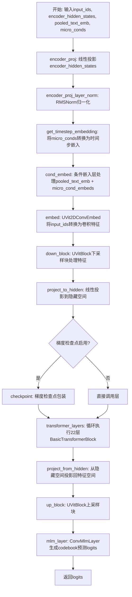
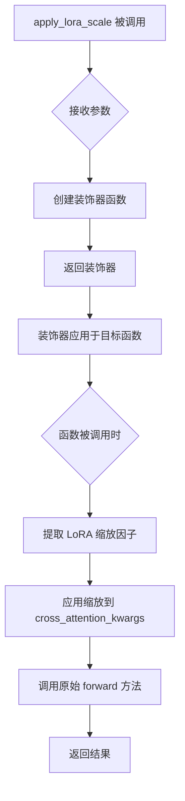
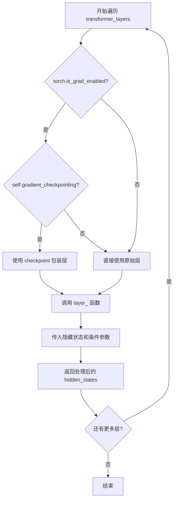
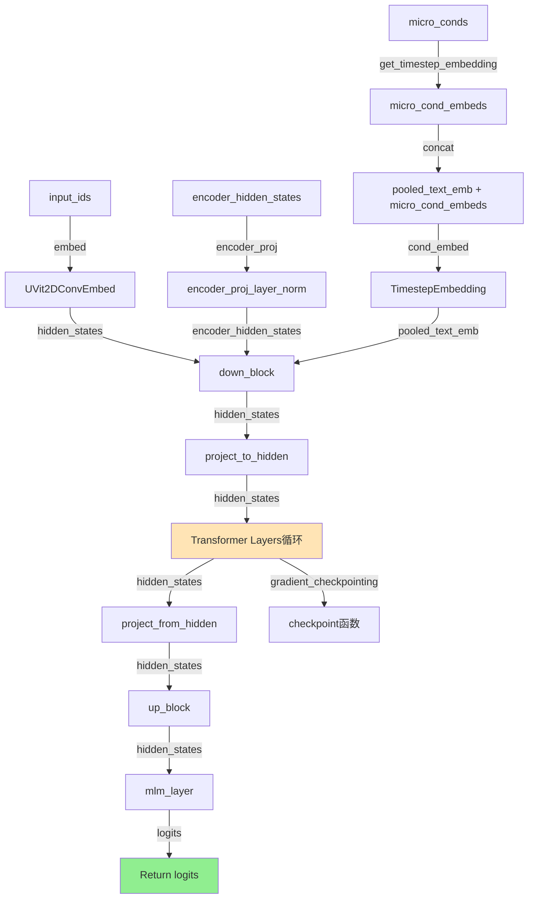
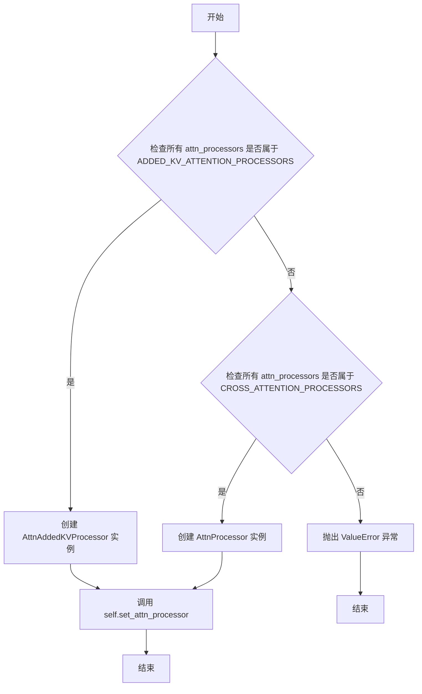
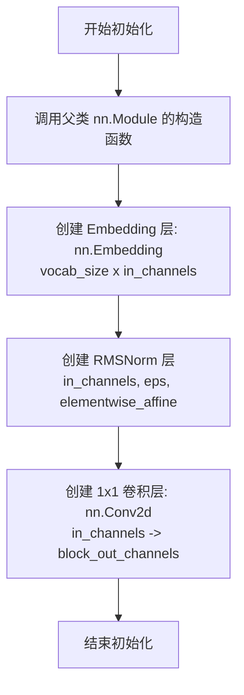
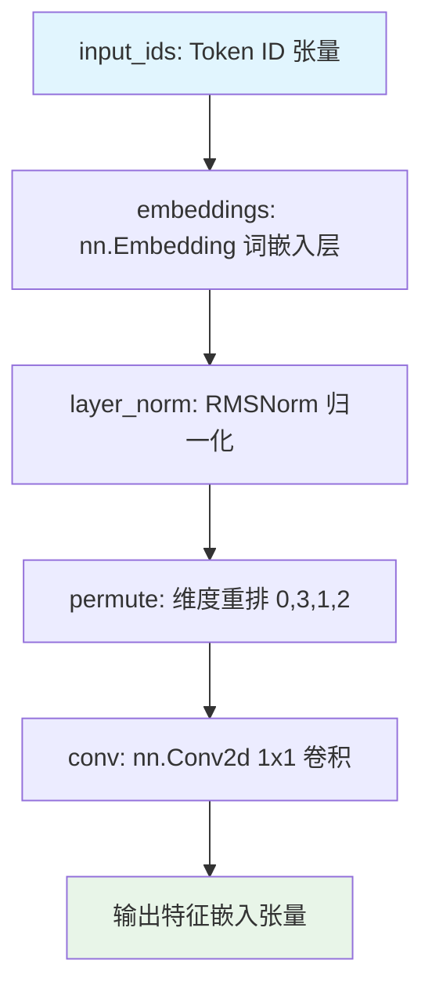

# `diffusers\src\diffusers\models\unets\uvit_2d.py` 详细设计文档

UVit2DModel是一个结合了卷积神经网络和Transformer架构的图像处理/生成模型，通过VQ-VAE风格的codebook实现图像到token的映射，再通过Transformer层进行全局上下文建模，最终通过MLM层预测codebook索引，实现高质量图像生成。

## 整体流程



## 类结构

```
UVit2DModel (主模型类)
├── UVit2DConvEmbed (卷积嵌入层)
├── UVitBlock (上下采样块)
│   ├── Downsample2D (下采样)
│   ├── ConvNextBlock × num_res_blocks (残差块)
│   ├── SkipFFTransformerBlock × num_res_blocks (注意力块)
│   └── Upsample2D (上采样)
├── BasicTransformerBlock × num_hidden_layers (Transformer层)
└── ConvMlmLayer (MLM输出层)
```

## 全局变量及字段


### `_supports_gradient_checkpointing`
    
是否支持梯度检查点

类型：`bool`
    


### `UVit2DModel.encoder_proj`
    
编码器投影层

类型：`nn.Linear`
    


### `UVit2DModel.encoder_proj_layer_norm`
    
编码器投影后的归一化

类型：`RMSNorm`
    


### `UVit2DModel.embed`
    
输入ID的嵌入层

类型：`UVit2DConvEmbed`
    


### `UVit2DModel.cond_embed`
    
条件嵌入层

类型：`TimestepEmbedding`
    


### `UVit2DModel.down_block`
    
下采样块

类型：`UVitBlock`
    


### `UVit2DModel.project_to_hidden_norm`
    
投影到隐藏空间前的归一化

类型：`RMSNorm`
    


### `UVit2DModel.project_to_hidden`
    
投影到隐藏空间

类型：`nn.Linear`
    


### `UVit2DModel.transformer_layers`
    
Transformer层列表

类型：`nn.ModuleList`
    


### `UVit2DModel.project_from_hidden_norm`
    
从隐藏空间投影前的归一化

类型：`RMSNorm`
    


### `UVit2DModel.project_from_hidden`
    
从隐藏空间投影回特征空间

类型：`nn.Linear`
    


### `UVit2DModel.up_block`
    
上采样块

类型：`UVitBlock`
    


### `UVit2DModel.mlm_layer`
    
MLM输出层

类型：`ConvMlmLayer`
    


### `UVit2DModel.gradient_checkpointing`
    
梯度检查点标志

类型：`bool`
    


### `UVit2DConvEmbed.embeddings`
    
词嵌入层

类型：`nn.Embedding`
    


### `UVit2DConvEmbed.layer_norm`
    
归一化层

类型：`RMSNorm`
    


### `UVit2DConvEmbed.conv`
    
1x1卷积

类型：`nn.Conv2d`
    


### `UVitBlock.downsample`
    
下采样层

类型：`Downsample2D/None`
    


### `UVitBlock.res_blocks`
    
残差块列表

类型：`nn.ModuleList`
    


### `UVitBlock.attention_blocks`
    
注意力块列表

类型：`nn.ModuleList`
    


### `UVitBlock.upsample`
    
上采样层

类型：`Upsample2D/None`
    


### `ConvNextBlock.depthwise`
    
深度卷积

类型：`nn.Conv2d`
    


### `ConvNextBlock.norm`
    
归一化层

类型：`RMSNorm`
    


### `ConvNextBlock.channelwise_linear_1`
    
通道线性层1

类型：`nn.Linear`
    


### `ConvNextBlock.channelwise_act`
    
激活函数

类型：`nn.GELU`
    


### `ConvNextBlock.channelwise_norm`
    
通道归一化

类型：`GlobalResponseNorm`
    


### `ConvNextBlock.channelwise_linear_2`
    
通道线性层2

类型：`nn.Linear`
    


### `ConvNextBlock.channelwise_dropout`
    
Dropout

类型：`nn.Dropout`
    


### `ConvNextBlock.cond_embeds_mapper`
    
条件嵌入映射器

类型：`nn.Linear`
    


### `ConvMlmLayer.conv1`
    
卷积层1

类型：`nn.Conv2d`
    


### `ConvMlmLayer.layer_norm`
    
归一化层

类型：`RMSNorm`
    


### `ConvMlmLayer.conv2`
    
卷积层2

类型：`nn.Conv2d`
    
    

## 全局函数及方法


### `get_timestep_embedding`

该函数用于将时间步（timesteps）转换为高维嵌入向量，常用于扩散模型（Diffusion Models）中，为模型提供时间步的表示信息。通过正弦和余弦函数的不同频率组合，将标量时间步映射到连续的高维空间，使模型能够感知扩散过程中的时间信息。

参数：

- `timesteps`：`torch.Tensor`，输入的时间步张量，通常为一维张量，包含多个时间步索引值
- `embedding_dim`：`int`，输出嵌入向量的维度，必须为偶数，以确保能够生成完整的正弦和余弦特征
- `flip_sin_to_cos`：`bool`，可选参数，控制是否将正弦和余弦的位置交换，默认为`False`
- `downscale_freq_shift`：`float`，可选参数，用于调整频率的缩放因子，默认为`0`

返回值：`torch.Tensor`，返回形状为`(batch_size, embedding_dim)`的时间步嵌入张量

#### 流程图

```mermaid
flowchart TD
    A[开始] --> B[接收 timesteps, embedding_dim, flip_sin_to_cos, downscale_freq_shift]
    B --> C[计算 half_dim = embedding_dim // 2]
    C --> D[计算 emb = log(10000) / (half_dim - 1)]
    D --> E[计算 emb = exp(emb *.arange(half_dim))]
    E --> F{flip_sin_to_cos == True?}
    F -->|Yes| G[emb = 1/exp(emb)]
    F -->|No| H[emb保持不变]
    G --> I[创建 timesteps[:, None] * emb[None, :]]
    H --> I
    I --> J[连接 sin 和 cos 编码]
    J --> K[应用 downscale_freq_shift 缩放]
    K --> L[返回嵌入张量]
```

#### 带注释源码

```
def get_timestep_embedding(
    timesteps: torch.Tensor,
    embedding_dim: int,
    flip_sin_to_cos: bool = False,
    downscale_freq_shift: float = 0,
) -> torch.Tensor:
    """
    将时间步转换为正弦余弦嵌入向量
    
    参数:
        timesteps: 输入的时间步张量，形状为 (batch_size,) 或 (N,)
        embedding_dim: 输出嵌入的维度，必须为偶数
        flip_sin_to_cos: 是否将 sin/cos 顺序颠倒
        downscale_freq_shift: 频率缩放因子，用于调整不同频率成分的权重
    
    返回:
        形状为 (batch_size, embedding_dim) 的嵌入张量
    """
    # 计算嵌入维度的一半，用于生成正弦和余弦两种频率成分
    half_dim = embedding_dim // 2
    
    # 计算频率的衰减因子，使用对数函数生成指数级递减的频率
    # 这使得不同频率的正弦波能够覆盖不同尺度的时间特征
    emb = torch.log(torch.tensor(10000.0)) / (half_dim - 1)
    
    # 生成从0到half_dim-1的指数序列，作为频率的指数因子
    emb = torch.exp(torch.arange(half_dim, device=timesteps.device) * -emb)
    
    # 根据 flip_sin_to_cos 参数决定是否反转频率顺序
    # 反转后高频成分在前，低频成分在后
    if flip_sin_to_cos:
        emb = 1.0 / emb
    
    # 计算时间步与各频率的乘积，形状为 (batch_size, half_dim)
    # 使用外积计算每个时间步在每个频率上的相位
    emb = timesteps[:, None] * emb[None, :]
    
    # 连接正弦和余弦编码，形成完整的嵌入向量
    emb = torch.cat([torch.sin(emb), torch.cos(emb)], dim=-1)
    
    # 应用频率缩放，默认为0，不改变嵌入
    # 当值不为0时，可以调整不同频率成分的相对重要性
    if downscale_freq_shift != 0:
        emb = emb / (1 + downscale_freq_shift)
    
    return emb
```

#### 技术说明

该实现遵循了经典的正弦-余弦位置编码（Sinusoidal Position Embedding）方法，该方法最初在Transformer论文《Attention is All You Need》中被提出用于位置编码。在扩散模型中，这种编码方式被广泛采用，因为它能够：

1. **连续性**：提供平滑的时间步表示，相邻时间步的嵌入具有较高的相似度
2. **周期性**：通过不同频率的正弦波捕捉时间序列中的周期性特征
3. **可扩展性**：通过调整`embedding_dim`可以控制表示的精细程度
4. **计算效率**：完全基于数学运算，无需学习参数，可作为模型的固定输入


### `apply_lora_scale`

`apply_lora_scale` 是一个装饰器工厂函数，用于在模型前向传播时应用 LoRA（Low-Rank Adaptation）缩放因子。该装饰器通常应用于模型的 `forward` 方法，通过 `cross_attention_kwargs` 参数传递 LoRA 配置信息，确保在训练或推理过程中正确应用 LoRA 权重。

参数：

-  `self`：隐式参数，方法的拥有者（类实例）
-  参数通过装饰器语法传递，实际参数由被装饰的 `forward` 方法定义

返回值：装饰器函数（返回值是一个装饰器，用于包装目标函数）

#### 流程图



#### 带注释源码

```python
# 从 utils 模块导入 apply_lora_scale
# 注意：实际的函数实现不在本文件中，此处展示的是使用方式和推断的实现逻辑

# 使用示例（在 UVit2DModel.forward 方法上）：
@apply_lora_scale("cross_attention_kwargs")
def forward(self, input_ids, encoder_hidden_states, pooled_text_emb, micro_conds, cross_attention_kwargs=None):
    """
    应用 LoRA 缩放的 forward 方法
    
    参数:
        input_ids: 输入的 token IDs
        encoder_hidden_states: 编码器的隐藏状态
        pooled_text_emb: 池化后的文本嵌入
        micro_conds: 微观条件信息
        cross_attention_kwargs: 交叉注意力参数，包含 LoRA 配置
    
    返回:
        logits: 模型的输出 logits
    """
    # ... 方法实现 ...
    return logits

# 推断的 apply_lora_scale 装饰器实现逻辑：
def apply_lora_scale(config_string: str):
    """
    创建装饰器以应用 LoRA 缩放因子
    
    参数:
        config_string: 配置字符串，指定从 kwargs 中提取的参数名
        
    返回:
        装饰器函数
    """
    def decorator(func):
        @functools.wraps(func)
        def wrapper(*args, **kwargs):
            # 1. 从 kwargs 中提取 cross_attention_kwargs
            cross_attention_kwargs = kwargs.get('cross_attention_kwargs', None)
            
            # 2. 如果存在 LoRA 配置，应用缩放因子
            if cross_attention_kwargs is not None:
                # 获取 LoRA 缩放因子，默认为 1.0
                scale = cross_attention_kwargs.get('scale', 1.0)
                
                # 应用缩放到相关参数
                if 'lora_scale' in cross_attention_kwargs:
                    cross_attention_kwargs['scale'] = scale * cross_attention_kwargs.get('lora_scale', 1.0)
            
            # 3. 调用原始 forward 方法
            return func(*args, **kwargs)
        return wrapper
    return decorator
```


### `UVit2DModel.forward` 中的梯度检查点包装逻辑

在 `UVit2DModel` 类的 `forward` 方法中，通过 `self.gradient_checkpointing` 属性控制是否启用梯度检查点。当启用时，会将 `BasicTransformerBlock` 层包装在 `torch.utils.checkpoint.checkpoint` 中，以节省显存。核心逻辑是在遍历 `transformer_layers` 时，根据 `self.gradient_checkpointing` 和 `torch.is_grad_enabled()` 的状态，动态决定是否使用梯度检查点来包装层的执行。

参数：

- `layer`：`BasicTransformerBlock`，要执行的 Transformer 层实例
- `*args`：可变位置参数，包含传递给层的隐藏状态和关键字参数

返回值：`torch.Tensor`，经过层处理后的隐藏状态

#### 流程图



#### 带注释源码

```python
# 在 forward 方法中遍历每个 transformer 层
for layer in self.transformer_layers:
    # 检查梯度计算是否启用
    if torch.is_grad_enabled() and self.gradient_checkpointing:
        # 当启用梯度检查点时，定义一个包装函数
        # 使用 torch.utils.checkpoint.checkpoint 来节省显存
        # checkpoint 的作用是在前向传播时不保存中间激活值，
        # 而是在反向传播时重新计算这些激活值，从而节省显存
        def layer_(*args):
            return checkpoint(layer, *args)
    else:
        # 不启用梯度检查点时，直接使用原始层
        layer_ = layer

    # 调用层（可能是原始层或包装后的层）进行处理
    hidden_states = layer_(
        hidden_states,
        encoder_hidden_states=encoder_hidden_states,
        cross_attention_kwargs=cross_attention_kwargs,
        added_cond_kwargs={"pooled_text_emb": pooled_text_emb},
    )
```

#### 补充说明

在 `UVit2DModel` 类中，梯度检查点功能通过以下方式启用：

1. 类属性 `_supports_gradient_checkpointing = True` 表明该模型支持梯度检查点
2. 实例属性 `self.gradient_checkpointing = False` 控制是否启用（默认关闭）
3. 通过 `torch.utils.checkpoint.checkpoint` 函数实现，该函数来自 PyTorch 官方库

启用梯度检查点后，可以显著减少显存占用，但会增加一些计算时间，因为需要在反向传播时重新计算激活值。


### `UVit2DModel.__init__`

该方法是 UVit2DModel 类的初始化方法，负责根据大量配置参数构建一个完整的 UViT（Universal Vision Transformer）2D 模型架构，包含编码器投影层、词嵌入层、条件嵌入层、下采样块、Transformer 层、上采样块和 MLM（Masked Language Model）层，并初始化模型的各种归一化、投影和注意力配置。

参数：

- `self`：隐式参数，模型实例本身
- `hidden_size`：`int`，全局配置参数，Transformer 层的隐藏状态维度，默认为 1024
- `use_bias`：`bool`，全局配置参数，控制是否在 Linear 层中使用偏置，默认为 False
- `hidden_dropout`：`float`，全局配置参数，隐藏层的 dropout 概率，默认为 0.0
- `cond_embed_dim`：`int`，条件嵌入维度，用于条件编码的嵌入向量维度，默认为 768
- `micro_cond_encode_dim`：`int`，微条件编码维度，用于微条件特征的编码维度，默认为 256
- `micro_cond_embed_dim`：`int`，微条件嵌入维度，微条件特征的嵌入向量维度，默认为 1280
- `encoder_hidden_size`：`int`，编码器隐藏层维度，编码器投影的输入维度，默认为 768
- `vocab_size`：`int`，词汇表大小，等于 codebook_size 加上 1（用于 mask token）并取整，默认为 8256
- `codebook_size`：`int`，码本大小，表示离散token的数量，默认为 8192
- `in_channels`：`int`，输入通道数，对应 UVit2DConvEmbed 的输入通道，默认为 768
- `block_out_channels`：`int`，块输出通道数，UVitBlock 的通道维度，默认为 768
- `num_res_blocks`：`int`，残差块数量，每个 UVitBlock 中的残差块数量，默认为 3
- `downsample`：`bool`，是否执行下采样，控制 UVitBlock 是否进行空间下采样，默认为 False
- `upsample`：`bool`，是否执行上采样，控制 UVitBlock 是否进行空间上采样，默认为 False
- `block_num_heads`：`int`，块注意力头数，UVitBlock 中注意力机制的头数，默认为 12
- `num_hidden_layers`：`int`，隐藏层数量，Transformer 层的数量，默认为 22
- `num_attention_heads`：`int`，注意力头数，Transformer 中自注意力的头数，默认为 16
- `attention_dropout`：`float`，注意力 dropout 概率，注意力层的 dropout 概率，默认为 0.0
- `intermediate_size`：`int`，前馈网络中间维度，FeedForward 层的中间层维度，默认为 2816
- `layer_norm_eps`：`float`，层归一化 epsilon 值，用于数值稳定的 eps 值，默认为 1e-6
- `ln_elementwise_affine`：`bool`，是否使用元素级仿射，控制 RMSNorm 是否使用可学习参数，默认为 True
- `sample_size`：`int`，样本大小，用于条件嵌入的投影维度，默认为 64

返回值：`None`，该方法为构造函数，不返回任何值，仅初始化模型对象

#### 流程图

```mermaid
flowchart TD
    A[开始 __init__] --> B[调用 super().__init__]
    B --> C[创建 encoder_proj: Linear层]
    C --> D[创建 encoder_proj_layer_norm: RMSNorm层]
    D --> E[创建 embed: UVit2DConvEmbed实例]
    E --> F[创建 cond_embed: TimestepEmbedding层]
    F --> G[创建 down_block: UVitBlock实例]
    G --> H[创建 project_to_hidden_norm和project_to_hidden]
    H --> I[创建 num_hidden_layers个BasicTransformerBlock]
    I --> J[创建 project_from_hidden_norm和project_from_hidden]
    J --> K[创建 up_block: UVitBlock实例]
    K --> L[创建 mlm_layer: ConvMlmLayer实例]
    L --> M[设置 gradient_checkpointing = False]
    M --> N[结束 __init__]
```

#### 带注释源码

```python
@register_to_config  # 装饰器：将所有参数注册到模型的配置中，使其可以通过 config 属性访问
def __init__(
    self,
    # global config - 全局配置参数
    hidden_size: int = 1024,        # Transformer层的隐藏维度
    use_bias: bool = False,        # 是否在线性层中使用偏置
    hidden_dropout: float = 0.0,   # 隐藏层的dropout率
    
    # conditioning dimensions - 条件嵌入维度配置
    cond_embed_dim: int = 768,           # 条件嵌入的维度
    micro_cond_encode_dim: int = 256,    # 微条件编码维度
    micro_cond_embed_dim: int = 1280,    # 微条件嵌入维度
    encoder_hidden_size: int = 768,      # 编码器隐藏层维度
    
    # num tokens - token相关配置
    vocab_size: int = 8256,      # 词汇表大小 = codebook_size + 1（mask token）取整
    codebook_size: int = 8192,   # 码本大小，离散token的数量
    
    # `UVit2DConvEmbed` - 嵌入层配置
    in_channels: int = 768,           # 输入通道数
    block_out_channels: int = 768,   # 块输出通道数
    num_res_blocks: int = 3,         # 残差块数量
    downsample: bool = False,        # 是否下采样
    upsample: bool = False,          # 是否上采样
    block_num_heads: int = 12,       # 块注意力头数
    
    # `TransformerLayer` - Transformer层配置
    num_hidden_layers: int = 22,       # Transformer层数量
    num_attention_heads: int = 16,     # 注意力头数
    
    # `Attention` - 注意力机制配置
    attention_dropout: float = 0.0,    # 注意力dropout率
    
    # `FeedForward` - 前馈网络配置
    intermediate_size: int = 2816,     # 前馈网络中间层维度
    
    # `Norm` - 归一化配置
    layer_norm_eps: float = 1e-6,      # 归一化epsilon值
    ln_elementwise_affine: bool = True, # 是否使用元素级仿射
    sample_size: int = 64,             # 样本大小
):
    super().__init__()  # 调用父类ModelMixin的初始化方法

    # 编码器投影层：将编码器隐藏状态投影到隐藏尺寸
    self.encoder_proj = nn.Linear(encoder_hidden_size, hidden_size, bias=use_bias)
    # 编码器投影后的RMSNorm层
    self.encoder_proj_layer_norm = RMSNorm(hidden_size, layer_norm_eps, ln_elementwise_affine)

    # UVit2DConvEmbed层：将input_ids转换为卷积嵌入
    self.embed = UVit2DConvEmbed(
        in_channels, block_out_channels, vocab_size, ln_elementwise_affine, layer_norm_eps, use_bias
    )

    # 条件嵌入层：TimestepEmbedding用于处理条件信息
    self.cond_embed = TimestepEmbedding(
        micro_cond_embed_dim + cond_embed_dim, hidden_size, sample_proj_bias=use_bias
    )

    # 下采样块：处理输入并可能进行空间下采样
    self.down_block = UVitBlock(
        block_out_channels,
        num_res_blocks,
        hidden_size,
        hidden_dropout,
        ln_elementwise_affine,
        layer_norm_eps,
        use_bias,
        block_num_heads,
        attention_dropout,
        downsample,
        False,  # down_block不进行upsample
    )

    # 投影到隐藏空间：将从block_out_channels维度投影到hidden_size
    self.project_to_hidden_norm = RMSNorm(block_out_channels, layer_norm_eps, ln_elementwise_affine)
    self.project_to_hidden = nn.Linear(block_out_channels, hidden_size, bias=use_bias)

    # Transformer层列表：多个BasicTransformerBlock组成的编码器
    self.transformer_layers = nn.ModuleList(
        [
            BasicTransformerBlock(
                dim=hidden_size,
                num_attention_heads=num_attention_heads,
                attention_head_dim=hidden_size // num_attention_heads,
                dropout=hidden_dropout,
                cross_attention_dim=hidden_size,
                attention_bias=use_bias,
                norm_type="ada_norm_continuous",
                ada_norm_continous_conditioning_embedding_dim=hidden_size,
                norm_elementwise_affine=ln_elementwise_affine,
                norm_eps=layer_norm_eps,
                ada_norm_bias=use_bias,
                ff_inner_dim=intermediate_size,
                ff_bias=use_bias,
                attention_out_bias=use_bias,
            )
            for _ in range(num_hidden_layers)
        ]
    )

    # 从隐藏空间投影回来：从hidden_size维度投影回block_out_channels
    self.project_from_hidden_norm = RMSNorm(hidden_size, layer_norm_eps, ln_elementwise_affine)
    self.project_from_hidden = nn.Linear(hidden_size, block_out_channels, bias=use_bias)

    # 上采样块：处理特征并可能进行空间上采样
    self.up_block = UVitBlock(
        block_out_channels,
        num_res_blocks,
        hidden_size,
        hidden_dropout,
        ln_elementwise_affine,
        layer_norm_eps,
        use_bias,
        block_num_heads,
        attention_dropout,
        downsample=False,  # up_block不进行downsample
        upsample=upsample,
    )

    # MLM层：卷积 MLM 层用于预测codebook中的token
    self.mlm_layer = ConvMlmLayer(
        block_out_channels, in_channels, use_bias, ln_elementwise_affine, layer_norm_eps, codebook_size
    )

    # 梯度检查点标志：控制是否使用梯度检查点以节省显存
    self.gradient_checkpointing = False
```


### `UVit2DModel.forward`

该方法是UVit2DModel的核心前向传播方法，负责将输入的token IDs、编码器隐藏状态、池化文本嵌入和微观条件转换为最终的logits输出，实现从潜在空间到token空间的映射。

参数：

- `input_ids`：`torch.Tensor`，输入的token IDs，形状为(batch_size, seq_len)，表示离散token序列
- `encoder_hidden_states`：`torch.Tensor`，编码器的隐藏状态，形状为(batch_size, encoder_seq_len, encoder_hidden_size)，提供上下文信息
- `pooled_text_emb`：`torch.Tensor`，池化后的文本嵌入，形状为(batch_size, cond_embed_dim)，提供条件信息
- `micro_conds`：`torch.Tensor`，微观条件，形状为(batch_size, num_micro_conds)，用于细粒度控制
- `cross_attention_kwargs`：可选的`dict`，交叉注意力模块的额外参数，用于控制注意力机制

返回值：`torch.Tensor`，形状为(batch_size, height, width, codebook_size)的logits张量，表示每个位置在不同codebook条目上的概率分布

#### 流程图



#### 带注释源码

```python
@apply_lora_scale("cross_attention_kwargs")
def forward(self, input_ids, encoder_hidden_states, pooled_text_emb, micro_conds, cross_attention_kwargs=None):
    # 步骤1: 对encoder_hidden_states进行线性投影和层归一化
    # 将编码器隐藏状态维度从encoder_hidden_size转换到hidden_size
    encoder_hidden_states = self.encoder_proj(encoder_hidden_states)
    encoder_hidden_states = self.encoder_proj_layer_norm(encoder_hidden_states)

    # 步骤2: 对micro_conds进行时间步嵌入处理
    # 将微观条件展平后映射到micro_cond_encode_dim维空间
    micro_cond_embeds = get_timestep_embedding(
        micro_conds.flatten(),  # 展平微观条件
        self.config.micro_cond_encode_dim,  # 目标嵌入维度
        flip_sin_to_cos=True,  # 切换正弦余弦相位
        downscale_freq_shift=0  # 频率下移量
    )

    # 步骤3: 重塑micro_cond_embeds以匹配batch维度
    micro_cond_embeds = micro_cond_embeds.reshape((input_ids.shape[0], -1))

    # 步骤4: 合并pooled_text_emb和micro_cond_embeds
    # 将池化文本嵌入与微观条件嵌入在特征维度上拼接
    pooled_text_emb = torch.cat([pooled_text_emb, micro_cond_embeds], dim=1)
    
    # 步骤5: 类型转换确保数值精度一致
    pooled_text_emb = pooled_text_emb.to(dtype=self.dtype)
    
    # 步骤6: 通过条件嵌入层转换到hidden_size维度
    pooled_text_emb = self.cond_embed(pooled_text_emb).to(encoder_hidden_states.dtype)

    # 步骤7: 将input_ids通过嵌入层转换为隐藏状态
    # 使用UVit2DConvEmbed进行token嵌入和卷积特征提取
    hidden_states = self.embed(input_ids)

    # 步骤8: 通过下采样块处理隐藏状态
    # 包含残差块和注意力块，可能进行空间下采样
    hidden_states = self.down_block(
        hidden_states,
        pooled_text_emb=pooled_text_emb,
        encoder_hidden_states=encoder_hidden_states,
        cross_attention_kwargs=cross_attention_kwargs,
    )

    # 步骤9: 空间维度变换
    # 从 (B, C, H, W) -> (B, H*W, C) 以便Transformer处理
    batch_size, channels, height, width = hidden_states.shape
    hidden_states = hidden_states.permute(0, 2, 3, 1).reshape(batch_size, height * width, channels)

    # 步骤10: 投影到Transformer隐藏空间
    hidden_states = self.project_to_hidden_norm(hidden_states)
    hidden_states = self.project_to_hidden(hidden_states)

    # 步骤11: 循环通过Transformer层
    # 支持梯度检查点以节省显存
    for layer in self.transformer_layers:
        if torch.is_grad_enabled() and self.gradient_checkpointing:
            # 使用梯度检查点优化显存
            def layer_(*args):
                return checkpoint(layer, *args)
        else:
            layer_ = layer

        hidden_states = layer_(
            hidden_states,
            encoder_hidden_states=encoder_hidden_states,
            cross_attention_kwargs=cross_attention_kwargs,
            added_cond_kwargs={"pooled_text_emb": pooled_text_emb},
        )

    # 步骤12: 投影回卷积块空间
    hidden_states = self.project_from_hidden_norm(hidden_states)
    hidden_states = self.project_from_hidden(hidden_states)

    # 步骤13: 恢复空间维度
    # 从 (B, H*W, C) -> (B, C, H, W)
    hidden_states = hidden_states.reshape(batch_size, height, width, channels).permute(0, 3, 1, 2)

    # 步骤14: 通过上采样块处理
    # 包含残差块和注意力块，可能进行空间上采样
    hidden_states = self.up_block(
        hidden_states,
        pooled_text_emb=pooled_text_emb,
        encoder_hidden_states=encoder_hidden_states,
        cross_attention_kwargs=cross_attention_kwargs,
    )

    # 步骤15: 通过MLM层生成logits
    # 将特征映射到codebook_size维的分类空间
    logits = self.mlm_layer(hidden_states)

    return logits
```


### `UVit2DModel.set_default_attn_processor`

设置默认注意力处理器，禁用自定义注意力处理器并设置默认的注意力实现。

参数：

- （无，仅 `self` 隐式参数）

返回值：`None`，无返回值（该方法直接修改实例状态）

#### 流程图



#### 带注释源码

```python
def set_default_attn_processor(self):
    """
    Disables custom attention processors and sets the default attention implementation.
    禁用自定义注意力处理器并设置默认的注意力实现。
    """
    # 检查所有注意力处理器是否都属于 ADDED_KV_ATTENTION_PROCESSORS 类型
    if all(proc.__class__ in ADDED_KV_ATTENTION_PROCESSORS for proc in self.attn_processors.values()):
        # 如果所有处理器都是 Added KV 类型，则使用 AttnAddedKVProcessor
        processor = AttnAddedKVProcessor()
    # 否则检查是否所有处理器都属于 CROSS_ATTENTION_PROCESSORS 类型
    elif all(proc.__class__ in CROSS_ATTENTION_PROCESSORS for proc in self.attn_processors.values()):
        # 如果所有处理器都是 Cross Attention 类型，则使用 AttnProcessor
        processor = AttnProcessor()
    else:
        # 混合类型或其他未知类型，抛出 ValueError 异常
        raise ValueError(
            f"Cannot call `set_default_attn_processor` when attention processors are of type {next(iter(self.attn_processors.values()))}"
        )

    # 调用 set_attn_processor 方法将选定的处理器应用到模型
    self.set_attn_processor(processor)
```


### `UVit2DConvEmbed.__init__`

初始化 UVit2D 模型的卷积嵌入层，用于将输入的 token ID 转换为高维特征表示，并进行通道维度转换。该层是 UVit2D 模型的第一级组件，负责将离散的 token 序列映射为连续的卷积特征图。

参数：

- `in_channels`：`int`，输入通道数，用于确定嵌入向量的维度
- `block_out_channels`：`int`，输出通道数，决定经过卷积层后的通道维度
- `vocab_size`：`int`，词汇表大小，包含所有可能的 token 数量
- `elementwise_affine`：`bool`，是否使用逐元素仿射变换（用于 RMSNorm）
- `eps`：`float`，RMSNorm 中的 epsilon 值，防止除零
- `bias`：`bool`，是否在卷积层中使用偏置项

返回值：`None`，该方法为构造函数，不返回任何值

#### 流程图



#### 带注释源码

```python
def __init__(self, in_channels, block_out_channels, vocab_size, elementwise_affine, eps, bias):
    """
    初始化 UVit2D 卷积嵌入层
    
    参数:
        in_channels: 输入通道数，即嵌入向量的维度
        block_out_channels: 输出通道数，即卷积后特征的通道数
        vocab_size: 词汇表大小，决定嵌入层能表示的唯一 token 数量
        elementwise_affine: 是否在 RMSNorm 中使用可学习的仿射参数
        eps: RMSNorm 使用的 epsilon 值，用于数值稳定性
        bias: 是否在卷积层中添加偏置项
    """
    # 调用 PyTorch nn.Module 的基类初始化方法
    super().__init__()
    
    # 1. 创建嵌入层：将离散 token ID 映射为连续向量
    # 输入: (batch_size, seq_len) 的 token IDs
    # 输出: (batch_size, seq_len, in_channels) 的嵌入向量
    self.embeddings = nn.Embedding(vocab_size, in_channels)
    
    # 2. 创建 RMSNorm 层：对嵌入向量进行归一化处理
    # 相比 LayerNorm，RMSNorm 只使用均方根进行归一化，效率更高
    # 参数: normalized_shape=in_channels, epsilon=eps, elementwise_affine=elementwise_affine
    self.layer_norm = RMSNorm(in_channels, eps, elementwise_affine)
    
    # 3. 创建 1x1 卷积层：调整通道维度
    # kernel_size=1 表示不改变空间维度，仅做通道变换
    # 输入: (batch_size, in_channels, height, width)
    # 输出: (batch_size, block_out_channels, height, width)
    self.conv = nn.Conv2d(in_channels, block_out_channels, kernel_size=1, bias=bias)
```


### `UVit2DConvEmbed.forward`

该方法实现了 UViT2D 模型中输入 token ID 到卷积特征嵌入的转换，将离散的 token ID 通过词嵌入、RMSNorm 归一化和 1x1 卷积转换为适合后续卷积块处理的特征图。

参数：

- `input_ids`：`torch.Tensor`，形状为 `(batch_size, height, width)` 或 `(batch_size, seq_len)` 的输入 token ID 张量，表示图像的离散 token 表示

返回值：`torch.Tensor`，形状为 `(batch_size, block_out_channels, height, width)` 的卷积特征嵌入张量，用于后续的 UVitBlock 处理

#### 流程图



#### 带注释源码

```python
def forward(self, input_ids):
    """
    将输入的 token ID 序列转换为卷积特征嵌入
    
    参数:
        input_ids: 输入的 token ID，形状为 (batch_size, seq_len) 或 (batch_size, height, width)
    
    返回:
        卷积后的特征嵌入，形状为 (batch_size, block_out_channels, height, width)
    """
    # Step 1: 词嵌入查询
    # 将离散 token ID 映射到 continuous 特征空间
    # 输入形状: (batch_size, seq_len) 或 (batch_size, height, width)
    # 输出形状: (batch_size, seq_len, in_channels) 或 (batch_size, height, width, in_channels)
    embeddings = self.embeddings(input_ids)
    
    # Step 2: RMSNorm 归一化
    # 对特征进行归一化处理，提高训练稳定性
    # 保持形状不变
    embeddings = self.layer_norm(embeddings)
    
    # Step 3: 维度重排
    # 将 (batch, width, height, channels) 转换为 (batch, channels, height, width)
    # 以适配 Conv2d 的输入格式要求 (N, C, H, W)
    embeddings = embeddings.permute(0, 3, 1, 2)
    
    # Step 4: 1x1 卷积投影
    # 将 in_channels 维度的特征投影到 block_out_channels 维度
    # kernel_size=1 表示逐点卷积，不改变空间分辨率
    embeddings = self.conv(embeddings)
    
    # 输出形状: (batch_size, block_out_channels, height, width)
    return embeddings
```


### `UVitBlock.__init__`

该方法是 `UVitBlock` 类的初始化方法，用于构建一个包含残差块、注意力块和可选的上/下采样操作的UVit块。该块是UVit2DModel架构中的核心组件，负责处理图像特征的提取和重建。

参数：

- `channels`：`int`，输入输出通道数
- `num_res_blocks`：`int`，残差块的数量
- `hidden_size`：`int`，隐藏层大小，用于注意力机制和前馈网络
- `hidden_dropout`：`float`，隐藏层的dropout比率
- `ln_elementwise_affine`：`bool`，是否使用逐元素的仿射变换进行Layer Normalization
- `layer_norm_eps`：`float`，Layer Normalization的epsilon值，防止除零
- `use_bias`：`bool`，是否使用偏置
- `block_num_heads`：`int`，注意力头的数量
- `attention_dropout`：`float`，注意力层的dropout比率
- `downsample`：`bool`，是否进行下采样
- `upsample`：`bool`，是否进行上采样

返回值：`None`，该方法为构造函数，不返回任何值

#### 流程图

```mermaid
flowchart TD
    A[开始 __init__] --> B[调用 super().__init__]
    B --> C{downsample?}
    C -->|Yes| D[创建 Downsample2D 实例]
    C -->|No| E[设置 self.downsample = None]
    D --> F[创建 ConvNextBlock 模块列表]
    E --> F
    F --> G[创建 SkipFFTransformerBlock 模块列表]
    G --> H{upsample?}
    H -->|Yes| I[创建 Upsample2D 实例]
    H -->|No| J[设置 self.upsample = None]
    I --> K[结束 __init__]
    J --> K
```

#### 带注释源码

```python
def __init__(
    self,
    channels,                    # int: 输入输出通道数
    num_res_blocks: int,         # int: 残差块的数量
    hidden_size,                 # int: 隐藏层大小
    hidden_dropout,              # float: 隐藏层dropout比率
    ln_elementwise_affine,       # bool: Layer Norm是否使用仿射变换
    layer_norm_eps,               # float: Layer Norm的epsilon值
    use_bias,                    # bool: 是否使用偏置
    block_num_heads,             # int: 注意力头数量
    attention_dropout,           # float: 注意力dropout比率
    downsample: bool,            # bool: 是否下采样
    upsample: bool,              # bool: 是否上采样
):
    # 调用父类nn.Module的初始化方法
    super().__init__()

    # 根据downsample参数决定是否创建下采样层
    if downsample:
        # 创建2D下采样层，使用卷积实现
        self.downsample = Downsample2D(
            channels,
            use_conv=True,
            padding=0,
            name="Conv2d_0",
            kernel_size=2,
            norm_type="rms_norm",         # 使用RMSNorm进行归一化
            eps=layer_norm_eps,
            elementwise_affine=ln_elementwise_affine,
            bias=use_bias,
        )
    else:
        # 不需要下采样时设为None
        self.downsample = None

    # 创建残差块模块列表，包含num_res_blocks个ConvNextBlock
    self.res_blocks = nn.ModuleList(
        [
            ConvNextBlock(
                channels,                  # 通道数
                layer_norm_eps,            # Layer Norm epsilon
                ln_elementwise_affine,     # 是否使用仿射
                use_bias,                  # 是否使用偏置
                hidden_dropout,            # Dropout比率
                hidden_size,               # 隐藏层大小
            )
            for i in range(num_res_blocks)
        ]
    )

    # 创建注意力块模块列表，包含num_res_blocks个SkipFFTransformerBlock
    self.attention_blocks = nn.ModuleList(
        [
            SkipFFTransformerBlock(
                channels,                  # 通道数/维度
                block_num_heads,           # 注意力头数
                channels // block_num_heads,  # 每个头的维度
                hidden_size,               # 隐藏层大小
                use_bias,                  # 是否使用偏置
                attention_dropout,         # 注意力dropout
                channels,                  # 交叉注意力维度
                attention_bias=use_bias,   # 注意力偏置
                attention_out_bias=use_bias,  # 注意力输出偏置
            )
            for _ in range(num_res_blocks)
        ]
    )

    # 根据upsample参数决定是否创建上采样层
    if upsample:
        # 创建2D上采样层，使用转置卷积实现
        self.upsample = Upsample2D(
            channels,
            use_conv_transpose=True,      # 使用转置卷积
            kernel_size=2,
            padding=0,
            name="conv",
            norm_type="rms_norm",         # 使用RMSNorm进行归一化
            eps=layer_norm_eps,
            elementwise_affine=ln_elementwise_affine,
            bias=use_bias,
            interpolate=False,            # 不使用插值
        )
    else:
        # 不需要上采样时设为None
        self.upsample = None
```


### `UVitBlock.forward`

UVitBlock 的前向传播方法实现了一个包含下采样、ResNet 块、注意力块和上采样的完整编码-解码块结构，负责对输入特征进行多层次的处理和条件注入。

参数：

- `x`：`torch.Tensor`，输入的隐藏状态张量，形状为 (batch_size, channels, height, width)
- `pooled_text_emb`：`torch.Tensor`，池化后的文本嵌入，用于条件注入到 ResNet 块
- `encoder_hidden_states`：`torch.Tensor`，编码器的隐藏状态，用于跨注意力机制
- `cross_attention_kwargs`：`dict`，可选，跨注意力机制的额外参数（如注意力处理器配置）

返回值：`torch.Tensor`，处理后的隐藏状态张量，形状为 (batch_size, channels, height, width)

#### 流程图

```mermaid
flowchart TD
    A[输入 x] --> B{downsample 是否存在?}
    B -->|是| C[执行下采样 Downsample2D]
    B -->|否| D[跳过下采样]
    C --> D
    D --> E[遍历 res_blocks 和 attention_blocks]
    E --> F[ResNet块: res_block(x, pooled_text_emb)]
    F --> G[形状变换: (B,C,H,W) -> (B, H*W, C)]
    G --> H[注意力块: attention_block]
    H --> I[形状变换: (B, H*W, C) -> (B, C, H, W)]
    I --> J{还有更多层?}
    J -->|是| E
    J -->|否| K{upsample 是否存在?}
    K -->|是| L[执行上采样 Upsample2D]
    K -->|否| M[跳过上采样]
    L --> M
    M --> N[输出处理后的 x]
```

#### 带注释源码

```python
def forward(self, x, pooled_text_emb, encoder_hidden_states, cross_attention_kwargs):
    # 如果存在下采样模块，则对输入进行下采样
    # 下采样通常在块的开始用于减小空间维度
    if self.downsample is not None:
        x = self.downsample(x)

    # 遍历所有的 ResNet 块和注意力块
    # 每个循环迭代处理一个阶段的特征
    for res_block, attention_block in zip(self.res_blocks, self.attention_blocks):
        # Step 1: 通过 ResNet 块（ConvNextBlock）
        # 该块接收输入特征和池化文本嵌入，进行条件特征提取
        # pooled_text_emb 通过 AdaLN 机制注入到 ResNet 中
        x = res_block(x, pooled_text_emb)

        # Step 2: 准备注意力块的输入形状
        # 从 (batch_size, channels, height, width) 变换为 (batch_size, height*width, channels)
        # 以适配 Transformer 风格的注意力计算
        batch_size, channels, height, width = x.shape
        x = x.view(batch_size, channels, height * width).permute(0, 2, 1)
        
        # Step 3: 通过注意力块（SkipFFTransformerBlock）
        # 执行跨注意力操作，使用 encoder_hidden_states 作为上下文
        # cross_attention_kwargs 传递额外的注意力参数
        x = attention_block(
            x, 
            encoder_hidden_states=encoder_hidden_states, 
            cross_attention_kwargs=cross_attention_kwargs
        )
        
        # Step 4: 恢复原始形状
        # 从 (batch_size, height*width, channels) 变换回 (batch_size, channels, height, width)
        x = x.permute(0, 2, 1).view(batch_size, channels, height, width)

    # 如果存在上采样模块，则对上采样进行上采样
    # 上采样通常在块的末尾用于恢复空间维度
    if self.upsample is not None:
        x = self.upsample(x)

    # 返回处理后的特征张量
    return x
```


### `ConvNextBlock.__init__`

初始化 ConvNeXt 块（ConvNextBlock），该块是 UVit2D 架构中的核心残差块，包含深度可分离卷积、通道级前馈网络和条件嵌入映射器，用于实现基于条件的图像特征变换。

参数：

- `channels`：`int`，输入/输出通道数，决定特征的维度
- `layer_norm_eps：`float`，RMSNorm 的 epsilon 值，用于数值稳定性
- `ln_elementwise_affine`：`bool`，是否使用可学习的逐元素仿射参数
- `use_bias`：`bool`，是否使用偏置项
- `hidden_dropout`：`float`，前馈网络 dropout 概率
- `hidden_size`：`int`，条件嵌入的隐藏维度
- `res_ffn_factor`：`int`，残差前馈网络扩展因子，默认为 4

返回值：`None`，构造函数无返回值

#### 流程图

```mermaid
flowchart TD
    A[开始 __init__] --> B[调用 super().__init__]
    B --> C[创建 depthwise: nn.Conv2d 深度可分离卷积]
    C --> D[创建 norm: RMSNorm 归一化层]
    D --> E[创建 channelwise_linear_1: nn.Linear 通道级线性层1]
    E --> F[创建 channelwise_act: nn.GELU 激活函数]
    F --> G[创建 channelwise_norm: GlobalResponseNorm 响应归一化]
    G --> H[创建 channelwise_linear_2: nn.Linear 通道级线性层2]
    H --> I[创建 channelwise_dropout: nn.Dropout Dropout层]
    I --> J[创建 cond_embeds_mapper: nn.Linear 条件嵌入映射器]
    J --> K[结束 __init__]
```

#### 带注释源码

```python
def __init__(
    self, channels, layer_norm_eps, ln_elementwise_affine, use_bias, hidden_dropout, hidden_size, res_ffn_factor=4
):
    """
    初始化 ConvNeXt 块
    
    参数:
        channels: 输入输出通道数
        layer_norm_eps: RMSNorm 的 epsilon 值
        ln_elementwise_affine: 是否使用逐元素仿射
        use_bias: 是否使用偏置
        hidden_dropout: Dropout 概率
        hidden_size: 条件嵌入维度
        res_ffn_factor: 前馈网络扩展因子
    """
    # 调用父类 nn.Module 的初始化
    super().__init__()
    
    # 1. 深度可分离卷积层 (Depthwise Convolution)
    # 使用 depthwise 卷积捕获空间特征，groups=channels 表示每个通道独立卷积
    self.depthwise = nn.Conv2d(
        channels,
        channels,
        kernel_size=3,
        padding=1,
        groups=channels,  # 深度可分离卷积的关键参数
        bias=use_bias,
    )
    
    # 2. RMSNorm 归一化层，用于特征标准化
    self.norm = RMSNorm(channels, layer_norm_eps, ln_elementwise_affine)
    
    # 3. 通道级前馈网络 - 第一层线性变换 (扩展维度)
    # 将通道数从 channels 扩展到 channels * res_ffn_factor
    self.channelwise_linear_1 = nn.Linear(channels, int(channels * res_ffn_factor), bias=use_bias)
    
    # 4. GELU 激活函数
    self.channelwise_act = nn.GELU()
    
    # 5. GlobalResponseNorm 全局响应归一化
    self.channelwise_norm = GlobalResponseNorm(int(channels * res_ffn_factor))
    
    # 6. 通道级前馈网络 - 第二层线性变换 (还原维度)
    self.channelwise_linear_2 = nn.Linear(int(channels * res_ffn_factor), channels, bias=use_bias)
    
    # 7. Dropout 层，用于正则化
    self.channelwise_dropout = nn.Dropout(hidden_dropout)
    
    # 8. 条件嵌入映射器 (Conditional Embedding Mapper)
    # 将条件嵌入映射为 scale 和 shift 参数，用于 AdaLN 风格的条件注入
    # 输出维度为 channels * 2，用于 chunk 分成 scale 和 shift 两部分
    self.cond_embeds_mapper = nn.Linear(hidden_size, channels * 2, use_bias)
```


### `ConvNextBlock.forward`

实现 ConvNeXt 块的前向传播，采用深度可分离卷积、Channel-wise 前馈网络和自适应层归一制（AdaLN）机制，对输入特征进行残差连接和条件信息注入。

参数：

- `x`：`torch.Tensor`，输入特征张量，形状为 (batch_size, channels, height, width)
- `cond_embeds`：`torch.Tensor`，条件嵌入向量，形状为 (batch_size, hidden_size)，用于调节特征

返回值：`torch.Tensor`，经过 ConvNeXt 块处理后的输出特征，形状与输入 x 相同 (batch_size, channels, height, width)

#### 流程图

```mermaid
flowchart TD
    A[输入 x, cond_embeds] --> B[保存残差 x_res = x]
    B --> C[depthwise 深度可分离卷积]
    C --> D[维度重排: permute 0,2,3,1]
    D --> E[RMSNorm 归一化]
    E --> F[channelwise_linear_1 线性变换]
    F --> G[GELU 激活函数]
    G --> H[GlobalResponseNorm 归一化]
    H --> I[channelwise_linear_2 线性变换]
    I --> J[Dropout 随机丢弃]
    J --> K[维度重排: permute 0,3,1,2]
    K --> L[残差相加: x = x + x_res]
    L --> M[cond_embeds_mapper 映射到 scale 和 shift]
    M --> N[F.silu 激活并分块]
    N --> O[自适应调制: x * (1 + scale) + shift]
    O --> P[输出特征]
```

#### 带注释源码

```python
def forward(self, x, cond_embeds):
    """
    ConvNeXt Block 前向传播

    Args:
        x: 输入特征张量，形状 (batch_size, channels, height, width)
        cond_embeds: 条件嵌入向量，形状 (batch_size, hidden_size)

    Returns:
        处理后的特征张量，形状 (batch_size, channels, height, width)
    """
    # 步骤1: 保存输入作为残差连接的基础
    x_res = x

    # 步骤2: 深度可分离卷积 - 逐通道卷积，捕获空间特征
    # 使用 depthwise 卷积减少参数量和计算量
    x = self.depthwise(x)

    # 步骤3: 维度重排 (N, C, H, W) -> (N, H, W, C)
    # 方便后续进行 RMSNorm 归一化
    x = x.permute(0, 2, 3, 1)

    # 步骤4: RMSNorm 归一化 - 对特征维度进行归一化
    x = self.norm(x)

    # 步骤5: Channel-wise 前馈网络 - 第一个线性层
    # 扩展通道维度到 res_ffn_factor 倍 (默认4倍)
    x = self.channelwise_linear_1(x)

    # 步骤6: GELU 激活函数 - 高斯误差线性单元
    x = self.channelwise_act(x)

    # 步骤7: GlobalResponseNorm 归一化
    # 自适应归一化方法，用于稳定训练
    x = self.channelwise_norm(x)

    # 步骤8: Channel-wise 前馈网络 - 第二个线性层
    # 将扩展的通道维度映射回原始大小
    x = self.channelwise_linear_2(x)

    # 步骤9: Dropout 正则化 - 防止过拟合
    x = self.channelwise_dropout(x)

    # 步骤10: 维度重排 (N, H, W, C) -> (N, C, H, W)
    x = x.permute(0, 3, 1, 2)

    # 步骤11: 残差连接 - 将原始输入与处理后的特征相加
    x = x + x_res

    # 步骤12: AdaLN 条件调制 - 使用条件嵌入生成 scale 和 shift
    # 将条件嵌入映射到 2*channels 维度，并分割为 scale 和 shift
    scale, shift = self.cond_embeds_mapper(F.silu(cond_embeds)).chunk(2, dim=1)

    # 步骤13: 自适应调制 - 对特征进行仿射变换
    # x = x * (1 + scale) + shift，其中 scale 和 shift 需要扩展到空间维度
    x = x * (1 + scale[:, :, None, None]) + shift[:, :, None, None]

    return x
```


### `ConvMlmLayer.__init__`

该方法是 `ConvMlmLayer` 类的构造函数，负责初始化卷积多层感知机（Conv MLM）层，包括两个卷积层和一个RMSNorm归一化层，用于将隐藏状态映射到码本空间以进行语言模型预测。

参数：

- `block_out_channels`：`int`，输出通道数，指定第一个卷积层的输出通道数
- `in_channels`：`int`，输入通道数，指定第一个卷积层的输入通道数，也是归一化层的通道数
- `use_bias`：`bool`，是否在卷积层中使用偏置项
- `ln_elementwise_affine`：`bool`，是否在RMSNorm中使用逐元素仿射变换
- `layer_norm_eps`：`float`，RMSNorm层的epsilon值，用于数值稳定性
- `codebook_size`：`int`，码本大小，指定第二个卷积层的输出通道数（即词汇表大小）

返回值：`None`，该方法不返回任何值，仅初始化对象属性

#### 流程图

```mermaid
flowchart TD
    A[开始 __init__] --> B[调用 super().__init__ 初始化nn.Module]
    C[创建 self.conv1] --> D[nn.Conv2d block_out_channels → in_channels, kernel_size=1, bias=use_bias]
    D --> E[创建 self.layer_norm]
    E --> F[RMSNorm in_channels, layer_norm_eps, ln_elementwise_affine]
    F --> G[创建 self.conv2]
    G --> H[nn.Conv2d in_channels → codebook_size, kernel_size=1, bias=use_bias]
    H --> I[结束 __init__]
```

#### 带注释源码

```python
def __init__(
    self,
    block_out_channels: int,      # 输出通道数，用于第一个卷积层
    in_channels: int,             # 输入通道数，也是归一化层的通道数
    use_bias: bool,               # 是否在卷积层中使用偏置
    ln_elementwise_affine: bool,  # RMSNorm是否使用仿射变换
    layer_norm_eps: float,        # RMSNorm的epsilon，防止除零
    codebook_size: int,           # 码本大小，决定输出logits的维度
):
    # 调用父类nn.Module的初始化方法，注册所有子模块
    super().__init__()
    
    # 第一个卷积层：将block_out_channels通道的隐藏状态投影到in_channels通道
    # 使用1x1卷积（kernel_size=1），保持空间维度不变
    self.conv1 = nn.Conv2d(block_out_channels, in_channels, kernel_size=1, bias=use_bias)
    
    # RMSNorm层：对通道维度进行归一化
    # 输入形状为(B, C, H, W)，归一化在通道维度C上进行
    self.layer_norm = RMSNorm(in_channels, layer_norm_eps, ln_elementwise_affine)
    
    # 第二个卷积层：将in_channels通道映射到codebook_size（词汇表大小）
    # 输出logits的形状为(B, codebook_size, H, W)，用于预测每个位置的码本索引
    self.conv2 = nn.Conv2d(in_channels, codebook_size, kernel_size=1, bias=use_bias)
```


### `ConvMlmLayer.forward`

该方法执行卷积语言模型层的前向传播，将隐藏状态通过两个卷积层和一个归一化层，输出针对码本的logits，用于预测被mask的token。

参数：

- `hidden_states`：`torch.Tensor`，来自up_block的输出特征，形状为 [batch_size, channels, height, width]

返回值：`torch.Tensor`，预测的logits，形状为 [batch_size, codebook_size, height, width]

#### 流程图

```mermaid
flowchart TD
    A[hidden_states输入] --> B[conv1: 1x1卷积<br/>block_out_channels → in_channels]
    B --> C[维度重排<br/>[B, C, H, W] → [B, H, W, C]]
    C --> D[layer_norm: RMSNorm归一化]
    D --> E[维度重排<br/>[B, H, W, C] → [B, C, H, W]]
    E --> F[conv2: 1x1卷积<br/>in_channels → codebook_size]
    F --> G[logits输出<br/>形状: [B, codebook_size, H, W]]
```

#### 带注释源码

```python
def forward(self, hidden_states):
    """
    执行卷积MLM层的前向传播
    
    参数:
        hidden_states: 来自up_block的隐藏状态，形状为 [batch, channels, height, width]
    
    返回:
        logits: 预测logits，形状为 [batch, codebook_size, height, width]
    """
    # 第一个1x1卷积：将通道数从block_out_channels投影到in_channels
    hidden_states = self.conv1(hidden_states)
    
    # Layer Normalization
    # 需要将维度从 [B, C, H, W] 转换为 [B, H, W, C] 以适应RMSNorm
    # RMSNorm期望在最后一个维度上进行归一化
    hidden_states = self.layer_norm(hidden_states.permute(0, 2, 3, 1)).permute(0, 3, 1, 2)
    
    # 第二个1x1卷积：将通道数从in_channels投影到codebook_size
    # 输出每个空间位置对每个codebook token的logits
    logits = self.conv2(hidden_states)
    
    return logits
```

## 关键组件


### 张量索引与嵌入层

将离散token IDs转换为连续的隐藏表示，包含Embedding查找、层规范化和卷积投影

### 反量化支持

ConvMlmLayer通过卷积层和RMSNorm将隐藏状态映射回codebook大小的logits空间，实现从潜在表示到离散token的转换

### 量化策略

使用RMSNorm和GlobalResponseNorm进行规范化，配合GELU激活函数和条件embedding实现自适应尺度变换

### 混合架构

结合CNN局部特征提取和Transformer全局注意力机制，通过ConvNextBlock处理空间信息，BasicTransformerBlock处理长程依赖

### 条件嵌入机制

TimestepEmbedding将微条件编码和时间步嵌入进行拼接融合，通过条件投影层实现AdaNorm连续规范化

### 梯度检查点

支持梯度检查点技术以降低显存占用，在前向传播中动态选择是否使用checkpoint封装


## 问题及建议


### 已知问题

-   **梯度检查点实现低效**：在`UVit2DModel.forward`中，梯度检查点的判断逻辑放在循环内部，每次迭代都重新定义`layer_`函数，导致不必要的函数对象创建开销，应将判断提到循环外部。
-   **类型注解严重缺失**：`UVitBlock`、`ConvNextBlock`、`ConvMlmLayer`、`UVit2DConvEmbed`等核心类的方法参数均无类型注解，不利于静态分析和IDE自动补全。
-   **冗余的dtype转换**：`pooled_text_emb`先后执行`.to(dtype=self.dtype)`和`.to(encoder_hidden_states.dtype)`两次类型转换，且未考虑两者可能已经相同的情况，造成不必要的计算开销。
-   **维度变换逻辑复杂**：`UVitBlock.forward`中包含多次`permute`和`view`操作进行通道与序列维度的交换，代码可读性差且易引入维度错误。
-   **硬编码魔法数字**：`res_ffn_factor=4`在`ConvNextBlock`中作为默认参数硬编码，缩放因子无法通过配置调整。
- **配置与实现不一致风险**：`set_default_attn_processor`方法中的异常处理仅检查了部分处理器的组合，若存在混合类型的处理器会直接抛出错误，缺乏降级策略。
- **参数传递冗余**：`cross_attention_kwargs`在多个层级间逐层透传，但实际只被`AttentionMixin`相关组件使用，可考虑更精细的接口设计。

### 优化建议

-   将`gradient_checkpointing`的判断逻辑提前到循环外部，避免重复创建函数对象；示例：`forward_func = checkpoint if use_checkpoint else lambda layer, *args: layer(*args)`。
-   为所有公开方法添加完整的类型注解，包括参数类型和返回值类型，提升代码可维护性和可读性。
-   合并dtype转换逻辑，先判断目标dtype是否与当前dtype一致，避免无意义的类型转换操作。
-   考虑将`UVitBlock`中的维度变换封装为独立的辅助方法（如`spatial_to_sequence`、`sequence_to_spatial`），或引入`einops`等库简化张量重塑逻辑。
-   将`res_ffn_factor`提取为配置参数或构造函数参数，允许用户根据需求调整残差前馈网络的扩展比例。
-   完善`set_default_attn_processor`的异常处理，增加对混合处理器类型的兼容逻辑或提供更清晰的错误信息。
-   评估是否需要将`cross_attention_kwargs`拆分为更细粒度的参数，避免不必要的参数透传。
-   添加`__repr__`方法或模型结构打印辅助方法，便于调试和可视化模型架构。


## 其它


### 设计目标与约束

本代码实现UVit2DModel，一个用于视觉任务的混合CNN-Transformer架构模型。设计目标包括：(1) 将输入的token ID和条件编码映射到高维隐藏空间；(2) 通过下采样卷积块、Transformer层和上采样块处理特征；(3) 使用MLM（Masked Language Modeling）层输出codebook的logits用于生成任务。约束条件包括：隐藏层维度需能被注意力头数整除、输入token ID必须在vocab_size范围内、梯度检查点模式仅在训练时启用。

### 错误处理与异常设计

代码主要依赖PyTorch的张量形状检查和类型检查。forward方法中未显式添加形状验证，但在以下场景可能出现异常：input_ids维度不匹配导致embedding查找越界；encoder_hidden_states与hidden_size维度不兼容导致线性层计算异常；micro_condsflatten后长度与micro_cond_encode_dim不匹配导致timestep_embedding输出异常。建议在入口处添加shape validation，确保batch_size一致、height*width与vocab_size匹配。

### 数据流与状态机

数据流如下：input_ids → UVit2DConvEmbed → 下采样卷积块 → 投影到隐藏空间 → N层Transformer块 → 投影回卷积空间 → 上采样卷积块 → ConvMlmLayer → logits输出。状态机主要涉及gradient_checkpointing的开关状态，训练时可通过self.gradient_checkpointing属性动态控制是否启用梯度检查点以节省显存。

### 外部依赖与接口契约

主要依赖包括：torch、torch.nn.functional、torch.nn、torch.utils.checkpoint、diffusers库的configuration_utils、loaders、utils、attention相关模块、embeddings、modeling_utils、normalization、resnet。外部调用需传入：input_ids (LongTensor, shape [B, H, W])、encoder_hidden_states (FloatTensor, shape [B, Seq, 768])、pooled_text_emb (FloatTensor, shape [B, 768])、micro_conds (FloatTensor, shape [B, 4])。输出logits shape为 [B, codebook_size, H', W']。

### 配置与参数设计

核心配置参数通过@register_to_config装饰器注册：hidden_size(默认1024)、use_bias(默认False)、hidden_dropout(默认0.0)、cond_embed_dim(默认768)、micro_cond_encode_dim(默认256)、micro_cond_embed_dim(默认1280)、encoder_hidden_size(默认768)、vocab_size(默认8256)、codebook_size(默认8192)、in_channels(默认768)、block_out_channels(默认768)、num_res_blocks(默认3)、num_hidden_layers(默认22)、num_attention_heads(默认16)、attention_dropout(默认0.0)、intermediate_size(默认2816)、layer_norm_eps(默认1e-6)、ln_elementwise_affine(默认True)、sample_size(默认64)。

### 性能考虑与优化策略

代码已实现gradient_checkpointing以节省显存，通过checkpoint函数在每层Transformer处截断反向传播。UVit2DConvEmbed中embedding查找后直接进行layer_norm和卷积，无冗余计算。Transformer块循环中根据gradient_checkpointing状态选择实际执行函数或checkpoint封装。潜在优化方向：在UVitBlock的attention_block调用中可考虑融合permute/view操作减少内存拷贝；ConvNextBlock中channelwise_linear1/2可融合为单一Linear层；可添加torch.compile加速。

### 安全性考虑

代码未直接处理用户输入，无SQL注入、XSS等Web安全风险。但需注意：micro_conds和input_ids来自外部时需验证数值范围防止NaN/Inf传播；encoder_hidden_states需验证dtype与模型dtype一致；cross_attention_kwargs需验证包含必要字段防止KeyError。

### 测试策略

建议测试场景：(1) 形状一致性测试：验证各模块输入输出shape符合预期；(2) 梯度检查点测试：验证启用后梯度能正确回传；(3) 配置序列化测试：通过config保存和加载模型；(4) 混合精度测试：验证fp16/bf16下数值稳定性；(5) 边缘测试：vocab_size边界值、hidden_size不能被num_attention_heads整除等。

### 版本兼容性

代码依赖diffusers库的多个模块(ConfigMixin、register_to_config、PeftAdapterMixin、ModelMixin、AttentionMixin等)，需配合特定版本的diffusers使用。torch版本建议2.0以上以支持torch.utils.checkpoint的完整功能。PEFT适配器功能依赖peft库。

### 资源消耗与限制

显存消耗主要来自：Transformer层的hidden_states (B*H*W*hidden_size*4 bytes for fp32)；attention机制的QKV矩阵 (3*B*NumHeads*SeqLen*HeadDim)；gradient_checkpointing可显著降低峰值显存。推理速度瓶颈在于22层Transformer块的串行计算，可通过torch.compile或TensorRT加速。


    