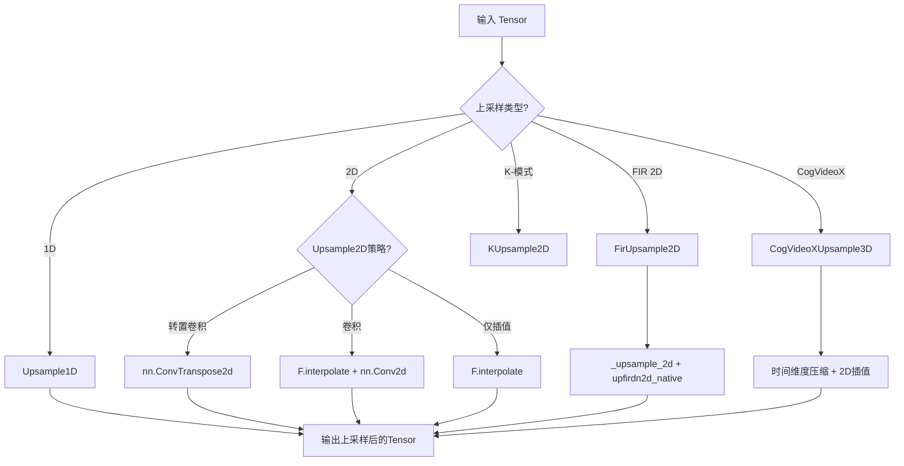
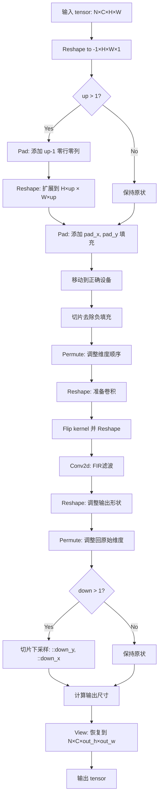
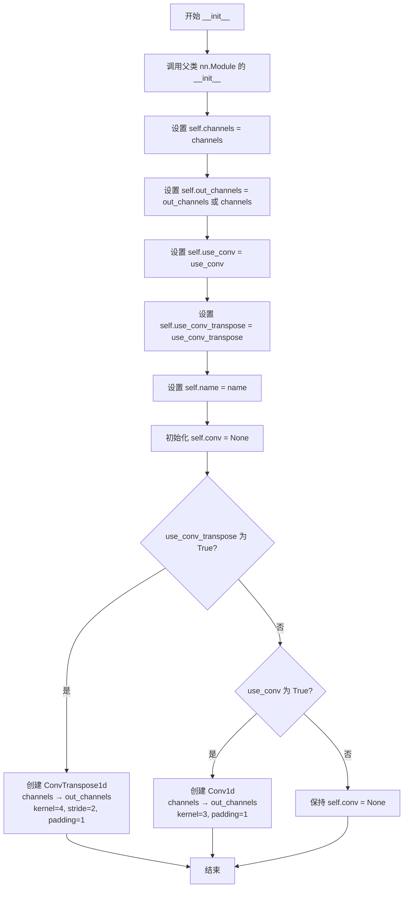
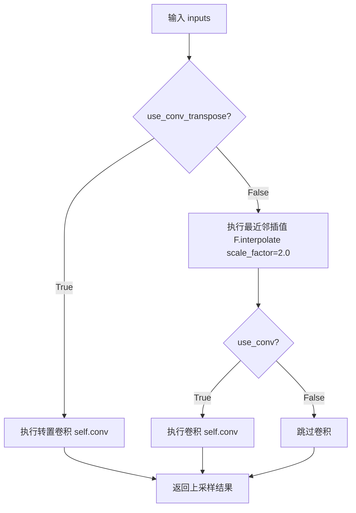
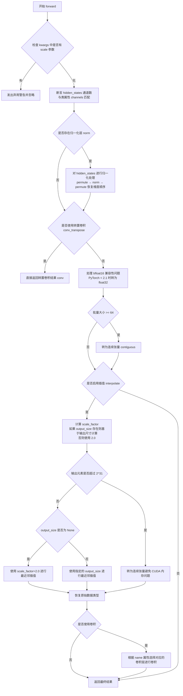
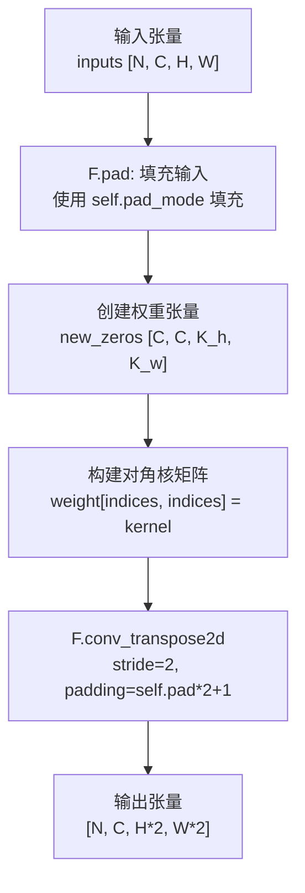
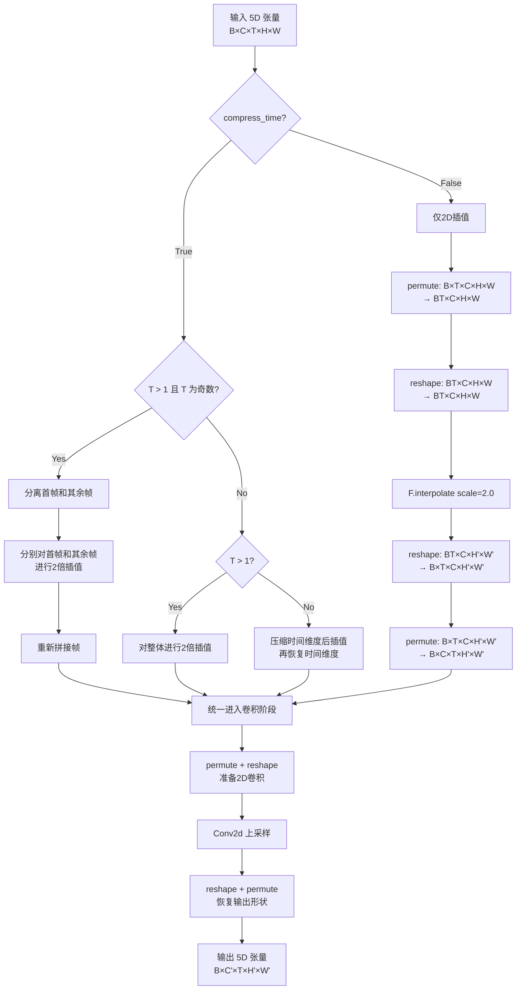

# `diffusers\src\diffusers\models\upsampling.py` 详细设计文档

该模块实现了多种上采样（Upsampling）神经网络层，包括1D、2D和3D上采样，支持多种上采样策略（最近邻插值、转置卷积、FIR滤波、K-模式上采样），主要用于扩散模型的图像/视频生成过程中的空间维度放大。

## 整体流程



## 类结构

```
nn.Module (PyTorch基类)
├── Upsample1D (1D上采样层)
├── Upsample2D (2D上采样层)
├── FirUpsample2D (FIR滤波器2D上采样)
│   └── _upsample_2d (内部方法)
├── KUpsample2D (K-模式2D上采样)
└── CogVideoXUpsample3D (CogVideoX 3D上采样)

全局函数 (模块级)
├── upfirdn2d_native (原生FIR上采样实现)
└── upsample_2d (高层2D上采样API)
```

## 全局变量及字段


### `upfirdn2d_native`
    
Native implementation of upfirdn (upsample FIR filter) 2D operation for image upsampling with FIR filtering

类型：`function`
    


### `upsample_2d`
    
Upsample a batch of 2D images with the given FIR filter, accepting input tensor of shape [N, C, H, W] or [N, H, W, C]

类型：`function`
    


### `Upsample1D.channels`
    
输入输出通道数

类型：`int`
    


### `Upsample1D.out_channels`
    
输出通道数

类型：`int`
    


### `Upsample1D.use_conv`
    
是否使用卷积

类型：`bool`
    


### `Upsample1D.use_conv_transpose`
    
是否使用转置卷积

类型：`bool`
    


### `Upsample1D.name`
    
层名称

类型：`str`
    


### `Upsample1D.conv`
    
卷积层

类型：`nn.Conv1d | nn.ConvTranspose1d | None`
    


### `Upsample2D.channels`
    
输入输出通道数

类型：`int`
    


### `Upsample2D.out_channels`
    
输出通道数

类型：`int`
    


### `Upsample2D.use_conv`
    
是否使用卷积

类型：`bool`
    


### `Upsample2D.use_conv_transpose`
    
是否使用转置卷积

类型：`bool`
    


### `Upsample2D.name`
    
层名称

类型：`str`
    


### `Upsample2D.interpolate`
    
是否插值

类型：`bool`
    


### `Upsample2D.norm`
    
归一化层

类型：`nn.LayerNorm | RMSNorm | None`
    


### `Upsample2D.conv`
    
卷积层

类型：`nn.Conv2d | nn.ConvTranspose2d | None`
    


### `Upsample2D.Conv2d_0`
    
命名卷积层

类型：`nn.Conv2d | nn.ConvTranspose2d | None`
    


### `FirUpsample2D.out_channels`
    
输出通道数

类型：`int | None`
    


### `FirUpsample2D.use_conv`
    
是否使用卷积

类型：`bool`
    


### `FirUpsample2D.fir_kernel`
    
FIR滤波器核

类型：`tuple[int, int, int, int]`
    


### `FirUpsample2D.Conv2d_0`
    
卷积层

类型：`nn.Conv2d | None`
    


### `KUpsample2D.pad_mode`
    
填充模式

类型：`str`
    


### `KUpsample2D.pad`
    
填充大小

类型：`int`
    


### `KUpsample2D.kernel`
    
上采样核

类型：`torch.Tensor`
    


### `CogVideoXUpsample3D.conv`
    
2D卷积层

类型：`nn.Conv2d`
    


### `CogVideoXUpsample3D.compress_time`
    
是否压缩时间维度

类型：`bool`
    
    

## 全局函数及方法


### `upfirdn2d_native`

该函数实现了2D图像的FIR（有限脉冲响应）滤波，并同时支持可选的上采样和下采样操作。通过reshape、padding、卷积和切片等操作，实现高效的图像上/下采样与滤波融合，是图像生成模型中常用的核心底层操作。

参数：

- `tensor`：`torch.Tensor`，输入张量，形状为 `[N, C, H, W]`，其中 N 为批次大小， C 为通道数， H 和 W 分别为高度和宽度
- `kernel`：`torch.Tensor`，FIR滤波器核，形状为 `[kernel_h, kernel_w]`，用于对图像进行滤波
- `up`：`int`，上采样因子，默认为 1，表示在水平和垂直方向上进行 2^up 倍的上采样
- `down`：`int`，下采样因子，默认为 1，表示在水平和垂直方向上进行 2^down 倍的下采样
- `pad`：`tuple[int, int]`，填充值元组，格式为 `(pad_x, pad_y)`，分别表示在 x 和 y 方向的填充量

返回值：`torch.Tensor`，输出张量，形状为 `[N, C, out_h, out_w]`，其中输出尺寸由输入尺寸、上采样、下采样和填充共同决定

#### 流程图



#### 带注释源码

```python
def upfirdn2d_native(
    tensor: torch.Tensor,
    kernel: torch.Tensor,
    up: int = 1,
    down: int = 1,
    pad: tuple[int, int] = (0, 0),
) -> torch.Tensor:
    """
    对2D图像张量进行FIR滤波，并支持上采样和下采样。
    
    参数:
        tensor: 输入张量，形状 [N, C, H, W]
        kernel: FIR滤波器核，形状 [kernel_h, kernel_w]
        up: 上采样因子，默认为1
        down: 下采样因子，默认为1
        pad: 填充值元组，格式为 (pad_x, pad_y)
    
    返回:
        输出张量，形状 [N, C, out_h, out_w]
    """
    # 将上采样因子分别应用于x和y方向
    up_x = up_y = up
    # 将下采样因子分别应用于x和y方向
    down_x = down_y = down
    # 解析填充值
    pad_x0 = pad_y0 = pad[0]
    pad_x1 = pad_y1 = pad[1]

    # 获取输入张量的维度信息: 批次×通道×高度×宽度
    _, channel, in_h, in_w = tensor.shape
    # 将张量reshape为 [N*C, H, W, 1] 方便后续处理
    tensor = tensor.reshape(-1, in_h, in_w, 1)

    # 重新获取维度信息（现在包含minor维度）
    _, in_h, in_w, minor = tensor.shape
    # 获取滤波器核的尺寸
    kernel_h, kernel_w = kernel.shape

    # 第一步：上采样操作
    # 将张量view成 [batch, H, 1, W, 1, minor] 形式，为上采样做准备
    out = tensor.view(-1, in_h, 1, in_w, 1, minor)
    # 使用F.pad在高度和宽度方向添加零填充，实现上采样（插入零值）
    out = F.pad(out, [0, 0, 0, up_x - 1, 0, 0, 0, up_y - 1])
    # 将填充后的张量reshape回正常形式，现在尺寸变为 H*up_y × W*up_x
    out = out.view(-1, in_h * up_y, in_w * up_x, minor)

    # 第二步：FIR滤波前的填充
    # 根据pad参数在四周添加填充（可能是负数，用于裁剪）
    out = F.pad(out, [0, 0, max(pad_x0, 0), max(pad_x1, 0), max(pad_y0, 0), max(pad_y1, 0)])
    # 确保张量在正确的设备上（处理MPS等设备）
    out = out.to(tensor.device)
    # 处理负填充：通过切片移除多余的边界
    out = out[
        :,
        max(-pad_y0, 0) : out.shape[1] - max(-pad_y1, 0),
        max(-pad_x0, 0) : out.shape[2] - max(-pad_x1, 0),
        :,
    ]

    # 第三步：执行FIR卷积滤波
    # 调整维度顺序为 [batch, minor, H, W]
    out = out.permute(0, 3, 1, 2)
    # 准备卷积输入形状 [batch*minor, 1, H, W]
    out = out.reshape([-1, 1, in_h * up_y + pad_y0 + pad_y1, in_w * up_x + pad_x0 + pad_x1])
    # 翻转滤波器核（这是FIR滤波的标准操作）
    w = torch.flip(kernel, [0, 1]).view(1, 1, kernel_h, kernel_w)
    # 执行2D卷积，实现FIR滤波
    out = F.conv2d(out, w)
    # 调整输出形状
    out = out.reshape(
        -1,
        minor,
        in_h * up_y + pad_y0 + pad_y1 - kernel_h + 1,
        in_w * up_x + pad_x0 + pad_x1 - kernel_w + 1,
    )
    # 调整回 [batch, H, W, minor] 顺序
    out = out.permute(0, 2, 3, 1)

    # 第四步：下采样操作
    # 通过步长切片实现下采样
    out = out[:, ::down_y, ::down_x, :]

    # 计算最终输出尺寸
    out_h = (in_h * up_y + pad_y0 + pad_y1 - kernel_h) // down_y + 1
    out_w = (in_w * up_x + pad_x0 + pad_x1 - kernel_w) // down_x + 1

    # 恢复为 [N, C, out_h, out_w] 形状并返回
    return out.view(-1, channel, out_h, out_w)
```


### `upsample_2d`

该函数执行二维图像上采样，通过可配置的 FIR（有限冲激响应）滤波器对批量二维图像进行上采样，支持可分离核和归一化增益，适用于 `[N, C, H, W]` 或 `[N, H, W, C]` 格式的输入张量。

参数：

- `hidden_states`：`torch.Tensor`，输入张量，形状为 `[N, C, H, W]` 或 `[N, H, W, C]`
- `kernel`：`torch.Tensor | None`，FIR 滤波器张量，形状为 `[firH, firW]` 或 `[firN]`（可分离），默认值为 `[1] * factor`，对应最近邻上采样
- `factor`：`int`，整数上采样因子，默认为 2
- `gain`：`float`，信号幅度缩放因子，默认为 1.0

返回值：`torch.Tensor`，输出张量，形状为 `[N, C, H * factor, W * factor]`

#### 流程图

```mermaid
flowchart TD
    A[开始 upsample_2d] --> B{验证 factor 是 int 类型且 >= 1}
    B -->|是| C{kernel 是否为 None}
    B -->|否| H[抛出断言错误]
    C -->|是| D[设置 kernel = [1] * factor]
    C -->|否| E[使用传入的 kernel]
    D --> F[将 kernel 转换为 torch.Tensor]
    E --> F
    F --> G{kernel.ndim == 1}
    G -->|是| I[使用 torch.outer 生成二维核]
    G -->|否| J[直接使用二维核]
    I --> K[归一化 kernel: kernel /= torch.sum(kernel)]
    J --> K
    K --> L[应用增益: kernel *= gain * factor²]
    M[计算 pad_value = kernel.shape[0] - factor]
    L --> M
    M --> N[调用 upfirdn2d_native 函数]
    N --> O[返回上采样后的 output 张量]
```

#### 带注释源码

```python
def upsample_2d(
    hidden_states: torch.Tensor,
    kernel: torch.Tensor | None = None,
    factor: int = 2,
    gain: float = 1,
) -> torch.Tensor:
    r"""Upsample2D a batch of 2D images with the given filter.
    Accepts a batch of 2D images of the shape `[N, C, H, W]` or `[N, H, W, C]` and upsamples each image with the given
    filter. The filter is normalized so that if the input pixels are constant, they will be scaled by the specified
    `gain`. Pixels outside the image are assumed to be zero, and the filter is padded with zeros so that its shape is
    a: multiple of the upsampling factor.

    Args:
        hidden_states (`torch.Tensor`):
            Input tensor of the shape `[N, C, H, W]` or `[N, H, W, C]`.
        kernel (`torch.Tensor`, *optional*):
            FIR filter of the shape `[firH, firW]` or `[firN]` (separable). The default is `[1] * factor`, which
            corresponds to nearest-neighbor upsampling.
        factor (`int`, *optional*, default to `2`):
            Integer upsampling factor.
        gain (`float`, *optional*, default to `1.0`):
            Scaling factor for signal magnitude (default: 1.0).

    Returns:
        output (`torch.Tensor`):
            Tensor of the shape `[N, C, H * factor, W * factor]`
    """
    # 断言检查：factor 必须是整数且大于等于 1
    assert isinstance(factor, int) and factor >= 1
    
    # 如果未提供 kernel，默认使用 [1] * factor（最近邻上采样）
    if kernel is None:
        kernel = [1] * factor

    # 将 kernel 列表转换为 PyTorch float32 张量
    kernel = torch.tensor(kernel, dtype=torch.float32)
    
    # 如果是一维核，使用外积生成二维核（可分离滤波器）
    if kernel.ndim == 1:
        kernel = torch.outer(kernel, kernel)
    
    # 归一化核，使输入像素常数时输出按 gain 缩放
    kernel /= torch.sum(kernel)

    # 应用增益和上采样因子到核
    # 乘以 factor² 是因为上采样会使得每个像素被复制 factor² 次
    kernel = kernel * (gain * (factor**2))
    
    # 计算填充值，用于控制输出尺寸
    pad_value = kernel.shape[0] - factor
    
    # 调用原生 upfirdn2d 函数执行实际上采样操作
    # up 参数指定上采样因子
    # pad 参数指定填充：(顶部填充, 底部填充)
    output = upfirdn2d_native(
        hidden_states,
        kernel.to(device=hidden_states.device),  # 将核移动到与输入相同的设备
        up=factor,
        pad=((pad_value + 1) // 2 + factor - 1, pad_value // 2),
    )
    return output
```


### `Upsample1D.__init__`

该方法是 `Upsample1D` 类的初始化方法，用于构建一个支持可选卷积操作的 1D 上采样层。它接收通道数、卷积选项、输出通道数和名称等参数，并根据配置初始化相应的卷积模块（转置卷积或标准卷积）。

参数：

- `channels`：`int`，输入和输出数据的通道数
- `use_conv`：`bool`（默认为 `False`），是否使用标准卷积进行上采样后处理
- `use_conv_transpose`：`bool`（默认为 `False`），是否使用转置卷积进行上采样
- `out_channels`：`int | None`（默认为 `None`），输出通道数，默认为 `channels` 值
- `name`：`str`（默认为 `"conv"`），该上采样层的名称标识

返回值：无（`None`），`__init__` 方法不返回值，仅初始化对象状态

#### 流程图



#### 带注释源码

```python
def __init__(
    self,
    channels: int,
    use_conv: bool = False,
    use_conv_transpose: bool = False,
    out_channels: int | None = None,
    name: str = "conv",
):
    """
    初始化 Upsample1D 层。

    参数:
        channels: 输入和输出的通道数
        use_conv: 是否在插值后使用标准卷积
        use_conv_transpose: 是否使用转置卷积进行上采样
        out_channels: 输出通道数，默认为 None（等于 channels）
        name: 层的名称
    """
    # 调用父类 nn.Module 的初始化方法
    super().__init__()
    
    # 保存输入通道数
    self.channels = channels
    
    # 如果未指定输出通道数，则使用输入通道数
    self.out_channels = out_channels or channels
    
    # 保存卷积选项标志
    self.use_conv = use_conv
    self.use_conv_transpose = use_conv_transpose
    
    # 保存层名称
    self.name = name

    # 初始化卷积层为 None，后续根据选项创建
    self.conv = None
    
    # 根据配置选择卷积类型
    if use_conv_transpose:
        # 使用转置卷积：kernel=4, stride=2, padding=1 实现 2 倍上采样
        self.conv = nn.ConvTranspose1d(channels, self.out_channels, 4, 2, 1)
    elif use_conv:
        # 使用标准卷积：kernel=3, padding=1 保持空间尺寸
        self.conv = nn.Conv1d(self.channels, self.out_channels, 3, padding=1)
```


### Upsample1D.forward

该方法是 `Upsample1D` 类的核心前向传播方法，负责将 1D 输入张量进行上采样操作，支持通过转置卷积、最近邻插值或插值后接卷积三种方式实现 2 倍上采样。

参数：

- `inputs`：`torch.Tensor`，输入的张量，形状为 `[batch_size, channels, length]`

返回值：`torch.Tensor`，上采样后的张量，形状为 `[batch_size, out_channels, length * 2]`

#### 流程图



#### 带注释源码

```python
def forward(self, inputs: torch.Tensor) -> torch.Tensor:
    """对输入进行 1D 上采样，支持转置卷积和插值两种模式。
    
    Args:
        inputs: 输入张量，形状为 [batch_size, channels, length]
        
    Returns:
        上采样后的张量，形状为 [batch_size, out_channels, length * 2]
    """
    # 断言检查：确保输入通道数与模型配置的通道数一致
    assert inputs.shape[1] == self.channels
    
    # 分支1：如果使用转置卷积模式，直接通过转置卷积进行上采样
    # 转置卷积可以直接学习上采样权重，通常效果更好但计算开销较大
    if self.use_conv_transpose:
        return self.conv(inputs)
    
    # 分支2：默认模式 - 先进行最近邻插值上采样
    # 使用 mode="nearest" 进行 2 倍上采样，保持离散像素风格
    outputs = F.interpolate(inputs, scale_factor=2.0, mode="nearest")
    
    # 分支3（可选）：插值后再接一个卷积层
    # 这可以增强上采样后的特征融合，通常用于 Diffusion 模型中
    if self.use_conv:
        outputs = self.conv(outputs)
    
    # 返回最终上采样结果
    return outputs
```


### `Upsample2D.__init__`

2D上采样层的初始化方法，用于构建一个支持可选卷积、归一化和插值的上采样模块。该方法根据传入的参数配置通道数、卷积层类型、归一化方式等核心组件，是Diffusers库中实现图像/特征图上采样的核心逻辑之一。

参数：

- `channels`：`int`，输入特征图的通道数
- `use_conv`：`bool = False`，是否在插值后应用标准卷积层
- `use_conv_transpose`：`bool = False`，是否使用转置卷积（反卷积）进行上采样
- `out_channels`：`int | None = None`，输出通道数，默认与`channels`相同
- `name`：`str = "conv"`，层的名称标识符，用于权重字典键名
- `kernel_size`：`int | None = None`，卷积核大小，若为None则根据卷积类型自动选择（转置卷积默认4，普通卷积默认3）
- `padding`：`int = 1`，卷积填充大小，默认为1
- `norm_type`：`str | None = None`，归一化类型，支持"ln_norm"（LayerNorm）、"rms_norm"（RMSNorm）或None（不使用归一化）
- `eps`：`float | None = None`，归一化的epsilon参数，用于数值稳定性
- `elementwise_affine`：`bool | None = None`，归一化层是否使用可学习的仿射参数
- `bias`：`bool = True`，卷积层是否包含偏置项
- `interpolate`：`bool = True`，是否在转置卷积路径中使用插值上采样

返回值：`None`，`__init__`方法不返回任何值，仅初始化对象状态

#### 流程图

```mermaid
flowchart TD
    A[开始 __init__] --> B[调用 super().__init__]
    B --> C[设置实例属性: channels, out_channels, use_conv, use_conv_transpose, name, interpolate]
    C --> D{判断 norm_type}
    D -->|"ln_norm"| E[创建 nn.LayerNorm]
    D -->|"rms_norm"| F[创建 RMSNorm]
    D -->|None| G[self.norm = None]
    E --> H
    F --> H
    G --> H
    H{判断 use_conv_transpose}
    H -->|True| I[创建 ConvTranspose2d]
    H -->|False| J{判断 use_conv}
    J -->|True| K[创建 Conv2d]
    J -->|False| L[conv = None]
    I --> M
    K --> M
    L --> M
    M{判断 name == 'conv'}
    M -->|True| N[self.conv = conv]
    M -->|False| O[self.Conv2d_0 = conv]
    N --> P[结束 __init__]
    O --> P
```

#### 带注释源码

```python
def __init__(
    self,
    channels: int,
    use_conv: bool = False,
    use_conv_transpose: bool = False,
    out_channels: int | None = None,
    name: str = "conv",
    kernel_size: int | None = None,
    padding=1,
    norm_type=None,
    eps=None,
    elementwise_affine=None,
    bias=True,
    interpolate=True,
):
    """
    初始化Upsample2D上采样层
    
    参数:
        channels: 输入通道数
        use_conv: 是否使用卷积
        use_conv_transpose: 是否使用转置卷积
        out_channels: 输出通道数，默认为channels
        name: 层名称
        kernel_size: 卷积核大小
        padding: 填充大小
        norm_type: 归一化类型
        eps: 归一化epsilon
        elementwise_affine: 是否使用仿射变换
        bias: 是否使用偏置
        interpolate: 是否使用插值
    """
    # 调用父类nn.Module的初始化方法，注册模块
    super().__init__()
    
    # 保存通道数配置
    self.channels = channels
    # 若未指定输出通道数，则默认与输入通道数相同
    self.out_channels = out_channels or channels
    self.use_conv = use_conv
    self.use_conv_transpose = use_conv_transpose
    self.name = name
    self.interpolate = interpolate

    # 根据norm_type创建相应的归一化层
    if norm_type == "ln_norm":
        # LayerNorm: 对每个特征通道进行归一化
        self.norm = nn.LayerNorm(channels, eps, elementwise_affine)
    elif norm_type == "rms_norm":
        # RMSNorm: 仅使用均方根的归一化
        self.norm = RMSNorm(channels, eps, elementwise_affine)
    elif norm_type is None:
        # 不使用归一化
        self.norm = None
    else:
        # 未知归一化类型，抛出异常
        raise ValueError(f"unknown norm_type: {norm_type}")

    # 初始化卷积层为None
    conv = None
    
    # 根据配置创建转置卷积（反卷积）或普通卷积
    if use_conv_transpose:
        # 使用转置卷积进行上采样
        if kernel_size is None:
            kernel_size = 4  # 默认使用4x4卷积核
        conv = nn.ConvTranspose2d(
            channels, 
            self.out_channels, 
            kernel_size=kernel_size, 
            stride=2,  # 步长为2实现2倍上采样
            padding=padding, 
            bias=bias
        )
    elif use_conv:
        # 使用普通卷积（在插值后应用）
        if kernel_size is None:
            kernel_size = 3  # 默认使用3x3卷积核
        conv = nn.Conv2d(
            self.channels, 
            self.out_channels, 
            kernel_size=kernel_size, 
            padding=padding, 
            bias=bias
        )

    # 根据name属性选择权重存储方式
    # TODO(Suraj, Patrick) - clean up after weight dicts are correctly renamed
    if name == "conv":
        # 兼容旧版本权重字典命名
        self.conv = conv
    else:
        # 使用自定义名称存储卷积权重
        self.Conv2d_0 = conv
```


### `Upsample2D.forward`

该方法是 2D 上采样层的forward函数，负责将输入的张量进行上采样处理，支持多种上采样模式（插值、转置卷积），并可选地应用卷积操作和归一化。

参数：

- `hidden_states`：`torch.Tensor`，输入的隐藏状态张量，形状为 `[N, C, H, W]`
- `output_size`：`int | None`，可选的输出尺寸，如果传入则强制使用该尺寸进行插值而不使用 `scale_factor=2`
- `*args`：可变位置参数，用于保持向后兼容性
- `**kwargs`：可变关键字参数，当前支持 `scale` 参数（已弃用）

返回值：`torch.Tensor`，上采样后的张量，形状根据上采样方式和参数而定

#### 流程图



#### 带注释源码

```python
def forward(self, hidden_states: torch.Tensor, output_size: int | None = None, *args, **kwargs) -> torch.Tensor:
    """
    2D上采样层的前向传播函数
    
    参数:
        hidden_states: 输入张量，形状为 [N, C, H, W]
        output_size: 可选的输出尺寸，用于强制指定输出大小
        *args: 保留参数，用于向后兼容
        **kwargs: 关键字参数，当前支持已弃用的 scale 参数
        
    返回:
        上采样后的张量
    """
    
    # 检查是否传递了已弃用的 scale 参数，如果是则发出警告并忽略
    if len(args) > 0 or kwargs.get("scale", None) is not None:
        deprecation_message = "The `scale` argument is deprecated and will be ignored. Please remove it, as passing it will raise an error in the future. `scale` should directly be passed while calling the underlying pipeline component i.e., via `cross_attention_kwargs`."
        deprecate("scale", "1.0.0", deprecation_message)

    # 断言输入通道数与模型定义的通道数匹配
    assert hidden_states.shape[1] == self.channels

    # 如果存在归一化层，对输入进行归一化处理
    # 需要permute将形状从 [N, C, H, W] 转为 [N, H, W, C] 以适应 LayerNorm/RMSNorm
    if self.norm is not None:
        hidden_states = self.norm(hidden_states.permute(0, 2, 3, 1)).permute(0, 3, 1, 2)

    # 如果使用转置卷积方式上采样，直接返回转置卷积结果
    if self.use_conv_transpose:
        return self.conv(hidden_states)

    # 将 bfloat16 转换为 float32 以兼容 PyTorch < 2.1 的 upsample_nearest2d 操作
    # 参见: https://github.com/pytorch/pytorch/issues/86679
    dtype = hidden_states.dtype
    if dtype == torch.bfloat16 and is_torch_version("<", "2.1"):
        hidden_states = hidden_states.to(torch.float32)

    # 当批量大小大于等于64时，调用contiguous()避免 upsample_nearest_nhwc 问题
    # 参见: https://github.com/huggingface/diffusers/issues/984
    if hidden_states.shape[0] >= 64:
        hidden_states = hidden_states.contiguous()

    # 如果启用了插值上采样（默认启用）
    if self.interpolate:
        # 计算缩放因子：如果指定了 output_size 则基于输出尺寸计算，否则使用 2.0
        # 这里的计算确保输出尺寸与目标尺寸匹配
        scale_factor = (
            2 if output_size is None else max([f / s for f, s in zip(output_size, hidden_states.shape[-2:])])
        )
        
        # 当输出元素数量超过 2^31 时，需要转为连续张量以避免 CUDA 问题
        # 参见: https://github.com/pytorch/pytorch/issues/141831
        if hidden_states.numel() * scale_factor > pow(2, 31):
            hidden_states = hidden_states.contiguous()

        # 根据是否指定 output_size 选择不同的插值方式
        if output_size is None:
            # 使用固定的 scale_factor=2.0 进行最近邻插值
            hidden_states = F.interpolate(hidden_states, scale_factor=2.0, mode="nearest")
        else:
            # 使用指定的输出尺寸进行最近邻插值
            hidden_states = F.interpolate(hidden_states, size=output_size, mode="nearest")

    # 将数据转回原始的 bfloat16 类型（如果之前转换过）
    if dtype == torch.bfloat16 and is_torch_version("<", "2.1"):
        hidden_states = hidden_states.to(dtype)

    # 如果启用了卷积操作，在插值后应用卷积
    # 根据 name 属性选择对应的卷积层（conv 或 Conv2d_0）
    if self.use_conv:
        if self.name == "conv":
            hidden_states = self.conv(hidden_states)
        else:
            hidden_states = self.Conv2d_0(hidden_states)

    return hidden_states
```


### `FirUpsample2D.__init__`

该方法是 `FirUpsample2D` 类的构造函数，用于初始化一个带有可选卷积的 2D FIR 上采样层，设置通道数、卷积选项和 FIR 滤波器核。

参数：

- `channels`：`int | None = None`，输入张量的通道数
- `out_channels`：`int | None = None`，输出张量的通道数，默认为 `channels` 的值
- `use_conv`：`bool = False`，是否在，上采样后应用卷积操作
- `fir_kernel`：`tuple[int, int, int, int] = (1, 3, 3, 1)`，FIR 滤波器的核大小

返回值：`None`，无返回值（构造函数）

#### 流程图

```mermaid
flowchart TD
    A[开始 __init__] --> B[调用父类初始化 super().__init__]
    B --> C{out_channels 是否为 None}
    C -->|是| D[out_channels = channels]
    C -->|否| E[保持 out_channels 不变]
    D --> F{use_conv 是否为 True}
    E --> F
    F -->|是| G[创建 nn.Conv2d 并赋值给 self.Conv2d_0]
    F -->|否| H[跳过卷积层创建]
    G --> I[设置 self.use_conv = use_conv]
    H --> I
    I --> J[设置 self.fir_kernel = fir_kernel]
    J --> K[设置 self.out_channels = out_channels]
    K --> L[结束 __init__]
```

#### 带注释源码

```python
def __init__(
    self,
    channels: int | None = None,
    out_channels: int | None = None,
    use_conv: bool = False,
    fir_kernel: tuple[int, int, int, int] = (1, 3, 3, 1),
):
    """
    初始化 FirUpsample2D 上采样层。

    参数:
        channels: 输入通道数，默认为 None
        out_channels: 输出通道数，默认为 None（若未指定则使用 channels 的值）
        use_conv: 是否使用卷积操作，默认为 False
        fir_kernel: FIR 滤波器核，默认为 (1, 3, 3, 1)
    """
    # 调用父类 nn.Module 的初始化方法
    super().__init__()
    
    # 如果 out_channels 为 None，则使用 channels 的值作为输出通道数
    out_channels = out_channels if out_channels else channels
    
    # 如果启用卷积，则创建卷积层并命名为 Conv2d_0
    if use_conv:
        self.Conv2d_0 = nn.Conv2d(
            channels,              # 输入通道数
            out_channels,          # 输出通道数
            kernel_size=3,         # 卷积核大小为 3x3
            stride=1,              # 步长为 1
            padding=1              # 填充为 1（保持空间尺寸）
        )
    
    # 保存卷积启用标志
    self.use_conv = use_conv
    
    # 保存 FIR 滤波器核参数
    self.fir_kernel = fir_kernel
    
    # 保存输出通道数
    self.out_channels = out_channels
```


### `FirUpsample2D._upsample_2d`

该方法实现了一个融合的2D上采样操作，将`upsample_2d()`与可选的`Conv2d()`结合在一起。padding操作只在开始时执行一次，而不是在操作之间执行。这种融合操作比使用标准PyTorch操作执行相同计算更高效，并且支持任意阶数的梯度计算。

参数：

- `self`：`FirUpsample2D`类的实例本身
- `hidden_states`：`torch.Tensor`，输入张量，形状为`[N, C, H, W]`或`[N, H, W, C]`
- `weight`：`torch.Tensor | None`，权重张量，形状为`[filterH, filterW, inChannels, outChannels]`。分组卷积可以通过`inChannels = x.shape[0] // numGroups`实现
- `kernel`：`torch.Tensor | None`，FIR滤波器，形状为`[firH, firW]`或`[firN]`（可分离）。默认值为`[1] * factor`，对应最近邻上采样
- `factor`：`int`，整数上采样因子（默认值：2）
- `gain`：`float`，信号幅度缩放因子（默认值：1.0）

返回值：`torch.Tensor`，输出张量，形状为`[N, C, H * factor, W * factor]`或`[N, H * factor, W * factor, C]`，数据类型与`hidden_states`相同

#### 流程图

```mermaid
flowchart TD
    A[开始 _upsample_2d] --> B{验证 factor 是整数且 >= 1}
    B --> C{kernel is None?}
    C -->|是| D[设置 kernel = [1] * factor]
    C -->|否| E[使用传入的 kernel]
    D --> F[将 kernel 转换为 float32 张量]
    E --> F
    F --> G{kernel.ndim == 1?}
    G -->|是| H[创建 2D 外积 kernel]
    G -->|否| I[直接使用 kernel]
    H --> J[归一化 kernel]
    I --> J
    J --> K[kernel = kernel * gain * factor²]
    K --> L{self.use_conv?}
    L -->|是| M[获取卷积参数: convH, convW, inC]
    L -->|否| N[计算 pad_value = kernel.shape[0] - factor]
    M --> O[计算 padding 值]
    N --> P[调用 upfirdn2d_native 进行上采样]
    O --> Q[计算输出形状和 output_padding]
    Q --> R[重塑和翻转权重]
    R --> S[执行 F.conv_transpose2d]
    S --> T[调用 upfirdn2d_native 应用 FIR 滤波器]
    P --> U[返回 output]
    T --> U
```

#### 带注释源码

```python
def _upsample_2d(
    self,
    hidden_states: torch.Tensor,
    weight: torch.Tensor | None = None,
    kernel: torch.Tensor | None = None,
    factor: int = 2,
    gain: float = 1,
) -> torch.Tensor:
    """Fused `upsample_2d()` followed by `Conv2d()`.

    Padding is performed only once at the beginning, not between the operations. The fused op is considerably more
    efficient than performing the same calculation using standard TensorFlow ops. It supports gradients of
    arbitrary order.

    Args:
        hidden_states (`torch.Tensor`):
            Input tensor of the shape `[N, C, H, W]` or `[N, H, W, C]`.
        weight (`torch.Tensor`, *optional*):
            Weight tensor of the shape `[filterH, filterW, inChannels, outChannels]`. Grouped convolution can be
            performed by `inChannels = x.shape[0] // numGroups`.
        kernel (`torch.Tensor`, *optional*):
            FIR filter of the shape `[firH, firW]` or `[firN]` (separable). The default is `[1] * factor`, which
            corresponds to nearest-neighbor upsampling.
        factor (`int`, *optional*): Integer upsampling factor (default: 2).
        gain (`float`, *optional*): Scaling factor for signal magnitude (default: 1.0).

    Returns:
        output (`torch.Tensor`):
            Tensor of the shape `[N, C, H * factor, W * factor]` or `[N, H * factor, W * factor, C]`, and same
            datatype as `hidden_states`.
    """

    # 验证 factor 是整数且大于等于 1
    assert isinstance(factor, int) and factor >= 1

    # 如果没有提供 kernel，默认使用 [1] * factor（最近邻上采样）
    if kernel is None:
        kernel = [1] * factor

    # 将 kernel 转换为 float32 张量
    kernel = torch.tensor(kernel, dtype=torch.float32)
    
    # 如果是一维 kernel，创建二维外积（可分离滤波器）
    if kernel.ndim == 1:
        kernel = torch.outer(kernel, kernel)
    
    # 归一化 kernel，使其和为 1
    kernel /= torch.sum(kernel)

    # 应用增益和因子平方的缩放
    kernel = kernel * (gain * (factor**2))

    # 根据是否使用卷积选择不同的处理路径
    if self.use_conv:
        # 获取卷积权重参数
        convH = weight.shape[2]  # 卷积核高度
        convW = weight.shape[3]  # 卷积核宽度
        inC = weight.shape[1]    # 输入通道数

        # 计算 padding 值
        pad_value = (kernel.shape[0] - factor) - (convW - 1)

        # 设置步长
        stride = (factor, factor)
        
        # 计算输出形状
        output_shape = (
            (hidden_states.shape[2] - 1) * factor + convH,
            (hidden_states.shape[3] - 1) * factor + convW,
        )
        
        # 计算输出 padding
        output_padding = (
            output_shape[0] - (hidden_states.shape[2] - 1) * stride[0] - convH,
            output_shape[1] - (hidden_states.shape[3] - 1) * stride[1] - convW,
        )
        
        # 确保 output_padding 非负
        assert output_padding[0] >= 0 and output_padding[1] >= 0
        
        # 计算分组数
        num_groups = hidden_states.shape[1] // inC

        # 转置权重以适配 conv_transpose2d
        weight = torch.reshape(weight, (num_groups, -1, inC, convH, convW))
        weight = torch.flip(weight, dims=[3, 4]).permute(0, 2, 1, 3, 4)
        weight = torch.reshape(weight, (num_groups * inC, -1, convH, convW))

        # 执行转置卷积
        inverse_conv = F.conv_transpose2d(
            hidden_states,
            weight,
            stride=stride,
            output_padding=output_padding,
            padding=0,
        )

        # 应用 FIR 滤波器进行上采样
        output = upfirdn2d_native(
            inverse_conv,
            torch.tensor(kernel, device=inverse_conv.device),
            pad=((pad_value + 1) // 2 + factor - 1, pad_value // 2 + 1),
        )
    else:
        # 简单上采样路径（不使用卷积）
        pad_value = kernel.shape[0] - factor
        output = upfirdn2d_native(
            hidden_states,
            torch.tensor(kernel, device=hidden_states.device),
            up=factor,
            pad=((pad_value + 1) // 2 + factor - 1, pad_value // 2),
        )

    return output
```


### FirUpsample2D.forward

该函数是 `FirUpsample2D` 类的前向传播方法，实现了基于 FIR（有限脉冲响应）滤波器的 2D 上采样操作。核心功能是根据是否使用卷积，调用 `_upsample_2d` 内部方法执行不同的上采样策略：若使用卷积，则将卷积权重和 FIR 核应用于输入；若不使用卷积，则仅使用 FIR 核进行 2 倍上采样。最终返回上采样后的张量。

参数：

- `hidden_states`：`torch.Tensor`，输入张量，形状为 `[N, C, H, W]`，表示批量大小为 N、通道数为 C、高度为 H、宽度为 W 的 2D 特征图

返回值：`torch.Tensor`，上采样后的输出张量，形状为 `[N, C_out, H * factor, W * factor]`，其中 factor 默认为 2

#### 流程图

```mermaid
flowchart TD
    A[forward 方法入口] --> B{self.use_conv 是否为 True?}
    B -->|是| C[调用 _upsample_2d 方法<br/>传入 hidden_states, Conv2d_0.weight, fir_kernel]
    B -->|否| D[调用 _upsample_2d 方法<br/>传入 hidden_states, fir_kernel, factor=2]
    C --> E[获取上采样结果 height]
    D --> E
    E --> F{self.use_conv 为 True?}
    F -->|是| G[添加 Conv2d_0.bias<br/>使用 reshape(1, -1, 1, 1) 调整形状]
    F -->|否| H[直接返回 height]
    G --> I[返回最终上采样结果]
    H --> I
```

#### 带注释源码

```python
def forward(self, hidden_states: torch.Tensor) -> torch.Tensor:
    """
    FirUpsample2D 类的前向传播方法，执行 2D FIR 上采样。
    
    参数:
        hidden_states: 输入张量，形状为 [N, C, H, W]
    
    返回:
        上采样后的张量，形状为 [N, C_out, H*2, W*2]
    """
    # 判断是否使用卷积进行上采样
    if self.use_conv:
        # 使用卷积：调用 _upsample_2d，传入卷积权重和 FIR 核
        # _upsample_2d 内部会执行 conv_transpose2d + upfirdn2d_native 的融合操作
        height = self._upsample_2d(
            hidden_states,                      # 输入张量
            self.Conv2d_0.weight,               # 卷积权重 [out_channels, in_channels, kH, kW]
            kernel=self.fir_kernel              # FIR 滤波器核，默认 (1, 3, 3, 1)
        )
        # 添加卷积偏置，调整形状为 [1, out_channels, 1, 1] 以便广播相加
        height = height + self.Conv2d_0.bias.reshape(1, -1, 1, 1)
    else:
        # 不使用卷积：仅使用 FIR 核进行 2 倍上采样
        # 使用 upfirdn2d_native 实现高质量的最近邻上采样
        height = self._upsample_2d(
            hidden_states,                      # 输入张量
            kernel=self.fir_kernel,             # FIR 滤波器核
            factor=2                            # 上采样因子，固定为 2
        )
    
    # 返回上采样后的结果
    return height
```


### `KUpsample2D.__init__`

这是 `KUpsample2D` 类的构造函数，用于初始化一个 2D K-upsampling（K倍上采样）层。该层使用可分离的 FIR 核进行上采样，支持多种 padding 模式。

参数：

- `pad_mode`：`str`，padding 模式，默认为 `"reflect"`，用于指定输入图像边界扩展的方式

返回值：`None`，该方法为构造函数，不返回任何值

#### 流程图

```mermaid
flowchart TD
    A[开始 __init__] --> B[调用 super().__init__ 初始化 nn.Module]
    B --> C[保存 pad_mode 参数到实例属性]
    C --> D[创建 1D kernel tensor: [[1/8, 3/8, 3/8, 1/8]] * 2]
    E[计算 pad 值: kernel_1d.shape[1] // 2 - 1] --> F[将 kernel_1d.T @ kernel_1d 注册为 buffer, persistent=False]
    D --> E
    F --> G[结束 __init__]
    
    style A fill:#f9f,stroke:#333
    style G fill:#9f9,stroke:#333
```

#### 带注释源码

```python
def __init__(self, pad_mode: str = "reflect"):
    """
    初始化 KUpsample2D 上采样层
    
    Args:
        pad_mode: 填充模式, 默认为 "reflect".
                   支持的模式下: "constant", "reflect", "replicate", "circular"
    """
    # 调用父类 nn.Module 的初始化方法，建立模块的基本结构
    super().__init__()
    
    # 保存 padding 模式到实例属性，供 forward 方法中使用
    self.pad_mode = pad_mode
    
    # 创建 1D 卷积核 tensor，形状为 [[1/8, 3/8, 3/8, 1/8]]，然后乘以 2
    # 这是一个 4 元素的 FIR 核，用于 K-upsampling
    # 核的值 [0.25, 0.75, 0.75, 0.25] 经过归一化后用于平滑上采样
    kernel_1d = torch.tensor([[1 / 8, 3 / 8, 3 / 8, 1 / 8]]) * 2
    
    # 计算 padding 大小：核宽度的一半减 1
    # kernel_1d.shape[1] = 4，所以 pad = 4 // 2 - 1 = 1
    self.pad = kernel_1d.shape[1] // 2 - 1
    
    # 使用外积 (kernel_1d.T @ kernel_1d) 将 1D 核扩展为 2D 可分离核
    # 然后注册为 non-persistent buffer (不会保存到 state_dict)
    # 这样可以在 GPU/CPU 之间移动时自动同步，但不会增加模型参数量
    self.register_buffer("kernel", kernel_1d.T @ kernel_1d, persistent=False)
```


### `KUpsample2D.forward`

该方法是 K-upsampling（核上采样）的实现，使用可学习的卷积核进行 2D 图像上采样。通过创建对角核矩阵并使用转置卷积实现 2 倍上采样，配合 Padding 调整避免边界效应。

参数：

- `inputs`：`torch.Tensor`，输入的张量，形状为 `[N, C, H, W]`，其中 N 为 batch size，C 为通道数，H 和 W 分别为高度和宽度

返回值：`torch.Tensor`，上采样后的张量，形状为 `[N, C, H * 2, W * 2]`

#### 流程图



#### 带注释源码

```python
def forward(self, inputs: torch.Tensor) -> torch.Tensor:
    # 步骤1: 对输入进行 Padding
    # 计算填充大小: (self.pad + 1) // 2，对四个边界进行相同的填充
    # 使用 self.pad_mode（默认 "reflect"）进行填充
    # 填充是为了在卷积转置时保持输出尺寸正确
    inputs = F.pad(inputs, ((self.pad + 1) // 2,) * 4, self.pad_mode)

    # 步骤2: 创建权重张量
    # 形状: [C, C, K_h, K_w]，其中 C 是通道数，K_h/K_w 是核的高度和宽度
    # 这是一个用于 depthwise 卷积的可学习权重矩阵
    weight = inputs.new_zeros(
        [
            inputs.shape[1],          # 输出通道数 (C)
            inputs.shape[1],          # 输入通道数 (C)
            self.kernel.shape[0],     # 核高度
            self.kernel.shape[1],     # 核宽度
        ]
    )

    # 步骤3: 构建对角核矩阵
    # 生成通道索引 [0, 1, 2, ..., C-1]
    indices = torch.arange(inputs.shape[1], device=inputs.device)

    # 将 1D 核扩展为与通道数相同的形状
    # kernel 原本是 [K_h, K_w]，扩展后为 [C, K_h, K_w]
    kernel = self.kernel.to(weight)[None, :].expand(inputs.shape[1], -1, -1)

    # 将核值填充到权重张量的对角线上
    # 这样每个通道使用相同的核进行上采样（depthwise 方式）
    weight[indices, indices] = kernel

    # 步骤4: 执行转置卷积（上采样）
    # stride=2: 输出尺寸是输入的 2 倍
    # padding=self.pad*2+1: 配合前面的输入填充，确保输出尺寸正确
    return F.conv_transpose2d(inputs, weight, stride=2, padding=self.pad * 2 + 1)
```


### `CogVideoXUpsample3D.__init__`

该方法是 CogVideoX 项目中 3D 上采样层的初始化函数，负责创建卷积层并配置时间维度压缩选项。

参数：

- `in_channels`：`int`，输入图像的通道数
- `out_channels`：`int`，卷积层输出通道数
- `kernel_size`：`int`，卷积核大小，默认为 3
- `stride`：`int`，卷积步长，默认为 1
- `padding`：`int`，卷积填充，默认为 1
- `compress_time`：`bool`，是否压缩时间维度，默认为 False

返回值：`None`，该方法为初始化方法，不返回任何值

#### 流程图

```mermaid
flowchart TD
    A[开始 __init__] --> B[调用 super().__init__ 初始化父类]
    B --> C[创建 nn.Conv2d 卷积层并赋值给 self.conv]
    D[将 compress_time 参数赋值给 self.compress_time]
    C --> D
    D --> E[结束 __init__]
```

#### 带注释源码

```python
def __init__(
    self,
    in_channels: int,          # 输入张量的通道数
    out_channels: int,         # 卷积层输出通道数
    kernel_size: int = 3,      # 卷积核大小，默认为3
    stride: int = 1,           # 卷积步长，默认为1
    padding: int = 1,          # 填充大小，默认为1
    compress_time: bool = False,  # 是否压缩时间维度
) -> None:
    # 调用 nn.Module 的初始化方法
    super().__init__()

    # 创建一个 2D 卷积层，用于对输入进行处理
    # 虽然是3D上采样，但内部使用2D卷积处理每个时间帧
    self.conv = nn.Conv2d(
        in_channels,          # 输入通道数
        out_channels,          # 输出通道数
        kernel_size=kernel_size,  # 卷积核大小
        stride=stride,         # 步长
        padding=padding        # 填充
    )
    
    # 保存时间维度压缩标志
    # 当为 True 时，会对时间维度进行特殊处理
    self.compress_time = compress_time
```


### CogVideoXUpsample3D.forward

该函数是 CogVideoX 模型中的 3D 上采样层的前向传播方法，实现了对 5D 张量（批量大小、时间步、通道、高度、宽度）的上采样操作。当 `compress_time` 为 True 时，对时间维度进行特殊处理以支持视频帧的上采样；否则仅对空间维度（高度、宽度）进行 2D 插值上采样，最后通过 2D 卷积层处理通道变换。

参数：

- `inputs`：`torch.Tensor`，输入的 5D 张量，形状为 `(batch_size, channels, time, height, width)`

返回值：`torch.Tensor`，上采样后的 5D 张量，形状为 `(batch_size, out_channels, time, height * 2, width * 2)`

#### 流程图



#### 带注释源码

```python
def forward(self, inputs: torch.Tensor) -> torch.Tensor:
    """
    CogVideoX 3D 上采样的前向传播
    
    参数:
        inputs: 输入的5D张量，形状为 (batch_size, channels, time, height, width)
        
    返回:
        上采样后的5D张量，形状为 (batch_size, out_channels, time, height*2, width*2)
    """
    
    # 分支1: 压缩时间维度模式
    if self.compress_time:
        # 情况A: 时间步 > 1 且为奇数
        if inputs.shape[2] > 1 and inputs.shape[2] % 2 == 1:
            # 分离第一帧（特殊处理，避免时间步变为奇数）
            x_first, x_rest = inputs[:, :, 0], inputs[:, :, 1:]
            
            # 分别对首帧和其余帧进行2倍上采样
            x_first = F.interpolate(x_first, scale_factor=2.0)
            x_rest = F.interpolate(x_rest, scale_factor=2.0)
            
            # 为首帧添加时间维度以便拼接
            x_first = x_first[:, :, None, :, :]
            
            # 沿时间维度拼接 [1, T-1] -> [T]
            inputs = torch.cat([x_first, x_rest], dim=2)
            
        # 情况B: 时间步 > 1 且为偶数
        elif inputs.shape[2] > 1:
            # 直接对整体进行2倍插值
            inputs = F.interpolate(inputs, scale_factor=2.0)
            
        # 情况C: 时间步 = 1（单帧）
        else:
            # 压缩时间维度 -> 4D
            inputs = inputs.squeeze(2)
            # 2D插值上采样
            inputs = F.interpolate(inputs, scale_factor=2.0)
            # 恢复时间维度 -> 5D
            inputs = inputs[:, :, None, :, :]
            
    # 分支2: 非压缩时间维度模式（仅2D上采样）
    else:
        # 获取输入形状: B, C, T, H, W
        b, c, t, h, w = inputs.shape
        
        # 张量重排: B×C×T×H×W -> B×T×C×H×W
        # 便于按时间步批量处理2D平面
        inputs = inputs.permute(0, 2, 1, 3, 4)
        
        # 合并批量和时间维度: B×T×C×H×W -> (B×T)×C×H×W
        # 将3D上采样问题转化为多个2D上采样问题
        inputs = inputs.reshape(b * t, c, h, w)
        
        # 2D最近邻插值上采样 (2倍)
        inputs = F.interpolate(inputs, scale_factor=2.0)
        
        # 恢复形状: (B×T)×C×H'×W' -> B×T×C×H'×W'
        inputs = inputs.reshape(b, t, c, *inputs.shape[2:])
        
        # 恢复原始维度顺序: B×T×C×H'×W' -> B×C×T×H'×W'
        inputs = inputs.permute(0, 2, 1, 3, 4)

    # ===== 卷积阶段 =====
    # 获取当前形状
    b, c, t, h, w = inputs.shape
    
    # 张量重排，准备2D卷积
    inputs = inputs.permute(0, 2, 1, 3, 4)
    
    # 合并批量和时间: B×T×C×H×W -> (B×T)×C×H×W
    inputs = inputs.reshape(b * t, c, h, w)
    
    # 应用2D卷积进行通道变换和特征提取
    # Conv2d: (B×T)×C×H×W -> (B×T)×C'×H'×W'
    inputs = self.conv(inputs)
    
    # 恢复形状: (B×T)×C'×H'×W' -> B×T×C'×H'×W'
    inputs = inputs.reshape(b, t, *inputs.shape[1:])
    
    # 恢复原始维度顺序: B×T×C'×H'×W' -> B×C'×T×H'×W'
    inputs = inputs.permute(0, 2, 1, 3, 4)

    return inputs
```

## 关键组件


### Upsample1D

1D上采样层，支持可选卷积操作，可使用转置卷积或标准卷积进行上采样。

### Upsample2D

2D上采样层，支持多种上采样策略，包括转置卷积、标准卷积和插值。支持LayerNorm和RMSNorm归一化，包含bfloat16兼容性处理和大规模batch优化。

### FirUpsample2D

使用FIR（有限冲击响应）滤波器的2D上采样层，结合卷积和FIR滤波器实现高质量图像上采样，支持可配置的上采样因子和增益。

### KUpsample2D

基于Kernel的2D上采样层，使用可学习的卷积核进行上采样，采用reflect填充模式，通过转置卷积实现2倍上采样。

### CogVideoXUpsample3D

专为CogVideoX设计的3D上采样层，支持时间维度压缩，可对视频帧进行2D或3D上采样处理。

### upfirdn2d_native

底层FIR滤波函数，实现upfirdn（采样、滤波、下采样）操作，支持可配置的上下采样因子和填充模式，是FirUpsample2D的核心实现。

### upsample_2d

高层2D上采样API，封装了FIR滤波上采样的完整流程，提供可配置的卷积核、缩放因子和增益参数。

### 反量化支持（bfloat16处理）

Upsample2D中对PyTorch 2.1以下版本的bfloat16兼容处理，将数据转换为float32执行上采样后再转回原始类型。

### 大batch优化

针对大规模batch（≥64）使用contiguous()操作优化内存布局，避免upsample_nearest_nhwc操作失败。

### 归一化支持

Upsample2D集成了LayerNorm和RMSNorm归一化方式，可在卷积前对特征进行预处理。


## 问题及建议


### 已知问题

- **过度使用 assert 进行运行时验证**：在 `Upsample1D.forward`、`Upsample2D.forward`、`FirUpsample2D._upsample_2d` 和 `upsample_2d` 中使用 `assert` 进行参数验证，这些在 Python 中可以被全局禁用（`python -O`），不适合生产环境的输入验证。
- **版本兼容性代码冗余**：在 `Upsample2D.forward` 中存在大量针对 PyTorch 版本 `< 2.1` 的 bfloat16 处理逻辑，以及 `is_torch_version("<", "2.1")` 多次调用，增加了代码复杂度和维护成本。
- **硬编码的 magic number**：多处使用硬编码值如 `batch >= 64`、`pow(2, 31)`、kernel 默认值 `(1, 3, 3, 1)` 等，缺乏配置化或常量定义。
- **命名不一致**：根据 `name` 参数动态选择 `self.conv` 或 `self.Conv2d_0`（Upsample2D），这种模式容易导致权重加载/保存时的键名混淆，代码中有 TODO 注释承认这一问题但未完全解决。
- **重复的 tensor 创建**：在 `FirUpsample2D._upsample_2d` 和 `upsample_2d` 中，每次 forward 调用都会通过 `torch.tensor(kernel, dtype=torch.float32)` 重新创建 kernel tensor，未进行缓存。
- **设备处理不明确**：`upfirdn2d_native` 函数中 `out = out.to(tensor.device)` 的注释（"Move back to mps if necessary"）暗示了对 MPS 后端的特殊处理，可能存在边缘情况下的设备不匹配问题。
- **未完成的代码标记**：`CogVideoXUpsample3D` 类中存在 "Todo: Wait for paper release" 注释，表明该实现可能是临时性的或实验性的。
- **类型注解不完整**：`Upsample2D.__init__` 中的 `padding` 参数缺少类型注解，`CogVideoXUpsample3D` 中的某些参数类型注解使用默认值但未完全覆盖所有情况。

### 优化建议

- **用正式的验证逻辑替换 assert**：将 `assert` 语句替换为明确的 `if` 条件检查和 `ValueError`/`RuntimeError` 异常抛出，确保验证在所有运行模式下生效。
- **提取版本兼容逻辑**：将 bfloat16 和 PyTorch 版本相关的处理封装为独立的辅助函数或工具类，减少主业务逻辑中的条件分支。
- **定义配置常量**：将 magic number 和默认参数提取为模块级或类级常量（如 `DEFAULT_FIR_KERNEL`、`LARGE_BATCH_THRESHOLD` 等），提高可读性和可维护性。
- **统一权重命名策略**：消除基于 `name` 参数动态选择属性名的模式，统一使用 `self.conv`，并通过权重重命名映射处理历史兼容性问题。
- **缓存 kernel tensor**：对于不变形的 kernel tensor，在 `__init__` 中完成 tensor 化并缓存，避免每次 forward 时重复创建。
- **增强设备处理健壮性**：在 `upfirdn2d_native` 和相关函数中，明确记录支持的设备类型，添加设备断言或自动转换逻辑，而非依赖隐式转换。
- **清理待完成标记**：对于 `CogVideoXUpsample3D` 中的实验性代码，添加明确的版本标记或考虑重构为独立的模块，待实现稳定后合并。
- **补充类型注解**：为所有函数参数补充完整的类型注解，特别是 `padding` 和可变参数，提升代码的可读性和静态分析工具的效用。

## 其它


### 设计目标与约束

本模块的核心设计目标是提供多种1D/2D/3D上采样实现，支持diffusers库中各种上采样场景。约束条件包括：必须兼容PyTorch 2.0以下版本（对bfloat16的特殊处理）、需要处理大batch size的内存问题、支持可选的卷积和卷积转置操作。

### 错误处理与异常设计

1. **参数校验**：使用assert语句验证输入tensor的通道数与声明channels一致
2. **norm_type校验**：Upsample2D中对于未知的norm_type会抛出ValueError
3. **版本兼容**：使用is_torch_version检查PyTorch版本，对2.1以下版本的bfloat16进行float32中间转换
4. **弃用警告**：scale参数已弃用，通过deprecate函数提示用户

### 数据流与状态机

数据流主要分为两条路径：
- **卷积转置路径**：use_conv_transpose=True时直接使用nn.ConvTranspose进行上采样
- **插值+卷积路径**：默认使用F.interpolate进行2x插值，再可选地应用卷积
对于CogVideoXUpsample3D，额外支持compress_time模式用于时间维度压缩

### 外部依赖与接口契约

依赖以下外部模块：
- torch.nn和torch.nn.functional：核心张量运算
- ..utils.deprecate：弃用警告
- ..utils.import_utils.is_torch_version：版本检查
- .normalization.RMSNorm：可选的RMSNorm归一化

接口契约：
- 所有Upsample类都继承nn.Module
- forward方法输入torch.Tensor，输出torch.Tensor
- 通道数必须与self.channels匹配

### 性能考虑

1. **内存优化**：batch>=64时使用contiguous()避免性能问题
2. **大tensor处理**：当上采样后元素数超过2^31时强制contiguous
3. **类型转换**：在PyTorch 2.1以下版本对bfloat16进行float32中间转换以避免upsample_nearest2d错误

### 兼容性考虑

1. **PyTorch版本**：兼容2.1以下版本（特殊处理bfloat16）
2. **设备兼容**：upfirdn2d_native中显式移动tensor回原设备
3. **权重命名**：兼容旧版权重字典（conv vs Conv2d_0）

### 使用示例

```python
# 基础2D上采样
upsample = Upsample2D(channels=64, use_conv=True)
output = upsample(hidden_states)  # [B, C, H, W] -> [B, C, 2H, 2W]

# 带FIR滤波器的上采样
fir_upsample = FirUpsample2D(channels=64, use_conv=True)
output = fir_upsample(hidden_states)

# CogVideoX 3D上采样（支持时间压缩）
video_upsample = CogVideoXUpsample3D(in_channels=64, out_channels=64, compress_time=True)
output = video_upsample(video_tensor)  # [B, C, T, H, W] -> [B, C, T, 2H, 2W]
```

### 版本历史与变更记录

- 初始版本实现基础Upsample1D和Upsample2D
- 后增加FirUpsample2D用于高质量FIR上采样
- KUpsample2D添加基于核的K-上采样实现
- CogVideoXUpsample3D为视频生成模型添加3D上采样支持


    