# `diffusers\src\diffusers\models\vae_flax.py` 详细设计文档

这是Diffusers库中Flax (JAX) 实现的AutoencoderKL模型，是一种带有KL散度损失的变分自编码器(VAE)，用于将图像编码到潜在空间并进行解码，是潜在扩散模型的关键组件。

## 整体流程

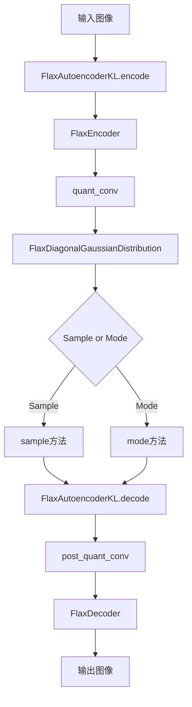

## 类结构

```
FlaxAutoencoderKL (主模型)
├── FlaxEncoder (编码器)
│   ├── FlaxDownEncoderBlock2D (下采样块)
│   │   ├── FlaxResnetBlock2D (ResNet块)
│   │   └── FlaxDownsample2D (下采样层)
│   └── FlaxUNetMidBlock2D (中间块)
│       ├── FlaxResnetBlock2D
│       └── FlaxAttentionBlock (注意力块)
├── FlaxDecoder (解码器)
│   ├── FlaxUpDecoderBlock2D (上采样块)
│   │   ├── FlaxResnetBlock2D
│   │   └── FlaxUpsample2D (上采样层)
│   └── FlaxUNetMidBlock2D
└── FlaxDiagonalGaussianDistribution (高斯分布)
```

## 全局变量及字段


### `logger`
    
模块级日志记录器，用于输出警告信息

类型：`logging.Logger`
    


### `FlaxDecoderOutput.sample`
    
解码器输出的样本张量，形状为(batch_size, num_channels, height, width)

类型：`jnp.ndarray`
    


### `FlaxAutoencoderKLOutput.latent_dist`
    
编码器输出的潜在分布，表示为对角高斯分布的均值和方差

类型：`FlaxDiagonalGaussianDistribution`
    


### `FlaxUpsample2D.in_channels`
    
输入通道数

类型：`int`
    


### `FlaxUpsample2D.dtype`
    
参数的数据类型，默认为jnp.float32

类型：`jnp.dtype`
    


### `FlaxUpsample2D.conv`
    
卷积层，用于上采样后的特征提取

类型：`nn.Conv`
    


### `FlaxDownsample2D.in_channels`
    
输入通道数

类型：`int`
    


### `FlaxDownsample2D.dtype`
    
参数的数据类型，默认为jnp.float32

类型：`jnp.dtype`
    


### `FlaxDownsample2D.conv`
    
卷积层，用于下采样

类型：`nn.Conv`
    


### `FlaxResnetBlock2D.in_channels`
    
输入通道数

类型：`int`
    


### `FlaxResnetBlock2D.out_channels`
    
输出通道数

类型：`int`
    


### `FlaxResnetBlock2D.dropout`
    
Dropout比率，用于正则化

类型：`float`
    


### `FlaxResnetBlock2D.groups`
    
GroupNorm的分组数，默认为32

类型：`int`
    


### `FlaxResnetBlock2D.use_nin_shortcut`
    
是否使用nin_shortcut快捷连接

类型：`bool`
    


### `FlaxResnetBlock2D.dtype`
    
参数的数据类型，默认为jnp.float32

类型：`jnp.dtype`
    


### `FlaxResnetBlock2D.norm1`
    
第一个GroupNorm归一化层

类型：`nn.GroupNorm`
    


### `FlaxResnetBlock2D.conv1`
    
第一个卷积层

类型：`nn.Conv`
    


### `FlaxResnetBlock2D.norm2`
    
第二个GroupNorm归一化层

类型：`nn.GroupNorm`
    


### `FlaxResnetBlock2D.dropout_layer`
    
Dropout层

类型：`nn.Dropout`
    


### `FlaxResnetBlock2D.conv2`
    
第二个卷积层

类型：`nn.Conv`
    


### `FlaxResnetBlock2D.conv_shortcut`
    
快捷连接的卷积层，用于通道数不匹配时

类型：`nn.Conv`
    


### `FlaxAttentionBlock.channels`
    
输入通道数

类型：`int`
    


### `FlaxAttentionBlock.num_head_channels`
    
注意力头的通道数

类型：`int`
    


### `FlaxAttentionBlock.num_groups`
    
GroupNorm的分组数，默认为32

类型：`int`
    


### `FlaxAttentionBlock.dtype`
    
参数的数据类型，默认为jnp.float32

类型：`jnp.dtype`
    


### `FlaxAttentionBlock.num_heads`
    
注意力头的数量

类型：`int`
    


### `FlaxAttentionBlock.group_norm`
    
GroupNorm归一化层

类型：`nn.GroupNorm`
    


### `FlaxAttentionBlock.query`
    
Query线性投影层

类型：`nn.Dense`
    


### `FlaxAttentionBlock.key`
    
Key线性投影层

类型：`nn.Dense`
    


### `FlaxAttentionBlock.value`
    
Value线性投影层

类型：`nn.Dense`
    


### `FlaxAttentionBlock.proj_attn`
    
注意力输出投影层

类型：`nn.Dense`
    


### `FlaxDownEncoderBlock2D.in_channels`
    
输入通道数

类型：`int`
    


### `FlaxDownEncoderBlock2D.out_channels`
    
输出通道数

类型：`int`
    


### `FlaxDownEncoderBlock2D.dropout`
    
Dropout比率

类型：`float`
    


### `FlaxDownEncoderBlock2D.num_layers`
    
ResNet块的数量

类型：`int`
    


### `FlaxDownEncoderBlock2D.resnet_groups`
    
ResNet块GroupNorm的分组数

类型：`int`
    


### `FlaxDownEncoderBlock2D.add_downsample`
    
是否添加下采样层

类型：`bool`
    


### `FlaxDownEncoderBlock2D.dtype`
    
参数的数据类型

类型：`jnp.dtype`
    


### `FlaxDownEncoderBlock2D.resnets`
    
ResNet块列表

类型：`list[FlaxResnetBlock2D]`
    


### `FlaxDownEncoderBlock2D.downsamplers_0`
    
下采样层

类型：`FlaxDownsample2D`
    


### `FlaxUpDecoderBlock2D.in_channels`
    
输入通道数

类型：`int`
    


### `FlaxUpDecoderBlock2D.out_channels`
    
输出通道数

类型：`int`
    


### `FlaxUpDecoderBlock2D.dropout`
    
Dropout比率

类型：`float`
    


### `FlaxUpDecoderBlock2D.num_layers`
    
ResNet块的数量

类型：`int`
    


### `FlaxUpDecoderBlock2D.resnet_groups`
    
ResNet块GroupNorm的分组数

类型：`int`
    


### `FlaxUpDecoderBlock2D.add_upsample`
    
是否添加上采样层

类型：`bool`
    


### `FlaxUpDecoderBlock2D.dtype`
    
参数的数据类型

类型：`jnp.dtype`
    


### `FlaxUpDecoderBlock2D.resnets`
    
ResNet块列表

类型：`list[FlaxResnetBlock2D]`
    


### `FlaxUpDecoderBlock2D.upsamplers_0`
    
上采样层

类型：`FlaxUpsample2D`
    


### `FlaxUNetMidBlock2D.in_channels`
    
输入通道数

类型：`int`
    


### `FlaxUNetMidBlock2D.dropout`
    
Dropout比率

类型：`float`
    


### `FlaxUNetMidBlock2D.num_layers`
    
ResNet块和注意力块的数量

类型：`int`
    


### `FlaxUNetMidBlock2D.resnet_groups`
    
GroupNorm的分组数

类型：`int`
    


### `FlaxUNetMidBlock2D.num_attention_heads`
    
注意力头的数量

类型：`int`
    


### `FlaxUNetMidBlock2D.dtype`
    
参数的数据类型

类型：`jnp.dtype`
    


### `FlaxUNetMidBlock2D.resnets`
    
ResNet块列表

类型：`list[FlaxResnetBlock2D]`
    


### `FlaxUNetMidBlock2D.attentions`
    
注意力块列表

类型：`list[FlaxAttentionBlock]`
    


### `FlaxEncoder.in_channels`
    
输入通道数

类型：`int`
    


### `FlaxEncoder.out_channels`
    
输出通道数

类型：`int`
    


### `FlaxEncoder.down_block_types`
    
下采样块的类型元组

类型：`tuple[str, ...]`
    


### `FlaxEncoder.block_out_channels`
    
每个块的输出通道数元组

类型：`tuple[int, ...]`
    


### `FlaxEncoder.layers_per_block`
    
每个块的ResNet层数

类型：`int`
    


### `FlaxEncoder.norm_num_groups`
    
GroupNorm的分组数

类型：`int`
    


### `FlaxEncoder.act_fn`
    
激活函数名称

类型：`str`
    


### `FlaxEncoder.double_z`
    
是否将输出通道数加倍（用于KL散度）

类型：`bool`
    


### `FlaxEncoder.dtype`
    
参数的数据类型

类型：`jnp.dtype`
    


### `FlaxEncoder.conv_in`
    
输入卷积层

类型：`nn.Conv`
    


### `FlaxEncoder.down_blocks`
    
下采样块列表

类型：`list[FlaxDownEncoderBlock2D]`
    


### `FlaxEncoder.mid_block`
    
中间块

类型：`FlaxUNetMidBlock2D`
    


### `FlaxEncoder.conv_norm_out`
    
输出归一化层

类型：`nn.GroupNorm`
    


### `FlaxEncoder.conv_out`
    
输出卷积层

类型：`nn.Conv`
    


### `FlaxDecoder.in_channels`
    
输入通道数

类型：`int`
    


### `FlaxDecoder.out_channels`
    
输出通道数

类型：`int`
    


### `FlaxDecoder.up_block_types`
    
上采样块的类型元组

类型：`tuple[str, ...]`
    


### `FlaxDecoder.block_out_channels`
    
每个块的输出通道数元组

类型：`tuple[int, ...]`
    


### `FlaxDecoder.layers_per_block`
    
每个块的ResNet层数

类型：`int`
    


### `FlaxDecoder.norm_num_groups`
    
GroupNorm的分组数

类型：`int`
    


### `FlaxDecoder.act_fn`
    
激活函数名称

类型：`str`
    


### `FlaxDecoder.dtype`
    
参数的数据类型

类型：`jnp.dtype`
    


### `FlaxDecoder.conv_in`
    
输入卷积层

类型：`nn.Conv`
    


### `FlaxDecoder.mid_block`
    
中间块

类型：`FlaxUNetMidBlock2D`
    


### `FlaxDecoder.up_blocks`
    
上采样块列表

类型：`list[FlaxUpDecoderBlock2D]`
    


### `FlaxDecoder.conv_norm_out`
    
输出归一化层

类型：`nn.GroupNorm`
    


### `FlaxDecoder.conv_out`
    
输出卷积层

类型：`nn.Conv`
    


### `FlaxDiagonalGaussianDistribution.mean`
    
高斯分布的均值

类型：`jnp.ndarray`
    


### `FlaxDiagonalGaussianDistribution.logvar`
    
高斯分布的对数方差

类型：`jnp.ndarray`
    


### `FlaxDiagonalGaussianDistribution.deterministic`
    
是否使用确定性模式

类型：`bool`
    


### `FlaxDiagonalGaussianDistribution.std`
    
高斯分布的标准差

类型：`jnp.ndarray`
    


### `FlaxDiagonalGaussianDistribution.var`
    
高斯分布的方差

类型：`jnp.ndarray`
    


### `FlaxAutoencoderKL.in_channels`
    
输入图像的通道数

类型：`int`
    


### `FlaxAutoencoderKL.out_channels`
    
输出图像的通道数

类型：`int`
    


### `FlaxAutoencoderKL.down_block_types`
    
下采样块的类型元组

类型：`tuple[str, ...]`
    


### `FlaxAutoencoderKL.up_block_types`
    
上采样块的类型元组

类型：`tuple[str, ...]`
    


### `FlaxAutoencoderKL.block_out_channels`
    
每个块的输出通道数元组

类型：`tuple[int, ...]`
    


### `FlaxAutoencoderKL.layers_per_block`
    
每个块的ResNet层数

类型：`int`
    


### `FlaxAutoencoderKL.act_fn`
    
激活函数名称

类型：`str`
    


### `FlaxAutoencoderKL.latent_channels`
    
潜在空间的通道数

类型：`int`
    


### `FlaxAutoencoderKL.norm_num_groups`
    
GroupNorm的分组数

类型：`int`
    


### `FlaxAutoencoderKL.sample_size`
    
样本输入尺寸

类型：`int`
    


### `FlaxAutoencoderKL.scaling_factor`
    
潜在空间的缩放因子，用于训练时归一化

类型：`float`
    


### `FlaxAutoencoderKL.dtype`
    
参数的数据类型

类型：`jnp.dtype`
    


### `FlaxAutoencoderKL.encoder`
    
VAE编码器模型

类型：`FlaxEncoder`
    


### `FlaxAutoencoderKL.decoder`
    
VAE解码器模型

类型：`FlaxDecoder`
    


### `FlaxAutoencoderKL.quant_conv`
    
量化卷积层，用于将编码器输出转换为潜在分布参数

类型：`nn.Conv`
    


### `FlaxAutoencoderKL.post_quant_conv`
    
后量化卷积层，用于将潜在变量解码前转换

类型：`nn.Conv`
    
    

## 全局函数及方法


### `FlaxUpsample2D.setup`

该方法是 FlaxUpsample2D 类的初始化方法（setup method），用于在模块构建时初始化内部的卷积层并打印弃用警告。在 Flax Linen 架构中，setup 方法在首次调用模块之前被自动调用，用以创建子模块和初始化参数。

参数：

- 无显式参数（隐含 self 参数）

返回值：无返回值（`None`）

#### 流程图

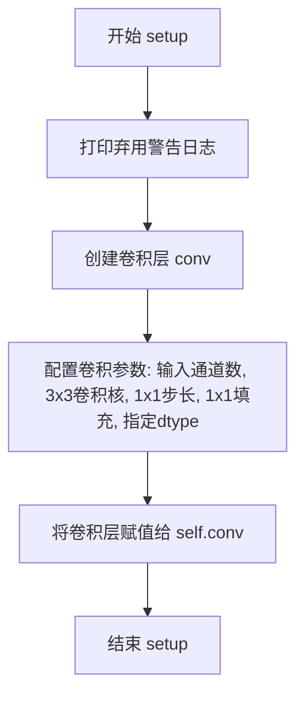

#### 带注释源码

```python
def setup(self):
    """
    Flax 模块的初始化方法，在首次调用模块前自动执行。
    用于初始化子模块（如层、模型组件等）。
    """
    # 打印弃用警告，提醒用户 Flax 类将在 Diffusers v1.0.0 中移除
    # 建议迁移到 PyTorch 类或固定 Diffusers 版本
    logger.warning(
        "Flax classes are deprecated and will be removed in Diffusers v1.0.0. We "
        "recommend migrating to PyTorch classes or pinning your version of Diffusers."
    )
    
    # 初始化上采样卷积层
    # 参数说明:
    # - self.in_channels: 输入特征图的通道数
    # - kernel_size=(3, 3): 使用 3x3 卷积核进行上采样后的特征处理
    # - strides=(1, 1): 步长为1，保持空间分辨率（因为主要的空间放大由 jax.image.resize 完成）
    # - padding=((1, 1), (1, 1)): 四周各填充1个像素，保持输出尺寸匹配上采样后的尺寸
    # - dtype=self.dtype: 卷积层参数的数据类型
    self.conv = nn.Conv(
        self.in_channels,
        kernel_size=(3, 3),
        strides=(1, 1),
        padding=((1, 1), (1, 1)),
        dtype=self.dtype,
    )
```


### `FlaxUpsample2D.__call__`

该方法是 Flax 实现的 2D 上采样层的核心调用函数，首先使用最近邻插值将输入特征图的空间尺寸扩大一倍（高度和宽度各翻倍），然后通过卷积核为 3x3 的卷积层进行特征处理，最终输出上采样后的特征图。

参数：

- `hidden_states`：`jnp.ndarray`，输入的隐藏状态张量，形状为 `(batch, height, width, channels)`，其中 batch 为批次大小，height 和 width 为空间维度，channels 为通道数

返回值：`jnp.ndarray`，上采样后的隐藏状态张量，形状为 `(batch, height * 2, width * 2, channels)`

#### 流程图

```mermaid
flowchart TD
    A[开始: 输入 hidden_states] --> B[获取张量形状 batch, height, width, channels]
    C[使用 jax.image.resize 进行最近邻上采样]
    C --> D[将形状转换为 (batch, height*2, width*2, channels)]
    E[应用 3x3 卷积 conv]
    D --> E
    E --> F[返回上采样后的 hidden_states]
```

#### 带注释源码

```python
def __call__(self, hidden_states):
    """
    执行 2D 上采样操作

    参数:
        hidden_states (jnp.ndarray): 
            输入张量，形状为 (batch, height, width, channels)

    返回:
        jnp.ndarray: 上采样后的张量，形状为 (batch, height*2, width*2, channels)
    """
    # 解码输入张量的形状信息
    # batch: 批次大小
    # height: 输入高度
    # width: 输入宽度  
    # channels: 通道数
    batch, height, width, channels = hidden_states.shape
    
    # 使用 JAX 的图像缩放功能进行上采样
    # method="nearest": 使用最近邻插值方法进行 2x 上采样
    # 将空间维度 (height, width) 扩大至 (height*2, width*2)
    hidden_states = jax.image.resize(
        hidden_states,
        shape=(batch, height * 2, width * 2, channels),
        method="nearest",
    )
    
    # 应用 3x3 卷积层进行特征处理
    # kernel_size=(3, 3): 3x3 卷积核
    # strides=(1, 1): 步长为 1，保持空间尺寸
    # padding=((1, 1), (1, 1)): 周围填充 1 像素，保持尺寸
    hidden_states = self.conv(hidden_states)
    
    # 返回上采样后的特征图
    return hidden_states
```


### `FlaxDownsample2D.setup`

该方法是 `FlaxDownsample2D` 类的初始化方法，用于在模块构建阶段设置卷积层，以实现2D下采样功能。

参数：无（仅包含 `self` 隐式参数）

返回值：`None`，无返回值

#### 流程图

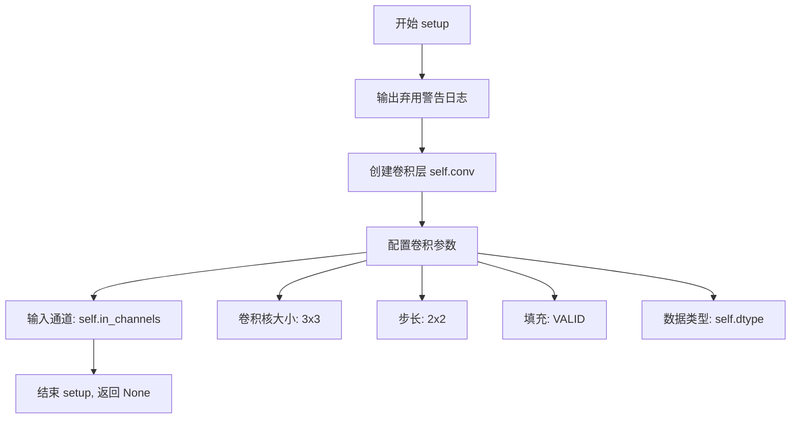

#### 带注释源码

```python
def setup(self):
    """
    初始化 FlaxDownsample2D 模块的内部组件。
    在 Flax Linen 框架中，setup 方法在模块构建阶段被调用，
    用于初始化需要在调用前创建的子模块或变量。
    """
    # 输出弃用警告信息，提醒用户 Flax 类将在 Diffusers v1.0.0 中被移除
    # 建议迁移到 PyTorch 类或固定 Diffusers 版本
    logger.warning(
        "Flax classes are deprecated and will be removed in Diffusers v1.0.0. We "
        "recommend migrating to PyTorch classes or pinning your version of Diffusers."
    )

    # 初始化卷积层用于下采样操作
    # 参数说明:
    # - self.in_channels: 输入特征图的通道数
    # - kernel_size=(3, 3): 使用 3x3 的卷积核
    # - strides=(2, 2): 步长为 2，实现 2x 下采样
    # - padding="VALID": 不使用填充（有效卷积）
    # - dtype=self.dtype: 卷积层参数的数据类型
    self.conv = nn.Conv(
        self.in_channels,
        kernel_size=(3, 3),
        strides=(2, 2),
        padding="VALID",
        dtype=self.dtype,
    )
```


### `FlaxDownsample2D.__call__`

该方法是 FlaxDownsample2D 类的核心调用接口，实现 2D 空间下采样功能。首先对输入张量的高度和宽度维度进行不对称 padding（右侧和底部各 padding 1），然后通过步长为 2 的 3x3 卷积核执行下采样，将特征图的空间分辨率降低为原来的一半，同时保持通道数不变。

**参数：**

- `hidden_states`：`jnp.ndarray`，形状为 `(batch_size, height, width, channels)` 的 4D 张量，表示输入的隐藏状态特征图。

**返回值：** `jnp.ndarray`，形状为 `(batch_size, height//2, width//2, channels)` 的 4D 张量，表示下采样后的特征图。

#### 流程图

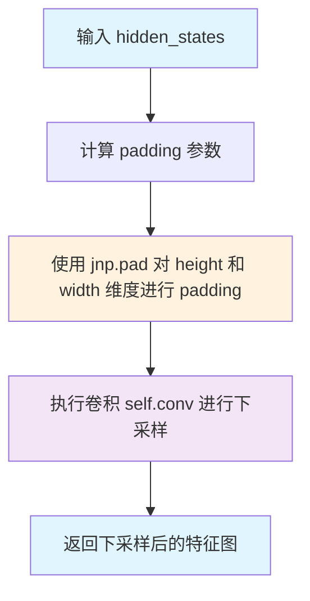

#### 带注释源码

```python
def __call__(self, hidden_states):
    """
    执行 2D 下采样操作
    
    参数:
        hidden_states: 输入的 4D 张量，形状为 (batch_size, height, width, channels)
                      采用 channels_last 格式
    
    返回:
        下采样后的 4D 张量，形状为 (batch_size, height//2, width//2, channels)
    """
    # 定义 padding 参数，使用不对称 padding
    # 格式: ((batch维度左, batch维度右), (height维度左, height维度右), 
    #       (width维度左, width维度右), (channel维度左, channel维度右))
    # 只在 height 和 width 的右侧/底部各 padding 1 个像素
    pad = ((0, 0), (0, 1), (0, 1), (0, 0))
    
    # 对输入张量进行 padding，为后续卷积下采样做准备
    # padding 使得特征图边缘信息得以保留，避免边界信息丢失
    hidden_states = jnp.pad(hidden_states, pad_width=pad)
    
    # 执行卷积操作进行下采样
    # 卷积核大小: (3, 3)
    # 步长: (2, 2) - 实现 2 倍下采样
    # padding: "VALID" - 不额外 padding，因为前面已经手动 padding
    # 卷积输出通道数等于输入通道数（self.in_channels）
    hidden_states = self.conv(hidden_states)
    
    # 返回下采样后的特征图
    return hidden_states
```


### `FlaxResnetBlock2D.setup`

该方法是 Flax Linen 模块的初始化方法（`setup` 生命周期方法），在模型构建阶段被调用，用于初始化 ResNet 块的所有子层，包括 GroupNorm 归一化层、卷积层、Dropout 层以及可选的残差快捷连接卷积层。

参数：

- 该方法无显式外部参数（使用 `self` 隐式获取类属性）

返回值：`None`（无返回值，Flax 的 setup 方法在内部完成子层注册）

#### 流程图

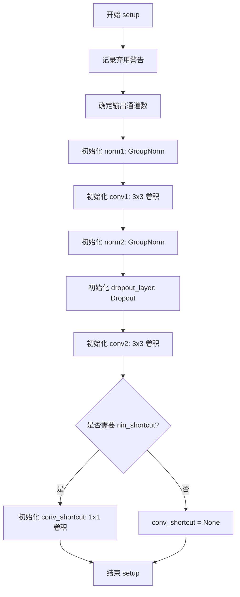

#### 带注释源码

```python
def setup(self):
    """
    Flax Linen 模块的 setup 方法，在 __call__ 之前初始化所有子层。
    这是 Flax 特有的延迟初始化机制，用于动态构建计算图。
    """
    # 记录弃用警告，提示用户这些 Flax 类将在未来版本中移除
    logger.warning(
        "Flax classes are deprecated and will be removed in Diffusers v1.0.0. We "
        "recommend migrating to PyTorch classes or pinning your version of Diffusers."
    )

    # 确定输出通道数：如果未指定 out_channels，则使用输入通道数
    out_channels = self.in_channels if self.out_channels is None else self.out_channels

    # 第一个残差分支：归一化 + SiLU 激活 + 卷积
    # GroupNorm 用于稳定训练，epsilon=1e-6 防止除零
    self.norm1 = nn.GroupNorm(num_groups=self.groups, epsilon=1e-6)
    # 3x3 卷积，步长为 1，保持空间分辨率，通过 padding=((1,1),(1,1)) 实现 'same' 填充
    self.conv1 = nn.Conv(
        out_channels,
        kernel_size=(3, 3),
        strides=(1, 1),
        padding=((1, 1), (1, 1)),
        dtype=self.dtype,
    )

    # 第二个残差分支：归一化 + SiLU 激活 + Dropout + 卷积
    self.norm2 = nn.GroupNorm(num_groups=self.groups, epsilon=1e-6)
    # Dropout 层，用于正则化，在推理时根据 deterministic 参数决定是否激活
    self.dropout_layer = nn.Dropout(self.dropout)
    self.conv2 = nn.Conv(
        out_channels,
        kernel_size=(3, 3),
        strides=(1, 1),
        padding=((1, 1), (1, 1)),
        dtype=self.dtype,
    )

    # 判断是否需要使用 nin_shortcut（1x1 卷积作为快捷连接）
    # 当输入通道与输出通道不相等时，默认使用快捷连接；也可通过 use_nin_shortcut 参数显式控制
    use_nin_shortcut = self.in_channels != out_channels if self.use_nin_shortcut is None else self.use_nin_shortcut

    # 初始化快捷连接卷积（仅在需要时创建，节省内存）
    self.conv_shortcut = None
    if use_nin_shortcut:
        # 1x1 卷积，用于调整通道数以匹配残差连接
        self.conv_shortcut = nn.Conv(
            out_channels,
            kernel_size=(1, 1),
            strides=(1, 1),
            padding="VALID",  # 无填充，要求输入输出空间尺寸一致
            dtype=self.dtype,
        )
```


### `FlaxResnetBlock2D.__call__`

Flax ResNet 块的前向传播方法，执行残差连接的核心逻辑，包括两个组归一化层、Swish 激活函数、Dropout 层和卷积层，最后通过残差连接输出特征。

参数：

- `hidden_states`：`jnp.ndarray`，输入的隐藏状态张量，形状为 `(batch, height, width, channels)`
- `deterministic`：`bool`，可选参数（默认为 `True`），控制 dropout 行为，为 `True` 时在推理模式，为 `False` 时在训练模式

返回值：`jnp.ndarray`，经过 ResNet 块处理后的输出，形状与输入相同 `(batch, height, width, channels)`

#### 流程图

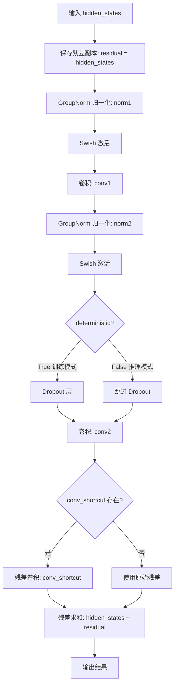

#### 带注释源码

```python
def __call__(self, hidden_states, deterministic=True):
    """
    Flax ResNet 块的前向传播方法。

    参数:
        hidden_states: 输入的隐藏状态张量，形状为 (batch, height, width, channels)
        deterministic: 控制 dropout 行为，True 表示推理模式（关闭 dropout），
                       False 表示训练模式（启用 dropout）

    返回值:
        经过 ResNet 块处理后的输出张量，形状与输入相同
    """
    # Step 1: 保存输入作为残差连接的基础
    residual = hidden_states

    # Step 2: 第一个残差分支
    # 2.1 组归一化（Group Normalization）
    hidden_states = self.norm1(hidden_states)

    # 2.2 Swish 激活函数（SiLU）
    hidden_states = nn.swish(hidden_states)

    # 2.3 第一次卷积变换
    hidden_states = self.conv1(hidden_states)

    # Step 3: 第二个残差分支
    # 3.1 组归一化
    hidden_states = self.norm2(hidden_states)

    # 3.2 Swish 激活
    hidden_states = nn.swish(hidden_states)

    # 3.2 Dropout 层（根据 deterministic 决定是否启用）
    hidden_states = self.dropout_layer(hidden_states, deterministic)

    # 3.3 第二次卷积变换
    hidden_states = self.conv2(hidden_states)

    # Step 4: 残差连接处理
    # 如果输入输出通道数不同，使用卷积调整残差维度
    if self.conv_shortcut is not None:
        residual = self.conv_shortcut(residual)

    # Step 5: 残差求和并返回
    # 输出 = 主分支输出 + 残差分支输出
    return hidden_states + residual
```


### `FlaxAttentionBlock.setup`

该方法是FlaxAttentionBlock类的初始化方法，在模块实例化时自动调用，用于初始化注意力机制的核心组件，包括GroupNorm层、Query/Key/Value投影层以及输出投影层。

参数：
- 该方法无显式参数（隐式使用类的属性：channels、num_head_channels、num_groups、dtype）

返回值：`None`（Flax Linen模块的setup方法不返回值，仅初始化实例属性）

#### 流程图

```mermaid
flowchart TD
    A[开始 setup] --> B[输出弃用警告日志]
    B --> C{num_head_channels是否为None}
    C -->|是| D[设置num_heads = 1]
    C -->|否| E[设置num_heads = channels // num_head_channels]
    D --> F[创建dense偏函数: nn.Dense for self.channels with self.dtype]
    E --> F
    F --> G[初始化self.group_norm = nn.GroupNorm]
    G --> H[创建self.query = dense()]
    H --> I[创建self.key = dense()]
    I --> J[创建self.value = dense()]
    J --> K[创建self.proj_attn = dense()]
    K --> L[结束 setup]
```

#### 带注释源码

```python
def setup(self):
    """
    初始化FlaxAttentionBlock的内部组件。
    在Flax Linen中，setup方法在模块实例化时自动调用，
    用于定义网络的子层和参数。
    """
    # 输出弃用警告，提示用户Flax类将在未来版本中移除
    logger.warning(
        "Flax classes are deprecated and will be removed in Diffusers v1.0.0. We "
        "recommend migrating to PyTorch classes or pinning your version of Diffusers."
    )

    # 计算注意力头数量
    # 如果指定了num_head_channels，则头数 = 总通道数 / 每头通道数
    # 否则使用单个头
    self.num_heads = self.channels // self.num_head_channels if self.num_head_channels is not None else 1

    # 创建Dense层的偏函数partial
    # 所有Q/K/V投影都输出到self.channels维度，使用相同的dtype
    dense = partial(nn.Dense, self.channels, dtype=self.dtype)

    # 初始化GroupNorm层用于归一化
    self.group_norm = nn.GroupNorm(num_groups=self.num_groups, epsilon=1e-6)
    
    # 初始化三个Dense层作为Query、Key、Value的线性投影
    self.query, self.key, self.value = dense(), dense(), dense()
    
    # 初始化输出投影层，用于投影注意力输出回原始通道维度
    self.proj_attn = dense()
```


### `FlaxAttentionBlock.transpose_for_scores`

该方法用于将投影后的query、key或value张量重新reshape并转置，以便进行多头注意力计算。它将原始的 (batch, seq_len, channels) 形状转换为 (batch, num_heads, seq_len, head_dim) 的多头注意力格式。

参数：

- `projection`：`jnp.ndarray`，输入的投影张量（query、key或value），形状为 (batch, seq_len, channels)

返回值：`jnp.ndarray`，转置后的投影张量，形状为 (batch, num_heads, seq_len, head_dim)

#### 流程图

```mermaid
flowchart TD
    A[开始] --> B[计算新形状<br/>projection.shape[:-1] + (num_heads, -1)]
    B --> C[reshape投影<br/>将形状从(B, T, H*D)改为(B, T, H, D)]
    C --> D[transpose转置<br/>将维度从(B, T, H, D)改为(B, H, T, D)]
    D --> E[返回转置后的投影]
```

#### 带注释源码

```python
def transpose_for_scores(self, projection):
    """
    将投影张量转置以适配多头注意力计算格式
    
    Args:
        projection: 输入的投影张量，形状为 (batch, seq_len, channels)
    
    Returns:
        转置后的张量，形状为 (batch, num_heads, seq_len, head_dim)
    """
    # 计算新的投影形状：将最后一维分解为 (num_heads, -1)
    # 例如：从 (batch, seq_len, channels) 变为 (batch, seq_len, num_heads, head_dim)
    new_projection_shape = projection.shape[:-1] + (self.num_heads, -1)
    
    # 重塑投影形状：将 (batch, seq_len, num_heads * head_dim) 
    # 转换为 (batch, seq_len, num_heads, head_dim)
    # move heads to 2nd position (B, T, H * D) -> (B, T, H, D)
    new_projection = projection.reshape(new_projection_shape)
    
    # 转置维度：将 (batch, seq_len, num_heads, head_dim) 
    # 转换为 (batch, num_heads, seq_len, head_dim)
    # (B, T, H, D) -> (B, H, T, D)
    new_projection = jnp.transpose(new_projection, (0, 2, 1, 3))
    
    return new_projection
```


### `FlaxAttentionBlock.__call__`

实现基于卷积的多头注意力机制，用于扩散模型的VAE。该方法接收隐藏状态，通过分组归一化、Query/Key/Value投影、注意力计算和输出投影，最终返回带有残差连接的增强特征。

参数：

-  `hidden_states`：`jnp.ndarray`，形状为 `(batch, height, width, channels)`，输入的隐藏状态张量

返回值：`jnp.ndarray`，形状为 `(batch, height, width, channels)`，经过注意力机制处理并加上残差连接后的输出

#### 流程图

```mermaid
flowchart TD
    A[输入 hidden_states] --> B[保存残差: residual = hidden_states]
    B --> C[获取形状: batch, height, width, channels]
    C --> D[分组归一化: group_norm]
    D --> E[reshape到序列: (batch, height*width, channels)]
    E --> F[线性投影: Query, Key, Value]
    F --> G[转置以适应分数计算]
    G --> H[计算注意力权重: einsum + softmax]
    H --> I[加权值向量: einsum]
    I --> J[转置回原顺序]
    J --> K[reshape回通道维度]
    K --> L[输出投影: proj_attn]
    L --> M[reshape到空间维度]
    M --> N[加上残差连接]
    N --> O[返回输出]
```

#### 带注释源码

```python
def __call__(self, hidden_states):
    """
    FlaxAttentionBlock 的前向传播方法，实现多头注意力机制
    
    参数:
        hidden_states: 输入的隐藏状态，形状为 (batch, height, width, channels)
                      采用通道最后(channel-last)的格式
    
    返回:
        经过注意力机制处理后的隐藏状态，形状与输入相同
    """
    # 1. 保存残差连接，用于后续的跳跃连接
    residual = hidden_states
    
    # 2. 获取输入张量的形状信息
    # batch: 批量大小, height/width: 空间维度, channels: 通道数
    batch, height, width, channels = hidden_states.shape
    
    # 3. 分组归一化，对通道进行GroupNorm处理
    # num_groups 由类属性 num_groups 指定，默认为 32
    hidden_states = self.group_norm(hidden_states)
    
    # 4. 将空间维度展平为序列维度
    # 从 (batch, height, width, channels) 转换为 (batch, height*width, channels)
    # 这样可以将卷积特征视为序列进行处理
    hidden_states = hidden_states.reshape((batch, height * width, channels))
    
    # 5. 线性投影生成 Query, Key, Value
    # 这三个投影共享输出通道数，均为 self.channels
    query = self.query(hidden_states)
    key = self.key(hidden_states)
    value = self.value(hidden_states)
    
    # 6. 转置以便计算注意力分数
    # 从 (batch, seq_len, heads*head_dim) 转换为 (batch, heads, seq_len, head_dim)
    query = self.transpose_for_scores(query)
    key = self.transpose_for_scores(key)
    value = self.transpose_for_scores(value)
    
    # 7. 计算注意力权重
    # 缩放因子：1 / sqrt(sqrt(channels/num_heads))
    # 这是标准注意力缩放的自然对数形式，用于数值稳定性
    scale = 1 / math.sqrt(math.sqrt(self.channels / self.num_heads))
    
    # 使用爱因斯坦求和约定计算点积注意力
    # query 和 key 先经过缩放，然后计算相似度矩阵
    attn_weights = jnp.einsum("...qc,...kc->...qk", query * scale, key * scale)
    
    # 8. 对最后一个维度应用 softmax 得到注意力概率分布
    attn_weights = nn.softmax(attn_weights, axis=-1)
    
    # 9. 使用注意力权重对 value 进行加权求和
    hidden_states = jnp.einsum("...kc,...qk->...qc", value, attn_weights)
    
    # 10. 转置回原来的维度顺序
    # 从 (batch, heads, seq_len, head_dim) 转回 (batch, seq_len, heads, head_dim)
    hidden_states = jnp.transpose(hidden_states, (0, 2, 1, 3))
    
    # 11. 合并头部维度，恢复到原始通道维度
    new_hidden_states_shape = hidden_states.shape[:-2] + (self.channels,)
    hidden_states = hidden_states.reshape(new_hidden_states_shape)
    
    # 12. 输出投影，将特征维度映射回原始通道数
    hidden_states = self.proj_attn(hidden_states)
    
    # 13. 恢复空间维度形状
    # 从 (batch, height*width, channels) 恢复到 (batch, height, width, channels)
    hidden_states = hidden_states.reshape((batch, height, width, channels))
    
    # 14. 残差连接：将输入与输出相加
    hidden_states = hidden_states + residual
    
    return hidden_states
```


### `FlaxDownEncoderBlock2D.setup`

这是 `FlaxDownEncoderBlock2D` 类的初始化方法，用于构建编码器块的内部结构，包括多个 ResNet 块和可选的下采样层。

参数： 无（该方法是类实例方法，通过 `self` 访问类属性）

返回值：无（`None`，该方法为 Flax Linen 模块的 `setup` 方法，用于初始化子模块，不返回任何值）

#### 流程图

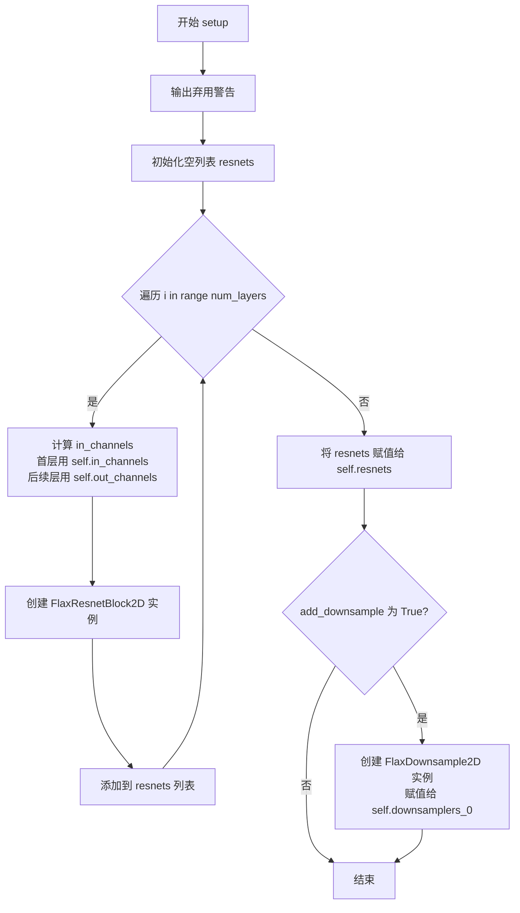

#### 带注释源码

```python
def setup(self):
    """
    Flax 模块的 setup 方法，在构造函数中调用，用于初始化子模块。
    该方法继承自 nn.Module，是 Flax Linen 框架的特定模式。
    """
    # 输出弃用警告，提醒用户 Flax 类将在 Diffusers v1.0.0 中移除
    logger.warning(
        "Flax classes are deprecated and will be removed in Diffusers v1.0.0. We "
        "recommend migrating to PyTorch classes or pinning your version of Diffusers."
    )

    # 创建空列表用于存储 ResNet 块
    resnets = []
    
    # 循环创建指定数量的 ResNet 层
    for i in range(self.num_layers):
        # 确定当前层的输入通道数
        # 第一层使用 self.in_channels，后续层使用 self.out_channels
        in_channels = self.in_channels if i == 0 else self.out_channels

        # 创建 ResNet 块实例
        res_block = FlaxResnetBlock2D(
            in_channels=in_channels,
            out_channels=self.out_channels,
            dropout=self.dropout,
            groups=self.resnet_groups,
            dtype=self.dtype,
        )
        # 将 ResNet 块添加到列表中
        resnets.append(res_block)
    
    # 将 ResNet 块列表存储为类的属性
    self.resnets = resnets

    # 如果需要下采样，则创建下采样层
    if self.add_downsample:
        # 创建下采样器实例，输入通道为输出通道数
        self.downsamplers_0 = FlaxDownsample2D(self.out_channels, dtype=self.dtype)
```


### FlaxDownEncoderBlock2D.__call__

这是 Flax 实现的 2D 编码器下采样块的前向传播方法，用于处理 VAE 编码器中的残差块并执行下采样操作。

参数：

- `hidden_states`：`jnp.ndarray`，输入的隐藏状态张量，形状为 (batch, height, width, channels)
- `deterministic`：`bool`，指定是否使用确定性模式（决定是否使用 dropout）

返回值：`jnp.ndarray`，经过残差块处理和下采样后的隐藏状态张量

#### 流程图

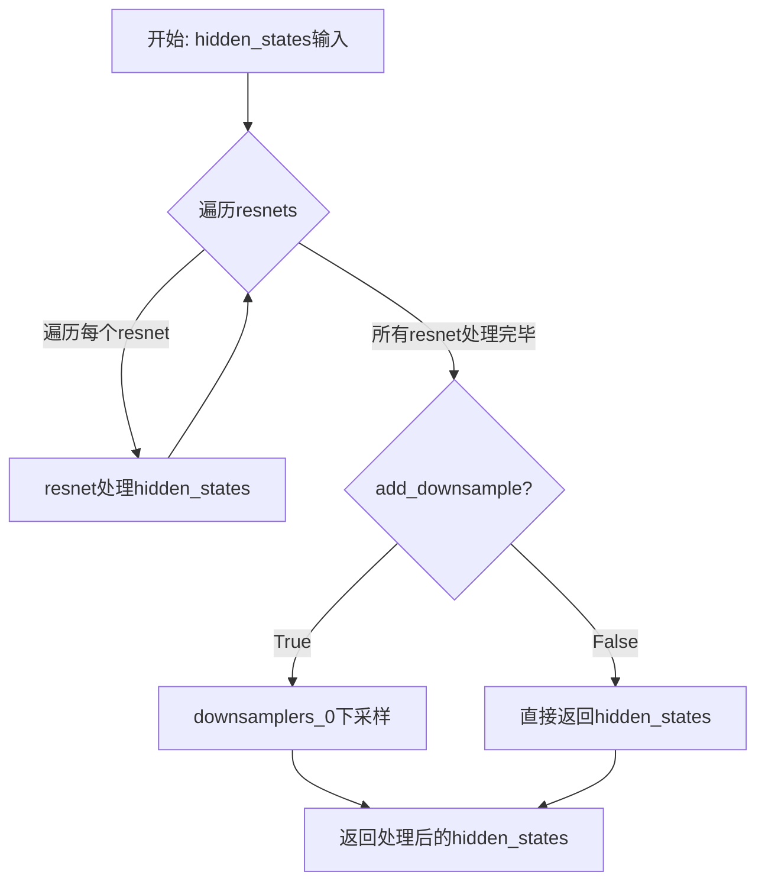

#### 带注释源码

```
def __call__(self, hidden_states, deterministic=True):
    """
    FlaxDownEncoderBlock2D 的前向传播方法
    
    参数:
        hidden_states: 输入的隐藏状态，形状为 (batch, height, width, channels)
        deterministic: 布尔值，True 表示使用确定性模式（训练时为 False，推理时为 True）
                      决定 dropout 是否生效
    
    返回值:
        hidden_states: 经过所有 ResNet 块处理和下采样后的隐藏状态
    """
    
    # 遍历所有 ResNet 块，对隐藏状态进行特征提取
    # 每个 resnet 会执行: 归一化 -> Swish 激活 -> 卷积 -> 归一化 -> Swish 激活 -> Dropout -> 卷积 -> 残差连接
    for resnet in self.resnets:
        hidden_states = resnet(hidden_states, deterministic=deterministic)

    # 如果配置中 add_downsample 为 True，则添加下采样层
    # 下采样使用 3x3 卷积，步长为 2，实现空间维度的下采样
    if self.add_downsample:
        hidden_states = self.downsamplers_0(hidden_states)

    # 返回处理后的隐藏状态
    return hidden_states
```


### FlaxUpDecoderBlock2D.setup

`FlaxUpDecoderBlock2D.setup` 是 Flax 框架中的初始化方法，用于在模块实例化时构建解码器块内部的子层结构。该方法根据配置参数创建 ResNet 块列表和可选的上采样层，为后续的前向传播做好准备。

参数：此方法无显式参数（继承自 nn.Module，使用类属性作为配置）

返回值：无返回值（`None`），该方法仅初始化实例属性

#### 流程图

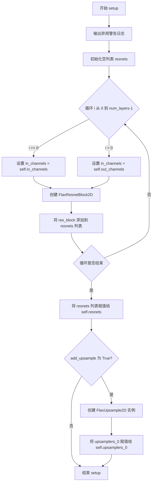

#### 带注释源码

```python
def setup(self):
    """
    初始化 FlaxUpDecoderBlock2D 模块的内部结构。
    该方法在首次调用时运行，用于构建子层组件。
    """
    # 输出弃用警告，建议迁移到 PyTorch 或固定版本
    logger.warning(
        "Flax classes are deprecated and will be removed in Diffusers v1.0.0. We "
        "recommend migrating to PyTorch classes or pinning your version of Diffusers."
    )

    # 创建空列表用于存储 ResNet 块
    resnets = []
    
    # 根据 num_layers 循环创建对应数量的 ResNet 块
    for i in range(self.num_layers):
        # 第一个块使用输入通道，后续块使用输出通道
        in_channels = self.in_channels if i == 0 else self.out_channels
        
        # 创建 ResNet 块实例
        res_block = FlaxResnetBlock2D(
            in_channels=in_channels,       # 输入通道数
            out_channels=self.out_channels, # 输出通道数
            dropout=self.dropout,           # Dropout 概率
            groups=self.resnet_groups,      # GroupNorm 分组数
            dtype=self.dtype,               # 数据类型
        )
        # 将块添加到列表中
        resnets.append(res_block)

    # 将 ResNet 块列表存储为实例属性
    self.resnets = resnets

    # 如果需要上采样，则创建上采样层
    if self.add_upsample:
        self.upsamplers_0 = FlaxUpsample2D(self.out_channels, dtype=self.dtype)
```


### `FlaxUpDecoderBlock2D.__call__`

该方法是 FlaxUpDecoderBlock2D 类的调用接口，负责执行上采样解码器块的前向传播。它通过依次应用多个 ResNet 块来处理隐藏状态，并根据配置可选地添加上采样层，以逐步恢复特征图的空间分辨率。

参数：

-  `hidden_states`：`jnp.ndarray`，形状为 `(batch, height, width, channels)` 的输入隐藏状态张量
-  `deterministic`：`bool`，可选，默认为 `True`，指定是否使用确定性（非随机）行为，例如决定 dropout 是否启用

返回值：`jnp.ndarray`，经过 ResNet 块处理并可能经过上采样后的输出隐藏状态张量

#### 流程图

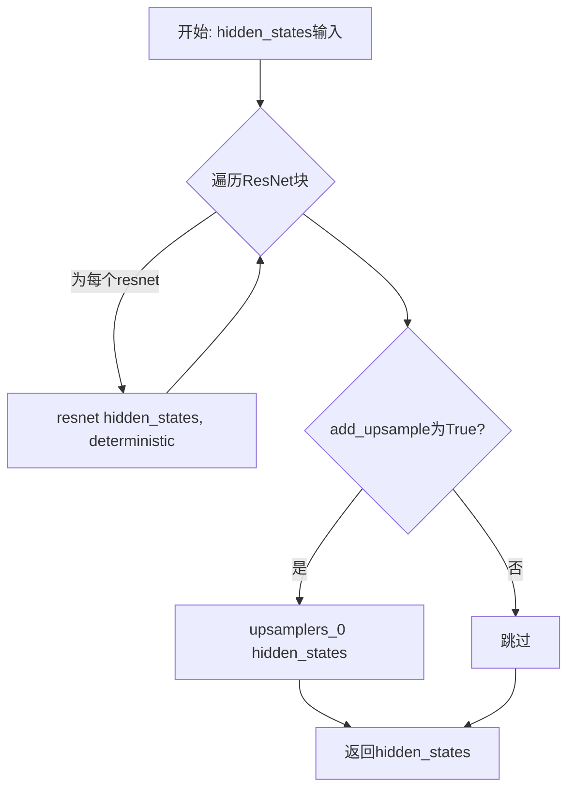

#### 带注释源码

```python
def __call__(self, hidden_states, deterministic=True):
    """
    FlaxUpDecoderBlock2D 的前向传播方法
    
    参数:
        hidden_states: 输入的隐藏状态张量，形状为 (batch, height, width, channels)
        deterministic: 控制是否使用确定性行为（影响dropout等随机操作）
    
    返回:
        处理后的隐藏状态张量
    """
    # 遍历所有 ResNet 块，依次处理 hidden_states
    # 第一个块使用 in_channels，后续块使用 out_channels
    for resnet in self.resnets:
        hidden_states = resnet(hidden_states, deterministic=deterministic)

    # 如果配置了 add_upsample，则应用上采样层
    # 使用最近邻插值将空间维度扩大 2 倍，然后通过卷积
    if self.add_upsample:
        hidden_states = self.upsamplers_0(hidden_states)

    return hidden_states
```


### `FlaxUNetMidBlock2D.setup`

该方法是 FlaxUNetMidBlock2D 类的初始化方法，负责构建 UNet 中间块的网络组件，包括 ResNet 块和注意力块，用于处理 VAE 模型的中间层特征。

参数：

- 该方法无显式参数（Flax 框架中 setup 方法由系统自动调用，self 为隐式参数）

返回值：`None`，该方法为初始化方法，不返回任何值，仅在模块内部创建并赋值实例属性

#### 流程图

```mermaid
flowchart TD
    A[开始 setup] --> B[记录弃用警告日志]
    B --> C{self.resnet_groups 是否为 None}
    C -->|是| D[计算 resnet_groups = min(self.in_channels // 4, 32)]
    C -->|否| E[resnet_groups = self.resnet_groups]
    D --> F[创建第一个 FlaxResnetBlock2D]
    E --> F
    F --> G[初始化空列表 resnets 和 attentions]
    G --> H{循环 i from 0 to num_layers-1}
    H -->|第 i 次| I[创建 FlaxAttentionBlock 并添加到 attentions]
    I --> J[创建 FlaxResnetBlock2D 并添加到 resnets]
    J --> H
    H -->|循环结束| K[将 resnets 列表赋值给 self.resnets]
    K --> L[将 attentions 列表赋值给 self.attentions]
    L --> M[结束 setup]
```

#### 带注释源码

```python
def setup(self):
    """
    Flax UNet Mid-Block 的初始化方法，构建网络组件
    """
    # 记录弃用警告，提醒用户该 Flax 实现将在未来版本中移除
    logger.warning(
        "Flax classes are deprecated and will be removed in Diffusers v1.0.0. We "
        "recommend migrating to PyTorch classes or pinning your version of Diffusers."
    )

    # 计算 resnet_groups：如果未指定，则取输入通道数的1/4与32的较小值
    resnet_groups = self.resnet_groups if self.resnet_groups is not None else min(self.in_channels // 4, 32)

    # 创建第一个 ResNet 块（中间块至少包含一个 ResNet）
    resnets = [
        FlaxResnetBlock2D(
            in_channels=self.in_channels,
            out_channels=self.in_channels,
            dropout=self.dropout,
            groups=resnet_groups,
            dtype=self.dtype,
        )
    ]

    # 初始化注意力块列表
    attentions = []

    # 根据 num_layers 循环创建注意力块和额外的 ResNet 块
    for _ in range(self.num_layers):
        # 创建注意力块
        attn_block = FlaxAttentionBlock(
            channels=self.in_channels,
            num_head_channels=self.num_attention_heads,
            num_groups=resnet_groups,
            dtype=self.dtype,
        )
        attentions.append(attn_block)

        # 创建额外的 ResNet 块
        res_block = FlaxResnetBlock2D(
            in_channels=self.in_channels,
            out_channels=self.in_channels,
            dropout=self.dropout,
            groups=resnet_groups,
            dtype=self.dtype,
        )
        resnets.append(res_block)

    # 将构建好的列表赋值给实例属性，供 __call__ 方法使用
    self.resnets = resnets
    self.attentions = attentions
```


### FlaxUNetMidBlock2D.__call__

该方法是 FlaxUNetMidBlock2D 类的前向传播实现，用于在 VAE 编码器和解码器中间执行特征处理。它通过堆叠的 ResNet 块和自注意力块对输入 hidden_states 进行处理，首先经过初始 ResNet 块，然后交替执行自注意力计算和残差连接，最后返回处理后的特征图。

参数：

- `hidden_states`：`jnp.ndarray`，形状为 (batch_size, height, width, channels)，输入的隐藏状态张量
- `deterministic`：`bool`，可选，默认为 True，控制是否使用 dropout（True 表示使用推理模式）

返回值：`jnp.ndarray`，处理后的隐藏状态张量，形状与输入相同 (batch_size, height, width, channels)

#### 流程图

```mermaid
flowchart TD
    A[输入 hidden_states] --> B[self.resnets[0](hidden_states)]
    B --> C{遍历 attentions 和 resnets[1:]}
    C --> D[attn(hidden_states) 注意力计算]
    D --> E[resnet(hidden_states) 残差块处理]
    E --> C
    C --> F[返回 hidden_states]
```

#### 带注释源码

```python
def __call__(self, hidden_states, deterministic=True):
    """
    FlaxUNetMidBlock2D 的前向传播方法，对输入特征进行 ResNet 和 Attention 处理。

    参数:
        hidden_states: 输入的隐藏状态，形状为 (batch_size, height, width, channels)
        deterministic: 布尔值，控制是否使用 dropout，True 表示推理模式

    返回:
        处理后的隐藏状态，形状与输入相同
    """
    # 首先通过第一个 ResNet 块处理输入
    # 这是必需的，因为无论有多少层，至少有一个 resnet
    hidden_states = self.resnets[0](hidden_states, deterministic=deterministic)
    
    # 交替遍历注意力块和后续的 ResNet 块
    # 使用 zip 将 attentions 列表和 resnets[1:] 列表配对
    # 每个 attention 块后面跟着一个 resnet 块
    for attn, resnet in zip(self.attentions, self.resnets[1:]):
        # 执行自注意力计算
        hidden_states = attn(hidden_states)
        # 执行残差网络块处理
        hidden_states = resnet(hidden_states, deterministic=deterministic)

    # 返回最终处理后的特征图
    return hidden_states
```


### `FlaxEncoder.setup`

该方法是 `FlaxEncoder` 类的初始化方法（`setup`），用于实例化 VAE 编码器的所有子模块。它根据模型配置（如 `block_out_channels`、`layers_per_block` 等）创建输入卷积层、多个下采样编码器块、中间块以及输出归一化层和卷积层。

参数：

- `self`：`FlaxEncoder`，隐式参数，指向类实例本身，用于访问和初始化类属性。

返回值：`None`，无返回值。此方法直接在实例上初始化属性，不返回任何数据。

#### 流程图

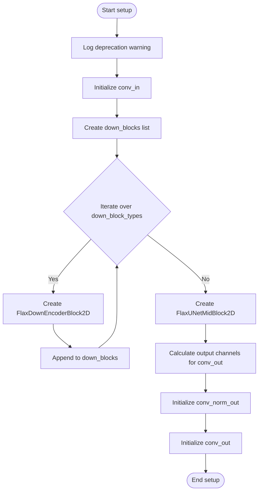

#### 带注释源码

```python
def setup(self):
    # 记录一条关于 Flax 类已弃用的警告信息
    logger.warning(
        "Flax classes are deprecated and will be removed in Diffusers v1.0.0. We "
        "recommend migrating to PyTorch classes or pinning your version of Diffusers."
    )

    # 获取配置中的输出通道数列表
    block_out_channels = self.block_out_channels
    
    # --- 初始化输入层 ---
    # 创建输入卷积层，将输入特征映射到第一个 block 的通道数
    self.conv_in = nn.Conv(
        block_out_channels[0],
        kernel_size=(3, 3),
        strides=(1, 1),
        padding=((1, 1), (1, 1)),
        dtype=self.dtype,
    )

    # --- 初始化下采样块 ---
    down_blocks = []
    output_channel = block_out_channels[0]
    # 遍历下采样块类型配置，创建对应的 Block
    for i, _ in enumerate(self.down_block_types):
        input_channel = output_channel
        output_channel = block_out_channels[i]
        # 判断是否为最后一个块，最后一个块通常不再下采样
        is_final_block = i == len(block_out_channels) - 1

        # 创建下采样编码器块
        down_block = FlaxDownEncoderBlock2D(
            in_channels=input_channel,
            out_channels=output_channel,
            num_layers=self.layers_per_block,
            resnet_groups=self.norm_num_groups,
            add_downsample=not is_final_block,
            dtype=self.dtype,
        )
        down_blocks.append(down_block)
    # 将创建的下采样块列表保存为类属性
    self.down_blocks = down_blocks

    # --- 初始化中间块 ---
    # 创建 Unet 中间块，用于处理最底层的特征
    self.mid_block = FlaxUNetMidBlock2D(
        in_channels=block_out_channels[-1],
        resnet_groups=self.norm_num_groups,
        num_attention_heads=None,
        dtype=self.dtype,
    )

    # --- 初始化输出层 ---
    # 根据 double_z 参数决定输出通道数（如果是 VAE，则 x2 以包含 mean 和 var）
    conv_out_channels = 2 * self.out_channels if self.double_z else self.out_channels
    # 创建输出归一化层
    self.conv_norm_out = nn.GroupNorm(num_groups=self.norm_num_groups, epsilon=1e-6)
    # 创建输出卷积层
    self.conv_out = nn.Conv(
        conv_out_channels,
        kernel_size=(3, 3),
        strides=(1, 1),
        padding=((1, 1), (1, 1)),
        dtype=self.dtype,
    )
```


### `FlaxEncoder.__call__`

FlaxEncoder 的 `__call__` 方法实现了 VAE 编码器的前向传播，将输入图像样本编码为潜在表示。该方法依次通过输入卷积、多个下采样块、中间块和输出卷积层处理输入，最终返回编码后的特征表示。

参数：

- `sample`：`jnp.ndarray`，输入图像样本，形状为 `(batch_size, height, width, channels)`，通道顺序为通道最后（channels-last）
- `deterministic`：`bool`，控制是否使用确定性模式（非随机模式）。若为 `True`，则 dropout 等随机操作将被禁用；默认为 `True`

返回值：`jnp.ndarray`，编码后的输出，形状为 `(batch_size, height, width, output_channels)`，其中 `output_channels` 由 `double_z` 参数决定（若 `double_z` 为 `True`，则为 `2 * out_channels`，否则为 `out_channels`）

#### 流程图

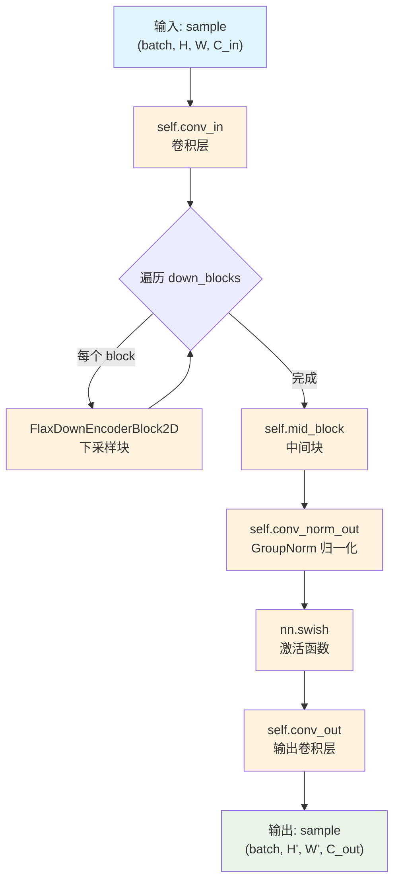

#### 带注释源码

```python
def __call__(self, sample, deterministic: bool = True):
    """
    FlaxEncoder 的前向传播方法，将输入样本编码为潜在表示。
    
    参数:
        sample: 输入图像样本，形状为 (batch_size, height, width, in_channels)
        deterministic: 控制是否使用确定性行为（禁用 dropout 等随机操作）
    
    返回:
        编码后的特征表示，形状为 (batch_size, height, width, out_channels) 或
        (batch_size, height, width, 2 * out_channels) 如果 double_z 为 True
    """
    
    # ========== 1. 输入卷积层 ==========
    # 将输入转换为初始特征表示
    # 使用 3x3 卷积，输出通道数为第一个 block_out_channels
    sample = self.conv_in(sample)

    # ========== 2. 下采样阶段 ==========
    # 遍历所有下采样块，逐步降低空间分辨率并增加通道数
    for block in self.down_blocks:
        sample = block(sample, deterministic=deterministic)

    # ========== 3. 中间处理块 ==========
    # 处理最深层的特征表示，包含残差块和注意力机制
    sample = self.mid_block(sample, deterministic=deterministic)

    # ========== 4. 输出卷积层 ==========
    # 应用 GroupNorm 归一化
    sample = self.conv_norm_out(sample)
    # 应用 SiLU 激活函数 (swish)
    sample = nn.swish(sample)
    # 最终卷积输出，根据 double_z 参数决定输出通道数
    sample = self.conv_out(sample)

    return sample
```


### FlaxDecoder.setup

该方法是 Flax VAE 解码器的初始化钩子，用于在模型构建阶段创建并配置解码器所需的所有子模块，包括输入卷积层、中间注意力块、上采样解码块列表以及输出归一化和卷积层。

参数：

- 无（仅包含 `self` 隐式参数）

返回值：`None`，无返回值（Flax Linen 的 setup 方法不返回值，仅用于初始化模块属性）

#### 流程图

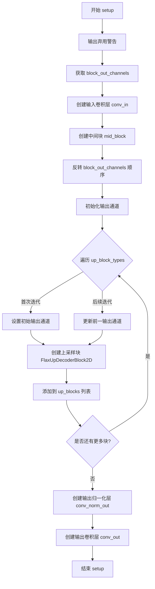

#### 带注释源码

```python
def setup(self):
    """
    FlaxDecoder 的初始化钩子，负责创建解码器所需的所有子模块。
    这是一个延迟初始化方法，在实际使用模型时才会被调用。
    """
    # 输出弃用警告，提醒用户这些 Flax 类将在 Diffusers v1.0.0 中移除
    logger.warning(
        "Flax classes are deprecated and will be removed in Diffusers v1.0.0. We "
        "recommend migrating to PyTorch classes or pinning your version of Diffusers."
    )

    # 获取块输出通道数配置
    block_out_channels = self.block_out_channels

    # ====== 输入层 ======
    # 将潜在表示（latent）转换为第一个解码块的输入
    # 使用最后一个 block_out_channels 作为输入通道数
    self.conv_in = nn.Conv(
        block_out_channels[-1],  # 输入通道数
        kernel_size=(3, 3),      # 3x3 卷积核
        strides=(1, 1),          # 无下采样
        padding=((1, 1), (1, 1)), # 保持空间维度
        dtype=self.dtype,        # 参数数据类型
    )

    # ====== 中间块 ======
    # 创建 UNet 风格的中途块，包含残差连接和注意力机制
    self.mid_block = FlaxUNetMidBlock2D(
        in_channels=block_out_channels[-1],
        resnet_groups=self.norm_num_groups,
        num_attention_heads=None,  # 中间块默认不使用注意力头
        dtype=self.dtype,
    )

    # ====== 上采样块 ======
    # 反转通道数顺序以便从低分辨率到高分辨率进行上采样
    reversed_block_out_channels = list(reversed(block_out_channels))
    output_channel = reversed_block_out_channels[0]  # 初始输出通道
    
    # 存储所有上采样块的列表
    up_blocks = []
    
    # 遍历上块类型，创建对应的上采样解码块
    for i, _ in enumerate(self.up_block_types):
        prev_output_channel = output_channel  # 保存前一层的输出通道
        output_channel = reversed_block_out_channels[i]  # 当前块的输出通道
        
        # 判断是否为最后一个块
        is_final_block = i == len(block_out_channels) - 1

        # 创建上采样解码块
        up_block = FlaxUpDecoderBlock2D(
            in_channels=prev_output_channel,
            out_channels=output_channel,
            num_layers=self.layers_per_block + 1,  # 解码器通常比编码器多一层
            resnet_groups=self.norm_num_groups,
            add_upsample=not is_final_block,  # 最后一块不需要上采样
            dtype=self.dtype,
        )
        up_blocks.append(up_block)
        prev_output_channel = output_channel

    # 保存上采样块列表到模块属性
    self.up_blocks = up_blocks

    # ====== 输出层 ======
    # 最终的归一化和卷积层，将特征图转换为输出图像
    self.conv_norm_out = nn.GroupNorm(
        num_groups=self.norm_num_groups, 
        epsilon=1e-6
    )
    self.conv_out = nn.Conv(
        self.out_channels,        # 输出通道数（通常为3，对应RGB）
        kernel_size=(3, 3),       # 3x3 卷积核
        strides=(1, 1),           # 无下采样
        padding=((1, 1), (1, 1)), # 保持空间维度
        dtype=self.dtype,
    )
```


### `FlaxDecoder.__call__`

FlaxDecoder类的`__call__`方法是VAE（变分自编码器）的解码器实现，负责将潜在空间的表示（latent representation）解码恢复为图像输出。该方法通过初始卷积、中间块处理、上采样块序列以及最终的规范化卷积层，逐步将低维潜在向量上采样回原始图像尺寸。

参数：

- `sample`：`jnp.ndarray`，输入的潜在表示，形状为`(batch_size, height, width, channels)`，通常是编码器输出的潜在向量
- `deterministic`：`bool`，控制是否使用dropout，默认为`True`；当为`True`时禁用dropout以用于推理，为`False`时启用dropout用于训练

返回值：`jnp.ndarray`，解码后的图像样本，形状为`(batch_size, height, width, out_channels)`，其中height和width是上采样后的尺寸

#### 流程图

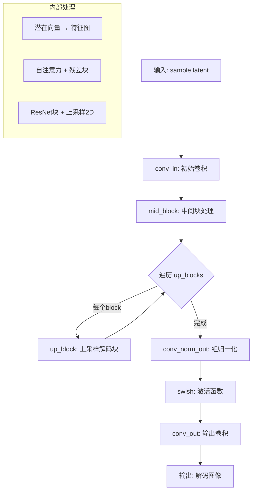

#### 带注释源码

```python
def __call__(self, sample, deterministic: bool = True):
    """
    解码器的前向传播方法，将潜在表示解码为图像
    
    Parameters:
        sample: 输入的潜在表示张量，形状 (batch, height, width, latent_channels)
        deterministic: 布尔值，控制是否使用dropout（True用于推理，False用于训练）
    
    Returns:
        解码后的图像张量，形状 (batch, out_height, out_width, out_channels)
    """
    
    # 步骤1: 将潜在向量通过初始卷积层转换为特征图
    # z to block_in: 将潜在空间向量映射到解码器的初始特征维度
    sample = self.conv_in(sample)

    # 步骤2: 通过中间块（包含自注意力机制和残差连接）
    # middle: 处理最细粒度的特征，进行全局信息建模
    sample = self.mid_block(sample, deterministic=deterministic)

    # 步骤3: 遍历所有上采样解码块，逐步放大特征图尺寸
    # upsampling: 通过上采样块序列逐步恢复空间分辨率
    for block in self.up_blocks:
        sample = block(sample, deterministic=deterministic)

    # 步骤4: 最终的规范化层
    # conv_norm_out: 对特征进行组归一化，稳定训练
    sample = self.conv_norm_out(sample)

    # 步骤5: Swish激活函数
    # nn.swish: 自门控激活函数，公式为 x * sigmoid(x)
    sample = nn.swish(sample)

    # 步骤6: 输出卷积，将特征通道映射到目标输出通道数
    # conv_out: 生成最终的图像表示
    sample = self.conv_out(sample)

    # 返回解码后的图像样本
    return sample
```


### `FlaxDiagonalGaussianDistribution.__init__`

该方法是 `FlaxDiagonalGaussianDistribution` 类的构造函数，用于初始化对角高斯分布（Diagonal Gaussian Distribution）的参数。它接受编码器的输出（包含均值和方差的对数），将其分割为均值（mean）和对数方差（logvar），并计算标准差（std）和方差（var）。当 `deterministic=True` 时，分布退化为零方差，用于推理过程。

参数：

- `parameters`：`jnp.ndarray`，编码器输出的潜在表示，包含均值和对数方差（沿最后一个维度拼接）
- `deterministic`：`bool`，可选，默认为 `False`。当设为 `True` 时，分布的标准差和方差设为零，用于确定性推理

返回值：`None`，该方法为构造函数，不返回任何值

#### 流程图

```mermaid
flowchart TD
    A[开始 __init__] --> B[接收 parameters 和 deterministic 参数]
    B --> C[沿最后一个轴分割 parameters 为 mean 和 logvar 两部分]
    C --> D[将 logvar 裁剪到 [-30.0, 20.0] 范围内]
    D --> E[计算 std = exp(0.5 * logvar)]
    E --> F[计算 var = exp(logvar)]
    F --> G{检查 deterministic?}
    G -->|True| H[将 var 和 std 设为与 mean 形状相同的零张量]
    G -->|False| I[保留计算的 std 和 var]
    H --> I
    I --> J[结束 __init__]
```

#### 带注释源码

```python
def __init__(self, parameters, deterministic=False):
    # 沿最后一个轴（通道维度）将参数分割为均值和对数方差两部分
    # 假设 parameters 的最后一维大小为 2*latent_channels
    self.mean, self.logvar = jnp.split(parameters, 2, axis=-1)
    
    # 对 logvar 进行裁剪，防止数值过小（导致方差接近0）或过大（导致数值不稳定）
    # 裁剪范围参考了原始实现经验值
    self.logvar = jnp.clip(self.logvar, -30.0, 20.0)
    
    # 存储确定性标志，用于后续方法判断是否使用确定性行为
    self.deterministic = deterministic
    
    # 计算标准差：std = exp(0.5 * logvar) = sqrt(exp(logvar)) = sqrt(var)
    self.std = jnp.exp(0.5 * self.logvar)
    
    # 计算方差：var = exp(logvar)
    self.var = jnp.exp(self.logvar)
    
    # 如果是确定性模式（推理时），将方差和标准差设为零
    # 这样采样时只返回均值，不添加随机噪声
    if self.deterministic:
        self.var = self.std = jnp.zeros_like(self.mean)
```


### `FlaxDiagonalGaussianDistribution.sample`

从对角高斯分布中采样一个样本，使用重参数化技巧（reparameterization trick），通过 `mean + std * noise` 的形式实现可导的随机采样。

参数：

- `key`：`jax.random.key`，JAX随机数生成器密钥，用于生成标准正态分布的随机噪声

返回值：`jnp.ndarray`，从对角高斯分布中采样的样本，形状与 `mean` 相同

#### 流程图

```mermaid
flowchart TD
    A[开始 sample 方法] --> B[接收随机密钥 key]
    B --> C[生成标准正态分布噪声: jax.random.normal]
    C --> D[计算采样结果: mean + std * noise]
    D --> E[返回采样样本]
```

#### 带注释源码

```python
def sample(self, key):
    """
    从对角高斯分布中采样一个样本。
    
    使用重参数化技巧 (reparameterization trick): sample = mean + std * noise
    这种形式使得采样过程可导，便于通过反向传播训练模型。
    
    参数:
        key: JAX随机数生成器密钥
        
    返回:
        从分布中采样的样本，形状与self.mean相同
    """
    # 生成与mean形状相同的标准正态分布随机数
    # key: 随机数种子，确保可复现性
    # self.mean.shape: 输出形状
    noise = jax.random.normal(key, self.mean.shape)
    
    # 重参数化采样: mean + std * noise
    # self.mean: 高斯分布的均值
    # self.std: 高斯分布的标准差 (等于 exp(0.5 * logvar))
    return self.mean + self.std * noise
```


### `FlaxDiagonalGaussianDistribution.kl`

该方法计算对角高斯分布之间的KL散度（Kullback-Leibler Divergence），用于变分自编码器（VAE）中的分布正则化。当不提供`other`参数时，计算当前分布与标准正态分布之间的KL散度；当提供`other`参数时，计算两个分布之间的双向KL散度。

参数：

- `other`：`FlaxDiagonalGaussianDistribution`类型或`None`，可选参数，表示另一个高斯分布。如果为`None`，则计算当前分布与标准正态分布的KL散度。

返回值：`jnp.ndarray`类型，返回沿空间维度（通道、高度、宽度）求和后的KL散度值。

#### 流程图

```mermaid
flowchart TD
    A[开始 kl 方法] --> B{self.deterministic 是否为真}
    B -->|是| C[返回 0.0 的数组]
    B -->|否| D{other 是否为 None}
    D -->|是| E[计算与标准正态分布的KL散度<br/>0.5 * sum(mean² + var - 1 - logvar)]
    D -->|否| F[计算两个分布的KL散度<br/>0.5 * sum((mean-mean')²/var' + var/var' - 1 - logvar + logvar')]
    E --> G[沿轴1,2,3求和]
    F --> G
    G --> H[返回KL散度值]
```

#### 带注释源码

```python
def kl(self, other=None):
    """
    计算对角高斯分布之间的KL散度
    
    参数:
        other: 另一个FlaxDiagonalGaussianDistribution实例，
              如果为None则计算与标准正态分布的KL散度
    
    返回:
        KL散度值，沿空间维度求和
    """
    # 如果分布是确定性的（用于推理模式），返回零KL散度
    if self.deterministic:
        return jnp.array([0.0])

    # 如果没有提供other，计算与标准正态分布 N(0,I) 的KL散度
    # KL(N0||N1) = 0.5 * (trace(var1^(-1)*var0) + (mean1-mean0)^2 * var1^(-1) - k + ln(det(var1)/det(var0)))
    # 对于标准正态分布 N(0,I)，简化公式为：
    # KL = 0.5 * sum(mean^2 + var - 1 - log(var))
    if other is None:
        return 0.5 * jnp.sum(
            self.mean**2 + self.var - 1.0 - self.logvar, 
            axis=[1, 2, 3]  # 沿空间维度（高、宽）和通道维度求和
        )

    # 计算两个高斯分布之间的KL散度
    # 使用更通用的公式：
    # KL = 0.5 * sum((mean-mean')^2/var' + var/var' - 1 - log(var) + log(var'))
    return 0.5 * jnp.sum(
        jnp.square(self.mean - other.mean) / other.var +  # (mean - mean')^2 / var'
        self.var / other.var -                              # var / var'
        1.0 -                                                # -1
        self.logvar +                                        # -log(var)
        other.logvar,                                        # +log(var')
        axis=[1, 2, 3]                                       # 沿空间维度求和
    )
```


### `FlaxDiagonalGaussianDistribution.nll`

计算给定样本在 diagonal Gaussian 分布下的负对数似然（Negative Log Likelihood），用于评估分布与样本之间的差异。

参数：

- `sample`：`jnp.ndarray`，要计算负对数似然的样本张量
- `axis`：`list[int]`，默认为 `[1, 2, 3]`，指定在哪些维度上求和

返回值：`jnp.ndarray`，负对数似然值，标量或沿指定轴求和后的结果

#### 流程图

```mermaid
flowchart TD
    A[开始 nll] --> B{self.deterministic?}
    B -->|True| C[返回 jnp.array([0.0])]
    B -->|False| D[计算 logtwopi = log(2π)]
    D --> E[计算 logvar + (sample - mean)² / var]
    E --> F[计算 0.5 * sum(logtwopi + logvar + (sample - mean)² / var, axis=axis)]
    C --> G[结束]
    F --> G
```

#### 带注释源码

```
def nll(self, sample, axis=[1, 2, 3]):
    # 如果处于确定性模式（不进行采样），直接返回零
    if self.deterministic:
        return jnp.array([0.0])

    # 计算 log(2*pi)，用于高斯分布的负对数似然公式
    logtwopi = jnp.log(2.0 * jnp.pi)
    
    # 负对数似然公式: 0.5 * sum(log(2π) + log(var) + (x - mean)² / var)
    # 分解为: 0.5 * sum(log(2π) + logvar + (sample - mean)² / var)
    return 0.5 * jnp.sum(logtwopi + self.logvar + jnp.square(sample - self.mean) / self.var, axis=axis)
```


### `FlaxDiagonalGaussianDistribution.mode`

该方法用于返回对角高斯分布的众数（即均值），在对角高斯分布中，众数等于均值。在变分自编码器（VAE）中，这个方法用于获取潜在空间的确定性表示，而不是通过采样获取随机表示。

参数：
- 该方法无显式参数（仅包含隐式 `self`）

返回值：`jnp.ndarray`，返回分布的均值向量，表示在确定性模式下的最可能采样点。

#### 流程图

```mermaid
flowchart TD
    A[开始 mode] --> B{检查 deterministic 标志}
    B -->|否| C[返回 self.mean]
    B -->|是| C
    C --> D[结束]
```

*注：该方法逻辑极为简洁，仅返回存储的均值。当 `deterministic=True` 时，在 `__init__` 中会将 `self.mean` 初始化为零张量，因此返回的也将是零张量。*

#### 带注释源码

```python
def mode(self):
    """
    返回对角高斯分布的众数（mode）。
    
    在对角高斯分布中，众数等于均值。
    此方法用于获取潜在空间的确定性表示，而非采样获取随机表示。
    
    Returns:
        jnp.ndarray: 分布的均值向量，表示最可能的采样点。
    """
    return self.mean
```


### `FlaxAutoencoderKL.setup`

这是 FlaxAutoencoderKL 类的初始化方法，用于构建 VAE 模型的核心组件（编码器、解码器、量化卷积层等），在模型实例化时自动调用。

参数：
- 无（该方法为类方法，通过 `self` 访问实例属性）

返回值：`None`，该方法没有返回值，仅初始化实例属性

#### 流程图

```mermaid
flowchart TD
    A[开始 setup] --> B[记录弃用警告日志]
    B --> C[创建 FlaxEncoder 编码器实例]
    C --> D[创建 FlaxDecoder 解码器实例]
    D --> E[创建 quant_conv 量化卷积层]
    E --> F[创建 post_quant_conv 后量化卷积层]
    F --> G[结束 setup]
```

#### 带注释源码

```python
def setup(self):
    """
    初始化 FlaxAutoencoderKL 模型的核心组件。
    该方法在模型第一次创建时自动调用，用于构建模型的各层结构。
    """
    # 记录弃用警告：Flax 类将在 Diffusers v1.0.0 中被移除
    logger.warning(
        "Flax classes are deprecated and will be removed in Diffusers v1.0.0. We "
        "recommend migrating to PyTorch classes or pinning your version of Diffusers."
    )

    # 初始化编码器 (Encoder)
    # 将输入图像编码为潜在表示，使用双通道输出 (mean, logvar)
    self.encoder = FlaxEncoder(
        in_channels=self.config.in_channels,          # 输入通道数 (默认3)
        out_channels=self.config.latent_channels,   # 潜在空间通道数 (默认4)
        down_block_types=self.config.down_block_types,   # 下采样块类型
        block_out_channels=self.config.block_out_channels, # 块输出通道数
        layers_per_block=self.config.layers_per_block,   # 每个块的ResNet层数
        act_fn=self.config.act_fn,                  # 激活函数
        norm_num_groups=self.config.norm_num_groups, # 归一化组数
        double_z=True,                               # 双通道输出用于高斯分布
        dtype=self.dtype,                            # 参数数据类型
    )

    # 初始化解码器 (Decoder)
    # 将潜在表示解码为图像
    self.decoder = FlaxDecoder(
        in_channels=self.config.latent_channels,    # 潜在空间通道数
        out_channels=self.config.out_channels,      # 输出通道数
        up_block_types=self.config.up_block_types,  # 上采样块类型
        block_out_channels=self.config.block_out_channels, # 块输出通道数
        layers_per_block=self.config.layers_per_block,   # 每个块的ResNet层数
        norm_num_groups=self.config.norm_num_groups, # 归一化组数
        act_fn=self.config.act_fn,                  # 激活函数
        dtype=self.dtype,                            # 参数数据类型
    )

    # 初始化量化卷积层 (Quantization Convolution)
    # 将编码器输出转换为潜在分布参数 (mean, logvar)
    self.quant_conv = nn.Conv(
        2 * self.config.latent_channels,   # 输出通道数为潜在通道数的2倍 (用于mean和logvar)
        kernel_size=(1, 1),                # 1x1 卷积
        strides=(1, 1),                   # 无步长
        padding="VALID",                  # 无填充
        dtype=self.dtype,                  # 参数数据类型
    )

    # 初始化后量化卷积层 (Post-Quantization Convolution)
    # 在解码前对潜在表示进行预处理
    self.post_quant_conv = nn.Conv(
        self.config.latent_channels,      # 潜在空间通道数
        kernel_size=(1, 1),                # 1x1 卷积
        strides=(1, 1),                   # 无步长
        padding="VALID",                  # 无填充
        dtype=self.dtype,                  # 参数数据类型
    )
```


### `FlaxAutoencoderKL.init_weights`

该方法用于初始化FlaxAutoencoderKL模型的权重参数。它通过创建一个虚拟的输入样本并调用模型的init方法，生成包含所有层权重的参数字典。

参数：

- `rng`：`jax.Array`，JAX随机数生成器密钥，用于生成参数初始化、dropout和采样所需的随机数

返回值：`FrozenDict`，包含模型所有层初始化后的参数字典

#### 流程图

```mermaid
flowchart TD
    A[Start init_weights] --> B[创建sample_shape元组]
    B --> C[创建全零输入样本张量]
    C --> D[将rng拆分为3个子RNG]
    D --> E[构建rngs字典]
    E --> F[调用self.init方法]
    F --> G[提取params参数]
    G --> H[返回FrozenDict]
```

#### 带注释源码

```python
def init_weights(self, rng: jax.Array) -> FrozenDict:
    """
    初始化模型的权重参数。
    
    参数:
        rng: JAX随机数生成器密钥，用于初始化参数、dropout和高斯采样
        
    返回:
        包含所有模型参数的FrozenDict
    """
    # 初始化输入张量的形状
    # 形状为 (batch_size=1, channels, height, width)
    sample_shape = (1, self.in_channels, self.sample_size, self.sample_size)
    
    # 创建全零输入样本，用于触发模型初始化
    sample = jnp.zeros(sample_shape, dtype=jnp.float32)

    # 将随机数生成器拆分为三个子RNG
    # params: 用于参数初始化
    # dropout: 用于dropout层
    # gaussian: 用于高斯分布采样
    params_rng, dropout_rng, gaussian_rng = jax.random.split(rng, 3)
    
    # 构建传递给init方法的rngs字典
    rngs = {"params": params_rng, "dropout": dropout_rng, "gaussian": gaussian_rng}

    # 调用模型的init方法进行参数初始化
    # 返回包含'params'键的字典
    return self.init(rngs, sample)["params"]
```


### `FlaxAutoencoderKL.encode`

该方法实现将输入图像编码为潜在空间中的对角高斯分布。它首先对输入样本进行通道重排（从 NCHW 到 NHWC），通过编码器提取特征，应用量化卷积层生成均值和对数方差，最后构建 `FlaxDiagonalGaussianDistribution` 对象来表示潜在分布。

参数：

- `sample`：`jnp.ndarray`，形状为 `(batch_size, num_channels, height, width)` 的输入图像数据
- `deterministic`：`bool`，控制是否使用确定性（非随机）行为，默认为 `True`
- `return_dict`：`bool`，控制返回值格式，默认为 `True`；若为 `False` 则返回元组

返回值：`FlaxAutoencoderKLOutput` 或 `tuple`，当 `return_dict=True` 时返回包含 `latent_dist` 的 `FlaxAutoencoderKLOutput` 对象，否则返回包含 `FlaxDiagonalGaussianDistribution` 的元组

#### 流程图

```mermaid
flowchart TD
    A[输入 sample NCHW] --> B[jnp.transpose 转换为 NHWC]
    B --> C[encoder 编码特征]
    C --> D[quant_conv 生成矩参数]
    D --> E[FlaxDiagonalGaussianDistribution 分布]
    E --> F{return_dict?}
    F -->|True| G[FlaxAutoencoderKLOutput]
    F -->|False| H[(posterior,)]
```

#### 带注释源码

```python
def encode(self, sample, deterministic: bool = True, return_dict: bool = True):
    """
    将输入样本编码为潜在空间分布

    参数:
        sample: 输入图像，形状为 (batch_size, num_channels, height, width)
        deterministic: 是否使用确定性模式（禁用 dropout 等随机操作）
        return_dict: 是否返回字典格式的结果

    返回:
        FlaxAutoencoderKLOutput 或 tuple
    """
    # 将输入从 NCHW 格式转换为 NHWC 格式（通道最后）
    # 因为 Flax/Linen 默认使用通道最后的布局
    sample = jnp.transpose(sample, (0, 2, 3, 1))

    # 通过编码器网络提取特征
    # encoder 返回原始的卷积特征输出
    hidden_states = self.encoder(sample, deterministic=deterministic)

    # 应用量化卷积层，将特征映射到潜在空间的矩参数
    # 输出通道数为 2 * latent_channels（均值和对数方差）
    moments = self.quant_conv(hidden_states)

    # 根据矩参数创建对角高斯分布对象
    # 该分布支持采样、KL 散度计算等操作
    posterior = FlaxDiagonalGaussianDistribution(moments)

    # 根据 return_dict 参数决定返回格式
    if not return_dict:
        return (posterior,)

    # 返回包含潜在分布的输出对象
    return FlaxAutoencoderKLOutput(latent_dist=posterior)
```


### `FlaxAutoencoderKL.decode`

该方法将潜在的表示向量（latents）解码回原始图像空间，通过后量化卷积层处理潜在向量，然后通过VAE解码器进行上采样和重建，最后将输出从通道最后（NHWC）格式转换回通道最前（NCHW）格式以匹配常见的图像张量布局约定。

参数：

- `latents`：`jnp.ndarray`，形状为`(batch_size, num_channels, height, width)`或`(batch_size, height, width, num_channels)`的潜在表示张量，通常来自编码器的输出
- `deterministic`：`bool`，默认为`True`，控制是否使用dropout等随机操作，设为`True`时为确定性推理
- `return_dict`：`bool`，默认为`True`，控制返回值格式，设为`True`时返回`FlaxDecoderOutput`对象，否则返回元组

返回值：`FlaxDecoderOutput`或`tuple[jnp.ndarray]`，返回包含解码后图像样本的`FlaxDecoderOutput`对象，其中`sample`字段为形状`(batch_size, num_channels, height, width)`的图像张量；若`return_dict=False`，则返回元组`(hidden_states,)`

#### 流程图

```mermaid
flowchart TD
    A[输入: latents 潜在表示] --> B{判断通道位置}
    B -->|NCHW格式| C[jnp.transpose: (0,2,3,1) 转NHWC]
    B -->|已是NHWC格式| D[直接使用]
    C --> E[post_quant_conv: 后量化卷积]
    D --> E
    E --> F[decoder: VAE解码器上采样重建]
    F --> G[jnp.transpose: (0,3,1,2) 转NCHW]
    G --> H{return_dict?}
    H -->|True| I[返回 FlaxDecoderOutput]
    H -->|False| J[返回 tuple]
```

#### 带注释源码

```python
def decode(self, latents, deterministic: bool = True, return_dict: bool = True):
    """
    将潜在表示解码为图像样本。
    
    参数:
        latents: 潜在表示张量，形状为 (batch_size, num_channels, height, width) 或 (batch_size, height, width, num_channels)
        deterministic: 控制是否使用 dropout 等随机操作，True 时为确定性推理
        return_dict: 是否返回字典格式的结果
    """
    # 检查潜在向量的通道维度是否与配置中的 latent_channels 匹配
    # 如果不匹配（说明是 NCHW 格式），则转换为 NHWC 格式（通道最后）以适配 Flax Decoder
    if latents.shape[-1] != self.config.latent_channels:
        latents = jnp.transpose(latents, (0, 2, 3, 1))

    # 通过后量化卷积层处理潜在向量，将潜在空间映射到解码器可处理的特征空间
    # 这是 VAE 解码前的必要转换，用于调整通道数和特征表示
    hidden_states = self.post_quant_conv(latents)
    
    # 通过 VAE 解码器进行上采样和图像重建
    # decoder 包含多个上采样块（UpDecoderBlock2D）和中间注意力块
    # deterministic 参数控制是否在解码过程中使用 dropout
    hidden_states = self.decoder(hidden_states, deterministic=deterministic)

    # 将输出从 NHWC（通道最后）格式转换回 NCHW（通道最前）格式
    # 这是因为大多数图像处理库和模型期望 NCHW 格式的张量
    hidden_states = jnp.transpose(hidden_states, (0, 3, 1, 2))

    # 根据 return_dict 参数决定返回格式
    if not return_dict:
        # 返回元组格式，兼容旧版 API
        return (hidden_states,)

    # 返回结构化的输出对象，包含解码后的图像样本
    return FlaxDecoderOutput(sample=hidden_states)
```


### `FlaxAutoencoderKL.__call__`

该方法是 FlaxAutoencoderKL 模型的前向传播入口，接收图像样本并返回重建样本。它首先将输入编码为潜在空间的后验分布，然后根据 `sample_posterior` 参数决定是从分布中采样还是使用均值，最后将潜在向量解码为重建图像。

参数：

- `sample`：`jnp.ndarray`，输入图像样本，形状为 `(batch_size, num_channels, height, width)`
- `sample_posterior`：`bool`，是否从后验分布中采样，默认为 False（使用均值）
- `deterministic`：`bool`，是否使用确定性模式（禁用 dropout），默认为 True
- `return_dict`：`bool`，是否返回字典格式结果，默认为 True

返回值：`FlaxDecoderOutput` 或元组，如果 `return_dict=True` 返回包含重建样本的 `FlaxDecoderOutput` 对象，否则返回元组 `(sample,)`

#### 流程图

```mermaid
flowchart TD
    A[输入 sample] --> B[encode 方法]
    B --> C[获取 posterior 后验分布]
    C --> D{sample_posterior?}
    D -->|True| E[从后验分布采样]
    D -->|False| F[使用后验分布的均值 mode]
    E --> G[decode 方法]
    F --> G
    G --> H[输出重建样本]
    H --> I{return_dict?}
    I -->|True| J[返回 FlaxDecoderOutput]
    I -->|False| K[返回元组 sample]
```

#### 带注释源码

```python
def __call__(self, sample, sample_posterior=False, deterministic: bool = True, return_dict: bool = True):
    """
    FlaxAutoencoderKL 的前向传播方法，将输入图像编码为潜在表示后再解码为重建图像。
    
    参数:
        sample: 输入图像样本，形状为 (batch_size, num_channels, height, width)
        sample_posterior: 是否从后验分布中采样，True 时使用随机采样，False 时使用均值
        deterministic: 是否使用确定性模式，True 时禁用 dropout
        return_dict: 是否返回字典格式，True 时返回 FlaxDecoderOutput 对象
    
    返回:
        FlaxDecoderOutput 或元组: 重建的图像样本
    """
    # 第一步：将输入样本编码为后验分布
    # encode 方法内部会：encoder -> quant_conv -> FlaxDiagonalGaussianDistribution
    posterior = self.encode(sample, deterministic=deterministic, return_dict=return_dict)
    
    # 第二步：从后验分布获取潜在表示
    if sample_posterior:
        # 创建随机数生成器用于采样
        rng = self.make_rng("gaussian")
        # 从后验分布中随机采样一个潜在向量
        hidden_states = posterior.latent_dist.sample(rng)
    else:
        # 使用后验分布的均值作为潜在向量（确定性模式）
        hidden_states = posterior.latent_dist.mode()
    
    # 第三步：将潜在表示解码为重建图像
    # decode 方法内部会：post_quant_conv -> decoder -> 输出
    sample = self.decode(hidden_states, return_dict=return_dict).sample
    
    # 第四步：根据 return_dict 返回结果
    if not return_dict:
        # 返回元组格式 (sample,)
        return (sample,)
    
    # 返回 FlaxDecoderOutput 对象，包含重建样本
    return FlaxDecoderOutput(sample=sample)
```

## 关键组件


### FlaxAutoencoderKL

主模型类，实现带KL散度损失的VAE，用于编解码潜在表示。支持JAX的JIT编译、自动微分、矢量化等特性。包含编码器、解码器、量化卷积和后量化卷积。

### FlaxEncoder

VAE编码器实现，将输入图像编码为潜在表示。包含输入卷积、多个下采样块、中间块和输出卷积，支持双Z通道输出。

### FlaxDecoder

VAE解码器实现，将潜在表示解码为图像。包含输入卷积、中间块、多个上采样块和输出卷积。

### FlaxDiagonalGaussianDistribution

对角高斯分布类，实现VAE的重参数化技巧。提供sample()采样、kl()计算KL散度、nll()计算负对数似然、mode()返回均值模式。

### FlaxResnetBlock2D

2D ResNet块，包含两个卷积层、组归一化和Dropout。支持nin_shortcut残差连接，使用Swish激活函数。

### FlaxAttentionBlock

基于卷积的多头注意力块，使用GroupNorm和三个Dense层分别计算query、key、value，通过einsum计算注意力权重。

### FlaxDownsample2D

2D下采样层，使用卷积核大小3x3、步长2进行下采样，配合padding处理边界。

### FlaxUpsample2D

2D上采样层，使用jax.image.resize进行最近邻插值上采样，然后通过卷积层。

### FlaxDownEncoderBlock2D

基于ResNet块的编码器块，包含多个ResNet层和可选的下采样层。

### FlaxUpDecoderBlock2D

基于ResNet块的解码器块，包含多个ResNet层和可选的上采样层。

### FlaxUNetMidBlock2D

UNet中间块，交替使用Attention块和ResNet块进行特征处理。

### FlaxDecoderOutput

解码器输出数据类，包含sample样本张量和可选的dtype。

### FlaxAutoencoderKLOutput

自编码器KL输出数据类，包含latent_dist潜在分布（FlaxDiagonalGaussianDistribution）。


## 问题及建议


### 已知问题

-   **整体代码已废弃**: 所有 Flax 类在 `setup()` 方法中都包含相同的弃用警告，说明这些类将在 Diffusers v1.0.0 中被移除，建议迁移到 PyTorch 或固定版本。这是最主要的技术债务。
-   **重复代码 (DRY 原则违反)**: deprecation warning 在所有 12 个类的 `setup()` 方法中完全重复，缺乏代码复用。
-   **未使用的配置参数**: `FlaxEncoder` 和 `FlaxDecoder` 类接收 `act_fn` 参数但在实现中未使用（始终使用 `nn.swish`），导致 API 与文档不一致。
-   **硬编码的魔数**: `FlaxDiagonalGaussianDistribution` 中 `logvar` 的裁剪边界 `-30.0` 和 `20.0` 是硬编码的魔法数字，缺乏配置性或常量定义。
-   **不一致的类设计**: `FlaxDiagonalGaussianDistribution` 是一个普通的 Python 对象而非 `nn.Module`，与其它所有模块设计模式不一致。
-   **缺失的输入验证**: `encode`、`decode` 和 `__call__` 方法没有对输入 `sample` 或 `latents` 的形状、类型进行验证，可能导致隐蔽的运行时错误。
-   **注意力机制非最优实现**: `FlaxAttentionBlock` 手动实现注意力计算（使用 `einsum`），而非使用 Flax 优化的 `nn.multi_head_dot_product_attention`，可能影响性能。
-   **维度转换开销**: `encode` 和 `decode` 方法中进行 CHW 到 HWC 的多次 `jnp.transpose`，在批量推理时可能引入不必要的开销。

### 优化建议

-   **消除重复的弃用警告**: 创建一个基类或 mixin 来统一处理弃用警告，或者使用装饰器模式来减少代码重复。
-   **移除或实现 act_fn**: 如果配置中接收了 `act_fn` 参数，应该在实现中使用它（通过 `nn.act_funcs` 或映射表），或者从接口中移除该参数以避免混淆。
-   **提取魔法数字**: 将 `logvar` 的裁剪边界、缩放因子等提取为类级别常量或配置参数，提高可维护性。
-   **添加输入验证**: 在 `encode`/`decode` 方法入口添加形状和 dtype 检查，提供明确的错误信息而非静默失败或难以调试的错误。
-   **重构注意力模块**: 考虑使用 Flax 提供的 `nn.MultiHeadDotProductAttention` 或确保当前手动实现经过充分的 JIT 优化。
-   **优化维度处理**: 考虑在模型内部统一使用一种数据布局（建议 channels_last 以匹配 Flax/JAX 的惯例），减少反复转置。
-   **统一类设计模式**: 将 `FlaxDiagonalGaussianDistribution` 重构为具有一致接口的模块，或明确文档化其为辅助类而非模型组件。


## 其它


### 设计目标与约束

本模块的设计目标是在JAX/Flax框架下实现一个高效的变分自编码器(VAE)模型，用于将图像编码到潜在空间并从潜在空间解码重建图像。主要约束包括：1) 遵循Diffusers库的接口规范，实现与PyTorch版本的兼容性；2) 支持JAX的JIT编译、自动微分、矢量化等特性；3) 采用通道最后(channel-last)的数据格式以适配Flax Linen的要求；4) 通过FlaxDiagonalGaussianDistribution实现高斯潜在分布建模，支持KL散度损失计算。

### 错误处理与异常设计

代码中的错误处理主要体现在以下几个方面：1) 在FlaxDiagonalGaussianDistribution中对logvar进行裁剪(-30.0到20.0)，防止数值溢出；2) 当deterministic为True时，将方差和标准差设为零，避免在确定性模式下采样；3) decode方法中检查latents的通道数并进行必要的维度转换；4) return_dict参数控制返回格式，提供灵活的API接口；5) 使用Flax的FrozenDict保护参数不被意外修改。

### 数据流与状态机

数据流遵循以下路径：输入图像(sample)首先经过encode方法，通过encoder编码器提取特征，经过quant_conv卷积层产生潜在分布参数，然后实例化为FlaxDiagonalGaussianDistribution对象。在decode路径中，从潜在空间采样或取模式值，经过post_quant_conv处理后通过decoder解码器重建图像。整个过程是无状态的(stateless)，每个前向传播都是独立的计算，deterministic参数控制是否使用dropout。

### 外部依赖与接口契约

本模块依赖以下外部组件：1) flax和flax.linen框架提供神经网络模块定义；2) jax和jax.numpy提供数值计算和自动微分；3) ..configuration_utils中的ConfigMixin和flax_register_to_config用于配置管理；4) ..utils中的BaseOutput和logging用于输出格式和日志记录；5) .modeling_flax_utils中的FlaxModelMixin提供模型加载和保存功能。模块提供encode()和decode()两个主要接口，返回值遵循BaseOutput定义的数据结构。

### 配置管理

模型通过__init__方法的参数进行配置，主要配置项包括：in_channels和out_channels控制输入输出通道数；down_block_types和up_block_types定义编码器和解码器的块类型；block_out_channels指定各块的输出通道数；layers_per_block设置每个块的ResNet层数；act_fn选择激活函数；latent_channels设置潜在空间的通道数；norm_num_groups指定GroupNorm的组数；sample_size定义输入样本尺寸；scaling_factor用于潜在空间的缩放。配置通过FlaxModelMixin的from_pretrained等方法进行加载和保存。

### 版本兼容性与迁移指南

代码中多处包含弃用警告(logger.warning)，提示Flax类将在Diffusers v1.0.0中移除，建议迁移到PyTorch类或固定Diffusers版本。当前版本通过flax_register_to_config装饰器实现配置注册，支持与配置文件的无缝集成。encoder部分强制使用double_z=True以产生均值和方差，而decoder部分忽略此参数。数据格式转换(通道顺序)在encode和decode方法内部自动处理，对用户透明。

### 性能考虑与优化建议

性能优化措施包括：1) 使用Flax的JIT编译加速计算；2) 通过deterministic参数控制dropout，训练和推理可使用相同代码路径；3) FlaxDiagonalGaussianDistribution的采样使用jax.random.normal，支持JAX的伪随机数生成器管理；4) einsum操作实现高效的注意力计算。潜在优化方向：1) 可以添加混合精度训练支持；2) 可以实现pmap进行多设备并行；3) 可以使用xmap进行模型并行。

### 安全性考虑

代码本身不涉及用户输入处理或敏感数据，主要安全性考虑在依赖的配置文件加载和远程模型下载过程中。需要确保from_pretrained加载的配置文件来源可信，避免潜在的代码执行风险。模型的scaling_factor参数应从可信的训练数据集计算得到，防止潜在的数值攻击。

### 使用示例与集成指南

基本使用流程：1) 通过FlaxAutoencoderKL.from_pretrained加载预训练模型；2) 使用encode方法将图像编码为潜在分布；3) 通过采样或取模式值获得潜在向量；4) 使用decode方法从潜在向量重建图像。集成到扩散模型时，latents需要乘以scaling_factor进行缩放以确保单位方差，解码时再除以scaling_factor恢复原始尺度。


    