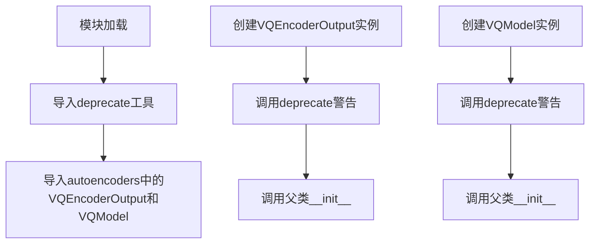
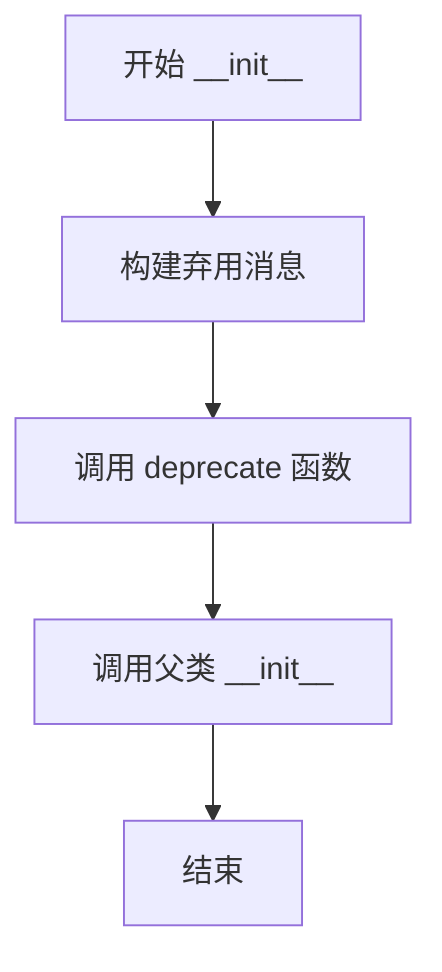
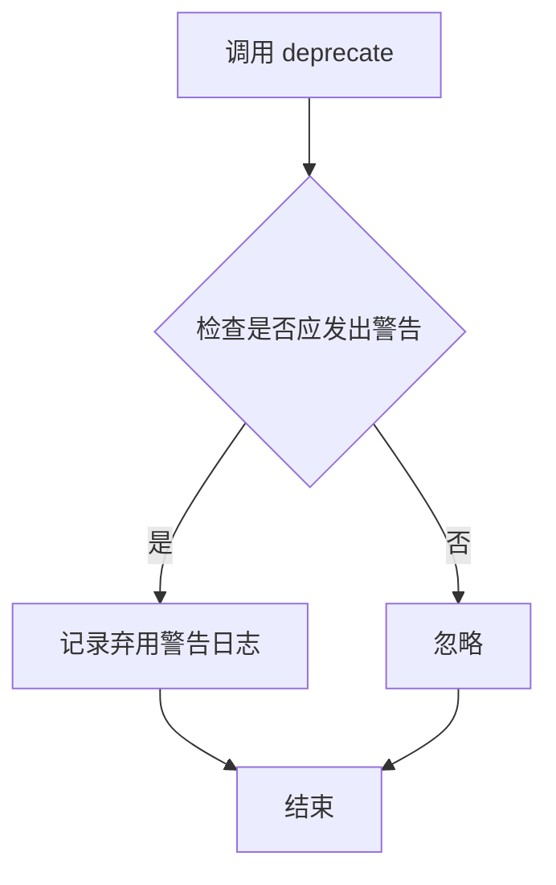

# `diffusers\src\diffusers\models\vq_model.py` 详细设计文档

这是一个向后兼容模块，通过重新导出VQEncoderOutput和VQModel类并添加弃用警告，引导用户从新的路径(diffusers.models.autoencoders.vq_model)导入这些类，避免破坏现有代码。

## 整体流程



## 类结构

```
vq_model (兼容层模块)
└── VQEncoderOutput (继承自autoencoders.vq_model.VQEncoderOutput)
└── VQModel (继承自autoencoders.vq_model.VQModel)
```

## 全局变量及字段


    

## 全局函数及方法


### VQEncoderOutput.__init__

初始化 VQEncoderOutput 类并发出弃用警告，提示用户从 `diffusers.models.vq_model` 导入已弃用，应改用 `diffusers.models.autoencoders.vq_model`。

参数：

- `*args`：`任意类型`，可变位置参数，用于传递父类 VQEncoderOutput 初始化所需的位置参数
- `**kwargs`：`任意类型`，可变关键字参数，用于传递父类 VQEncoderOutput 初始化所需的关键字参数

返回值：无（`None`），构造函数不返回值

#### 流程图



#### 带注释源码

```python
class VQEncoderOutput(VQEncoderOutput):
    def __init__(self, *args, **kwargs):
        # 构建弃用警告消息，告知用户该导入路径将被移除
        deprecation_message = "Importing `VQEncoderOutput` from `diffusers.models.vq_model` is deprecated and this will be removed in a future version. Please use `from diffusers.models.autoencoders.vq_model import VQEncoderOutput`, instead."
        # 调用 deprecate 函数发出弃用警告，版本号为 0.31
        deprecate("VQEncoderOutput", "0.31", deprecation_message)
        # 调用父类构造函数完成初始化
        super().__init__(*args, **kwargs)
```

---

### VQModel.__init__

初始化 VQModel 类并发出弃用警告，提示用户从 `diffusers.models.vq_model` 导入已弃用，应改用 `diffusers.models.autoencoders.vq_model`。

参数：

- `*args`：`任意类型`，可变位置参数，用于传递父类 VQModel 初始化所需的位置参数
- `**kwargs`：`任意类型`，可变关键字参数，用于传递父类 VQModel 初始化所需的关键字参数

返回值：无（`None`），构造函数不返回值

#### 流程图


#### 带注释源码

```python
class VQModel(VQModel):
    def __init__(self, *args, **kwargs):
        # 构建弃用警告消息，告知用户该导入路径将被移除
        deprecation_message = "Importing `VQModel` from `diffusers.models.vq_model` is deprecated and this will be removed in a future version. Please use `from diffusers.models.autoencoders.vq_model import VQModel`, instead."
        # 调用 deprecate 函数发出弃用警告，版本号为 0.31
        deprecate("VQModel", "0.31", deprecation_message)
        # 调用父类构造函数完成初始化
        super().__init__(*args, **kwargs)
```

---

### deprecate（外部依赖函数）

从 `..utils` 模块导入的弃用警告函数，用于向用户发出弃用警告。

参数：

- `name`：`str`，被弃用的类名或函数名
- `version`：`str`，计划移除的版本号
- `deprecation_message`：`str`，详细的弃用说明信息

返回值：无（`None`），该函数主要用于产生警告日志

#### 流程图



#### 带注释源码

```python
# 该函数定义在 diffusers.utils 模块中，此处为调用示例
# 实际源码未在此文件中提供，属于外部依赖
from ..utils import deprecate
```


### `VQEncoderOutput.__init__`

该方法是一个弃用警告包装器，用于重定向旧导入路径到新模块，并在调用时提示用户未来将移除此导入方式，同时将参数传递给父类 `VQEncoderOutput` 进行实际初始化。

参数：

- `*args`：`tuple`，可变位置参数，用于传递给父类的位置参数
- `**kwargs`：`dict`，可变关键字参数，用于传递给父类的关键字参数

返回值：`None`，因为 `__init__` 方法不返回值，仅完成对象初始化

#### 流程图

```mermaid
flowchart TD
    A[开始 __init__] --> B[构建弃用警告消息]
    B --> C[调用 deprecate 函数]
    C --> D[调用 super().__init__ 传递 args 和 kwargs]
    D --> E[结束]
```

#### 带注释源码

```python
class VQEncoderOutput(VQEncoderOutput):
    def __init__(self, *args, **kwargs):
        # 定义弃用警告消息，告知用户从哪个路径导入已弃用以及新路径
        deprecation_message = "Importing `VQEncoderOutput` from `diffusers.models.vq_model` is deprecated and this will be removed in a future version. Please use `from diffusers.models.autoencoders.vq_model import VQEncoderOutput`, instead."
        
        # 调用 deprecate 函数，提示用户该导入方式将在 0.31 版本移除
        deprecate("VQEncoderOutput", "0.31", deprecation_message)
        
        # 将所有参数传递给父类 VQEncoderOutput 进行实际的初始化工作
        super().__init__(*args, **kwargs)
```


### VQModel.__init__

该方法是 VQModel 类的构造函数，作为一个兼容性包装器，用于重定向已弃用的导入路径。它通过调用 `deprecate` 函数向用户发出警告，提示应从 `diffusers.models.autoencoders.vq_model` 导入 VQModel，然后将所有参数传递给父类进行实际初始化。

参数：

- `*args`：`Any`，可变位置参数，用于传递给父类的位置参数
- `**kwargs`：`Any`，可变关键字参数，用于传递给父类的关键字参数

返回值：`None`，构造函数不返回值

#### 流程图

```mermaid
flowchart TD
    A[开始 __init__] --> B[构建弃用警告消息]
    B --> C[调用 deprecate 函数]
    C --> D[调用 super().__init__ 传递参数]
    D --> E[结束]
    
    style B fill:#ff9999
    style C fill:#ff9999
```

#### 带注释源码

```python
class VQModel(VQModel):
    """
    VQModel 类的兼容性包装器，用于处理已弃用的导入路径。
    此类继承自从 .autoencoders.vq_model 导入的 VQModel，
    但会发出弃用警告，提示用户从新路径导入。
    """
    
    def __init__(self, *args, **kwargs):
        """
        初始化 VQModel 实例并发出弃用警告。
        
        参数:
            *args: 可变位置参数，传递给父类 VQModel 的构造函数
            **kwargs: 可变关键字参数，传递给父类 VQModel 的构造函数
        """
        
        # 构建弃用警告消息，告知用户新的导入路径
        deprecation_message = (
            "Importing `VQModel` from `diffusers.models.vq_model` is deprecated "
            "and this will be removed in a future version. "
            "Please use `from diffusers.models.autoencoders.vq_model import VQModel`, "
            "instead."
        )
        
        # 调用 deprecate 函数发出警告，指定版本号为 0.31
        deprecate("VQModel", "0.31", deprecation_message)
        
        # 调用父类的构造函数，传递所有参数以执行实际初始化
        super().__init__(*args, **kwargs)
```

## 关键组件


### VQEncoderOutput

VQEncoderOutput类是一个弃用包装器，用于将旧路径`diffusers.models.vq_model`的导入重定向到新路径`diffusers.models.autoencoders.vq_model`，并在导入时发出弃用警告。

### VQModel

VQModel类是一个弃用包装器，用于将旧路径`diffusers.models.vq_model`的导入重定向到新路径`diffusers.models.autoencoders.vq_model`，并在导入时发出弃用警告。

### deprecate函数

来自`..utils.deprecate`模块的弃用通知函数，用于在用户导入这些已弃用的类时发出警告信息，提示用户应在未来的版本中使用新的导入路径。


## 问题及建议


### 已知问题

-   **自我继承（Self-inheritance）反模式**：`VQEncoderOutput` 继承自 `VQEncoderOutput`（自身），`VQModel` 继承自 `VQModel`（自身）。虽然 Python 允许这种模式，但这是不良实践，可能导致 MRO（方法解析顺序）混乱，且代码语义不清晰。
-   **弃用时机不当**：每次实例化类时都会触发 `deprecate()` 调用，这意味着每次创建对象都会记录弃用警告，而非仅在导入模块时警告一次，可能产生大量重复日志。
-   **缺少迁移路径文档**：弃用消息仅告知用户新导入路径，但未提供版本迁移的具体时间表或迁移脚本链接。
-   **无条件弃用触发**：无论用户是否真正使用被弃用的导入路径，都会执行弃用逻辑，缺乏按需加载的优化。

### 优化建议

-   **使用模块级 `__getattr__` 实现弃用**：通过在模块级别拦截属性访问来发出弃用警告，而非通过类继承，这样可避免自我继承的反模式，并实现"仅警告一次"的效果。
-   **添加迁移辅助工具**：在弃用消息中提供文档链接或迁移脚本，帮助用户快速完成迁移。
-   **优化弃用警告频率**：考虑使用 `warnings.warn()` 并设置 `stacklevel`，或利用 `deprecate` 函数的参数控制警告触发次数（如仅在首次导入时警告）。
-   **明确弃用时间线**：在文档或代码注释中说明 0.31 版本后的具体移除计划，以及是否提供向后兼容的宽限期。

## 其它


### 设计目标与约束

本代码的设计目标是为现有代码提供向后兼容性，通过废弃导入路径的方式引导用户迁移到新的导入位置，同时保持现有代码的功能完整性。设计约束包括必须在0.31版本前完成迁移、废弃警告信息必须清晰明了、不能引入额外的运行时开销。

### 错误处理与异常设计

本代码不涉及复杂的错误处理机制，主要依赖于父类的异常传播。当传入无效参数时，异常会自然向上传递。deprecate函数负责记录废弃日志但不抛出异常，允许程序继续运行以帮助用户完成迁移。

### 数据流与状态机

该模块的数据流非常简单：导入模块 → 类实例化 → 调用deprecate发出警告 → 调用父类初始化 → 完成。整个过程是线性执行的，没有状态机的设计需求。

### 外部依赖与接口契约

主要依赖包括：diffusers.utils模块中的deprecate函数、diffusers.models.autoencoders.vq_model模块中的VQEncoderOutput和VQModel类。接口契约方面，导出的类必须保持与原始类完全相同的签名和行为，确保向后兼容性。

### 性能考虑

该模块的性能开销极低，仅在类实例化时增加一次函数调用用于发出废弃警告。建议在完成迁移后彻底移除此模块以消除这部分开销。

### 安全性考虑

代码本身不涉及用户输入处理、敏感数据操作或网络通信，安全性风险较低。主要关注点是确保废弃警告信息不包含敏感的系统路径或配置信息。

### 可维护性分析

代码结构清晰，废弃逻辑集中管理，便于后续维护。建议维护废弃警告信息的准确性，确保版本号与实际废弃时间保持同步。

### 测试策略

应测试以下场景：类实例化功能正常、废弃警告正确触发、继承的父类功能完整、模块导入路径可正常工作。建议编写单元测试验证废弃警告的触发条件和内容准确性。

### 版本兼容性

本代码明确标记为在0.31版本废弃，需要确保在废弃期间与所有支持的Diffusers版本兼容。父类的接口变更需要及时同步到本模块。

### 配置管理

本模块不涉及运行时配置，所有行为通过代码硬编码定义。废弃版本号"0.31"是关键的配置信息，需要在版本更新时同步修改。

    