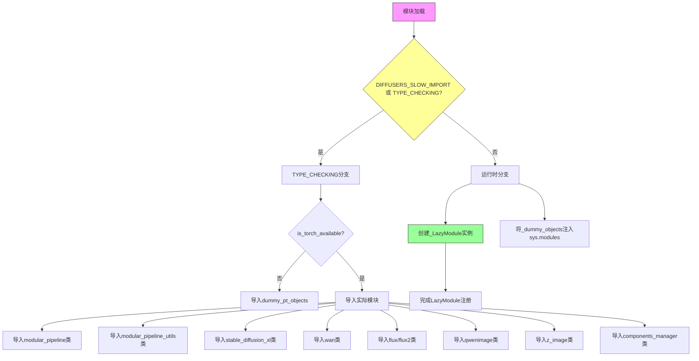
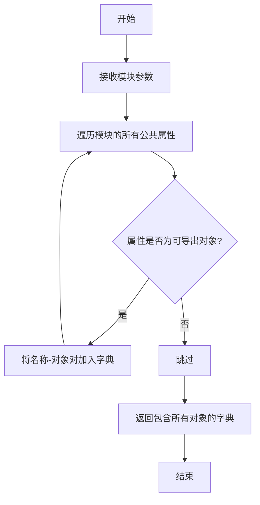
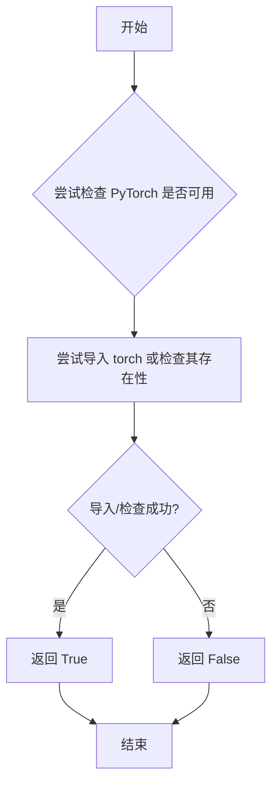
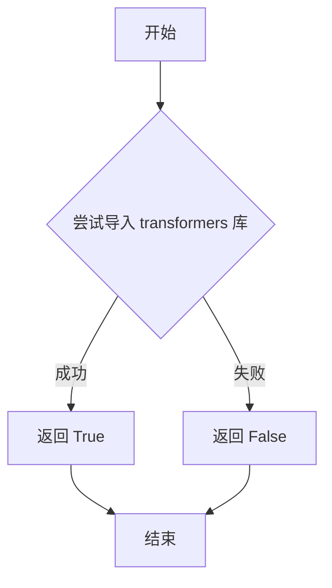
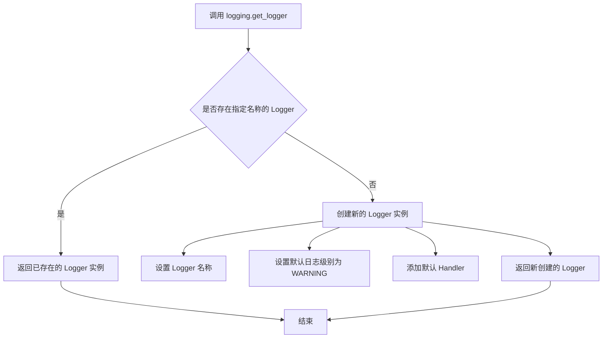

# `diffusers\src\diffusers\modular_pipelines\__init__.py` 详细设计文档

这是一个模块化的Diffusers流水线导入管理模块，通过LazyModule模式实现可选依赖（PyTorch）的延迟加载，并统一导出多种AI生成模型流水线（包括Stable Diffusion XL、Wan、Flux、Flux2、QwenImage、Z-Image等）及组件管理器。

## 整体流程



## 类结构

```
Pipeline模块导入体系
├── _LazyModule (延迟加载机制)
├── modular_pipeline (核心流水线基类)
│   ├── ModularPipeline
│   ├── ModularPipelineBlocks
│   ├── AutoPipelineBlocks
│   ├── SequentialPipelineBlocks
│   ├── ConditionalPipelineBlocks
│   ├── LoopSequentialPipelineBlocks
│   ├── PipelineState
│   └── BlockState
├── modular_pipeline_utils (流水线工具类)
│   ├── ComponentSpec
│   ├── ConfigSpec
│   ├── InputParam
│   ├── OutputParam
│   └── InsertableDict
├── stable_diffusion_xl (SDXL流水线)
│   ├── StableDiffusionXLAutoBlocks
│   └── StableDiffusionXLModularPipeline
├── wan (Wan模型流水线)
│   ├── WanBlocks
│   ├── Wan22Blocks
│   ├── WanModularPipeline
│   ├── Wan22ModularPipeline
│   ├── WanImage2VideoAutoBlocks
│   ├── WanImage2VideoModularPipeline
│   ├── Wan22Image2VideoBlocks
│   └── Wan22Image2VideoModularPipeline
├── flux (Flux流水线)
│   ├── FluxAutoBlocks
│   ├── FluxModularPipeline
│   ├── FluxKontextAutoBlocks
│   └── FluxKontextModularPipeline
├── flux2 (Flux2流水线)
│   ├── Flux2AutoBlocks
│   ├── Flux2KleinAutoBlocks
│   ├── Flux2KleinBaseAutoBlocks
│   ├── Flux2ModularPipeline
│   ├── Flux2KleinModularPipeline
│   └── Flux2KleinBaseModularPipeline
├── qwenimage (Qwen图像流水线)
│   ├── QwenImageAutoBlocks
│   ├── QwenImageModularPipeline
│   ├── QwenImageEditModularPipeline
│   ├── QwenImageEditAutoBlocks
│   ├── QwenImageEditPlusModularPipeline
│   ├── QwenImageEditPlusAutoBlocks
│   ├── QwenImageLayeredModularPipeline
│   └── QwenImageLayeredAutoBlocks
├── z_image (Z-Image流水线)
│   ├── ZImageAutoBlocks
│   └── ZImageModularPipeline
└── components_manager (组件管理器)
    └── ComponentsManager
```

## 全局变量及字段


### `_dummy_objects`
    
存储虚拟对象的字典，用于在可选依赖不可用时提供替代对象

类型：`dict`
    


### `_import_structure`
    
定义模块导入结构的字典，映射模块名到其导出的符号列表

类型：`dict`
    


### `logger`
    
用于记录模块日志的日志记录器

类型：`logging.Logger`
    


    

## 全局函数及方法


### `get_objects_from_module`

从模块中提取所有公共对象（类、函数、变量）并将其转换为字典格式，常用于懒加载模块时获取虚拟对象。

参数：

- `module`：`ModuleType`，要从中提取对象的模块（如此代码中的 `dummy_pt_objects`）

返回值：`Dict[str, Any]`，键为对象名称，值为对象本身的字典，用于批量注册虚拟对象到 `_dummy_objects`

#### 流程图



#### 带注释源码

```python
# 此函数定义在 diffusers.utils 模块中
# 以下为推断的实现逻辑（基于使用场景）

def get_objects_from_module(module: ModuleType) -> Dict[str, Any]:
    """
    从给定模块中提取所有公共对象。
    
    参数:
        module: 要提取对象的模块
        
    返回:
        包含模块中所有公共对象的字典，键为对象名，值为对象本身
    """
    objects = {}
    for name in dir(module):
        if not name.startswith('_'):
            obj = getattr(module, name)
            objects[name] = obj
    return objects


# 在当前文件中的使用示例：
_dummy_objects = {}
# ...
try:
    # ...
    from ..utils import dummy_pt_objects
    _dummy_objects.update(get_objects_from_module(dummy_pt_objects))
except OptionalDependencyNotAvailable:
    # 当 torch 不可用时，导入虚拟对象并注册到当前模块
    pass
```

---

**说明**：由于 `get_objects_from_module` 函数定义在 `..utils` 模块中（`diffusers/utils/__init__.py`），而非当前文件，上述源码为基于使用场景的合理推断。


### `is_torch_available`

该函数用于检查当前环境是否安装了 PyTorch 库。它通常通过尝试导入 PyTorch 来判断，如果导入成功则返回 `True`，否则返回 `False`。在模块中用于条件性地导入 PyTorch 相关的模块和对象，当 PyTorch 不可用时使用虚拟对象（dummy objects）作为占位符。

参数：

- 无参数

返回值：`bool`，返回 `True` 表示 PyTorch 可用，返回 `False` 表示 PyTorch 不可用

#### 流程图



#### 带注释源码

```python
# 该函数定义在 ..utils 模块中，此处为引用
# 用于检查 PyTorch 是否可用

# 在当前文件中的使用方式：
try:
    if not is_torch_available():  # 检查 PyTorch 是否不可用
        raise OptionalDependencyNotAvailable()  # 抛出可选依赖不可用异常
except OptionalDependencyNotAvailable:
    # 如果 PyTorch 不可用，则导入虚拟对象作为占位符
    from ..utils import dummy_pt_objects
    _dummy_objects.update(get_objects_from_module(dummy_pt_objects))
else:
    # 如果 PyTorch 可用，则定义正常的导入结构
    _import_structure["modular_pipeline"] = [
        "ModularPipelineBlocks",
        "ModularPipeline",
        "AutoPipelineBlocks",
        "SequentialPipelineBlocks",
        "ConditionalPipelineBlocks",
        "LoopSequentialPipelineBlocks",
        "PipelineState",
        "BlockState",
    ]
    # ... 其他模块定义
```

**注意**：由于 `is_torch_available` 函数定义在 `..utils` 模块中，当前代码片段仅显示了其被导入和调用的方式，未包含该函数的具体实现源码。该函数通常在 `diffusers` 库的 `src/diffusers/utils` 或类似路径下的 `__init__.py` 或 `import_utils.py` 文件中定义。


### `is_transformers_available`

该函数用于检查 `transformers` 库是否可用，通常通过尝试导入该库来判断其是否已安装。

参数：
- 该函数无参数（部分实现可能接受可选的 `min_version` 参数用于版本检查）

返回值：`bool`，返回 `True` 表示 `transformers` 库可用，返回 `False` 表示不可用

#### 流程图



#### 带注释源码

```python
# 注：该函数定义在 ..utils 模块中，此处仅为导入使用
# 根据 Hugging Face 库惯例，该函数典型实现如下：

def is_transformers_available():
    """
    检查 transformers 库是否已安装且可用。
    
    Returns:
        bool: 如果 transformers 可用返回 True，否则返回 False
    """
    try:
        import transformers
        return True
    except ImportError:
        return False
```

> **注意**：该函数定义在 `..utils` 模块中（`src/diffusers/utils`），当前代码仅展示了导入语句。该函数被用于条件导入逻辑中，判断是否需要加载与 transformers 相关的模块（如 `ModularPipelineBlocks`、`ComponentsManager` 等）。


### `logging.get_logger`

获取或创建一个与指定名称关联的 Logger 实例，用于记录模块级别的日志信息。

参数：

- `name`：`str`，Logger 的名称，通常使用 `__name__` 来表示当前模块的完全限定名，以便于日志分类和过滤

返回值：`Logger`，返回 `logging.Logger` 类型的对象，用于后续的日志记录操作（如 debug、info、warning、error、critical 等方法）

#### 流程图



#### 带注释源码

```python
# 从 typing 模块导入 TYPE_CHECKING，用于类型检查
from typing import TYPE_CHECKING

# 从上级包 utils 导入必要的工具和函数
from ..utils import (
    DIFFUSERS_SLOW_IMPORT,          # 标志：是否启用慢速导入模式
    OptionalDependencyNotAvailable, # 可选依赖不可用异常类
    _LazyModule,                    # 懒加载模块类
    get_objects_from_module,        # 从模块获取对象的函数
    is_torch_available,             # 检查 PyTorch 是否可用的函数
    is_transformers_available,      # 检查 Transformers 是否可用的函数
    logging,                        # Python 标准库 logging 模块
)

# 关键代码：获取当前模块的 Logger 实例
# __name__ 是 Python 内置变量，表示当前模块的完全限定名
# 例如：对于 src/diffusers/__init__.py，__name__ 为 'diffusers'
logger = logging.get_logger(__name__)

# 使用 logger 输出一条警告信息，提示用户这是一个实验性功能
logger.warning(
    "Modular Diffusers is currently an experimental feature under active development. "
    "The API is subject to breaking changes in future releases."
)
```

## 关键组件


### Modular Pipeline 框架

提供模块化的Diffusers Pipeline架构，支持自定义Pipeline块（Blocks）的组合与编排，包括条件Pipeline、顺序Pipeline和循环顺序Pipeline等模式。

### Lazy Loading 机制

使用 `_LazyModule` 实现模块的延迟加载，通过 `DIFFUSERS_SLOW_IMPORT` 控制导入策略，优化启动性能并避免循环依赖。

### Dummy Objects 模式

当可选依赖（如PyTorch）不可用时，通过 `get_objects_from_module` 从 `dummy_pt_objects` 模块加载虚拟对象，确保模块结构完整可用。

### Import Structure 定义

通过 `_import_structure` 字典定义各子模块的导出列表，支持多框架Pipeline的按需导入，包括 Stable Diffusion XL、Wan、Flux、Flux2、QwenImage、Z-Image 等模型架构。

### TYPE_CHECKING 条件导入

在类型检查模式下（`TYPE_CHECKING` 或 `DIFFUSERS_SLOW_IMPORT`）时，直接导入所有类型以支持IDE静态分析和类型推断。

### ComponentsManager 组件管理器

提供Pipeline组件的生命周期管理，负责组件的注册、查找和实例化，支持组件间的依赖注入和状态管理。

### PipelineState 与 BlockState

定义Pipeline和Block级别的状态管理，支持Pipeline执行过程中的状态保存、恢复和传递，用于跟踪和管理Pipeline的执行上下文。

### 多模型架构支持

支持多种Diffusion模型架构的Pipeline，包括 StableDiffusionXLAutoBlocks、WanBlocks、FluxAutoBlocks、Flux2AutoBlocks、QwenImageAutoBlocks、ZImageAutoBlocks 等，实现统一模块化接口。


## 问题及建议


### 已知问题

- **重复的条件检查**：第23-27行和第86-89行存在完全相同的`is_torch_available()`检查代码，造成冗余
- **硬编码的警告消息**：第18-19行的警告消息被硬编码，缺乏国际化支持或可配置性
- **魔法字符串未集中定义**：模块名称如`"modular_pipeline"`、`"flux"`等散落在`_import_structure`字典中，缺乏常量定义
- **空异常处理**：第30-32行的`except`块仅包含注释`# noqa F403`，没有错误处理或降级日志
- **缺乏文档说明**：整个模块缺少文档字符串，未说明模块用途、功能和导出项
- **导入逻辑分散**：导入相关代码分散在try/except/TYPE_CHECKING/else多个分支中，维护成本较高
- **sys.modules直接操作**：第125-129行直接操作`sys.modules`，缺乏抽象，可能导致隐藏的导入顺序问题

### 优化建议

- **提取条件检查逻辑**：将`is_torch_available()`检查封装为函数，避免重复代码
- **集中管理模块名称**：定义常量类或枚举来管理所有模块名称字符串，提高可维护性
- **添加模块文档**：为整个模块和主要导出项添加docstring，说明功能和使用方式
- **改进异常处理**：在空except块中添加适当的日志或降级说明，提高可调试性
- **考虑配置化**：将警告消息、模块映射等提取为配置，支持自定义和国际化


## 其它


### 设计目标与约束

本模块作为Diffusers库的入口模块，采用延迟加载（Lazy Loading）机制实现模块化导入管理。核心设计目标是：1）支持多个扩散模型pipeline的统一入口；2）通过可选依赖机制实现条件导入，提高库的灵活性；3）减少冷启动时的导入开销，仅在实际使用时加载所需模块。约束条件包括：仅支持Python 3.8+环境，需要PyTorch或Transformers库之一可用，模块设计遵循Diffusers库的模块化架构规范。

### 错误处理与异常设计

代码采用分层异常处理策略：1）顶层使用`OptionalDependencyNotAvailable`捕获可选依赖缺失，该异常从`..utils`导入，属于工具类自定义异常；2）通过`try-except`块包裹依赖检查逻辑，确保在依赖不可用时能优雅降级；3）`_dummy_objects`字典用于存储不可用模块的替代对象，防止属性访问时抛出`AttributeError`；4）警告信息通过`logger.warning`输出，提示用户当前使用实验性功能。异常传播路径为：依赖检查失败 → 创建dummy对象 → 模块级别标记 → 运行时返回替代对象。

### 数据流与状态机

模块的数据流遵循以下路径：1）入口阶段：Python解释器加载模块文件，执行顶层代码；2）依赖检查阶段：依次检查PyTorch和Transformers可用性；3）导入结构构建阶段：填充`_import_structure`字典，定义模块导出项；4）延迟绑定阶段：根据`TYPE_CHECKING`或`DIFFUSERS_SLOW_IMPORT`标志决定即时导入或延迟加载；5）模块注册阶段：通过`_LazyModule`将模块注册到`sys.modules`。状态转换由全局变量控制：`_import_structure`（导入结构已定义）→ `_dummy_objects`（存在不可用依赖）→ `sys.modules`注册（模块就绪）。

### 外部依赖与接口契约

本模块依赖以下外部组件：1）`typing.TYPE_CHECKING`：用于类型检查时的静态导入；2）`..utils`模块：提供`_LazyModule`、`OptionalDependencyNotAvailable`、`get_objects_from_module`、`is_torch_available`、`is_transformers_available`、`logging`等工具函数；3）`dummy_pt_objects`：PyTorch不可用时的替代对象集合。模块导出接口契约包括：导出项定义在`_import_structure`字典中，延迟模块通过`_LazyModule.__getattr__`机制按需加载，dummy对象通过`setattr`动态绑定到模块属性。

### 版本兼容性

模块设计考虑了版本兼容性问题：1）通过可选依赖检查机制兼容不同版本的PyTorch和Transformers；2）`TYPE_CHECKING`分支支持IDE和类型检查器的静态分析需求；3）延迟导入模式允许在不重新加载模块的情况下兼容新的子模块；4）`_import_structure`字典的键值对结构便于扩展新pipeline。建议在Python 3.8+、PyTorch 1.9+、Transformers 4.20+环境中使用以获得最佳兼容性。

### 性能考虑

模块在性能方面做了以下优化：1）延迟加载：仅在首次访问时才导入实际模块，减少启动时间；2）dummy对象复用：通过`_dummy_objects`避免重复创建替代对象；3）模块缓存：使用`sys.modules`实现模块级缓存，防止重复加载；4）条件分支：利用`TYPE_CHECKING`标志避免生产环境的类型检查开销。潜在优化空间包括：预取机制（prefetch）、并行导入、模块粒度调整等。

### 安全考虑

模块在安全方面采取以下措施：1）使用相对导入（from ..utils）避免路径遍历风险；2）通过`__all__`或`_import_structure`显式控制导出项，防止内部实现暴露；3）实验性功能警告通过logger输出，不影响正常执行流程；4）模块级警告提示用户API可能存在破坏性变更。当前未发现明显安全风险，但建议在生产环境使用前验证依赖版本。

### 测试策略

建议为该模块设计以下测试用例：1）依赖可用性测试：验证在PyTorch/Transformers可用时的正常导入流程；2）依赖缺失测试：模拟可选依赖不可用场景，验证dummy对象正确返回；3）延迟加载测试：验证首次访问时才触发实际导入；4）模块导出测试：验证`_import_structure`与实际导出项一致；5）类型检查测试：在`TYPE_CHECKING=True`环境下验证类型注解可用性。测试覆盖应包括正常路径、异常路径和边界条件。

### 部署注意事项

部署时需注意：1）确保目标环境已安装必要的可选依赖（PyTorch或Transformers至少之一）；2）对于打包应用，需将子模块（modular_pipeline、flux、wan等）一并打包；3）延迟加载机制可能导致首次调用时存在轻微延迟，建议在应用启动时预热；4）实验性功能警告属于正常行为，不影响功能使用；5）部署前应验证Python版本和依赖库版本的兼容性矩阵。

### 配置与扩展性

模块提供良好的扩展性支持：1）`_import_structure`字典结构化定义导出项，便于添加新pipeline；2）`_dummy_objects`机制支持为新依赖添加替代对象；3）子模块采用统一的命名规范（如ModularPipeline、AutoBlocks），便于扩展；4）组件管理器（ComponentsManager）支持动态组件注册。扩展新pipeline需：1）在相应子模块中实现pipeline类；2）在`_import_structure`中添加导出项；3）可选添加dummy对象用于依赖降级。

### 日志与监控

模块使用标准logging机制：1）通过`logger = logging.get_logger(__name__)`获取模块级logger；2）WARNING级别日志用于提示实验性功能状态；3）未实现DEBUG或INFO级别的详细日志，属于轻量级设计。监控建议：可扩展添加导入耗时统计、依赖可用性检测、模块访问频率监控等运维相关功能。

### 文档与注释

当前代码注释较为简洁，主要包含：1）模块级别注释说明实验性状态；2）导入结构注释标记来源库/框架；3）代码内注释标记特定用途（如# noqa F403忽略lint警告）。建议补充：API变更历史、子模块架构图、使用示例、最佳实践指南等文档内容。


    