# `diffusers\src\diffusers\modular_pipelines\components_manager.py` 详细设计文档

这是一个用于管理diffusers模型组件（UNet、VAE、文本编码器等）的核心系统，提供组件注册、追踪、重用、自动CPU卸载和内存管理功能。通过CustomOffloadHook和AutoOffloadStrategy实现动态模型加载和卸载，优化GPU内存使用。

## 整体流程

```mermaid
graph TD
    A[ComponentsManager初始化] --> B[添加组件: add(name, component, collection)]
    B --> C{检查重复组件}
    C -->|是| D[警告并复用现有组件]
    C -->|否| E[添加到components字典]
    E --> F{启用自动CPU卸载?}
    F -->|是| G[enable_auto_cpu_offload]
    F -->|否| H[等待其他操作]
    G --> I[创建CustomOffloadHook]
    I --> J[关联所有hooks互相引用]
    J --> K[执行前向传播时]
    K --> L{内存充足?}
    L -->|是| M[保持当前模型在GPU]
    L -->|否| N[AutoOffloadStrategy搜索最佳卸载组合]
    N --> O[卸载最小化模型组合释放足够内存]
    M --> P[执行forward]
    O --> P
```

## 类结构

```
ModelHook (基类 - 抽象)
├── CustomOffloadHook (核心卸载Hook)
│   └── 继承自ModelHook
├── UserCustomOffloadHook (包装类)
└── ComponentsManager (组件管理器)
    └── AutoOffloadStrategy (卸载策略)
```

## 全局变量及字段


### `logger`
    
模块级日志记录器

类型：`logging.Logger`
    


### `CustomOffloadHook.no_grad`
    
类变量，是否禁用梯度计算

类型：`bool`
    


### `CustomOffloadHook.execution_device`
    
执行设备，用于运行模型

类型：`torch.device`
    


### `CustomOffloadHook.other_hooks`
    
其他需要考虑的hooks列表，用于协同卸载

类型：`list[UserCustomOffloadHook] | None`
    


### `CustomOffloadHook.offload_strategy`
    
自动卸载策略实例

类型：`AutoOffloadStrategy | None`
    


### `CustomOffloadHook.model_id`
    
模型标识符

类型：`str | None`
    


### `UserCustomOffloadHook.model_id`
    
模型标识符

类型：`str`
    


### `UserCustomOffloadHook.model`
    
模型实例

类型：`torch.nn.Module`
    


### `UserCustomOffloadHook.hook`
    
关联的CustomOffloadHook实例

类型：`CustomOffloadHook`
    


### `AutoOffloadStrategy.memory_reserve_margin`
    
保留内存边距，用于避免OOM

类型：`int`
    


### `ComponentsManager.components`
    
组件存储，键为组件ID，值为组件对象

类型：`OrderedDict[str, Any]`
    


### `ComponentsManager.added_time`
    
记录组件添加时间

类型：`OrderedDict[str, float]`
    


### `ComponentsManager.collections`
    
集合管理，集合名到组件ID集合的映射

类型：`OrderedDict[str, set[str]]`
    


### `ComponentsManager.model_hooks`
    
模型hooks列表，用于自动卸载管理

类型：`list[UserCustomOffloadHook] | None`
    


### `ComponentsManager._auto_offload_enabled`
    
自动CPU卸载开关状态

类型：`bool`
    


### `ComponentsManager._available_info_fields`
    
可用信息字段列表，定义组件可查询的元数据字段

类型：`list[str]`
    
    

## 全局函数及方法


### `custom_offload_with_hook`

创建并返回一个 `UserCustomOffloadHook` 实例，该实例封装了 `CustomOffloadHook` 并将其附加到指定的模型上，用于管理模型在 CPU 和计算设备之间的自动卸载。

参数：

- `model_id`：`str`，模型的唯一标识符，用于追踪和日志记录
- `model`：`torch.nn.Module`，需要附加卸载 hook 的 PyTorch 模型
- `execution_device`：`str | int | torch.device | None`，模型执行的目标设备，默认为 `None`（将使用 `PartialState().default_device`）
- `offload_strategy`：`AutoOffloadStrategy | None`，自动卸载策略实例，用于在内存不足时决定哪些模型需要卸载到 CPU

返回值：`UserCustomOffloadHook`，封装了模型、hook 和 model_id 的用户自定义 hook 对象，可用于后续的挂载、卸载和移除操作

#### 流程图

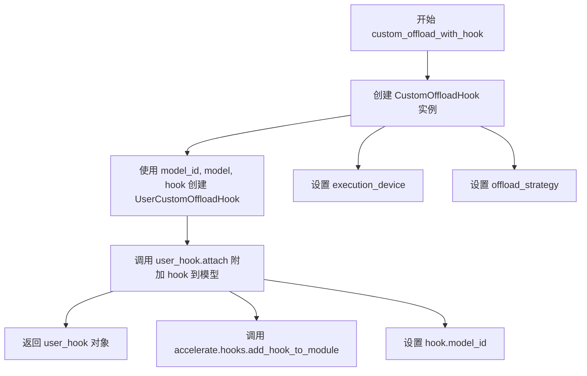

#### 带注释源码

```python
def custom_offload_with_hook(
    model_id: str,
    model: torch.nn.Module,
    execution_device: str | int | torch.device = None,
    offload_strategy: "AutoOffloadStrategy" | None = None,
):
    """
    创建并返回一个 UserCustomOffloadHook 实例，用于管理模型的自动卸载。
    
    该函数是工厂函数，用于创建 CustomOffloadHook 并将其附加到指定的模型上。
    它简化了将自定义卸载 hook 集成到模型中的过程。
    
    参数:
        model_id: 模型的唯一标识符，用于追踪和日志记录
        model: 需要附加卸载 hook 的 PyTorch 模型
        execution_device: 模型执行的目标设备，如果为 None 则使用默认设备
        offload_strategy: 自动卸载策略实例，用于内存管理
    
    返回:
        UserCustomOffloadHook: 封装了模型和 hook 的对象
    """
    # 第一步：创建 CustomOffloadHook 实例
    # 初始化 hook，传入执行设备和卸载策略
    hook = CustomOffloadHook(
        execution_device=execution_device,
        offload_strategy=offload_strategy
    )
    
    # 第二步：创建 UserCustomOffloadHook
    # 将模型、hook 和 model_id 封装在一起，提供更友好的 API
    user_hook = UserCustomOffloadHook(
        model_id=model_id,
        model=model,
        hook=hook
    )
    
    # 第三步：将 hook 附加到模型上
    # 调用 attach 方法，使用 accelerate 的 add_hook_to_module 将 hook 注册到模型
    user_hook.attach()
    
    # 返回封装后的 user_hook 对象，供后续操作使用
    return user_hook
```


### `summarize_dict_by_value_and_parts`

该函数是一个工具函数，用于将字典中具有相同值的键按公共前缀进行聚合汇总。它首先将字典按键值分组（将列表转换为元组以使其可哈希），然后对每个分组找出最短的公共前缀（基于点分隔符），最终返回一个以公共前缀为键、共享值为值的新字典。

参数：

- `d`：`dict[str, Any]`，输入字典，键为点分隔的字符串，值可以是任意类型（但同一个键的值必须可比较）

返回值：`dict[str, Any]`，汇总后的字典，键为最短公共前缀，值为共享的值

#### 流程图

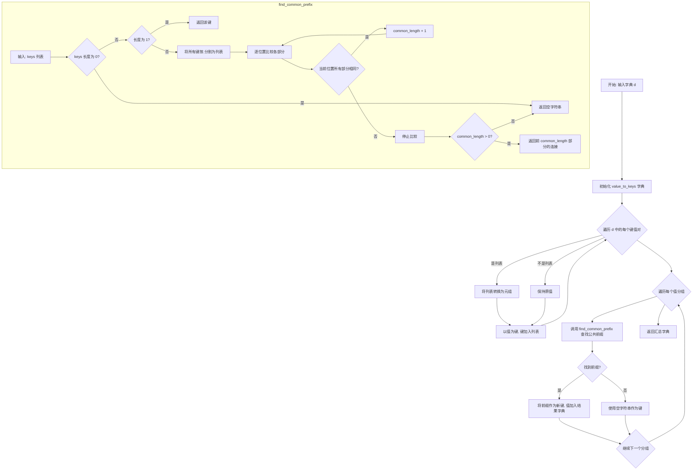

#### 带注释源码

```
def summarize_dict_by_value_and_parts(d: dict[str, Any]) -> dict[str, Any]:
    """Summarizes a dictionary by finding common prefixes that share the same value.

    For a dictionary with dot-separated keys like: {
        'down_blocks.1.attentions.1.transformer_blocks.0.attn2.processor': [0.6],
        'down_blocks.1.attentions.1.transformer_blocks.1.attn2.processor': [0.6],
        'up_blocks.1.attentions.0.transformer_blocks.0.attn2.processor': [0.3],
    }

    Returns a dictionary where keys are the shortest common prefixes and values are their shared values: {
        'down_blocks': [0.6], 'up_blocks': [0.3]
    }
    """
    # 第一步：按值分组 - 将列表转换为元组以使其可哈希
    # 这样具有相同值的键会被归类到同一组
    value_to_keys = {}
    for key, value in d.items():
        # 如果值是列表，转换为元组（列表不可哈希）
        value_tuple = tuple(value) if isinstance(value, list) else value
        if value_tuple not in value_to_keys:
            value_to_keys[value_tuple] = []
        value_to_keys[value_tuple].append(key)

    # 内部函数：查找一组点分隔键的最短公共前缀
    def find_common_prefix(keys: list[str]) -> str:
        """Find the shortest common prefix among a list of dot-separated keys."""
        # 空列表返回空字符串
        if not keys:
            return ""
        # 单个键直接返回
        if len(keys) == 1:
            return keys[0]

        # 将所有键按 "." 分割成部分列表
        # 例如: ['a.b.c', 'a.b.d'] -> [['a', 'b', 'c'], ['a', 'b', 'd']]
        key_parts = [k.split(".") for k in keys]

        # 找出有多少个初始部分是相同的
        common_length = 0
        # zip(*) 将列表按位置分组: ('a','a'), ('b','b'), ('c','d')
        for parts in zip(*key_parts):
            # 如果该位置所有部分相同（即集合长度为1）
            if len(set(parts)) == 1:
                common_length += 1
            else:
                break

        # 如果没有任何公共部分，返回空字符串
        if common_length == 0:
            return ""

        # 返回公共前缀（取前 common_length 个部分并用 "." 连接）
        return ".".join(key_parts[0][:common_length])

    # 第二步：为每个值分组创建汇总字典
    summary = {}
    for value_tuple, keys in value_to_keys.items():
        # 查找该组键的公共前缀
        prefix = find_common_prefix(keys)
        if prefix:  # 只有找到公共前缀时才添加
            # 将元组转换回列表（如果原始输入是列表）
            value = list(value_tuple) if isinstance(d[keys[0]], list) else value_tuple
            summary[prefix] = value
        else:
            # 如果没有公共前缀，使用空字符串作为键
            summary[""] = value_tuple

    return summary
```


### `CustomOffloadHook.__init__`

该方法是 `CustomOffloadHook` 类的构造函数，用于初始化模型卸载钩子的核心属性。它接收执行设备、其他钩子列表和卸载策略作为参数，并设置默认的执行设备（当未指定时）。

参数：

-  `execution_device`：`str | int | torch.device | None`，执行设备，用于运行模型前向传播。如果为 `None`，则自动获取 `PartialState().default_device`（优先 MPS，其次 GPU 0，最后 CPU）
-  `other_hooks`：`list["UserCustomOffloadHook"] | None`，需要协同卸载的其他钩子列表，用于在当前模型加载时将其他模型卸载到 CPU 以释放显存
-  `offload_strategy`：`"AutoOffloadStrategy" | None`，自动卸载策略实例，用于根据设备内存情况动态决定需要卸载的模型组合

返回值：无（`None`），构造函数不返回值，仅初始化实例属性

#### 流程图

```mermaid
flowchart TD
    A[开始 __init__] --> B{execution_device is not None?}
    B -->|Yes| C[使用传入的 execution_device]
    B -->|No| D[调用 PartialState().default_device 获取默认设备]
    D --> C
    C --> E[设置 self.execution_device]
    E --> F[设置 self.other_hooks = other_hooks]
    F --> G[设置 self.offload_strategy = offload_strategy]
    G --> H[设置 self.model_id = None]
    H --> I[结束 __init__]
```

#### 带注释源码

```python
def __init__(
    self,
    execution_device: str | int | torch.device | None = None,
    other_hooks: list["UserCustomOffloadHook"] | None = None,
    offload_strategy: "AutoOffloadStrategy" | None = None,
):
    """
    初始化 CustomOffloadHook 实例。
    
    Args:
        execution_device: 模型执行的目标设备，默认为 PartialState 的默认设备
        other_hooks: 需要协同管理的其他卸载钩子列表
        offload_strategy: 内存感知的自动卸载策略
    """
    # 如果未指定执行设备，则从 PartialState 获取默认设备（自动选择 MPS/GPU/CPU）
    self.execution_device = execution_device if execution_device is not None else PartialState().default_device
    
    # 存储其他需要协同卸载的钩子引用
    self.other_hooks = other_hooks
    
    # 存储自动卸载策略实例（用于动态计算需要卸载的模型）
    self.offload_strategy = offload_strategy
    
    # 初始化模型 ID（将在 attach 时被设置）
    self.model_id = None
```


### `CustomOffloadHook.set_strategy`

设置自定义卸载策略，用于在模型执行过程中自动管理模型在设备和CPU之间的迁移。

参数：

- `offload_strategy`：`AutoOffloadStrategy`，要设置的自动卸载策略对象，用于决定何时以及如何将模型从设备卸载到CPU

返回值：`None`，无返回值（隐式返回 None）

#### 流程图

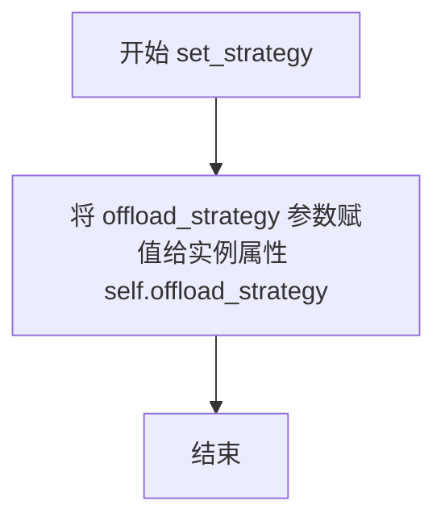

#### 带注释源码

```python
def set_strategy(self, offload_strategy: "AutoOffloadStrategy"):
    """
    设置自动卸载策略。
    
    Args:
        offload_strategy: AutoOffloadStrategy 实例，用于在模型前向传播时
                         自动管理模型在执行设备和CPU之间的迁移
    """
    self.offload_strategy = offload_strategy
```


### `CustomOffloadHook.add_other_hook`

该方法用于向待卸载的钩子列表中添加一个新的钩子，以便在模型前向传播时可以考虑将该钩子关联的模型卸载到CPU以释放显存。

参数：

- `hook`：`UserCustomOffloadHook`，要添加到待卸载钩子列表中的钩子对象

返回值：`None`，无返回值，仅修改内部状态

#### 流程图

```mermaid
flowchart TD
    A[开始 add_other_hook] --> B{self.other_hooks is None?}
    B -->|是| C[初始化 self.other_hooks = []]
    B -->|否| D[跳过初始化]
    C --> E[将 hook 添加到 self.other_hooks 列表]
    D --> E
    E --> F[结束]
```

#### 带注释源码

```python
def add_other_hook(self, hook: "UserCustomOffloadHook"):
    """
    Add a hook to the list of hooks to consider for offloading.
    """
    # 如果 other_hooks 列表为空或未初始化，则创建一个新的空列表
    if self.other_hooks is None:
        self.other_hooks = []
    
    # 将传入的 hook 对象添加到待卸载钩子列表中
    self.other_hooks.append(hook)
```


### `CustomOffloadHook.init_hook`

该方法是 `CustomOffloadHook` 类的初始化钩子方法，用于将传入的模块移动到 CPU 设备上。这是模型卸载流程的基础操作，确保模型在初始状态下位于 CPU 内存中，以便后续根据需要动态加载到执行设备。

参数：

- `module`：`torch.nn.Module`，需要初始化并卸载到 CPU 的 PyTorch 模块

返回值：`torch.nn.Module`，返回已移动到 CPU 的模块对象

#### 流程图

```mermaid
flowchart TD
    A[接收 module 参数] --> B{module 是否有效}
    B -->|是| C[调用 module.to&#40;'cpu'&#41;]
    B -->|否| D[返回 None 或原 module]
    C --> E[返回移动到 CPU 后的 module]
```

#### 带注释源码

```python
def init_hook(self, module):
    """
    初始化钩子，将模块卸载到 CPU。
    
    此方法在模型首次注册或需要卸载时调用，确保模型位于 CPU 上以释放 GPU 内存。
    它是 CustomOffloadHook 钩子系统的核心组成部分，用于管理模型的设备状态。
    
    Args:
        module (torch.nn.Module): 需要移动到 CPU 的 PyTorch 模块
        
    Returns:
        torch.nn.Module: 已移动到 CPU 的模块
    """
    return module.to("cpu")  # 将模块的参数和缓冲区移动到 CPU 设备
```


### `CustomOffloadHook.pre_forward`

该方法在模型前向传播前被调用，负责确保模型及其输入数据位于指定的执行设备上，并根据内存策略将其他模型从设备卸载到CPU。

参数：

- `module`：`torch.nn.Module`，当前要执行前向传播的模型模块
- `*args`：可变位置参数，包含传递给模型前向传播的位置参数
- `**kwargs`：可变关键字参数，包含传递给模型前向传播的关键字参数

返回值：`tuple`，返回两个元素——第一个是将参数（args）移动到执行设备后的元组，第二个是将关键字参数（kwargs）移动到执行设备后的字典

#### 流程图

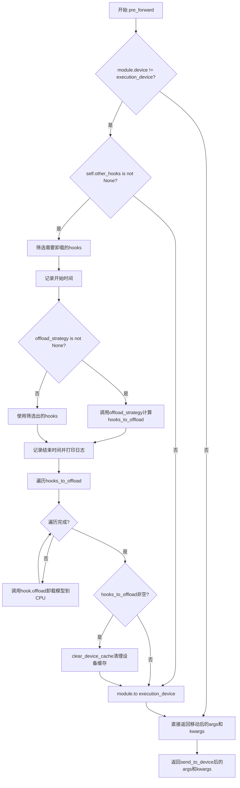

#### 带注释源码

```python
def pre_forward(self, module, *args, **kwargs):
    """
    在模型前向传播前执行的钩子方法，确保模型和输入数据在执行设备上，
    并根据内存策略卸载其他模型
    """
    # 检查模块当前设备是否与目标执行设备不同
    if module.device != self.execution_device:
        # 如果存在其他关联的钩子，需要处理模型卸载
        if self.other_hooks is not None:
            # 筛选出当前在执行设备上的其他钩子（需要卸载的）
            hooks_to_offload = [hook for hook in self.other_hooks if hook.model.device == self.execution_device]
            
            # 记录策略应用开始时间
            start_time = time.perf_counter()
            
            # 如果定义了卸载策略，使用策略来确定需要卸载哪些模型
            if self.offload_strategy is not None:
                hooks_to_offload = self.offload_strategy(
                    hooks=hooks_to_offload,
                    model_id=self.model_id,
                    model=module,
                    execution_device=self.execution_device,
                )
            
            # 记录策略应用结束时间
            end_time = time.perf_counter()
            
            # 打印策略应用耗时日志
            logger.info(
                f" time taken to apply offload strategy for {self.model_id}: {(end_time - start_time):.2f} seconds"
            )

            # 遍历需要卸载的钩子，执行卸载操作
            for hook in hooks_to_offload:
                logger.info(
                    f"moving {self.model_id} to {self.execution_device}, offloading {hook.model_id} to cpu"
                )
                hook.offload()

            # 如果有模型被卸载，清理设备缓存
            if hooks_to_offload:
                clear_device_cache()
        
        # 将当前模块移动到执行设备
        module.to(self.execution_device)
    
    # 将输入参数和关键字参数移动到执行设备并返回
    return send_to_device(args, self.execution_device), send_to_device(kwargs, self.execution_device)
```


### `UserCustomOffloadHook.__init__`

该方法用于初始化 `UserCustomOffloadHook` 类的实例，将模型ID、模型实例和自定义卸载钩子关联起来，形成一个方便管理和调用的单元。

参数：

- `model_id`：`str`，模型的唯一标识符，用于在组件管理器中追踪和识别模型
- `model`：`torch.nn.Module`，待管理的 PyTorch 模型实例
- `hook`：`CustomOffloadHook`，实际执行设备切换和内存卸载的钩子实例

返回值：`None`，该方法为构造函数，不返回任何值

#### 流程图

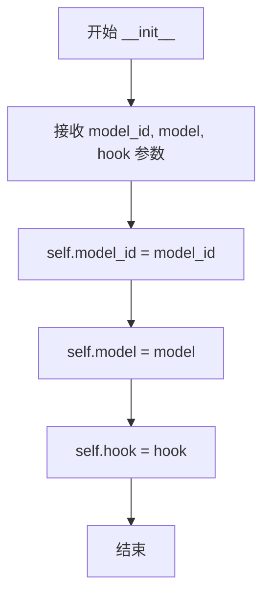

#### 带注释源码

```python
def __init__(self, model_id, model, hook):
    """
    Initialize the UserCustomOffloadHook with a model and its associated hook.
    
    This constructor creates a convenient wrapper that groups together:
    - A model identifier (model_id) for tracking
    - The actual PyTorch model (model)
    - A CustomOffloadHook instance (hook) for managing device placement
    
    Args:
        model_id: Unique identifier for the model
        model: The PyTorch nn.Module to be managed
        hook: The CustomOffloadHook instance that handles offloading logic
    """
    self.model_id = model_id      # Store the model identifier for tracking
    self.model = model             # Store reference to the model
    self.hook = hook               # Store the offload hook for later use
```


### `UserCustomOffloadHook.offload`

该方法是一个简单的卸载操作，通过调用内部 hook 的 `init_hook` 方法将关联的模型从当前设备移动到 CPU 内存，以释放 GPU 显存资源。

参数： 无

返回值：`None`，无返回值

#### 流程图

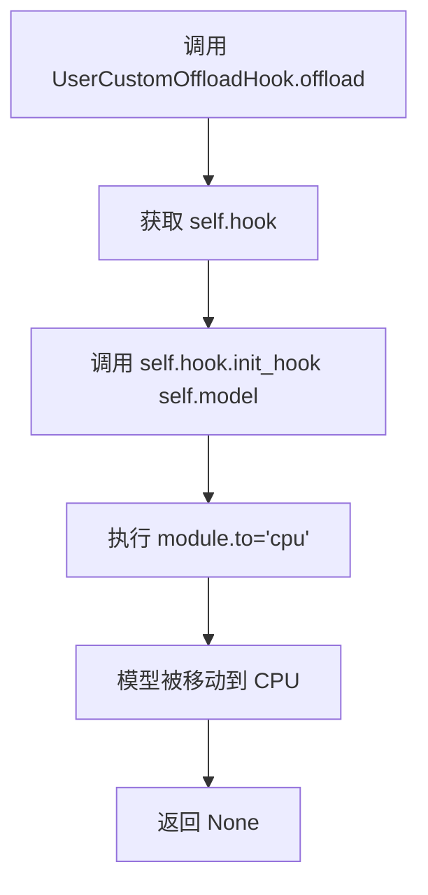

#### 带注释源码

```python
def offload(self):
    """
    将模型卸载到 CPU。
    
    该方法调用内部 CustomOffloadHook 的 init_hook 方法，
    将模型从当前设备移动到 CPU，以释放设备显存。
    """
    # 调用 hook 的 init_hook 方法，将模型移动到 CPU
    # init_hook 在 CustomOffloadHook 中定义为: return module.to("cpu")
    self.hook.init_hook(self.model)
```


### `UserCustomOffloadHook.attach`

将 `CustomOffloadHook` 钩子附加到模型上，使模型能够在需要时自动执行加载和卸载操作。

参数：无（仅包含隐式参数 `self`）

返回值：`None`，无返回值

#### 流程图

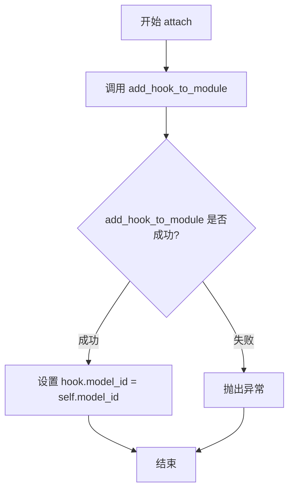

#### 带注释源码

```python
def attach(self):
    """
    将当前实例持有的 CustomOffloadHook 钩子附加到关联的模型上。
    该操作使得模型在前向传播时能够自动被移动到执行设备，并在需要时卸载到 CPU。
    """
    # 调用 accelerate 库的函数将 hook 添加到模块中
    # 这会在模块的前向传播前后注入自定义逻辑
    add_hook_to_module(self.model, self.hook)
    
    # 更新 hook 的 model_id 属性，以便后续跟踪和管理
    self.hook.model_id = self.model_id
```


### `UserCustomOffloadHook.remove`

该方法用于从模型模块中完全移除已附加的自定义卸载钩子，清理模型与钩子之间的关联关系。

参数：无

返回值：`None`，无返回值

#### 流程图

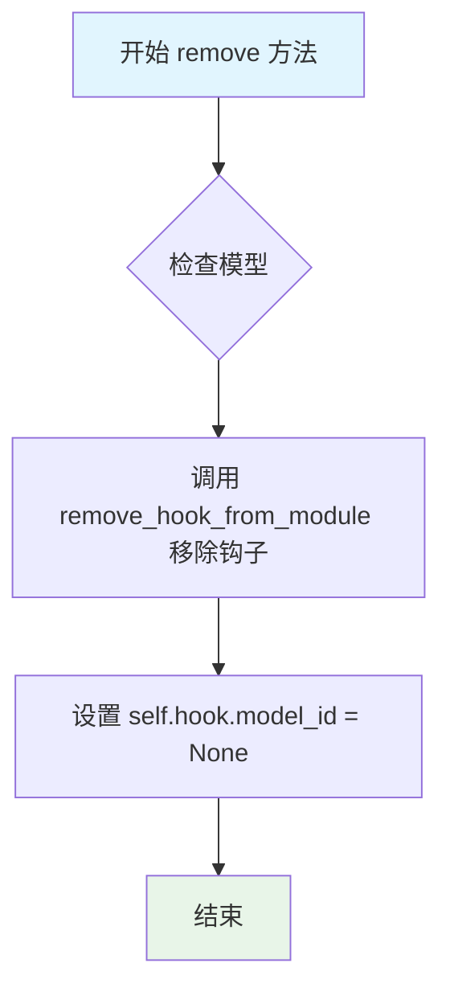

#### 带注释源码

```python
def remove(self):
    """
    完全移除与该 UserCustomOffloadHook 关联的卸载钩子。
    
    此方法执行两个关键操作：
    1. 从模型模块中移除已附加的 accelerate 钩子
    2. 清除钩子内部维护的 model_id 标识
    """
    # 使用 accelerate 库的 remove_hook_from_module 函数
    # 从 self.model 中完全移除之前通过 attach() 方法添加的钩子
    # 这一步会清理模块上所有相关的 hook 注册信息
    remove_hook_from_module(self.model)
    
    # 将 hook 对象的 model_id 属性设置为 None
    # 表示该模型已不再与此钩子关联，作为清理标记
    # 这样可以避免残留的模型标识导致后续操作出错
    self.hook.model_id = None
```


### `UserCustomOffloadHook.add_other_hook`

该方法用于将另一个 `UserCustomOffloadHook` 添加到当前钩子的待管理列表中，以便在模型前向传播时协同进行设备卸载操作。

参数：

- `hook`：`UserCustomOffloadHook`，需要添加到待管理列表的其他钩子

返回值：`None`，该方法直接修改内部状态，无返回值

#### 流程图

```mermaid
flowchart TD
    A[开始 add_other_hook] --> B{self.other_hooks 是否为 None}
    B -- 是 --> C[创建空列表 self.other_hooks = []]
    B -- 否 --> D[跳过创建步骤]
    C --> E[self.other_hooks.append(hook)]
    D --> E
    E --> F[结束]
```

#### 带注释源码

```python
def add_other_hook(self, hook: "UserCustomOffloadHook"):
    """
    Add a hook to the list of hooks to consider for offloading.
    """
    # 如果 other_hooks 列表尚未初始化，则创建一个新的空列表
    if self.other_hooks is None:
        self.other_hooks = []
    # 将传入的 hook 添加到 other_hooks 列表中
    self.other_hooks.append(hook)
```


### `AutoOffloadStrategy.__init__`

该方法是 `AutoOffloadStrategy` 类的构造函数，用于初始化自动卸载策略的核心参数。它接收一个内存保留边距参数，并将其转换为整数形式存储，以便在后续的模型卸载决策中作为内存阈值使用。

参数：

- `memory_reserve_margin`：`str`，内存保留边距，默认为 `"3GB"`。表示在执行设备上需要保留的最小内存空间，用于避免模型运行时的内存不足问题。

返回值：`None`，`__init__` 方法不返回任何值。

#### 流程图

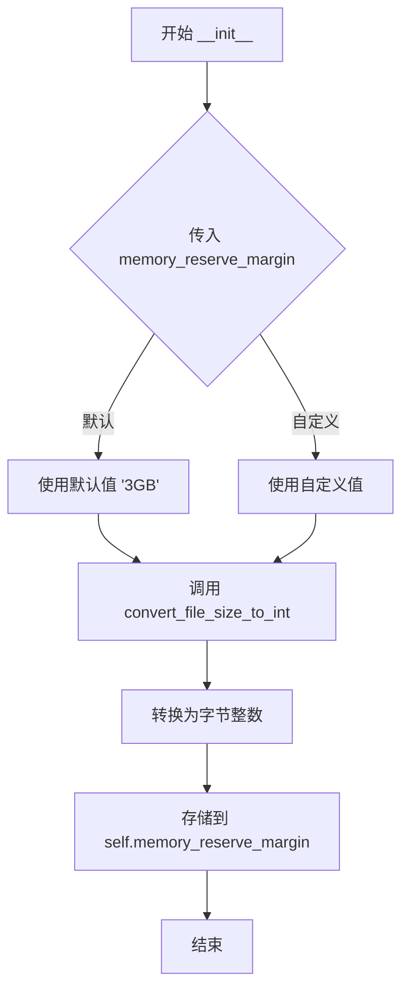

#### 带注释源码

```python
def __init__(self, memory_reserve_margin="3GB"):
    """
    初始化 AutoOffloadStrategy 实例。

    Args:
        memory_reserve_margin (str): 内存保留边距，默认为 "3GB"。该值表示在目标设备上
                                     需要保留的最小内存空间，以确保模型执行时有足够的
                                     内存用于中间激活值、梯度等临时数据。
    """
    # 使用 convert_file_size_to_int 将人类可读的文件大小字符串（如 "3GB"）
    # 转换为字节单位的整数，便于后续进行数值计算和比较
    self.memory_reserve_margin = convert_file_size_to_int(memory_reserve_margin)
```


### `AutoOffloadStrategy.__call__`

该方法是自动卸载策略的核心实现，根据目标设备的可用内存自动决定将哪些模型从GPU卸载到CPU。它首先检查传入的hook列表是否为空，然后计算当前模型的内存占用，并通过遍历所有可能的模型组合来找到满足最小卸载内存需求的最小模型集合。

参数：

- `hooks`：`list["UserCustomOffloadHook"]`，需要考虑的模型hook列表，用于评估哪些模型可以被卸载
- `model_id`：`str`，当前正在执行前向传递的模型标识符
- `model`：`torch.nn.Module`，当前需要执行前向传递的模型实例
- `execution_device`：`torch.device`，模型执行的目标设备

返回值：`list["UserCustomOffloadHook"]`，需要卸载到CPU的模型hook列表

#### 流程图

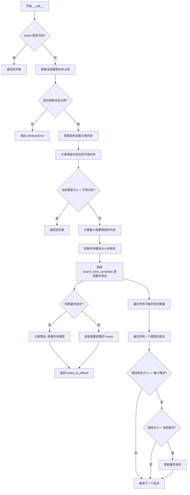

#### 带注释源码

```python
def __call__(self, hooks, model_id, model, execution_device):
    """
    自动卸载策略的调用入口，根据设备内存情况决定需要卸载哪些模型
    
    Args:
        hooks: 用户自定义的卸载hook列表
        model_id: 当前模型的唯一标识符
        model: 当前的PyTorch模型实例
        execution_device: 执行设备（torch.device）
    
    Returns:
        需要卸载到CPU的hook列表
    """
    # 如果没有hooks，直接返回空列表
    if len(hooks) == 0:
        return []

    # 尝试获取当前模型的内存占用
    try:
        current_module_size = model.get_memory_footprint()
    except AttributeError:
        raise AttributeError(f"Do not know how to compute memory footprint of `{model.__class__.__name__}.")

    # 获取设备类型并获取对应的设备模块
    device_type = execution_device.type
    device_module = getattr(torch, device_type, torch.cuda)
    
    # 尝试获取设备上的可用内存信息
    try:
        mem_on_device = device_module.mem_get_info(execution_device.index)[0]
    except AttributeError:
        raise AttributeError(f"Do not know how to obtain obtain memory info for {str(device_module)}.")

    # 减去保留内存 margin 得到实际可用内存
    mem_on_device = mem_on_device - self.memory_reserve_margin
    
    # 如果当前模型大小小于可用内存，不需要卸载任何模型
    if current_module_size < mem_on_device:
        return []

    # 计算最小需要释放的内存量
    min_memory_offload = current_module_size - mem_on_device
    logger.info(f" search for models to offload in order to free up {min_memory_offload / 1024**3:.2f} GB memory")

    # 获取所有模块的大小，排除未加载到设备的模型
    module_sizes = dict(
        sorted(
            {hook.model_id: hook.model.get_memory_footprint() for hook in hooks}.items(),
            key=lambda x: x[1],
            reverse=True,
        )
    )

    # 定义搜索最优候选模型的内部函数
    def search_best_candidate(module_sizes, min_memory_offload):
        """
        在给定的模块大小字典和最小卸载内存需求下，
        寻找内存占用总和刚好超过最小需求且最小的模型组合
        
        Args:
            module_sizes: 模型ID到模型大小的映射字典
            min_memory_offload: 最小需要释放的内存大小
        
        Returns:
            满足条件的最佳模型ID组合，如果无解则返回None
        """
        model_ids = list(module_sizes.keys())
        best_candidate = None
        best_size = float("inf")
        
        # 遍历所有可能的组合数量（从1到所有模型）
        for r in range(1, len(model_ids) + 1):
            # 遍历所有r个模型的组合
            for candidate_model_ids in combinations(model_ids, r):
                # 计算候选组合的总大小
                candidate_size = sum(
                    module_sizes[candidate_model_id] for candidate_model_id in candidate_model_ids
                )
                
                # 如果候选组合小于最小需求，跳过
                if candidate_size < min_memory_offload:
                    continue
                else:
                    # 如果没有最优候选，或者当前候选更小，则更新最优候选
                    if best_candidate is None or candidate_size < best_size:
                        best_candidate = candidate_model_ids
                        best_size = candidate_size

        return best_candidate

    # 搜索最优的待卸载模型组合
    best_offload_model_ids = search_best_candidate(module_sizes, min_memory_offload)

    # 如果没有找到满足条件的组合，卸载所有模型
    if best_offload_model_ids is None:
        # 如果无法满足内存需求，记录警告并卸载所有模型
        logger.warning("no combination of models to offload to cpu is found, offloading all models")
        hooks_to_offload = hooks
    else:
        # 筛选出需要卸载的hooks
        hooks_to_offload = [hook for hook in hooks if hook.model_id in best_offload_model_ids]

    return hooks_to_offload
```


### `ComponentsManager.__init__`

初始化 `ComponentsManager` 类的实例，创建一个集中式注册表和管理系统，用于跨多个管道注册、跟踪和重用模型组件（如 UNet、VAE、文本编码器等），包括重复检测、内存管理和组件组织功能。

参数：此方法无显式参数（除隐式 `self`）

返回值：`None`，构造函数不返回值，仅初始化实例状态

#### 流程图

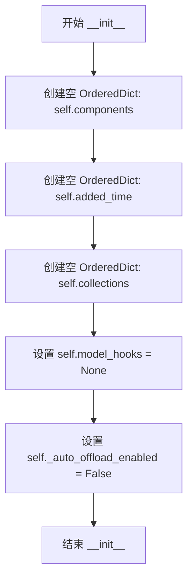

#### 带注释源码

```python
def __init__(self):
    """
    初始化 ComponentsManager 实例。
    
    创建一个集中式注册表用于管理模型组件，包括：
    - components: 存储所有已注册组件的有序字典
    - added_time: 记录组件添加时间（待确认是否需要）
    - collections: 按集合名称组织组件的映射
    - model_hooks: 存储自动 CPU 卸载的钩子
    - _auto_offload_enabled: 标记是否启用自动 CPU 卸载
    """
    # 核心组件存储：component_id -> component 对象
    self.components = OrderedDict()
    
    # YiYi TODO: can remove once confirm we don't need this in mellon
    # 记录组件添加时间，用于追踪和管理
    self.added_time = OrderedDict()  # Store when components were added
    
    # 集合管理：collection_name -> set of component_names
    self.collections = OrderedDict()  # collection_name -> set of component_names
    
    # 自动卸载钩子存储（当启用自动 CPU 卸载时使用）
    self.model_hooks = None
    
    # 自动 CPU 卸载功能标志
    self._auto_offload_enabled = False
```


### `ComponentsManager._lookup_ids`

根据名称、集合或加载 ID 查询组件 ID。不支持模式匹配，返回一组符合条件的组件 ID。

参数：

- `name`：`str | None`，要查询的组件名称
- `collection`：`str | None`，要查询的集合名称
- `load_id`：`str | None`，要查询的加载 ID
- `components`：`OrderedDict | None`，要查询的组件字典，默认为 `self.components`

返回值：`set`，返回符合条件的组件 ID 集合

#### 流程图

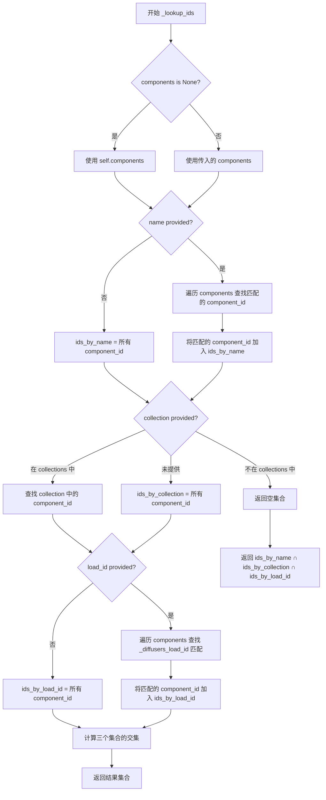

#### 带注释源码

```python
def _lookup_ids(
    self,
    name: str | None = None,
    collection: str | None = None,
    load_id: str | None = None,
    components: OrderedDict | None = None,
):
    """
    Lookup component_ids by name, collection, or load_id. Does not support pattern matching. Returns a set of
    component_ids
    """
    # 如果未指定 components，默认使用 self.components
    if components is None:
        components = self.components

    # 根据 name 查询
    if name:
        ids_by_name = set()
        for component_id, component in components.items():
            # 将 component_id 转换为基本名称进行比较
            comp_name = self._id_to_name(component_id)
            if comp_name == name:
                ids_by_name.add(component_id)
    else:
        # 如果未提供 name，返回所有 component_id
        ids_by_name = set(components.keys())

    # 根据 collection 查询
    if collection and collection not in self.collections:
        # collection 不存在，返回空集合
        return set()
    elif collection and collection in self.collections:
        ids_by_collection = set()
        for component_id, component in components.items():
            if component_id in self.collections[collection]:
                ids_by_collection.add(component_id)
    else:
        # 如果未提供 collection，返回所有 component_id
        ids_by_collection = set(components.keys())

    # 根据 load_id 查询
    if load_id:
        ids_by_load_id = set()
        for name, component in components.items():
            # 检查组件是否有 _diffusers_load_id 属性并匹配
            if hasattr(component, "_diffusers_load_id") and component._diffusers_load_id == load_id:
                ids_by_load_id.add(name)
    else:
        # 如果未提供 load_id，返回所有 component_id
        ids_by_load_id = set(components.keys())

    # 对三个集合取交集，返回同时满足所有条件的 component_id
    ids = ids_by_name.intersection(ids_by_collection).intersection(ids_by_load_id)
    return ids
```


### `ComponentsManager._id_to_name`

这是一个静态方法，用于从组件的唯一标识符（component_id）中提取组件的名称部分。它通过移除component_id中最后以下划线分割的部分来获取基础名称。

参数：

- `component_id`：`str`，组件的唯一标识符，格式为"{name}_{id(component)}"

返回值：`str`，组件的基础名称部分

#### 流程图

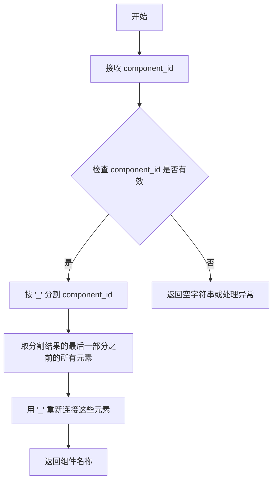

#### 带注释源码

```python
@staticmethod
def _id_to_name(component_id: str):
    """
    将组件ID转换为基础组件名称。
    
    例如：
        - component_id = "unet_123456" -> 返回 "unet"
        - component_id = "vae_987654" -> 返回 "vae"
        - component_id = "text_encoder_111" -> 返回 "text_encoder"
    
    Args:
        component_id (str): 组件的唯一标识符，格式为 "{name}_{unique_id}"
    
    Returns:
        str: 组件的基础名称部分
    """
    # 按下划线分割component_id，然后移除最后一部分（数字ID）
    # 最后用下划线重新连接剩余部分
    return "_".join(component_id.split("_")[:-1])
```


### `ComponentsManager.add`

该方法用于将模型组件添加到 ComponentsManager 管理器中，支持重复检测、load_id 冲突警告、集合管理以及自动 CPU 卸载功能。

参数：

-  `name`：`str`，组件的名称
-  `component`：`Any`，要添加的组件对象
-  `collection`：`str | None`，可选的集合名称，用于对组件进行分组管理

返回值：`str`，生成的唯一组件 ID，格式为 `"{name}_{id(component)}"`

#### 流程图

```mermaid
flowchart TD
    A[开始 add 方法] --> B[生成 component_id = f&quot;{name}_{id(component)}&quot;]
    B --> C[设置 is_new_component = True]
    C --> D{检查组件是否已存在}
    D -->|是| E{组件名称是否相同}
    E -->|是| F[记录警告: 组件已存在, 复用 existing component_id, is_new_component = False]
    E -->|否| G[记录警告: 组件重复但名称不同]
    D -->|否| H[检查 component 是否有 _diffusers_load_id 属性]
    H --> I{有 load_id 且不为 'null'}
    I -->|是| J[查找相同 load_id 的其他组件]
    J --> K{是否存在相同 load_id}
    K -->|是| L[记录警告: load_id 重复]
    K -->|否| M[将组件添加到 self.components]
    I -->|否| M
    M --> N{is_new_component}
    N -->|是| O[记录添加时间 added_time]
    N -->|否| P
    O --> P{collection 是否指定}
    P -->|是| Q{collection 是否已存在}
    Q -->|否| R[创建新集合]
    R --> S{组件是否已在集合中}
    Q -->|是| S
    S -->|否| T[查找集合中同名组件]
    T --> U{是否存在同名组件}
    U -->|是| V[记录警告并从集合中移除旧组件]
    V --> W[将新组件添加到集合]
    U -->|否| W
    S -->|是| X[记录日志: 组件已添加]
    P -->|否| X
    X --> Y{_auto_offload_enabled 且 is_new_component}
    Y -->|是| Z[启用自动 CPU 卸载]
    Y -->|否| AA[返回 component_id]
    Z --> AA
```

#### 带注释源码

```python
def add(self, name: str, component: Any, collection: str | None = None):
    """
    Add a component to the ComponentsManager.

    Args:
        name (str): The name of the component
        component (Any): The component to add
        collection (str | None): The collection to add the component to

    Returns:
        str: The unique component ID, which is generated as "{name}_{id(component)}" where
             id(component) is Python's built-in unique identifier for the object
    """
    # 步骤1: 生成唯一的组件 ID，格式为 "{name}_{id(component)}"
    component_id = f"{name}_{id(component)}"
    
    # 步骤2: 标记是否为新组件（用于后续逻辑判断）
    is_new_component = True

    # 步骤3: 检查重复组件（通过对象引用比较）
    for comp_id, comp in self.components.items():
        if comp == component:
            comp_name = self._id_to_name(comp_id)
            if comp_name == name:
                # 组件已存在且名称相同，记录警告并复用已有 component_id
                logger.warning(f"ComponentsManager: component '{name}' already exists as '{comp_id}'")
                component_id = comp_id
                is_new_component = False
                break
            else:
                # 组件重复但名称不同，记录警告
                logger.warning(
                    f"ComponentsManager: adding component '{name}' as '{component_id}', but it is duplicate of '{comp_id}'"
                    f"To remove a duplicate, call `components_manager.remove('<component_id>')`."
                )

    # 步骤4: 检查 load_id 冲突（如果组件有 _diffusers_load_id 属性）
    if hasattr(component, "_diffusers_load_id") and component._diffusers_load_id != "null":
        # 查找具有相同 load_id 的其他组件
        components_with_same_load_id = self._lookup_ids(load_id=component._diffusers_load_id)
        # 排除当前正在添加的组件
        components_with_same_load_id = [id for id in components_with_same_load_id if id != component_id]

        if components_with_same_load_id:
            # 发现 load_id 冲突，记录警告
            existing = ", ".join(components_with_same_load_id)
            logger.warning(
                f"ComponentsManager: adding component '{component_id}', but it has duplicate load_id '{component._diffusers_load_id}' with existing components: {existing}. "
                f"To remove a duplicate, call `components_manager.remove('<component_id>')`."
            )

    # 步骤5: 将组件添加到管理器
    self.components[component_id] = component
    if is_new_component:
        # 记录添加时间（仅对新组件）
        self.added_time[component_id] = time.time()

    # 步骤6: 处理集合（collection）逻辑
    if collection:
        # 如果集合不存在，则创建
        if collection not in self.collections:
            self.collections[collection] = set()
        
        # 如果组件不在指定集合中
        if component_id not in self.collections[collection]:
            # 查找集合中同名组件（同一集合中同名组件只能存在一个）
            comp_ids_in_collection = self._lookup_ids(name=name, collection=collection)
            for comp_id in comp_ids_in_collection:
                logger.warning(
                    f"ComponentsManager: removing existing {name} from collection '{collection}': {comp_id}"
                )
                # 从集合中移除旧组件（如果不在其他集合中，则会从管理器中完全移除）
                self.remove_from_collection(comp_id, collection)

            # 添加新组件到集合
            self.collections[collection].add(component_id)
            logger.info(
                f"ComponentsManager: added component '{name}' in collection '{collection}': {component_id}"
            )
    else:
        logger.info(f"ComponentsManager: added component '{name}' as '{component_id}'")

    # 步骤7: 如果启用了自动 CPU 卸载且是新组件，则应用自动卸载策略
    if self._auto_offload_enabled and is_new_component:
        self.enable_auto_cpu_offload(self._auto_offload_device)

    # 返回生成的唯一组件 ID
    return component_id
```


### `ComponentsManager.remove_from_collection`

该方法用于从指定的集合中移除组件。如果被移除的组件不再存在于任何其他集合中，则会将其从 ComponentsManager 中完全删除。

参数：

- `component_id`：`str`，要移除的组件 ID
- `collection`：`str`，要从中移除组件的集合名称

返回值：`None`，无返回值，仅执行移除操作

#### 流程图

```mermaid
flowchart TD
    A[开始] --> B{collection 是否存在于 self.collections}
    B -->|否| C[记录警告: Collection not found]
    C --> D[返回]
    B -->|是| E{component_id 是否在 collection 中}
    E -->|否| F[记录警告: Component not found in collection]
    F --> D
    E -->|是| G[从 collection 中移除 component_id]
    G --> H{检查组件是否在其他集合中}
    H -->|是| I[不执行任何操作]
    H -->|否| J[记录警告: removing component from ComponentsManager]
    J --> K[调用 self.remove(component_id)]
    I --> L[结束]
    D --> L
    K --> L
```

#### 带注释源码

```
def remove_from_collection(self, component_id: str, collection: str):
    """
    Remove a component from a collection.
    """
    # 检查集合是否存在于管理器中
    if collection not in self.collections:
        logger.warning(f"Collection '{collection}' not found in ComponentsManager")
        return
    
    # 检查组件是否在该集合中
    if component_id not in self.collections[collection]:
        logger.warning(f"Component '{component_id}' not found in collection '{collection}'")
        return
    
    # 从集合中移除组件
    self.collections[collection].remove(component_id)
    
    # 检查该组件是否在其他集合中
    comp_colls = [coll for coll, comps in self.collections.items() if component_id in comps]
    
    # 仅当组件不在任何其他集合中时，才从 ComponentsManager 中完全移除
    if not comp_colls:
        logger.warning(f"ComponentsManager: removing component '{component_id}' from ComponentsManager")
        self.remove(component_id)
```


### `ComponentsManager.remove`

从 `ComponentsManager` 类中移除指定的组件，并清理相关的资源占用。

参数：

-  `component_id`：`str | None`，要移除的组件的唯一标识符（component ID）

返回值：`None`，该方法直接修改 `ComponentsManager` 的内部状态，不返回任何值

#### 流程图

```mermaid
flowchart TD
    A[开始 remove 方法] --> B{component_id 是否在 components 中}
    B -->|否| C[记录警告: 组件未找到]
    C --> D[直接返回]
    B -->|是| E[从 components 中弹出组件]
    E --> F[从 added_time 中移除记录]
    F --> G[遍历所有 collection]
    G --> H{component_id 在当前 collection 中?}
    H -->|是| I[从该 collection 中移除 component_id]
    H -->|否| J[继续下一个 collection]
    I --> J
    J --> K{_auto_offload_enabled 是否为 True?}
    K -->|是| L[重新调用 enable_auto_cpu_offload]
    K -->|否| M{component 是否为 torch.nn.Module?}
    L --> N[结束]
    M -->|是| O[将组件移至 CPU]
    M -->|否| P[del 删除 component 对象]
    O --> P
    P --> Q[import gc 并调用 gc.collect]
    Q --> R{torch.cuda.is_available?}
    R -->|是| S[torch.cuda.empty_cache]
    R -->|否| T{torch.xpu.is_available?}
    S --> T
    T -->|是| U[torch.xpu.empty_cache]
    T -->|否| N
    U --> N
```

#### 带注释源码

```python
def remove(self, component_id: str = None):
    """
    Remove a component from the ComponentsManager.

    Args:
        component_id (str): The ID of the component to remove
    """
    # 检查组件是否存在于管理器中
    if component_id not in self.components:
        # 组件不存在，记录警告并直接返回
        logger.warning(f"Component '{component_id}' not found in ComponentsManager")
        return

    # 从 components 字典中移除该组件，并获取组件对象
    component = self.components.pop(component_id)
    # 从 added_time 字典中移除该组件的添加时间记录
    self.added_time.pop(component_id)

    # 遍历所有 collection，移除该组件的引用
    for collection in self.collections:
        if component_id in self.collections[collection]:
            self.collections[collection].remove(component_id)

    # 如果启用了自动 CPU offload，则重新配置 offload
    if self._auto_offload_enabled:
        self.enable_auto_cpu_offload(self._auto_offload_device)
    else:
        # 如果组件是 PyTorch 模块，将其移至 CPU 以释放 GPU 内存
        if isinstance(component, torch.nn.Module):
            component.to("cpu")
        # 删除组件对象引用
        del component
        import gc

        # 手动触发垃圾回收
        gc.collect()
        # 如果 CUDA 可用，清空 CUDA 缓存
        if torch.cuda.is_available():
            torch.cuda.empty_cache()
        # 如果 XPU 可用，清空 XPU 缓存
        if torch.xpu.is_available():
            torch.xpu.empty_cache()
```


### `ComponentsManager.search_components`

搜索组件方法，支持基于名称的简单模式匹配，可按集合或load_id过滤。该方法提供了丰富的模式匹配功能，包括精确匹配、前缀匹配、包含匹配、OR模式和NOT模式。

参数：

- `names`：`str | None`，组件名称或匹配模式。支持的模式：
  - `"unet"`：匹配任何基础名称为"unet"的组件
  - `"!unet"`：排除基础名称为"unet"的组件
  - `"unet*"`：匹配任何以"unet"开头的组件
  - `"!unet*"`：排除任何以"unet"开头的组件
  - `"*unet*"`：匹配任何包含"unet"的组件
  - `"!*unet*"`：排除任何包含"unet"的组件
  - `"refiner|vae|unet"`：精确匹配"refiner"、"vae"或"unet"任一名称
  - `"!refiner|vae|unet"`：排除精确匹配"refiner"、"vae"或"unet"的组件
  - `"unet*|vae*"`：匹配以"unet"开头或以"vae"开头的组件
- `collection`：`str | None`，可选的集合过滤器
- `load_id`：`str | None`，可选的load_id过滤器
- `return_dict_with_names`：`bool`，如果为True，返回键为组件名称的字典；如果为False，返回键为组件ID的字典

返回值：`dict[str, Any]`，如果return_dict_with_names=True，键为组件名称；否则键为组件ID

#### 流程图

```mermaid
flowchart TD
    A[开始搜索组件] --> B{collection或load_id是否指定?}
    B -->|是| C[调用_lookup_ids获取过滤后的组件ID集合]
    B -->|否| D[使用所有组件ID]
    C --> E[根据ID获取对应的组件字典]
    D --> E
    E --> F{names是否为None?}
    F -->|是| K[调用get_return_dict返回结果]
    F -->|否| G{names是否为字符串类型?}
    G -->|否| H[抛出ValueError异常]
    G -->|是| I{是否为NOT模式?}
    I -->|是| J[移除!前缀,设置is_not_pattern=True]
    I -->|否| L[继续处理]
    J --> M{names是否包含|?}
    L --> M
    M -->|是| N[处理OR模式]
    M -->|否| O{是否精确匹配基础名称?}
    O -->|是| P[返回精确匹配的组件]
    O -->|否| Q{是否以*结尾?}
    Q -->|是| R[前缀匹配]
    Q -->|否| S{是否以*开头?}
    S -->|是| T[包含匹配]
    S -->|否| U{是否为子串匹配?}
    U -->|是| V[子串匹配]
    U -->|否| W[抛出未找到异常]
    N --> X[遍历组件检查每个term是否匹配]
    X --> Y{是否匹配?}
    Y -->|是| Z[添加到结果]
    Y -->|否| AA[检查下一个term]
    Z --> AB{是否NOT模式?}
    AA --> AB
    AB -->|是| AC[取反匹配结果]
    AC --> AD[返回最终结果]
    AB -->|否| AD
    R --> AE[返回前缀匹配的组件]
    T --> AF[返回包含匹配的组件]
    V --> AG[返回子串匹配的组件]
    P --> K
    AE --> K
    AF --> K
    AG --> K
    AD --> K
    K --> AH[结束]
    W --> AI[抛出ValueError异常: 组件或模式未找到]
    H --> AH
    AI --> AH
```

#### 带注释源码

```python
def search_components(
    self,
    names: str | None = None,
    collection: str | None = None,
    load_id: str | None = None,
    return_dict_with_names: bool = True,
):
    """
    Search components by name with simple pattern matching. Optionally filter by collection or load_id.

    Args:
        names: Component name(s) or pattern(s)
            Patterns:
            - "unet" : match any component with base name "unet" (e.g., unet_123abc)
            - "!unet" : everything except components with base name "unet"
            - "unet*" : anything with base name starting with "unet"
            - "!unet*" : anything with base name NOT starting with "unet"
            - "*unet*" : anything with base name containing "unet"
            - "!*unet*" : anything with base name NOT containing "unet"
            - "refiner|vae|unet" : anything with base name exactly matching "refiner", "vae", or "unet"
            - "!refiner|vae|unet" : anything with base name NOT exactly matching "refiner", "vae", or "unet"
            - "unet*|vae*" : anything with base name starting with "unet" OR starting with "vae"
        collection: Optional collection to filter by
        load_id: Optional load_id to filter by
        return_dict_with_names:
                                If True, returns a dictionary with component names as keys, throw an error if
                                multiple components with the same name are found If False, returns a dictionary
                                with component IDs as keys

    Returns:
        Dictionary mapping component names to components if return_dict_with_names=True, or a dictionary mapping
        component IDs to components if return_dict_with_names=False
    """

    # 步骤1: 根据collection和load_id过滤组件
    # select components based on collection and load_id filters
    selected_ids = self._lookup_ids(collection=collection, load_id=load_id)
    # 根据过滤后的ID获取对应的组件
    components = {k: self.components[k] for k in selected_ids}

    # 定义内部函数: 根据return_dict_with_names参数构建返回字典
    def get_return_dict(components, return_dict_with_names):
        """
        Create a dictionary mapping component names to components if return_dict_with_names=True, or a dictionary
        mapping component IDs to components if return_dict_with_names=False, throw an error if duplicate component
        names are found when return_dict_with_names=True
        """
        # 如果需要按名称返回,检查是否有重复名称
        if return_dict_with_names:
            dict_to_return = {}
            for comp_id, comp in components.items():
                # 从component_id提取基础名称
                comp_name = self._id_to_name(comp_id)
                # 如果发现重复名称,抛出错误
                if comp_name in dict_to_return:
                    raise ValueError(
                        f"Duplicate component names found in the search results: {comp_name}, please set `return_dict_with_names=False` to return a dictionary with component IDs as keys"
                    )
                dict_to_return[comp_name] = comp
            return dict_to_return
        else:
            # 直接返回以component_id为键的字典
            return components

    # 步骤2: 如果没有提供names,直接返回过滤后的组件
    # if no names are provided, return the filtered components as it is
    if names is None:
        return get_return_dict(components, return_dict_with_names)

    # 步骤3: 验证names类型,必须为字符串
    # if names is not a string, raise an error
    elif not isinstance(names, str):
        raise ValueError(f"Invalid type for `names: {type(names)}, only support string")

    # 步骤4: 创建component_id到基础名称的映射,用于模式匹配
    # Create mapping from component_id to base_name for components to be used for pattern matching
    base_names = {comp_id: self._id_to_name(comp_id) for comp_id in components.keys()}

    # 定义内部辅助函数: 检查组件是否匹配特定模式
    def matches_pattern(component_id, pattern, exact_match=False):
        """
        Helper function to check if a component matches a pattern based on its base name.

        Args:
            component_id: The component ID to check
            pattern: The pattern to match against
            exact_match: If True, only exact matches to base_name are considered
        """
        # 获取该组件的基础名称
        base_name = base_names[component_id]

        # 精确匹配模式
        # Exact match with base name
        if exact_match:
            return pattern == base_name

        # 前缀匹配(以*结尾)
        # Prefix match (ends with *)
        elif pattern.endswith("*"):
            prefix = pattern[:-1]  # 去掉*号
            return base_name.startswith(prefix)

        # 包含匹配(以*开头)
        # Contains match (starts with *)
        elif pattern.startswith("*"):
            search = pattern[1:-1] if pattern.endswith("*") else pattern[1:]
            return search in base_name

        # 精确匹配(无通配符)
        # Exact match (no wildcards)
        else:
            return pattern == base_name

    # 步骤5: 检查是否为NOT模式(以!开头)
    # Check if this is a "not" pattern
    is_not_pattern = names.startswith("!")
    if is_not_pattern:
        names = names[1:]  # 移除!前缀

    # 步骤6: 处理OR模式(包含|)
    # Handle OR patterns (containing |)
    if "|" in names:
        terms = names.split("|")  # 分割OR条件
        matches = {}

        for comp_id, comp in components.items():
            # 对于带通配符的OR模式,使用精确匹配
            # For OR patterns with exact names (no wildcards), we do exact matching on base names
            exact_match = all(not (term.startswith("*") or term.endswith("*")) for term in terms)

            # 检查是否有任何term匹配该组件
            # Check if any of the terms match this component
            should_include = any(matches_pattern(comp_id, term, exact_match) for term in terms)

            # 如果是NOT模式,取反匹配结果
            # Flip the decision if this is a NOT pattern
            if is_not_pattern:
                should_include = not should_include

            if should_include:
                matches[comp_id] = comp

        # 记录日志信息
        log_msg = "NOT " if is_not_pattern else ""
        match_type = "exactly matching" if exact_match else "matching any of patterns"
        logger.info(f"Getting components {log_msg}{match_type} {terms}: {list(matches.keys())}")

    # 步骤7: 尝试精确匹配基础名称
    # Try exact match with a base name
    elif any(names == base_name for base_name in base_names.values()):
        # 查找所有具有该基础名称的组件
        # Find all components with this base name
        matches = {
            comp_id: comp
            for comp_id, comp in components.items()
            if (base_names[comp_id] == names) != is_not_pattern
        }

        if is_not_pattern:
            logger.info(f"Getting all components except those with base name '{names}': {list(matches.keys())}")
        else:
            logger.info(f"Getting components with base name '{names}': {list(matches.keys())}")

    # 步骤8: 前缀匹配(以*结尾)
    # Prefix match (ends with *)
    elif names.endswith("*"):
        prefix = names[:-1]
        matches = {
            comp_id: comp
            for comp_id, comp in components.items()
            if base_names[comp_id].startswith(prefix) != is_not_pattern
        }
        if is_not_pattern:
            logger.info(f"Getting components NOT starting with '{prefix}': {list(matches.keys())}")
        else:
            logger.info(f"Getting components starting with '{prefix}': {list(matches.keys())}")

    # 步骤9: 包含匹配(以*开头)
    # Contains match (starts with *)
    elif names.startswith("*"):
        search = names[1:-1] if names.endswith("*") else names[1:]
        matches = {
            comp_id: comp
            for comp_id, comp in components.items()
            if (search in base_names[comp_id]) != is_not_pattern
        }
        if is_not_pattern:
            logger.info(f"Getting components NOT containing '{search}': {list(matches.keys())}")
        else:
            logger.info(f"Getting components containing '{search}': {list(matches.keys())}")

    # 步骤10: 子串匹配(无通配符但不是精确的组件名)
    # Substring match (no wildcards, but not an exact component name)
    elif any(names in base_name for base_name in base_names.values()):
        matches = {
            comp_id: comp
            for comp_id, comp in components.items()
            if (names in base_names[comp_id]) != is_not_pattern
        }
        if is_not_pattern:
            logger.info(f"Getting components NOT containing '{names}': {list(matches.keys())}")
        else:
            logger.info(f"Getting components containing '{names}': {list(matches.keys())}")

    # 步骤11: 未找到匹配的模式
    else:
        raise ValueError(f"Component or pattern '{names}' not found in ComponentsManager")

    # 步骤12: 如果没有匹配结果,抛出错误
    if not matches:
        raise ValueError(f"No components found matching pattern '{names}'")

    # 步骤13: 构建最终返回字典并返回
    return get_return_dict(matches, return_dict_with_names)
```


### `ComponentsManager.enable_auto_cpu_offload`

启用 ComponentsManager 中所有组件的自动 CPU 卸载功能。该方法会将所有模型组件从 GPU 移至 CPU，并在模型前向传播时按需加载到执行设备，同时通过自动卸载策略管理内存，确保设备有足够内存执行模型。

参数：

- `device`：`str | int | torch.device`，执行设备，模型前向传播时会被移至该设备，默认为 `get_device()` 的返回值
- `memory_reserve_margin`：`str`，内存保留边距，默认为 "3GB"，用于在设备上保留额外内存以避免 OOM

返回值：无返回值（`None`）

#### 流程图

```mermaid
flowchart TD
    A[开始 enable_auto_cpu_offload] --> B{is_accelerate_available?}
    B -- 否 --> C[抛出 ImportError]
    B -- 是 --> D{device is None?}
    D -- 是 --> E[device = get_device()]
    D -- 否 --> F{device 是 torch.device?}
    F -- 否 --> G[device = torch.device(device)]
    F -- 是 --> H[获取 device_type 和 device_module]
    H --> I{device_module 有 mem_get_info?}
    I -- 否 --> J[抛出 NotImplementedError]
    I -- 是 --> K{device.index is None?}
    K -- 是 --> L[device = torch.device(f'{device.type}:0')]
    K -- 否 --> M[遍历 components 移除已有 hooks]
    M --> N[调用 disable_auto_cpu_offload]
    N --> O[创建 AutoOffloadStrategy]
    O --> P[遍历 components 创建 custom_offload_with_hook]
    P --> Q[为每个 hook 添加其他 hook 的关联]
    Q --> R[保存 all_hooks 到 self.model_hooks]
    R --> S[设置 _auto_offload_enabled = True]
    S --> T[设置 _auto_offload_device = device]
    T --> U[结束]
```

#### 带注释源码

```python
def enable_auto_cpu_offload(self, device: str | int | torch.device = None, memory_reserve_margin="3GB"):
    """
    Enable automatic CPU offloading for all components.

    The algorithm works as follows:
    1. All models start on CPU by default
    2. When a model's forward pass is called, it's moved to the execution device
    3. If there's insufficient memory, other models on the device are moved back to CPU
    4. The system tries to offload the smallest combination of models that frees enough memory
    5. Models stay on the execution device until another model needs memory and forces them off

    Args:
        device (str | int | torch.device): The execution device where models are moved for forward passes
        memory_reserve_margin (str): The memory reserve margin to use, default is 3GB. This is the amount of
                                    memory to keep free on the device to avoid running out of memory during model
                                    execution (e.g., for intermediate activations, gradients, etc.)
    """
    # 检查 accelerate 库是否可用，未安装则抛出导入错误
    if not is_accelerate_available():
        raise ImportError("Make sure to install accelerate to use auto_cpu_offload")

    # 如果未指定 device，则使用 get_device() 获取默认设备
    if device is None:
        device = get_device()
    
    # 确保 device 是 torch.device 类型
    if not isinstance(device, torch.device):
        device = torch.device(device)

    # 获取设备类型（cuda/xpu/mps等）和对应的设备模块
    device_type = device.type
    device_module = getattr(torch, device_type, torch.cuda)
    
    # 验证设备模块是否支持 mem_get_info 方法，用于获取设备内存信息
    if not hasattr(device_module, "mem_get_info"):
        raise NotImplementedError(
            f"`enable_auto_cpu_offload() relies on the `mem_get_info()` method. It's not implemented for {str(device.type)}."
        )

    # 如果设备未指定索引，默认使用 0 号设备
    if device.index is None:
        device = torch.device(f"{device.type}:{0}")

    # 遍历所有组件，移除已存在的 _hf_hook，避免冲突
    for name, component in self.components.items():
        if isinstance(component, torch.nn.Module) and hasattr(component, "_hf_hook"):
            remove_hook_from_module(component, recurse=True)

    # 先禁用之前的自动卸载配置（如果存在）
    self.disable_auto_cpu_offload()
    
    # 创建自动卸载策略，传入内存保留边距
    offload_strategy = AutoOffloadStrategy(memory_reserve_margin=memory_reserve_margin)

    # 遍历所有组件，为每个 torch.nn.Module 创建自定义卸载 hook
    all_hooks = []
    for name, component in self.components.items():
        if isinstance(component, torch.nn.Module):
            hook = custom_offload_with_hook(name, component, device, offload_strategy=offload_strategy)
            all_hooks.append(hook)

    # 为每个 hook 关联其他具有相同执行设备的 hook，用于后续内存管理
    for hook in all_hooks:
        other_hooks = [h for h in all_hooks if h is not hook]
        for other_hook in other_hooks:
            if other_hook.hook.execution_device == hook.hook.execution_device:
                hook.add_other_hook(other_hook)

    # 保存所有 hooks 引用，并标记自动卸载已启用
    self.model_hooks = all_hooks
    self._auto_offload_enabled = True
    self._auto_offload_device = device
```


### `ComponentsManager.disable_auto_cpu_offload`

该方法用于禁用所有组件的自动 CPU 卸载功能，将所有模型从执行设备卸载回 CPU，并清理相关的钩子资源。

参数： 无

返回值：`None`，无返回值描述

#### 流程图

```mermaid
flowchart TD
    A[开始 disable_auto_cpu_offload] --> B{model_hooks 是否为 None?}
    B -->|是| C[设置 _auto_offload_enabled = False]
    C --> D[直接返回]
    B -->|否| E[遍历 model_hooks 中的每个 hook]
    E --> F[调用 hook.offload 将模型卸载到 CPU]
    F --> G[调用 hook.remove 移除钩子]
    G --> H{是否还有更多 hooks?}
    H -->|是| E
    H -->|否| I{model_hooks 是否存在?}
    I -->|是| J[调用 clear_device_cache 清除设备缓存]
    J --> K[设置 model_hooks = None]
    K --> L[设置 _auto_offload_enabled = False]
    I -->|否| L
    L --> M[结束]
    D --> M
```

#### 带注释源码

```python
def disable_auto_cpu_offload(self):
    """
    Disable automatic CPU offloading for all components.
    禁用所有组件的自动 CPU 卸载功能
    """
    # 检查是否存在已注册的模型钩子
    if self.model_hooks is None:
        # 如果没有钩子，直接设置标志位为 False 并返回
        self._auto_offload_enabled = False
        return

    # 遍历所有已注册的钩子
    for hook in self.model_hooks:
        # 调用 offload 方法将模型从当前设备卸载回 CPU
        hook.offload()
        # 调用 remove 方法从模块中移除钩子
        hook.remove()
    
    # 如果存在模型钩子，清除设备缓存以释放内存
    if self.model_hooks:
        clear_device_cache()
    
    # 清理内部状态
    self.model_hooks = None          # 清空钩子列表
    self._auto_offload_enabled = False  # 重置自动卸载标志
```


### `ComponentsManager.get_model_info`

获取组件的全面信息，包括模型ID、添加时间、集合、类名、大小、适配器、钩子状态、执行设备、IP-Adapter和量化配置等元数据。

参数：

- `self`：`ComponentsManager`，ComponentsManager 实例本身
- `component_id`：`str`，组件的唯一标识符，用于定位要查询的组件
- `fields`：`str | list[str] | None`，可选参数，指定要返回的字段。可以是单个字段名字符串、字段名列表，或 None（返回所有可用字段）

返回值：`dict[str, Any] | None`，返回包含请求的组件元数据的字典。如果指定了 fields，则仅返回 those 字段；否则返回所有字段。如果组件不存在则抛出 ValueError。

#### 流程图

```mermaid
flowchart TD
    A[开始 get_model_info] --> B{component_id 是否在 components 中}
    B -->|否| C[抛出 ValueError 异常]
    B -->|是| D[获取 component 对象]
    D --> E{fields 是否为 None}
    E -->|否| F[验证 fields 是否在 _available_info_fields 中]
    E -->|是| G[构建完整 info 字典]
    F -->|无效| H[抛出 ValueError 异常]
    F -->|有效| G
    G --> I{component 是否为 torch.nn.Module}
    I -->|否| J{fields 是否为 None}
    I -->|是| K[检查 hook 信息和执行设备]
    K --> L[添加 class_name, size_gb, adapters, has_hook, execution_device]
    L --> M{是否有 peft_config}
    M -->|是| N[获取 adapters 列表]
    M -->|否| O{是否有 IP-Adapter]
    N --> O
    O -->|是| P[提取 IP-Adapter scales 并汇总]
    O -->|否| Q{是否有 hf_quantizer}
    P --> Q
    Q -->|是| R[获取 quantization 配置]
    Q -->|否| S[设置 quantization 为 None]
    R --> J
    S --> J
    J -->|是| T[返回过滤后的字段]
    J -->|否| U[返回完整 info 字典]
    T --> V[结束]
    U --> V
```

#### 带注释源码

```python
def get_model_info(
    self,
    component_id: str,
    fields: str | list[str] | None = None,
) -> dict[str, Any] | None:
    """Get comprehensive information about a component.

    Args:
        component_id (str): Name of the component to get info for
        fields (str | list[str] | None):
               Field(s) to return. Can be a string for single field or list of fields. If None, uses the
               available_info_fields setting.

    Returns:
        Dictionary containing requested component metadata. If fields is specified, returns only those fields.
        Otherwise, returns all fields.
    """
    # 检查组件是否存在于 ComponentsManager 中
    if component_id not in self.components:
        raise ValueError(f"Component '{component_id}' not found in ComponentsManager")

    # 根据 component_id 获取组件对象
    component = self.components[component_id]

    # 如果指定了 fields，则验证字段的有效性
    if fields is not None:
        # 如果是单个字符串，转换为列表
        if isinstance(fields, str):
            fields = [fields]
        # 检查每个字段是否在可用字段列表中
        for field in fields:
            if field not in self._available_info_fields:
                raise ValueError(f"Field '{field}' not found in available_info_fields")

    # 构建完整的组件信息字典，首先包含基本信息
    info = {
        "model_id": component_id,  # 组件ID
        "added_time": self.added_time[component_id],  # 添加时间
        "collection": ", ".join([coll for coll, comps in self.collections.items() if component_id in comps])
        or None,  # 所属集合（可能有多个）
    }

    # 如果组件是 torch.nn.Module，获取额外的模型相关信息
    if isinstance(component, torch.nn.Module):
        # 检查组件是否有 hook（用于自动 CPU 卸载等）
        has_hook = hasattr(component, "_hf_hook")
        execution_device = None
        # 如果有 hook，获取其执行设备
        if has_hook and hasattr(component._hf_hook, "execution_device"):
            execution_device = component._hf_hook.execution_device

        # 更新信息字典，包含模型类名、大小、适配器、hook 状态、执行设备
        info.update(
            {
                "class_name": component.__class__.__name__,  # 模型的类名
                "size_gb": component.get_memory_footprint() / (1024**3),  # 模型大小（GB）
                "adapters": None,  # 默认设置为 None
                "has_hook": has_hook,  # 是否有 hook
                "execution_device": execution_device,  # 执行设备
            }
        )

        # 如果组件有 PEFT 配置，获取适配器列表
        if hasattr(component, "peft_config"):
            info["adapters"] = list(component.peft_config.keys())

        # 检查是否有 IP-Adapter 权重和注意力处理器
        if hasattr(component, "_load_ip_adapter_weights") and hasattr(component, "attn_processors"):
            # 深拷贝处理器以避免修改原始状态
            processors = copy.deepcopy(component.attn_processors)
            # 首先检查是否有任何处理器是 IP-Adapter 类型
            processor_types = [v.__class__.__name__ for v in processors.values()]
            if any("IPAdapter" in ptype for ptype in processor_types):
                # 然后只从 IP-Adapter 处理器获取 scales
                scales = {
                    k: v.scale
                    for k, v in processors.items()
                    if hasattr(v, "scale") and "IPAdapter" in v.__class__.__name__
                }
                if scales:
                    # 使用 summarize_dict_by_value_and_parts 汇总 scales
                    info["ip_adapter"] = summarize_dict_by_value_and_parts(scales)

        # 检查量化配置
        hf_quantizer = getattr(component, "hf_quantizer", None)
        if hf_quantizer is not None:
            quant_config = hf_quantizer.quantization_config
            # 根据配置类型选择合适的序列化方法
            if hasattr(quant_config, "to_diff_dict"):
                info["quantization"] = quant_config.to_diff_dict()
            else:
                info["quantization"] = quant_config.to_dict()
        else:
            info["quantization"] = None

    # 如果指定了 fields，过滤返回的字段
    if fields is not None:
        return {k: v for k, v in info.items() if k in fields}
    else:
        return info
```


### `ComponentsManager.__repr__`

该方法用于生成`ComponentsManager`实例的可读字符串表示，以表格形式展示所有已注册组件的详细信息，包括模型ID、类名、设备、数据类型、大小、加载ID和所属集合等，并额外显示适配器、IP-Adapter和量化等高级属性信息。

参数： 无（该方法为类的特殊方法，不接受额外参数，`self`为隐式参数）

返回值：`str`，返回格式化的组件信息字符串，用于在终端或日志中直观展示ComponentsManager的当前状态

#### 流程图

```mermaid
flowchart TD
    A[__repr__ 被调用] --> B{self.components 是否为空?}
    B -->|是| C[返回 'No components registered' 消息]
    B -->|否| D[定义 get_load_id 内部函数]
    D --> E[定义 format_device 内部函数]
    E --> F[计算 load_ids 列表和最大长度]
    F --> G[构建 component_collections 字典]
    G --> H[计算各列最大宽度]
    H --> I[创建分隔线 sep_line 和 dash_line]
    I --> J{是否存在 torch.nn.Module 组件?}
    J -->|是| K[输出 Models 表格段]
    J -->|否| L{是否存在非 Module 组件?}
    K --> M{是否存在非 Module 组件?}
    M -->|是| N[输出 Other Components 表格段]
    M -->|否| O[输出 Additional Component Info]
    L -->|是| N
    L -->|否| O
    O --> P[返回完整的格式化字符串]
```

#### 带注释源码

```python
def __repr__(self):
    # 处理空组件情况：如果没有任何注册的组件，返回简洁的提示信息
    if not self.components:
        return "Components:\n" + "=" * 50 + "\nNo components registered.\n" + "=" * 50

    # 内部函数：提取组件的 _diffusers_load_id 属性，如果不存在则返回 'N/A'
    def get_load_id(component):
        if hasattr(component, "_diffusers_load_id"):
            return component._diffusers_load_id
        return "N/A"

    # 内部函数：格式化设备信息，如果没有hook则返回组件当前设备，否则显示当前设备和执行设备
    def format_device(component, info):
        if not info["has_hook"]:
            return str(getattr(component, "device", "N/A"))
        else:
            device = str(getattr(component, "device", "N/A"))
            exec_device = str(info["execution_device"] or "N/A")
            return f"{device}({exec_device})"

    # 获取所有模型组件的 load_id，并计算最大长度用于列宽对齐
    load_ids = [
        get_load_id(component)
        for component in self.components.values()
        if isinstance(component, torch.nn.Module) and hasattr(component, "_diffusers_load_id")
    ]
    max_load_id_len = max([15] + [len(str(lid)) for lid in load_ids]) if load_ids else 15

    # 为每个组件收集其所属的集合信息
    component_collections = {}
    for name in self.components.keys():
        component_collections[name] = []
        for coll, comps in self.collections.items():
            if name in comps:
                component_collections[name].append(coll)
        if not component_collections[name]:
            component_collections[name] = ["N/A"]

    # 计算所有集合名称的最大长度，确保列宽足够
    all_collections = [coll for colls in component_collections.values() for coll in colls]
    max_collection_len = max(10, max(len(str(c)) for c in all_collections)) if all_collections else 10

    # 定义各列的宽度：id、class、device、dtype、size、load_id、collection
    col_widths = {
        "id": max(15, max(len(name) for name in self.components.keys())),
        "class": max(25, max(len(component.__class__.__name__) for component in self.components.values())),
        "device": 20,
        "dtype": 15,
        "size": 10,
        "load_id": max_load_id_len,
        "collection": max_collection_len,
    }

    # 创建用于表格分隔的线条（等号线和虚线）
    sep_line = "=" * (sum(col_widths.values()) + len(col_widths) * 3 - 1) + "\n"
    dash_line = "-" * (sum(col_widths.values()) + len(col_widths) * 3 - 1) + "\n"

    output = "Components:\n" + sep_line

    # 将组件分为 torch.nn.Module（模型）和其他类型
    models = {k: v for k, v in self.components.items() if isinstance(v, torch.nn.Module)}
    others = {k: v for k, v in self.components.items() if not isinstance(v, torch.nn.Module)}

    # 如果存在模型组件，输出 Models 表格段
    if models:
        output += "Models:\n" + dash_line
        # 输出表头：Name_ID | Class | Device: act(exec) | Dtype | Size (GB) | Load ID | Collection
        output += f"{'Name_ID':<{col_widths['id']}} | {'Class':<{col_widths['class']}} | "
        output += f"{'Device: act(exec)':<{col_widths['device']}} | {'Dtype':<{col_widths['dtype']}} | "
        output += f"{'Size (GB)':<{col_widths['size']}} | {'Load ID':<{col_widths['load_id']}} | Collection\n"
        output += dash_line

        # 遍历每个模型，输出其详细信息行
        for name, component in models.items():
            info = self.get_model_info(name)  # 获取组件的详细元信息
            device_str = format_device(component, info)
            dtype = str(component.dtype) if hasattr(component, "dtype") else "N/A"
            load_id = get_load_id(component)

            # 第一个集合名称显示在主行
            first_collection = component_collections[name][0] if component_collections[name] else "N/A"

            output += f"{name:<{col_widths['id']}} | {info['class_name']:<{col_widths['class']}} | "
            output += f"{device_str:<{col_widths['device']}} | {dtype:<{col_widths['dtype']}} | "
            output += f"{info['size_gb']:<{col_widths['size']}.2f} | {load_id:<{col_widths['load_id']}} | {first_collection}\n"

            # 如果组件有多个集合，后续集合显示在后续行
            for i in range(1, len(component_collections[name])):
                collection = component_collections[name][i]
                output += f"{'':<{col_widths['id']}} | {'':<{col_widths['class']}} | "
                output += f"{'':<{col_widths['device']}} | {'':<{col_widths['dtype']}} | "
                output += f"{'':<{col_widths['size']}} | {'':<{col_widths['load_id']}} | {collection}\n"

        output += dash_line

    # 如果存在非模型组件，输出 Other Components 表格段
    if others:
        if models:  # 如果前面有模型部分，先加一个空行分隔
            output += "\n"
        output += "Other Components:\n" + dash_line
        # 其他组件的表头较简单：ID | Class | Collection
        output += f"{'ID':<{col_widths['id']}} | {'Class':<{col_widths['class']}} | Collection\n"
        output += dash_line

        # 遍历每个非模型组件
        for name, component in others.items():
            info = self.get_model_info(name)

            first_collection = component_collections[name][0] if component_collections[name] else "N/A"

            output += f"{name:<{col_widths['id']}} | {component.__class__.__name__:<{col_widths['class']}} | {first_collection}\n"

            # 额外集合名称的处理方式与模型组件相同
            for i in range(1, len(component_collections[name])):
                collection = component_collections[name][i]
                output += f"{'':<{col_widths['id']}} | {'':<{col_widths['class']}} | {collection}\n"

        output += dash_line

    # 输出额外的高级组件信息：适配器、IP-Adapter、量化配置等
    output += "\nAdditional Component Info:\n" + "=" * 50 + "\n"
    for name in self.components:
        info = self.get_model_info(name)
        # 仅显示包含适配器、IP-Adapter或量化信息的组件
        if info is not None and (
            info.get("adapters") is not None or info.get("ip_adapter") or info.get("quantization")
        ):
            output += f"\n{name}:\n"
            if info.get("adapters") is not None:
                output += f"  Adapters: {info['adapters']}\n"
            if info.get("ip_adapter"):
                output += "  IP-Adapter: Enabled\n"
            if info.get("quantization"):
                output += f"  Quantization: {info['quantization']}\n"

    return output
```


### `ComponentsManager.get_one`

获取单个组件，可以通过 component_id 直接获取，或通过 name、collection、load_id 进行模式匹配查询。如果找到多个匹配组件或未找到任何组件，则抛出错误。

参数：

- `component_id`：`str | None`，可选，要获取的组件 ID（如果通过 ID 查询，则不能同时传入 name、collection 或 load_id）
- `name`：`str | None`，可选，组件名称或模式（支持通配符模式匹配）
- `collection`：`str | None`，可选，按集合名称过滤
- `load_id`：`str | None`，可选，按 load_id 过滤

返回值：`Any`，返回单个组件对象

#### 流程图

```mermaid
flowchart TD
    A[开始 get_one] --> B{component_id 是否非空?}
    B -->|是| C{同时传入了 name/collection/load_id?}
    C -->|是| D[抛出 ValueError: 不能同时传入]
    C -->|否| E{component_id 在 components 中?}
    E -->|否| F[抛出 ValueError: 组件未找到]
    E -->|是| G[返回 self.components[component_id]]
    B -->|否| H[调用 search_components 搜索]
    H --> I{results 是否为空?}
    I -->|是| J[抛出 ValueError: 未找到组件]
    I -->|否| K{results 长度 > 1?}
    K -->|是| L[抛出 ValueError: 找到多个组件]
    K -->|否| M[返回唯一匹配的结果]
```

#### 带注释源码

```python
def get_one(
    self,
    component_id: str | None = None,
    name: str | None = None,
    collection: str | None = None,
    load_id: str | None = None,
) -> Any:
    """
    Get a single component by either:
    - searching name (pattern matching), collection, or load_id.
    - passing in a component_id
    Raises an error if multiple components match or none are found.

    Args:
        component_id (str | None): Optional component ID to get
        name (str | None): Component name or pattern
        collection (str | None): Optional collection to filter by
        load_id (str | None): Optional load_id to filter by

    Returns:
        A single component

    Raises:
        ValueError: If no components match or multiple components match
    """

    # 参数校验：如果传入 component_id，则不能同时传入其他搜索条件
    if component_id is not None and (name is not None or collection is not None or load_id is not None):
        raise ValueError("If searching by component_id, do not pass name, collection, or load_id")

    # 路径1：通过 component_id 直接查找
    if component_id is not None:
        if component_id not in self.components:
            raise ValueError(f"Component '{component_id}' not found in ComponentsManager")
        return self.components[component_id]
    
    # 路径2：通过 name/collection/load_id 进行模式匹配搜索
    results = self.search_components(name, collection, load_id)

    # 未找到任何匹配组件
    if not results:
        raise ValueError(f"No components found matching '{name}'")

    # 找到多个匹配组件（仅当 name 不是精确匹配时可能发生）
    if len(results) > 1:
        raise ValueError(f"Multiple components found matching '{name}': {list(results.keys())}")

    # 返回唯一匹配的结果
    return next(iter(results.values()))
```


### `ComponentsManager.get_ids`

根据组件名称列表获取对应的组件ID，可选地按集合进行过滤。

参数：

- `names`：`str | list[str]`，组件名称列表
- `collection`：`str | None`，可选的集合名称，用于过滤结果

返回值：`list[str]`，组件ID列表

#### 流程图

```mermaid
flowchart TD
    A[开始 get_ids] --> B{判断 names 是否为列表}
    B -->|否| C[将 names 转换为列表]
    B -->|是| D[初始化空集合 ids]
    C --> D
    D --> E{遍历 names 中的每个 name}
    E --> F[调用 _lookup_ids name=name collection=collection]
    F --> G[将查询结果更新到 ids 集合]
    E -->|遍历完成| H[返回 list(ids)]
```

#### 带注释源码

```
def get_ids(self, names: str | list[str] = None, collection: str | None = None):
    """
    Get component IDs by a list of names, optionally filtered by collection.

    Args:
        names (str | list[str]): list of component names
        collection (str | None): Optional collection to filter by

    Returns:
        list[str]: list of component IDs
    """
    # 初始化一个空集合用于存储查询到的组件ID
    ids = set()
    
    # 如果 names 不是列表，则将其转换为单元素列表
    if not isinstance(names, list):
        names = [names]
    
    # 遍历每个名称，调用内部方法 _lookup_ids 进行查询
    for name in names:
        # _lookup_ids 方法根据名称和可选的集合名称查找匹配的组件ID
        # 并将结果合并到 ids 集合中（使用 update 自动去重）
        ids.update(self._lookup_ids(name=name, collection=collection))
    
    # 将集合转换为列表并返回
    return list(ids)
```


### `ComponentsManager.get_components_by_ids`

该方法根据给定的组件ID列表从ComponentsManager中检索组件，并可选地以组件名称或组件ID作为键返回字典。

参数：

- `ids`：`list[str]`，要检索的组件ID列表
- `return_dict_with_names`：`bool | None`，是否返回以组件名称作为键的字典，默认为True

返回值：`dict[str, Any]`，组件字典。如果return_dict_with_names=True，键为组件名称；如果return_dict_with_names=False，键为组件ID。

#### 流程图

```mermaid
flowchart TD
    A[开始] --> B[根据ids列表获取组件字典]
    B --> C{return_dict_with_names?}
    C -->|True| D[遍历组件]
    C -->|False| H[直接返回组件字典]
    D --> E{检查是否有重复组件名称}
    E -->|有重复| F[抛出ValueError异常]
    E -->|无重复| G[以组件名称为键构建字典并返回]
    F --> I[异常处理]
    G --> J[返回结果]
    H --> J
```

#### 带注释源码

```python
def get_components_by_ids(self, ids: list[str], return_dict_with_names: bool | None = True):
    """
    Get components by a list of IDs.

    Args:
        ids (list[str]):
            list of component IDs
        return_dict_with_names (bool | None):
            Whether to return a dictionary with component names as keys:
            If True, keys are component names (base name without unique ID suffix).
            If False, keys are component IDs.

    Returns:
        dict[str, Any]: Dictionary of components.
            - If return_dict_with_names=True, keys are component names.
            - If return_dict_with_names=False, keys are component IDs.

    Raises:
        ValueError: If duplicate component names are found in the search results when return_dict_with_names=True
    """
    # 根据ID列表从self.components字典中获取对应的组件
    # self.components是一个OrderedDict，键为component_id，值为组件对象
    components = {id: self.components[id] for id in ids}

    # 如果需要以组件名称作为键返回字典
    if return_dict_with_names:
        # 初始化返回字典
        dict_to_return = {}
        # 遍历获取到的组件
        for comp_id, comp in components.items():
            # 使用静态方法将component_id转换为组件名称（去掉ID后缀）
            comp_name = self._id_to_name(comp_id)
            # 检查是否已有同名组件（避免重复名称的冲突）
            if comp_name in dict_to_return:
                # 如果存在重复名称，抛出ValueError异常
                raise ValueError(
                    f"Duplicate component names found in the search results: {comp_name}, please set `return_dict_with_names=False` to return a dictionary with component IDs as keys"
                )
            # 将组件添加到返回字典，键为组件名称
            dict_to_return[comp_name] = comp
        # 返回以组件名称为键的字典
        return dict_to_return
    else:
        # 直接返回以组件ID为键的字典
        return components
```


### ComponentsManager.get_components_by_names

根据给定的组件名称列表（可选按collection过滤）获取对应的组件字典。

参数：

- `names`：`list[str]`，组件名称列表
- `collection`：`str | None`，可选的集合名称，用于过滤组件

返回值：`dict[str, Any]`，以组件名称为键的组件字典

#### 流程图

```mermaid
flowchart TD
    A[开始 get_components_by_names] --> B[调用 get_ids 获取组件ID列表]
    B --> C{collection参数}
    C -->|有collection| D[在lookup时过滤collection]
    C -->|无collection| E[不进行collection过滤]
    D --> F[调用 _lookup_ids 查找匹配的组件ID]
    E --> F
    F --> G[调用 get_components_by_ids 获取组件]
    G --> H{return_dict_with_names=True?}
    H -->|是| I[遍历组件,检查是否有重复名称]
    H -->|否| J[直接返回组件字典]
    I --> K{存在重复名称?}
    K -->|是| L[抛出 ValueError 异常]
    K -->|否| M[构建以组件名称为键的字典]
    M --> N[返回组件字典]
    J --> N
    L --> O[异常处理结束]
```

#### 带注释源码

```python
def get_components_by_names(self, names: list[str], collection: str | None = None):
    """
    Get components by a list of names, optionally filtered by collection.

    Args:
        names (list[str]): list of component names
        collection (str | None): Optional collection to filter by

    Returns:
        dict[str, Any]: Dictionary of components with component names as keys

    Raises:
        ValueError: If duplicate component names are found in the search results
    """
    # 第一步：根据名称列表和可选的collection过滤条件获取组件ID列表
    # 调用 get_ids 方法，该方法内部会调用 _lookup_ids 进行实际的ID查找
    ids = self.get_ids(names, collection)
    
    # 第二步：根据获取到的ID列表调用 get_components_by_ids 方法获取组件对象
    # get_components_by_ids 内部会处理返回值格式（按名称或按ID）
    return self.get_components_by_ids(ids)
```

## 关键组件


### CustomOffloadHook

基于ModelHook的张量索引与惰性加载实现，通过pre_forward钩子在模型执行前将模型从CPU迁移到指定设备，支持其他模型的自动卸载。

### UserCustomOffloadHook

将模型与CustomOffloadHook绑定的适配器类，提供offload()、attach()和remove()方法，用于管理模型的生命周期和钩子挂载。

### AutoOffloadStrategy

基于设备内存状态的反量化支持与量化策略实现，通过计算设备可用内存与模型大小的差值，搜索最优的模型组合进行CPU卸载以释放显存。

### ComponentsManager

模型组件的中央注册表和集中管理平台，支持跨管道的组件注册、重复检测、内存管理、自动CPU卸载、组件检索和模型信息查询。

### custom_offload_with_hook

创建CustomOffloadHook实例并将其绑定到模型的工厂函数，返回UserCustomOffloadHook对象用于管理钩子生命周期。

### summarize_dict_by_value_and_parts

字典摘要工具函数，通过查找公共前缀来聚合具有相同值的键值对，用于组织和展示模型处理器的信息。

## 问题及建议


### 已知问题

-   **拼写错误**: `AutoOffloadStrategy`类中`exlucde`应为`exclude`
-   **TODO标记未完成**: 代码中存在多处TODO注释("YiYi TODO", "YiYi/Dhruv TODO")，表明功能未完成或需后续重构
-   **重复代码**: `_lookup_ids`方法中多次使用`set(components.keys())`作为默认值，可以提取为共享变量
-   **搜索算法效率低下**: `search_best_candidate`函数使用组合枚举，模型数量增加时时间复杂度呈指数级增长
-   **错误处理不足**: `AutoOffloadStrategy.__call__`中获取内存信息失败时直接抛出`AttributeError`，缺少降级方案
-   **硬编码值**: `"3GB"`内存预留边距在多处硬编码，缺少统一的配置常量
-   **边界条件处理**: `remove`方法传入`None`时会触发`KeyError`异常
-   **复杂的模式匹配逻辑**: `search_components`方法的模式匹配实现过于复杂，难以维护
-   **模块组织**: `summarize_dict_by_value_and_parts`函数上的TODO表明应移至单独文件
-   **状态管理副作用**: `add`方法中当`_auto_offload_enabled`为真时会触发自动卸载，可能导致意外的副作用

### 优化建议

-   **修复拼写错误**: 将`exlucde`修正为`exclude`
-   **移除TODO标记**: 完成TODO对应的功能或创建独立的issue跟踪
-   **优化搜索算法**: 采用动态规划或贪心策略替代穷举组合
-   **提取配置常量**: 将`"3GB"`等硬编码值定义为类或模块级常量
-   **改进错误处理**: 为内存获取失败场景添加备选方案或清晰的错误提示
-   **简化模式匹配**: 考虑使用正则表达式重构搜索逻辑，提高可读性
-   **增强边界检查**: 在`remove`方法中增加`component_id`的`None`检查
-   **重构代码组织**: 按功能将`summarize_dict_by_value_and_parts`等工具函数分离到独立模块

## 其它


### 设计目标与约束

本模块的设计目标是提供一个灵活的模型组件管理和自动CPU/GPU卸载系统，支持在有限GPU内存环境下运行多个大型模型（如Stable Diffusion系列）。核心约束包括：1) 依赖accelerate库提供的设备管理和hook机制；2) 仅支持具有`get_memory_footprint()`方法的PyTorch模块；3) 内存计算基于静态模型大小，不考虑运行时动态内存占用；4) 自动卸载策略仅在forward pass时触发，不支持异步操作。

### 错误处理与异常设计

模块采用分层错误处理策略：1) **资源检查异常**：当accelerate库未安装时，`enable_auto_cpu_offload()`抛出`ImportError`；2) **设备不支持异常**：当设备类型不支持`mem_get_info()`方法时抛出`NotImplementedError`；3) **组件查找异常**：当查询不存在的component_id或name时抛出`ValueError`；4) **内存计算异常**：当模型缺少`get_memory_footprint()`属性时抛出`AttributeError`；5) **参数验证异常**：无效的搜索模式或字段名会触发`ValueError`。所有异常均通过logger记录详细上下文信息。

### 数据流与状态机

组件管理器数据流遵循以下状态转换：1) **初始化状态**：创建空的components字典和collections映射；2) **注册状态**：通过`add()`方法将组件添加到管理器，同时记录时间戳和集合归属；3) **就绪状态**：组件可被查询、检索或修改；4) **卸载状态**：调用`enable_auto_cpu_offload()`后，所有torch.nn.Module组件被移至CPU并注册hook；5) **执行状态**：模型forward时自动加载到执行设备，必要时触发其他模型卸载；6) **清理状态**：调用`disable_auto_cpu_offload()`或`remove()`时释放资源。

### 外部依赖与接口契约

本模块依赖以下外部组件：1) **accelerate库**：提供`add_hook_to_module`、`remove_hook_from_module`、`PartialState`、`send_to_device`、`clear_device_cache`、`convert_file_size_to_int`等设备管理和内存操作功能；2) **torch库**：用于张量运算、设备管理和内存信息获取；3) **diffusers.hooks.ModelHook**：自定义hook的基类。接口契约要求：传入的component必须是可哈希的Python对象（用于ID生成），torch.nn.Module组件需实现`get_memory_footprint()`方法以支持内存计算。

### 性能考虑与基准测试

性能关键点：1) **内存搜索算法**：采用组合枚举方式搜索最优卸载候选，时间复杂度为O(2^n)，在组件数量超过20时可能出现性能瓶颈；2) **Hook执行开销**：每次forward pass都需检查设备并可能触发卸载，建议在生产环境监控`pre_forward`耗时；3) **缓存策略**：组件信息在`get_model_info()`中动态计算，大型模型建议缓存结果。优化建议：1) 使用启发式搜索替代完全枚举；2) 添加缓存层存储计算过的内存信息；3) 支持批量卸载策略。

### 配置与参数说明

关键配置参数：1) **memory_reserve_margin**：默认"3GB"，用于保留设备内存避免OOM，可通过`enable_auto_cpu_offload()`参数调整；2) **execution_device**：模型执行设备，默认为`PartialState().default_device`（优先MPS其次GPU最后CPU）；3) **offload_strategy**：自定义卸载策略实例，需实现`__call__`方法。组件属性支持：`_diffusers_load_id`（加载标识）、`_hf_hook`（已有hook标记）、`peft_config`（LoRA适配器配置）、`attn_processors`（注意力处理器，用于IP-Adapter检测）。

### 使用示例与用例

典型用例1 - 基础组件管理：
```python
cm = ComponentsManager()
cm.add("unet", unet_model, collection="sdxl")
cm.add("vae", vae_model, collection="sdxl")
unet = cm.get_one(name="unet", collection="sdxl")
```

典型用例2 - 自动CPU卸载：
```python
cm.enable_auto_cpu_offload(device="cuda:0", memory_reserve_margin="5GB")
# 模型自动在CPU和GPU间迁移
output = pipeline()  # 前向传播时自动加载模型
```

典型用例3 - 组件搜索：
```python
# 支持通配符搜索
components = cm.search_components(names="unet*|vae*", collection="sdxl")
```

### 版本变更与兼容性策略

版本兼容性考虑：1) **accelerate版本**：需确保安装版本包含`PartialState`、`mem_get_info`等API；2) **torch版本**：依赖`torch.cuda.mem_get_info`、`torch.xpu`等设备特定API；3) **组件标识**：使用`id(component)`生成唯一标识，在组件被删除后可能产生冲突，建议使用load_id追踪。API稳定性：`_available_info_fields`列表可能随功能增加而扩展，`ComponentsManager`类的方法签名保持向后兼容。

### 测试策略建议

建议测试覆盖：1) **组件注册与查询**：测试add、remove、search_components各种模式匹配；2) **集合管理**：测试跨集合移动、重复检测；3) **自动卸载**：模拟低内存场景验证卸载逻辑正确性；4) **异常场景**：测试无效输入、设备不支持等情况；5) **性能基准**：测量大规模组件（>10个模型）下的搜索和卸载耗时。测试数据建议使用小型PyTorch模块模拟真实模型行为。


    