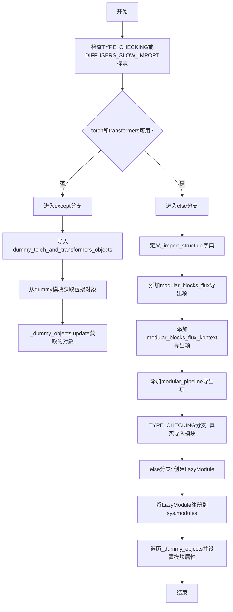
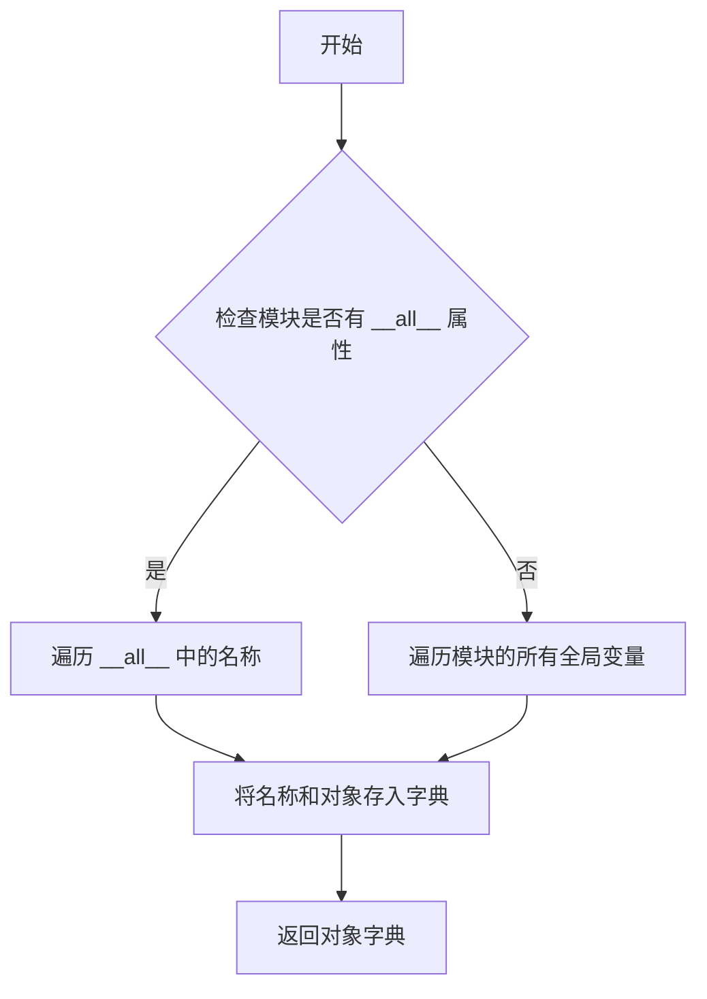

# `diffusers\src\diffusers\modular_pipelines\flux\__init__.py` 详细设计文档

这是一个Diffusers实验性模块的惰性加载器，根据运行时环境动态导入Flux相关模块（FluxAutoBlocks、FluxKontextAutoBlocks、FluxKontextModularPipeline、FluxModularPipeline），在缺少torch和transformers依赖时使用虚拟对象进行优雅降级。

## 整体流程



## 类结构

```
LazyModule (utils._LazyModule)
└── FluxModule (当前模块)
    ├── FluxAutoBlocks (modular_blocks_flux)
    ├── FluxKontextAutoBlocks (modular_blocks_flux_kontext)
    ├── FluxKontextModularPipeline (modular_pipeline)
    └── FluxModularPipeline (modular_pipeline)
```

## 全局变量及字段


### `_dummy_objects`
    
A dictionary that stores dummy objects used as placeholders for optional dependencies when they are not available.

类型：`dict`
    


### `_import_structure`
    
A dictionary mapping module names to lists of exported names, used to define the lazy import structure.

类型：`dict`
    


### `TYPE_CHECKING`
    
A flag from the typing module that is True when type checking is being performed, otherwise False.

类型：`bool`
    


### `DIFFUSERS_SLOW_IMPORT`
    
A flag indicating whether the module should perform a slow import process, used to control lazy loading behavior.

类型：`bool`
    


### `OptionalDependencyNotAvailable`
    
An exception class that signals a required optional dependency is not available.

类型：`type`
    


### `is_torch_available`
    
A function that checks whether PyTorch is installed and available.

类型：`Callable[[], bool]`
    


### `is_transformers_available`
    
A function that checks whether the transformers library is installed and available.

类型：`Callable[[], bool]`
    


### `get_objects_from_module`
    
A utility function that extracts all objects from a given module and returns them as a dictionary.

类型：`Callable[[Any], dict]`
    


### `_LazyModule.__name__`
    
The name of the lazy module (a string).

类型：`str`
    


### `_LazyModule.__file__`
    
The file path of the lazy module (a string).

类型：`str`
    


### `_LazyModule._import_structure`
    
The dictionary holding the import structure for the lazy module.

类型：`dict`
    


### `_LazyModule.__spec__`
    
The module spec (ModuleSpec) describing the lazy module's imports and location.

类型：`ModuleSpec`
    
    

## 全局函数及方法


### `get_objects_from_module`

这是一个从给定模块中提取所有可导出对象的函数，通常用于动态创建虚拟对象或延迟导入场景。它扫描模块的 `__all__` 属性或全局命名空间，将对象存储到字典中以便后续使用。

参数：

- `module`：模块对象，需要提取对象的源模块

返回值：`dict`，返回模块中所有可导出对象的字典，键为对象名称，值为对象本身

#### 流程图



#### 带注释源码

```
# 由于提供的代码片段中没有 get_objects_from_module 的定义，
# 以下是基于其使用方式的推断实现：

def get_objects_from_module(module):
    """
    从模块中提取所有可导出对象。
    
    参数:
        module: 要提取对象的模块对象
        
    返回:
        包含模块中所有对象的字典
    """
    objects = {}
    
    # 优先使用 __all__ 列表（如果存在）
    if hasattr(module, '__all__'):
        for name in module.__all__:
            objects[name] = getattr(module, name)
    else:
        # 否则获取模块的所有公共属性
        for name in dir(module):
            if not name.startswith('_'):
                objects[name] = getattr(module, name)
    
    return objects
```

**注意**：提供的代码片段中仅包含 `get_objects_from_module` 的**使用位置**，并未包含该函数的实际定义。该函数是从 `...utils` 包中导入的，其完整实现需要在 `diffusers` 库的 utils 模块中查找。根据代码中的调用方式 `get_objects_from_module(dummy_torch_and_transformers_objects)`，可以推断该函数接收一个模块对象作为参数，并返回该模块中所有可导出对象的字典。


### `setattr` (内置函数)

设置指定对象中指定属性的值。

参数：

- `obj`：任意 Python 对象，要设置其属性的对象
- `name`：字符串，表示属性名称
- `value`：任意值，要设置给属性的值

返回值：`None`，无返回值（Python 中 `setattr` 返回 `None`）

#### 流程图

```mermaid
flowchart TD
    A[开始] --> B[遍历 _dummy_objects.items()]
    B --> C{还有更多键值对?}
    C -->|是| D[获取当前键值对: name, value]
    D --> E[调用 setattr sys.modules[__name__], name, value]
    E --> F[将 _dummy_objects 中的每个对象设置为模块属性]
    F --> C
    C -->|否| G[结束]
    
    style E fill:#f9f,stroke:#333,stroke-width:2px
```

#### 带注释源码

```python
# 遍历 _dummy_objects 字典中的所有键值对
# _dummy_objects 包含当 torch 和 transformers 不可用时的虚拟对象
for name, value in _dummy_objects.items():
    # 使用 setattr 将每个虚拟对象设置为当前模块的属性
    # 参数说明：
    #   obj: sys.modules[__name__] 即当前模块对象
    #   name: 虚拟对象的名称（字符串）
    #   value: 虚拟对象本身（通常是抛出 OptionalDependencyNotAvailable 异常的类）
    setattr(sys.modules[__name__], name, value)
```

#### 详细说明

这段代码的作用是：当 `torch` 和 `transformers` 依赖不可用时，将 `dummy_torch_and_transformers_objects` 模块中的所有虚拟对象（实际上是会在被调用时抛出 `OptionalDependencyNotAvailable` 异常的类）动态添加到当前模块的属性中。这样做的目的是：

1. **保持 API 一致性**：无论依赖是否可用，模块都导出相同的接口
2. **延迟报错**：用户在尝试使用不可用功能时才会在运行时收到明确的错误信息
3. **类型检查支持**：在 `TYPE_CHECKING` 模式下，可以正确导入类型提示

## 关键组件


### 惰性加载模块 (_LazyModule)

用于延迟导入模块，只有在实际使用时才加载模块内容，提高初始化性能。通过 `sys.modules[__name__] = _LazyModule(...)` 实现。

### 可选依赖检查 (is_torch_available, is_transformers_available)

检查 PyTorch 和 Transformers 库是否可用，用于条件性导入需要这些依赖的类。

### 虚拟对象机制 (_dummy_objects)

当可选依赖不可用时，使用虚拟对象填充模块，防止导入错误。调用 `get_objects_from_module` 从 dummy 模块获取对象。

### 导入结构定义 (_import_structure)

字典类型，定义模块的导入结构，键为模块路径，值为可导入的类名列表。

### Flux 自动化模块 (FluxAutoBlocks)

Flux 模型的自动化模块类，提供模块化块的自动配置功能。

### Flux Kontext 自动化模块 (FluxKontextAutoBlocks)

Flux Kontext 模型的自动化模块类，支持 Kontext 特定功能。

### Flux 模块化流水线 (FluxModularPipeline)

Flux 模型的模块化流水线实现，支持灵活的组件组合和定制。

### Flux Kontext 模块化流水线 (FluxKontextModularPipeline)

Flux Kontext 模型的模块化流水线，专门针对 Kontext 场景的流水线实现。

### 条件导入机制 (TYPE_CHECKING / DIFFUSERS_SLOW_IMPORT)

在类型检查或慢导入模式下直接导入真实类，否则使用惰性加载机制延迟导入。

### 模块动态注册 (setattr)

通过 `setattr(sys.modules[__name__], name, value)` 将虚拟对象动态添加到模块命名空间。


## 问题及建议


### 已知问题

-   **重复代码块**：检查可选依赖是否可用的 `try-except` 逻辑在 `TYPE_CHECKING` 分支和普通导入分支中完全重复，导致代码冗余且维护困难
-   **魔法字符串和硬编码**：模块名（如 `"modular_blocks_flux"`）以字符串形式硬编码在 `_import_structure` 字典中，缺乏集中管理，容易出现拼写错误
-   **使用 `import *`**：使用 `from ...utils.dummy_torch_and_transformers_objects import * # noqa F403` 会导入所有公开成员，违反了显式导入的原则，降低了代码可读性和静态分析能力
-   **全局状态修改**：在模块级别直接修改 `_dummy_objects` 和 `_import_structure` 字典，可能在多线程或复杂导入场景下产生意外的竞态条件
-   **缺少文档注释**：整个文件没有任何文档字符串（docstring），难以理解模块的设计意图和使用方式

### 优化建议

-   **提取公共逻辑**：将可选依赖检查逻辑抽取为单独的辅助函数，例如 `def _check_optional_dependencies()`，在两处调用以消除重复代码
-   **常量集中管理**：定义模块名常量和导入结构映射，使用枚举或配置类集中管理模块名称字符串
-   **避免 `import *`**：明确列出需要导入的具体对象，而非使用通配符导入，提高代码可维护性
-   **延迟初始化模式**：考虑将 `_import_structure` 的构建延迟到实际需要时执行，减少模块加载时的全局状态修改
-   **添加文档字符串**：为模块和关键函数添加 docstring，说明模块用途、依赖要求和导入机制

## 其它


### 设计目标与约束

本模块采用懒加载机制，主要目标是减少Diffusers库在未使用Flux模块时的初始加载时间，同时提供清晰的模块导入接口。设计约束包括：必须依赖torch和transformers两个可选库，当这些依赖不可用时应提供虚拟对象而非直接报错，以及保持与现有Diffusers模块导入机制的一致性。

### 错误处理与异常设计

模块主要通过OptionalDependencyNotAvailable异常处理可选依赖的缺失。当torch或transformers任一不可用时，抛出该异常并回退到虚拟对象。虚拟对象的实现通过get_objects_from_module从dummy模块获取，确保在依赖缺失时导入不会崩溃。此外，使用try-except块捕获OptionalDependencyNotAvailable，确保异常被正确处理并转换为相应的虚拟对象集合。

### 外部依赖与接口契约

本模块对外部有三个层次的依赖：1）torch和transformers作为核心可选依赖，必须在运行时可用才能导入实际模块；2）diffusers.utils中的辅助工具，包括_LazyModule、get_objects_from_module、OptionalDependencyNotAvailable等；3）内部子模块modular_blocks_flux、modular_blocks_flux_kontext、modular_pipeline。接口契约方面，对外暴露FluxAutoBlocks、FluxKontextAutoBlocks、FluxKontextModularPipeline、FluxModularPipeline四个类，其他模块通过这些类名进行导入。

### 模块懒加载机制

_LazyModule是实现懒加载的核心组件，其工作流程如下：1）在非TYPE_CHECK且非DIFFUSERS_SLOW_IMPORT模式下，不立即导入子模块；2）将当前模块注册为_LazyModule实例；3）当访问模块属性时，_LazyModule根据_import_structure动态加载需要的子模块；4）_dummy_objects通过setattr注入到模块中，确保即使依赖缺失时属性访问也不会抛出AttributeError。这种机制显著优化了库的导入性能。

### 类型检查支持

通过TYPE_CHECKING条件分支，模块为类型检查器提供完整的类型信息。在类型检查模式下，会立即导入所有子模块以便获取类型注解，而不会触发_LazyModule机制。这确保了IDE和类型检查工具（如mypy）能够正确识别FluxAutoBlocks等类的类型。

    