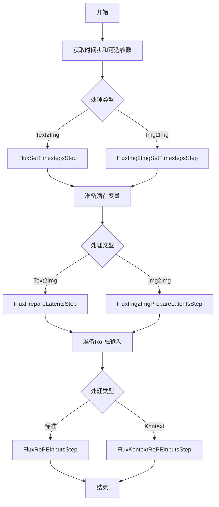
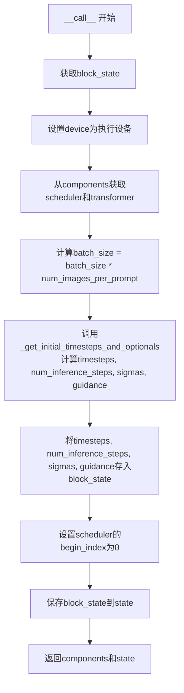
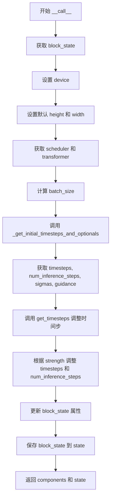
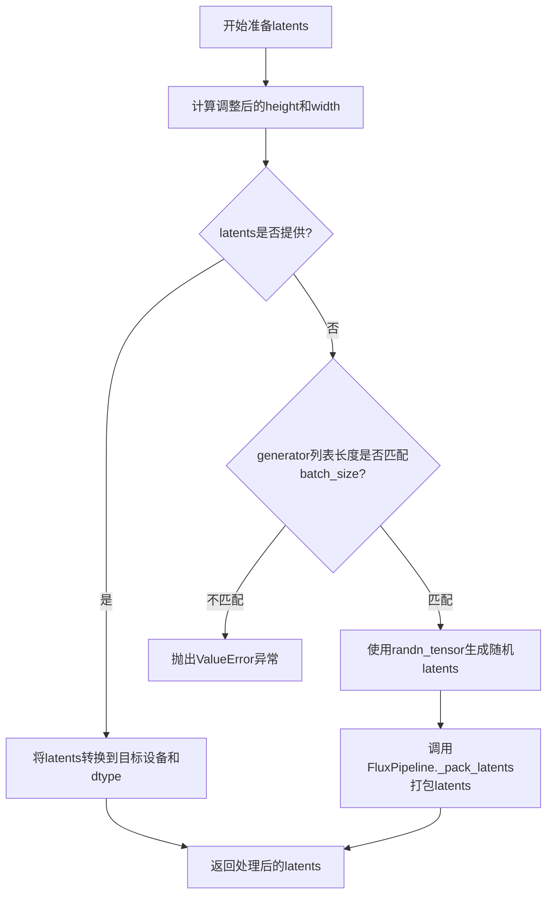
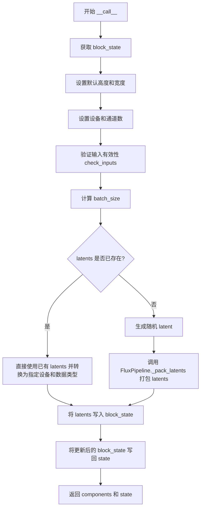
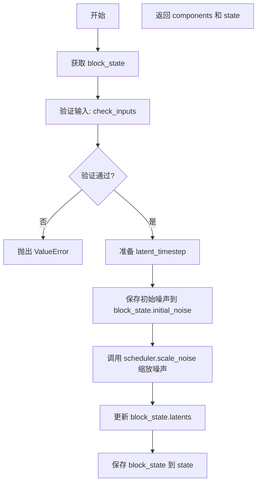
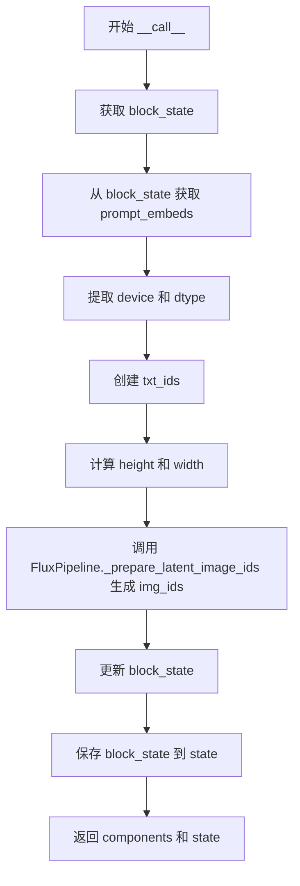

# `diffusers\src\diffusers\modular_pipelines\flux\before_denoise.py` 详细设计文档

该文件实现了Flux模型的模块化管道步骤，包括时间步设置、潜在变量准备和RoPE输入准备等核心功能，支持文本到图像和图像到图像的生成流程。

## 整体流程



## 类结构

```
ModularPipelineBlocks (抽象基类)
├── FluxSetTimestepsStep (文本到图像时间步设置)
├── FluxImg2ImgSetTimestepsStep (图像到图像时间步设置)
├── FluxPrepareLatentsStep (文本到图像潜在变量准备)
├── FluxImg2ImgPrepareLatentsStep (图像到图像潜在变量准备)
├── FluxRoPEInputsStep (标准RoPE输入准备)
└── FluxKontextRoPEInputsStep (Kontext RoPE输入准备)
```

## 全局变量及字段


### `logger`
    
模块级别的日志记录器，用于输出调试和信息日志

类型：`logging.Logger`
    


### `retrieve_timesteps`
    
调用调度器的set_timesteps方法并从调度器中检索时间步，处理自定义时间步，任何kwargs将传递给scheduler.set_timesteps

类型：`function`
    


### `calculate_shift`
    
计算图像序列长度的移位值，用于调整扩散模型的时间步调度

类型：`function`
    


### `retrieve_latents`
    
从编码器输出中检索潜在变量，支持采样模式和argmax模式

类型：`function`
    


### `_get_initial_timesteps_and_optionals`
    
获取初始时间步和可选参数，包括计算图像序列长度、sigmas、移位值和指导值

类型：`function`
    


### `image_seq_len`
    
图像序列长度，基于高度和宽度以及VAE缩放因子计算

类型：`int`
    


### `sigmas`
    
自定义sigmas用于覆盖调度器的时间步间距策略

类型：`list[float] | None`
    


### `mu`
    
计算得到的时间步移位值，用于调整噪声调度

类型：`float`
    


### `batch_size`
    
批处理大小，等于原始批处理大小乘以每提示生成的图像数量

类型：`int`
    


### `timesteps`
    
从调度器中检索的时间步序列，用于推理过程中的去噪

类型：`torch.Tensor`
    


### `num_inference_steps`
    
推理时执行的去噪步数

类型：`int`
    


### `guidance`
    
可选的指导值，用于分类器-free指导推理

类型：`torch.Tensor | None`
    


### `FluxSetTimestepsStep.model_name`
    
模型名称标识，固定为'flux'

类型：`str`
    


### `FluxSetTimestepsStep.expected_components`
    
该步骤期望的组件规范列表，需要FlowMatchEulerDiscreteScheduler

类型：`list[ComponentSpec]`
    


### `FluxSetTimestepsStep.description`
    
步骤的描述，说明该步骤设置推理调度器的时间步

类型：`str`
    


### `FluxSetTimestepsStep.inputs`
    
该步骤的输入参数列表，包括num_inference_steps、timesteps、sigmas等

类型：`list[InputParam]`
    


### `FluxSetTimestepsStep.intermediate_outputs`
    
该步骤的中间输出列表，包括timesteps、num_inference_steps和guidance

类型：`list[OutputParam]`
    


### `FluxImg2ImgSetTimestepsStep.model_name`
    
模型名称标识，固定为'flux'

类型：`str`
    


### `FluxImg2ImgSetTimestepsStep.expected_components`
    
该步骤期望的组件规范列表，需要FlowMatchEulerDiscreteScheduler

类型：`list[ComponentSpec]`
    


### `FluxImg2ImgSetTimestepsStep.description`
    
步骤的描述，说明该步骤为图像到图像推理设置调度器的时间步

类型：`str`
    


### `FluxImg2ImgSetTimestepsStep.inputs`
    
该步骤的输入参数列表，包括num_inference_steps、timesteps、strength等

类型：`list[InputParam]`
    


### `FluxImg2ImgSetTimestepsStep.intermediate_outputs`
    
该步骤的中间输出列表，包括timesteps、num_inference_steps和guidance

类型：`list[OutputParam]`
    


### `FluxPrepareLatentsStep.model_name`
    
模型名称标识，固定为'flux'

类型：`str`
    


### `FluxPrepareLatentsStep.expected_components`
    
该步骤期望的组件规范列表，此步骤不需要特定组件

类型：`list[ComponentSpec]`
    


### `FluxPrepareLatentsStep.description`
    
步骤的描述，准备文本到图像生成过程的潜在变量

类型：`str`
    


### `FluxPrepareLatentsStep.inputs`
    
该步骤的输入参数列表，包括height、width、latents、generator等

类型：`list[InputParam]`
    


### `FluxPrepareLatentsStep.intermediate_outputs`
    
该步骤的中间输出列表，包含用于去噪过程的初始潜在变量

类型：`list[OutputParam]`
    


### `FluxImg2ImgPrepareLatentsStep.model_name`
    
模型名称标识，固定为'flux'

类型：`str`
    


### `FluxImg2ImgPrepareLatentsStep.expected_components`
    
该步骤期望的组件规范列表，需要FlowMatchEulerDiscreteScheduler

类型：`list[ComponentSpec]`
    


### `FluxImg2ImgPrepareLatentsStep.description`
    
步骤的描述，为图像到图像处理向图像潜在变量添加噪声

类型：`str`
    


### `FluxImg2ImgPrepareLatentsStep.inputs`
    
该步骤的输入参数列表，包括latents、image_latents和timesteps

类型：`list[InputParam]`
    


### `FluxImg2ImgPrepareLatentsStep.intermediate_outputs`
    
该步骤的中间输出列表，包含初始随机噪声

类型：`list[OutputParam]`
    


### `FluxRoPEInputsStep.model_name`
    
模型名称标识，固定为'flux'

类型：`str`
    


### `FluxRoPEInputsStep.description`
    
步骤的描述，准备去噪过程的RoPE输入，应放在文本编码器和潜在变量准备步骤之后

类型：`str`
    


### `FluxRoPEInputsStep.inputs`
    
该步骤的输入参数列表，包括height、width和prompt_embeds

类型：`list[InputParam]`
    


### `FluxRoPEInputsStep.intermediate_outputs`
    
该步骤的中间输出列表，包含txt_ids和img_ids用于RoPE计算

类型：`list[OutputParam]`
    


### `FluxKontextRoPEInputsStep.model_name`
    
模型名称标识，固定为'flux-kontext'

类型：`str`
    


### `FluxKontextRoPEInputsStep.description`
    
步骤的描述，为Flux Kontext的去噪过程准备RoPE输入

类型：`str`
    


### `FluxKontextRoPEInputsStep.inputs`
    
该步骤的输入参数列表，包括image_height、image_width、height、width和prompt_embeds

类型：`list[InputParam]`
    


### `FluxKontextRoPEInputsStep.intermediate_outputs`
    
该步骤的中间输出列表，包含txt_ids和img_ids用于RoPE计算

类型：`list[OutputParam]`
    
    

## 全局函数及方法


### `retrieve_timesteps`

该函数是调度器时间步获取的核心工具方法，用于调用调度器的 `set_timesteps` 方法并从调度器中检索时间步。它支持自定义时间步（timesteps）或自定义sigmas，并能处理不同的调度器配置，是扩散模型推理过程中设置去噪时间表的关键函数。

参数：

- `scheduler`：`SchedulerMixin`，调度器对象，用于获取时间步的调度器实例
- `num_inference_steps`：`int | None`，推理步数，用于生成样本的扩散步数，如果使用此参数则 `timesteps` 必须为 `None`
- `device`：`str | torch.device | None`，设备，用于将时间步移动到的设备，如果为 `None` 则不移动时间步
- `timesteps`：`list[int] | None`，自定义时间步，用于覆盖调度器的时间步间距策略，如果传递此参数则 `num_inference_steps` 和 `sigmas` 必须为 `None`
- `sigmas`：`list[float] | None`，自定义sigmas，用于覆盖调度器的sigma间距策略，如果传递此参数则 `num_inference_steps` 和 `timesteps` 必须为 `None`
- `**kwargs`：任意关键字参数，将传递给 `scheduler.set_timesteps` 方法

返回值：`tuple[torch.Tensor, int]`，第一个元素是调度器的时间步张量，第二个元素是推理步数

#### 流程图

```mermaid
flowchart TD
    A[开始 retrieve_timesteps] --> B{检查 timesteps 和 sigmas 是否同时传递}
    B -->|是| C[抛出 ValueError]
    B -->|否| D{检查 timesteps 是否为 None}
    
    D -->|否| E{检查 scheduler.set_timesteps 是否接受 timesteps 参数}
    E -->|否| F[抛出 ValueError 提示调度器不支持自定义时间步]
    E -->|是| G[调用 scheduler.set_timesteps 设置 timesteps]
    G --> H[获取 scheduler.timesteps]
    H --> I[计算 num_inference_steps = len(timesteps)]
    I --> J[返回 timesteps, num_inference_steps]
    
    D -->|是| K{检查 sigmas 是否为 None}
    K -->|否| L{检查 scheduler.set_timesteps 是否接受 sigmas 参数}
    L -->|否| M[抛出 ValueError 提示调度器不支持自定义 sigmas]
    L -->|是| N[调用 scheduler.set_timesteps 设置 sigmas]
    N --> O[获取 scheduler.timesteps]
    O --> P[计算 num_inference_steps = len(timesteps)]
    P --> J
    
    K -->|是| Q[调用 scheduler.set_timesteps 使用 num_inference_steps]
    Q --> R[获取 scheduler.timesteps]
    R --> J
    
    C --> S[结束]
    J --> S
```

#### 带注释源码

```python
def retrieve_timesteps(
    scheduler,
    num_inference_steps: int | None = None,
    device: str | torch.device | None = None,
    timesteps: list[int] | None = None,
    sigmas: list[float] | None = None,
    **kwargs,
):
    r"""
    Calls the scheduler's `set_timesteps` method and retrieves timesteps from the scheduler after the call. Handles
    custom timesteps. Any kwargs will be supplied to `scheduler.set_timesteps`.

    Args:
        scheduler (`SchedulerMixin`):
            The scheduler to get timesteps from.
        num_inference_steps (`int`):
            The number of diffusion steps used when generating samples with a pre-trained model. If used, `timesteps`
            must be `None`.
        device (`str` or `torch.device`, *optional*):
            The device to which the timesteps should be moved to. If `None`, the timesteps are not moved.
        timesteps (`list[int]`, *optional*):
            Custom timesteps used to override the timestep spacing strategy of the scheduler. If `timesteps` is passed,
            `num_inference_steps` and `sigmas` must be `None`.
        sigmas (`list[float]`, *optional*):
            Custom sigmas used to override the timestep spacing strategy of the scheduler. If `sigmas` is passed,
            `num_inference_steps` and `timesteps` must be `None`.

    Returns:
        `tuple[torch.Tensor, int]`: A tuple where the first element is the timestep schedule from the scheduler and the
        second element is the number of inference steps.
    """
    # 验证逻辑：timesteps 和 sigmas 不能同时传递，只能选择其中一种自定义方式
    if timesteps is not None and sigmas is not None:
        raise ValueError("Only one of `timesteps` or `sigmas` can be passed. Please choose one to set custom values")
    
    # 处理自定义 timesteps 的情况
    if timesteps is not None:
        # 检查调度器的 set_timesteps 方法是否支持 timesteps 参数
        accepts_timesteps = "timesteps" in set(inspect.signature(scheduler.set_timesteps).parameters.keys())
        if not accepts_timesteps:
            raise ValueError(
                f"The current scheduler class {scheduler.__class__}'s `set_timesteps` does not support custom"
                f" timestep schedules. Please check whether you are using the correct scheduler."
            )
        # 调用调度器的 set_timesteps 方法设置自定义时间步
        scheduler.set_timesteps(timesteps=timesteps, device=device, **kwargs)
        # 从调度器获取设置后的时间步
        timesteps = scheduler.timesteps
        # 计算推理步数
        num_inference_steps = len(timesteps)
    # 处理自定义 sigmas 的情况
    elif sigmas is not None:
        # 检查调度器的 set_timesteps 方法是否支持 sigmas 参数
        accept_sigmas = "sigmas" in set(inspect.signature(scheduler.set_timesteps).parameters.keys())
        if not accept_sigmas:
            raise ValueError(
                f"The current scheduler class {scheduler.__class__}'s `set_timesteps` does not support custom"
                f" sigmas schedules. Please check whether you are using the correct scheduler."
            )
        # 调用调度器的 set_timesteps 方法设置自定义 sigmas
        scheduler.set_timesteps(sigmas=sigmas, device=device, **kwargs)
        # 从调度器获取设置后的时间步
        timesteps = scheduler.timesteps
        # 计算推理步数
        num_inference_steps = len(timesteps)
    # 处理默认情况：使用 num_inference_steps 设置时间步
    else:
        scheduler.set_timesteps(num_inference_steps, device=device, **kwargs)
        timesteps = scheduler.timesteps
    
    # 返回时间步张量和推理步数
    return timesteps, num_inference_steps
```


### `calculate_shift`

该函数用于计算 Flux 模型中调度器的时间步偏移量（shift），通过线性插值根据图像序列长度在基础偏移量和最大偏移量之间进行平滑过渡，以优化不同分辨率图像的去噪过程。

参数：

- `image_seq_len`：`int`，图像的序列长度，通常由图像高度和宽度通过 VAE 缩放因子计算得出
- `base_seq_len`：`int = 256`，基础序列长度，用于线性插值的基准点
- `max_seq_len`：`int = 4096`，最大序列长度，用于线性插值的另一个基准点
- `base_shift`：`float = 0.5`，基础偏移量，对应 base_seq_len 时的偏移值
- `max_shift`：`float = 1.15`，最大偏移量，对应 max_seq_len 时的偏移值

返回值：`float`，计算得到的偏移量（mu），用于调度器的 mu 参数

#### 流程图

```mermaid
flowchart TD
    A[开始] --> B[输入 image_seq_len, base_seq_len, max_seq_len, base_shift, max_shift]
    B --> C[计算斜率 m = (max_shift - base_shift) / (max_seq_len - base_seq_len)]
    C --> D[计算截距 b = base_shift - m * base_seq_len]
    D --> E[计算偏移量 mu = image_seq_len * m + b]
    E --> F[返回 mu]
```

#### 带注释源码

```python
# Copied from diffusers.pipelines.flux.pipeline_flux.calculate_shift
def calculate_shift(
    image_seq_len,             # 图像序列长度，由图像尺寸计算得出
    base_seq_len: int = 256,   # 基础序列长度，默认256
    max_seq_len: int = 4096,   # 最大序列长度，默认4096
    base_shift: float = 0.5,  # 基础偏移量，默认0.5
    max_shift: float = 1.15,   # 最大偏移量，默认1.15
):
    # 计算线性插值的斜率 (slope)
    # 表示每单位序列长度变化对应的偏移量变化
    m = (max_shift - base_shift) / (max_seq_len - base_seq_len)
    
    # 计算线性截距 (intercept)
    # 使得直线经过 (base_seq_len, base_shift) 点
    b = base_shift - m * base_seq_len
    
    # 根据图像序列长度计算最终的偏移量
    # 使用线性方程: mu = m * image_seq_len + b
    mu = image_seq_len * m + b
    
    # 返回计算得到的偏移量，用于调度器的时间步调整
    return mu
```


### `retrieve_latents`

从编码器输出中检索潜在向量的全局函数，根据`sample_mode`参数从潜在分布中采样或返回最可能的潜在向量。

参数：

- `encoder_output`：`torch.Tensor`，编码器输出对象，可能包含`latent_dist`属性（包含`sample()`和`mode()`方法）或`latents`属性
- `generator`：`torch.Generator | None`，可选的随机数生成器，用于从潜在分布中采样时控制随机性
- `sample_mode`：`str`，采样模式，默认为`"sample"`，可选值为`"sample"`（从分布采样）或`"argmax"`（返回分布的众数）

返回值：`torch.Tensor`，检索到的潜在向量张量

#### 流程图

```mermaid
flowchart TD
    A[开始] --> B{encoder_output有latent_dist属性?}
    B -->|是| C{sample_mode == 'sample'?}
    B -->|否| D{encoder_output有latents属性?}
    C -->|是| E[返回 encoder_output.latent_dist.sample<br/>(generator)]
    C -->|否| F{sample_mode == 'argmax'?}
    F -->|是| G[返回 encoder_output.latent_dist.mode<br/>()]
    F -->|否| H[抛出 AttributeError]
    D -->|是| I[返回 encoder_output.latents]
    D -->|否| H
    E --> J[结束]
    G --> J
    I --> J
    H --> J
```

#### 带注释源码

```python
def retrieve_latents(
    encoder_output: torch.Tensor, generator: torch.Generator | None = None, sample_mode: str = "sample"
):
    """
    从编码器输出中检索潜在向量。
    
    该函数支持多种方式获取潜在向量：
    1. 如果encoder_output具有latent_dist属性且sample_mode为'sample'，从分布中采样
    2. 如果encoder_output具有latent_dist属性且sample_mode为'argmax'，返回分布的众数
    3. 如果encoder_output具有latents属性，直接返回该属性
    4. 否则抛出AttributeError异常
    
    Args:
        encoder_output: 编码器输出对象，通常是VAE的编码结果
        generator: 可选的PyTorch随机数生成器，用于控制采样随机性
        sample_mode: 采样模式，'sample'表示随机采样，'argmax'表示取最可能值
    
    Returns:
        torch.Tensor: 检索到的潜在向量
    
    Raises:
        AttributeError: 当encoder_output既没有latent_dist也没有latents属性时抛出
    """
    # 检查encoder_output是否有latent_dist属性，并且sample_mode为"sample"
    if hasattr(encoder_output, "latent_dist") and sample_mode == "sample":
        # 从潜在分布中采样，使用可选的generator控制随机性
        return encoder_output.latent_dist.sample(generator)
    # 检查encoder_output是否有latent_dist属性，并且sample_mode为"argmax"
    elif hasattr(encoder_output, "latent_dist") and sample_mode == "argmax":
        # 返回潜在分布的众数（即最可能的值）
        return encoder_output.latent_dist.mode()
    # 检查encoder_output是否有直接的latents属性
    elif hasattr(encoder_output, "latents"):
        # 直接返回预计算的潜在向量
        return encoder_output.latents
    else:
        # 无法从encoder_output中获取潜在向量，抛出异常
        raise AttributeError("Could not access latents of provided encoder_output")
```


### `_get_initial_timesteps_and_optionals`

该函数是Flux扩散管道中的核心初始化辅助函数，负责计算推理所需的时间步长序列、可选的sigma值以及条件引导向量。它综合考虑了图像分辨率、VAE缩放因子、调度器配置等因素，通过调用调度器的`set_timesteps`方法生成合适的去噪时间表，并根据transformer是否支持guidance嵌入来条件性地创建引导张量。

参数：

- `transformer`：`torch.nn.Module`，Flux变换器模型，用于检查其配置中是否支持guidance嵌入
- `scheduler`：`SchedulerMixin`，扩散调度器，用于设置时间步和计算shift参数
- `batch_size`：`int`，批处理大小，用于扩展guidance张量
- `height`：`int`，生成图像的高度（像素单位）
- `width`：`int`，生成图像的宽度（像素单位）
- `vae_scale_factor`：`int`，VAE的缩放因子，用于计算潜在空间的序列长度
- `num_inference_steps`：`int`，去噪推理的步数，决定时间步的密度
- `guidance_scale`：`float`，分类器自由引导的强度，用于文本到图像的条件生成
- `sigmas`：`list[float] | None`，自定义的sigma值序列，如果为None则根据步数自动生成
- `device`：`str | torch.device`，计算设备，用于张量分配

返回值：`tuple[torch.Tensor, int, list[float] | None, torch.Tensor | None]`，返回一个四元组，包含：
- `timesteps`：时间步张量，形状为(num_inference_steps,)，表示去噪过程中的离散时间点
- `num_inference_steps`：int，实际使用的推理步数（可能因自定义时间步而变化）
- `sigmas`：处理后的sigma列表或None（当使用flow sigmas时）
- `guidance`：条件引导张量，形状为(batch_size,)，或当transformer不支持guidance嵌入时为None

#### 流程图

```mermaid
flowchart TD
    A[开始] --> B[计算image_seq_len<br/>height // vae_scale_factor // 2 × width // vae_scale_factor // 2]
    B --> C{sigmas是否为None?}
    C -->|是| D[使用np.linspace生成默认sigmas<br/>从1.0到1/num_inference_steps]
    C -->|否| E[保留用户提供的sigmas]
    D --> F
    E --> F{scheduler.config.use_flow_sigmas?}
    F -->|是| G[设置sigmas为None]
    F -->|否| H[保留当前sigmas]
    G --> I[调用calculate_shift计算mu参数]
    H --> I
    I --> J[调用retrieve_timesteps获取时间步]
    J --> K{transformer.config.guidance_embeds?}
    K -->|是| L[创建guidance张量<br/>shape=[batch_size], value=guidance_scale]
    K -->|否| M[设置guidance为None]
    L --> N[返回timesteps, num_inference_steps, sigmas, guidance]
    M --> N
```

#### 带注释源码

```python
def _get_initial_timesteps_and_optionals(
    transformer,
    scheduler,
    batch_size,
    height,
    width,
    vae_scale_factor,
    num_inference_steps,
    guidance_scale,
    sigmas,
    device,
):
    # 根据高度、宽度和VAE缩放因子计算潜在空间中的图像序列长度
    # VAE通常将图像缩小vae_scale_factor倍，且在Flux中额外除以2（patch化）
    image_seq_len = (int(height) // vae_scale_factor // 2) * (int(width) // vae_scale_factor // 2)

    # 如果未提供sigmas，则生成默认的线性衰减sigma序列
    # 从1.0（纯噪声）到1/num_inference_steps（几乎无噪声）
    sigmas = np.linspace(1.0, 1 / num_inference_steps, num_inference_steps) if sigmas is None else sigmas
    
    # 检查调度器配置是否要求使用flow sigmas
    # 如果是，则忽略之前计算的sigmas，使用调度器内部的flow sigmas
    if hasattr(scheduler.config, "use_flow_sigmas") and scheduler.config.use_flow_sigmas:
        sigmas = None
    
    # 计算用于时间步偏移的mu参数
    # 这是一种自适应策略，根据图像序列长度动态调整时间步分布
    # 以优化不同分辨率下的生成质量
    mu = calculate_shift(
        image_seq_len,
        scheduler.config.get("base_image_seq_len", 256),      # 默认基础序列长度
        scheduler.config.get("max_image_seq_len", 4096),      # 默认最大序列长度
        scheduler.config.get("base_shift", 0.5),              # 默认基础偏移量
        scheduler.config.get("max_shift", 1.15),              # 默认最大偏移量
    )
    
    # 从调度器检索生成的时间步序列
    # 会调用scheduler.set_timesteps()并返回生成的时间步tensor
    timesteps, num_inference_steps = retrieve_timesteps(
        scheduler, 
        num_inference_steps, 
        device, 
        sigmas=sigmas, 
        mu=mu
    )
    
    # 根据transformer模型配置决定是否需要生成guidance引导张量
    # guidance_embeds表示模型是否支持额外的条件引导输入
    if transformer.config.guidance_embeds:
        # 创建一个全张量填充guidance_scale值
        # 形状为[1]，然后扩展到batch_size以匹配批处理
        guidance = torch.full([1], guidance_scale, device=device, dtype=torch.float32)
        guidance = guidance.expand(batch_size)
    else:
        guidance = None

    # 返回推理所需的所有初始化参数
    return timesteps, num_inference_steps, sigmas, guidance
```


### `FluxSetTimestepsStep.__call__`

设置Flux管道推理的时间步（timesteps），并初始化相关的推理参数（sigmas、guidance等）。

参数：

- `self`：实例本身
- `components`：`FluxModularPipeline`，模块化管道对象，包含scheduler、transformer等组件
- `state`：`PipelineState`，管道状态对象，用于存储中间结果和块状态

返回值：`PipelineState`，更新后的管道状态对象（实际上返回的是元组 `(components, state)`）

#### 流程图



#### 带注释源码

```python
@torch.no_grad()
def __call__(self, components: FluxModularPipeline, state: PipelineState) -> PipelineState:
    """
    执行时间步设置的主方法
    
    参数:
        components: FluxModularPipeline管道组件，包含scheduler、transformer等
        state: PipelineState管道状态，用于存储中间结果
    
    返回:
        更新后的PipelineState（实际返回元组components和state）
    """
    # 从state中获取当前块的状态
    block_state = self.get_block_state(state)
    
    # 设置设备为管道的执行设备（从pipeline获取）
    block_state.device = components._execution_device

    # 从组件中获取scheduler和transformer
    scheduler = components.scheduler
    transformer = components.transformer

    # 计算最终批次大小：基础批次 * 每提示词生成的图像数
    batch_size = block_state.batch_size * block_state.num_images_per_prompt
    
    # 调用辅助函数获取初始时间步和可选参数
    # 该函数内部会：
    # 1. 计算image_seq_len
    # 2. 处理sigmas（如果未提供则生成线性分布）
    # 3. 计算shift值用于调整timestep分布
    # 4. 调用scheduler.set_timesteps设置调度器时间步
    # 5. 如果需要guidance则生成guidance张量
    timesteps, num_inference_steps, sigmas, guidance = _get_initial_timesteps_and_optionals(
        transformer,
        scheduler,
        batch_size,
        block_state.height,
        block_state.width,
        components.vae_scale_factor,
        block_state.num_inference_steps,
        block_state.guidance_scale,
        block_state.sigmas,
        block_state.device,
    )
    
    # 将计算结果存储到block_state中，供后续步骤使用
    block_state.timesteps = timesteps
    block_state.num_inference_steps = num_inference_steps
    block_state.sigmas = sigmas
    block_state.guidance = guidance

    # 设置调度器的起始索引为0
    # 这是为了避免设备到主机(DtoH)的同步操作，在编译时尤其有用
    # 参考: https://github.com/huggingface/diffusers/pull/11696
    components.scheduler.set_begin_index(0)

    # 将更新后的block_state保存回state
    self.set_block_state(state, block_state)
    
    # 返回components和state元组（符合PipelineState的约定）
    return components, state
```


### `FluxImg2ImgSetTimestepsStep.get_timesteps`

该函数用于根据图像到图像（img2img）推理的强度（strength）参数计算并返回调整后的时间步（timesteps）和推理步数。它通过将原始推理步数与强度相乘来确定初始时间步，然后从调度器的时间步列表中切片获取剩余的时间步，同时设置调度器的起始索引以确保正确的去噪起点。

参数：

- `scheduler`：`FlowMatchEulerDiscreteScheduler`，用于获取时间步列表和调度器配置
- `num_inference_steps`：`int`，推理过程中的去噪步数
- `strength`：`float`，图像到图像转换的强度，范围通常为 0 到 1 之间
- `device`：`str | torch.device`，计算设备

返回值：`tuple[torch.Tensor, int]`，元组包含调整后的时间步张量和实际的推理步数

#### 流程图

```mermaid
flowchart TD
    A[开始 get_timesteps] --> B[计算初始时间步 init_timestep<br/>min(num_inference_steps × strength, num_inference_steps)]
    B --> C[计算起始索引 t_start<br/>max(num_inference_steps - init_timestep, 0)]
    C --> D[从 scheduler.timesteps 切片获取时间步<br/>timesteps = scheduler.timesteps[t_start × scheduler.order :]]
    D --> E{scheduler 是否有<br/>set_begin_index 方法?}
    E -->|是| F[调用 scheduler.set_begin_index<br/>设置起始索引为 t_start × scheduler.order]
    E -->|否| G[跳过设置起始索引]
    F --> H[返回 timesteps 和<br/>num_inference_steps - t_start]
    G --> H
```

#### 带注释源码

```python
@staticmethod
# Copied from diffusers.pipelines.stable_diffusion_3.pipeline_stable_diffusion_3_img2img.StableDiffusion3Img2ImgPipeline.get_timesteps with self.scheduler->scheduler
def get_timesteps(scheduler, num_inference_steps, strength, device):
    """
    根据推理强度计算并返回调整后的时间步，用于图像到图像生成任务。
    
    Args:
        scheduler: 调度器对象，用于获取时间步列表
        num_inference_steps: 推理步数
        strength: 强度参数，控制图像保留程度 (0-1)
        device: 计算设备
    
    Returns:
        tuple: (timesteps, actual_inference_steps) 调整后的时间步和实际推理步数
    """
    
    # 根据强度计算初始时间步数量
    # strength 越大，保留的原图信息越少，需要更多的去噪步数
    init_timestep = min(num_inference_steps * strength, num_inference_steps)

    # 计算起始索引，用于从时间步列表中截取
    # 如果 strength=1.0，则 t_start=0，使用所有时间步
    # 如果 strength=0.0，则 t_start=num_inference_steps，时间步为空
    t_start = int(max(num_inference_steps - init_timestep, 0))
    
    # 从调度器的时间步列表中切片获取实际使用的时间步
    # scheduler.order 用于多步调度器（如 Heun 等）
    timesteps = scheduler.timesteps[t_start * scheduler.order :]
    
    # 设置调度器的起始索引，避免设备到主机的同步操作
    # 这对编译模式尤其重要，可以提升性能
    if hasattr(scheduler, "set_begin_index"):
        scheduler.set_begin_index(t_start * scheduler.order)

    # 返回调整后的时间步和实际推理步数
    return timesteps, num_inference_steps - t_start
```


### `FluxImg2ImgSetTimestepsStep.__call__`

该方法是 Flux 图像到图像（Img2Img）模块化流水线的时间步设置步骤，负责初始化去噪过程的调度器时间步、推理步数、噪声 sigma 值和可选的引导向量，并根据图像强度（strength）调整时间步以实现图像到图像的转换效果。

参数：

- `self`：`FluxImg2ImgSetTimestepsStep`，类的实例自身
- `components`：`FluxModularPipeline`，模块化流水线实例，包含所有组件（如 scheduler、transformer、vae 等）
- `state`：`PipelineState`，流水线状态对象，包含当前步骤的块状态（block_state）

返回值：`PipelineState`，更新后的流水线状态对象，包含设置好的时间步、推理步数、sigma 值和引导向量

#### 流程图



#### 带注释源码

```python
@torch.no_grad()
def __call__(self, components: FluxModularPipeline, state: PipelineState) -> PipelineState:
    """
    执行 Flux 图像到图像流水线的时间步设置步骤。
    
    该方法负责：
    1. 初始化调度器的时间步
    2. 根据 strength 参数调整时间步以实现图像到图像的转换
    3. 计算并设置推理所需的 sigma 值和引导向量
    """
    # 从流水线状态中获取当前块状态
    block_state = self.get_block_state(state)
    
    # 设置执行设备（从流水线组件获取）
    block_state.device = components._execution_device

    # 如果未指定 height/width，则使用默认值
    block_state.height = block_state.height or components.default_height
    block_state.width = block_state.width or components.default_width

    # 获取调度器和变换器组件
    scheduler = components.scheduler
    transformer = components.transformer
    
    # 计算有效批大小（考虑每提示生成的图像数量）
    batch_size = block_state.batch_size * block_state.num_images_per_prompt
    
    # 调用辅助函数获取初始时间步和可选参数
    # 包含：timesteps, num_inference_steps, sigmas, guidance
    timesteps, num_inference_steps, sigmas, guidance = _get_initial_timesteps_and_optionals(
        transformer,           # Flux 变换器模型
        scheduler,              # FlowMatchEulerDiscreteScheduler 调度器
        batch_size,             # 批大小
        block_state.height,     # 图像高度
        block_state.width,      # 图像宽度
        components.vae_scale_factor,  # VAE 缩放因子
        block_state.num_inference_steps,  # 推理步数
        block_state.guidance_scale,       # 引导_scale
        block_state.sigmas,    # 自定义 sigma 值（可选）
        block_state.device,     # 计算设备
    )
    
    # 根据图像强度（strength）调整时间步
    # 这对于图像到图像转换至关重要，因为它决定了噪声添加的程度
    timesteps, num_inference_steps = self.get_timesteps(
        scheduler,                         # 调度器
        num_inference_steps,               # 推理步数
        block_state.strength,              # 强度 (0.0-1.0)
        block_state.device,                # 设备
    )
    
    # 将计算结果保存到块状态
    block_state.timesteps = timesteps                  # 调整后的时间步
    block_state.num_inference_steps = num_inference_steps  # 调整后的推理步数
    block_state.sigmas = sigmas                          # 噪声 sigma 值
    block_state.guidance = guidance                      # 引导向量（可选）

    # 将更新后的块状态保存回流水线状态
    self.set_block_state(state, block_state)
    
    # 返回组件和更新后的状态（符合 ModularPipelineBlocks 协议）
    return components, state
```


### `FluxPrepareLatentsStep.check_inputs`

验证 `height` 和 `width` 参数是否为 `vae_scale_factor * 2` 的倍数，仅通过日志警告提示不符合要求的尺寸，但不会阻止执行。

参数：

-  `components`：`FluxModularPipeline`，包含 VAE 缩放因子等组件配置的对象
-  `block_state`：`PipelineState`，包含 `height` 和 `width` 信息的块状态对象

返回值：`None`（无返回值），仅执行日志警告

#### 流程图

```mermaid
flowchart TD
    A[开始 check_inputs] --> B{height 不为 None 且 height % (vae_scale_factor * 2) != 0?}
    B -->|是| C[记录警告: height 不符合要求]
    B -->|否| D{width 不为 None 且 width % (vae_scale_factor * 2) != 0?}
    C --> D
    D -->|是| E[记录警告: width 不符合要求]
    D -->|否| F[结束]
    E --> F
```

#### 带注释源码

```python
@staticmethod
def check_inputs(components, block_state):
    # 检查 height 或 width 是否未正确对齐
    # 要求：height 和 width 必须能被 vae_scale_factor * 2 整除
    if (block_state.height is not None and block_state.height % (components.vae_scale_factor * 2) != 0) or (
        block_state.width is not None and block_state.width % (components.vae_scale_factor * 2) != 0
    ):
        # 记录警告日志，提醒用户当前尺寸可能导致异常或次优结果
        # 注意：仅警告，不抛出异常，流程仍会继续执行
        logger.warning(
            f"`height` and `width` have to be divisible by {components.vae_scale_factor} but are {block_state.height} and {block_state.width}."
        )
```


### `FluxPrepareLatentsStep.prepare_latents`

该静态方法用于为文本到图像生成过程准备潜在变量（latents）。它根据指定的批次大小、通道数、高度和宽度初始化潜在变量，或者使用用户提供的潜在变量，并对其进行必要的设备转换和打包处理。

参数：

- `comp`：`FluxModularPipeline`，Pipeline组件对象，包含VAE缩放因子等配置信息
- `batch_size`：`int`，生成的批次大小（考虑每提示图像数量）
- `num_channels_latents`：`int`，潜在变量的通道数
- `height`：`int`，目标图像高度（像素单位）
- `width`：`int`，目标图像宽度（像素单位）
- `dtype`：`torch.dtype`，模型输入的数据类型
- `device`：`str | torch.device`，计算设备
- `generator`：`torch.Generator | None`，随机数生成器，用于可重复的噪声生成
- `latents`：`torch.Tensor | None`，用户提供的潜在变量，如果为None则随机生成

返回值：`torch.Tensor`，准备好的潜在变量张量（已打包格式）

#### 流程图



#### 带注释源码

```python
@staticmethod
def prepare_latents(
    comp,                          # Pipeline组件对象，包含配置信息
    batch_size,                    # 批次大小
    num_channels_latents,          # 潜在变量的通道数
    height,                        # 输入图像高度（像素）
    width,                         # 输入图像宽度（像素）
    dtype,                         # 目标数据类型
    device,                        # 目标设备
    generator,                     # 随机数生成器
    latents=None,                  # 可选的预提供latents
):
    # 根据VAE缩放因子调整height和width，得到潜在空间的尺寸
    # VAE通常会将图像缩小vae_scale_factor倍，这里进一步除以2（可能是由于patch化）
    height = 2 * (int(height) // (comp.vae_scale_factor * 2))
    width = 2 * (int(width) // (comp.vae_scale_factor * 2))

    # 构建潜在变量的形状：(batch_size, num_channels, height, width)
    shape = (batch_size, num_channels_latents, height, width)

    # 如果用户提供了latents，直接使用并进行设备/dtype转换
    if latents is not None:
        return latents.to(device=device, dtype=dtype)

    # 验证generator列表长度与batch_size是否匹配
    if isinstance(generator, list) and len(generator) != batch_size:
        raise ValueError(
            f"You have passed a list of generators of length {len(generator)}, but requested an effective batch"
            f" size of {batch_size}. Make sure the batch size matches the length of the generators."
        )

    # 使用randn_tensor生成随机潜在变量（高斯噪声）
    # TODO: move packing latents code to a patchifier similar to Qwen
    latents = randn_tensor(shape, generator=generator, device=device, dtype=dtype)
    
    # 调用FluxPipeline的_pack_latents方法对latents进行打包
    # 打包是将latents转换为适合Transformer模型输入格式的过程
    latents = FluxPipeline._pack_latents(latents, batch_size, num_channels_latents, height, width)

    return latents
```


### `FluxPrepareLatentsStep.__call__`

该方法是 Flux 模 Modular Pipeline 中的一个步骤，负责为文本到图像生成过程准备 latent（潜在表示）。它从 `PipelineState` 中获取当前的块状态，设置必要的参数（如高度、宽度、设备、通道数），验证输入有效性，计算批次大小，然后调用 `prepare_latents` 方法生成或处理 latent 张量，最后将更新后的状态写回并返回。

参数：

- `self`：`FluxPrepareLatentsStep`，调用该方法的实例本身
- `components`：`FluxModularPipeline`，包含所有管道组件的对象，提供对 VAE、transformer 等模型的访问以及配置参数如 `vae_scale_factor` 和 `num_channels_latents`
- `state`：`PipelineState`，管道状态对象，包含当前执行块的状态信息（如高度、宽度、批次大小、生成器等）

返回值：`PipelineState`，更新后的管道状态对象，其中包含生成的 latents 以及其他在方法执行过程中设置的块状态信息

#### 流程图



#### 带注释源码

```python
@torch.no_grad()
def __call__(self, components: FluxModularPipeline, state: PipelineState) -> PipelineState:
    """
    执行 latent 准备步骤，为去噪过程准备初始 latent 张量。
    
    参数:
        components: FluxModularPipeline 实例，包含模型组件和配置
        state: PipelineState 实例，包含当前管道执行状态
    
    返回:
        更新后的 PipelineState，包含生成的 latents
    """
    # 从 PipelineState 中获取当前块的执行状态
    block_state = self.get_block_state(state)
    
    # 如果未指定高度/宽度，则使用组件的默认值
    block_state.height = block_state.height or components.default_height
    block_state.width = block_state.width or components.default_width
    
    # 设置执行设备（CPU/GPU）和 latent 通道数
    block_state.device = components._execution_device
    block_state.num_channels_latents = components.num_channels_latents

    # 验证输入的有效性（高度和宽度必须是 vae_scale_factor * 2 的倍数）
    self.check_inputs(components, block_state)
    
    # 计算有效批次大小 = 原始批次 * 每提示生成的图像数
    batch_size = block_state.batch_size * block_state.num_images_per_prompt
    
    # 调用 prepare_latents 静态方法生成或处理 latent 张量
    block_state.latents = self.prepare_latents(
        components,                      # 管道组件
        batch_size,                      # 有效批次大小
        block_state.num_channels_latents, # latent 通道数
        block_state.height,              # 潜在空间高度
        block_state.width,               # 潜在空间宽度
        block_state.dtype,               # 数据类型（float16/bfloat16 等）
        block_state.device,              # 计算设备
        block_state.generator,           # 随机数生成器（用于可复现性）
        block_state.latents,             # 可选的预提供 latents（可能为 None）
    )

    # 将更新后的块状态写回到管道状态
    self.set_block_state(state, block_state)

    # 返回组件和状态（符合 ModularPipelineBlocks 的调用约定）
    return components, state
```


### `FluxImg2ImgPrepareLatentsStep.check_inputs`

该方法是一个静态验证方法，用于检查 FluxImg2ImgPrepareLatentsStep 步骤的输入参数是否合法。它验证 `image_latents` 与 `latents` 的批次大小是否一致，以及 `image_latents` 是否已正确转换为 3 维（已 patchified）格式。若输入不符合要求，则抛出 `ValueError` 异常。

参数：

-  `image_latents`：`torch.Tensor`，图像 latent 张量，用于去噪过程的图像表示，应为已 patchified 的 3 维张量
-  `latents`：`torch.Tensor`，初始噪声 latent 张量，用于去噪过程的起始噪声

返回值：`None`，无返回值。该方法通过抛出 `ValueError` 异常来处理无效输入，不返回任何值。

#### 流程图

```mermaid
flowchart TD
    A[开始 check_inputs] --> B{检查 image_latents.shape[0] == latents.shape[0]}
    B -->|是| C{检查 image_latents.ndim == 3}
    B -->|否| D[抛出 ValueError: 批次大小不一致]
    C -->|是| E[结束验证通过]
    C -->|否| F[抛出 ValueError: image_latents 维度错误]
    D --> G[结束]
    E --> G
    F --> G
```

#### 带注释源码

```python
@staticmethod
def check_inputs(image_latents, latents):
    """
    验证 FluxImg2ImgPrepareLatentsStep 的输入参数是否合法。
    
    该方法检查以下条件：
    1. image_latents 和 latents 必须具有相同的批次大小
    2. image_latents 必须为 3 维张量（已 patchified）
    
    参数:
        image_latents (torch.Tensor): 已编码的图像 latent 张量，应为 3 维（patchified）
        latents (torch.Tensor): 初始噪声 latent 张量，用于去噪过程
    
    返回:
        None: 验证通过时无返回值
    
    异常:
        ValueError: 当批次大小不一致或 image_latents 维度错误时抛出
    """
    # 检查批次大小是否一致
    if image_latents.shape[0] != latents.shape[0]:
        raise ValueError(
            f"`image_latents` must have have same batch size as `latents`, but got {image_latents.shape[0]} and {latents.shape[0]}"
        )

    # 检查 image_latents 是否为 3 维（patchified 格式）
    if image_latents.ndim != 3:
        raise ValueError(f"`image_latents` must have 3 dimensions (patchified), but got {image_latents.ndim}")
```


### `FluxImg2ImgPrepareLatentsStep.__call__`

该方法是 Flux 图像到图像（Img2Img）管道的潜在变量准备步骤，负责在去噪过程开始前向图像潜在变量添加噪声。它接收初始随机噪声潜在变量、图像潜在变量和时间步，然后通过调度器的 `scale_noise` 方法对潜在变量进行噪声缩放处理，为后续的去噪过程做好准备。

参数：

- `self`：`FluxImg2ImgPrepareLatentsStep` 类的实例方法
- `components`：`FluxModularPipeline`，模块化管道对象，包含所有组件（如 scheduler、transformer 等）
- `state`：`PipelineState`，管道状态对象，用于在各个步骤之间传递数据

返回值：`PipelineState`，更新后的管道状态对象，包含处理后的潜在变量和其他中间状态

#### 流程图



#### 带注释源码

```python
@torch.no_grad()
def __call__(self, components: FluxModularPipeline, state: PipelineState) -> PipelineState:
    """
    执行图像到图像潜在变量准备步骤。
    
    该方法接收初始随机噪声潜在变量、图像潜在变量和时间步，
    并通过调度器的 scale_noise 方法对潜在变量进行噪声缩放处理。
    
    参数:
        components: FluxModularPipeline 模块化管道对象
        state: PipelineState 管道状态对象
    
    返回:
        PipelineState 更新后的管道状态对象
    """
    # 1. 从管道状态中获取当前步骤的块状态
    block_state = self.get_block_state(state)

    # 2. 验证输入参数的有效性
    # 检查 image_latents 和 latents 的批次大小是否一致
    # 检查 image_latents 是否已经过 patchify 处理（3维）
    self.check_inputs(image_latents=block_state.image_latents, latents=block_state.latents)

    # 3. 准备潜在变量的时间步
    # 获取第一个时间步并根据潜在变量的批次大小进行重复
    latent_timestep = block_state.timesteps[:1].repeat(block_state.latents.shape[0])

    # 4. 保存初始噪声副本
    # 保留原始潜在变量以备后续使用（如需要参考原始噪声）
    block_state.initial_noise = block_state.latents

    # 5. 缩放噪声
    # 使用调度器的 scale_noise 方法，根据图像潜在变量和时间步对当前潜在变量进行噪声缩放
    # 这实现了图像到图像的噪声混合：latents = noise * sigma + image_latents * (1 - sigma)
    block_state.latents = components.scheduler.scale_noise(
        block_state.image_latents, latent_timestep, block_state.latents
    )

    # 6. 保存更新后的块状态
    self.set_block_state(state, block_state)

    # 7. 返回更新后的组件和状态
    return components, state
```


### `FluxRoPEInputsStep.__call__`

该方法是 Flux 模型流水线中负责准备 RoPE（Rotary Position Embedding）输入的关键步骤，通过生成文本和图像的位置标识符（txt_ids 和 img_ids），为后续去噪过程提供位置信息支持。

参数：

- `self`：隐式参数，表示类实例本身
- `components`：`FluxModularPipeline`，流水线组件容器，提供对 VAE、transformer 等模型的访问
- `state`：`PipelineState`，流水线状态对象，包含当前步骤的中间数据和配置

返回值：`PipelineState`，实际上返回的是元组 `(components, state)`，其中 components 和 state 都被更新

#### 流程图



#### 带注释源码

```python
def __call__(self, components: FluxModularPipeline, state: PipelineState) -> PipelineState:
    """
    执行 RoPE 输入准备步骤
    
    该步骤为去噪过程准备旋转位置嵌入（RoPE）所需的输入标识符。
    应放在文本编码器和潜在准备步骤之后执行。
    
    参数:
        components: FluxModularPipeline 实例，包含流水线所需的各个组件
        state: PipelineState 实例，包含当前流水线状态和中间数据
    
    返回:
        更新后的 PipelineState（实际返回 components 和 state 元组）
    """
    # 获取当前块的状态
    block_state = self.get_block_state(state)

    # 从块状态中获取提示嵌入
    prompt_embeds = block_state.prompt_embeds
    
    # 提取设备和数据类型
    device, dtype = prompt_embeds.device, prompt_embeds.dtype
    
    # 创建文本位置标识符（txt_ids）
    # 使用 prompt_embeds 的序列长度创建零张量，形状为 [seq_len, 3]
    # 3 表示 x, y, id 三个维度
    block_state.txt_ids = torch.zeros(prompt_embeds.shape[1], 3).to(
        device=prompt_embeds.device, dtype=prompt_embeds.dtype
    )

    # 计算潜在空间的高度和宽度
    # 需要除以 vae_scale_factor * 2 来得到潜在的尺寸
    height = 2 * (int(block_state.height) // (components.vae_scale_factor * 2))
    width = 2 * (int(block_state.width) // (components.vae_scale_factor * 2))
    
    # 使用 FluxPipeline 的辅助方法准备图像位置标识符（img_ids）
    # 注意：这里传入的 height // 2 和 width // 2 是因为 Flux 模型内部会对 latent 进行 2x 上采样
    block_state.img_ids = FluxPipeline._prepare_latent_image_ids(None, height // 2, width // 2, device, dtype)

    # 将更新后的块状态设置回状态对象
    self.set_block_state(state, block_state)

    # 返回组件和状态元组
    return components, state
```


### `FluxKontextRoPEInputsStep.__call__`

该方法为 Flux Kontext 模型的去噪过程准备旋转位置嵌入（RoPE）输入。它根据文本嵌入和图像潜在变量生成对应的位置ID（txt_ids 和 img_ids），支持纯文本到图像生成以及带有输入图像的图像修复/图像编辑场景。

参数：

- `self`：`FluxKontextRoPEInputsStep` 类实例，当前调用对象
- `components`：`FluxModularPipeline`，模块化管道组件，包含 VAE 缩放因子等配置信息
- `state`：`PipelineState`，管道状态对象，用于在各个处理步骤之间传递数据和状态

返回值：`PipelineState`，更新后的管道状态对象，包含新生成的 txt_ids 和 img_ids

#### 流程图

```mermaid
flowchart TD
    A[开始 __call__] --> B[获取 block_state]
    B --> C[从 block_state 获取 prompt_embeds]
    C --> D[提取 device 和 dtype]
    D --> E[创建 txt_ids: torch.zeros(seq_len, 3)]
    E --> F{检查 image_height 和 image_width}
    F -->|存在| G[计算 image_latent 尺寸]
    G --> H[创建 img_ids]
    H --> I[设置 img_ids[..., 0] = 1]
    F -->|不存在| J[跳过图像处理]
    J --> K[计算输出 latent 尺寸]
    K --> L[创建 latent_ids]
    L --> M{img_ids 是否存在?}
    M -->|是| N[拼接 latent_ids 和 img_ids]
    M -->|否| O[直接使用 latent_ids]
    N --> P[设置 block_state.img_ids]
    O --> P
    P --> Q[保存 block_state]
    Q --> R[返回 components 和 state]
```

#### 带注释源码

```python
def __call__(self, components: FluxModularPipeline, state: PipelineState) -> PipelineState:
    """
    为 Flux Kontext 模型准备 RoPE 输入的处理步骤
    
    该方法执行以下操作:
    1. 从管道状态获取当前块状态
    2. 根据提示嵌入创建文本位置 ID (txt_ids)
    3. 根据图像尺寸创建图像位置 ID (img_ids)，支持图像到图像场景
    4. 将位置 ID 存入块状态并返回更新后的状态
    """
    # 从 PipelineState 中获取当前 FluxKontextRoPEInputsStep 的块状态
    block_state = self.get_block_state(state)

    # 获取文本嵌入，用于确定设备、数据类型以及文本序列长度
    prompt_embeds = block_state.prompt_embeds
    
    # 从提示嵌入中提取设备和数据类型
    device, dtype = prompt_embeds.device, prompt_embeds.dtype
    
    # 创建文本序列的位置 ID (txt_ids)
    # 形状为 [seq_len, 3]，其中 seq_len 是提示嵌入的序列长度
    # 初始化为全零，将用于 RoPE 位置编码计算
    block_state.txt_ids = torch.zeros(prompt_embeds.shape[1], 3).to(
        device=prompt_embeds.device, dtype=prompt_embeds.dtype
    )

    # 初始化 img_ids 为 None
    img_ids = None
    
    # 检查是否提供了输入图像的尺寸（用于图像修复/编辑场景）
    if (
        getattr(block_state, "image_height", None) is not None
        and getattr(block_state, "image_width", None) is not None
    ):
        # 计算输入图像对应的 latent 空间高度和宽度
        # 需要除以 VAE 缩放因子和 2（VAE 的下采样因子）
        image_latent_height = 2 * (int(block_state.image_height) // (components.vae_scale_factor * 2))
        image_latent_width = 2 * (int(block_state.image_width) // (components.vae_scale_factor * 2))
        
        # 为输入图像 latent 创建位置 ID
        img_ids = FluxPipeline._prepare_latent_image_ids(
            None, image_latent_height // 2, image_latent_width // 2, device, dtype
        )
        
        # 对于图像 latent，将第一维度设置为 1 而不是 0
        # 这区分了输出 latent（从零开始）和输入图像 latent（从一开始）
        img_ids[..., 0] = 1

    # 计算输出图像对应的 latent 空间高度和宽度
    height = 2 * (int(block_state.height) // (components.vae_scale_factor * 2))
    width = 2 * (int(block_state.width) // (components.vae_scale_factor * 2))
    
    # 为输出 latent 创建位置 ID
    latent_ids = FluxPipeline._prepare_latent_image_ids(None, height // 2, width // 2, device, dtype)

    # 如果存在输入图像 latent，则将其与输出 latent 拼接
    if img_ids is not None:
        # 沿第零维度拼接：先输出 latent，再接输入图像 latent
        latent_ids = torch.cat([latent_ids, img_ids], dim=0)

    # 将最终的位置 ID 存入块状态
    block_state.img_ids = latent_ids

    # 将更新后的块状态保存回管道状态
    self.set_block_state(state, block_state)

    # 返回组件和更新后的状态
    return components, state
```

## 关键组件


### FluxSetTimestepsStep
设置推理时间步的步骤类，负责为扩散模型推理初始化调度器的时间步。通过计算图像序列长度并应用偏移策略，生成用于去噪过程的时间步序列。支持自定义时间步和sigma值，并处理引导值以支持分类器自由引导。

### FluxImg2ImgSetTimestepsStep
图像到图像生成的时间步设置类，继承自FluxSetTimestepsStep但增加了图像强度(strength)参数。根据强度值调整原始时间步，用于控制图像到图像转换中原始图像和生成图像之间的混合比例。

### FluxPrepareLatentsStep
准备潜在向量的步骤类，负责为文本到图像生成准备初始潜在向量。处理潜在向量形状计算、随机噪声生成和packing。支持通过generator进行确定性生成，并自动处理VAE scale因子导致的尺寸调整。

### FluxImg2ImgPrepareLatentsStep
图像到图像的潜在向量准备步骤类，在set_timesteps之后运行。负责将噪声潜在向量与图像潜在向量混合，通过scheduler的scale_noise方法实现图像到图像的去噪过程。验证输入潜在向量的维度兼容性。

### FluxRoPEInputsStep
准备旋转位置编码(RoPE)输入的步骤类，为去噪过程生成txt_ids和img_ids。这些ID用于Transformer模型中的位置嵌入计算，支持文本提示和图像潜在向量的序列长度追踪。

### FluxKontextRoPEInputsStep
Flux Kontext变体的RoPE输入准备步骤，支持更复杂的图像场景。处理图像级别和潜在级别的ID生成，根据image_height和image_width动态生成图像区域的位置编码，支持图像拼接场景。

### retrieve_timesteps全局函数
检索并设置调度器时间步的通用函数，支持自定义时间步或sigma调度。处理不同调度器的接口差异，验证参数兼容性并返回标准化的timestep张量和推理步数。

### calculate_shift全局函数
计算Flow Match模型中图像序列长度偏移量的数学函数。根据基础和最大序列长度以及偏移参数，计算用于调整时间步计划的mu值，优化不同分辨率下的生成质量。

### _get_initial_timesteps_and_optionals全局函数
初始化时间步和相关可选参数的辅助函数，整合了序列长度计算、偏移应用、引导值准备等逻辑。为Flux管道提供统一的时间步初始化入口。

### retrieve_latents全局函数
从编码器输出中提取潜在向量的工具函数，支持多种潜在向量访问模式。根据sample_mode参数选择采样或argmax模式，处理不同VAE输出格式的兼容性问题。

### randn_tensor工具
用于生成符合指定形状、数据类型和设备的随机张量，支持可选的随机数生成器以实现可重现性。是潜在向量初始化的核心依赖。

## 问题及建议


### 已知问题

-   **代码重复**：多个步骤类（如`FluxSetTimestepsStep`和`FluxImg2ImgSetTimestepsStep`、`FluxPrepareLatentsStep`和`FluxImg2ImgPrepareLatentsStep`）之间存在大量重复代码，可通过继承或组合模式重构。
-   **不完整的输入验证**：`FluxPrepareLatentsStep.check_inputs`方法中，当height或width不符合要求时仅发出警告而不抛出异常，可能导致后续处理出现难以追踪的问题。
-   **Magic Numbers硬编码**：多处使用硬编码值（如`2 * (int(height) // (components.vae_scale_factor * 2))`），数字2在多处重复出现，应提取为常量或配置参数。
-   **类型注解不一致**：部分参数（如`generator`）缺少类型注解，函数返回值类型也未完整标注，影响代码可维护性和IDE支持。
-   **注释错误**：代码中存在"the the"等笔误（如FluxPrepareLatentsStep的描述），影响代码专业性。
-   **静态方法设计不当**：`check_inputs`和`prepare_latents`作为静态方法但依赖components对象参数，应改为实例方法或工具函数。
-   **缺少空值检查**：代码中多次访问`components.transformer`、`components.scheduler`等属性但未进行空值检查，可能导致AttributeError。
-   **潜在的性能问题**：`FluxImg2ImgPrepareLatentsStep`中对latents的复制操作（`block_state.initial_noise = block_state.latents`）未使用clone()，可能产生意外引用共享。

### 优化建议

-   **提取公共基类**：将`FluxSetTimestepsStep`和`FluxImg2ImgSetTimestepsStep`的公共逻辑提取到基类中，减少代码重复。
-   **完善输入验证**：将`check_inputs`中的警告改为异常抛出，或添加配置选项控制行为，确保无效输入被及时处理。
-   **提取常量**：将重复出现的magic number提取为模块级常量，如`LATENT_SCALE_FACTOR = 2`。
-   **增强类型注解**：为所有函数参数和返回值添加完整的类型注解，提升代码可读性和类型安全。
-   **添加组件空值检查**：在访问components属性前添加适当的空值检查或使用Optional类型明确声明。
-   **优化tensor操作**：在需要复制tensor时使用`clone()`方法明确意图，避免意外的内存共享。
-   **统一配置管理**：将默认参数（如default_guidance_scale、default_strength）集中管理，便于后续调整。
-   **清理注释**：修正代码中的拼写错误，确保文档的专业性。


## 其它


### 设计目标与约束

1. **核心目标**：为Flux扩散模型实现模块化的pipeline架构，支持text-to-image和image-to-image两种生成模式，并提供可组合的步骤块
2. **约束条件**：
   - 必须使用FlowMatchEulerDiscreteScheduler调度器
   - height和width必须能被vae_scale_factor*2整除（警告级别）
   - batch_size必须与generator列表长度匹配
   - timesteps和sigmas只能同时指定一个
   - image_latents和latents的batch size必须一致

### 错误处理与异常设计

1. **参数校验异常**：
   - `retrieve_timesteps`：当同时指定timesteps和sigmas时抛出ValueError；当调度器不支持自定义timesteps/sigmas时抛出ValueError
   - `prepare_latents`：当generator列表长度与batch_size不匹配时抛出ValueError
   - `FluxImg2ImgPrepareLatentsStep.check_inputs`：当image_latents与latents的batch size不一致或维度不是3维时抛出ValueError
   - `FluxPrepareLatentsStep.check_inputs`：当height/width不能被vae_scale_factor*2整除时记录警告日志

2. **静默处理**：
   - 当scheduler.config.use_flow_sigmas为True时，忽略传入的sigmas参数
   - 当transformer.config.guidance_embeds为False时，guidance为None

### 数据流与状态机

1. **PipelineState流转**：
   - 输入阶段 → 设置timesteps阶段 → 准备latents阶段 → RoPE输入准备阶段 → 解码阶段
   - 每个ModularPipelineBlocks实现通过get_block_state获取当前状态，通过set_block_state更新状态

2. **数据依赖链**：
   - FluxSetTimestepsStep/FluxImg2ImgSetTimestepsStep：依赖batch_size、height、width、num_inference_steps、guidance_scale、sigmas，输出timesteps、num_inference_steps、guidance
   - FluxPrepareLatentsStep：依赖height、width、latents、batch_size、dtype、generator，输出latents
   - FluxImg2ImgPrepareLatentsStep：依赖latents、image_latents、timesteps，输出initial_noise和缩放后的latents
   - FluxRoPEInputsStep/FluxKontextRoPEInputsStep：依赖height、width、prompt_embeds，输出txt_ids和img_ids

### 外部依赖与接口契约

1. **核心依赖**：
   - `FluxPipeline`：提供_pack_latents和_prepare_latent_image_ids方法
   - `FlowMatchEulerDiscreteScheduler`：提供set_timesteps、scale_noise方法
   - `randn_tensor`：工具函数生成随机张量
   - `ModularPipelineBlocks`：基类，定义步骤块接口
   - `PipelineState`：状态管理容器

2. **接口规范**：
   - 所有步骤类必须实现expected_components、description、inputs、intermediate_outputs属性和__call__方法
   - ComponentSpec指定组件名称和类型
   - InputParam/OutputParam定义输入输出参数规范

### 并发与异步考虑

代码中未直接使用异步机制，但通过以下方式支持性能优化：
- 使用torch.no_grad()装饰器禁用梯度计算
- 通过set_begin_index(0)避免Device-to-Host同步

### 安全与隐私

1. **输入验证**：
   - 显式检查所有用户提供的参数
   - 对tensor维度进行严格校验

2. **设备管理**：
   - 明确指定device参数，避免隐式设备转换
   - 支持CPU和CUDA设备

### 版本兼容性

1. **代码继承**：
   - retrieve_timesteps复制自stable_diffusion.pipeline_stable_diffusion
   - calculate_shift复制自flux.pipeline_flux
   - retrieve_latents复制自stable_diffusion.pipeline_stable_diffusion_img2img
   - get_timesteps复制自stable_diffusion_3.pipeline_stable_diffusion_3_img2img

2. **配置兼容性**：
   - 通过hasattr检查调度器属性支持情况
   - 使用get方法安全获取配置项

    