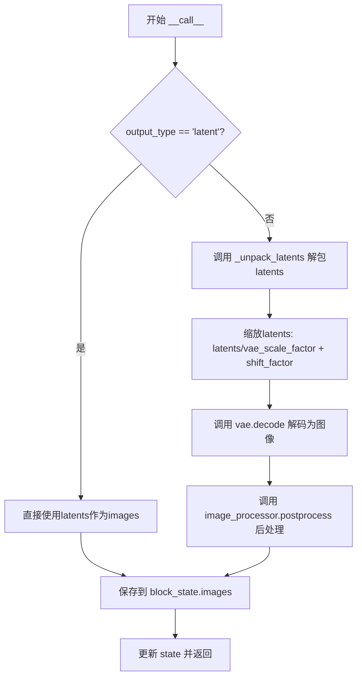
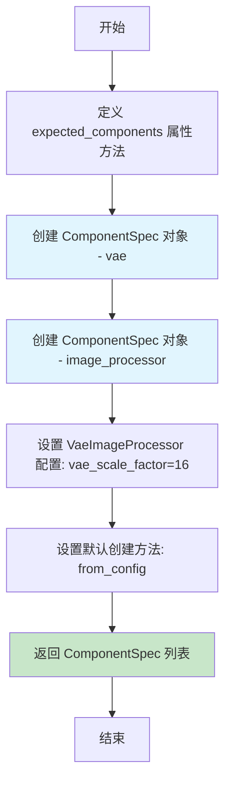
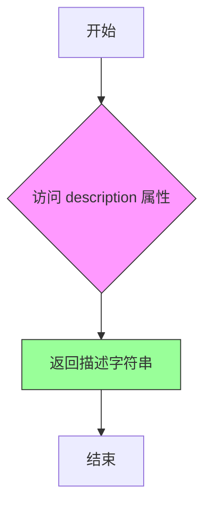
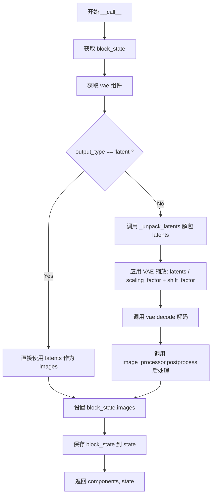

# `diffusers\src\diffusers\modular_pipelines\flux\decoders.py` 详细设计文档

这是一个Flux模型的解码步骤模块，实现了将去噪后的潜在表示(latents)解码转换为图像的功能，支持PIL图片、PyTorch张量或NumPy数组多种输出格式，通过VAE解码器和图像处理器完成最终图像生成。

## 整体流程



## 类结构

```
ModularPipelineBlocks (基类)
└── FluxDecodeStep
```

## 全局变量及字段


### `logger`
    
模块级日志记录器，用于记录运行时的调试和信息日志

类型：`logging.Logger`
    


### `FluxDecodeStep.model_name`
    
类属性，表示模型名称，固定值为'flux'

类型：`str`
    
    

## 全局函数及方法


### `_unpack_latents`

该函数负责将打包（packed）的 latent 张量解包为标准形状，以便后续的 VAE 解码处理。它考虑了 VAE 的 8x 压缩率以及打包操作对张量维度的影响，通过一系列视图变换和维度重排将压缩的 latent 恢复到适合解码的格式。

参数：

- `latents`：`torch.Tensor`，输入的打包 latent 张量，形状为 (batch_size, num_patches, channels)
- `height`：`int`，目标图像的高度（像素单位）
- `width`：`int`，目标图像的宽度（像素单位）
- `vae_scale_factor`：`int`，VAE 的缩放因子，用于计算 latent 空间的实际尺寸

返回值：`torch.Tensor`，解包后的 latent 张量，形状为 (batch_size, channels // 4, height, width)

#### 流程图

```mermaid
flowchart TD
    A[开始: _unpack_latents] --> B[获取输入形状: batch_size, num_patches, channels]
    B --> C[计算目标height和width<br/>height = 2 * (int(height) // (vae_scale_factor * 2))<br/>width = 2 * (int(width) // (vae_scale_factor * 2))]
    C --> D[视图变换: latents.view<br/>(batch_size, height//2, width//2, channels//4, 2, 2)]
    D --> E[维度重排: latents.permute<br/>(0, 3, 1, 4, 2, 5)]
    E --> F[最终重塑: latents.reshape<br/>(batch_size, channels//4, height, width)]
    F --> G[返回解包后的latents]
```

#### 带注释源码

```python
def _unpack_latents(latents, height, width, vae_scale_factor):
    """
    将打包的latent张量解包为标准形状以供VAE解码使用
    
    参数:
        latents: 打包的latent张量，形状为 (batch_size, num_patches, channels)
        height: 目标图像高度
        width: 目标图像宽度  
        vae_scale_factor: VAE的缩放因子（通常为16）
    
    返回:
        解包后的latent张量，形状为 (batch_size, channels//4, height, width)
    """
    # 获取输入张量的维度信息
    batch_size, num_patches, channels = latents.shape

    # VAE对图像应用8x压缩，但还需考虑打包(packing)要求
    # latent的高度和宽度需要能被2整除
    # 计算解码后latent空间的实际尺寸
    height = 2 * (int(height) // (vae_scale_factor * 2))
    width = 2 * (int(width) // (vae_scale_factor * 2))

    # 第一次视图变换：将latents重塑为6维张量
    # 形状从 (batch_size, num_patches, channels) 
    # 变为 (batch_size, height//2, width//2, channels//4, 2, 2)
    # 最后两个维度(2,2)代表打包的2x2块
    latents = latents.view(batch_size, height // 2, width // 2, channels // 4, 2, 2)

    # 维度重排：将打包的维度移到正确位置
    # 从 (batch, h//2, w//2, c//4, 2, 2) 
    # 变为 (batch, c//4, h//2, 2, w//2, 2)
    # 这样可以将两个2x2的打包块展开
    latents = latents.permute(0, 3, 1, 4, 2, 5)

    # 最终重塑：合并打包维度得到标准latent形状
    # 从 (batch, c//4, h//2, 2, w//2, 2)
    # 变为 (batch, c//4, height, width)
    # channels // (2*2) = channels // 4
    latents = latents.reshape(batch_size, channels // (2 * 2), height, width)

    return latents
```


### `FluxDecodeStep.expected_components`

该属性方法定义了 Flux 解码步骤所需的组件规范，返回一个包含 VAE 模型和图像处理器的组件列表，用于将去噪后的潜在表示解码为图像。

参数：无（该方法为属性方法，无参数）

返回值：`list[ComponentSpec]`，返回解码步骤所需的组件规范列表，包含 VAE 模型和图像处理器配置信息。

#### 流程图



#### 带注释源码

```python
@property
def expected_components(self) -> list[ComponentSpec]:
    """
    属性方法，返回解码步骤所需的组件规范列表
    
    返回值类型: list[ComponentSpec]
    返回值描述: 包含 VAE 模型和图像处理器组件的规范定义
    """
    return [
        # 第一个组件规范：VAE 模型
        # 名称: vae
        # 类型: AutoencoderKL (用于将 latents 解码为图像的变分自编码器)
        ComponentSpec("vae", AutoencoderKL),
        
        # 第二个组件规范：VAE 图像处理器
        # 名称: image_processor
        # 类型: VaeImageProcessor (用于后处理解码出的图像)
        # config: 包含 vae_scale_factor=16 的冻结字典配置
        # default_creation_method: 从配置文件中创建
        ComponentSpec(
            "image_processor",
            VaeImageProcessor,
            config=FrozenDict({"vae_scale_factor": 16}),
            default_creation_method="from_config",
        ),
    ]
```


### `FluxDecodeStep.description`

该属性方法用于返回 `FluxDecodeStep` 类的功能描述，说明该步骤是将去噪后的潜在表示（latents）解码为图像的处理过程。

参数： 无

返回值：`str`，返回对该解码步骤功能的文字描述，说明其核心作用是将去噪后的潜在表示转换为图像。

#### 流程图



#### 带注释源码

```python
@property
def description(self) -> str:
    """
    属性方法：返回该解码步骤的描述信息
    
    该方法是一个只读的 @property 装饰器方法，用于提供
    FluxDecodeStep 类的功能说明，帮助文档化和调试。
    
    Returns:
        str: 描述文本，说明该步骤的作用是将去噪后的 latents 解码为图像
    """
    return "Step that decodes the denoised latents into images"
```


### `FluxDecodeStep.inputs`

该属性方法定义了 FluxDecodeStep 解码步骤的输入参数列表，返回一组 `InputParam` 对象，指定了输出类型、图像高度、宽度以及去噪后的潜在向量等必要信息。

参数：暂无（属性方法无需显式参数）

返回值：`list[tuple[str, Any]]`，返回包含四个 `InputParam` 对象的列表，分别定义了 `output_type`、`height`、`width` 和 `latents` 四个输入参数及其默认值和类型约束。

#### 流程图

```mermaid
flowchart TD
    A[调用 FluxDecodeStep.inputs 属性] --> B{返回 InputParam 列表}
    B --> C[output_type: 默认值="pil", 类型: 任意]
    B --> D[height: 默认值=1024, 类型: 任意]
    B --> E[width: 默认值=1024, 类型: 任意]
    B --> F[latents: 必填, 类型: torch.Tensor, 描述: 去噪步骤产生的潜在向量]
    
    C --> G[返回 list[tuple[str, Any]]]
    D --> G
    E --> G
    F --> G
```

#### 带注释源码

```python
@property
def inputs(self) -> list[tuple[str, Any]]:
    """
    属性方法：定义 FluxDecodeStep 的输入参数
    
    返回一个包含 InputParam 对象的列表，每个 InputParam 描述一个输入参数：
    - output_type: 输出类型，默认为 "pil"（PIL 图像格式）
    - height: 输出图像高度，默认为 1024 像素
    - width: 输出图像宽度，默认为 1024 像素
    - latents: 去噪后的潜在向量，必填参数，类型为 torch.Tensor
    
    返回:
        list[tuple[str, Any]]: 输入参数列表
    """
    return [
        # 输出类型参数，默认为 "pil"（PIL 图像格式）
        InputParam("output_type", default="pil"),
        # 图像高度参数，默认值为 1024
        InputParam("height", default=1024),
        # 图像宽度参数，默认值为 1024
        InputParam("width", default=1024),
        # 潜在向量参数，必填，类型提示为 torch.Tensor
        # 描述：该参数接收来自去噪步骤的去噪潜在向量
        InputParam(
            "latents",
            required=True,
            type_hint=torch.Tensor,
            description="The denoised latents from the denoising step",
        ),
    ]
```


### `FluxDecodeStep.intermediate_outputs`

该属性方法定义了 Flux 解码步骤的中间输出规范，指定了从去噪潜在向量解码生成的图像作为输出参数。

参数：无（仅包含隐式参数 `self`）

返回值：`list[OutputParam]`，返回包含图像输出参数的列表，图像格式可为 PIL.Image.Image、torch.Tensor 或 numpy 数组

#### 流程图

```mermaid
flowchart TD
    A[属性方法 intermediate_outputs 被调用] --> B{返回输出规范列表}
    B --> C[创建 OutputParam 对象]
    C --> D[指定输出名称为 'images']
    D --> E[定义类型提示: list[PIL.Image.Image] | torch.Tensor | np.ndarray]
    E --> F[添加描述信息]
    F --> G[返回包含单个 OutputParam 的列表]
```

#### 带注释源码

```python
@property
def intermediate_outputs(self) -> list[str]:
    """
    定义解码步骤的中间输出规范。
    
    该属性返回一个包含 OutputParam 对象的列表，
    描述了从去噪潜在向量解码后生成的图像输出。
    
    返回:
        list[OutputParam]: 包含图像输出参数的列表
    """
    return [
        OutputParam(
            "images",  # 输出参数名称
            type_hint=list[PIL.Image.Image] | torch.Tensor | np.ndarray,  # 支持的类型提示
            description="The generated images, can be a list of PIL.Image.Image, torch.Tensor or a numpy array",  # 输出描述
        )
    ]
```


### `FluxDecodeStep.__call__`

该方法是 Flux 解码步骤的核心实现，负责将去噪后的潜在表示（latents）解码为最终图像。它首先检查输出类型，如果不是 latent 格式，则对 latents 进行解包、缩放和偏移处理，然后通过 VAE 解码器生成图像，最后使用图像处理器进行后处理；如果是 latent 格式，则直接将其作为图像输出。

参数：

- `components`：包含 VAE 模型和图像处理器的组件对象，提供 `vae`、`vae_scale_factor` 和 `image_processor` 属性
- `state`：`PipelineState` 对象，包含当前管道的状态信息，如 `output_type`、`height`、`width`、`latents` 等

返回值：`tuple[Any, PipelineState]`，返回组件对象和更新后的管道状态，其中状态对象包含解码后的图像

#### 流程图



#### 带注释源码

```python
@torch.no_grad()
def __call__(self, components, state: PipelineState) -> PipelineState:
    """
    执行 Flux 解码步骤，将去噪后的 latents 解码为图像
    
    参数:
        components: 包含 VAE 模型和图像处理器的组件对象
        state: 管道状态对象，包含输入的 latents 和输出配置
    
    返回:
        包含组件和更新后状态的元组
    """
    # 从管道状态中获取当前 block 的状态
    block_state = self.get_block_state(state)
    
    # 获取 VAE 模型用于解码
    vae = components.vae

    # 检查输出类型是否为 latent
    if not block_state.output_type == "latent":
        # 获取去噪后的 latents
        latents = block_state.latents
        
        # 解包 latents：处理潜在的打包格式，恢复为标准形状
        # 打包格式将空间信息压缩到通道维度，需要解包还原
        latents = _unpack_latents(
            latents, 
            block_state.height, 
            block_state.width, 
            components.vae_scale_factor
        )
        
        # 应用 VAE 的缩放因子和偏移因子
        # 这是 VAE 训练时使用的归一化参数的逆操作
        latents = (latents / vae.config.scaling_factor) + vae.config.shift_factor
        
        # 使用 VAE 解码器将 latents 转换为图像
        # return_dict=False 返回元组，取第一个元素（生成的图像）
        block_state.images = vae.decode(latents, return_dict=False)[0]
        
        # 对解码后的图像进行后处理
        # 根据 output_type 转换为 PIL Image、Tensor 或 numpy array
        block_state.images = components.image_processor.postprocess(
            block_state.images, 
            output_type=block_state.output_type
        )
    else:
        # 如果输出类型是 latent，直接使用 latents 作为图像输出
        # 不进行 VAE 解码
        block_state.images = block_state.latents

    # 将更新后的 block_state 保存回管道状态
    self.set_block_state(state, block_state)

    # 返回组件和更新后的状态，供下一步Pipeline使用
    return components, state
```

## 关键组件


### FluxDecodeStep

主解码步骤类，继承自ModularPipelineBlocks，负责将去噪后的latents解码为图像，包含VAE解码和图像后处理逻辑

### _unpack_latents

张量解包函数，将压缩的latents张量重新整形为标准图像尺寸，包含了2x2的patch展开和通道重排操作

### VAE解码逻辑

将处理后的latents通过VAE解码器转换为图像，包含缩放因子和偏移量的反量化操作

### 图像后处理模块

使用VaeImageProcessor将解码后的图像转换为指定输出格式（pil/tensor/numpy）

### 张量形状变换

包含latents的view、permute和reshape操作，实现patch展开和通道重排以适配VAE解码器输入要求

### 组件规格定义

定义了expected_components、inputs和intermediate_outputs的规范，明确了VAE和image_processor的依赖关系

### PipelineState状态管理

通过get_block_state和set_block_state方法管理解码步骤的中间状态和输出结果


## 问题及建议


### 已知问题

-   **硬编码的 VAE 缩放因子**：在 `expected_components` 中将 `vae_scale_factor` 硬编码为 16，应该从 VAE 配置动态获取
-   **缺少错误处理**：没有对输入的 `latents` 形状、VAE 可用性、`output_type` 合法性等进行验证
-   **魔法数字**：`_unpack_latents` 函数中的 `2`、`4` 等数字缺乏明确注释，压缩比例 8x 的具体计算逻辑不够清晰
-   **类型注解不一致**：`inputs` 方法返回 `list[tuple[str, Any]]`，但包含 `type_hint` 属性，类型系统混用可能导致类型检查工具失效
-   **返回值不一致**：`__call__` 返回 `(components, state)`，但 `ModularPipelineBlocks` 基类契约不明确，可能导致调用方困惑
-   **缺少文档**：`_unpack_latents` 等私有方法没有 docstring，关键逻辑缺乏解释
-   **状态管理复杂**：`block_state` 的使用模式不清晰，状态传递逻辑缺乏注释

### 优化建议

-   添加输入验证：检查 `latents` 维度、与 `height`/`width` 的一致性、`output_type` 是否为有效值
-   动态获取 `vae_scale_factor` 而非硬编码，或从 VAE 配置中读取
-   为魔法数字添加常量或详细注释，说明 8x 压缩与 packing 的关系
-   完善类型注解，考虑使用 `TypedDict` 或 `Protocol` 明确接口契约
-   为所有公共方法和复杂私有方法添加 docstring
-   添加日志记录以便调试：`logger.debug` 或 `logger.info` 输出关键中间状态
-   考虑将 `_unpack_latents` 移至工具模块或 VAE 处理器中，提高复用性
-   添加单元测试覆盖边界情况（如异常形状的 latents）

## 其它


### 设计目标与约束

本模块的设计目标是将Flux模型去噪后的潜在表示（latents）高效地解码为最终图像，同时支持多种输出格式（ PIL图像、PyTorch张量、NumPy数组）。约束条件包括：必须使用VAE进行解码、图像尺寸必须符合VAE的压缩比例要求、必须支持packed latents格式的解包处理。

### 错误处理与异常设计

当`latents`为None或空张量时，抛出ValueError并提示"Latents cannot be None or empty"。当VAE解码失败时，捕获异常并记录详细错误日志。当输出类型不支持时，使用日志警告并回退到默认的PIL格式。当图像尺寸不符合压缩要求时，自动调整到有效尺寸并记录警告。

### 数据流与状态机

数据流从PipelineState开始，经历以下阶段：1) 从state获取latents、height、width、output_type；2) 如果output_type不为latent，执行_unpack_latents进行解包；3) 应用VAE缩放因子和偏移因子；4) 调用vae.decode进行解码；5) 使用image_processor进行后处理；6) 将结果存回state的images字段。状态机包含三个状态：initial（初始）、processing（处理中）、completed（完成）。

### 外部依赖与接口契约

外部依赖包括：torch库（张量计算）、numpy库（数组处理）、PIL库（图像处理）、transformers库的AutoencoderKL模型、configuration_utils的FrozenDict、utils的logging模块、video_processor的VaeImageProcessor。接口契约要求：components必须包含vae和image_processor组件，state必须包含latents、height、width、output_type字段，返回的state必须包含images字段。

### 性能考虑

使用@torch.no_grad()装饰器禁用梯度计算以减少内存占用。latents解包操作使用视图和置换而非复制以提高效率。图像后处理使用批处理而非逐个处理。建议在GPU上运行以获得更好性能。

### 安全性考虑

输入的latents需要进行形状验证以防止维度错误。VAE配置参数（scaling_factor、shift_factor）需要验证是否为有效数值。输出图像需要检查尺寸限制以防止内存溢出。

### 配置管理

VAE配置通过components.vae.config获取，包括scaling_factor和shift_factor参数。图像处理器配置包含vae_scale_factor=16。后处理配置通过output_type参数动态指定。

### 版本兼容性

代码依赖于transformers库的最新版本AutoencoderKL。PIL图像格式兼容性需要Pillow>=5.0.0。NumPy数组兼容性需要numpy>=1.19.0。PyTorch版本需要>=1.9.0以支持指定类型注解。

### 测试策略

单元测试应覆盖：正常解码流程、latents解包逻辑、后处理各种输出类型、错误输入处理。集成测试应验证与完整Pipeline的兼容性。性能测试应测量解码延迟和内存使用。

### 资源管理

GPU内存峰值发生在vae.decode调用时。建议在解码前清理不需要的张量。批量处理多个样本时可复用VAE模型以提高效率。

### 并发和线程安全

本模块为无状态设计（除了组件引用），可在多线程环境中安全使用。但需要注意PipelineState的线程安全性由调用方保证。

### 监控和日志

使用logger记录关键操作节点。WARNING级别记录参数调整情况。ERROR级别记录解码失败。建议添加解码时间的性能指标记录。


    