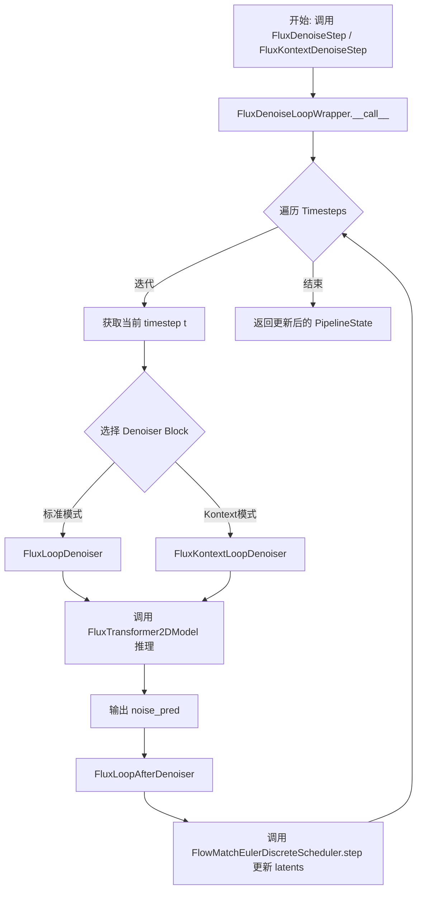
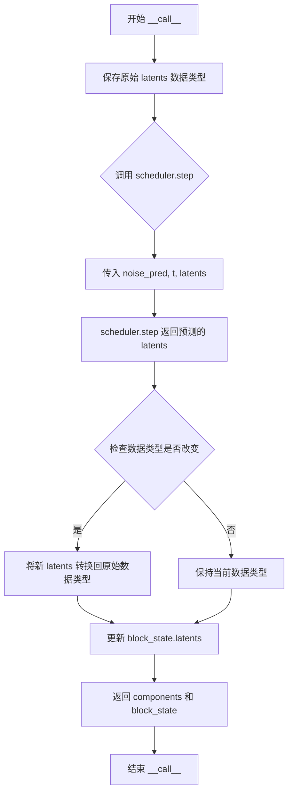
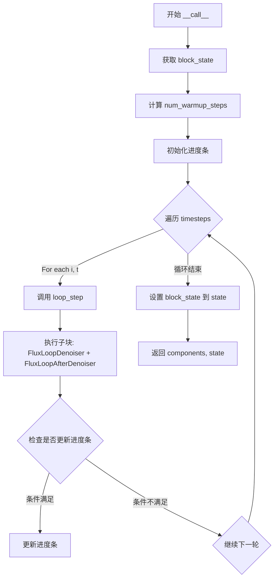

# `diffusers\src\diffusers\modular_pipelines\flux\denoise.py` 详细设计文档

该代码实现了 Flux 扩散模型的迭代去噪逻辑，通过 Transformer 模型进行噪声预测，并使用调度器（Scheduler）更新潜在变量（Latents），支持标准的文本到图像（Text2Image）以及上下文感知的 Flux Kontext（Img2Img）生成模式。

## 整体流程



## 类结构

```
ModularPipelineBlocks (抽象基类)
├── FluxLoopDenoiser (标准 Flux 去噪块)
├── FluxKontextLoopDenoiser (Flux Kontext 去噪块)
└── FluxLoopAfterDenoiser (调度器更新块)
LoopSequentialPipelineBlocks (循环控制基类)
└── FluxDenoiseLoopWrapper (去噪循环封装)
    ├── FluxDenoiseStep (标准去噪步骤)
    └── FluxKontextDenoiseStep (Kontext去噪步骤)
```

## 全局变量及字段


### `logger`
    
模块级日志记录器，用于记录调试和运行信息

类型：`logging.Logger`
    


### `FluxLoopDenoiser.model_name`
    
模型名称标识，值为'flux'

类型：`str`
    


### `FluxLoopDenoiser.expected_components`
    
返回期望的组件规范列表，包含transformer组件

类型：`list[ComponentSpec]`
    


### `FluxLoopDenoiser.description`
    
块的描述说明，描述其为去噪循环中的步骤

类型：`str`
    


### `FluxLoopDenoiser.inputs`
    
返回输入参数列表，包含latents、guidance、prompt_embeds等

类型：`list[tuple]`
    


### `FluxLoopDenoiser.__call__`
    
执行推理，调用transformer模型进行去噪预测

类型：`方法`
    


### `FluxKontextLoopDenoiser.model_name`
    
模型名称标识，值为'flux-kontext'

类型：`str`
    


### `FluxKontextLoopDenoiser.expected_components`
    
返回期望的组件规范列表，包含transformer组件

类型：`list[ComponentSpec]`
    


### `FluxKontextLoopDenoiser.description`
    
块的描述说明，描述其为Flux Kontext的去噪步骤

类型：`str`
    


### `FluxKontextLoopDenoiser.inputs`
    
返回输入参数列表，包含latents、image_latents、guidance等

类型：`list[tuple]`
    


### `FluxKontextLoopDenoiser.__call__`
    
执行含图去噪推理，支持图像latents的融合处理

类型：`方法`
    


### `FluxLoopAfterDenoiser.model_name`
    
模型名称标识，值为'flux'

类型：`str`
    


### `FluxLoopAfterDenoiser.expected_components`
    
返回期望的组件规范列表，包含scheduler组件

类型：`list[ComponentSpec]`
    


### `FluxLoopAfterDenoiser.description`
    
块的描述说明，描述其为更新latents的步骤

类型：`str`
    


### `FluxLoopAfterDenoiser.inputs`
    
返回输入参数列表，此处为空列表

类型：`list`
    


### `FluxLoopAfterDenoiser.intermediate_inputs`
    
返回中间输入参数列表，包含generator

类型：`list`
    


### `FluxLoopAfterDenoiser.intermediate_outputs`
    
返回中间输出参数列表，包含denoised latents

类型：`list`
    


### `FluxLoopAfterDenoiser.__call__`
    
执行调度器步进，更新去噪后的latents

类型：`方法`
    


### `FluxDenoiseLoopWrapper.model_name`
    
模型名称标识，值为'flux'

类型：`str`
    


### `FluxDenoiseLoopWrapper.description`
    
块的描述说明，描述其为迭代去噪latents的管道块

类型：`str`
    


### `FluxDenoiseLoopWrapper.loop_expected_components`
    
返回循环期望的组件规范列表，包含scheduler和transformer

类型：`list[ComponentSpec]`
    


### `FluxDenoiseLoopWrapper.loop_inputs`
    
返回循环输入参数列表，包含timesteps和num_inference_steps

类型：`list[InputParam]`
    


### `FluxDenoiseLoopWrapper.__call__`
    
主循环逻辑，遍历timesteps执行去噪步骤

类型：`方法`
    


### `FluxDenoiseStep.block_classes`
    
块类列表，包含FluxLoopDenoiser和FluxLoopAfterDenoiser

类型：`list`
    


### `FluxDenoiseStep.block_names`
    
块名称列表，值为['denoiser', 'after_denoiser']

类型：`list`
    


### `FluxDenoiseStep.description`
    
块的描述说明，描述其迭代去噪的步骤

类型：`str`
    


### `FluxKontextDenoiseStep.model_name`
    
模型名称标识，值为'flux-kontext'

类型：`str`
    


### `FluxKontextDenoiseStep.block_classes`
    
块类列表，包含FluxKontextLoopDenoiser和FluxLoopAfterDenoiser

类型：`list`
    


### `FluxKontextDenoiseStep.block_names`
    
块名称列表，值为['denoiser', 'after_denoiser']

类型：`list`
    


### `FluxKontextDenoiseStep.description`
    
块的描述说明，描述其支持Flux Kontext的迭代去噪步骤

类型：`str`
    
    

## 全局函数及方法


### `FluxLoopDenoiser.__call__`

该方法是 Flux 模型去噪循环中的核心推理步骤，通过调用 FluxTransformer2DModel  transformer 模型对潜在表示（latents）进行去噪预测，并将预测的噪声（noise_pred）存储在块状态中，以供后续的调度器步骤使用。

参数：

- `components`：`FluxModularPipeline`，模块化管道组件容器，包含 transformer 等模型实例
- `block_state`：`BlockState`，块状态对象，包含当前迭代的 latents、guidance、prompt_embeds、pooled_prompt_embeds、joint_attention_kwargs、txt_ids、img_ids 等数据
- `i`：`int`，当前去噪迭代的索引
- `t`：`torch.Tensor`，当前时间步张量

返回值：`PipelineState`（tuple[FluxModularPipeline, BlockState]），返回更新后的组件和块状态

#### 流程图

```mermaid
flowchart TD
    A[开始 __call__] --> B[提取 block_state 中的数据]
    B --> C[latents: block_state.latents]
    B --> D[guidance: block_state.guidance]
    B --> E[prompt_embeds: block_state.prompt_embeds]
    B --> F[pooled_prompt_embeds: block_state.pooled_prompt_embeds]
    B --> G[joint_attention_kwargs: block_state.joint_attention_kwargs]
    B --> H[txt_ids: block_state.txt_ids]
    B --> I[img_ids: block_state.img_ids]
    
    C --> J[调用 transformer 模型]
    D --> J
    E --> J
    F --> J
    G --> J
    H --> J
    I --> J
    
    J --> K[时间步归一化: t.flatten / 1000]
    K --> L[components.transformer 执行前向传播]
    L --> M[提取预测结果: noise_pred = output[0]]
    M --> N[存储噪声预测: block_state.noise_pred = noise_pred]
    N --> O[返回: components, block_state]
```

#### 带注释源码

```python
@torch.no_grad()
def __call__(
    self, components: FluxModularPipeline, block_state: BlockState, i: int, t: torch.Tensor
) -> PipelineState:
    # 使用 transformer 模型进行去噪预测
    # 参数说明:
    # - hidden_states: 当前潜在表示 (latents)
    # - timestep: 归一化后的时间步 (t / 1000)
    # - guidance: 引导强度张量
    # - encoder_hidden_states: 文本提示的嵌入表示
    # - pooled_projections: 池化后的提示嵌入
    # - joint_attention_kwargs: 联合注意力参数 (如 IP-Adapter)
    # - txt_ids: 文本序列的 IDs (用于 RoPE 位置编码)
    # - img_ids: 图像序列的 IDs (用于 RoPE 位置编码)
    # - return_dict: 不返回字典，直接返回元组
    noise_pred = components.transformer(
        hidden_states=block_state.latents,
        timestep=t.flatten() / 1000,  # 将时间步归一化到 [0, 1] 范围
        guidance=block_state.guidance,
        encoder_hidden_states=block_state.prompt_embeds,
        pooled_projections=block_state.pooled_prompt_embeds,
        joint_attention_kwargs=block_state.joint_attention_kwargs,
        txt_ids=block_state.txt_ids,
        img_ids=block_state.img_ids,
        return_dict=False,
    )[0]  # 取第一个元素 (output[0]) 获取预测的噪声
    
    # 将预测的噪声存储到 block_state 中，供后续调度器步骤使用
    block_state.noise_pred = noise_pred

    # 返回更新后的组件和块状态
    return components, block_state
```


### `FluxKontextLoopDenoiser.__call__`

执行 Flux Kontext 模型的单步去噪推理。该方法接收潜在变量和文本嵌入，通过 transformer 模型预测噪声，并更新块状态中的噪声预测值。

参数：

-   `self`：`FluxKontextLoopDenoiser`，FluxKontextLoopDenoiser 类的实例
-   `components`：`FluxModularPipeline`，模块化管道组件，包含 transformer 等模型
-   `block_state`：`BlockState`，块状态，包含 latents、image_latents、prompt_embeds 等
-   `i`：`int`，去噪循环中的当前步骤索引
-   `t`：`torch.Tensor`，当前时间步张量

返回值：`PipelineState`，返回更新后的 components 和 block_state

#### 流程图

```mermaid
flowchart TD
    A[开始] --> B[获取 latents = block_state.latents]
    B --> C{image_latents 是否存在}
    C -->|是| D[latent_model_input = concatlatents, image_latents]
    C -->|否| E[latent_model_input = latents]
    D --> F[计算 timestep = t.expandlatents.shape[0]]
    E --> F
    F --> G[调用 transformer 模型预测噪声]
    G --> H[noise_pred = 取前 latents.size1 列]
    H --> I[更新 block_state.noise_pred]
    I --> J[返回 components, block_state]
```

#### 带注释源码

```python
@torch.no_grad()
def __call__(
    self, components: FluxModularPipeline, block_state: BlockState, i: int, t: torch.Tensor
) -> PipelineState:
    # 从 block_state 获取当前的潜在变量
    latents = block_state.latents
    latent_model_input = latents
    
    # 获取图像潜在变量（如果存在）
    image_latents = block_state.image_latents
    
    # 如果存在图像潜在变量，则将其与潜在变量在通道维度拼接
    if image_latents is not None:
        latent_model_input = torch.cat([latent_model_input, image_latents], dim=1)

    # 扩展时间步以匹配批次大小，并转换为与潜在变量相同的dtype
    timestep = t.expand(latents.shape[0]).to(latents.dtype)
    
    # 调用 transformer 模型进行噪声预测
    # 输入：拼接后的潜在变量、时间步、引导强度、文本嵌入等
    noise_pred = components.transformer(
        hidden_states=latent_model_input,
        timestep=timestep / 1000,  # 归一化时间步到 [0, 1] 范围
        guidance=block_state.guidance,
        encoder_hidden_states=block_state.prompt_embeds,
        pooled_projections=block_state.pooled_prompt_embeds,
        joint_attention_kwargs=block_state.joint_attention_kwargs,
        txt_ids=block_state.txt_ids,
        img_ids=block_state.img_ids,
        return_dict=False,
    )[0]  # 取第一项（预测的噪声）
    
    # 如果输入包含图像潜在变量，需要从预测结果中提取只对应原始潜在变量的部分
    # 因为 transformer 输出可能包含图像潜在变量对应的噪声预测
    noise_pred = noise_pred[:, : latents.size(1)]
    
    # 将预测的噪声更新到 block_state 中，供后续调度器步骤使用
    block_state.noise_pred = noise_pred

    # 返回更新后的组件和块状态
    return components, block_state
```


### `FluxLoopAfterDenoiser.__call__`

该方法是 Flux 循环去噪过程中的"后处理"步骤，负责在 `FluxLoopDenoiser` 完成噪声预测后，通过调度器（Scheduler）根据预测的噪声更新潜在变量（latents），是去噪循环中的关键一步。

参数：

- `self`：隐式参数，类实例本身
- `components`：`FluxModularPipeline` 类型，管道组件容器，包含调度器（scheduler）等组件
- `block_state`：`BlockState` 类型，块状态对象，包含当前迭代的 latents、noise_pred 等状态信息
- `i`：`int` 类型，当前循环迭代的索引（从 0 开始）
- `t`：`torch.Tensor` 类型，当前去噪步骤的时间步（timestep）

返回值：元组 `(FluxModularPipeline, BlockState)`，返回更新后的组件对象和块状态对象，其中 `block_state.latents` 已被调度器更新为去噪后的潜在变量

#### 流程图



#### 带注释源码

```python
@torch.no_grad()  # 装饰器：禁用梯度计算，减少内存占用并提升推理速度
def __call__(
    self,  # FluxLoopAfterDenoiser 实例
    components: FluxModularPipeline,  # 管道组件容器，包含 scheduler 等
    block_state: BlockState,  # 当前块状态，包含 latents、noise_pred 等
    i: int,  # 当前循环迭代索引（未在方法内使用）
    t: torch.Tensor  # 当前时间步 t
):
    # 记录原始 latents 的数据类型，用于后续类型一致性保持
    latents_dtype = block_state.latents.dtype
    
    # 调用调度器的 step 方法执行单步去噪
    # scheduler.step 根据噪声预测和当前时间步计算去噪后的 latents
    # return_dict=False 返回元组，取第一个元素（更新后的 latents）
    block_state.latents = components.scheduler.step(
        block_state.noise_pred,  # 由 FluxLoopDenoiser 预测的噪声
        t,                        # 当前时间步
        block_state.latents,     # 当前潜在变量
        return_dict=False,       # 不返回字典，直接返回元组
    )[0]  # 取返回值元组的第一个元素（更新后的 latents）

    # 检查去噪后 latents 的数据类型是否发生变化
    # 如果数据类型改变（例如从 float32 变为 float16），则转换回原始类型
    # 以保持整个推理流程的数据类型一致性
    if block_state.latents.dtype != latents_dtype:
        block_state.latents = block_state.latents.to(latents_dtype)

    # 返回更新后的组件和块状态
    # 此时 block_state.latents 已更新为去噪后的结果
    return components, block_state
```


### `FluxDenoiseLoopWrapper.__call__`

这是 Flux 去噪循环的主循环逻辑，负责迭代地对潜在表示（latents）进行去噪处理。该方法管理整个去噪过程，包括预热步数计算、进度跟踪以及调用子块执行每个时间步的去噪操作。

参数：

- `components`：`FluxModularPipeline`，模块化管道组件，包含 scheduler、transformer 等模型组件
- `state`：`PipelineState`，管道状态对象，用于在管道执行过程中传递和共享状态

返回值：`PipelineState`，更新后的管道状态对象，包含去噪后的 latents 和其他中间结果

#### 流程图



#### 带注释源码

```python
@torch.no_grad()
def __call__(self, components: FluxModularPipeline, state: PipelineState) -> PipelineState:
    """
    主去噪循环调用方法
    
    参数:
        components: FluxModularPipeline 实例，包含所有模型组件
        state: PipelineState 管道状态
    
    返回:
        PipelineState: 更新后的管道状态
    """
    # 1. 从管道状态中获取当前块状态
    block_state = self.get_block_state(state)

    # 2. 计算预热步数（warmup steps）
    # 预热步数 = 总时间步数 - 推理步数 × 调度器阶数
    # 用于控制进度条的起始显示时机
    block_state.num_warmup_steps = max(
        len(block_state.timesteps) - block_state.num_inference_steps * components.scheduler.order, 0
    )
    
    # 3. 创建进度条，跟踪去噪进度
    with self.progress_bar(total=block_state.num_inference_steps) as progress_bar:
        # 4. 遍历所有时间步
        for i, t in enumerate(block_state.timesteps):
            # 5. 执行单步去噪（调用子块）
            components, block_state = self.loop_step(components, block_state, i=i, t=t)
            
            # 6. 判断是否需要更新进度条
            # 条件：最后一步 或 (已过预热步数 且 是调度器阶数的整数倍)
            if i == len(block_state.timesteps) - 1 or (
                (i + 1) > block_state.num_warmup_steps and (i + 1) % components.scheduler.order == 0
            ):
                progress_bar.update()

    # 7. 将更新后的 block_state 写回管道状态
    self.set_block_state(state, block_state)

    # 8. 返回组件和状态
    return components, state
```

## 关键组件


### FluxLoopDenoiser

标准Flux模型的循环去噪块，负责在每个去噪步骤中调用Transformer模型进行噪声预测。

### FluxKontextLoopDenoiser

Flux Kontext模型的循环去噪块，支持图像潜在变量的注入和拼接，用于上下文感知的图像生成。

### FluxLoopAfterDenoiser

去噪循环中的后续处理块，负责调用调度器更新潜在变量，执行实际的去噪步骤。

### FluxDenoiseLoopWrapper

去噪循环的包装器，封装了迭代去噪的核心逻辑，包括进度条管理和时间步遍历。

### FluxDenoiseStep

标准Flux模型的去噪步骤块，组合了FluxLoopDenoiser和FluxLoopAfterDenoiser，支持text2image和img2img任务。

### FluxKontextDenoiseStep

Flux Kontext模型的去噪步骤块，组合了FluxKontextLoopDenoiser和FluxLoopAfterDenoiser，支持上下文感知生成。

### FluxTransformer2DModel

核心Transformer模型组件，用于从潜在变量、提示嵌入和时间步预测噪声。

### FlowMatchEulerDiscreteScheduler

基于Flow Match的欧拉离散调度器，用于计算去噪步骤中的潜在变量更新。

### 张量索引与惰性加载

通过torch.no_grad()装饰器实现惰性加载，仅在需要时计算梯度；通过block_state管理状态，按需传递数据。

### 反量化支持

在FluxLoopAfterDenoiser中维护潜在变量的原始数据类型，去噪后转换回原始dtype确保精度。

### 量化策略

组件期望通过ComponentSpec规范定义，支持模块化组合，未在此文件中直接实现量化但提供了扩展基础。


## 问题及建议


### 已知问题

- **硬编码的时间缩放因子**：FluxLoopDenoiser和FluxKontextLoopDenoiser中都使用`t.flatten() / 1000`和`timestep / 1000`，这是硬编码的魔法数字，应使用scheduler的sigma_max或类似配置，降低耦合度
- **代码重复**：FluxLoopDenoiser和FluxKontextLoopDenoiser存在大量重复代码（输入参数定义、transformer调用逻辑等），应提取公共基类或使用组合模式
- **不一致的错误处理**：transformer调用使用`return_dict=False`然后通过索引`[0]`访问结果，这种模式脆弱且容易出错，应统一使用字典返回或显式解包
- **类型注解不完整**：FluxLoopAfterDenoiser的`__call__`方法缺少返回类型注解，inputs属性返回`list[tuple[str, Any]]`而非更具体的类型
- **参数验证缺失**：输入参数（如latents、prompt_embeds等）没有进行类型或形状验证，可能导致运行时错误难以追踪
- **timestep处理不一致**：FluxLoopDenoiser中使用`t.flatten() / 1000`，FluxKontextLoopDenoiser中使用`t.expand(latents.shape[0]).to(latents.dtype)`，处理方式不统一
- **日志记录不足**：整个模块仅使用了一次logger，且仅作为模块级声明，没有实际的日志输出

### 优化建议

- 将硬编码的`1000`替换为从scheduler获取的`sigma_max`或配置参数
- 提取FluxLoopDenoiser和FluxKontextLoopDenoiser的公共逻辑到基类或混入类中
- 统一使用`return_dict=True`并显式处理返回值，提高代码可读性
- 为所有`__call__`方法添加完整的类型注解和参数验证
- 在关键位置添加日志记录，便于调试和监控
- 考虑将loop内部的timestep处理抽象为独立方法，提高可测试性

## 其它


### 设计目标与约束

**设计目标**：为Flux系列扩散模型提供模块化、可组合的去噪循环管道，支持标准的text2img和基于Flux Kontext的图像生成任务，通过解耦去噪预测和latent更新逻辑实现灵活的流水线定制。

**约束条件**：
- 依赖`FluxTransformer2DModel`和`FlowMatchEulerDiscreteScheduler`组件
- 仅支持PyTorch张量运算，禁用梯度计算（`@torch.no_grad()`装饰器）
- 输入的`timesteps`必须预先通过`set_timesteps`步骤生成
- `latents`、`prompt_embeds`、`pooled_prompt_embeds`、`txt_ids`、`img_ids`为必需输入参数

### 错误处理与异常设计

**异常场景**：
- 缺少必需组件（`transformer`或`scheduler`）时，`expected_components`属性会暴露缺失项
- 输入张量维度不匹配（如`latents`与`txt_ids`/`img_ids`）会导致transformer前向传播失败
- `scheduler.step()`可能返回非预期dtype的张量，代码通过显式类型转换处理

**容错机制**：
- `guidance`参数为可选，默认为`None`
- `image_latents`在`FluxKontextLoopDenoiser`中可选，允许无条件生成

### 数据流与状态机

**状态流转**：
```
PipelineState → BlockState(latents, noise_pred) → FluxLoopDenoiser → FluxLoopAfterDenoiser → 更新BlockState.latents → 下一轮迭代
```

**关键状态属性**（`BlockState`）：
- `latents`：当前迭代的隐变量张量
- `noise_pred`：当前迭代的噪声预测结果
- `guidance`：引导强度张量
- `prompt_embeds`/`pooled_prompt_embeds`：文本嵌入
- `txt_ids`/`img_ids`：RoPE位置编码所需的序列ID
- `timesteps`/`num_inference_steps`：去噪调度参数

### 外部依赖与接口契约

**核心依赖**：
- `FluxTransformer2DModel`：隐空间到隐空间的去噪transformer
- `FlowMatchEulerDiscreteScheduler`：基于流匹配的Euler离散调度器
- `ModularPipelineBlocks`、`LoopSequentialPipelineBlocks`、`BlockState`、`PipelineState`：模块化管道抽象

**接口契约**：
- 所有`ModularPipelineBlocks`子类需实现`__call__`方法，返回`(components, state)`元组
- `loop_expected_components`定义循环体内必需的组件
- `inputs`/`intermediate_inputs`/`intermediate_outputs`定义参数规范

### 性能考虑与资源消耗

**计算热点**：
- transformer前向推理是主要计算瓶颈
- 每次迭代需执行两次transformer调用（`FluxLoopDenoiser`和`FluxKontextLoopDenoiser`）

**内存优化**：
- 使用`@torch.no_grad()`避免存储中间激活值
- `FluxKontextLoopDenoiser`通过`torch.cat`合并latents时需注意内存峰值

### 兼容性矩阵

| 组件 | 支持的模型变体 | 备注 |
|------|---------------|------|
| `FluxLoopDenoiser` | flux | 标准text2img |
| `FluxKontextLoopDenoiser` | flux-kontext | 支持图像条件的img2img |
| `FluxLoopAfterDenoiser` | 通用 | 依赖`FlowMatchEulerDiscreteScheduler`调度器 |
| `FluxDenoiseStep` | flux | 标准去噪循环 |
| `FluxKontextDenoiseStep` | flux-kontext | Kontext增强去噪循环 |

### 版本演进与历史背景

该模块属于Hugging Face Diffusers库2025年版本，遵循模块化管道架构（`modular_pipeline`），允许通过组合`ModularPipelineBlocks`自定义去噪流程。相比传统单例管道，此设计支持更灵活的组件替换和步骤插入。
    