# `diffusers\src\diffusers\modular_pipelines\flux\encoders.py` 详细设计文档

This code defines modular pipeline blocks for the Flux diffusion model, handling image preprocessing, VAE encoding to convert images to latent representations, and text encoding using CLIP and T5 models to generate text embeddings for guiding image generation, with support for LoRA integration.

## 整体流程

```mermaid
graph TD
    A[Start] --> B{Input Type}
    B -->|Image Input| C[FluxProcessImagesInputStep]
    B -->|Kontext Image| D[FluxKontextProcessImagesInputStep]
    C --> E[Validate & Preprocess Image]
    D --> F[Auto-resize & Preprocess Image]
    E --> G[FluxVaeEncoderStep]
    F --> G
    G --> H[Encode Image to Latents]
    H --> I[FluxTextEncoderStep]
    I --> J[Encode Prompt (CLIP + T5)]
    J --> K[Generate Text Embeddings]
    K --> L[Output: image_latents, prompt_embeds, pooled_prompt_embeds]
```

## 类结构

```
ModularPipelineBlocks (Abstract Base)
├── FluxProcessImagesInputStep
├── FluxKontextProcessImagesInputStep
├── FluxVaeEncoderStep
└── FluxTextEncoderStep
```

## 全局变量及字段


### `logger`
    
模块级日志记录器，用于记录调试和运行信息

类型：`logging.Logger`
    


### `is_ftfy_available`
    
检查ftfy文本修复库是否已安装可用的函数

类型：`Callable[[], bool]`
    


### `FluxProcessImagesInputStep.model_name`
    
静态字段，标识Flux图像处理步骤的模型名称为'flux'

类型：`str`
    


### `FluxKontextProcessImagesInputStep.model_name`
    
静态字段，标识Flux Kontext图像处理步骤的模型名称为'flux-kontext'

类型：`str`
    


### `FluxVaeEncoderStep._image_input_name`
    
配置输入图像张量的名称，默认为'processed_image'，用于指定从block_state获取的图像属性名

类型：`str`
    


### `FluxVaeEncoderStep._image_latents_output_name`
    
配置输出潜在表示张量的名称，默认为'image_latents'，用于指定存储到block_state的属性名

类型：`str`
    


### `FluxVaeEncoderStep.sample_mode`
    
VAE采样模式参数，控制从潜在分布中采样的方式，支持'sample'或'argmax'

类型：`str`
    


### `FluxTextEncoderStep.model_name`
    
静态字段，标识Flux文本编码步骤的模型名称为'flux'

类型：`str`
    
    

## 全局函数及方法


### `basic_clean`

该函数是文本预处理的辅助函数，用于对输入文本进行基本的清理操作。它首先使用 `ftfy` 库修复文本中的编码问题，然后对文本进行 HTML 实体解码（执行两次以处理嵌套的 HTML 编码），最后去除文本首尾的空白字符。

参数：

-  `text`：`str`，需要进行清理的原始文本

返回值：`str`，清理后的文本

#### 流程图

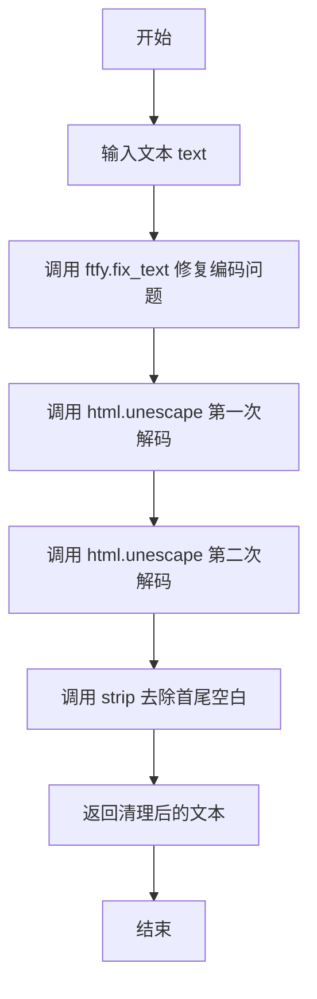

#### 带注释源码

```python
def basic_clean(text):
    """
    对文本进行基本清理，包括修复编码问题和去除 HTML 实体。
    
    Args:
        text: 需要清理的原始文本
        
    Returns:
        清理后的文本
    """
    # 使用 ftfy 库修复文本中的编码问题
    # ftfy 可以修复常见的文本编码错误，如 Mojibake（乱码）问题
    text = ftfy.fix_text(text)
    
    # 第一次 HTML 实体解码，处理一层编码
    # 第二次 HTML 实体解码，处理嵌套编码（如 &amp;lt; -> &lt; -> <）
    # 使用两次 unescape 是为了确保完全解码所有嵌套的 HTML 实体
    text = html.unescape(html.unescape(text))
    
    # 去除文本首尾的空白字符，包括空格、换行、制表符等
    return text.strip()
```


### `whitespace_clean`

该函数用于清理文本中的多余空白字符，将连续的白字符替换为单个空格，并去除文本首尾的空白字符。

参数：

- `text`：`str`，需要清理的输入文本

返回值：`str`，清理后的文本字符串

#### 流程图

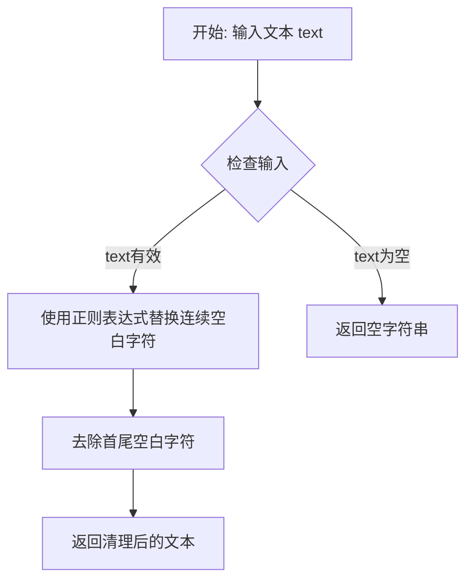

#### 带注释源码

```python
def whitespace_clean(text):
    """
    清理文本中的多余空白字符。
    
    该函数执行两步操作：
    1. 使用正则表达式将所有连续的白字符（包括空格、制表符、换行符等）替换为单个空格
    2. 去除结果字符串首尾的空白字符
    
    Args:
        text: 需要清理的输入文本字符串
        
    Returns:
        清理后的文本字符串，连续空白被压缩为单个空格，首尾空白被移除
    """
    # 使用正则表达式将一个或多个空白字符替换为单个空格
    # \s+ 匹配一个或多个空白字符（空格、制表符、换行符等）
    # " " 是替换文本，将所有连续空白压缩为单个空格
    text = re.sub(r"\s+", " ", text)
    
    # 去除字符串首尾的空白字符（包括空格、换行符等）
    text = text.strip()
    
    # 返回清理后的文本
    return text
```


### `prompt_clean`

该函数是文本预处理的核心入口，通过组合调用 `basic_clean` 和 `whitespace_clean` 两个辅助函数，对用户输入的提示词（prompt）进行清理和标准化处理，包括修复乱码、解码 HTML 实体以及规范化空白字符。

**参数：**
- `text`：`str`，需要清理的原始文本输入

**返回值：** `str`，清理并标准化后的文本

#### 流程图

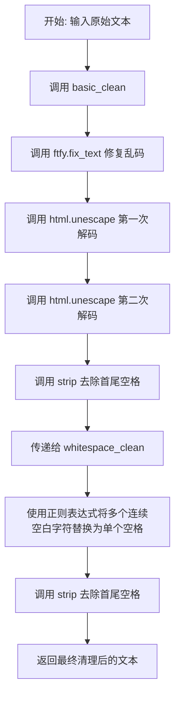

#### 带注释源码

```python
def prompt_clean(text):
    """
    清理并标准化输入的文本提示词。
    
    该函数是文本预处理流程的入口函数，通过组合调用 basic_clean 和 
    whitespace_clean 两个辅助函数来完成文本清理工作。
    
    处理流程：
    1. basic_clean: 修复文本编码问题，解码 HTML 实体
    2. whitespace_clean: 规范化空白字符
    
    Args:
        text: 需要清理的原始文本字符串
        
    Returns:
        清理并标准化后的文本字符串
    """
    # 第一步：调用 basic_clean 进行基础清理
    # - 使用 ftfy.fix_text 修复常见的文本编码乱码问题
    # - 使用 html.unescape 双重解码 HTML 实体（如 &amp; -> & -> &）
    # - 去除处理后的首尾空白字符
    text = whitespace_clean(basic_clean(text))
    
    # 第二步：调用 whitespace_clean 进行空白字符规范化
    # - 将连续多个空白字符（空格、制表符、换行等）替换为单个空格
    # - 再次去除首尾空白字符，确保输出干净
    
    # 返回最终清理后的文本
    return text
```


### `retrieve_latents`

该函数是用于从 VAE（变分自编码器）编码器的输出中提取潜在表示（latents）的工具函数。它支持通过不同的采样模式（`sample` 或 `argmax`）从潜在分布中获取向量，或者直接获取预先计算好的 `latents` 属性。如果无法找到有效的潜在表示，函数将抛出 `AttributeError`。

参数：

-  `encoder_output`：`torch.Tensor`，VAE 编码器的输出对象（代码中类型提示为 Tensor，但实际使用中通常是包含 `latent_dist` 或 `latents` 属性的对象）。
-  `generator`：`torch.Generator | None`，可选的随机数生成器，用于 `sample` 模式下的随机采样。
-  `sample_mode`：`str`，采样模式。默认为 `"sample"`（从分布中采样），可选 `"argmax"`（取分布的众数）。

返回值：`torch.Tensor`，提取出的潜在向量（Latents）。

#### 流程图

```mermaid
flowchart TD
    A([开始 retrieve_latents]) --> B{Has 'latent_dist' AND <br/>sample_mode == 'sample'?}
    B -- 是 --> C[返回 encoder_output.latent_dist.sample<br/>(generator)]
    B -- 否 --> D{Has 'latent_dist' AND <br/>sample_mode == 'argmax'?}
    D -- 是 --> E[返回 encoder_output.latent_dist.mode]
    D -- 否 --> F{Has 'latents'?}
    F -- 是 --> G[返回 encoder_output.latents]
    F -- 否 --> H[抛出 AttributeError<br/>"Could not access latents..."]
    C --> I([结束])
    E --> I
    G --> I
    H --> I
```

#### 带注释源码

```python
def retrieve_latents(
    encoder_output: torch.Tensor, generator: torch.Generator | None = None, sample_mode: str = "sample"
):
    # 检查 encoder_output 是否具有 latent_dist 属性且采样模式为 "sample"
    if hasattr(encoder_output, "latent_dist") and sample_mode == "sample":
        # 从潜在分布中进行随机采样
        return encoder_output.latent_dist.sample(generator)
    # 检查 encoder_output 是否具有 latent_dist 属性且采样模式为 "argmax"
    elif hasattr(encoder_output, "latent_dist") and sample_mode == "argmax":
        # 获取潜在分布的众数（最可能的值）
        return encoder_output.latent_dist.mode()
    # 检查 encoder_output 是否直接具有 latents 属性（例如预计算的 latents）
    elif hasattr(encoder_output, "latents"):
        return encoder_output.latents
    # 如果无法通过任何方式获取 latents，则抛出错误
    else:
        raise AttributeError("Could not access latents of provided encoder_output")
```


### `encode_vae_image`

该函数用于将图像编码为 VAE 潜在空间中的表示，通过 VAE 模型编码输入图像，并根据配置对潜在表示进行移位和缩放处理。

参数：

- `vae`：`AutoencoderKL`，VAE 模型，用于将图像编码到潜在空间
- `image`：`torch.Tensor`，输入图像张量，形状为 (B, C, H, W)
- `generator`：`torch.Generator` 或 `torch.Generator` 列表，用于随机采样的生成器
- `sample_mode`：`str`，采样模式，默认为 "sample"，可选值为 "sample" 或 "argmax"

返回值：`torch.Tensor`，编码后的图像潜在表示，已根据 VAE 配置的 shift_factor 和 scaling_factor 进行调整

#### 流程图

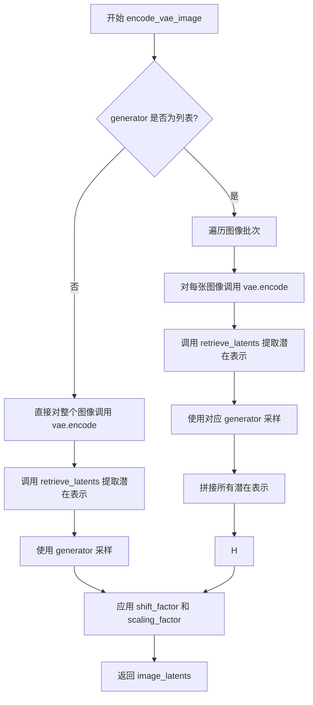

#### 带注释源码

```python
def encode_vae_image(vae: AutoencoderKL, image: torch.Tensor, generator: torch.Generator, sample_mode="sample"):
    # 判断 generator 是否为列表（支持批量处理多个独立的随机生成器）
    if isinstance(generator, list):
        # 逐个处理图像批次，为每个图像使用对应的 generator
        image_latents = [
            # 对单张图像进行 VAE 编码
            retrieve_latents(vae.encode(image[i : i + 1]), generator=generator[i], sample_mode=sample_mode)
            for i in range(image.shape[0])
        ]
        # 将所有潜在表示沿批次维度拼接
        image_latents = torch.cat(image_latents, dim=0)
    else:
        # 单一 generator，直接编码整个图像批次
        image_latents = retrieve_latents(vae.encode(image), generator=generator, sample_mode=sample_mode)

    # 应用 VAE 配置中的移位因子和缩放因子进行标准化
    # 这是潜在空间归一化的逆操作
    image_latents = (image_latents - vae.config.shift_factor) * vae.config.scaling_factor

    return image_latents
```


### `FluxProcessImagesInputStep.description`

这是 `FluxProcessImagesInputStep` 类的描述属性，用于返回该处理步骤的功能描述。

参数：无需参数

返回值：`str`，返回该图像预处理步骤的描述信息

#### 流程图

```mermaid
flowchart TD
    A[FluxProcessImagesInputStep.description 访问] --> B{读取 description 属性}
    B --> C[返回字符串: "Image Preprocess step."]
```

#### 带注释源码

```python
class FluxProcessImagesInputStep(ModularPipelineBlocks):
    """
    Flux 模型的图像输入处理步骤类，继承自 ModularPipelineBlocks。
    此类负责将输入图像进行预处理，为后续的 VAE 编码做准备。
    """
    model_name = "flux"  # 模型名称标识

    @property
    def description(self) -> str:
        """
        返回该处理步骤的描述信息。
        
        这是一个只读属性，使用 @property 装饰器定义。
        当外部代码访问此属性时，会自动返回预定义的字符串描述。
        
        Returns:
            str: 描述该步骤功能的字符串，当前为 "Image Preprocess step."
        """
        return "Image Preprocess step."
```


### `FluxProcessImagesInputStep.expected_components`

该属性定义了 Flux 图像处理输入步骤所需的核心组件规范，返回一个包含图像处理器的 ComponentSpec 列表，用于 VAE 图像预处理。

参数：无（属性访问，仅 `self`）

返回值：`list[ComponentSpec]`，返回一个 ComponentSpec 列表，描述该步骤所需的核心组件。当前包含一个 image_processor 组件规范，指定使用 VaeImageProcessor 类，并配置了 vae_scale_factor（值为16）和 vae_latent_channels（值为16），创建方式为 from_config。

#### 流程图

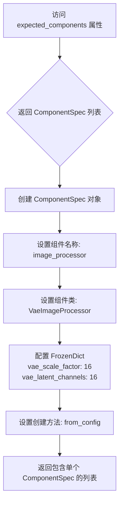

#### 带注释源码

```python
@property
def expected_components(self) -> list[ComponentSpec]:
    """定义该处理步骤所需的组件规范列表。
    
    该属性返回 FluxProcessImagesInputStep 步骤所需的组件声明。
    目前该步骤仅需要 image_processor 组件用于图像预处理。
    
    Returns:
        list[ComponentSpec]: 包含组件规范的列表，每个规范定义了组件名称、
                            类类型、配置参数和创建方法。
    """
    return [
        ComponentSpec(
            "image_processor",  # 组件名称，用于在组件字典中引用
            VaeImageProcessor,   # 组件类类型，指定使用 VaeImageProcessor 进行图像处理
            config=FrozenDict({  # 组件配置参数
                "vae_scale_factor": 16,      # VAE 缩放因子，用于潜在空间尺寸计算
                "vae_latent_channels": 16    # VAE 潜在通道数
            }),
            default_creation_method="from_config",  # 默认创建方法，从配置创建组件
        ),
    ]
```


### `FluxProcessImagesInputStep.inputs`

该属性定义了图像预处理步骤的输入参数列表，包含调整后的图像、原始图像以及图像的高度和宽度。

参数： 无（该方法为属性，通过 `self` 访问）

返回值：`list[InputParam]`，返回输入参数列表，包含以下四个参数：resized_image（调整大小后的图像）、image（原始图像）、height（图像高度）、width（图像宽度）

#### 流程图

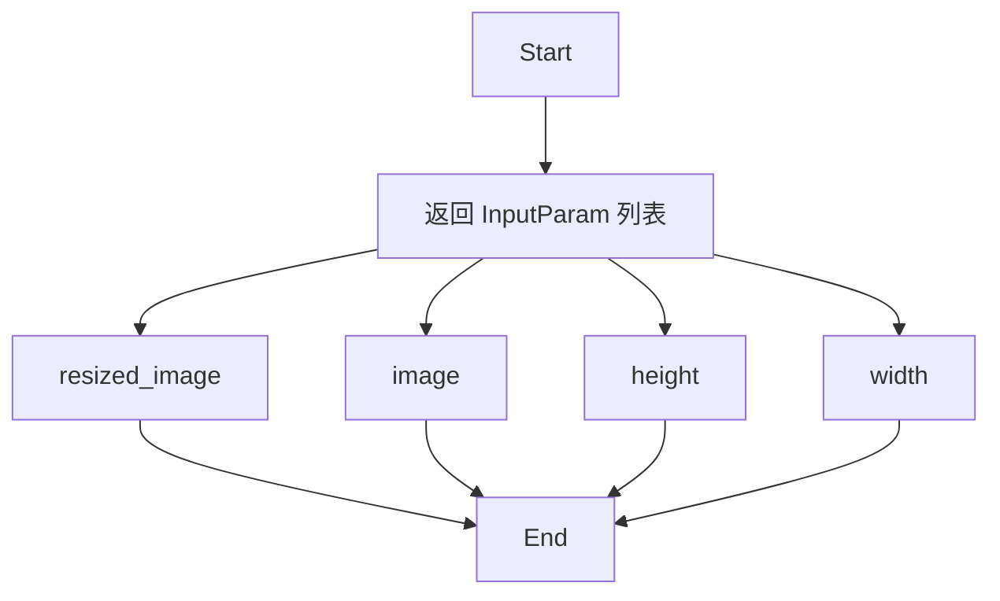

#### 带注释源码

```python
@property
def inputs(self) -> list[InputParam]:
    """定义图像预处理步骤的输入参数列表。

    该属性返回一系列 InputParam 对象，每个对象代表该处理步骤需要的一个输入参数。
    这些参数在管道执行时由上游步骤或用户输入提供。

    Returns:
        list[InputParam]: 包含四个输入参数的列表：
            - resized_image: 经过预处理的图像（如已调整大小）
            - image: 原始输入图像
            - height: 目标图像高度
            - width: 目标图像宽度
    """
    return [InputParam("resized_image"), InputParam("image"), InputParam("height"), InputParam("width")]
```


### `FluxProcessImagesInputStep.intermediate_outputs`

该属性定义了 **FluxProcessImagesInputStep** 图像预处理步骤向流水线后续阶段（例如 VAE 编码步骤）传递的中间结果的元数据合约。它明确指定了该步骤将输出一个名为 `processed_image` 的张量，作为后续处理（Latent 空间转换）的输入。

参数：  
无（该属性不接受除 `self` 之外的参数）

返回值：  
`list[OutputParam]`，返回一个包含 `OutputParam` 对象的列表，描述了输出参数的结构。

- `processed_image`：`torch.Tensor`，经过尺寸调整和预处理（归一化）后的图像张量。

#### 流程图

```mermaid
flowchart TD
    A[调用: intermediate_outputs] --> B[构建列表]
    B --> C[创建 OutputParam 实例]
    C --> D[name: 'processed_image']
    D --> E[类型: Tensor]
    E --> F[返回: list[OutputParam]]
```

#### 带注释源码

```python
@property
def intermediate_outputs(self) -> list[OutputParam]:
    """定义该步骤产生的中间输出参数列表。
    
    返回值:
        list[OutputParam]: 包含一个 'processed_image' 输出参数的列表，
        供管道中的下一个模块（如 VAE Encoder）使用。
    """
    return [OutputParam(name="processed_image")]
```


### `FluxProcessImagesInputStep.check_inputs`

该方法是一个静态验证函数，用于检查图像处理的高度和宽度参数是否符合 VAE 缩放因子的要求（必须是 `vae_scale_factor * 2` 的倍数），确保输入图像尺寸能够被 VAE 正确处理。

参数：

- `height`：`int | None`，待验证的图像高度，可为 `None`
- `width`：`int | None`，待验证的图像宽度，可为 `None`
- `vae_scale_factor`：`int`，VAE 的缩放因子，用于计算允许的尺寸倍数

返回值：`None`，该方法通过抛出 `ValueError` 异常来处理验证失败的情况，验证成功时无显式返回值。

#### 流程图

```mermaid
flowchart TD
    A([开始 check_inputs]) --> B{height is not None?}
    B -->|是| C{height % (vae_scale_factor * 2) != 0?}
    C -->|是| D[raise ValueError: Height must be divisible by...]
    C -->|否| E{width is not None?}
    B -->|否| E
    E -->|是| F{width % (vae_scale_factor * 2) != 0?}
    F -->|是| G[raise ValueError: Width must be divisible by...]
    F -->|否| H([结束 - 验证通过])
    D --> H
    G --> H
```

#### 带注释源码

```python
@staticmethod
def check_inputs(height, width, vae_scale_factor):
    """
    验证图像高度和宽度是否符合 VAE 缩放因子的要求。
    
    VAE 要求输入图像的尺寸必须是 vae_scale_factor * 2 的倍数，
    以确保图像能够被 VAE 编码器正确处理（例如 16 的倍数，
    因为典型的 VAE 缩放因子为 8，下采样 2 倍后需要 16 的倍数对齐）。
    
    Args:
        height: 图像高度，如果为 None 则跳过验证
        width: 图像宽度，如果为 None 则跳过验证
        vae_scale_factor: VAE 的缩放因子，用于计算允许的尺寸倍数
    
    Raises:
        ValueError: 当 height 或 width 不为 None 且不能被 vae_scale_factor * 2 整除时
    """
    # 检查高度：如果提供了高度，必须是 vae_scale_factor * 2 的倍数
    if height is not None and height % (vae_scale_factor * 2) != 0:
        raise ValueError(
            f"Height must be divisible by {vae_scale_factor * 2} but is {height}"
        )

    # 检查宽度：如果提供了宽度，必须是 vae_scale_factor * 2 的倍数
    if width is not None and width % (vae_scale_factor * 2) != 0:
        raise ValueError(
            f"Width must be divisible by {vae_scale_factor * 2} but is {width}"
        )
```


### `FluxProcessImagesInputStep.__call__`

该方法是Flux图像处理流程中的输入预处理步骤，负责接收原始图像或已调整大小的图像，验证图像尺寸是否符合VAE要求，并将图像预处理为pipeline可用的格式。

参数：

- `self`：FluxProcessImagesInputStep，类的实例本身
- `components`：FluxModularPipeline，包含pipeline的组件配置，如image_processor、vae_scale_factor等
- `state`：PipelineState，包含当前pipeline的状态信息，如resized_image、image、height、width等

返回值：`Tuple[FluxModularPipeline, PipelineState]`，返回更新后的组件和状态对象，其中processed_image已被处理并存储在block_state中

#### 流程图

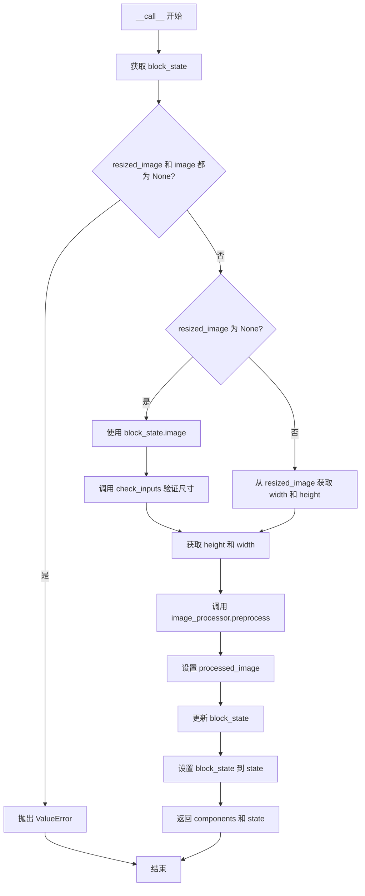

#### 带注释源码

```python
@torch.no_grad()  # 禁用梯度计算，减少内存消耗
def __call__(self, components: FluxModularPipeline, state: PipelineState):
    """执行图像预处理步骤，将输入图像转换为pipeline可用的格式
    
    Args:
        components: FluxModularPipeline对象，包含pipeline配置组件
        state: PipelineState对象，包含当前执行状态
    
    Returns:
        Tuple[FluxModularPipeline, PipelineState]: 更新后的components和state
    """
    # 从state中获取当前block的执行状态
    block_state = self.get_block_state(state)

    # 验证输入：resized_image和image不能同时为None
    if block_state.resized_image is None and block_state.image is None:
        raise ValueError("`resized_image` and `image` cannot be None at the same time")

    # 根据输入类型处理图像
    if block_state.resized_image is None:
        # 情况1：使用原始image，需要验证尺寸并计算目标尺寸
        image = block_state.image
        
        # 验证height和width是否满足VAE要求（必须能被vae_scale_factor*2整除）
        self.check_inputs(
            height=block_state.height, 
            width=block_state.width, 
            vae_scale_factor=components.vae_scale_factor
        )
        
        # 获取目标尺寸，优先使用block_state中的值，否则使用默认值
        height = block_state.height or components.default_height
        width = block_state.width or components.default_width
    else:
        # 情况2：使用已调整大小的图像，直接从resized_image获取尺寸
        width, height = block_state.resized_image[0].size
        image = block_state.resized_image

    # 调用image_processor的preprocess方法处理图像
    # 将图像转换为适合VAE处理的张量格式
    block_state.processed_image = components.image_processor.preprocess(
        image=image, 
        height=height, 
        width=width
    )

    # 将更新后的block_state写回state
    self.set_block_state(state, block_state)
    
    # 返回更新后的components和state，供后续pipeline步骤使用
    return components, state
```


### `FluxKontextProcessImagesInputStep.description`

该属性返回对 FluxKontextProcessImagesInputStep 类的功能描述，说明该类是 Flux Kontext 的图像预处理步骤，预处理后的图像会被送入 VAE 编码。当没有提供输入图像时，Kontext 也可作为 T2I（文本到图像）模型使用。

参数： 无（此为属性，不接受参数）

返回值：`str`，返回该处理步骤的描述字符串

#### 流程图

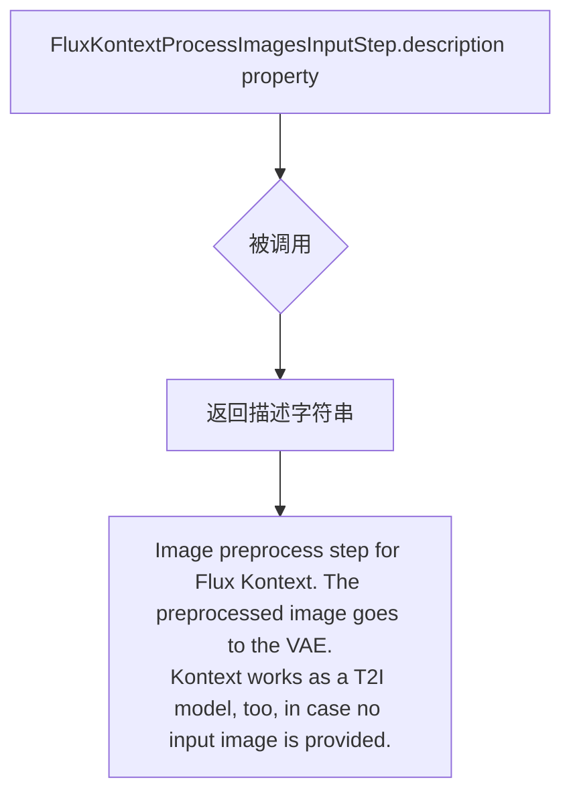

#### 带注释源码

```python
class FluxKontextProcessImagesInputStep(ModularPipelineBlocks):
    """Flux Kontext 图像预处理步骤模块，继承自 ModularPipelineBlocks"""
    
    model_name = "flux-kontext"  # 模型名称标识

    @property
    def description(self) -> str:
        """返回该处理步骤的描述信息
        
        Returns:
            str: 描述 Flux Kontext 图像预处理功能的字符串
                 - 说明这是 Flux Kontext 的图像预处理步骤
                 - 预处理后的图像会被送入 VAE 编码器
                 - 当没有提供输入图像时，Kontext 可作为 T2I（文本到图像）模型工作
        """
        return (
            "Image preprocess step for Flux Kontext. The preprocessed image goes to the VAE.\n"
            "Kontext works as a T2I model, too, in case no input image is provided."
        )
```


### `FluxKontextProcessImagesInputStep.expected_components`

该属性定义了 Flux Kontext 图像预处理步骤所需的组件规范，声明了图像处理器（VaeImageProcessor）作为必需组件，并配置了 VAE 缩放因子参数。

参数：无参数（类属性，通过 property 装饰器访问）

返回值：`list[ComponentSpec]`，返回组件规范列表，描述该处理步骤所依赖的图像处理器组件及其配置要求。

#### 流程图

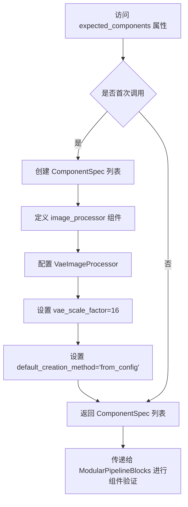

#### 带注释源码

```python
@property
def expected_components(self) -> list[ComponentSpec]:
    """定义 Flux Kontext 图像预处理步骤所需的组件规范。
    
    该属性声明了处理流程中必须提供的组件。
    当前实现要求一个图像处理器组件，用于将输入图像预处理为 VAE 可用的格式。
    
    Returns:
        list[ComponentSpec]: 包含组件规范的列表，每个规范定义了组件名称、
                             类型、配置和创建方式。
    """
    return [
        ComponentSpec(
            "image_processor",           # 组件名称，供后续引用
            VaeImageProcessor,            # 组件类型，VAE 图像处理器类
            config=FrozenDict({           # 组件配置参数
                "vae_scale_factor": 16,   # VAE 缩放因子，用于尺寸对齐
            }),
            default_creation_method="from_config",  # 默认创建方式，从配置创建
        ),
    ]
```


### `FluxKontextProcessImagesInputStep.inputs`

该属性定义了 FluxKontext 图像预处理步骤的输入参数列表，包括原始图像和自动调整大小的标志。

参数：

-  `image`：`InputParam`，输入的原始图像数据
-  `_auto_resize`：`InputParam`，布尔类型，默认为 True，是否自动调整图像大小以匹配训练分辨率

返回值：`list[InputParam]`返回一个包含所有输入参数的列表，每个参数由 InputParam 对象封装。

#### 流程图

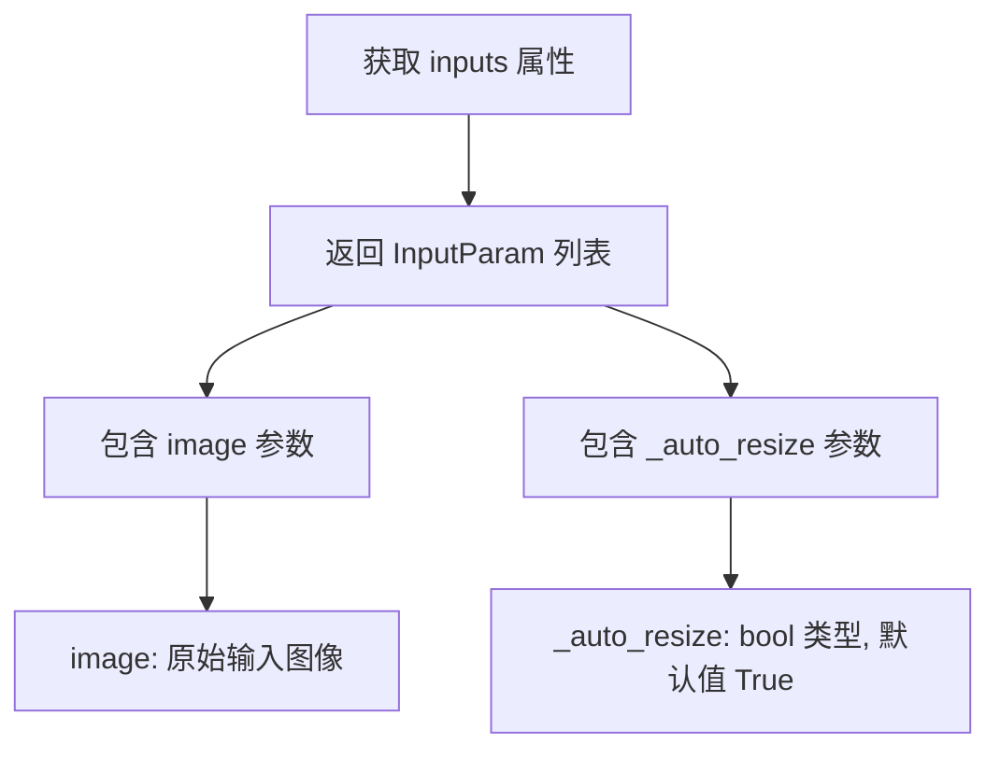

#### 带注释源码

```python
@property
def inputs(self) -> list[InputParam]:
    """定义该处理步骤的输入参数列表。
    
    Returns:
        list[InputParam]: 包含所有输入参数的列表，每个参数是一个 InputParam 对象。
        - image: 输入的原始图像
        - _auto_resize: 布尔标志，控制是否自动调整图像大小以匹配预定义的训练分辨率
    """
    return [InputParam("image"), InputParam("_auto_resize", type_hint=bool, default=True)]
```


### `FluxKontextProcessImagesInputStep.intermediate_outputs`

该属性定义了 FluxKontextProcessImagesInputStep 类的中间输出参数，返回一个包含已处理图像的列表，用于后续的 VAE 编码步骤。

参数： 无（此属性不接受任何参数）

返回值：`list[OutputParam]`，返回包含单个 `OutputParam` 对象的列表，其中定义了中间输出参数 `processed_image`

#### 流程图

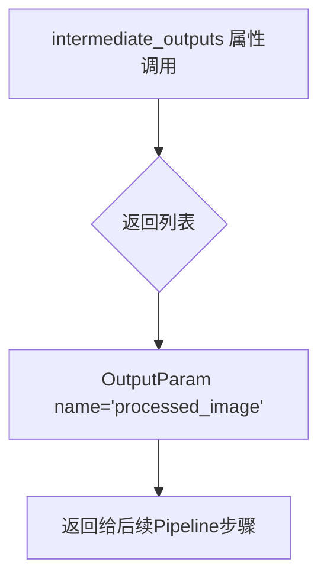

#### 带注释源码

```python
@property
def intermediate_outputs(self) -> list[OutputParam]:
    """定义该处理步骤的中间输出参数。
    
    FluxKontextProcessImagesInputStep 负责对输入图像进行预处理，
    预处理后的图像将作为中间输出传递给后续的 VAE 编码步骤。
    
    Returns:
        list[OutputParam]: 包含一个 OutputParam 的列表，
            标识处理后的图像作为中间输出，名称为 'processed_image'，
            该输出将被用于后续的潜在空间编码。
    """
    return [OutputParam(name="processed_image")]
```


### `FluxKontextProcessImagesInputStep.__call__`

该方法是 Flux Kontext 管道中的图像预处理步骤，负责将输入图像调整为合适尺寸并预处理后传递给 VAE 编码器。如果没有提供输入图像，该步骤会将 `processed_image` 设为 `None`，使模型以纯文本到图像（T2I）模式运行。

参数：

- `self`：隐式参数，`FluxKontextProcessImagesInputStep` 类的实例
- `components: FluxModularPipeline`，管道组件容器，包含 `image_processor` 等预配置的模型组件
- `state: PipelineState`，管道执行状态，包含当前块的输入输出数据

返回值：`Tuple[FluxModularPipeline, PipelineState]`，返回更新后的组件和状态对象，供下游管道步骤使用

#### 流程图

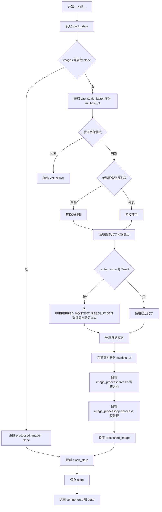

#### 带注释源码

```python
@torch.no_grad()
def __call__(self, components: FluxModularPipeline, state: PipelineState):
    """
    执行 Flux Kontext 图像预处理步骤。
    
    该方法负责：
    1. 验证并规范化输入图像格式
    2. 根据配置自动调整图像分辨率到最佳匹配尺寸
    3. 对图像进行 VAE 预处理（归一化等）
    4. 将处理结果存储到 pipeline state 供下游步骤使用
    """
    # 动态导入优先的 Kontext 分辨率列表，用于自动调整图像尺寸
    from ...pipelines.flux.pipeline_flux_kontext import PREFERRED_KONTEXT_RESOLUTIONS

    # 从 pipeline state 中获取当前块的执行状态
    block_state = self.get_block_state(state)
    # 获取输入的原始图像数据
    images = block_state.image

    # 处理无图像输入的情况（纯文本到图像模式）
    if images is None:
        # 没有输入图像时，将处理后的图像设为 None
        # 管道后续步骤将使用文本编码器生成图像
        block_state.processed_image = None
    else:
        # 获取 VAE 缩放因子，用于图像尺寸对齐
        multiple_of = components.image_processor.config.vae_scale_factor

        # 验证输入图像格式是否为有效的图像或图像列表
        if not is_valid_image_imagelist(images):
            raise ValueError(f"Images must be image or list of images but are {type(images)}")

        # 统一将单张图像转换为列表格式处理
        if is_valid_image(images):
            images = [images]

        # 获取第一张图像的默认高度和宽度
        img = images[0]
        image_height, image_width = components.image_processor.get_default_height_width(img)
        # 计算输入图像的宽高比
        aspect_ratio = image_width / image_height
        # 获取是否启用自动调整尺寸的标志
        _auto_resize = block_state._auto_resize
        
        # 根据配置决定是否自动调整图像分辨率
        if _auto_resize:
            # Kontext 模型在特定分辨率上训练，使用推荐分辨率可获得最佳效果
            # 从预设分辨率列表中选择宽高比最接近的尺寸
            _, image_width, image_height = min(
                (abs(aspect_ratio - w / h), w, h) for w, h in PREFERRED_KONTEXT_RESOLUTIONS
            )
        
        # 将图像尺寸对齐到 vae_scale_factor 的倍数，确保 VAE 处理正确
        image_width = image_width // multiple_of * multiple_of
        image_height = image_height // multiple_of * multiple_of
        
        # 调整图像到目标尺寸
        images = components.image_processor.resize(images, image_height, image_width)
        # 对图像进行 VAE 预处理（归一化到 [-1, 1] 或 [0, 1]）
        block_state.processed_image = components.image_processor.preprocess(images, image_height, image_width)

    # 将更新后的块状态保存回 pipeline state
    self.set_block_state(state, block_state)
    # 返回组件和状态，供管道后续步骤使用
    return components, state
```


### `FluxVaeEncoderStep.__init__`

初始化一个 VAE 编码器步骤，用于将图像转换为潜在表示。该类的输入和输出名称都是可配置的，可以处理不同的图像输入（例如 "processed_image" -> "image_latents"，"processed_control_image" -> "control_image_latents"）。

参数：

- `self`：隐式参数，`FluxVaeEncoderStep` 类实例本身
- `input_name`：`str`，输入图像张量的名称，默认为 "processed_image"，例如 "processed_image" 或 "processed_control_image"
- `output_name`：`str`，输出潜在张量的名称，默认为 "image_latents"，例如 "image_latents" 或 "control_image_latents"
- `sample_mode`：`str`，采样模式，默认为 "sample"

返回值：无（`None`），该方法仅初始化实例属性，不返回任何值

#### 流程图

```mermaid
flowchart TD
    A[开始 __init__] --> B[设置 self._image_input_name = input_name]
    B --> C[设置 self._image_latents_output_name = output_name]
    C --> D[设置 self.sample_mode = sample_mode]
    D --> E[调用 super().__init__ 初始化父类]
    E --> F[结束]
```

#### 带注释源码

```python
def __init__(
    self, input_name: str = "processed_image", output_name: str = "image_latents", sample_mode: str = "sample"
):
    """Initialize a VAE encoder step for converting images to latent representations.

    Both the input and output names are configurable so this block can be configured to process to different image
    inputs (e.g., "processed_image" -> "image_latents", "processed_control_image" -> "control_image_latents").

    Args:
        input_name (str, optional): Name of the input image tensor. Defaults to "processed_image".
            Examples: "processed_image" or "processed_control_image"
        output_name (str, optional): Name of the output latent tensor. Defaults to "image_latents".
            Examples: "image_latents" or "control_image_latents"
        sample_mode (str, optional): Sampling mode to be used.

    Examples:
        # Basic usage with default settings (includes image processor): # FluxImageVaeEncoderDynamicStep()

        # Custom input/output names for control image: # FluxImageVaeEncoderDynamicStep(
            input_name="processed_control_image", output_name="control_image_latents"
        )
    """
    # 设置实例属性：输入图像的张量名称
    self._image_input_name = input_name
    
    # 设置实例属性：输出潜在张量的名称
    self._image_latents_output_name = output_name
    
    # 设置实例属性：采样模式
    self.sample_mode = sample_mode
    
    # 调用父类 ModularPipelineBlocks 的初始化方法
    super().__init__()
```


### `FluxVaeEncoderStep.description`

返回该模块化管道块的描述信息，用于说明该步骤的功能。

参数： 无（这是一个属性 getter，不需要显式参数）

返回值：`str`，描述该 VAE Encoder 步骤的功能

#### 流程图

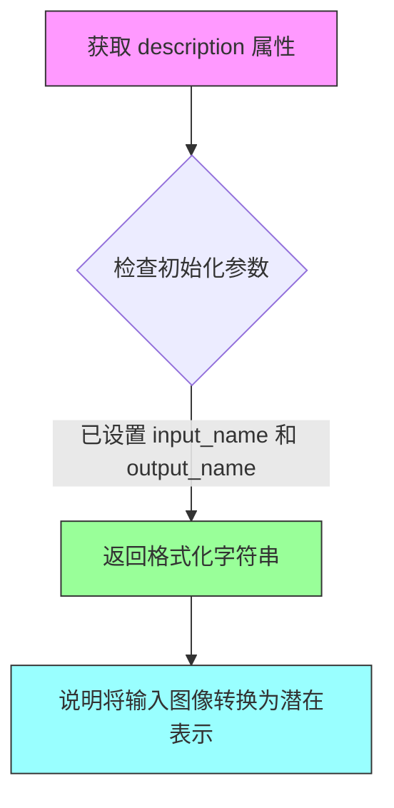

#### 带注释源码

```python
@property
def description(self) -> str:
    """描述该 VAE Encoder 步骤的功能。
    
    这是一个属性方法,用于返回该模块化管道块的描述信息。
    描述内容基于初始化时设置的输入名称(_image_input_name)和输出名称(_image_latents_output_name)。
    
    Returns:
        str: 格式化字符串,描述该步骤将哪个输入转换为哪个输出
              例如: 'Dynamic VAE Encoder step that converts processed_image into latent representations image_latents.'
    """
    return f"Dynamic VAE Encoder step that converts {self._image_input_name} into latent representations {self._image_latents_output_name}.\n"
```


### `FluxVaeEncoderStep.expected_components`

该属性定义了 `FluxVaeEncoderStep` 类在执行过程中所需的组件规范列表，用于指定 VAE（变分自编码器）模型组件。

参数：

- `self`：隐式参数，`FluxVaeEncoderStep` 类的实例本身，无需显式传递

返回值：`list[ComponentSpec]`，返回组件规范列表，每个 `ComponentSpec` 描述一个必需的组件。当前返回包含一个元素列表：名为 "vae" 的 `AutoencoderKL` 类型的组件。

#### 流程图

```mermaid
flowchart TD
    A[访问 expected_components 属性] --> B{检查类定义}
    B --> C[创建 ComponentSpec 列表]
    C --> D[添加 vae 组件规范]
    D --> E[返回 list[ComponentSpec]]
    
    style A fill:#f9f,stroke:#333
    style E fill:#9f9,stroke:#333
```

#### 带注释源码

```python
@property
def expected_components(self) -> list[ComponentSpec]:
    """定义该流水线块所需的组件规范列表。
    
    该属性返回一个组件规范列表，用于描述 FluxVaeEncoderStep 
    在执行图像到潜在表示转换过程中所需的模型组件。
    
    Returns:
        list[ComponentSpec]: 包含组件规范的列表。当前定义了一个
        'vae' 组件，类型为 AutoencoderKL，用于将图像编码为潜在表示。
    """
    # 创建组件规范列表
    components = [ComponentSpec("vae", AutoencoderKL)]
    
    # 返回包含 VAE 组件规范的列表
    return components
```


### `FluxVaeEncoderStep.inputs` (property)

返回 FluxVaeEncoderStep 步骤所需的输入参数列表，用于定义 VAE 编码步骤的输入依赖。

参数：

该属性无传统参数，通过类初始化时的 `input_name` 参数配置输入名称。

- `_image_input_name`：在 `__init__` 中配置，默认为 `"processed_image"`，表示输入图像张量的名称

返回值：`list[InputParam]`，返回包含所有输入参数的列表，定义了步骤执行所需的上游输出

#### 流程图

```mermaid
flowchart TD
    A[FluxVaeEncoderStep.inputs property] --> B{检查 _image_input_name}
    B --> C[创建 InputParam 列表]
    C --> D[返回 InputParam 列表]
    
    D --> E[InputParam: _image_input_name]
    D --> F[InputParam: generator]
    
    style A fill:#f9f,color:#333
    style D fill:#9f9,color:#333
    style E fill:#ff9,color:#333
    style F fill:#ff9,color:#333
```

#### 带注释源码

```python
@property
def inputs(self) -> list[InputParam]:
    """返回 VAE 编码步骤所需的输入参数列表。
    
    这些输入参数定义了执行此步骤前需要从上游步骤获取的输出。
    输入参数包括：
    1. 由 _image_input_name 指定的图像张量（默认为 "processed_image"）
    2. generator：用于随机采样的 torch.Generator 对象
    
    Returns:
        list[InputParam]: 输入参数列表，每个 InputParam 包含参数名称信息
    """
    inputs = [InputParam(self._image_input_name), InputParam("generator")]
    return inputs
```

#### 说明

| 属性 | 说明 |
|------|------|
| 所属类 | `FluxVaeEncoderStep` |
| 属性类型 | `property` |
| 返回值类型 | `list[InputParam]` |
| 依赖配置 | 通过 `__init__` 的 `input_name` 参数动态确定输入名称 |


### `FluxVaeEncoderStep.intermediate_outputs`

该属性是 `FluxVaeEncoderStep` 类的中间输出属性，用于定义该处理步骤的输出参数规范。它返回一个包含 `OutputParam` 对象的列表，描述了该步骤产生的图像潜在表示（latents）的元信息，包括输出名称、数据类型提示和描述。

参数：

- （无参数，该属性不接受任何输入）

返回值：`list[OutputParam]`，返回一个 `OutputParam` 列表，描述图像潜在表示的输出规范。

#### 流程图

```mermaid
flowchart TD
    A[访问 intermediate_outputs 属性] --> B{实例已初始化}
    B -->|是| C[返回 OutputParam 列表]
    B -->|否| D[返回默认空列表或报错]
    
    C --> E[包含一个 OutputParam 对象]
    E --> F[参数名: self._image_latents_output_name]
    F --> G[类型提示: torch.Tensor]
    G --> H[描述: The latents representing the reference image]
```

#### 带注释源码

```python
@property
def intermediate_outputs(self) -> list[OutputParam]:
    """定义 FluxVaeEncoderStep 的中间输出规范。
    
    该属性返回该处理步骤产生的输出参数列表。在 FluxVaeEncoderStep 中，
    输出是经过 VAE 编码后的图像潜在表示（latents），可用于后续的扩散模型处理。
    
    Returns:
        list[OutputParam]: 包含输出参数规范的列表。每个 OutputParam 描述了
                          一个输出张量的名称、类型和用途。
    """
    return [
        OutputParam(
            self._image_latents_output_name,      # 输出参数名称，默认为 "image_latents"
            type_hint=torch.Tensor,               # 类型提示，表示输出是 PyTorch 张量
            description="The latents representing the reference image",  # 描述输出含义
        )
    ]
```


### `FluxVaeEncoderStep.__call__`

将预处理后的图像通过VAE编码器转换为潜在表示（latent representations）。该方法是Flux模块化管道中的关键步骤，负责图像到潜在空间的转换，支持条件图像处理（如控制图像），并通过可配置的采样模式生成潜在向量。

参数：

- `components`：`FluxModularPipeline`，模块化管道组件容器，提供VAE模型和执行设备信息
- `state`：`PipelineState`，管道状态对象，包含当前块的中间数据和状态信息

返回值：`tuple[FluxModularPipeline, PipelineState]`，返回组件和更新后的状态对象，其中状态对象的`image_latents`属性被设置为编码后的潜在表示

#### 流程图

```mermaid
flowchart TD
    A[开始 __call__] --> B[获取块状态 block_state]
    B --> C[根据 input_name 获取输入图像]
    C --> D{图像是否为 None?}
    D -->|是| E[设置输出 latents 为 None]
    D -->|否| F[获取执行设备和数据类型]
    F --> G[将图像转移到指定设备和数据类型]
    G --> H[调用 encode_vae_image 编码图像]
    H --> I[设置输出 latents 为编码结果]
    E --> J[更新块状态]
    I --> J
    J --> K[设置管道状态]
    K --> L[返回 components 和 state]
```

#### 带注释源码

```python
@torch.no_grad()
def __call__(self, components: FluxModularPipeline, state: PipelineState) -> PipelineState:
    """将预处理图像编码为潜在表示
    
    Args:
        components: 管道组件容器，包含vae模型和执行设备信息
        state: 管道状态对象，包含输入图像和生成器等信息
    
    Returns:
        更新后的 (components, state) 元组
    """
    # 从管道状态中获取当前块的状态
    block_state = self.get_block_state(state)
    
    # 根据配置的输入名称动态获取输入图像
    # 默认为 "processed_image"，也可配置为 "processed_control_image"
    image = getattr(block_state, self._image_input_name)

    if image is None:
        # 如果输入图像为空，则将输出潜在向量设置为None
        setattr(block_state, self._image_latents_output_name, None)
    else:
        # 获取执行设备和VAE数据类型
        device = components._execution_device
        dtype = components.vae.dtype
        
        # 将图像转移到正确的设备和数据类型
        image = image.to(device=device, dtype=dtype)

        # 调用VAE编码函数将图像编码为潜在表示
        # encode_vae_image 函数会处理:
        # 1. VAE编码器前向传播
        # 2. 潜在分布采样 (sample_mode: "sample" 或 "argmax")
        # 3. 潜在向量的缩放和偏移处理
        image_latents = encode_vae_image(
            image=image, 
            vae=components.vae, 
            generator=block_state.generator, 
            sample_mode=self.sample_mode
        )
        
        # 将编码后的潜在表示设置到块状态中
        # 输出名称默认为 "image_latents"，可配置为 "control_image_latents" 等
        setattr(block_state, self._image_latents_output_name, image_latents)

    # 将更新后的块状态写回管道状态
    self.set_block_state(state, block_state)

    # 返回组件和状态元组，供管道下一步使用
    return components, state
```


### `FluxTextEncoderStep.description` (property)

该属性返回 `FluxTextEncoderStep` 类的描述信息，用于说明该步骤的核心功能是生成文本嵌入（text_embeddings）以指导图像生成过程。

参数：此属性无需显式参数（隐式接收 `self` 实例）

返回值：`str`，返回该处理步骤的描述字符串，说明其功能为生成用于引导图像生成的文本嵌入

#### 流程图

```mermaid
flowchart TD
    A[访问 description 属性] --> B{是否已缓存}
    B -->|否| C[返回描述字符串]
    B -->|是| C
    C --> D["Text Encoder step that generate text_embeddings to guide the image generation"]
```

#### 带注释源码

```python
@property
def description(self) -> str:
    """返回 FluxTextEncoderStep 的描述信息。
    
    该属性说明了当前处理步骤的核心功能：
    这是一个文本编码器步骤，用于生成 text_embeddings（文本嵌入），
    以指导图像生成过程。
    
    Returns:
        str: 描述文本内容的字符串
    """
    return "Text Encoder step that generate text_embeddings to guide the image generation"
```


### `FluxTextEncoderStep.expected_components`

该属性定义了 FluxTextEncoderStep 所需的文本编码组件规范，返回包含 CLIP 文本模型、CLIP 分词器、T5 编码器和 T5 分词器的组件列表。

参数：
- （无，此属性不接受任何参数）

返回值：`list[ComponentSpec]`，返回文本编码管道所需的所有组件规范列表，每个 ComponentSpec 包含组件名称和对应的模型类。

#### 流程图

```mermaid
flowchart TD
    A[访问 expected_components 属性] --> B{返回组件列表}
    B --> C[ComponentSpec: text_encoder - CLIPTextModel]
    B --> D[ComponentSpec: tokenizer - CLIPTokenizer]
    B --> E[ComponentSpec: text_encoder_2 - T5EncoderModel]
    B --> F[ComponentSpec: tokenizer_2 - T5TokenizerFast]
```

#### 带注释源码

```python
@property
def expected_components(self) -> list[ComponentSpec]:
    """定义 FluxTextEncoderStep 所需的组件规范列表。
    
    该属性返回文本编码流程所需的四个核心组件：
    1. text_encoder: CLIP 文本模型，用于生成主要的文本嵌入
    2. tokenizer: CLIP 分词器，用于对 prompt 进行分词
    3. text_encoder_2: T5 编码器模型，用于生成更详细的文本嵌入
    4. tokenizer_2: T5 分词器，用于对 prompt_2 进行分词
    
    Returns:
        list[ComponentSpec]: 包含四个 ComponentSpec 对象的列表，每个对象定义了
                            组件名称和对应的模型类（CLIPTextModel, CLIPTokenizer, 
                            T5EncoderModel, T5TokenizerFast）
    """
    return [
        ComponentSpec("text_encoder", CLIPTextModel),
        ComponentSpec("tokenizer", CLIPTokenizer),
        ComponentSpec("text_encoder_2", T5EncoderModel),
        ComponentSpec("tokenizer_2", T5TokenizerFast),
    ]
```


### `FluxTextEncoderStep.inputs`

该属性定义了 Flux 文本编码器步骤的输入参数列表，包含提示词、辅助提示词、最大序列长度以及联合注意力关键字参数。

参数：
- （该属性无传统意义上的调用参数，其参数通过 `InputParam` 对象定义，见返回值）

返回值：`list[InputParam]`，返回输入参数列表，包含以下四个 InputParam 对象：
- `prompt`：提示词输入，支持字符串或字符串列表
- `prompt_2`：第二提示词输入，支持字符串或字符串列表
- `max_sequence_length`：整型，默认值为 512，可选参数，用于控制 T5 编码器的最大序列长度
- `joint_attention_kwargs`：字典类型，包含联合注意力关键字参数，用于传递额外的注意力控制配置

#### 流程图

```mermaid
flowchart TD
    A[FluxTextEncoderStep.inputs Property] --> B{返回输入参数列表}
    
    B --> C[InputParam: prompt]
    B --> D[InputParam: prompt_2]
    B --> E[InputParam: max_sequence_length]
    B --> F[InputParam: joint_attention_kwargs]
    
    C --> G[类型: str | list[str]]
    D --> G
    E --> H[类型: int, 默认值: 512, required=False]
    F --> I[类型: dict, 必需参数]
    
    style A fill:#f9f,stroke:#333
    style B fill:#ff9,stroke:#333
    style C fill:#9ff,stroke:#333
    style D fill:#9ff,stroke:#333
    style E fill:#9ff,stroke:#333
    style F fill:#9ff,stroke:#333
```

#### 带注释源码

```python
@property
def inputs(self) -> list[InputParam]:
    """定义 FluxTextEncoderStep 的输入参数列表
    
    该属性返回一个包含四个 InputParam 对象的列表，定义了文本编码步骤所需的所有输入参数。
    这些参数包括主提示词、辅助提示词、最大序列长度以及联合注意力配置参数。
    
    Returns:
        list[InputParam]: 输入参数列表，包含:
            - prompt: 主提示词，字符串或字符串列表
            - prompt_2: 辅助提示词，字符串或字符串列表
            - max_sequence_length: 最大序列长度，整型，默认 512，可选
            - joint_attention_kwargs: 联合注意力关键字参数，字典类型，必需
    """
    return [
        InputParam("prompt"),  # 主提示词，用于生成文本嵌入
        InputParam("prompt_2"),  # 第二提示词，用于双文本编码器
        InputParam("max_sequence_length", type_hint=int, default=512, required=False),  # T5 最大序列长度
        InputParam("joint_attention_kwargs"),  # LoRA 等注意力配置参数
    ]
```


### `FluxTextEncoderStep.intermediate_outputs`

该属性是 FluxTextEncoderStep 类的中间输出属性，用于定义文本编码步骤产生的中间结果，包括用于指导图像生成的文本嵌入（prompt_embeds）和池化文本嵌入（pooled_prompt_embeds）。

参数：

- `self`：隐式参数，FluxTextEncoderStep 实例本身

返回值：`list[OutputParam]`，返回两个 OutputParam 对象，分别代表文本嵌入和池化文本嵌入，用于去噪器输入

#### 流程图

```mermaid
flowchart TD
    A[访问 intermediate_outputs 属性] --> B{返回列表}
    B --> C[OutputParam: prompt_embeds]
    B --> D[OutputParam: pooled_prompt_embeds]
    
    C --> E[类型: torch.Tensor]
    C --> F[描述: 用于指导图像生成的文本嵌入]
    
    D --> G[类型: torch.Tensor]
    D --> H[描述: 用于指导图像生成的池化文本嵌入]
    
    style C fill:#f9f,stroke:#333
    style D fill:#f9f,stroke:#333
```

#### 带注释源码

```python
@property
def intermediate_outputs(self) -> list[OutputParam]:
    """定义 FluxTextEncoderStep 的中间输出参数。

    该属性返回两个 OutputParam 对象，用于描述文本编码步骤
    产生的中间结果，这些结果将传递给后续的去噪步骤。

    Returns:
        list[OutputParam]: 包含两个输出参数的列表：
            - prompt_embeds: 文本嵌入，用于指导图像生成
            - pooled_prompt_embeds: 池化文本嵌入，用于指导图像生成
    """
    return [
        OutputParam(
            "prompt_embeds",  # 输出参数名称
            kwargs_type="denoiser_input_fields",  # kwargs 类型标记
            type_hint=torch.Tensor,  # 类型提示
            description="text embeddings used to guide the image generation",  # 描述
        ),
        OutputParam(
            "pooled_prompt_embeds",  # 输出参数名称
            kwargs_type="denoiser_input_fields",  # kwargs 类型标记
            type_hint=torch.Tensor,  # 类型提示
            description="pooled text embeddings used to guide the image generation",  # 描述
        ),
    ]
```


### `FluxTextEncoderStep.check_inputs`

该静态方法用于验证文本编码器的输入参数 `prompt` 和 `prompt_2` 是否符合预期类型（字符串或列表），确保输入数据的有效性。

参数：

- `block_state`：包含 `prompt` 和 `prompt_2` 属性的状态对象，用于存储管道执行过程中的中间数据和参数。

返回值：无返回值（`None`），仅通过抛出 `ValueError` 异常来处理无效输入。

#### 流程图

```mermaid
flowchart TD
    A[开始检查输入] --> B[获取 block_state.prompt 和 block_state.prompt_2]
    B --> C[遍历 prompt 和 prompt_2]
    C --> D{当前 prompt 是否为 None?}
    D -->|是| F[继续检查下一个]
    D -->|否| E{是否为 str 或 list 类型?}
    E -->|是| F
    E -->|否| G[抛出 ValueError 异常]
    G --> H[结束检查]
    F --> I{是否还有未检查的 prompt?}
    I -->|是| C
    I -->|否| J[检查完成]
    J --> H
```

#### 带注释源码

```python
@staticmethod
def check_inputs(block_state):
    """验证文本编码器输入参数的有效性。
    
    检查 prompt 和 prompt_2 参数是否为 None、str 或 list 类型。
    如果参数类型不符合要求，则抛出 ValueError 异常。
    
    Args:
        block_state: 包含 prompt 和 prompt_2 属性的状态对象。
                     这两个属性分别代表主提示词和辅助提示词。
    
    Raises:
        ValueError: 当 prompt 或 prompt_2 既不为 None，
                    也不是 str 或 list 类型时抛出。
    """
    # 遍历需要检查的提示词参数（prompt 和 prompt_2）
    for prompt in [block_state.prompt, block_state.prompt_2]:
        # 仅当 prompt 不为 None 时进行类型检查
        if prompt is not None and (not isinstance(prompt, str) and not isinstance(prompt, list)):
            # 抛出详细的错误信息，说明期望的类型和实际收到的类型
            raise ValueError(f"`prompt` or `prompt_2` has to be of type `str` or `list` but is {type(prompt)}")
```


### `FluxTextEncoderStep._get_t5_prompt_embeds`

该方法是一个静态函数，用于将输入的文本提示（prompt）转换为 T5 文本编码器（`text_encoder_2`）的嵌入向量（embeddings）。它负责处理文本的 Tokenization、TextualInversion 提示转换、截断警告日志记录以及最终的向量编码，并将结果移动到指定的设备和数据类型。

参数：

- `components`：包含 `text_encoder_2`（T5模型）和 `tokenizer_2`（T5分词器）的组件对象，用于执行编码和分词操作。
- `prompt`：需要编码的文本提示，可以是单个字符串或字符串列表。
- `max_sequence_length`：整数，指定 T5 编码器的最大序列长度，用于截断和填充。
- `device`：`torch.device`，指定计算执行的设备（如 CPU 或 CUDA）。

返回值：`torch.Tensor`，返回 T5 编码器生成的文本嵌入向量。

#### 流程图

```mermaid
flowchart TD
    A[Start _get_t5_prompt_embeds] --> B[Get dtype from components.text_encoder_2]
    B --> C{Is prompt a string?}
    C -->|Yes| D[Convert prompt to list: [prompt]]
    C -->|No| E[Keep prompt as list]
    D --> F{Is components TextualInversionLoaderMixin?}
    E --> F
    F -->|Yes| G[Call maybe_convert_prompt to convert prompt]
    F -->|No| H[Skip conversion]
    G --> I[Tokenize prompt with tokenizer_2]
    H --> I
    I --> J[Extract text_input_ids]
    J --> K[Tokenize prompt with padding='longest' to get untruncated_ids]
    K --> L{Is untruncated_ids longer than text_input_ids?}
    L -->|Yes| M[Log warning about truncated text]
    L -->|No| N[Proceed to encoding]
    M --> N
    N --> O[Call text_encoder_2 with input_ids on device]
    O --> P[Extract hidden states (index 0)]
    P --> Q[Move prompt_embeds to specified dtype and device]
    Q --> R[Return prompt_embeds]
```

#### 带注释源码

```python
@staticmethod
def _get_t5_prompt_embeds(components, prompt: str | list[str], max_sequence_length: int, device: torch.device):
    # 获取 T5 文本编码器的数据类型 (dtype)，用于确保输出嵌入的类型一致
    dtype = components.text_encoder_2.dtype
    
    # 标准化输入：如果 prompt 是单个字符串，则转换为列表；如果是列表则保持不变
    prompt = [prompt] if isinstance(prompt, str) else prompt

    # 如果组件实现了 TextualInversionLoaderMixin（例如使用了文本反转嵌入），则处理 prompt
    if isinstance(components, TextualInversionLoaderMixin):
        prompt = components.maybe_convert_prompt(prompt, components.tokenizer_2)

    # 使用 T5 Tokenizer 对 prompt 进行分词
    # padding="max_length": 填充到最大长度
    # max_length=max_sequence_length: 限制最大长度
    # truncation=True: 截断超过最大长度的序列
    text_inputs = components.tokenizer_2(
        prompt,
        padding="max_length",
        max_length=max_sequence_length,
        truncation=True,
        return_length=False,
        return_overflowing_tokens=False,
        return_tensors="pt",
    )
    # 获取输入的 token ID
    text_input_ids = text_inputs.input_ids

    # 为了检查是否发生了截断，使用 padding="longest" 再次分词（不截断）
    untruncated_ids = components.tokenizer_2(prompt, padding="longest", return_tensors="pt").input_ids
    
    # 检查逻辑：如果未截断的 ID 长度大于截断后的长度，并且两者不相等，说明发生了截断
    if untruncated_ids.shape[-1] >= text_input_ids.shape[-1] and not torch.equal(text_input_ids, untruncated_ids):
        # 解码被截断的部分以便记录警告信息
        removed_text = components.tokenizer_2.batch_decode(untruncated_ids[:, max_sequence_length - 1 : -1])
        logger.warning(
            "The following part of your input was truncated because `max_sequence_length` is set to "
            f" {max_sequence_length} tokens: {removed_text}"
        )

    # 调用 T5 编码器模型
    # output_hidden_states=False: 我们只需要最终的隐藏状态
    # [0]: 获取 BaseModelOutput 的第一个元素，即 last_hidden_state
    prompt_embeds = components.text_encoder_2(text_input_ids.to(device), output_hidden_states=False)[0]
    
    # 将生成的嵌入向量转换到指定的 dtype 和设备上
    prompt_embeds = prompt_embeds.to(dtype=dtype, device=device)
    return prompt_embeds
```


### `FluxTextEncoderStep._get_clip_prompt_embeds`

该静态方法用于从 CLIP 文本编码器获取文本嵌入向量（prompt embeddings），支持字符串或字符串列表形式的提示词，并处理文本反转（Textual Inversion）情况，同时对超过 CLIP 模型最大长度限制的输入进行警告。

参数：

- `components`：包含文本编码器（text_encoder）和分词器（tokenizer）等组件的对象，用于访问 CLIP 模型和分词器
- `prompt`：提示词，接受字符串或字符串列表形式
- `device`：torch.device，执行计算的设备（CPU 或 CUDA）

返回值：`torch.FloatTensor`，返回池化后的 CLIP 文本嵌入向量，用于引导图像生成

#### 流程图

```mermaid
flowchart TD
    A[开始] --> B{检查 prompt 类型}
    B -->|字符串| C[转换为列表]
    B -->|列表| D[保持不变]
    C --> E{检查 TextualInversionLoaderMixin}
    D --> E
    E -->|是| F[调用 maybe_convert_prompt 转换提示词]
    E -->|否| G[保持原始提示词]
    F --> G
    G --> H[使用 tokenizer 进行分词]
    H --> I[填充到最大长度]
    I --> J[检查是否发生截断]
    J -->|是| K[记录警告日志]
    J -->|否| L[继续执行]
    K --> L
    L --> M[调用 CLIP 文本编码器获取嵌入]
    M --> N[提取 pooler_output 池化输出]
    N --> O[转换数据类型和设备]
    O --> P[返回 prompt_embeds]
```

#### 带注释源码

```python
@staticmethod
def _get_clip_prompt_embeds(components, prompt: str | list[str], device: torch.device):
    """
    从 CLIP 文本编码器获取文本嵌入向量。
    
    参数:
        components: 包含 text_encoder 和 tokenizer 的组件对象
        prompt: 提示词，字符串或字符串列表
        device: torch.device，执行计算的设备
    
    返回:
        torch.FloatTensor: 池化后的 CLIP 文本嵌入向量
    """
    # 如果 prompt 是字符串，转换为列表；如果是列表保持不变
    # 这样可以统一处理单提示词和多提示词的情况
    prompt = [prompt] if isinstance(prompt, str) else prompt

    # 检查组件是否支持 TextualInversion（文本反转）功能
    # 如果支持，调用 maybe_convert_prompt 进行提示词转换
    # 这允许使用自定义的文本嵌入或概念
    if isinstance(components, TextualInversionLoaderMixin):
        prompt = components.maybe_convert_prompt(prompt, components.tokenizer)

    # 使用 CLIP tokenizer 对提示词进行分词
    # padding="max_length": 填充到模型最大长度
    # truncation=True: 截断超过最大长度的序列
    # return_tensors="pt": 返回 PyTorch 张量
    text_inputs = components.tokenizer(
        prompt,
        padding="max_length",
        max_length=components.tokenizer.model_max_length,
        truncation=True,
        return_overflowing_tokens=False,
        return_length=False,
        return_tensors="pt",
    )

    # 获取分词后的输入 IDs
    text_input_ids = text_inputs.input_ids
    
    # 获取 tokenizer 的最大长度限制（通常是 77 for CLIP）
    tokenizer_max_length = components.tokenizer.model_max_length
    
    # 使用 padding="longest" 重新分词，获取未截断的版本
    # 用于检测原始提示词是否被截断
    untruncated_ids = components.tokenizer(prompt, padding="longest", return_tensors="pt").input_ids
    
    # 检查是否发生了截断
    # 如果未截断的 IDs 长度 >= 截断后的长度，并且两者不相等
    # 说明提示词超过了模型最大长度限制
    if untruncated_ids.shape[-1] >= text_input_ids.shape[-1] and not torch.equal(text_input_ids, untruncated_ids):
        # 解码被截断的部分用于日志记录
        removed_text = components.tokenizer.batch_decode(untruncated_ids[:, tokenizer_max_length - 1 : -1])
        logger.warning(
            "The following part of your input was truncated because CLIP can only handle sequences up to"
            f" {tokenizer_max_length} tokens: {removed_text}"
        )
    
    # 调用 CLIP 文本编码器获取文本嵌入
    # output_hidden_states=False: 不返回所有隐藏状态，只返回最后的输出
    prompt_embeds = components.text_encoder(text_input_ids.to(device), output_hidden_states=False)

    # 使用 CLIPTextModel 的池化输出（pooler_output）
    # 这是 [CLS] 标记的输出，通常用于表示整个序列
    prompt_embeds = prompt_embeds.pooler_output
    
    # 将嵌入向量转换为与文本编码器相同的数据类型和设备
    prompt_embeds = prompt_embeds.to(dtype=components.text_encoder.dtype, device=device)

    return prompt_embeds
```


### `FluxTextEncoderStep.encode_prompt`

该静态方法负责将文本提示词编码为向量表示，供Flux图像生成模型使用。它同时调用CLIP和T5两种文本编码器，分别生成池化的提示词嵌入和完整的提示词嵌入，以支持高质量的文本到图像生成过程。

参数：

- `components`：管道组件对象，包含text_encoder、text_encoder_2、tokenizer和tokenizer_2等编码器及分词器
- `prompt`：str | list[str]，主要的文本提示词，支持单字符串或字符串列表
- `prompt_2`：str | list[str]，第二文本提示词，默认与prompt相同，用于T5编码器
- `device`：torch.device | None，执行设备，若为None则从components获取
- `prompt_embeds`：torch.FloatTensor | None，预计算的T5提示词嵌入，若提供则跳过编码
- `pooled_prompt_embeds`：torch.FloatTensor | None，预计算的CLIP池化提示词嵌入，若提供则跳过编码
- `max_sequence_length`：int，最大序列长度，默认512
- `lora_scale`：float | None，LoRA适配器缩放因子，用于动态调整LoRA权重

返回值：(torch.FloatTensor, torch.FloatTensor)，返回T5编码器输出的提示词嵌入和CLIP编码器输出的池化提示词嵌入

#### 流程图

```mermaid
flowchart TD
    A[开始 encode_prompt] --> B{传入 lora_scale?}
    B -->|Yes| C[设置 components._lora_scale]
    C --> D{text_encoder 存在且使用 PEFT?}
    D -->|Yes| E[scale_lora_layers for text_encoder]
    D -->|No| F{text_encoder_2 存在且使用 PEFT?}
    F -->|Yes| G[scale_lora_layers for text_encoder_2]
    F -->|No| H[prompt_embeds 已提供?]
    B -->|No| H
    
    H -->|Yes| I[跳过编码，使用传入的 embeds]
    H -->|No| J[prompt_2 = prompt_2 or prompt]
    J --> K[调用 _get_clip_prompt_embeds 获取 pooled_prompt_embeds]
    K --> L[调用 _get_t5_prompt_embeds 获取 prompt_embeds]
    L --> M{text_encoder 存在且是 FluxLoraLoaderMixin 且使用 PEFT?}
    M -->|Yes| N[unscale_lora_layers for text_encoder]
    M -->|No| O{text_encoder_2 存在且是 FluxLoraLoaderMixin 且使用 PEFT?}
    O -->|Yes| P[unscale_lora_layers for text_encoder_2]
    O -->|No| Q[返回 prompt_embeds, pooled_prompt_embeds]
    
    I --> Q
    N --> O
    G --> O
    P --> Q
```

#### 带注释源码

```python
@staticmethod
def encode_prompt(
    components,
    prompt: str | list[str],
    prompt_2: str | list[str],
    device: torch.device | None = None,
    prompt_embeds: torch.FloatTensor | None = None,
    pooled_prompt_embeds: torch.FloatTensor | None = None,
    max_sequence_length: int = 512,
    lora_scale: float | None = None,
):
    """Encode text prompt into embeddings for Flux image generation.
    
    This method handles both CLIP and T5 text encoders, generating pooled
    embeddings from CLIP and full sequence embeddings from T5.
    
    Args:
        components: Pipeline components containing text encoders and tokenizers
        prompt: Primary text prompt(s)
        prompt_2: Secondary text prompt(s) for T5 encoder, defaults to prompt if None
        device: Target device for computation, defaults to components._execution_device
        prompt_embeds: Pre-computed T5 embeddings, skips encoding if provided
        pooled_prompt_embeds: Pre-computed CLIP pooled embeddings, skips encoding if provided
        max_sequence_length: Maximum sequence length for T5 encoder
        lora_scale: LoRA adapter scale factor for dynamic weight adjustment
    
    Returns:
        Tuple of (prompt_embeds, pooled_prompt_embeds) as FloatTensors
    """
    # 如果未指定device，则从components获取执行设备
    device = device or components._execution_device

    # 设置lora scale，以便文本编码器的LoRA函数可以正确访问
    # 当传入了lora_scale且components支持LoRA时
    if lora_scale is not None and isinstance(components, FluxLoraLoaderMixin):
        components._lora_scale = lora_scale

        # 动态调整LoRA scale - 对text_encoder应用缩放
        if components.text_encoder is not None and USE_PEFT_BACKEND:
            scale_lora_layers(components.text_encoder, lora_scale)
        # 对text_encoder_2 (T5) 应用缩放
        if components.text_encoder_2 is not None and USE_PEFT_BACKEND:
            scale_lora_layers(components.text_encoder_2, lora_scale)

    # 将prompt标准化为列表格式以便批量处理
    prompt = [prompt] if isinstance(prompt, str) else prompt

    # 如果未预计算embeddings，则需要编码
    if prompt_embeds is None:
        # prompt_2默认为prompt，用于T5编码器
        prompt_2 = prompt_2 or prompt
        prompt_2 = [prompt_2] if isinstance(prompt_2, str) else prompt_2

        # 仅使用CLIPTextModel的池化输出作为pooled_prompt_embeds
        pooled_prompt_embeds = FluxTextEncoderStep._get_clip_prompt_embeds(
            components,
            prompt=prompt,
            device=device,
        )
        # 使用T5编码器获取完整的prompt_embeds
        prompt_embeds = FluxTextEncoderStep._get_t5_prompt_embeds(
            components,
            prompt=prompt_2,
            max_sequence_length=max_sequence_length,
            device=device,
        )

    # 编码完成后恢复LoRA权重 - 对text_encoder
    if components.text_encoder is not None:
        if isinstance(components, FluxLoraLoaderMixin) and USE_PEFT_BACKEND:
            # 通过反向缩放LoRA层恢复原始权重
            unscale_lora_layers(components.text_encoder, lora_scale)

    # 编码完成后恢复LoRA权重 - 对text_encoder_2 (T5)
    if components.text_encoder_2 is not None:
        if isinstance(components, FluxLoraLoaderMixin) and USE_PEFT_BACKEND:
            # 通过反向缩放LoRA层恢复原始权重
            unscale_lora_layers(components.text_encoder_2, lora_scale)

    # 返回T5编码的prompt_embeds和CLIP编码的pooled_prompt_embeds
    return prompt_embeds, pooled_prompt_embeds
```


### `FluxTextEncoderStep.__call__`

该方法是 Flux 文本编码步骤的核心调用接口，负责验证输入参数、设置设备信息、提取 LoRA 缩放因子，并调用 `encode_prompt` 方法生成文本嵌入（prompt_embeds）和池化文本嵌入（pooled_prompt_embeds），最终将结果存储到块状态中并返回更新后的组件和管道状态。

参数：

- `self`：当前实例对象
- `components`：`FluxModularPipeline`，包含文本编码器（CLIP 和 T5）以及分词器等组件的管道对象
- `state`：`PipelineState`，管道状态对象，用于在各个处理步骤之间传递数据

返回值：`Tuple[FluxModularPipeline, PipelineState]`，返回更新后的组件和状态对象

#### 流程图

```mermaid
flowchart TD
    A[__call__ 开始] --> B[获取块状态: block_state = self.get_block_state(state)]
    B --> C[验证输入: self.check_inputs(block_state)]
    C --> D[设置设备: block_state.device = components._execution_device]
    D --> E{joint_attention_kwargs 是否存在?}
    E -->|是| F[提取 scale 参数]
    E -->|否| G[设置 text_encoder_lora_scale 为 None]
    F --> H
    G --> H[调用 encode_prompt 方法]
    H --> I[获取 prompt_embeds 和 pooled_prompt_embeds]
    I --> J[设置块状态: self.set_block_state(state, block_state)]
    J --> K[返回 components, state]
```

#### 带注释源码

```python
@torch.no_grad()
def __call__(self, components: FluxModularPipeline, state: PipelineState) -> PipelineState:
    # 获取当前块状态 (block state)，包含该步骤的输入输出数据
    block_state = self.get_block_state(state)
    
    # 验证输入的 prompt 和 prompt_2 参数类型是否合法 (str 或 list)
    self.check_inputs(block_state)

    # 将执行设备信息存储到块状态中，供后续编码步骤使用
    block_state.device = components._execution_device

    # 从 joint_attention_kwargs 中提取 LoRA 缩放因子 (如果存在)
    # joint_attention_kwargs 通常用于传递 LoRA 相关的注意力参数
    block_state.text_encoder_lora_scale = (
        block_state.joint_attention_kwargs.get("scale", None)
        if block_state.joint_attention_kwargs is not None
        else None
    )
    
    # 调用 encode_prompt 方法生成文本嵌入
    # prompt: 主要提示词
    # prompt_2: 第二个提示词 (此处为 None，使用与 prompt 相同的值)
    # prompt_embeds: 预计算的文本嵌入 (此处为 None，需要编码生成)
    # pooled_prompt_embeds: 池化后的文本嵌入 (此处为 None，需要编码生成)
    # device: 执行设备
    # max_sequence_length: 最大序列长度 (默认 512)
    # lora_scale: LoRA 缩放因子
    block_state.prompt_embeds, block_state.pooled_prompt_embeds = self.encode_prompt(
        components,
        prompt=block_state.prompt,
        prompt_2=None,
        prompt_embeds=None,
        pooled_prompt_embeds=None,
        device=block_state.device,
        max_sequence_length=block_state.max_sequence_length,
        lora_scale=block_state.text_encoder_lora_scale,
    )

    # 将更新后的块状态写回管道状态
    self.set_block_state(state, block_state)
    
    # 返回更新后的组件和管道状态
    return components, state
```

## 关键组件


### 张量索引与惰性加载

该功能通过 `retrieve_latents` 函数实现，支持从encoder_output中以不同模式（sample/argmax）提取潜在表示，并支持惰性加载属性（latent_dist或latents），从而实现灵活的潜在向量访问策略。

### 反量化支持

通过 `encode_vae_image` 函数实现，该函数接收VAE模型和图像张量，使用生成器进行随机采样，并对潜在向量进行缩放因子和偏移因子的调整，为后续的去量化/解码过程提供正确的潜在表示。

### 量化策略

通过 `FluxTextEncoderStep` 类中的 LoRA 缩放机制实现，包含 `scale_lora_layers` 和 `unscale_lora_layers` 函数，支持 PEFT 后端的动态 LoRA 权重调整，用于优化量化模型的推理效率和内存占用。

### 图像预处理步骤

`FluxProcessImagesInputStep` 类负责图像的预处理，包括图像尺寸验证（高度和宽度必须是 VAE 缩放因子的两倍倍数）、图像大小调整和标准化处理，为 VAE 编码提供符合要求的输入张量。

### Flux Kontext 图像预处理

`FluxKontextProcessImagesInputStep` 类是 Flux Kontext 专用的图像预处理步骤，支持自动调整图像尺寸到预定义的训练分辨率列表，并处理无输入图像的情况（T2I 模式），提供灵活的图像处理流程。

### VAE 编码步骤

`FluxVaeEncoderStep` 类实现了动态 VAE 编码功能，支持配置输入输出名称以适应不同场景（如控制图像编码），将预处理后的图像转换为潜在空间表示，并处理空图像输入的边界情况。

### 文本编码步骤

`FluxTextEncoderStep` 类负责将文本提示编码为文本嵌入向量，支持 CLIP 和 T5 双文本编码器架构，生成用于引导图像生成的 prompt_embeds 和 pooled_prompt_embeds，并集成 LoRA 权重管理和文本反转加载功能。


## 问题及建议


### 已知问题

-   **导入位置不当**：`PREFERRED_KONTEXT_RESOLUTIONS`在`FluxKontextProcessImagesInputStep.__call__`方法内部导入，每次调用都会执行导入操作，影响性能和代码可维护性
-   **类型提示不一致**：代码混合使用了Python 3.10+的联合类型语法（如`str | list[str]`）和`Optional`/`Union`，可能存在Python版本兼容性问题
-   **代码重复**：`FluxTextEncoderStep._get_t5_prompt_embeds`和`_get_clip_prompt_embeds`中存在重复的untruncated_ids检查和batch_decode逻辑
-   **generator处理不安全**：`encode_vae_image`函数在处理generator列表时，未验证generator列表长度是否与image数量匹配，可能导致索引越界
-   **硬编码值缺乏统一管理**：VAE scale factor(16)、默认序列长度(512)等魔法数字分散在各处，缺乏常量定义
-   **日志级别不一致**：部分地方使用`logger.warning`，部分地方直接raise异常，缺乏统一的错误处理策略
-   **文本编码器依赖Mixin**：代码中多处使用`isinstance(components, TextualInversionLoaderMixin)`进行类型检查，这种运行时类型检查不够健壮
-   **LoRA scale处理逻辑分散**：LoRA缩放逻辑在`encode_prompt`中分散处理，且对`FluxLoraLoaderMixin`的检查重复多次

### 优化建议

-   将`PREFERRED_KONTEXT_RESOLUTIONS`移至文件顶部或类属性进行导入，避免方法内重复导入
-   统一使用`from __future__ import annotations`或统一类型提示风格，确保Python版本兼容性
-   提取`untruncated_ids`检查逻辑到独立函数，减少代码重复
-   在`encode_vae_image`中添加generator列表长度验证，或在文档中明确说明使用要求
-   创建配置类或常量文件，集中管理VAE_SCALE_FACTOR、DEFAULT_MAX_SEQUENCE_LENGTH等配置值
-   考虑使用统一的异常处理和日志记录模块，提高代码一致性
-   考虑将TextualInversionLoaderMixin的检查移到更合适的位置，或使用组合而非继承的设计
-   重构LoRA scale处理逻辑，创建专门的LoRA管理方法或使用装饰器模式


## 其它


### 设计目标与约束

本代码的设计目标是实现一个模块化的Flux图像生成管道，通过将复杂的图像生成流程拆分为多个可重用的处理步骤（ModularPipelineBlocks），提高代码的可维护性和可扩展性。核心约束包括：必须遵循Apache License 2.0开源协议；图像尺寸必须符合VAE的缩放因子要求（height和width必须能被vae_scale_factor * 2整除）；文本编码器必须同时支持CLIP和T5模型；LoRA权重加载必须遵循PEFT后端规范；所有推理操作必须在torch.no_grad()上下文中执行以节省显存。

### 错误处理与异常设计

代码中的错误处理主要通过以下方式实现：输入验证使用ValueError异常，例如check_inputs方法检查height和width是否满足VAE缩放因子要求，FluxKontextProcessImagesInputStep中验证图像类型是否合法；属性访问异常使用AttributeError，例如retrieve_latents函数中当encoder_output无法访问latents时抛出异常；类型检查在FluxTextEncoderStep.check_inputs中验证prompt参数类型必须为str或list；警告日志使用logger.warning记录截断问题，如文本长度超过max_sequence_length时的提示。所有异常都携带描述性错误信息，便于开发者定位问题。

### 数据流与状态机

数据流主要分为三条路径：图像处理路径（输入图像→图像预处理→VAE编码→潜在向量）；文本处理路径（prompt→文本清洗→CLIP编码→pooled_prompt_embeds，T5编码→prompt_embeds）；潜在向量合成路径（合并image_latents和text_embeds用于去噪）。PipelineState管理整个流程的状态，通过get_block_state和set_block_state方法在各处理步骤间传递中间结果。每个ModularPipelineBlocks子类都定义了inputs（输入参数）、intermediate_outputs（中间输出）和expected_components（所需组件），形成清晰的数据流动契约。

### 外部依赖与接口契约

核心外部依赖包括：torch（深度学习框架）、transformers（CLIPTextModel、CLIPTokenizer、T5EncoderModel、T5TokenizerFast）、diffusers的AutoencoderKL和VaeImageProcessor、ftfy（文本修复）、regex（正则表达式）、html（HTML转义处理）。接口契约方面：所有ModularPipelineBlocks子类必须实现__call__方法并返回(components, state)元组；必须定义expected_components、inputs、intermediate_outputs三个属性；组件配置使用FrozenDict确保不可变性；输入输出参数通过InputParam和OutputParam定义类型提示和默认值。

### 性能考虑与优化

代码采用多项性能优化策略：所有推理方法都使用@torch.no_grad()装饰器，避免创建计算图以节省显存；VAE编码支持批量处理，通过列表推导式并行处理多个图像；支持动态采样模式选择（sample或argmax），可根据精度需求切换；generator参数支持单个或列表形式，灵活控制随机性；通过to(device=device, dtype=dtype)确保张量在正确设备上执行；LoRA层支持动态缩放，避免不必要的权重加载开销。

### 配置与扩展性

配置机制采用组件规格（ComponentSpec）模式，支持灵活的组件注册和动态创建。FluxVaeEncoderStep展示了优秀的扩展设计：input_name和output_name可配置，支持处理不同用途的图像（如control_image）；sample_mode参数化支持不同采样策略；支持自定义VAE模型和图像处理器。PipelineState通过block_state机制存储中间结果，各步骤可以独立访问和修改状态，实现流程的可编排性。

### 安全考虑

代码中的安全措施包括：ftfy库用于修复损坏的Unicode字符和HTML实体；正则表达式处理防止特殊字符注入；图像类型验证防止无效输入；文本长度截断防止资源耗尽。LoRA缩放操作在PEFT后端下正确处理，避免权重不一致。设备转移时确保数据类型匹配，防止潜在的类型转换错误。

### 版本与兼容性

本代码基于Python类型注解（Python 3.9+），使用torch的新联合类型语法（|操作符）。依赖版本兼容性要求：transformers库提供CLIP和T5模型支持；diffusers库提供VAE和图像处理组件；ftfy库提供文本修复功能。代码通过is_ftfy_available()等函数进行可选依赖的动态检查，确保在缺少可选依赖时仍能部分运行。


    