# `diffusers\src\diffusers\modular_pipelines\flux\inputs.py` 详细设计文档

该文件定义了 HuggingFace Diffusers 库中 Flux 图像生成管线的模块化步骤（ModularPipelineBlocks），主要用于处理文本嵌入的批次扩展、图像潜在向量的维度计算与打包（Patchify），以及动态调整生成分辨率。

## 整体流程

```mermaid
graph TD
    A[输入: Pipeline组件与状态] --> B{FluxTextInputStep}
    B --> B1[检查 prompt_embeds 与 pooled_prompt_embeds 批次一致性]
    B1 --> B2[提取 batch_size 和 dtype]
    B2 --> B3[根据 num_images_per_prompt 重复并重塑 embeddings]
    B3 --> C{FluxAdditionalInputsStep}
    C --> C1[遍历图像潜在向量输入]
    C1 --> C2[计算并设置 height/width]
    C2 --> C3[Patchify 潜在向量 (_pack_latents)]
    C3 --> C4[扩展批次维度 (repeat_tensor_to_batch_size)]
    C4 --> D{FluxKontextSetResolutionStep}
    D --> D1[获取或计算 height/width]
    D1 --> D2[验证分辨率可被 vae_scale_factor*2 整除]
    D2 --> D3[根据 max_area 调整宽高比]
    D3 --> E[输出: 更新后的 Pipeline 状态]
```

## 类结构

```
ModularPipelineBlocks (抽象基类)
├── FluxTextInputStep
├── FluxAdditionalInputsStep
│   └── FluxKontextAdditionalInputsStep
└── FluxKontextSetResolutionStep
```

## 全局变量及字段


### `logger`
    
Module-level logger for logging messages in this module

类型：`logging.Logger`
    


### `FluxTextInputStep.model_name`
    
Class attribute identifying the model name for this step, set to 'flux'

类型：`str`
    


### `FluxAdditionalInputsStep._image_latent_inputs`
    
Private attribute storing the list of image latent input field names to process during the step

类型：`list[str]`
    


### `FluxAdditionalInputsStep._additional_batch_inputs`
    
Private attribute storing the list of additional batch input field names to process during the step

类型：`list[str]`
    


### `FluxAdditionalInputsStep.model_name`
    
Class attribute identifying the model name for this step, set to 'flux'

类型：`str`
    


### `FluxKontextAdditionalInputsStep.model_name`
    
Class attribute identifying the model name for this step, set to 'flux-kontext'

类型：`str`
    


### `FluxKontextSetResolutionStep.model_name`
    
Class attribute identifying the model name for this step, set to 'flux-kontext'

类型：`str`
    
    

## 全局函数及方法


# `calculate_dimension_from_latents` 函数详细信息

由于 `calculate_dimension_from_latents` 函数是从 `..qwenimage.inputs` 模块导入的，**其完整定义不在当前代码文件中**。以下是基于代码中调用方式的推断信息：

### `calculate_dimension_from_latents`

该函数用于从图像潜在表示（latents）张量计算图像的实际高度和宽度尺寸。

参数：

-  `image_latent_tensor`：`torch.Tensor`，图像潜在表示张量，通常形状为 (batch, channels, latent_height, latent_width)
-  `vae_scale_factor`：`int`，VAE 的缩放因子，用于将潜在空间尺寸转换为实际像素尺寸

返回值：`(height: int, width: int)`，返回计算得到的图像高度和宽度

#### 流程图

```mermaid
flowchart TD
    A[接收 image_latent_tensor 和 vae_scale_factor] --> B[获取 latents 的高度和宽度]
    B --> C[height = latent_height * vae_scale_factor]
    C --> D[width = latent_width * vae_scale_factor]
    D --> E[返回 (height, width) 元组]
```

#### 源码调用示例

以下是当前代码文件中对该函数的调用方式：

```python
# 在 FluxAdditionalInputsStep.__call__ 方法中
height, width = calculate_dimension_from_latents(image_latent_tensor, components.vae_scale_factor)
block_state.height = block_state.height or height
block_state.width = block_state.width or width

# 在 FluxKontextAdditionalInputsStep.__call__ 方法中
height, width = calculate_dimension_from_latents(image_latent_tensor, components.vae_scale_factor)
if not hasattr(block_state, "image_height"):
    block_state.image_height = height
if not hasattr(block_state, "image_width"):
    block_state.image_width = width
```

---

> **注意**：要获取 `calculate_dimension_from_latents` 函数的完整定义源码，需要查看 `..qwenimage.inputs` 模块（即 `qwenimage/inputs.py` 文件）。


### `repeat_tensor_to_batch_size`

该函数用于将输入张量的批处理维度扩展到 `batch_size * num_images_per_prompt`，以支持每个prompt生成多张图像的场景。它会根据 `num_images_per_prompt` 参数沿批处理维度重复张量，确保输出张量的第一维大小符合最终批处理需求。

参数：

- `input_name`：`str`，输入张量的名称，用于日志或错误信息
- `input_tensor`：`torch.Tensor`，需要扩展批处理维度的输入张量
- `num_images_per_prompt`：`int`，每个prompt生成的图像数量
- `batch_size`：`int`，原始批处理大小

返回值：`torch.Tensor`，扩展后的张量，其批处理维度大小为 `batch_size * num_images_per_prompt`

#### 流程图

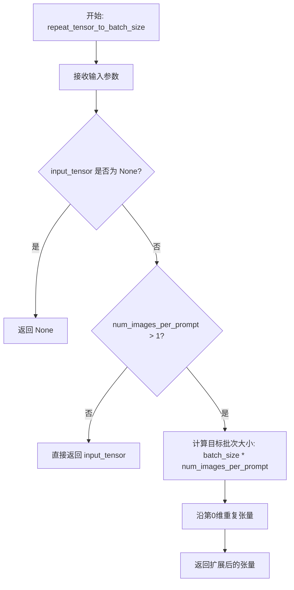

#### 带注释源码

```python
def repeat_tensor_to_batch_size(
    input_name: str,
    input_tensor: torch.Tensor,
    num_images_per_prompt: int,
    batch_size: int,
) -> torch.Tensor:
    """
    将输入张量的批处理维度扩展到 batch_size * num_images_per_prompt。
    
    参数:
        input_name: 输入张量的名称（用于日志/错误信息）
        input_tensor: 需要扩展的张量
        num_images_per_prompt: 每个prompt生成的图像数量
        batch_size: 原始批处理大小
    
    返回:
        扩展后的张量，批处理维度为 batch_size * num_images_per_prompt
    """
    # 如果输入张量为 None，直接返回
    if input_tensor is None:
        return None
    
    # 如果每个prompt只生成一张图，无需扩展
    if num_images_per_prompt == 1:
        return input_tensor
    
    # 计算目标批次大小
    # 例如：batch_size=2, num_images_per_prompt=4 -> 目标batch=8
    batch_dim = input_tensor.shape[0]
    target_batch_size = batch_size * num_images_per_prompt
    
    # 沿第0维（batch维度）重复张量
    # repeat 参数: 在第0维重复 num_images_per_prompt 次
    # 例如: shape [2, 64, 64] -> repeat(4, 1, 1) -> [8, 64, 64]
    repeat_times = num_images_per_prompt
    output_tensor = input_tensor.repeat(repeat_times, 1, 1, 1)
    
    # 调整形状以确保批处理维度正确
    # 如果张量是4D (B, C, H, W)
    if len(output_tensor.shape) == 4:
        output_tensor = output_tensor.view(
            target_batch_size, 
            output_tensor.shape[1],
            output_tensor.shape[2],
            output_tensor.shape[3]
        )
    # 如果张量是3D (B, seq, hidden)  
    elif len(output_tensor.shape) == 3:
        output_tensor = output_tensor.view(
            target_batch_size,
            output_tensor.shape[1],
            output_tensor.shape[2]
        )
    
    return output_tensor
```


# FluxPipeline._pack_latents 设计文档

### `FluxPipeline._pack_latents`

该方法是FluxPipeline类中的静态方法，用于将图像latent张量进行"打包"处理，将2D图像latent转换为适合Transformer模型处理的序列格式。在Flux架构中，latent空间的数据需要从空间表示转换为序列表示，该方法通过重塑（reshape）操作实现这一转换。

参数：

- `latents`：`torch.Tensor`，输入的图像latent张量，形状为 (batch_size, channels, height, width)
- `batch_size`：`int`，批次大小，用于确定输出张量的批次维度
- `num_channels`：`int`，latent的通道数，对应输入张量的第1维
- `height`：`int`，latent的空间高度维度
- `width`：`int`，latent的空间宽度维度

返回值：`torch.Tensor`，打包后的latent张量，形状为 (batch_size, num_channels, height * width) 或类似的序列格式

#### 流程图

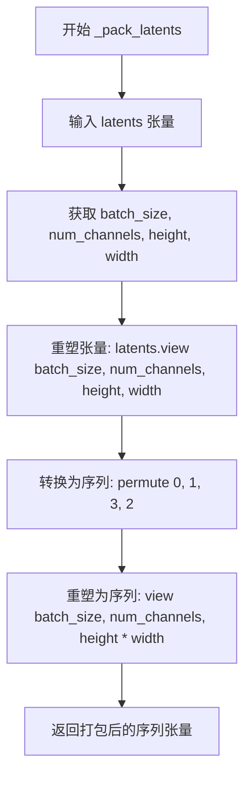

#### 带注释源码

```python
# 注意: 以下是基于调用方式推断的方法签名和实现逻辑
# 实际实现可能位于 diffusers 库的 FluxPipeline 类中

@staticmethod
def _pack_latents(
    latents: torch.Tensor,      # 输入: (batch, channels, h, w) 形状的latent张量
    batch_size: int,            # 批次大小
    num_channels: int,          # latent通道数
    height: int,                # latent高度
    width: int                  # latent宽度
) -> torch.Tensor:
    """
    将图像latent张量打包为序列格式
    
    Args:
        latents: 原始4D latent张量 (batch, channels, height, width)
        batch_size: 批次大小
        num_channels: latent通道数
        height: latent高度
        width: latent宽度
    
    Returns:
        打包后的3D张量 (batch, channels, height * width)
        适用于Transformer的序列输入
    """
    # 重塑为 (batch, channels, height, width)
    latents = latents.view(batch_size, num_channels, height, width)
    
    # 置换维度: (batch, channels, width, height) -> 为序列转换做准备
    latents = latents.permute(0, 1, 3, 2)
    
    # 重塑为序列格式: (batch, channels, height * width)
    # 将空间维度(height * width)展平为序列长度
    latents = latents.reshape(batch_size, num_channels, height * width)
    
    return latents
```

---

### 补充信息

#### 关键组件信息

| 组件名称 | 描述 |
|---------|------|
| FluxPipeline | HuggingFace Diffusers库中的Flux图像生成管道主类 |
| _pack_latents | 静态方法，负责将空间域latent转换为序列域表示 |
| FluxAdditionalInputsStep | 调用_pack_latents的模块化管道块之一 |
| image_latent_tensor | 经打包处理后的图像latent张量 |

#### 潜在技术债务与优化空间

1. **代码重复**：`_pack_latents`在`FluxAdditionalInputsStep`和`FluxKontextAdditionalInputsStep`中被重复调用，代码逻辑几乎完全相同，可考虑提取为共享方法
2. **TODO注释**：代码中存在`# TODO: Implement patchifier for Flux.`注释，表明当前的pack操作可能只是临时方案，未来需要实现真正的patchify逻辑
3. **硬编码维度处理**：height和width的处理逻辑假设了特定的张量排列方式，缺乏灵活性

#### 设计目标与约束

- **设计目标**：将4D图像latent转换为Transformer可接受的3D序列格式
- **约束条件**：输入必须为4D张量 (batch, channels, h, w)，输出为3D张量 (batch, channels, h*w)
- **调用时机**：在文本编码处理之后、正式去噪之前执行


### `FluxTextInputStep.description`

该属性返回一个字符串，描述了 `FluxTextInputStep` 类的核心功能：文本输入处理步骤，用于标准化管道的文本嵌入。该步骤主要完成两项工作：1. 根据 `prompt_embeds` 确定 `batch_size` 和 `dtype`；2. 确保所有文本嵌入具有一致的批次大小（batch_size * num_images_per_prompt）。

参数：

- `self`：`FluxTextInputStep` 实例，隐式参数，属性所属类的实例对象

返回值：`str`，返回该处理步骤的描述文本，说明其功能为标准化文本嵌入并确保批次大小一致性

#### 流程图

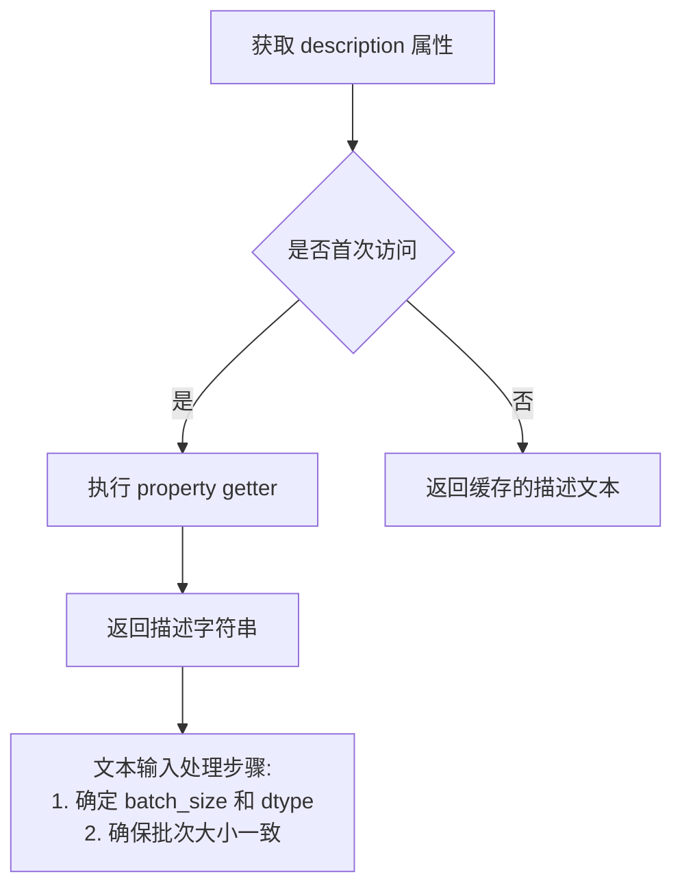

#### 带注释源码

```python
@property
def description(self) -> str:
    """
    返回该文本输入处理步骤的描述信息。
    
    该描述说明了此步骤的核心功能：
    1. 基于 prompt_embeds 确定批处理大小(batch_size)和数据类型(dtype)
    2. 确保所有文本嵌入具有一致的批次大小 (batch_size * num_images_per_prompt)
    
    Returns:
        str: 描述文本输入处理步骤功能的字符串
    """
    return (
        "Text input processing step that standardizes text embeddings for the pipeline.\n"
        "This step:\n"
        "  1. Determines `batch_size` and `dtype` based on `prompt_embeds`\n"
        "  2. Ensures all text embeddings have consistent batch sizes (batch_size * num_images_per_prompt)"
    )
```


### `FluxTextInputStep.inputs` (property)

该属性定义了 Flux 文本输入步骤的输入参数列表，包含文本嵌入处理所需的参数，如每提示图像数量、提示嵌入和池化提示嵌入等。

参数：

- （无 - 这是一个属性，不是函数/方法）

返回值：`list[InputParam]`，返回三个 `InputParam` 对象组成的列表，定义了文本嵌入处理步骤的输入参数

#### 流程图

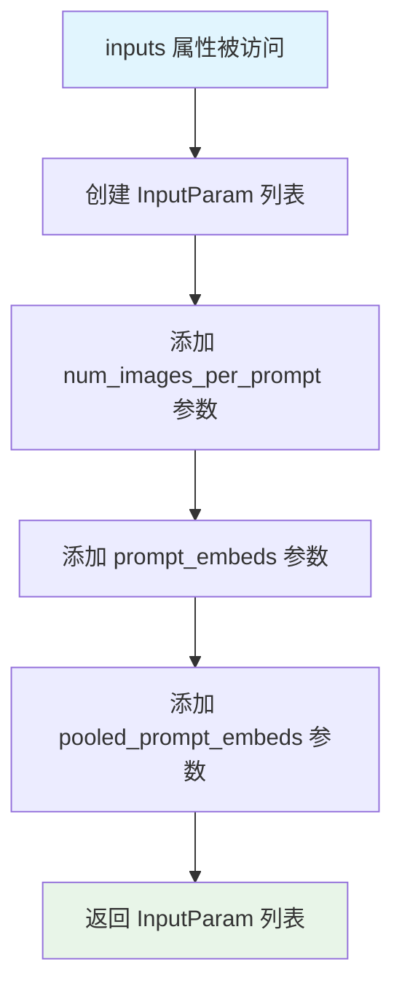

#### 带注释源码

```python
@property
def inputs(self) -> list[InputParam]:
    """
    定义 FluxTextInputStep 的输入参数列表。
    
    返回值类型: list[InputParam]
    - 包含三个 InputParam 对象，分别对应:
      1. num_images_per_prompt: 每提示生成的图像数量
      2. prompt_embeds: 预生成的文本嵌入（必需）
      3. pooled_prompt_embeds: 预生成的池化文本嵌入（可选）
    """
    return [
        # 参数1: num_images_per_prompt
        # 类型: int
        # 默认值: 1
        # 描述: 每提示生成的图像数量，用于控制批量大小
        InputParam("num_images_per_prompt", default=1),
        
        # 参数2: prompt_embeds
        # 类型: torch.Tensor (类型提示)
        # 必需: True
        # kwargs_type: denoiser_input_fields (传递给去噪器的输入字段)
        # 描述: 预生成的文本嵌入，可从 text_encoder 步骤生成
        InputParam(
            "prompt_embeds",
            required=True,
            kwargs_type="denoiser_input_fields",
            type_hint=torch.Tensor,
            description="Pre-generated text embeddings. Can be generated from text_encoder step.",
        ),
        
        # 参数3: pooled_prompt_embeds
        # 类型: torch.Tensor (类型提示)
        # 必需: False (默认)
        # kwargs_type: denoiser_input_fields (传递给去噪器的输入字段)
        # 描述: 预生成的池化文本嵌入，可从 text_encoder 步骤生成
        InputParam(
            "pooled_prompt_embeds",
            kwargs_type="denoiser_input_fields",
            type_hint=torch.Tensor,
            description="Pre-generated pooled text embeddings. Can be generated from text_encoder step.",
        ),
        # TODO: support negative embeddings? (未来可能支持负向嵌入)
    ]
```


### `FluxTextInputStep.intermediate_outputs`

该属性是 Flux 模块化管道中文本输入处理步骤的中间输出定义，返回一个包含四个 `OutputParam` 对象的列表，定义了批大小、数据类型、文本嵌入和池化文本嵌入等关键输出参数。

参数：
- （无参数，该属性不需要输入参数）

返回值：`list[OutputParam]`，返回文本输入处理步骤的中间输出参数列表，包含 `batch_size`、`dtype`、`prompt_embeds` 和 `pooled_prompt_embeds` 四个输出参数

#### 流程图

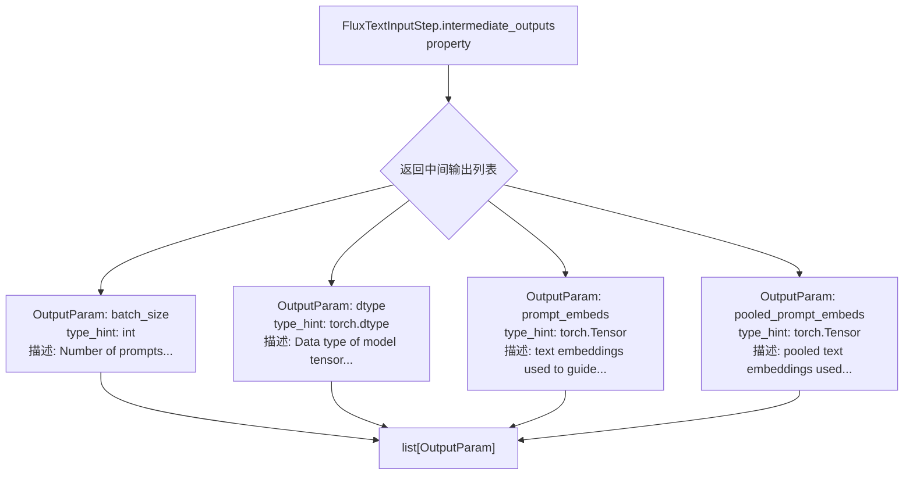

#### 带注释源码

```python
@property
def intermediate_outputs(self) -> list[str]:
    """
    定义文本输入步骤的中间输出参数。
    
    这些参数将在管道执行过程中被生成并传递给下游步骤使用。
    返回值是一个 OutputParam 对象的列表，每个对象描述一个中间输出参数。
    """
    return [
        # OutputParam 1: batch_size
        # 表示提示的数量，最终模型输入的批大小应为 batch_size * num_images_per_prompt
        OutputParam(
            "batch_size",
            type_hint=int,
            description="Number of prompts, the final batch size of model inputs should be batch_size * num_images_per_prompt",
        ),
        # OutputParam 2: dtype
        # 模型张量输入的数据类型（由 prompt_embeds 决定）
        OutputParam(
            "dtype",
            type_hint=torch.dtype,
            description="Data type of model tensor inputs (determined by `prompt_embeds`)",
        ),
        # OutputParam 3: prompt_embeds
        # 用于引导图像生成的文本嵌入
        OutputParam(
            "prompt_embeds",
            type_hint=torch.Tensor,
            kwargs_type="denoiser_input_fields",
            description="text embeddings used to guide the image generation",
        ),
        # OutputParam 4: pooled_prompt_embeds
        # 用于引导图像生成的池化文本嵌入
        OutputParam(
            "pooled_prompt_embeds",
            type_hint=torch.Tensor,
            kwargs_type="denoiser_input_fields",
            description="pooled text embeddings used to guide the image generation",
        ),
        # TODO: support negative embeddings? - 未来可能支持负向嵌入
    ]
```


### `FluxTextInputStep.check_inputs`

该方法用于验证文本嵌入输入的一致性，确保 `prompt_embeds` 和 `pooled_prompt_embeds` 在同时提供时具有相同的批次大小（batch size），以防止后续处理出现维度不匹配错误。

参数：

- `self`：隐式参数，指代 `FluxTextInputStep` 类的实例对象。
- `components`：`FluxModularPipeline`，模块化流水线的组件集合，用于访问管道的各个组件（如模型、VAE 等），此处未在验证逻辑中直接使用，但作为方法签名的标准参数。
- `block_state`：`PipelineState`，块状态对象，包含当前流水线步骤的中间状态和数据，其中包含 `prompt_embeds` 和 `pooled_prompt_embeds` 属性用于验证。

返回值：`None`，该方法通过抛出异常来处理验证失败，不返回任何值。

#### 流程图

```mermaid
flowchart TD
    A[开始 check_inputs] --> B{prompt_embeds 是否不为 None<br/>且 pooled_prompt_embeds 是否不为 None}
    B -- 否 --> C[验证通过，方法结束]
    B -- 是 --> D{prompt_embeds.shape[0] 是否等于<br/>pooled_prompt_embeds.shape[0]}
    D -- 是 --> C
    D -- 否 --> E[抛出 ValueError 异常<br/>提示 batch size 不匹配]
    E --> F[结束]
```

#### 带注释源码

```python
def check_inputs(self, components, block_state):
    # 检查两个文本嵌入是否同时存在
    if block_state.prompt_embeds is not None and block_state.pooled_prompt_embeds is not None:
        # 验证两个嵌入的批次大小（batch size）是否一致
        if block_state.prompt_embeds.shape[0] != block_state.pooled_prompt_embeds.shape[0]:
            # 如果批次大小不一致，抛出详细的错误信息
            raise ValueError(
                "`prompt_embeds` and `pooled_prompt_embeds` must have the same batch size when passed directly, but"
                f" got: `prompt_embeds` {block_state.prompt_embeds.shape} != `pooled_prompt_embeds`"
                f" {block_state.pooled_prompt_embeds.shape}."
            )
```


### `FluxTextInputStep.__call__`

该方法是 Flux 文本输入处理步骤的核心执行方法，负责标准化文本嵌入以供流水线使用。它从 `prompt_embeds` 中确定 `batch_size` 和 `dtype`，并将所有文本嵌入扩展到一致的批次大小（batch_size * num_images_per_prompt）。

#### 参数

- `components`：`FluxModularPipeline`，流水线组件对象，包含 VAE、文本编码器等模型组件
- `state`：`PipelineState`，流水线的当前状态对象，包含块状态（block_state）中存储的中间数据和参数

#### 返回值

- `Tuple[FluxModularPipeline, PipelineState]`，返回更新后的组件和状态对象，其中状态对象的 block_state 已更新 batch_size、dtype、扩展后的 prompt_embeds 和 pooled_prompt_embeds

#### 流程图

```mermaid
flowchart TD
    A[开始 __call__] --> B[获取 block_state]
    B --> C[调用 check_inputs 验证输入]
    C --> D[从 prompt_embeds.shape[0] 获取 batch_size]
    D --> E[从 prompt_embeds.dtype 获取 dtype]
    E --> F[获取 seq_len]
    F --> G[重复 prompt_embeds num_images_per_prompt 次]
    G --> H[reshape 为 batch_size * num_images_per_prompt, seq_len, -1]
    H --> I[重复 pooled_prompt_embeds num_images_per_prompt 次]
    I --> J[reshape 为 batch_size * num_images_per_prompt, -1]
    J --> K[保存 block_state 到 state]
    K --> L[返回 components, state]
```

#### 带注释源码

```python
@torch.no_grad()
def __call__(self, components: FluxModularPipeline, state: PipelineState) -> PipelineState:
    """
    执行文本输入处理步骤，标准化和扩展文本嵌入以匹配批量大小。
    
    参数:
        components: FluxModularPipeline，流水线组件
        state: PipelineState，包含当前流水线状态
    
    返回:
        Tuple[FluxModularPipeline, PipelineState]：更新后的组件和状态
    """
    # TODO: 考虑添加负向嵌入支持
    # 从 state 中获取当前块的内部状态
    block_state = self.get_block_state(state)
    
    # 验证 prompt_embeds 和 pooled_prompt_embeds 的批次大小一致性
    self.check_inputs(components, block_state)

    # 从 prompt_embeds 的第一维获取批次大小并存储到 block_state
    block_state.batch_size = block_state.prompt_embeds.shape[0]
    
    # 从 prompt_embeds 的数据类型获取 dtype 并存储到 block_state
    block_state.dtype = block_state.prompt_embeds.dtype

    # 获取文本嵌入的序列长度（第二维）
    _, seq_len, _ = block_state.prompt_embeds.shape
    
    # 将 prompt_embeds 在序列维度上重复 num_images_per_prompt 次
    # 例如: [batch, seq_len, hidden] -> [batch, seq_len * num_images_per_prompt, hidden]
    block_state.prompt_embeds = block_state.prompt_embeds.repeat(1, block_state.num_images_per_prompt, 1)
    
    # 重新整形为 [batch_size * num_images_per_prompt, seq_len, hidden_dim]
    # 这确保了每个提示生成多个图像时嵌入正确展开
    block_state.prompt_embeds = block_state.prompt_embeds.view(
        block_state.batch_size * block_state.num_images_per_prompt, seq_len, -1
    )
    
    # 对 pooled_prompt_embeds 进行相同的重复操作
    # pooled 嵌入没有序列维度，所以只重复一次
    pooled_prompt_embeds = block_state.pooled_prompt_embeds.repeat(1, block_state.num_images_per_prompt)
    
    # 重新整形为 [batch_size * num_images_per_prompt, hidden_dim]
    block_state.pooled_prompt_embeds = pooled_prompt_embeds.view(
        block_state.batch_size * block_state.num_images_per_prompt, -1
    )
    
    # 将更新后的 block_state 写回 state
    self.set_block_state(state, block_state)

    # 返回更新后的 components 和 state
    return components, state
```


### `FluxAdditionalInputsStep.__init__`

初始化 FluxAdditionalInputsStep 类，用于处理图像潜在输入和额外批量输入的配置。该方法接收图像潜在输入名称列表和额外批量输入名称列表，将其标准化为列表类型，并存储为实例变量。

参数：

- `image_latent_inputs`：`list[str]`，可选，默认值为 `["image_latents"]`，指定图像潜在输入的名称列表，用于处理图像潜在输入的更新高度/宽度、patchify 和批量扩展
- `additional_batch_inputs`：`list[str]`，可选，默认值为空列表 `[]`，指定额外批量输入的名称列表，用于扩展批量维度以匹配最终批量大小

返回值：`None`，无返回值（`__init__` 方法返回 `None`）

#### 流程图

```mermaid
flowchart TD
    A[开始 __init__] --> B{image_latent_inputs 是否为列表?}
    B -- 是 --> C[不做处理]
    B -- 否 --> D[将其包装为列表: [image_latent_inputs]
    D --> C
    C --> E{additional_batch_inputs 是否为列表?}
    E -- 是 --> F[不做处理]
    E -- 否 --> G[将其包装为列表: [additional_batch_inputs]
    G --> F
    F --> H[设置实例变量: self._image_latent_inputs]
    H --> I[设置实例变量: self._additional_batch_inputs]
    I --> J[调用父类 __init__: super().__init__()]
    J --> K[结束]
```

#### 带注释源码

```python
def __init__(
    self,
    image_latent_inputs: list[str] = ["image_latents"],
    additional_batch_inputs: list[str] = [],
):
    # 如果传入的不是列表，则转换为列表，确保一致性
    if not isinstance(image_latent_inputs, list):
        image_latent_inputs = [image_latent_inputs]
    
    # 如果传入的不是列表，则转换为列表，确保一致性
    if not isinstance(additional_batch_inputs, list):
        additional_batch_inputs = [additional_batch_inputs]

    # 存储图像潜在输入的名称列表到实例变量
    self._image_latent_inputs = image_latent_inputs
    # 存储额外批量输入的名称列表到实例变量
    self._additional_batch_inputs = additional_batch_inputs
    
    # 调用父类 ModularPipelineBlocks 的初始化方法
    super().__init__()
```


### `FluxAdditionalInputsStep.description`

这是一个属性（property），用于描述 `FluxAdditionalInputsStep` 类的功能、配置的输入以及使用建议。

#### 带注释源码

```python
@property
def description(self) -> str:
    # 功能部分：简要说明该步骤的主要功能
    summary_section = (
        "Input processing step that:\n"
        "  1. For image latent inputs: Updates height/width if None, patchifies latents, and expands batch size\n"
        "  2. For additional batch inputs: Expands batch dimensions to match final batch size"
    )

    # 输入信息：根据初始化时配置的输入参数生成描述
    inputs_info = ""
    if self._image_latent_inputs or self._additional_batch_inputs:
        inputs_info = "\n\nConfigured inputs:"
        if self._image_latent_inputs:
            inputs_info += f"\n  - Image latent inputs: {self._image_latent_inputs}"
        if self._additional_batch_inputs:
            inputs_info += f"\n  - Additional batch inputs: {self._additional_batch_inputs}"

    # 放置指导：说明该模块在管道中的正确位置
    placement_section = "\n\nThis block should be placed after the encoder steps and the text input step."

    # 返回完整的描述字符串
    return summary_section + inputs_info + placement_section
```

#### 流程图

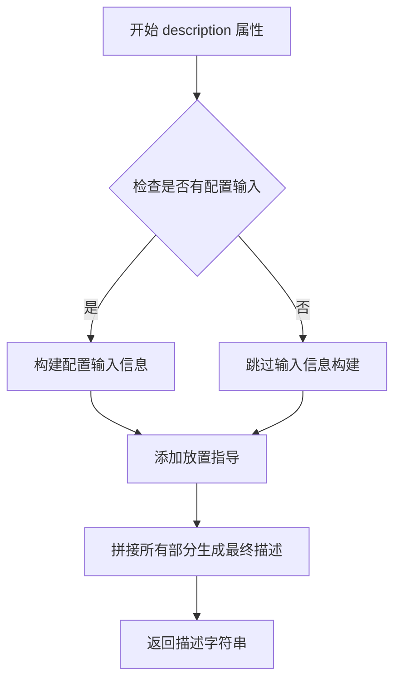

#### 详细说明

| 项目 | 详情 |
|------|------|
| **名称** | `FluxAdditionalInputsStep.description` |
| **类型** | property（只读属性） |
| **所属类** | `FluxAdditionalInputsStep` |
| **返回值类型** | `str` |
| **返回值描述** | 返回一个包含三部分内容的字符串：<br>1. **功能摘要**：说明该步骤处理图像潜在输入和额外批量输入的具体功能<br>2. **配置的输入**：列出该步骤配置的图像潜在输入和额外批量输入<br>3. **放置指导**：建议该模块应放置在编码器步骤和文本输入步骤之后 |

#### 说明

该 `description` 属性是 `FluxAdditionalInputsStep` 类的一个重要组成部分，它提供了关于该处理步骤的完整文档说明。通过动态读取实例化时传入的 `image_latent_inputs` 和 `additional_batch_inputs` 参数，生成针对性的描述信息，帮助开发者理解该步骤在 Flux 管道中的位置和作用。


### `FluxAdditionalInputsStep.inputs`

该属性定义了 FluxAdditionalInputsStep 模块的输入参数列表，包括图像潜在输入的批处理扩展和额外的批量输入处理。

参数：

- 无直接参数（该属性通过类的实例变量 `_image_latent_inputs` 和 `_additional_batch_inputs` 动态构建输入列表）

返回值：`list[InputParam]`，返回输入参数列表，包含以下参数：

- `num_images_per_prompt`：`int` 类型，默认值为 1，指定每个提示生成的图像数量
- `batch_size`：`int` 类型，必填，指定批量大小
- `height`：`int` 类型，可选，图像高度
- `width`：`int` 类型，可选，图像宽度
- `image_latents`（或其他配置的图像潜在输入）：`torch.Tensor` 类型，可选，图像潜在表示张量

#### 流程图

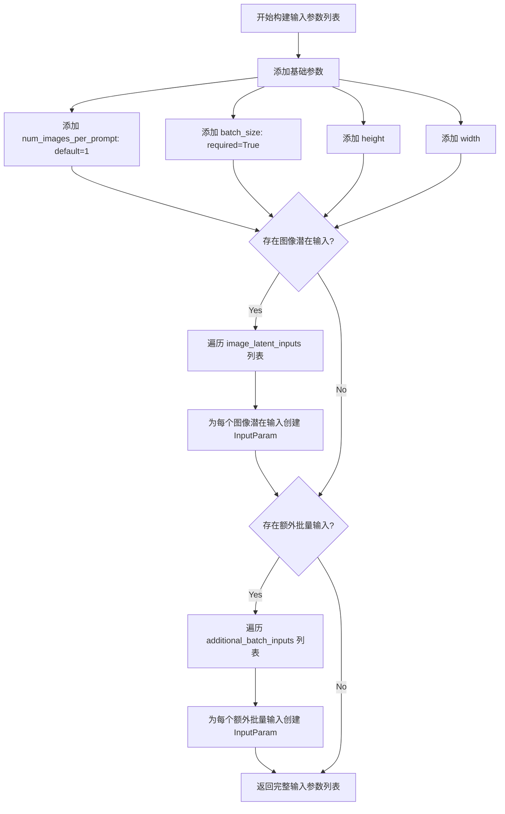

#### 带注释源码

```python
@property
def inputs(self) -> list[InputParam]:
    """
    构建并返回输入参数列表。
    
    该方法动态生成输入参数，包含：
    1. 基础参数：num_images_per_prompt, batch_size, height, width
    2. 图像潜在输入：由 _image_latent_inputs 指定
    3. 额外批量输入：由 _additional_batch_inputs 指定
    
    Returns:
        list[InputParam]: 输入参数列表，用于定义模块的输入接口
    """
    # 步骤1：初始化基础输入参数列表
    inputs = [
        # num_images_per_prompt: 每个提示生成的图像数量，默认值为1
        InputParam(name="num_images_per_prompt", default=1),
        # batch_size: 批量大小，该参数为必填项
        InputParam(name="batch_size", required=True),
        # height: 图像高度，可选参数
        InputParam(name="height"),
        # width: 图像宽度，可选参数
        InputParam(name="width"),
    ]

    # 步骤2：遍历配置的图像潜在输入名称列表
    # 为每个图像潜在输入创建对应的 InputParam
    for image_latent_input_name in self._image_latent_inputs:
        inputs.append(InputParam(name=image_latent_input_name))

    # 步骤3：遍历配置的额外批量输入名称列表
    # 为每个额外批量输入创建对应的 InputParam
    for input_name in self._additional_batch_inputs:
        inputs.append(InputParam(name=input_name))

    # 返回完整的输入参数列表
    return inputs
```


### `FluxAdditionalInputsStep.intermediate_outputs`

该属性是 `FluxAdditionalInputsStep` 类的中间输出属性，用于定义该处理步骤向流水线状态中注入的输出变量。它返回两个 `OutputParam` 对象，分别表示图像 latent 的高度和宽度，供后续步骤使用。

参数：

- 无显式参数（隐式参数 `self` 指向类实例）

返回值：`list[OutputParam]`，返回包含 `image_height` 和 `image_width` 两个输出参数的列表，用于描述图像 latent 的空间维度信息。

#### 流程图

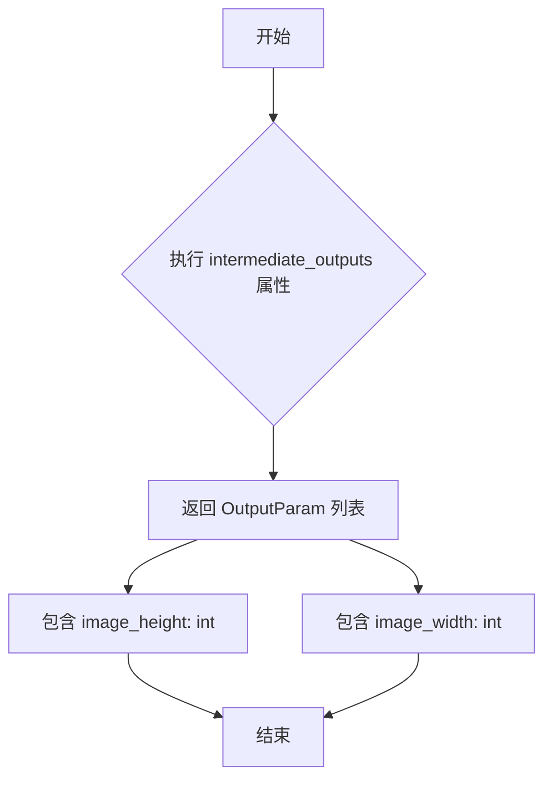

#### 带注释源码

```python
@property
def intermediate_outputs(self) -> list[OutputParam]:
    """
    定义该步骤的中间输出参数。
    
    返回值:
        list[OutputParam]: 包含以下输出参数的列表:
            - image_height: 图像 latent 的高度
            - image_width: 图像 latent 的宽度
    """
    return [
        # 输出参数：图像 latent 的高度
        OutputParam(name="image_height", type_hint=int, description="The height of the image latents"),
        # 输出参数：图像 latent 的宽度
        OutputParam(name="image_width", type_hint=int, description="The width of the image latents"),
    ]
```


### `FluxAdditionalInputsStep.__call__`

处理图像潜在输入和额外批量输入的核心方法，负责计算高度/宽度、打包潜在变量、以及扩展批量大小以匹配最终的批次尺寸。

参数：

- `self`：实例本身
- `components`：`FluxModularPipeline`，模块化管道组件，包含 VAE 比例因子等配置
- `state`：`PipelineState`，管道状态对象，包含当前执行上下文和块状态

返回值：`PipelineState`，更新后的管道状态对象

#### 流程图

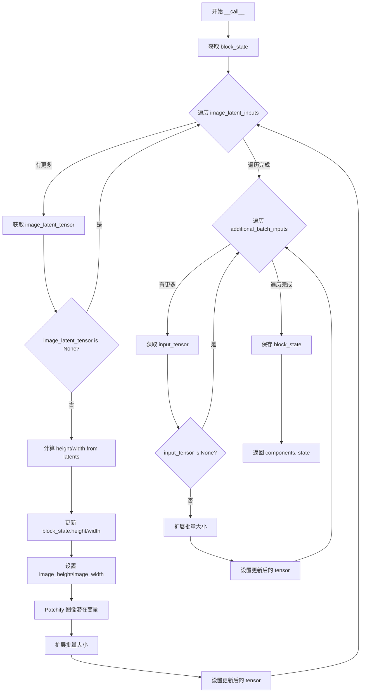

#### 带注释源码

```python
def __call__(self, components: FluxModularPipeline, state: PipelineState) -> PipelineState:
    """
    处理图像潜在输入和额外批量输入的主方法。
    
    处理流程：
    1. 对图像潜在输入：计算高度/宽度、patchify、扩展批量大小
    2. 对额外批量输入：仅扩展批量大小以匹配最终批次
    """
    # 从 state 中获取当前块的内部状态
    block_state = self.get_block_state(state)

    # ==================== 处理图像潜在输入 ====================
    # 对每个配置的图像潜在输入执行：高度/宽度计算、patchify、批量扩展
    for image_latent_input_name in self._image_latent_inputs:
        # 动态获取对应名称的潜在变量张量
        image_latent_tensor = getattr(block_state, image_latent_input_name)
        
        # 跳过为 None 的输入
        if image_latent_tensor is None:
            continue

        # 步骤1: 从潜在变量计算图像高度和宽度
        # 使用 VAE 比例因子将潜在空间坐标映射回像素空间
        height, width = calculate_dimension_from_latents(
            image_latent_tensor, 
            components.vae_scale_factor
        )
        
        # 如果未设置，则使用计算出的高度/宽度；否则保留已有值
        block_state.height = block_state.height or height
        block_state.width = block_state.width or width

        # 保存中间输出，供后续步骤使用
        if not hasattr(block_state, "image_height"):
            block_state.image_height = height
        if not hasattr(block_state, "image_width"):
            block_state.image_width = width

        # 步骤2: Patchify（分块化）图像潜在变量
        # 将潜在变量转换为适合 Flux 模型处理的格式
        # TODO: 当前使用 _pack_latents，未来需要实现专门的 Flux patchifier
        latent_height, latent_width = image_latent_tensor.shape[2:]
        image_latent_tensor = FluxPipeline._pack_latents(
            image_latent_tensor, 
            block_state.batch_size, 
            image_latent_tensor.shape[1], 
            latent_height, 
            latent_width
        )

        # 步骤3: 扩展批量大小
        # 根据 num_images_per_prompt 扩展张量维度，支持单提示生成多图
        image_latent_tensor = repeat_tensor_to_batch_size(
            input_name=image_latent_input_name,
            input_tensor=image_latent_tensor,
            num_images_per_prompt=block_state.num_images_per_prompt,
            batch_size=block_state.batch_size,
        )

        # 将处理后的张量写回 block_state
        setattr(block_state, image_latent_input_name, image_latent_tensor)

    # ==================== 处理额外批量输入 ====================
    # 仅执行批量扩展，不做 patchify
    for input_name in self._additional_batch_inputs:
        input_tensor = getattr(block_state, input_name)
        if input_tensor is None:
            continue

        # 扩展批量大小以匹配最终批次
        input_tensor = repeat_tensor_to_batch_size(
            input_name=input_name,
            input_tensor=input_tensor,
            num_images_per_prompt=block_state.num_images_per_prompt,
            batch_size=block_state.batch_size,
        )

        setattr(block_state, input_name, input_tensor)

    # 保存更新后的 block_state 到 pipeline state
    self.set_block_state(state, block_state)
    
    # 返回组件和状态（符合 ModularPipelineBlocks 的调用约定）
    return components, state
```


### `FluxKontextAdditionalInputsStep.__call__`

处理 Flux Kontext 模型的额外输入参数，包括图像潜在张量的尺寸计算、patchify 处理和批量扩展，以及其他批量输入的扩展。与父类 `FluxAdditionalInputsStep` 的区别在于不会覆盖已存在的 `block.height` 和 `block.width` 值。

参数：

- `components`：`FluxModularPipeline`，Pipeline 组件容器，提供对 VAE scale factor 等组件的访问
- `state`：`PipelineState`，Pipeline 的状态对象，包含当前步骤的中间数据和块状态

返回值：`PipelineState`，返回更新后的 PipelineState 对象（实际返回 `components, state` 元组）

#### 流程图

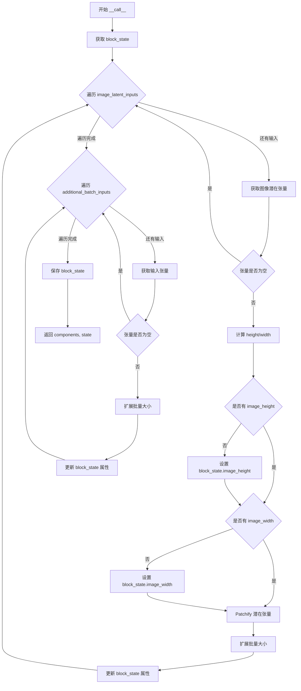

#### 带注释源码

```
def __call__(self, components: FluxModularPipeline, state: PipelineState) -> PipelineState:
    # 获取当前块的内部状态
    block_state = self.get_block_state(state)

    # 处理图像潜在输入：计算高度/宽度、patchify 和批量扩展
    for image_latent_input_name in self._image_latent_inputs:
        # 通过属性名获取图像潜在张量
        image_latent_tensor = getattr(block_state, image_latent_input_name)
        if image_latent_tensor is None:
            # 如果张量为空，跳过处理
            continue

        # 1. 从潜在张量计算高度和宽度
        # 与 FluxAdditionalInputsStep 不同，不会覆盖 block.height 和 block.width
        height, width = calculate_dimension_from_latents(image_latent_tensor, components.vae_scale_factor)
        if not hasattr(block_state, "image_height"):
            block_state.image_height = height
        if not hasattr(block_state, "image_width"):
            block_state.image_width = width

        # 2. 对图像潜在张量进行 patchify 处理
        # TODO: 为 Flux 实现 patchifier
        latent_height, latent_width = image_latent_tensor.shape[2:]
        image_latent_tensor = FluxPipeline._pack_latents(
            image_latent_tensor, block_state.batch_size, image_latent_tensor.shape[1], latent_height, latent_width
        )

        # 3. 扩展批量大小以匹配 num_images_per_prompt
        image_latent_tensor = repeat_tensor_to_batch_size(
            input_name=image_latent_input_name,
            input_tensor=image_latent_tensor,
            num_images_per_prompt=block_state.num_images_per_prompt,
            batch_size=block_state.batch_size,
        )

        # 更新 block_state 中的图像潜在张量
        setattr(block_state, image_latent_input_name, image_latent_tensor)

    # 处理额外的批量输入（仅批量扩展）
    for input_name in self._additional_batch_inputs:
        input_tensor = getattr(block_state, input_name)
        if input_tensor is None:
            continue

        # 仅扩展批量大小
        input_tensor = repeat_tensor_to_batch_size(
            input_name=input_name,
            input_tensor=input_tensor,
            num_images_per_prompt=block_state.num_images_per_prompt,
            batch_size=block_state.batch_size,
        )

        setattr(block_state, input_name, input_tensor)

    # 保存更新后的 block_state 到 state
    self.set_block_state(state, block_state)
    return components, state
```


### `FluxKontextSetResolutionStep.description`

这是一个属性方法（property），用于返回 `FluxKontextSetResolutionStep` 步骤的描述信息，说明该步骤的功能和放置位置。

参数：

- `self`：`FluxKontextSetResolutionStep`，类的实例本身，用于访问属性

返回值：`str`，返回该步骤的描述字符串，说明其功能是确定后续计算使用的高度和宽度，并且应该放在潜在变量准备步骤之前。

#### 流程图

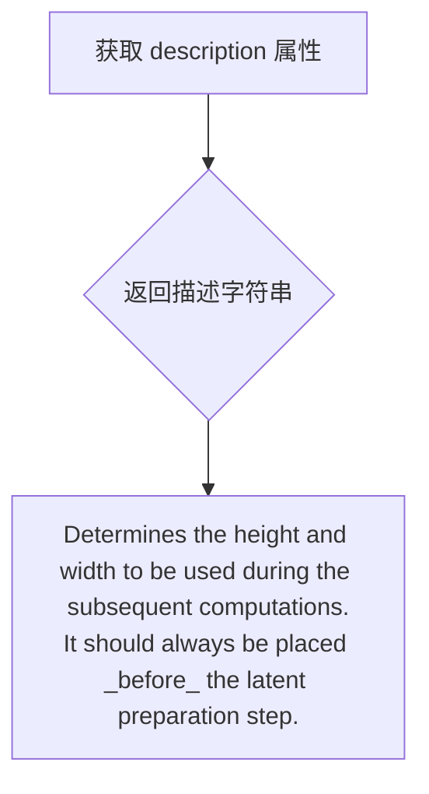

#### 带注释源码

```python
@property
def description(self):
    """
    返回该步骤的描述信息。
    
    说明：
    - 确定后续计算使用的高度和宽度
    - 该步骤应始终放在潜在变量准备步骤之前
    """
    return (
        "Determines the height and width to be used during the subsequent computations.\n"
        "It should always be placed _before_ the latent preparation step."
    )
```


### `FluxKontextSetResolutionStep.inputs`

该属性定义了 FluxKontextSetResolutionStep 的输入参数列表，包含 height、width 和 max_area 三个参数，用于确定后续计算中使用的高度和宽度。

参数：

- `height`：`int`（隐式），图像高度参数
- `width`：`int`（隐式），图像宽度参数
- `max_area`：`int`，最大面积约束，默认为 1024²

返回值：`list[InputParam]`，返回包含三个 InputParam 对象的列表，描述该步骤的输入参数规范

#### 流程图

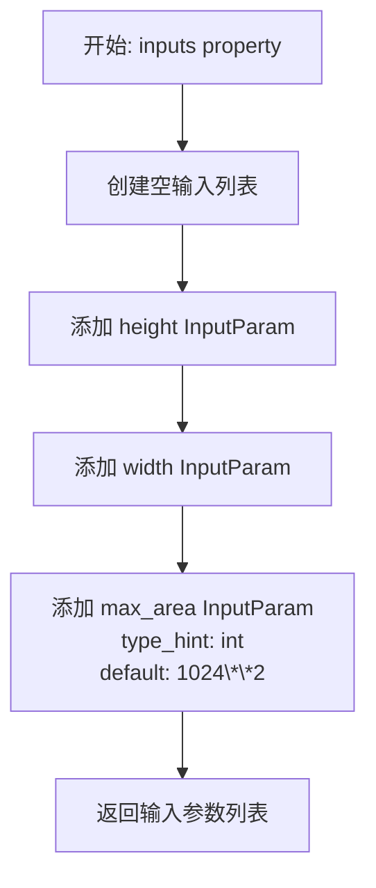

#### 带注释源码

```python
@property
def inputs(self) -> list[InputParam]:
    """
    定义该步骤的输入参数规范。
    
    返回:
        包含三个 InputParam 的列表:
        - height: 可选的高度参数
        - width: 可选的宽度参数  
        - max_area: 最大面积约束,默认值为 1024 的平方 (1048576)
    """
    # 初始化输入参数列表
    inputs = [
        # 高度参数,可选,无默认值
        InputParam(name="height"),
        # 宽度参数,可选,无默认值
        InputParam(name="width"),
        # 最大面积参数,类型为 int,默认值为 1024**2
        InputParam(name="max_area", type_hint=int, default=1024**2),
    ]
    return inputs
```


### `FluxKontextSetResolutionStep.intermediate_outputs`

该属性定义了 `FluxKontextSetResolutionStep` 类在执行分辨率设置后输出的中间结果，包含用于后续计算的图像高度和宽度信息。

参数：
无（属性方法无需参数）

返回值：`list[OutputParam]`，返回包含两个 `OutputParam` 元素的列表，分别表示处理后的图像高度和宽度

#### 流程图

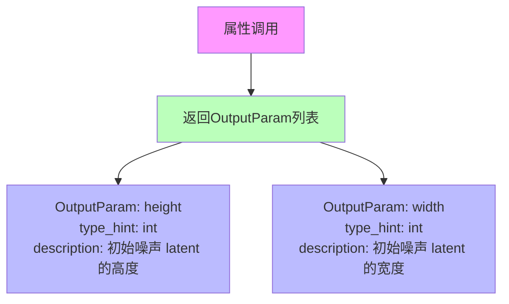

#### 带注释源码

```python
@property
def intermediate_outputs(self) -> list[OutputParam]:
    """
    定义该步骤执行后输出的中间结果。
    
    返回值:
        list[OutputParam]: 包含两个 OutputParam 对象的列表：
        - height: 初始噪声 latent 的高度（经过分辨率调整后）
        - width: 初始噪声 latent 的宽度（经过分辨率调整后）
    """
    return [
        # 输出参数：处理后的图像高度
        OutputParam(
            name="height", 
            type_hint=int, 
            description="The height of the initial noisy latents"
        ),
        # 输出参数：处理后的图像宽度
        OutputParam(
            name="width", 
            type_hint=int, 
            description="The width of the initial noisy latents"
        ),
    ]
```


### `FluxKontextSetResolutionStep.check_inputs`

该方法是一个静态方法，用于验证图像生成的高度和宽度参数是否符合模型要求。具体来说，它检查高度和宽度是否为空，如果不为空，则确保它们能够被 `vae_scale_factor * 2` 整除，以确保后续图像处理的正确性。

参数：

- `height`：`int` 或 `None`，待验证的图像高度，如果为 `None` 则跳过验证
- `width`：`int` 或 `None`，待验证的图像宽度，如果为 `None` 则跳过验证
- `vae_scale_factor`：`int`，VAE 的缩放因子，用于计算验证的除数

返回值：`None`，该方法通过抛出异常来处理验证失败的情况

#### 流程图

```mermaid
flowchart TD
    A[开始 check_inputs] --> B{height is not None}
    B -->|是| C{height % (vae_scale_factor * 2) == 0}
    B -->|否| D{width is not None}
    C -->|是| D
    C -->|否| E[抛出 ValueError: Height must be divisible by ...]
    D -->|是| F{width % (vae_scale_factor * 2) == 0}
    D -->|否| G[结束]
    F -->|是| G
    F -->|否| H[抛出 ValueError: Width must be divisible by ...]
```

#### 带注释源码

```python
@staticmethod
def check_inputs(height, width, vae_scale_factor):
    # 检查高度是否已指定且符合VAE缩放因子要求
    if height is not None and height % (vae_scale_factor * 2) != 0:
        # 如果高度不能被 vae_scale_factor * 2 整除，抛出 ValueError
        raise ValueError(f"Height must be divisible by {vae_scale_factor * 2} but is {height}")

    # 检查宽度是否已指定且符合VAE缩放因子要求
    if width is not None and width % (vae_scale_factor * 2) != 0:
        # 如果宽度不能被 vae_scale_factor * 2 整除，抛出 ValueError
        raise ValueError(f"Width must be divisible by {vae_scale_factor * 2} but is {width}")
```


### `FluxKontextSetResolutionStep.__call__`

该方法是 FluxKontext 模块化管道中的分辨率设置步骤，用于确定图像生成的 Height 和 Width。它从 block_state 或 components 获取初始分辨率，根据 max_area 和宽高比计算合适的分辨率，并确保分辨率符合 VAE 模型的倍数要求（vae_scale_factor * 2）。

参数：

- `self`：实例本身
- `components`：`FluxModularPipeline`，模块化管道组件，包含 default_height、default_width、vae_scale_factor 等配置
- `state`：`PipelineState`，管道状态，用于存储中间结果（height、width、max_area 等）

返回值：`PipelineState`，更新后的管道状态（实际返回 `Tuple[FluxModularPipeline, PipelineState]`）

#### 流程图

```mermaid
flowchart TD
    A[开始 __call__] --> B[获取 block_state]
    B --> C{height 是否为 None?}
    C -->|是| D[使用 components.default_height]
    C -->|否| E[使用 block_state.height]
    D --> F{width 是否为 None?}
    E --> F
    F -->|是| G[使用 components.default_width]
    F -->|否| H[使用 block_state.width]
    G --> I[调用 check_inputs 验证]
    H --> I
    I --> J[保存原始 height 和 width]
    J --> K[获取 max_area]
    K --> L[计算 aspect_ratio = width / height]
    L --> M[计算新 width = round((max_area * aspect_ratio) ** 0.5)]
    M --> N[计算新 height = round((max_area / aspect_ratio) ** 0.5)]
    N --> O[获取 multiple_of = vae_scale_factor * 2]
    O --> P[width = width // multiple_of * multiple_of]
    P --> Q[height = height // multiple_of * multiple_of]
    Q --> R{height 或 width 发生变化?}
    R -->|是| S[记录警告日志]
    R -->|否| T
    S --> T[设置 block_state.height = height]
    T --> U[设置 block_state.width = width]
    U --> V[保存 block_state 到 state]
    V --> W[返回 components 和 state]
```

#### 带注释源码

```python
def __call__(self, components: FluxModularPipeline, state: PipelineState) -> PipelineState:
    """
    执行分辨率设置步骤，确定图像生成的最终高度和宽度。
    
    参数:
        components: FluxModularPipeline，管道组件，包含默认分辨率和 VAE 缩放因子
        state: PipelineState，管道状态，存储中间计算结果
    
    返回:
        更新后的 PipelineState（实际返回 Tuple[FluxModularPipeline, PipelineState]）
    """
    # 1. 从管道状态获取当前 block 的状态对象
    block_state = self.get_block_state(state)

    # 2. 确定高度：如果 block_state 中没有设置，则使用组件的默认值
    height = block_state.height or components.default_height
    # 3. 确定宽度：如果 block_state 中没有设置，则使用组件的默认值
    width = block_state.width or components.default_width
    
    # 4. 验证输入的分辨率是否符合 VAE 模型要求（必须能被 vae_scale_factor * 2 整除）
    self.check_inputs(height, width, components.vae_scale_factor)

    # 5. 保存原始分辨率，用于后续比较是否需要调整
    original_height, original_width = height, width
    
    # 6. 获取最大面积约束（默认为 1024**2 = 1048576）
    max_area = block_state.max_area
    
    # 7. 计算目标宽高比
    aspect_ratio = width / height
    
    # 8. 根据最大面积和宽高比计算新的分辨率
    # 数学推导：width * height = max_area，且 width / height = aspect_ratio
    # 由此可得：width = sqrt(max_area * aspect_ratio)，height = max_area / width
    width = round((max_area * aspect_ratio) ** 0.5)
    height = round((max_area / aspect_ratio) ** 0.5)

    # 9. 获取分辨率调整的倍数因子（必须能被 VAE 要求的最小倍数整除）
    multiple_of = components.vae_scale_factor * 2
    
    # 10. 将分辨率调整为 multiple_of 的倍数（向下取整）
    width = width // multiple_of * multiple_of
    height = height // multiple_of * multiple_of

    # 11. 如果分辨率发生了变化，记录警告日志提醒用户
    if height != original_height or width != original_width:
        logger.warning(
            f"Generation `height` and `width` have been adjusted to {height} and {width} to fit the model requirements."
        )

    # 12. 将计算后的最终分辨率保存到 block_state
    block_state.height = height
    block_state.width = width

    # 13. 将更新后的 block_state 写回管道状态
    self.set_block_state(state, block_state)
    
    # 14. 返回更新后的组件和状态
    return components, state
```

## 关键组件


### FluxTextInputStep

文本输入处理步骤，标准化文本嵌入以供管道使用。该步骤确定batch_size和dtype，确保所有文本嵌入具有一致的批次大小（batch_size * num_images_per_prompt），并对prompt_embeds和pooled_prompt_embeds进行重复和reshape操作以匹配生成的图像数量。

### FluxAdditionalInputsStep

图像潜在变量和额外批次输入的处理步骤。该步骤从图像潜在变量计算高度/宽度，对潜在变量进行patchify操作，并将批次维度扩展到最终批次大小。同时处理额外的批次输入以匹配最终批次大小。

### FluxKontextAdditionalInputsStep

Flux Kontext版本的额外输入处理步骤，继承自FluxAdditionalInputsStep。与父类的区别在于不覆盖block.height和block.width，仅设置image_height和image_width，适用于需要保留原始分辨率信息的场景。

### FluxKontextSetResolutionStep

分辨率确定步骤，确定后续计算使用的图像高度和宽度。该步骤验证输入高度/宽度可被vae_scale_factor * 2整除，根据max_area参数和纵横比计算最终尺寸，并调整尺寸以符合模型要求。

### 张量批处理扩展（repeat_tensor_to_batch_size）

用于将输入张量扩展到批次大小的工具函数，根据num_images_per_prompt和batch_size复制张量数据，确保每个提示词生成多个图像时的批次维度一致性。

### 维度计算（calculate_dimension_from_latents）

从潜在变量张量计算图像高度和宽度的工具函数，结合VAE缩放因子确定实际图像尺寸，用于在没有显式尺寸输入时推断输出分辨率。

### Patchify操作（FluxPipeline._pack_latents）

将图像潜在变量打包成特定格式的函数，将2D潜在变量转换为适合Flux模型处理的打包形式，涉及批次大小、通道数、高度和宽度的重新排列。

### 输入验证（check_inputs）

验证prompt_embeds和pooled_prompt_embeds批次维度一致性的检查函数，确保两种文本嵌入具有相同的批次大小，防止因维度不匹配导致的运行时错误。


## 问题及建议


### 已知问题

-   **代码重复**：FluxKontextAdditionalInputsStep 与 FluxAdditionalInputsStep 存在大量重复代码，仅在 height/width 处理逻辑上有细微差别，应通过抽象或模板方法模式重构
-   **动态属性访问风险**：大量使用 `getattr`/`setattr` 访问 block_state 属性，缺乏类型检查和 IDE 支持，运行时容易出错
-   **TODO 标记的功能未完成**：代码中存在多个 TODO 注释（如 patchifier 实现、negative embeddings 支持），表明功能不完整
-   **缺少负向嵌入支持**：代码多处标注支持 negative embeddings，但实际未实现
-   **错误处理不足**：check_inputs 方法仅检查 batch_size 一致性，缺少对 dtype 兼容性、shape 有效性等的验证
-   **重复的 check_inputs 逻辑**：FluxTextInputStep.check_inputs 和 FluxKontextSetResolutionStep.check_inputs 逻辑分散，缺乏统一验证框架

### 优化建议

-   **重构继承结构**：将 FluxKontextAdditionalInputsStep 与 FluxAdditionalInputsStep 的共性提取到父类或抽象基类，通过参数或策略模式处理差异
-   **类型安全改造**：考虑使用 dataclass 或 Pydantic 定义 BlockState，明确属性类型，减少动态属性访问
-   **完善 TODO 功能**：优先实现 patchifier 和 negative embeddings 支持，或在文档中明确标记为不支持
-   **统一验证框架**：创建基类验证方法，提供统一的输入校验接口，子类只需扩展特定验证逻辑
-   **增强错误信息**：为 ValueError 添加更多上下文信息，包括实际传入的值和建议的修复方式
-   **日志增强**：在关键操作点（如 batch expansion、dimension adjustment）添加 DEBUG 级别日志，便于问题排查
-   **配置外部化**：将 max_area 默认值等硬编码配置提取为可配置参数

## 其它


### 设计目标与约束

本模块的设计目标是实现Flux图像生成管道的模块化处理架构，提供可组合、可扩展的步骤处理文本输入、图像潜在变量和分辨率设置。核心约束包括：(1) 依赖PyTorch框架和HuggingFace Diffusers库；(2) 文本嵌入与池化嵌入的批次大小必须一致；(3) 高度和宽度必须能被vae_scale_factor * 2整除；(4) 图像潜在变量处理需要调用FluxPipeline._pack_latents方法进行打包；(5) 批处理扩展需考虑num_images_per_prompt参数。

### 错误处理与异常设计

代码中的错误处理采用显式验证逻辑：

1. **FluxTextInputStep.check_inputs**: 检查prompt_embeds和pooled_prompt_embeds的批次维度是否一致，不一致则抛出ValueError并详细说明两者的shape差异。

2. **FluxKontextSetResolutionStep.check_inputs**: 静态方法验证height和width是否能被vae_scale_factor * 2整除，不满足则抛出ValueError。

3. **日志警告**: FluxKontextSetResolutionStep在分辨率被调整时使用logger.warning记录调整信息。

建议增强：错误处理可增加更具体的异常类型（如TextInputValidationError、ResolutionValidationError），增加重试机制处理临时性失败。

### 数据流与状态机

数据通过PipelineState对象在各个步骤间流转：

1. **FluxTextInputStep**: 接收prompt_embeds和pooled_prompt_embeds → 计算batch_size和dtype → 重复张量以匹配num_images_per_prompt → 更新block_state中的对应字段。

2. **FluxAdditionalInputsStep**: 接收图像潜在变量和额外批处理输入 → 计算height/width → patchify潜在变量 → 扩展批次维度 → 更新block_state。

3. **FluxKontextSetResolutionStep**: 接收height/width/max_area → 计算满足max_area约束的最优分辨率 → 调整到multiple_of倍数 → 更新block_state。

状态转换：初始状态 → 文本输入处理 → 附加输入处理 → 分辨率设置 → （后续潜在变量准备步骤）。

### 外部依赖与接口契约

外部依赖模块：
- `torch`: 张量操作和自动微分控制
- `diffusers.pipelines.FluxPipeline`: _pack_latents方法用于潜在变量打包
- `diffusers.utils.logging`: 日志记录
- `diffusers.pipelines.modular_pipeline`: ModularPipelineBlocks基类、PipelineState状态管理
- `diffusers.pipelines.modular_pipeline_utils`: InputParam和OutputParam定义
- `diffusers.pipelines.qwenimage.inputs`: calculate_dimension_from_latents和repeat_tensor_to_batch_size工具函数

接口契约：
- 所有步骤类必须继承ModularPipelineBlocks
- 必须实现__call__方法，签名为(components: FluxModularPipeline, state: PipelineState) -> PipelineState
- 必须定义inputs和intermediate_outputs属性返回参数列表
- 可选实现check_inputs方法进行输入验证
- 组件对象需提供vae_scale_factor、default_height、default_width属性

### 性能考虑与优化空间

当前代码的性能优化点：

1. **重复张量操作**: FluxTextInputStep中使用repeat + view操作，可考虑使用torch.repeat_interleave优化。

2. **动态属性访问**: 大量使用getattr/setattr操作，可考虑缓存属性查找结果。

3. **潜在变量打包**: 依赖FluxPipeline._pack_latents，建议确认该方法的实现效率。

优化建议：
- 对于大批量处理，可增加批处理合并逻辑
- 可添加torch.cuda.synchronize()确保GPU操作完成
- 考虑使用torch.jit.script加速关键路径
- 图像潜在变量处理中的TODO注释表明patchify功能未完全实现

### 安全性考虑

当前代码安全性分析：

1. **输入验证**: check_inputs方法对关键输入进行了维度验证，防止潜在的张量形状不匹配错误。

2. **空值处理**: FluxAdditionalInputsStep和FluxKontextAdditionalInputsStep中检查输入是否为None，避免空指针操作。

3. **类型假设**: 代码假设输入的prompt_embeds为torch.Tensor，建议增加类型检查防止运行时错误。

安全建议：
- 增加对prompt_embeds dtype的验证，防止不支持的数据类型
- 考虑增加输入大小限制，防止过大张量导致内存溢出
- 对用户提供的尺寸参数增加上限检查

### 测试策略建议

建议的测试覆盖：

1. **单元测试**:
   - FluxTextInputStep: 测试不同批次大小的prompt_embeds处理，验证dtype推断
   - FluxAdditionalInputsStep: 测试图像潜在变量高度/宽度计算、批次扩展
   - FluxKontextSetResolutionStep: 测试各种分辨率组合的调整逻辑

2. **集成测试**:
   - 验证完整步骤链的数据流转
   - 测试与FluxModularPipeline的集成

3. **边界测试**:
   - 空输入处理
   - num_images_per_prompt=1和大于1的情况
   - 分辨率恰好满足和接近边界值的情况

### 配置与参数说明

关键配置参数：

1. **num_images_per_prompt**: 默认为1，每个prompt生成的图像数量，影响批次扩展倍数。

2. **prompt_embeds**: 必需参数，文本编码器生成的文本嵌入，用于引导图像生成。

3. **pooled_prompt_embeds**: 池化后的文本嵌入，与prompt_embeds配合使用。

4. **height/width**: 输出图像分辨率，可由用户指定或从潜在变量推断。

5. **max_area**: FluxKontextSetResolutionStep特有，默认1024**2=1048576，用于限制生成图像的最大像素面积。

6. **vae_scale_factor**: VAE缩放因子，从components获取，用于分辨率对齐计算。
</think>
    