# `diffusers\src\diffusers\modular_pipelines\flux\modular_blocks_flux.py` 详细设计文档

Flux模型模块化流水线实现，提供了text-to-image和image-to-image两种工作流程，通过AutoPipelineBlocks和SequentialPipelineBlocks自动选择或顺序执行文本编码、VAE图像编码、输入准备、去噪和图像解码等步骤，生成高质量图像。

## 整体流程

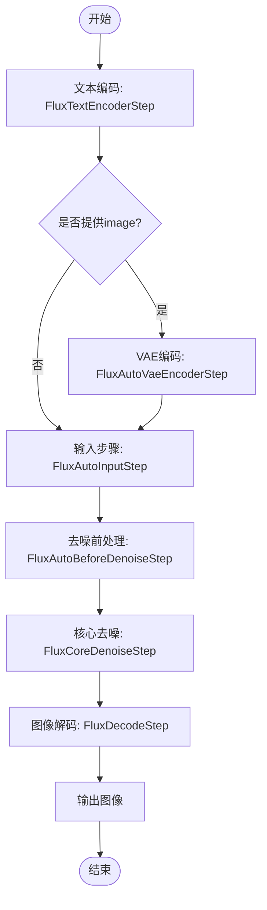

## 类结构

```
SequentialPipelineBlocks (基类)
├── FluxImg2ImgVaeEncoderStep
├── FluxBeforeDenoiseStep
├── FluxImg2ImgBeforeDenoiseStep
├── FluxImg2ImgInputStep
└── FluxCoreDenoiseStep
AutoPipelineBlocks (基类)
├── FluxAutoVaeEncoderStep
├── FluxAutoBeforeDenoiseStep
├── FluxAutoInputStep
└── FluxAutoBlocks
```

## 全局变量及字段


### `logger`
    
Logger instance for the module, used for debugging and informational messages.

类型：`logging.Logger`
    


### `AUTO_BLOCKS`
    
Dictionary holding the auto pipeline blocks for text2image and image2image workflows in Flux.

类型：`InsertableDict`
    


### `FluxImg2ImgVaeEncoderStep.model_name`
    
Identifier name for the model, set to 'flux' for Flux pipeline blocks.

类型：`str`
    


### `FluxImg2ImgVaeEncoderStep.block_classes`
    
List of pipeline step classes or instances that define the processing steps for this block.

类型：`list`
    


### `FluxImg2ImgVaeEncoderStep.block_names`
    
List of names corresponding to each block class, used for identification and logging.

类型：`list[str]`
    


### `FluxAutoVaeEncoderStep.model_name`
    
Identifier name for the model, set to 'flux' for Flux pipeline blocks.

类型：`str`
    


### `FluxAutoVaeEncoderStep.block_classes`
    
List of pipeline step classes or instances that define the processing steps for this block.

类型：`list`
    


### `FluxAutoVaeEncoderStep.block_names`
    
List of names corresponding to each block class, used for identification and logging.

类型：`list[str]`
    


### `FluxAutoVaeEncoderStep.block_trigger_inputs`
    
List of input keys that trigger selection of this block in auto pipeline; can include None for default.

类型：`list`
    


### `FluxBeforeDenoiseStep.model_name`
    
Identifier name for the model, set to 'flux' for Flux pipeline blocks.

类型：`str`
    


### `FluxBeforeDenoiseStep.block_classes`
    
List of pipeline step classes or instances that define the processing steps for this block.

类型：`list`
    


### `FluxBeforeDenoiseStep.block_names`
    
List of names corresponding to each block class, used for identification and logging.

类型：`list[str]`
    


### `FluxImg2ImgBeforeDenoiseStep.model_name`
    
Identifier name for the model, set to 'flux' for Flux pipeline blocks.

类型：`str`
    


### `FluxImg2ImgBeforeDenoiseStep.block_classes`
    
List of pipeline step classes or instances that define the processing steps for this block.

类型：`list`
    


### `FluxImg2ImgBeforeDenoiseStep.block_names`
    
List of names corresponding to each block class, used for identification and logging.

类型：`list[str]`
    


### `FluxAutoBeforeDenoiseStep.model_name`
    
Identifier name for the model, set to 'flux' for Flux pipeline blocks.

类型：`str`
    


### `FluxAutoBeforeDenoiseStep.block_classes`
    
List of pipeline step classes or instances that define the processing steps for this block.

类型：`list`
    


### `FluxAutoBeforeDenoiseStep.block_names`
    
List of names corresponding to each block class, used for identification and logging.

类型：`list[str]`
    


### `FluxAutoBeforeDenoiseStep.block_trigger_inputs`
    
List of input keys that trigger selection of this block in auto pipeline; can include None for default.

类型：`list`
    


### `FluxImg2ImgInputStep.model_name`
    
Identifier name for the model, set to 'flux' for Flux pipeline blocks.

类型：`str`
    


### `FluxImg2ImgInputStep.block_classes`
    
List of pipeline step classes or instances that define the processing steps for this block.

类型：`list`
    


### `FluxImg2ImgInputStep.block_names`
    
List of names corresponding to each block class, used for identification and logging.

类型：`list[str]`
    


### `FluxAutoInputStep.model_name`
    
Identifier name for the model, set to 'flux' for Flux pipeline blocks.

类型：`str`
    


### `FluxAutoInputStep.block_classes`
    
List of pipeline step classes or instances that define the processing steps for this block.

类型：`list`
    


### `FluxAutoInputStep.block_names`
    
List of names corresponding to each block class, used for identification and logging.

类型：`list[str]`
    


### `FluxAutoInputStep.block_trigger_inputs`
    
List of input keys that trigger selection of this block in auto pipeline; can include None for default.

类型：`list`
    


### `FluxCoreDenoiseStep.model_name`
    
Identifier name for the model, set to 'flux' for Flux pipeline blocks.

类型：`str`
    


### `FluxCoreDenoiseStep.block_classes`
    
List of pipeline step classes or instances that define the processing steps for this block.

类型：`list`
    


### `FluxCoreDenoiseStep.block_names`
    
List of names corresponding to each block class, used for identification and logging.

类型：`list[str]`
    


### `FluxAutoBlocks.model_name`
    
Identifier name for the model, set to 'flux' for Flux pipeline blocks.

类型：`str`
    


### `FluxAutoBlocks.block_classes`
    
List of pipeline step classes or instances that define the processing steps for this block.

类型：`list`
    


### `FluxAutoBlocks.block_names`
    
List of names corresponding to each block class, used for identification and logging.

类型：`list[str]`
    


### `FluxAutoBlocks._workflow_map`
    
Mapping of workflow types to required input keys, used to determine which pipeline blocks to invoke.

类型：`dict`
    
    

## 全局函数及方法


### `FluxImg2ImgVaeEncoderStep.description`

该属性方法用于返回 VAE 编码步骤的描述信息，说明该步骤负责预处理并将图像输入编码为潜在表示。

参数：无

返回值：`str`，返回该步骤的描述字符串。

#### 流程图

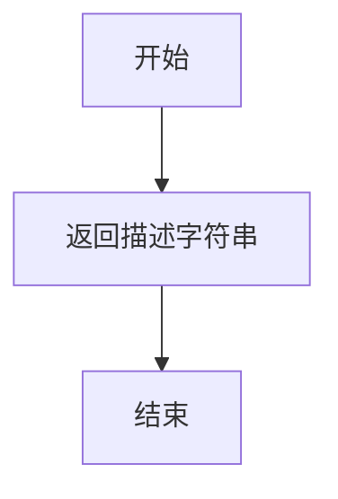

#### 带注释源码

```python
@property
def description(self) -> str:
    """
    返回 VAE 编码步骤的描述信息。
    
    该方法是一个属性（property），用于提供当前步骤的功能描述，
    主要用于文档生成和日志记录。
    
    Returns:
        str: 描述字符串，说明该步骤预处理并编码图像输入为潜在表示。
    """
    return "Vae encoder step that preprocess andencode the image inputs into their latent representations."
```


### `FluxAutoVaeEncoderStep.description`

该属性方法属于 `FluxAutoVaeEncoderStep` 类，用于返回该自动管道块的描述信息。它描述了该步骤是 VAE 编码器步骤，用于将图像输入编码为潜在表示（latent representations），并且是一个适用于 img2img 任务的自动管道块，会根据是否提供图像来动态选择是否执行编码。

参数：无（这是一个属性方法，没有输入参数）

返回值：`str`，返回该自动管道块的描述字符串，包含其功能、适用场景以及条件执行逻辑。

#### 流程图

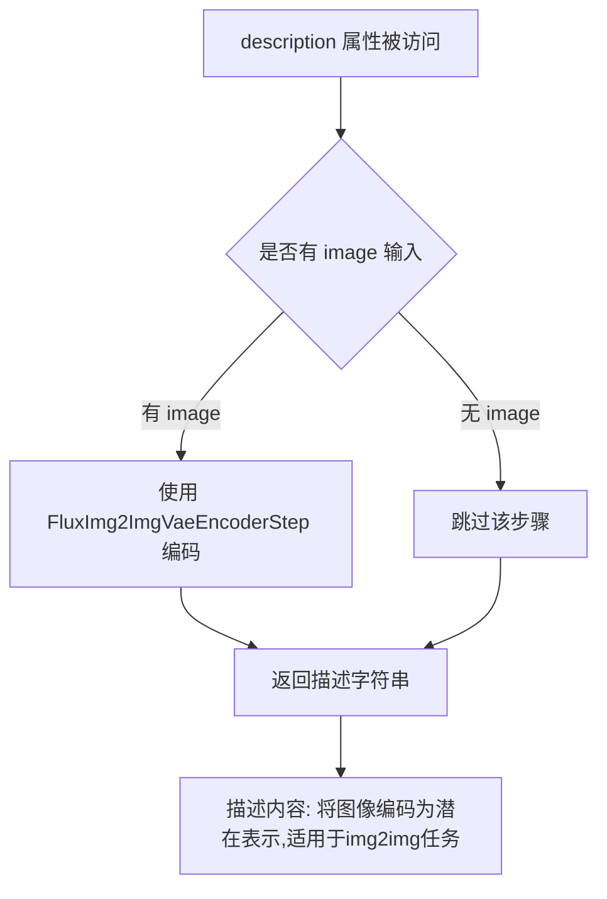

#### 带注释源码

```python
@property
def description(self):
    """
    属性方法：返回 VAE 编码器自动管道块的描述信息。
    
    该描述说明了:
    1. 该步骤的功能是将图像输入编码为潜在表示 (latent representations)
    2. 这是一个自动管道块 (AutoPipelineBlocks)，适用于 img2img 任务
    3. 当提供了 image 参数时，使用 FluxImg2ImgVaeEncoderStep 进行处理
    4. 如果没有提供 image，则跳过该步骤
    
    Returns:
        str: 包含详细功能描述的字符串
    """
    return (
        "Vae encoder step that encode the image inputs into their latent representations.\n"
        + "This is an auto pipeline block that works for img2img tasks.\n"
        + " - `FluxImg2ImgVaeEncoderStep` (img2img) is used when only `image` is provided."
        + " - if `image` is not provided, step will be skipped."
    )
```


### `FluxBeforeDenoiseStep.description`

该属性方法属于 `FluxBeforeDenoiseStep` 类，用于返回该步骤的描述信息，表明其是文本到图像生成过程中为去噪步骤准备输入的步骤。

参数：无（该方法为属性方法，无参数）

返回值：`str`，返回该步骤的描述字符串，说明其功能是"在文本到图像生成中为去噪步骤准备输入"。

#### 流程图

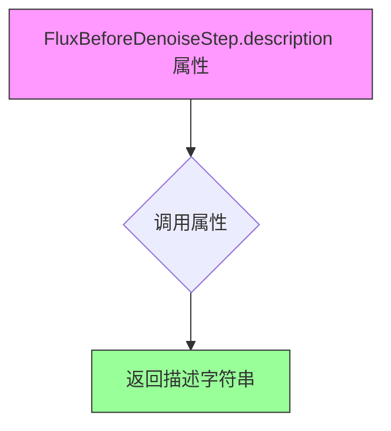

#### 带注释源码

```python
@property
def description(self):
    """
    属性方法：返回 FluxBeforeDenoiseStep 的描述信息。
    
    该方法是 Python 的 @property 装饰器方法，用于以属性访问的方式
    返回类的描述信息，而不需要调用括号。
    
    Returns:
        str: 描述字符串，说明该步骤用于在文本到图像生成中
            为去噪步骤准备输入。
    """
    return "Before denoise step that prepares the inputs for the denoise step in text-to-image generation."
```


### `FluxImg2ImgBeforeDenoiseStep.description`

该方法是 `FluxImg2ImgBeforeDenoiseStep` 类的属性方法，返回该步骤的描述字符串，用于说明该步骤的功能定位。

参数：该方法无参数

返回值：`str`，返回描述文本，说明这是为 img2img 任务的去噪步骤准备输入的前处理步骤。

#### 流程图

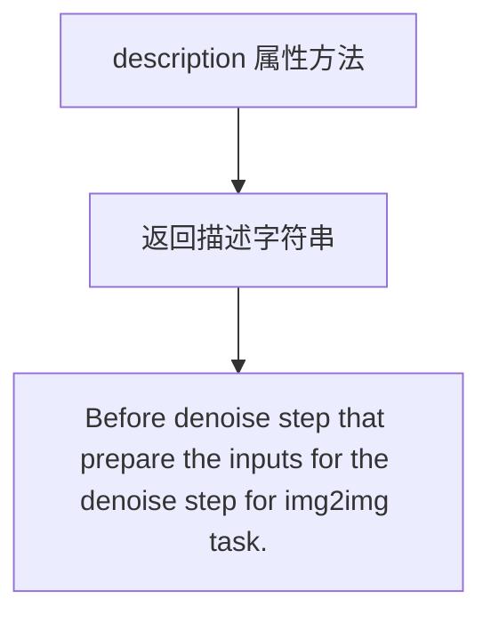

#### 带注释源码

```python
@property
def description(self):
    """
    返回该步骤的描述信息。
    
    该方法是一个属性方法（@property），用于获取 FluxImg2ImgBeforeDenoiseStep 类的描述信息。
    描述说明了该步骤是 img2img（图像到图像）任务中的前置去噪步骤，
    主要功能是为后续的去噪步骤准备必要的输入数据。
    
    Returns:
        str: 描述文本，说明该步骤的作用
    """
    return "Before denoise step that prepare the inputs for the denoise step for img2img task."
```


### `FluxAutoBeforeDenoiseStep.description`

该方法是一个属性函数（使用 `@property` 装饰器），用于返回 FluxAutoBeforeDenoiseStep 类的描述信息，说明这是一个自动管道块，用于在去噪步骤之前准备输入，支持 text2image 和 img2img 任务。

参数： 无（这是一个属性方法，不接受任何参数）

返回值： `str`，返回该类的描述字符串，说明该步骤用于准备去噪步骤的输入，支持 text2image 和 img2img 任务，并说明何时使用 FluxBeforeDenoiseStep 或 FluxImg2ImgBeforeDenoiseStep。

#### 流程图

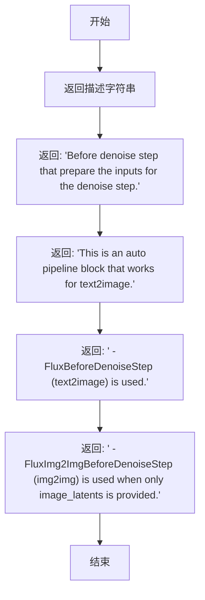

#### 带注释源码

```python
@property
def description(self):
    """
    返回该类的描述信息。
    
    该方法是一个属性方法，用于描述 FluxAutoBeforeDenoiseStep 类的功能：
    - 这是一个自动管道块，用于在去噪步骤之前准备输入
    - 支持 text2image 和 img2img 任务
    - 当提供 image_latents 时使用 FluxImg2ImgBeforeDenoiseStep
    - 否则使用 FluxBeforeDenoiseStep
    
    Returns:
        str: 描述该自动管道块功能的字符串
    """
    return (
        "Before denoise step that prepare the inputs for the denoise step.\n"
        + "This is an auto pipeline block that works for text2image.\n"
        + " - `FluxBeforeDenoiseStep` (text2image) is used.\n"
        + " - `FluxImg2ImgBeforeDenoiseStep` (img2img) is used when only `image_latents` is provided.\n"
    )
```


### `FluxImg2ImgInputStep.description`

这是一个类属性方法，返回当前步骤的描述信息，用于说明该输入步骤的主要功能。

参数：
- （无显式参数，self 为隐式参数）

返回值：`str`，返回该步骤的描述字符串，说明其功能包括：确保文本嵌入和额外输入（image_latents）具有一致的批次大小，以及根据 image_latents 更新高度/宽度并进行 patchify 处理。

#### 流程图

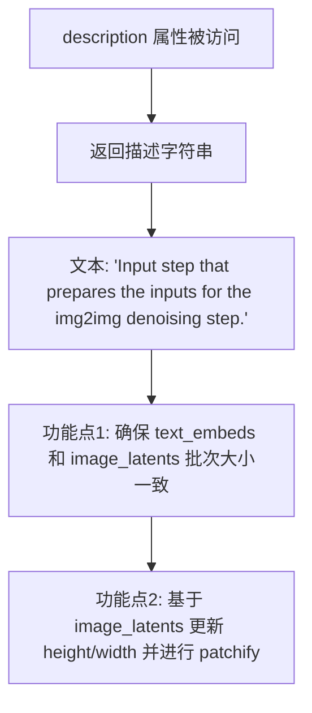

#### 带注释源码

```python
@property
def description(self) -> str:
    """
    返回该输入步骤的描述信息。
    
    该方法是一个只读属性（property），用于文档化和日志记录目的，
    描述了 FluxImg2ImgInputStep 在图像到图像（img2img）流水线中的职责。
    
    Returns:
        str: 描述文本，包含以下关键信息:
             - 步骤目的：为 img2img 去噪步骤准备输入
             - 功能1: 确保 text_embeds 和 image_latents 批次大小一致
             - 功能2: 基于 image_latents 更新图像高度/宽度并进行 patchify 处理
    """
    return "Input step that prepares the inputs for the img2img denoising step. It:\n"
    " - make sure the text embeddings have consistent batch size as well as the additional inputs (`image_latents`).\n"
    " - update height/width based `image_latents`, patchify `image_latents`."
```


### `FluxAutoInputStep.description`

返回 `FluxAutoInputStep` 类的描述属性，说明该类是用于标准化去噪步骤输入的自动管道块，支持文本到图像和图像到图像任务，并根据是否提供 `image_latents` 来选择使用 `FluxImg2ImgInputStep` 或 `FluxTextInputStep`。

参数： 无（此属性为类属性，不接受参数）

返回值： `str`，返回该步骤的描述字符串

#### 流程图

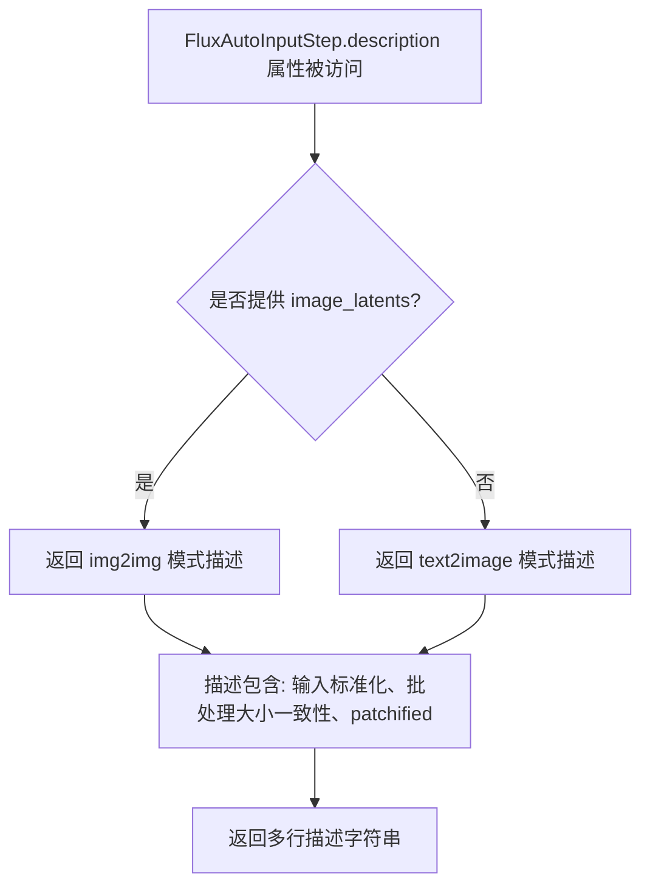

#### 带注释源码

```python
@property
def description(self):
    return (
        "Input step that standardize the inputs for the denoising step, e.g. make sure inputs have consistent batch size, and patchified. \n"
        " This is an auto pipeline block that works for text2image/img2img tasks.\n"
        + " - `FluxImg2ImgInputStep` (img2img) is used when `image_latents` is provided.\n"
        + " - `FluxTextInputStep` (text2image) is used when `image_latents` are not provided.\n"
    )
```


### `FluxCoreDenoiseStep.description`

这是一个属性方法（property），返回 FluxCoreDenoiseStep 类的描述字符串，说明该类是 Flux 模型中执行去噪过程的核心步骤，支持文本到图像和图像到图像任务。

参数：该方法没有参数（它是一个属性方法）

返回值：`str`，返回该步骤的描述文本，说明其功能是执行 Flux 的去噪过程，并支持文本到图像和图像到图像两种生成模式。

#### 流程图

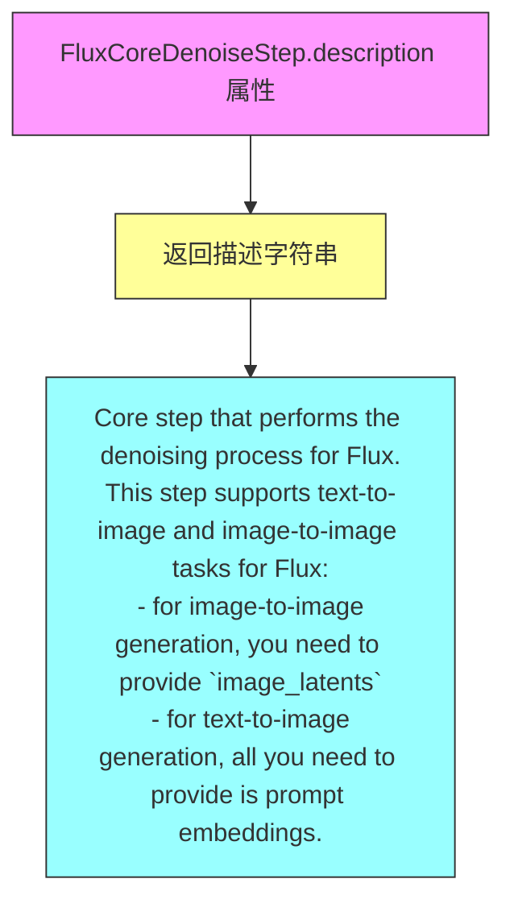

#### 带注释源码

```python
@property
def description(self):
    """
    属性方法：返回 FluxCoreDenoiseStep 类的描述信息
    
    该方法是一个只读属性（property），用于获取类的描述字符串。
    描述说明了该步骤的核心功能：
    1. 执行 Flux 模型的去噪过程
    2. 支持文本到图像（text-to-image）生成任务
    3. 支持图像到图像（image-to-image）生成任务
    
    Returns:
        str: 描述字符串，包含功能说明和支持的任务类型
        
    Example:
        >>> step = FluxCoreDenoiseStep()
        >>> print(step.description)
        Core step that performs the denoising process for Flux.
        This step supports text-to-image and image-to-image tasks for Flux:
         - for image-to-image generation, you need to provide `image_latents`
         - for text-to-image generation, all you need to provide is prompt embeddings.
    """
    return (
        "Core step that performs the denoising process for Flux.\n"
        + "This step supports text-to-image and image-to-image tasks for Flux:\n"
        + " - for image-to-image generation, you need to provide `image_latents`\n"
        + " - for text-to-image generation, all you need to provide is prompt embeddings."
    )
```


### `FluxCoreDenoiseStep.outputs`

该属性方法定义了 `FluxCoreDenoiseStep` 核心去噪步骤的输出参数规范，返回该步骤生成的输出参数列表。

参数： 无（这是一个属性方法，不需要输入参数）

返回值：`list`，返回包含 `OutputParam` 对象的列表，定义了去噪步骤的输出参数。当前返回包含一个模板参数 "latents" 的列表，表示去噪后的潜在表示张量。

#### 流程图

```mermaid
flowchart TD
    A[FluxCoreDenoiseStep.outputs 访问] --> B{返回输出参数列表}
    B --> C[OutputParam.template: latents]
    C --> D[返回列表: [OutputParam.template('latents')]]
```

#### 带注释源码

```python
@property
def outputs(self):
    """
    属性方法：定义 FluxCoreDenoiseStep 的输出参数规范
    
    该方法继承自 SequentialPipelineBlocks 基类，用于描述当前管道步骤
    运行时将产生的输出参数。在 Flux 核心去噪步骤中，输出为去噪后的
    latents（潜在表示张量），该张量将传递给后续的解码步骤（FluxDecodeStep）
    用于生成最终图像。
    
    Returns:
        list: 包含 OutputParam 对象的列表，当前只包含一个参数：
              - latents: 去噪后的潜在表示张量 (Tensor)
    """
    return [
        OutputParam.template("latents"),
    ]
```


### `FluxAutoBlocks.description`

返回 Auto Pipeline 类的描述信息，用于说明该模块是用于 Flux 模型的文本到图像和图像到图像生成的自动模块化管道。

参数：
- 该方法无参数（property 装饰器方法，仅接收 self 隐式参数）

返回值：`str`，返回管道的描述字符串，说明支持的工作流程（text2image 和 image2image）。

#### 流程图

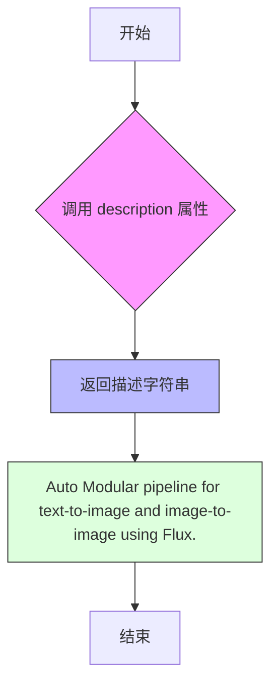

#### 带注释源码

```python
@property
def description(self):
    """
    获取 FluxAutoBlocks 类的描述信息。
    
    Returns:
        str: 返回管道的描述字符串，说明该模块是用于 Flux 模型的
             文本到图像（text-to-image）和图像到图像（image-to-image）生成的
             自动模块化管道。
    """
    return "Auto Modular pipeline for text-to-image and image-to-image using Flux."
```


### `FluxAutoBlocks.outputs`

该属性方法定义 Flux 自动模块化管道的输出参数，指定管道执行完成后返回的结果为生成的图像列表。

参数：无（仅隐含 `self` 参数）

返回值：`List[OutputParam]`，返回包含单个 `OutputParam` 对象的列表，其中 `OutputParam` 的模板值为 `"images"`，表示生成的图像列表。

#### 流程图

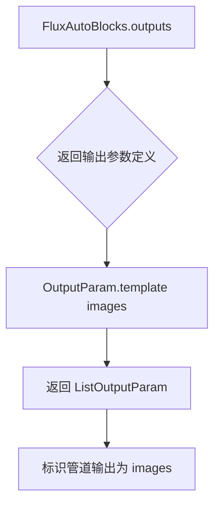

#### 带注释源码

```python
@property
def outputs(self):
    """
    定义 FluxAutoBlocks 管道模块的输出参数。
    
    该属性继承自 SequentialPipelineBlocks 基类，被 FluxAutoBlocks 重写以指定
    其特定的输出内容。返回值是一个 OutputParam 列表，告知调用方该管道的
    预期输出为 'images'（生成的图像列表）。
    
    Returns:
        List[OutputParam]: 包含输出参数定义的列表，当前定义为 ['images']
                          代表生成的图像列表
    """
    return [OutputParam.template("images")]
```

#### 补充说明

- **所属类**: `FluxAutoBlocks`，继承自 `SequentialPipelineBlocks`
- **方法类型**: 属性方法（使用 `@property` 装饰器）
- **输出语义**: 根据类的文档字符串，输出的 `images` 是生成的图像列表（`List[Image]` 或类似类型）
- **设计目的**: 该属性是模块化管道框架的一部分，用于标准化管道的输入输出接口，使调用方能够动态查询管道支持的输出类型

## 关键组件


### 张量索引与惰性加载

在 `FluxAutoVaeEncoderStep`、`FluxAutoBeforeDenoiseStep` 和 `FluxAutoInputStep` 中实现，通过 `block_trigger_inputs` 属性实现基于输入条件的惰性加载和动态任务路由。

### 反量化支持

在 `FluxImg2ImgBeforeDenoiseStep` 中处理 `image_latents`（张量），通过 `FluxImg2ImgPrepareLatentsStep` 将图像潜在表示与噪声潜在表示结合，支持图像到图像的反量化过程。

### 量化策略

通过 `AUTO_BLOCKS` 字典定义自动块结构，支持 `text2image` 和 `image2image` 两种工作流，使用 `InsertableDict` 实现灵活的块插入和任务调度。

### 模块化管道架构

`FluxAutoBlocks` 类作为顶层自动管道，整合文本编码器、VAE编码器、去噪和解码步骤，通过 `SequentialPipelineBlocks` 和 `AutoPipelineBlocks` 实现顺序和自动执行模式。

### 任务自动检测机制

在 `FluxAutoBlocks` 中通过 `_workflow_map` 属性定义工作流映射，根据 `prompt` 和 `image` 输入的存在性自动推断 `text2image` 或 `image2image` 任务类型。

### 多阶段去噪流程

`FluxCoreDenoiseStep` 整合输入预处理、去噪前准备和核心去噪步骤，通过 `FluxAutoInputStep`、`FluxAutoBeforeDenoiseStep` 和 `FluxDenoiseStep` 构成完整的去噪流水线。

### 图像到图像任务支持

`FluxImg2ImgVaeEncoderStep` 负责图像预处理和VAE编码，将输入图像转换为潜在表示；`FluxImg2ImgInputStep` 确保文本嵌入与图像潜在表示的批次大小一致。


## 问题及建议


### 已知问题

-   **大量TODO占位符**：代码中几乎所有参数和返回值描述都使用"TODO: Add description."，缺乏实际文档，存在严重的文档债务。
-   **文档字符串重复**：FluxBeforeDenoiseStep和FluxImg2ImgBeforeDenoiseStep的Inputs/Outputs部分几乎完全相同，但未被复用或提取为共享基类。
-   **类型标注不一致**：使用`Tensor | NoneType`而非Python标准习惯的`Optional[Tensor]`，且部分参数类型标注不够精确（如`dtype`未指定具体类型）。
-   **AutoPipelineBlocks的block_trigger_inputs设计不清晰**：如`block_trigger_inputs = ["image_latents", None]`的语义不直观，难以理解和维护。
-   **缺乏参数验证**：没有看到对输入参数的有效性检查（如height/width必须为正整数、guidance_scale范围等），可能导致运行时错误。
-   **默认值硬编码**：num_inference_steps=50、strength=0.6、guidance_scale=3.5等默认值散布在多个类中，未统一管理。
-   **注释与代码不同步**：如"# vae encoder (run before before_denoise)"这类注释与实际类组织可能不一致。

### 优化建议

-   **完善文档**：将所有TODO替换为有意义的参数描述，说明每个输入输出的用途和数据格式。
-   **提取公共文档**：使用组合或继承将重复的Inputs/Outputs定义抽取为可复用的模板或基类。
-   **统一类型标注**：采用`Optional[Tensor]`、`List[int]`等标准类型提示，并补充缺失的类型（如dtype）。
-   **重构AutoPipelineBlocks机制**：简化block_trigger_inputs的设计，或添加更清晰的文档说明其匹配逻辑。
-   **添加参数验证**：在每个Step的入口处添加参数校验逻辑，确保必填参数存在、数值范围合理。
-   **集中管理配置**：创建配置类或常量定义区统一管理默认参数值，便于调整和版本管理。
-   **清理注释**：移除或更新过时注释，确保注释与代码逻辑一致。

## 其它


### 设计目标与约束

本模块化Pipeline设计旨在为Flux模型提供灵活且可扩展的text-to-image和image-to-image生成能力。核心设计目标包括：(1) 支持动态流程选择，根据输入自动适配text2image或image2image工作流；(2) 实现组件解耦，各步骤（编码、去噪、解码）可独立配置和替换；(3) 提供AutoPipelineBlocks机制，实现基于输入条件的自动流程选择。设计约束方面，依赖HuggingFace Transformers库生态，要求模型组件（text_encoder、vae、transformer、scheduler）遵循统一接口规范，推理默认采用FP16精度以平衡性能与显存占用。

### 错误处理与异常设计

当前代码中TODO标记密集，表明参数校验和异常处理尚未完善。关键异常场景包括：(1) 输入验证失败 - 当prompt为空且无image_latents时应抛出ValueError；(2) 模型加载失败 - AutoPipelineBlocks在无法实例化block_classes时应捕获并提供友好错误信息；(3) 设备兼容性问题 - 当GPU显存不足时应优雅降级或提示用户。建议引入PipelineError基类，建立统一的异常处理层级，并在各Step的run方法中添加必要的参数校验逻辑。

### 数据流与状态机

数据流沿以下链路传递：用户输入(prompt/image) → FluxTextEncoderStep(文本编码) → FluxVaeEncoderStep(图像编码，可选) → FluxAutoInputStep(标准化输入) → FluxAutoBeforeDenoiseStep(准备去噪参数) → FluxDenoiseStep(核心去噪迭代) → FluxDecodeStep(latents转图像)。状态机方面存在两条工作流分支：text2image流程跳过vae_encoder和img2img相关步骤；image2image流程包含vae_encoder和额外的image_latents处理。状态转换由block_trigger_inputs条件驱动，AutoPipelineBlocks根据输入字典中的key自动选择执行路径。

### 外部依赖与接口契约

核心依赖包括：(1) diffusers库 - 提供PipelineBlocks基类(AutoPipelineBlocks、SequentialPipelineBlocks)和工具类(InsertableDict、OutputParam)；(2) transformers库 - CLIPTextModel、T5EncoderModel用于文本编码；(3) 内部模块 - before_denoise、decoders、denoise、encoders、inputs子包中的具体Step实现。接口契约规定：每个Step类需定义model_name属性、block_classes列表、block_names列表，以及description属性描述功能；输入输出通过字典传递，关键参数如prompt_embeds、latents、image_latents需在组件间保持类型一致性(Tensor)和形状兼容性。

### 配置与参数说明

全局配置通过AUTO_BLOCKS字典定义，包含四个核心组件：text_encoder(FluxTextEncoderStep)、vae_encoder(FluxAutoVaeEncoderStep)、denoise(FluxCoreDenoiseStep)、decode(FluxDecodeStep)。关键参数包括：guidance_scale(默认3.5，控制 classifier-free guidance 强度)、num_inference_steps(默认50，去噪迭代次数)、strength(默认0.6，image2img中原始图像与生成图像的混合比例)、max_sequence_length(默认512，T5文本编码的最大序列长度)。FluxAutoBlocks的_workflow_map定义了工作流触发条件：text2image仅需prompt，image2image需同时提供image和prompt。

### 性能考虑与优化

当前实现中的潜在性能瓶颈包括：(1) 重复编码 - 当多图生成时text_encoder可复用但未缓存prompt_embeds；(2) 中间张量冗余 - image_latents在img2img流程中多次传递可能产生拷贝；(3) 调度器配置 - FlowMatchEulerDiscreteScheduler的sigmas/timesteps每次推理需重新计算。优化方向可考虑：引入_embeds缓存机制减少重复计算、采用in-place操作减少内存占用、提供scheduler预配置选项以跳过运行时计算。此外，patchify_image_latents等图像预处理操作可考虑CUDA加速。

### 版本兼容性与扩展性

当前代码基于model_name="flux"硬编码，限制了跨模型复用。扩展性设计缺陷包括：(1) block_classes使用具体Step类而非字符串引用，难以动态加载；(2) 缺少自定义Step注册机制，用户难以插入自定义处理环节；(3) FluxCoreDenoiseStep耦合了input、before_denoise、denoise三个子步骤，违背单一职责原则。建议重构为更灵活的插件式架构，支持通过配置文件定义pipeline流程，并提供抽象基类供用户扩展自定义Step。

### 测试策略建议

当前代码缺少单元测试和集成测试。测试覆盖应包括：(1) 单元测试 - 验证各Step类的输入输出格式、属性定义、description方法返回值；(2) 集成测试 - 测试完整text2image和image2image流程，验证输出图像尺寸、类型符合预期；(3) 边界条件测试 - 空prompt、无image的image2img请求、极端guidance_scale值等；(4) 回归测试 - 确保AutoPipelineBlocks的block_trigger_inputs逻辑在新增Step后仍能正确路由。建议使用pytest框架，mock模型组件以加速测试执行。

### 部署与运维注意事项

生产环境部署需关注：(1) 模型下载 - 首次运行需从HuggingFace Hub下载FluxTransformer2DModel、AutoencoderKL等大模型，建议配置本地模型缓存路径；(2) 显存管理 - 长时间运行需注意PyTorch缓存清理，可通过del语句及时释放中间张量；(3) 日志监控 - 当前仅使用logging.get_logger(__name__)，建议增加关键节点的性能日志(如去噪开始/结束时间)；(4) 并发限制 - 未实现请求队列或并发控制，多用户场景需自行封装服务层进行流量管理。


    