# `diffusers\src\diffusers\modular_pipelines\flux\modular_blocks_flux_kontext.py` 详细设计文档

这是HuggingFace Diffusers库中Flux Kontext模型的模块化Pipeline实现，提供了文本到图像和图像条件生成的工作流程。通过组合多个独立的处理步骤（编码、去噪、解码）实现灵活的图像生成管道。

## 整体流程

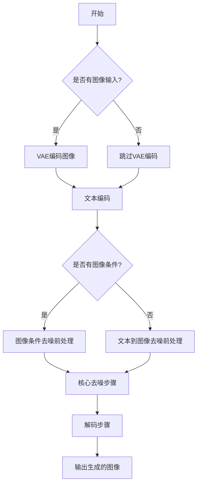

## 类结构

```
SequentialPipelineBlocks (基类)
├── FluxKontextVaeEncoderStep
├── FluxKontextBeforeDenoiseStep
├── FluxKontextImageConditionedBeforeDenoiseStep
├── FluxKontextInputStep
├── FluxKontextCoreDenoiseStep
└── FluxKontextAutoBlocks

AutoPipelineBlocks (基类)
├── FluxKontextAutoVaeEncoderStep
├── FluxKontextAutoBeforeDenoiseStep
└── FluxKontextAutoInputStep
```

## 全局变量及字段


### `logger`
    
Logger instance for the module, used for tracking runtime information and errors

类型：`logging.Logger`
    


### `AUTO_BLOCKS_KONTEXT`
    
Dictionary containing the core pipeline blocks for Flux Kontext: text_encoder, vae_encoder, denoise, and decode

类型：`InsertableDict`
    


### `FluxKontextVaeEncoderStep.model_name`
    
Identifier name for the Flux Kontext model, set to 'flux-kontext'

类型：`str`
    


### `FluxKontextVaeEncoderStep.block_classes`
    
List of pipeline block classes: FluxKontextProcessImagesInputStep and FluxVaeEncoderStep

类型：`list[PipelineBlock]`
    


### `FluxKontextVaeEncoderStep.block_names`
    
Names assigned to each block: 'preprocess' and 'encode'

类型：`list[str]`
    


### `FluxKontextAutoVaeEncoderStep.model_name`
    
Identifier name for the Flux Kontext model, set to 'flux-kontext'

类型：`str`
    


### `FluxKontextAutoVaeEncoderStep.block_classes`
    
List of auto pipeline block classes containing FluxKontextVaeEncoderStep

类型：`list[type]`
    


### `FluxKontextAutoVaeEncoderStep.block_names`
    
Names assigned to each block: 'image_conditioned'

类型：`list[str]`
    


### `FluxKontextAutoVaeEncoderStep.block_trigger_inputs`
    
Input trigger conditions for auto selection: 'image'

类型：`list[str]`
    


### `FluxKontextBeforeDenoiseStep.model_name`
    
Identifier name for the Flux Kontext model, set to 'flux-kontext'

类型：`str`
    


### `FluxKontextBeforeDenoiseStep.block_classes`
    
List of pipeline block instances: FluxPrepareLatentsStep, FluxSetTimestepsStep, and FluxRoPEInputsStep

类型：`list[PipelineBlock]`
    


### `FluxKontextBeforeDenoiseStep.block_names`
    
Names for each block: 'prepare_latents', 'set_timesteps', and 'prepare_rope_inputs'

类型：`list[str]`
    


### `FluxKontextImageConditionedBeforeDenoiseStep.model_name`
    
Identifier name for the Flux Kontext model, set to 'flux-kontext'

类型：`str`
    


### `FluxKontextImageConditionedBeforeDenoiseStep.block_classes`
    
List of pipeline block instances for image-conditioned tasks: FluxPrepareLatentsStep, FluxSetTimestepsStep, and FluxKontextRoPEInputsStep

类型：`list[PipelineBlock]`
    


### `FluxKontextImageConditionedBeforeDenoiseStep.block_names`
    
Names for each block: 'prepare_latents', 'set_timesteps', and 'prepare_rope_inputs'

类型：`list[str]`
    


### `FluxKontextAutoBeforeDenoiseStep.model_name`
    
Identifier name for the Flux Kontext model, set to 'flux-kontext'

类型：`str`
    


### `FluxKontextAutoBeforeDenoiseStep.block_classes`
    
List of auto pipeline block classes: FluxKontextImageConditionedBeforeDenoiseStep and FluxKontextBeforeDenoiseStep

类型：`list[type]`
    


### `FluxKontextAutoBeforeDenoiseStep.block_names`
    
Names for each auto block: 'image_conditioned' and 'text2image'

类型：`list[str]`
    


### `FluxKontextAutoBeforeDenoiseStep.block_trigger_inputs`
    
Input trigger conditions for auto selection: 'image_latents' or None

类型：`list[str | None]`
    


### `FluxKontextInputStep.model_name`
    
Identifier name for the Flux Kontext model, set to 'flux-kontext'

类型：`str`
    


### `FluxKontextInputStep.block_classes`
    
List of pipeline block instances: FluxKontextSetResolutionStep, FluxTextInputStep, and FluxKontextAdditionalInputsStep

类型：`list[PipelineBlock]`
    


### `FluxKontextInputStep.block_names`
    
Names for each block: 'set_resolution', 'text_inputs', and 'additional_inputs'

类型：`list[str]`
    


### `FluxKontextAutoInputStep.model_name`
    
Identifier name for the Flux Kontext model, set to 'flux-kontext'

类型：`str`
    


### `FluxKontextAutoInputStep.block_classes`
    
List of auto pipeline block classes: FluxKontextInputStep and FluxTextInputStep

类型：`list[type]`
    


### `FluxKontextAutoInputStep.block_names`
    
Names for each auto block: 'image_conditioned' and 'text2image'

类型：`list[str]`
    


### `FluxKontextAutoInputStep.block_trigger_inputs`
    
Input trigger conditions for auto selection: 'image_latents' or None

类型：`list[str | None]`
    


### `FluxKontextCoreDenoiseStep.model_name`
    
Identifier name for the Flux Kontext model, set to 'flux-kontext'

类型：`str`
    


### `FluxKontextCoreDenoiseStep.block_classes`
    
List of pipeline blocks: FluxKontextAutoInputStep, FluxKontextAutoBeforeDenoiseStep, and FluxKontextDenoiseStep

类型：`list[PipelineBlock]`
    


### `FluxKontextCoreDenoiseStep.block_names`
    
Names for each block: 'input', 'before_denoise', and 'denoise'

类型：`list[str]`
    


### `FluxKontextAutoBlocks.model_name`
    
Identifier name for the Flux Kontext model, set to 'flux-kontext'

类型：`str`
    


### `FluxKontextAutoBlocks.block_classes`
    
Collection of pipeline block instances from AUTO_BLOCKS_KONTEXT dictionary values

类型：`list[PipelineBlock]`
    


### `FluxKontextAutoBlocks.block_names`
    
Collection of block names from AUTO_BLOCKS_KONTEXT dictionary keys

类型：`list[str]`
    


### `FluxKontextAutoBlocks._workflow_map`
    
Mapping of workflow types to required inputs: image_conditioned requires image and prompt, text2image requires prompt

类型：`dict[str, dict[str, bool]]`
    
    

## 全局函数及方法


### `FluxKontextVaeEncoderStep.description`

该属性返回 VAE 编码器步骤的描述字符串，用于说明该步骤的主要功能是对图像输入进行预处理并编码为潜在表示。

参数：

- 该方法无显式参数（隐式参数 `self` 为类的实例）

返回值：`str`，返回该步骤的描述文本，说明其功能是预处理并编码图像输入为潜在表示。

#### 流程图

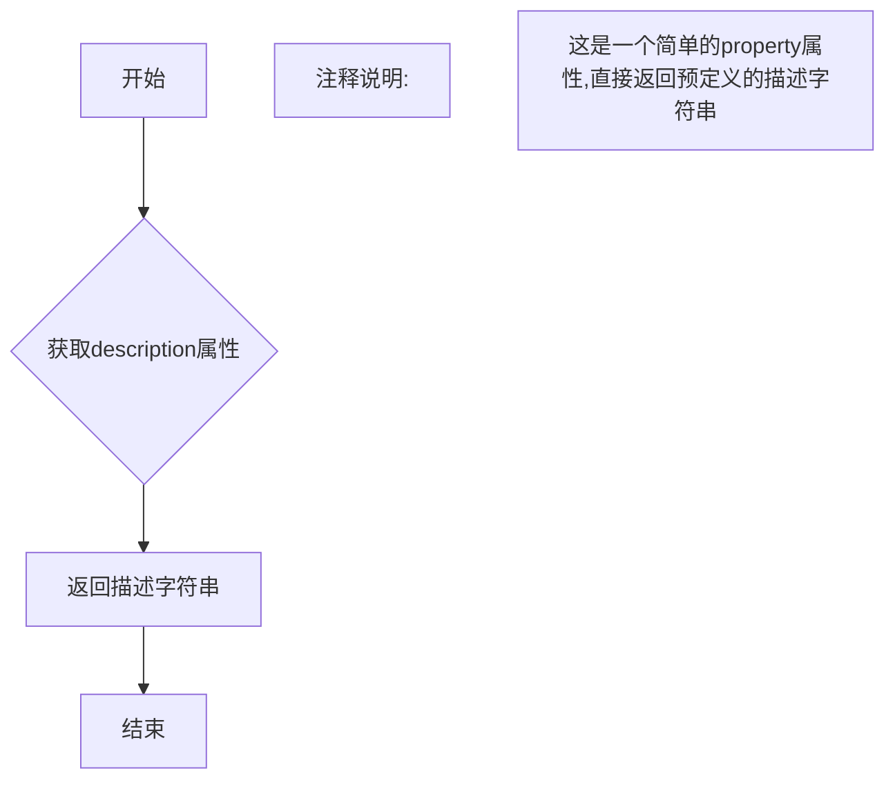

#### 带注释源码

```python
@property
def description(self) -> str:
    """
    获取该步骤的描述信息。
    
    Returns:
        str: 返回描述字符串,说明该步骤的功能是
             "Vae encoder step that preprocess andencode the image inputs 
              into their latent representations."
             (注:原文中'encode'拼写有误,应为'encode')
    """
    return "Vae encoder step that preprocess andencode the image inputs into their latent representations."
```


### `FluxKontextAutoVaeEncoderStep.description`

描述：返回该自动 pipeline 块的描述字符串，用于说明该块是一个用于图像条件任务的 VAE 编码器步骤，当提供 `image` 时使用 `FluxKontextVaeEncoderStep`，当未提供 `image` 时该步骤将被跳过。

参数：无

返回值：`str`，描述该自动 pipeline 块的功能和行为

#### 流程图

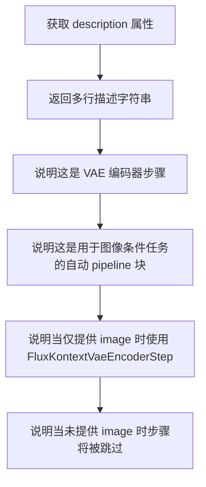

#### 带注释源码

```python
@property
def description(self):
    """
    获取该自动 pipeline 块的描述字符串。
    
    该属性返回一段多行文本，描述 FluxKontextAutoVaeEncoderStep 的功能：
    1. 这是一个 VAE 编码器步骤，用于将图像输入编码为潜在表示
    2. 这是一个自动 pipeline 块，适用于图像条件任务
    3. 当仅提供 image 参数时，使用 FluxKontextVaeEncoderStep（image_conditioned）
    4. 当未提供 image 参数时，该步骤将被跳过
    
    Returns:
        str: 描述该自动 pipeline 块功能的多行字符串
    """
    return (
        "Vae encoder step that encode the image inputs into their latent representations.\n"
        + "This is an auto pipeline block that works for image-conditioned tasks.\n"
        + " - `FluxKontextVaeEncoderStep` (image_conditioned) is used when only `image` is provided."
        + " - if `image` is not provided, step will be skipped."
    )
```


### `FluxKontextBeforeDenoiseStep.description`

该属性是FluxKontextBeforeDenoiseStep类的描述属性，用于返回该类的功能说明。它标识该类为Flux Kontext的文本到图像任务准备去噪步骤之前的输入处理模块。

参数：该属性无参数

返回值：`str`，返回该步骤的描述字符串，说明其功能是为Flux Kontext的文本到图像任务准备去噪步骤的输入。

#### 流程图

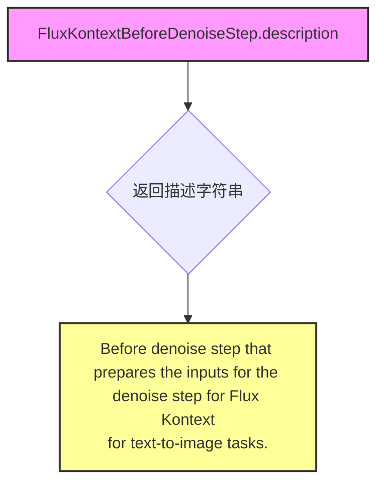

#### 带注释源码

```python
@property
def description(self):
    """
    属性描述：
        返回该类的功能描述字符串。
        
    返回值说明：
        str: 描述FluxKontextBeforeDenoiseStep类的作用，即为Flux Kontext的
            文本到图像任务准备去噪步骤所需的输入数据。
    
    注意：
        - 该属性是类FluxKontextBeforeDenoiseStep的一个property方法
        - 返回值包含换行符格式的描述信息
    """
    return "Before denoise step that prepares the inputs for the denoise step for Flux Kontext\n"
    "for text-to-image tasks."
```


### FluxKontextImageConditionedBeforeDenoiseStep.description

该方法返回对FluxKontextImageConditionedBeforeDenoiseStep类的描述，说明该类是用于Flux Kontext图像条件任务中去噪步骤之前的准备步骤。

参数：

- 无参数（这是一个属性方法）

返回值：`str`，返回描述图像条件去噪前处理步骤的字符串。

#### 流程图

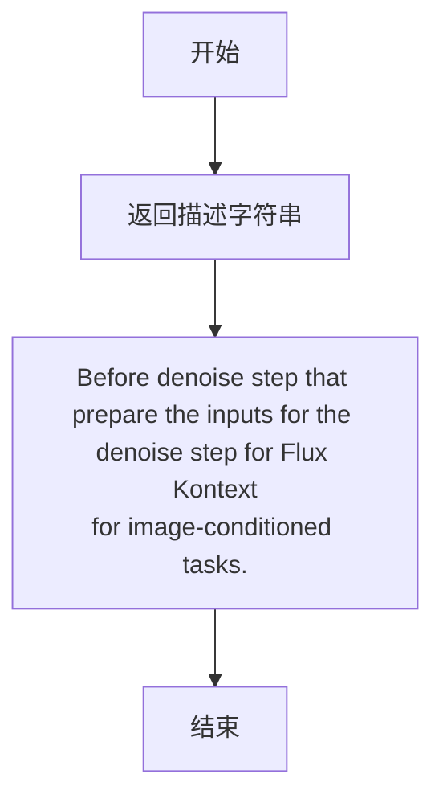

#### 带注释源码

```python
@property
def description(self):
    """
    返回该类的描述信息。
    
    这是一个属性方法（property），用于提供类的文本描述，
    说明该步骤用于Flux Kontext图像条件任务中去噪步骤之前的输入准备工作。
    
    Returns:
        str: 描述该步骤功能的字符串，说明它是用于图像条件任务
             的去噪前准备步骤。
    """
    return (
        "Before denoise step that prepare the inputs for the denoise step for Flux Kontext\n"
        "for image-conditioned tasks."
    )
```


### `FluxKontextAutoBeforeDenoiseStep.description`

这是一个属性方法（property），用于返回 FluxKontextAutoBeforeDenoiseStep 类的描述信息。该类是一个自动管道块（AutoPipelineBlocks），用于根据不同的输入条件（text2image 或 image_conditioned）选择适当的去噪前处理步骤。

参数： 无

返回值： `str`，返回该步骤的描述字符串，说明其功能和使用场景。

#### 流程图

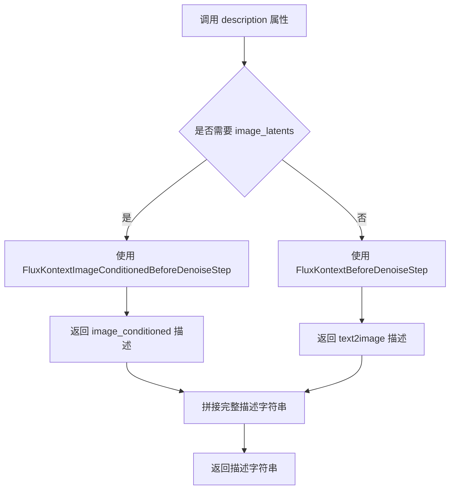

#### 带注释源码

```python
@property
def description(self):
    """
    获取该自动管道块的描述信息。
    
    该方法返回一个字符串，描述 FluxKontextAutoBeforeDenoiseStep 的功能：
    - 用于 text2image 任务时调用 FluxKontextBeforeDenoiseStep
    - 用于 image-conditioned 任务时（仅提供 image_latents）调用 FluxKontextImageConditionedBeforeDenoiseStep
    
    Returns:
        str: 描述该步骤功能和适用场景的字符串
    """
    return (
        "Before denoise step that prepare the inputs for the denoise step.\n"
        + "This is an auto pipeline block that works for text2image.\n"
        + " - `FluxKontextBeforeDenoiseStep` (text2image) is used.\n"
        + " - `FluxKontextImageConditionedBeforeDenoiseStep` (image_conditioned) is used when only `image_latents` is provided.\n"
    )
```


### `FluxKontextInputStep.description`

该属性方法用于获取 `FluxKontextInputStep` 类的描述信息，返回该输入步骤的核心功能说明。

参数：无（仅含 `self` 参数）

返回值：`str`，返回该输入步骤的描述文本，说明其用于准备文本到图像和图像到图像去噪步骤的输入，确保文本嵌入具有一致的批次大小，并根据 `image_latents` 更新高度/宽度以及对其进行 patchify 处理。

#### 流程图

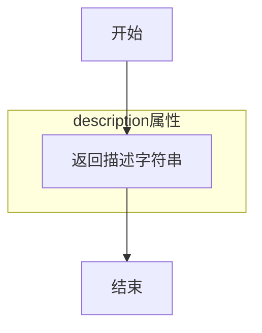

#### 带注释源码

```python
@property
def description(self):
    """
    获取 FluxKontextInputStep 类的描述信息。
    
    该方法返回一个字符串，描述了输入步骤的核心功能：
    - 确保文本嵌入与额外输入（image_latents）具有一致的批次大小
    - 基于 image_latents 更新高度/宽度
    - 对 image_latents 进行 patchify 处理
    
    Returns:
        str: 输入步骤的描述文本
    """
    return (
        "Input step that prepares the inputs for the both text2img and img2img denoising step. It:\n"
        " - make sure the text embeddings have consistent batch size as well as the additional inputs (`image_latents`).\n"
        " - update height/width based `image_latents`, patchify `image_latents`."
    )
```


### `FluxKontextAutoInputStep.description`

这是一个属性方法（property），用于获取 FluxKontextAutoInputStep 类的功能描述。该方法返回描述 Flux Kontext 输入标准化步骤的字符串，说明该步骤如何标准化去噪步骤的输入，确保输入具有一致的批处理大小，并支持图像条件任务和文本到图像任务。

参数：

- 该方法为属性方法，无显式参数（隐式接收 `self` 参数）

返回值：`str`，返回 FluxKontextAutoInputStep 的功能描述字符串

#### 流程图

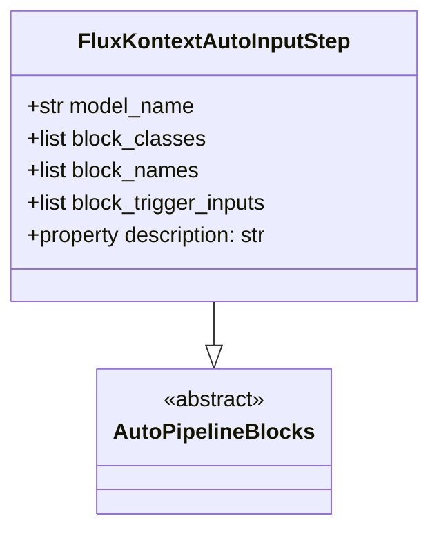

#### 带注释源码

```python
@property
def description(self):
    """
    获取 FluxKontextAutoInputStep 类的功能描述。
    
    该方法返回该输入步骤的详细描述，说明其功能包括：
    1. 标准化去噪步骤的输入（如确保输入具有一致的批处理大小）
    2. 对输入进行 patchify 处理
    3. 自动根据是否有 image_latents 来选择合适的处理策略
    
    Returns:
        str: 描述 FluxKontextAutoInputStep 功能的字符串
    """
    return (
        "Input step that standardize the inputs for the denoising step, e.g. make sure inputs have consistent batch size, and patchified. \n"
        " This is an auto pipeline block that works for text2image/img2img tasks.\n"
        + " - `FluxKontextInputStep` (image_conditioned) is used when `image_latents` is provided.\n"
        + " - `FluxKontextInputStep` is also capable of handling text2image task when `image_latent` isn't present."
    )
```


### `FluxKontextCoreDenoiseStep.description`

返回 Flux Kontext 核心降噪步骤的描述，说明该步骤执行 Flux Kontext 的去噪过程，支持文本到图像和图像条件任务。

参数：

- `self`：隐式参数，类型为 `FluxKontextCoreDenoiseStep` 实例，描述方法的拥有者

返回值：`str`，返回该核心降噪步骤的描述文本，说明其功能和支持的任务类型（image-conditioned 和 text2image）。

#### 流程图

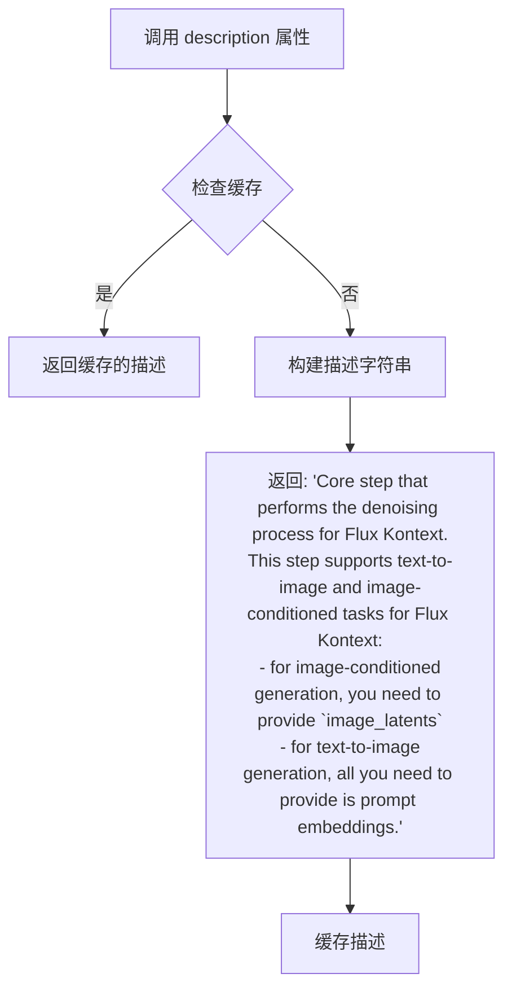

#### 带注释源码

```python
@property
def description(self):
    """
    返回 Flux Kontext 核心降噪步骤的描述。
    
    该描述说明了:
    1. 这是执行 Flux Kontext 去噪过程的核心步骤
    2. 支持两种任务类型:
       - image-conditioned generation (图像条件生成): 需要提供 image_latents
       - text2image generation (文本到图像生成): 只需要提供 prompt embeddings
    
    Returns:
        str: 步骤的描述字符串
    """
    return (
        "Core step that performs the denoising process for Flux Kontext.\n"
        + "This step supports text-to-image and image-conditioned tasks for Flux Kontext:\n"
        + " - for image-conditioned generation, you need to provide `image_latents`\n"
        + " - for text-to-image generation, all you need to provide is prompt embeddings."
    )
```


### `FluxKontextCoreDenoiseStep.outputs`

该属性用于定义 FluxKontextCoreDenoiseStep 类的输出参数，返回一个包含 OutputParam 的列表，描述该步骤的输出内容。

参数：

- `self`：`FluxKontextCoreDenoiseStep` 实例，隐式参数，无需显式传递

返回值：`List[OutputParam]`，返回一个列表，包含该步骤的输出参数信息。当前定义返回 "latents"（去噪后的潜在表示）。

#### 流程图

```mermaid
flowchart TD
    A[开始] --> B[调用 outputs 属性]
    B --> C{返回 OutputParam 列表}
    C --> D[包含 'latents' OutputParam 模板]
    D --> E[返回 List[OutputParam]]
    E --> F[结束]
    
    style A fill:#f9f,color:#333
    style F fill:#9f9,color:#333
    style E fill:#ff9,color:#333
```

#### 带注释源码

```python
@property
def outputs(self):
    """
    定义 FluxKontextCoreDenoiseStep 的输出参数。
    
    该属性返回一个列表，包含一个 OutputParam 对象，用于描述
    该去噪步骤的输出。在 FluxKontext 流程中，核心去噪步骤
    输出的主要结果是去噪后的 latents（潜在表示）。
    
    Returns:
        List[OutputParam]: 包含输出参数定义的列表。当前只包含
            一个 'latents' 参数，表示去噪后的图像潜在表示。
    
    Example:
        >>> step = FluxKontextCoreDenoiseStep()
        >>> outputs = step.outputs
        >>> print(outputs)
        # 输出: [OutputParam(template='latents')]
    """
    return [
        OutputParam.template("latents"),
    ]
```


### `FluxKontextAutoBlocks.description`

该属性返回对 FluxKontextAutoBlocks 类的描述，说明这是一个用于 Flux Kontext 图像到图像生成的模块化流水线。

参数：无（这是一个属性方法，隐式接收 `self` 参数）

返回值：`str`，返回模块化流水线的描述文本："Modular pipeline for image-to-image using Flux Kontext."

#### 流程图

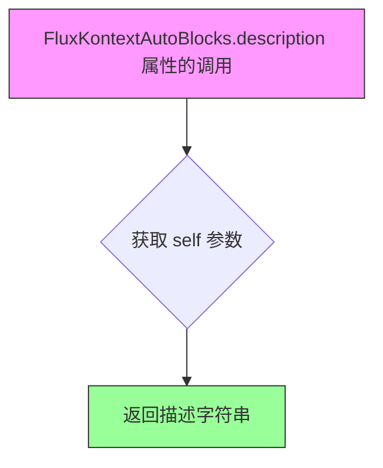

#### 带注释源码

```python
@property
def description(self):
    """
    属性方法：返回对 FluxKontextAutoBlocks 类的描述信息
    
    该方法是一个只读的 @property 装饰器方法，用于提供类的功能描述。
    不接受任何显式参数（self 是隐式的实例引用）。
    
    返回值:
        str: 描述模块化流水线功能的字符串
              - 内容："Modular pipeline for image-to-image using Flux Kontext."
              - 含义：说明该类是用于 Flux Kontext 图像到图像生成的模块化流水线
    
    使用场景:
        - 在文档生成时自动提取类描述
        - 在流水线注册时显示流水线功能说明
        - 在调试或日志中输出流水线信息
    """
    return "Modular pipeline for image-to-image using Flux Kontext."
```

#### 关联信息

该属性属于 `FluxKontextAutoBlocks` 类，该类的完整结构如下：

**类名**: `FluxKontextAutoBlocks`

**继承自**: `SequentialPipelineBlocks`

**类属性**:
- `model_name`: str = "flux-kontext"
- `block_classes`: 包含 `FluxTextEncoderStep`, `FluxKontextAutoVaeEncoderStep`, `FluxKontextCoreDenoiseStep`, `FluxDecodeStep`
- `block_names`: ["text_encoder", "vae_encoder", "denoise", "decode"]
- `_workflow_map`: 定义了 "image_conditioned" 和 "text2image" 两种工作流

**工作流**:
- `image_conditioned`: 需要 `image` 和 `prompt`
- `text2image`: 需要 `prompt`


### `FluxKontextAutoBlocks.outputs`

该属性方法定义了 FluxKontextAutoBlocks 流水线模块的输出参数，返回包含生成的图像列表的 OutputParam 对象。

参数：无

返回值：`List[OutputParam]`，返回一个包含 OutputParam 对象的列表，其中定义了输出参数 "images"，表示生成的图像列表。

#### 流程图

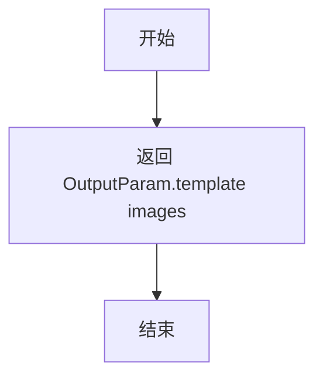

#### 带注释源码

```python
@property
def outputs(self):
    """
    定义流水线模块的输出参数。
    
    返回值：
        List[OutputParam]: 包含 OutputParam 对象的列表，
                         其中定义了输出参数 'images'，
                         表示生成的图像列表。
    """
    return [OutputParam.template("images")]
```

## 关键组件


### FluxKontextVaeEncoderStep

VAE编码器步骤，负责预处理并将图像输入编码为潜在表示，是Flux Kontext图像编码流程的核心组件。

### FluxKontextAutoVaeEncoderStep

自动VAE编码器步骤，作为AutoPipelineBlocks实现，根据输入条件自动选择是否执行编码，支持图像条件任务的动态处理。

### FluxKontextBeforeDenoiseStep

文本到图像的去噪前处理步骤，负责准备去噪所需的初始潜在向量、时间步、RoPE输入等核心参数。

### FluxKontextImageConditionedBeforeDenoiseStep

图像条件任务专用的去噪前处理步骤，在标准去噪前步骤基础上增加了图像潜在向量的处理能力。

### FluxKontextAutoBeforeDenoiseStep

智能去噪前步骤自动选择器，根据输入条件（是否存在image_latents）自动切换文本到图像或图像条件模式。

### FluxKontextInputStep

输入标准化步骤，确保文本嵌入和图像潜在向量具有一致的批量大小，并处理分辨率设置和图像分块。

### FluxKontextAutoInputStep

自动输入步骤，作为图像条件任务和文本到图像任务的统一入口，支持两种模式的自动适配。

### FluxKontextCoreDenoiseStep

Flux Kontext核心去噪步骤，集成了输入处理、去噪前准备和实际去噪过程，是整个管道的心脏。

### FluxKontextAutoBlocks

顶层模块化管道容器，整合文本编码、VAE编码、去噪和解码步骤，支持图像条件和文本到图像两种工作流。

### AUTO_BLOCKS_KONTEXT

管道组件注册表，定义了文本编码器、VAE编码器、去噪核心和解码器的执行顺序和数据流向。

### 模块化管道架构 (SequentialPipelineBlocks / AutoPipelineBlocks)

提供顺序执行和自动条件触发两种管道模式，支持基于输入参数的动态工作流选择，实现高度可配置的推理流程。


## 问题及建议


### 已知问题

-   **文档不完整**：大量 `TODO: Add description.` 占位符未填充，影响代码可维护性和可理解性
-   **字符串拼接错误**：`FluxKontextBeforeDenoiseStep.description` 属性存在字符串连接语法错误，缺少换行符或反斜杠
-   **类型标注缺失**：部分方法（如 `description`）缺少返回类型注解，影响类型安全
-   **重复代码模式**：多个 `AutoPipelineBlocks` 类（如 `FluxKontextAutoBeforeDenoiseStep`、`FluxKontextAutoInputStep`、`FluxKontextAutoVaeEncoderStep`）结构高度相似，存在代码冗余
-   **未使用的类属性**：`FluxKontextAutoBlocks` 中定义的 `_workflow_map` 属性在代码中未被引用，可能是遗留代码
-   **硬编码默认值分散**：`num_inference_steps=50`、`guidance_scale=3.5`、`max_area=1048576` 等默认值在多个类中重复出现，缺乏统一配置管理
-   **实例化方式不一致**：`FluxKontextVaeEncoderStep` 在 `block_classes` 中被实例化为对象，而其他类（如 `FluxKontextImageConditionedBeforeDenoiseStep`）作为类引用传递，这种不一致可能导致行为差异
-   **缺少输入验证**：无对无效输入（如 `height`、`width` 为负数、`prompt` 为空等）的校验逻辑
-   **命名不一致**：部分使用驼峰命名（如 `FluxKontextVaeEncoderStep`），部分使用下划线命名（如 `block_trigger_inputs`）

### 优化建议

-   补充所有 `TODO` 文档描述，确保接口清晰可维护
-   修复 `description` 属性的字符串拼接语法错误
-   为所有方法添加完整的类型注解
-   提取公共基类或使用模板模式减少 `AutoPipelineBlocks` 子类的重复代码
-   移除未使用的 `_workflow_map` 或实现其功能
-   引入配置类或常量统一管理默认参数
-   统一 `block_classes` 中类与实例的使用方式
-   添加输入参数校验和异常处理机制
-   统一命名规范，建议遵循 PEP8 下划线命名约定

## 其它


### 设计目标与约束

本模块旨在为Flux Kontext模型提供模块化的图像生成管道，支持两种主要工作流程：文本到图像生成（text2image）和图像条件生成（image_conditioned）。设计遵循以下约束：1) 保持组件的可组合性和可扩展性，通过AutoPipelineBlocks和SequentialPipelineBlocks实现动态流程选择；2) 支持可选的图像输入，当提供图像时自动切换到图像条件模式；3) 遵循Hugging Face的模块化设计规范，与现有Diffusers框架兼容；4) 限制最大图像面积为1048576像素（约1024x1024），默认推理步数为50步。

### 错误处理与异常设计

代码中主要通过TODO标记了部分参数的描述缺失，运行时错误处理依赖于底层组件（VaeImageProcessor、AutoencoderKL、FlowMatchEulerDiscreteScheduler、FluxTransformer2DModel）的异常传播。建议在以下场景添加显式错误处理：1) 当image和prompt都未提供时应抛出ValueError；2) 当图像尺寸超过max_area时应抛出ValueError并给出具体尺寸信息；3) 当VAE编码失败时应捕获异常并提供有意义的错误消息；4) 当generator与设备不匹配时应进行设备兼容性检查。

### 数据流与状态机

数据流遵循以下顺序：1) 输入阶段（FluxKontextInputStep/FluxKontextAutoInputStep）：处理prompt_embeds、pooled_prompt_embeds、image_latents，统一batch_size，处理分辨率；2) VAE编码阶段（FluxKontextVaeEncoderStep）：将输入图像编码为latent表示；3) 去噪前准备阶段（FluxKontextBeforeDenoiseStep/FluxKontextImageConditionedBeforeDenoiseStep）：准备latents、timesteps、RoPE输入；4) 核心去噪阶段（FluxKontextCoreDenoiseStep）：执行去噪循环；5) 解码阶段（FluxDecodeStep）：将latents解码为图像。工作流程通过block_trigger_inputs自动切换：image_conditioned模式需要image_latents，text2image模式仅需要prompt。

### 外部依赖与接口契约

本模块依赖以下核心组件：1) 文本编码器：CLIPTextModel和T5EncoderModel；2) VAE编码器：AutoencoderKL；3) 调度器：FlowMatchEulerDiscreteScheduler；4) Transformer：FluxTransformer2DModel；5) 图像处理器：VaeImageProcessor。接口契约要求：1) prompt_embeds必须为Tensor类型；2) image_latents必须与prompt_embeds保持相同的batch_size；3) latents的dtype由prompt_embeds决定；4) 输出图像格式由output_type参数控制（默认为pil）。

### 配置与参数说明

关键配置参数包括：1) max_area：默认1048576，限制生成图像的最大像素面积；2) num_images_per_prompt：默认1，控制每个prompt生成的图像数量；3) guidance_scale：默认3.5，控制文本引导强度；4) num_inference_steps：默认50，控制去噪步数；5) _auto_resize：默认True，自动调整输入图像尺寸；6) max_sequence_length：默认512，文本编码的最大序列长度。

### 并发与性能考虑

当前设计为顺序执行管道，未实现并行处理。性能优化建议：1) VAE编码和文本编码可以并行执行；2) 对于多图像生成场景，可以批量处理；3) 可以考虑使用torch.compile加速Transformer推理；4) 图像预处理（Resize、Normalize）可以预先计算以减少重复开销。

### 安全性考虑

代码未包含用户输入验证和恶意请求防护。建议添加：1) prompt内容过滤机制；2) 图像内容安全检查；3) 资源使用限制（最大并发数、内存限制）；4) 敏感信息脱敏处理。

### 测试策略

建议测试覆盖：1) 两种工作流程的端到端测试（text2image和image_conditioned）；2) 各Pipeline Block单元测试；3) 参数边界测试（max_area、num_images_per_prompt等）；4) 错误场景测试（缺少必要输入、类型错误等）；5) 不同输出类型测试（pil、latent、np数组）。

### 版本兼容性

代码依赖Diffusers库的最新模块化管道架构，需要确保以下版本兼容性：1) transformers库版本需支持CLIPTextModel和T5EncoderModel；2) diffusers库版本需支持FlowMatchEulerDiscreteScheduler；3) torch版本需支持相关的Tensor操作。

### 使用示例

```python
# 文本到图像生成
pipeline = FluxKontextAutoBlocks()
images = pipeline(prompt="a beautiful sunset")

# 图像条件生成
pipeline = FluxKontextAutoBlocks()
images = pipeline(prompt="a cat sitting on a bench", image=input_image)
```

    